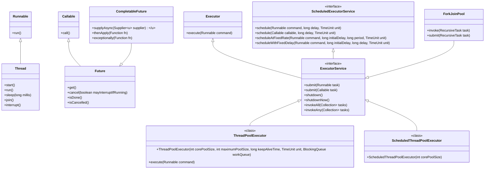

Certainly! Here’s a comprehensive set of interview questions with answers and sample code snippets related to the topics you've mentioned:

### Java and Concurrency
1. **Question**: What is the difference between `synchronized` and `volatile` in Java?
   **Answer**: `synchronized` is a keyword that ensures that only one thread can access a block of code or method at a time, providing mutual exclusion. `volatile`, on the other hand, is used to indicate that a variable's value will be modified by different threads. It ensures that the most recent value is always read from the main memory, but it does not provide mutual exclusion.

   ```java
   public class Example {
       private volatile int counter = 0;

       public void increment() {
           synchronized (this) {
               counter++;
           }
       }
   }
   ```

2. **Question**: Explain garbage collection in Java.
   **Answer**: Garbage Collection (GC) is the process of automatically freeing memory by removing objects that are no longer in use. Java provides several garbage collectors, such as the Serial GC, Parallel GC, G1 GC, and ZGC, each with different performance characteristics.

### Spring Boot and REST APIs
3. **Question**: How do you create a REST API using Spring Boot?
   **Answer**: You can create a REST API by defining a `@RestController` and using `@RequestMapping` or `@GetMapping`, `@PostMapping`, etc. annotations.

   ```java
   @RestController
   @RequestMapping("/api")
   public class UserController {

       @GetMapping("/users")
       public List<User> getAllUsers() {
           return userService.findAllUsers();
       }
       
       @PostMapping("/users")
       public User createUser(@RequestBody User user) {
           return userService.saveUser(user);
       }
   }
   ```

### JMS and EJB
4. **Question**: What is JMS, and how do you use it in a Spring Boot application?
   **Answer**: Java Message Service (JMS) is a messaging standard that allows application components to create, send, receive, and read messages. In Spring Boot, you can use Spring JMS to configure and use JMS easily.

   ```java
   @Service
   public class MessageSender {

       @Autowired
       private JmsTemplate jmsTemplate;

       public void sendMessage(String message) {
           jmsTemplate.convertAndSend("myQueue", message);
       }
   }
   ```

### DevSecOps and Tools
5. **Question**: How do you implement CI/CD using Jenkins?
   **Answer**: You can set up a Jenkins pipeline using a `Jenkinsfile`. The pipeline can define stages for building, testing, and deploying your application.

   ```groovy
   pipeline {
       agent any
       stages {
           stage('Build') {
               steps {
                   sh 'mvn clean package'
               }
           }
           stage('Test') {
               steps {
                   sh 'mvn test'
               }
           }
           stage('Deploy') {
               steps {
                   deployToServer()
               }
           }
       }
   }
   ```

### Database Concepts
6. **Question**: What are the differences between RDBMS and NoSQL databases?
   **Answer**: RDBMS (Relational Database Management System) uses structured schemas and SQL for querying, supporting ACID properties. NoSQL databases are schema-less, designed for horizontal scalability, and often use key-value, document, or column-family data models.

### Algorithms and Data Structures
7. **Question**: Can you explain how a HashMap works in Java?
   **Answer**: A `HashMap` stores key-value pairs and uses a hash function to compute an index into an array of buckets or slots, from which the desired value can be found. If two keys hash to the same index, a collision occurs, and the `HashMap` uses linked lists or balanced trees (Java 8+) to resolve this.

   ```java
   HashMap<String, Integer> map = new HashMap<>();
   map.put("Alice", 30);
   map.put("Bob", 25);
   int age = map.get("Alice");
   ```

### Microservices and Event-Driven Architecture
8. **Question**: How do you implement an event-driven architecture using Kafka?
   **Answer**: You can use Kafka as a message broker to publish and subscribe to events. Producers send messages to topics, and consumers listen to those topics.

   ```java
   @KafkaProducer
   public void sendMessage(String topic, String message) {
       kafkaTemplate.send(topic, message);
   }

   @KafkaListener(topics = "myTopic", groupId = "group_id")
   public void listen(String message) {
       System.out.println("Received message: " + message);
   }
   ```

### Performance Tuning
9. **Question**: How do you identify performance bottlenecks in a Java application?
   **Answer**: You can use profiling tools (like VisualVM, YourKit, or JProfiler) to monitor CPU and memory usage. Additionally, analyzing logs and using APM tools (like New Relic or Dynatrace) can help identify slow queries and application bottlenecks.

### Documentation and Architecture
10. **Question**: How do you create and maintain technical documentation?
    **Answer**: Use tools like Markdown or documentation generators (like Swagger for APIs) to create clear and concise documentation. Maintain an updated architecture diagram and flowcharts using tools like Lucidchart or Draw.io.

### Conclusion
These questions and answers cover a broad range of topics relevant to the skills listed in your request. Tailor your responses and examples based on your own experiences to make them more personal and impactful. Good luck with your interview preparation!

Sure! Here’s a step-by-step guide on how to use some popular Java profiling tools: **VisualVM**, **YourKit**, and **JProfiler**.

### 1. VisualVM

**Installation:**
1. **Download VisualVM**: Go to [VisualVM's website](https://visualvm.github.io/) and download the latest version.
2. **Install**: Extract the downloaded zip file to a directory of your choice.

**Profiling a Java Application:**
1. **Launch VisualVM**: Run `visualvm` from the `bin` directory.
2. **Start Your Java Application**: Ensure your application is running. You may need to add JVM options for profiling:
   - Add `-Dcom.sun.management.jmxremote` to your Java command line.
3. **Connect to the Application**:
   - In VisualVM, your application should appear in the left panel under "Local" or "Remote".
   - Double-click your application to open its monitoring dashboard.
4. **Monitor Memory and CPU Usage**:
   - Go to the "Monitor" tab to view real-time CPU and memory usage.
5. **Perform Profiling**:
   - Navigate to the "Profiler" tab.
   - Click "CPU" to start CPU profiling or "Memory" to start memory profiling.
   - Execute the parts of your application you want to analyze.
   - Click "Stop Profiling" when done, and analyze the results.
6. **View Results**:
   - Check the call tree and method usage to identify bottlenecks or memory issues.

### 2. YourKit

**Installation:**
1. **Download YourKit**: Visit [YourKit's website](https://www.yourkit.com/) and download the trial version.
2. **Install**: Follow the installation instructions provided.

**Profiling a Java Application:**
1. **Start Your Java Application**: Add YourKit agent to your application by modifying your Java command:
   ```bash
   java -agentpath:/path/to/yourkit/lib/yjpagent.so=port=10001 -jar your-application.jar
   ```
2. **Launch YourKit**: Start YourKit by executing the `YourKit` application.
3. **Connect to the Application**:
   - In YourKit, your application should appear in the "Applications" list.
   - Select your application to start profiling.
4. **Profiling CPU and Memory**:
   - Click on the "CPU" tab to analyze CPU usage.
   - Use the "Memory" tab to track memory allocation.
5. **Perform Profiling**:
   - Start CPU or memory profiling as needed.
   - Perform actions in your application you want to analyze.
6. **Analyze Results**:
   - Review the captured data to identify bottlenecks or excessive memory usage.

### 3. JProfiler

**Installation:**
1. **Download JProfiler**: Go to [JProfiler's website](https://www.ej-technologies.com/products/jprofiler/overview.html) and download it.
2. **Install**: Follow the provided instructions to complete the installation.

**Profiling a Java Application:**
1. **Start Your Java Application**: Use the JProfiler agent to profile your application by modifying your Java command:
   ```bash
   java -agentpath:/path/to/jprofiler/lib/jprofilertagent.so=port=8849 -jar your-application.jar
   ```
2. **Launch JProfiler**: Start the JProfiler application.
3. **Connect to the Application**:
   - In JProfiler, choose "Session" and then "New Session".
   - Select "Attach to a running JVM" and choose your application from the list.
4. **Monitor Performance**:
   - Use the "CPU" tab to track method calls and performance.
   - Navigate to the "Memory" tab to analyze memory usage and leaks.
5. **Perform Profiling**:
   - Start profiling for CPU or memory.
   - Execute the operations in your application you want to analyze.
6. **Analyze Results**:
   - Use the profiling data to identify high CPU usage methods, memory leaks, and more.

### Conclusion

Each of these profiling tools has its strengths and unique features. By following these steps, you can effectively profile your Java application and identify performance bottlenecks. Make sure to consult the official documentation of each tool for more advanced features and best practices! If you have further questions or need clarification on specific steps, feel free to ask!

Ambiguities in Java and Spring Boot can arise from various sources. Here are some common areas of confusion or ambiguity:

### In Java

1. **Method Overloading vs. Method Overriding**:
   - **Overloading**: Same method name, different parameters within the same class.
   - **Overriding**: Redefining a method in a subclass with the same name and parameters. The distinction can sometimes confuse developers regarding which method is being called.

2. **Generics**:
   - Understanding the bounds and wildcards (`? extends T`, `? super T`) can be confusing. The purpose and usage of these wildcards might not be immediately clear, leading to ambiguity in generic type handling.

3. **Null Handling**:
   - The behavior of `null` in Java can be ambiguous, especially with method calls or when using Optional. Understanding how null values are treated in various contexts is crucial to avoid `NullPointerExceptions`.

4. **Static vs. Instance Context**:
   - Distinguishing when to use static methods vs. instance methods can be ambiguous. Static methods belong to the class, while instance methods belong to instances of the class, which can lead to confusion regarding state management.

5. **Final Keyword**:
   - The meaning of `final` can be ambiguous depending on its context: a final variable cannot be reassigned, a final method cannot be overridden, and a final class cannot be subclassed.

### In Spring Boot

1. **Bean Scopes**:
   - Confusion can arise between different bean scopes (`singleton`, `prototype`, `request`, `session`, etc.). Understanding when to use each scope is critical, especially in web applications.

2. **Configuration Properties**:
   - The distinction between `@ConfigurationProperties` and `@Value` can be ambiguous. Both are used for external configuration, but their use cases differ, which can lead to confusion.

3. **AOP (Aspect-Oriented Programming)**:
   - Understanding how and when aspects are applied can be ambiguous, particularly with pointcuts and advice types. Misconfiguration can lead to unexpected behaviors.

4. **Spring Profiles**:
   - Using profiles to manage different environments can be ambiguous if not documented properly. Understanding how to activate and use profiles correctly is essential.

5. **Exception Handling**:
   - The various ways to handle exceptions in Spring (e.g., `@ControllerAdvice`, `@ExceptionHandler`) can create ambiguity about the best practices and proper configurations.

6. **Dependency Injection**:
   - The different forms of dependency injection (constructor injection, setter injection, method injection) can be ambiguous, especially regarding their implications for immutability and testing.

### Conclusion

To minimize ambiguity, it’s essential to have a strong understanding of both Java and Spring Boot fundamentals. Consistent code practices, thorough documentation, and leveraging community resources can also help clarify these ambiguities. If you have specific scenarios or questions in mind, feel free to ask!

To avoid ambiguities in Java and Spring Boot, here are some practical strategies:

### In Java

1. **Method Overloading vs. Method Overriding**:
   - **Clear Naming Conventions**: Use descriptive names for methods, particularly in overloaded scenarios, to make their purposes clear.
   - **Comments and Documentation**: Document method signatures clearly, specifying whether a method is overloaded or overridden.
   - **IDE Features**: Leverage your IDE's capabilities (like method hints) to show which method is being referenced.

2. **Generics**:
   - **Use Clear Type Names**: When defining generic types, use clear and descriptive names for type parameters (e.g., `<T extends Comparable<T>>`).
   - **Educate Yourself**: Familiarize yourself with generics through resources like Java documentation and tutorials to understand wildcards thoroughly.
   - **Examples and Practice**: Implement simple examples and gradually increase complexity to solidify understanding.

3. **Null Handling**:
   - **Use `Optional`**: Favor `Optional<T>` for return types that might be null to make the absence of a value explicit.
   - **Consistent Null Checks**: Implement consistent null checks throughout your code to prevent `NullPointerExceptions`.
   - **Code Reviews**: Encourage code reviews focusing on null handling practices.

4. **Static vs. Instance Context**:
   - **Use Static Wisely**: Only use static methods when state management is not required. For instance-specific behavior, prefer instance methods.
   - **Document Intent**: Clearly document the reason for using static methods when applicable, particularly in shared utility classes.

5. **Final Keyword**:
   - **Educate on Usage**: Provide guidelines on using `final` for variables, methods, and classes to convey intent and immutability clearly.
   - **Consistent Style**: Establish a coding style that favors immutability (using `final`) where appropriate.

### In Spring Boot

1. **Bean Scopes**:
   - **Documentation**: Maintain comprehensive documentation on when to use each bean scope, including examples.
   - **Use Annotations**: Clearly annotate your beans with their scopes and provide comments on their intended use.

2. **Configuration Properties**:
   - **Standardize Usage**: Decide when to use `@ConfigurationProperties` vs. `@Value` in your projects and stick to that standard across the team.
   - **Educate the Team**: Share best practices and examples through team meetings or documentation.

3. **AOP (Aspect-Oriented Programming)**:
   - **Clear Documentation**: Document aspects, pointcuts, and advice types clearly in your codebase.
   - **Start Simple**: Begin with simple aspects and gradually incorporate more complex AOP patterns as understanding improves.

4. **Spring Profiles**:
   - **Clear Naming Conventions**: Use descriptive names for profiles that reflect their purpose (e.g., `dev`, `prod`).
   - **Documentation**: Maintain a guide on how to activate and use profiles, including examples and typical use cases.

5. **Exception Handling**:
   - **Unified Exception Strategy**: Establish a consistent strategy for handling exceptions (e.g., always use `@ControllerAdvice` for REST APIs).
   - **Code Examples**: Share code snippets and examples of proper exception handling during team knowledge-sharing sessions.

6. **Dependency Injection**:
   - **Prefer Constructor Injection**: Encourage the use of constructor injection for mandatory dependencies to improve immutability.
   - **Document Injection Types**: Provide documentation explaining the implications of each type of injection and when to use them.

### Conclusion

By implementing these strategies, you can significantly reduce ambiguity in Java and Spring Boot development. Regular training, consistent documentation, and fostering a culture of knowledge sharing within your team can also help clarify these areas. If you have specific scenarios where ambiguity arises, feel free to share, and we can address them further!

Here's a detailed overview of the concepts you mentioned, along with updates and changes introduced in Java 8, 11, and 17 related to concurrency and collections.

### Key Concepts

1. **Diamond Problem**: Refers to an ambiguity that arises in multiple inheritance scenarios. In Java, this is avoided since Java doesn’t support multiple inheritance directly through classes. Instead, interfaces can have default methods that lead to ambiguity, which must be resolved.

2. **Race Condition**: Occurs when two or more threads access shared data and try to change it at the same time. Proper synchronization mechanisms (like synchronized blocks, locks, etc.) should be used to avoid this.

3. **Fail-Fast vs. Fail-Safe**:
   - **Fail-Fast**: Iterators of collections (like `ArrayList`) throw `ConcurrentModificationException` if the collection is modified during iteration.
   - **Fail-Safe**: Iterators (like `CopyOnWriteArrayList`) allow concurrent modifications without throwing exceptions, but may not reflect the latest changes.

4. **Semaphore**: A synchronization aid that allows controlling access to a shared resource through the use of permits. It can be used to manage a limited number of threads accessing a resource.

5. **Snapshot**: In concurrency, a snapshot refers to a state of a collection at a specific point in time, often used in operations where consistent read views are necessary.

6. **Thread Executor**: Part of the `java.util.concurrent` framework, it simplifies the management of thread creation and execution, allowing for efficient execution of asynchronous tasks.

### Updates in the Map Collection Framework

Java 8 introduced new features in the Map collection framework:

- **`forEach` Method**: Allows iteration over map entries with a lambda expression.
- **`computeIfAbsent` and `computeIfPresent`**: Methods to simplify updating values based on current state.
- **`merge` Method**: Combines values for a key if it already exists.

### Changes in Java Versions

Here’s a tabular summary of the changes and updates in Java 8, 11, and 17 related to concurrency and the collections framework:

| Feature/Concept             | Java 8                                          | Java 11                               | Java 17                                  |
|-----------------------------|------------------------------------------------|--------------------------------------|------------------------------------------|
| **Diamond Problem**         | Support for default methods in interfaces       | No new changes                       | No new changes                           |
| **Concurrency Framework**   | Added `CompletableFuture`, enhanced `ForkJoinPool` | Improved `HttpClient`, no major changes | New `StampsLock`, further enhancements  |
| **Fail-Fast / Fail-Safe**   | Fail-fast behavior in standard collections      | No changes                           | No changes                               |
| **Semaphore**               | Standard use in concurrency                     | No changes                           | No changes                               |
| **Snapshot**                | No built-in snapshot support                    | No changes                           | No changes                               |
| **Thread Executor**         | Introduced `Executors.newWorkStealingPool()`  | No new changes                       | Enhanced usage patterns for Executors    |
| **Map Updates**             | Added `forEach`, `computeIfAbsent`, `merge`   | `Map.ofEntries` for immutable maps  | Added `Map.copyOf` for immutable maps   |

### Conclusion

Understanding these concepts and the evolution of Java's concurrency and collections framework is crucial for developing efficient, thread-safe applications. Each version has brought improvements and new features that enhance how developers work with concurrent programming and collections in Java. If you have any further questions or need clarification on specific topics, feel free to ask!

### The Diamond Problem in Java

The **Diamond Problem** arises when a class inherits from two classes (or interfaces) that have methods with the same signature. This creates ambiguity about which method to inherit. Although Java does not support multiple inheritance through classes, it allows multiple inheritance through interfaces, which can lead to similar issues with default methods.

#### Example of the Diamond Problem

```java
interface A {
    default void show() {
        System.out.println("A's show");
    }
}

interface B extends A {
    default void show() {
        System.out.println("B's show");
    }
}

interface C extends A {
    default void show() {
        System.out.println("C's show");
    }
}

class D implements B, C {
    // Must override to resolve ambiguity
    @Override
    public void show() {
        B.super.show(); // or C.super.show();
    }
}
```

In the above example:
- `D` inherits `show` from both `B` and `C`, leading to ambiguity. 

#### Resolution

To resolve this ambiguity, the implementing class (`D` in this case) must provide its own implementation of the method, explicitly stating which interface's method it wants to call (using `InterfaceName.super.methodName()`).

### Multiple Inheritance in Functional Interfaces

Java allows multiple inheritance of types through interfaces, but functional interfaces (interfaces with a single abstract method) do not lead to the diamond problem when they are implemented.

#### Example with Functional Interfaces

```java
@FunctionalInterface
interface FuncA {
    void execute();
}

@FunctionalInterface
interface FuncB {
    void execute();
}

class FuncImpl implements FuncA, FuncB {
    @Override
    public void execute() {
        System.out.println("Executing from FuncImpl");
    }
}
```

In this example, `FuncImpl` implements both `FuncA` and `FuncB`, and provides its own implementation of the `execute` method. There is no ambiguity since functional interfaces have only one abstract method.

### Using Default and Static Methods

When several interfaces provide default methods with the same name, the implementing class must override the method to resolve the conflict.

#### Example of Default and Static Methods

```java
interface X {
    default void greet() {
        System.out.println("Hello from X");
    }
}

interface Y {
    default void greet() {
        System.out.println("Hello from Y");
    }
}

class Z implements X, Y {
    @Override
    public void greet() {
        X.super.greet(); // or Y.super.greet();
    }
}

class StaticExample {
    static void greet() {
        System.out.println("Static greeting");
    }
}
```

#### Points to Note:

- **Default Methods**: Implementing classes must provide an implementation when multiple interfaces have the same default method.
- **Static Methods**: Static methods in interfaces cannot be overridden. They can only be called by their interface name. If both interfaces have static methods with the same name, they do not cause ambiguity since they must be referenced with the interface name.

### Summary

- The Diamond Problem occurs due to ambiguity in method inheritance from multiple interfaces.
- To resolve it, the implementing class must provide its own implementation of the method.
- Functional interfaces can be implemented without ambiguity since they have only one abstract method.
- If multiple interfaces have default methods with the same name, the implementing class must override it, while static methods are accessed through the interface name and do not cause ambiguity.

If you have further questions or need clarification on any specific points, feel free to ask!

Sure! Let’s dive deep into threads, concurrency, and the differences between `HashMap` and `ConcurrentHashMap`, as well as the concepts of parallel and sequential processing using the Thread Executor framework.

### Threads and Concurrency

#### Threads
- A thread is the smallest unit of processing that can be scheduled by an operating system.
- Java allows you to create threads in two main ways:
  1. **Extending the `Thread` class**: Override the `run()` method.
  2. **Implementing the `Runnable` interface**: Implement the `run()` method and pass it to a `Thread` instance.

#### Concurrency
- Concurrency allows multiple tasks to progress simultaneously, which can lead to improved performance on multi-core processors.
- Java provides a rich set of tools in the `java.util.concurrent` package to manage concurrency, such as `ExecutorService`, `Locks`, `Semaphores`, etc.

### HashMap vs. ConcurrentHashMap

| Feature                       | HashMap                               | ConcurrentHashMap                   |
|-------------------------------|---------------------------------------|-------------------------------------|
| **Thread Safety**             | Not thread-safe                        | Thread-safe                         |
| **Concurrency Level**         | Single-threaded access                | Allows concurrent reads/writes      |
| **Synchronization**           | Locks the entire map on modification  | Uses segment locking for better performance |
| **Null Keys/Values**          | Allows one null key and multiple null values | Does not allow null keys or values  |
| **Performance**               | Faster in single-threaded scenarios    | Slower than `HashMap` for single-threaded, but performs better under concurrency |
| **Iteration**                 | Fails-fast on concurrent modification  | Supports safe iteration via `ConcurrentHashMap.Iterator` |
| **Internal Structure**        | Single array of nodes (buckets)       | Divided into segments (sub-maps)    |

#### When to Use
- Use **HashMap** when you don’t require thread safety and expect single-threaded access.
- Use **ConcurrentHashMap** for concurrent access where multiple threads need to read/write simultaneously without conflicts.

### Parallel and Sequential Processing

#### Sequential Processing
- In sequential processing, tasks are executed one after the other.
- Example:
  ```java
  for (int i = 0; i < 10; i++) {
      System.out.println(i);
  }
  ```

#### Parallel Processing
- In parallel processing, multiple tasks are executed simultaneously, often leveraging multiple cores for improved performance.
- Java 8 introduced the `ForkJoinPool` and the `Stream` API to facilitate parallel processing.
- Example using parallel streams:
  ```java
  List<Integer> numbers = Arrays.asList(1, 2, 3, 4, 5);
  numbers.parallelStream().forEach(System.out::println);
  ```

### Thread Executor Framework

#### Overview
- The Executor framework, part of the `java.util.concurrent` package, provides a higher-level replacement for the traditional way of managing threads.
- Key components include:
  - **Executor**: Interface for classes that manage and control thread execution.
  - **ExecutorService**: Extends `Executor` to provide lifecycle management methods.
  - **ScheduledExecutorService**: Allows scheduling of tasks with fixed-rate or fixed-delay execution.

#### Key Classes
1. **ThreadPoolExecutor**:
   - A flexible thread pool that can adjust the number of threads dynamically.
   - Example:
     ```java
     ExecutorService executor = Executors.newFixedThreadPool(5);
     executor.submit(() -> System.out.println("Task executed"));
     executor.shutdown();
     ```

2. **ScheduledThreadPoolExecutor**:
   - For executing tasks after a given delay or periodically.
   - Example:
     ```java
     ScheduledExecutorService scheduledExecutor = Executors.newScheduledThreadPool(1);
     scheduledExecutor.scheduleAtFixedRate(() -> System.out.println("Scheduled task"), 0, 1, TimeUnit.SECONDS);
     ```

### Comparison of Sequential and Parallel Processing

| Feature                | Sequential Processing               | Parallel Processing                     |
|------------------------|-------------------------------------|-----------------------------------------|
| **Execution**          | One task at a time                  | Multiple tasks simultaneously           |
| **Performance**        | Limited by single-thread performance | Improved performance on multi-core CPUs |
| **Complexity**         | Simpler code structure               | More complex, requires synchronization  |
| **Use Case**           | Suitable for independent tasks       | Suitable for CPU-intensive tasks        |
| **Resources**          | Less resource utilization            | More resource utilization, can lead to contention |

### Conclusion

Understanding threads, concurrency, and the differences between `HashMap` and `ConcurrentHashMap`, as well as sequential vs. parallel processing, is crucial for building efficient Java applications. The Executor framework provides a powerful way to manage concurrency and improve performance. If you have specific areas you want to explore further or have questions, feel free to ask!

The Executor framework in Java, introduced in Java 5 and enhanced in later versions, provides a powerful and flexible mechanism for managing and controlling thread execution. It abstracts the thread management process, allowing developers to focus on the task rather than the mechanics of thread creation and management. Here’s an in-depth look at the Executor framework.

### Key Components of the Executor Framework

1. **Executor Interface**
   - The simplest interface for executing tasks. It has a single method:
     ```java
     void execute(Runnable command);
     ```

2. **ExecutorService Interface**
   - Extends the `Executor` interface, adding methods for managing the lifecycle of the executor and for submitting tasks.
   - Key methods:
     - `submit(Runnable task)`: Submits a task for execution and returns a `Future` representing the pending results.
     - `invokeAll(Collection<? extends Callable<T>> tasks)`: Executes a collection of tasks and returns a list of `Future` objects.
     - `shutdown()`: Initiates an orderly shutdown.
     - `shutdownNow()`: Attempts to stop all actively executing tasks and returns a list of the tasks that were waiting to be executed.

3. **ScheduledExecutorService Interface**
   - Extends `ExecutorService` to support the execution of tasks after a given delay or periodically.
   - Key methods:
     - `schedule(Runnable command, long delay, TimeUnit unit)`: Schedules a task for execution after a delay.
     - `scheduleAtFixedRate(Runnable command, long initialDelay, long period, TimeUnit unit)`: Executes a task at a fixed rate.
     - `scheduleWithFixedDelay(Runnable command, long initialDelay, long delay, TimeUnit unit)`: Executes a task with a fixed delay between the end of one execution and the start of the next.

### Executors Factory Class

The `Executors` class provides factory methods for creating different types of thread pools:

1. **newFixedThreadPool(int nThreads)**
   - Creates a thread pool that reuses a fixed number of threads.
   - If all threads are busy, new tasks are queued until a thread becomes available.

   ```java
   ExecutorService fixedThreadPool = Executors.newFixedThreadPool(3);
   ```

2. **newCachedThreadPool()**
   - Creates a thread pool that creates new threads as needed but will reuse previously constructed threads when they are available.
   - Suitable for short-lived tasks.

   ```java
   ExecutorService cachedThreadPool = Executors.newCachedThreadPool();
   ```

3. **newSingleThreadExecutor()**
   - Creates an executor that uses a single worker thread to execute tasks sequentially.

   ```java
   ExecutorService singleThreadExecutor = Executors.newSingleThreadExecutor();
   ```

4. **newScheduledThreadPool(int corePoolSize)**
   - Creates a thread pool that can schedule commands to run after a given delay or to execute periodically.

   ```java
   ScheduledExecutorService scheduledExecutor = Executors.newScheduledThreadPool(2);
   ```

5. **newWorkStealingPool(int parallelism)**
   - Creates a pool that uses a work-stealing algorithm to balance tasks across multiple threads.

   ```java
   ExecutorService workStealingPool = Executors.newWorkStealingPool();
   ```

### Task Submission and Execution

- **Runnable and Callable**
  - `Runnable`: Represents a task that does not return a result.
  - `Callable`: Similar to `Runnable`, but can return a result and can throw checked exceptions.

  Example:
  ```java
  Callable<Integer> task = () -> {
      // Simulate some computation
      return 42;
  };
  Future<Integer> future = executorService.submit(task);
  ```

- **Future Interface**
  - Represents the result of an asynchronous computation.
  - Methods include:
    - `get()`: Waits for the computation to complete and retrieves the result.
    - `isDone()`: Checks if the task is complete.
    - `cancel(boolean mayInterruptIfRunning)`: Attempts to cancel execution.

### Thread Pool Management

- **Core and Maximum Pool Size**: You can define the core size and maximum size of the thread pool.
- **Keep Alive Time**: The time that excess idle threads will wait for new tasks before terminating.
- **Blocking Queues**: You can specify a blocking queue for holding tasks before they are executed. Common options include:
  - `ArrayBlockingQueue`
  - `LinkedBlockingQueue`
  - `SynchronousQueue`

### Example of Using Executor Framework

```java
import java.util.concurrent.*;

public class ExecutorExample {
    public static void main(String[] args) {
        ExecutorService executorService = Executors.newFixedThreadPool(2);

        // Submitting Runnable tasks
        for (int i = 0; i < 5; i++) {
            int taskNumber = i;
            executorService.submit(() -> {
                System.out.println("Executing task " + taskNumber);
                try {
                    Thread.sleep(1000); // Simulate work
                } catch (InterruptedException e) {
                    Thread.currentThread().interrupt();
                }
            });
        }

        executorService.shutdown();
        try {
            executorService.awaitTermination(1, TimeUnit.HOURS);
        } catch (InterruptedException e) {
            Thread.currentThread().interrupt();
        }
    }
}
```

### Advantages of Using the Executor Framework

1. **Simplifies Thread Management**: Abstracts the thread management complexity.
2. **Improves Code Readability**: The code is cleaner and easier to understand.
3. **Handles Task Lifecycle**: Manages task scheduling, execution, and cancellation.
4. **Flexible Configuration**: Easily configurable with different thread pool sizes and types.
5. **Built-in Support for Scheduling**: Provides built-in scheduling capabilities.

### Conclusion

The Executor framework is a vital component of Java’s concurrency support, offering a high-level mechanism for managing and executing tasks in a multithreaded environment. It allows for better resource management, simplifies code, and enhances performance in concurrent applications. If you have any further questions or need more examples, feel free to ask!

The Executor framework in Java provides several advantages over traditional thread management (creating and managing threads manually). Here are the key benefits:

### 1. **Simplified Thread Management**
   - **Abstraction**: The Executor framework abstracts away the complexities of thread creation and management, allowing developers to focus on task execution rather than thread lifecycle management.
   - **Task Submission**: You can submit tasks (Runnable or Callable) to an ExecutorService without directly managing threads.

### 2. **Improved Code Readability**
   - **Cleaner Code**: Code using the Executor framework is generally cleaner and more readable. You avoid boilerplate code associated with creating and starting threads.
   - **Focus on Business Logic**: Developers can concentrate on the logic of tasks rather than the underlying thread mechanics.

### 3. **Flexible Thread Pool Management**
   - **Dynamic Sizing**: Thread pools can be configured to have a fixed size, or they can grow/shrink dynamically based on demand (e.g., using `newCachedThreadPool()`).
   - **Core and Maximum Pool Size**: You can specify core and maximum pool sizes to optimize resource usage.

### 4. **Task Scheduling**
   - **Built-in Scheduling**: The framework provides `ScheduledExecutorService` for executing tasks after a delay or periodically, simplifying scheduling without manual timers.

### 5. **Better Resource Management**
   - **Thread Reuse**: Threads are reused for executing multiple tasks, reducing the overhead of thread creation and destruction, which can be expensive.
   - **Blocking Queues**: Executors can manage a queue of tasks, allowing you to control how tasks are executed and when to back off if system resources are limited.

### 6. **Error Handling and Task Management**
   - **Future Interface**: The framework provides the `Future` interface, allowing you to check the status of tasks, retrieve results, and handle exceptions that may occur during task execution.
   - **Graceful Shutdown**: You can gracefully shut down an ExecutorService, allowing ongoing tasks to finish and avoiding abrupt terminations.

### 7. **Scalability**
   - **Concurrent Task Execution**: Executors can handle a large number of concurrent tasks, utilizing multiple processors efficiently.
   - **Work Stealing**: The framework supports work-stealing algorithms in some thread pools, allowing idle threads to "steal" tasks from busy threads, optimizing load distribution.

### 8. **Integration with Other Java Features**
   - **CompletableFuture**: The Executor framework works seamlessly with `CompletableFuture`, enabling a more flexible and functional style of asynchronous programming.
   - **Fork/Join Framework**: The Executor framework integrates with the Fork/Join framework for efficient parallel processing of tasks.

### 9. **Customization**
   - **Custom Executors**: You can create custom executor implementations by extending the `AbstractExecutorService` class if the built-in options do not meet your needs.

### Summary

The Executor framework significantly enhances the way multithreading is handled in Java by providing a higher level of abstraction, better resource management, and improved code readability. It simplifies many aspects of concurrent programming, making it easier to develop robust, scalable, and maintainable applications. In contrast, traditional multithreading often involves more boilerplate code, greater complexity, and manual management of thread lifecycles. If you have any specific scenarios or further questions, feel free to ask!

Sure! Let’s explore the key classes and interfaces in the Executor framework, along with their methods, using code examples for better understanding.

### Key Interfaces and Classes in the Executor Framework

1. **Executor**
   - The simplest interface for executing tasks.
   - **Method**:
     ```java
     void execute(Runnable command);
     ```

   **Example**:
   ```java
   Executor executor = new Executor() {
       @Override
       public void execute(Runnable command) {
           new Thread(command).start();
       }
   };
   executor.execute(() -> System.out.println("Task executed"));
   ```

2. **ExecutorService**
   - Extends `Executor` and adds methods for managing the lifecycle of the executor.
   - **Key Methods**:
     - `submit(Runnable task)`
     - `submit(Callable<T> task)`
     - `shutdown()`
     - `shutdownNow()`
     - `invokeAll(Collection<? extends Callable<T>> tasks)`
     - `invokeAny(Collection<? extends Callable<T>> tasks)`

   **Example**:
   ```java
   ExecutorService executorService = Executors.newFixedThreadPool(2);
   executorService.submit(() -> {
       System.out.println("Task 1 executed");
   });
   executorService.shutdown();
   ```

3. **ScheduledExecutorService**
   - Extends `ExecutorService` for scheduling tasks.
   - **Key Methods**:
     - `schedule(Runnable command, long delay, TimeUnit unit)`
     - `schedule(Callable<V> callable, long delay, TimeUnit unit)`
     - `scheduleAtFixedRate(Runnable command, long initialDelay, long period, TimeUnit unit)`
     - `scheduleWithFixedDelay(Runnable command, long initialDelay, long delay, TimeUnit unit)`

   **Example**:
   ```java
   ScheduledExecutorService scheduledExecutor = Executors.newScheduledThreadPool(1);
   scheduledExecutor.schedule(() -> System.out.println("Scheduled task executed"), 2, TimeUnit.SECONDS);
   scheduledExecutor.shutdown();
   ```

4. **ThreadPoolExecutor**
   - A versatile implementation of `ExecutorService` that manages a pool of threads.
   - **Constructor**:
     ```java
     ThreadPoolExecutor(int corePoolSize, int maximumPoolSize, long keepAliveTime, TimeUnit unit, BlockingQueue<Runnable> workQueue)
     ```
   - **Key Methods**:
     - `setCorePoolSize(int corePoolSize)`
     - `setMaximumPoolSize(int maximumPoolSize)`
     - `allowCoreThreadTimeOut(boolean value)`
     - `getActiveCount()`

   **Example**:
   ```java
   ThreadPoolExecutor executor = new ThreadPoolExecutor(2, 4, 10, TimeUnit.SECONDS, new LinkedBlockingQueue<>());
   for (int i = 0; i < 6; i++) {
       int taskId = i;
       executor.submit(() -> {
           System.out.println("Executing task " + taskId);
           try {
               Thread.sleep(2000);
           } catch (InterruptedException e) {
               Thread.currentThread().interrupt();
           }
       });
   }
   executor.shutdown();
   ```

5. **Future**
   - Represents the result of an asynchronous computation.
   - **Key Methods**:
     - `get()`
     - `cancel(boolean mayInterruptIfRunning)`
     - `isDone()`
     - `isCancelled()`

   **Example**:
   ```java
   ExecutorService executorService = Executors.newSingleThreadExecutor();
   Future<Integer> future = executorService.submit(() -> {
       Thread.sleep(1000);
       return 42;
   });

   try {
       Integer result = future.get(); // Blocks until the result is available
       System.out.println("Result: " + result);
   } catch (InterruptedException | ExecutionException e) {
       e.printStackTrace();
   } finally {
       executorService.shutdown();
   }
   ```

### Advanced Usage

#### CompletableFuture
- Introduced in Java 8, it allows you to write asynchronous, non-blocking code more easily.
- **Key Methods**:
  - `supplyAsync(Supplier<U> supplier)`
  - `thenApply(Function<? super T,? extends U> fn)`
  - `exceptionally(Function<Throwable, ? extends T> fn)`
  - `thenCombine(CompletionStage<? extends U> other, BiFunction<? super T, ? super U, ? extends R> fn)`

**Example**:
```java
CompletableFuture<Integer> future = CompletableFuture.supplyAsync(() -> {
    return 1; // Simulate a long-running task
});

future.thenApply(result -> result + 1)
      .thenAccept(System.out::println); // Outputs 2

// Blocking the main thread until the future is complete
future.join();
```

### Summary of Executor Framework Methods

| Interface/Class                   | Key Methods                                          |
|-----------------------------------|-----------------------------------------------------|
| **Executor**                      | `execute(Runnable command)`                         |
| **ExecutorService**               | `submit()`, `shutdown()`, `shutdownNow()`, `invokeAll()`, `invokeAny()` |
| **ScheduledExecutorService**      | `schedule()`, `scheduleAtFixedRate()`, `scheduleWithFixedDelay()` |
| **ThreadPoolExecutor**            | `setCorePoolSize()`, `setMaximumPoolSize()`, `getActiveCount()` |
| **Future**                        | `get()`, `cancel()`, `isDone()`, `isCancelled()`   |
| **CompletableFuture**             | `supplyAsync()`, `thenApply()`, `exceptionally()`  |

### Conclusion

The Executor framework provides a robust and flexible way to handle concurrency in Java. It simplifies task execution and management, allowing developers to write cleaner and more efficient code. By using various executor types, you can easily manage thread pools, schedule tasks, and handle asynchronous operations effectively. If you have any more questions or specific scenarios you'd like to explore, feel free to ask!

Here’s a representation of the class and interface hierarchy for Java's Thread, Concurrency, and Executor frameworks using a Mermaid diagram syntax.



### Explanation of the Diagram
- **Thread**: Represents the actual thread of execution.
- **Runnable**: An interface that defines a single method `run()`.
- **Callable**: Similar to `Runnable`, but can return a result and can throw exceptions.
- **Future**: Represents the result of an asynchronous computation, providing methods for getting results and checking completion.
- **Executor**: A simple interface to execute `Runnable` tasks.
- **ExecutorService**: An extension of `Executor` that adds lifecycle management methods.
- **ScheduledExecutorService**: Extends `ExecutorService` for scheduling tasks.
- **ThreadPoolExecutor**: A concrete implementation of `ExecutorService` that manages a pool of threads.
- **ScheduledThreadPoolExecutor**: A concrete implementation that can schedule tasks.
- **ForkJoinPool**: A special type of executor for parallel processing using work-stealing.
- **CompletableFuture**: Represents a future result and allows for non-blocking, asynchronous programming.

This diagram illustrates the hierarchical relationships among the main classes and interfaces in Java's concurrency framework. If you need more details or specific aspects covered, feel free to ask!

In the Java Executor framework, there are several ways to create a thread pool using the `Executors` class. Here are the main methods:

### 1. **Fixed Thread Pool**
Creates a thread pool that reuses a fixed number of threads. If all threads are busy, additional tasks are queued.

```java
ExecutorService fixedThreadPool = Executors.newFixedThreadPool(int nThreads);
```

**Example**:
```java
ExecutorService fixedThreadPool = Executors.newFixedThreadPool(3);
```

### 2. **Cached Thread Pool**
Creates a thread pool that creates new threads as needed but will reuse previously constructed threads when they are available. Suitable for short-lived tasks.

```java
ExecutorService cachedThreadPool = Executors.newCachedThreadPool();
```

**Example**:
```java
ExecutorService cachedThreadPool = Executors.newCachedThreadPool();
```

### 3. **Single Thread Executor**
Creates an executor that uses a single worker thread to execute tasks sequentially. If that thread is busy, additional tasks are queued.

```java
ExecutorService singleThreadExecutor = Executors.newSingleThreadExecutor();
```

**Example**:
```java
ExecutorService singleThreadExecutor = Executors.newSingleThreadExecutor();
```

### 4. **Scheduled Thread Pool**
Creates a thread pool that can schedule commands to run after a given delay or to execute periodically.

```java
ScheduledExecutorService scheduledExecutor = Executors.newScheduledThreadPool(int corePoolSize);
```

**Example**:
```java
ScheduledExecutorService scheduledExecutor = Executors.newScheduledThreadPool(2);
```

### 5. **Work Stealing Pool**
Creates a pool that uses a work-stealing algorithm to balance tasks across multiple threads. It is introduced in Java 8.

```java
ExecutorService workStealingPool = Executors.newWorkStealingPool();
```

**Example**:
```java
ExecutorService workStealingPool = Executors.newWorkStealingPool();
```

### 6. **Custom Thread Pool with ThreadPoolExecutor**
You can create a custom thread pool using the `ThreadPoolExecutor` class, allowing for more fine-tuned control over the thread pool's configuration.

```java
ThreadPoolExecutor customPool = new ThreadPoolExecutor(
    int corePoolSize,
    int maximumPoolSize,
    long keepAliveTime,
    TimeUnit unit,
    BlockingQueue<Runnable> workQueue
);
```

**Example**:
```java
BlockingQueue<Runnable> workQueue = new LinkedBlockingQueue<>();
ThreadPoolExecutor customPool = new ThreadPoolExecutor(2, 4, 60, TimeUnit.SECONDS, workQueue);
```

### Summary
In summary, you can create thread pools in the Executor framework using the following methods:

1. `Executors.newFixedThreadPool()`
2. `Executors.newCachedThreadPool()`
3. `Executors.newSingleThreadExecutor()`
4. `Executors.newScheduledThreadPool()`
5. `Executors.newWorkStealingPool()`
6. Custom creation using `ThreadPoolExecutor`

These methods allow for flexible management of concurrency in Java applications. If you have further questions or need examples for specific methods, feel free to ask!

Sure! Below are complete code examples for different types of thread pools in the Java Executor framework, along with explanations of their differences and expected results.

### 1. Fixed Thread Pool

**Code Example**:
```java
import java.util.concurrent.ExecutorService;
import java.util.concurrent.Executors;

public class FixedThreadPoolExample {
    public static void main(String[] args) {
        ExecutorService fixedThreadPool = Executors.newFixedThreadPool(3);

        for (int i = 0; i < 6; i++) {
            final int taskId = i;
            fixedThreadPool.submit(() -> {
                System.out.println("Fixed Pool - Task " + taskId + " executed by " + Thread.currentThread().getName());
                try {
                    Thread.sleep(1000); // Simulate work
                } catch (InterruptedException e) {
                    Thread.currentThread().interrupt();
                }
            });
        }

        fixedThreadPool.shutdown();
    }
}
```

**Expected Output**:
```
Fixed Pool - Task 0 executed by pool-1-thread-1
Fixed Pool - Task 1 executed by pool-1-thread-2
Fixed Pool - Task 2 executed by pool-1-thread-3
Fixed Pool - Task 3 executed by pool-1-thread-1
Fixed Pool - Task 4 executed by pool-1-thread-2
Fixed Pool - Task 5 executed by pool-1-thread-3
```

### 2. Cached Thread Pool

**Code Example**:
```java
import java.util.concurrent.ExecutorService;
import java.util.concurrent.Executors;

public class CachedThreadPoolExample {
    public static void main(String[] args) {
        ExecutorService cachedThreadPool = Executors.newCachedThreadPool();

        for (int i = 0; i < 6; i++) {
            final int taskId = i;
            cachedThreadPool.submit(() -> {
                System.out.println("Cached Pool - Task " + taskId + " executed by " + Thread.currentThread().getName());
                try {
                    Thread.sleep(1000); // Simulate work
                } catch (InterruptedException e) {
                    Thread.currentThread().interrupt();
                }
            });
        }

        cachedThreadPool.shutdown();
    }
}
```

**Expected Output**:
```
Cached Pool - Task 0 executed by pool-1-thread-1
Cached Pool - Task 1 executed by pool-1-thread-2
Cached Pool - Task 2 executed by pool-1-thread-3
Cached Pool - Task 3 executed by pool-1-thread-4
Cached Pool - Task 4 executed by pool-1-thread-5
Cached Pool - Task 5 executed by pool-1-thread-6
```

### 3. Single Thread Executor

**Code Example**:
```java
import java.util.concurrent.ExecutorService;
import java.util.concurrent.Executors;

public class SingleThreadExecutorExample {
    public static void main(String[] args) {
        ExecutorService singleThreadExecutor = Executors.newSingleThreadExecutor();

        for (int i = 0; i < 6; i++) {
            final int taskId = i;
            singleThreadExecutor.submit(() -> {
                System.out.println("Single Thread Pool - Task " + taskId + " executed by " + Thread.currentThread().getName());
                try {
                    Thread.sleep(1000); // Simulate work
                } catch (InterruptedException e) {
                    Thread.currentThread().interrupt();
                }
            });
        }

        singleThreadExecutor.shutdown();
    }
}
```

**Expected Output**:
```
Single Thread Pool - Task 0 executed by pool-1-thread-1
Single Thread Pool - Task 1 executed by pool-1-thread-1
Single Thread Pool - Task 2 executed by pool-1-thread-1
Single Thread Pool - Task 3 executed by pool-1-thread-1
Single Thread Pool - Task 4 executed by pool-1-thread-1
Single Thread Pool - Task 5 executed by pool-1-thread-1
```

### 4. Scheduled Thread Pool

**Code Example**:
```java
import java.util.concurrent.Executors;
import java.util.concurrent.ScheduledExecutorService;
import java.util.concurrent.TimeUnit;

public class ScheduledThreadPoolExample {
    public static void main(String[] args) {
        ScheduledExecutorService scheduledExecutor = Executors.newScheduledThreadPool(1);

        scheduledExecutor.schedule(() -> System.out.println("Task executed after 2 seconds"), 2, TimeUnit.SECONDS);
        scheduledExecutor.scheduleAtFixedRate(() -> System.out.println("Repeated task executed"), 0, 1, TimeUnit.SECONDS);

        try {
            Thread.sleep(5000); // Allow time for tasks to run
        } catch (InterruptedException e) {
            Thread.currentThread().interrupt();
        } finally {
            scheduledExecutor.shutdown();
        }
    }
}
```

**Expected Output**:
```
Task executed after 2 seconds
Repeated task executed
Repeated task executed
Repeated task executed
Repeated task executed
```

### 5. Work Stealing Pool

**Code Example**:
```java
import java.util.concurrent.ExecutorService;
import java.util.concurrent.Executors;

public class WorkStealingPoolExample {
    public static void main(String[] args) {
        ExecutorService workStealingPool = Executors.newWorkStealingPool();

        for (int i = 0; i < 6; i++) {
            final int taskId = i;
            workStealingPool.submit(() -> {
                System.out.println("Work Stealing Pool - Task " + taskId + " executed by " + Thread.currentThread().getName());
                try {
                    Thread.sleep(1000); // Simulate work
                } catch (InterruptedException e) {
                    Thread.currentThread().interrupt();
                }
            });
        }

        workStealingPool.shutdown();
    }
}
```

**Expected Output**:
```
Work Stealing Pool - Task 0 executed by pool-1-thread-1
Work Stealing Pool - Task 1 executed by pool-1-thread-2
Work Stealing Pool - Task 2 executed by pool-1-thread-3
Work Stealing Pool - Task 3 executed by pool-1-thread-1
Work Stealing Pool - Task 4 executed by pool-1-thread-2
Work Stealing Pool - Task 5 executed by pool-1-thread-3
```

### Differences Between Thread Pools

| Feature                     | Fixed Thread Pool           | Cached Thread Pool           | Single Thread Executor      | Scheduled Thread Pool        | Work Stealing Pool           |
|-----------------------------|-----------------------------|------------------------------|-----------------------------|------------------------------|-------------------------------|
| **Thread Count**            | Fixed number of threads     | Creates new threads as needed| Only one thread             | Configurable number          | Dynamic, based on workload    |
| **Task Execution**          | Queued if all threads busy  | Queued if all threads busy   | Tasks executed sequentially  | Supports delay and periodic tasks | Steals tasks from busy threads |
| **Use Case**                | Long-running tasks          | Short-lived tasks            | Simple task execution       | Scheduling tasks             | Work distribution              |
| **Overhead**                | Moderate                    | Low, due to reuse            | Low                         | Moderate                     | Moderate                       |

### Summary

The Java Executor framework provides various ways to create and manage thread pools, each suited for different use cases. The choice of thread pool affects how tasks are executed, how resources are managed, and the overall performance of the application. If you have further questions or need specific details about any aspect, feel free to ask!

Certainly! Below is an example that demonstrates the use of threads, `Runnable`, `Callable`, `Semaphore`, and locking conditions in a multi-threading scenario.

### Scenario
We'll create a simple producer-consumer example using a semaphore to control access to a shared resource (a bounded buffer). The producer will produce items and the consumer will consume them.

### Code Example

```java
import java.util.LinkedList;
import java.util.Queue;
import java.util.concurrent.Callable;
import java.util.concurrent.ExecutorService;
import java.util.concurrent.Executors;
import java.util.concurrent.Semaphore;
import java.util.concurrent.TimeUnit;

class BoundedBuffer {
    private final Queue<Integer> buffer = new LinkedList<>();
    private final int limit;
    private final Semaphore availableItems;
    private final Semaphore availableSpaces;

    public BoundedBuffer(int limit) {
        this.limit = limit;
        this.availableItems = new Semaphore(0); // Starts with 0 items
        this.availableSpaces = new Semaphore(limit); // Starts with full capacity
    }

    public void put(int value) throws InterruptedException {
        availableSpaces.acquire(); // Wait for space to be available
        synchronized (this) {
            buffer.add(value);
            System.out.println("Produced: " + value);
        }
        availableItems.release(); // Signal that an item is available
    }

    public int take() throws InterruptedException {
        availableItems.acquire(); // Wait for items to be available
        int value;
        synchronized (this) {
            value = buffer.remove();
            System.out.println("Consumed: " + value);
        }
        availableSpaces.release(); // Signal that space is available
        return value;
    }
}

class Producer implements Runnable {
    private final BoundedBuffer buffer;

    public Producer(BoundedBuffer buffer) {
        this.buffer = buffer;
    }

    @Override
    public void run() {
        for (int i = 0; i < 10; i++) {
            try {
                buffer.put(i);
                Thread.sleep(100); // Simulate time taken to produce
            } catch (InterruptedException e) {
                Thread.currentThread().interrupt();
            }
        }
    }
}

class Consumer implements Callable<Void> {
    private final BoundedBuffer buffer;

    public Consumer(BoundedBuffer buffer) {
        this.buffer = buffer;
    }

    @Override
    public Void call() {
        for (int i = 0; i < 10; i++) {
            try {
                buffer.take();
                Thread.sleep(150); // Simulate time taken to consume
            } catch (InterruptedException e) {
                Thread.currentThread().interrupt();
            }
        }
        return null;
    }
}

public class SemaphoreExample {
    public static void main(String[] args) {
        BoundedBuffer buffer = new BoundedBuffer(5); // Buffer limit of 5
        ExecutorService executorService = Executors.newFixedThreadPool(2);

        // Start producer
        executorService.submit(new Producer(buffer));

        // Start consumer
        executorService.submit(new Consumer(buffer));

        executorService.shutdown();
        try {
            executorService.awaitTermination(1, TimeUnit.MINUTES);
        } catch (InterruptedException e) {
            Thread.currentThread().interrupt();
        }
    }
}
```

### Explanation

1. **BoundedBuffer**: This class implements a thread-safe bounded buffer using semaphores to manage the number of available items and spaces.
   - **`put(int value)`**: Adds an item to the buffer. It acquires a permit from `availableSpaces` to ensure there's space in the buffer before adding.
   - **`take()`**: Removes an item from the buffer. It acquires a permit from `availableItems` to ensure there's at least one item to consume.

2. **Producer**: This class implements `Runnable` and continuously produces items (0 to 9) and adds them to the buffer.

3. **Consumer**: This class implements `Callable` and continuously consumes items from the buffer.

4. **SemaphoreExample**: This is the main class that initializes the bounded buffer, creates the producer and consumer, and starts them in a fixed thread pool.

### Output

The expected output will show produced and consumed items, for example:
```
Produced: 0
Consumed: 0
Produced: 1
Produced: 2
Consumed: 1
...
```

### Summary

This example illustrates the use of `Runnable` for the producer, `Callable` for the consumer, and a `Semaphore` to manage access to a shared resource in a multi-threading environment. The producer adds items to the buffer, while the consumer removes items, both coordinating their actions with semaphores to ensure thread safety and proper resource management. If you have more questions or need further modifications, feel free to ask!

- **JProfiler**:You can find JProfiler's website at [www.ej-technologies.com/products/jprofiler/overview.html](https://www.ej-technologies.com/products/jprofiler/overview.html). There, you can explore features, documentation, and download options for JProfiler, which is a powerful tool for profiling Java applications. If you need specific information or help with JProfiler, let me know!

Here are the official websites for both VisualVM and YourKit:

- **VisualVM**: You can find it at [visualvm.github.io](https://visualvm.github.io). This site provides information about the tool, including download links and documentation.

Upgrading Java VisualVM
VisualVM was previously distributed in Oracle JDK 6~8 as Java VisualVM. It has been discontinued in Oracle JDK 9. The latest Oracle JDK 8 updates contain Java VisualVM based on VisualVM 1.3.9 released on October 04, 2016.

To get the latest features, improvements and security & bug fixes, we recommend upgrading to the most recent VisualVM version distributed as a standalone tool at GitHub.

Use standalone VisualVM
Standalone VisualVM provides the latest features and bugfixes in a small .zip archive or .dmg application bundle. The tool can run using various JDK distributions and Java versions.

To start using the standalone VisualVM tool, download the latest version from the Download page and run visualvm\bin\visualvm.exe on Windows or visualvm/bin/visualvm on Linux and macOS.

The JDK to run VisualVM can be customized either using visualvm --jdkhome <JDK_HOME> or by setting the visualvm_jdkhome parameter in visualvm\etc\visualvm.conf or visualvm/etc/visualvm.conf config file.

- **YourKit**: The official website is [www.yourkit.com](https://www.yourkit.com). It offers details about the features, documentation, and trial versions of YourKit Java Profiler.

If you have any questions about these tools or need further assistance, feel free to ask!

