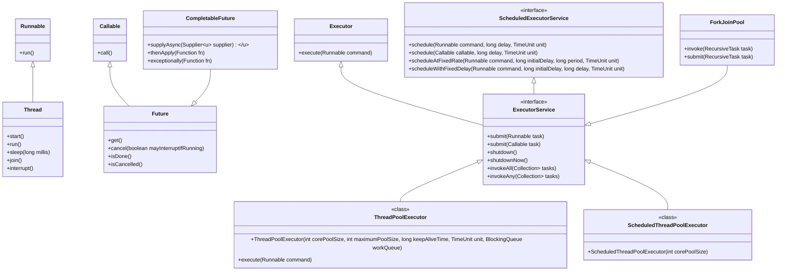

Here's a detailed overview of the concepts you mentioned, along with updates and changes introduced in Java 8, 11, and 17 related to concurrency and collections.

### The Diamond Problem in Java

The **Diamond Problem** arises when a class inherits from two classes (or interfaces) that have methods with the same signature. This creates ambiguity about which method to inherit. Although Java does not support multiple inheritance through classes, it allows multiple inheritance through interfaces, which can lead to similar issues with default methods.

#### Example of the Diamond Problem

```java
interface A {
    default void show() {
        System.out.println("A's show");
    }
}

interface B extends A {
    default void show() {
        System.out.println("B's show");
    }
}

interface C extends A {
    default void show() {
        System.out.println("C's show");
    }
}

class D implements B, C {
    // Must override to resolve ambiguity
    @Override
    public void show() {
        B.super.show(); // or C.super.show();
    }
}
```

In the above example:
- `D` inherits `show` from both `B` and `C`, leading to ambiguity. 

#### Resolution

To resolve this ambiguity, the implementing class (`D` in this case) must provide its own implementation of the method, explicitly stating which interface's method it wants to call (using `InterfaceName.super.methodName()`).

### Multiple Inheritance in Functional Interfaces

Java allows multiple inheritance of types through interfaces, but functional interfaces (interfaces with a single abstract method) do not lead to the diamond problem when they are implemented.

#### Example with Functional Interfaces

```java
@FunctionalInterface
interface FuncA {
    void execute();
}

@FunctionalInterface
interface FuncB {
    void execute();
}

class FuncImpl implements FuncA, FuncB {
    @Override
    public void execute() {
        System.out.println("Executing from FuncImpl");
    }
}
```

In this example, `FuncImpl` implements both `FuncA` and `FuncB`, and provides its own implementation of the `execute` method. There is no ambiguity since functional interfaces have only one abstract method.

### Using Default and Static Methods

When several interfaces provide default methods with the same name, the implementing class must override the method to resolve the conflict.

#### Example of Default and Static Methods

```java
interface X {
    default void greet() {
        System.out.println("Hello from X");
    }
}

interface Y {
    default void greet() {
        System.out.println("Hello from Y");
    }
}

class Z implements X, Y {
    @Override
    public void greet() {
        X.super.greet(); // or Y.super.greet();
    }
}

class StaticExample {
    static void greet() {
        System.out.println("Static greeting");
    }
}
```

#### Points to Note:

- **Default Methods**: Implementing classes must provide an implementation when multiple interfaces have the same default method.
- **Static Methods**: Static methods in interfaces cannot be overridden. They can only be called by their interface name. If both interfaces have static methods with the same name, they do not cause ambiguity since they must be referenced with the interface name.

### Summary

- The Diamond Problem occurs due to ambiguity in method inheritance from multiple interfaces.
- To resolve it, the implementing class must provide its own implementation of the method.
- Functional interfaces can be implemented without ambiguity since they have only one abstract method.
- If multiple interfaces have default methods with the same name, the implementing class must override it, while static methods are accessed through the interface name and do not cause ambiguity.

If you have further questions or need clarification on any specific points, feel free to ask!

Sure! Let’s dive deep into threads, concurrency, and the differences between `HashMap` and `ConcurrentHashMap`, as well as the concepts of parallel and sequential processing using the Thread Executor framework.

### Key Concepts

1. **Diamond Problem**: Refers to an ambiguity that arises in multiple inheritance scenarios. In Java, this is avoided since Java doesn’t support multiple inheritance directly through classes. Instead, interfaces can have default methods that lead to ambiguity, which must be resolved.

2. **Race Condition**: Occurs when two or more threads access shared data and try to change it at the same time. Proper synchronization mechanisms (like synchronized blocks, locks, etc.) should be used to avoid this.

3. **Fail-Fast vs. Fail-Safe**:
   - **Fail-Fast**: Iterators of collections (like `ArrayList`) throw `ConcurrentModificationException` if the collection is modified during iteration.
   - **Fail-Safe**: Iterators (like `CopyOnWriteArrayList`) allow concurrent modifications without throwing exceptions, but may not reflect the latest changes.

4. **Semaphore**: A synchronization aid that allows controlling access to a shared resource through the use of permits. It can be used to manage a limited number of threads accessing a resource.

5. **Snapshot**: In concurrency, a snapshot refers to a state of a collection at a specific point in time, often used in operations where consistent read views are necessary.

6. **Thread Executor**: Part of the `java.util.concurrent` framework, it simplifies the management of thread creation and execution, allowing for efficient execution of asynchronous tasks.

### Updates in the Map Collection Framework

Java 8 introduced new features in the Map collection framework:

- **`forEach` Method**: Allows iteration over map entries with a lambda expression.
- **`computeIfAbsent` and `computeIfPresent`**: Methods to simplify updating values based on current state.
- **`merge` Method**: Combines values for a key if it already exists.

### Changes in Java Versions

Here’s a tabular summary of the changes and updates in Java 8, 11, and 17 related to concurrency and the collections framework:

| Feature/Concept             | Java 8                                          | Java 11                               | Java 17                                  |
|-----------------------------|------------------------------------------------|--------------------------------------|------------------------------------------|
| **Diamond Problem**         | Support for default methods in interfaces       | No new changes                       | No new changes                           |
| **Concurrency Framework**   | Added `CompletableFuture`, enhanced `ForkJoinPool` | Improved `HttpClient`, no major changes | New `StampsLock`, further enhancements  |
| **Fail-Fast / Fail-Safe**   | Fail-fast behavior in standard collections      | No changes                           | No changes                               |
| **Semaphore**               | Standard use in concurrency                     | No changes                           | No changes                               |
| **Snapshot**                | No built-in snapshot support                    | No changes                           | No changes                               |
| **Thread Executor**         | Introduced `Executors.newWorkStealingPool()`  | No new changes                       | Enhanced usage patterns for Executors    |
| **Map Updates**             | Added `forEach`, `computeIfAbsent`, `merge`   | `Map.ofEntries` for immutable maps  | Added `Map.copyOf` for immutable maps   |

### Conclusion

Understanding these concepts and the evolution of Java's concurrency and collections framework is crucial for developing efficient, thread-safe applications. Each version has brought improvements and new features that enhance how developers work with concurrent programming and collections in Java. If you have any further questions or need clarification on specific topics, feel free to ask!


### Threads and Concurrency

#### Threads
- A thread is the smallest unit of processing that can be scheduled by an operating system.
- Java allows you to create threads in two main ways:
  1. **Extending the `Thread` class**: Override the `run()` method.
  2. **Implementing the `Runnable` interface**: Implement the `run()` method and pass it to a `Thread` instance.

#### Concurrency
- Concurrency allows multiple tasks to progress simultaneously, which can lead to improved performance on multi-core processors.
- Java provides a rich set of tools in the `java.util.concurrent` package to manage concurrency, such as `ExecutorService`, `Locks`, `Semaphores`, etc.

### HashMap vs. ConcurrentHashMap

| Feature                       | HashMap                               | ConcurrentHashMap                   |
|-------------------------------|---------------------------------------|-------------------------------------|
| **Thread Safety**             | Not thread-safe                        | Thread-safe                         |
| **Concurrency Level**         | Single-threaded access                | Allows concurrent reads/writes      |
| **Synchronization**           | Locks the entire map on modification  | Uses segment locking for better performance |
| **Null Keys/Values**          | Allows one null key and multiple null values | Does not allow null keys or values  |
| **Performance**               | Faster in single-threaded scenarios    | Slower than `HashMap` for single-threaded, but performs better under concurrency |
| **Iteration**                 | Fails-fast on concurrent modification  | Supports safe iteration via `ConcurrentHashMap.Iterator` |
| **Internal Structure**        | Single array of nodes (buckets)       | Divided into segments (sub-maps)    |

#### When to Use
- Use **HashMap** when you don’t require thread safety and expect single-threaded access.
- Use **ConcurrentHashMap** for concurrent access where multiple threads need to read/write simultaneously without conflicts.

### Parallel and Sequential Processing

#### Sequential Processing
- In sequential processing, tasks are executed one after the other.
- Example:
  ```java
  for (int i = 0; i < 10; i++) {
      System.out.println(i);
  }
  ```

#### Parallel Processing
- In parallel processing, multiple tasks are executed simultaneously, often leveraging multiple cores for improved performance.
- Java 8 introduced the `ForkJoinPool` and the `Stream` API to facilitate parallel processing.
- Example using parallel streams:
  ```java
  List<Integer> numbers = Arrays.asList(1, 2, 3, 4, 5);
  numbers.parallelStream().forEach(System.out::println);
  ```

### Thread Executor Framework

#### Overview
- The Executor framework, part of the `java.util.concurrent` package, provides a higher-level replacement for the traditional way of managing threads.
- Key components include:
  - **Executor**: Interface for classes that manage and control thread execution.
  - **ExecutorService**: Extends `Executor` to provide lifecycle management methods.
  - **ScheduledExecutorService**: Allows scheduling of tasks with fixed-rate or fixed-delay execution.

#### Key Classes
1. **ThreadPoolExecutor**:
   - A flexible thread pool that can adjust the number of threads dynamically.
   - Example:
     ```java
     ExecutorService executor = Executors.newFixedThreadPool(5);
     executor.submit(() -> System.out.println("Task executed"));
     executor.shutdown();
     ```

2. **ScheduledThreadPoolExecutor**:
   - For executing tasks after a given delay or periodically.
   - Example:
     ```java
     ScheduledExecutorService scheduledExecutor = Executors.newScheduledThreadPool(1);
     scheduledExecutor.scheduleAtFixedRate(() -> System.out.println("Scheduled task"), 0, 1, TimeUnit.SECONDS);
     ```

### Comparison of Sequential and Parallel Processing

| Feature                | Sequential Processing               | Parallel Processing                     |
|------------------------|-------------------------------------|-----------------------------------------|
| **Execution**          | One task at a time                  | Multiple tasks simultaneously           |
| **Performance**        | Limited by single-thread performance | Improved performance on multi-core CPUs |
| **Complexity**         | Simpler code structure               | More complex, requires synchronization  |
| **Use Case**           | Suitable for independent tasks       | Suitable for CPU-intensive tasks        |
| **Resources**          | Less resource utilization            | More resource utilization, can lead to contention |

### Conclusion

Understanding threads, concurrency, and the differences between `HashMap` and `ConcurrentHashMap`, as well as sequential vs. parallel processing, is crucial for building efficient Java applications. The Executor framework provides a powerful way to manage concurrency and improve performance. If you have specific areas you want to explore further or have questions, feel free to ask!

The Executor framework in Java, introduced in Java 5 and enhanced in later versions, provides a powerful and flexible mechanism for managing and controlling thread execution. It abstracts the thread management process, allowing developers to focus on the task rather than the mechanics of thread creation and management. Here’s an in-depth look at the Executor framework.

### Key Components of the Executor Framework

1. **Executor Interface**
   - The simplest interface for executing tasks. It has a single method:
     ```java
     void execute(Runnable command);
     ```

2. **ExecutorService Interface**
   - Extends the `Executor` interface, adding methods for managing the lifecycle of the executor and for submitting tasks.
   - Key methods:
     - `submit(Runnable task)`: Submits a task for execution and returns a `Future` representing the pending results.
     - `invokeAll(Collection<? extends Callable<T>> tasks)`: Executes a collection of tasks and returns a list of `Future` objects.
     - `shutdown()`: Initiates an orderly shutdown.
     - `shutdownNow()`: Attempts to stop all actively executing tasks and returns a list of the tasks that were waiting to be executed.

3. **ScheduledExecutorService Interface**
   - Extends `ExecutorService` to support the execution of tasks after a given delay or periodically.
   - Key methods:
     - `schedule(Runnable command, long delay, TimeUnit unit)`: Schedules a task for execution after a delay.
     - `scheduleAtFixedRate(Runnable command, long initialDelay, long period, TimeUnit unit)`: Executes a task at a fixed rate.
     - `scheduleWithFixedDelay(Runnable command, long initialDelay, long delay, TimeUnit unit)`: Executes a task with a fixed delay between the end of one execution and the start of the next.

### Executors Factory Class

The `Executors` class provides factory methods for creating different types of thread pools:

1. **newFixedThreadPool(int nThreads)**
   - Creates a thread pool that reuses a fixed number of threads.
   - If all threads are busy, new tasks are queued until a thread becomes available.

   ```java
   ExecutorService fixedThreadPool = Executors.newFixedThreadPool(3);
   ```

2. **newCachedThreadPool()**
   - Creates a thread pool that creates new threads as needed but will reuse previously constructed threads when they are available.
   - Suitable for short-lived tasks.

   ```java
   ExecutorService cachedThreadPool = Executors.newCachedThreadPool();
   ```

3. **newSingleThreadExecutor()**
   - Creates an executor that uses a single worker thread to execute tasks sequentially.

   ```java
   ExecutorService singleThreadExecutor = Executors.newSingleThreadExecutor();
   ```

4. **newScheduledThreadPool(int corePoolSize)**
   - Creates a thread pool that can schedule commands to run after a given delay or to execute periodically.

   ```java
   ScheduledExecutorService scheduledExecutor = Executors.newScheduledThreadPool(2);
   ```

5. **newWorkStealingPool(int parallelism)**
   - Creates a pool that uses a work-stealing algorithm to balance tasks across multiple threads.

   ```java
   ExecutorService workStealingPool = Executors.newWorkStealingPool();
   ```

### Task Submission and Execution

- **Runnable and Callable**
  - `Runnable`: Represents a task that does not return a result.
  - `Callable`: Similar to `Runnable`, but can return a result and can throw checked exceptions.

  Example:
  ```java
  Callable<Integer> task = () -> {
      // Simulate some computation
      return 42;
  };
  Future<Integer> future = executorService.submit(task);
  ```

- **Future Interface**
  - Represents the result of an asynchronous computation.
  - Methods include:
    - `get()`: Waits for the computation to complete and retrieves the result.
    - `isDone()`: Checks if the task is complete.
    - `cancel(boolean mayInterruptIfRunning)`: Attempts to cancel execution.

### Thread Pool Management

- **Core and Maximum Pool Size**: You can define the core size and maximum size of the thread pool.
- **Keep Alive Time**: The time that excess idle threads will wait for new tasks before terminating.
- **Blocking Queues**: You can specify a blocking queue for holding tasks before they are executed. Common options include:
  - `ArrayBlockingQueue`
  - `LinkedBlockingQueue`
  - `SynchronousQueue`

### Example of Using Executor Framework

```java
import java.util.concurrent.*;

public class ExecutorExample {
    public static void main(String[] args) {
        ExecutorService executorService = Executors.newFixedThreadPool(2);

        // Submitting Runnable tasks
        for (int i = 0; i < 5; i++) {
            int taskNumber = i;
            executorService.submit(() -> {
                System.out.println("Executing task " + taskNumber);
                try {
                    Thread.sleep(1000); // Simulate work
                } catch (InterruptedException e) {
                    Thread.currentThread().interrupt();
                }
            });
        }

        executorService.shutdown();
        try {
            executorService.awaitTermination(1, TimeUnit.HOURS);
        } catch (InterruptedException e) {
            Thread.currentThread().interrupt();
        }
    }
}
```

### Advantages of Using the Executor Framework

1. **Simplifies Thread Management**: Abstracts the thread management complexity.
2. **Improves Code Readability**: The code is cleaner and easier to understand.
3. **Handles Task Lifecycle**: Manages task scheduling, execution, and cancellation.
4. **Flexible Configuration**: Easily configurable with different thread pool sizes and types.
5. **Built-in Support for Scheduling**: Provides built-in scheduling capabilities.

### Conclusion

The Executor framework is a vital component of Java’s concurrency support, offering a high-level mechanism for managing and executing tasks in a multithreaded environment. It allows for better resource management, simplifies code, and enhances performance in concurrent applications. If you have any further questions or need more examples, feel free to ask!

The Executor framework in Java provides several advantages over traditional thread management (creating and managing threads manually). Here are the key benefits:

### 1. **Simplified Thread Management**
   - **Abstraction**: The Executor framework abstracts away the complexities of thread creation and management, allowing developers to focus on task execution rather than thread lifecycle management.
   - **Task Submission**: You can submit tasks (Runnable or Callable) to an ExecutorService without directly managing threads.

### 2. **Improved Code Readability**
   - **Cleaner Code**: Code using the Executor framework is generally cleaner and more readable. You avoid boilerplate code associated with creating and starting threads.
   - **Focus on Business Logic**: Developers can concentrate on the logic of tasks rather than the underlying thread mechanics.

### 3. **Flexible Thread Pool Management**
   - **Dynamic Sizing**: Thread pools can be configured to have a fixed size, or they can grow/shrink dynamically based on demand (e.g., using `newCachedThreadPool()`).
   - **Core and Maximum Pool Size**: You can specify core and maximum pool sizes to optimize resource usage.

### 4. **Task Scheduling**
   - **Built-in Scheduling**: The framework provides `ScheduledExecutorService` for executing tasks after a delay or periodically, simplifying scheduling without manual timers.

### 5. **Better Resource Management**
   - **Thread Reuse**: Threads are reused for executing multiple tasks, reducing the overhead of thread creation and destruction, which can be expensive.
   - **Blocking Queues**: Executors can manage a queue of tasks, allowing you to control how tasks are executed and when to back off if system resources are limited.

### 6. **Error Handling and Task Management**
   - **Future Interface**: The framework provides the `Future` interface, allowing you to check the status of tasks, retrieve results, and handle exceptions that may occur during task execution.
   - **Graceful Shutdown**: You can gracefully shut down an ExecutorService, allowing ongoing tasks to finish and avoiding abrupt terminations.

### 7. **Scalability**
   - **Concurrent Task Execution**: Executors can handle a large number of concurrent tasks, utilizing multiple processors efficiently.
   - **Work Stealing**: The framework supports work-stealing algorithms in some thread pools, allowing idle threads to "steal" tasks from busy threads, optimizing load distribution.

### 8. **Integration with Other Java Features**
   - **CompletableFuture**: The Executor framework works seamlessly with `CompletableFuture`, enabling a more flexible and functional style of asynchronous programming.
   - **Fork/Join Framework**: The Executor framework integrates with the Fork/Join framework for efficient parallel processing of tasks.

### 9. **Customization**
   - **Custom Executors**: You can create custom executor implementations by extending the `AbstractExecutorService` class if the built-in options do not meet your needs.

### Summary

The Executor framework significantly enhances the way multithreading is handled in Java by providing a higher level of abstraction, better resource management, and improved code readability. It simplifies many aspects of concurrent programming, making it easier to develop robust, scalable, and maintainable applications. In contrast, traditional multithreading often involves more boilerplate code, greater complexity, and manual management of thread lifecycles. If you have any specific scenarios or further questions, feel free to ask!

Sure! Let’s explore the key classes and interfaces in the Executor framework, along with their methods, using code examples for better understanding.

### Key Interfaces and Classes in the Executor Framework

1. **Executor**
   - The simplest interface for executing tasks.
   - **Method**:
     ```java
     void execute(Runnable command);
     ```

   **Example**:
   ```java
   Executor executor = new Executor() {
       @Override
       public void execute(Runnable command) {
           new Thread(command).start();
       }
   };
   executor.execute(() -> System.out.println("Task executed"));
   ```

2. **ExecutorService**
   - Extends `Executor` and adds methods for managing the lifecycle of the executor.
   - **Key Methods**:
     - `submit(Runnable task)`
     - `submit(Callable<T> task)`
     - `shutdown()`
     - `shutdownNow()`
     - `invokeAll(Collection<? extends Callable<T>> tasks)`
     - `invokeAny(Collection<? extends Callable<T>> tasks)`

   **Example**:
   ```java
   ExecutorService executorService = Executors.newFixedThreadPool(2);
   executorService.submit(() -> {
       System.out.println("Task 1 executed");
   });
   executorService.shutdown();
   ```

3. **ScheduledExecutorService**
   - Extends `ExecutorService` for scheduling tasks.
   - **Key Methods**:
     - `schedule(Runnable command, long delay, TimeUnit unit)`
     - `schedule(Callable<V> callable, long delay, TimeUnit unit)`
     - `scheduleAtFixedRate(Runnable command, long initialDelay, long period, TimeUnit unit)`
     - `scheduleWithFixedDelay(Runnable command, long initialDelay, long delay, TimeUnit unit)`

   **Example**:
   ```java
   ScheduledExecutorService scheduledExecutor = Executors.newScheduledThreadPool(1);
   scheduledExecutor.schedule(() -> System.out.println("Scheduled task executed"), 2, TimeUnit.SECONDS);
   scheduledExecutor.shutdown();
   ```

4. **ThreadPoolExecutor**
   - A versatile implementation of `ExecutorService` that manages a pool of threads.
   - **Constructor**:
     ```java
     ThreadPoolExecutor(int corePoolSize, int maximumPoolSize, long keepAliveTime, TimeUnit unit, BlockingQueue<Runnable> workQueue)
     ```
   - **Key Methods**:
     - `setCorePoolSize(int corePoolSize)`
     - `setMaximumPoolSize(int maximumPoolSize)`
     - `allowCoreThreadTimeOut(boolean value)`
     - `getActiveCount()`

   **Example**:
   ```java
   ThreadPoolExecutor executor = new ThreadPoolExecutor(2, 4, 10, TimeUnit.SECONDS, new LinkedBlockingQueue<>());
   for (int i = 0; i < 6; i++) {
       int taskId = i;
       executor.submit(() -> {
           System.out.println("Executing task " + taskId);
           try {
               Thread.sleep(2000);
           } catch (InterruptedException e) {
               Thread.currentThread().interrupt();
           }
       });
   }
   executor.shutdown();
   ```

5. **Future**
   - Represents the result of an asynchronous computation.
   - **Key Methods**:
     - `get()`
     - `cancel(boolean mayInterruptIfRunning)`
     - `isDone()`
     - `isCancelled()`

   **Example**:
   ```java
   ExecutorService executorService = Executors.newSingleThreadExecutor();
   Future<Integer> future = executorService.submit(() -> {
       Thread.sleep(1000);
       return 42;
   });

   try {
       Integer result = future.get(); // Blocks until the result is available
       System.out.println("Result: " + result);
   } catch (InterruptedException | ExecutionException e) {
       e.printStackTrace();
   } finally {
       executorService.shutdown();
   }
   ```

### Advanced Usage

#### CompletableFuture
- Introduced in Java 8, it allows you to write asynchronous, non-blocking code more easily.
- **Key Methods**:
  - `supplyAsync(Supplier<U> supplier)`
  - `thenApply(Function<? super T,? extends U> fn)`
  - `exceptionally(Function<Throwable, ? extends T> fn)`
  - `thenCombine(CompletionStage<? extends U> other, BiFunction<? super T, ? super U, ? extends R> fn)`

**Example**:
```java
CompletableFuture<Integer> future = CompletableFuture.supplyAsync(() -> {
    return 1; // Simulate a long-running task
});

future.thenApply(result -> result + 1)
      .thenAccept(System.out::println); // Outputs 2

// Blocking the main thread until the future is complete
future.join();
```

### Summary of Executor Framework Methods

| Interface/Class                   | Key Methods                                          |
|-----------------------------------|-----------------------------------------------------|
| **Executor**                      | `execute(Runnable command)`                         |
| **ExecutorService**               | `submit()`, `shutdown()`, `shutdownNow()`, `invokeAll()`, `invokeAny()` |
| **ScheduledExecutorService**      | `schedule()`, `scheduleAtFixedRate()`, `scheduleWithFixedDelay()` |
| **ThreadPoolExecutor**            | `setCorePoolSize()`, `setMaximumPoolSize()`, `getActiveCount()` |
| **Future**                        | `get()`, `cancel()`, `isDone()`, `isCancelled()`   |
| **CompletableFuture**             | `supplyAsync()`, `thenApply()`, `exceptionally()`  |

### Conclusion

The Executor framework provides a robust and flexible way to handle concurrency in Java. It simplifies task execution and management, allowing developers to write cleaner and more efficient code. By using various executor types, you can easily manage thread pools, schedule tasks, and handle asynchronous operations effectively. If you have any more questions or specific scenarios you'd like to explore, feel free to ask!

Here’s a representation of the class and interface hierarchy for Java's Thread, Concurrency, and Executor frameworks using a Mermaid diagram syntax.



### Explanation of the Diagram
- **Thread**: Represents the actual thread of execution.
- **Runnable**: An interface that defines a single method `run()`.
- **Callable**: Similar to `Runnable`, but can return a result and can throw exceptions.
- **Future**: Represents the result of an asynchronous computation, providing methods for getting results and checking completion.
- **Executor**: A simple interface to execute `Runnable` tasks.
- **ExecutorService**: An extension of `Executor` that adds lifecycle management methods.
- **ScheduledExecutorService**: Extends `ExecutorService` for scheduling tasks.
- **ThreadPoolExecutor**: A concrete implementation of `ExecutorService` that manages a pool of threads.
- **ScheduledThreadPoolExecutor**: A concrete implementation that can schedule tasks.
- **ForkJoinPool**: A special type of executor for parallel processing using work-stealing.
- **CompletableFuture**: Represents a future result and allows for non-blocking, asynchronous programming.

This diagram illustrates the hierarchical relationships among the main classes and interfaces in Java's concurrency framework. If you need more details or specific aspects covered, feel free to ask!

In the Java Executor framework, there are several ways to create a thread pool using the `Executors` class. Here are the main methods:

### 1. **Fixed Thread Pool**
Creates a thread pool that reuses a fixed number of threads. If all threads are busy, additional tasks are queued.

```java
ExecutorService fixedThreadPool = Executors.newFixedThreadPool(int nThreads);
```

**Example**:
```java
ExecutorService fixedThreadPool = Executors.newFixedThreadPool(3);
```

### 2. **Cached Thread Pool**
Creates a thread pool that creates new threads as needed but will reuse previously constructed threads when they are available. Suitable for short-lived tasks.

```java
ExecutorService cachedThreadPool = Executors.newCachedThreadPool();
```

**Example**:
```java
ExecutorService cachedThreadPool = Executors.newCachedThreadPool();
```

### 3. **Single Thread Executor**
Creates an executor that uses a single worker thread to execute tasks sequentially. If that thread is busy, additional tasks are queued.

```java
ExecutorService singleThreadExecutor = Executors.newSingleThreadExecutor();
```

**Example**:
```java
ExecutorService singleThreadExecutor = Executors.newSingleThreadExecutor();
```

### 4. **Scheduled Thread Pool**
Creates a thread pool that can schedule commands to run after a given delay or to execute periodically.

```java
ScheduledExecutorService scheduledExecutor = Executors.newScheduledThreadPool(int corePoolSize);
```

**Example**:
```java
ScheduledExecutorService scheduledExecutor = Executors.newScheduledThreadPool(2);
```

### 5. **Work Stealing Pool**
Creates a pool that uses a work-stealing algorithm to balance tasks across multiple threads. It is introduced in Java 8.

```java
ExecutorService workStealingPool = Executors.newWorkStealingPool();
```

**Example**:
```java
ExecutorService workStealingPool = Executors.newWorkStealingPool();
```

### 6. **Custom Thread Pool with ThreadPoolExecutor**
You can create a custom thread pool using the `ThreadPoolExecutor` class, allowing for more fine-tuned control over the thread pool's configuration.

```java
ThreadPoolExecutor customPool = new ThreadPoolExecutor(
    int corePoolSize,
    int maximumPoolSize,
    long keepAliveTime,
    TimeUnit unit,
    BlockingQueue<Runnable> workQueue
);
```

**Example**:
```java
BlockingQueue<Runnable> workQueue = new LinkedBlockingQueue<>();
ThreadPoolExecutor customPool = new ThreadPoolExecutor(2, 4, 60, TimeUnit.SECONDS, workQueue);
```

### Summary
In summary, you can create thread pools in the Executor framework using the following methods:

1. `Executors.newFixedThreadPool()`
2. `Executors.newCachedThreadPool()`
3. `Executors.newSingleThreadExecutor()`
4. `Executors.newScheduledThreadPool()`
5. `Executors.newWorkStealingPool()`
6. Custom creation using `ThreadPoolExecutor`

These methods allow for flexible management of concurrency in Java applications. If you have further questions or need examples for specific methods, feel free to ask!

Sure! Below are complete code examples for different types of thread pools in the Java Executor framework, along with explanations of their differences and expected results.

### 1. Fixed Thread Pool

**Code Example**:
```java
import java.util.concurrent.ExecutorService;
import java.util.concurrent.Executors;

public class FixedThreadPoolExample {
    public static void main(String[] args) {
        ExecutorService fixedThreadPool = Executors.newFixedThreadPool(3);

        for (int i = 0; i < 6; i++) {
            final int taskId = i;
            fixedThreadPool.submit(() -> {
                System.out.println("Fixed Pool - Task " + taskId + " executed by " + Thread.currentThread().getName());
                try {
                    Thread.sleep(1000); // Simulate work
                } catch (InterruptedException e) {
                    Thread.currentThread().interrupt();
                }
            });
        }

        fixedThreadPool.shutdown();
    }
}
```

**Expected Output**:
```
Fixed Pool - Task 0 executed by pool-1-thread-1
Fixed Pool - Task 1 executed by pool-1-thread-2
Fixed Pool - Task 2 executed by pool-1-thread-3
Fixed Pool - Task 3 executed by pool-1-thread-1
Fixed Pool - Task 4 executed by pool-1-thread-2
Fixed Pool - Task 5 executed by pool-1-thread-3
```

### 2. Cached Thread Pool

**Code Example**:
```java
import java.util.concurrent.ExecutorService;
import java.util.concurrent.Executors;

public class CachedThreadPoolExample {
    public static void main(String[] args) {
        ExecutorService cachedThreadPool = Executors.newCachedThreadPool();

        for (int i = 0; i < 6; i++) {
            final int taskId = i;
            cachedThreadPool.submit(() -> {
                System.out.println("Cached Pool - Task " + taskId + " executed by " + Thread.currentThread().getName());
                try {
                    Thread.sleep(1000); // Simulate work
                } catch (InterruptedException e) {
                    Thread.currentThread().interrupt();
                }
            });
        }

        cachedThreadPool.shutdown();
    }
}
```

**Expected Output**:
```
Cached Pool - Task 0 executed by pool-1-thread-1
Cached Pool - Task 1 executed by pool-1-thread-2
Cached Pool - Task 2 executed by pool-1-thread-3
Cached Pool - Task 3 executed by pool-1-thread-4
Cached Pool - Task 4 executed by pool-1-thread-5
Cached Pool - Task 5 executed by pool-1-thread-6
```

### 3. Single Thread Executor

**Code Example**:
```java
import java.util.concurrent.ExecutorService;
import java.util.concurrent.Executors;

public class SingleThreadExecutorExample {
    public static void main(String[] args) {
        ExecutorService singleThreadExecutor = Executors.newSingleThreadExecutor();

        for (int i = 0; i < 6; i++) {
            final int taskId = i;
            singleThreadExecutor.submit(() -> {
                System.out.println("Single Thread Pool - Task " + taskId + " executed by " + Thread.currentThread().getName());
                try {
                    Thread.sleep(1000); // Simulate work
                } catch (InterruptedException e) {
                    Thread.currentThread().interrupt();
                }
            });
        }

        singleThreadExecutor.shutdown();
    }
}
```

**Expected Output**:
```
Single Thread Pool - Task 0 executed by pool-1-thread-1
Single Thread Pool - Task 1 executed by pool-1-thread-1
Single Thread Pool - Task 2 executed by pool-1-thread-1
Single Thread Pool - Task 3 executed by pool-1-thread-1
Single Thread Pool - Task 4 executed by pool-1-thread-1
Single Thread Pool - Task 5 executed by pool-1-thread-1
```

### 4. Scheduled Thread Pool

**Code Example**:
```java
import java.util.concurrent.Executors;
import java.util.concurrent.ScheduledExecutorService;
import java.util.concurrent.TimeUnit;

public class ScheduledThreadPoolExample {
    public static void main(String[] args) {
        ScheduledExecutorService scheduledExecutor = Executors.newScheduledThreadPool(1);

        scheduledExecutor.schedule(() -> System.out.println("Task executed after 2 seconds"), 2, TimeUnit.SECONDS);
        scheduledExecutor.scheduleAtFixedRate(() -> System.out.println("Repeated task executed"), 0, 1, TimeUnit.SECONDS);

        try {
            Thread.sleep(5000); // Allow time for tasks to run
        } catch (InterruptedException e) {
            Thread.currentThread().interrupt();
        } finally {
            scheduledExecutor.shutdown();
        }
    }
}
```

**Expected Output**:
```
Task executed after 2 seconds
Repeated task executed
Repeated task executed
Repeated task executed
Repeated task executed
```

### 5. Work Stealing Pool

**Code Example**:
```java
import java.util.concurrent.ExecutorService;
import java.util.concurrent.Executors;

public class WorkStealingPoolExample {
    public static void main(String[] args) {
        ExecutorService workStealingPool = Executors.newWorkStealingPool();

        for (int i = 0; i < 6; i++) {
            final int taskId = i;
            workStealingPool.submit(() -> {
                System.out.println("Work Stealing Pool - Task " + taskId + " executed by " + Thread.currentThread().getName());
                try {
                    Thread.sleep(1000); // Simulate work
                } catch (InterruptedException e) {
                    Thread.currentThread().interrupt();
                }
            });
        }

        workStealingPool.shutdown();
    }
}
```

**Expected Output**:
```
Work Stealing Pool - Task 0 executed by pool-1-thread-1
Work Stealing Pool - Task 1 executed by pool-1-thread-2
Work Stealing Pool - Task 2 executed by pool-1-thread-3
Work Stealing Pool - Task 3 executed by pool-1-thread-1
Work Stealing Pool - Task 4 executed by pool-1-thread-2
Work Stealing Pool - Task 5 executed by pool-1-thread-3
```

### Differences Between Thread Pools

| Feature                     | Fixed Thread Pool           | Cached Thread Pool           | Single Thread Executor      | Scheduled Thread Pool        | Work Stealing Pool           |
|-----------------------------|-----------------------------|------------------------------|-----------------------------|------------------------------|-------------------------------|
| **Thread Count**            | Fixed number of threads     | Creates new threads as needed| Only one thread             | Configurable number          | Dynamic, based on workload    |
| **Task Execution**          | Queued if all threads busy  | Queued if all threads busy   | Tasks executed sequentially  | Supports delay and periodic tasks | Steals tasks from busy threads |
| **Use Case**                | Long-running tasks          | Short-lived tasks            | Simple task execution       | Scheduling tasks             | Work distribution              |
| **Overhead**                | Moderate                    | Low, due to reuse            | Low                         | Moderate                     | Moderate                       |

### Summary

The Java Executor framework provides various ways to create and manage thread pools, each suited for different use cases. The choice of thread pool affects how tasks are executed, how resources are managed, and the overall performance of the application. If you have further questions or need specific details about any aspect, feel free to ask!

Certainly! Below is an example that demonstrates the use of threads, `Runnable`, `Callable`, `Semaphore`, and locking conditions in a multi-threading scenario.

### Scenario
We'll create a simple producer-consumer example using a semaphore to control access to a shared resource (a bounded buffer). The producer will produce items and the consumer will consume them.

### Code Example

```java
import java.util.LinkedList;
import java.util.Queue;
import java.util.concurrent.Callable;
import java.util.concurrent.ExecutorService;
import java.util.concurrent.Executors;
import java.util.concurrent.Semaphore;
import java.util.concurrent.TimeUnit;

class BoundedBuffer {
    private final Queue<Integer> buffer = new LinkedList<>();
    private final int limit;
    private final Semaphore availableItems;
    private final Semaphore availableSpaces;

    public BoundedBuffer(int limit) {
        this.limit = limit;
        this.availableItems = new Semaphore(0); // Starts with 0 items
        this.availableSpaces = new Semaphore(limit); // Starts with full capacity
    }

    public void put(int value) throws InterruptedException {
        availableSpaces.acquire(); // Wait for space to be available
        synchronized (this) {
            buffer.add(value);
            System.out.println("Produced: " + value);
        }
        availableItems.release(); // Signal that an item is available
    }

    public int take() throws InterruptedException {
        availableItems.acquire(); // Wait for items to be available
        int value;
        synchronized (this) {
            value = buffer.remove();
            System.out.println("Consumed: " + value);
        }
        availableSpaces.release(); // Signal that space is available
        return value;
    }
}

class Producer implements Runnable {
    private final BoundedBuffer buffer;

    public Producer(BoundedBuffer buffer) {
        this.buffer = buffer;
    }

    @Override
    public void run() {
        for (int i = 0; i < 10; i++) {
            try {
                buffer.put(i);
                Thread.sleep(100); // Simulate time taken to produce
            } catch (InterruptedException e) {
                Thread.currentThread().interrupt();
            }
        }
    }
}

class Consumer implements Callable<Void> {
    private final BoundedBuffer buffer;

    public Consumer(BoundedBuffer buffer) {
        this.buffer = buffer;
    }

    @Override
    public Void call() {
        for (int i = 0; i < 10; i++) {
            try {
                buffer.take();
                Thread.sleep(150); // Simulate time taken to consume
            } catch (InterruptedException e) {
                Thread.currentThread().interrupt();
            }
        }
        return null;
    }
}

public class SemaphoreExample {
    public static void main(String[] args) {
        BoundedBuffer buffer = new BoundedBuffer(5); // Buffer limit of 5
        ExecutorService executorService = Executors.newFixedThreadPool(2);

        // Start producer
        executorService.submit(new Producer(buffer));

        // Start consumer
        executorService.submit(new Consumer(buffer));

        executorService.shutdown();
        try {
            executorService.awaitTermination(1, TimeUnit.MINUTES);
        } catch (InterruptedException e) {
            Thread.currentThread().interrupt();
        }
    }
}
```

### Explanation

1. **BoundedBuffer**: This class implements a thread-safe bounded buffer using semaphores to manage the number of available items and spaces.
   - **`put(int value)`**: Adds an item to the buffer. It acquires a permit from `availableSpaces` to ensure there's space in the buffer before adding.
   - **`take()`**: Removes an item from the buffer. It acquires a permit from `availableItems` to ensure there's at least one item to consume.

2. **Producer**: This class implements `Runnable` and continuously produces items (0 to 9) and adds them to the buffer.

3. **Consumer**: This class implements `Callable` and continuously consumes items from the buffer.

4. **SemaphoreExample**: This is the main class that initializes the bounded buffer, creates the producer and consumer, and starts them in a fixed thread pool.

### Output

The expected output will show produced and consumed items, for example:
```
Produced: 0
Consumed: 0
Produced: 1
Produced: 2
Consumed: 1
...
```

### Summary

This example illustrates the use of `Runnable` for the producer, `Callable` for the consumer, and a `Semaphore` to manage access to a shared resource in a multi-threading environment. The producer adds items to the buffer, while the consumer removes items, both coordinating their actions with semaphores to ensure thread safety and proper resource management. If you have more questions or need further modifications, feel free to ask!

### Java and Concurrency
1. **Question**: What is the difference between `synchronized` and `volatile` in Java?
   **Answer**: `synchronized` is a keyword that ensures that only one thread can access a block of code or method at a time, providing mutual exclusion. `volatile`, on the other hand, is used to indicate that a variable's value will be modified by different threads. It ensures that the most recent value is always read from the main memory, but it does not provide mutual exclusion.

   ```java
   public class Example {
       private volatile int counter = 0;

       public void increment() {
           synchronized (this) {
               counter++;
           }
       }
   }
   ```

2. **Question**: Explain garbage collection in Java.
   **Answer**: Garbage Collection (GC) is the process of automatically freeing memory by removing objects that are no longer in use. Java provides several garbage collectors, such as the Serial GC, Parallel GC, G1 GC, and ZGC, each with different performance characteristics.

### Spring Boot and REST APIs
3. **Question**: How do you create a REST API using Spring Boot?
   **Answer**: You can create a REST API by defining a `@RestController` and using `@RequestMapping` or `@GetMapping`, `@PostMapping`, etc. annotations.

   ```java
   @RestController
   @RequestMapping("/api")
   public class UserController {

       @GetMapping("/users")
       public List<User> getAllUsers() {
           return userService.findAllUsers();
       }
       
       @PostMapping("/users")
       public User createUser(@RequestBody User user) {
           return userService.saveUser(user);
       }
   }
   ```

### JMS and EJB
4. **Question**: What is JMS, and how do you use it in a Spring Boot application?
   **Answer**: Java Message Service (JMS) is a messaging standard that allows application components to create, send, receive, and read messages. In Spring Boot, you can use Spring JMS to configure and use JMS easily.

   ```java
   @Service
   public class MessageSender {

       @Autowired
       private JmsTemplate jmsTemplate;

       public void sendMessage(String message) {
           jmsTemplate.convertAndSend("myQueue", message);
       }
   }
   ```

### DevSecOps and Tools
5. **Question**: How do you implement CI/CD using Jenkins?
   **Answer**: You can set up a Jenkins pipeline using a `Jenkinsfile`. The pipeline can define stages for building, testing, and deploying your application.

   ```groovy
   pipeline {
       agent any
       stages {
           stage('Build') {
               steps {
                   sh 'mvn clean package'
               }
           }
           stage('Test') {
               steps {
                   sh 'mvn test'
               }
           }
           stage('Deploy') {
               steps {
                   deployToServer()
               }
           }
       }
   }
   ```

### Database Concepts
6. **Question**: What are the differences between RDBMS and NoSQL databases?
   **Answer**: RDBMS (Relational Database Management System) uses structured schemas and SQL for querying, supporting ACID properties. NoSQL databases are schema-less, designed for horizontal scalability, and often use key-value, document, or column-family data models.


### Algorithms and Data Structures
7. **Question**: Can you explain how a HashMap works in Java?
   **Answer**: A `HashMap` stores key-value pairs and uses a hash function to compute an index into an array of buckets or slots, from which the desired value can be found. If two keys hash to the same index, a collision occurs, and the `HashMap` uses linked lists or balanced trees (Java 8+) to resolve this.

   ```java
   HashMap<String, Integer> map = new HashMap<>();
   map.put("Alice", 30);
   map.put("Bob", 25);
   int age = map.get("Alice");
   ```

### Microservices and Event-Driven Architecture
8. **Question**: How do you implement an event-driven architecture using Kafka?
   **Answer**: You can use Kafka as a message broker to publish and subscribe to events. Producers send messages to topics, and consumers listen to those topics.

   ```java
   @KafkaProducer
   public void sendMessage(String topic, String message) {
       kafkaTemplate.send(topic, message);
   }

   @KafkaListener(topics = "myTopic", groupId = "group_id")
   public void listen(String message) {
       System.out.println("Received message: " + message);
   }
   ```

### Performance Tuning
9. **Question**: How do you identify performance bottlenecks in a Java application?
   **Answer**: You can use profiling tools (like VisualVM, YourKit, or JProfiler) to monitor CPU and memory usage. Additionally, analyzing logs and using APM tools (like New Relic or Dynatrace) can help identify slow queries and application bottlenecks.

### Documentation and Architecture
10. **Question**: How do you create and maintain technical documentation?
    **Answer**: Use tools like Markdown or documentation generators (like Swagger for APIs) to create clear and concise documentation. Maintain an updated architecture diagram and flowcharts using tools like Lucidchart or Draw.io.

### Conclusion
These questions and answers cover a broad range of topics relevant to the skills listed in your request. Tailor your responses and examples based on your own experiences to make them more personal and impactful. Good luck with your interview preparation!

Ambiguities in Java and Spring Boot can arise from various sources. 

### Ambiguities In Java

1. **Method Overloading vs. Method Overriding**:
   - **Overloading**: Same method name, different parameters within the same class.
   - **Overriding**: Redefining a method in a subclass with the same name and parameters. The distinction can sometimes confuse developers regarding which method is being called.

2. **Generics**:
   - Understanding the bounds and wildcards (`? extends T`, `? super T`) can be confusing. The purpose and usage of these wildcards might not be immediately clear, leading to ambiguity in generic type handling.

3. **Null Handling**:
   - The behavior of `null` in Java can be ambiguous, especially with method calls or when using Optional. Understanding how null values are treated in various contexts is crucial to avoid `NullPointerExceptions`.

4. **Static vs. Instance Context**:
   - Distinguishing when to use static methods vs. instance methods can be ambiguous. Static methods belong to the class, while instance methods belong to instances of the class, which can lead to confusion regarding state management.

5. **Final Keyword**:
   - The meaning of `final` can be ambiguous depending on its context: a final variable cannot be reassigned, a final method cannot be overridden, and a final class cannot be subclassed.

### To avoid ambiguities In Java, here are some practical strategies:

1. **Method Overloading vs. Method Overriding**:
   - **Clear Naming Conventions**: Use descriptive names for methods, particularly in overloaded scenarios, to make their purposes clear.
   - **Comments and Documentation**: Document method signatures clearly, specifying whether a method is overloaded or overridden.
   - **IDE Features**: Leverage your IDE's capabilities (like method hints) to show which method is being referenced.

2. **Generics**:
   - **Use Clear Type Names**: When defining generic types, use clear and descriptive names for type parameters (e.g., `<T extends Comparable<T>>`).
   - **Educate Yourself**: Familiarize yourself with generics through resources like Java documentation and tutorials to understand wildcards thoroughly.
   - **Examples and Practice**: Implement simple examples and gradually increase complexity to solidify understanding.

3. **Null Handling**:
   - **Use `Optional`**: Favor `Optional<T>` for return types that might be null to make the absence of a value explicit.
   - **Consistent Null Checks**: Implement consistent null checks throughout your code to prevent `NullPointerExceptions`.
   - **Code Reviews**: Encourage code reviews focusing on null handling practices.

4. **Static vs. Instance Context**:
   - **Use Static Wisely**: Only use static methods when state management is not required. For instance-specific behavior, prefer instance methods.
   - **Document Intent**: Clearly document the reason for using static methods when applicable, particularly in shared utility classes.

5. **Final Keyword**:
   - **Educate on Usage**: Provide guidelines on using `final` for variables, methods, and classes to convey intent and immutability clearly.
   - **Consistent Style**: Establish a coding style that favors immutability (using `final`) where appropriate.

### Ambiguities In Spring Boot

1. **Bean Scopes**:
   - Confusion can arise between different bean scopes (`singleton`, `prototype`, `request`, `session`, etc.). Understanding when to use each scope is critical, especially in web applications.

2. **Configuration Properties**:
   - The distinction between `@ConfigurationProperties` and `@Value` can be ambiguous. Both are used for external configuration, but their use cases differ, which can lead to confusion.

3. **AOP (Aspect-Oriented Programming)**:
   - Understanding how and when aspects are applied can be ambiguous, particularly with pointcuts and advice types. Misconfiguration can lead to unexpected behaviors.

4. **Spring Profiles**:
   - Using profiles to manage different environments can be ambiguous if not documented properly. Understanding how to activate and use profiles correctly is essential.

5. **Exception Handling**:
   - The various ways to handle exceptions in Spring (e.g., `@ControllerAdvice`, `@ExceptionHandler`) can create ambiguity about the best practices and proper configurations.

6. **Dependency Injection**:
   - The different forms of dependency injection (constructor injection, setter injection, method injection) can be ambiguous, especially regarding their implications for immutability and testing.

### Conclusion

To minimize ambiguity, it’s essential to have a strong understanding of both Java and Spring Boot fundamentals. Consistent code practices, thorough documentation, and leveraging community resources can also help clarify these ambiguities. If you have specific scenarios or questions in mind, feel free to ask!

### To avoid ambiguities In Spring Boot, here are some practical strategies:

1. **Bean Scopes**:
   - **Documentation**: Maintain comprehensive documentation on when to use each bean scope, including examples.
   - **Use Annotations**: Clearly annotate your beans with their scopes and provide comments on their intended use.

2. **Configuration Properties**:
   - **Standardize Usage**: Decide when to use `@ConfigurationProperties` vs. `@Value` in your projects and stick to that standard across the team.
   - **Educate the Team**: Share best practices and examples through team meetings or documentation.

3. **AOP (Aspect-Oriented Programming)**:
   - **Clear Documentation**: Document aspects, pointcuts, and advice types clearly in your codebase.
   - **Start Simple**: Begin with simple aspects and gradually incorporate more complex AOP patterns as understanding improves.

4. **Spring Profiles**:
   - **Clear Naming Conventions**: Use descriptive names for profiles that reflect their purpose (e.g., `dev`, `prod`).
   - **Documentation**: Maintain a guide on how to activate and use profiles, including examples and typical use cases.

5. **Exception Handling**:
   - **Unified Exception Strategy**: Establish a consistent strategy for handling exceptions (e.g., always use `@ControllerAdvice` for REST APIs).
   - **Code Examples**: Share code snippets and examples of proper exception handling during team knowledge-sharing sessions.

6. **Dependency Injection**:
   - **Prefer Constructor Injection**: Encourage the use of constructor injection for mandatory dependencies to improve immutability.
   - **Document Injection Types**: Provide documentation explaining the implications of each type of injection and when to use them.

### Conclusion

By implementing these strategies, you can significantly reduce ambiguity in Java and Spring Boot development. Regular training, consistent documentation, and fostering a culture of knowledge sharing within your team can also help clarify these areas. If you have specific scenarios where ambiguity arises, feel free to share, and we can address them further!


Certainly! Here's a list of common Java interview questions along with detailed answers that can help you prepare for your next interview:

### **Java Core Concepts**

**1. What is the difference between `==` and `.equals()` in Java?**

**Answer**:
- `==` compares the memory addresses of two objects, i.e., whether they point to the same location in memory.
- `.equals()` is a method defined in the `Object` class and is meant to compare the contents or logical equality of two objects.

**Example**:
```java
String s1 = new String("hello");
String s2 = new String("hello");
System.out.println(s1 == s2);        // false, different memory locations
System.out.println(s1.equals(s2));   // true, same content
```

**2. What is the difference between `ArrayList` and `LinkedList`?**

**Answer**:
- `ArrayList` is backed by a dynamic array and provides constant-time access for get and set operations. However, insertions and deletions are costly (O(n) in the worst case) because elements need to be shifted.
- `LinkedList` is backed by a doubly-linked list. It provides constant-time insertions and deletions but linear-time access operations (O(n)) because you need to traverse the list.

**Example**:
```java
List<String> arrayList = new ArrayList<>();
List<String> linkedList = new LinkedList<>();
```

**3. What is the purpose of the `final` keyword in Java?**

**Answer**:
- `final` can be applied to variables, methods, and classes.
  - **Variables**: When a variable is declared as `final`, its value cannot be changed once initialized.
  - **Methods**: When a method is declared as `final`, it cannot be overridden by subclasses.
  - **Classes**: When a class is declared as `final`, it cannot be subclassed.

**Example**:
```java
final int MAX_VALUE = 100;
class Base {
    public final void display() {
        System.out.println("Base display");
    }
}
```

**4. Explain the concept of inheritance and how it is implemented in Java.**

**Answer**:
- **Inheritance** is a mechanism where a new class (subclass) inherits properties and behaviors (methods) from an existing class (superclass).
- In Java, inheritance is implemented using the `extends` keyword. A subclass inherits all public and protected members from the superclass but can have its own methods and fields.

**Example**:
```java
class Animal {
    void eat() {
        System.out.println("This animal eats food.");
    }
}

class Dog extends Animal {
    void bark() {
        System.out.println("Dog barks.");
    }
}
```

**5. What is polymorphism in Java?**

**Answer**:
- **Polymorphism** allows objects to be treated as instances of their parent class rather than their actual class. It comes in two forms:
  - **Compile-time Polymorphism** (Method Overloading): Multiple methods with the same name but different parameters.
  - **Runtime Polymorphism** (Method Overriding): Subclasses provide specific implementations of methods that are already defined in their parent class.

**Example**:
```java
class Animal {
    void makeSound() {
        System.out.println("Animal makes a sound");
    }
}

class Dog extends Animal {
    @Override
    void makeSound() {
        System.out.println("Dog barks");
    }
}

public class TestPolymorphism {
    public static void main(String[] args) {
        Animal a = new Dog();  // Reference of Animal, object of Dog
        a.makeSound();  // Dog barks
    }
}
```

### **Java Advanced Concepts**

**6. What is a Java `Thread` and how do you create one?**

**Answer**:
- A `Thread` is a lightweight process that allows concurrent execution of code.
- You can create a thread by either extending the `Thread` class or implementing the `Runnable` interface.

**Example**:
```java
// Extending Thread class
class MyThread extends Thread {
    public void run() {
        System.out.println("Thread is running");
    }
}

// Implementing Runnable interface
class MyRunnable implements Runnable {
    public void run() {
        System.out.println("Runnable is running");
    }
}
```

**7. What is the difference between `synchronized` and `volatile` in Java?**

**Answer**:
- `synchronized` is used to ensure that only one thread can execute a block of code or method at a time, providing mutual exclusion.
- `volatile` ensures that changes to a variable are visible to all threads immediately, but does not provide mutual exclusion.

**Example**:
```java
// Using synchronized
synchronized (this) {
    // synchronized block
}

// Using volatile
private volatile boolean flag = false;
```

**8. What is the Java memory model and how does garbage collection work?**

**Answer**:
- The **Java Memory Model (JMM)** defines how threads interact through memory and how changes made by one thread are visible to others.
- **Garbage Collection (GC)** is the process by which Java automatically frees up memory by removing objects that are no longer referenced. The JVM performs garbage collection to reclaim memory.

**9. What are the different types of exception handling in Java?**

**Answer**:
- **Checked Exceptions**: Exceptions that are checked at compile-time (e.g., `IOException`, `SQLException`).
- **Unchecked Exceptions**: Exceptions that are not checked at compile-time (e.g., `NullPointerException`, `ArithmeticException`).
- **Error**: Represents serious problems that applications should not catch (e.g., `OutOfMemoryError`, `StackOverflowError`).

**Example**:
```java
try {
    // code that might throw an exception
} catch (IOException e) {
    // handle exception
} finally {
    // code that will run regardless of exception
}
```

**10. What is a `Java Stream` and how does it work?**

**Answer**:
- A `Stream` is a sequence of elements supporting sequential and parallel aggregate operations. It can be used to process collections of objects in a functional style.
- Streams can be created from collections using the `stream()` method and offer various operations such as `filter()`, `map()`, `reduce()`, and `collect()`.

**Example**:
```java
List<String> names = Arrays.asList("John", "Jane", "Tom");
names.stream()
     .filter(name -> name.startsWith("J"))
     .forEach(System.out::println);  // Output: John, Jane
```


Certainly! Here’s a comprehensive list of Java 8-related interview questions, along with coding examples and explanations to help you prepare effectively.

### **Java 8 Interview Questions and Answers**

#### **1. What are the main features introduced in Java 8?**

**Answer**:
Java 8 introduced several key features:
- **Lambda Expressions**: Allow you to write concise code for functional interfaces.
- **Streams API**: Provides a way to process sequences of elements (like collections) in a functional style.
- **Functional Interfaces**: Interfaces with a single abstract method, such as `Runnable`, `Callable`, `Function`, `Consumer`, `Supplier`, and `Predicate`.
- **Method References**: Allows you to refer to methods without executing them.
- **Default Methods**: Enable you to add new methods to interfaces with a default implementation.
- **Optional Class**: Provides a way to avoid `NullPointerException` by encapsulating optional values.
- **New Date and Time API**: Provides a comprehensive date and time library, replacing the old `java.util.Date` and `java.util.Calendar`.

#### **2. Explain Lambda Expressions with an example.**

**Answer**:
- **Lambda Expressions** provide a clear and concise way to represent one method interface using an expression. They are used primarily to define the method of a functional interface.

**Syntax**:
```java
(parameters) -> expression
```

**Example**:
```java
@FunctionalInterface
interface MathOperation {
    int operate(int a, int b);
}

public class LambdaExample {
    public static void main(String[] args) {
        MathOperation addition = (a, b) -> a + b;
        System.out.println(addition.operate(5, 3)); // Output: 8
    }
}
```

#### **3. How does the Streams API work in Java 8?**

**Answer**:
- **Streams API** provides a way to process sequences of elements (such as collections) in a functional style, supporting operations like filtering, mapping, and reducing.

**Example**:
```java
import java.util.Arrays;
import java.util.List;

public class StreamsExample {
    public static void main(String[] args) {
        List<String> names = Arrays.asList("John", "Jane", "Tom", "Jerry");

        names.stream()
             .filter(name -> name.startsWith("J"))
             .sorted()
             .forEach(System.out::println);  // Output: Jane, Jerry, John
    }
}
```

#### **4. What is the purpose of the `Optional` class in Java 8?**

**Answer**:
- **Optional** is a container object which may or may not contain a value. It is used to avoid `NullPointerException` by providing methods to handle values that may be absent.

**Example**:
```java
import java.util.Optional;

public class OptionalExample {
    public static void main(String[] args) {
        Optional<String> optionalValue = Optional.ofNullable("Hello, World!");

        optionalValue.ifPresent(value -> System.out.println("Value: " + value)); // Output: Value: Hello, World!

        String defaultValue = optionalValue.orElse("Default Value");
        System.out.println(defaultValue);  // Output: Hello, World!
    }
}
```

#### **5. Explain functional interfaces in Java 8 with examples.**

**Answer**:
- **Functional Interfaces** are interfaces with exactly one abstract method. They can have multiple default or static methods. They can be used as the target type for lambda expressions and method references.

**Examples**:
```java
@FunctionalInterface
interface MyFunctionalInterface {
    void singleAbstractMethod();
    
    default void defaultMethod() {
        System.out.println("Default method in functional interface");
    }
    
    static void staticMethod() {
        System.out.println("Static method in functional interface");
    }
}

public class FunctionalInterfaceExample {
    public static void main(String[] args) {
        MyFunctionalInterface myFunc = () -> System.out.println("Lambda expression");
        myFunc.singleAbstractMethod();  // Output: Lambda expression
        
        myFunc.defaultMethod();         // Output: Default method in functional interface
        MyFunctionalInterface.staticMethod(); // Output: Static method in functional interface
    }
}
```

#### **6. How do method references work in Java 8?**

**Answer**:
- **Method References** are a shorthand notation of a lambda expression to call a method. They improve code readability and reduce verbosity.

**Syntax**:
```java
ClassName::methodName
```

**Example**:
```java
import java.util.Arrays;
import java.util.List;

public class MethodReferenceExample {
    public static void main(String[] args) {
        List<String> names = Arrays.asList("John", "Jane", "Tom", "Jerry");

        // Using method reference
        names.forEach(System.out::println); // Output: John, Jane, Tom, Jerry
    }
}
```

#### **7. Demonstrate the use of `Collectors` in Java 8 Streams API.**

**Answer**:
- **Collectors** are utility classes that implement the `Collector` interface to collect elements of a stream into collections or other forms.

**Example**:
```java
import java.util.Arrays;
import java.util.List;
import java.util.Map;
import java.util.stream.Collectors;

public class CollectorsExample {
    public static void main(String[] args) {
        List<String> names = Arrays.asList("John", "Jane", "Tom", "Jerry");

        // Collect names into a List
        List<String> nameList = names.stream().collect(Collectors.toList());
        System.out.println(nameList); // Output: [John, Jane, Tom, Jerry]

        // Collect names into a Map with name length as the key
        Map<Integer, String> nameMap = names.stream()
                                             .collect(Collectors.toMap(String::length, name -> name));
        System.out.println(nameMap); // Output: {3=Tom, 4=John, 4=Jane, 5=Jerry}
    }
}
```

#### **8. What are default methods in interfaces and why are they useful?**

**Answer**:
- **Default Methods** are methods in interfaces that have a body. They allow you to add new methods to interfaces with a default implementation without affecting classes that implement the interface.

**Example**:
```java
interface MyInterface {
    void existingMethod();
    
    default void defaultMethod() {
        System.out.println("Default method implementation");
    }
}

public class DefaultMethodExample implements MyInterface {
    public void existingMethod() {
        System.out.println("Existing method implementation");
    }

    public static void main(String[] args) {
        DefaultMethodExample example = new DefaultMethodExample();
        example.existingMethod();   // Output: Existing method implementation
        example.defaultMethod();    // Output: Default method implementation
    }
}
```

#### **9. What are `Function`, `Consumer`, `Supplier`, and `Predicate` interfaces in Java 8?**

**Answer**:
- **Function<T, R>**: Represents a function that accepts one argument and produces a result.
- **Consumer<T>**: Represents an operation that takes a single input argument and returns no result.
- **Supplier<T>**: Represents a supplier of results. It takes no arguments and returns a result.
- **Predicate<T>**: Represents a predicate (boolean-valued function) of one argument.

**Examples**:
```java
import java.util.function.Function;
import java.util.function.Consumer;
import java.util.function.Supplier;
import java.util.function.Predicate;

public class FunctionalInterfacesExample {
    public static void main(String[] args) {
        // Function
        Function<String, Integer> lengthFunction = s -> s.length();
        System.out.println(lengthFunction.apply("Hello")); // Output: 5
        
        // Consumer
        Consumer<String> printConsumer = s -> System.out.println(s);
        printConsumer.accept("Hello"); // Output: Hello
        
        // Supplier
        Supplier<String> stringSupplier = () -> "Hello World";
        System.out.println(stringSupplier.get()); // Output: Hello World
        
        // Predicate
        Predicate<String> isEmptyPredicate = s -> s.isEmpty();
        System.out.println(isEmptyPredicate.test("")); // Output: true
    }
}
```

#### **10. How do you handle exceptions in Java 8 Streams API?**

**Answer**:
- Handling exceptions within Streams can be tricky since Streams are designed to work with lambda expressions. One common approach is to use a utility method to wrap code that can throw exceptions.

**Example**:
```java
import java.util.Arrays;
import java.util.List;
import java.util.function.Function;

public class StreamExceptionHandlingExample {
    public static void main(String[] args) {
        List<String> numbers = Arrays.asList("1", "2", "three", "4");

        // Process numbers, handling NumberFormatException
        numbers.stream()
               .map(convertToInt("0"))
               .forEach(System.out::println);
    }

    private static Function<String, Integer> convertToInt(Integer defaultValue) {
        return str -> {
            try {
                return Integer.valueOf(str);
            } catch (NumberFormatException e) {
                return defaultValue;
            }
        };
    }
}
```

These questions cover a wide range of Java 8 features, from lambda expressions and the Streams API to the `Optional` class and functional interfaces. Understanding these concepts and being able to apply them in coding scenarios will help you perform well in Java 8 interviews.

Java 8 introduced a host of new features and enhancements that have significantly transformed the way Java applications are written. Below is an in-depth explanation of the major features introduced in Java 8:

### **1. Lambda Expressions**

**Definition**: Lambda expressions provide a clear and concise way to represent one method interface using an expression. They are used primarily to define the method of a functional interface.

**Syntax**:
```java
(parameters) -> expression
```

**Example**:
```java
@FunctionalInterface
interface MathOperation {
    int operate(int a, int b);
}

public class LambdaExample {
    public static void main(String[] args) {
        MathOperation addition = (a, b) -> a + b;
        System.out.println(addition.operate(5, 3)); // Output: 8

        MathOperation subtraction = (a, b) -> a - b;
        System.out.println(subtraction.operate(5, 3)); // Output: 2
    }
}
```

**Usage**:
- **Functional Interfaces**: Lambda expressions are primarily used with functional interfaces (interfaces with a single abstract method).
- **Collections**: They are often used to process collections using the Streams API.

### **2. Functional Interfaces**

**Definition**: Functional interfaces are interfaces with a single abstract method. They can have multiple default or static methods but only one abstract method.

**Common Functional Interfaces**:
- `Function<T, R>`: Represents a function that takes an argument of type `T` and returns a result of type `R`.
- `Consumer<T>`: Represents an operation that takes a single input argument and returns no result.
- `Supplier<T>`: Represents a supplier of results; it takes no arguments and returns a result.
- `Predicate<T>`: Represents a predicate (boolean-valued function) of one argument.

**Example**:
```java
import java.util.function.Function;

public class FunctionalInterfaceExample {
    public static void main(String[] args) {
        Function<String, Integer> stringLength = str -> str.length();
        System.out.println(stringLength.apply("Hello")); // Output: 5
    }
}
```

### **3. Streams API**

**Definition**: The Streams API provides a way to process sequences of elements (such as collections) in a functional style. It supports operations like filtering, mapping, and reducing.

**Key Methods**:
- `filter()`: Filters elements based on a predicate.
- `map()`: Transforms each element into another form.
- `reduce()`: Reduces a stream to a single value.
- `collect()`: Collects the elements of a stream into a collection.

**Example**:
```java
import java.util.Arrays;
import java.util.List;
import java.util.stream.Collectors;

public class StreamsExample {
    public static void main(String[] args) {
        List<String> names = Arrays.asList("John", "Jane", "Tom", "Jerry");

        // Filter and collect names that start with 'J'
        List<String> filteredNames = names.stream()
                                          .filter(name -> name.startsWith("J"))
                                          .sorted()
                                          .collect(Collectors.toList());
        System.out.println(filteredNames); // Output: [Jane, Jerry, John]
    }
}
```

### **4. Default Methods**

**Definition**: Default methods allow you to add new methods to interfaces with a default implementation without affecting classes that implement the interface.

**Example**:
```java
interface MyInterface {
    void existingMethod();

    default void defaultMethod() {
        System.out.println("Default method implementation");
    }
}

public class DefaultMethodExample implements MyInterface {
    public void existingMethod() {
        System.out.println("Existing method implementation");
    }

    public static void main(String[] args) {
        DefaultMethodExample example = new DefaultMethodExample();
        example.existingMethod();   // Output: Existing method implementation
        example.defaultMethod();    // Output: Default method implementation
    }
}
```

### **5. Method References**

**Definition**: Method references provide a way to refer to methods without executing them. They serve as a shorthand for lambda expressions that call a specific method.

**Syntax**:
```java
ClassName::methodName
```

**Types of Method References**:
- **Static Method Reference**: `ClassName::staticMethodName`
- **Instance Method Reference**: `instance::instanceMethodName`
- **Constructor Reference**: `ClassName::new`

**Example**:
```java
import java.util.Arrays;
import java.util.List;

public class MethodReferenceExample {
    public static void main(String[] args) {
        List<String> names = Arrays.asList("John", "Jane", "Tom", "Jerry");

        // Using method reference to print each name
        names.forEach(System.out::println); // Output: John, Jane, Tom, Jerry
    }
}
```

### **6. Optional Class**

**Definition**: The `Optional` class is a container object that may or may not contain a non-null value. It is used to avoid `NullPointerException` by providing methods to handle values that may be absent.

**Key Methods**:
- `of()`: Returns an `Optional` with a non-null value.
- `ofNullable()`: Returns an `Optional` that may be empty.
- `isPresent()`: Checks if a value is present.
- `ifPresent()`: Executes a consumer if a value is present.
- `orElse()`: Returns the value if present, otherwise a default value.

**Example**:
```java
import java.util.Optional;

public class OptionalExample {
    public static void main(String[] args) {
        Optional<String> optionalValue = Optional.ofNullable("Hello, World!");

        // Using ifPresent to print value if present
        optionalValue.ifPresent(value -> System.out.println("Value: " + value)); // Output: Value: Hello, World!

        // Providing a default value
        String result = optionalValue.orElse("Default Value");
        System.out.println(result); // Output: Hello, World!
    }
}
```

### **7. New Date and Time API**

**Definition**: The new Date and Time API (introduced in `java.time` package) provides a more comprehensive and standardized way to handle date and time compared to the old `java.util.Date` and `java.util.Calendar` classes.

**Key Classes**:
- `LocalDate`: Represents a date without time.
- `LocalTime`: Represents a time without date.
- `LocalDateTime`: Represents a date and time without a time zone.
- `ZonedDateTime`: Represents a date and time with a time zone.
- `Duration` and `Period`: Represents time-based and date-based amounts of time.

**Example**:
```java
import java.time.LocalDate;
import java.time.LocalDateTime;
import java.time.ZonedDateTime;
import java.time.format.DateTimeFormatter;

public class DateTimeExample {
    public static void main(String[] args) {
        LocalDate today = LocalDate.now();
        LocalDateTime now = LocalDateTime.now();
        ZonedDateTime zonedNow = ZonedDateTime.now();

        System.out.println("Today's Date: " + today);
        System.out.println("Current Date and Time: " + now);
        System.out.println("Current Date and Time with Time Zone: " + zonedNow);

        // Formatting date
        DateTimeFormatter formatter = DateTimeFormatter.ofPattern("dd/MM/yyyy");
        System.out.println("Formatted Date: " + today.format(formatter)); // Output: Formatted Date: 07/08/2024
    }
}
```

### **8. Parallel Streams**

**Definition**: Parallel streams enable concurrent processing of stream elements using multiple threads, improving performance for large datasets.

**Example**:
```java
import java.util.Arrays;
import java.util.List;

public class ParallelStreamExample {
    public static void main(String[] args) {
        List<Integer> numbers = Arrays.asList(1, 2, 3, 4, 5, 6, 7, 8, 9, 10);

        // Processing elements in parallel
        numbers.parallelStream()
               .filter(n -> n % 2 == 0)
               .forEach(System.out::println); // Output: 2 4 6 8 10 (order may vary)
    }
}
```

### **9. CompletableFuture**

**Definition**: The `CompletableFuture` class provides a way to write asynchronous, non-blocking code. It supports asynchronous programming and composition of multiple asynchronous tasks.

**Example**:
```java
import java.util.concurrent.CompletableFuture;

public class CompletableFutureExample {
    public static void main(String[] args) {
        CompletableFuture.supplyAsync(() -> {
            return "Hello";
        }).thenApply(result -> {
            return result + " World";
        }).thenAccept(System.out::println); // Output: Hello World
    }
}
```

### **10. New Functional Interfaces**

**Definition**: Java 8 introduced several new functional interfaces in the `java.util.function` package, which are designed to work with lambda expressions.

**Examples**:
- `UnaryOperator<T>`: A function that takes one argument and returns a result of the same type.
- `BinaryOperator<T>`: A function that takes two arguments of the same type and returns a result of the same type.
- `BiFunction<T, U, R>`: A function that takes two arguments of different types and returns a result of another type.

**Example**:
```java
import java.util.function.BiFunction;
import java.util.function.UnaryOperator;

public class FunctionalInterfacesExample {
    public static void main(String[] args) {
        UnaryOperator<Integer> square = x -> x * x;
        System.out.println(square.apply(5)); // Output: 25


        BiFunction<Integer, Integer, Integer> add = (a, b) -> a + b;
        System.out.println(add.apply(5, 3)); // Output: 8
    }
}
```

These features represent the core enhancements introduced in Java 8. They have significantly improved the language, making it more expressive, functional, and efficient. Understanding these concepts in depth will not only help you write better code but also prepare you well for Java 8-related interview questions.

In Java, functional interfaces are interfaces with exactly one abstract method. With the introduction of Java 8, functional interfaces can also contain `static` and `default` methods. Here’s a detailed look at their usage and limitations, along with real-time examples.

### **Static Methods in Functional Interfaces**

**Definition**: 
- **Static methods** in interfaces are methods that belong to the interface itself rather than any instance of the interface. They can be called directly on the interface.

**Purpose**:
- To provide utility methods that can be shared among all implementations of the interface.
- To offer methods that are related to the interface but do not depend on instance-specific behavior.

**Limitations**:
- Static methods in interfaces cannot be overridden by implementing classes.
- They can only be called using the interface name.

**Example**:
```java
@FunctionalInterface
interface MathOperation {
    int operate(int a, int b);

    // Static method in the interface
    static int add(int a, int b) {
        return a + b;
    }
}

public class StaticMethodExample {
    public static void main(String[] args) {
        // Using static method directly from the interface
        int result = MathOperation.add(5, 3);
        System.out.println("Sum: " + result); // Output: Sum: 8
    }
}
```

### **Default Methods in Functional Interfaces**

**Definition**:
- **Default methods** are methods in an interface that have a body. They provide a default implementation and can be overridden by implementing classes.

**Purpose**:
- To add new methods to interfaces with default implementations without breaking existing implementations.
- To provide common functionality that all implementing classes can use.

**Limitations**:
- Default methods can be overridden by implementing classes.
- If a class implements multiple interfaces that have the same default method, the class must override the method to resolve the ambiguity.

**Example**:
```java
@FunctionalInterface
interface Greeting {
    void greet(String name);

    // Default method in the interface
    default void sayHello() {
        System.out.println("Hello from Greeting interface!");
    }
}

public class DefaultMethodExample implements Greeting {
    @Override
    public void greet(String name) {
        System.out.println("Hello, " + name);
    }

    public static void main(String[] args) {
        DefaultMethodExample example = new DefaultMethodExample();
        example.greet("John"); // Output: Hello, John
        example.sayHello();   // Output: Hello from Greeting interface!
    }
}
```

### **Combining Static and Default Methods in a Functional Interface**

You can use both static and default methods in the same functional interface. Here’s an example that demonstrates this:

**Example**:
```java
@FunctionalInterface
interface Calculator {
    int calculate(int a, int b);

    // Static method
    static int multiply(int a, int b) {
        return a * b;
    }

    // Default method
    default int add(int a, int b) {
        return a + b;
    }
}

public class CalculatorExample {
    public static void main(String[] args) {
        // Using the static method
        int product = Calculator.multiply(5, 3);
        System.out.println("Product: " + product); // Output: Product: 15

        // Using default method via implementation
        Calculator calculator = new Calculator() {
            @Override
            public int calculate(int a, int b) {
                return a - b;
            }
        };

        int sum = calculator.add(5, 3);
        System.out.println("Sum: " + sum); // Output: Sum: 8
    }
}
```

### **Real-Time Example:**

Consider a real-time scenario where you have an interface for logging and you want to provide default logging behavior while also having static utility methods to create common log messages.

**Example**:
```java
@FunctionalInterface
interface Logger {
    void log(String message);

    // Default method
    default void logInfo(String message) {
        log("INFO: " + message);
    }

    // Static method
    static String createLogMessage(String level, String message) {
        return level + ": " + message;
    }
}

public class LoggerExample {
    public static void main(String[] args) {
        // Using the static method
        String logMessage = Logger.createLogMessage("ERROR", "An error occurred");
        System.out.println(logMessage); // Output: ERROR: An error occurred

        // Implementing the Logger interface with default method usage
        Logger logger = message -> System.out.println("Logging message: " + message);
        logger.logInfo("This is an info message"); // Output: Logging message: INFO: This is an info message
    }
}
```

### **Summary**

- **Static Methods**: Useful for utility functions related to the interface, cannot be overridden, and must be called using the interface name.
- **Default Methods**: Allow adding new methods with default implementations to interfaces, can be overridden by implementing classes, and help in maintaining backward compatibility.

Understanding these methods and their limitations helps in designing flexible and maintainable interfaces in Java.


Sure! Here are some common interview questions related to Java multithreading and concurrency, along with detailed answers and code examples.

### **1. What is the difference between `Thread` and `Runnable`?**

**Answer**:
- **Thread**: A `Thread` is a class in Java that provides a way to create and manage threads. You can extend the `Thread` class and override its `run()` method to define the thread's behavior.
- **Runnable**: `Runnable` is a functional interface that represents a task that can be executed concurrently. You implement the `Runnable` interface and define the `run()` method. Then, you pass an instance of `Runnable` to a `Thread` object to execute it.

**Example**:
```java
// Using Thread
class MyThread extends Thread {
    public void run() {
        System.out.println("Thread is running");
    }
}

public class ThreadExample {
    public static void main(String[] args) {
        MyThread thread = new MyThread();
        thread.start();
    }
}

// Using Runnable
class MyRunnable implements Runnable {
    public void run() {
        System.out.println("Runnable is running");
    }
}

public class RunnableExample {
    public static void main(String[] args) {
        Thread thread = new Thread(new MyRunnable());
        thread.start();
    }
}
```

### **2. How do you create a thread-safe singleton class in Java?**

**Answer**:
- A thread-safe singleton class ensures that only one instance of the class is created, even in a multithreaded environment. The common way to implement this is using the **Bill Pugh Singleton Design** or **Double-Checked Locking**.

**Example (Bill Pugh Singleton)**:
```java
public class Singleton {
    private Singleton() {}

    private static class SingletonHelper {
        private static final Singleton INSTANCE = new Singleton();
    }

    public static Singleton getInstance() {
        return SingletonHelper.INSTANCE;
    }
}
```

### **3. What is the difference between `synchronized` block and `synchronized` method?**

**Answer**:
- **Synchronized Method**: Synchronizes the entire method, preventing multiple threads from executing the method simultaneously on the same object.
- **Synchronized Block**: Allows more granular control by synchronizing only a block of code within a method, reducing the scope of synchronization.

**Example**:
```java
class Counter {
    private int count = 0;

    // Synchronized Method
    public synchronized void increment() {
        count++;
    }

    // Synchronized Block
    public void incrementWithBlock() {
        synchronized (this) {
            count++;
        }
    }
}
```

### **4. Explain the concept of a `volatile` variable in Java.**

**Answer**:
- A `volatile` variable ensures that changes to the variable are visible to all threads immediately. It prevents caching of variables and ensures that updates made by one thread are visible to other threads.

**Example**:
```java
public class VolatileExample {
    private volatile boolean running = true;

    public void stop() {
        running = false;
    }

    public void work() {
        while (running) {
            // Do some work
        }
        System.out.println("Stopped working");
    }

    public static void main(String[] args) {
        VolatileExample example = new VolatileExample();
        new Thread(example::work).start();
        new Thread(() -> {
            try { Thread.sleep(1000); } catch (InterruptedException e) {}
            example.stop();
        }).start();
    }
}
```

### **5. What is the purpose of `CountDownLatch` and how does it work?**

**Answer**:
- `CountDownLatch` is a concurrency utility that allows one or more threads to wait until a set of operations performed by other threads completes. It is initialized with a count that is decremented by each operation.

**Example**:
```java
import java.util.concurrent.CountDownLatch;

public class CountDownLatchExample {
    public static void main(String[] args) throws InterruptedException {
        CountDownLatch latch = new CountDownLatch(3);

        Runnable task = () -> {
            System.out.println("Task completed");
            latch.countDown();
        };

        new Thread(task).start();
        new Thread(task).start();
        new Thread(task).start();

        latch.await(); // Waits for the count to reach zero
        System.out.println("All tasks completed");
    }
}
```

### **6. How does `ExecutorService` help in managing threads?**

**Answer**:
- `ExecutorService` is part of the Java Concurrency framework and provides a higher-level replacement for the traditional way of managing threads. It simplifies thread management by providing thread pools and various utility methods for task execution and lifecycle management.

**Example**:
```java
import java.util.concurrent.ExecutorService;
import java.util.concurrent.Executors;

public class ExecutorServiceExample {
    public static void main(String[] args) {
        ExecutorService executor = Executors.newFixedThreadPool(3);

        Runnable task = () -> {
            System.out.println("Task executed by: " + Thread.currentThread().getName());
        };

        for (int i = 0; i < 5; i++) {
            executor.execute(task);
        }

        executor.shutdown(); // Initiates an orderly shutdown
    }
}
```

### **7. What is the purpose of `Future` and `Callable`?**

**Answer**:
- **Callable**: A functional interface similar to `Runnable` but can return a result and throw checked exceptions. It is used with `ExecutorService` to submit tasks.
- **Future**: Represents the result of an asynchronous computation. You can use it to check if the task is complete, retrieve the result, or cancel the task.

**Example**:
```java
import java.util.concurrent.Callable;
import java.util.concurrent.ExecutionException;
import java.util.concurrent.ExecutorService;
import java.util.concurrent.Executors;
import java.util.concurrent.Future;

public class CallableFutureExample {
    public static void main(String[] args) throws InterruptedException, ExecutionException {
        ExecutorService executor = Executors.newFixedThreadPool(1);

        Callable<Integer> task = () -> {
            Thread.sleep(2000); // Simulate long-running task
            return 123;
        };

        Future<Integer> future = executor.submit(task);
        System.out.println("Task submitted");

        // Perform other operations while waiting
        Integer result = future.get(); // This will block until the task completes
        System.out.println("Task result: " + result);

        executor.shutdown();
    }
}
```

### **8. What are `synchronized` collections and how do they work?**

**Answer**:
- `Synchronized` collections are thread-safe versions of standard collections. They are created by wrapping standard collections with methods from the `Collections` class.

**Example**:
```java
import java.util.Collections;
import java.util.List;
import java.util.ArrayList;

public class SynchronizedCollectionsExample {
    public static void main(String[] args) {
        List<Integer> list = Collections.synchronizedList(new ArrayList<>());

        // Adding elements to the list
        list.add(1);
        list.add(2);
        list.add(3);

        // Synchronizing access to the list
        synchronized (list) {
            for (Integer number : list) {
                System.out.println(number);
            }
        }
    }
}
```

### **9. What is the difference between `notify()`, `notifyAll()`, and `wait()` in Java?**

**Answer**:
- **`wait()`**: Causes the current thread to wait until another thread invokes `notify()` or `notifyAll()` on the same object. It releases the lock on the object.
- **`notify()`**: Wakes up a single thread that is waiting on the object’s monitor.
- **`notifyAll()`**: Wakes up all threads that are waiting on the object’s monitor.

**Example**:
```java
class WaitNotifyExample {
    private final Object lock = new Object();
    private boolean isAvailable = false;

    public void produce() throws InterruptedException {
        synchronized (lock) {
            while (isAvailable) {
                lock.wait();
            }
            System.out.println("Produced");
            isAvailable = true;
            lock.notify(); // Notify consumer
        }
    }

    public void consume() throws InterruptedException {
        synchronized (lock) {
            while (!isAvailable) {
                lock.wait();
            }
            System.out.println("Consumed");
            isAvailable = false;
            lock.notify(); // Notify producer
        }
    }

    public static void main(String[] args) {
        WaitNotifyExample example = new WaitNotifyExample();

        Thread producer = new Thread(() -> {
            try {
                example.produce();
            } catch (InterruptedException e) {
                Thread.currentThread().interrupt();
            }
        });

        Thread consumer = new Thread(() -> {
            try {
                example.consume();
            } catch (InterruptedException e) {
                Thread.currentThread().interrupt();
            }
        });

        producer.start();
        consumer.start();
    }
}
```

### **10. What are `Semaphore` and `ReentrantLock`? How are they used?**

**Answer**:
- **Semaphore**: A synchronization aid that controls access to a shared resource through a set of permits. It can be used to limit the number of threads that can access a resource simultaneously.

**Example**:
```java
import java.util.concurrent.Semaphore;

public class SemaphoreExample {
    private static final Semaphore semaphore = new Semaphore(2);

    public static void main(String[] args) {
        Runnable task = () -> {
            try {
                semaphore.acquire();
                System.out.println("Semaphore acquired by " + Thread.currentThread().getName());
                Thread.sleep(2000); // Simulate work


            } catch (InterruptedException e) {
                Thread.currentThread().interrupt();
            } finally {
                semaphore.release();
                System.out.println("Semaphore released by " + Thread.currentThread().getName());
            }
        };

        for (int i = 0; i < 5; i++) {
            new Thread(task).start();
        }
    }
}
```

- **ReentrantLock**: A `Lock` implementation that allows threads to acquire the lock multiple times by the same thread and provides more sophisticated thread synchronization.

**Example**:
```java
import java.util.concurrent.locks.ReentrantLock;

public class ReentrantLockExample {
    private final ReentrantLock lock = new ReentrantLock();

    public void doWork() {
        lock.lock();
        try {
            System.out.println("Lock acquired by " + Thread.currentThread().getName());
            Thread.sleep(1000); // Simulate work
        } catch (InterruptedException e) {
            Thread.currentThread().interrupt();
        } finally {
            lock.unlock();
            System.out.println("Lock released by " + Thread.currentThread().getName());
        }
    }

    public static void main(String[] args) {
        ReentrantLockExample example = new ReentrantLockExample();

        Runnable task = example::doWork;

        for (int i = 0; i < 3; i++) {
            new Thread(task).start();
        }
    }
}
```

These questions cover fundamental aspects of multithreading and concurrency in Java, from basic thread management to advanced synchronization mechanisms. Understanding these concepts and their applications is crucial for writing efficient and thread-safe Java applications.

Certainly! Below is a tabular comparison of common Java concepts and features that are frequently asked about in interviews. This comparison highlights the key differences between each pair or group.

| **Aspect**                 | **Concept 1**               | **Concept 2**               | **Difference**                                                                                           |
|----------------------------|------------------------------|------------------------------|----------------------------------------------------------------------------------------------------------|
| **Thread vs Runnable**     | `Thread`                     | `Runnable`                   | - `Thread` is a class, while `Runnable` is an interface.<br>- `Thread` requires extending, while `Runnable` can be implemented and passed to a `Thread`. |
| **synchronized Method vs synchronized Block** | Synchronized Method          | Synchronized Block           | - Synchronized Method locks the entire method, while Synchronized Block locks only a specific block of code.<br>- Blocks allow more granular control of synchronization. |
| **Volatile vs synchronized** | `volatile`                   | `synchronized`               | - `volatile` ensures visibility of changes across threads without locking.<br>- `synchronized` ensures both visibility and atomicity through locking. |
| **Callable vs Runnable**   | `Callable`                   | `Runnable`                   | - `Callable` returns a result and can throw checked exceptions.<br>- `Runnable` does not return a result and cannot throw checked exceptions. |
| **Future vs CompletableFuture** | `Future`                    | `CompletableFuture`          | - `Future` represents the result of an asynchronous computation but has limited methods.<br>- `CompletableFuture` extends `Future` with more functionality and support for asynchronous programming. |
| **CountDownLatch vs CyclicBarrier** | `CountDownLatch`            | `CyclicBarrier`              | - `CountDownLatch` allows threads to wait until a count reaches zero.<br>- `CyclicBarrier` allows a set of threads to wait for each other to reach a common barrier point. |
| **Semaphore vs ReentrantLock** | `Semaphore`                 | `ReentrantLock`              | - `Semaphore` controls access to a shared resource with a set of permits.<br>- `ReentrantLock` provides explicit lock and unlock methods with advanced features like try-lock and timed lock. |
| **ConcurrentHashMap vs Hashtable** | `ConcurrentHashMap`        | `Hashtable`                  | - `ConcurrentHashMap` is designed for concurrent access and is not synchronized.<br>- `Hashtable` is synchronized but may be less performant in high-concurrency scenarios. |
| **Java 8 Streams vs Collections** | Streams                    | Collections                   | - Streams provide a functional approach to processing collections with operations like filter, map, and reduce.<br>- Collections are the traditional way of storing and manipulating data. |
| **Default Method vs Static Method** | Default Method              | Static Method                | - Default methods can be overridden and provide a default implementation in interfaces.<br>- Static methods belong to the interface itself and cannot be overridden. |
| **String vs StringBuilder vs StringBuffer** | `String`                    | `StringBuilder` / `StringBuffer` | - `String` is immutable, `StringBuilder` is mutable and not synchronized, and `StringBuffer` is mutable and synchronized.<br>- Use `StringBuilder` or `StringBuffer` for frequent modifications. |
| **Abstract Class vs Interface** | Abstract Class              | Interface                     | - An abstract class can have fields and constructors, while an interface cannot.<br>- An abstract class can provide implementation for some methods, while interfaces in Java 7 and earlier cannot (except default methods in Java 8). |
| **ArrayList vs LinkedList** | `ArrayList`                  | `LinkedList`                 | - `ArrayList` is backed by a dynamic array and provides faster access but slower insertions/deletions.<br>- `LinkedList` is backed by a doubly linked list and provides faster insertions/deletions but slower access. |
| **Hashtable vs HashMap**   | `Hashtable`                  | `HashMap`                    | - `Hashtable` is synchronized and does not allow null keys/values.<br>- `HashMap` is not synchronized and allows one null key and multiple null values. |
| **TreeMap vs HashMap**     | `TreeMap`                    | `HashMap`                    | - `TreeMap` is sorted based on natural ordering or a provided comparator, while `HashMap` is unordered.<br>- `TreeMap` is slower due to sorting but maintains order. |
| **LinkedHashMap vs HashMap** | `LinkedHashMap`             | `HashMap`                    | - `LinkedHashMap` maintains insertion order, while `HashMap` does not.<br>- `LinkedHashMap` has slightly slower performance due to maintaining order. |
| **String vs StringBuilder** | `String`                    | `StringBuilder`              | - `String` is immutable, meaning every modification creates a new instance.<br>- `StringBuilder` is mutable and allows modification without creating new instances. |

### Example Code for Some Differences

**1. Thread vs Runnable**

```java
// Thread
class MyThread extends Thread {
    public void run() {
        System.out.println("Thread running");
    }
}

public class ThreadExample {
    public static void main(String[] args) {
        new MyThread().start();
    }
}

// Runnable
class MyRunnable implements Runnable {
    public void run() {
        System.out.println("Runnable running");
    }
}

public class RunnableExample {
    public static void main(String[] args) {
        new Thread(new MyRunnable()).start();
    }
}
```

**2. Default Method vs Static Method**

```java
interface MyInterface {
    // Default method
    default void defaultMethod() {
        System.out.println("Default method");
    }

    // Static method
    static void staticMethod() {
        System.out.println("Static method");
    }
}

public class InterfaceExample {
    public static void main(String[] args) {
        MyInterface.staticMethod(); // Static method called on interface

        MyInterface instance = new MyInterface() {}; // Anonymous class to implement default method
        instance.defaultMethod(); // Default method called on instance
    }
}
```

**3. String vs StringBuilder**

```java
public class StringBuilderExample {
    public static void main(String[] args) {
        // String (immutable)
        String str = "Hello";
        str = str + " World";
        System.out.println(str); // Output: Hello World

        // StringBuilder (mutable)
        StringBuilder sb = new StringBuilder("Hello");
        sb.append(" World");
        System.out.println(sb.toString()); // Output: Hello World
    }
}
```

These questions and answers should provide a comprehensive overview of fundamental Java concepts and help you prepare for interviews effectively.

Here are some tricky Java interview questions related to strings, arrays, inheritance, access specifiers, and keywords. Each question is accompanied by its answer and an explanation.

### **1. String Immutability and Interning**

**Question**: What will be the output of the following code snippet?

```java
public class StringTest {
    public static void main(String[] args) {
        String s1 = new String("hello");
        String s2 = "hello";
        String s3 = s1.intern();
        System.out.println(s1 == s2); // Output?
        System.out.println(s2 == s3); // Output?
    }
}
```

**Answer**:
```
false
true
```

**Explanation**:
- `s1` is created using the `new` keyword, so it refers to a new object in the heap, whereas `s2` refers to a string literal in the string pool.
- `s3` is obtained using `s1.intern()`, which returns the reference to the string literal from the string pool.
- `s1 == s2` is `false` because `s1` and `s2` refer to different objects.
- `s2 == s3` is `true` because `s3` is interned and thus refers to the same object as `s2`.

### **2. Array Index Out Of Bounds**

**Question**: What will be the output of the following code snippet?

```java
public class ArrayTest {
    public static void main(String[] args) {
        int[] arr = new int[5];
        arr[5] = 10; // ArrayIndexOutOfBoundsException
        System.out.println("This will not be printed");
    }
}
```

**Answer**:
```
Exception in thread "main" java.lang.ArrayIndexOutOfBoundsException: Index 5 out of bounds for length 5
```

**Explanation**:
- Arrays in Java are zero-based, meaning indices range from `0` to `length-1`.
- Attempting to access or assign a value at index `5` in an array of length `5` results in an `ArrayIndexOutOfBoundsException`.

### **3. Inheritance and Overriding**

**Question**: What will be the output of the following code snippet?

```java
class A {
    public void display() {
        System.out.println("Display in A");
    }
}

class B extends A {
    public void display() {
        System.out.println("Display in B");
    }
}

public class TestInheritance {
    public static void main(String[] args) {
        A obj = new B();
        obj.display();
    }
}
```

**Answer**:
```
Display in B
```

**Explanation**:
- This demonstrates **runtime polymorphism** (method overriding). The reference variable `obj` of type `A` points to an object of type `B`.
- The `display()` method of class `B` is called, which overrides the method in class `A`.

### **4. Access Specifiers and Static**

**Question**: What will be the output of the following code snippet?

```java
class Parent {
    private static void show() {
        System.out.println("Parent show()");
    }
}

class Child extends Parent {
    public static void show() {
        System.out.println("Child show()");
    }
}

public class TestAccess {
    public static void main(String[] args) {
        Parent.show();
        Child.show();
    }
}
```

**Answer**:
```
Parent show()
Child show()
```

**Explanation**:
- Static methods are not polymorphic and are resolved at compile-time. 
- The method `show()` in `Parent` is hidden by the `show()` method in `Child`.
- The calls to `Parent.show()` and `Child.show()` are resolved to the respective static methods in `Parent` and `Child`.

### **5. Keywords and Control Flow**

**Question**: What will be the output of the following code snippet?

```java
public class TestKeywords {
    public static void main(String[] args) {
        int x = 10;
        switch (x) {
            case 10:
                System.out.println("Ten");
            case 20:
                System.out.println("Twenty");
            default:
                System.out.println("Default");
        }
    }
}
```

**Answer**:
```
Ten
Twenty
Default
```

**Explanation**:
- The `switch` statement does not have `break` statements, so after matching `case 10`, it continues to execute subsequent cases (including `case 20` and `default`).

### **6. Method Overloading with Varargs**

**Question**: What will be the output of the following code snippet?

```java
public class VarargsTest {
    public static void test(int... numbers) {
        System.out.println("Varargs method");
    }

    public static void test(int number) {
        System.out.println("Single int method");
    }

    public static void main(String[] args) {
        test(1);
        test(1, 2, 3);
    }
}
```

**Answer**:
```
Single int method
Varargs method
```

**Explanation**:
- When calling `test(1)`, the method `test(int number)` is selected because it matches a single integer exactly.
- When calling `test(1, 2, 3)`, the varargs method `test(int... numbers)` is chosen because it can accept multiple integers.

### **7. Constructor vs Static Block**

**Question**: What will be the output of the following code snippet?

```java
public class TestBlocks {
    static {
        System.out.println("Static block");
    }

    {
        System.out.println("Instance block");
    }

    public TestBlocks() {
        System.out.println("Constructor");
    }

    public static void main(String[] args) {
        new TestBlocks();
    }
}
```

**Answer**:
```
Static block
Instance block
Constructor
```

**Explanation**:
- The static block runs once when the class is loaded.
- The instance block runs every time an object is created, before the constructor.
- The constructor runs last when the object is created.

### **8. Final Keyword**

**Question**: What will be the output of the following code snippet?

```java
class A {
    final void display() {
        System.out.println("Display in A");
    }
}

class B extends A {
    // Uncommenting the following method will cause a compilation error
    // void display() {
    //     System.out.println("Display in B");
    // }
}

public class TestFinal {
    public static void main(String[] args) {
        new B().display();
    }
}
```

**Answer**:
```
Display in A
```

**Explanation**:
- The `final` keyword in a method declaration means that the method cannot be overridden in any subclass.
- Therefore, class `B` inherits the `display()` method from class `A` and cannot override it.

These questions test various aspects of Java, including string handling, inheritance, access control, and keywords. Understanding these tricky scenarios helps in mastering Java and preparing for complex interview questions.


POJO (Plain Old Java Object) classes are fundamental in Java programming, especially when working with frameworks like Spring and Hibernate, or in JavaBeans conventions. POJOs are used to encapsulate data in a simple and straightforward manner without imposing unnecessary constraints or requiring complex structures. Here are the key rules and conventions for creating POJO classes:

### **1. **Class Declaration**

- **No Special Inheritance**: POJOs should not extend any specialized classes or implement interfaces that impose constraints. They should be simple and not require inheritance from any specific base class.
- **Public Class**: Typically, the class should be `public` so it can be accessed from other packages.

**Example**:
```java
public class Person {
    // Class body
}
```

### **2. **Private Fields**

- **Encapsulation**: Fields should be private to enforce encapsulation. This prevents direct access to the fields from outside the class.
- **Field Declaration**: Fields should have a `private` access modifier to ensure they can only be accessed through getter and setter methods.

**Example**:
```java
public class Person {
    private String name;
    private int age;
}
```

### **3. **No-Argument Constructor**

- **Default Constructor**: A POJO class should have a no-argument (default) constructor. This allows for object creation without any initial values. Many frameworks require a no-argument constructor to create instances via reflection.

**Example**:
```java
public class Person {
    private String name;
    private int age;

    // No-argument constructor
    public Person() {
    }
}
```

### **4. **Getters and Setters**

- **Accessors**: Provide public getter and setter methods for accessing and modifying the private fields. This adheres to the principle of encapsulation and allows controlled access to the fields.

**Example**:
```java
public class Person {
    private String name;
    private int age;

    // No-argument constructor
    public Person() {
    }

    // Getter for name
    public String getName() {
        return name;
    }

    // Setter for name
    public void setName(String name) {
        this.name = name;
    }

    // Getter for age
    public int getAge() {
        return age;
    }

    // Setter for age
    public void setAge(int age) {
        this.age = age;
    }
}
```

### **5. **Override `toString()`, `equals()`, and `hashCode()`**

- **`toString()`**: Override `toString()` method to provide a string representation of the object. This is helpful for debugging and logging.
- **`equals()`** and **`hashCode()`**: Override `equals()` and `hashCode()` methods to ensure correct behavior in collections like `HashSet` and `HashMap`, especially if you need to compare POJO instances or use them as keys in a map.

**Example**:
```java
public class Person {
    private String name;
    private int age;

    // No-argument constructor
    public Person() {
    }

    // Getters and setters
    public String getName() {
        return name;
    }

    public void setName(String name) {
        this.name = name;
    }

    public int getAge() {
        return age;
    }

    public void setAge(int age) {
        this.age = age;
    }

    @Override
    public String toString() {
        return "Person{name='" + name + "', age=" + age + "}";
    }

    @Override
    public boolean equals(Object obj) {
        if (this == obj) return true;
        if (obj == null || getClass() != obj.getClass()) return false;
        Person person = (Person) obj;
        return age == person.age && name.equals(person.name);
    }

    @Override
    public int hashCode() {
        return Objects.hash(name, age);
    }
}
```

### **6. **No Business Logic**

- **Simplicity**: POJOs should not contain business logic. They should only serve as data carriers or models. Business logic should be handled by separate service classes or methods.

**Example**:
```java
// POJO Class
public class Person {
    private String name;
    private int age;

    // No-argument constructor
    public Person() {
    }

    // Getters and setters
    public String getName() {
        return name;
    }

    public void setName(String name) {
        this.name = name;
    }

    public int getAge() {
        return age;
    }

    public void setAge(int age) {
        this.age = age;
    }
}

// Business Logic Class
public class PersonService {
    public void celebrateBirthday(Person person) {
        person.setAge(person.getAge() + 1);
    }
}
```

### **7. **Serializable (Optional)**

- **Serialization**: If the POJO needs to be serialized (e.g., for sending over a network or saving to a file), implement `Serializable` interface. This is optional and depends on the use case.

**Example**:
```java
import java.io.Serializable;

public class Person implements Serializable {
    private static final long serialVersionUID = 1L; // Recommended for serialization
    private String name;
    private int age;

    // No-argument constructor
    public Person() {
    }

    // Getters and setters
    public String getName() {
        return name;
    }

    public void setName(String name) {
        this.name = name;
    }

    public int getAge() {
        return age;
    }

    public void setAge(int age) {
        this.age = age;
    }
}
```

### **Summary Table**

| **Rule**                       | **Description**                                                                                  | **Example**                                |
|--------------------------------|--------------------------------------------------------------------------------------------------|--------------------------------------------|
| **Class Declaration**          | The class should be public and not extend any specific class.                                    | `public class Person`                     |
| **Private Fields**             | Fields should be private to ensure encapsulation.                                                | `private String name;`                    |
| **No-Argument Constructor**    | Should have a no-argument constructor.                                                            | `public Person() {}`                      |
| **Getters and Setters**         | Provide public getter and setter methods for private fields.                                      | `public String getName() { return name; }` |
| **Override `toString()`, `equals()`, and `hashCode()`** | Provide meaningful implementations of these methods for better behavior in collections and debugging. | `@Override public String toString() {}`   |
| **No Business Logic**          | POJOs should not contain business logic; only data.                                                | Business logic should be in other classes.|
| **Serializable (Optional)**    | Implement `Serializable` if needed for serialization.                                             | `implements Serializable`                  |

These rules help in designing clean, maintainable, and efficient POJO classes that fit well within Java’s object-oriented paradigm.

Certainly! Here's an in-depth overview covering Java concepts related to inheritance, abstract classes, interfaces, final, `this`, `super`, exception handling, garbage collection, string manipulation, threads, functional programming, collections framework, and file handling, with explanations, code examples, and interview questions.

### **1. Inheritance**

**Definition**: Inheritance is a mechanism where a new class (subclass) inherits the properties and behaviors of an existing class (superclass). It supports code reuse and establishes a hierarchical relationship.

**Example**:
```java
class Animal {
    void eat() {
        System.out.println("Animal eats");
    }
}

class Dog extends Animal {
    void bark() {
        System.out.println("Dog barks");
    }
}

public class TestInheritance {
    public static void main(String[] args) {
        Dog dog = new Dog();
        dog.eat();  // Inherited method
        dog.bark(); // Specific method
    }
}
```

**Interview Question**:
- **Q**: What is the difference between `extends` and `implements` in Java?
- **A**: `extends` is used for class inheritance, while `implements` is used for implementing interfaces. A class can extend only one class but can implement multiple interfaces.

### **2. Abstract Class**

**Definition**: An abstract class cannot be instantiated and may contain abstract methods (methods without implementations) as well as concrete methods (methods with implementations).

**Example**:
```java
abstract class Shape {
    abstract void draw(); // Abstract method

    void color() {
        System.out.println("Coloring shape");
    }
}

class Circle extends Shape {
    void draw() {
        System.out.println("Drawing Circle");
    }
}

public class TestAbstractClass {
    public static void main(String[] args) {
        Shape shape = new Circle();
        shape.draw();  // Concrete implementation in Circle
        shape.color(); // Concrete method from Shape
    }
}
```

**Interview Question**:
- **Q**: Can you instantiate an abstract class?
- **A**: No, you cannot instantiate an abstract class directly. You need to create a subclass that provides implementations for all abstract methods.

### **3. Interface**

**Definition**: An interface is an abstract type that contains only abstract methods (until Java 8) and constants. From Java 8 onwards, interfaces can have default and static methods with implementations.

**Example**:
```java
interface Animal {
    void eat();

    default void sleep() {
        System.out.println("Animal sleeps");
    }
}

class Dog implements Animal {
    public void eat() {
        System.out.println("Dog eats");
    }
}

public class TestInterface {
    public static void main(String[] args) {
        Dog dog = new Dog();
        dog.eat();   // Implementation in Dog
        dog.sleep(); // Default method from Animal
    }
}
```

**Interview Question**:
- **Q**: What is the difference between an abstract class and an interface?
- **A**: An abstract class can have concrete methods and fields, while an interface cannot (except static and default methods from Java 8). A class can implement multiple interfaces but can extend only one class.

### **4. Final**

**Definition**: The `final` keyword in Java can be applied to classes, methods, and variables:
- **Final Class**: Cannot be subclassed.
- **Final Method**: Cannot be overridden.
- **Final Variable**: Its value cannot be changed once initialized.

**Example**:
```java
final class Constants {
    static final int MAX_VALUE = 100;
}

// Uncommenting the following code will cause a compilation error
// class ExtendedConstants extends Constants { }

public class TestFinal {
    public static void main(String[] args) {
        System.out.println(Constants.MAX_VALUE);
    }
}
```

**Interview Question**:
- **Q**: Can a final class have a constructor?
- **A**: Yes, a final class can have a constructor. It just cannot be subclassed.

### **5. `this` and `super`**

- **`this`**: Refers to the current instance of the class. It is used to access members (fields, methods) of the current class and can be used to invoke other constructors in the same class.
- **`super`**: Refers to the superclass of the current object. It is used to access superclass members and to invoke superclass constructors.

**Example**:
```java
class Parent {
    void show() {
        System.out.println("Parent class");
    }
}

class Child extends Parent {
    void show() {
        super.show();  // Calls show() method of Parent
        System.out.println("Child class");
    }
}

public class TestThisSuper {
    public static void main(String[] args) {
        Child child = new Child();
        child.show(); // Outputs both Parent and Child class messages
    }
}
```

**Interview Question**:
- **Q**: What is the difference between `this()` and `super()` in constructors?
- **A**: `this()` is used to call another constructor in the same class, while `super()` is used to call a constructor from the superclass.

### **6. Finally and Finalize**

- **`finally`**: A block that follows `try-catch` and is executed regardless of whether an exception is thrown or not. It is used for code that must execute, such as closing resources.

- **`finalize()`**: A method in `Object` class, which is called by the garbage collector before an object is removed from memory. It is not recommended to use it for releasing resources.

**Example**:
```java
public class TestFinally {
    public static void main(String[] args) {
        try {
            System.out.println("Inside try block");
            throw new Exception("Exception thrown");
        } catch (Exception e) {
            System.out.println("Exception caught");
        } finally {
            System.out.println("Finally block executed");
        }
    }
}
```

**Interview Question**:
- **Q**: What is the difference between `finally` and `finalize()`?
- **A**: `finally` is used for code that must execute after a `try-catch` block, while `finalize()` is used for cleanup before an object is garbage-collected.

### **7. Garbage Collection and Memory Management**

**Definition**: Java uses garbage collection to automatically manage memory. The JVM identifies and reclaims memory occupied by objects that are no longer in use.

- **Garbage Collector Types**: Minor GC, Major GC, Full GC.
- **Memory Areas**: Heap (used for object storage), Stack (used for method execution), and Metaspace (used for class metadata).

**Interview Question**:
- **Q**: How can you force garbage collection in Java?
- **A**: You can suggest garbage collection by calling `System.gc()`, but there is no guarantee that garbage collection will occur immediately.

### **8. Type Conversions**

**Definition**: Type conversion refers to converting one data type to another.

- **Widening Conversion**: Implicit conversion (e.g., `int` to `float`).
- **Narrowing Conversion**: Explicit conversion (e.g., `float` to `int`).

**Example**:
```java
public class TypeConversion {
    public static void main(String[] args) {
        int num = 10;
        double d = num; // Widening conversion

        double d2 = 10.5;
        int num2 = (int) d2; // Narrowing conversion
        System.out.println(num2); // Outputs 10
    }
}
```

**Interview Question**:
- **Q**: What is the difference between implicit and explicit type conversion?
- **A**: Implicit conversion (widening) is automatic and safe, while explicit conversion (narrowing) requires casting and may result in data loss.

### **9. Checked and Unchecked Exceptions**

**Checked Exceptions**: Must be either caught or declared in the method signature using `throws`.

**Unchecked Exceptions**: Do not need to be declared or caught. They are subclasses of `RuntimeException`.

**Example**:
```java
// Checked Exception
public class CheckedException {
    public static void main(String[] args) throws IOException {
        FileReader file = new FileReader("test.txt");
        BufferedReader reader = new BufferedReader(file);
        reader.close();
    }
}

// Unchecked Exception
public class UncheckedException {
    public static void main(String[] args) {
        int[] arr = new int[5];
        System.out.println(arr[10]); // ArrayIndexOutOfBoundsException
    }
}
```

**Interview Question**:
- **Q**: Can you give an example of a checked and unchecked exception in Java?
- **A**: Checked exceptions include `IOException` and `SQLException`. Unchecked exceptions include `NullPointerException` and `ArrayIndexOutOfBoundsException`.

### **10. String, StringBuffer, StringBuilder**

**String**: Immutable and thread-safe. Can be used for constant string operations.

**StringBuffer**: Mutable and thread-safe. Used for scenarios where the string changes frequently in a multi-threaded environment.

**StringBuilder**: Mutable and not thread-safe. Preferred when string changes are made in a single-threaded environment.

**Example**:
```java
public class StringExample {
    public static void main(String[] args) {
        // String
        String str1 = "Hello";
        str1 = str1 + " World";
        System.out.println(str1);

        // StringBuffer
        StringBuffer sb = new StringBuffer("Hello");
        sb.append(" World");
        System.out.println(sb);

        // StringBuilder
        StringBuilder sb2 = new

 StringBuilder("Hello");
        sb2.append(" World");
        System.out.println(sb2);
    }
}
```

**Interview Question**:
- **Q**: When would you use `StringBuilder` over `StringBuffer`?
- **A**: Use `StringBuilder` when working in a single-threaded environment for better performance and `StringBuffer` when working in a multi-threaded environment where thread safety is a concern.

### **11. Threads and Thread Lifecycle**

**Definition**: Threads represent independent paths of execution within a program. The lifecycle includes states like `New`, `Runnable`, `Blocked`, `Waiting`, `Timed Waiting`, and `Terminated`.

**Example**:
```java
class MyThread extends Thread {
    public void run() {
        System.out.println("Thread is running");
    }
}

public class ThreadExample {
    public static void main(String[] args) {
        MyThread t = new MyThread();
        t.start(); // Starts the thread
    }
}
```

**Interview Question**:
- **Q**: What are the different states of a thread in Java?
- **A**: New, Runnable, Blocked, Waiting, Timed Waiting, and Terminated.

### **12. Functional Programming in Java**

**Definition**: Functional programming focuses on using functions as first-class citizens and treating computations as the evaluation of mathematical functions. Java 8 introduced functional programming concepts like lambdas and streams.

**Example**:
```java
import java.util.Arrays;
import java.util.List;

public class FunctionalProgramming {
    public static void main(String[] args) {
        List<String> names = Arrays.asList("Alice", "Bob", "Charlie");
        
        // Using lambda expression
        names.forEach(name -> System.out.println(name));

        // Using streams
        names.stream()
             .filter(name -> name.startsWith("A"))
             .forEach(System.out::println);
    }
}
```

**Interview Question**:
- **Q**: Why is functional programming beneficial in Java?
- **A**: Functional programming promotes immutability, declarative code, and can lead to more concise and readable code, especially when using streams and lambda expressions.

### **13. Collection Framework and Differences**

**Definition**: The Java Collection Framework provides data structures and algorithms to store and manipulate collections of objects.

- **List**: Ordered collection (e.g., `ArrayList`, `LinkedList`).
- **Set**: Unordered collection with no duplicate elements (e.g., `HashSet`, `LinkedHashSet`, `TreeSet`).
- **Map**: Collection of key-value pairs (e.g., `HashMap`, `LinkedHashMap`, `TreeMap`).
- **Queue**: Collection designed for holding elements prior to processing (e.g., `PriorityQueue`, `LinkedList`).

**Interview Question**:
- **Q**: What is the difference between `HashMap` and `TreeMap`?
- **A**: `HashMap` does not guarantee any order of elements and is not sorted. `TreeMap` stores keys in a sorted order based on their natural ordering or a comparator provided at map creation.

### **14. Handling Inheritance in Java 8**

Java 8 added several features that can be used in conjunction with inheritance:

- **Default Methods in Interfaces**: Allow you to add new methods to interfaces with a default implementation.
- **Lambda Expressions**: Enable more concise implementations of interface methods.

**Example**:
```java
interface Animal {
    void eat();

    default void sleep() {
        System.out.println("Animal sleeps");
    }
}

class Dog implements Animal {
    public void eat() {
        System.out.println("Dog eats");
    }
}

public class TestJava8Features {
    public static void main(String[] args) {
        Dog dog = new Dog();
        dog.eat();
        dog.sleep(); // Default method from Animal
    }
}
```

**Interview Question**:
- **Q**: How do default methods in interfaces affect inheritance in Java 8?
- **A**: Default methods allow interfaces to have methods with implementations, which can be inherited by implementing classes. This avoids breaking existing classes when new methods are added to interfaces.

### **15. File Handling**

**Definition**: File handling involves reading from and writing to files using classes from the `java.io` and `java.nio` packages.

**Example**:
```java
import java.io.BufferedReader;
import java.io.FileReader;
import java.io.FileWriter;
import java.io.IOException;

public class FileHandlingExample {
    public static void main(String[] args) {
        // Writing to a file
        try (FileWriter writer = new FileWriter("example.txt")) {
            writer.write("Hello, world!");
        } catch (IOException e) {
            e.printStackTrace();
        }

        // Reading from a file
        try (BufferedReader reader = new BufferedReader(new FileReader("example.txt"))) {
            String line;
            while ((line = reader.readLine()) != null) {
                System.out.println(line);
            }
        } catch (IOException e) {
            e.printStackTrace();
        }
    }
}
```

**Interview Question**:
- **Q**: What is the difference between `FileReader` and `BufferedReader`?
- **A**: `FileReader` reads data as a stream of characters, while `BufferedReader` reads data from a `FileReader` (or other reader) and buffers it to provide efficient reading of characters, arrays, and lines.

These topics cover a broad range of essential Java concepts and practices that are commonly encountered in interviews and practical applications. Understanding these principles, along with the associated code examples, will help you effectively address various Java-related questions and scenarios.

Certainly! Let’s break down the various methods for reading and writing files using Java IO and NIO, explain serialization and deserialization with examples, and discuss synchronization.

### **Java IO and NIO File Reading and Writing**

#### **1. Java IO (Input/Output)**

Java IO provides several ways to read from and write to files:

**Reading Files:**

1. **Using `FileInputStream` and `FileOutputStream`**
   - For binary files or raw bytes.

   ```java
   import java.io.FileInputStream;
   import java.io.FileOutputStream;
   import java.io.IOException;

   public class IOExample {
       public static void main(String[] args) {
           try (FileInputStream fis = new FileInputStream("input.txt");
                FileOutputStream fos = new FileOutputStream("output.txt")) {

               int byteData;
               while ((byteData = fis.read()) != -1) {
                   fos.write(byteData);
               }

           } catch (IOException e) {
               e.printStackTrace();
           }
       }
   }
   ```

2. **Using `BufferedReader` and `BufferedWriter`**
   - For reading and writing text with buffering for efficiency.

   ```java
   import java.io.BufferedReader;
   import java.io.BufferedWriter;
   import java.io.FileReader;
   import java.io.FileWriter;
   import java.io.IOException;

   public class IOBufferedExample {
       public static void main(String[] args) {
           try (BufferedReader reader = new BufferedReader(new FileReader("input.txt"));
                BufferedWriter writer = new BufferedWriter(new FileWriter("output.txt"))) {

               String line;
               while ((line = reader.readLine()) != null) {
                   writer.write(line);
                   writer.newLine();
               }

           } catch (IOException e) {
               e.printStackTrace();
           }
       }
   }
   ```

3. **Using `FileReader` and `FileWriter`**
   - For simple text file operations without buffering.

   ```java
   import java.io.FileReader;
   import java.io.FileWriter;
   import java.io.IOException;

   public class IOFileExample {
       public static void main(String[] args) {
           try (FileReader fr = new FileReader("input.txt");
                FileWriter fw = new FileWriter("output.txt")) {

               int charData;
               while ((charData = fr.read()) != -1) {
                   fw.write(charData);
               }

           } catch (IOException e) {
               e.printStackTrace();
           }
       }
   }
   ```

**Writing Files:**

1. **Using `PrintWriter`**
   - Simplifies writing formatted text.

   ```java
   import java.io.FileWriter;
   import java.io.IOException;
   import java.io.PrintWriter;

   public class IOPrintWriterExample {
       public static void main(String[] args) {
           try (PrintWriter writer = new PrintWriter(new FileWriter("output.txt"))) {
               writer.println("Hello, World!");
               writer.printf("Number: %d%n", 123);
           } catch (IOException e) {
               e.printStackTrace();
           }
       }
   }
   ```

#### **2. Java NIO (New Input/Output)**

Java NIO provides more advanced file I/O operations, including non-blocking operations.

**Reading Files:**

1. **Using `Files.readAllLines()`**
   - Reads all lines from a file into a `List<String>`.

   ```java
   import java.io.IOException;
   import java.nio.file.Files;
   import java.nio.file.Paths;
   import java.util.List;

   public class NIOReadExample {
       public static void main(String[] args) {
           try {
               List<String> lines = Files.readAllLines(Paths.get("input.txt"));
               lines.forEach(System.out::println);
           } catch (IOException e) {
               e.printStackTrace();
           }
       }
   }
   ```

2. **Using `BufferedReader` with `Files.newBufferedReader()`**
   - For reading text files with buffering.

   ```java
   import java.io.BufferedReader;
   import java.io.IOException;
   import java.nio.file.Files;
   import java.nio.file.Paths;

   public class NIOBufferedReaderExample {
       public static void main(String[] args) {
           try (BufferedReader reader = Files.newBufferedReader(Paths.get("input.txt"))) {
               String line;
               while ((line = reader.readLine()) != null) {
                   System.out.println(line);
               }
           } catch (IOException e) {
               e.printStackTrace();
           }
       }
   }
   ```

**Writing Files:**

1. **Using `Files.write()`**
   - Write bytes or text to a file.

   ```java
   import java.io.IOException;
   import java.nio.file.Files;
   import java.nio.file.Paths;
   import java.util.List;

   public class NIOWriteExample {
       public static void main(String[] args) {
           List<String> lines = List.of("Hello", "World");

           try {
               Files.write(Paths.get("output.txt"), lines);
           } catch (IOException e) {
               e.printStackTrace();
           }
       }
   }
   ```

2. **Using `Files.newBufferedWriter()`**
   - For writing text with buffering.

   ```java
   import java.io.IOException;
   import java.nio.file.Files;
   import java.nio.file.Paths;
   import java.nio.file.StandardOpenOption;
   import java.nio.file.StandardOpenOption;
   import java.util.List;

   public class NIOBufferedWriterExample {
       public static void main(String[] args) {
           List<String> lines = List.of("Hello", "World");

           try (var writer = Files.newBufferedWriter(Paths.get("output.txt"), StandardOpenOption.CREATE)) {
               for (String line : lines) {
                   writer.write(line);
                   writer.newLine();
               }
           } catch (IOException e) {
               e.printStackTrace();
           }
       }
   }
   ```

### **Counting Words and Finding Words Used More than 50%**

Here’s how you can count words and find those used more than 50%:

```java
import java.io.IOException;
import java.nio.file.Files;
import java.nio.file.Paths;
import java.util.HashMap;
import java.util.List;
import java.util.Map;
import java.util.stream.Collectors;

public class WordFrequency {
    public static void main(String[] args) {
        try {
            List<String> lines = Files.readAllLines(Paths.get("input.txt"));
            Map<String, Integer> wordCount = new HashMap<>();

            // Count words
            for (String line : lines) {
                String[] words = line.split("\\s+");
                for (String word : words) {
                    word = word.toLowerCase();
                    wordCount.put(word, wordCount.getOrDefault(word, 0) + 1);
                }
            }

            int totalWords = wordCount.values().stream().mapToInt(Integer::intValue).sum();
            Map<String, Double> wordPercentage = new HashMap<>();

            // Calculate percentages
            for (Map.Entry<String, Integer> entry : wordCount.entrySet()) {
                double percentage = (entry.getValue() / (double) totalWords) * 100;
                if (percentage > 50) {
                    wordPercentage.put(entry.getKey(), percentage);
                }
            }

            // Print results
            wordPercentage.forEach((word, percentage) -> System.out.println(word + ": " + percentage + "%"));

        } catch (IOException e) {
            e.printStackTrace();
        }
    }
}
```

### **Serialization and Deserialization**

**Serialization**: Converting an object into a byte stream for storage or transmission. **Deserialization**: Reconstructing the object from the byte stream.

**Example**:

**Serialization:**

```java
import java.io.FileOutputStream;
import java.io.IOException;
import java.io.ObjectOutputStream;
import java.io.Serializable;

class Person implements Serializable {
    private static final long serialVersionUID = 1L;
    String name;
    int age;

    Person(String name, int age) {
        this.name = name;
        this.age = age;
    }
}

public class SerializationExample {
    public static void main(String[] args) {
        Person person = new Person("John Doe", 30);

        try (ObjectOutputStream oos = new ObjectOutputStream(new FileOutputStream("person.ser"))) {
            oos.writeObject(person);
        } catch (IOException e) {
            e.printStackTrace();
        }
    }
}
```

**Deserialization:**

```java
import java.io.FileInputStream;
import java.io.IOException;
import java.io.ObjectInputStream;

public class DeserializationExample {
    public static void main(String[] args) {
        try (ObjectInputStream ois = new ObjectInputStream(new FileInputStream("person.ser"))) {
            Person person = (Person) ois.readObject();
            System.out.println("Name: " + person.name);
            System.out.println("Age: " + person.age);
        } catch (IOException | ClassNotFoundException e) {
            e.printStackTrace();
        }
    }
}
```

### **Synchronization**

Synchronization is a mechanism to control access to shared resources by multiple threads to avoid data inconsistency.

**Example:**

**Synchronized Method:**

```java
public class Counter {
    private int count = 0;

    public synchronized void increment() {
        count++;
    }

    public synchronized int getCount() {
        return count;
    }
}

public class SynchronizationExample {
    public static void main(String[] args) {
        Counter counter = new Counter();

        Runnable task = () -> {
            for (int i = 0; i < 1000; i++) {
                counter.increment();
            }
        };

        Thread t1 =

 new Thread(task);
        Thread t2 = new Thread(task);

        t1.start();
        t2.start();

        try {
            t1.join();
            t2.join();
        } catch (InterruptedException e) {
            e.printStackTrace();
        }

        System.out.println("Count: " + counter.getCount());
    }
}
```

**Synchronized Block:**

```java
public class Counter {
    private int count = 0;

    public void increment() {
        synchronized (this) {
            count++;
        }
    }

    public int getCount() {
        return count;
    }
}

public class SynchronizationBlockExample {
    public static void main(String[] args) {
        Counter counter = new Counter();

        Runnable task = () -> {
            for (int i = 0; i < 1000; i++) {
                counter.increment();
            }
        };

        Thread t1 = new Thread(task);
        Thread t2 = new Thread(task);

        t1.start();
        t2.start();

        try {
            t1.join();
            t2.join();
        } catch (InterruptedException e) {
            e.printStackTrace();
        }

        System.out.println("Count: " + counter.getCount());
    }
}
```

This comprehensive guide covers various Java topics, including file handling with IO and NIO, serialization and deserialization, and synchronization, along with coding examples and explanations to help you understand and prepare for interview scenarios.

Certainly! Here’s a detailed explanation of the various Java concepts and terms you’ve mentioned, including coding examples where applicable:

### **1. Thread Safety**

**Definition**: Thread safety ensures that shared data structures or resources are accessed by only one thread at a time to prevent data corruption and inconsistency.

**Example**: Using synchronized methods or blocks to ensure only one thread can execute a critical section at a time.

```java
public class Counter {
    private int count = 0;

    public synchronized void increment() {
        count++;
    }

    public synchronized int getCount() {
        return count;
    }
}
```

### **2. Multithreading and Inter-Thread Communication**

**Inter-Thread Communication**: Mechanism for threads to communicate and synchronize with each other.

**Methods**:
- **`wait()`**: Causes the current thread to wait until another thread invokes `notify()` or `notifyAll()` on the same object.
- **`notify()`**: Wakes up a single thread waiting on the object.
- **`notifyAll()`**: Wakes up all threads waiting on the object.

**Example**:
```java
class SharedResource {
    private boolean available = false;

    public synchronized void produce() throws InterruptedException {
        while (available) {
            wait();
        }
        // Produce item
        available = true;
        notify();
    }

    public synchronized void consume() throws InterruptedException {
        while (!available) {
            wait();
        }
        // Consume item
        available = false;
        notify();
    }
}
```

**Wait vs Sleep**:
- **`wait()`**: Releases the lock and waits until notified.
- **`sleep()`**: Keeps the lock but pauses execution for a specified time.

### **3. Synchronized Method vs Synchronized Block**

**Synchronized Method**:
- Locks the entire method.
- Simplifies code but may lock more code than necessary.

```java
public synchronized void method() {
    // critical section
}
```

**Synchronized Block**:
- Locks a specific block of code.
- More granular control, can improve performance.

```java
public void method() {
    synchronized (this) {
        // critical section
    }
}
```

### **4. Finally vs Final vs Finalize**

- **`final`**: Keyword that defines constants, prevents method overriding, and inheritance.
  ```java
  final int MAX = 100; // constant
  ```

- **`finally`**: Block that executes after a `try` block, regardless of whether an exception was thrown.
  ```java
  try {
      // code
  } finally {
      // cleanup code
  }
  ```

- **`finalize()`**: Method called by the garbage collector before an object is collected. Not recommended for critical resource release.
  ```java
  @Override
  protected void finalize() throws Throwable {
      // cleanup code
  }
  ```

### **5. Garbage Collection**

**Garbage Collection**: Automatic memory management feature that reclaims memory used by objects that are no longer reachable.

**Handling GC**:
- Java handles garbage collection automatically.
- Use `System.gc()` to suggest garbage collection, but it’s not guaranteed to run.

### **6. String vs StringBuffer vs StringBuilder**

- **`String`**: Immutable, thread-safe, and can be used in a multi-threaded environment but is less performant due to frequent object creation.

- **`StringBuffer`**: Mutable and thread-safe, designed for use in multi-threaded environments.

- **`StringBuilder`**: Mutable but not thread-safe, used in single-threaded environments for better performance.

**Example**:
```java
// String (immutable)
String str = "Hello";
str = str.concat(" World");

// StringBuilder (mutable)
StringBuilder sb = new StringBuilder("Hello");
sb.append(" World");

// StringBuffer (mutable and thread-safe)
StringBuffer sbf = new StringBuffer("Hello");
sbf.append(" World");
```

### **7. Final vs Static**

- **`final`**: Used to define constants, prevent method overriding, and inheritance.
  ```java
  final int MAX = 100; // constant
  ```

- **`static`**: Used to define class-level fields and methods, which are shared among all instances of the class.
  ```java
  static int count = 0; // shared among all instances
  ```

### **8. This vs Super**

- **`this`**: Refers to the current instance of a class.
- **`super`**: Refers to the parent class’s instance and can be used to call parent class methods and constructors.

**Example**:
```java
class Parent {
    int value = 10;

    void display() {
        System.out.println("Parent");
    }
}

class Child extends Parent {
    int value = 20;

    void display() {
        super.display(); // Calls Parent's display method
        System.out.println("Child");
    }

    void show() {
        System.out.println(this.value); // 20
        System.out.println(super.value); // 10
    }
}
```

### **9. Ways to Create Objects**

1. **Using `new` Keyword**:
   ```java
   MyClass obj = new MyClass();
   ```

2. **Using Reflection**:
   ```java
   MyClass obj = (MyClass) Class.forName("MyClass").newInstance();
   ```

3. **Using `clone()` Method**:
   ```java
   MyClass obj1 = new MyClass();
   MyClass obj2 = (MyClass) obj1.clone();
   ```

4. **Using Factory Methods**:
   ```java
   MyClass obj = MyClass.createInstance();
   ```

### **10. Deadlock and Prevention**

**Deadlock**: Situation where two or more threads are blocked forever, each waiting for the other to release a lock.

**Prevention**:
- **Avoid Nested Locks**: Minimize the use of nested locks.
- **Lock Ordering**: Ensure consistent order of acquiring locks.
- **Timeouts**: Use timeouts when trying to acquire locks.

**Example**:
```java
public class DeadlockExample {
    private final Object lock1 = new Object();
    private final Object lock2 = new Object();

    public void method1() {
        synchronized (lock1) {
            synchronized (lock2) {
                // critical section
            }
        }
    }

    public void method2() {
        synchronized (lock2) {
            synchronized (lock1) {
                // critical section
            }
        }
    }
}
```

### **11. Immutable Class**

**Definition**: An immutable class is one whose instances cannot be modified once created.

**Features**:
- All fields are `final`.
- No setter methods.
- Constructor initializes all fields.

**Example**:
```java
public final class ImmutableClass {
    private final int value;

    public ImmutableClass(int value) {
        this.value = value;
    }

    public int getValue() {
        return value;
    }
}
```

### **12. Heap, Stack, String Pool, and Object Pool**

- **Heap**: Memory area where objects are dynamically allocated.
- **Stack**: Memory area for method calls, local variables, and function execution.
- **String Pool**: Cache of `String` objects to optimize memory usage by reusing immutable `String` literals.
- **Object Pool**: General technique to reuse objects to reduce overhead of object creation and garbage collection.

### **13. Exception Handling**

**Definition**: Mechanism to handle runtime errors to maintain the normal flow of application.

**Keywords**:
- **`try`**: Block where exceptions might occur.
- **`catch`**: Block to handle exceptions.
- **`finally`**: Block that executes after `try`/`catch`, regardless of an exception.
- **`throw`**: Used to explicitly throw an exception.
- **`throws`**: Declares that a method can throw exceptions.

**Example**:
```java
try {
    int result = 10 / 0;
} catch (ArithmeticException e) {
    System.out.println("Cannot divide by zero.");
} finally {
    System.out.println("This will always execute.");
}
```

### **14. Object-Oriented Programming Concepts**

- **Abstraction**: Hiding implementation details and showing only functionality. Achieved through abstract classes and interfaces.
- **Polymorphism**: Ability of an object to take on many forms. Achieved through method overriding and overloading.
- **Inheritance**: Mechanism where one class inherits fields and methods from another class.
- **Encapsulation**: Bundling of data and methods that operate on the data into a single unit, usually a class.

**Method Overriding vs Overloading**:
- **Overriding**: Redefining a method in a subclass with the same name and parameters.
- **Overloading**: Defining multiple methods in the same class with the same name but different parameters.

### **15. Collections and Differences**

**List vs Set**:
- **List**: Ordered collection that allows duplicate elements (e.g., `ArrayList`, `LinkedList`).
- **Set**: Unordered collection that does not allow duplicate elements (e.g., `HashSet`, `LinkedHashSet`).

**Set vs SortedSet**:
- **Set**: No order guarantee (e.g., `HashSet`).
- **SortedSet**: Orders elements (e.g., `TreeSet`).

**Map vs HashMap vs ConcurrentHashMap vs TreeMap**:
- **Map**: Interface for key-value pairs.
- **HashMap**: Unordered, allows null keys

/values, not thread-safe.
- **ConcurrentHashMap**: Thread-safe version of `HashMap`.
- **TreeMap**: Sorted by natural ordering or comparator, implements `NavigableMap`.

**ArrayList vs LinkedList**:
- **ArrayList**: Backed by an array, fast access, slow insertions/removals.
- **LinkedList**: Doubly linked list, fast insertions/removals, slow access.

**Vector vs Stack**:
- **Vector**: Synchronized version of `ArrayList`, legacy class.
- **Stack**: Subclass of `Vector`, implements stack operations (push, pop).

**Queue vs Deque**:
- **Queue**: Represents a queue data structure, supports FIFO operations.
- **Deque**: Double-ended queue, supports FIFO and LIFO operations.

**Fail-Safe vs Fail-Fast**:
- **Fail-Safe**: Iterators operate on a copy of the collection, not affected by structural changes.
- **Fail-Fast**: Iterators throw `ConcurrentModificationException` if the collection is modified during iteration.

### **16. Diamond Problem**

The diamond problem occurs in multiple inheritance where a class inherits from two classes that have a common ancestor, leading to ambiguity.

**Java Solution**:
- Java avoids multiple inheritance of classes but allows multiple inheritance through interfaces.

### **17. Lambda Expressions and Functional Interfaces**

**Lambda Expressions**: Anonymous functions to provide implementation of functional interfaces (interfaces with a single abstract method).

**Functional Interface**: An interface with a single abstract method. Can have multiple default or static methods.

**Example**:
```java
@FunctionalInterface
interface MyFunctionalInterface {
    void apply(int x);

    default void defaultMethod() {
        System.out.println("Default Method");
    }

    static void staticMethod() {
        System.out.println("Static Method");
    }
}

public class LambdaExample {
    public static void main(String[] args) {
        MyFunctionalInterface myFunc = (x) -> System.out.println(x * 2);
        myFunc.apply(10); // Output: 20
        myFunc.defaultMethod(); // Output: Default Method
        MyFunctionalInterface.staticMethod(); // Output: Static Method
    }
}
```

This summary covers the key aspects of Java, including file handling, multithreading, synchronization, exception handling, OOP principles, and various collection frameworks. Each section provides a foundational understanding and examples to illustrate concepts effectively.

In Java, `HashMap`, `Hashtable`, and `HashSet` are fundamental collections that implement the `Map` and `Set` interfaces, respectively. They are all based on hashing mechanisms but have different internal implementations and characteristics. Here's an in-depth look at how each of these works internally:

### **1. HashMap**

**Internal Structure**:
- **HashMap** uses an array of buckets (also called a hash table) to store entries. Each bucket can hold multiple entries, which are linked together in a list.

**Key Points**:
- **Hashing**: The key's `hashCode()` is used to determine which bucket an entry belongs to. The hash code is then adjusted using a hash function to index into the array.
- **Buckets**: Each bucket is a linked list or a balanced tree (introduced in Java 8 for performance optimization when the bucket size exceeds a certain threshold).
- **Handling Collisions**: When two keys hash to the same bucket, their entries are stored in a linked list or a tree structure within that bucket.

**Code Example**:
```java
import java.util.HashMap;

public class HashMapExample {
    public static void main(String[] args) {
        HashMap<String, Integer> map = new HashMap<>();
        map.put("one", 1);
        map.put("two", 2);
        map.put("three", 3);
        
        System.out.println(map.get("two")); // Output: 2
    }
}
```

**Detailed Working**:
1. **Insertion**:
   - Compute hash code for the key.
   - Use the hash code to determine the bucket index.
   - Place the entry in the appropriate bucket. If the bucket already contains entries, append the new entry to the linked list or insert it into the tree.

2. **Retrieval**:
   - Compute the hash code and determine the bucket.
   - Traverse the bucket (linked list or tree) to find the entry with the matching key.

3. **Resizing**:
   - When the number of entries exceeds a threshold, the `HashMap` is resized (i.e., the array of buckets is increased) and entries are rehashed to the new bucket array.

### **2. Hashtable**

**Internal Structure**:
- **Hashtable** also uses an array of buckets to store key-value pairs, similar to `HashMap`.

**Key Points**:
- **Thread Safety**: `Hashtable` is synchronized, which means it is thread-safe and can be used safely in a multi-threaded environment.
- **Null Keys/Values**: `Hashtable` does not allow null keys or values, unlike `HashMap`.

**Code Example**:
```java
import java.util.Hashtable;

public class HashtableExample {
    public static void main(String[] args) {
        Hashtable<String, Integer> table = new Hashtable<>();
        table.put("one", 1);
        table.put("two", 2);
        table.put("three", 3);
        
        System.out.println(table.get("two")); // Output: 2
    }
}
```

**Detailed Working**:
1. **Insertion**:
   - Compute the hash code for the key.
   - Determine the bucket index and handle collisions using linked lists.
   - Insert the entry, ensuring thread safety by acquiring a lock on the table.

2. **Retrieval**:
   - Compute the hash code and bucket index.
   - Traverse the bucket to find the entry, with thread safety maintained.

3. **Synchronization**:
   - `Hashtable` uses synchronized methods for all operations to ensure that multiple threads can safely access and modify the table.

### **3. HashSet**

**Internal Structure**:
- **HashSet** is a collection that implements the `Set` interface and is backed by a `HashMap`.

**Key Points**:
- **Hashing**: Internally uses a `HashMap` to store elements. The elements are stored as keys in the map, with dummy values (usually `Boolean.TRUE`).
- **Uniqueness**: Ensures that no duplicate elements are stored (since it uses the keys of the underlying `HashMap`).

**Code Example**:
```java
import java.util.HashSet;

public class HashSetExample {
    public static void main(String[] args) {
        HashSet<String> set = new HashSet<>();
        set.add("one");
        set.add("two");
        set.add("three");
        
        System.out.println(set.contains("two")); // Output: true
    }
}
```

**Detailed Working**:
1. **Insertion**:
   - Hash the element to determine the bucket index.
   - Use the `HashMap` to store the element as a key.
   - If the element already exists in the map (based on hash code and equality check), it will not be added again.

2. **Retrieval**:
   - Hash the element to find the corresponding bucket.
   - Check for the existence of the element using the `HashMap`'s `containsKey()` method.

3. **No Duplicates**:
   - Duplicates are automatically handled by the `HashMap`'s key uniqueness.

### **Summary of Differences**

| Feature            | HashMap                   | Hashtable                 | HashSet                    |
|--------------------|---------------------------|---------------------------|----------------------------|
| **Thread Safety**  | Not synchronized           | Synchronized               | Not synchronized (backed by HashMap) |
| **Null Keys/Values** | Allows one null key and multiple null values | No null keys or values    | Allows null elements (as it is backed by HashMap) |
| **Internal Structure** | Array of buckets with linked lists or trees | Array of buckets with linked lists | Backed by HashMap, uses array of buckets |
| **Performance**    | Generally faster due to lack of synchronization | Slower due to synchronization | Similar to HashMap for element operations |
| **Usage**          | General-purpose map      | Legacy, thread-safe map   | Set implementation, ensures no duplicates |

### **Conclusion**

- **HashMap**: Ideal for most non-thread-safe scenarios where you need a map-like structure.
- **Hashtable**: Use when you need a thread-safe map and are working with legacy code.
- **HashSet**: Use when you need a set that does not allow duplicates and is backed by a `HashMap`.

Each of these collections is optimized for different use cases, and understanding their internal workings can help you choose the right one for your specific needs.


The Java Collection Framework provides a set of classes and interfaces to manage groups of objects. It includes various collections that are used to store, retrieve, manipulate, and communicate aggregate data. The framework is divided into several parts: interfaces, implementations, and algorithms.

### **1. Collection Framework Overview**

#### **1.1. Interfaces**

1. **Collection Interface**: The root interface of the collection hierarchy. It represents a group of objects known as elements.
   - **List**: An ordered collection (sequence) that allows duplicate elements. Examples include `ArrayList`, `LinkedList`, and `Vector`.
   - **Set**: A collection that does not allow duplicate elements. Examples include `HashSet`, `LinkedHashSet`, and `TreeSet`.
   - **Queue**: A collection designed for holding elements prior to processing. Examples include `LinkedList` (also implements Queue), `PriorityQueue`, and `Deque`.
   - **Deque**: A double-ended queue that allows elements to be added or removed from both ends. Examples include `ArrayDeque` and `LinkedList`.

2. **Map Interface**: A collection of key-value pairs where each key is associated with exactly one value. Examples include `HashMap`, `LinkedHashMap`, and `TreeMap`.

#### **1.2. Implementations**

- **ArrayList**: Implements the `List` interface using a dynamic array. Allows fast random access but slower insertion and deletion.
- **LinkedList**: Implements both `List` and `Deque` interfaces using a doubly-linked list. Allows fast insertion and deletion but slower random access.
- **HashSet**: Implements the `Set` interface using a hash table. Does not guarantee the order of elements.
- **LinkedHashSet**: Extends `HashSet` and maintains a linked list of the entries in the set, providing predictable iteration order.
- **TreeSet**: Implements the `Set` interface using a Red-Black tree. Guarantees that elements are in sorted order.
- **HashMap**: Implements the `Map` interface using a hash table. Does not guarantee the order of keys.
- **LinkedHashMap**: Extends `HashMap` and maintains insertion order.
- **TreeMap**: Implements the `Map` interface using a Red-Black tree. Guarantees that keys are in sorted order.
- **PriorityQueue**: Implements the `Queue` interface and orders elements based on their natural ordering or a comparator provided at queue construction.
- **ArrayDeque**: Implements the `Deque` interface using a resizable array.

### **2. Examples**

#### **ArrayList Example**
```java
import java.util.ArrayList;
import java.util.List;

public class ArrayListExample {
    public static void main(String[] args) {
        List<String> list = new ArrayList<>();
        list.add("Apple");
        list.add("Banana");
        list.add("Cherry");

        for (String fruit : list) {
            System.out.println(fruit);
        }
    }
}
```

#### **HashSet Example**
```java
import java.util.HashSet;
import java.util.Set;

public class HashSetExample {
    public static void main(String[] args) {
        Set<String> set = new HashSet<>();
        set.add("Apple");
        set.add("Banana");
        set.add("Cherry");
        set.add("Apple"); // Duplicate element, will not be added

        for (String fruit : set) {
            System.out.println(fruit);
        }
    }
}
```

#### **HashMap Example**
```java
import java.util.HashMap;
import java.util.Map;

public class HashMapExample {
    public static void main(String[] args) {
        Map<String, Integer> map = new HashMap<>();
        map.put("Apple", 1);
        map.put("Banana", 2);
        map.put("Cherry", 3);

        for (Map.Entry<String, Integer> entry : map.entrySet()) {
            System.out.println(entry.getKey() + ": " + entry.getValue());
        }
    }
}
```

### **3. Interview Questions and Answers**

#### **Q1: What is the difference between `ArrayList` and `LinkedList`?**

**Answer**:
- **ArrayList**:
  - Backed by a dynamic array.
  - Provides fast random access using index.
  - Slow insertion and deletion operations, especially when done in the middle of the list.
  - Better cache locality due to contiguous memory allocation.

- **LinkedList**:
  - Implemented as a doubly linked list.
  - Provides fast insertion and deletion operations, especially at the beginning or end of the list.
  - Slower random access since it requires traversing the list to reach an element.
  - Uses more memory due to node pointers.

#### **Q2: How does `HashSet` work internally?**

**Answer**:
- `HashSet` is backed by a `HashMap` instance. 
- It stores elements using a hash table, which uses hashing to provide efficient lookup, insertion, and deletion operations.
- The `HashSet` does not guarantee the order of elements.
- It ensures that no duplicate elements are stored by using the `equals` method to check for element equality.

#### **Q3: Explain the difference between `HashMap` and `TreeMap`.**

**Answer**:
- **HashMap**:
  - Uses a hash table for storage.
  - Provides constant-time performance for basic operations (`get`, `put`).
  - Does not guarantee the order of keys.
  - Allows null values and one null key.

- **TreeMap**:
  - Implements `NavigableMap` and is backed by a Red-Black tree.
  - Provides log(n) time complexity for basic operations (`get`, `put`).
  - Guarantees that the keys are sorted in natural order or by a comparator provided at map creation.
  - Does not allow null keys but allows null values.

#### **Q4: What is the difference between `HashMap` and `LinkedHashMap`?**

**Answer**:
- **HashMap**:
  - Does not maintain any order of its entries.
  - Faster performance for basic operations compared to `LinkedHashMap` due to lack of overhead for maintaining order.

- **LinkedHashMap**:
  - Maintains a doubly-linked list of entries in the map, preserving the order of insertion.
  - Slightly slower performance due to additional overhead for maintaining order.
  - Useful when you need predictable iteration order.

#### **Q5: How does `PriorityQueue` work and when would you use it?**

**Answer**:
- `PriorityQueue` is a queue that orders elements based on their natural ordering or by a comparator provided at queue construction.
- It does not guarantee the order of elements except that the head of the queue is the least element according to the ordering.
- Useful for scenarios where you need to process elements based on priority, such as in task scheduling or implementing algorithms like Dijkstra’s shortest path.

#### **Q6: What is the difference between `String`, `StringBuilder`, and `StringBuffer`?**

**Answer**:
- **String**:
  - Immutable; once created, its value cannot be changed.
  - Suitable for cases where the string value does not change frequently.

- **StringBuilder**:
  - Mutable; allows modification of the string value.
  - Not thread-safe, which means it is generally faster in a single-threaded environment.
  - Ideal for string manipulation in scenarios where thread safety is not a concern.

- **StringBuffer**:
  - Mutable; similar to `StringBuilder` but synchronized.
  - Thread-safe, which means it is slower compared to `StringBuilder` due to synchronization overhead.
  - Suitable for use in multi-threaded environments where thread safety is required.

### **Summary**

The Java Collection Framework offers various interfaces and classes to handle different types of collections, each with its own use cases and performance characteristics. Understanding these collections and their behaviors, along with their implementation details, can significantly impact the performance and scalability of your Java applications.


### **3. Class Loaders and Types of Class Loading**

#### **3.1 Class Loader**

A class loader in Java is responsible for loading classes into the Java Virtual Machine (JVM) at runtime. The class loader reads the binary data of a class file and converts it into a `Class` object.

#### **3.2 Types of Class Loading**

1. **Bootstrap Class Loader**: Loads core Java libraries located in the `<JAVA_HOME>/lib` directory. It is part of the JVM.
2. **Platform Class Loader (or System Class Loader)**: Loads classes from the application's classpath, typically from the `CLASSPATH` environment variable or `-classpath` option.
3. **Extension Class Loader**: Loads classes from the `jre/lib/ext` directory or from any other directory specified by the `java.ext.dirs` system property.
4. **Custom Class Loaders**: Developers can create custom class loaders to load classes from specific locations or implement special loading behavior.

#### **Example of a Custom Class Loader**

```java
import java.io.*;

public class CustomClassLoader extends ClassLoader {
    private String classPath;

    public CustomClassLoader(String classPath) {
        this.classPath = classPath;
    }

    @Override
    public Class<?> findClass(String name) throws ClassNotFoundException {
        byte[] b = loadClassData(name);
        return defineClass(name, b, 0, b.length);
    }

    private byte[] loadClassData(String name) throws ClassNotFoundException {
        String path = classPath + "/" + name.replace('.', '/') + ".class";
        try (InputStream inputStream = new FileInputStream(path);
             ByteArrayOutputStream buffer = new ByteArrayOutputStream()) {
            int data = inputStream.read();
            while (data != -1) {
                buffer.write(data);
                data = inputStream.read();
            }
            return buffer.toByteArray();
        } catch (IOException e) {
            throw new ClassNotFoundException("Class not found: " + name, e);
        }
    }
}
```


Threads are a fundamental concept in computer science, particularly in the context of programming and concurrent processing. In Java, threads allow you to run multiple tasks simultaneously within a single process, which can lead to more efficient use of resources and improved performance. Here's an in-depth explanation of threads in Java:

### **1. What is a Thread?**

A thread is a lightweight process that runs within the context of a larger process. Threads within the same process share the same memory space, which allows them to communicate more easily but also requires careful management to avoid conflicts.

### **2. Thread Life Cycle**

A thread in Java goes through several states during its life cycle:

1. **New**: The thread is created but not yet started. It is in the `New` state.
   ```java
   Thread t = new Thread();
   ```

2. **Runnable**: The thread is ready to run and waiting for CPU time. It enters this state when the `start()` method is called.
   ```java
   t.start();
   ```

3. **Blocked**: The thread is blocked waiting for a monitor lock to enter a synchronized block or method.

4. **Waiting**: The thread is waiting indefinitely for another thread to perform a particular action.
   ```java
   synchronized(object) {
       object.wait();
   }
   ```

5. **Timed Waiting**: The thread is waiting for a specified period.
   ```java
   Thread.sleep(1000); // Sleep for 1 second
   ```

6. **Terminated**: The thread has completed its execution or has been terminated.

### **3. Creating and Running Threads**

In Java, you can create and run threads in two primary ways:

#### **3.1 Extending the `Thread` Class**

You can create a thread by extending the `Thread` class and overriding its `run()` method.

**Example**:
```java
class MyThread extends Thread {
    @Override
    public void run() {
        System.out.println("Thread is running");
    }
}

public class ThreadExample {
    public static void main(String[] args) {
        MyThread t = new MyThread();
        t.start(); // Start the thread
    }
}
```

#### **3.2 Implementing the `Runnable` Interface**

Alternatively, you can create a thread by implementing the `Runnable` interface and passing an instance of it to a `Thread` object.

**Example**:
```java
class MyRunnable implements Runnable {
    @Override
    public void run() {
        System.out.println("Thread is running");
    }
}

public class RunnableExample {
    public static void main(String[] args) {
        Thread t = new Thread(new MyRunnable());
        t.start(); // Start the thread
    }
}
```

### **4. Thread Synchronization**

When multiple threads access shared resources, synchronization is necessary to prevent data corruption and ensure thread safety.

#### **4.1 Synchronized Methods**

Use the `synchronized` keyword to prevent multiple threads from executing a method simultaneously.

**Example**:
```java
public synchronized void synchronizedMethod() {
    // Critical section code
}
```

#### **4.2 Synchronized Blocks**

You can also synchronize blocks of code to limit the scope of synchronization.

**Example**:
```java
public void method() {
    synchronized(this) {
        // Critical section code
    }
}
```

#### **4.3 Locks**

Java provides more advanced synchronization mechanisms using `java.util.concurrent.locks.Lock` and `ReentrantLock`.

**Example**:
```java
import java.util.concurrent.locks.Lock;
import java.util.concurrent.locks.ReentrantLock;

public class LockExample {
    private final Lock lock = new ReentrantLock();

    public void criticalSection() {
        lock.lock();
        try {
            // Critical section code
        } finally {
            lock.unlock();
        }
    }
}
```

### **5. Thread Communication**

Threads often need to communicate with each other or coordinate their actions.

#### **5.1 Wait and Notify**

Threads can use `wait()`, `notify()`, and `notifyAll()` methods to communicate and synchronize.

**Example**:
```java
public class WaitNotifyExample {
    private final Object lock = new Object();

    public void waitingThread() throws InterruptedException {
        synchronized (lock) {
            lock.wait(); // Wait for notification
        }
    }

    public void notifyingThread() {
        synchronized (lock) {
            lock.notify(); // Notify waiting threads
        }
    }
}
```

### **6. Thread Pools**

Using thread pools can improve performance by reusing a fixed number of threads for multiple tasks.

#### **6.1 Executor Framework**

Java provides the `Executor` framework to manage a pool of threads.

**Example**:
```java
import java.util.concurrent.ExecutorService;
import java.util.concurrent.Executors;

public class ThreadPoolExample {
    public static void main(String[] args) {
        ExecutorService executor = Executors.newFixedThreadPool(3);

        Runnable task = () -> System.out.println("Task executed by " + Thread.currentThread().getName());

        for (int i = 0; i < 10; i++) {
            executor.submit(task);
        }

        executor.shutdown(); // Initiates an orderly shutdown
    }
}
```

### **7. Thread Safety and Concurrency Utilities**

Java provides a variety of concurrency utilities to help with thread safety and coordination.

#### **7.1 Atomic Variables**

Use `java.util.concurrent.atomic` classes for thread-safe operations on single variables.

**Example**:
```java
import java.util.concurrent.atomic.AtomicInteger;

public class AtomicExample {
    private AtomicInteger count = new AtomicInteger(0);

    public void increment() {
        count.incrementAndGet();
    }
}
```

#### **7.2 Concurrent Collections**

Java offers thread-safe collections such as `ConcurrentHashMap`, `CopyOnWriteArrayList`, etc.

**Example**:
```java
import java.util.concurrent.ConcurrentHashMap;

public class ConcurrentHashMapExample {
    private ConcurrentHashMap<String, Integer> map = new ConcurrentHashMap<>();

    public void addValue(String key, Integer value) {
        map.put(key, value);
    }
}
```

### **Summary**

- **Thread Life Cycle**: Threads go through states like New, Runnable, Blocked, Waiting, Timed Waiting, and Terminated.
- **Creating Threads**: Can be done by extending `Thread` or implementing `Runnable`.
- **Synchronization**: Use synchronized methods, blocks, or locks to ensure thread safety.
- **Thread Communication**: Use `wait()`, `notify()`, and `notifyAll()` for thread coordination.
- **Thread Pools**: Managed by the `Executor` framework for efficient thread reuse.
- **Concurrency Utilities**: Include atomic variables and concurrent collections for thread-safe operations.

Understanding these concepts helps in writing efficient, concurrent applications in Java, enabling better resource utilization and improved performance.

Java Collections and Maps are fundamental data structures that provide a way to store, manage, and manipulate groups of objects. Understanding the different types and their use cases is crucial for writing efficient and effective Java code. Here's an in-depth explanation of Java Collections and Maps, including their features, use cases, and examples.

### **1. Java Collections Framework Overview**

The Java Collections Framework provides a set of interfaces and classes that implement various data structures and algorithms. It is designed to handle different types of collections such as lists, sets, and queues.

#### **1.1 Core Interfaces**

- **Collection**: The root interface in the collection hierarchy. It represents a group of objects.
- **List**: An ordered collection that allows duplicate elements. Examples: `ArrayList`, `LinkedList`.
- **Set**: A collection that does not allow duplicate elements. Examples: `HashSet`, `LinkedHashSet`, `TreeSet`.
- **Queue**: A collection designed for holding elements prior to processing. Examples: `LinkedList`, `PriorityQueue`.
- **Deque**: A double-ended queue that supports element insertion and removal at both ends. Examples: `ArrayDeque`, `LinkedList`.

#### **1.2 Map Interface**

- **Map**: A collection that maps keys to values, where each key is associated with exactly one value. Examples: `HashMap`, `LinkedHashMap`, `TreeMap`.

### **2. Detailed Explanation of Collections**

#### **2.1 List Interface**

- **ArrayList**
  - **Description**: A resizable array implementation of the `List` interface. It allows fast random access and is good for scenarios where you need to frequently access elements by index.
  - **Features**: 
    - Backed by a dynamic array.
    - Provides constant-time access to elements.
    - Not synchronized (not thread-safe).
  - **Example**:
    ```java
    import java.util.ArrayList;
    import java.util.List;

    public class ArrayListExample {
        public static void main(String[] args) {
            List<String> list = new ArrayList<>();
            list.add("Apple");
            list.add("Banana");
            list.add("Cherry");

            for (String fruit : list) {
                System.out.println(fruit);
            }
        }
    }
    ```

- **LinkedList**
  - **Description**: A doubly-linked list implementation of the `List` interface. It supports element insertion and removal more efficiently than `ArrayList`.
  - **Features**:
    - Backed by a linked list.
    - Provides constant-time insertion and removal of elements.
    - More overhead for random access compared to `ArrayList`.
  - **Example**:
    ```java
    import java.util.LinkedList;
    import java.util.List;

    public class LinkedListExample {
        public static void main(String[] args) {
            List<String> list = new LinkedList<>();
            list.add("Apple");
            list.add("Banana");
            list.add("Cherry");

            for (String fruit : list) {
                System.out.println(fruit);
            }
        }
    }
    ```

#### **2.2 Set Interface**

- **HashSet**
  - **Description**: A collection that does not allow duplicate elements and does not guarantee any order.
  - **Features**:
    - Backed by a hash table.
    - Provides constant-time performance for basic operations (add, remove, contains).
    - Not synchronized.
  - **Example**:
    ```java
    import java.util.HashSet;
    import java.util.Set;

    public class HashSetExample {
        public static void main(String[] args) {
            Set<String> set = new HashSet<>();
            set.add("Apple");
            set.add("Banana");
            set.add("Cherry");

            for (String fruit : set) {
                System.out.println(fruit);
            }
        }
    }
    ```

- **LinkedHashSet**
  - **Description**: A collection that maintains insertion order and does not allow duplicate elements.
  - **Features**:
    - Backed by a hash table and a linked list.
    - Provides predictable iteration order (insertion order).
    - Not synchronized.
  - **Example**:
    ```java
    import java.util.LinkedHashSet;
    import java.util.Set;

    public class LinkedHashSetExample {
        public static void main(String[] args) {
            Set<String> set = new LinkedHashSet<>();
            set.add("Apple");
            set.add("Banana");
            set.add("Cherry");

            for (String fruit : set) {
                System.out.println(fruit);
            }
        }
    }
    ```

- **TreeSet**
  - **Description**: A collection that is sorted according to natural ordering or a comparator provided at set creation.
  - **Features**:
    - Backed by a `NavigableMap` (TreeMap).
    - Provides log(n) time complexity for add, remove, and contains operations.
    - Maintains elements in sorted order.
  - **Example**:
    ```java
    import java.util.TreeSet;
    import java.util.Set;

    public class TreeSetExample {
        public static void main(String[] args) {
            Set<String> set = new TreeSet<>();
            set.add("Banana");
            set.add("Apple");
            set.add("Cherry");

            for (String fruit : set) {
                System.out.println(fruit);
            }
        }
    }
    ```

#### **2.3 Queue Interface**

- **LinkedList**
  - **Description**: Implements both `List` and `Queue` interfaces, allowing it to be used as a queue.
  - **Features**:
    - Allows element insertion and removal from both ends.
    - More flexible than `ArrayDeque` for certain operations.
  - **Example**:
    ```java
    import java.util.LinkedList;
    import java.util.Queue;

    public class LinkedListQueueExample {
        public static void main(String[] args) {
            Queue<String> queue = new LinkedList<>();
            queue.add("Apple");
            queue.add("Banana");
            queue.add("Cherry");

            while (!queue.isEmpty()) {
                System.out.println(queue.poll());
            }
        }
    }
    ```

- **PriorityQueue**
  - **Description**: A queue that orders elements based on their natural ordering or a provided comparator.
  - **Features**:
    - Elements are ordered according to their priority.
    - Does not allow `null` elements.
  - **Example**:
    ```java
    import java.util.PriorityQueue;
    import java.util.Queue;

    public class PriorityQueueExample {
        public static void main(String[] args) {
            Queue<String> queue = new PriorityQueue<>();
            queue.add("Banana");
            queue.add("Apple");
            queue.add("Cherry");

            while (!queue.isEmpty()) {
                System.out.println(queue.poll());
            }
        }
    }
    ```

- **ArrayDeque**
  - **Description**: A resizable array implementation of the `Deque` interface.
  - **Features**:
    - Provides efficient operations for both ends of the deque.
    - No capacity limitations like `LinkedList`.
  - **Example**:
    ```java
    import java.util.ArrayDeque;
    import java.util.Deque;

    public class ArrayDequeExample {
        public static void main(String[] args) {
            Deque<String> deque = new ArrayDeque<>();
            deque.addFirst("Apple");
            deque.addLast("Banana");
            deque.addLast("Cherry");

            while (!deque.isEmpty()) {
                System.out.println(deque.pollFirst());
            }
        }
    }
    ```

### **3. Detailed Explanation of Maps**

Maps store key-value pairs, where each key is associated with a single value.

#### **3.1 HashMap**

- **Description**: An implementation of the `Map` interface that uses a hash table.
- **Features**:
  - Allows null values and one null key.
  - Provides constant-time performance for basic operations.
  - Does not guarantee any order.
- **Example**:
  ```java
  import java.util.HashMap;
  import java.util.Map;

  public class HashMapExample {
      public static void main(String[] args) {
          Map<String, Integer> map = new HashMap<>();
          map.put("Apple", 1);
          map.put("Banana", 2);
          map.put("Cherry", 3);

          for (Map.Entry<String, Integer> entry : map.entrySet()) {
              System.out.println(entry.getKey() + ": " + entry.getValue());
          }
      }
  }
  ```

#### **3.2 LinkedHashMap**

- **Description**: An implementation of `Map` that maintains the order of insertion.
- **Features**:
  - Allows null values and keys.
  - Maintains insertion order.
- **Example**:
  ```java
  import java.util.LinkedHashMap;
  import java.util.Map;

  public class LinkedHashMapExample {
      public static void main(String[] args) {
          Map<String, Integer> map = new LinkedHashMap<>();
          map.put("Apple", 1);
          map.put("Banana", 2);
          map.put("Cherry", 3);

          for (Map.Entry<String, Integer> entry : map.entrySet()) {
              System.out.println(entry.getKey() + ": " + entry.getValue());
          }
      }
  }
  ```

#### **3.3 TreeMap**

- **Description**: A map implementation that is sorted according to natural ordering or a comparator.
- **Features**:
  - Does not allow null keys.
  - Provides log(n) time complexity for basic operations.
  - Maintains sorted order.
- **Example**:
  ```java
  import java.util.Map;
  import java

.util.TreeMap;

  public class TreeMapExample {
      public static void main(String[] args) {
          Map<String, Integer> map = new TreeMap<>();
          map.put("Banana", 2);
          map.put("Apple", 1);
          map.put("Cherry", 3);

          for (Map.Entry<String, Integer> entry : map.entrySet()) {
              System.out.println(entry.getKey() + ": " + entry.getValue());
          }
      }
  }
  ```

### **4. Comparison and Use Cases**

- **ArrayList vs. LinkedList**: Use `ArrayList` for faster random access and `LinkedList` for frequent insertions and deletions.
- **HashSet vs. TreeSet**: Use `HashSet` for fast operations with no order and `TreeSet` for sorted elements.
- **HashMap vs. TreeMap**: Use `HashMap` for fast operations with no order and `TreeMap` for sorted key-value pairs.
- **PriorityQueue vs. ArrayDeque**: Use `PriorityQueue` when you need elements ordered by priority and `ArrayDeque` for efficient double-ended operations.

### **5. Common Operations**

- **Adding Elements**: `add()`, `put()`
- **Removing Elements**: `remove()`, `poll()`
- **Accessing Elements**: `get()`, `peek()`
- **Iterating**: Using for-each loops, `Iterator`, `ListIterator`, or stream API.

Understanding the Java Collections Framework and Maps allows developers to choose the right data structures for their applications, optimizing performance and efficiency.

In Java, the `final` keyword can be applied to variables, methods, and classes to restrict their modification in different ways. Understanding how `final` works with variables and objects is crucial for proper usage. Let’s break down what happens with `final` variables and why an object referenced by a `final` variable can still be modified.

### **1. Final Variables**

#### **1.1 Final Primitive Variables**

When you declare a primitive variable as `final`, it means that once assigned a value, it cannot be changed. For example:

```java
final int x = 10;
x = 20; // This will cause a compilation error.
```

#### **1.2 Final Reference Variables**

When you declare a reference variable as `final`, it means that the reference (or address) stored in the variable cannot be changed after it has been assigned. However, the object to which the reference points can still be modified if its class allows it. 

**Example**:
```java
final Employee emp = new Employee(101);
emp = new Employee(102); // This will cause a compilation error.
```

In the above example, attempting to reassign `emp` to point to a different `Employee` object will result in a compilation error. This is because the reference variable `emp` is `final`, so its reference cannot be changed to point to a different `Employee` object.

### **2. Modifying the Object**

While you cannot change the reference of a `final` variable, you can still modify the object it references if the object’s class allows it. The `final` keyword only applies to the reference, not to the internal state of the object.

**Example**:

```java
class Employee {
    private int id;

    public Employee(int id) {
        this.id = id;
    }

    public void setId(int id) {
        this.id = id;
    }

    public int getId() {
        return id;
    }
}

public class FinalExample {
    public static void main(String[] args) {
        final Employee emp = new Employee(101);
        System.out.println("Initial ID: " + emp.getId());

        // Modifying the object’s internal state
        emp.setId(102);
        System.out.println("Modified ID: " + emp.getId());

        // Attempting to reassign the reference will cause a compilation error
        // emp = new Employee(103); // Uncommenting this line will cause a compilation error
    }
}
```

**Explanation**:
- **Reference Modification**: The line `emp = new Employee(103);` is commented out because it would cause a compilation error. The `final` keyword prevents reassignment of the reference `emp` to a new `Employee` object.
- **Object Modification**: The method `emp.setId(102);` successfully changes the internal state of the `Employee` object from `101` to `102`. This is because the `final` keyword does not restrict modifications to the object’s internal state, only the reference itself.

### **3. Summary**

- **Final Variable**: For primitive types, a `final` variable cannot be reassigned. For reference types, a `final` variable cannot be reassigned to a different object, but the object itself can still be modified if it provides methods to do so.
- **Object State vs. Reference**: The `final` keyword affects the reference, not the state of the object. As long as the object's class allows state changes, those changes are permitted.

In summary, `final` ensures immutability of the reference but not the object itself. The reference to an object marked as `final` cannot be changed to refer to another object, but the content or state of the object itself can be modified if the class does not restrict it.

Sure! Here’s a step-by-step guide on how to use some popular Java profiling tools: **VisualVM**, **YourKit**, and **JProfiler**.

### 1. VisualVM


- **VisualVM**: You can find it at [visualvm.github.io](https://visualvm.github.io). This site provides information about the tool, including download links and documentation.

Upgrading Java VisualVM
VisualVM was previously distributed in Oracle JDK 6~8 as Java VisualVM. It has been discontinued in Oracle JDK 9. The latest Oracle JDK 8 updates contain Java VisualVM based on VisualVM 1.3.9 released on October 04, 2016.

To get the latest features, improvements and security & bug fixes, we recommend upgrading to the most recent VisualVM version distributed as a standalone tool at GitHub.

Use standalone VisualVM
Standalone VisualVM provides the latest features and bugfixes in a small .zip archive or .dmg application bundle. The tool can run using various JDK distributions and Java versions.

To start using the standalone VisualVM tool, download the latest version from the Download page and run visualvm\bin\visualvm.exe on Windows or visualvm/bin/visualvm on Linux and macOS.

The JDK to run VisualVM can be customized either using visualvm --jdkhome <JDK_HOME> or by setting the visualvm_jdkhome parameter in visualvm\etc\visualvm.conf or visualvm/etc/visualvm.conf config file.


**Installation:**
1. **Download VisualVM**: Go to [VisualVM's website](https://visualvm.github.io/) and download the latest version.
2. **Install**: Extract the downloaded zip file to a directory of your choice.

**Profiling a Java Application:**
1. **Launch VisualVM**: Run `visualvm` from the `bin` directory.
2. **Start Your Java Application**: Ensure your application is running. You may need to add JVM options for profiling:
   - Add `-Dcom.sun.management.jmxremote` to your Java command line.
3. **Connect to the Application**:
   - In VisualVM, your application should appear in the left panel under "Local" or "Remote".
   - Double-click your application to open its monitoring dashboard.
4. **Monitor Memory and CPU Usage**:
   - Go to the "Monitor" tab to view real-time CPU and memory usage.
5. **Perform Profiling**:
   - Navigate to the "Profiler" tab.
   - Click "CPU" to start CPU profiling or "Memory" to start memory profiling.
   - Execute the parts of your application you want to analyze.
   - Click "Stop Profiling" when done, and analyze the results.
6. **View Results**:
   - Check the call tree and method usage to identify bottlenecks or memory issues.

### 2. YourKit

- **YourKit**: The official website is [www.yourkit.com](https://www.yourkit.com). It offers details about the features, documentation, and trial versions of YourKit Java Profiler.

**Installation:**
1. **Download YourKit**: Visit [YourKit's website](https://www.yourkit.com/) and download the trial version.
2. **Install**: Follow the installation instructions provided.

**Profiling a Java Application:**
1. **Start Your Java Application**: Add YourKit agent to your application by modifying your Java command:
   ```bash
   java -agentpath:/path/to/yourkit/lib/yjpagent.so=port=10001 -jar your-application.jar
   ```
2. **Launch YourKit**: Start YourKit by executing the `YourKit` application.
3. **Connect to the Application**:
   - In YourKit, your application should appear in the "Applications" list.
   - Select your application to start profiling.
4. **Profiling CPU and Memory**:
   - Click on the "CPU" tab to analyze CPU usage.
   - Use the "Memory" tab to track memory allocation.
5. **Perform Profiling**:
   - Start CPU or memory profiling as needed.
   - Perform actions in your application you want to analyze.
6. **Analyze Results**:
   - Review the captured data to identify bottlenecks or excessive memory usage.

### 3. JProfiler

- **JProfiler**:You can find JProfiler's website at [www.ej-technologies.com/products/jprofiler/overview.html](https://www.ej-technologies.com/products/jprofiler/overview.html). There, you can explore features, documentation, and download options for JProfiler, which is a powerful tool for profiling Java applications. If you need specific information or help with JProfiler, let me know!

**Installation:**
1. **Download JProfiler**: Go to [JProfiler's website](https://www.ej-technologies.com/products/jprofiler/overview.html) and download it.
2. **Install**: Follow the provided instructions to complete the installation.

**Profiling a Java Application:**
1. **Start Your Java Application**: Use the JProfiler agent to profile your application by modifying your Java command:
   ```bash
   java -agentpath:/path/to/jprofiler/lib/jprofilertagent.so=port=8849 -jar your-application.jar
   ```
2. **Launch JProfiler**: Start the JProfiler application.
3. **Connect to the Application**:
   - In JProfiler, choose "Session" and then "New Session".
   - Select "Attach to a running JVM" and choose your application from the list.
4. **Monitor Performance**:
   - Use the "CPU" tab to track method calls and performance.
   - Navigate to the "Memory" tab to analyze memory usage and leaks.
5. **Perform Profiling**:
   - Start profiling for CPU or memory.
   - Execute the operations in your application you want to analyze.
6. **Analyze Results**:
   - Use the profiling data to identify high CPU usage methods, memory leaks, and more.

### Conclusion

Each of these profiling tools has its strengths and unique features. By following these steps, you can effectively profile your Java application and identify performance bottlenecks. Make sure to consult the official documentation of each tool for more advanced features and best practices! If you have further questions or need clarification on specific steps, feel free to ask!

Core Java Interview Questions:

### Interfaces in Java

**Interface**:
- A reference type in Java, similar to a class, that can contain only constants, method signatures, default methods, static methods, and nested types.
- Interfaces cannot have instance fields or constructors.

```java
public interface Animal {
    void makeSound();
}
```

### Functional Interfaces

**Functional Interface**:
- An interface with exactly one abstract method, which can be used as the assignment target for a lambda expression or method reference.
- It can have multiple default or static methods.

```java
@FunctionalInterface
public interface Greeting {
    void sayHello();

    default void sayGoodbye() {
        System.out.println("Goodbye!");
    }
}
```

### Abstract Classes

**Abstract Class**:
- A class that cannot be instantiated on its own and can have both abstract methods (without a body) and concrete methods (with a body).
- It can have instance fields and constructors.

```java
public abstract class Animal {
    abstract void makeSound();

    public void sleep() {
        System.out.println("Sleeping...");
    }
}
```

### Diamond Problem

**Diamond Problem**:
- Occurs when a class inherits from two classes (both of which implement the same interface), leading to ambiguity.
- Java resolves this through single inheritance for classes, meaning a class can only extend one other class. However, it can implement multiple interfaces.

**Resolution**:
- If both parent classes provide an implementation of a method, the child class must override the method to resolve the ambiguity.

### Example

```java
interface A {
    void display();
}

interface B {
    void display();
}

class C implements A, B {
    @Override
    public void display() {
        System.out.println("Display from class C");
    }
}
```

### Race Condition

**Race Condition**:
- Occurs when two or more threads access shared data and try to change it simultaneously, leading to unpredictable results.

**Example**:
```java
class Counter {
    private int count = 0;

    public void increment() {
        count++;
    }

    public int getCount() {
        return count;
    }
}
```

**Resolution**:
- Use synchronization mechanisms to control access to shared resources.

```java
class SynchronizedCounter {
    private int count = 0;

    public synchronized void increment() {
        count++;
    }

    public synchronized int getCount() {
        return count;
    }
}
```

### Deadlock

**Deadlock**:
- A situation where two or more threads are blocked forever, waiting for each other to release resources.

**Example**:
```java
class A {
    synchronized void methodA(B b) {
        b.last();
    }

    synchronized void last() {}
}

class B {
    synchronized void methodB(A a) {
        a.last();
    }

    synchronized void last() {}
}
```

**Resolution**:
- Avoid circular dependencies by locking resources in a consistent order or using a timeout mechanism.

### Memory Leaks in Java

**Memory Leak**:
- Occurs when objects are no longer used but still referenced, preventing garbage collection.

**Common Causes**:
- Unintentional references in collections.
- Static fields holding references to objects.
- Listeners and callbacks not being removed.

**Resolution**:
- Use weak references (`WeakReference`), remove unused references, and regularly profile the application for memory usage.

### Memory Leaks in Microservices

**Causes**:
- Resource mismanagement (like database connections, file handles).
- Improperly managed caches that hold onto data longer than necessary.

**Resolution**:
- Implement proper resource management, use connection pooling, and regularly monitor and clean caches.

### Summary

1. **Interfaces vs. Abstract Classes**: Interfaces allow multiple inheritance for behavior, while abstract classes provide a common base with shared code.
2. **Diamond Problem**: Resolved by overriding methods in the implementing class.
3. **Race Conditions**: Managed using synchronization.
4. **Deadlock**: Prevented by avoiding circular wait conditions.
5. **Memory Leaks**: Handled by eliminating unnecessary references and using weak references. In microservices, careful resource management is crucial to avoid leaks.

This combination of concepts is essential for writing robust, maintainable, and efficient Java applications and microservices.

### Functional Interfaces in Java

A **functional interface** is an interface that contains exactly one abstract method, which can be implemented using a lambda expression or method reference. Java 8 introduced the ability to include **default** and **static** methods in interfaces.

### Default and Static Methods

1. **Default Methods**: 
   - These methods can provide a default implementation in the interface itself. They allow you to add new methods to interfaces without breaking existing implementations.

   ```java
   @FunctionalInterface
   public interface MyFunctionalInterface {
       void performAction();

       default void defaultMethod() {
           System.out.println("Default method in MyFunctionalInterface");
       }
   }
   ```

2. **Static Methods**: 
   - These methods belong to the interface itself rather than any instance. They can be called without creating an instance of the interface.

   ```java
   public interface MyStaticInterface {
       static void staticMethod() {
           System.out.println("Static method in MyStaticInterface");
       }
   }
   ```

### Ambiguity Example with Default Methods

Ambiguity arises when a class implements two interfaces that have the same default method. Here’s how this can occur:

#### Example

```java
interface InterfaceA {
    default void show() {
        System.out.println("Show from InterfaceA");
    }
}

interface InterfaceB {
    default void show() {
        System.out.println("Show from InterfaceB");
    }
}

class MyClass implements InterfaceA, InterfaceB {
    // Ambiguity: show() is inherited from both interfaces
}
```

In the above example, `MyClass` inherits the `show()` method from both `InterfaceA` and `InterfaceB`, causing ambiguity.

### Resolution of Ambiguity

To resolve the ambiguity, you must override the conflicting default method in the implementing class:

```java
class MyClass implements InterfaceA, InterfaceB {
    @Override
    public void show() {
        // You can choose which implementation to call or provide your own
        InterfaceA.super.show(); // Calls the method from InterfaceA
        // or
        InterfaceB.super.show(); // Calls the method from InterfaceB
        // or provide a completely new implementation
        System.out.println("Custom show from MyClass");
    }
}

public class Main {
    public static void main(String[] args) {
        MyClass obj = new MyClass();
        obj.show(); // Will call the overridden show method
    }
}
```

### Summary

- **Functional Interface**: Contains exactly one abstract method and can have default and static methods.
- **Default Method Ambiguity**: Occurs when two interfaces with the same default method are implemented.
- **Resolution**: Override the conflicting method in the implementing class, specifying which default method to call if needed.

This pattern ensures that the implementing class clearly defines its behavior, avoiding ambiguity and potential runtime errors.

In Java, you can have multiple interfaces, each with default methods, and you can implement both interfaces in a single class. When a class implements multiple interfaces that have default methods with the same signature, you might run into conflicts. Here's a guide on how to handle such situations:

### Example Interfaces

Let's define two interfaces, each with a default method:

```java
interface InterfaceA {
    default void display() {
        System.out.println("InterfaceA display");
    }
}

interface InterfaceB {
    default void display() {
        System.out.println("InterfaceB display");
    }
}
```

### Implementing Both Interfaces

Now, if a class implements both `InterfaceA` and `InterfaceB`, it will need to resolve the conflict between the `display` methods provided by these interfaces:

```java
public class MyClass implements InterfaceA, InterfaceB {
    @Override
    public void display() {
        // You can choose which default method to use, or provide a new implementation
        InterfaceA.super.display();  // Calls the default method from InterfaceA
        // InterfaceB.super.display();  // Uncomment this to call the default method from InterfaceB
        // Alternatively, provide a completely new implementation
        System.out.println("MyClass display");
    }

    public static void main(String[] args) {
        MyClass obj = new MyClass();
        obj.display();  // This will call the overridden display method
    }
}
```

### Key Points

1. **Default Method Conflict**: When a class implements multiple interfaces with conflicting default methods, it must override the method to resolve the ambiguity. You cannot directly use both default implementations.

2. **Accessing Default Methods**: Inside the overridden method, you can explicitly call the default methods of the interfaces using the syntax `InterfaceName.super.methodName()`. This allows you to selectively use the default implementations from one or both interfaces.

3. **Providing a New Implementation**: Instead of calling the default methods from the interfaces, you can also provide a completely new implementation in the class.

### Running the Example

If you run the `main` method in `MyClass`, the output will depend on how you resolve the conflict in the `display` method:

- If you call `InterfaceA.super.display()`, you'll see "InterfaceA display".
- If you call `InterfaceB.super.display()`, you'll see "InterfaceB display".
- If you provide a new implementation, you'll see "MyClass display".

This way, you have the flexibility to manage multiple interface implementations and their default methods effectively.

In Java, functional interfaces are interfaces with a single abstract method. They are used primarily for lambda expressions and method references. Although functional interfaces are primarily defined by their single abstract method, they can also contain default and static methods. Here’s how to work with default and static methods in functional interfaces and what they’re used for in real-time scenarios.

### Example of Functional Interfaces with Default Methods

Let's say we have two functional interfaces with default methods:

```java
@FunctionalInterface
interface FunctionalA {
    void abstractMethod();  // Single abstract method

    default void defaultMethod() {
        System.out.println("FunctionalA defaultMethod");
    }

    static void staticMethod() {
        System.out.println("FunctionalA staticMethod");
    }
}

@FunctionalInterface
interface FunctionalB {
    void abstractMethod();  // Single abstract method

    default void defaultMethod() {
        System.out.println("FunctionalB defaultMethod");
    }

    static void staticMethod() {
        System.out.println("FunctionalB staticMethod");
    }
}
```

### Implementing Both Interfaces

When a class implements both interfaces, it must handle the potential conflict between the default methods of the interfaces:

```java
public class MyClass implements FunctionalA, FunctionalB {
    @Override
    public void abstractMethod() {
        System.out.println("MyClass abstractMethod");
    }

    @Override
    public void defaultMethod() {
        FunctionalA.super.defaultMethod();  // Calls the default method from FunctionalA
        FunctionalB.super.defaultMethod();  // Calls the default method from FunctionalB
    }

    public static void main(String[] args) {
        MyClass obj = new MyClass();
        obj.abstractMethod();  // Calls the overridden abstract method
        obj.defaultMethod();   // Calls the overridden default method
        
        // Accessing static methods of the interfaces
        FunctionalA.staticMethod();  // Calls static method from FunctionalA
        FunctionalB.staticMethod();  // Calls static method from FunctionalB
    }
}
```

### Explanation of Default and Static Methods

**Default Methods:**

- **Purpose:** Default methods allow you to add new methods to an interface without breaking the classes that already implement the interface. They provide a way to extend the functionality of interfaces while preserving backward compatibility.
  
- **Use Case:** Default methods are useful when you want to provide a common implementation that can be shared across multiple implementations but still allow implementing classes to override it if needed. For example, you might have a `Printable` interface with a default `print` method that provides a basic implementation, but implementing classes could provide more specific implementations if required.

**Static Methods:**

- **Purpose:** Static methods in interfaces are associated with the interface itself, not with instances of the interface. They cannot be overridden by implementing classes and are called using the interface name.

- **Use Case:** Static methods can be used for utility functions that are related to the interface but do not operate on the instance data. For instance, if you have a `MathOperations` interface, you might include static methods for common mathematical operations like `add` or `subtract` that can be used independently of any implementation.

### Real-Time Scenarios

1. **Default Methods:**
   - **Legacy Code:** If you are working with an older interface in a library that many classes implement, adding a default method can be a way to introduce new functionality without forcing all existing implementations to change.
   - **Common Behavior:** In a user interface library, a `Drawable` interface might have a default `draw` method that provides a basic rendering logic, but specific UI components can override it to provide custom drawing behavior.

2. **Static Methods:**
   - **Utility Functions:** Interfaces that define utility functions or constants can benefit from static methods. For example, an `HttpUtils` interface might include static methods for common HTTP operations like building URLs or parsing responses.
   - **Factory Methods:** You might use static methods in interfaces to provide factory methods for creating instances of implementing classes. This is often seen in design patterns like the Factory Method or Singleton.

By understanding how to use default and static methods in functional interfaces, you can leverage the flexibility of Java interfaces while maintaining clean and effective code architecture.

### Semaphore and Executor in Java

**Semaphore**:
- A synchronization aid that allows controlling access to a shared resource by maintaining a set number of permits.
- Useful in limiting the number of concurrent threads accessing a particular resource.

**Example**:
```java
import java.util.concurrent.Semaphore;

public class SemaphoreExample {
    private static final Semaphore semaphore = new Semaphore(3); // Allow 3 concurrent access

    public static void main(String[] args) {
        for (int i = 0; i < 10; i++) {
            new Thread(new Task(i)).start();
        }
    }

    static class Task implements Runnable {
        private final int id;

        Task(int id) {
            this.id = id;
        }

        public void run() {
            try {
                semaphore.acquire();
                System.out.println("Task " + id + " is executing");
                Thread.sleep(2000); // Simulate work
            } catch (InterruptedException e) {
                e.printStackTrace();
            } finally {
                System.out.println("Task " + id + " is releasing");
                semaphore.release();
            }
        }
    }
}
```

**Executor Framework**:
- Provides a high-level API for concurrent task execution.
- The `ExecutorService` interface allows you to manage a pool of threads.

**Example**:
```java
import java.util.concurrent.ExecutorService;
import java.util.concurrent.Executors;

public class ExecutorExample {
    public static void main(String[] args) {
        ExecutorService executor = Executors.newFixedThreadPool(3);
        
        for (int i = 0; i < 10; i++) {
            final int taskId = i;
            executor.submit(() -> {
                System.out.println("Task " + taskId + " is executing");
                try {
                    Thread.sleep(2000); // Simulate work
                } catch (InterruptedException e) {
                    e.printStackTrace();
                }
                System.out.println("Task " + taskId + " is completed");
            });
        }
        
        executor.shutdown();
    }
}
```

### ConcurrentHashMap vs. HashMap

**HashMap**:
- Not synchronized; not thread-safe.
- Can lead to data inconsistency when accessed by multiple threads concurrently.

**ConcurrentHashMap**:
- Designed for concurrent access; thread-safe.
- Uses segmentation to allow multiple threads to read and write concurrently without locking the entire map.
- Improved performance in multi-threaded scenarios.

### Internal Representation of Map in Java

**Java 8 Changes**:
- In Java 8, the internal structure of `HashMap` was optimized.
- When the number of elements in a bucket exceeds a certain threshold (default 8), the bucket is converted from a linked list to a balanced tree (specifically, a red-black tree) to improve lookup performance from O(n) to O(log n).

**Key Changes**:
- **Threshold for Treeification**: The default threshold for treeification is 8. If the bucket exceeds this size, it is converted to a tree.
- **Minimum Capacity for Treeification**: If the map size is less than 64, it will not convert the bucket to a tree even if it exceeds the threshold.

### Example of HashMap and ConcurrentHashMap

**HashMap Example**:
```java
import java.util.HashMap;

public class HashMapExample {
    public static void main(String[] args) {
        HashMap<String, String> map = new HashMap<>();
        map.put("1", "One");
        map.put("2", "Two");
        System.out.println(map.get("1")); // Outputs: One
    }
}
```

**ConcurrentHashMap Example**:
```java
import java.util.concurrent.ConcurrentHashMap;

public class ConcurrentHashMapExample {
    public static void main(String[] args) {
        ConcurrentHashMap<String, String> map = new ConcurrentHashMap<>();
        map.put("1", "One");
        map.put("2", "Two");

        // Safe concurrent access
        System.out.println(map.get("1")); // Outputs: One
    }
}
```

### Summary

- **Concurrency**: Semaphores control access to resources, while the Executor framework simplifies concurrent execution.
- **HashMap vs. ConcurrentHashMap**: HashMap is not thread-safe, while ConcurrentHashMap is designed for concurrent access with better performance.
- **Java 8 Changes**: HashMap can switch to a tree-based structure for better performance with large bucket sizes.
