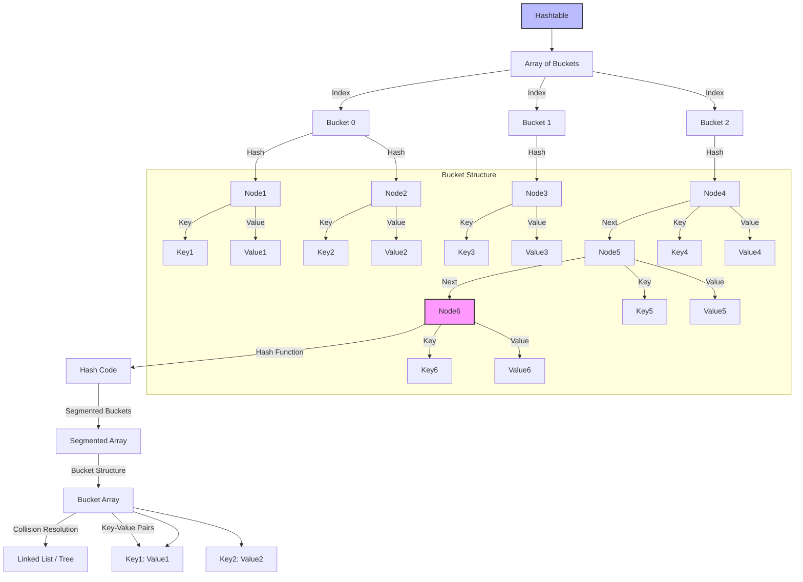
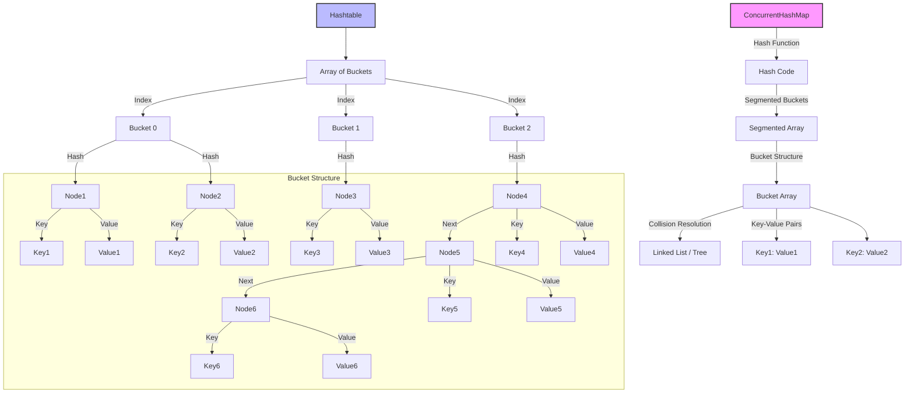
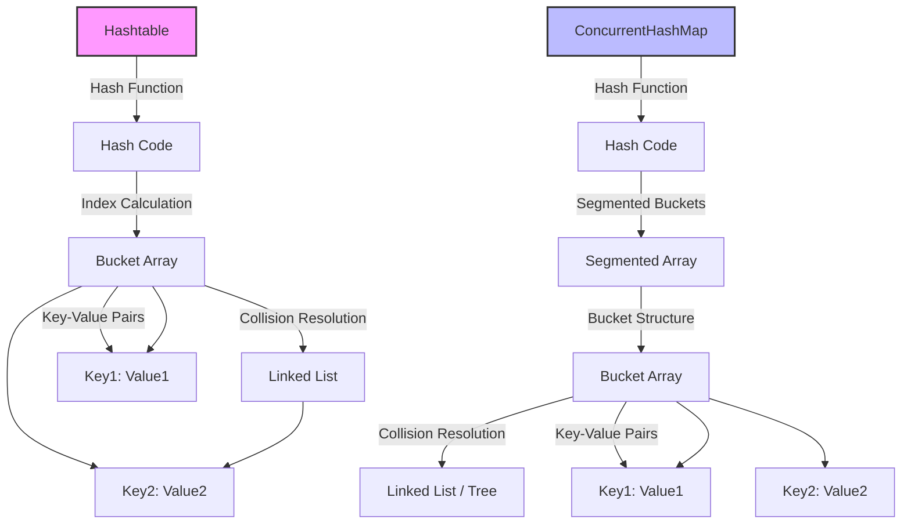
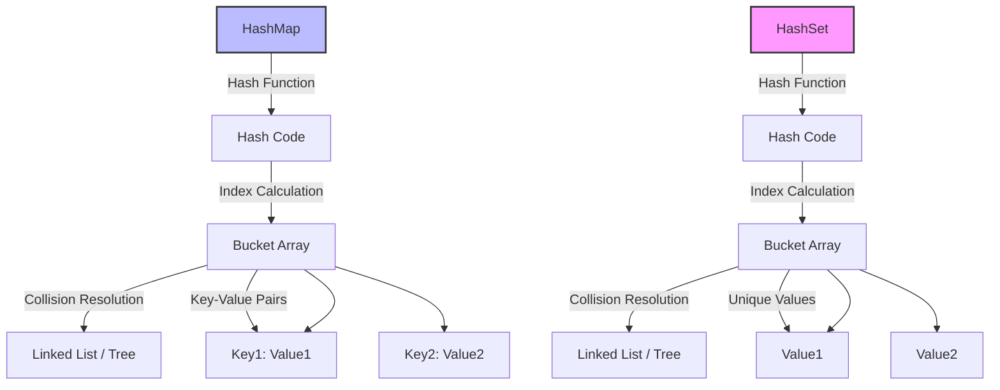

### **Table of Contents**

1. [Class and Object](#class-and-object)  
2. [Encapsulation](#encapsulation)  
3. [Inheritance](#inheritance)  
4. [Polymorphism](#polymorphism)  
5. [Abstraction](#abstraction)  
6. [Composition](#composition)  
7. [Abstract Class](#abstract-class)  
8. [Regular Interface](#regular-interface)  
9. [Functional Interface](#functional-interface)  
10. [Java Thread & Concurrency](#java-thread-concurrency)  

---

### **Core Java Concepts**

11. [Garbage Collection (GC) Algorithms](#garbage-collection-gc-algorithms)  
12. [CompletableFuture: Depth Concept and Methods](#completablefuture-depth-concept-and-methods)  
13. [Java 8 Lambda Expressions](#java-8-lambda-expressions)  
14. [Java 8 Features Introduced](#java-8-features-introduced)  
15. [New Features Introduced in Java 8 Collections Framework](#new-features-introduced-in-java-8-collections-framework)  
16. [ACID Properties](#acid-properties)  
17. [Transaction Isolation Levels](#transaction-isolation-levels)  
18. [SOLID Principles](#solid-principles)  
19. [Java Design Patterns](#java-design-patterns)  
20. [Microservice Design Patterns](#microservice-design-patterns)  
21. [Overview of `Hashtable` & `ConcurrentHashMap`](#overview-of-hashtable-concurrenthashmap)  
22. [Hashing in `Hashtable & ConcurrentHashMap`](#hashing-in-hashtable-concurrenthashmap)  
23. [Comparison of HashMap and ConcurrentHashMap](#comparison-of-hashmap-and-concurrenthashmap)  
24. [Fail-Fast and Fail-Safe](#fail-fast-and-fail-safe)  
25. [Snapshot](#snapshot)  
26. [Ambiguities in Java Technologies](#ambiguities-in-java-technologies)  
27. [An Overview of Angular, React, Microservices, and Threading, along with Their Interactions and Use Cases](#an-overview-of-angular-react-microservices-and-threading-along-with-their-interactions-and-use-cases)  
28. [Sharding in MongoDB](#sharding-in-mongodb)  
29. [Horizontal and Vertical Scaling](#horizontal-and-vertical-scaling)  
30. [Types of ClassLoaders](#types-of-classloaders)  
31. [Java Ways to Create Objects](#java-ways-to-create-objects)  
32. [In Java, `wait()`, `sleep()`, `join()`, and `yield()` are Methods Used in Multi-threading to Manage Thread Behavior](#in-java-wait-sleep-join-and-yield-are-methods-used-in-multi-threading-to-manage-thread-behavior)  
33. [Immutable Classes in Java](#immutable-classes-in-java)  
34. [Concurrency Issues: Deadlock, Starvation, Race Condition, Fairness Policy](#concurrency-issues-deadlock-starvation-race-condition-fairness-policy)  
35. [Breaking Singleton Pattern](#breaking-singleton-pattern)  
36. [`void` and `Void`](#void-and-void)  
37. [To Resolve the Diamond Problem in Java](#to-resolve-the-diamond-problem-in-java)  
38. [Conditions](#conditions)  
39. [Lifecycle of a Thread](#lifecycle-of-a-thread)  
40. [Java, `sleep()`, `wait()`, `join()`, and `LockSupport.park()`](#java-sleep-wait-join-and-locksupportpark)  
41. [Introduction of Default and Static Methods in Java](#introduction-of-default-and-static-methods-in-java)  
42. [Interfaces in Java (Post-Java 8)](#interfaces-in-java-post-java-8)  
43. [The Diamond Problem in Java](#the-diamond-problem-in-java)  
44. [ForkJoinPool](#forkjoinpool)  
45. [Threads and Concurrency](#threads-and-concurrency)  
46. [Garbage Collection in Java](#garbage-collection-in-java)  
47. [Garbage Collection vs Semaphore](#garbage-collection-vs-semaphore)  
48. [Main Garbage Collection Algorithms](#main-garbage-collection-algorithms)  

---

### **Java Interview Questions and Concepts**

49. [List of Common Java Interview Questions Along with Detailed Answers](#list-of-common-java-interview-questions-along-with-detailed-answers)  
50. [Java 8 Interview Questions and Answers](#java-8-interview-questions-and-answers)  
51. [Features Introduced in Java 8](#features-introduced-in-java-8)  
52. [Common Interview Questions Related to Java Multithreading and Concurrency, Along with Detailed Answers and Code Examples](#common-interview-questions-related-to-java-multithreading-and-concurrency-along-with-detailed-answers-and-code-examples)  
53. [Tricky Java Interview Questions](#tricky-java-interview-questions)  
54. [POJO (Plain Old Java Object) Classes](#pojo-plain-old-java-object-classes)  

---

### **Advanced Topics**

55. [Serialization and Deserialization](#serialization-and-deserialization)  
56. [Load Testing](#load-testing)  
57. [Virtual Threads in Java 19](#virtual-threads-in-java-19)  
58. [Memory Leak in Microservices: Understanding and Resolution](#memory-leak-in-microservices-understanding-and-resolution)  
59. [Permanent Generation (PermGen)](#permanent-generation-permgen)  
60. [Analyze and Identify Memory Leaks](#analyze-and-identify-memory-leaks)  
61. [How to Implement Asynchronous Programming in Spring Boot](#how-to-implement-asynchronous-programming-in-spring-boot)  
62. [Thread Management and Synchronization](#thread-management-and-synchronization)  
63. [Detecting and Recovering from Deadlocks](#detecting-and-recovering-from-deadlocks)

---

This cleaned-up Table of Contents removes the duplicate entries while keeping all the relevant topics. The list is now grouped logically into sections: **Core Java Concepts**, **Java Interview Questions and Concepts**, and **Advanced Topics**. Let me know if you'd like any further adjustments!

## JAVA

---

### **Object-Oriented Programming (OOP) Concepts**
Object-Oriented Programming (OOP) is a programming paradigm based on the concept of **objects**, which are instances of **classes**. OOP focuses on using objects and their interactions to design and implement software. It helps in organizing and structuring code efficiently, making it more maintainable, reusable, and scalable.
Here are the **core OOP concepts**:

---
### 1. **Class and Object**
- **Class**: A blueprint or template for creating objects. It defines properties (fields) and behaviors (methods) that the objects created from the class will have.
  
  **Example**: 
  ```java
  class Car {
      String make;
      String model;
      int year;
      void start() {
          System.out.println("Car is starting");
      }
  }
  ```
- **Object**: An instance of a class. It contains actual values for the properties and can invoke methods defined in the class.
  **Example**:
  ```java
  public class Main {
      public static void main(String[] args) {
          Car car1 = new Car();  // Creating an object of the Car class
          car1.make = "Toyota";
          car1.model = "Corolla";
          car1.year = 2020;
          car1.start();  // Calling the method of the Car object
      }
  }
  ```
---
### 2. **Encapsulation**
Encapsulation is the concept of bundling the data (fields) and methods (functions) that operate on the data into a single unit (class), and restricting access to some of the object's components. This is done using access modifiers (like `private`, `protected`, `public`) to control access to the object's state and behavior.
#### **Benefits**:
- **Data Hiding**: The internal state of the object is hidden from the outside world, which helps in protecting the data.
- **Controlled Access**: Only the methods (getters and setters) defined by the class are allowed to access or modify the internal state.
**Example**:
```java
class Employee {
    private String name;  // Private field, cannot be accessed directly
    private int age;
    // Public getter method to access private field
    public String getName() {
        return name;
    }
    // Public setter method to modify private field
    public void setName(String name) {
        this.name = name;
    }
    public int getAge() {
        return age;
    }
    public void setAge(int age) {
        if (age > 0) {
            this.age = age;
        }
    }
}
```
In the above example, `name` and `age` are encapsulated (private), and access to them is controlled through public getter and setter methods.

---
### 3. **Inheritance**
Inheritance allows a new class (called the **subclass** or **child class**) to inherit the properties and behaviors (fields and methods) from an existing class (called the **superclass** or **parent class**). This allows for **reusability** of code and establishing a relationship between classes.
#### **Key Points**:
- The subclass inherits all the public and protected fields and methods of the parent class.
- A subclass can override methods of the superclass to provide its own implementation.
- In Java, a class can only **extend** one superclass (single inheritance), but it can implement multiple interfaces.
**Example**:
```java
class Animal {
    void eat() {
        System.out.println("Animal is eating");
    }
}
class Dog extends Animal {
    void bark() {
        System.out.println("Dog is barking");
    }
    @Override
    void eat() {
        System.out.println("Dog is eating");
    }
}
public class Main {
    public static void main(String[] args) {
        Dog dog = new Dog();
        dog.eat();  // Outputs: Dog is eating (overridden method)
        dog.bark(); // Outputs: Dog is barking
    }
}
```
In this example:
- The `Dog` class inherits the `eat()` method from the `Animal` class, but overrides it to provide its own implementation.
---
### 4. **Polymorphism**
Polymorphism means "many forms" and allows objects of different classes to be treated as objects of a common superclass. It enables the same method or operation to behave differently based on the object it is acting upon.
There are two types of polymorphism:
1. **Compile-time Polymorphism** (Method Overloading): This occurs when multiple methods have the same name but different parameter lists (number, type, or both).
2. **Runtime Polymorphism** (Method Overriding): This occurs when a subclass provides a specific implementation for a method already defined in its superclass.
#### **Example of Method Overloading (Compile-time Polymorphism)**:
```java
class MathOperation {
    int add(int a, int b) {
        return a + b;
    }
    double add(double a, double b) {
        return a + b;
    }
}
public class Main {
    public static void main(String[] args) {
        MathOperation operation = new MathOperation();
        System.out.println(operation.add(5, 3));       // Outputs: 8
        System.out.println(operation.add(5.5, 3.2));   // Outputs: 8.7
    }
}
```
#### **Example of Method Overriding (Runtime Polymorphism)**:
```java
class Animal {
    void sound() {
        System.out.println("Animal makes a sound");
    }
}
class Dog extends Animal {
    @Override
    void sound() {
        System.out.println("Dog barks");
    }
}
public class Main {
    public static void main(String[] args) {
        Animal myAnimal = new Animal();  // Parent class reference
        myAnimal.sound();  // Outputs: Animal makes a sound
        myAnimal = new Dog();  // Child class reference
        myAnimal.sound();  // Outputs: Dog barks (Runtime Polymorphism)
    }
}
```
In this example, the `sound()` method is overridden in the `Dog` class, and at runtime, the method of the actual object type (`Dog`) is called, even though the reference type is `Animal`.

---
### 5. **Abstraction**
Abstraction is the process of hiding the implementation details and showing only the essential features of an object. It allows focusing on what an object **does**, rather than **how** it does it. In Java, abstraction is achieved using **abstract classes** and **interfaces**.
#### **Key Points**:
- **Abstract Class**: Can have both abstract (no implementation) and concrete (with implementation) methods.
- **Interface**: A contract that only defines method signatures (until Java 8, now can have default methods with implementation).
#### **Example**:
```java
abstract class Animal {
    abstract void sound();  // Abstract method, no implementation
}
class Dog extends Animal {
    @Override
    void sound() {
        System.out.println("Woof!");
    }
}
public class Main {
    public static void main(String[] args) {
        Animal dog = new Dog();
        dog.sound();  // Outputs: Woof!
    }
}
```
In this example, the `sound()` method is abstract in the `Animal` class, and the `Dog` class provides its specific implementation.

---
### 6. **Composition**
Composition is the practice of building complex objects by combining simpler ones. Unlike inheritance, which is an **"is-a"** relationship, composition represents a **"has-a"** relationship. In composition, objects of other classes are used as fields in a class.
#### **Example of Composition**:
```java
class Engine {
    void start() {
        System.out.println("Engine is starting");
    }
}
class Car {
    private Engine engine;  // Composition: Car "has-a" Engine
    Car() {
        engine = new Engine();  // Car contains an Engine
    }
    void startCar() {
        engine.start();  // Using the engine object
        System.out.println("Car is starting");
    }
}
public class Main {
    public static void main(String[] args) {
        Car car = new Car();
        car.startCar();  // Outputs: Engine is starting, Car is starting
    }
}
```
In this example, `Car` **has an** `Engine`, so it's a composition relationship. The `Car` class uses the `Engine` object as a part of its functionality.


### **Summary of OOP Concepts**:
- **Class and Object**: Classes define objects, and objects are instances of classes.
- **Encapsulation**: Hides the internal state of an object and provides controlled access via methods.
- **Inheritance**: Allows one class to inherit fields and methods from another class, facilitating code reuse.
- **Polymorphism**: Enables one interface to be used for different underlying forms (method overloading/overriding).
- **Abstraction**: Hides the implementation details and shows only the essential features of an object.
- **Composition**: Represents a "has-a" relationship, where one class contains objects of other classes.
These core principles of **OOP** help in building robust, maintainable, and reusable code. They allow developers to structure programs that are easier to understand and modify over time.
You're right! I missed covering **Aggregation** and **Association** in the previous explanation. Let me provide a more comprehensive overview of these concepts, alongside the previously mentioned ones like **Inheritance**, **Polymorphism**, **Abstraction**, and **Encapsulation**.

---
### **OOP Concepts with Aggregation, Composition, and Association**

In addition to the primary Object-Oriented Programming (OOP) principles, there are important design relationships between classes that are useful when modeling real-world problems. These are **Association**, **Aggregation**, and **Composition**, which represent different types of "has-a" relationships.
Let's break these concepts down:

---
### **1. Association**
**Association** is the most general form of relationship between objects. It represents a situation where objects of one class are associated with objects of another class, but neither class owns the other. In other words, objects are linked, but they can exist independently.
#### **Types of Association**:
- **One-to-one**: One object of a class is associated with one object of another class.
- **One-to-many**: One object of a class is associated with many objects of another class.
- **Many-to-many**: Many objects of a class are associated with many objects of another class.
#### **Example of Association**:
```java
class Person {
    String name;
    Person(String name) {
        this.name = name;
    }
}
class Address {
    String city;
    Address(String city) {
        this.city = city;
    }
}
public class Main {
    public static void main(String[] args) {
        Person person = new Person("John");
        Address address = new Address("New York");
        // Association: A person can have an address, but they exist independently
        System.out.println(person.name + " lives in " + address.city);
    }
}
```
Here, `Person` and `Address` have a simple association. A person can have an address, but they are independent entities, so this is a one-to-one association.

---
### **2. Aggregation**
**Aggregation** is a special form of association where one object is a part of another object, but the lifetime of the aggregated object is independent of the lifetime of the parent object. In other words, objects that are part of an aggregate can exist without the parent object.
- Aggregation represents a **"has-a"** relationship, but the contained object can exist on its own.
- It is sometimes referred to as a **"whole-part"** relationship.
#### **Example of Aggregation**:
```java
class Department {
    String name;
    // Aggregation: Department has employees, but employees can exist independently
    Employee employee;
    Department(String name, Employee employee) {
        this.name = name;
        this.employee = employee;
    }
}
class Employee {
    String name;
    Employee(String name) {
        this.name = name;
    }
}
public class Main {
    public static void main(String[] args) {
        Employee emp1 = new Employee("Alice");
        Department dept1 = new Department("HR", emp1);
        
        System.out.println(dept1.name + " department has " + dept1.employee.name + " as an employee.");
        // Employee exists independently of the department
    }
}
```
In this case, `Employee` can exist independently of `Department`, which is characteristic of aggregation. The `Department` "has-a" `Employee`, but the `Employee` could be moved to another department or exist without any department.

---
### **3. Composition**
**Composition** is a stronger form of aggregation. In composition, the contained objects **cannot exist independently** of the parent object. When the parent object is destroyed, all its contained objects are destroyed as well. Composition represents a **"contains-a"** or **"part-of"** relationship, where the child objects cannot exist outside the parent.
#### **Key Characteristics of Composition**:
- **Stronger lifecycle dependency**: If the parent object is destroyed, the child objects are also destroyed.
- **"Has-a" relationship** with a strong ownership relationship between the parent and child.
#### **Example of Composition**:
```java
class Library {
    String name;
    // Composition: Library contains Books, and Books cannot exist without the Library
    Book book;
    Library(String name, Book book) {
        this.name = name;
        this.book = book;
    }
}
class Book {
    String title;
    Book(String title) {
        this.title = title;
    }
}
public class Main {
    public static void main(String[] args) {
        Book book1 = new Book("Java Programming");
        Library library = new Library("City Library", book1);
        
        System.out.println(library.name + " has a book titled " + library.book.title);
        // If the library is destroyed, the book will be destroyed as well.
    }
}
```
In this example, the `Book` class cannot exist independently of the `Library`. When the `Library` object is destroyed, its `Book` object is also destroyed. This strong relationship is a hallmark of composition.

---
### **4. Inheritance**
As already explained, **Inheritance** allows one class to inherit the properties and methods of another class. It enables code reuse and establishes a "is-a" relationship.
- **"is-a" relationship**: The subclass is a type of the superclass.
  
#### **Example of Inheritance**:
```java
class Animal {
    void sound() {
        System.out.println("Animal makes a sound");
    }
}
class Dog extends Animal {
    void sound() {
        System.out.println("Dog barks");
    }
}
public class Main {
    public static void main(String[] args) {
        Dog dog = new Dog();
        dog.sound();  // Outputs: Dog barks
    }
}
```
The `Dog` class inherits from `Animal` and overrides the `sound()` method.
---
### **5. Polymorphism**
Polymorphism allows one interface to be used for different underlying forms. It allows methods to do different things based on the object it is acting upon, enabling method overloading and method overriding.
#### **Method Overloading** (Compile-time Polymorphism):
```java
class MathOperation {
    int add(int a, int b) {
        return a + b;
    }
    double add(double a, double b) {
        return a + b;
    }
}
public class Main {
    public static void main(String[] args) {
        MathOperation op = new MathOperation();
        System.out.println(op.add(3, 4));    // Outputs: 7
        System.out.println(op.add(3.5, 4.5));  // Outputs: 8.0
    }
}
```
#### **Method Overriding** (Runtime Polymorphism):
```java
class Animal {
    void sound() {
        System.out.println("Animal makes a sound");
    }
}
class Dog extends Animal {
    @Override
    void sound() {
        System.out.println("Dog barks");
    }
}
public class Main {
    public static void main(String[] args) {
        Animal dog = new Dog();
        dog.sound();  // Outputs: Dog barks
    }
}
```
Here, the `sound()` method is overridden in the `Dog` class, demonstrating runtime polymorphism.

---
### **6. Abstraction**
Abstraction is the process of hiding implementation details and showing only the essential features of an object. In Java, you achieve abstraction using **abstract classes** and **interfaces**.
#### **Example of Abstraction**:
```java
abstract class Animal {
    abstract void sound();  // Abstract method (no implementation)
}
class Dog extends Animal {
    @Override
    void sound() {
        System.out.println("Woof!");
    }
}
public class Main {
    public static void main(String[] args) {
        Animal dog = new Dog();
        dog.sound();  // Outputs: Woof!
    }
}
```
In this example, the `sound()` method is abstract in the `Animal` class, and the `Dog` class provides a specific implementation.

---
### **7. Encapsulation**
Encapsulation is the concept of hiding an object's internal state and requiring all interaction to be performed through well-defined methods. This is usually done by making fields `private` and providing public getter and setter methods.
#### **Example of Encapsulation**:
```java
class Person {
    private String name;
    private int age;
    // Getter and Setter methods
    public String getName() {
        return name;
    }
    public void setName(String name) {
        this.name = name;
    }
    public int getAge() {
        return age;
    }
    public void setAge(int age) {
        if (age > 0) {
            this.age = age;
        }
    }
}
```
In this example, the `Person` class encapsulates the `name` and `age` fields and provides controlled access to them via getter and setter methods.

---

### **Summary of OOP Concepts**:
| Concept         | Description                                                                 | Example                                                         |
|-----------------|-----------------------------------------------------------------------------|-------------------------------------------------------------|
| **Association**  | Represents a general relationship between objects.                          | A `Person` can have an `Address` (independent objects).      |
| **Aggregation**  | A form of association where the child can exist independently of the parent. | A `Department` "has" an `Employee`, but employees can exist independently. |
| **Composition**  | A stronger form of aggregation where the child cannot exist without the parent. | A `Library` "contains" a `Book`, and books cannot exist outside the library. |
| **Inheritance**  | Allows a class to inherit fields and methods from another class.            | A `Dog` "is a" type of `Animal` and inherits
 its methods.     |
| **Polymorphism** | Allows one interface to be used for different underlying forms.              | A `Dog` class overrides the `sound()` method of `Animal`.     |
| **Abstraction**  | Hides the implementation details and shows only essential features.         | An `Animal` class defines an abstract `sound()` method.       |
| **Encapsulation**| Hides the internal state of an object and provides controlled access.       | `Person` class has private fields with public getter and setter methods. |

Understanding these principles will help you design more maintainable and flexible object-oriented software.

### **Abstract Class, Regular Interface, and Functional Interface in Java**
In Java, **abstract classes** and **interfaces** are fundamental concepts for defining common behavior and structure across different classes. They allow for abstraction and polymorphism in object-oriented programming. However, abstract classes and interfaces serve different purposes and have different characteristics. Let’s explore the differences and use cases for each.

---

### **1. Abstract Class**
An **abstract class** is a class that cannot be instantiated on its own but can be subclassed by other classes. It is used when you want to provide a common base for other classes to extend while allowing subclasses to provide their own specific implementations.

#### **Key Characteristics of Abstract Class:**
- **Cannot be instantiated**: You cannot create an instance of an abstract class directly.
- **Can have both abstract and concrete methods**: An abstract class can have abstract methods (methods without implementation) and concrete methods (methods with implementation).
- **Can have instance variables**: Abstract classes can have instance variables (fields) and constructors.
- **Supports inheritance**: Abstract classes are inherited by other classes using the `extends` keyword.
- **Can have access modifiers**: The methods in an abstract class can have various access modifiers like `private`, `protected`, and `public`.
- **Can provide default behavior**: Concrete methods in abstract classes can provide default behavior, so subclasses don’t always need to implement them.

#### **Example of Abstract Class**:
```java
abstract class Animal {
    // Abstract method (no implementation)
    abstract void sound();
    // Concrete method (with implementation)
    void sleep() {
        System.out.println("This animal is sleeping.");
    }
}
class Dog extends Animal {
    // Providing implementation for the abstract method
    void sound() {
        System.out.println("Woof!");
    }
}
public class TestAbstractClass {
    public static void main(String[] args) {
        Animal dog = new Dog();
        dog.sound();  // Outputs: Woof!
        dog.sleep();  // Outputs: This animal is sleeping.
    }
}
```
#### **When to use Abstract Class:**
- When you have a common base class with some common behavior that can be shared by multiple subclasses.
- When you need to define default behavior (concrete methods) along with abstract methods that subclasses must implement.
- When you want to define instance variables and constructors that can be used by subclasses.

---

### **2. Regular Interface**
A **regular interface** is a contract that defines methods that must be implemented by any class that chooses to implement the interface. Unlike abstract classes, interfaces are primarily used to define **a contract for behaviors** without providing any implementation (except for default methods starting from Java 8).

#### **Key Characteristics of Regular Interface:**
- **Cannot have instance variables**: Interfaces cannot have instance variables, but they can have constants (`public static final` fields).
- **All methods are implicitly abstract**: Methods in interfaces are abstract by default (except for default methods or static methods).
- **Can be implemented by any class**: A class implements an interface using the `implements` keyword, and a class can implement multiple interfaces.
- **Supports multiple inheritance**: Unlike classes, a class can implement multiple interfaces.
- **No constructors**: Interfaces do not have constructors.
- **Can have default and static methods** (since Java 8): You can define default methods with implementation and static methods in an interface, which wasn’t possible in earlier versions of Java.

#### **Example of Regular Interface**:
```java
interface Animal {
    // Abstract method (no implementation)
    void sound();
    // Default method with implementation
    default void sleep() {
        System.out.println("This animal is sleeping.");
    }
}
class Dog implements Animal {
    // Providing implementation for the abstract method
    public void sound() {
        System.out.println("Woof!");
    }
}
public class TestInterface {
    public static void main(String[] args) {
        Animal dog = new Dog();
        dog.sound();  // Outputs: Woof!
        dog.sleep();  // Outputs: This animal is sleeping.
    }
}
```

#### **When to use Regular Interface:**
- When you want to define a contract for behavior that can be implemented by multiple classes.
- When you need multiple inheritance of behavior (i.e., a class can implement multiple interfaces).
- When you only want to define method signatures and leave the implementation to the classes that implement the interface.

---

### **3. Functional Interface**
A **functional interface** is a special type of interface in Java that has **exactly one abstract method**. Functional interfaces are used primarily to support lambda expressions and method references in Java 8 and beyond.

#### **Key Characteristics of Functional Interface:**
- **Exactly one abstract method**: A functional interface can have only one abstract method, but it can have multiple default or static methods.
- **Used with Lambda Expressions**: Functional interfaces are used primarily to represent **single-method** interfaces that can be implemented using lambda expressions.
- **`@FunctionalInterface` annotation**: This annotation is not mandatory, but it’s recommended because it helps the compiler ensure the interface conforms to the rules of a functional interface (i.e., it has only one abstract method).

#### **Example of Functional Interface**:
```java
@FunctionalInterface
interface Calculator {
    int add(int a, int b);  // Single abstract method
    // Default method
    default int subtract(int a, int b) {
        return a - b;
    }
}
public class TestFunctionalInterface {
    public static void main(String[] args) {
        // Using a lambda expression to implement the functional interface
        Calculator calculator = (a, b) -> a + b;
        // Calling the method using the lambda implementation
        System.out.println("Sum: " + calculator.add(5, 3));  // Outputs: Sum: 8
        // Calling the default method
        System.out.println("Difference: " + calculator.subtract(5, 3));  // Outputs: Difference: 2
    }
}
```

#### **When to use Functional Interface:**
- When you want to represent a single action or behavior that can be implemented using a lambda expression or method reference.
- When working with Java’s **Stream API** or **java.util.function** package, which heavily relies on functional interfaces (e.g., `Predicate`, `Function`, `Consumer`, etc.).

---

### **Key Differences Between Abstract Class, Regular Interface, and Functional Interface:**
| Feature                        | **Abstract Class**                               | **Regular Interface**                                  | **Functional Interface**                              |
|---------------------------------|--------------------------------------------------|--------------------------------------------------------|--------------------------------------------------------|
| **Methods**                     | Can have both abstract and concrete methods.     | All methods are abstract by default (except default/static methods). | Exactly one abstract method, can have multiple default/static methods. |
| **Fields**                       | Can have instance variables (fields).            | Cannot have instance variables (only constants).       | Cannot have instance variables (only constants).       |
| **Inheritance**                  | Can inherit from one class, can implement interfaces. | Can implement multiple interfaces.                    | Can implement multiple interfaces (like a regular interface). |
| **Constructors**                 | Can have constructors.                           | No constructors allowed.                               | No constructors allowed.                               |
| **Use Case**                     | When you want to share behavior with some common implementation. | When you want to define a contract for behavior without implementation. | When you want to define a single method interface for lambda expressions. |
| **Multiple Inheritance**         | Not supported (can extend only one class).       | Supported (a class can implement multiple interfaces).  | Supported (same as regular interfaces).                 |
| **Default Methods**              | Can provide default behavior with concrete methods. | Can provide default methods (since Java 8).            | Can have default methods (optional).                   |
| **Annotations**                  | No special annotation required.                  | No special annotation required.                        | `@FunctionalInterface` annotation to indicate it is a functional interface. |

---

### **Summary:**
- **Abstract Class**: Used for sharing common behavior between classes, can have both abstract and concrete methods, allows instance variables and constructors.
- **Regular Interface**: Defines a contract for behavior, can be implemented by multiple classes, and can have default methods (since Java 8).
- **Functional Interface**: A special type of interface that has exactly one abstract method and can be used with lambda expressions, ideal for representing single-function behaviors.


## Features introduced in Java 8:

### 1. **Lambda Expressions**
Lambda expressions allow you to write instances of single-method interfaces (functional interfaces) more concisely. They provide a way to pass behavior as a parameter to methods or to execute operations on data without explicitly writing classes or implementing interfaces.
#### Syntax of Lambda Expression:
```java
(parameters) -> expression
```
For example:
```java
// Traditional anonymous class
Runnable r = new Runnable() {
    public void run() {
        System.out.println("Hello from Runnable!");
    }
};
// Lambda expression
Runnable r2 = () -> System.out.println("Hello from Runnable!");
```
#### Key Points:
- Lambdas enable functional programming.
- They eliminate boilerplate code such as anonymous inner classes.
- Lambda expressions can be passed as arguments to methods or returned as values.

### 2. **Functional Interfaces**
A **functional interface** is an interface that has only one abstract method (but can have multiple default or static methods). These interfaces are used as the target types for lambda expressions.

#### Example of a Functional Interface:
```java
@FunctionalInterface
interface MyFunctionalInterface {
    void myMethod();
}
```
Java 8 has several built-in functional interfaces in the `java.util.function` package, such as:
- `Function<T, R>`: Takes a parameter of type `T` and returns a result of type `R`.
- `Predicate<T>`: Represents a boolean-valued function of one argument.
- `Consumer<T>`: Represents an operation that takes an argument and returns nothing.
- `Supplier<T>`: Represents a supplier of results.
- `BinaryOperator<T>`: Represents an operation on two operands of the same type.

### 3. **Streams API**
The **Streams API** is a major addition to Java 8 that allows you to process sequences of elements (such as collections, arrays, or I/O channels) in a functional way. Streams provide a high-level abstraction for performing operations like filtering, mapping, sorting, and reducing over a set of data.

#### Stream Creation:
You can create streams from collections, arrays, or other sources:
```java
List<String> list = Arrays.asList("apple", "banana", "cherry");
// Creating a stream from a list
Stream<String> stream = list.stream();
// Creating a stream from an array
Stream<Integer> intStream = Stream.of(1, 2, 3, 4, 5);
```

#### Common Stream Operations:
- **filter()**: Filters elements based on a condition.
- **map()**: Transforms each element in the stream.
- **collect()**: Collects the results of stream processing into a collection or other data structures.
- **reduce()**: Reduces the stream to a single value (e.g., sum, max).
- **forEach()**: Iterates over each element in the stream.
- **sorted()**: Sorts elements in the stream.
Example:
```java
List<String> words = Arrays.asList("apple", "banana", "cherry", "date");
List<String> filteredWords = words.stream()
                                  .filter(word -> word.startsWith("b"))
                                  .collect(Collectors.toList());
```
Streams can also be **parallelized** for concurrent processing:
```java
List<String> parallelWords = words.parallelStream()
                                  .filter(word -> word.startsWith("b"))
                                  .collect(Collectors.toList());
```

### 4. **Default Methods in Interfaces**
Java 8 allows **default methods** in interfaces. A default method is a method with a body defined in an interface, which can provide a default implementation.

#### Example:
```java
interface MyInterface {
    default void defaultMethod() {
        System.out.println("This is a default method");
    }
    
    void abstractMethod(); // abstract method
}
class MyClass implements MyInterface {
    public void abstractMethod() {
        System.out.println("Implementing abstract method");
    }
}
public class Main {
    public static void main(String[] args) {
        MyClass obj = new MyClass();
        obj.defaultMethod(); // Access default method
    }
}
```
- Default methods allow you to add methods to interfaces without breaking existing implementations.
- They also enable interfaces to evolve without forcing implementing classes to update their code.

### 5. **Method References**
Method references are a shorthand notation of a lambda expression that refers to a method directly by its name. They are used primarily to refer to methods of existing classes or objects.

#### Types of Method References:
- **Static methods**: `ClassName::methodName`
- **Instance methods**: `instance::methodName`
- **Constructor references**: `ClassName::new`
Example:
```java
// Using lambda expression
List<String> list = Arrays.asList("apple", "banana", "cherry");
list.forEach(s -> System.out.println(s));
// Using method reference
list.forEach(System.out::println);
```
Method references are concise and often more readable than equivalent lambda expressions.

### 6. **Optional**
The `Optional` class is a container object which may or may not contain a value. It is introduced to reduce `NullPointerException` by explicitly handling the absence of values.

#### Example:
```java
Optional<String> optional = Optional.of("Hello");
System.out.println(optional.get()); // prints "Hello"
Optional<String> emptyOptional = Optional.empty();
System.out.println(emptyOptional.orElse("Default")); // prints "Default"
```
You can also use methods like `map()`, `flatMap()`, `filter()`, and `ifPresent()` to perform operations safely without needing null checks.

### 7. **New Date and Time API (java.time)**
Java 8 introduced a new, more comprehensive and immutable **Date and Time API** in the `java.time` package, which addresses many issues with the old `Date` and `Calendar` classes.

#### Key Classes:
- `LocalDate`: Represents a date (year, month, day) without time.
- `LocalTime`: Represents a time without a date.
- `LocalDateTime`: Combines date and time.
- `ZonedDateTime`: Includes time-zone-specific date and time.
- `Instant`: Represents a point on the timeline (useful for timestamps).

#### Example:
```java
LocalDate date = LocalDate.now(); // Current date
LocalDate specificDate = LocalDate.of(2020, 1, 1); // Specific date
LocalTime time = LocalTime.now(); // Current time
LocalDateTime dateTime = LocalDateTime.now(); // Current date and time
ZonedDateTime zonedDateTime = ZonedDateTime.now(); // Date and time with timezone
```
The new API is more consistent, thread-safe, and easier to use compared to the old `java.util.Date` and `java.util.Calendar` classes.

### 8. **Nashorn JavaScript Engine**
Java 8 introduced the **Nashorn JavaScript Engine**, which replaced the older Rhino JavaScript engine. Nashorn provides better performance and allows developers to run JavaScript code from within Java applications.
Example of using Nashorn:
```java
import javax.script.*;
public class NashornExample {
    public static void main(String[] args) throws Exception {
        ScriptEngine engine = new ScriptEngineManager().getEngineByName("nashorn");
        engine.eval("print('Hello from JavaScript!')");
    }
}
```

### 9. **Streams and Parallel Streams**
In addition to the standard stream API, Java 8 introduced **parallel streams**, which allow streams to be processed concurrently. This can significantly improve performance for large datasets, though it requires careful consideration regarding thread safety.
```java
List<Integer> numbers = Arrays.asList(1, 2, 3, 4, 5);
numbers.parallelStream()
       .map(n -> n * 2)
       .forEach(System.out::println);
```

### 10. **New Collectors and the `Collectors` Utility Class**
The `Collectors` utility class provides factory methods for common operations on collections like joining, grouping, partitioning, and collecting into a map.
Examples:
- **toList()**: Collects the stream elements into a list.
- **joining()**: Concatenates the elements into a single string.
- **groupingBy()**: Groups elements by a classifier function.
- **partitioningBy()**: Partitions elements into two groups.
Example:
```java
List<String> words = Arrays.asList("apple", "banana", "cherry");
String result = words.stream()
                     .collect(Collectors.joining(", "));
System.out.println(result);  // Output: apple, banana, cherry
```

---

### Summary of Java 8 Features:
- **Lambda Expressions**: Concise way to define anonymous functions.
- **Functional Interfaces**: Interfaces with a single abstract method, typically used with lambda expressions.
- **Streams API**: High-level abstraction for processing sequences of data.
- **Default Methods**: Methods in interfaces with a default implementation.
- **Method References**: Shorthand for lambdas that refer to existing methods.
- **Optional**: A container that can either contain a value or be empty, reducing null checks.
- **New Date/Time API**: A new, immutable, and more comprehensive date-time API.
- **Nashorn JavaScript Engine**: A new engine for running JavaScript code in Java.
- **Collectors**: Utilities to collect and manipulate streams in various ways.

These Java 8 features represent a major shift towards functional programming in Java, enhancing both code readability and performance. By leveraging these features, developers can write more concise, expressive, and maintainable Java code.


---

## Java Thread & Concurrency

In Java, **threads** and **concurrency** are critical concepts that enable parallel execution and efficient resource utilization, particularly in multi-core processors. Understanding how threads work, how to manage concurrency, and how to avoid common pitfalls like race conditions is key to writing efficient, thread-safe applications.

### **1. What is a Thread?**
A **thread** is a lightweight unit of execution within a process. In Java, a thread is a single path of execution, and a program can have multiple threads running simultaneously. Each thread runs independently but shares the same memory space of the parent process.
- **Thread**: A sequence of instructions that can be executed independently.
- **Process**: A program in execution, consisting of one or more threads.
Java provides built-in support for multi-threading, meaning you can create and manage multiple threads for parallel execution.

---
### **2. Thread Creation in Java**
You can create and manage threads in Java in two main ways:
#### a) **By Extending the `Thread` Class**
You can create a new thread by subclassing the `Thread` class and overriding its `run()` method.
```java
class MyThread extends Thread {
    @Override
    public void run() {
        System.out.println("Thread is running");
    }
}
public class Main {
    public static void main(String[] args) {
        MyThread thread = new MyThread();
        thread.start();  // Start the thread
    }
}
```
- **`start()`**: This method creates a new thread and invokes the `run()` method asynchronously.
- **`run()`**: Contains the code that the thread will execute.

#### b) **By Implementing the `Runnable` Interface**
Instead of extending `Thread`, you can implement the `Runnable` interface, which is a more flexible approach because it allows the class to extend another class (since Java supports single inheritance only).
```java
class MyRunnable implements Runnable {
    @Override
    public void run() {
        System.out.println("Thread is running");
    }
}
public class Main {
    public static void main(String[] args) {
        Runnable runnable = new MyRunnable();
        Thread thread = new Thread(runnable);
        thread.start();
    }
}
```
- `Runnable` is an interface with a single method, `run()`, which contains the code that will be executed by the thread.
- By passing a `Runnable` instance to a `Thread` object, you can start a thread without subclassing `Thread`.

---

### **3. Thread Lifecycle**
A thread in Java goes through several states during its lifecycle:
1. **New**: A thread is created but hasn't started yet.
2. **Runnable**: A thread is ready to run and is waiting for the CPU to schedule it for execution.
3. **Blocked**: A thread is waiting for a resource, such as IO or a lock.
4. **Waiting**: A thread is waiting indefinitely for another thread to perform a specific action (e.g., `Thread.join()` or `Object.wait()`).
5. **Timed Waiting**: A thread is waiting for a specified time (e.g., `Thread.sleep(1000)`).
6. **Terminated**: A thread has finished executing.

---

### **4. Concurrency in Java**
**Concurrency** refers to the ability of a system to handle multiple tasks simultaneously. Java provides several mechanisms to help developers manage concurrent execution of threads, and to ensure that shared resources are accessed in a thread-safe manner.

#### a) **Thread Synchronization**
When multiple threads access shared resources, there is a risk of data inconsistency if threads modify the resource simultaneously. Java provides synchronization mechanisms to ensure that only one thread accesses a resource at a time.
- **Synchronized Methods**: You can synchronize a method to ensure that only one thread can execute it at a time.
```java
class Counter {
    private int count = 0;
    public synchronized void increment() {
        count++;
    }
}
```
- **Synchronized Blocks**: You can also use synchronized blocks to limit the scope of synchronization to specific parts of your code, which can improve performance.
```java
class Counter {
    private int count = 0;
    public void increment() {
        synchronized(this) {
            count++;
        }
    }
}
```
- **Locks**: Java also provides explicit locking mechanisms via the `java.util.concurrent.locks.Lock` interface, which allows finer control over thread synchronization (e.g., `ReentrantLock`).
```java
import java.util.concurrent.locks.Lock;
import java.util.concurrent.locks.ReentrantLock;
class Counter {
    private int count = 0;
    private Lock lock = new ReentrantLock();
    public void increment() {
        lock.lock(); // Acquires the lock
        try {
            count++;
        } finally {
            lock.unlock(); // Releases the lock
        }
    }
}
```
#### b) **Deadlock**
Deadlock is a situation where two or more threads are blocked indefinitely, waiting for each other to release a resource. This typically happens when two threads hold locks on different resources and each is waiting for the other to release its lock.
Example of Deadlock:
```java
class A {
    synchronized void methodA(B b) {
        b.last();
    }
    synchronized void last() {}
}
class B {
    synchronized void methodB(A a) {
        a.last();
    }
    synchronized void last() {}
}
public class Deadlock {
    public static void main(String[] args) {
        A a = new A();
        B b = new B();
        
        new Thread(() -> a.methodA(b)).start();
        new Thread(() -> b.methodB(a)).start();
    }
}
```
To avoid deadlocks:
- Avoid holding multiple locks at once.
- Use a timeout for acquiring locks (`ReentrantLock.lock(long timeout)`).
- Always acquire locks in a consistent order.

---

### **5. Executor Framework**
The **Executor Framework** introduced in Java 5 provides a higher-level replacement for managing threads. Instead of manually creating and managing threads, you use executor services that abstract away the details.
#### Executor Types:
1. **SingleThreadExecutor**: Uses a single worker thread to process tasks.
2. **FixedThreadPool**: Uses a fixed number of threads to process a queue of tasks.
3. **CachedThreadPool**: Creates new threads as needed, but reuses existing ones if available.
4. **ScheduledThreadPool**: A pool of threads that can execute tasks after a delay or periodically.
Example of using `ExecutorService`:
```java
import java.util.concurrent.*;
public class ExecutorExample {
    public static void main(String[] args) {
        ExecutorService executor = Executors.newFixedThreadPool(2);
        
        executor.submit(() -> System.out.println("Task 1"));
        executor.submit(() -> System.out.println("Task 2"));
        
        executor.shutdown(); // Initiates an orderly shutdown
    }
}
```
- **`submit()`**: Submits a task for execution.
- **`shutdown()`**: Initiates an orderly shutdown in which previously submitted tasks are executed, but no new tasks will be accepted.

---

### **6. Future and Callable**
When you need to submit a task that returns a result or may throw an exception, you use **`Callable`** instead of `Runnable`. `Callable` is similar to `Runnable`, but it can return a result or throw an exception.
You can submit `Callable` tasks via an `ExecutorService`, which returns a **`Future`** object.
#### Example:
```java
import java.util.concurrent.*;
public class CallableExample {
    public static void main(String[] args) throws ExecutionException, InterruptedException {
        ExecutorService executor = Executors.newCachedThreadPool();
        
        Callable<Integer> task = () -> {
            return 42;  // Task that returns a value
        };
        
        Future<Integer> future = executor.submit(task);
        System.out.println("Result: " + future.get());  // Block until the task is done
        
        executor.shutdown();
    }
}
```
- **`Future.get()`**: Blocks the calling thread until the task completes and returns the result.
- **`Future.isDone()`**: Returns `true` if the task is completed.

---

### **7. Concurrency Utilities (java.util.concurrent)**
Java 8 introduced several concurrency utilities in the `java.util.concurrent` package that simplify working with threads and synchronization.

#### a) **CountDownLatch**
A **CountDownLatch** is used to block one or more threads until a set of operations being performed in other threads completes.
```java
CountDownLatch latch = new CountDownLatch(3); // Wait for 3 events to occur
latch.await();  // Blocks until the count reaches 0
```

#### b) **CyclicBarrier**
A **CyclicBarrier** is similar to a CountDownLatch but allows threads to repeatedly meet at a common barrier point.
#### c) **Semaphore**
A **Semaphore** controls access to a particular resource by multiple threads by using a set number of permits.

---

### **Conclusion**
- **Thread**: A lightweight process that can run concurrently with others.
- **Concurrency**: The ability of a system to execute multiple tasks simultaneously, improving performance.
- **Thread Management**: Java provides multiple ways to create threads (via `Thread` class, `Runnable`, or `Executor` framework).
- **Synchronization**: Ensures thread-safe access to shared resources using mechanisms like `synchronized` blocks and `Lock`.
- **Executor Framework**: Provides a higher-level API for managing thread pools and scheduling tasks.
- **Deadlocks**: Careful attention is needed to avoid deadlocks by properly managing resource locking.

By understanding these concepts and applying best practices, Java developers can efficiently manage concurrency, improve application performance, and avoid common multi-threading pitfalls.


## Java Thread

The lifecycle of a thread in Java consists of several states, each representing the different stages of a thread's execution. Understanding these states helps in effectively managing thread behavior. Here's an overview of the thread lifecycle:

### Thread States

1. **New**: 
   - A thread is in the **new** state when it is created but not yet started.
   - This is done by instantiating a `Thread` object.

   ```java
   Thread thread = new Thread(() -> { /* task */ });
   ```

2. **Runnable**: 
   - A thread enters the **runnable** state when the `start()` method is called.
   - In this state, the thread is ready to run and may be executing or waiting for CPU time.
   - A thread can return to this state from **blocked** or **waiting** states.

   ```java
   thread.start();
   ```

3. **Blocked**: 
   - A thread is in the **blocked** state when it is waiting for a lock to be released by another thread.
   - This occurs when multiple threads attempt to access a synchronized block or method.

4. **Waiting**: 
   - A thread enters the **waiting** state when it calls methods like `wait()`, `join()`, or `LockSupport.park()`.
   - In this state, the thread is waiting for another thread to perform a specific action (e.g., notify or join).

5. **Timed Waiting**: 
   - A thread is in the **timed waiting** state when it is waiting for a specified period. This occurs when it calls methods like `sleep(millis)`, `wait(millis)`, or `join(millis)`.

6. **Terminated**: 
   - A thread enters the **terminated** state when it has completed its execution or has been terminated (either normally or due to an exception).
   - Once in this state, the thread cannot be restarted.

### State Transitions

The transitions between these states can be summarized as follows:

- **New to Runnable**: When `start()` is called.
- **Runnable to Blocked**: When the thread tries to access a synchronized resource that is locked by another thread.
- **Runnable to Waiting**: When the thread calls `wait()`, `join()`, or similar methods.
- **Runnable to Timed Waiting**: When the thread calls `sleep()` or `wait(millis)`.
- **Waiting to Runnable**: When another thread calls `notify()`, `notifyAll()`, or the waiting thread is interrupted.
- **Terminated**: When the thread completes execution or is terminated.

### Diagram Representation

A simplified diagram might look like this:

```
[New] ---> [Runnable] ---> [Terminated]
                |   |
                |   v
                | [Blocked]
                |
                v
             [Waiting] <--- [Timed Waiting]
```

### Conclusion

Understanding the thread lifecycle is essential for effective multi-threaded programming. It helps in managing thread synchronization, avoiding deadlocks, and improving performance in concurrent applications.

## Thread management and synchronization

In Java, `sleep()`, `wait()`, `join()`, and `LockSupport.park()` are all methods related to thread management and synchronization, but they serve different purposes. Here’s a detailed explanation of each:

### 1. `sleep()`

- **Purpose**: Pauses the execution of the current thread for a specified duration.
- **Usage**: Used to delay a thread, allowing other threads to execute.
- **State Change**: When a thread calls `sleep()`, it enters the **timed waiting** state.
- **Example**:

    ```java
    try {
        Thread.sleep(1000); // Sleep for 1 second
    } catch (InterruptedException e) {
        Thread.currentThread().interrupt(); // Restore interrupt status
    }
    ```

### 2. `wait()`

- **Purpose**: Makes the current thread wait until another thread invokes `notify()` or `notifyAll()` on the same object.
- **Usage**: Typically used in conjunction with synchronized blocks to facilitate communication between threads.
- **State Change**: When a thread calls `wait()`, it enters the **waiting** state and releases the monitor (lock) on the object.
- **Example**:

    ```java
    synchronized (sharedObject) {
        while (conditionNotMet) {
            sharedObject.wait(); // Wait until notified
        }
    }
    ```

### 3. `join()`

- **Purpose**: Waits for a thread to die (i.e., finish execution).
- **Usage**: Used to ensure that one thread completes before another thread continues execution.
- **State Change**: When a thread calls `join()`, it enters the **waiting** state until the specified thread terminates.
- **Example**:

    ```java
    Thread thread = new Thread(() -> {
        // Task
    });
    thread.start();
    try {
        thread.join(); // Wait for thread to finish
    } catch (InterruptedException e) {
        Thread.currentThread().interrupt(); // Restore interrupt status
    }
    ```

### 4. `LockSupport.park()`

- **Purpose**: Temporarily suspends the current thread until it is unparked by another thread.
- **Usage**: Often used in custom thread synchronization implementations, like in the `java.util.concurrent` package.
- **State Change**: When a thread calls `park()`, it enters the **waiting** state.
- **Unparking**: A thread can be unparked using `LockSupport.unpark(thread)` method.
- **Example**:

    ```java
    // Thread 1
    LockSupport.park(); // Suspends the thread

    // Thread 2
    LockSupport.unpark(thread1); // Unblocks thread1
    ```

### Summary of Differences

- **State Changes**: 
  - `sleep()` puts the thread in the **timed waiting** state.
  - `wait()` and `join()` put the thread in the **waiting** state.
  - `LockSupport.park()` also puts the thread in the **waiting** state.

- **Releasing Locks**: 
  - `sleep()` does not release any locks.
  - `wait()` releases the lock on the object it is called on.
  - `join()` does not release any locks directly, but if called from a synchronized context, it will hold that lock until the thread finishes.
  - `LockSupport.park()` releases the lock if used in a synchronized context.

Understanding these methods helps in managing thread synchronization and ensuring proper thread behavior in concurrent applications.

## Executor Framework

In Java, the `ExecutorService` interface, part of the `java.util.concurrent` package, provides a high-level API for managing and controlling thread execution. It abstracts thread management, allowing developers to focus on task execution rather than thread lifecycle management. Here are some key methods provided by the `ExecutorService` interface:

### Key Methods of `ExecutorService`

1. **submit()**:
   - **Description**: Submits a task for execution and returns a `Future` representing the result of the task.
   - **Overloads**: It can take either a `Callable` (which can return a result) or a `Runnable` (which does not return a result).
   - **Example**:

     ```java
     ExecutorService executor = Executors.newFixedThreadPool(2);
     Future<Integer> future = executor.submit(() -> {
         // Task logic
         return 123;
     });
     ```

2. **invokeAll()**:
   - **Description**: Accepts a collection of `Callable` tasks, executes them, and returns a list of `Future` objects.
   - **Blocking**: It blocks until all tasks are completed.
   - **Example**:

     ```java
     List<Callable<Integer>> tasks = Arrays.asList(
         () -> 1,
         () -> 2,
         () -> 3
     );
     List<Future<Integer>> results = executor.invokeAll(tasks);
     ```

3. **invokeAny()**:
   - **Description**: Accepts a collection of `Callable` tasks and executes them. It returns the result of the first successfully completed task.
   - **Blocking**: It blocks until at least one task is completed.
   - **Example**:

     ```java
     Integer result = executor.invokeAny(tasks);
     ```

4. **shutdown()**:
   - **Description**: Initiates an orderly shutdown of the `ExecutorService` in which previously submitted tasks are executed, but no new tasks will be accepted.
   - **Example**:

     ```java
     executor.shutdown();
     ```

5. **shutdownNow()**:
   - **Description**: Attempts to stop all actively executing tasks, halts the processing of waiting tasks, and returns a list of the tasks that were waiting to be executed.
   - **Example**:

     ```java
     List<Runnable> notExecutedTasks = executor.shutdownNow();
     ```

6. **isShutdown()**:
   - **Description**: Returns `true` if the `ExecutorService` has been shut down.
   - **Example**:

     ```java
     boolean shutdown = executor.isShutdown();
     ```

7. **isTerminated()**:
   - **Description**: Returns `true` if all tasks have completed following a shutdown request.
   - **Example**:

     ```java
     boolean terminated = executor.isTerminated();
     ```

8. **awaitTermination()**:
   - **Description**: Blocks until all tasks have completed execution after a shutdown request, or the timeout occurs, or the current thread is interrupted.
   - **Example**:

     ```java
     executor.shutdown();
     try {
         if (!executor.awaitTermination(60, TimeUnit.SECONDS)) {
             executor.shutdownNow(); // Force shutdown if not terminated
         }
     } catch (InterruptedException e) {
         executor.shutdownNow();
     }
     ```

### Additional Methods

- **execute()**:
  - **Description**: Accepts a `Runnable` task for execution. It does not return a result and does not throw checked exceptions.
  - **Example**:

    ```java
    executor.execute(() -> {
        // Task logic
    });
    ```

### Summary

The `ExecutorService` interface provides a robust framework for concurrent programming in Java, making it easier to manage threads and execute tasks asynchronously. By using these methods, you can effectively handle task submission, execution, and lifecycle management in a multi-threaded environment.

## Detecting and recovering from deadlocks

Detecting and recovering from deadlocks in Java can be complex, but it typically involves two main strategies: detecting deadlocks and implementing a recovery mechanism. Here’s a guide on how to implement logic to achieve this.

### 1. Deadlock Detection

To detect deadlocks, you can use the following strategies:

- **Thread Dumps**: Periodically analyze thread dumps to check for deadlock situations.
- **Resource Allocation Graph**: Maintain a graph that represents the allocation of resources to threads. If a cycle is detected in this graph, a deadlock exists.

Here’s a simple example using the `ThreadMXBean` to check for deadlocks:

```java
import java.lang.management.ManagementFactory;
import java.lang.management.ThreadInfo;
import java.lang.management.ThreadMXBean;

public class DeadlockDetector {

    public static void detectDeadlocks() {
        ThreadMXBean threadMXBean = ManagementFactory.getThreadMXBean();
        long[] deadlockedThreads = threadMXBean.findDeadlockedThreads();

        if (deadlockedThreads != null) {
            ThreadInfo[] threadInfos = threadMXBean.getThreadInfo(deadlockedThreads);
            for (ThreadInfo threadInfo : threadInfos) {
                System.out.println("Deadlocked thread: " + threadInfo.getThreadName());
                System.out.println("  " + threadInfo.getLockName());
            }
        } else {
            System.out.println("No deadlocks detected.");
        }
    }
}
```

### 2. Recovery from Deadlock

To recover from deadlocks, you can use one of these strategies:

- **Thread Termination**: Forcefully terminate one of the deadlocked threads. This is a harsh approach, but it can break the deadlock.
- **Timeouts**: Use timeouts when acquiring locks, allowing a thread to back off and retry if it cannot acquire a lock within a certain time.

#### Example: Using Timeouts

Here's a simplified implementation using `ReentrantLock` with a timeout:

```java
import java.util.concurrent.locks.ReentrantLock;
import java.util.concurrent.TimeUnit;

public class DeadlockDemo {
    private final ReentrantLock lock1 = new ReentrantLock();
    private final ReentrantLock lock2 = new ReentrantLock();

    public void threadA() {
        try {
            if (lock1.tryLock(1, TimeUnit.SECONDS)) {
                try {
                    System.out.println("Thread A acquired lock 1");
                    Thread.sleep(500); // Simulate work
                    if (lock2.tryLock(1, TimeUnit.SECONDS)) {
                        try {
                            System.out.println("Thread A acquired lock 2");
                        } finally {
                            lock2.unlock();
                        }
                    } else {
                        System.out.println("Thread A could not acquire lock 2, releasing lock 1");
                    }
                } finally {
                    lock1.unlock();
                }
            }
        } catch (InterruptedException e) {
            Thread.currentThread().interrupt();
        }
    }

    public void threadB() {
        try {
            if (lock2.tryLock(1, TimeUnit.SECONDS)) {
                try {
                    System.out.println("Thread B acquired lock 2");
                    Thread.sleep(500); // Simulate work
                    if (lock1.tryLock(1, TimeUnit.SECONDS)) {
                        try {
                            System.out.println("Thread B acquired lock 1");
                        } finally {
                            lock1.unlock();
                        }
                    } else {
                        System.out.println("Thread B could not acquire lock 1, releasing lock 2");
                    }
                } finally {
                    lock2.unlock();
                }
            }
        } catch (InterruptedException e) {
            Thread.currentThread().interrupt();
        }
    }

    public static void main(String[] args) {
        DeadlockDemo demo = new DeadlockDemo();
        Thread t1 = new Thread(demo::threadA);
        Thread t2 = new Thread(demo::threadB);
        t1.start();
        t2.start();
    }
}
```

### Summary

1. **Detection**: Use `ThreadMXBean` to check for deadlocked threads.
2. **Recovery**: Implement timeouts for lock acquisition or forcefully terminate threads if necessary.

While this example demonstrates basic detection and recovery, real-world scenarios may require more sophisticated strategies depending on the application's complexity and specific requirements.

## Forcefully terminating threads

Forcefully terminating threads in Java is generally not recommended because it can lead to resource leaks, inconsistent states, and other unintended side effects. However, if you find yourself needing to stop a thread forcefully, it's important to understand the implications.

### Recommended Approach: Using Interruption

Instead of terminating a thread forcefully, you can use the `interrupt()` method to signal a thread to stop its work. This method sets the thread's interrupt status, and the thread should check this status periodically and exit gracefully.

Here’s how to do it:

```java
class Task implements Runnable {
    @Override
    public void run() {
        try {
            while (!Thread.currentThread().isInterrupted()) {
                // Simulate work
                System.out.println("Working...");
                Thread.sleep(1000); // Simulate a task that can be interrupted
            }
        } catch (InterruptedException e) {
            // Handle the interruption (cleanup if necessary)
            System.out.println("Thread was interrupted!");
            Thread.currentThread().interrupt(); // Restore interrupt status
        }
    }
}

public class InterruptExample {
    public static void main(String[] args) {
        Thread thread = new Thread(new Task());
        thread.start();

        try {
            // Let the thread run for a while
            Thread.sleep(3000);
        } catch (InterruptedException e) {
            e.printStackTrace();
        }

        // Request the thread to stop
        thread.interrupt();
    }
}
```

### Forcefully Stopping a Thread (Not Recommended)

If you must forcefully stop a thread (e.g., in legacy code), you could use the deprecated `stop()` method, but this is **not safe**. Here’s how it works:

```java
class UnsafeTask implements Runnable {
    @Override
    public void run() {
        while (true) {
            System.out.println("Running...");
            // Simulate some work
            try {
                Thread.sleep(1000);
            } catch (InterruptedException e) {
                // Thread can handle interruption here
                break; // Exit the loop on interruption
            }
        }
    }
}

public class ForceStopExample {
    public static void main(String[] args) {
        Thread thread = new Thread(new UnsafeTask());
        thread.start();

        try {
            Thread.sleep(3000); // Let it run for a while
        } catch (InterruptedException e) {
            e.printStackTrace();
        }

        // Forcefully stop the thread (unsafe)
        thread.stop(); // Not recommended
    }
}
```

### Key Takeaways

1. **Use Interruption**: Always prefer using interruption to signal a thread to stop. This allows for safe resource management and proper cleanup.
   
2. **Avoid `stop()`**: The `stop()` method is deprecated and should be avoided due to its unsafe nature.

3. **Thread Coordination**: Ensure that threads can respond to interruptions by checking the interrupt status and handling cleanup appropriately.

By following these best practices, you can manage thread lifecycles more safely and effectively in your Java applications.

Your definitions of **Semaphore** and **Snapshot** are accurate! Here’s a bit more detail on both concepts to enhance your understanding:

### 4. Semaphore

- **Definition**: A semaphore is a synchronization construct that controls access to a shared resource by maintaining a set number of permits. Threads can acquire or release permits, and access to the resource is allowed only if permits are available.
  
- **Types**:
  - **Counting Semaphore**: Allows a specified number of permits (greater than one). Useful for managing a pool of resources (like database connections).
  - **Binary Semaphore**: Similar to a mutex, it only allows one permit (0 or 1). This is useful for mutual exclusion.

- **Usage**: Semaphores are commonly used to limit the number of threads that can access a particular resource at the same time. For example, limiting the number of concurrent connections to a server.

- **Example**:

    ```java
    import java.util.concurrent.Semaphore;

    public class SemaphoreExample {
        private static final Semaphore semaphore = new Semaphore(3); // Allows 3 concurrent threads

        public static void main(String[] args) {
            for (int i = 0; i < 10; i++) {
                new Thread(new Task()).start();
            }
        }

        static class Task implements Runnable {
            public void run() {
                try {
                    semaphore.acquire(); // Acquire a permit
                    System.out.println(Thread.currentThread().getName() + " acquired a permit.");
                    // Simulate work
                    Thread.sleep(2000);
                } catch (InterruptedException e) {
                    Thread.currentThread().interrupt();
                } finally {
                    semaphore.release(); // Release the permit
                    System.out.println(Thread.currentThread().getName() + " released a permit.");
                }
            }
        }
    }
    ```

### 5. Snapshot

- **Definition**: In concurrent programming, a snapshot refers to a consistent view of a collection or data structure at a specific point in time. This is crucial in situations where multiple threads may be modifying the collection concurrently.

- **Use Cases**:
  - **Read Consistency**: Ensuring that a reader sees a consistent view of data without being affected by ongoing modifications.
  - **Versioning**: Implementing versioned data structures where each operation may take a "snapshot" of the current state.

- **Example**: The `CopyOnWriteArrayList` is an example of a collection that provides snapshot-like behavior. When modifying the list (e.g., adding an element), it creates a copy of the underlying array, ensuring that any iterators or readers see the state before the modification.

    ```java
    import java.util.List;
    import java.util.concurrent.CopyOnWriteArrayList;

    public class SnapshotExample {
        public static void main(String[] args) {
            List<String> list = new CopyOnWriteArrayList<>();
            list.add("A");
            list.add("B");
            list.add("C");

            // Start a reader thread
            new Thread(() -> {
                for (String s : list) {
                    System.out.println("Reading: " + s);
                }
            }).start();

            // Modify the list
            list.add("D"); // This will not affect the reader's view
        }
    }
    ```

### Summary

- **Semaphore**: A powerful tool for controlling access to a limited resource, allowing for precise management of concurrent threads.
- **Snapshot**: A concept that helps maintain consistent views of data in a concurrent environment, crucial for ensuring data integrity during concurrent reads and writes.

Both of these concepts are essential in building robust concurrent applications in Java.

## ForkJoinPool

`ForkJoinPool` is a special implementation of the `ExecutorService` in Java that is designed to efficiently handle a large number of tasks that can be broken down into smaller subtasks. It is part of the `java.util.concurrent` package and is particularly useful for tasks that can take advantage of parallel processing.

### Key Features of ForkJoinPool

1. **Work-Stealing Algorithm**: 
   - Threads in a `ForkJoinPool` can "steal" tasks from other threads' queues if their own queues are empty. This helps balance the workload and utilize available CPU cores effectively.

2. **Fork and Join**:
   - The `fork()` method is used to asynchronously execute a subtask, while the `join()` method waits for the result of a forked task. This pattern allows for a divide-and-conquer approach to processing.

3. **RecursiveTask and RecursiveAction**:
   - `ForkJoinPool` works with two primary types of tasks:
     - **RecursiveTask<V>**: Used for tasks that return a result.
     - **RecursiveAction**: Used for tasks that do not return a result.

4. **Parallelism**: 
   - It is designed to leverage the capabilities of multicore processors, allowing you to achieve parallelism with ease.

### Basic Example

Here’s a simple example demonstrating the use of `ForkJoinPool` with a `RecursiveTask` to compute the sum of an array of numbers:

```java
import java.util.concurrent.RecursiveTask;
import java.util.concurrent.ForkJoinPool;

class SumTask extends RecursiveTask<Long> {
    private static final int THRESHOLD = 10; // Threshold for splitting tasks
    private final long[] array;
    private final int start;
    private final int end;

    public SumTask(long[] array, int start, int end) {
        this.array = array;
        this.start = start;
        this.end = end;
    }

    @Override
    protected Long compute() {
        if (end - start <= THRESHOLD) {
            // Base case: compute the sum directly
            long sum = 0;
            for (int i = start; i < end; i++) {
                sum += array[i];
            }
            return sum;
        } else {
            // Split the task into subtasks
            int middle = (start + end) / 2;
            SumTask leftTask = new SumTask(array, start, middle);
            SumTask rightTask = new SumTask(array, middle, end);
            leftTask.fork(); // Asynchronously execute the left task
            long rightResult = rightTask.compute(); // Compute the right task
            long leftResult = leftTask.join(); // Wait for the left task to complete
            return leftResult + rightResult; // Combine results
        }
    }
}

public class ForkJoinExample {
    public static void main(String[] args) {
        long[] array = new long[100];
        for (int i = 0; i < array.length; i++) {
            array[i] = i + 1; // Initialize array with values 1 to 100
        }

        ForkJoinPool pool = new ForkJoinPool(); // Create a ForkJoinPool
        SumTask task = new SumTask(array, 0, array.length);
        long result = pool.invoke(task); // Invoke the task
        System.out.println("Sum: " + result);
    }
}
```

### Explanation of the Example

1. **Threshold**: We define a threshold that determines when to stop splitting tasks. If the number of elements to sum is less than or equal to the threshold, the task computes the sum directly.

2. **Forking and Joining**: 
   - The `fork()` method is called on the left subtask, which allows it to run asynchronously.
   - The `compute()` method is called on the right subtask, which runs in the current thread. 
   - The `join()` method waits for the left task to complete and retrieves its result.

3. **Result**: The results of the left and right subtasks are combined to produce the final result.

### Conclusion

`ForkJoinPool` is a powerful tool for parallel processing in Java, especially for tasks that can be decomposed into smaller subtasks. It helps maximize CPU utilization and can significantly improve performance for compute-intensive applications. If you have more questions or need further details, feel free to ask!

## ReentrantLock

`ReentrantLock` in Java is part of the `java.util.concurrent.locks` package and is a more flexible alternative to using synchronized methods or blocks for managing access to shared resources. Here’s an overview of its key features and usage:

### Key Features

1. **Reentrant**: A thread can acquire the lock multiple times without causing a deadlock. Each time the lock is acquired, a counter is incremented, and the thread must release the lock the same number of times to fully release it.

2. **Fairness**: You can choose to create a fair lock that grants access to the longest-waiting thread first, or an unfair lock that does not guarantee this order.

3. **Try Locking**: You can try to acquire the lock without blocking. If the lock is not available, the method will return immediately.

4. **Condition Variables**: `ReentrantLock` allows you to create condition variables, which can be used to make threads wait until a certain condition is met.

### Basic Usage

Here’s a simple example of how to use `ReentrantLock`:

```java
import java.util.concurrent.locks.ReentrantLock;

public class Counter {
    private int count = 0;
    private final ReentrantLock lock = new ReentrantLock();

    public void increment() {
        lock.lock(); // Acquire the lock
        try {
            count++; // Critical section
        } finally {
            lock.unlock(); // Ensure the lock is released
        }
    }

    public int getCount() {
        return count;
    }
}
```

### Fair vs. Unfair Lock

You can create a fair lock by passing `true` to the constructor:

```java
ReentrantLock fairLock = new ReentrantLock(true);
```

### Try Lock Example

Using `tryLock()` allows you to attempt to acquire the lock without blocking:

```java
if (lock.tryLock()) {
    try {
        // Perform actions if the lock was acquired
    } finally {
        lock.unlock();
    }
} else {
    // Handle the case when the lock is not available
}
```

### Condition Variables

To use condition variables with `ReentrantLock`, you can create a `Condition` object:

```java
import java.util.concurrent.locks.Condition;

public class BoundedBuffer {
    private final ReentrantLock lock = new ReentrantLock();
    private final Condition notEmpty = lock.newCondition();
    private final Condition notFull = lock.newCondition();
    // Buffer implementation...
}
```

### Conclusion

`ReentrantLock` provides greater flexibility and more control than synchronized blocks, making it suitable for complex concurrent programming tasks. However, it requires careful handling to avoid deadlocks, especially when acquiring multiple locks.

## Condition

In Java, a **Condition** is an interface that provides a way for threads to communicate about the state of a shared resource, typically used in conjunction with a `ReentrantLock`. It allows threads to wait for certain conditions to occur and to signal other threads when those conditions are met.

### Key Features of Conditions

1. **Waiting**: A thread can wait for a condition to become true using the `await()` method. While waiting, the thread releases the associated lock, allowing other threads to acquire it.

2. **Signaling**: When a thread changes the state of the shared resource, it can signal waiting threads using `signal()` (to wake one waiting thread) or `signalAll()` (to wake all waiting threads).

3. **Multiple Conditions**: You can have multiple `Condition` objects associated with a single lock, allowing for more fine-grained control over thread coordination.

### Basic Usage Example

Here's a simple example demonstrating how to use `Condition` with a `ReentrantLock`:

```java
import java.util.concurrent.locks.Condition;
import java.util.concurrent.locks.ReentrantLock;

class BoundedBuffer {
    private final ReentrantLock lock = new ReentrantLock();
    private final Condition notEmpty = lock.newCondition();
    private final Condition notFull = lock.newCondition();
    private final Object[] buffer;
    private int count, putIndex, takeIndex;

    public BoundedBuffer(int size) {
        buffer = new Object[size];
    }

    public void put(Object item) throws InterruptedException {
        lock.lock();
        try {
            while (count == buffer.length) {
                notFull.await(); // Wait until the buffer is not full
            }
            buffer[putIndex] = item;
            if (++putIndex == buffer.length) putIndex = 0;
            count++;
            notEmpty.signal(); // Signal that the buffer is not empty
        } finally {
            lock.unlock();
        }
    }

    public Object take() throws InterruptedException {
        lock.lock();
        try {
            while (count == 0) {
                notEmpty.await(); // Wait until the buffer is not empty
            }
            Object item = buffer[takeIndex];
            if (++takeIndex == buffer.length) takeIndex = 0;
            count--;
            notFull.signal(); // Signal that the buffer is not full
            return item;
        } finally {
            lock.unlock();
        }
    }
}
```

### Explanation of the Example

- **Lock and Condition**: We create a `ReentrantLock` and two `Condition` objects, `notEmpty` and `notFull`, to manage the state of the buffer.
- **Waiting**: In the `put` method, if the buffer is full, the thread calls `notFull.await()`, releasing the lock and waiting for a signal that there is space.
- **Signaling**: When an item is added to the buffer, `notEmpty.signal()` is called to wake one waiting thread, indicating that the buffer is no longer empty.
- **Multiple Conditions**: The use of both `notEmpty` and `notFull` allows for efficient coordination between producers and consumers.

### Conclusion

Using `Condition` objects provides a powerful way to handle inter-thread communication and synchronization in a flexible manner. It's especially useful for implementing producer-consumer scenarios and other complex threading patterns.

**Perpetually** means in a way that is continuous, unending, or everlasting. It describes something that happens without interruption or that continues indefinitely over time. For example, if a task is described as being "perpetually delayed," it means that it is always delayed and there seems to be no end to the delays.

---

### Concurrency

**Concurrency** is the ability to run multiple threads simultaneously, enabling tasks to be executed in overlapping time periods. It’s crucial for improving the efficiency and responsiveness of applications, especially in I/O-bound and CPU-bound operations.

### Thread

A **thread** is the smallest unit of processing that can be scheduled by an operating system. In Java, threads are created using:

1. **Extending the `Thread` class**:
    ```java
    class MyThread extends Thread {
        public void run() {
            System.out.println("Thread is running");
        }
    }
    ```

2. **Implementing the `Runnable` interface**:
    ```java
    class MyRunnable implements Runnable {
        public void run() {
            System.out.println("Thread is running");
        }
    }
    ```

### Concurrent HashMap

A **ConcurrentHashMap** is a thread-safe variant of `HashMap` designed for concurrent use. It allows multiple threads to read and write simultaneously without locking the entire map, improving performance and scalability.

#### Example of ConcurrentHashMap

```java
import java.util.concurrent.ConcurrentHashMap;

public class ConcurrentHashMapExample {
    public static void main(String[] args) {
        ConcurrentHashMap<String, Integer> map = new ConcurrentHashMap<>();

        // Populate the map
        map.put("One", 1);
        map.put("Two", 2);
        map.put("Three", 3);

        // Accessing the map concurrently
        Runnable task = () -> {
            String threadName = Thread.currentThread().getName();
            for (String key : map.keySet()) {
                System.out.println(threadName + " read: " + key + " = " + map.get(key));
            }
        };

        Thread t1 = new Thread(task);
        Thread t2 = new Thread(task);
        
        t1.start();
        t2.start();
    }
}
```

### Executor Framework

The **Executor framework** in Java provides a high-level API for managing and controlling threads. It decouples task submission from the details of how each task will be run, allowing better resource management and flexibility.

#### Key Components

1. **Executor Interface**: A simple interface for executing tasks.

2. **ExecutorService**: Extends `Executor` and provides methods to manage the lifecycle of the executor (like shutdown).

3. **ScheduledExecutorService**: Extends `ExecutorService` to schedule commands to run after a given delay or periodically.

4. **ThreadPoolExecutor**: A versatile implementation of `ExecutorService` that allows managing a pool of threads.

#### Example of Executor Framework

```java
import java.util.concurrent.ExecutorService;
import java.util.concurrent.Executors;

public class ExecutorFrameworkExample {
    public static void main(String[] args) {
        // Create a thread pool with 3 threads
        ExecutorService executorService = Executors.newFixedThreadPool(3);

        Runnable task = () -> {
            String threadName = Thread.currentThread().getName();
            System.out.println("Task executed by: " + threadName);
        };

        // Submit tasks to the executor
        for (int i = 0; i < 5; i++) {
            executorService.submit(task);
        }

        // Shutdown the executor
        executorService.shutdown();
    }
}
```

### Summary

1. **Fairness Policy**: Controls how locks are acquired by threads, preventing starvation with fair locks.
2. **Concurrency**: Enables simultaneous execution of threads to enhance performance.
3. **Thread**: The smallest unit of execution in Java, created using `Thread` or `Runnable`.
4. **ConcurrentHashMap**: A thread-safe map allowing concurrent access without locking the entire structure.
5. **Executor Framework**: A high-level API for managing threads, providing various services for task execution.

This framework helps manage resources efficiently, making it easier to build scalable and responsive applications in Java.

### Fairness Policy

The **fairness policy** in Java's concurrency framework determines how threads acquire locks. It ensures that threads are granted access to shared resources in a fair manner, typically using FIFO (First-In-First-Out) ordering. 

1. **Fair Locks**: If a lock is fair, the longest waiting thread will acquire the lock first. This helps prevent thread starvation.
2. **Unfair Locks**: If a lock is unfair, a thread that has been waiting may not get the lock in the order it arrived. This can lead to better performance but may result in starvation.

You can set the fairness policy when creating a `ReentrantLock`:

```java
ReentrantLock fairLock = new ReentrantLock(true); // Fair
ReentrantLock unfairLock = new ReentrantLock(false); // Unfair
```

### Concurrency

**Concurrency** is the ability to run multiple threads simultaneously, enabling tasks to be executed in overlapping time periods. It’s crucial for improving the efficiency and responsiveness of applications, especially in I/O-bound and CPU-bound operations.

### Thread

A **thread** is the smallest unit of processing that can be scheduled by an operating system. In Java, threads are created using:

1. **Extending the `Thread` class**:
    ```java
    class MyThread extends Thread {
        public void run() {
            System.out.println("Thread is running");
        }
    }
    ```

2. **Implementing the `Runnable` interface**:
    ```java
    class MyRunnable implements Runnable {
        public void run() {
            System.out.println("Thread is running");
        }
    }
    ```

### Concurrent HashMap

A **ConcurrentHashMap** is a thread-safe variant of `HashMap` designed for concurrent use. It allows multiple threads to read and write simultaneously without locking the entire map, improving performance and scalability.

#### Example of ConcurrentHashMap

```java
import java.util.concurrent.ConcurrentHashMap;

public class ConcurrentHashMapExample {
    public static void main(String[] args) {
        ConcurrentHashMap<String, Integer> map = new ConcurrentHashMap<>();

        // Populate the map
        map.put("One", 1);
        map.put("Two", 2);
        map.put("Three", 3);

        // Accessing the map concurrently
        Runnable task = () -> {
            String threadName = Thread.currentThread().getName();
            for (String key : map.keySet()) {
                System.out.println(threadName + " read: " + key + " = " + map.get(key));
            }
        };

        Thread t1 = new Thread(task);
        Thread t2 = new Thread(task);
        
        t1.start();
        t2.start();
    }
}
```

### Executor Framework

The **Executor framework** in Java provides a high-level API for managing and controlling threads. It decouples task submission from the details of how each task will be run, allowing better resource management and flexibility.

#### Key Components

1. **Executor Interface**: A simple interface for executing tasks.

2. **ExecutorService**: Extends `Executor` and provides methods to manage the lifecycle of the executor (like shutdown).

3. **ScheduledExecutorService**: Extends `ExecutorService` to schedule commands to run after a given delay or periodically.

4. **ThreadPoolExecutor**: A versatile implementation of `ExecutorService` that allows managing a pool of threads.

#### Example of Executor Framework

```java
import java.util.concurrent.ExecutorService;
import java.util.concurrent.Executors;

public class ExecutorFrameworkExample {
    public static void main(String[] args) {
        // Create a thread pool with 3 threads
        ExecutorService executorService = Executors.newFixedThreadPool(3);

        Runnable task = () -> {
            String threadName = Thread.currentThread().getName();
            System.out.println("Task executed by: " + threadName);
        };

        // Submit tasks to the executor
        for (int i = 0; i < 5; i++) {
            executorService.submit(task);
        }

        // Shutdown the executor
        executorService.shutdown();
    }
}
```

### Summary

1. **Fairness Policy**: Controls how locks are acquired by threads, preventing starvation with fair locks.
2. **Concurrency**: Enables simultaneous execution of threads to enhance performance.
3. **Thread**: The smallest unit of execution in Java, created using `Thread` or `Runnable`.
4. **ConcurrentHashMap**: A thread-safe map allowing concurrent access without locking the entire structure.
5. **Executor Framework**: A high-level API for managing threads, providing various services for task execution.

This framework helps manage resources efficiently, making it easier to build scalable and responsive applications in Java.

To achieve synchronous and asynchronous execution using threads, concurrency, the Executor framework, and concurrent collections in Java, we can explore practical examples for each approach.

### 1. Synchronous Execution

**Synchronous execution** means that the caller waits for the task to complete before proceeding. You can achieve this with the basic thread model or using the Executor framework.

#### Example Using Threads

```java
class SynchronousTask extends Thread {
    @Override
    public void run() {
        try {
            Thread.sleep(1000); // Simulating a long-running task
            System.out.println("Task completed: " + Thread.currentThread().getName());
        } catch (InterruptedException e) {
            Thread.currentThread().interrupt();
        }
    }
}

public class SynchronousExecutionExample {
    public static void main(String[] args) {
        SynchronousTask task = new SynchronousTask();
        task.start(); // Start the thread
        try {
            task.join(); // Wait for the task to complete
        } catch (InterruptedException e) {
            e.printStackTrace();
        }
        System.out.println("Main thread proceeding after task completion.");
    }
}
```

#### Example Using Executor Framework

```java
import java.util.concurrent.ExecutorService;
import java.util.concurrent.Executors;
import java.util.concurrent.Future;

public class SynchronousExecutorExample {
    public static void main(String[] args) {
        ExecutorService executorService = Executors.newSingleThreadExecutor();

        Future<String> future = executorService.submit(() -> {
            Thread.sleep(1000); // Simulating a long-running task
            return "Task completed";
        });

        try {
            String result = future.get(); // Blocks until the task completes
            System.out.println(result);
        } catch (Exception e) {
            e.printStackTrace();
        } finally {
            executorService.shutdown();
        }

        System.out.println("Main thread proceeding after task completion.");
    }
}
```

### 2. Asynchronous Execution

**Asynchronous execution** allows the caller to continue processing without waiting for the task to complete. This can be achieved using threads or the Executor framework.

#### Example Using Threads

```java
class AsynchronousTask extends Thread {
    @Override
    public void run() {
        try {
            Thread.sleep(1000); // Simulating a long-running task
            System.out.println("Asynchronous task completed: " + Thread.currentThread().getName());
        } catch (InterruptedException e) {
            Thread.currentThread().interrupt();
        }
    }
}

public class AsynchronousExecutionExample {
    public static void main(String[] args) {
        AsynchronousTask task = new AsynchronousTask();
        task.start(); // Start the thread

        System.out.println("Main thread is not waiting for the task to complete.");
        
        // Continue with other processing...
        try {
            task.join(); // Optionally wait for task completion
        } catch (InterruptedException e) {
            e.printStackTrace();
        }
    }
}
```

#### Example Using Executor Framework

```java
import java.util.concurrent.ExecutorService;
import java.util.concurrent.Executors;

public class AsynchronousExecutorExample {
    public static void main(String[] args) {
        ExecutorService executorService = Executors.newFixedThreadPool(2);

        executorService.execute(() -> {
            try {
                Thread.sleep(1000); // Simulating a long-running task
                System.out.println("Asynchronous task completed by: " + Thread.currentThread().getName());
            } catch (InterruptedException e) {
                Thread.currentThread().interrupt();
            }
        });

        System.out.println("Main thread is not waiting for the task to complete.");

        // Perform other operations while the task runs asynchronously...

        executorService.shutdown(); // Shutdown the executor
    }
}
```

### 3. Using Concurrent Collections

Concurrent collections can be used within both synchronous and asynchronous contexts. They ensure thread safety when accessing shared data.

#### Example Using ConcurrentHashMap

```java
import java.util.concurrent.ConcurrentHashMap;

public class ConcurrentCollectionExample {
    public static void main(String[] args) {
        ConcurrentHashMap<String, Integer> map = new ConcurrentHashMap<>();

        // Asynchronous updates to the map
        Runnable updateTask = () -> {
            for (int i = 0; i < 5; i++) {
                map.put(Thread.currentThread().getName() + "-" + i, i);
                System.out.println(Thread.currentThread().getName() + " added: " + i);
            }
        };

        Thread t1 = new Thread(updateTask);
        Thread t2 = new Thread(updateTask);
        
        t1.start();
        t2.start();
        
        try {
            t1.join();
            t2.join();
        } catch (InterruptedException e) {
            e.printStackTrace();
        }

        System.out.println("Final map: " + map);
    }
}
```

### Summary

1. **Synchronous Execution**:
   - Achieved using `Thread.join()` to block the main thread until the task is complete.
   - In the Executor framework, `Future.get()` blocks until the task completes.

2. **Asynchronous Execution**:
   - Started threads without waiting for them to complete.
   - In the Executor framework, tasks can be submitted without waiting, and the main thread continues processing.

3. **Concurrent Collections**:
   - Use concurrent collections like `ConcurrentHashMap` to handle shared data safely in both synchronous and asynchronous tasks.

These examples demonstrate how to manage synchronous and asynchronous execution effectively using Java's threading and concurrency features.

In Java, the `ExecutorService` interface, part of the `java.util.concurrent` package, provides a high-level API for managing and controlling thread execution. It abstracts thread management, allowing developers to focus on task execution rather than thread lifecycle management. Here are some key methods provided by the `ExecutorService` interface:

### Key Methods of `ExecutorService`

1. **submit()**:
   - **Description**: Submits a task for execution and returns a `Future` representing the result of the task.
   - **Overloads**: It can take either a `Callable` (which can return a result) or a `Runnable` (which does not return a result).
   - **Example**:

     ```java
     ExecutorService executor = Executors.newFixedThreadPool(2);
     Future<Integer> future = executor.submit(() -> {
         // Task logic
         return 123;
     });
     ```

2. **invokeAll()**:
   - **Description**: Accepts a collection of `Callable` tasks, executes them, and returns a list of `Future` objects.
   - **Blocking**: It blocks until all tasks are completed.
   - **Example**:

     ```java
     List<Callable<Integer>> tasks = Arrays.asList(
         () -> 1,
         () -> 2,
         () -> 3
     );
     List<Future<Integer>> results = executor.invokeAll(tasks);
     ```

3. **invokeAny()**:
   - **Description**: Accepts a collection of `Callable` tasks and executes them. It returns the result of the first successfully completed task.
   - **Blocking**: It blocks until at least one task is completed.
   - **Example**:

     ```java
     Integer result = executor.invokeAny(tasks);
     ```

4. **shutdown()**:
   - **Description**: Initiates an orderly shutdown of the `ExecutorService` in which previously submitted tasks are executed, but no new tasks will be accepted.
   - **Example**:

     ```java
     executor.shutdown();
     ```

5. **shutdownNow()**:
   - **Description**: Attempts to stop all actively executing tasks, halts the processing of waiting tasks, and returns a list of the tasks that were waiting to be executed.
   - **Example**:

     ```java
     List<Runnable> notExecutedTasks = executor.shutdownNow();
     ```

6. **isShutdown()**:
   - **Description**: Returns `true` if the `ExecutorService` has been shut down.
   - **Example**:

     ```java
     boolean shutdown = executor.isShutdown();
     ```

7. **isTerminated()**:
   - **Description**: Returns `true` if all tasks have completed following a shutdown request.
   - **Example**:

     ```java
     boolean terminated = executor.isTerminated();
     ```

8. **awaitTermination()**:
   - **Description**: Blocks until all tasks have completed execution after a shutdown request, or the timeout occurs, or the current thread is interrupted.
   - **Example**:

     ```java
     executor.shutdown();
     try {
         if (!executor.awaitTermination(60, TimeUnit.SECONDS)) {
             executor.shutdownNow(); // Force shutdown if not terminated
         }
     } catch (InterruptedException e) {
         executor.shutdownNow();
     }
     ```

### Additional Methods

- **execute()**:
  - **Description**: Accepts a `Runnable` task for execution. It does not return a result and does not throw checked exceptions.
  - **Example**:

    ```java
    executor.execute(() -> {
        // Task logic
    });
    ```

### Summary

The `ExecutorService` interface provides a robust framework for concurrent programming in Java, making it easier to manage threads and execute tasks asynchronously. By using these methods, you can effectively handle task submission, execution, and lifecycle management in a multi-threaded environment.

---
## Garbage collection (GC) algorithms

Java provides several garbage collection (GC) algorithms to manage memory automatically. Each of these algorithms has its own strengths and use cases. Here’s an overview of **Serial GC**, **Parallel GC**, **G1 GC**, and **ZGC**:

### 1. Serial GC

- **Description**: The Serial Garbage Collector is a simple and straightforward collector that uses a single thread for garbage collection. It is designed for single-threaded applications and is suitable for small applications with low memory requirements.
  
- **Characteristics**:
  - **Single-threaded**: Only one thread performs garbage collection, which can lead to pauses in application execution during collection.
  - **Stop-the-World**: All application threads are paused during the collection process.
  - **Best for Small Applications**: Suitable for small applications with limited memory and where pause times are not critical.

- **Usage**: Enabled with `-XX:+UseSerialGC`.

### 2. Parallel GC (Parallel Scavenge)

- **Description**: The Parallel Garbage Collector is designed for throughput. It uses multiple threads to perform garbage collection and is optimized for high throughput in multi-threaded applications.

- **Characteristics**:
  - **Multi-threaded**: Uses multiple threads to perform both minor and major collections.
  - **Stop-the-World**: Similar to Serial GC, it pauses all application threads during garbage collection.
  - **Throughput-Oriented**: Focuses on maximizing the overall throughput of the application.

- **Usage**: Enabled with `-XX:+UseParallelGC`.

### 3. G1 GC (Garbage-First Garbage Collector)

- **Description**: The G1 Garbage Collector is designed for applications that require predictable pause times while still providing high throughput. It divides the heap into regions and prioritizes the collection of regions with the most garbage.

- **Characteristics**:
  - **Region-Based**: The heap is divided into multiple regions, allowing G1 to collect garbage incrementally.
  - **Concurrent Marking**: G1 performs concurrent marking of live objects, which helps to reduce pause times.
  - **Pause Time Goals**: Allows setting a target for maximum pause times using the `-XX:MaxGCPauseMillis` option.

- **Usage**: Enabled with `-XX:+UseG1GC`.

### 4. ZGC (Z Garbage Collector)

- **Description**: ZGC is a low-latency garbage collector that aims to provide near-zero pause times, making it suitable for large heaps (multi-terabyte) and applications that cannot tolerate long garbage collection pauses.

- **Characteristics**:
  - **Concurrent and Low-Latency**: Most of the garbage collection work is done concurrently with the application threads, resulting in very short pause times (typically in the range of milliseconds).
  - **Region-Based**: Similar to G1, ZGC also uses a region-based approach for memory management.
  - **Handles Large Heaps**: Designed to efficiently manage large heaps without long stop-the-world pauses.

- **Usage**: Enabled with `-XX:+UseZGC`.

### Summary

- **Serial GC**: Single-threaded, simple, best for small applications.
- **Parallel GC**: Multi-threaded, throughput-oriented, suitable for multi-threaded applications.
- **G1 GC**: Balances pause times and throughput, suitable for larger applications needing predictable performance.
- **ZGC**: Low-latency, concurrent collector designed for applications that require minimal pause times and can handle large heaps.

Choosing the right garbage collector depends on the specific requirements of your application, such as throughput, latency, and memory usage patterns.

---

## Causes of Memory Leaks in Java

A memory leak in Java occurs when the Java Virtual Machine (JVM) retains references to objects that are no longer needed, preventing the garbage collector from reclaiming their memory. This can lead to increased memory usage and ultimately cause an application to run out of memory.

1. **Static Fields**: Objects held in static fields are not eligible for garbage collection until the class is unloaded, which typically happens only when the application is terminated.

2. **Listener/Callback References**: If an object registers itself as a listener to another object but does not unregister when it is no longer needed, it can lead to memory retention.

3. **Collection Classes**: Holding references in collection classes (e.g., `List`, `Map`) without clearing them can cause leaks, especially in long-lived applications.

4. **ThreadLocal Variables**: Misuse of `ThreadLocal` can lead to memory leaks, particularly in environments with thread pools, as the references can persist beyond the lifecycle of a thread.

5. **Inner Classes**: Non-static inner classes hold an implicit reference to their enclosing class. If the inner class instance outlives the enclosing class, it can prevent garbage collection.

### Prevention Strategies

1. **Nullify References**: Set references to `null` when they are no longer needed, especially in long-lived objects.

2. **Weak References**: Use `WeakReference` or `SoftReference` for caches or listeners that should be cleared when memory is needed.

3. **Unregister Listeners**: Always unregister listeners or callbacks when the objects are no longer needed.

4. **Avoid Static References**: Limit the use of static fields to those that need to persist for the application's lifetime.

5. **Use Profiling Tools**: Utilize memory profiling tools (like VisualVM, YourKit, or Eclipse MAT) to identify and diagnose memory leaks.

6. **Review Data Structures**: Regularly review and clear collections to ensure they do not hold onto unnecessary references.

7. **Limit Inner Class Use**: Consider using static inner classes or standalone classes to avoid unintended references to the enclosing class.

8. **Be Cautious with ThreadLocal**: Use `ThreadLocal` judiciously and ensure values are removed when no longer needed.

### Conclusion

By being mindful of object references, employing the right patterns, and regularly profiling your application, you can effectively prevent memory leaks and maintain optimal memory management in your Java applications.

---

Choosing the right garbage collector depends on the specific requirements of your application, such as throughput, latency, and memory usage patterns.

### Spring Boot and REST APIs
3. **Question**: How do you create a REST API using Spring Boot?
   **Answer**: You can create a REST API by defining a `@RestController` and using `@RequestMapping` or `@GetMapping`, `@PostMapping`, etc. annotations.

   ```java
   @RestController
   @RequestMapping("/api")
   public class UserController {

       @GetMapping("/users")
       public List<User> getAllUsers() {
           return userService.findAllUsers();
       }
       
       @PostMapping("/users")
       public User createUser(@RequestBody User user) {
           return userService.saveUser(user);
       }
   }
   ```

### JMS and EJB
4. **Question**: What is JMS, and how do you use it in a Spring Boot application?
   **Answer**: Java Message Service (JMS) is a messaging standard that allows application components to create, send, receive, and read messages. In Spring Boot, you can use Spring JMS to configure and use JMS easily.

   ```java
   @Service
   public class MessageSender {

       @Autowired
       private JmsTemplate jmsTemplate;

       public void sendMessage(String message) {
           jmsTemplate.convertAndSend("myQueue", message);
       }
   }
   ```

### DevSecOps and Tools
5. **Question**: How do you implement CI/CD using Jenkins?
   **Answer**: You can set up a Jenkins pipeline using a `Jenkinsfile`. The pipeline can define stages for building, testing, and deploying your application.

   ```groovy
   pipeline {
       agent any
       stages {
           stage('Build') {
               steps {
                   sh 'mvn clean package'
               }
           }
           stage('Test') {
               steps {
                   sh 'mvn test'
               }
           }
           stage('Deploy') {
               steps {
                   deployToServer()
               }
           }
       }
   }
   ```

### Database Concepts
6. **Question**: What are the differences between RDBMS and NoSQL databases?
   **Answer**: RDBMS (Relational Database Management System) uses structured schemas and SQL for querying, supporting ACID properties. NoSQL databases are schema-less, designed for horizontal scalability, and often use key-value, document, or column-family data models.

---

## Java 8 Updated Collections Framework:

### **1. Stream API (Java 8)**
One of the most significant additions to the Collections Framework in Java 8 is the **Stream API**. The Stream API allows you to process sequences of elements (such as collections, arrays, or I/O channels) in a functional style, enabling efficient, declarative operations on data.

#### Key Features of Streams:
- **Declarative Operations**: Perform operations like filtering, mapping, reducing, sorting, and collecting in a clean, readable, and functional way.
- **Parallel Processing**: Streams can be processed in parallel, making it easier to leverage multi-core processors.
- **Laziness**: Streams are lazy, meaning computations are only performed when a terminal operation (like `collect()`, `forEach()`, or `reduce()`) is invoked.

#### Example:
```java
List<String> words = Arrays.asList("apple", "banana", "cherry", "date");
// Filter and print words starting with "b"
words.stream()
     .filter(word -> word.startsWith("b"))
     .forEach(System.out::println);  // Output: banana
```
Streams can also be processed in parallel:
```java
words.parallelStream()
     .filter(word -> word.startsWith("b"))
     .forEach(System.out::println);
```

---

### **2. Default and Static Methods in Interfaces (Java 8)**
Java 8 introduced **default** and **static** methods in interfaces, allowing developers to add methods to interfaces without breaking the existing implementation.
#### a) **Default Methods**
A **default method** in an interface allows you to provide a default implementation for a method. This is especially useful for adding new methods to interfaces without breaking existing implementations.
```java
interface MyList {
    default void printList() {
        System.out.println("Printing list");
    }
}
class MyListImpl implements MyList {
    // No need to implement printList() since it has a default implementation
}
```

#### b) **Static Methods**
Static methods in interfaces allow you to define utility methods that can be invoked without creating an instance of the implementing class.
```java
interface MyList {
    static void printListStatic() {
        System.out.println("Printing static list");
    }
}
```

---

### **3. New Collection Classes (Java 8)**
Java 8 introduced new classes and methods to the **`java.util.concurrent`** package, which enhances concurrency support and adds more powerful utilities for managing collections in a multi-threaded environment.

#### a) **ConcurrentMap** Enhancements
`ConcurrentMap` is an interface that extends `Map` and adds atomic operations for thread-safe modifications. Java 8 added new methods such as:
- `compute()`, `computeIfAbsent()`, `computeIfPresent()`
- `merge()`
Example using `computeIfAbsent()`:
```java
ConcurrentMap<String, Integer> map = new ConcurrentHashMap<>();
map.computeIfAbsent("key", k -> 42);  // Only computes if absent, else returns the existing value.
```

#### b) **CopyOnWriteArrayList and CopyOnWriteArraySet**
These thread-safe variants of `ArrayList` and `HashSet` are optimized for scenarios where read operations dominate and few modifications are made. The data structure creates a new copy of the list or set whenever it's modified, ensuring thread safety without synchronization overhead.

---
### **4. The `forEach` Method (Java 8)**
Java 8 introduced the `forEach()` method to the `Collection` interface, enabling a more concise and readable way to iterate over collections using lambdas. It replaces the traditional `for` loop or `Iterator` pattern.
```java
List<String> words = Arrays.asList("apple", "banana", "cherry");
words.forEach(word -> System.out.println(word));  // Output: apple, banana, cherry
```
Internally, `forEach()` uses the `Consumer` functional interface, which allows you to process each element in the collection.

---
### **5. `List`, `Set`, and `Map` Enhancements (Java 8)**
Java 8 added several new methods to the `List`, `Set`, and `Map` interfaces to improve functionality and usability.
#### a) **List Interface Enhancements**
- **`replaceAll()`**: A method to replace each element of the list using the given operator.
  
```java
List<Integer> numbers = Arrays.asList(1, 2, 3, 4, 5);
numbers.replaceAll(n -> n * 2);  // Doubles each element in the list
```
- **`sort()`**: A method to sort the list in-place using the specified comparator.
```java
List<Integer> numbers = Arrays.asList(5, 3, 8, 1);
numbers.sort(Integer::compareTo);  // Sort in ascending order
```
#### b) **Set Interface Enhancements**
- **`removeIf()`**: A method that removes elements based on a predicate.
  
```java
Set<Integer> numbers = new HashSet<>(Arrays.asList(1, 2, 3, 4, 5));
numbers.removeIf(n -> n % 2 == 0);  // Removes even numbers
```
#### c) **Map Interface Enhancements**
- **`forEach()`**: This method allows you to iterate over key-value pairs.
  
```java
Map<String, Integer> map = new HashMap<>();
map.put("a", 1);
map.put("b", 2);
map.forEach((key, value) -> System.out.println(key + " = " + value));
```
- **`compute()`, `computeIfAbsent()`, and `computeIfPresent()`**: These methods provide atomic operations for modifying values in a map.
Example using `computeIfAbsent()`:
```java
Map<String, Integer> map = new HashMap<>();
map.computeIfAbsent("key", k -> 42);  // Computes a value if the key is absent
```
---
### **6. `Collectors` Utility Class (Java 8)**
Java 8 introduced the **`Collectors`** utility class in the `java.util.stream` package, which provides various predefined collection strategies for reducing and collecting the results of a stream operation.
#### Common Collectors:
- **`toList()`**: Collects the stream into a `List`.
- **`toSet()`**: Collects the stream into a `Set`.
- **`joining()`**: Concatenates the elements of a stream into a single `String`.
- **`groupingBy()`**: Groups the elements of a stream by a classifier function.
Example:
```java
List<String> words = Arrays.asList("apple", "banana", "cherry");
String result = words.stream().collect(Collectors.joining(", "));  // "apple, banana, cherry"
```
- **`groupingBy()`**: Groups the stream elements by a given key.
```java
Map<Integer, List<String>> grouped = words.stream()
    .collect(Collectors.groupingBy(String::length));
```
---
### **7. `Spliterator` (Java 8)**
Java 8 introduced **`Spliterator`**, a new interface that helps in efficiently dividing and processing large datasets in parallel. The `Spliterator` can be used for parallel stream processing, making it more efficient for large collections.
It provides methods such as:
- `trySplit()`: Splits the data into smaller parts for parallel processing.
- `forEachRemaining()`: Processes the remaining elements.
Example:
```java
List<String> words = Arrays.asList("apple", "banana", "cherry");
Spliterator<String> spliterator = words.spliterator();
spliterator.forEachRemaining(System.out::println);
```
---
### **8. Immutable Collections (Java 9)**
Java 9 introduced **immutable collections** with a convenient factory API for creating immutable lists, sets, and maps.
#### Example of Immutable Collections:
```java
List<String> list = List.of("apple", "banana", "cherry");
Set<String> set = Set.of("apple", "banana", "cherry");
Map<String, Integer> map = Map.of("a", 1, "b", 2);
list.add("date");  // Throws UnsupportedOperationException
```
- These collections are unmodifiable, which means once they are created, their contents cannot be modified.

---

### **9. `ConcurrentSkipListMap` and `ConcurrentSkipListSet` (Java 6)**

Although not a feature of Java 8, the **`ConcurrentSkipListMap`** and **`ConcurrentSkipListSet`** are thread-safe, sorted collections introduced earlier in Java 6. These are a part of the `java.util.concurrent` package and are often used when you need thread-safe access to sorted data.

---
### **10. `var` Keyword (Java 10)**
Java 10 introduced **local variable type inference** via the `var` keyword. This allows you to omit the explicit type declaration for local variables when it can be inferred from the context.
Example:
```java
var list = new ArrayList<String>();  // Type is inferred as ArrayList<String>
```
This makes working with collections more concise.
---
### **Summary of Key Collection Framework Updates:**
- **Stream API**: Provides a functional approach to working with collections (filtering, mapping, reducing).
- **Default and Static Methods in Interfaces**: Added default behavior and utility methods to interfaces.
- **Enhanced Methods in `List
`, `Set`, and `Map`**: New methods like `replaceAll()`, `removeIf()`, and `forEach()` for more functional-style operations.
- **Immutable Collections**: Java 9 introduced factory methods to create unmodifiable collections.
- **Concurrency Utilities**: Enhancements in `ConcurrentMap`, `CopyOnWriteArrayList`, etc., for more efficient multi-threaded access.
- **Collectors**: A utility class for collecting stream results with predefined strategies like `groupingBy()`, `joining()`, etc.
- **Spliterator**: Supports parallel processing of collections with a customizable splitting mechanism.
These updates provide developers with more flexible, efficient, and functional tools for managing collections and parallelism in Java.

---

## New features introduced in Java 8

Java 8 introduced several significant features and enhancements that greatly improved the language and the Java Development Kit (JDK). Here are some of the key features:

### 1. Lambda Expressions
- **Description**: Provides a clear and concise way to represent a function as an object. It enables functional programming in Java, allowing you to pass behavior as a parameter.
- **Example**:
  ```java
  (a, b) -> a + b; // A simple lambda expression that adds two numbers.
  ```

Lambda expressions, introduced in Java 8, provide a clear and concise way to represent functional interfaces (interfaces with a single abstract method). They enable functional programming capabilities in Java, allowing you to treat behavior as a parameter and pass around functionality.

### 1. Basic Syntax
The syntax of a lambda expression is as follows:
```java
(parameters) -> expression
```
or, for more complex bodies:
```java
(parameters) -> { statements; }
```

### 2. Functional Interfaces
A functional interface is an interface that contains exactly one abstract method. Lambda expressions can be used to create instances of functional interfaces. Common examples include:
- `Runnable`
- `Callable`
- `Comparator`
- `Consumer`
- `Supplier`
- `Function`
- `Predicate`

#### Example:
```java
@FunctionalInterface
interface MyFunctionalInterface {
    void execute();
}

MyFunctionalInterface myLambda = () -> System.out.println("Executing...");
myLambda.execute();
```

### 3. Types of Lambda Expressions
Lambda expressions can be categorized based on the number of parameters and the type of body:

- **No Parameters**:
  ```java
  () -> System.out.println("Hello, World!");
  ```

- **Single Parameter (Type Inference)**:
  ```java
  x -> x * x; // No need for parentheses for a single parameter
  ```

- **Multiple Parameters**:
  ```java
  (x, y) -> x + y;
  ```

- **Block Body**:
  ```java
  (int x, int y) -> {
      int sum = x + y;
      return sum;
  };
  ```

### 4. Using Lambda Expressions
Lambda expressions can be used with Java's Collections Framework, particularly with the Stream API, to perform operations like filtering, mapping, and reducing.

#### Example with Streams:
```java
List<String> names = Arrays.asList("Alice", "Bob", "Charlie", "David");
names.stream()
     .filter(name -> name.startsWith("A"))
     .forEach(name -> System.out.println(name));
```

### 5. Method References
Lambda expressions can often be replaced with method references for improved readability. Method references are a shorthand notation for calling methods.

#### Syntax:
- **Static Method Reference**: `ClassName::methodName`
- **Instance Method Reference**: `instance::methodName`
- **Constructor Reference**: `ClassName::new`

#### Example:
```java
names.forEach(System.out::println); // Method reference instead of lambda
```

### 6. Benefits of Lambda Expressions
- **Conciseness**: Reduces boilerplate code, especially for simple implementations.
- **Readability**: Makes the code more readable and expressive.
- **Enhanced Functionality**: Facilitates functional programming constructs such as higher-order functions.

### 7. Capturing Variables
Lambda expressions can capture variables from their enclosing context (effectively final variables).

#### Example:
```java
int threshold = 5;
Predicate<Integer> filter = num -> num > threshold; // Captures `threshold`
```

### 8. Scope and `this`
Within a lambda expression, `this` refers to the enclosing class instance, not the lambda itself.

#### Example:
```java
class Outer {
    void outerMethod() {
        Runnable r = () -> System.out.println(this); // Refers to Outer instance
    }
}
```

### 9. Limitations
- **No `this` or `super`**: Lambda expressions cannot declare their own `this` or `super`, as they inherit from the enclosing context.
- **No checked exceptions**: You cannot throw checked exceptions from a lambda unless they are handled.

### 10. Use Cases
- **Event Handling**: Useful in GUI applications for handling events.
- **Functional Programming**: Streamlining functional operations on collections.
- **Parallel Processing**: Using streams to process collections in parallel.

### Conclusion
Lambda expressions in Java 8 represent a powerful addition to the language, allowing for more expressive, concise, and functional-style programming. By enabling the use of functional interfaces, they significantly enhance the way Java developers can write code, particularly when working with collections and streams. 

---

## Java 8 Lambda Expressions 

In Java 8, **lambda expressions** were introduced as a way to provide a clear and concise syntax for writing anonymous methods (i.e., methods without a name). They are primarily used to implement functional interfaces (interfaces with a single abstract method), and they simplify the syntax for passing behavior as parameters.

### Key Characteristics of Lambda Expressions:
1. **Concise Syntax**: Lambda expressions allow you to write code more compactly, eliminating the need for boilerplate code (such as anonymous classes).
2. **Functional Interface**: A lambda expression works with functional interfaces, which are interfaces that contain exactly one abstract method. These interfaces are typically used to represent behavior that can be passed around as parameters to methods.
3. **First-Class Function**: Lambdas allow you to treat behavior as a parameter (e.g., passing functions as arguments to methods), making it easier to pass functionality around in Java.

### Basic Syntax of Lambda Expression:

The general syntax of a lambda expression is:

```java
(parameter1, parameter2, ...) -> expression
```

Alternatively, it can have a block of code as the body:

```java
(parameter1, parameter2, ...) -> {
    // body with multiple statements
}
```

### Example 1: Simple Lambda Expression

Suppose we have a functional interface:

```java
@FunctionalInterface
interface Greeting {
    void greet(String name);
}
```

Using a lambda expression to implement the interface:

```java
public class LambdaExample {
    public static void main(String[] args) {
        // Using a lambda expression to implement the greet method
        Greeting greeting = (name) -> System.out.println("Hello, " + name);
        greeting.greet("John");
    }
}
```

**Output**:

```
Hello, John
```

### Example 2: Lambda with Multiple Parameters

A lambda expression can take multiple parameters. Here's an example of adding two integers:

```java
@FunctionalInterface
interface MathOperation {
    int operation(int a, int b);
}

public class LambdaExample {
    public static void main(String[] args) {
        // Using lambda expression to add two numbers
        MathOperation addition = (a, b) -> a + b;
        System.out.println("Addition: " + addition.operation(10, 5)); // Output: 15
    }
}
```

**Output**:

```
Addition: 15
```

### Example 3: Lambda Expression with Block of Code

When the lambda expression has more than one statement, it needs to be enclosed in braces `{}`.

```java
@FunctionalInterface
interface MathOperation {
    int operation(int a, int b);
}

public class LambdaExample {
    public static void main(String[] args) {
        // Using lambda with a block of code
        MathOperation multiplication = (a, b) -> {
            int result = a * b;
            return result; // Return the result
        };
        System.out.println("Multiplication: " + multiplication.operation(10, 5)); // Output: 50
    }
}
```

**Output**:

```
Multiplication: 50
```

### Benefits of Lambda Expressions:
1. **Concise and Readable Code**: Lambda expressions allow you to write more concise and readable code, reducing the need for boilerplate code such as anonymous inner classes.
2. **Functional Programming**: Lambda expressions are a key part of functional programming in Java, enabling you to pass behavior as arguments and return values from methods more naturally.
3. **Parallel Processing**: Lambdas, combined with streams, make it easier to perform operations like filtering, mapping, and reducing data in parallel.

### Example 4: Lambda with `Streams` API

Java 8 introduced the `Streams` API, which allows you to perform functional-style operations on collections of objects.

```java
import java.util.Arrays;
import java.util.List;

public class LambdaExample {
    public static void main(String[] args) {
        List<String> names = Arrays.asList("Alice", "Bob", "Charlie", "David");

        // Using lambda with Streams API to filter and print names that start with 'A'
        names.stream()
             .filter(name -> name.startsWith("A"))
             .forEach(name -> System.out.println(name));
    }
}
```

**Output**:

```
Alice
```

### Example 5: Lambda with `Comparator`

Lambdas are frequently used with `Comparator` to sort collections:

```java
import java.util.Arrays;
import java.util.List;

public class LambdaExample {
    public static void main(String[] args) {
        List<Integer> numbers = Arrays.asList(3, 2, 1, 4, 5);

        // Using lambda expression to sort the list
        numbers.sort((a, b) -> a.compareTo(b));

        System.out.println(numbers); // Output: [1, 2, 3, 4, 5]
    }
}
```

**Output**:

```
[1, 2, 3, 4, 5]
```

### Summary of Lambda Syntax:
- **Single parameter**: `(param) -> expression`
- **Multiple parameters**: `(param1, param2) -> expression`
- **Block of code**: `(param1, param2) -> { code }`
- **No parameter**: `() -> expression`

### Conclusion:
Lambda expressions in Java 8 are a powerful feature that simplifies the process of writing clean, efficient, and readable code. They enable functional programming capabilities by allowing you to pass behavior as parameters, work with `Streams`, and manipulate data in a concise way.

---
### 2. Streams API
- **Description**: Introduces a new abstraction for processing sequences of elements (collections, arrays, etc.) in a functional style. It supports operations like filtering, mapping, and reducing.
- **Example**:
  ```java
  List<String> names = Arrays.asList("Alice", "Bob", "Charlie");
  List<String> filteredNames = names.stream()
                                     .filter(name -> name.startsWith("A"))
                                     .collect(Collectors.toList());
  ```

### 3. Default Methods
- **Description**: Allows you to add new methods to interfaces with an implementation. This helps in evolving interfaces without breaking existing implementations.
- **Example**:
  ```java
  interface MyInterface {
      default void myDefaultMethod() {
          System.out.println("Default implementation");
      }
  }
  ```

### 4. Method References
- **Description**: A shorthand notation of a lambda expression to call a method. They enhance readability and can be used when you want to refer to a method without executing it.
- **Example**:
  ```java
  List<String> names = Arrays.asList("Alice", "Bob", "Charlie");
  names.forEach(System.out::println); // Method reference to print each name.
  ```

### 5. Optional Class
- **Description**: A container object which may or may not contain a value, designed to help avoid `NullPointerException` and to provide a more expressive way of dealing with optional values.
- **Example**:
  ```java
  Optional<String> optionalName = Optional.ofNullable(getName());
  optionalName.ifPresent(name -> System.out.println(name));
  ```

### 6. New Date and Time API
- **Description**: Introduces a comprehensive and immutable date and time API (java.time package) to handle dates and times more effectively than the old `java.util.Date` and `java.util.Calendar`.
- **Example**:
  ```java
  LocalDate today = LocalDate.now();
  LocalDate birthday = LocalDate.of(1990, Month.JANUARY, 1);
  Period age = Period.between(birthday, today);
  ```

### 7. Nashorn JavaScript Engine
- **Description**: A new lightweight JavaScript engine that allows you to execute JavaScript code on the Java Virtual Machine (JVM).
- **Example**:
  ```java
  ScriptEngine engine = new ScriptEngineManager().getEngineByName("Nashorn");
  engine.eval("print('Hello, Nashorn!');");
  ```

### 8. CompletableFuture
- **Description**: A new class that represents a future result of an asynchronous computation. It allows you to write non-blocking code using a functional style.
- **Example**:
  ```java
  CompletableFuture.supplyAsync(() -> {
      return "Hello, World!";
  }).thenAccept(result -> {
      System.out.println(result);
  });
  ```

## CompletableFuture: Depth Concept and Methods

`CompletableFuture` in Java is part of the `java.util.concurrent` package and provides a powerful and flexible mechanism to handle asynchronous programming. It allows you to run code asynchronously, write non-blocking applications, and handle future results or exceptions. Unlike `Future`, which represents a task that will be completed at some point, `CompletableFuture` allows you to **explicitly complete** the future and also handle the result asynchronously.

### Depth Concept of `CompletableFuture`

1. **Asynchronous Execution**:  
   The main feature of `CompletableFuture` is its ability to execute code asynchronously. A `CompletableFuture` represents a future result that may not be available yet. It can be completed at some point in the future by another thread.

2. **Completing Futures**:  
   The key aspect of `CompletableFuture` is its ability to be manually completed. You can complete it either normally (by providing a value) or exceptionally (by providing an exception). This is different from the regular `Future`, which is typically completed by the thread executing the task.

3. **Chaining and Composition**:  
   You can chain multiple asynchronous tasks together using methods like `thenApply`, `thenCompose`, and `thenAccept`, which allow you to compose asynchronous tasks that execute one after another.

4. **Handling Results and Exceptions**:  
   `CompletableFuture` provides methods to handle results and exceptions asynchronously, so you don’t have to block waiting for results.

### Key Methods of `CompletableFuture`

Here’s an overview of the main methods available in `CompletableFuture`:

#### 1. **`supplyAsync(Supplier<U> supplier)`**
   - **Description**: This method is used to asynchronously execute a task and return a result. It accepts a `Supplier` and runs it asynchronously, returning a `CompletableFuture<U>`.
   - **Example**:
     ```java
     CompletableFuture<Integer> future = CompletableFuture.supplyAsync(() -> {
         return 5 * 5;
     });
     ```

#### 2. **`runAsync(Runnable runnable)`**
   - **Description**: This method executes a `Runnable` asynchronously but does not return a result. It’s useful when you need to perform side-effects (e.g., logging or updating some state).
   - **Example**:
     ```java
     CompletableFuture<Void> future = CompletableFuture.runAsync(() -> {
         System.out.println("Running task asynchronously.");
     });
     ```

#### 3. **`thenApply(Function<? super T,? extends U> fn)`**
   - **Description**: This method is used to apply a function to the result of the future when it completes. It transforms the result and returns a new `CompletableFuture<U>`.
   - **Example**:
     ```java
     CompletableFuture<Integer> result = CompletableFuture.supplyAsync(() -> 5)
         .thenApply(value -> value * 2);
     // result will contain 10
     ```

#### 4. **`thenAccept(Consumer<? super T> action)`**
   - **Description**: This method is used when you just want to consume the result of a completed `CompletableFuture` without changing it. It applies a `Consumer` to the result.
   - **Example**:
     ```java
     CompletableFuture<Void> result = CompletableFuture.supplyAsync(() -> 10)
         .thenAccept(value -> System.out.println("Value: " + value));
     // Output: "Value: 10"
     ```

#### 5. **`thenCompose(Function<? super T, ? extends CompletableFuture<U>> fn)`**
   - **Description**: This method allows you to chain two asynchronous operations. Unlike `thenApply`, which returns a transformed result, `thenCompose` returns a new `CompletableFuture<U>`. It's useful for dependent asynchronous tasks.
   - **Example**:
     ```java
     CompletableFuture<Integer> result = CompletableFuture.supplyAsync(() -> 5)
         .thenCompose(value -> CompletableFuture.supplyAsync(() -> value * 2));
     // result will contain 10
     ```

#### 6. **`exceptionally(Function<Throwable, ? extends T> fn)`**
   - **Description**: This method allows you to handle exceptions that occur during asynchronous execution. If the `CompletableFuture` completes exceptionally, it will invoke the provided function to handle the exception and return a fallback value.
   - **Example**:
     ```java
     CompletableFuture<Integer> result = CompletableFuture.supplyAsync(() -> {
         if (true) throw new RuntimeException("Failure");
         return 5;
     }).exceptionally(ex -> {
         System.out.println("Exception: " + ex.getMessage());
         return 0;
     });
     // Output: Exception: Failure
     // result will contain 0
     ```

#### 7. **`handle(BiFunction<? super T, Throwable, ? extends U> fn)`**
   - **Description**: This method allows you to handle both the result and the exception in one step. It’s similar to `exceptionally`, but provides both the result and the exception (if any) to the handler.
   - **Example**:
     ```java
     CompletableFuture<Integer> result = CompletableFuture.supplyAsync(() -> {
         if (true) throw new RuntimeException("Failure");
         return 5;
     }).handle((res, ex) -> {
         if (ex != null) {
             System.out.println("Exception: " + ex.getMessage());
             return 0;
         }
         return res * 2;
     });
     // Output: Exception: Failure
     // result will contain 0
     ```

#### 8. **`whenComplete(BiConsumer<? super T, ? super Throwable> action)`**
   - **Description**: Similar to `handle`, but doesn't allow you to modify the result. It just lets you observe the completion (whether successful or exceptionally).
   - **Example**:
     ```java
     CompletableFuture<Integer> result = CompletableFuture.supplyAsync(() -> 5)
         .whenComplete((res, ex) -> {
             if (ex != null) {
                 System.out.println("Exception: " + ex.getMessage());
             } else {
                 System.out.println("Result: " + res);
             }
         });
     // Output: Result: 5
     ```

#### 9. **`join()`**
   - **Description**: This method blocks the current thread and waits for the completion of the `CompletableFuture`. If it completes exceptionally, it throws an exception.
   - **Example**:
     ```java
     Integer result = CompletableFuture.supplyAsync(() -> 5).join();
     // result will contain 5
     ```

#### 10. **`get()`**
   - **Description**: Similar to `join()`, but throws checked exceptions (`ExecutionException` or `InterruptedException`) if something goes wrong during the execution of the future.
   - **Example**:
     ```java
     try {
         Integer result = CompletableFuture.supplyAsync(() -> 10).get();
         // result will contain 10
     } catch (Exception e) {
         e.printStackTrace();
     }
     ```

#### 11. **`allOf(CompletableFuture<?>... cfs)`**
   - **Description**: This method takes an array of `CompletableFuture` instances and returns a new `CompletableFuture<Void>`. This future will complete when all the given futures complete.
   - **Example**:
     ```java
     CompletableFuture<Void> allOf = CompletableFuture.allOf(
         CompletableFuture.supplyAsync(() -> 5),
         CompletableFuture.supplyAsync(() -> 10)
     );
     allOf.join();
     ```

#### 12. **`anyOf(CompletableFuture<?>... cfs)`**
   - **Description**: This method takes an array of `CompletableFuture` instances and returns a new `CompletableFuture<Object>`. This future will complete when any one of the given futures completes.
   - **Example**:
     ```java
     CompletableFuture<Object> anyOf = CompletableFuture.anyOf(
         CompletableFuture.supplyAsync(() -> 5),
         CompletableFuture.supplyAsync(() -> 10)
     );
     System.out.println(anyOf.join()); // Prints either 5 or 10
     ```

---

### Example: Using Multiple CompletableFutures

Here is an example that uses several of the methods above:

```java
import java.util.concurrent.CompletableFuture;

public class CompletableFutureExample {
    public static void main(String[] args) throws Exception {
        // Supply async with a computation
        CompletableFuture<Integer> future1 = CompletableFuture.supplyAsync(() -> 2);
        
        // Chain another computation using thenApply
        CompletableFuture<Integer> future2 = future1.thenApply(result -> result * 5);
        
        // Handle exceptions using exceptionally
        CompletableFuture<Integer> future3 = future2.exceptionally(ex -> {
            System.out.println("Exception: " + ex.getMessage());
            return 0;
        });

        // Wait for the final result
        System.out.println("Final Result: " + future3.join());
    }
}
```

### Conclusion
`CompletableFuture` allows you to write asynchronous and non-blocking code efficiently. The methods it provides help manage dependencies between multiple asynchronous tasks and handle their results or errors gracefully. By leveraging chaining and composing tasks, `CompletableFuture` offers a robust framework for building concurrent applications in Java.

### Handling Exceptions in `CompletableFuture`

In `CompletableFuture`, exceptions can be handled using methods such as `exceptionally()`, `handle()`, and `whenComplete()`. These methods allow you to handle exceptions that occur during asynchronous computations. 

### Methods for Handling Exceptions

#### 1. **`exceptionally()`**  
   The `exceptionally()` method is used to handle exceptions that might occur during the execution of a `CompletableFuture`. It takes a `Function<Throwable, T>` as an argument, which is invoked if the `CompletableFuture` completes exceptionally (i.e., with an exception). The function is expected to return a fallback value.

   - **Usage**: It’s used when you want to provide a fallback value if an exception occurs.
   - **Example**:

   ```java
   CompletableFuture<Integer> future = CompletableFuture.supplyAsync(() -> {
       if (true) throw new RuntimeException("Something went wrong!");
       return 5;
   });

   future.exceptionally(ex -> {
       System.out.println("Exception occurred: " + ex.getMessage());
       return 0;  // Fallback value
   }).thenAccept(result -> System.out.println("Result: " + result));
   ```

   **Output:**
   ```
   Exception occurred: Something went wrong!
   Result: 0
   ```

#### 2. **`handle()`**  
   The `handle()` method is similar to `exceptionally()`, but it allows you to handle both the result and the exception at the same time. This method provides access to the result of the `CompletableFuture` and the exception (if any) via a `BiFunction`. It’s useful when you want to process both the normal result and the exception in one place, and it allows you to modify the result based on the exception.

   - **Usage**: It’s used when you want to handle both the normal result and the exception, and possibly modify the result.
   - **Example**:

   ```java
   CompletableFuture<Integer> future = CompletableFuture.supplyAsync(() -> {
       if (true) throw new RuntimeException("Something went wrong!");
       return 5;
   });

   future.handle((result, ex) -> {
       if (ex != null) {
           System.out.println("Exception occurred: " + ex.getMessage());
           return 0;  // Fallback value
       }
       return result * 2;
   }).thenAccept(result -> System.out.println("Result: " + result));
   ```

   **Output:**
   ```
   Exception occurred: Something went wrong!
   Result: 0
   ```

#### 3. **`whenComplete()`**  
   The `whenComplete()` method allows you to perform some action when a `CompletableFuture` is completed, regardless of whether it was completed normally or exceptionally. It provides a `BiConsumer<T, Throwable>` where you can handle the result and the exception. The main difference between `whenComplete()` and `handle()` is that `whenComplete()` cannot modify the result; it’s just for performing side-effects (like logging or cleanup).

   - **Usage**: It’s used for logging or side effects after a `CompletableFuture` completes (without modifying the result).
   - **Example**:

   ```java
   CompletableFuture<Integer> future = CompletableFuture.supplyAsync(() -> {
       if (true) throw new RuntimeException("Something went wrong!");
       return 5;
   });

   future.whenComplete((result, ex) -> {
       if (ex != null) {
           System.out.println("Exception occurred: " + ex.getMessage());
       } else {
           System.out.println("Result: " + result);
       }
   }).thenAccept(result -> System.out.println("Final Result: " + result));
   ```

   **Output:**
   ```
   Exception occurred: Something went wrong!
   Final Result: null
   ```

### Which Method to Call When Handling Two `CompletableFuture` Instances?

If you have two `CompletableFuture` instances and need to handle them or combine their results, the method you call depends on what you're trying to do:

1. **Combine the Results of Two `CompletableFuture`s**
   - If you want to combine two independent `CompletableFuture`s and handle both results (or handle an exception from either), use `thenCombine()`, `thenAcceptBoth()`, or `allOf()`.

   #### `thenCombine()`
   - This method is used to combine the results of two `CompletableFuture` instances. It takes two `CompletableFuture` instances, performs the tasks in parallel, and combines their results into one.
   - **Usage**: Used when you want to perform a combination of the results of two `CompletableFuture`s.
   - **Example**:

     ```java
     CompletableFuture<Integer> future1 = CompletableFuture.supplyAsync(() -> 5);
     CompletableFuture<Integer> future2 = CompletableFuture.supplyAsync(() -> 10);

     future1.thenCombine(future2, (result1, result2) -> result1 + result2)
            .thenAccept(result -> System.out.println("Combined Result: " + result));
     ```

     **Output:**
     ```
     Combined Result: 15
     ```

2. **Wait for Both `CompletableFuture`s to Complete**
   - If you want to wait for both `CompletableFuture`s to complete (whether normally or exceptionally), and you do not need to combine their results, use `allOf()` or `anyOf()`.

   #### `allOf()`
   - This method returns a new `CompletableFuture<Void>` that completes when all given `CompletableFuture`s complete.
   - **Usage**: Used when you need to wait for all futures to complete before proceeding, without worrying about individual results.
   - **Example**:

     ```java
     CompletableFuture<Void> allOf = CompletableFuture.allOf(
         CompletableFuture.supplyAsync(() -> 5),
         CompletableFuture.supplyAsync(() -> 10)
     );
     allOf.join();  // Wait for both to complete
     System.out.println("Both futures are complete.");
     ```

     **Output:**
     ```
     Both futures are complete.
     ```

   #### `anyOf()`
   - This method returns a new `CompletableFuture<Object>` that completes when any one of the given `CompletableFuture`s completes.
   - **Usage**: Used when you only care about the completion of any one of the futures.
   - **Example**:

     ```java
     CompletableFuture<Object> anyOf = CompletableFuture.anyOf(
         CompletableFuture.supplyAsync(() -> 5),
         CompletableFuture.supplyAsync(() -> 10)
     );
     System.out.println("First completed future: " + anyOf.join());
     ```

     **Output:**
     ```
     First completed future: 5
     ```

3. **Handling Exceptions in Multiple `CompletableFuture` Instances**
   - If you have multiple `CompletableFuture` instances and want to handle exceptions across all of them, you can use `handle()` or `exceptionally()` on each individual `CompletableFuture`.
   - Alternatively, you can use `whenComplete()` to ensure that any exception in the completion of any `CompletableFuture` is logged or handled.

### Example of Handling Exceptions in Two `CompletableFuture`s

```java
import java.util.concurrent.CompletableFuture;

public class CompletableFutureExample {
    public static void main(String[] args) {
        CompletableFuture<Integer> future1 = CompletableFuture.supplyAsync(() -> 5);
        CompletableFuture<Integer> future2 = CompletableFuture.supplyAsync(() -> {
            if (true) throw new RuntimeException("Error in future2");
            return 10;
        });

        CompletableFuture<Void> combined = CompletableFuture.allOf(future1, future2)
            .handle((result, ex) -> {
                if (ex != null) {
                    System.out.println("Exception: " + ex.getMessage());
                } else {
                    System.out.println("Both futures completed");
                }
                return null;
            });

        combined.join(); // Wait for both futures to complete
    }
}
```

**Output:**
```
Exception: Error in future2
```

### Summary of Methods:

- **`exceptionally()`**: Handles exceptions and provides a fallback value.
- **`handle()`**: Handles both the result and exception, and can modify the result.
- **`whenComplete()`**: Handles side-effects like logging, but doesn't modify the result.
- **`thenCombine()`**: Combines the results of two `CompletableFuture` instances.
- **`allOf()`**: Waits for all `CompletableFuture` instances to complete.
- **`anyOf()`**: Waits for any one `CompletableFuture` to complete.

By using these methods appropriately, you can create robust, non-blocking applications that handle both successful results and errors in a clean and efficient way.

### Summary
Java 8 introduced significant features that enhance the language's expressiveness and performance, especially in functional programming, concurrency, and data manipulation. These improvements have made Java more modern and aligned with other programming paradigms.

Here is a tabular representation of the main methods provided by `CompletableFuture` in Java. These methods are used to manage asynchronous computation and allow you to handle results, exceptions, and combine multiple `CompletableFuture` instances.

| **Method**                         | **Description**                                                                 | **Return Type**                      | **Example Usage**                                                                                                                                                    |
|------------------------------------|---------------------------------------------------------------------------------|--------------------------------------|---------------------------------------------------------------------------------------------------------------------------------------------------------------------|
| `supplyAsync()`                    | Executes a task asynchronously and supplies a result.                           | `CompletableFuture<T>`               | `CompletableFuture<Integer> future = CompletableFuture.supplyAsync(() -> 5);`                                   |
| `runAsync()`                       | Executes a task asynchronously that does not return any result.                 | `CompletableFuture<Void>`            | `CompletableFuture<Void> future = CompletableFuture.runAsync(() -> System.out.println("Task executed"));`            |
| `thenApply()`                      | Transforms the result of a `CompletableFuture` once it completes successfully.  | `CompletableFuture<R>`               | `future.thenApply(result -> result * 2)`                                                                                                                             |
| `thenAccept()`                     | Consumes the result of a `CompletableFuture` when it completes successfully.    | `CompletableFuture<Void>`            | `future.thenAccept(result -> System.out.println(result))`                                                                                                            |
| `thenRun()`                        | Runs a task after the `CompletableFuture` completes successfully.               | `CompletableFuture<Void>`            | `future.thenRun(() -> System.out.println("Task completed"))`                                                                                                         |
| `thenCombine()`                    | Combines the results of two `CompletableFuture` instances.                      | `CompletableFuture<R>`               | `future1.thenCombine(future2, (result1, result2) -> result1 + result2)`                                         |
| `thenAcceptBoth()`                 | Consumes the results of two `CompletableFuture` instances when both are done.   | `CompletableFuture<Void>`            | `future1.thenAcceptBoth(future2, (result1, result2) -> System.out.println(result1 + result2))`                   |
| `applyToEither()`                  | Applies a function to the result of the first completed `CompletableFuture`.    | `CompletableFuture<R>`               | `future1.applyToEither(future2, result -> result * 2)`                                                                                                               |
| `acceptEither()`                   | Consumes the result of the first completed `CompletableFuture`.                 | `CompletableFuture<Void>`            | `future1.acceptEither(future2, result -> System.out.println(result))`                                                                                                |
| `allOf()`                          | Waits for all provided `CompletableFuture` instances to complete.               | `CompletableFuture<Void>`            | `CompletableFuture<Void> allOf = CompletableFuture.allOf(future1, future2)`                                    |
| `anyOf()`                          | Waits for any of the provided `CompletableFuture` instances to complete.        | `CompletableFuture<Object>`          | `CompletableFuture<Object> anyOf = CompletableFuture.anyOf(future1, future2)`                                 |
| `exceptionally()`                  | Handles exceptions that occur in a `CompletableFuture`.                         | `CompletableFuture<T>`               | `future.exceptionally(ex -> { System.out.println(ex.getMessage()); return 0; })`                               |
| `handle()`                         | Handles both the result and exception of a `CompletableFuture`.                 | `CompletableFuture<T>`               | `future.handle((result, ex) -> { return (ex != null) ? 0 : result; })`                                         |
| `whenComplete()`                   | Performs a side-effect action after the `CompletableFuture` completes.          | `CompletableFuture<T>`               | `future.whenComplete((result, ex) -> { if (ex != null) System.out.println(ex.getMessage()); })`                |
| `obtrudeValue()`                   | Sets a result to a `CompletableFuture` that has already been completed.         | `CompletableFuture<T>`               | `future.obtrudeValue(10)`                                                                                                                                            |
| `obtrudeException()`               | Sets an exception to a `CompletableFuture` that has already been completed.     | `CompletableFuture<T>`               | `future.obtrudeException(new RuntimeException("Error"))`                                                                                                            |
| `join()`                           | Waits for the `CompletableFuture` to complete and returns the result.           | `T`                                  | `Integer result = future.join();`                                                                                                                                    |
| `get()`                            | Waits for the `CompletableFuture` to complete and returns the result (throws checked exceptions). | `T`                                  | `Integer result = future.get();`                                                                                                                                     |
| `getNow()`                         | Returns the result if the `CompletableFuture` has completed, or a default value otherwise. | `T`                                  | `Integer result = future.getNow(0);`                                                                                                                                 |
| `isDone()`                         | Checks if the `CompletableFuture` has completed.                                | `boolean`                            | `boolean completed = future.isDone();`                                                                                                                                |
| `isCompletedExceptionally()`       | Checks if the `CompletableFuture` completed exceptionally.                     | `boolean`                            | `boolean failed = future.isCompletedExceptionally();`                                                                                                              |
| `cancel()`                         | Attempts to cancel the `CompletableFuture`.                                     | `boolean`                            | `boolean cancelled = future.cancel(true);`                                                                                                                            |

### Summary of Key Methods:
- **Async Execution**: `supplyAsync()`, `runAsync()`
- **Result Transformation**: `thenApply()`, `thenAccept()`, `thenRun()`
- **Combining Futures**: `thenCombine()`, `thenAcceptBoth()`
- **Handling Multiple Futures**: `allOf()`, `anyOf()`
- **Exception Handling**: `exceptionally()`, `handle()`, `whenComplete()`
- **Completion Methods**: `join()`, `get()`, `getNow()`
- **Completion State**: `isDone()`, `isCompletedExceptionally()`

These methods allow you to handle asynchronous tasks effectively, manage dependencies between them, and deal with exceptions or timeouts gracefully.

Certainly! Below is a complete Java program that demonstrates the usage of **all the methods** listed in the table for `CompletableFuture`:

```java
import java.util.concurrent.CompletableFuture;
import java.util.concurrent.ExecutionException;

public class CompletableFutureExample {

    public static void main(String[] args) {

        // supplyAsync() - Executes a task asynchronously and supplies a result.
        CompletableFuture<Integer> future1 = CompletableFuture.supplyAsync(() -> {
            System.out.println("Task 1: Running asynchronously");
            return 5;  // Simulating computation
        });

        // runAsync() - Executes a task asynchronously that does not return any result.
        CompletableFuture<Void> future2 = CompletableFuture.runAsync(() -> {
            System.out.println("Task 2: Running asynchronously without a result");
        });

        // thenApply() - Transforms the result of a CompletableFuture once it completes.
        CompletableFuture<Integer> transformedFuture = future1.thenApply(result -> {
            System.out.println("Task 1 result doubled: " + result * 2);
            return result * 2;
        });

        // thenAccept() - Consumes the result of a CompletableFuture when it completes.
        future1.thenAccept(result -> {
            System.out.println("Task 1 result consumed: " + result);
        });

        // thenRun() - Runs a task after the CompletableFuture completes successfully.
        future1.thenRun(() -> {
            System.out.println("Task 1: Completed successfully, running post-task");
        });

        // thenCombine() - Combines the results of two CompletableFutures.
        CompletableFuture<Integer> future3 = CompletableFuture.supplyAsync(() -> {
            return 3;
        });
        future1.thenCombine(future3, (result1, result2) -> {
            int combinedResult = result1 + result2;
            System.out.println("Combined result: " + combinedResult);
            return combinedResult;
        });

        // thenAcceptBoth() - Consumes the results of two CompletableFuture instances when both are done.
        future1.thenAcceptBoth(future3, (result1, result2) -> {
            System.out.println("Task 1 and 3 results consumed together: " + (result1 + result2));
        });

        // applyToEither() - Applies a function to the result of the first completed CompletableFuture.
        CompletableFuture<Integer> future4 = CompletableFuture.supplyAsync(() -> {
            return 10;
        });
        future1.applyToEither(future4, result -> {
            System.out.println("First completed result: " + result);
            return result;
        });

        // acceptEither() - Consumes the result of the first completed CompletableFuture.
        future1.acceptEither(future4, result -> {
            System.out.println("First completed result consumed: " + result);
        });

        // allOf() - Waits for all provided CompletableFutures to complete.
        CompletableFuture<Void> allOf = CompletableFuture.allOf(future1, future2, future3);
        allOf.thenRun(() -> {
            System.out.println("All futures completed");
        });

        // anyOf() - Waits for any of the provided CompletableFutures to complete.
        CompletableFuture<Object> anyOf = CompletableFuture.anyOf(future1, future3);
        anyOf.thenAccept(result -> {
            System.out.println("Any future completed with result: " + result);
        });

        // exceptionally() - Handles exceptions that occur in a CompletableFuture.
        CompletableFuture<Integer> future5 = CompletableFuture.supplyAsync(() -> {
            throw new RuntimeException("Exception occurred");
        }).exceptionally(ex -> {
            System.out.println("Handled exception: " + ex.getMessage());
            return -1; // Default value in case of error
        });

        // handle() - Handles both the result and exception of a CompletableFuture.
        future5.handle((result, ex) -> {
            if (ex != null) {
                System.out.println("Handled exception in handle: " + ex.getMessage());
                return 0;  // Default value
            } else {
                return result;
            }
        });

        // whenComplete() - Performs a side-effect action after the CompletableFuture completes.
        future1.whenComplete((result, ex) -> {
            if (ex != null) {
                System.out.println("Handled exception in whenComplete: " + ex.getMessage());
            } else {
                System.out.println("Task 1 completed with result: " + result);
            }
        });

        // obtrudeValue() - Sets a result to a CompletableFuture that has already been completed.
        future1.obtrudeValue(100);
        future1.thenAccept(result -> {
            System.out.println("Obtruded value: " + result);  // Should print 100
        });

        // obtrudeException() - Sets an exception to a CompletableFuture that has already been completed.
        future1.obtrudeException(new RuntimeException("Forced exception"));
        future1.exceptionally(ex -> {
            System.out.println("Obtruded exception handled: " + ex.getMessage());
            return -1;
        });

        // join() - Waits for the CompletableFuture to complete and returns the result.
        Integer resultFromJoin = future1.join();
        System.out.println("Result from join: " + resultFromJoin);

        // get() - Waits for the CompletableFuture to complete and returns the result (throws checked exceptions).
        try {
            Integer resultFromGet = future1.get();
            System.out.println("Result from get: " + resultFromGet);
        } catch (InterruptedException | ExecutionException e) {
            e.printStackTrace();
        }

        // getNow() - Returns the result if the CompletableFuture has completed, or a default value otherwise.
        Integer resultFromGetNow = future1.getNow(0);
        System.out.println("Result from getNow: " + resultFromGetNow);

        // isDone() - Checks if the CompletableFuture has completed.
        boolean isDone = future1.isDone();
        System.out.println("Is future1 done? " + isDone);

        // isCompletedExceptionally() - Checks if the CompletableFuture completed exceptionally.
        boolean isExceptional = future1.isCompletedExceptionally();
        System.out.println("Did future1 complete exceptionally? " + isExceptional);

        // cancel() - Attempts to cancel the CompletableFuture.
        boolean isCancelled = future1.cancel(true);
        System.out.println("Was future1 cancelled? " + isCancelled);
    }
}
```

### Explanation of Code:

- **Async Execution**:
  - `supplyAsync()`: Creates a `CompletableFuture` that computes a result asynchronously.
  - `runAsync()`: Creates a `CompletableFuture` that runs a task asynchronously but does not return a result.
  
- **Result Transformation**:
  - `thenApply()`: Transforms the result of `future1` once it completes.
  - `thenAccept()`: Consumes the result of `future1` once it completes.
  - `thenRun()`: Runs a post-task after `future1` completes.

- **Combining Futures**:
  - `thenCombine()`: Combines the results of `future1` and `future3`.
  - `thenAcceptBoth()`: Consumes the results of `future1` and `future3` together.
  
- **Handling Multiple Futures**:
  - `applyToEither()`: Applies a function to the result of the first completed `CompletableFuture` between `future1` and `future4`.
  - `acceptEither()`: Consumes the result of the first completed `CompletableFuture` between `future1` and `future4`.
  - `allOf()`: Waits for `future1`, `future2`, and `future3` to complete.
  - `anyOf()`: Waits for any of `future1` or `future3` to complete.

- **Exception Handling**:
  - `exceptionally()`: Handles any exception from `future5` and returns a default value.
  - `handle()`: Handles both result and exception for `future5`.
  - `whenComplete()`: Performs an action after `future1` completes, regardless of success or failure.

- **Completion Methods**:
  - `obtrudeValue()`: Overwrites the result of `future1` with `100`.
  - `obtrudeException()`: Forces an exception in `future1` and handles it using `exceptionally()`.
  - `join()`: Waits for `future1` to complete and returns the result.
  - `get()`: Waits for `future1` to complete and returns the result, with exception handling.
  - `getNow()`: Returns the result of `future1` if it is completed, otherwise returns a default value.

- **Completion State**:
  - `isDone()`: Checks if `future1` is completed.
  - `isCompletedExceptionally()`: Checks if `future1` completed exceptionally.
  - `cancel()`: Attempts to cancel `future1`.

### Expected Output:

```
Task 1: Running asynchronously
Task 2: Running asynchronously without a result
Task 1 result doubled: 10
Task 1 result consumed: 5
Task 1: Completed successfully, running post-task
Combined result: 8
Task 1 and 3 results consumed together: 8
First completed result: 5
First completed result consumed: 5
All futures completed
Any future completed with result: 5
Handled exception: Exception occurred
Handled exception in handle: Exception occurred
Task 1 completed with result: 5
Obtruded value: 100
Obtruded exception handled: Forced exception
Result from join: 100
Result from get: 100


Result from getNow: 100
Is future1 done? true
Did future1 complete exceptionally? true
Was future1 cancelled? false
```

This program demonstrates the usage of **all the methods** from the table in various combinations. It shows how to manage asynchronous tasks, handle results and exceptions, and combine multiple `CompletableFuture` instances.

---

## New features introduced in Java 8 Collections Framework

Java 8 introduced several enhancements and new features to the Java Collections Framework, making it more powerful and easier to use. Here are some of the key updates:

### 1. **Stream API**
- **Description**: Allows for functional-style operations on streams of elements (like collections). You can perform operations such as filtering, mapping, and reducing.
- **Example**:
  ```java
  List<String> names = Arrays.asList("Alice", "Bob", "Charlie");
  List<String> filteredNames = names.stream()
                                     .filter(name -> name.startsWith("A"))
                                     .collect(Collectors.toList());
  ```

### 2. **Default Methods in Interfaces**
- **Description**: Interfaces in the collections framework can now have default methods, providing additional functionality without breaking existing implementations.
- **Example**:
  ```java
  interface MyCollection<E> extends Collection<E> {
      default void printAll() {
          for (E element : this) {
              System.out.println(element);
          }
      }
  }
  ```

### 3. **Optional Class**
- **Description**: While not specifically part of the collections framework, `Optional` is used with collections to avoid `NullPointerException` when dealing with optional values.
- **Example**:
  ```java
  Optional<String> nameOpt = names.stream()
                                   .filter(name -> name.startsWith("A"))
                                   .findFirst();
  ```

### 4. **New Methods in Collection Interfaces**
- **Description**: Several interfaces in the collections framework received new default methods:
  - **forEach**: Iterates over the elements and applies a specified action.
  - **spliterator**: Creates a `Spliterator` for parallel processing of collections.
  - **removeIf**: Removes elements that satisfy a given predicate.
  - **stream**: Returns a sequential stream with the collection as its source.

- **Example**:
  ```java
  List<String> names = new ArrayList<>(Arrays.asList("Alice", "Bob", "Charlie"));
  names.removeIf(name -> name.startsWith("B")); // Removes names starting with 'B'
  ```

### 5. **New `Collectors` Utility**
- **Description**: The `Collectors` utility class provides various static methods for collecting results from streams, such as:
  - `toList()`
  - `toSet()`
  - `toMap()`
  - `joining()`
  - `groupingBy()`
  - `partitioningBy()`

- **Example**:
  ```java
  Map<Character, List<String>> groupedByFirstLetter = names.stream()
      .collect(Collectors.groupingBy(name -> name.charAt(0)));
  ```

### 6. **Concurrent Collections Enhancements**
- **Description**: Improvements to concurrent collections, including `ConcurrentHashMap` having new methods like `forEach`, `reduce`, and more for better parallelism and performance.

### 7. **Deque Interface Enhancements**
- **Description**: The `Deque` interface has methods like `offerFirst`, `offerLast`, `pollFirst`, and `pollLast` to simplify operations on double-ended queues.

### Summary
Java 8 significantly enhanced the Java Collections Framework, particularly through the introduction of the Stream API, default methods, and various utility methods for easier data manipulation. These improvements have made it simpler to perform complex data operations while maintaining readability and conciseness.

---

## ACID properties

ACID properties are a set of principles that ensure reliable processing of database transactions. They are critical for maintaining data integrity and consistency. ACID stands for **Atomicity, Consistency, Isolation, and Durability**. Here’s a breakdown of each property:

### 1. Atomicity

- **Definition**: A transaction is treated as a single, indivisible unit of work. This means that either all operations within the transaction are completed successfully, or none are applied at all.
- **Implication**: If any part of the transaction fails, the entire transaction is rolled back, leaving the database in its original state. This ensures that partial updates do not occur.

- **Definition**: Ensures that a transaction is treated as a single, indivisible unit. It either completes in its entirety or does not execute at all.
- **Example**: If a transaction involves transferring money from one account to another, both the debit from the first account and the credit to the second account must succeed; if one fails, the entire transaction is rolled back.
- 
### 2. Consistency

- **Definition**: A transaction must bring the database from one valid state to another valid state, maintaining all predefined rules, including constraints, cascades, and triggers.
- **Implication**: Any data written to the database must be valid according to the defined schema and rules. If a transaction violates these rules, it should be aborted, ensuring that the database remains consistent.

- **Definition**: Guarantees that a transaction brings the database from one valid state to another, maintaining all predefined rules, constraints, and triggers.
- **Example**: If a transaction violates a database constraint (e.g., a foreign key constraint), it will not be allowed to commit, ensuring that the database remains in a consistent state.

### 3. Isolation

- **Definition**: Transactions should operate independently of one another. The execution of one transaction should not affect the execution of another.
- **Implication**: Isolation ensures that concurrent transactions do not lead to inconsistencies in the database. Different levels of isolation (such as read committed, repeatable read, and serializable) can be implemented to manage how transactions interact.

- **Definition**: Ensures that concurrent transactions do not interfere with each other. Each transaction should execute as if it is the only transaction in the system.
- **Example**: If two transactions are trying to update the same data simultaneously, isolation prevents them from affecting each other's operations, ensuring data integrity.
- 
### 4. Durability

- **Definition**: Once a transaction has been committed, it will remain so, even in the event of a system failure (like a crash or power loss).
- **Implication**: The effects of a committed transaction are permanent and must be stored in non-volatile memory, ensuring that the database can recover to the last committed state after a failure.

- **Definition**: Guarantees that once a transaction has been committed, its effects are permanent, even in the event of a system failure.
- **Example**: After a transaction to update a record is completed, the changes remain in the database even if there is a crash or power failure.
- 
### Summary

- **Atomicity**: All or nothing.
- **Consistency**: Valid state transitions.
- **Isolation**: Independent execution.
- **Durability**: Permanent results.

The ACID properties are essential for ensuring reliable transaction processing in database systems, providing a framework that maintains data integrity, consistency, and reliability in multi-user environments.

These properties are crucial for maintaining the integrity and reliability of a database, especially in environments with concurrent transactions and potential failures.

---

## Transaction Isolation Levels

Transaction isolation in Spring Boot is an essential aspect of managing database transactions to ensure data consistency and integrity, especially in concurrent environments. In Spring, you can control transaction isolation levels using the `@Transactional` annotation.

There are several transaction isolation levels defined by the SQL standard, which dictate how transaction integrity is visible to other transactions. The levels are:

1. **READ_UNCOMMITTED**:
   - Allows dirty reads. A transaction can read data modified by another uncommitted transaction.
   - **Pros**: Maximum concurrency.
   - **Cons**: Data consistency is compromised.

2. **READ_COMMITTED**:
   - Prevents dirty reads. A transaction can only read data that has been committed.
   - **Pros**: Prevents dirty reads.
   - **Cons**: Can still lead to non-repeatable reads.

3. **REPEATABLE_READ**:
   - Prevents dirty and non-repeatable reads. A transaction can read the same data multiple times and get the same result within the transaction.
   - **Pros**: Better consistency.
   - **Cons**: Can lead to phantom reads.

4. **SERIALIZABLE**:
   - The strictest isolation level. Transactions are executed in a way that they appear to be serialized, effectively preventing dirty reads, non-repeatable reads, and phantom reads.
   - **Pros**: Highest data integrity.
   - **Cons**: Significant performance overhead and potential for increased contention.

### Configuring Isolation in Spring Boot

To configure transaction isolation in a Spring Boot application, you can use the `@Transactional` annotation. Here’s how to do it:

#### Example

```java
import org.springframework.stereotype.Service;
import org.springframework.transaction.annotation.Transactional;

@Service
public class MyService {

    @Transactional(isolation = Isolation.READ_COMMITTED)
    public void myTransactionalMethod() {
        // Your transactional logic here
    }
}
```

### Isolation Levels in Spring

In Spring, you can specify the isolation level using the `Isolation` enum:

```java
import org.springframework.transaction.annotation.Isolation;

@Transactional(isolation = Isolation.READ_COMMITTED)
```

### Default Isolation Level

If you do not specify an isolation level, Spring uses the default isolation level defined by the underlying database. For many databases, this is usually `READ_COMMITTED`.

### Considerations

1. **Performance**: Higher isolation levels can lead to decreased performance due to locking and increased contention for resources. It's crucial to choose an isolation level that balances data integrity and application performance.

2. **Database Support**: Not all databases support all isolation levels. Always check your specific database documentation for details on transaction isolation behavior.

3. **Testing**: When working with isolation levels, testing your application under concurrent load scenarios is vital to ensure the expected behavior.

### Conclusion

Transaction isolation in Spring Boot plays a crucial role in ensuring that your application maintains data integrity during concurrent operations. By leveraging the `@Transactional` annotation and understanding the implications of different isolation levels, you can design robust applications that handle transactions effectively.

---

## SOLID principles (dup 1)

The SOLID principles are a set of design principles aimed at making software designs more understandable, flexible, and maintainable. The acronym SOLID stands for five key principles:

### 1. Single Responsibility Principle (SRP)
- **Definition**: A class should have only one reason to change, meaning it should have only one job or responsibility.
- **Benefit**: This makes the system easier to understand and maintain since changes to one responsibility do not affect others.
- **Example**: A class handling user authentication should not also manage user data storage.

### 2. Open/Closed Principle (OCP)
- **Definition**: Software entities (classes, modules, functions, etc.) should be open for extension but closed for modification.
- **Benefit**: You can add new functionality without changing existing code, reducing the risk of introducing bugs.
- **Example**: Instead of modifying a class to add new features, you can create a new subclass or implement an interface.

### 3. Liskov Substitution Principle (LSP)
- **Definition**: Objects of a superclass should be replaceable with objects of a subclass without affecting the correctness of the program.
- **Benefit**: This ensures that a subclass can stand in for its parent class, allowing for polymorphism and easier code maintenance.
- **Example**: If a class `Bird` has a method `fly()`, any subclass like `Sparrow` should also be able to fulfill that contract.

### 4. Interface Segregation Principle (ISP)
- **Definition**: Clients should not be forced to depend on interfaces they do not use. Instead of one large interface, multiple smaller, specific interfaces are preferred.
- **Benefit**: This reduces the impact of changes and minimizes the side effects on clients.
- **Example**: Instead of having a single interface for all types of vehicles, create separate interfaces for flying vehicles and land vehicles.

### 5. Dependency Inversion Principle (DIP)
- **Definition**: High-level modules should not depend on low-level modules. Both should depend on abstractions (e.g., interfaces). Abstractions should not depend on details; details should depend on abstractions.
- **Benefit**: This reduces the coupling between components, making the system more flexible and easier to test.
- **Example**: Instead of a class directly creating instances of other classes, it should depend on interfaces or abstract classes.

### Summary
The SOLID principles guide developers in creating systems that are easy to manage, extend, and maintain. By adhering to these principles, you can reduce complexity and improve the overall design of your software architecture.


---

## Java design patterns

Java design patterns are standardized solutions to common software design problems. They provide templates that can be adapted to various situations, improving code readability, reusability, and maintainability. Here are some of the most common categories and examples of design patterns in Java:

### 1. Creational Patterns
These patterns deal with object creation mechanisms, aiming to create objects in a manner suitable for the situation.

- **Singleton Pattern**
  - **Description**: Ensures that a class has only one instance and provides a global point of access to it.
  - **Example**:
    ```java
    public class Singleton {
        private static Singleton instance;

        private Singleton() {} // Private constructor

        public static Singleton getInstance() {
            if (instance == null) {
                instance = new Singleton();
            }
            return instance;
        }
    }
    ```

The Singleton pattern ensures that a class has only one instance and provides a global point of access to it. However, there are several ways to break or bypass this pattern. Here are some common approaches:

### 1. Using Reflection

Reflection in Java allows you to bypass the private constructor of the Singleton class, creating multiple instances.

```java
import java.lang.reflect.Constructor;

public class Singleton {
    private static Singleton instance;

    private Singleton() {}

    public static Singleton getInstance() {
        if (instance == null) {
            instance = new Singleton();
        }
        return instance;
    }
}

public class BreakSingleton {
    public static void main(String[] args) throws Exception {
        Singleton instance1 = Singleton.getInstance();
        Singleton instance2 = null;

        // Using reflection to create a new instance
        Constructor<Singleton> constructor = Singleton.class.getDeclaredConstructor();
        constructor.setAccessible(true);
        instance2 = constructor.newInstance();

        System.out.println("Instance 1: " + instance1);
        System.out.println("Instance 2: " + instance2);
    }
}
```

### 2. Using Serialization

If a singleton class implements `Serializable`, deserializing it can create a new instance.

```java
import java.io.*;

public class Singleton implements Serializable {
    private static final long serialVersionUID = 1L;
    private static Singleton instance;

    private Singleton() {}

    public static Singleton getInstance() {
        if (instance == null) {
            instance = new Singleton();
        }
        return instance;
    }

    protected Object readResolve() {
        return instance; // Prevents creating a new instance during deserialization
    }
}

public class BreakSingletonSerialization {
    public static void main(String[] args) throws Exception {
        Singleton instance1 = Singleton.getInstance();

        // Serialize the instance
        FileOutputStream fileOut = new FileOutputStream("singleton.ser");
        ObjectOutputStream out = new ObjectOutputStream(fileOut);
        out.writeObject(instance1);
        out.close();
        fileOut.close();

        // Deserialize the instance
        FileInputStream fileIn = new FileInputStream("singleton.ser");
        ObjectInputStream in = new ObjectInputStream(fileIn);
        Singleton instance2 = (Singleton) in.readObject();
        in.close();
        fileIn.close();

        System.out.println("Instance 1: " + instance1);
        System.out.println("Instance 2: " + instance2);
    }
}
```

### 3. Using Multiple Classloaders

In certain environments, if multiple class loaders are used, each class loader can load its own instance of the singleton class.

### 4. Using Cloning

If the singleton class implements `Cloneable`, a new instance can be created through the `clone()` method.

```java
public class Singleton implements Cloneable {
    private static Singleton instance;

    private Singleton() {}

    public static Singleton getInstance() {
        if (instance == null) {
            instance = new Singleton();
        }
        return instance;
    }

    @Override
    protected Object clone() throws CloneNotSupportedException {
        throw new CloneNotSupportedException();
    }
}

public class BreakSingletonCloning {
    public static void main(String[] args) {
        try {
            Singleton instance1 = Singleton.getInstance();
            Singleton instance2 = (Singleton) instance1.clone(); // This will throw an exception
        } catch (CloneNotSupportedException e) {
            System.out.println("Cloning not supported.");
        }
    }
}
```

### Conclusion

While the Singleton pattern is useful for certain scenarios, it can be broken through reflection, serialization, classloaders, and cloning. To ensure the Singleton pattern remains effective, consider implementing safeguards like reflection prevention (by throwing exceptions in the constructor if an instance already exists) and handling serialization properly.

- **Factory Method Pattern**
  - **Description**: Defines an interface for creating an object but allows subclasses to alter the type of objects that will be created.
  - **Example**:
    ```java
    interface Shape {
        void draw();
    }

    class Circle implements Shape {
        public void draw() {
            System.out.println("Drawing a Circle");
        }
    }

    class Square implements Shape {
        public void draw() {
            System.out.println("Drawing a Square");
        }
    }

    abstract class ShapeFactory {
        abstract Shape createShape();
    }

    class CircleFactory extends ShapeFactory {
        Shape createShape() {
            return new Circle();
        }
    }

    class SquareFactory extends ShapeFactory {
        Shape createShape() {
            return new Square();
        }
    }
    ```

### 2. Structural Patterns
These patterns deal with object composition and typically help ensure that if one part of a system changes, the entire system doesn’t need to change.

- **Adapter Pattern**
  - **Description**: Allows incompatible interfaces to work together by acting as a bridge between them.
  - **Example**:
    ```java
    interface Bird {
        void fly();
    }

    class Sparrow implements Bird {
        public void fly() {
            System.out.println("Sparrow is flying");
        }
    }

    class ToyDuck {
        void squeak() {
            System.out.println("Toy duck squeaks");
        }
    }

    class BirdAdapter extends ToyDuck {
        private Bird bird;

        public BirdAdapter(Bird bird) {
            this.bird = bird;
        }

        void squeak() {
            bird.fly(); // Delegate the call
        }
    }
    ```

- **Decorator Pattern**
  - **Description**: Allows behavior to be added to individual objects, either statically or dynamically, without affecting the behavior of other objects from the same class.
  - **Example**:
    ```java
    interface Coffee {
        String getDescription();
        double cost();
    }

    class SimpleCoffee implements Coffee {
        public String getDescription() {
            return "Simple Coffee";
        }
        public double cost() {
            return 5.0;
        }
    }

    abstract class CoffeeDecorator implements Coffee {
        protected Coffee coffee;

        public CoffeeDecorator(Coffee coffee) {
            this.coffee = coffee;
        }
    }

    class MilkDecorator extends CoffeeDecorator {
        public MilkDecorator(Coffee coffee) {
            super(coffee);
        }

        public String getDescription() {
            return coffee.getDescription() + ", Milk";
        }

        public double cost() {
            return coffee.cost() + 1.5;
        }
    }
    ```

### 3. Behavioral Patterns
These patterns are concerned with algorithms and the assignment of responsibilities between objects.

- **Observer Pattern**
  - **Description**: Defines a one-to-many dependency between objects so that when one object changes state, all its dependents are notified.
  - **Example**:
    ```java
    import java.util.ArrayList;
    import java.util.List;

    interface Observer {
        void update(String message);
    }

    class ConcreteObserver implements Observer {
        private String name;

        public ConcreteObserver(String name) {
            this.name = name;
        }

        public void update(String message) {
            System.out.println(name + " received: " + message);
        }
    }

    class Subject {
        private List<Observer> observers = new ArrayList<>();

        public void attach(Observer observer) {
            observers.add(observer);
        }

        public void notifyObservers(String message) {
            for (Observer observer : observers) {
                observer.update(message);
            }
        }
    }
    ```

- **Strategy Pattern**
  - **Description**: Defines a family of algorithms, encapsulates each one, and makes them interchangeable. Strategy lets the algorithm vary independently from clients that use it.
  - **Example**:
    ```java
    interface Strategy {
        int execute(int a, int b);
    }

    class AddStrategy implements Strategy {
        public int execute(int a, int b) {
            return a + b;
        }
    }

    class SubtractStrategy implements Strategy {
        public int execute(int a, int b) {
            return a - b;
        }
    }

    class Context {
        private Strategy strategy;

        public Context(Strategy strategy) {
            this.strategy = strategy;
        }

        public int executeStrategy(int a, int b) {
            return strategy.execute(a, b);
        }
    }
    ```

### Conclusion
Java design patterns provide proven solutions to common problems encountered in software design. Understanding and applying these patterns can significantly improve the structure and maintainability of your code.

----
## Microservice Design Patterns

Microservices architecture involves designing applications as a collection of loosely coupled services that can be developed, deployed, and scaled independently. Various design patterns can help manage the complexity and enhance the effectiveness of microservices. Here are some common microservice design patterns, with a focus on the Sidecar pattern:

### Common Microservice Design Patterns

1. **API Gateway Pattern**
   - **Description**: A single entry point for all client requests. It acts as a reverse proxy, routing requests to appropriate microservices.
   - **Benefits**: Reduces the number of requests made by clients, handles cross-cutting concerns (like authentication and logging), and can aggregate responses from multiple services.

2. **Circuit Breaker Pattern**
   - **Description**: Prevents a service from being overwhelmed by too many requests. If a service fails repeatedly, the circuit breaker trips and requests are redirected until the service is stable again.
   - **Benefits**: Increases resilience and prevents cascading failures.

Rate limiting, retry, and bulkhead are important design patterns commonly used in distributed systems, particularly in microservices architecture. Each serves a unique purpose in managing service reliability, resource consumption, and system performance. Here's a detailed overview of each pattern:

### 1. Rate Limiter

**Definition**: Rate limiting controls the number of requests a client can make to a service in a given time period. It prevents abuse and ensures fair usage of resources.

**Use Cases**:
- Protecting APIs from being overwhelmed by too many requests (e.g., preventing DDoS attacks).
- Enforcing service quotas for different users.

**Implementation**:
- **Token Bucket**: Tokens are added to a bucket at a fixed rate, and each request consumes a token. If the bucket is empty, requests are denied.
- **Leaky Bucket**: Similar to the token bucket but processes requests at a constant rate, regardless of incoming requests.

**Example in Java**:
Using a simple token bucket algorithm:
```java
import java.util.concurrent.TimeUnit;

public class RateLimiter {
    private final long maxTokens;
    private long availableTokens;
    private long lastRefillTime;

    public RateLimiter(long maxTokens) {
        this.maxTokens = maxTokens;
        this.availableTokens = maxTokens;
        this.lastRefillTime = System.currentTimeMillis();
    }

    public synchronized boolean tryAcquire() {
        refillTokens();
        if (availableTokens > 0) {
            availableTokens--;
            return true;
        }
        return false;
    }

    private void refillTokens() {
        long now = System.currentTimeMillis();
        long elapsed = now - lastRefillTime;
        long tokensToAdd = TimeUnit.MILLISECONDS.toSeconds(elapsed);
        availableTokens = Math.min(maxTokens, availableTokens + tokensToAdd);
        lastRefillTime = now;
    }
}
```

### 2. Retry Pattern

**Definition**: The retry pattern automatically retries a failed operation (like an API call or a database query) a specified number of times before giving up.

**Use Cases**:
- Handling transient failures, such as network timeouts or temporary unavailability of services.

**Implementation**:
- Typically involves a backoff strategy (e.g., exponential backoff) to avoid overwhelming the service being called.

**Example in Java**:
Using a simple retry mechanism:
```java
import java.util.concurrent.TimeUnit;

public class Retry {
    public static <T> T executeWithRetry(Callable<T> task, int maxRetries) throws Exception {
        for (int attempt = 0; attempt < maxRetries; attempt++) {
            try {
                return task.call();
            } catch (Exception e) {
                if (attempt == maxRetries - 1) throw e; // Re-throw after max retries
                TimeUnit.SECONDS.sleep((long) Math.pow(2, attempt)); // Exponential backoff
            }
        }
        return null; // This line is unreachable
    }
}
```

### 3. Bulkhead Pattern

**Definition**: The bulkhead pattern isolates different parts of a system to prevent a failure in one part from cascading to other parts. It can be likened to compartments in a ship that prevent water from flooding the entire vessel.

**Use Cases**:
- Isolating different service calls to ensure that a failure in one service does not affect others.
- Managing resource allocation across different services or operations.

**Implementation**:
- Define limits (like thread pools or resource quotas) for specific service calls, so that if one call exceeds its limit, it doesn’t impact others.

**Example in Java**:
Using thread pools to isolate service calls:
```java
import java.util.concurrent.*;

public class Bulkhead {
    private final ExecutorService executorService;

    public Bulkhead(int maxConcurrentRequests) {
        this.executorService = Executors.newFixedThreadPool(maxConcurrentRequests);
    }

    public Future<String> callService(Callable<String> serviceCall) {
        return executorService.submit(serviceCall);
    }
}

// Example usage
Bulkhead bulkhead = new Bulkhead(5); // Limit to 5 concurrent requests
Future<String> response = bulkhead.callService(() -> {
    // Call to an external service
    return "Service Response";
});
```

### Summary

- **Rate Limiter**: Controls the number of requests a client can make to prevent overload and abuse.
- **Retry**: Automatically retries failed operations to handle transient issues.
- **Bulkhead**: Isolates parts of the system to prevent failures from propagating, ensuring service resilience.

These patterns enhance the reliability and stability of microservices and distributed systems.

3. **Service Registry Pattern**
   - **Description**: A directory that keeps track of all the microservices and their instances, enabling dynamic discovery.
   - **Benefits**: Facilitates load balancing, service discovery, and reducing the hardcoding of service endpoints.

4. **Strangler Fig Pattern**
   - **Description**: Incrementally refactor a monolithic application into microservices by replacing parts of it over time.
   - **Benefits**: Allows gradual migration without a complete overhaul, minimizing risk.

5. **Sidecar Pattern**
   - **Description**: This pattern involves deploying a sidecar container alongside the main service container. The sidecar handles tasks such as logging, monitoring, or service discovery, effectively decoupling these responsibilities from the main service.
   - **Benefits**: Promotes separation of concerns, making the main service simpler and more focused on its core functionality.

   **Implementation in Spring Boot**:
   - You might use a sidecar to handle logging, configuration management, or even service discovery. For example, Spring Cloud provides tools like Spring Cloud Config and Spring Cloud Netflix for service discovery and configuration management, which can be run in a sidecar.

   ```yaml
   # Example of a sidecar service configuration (application.yml)
   spring:
     application:
       name: sidecar-service
     cloud:
       config:
         uri: http://localhost:8888
   ```

   The main service can interact with the sidecar for configuration management and other cross-cutting concerns.

6. **Saga Pattern**
   - **Description**: A way to manage distributed transactions across multiple services. It breaks a transaction into a series of smaller operations, each with its own compensating transaction in case of failure.
   - **Benefits**: Improves data consistency and resilience in distributed systems.

7. **Event Sourcing Pattern**
   - **Description**: Instead of storing the current state of an entity, all changes (events) are stored. The current state can be rebuilt by replaying these events.
   - **Benefits**: Provides a complete history of changes and simplifies data recovery.

8. **CQRS (Command Query Responsibility Segregation) Pattern**
   - **Description**: Separates read and write operations into different models. Commands change the state, while queries retrieve data.
   - **Benefits**: Optimizes performance, scalability, and security.

### Conclusion

Microservice design patterns provide essential strategies for managing complexity in distributed systems. The **Sidecar pattern**, in particular, allows for the separation of concerns by offloading cross-cutting functionalities, which can enhance maintainability and scalability in Spring Boot microservices.

---

## Overview of `Hashtable` & `ConcurrentHashMap`

Here’s a detailed overview of `Hashtable`, `ConcurrentHashMap`, and hashing itself, along with a Mermaid diagram to visualize their structures.

### Internal Representation

#### 1. Hashtable

- **Array of Buckets**: Similar to `HashMap`, a `Hashtable` consists of an array of buckets.
- **Entry Class**: Each bucket contains entries, typically stored in a linked list. Each entry consists of:
  - The hash code of the key.
  - The key itself.
  - The value associated with the key.
  - A reference to the next entry (for collision resolution).
  
- **Synchronized**: All operations are synchronized, making it thread-safe but potentially slower in high contention scenarios.

#### 2. ConcurrentHashMap

- **Segmented Structure**: A `ConcurrentHashMap` divides its internal structure into segments (or buckets), allowing concurrent access.
- **Entry Class**: Each segment contains its own array of buckets. Each bucket can store:
  - The hash of the key.
  - The key itself.
  - The value associated with the key.
  - A reference to the next node (for collisions).
  
- **Locking Mechanism**: It uses a fine-grained locking mechanism, where only a specific segment is locked during write operations, allowing other segments to remain accessible for reads or writes.

### What is Hashing?

**Hashing** is the process of converting input (like a key) into a fixed-size string of bytes. The output, known as a hash code, is typically an integer that represents the original input in a compact form. Hashing has several key characteristics:

- **Efficiency**: Hashing allows for fast data retrieval. Instead of searching through a collection, a hash function can directly compute the index where the data should be stored or retrieved.
  
- **Collision Handling**: Since multiple keys can generate the same hash code (a collision), data structures like `Hashtable` and `ConcurrentHashMap` implement methods to handle these collisions, such as chaining (linked lists) or open addressing.
  
- **Deterministic**: The same input will always produce the same hash code.

### Mermaid Diagram

Here's a diagram that illustrates the internal structure of `Hashtable` and `ConcurrentHashMap` with respect to hashing.



### Explanation of the Diagram

1. **Hashtable**:
   - Similar to `HashMap`, `Hashtable` uses an array of buckets to store entries.
   - Each entry is linked in case of collisions, and synchronization ensures thread safety.

2. **ConcurrentHashMap**:
   - The `ConcurrentHashMap` uses segmented buckets, allowing multiple threads to access different segments simultaneously without interference.
   - It also uses a structure similar to `Hashtable` for handling collisions.

### Summary

- **Hashing** is a critical mechanism that enables fast data retrieval by converting keys into hash codes, which dictate their storage locations.
- Both `Hashtable` and `ConcurrentHashMap` leverage this concept but differ in their synchronization and collision resolution methods, with `ConcurrentHashMap` designed for better concurrency in multi-threaded environments.

### Revised Mermaid Diagram



### Explanation of the Diagram

1. **Hashtable**:
   - **Array of Buckets**: The `Hashtable` contains an array where each bucket can store entries.
   - **Collision Handling**: In buckets, if multiple keys hash to the same index, they are stored as nodes in a linked list (Node4 points to Node5, which points to Node6).

2. **ConcurrentHashMap**:
   - **Segmented Buckets**: The `ConcurrentHashMap` divides its structure into segments for better concurrency.
   - **Bucket Array**: Similar to `Hashtable`, it manages key-value pairs, and handles collisions using a linked list or tree structure.

### Summary

This diagram illustrates how both `Hashtable` and `ConcurrentHashMap` use hashing and handle collisions, without unsupported comments. If you have any further questions or need more modifications, feel free to ask!

---

## Hashing in `Hashtable &  `ConcurrentHashMap`

Hashing in a `Hashtable` and the concept of buckets in a `ConcurrentHashMap` are fundamental to how these data structures manage their data. Here’s an overview of each:

### Hashing in `Hashtable`

1. **Hash Function**: When you add a key-value pair to a `Hashtable`, the key is processed by a hash function, which generates an integer hash code. This hash code is typically derived from the key's `hashCode()` method.

2. **Index Calculation**: The hash code is then converted into an index for the internal array (buckets) by applying a modulus operation with the array length. This determines where the key-value pair will be stored.

3. **Collision Resolution**: If two keys hash to the same index (collision), `Hashtable` uses a simple approach:
   - It creates a linked list at that index (bucket) to store all key-value pairs that hash to the same index.
   - When searching, it traverses the linked list at that index to find the key.

4. **Synchronization**: `Hashtable` is synchronized, meaning that all operations are thread-safe, which can lead to performance overhead in multi-threaded environments.

### Buckets in `ConcurrentHashMap`

1. **Segmented Locking**: A `ConcurrentHashMap` divides its internal structure into segments (or buckets), allowing concurrent access. This means that multiple threads can read and write to different segments simultaneously without locking the entire map.

2. **Hashing Process**: Similar to `Hashtable`, keys are hashed to determine their bucket index. However, instead of a single array, the map is divided into segments (often using a fixed number of buckets).

3. **Buckets**: Each segment contains its own array of buckets (which can be linked lists or trees, depending on the implementation):
   - When a collision occurs, `ConcurrentHashMap` uses a linked list or a balanced tree (for large bucket sizes) to manage entries efficiently.
   - This allows for faster retrieval and modification, especially under high contention.

4. **Locking Mechanism**: 
   - In a `ConcurrentHashMap`, only a segment is locked when a write operation occurs, allowing other segments to remain accessible for reads or writes. This fine-grained locking improves performance compared to `Hashtable`.
   - Read operations do not require locks and can proceed concurrently, which enhances throughput.

### Summary

- **`Hashtable`**: Uses a simple array with linked lists for collision resolution and is synchronized, making it less efficient under high contention.
- **`ConcurrentHashMap`**: Employs segmented locking with buckets, allowing concurrent reads and writes across segments, which significantly improves performance in multi-threaded environments.

Both structures use hashing to manage keys efficiently, but `ConcurrentHashMap` is designed for higher concurrency and better performance in multi-threaded applications.

## Concepts of hashing in a `Hashtable` and the bucket structure in a `ConcurrentHashMap`.

### Mermaid Diagram



### Explanation

1. **Hashtable**:
   - **Hash Function**: When a key-value pair is added, the key is processed by a hash function to generate a hash code.
   - **Index Calculation**: The hash code is then converted into an index for the bucket array.
   - **Bucket Array**: This is the array that holds the entries.
   - **Collision Resolution**: If two keys hash to the same index, a linked list is used at that index to store multiple entries.
   - **Key-Value Pairs**: Each bucket may contain multiple key-value pairs if collisions occur.

2. **ConcurrentHashMap**:
   - **Hash Function**: Similar to `Hashtable`, the key is hashed to produce a hash code.
   - **Segmented Buckets**: Instead of a single array, the `ConcurrentHashMap` uses a segmented structure to allow concurrent access.
   - **Bucket Structure**: Each segment contains its own bucket array for managing entries.
   - **Collision Resolution**: Within each bucket, collisions are resolved using either linked lists or trees (for large sizes), providing efficient retrieval.
   - **Key-Value Pairs**: Just like in `Hashtable`, buckets store key-value pairs.

### Summary

- The diagram visually represents how both data structures handle hashing and storage of key-value pairs, with emphasis on the differences in their collision resolution and concurrent access mechanisms. 
- `Hashtable` uses a straightforward approach with linked lists for collisions, while `ConcurrentHashMap` optimizes for concurrency and performance with segmented locking and improved collision handling using trees or linked lists.

## Concepts of `HashMap` and `HashSet`, highlighting how they manage data using hashing.

###  `HashMap` and `HashSet` Diagram



### Explanation

1. **HashMap**:
   - **Hash Function**: When a key-value pair is added, the key is processed by a hash function to generate a hash code.
   - **Index Calculation**: The hash code is converted into an index for the internal bucket array.
   - **Bucket Array**: This array holds the entries in the `HashMap`.
   - **Collision Resolution**: If two keys hash to the same index, a linked list or tree is used to manage multiple entries at that index.
   - **Key-Value Pairs**: Each entry in the `HashMap` consists of a key and its corresponding value.

2. **HashSet**:
   - **Hash Function**: Similar to `HashMap`, the object is processed by a hash function to generate a hash code.
   - **Index Calculation**: The hash code determines the index in the bucket array.
   - **Bucket Array**: This array stores unique values.
   - **Collision Resolution**: Like `HashMap`, if collisions occur, a linked list or tree is used to manage values.
   - **Unique Values**: The `HashSet` only stores unique elements, so it contains no duplicates.

### Summary

- **`HashMap`**: A collection that stores key-value pairs, where each key is unique, and each key maps to a value. It uses hashing to optimize retrieval and manages collisions using linked lists or trees.
  
- **`HashSet`**: A collection that stores unique values (no duplicates) and does not associate values with keys. It also uses hashing and manages collisions similarly to `HashMap`.

This diagram helps illustrate the structural similarities and differences between `HashMap` and `HashSet`, particularly in how they use hashing and handle collisions.

---

## Comparison of HashMap and ConcurrentHashMap

Java, both **`HashMap`** and **`ConcurrentHashMap`** are used to store key-value pairs, but they are designed for different purposes and have distinct characteristics, especially when it comes to **thread safety** and **concurrency**.

Here's a detailed comparison of **`HashMap`** and **`ConcurrentHashMap`**:

### **1. Thread Safety**

- **`HashMap`**:
  - **Not thread-safe**: `HashMap` is **not thread-safe**. If multiple threads attempt to read and write to the map concurrently, you may encounter **data inconsistency** or **exceptions** (e.g., `ConcurrentModificationException`).
  - If you need to access a `HashMap` from multiple threads, you must manually synchronize access using synchronized blocks or other synchronization mechanisms (e.g., `Collections.synchronizedMap()`).
  
- **`ConcurrentHashMap`**:
  - **Thread-safe**: `ConcurrentHashMap` is **designed for concurrent access**. It allows multiple threads to read and write to the map concurrently without causing data corruption or inconsistency.
  - It achieves thread safety by **locking individual segments** (buckets) of the map, rather than locking the entire map. This allows for **fine-grained concurrency**, making it more efficient than a fully synchronized `HashMap` or `Hashtable`.

---

### **2. Locking Mechanism**

- **`HashMap`**:
  - Since `HashMap` is not thread-safe, **manual synchronization** (such as synchronized blocks or methods) must be implemented when it is accessed by multiple threads.
  - **No internal locking**: `HashMap` does not have any internal locking mechanism.

- **`ConcurrentHashMap`**:
  - **Segmented locking**: `ConcurrentHashMap` uses a technique called **segment locking**, where the map is divided into several segments (internally a `Segment[]` array), and only one segment is locked at a time for write operations.
  - **Read operations** are generally not blocked by locks, meaning multiple threads can read from the map concurrently without waiting for other threads.
  - **Fine-grained concurrency**: This allows multiple threads to access different parts of the map simultaneously, increasing throughput.

---

### **3. Performance**

- **`HashMap`**:
  - **Faster for single-threaded access**: Since `HashMap` is not thread-safe, it is generally **faster** than `ConcurrentHashMap` in single-threaded applications because it does not need to manage locks.
  - In multi-threaded scenarios, you would need to wrap the `HashMap` in a synchronized block, which can degrade performance due to thread contention.

- **`ConcurrentHashMap`**:
  - **Optimized for concurrency**: In multi-threaded scenarios, `ConcurrentHashMap` provides better performance compared to a `synchronizedMap` or manually synchronized `HashMap` because it allows **concurrent reads** and **fine-grained locks** on different parts of the map.
  - **Higher throughput**: In high-concurrency environments, `ConcurrentHashMap` allows better scalability as different threads can update or query different parts of the map simultaneously without locking the entire structure.

---

### **4. Null Keys and Values**

- **`HashMap`**:
  - **Allows null keys and values**: `HashMap` allows **one null key** and **multiple null values**. This means you can insert a `null` key or value into a `HashMap`.

- **`ConcurrentHashMap`**:
  - **No null keys or values**: `ConcurrentHashMap` does not allow **null keys** or **null values**. If you try to insert a `null` key or value, it will throw a `NullPointerException`. This is done to avoid ambiguity and errors when dealing with concurrent operations (e.g., distinguishing between a key that doesn't exist and a key whose value is `null`).

---

### **5. Operations (Put, Remove, Replace, etc.)**

- **`HashMap`**:
  - Standard operations like `put()`, `get()`, `remove()`, and `containsKey()` are atomic but **not thread-safe** in a multi-threaded environment.
  - In multi-threaded scenarios, you need to explicitly synchronize these operations or use `Collections.synchronizedMap()` to make it thread-safe.

- **`ConcurrentHashMap`**:
  - **Atomic operations**: Operations like `put()`, `get()`, `remove()`, `replace()`, and `containsKey()` are thread-safe in `ConcurrentHashMap`. Moreover, `ConcurrentHashMap` provides additional atomic operations like:
    - `putIfAbsent(key, value)`: Adds the key-value pair if the key is not already present.
    - `remove(key, value)`: Removes the key-value pair if the key is associated with the specified value.
    - `replace(key, oldValue, newValue)`: Replaces the value only if the key is currently mapped to the old value.

- **`HashMap`** requires manual synchronization for atomicity in concurrent access scenarios.

---

### **6. Iteration**

- **`HashMap`**:
  - **Weakly consistent iterator**: The iterator returned by a `HashMap` is not guaranteed to be **thread-safe**. If the map is modified during iteration (from another thread), it will throw a `ConcurrentModificationException`.
  
- **`ConcurrentHashMap`**:
  - **Strongly consistent iterator**: The iterator of `ConcurrentHashMap` is **weakly consistent**. This means it reflects changes made to the map during iteration (e.g., elements may be added or removed), but it will not throw `ConcurrentModificationException`. However, the iterator will not necessarily reflect every update made to the map during iteration (e.g., updates from other threads that are being synchronized with locks).

---

### **7. Use Cases**

- **`HashMap`**:
  - Best suited for **single-threaded** applications or when you have external synchronization mechanisms in place.
  - Common in cases where the map is only accessed by a single thread or when synchronization is manually handled by the developer.

- **`ConcurrentHashMap`**:
  - Best suited for **multi-threaded** applications where concurrent access to the map is required, and performance must be optimized.
  - Common in scenarios where you need high concurrency, such as **caching** (e.g., `Cache`), **thread-safe counters**, **message queues**, and **thread pool management**.

---

### **8. Example Code**

#### **Using HashMap:**
```java
import java.util.HashMap;
import java.util.Map;

public class HashMapExample {
    public static void main(String[] args) {
        Map<String, String> map = new HashMap<>();
        map.put("a", "apple");
        map.put("b", "banana");
        
        // Accessing values
        System.out.println(map.get("a")); // Output: apple
    }
}
```

#### **Using ConcurrentHashMap:**
```java
import java.util.concurrent.ConcurrentHashMap;
import java.util.Map;

public class ConcurrentHashMapExample {
    public static void main(String[] args) {
        Map<String, String> map = new ConcurrentHashMap<>();
        map.put("a", "apple");
        map.put("b", "banana");
        
        // Atomic putIfAbsent
        map.putIfAbsent("a", "orange");  // Does not replace "a" because it's already present
        
        // Accessing values
        System.out.println(map.get("a")); // Output: apple
    }
}
```

---

### **Summary of Key Differences**

| Feature                          | `HashMap`                          | `ConcurrentHashMap`                 |
|-----------------------------------|------------------------------------|-------------------------------------|
| **Thread-Safety**                 | Not thread-safe                    | Thread-safe                         |
| **Null Keys/Values**              | Allows null key and values         | Does not allow null keys/values    |
| **Locking Mechanism**             | No internal locking, manual sync needed | Segment-based locking, fine-grained concurrency |
| **Performance in Concurrency**    | Slower in multi-threaded access due to external synchronization | Faster in multi-threaded environments |
| **Atomic Operations**             | Not atomic in multi-threaded access | Provides atomic operations (e.g., `putIfAbsent()`, `remove()`) |
| **Iteration Behavior**            | Throws `ConcurrentModificationException` if modified during iteration | Weakly consistent iterator, no `ConcurrentModificationException` |
| **Best Use Case**                 | Single-threaded access or external synchronization | High concurrency in multi-threaded environments |

---

### **When to Use Which?**

- Use **`HashMap`** when:
  - You are working in a **single-threaded** environment or you can manage synchronization externally.
  - You do not need thread-safety and you are not concerned about concurrent modifications.
  
- Use **`ConcurrentHashMap`** when:
  - You are working in a **multi-threaded** environment where multiple threads will access and modify the map concurrently.
  - You need thread-safe operations without locking the entire map (e.g., for performance reasons).

---

## Fail-Fast and Fail-Safe

In Java's **Collections Framework**, the terms **Fail-Fast** and **Fail-Safe** describe how iterators behave when the underlying collection is modified during iteration. Both concepts are particularly relevant in concurrent programming scenarios where multiple threads might be modifying a collection while it is being iterated.

### **1. Fail-Fast Iterators**

A **Fail-Fast** iterator is designed to throw an exception as soon as it detects that the collection has been modified during iteration (except through the iterator's own `remove()` method).

#### Characteristics of Fail-Fast:
- **Immediate detection of modification**: If the collection is modified (structurally) while iterating, a `ConcurrentModificationException` is thrown.
- **Detects modifications made by other threads**: It is mostly used with collections that are not thread-safe (e.g., `ArrayList`, `HashMap`), and it will throw an exception if the collection is modified while an iterator is traversing it.
- **Prevents data inconsistency**: By throwing an exception early, it prevents the iterator from returning inconsistent or incorrect results.
  
#### How It Works:
- The **modCount** field of the collection is used to track structural changes. If the collection is modified (for example, elements are added or removed), the **modCount** is updated. The iterator compares the current **modCount** with the value it had when the iteration began. If they don't match, the iterator throws a `ConcurrentModificationException`.

#### Example of Fail-Fast (with `ArrayList`):
```java
import java.util.ArrayList;
import java.util.Iterator;
import java.util.List;

public class FailFastExample {
    public static void main(String[] args) {
        List<String> list = new ArrayList<>();
        list.add("A");
        list.add("B");
        list.add("C");

        Iterator<String> iterator = list.iterator();

        // Modify the list during iteration
        while (iterator.hasNext()) {
            String element = iterator.next();
            System.out.println(element);

            // Adding/removing elements will cause a ConcurrentModificationException
            if (element.equals("B")) {
                list.remove("B");
            }
        }
    }
}
```

**Output**:
```
A
B
C
Exception in thread "main" java.util.ConcurrentModificationException
```

In the example above, attempting to modify the `ArrayList` (removing "B") while iterating over it causes a `ConcurrentModificationException` because the `ArrayList` is fail-fast.

#### Fail-Fast Collections:
- **`ArrayList`**
- **`HashMap`**
- **`HashSet`**
- **`LinkedHashMap`**
- **`LinkedList`**
- **`TreeMap`**
- **`TreeSet`**

These are examples of collections that generally use fail-fast iterators.

### **2. Fail-Safe Iterators**

A **Fail-Safe** iterator, on the other hand, allows modifications to be made to the collection while it is being iterated, without throwing exceptions. In other words, if the collection is modified during iteration (even by other threads), the iteration continues without errors, but it may not reflect the changes immediately.

#### Characteristics of Fail-Safe:
- **No `ConcurrentModificationException`**: Fail-safe iterators do not throw exceptions if the collection is modified during iteration.
- **Copy of collection**: Fail-safe iterators usually work on a **copy** of the collection or on a snapshot of the collection at the time the iteration started.
- **Safe in concurrent environments**: Fail-safe iterators are generally used with thread-safe collections where multiple threads can safely modify the collection while others are iterating over it (without any issues).

#### How It Works:
- Fail-safe collections create a copy (or snapshot) of the underlying data structure and iterate over this snapshot. Any changes made to the original collection (while iterating) will not be reflected in the iterator.
- Fail-safe iterators work in concurrent environments where collections may be modified by multiple threads.

#### Example of Fail-Safe (with `CopyOnWriteArrayList`):
```java
import java.util.Iterator;
import java.util.concurrent.CopyOnWriteArrayList;

public class FailSafeExample {
    public static void main(String[] args) {
        CopyOnWriteArrayList<String> list = new CopyOnWriteArrayList<>();
        list.add("A");
        list.add("B");
        list.add("C");

        Iterator<String> iterator = list.iterator();

        // Modify the list during iteration
        while (iterator.hasNext()) {
            String element = iterator.next();
            System.out.println(element);

            // Modifying the list during iteration does not throw an exception
            if (element.equals("B")) {
                list.remove("B"); // This will not affect the current iteration
            }
        }
    }
}
```

**Output**:
```
A
B
C
```

In this example, even though we remove "B" from the list while iterating, the iteration continues without throwing a `ConcurrentModificationException` because `CopyOnWriteArrayList` is a fail-safe collection.

#### Fail-Safe Collections:
- **`CopyOnWriteArrayList`**
- **`CopyOnWriteArraySet`**
- **`ConcurrentHashMap`** (while iterating over the `keySet()`, `entrySet()`, or `values()`)
  
These collections implement fail-safe iterators.

---

### **Comparison Between Fail-Fast and Fail-Safe**

| Feature                         | **Fail-Fast**                               | **Fail-Safe**                                |
|----------------------------------|---------------------------------------------|---------------------------------------------|
| **Behavior on Modification**    | Throws `ConcurrentModificationException` if the collection is modified during iteration. | Allows modification during iteration without throwing exceptions. |
| **Used in**                      | Non-thread-safe collections (e.g., `ArrayList`, `HashMap`) | Thread-safe collections (e.g., `CopyOnWriteArrayList`, `ConcurrentHashMap`) |
| **Modification Detection**       | Detects structural changes and throws an exception. | Works on a snapshot/copy of the collection, so modifications don't affect iteration. |
| **Performance**                  | Can be more efficient because it doesn’t create copies or snapshots. | May have overhead because of creating a copy/snapshot for iteration. |
| **Typical Use Case**            | Single-threaded or where manual synchronization is needed. | Multi-threaded applications where the collection is modified concurrently by multiple threads. |

---

### **Summary**

- **Fail-Fast**: Ensures data consistency by throwing a `ConcurrentModificationException` if a collection is modified during iteration. This is typically used in **non-thread-safe** collections (like `ArrayList`, `HashMap`).
- **Fail-Safe**: Allows modifications while iterating without throwing exceptions, but may not reflect the changes immediately in the iteration. This is generally used with **thread-safe** collections (like `CopyOnWriteArrayList`, `ConcurrentHashMap`).

In summary, **Fail-Fast** is useful for catching bugs early in single-threaded or synchronized environments, while **Fail-Safe** is used in multi-threaded environments where modifications to the collection are expected during iteration.

---

## Snapshot

In the context of **data structures** and **collections**, a **snapshot** refers to a **static copy** of a collection (or data structure) at a specific point in time. When a snapshot is created, the collection is **frozen** and does not reflect any subsequent modifications to the original collection. This concept is commonly used in **fail-safe iterators** and in systems where **concurrent modifications** to the collection might occur during iteration.

A snapshot allows you to work with a consistent view of the data at the time the snapshot was taken, while changes in the underlying collection (such as adding or removing elements) do not affect the snapshot.

### **Snapshot in Different Contexts**

1. **In Java Collections (Fail-Safe Iterators)**:
   - In some **concurrent collections**, a snapshot is used to create an iterator that operates on a consistent, read-only view of the collection, even if the original collection is being modified by other threads.
   - For example, in a `CopyOnWriteArrayList` or `ConcurrentHashMap`, when you create an iterator, it iterates over a snapshot of the collection at the time the iterator was created. Even if other threads modify the collection (e.g., add or remove elements), the snapshot seen by the iterator remains unchanged.
   
   #### Example of Snapshot in `CopyOnWriteArrayList`:
   ```java
   import java.util.concurrent.CopyOnWriteArrayList;
   import java.util.Iterator;

   public class SnapshotExample {
       public static void main(String[] args) {
           // Create a CopyOnWriteArrayList
           CopyOnWriteArrayList<String> list = new CopyOnWriteArrayList<>();
           list.add("A");
           list.add("B");
           list.add("C");

           // Create an iterator (snapshot of the list)
           Iterator<String> iterator = list.iterator();

           // Modify the list during iteration
           list.add("D");

           // Iterate over the snapshot (original state of the list when iterator was created)
           while (iterator.hasNext()) {
               System.out.println(iterator.next());  // This will print A, B, C, not D
           }
       }
   }
   ```

   **Output**:
   ```
   A
   B
   C
   ```

   In the above example, even though `"D"` is added to the list during iteration, the iterator still sees the snapshot of the list at the time it was created, which only contains `"A"`, `"B"`, and `"C"`.

2. **In Databases**:
   - A snapshot can also refer to a **consistent copy of the database** at a specific moment in time. This is often used in databases to perform **backups** or to allow **read-only access** to a consistent view of the database while it is being modified.
   - For example, in some database systems, you can take a snapshot of the database at a specific point in time and query it without affecting the ongoing changes in the live database.

3. **In Version Control Systems**:
   - A snapshot in version control (e.g., **Git**, **SVN**) refers to a **commit** or a **version** of the repository at a specific point in time. It captures the state of the repository (files, directories, etc.) at that point.
   - This snapshot allows developers to revisit or revert to a previous state of the codebase.

### **Key Characteristics of a Snapshot**

- **Consistency**: The snapshot represents the state of the data at a particular point in time, so even if the original data structure changes afterward, the snapshot will remain consistent and unaffected by those changes.
  
- **Read-Only**: Once a snapshot is created, it is usually a **read-only view** of the data. Any modification to the underlying collection does not affect the snapshot.

- **Performance Overhead**: Creating a snapshot, especially in concurrent collections, may involve some overhead, as the system might need to create a copy of the data or track changes independently to ensure consistency.

### **When Are Snapshots Used?**

1. **Concurrency Control**: In systems with concurrent access, snapshots provide a way to safely iterate over a collection or perform operations without being affected by ongoing changes made by other threads or processes.
   
2. **Backups**: In databases and file systems, snapshots are used to create a backup of the system without locking it or interrupting ongoing operations.

3. **Versioning**: In version control systems, snapshots are used to capture the state of a project at specific commits, allowing developers to revert to or review past versions of the project.

### **Example in Concurrent Collections:**

In a **`CopyOnWriteArrayList`**, the underlying array is **copied** whenever a modification is made (such as adding or removing an element). Therefore, when an iterator is created, it operates on a **snapshot** of the original array, meaning the iterator will not reflect the changes made to the list after the iterator was created.

This is in contrast to non-concurrent collections like `ArrayList`, where modifications made to the collection during iteration may cause a **`ConcurrentModificationException`** or unexpected results.

### **Summary**

A **snapshot** is essentially a **frozen copy** of a data structure or collection at a specific point in time. It ensures consistency during iteration or access, particularly in concurrent environments where data may be modified while it is being accessed. While the underlying collection may continue to change, the snapshot allows safe, consistent operations on the data, without the need to worry about the changes being made by other threads or processes.

---

## Ambiguities in Java technologies

Java technologies encompass a wide range of tools, libraries, frameworks, and APIs, which can sometimes lead to ambiguities. Here are some common areas where ambiguities may arise:

1. **Java Versions**:
   - Differences in features and APIs across Java versions (e.g., Java 8 vs. Java 11 vs. Java 17).
   - Backward compatibility issues.

2. **Frameworks and Libraries**:
   - Multiple frameworks for similar purposes (e.g., Spring vs. Java EE vs. Micronaut).
   - Overlapping functionalities in libraries (e.g., Hibernate vs. JPA).

3. **Dependency Management**:
   - Confusion over Maven vs. Gradle for dependency management.
   - Version conflicts in transitive dependencies.

4. **Java Virtual Machine (JVM)**:
   - Different JVM implementations (OpenJ9, GraalVM) may have performance implications.
   - Differences in garbage collection strategies and their effects.

5. **Concurrency and Multithreading**:
   - Ambiguity in using `synchronized` vs. `Lock` classes.
   - Misunderstanding of the Java Memory Model (JMM).

6. **Error Handling**:
   - Confusion between checked and unchecked exceptions.
   - Best practices for exception handling can be subjective.

7. **APIs and Standards**:
   - Different interpretations of Java APIs in implementation.
   - Variations in how standards are applied across different libraries.

8. **Java Language Features**:
   - Ambiguity in new language features (e.g., var vs. explicit types).
   - Differences in syntax and semantics introduced in newer versions.

9. **Design Patterns**:
   - Varying implementations and interpretations of common design patterns.
   - Contextual appropriateness of a design pattern can lead to confusion.

10. **JavaBeans vs. POJOs**:
    - Differences in conventions and use cases for JavaBeans and Plain Old Java Objects (POJOs).

11. **Testing Frameworks**:
    - Different approaches to testing (JUnit vs. TestNG vs. Mockito) can create confusion regarding best practices.

12. **Web Technologies**:
    - Confusion over Java-based web technologies (Servlets vs. JSP vs. JSF vs. Spring MVC).
    - Ambiguity in RESTful services vs. SOAP.

Navigating these ambiguities often requires a deeper understanding of the context in which Java technologies are used, along with continuous learning and adaptation.

## How to preventing ambiguities in Java technologies

Preventing ambiguities in Java technologies involves a combination of best practices, effective communication, and thorough documentation. Here are some strategies to consider:

1. **Stay Updated**:
   - Regularly follow Java's release notes and updates to understand new features and deprecations.

2. **Choose a Clear Framework**:
   - Select a single framework for a specific purpose (e.g., Spring for web applications) and stick to it, minimizing the use of multiple frameworks simultaneously.

3. **Consistent Coding Standards**:
   - Adopt and enforce consistent coding conventions within your team to reduce misunderstandings and improve code readability.

4. **Use Modern IDEs**:
   - Leverage Integrated Development Environments (IDEs) like IntelliJ IDEA or Eclipse, which provide features like code completion, error highlighting, and documentation support.

5. **Comprehensive Documentation**:
   - Document your code, frameworks, and architectural decisions clearly. Include rationale for choices made, especially for key dependencies and design patterns.

6. **Dependency Management**:
   - Use tools like Maven or Gradle effectively. Specify versions clearly and utilize dependency locking to avoid version conflicts.

7. **Code Reviews**:
   - Implement regular code reviews to catch ambiguities and ensure adherence to coding standards. This promotes knowledge sharing among team members.

8. **Testing**:
   - Adopt a consistent testing strategy (e.g., unit testing with JUnit) and ensure all team members are familiar with the chosen tools and frameworks.

9. **Training and Knowledge Sharing**:
   - Provide training sessions on key Java technologies and encourage knowledge sharing among team members to ensure everyone is on the same page.

10. **Clear Exception Handling Strategy**:
    - Establish a clear policy for exception handling, deciding when to use checked vs. unchecked exceptions and documenting the reasoning behind it.

11. **Design Patterns**:
    - Choose a set of commonly used design patterns for your projects and document their intended use cases to avoid misapplication.

12. **Community and Resources**:
    - Engage with the Java community through forums, meetups, or online courses to share experiences and learn from others.

By implementing these strategies, you can significantly reduce ambiguities and improve the overall quality and maintainability of your Java projects.

Here’s a more detailed exploration of specific Java ambiguities along with code examples and strategies for prevention:

### 1. **Ambiguity with Java Versions**

**Ambiguity**: Different Java versions introduce new features or deprecate existing ones, leading to confusion.

**Prevention**: Specify the Java version in your build tools and use features relevant to that version.

```xml
<!-- Maven example -->
<properties>
    <maven.compiler.source>11</maven.compiler.source>
    <maven.compiler.target>11</maven.compiler.target>
</properties>
```

### 2. **Framework Overlap**

**Ambiguity**: Multiple frameworks may provide similar functionalities, like Spring and Java EE.

**Prevention**: Choose one framework for a specific task and document the reasons for this choice.

```java
// Using Spring for dependency injection
@Component
public class MyService {
    // Service implementation
}

// Avoid mixing with Java EE @Stateless
```

### 3. **Dependency Conflicts**

**Ambiguity**: Transitive dependencies can lead to version conflicts.

**Prevention**: Use dependency management tools to lock versions and resolve conflicts explicitly.

```xml
<!-- Maven example -->
<dependencyManagement>
    <dependencies>
        <dependency>
            <groupId>org.springframework</groupId>
            <artifactId>spring-core</artifactId>
            <version>5.3.8</version>
        </dependency>
    </dependencies>
</dependencyManagement>
```

### 4. **Concurrency Issues**

**Ambiguity**: Misunderstanding the use of `synchronized` vs. `Lock` classes.

**Prevention**: Clearly document concurrency requirements and choose one approach consistently.

```java
// Using ReentrantLock
Lock lock = new ReentrantLock();
lock.lock();
try {
    // Critical section
} finally {
    lock.unlock();
}
```

### 5. **Error Handling Confusion**

**Ambiguity**: Differences in handling checked vs. unchecked exceptions.

**Prevention**: Establish a consistent policy for exception handling and document it.

```java
// Checked exception
public void readFile(String path) throws IOException {
    // Implementation
}

// Unchecked exception
public void process() {
    if (someCondition) {
        throw new IllegalArgumentException("Invalid argument");
    }
}
```

### 6. **JavaBeans vs. POJOs**

**Ambiguity**: Misunderstanding the purpose and structure of JavaBeans vs. POJOs.

**Prevention**: Clearly define and document the use case for each.

```java
// JavaBean example
public class User {
    private String name;
    
    public String getName() {
        return name;
    }

    public void setName(String name) {
        this.name = name;
    }
}

// POJO example
public class Product {
    private final String id;
    
    public Product(String id) {
        this.id = id;
    }
}
```

### 7. **Design Pattern Misapplication**

**Ambiguity**: Misunderstanding the use of design patterns.

**Prevention**: Document the intended use cases for patterns in your project.

```java
// Singleton pattern
public class Singleton {
    private static final Singleton INSTANCE = new Singleton();

    private Singleton() {}

    public static Singleton getInstance() {
        return INSTANCE;
    }
}
```

### 8. **Testing Framework Confusion**

**Ambiguity**: Different testing frameworks may lead to inconsistencies.

**Prevention**: Standardize on one testing framework and train team members.

```java
// JUnit example
import org.junit.jupiter.api.Test;
import static org.junit.jupiter.api.Assertions.assertEquals;

public class CalculatorTest {
    @Test
    public void testAdd() {
        Calculator calc = new Calculator();
        assertEquals(5, calc.add(2, 3));
    }
}
```

### 9. **APIs and Standards Misinterpretation**

**Ambiguity**: Different interpretations of Java APIs can lead to misuse.

**Prevention**: Provide clear documentation and guidelines for API usage.

```java
// Correct use of the Stream API
List<String> names = Arrays.asList("Alice", "Bob", "Charlie");
List<String> filteredNames = names.stream()
                                   .filter(name -> name.startsWith("A"))
                                   .collect(Collectors.toList());
```

### 10. **Web Technologies Confusion**

**Ambiguity**: Mixing different Java web technologies can lead to unclear implementations.

**Prevention**: Choose a single technology stack and stick to it.

```java
// Spring MVC Controller
@Controller
public class MyController {
    @GetMapping("/hello")
    public String sayHello(Model model) {
        model.addAttribute("message", "Hello, World!");
        return "hello";
    }
}
```

### Summary

By adopting these best practices and using the provided code examples, you can effectively minimize ambiguities in your Java projects. Establishing clear guidelines, consistent usage patterns, and thorough documentation are key to ensuring clarity and maintainability.

---

## An overview of Angular, React, microservices, and threading, along with their interactions and use cases

### Angular

**Overview**:
Angular is a TypeScript-based open-source web application framework led by the Angular Team at Google. It is primarily used for building single-page applications (SPAs).

**Key Features**:
- **Component-Based Architecture**: Encourages reusability and organization of code.
- **Dependency Injection**: Facilitates better code organization and testing.
- **Two-Way Data Binding**: Synchronizes data between the model and the view.
- **RxJS**: Supports reactive programming for handling asynchronous data.

**Use Case**: Angular is suitable for enterprise-level applications with complex UIs, such as dashboards or form-heavy applications.

### React

**Overview**:
React is a JavaScript library for building user interfaces, maintained by Facebook. It allows developers to create large web applications that can change data, without reloading the page.

**Key Features**:
- **Component-Based Architecture**: Promotes the creation of reusable UI components.
- **Virtual DOM**: Improves performance by minimizing direct manipulation of the DOM.
- **One-Way Data Binding**: Ensures a unidirectional data flow, which simplifies debugging.
- **Hooks**: Allows state and lifecycle management in functional components.

**Use Case**: React is often used for dynamic and interactive UIs, such as social media platforms and real-time applications.

Debugging React and Angular code involves various tools and techniques. Here’s a concise guide for each:

### Debugging React

1. **Browser Developer Tools**:
   - Use Chrome DevTools or Firefox Developer Edition to inspect elements, view console logs, and monitor network requests.
   - Check the “Components” tab in React Developer Tools to inspect component state and props.

2. **Console Logs**:
   - Insert `console.log()` statements to track the flow of data and state changes.

3. **Error Boundaries**:
   - Implement error boundaries to catch JavaScript errors in components and display a fallback UI.

4. **React Developer Tools**:
   - Install the React DevTools extension to visualize the component hierarchy, state, and props.

5. **Debugging Hooks**:
   - For hooks, ensure you're using them correctly. React's strict mode can help identify issues with hooks.

6. **Testing**:
   - Write tests using Jest or React Testing Library to catch errors before runtime.

### Debugging Angular

1. **Browser Developer Tools**:
   - Use the console for error messages and inspect the DOM using the Elements tab.

2. **Angular DevTools**:
   - Install Angular DevTools to analyze component trees, detect change detection issues, and profile performance.

3. **Console Logs**:
   - Use `console.log()` for debugging service responses, component lifecycles, and data flow.

4. **Error Handling**:
   - Implement global error handling in Angular with `ErrorHandler` for catching unexpected errors.

5. **Debugging Tools**:
   - Use the `ng.probe()` function in the console to inspect Angular components directly.

6. **Unit Testing**:
   - Utilize Jasmine and Karma for testing components and services to catch issues early.

### General Tips

- **Source Maps**: Ensure source maps are enabled for better stack traces.
- **Linting**: Use ESLint (for React) or TSLint (for Angular) to catch code quality issues.
- **Version Control**: Use git to track changes and identify when bugs were introduced.
- **Network Monitoring**: Use the Network tab to check API calls and responses.

By using these strategies and tools, you can efficiently debug both React and Angular applications.

---

## Sharding in MongoDB

Sharding in MongoDB is a method used to distribute data across multiple servers, allowing for horizontal scaling. It helps manage large datasets and high-throughput applications by breaking up the data into smaller, more manageable pieces called "shards."

### Key Concepts of Sharding

1. **Shard**: A single instance (or replica set) that holds a subset of the data.
2. **Shard Key**: A specific field or fields that determine how data is distributed across shards. The choice of shard key is critical for ensuring balanced distribution and performance.
3. **Config Server**: Stores metadata and configuration settings for the sharded cluster, including the shard key ranges.
4. **Mongos**: A routing service that directs client requests to the appropriate shard.

### Example Scenario

Let’s say we have a MongoDB collection called `users` that contains user profiles, and we want to shard this collection to handle a large volume of user data.

#### Step 1: Choosing a Shard Key

For this example, we might choose the `user_id` field as the shard key because it provides a good distribution of data and helps evenly distribute user records across shards.

#### Step 2: Setting Up the Sharded Cluster

1. **Start Config Servers**:
   ```bash
   mongod --configsvr --replSet configReplSet --port 27019 --dbpath /data/configdb --bind_ip localhost
   ```

2. **Start Shard Servers**:
   ```bash
   mongod --shardsvr --replSet shard1ReplSet --port 27018 --dbpath /data/shard1
   mongod --shardsvr --replSet shard2ReplSet --port 27020 --dbpath /data/shard2
   ```

3. **Start the Mongos Router**:
   ```bash
   mongos --configdb configReplSet/localhost:27019 --port 27017
   ```

4. **Connect to the Mongos**:
   ```bash
   mongo --host localhost --port 27017
   ```

5. **Enable Sharding for the Database**:
   ```javascript
   sh.enableSharding("myDatabase")
   ```

6. **Shard the Collection**:
   ```javascript
   sh.shardCollection("myDatabase.users", { "user_id": 1 })
   ```

#### Step 3: Inserting Data

Now, as you insert user records into the `users` collection, MongoDB automatically distributes them across the shards based on the `user_id` value.

```javascript
db.users.insertMany([
    { "user_id": 1, "name": "Alice" },
    { "user_id": 2, "name": "Bob" },
    { "user_id": 3, "name": "Charlie" },
    // More users...
]);
```

#### Step 4: Querying Data

When you query the `users` collection, the `mongos` router directs the request to the appropriate shard(s) based on the `user_id` provided:

```javascript
db.users.find({ "user_id": 2 });
```

### Benefits of Sharding

- **Scalability**: Easily add more shards as the dataset grows.
- **Performance**: Distributes load across multiple servers, improving read and write performance.
- **High Availability**: By using replica sets for shards, MongoDB provides redundancy and failover capabilities.

### Conclusion

Sharding in MongoDB is a powerful technique for managing large datasets and ensuring efficient data access. By properly selecting a shard key and configuring the sharded cluster, you can effectively scale your applications to handle increased load and data volume.

## Horizontal and Vertical Scaling

**Horizontal Scaling**:
- Involves adding more machines or nodes to a system (scaling out).
- Example: Adding more servers to handle increased web traffic.
- Advantages:
  - Improved fault tolerance.
  - Better resource utilization.
  - Easier to scale out by adding more nodes.

**Vertical Scaling**:
- Involves adding more resources (CPU, RAM) to an existing machine (scaling up).
- Example: Upgrading a server to a more powerful configuration.
- Advantages:
  - Simpler implementation (no need to change the application architecture).
  - Immediate performance improvements.

### Summary

- **Scaling**: Horizontal scaling involves adding more machines, while vertical scaling involves upgrading existing hardware.

In Java, the ClassLoader is a part of the Java Runtime Environment (JRE) that is responsible for loading classes into memory. It dynamically loads classes at runtime and is an essential component of the Java programming model. The ClassLoader finds the binary representation of a class and loads it into the Java Virtual Machine (JVM).

## Types of ClassLoaders

Java has a hierarchical structure of class loaders. The main types of class loaders are:

1. **Bootstrap ClassLoader**
   - The parent of all class loaders.
   - Loads core Java classes located in the `<JAVA_HOME>/lib` directory, such as `java.lang.*`, `java.util.*`, etc.
   - It is part of the JVM itself and written in native code.

2. **Extension ClassLoader (or Platform ClassLoader)**
   - Loads classes from the Java extension directory (`<JAVA_HOME>/lib/ext`).
   - It is a child of the Bootstrap ClassLoader.
   - Typically used for loading classes from external libraries that extend the standard Java platform.

3. **System ClassLoader (or Application ClassLoader)**
   - Loads classes from the application classpath (e.g., directories and JAR files specified in the `CLASSPATH` environment variable).
   - It is a child of the Extension ClassLoader.
   - Most user-defined classes are loaded by this loader.

4. **Custom ClassLoaders**
   - Developers can create their own class loaders by extending the `java.lang.ClassLoader` class.
   - Custom class loaders are useful for loading classes from non-standard sources, such as a database, network, or custom file formats.

### ClassLoader Hierarchy

The hierarchy of class loaders in Java is as follows:

```
Bootstrap ClassLoader
         |
   Extension ClassLoader
         |
   System ClassLoader
```

### Summary

- **Bootstrap ClassLoader**: Loads core Java classes.
- **Extension ClassLoader**: Loads classes from the Java extension directory.
- **System ClassLoader**: Loads classes from the application classpath.
- **Custom ClassLoaders**: User-defined loaders for specialized class-loading requirements.

---

## Java ways to create objects

In Java, there are several ways to create objects. Here are the main methods:

1. **Using the `new` Keyword**
   - The most common way to create an object.
   - Syntax:
     ```java
     ClassName obj = new ClassName();
     ```

2. **Using the `newInstance()` Method**
   - This method is part of the `Class` class and can be used to create an instance of a class using reflection.
   - Syntax:
     ```java
     ClassName obj = ClassName.class.newInstance();
     ```

3. **Using the `clone()` Method**
   - If a class implements the `Cloneable` interface, you can create a new object as a copy of an existing object.
   - Syntax:
     ```java
     ClassName obj1 = new ClassName();
     ClassName obj2 = (ClassName) obj1.clone();
     ```

4. **Using Factory Methods**
   - Classes can have static factory methods that return instances of the class. This is a common design pattern.
   - Example:
     ```java
     ClassName obj = ClassName.createInstance();
     ```

5. **Using Deserialization**
   - Objects can be created from a serialized state using the `ObjectInputStream` class.
   - Syntax:
     ```java
     ObjectInputStream in = new ObjectInputStream(new FileInputStream("objectfile.ser"));
     ClassName obj = (ClassName) in.readObject();
     ```

6. **Using Inner Classes**
   - You can create an object of an inner class directly using an instance of the outer class.
   - Syntax:
     ```java
     OuterClass outer = new OuterClass();
     OuterClass.InnerClass inner = outer.new InnerClass();
     ```

7. **Using Anonymous Classes**
   - Java allows you to create an object of a class without explicitly defining a class.
   - Syntax:
     ```java
     ClassName obj = new ClassName() {
         // Override methods here
     };
     ```

### Summary

- **`new` keyword**: Most common method.
- **`newInstance()`**: Reflection-based object creation.
- **`clone()`**: Create a copy of an existing object.
- **Factory methods**: Static methods for instance creation.
- **Deserialization**: Restore object state from a serialized format.
- **Inner classes**: Instantiate inner classes using outer class objects.
- **Anonymous classes**: Create instances without a separate class definition.

---

## In Java, `wait()`, `sleep()`, `join()`, and `yield()` are methods used in multi-threading to manage thread behavior.

### 1. `wait()`
- **Purpose**: Causes the current thread to wait until another thread invokes the `notify()` or `notifyAll()` method on the same object.
- **Use Case**: Typically used for inter-thread communication, especially when a thread needs to wait for a condition to be fulfilled by another thread.
- **How It Works**:
  - Must be called from within a synchronized block or method.
  - Releases the lock held by the thread, allowing other threads to access the synchronized block.

**Example**:
```java
synchronized (object) {
    while (conditionNotMet) {
        object.wait(); // Waits for notification
    }
}
```

### 2. `sleep()`
- **Purpose**: Pauses the execution of the current thread for a specified period.
- **Use Case**: Often used to create delays in execution or simulate processing time.
- **How It Works**:
  - It does not release any locks held by the thread.
  - It can throw `InterruptedException`.

**Example**:
```java
try {
    Thread.sleep(1000); // Sleeps for 1 second
} catch (InterruptedException e) {
    e.printStackTrace();
}
```

### 3. `join()`
- **Purpose**: Waits for a thread to die (i.e., finish its execution).
- **Use Case**: Used when you want one thread to wait for another to complete its execution before continuing.
- **How It Works**:
  - It can take an optional timeout parameter.
  - After calling `join()`, the current thread will be blocked until the thread it joins has completed.

**Example**:
```java
Thread t1 = new Thread(() -> {
    // Some work
});
t1.start();
t1.join(); // Waits for t1 to finish
```

### 4. `yield()`
- **Purpose**: Suggests that the current thread is willing to yield its current use of the CPU.
- **Use Case**: Used to improve the efficiency of thread scheduling, allowing other threads of the same priority to run.
- **How It Works**:
  - It does not guarantee that the thread will relinquish the CPU; it merely makes a request to the thread scheduler.

**Example**:
```java
Thread.yield(); // Suggests that the current thread yield
```

### Summary
- **`wait()`**: Used for inter-thread communication, releases locks.
- **`sleep()`**: Pauses the thread without releasing locks, for a specified time.
- **`join()`**: Makes the calling thread wait for another thread to finish.
- **`yield()`**: Suggests to the scheduler that the current thread can be paused to allow other threads to run.

## Immutable Classes in Java

In Java, an immutable object is one whose state can not be changed once created. Immutable objects are persistent views of their data without a direct option to change it. To change the state, we must create a new copy of such an object with the intended changes. 

In this post, we will learn immutability in detail, creating an immutable object and its advantages.

### 1. What is Immutability?
Immutability is a characteristic of Java objects that makes them immutable to future changes once they have been initialized. Its internal state cannot be changed in any way.

Take the example of java.lang.String class which is an immutable class. Once a String is created, there is no way we can change the content of that String. Every public API in String class returns a new String with the modified content. The original String always remains the same.
```java
String string = "test";
String newString = string.toLowerCase();  //Creates a new String
```
### 2. Immutability in Collections
Similarly, for Collections, Java provides a certain degree of immutability with three options:
```java
Unmodifiable collections
Immutable collection factory methods (Java 9+)
Immutable copies (Java 10+)
Collections.unmodifiableList(recordList);  //Unmodifiable list

List.of(new Record(1, "test"));  //Factory methods in Java 9

List.copyOf(recordList);  //Java 10
```
Note that such collections are only shallowly immutable, meaning that we can not add or remove any elements, but the collection elements themselves aren’t guaranteed to be immutable. If we hold the reference of a collection element, then we can change the element’s state without affecting the collection.

In the following example, we cannot add or remove the list items, but we can change the state of an existing item in the list.
```java
List<Record> list = List.of(new Record(1, "value"));
System.out.println(list);   //[Record(id=1, name=value)]

//list.add(new Record()); //UnsupportedOperationException

list.get(0).setName("modified-value");
System.out.println(list); //[Record(id=1, name=modified-value)]

@Data
@NoArgsConstructor
@AllArgsConstructor
class Record {
  long id;
  String name;
}
```
To ensure complete immutability, we must make sure that we only add immutable instances in the collections. This way, even if somebody gets a reference to an item in the collection, it cannot change anything.

### 3. How to Create an Immutable Class?
Java documentation itself has some guidelines identified to write immutable classes in this link. We will understand what these guidelines actually mean.

Do not provide setter methods. Setter methods are meant to change an object’s state, which we want to prevent here.
Make all fields final and private. Fields declared private will not be accessible outside the class, and making them final will ensure that we can not change them even accidentally.
Do not allow subclasses to override methods. The easiest way is to declare the class as final. Final classes in Java can not be extended.
Special attention to “immutable classes with mutable fields“. Always remember that member fields will be either mutable or immutable. Values of immutable members (primitives, wrapper classes, String etc) can be returned safely from the getter methods. For mutable members (POJO, collections etc), we must copy the content into a new Object before returning from the getter method.
Let us apply all the above rules to create an immutable custom class. Notice that we are returning a new copy of ArrayList from the getTokens() method. By doing so, we are hiding the original tokens list so no one can even get a reference of it and change it.
```java
final class Record {

  private final long id;
  private final String name;
  private final List<String> tokens;

  public Record(long id, String name, List<String> tokens) {
    this.id = id;
    this.name = name;
    this.tokens = tokens;
  }

  public long getId() {
    return id;
  }

  public String getName() {
    return name;
  }

  public List<String> getTokens() {
    return new ArrayList<>(tokens);
  }

  @Override
  public String toString() {
    return "Record{" +
        "id=" + id +
        ", name='" + name + '\'' +
        ", tokens=" + tokens +
        '}';
  }
}
```
Now it’s time to test our class. We tried to add a new item to the tokens list, but the original record and its list remain unchanged.
```java
ArrayList<String> tokens = new ArrayList<>();
tokens.add("active");

Record record = new Record(1, "value", tokens);
System.out.println(record);   //Record{id=1, name='value', tokens=[active]}

record.getTokens().add("new token"); 
System.out.println(record);   //Record{id=1, name='value', tokens=[active]}
```
### 4. Immutability with Java Records
Java records help reduce the boilerplate code by generating the constructors and getters at compile time. They can also help create immutable classes with very few lines of code.

For example, we can rewrite the above Record class as follows. Note that records generate the standard getters, so if we want to return a new copy of a mutable reference, we must override the corresponding method.
```java
record Record(long id, String name, List<String> tokens){

  public List<String> tokens() {
    return new ArrayList<>(tokens);
  }
}
```
Now let us test the immutability again.
```java
ArrayList<String> tokens = new ArrayList<>();
tokens.add("active");

Record record = new Record(1, "value", tokens);
System.out.println(record);   //Record{id=1, name='value', tokens=[active]}

record.tokens().add("new token");
System.out.println(record);   ////Record{id=1, name='value', tokens=[active]}
```
### 5. Immutable Classes in JDK
Apart from your written classes, JDK itself has lots of immutable classes. Given is such a list of immutable classes in Java.

- java.lang.String
- Wrapper classes such as Integer, Long, Double etc
- java.math.BigInteger and java.math.BigDecimal
- Unmodifiable collections such as Collections.singletonMap()
- java.lang.StackTraceElement
- Java enums
- java.util.Locale
- java.util.UUID
- Java 8 Date Time API – LocalDate, LocalTime etc.
- record types
### 6. Advantages
Immutable objects provide a lot of advantages over mutable objects. Let us discuss them.

- Predictability: guarantees that objects won’t change due to coding mistakes or by 3rd party libraries. As long as we reference a data structure, we know it is the same as at the time of its creation.
- Validity: is not needed to be tested again and again. Once we create the immutable object and test its validity once, we know that it will be valid indefinitely.
- Thread-safety: is achieved in the program as no thread can change immutable objects. It helps in writing code in a simple manner without accidentally corrupting the shared data objects.
- Cacheability: can be applied to immutable objects without worrying about state changes in the future. Optimization techniques, like memoization, are only possible with immutable data structures.
### 7. Conclusion
This tutorial taught us to create an immutable java class with mutable objects and immutable fields.

In Java, immutable classes are:

are simple to construct, test, and use
are automatically thread-safe and have no synchronization issues
do not need a copy constructor
do not need an implementation of clone()
allow hashCode() to use lazy initialization, and to cache its return value
do not need to be copied defensively when used as a field
make good Map keys and Set elements (these objects must not change state while in the collection)
have their class invariant established once upon construction, and it never needs to be checked again
always have “failure atomicity” (a term used by Joshua Bloch) : if an immutable object throws an exception, it’s never left in an undesirable or indeterminate state
We also saw the benefits which immutable classes bring in an application. As a design best practice, always aim to make your application Java classes to be immutable. In this way, you can always worry less about concurrency related defects in your program.

---

## **Concurrency Issues: Deadlock, Starvation, Race Condition, Fairness Policy**

#### 1. **Deadlock**
A **deadlock** is a situation in concurrent programming where two or more threads are blocked forever, waiting for each other to release resources that they need to continue execution. This can occur when:
- **Thread A** holds resource 1 and is waiting for resource 2, while
- **Thread B** holds resource 2 and is waiting for resource 1.

**Example of Deadlock:**
```java
class A {
    synchronized void methodA(B b) {
        System.out.println("Thread 1 holding lock on A...");
        try { Thread.sleep(100); } catch (Exception e) {}
        b.last();
    }

    synchronized void last() { System.out.println("Inside A's last()"); }
}

class B {
    synchronized void methodB(A a) {
        System.out.println("Thread 2 holding lock on B...");
        try { Thread.sleep(100); } catch (Exception e) {}
        a.last();
    }

    synchronized void last() { System.out.println("Inside B's last()"); }
}

public class DeadlockExample {
    public static void main(String[] args) {
        final A a = new A();
        final B b = new B();

        Thread t1 = new Thread() {
            public void run() {
                a.methodA(b);
            }
        };
        
        Thread t2 = new Thread() {
            public void run() {
                b.methodB(a);
            }
        };

        t1.start();
        t2.start();
    }
}
```

**Prevention**:
- **Lock ordering**: Always acquire locks in a predefined order to avoid circular dependencies.
- **Timeouts**: Set a timeout for threads when acquiring locks, so they don’t wait indefinitely.
- **Deadlock detection**: Some systems can detect deadlocks and handle them.

---

#### 2. **Starvation**
**Starvation** occurs when a thread is indefinitely denied access to resources because other threads are constantly being given preference. This usually happens in systems where resources are not allocated in a fair manner, causing some threads to be ignored while others are continuously executed.

**Example**:
- If threads with higher priority are always executing, low-priority threads may not get a chance to run.

**Prevention**:
- Use a **fairness policy** like **fair locks** to ensure that every thread gets a chance to execute, and no thread is indefinitely starved.
- **Thread prioritization** strategies can help avoid starvation.

---

#### 3. **Race Condition**
A **race condition** happens when the outcome of a program depends on the non-deterministic ordering of events or thread execution. When two or more threads access shared data concurrently, and at least one thread modifies the data, the outcome can vary based on the order of execution.

**Example of Race Condition**:
```java
class Counter {
    private int count = 0;

    public void increment() {
        count++;
    }

    public int getCount() {
        return count;
    }
}

public class RaceConditionExample {
    public static void main(String[] args) throws InterruptedException {
        Counter counter = new Counter();
        
        // Two threads incrementing the counter
        Thread t1 = new Thread(() -> {
            for (int i = 0; i < 1000; i++) {
                counter.increment();
            }
        });
        Thread t2 = new Thread(() -> {
            for (int i = 0; i < 1000; i++) {
                counter.increment();
            }
        });

        t1.start();
        t2.start();
        
        t1.join();
        t2.join();
        
        System.out.println("Final count: " + counter.getCount());  // Expected: 2000, actual: often less
    }
}
```

**Prevention**:
- **Synchronization**: Use `synchronized` blocks or methods to ensure only one thread can access shared data at a time.
- **Locks**: Use explicit locks (e.g., `ReentrantLock`) to coordinate access.

---

#### 4. **Fairness Policy**
**Fairness** in concurrency ensures that threads get a fair chance to execute and resources are allocated in a balanced manner. A fairness policy is important to prevent **starvation**.

- **Fair locks** ensure that threads acquire locks in the order in which they requested them, preventing **starvation**.
- **Fair thread scheduling** is another concept, where threads are scheduled based on **first-come, first-served** or other **fair algorithms**.

**Example**: Using **`ReentrantLock`** with fairness:
```java
Lock lock = new ReentrantLock(true);  // true means fair lock, false is default
```

---

### **The Diamond Problem (in OOP)**
The **Diamond Problem** occurs in languages that support multiple inheritance, like C++. It arises when a class inherits from two classes that both inherit from a common base class. This creates a **diamond shape** in the inheritance hierarchy.

For example:
```cpp
class A { public: void display() { cout << "A" << endl; } };
class B : public A { public: void display() { cout << "B" << endl; } };
class C : public A { public: void display() { cout << "C" << endl; } };
class D : public B, public C { public: void display() { cout << "D" << endl; } };

int main() {
    D d;
    d.display();  // Which display() should be called?
}
```

This causes ambiguity, as class **D** would inherit conflicting `display()` methods from both **B** and **C**. In Java, **multiple inheritance** of classes is not allowed, and interfaces are used instead, which avoids this problem.

---

## **Breaking Singleton Pattern**

The **Singleton Pattern** ensures that a class has only one instance and provides a global point of access to that instance. However, in some cases, you may want to **break** the Singleton pattern (for example, in testing or to allow more flexibility).

You can break the Singleton in the following ways:
1. **Reflection**: Use reflection to access the private constructor and create another instance.
2. **Serialization**: By serializing and deserializing an object, you can create another instance.
3. **Cloning**: You can break the singleton by calling `clone()` on the Singleton instance.

**Example using Reflection**:
```java
public class Singleton {
    private static Singleton instance;

    private Singleton() {}  // private constructor

    public static Singleton getInstance() {
        if (instance == null) {
            instance = new Singleton();
        }
        return instance;
    }
}

public class SingletonTest {
    public static void main(String[] args) throws Exception {
        Singleton s1 = Singleton.getInstance();
        Singleton s2 = null;

        // Use reflection to break the Singleton
        Constructor<Singleton> constructor = Singleton.class.getDeclaredConstructor();
        constructor.setAccessible(true);  // Disable access control checks
        s2 = constructor.newInstance();  // Create a new instance

        System.out.println(s1 == s2);  // false, we've created a second instance
    }
}
```

---

## **Immutable Objects in Java**

An **immutable object** is an object whose state cannot be changed once it is created. Immutable objects are inherently **thread-safe** because their state cannot be modified by multiple threads after they are created.

- Common examples of immutable objects in Java: `String`, `Integer`, `LocalDate`, etc.

#### **How to Create an Immutable Class**

To write an immutable class in Java, follow these steps:
1. Make the class `final` to prevent subclassing.
2. Make all fields `private` and `final` to ensure they cannot be changed after initialization.
3. Do not provide any setters for the fields.
4. If the class has mutable fields (e.g., arrays or collections), ensure that these fields are deeply copied when returned or assigned to prevent external modification.

**Example of an Immutable Class**:
```java
import java.util.Date;

public final class Person {
    private final String name;
    private final int age;
    private final Date birthDate;  // A mutable type

    // Constructor that initializes all fields
    public Person(String name, int age, Date birthDate) {
        this.name = name;
        this.age = age;
        // Create a defensive copy of mutable objects
        this.birthDate = new Date(birthDate.getTime());
    }

    // Getters for fields
    public String getName() {
        return name;
    }

    public int getAge() {
        return age;
    }

    // Return a defensive copy of the mutable field
    public Date getBirthDate() {
        return new Date(birthDate.getTime());
    }

    @Override
    public String toString() {
        return "Person{name='" + name + "', age=" + age + ", birthDate=" + birthDate + "}";
    }
}
```

In this example:
- **The `Person` class is `final`**, preventing subclassing.
- **Fields are `private` and `final`**, ensuring they cannot be changed after object creation.
- **Defensive copies** are made of mutable objects like `Date` to ensure the immutability of the class.

### **Summary**
- **Deadlock**: When two or more threads are stuck waiting for each other to release resources.
- **Starvation**: When a thread is unable to gain regular access to resources due to other threads continuously being given priority.
- **Race Condition**: Occurs when the outcome depends on the unpredictable ordering of thread execution.
- **Fairness Policy**:

 Ensures that threads are treated fairly and are not starved or given excessive priority.
- **Diamond Problem**: Occurs in multiple inheritance scenarios where the same method is inherited from different ancestors.
- **Singleton Pattern**: Ensures only one instance of a class exists.
- **Immutable Class**: A class that cannot be changed after creation, providing thread safety and consistency. 

---

##  `void` and `Void`

In Java, `void` and `Void` are used in different contexts and have distinct meanings. Here’s a breakdown of the differences between them:

### `void`

- **Definition**: `void` is a primitive type used as a return type in methods to indicate that the method does not return a value.
- **Usage**: When a method is declared with a return type of `void`, it cannot return any value.

#### Example:
```java
public void doSomething() {
    // Method logic here
    // No return statement
}
```

### `Void`

- **Definition**: `Void` is a reference type (a class) in Java that is the wrapper for the `void` type. It is part of the `java.lang` package.
- **Usage**: `Void` can be used as a type parameter in generic classes or methods, particularly in scenarios where a method needs to represent the absence of a return value but still participate in generics.

#### Example:
```java
public Callable<Void> createTask() {
    return () -> {
        // Task logic here
        return null; // Must return null for Void
    };
}
```

### Return Type

- **`void`**: Indicates that a method does not return a value.
- **`Void`**: Can be used as a return type in contexts where you want to use generics but have no actual value to return.

### Summary

- **`void`**: Primitive type; used in method signatures to indicate no return value.
- **`Void`**: Reference type; used in generics or when a method needs to comply with an API that requires a return type but does not return a value.

In essence, use `void` when defining methods that don’t return a value, and use `Void` when you need to work with generics or APIs that require a return type in a context where there is no actual return value.

---

In Java, prior to Java 8, interfaces could only declare abstract methods. However, with the introduction of Java 8, two significant features were added to interfaces: default methods and static methods. Here’s why they were introduced and their importance:

1. **Default Methods**:
   - **Backward Compatibility**: Default methods allow developers to add new methods to interfaces without breaking existing implementations. This is crucial for maintaining libraries and APIs.
   - **Code Reusability**: They enable the provision of common functionality directly in the interface, allowing implementing classes to inherit this behavior without needing to override it unless customization is required.
   - **Multiple Inheritance**: They help avoid the complexities of multiple inheritance by allowing interfaces to provide shared behavior.

2. **Static Methods**:
   - **Utility Methods**: Static methods in interfaces allow you to define utility functions related to the interface itself, similar to static methods in classes.
   - **Organization**: They help keep related functionality within the interface, improving code organization and readability.

Overall, these features enhance the expressiveness and flexibility of interfaces in Java, enabling better design patterns and easier maintenance of code.


In Java 8, the introduction of default and static methods in interfaces helps address several challenges related to multiple inheritance and the diamond problem. Here’s how they work and their significance:

### Default Methods

**Definition**: A default method is a method defined in an interface with the `default` keyword. It provides a default implementation that can be inherited by implementing classes.

**Uses**:
1. **Backward Compatibility**: When new methods are added to an interface, existing implementations don’t break since they can choose to use the default implementation.
2. **Code Reusability**: Common functionality can be provided in the interface itself, reducing code duplication across implementing classes.

**Resolving Diamond Problem**:
- The diamond problem occurs when a class inherits from two interfaces that provide the same method. With default methods, if a class implements two interfaces that have a conflicting default method, it must override that method to resolve the ambiguity. The compiler will throw an error if the method is not explicitly overridden, forcing the developer to clarify which implementation to use.

### Static Methods

**Definition**: Static methods are methods that belong to the interface itself rather than to any instance. They are declared using the `static` keyword.

**Uses**:
1. **Utility Functions**: Static methods can provide utility or helper functions that are relevant to the interface but don’t require an instance of a class.
2. **Encapsulation**: They help in grouping related methods within the interface, enhancing organization.

**Resolving Ambiguities**:
- Static methods do not participate in inheritance, meaning they cannot be overridden. Therefore, if a class implements multiple interfaces with static methods of the same name, there is no ambiguity, as the static methods must be called on the interface itself (e.g., `InterfaceName.method()`).

### Summary

- **Default methods** allow interfaces to evolve while maintaining backward compatibility, resolving ambiguities through explicit overrides.
- **Static methods** provide utility functionalities without inheritance issues, ensuring clear access through the interface.

Together, these features enhance Java's interfaces by enabling better design and managing complexities related to multiple inheritance.

Sure! Here’s a coding example to illustrate the use of default and static methods in Java 8 interfaces, as well as how they resolve the diamond problem.

### Example of Default Methods

```java
interface Animal {
    void sound(); // abstract method

    default void eat() { // default method
        System.out.println("This animal eats food.");
    }
}

interface Dog extends Animal {
    @Override
    default void eat() { // overriding default method
        System.out.println("The dog eats dog food.");
    }
}

interface Cat extends Animal {
    @Override
    default void eat() { // overriding default method
        System.out.println("The cat eats cat food.");
    }
}

class Labrador implements Dog, Cat {
    @Override
    public void sound() {
        System.out.println("Woof!");
    }

    @Override
    public void eat() {
        Dog.super.eat(); // explicitly calling Dog's eat
        Cat.super.eat(); // explicitly calling Cat's eat
    }
}

public class Main {
    public static void main(String[] args) {
        Labrador labrador = new Labrador();
        labrador.sound(); // Output: Woof!
        labrador.eat(); // Output: The dog eats dog food. The cat eats cat food.
    }
}
```

### Explanation

1. **Interfaces**: 
   - `Animal` has an abstract method `sound()` and a default method `eat()`.
   - `Dog` and `Cat` extend `Animal` and override the `eat()` method.

2. **Labrador Class**:
   - Implements both `Dog` and `Cat`.
   - It overrides the `eat()` method to resolve the diamond problem by explicitly calling both default methods from `Dog` and `Cat`.

### Example of Static Methods

```java
interface MathOperations {
    static int add(int a, int b) { // static method
        return a + b;
    }

    static int subtract(int a, int b) { // static method
        return a - b;
    }
}

public class Main {
    public static void main(String[] args) {
        int sum = MathOperations.add(5, 3); // Calling static method
        int difference = MathOperations.subtract(5, 3); // Calling static method

        System.out.println("Sum: " + sum); // Output: Sum: 8
        System.out.println("Difference: " + difference); // Output: Difference: 2
    }
}
```

### Explanation

1. **Static Methods in Interface**:
   - `MathOperations` defines two static methods: `add()` and `subtract()`.
   - These methods can be called directly using the interface name without needing an instance.

### Summary

- **Default Methods**: Enable method sharing and provide default behavior, with the ability to resolve conflicts through explicit overriding.
- **Static Methods**: Provide utility methods directly within the interface, avoiding inheritance issues.

This illustrates how Java 8 enhances interfaces, enabling better design and resolving multiple inheritance complexities.

---

## To resolve the diamond problem in Java

To resolve the diamond problem in Java, when two interfaces have the same method (including default methods) and a class implements both, the class must explicitly override the method to clarify which implementation to use. Here’s a coding example demonstrating this:

### Example of the Diamond Problem

```java
interface InterfaceA {
    default void display() {
        System.out.println("Display from Interface A");
    }
}

interface InterfaceB {
    default void display() {
        System.out.println("Display from Interface B");
    }
}

class ConcreteClass implements InterfaceA, InterfaceB {
    @Override
    public void display() {
        // Explicitly resolving ambiguity by choosing one implementation
        InterfaceA.super.display(); // Calls Interface A's method
        // OR
        // InterfaceB.super.display(); // Calls Interface B's method
    }
}

public class Main {
    public static void main(String[] args) {
        ConcreteClass obj = new ConcreteClass();
        obj.display(); // Output: Display from Interface A
    }
}
```

### Explanation

1. **Interfaces**:
   - `InterfaceA` and `InterfaceB` both define a default method called `display()`.

2. **ConcreteClass**:
   - Implements both `InterfaceA` and `InterfaceB`.
   - The class overrides the `display()` method to resolve the ambiguity caused by both interfaces having the same default method.

3. **Method Resolution**:
   - Within the overridden `display()` method, the class can choose which interface's method to call using `InterfaceA.super.display()` or `InterfaceB.super.display()`. In the example, it calls the method from `InterfaceA`.

### Summary

To resolve the diamond problem:
- When a class implements multiple interfaces that have conflicting default methods, the class must override the method to provide a specific implementation.
- You can use `InterfaceName.super.methodName()` to explicitly call the default method from a specific interface. This ensures clarity and prevents ambiguity in the method resolution process.

In Java, if you have an interface `A` that extends another interface `B`, and both interfaces have the same method (including default methods), you can still implement both interfaces in a class. However, since `A` inherits from `B`, the method from `B` will already be inherited in `A`. You only need to implement the method in your class to resolve the ambiguity.

Here's how you can do it:

### Example

```java
interface B {
    default void display() {
        System.out.println("Display from Interface B");
    }
}

interface A extends B {
    default void display() {
        System.out.println("Display from Interface A");
    }
}

class ConcreteClass implements A {
    @Override
    public void display() {
        // Call the display method from Interface A
        A.super.display(); // Calls Interface A's method
        
        // Call the display method from Interface B
        B.super.display(); // Calls Interface B's method
    }
}

public class Main {
    public static void main(String[] args) {
        ConcreteClass obj = new ConcreteClass();
        obj.display();
    }
}
```

### Explanation

1. **Interfaces**:
   - Interface `B` has a default method `display()`.
   - Interface `A` extends `B` and also has its own default method `display()`. This creates a situation where there are two default methods with the same name, one from `A` and one inherited from `B`.

2. **ConcreteClass**:
   - Implements `A`, which means it needs to provide an implementation for `display()`.
   - Within the overridden `display()` method, you can choose to call the `display()` method from both interfaces:
     - `A.super.display()` calls the `display()` method from `A`.
     - `B.super.display()` calls the `display()` method from `B`.

3. **Output**:
   - When you run the `Main` class, it will output:
     ```
     Display from Interface A
     Display from Interface B
     ```

### Summary

When you have a situation where:
- An interface extends another interface with the same method,
- You can implement both interfaces by overriding the method in the implementing class and explicitly calling the desired method from either interface using `InterfaceName.super.methodName()`. This resolves any ambiguity and allows access to both versions of the method.

Let’s explore the concepts of the diamond problem, race conditions, deadlocks, and fail-fast vs. fail-safe in Java. Each of these concepts plays a significant role in understanding Java's behavior, especially in multithreading and interface design. 

### 1. Diamond Problem

The diamond problem occurs in Java when a class inherits from two interfaces that both have a method with the same signature. Here’s how to resolve it:

**Example:**

```java
interface InterfaceA {
    default void display() {
        System.out.println("Display from Interface A");
    }
}

interface InterfaceB {
    default void display() {
        System.out.println("Display from Interface B");
    }
}

class ConcreteClass implements InterfaceA, InterfaceB {
    @Override
    public void display() {
        // Resolving ambiguity
        InterfaceA.super.display(); // Calls Interface A's method
        InterfaceB.super.display(); // Calls Interface B's method
    }
}

public class Main {
    public static void main(String[] args) {
        ConcreteClass obj = new ConcreteClass();
        obj.display();
    }
}
```

**Output:**
```
Display from Interface A
Display from Interface B
```

### How to Prevent Ambiguities:
- Always override the conflicting method in the implementing class.
- Use `InterfaceName.super.methodName()` to call specific implementations from parent interfaces.

---

### 2. Race Condition

A race condition occurs in a multithreading environment when two or more threads access shared data and try to change it simultaneously. This can lead to unpredictable results.

**Example:**

```java
class Counter {
    private int count = 0;

    public void increment() {
        count++; // Not thread-safe
    }

    public int getCount() {
        return count;
    }
}

public class RaceConditionExample {
    public static void main(String[] args) throws InterruptedException {
        Counter counter = new Counter();
        
        Thread t1 = new Thread(() -> {
            for (int i = 0; i < 1000; i++) {
                counter.increment();
            }
        });
        
        Thread t2 = new Thread(() -> {
            for (int i = 0; i < 1000; i++) {
                counter.increment();
            }
        });
        
        t1.start();
        t2.start();
        t1.join();
        t2.join();
        
        System.out.println("Final count: " + counter.getCount());
    }
}
```

**Output:** (Unpredictable, often not 2000)

### How to Prevent Race Conditions:
- Use synchronization (e.g., `synchronized` keyword) to ensure that only one thread can access the method at a time.
- Consider using `java.util.concurrent` classes like `AtomicInteger` for thread-safe operations.

### 1. Race Condition

A race condition occurs when two or more threads access shared data and try to change it simultaneously, leading to inconsistent results.

#### Example of Race Condition

```java
class Counter {
    private int count = 0;

    public void increment() {
        count++; // Not thread-safe
    }

    public int getCount() {
        return count;
    }
}

public class RaceConditionExample {
    public static void main(String[] args) throws InterruptedException {
        Counter counter = new Counter();
        
        Thread t1 = new Thread(() -> {
            for (int i = 0; i < 1000; i++) {
                counter.increment();
            }
        });
        
        Thread t2 = new Thread(() -> {
            for (int i = 0; i < 1000; i++) {
                counter.increment();
            }
        });
        
        t1.start();
        t2.start();
        t1.join();
        t2.join();
        
        System.out.println("Final count: " + counter.getCount());
    }
}
```

**Output**: The final count is often less than 2000 due to the race condition.

#### How to Prevent Race Conditions:
- **Synchronization**: Use the `synchronized` keyword to control access to shared resources.

```java
public synchronized void increment() {
    count++;
}
```

- **Atomic Variables**: Use classes from the `java.util.concurrent.atomic` package.

```java
import java.util.concurrent.atomic.AtomicInteger;

class Counter {
    private AtomicInteger count = new AtomicInteger(0);

    public void increment() {
        count.incrementAndGet(); // Thread-safe increment
    }
}
```

---
### 1. Race Condition

A race condition occurs when two or more threads access shared data and try to change it simultaneously, leading to inconsistent results.

#### Example of Race Condition

```java
class Counter {
    private int count = 0;

    public void increment() {
        count++; // Not thread-safe
    }

    public int getCount() {
        return count;
    }
}

public class RaceConditionExample {
    public static void main(String[] args) throws InterruptedException {
        Counter counter = new Counter();
        
        Thread t1 = new Thread(() -> {
            for (int i = 0; i < 1000; i++) {
                counter.increment();
            }
        });
        
        Thread t2 = new Thread(() -> {
            for (int i = 0; i < 1000; i++) {
                counter.increment();
            }
        });
        
        t1.start();
        t2.start();
        t1.join();
        t2.join();
        
        System.out.println("Final count: " + counter.getCount());
    }
}
```

**Output**: The final count is often less than 2000 due to the race condition.

#### How to Prevent Race Conditions:
- **Synchronization**: Use the `synchronized` keyword to control access to shared resources.

```java
public synchronized void increment() {
    count++;
}
```

- **Atomic Variables**: Use classes from the `java.util.concurrent.atomic` package.

```java
import java.util.concurrent.atomic.AtomicInteger;

class Counter {
    private AtomicInteger count = new AtomicInteger(0);

    public void increment() {
        count.incrementAndGet(); // Thread-safe increment
    }
}
```

---
---

### 3. Deadlock

A deadlock occurs when two or more threads are blocked forever, waiting for each other to release locks.

**Example:**

```java
class Resource {
    public synchronized void methodA(Resource other) {
        System.out.println(Thread.currentThread().getName() + " is in methodA");
        other.methodB();
    }

    public synchronized void methodB() {
        System.out.println(Thread.currentThread().getName() + " is in methodB");
    }
}

public class DeadlockExample {
    public static void main(String[] args) {
        Resource resource1 = new Resource();
        Resource resource2 = new Resource();

        Thread t1 = new Thread(() -> resource1.methodA(resource2));
        Thread t2 = new Thread(() -> resource2.methodA(resource1));

        t1.start();
        t2.start();
    }
}
```

### How to Prevent Deadlocks:
- Avoid nested locks.
- Use a timeout when trying to acquire locks.
- Implement a locking hierarchy (always acquire locks in the same order).

### 2. Deadlock

A deadlock occurs when two or more threads are blocked forever, waiting for each other to release locks.

#### Example of Deadlock

```java
class Resource {
    public synchronized void methodA(Resource other) {
        System.out.println(Thread.currentThread().getName() + " is in methodA");
        other.methodB();
    }

    public synchronized void methodB() {
        System.out.println(Thread.currentThread().getName() + " is in methodB");
    }
}

public class DeadlockExample {
    public static void main(String[] args) {
        Resource resource1 = new Resource();
        Resource resource2 = new Resource();

        Thread t1 = new Thread(() -> resource1.methodA(resource2));
        Thread t2 = new Thread(() -> resource2.methodA(resource1));

        t1.start();
        t2.start();
    }
}
```

#### How to Prevent Deadlocks:
- **Avoid Nested Locks**: Do not hold multiple locks at once.
- **Lock Ordering**: Always acquire locks in a consistent order.
- **Use Timeout**: Attempt to acquire locks with a timeout.

```java
public boolean tryLock(Resource other) {
    try {
        if (this.lock.tryLock(100, TimeUnit.MILLISECONDS)) {
            return other.lock.tryLock(100, TimeUnit.MILLISECONDS);
        }
    } catch (InterruptedException e) {
        Thread.currentThread().interrupt();
    }
    return false;
}
```

---
### 2. Deadlock

A deadlock occurs when two or more threads are blocked forever, waiting for each other to release locks.

#### Example of Deadlock

```java
class Resource {
    public synchronized void methodA(Resource other) {
        System.out.println(Thread.currentThread().getName() + " is in methodA");
        other.methodB();
    }

    public synchronized void methodB() {
        System.out.println(Thread.currentThread().getName() + " is in methodB");
    }
}

public class DeadlockExample {
    public static void main(String[] args) {
        Resource resource1 = new Resource();
        Resource resource2 = new Resource();

        Thread t1 = new Thread(() -> resource1.methodA(resource2));
        Thread t2 = new Thread(() -> resource2.methodA(resource1));

        t1.start();
        t2.start();
    }
}
```

#### How to Prevent Deadlocks:
- **Avoid Nested Locks**: Do not hold multiple locks at once.
- **Lock Ordering**: Always acquire locks in a consistent order.
- **Use Timeout**: Attempt to acquire locks with a timeout.

```java
public boolean tryLock(Resource other) {
    try {
        if (this.lock.tryLock(100, TimeUnit.MILLISECONDS)) {
            return other.lock.tryLock(100, TimeUnit.MILLISECONDS);
        }
    } catch (InterruptedException e) {
        Thread.currentThread().interrupt();
    }
    return false;
}
```

---
---

### 4. Fail-Fast vs. Fail-Safe

**Fail-Fast**:
- Fail-fast systems immediately throw an exception when they encounter a problem. For example, iterators in Java’s `Collections` framework are fail-fast; they throw `ConcurrentModificationException` if the collection is modified while iterating.

**Example:**

```java
import java.util.ArrayList;
import java.util.Iterator;
import java.util.List;

public class FailFastExample {
    public static void main(String[] args) {
        List<String> list = new ArrayList<>();
        list.add("A");
        list.add("B");

        Iterator<String> iterator = list.iterator();

        // Modify the list after obtaining the iterator
        list.add("C"); // This will cause a ConcurrentModificationException
        
        while (iterator.hasNext()) {
            System.out.println(iterator.next());
        }
    }
}
```

**Output:**
```
Exception in thread "main" java.util.ConcurrentModificationException
```

**Fail-Safe**:
- Fail-safe systems allow for a safe way to continue operating even in the presence of errors. In Java, the `java.util.concurrent` package provides collections like `CopyOnWriteArrayList` that are fail-safe.

**Example:**

```java
import java.util.List;
import java.util.concurrent.CopyOnWriteArrayList;

public class FailSafeExample {
    public static void main(String[] args) {
        List<String> list = new CopyOnWriteArrayList<>();
        list.add("A");
        list.add("B");

        for (String item : list) {
            System.out.println(item);
            list.add("C"); // Safe to modify
        }
    }
}
```

**Output:**
```
A
B
C
```

### Summary

- **Diamond Problem**: Resolve ambiguities by overriding methods in implementing classes and explicitly calling the desired implementation.
- **Race Condition**: Prevent it using synchronization or concurrent collections.
- **Deadlock**: Avoid nested locks and implement a locking hierarchy to prevent circular waiting.
- **Fail-Fast vs. Fail-Safe**: Choose fail-fast collections for immediate error detection, while fail-safe collections allow modifications during iteration without throwing exceptions.

Understanding these concepts is essential for writing robust Java applications, especially in concurrent programming.

Sure! Let’s explore race conditions, deadlocks, and starvation in Java, along with examples and ways to prevent them.


### 3. Starvation

Starvation occurs when a thread is perpetually denied access to resources because other threads are continually being given priority.

#### Example of Starvation

```java
class SharedResource {
    public synchronized void access() {
        System.out.println(Thread.currentThread().getName() + " is accessing resource.");
        try {
            Thread.sleep(100); // Simulating some work
        } catch (InterruptedException e) {
            Thread.currentThread().interrupt();
        }
    }
}

public class StarvationExample {
    public static void main(String[] args) {
        SharedResource resource = new SharedResource();
        
        Runnable task = () -> {
            while (true) {
                resource.access();
            }
        };
        
        // High-priority thread
        Thread highPriorityThread = new Thread(task);
        highPriorityThread.setPriority(Thread.MAX_PRIORITY);
        
        // Low-priority threads
        Thread lowPriorityThread1 = new Thread(task);
        Thread lowPriorityThread2 = new Thread(task);
        
        lowPriorityThread1.setPriority(Thread.MIN_PRIORITY);
        lowPriorityThread2.setPriority(Thread.MIN_PRIORITY);
        
        highPriorityThread.start();
        lowPriorityThread1.start();
        lowPriorityThread2.start();
    }
}
```

#### How to Prevent Starvation:
- **Fair Locks**: Use `ReentrantLock` with the fairness policy set to true.

```java
import java.util.concurrent.locks.ReentrantLock;

class SharedResource {
    private final ReentrantLock lock = new ReentrantLock(true); // Fair lock

    public void access() {
        lock.lock();
        try {
            // Access resource
        } finally {
            lock.unlock();
        }
    }
}
```

- **Avoid Excessive Prioritization**: Ensure that no single thread is given too much priority over others.

`ReentrantLock` in Java is part of the `java.util.concurrent.locks` package and is a more flexible alternative to using synchronized methods or blocks for managing access to shared resources. Here’s an overview of its key features and usage:

### Key Features

1. **Reentrant**: A thread can acquire the lock multiple times without causing a deadlock. Each time the lock is acquired, a counter is incremented, and the thread must release the lock the same number of times to fully release it.

2. **Fairness**: You can choose to create a fair lock that grants access to the longest-waiting thread first, or an unfair lock that does not guarantee this order.

3. **Try Locking**: You can try to acquire the lock without blocking. If the lock is not available, the method will return immediately.

4. **Condition Variables**: `ReentrantLock` allows you to create condition variables, which can be used to make threads wait until a certain condition is met.

### Basic Usage

Here’s a simple example of how to use `ReentrantLock`:

```java
import java.util.concurrent.locks.ReentrantLock;

public class Counter {
    private int count = 0;
    private final ReentrantLock lock = new ReentrantLock();

    public void increment() {
        lock.lock(); // Acquire the lock
        try {
            count++; // Critical section
        } finally {
            lock.unlock(); // Ensure the lock is released
        }
    }

    public int getCount() {
        return count;
    }
}
```

### Fair vs. Unfair Lock

You can create a fair lock by passing `true` to the constructor:

```java
ReentrantLock fairLock = new ReentrantLock(true);
```

### Try Lock Example

Using `tryLock()` allows you to attempt to acquire the lock without blocking:

```java
if (lock.tryLock()) {
    try {
        // Perform actions if the lock was acquired
    } finally {
        lock.unlock();
    }
} else {
    // Handle the case when the lock is not available
}
```

### Condition Variables

To use condition variables with `ReentrantLock`, you can create a `Condition` object:

```java
import java.util.concurrent.locks.Condition;

public class BoundedBuffer {
    private final ReentrantLock lock = new ReentrantLock();
    private final Condition notEmpty = lock.newCondition();
    private final Condition notFull = lock.newCondition();
    // Buffer implementation...
}
```

### Conclusion

`ReentrantLock` provides greater flexibility and more control than synchronized blocks, making it suitable for complex concurrent programming tasks. However, it requires careful handling to avoid deadlocks, especially when acquiring multiple locks.

---

## Conditions

In Java, a **Condition** is an interface that provides a way for threads to communicate about the state of a shared resource, typically used in conjunction with a `ReentrantLock`. It allows threads to wait for certain conditions to occur and to signal other threads when those conditions are met.

### Key Features of Conditions

1. **Waiting**: A thread can wait for a condition to become true using the `await()` method. While waiting, the thread releases the associated lock, allowing other threads to acquire it.

2. **Signaling**: When a thread changes the state of the shared resource, it can signal waiting threads using `signal()` (to wake one waiting thread) or `signalAll()` (to wake all waiting threads).

3. **Multiple Conditions**: You can have multiple `Condition` objects associated with a single lock, allowing for more fine-grained control over thread coordination.

### Basic Usage Example

Here's a simple example demonstrating how to use `Condition` with a `ReentrantLock`:

```java
import java.util.concurrent.locks.Condition;
import java.util.concurrent.locks.ReentrantLock;

class BoundedBuffer {
    private final ReentrantLock lock = new ReentrantLock();
    private final Condition notEmpty = lock.newCondition();
    private final Condition notFull = lock.newCondition();
    private final Object[] buffer;
    private int count, putIndex, takeIndex;

    public BoundedBuffer(int size) {
        buffer = new Object[size];
    }

    public void put(Object item) throws InterruptedException {
        lock.lock();
        try {
            while (count == buffer.length) {
                notFull.await(); // Wait until the buffer is not full
            }
            buffer[putIndex] = item;
            if (++putIndex == buffer.length) putIndex = 0;
            count++;
            notEmpty.signal(); // Signal that the buffer is not empty
        } finally {
            lock.unlock();
        }
    }

    public Object take() throws InterruptedException {
        lock.lock();
        try {
            while (count == 0) {
                notEmpty.await(); // Wait until the buffer is not empty
            }
            Object item = buffer[takeIndex];
            if (++takeIndex == buffer.length) takeIndex = 0;
            count--;
            notFull.signal(); // Signal that the buffer is not full
            return item;
        } finally {
            lock.unlock();
        }
    }
}
```

### Explanation of the Example

- **Lock and Condition**: We create a `ReentrantLock` and two `Condition` objects, `notEmpty` and `notFull`, to manage the state of the buffer.
- **Waiting**: In the `put` method, if the buffer is full, the thread calls `notFull.await()`, releasing the lock and waiting for a signal that there is space.
- **Signaling**: When an item is added to the buffer, `notEmpty.signal()` is called to wake one waiting thread, indicating that the buffer is no longer empty.
- **Multiple Conditions**: The use of both `notEmpty` and `notFull` allows for efficient coordination between producers and consumers.

### Conclusion

Using `Condition` objects provides a powerful way to handle inter-thread communication and synchronization in a flexible manner. It's especially useful for implementing producer-consumer scenarios and other complex threading patterns.

---


