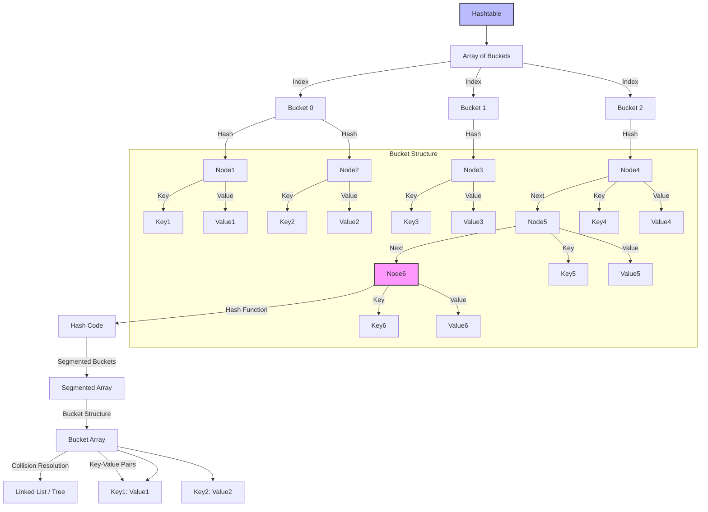
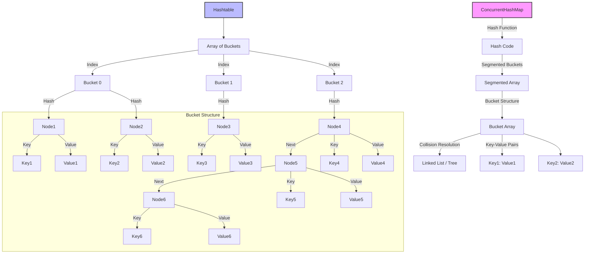
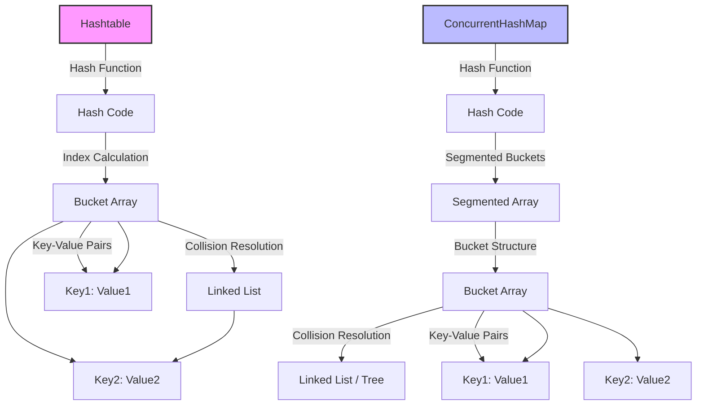
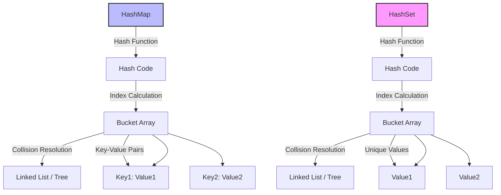

### **Table of Contents**

1. [Class and Object](#class-and-object)  
2. [Encapsulation](#encapsulation)  
3. [Inheritance](#inheritance)  
4. [Polymorphism](#polymorphism)  
5. [Abstraction](#abstraction)  
6. [Composition](#composition)  
7. [Abstract Class](#abstract-class)  
8. [Regular Interface](#regular-interface)  
9. [Functional Interface](#functional-interface)  
10. [Java Thread & Concurrency](#java-thread-concurrency)  
11. [Garbage Collection in Java](#garbage-collection-in-java)
12. [Garbage Collection vs Semaphore](#garbage-collection-vs-semaphore)
13. [Main Garbage Collection Algorithms](#main-garbage-collection-algorithms)
14. [Memory Management in Java](#memory-management-in-java)
15. [Memory Management and Resource Allocation](#memory-management-and-resource-allocation)
16. [Garbage Collection vs Semaphore](#garbage-collection-vs-semaphore)
17. [Garbage Collection Algorithms in Java](#garbage-collection-algorithms-in-java)  
18. [Algorithms and Data Structures](#algorithms-and-data-structures)  
19. [Ambiguities in Java](#ambiguities-in-java)  
20. [Java Interview Questions](#java-interview-questions)  
    1. [List of Common Java Interview Questions](#common-java-interview-questions)  
    2. [Java 8 Interview Questions and Answers](#java-8-interview-questions)  
21. [Features Introduced in Java 8](#features-in-java-8)  
22. [Java Multithreading & Concurrency Interview Questions](#java-multithreading-concurrency-interview-questions)  
23. [Comparison of Java Concepts](#comparison-of-java-concepts)  
24. [Tricky Java Interview Questions](#tricky-java-interview-questions)  
25. [POJO (Plain Old Java Object)](#pojo)  
26. [Java Core Concepts Overview](#java-core-concepts-overview)  
27. [Java IO and NIO File Handling](#java-io-and-nio)  
28. [Serialization and Deserialization](#serialization-and-deserialization)    
29. [Exception Handling in Java](#exception-handling-in-java)  
30. [HashMap, Hashtable, and HashSet](#hashmap-hashtable-hashset)  
31. [Java Collection Framework](#java-collection-framework)  
32. [Java Thread Management & Synchronization](#java-thread-management)  
33. [Executor Framework](#executor-framework)  
34. [Deadlock Detection & Recovery](#deadlock-detection-recovery)  
35. [Semaphore & Snapshot](#semaphore-snapshot)  
36. [Concurrency Issues](#concurrency-issues)  
37. [Garbage Collection Algorithms](#garbage-collection-algorithms)  
38. [Java 8 Updated Collections Framework](#java-8-updated-collections-framework)
39. [New Features Introduced in Java 8 Collections Framework](#new-features-introduced-in-java-8-collections-framework)  
40. [Java 8 Lambda Expressions](#java-8-lambda-expressions)  
41. [CompletableFuture: Depth Concept and Methods](#completablefuture-depth-concept)  
42. [Java Design Patterns](#java-design-patterns)  
43. [Microservice Design Patterns](#microservice-design-patterns)  
44. [ACID Properties & Transaction Isolation](#acid-properties-transaction-isolation)
45. [ACID Properties](#acid-properties)
46. [Transaction Isolation](#transaction-isolation)  
47. [SOLID Principles](#solid-principles)  
48. [Hashtable vs. ConcurrentHashMap](#hashtable-vs-concurrenthashmap)  
49. [Fail-Fast vs. Fail-Safe](#fail-fast-vs-fail-safe)
50. [Fail-Fast and Fail-Safe](#fail-fast-and-fail-safe)
51. [Sharding in MongoDB](#sharding-in-mongodb)  
52. [Horizontal and Vertical Scaling](#horizontal-vertical-scaling)  
53. [Types of ClassLoaders](#types-of-classloaders)  
54. [Creating Objects in Java](#creating-objects-in-java)  
55. [Concurrency Methods in Java](#concurrency-methods-in-java)  
    1. [wait(), sleep(), join(), yield()](#wait-sleep-join-yield)  
56. [Immutable Classes in Java](#immutable-classes-in-java)  
57. [Concurrency Issues: Deadlock, Starvation, Race Condition](#concurrency-issues)  
58. [Void vs. void](#void-vs-void)  
59. [Default & Static Methods](#default-static-methods)  
60. [Diamond Problem](#diamond-problem)  
61. [ReentrantLock & Conditions](#reentrantlock-conditions)  
62. [On-Premises Concepts](#on-premises-concepts)  
63. [Java Profiling Tools](#java-profiling-tools)  
64. [SSL/TLS Configuration in Java](#ssl-tls-configuration)  
65. [CI/CD Pipelines in Java](#ci-cd-pipelines)  
66. [Aspect-Oriented Programming (AOP)](#aspect-oriented-programming)  
67. [Concurrency in Java](#concurrency-in-java)  
68. [Digital Marketing & Backend Development](#digital-marketing-backend-development)  
69. [Microservice Rate Limiting](#microservice-rate-limiting)  
70. [Load Testing with JMeter](#load-testing-with-jmeter)  
71. [Virtual Threads in Java 19](#virtual-threads-java-19)  
72. [Memory Leaks in Microservices](#memory-leaks-microservices)  
73. [Asynchronous Programming in Spring Boot](#asynchronous-programming-spring-boot)  

---

### **Core Java Concepts**

11. [Garbage Collection (GC) Algorithms](#garbage-collection-gc-algorithms)  
12. [CompletableFuture: Depth Concept and Methods](#completablefuture-depth-concept-and-methods)  
13. [Java 8 Lambda Expressions](#java-8-lambda-expressions)  
14. [Java 8 Features Introduced](#java-8-features-introduced)  

  
  
19. [Java Design Patterns](#java-design-patterns)  
21. [Overview of `Hashtable` & `ConcurrentHashMap`](#overview-of-hashtable-concurrenthashmap)  
22. [Hashing in `Hashtable & ConcurrentHashMap`](#hashing-in-hashtable-concurrenthashmap)  
23. [Comparison of HashMap and ConcurrentHashMap](#comparison-of-hashmap-and-concurrenthashmap)  
  
25. [Snapshot](#snapshot)  
26. [Ambiguities in Java Technologies](#ambiguities-in-java-technologies)  
27. [An Overview of Angular, React, Microservices, and Threading, along with Their Interactions and Use Cases](#an-overview-of-angular-react-microservices-and-threading-along-with-their-interactions-and-use-cases)  
  
29. [Horizontal and Vertical Scaling](#horizontal-and-vertical-scaling)  
30. [Types of ClassLoaders](#types-of-classloaders)  
31. [Java Ways to Create Objects](#java-ways-to-create-objects)  
32. [In Java, `wait()`, `sleep()`, `join()`, and `yield()` are Methods Used in Multi-threading to Manage Thread Behavior](#in-java-wait-sleep-join-and-yield-are-methods-used-in-multi-threading-to-manage-thread-behavior)  
33. [Immutable Classes in Java](#immutable-classes-in-java)  
34. [Concurrency Issues: Deadlock, Starvation, Race Condition, Fairness Policy](#concurrency-issues-deadlock-starvation-race-condition-fairness-policy)  
35. [Breaking Singleton Pattern](#breaking-singleton-pattern)  
36. [`void` and `Void`](#void-and-void)  
37. [To Resolve the Diamond Problem in Java](#to-resolve-the-diamond-problem-in-java)  
38. [Conditions](#conditions)  
39. [Lifecycle of a Thread](#lifecycle-of-a-thread)  
40. [Java, `sleep()`, `wait()`, `join()`, and `LockSupport.park()`](#java-sleep-wait-join-and-locksupportpark)  
41. [Introduction of Default and Static Methods in Java](#introduction-of-default-and-static-methods-in-java)  
42. [Interfaces in Java (Post-Java 8)](#interfaces-in-java-post-java-8)  
43. [The Diamond Problem in Java](#the-diamond-problem-in-java)  
44. [ForkJoinPool](#forkjoinpool)  
45. [Threads and Concurrency](#threads-and-concurrency)
46. [Rate Limiting in Microservices](#rate-limiting--microservices)

---

### **Java Interview Questions and Concepts**

49. [List of Common Java Interview Questions Along with Detailed Answers](#list-of-common-java-interview-questions-along-with-detailed-answers)  
50. [Java 8 Interview Questions and Answers](#java-8-interview-questions-and-answers)  
51. [Features Introduced in Java 8](#features-introduced-in-java-8)  
52. [Common Interview Questions Related to Java Multithreading and Concurrency, Along with Detailed Answers and Code Examples](#common-interview-questions-related-to-java-multithreading-and-concurrency-along-with-detailed-answers-and-code-examples)  
53. [Tricky Java Interview Questions](#tricky-java-interview-questions)  
54. [POJO (Plain Old Java Object) Classes](#pojo-plain-old-java-object-classes)  

---

### **Advanced Topics**

55. [Serialization and Deserialization](#serialization-and-deserialization)  
56. [Load Testing](#load-testing)  
57. [Virtual Threads in Java 19](#virtual-threads-in-java-19)  
58. [Memory Leak in Microservices: Understanding and Resolution](#memory-leak-in-microservices-understanding-and-resolution)  
59. [Permanent Generation (PermGen)](#permanent-generation-permgen)  
60. [Analyze and Identify Memory Leaks](#analyze-and-identify-memory-leaks)  
61. [How to Implement Asynchronous Programming in Spring Boot](#how-to-implement-asynchronous-programming-in-spring-boot)  
62. [Thread Management and Synchronization](#thread-management-and-synchronization)  
63. [Detecting and Recovering from Deadlocks](#detecting-and-recovering-from-deadlocks)
64. [Asynchronous programming support](#asynchronous-programming-support)
---

This cleaned-up Table of Contents removes the duplicate entries while keeping all the relevant topics. The list is now grouped logically into sections: **Core Java Concepts**, **Java Interview Questions and Concepts**, and **Advanced Topics**. Let me know if you'd like any further adjustments!

## JAVA

---

### **Object-Oriented Programming (OOP) Concepts**
Object-Oriented Programming (OOP) is a programming paradigm based on the concept of **objects**, which are instances of **classes**. OOP focuses on using objects and their interactions to design and implement software. It helps in organizing and structuring code efficiently, making it more maintainable, reusable, and scalable.
Here are the **core OOP concepts**:

---
### 1. **Class and Object**
- **Class**: A blueprint or template for creating objects. It defines properties (fields) and behaviors (methods) that the objects created from the class will have.
  
  **Example**: 
  ```java
  class Car {
      String make;
      String model;
      int year;
      void start() {
          System.out.println("Car is starting");
      }
  }
  ```
- **Object**: An instance of a class. It contains actual values for the properties and can invoke methods defined in the class.
  **Example**:
  ```java
  public class Main {
      public static void main(String[] args) {
          Car car1 = new Car();  // Creating an object of the Car class
          car1.make = "Toyota";
          car1.model = "Corolla";
          car1.year = 2020;
          car1.start();  // Calling the method of the Car object
      }
  }
  ```
---
### 2. **Encapsulation**
Encapsulation is the concept of bundling the data (fields) and methods (functions) that operate on the data into a single unit (class), and restricting access to some of the object's components. This is done using access modifiers (like `private`, `protected`, `public`) to control access to the object's state and behavior.
#### **Benefits**:
- **Data Hiding**: The internal state of the object is hidden from the outside world, which helps in protecting the data.
- **Controlled Access**: Only the methods (getters and setters) defined by the class are allowed to access or modify the internal state.
**Example**:
```java
class Employee {
    private String name;  // Private field, cannot be accessed directly
    private int age;
    // Public getter method to access private field
    public String getName() {
        return name;
    }
    // Public setter method to modify private field
    public void setName(String name) {
        this.name = name;
    }
    public int getAge() {
        return age;
    }
    public void setAge(int age) {
        if (age > 0) {
            this.age = age;
        }
    }
}
```
In the above example, `name` and `age` are encapsulated (private), and access to them is controlled through public getter and setter methods.

---
### 3. **Inheritance**
Inheritance allows a new class (called the **subclass** or **child class**) to inherit the properties and behaviors (fields and methods) from an existing class (called the **superclass** or **parent class**). This allows for **reusability** of code and establishing a relationship between classes.
#### **Key Points**:
- The subclass inherits all the public and protected fields and methods of the parent class.
- A subclass can override methods of the superclass to provide its own implementation.
- In Java, a class can only **extend** one superclass (single inheritance), but it can implement multiple interfaces.
**Example**:
```java
class Animal {
    void eat() {
        System.out.println("Animal is eating");
    }
}
class Dog extends Animal {
    void bark() {
        System.out.println("Dog is barking");
    }
    @Override
    void eat() {
        System.out.println("Dog is eating");
    }
}
public class Main {
    public static void main(String[] args) {
        Dog dog = new Dog();
        dog.eat();  // Outputs: Dog is eating (overridden method)
        dog.bark(); // Outputs: Dog is barking
    }
}
```
In this example:
- The `Dog` class inherits the `eat()` method from the `Animal` class, but overrides it to provide its own implementation.
---
### 4. **Polymorphism**
Polymorphism means "many forms" and allows objects of different classes to be treated as objects of a common superclass. It enables the same method or operation to behave differently based on the object it is acting upon.
There are two types of polymorphism:
1. **Compile-time Polymorphism** (Method Overloading): This occurs when multiple methods have the same name but different parameter lists (number, type, or both).
2. **Runtime Polymorphism** (Method Overriding): This occurs when a subclass provides a specific implementation for a method already defined in its superclass.
#### **Example of Method Overloading (Compile-time Polymorphism)**:
```java
class MathOperation {
    int add(int a, int b) {
        return a + b;
    }
    double add(double a, double b) {
        return a + b;
    }
}
public class Main {
    public static void main(String[] args) {
        MathOperation operation = new MathOperation();
        System.out.println(operation.add(5, 3));       // Outputs: 8
        System.out.println(operation.add(5.5, 3.2));   // Outputs: 8.7
    }
}
```
#### **Example of Method Overriding (Runtime Polymorphism)**:
```java
class Animal {
    void sound() {
        System.out.println("Animal makes a sound");
    }
}
class Dog extends Animal {
    @Override
    void sound() {
        System.out.println("Dog barks");
    }
}
public class Main {
    public static void main(String[] args) {
        Animal myAnimal = new Animal();  // Parent class reference
        myAnimal.sound();  // Outputs: Animal makes a sound
        myAnimal = new Dog();  // Child class reference
        myAnimal.sound();  // Outputs: Dog barks (Runtime Polymorphism)
    }
}
```
In this example, the `sound()` method is overridden in the `Dog` class, and at runtime, the method of the actual object type (`Dog`) is called, even though the reference type is `Animal`.

---
### 5. **Abstraction**
Abstraction is the process of hiding the implementation details and showing only the essential features of an object. It allows focusing on what an object **does**, rather than **how** it does it. In Java, abstraction is achieved using **abstract classes** and **interfaces**.
#### **Key Points**:
- **Abstract Class**: Can have both abstract (no implementation) and concrete (with implementation) methods.
- **Interface**: A contract that only defines method signatures (until Java 8, now can have default methods with implementation).
#### **Example**:
```java
abstract class Animal {
    abstract void sound();  // Abstract method, no implementation
}
class Dog extends Animal {
    @Override
    void sound() {
        System.out.println("Woof!");
    }
}
public class Main {
    public static void main(String[] args) {
        Animal dog = new Dog();
        dog.sound();  // Outputs: Woof!
    }
}
```
In this example, the `sound()` method is abstract in the `Animal` class, and the `Dog` class provides its specific implementation.

---
### 6. **Composition**
Composition is the practice of building complex objects by combining simpler ones. Unlike inheritance, which is an **"is-a"** relationship, composition represents a **"has-a"** relationship. In composition, objects of other classes are used as fields in a class.
#### **Example of Composition**:
```java
class Engine {
    void start() {
        System.out.println("Engine is starting");
    }
}
class Car {
    private Engine engine;  // Composition: Car "has-a" Engine
    Car() {
        engine = new Engine();  // Car contains an Engine
    }
    void startCar() {
        engine.start();  // Using the engine object
        System.out.println("Car is starting");
    }
}
public class Main {
    public static void main(String[] args) {
        Car car = new Car();
        car.startCar();  // Outputs: Engine is starting, Car is starting
    }
}
```
In this example, `Car` **has an** `Engine`, so it's a composition relationship. The `Car` class uses the `Engine` object as a part of its functionality.


### **Summary of OOP Concepts**:
- **Class and Object**: Classes define objects, and objects are instances of classes.
- **Encapsulation**: Hides the internal state of an object and provides controlled access via methods.
- **Inheritance**: Allows one class to inherit fields and methods from another class, facilitating code reuse.
- **Polymorphism**: Enables one interface to be used for different underlying forms (method overloading/overriding).
- **Abstraction**: Hides the implementation details and shows only the essential features of an object.
- **Composition**: Represents a "has-a" relationship, where one class contains objects of other classes.
These core principles of **OOP** help in building robust, maintainable, and reusable code. They allow developers to structure programs that are easier to understand and modify over time.
You're right! I missed covering **Aggregation** and **Association** in the previous explanation. Let me provide a more comprehensive overview of these concepts, alongside the previously mentioned ones like **Inheritance**, **Polymorphism**, **Abstraction**, and **Encapsulation**.

---
### **OOP Concepts with Aggregation, Composition, and Association**

In addition to the primary Object-Oriented Programming (OOP) principles, there are important design relationships between classes that are useful when modeling real-world problems. These are **Association**, **Aggregation**, and **Composition**, which represent different types of "has-a" relationships.
Let's break these concepts down:

---
### **1. Association**
**Association** is the most general form of relationship between objects. It represents a situation where objects of one class are associated with objects of another class, but neither class owns the other. In other words, objects are linked, but they can exist independently.
#### **Types of Association**:
- **One-to-one**: One object of a class is associated with one object of another class.
- **One-to-many**: One object of a class is associated with many objects of another class.
- **Many-to-many**: Many objects of a class are associated with many objects of another class.
#### **Example of Association**:
```java
class Person {
    String name;
    Person(String name) {
        this.name = name;
    }
}
class Address {
    String city;
    Address(String city) {
        this.city = city;
    }
}
public class Main {
    public static void main(String[] args) {
        Person person = new Person("John");
        Address address = new Address("New York");
        // Association: A person can have an address, but they exist independently
        System.out.println(person.name + " lives in " + address.city);
    }
}
```
Here, `Person` and `Address` have a simple association. A person can have an address, but they are independent entities, so this is a one-to-one association.

---
### **2. Aggregation**
**Aggregation** is a special form of association where one object is a part of another object, but the lifetime of the aggregated object is independent of the lifetime of the parent object. In other words, objects that are part of an aggregate can exist without the parent object.
- Aggregation represents a **"has-a"** relationship, but the contained object can exist on its own.
- It is sometimes referred to as a **"whole-part"** relationship.
#### **Example of Aggregation**:
```java
class Department {
    String name;
    // Aggregation: Department has employees, but employees can exist independently
    Employee employee;
    Department(String name, Employee employee) {
        this.name = name;
        this.employee = employee;
    }
}
class Employee {
    String name;
    Employee(String name) {
        this.name = name;
    }
}
public class Main {
    public static void main(String[] args) {
        Employee emp1 = new Employee("Alice");
        Department dept1 = new Department("HR", emp1);
        
        System.out.println(dept1.name + " department has " + dept1.employee.name + " as an employee.");
        // Employee exists independently of the department
    }
}
```
In this case, `Employee` can exist independently of `Department`, which is characteristic of aggregation. The `Department` "has-a" `Employee`, but the `Employee` could be moved to another department or exist without any department.

---
### **3. Composition**
**Composition** is a stronger form of aggregation. In composition, the contained objects **cannot exist independently** of the parent object. When the parent object is destroyed, all its contained objects are destroyed as well. Composition represents a **"contains-a"** or **"part-of"** relationship, where the child objects cannot exist outside the parent.
#### **Key Characteristics of Composition**:
- **Stronger lifecycle dependency**: If the parent object is destroyed, the child objects are also destroyed.
- **"Has-a" relationship** with a strong ownership relationship between the parent and child.
#### **Example of Composition**:
```java
class Library {
    String name;
    // Composition: Library contains Books, and Books cannot exist without the Library
    Book book;
    Library(String name, Book book) {
        this.name = name;
        this.book = book;
    }
}
class Book {
    String title;
    Book(String title) {
        this.title = title;
    }
}
public class Main {
    public static void main(String[] args) {
        Book book1 = new Book("Java Programming");
        Library library = new Library("City Library", book1);
        
        System.out.println(library.name + " has a book titled " + library.book.title);
        // If the library is destroyed, the book will be destroyed as well.
    }
}
```
In this example, the `Book` class cannot exist independently of the `Library`. When the `Library` object is destroyed, its `Book` object is also destroyed. This strong relationship is a hallmark of composition.

---
### **4. Inheritance**
As already explained, **Inheritance** allows one class to inherit the properties and methods of another class. It enables code reuse and establishes a "is-a" relationship.
- **"is-a" relationship**: The subclass is a type of the superclass.
  
#### **Example of Inheritance**:
```java
class Animal {
    void sound() {
        System.out.println("Animal makes a sound");
    }
}
class Dog extends Animal {
    void sound() {
        System.out.println("Dog barks");
    }
}
public class Main {
    public static void main(String[] args) {
        Dog dog = new Dog();
        dog.sound();  // Outputs: Dog barks
    }
}
```
The `Dog` class inherits from `Animal` and overrides the `sound()` method.
---
### **5. Polymorphism**
Polymorphism allows one interface to be used for different underlying forms. It allows methods to do different things based on the object it is acting upon, enabling method overloading and method overriding.
#### **Method Overloading** (Compile-time Polymorphism):
```java
class MathOperation {
    int add(int a, int b) {
        return a + b;
    }
    double add(double a, double b) {
        return a + b;
    }
}
public class Main {
    public static void main(String[] args) {
        MathOperation op = new MathOperation();
        System.out.println(op.add(3, 4));    // Outputs: 7
        System.out.println(op.add(3.5, 4.5));  // Outputs: 8.0
    }
}
```
#### **Method Overriding** (Runtime Polymorphism):
```java
class Animal {
    void sound() {
        System.out.println("Animal makes a sound");
    }
}
class Dog extends Animal {
    @Override
    void sound() {
        System.out.println("Dog barks");
    }
}
public class Main {
    public static void main(String[] args) {
        Animal dog = new Dog();
        dog.sound();  // Outputs: Dog barks
    }
}
```
Here, the `sound()` method is overridden in the `Dog` class, demonstrating runtime polymorphism.

---
### **6. Abstraction**
Abstraction is the process of hiding implementation details and showing only the essential features of an object. In Java, you achieve abstraction using **abstract classes** and **interfaces**.
#### **Example of Abstraction**:
```java
abstract class Animal {
    abstract void sound();  // Abstract method (no implementation)
}
class Dog extends Animal {
    @Override
    void sound() {
        System.out.println("Woof!");
    }
}
public class Main {
    public static void main(String[] args) {
        Animal dog = new Dog();
        dog.sound();  // Outputs: Woof!
    }
}
```
In this example, the `sound()` method is abstract in the `Animal` class, and the `Dog` class provides a specific implementation.

---
### **7. Encapsulation**
Encapsulation is the concept of hiding an object's internal state and requiring all interaction to be performed through well-defined methods. This is usually done by making fields `private` and providing public getter and setter methods.
#### **Example of Encapsulation**:
```java
class Person {
    private String name;
    private int age;
    // Getter and Setter methods
    public String getName() {
        return name;
    }
    public void setName(String name) {
        this.name = name;
    }
    public int getAge() {
        return age;
    }
    public void setAge(int age) {
        if (age > 0) {
            this.age = age;
        }
    }
}
```
In this example, the `Person` class encapsulates the `name` and `age` fields and provides controlled access to them via getter and setter methods.

---

### **Summary of OOP Concepts**:
| Concept         | Description                                                                 | Example                                                         |
|-----------------|-----------------------------------------------------------------------------|-------------------------------------------------------------|
| **Association**  | Represents a general relationship between objects.                          | A `Person` can have an `Address` (independent objects).      |
| **Aggregation**  | A form of association where the child can exist independently of the parent. | A `Department` "has" an `Employee`, but employees can exist independently. |
| **Composition**  | A stronger form of aggregation where the child cannot exist without the parent. | A `Library` "contains" a `Book`, and books cannot exist outside the library. |
| **Inheritance**  | Allows a class to inherit fields and methods from another class.            | A `Dog` "is a" type of `Animal` and inherits
 its methods.     |
| **Polymorphism** | Allows one interface to be used for different underlying forms.              | A `Dog` class overrides the `sound()` method of `Animal`.     |
| **Abstraction**  | Hides the implementation details and shows only essential features.         | An `Animal` class defines an abstract `sound()` method.       |
| **Encapsulation**| Hides the internal state of an object and provides controlled access.       | `Person` class has private fields with public getter and setter methods. |

Understanding these principles will help you design more maintainable and flexible object-oriented software.

### **Abstract Class, Regular Interface, and Functional Interface in Java**
In Java, **abstract classes** and **interfaces** are fundamental concepts for defining common behavior and structure across different classes. They allow for abstraction and polymorphism in object-oriented programming. However, abstract classes and interfaces serve different purposes and have different characteristics. Let’s explore the differences and use cases for each.

---

### **1. Abstract Class**
An **abstract class** is a class that cannot be instantiated on its own but can be subclassed by other classes. It is used when you want to provide a common base for other classes to extend while allowing subclasses to provide their own specific implementations.

#### **Key Characteristics of Abstract Class:**
- **Cannot be instantiated**: You cannot create an instance of an abstract class directly.
- **Can have both abstract and concrete methods**: An abstract class can have abstract methods (methods without implementation) and concrete methods (methods with implementation).
- **Can have instance variables**: Abstract classes can have instance variables (fields) and constructors.
- **Supports inheritance**: Abstract classes are inherited by other classes using the `extends` keyword.
- **Can have access modifiers**: The methods in an abstract class can have various access modifiers like `private`, `protected`, and `public`.
- **Can provide default behavior**: Concrete methods in abstract classes can provide default behavior, so subclasses don’t always need to implement them.

#### **Example of Abstract Class**:
```java
abstract class Animal {
    // Abstract method (no implementation)
    abstract void sound();
    // Concrete method (with implementation)
    void sleep() {
        System.out.println("This animal is sleeping.");
    }
}
class Dog extends Animal {
    // Providing implementation for the abstract method
    void sound() {
        System.out.println("Woof!");
    }
}
public class TestAbstractClass {
    public static void main(String[] args) {
        Animal dog = new Dog();
        dog.sound();  // Outputs: Woof!
        dog.sleep();  // Outputs: This animal is sleeping.
    }
}
```
#### **When to use Abstract Class:**
- When you have a common base class with some common behavior that can be shared by multiple subclasses.
- When you need to define default behavior (concrete methods) along with abstract methods that subclasses must implement.
- When you want to define instance variables and constructors that can be used by subclasses.

---

### **2. Regular Interface**
A **regular interface** is a contract that defines methods that must be implemented by any class that chooses to implement the interface. Unlike abstract classes, interfaces are primarily used to define **a contract for behaviors** without providing any implementation (except for default methods starting from Java 8).

#### **Key Characteristics of Regular Interface:**
- **Cannot have instance variables**: Interfaces cannot have instance variables, but they can have constants (`public static final` fields).
- **All methods are implicitly abstract**: Methods in interfaces are abstract by default (except for default methods or static methods).
- **Can be implemented by any class**: A class implements an interface using the `implements` keyword, and a class can implement multiple interfaces.
- **Supports multiple inheritance**: Unlike classes, a class can implement multiple interfaces.
- **No constructors**: Interfaces do not have constructors.
- **Can have default and static methods** (since Java 8): You can define default methods with implementation and static methods in an interface, which wasn’t possible in earlier versions of Java.

#### **Example of Regular Interface**:
```java
interface Animal {
    // Abstract method (no implementation)
    void sound();
    // Default method with implementation
    default void sleep() {
        System.out.println("This animal is sleeping.");
    }
}
class Dog implements Animal {
    // Providing implementation for the abstract method
    public void sound() {
        System.out.println("Woof!");
    }
}
public class TestInterface {
    public static void main(String[] args) {
        Animal dog = new Dog();
        dog.sound();  // Outputs: Woof!
        dog.sleep();  // Outputs: This animal is sleeping.
    }
}
```

#### **When to use Regular Interface:**
- When you want to define a contract for behavior that can be implemented by multiple classes.
- When you need multiple inheritance of behavior (i.e., a class can implement multiple interfaces).
- When you only want to define method signatures and leave the implementation to the classes that implement the interface.

---

### **3. Functional Interface**
A **functional interface** is a special type of interface in Java that has **exactly one abstract method**. Functional interfaces are used primarily to support lambda expressions and method references in Java 8 and beyond.

#### **Key Characteristics of Functional Interface:**
- **Exactly one abstract method**: A functional interface can have only one abstract method, but it can have multiple default or static methods.
- **Used with Lambda Expressions**: Functional interfaces are used primarily to represent **single-method** interfaces that can be implemented using lambda expressions.
- **`@FunctionalInterface` annotation**: This annotation is not mandatory, but it’s recommended because it helps the compiler ensure the interface conforms to the rules of a functional interface (i.e., it has only one abstract method).

#### **Example of Functional Interface**:
```java
@FunctionalInterface
interface Calculator {
    int add(int a, int b);  // Single abstract method
    // Default method
    default int subtract(int a, int b) {
        return a - b;
    }
}
public class TestFunctionalInterface {
    public static void main(String[] args) {
        // Using a lambda expression to implement the functional interface
        Calculator calculator = (a, b) -> a + b;
        // Calling the method using the lambda implementation
        System.out.println("Sum: " + calculator.add(5, 3));  // Outputs: Sum: 8
        // Calling the default method
        System.out.println("Difference: " + calculator.subtract(5, 3));  // Outputs: Difference: 2
    }
}
```

#### **When to use Functional Interface:**
- When you want to represent a single action or behavior that can be implemented using a lambda expression or method reference.
- When working with Java’s **Stream API** or **java.util.function** package, which heavily relies on functional interfaces (e.g., `Predicate`, `Function`, `Consumer`, etc.).

---

### **Key Differences Between Abstract Class, Regular Interface, and Functional Interface:**
| Feature                        | **Abstract Class**                               | **Regular Interface**                                  | **Functional Interface**                              |
|---------------------------------|--------------------------------------------------|--------------------------------------------------------|--------------------------------------------------------|
| **Methods**                     | Can have both abstract and concrete methods.     | All methods are abstract by default (except default/static methods). | Exactly one abstract method, can have multiple default/static methods. |
| **Fields**                       | Can have instance variables (fields).            | Cannot have instance variables (only constants).       | Cannot have instance variables (only constants).       |
| **Inheritance**                  | Can inherit from one class, can implement interfaces. | Can implement multiple interfaces.                    | Can implement multiple interfaces (like a regular interface). |
| **Constructors**                 | Can have constructors.                           | No constructors allowed.                               | No constructors allowed.                               |
| **Use Case**                     | When you want to share behavior with some common implementation. | When you want to define a contract for behavior without implementation. | When you want to define a single method interface for lambda expressions. |
| **Multiple Inheritance**         | Not supported (can extend only one class).       | Supported (a class can implement multiple interfaces).  | Supported (same as regular interfaces).                 |
| **Default Methods**              | Can provide default behavior with concrete methods. | Can provide default methods (since Java 8).            | Can have default methods (optional).                   |
| **Annotations**                  | No special annotation required.                  | No special annotation required.                        | `@FunctionalInterface` annotation to indicate it is a functional interface. |

---

### **Summary:**
- **Abstract Class**: Used for sharing common behavior between classes, can have both abstract and concrete methods, allows instance variables and constructors.
- **Regular Interface**: Defines a contract for behavior, can be implemented by multiple classes, and can have default methods (since Java 8).
- **Functional Interface**: A special type of interface that has exactly one abstract method and can be used with lambda expressions, ideal for representing single-function behaviors.


## Java and Concurrency
1. **Question**: What is the difference between `synchronized` and `volatile` in Java?
   **Answer**: `synchronized` is a keyword that ensures that only one thread can access a block of code or method at a time, providing mutual exclusion. `volatile`, on the other hand, is used to indicate that a variable's value will be modified by different threads. It ensures that the most recent value is always read from the main memory, but it does not provide mutual exclusion.

   ```java
   public class Example {
       private volatile int counter = 0;

       public void increment() {
           synchronized (this) {
               counter++;
           }
       }
   }
   ```

2. **Question**: Explain garbage collection in Java.
   **Answer**: Garbage Collection (GC) is the process of automatically freeing memory by removing objects that are no longer in use. Java provides several garbage collectors, such as the Serial GC, Parallel GC, G1 GC, and ZGC, each with different performance characteristics.

## Garbage Collection in Java

**Garbage Collection (GC)** in Java is the process by which the Java Virtual Machine (JVM) automatically reclaims memory that is no longer in use or referenced by any part of the program. It helps in managing memory automatically and preventing memory leaks, which can cause a program to consume more memory than necessary or even crash due to an **OutOfMemoryError**.

Java uses automatic garbage collection to handle the deallocation of memory for objects that are no longer reachable, meaning no references to the object remain in the program. This process runs in the background without manual intervention.

### **Key Concepts of Garbage Collection in Java**

1. **Heap Memory**:
   - The **heap** is where Java stores objects during runtime.
   - The heap is divided into several generations: 
     - **Young Generation**: Where new objects are allocated.
     - **Old Generation**: Where objects that have survived multiple garbage collection cycles are moved.
     - **Permanent Generation (Metaspace in newer versions)**: Stores metadata related to classes and methods.
   
2. **Generational Garbage Collection**:
   - Java’s garbage collectors are generational, meaning they divide objects into generations to optimize collection. Objects that are recently created are likely to become unreachable quickly, so the **young generation** is collected more frequently.
   - The **old generation** collects objects that have existed for a longer time and are less likely to become garbage quickly.
   
3. **Mark-and-Sweep Algorithm**:
   - The most common garbage collection algorithm is the **Mark-and-Sweep** algorithm.
   - **Mark Phase**: The garbage collector marks objects that are still reachable (i.e., objects that can be accessed via references).
   - **Sweep Phase**: It then sweeps through the heap and removes objects that are not marked as reachable.

4. **Stop-the-World Event**:
   - Garbage collection is often a **stop-the-world event**, meaning all application threads are paused while GC happens. This can cause performance bottlenecks, especially in large applications with many objects.
   
5. **Garbage Collectors in Java**:
   - **Serial Garbage Collector**: A simple, single-threaded collector.
   - **Parallel Garbage Collector**: Uses multiple threads to speed up the collection process in multicore systems.
   - **Concurrent Mark-Sweep (CMS) Collector**: Designed to minimize pauses by performing most of the marking and sweeping concurrently with application threads.
   - **G1 Garbage Collector**: A newer collector designed to handle large heaps with low latency. It divides the heap into regions and collects them independently.
   - **ZGC (Z Garbage Collector)** and **Shenandoah GC**: Low-latency collectors for large heaps.

6. **Finalization**:
   - Objects that are about to be garbage collected can have their `finalize()` method called. However, the use of `finalize()` is **deprecated** in recent Java versions, and it is recommended to use `try-with-resources` or other mechanisms for cleanup.

## **Memory Management in Java**

Memory management in Java involves controlling the allocation and deallocation of memory for objects in the heap. Java provides automatic memory management through garbage collection, but developers still have control over object creation, resource management, and the proper release of resources.

1. **Object Creation**:
   - When an object is created using the `new` keyword, it is allocated memory on the heap. The memory is managed by the JVM.
   
2. **Object Reachability**:
   - An object is **reachable** if it can be accessed directly or indirectly through any reference in the program. When no references point to an object, the object becomes **garbage** and eligible for collection.

3. **Manual Resource Management**:
   - While garbage collection handles memory management, resources like **file handles**, **database connections**, and **network connections** are not managed by GC. These resources must be manually managed, typically through `try-with-resources` or explicitly calling resource cleanup methods like `close()`.

4. **Memory Leaks**:
   - **Memory leaks** occur when an object is no longer needed but is still reachable and cannot be garbage collected. This often happens due to lingering references in static collections, improperly closed resources, or circular references.

---

## Garbage Collection vs Semaphore

Garbage collection and semaphores are two very different concepts, but they are often discussed in concurrent programming. Here's a comparison:

#### **Garbage Collection**:
- **Purpose**: Automatic memory management; freeing memory that is no longer in use.
- **Nature**: A background process that runs independently of the application's main logic. It deals with memory reclamation.
- **Context**: Primarily used to manage the heap memory in Java.
- **Concurrency**: While the garbage collector operates on the heap in a multi-threaded environment, it does so **independently** and may cause pauses in the application (stop-the-world events). It’s generally invisible to the programmer.
- **Performance Impact**: Garbage collection can **impact performance** if it happens frequently, as it may stop the application threads to reclaim memory. This can lead to **latency issues** in real-time or high-performance applications.

#### **Semaphore**:
- **Purpose**: A synchronization mechanism used to control access to a shared resource in concurrent programming.
- **Nature**: A **synchronization primitive** that controls access to shared resources by multiple threads. It is used for **resource management** in multithreaded environments.
- **Context**: Used to manage access to a limited number of resources (e.g., database connections, thread pools, etc.).
- **Concurrency**: Semaphores directly control **thread synchronization**. They limit the number of threads that can access a resource concurrently. A **binary semaphore** (similar to a mutex) can be used to restrict access to a resource to a single thread.
- **Performance Impact**: Semaphores can **affect performance** by introducing thread contention, causing threads to wait for access to the resource if other threads are already holding the semaphore.

---

### **Key Differences Between Garbage Collection and Semaphore**

| Feature                  | **Garbage Collection**                                   | **Semaphore**                                              |
|--------------------------|-----------------------------------------------------------|------------------------------------------------------------|
| **Purpose**               | Automatic memory management, reclaim unused objects      | Synchronization tool to control access to shared resources |
| **Scope**                 | Applies to memory (heap) management                       | Applies to managing access to resources or controlling concurrency |
| **Triggered By**          | JVM (automatically)                                       | Explicitly by threads or program logic                     |
| **Context**               | Focuses on memory cleanup and object lifecycle           | Focuses on controlling thread access to limited resources  |
| **Concurrency Control**   | Operates in background and does not directly control threads | Controls access to resources in multi-threaded environments |
| **Usage**                 | Used for memory management, not resource synchronization | Used to control how many threads can access a resource concurrently |
| **Interaction with Threads** | Can stop threads during collection (stop-the-world event) | Directly interacts with threads, causing them to wait or proceed based on availability of resources |
| **Performance Impact**    | Can cause latency (stop-the-world pauses) during collection | May cause thread contention, leading to delays in execution |
| **Example**               | Automatic garbage collection in Java                      | Limiting thread access to a limited resource like a database connection pool |

---

### **Summary**

- **Garbage Collection (GC)** in Java automatically manages the heap memory by reclaiming memory used by objects that are no longer in use. It runs in the background and helps avoid memory leaks, although it can cause performance hits (such as stop-the-world pauses) during collection.
  
- A **Semaphore** is a synchronization primitive used to manage access to a limited resource by multiple threads. It helps coordinate access in multi-threaded environments, preventing race conditions and ensuring thread safety.

In conclusion, **garbage collection** is about automatic memory management, while **semaphores** are about managing concurrency and access to resources in multi-threaded applications. They serve different purposes but are both crucial for building efficient, concurrent, and memory-safe applications.

## **Garbage Collection Algorithms in Java**

In Java, **Garbage Collection (GC)** is the automatic process by which the JVM (Java Virtual Machine) reclaims memory by identifying and deleting objects that are no longer in use (i.e., objects that cannot be reached from any live thread or static references). The goal of GC is to free up memory, preventing memory leaks, and optimizing memory usage during the application's lifecycle.

There are several **garbage collection algorithms** used by the JVM, each with different trade-offs in terms of performance, pause times, and how they handle memory. Below is an overview of the most common GC algorithms, their inner workings, and their pros and cons.

### **Garbage Collection Process Overview**

The **GC process** typically follows these steps:
1. **Marking**: The GC identifies which objects are still reachable (i.e., in use).
2. **Sweeping**: Unreachable objects (those that cannot be accessed from any references) are cleared from memory.
3. **Compacting (optional)**: To avoid memory fragmentation, the memory is reorganized (compact the memory) by moving objects together, which creates contiguous free space.

## Main Garbage Collection Algorithms

#### 1. **Serial Garbage Collector**
- The **Serial Garbage Collector** is the simplest and most basic garbage collection algorithm in Java. It uses a **single thread** for both the **mark** and **sweep** phases.

**Working:**
- It performs the GC process in a **stop-the-world event**, where all application threads are paused while garbage collection is happening.
- After identifying unreachable objects (marking), it sweeps and removes those objects.
- It also performs **compaction** of the heap to reduce fragmentation.

**When to Use:**
- The **Serial GC** is suitable for small applications, single-threaded environments, or applications with limited memory usage. It is typically used when low latency is not a primary concern and when the application does not require high throughput.

**Advantages:**
- Simple and easy to implement.
- Efficient for small applications or on systems with limited resources.

**Disadvantages:**
- **Single-threaded**: This means that **pause times** can be quite long, as all GC activities are done sequentially on a single thread.
- Not suitable for multi-core or multi-threaded environments as it doesn't leverage multiple cores.

---

#### 2. **Parallel Garbage Collector**
- The **Parallel Garbage Collector** (also known as the **Throughput Collector**) uses multiple threads to perform the garbage collection process. It is an enhancement over the Serial Collector and is designed to improve performance by utilizing multiple threads to perform the marking and sweeping phases in parallel.

**Working:**
- It runs in a **stop-the-world** manner, where all application threads are paused while the GC threads run in parallel.
- This is especially beneficial for applications that have **large heaps** and require high throughput. The collector tries to minimize the pause time for garbage collection, which can increase the overall throughput of the application.

**When to Use:**
- Suitable for multi-core systems or applications with large heaps where maximizing throughput is important.
- Typically used in server environments where **low pause times** are not critical.

**Advantages:**
- Utilizes **multiple threads** to speed up GC processes, reducing the overall time spent in GC.
- Suitable for applications with large memory requirements.

**Disadvantages:**
- Still causes **stop-the-world events**, so there can be **pause times** during collection.
- May not be suitable for applications that require **low-latency** or real-time behavior.

---

#### 3. **Concurrent Mark-Sweep (CMS) Collector**
- The **CMS Garbage Collector** is a more sophisticated collector designed to minimize the **stop-the-world pauses** by performing most of the GC activities concurrently with the application threads.

**Working:**
- The **marking** phase is done concurrently with the application threads, meaning that the application threads can continue running while objects are being marked for garbage collection.
- After the marking phase, the **sweep** and **compaction** phases occur, but **sweeping** happens concurrently as well.
- It still pauses during certain critical phases, such as when compacting the heap or during some synchronization steps between the application threads and GC threads.

**When to Use:**
- CMS is ideal for **low-latency** applications (e.g., web servers, real-time systems) where minimizing pause times is critical.
- Suitable for applications with large heaps where long GC pauses would negatively impact user experience.

**Advantages:**
- **Minimizes pause times** by doing much of the marking and sweeping concurrently.
- Can improve **responsiveness** and **latency** of applications that need to remain responsive to users.

**Disadvantages:**
- Not suitable for all workloads, especially in environments with **very large heaps**.
- Complexity in tuning and configuration (such as setting the **thresholds** for concurrent phases).
- Can suffer from **fragmentation** over time, as compacting the heap is done less frequently.

---

#### 4. **G1 Garbage Collector (Garbage-First)**
- The **G1 Garbage Collector** was introduced as a replacement for the CMS garbage collector in Java 7. G1 is designed to handle large heaps and reduce pause times while providing **predictability** and **low-latency** behavior.

**Working:**
- G1 divides the heap into **regions** (small, manageable parts), and each region is collected independently. This enables **more fine-grained control** over memory and garbage collection activities.
- It performs GC in **incremental steps**, and it can prioritize regions with the most garbage to collect first (hence the name "Garbage-First").
- G1 provides **concurrent marking**, **sweeping**, and **compaction** phases, allowing most of the collection work to happen in parallel with the application threads.

**When to Use:**
- Ideal for applications with **large heaps** that require a balance between high throughput and low pause times (e.g., large-scale enterprise applications).
- G1 can be tuned for **predictable latency** and can be used in **real-time** applications where long GC pauses are unacceptable.

**Advantages:**
- **Low pause times**: Designed to minimize pause times while maintaining high throughput.
- **Predictable pauses**: G1 allows you to specify a maximum pause time target (e.g., 200ms), and it will try to meet this target as much as possible.
- **Handles large heaps efficiently**: Dividing the heap into regions makes it more efficient in managing and collecting large memory areas.

**Disadvantages:**
- More **complex** to configure and fine-tune compared to other collectors.
- Still requires some stop-the-world pauses, but these are usually shorter and more predictable.

---

#### 5. **Z Garbage Collector (ZGC)**
- **ZGC** is a **low-latency** garbage collector introduced in JDK 11. It is designed for applications that require **extremely low pause times**, even with very large heaps.

**Working:**
- ZGC works by performing **all marking, sweeping, and compacting** operations **concurrently** with the application threads. It avoids stopping the entire application for long periods, even for large heaps.
- It uses **colored pointers** (metadata) to track which objects are reachable, allowing it to handle the collection process without pausing application threads for significant periods.

**When to Use:**
- Suitable for applications that need **sub-millisecond pauses** and **very large heaps** (terabytes of memory).
- Real-time applications or workloads that require **extremely low latency**.

**Advantages:**
- **Low latency**: Designed for sub-millisecond pause times.
- Can handle **very large heaps** efficiently without noticeable pauses.

**Disadvantages:**
- Can have higher CPU overhead compared to other collectors, though it is optimized for low latency.
- More recent and may not be as widely adopted as other collectors.

---

#### 6. **Shenandoah Garbage Collector**
- Shenandoah GC is a **low-latency** garbage collector introduced by Red Hat and integrated into OpenJDK. Similar to ZGC, it aims to provide low pause times, even for large heaps.

**Working:**
- Shenandoah operates by **concurrent collection** and performs all phases (marking, sweeping, and compaction) concurrently with the application threads.
- The goal is to keep the pause times **predictable** and **short**, even for very large heaps.

**When to Use:**
- Suitable for large applications with low-latency requirements, such as real-time systems or applications that need to handle large data sets efficiently.

**Advantages:**
- **Low latency** and **predictable pause times** for large heaps.
- Provides concurrency during all stages of GC.

**Disadvantages:**
- May require more resources, such as CPU, compared to more traditional collectors.
- Still not as mature or widely adopted as G1 or CMS in the JVM ecosystem.

---

### **Comparison of Garbage Collection Algorithms**

| Feature/Collector               | **Serial GC** | **Parallel GC** | **CMS** | **G1** | **ZGC** | **Shenandoah GC** |
|----------------------------------|---------------|-----------------|---------|--------|---------|-------------------|
| **Pause Times**                  | Long          | Moderate        | Shorter | Predictable | Low | Very Low |
| **Heap Size**                    | Small         | Medium to Large | Medium  | Large  | Very Large | Very Large |
| **Throughput**                   | Low           | High            | Moderate| High   | High    | High              |
| **Concurrency**                  | None          | Multiple Threads| Concurrent | Concurrent | Concurrent | Concurrent |
| **When to Use**                  | Small apps    |

 Multi-core apps | Low-latency apps | Large heap, low latency | Extreme low latency, large heap | Extreme low latency, large heap |
| **Advantages**                   | Simple, low resource usage | High throughput | Low pause time | Predictable pauses | Sub-millisecond pauses | Low latency, predictable pauses |
| **Disadvantages**                | Long pauses, single thread | Still causes stop-the-world | May have fragmentation, not suitable for large heaps | More complex tuning | Higher CPU overhead, newer | Higher CPU overhead, newer |

---

### **Conclusion**

Garbage collection algorithms in Java vary in terms of their performance characteristics, complexity, and suitability for different types of applications. While the **Serial** and **Parallel** collectors are more suitable for small applications with limited memory requirements, the **CMS**, **G1**, **ZGC**, and **Shenandoah** collectors are designed to handle large heaps and provide low-latency, high-throughput performance for applications that require minimal pause times. Each algorithm comes with trade-offs, and choosing the right one depends on your application's specific needs for **heap size**, **pause times**, **throughput**, and **latency**.

---


### Algorithms and Data Structures
7. **Question**: Can you explain how a HashMap works in Java?
   **Answer**: A `HashMap` stores key-value pairs and uses a hash function to compute an index into an array of buckets or slots, from which the desired value can be found. If two keys hash to the same index, a collision occurs, and the `HashMap` uses linked lists or balanced trees (Java 8+) to resolve this.

   ```java
   HashMap<String, Integer> map = new HashMap<>();
   map.put("Alice", 30);
   map.put("Bob", 25);
   int age = map.get("Alice");
   ```

### Microservices and Event-Driven Architecture
8. **Question**: How do you implement an event-driven architecture using Kafka?
   **Answer**: You can use Kafka as a message broker to publish and subscribe to events. Producers send messages to topics, and consumers listen to those topics.

   ```java
   @KafkaProducer
   public void sendMessage(String topic, String message) {
       kafkaTemplate.send(topic, message);
   }

   @KafkaListener(topics = "myTopic", groupId = "group_id")
   public void listen(String message) {
       System.out.println("Received message: " + message);
   }
   ```

### Performance Tuning
9. **Question**: How do you identify performance bottlenecks in a Java application?
   **Answer**: You can use profiling tools (like VisualVM, YourKit, or JProfiler) to monitor CPU and memory usage. Additionally, analyzing logs and using APM tools (like New Relic or Dynatrace) can help identify slow queries and application bottlenecks.

### Documentation and Architecture
10. **Question**: How do you create and maintain technical documentation?
    **Answer**: Use tools like Markdown or documentation generators (like Swagger for APIs) to create clear and concise documentation. Maintain an updated architecture diagram and flowcharts using tools like Lucidchart or Draw.io.

### Conclusion
These questions and answers cover a broad range of topics relevant to the skills listed in your request. Tailor your responses and examples based on your own experiences to make them more personal and impactful. Good luck with your interview preparation!

Ambiguities in Java and Spring Boot can arise from various sources. 

## Ambiguities In Java

1. **Method Overloading vs. Method Overriding**:
   - **Overloading**: Same method name, different parameters within the same class.
   - **Overriding**: Redefining a method in a subclass with the same name and parameters. The distinction can sometimes confuse developers regarding which method is being called.

2. **Generics**:
   - Understanding the bounds and wildcards (`? extends T`, `? super T`) can be confusing. The purpose and usage of these wildcards might not be immediately clear, leading to ambiguity in generic type handling.

3. **Null Handling**:
   - The behavior of `null` in Java can be ambiguous, especially with method calls or when using Optional. Understanding how null values are treated in various contexts is crucial to avoid `NullPointerExceptions`.

4. **Static vs. Instance Context**:
   - Distinguishing when to use static methods vs. instance methods can be ambiguous. Static methods belong to the class, while instance methods belong to instances of the class, which can lead to confusion regarding state management.

5. **Final Keyword**:
   - The meaning of `final` can be ambiguous depending on its context: a final variable cannot be reassigned, a final method cannot be overridden, and a final class cannot be subclassed.

### To avoid ambiguities In Java, here are some practical strategies:

1. **Method Overloading vs. Method Overriding**:
   - **Clear Naming Conventions**: Use descriptive names for methods, particularly in overloaded scenarios, to make their purposes clear.
   - **Comments and Documentation**: Document method signatures clearly, specifying whether a method is overloaded or overridden.
   - **IDE Features**: Leverage your IDE's capabilities (like method hints) to show which method is being referenced.

2. **Generics**:
   - **Use Clear Type Names**: When defining generic types, use clear and descriptive names for type parameters (e.g., `<T extends Comparable<T>>`).
   - **Educate Yourself**: Familiarize yourself with generics through resources like Java documentation and tutorials to understand wildcards thoroughly.
   - **Examples and Practice**: Implement simple examples and gradually increase complexity to solidify understanding.

3. **Null Handling**:
   - **Use `Optional`**: Favor `Optional<T>` for return types that might be null to make the absence of a value explicit.
   - **Consistent Null Checks**: Implement consistent null checks throughout your code to prevent `NullPointerExceptions`.
   - **Code Reviews**: Encourage code reviews focusing on null handling practices.

4. **Static vs. Instance Context**:
   - **Use Static Wisely**: Only use static methods when state management is not required. For instance-specific behavior, prefer instance methods.
   - **Document Intent**: Clearly document the reason for using static methods when applicable, particularly in shared utility classes.

5. **Final Keyword**:
   - **Educate on Usage**: Provide guidelines on using `final` for variables, methods, and classes to convey intent and immutability clearly.
   - **Consistent Style**: Establish a coding style that favors immutability (using `final`) where appropriate.

### Ambiguities In Spring Boot

1. **Bean Scopes**:
   - Confusion can arise between different bean scopes (`singleton`, `prototype`, `request`, `session`, etc.). Understanding when to use each scope is critical, especially in web applications.

2. **Configuration Properties**:
   - The distinction between `@ConfigurationProperties` and `@Value` can be ambiguous. Both are used for external configuration, but their use cases differ, which can lead to confusion.

3. **AOP (Aspect-Oriented Programming)**:
   - Understanding how and when aspects are applied can be ambiguous, particularly with pointcuts and advice types. Misconfiguration can lead to unexpected behaviors.

4. **Spring Profiles**:
   - Using profiles to manage different environments can be ambiguous if not documented properly. Understanding how to activate and use profiles correctly is essential.

5. **Exception Handling**:
   - The various ways to handle exceptions in Spring (e.g., `@ControllerAdvice`, `@ExceptionHandler`) can create ambiguity about the best practices and proper configurations.

6. **Dependency Injection**:
   - The different forms of dependency injection (constructor injection, setter injection, method injection) can be ambiguous, especially regarding their implications for immutability and testing.

### Conclusion

To minimize ambiguity, it’s essential to have a strong understanding of both Java and Spring Boot fundamentals. Consistent code practices, thorough documentation, and leveraging community resources can also help clarify these ambiguities. If you have specific scenarios or questions in mind, feel free to ask!

### To avoid ambiguities In Spring Boot, here are some practical strategies:

1. **Bean Scopes**:
   - **Documentation**: Maintain comprehensive documentation on when to use each bean scope, including examples.
   - **Use Annotations**: Clearly annotate your beans with their scopes and provide comments on their intended use.

2. **Configuration Properties**:
   - **Standardize Usage**: Decide when to use `@ConfigurationProperties` vs. `@Value` in your projects and stick to that standard across the team.
   - **Educate the Team**: Share best practices and examples through team meetings or documentation.

3. **AOP (Aspect-Oriented Programming)**:
   - **Clear Documentation**: Document aspects, pointcuts, and advice types clearly in your codebase.
   - **Start Simple**: Begin with simple aspects and gradually incorporate more complex AOP patterns as understanding improves.

4. **Spring Profiles**:
   - **Clear Naming Conventions**: Use descriptive names for profiles that reflect their purpose (e.g., `dev`, `prod`).
   - **Documentation**: Maintain a guide on how to activate and use profiles, including examples and typical use cases.

5. **Exception Handling**:
   - **Unified Exception Strategy**: Establish a consistent strategy for handling exceptions (e.g., always use `@ControllerAdvice` for REST APIs).
   - **Code Examples**: Share code snippets and examples of proper exception handling during team knowledge-sharing sessions.

6. **Dependency Injection**:
   - **Prefer Constructor Injection**: Encourage the use of constructor injection for mandatory dependencies to improve immutability.
   - **Document Injection Types**: Provide documentation explaining the implications of each type of injection and when to use them.

### Conclusion

By implementing these strategies, you can significantly reduce ambiguity in Java and Spring Boot development. Regular training, consistent documentation, and fostering a culture of knowledge sharing within your team can also help clarify these areas. If you have specific scenarios where ambiguity arises, feel free to share, and we can address them further!

---

## Java Interview Questions
## List of Common Java Interview Questions

### **Java Core Concepts**

**1. What is the difference between `==` and `.equals()` in Java?**

**Answer**:
- `==` compares the memory addresses of two objects, i.e., whether they point to the same location in memory.
- `.equals()` is a method defined in the `Object` class and is meant to compare the contents or logical equality of two objects.

**Example**:
```java
String s1 = new String("hello");
String s2 = new String("hello");
System.out.println(s1 == s2);        // false, different memory locations
System.out.println(s1.equals(s2));   // true, same content
```

**2. What is the difference between `ArrayList` and `LinkedList`?**

**Answer**:
- `ArrayList` is backed by a dynamic array and provides constant-time access for get and set operations. However, insertions and deletions are costly (O(n) in the worst case) because elements need to be shifted.
- `LinkedList` is backed by a doubly-linked list. It provides constant-time insertions and deletions but linear-time access operations (O(n)) because you need to traverse the list.

**Example**:
```java
List<String> arrayList = new ArrayList<>();
List<String> linkedList = new LinkedList<>();
```

**3. What is the purpose of the `final` keyword in Java?**

**Answer**:
- `final` can be applied to variables, methods, and classes.
  - **Variables**: When a variable is declared as `final`, its value cannot be changed once initialized.
  - **Methods**: When a method is declared as `final`, it cannot be overridden by subclasses.
  - **Classes**: When a class is declared as `final`, it cannot be subclassed.

**Example**:
```java
final int MAX_VALUE = 100;
class Base {
    public final void display() {
        System.out.println("Base display");
    }
}
```

**4. Explain the concept of inheritance and how it is implemented in Java.**

**Answer**:
- **Inheritance** is a mechanism where a new class (subclass) inherits properties and behaviors (methods) from an existing class (superclass).
- In Java, inheritance is implemented using the `extends` keyword. A subclass inherits all public and protected members from the superclass but can have its own methods and fields.

**Example**:
```java
class Animal {
    void eat() {
        System.out.println("This animal eats food.");
    }
}

class Dog extends Animal {
    void bark() {
        System.out.println("Dog barks.");
    }
}
```

**5. What is polymorphism in Java?**

**Answer**:
- **Polymorphism** allows objects to be treated as instances of their parent class rather than their actual class. It comes in two forms:
  - **Compile-time Polymorphism** (Method Overloading): Multiple methods with the same name but different parameters.
  - **Runtime Polymorphism** (Method Overriding): Subclasses provide specific implementations of methods that are already defined in their parent class.

**Example**:
```java
class Animal {
    void makeSound() {
        System.out.println("Animal makes a sound");
    }
}

class Dog extends Animal {
    @Override
    void makeSound() {
        System.out.println("Dog barks");
    }
}

public class TestPolymorphism {
    public static void main(String[] args) {
        Animal a = new Dog();  // Reference of Animal, object of Dog
        a.makeSound();  // Dog barks
    }
}
```

### **Java Advanced Concepts**

**6. What is a Java `Thread` and how do you create one?**

**Answer**:
- A `Thread` is a lightweight process that allows concurrent execution of code.
- You can create a thread by either extending the `Thread` class or implementing the `Runnable` interface.

**Example**:
```java
// Extending Thread class
class MyThread extends Thread {
    public void run() {
        System.out.println("Thread is running");
    }
}

// Implementing Runnable interface
class MyRunnable implements Runnable {
    public void run() {
        System.out.println("Runnable is running");
    }
}
```

**7. What is the difference between `synchronized` and `volatile` in Java?**

**Answer**:
- `synchronized` is used to ensure that only one thread can execute a block of code or method at a time, providing mutual exclusion.
- `volatile` ensures that changes to a variable are visible to all threads immediately, but does not provide mutual exclusion.

**Example**:
```java
// Using synchronized
synchronized (this) {
    // synchronized block
}

// Using volatile
private volatile boolean flag = false;
```

**8. What is the Java memory model and how does garbage collection work?**

**Answer**:
- The **Java Memory Model (JMM)** defines how threads interact through memory and how changes made by one thread are visible to others.
- **Garbage Collection (GC)** is the process by which Java automatically frees up memory by removing objects that are no longer referenced. The JVM performs garbage collection to reclaim memory.

**9. What are the different types of exception handling in Java?**

**Answer**:
- **Checked Exceptions**: Exceptions that are checked at compile-time (e.g., `IOException`, `SQLException`).
- **Unchecked Exceptions**: Exceptions that are not checked at compile-time (e.g., `NullPointerException`, `ArithmeticException`).
- **Error**: Represents serious problems that applications should not catch (e.g., `OutOfMemoryError`, `StackOverflowError`).

**Example**:
```java
try {
    // code that might throw an exception
} catch (IOException e) {
    // handle exception
} finally {
    // code that will run regardless of exception
}
```

**10. What is a `Java Stream` and how does it work?**

**Answer**:
- A `Stream` is a sequence of elements supporting sequential and parallel aggregate operations. It can be used to process collections of objects in a functional style.
- Streams can be created from collections using the `stream()` method and offer various operations such as `filter()`, `map()`, `reduce()`, and `collect()`.

**Example**:
```java
List<String> names = Arrays.asList("John", "Jane", "Tom");
names.stream()
     .filter(name -> name.startsWith("J"))
     .forEach(System.out::println);  // Output: John, Jane
```

---

## Java 8 Interview Questions and Answers

#### **1. What are the main features introduced in Java 8?**

**Answer**:
Java 8 introduced several key features:
- **Lambda Expressions**: Allow you to write concise code for functional interfaces.
- **Streams API**: Provides a way to process sequences of elements (like collections) in a functional style.
- **Functional Interfaces**: Interfaces with a single abstract method, such as `Runnable`, `Callable`, `Function`, `Consumer`, `Supplier`, and `Predicate`.
- **Method References**: Allows you to refer to methods without executing them.
- **Default Methods**: Enable you to add new methods to interfaces with a default implementation.
- **Optional Class**: Provides a way to avoid `NullPointerException` by encapsulating optional values.
- **New Date and Time API**: Provides a comprehensive date and time library, replacing the old `java.util.Date` and `java.util.Calendar`.

#### **2. Explain Lambda Expressions with an example.**

**Answer**:
- **Lambda Expressions** provide a clear and concise way to represent one method interface using an expression. They are used primarily to define the method of a functional interface.

**Syntax**:
```java
(parameters) -> expression
```

**Example**:
```java
@FunctionalInterface
interface MathOperation {
    int operate(int a, int b);
}

public class LambdaExample {
    public static void main(String[] args) {
        MathOperation addition = (a, b) -> a + b;
        System.out.println(addition.operate(5, 3)); // Output: 8
    }
}
```

#### **3. How does the Streams API work in Java 8?**

**Answer**:
- **Streams API** provides a way to process sequences of elements (such as collections) in a functional style, supporting operations like filtering, mapping, and reducing.

**Example**:
```java
import java.util.Arrays;
import java.util.List;

public class StreamsExample {
    public static void main(String[] args) {
        List<String> names = Arrays.asList("John", "Jane", "Tom", "Jerry");

        names.stream()
             .filter(name -> name.startsWith("J"))
             .sorted()
             .forEach(System.out::println);  // Output: Jane, Jerry, John
    }
}
```

#### **4. What is the purpose of the `Optional` class in Java 8?**

**Answer**:
- **Optional** is a container object which may or may not contain a value. It is used to avoid `NullPointerException` by providing methods to handle values that may be absent.

**Example**:
```java
import java.util.Optional;

public class OptionalExample {
    public static void main(String[] args) {
        Optional<String> optionalValue = Optional.ofNullable("Hello, World!");

        optionalValue.ifPresent(value -> System.out.println("Value: " + value)); // Output: Value: Hello, World!

        String defaultValue = optionalValue.orElse("Default Value");
        System.out.println(defaultValue);  // Output: Hello, World!
    }
}
```

#### **5. Explain functional interfaces in Java 8 with examples.**

**Answer**:
- **Functional Interfaces** are interfaces with exactly one abstract method. They can have multiple default or static methods. They can be used as the target type for lambda expressions and method references.

**Examples**:
```java
@FunctionalInterface
interface MyFunctionalInterface {
    void singleAbstractMethod();
    
    default void defaultMethod() {
        System.out.println("Default method in functional interface");
    }
    
    static void staticMethod() {
        System.out.println("Static method in functional interface");
    }
}

public class FunctionalInterfaceExample {
    public static void main(String[] args) {
        MyFunctionalInterface myFunc = () -> System.out.println("Lambda expression");
        myFunc.singleAbstractMethod();  // Output: Lambda expression
        
        myFunc.defaultMethod();         // Output: Default method in functional interface
        MyFunctionalInterface.staticMethod(); // Output: Static method in functional interface
    }
}
```

#### **6. How do method references work in Java 8?**

**Answer**:
- **Method References** are a shorthand notation of a lambda expression to call a method. They improve code readability and reduce verbosity.

**Syntax**:
```java
ClassName::methodName
```

**Example**:
```java
import java.util.Arrays;
import java.util.List;

public class MethodReferenceExample {
    public static void main(String[] args) {
        List<String> names = Arrays.asList("John", "Jane", "Tom", "Jerry");

        // Using method reference
        names.forEach(System.out::println); // Output: John, Jane, Tom, Jerry
    }
}
```

#### **7. Demonstrate the use of `Collectors` in Java 8 Streams API.**

**Answer**:
- **Collectors** are utility classes that implement the `Collector` interface to collect elements of a stream into collections or other forms.

**Example**:
```java
import java.util.Arrays;
import java.util.List;
import java.util.Map;
import java.util.stream.Collectors;

public class CollectorsExample {
    public static void main(String[] args) {
        List<String> names = Arrays.asList("John", "Jane", "Tom", "Jerry");

        // Collect names into a List
        List<String> nameList = names.stream().collect(Collectors.toList());
        System.out.println(nameList); // Output: [John, Jane, Tom, Jerry]

        // Collect names into a Map with name length as the key
        Map<Integer, String> nameMap = names.stream()
                                             .collect(Collectors.toMap(String::length, name -> name));
        System.out.println(nameMap); // Output: {3=Tom, 4=John, 4=Jane, 5=Jerry}
    }
}
```

#### **8. What are default methods in interfaces and why are they useful?**

**Answer**:
- **Default Methods** are methods in interfaces that have a body. They allow you to add new methods to interfaces with a default implementation without affecting classes that implement the interface.

**Example**:
```java
interface MyInterface {
    void existingMethod();
    
    default void defaultMethod() {
        System.out.println("Default method implementation");
    }
}

public class DefaultMethodExample implements MyInterface {
    public void existingMethod() {
        System.out.println("Existing method implementation");
    }

    public static void main(String[] args) {
        DefaultMethodExample example = new DefaultMethodExample();
        example.existingMethod();   // Output: Existing method implementation
        example.defaultMethod();    // Output: Default method implementation
    }
}
```

#### **9. What are `Function`, `Consumer`, `Supplier`, and `Predicate` interfaces in Java 8?**

**Answer**:
- **Function<T, R>**: Represents a function that accepts one argument and produces a result.
- **Consumer<T>**: Represents an operation that takes a single input argument and returns no result.
- **Supplier<T>**: Represents a supplier of results. It takes no arguments and returns a result.
- **Predicate<T>**: Represents a predicate (boolean-valued function) of one argument.

**Examples**:
```java
import java.util.function.Function;
import java.util.function.Consumer;
import java.util.function.Supplier;
import java.util.function.Predicate;

public class FunctionalInterfacesExample {
    public static void main(String[] args) {
        // Function
        Function<String, Integer> lengthFunction = s -> s.length();
        System.out.println(lengthFunction.apply("Hello")); // Output: 5
        
        // Consumer
        Consumer<String> printConsumer = s -> System.out.println(s);
        printConsumer.accept("Hello"); // Output: Hello
        
        // Supplier
        Supplier<String> stringSupplier = () -> "Hello World";
        System.out.println(stringSupplier.get()); // Output: Hello World
        
        // Predicate
        Predicate<String> isEmptyPredicate = s -> s.isEmpty();
        System.out.println(isEmptyPredicate.test("")); // Output: true
    }
}
```

#### **10. How do you handle exceptions in Java 8 Streams API?**

**Answer**:
- Handling exceptions within Streams can be tricky since Streams are designed to work with lambda expressions. One common approach is to use a utility method to wrap code that can throw exceptions.

**Example**:
```java
import java.util.Arrays;
import java.util.List;
import java.util.function.Function;

public class StreamExceptionHandlingExample {
    public static void main(String[] args) {
        List<String> numbers = Arrays.asList("1", "2", "three", "4");

        // Process numbers, handling NumberFormatException
        numbers.stream()
               .map(convertToInt("0"))
               .forEach(System.out::println);
    }

    private static Function<String, Integer> convertToInt(Integer defaultValue) {
        return str -> {
            try {
                return Integer.valueOf(str);
            } catch (NumberFormatException e) {
                return defaultValue;
            }
        };
    }
}
```

These questions cover a wide range of Java 8 features, from lambda expressions and the Streams API to the `Optional` class and functional interfaces. Understanding these concepts and being able to apply them in coding scenarios will help you perform well in Java 8 interviews.

---

## Features Introduced in Java 8

### 1. **Lambda Expressions**
Lambda expressions allow you to write instances of single-method interfaces (functional interfaces) more concisely. They provide a way to pass behavior as a parameter to methods or to execute operations on data without explicitly writing classes or implementing interfaces.
#### Syntax of Lambda Expression:
```java
(parameters) -> expression
```
For example:
```java
// Traditional anonymous class
Runnable r = new Runnable() {
    public void run() {
        System.out.println("Hello from Runnable!");
    }
};
// Lambda expression
Runnable r2 = () -> System.out.println("Hello from Runnable!");
```
#### Key Points:
- Lambdas enable functional programming.
- They eliminate boilerplate code such as anonymous inner classes.
- Lambda expressions can be passed as arguments to methods or returned as values.

### 2. **Functional Interfaces**
A **functional interface** is an interface that has only one abstract method (but can have multiple default or static methods). These interfaces are used as the target types for lambda expressions.

#### Example of a Functional Interface:
```java
@FunctionalInterface
interface MyFunctionalInterface {
    void myMethod();
}
```
Java 8 has several built-in functional interfaces in the `java.util.function` package, such as:
- `Function<T, R>`: Takes a parameter of type `T` and returns a result of type `R`.
- `Predicate<T>`: Represents a boolean-valued function of one argument.
- `Consumer<T>`: Represents an operation that takes an argument and returns nothing.
- `Supplier<T>`: Represents a supplier of results.
- `BinaryOperator<T>`: Represents an operation on two operands of the same type.

### 3. **Streams API**
The **Streams API** is a major addition to Java 8 that allows you to process sequences of elements (such as collections, arrays, or I/O channels) in a functional way. Streams provide a high-level abstraction for performing operations like filtering, mapping, sorting, and reducing over a set of data.

#### Stream Creation:
You can create streams from collections, arrays, or other sources:
```java
List<String> list = Arrays.asList("apple", "banana", "cherry");
// Creating a stream from a list
Stream<String> stream = list.stream();
// Creating a stream from an array
Stream<Integer> intStream = Stream.of(1, 2, 3, 4, 5);
```

#### Common Stream Operations:
- **filter()**: Filters elements based on a condition.
- **map()**: Transforms each element in the stream.
- **collect()**: Collects the results of stream processing into a collection or other data structures.
- **reduce()**: Reduces the stream to a single value (e.g., sum, max).
- **forEach()**: Iterates over each element in the stream.
- **sorted()**: Sorts elements in the stream.
Example:
```java
List<String> words = Arrays.asList("apple", "banana", "cherry", "date");
List<String> filteredWords = words.stream()
                                  .filter(word -> word.startsWith("b"))
                                  .collect(Collectors.toList());
```
Streams can also be **parallelized** for concurrent processing:
```java
List<String> parallelWords = words.parallelStream()
                                  .filter(word -> word.startsWith("b"))
                                  .collect(Collectors.toList());
```

### 4. **Default Methods in Interfaces**
Java 8 allows **default methods** in interfaces. A default method is a method with a body defined in an interface, which can provide a default implementation.

#### Example:
```java
interface MyInterface {
    default void defaultMethod() {
        System.out.println("This is a default method");
    }
    
    void abstractMethod(); // abstract method
}
class MyClass implements MyInterface {
    public void abstractMethod() {
        System.out.println("Implementing abstract method");
    }
}
public class Main {
    public static void main(String[] args) {
        MyClass obj = new MyClass();
        obj.defaultMethod(); // Access default method
    }
}
```
- Default methods allow you to add methods to interfaces without breaking existing implementations.
- They also enable interfaces to evolve without forcing implementing classes to update their code.

### 5. **Method References**
Method references are a shorthand notation of a lambda expression that refers to a method directly by its name. They are used primarily to refer to methods of existing classes or objects.

#### Types of Method References:
- **Static methods**: `ClassName::methodName`
- **Instance methods**: `instance::methodName`
- **Constructor references**: `ClassName::new`
Example:
```java
// Using lambda expression
List<String> list = Arrays.asList("apple", "banana", "cherry");
list.forEach(s -> System.out.println(s));
// Using method reference
list.forEach(System.out::println);
```
Method references are concise and often more readable than equivalent lambda expressions.

### 6. **Optional**
The `Optional` class is a container object which may or may not contain a value. It is introduced to reduce `NullPointerException` by explicitly handling the absence of values.

#### Example:
```java
Optional<String> optional = Optional.of("Hello");
System.out.println(optional.get()); // prints "Hello"
Optional<String> emptyOptional = Optional.empty();
System.out.println(emptyOptional.orElse("Default")); // prints "Default"
```
You can also use methods like `map()`, `flatMap()`, `filter()`, and `ifPresent()` to perform operations safely without needing null checks.

### 7. **New Date and Time API (java.time)**
Java 8 introduced a new, more comprehensive and immutable **Date and Time API** in the `java.time` package, which addresses many issues with the old `Date` and `Calendar` classes.

#### Key Classes:
- `LocalDate`: Represents a date (year, month, day) without time.
- `LocalTime`: Represents a time without a date.
- `LocalDateTime`: Combines date and time.
- `ZonedDateTime`: Includes time-zone-specific date and time.
- `Instant`: Represents a point on the timeline (useful for timestamps).

#### Example:
```java
LocalDate date = LocalDate.now(); // Current date
LocalDate specificDate = LocalDate.of(2020, 1, 1); // Specific date
LocalTime time = LocalTime.now(); // Current time
LocalDateTime dateTime = LocalDateTime.now(); // Current date and time
ZonedDateTime zonedDateTime = ZonedDateTime.now(); // Date and time with timezone
```
The new API is more consistent, thread-safe, and easier to use compared to the old `java.util.Date` and `java.util.Calendar` classes.

### 8. **Nashorn JavaScript Engine**
Java 8 introduced the **Nashorn JavaScript Engine**, which replaced the older Rhino JavaScript engine. Nashorn provides better performance and allows developers to run JavaScript code from within Java applications.
Example of using Nashorn:
```java
import javax.script.*;
public class NashornExample {
    public static void main(String[] args) throws Exception {
        ScriptEngine engine = new ScriptEngineManager().getEngineByName("nashorn");
        engine.eval("print('Hello from JavaScript!')");
    }
}
```

### 9. **Streams and Parallel Streams**
In addition to the standard stream API, Java 8 introduced **parallel streams**, which allow streams to be processed concurrently. This can significantly improve performance for large datasets, though it requires careful consideration regarding thread safety.
```java
List<Integer> numbers = Arrays.asList(1, 2, 3, 4, 5);
numbers.parallelStream()
       .map(n -> n * 2)
       .forEach(System.out::println);
```

### 10. **New Collectors and the `Collectors` Utility Class**
The `Collectors` utility class provides factory methods for common operations on collections like joining, grouping, partitioning, and collecting into a map.
Examples:
- **toList()**: Collects the stream elements into a list.
- **joining()**: Concatenates the elements into a single string.
- **groupingBy()**: Groups elements by a classifier function.
- **partitioningBy()**: Partitions elements into two groups.
Example:
```java
List<String> words = Arrays.asList("apple", "banana", "cherry");
String result = words.stream()
                     .collect(Collectors.joining(", "));
System.out.println(result);  // Output: apple, banana, cherry
```

---

### Summary of Java 8 Features:
- **Lambda Expressions**: Concise way to define anonymous functions.
- **Functional Interfaces**: Interfaces with a single abstract method, typically used with lambda expressions.
- **Streams API**: High-level abstraction for processing sequences of data.
- **Default Methods**: Methods in interfaces with a default implementation.
- **Method References**: Shorthand for lambdas that refer to existing methods.
- **Optional**: A container that can either contain a value or be empty, reducing null checks.
- **New Date/Time API**: A new, immutable, and more comprehensive date-time API.
- **Nashorn JavaScript Engine**: A new engine for running JavaScript code in Java.
- **Collectors**: Utilities to collect and manipulate streams in various ways.

These Java 8 features represent a major shift towards functional programming in Java, enhancing both code readability and performance. By leveraging these features, developers can write more concise, expressive, and maintainable Java code.

---

## Java Multithreading & Concurrency Interview Questions

### **1. What is the difference between `Thread` and `Runnable`?**

**Answer**:
- **Thread**: A `Thread` is a class in Java that provides a way to create and manage threads. You can extend the `Thread` class and override its `run()` method to define the thread's behavior.
- **Runnable**: `Runnable` is a functional interface that represents a task that can be executed concurrently. You implement the `Runnable` interface and define the `run()` method. Then, you pass an instance of `Runnable` to a `Thread` object to execute it.

**Example**:
```java
// Using Thread
class MyThread extends Thread {
    public void run() {
        System.out.println("Thread is running");
    }
}

public class ThreadExample {
    public static void main(String[] args) {
        MyThread thread = new MyThread();
        thread.start();
    }
}

// Using Runnable
class MyRunnable implements Runnable {
    public void run() {
        System.out.println("Runnable is running");
    }
}

public class RunnableExample {
    public static void main(String[] args) {
        Thread thread = new Thread(new MyRunnable());
        thread.start();
    }
}
```

### **2. How do you create a thread-safe singleton class in Java?**

**Answer**:
- A thread-safe singleton class ensures that only one instance of the class is created, even in a multithreaded environment. The common way to implement this is using the **Bill Pugh Singleton Design** or **Double-Checked Locking**.

**Example (Bill Pugh Singleton)**:
```java
public class Singleton {
    private Singleton() {}

    private static class SingletonHelper {
        private static final Singleton INSTANCE = new Singleton();
    }

    public static Singleton getInstance() {
        return SingletonHelper.INSTANCE;
    }
}
```

### **3. What is the difference between `synchronized` block and `synchronized` method?**

**Answer**:
- **Synchronized Method**: Synchronizes the entire method, preventing multiple threads from executing the method simultaneously on the same object.
- **Synchronized Block**: Allows more granular control by synchronizing only a block of code within a method, reducing the scope of synchronization.

**Example**:
```java
class Counter {
    private int count = 0;

    // Synchronized Method
    public synchronized void increment() {
        count++;
    }

    // Synchronized Block
    public void incrementWithBlock() {
        synchronized (this) {
            count++;
        }
    }
}
```

### **4. Explain the concept of a `volatile` variable in Java.**

**Answer**:
- A `volatile` variable ensures that changes to the variable are visible to all threads immediately. It prevents caching of variables and ensures that updates made by one thread are visible to other threads.

**Example**:
```java
public class VolatileExample {
    private volatile boolean running = true;

    public void stop() {
        running = false;
    }

    public void work() {
        while (running) {
            // Do some work
        }
        System.out.println("Stopped working");
    }

    public static void main(String[] args) {
        VolatileExample example = new VolatileExample();
        new Thread(example::work).start();
        new Thread(() -> {
            try { Thread.sleep(1000); } catch (InterruptedException e) {}
            example.stop();
        }).start();
    }
}
```

### **5. What is the purpose of `CountDownLatch` and how does it work?**

**Answer**:
- `CountDownLatch` is a concurrency utility that allows one or more threads to wait until a set of operations performed by other threads completes. It is initialized with a count that is decremented by each operation.

**Example**:
```java
import java.util.concurrent.CountDownLatch;

public class CountDownLatchExample {
    public static void main(String[] args) throws InterruptedException {
        CountDownLatch latch = new CountDownLatch(3);

        Runnable task = () -> {
            System.out.println("Task completed");
            latch.countDown();
        };

        new Thread(task).start();
        new Thread(task).start();
        new Thread(task).start();

        latch.await(); // Waits for the count to reach zero
        System.out.println("All tasks completed");
    }
}
```

### **6. How does `ExecutorService` help in managing threads?**

**Answer**:
- `ExecutorService` is part of the Java Concurrency framework and provides a higher-level replacement for the traditional way of managing threads. It simplifies thread management by providing thread pools and various utility methods for task execution and lifecycle management.

**Example**:
```java
import java.util.concurrent.ExecutorService;
import java.util.concurrent.Executors;

public class ExecutorServiceExample {
    public static void main(String[] args) {
        ExecutorService executor = Executors.newFixedThreadPool(3);

        Runnable task = () -> {
            System.out.println("Task executed by: " + Thread.currentThread().getName());
        };

        for (int i = 0; i < 5; i++) {
            executor.execute(task);
        }

        executor.shutdown(); // Initiates an orderly shutdown
    }
}
```

### **7. What is the purpose of `Future` and `Callable`?**

**Answer**:
- **Callable**: A functional interface similar to `Runnable` but can return a result and throw checked exceptions. It is used with `ExecutorService` to submit tasks.
- **Future**: Represents the result of an asynchronous computation. You can use it to check if the task is complete, retrieve the result, or cancel the task.

**Example**:
```java
import java.util.concurrent.Callable;
import java.util.concurrent.ExecutionException;
import java.util.concurrent.ExecutorService;
import java.util.concurrent.Executors;
import java.util.concurrent.Future;

public class CallableFutureExample {
    public static void main(String[] args) throws InterruptedException, ExecutionException {
        ExecutorService executor = Executors.newFixedThreadPool(1);

        Callable<Integer> task = () -> {
            Thread.sleep(2000); // Simulate long-running task
            return 123;
        };

        Future<Integer> future = executor.submit(task);
        System.out.println("Task submitted");

        // Perform other operations while waiting
        Integer result = future.get(); // This will block until the task completes
        System.out.println("Task result: " + result);

        executor.shutdown();
    }
}
```

### **8. What are `synchronized` collections and how do they work?**

**Answer**:
- `Synchronized` collections are thread-safe versions of standard collections. They are created by wrapping standard collections with methods from the `Collections` class.

**Example**:
```java
import java.util.Collections;
import java.util.List;
import java.util.ArrayList;

public class SynchronizedCollectionsExample {
    public static void main(String[] args) {
        List<Integer> list = Collections.synchronizedList(new ArrayList<>());

        // Adding elements to the list
        list.add(1);
        list.add(2);
        list.add(3);

        // Synchronizing access to the list
        synchronized (list) {
            for (Integer number : list) {
                System.out.println(number);
            }
        }
    }
}
```

### **9. What is the difference between `notify()`, `notifyAll()`, and `wait()` in Java?**

**Answer**:
- **`wait()`**: Causes the current thread to wait until another thread invokes `notify()` or `notifyAll()` on the same object. It releases the lock on the object.
- **`notify()`**: Wakes up a single thread that is waiting on the object’s monitor.
- **`notifyAll()`**: Wakes up all threads that are waiting on the object’s monitor.

**Example**:
```java
class WaitNotifyExample {
    private final Object lock = new Object();
    private boolean isAvailable = false;

    public void produce() throws InterruptedException {
        synchronized (lock) {
            while (isAvailable) {
                lock.wait();
            }
            System.out.println("Produced");
            isAvailable = true;
            lock.notify(); // Notify consumer
        }
    }

    public void consume() throws InterruptedException {
        synchronized (lock) {
            while (!isAvailable) {
                lock.wait();
            }
            System.out.println("Consumed");
            isAvailable = false;
            lock.notify(); // Notify producer
        }
    }

    public static void main(String[] args) {
        WaitNotifyExample example = new WaitNotifyExample();

        Thread producer = new Thread(() -> {
            try {
                example.produce();
            } catch (InterruptedException e) {
                Thread.currentThread().interrupt();
            }
        });

        Thread consumer = new Thread(() -> {
            try {
                example.consume();
            } catch (InterruptedException e) {
                Thread.currentThread().interrupt();
            }
        });

        producer.start();
        consumer.start();
    }
}
```

### **10. What are `Semaphore` and `ReentrantLock`? How are they used?**

**Answer**:
- **Semaphore**: A synchronization aid that controls access to a shared resource through a set of permits. It can be used to limit the number of threads that can access a resource simultaneously.

**Example**:
```java
import java.util.concurrent.Semaphore;

public class SemaphoreExample {
    private static final Semaphore semaphore = new Semaphore(2);

    public static void main(String[] args) {
        Runnable task = () -> {
            try {
                semaphore.acquire();
                System.out.println("Semaphore acquired by " + Thread.currentThread().getName());
                Thread.sleep(2000); // Simulate work


            } catch (InterruptedException e) {
                Thread.currentThread().interrupt();
            } finally {
                semaphore.release();
                System.out.println("Semaphore released by " + Thread.currentThread().getName());
            }
        };

        for (int i = 0; i < 5; i++) {
            new Thread(task).start();
        }
    }
}
```

- **ReentrantLock**: A `Lock` implementation that allows threads to acquire the lock multiple times by the same thread and provides more sophisticated thread synchronization.

**Example**:
```java
import java.util.concurrent.locks.ReentrantLock;

public class ReentrantLockExample {
    private final ReentrantLock lock = new ReentrantLock();

    public void doWork() {
        lock.lock();
        try {
            System.out.println("Lock acquired by " + Thread.currentThread().getName());
            Thread.sleep(1000); // Simulate work
        } catch (InterruptedException e) {
            Thread.currentThread().interrupt();
        } finally {
            lock.unlock();
            System.out.println("Lock released by " + Thread.currentThread().getName());
        }
    }

    public static void main(String[] args) {
        ReentrantLockExample example = new ReentrantLockExample();

        Runnable task = example::doWork;

        for (int i = 0; i < 3; i++) {
            new Thread(task).start();
        }
    }
}
```

These questions cover fundamental aspects of multithreading and concurrency in Java, from basic thread management to advanced synchronization mechanisms. Understanding these concepts and their applications is crucial for writing efficient and thread-safe Java applications.

Certainly! Below is a tabular comparison of common Java concepts and features that are frequently asked about in interviews. This comparison highlights the key differences between each pair or group.

| **Aspect**                 | **Concept 1**               | **Concept 2**               | **Difference**                                                                                           |
|----------------------------|------------------------------|------------------------------|----------------------------------------------------------------------------------------------------------|
| **Thread vs Runnable**     | `Thread`                     | `Runnable`                   | - `Thread` is a class, while `Runnable` is an interface.<br>- `Thread` requires extending, while `Runnable` can be implemented and passed to a `Thread`. |
| **synchronized Method vs synchronized Block** | Synchronized Method          | Synchronized Block           | - Synchronized Method locks the entire method, while Synchronized Block locks only a specific block of code.<br>- Blocks allow more granular control of synchronization. |
| **Volatile vs synchronized** | `volatile`                   | `synchronized`               | - `volatile` ensures visibility of changes across threads without locking.<br>- `synchronized` ensures both visibility and atomicity through locking. |
| **Callable vs Runnable**   | `Callable`                   | `Runnable`                   | - `Callable` returns a result and can throw checked exceptions.<br>- `Runnable` does not return a result and cannot throw checked exceptions. |
| **Future vs CompletableFuture** | `Future`                    | `CompletableFuture`          | - `Future` represents the result of an asynchronous computation but has limited methods.<br>- `CompletableFuture` extends `Future` with more functionality and support for asynchronous programming. |
| **CountDownLatch vs CyclicBarrier** | `CountDownLatch`            | `CyclicBarrier`              | - `CountDownLatch` allows threads to wait until a count reaches zero.<br>- `CyclicBarrier` allows a set of threads to wait for each other to reach a common barrier point. |
| **Semaphore vs ReentrantLock** | `Semaphore`                 | `ReentrantLock`              | - `Semaphore` controls access to a shared resource with a set of permits.<br>- `ReentrantLock` provides explicit lock and unlock methods with advanced features like try-lock and timed lock. |
| **ConcurrentHashMap vs Hashtable** | `ConcurrentHashMap`        | `Hashtable`                  | - `ConcurrentHashMap` is designed for concurrent access and is not synchronized.<br>- `Hashtable` is synchronized but may be less performant in high-concurrency scenarios. |
| **Java 8 Streams vs Collections** | Streams                    | Collections                   | - Streams provide a functional approach to processing collections with operations like filter, map, and reduce.<br>- Collections are the traditional way of storing and manipulating data. |
| **Default Method vs Static Method** | Default Method              | Static Method                | - Default methods can be overridden and provide a default implementation in interfaces.<br>- Static methods belong to the interface itself and cannot be overridden. |
| **String vs StringBuilder vs StringBuffer** | `String`                    | `StringBuilder` / `StringBuffer` | - `String` is immutable, `StringBuilder` is mutable and not synchronized, and `StringBuffer` is mutable and synchronized.<br>- Use `StringBuilder` or `StringBuffer` for frequent modifications. |
| **Abstract Class vs Interface** | Abstract Class              | Interface                     | - An abstract class can have fields and constructors, while an interface cannot.<br>- An abstract class can provide implementation for some methods, while interfaces in Java 7 and earlier cannot (except default methods in Java 8). |
| **ArrayList vs LinkedList** | `ArrayList`                  | `LinkedList`                 | - `ArrayList` is backed by a dynamic array and provides faster access but slower insertions/deletions.<br>- `LinkedList` is backed by a doubly linked list and provides faster insertions/deletions but slower access. |
| **Hashtable vs HashMap**   | `Hashtable`                  | `HashMap`                    | - `Hashtable` is synchronized and does not allow null keys/values.<br>- `HashMap` is not synchronized and allows one null key and multiple null values. |
| **TreeMap vs HashMap**     | `TreeMap`                    | `HashMap`                    | - `TreeMap` is sorted based on natural ordering or a provided comparator, while `HashMap` is unordered.<br>- `TreeMap` is slower due to sorting but maintains order. |
| **LinkedHashMap vs HashMap** | `LinkedHashMap`             | `HashMap`                    | - `LinkedHashMap` maintains insertion order, while `HashMap` does not.<br>- `LinkedHashMap` has slightly slower performance due to maintaining order. |
| **String vs StringBuilder** | `String`                    | `StringBuilder`              | - `String` is immutable, meaning every modification creates a new instance.<br>- `StringBuilder` is mutable and allows modification without creating new instances. |

### Example Code for Some Differences

**1. Thread vs Runnable**

```java
// Thread
class MyThread extends Thread {
    public void run() {
        System.out.println("Thread running");
    }
}

public class ThreadExample {
    public static void main(String[] args) {
        new MyThread().start();
    }
}

// Runnable
class MyRunnable implements Runnable {
    public void run() {
        System.out.println("Runnable running");
    }
}

public class RunnableExample {
    public static void main(String[] args) {
        new Thread(new MyRunnable()).start();
    }
}
```

**2. Default Method vs Static Method**

```java
interface MyInterface {
    // Default method
    default void defaultMethod() {
        System.out.println("Default method");
    }

    // Static method
    static void staticMethod() {
        System.out.println("Static method");
    }
}

public class InterfaceExample {
    public static void main(String[] args) {
        MyInterface.staticMethod(); // Static method called on interface

        MyInterface instance = new MyInterface() {}; // Anonymous class to implement default method
        instance.defaultMethod(); // Default method called on instance
    }
}
```

**3. String vs StringBuilder**

```java
public class StringBuilderExample {
    public static void main(String[] args) {
        // String (immutable)
        String str = "Hello";
        str = str + " World";
        System.out.println(str); // Output: Hello World

        // StringBuilder (mutable)
        StringBuilder sb = new StringBuilder("Hello");
        sb.append(" World");
        System.out.println(sb.toString()); // Output: Hello World
    }
}
```

These questions and answers should provide a comprehensive overview of fundamental Java concepts and help you prepare for interviews effectively.

---

## Tricky Java interview questions

Here are some tricky Java interview questions related to strings, arrays, inheritance, access specifiers, and keywords. Each question is accompanied by its answer and an explanation.

### **1. String Immutability and Interning**

**Question**: What will be the output of the following code snippet?

```java
public class StringTest {
    public static void main(String[] args) {
        String s1 = new String("hello");
        String s2 = "hello";
        String s3 = s1.intern();
        System.out.println(s1 == s2); // Output?
        System.out.println(s2 == s3); // Output?
    }
}
```

**Answer**:
```
false
true
```

**Explanation**:
- `s1` is created using the `new` keyword, so it refers to a new object in the heap, whereas `s2` refers to a string literal in the string pool.
- `s3` is obtained using `s1.intern()`, which returns the reference to the string literal from the string pool.
- `s1 == s2` is `false` because `s1` and `s2` refer to different objects.
- `s2 == s3` is `true` because `s3` is interned and thus refers to the same object as `s2`.

### **2. Array Index Out Of Bounds**

**Question**: What will be the output of the following code snippet?

```java
public class ArrayTest {
    public static void main(String[] args) {
        int[] arr = new int[5];
        arr[5] = 10; // ArrayIndexOutOfBoundsException
        System.out.println("This will not be printed");
    }
}
```

**Answer**:
```
Exception in thread "main" java.lang.ArrayIndexOutOfBoundsException: Index 5 out of bounds for length 5
```

**Explanation**:
- Arrays in Java are zero-based, meaning indices range from `0` to `length-1`.
- Attempting to access or assign a value at index `5` in an array of length `5` results in an `ArrayIndexOutOfBoundsException`.

### **3. Inheritance and Overriding**

**Question**: What will be the output of the following code snippet?

```java
class A {
    public void display() {
        System.out.println("Display in A");
    }
}

class B extends A {
    public void display() {
        System.out.println("Display in B");
    }
}

public class TestInheritance {
    public static void main(String[] args) {
        A obj = new B();
        obj.display();
    }
}
```

**Answer**:
```
Display in B
```

**Explanation**:
- This demonstrates **runtime polymorphism** (method overriding). The reference variable `obj` of type `A` points to an object of type `B`.
- The `display()` method of class `B` is called, which overrides the method in class `A`.

### **4. Access Specifiers and Static**

**Question**: What will be the output of the following code snippet?

```java
class Parent {
    private static void show() {
        System.out.println("Parent show()");
    }
}

class Child extends Parent {
    public static void show() {
        System.out.println("Child show()");
    }
}

public class TestAccess {
    public static void main(String[] args) {
        Parent.show();
        Child.show();
    }
}
```

**Answer**:
```
Parent show()
Child show()
```

**Explanation**:
- Static methods are not polymorphic and are resolved at compile-time. 
- The method `show()` in `Parent` is hidden by the `show()` method in `Child`.
- The calls to `Parent.show()` and `Child.show()` are resolved to the respective static methods in `Parent` and `Child`.

### **5. Keywords and Control Flow**

**Question**: What will be the output of the following code snippet?

```java
public class TestKeywords {
    public static void main(String[] args) {
        int x = 10;
        switch (x) {
            case 10:
                System.out.println("Ten");
            case 20:
                System.out.println("Twenty");
            default:
                System.out.println("Default");
        }
    }
}
```

**Answer**:
```
Ten
Twenty
Default
```

**Explanation**:
- The `switch` statement does not have `break` statements, so after matching `case 10`, it continues to execute subsequent cases (including `case 20` and `default`).

### **6. Method Overloading with Varargs**

**Question**: What will be the output of the following code snippet?

```java
public class VarargsTest {
    public static void test(int... numbers) {
        System.out.println("Varargs method");
    }

    public static void test(int number) {
        System.out.println("Single int method");
    }

    public static void main(String[] args) {
        test(1);
        test(1, 2, 3);
    }
}
```

**Answer**:
```
Single int method
Varargs method
```

**Explanation**:
- When calling `test(1)`, the method `test(int number)` is selected because it matches a single integer exactly.
- When calling `test(1, 2, 3)`, the varargs method `test(int... numbers)` is chosen because it can accept multiple integers.

### **7. Constructor vs Static Block**

**Question**: What will be the output of the following code snippet?

```java
public class TestBlocks {
    static {
        System.out.println("Static block");
    }

    {
        System.out.println("Instance block");
    }

    public TestBlocks() {
        System.out.println("Constructor");
    }

    public static void main(String[] args) {
        new TestBlocks();
    }
}
```

**Answer**:
```
Static block
Instance block
Constructor
```

**Explanation**:
- The static block runs once when the class is loaded.
- The instance block runs every time an object is created, before the constructor.
- The constructor runs last when the object is created.

### **8. Final Keyword**

**Question**: What will be the output of the following code snippet?

```java
class A {
    final void display() {
        System.out.println("Display in A");
    }
}

class B extends A {
    // Uncommenting the following method will cause a compilation error
    // void display() {
    //     System.out.println("Display in B");
    // }
}

public class TestFinal {
    public static void main(String[] args) {
        new B().display();
    }
}
```

**Answer**:
```
Display in A
```

**Explanation**:
- The `final` keyword in a method declaration means that the method cannot be overridden in any subclass.
- Therefore, class `B` inherits the `display()` method from class `A` and cannot override it.

These questions test various aspects of Java, including string handling, inheritance, access control, and keywords. Understanding these tricky scenarios helps in mastering Java and preparing for complex interview questions.

---

## POJO (Plain Old Java Object)

POJO (Plain Old Java Object) classes are fundamental in Java programming, especially when working with frameworks like Spring and Hibernate, or in JavaBeans conventions. POJOs are used to encapsulate data in a simple and straightforward manner without imposing unnecessary constraints or requiring complex structures. Here are the key rules and conventions for creating POJO classes:

### **1. **Class Declaration**

- **No Special Inheritance**: POJOs should not extend any specialized classes or implement interfaces that impose constraints. They should be simple and not require inheritance from any specific base class.
- **Public Class**: Typically, the class should be `public` so it can be accessed from other packages.

**Example**:
```java
public class Person {
    // Class body
}
```

### **2. **Private Fields**

- **Encapsulation**: Fields should be private to enforce encapsulation. This prevents direct access to the fields from outside the class.
- **Field Declaration**: Fields should have a `private` access modifier to ensure they can only be accessed through getter and setter methods.

**Example**:
```java
public class Person {
    private String name;
    private int age;
}
```

### **3. **No-Argument Constructor**

- **Default Constructor**: A POJO class should have a no-argument (default) constructor. This allows for object creation without any initial values. Many frameworks require a no-argument constructor to create instances via reflection.

**Example**:
```java
public class Person {
    private String name;
    private int age;

    // No-argument constructor
    public Person() {
    }
}
```

### **4. **Getters and Setters**

- **Accessors**: Provide public getter and setter methods for accessing and modifying the private fields. This adheres to the principle of encapsulation and allows controlled access to the fields.

**Example**:
```java
public class Person {
    private String name;
    private int age;

    // No-argument constructor
    public Person() {
    }

    // Getter for name
    public String getName() {
        return name;
    }

    // Setter for name
    public void setName(String name) {
        this.name = name;
    }

    // Getter for age
    public int getAge() {
        return age;
    }

    // Setter for age
    public void setAge(int age) {
        this.age = age;
    }
}
```

### **5. **Override `toString()`, `equals()`, and `hashCode()`**

- **`toString()`**: Override `toString()` method to provide a string representation of the object. This is helpful for debugging and logging.
- **`equals()`** and **`hashCode()`**: Override `equals()` and `hashCode()` methods to ensure correct behavior in collections like `HashSet` and `HashMap`, especially if you need to compare POJO instances or use them as keys in a map.

**Example**:
```java
public class Person {
    private String name;
    private int age;

    // No-argument constructor
    public Person() {
    }

    // Getters and setters
    public String getName() {
        return name;
    }

    public void setName(String name) {
        this.name = name;
    }

    public int getAge() {
        return age;
    }

    public void setAge(int age) {
        this.age = age;
    }

    @Override
    public String toString() {
        return "Person{name='" + name + "', age=" + age + "}";
    }

    @Override
    public boolean equals(Object obj) {
        if (this == obj) return true;
        if (obj == null || getClass() != obj.getClass()) return false;
        Person person = (Person) obj;
        return age == person.age && name.equals(person.name);
    }

    @Override
    public int hashCode() {
        return Objects.hash(name, age);
    }
}
```

### **6. **No Business Logic**

- **Simplicity**: POJOs should not contain business logic. They should only serve as data carriers or models. Business logic should be handled by separate service classes or methods.

**Example**:
```java
// POJO Class
public class Person {
    private String name;
    private int age;

    // No-argument constructor
    public Person() {
    }

    // Getters and setters
    public String getName() {
        return name;
    }

    public void setName(String name) {
        this.name = name;
    }

    public int getAge() {
        return age;
    }

    public void setAge(int age) {
        this.age = age;
    }
}

// Business Logic Class
public class PersonService {
    public void celebrateBirthday(Person person) {
        person.setAge(person.getAge() + 1);
    }
}
```

### **7. **Serializable (Optional)**

- **Serialization**: If the POJO needs to be serialized (e.g., for sending over a network or saving to a file), implement `Serializable` interface. This is optional and depends on the use case.

**Example**:
```java
import java.io.Serializable;

public class Person implements Serializable {
    private static final long serialVersionUID = 1L; // Recommended for serialization
    private String name;
    private int age;

    // No-argument constructor
    public Person() {
    }

    // Getters and setters
    public String getName() {
        return name;
    }

    public void setName(String name) {
        this.name = name;
    }

    public int getAge() {
        return age;
    }

    public void setAge(int age) {
        this.age = age;
    }
}
```

### **Summary Table**

| **Rule**                       | **Description**                                                                                  | **Example**                                |
|--------------------------------|--------------------------------------------------------------------------------------------------|--------------------------------------------|
| **Class Declaration**          | The class should be public and not extend any specific class.                                    | `public class Person`                     |
| **Private Fields**             | Fields should be private to ensure encapsulation.                                                | `private String name;`                    |
| **No-Argument Constructor**    | Should have a no-argument constructor.                                                            | `public Person() {}`                      |
| **Getters and Setters**         | Provide public getter and setter methods for private fields.                                      | `public String getName() { return name; }` |
| **Override `toString()`, `equals()`, and `hashCode()`** | Provide meaningful implementations of these methods for better behavior in collections and debugging. | `@Override public String toString() {}`   |
| **No Business Logic**          | POJOs should not contain business logic; only data.                                                | Business logic should be in other classes.|
| **Serializable (Optional)**    | Implement `Serializable` if needed for serialization.                                             | `implements Serializable`                  |

These rules help in designing clean, maintainable, and efficient POJO classes that fit well within Java’s object-oriented paradigm.

---

## Java Core Concepts Overview

Certainly! Here's an in-depth overview covering Java concepts related to inheritance, abstract classes, interfaces, final, `this`, `super`, exception handling, garbage collection, string manipulation, threads, functional programming, collections framework, and file handling, with explanations, code examples, and interview questions.

### **1. Inheritance**

**Definition**: Inheritance is a mechanism where a new class (subclass) inherits the properties and behaviors of an existing class (superclass). It supports code reuse and establishes a hierarchical relationship.

**Example**:
```java
class Animal {
    void eat() {
        System.out.println("Animal eats");
    }
}

class Dog extends Animal {
    void bark() {
        System.out.println("Dog barks");
    }
}

public class TestInheritance {
    public static void main(String[] args) {
        Dog dog = new Dog();
        dog.eat();  // Inherited method
        dog.bark(); // Specific method
    }
}
```

**Interview Question**:
- **Q**: What is the difference between `extends` and `implements` in Java?
- **A**: `extends` is used for class inheritance, while `implements` is used for implementing interfaces. A class can extend only one class but can implement multiple interfaces.

### **2. Abstract Class**

**Definition**: An abstract class cannot be instantiated and may contain abstract methods (methods without implementations) as well as concrete methods (methods with implementations).

**Example**:
```java
abstract class Shape {
    abstract void draw(); // Abstract method

    void color() {
        System.out.println("Coloring shape");
    }
}

class Circle extends Shape {
    void draw() {
        System.out.println("Drawing Circle");
    }
}

public class TestAbstractClass {
    public static void main(String[] args) {
        Shape shape = new Circle();
        shape.draw();  // Concrete implementation in Circle
        shape.color(); // Concrete method from Shape
    }
}
```

**Interview Question**:
- **Q**: Can you instantiate an abstract class?
- **A**: No, you cannot instantiate an abstract class directly. You need to create a subclass that provides implementations for all abstract methods.

### **3. Interface**

**Definition**: An interface is an abstract type that contains only abstract methods (until Java 8) and constants. From Java 8 onwards, interfaces can have default and static methods with implementations.

**Example**:
```java
interface Animal {
    void eat();

    default void sleep() {
        System.out.println("Animal sleeps");
    }
}

class Dog implements Animal {
    public void eat() {
        System.out.println("Dog eats");
    }
}

public class TestInterface {
    public static void main(String[] args) {
        Dog dog = new Dog();
        dog.eat();   // Implementation in Dog
        dog.sleep(); // Default method from Animal
    }
}
```

**Interview Question**:
- **Q**: What is the difference between an abstract class and an interface?
- **A**: An abstract class can have concrete methods and fields, while an interface cannot (except static and default methods from Java 8). A class can implement multiple interfaces but can extend only one class.

### **4. Final**

**Definition**: The `final` keyword in Java can be applied to classes, methods, and variables:
- **Final Class**: Cannot be subclassed.
- **Final Method**: Cannot be overridden.
- **Final Variable**: Its value cannot be changed once initialized.

**Example**:
```java
final class Constants {
    static final int MAX_VALUE = 100;
}

// Uncommenting the following code will cause a compilation error
// class ExtendedConstants extends Constants { }

public class TestFinal {
    public static void main(String[] args) {
        System.out.println(Constants.MAX_VALUE);
    }
}
```

**Interview Question**:
- **Q**: Can a final class have a constructor?
- **A**: Yes, a final class can have a constructor. It just cannot be subclassed.

### **5. `this` and `super`**

- **`this`**: Refers to the current instance of the class. It is used to access members (fields, methods) of the current class and can be used to invoke other constructors in the same class.
- **`super`**: Refers to the superclass of the current object. It is used to access superclass members and to invoke superclass constructors.

**Example**:
```java
class Parent {
    void show() {
        System.out.println("Parent class");
    }
}

class Child extends Parent {
    void show() {
        super.show();  // Calls show() method of Parent
        System.out.println("Child class");
    }
}

public class TestThisSuper {
    public static void main(String[] args) {
        Child child = new Child();
        child.show(); // Outputs both Parent and Child class messages
    }
}
```

**Interview Question**:
- **Q**: What is the difference between `this()` and `super()` in constructors?
- **A**: `this()` is used to call another constructor in the same class, while `super()` is used to call a constructor from the superclass.

### **6. Finally and Finalize**

- **`finally`**: A block that follows `try-catch` and is executed regardless of whether an exception is thrown or not. It is used for code that must execute, such as closing resources.

- **`finalize()`**: A method in `Object` class, which is called by the garbage collector before an object is removed from memory. It is not recommended to use it for releasing resources.

**Example**:
```java
public class TestFinally {
    public static void main(String[] args) {
        try {
            System.out.println("Inside try block");
            throw new Exception("Exception thrown");
        } catch (Exception e) {
            System.out.println("Exception caught");
        } finally {
            System.out.println("Finally block executed");
        }
    }
}
```

**Interview Question**:
- **Q**: What is the difference between `finally` and `finalize()`?
- **A**: `finally` is used for code that must execute after a `try-catch` block, while `finalize()` is used for cleanup before an object is garbage-collected.

### **7. Garbage Collection and Memory Management**

**Definition**: Java uses garbage collection to automatically manage memory. The JVM identifies and reclaims memory occupied by objects that are no longer in use.

- **Garbage Collector Types**: Minor GC, Major GC, Full GC.
- **Memory Areas**: Heap (used for object storage), Stack (used for method execution), and Metaspace (used for class metadata).

**Interview Question**:
- **Q**: How can you force garbage collection in Java?
- **A**: You can suggest garbage collection by calling `System.gc()`, but there is no guarantee that garbage collection will occur immediately.

### **8. Type Conversions**

**Definition**: Type conversion refers to converting one data type to another.

- **Widening Conversion**: Implicit conversion (e.g., `int` to `float`).
- **Narrowing Conversion**: Explicit conversion (e.g., `float` to `int`).

**Example**:
```java
public class TypeConversion {
    public static void main(String[] args) {
        int num = 10;
        double d = num; // Widening conversion

        double d2 = 10.5;
        int num2 = (int) d2; // Narrowing conversion
        System.out.println(num2); // Outputs 10
    }
}
```

**Interview Question**:
- **Q**: What is the difference between implicit and explicit type conversion?
- **A**: Implicit conversion (widening) is automatic and safe, while explicit conversion (narrowing) requires casting and may result in data loss.

### **9. Checked and Unchecked Exceptions**

**Checked Exceptions**: Must be either caught or declared in the method signature using `throws`.

**Unchecked Exceptions**: Do not need to be declared or caught. They are subclasses of `RuntimeException`.

**Example**:
```java
// Checked Exception
public class CheckedException {
    public static void main(String[] args) throws IOException {
        FileReader file = new FileReader("test.txt");
        BufferedReader reader = new BufferedReader(file);
        reader.close();
    }
}

// Unchecked Exception
public class UncheckedException {
    public static void main(String[] args) {
        int[] arr = new int[5];
        System.out.println(arr[10]); // ArrayIndexOutOfBoundsException
    }
}
```

**Interview Question**:
- **Q**: Can you give an example of a checked and unchecked exception in Java?
- **A**: Checked exceptions include `IOException` and `SQLException`. Unchecked exceptions include `NullPointerException` and `ArrayIndexOutOfBoundsException`.

### **10. String, StringBuffer, StringBuilder**

**String**: Immutable and thread-safe. Can be used for constant string operations.

**StringBuffer**: Mutable and thread-safe. Used for scenarios where the string changes frequently in a multi-threaded environment.

**StringBuilder**: Mutable and not thread-safe. Preferred when string changes are made in a single-threaded environment.

**Example**:
```java
public class StringExample {
    public static void main(String[] args) {
        // String
        String str1 = "Hello";
        str1 = str1 + " World";
        System.out.println(str1);

        // StringBuffer
        StringBuffer sb = new StringBuffer("Hello");
        sb.append(" World");
        System.out.println(sb);

        // StringBuilder
        StringBuilder sb2 = new

 StringBuilder("Hello");
        sb2.append(" World");
        System.out.println(sb2);
    }
}
```

**Interview Question**:
- **Q**: When would you use `StringBuilder` over `StringBuffer`?
- **A**: Use `StringBuilder` when working in a single-threaded environment for better performance and `StringBuffer` when working in a multi-threaded environment where thread safety is a concern.

### **11. Threads and Thread Lifecycle**

**Definition**: Threads represent independent paths of execution within a program. The lifecycle includes states like `New`, `Runnable`, `Blocked`, `Waiting`, `Timed Waiting`, and `Terminated`.

**Example**:
```java
class MyThread extends Thread {
    public void run() {
        System.out.println("Thread is running");
    }
}

public class ThreadExample {
    public static void main(String[] args) {
        MyThread t = new MyThread();
        t.start(); // Starts the thread
    }
}
```

**Interview Question**:
- **Q**: What are the different states of a thread in Java?
- **A**: New, Runnable, Blocked, Waiting, Timed Waiting, and Terminated.

### **12. Functional Programming in Java**

**Definition**: Functional programming focuses on using functions as first-class citizens and treating computations as the evaluation of mathematical functions. Java 8 introduced functional programming concepts like lambdas and streams.

**Example**:
```java
import java.util.Arrays;
import java.util.List;

public class FunctionalProgramming {
    public static void main(String[] args) {
        List<String> names = Arrays.asList("Alice", "Bob", "Charlie");
        
        // Using lambda expression
        names.forEach(name -> System.out.println(name));

        // Using streams
        names.stream()
             .filter(name -> name.startsWith("A"))
             .forEach(System.out::println);
    }
}
```

**Interview Question**:
- **Q**: Why is functional programming beneficial in Java?
- **A**: Functional programming promotes immutability, declarative code, and can lead to more concise and readable code, especially when using streams and lambda expressions.

### **13. Collection Framework and Differences**

**Definition**: The Java Collection Framework provides data structures and algorithms to store and manipulate collections of objects.

- **List**: Ordered collection (e.g., `ArrayList`, `LinkedList`).
- **Set**: Unordered collection with no duplicate elements (e.g., `HashSet`, `LinkedHashSet`, `TreeSet`).
- **Map**: Collection of key-value pairs (e.g., `HashMap`, `LinkedHashMap`, `TreeMap`).
- **Queue**: Collection designed for holding elements prior to processing (e.g., `PriorityQueue`, `LinkedList`).

**Interview Question**:
- **Q**: What is the difference between `HashMap` and `TreeMap`?
- **A**: `HashMap` does not guarantee any order of elements and is not sorted. `TreeMap` stores keys in a sorted order based on their natural ordering or a comparator provided at map creation.

### **14. Handling Inheritance in Java 8**

Java 8 added several features that can be used in conjunction with inheritance:

- **Default Methods in Interfaces**: Allow you to add new methods to interfaces with a default implementation.
- **Lambda Expressions**: Enable more concise implementations of interface methods.

**Example**:
```java
interface Animal {
    void eat();

    default void sleep() {
        System.out.println("Animal sleeps");
    }
}

class Dog implements Animal {
    public void eat() {
        System.out.println("Dog eats");
    }
}

public class TestJava8Features {
    public static void main(String[] args) {
        Dog dog = new Dog();
        dog.eat();
        dog.sleep(); // Default method from Animal
    }
}
```

**Interview Question**:
- **Q**: How do default methods in interfaces affect inheritance in Java 8?
- **A**: Default methods allow interfaces to have methods with implementations, which can be inherited by implementing classes. This avoids breaking existing classes when new methods are added to interfaces.

### **15. File Handling**

**Definition**: File handling involves reading from and writing to files using classes from the `java.io` and `java.nio` packages.

**Example**:
```java
import java.io.BufferedReader;
import java.io.FileReader;
import java.io.FileWriter;
import java.io.IOException;

public class FileHandlingExample {
    public static void main(String[] args) {
        // Writing to a file
        try (FileWriter writer = new FileWriter("example.txt")) {
            writer.write("Hello, world!");
        } catch (IOException e) {
            e.printStackTrace();
        }

        // Reading from a file
        try (BufferedReader reader = new BufferedReader(new FileReader("example.txt"))) {
            String line;
            while ((line = reader.readLine()) != null) {
                System.out.println(line);
            }
        } catch (IOException e) {
            e.printStackTrace();
        }
    }
}
```

**Interview Question**:
- **Q**: What is the difference between `FileReader` and `BufferedReader`?
- **A**: `FileReader` reads data as a stream of characters, while `BufferedReader` reads data from a `FileReader` (or other reader) and buffers it to provide efficient reading of characters, arrays, and lines.

These topics cover a broad range of essential Java concepts and practices that are commonly encountered in interviews and practical applications. Understanding these principles, along with the associated code examples, will help you effectively address various Java-related questions and scenarios.

---

Certainly! Let’s break down the various methods for reading and writing files using Java IO and NIO, explain serialization and deserialization with examples, and discuss synchronization.

## Java IO and NIO File Handling

#### **1. Java IO (Input/Output)**

Java IO provides several ways to read from and write to files:

**Reading Files:**

1. **Using `FileInputStream` and `FileOutputStream`**
   - For binary files or raw bytes.

   ```java
   import java.io.FileInputStream;
   import java.io.FileOutputStream;
   import java.io.IOException;

   public class IOExample {
       public static void main(String[] args) {
           try (FileInputStream fis = new FileInputStream("input.txt");
                FileOutputStream fos = new FileOutputStream("output.txt")) {

               int byteData;
               while ((byteData = fis.read()) != -1) {
                   fos.write(byteData);
               }

           } catch (IOException e) {
               e.printStackTrace();
           }
       }
   }
   ```

2. **Using `BufferedReader` and `BufferedWriter`**
   - For reading and writing text with buffering for efficiency.

   ```java
   import java.io.BufferedReader;
   import java.io.BufferedWriter;
   import java.io.FileReader;
   import java.io.FileWriter;
   import java.io.IOException;

   public class IOBufferedExample {
       public static void main(String[] args) {
           try (BufferedReader reader = new BufferedReader(new FileReader("input.txt"));
                BufferedWriter writer = new BufferedWriter(new FileWriter("output.txt"))) {

               String line;
               while ((line = reader.readLine()) != null) {
                   writer.write(line);
                   writer.newLine();
               }

           } catch (IOException e) {
               e.printStackTrace();
           }
       }
   }
   ```

3. **Using `FileReader` and `FileWriter`**
   - For simple text file operations without buffering.

   ```java
   import java.io.FileReader;
   import java.io.FileWriter;
   import java.io.IOException;

   public class IOFileExample {
       public static void main(String[] args) {
           try (FileReader fr = new FileReader("input.txt");
                FileWriter fw = new FileWriter("output.txt")) {

               int charData;
               while ((charData = fr.read()) != -1) {
                   fw.write(charData);
               }

           } catch (IOException e) {
               e.printStackTrace();
           }
       }
   }
   ```

**Writing Files:**

1. **Using `PrintWriter`**
   - Simplifies writing formatted text.

   ```java
   import java.io.FileWriter;
   import java.io.IOException;
   import java.io.PrintWriter;

   public class IOPrintWriterExample {
       public static void main(String[] args) {
           try (PrintWriter writer = new PrintWriter(new FileWriter("output.txt"))) {
               writer.println("Hello, World!");
               writer.printf("Number: %d%n", 123);
           } catch (IOException e) {
               e.printStackTrace();
           }
       }
   }
   ```

#### **2. Java NIO (New Input/Output)**

Java NIO provides more advanced file I/O operations, including non-blocking operations.

**Reading Files:**

1. **Using `Files.readAllLines()`**
   - Reads all lines from a file into a `List<String>`.

   ```java
   import java.io.IOException;
   import java.nio.file.Files;
   import java.nio.file.Paths;
   import java.util.List;

   public class NIOReadExample {
       public static void main(String[] args) {
           try {
               List<String> lines = Files.readAllLines(Paths.get("input.txt"));
               lines.forEach(System.out::println);
           } catch (IOException e) {
               e.printStackTrace();
           }
       }
   }
   ```

2. **Using `BufferedReader` with `Files.newBufferedReader()`**
   - For reading text files with buffering.

   ```java
   import java.io.BufferedReader;
   import java.io.IOException;
   import java.nio.file.Files;
   import java.nio.file.Paths;

   public class NIOBufferedReaderExample {
       public static void main(String[] args) {
           try (BufferedReader reader = Files.newBufferedReader(Paths.get("input.txt"))) {
               String line;
               while ((line = reader.readLine()) != null) {
                   System.out.println(line);
               }
           } catch (IOException e) {
               e.printStackTrace();
           }
       }
   }
   ```

**Writing Files:**

1. **Using `Files.write()`**
   - Write bytes or text to a file.

   ```java
   import java.io.IOException;
   import java.nio.file.Files;
   import java.nio.file.Paths;
   import java.util.List;

   public class NIOWriteExample {
       public static void main(String[] args) {
           List<String> lines = List.of("Hello", "World");

           try {
               Files.write(Paths.get("output.txt"), lines);
           } catch (IOException e) {
               e.printStackTrace();
           }
       }
   }
   ```

2. **Using `Files.newBufferedWriter()`**
   - For writing text with buffering.

   ```java
   import java.io.IOException;
   import java.nio.file.Files;
   import java.nio.file.Paths;
   import java.nio.file.StandardOpenOption;
   import java.nio.file.StandardOpenOption;
   import java.util.List;

   public class NIOBufferedWriterExample {
       public static void main(String[] args) {
           List<String> lines = List.of("Hello", "World");

           try (var writer = Files.newBufferedWriter(Paths.get("output.txt"), StandardOpenOption.CREATE)) {
               for (String line : lines) {
                   writer.write(line);
                   writer.newLine();
               }
           } catch (IOException e) {
               e.printStackTrace();
           }
       }
   }
   ```

### **Counting Words and Finding Words Used More than 50%**

Here’s how you can count words and find those used more than 50%:

```java
import java.io.IOException;
import java.nio.file.Files;
import java.nio.file.Paths;
import java.util.HashMap;
import java.util.List;
import java.util.Map;
import java.util.stream.Collectors;

public class WordFrequency {
    public static void main(String[] args) {
        try {
            List<String> lines = Files.readAllLines(Paths.get("input.txt"));
            Map<String, Integer> wordCount = new HashMap<>();

            // Count words
            for (String line : lines) {
                String[] words = line.split("\\s+");
                for (String word : words) {
                    word = word.toLowerCase();
                    wordCount.put(word, wordCount.getOrDefault(word, 0) + 1);
                }
            }

            int totalWords = wordCount.values().stream().mapToInt(Integer::intValue).sum();
            Map<String, Double> wordPercentage = new HashMap<>();

            // Calculate percentages
            for (Map.Entry<String, Integer> entry : wordCount.entrySet()) {
                double percentage = (entry.getValue() / (double) totalWords) * 100;
                if (percentage > 50) {
                    wordPercentage.put(entry.getKey(), percentage);
                }
            }

            // Print results
            wordPercentage.forEach((word, percentage) -> System.out.println(word + ": " + percentage + "%"));

        } catch (IOException e) {
            e.printStackTrace();
        }
    }
}
```

## Serialization and Deserialization

**Serialization**: Converting an object into a byte stream for storage or transmission. **Deserialization**: Reconstructing the object from the byte stream.

**Example**:

**Serialization:**

```java
import java.io.FileOutputStream;
import java.io.IOException;
import java.io.ObjectOutputStream;
import java.io.Serializable;

class Person implements Serializable {
    private static final long serialVersionUID = 1L;
    String name;
    int age;

    Person(String name, int age) {
        this.name = name;
        this.age = age;
    }
}

public class SerializationExample {
    public static void main(String[] args) {
        Person person = new Person("John Doe", 30);

        try (ObjectOutputStream oos = new ObjectOutputStream(new FileOutputStream("person.ser"))) {
            oos.writeObject(person);
        } catch (IOException e) {
            e.printStackTrace();
        }
    }
}
```

**Deserialization:**

```java
import java.io.FileInputStream;
import java.io.IOException;
import java.io.ObjectInputStream;

public class DeserializationExample {
    public static void main(String[] args) {
        try (ObjectInputStream ois = new ObjectInputStream(new FileInputStream("person.ser"))) {
            Person person = (Person) ois.readObject();
            System.out.println("Name: " + person.name);
            System.out.println("Age: " + person.age);
        } catch (IOException | ClassNotFoundException e) {
            e.printStackTrace();
        }
    }
}
```

### **Synchronization**

Synchronization is a mechanism to control access to shared resources by multiple threads to avoid data inconsistency.

**Example:**

**Synchronized Method:**

```java
public class Counter {
    private int count = 0;

    public synchronized void increment() {
        count++;
    }

    public synchronized int getCount() {
        return count;
    }
}

public class SynchronizationExample {
    public static void main(String[] args) {
        Counter counter = new Counter();

        Runnable task = () -> {
            for (int i = 0; i < 1000; i++) {
                counter.increment();
            }
        };

        Thread t1 =

 new Thread(task);
        Thread t2 = new Thread(task);

        t1.start();
        t2.start();

        try {
            t1.join();
            t2.join();
        } catch (InterruptedException e) {
            e.printStackTrace();
        }

        System.out.println("Count: " + counter.getCount());
    }
}
```

**Synchronized Block:**

```java
public class Counter {
    private int count = 0;

    public void increment() {
        synchronized (this) {
            count++;
        }
    }

    public int getCount() {
        return count;
    }
}

public class SynchronizationBlockExample {
    public static void main(String[] args) {
        Counter counter = new Counter();

        Runnable task = () -> {
            for (int i = 0; i < 1000; i++) {
                counter.increment();
            }
        };

        Thread t1 = new Thread(task);
        Thread t2 = new Thread(task);

        t1.start();
        t2.start();

        try {
            t1.join();
            t2.join();
        } catch (InterruptedException e) {
            e.printStackTrace();
        }

        System.out.println("Count: " + counter.getCount());
    }
}
```

This comprehensive guide covers various Java topics, including file handling with IO and NIO, serialization and deserialization, and synchronization, along with coding examples and explanations to help you understand and prepare for interview scenarios.

---

Certainly! Here’s a detailed explanation of the various Java concepts and terms you’ve mentioned, including coding examples where applicable:

### **1. Thread Safety**

**Definition**: Thread safety ensures that shared data structures or resources are accessed by only one thread at a time to prevent data corruption and inconsistency.

**Example**: Using synchronized methods or blocks to ensure only one thread can execute a critical section at a time.

```java
public class Counter {
    private int count = 0;

    public synchronized void increment() {
        count++;
    }

    public synchronized int getCount() {
        return count;
    }
}
```

### **2. Multithreading and Inter-Thread Communication**

**Inter-Thread Communication**: Mechanism for threads to communicate and synchronize with each other.

**Methods**:
- **`wait()`**: Causes the current thread to wait until another thread invokes `notify()` or `notifyAll()` on the same object.
- **`notify()`**: Wakes up a single thread waiting on the object.
- **`notifyAll()`**: Wakes up all threads waiting on the object.

**Example**:
```java
class SharedResource {
    private boolean available = false;

    public synchronized void produce() throws InterruptedException {
        while (available) {
            wait();
        }
        // Produce item
        available = true;
        notify();
    }

    public synchronized void consume() throws InterruptedException {
        while (!available) {
            wait();
        }
        // Consume item
        available = false;
        notify();
    }
}
```

**Wait vs Sleep**:
- **`wait()`**: Releases the lock and waits until notified.
- **`sleep()`**: Keeps the lock but pauses execution for a specified time.

### **3. Synchronized Method vs Synchronized Block**

**Synchronized Method**:
- Locks the entire method.
- Simplifies code but may lock more code than necessary.

```java
public synchronized void method() {
    // critical section
}
```

**Synchronized Block**:
- Locks a specific block of code.
- More granular control, can improve performance.

```java
public void method() {
    synchronized (this) {
        // critical section
    }
}
```

### **4. Finally vs Final vs Finalize**

- **`final`**: Keyword that defines constants, prevents method overriding, and inheritance.
  ```java
  final int MAX = 100; // constant
  ```

- **`finally`**: Block that executes after a `try` block, regardless of whether an exception was thrown.
  ```java
  try {
      // code
  } finally {
      // cleanup code
  }
  ```

- **`finalize()`**: Method called by the garbage collector before an object is collected. Not recommended for critical resource release.
  ```java
  @Override
  protected void finalize() throws Throwable {
      // cleanup code
  }
  ```

### **5. Garbage Collection**

**Garbage Collection**: Automatic memory management feature that reclaims memory used by objects that are no longer reachable.

**Handling GC**:
- Java handles garbage collection automatically.
- Use `System.gc()` to suggest garbage collection, but it’s not guaranteed to run.

### **6. String vs StringBuffer vs StringBuilder**

- **`String`**: Immutable, thread-safe, and can be used in a multi-threaded environment but is less performant due to frequent object creation.

- **`StringBuffer`**: Mutable and thread-safe, designed for use in multi-threaded environments.

- **`StringBuilder`**: Mutable but not thread-safe, used in single-threaded environments for better performance.

**Example**:
```java
// String (immutable)
String str = "Hello";
str = str.concat(" World");

// StringBuilder (mutable)
StringBuilder sb = new StringBuilder("Hello");
sb.append(" World");

// StringBuffer (mutable and thread-safe)
StringBuffer sbf = new StringBuffer("Hello");
sbf.append(" World");
```

### **7. Final vs Static**

- **`final`**: Used to define constants, prevent method overriding, and inheritance.
  ```java
  final int MAX = 100; // constant
  ```

- **`static`**: Used to define class-level fields and methods, which are shared among all instances of the class.
  ```java
  static int count = 0; // shared among all instances
  ```

### **8. This vs Super**

- **`this`**: Refers to the current instance of a class.
- **`super`**: Refers to the parent class’s instance and can be used to call parent class methods and constructors.

**Example**:
```java
class Parent {
    int value = 10;

    void display() {
        System.out.println("Parent");
    }
}

class Child extends Parent {
    int value = 20;

    void display() {
        super.display(); // Calls Parent's display method
        System.out.println("Child");
    }

    void show() {
        System.out.println(this.value); // 20
        System.out.println(super.value); // 10
    }
}
```

### **9. Ways to Create Objects**

1. **Using `new` Keyword**:
   ```java
   MyClass obj = new MyClass();
   ```

2. **Using Reflection**:
   ```java
   MyClass obj = (MyClass) Class.forName("MyClass").newInstance();
   ```

3. **Using `clone()` Method**:
   ```java
   MyClass obj1 = new MyClass();
   MyClass obj2 = (MyClass) obj1.clone();
   ```

4. **Using Factory Methods**:
   ```java
   MyClass obj = MyClass.createInstance();
   ```

### **10. Deadlock and Prevention**

**Deadlock**: Situation where two or more threads are blocked forever, each waiting for the other to release a lock.

**Prevention**:
- **Avoid Nested Locks**: Minimize the use of nested locks.
- **Lock Ordering**: Ensure consistent order of acquiring locks.
- **Timeouts**: Use timeouts when trying to acquire locks.

**Example**:
```java
public class DeadlockExample {
    private final Object lock1 = new Object();
    private final Object lock2 = new Object();

    public void method1() {
        synchronized (lock1) {
            synchronized (lock2) {
                // critical section
            }
        }
    }

    public void method2() {
        synchronized (lock2) {
            synchronized (lock1) {
                // critical section
            }
        }
    }
}
```

### **11. Immutable Class**

**Definition**: An immutable class is one whose instances cannot be modified once created.

**Features**:
- All fields are `final`.
- No setter methods.
- Constructor initializes all fields.

**Example**:
```java
public final class ImmutableClass {
    private final int value;

    public ImmutableClass(int value) {
        this.value = value;
    }

    public int getValue() {
        return value;
    }
}
```

### **12. Heap, Stack, String Pool, and Object Pool**

- **Heap**: Memory area where objects are dynamically allocated.
- **Stack**: Memory area for method calls, local variables, and function execution.
- **String Pool**: Cache of `String` objects to optimize memory usage by reusing immutable `String` literals.
- **Object Pool**: General technique to reuse objects to reduce overhead of object creation and garbage collection.

---

## Memory Management and Resource Allocation

In Java, memory management and resource allocation involve several concepts, including the heap, stack, string pool, object pool, instance pool, and connection pool. Here’s a detailed explanation of each:

### 1. Heap
- **Definition**: The heap is a region of memory used for dynamic memory allocation. Objects created with the `new` keyword are stored here.
- **Characteristics**:
  - **Size**: The heap size can be adjusted with JVM parameters (e.g., `-Xms` for initial size, `-Xmx` for maximum size).
  - **Garbage Collection**: Memory in the heap is managed by the garbage collector, which automatically frees up memory occupied by objects that are no longer referenced.
  - **Accessibility**: Objects in the heap can be accessed from anywhere in the application, making it suitable for storing global variables and long-lived objects.

### 2. Stack
- **Definition**: The stack is a region of memory that stores method call frames, local variables, and method parameters.
- **Characteristics**:
  - **LIFO Structure**: The stack follows a Last In, First Out (LIFO) structure. Each method call creates a new frame on top of the stack.
  - **Automatic Memory Management**: Memory is automatically allocated and deallocated when methods are called and return, respectively.
  - **Limited Size**: The stack size is typically smaller than the heap and can lead to a `StackOverflowError` if too many method calls are made (e.g., deep recursion).

### 3. String Pool
- **Definition**: The string pool (or string intern pool) is a special area in the heap where Java stores string literals.
- **Characteristics**:
  - **Memory Efficiency**: When you create a string literal, Java checks the pool first. If an identical string already exists, it reuses that reference instead of creating a new object.
  - **String Interning**: You can manually add strings to the pool using the `String.intern()` method, which allows for more efficient memory use.
  - **Immutability**: Strings in Java are immutable, meaning once created, their values cannot be changed.

### 4. Object Pool
- **Definition**: An object pool is a design pattern that maintains a collection of reusable objects to improve performance by reducing the overhead of creating and destroying objects frequently.
- **Characteristics**:
  - **Reuse**: Objects are checked out and returned to the pool instead of being created and destroyed repeatedly.
  - **Performance**: This pattern is useful for expensive-to-create objects, such as database connections or thread pools.
  - **Implementation**: You typically implement an object pool by creating a class that manages the lifecycle of the pooled objects.

### 5. Instance Pool
- **Definition**: An instance pool is a specific type of object pool that maintains instances of a particular class, allowing for reuse of these instances.
- **Characteristics**:
  - **Specificity**: Unlike a general object pool, an instance pool typically focuses on a particular type of object.
  - **Management**: The pool manages the creation, reuse, and destruction of instances to optimize resource use.
  - **Use Cases**: Commonly used in applications where the creation of instances is resource-intensive.

### 6. Connection Pool
- **Definition**: A connection pool is a caching mechanism that maintains a pool of database connections to optimize the connection process in applications that frequently access a database.
- **Characteristics**:
  - **Performance**: It reduces the overhead of establishing a new database connection each time one is needed, improving performance.
  - **Resource Management**: Connections are reused, which helps manage database resources efficiently and can prevent connection limits from being reached.
  - **Configuration**: Connection pools can be configured to specify the maximum number of connections, idle time, and other parameters.

### Summary
- **Heap**: Dynamic memory allocation area for objects.
- **Stack**: Memory for method calls and local variables.
- **String Pool**: Special area for storing string literals to optimize memory usage.
- **Object Pool**: Design pattern for reusing objects to improve performance.
- **Instance Pool**: A specialized object pool for specific object instances.
- **Connection Pool**: Caches database connections for efficient access.

These concepts are fundamental in understanding how Java manages memory and resources, contributing to the efficiency and performance of Java applications.

A **resource pool** is a design pattern that manages a collection of resources, allowing them to be reused rather than created and destroyed repeatedly. This approach helps improve performance, reduces resource consumption, and optimizes resource management.

### Key Characteristics of Resource Pools

1. **Reusability**:
   - Resources (e.g., database connections, threads, sockets) are created once and reused multiple times.
   - This reduces the overhead associated with the creation and destruction of resources.

2. **Efficiency**:
   - By managing a limited number of resources, a pool can help ensure that the application does not exceed resource limits (e.g., database connections).
   - This can lead to improved performance, especially in high-load scenarios.

3. **Configuration**:
   - Resource pools can often be configured with parameters like maximum size, minimum size, idle time, and timeout values.
   - This allows fine-tuning based on application requirements and expected load.

4. **Lifecycle Management**:
   - Resource pools manage the lifecycle of the resources, including creation, validation, and destruction.
   - This can include checking if a resource is still valid before it is returned to the application.

### Common Types of Resource Pools

1. **Connection Pool**:
   - Manages database connections, allowing applications to reuse existing connections instead of creating new ones for each request.
   - Libraries like HikariCP and Apache DBCP are popular connection pool implementations in Java.

2. **Thread Pool**:
   - Manages a pool of worker threads to execute tasks concurrently.
   - This avoids the overhead of creating and destroying threads and helps manage system resources effectively.
   - The `ExecutorService` in Java provides built-in support for thread pooling.

3. **Object Pool**:
   - Maintains a pool of reusable objects, typically for objects that are expensive to create.
   - Can be used for various objects, such as network connections, file handles, or complex data structures.

4. **Socket Pool**:
   - Manages a pool of reusable socket connections, which can be useful for applications that communicate over a network.
   - Helps improve performance by reducing the overhead of establishing new socket connections.

### Example of a Resource Pool Implementation

Here’s a simplified example of an object pool in Java:

```java
import java.util.concurrent.BlockingQueue;
import java.util.concurrent.LinkedBlockingQueue;

class ObjectPool {
    private final BlockingQueue<MyObject> pool;

    public ObjectPool(int size) {
        pool = new LinkedBlockingQueue<>(size);
        for (int i = 0; i < size; i++) {
            pool.offer(new MyObject()); // Pre-populate the pool
        }
    }

    public MyObject acquire() throws InterruptedException {
        return pool.take(); // Waits if necessary until an object becomes available
    }

    public void release(MyObject obj) {
        pool.offer(obj); // Returns the object to the pool
    }
}

class MyObject {
    // Object details and methods
}
```

### Benefits of Using Resource Pools

- **Performance**: Reduces the overhead of creating and destroying resources frequently.
- **Scalability**: Helps manage resource limits effectively, allowing applications to scale.
- **Resource Management**: Facilitates better utilization of resources by tracking their usage and lifecycle.

### Summary
A resource pool is a powerful design pattern for managing collections of reusable resources, improving performance, and optimizing resource management in applications. Common implementations include connection pools, thread pools, and object pools, each tailored for specific types of resources.

---

## Exception Handling in Java


### **13. Exception Handling**

**Definition**: Mechanism to handle runtime errors to maintain the normal flow of application.

**Keywords**:
- **`try`**: Block where exceptions might occur.
- **`catch`**: Block to handle exceptions.
- **`finally`**: Block that executes after `try`/`catch`, regardless of an exception.
- **`throw`**: Used to explicitly throw an exception.
- **`throws`**: Declares that a method can throw exceptions.

**Example**:
```java
try {
    int result = 10 / 0;
} catch (ArithmeticException e) {
    System.out.println("Cannot divide by zero.");
} finally {
    System.out.println("This will always execute.");
}
```

### **14. Object-Oriented Programming Concepts**

- **Abstraction**: Hiding implementation details and showing only functionality. Achieved through abstract classes and interfaces.
- **Polymorphism**: Ability of an object to take on many forms. Achieved through method overriding and overloading.
- **Inheritance**: Mechanism where one class inherits fields and methods from another class.
- **Encapsulation**: Bundling of data and methods that operate on the data into a single unit, usually a class.

**Method Overriding vs Overloading**:
- **Overriding**: Redefining a method in a subclass with the same name and parameters.
- **Overloading**: Defining multiple methods in the same class with the same name but different parameters.

### **15. Collections and Differences**

**List vs Set**:
- **List**: Ordered collection that allows duplicate elements (e.g., `ArrayList`, `LinkedList`).
- **Set**: Unordered collection that does not allow duplicate elements (e.g., `HashSet`, `LinkedHashSet`).

**Set vs SortedSet**:
- **Set**: No order guarantee (e.g., `HashSet`).
- **SortedSet**: Orders elements (e.g., `TreeSet`).

**Map vs HashMap vs ConcurrentHashMap vs TreeMap**:
- **Map**: Interface for key-value pairs.
- **HashMap**: Unordered, allows null keys

/values, not thread-safe.
- **ConcurrentHashMap**: Thread-safe version of `HashMap`.
- **TreeMap**: Sorted by natural ordering or comparator, implements `NavigableMap`.

**ArrayList vs LinkedList**:
- **ArrayList**: Backed by an array, fast access, slow insertions/removals.
- **LinkedList**: Doubly linked list, fast insertions/removals, slow access.

**Vector vs Stack**:
- **Vector**: Synchronized version of `ArrayList`, legacy class.
- **Stack**: Subclass of `Vector`, implements stack operations (push, pop).

**Queue vs Deque**:
- **Queue**: Represents a queue data structure, supports FIFO operations.
- **Deque**: Double-ended queue, supports FIFO and LIFO operations.

**Fail-Safe vs Fail-Fast**:
- **Fail-Safe**: Iterators operate on a copy of the collection, not affected by structural changes.
- **Fail-Fast**: Iterators throw `ConcurrentModificationException` if the collection is modified during iteration.

### **16. Diamond Problem**

The diamond problem occurs in multiple inheritance where a class inherits from two classes that have a common ancestor, leading to ambiguity.

**Java Solution**:
- Java avoids multiple inheritance of classes but allows multiple inheritance through interfaces.

### **17. Lambda Expressions and Functional Interfaces**

**Lambda Expressions**: Anonymous functions to provide implementation of functional interfaces (interfaces with a single abstract method).

**Functional Interface**: An interface with a single abstract method. Can have multiple default or static methods.

**Example**:
```java
@FunctionalInterface
interface MyFunctionalInterface {
    void apply(int x);

    default void defaultMethod() {
        System.out.println("Default Method");
    }

    static void staticMethod() {
        System.out.println("Static Method");
    }
}

public class LambdaExample {
    public static void main(String[] args) {
        MyFunctionalInterface myFunc = (x) -> System.out.println(x * 2);
        myFunc.apply(10); // Output: 20
        myFunc.defaultMethod(); // Output: Default Method
        MyFunctionalInterface.staticMethod(); // Output: Static Method
    }
}
```

This summary covers the key aspects of Java, including file handling, multithreading, synchronization, exception handling, OOP principles, and various collection frameworks. Each section provides a foundational understanding and examples to illustrate concepts effectively.

---

## HashMap, Hashtable, and HashSet

In Java, `HashMap`, `Hashtable`, and `HashSet` are fundamental collections that implement the `Map` and `Set` interfaces, respectively. They are all based on hashing mechanisms but have different internal implementations and characteristics. Here's an in-depth look at how each of these works internally:

### **1. HashMap**

**Internal Structure**:
- **HashMap** uses an array of buckets (also called a hash table) to store entries. Each bucket can hold multiple entries, which are linked together in a list.

**Key Points**:
- **Hashing**: The key's `hashCode()` is used to determine which bucket an entry belongs to. The hash code is then adjusted using a hash function to index into the array.
- **Buckets**: Each bucket is a linked list or a balanced tree (introduced in Java 8 for performance optimization when the bucket size exceeds a certain threshold).
- **Handling Collisions**: When two keys hash to the same bucket, their entries are stored in a linked list or a tree structure within that bucket.

**Code Example**:
```java
import java.util.HashMap;

public class HashMapExample {
    public static void main(String[] args) {
        HashMap<String, Integer> map = new HashMap<>();
        map.put("one", 1);
        map.put("two", 2);
        map.put("three", 3);
        
        System.out.println(map.get("two")); // Output: 2
    }
}
```

**Detailed Working**:
1. **Insertion**:
   - Compute hash code for the key.
   - Use the hash code to determine the bucket index.
   - Place the entry in the appropriate bucket. If the bucket already contains entries, append the new entry to the linked list or insert it into the tree.

2. **Retrieval**:
   - Compute the hash code and determine the bucket.
   - Traverse the bucket (linked list or tree) to find the entry with the matching key.

3. **Resizing**:
   - When the number of entries exceeds a threshold, the `HashMap` is resized (i.e., the array of buckets is increased) and entries are rehashed to the new bucket array.

### **2. Hashtable**

**Internal Structure**:
- **Hashtable** also uses an array of buckets to store key-value pairs, similar to `HashMap`.

**Key Points**:
- **Thread Safety**: `Hashtable` is synchronized, which means it is thread-safe and can be used safely in a multi-threaded environment.
- **Null Keys/Values**: `Hashtable` does not allow null keys or values, unlike `HashMap`.

**Code Example**:
```java
import java.util.Hashtable;

public class HashtableExample {
    public static void main(String[] args) {
        Hashtable<String, Integer> table = new Hashtable<>();
        table.put("one", 1);
        table.put("two", 2);
        table.put("three", 3);
        
        System.out.println(table.get("two")); // Output: 2
    }
}
```

**Detailed Working**:
1. **Insertion**:
   - Compute the hash code for the key.
   - Determine the bucket index and handle collisions using linked lists.
   - Insert the entry, ensuring thread safety by acquiring a lock on the table.

2. **Retrieval**:
   - Compute the hash code and bucket index.
   - Traverse the bucket to find the entry, with thread safety maintained.

3. **Synchronization**:
   - `Hashtable` uses synchronized methods for all operations to ensure that multiple threads can safely access and modify the table.

### **3. HashSet**

**Internal Structure**:
- **HashSet** is a collection that implements the `Set` interface and is backed by a `HashMap`.

**Key Points**:
- **Hashing**: Internally uses a `HashMap` to store elements. The elements are stored as keys in the map, with dummy values (usually `Boolean.TRUE`).
- **Uniqueness**: Ensures that no duplicate elements are stored (since it uses the keys of the underlying `HashMap`).

**Code Example**:
```java
import java.util.HashSet;

public class HashSetExample {
    public static void main(String[] args) {
        HashSet<String> set = new HashSet<>();
        set.add("one");
        set.add("two");
        set.add("three");
        
        System.out.println(set.contains("two")); // Output: true
    }
}
```

**Detailed Working**:
1. **Insertion**:
   - Hash the element to determine the bucket index.
   - Use the `HashMap` to store the element as a key.
   - If the element already exists in the map (based on hash code and equality check), it will not be added again.

2. **Retrieval**:
   - Hash the element to find the corresponding bucket.
   - Check for the existence of the element using the `HashMap`'s `containsKey()` method.

3. **No Duplicates**:
   - Duplicates are automatically handled by the `HashMap`'s key uniqueness.

### **Summary of Differences**

| Feature            | HashMap                   | Hashtable                 | HashSet                    |
|--------------------|---------------------------|---------------------------|----------------------------|
| **Thread Safety**  | Not synchronized           | Synchronized               | Not synchronized (backed by HashMap) |
| **Null Keys/Values** | Allows one null key and multiple null values | No null keys or values    | Allows null elements (as it is backed by HashMap) |
| **Internal Structure** | Array of buckets with linked lists or trees | Array of buckets with linked lists | Backed by HashMap, uses array of buckets |
| **Performance**    | Generally faster due to lack of synchronization | Slower due to synchronization | Similar to HashMap for element operations |
| **Usage**          | General-purpose map      | Legacy, thread-safe map   | Set implementation, ensures no duplicates |

### **Conclusion**

- **HashMap**: Ideal for most non-thread-safe scenarios where you need a map-like structure.
- **Hashtable**: Use when you need a thread-safe map and are working with legacy code.
- **HashSet**: Use when you need a set that does not allow duplicates and is backed by a `HashMap`.

Each of these collections is optimized for different use cases, and understanding their internal workings can help you choose the right one for your specific needs.

---

## Java Collection Framework

The Java Collection Framework provides a set of classes and interfaces to manage groups of objects. It includes various collections that are used to store, retrieve, manipulate, and communicate aggregate data. The framework is divided into several parts: interfaces, implementations, and algorithms.

### **1. Collection Framework Overview**

#### **1.1. Interfaces**

1. **Collection Interface**: The root interface of the collection hierarchy. It represents a group of objects known as elements.
   - **List**: An ordered collection (sequence) that allows duplicate elements. Examples include `ArrayList`, `LinkedList`, and `Vector`.
   - **Set**: A collection that does not allow duplicate elements. Examples include `HashSet`, `LinkedHashSet`, and `TreeSet`.
   - **Queue**: A collection designed for holding elements prior to processing. Examples include `LinkedList` (also implements Queue), `PriorityQueue`, and `Deque`.
   - **Deque**: A double-ended queue that allows elements to be added or removed from both ends. Examples include `ArrayDeque` and `LinkedList`.

2. **Map Interface**: A collection of key-value pairs where each key is associated with exactly one value. Examples include `HashMap`, `LinkedHashMap`, and `TreeMap`.

#### **1.2. Implementations**

- **ArrayList**: Implements the `List` interface using a dynamic array. Allows fast random access but slower insertion and deletion.
- **LinkedList**: Implements both `List` and `Deque` interfaces using a doubly-linked list. Allows fast insertion and deletion but slower random access.
- **HashSet**: Implements the `Set` interface using a hash table. Does not guarantee the order of elements.
- **LinkedHashSet**: Extends `HashSet` and maintains a linked list of the entries in the set, providing predictable iteration order.
- **TreeSet**: Implements the `Set` interface using a Red-Black tree. Guarantees that elements are in sorted order.
- **HashMap**: Implements the `Map` interface using a hash table. Does not guarantee the order of keys.
- **LinkedHashMap**: Extends `HashMap` and maintains insertion order.
- **TreeMap**: Implements the `Map` interface using a Red-Black tree. Guarantees that keys are in sorted order.
- **PriorityQueue**: Implements the `Queue` interface and orders elements based on their natural ordering or a comparator provided at queue construction.
- **ArrayDeque**: Implements the `Deque` interface using a resizable array.

### **2. Examples**

#### **ArrayList Example**
```java
import java.util.ArrayList;
import java.util.List;

public class ArrayListExample {
    public static void main(String[] args) {
        List<String> list = new ArrayList<>();
        list.add("Apple");
        list.add("Banana");
        list.add("Cherry");

        for (String fruit : list) {
            System.out.println(fruit);
        }
    }
}
```

#### **HashSet Example**
```java
import java.util.HashSet;
import java.util.Set;

public class HashSetExample {
    public static void main(String[] args) {
        Set<String> set = new HashSet<>();
        set.add("Apple");
        set.add("Banana");
        set.add("Cherry");
        set.add("Apple"); // Duplicate element, will not be added

        for (String fruit : set) {
            System.out.println(fruit);
        }
    }
}
```

#### **HashMap Example**
```java
import java.util.HashMap;
import java.util.Map;

public class HashMapExample {
    public static void main(String[] args) {
        Map<String, Integer> map = new HashMap<>();
        map.put("Apple", 1);
        map.put("Banana", 2);
        map.put("Cherry", 3);

        for (Map.Entry<String, Integer> entry : map.entrySet()) {
            System.out.println(entry.getKey() + ": " + entry.getValue());
        }
    }
}
```

### **3. Interview Questions and Answers**

#### **Q1: What is the difference between `ArrayList` and `LinkedList`?**

**Answer**:
- **ArrayList**:
  - Backed by a dynamic array.
  - Provides fast random access using index.
  - Slow insertion and deletion operations, especially when done in the middle of the list.
  - Better cache locality due to contiguous memory allocation.

- **LinkedList**:
  - Implemented as a doubly linked list.
  - Provides fast insertion and deletion operations, especially at the beginning or end of the list.
  - Slower random access since it requires traversing the list to reach an element.
  - Uses more memory due to node pointers.

#### **Q2: How does `HashSet` work internally?**

**Answer**:
- `HashSet` is backed by a `HashMap` instance. 
- It stores elements using a hash table, which uses hashing to provide efficient lookup, insertion, and deletion operations.
- The `HashSet` does not guarantee the order of elements.
- It ensures that no duplicate elements are stored by using the `equals` method to check for element equality.

#### **Q3: Explain the difference between `HashMap` and `TreeMap`.**

**Answer**:
- **HashMap**:
  - Uses a hash table for storage.
  - Provides constant-time performance for basic operations (`get`, `put`).
  - Does not guarantee the order of keys.
  - Allows null values and one null key.

- **TreeMap**:
  - Implements `NavigableMap` and is backed by a Red-Black tree.
  - Provides log(n) time complexity for basic operations (`get`, `put`).
  - Guarantees that the keys are sorted in natural order or by a comparator provided at map creation.
  - Does not allow null keys but allows null values.

#### **Q4: What is the difference between `HashMap` and `LinkedHashMap`?**

**Answer**:
- **HashMap**:
  - Does not maintain any order of its entries.
  - Faster performance for basic operations compared to `LinkedHashMap` due to lack of overhead for maintaining order.

- **LinkedHashMap**:
  - Maintains a doubly-linked list of entries in the map, preserving the order of insertion.
  - Slightly slower performance due to additional overhead for maintaining order.
  - Useful when you need predictable iteration order.

#### **Q5: How does `PriorityQueue` work and when would you use it?**

**Answer**:
- `PriorityQueue` is a queue that orders elements based on their natural ordering or by a comparator provided at queue construction.
- It does not guarantee the order of elements except that the head of the queue is the least element according to the ordering.
- Useful for scenarios where you need to process elements based on priority, such as in task scheduling or implementing algorithms like Dijkstra’s shortest path.

#### **Q6: What is the difference between `String`, `StringBuilder`, and `StringBuffer`?**

**Answer**:
- **String**:
  - Immutable; once created, its value cannot be changed.
  - Suitable for cases where the string value does not change frequently.

- **StringBuilder**:
  - Mutable; allows modification of the string value.
  - Not thread-safe, which means it is generally faster in a single-threaded environment.
  - Ideal for string manipulation in scenarios where thread safety is not a concern.

- **StringBuffer**:
  - Mutable; similar to `StringBuilder` but synchronized.
  - Thread-safe, which means it is slower compared to `StringBuilder` due to synchronization overhead.
  - Suitable for use in multi-threaded environments where thread safety is required.

### **Summary**

The Java Collection Framework offers various interfaces and classes to handle different types of collections, each with its own use cases and performance characteristics. Understanding these collections and their behaviors, along with their implementation details, can significantly impact the performance and scalability of your Java applications.

---

### **3. Class Loaders and Types of Class Loading**

#### **3.1 Class Loader**

A class loader in Java is responsible for loading classes into the Java Virtual Machine (JVM) at runtime. The class loader reads the binary data of a class file and converts it into a `Class` object.

#### **3.2 Types of Class Loading**

1. **Bootstrap Class Loader**: Loads core Java libraries located in the `<JAVA_HOME>/lib` directory. It is part of the JVM.
2. **Platform Class Loader (or System Class Loader)**: Loads classes from the application's classpath, typically from the `CLASSPATH` environment variable or `-classpath` option.
3. **Extension Class Loader**: Loads classes from the `jre/lib/ext` directory or from any other directory specified by the `java.ext.dirs` system property.
4. **Custom Class Loaders**: Developers can create custom class loaders to load classes from specific locations or implement special loading behavior.

#### **Example of a Custom Class Loader**

```java
import java.io.*;

public class CustomClassLoader extends ClassLoader {
    private String classPath;

    public CustomClassLoader(String classPath) {
        this.classPath = classPath;
    }

    @Override
    public Class<?> findClass(String name) throws ClassNotFoundException {
        byte[] b = loadClassData(name);
        return defineClass(name, b, 0, b.length);
    }

    private byte[] loadClassData(String name) throws ClassNotFoundException {
        String path = classPath + "/" + name.replace('.', '/') + ".class";
        try (InputStream inputStream = new FileInputStream(path);
             ByteArrayOutputStream buffer = new ByteArrayOutputStream()) {
            int data = inputStream.read();
            while (data != -1) {
                buffer.write(data);
                data = inputStream.read();
            }
            return buffer.toByteArray();
        } catch (IOException e) {
            throw new ClassNotFoundException("Class not found: " + name, e);
        }
    }
}
```

---

## Java Thread & Concurrency

In Java, **threads** and **concurrency** are critical concepts that enable parallel execution and efficient resource utilization, particularly in multi-core processors. Understanding how threads work, how to manage concurrency, and how to avoid common pitfalls like race conditions is key to writing efficient, thread-safe applications.

### **1. What is a Thread?**
A **thread** is a lightweight unit of execution within a process. In Java, a thread is a single path of execution, and a program can have multiple threads running simultaneously. Each thread runs independently but shares the same memory space of the parent process.
- **Thread**: A sequence of instructions that can be executed independently.
- **Process**: A program in execution, consisting of one or more threads.
Java provides built-in support for multi-threading, meaning you can create and manage multiple threads for parallel execution.

---
### **2. Thread Creation in Java**
You can create and manage threads in Java in two main ways:
#### a) **By Extending the `Thread` Class**
You can create a new thread by subclassing the `Thread` class and overriding its `run()` method.
```java
class MyThread extends Thread {
    @Override
    public void run() {
        System.out.println("Thread is running");
    }
}
public class Main {
    public static void main(String[] args) {
        MyThread thread = new MyThread();
        thread.start();  // Start the thread
    }
}
```
- **`start()`**: This method creates a new thread and invokes the `run()` method asynchronously.
- **`run()`**: Contains the code that the thread will execute.

#### b) **By Implementing the `Runnable` Interface**
Instead of extending `Thread`, you can implement the `Runnable` interface, which is a more flexible approach because it allows the class to extend another class (since Java supports single inheritance only).
```java
class MyRunnable implements Runnable {
    @Override
    public void run() {
        System.out.println("Thread is running");
    }
}
public class Main {
    public static void main(String[] args) {
        Runnable runnable = new MyRunnable();
        Thread thread = new Thread(runnable);
        thread.start();
    }
}
```
- `Runnable` is an interface with a single method, `run()`, which contains the code that will be executed by the thread.
- By passing a `Runnable` instance to a `Thread` object, you can start a thread without subclassing `Thread`.

---

### **3. Thread Lifecycle**
A thread in Java goes through several states during its lifecycle:
1. **New**: A thread is created but hasn't started yet.
2. **Runnable**: A thread is ready to run and is waiting for the CPU to schedule it for execution.
3. **Blocked**: A thread is waiting for a resource, such as IO or a lock.
4. **Waiting**: A thread is waiting indefinitely for another thread to perform a specific action (e.g., `Thread.join()` or `Object.wait()`).
5. **Timed Waiting**: A thread is waiting for a specified time (e.g., `Thread.sleep(1000)`).
6. **Terminated**: A thread has finished executing.

---

## Java Thread

The lifecycle of a thread in Java consists of several states, each representing the different stages of a thread's execution. Understanding these states helps in effectively managing thread behavior. Here's an overview of the thread lifecycle:

### Thread States

1. **New**: 
   - A thread is in the **new** state when it is created but not yet started.
   - This is done by instantiating a `Thread` object.

   ```java
   Thread thread = new Thread(() -> { /* task */ });
   ```

2. **Runnable**: 
   - A thread enters the **runnable** state when the `start()` method is called.
   - In this state, the thread is ready to run and may be executing or waiting for CPU time.
   - A thread can return to this state from **blocked** or **waiting** states.

   ```java
   thread.start();
   ```

3. **Blocked**: 
   - A thread is in the **blocked** state when it is waiting for a lock to be released by another thread.
   - This occurs when multiple threads attempt to access a synchronized block or method.

4. **Waiting**: 
   - A thread enters the **waiting** state when it calls methods like `wait()`, `join()`, or `LockSupport.park()`.
   - In this state, the thread is waiting for another thread to perform a specific action (e.g., notify or join).

5. **Timed Waiting**: 
   - A thread is in the **timed waiting** state when it is waiting for a specified period. This occurs when it calls methods like `sleep(millis)`, `wait(millis)`, or `join(millis)`.

6. **Terminated**: 
   - A thread enters the **terminated** state when it has completed its execution or has been terminated (either normally or due to an exception).
   - Once in this state, the thread cannot be restarted.

### State Transitions

The transitions between these states can be summarized as follows:

- **New to Runnable**: When `start()` is called.
- **Runnable to Blocked**: When the thread tries to access a synchronized resource that is locked by another thread.
- **Runnable to Waiting**: When the thread calls `wait()`, `join()`, or similar methods.
- **Runnable to Timed Waiting**: When the thread calls `sleep()` or `wait(millis)`.
- **Waiting to Runnable**: When another thread calls `notify()`, `notifyAll()`, or the waiting thread is interrupted.
- **Terminated**: When the thread completes execution or is terminated.

### Diagram Representation

A simplified diagram might look like this:

```
[New] ---> [Runnable] ---> [Terminated]
                |   |
                |   v
                | [Blocked]
                |
                v
             [Waiting] <--- [Timed Waiting]
```

## Thread management and synchronization

In Java, `sleep()`, `wait()`, `join()`, and `LockSupport.park()` are all methods related to thread management and synchronization, but they serve different purposes. Here’s a detailed explanation of each:

### 1. `sleep()`

- **Purpose**: Pauses the execution of the current thread for a specified duration.
- **Usage**: Used to delay a thread, allowing other threads to execute.
- **State Change**: When a thread calls `sleep()`, it enters the **timed waiting** state.
- **Example**:

    ```java
    try {
        Thread.sleep(1000); // Sleep for 1 second
    } catch (InterruptedException e) {
        Thread.currentThread().interrupt(); // Restore interrupt status
    }
    ```

### 2. `wait()`

- **Purpose**: Makes the current thread wait until another thread invokes `notify()` or `notifyAll()` on the same object.
- **Usage**: Typically used in conjunction with synchronized blocks to facilitate communication between threads.
- **State Change**: When a thread calls `wait()`, it enters the **waiting** state and releases the monitor (lock) on the object.
- **Example**:

    ```java
    synchronized (sharedObject) {
        while (conditionNotMet) {
            sharedObject.wait(); // Wait until notified
        }
    }
    ```

### 3. `join()`

- **Purpose**: Waits for a thread to die (i.e., finish execution).
- **Usage**: Used to ensure that one thread completes before another thread continues execution.
- **State Change**: When a thread calls `join()`, it enters the **waiting** state until the specified thread terminates.
- **Example**:

    ```java
    Thread thread = new Thread(() -> {
        // Task
    });
    thread.start();
    try {
        thread.join(); // Wait for thread to finish
    } catch (InterruptedException e) {
        Thread.currentThread().interrupt(); // Restore interrupt status
    }
    ```

### 4. `LockSupport.park()`

- **Purpose**: Temporarily suspends the current thread until it is unparked by another thread.
- **Usage**: Often used in custom thread synchronization implementations, like in the `java.util.concurrent` package.
- **State Change**: When a thread calls `park()`, it enters the **waiting** state.
- **Unparking**: A thread can be unparked using `LockSupport.unpark(thread)` method.
- **Example**:

    ```java
    // Thread 1
    LockSupport.park(); // Suspends the thread

    // Thread 2
    LockSupport.unpark(thread1); // Unblocks thread1
    ```

### Summary of Differences

- **State Changes**: 
  - `sleep()` puts the thread in the **timed waiting** state.
  - `wait()` and `join()` put the thread in the **waiting** state.
  - `LockSupport.park()` also puts the thread in the **waiting** state.

- **Releasing Locks**: 
  - `sleep()` does not release any locks.
  - `wait()` releases the lock on the object it is called on.
  - `join()` does not release any locks directly, but if called from a synchronized context, it will hold that lock until the thread finishes.
  - `LockSupport.park()` releases the lock if used in a synchronized context.

Understanding these methods helps in managing thread synchronization and ensuring proper thread behavior in concurrent applications.

### Conclusion

Understanding the thread lifecycle is essential for effective multi-threaded programming. It helps in managing thread synchronization, avoiding deadlocks, and improving performance in concurrent applications.

### **4. Concurrency in Java**
**Concurrency** refers to the ability of a system to handle multiple tasks simultaneously. Java provides several mechanisms to help developers manage concurrent execution of threads, and to ensure that shared resources are accessed in a thread-safe manner.

#### a) **Thread Synchronization**
When multiple threads access shared resources, there is a risk of data inconsistency if threads modify the resource simultaneously. Java provides synchronization mechanisms to ensure that only one thread accesses a resource at a time.
- **Synchronized Methods**: You can synchronize a method to ensure that only one thread can execute it at a time.
```java
class Counter {
    private int count = 0;
    public synchronized void increment() {
        count++;
    }
}
```
- **Synchronized Blocks**: You can also use synchronized blocks to limit the scope of synchronization to specific parts of your code, which can improve performance.
```java
class Counter {
    private int count = 0;
    public void increment() {
        synchronized(this) {
            count++;
        }
    }
}
```
- **Locks**: Java also provides explicit locking mechanisms via the `java.util.concurrent.locks.Lock` interface, which allows finer control over thread synchronization (e.g., `ReentrantLock`).
```java
import java.util.concurrent.locks.Lock;
import java.util.concurrent.locks.ReentrantLock;
class Counter {
    private int count = 0;
    private Lock lock = new ReentrantLock();
    public void increment() {
        lock.lock(); // Acquires the lock
        try {
            count++;
        } finally {
            lock.unlock(); // Releases the lock
        }
    }
}
```
#### b) **Deadlock**
Deadlock is a situation where two or more threads are blocked indefinitely, waiting for each other to release a resource. This typically happens when two threads hold locks on different resources and each is waiting for the other to release its lock.
Example of Deadlock:
```java
class A {
    synchronized void methodA(B b) {
        b.last();
    }
    synchronized void last() {}
}
class B {
    synchronized void methodB(A a) {
        a.last();
    }
    synchronized void last() {}
}
public class Deadlock {
    public static void main(String[] args) {
        A a = new A();
        B b = new B();
        
        new Thread(() -> a.methodA(b)).start();
        new Thread(() -> b.methodB(a)).start();
    }
}
```
To avoid deadlocks:
- Avoid holding multiple locks at once.
- Use a timeout for acquiring locks (`ReentrantLock.lock(long timeout)`).
- Always acquire locks in a consistent order.

---

## Executor Framework

In Java, the `ExecutorService` interface, part of the `java.util.concurrent` package, provides a high-level API for managing and controlling thread execution. It abstracts thread management, allowing developers to focus on task execution rather than thread lifecycle management. Here are some key methods provided by the `ExecutorService` interface:

### Key Methods of `ExecutorService`

1. **submit()**:
   - **Description**: Submits a task for execution and returns a `Future` representing the result of the task.
   - **Overloads**: It can take either a `Callable` (which can return a result) or a `Runnable` (which does not return a result).
   - **Example**:

     ```java
     ExecutorService executor = Executors.newFixedThreadPool(2);
     Future<Integer> future = executor.submit(() -> {
         // Task logic
         return 123;
     });
     ```

2. **invokeAll()**:
   - **Description**: Accepts a collection of `Callable` tasks, executes them, and returns a list of `Future` objects.
   - **Blocking**: It blocks until all tasks are completed.
   - **Example**:

     ```java
     List<Callable<Integer>> tasks = Arrays.asList(
         () -> 1,
         () -> 2,
         () -> 3
     );
     List<Future<Integer>> results = executor.invokeAll(tasks);
     ```

3. **invokeAny()**:
   - **Description**: Accepts a collection of `Callable` tasks and executes them. It returns the result of the first successfully completed task.
   - **Blocking**: It blocks until at least one task is completed.
   - **Example**:

     ```java
     Integer result = executor.invokeAny(tasks);
     ```

4. **shutdown()**:
   - **Description**: Initiates an orderly shutdown of the `ExecutorService` in which previously submitted tasks are executed, but no new tasks will be accepted.
   - **Example**:

     ```java
     executor.shutdown();
     ```

5. **shutdownNow()**:
   - **Description**: Attempts to stop all actively executing tasks, halts the processing of waiting tasks, and returns a list of the tasks that were waiting to be executed.
   - **Example**:

     ```java
     List<Runnable> notExecutedTasks = executor.shutdownNow();
     ```

6. **isShutdown()**:
   - **Description**: Returns `true` if the `ExecutorService` has been shut down.
   - **Example**:

     ```java
     boolean shutdown = executor.isShutdown();
     ```

7. **isTerminated()**:
   - **Description**: Returns `true` if all tasks have completed following a shutdown request.
   - **Example**:

     ```java
     boolean terminated = executor.isTerminated();
     ```

8. **awaitTermination()**:
   - **Description**: Blocks until all tasks have completed execution after a shutdown request, or the timeout occurs, or the current thread is interrupted.
   - **Example**:

     ```java
     executor.shutdown();
     try {
         if (!executor.awaitTermination(60, TimeUnit.SECONDS)) {
             executor.shutdownNow(); // Force shutdown if not terminated
         }
     } catch (InterruptedException e) {
         executor.shutdownNow();
     }
     ```

### Additional Methods

- **execute()**:
  - **Description**: Accepts a `Runnable` task for execution. It does not return a result and does not throw checked exceptions.
  - **Example**:

    ```java
    executor.execute(() -> {
        // Task logic
    });
    ```


### **5. Executor Framework**
The **Executor Framework** introduced in Java 5 provides a higher-level replacement for managing threads. Instead of manually creating and managing threads, you use executor services that abstract away the details.
#### Executor Types:
1. **SingleThreadExecutor**: Uses a single worker thread to process tasks.
2. **FixedThreadPool**: Uses a fixed number of threads to process a queue of tasks.
3. **CachedThreadPool**: Creates new threads as needed, but reuses existing ones if available.
4. **ScheduledThreadPool**: A pool of threads that can execute tasks after a delay or periodically.
Example of using `ExecutorService`:
```java
import java.util.concurrent.*;
public class ExecutorExample {
    public static void main(String[] args) {
        ExecutorService executor = Executors.newFixedThreadPool(2);
        
        executor.submit(() -> System.out.println("Task 1"));
        executor.submit(() -> System.out.println("Task 2"));
        
        executor.shutdown(); // Initiates an orderly shutdown
    }
}
```
- **`submit()`**: Submits a task for execution.
- **`shutdown()`**: Initiates an orderly shutdown in which previously submitted tasks are executed, but no new tasks will be accepted.

### Summary

The `ExecutorService` interface provides a robust framework for concurrent programming in Java, making it easier to manage threads and execute tasks asynchronously. By using these methods, you can effectively handle task submission, execution, and lifecycle management in a multi-threaded environment.

---

### **6. Future and Callable**
When you need to submit a task that returns a result or may throw an exception, you use **`Callable`** instead of `Runnable`. `Callable` is similar to `Runnable`, but it can return a result or throw an exception.
You can submit `Callable` tasks via an `ExecutorService`, which returns a **`Future`** object.
#### Example:
```java
import java.util.concurrent.*;
public class CallableExample {
    public static void main(String[] args) throws ExecutionException, InterruptedException {
        ExecutorService executor = Executors.newCachedThreadPool();
        
        Callable<Integer> task = () -> {
            return 42;  // Task that returns a value
        };
        
        Future<Integer> future = executor.submit(task);
        System.out.println("Result: " + future.get());  // Block until the task is done
        
        executor.shutdown();
    }
}
```
- **`Future.get()`**: Blocks the calling thread until the task completes and returns the result.
- **`Future.isDone()`**: Returns `true` if the task is completed.

---

### **7. Concurrency Utilities (java.util.concurrent)**
Java 8 introduced several concurrency utilities in the `java.util.concurrent` package that simplify working with threads and synchronization.

#### a) **CountDownLatch**
A **CountDownLatch** is used to block one or more threads until a set of operations being performed in other threads completes.
```java
CountDownLatch latch = new CountDownLatch(3); // Wait for 3 events to occur
latch.await();  // Blocks until the count reaches 0
```

#### b) **CyclicBarrier**
A **CyclicBarrier** is similar to a CountDownLatch but allows threads to repeatedly meet at a common barrier point.
#### c) **Semaphore**
A **Semaphore** controls access to a particular resource by multiple threads by using a set number of permits.

---

### **Conclusion**
- **Thread**: A lightweight process that can run concurrently with others.
- **Concurrency**: The ability of a system to execute multiple tasks simultaneously, improving performance.
- **Thread Management**: Java provides multiple ways to create threads (via `Thread` class, `Runnable`, or `Executor` framework).
- **Synchronization**: Ensures thread-safe access to shared resources using mechanisms like `synchronized` blocks and `Lock`.
- **Executor Framework**: Provides a higher-level API for managing thread pools and scheduling tasks.
- **Deadlocks**: Careful attention is needed to avoid deadlocks by properly managing resource locking.

By understanding these concepts and applying best practices, Java developers can efficiently manage concurrency, improve application performance, and avoid common multi-threading pitfalls.


## Detecting and recovering from deadlocks

Detecting and recovering from deadlocks in Java can be complex, but it typically involves two main strategies: detecting deadlocks and implementing a recovery mechanism. Here’s a guide on how to implement logic to achieve this.

### 1. Deadlock Detection

To detect deadlocks, you can use the following strategies:

- **Thread Dumps**: Periodically analyze thread dumps to check for deadlock situations.
- **Resource Allocation Graph**: Maintain a graph that represents the allocation of resources to threads. If a cycle is detected in this graph, a deadlock exists.

Here’s a simple example using the `ThreadMXBean` to check for deadlocks:

```java
import java.lang.management.ManagementFactory;
import java.lang.management.ThreadInfo;
import java.lang.management.ThreadMXBean;

public class DeadlockDetector {

    public static void detectDeadlocks() {
        ThreadMXBean threadMXBean = ManagementFactory.getThreadMXBean();
        long[] deadlockedThreads = threadMXBean.findDeadlockedThreads();

        if (deadlockedThreads != null) {
            ThreadInfo[] threadInfos = threadMXBean.getThreadInfo(deadlockedThreads);
            for (ThreadInfo threadInfo : threadInfos) {
                System.out.println("Deadlocked thread: " + threadInfo.getThreadName());
                System.out.println("  " + threadInfo.getLockName());
            }
        } else {
            System.out.println("No deadlocks detected.");
        }
    }
}
```

### 2. Recovery from Deadlock

To recover from deadlocks, you can use one of these strategies:

- **Thread Termination**: Forcefully terminate one of the deadlocked threads. This is a harsh approach, but it can break the deadlock.
- **Timeouts**: Use timeouts when acquiring locks, allowing a thread to back off and retry if it cannot acquire a lock within a certain time.

#### Example: Using Timeouts

Here's a simplified implementation using `ReentrantLock` with a timeout:

```java
import java.util.concurrent.locks.ReentrantLock;
import java.util.concurrent.TimeUnit;

public class DeadlockDemo {
    private final ReentrantLock lock1 = new ReentrantLock();
    private final ReentrantLock lock2 = new ReentrantLock();

    public void threadA() {
        try {
            if (lock1.tryLock(1, TimeUnit.SECONDS)) {
                try {
                    System.out.println("Thread A acquired lock 1");
                    Thread.sleep(500); // Simulate work
                    if (lock2.tryLock(1, TimeUnit.SECONDS)) {
                        try {
                            System.out.println("Thread A acquired lock 2");
                        } finally {
                            lock2.unlock();
                        }
                    } else {
                        System.out.println("Thread A could not acquire lock 2, releasing lock 1");
                    }
                } finally {
                    lock1.unlock();
                }
            }
        } catch (InterruptedException e) {
            Thread.currentThread().interrupt();
        }
    }

    public void threadB() {
        try {
            if (lock2.tryLock(1, TimeUnit.SECONDS)) {
                try {
                    System.out.println("Thread B acquired lock 2");
                    Thread.sleep(500); // Simulate work
                    if (lock1.tryLock(1, TimeUnit.SECONDS)) {
                        try {
                            System.out.println("Thread B acquired lock 1");
                        } finally {
                            lock1.unlock();
                        }
                    } else {
                        System.out.println("Thread B could not acquire lock 1, releasing lock 2");
                    }
                } finally {
                    lock2.unlock();
                }
            }
        } catch (InterruptedException e) {
            Thread.currentThread().interrupt();
        }
    }

    public static void main(String[] args) {
        DeadlockDemo demo = new DeadlockDemo();
        Thread t1 = new Thread(demo::threadA);
        Thread t2 = new Thread(demo::threadB);
        t1.start();
        t2.start();
    }
}
```

### Summary

1. **Detection**: Use `ThreadMXBean` to check for deadlocked threads.
2. **Recovery**: Implement timeouts for lock acquisition or forcefully terminate threads if necessary.

While this example demonstrates basic detection and recovery, real-world scenarios may require more sophisticated strategies depending on the application's complexity and specific requirements.

## Forcefully terminating threads

Forcefully terminating threads in Java is generally not recommended because it can lead to resource leaks, inconsistent states, and other unintended side effects. However, if you find yourself needing to stop a thread forcefully, it's important to understand the implications.

### Recommended Approach: Using Interruption

Instead of terminating a thread forcefully, you can use the `interrupt()` method to signal a thread to stop its work. This method sets the thread's interrupt status, and the thread should check this status periodically and exit gracefully.

Here’s how to do it:

```java
class Task implements Runnable {
    @Override
    public void run() {
        try {
            while (!Thread.currentThread().isInterrupted()) {
                // Simulate work
                System.out.println("Working...");
                Thread.sleep(1000); // Simulate a task that can be interrupted
            }
        } catch (InterruptedException e) {
            // Handle the interruption (cleanup if necessary)
            System.out.println("Thread was interrupted!");
            Thread.currentThread().interrupt(); // Restore interrupt status
        }
    }
}

public class InterruptExample {
    public static void main(String[] args) {
        Thread thread = new Thread(new Task());
        thread.start();

        try {
            // Let the thread run for a while
            Thread.sleep(3000);
        } catch (InterruptedException e) {
            e.printStackTrace();
        }

        // Request the thread to stop
        thread.interrupt();
    }
}
```

### Forcefully Stopping a Thread (Not Recommended)

If you must forcefully stop a thread (e.g., in legacy code), you could use the deprecated `stop()` method, but this is **not safe**. Here’s how it works:

```java
class UnsafeTask implements Runnable {
    @Override
    public void run() {
        while (true) {
            System.out.println("Running...");
            // Simulate some work
            try {
                Thread.sleep(1000);
            } catch (InterruptedException e) {
                // Thread can handle interruption here
                break; // Exit the loop on interruption
            }
        }
    }
}

public class ForceStopExample {
    public static void main(String[] args) {
        Thread thread = new Thread(new UnsafeTask());
        thread.start();

        try {
            Thread.sleep(3000); // Let it run for a while
        } catch (InterruptedException e) {
            e.printStackTrace();
        }

        // Forcefully stop the thread (unsafe)
        thread.stop(); // Not recommended
    }
}
```

### Key Takeaways

1. **Use Interruption**: Always prefer using interruption to signal a thread to stop. This allows for safe resource management and proper cleanup.
   
2. **Avoid `stop()`**: The `stop()` method is deprecated and should be avoided due to its unsafe nature.

3. **Thread Coordination**: Ensure that threads can respond to interruptions by checking the interrupt status and handling cleanup appropriately.

By following these best practices, you can manage thread lifecycles more safely and effectively in your Java applications.

## Semaphore & Snapshot

Your definitions of **Semaphore** and **Snapshot** are accurate! Here’s a bit more detail on both concepts to enhance your understanding:

### 4. Semaphore

- **Definition**: A semaphore is a synchronization construct that controls access to a shared resource by maintaining a set number of permits. Threads can acquire or release permits, and access to the resource is allowed only if permits are available.
  
- **Types**:
  - **Counting Semaphore**: Allows a specified number of permits (greater than one). Useful for managing a pool of resources (like database connections).
  - **Binary Semaphore**: Similar to a mutex, it only allows one permit (0 or 1). This is useful for mutual exclusion.

- **Usage**: Semaphores are commonly used to limit the number of threads that can access a particular resource at the same time. For example, limiting the number of concurrent connections to a server.

- **Example**:

    ```java
    import java.util.concurrent.Semaphore;

    public class SemaphoreExample {
        private static final Semaphore semaphore = new Semaphore(3); // Allows 3 concurrent threads

        public static void main(String[] args) {
            for (int i = 0; i < 10; i++) {
                new Thread(new Task()).start();
            }
        }

        static class Task implements Runnable {
            public void run() {
                try {
                    semaphore.acquire(); // Acquire a permit
                    System.out.println(Thread.currentThread().getName() + " acquired a permit.");
                    // Simulate work
                    Thread.sleep(2000);
                } catch (InterruptedException e) {
                    Thread.currentThread().interrupt();
                } finally {
                    semaphore.release(); // Release the permit
                    System.out.println(Thread.currentThread().getName() + " released a permit.");
                }
            }
        }
    }
    ```

### 5. Snapshot

- **Definition**: In concurrent programming, a snapshot refers to a consistent view of a collection or data structure at a specific point in time. This is crucial in situations where multiple threads may be modifying the collection concurrently.

- **Use Cases**:
  - **Read Consistency**: Ensuring that a reader sees a consistent view of data without being affected by ongoing modifications.
  - **Versioning**: Implementing versioned data structures where each operation may take a "snapshot" of the current state.

- **Example**: The `CopyOnWriteArrayList` is an example of a collection that provides snapshot-like behavior. When modifying the list (e.g., adding an element), it creates a copy of the underlying array, ensuring that any iterators or readers see the state before the modification.

    ```java
    import java.util.List;
    import java.util.concurrent.CopyOnWriteArrayList;

    public class SnapshotExample {
        public static void main(String[] args) {
            List<String> list = new CopyOnWriteArrayList<>();
            list.add("A");
            list.add("B");
            list.add("C");

            // Start a reader thread
            new Thread(() -> {
                for (String s : list) {
                    System.out.println("Reading: " + s);
                }
            }).start();

            // Modify the list
            list.add("D"); // This will not affect the reader's view
        }
    }
    ```

### Summary

- **Semaphore**: A powerful tool for controlling access to a limited resource, allowing for precise management of concurrent threads.
- **Snapshot**: A concept that helps maintain consistent views of data in a concurrent environment, crucial for ensuring data integrity during concurrent reads and writes.

Both of these concepts are essential in building robust concurrent applications in Java.

## Snapshot

In the context of **data structures** and **collections**, a **snapshot** refers to a **static copy** of a collection (or data structure) at a specific point in time. When a snapshot is created, the collection is **frozen** and does not reflect any subsequent modifications to the original collection. This concept is commonly used in **fail-safe iterators** and in systems where **concurrent modifications** to the collection might occur during iteration.

A snapshot allows you to work with a consistent view of the data at the time the snapshot was taken, while changes in the underlying collection (such as adding or removing elements) do not affect the snapshot.

### **Snapshot in Different Contexts**

1. **In Java Collections (Fail-Safe Iterators)**:
   - In some **concurrent collections**, a snapshot is used to create an iterator that operates on a consistent, read-only view of the collection, even if the original collection is being modified by other threads.
   - For example, in a `CopyOnWriteArrayList` or `ConcurrentHashMap`, when you create an iterator, it iterates over a snapshot of the collection at the time the iterator was created. Even if other threads modify the collection (e.g., add or remove elements), the snapshot seen by the iterator remains unchanged.
   
   #### Example of Snapshot in `CopyOnWriteArrayList`:
   ```java
   import java.util.concurrent.CopyOnWriteArrayList;
   import java.util.Iterator;

   public class SnapshotExample {
       public static void main(String[] args) {
           // Create a CopyOnWriteArrayList
           CopyOnWriteArrayList<String> list = new CopyOnWriteArrayList<>();
           list.add("A");
           list.add("B");
           list.add("C");

           // Create an iterator (snapshot of the list)
           Iterator<String> iterator = list.iterator();

           // Modify the list during iteration
           list.add("D");

           // Iterate over the snapshot (original state of the list when iterator was created)
           while (iterator.hasNext()) {
               System.out.println(iterator.next());  // This will print A, B, C, not D
           }
       }
   }
   ```

   **Output**:
   ```
   A
   B
   C
   ```

   In the above example, even though `"D"` is added to the list during iteration, the iterator still sees the snapshot of the list at the time it was created, which only contains `"A"`, `"B"`, and `"C"`.

2. **In Databases**:
   - A snapshot can also refer to a **consistent copy of the database** at a specific moment in time. This is often used in databases to perform **backups** or to allow **read-only access** to a consistent view of the database while it is being modified.
   - For example, in some database systems, you can take a snapshot of the database at a specific point in time and query it without affecting the ongoing changes in the live database.

3. **In Version Control Systems**:
   - A snapshot in version control (e.g., **Git**, **SVN**) refers to a **commit** or a **version** of the repository at a specific point in time. It captures the state of the repository (files, directories, etc.) at that point.
   - This snapshot allows developers to revisit or revert to a previous state of the codebase.

### **Key Characteristics of a Snapshot**

- **Consistency**: The snapshot represents the state of the data at a particular point in time, so even if the original data structure changes afterward, the snapshot will remain consistent and unaffected by those changes.
  
- **Read-Only**: Once a snapshot is created, it is usually a **read-only view** of the data. Any modification to the underlying collection does not affect the snapshot.

- **Performance Overhead**: Creating a snapshot, especially in concurrent collections, may involve some overhead, as the system might need to create a copy of the data or track changes independently to ensure consistency.

### **When Are Snapshots Used?**

1. **Concurrency Control**: In systems with concurrent access, snapshots provide a way to safely iterate over a collection or perform operations without being affected by ongoing changes made by other threads or processes.
   
2. **Backups**: In databases and file systems, snapshots are used to create a backup of the system without locking it or interrupting ongoing operations.

3. **Versioning**: In version control systems, snapshots are used to capture the state of a project at specific commits, allowing developers to revert to or review past versions of the project.

### **Example in Concurrent Collections:**

In a **`CopyOnWriteArrayList`**, the underlying array is **copied** whenever a modification is made (such as adding or removing an element). Therefore, when an iterator is created, it operates on a **snapshot** of the original array, meaning the iterator will not reflect the changes made to the list after the iterator was created.

This is in contrast to non-concurrent collections like `ArrayList`, where modifications made to the collection during iteration may cause a **`ConcurrentModificationException`** or unexpected results.

### **Summary**

A **snapshot** is essentially a **frozen copy** of a data structure or collection at a specific point in time. It ensures consistency during iteration or access, particularly in concurrent environments where data may be modified while it is being accessed. While the underlying collection may continue to change, the snapshot allows safe, consistent operations on the data, without the need to worry about the changes being made by other threads or processes.

---

## ForkJoinPool

`ForkJoinPool` is a special implementation of the `ExecutorService` in Java that is designed to efficiently handle a large number of tasks that can be broken down into smaller subtasks. It is part of the `java.util.concurrent` package and is particularly useful for tasks that can take advantage of parallel processing.

### Key Features of ForkJoinPool

1. **Work-Stealing Algorithm**: 
   - Threads in a `ForkJoinPool` can "steal" tasks from other threads' queues if their own queues are empty. This helps balance the workload and utilize available CPU cores effectively.

2. **Fork and Join**:
   - The `fork()` method is used to asynchronously execute a subtask, while the `join()` method waits for the result of a forked task. This pattern allows for a divide-and-conquer approach to processing.

3. **RecursiveTask and RecursiveAction**:
   - `ForkJoinPool` works with two primary types of tasks:
     - **RecursiveTask<V>**: Used for tasks that return a result.
     - **RecursiveAction**: Used for tasks that do not return a result.

4. **Parallelism**: 
   - It is designed to leverage the capabilities of multicore processors, allowing you to achieve parallelism with ease.

### Basic Example

Here’s a simple example demonstrating the use of `ForkJoinPool` with a `RecursiveTask` to compute the sum of an array of numbers:

```java
import java.util.concurrent.RecursiveTask;
import java.util.concurrent.ForkJoinPool;

class SumTask extends RecursiveTask<Long> {
    private static final int THRESHOLD = 10; // Threshold for splitting tasks
    private final long[] array;
    private final int start;
    private final int end;

    public SumTask(long[] array, int start, int end) {
        this.array = array;
        this.start = start;
        this.end = end;
    }

    @Override
    protected Long compute() {
        if (end - start <= THRESHOLD) {
            // Base case: compute the sum directly
            long sum = 0;
            for (int i = start; i < end; i++) {
                sum += array[i];
            }
            return sum;
        } else {
            // Split the task into subtasks
            int middle = (start + end) / 2;
            SumTask leftTask = new SumTask(array, start, middle);
            SumTask rightTask = new SumTask(array, middle, end);
            leftTask.fork(); // Asynchronously execute the left task
            long rightResult = rightTask.compute(); // Compute the right task
            long leftResult = leftTask.join(); // Wait for the left task to complete
            return leftResult + rightResult; // Combine results
        }
    }
}

public class ForkJoinExample {
    public static void main(String[] args) {
        long[] array = new long[100];
        for (int i = 0; i < array.length; i++) {
            array[i] = i + 1; // Initialize array with values 1 to 100
        }

        ForkJoinPool pool = new ForkJoinPool(); // Create a ForkJoinPool
        SumTask task = new SumTask(array, 0, array.length);
        long result = pool.invoke(task); // Invoke the task
        System.out.println("Sum: " + result);
    }
}
```

### Explanation of the Example

1. **Threshold**: We define a threshold that determines when to stop splitting tasks. If the number of elements to sum is less than or equal to the threshold, the task computes the sum directly.

2. **Forking and Joining**: 
   - The `fork()` method is called on the left subtask, which allows it to run asynchronously.
   - The `compute()` method is called on the right subtask, which runs in the current thread. 
   - The `join()` method waits for the left task to complete and retrieves its result.

3. **Result**: The results of the left and right subtasks are combined to produce the final result.

### Conclusion

`ForkJoinPool` is a powerful tool for parallel processing in Java, especially for tasks that can be decomposed into smaller subtasks. It helps maximize CPU utilization and can significantly improve performance for compute-intensive applications. If you have more questions or need further details, feel free to ask!

## ReentrantLock

`ReentrantLock` in Java is part of the `java.util.concurrent.locks` package and is a more flexible alternative to using synchronized methods or blocks for managing access to shared resources. Here’s an overview of its key features and usage:

### Key Features

1. **Reentrant**: A thread can acquire the lock multiple times without causing a deadlock. Each time the lock is acquired, a counter is incremented, and the thread must release the lock the same number of times to fully release it.

2. **Fairness**: You can choose to create a fair lock that grants access to the longest-waiting thread first, or an unfair lock that does not guarantee this order.

3. **Try Locking**: You can try to acquire the lock without blocking. If the lock is not available, the method will return immediately.

4. **Condition Variables**: `ReentrantLock` allows you to create condition variables, which can be used to make threads wait until a certain condition is met.

### Basic Usage

Here’s a simple example of how to use `ReentrantLock`:

```java
import java.util.concurrent.locks.ReentrantLock;

public class Counter {
    private int count = 0;
    private final ReentrantLock lock = new ReentrantLock();

    public void increment() {
        lock.lock(); // Acquire the lock
        try {
            count++; // Critical section
        } finally {
            lock.unlock(); // Ensure the lock is released
        }
    }

    public int getCount() {
        return count;
    }
}
```

### Fair vs. Unfair Lock

You can create a fair lock by passing `true` to the constructor:

```java
ReentrantLock fairLock = new ReentrantLock(true);
```

### Try Lock Example

Using `tryLock()` allows you to attempt to acquire the lock without blocking:

```java
if (lock.tryLock()) {
    try {
        // Perform actions if the lock was acquired
    } finally {
        lock.unlock();
    }
} else {
    // Handle the case when the lock is not available
}
```

### Condition Variables

To use condition variables with `ReentrantLock`, you can create a `Condition` object:

```java
import java.util.concurrent.locks.Condition;

public class BoundedBuffer {
    private final ReentrantLock lock = new ReentrantLock();
    private final Condition notEmpty = lock.newCondition();
    private final Condition notFull = lock.newCondition();
    // Buffer implementation...
}
```

### Conclusion

`ReentrantLock` provides greater flexibility and more control than synchronized blocks, making it suitable for complex concurrent programming tasks. However, it requires careful handling to avoid deadlocks, especially when acquiring multiple locks.

## Condition

In Java, a **Condition** is an interface that provides a way for threads to communicate about the state of a shared resource, typically used in conjunction with a `ReentrantLock`. It allows threads to wait for certain conditions to occur and to signal other threads when those conditions are met.

### Key Features of Conditions

1. **Waiting**: A thread can wait for a condition to become true using the `await()` method. While waiting, the thread releases the associated lock, allowing other threads to acquire it.

2. **Signaling**: When a thread changes the state of the shared resource, it can signal waiting threads using `signal()` (to wake one waiting thread) or `signalAll()` (to wake all waiting threads).

3. **Multiple Conditions**: You can have multiple `Condition` objects associated with a single lock, allowing for more fine-grained control over thread coordination.

### Basic Usage Example

Here's a simple example demonstrating how to use `Condition` with a `ReentrantLock`:

```java
import java.util.concurrent.locks.Condition;
import java.util.concurrent.locks.ReentrantLock;

class BoundedBuffer {
    private final ReentrantLock lock = new ReentrantLock();
    private final Condition notEmpty = lock.newCondition();
    private final Condition notFull = lock.newCondition();
    private final Object[] buffer;
    private int count, putIndex, takeIndex;

    public BoundedBuffer(int size) {
        buffer = new Object[size];
    }

    public void put(Object item) throws InterruptedException {
        lock.lock();
        try {
            while (count == buffer.length) {
                notFull.await(); // Wait until the buffer is not full
            }
            buffer[putIndex] = item;
            if (++putIndex == buffer.length) putIndex = 0;
            count++;
            notEmpty.signal(); // Signal that the buffer is not empty
        } finally {
            lock.unlock();
        }
    }

    public Object take() throws InterruptedException {
        lock.lock();
        try {
            while (count == 0) {
                notEmpty.await(); // Wait until the buffer is not empty
            }
            Object item = buffer[takeIndex];
            if (++takeIndex == buffer.length) takeIndex = 0;
            count--;
            notFull.signal(); // Signal that the buffer is not full
            return item;
        } finally {
            lock.unlock();
        }
    }
}
```

### Explanation of the Example

- **Lock and Condition**: We create a `ReentrantLock` and two `Condition` objects, `notEmpty` and `notFull`, to manage the state of the buffer.
- **Waiting**: In the `put` method, if the buffer is full, the thread calls `notFull.await()`, releasing the lock and waiting for a signal that there is space.
- **Signaling**: When an item is added to the buffer, `notEmpty.signal()` is called to wake one waiting thread, indicating that the buffer is no longer empty.
- **Multiple Conditions**: The use of both `notEmpty` and `notFull` allows for efficient coordination between producers and consumers.

### Conclusion

Using `Condition` objects provides a powerful way to handle inter-thread communication and synchronization in a flexible manner. It's especially useful for implementing producer-consumer scenarios and other complex threading patterns.

**Perpetually** means in a way that is continuous, unending, or everlasting. It describes something that happens without interruption or that continues indefinitely over time. For example, if a task is described as being "perpetually delayed," it means that it is always delayed and there seems to be no end to the delays.

---

## Concurrency

**Concurrency** is the ability to run multiple threads simultaneously, enabling tasks to be executed in overlapping time periods. It’s crucial for improving the efficiency and responsiveness of applications, especially in I/O-bound and CPU-bound operations.

### Thread

A **thread** is the smallest unit of processing that can be scheduled by an operating system. In Java, threads are created using:

1. **Extending the `Thread` class**:
    ```java
    class MyThread extends Thread {
        public void run() {
            System.out.println("Thread is running");
        }
    }
    ```

2. **Implementing the `Runnable` interface**:
    ```java
    class MyRunnable implements Runnable {
        public void run() {
            System.out.println("Thread is running");
        }
    }
    ```

### Concurrent HashMap

A **ConcurrentHashMap** is a thread-safe variant of `HashMap` designed for concurrent use. It allows multiple threads to read and write simultaneously without locking the entire map, improving performance and scalability.

#### Example of ConcurrentHashMap

```java
import java.util.concurrent.ConcurrentHashMap;

public class ConcurrentHashMapExample {
    public static void main(String[] args) {
        ConcurrentHashMap<String, Integer> map = new ConcurrentHashMap<>();

        // Populate the map
        map.put("One", 1);
        map.put("Two", 2);
        map.put("Three", 3);

        // Accessing the map concurrently
        Runnable task = () -> {
            String threadName = Thread.currentThread().getName();
            for (String key : map.keySet()) {
                System.out.println(threadName + " read: " + key + " = " + map.get(key));
            }
        };

        Thread t1 = new Thread(task);
        Thread t2 = new Thread(task);
        
        t1.start();
        t2.start();
    }
}
```

### Executor Framework

The **Executor framework** in Java provides a high-level API for managing and controlling threads. It decouples task submission from the details of how each task will be run, allowing better resource management and flexibility.

#### Key Components

1. **Executor Interface**: A simple interface for executing tasks.

2. **ExecutorService**: Extends `Executor` and provides methods to manage the lifecycle of the executor (like shutdown).

3. **ScheduledExecutorService**: Extends `ExecutorService` to schedule commands to run after a given delay or periodically.

4. **ThreadPoolExecutor**: A versatile implementation of `ExecutorService` that allows managing a pool of threads.

#### Example of Executor Framework

```java
import java.util.concurrent.ExecutorService;
import java.util.concurrent.Executors;

public class ExecutorFrameworkExample {
    public static void main(String[] args) {
        // Create a thread pool with 3 threads
        ExecutorService executorService = Executors.newFixedThreadPool(3);

        Runnable task = () -> {
            String threadName = Thread.currentThread().getName();
            System.out.println("Task executed by: " + threadName);
        };

        // Submit tasks to the executor
        for (int i = 0; i < 5; i++) {
            executorService.submit(task);
        }

        // Shutdown the executor
        executorService.shutdown();
    }
}
```

### Summary

1. **Fairness Policy**: Controls how locks are acquired by threads, preventing starvation with fair locks.
2. **Concurrency**: Enables simultaneous execution of threads to enhance performance.
3. **Thread**: The smallest unit of execution in Java, created using `Thread` or `Runnable`.
4. **ConcurrentHashMap**: A thread-safe map allowing concurrent access without locking the entire structure.
5. **Executor Framework**: A high-level API for managing threads, providing various services for task execution.

This framework helps manage resources efficiently, making it easier to build scalable and responsive applications in Java.

### Fairness Policy

The **fairness policy** in Java's concurrency framework determines how threads acquire locks. It ensures that threads are granted access to shared resources in a fair manner, typically using FIFO (First-In-First-Out) ordering. 

1. **Fair Locks**: If a lock is fair, the longest waiting thread will acquire the lock first. This helps prevent thread starvation.
2. **Unfair Locks**: If a lock is unfair, a thread that has been waiting may not get the lock in the order it arrived. This can lead to better performance but may result in starvation.

You can set the fairness policy when creating a `ReentrantLock`:

```java
ReentrantLock fairLock = new ReentrantLock(true); // Fair
ReentrantLock unfairLock = new ReentrantLock(false); // Unfair
```

## Concurrency

**Concurrency** is the ability to run multiple threads simultaneously, enabling tasks to be executed in overlapping time periods. It’s crucial for improving the efficiency and responsiveness of applications, especially in I/O-bound and CPU-bound operations.

### Thread

A **thread** is the smallest unit of processing that can be scheduled by an operating system. In Java, threads are created using:

1. **Extending the `Thread` class**:
    ```java
    class MyThread extends Thread {
        public void run() {
            System.out.println("Thread is running");
        }
    }
    ```

2. **Implementing the `Runnable` interface**:
    ```java
    class MyRunnable implements Runnable {
        public void run() {
            System.out.println("Thread is running");
        }
    }
    ```

### Concurrent HashMap

A **ConcurrentHashMap** is a thread-safe variant of `HashMap` designed for concurrent use. It allows multiple threads to read and write simultaneously without locking the entire map, improving performance and scalability.

#### Example of ConcurrentHashMap

```java
import java.util.concurrent.ConcurrentHashMap;

public class ConcurrentHashMapExample {
    public static void main(String[] args) {
        ConcurrentHashMap<String, Integer> map = new ConcurrentHashMap<>();

        // Populate the map
        map.put("One", 1);
        map.put("Two", 2);
        map.put("Three", 3);

        // Accessing the map concurrently
        Runnable task = () -> {
            String threadName = Thread.currentThread().getName();
            for (String key : map.keySet()) {
                System.out.println(threadName + " read: " + key + " = " + map.get(key));
            }
        };

        Thread t1 = new Thread(task);
        Thread t2 = new Thread(task);
        
        t1.start();
        t2.start();
    }
}
```

### Executor Framework

The **Executor framework** in Java provides a high-level API for managing and controlling threads. It decouples task submission from the details of how each task will be run, allowing better resource management and flexibility.

#### Key Components

1. **Executor Interface**: A simple interface for executing tasks.

2. **ExecutorService**: Extends `Executor` and provides methods to manage the lifecycle of the executor (like shutdown).

3. **ScheduledExecutorService**: Extends `ExecutorService` to schedule commands to run after a given delay or periodically.

4. **ThreadPoolExecutor**: A versatile implementation of `ExecutorService` that allows managing a pool of threads.

#### Example of Executor Framework

```java
import java.util.concurrent.ExecutorService;
import java.util.concurrent.Executors;

public class ExecutorFrameworkExample {
    public static void main(String[] args) {
        // Create a thread pool with 3 threads
        ExecutorService executorService = Executors.newFixedThreadPool(3);

        Runnable task = () -> {
            String threadName = Thread.currentThread().getName();
            System.out.println("Task executed by: " + threadName);
        };

        // Submit tasks to the executor
        for (int i = 0; i < 5; i++) {
            executorService.submit(task);
        }

        // Shutdown the executor
        executorService.shutdown();
    }
}
```

### Summary

1. **Fairness Policy**: Controls how locks are acquired by threads, preventing starvation with fair locks.
2. **Concurrency**: Enables simultaneous execution of threads to enhance performance.
3. **Thread**: The smallest unit of execution in Java, created using `Thread` or `Runnable`.
4. **ConcurrentHashMap**: A thread-safe map allowing concurrent access without locking the entire structure.
5. **Executor Framework**: A high-level API for managing threads, providing various services for task execution.

This framework helps manage resources efficiently, making it easier to build scalable and responsive applications in Java.

## Synchronous and Asynchronous execution using threads

To achieve synchronous and asynchronous execution using threads, concurrency, the Executor framework, and concurrent collections in Java, we can explore practical examples for each approach.

### 1. Synchronous Execution

**Synchronous execution** means that the caller waits for the task to complete before proceeding. You can achieve this with the basic thread model or using the Executor framework.

#### Example Using Threads

```java
class SynchronousTask extends Thread {
    @Override
    public void run() {
        try {
            Thread.sleep(1000); // Simulating a long-running task
            System.out.println("Task completed: " + Thread.currentThread().getName());
        } catch (InterruptedException e) {
            Thread.currentThread().interrupt();
        }
    }
}

public class SynchronousExecutionExample {
    public static void main(String[] args) {
        SynchronousTask task = new SynchronousTask();
        task.start(); // Start the thread
        try {
            task.join(); // Wait for the task to complete
        } catch (InterruptedException e) {
            e.printStackTrace();
        }
        System.out.println("Main thread proceeding after task completion.");
    }
}
```

#### Example Using Executor Framework

```java
import java.util.concurrent.ExecutorService;
import java.util.concurrent.Executors;
import java.util.concurrent.Future;

public class SynchronousExecutorExample {
    public static void main(String[] args) {
        ExecutorService executorService = Executors.newSingleThreadExecutor();

        Future<String> future = executorService.submit(() -> {
            Thread.sleep(1000); // Simulating a long-running task
            return "Task completed";
        });

        try {
            String result = future.get(); // Blocks until the task completes
            System.out.println(result);
        } catch (Exception e) {
            e.printStackTrace();
        } finally {
            executorService.shutdown();
        }

        System.out.println("Main thread proceeding after task completion.");
    }
}
```

### 2. Asynchronous Execution

**Asynchronous execution** allows the caller to continue processing without waiting for the task to complete. This can be achieved using threads or the Executor framework.

#### Example Using Threads

```java
class AsynchronousTask extends Thread {
    @Override
    public void run() {
        try {
            Thread.sleep(1000); // Simulating a long-running task
            System.out.println("Asynchronous task completed: " + Thread.currentThread().getName());
        } catch (InterruptedException e) {
            Thread.currentThread().interrupt();
        }
    }
}

public class AsynchronousExecutionExample {
    public static void main(String[] args) {
        AsynchronousTask task = new AsynchronousTask();
        task.start(); // Start the thread

        System.out.println("Main thread is not waiting for the task to complete.");
        
        // Continue with other processing...
        try {
            task.join(); // Optionally wait for task completion
        } catch (InterruptedException e) {
            e.printStackTrace();
        }
    }
}
```

#### Example Using Executor Framework

```java
import java.util.concurrent.ExecutorService;
import java.util.concurrent.Executors;

public class AsynchronousExecutorExample {
    public static void main(String[] args) {
        ExecutorService executorService = Executors.newFixedThreadPool(2);

        executorService.execute(() -> {
            try {
                Thread.sleep(1000); // Simulating a long-running task
                System.out.println("Asynchronous task completed by: " + Thread.currentThread().getName());
            } catch (InterruptedException e) {
                Thread.currentThread().interrupt();
            }
        });

        System.out.println("Main thread is not waiting for the task to complete.");

        // Perform other operations while the task runs asynchronously...

        executorService.shutdown(); // Shutdown the executor
    }
}
```

### 3. Using Concurrent Collections

Concurrent collections can be used within both synchronous and asynchronous contexts. They ensure thread safety when accessing shared data.

#### Example Using ConcurrentHashMap

```java
import java.util.concurrent.ConcurrentHashMap;

public class ConcurrentCollectionExample {
    public static void main(String[] args) {
        ConcurrentHashMap<String, Integer> map = new ConcurrentHashMap<>();

        // Asynchronous updates to the map
        Runnable updateTask = () -> {
            for (int i = 0; i < 5; i++) {
                map.put(Thread.currentThread().getName() + "-" + i, i);
                System.out.println(Thread.currentThread().getName() + " added: " + i);
            }
        };

        Thread t1 = new Thread(updateTask);
        Thread t2 = new Thread(updateTask);
        
        t1.start();
        t2.start();
        
        try {
            t1.join();
            t2.join();
        } catch (InterruptedException e) {
            e.printStackTrace();
        }

        System.out.println("Final map: " + map);
    }
}
```

### Summary

1. **Synchronous Execution**:
   - Achieved using `Thread.join()` to block the main thread until the task is complete.
   - In the Executor framework, `Future.get()` blocks until the task completes.

2. **Asynchronous Execution**:
   - Started threads without waiting for them to complete.
   - In the Executor framework, tasks can be submitted without waiting, and the main thread continues processing.

3. **Concurrent Collections**:
   - Use concurrent collections like `ConcurrentHashMap` to handle shared data safely in both synchronous and asynchronous tasks.

These examples demonstrate how to manage synchronous and asynchronous execution effectively using Java's threading and concurrency features.

## ExecutorService Interface

In Java, the `ExecutorService` interface, part of the `java.util.concurrent` package, provides a high-level API for managing and controlling thread execution. It abstracts thread management, allowing developers to focus on task execution rather than thread lifecycle management. Here are some key methods provided by the `ExecutorService` interface:

### Key Methods of `ExecutorService`

1. **submit()**:
   - **Description**: Submits a task for execution and returns a `Future` representing the result of the task.
   - **Overloads**: It can take either a `Callable` (which can return a result) or a `Runnable` (which does not return a result).
   - **Example**:

     ```java
     ExecutorService executor = Executors.newFixedThreadPool(2);
     Future<Integer> future = executor.submit(() -> {
         // Task logic
         return 123;
     });
     ```

2. **invokeAll()**:
   - **Description**: Accepts a collection of `Callable` tasks, executes them, and returns a list of `Future` objects.
   - **Blocking**: It blocks until all tasks are completed.
   - **Example**:

     ```java
     List<Callable<Integer>> tasks = Arrays.asList(
         () -> 1,
         () -> 2,
         () -> 3
     );
     List<Future<Integer>> results = executor.invokeAll(tasks);
     ```

3. **invokeAny()**:
   - **Description**: Accepts a collection of `Callable` tasks and executes them. It returns the result of the first successfully completed task.
   - **Blocking**: It blocks until at least one task is completed.
   - **Example**:

     ```java
     Integer result = executor.invokeAny(tasks);
     ```

4. **shutdown()**:
   - **Description**: Initiates an orderly shutdown of the `ExecutorService` in which previously submitted tasks are executed, but no new tasks will be accepted.
   - **Example**:

     ```java
     executor.shutdown();
     ```

5. **shutdownNow()**:
   - **Description**: Attempts to stop all actively executing tasks, halts the processing of waiting tasks, and returns a list of the tasks that were waiting to be executed.
   - **Example**:

     ```java
     List<Runnable> notExecutedTasks = executor.shutdownNow();
     ```

6. **isShutdown()**:
   - **Description**: Returns `true` if the `ExecutorService` has been shut down.
   - **Example**:

     ```java
     boolean shutdown = executor.isShutdown();
     ```

7. **isTerminated()**:
   - **Description**: Returns `true` if all tasks have completed following a shutdown request.
   - **Example**:

     ```java
     boolean terminated = executor.isTerminated();
     ```

8. **awaitTermination()**:
   - **Description**: Blocks until all tasks have completed execution after a shutdown request, or the timeout occurs, or the current thread is interrupted.
   - **Example**:

     ```java
     executor.shutdown();
     try {
         if (!executor.awaitTermination(60, TimeUnit.SECONDS)) {
             executor.shutdownNow(); // Force shutdown if not terminated
         }
     } catch (InterruptedException e) {
         executor.shutdownNow();
     }
     ```

### Additional Methods

- **execute()**:
  - **Description**: Accepts a `Runnable` task for execution. It does not return a result and does not throw checked exceptions.
  - **Example**:

    ```java
    executor.execute(() -> {
        // Task logic
    });
    ```

### Summary

The `ExecutorService` interface provides a robust framework for concurrent programming in Java, making it easier to manage threads and execute tasks asynchronously. By using these methods, you can effectively handle task submission, execution, and lifecycle management in a multi-threaded environment.

---
## Garbage collection (GC) algorithms

Java provides several garbage collection (GC) algorithms to manage memory automatically. Each of these algorithms has its own strengths and use cases. Here’s an overview of **Serial GC**, **Parallel GC**, **G1 GC**, and **ZGC**:

### 1. Serial GC

- **Description**: The Serial Garbage Collector is a simple and straightforward collector that uses a single thread for garbage collection. It is designed for single-threaded applications and is suitable for small applications with low memory requirements.
  
- **Characteristics**:
  - **Single-threaded**: Only one thread performs garbage collection, which can lead to pauses in application execution during collection.
  - **Stop-the-World**: All application threads are paused during the collection process.
  - **Best for Small Applications**: Suitable for small applications with limited memory and where pause times are not critical.

- **Usage**: Enabled with `-XX:+UseSerialGC`.

### 2. Parallel GC (Parallel Scavenge)

- **Description**: The Parallel Garbage Collector is designed for throughput. It uses multiple threads to perform garbage collection and is optimized for high throughput in multi-threaded applications.

- **Characteristics**:
  - **Multi-threaded**: Uses multiple threads to perform both minor and major collections.
  - **Stop-the-World**: Similar to Serial GC, it pauses all application threads during garbage collection.
  - **Throughput-Oriented**: Focuses on maximizing the overall throughput of the application.

- **Usage**: Enabled with `-XX:+UseParallelGC`.

### 3. G1 GC (Garbage-First Garbage Collector)

- **Description**: The G1 Garbage Collector is designed for applications that require predictable pause times while still providing high throughput. It divides the heap into regions and prioritizes the collection of regions with the most garbage.

- **Characteristics**:
  - **Region-Based**: The heap is divided into multiple regions, allowing G1 to collect garbage incrementally.
  - **Concurrent Marking**: G1 performs concurrent marking of live objects, which helps to reduce pause times.
  - **Pause Time Goals**: Allows setting a target for maximum pause times using the `-XX:MaxGCPauseMillis` option.

- **Usage**: Enabled with `-XX:+UseG1GC`.

### 4. ZGC (Z Garbage Collector)

- **Description**: ZGC is a low-latency garbage collector that aims to provide near-zero pause times, making it suitable for large heaps (multi-terabyte) and applications that cannot tolerate long garbage collection pauses.

- **Characteristics**:
  - **Concurrent and Low-Latency**: Most of the garbage collection work is done concurrently with the application threads, resulting in very short pause times (typically in the range of milliseconds).
  - **Region-Based**: Similar to G1, ZGC also uses a region-based approach for memory management.
  - **Handles Large Heaps**: Designed to efficiently manage large heaps without long stop-the-world pauses.

- **Usage**: Enabled with `-XX:+UseZGC`.

### Summary

- **Serial GC**: Single-threaded, simple, best for small applications.
- **Parallel GC**: Multi-threaded, throughput-oriented, suitable for multi-threaded applications.
- **G1 GC**: Balances pause times and throughput, suitable for larger applications needing predictable performance.
- **ZGC**: Low-latency, concurrent collector designed for applications that require minimal pause times and can handle large heaps.

Choosing the right garbage collector depends on the specific requirements of your application, such as throughput, latency, and memory usage patterns.

---

## Causes of Memory Leaks in Java

A memory leak in Java occurs when the Java Virtual Machine (JVM) retains references to objects that are no longer needed, preventing the garbage collector from reclaiming their memory. This can lead to increased memory usage and ultimately cause an application to run out of memory.

1. **Static Fields**: Objects held in static fields are not eligible for garbage collection until the class is unloaded, which typically happens only when the application is terminated.

2. **Listener/Callback References**: If an object registers itself as a listener to another object but does not unregister when it is no longer needed, it can lead to memory retention.

3. **Collection Classes**: Holding references in collection classes (e.g., `List`, `Map`) without clearing them can cause leaks, especially in long-lived applications.

4. **ThreadLocal Variables**: Misuse of `ThreadLocal` can lead to memory leaks, particularly in environments with thread pools, as the references can persist beyond the lifecycle of a thread.

5. **Inner Classes**: Non-static inner classes hold an implicit reference to their enclosing class. If the inner class instance outlives the enclosing class, it can prevent garbage collection.

### Prevention Strategies

1. **Nullify References**: Set references to `null` when they are no longer needed, especially in long-lived objects.

2. **Weak References**: Use `WeakReference` or `SoftReference` for caches or listeners that should be cleared when memory is needed.

3. **Unregister Listeners**: Always unregister listeners or callbacks when the objects are no longer needed.

4. **Avoid Static References**: Limit the use of static fields to those that need to persist for the application's lifetime.

5. **Use Profiling Tools**: Utilize memory profiling tools (like VisualVM, YourKit, or Eclipse MAT) to identify and diagnose memory leaks.

6. **Review Data Structures**: Regularly review and clear collections to ensure they do not hold onto unnecessary references.

7. **Limit Inner Class Use**: Consider using static inner classes or standalone classes to avoid unintended references to the enclosing class.

8. **Be Cautious with ThreadLocal**: Use `ThreadLocal` judiciously and ensure values are removed when no longer needed.

### Conclusion

By being mindful of object references, employing the right patterns, and regularly profiling your application, you can effectively prevent memory leaks and maintain optimal memory management in your Java applications.

---

Choosing the right garbage collector depends on the specific requirements of your application, such as throughput, latency, and memory usage patterns.

## Spring Boot and REST APIs

3. **Question**: How do you create a REST API using Spring Boot?
   **Answer**: You can create a REST API by defining a `@RestController` and using `@RequestMapping` or `@GetMapping`, `@PostMapping`, etc. annotations.

   ```java
   @RestController
   @RequestMapping("/api")
   public class UserController {

       @GetMapping("/users")
       public List<User> getAllUsers() {
           return userService.findAllUsers();
       }
       
       @PostMapping("/users")
       public User createUser(@RequestBody User user) {
           return userService.saveUser(user);
       }
   }
   ```

### JMS and EJB
4. **Question**: What is JMS, and how do you use it in a Spring Boot application?
   **Answer**: Java Message Service (JMS) is a messaging standard that allows application components to create, send, receive, and read messages. In Spring Boot, you can use Spring JMS to configure and use JMS easily.

   ```java
   @Service
   public class MessageSender {

       @Autowired
       private JmsTemplate jmsTemplate;

       public void sendMessage(String message) {
           jmsTemplate.convertAndSend("myQueue", message);
       }
   }
   ```

### DevSecOps and Tools
5. **Question**: How do you implement CI/CD using Jenkins?
   **Answer**: You can set up a Jenkins pipeline using a `Jenkinsfile`. The pipeline can define stages for building, testing, and deploying your application.

   ```groovy
   pipeline {
       agent any
       stages {
           stage('Build') {
               steps {
                   sh 'mvn clean package'
               }
           }
           stage('Test') {
               steps {
                   sh 'mvn test'
               }
           }
           stage('Deploy') {
               steps {
                   deployToServer()
               }
           }
       }
   }
   ```

### Database Concepts
6. **Question**: What are the differences between RDBMS and NoSQL databases?
   **Answer**: RDBMS (Relational Database Management System) uses structured schemas and SQL for querying, supporting ACID properties. NoSQL databases are schema-less, designed for horizontal scalability, and often use key-value, document, or column-family data models.

---

## Java 8 Updated Collections Framework

### **1. Stream API (Java 8)**
One of the most significant additions to the Collections Framework in Java 8 is the **Stream API**. The Stream API allows you to process sequences of elements (such as collections, arrays, or I/O channels) in a functional style, enabling efficient, declarative operations on data.

#### Key Features of Streams:
- **Declarative Operations**: Perform operations like filtering, mapping, reducing, sorting, and collecting in a clean, readable, and functional way.
- **Parallel Processing**: Streams can be processed in parallel, making it easier to leverage multi-core processors.
- **Laziness**: Streams are lazy, meaning computations are only performed when a terminal operation (like `collect()`, `forEach()`, or `reduce()`) is invoked.

#### Example:
```java
List<String> words = Arrays.asList("apple", "banana", "cherry", "date");
// Filter and print words starting with "b"
words.stream()
     .filter(word -> word.startsWith("b"))
     .forEach(System.out::println);  // Output: banana
```
Streams can also be processed in parallel:
```java
words.parallelStream()
     .filter(word -> word.startsWith("b"))
     .forEach(System.out::println);
```

---

### **2. Default and Static Methods in Interfaces (Java 8)**
Java 8 introduced **default** and **static** methods in interfaces, allowing developers to add methods to interfaces without breaking the existing implementation.
#### a) **Default Methods**
A **default method** in an interface allows you to provide a default implementation for a method. This is especially useful for adding new methods to interfaces without breaking existing implementations.
```java
interface MyList {
    default void printList() {
        System.out.println("Printing list");
    }
}
class MyListImpl implements MyList {
    // No need to implement printList() since it has a default implementation
}
```

#### b) **Static Methods**
Static methods in interfaces allow you to define utility methods that can be invoked without creating an instance of the implementing class.
```java
interface MyList {
    static void printListStatic() {
        System.out.println("Printing static list");
    }
}
```

---

### **3. New Collection Classes (Java 8)**
Java 8 introduced new classes and methods to the **`java.util.concurrent`** package, which enhances concurrency support and adds more powerful utilities for managing collections in a multi-threaded environment.

#### a) **ConcurrentMap** Enhancements
`ConcurrentMap` is an interface that extends `Map` and adds atomic operations for thread-safe modifications. Java 8 added new methods such as:
- `compute()`, `computeIfAbsent()`, `computeIfPresent()`
- `merge()`
Example using `computeIfAbsent()`:
```java
ConcurrentMap<String, Integer> map = new ConcurrentHashMap<>();
map.computeIfAbsent("key", k -> 42);  // Only computes if absent, else returns the existing value.
```

#### b) **CopyOnWriteArrayList and CopyOnWriteArraySet**
These thread-safe variants of `ArrayList` and `HashSet` are optimized for scenarios where read operations dominate and few modifications are made. The data structure creates a new copy of the list or set whenever it's modified, ensuring thread safety without synchronization overhead.

---
### **4. The `forEach` Method (Java 8)**
Java 8 introduced the `forEach()` method to the `Collection` interface, enabling a more concise and readable way to iterate over collections using lambdas. It replaces the traditional `for` loop or `Iterator` pattern.
```java
List<String> words = Arrays.asList("apple", "banana", "cherry");
words.forEach(word -> System.out.println(word));  // Output: apple, banana, cherry
```
Internally, `forEach()` uses the `Consumer` functional interface, which allows you to process each element in the collection.

---
### **5. `List`, `Set`, and `Map` Enhancements (Java 8)**
Java 8 added several new methods to the `List`, `Set`, and `Map` interfaces to improve functionality and usability.
#### a) **List Interface Enhancements**
- **`replaceAll()`**: A method to replace each element of the list using the given operator.
  
```java
List<Integer> numbers = Arrays.asList(1, 2, 3, 4, 5);
numbers.replaceAll(n -> n * 2);  // Doubles each element in the list
```
- **`sort()`**: A method to sort the list in-place using the specified comparator.
```java
List<Integer> numbers = Arrays.asList(5, 3, 8, 1);
numbers.sort(Integer::compareTo);  // Sort in ascending order
```
#### b) **Set Interface Enhancements**
- **`removeIf()`**: A method that removes elements based on a predicate.
  
```java
Set<Integer> numbers = new HashSet<>(Arrays.asList(1, 2, 3, 4, 5));
numbers.removeIf(n -> n % 2 == 0);  // Removes even numbers
```
#### c) **Map Interface Enhancements**
- **`forEach()`**: This method allows you to iterate over key-value pairs.
  
```java
Map<String, Integer> map = new HashMap<>();
map.put("a", 1);
map.put("b", 2);
map.forEach((key, value) -> System.out.println(key + " = " + value));
```
- **`compute()`, `computeIfAbsent()`, and `computeIfPresent()`**: These methods provide atomic operations for modifying values in a map.
Example using `computeIfAbsent()`:
```java
Map<String, Integer> map = new HashMap<>();
map.computeIfAbsent("key", k -> 42);  // Computes a value if the key is absent
```
---
### **6. `Collectors` Utility Class (Java 8)**
Java 8 introduced the **`Collectors`** utility class in the `java.util.stream` package, which provides various predefined collection strategies for reducing and collecting the results of a stream operation.
#### Common Collectors:
- **`toList()`**: Collects the stream into a `List`.
- **`toSet()`**: Collects the stream into a `Set`.
- **`joining()`**: Concatenates the elements of a stream into a single `String`.
- **`groupingBy()`**: Groups the elements of a stream by a classifier function.
Example:
```java
List<String> words = Arrays.asList("apple", "banana", "cherry");
String result = words.stream().collect(Collectors.joining(", "));  // "apple, banana, cherry"
```
- **`groupingBy()`**: Groups the stream elements by a given key.
```java
Map<Integer, List<String>> grouped = words.stream()
    .collect(Collectors.groupingBy(String::length));
```
---
### **7. `Spliterator` (Java 8)**
Java 8 introduced **`Spliterator`**, a new interface that helps in efficiently dividing and processing large datasets in parallel. The `Spliterator` can be used for parallel stream processing, making it more efficient for large collections.
It provides methods such as:
- `trySplit()`: Splits the data into smaller parts for parallel processing.
- `forEachRemaining()`: Processes the remaining elements.
Example:
```java
List<String> words = Arrays.asList("apple", "banana", "cherry");
Spliterator<String> spliterator = words.spliterator();
spliterator.forEachRemaining(System.out::println);
```
---
### **8. Immutable Collections (Java 9)**
Java 9 introduced **immutable collections** with a convenient factory API for creating immutable lists, sets, and maps.
#### Example of Immutable Collections:
```java
List<String> list = List.of("apple", "banana", "cherry");
Set<String> set = Set.of("apple", "banana", "cherry");
Map<String, Integer> map = Map.of("a", 1, "b", 2);
list.add("date");  // Throws UnsupportedOperationException
```
- These collections are unmodifiable, which means once they are created, their contents cannot be modified.

---

### **9. `ConcurrentSkipListMap` and `ConcurrentSkipListSet` (Java 6)**

Although not a feature of Java 8, the **`ConcurrentSkipListMap`** and **`ConcurrentSkipListSet`** are thread-safe, sorted collections introduced earlier in Java 6. These are a part of the `java.util.concurrent` package and are often used when you need thread-safe access to sorted data.

---
### **10. `var` Keyword (Java 10)**
Java 10 introduced **local variable type inference** via the `var` keyword. This allows you to omit the explicit type declaration for local variables when it can be inferred from the context.
Example:
```java
var list = new ArrayList<String>();  // Type is inferred as ArrayList<String>
```
This makes working with collections more concise.
---
### **Summary of Key Collection Framework Updates:**
- **Stream API**: Provides a functional approach to working with collections (filtering, mapping, reducing).
- **Default and Static Methods in Interfaces**: Added default behavior and utility methods to interfaces.
- **Enhanced Methods in `List
`, `Set`, and `Map`**: New methods like `replaceAll()`, `removeIf()`, and `forEach()` for more functional-style operations.
- **Immutable Collections**: Java 9 introduced factory methods to create unmodifiable collections.
- **Concurrency Utilities**: Enhancements in `ConcurrentMap`, `CopyOnWriteArrayList`, etc., for more efficient multi-threaded access.
- **Collectors**: A utility class for collecting stream results with predefined strategies like `groupingBy()`, `joining()`, etc.
- **Spliterator**: Supports parallel processing of collections with a customizable splitting mechanism.
These updates provide developers with more flexible, efficient, and functional tools for managing collections and parallelism in Java.

---

## New features introduced in Java 8

Java 8 introduced several significant features and enhancements that greatly improved the language and the Java Development Kit (JDK). Here are some of the key features:

### 1. Lambda Expressions
- **Description**: Provides a clear and concise way to represent a function as an object. It enables functional programming in Java, allowing you to pass behavior as a parameter.
- **Example**:
  ```java
  (a, b) -> a + b; // A simple lambda expression that adds two numbers.
  ```

Lambda expressions, introduced in Java 8, provide a clear and concise way to represent functional interfaces (interfaces with a single abstract method). They enable functional programming capabilities in Java, allowing you to treat behavior as a parameter and pass around functionality.

### 1. Basic Syntax
The syntax of a lambda expression is as follows:
```java
(parameters) -> expression
```
or, for more complex bodies:
```java
(parameters) -> { statements; }
```

### 2. Functional Interfaces
A functional interface is an interface that contains exactly one abstract method. Lambda expressions can be used to create instances of functional interfaces. Common examples include:
- `Runnable`
- `Callable`
- `Comparator`
- `Consumer`
- `Supplier`
- `Function`
- `Predicate`

#### Example:
```java
@FunctionalInterface
interface MyFunctionalInterface {
    void execute();
}

MyFunctionalInterface myLambda = () -> System.out.println("Executing...");
myLambda.execute();
```

### 3. Types of Lambda Expressions
Lambda expressions can be categorized based on the number of parameters and the type of body:

- **No Parameters**:
  ```java
  () -> System.out.println("Hello, World!");
  ```

- **Single Parameter (Type Inference)**:
  ```java
  x -> x * x; // No need for parentheses for a single parameter
  ```

- **Multiple Parameters**:
  ```java
  (x, y) -> x + y;
  ```

- **Block Body**:
  ```java
  (int x, int y) -> {
      int sum = x + y;
      return sum;
  };
  ```

### 4. Using Lambda Expressions
Lambda expressions can be used with Java's Collections Framework, particularly with the Stream API, to perform operations like filtering, mapping, and reducing.

#### Example with Streams:
```java
List<String> names = Arrays.asList("Alice", "Bob", "Charlie", "David");
names.stream()
     .filter(name -> name.startsWith("A"))
     .forEach(name -> System.out.println(name));
```

### 5. Method References
Lambda expressions can often be replaced with method references for improved readability. Method references are a shorthand notation for calling methods.

#### Syntax:
- **Static Method Reference**: `ClassName::methodName`
- **Instance Method Reference**: `instance::methodName`
- **Constructor Reference**: `ClassName::new`

#### Example:
```java
names.forEach(System.out::println); // Method reference instead of lambda
```

### 6. Benefits of Lambda Expressions
- **Conciseness**: Reduces boilerplate code, especially for simple implementations.
- **Readability**: Makes the code more readable and expressive.
- **Enhanced Functionality**: Facilitates functional programming constructs such as higher-order functions.

### 7. Capturing Variables
Lambda expressions can capture variables from their enclosing context (effectively final variables).

#### Example:
```java
int threshold = 5;
Predicate<Integer> filter = num -> num > threshold; // Captures `threshold`
```

### 8. Scope and `this`
Within a lambda expression, `this` refers to the enclosing class instance, not the lambda itself.

#### Example:
```java
class Outer {
    void outerMethod() {
        Runnable r = () -> System.out.println(this); // Refers to Outer instance
    }
}
```

### 9. Limitations
- **No `this` or `super`**: Lambda expressions cannot declare their own `this` or `super`, as they inherit from the enclosing context.
- **No checked exceptions**: You cannot throw checked exceptions from a lambda unless they are handled.

### 10. Use Cases
- **Event Handling**: Useful in GUI applications for handling events.
- **Functional Programming**: Streamlining functional operations on collections.
- **Parallel Processing**: Using streams to process collections in parallel.

### Conclusion
Lambda expressions in Java 8 represent a powerful addition to the language, allowing for more expressive, concise, and functional-style programming. By enabling the use of functional interfaces, they significantly enhance the way Java developers can write code, particularly when working with collections and streams. 

---

## Java 8 Lambda Expressions 

In Java 8, **lambda expressions** were introduced as a way to provide a clear and concise syntax for writing anonymous methods (i.e., methods without a name). They are primarily used to implement functional interfaces (interfaces with a single abstract method), and they simplify the syntax for passing behavior as parameters.

### Key Characteristics of Lambda Expressions:
1. **Concise Syntax**: Lambda expressions allow you to write code more compactly, eliminating the need for boilerplate code (such as anonymous classes).
2. **Functional Interface**: A lambda expression works with functional interfaces, which are interfaces that contain exactly one abstract method. These interfaces are typically used to represent behavior that can be passed around as parameters to methods.
3. **First-Class Function**: Lambdas allow you to treat behavior as a parameter (e.g., passing functions as arguments to methods), making it easier to pass functionality around in Java.

### Basic Syntax of Lambda Expression:

The general syntax of a lambda expression is:

```java
(parameter1, parameter2, ...) -> expression
```

Alternatively, it can have a block of code as the body:

```java
(parameter1, parameter2, ...) -> {
    // body with multiple statements
}
```

### Example 1: Simple Lambda Expression

Suppose we have a functional interface:

```java
@FunctionalInterface
interface Greeting {
    void greet(String name);
}
```

Using a lambda expression to implement the interface:

```java
public class LambdaExample {
    public static void main(String[] args) {
        // Using a lambda expression to implement the greet method
        Greeting greeting = (name) -> System.out.println("Hello, " + name);
        greeting.greet("John");
    }
}
```

**Output**:

```
Hello, John
```

### Example 2: Lambda with Multiple Parameters

A lambda expression can take multiple parameters. Here's an example of adding two integers:

```java
@FunctionalInterface
interface MathOperation {
    int operation(int a, int b);
}

public class LambdaExample {
    public static void main(String[] args) {
        // Using lambda expression to add two numbers
        MathOperation addition = (a, b) -> a + b;
        System.out.println("Addition: " + addition.operation(10, 5)); // Output: 15
    }
}
```

**Output**:

```
Addition: 15
```

### Example 3: Lambda Expression with Block of Code

When the lambda expression has more than one statement, it needs to be enclosed in braces `{}`.

```java
@FunctionalInterface
interface MathOperation {
    int operation(int a, int b);
}

public class LambdaExample {
    public static void main(String[] args) {
        // Using lambda with a block of code
        MathOperation multiplication = (a, b) -> {
            int result = a * b;
            return result; // Return the result
        };
        System.out.println("Multiplication: " + multiplication.operation(10, 5)); // Output: 50
    }
}
```

**Output**:

```
Multiplication: 50
```

### Benefits of Lambda Expressions:
1. **Concise and Readable Code**: Lambda expressions allow you to write more concise and readable code, reducing the need for boilerplate code such as anonymous inner classes.
2. **Functional Programming**: Lambda expressions are a key part of functional programming in Java, enabling you to pass behavior as arguments and return values from methods more naturally.
3. **Parallel Processing**: Lambdas, combined with streams, make it easier to perform operations like filtering, mapping, and reducing data in parallel.

### Example 4: Lambda with `Streams` API

Java 8 introduced the `Streams` API, which allows you to perform functional-style operations on collections of objects.

```java
import java.util.Arrays;
import java.util.List;

public class LambdaExample {
    public static void main(String[] args) {
        List<String> names = Arrays.asList("Alice", "Bob", "Charlie", "David");

        // Using lambda with Streams API to filter and print names that start with 'A'
        names.stream()
             .filter(name -> name.startsWith("A"))
             .forEach(name -> System.out.println(name));
    }
}
```

**Output**:

```
Alice
```

### Example 5: Lambda with `Comparator`

Lambdas are frequently used with `Comparator` to sort collections:

```java
import java.util.Arrays;
import java.util.List;

public class LambdaExample {
    public static void main(String[] args) {
        List<Integer> numbers = Arrays.asList(3, 2, 1, 4, 5);

        // Using lambda expression to sort the list
        numbers.sort((a, b) -> a.compareTo(b));

        System.out.println(numbers); // Output: [1, 2, 3, 4, 5]
    }
}
```

**Output**:

```
[1, 2, 3, 4, 5]
```

### Summary of Lambda Syntax:
- **Single parameter**: `(param) -> expression`
- **Multiple parameters**: `(param1, param2) -> expression`
- **Block of code**: `(param1, param2) -> { code }`
- **No parameter**: `() -> expression`

### Conclusion:
Lambda expressions in Java 8 are a powerful feature that simplifies the process of writing clean, efficient, and readable code. They enable functional programming capabilities by allowing you to pass behavior as parameters, work with `Streams`, and manipulate data in a concise way.

---
### 2. Streams API
- **Description**: Introduces a new abstraction for processing sequences of elements (collections, arrays, etc.) in a functional style. It supports operations like filtering, mapping, and reducing.
- **Example**:
  ```java
  List<String> names = Arrays.asList("Alice", "Bob", "Charlie");
  List<String> filteredNames = names.stream()
                                     .filter(name -> name.startsWith("A"))
                                     .collect(Collectors.toList());
  ```

### 3. Default Methods
- **Description**: Allows you to add new methods to interfaces with an implementation. This helps in evolving interfaces without breaking existing implementations.
- **Example**:
  ```java
  interface MyInterface {
      default void myDefaultMethod() {
          System.out.println("Default implementation");
      }
  }
  ```

### 4. Method References
- **Description**: A shorthand notation of a lambda expression to call a method. They enhance readability and can be used when you want to refer to a method without executing it.
- **Example**:
  ```java
  List<String> names = Arrays.asList("Alice", "Bob", "Charlie");
  names.forEach(System.out::println); // Method reference to print each name.
  ```

### 5. Optional Class
- **Description**: A container object which may or may not contain a value, designed to help avoid `NullPointerException` and to provide a more expressive way of dealing with optional values.
- **Example**:
  ```java
  Optional<String> optionalName = Optional.ofNullable(getName());
  optionalName.ifPresent(name -> System.out.println(name));
  ```

### 6. New Date and Time API
- **Description**: Introduces a comprehensive and immutable date and time API (java.time package) to handle dates and times more effectively than the old `java.util.Date` and `java.util.Calendar`.
- **Example**:
  ```java
  LocalDate today = LocalDate.now();
  LocalDate birthday = LocalDate.of(1990, Month.JANUARY, 1);
  Period age = Period.between(birthday, today);
  ```

### 7. Nashorn JavaScript Engine
- **Description**: A new lightweight JavaScript engine that allows you to execute JavaScript code on the Java Virtual Machine (JVM).
- **Example**:
  ```java
  ScriptEngine engine = new ScriptEngineManager().getEngineByName("Nashorn");
  engine.eval("print('Hello, Nashorn!');");
  ```

### 8. CompletableFuture
- **Description**: A new class that represents a future result of an asynchronous computation. It allows you to write non-blocking code using a functional style.
- **Example**:
  ```java
  CompletableFuture.supplyAsync(() -> {
      return "Hello, World!";
  }).thenAccept(result -> {
      System.out.println(result);
  });
  ```

## CompletableFuture: Depth Concept and Methods

`CompletableFuture` in Java is part of the `java.util.concurrent` package and provides a powerful and flexible mechanism to handle asynchronous programming. It allows you to run code asynchronously, write non-blocking applications, and handle future results or exceptions. Unlike `Future`, which represents a task that will be completed at some point, `CompletableFuture` allows you to **explicitly complete** the future and also handle the result asynchronously.

### Depth Concept of `CompletableFuture`

1. **Asynchronous Execution**:  
   The main feature of `CompletableFuture` is its ability to execute code asynchronously. A `CompletableFuture` represents a future result that may not be available yet. It can be completed at some point in the future by another thread.

2. **Completing Futures**:  
   The key aspect of `CompletableFuture` is its ability to be manually completed. You can complete it either normally (by providing a value) or exceptionally (by providing an exception). This is different from the regular `Future`, which is typically completed by the thread executing the task.

3. **Chaining and Composition**:  
   You can chain multiple asynchronous tasks together using methods like `thenApply`, `thenCompose`, and `thenAccept`, which allow you to compose asynchronous tasks that execute one after another.

4. **Handling Results and Exceptions**:  
   `CompletableFuture` provides methods to handle results and exceptions asynchronously, so you don’t have to block waiting for results.

### Key Methods of `CompletableFuture`

Here’s an overview of the main methods available in `CompletableFuture`:

#### 1. **`supplyAsync(Supplier<U> supplier)`**
   - **Description**: This method is used to asynchronously execute a task and return a result. It accepts a `Supplier` and runs it asynchronously, returning a `CompletableFuture<U>`.
   - **Example**:
     ```java
     CompletableFuture<Integer> future = CompletableFuture.supplyAsync(() -> {
         return 5 * 5;
     });
     ```

#### 2. **`runAsync(Runnable runnable)`**
   - **Description**: This method executes a `Runnable` asynchronously but does not return a result. It’s useful when you need to perform side-effects (e.g., logging or updating some state).
   - **Example**:
     ```java
     CompletableFuture<Void> future = CompletableFuture.runAsync(() -> {
         System.out.println("Running task asynchronously.");
     });
     ```

#### 3. **`thenApply(Function<? super T,? extends U> fn)`**
   - **Description**: This method is used to apply a function to the result of the future when it completes. It transforms the result and returns a new `CompletableFuture<U>`.
   - **Example**:
     ```java
     CompletableFuture<Integer> result = CompletableFuture.supplyAsync(() -> 5)
         .thenApply(value -> value * 2);
     // result will contain 10
     ```

#### 4. **`thenAccept(Consumer<? super T> action)`**
   - **Description**: This method is used when you just want to consume the result of a completed `CompletableFuture` without changing it. It applies a `Consumer` to the result.
   - **Example**:
     ```java
     CompletableFuture<Void> result = CompletableFuture.supplyAsync(() -> 10)
         .thenAccept(value -> System.out.println("Value: " + value));
     // Output: "Value: 10"
     ```

#### 5. **`thenCompose(Function<? super T, ? extends CompletableFuture<U>> fn)`**
   - **Description**: This method allows you to chain two asynchronous operations. Unlike `thenApply`, which returns a transformed result, `thenCompose` returns a new `CompletableFuture<U>`. It's useful for dependent asynchronous tasks.
   - **Example**:
     ```java
     CompletableFuture<Integer> result = CompletableFuture.supplyAsync(() -> 5)
         .thenCompose(value -> CompletableFuture.supplyAsync(() -> value * 2));
     // result will contain 10
     ```

#### 6. **`exceptionally(Function<Throwable, ? extends T> fn)`**
   - **Description**: This method allows you to handle exceptions that occur during asynchronous execution. If the `CompletableFuture` completes exceptionally, it will invoke the provided function to handle the exception and return a fallback value.
   - **Example**:
     ```java
     CompletableFuture<Integer> result = CompletableFuture.supplyAsync(() -> {
         if (true) throw new RuntimeException("Failure");
         return 5;
     }).exceptionally(ex -> {
         System.out.println("Exception: " + ex.getMessage());
         return 0;
     });
     // Output: Exception: Failure
     // result will contain 0
     ```

#### 7. **`handle(BiFunction<? super T, Throwable, ? extends U> fn)`**
   - **Description**: This method allows you to handle both the result and the exception in one step. It’s similar to `exceptionally`, but provides both the result and the exception (if any) to the handler.
   - **Example**:
     ```java
     CompletableFuture<Integer> result = CompletableFuture.supplyAsync(() -> {
         if (true) throw new RuntimeException("Failure");
         return 5;
     }).handle((res, ex) -> {
         if (ex != null) {
             System.out.println("Exception: " + ex.getMessage());
             return 0;
         }
         return res * 2;
     });
     // Output: Exception: Failure
     // result will contain 0
     ```

#### 8. **`whenComplete(BiConsumer<? super T, ? super Throwable> action)`**
   - **Description**: Similar to `handle`, but doesn't allow you to modify the result. It just lets you observe the completion (whether successful or exceptionally).
   - **Example**:
     ```java
     CompletableFuture<Integer> result = CompletableFuture.supplyAsync(() -> 5)
         .whenComplete((res, ex) -> {
             if (ex != null) {
                 System.out.println("Exception: " + ex.getMessage());
             } else {
                 System.out.println("Result: " + res);
             }
         });
     // Output: Result: 5
     ```

#### 9. **`join()`**
   - **Description**: This method blocks the current thread and waits for the completion of the `CompletableFuture`. If it completes exceptionally, it throws an exception.
   - **Example**:
     ```java
     Integer result = CompletableFuture.supplyAsync(() -> 5).join();
     // result will contain 5
     ```

#### 10. **`get()`**
   - **Description**: Similar to `join()`, but throws checked exceptions (`ExecutionException` or `InterruptedException`) if something goes wrong during the execution of the future.
   - **Example**:
     ```java
     try {
         Integer result = CompletableFuture.supplyAsync(() -> 10).get();
         // result will contain 10
     } catch (Exception e) {
         e.printStackTrace();
     }
     ```

#### 11. **`allOf(CompletableFuture<?>... cfs)`**
   - **Description**: This method takes an array of `CompletableFuture` instances and returns a new `CompletableFuture<Void>`. This future will complete when all the given futures complete.
   - **Example**:
     ```java
     CompletableFuture<Void> allOf = CompletableFuture.allOf(
         CompletableFuture.supplyAsync(() -> 5),
         CompletableFuture.supplyAsync(() -> 10)
     );
     allOf.join();
     ```

#### 12. **`anyOf(CompletableFuture<?>... cfs)`**
   - **Description**: This method takes an array of `CompletableFuture` instances and returns a new `CompletableFuture<Object>`. This future will complete when any one of the given futures completes.
   - **Example**:
     ```java
     CompletableFuture<Object> anyOf = CompletableFuture.anyOf(
         CompletableFuture.supplyAsync(() -> 5),
         CompletableFuture.supplyAsync(() -> 10)
     );
     System.out.println(anyOf.join()); // Prints either 5 or 10
     ```

---

### Example: Using Multiple CompletableFutures

Here is an example that uses several of the methods above:

```java
import java.util.concurrent.CompletableFuture;

public class CompletableFutureExample {
    public static void main(String[] args) throws Exception {
        // Supply async with a computation
        CompletableFuture<Integer> future1 = CompletableFuture.supplyAsync(() -> 2);
        
        // Chain another computation using thenApply
        CompletableFuture<Integer> future2 = future1.thenApply(result -> result * 5);
        
        // Handle exceptions using exceptionally
        CompletableFuture<Integer> future3 = future2.exceptionally(ex -> {
            System.out.println("Exception: " + ex.getMessage());
            return 0;
        });

        // Wait for the final result
        System.out.println("Final Result: " + future3.join());
    }
}
```

### Conclusion
`CompletableFuture` allows you to write asynchronous and non-blocking code efficiently. The methods it provides help manage dependencies between multiple asynchronous tasks and handle their results or errors gracefully. By leveraging chaining and composing tasks, `CompletableFuture` offers a robust framework for building concurrent applications in Java.

### Handling Exceptions in `CompletableFuture`

In `CompletableFuture`, exceptions can be handled using methods such as `exceptionally()`, `handle()`, and `whenComplete()`. These methods allow you to handle exceptions that occur during asynchronous computations. 

### Methods for Handling Exceptions

#### 1. **`exceptionally()`**  
   The `exceptionally()` method is used to handle exceptions that might occur during the execution of a `CompletableFuture`. It takes a `Function<Throwable, T>` as an argument, which is invoked if the `CompletableFuture` completes exceptionally (i.e., with an exception). The function is expected to return a fallback value.

   - **Usage**: It’s used when you want to provide a fallback value if an exception occurs.
   - **Example**:

   ```java
   CompletableFuture<Integer> future = CompletableFuture.supplyAsync(() -> {
       if (true) throw new RuntimeException("Something went wrong!");
       return 5;
   });

   future.exceptionally(ex -> {
       System.out.println("Exception occurred: " + ex.getMessage());
       return 0;  // Fallback value
   }).thenAccept(result -> System.out.println("Result: " + result));
   ```

   **Output:**
   ```
   Exception occurred: Something went wrong!
   Result: 0
   ```

#### 2. **`handle()`**  
   The `handle()` method is similar to `exceptionally()`, but it allows you to handle both the result and the exception at the same time. This method provides access to the result of the `CompletableFuture` and the exception (if any) via a `BiFunction`. It’s useful when you want to process both the normal result and the exception in one place, and it allows you to modify the result based on the exception.

   - **Usage**: It’s used when you want to handle both the normal result and the exception, and possibly modify the result.
   - **Example**:

   ```java
   CompletableFuture<Integer> future = CompletableFuture.supplyAsync(() -> {
       if (true) throw new RuntimeException("Something went wrong!");
       return 5;
   });

   future.handle((result, ex) -> {
       if (ex != null) {
           System.out.println("Exception occurred: " + ex.getMessage());
           return 0;  // Fallback value
       }
       return result * 2;
   }).thenAccept(result -> System.out.println("Result: " + result));
   ```

   **Output:**
   ```
   Exception occurred: Something went wrong!
   Result: 0
   ```

#### 3. **`whenComplete()`**  
   The `whenComplete()` method allows you to perform some action when a `CompletableFuture` is completed, regardless of whether it was completed normally or exceptionally. It provides a `BiConsumer<T, Throwable>` where you can handle the result and the exception. The main difference between `whenComplete()` and `handle()` is that `whenComplete()` cannot modify the result; it’s just for performing side-effects (like logging or cleanup).

   - **Usage**: It’s used for logging or side effects after a `CompletableFuture` completes (without modifying the result).
   - **Example**:

   ```java
   CompletableFuture<Integer> future = CompletableFuture.supplyAsync(() -> {
       if (true) throw new RuntimeException("Something went wrong!");
       return 5;
   });

   future.whenComplete((result, ex) -> {
       if (ex != null) {
           System.out.println("Exception occurred: " + ex.getMessage());
       } else {
           System.out.println("Result: " + result);
       }
   }).thenAccept(result -> System.out.println("Final Result: " + result));
   ```

   **Output:**
   ```
   Exception occurred: Something went wrong!
   Final Result: null
   ```

### Which Method to Call When Handling Two `CompletableFuture` Instances?

If you have two `CompletableFuture` instances and need to handle them or combine their results, the method you call depends on what you're trying to do:

1. **Combine the Results of Two `CompletableFuture`s**
   - If you want to combine two independent `CompletableFuture`s and handle both results (or handle an exception from either), use `thenCombine()`, `thenAcceptBoth()`, or `allOf()`.

   #### `thenCombine()`
   - This method is used to combine the results of two `CompletableFuture` instances. It takes two `CompletableFuture` instances, performs the tasks in parallel, and combines their results into one.
   - **Usage**: Used when you want to perform a combination of the results of two `CompletableFuture`s.
   - **Example**:

     ```java
     CompletableFuture<Integer> future1 = CompletableFuture.supplyAsync(() -> 5);
     CompletableFuture<Integer> future2 = CompletableFuture.supplyAsync(() -> 10);

     future1.thenCombine(future2, (result1, result2) -> result1 + result2)
            .thenAccept(result -> System.out.println("Combined Result: " + result));
     ```

     **Output:**
     ```
     Combined Result: 15
     ```

2. **Wait for Both `CompletableFuture`s to Complete**
   - If you want to wait for both `CompletableFuture`s to complete (whether normally or exceptionally), and you do not need to combine their results, use `allOf()` or `anyOf()`.

   #### `allOf()`
   - This method returns a new `CompletableFuture<Void>` that completes when all given `CompletableFuture`s complete.
   - **Usage**: Used when you need to wait for all futures to complete before proceeding, without worrying about individual results.
   - **Example**:

     ```java
     CompletableFuture<Void> allOf = CompletableFuture.allOf(
         CompletableFuture.supplyAsync(() -> 5),
         CompletableFuture.supplyAsync(() -> 10)
     );
     allOf.join();  // Wait for both to complete
     System.out.println("Both futures are complete.");
     ```

     **Output:**
     ```
     Both futures are complete.
     ```

   #### `anyOf()`
   - This method returns a new `CompletableFuture<Object>` that completes when any one of the given `CompletableFuture`s completes.
   - **Usage**: Used when you only care about the completion of any one of the futures.
   - **Example**:

     ```java
     CompletableFuture<Object> anyOf = CompletableFuture.anyOf(
         CompletableFuture.supplyAsync(() -> 5),
         CompletableFuture.supplyAsync(() -> 10)
     );
     System.out.println("First completed future: " + anyOf.join());
     ```

     **Output:**
     ```
     First completed future: 5
     ```

3. **Handling Exceptions in Multiple `CompletableFuture` Instances**
   - If you have multiple `CompletableFuture` instances and want to handle exceptions across all of them, you can use `handle()` or `exceptionally()` on each individual `CompletableFuture`.
   - Alternatively, you can use `whenComplete()` to ensure that any exception in the completion of any `CompletableFuture` is logged or handled.

### Example of Handling Exceptions in Two `CompletableFuture`s

```java
import java.util.concurrent.CompletableFuture;

public class CompletableFutureExample {
    public static void main(String[] args) {
        CompletableFuture<Integer> future1 = CompletableFuture.supplyAsync(() -> 5);
        CompletableFuture<Integer> future2 = CompletableFuture.supplyAsync(() -> {
            if (true) throw new RuntimeException("Error in future2");
            return 10;
        });

        CompletableFuture<Void> combined = CompletableFuture.allOf(future1, future2)
            .handle((result, ex) -> {
                if (ex != null) {
                    System.out.println("Exception: " + ex.getMessage());
                } else {
                    System.out.println("Both futures completed");
                }
                return null;
            });

        combined.join(); // Wait for both futures to complete
    }
}
```

**Output:**
```
Exception: Error in future2
```

### Summary of Methods:

- **`exceptionally()`**: Handles exceptions and provides a fallback value.
- **`handle()`**: Handles both the result and exception, and can modify the result.
- **`whenComplete()`**: Handles side-effects like logging, but doesn't modify the result.
- **`thenCombine()`**: Combines the results of two `CompletableFuture` instances.
- **`allOf()`**: Waits for all `CompletableFuture` instances to complete.
- **`anyOf()`**: Waits for any one `CompletableFuture` to complete.

By using these methods appropriately, you can create robust, non-blocking applications that handle both successful results and errors in a clean and efficient way.

### Summary
Java 8 introduced significant features that enhance the language's expressiveness and performance, especially in functional programming, concurrency, and data manipulation. These improvements have made Java more modern and aligned with other programming paradigms.

Here is a tabular representation of the main methods provided by `CompletableFuture` in Java. These methods are used to manage asynchronous computation and allow you to handle results, exceptions, and combine multiple `CompletableFuture` instances.

| **Method**                         | **Description**                                                                 | **Return Type**                      | **Example Usage**                                                                                                                                                    |
|------------------------------------|---------------------------------------------------------------------------------|--------------------------------------|---------------------------------------------------------------------------------------------------------------------------------------------------------------------|
| `supplyAsync()`                    | Executes a task asynchronously and supplies a result.                           | `CompletableFuture<T>`               | `CompletableFuture<Integer> future = CompletableFuture.supplyAsync(() -> 5);`                                   |
| `runAsync()`                       | Executes a task asynchronously that does not return any result.                 | `CompletableFuture<Void>`            | `CompletableFuture<Void> future = CompletableFuture.runAsync(() -> System.out.println("Task executed"));`            |
| `thenApply()`                      | Transforms the result of a `CompletableFuture` once it completes successfully.  | `CompletableFuture<R>`               | `future.thenApply(result -> result * 2)`                                                                                                                             |
| `thenAccept()`                     | Consumes the result of a `CompletableFuture` when it completes successfully.    | `CompletableFuture<Void>`            | `future.thenAccept(result -> System.out.println(result))`                                                                                                            |
| `thenRun()`                        | Runs a task after the `CompletableFuture` completes successfully.               | `CompletableFuture<Void>`            | `future.thenRun(() -> System.out.println("Task completed"))`                                                                                                         |
| `thenCombine()`                    | Combines the results of two `CompletableFuture` instances.                      | `CompletableFuture<R>`               | `future1.thenCombine(future2, (result1, result2) -> result1 + result2)`                                         |
| `thenAcceptBoth()`                 | Consumes the results of two `CompletableFuture` instances when both are done.   | `CompletableFuture<Void>`            | `future1.thenAcceptBoth(future2, (result1, result2) -> System.out.println(result1 + result2))`                   |
| `applyToEither()`                  | Applies a function to the result of the first completed `CompletableFuture`.    | `CompletableFuture<R>`               | `future1.applyToEither(future2, result -> result * 2)`                                                                                                               |
| `acceptEither()`                   | Consumes the result of the first completed `CompletableFuture`.                 | `CompletableFuture<Void>`            | `future1.acceptEither(future2, result -> System.out.println(result))`                                                                                                |
| `allOf()`                          | Waits for all provided `CompletableFuture` instances to complete.               | `CompletableFuture<Void>`            | `CompletableFuture<Void> allOf = CompletableFuture.allOf(future1, future2)`                                    |
| `anyOf()`                          | Waits for any of the provided `CompletableFuture` instances to complete.        | `CompletableFuture<Object>`          | `CompletableFuture<Object> anyOf = CompletableFuture.anyOf(future1, future2)`                                 |
| `exceptionally()`                  | Handles exceptions that occur in a `CompletableFuture`.                         | `CompletableFuture<T>`               | `future.exceptionally(ex -> { System.out.println(ex.getMessage()); return 0; })`                               |
| `handle()`                         | Handles both the result and exception of a `CompletableFuture`.                 | `CompletableFuture<T>`               | `future.handle((result, ex) -> { return (ex != null) ? 0 : result; })`                                         |
| `whenComplete()`                   | Performs a side-effect action after the `CompletableFuture` completes.          | `CompletableFuture<T>`               | `future.whenComplete((result, ex) -> { if (ex != null) System.out.println(ex.getMessage()); })`                |
| `obtrudeValue()`                   | Sets a result to a `CompletableFuture` that has already been completed.         | `CompletableFuture<T>`               | `future.obtrudeValue(10)`                                                                                                                                            |
| `obtrudeException()`               | Sets an exception to a `CompletableFuture` that has already been completed.     | `CompletableFuture<T>`               | `future.obtrudeException(new RuntimeException("Error"))`                                                                                                            |
| `join()`                           | Waits for the `CompletableFuture` to complete and returns the result.           | `T`                                  | `Integer result = future.join();`                                                                                                                                    |
| `get()`                            | Waits for the `CompletableFuture` to complete and returns the result (throws checked exceptions). | `T`                                  | `Integer result = future.get();`                                                                                                                                     |
| `getNow()`                         | Returns the result if the `CompletableFuture` has completed, or a default value otherwise. | `T`                                  | `Integer result = future.getNow(0);`                                                                                                                                 |
| `isDone()`                         | Checks if the `CompletableFuture` has completed.                                | `boolean`                            | `boolean completed = future.isDone();`                                                                                                                                |
| `isCompletedExceptionally()`       | Checks if the `CompletableFuture` completed exceptionally.                     | `boolean`                            | `boolean failed = future.isCompletedExceptionally();`                                                                                                              |
| `cancel()`                         | Attempts to cancel the `CompletableFuture`.                                     | `boolean`                            | `boolean cancelled = future.cancel(true);`                                                                                                                            |

### Summary of Key Methods:
- **Async Execution**: `supplyAsync()`, `runAsync()`
- **Result Transformation**: `thenApply()`, `thenAccept()`, `thenRun()`
- **Combining Futures**: `thenCombine()`, `thenAcceptBoth()`
- **Handling Multiple Futures**: `allOf()`, `anyOf()`
- **Exception Handling**: `exceptionally()`, `handle()`, `whenComplete()`
- **Completion Methods**: `join()`, `get()`, `getNow()`
- **Completion State**: `isDone()`, `isCompletedExceptionally()`

These methods allow you to handle asynchronous tasks effectively, manage dependencies between them, and deal with exceptions or timeouts gracefully.

### Below is a complete Java program that demonstrates the usage of **all the methods** listed in the table for `CompletableFuture`:

```java
import java.util.concurrent.CompletableFuture;
import java.util.concurrent.ExecutionException;

public class CompletableFutureExample {

    public static void main(String[] args) {

        // supplyAsync() - Executes a task asynchronously and supplies a result.
        CompletableFuture<Integer> future1 = CompletableFuture.supplyAsync(() -> {
            System.out.println("Task 1: Running asynchronously");
            return 5;  // Simulating computation
        });

        // runAsync() - Executes a task asynchronously that does not return any result.
        CompletableFuture<Void> future2 = CompletableFuture.runAsync(() -> {
            System.out.println("Task 2: Running asynchronously without a result");
        });

        // thenApply() - Transforms the result of a CompletableFuture once it completes.
        CompletableFuture<Integer> transformedFuture = future1.thenApply(result -> {
            System.out.println("Task 1 result doubled: " + result * 2);
            return result * 2;
        });

        // thenAccept() - Consumes the result of a CompletableFuture when it completes.
        future1.thenAccept(result -> {
            System.out.println("Task 1 result consumed: " + result);
        });

        // thenRun() - Runs a task after the CompletableFuture completes successfully.
        future1.thenRun(() -> {
            System.out.println("Task 1: Completed successfully, running post-task");
        });

        // thenCombine() - Combines the results of two CompletableFutures.
        CompletableFuture<Integer> future3 = CompletableFuture.supplyAsync(() -> {
            return 3;
        });
        future1.thenCombine(future3, (result1, result2) -> {
            int combinedResult = result1 + result2;
            System.out.println("Combined result: " + combinedResult);
            return combinedResult;
        });

        // thenAcceptBoth() - Consumes the results of two CompletableFuture instances when both are done.
        future1.thenAcceptBoth(future3, (result1, result2) -> {
            System.out.println("Task 1 and 3 results consumed together: " + (result1 + result2));
        });

        // applyToEither() - Applies a function to the result of the first completed CompletableFuture.
        CompletableFuture<Integer> future4 = CompletableFuture.supplyAsync(() -> {
            return 10;
        });
        future1.applyToEither(future4, result -> {
            System.out.println("First completed result: " + result);
            return result;
        });

        // acceptEither() - Consumes the result of the first completed CompletableFuture.
        future1.acceptEither(future4, result -> {
            System.out.println("First completed result consumed: " + result);
        });

        // allOf() - Waits for all provided CompletableFutures to complete.
        CompletableFuture<Void> allOf = CompletableFuture.allOf(future1, future2, future3);
        allOf.thenRun(() -> {
            System.out.println("All futures completed");
        });

        // anyOf() - Waits for any of the provided CompletableFutures to complete.
        CompletableFuture<Object> anyOf = CompletableFuture.anyOf(future1, future3);
        anyOf.thenAccept(result -> {
            System.out.println("Any future completed with result: " + result);
        });

        // exceptionally() - Handles exceptions that occur in a CompletableFuture.
        CompletableFuture<Integer> future5 = CompletableFuture.supplyAsync(() -> {
            throw new RuntimeException("Exception occurred");
        }).exceptionally(ex -> {
            System.out.println("Handled exception: " + ex.getMessage());
            return -1; // Default value in case of error
        });

        // handle() - Handles both the result and exception of a CompletableFuture.
        future5.handle((result, ex) -> {
            if (ex != null) {
                System.out.println("Handled exception in handle: " + ex.getMessage());
                return 0;  // Default value
            } else {
                return result;
            }
        });

        // whenComplete() - Performs a side-effect action after the CompletableFuture completes.
        future1.whenComplete((result, ex) -> {
            if (ex != null) {
                System.out.println("Handled exception in whenComplete: " + ex.getMessage());
            } else {
                System.out.println("Task 1 completed with result: " + result);
            }
        });

        // obtrudeValue() - Sets a result to a CompletableFuture that has already been completed.
        future1.obtrudeValue(100);
        future1.thenAccept(result -> {
            System.out.println("Obtruded value: " + result);  // Should print 100
        });

        // obtrudeException() - Sets an exception to a CompletableFuture that has already been completed.
        future1.obtrudeException(new RuntimeException("Forced exception"));
        future1.exceptionally(ex -> {
            System.out.println("Obtruded exception handled: " + ex.getMessage());
            return -1;
        });

        // join() - Waits for the CompletableFuture to complete and returns the result.
        Integer resultFromJoin = future1.join();
        System.out.println("Result from join: " + resultFromJoin);

        // get() - Waits for the CompletableFuture to complete and returns the result (throws checked exceptions).
        try {
            Integer resultFromGet = future1.get();
            System.out.println("Result from get: " + resultFromGet);
        } catch (InterruptedException | ExecutionException e) {
            e.printStackTrace();
        }

        // getNow() - Returns the result if the CompletableFuture has completed, or a default value otherwise.
        Integer resultFromGetNow = future1.getNow(0);
        System.out.println("Result from getNow: " + resultFromGetNow);

        // isDone() - Checks if the CompletableFuture has completed.
        boolean isDone = future1.isDone();
        System.out.println("Is future1 done? " + isDone);

        // isCompletedExceptionally() - Checks if the CompletableFuture completed exceptionally.
        boolean isExceptional = future1.isCompletedExceptionally();
        System.out.println("Did future1 complete exceptionally? " + isExceptional);

        // cancel() - Attempts to cancel the CompletableFuture.
        boolean isCancelled = future1.cancel(true);
        System.out.println("Was future1 cancelled? " + isCancelled);
    }
}
```

### Explanation of Code:

- **Async Execution**:
  - `supplyAsync()`: Creates a `CompletableFuture` that computes a result asynchronously.
  - `runAsync()`: Creates a `CompletableFuture` that runs a task asynchronously but does not return a result.
  
- **Result Transformation**:
  - `thenApply()`: Transforms the result of `future1` once it completes.
  - `thenAccept()`: Consumes the result of `future1` once it completes.
  - `thenRun()`: Runs a post-task after `future1` completes.

- **Combining Futures**:
  - `thenCombine()`: Combines the results of `future1` and `future3`.
  - `thenAcceptBoth()`: Consumes the results of `future1` and `future3` together.
  
- **Handling Multiple Futures**:
  - `applyToEither()`: Applies a function to the result of the first completed `CompletableFuture` between `future1` and `future4`.
  - `acceptEither()`: Consumes the result of the first completed `CompletableFuture` between `future1` and `future4`.
  - `allOf()`: Waits for `future1`, `future2`, and `future3` to complete.
  - `anyOf()`: Waits for any of `future1` or `future3` to complete.

- **Exception Handling**:
  - `exceptionally()`: Handles any exception from `future5` and returns a default value.
  - `handle()`: Handles both result and exception for `future5`.
  - `whenComplete()`: Performs an action after `future1` completes, regardless of success or failure.

- **Completion Methods**:
  - `obtrudeValue()`: Overwrites the result of `future1` with `100`.
  - `obtrudeException()`: Forces an exception in `future1` and handles it using `exceptionally()`.
  - `join()`: Waits for `future1` to complete and returns the result.
  - `get()`: Waits for `future1` to complete and returns the result, with exception handling.
  - `getNow()`: Returns the result of `future1` if it is completed, otherwise returns a default value.

- **Completion State**:
  - `isDone()`: Checks if `future1` is completed.
  - `isCompletedExceptionally()`: Checks if `future1` completed exceptionally.
  - `cancel()`: Attempts to cancel `future1`.

### Expected Output:

```
Task 1: Running asynchronously
Task 2: Running asynchronously without a result
Task 1 result doubled: 10
Task 1 result consumed: 5
Task 1: Completed successfully, running post-task
Combined result: 8
Task 1 and 3 results consumed together: 8
First completed result: 5
First completed result consumed: 5
All futures completed
Any future completed with result: 5
Handled exception: Exception occurred
Handled exception in handle: Exception occurred
Task 1 completed with result: 5
Obtruded value: 100
Obtruded exception handled: Forced exception
Result from join: 100
Result from get: 100


Result from getNow: 100
Is future1 done? true
Did future1 complete exceptionally? true
Was future1 cancelled? false
```

This program demonstrates the usage of **all the methods** from the table in various combinations. It shows how to manage asynchronous tasks, handle results and exceptions, and combine multiple `CompletableFuture` instances.

---

## New features introduced in Java 8 Collections Framework

Java 8 introduced several enhancements and new features to the Java Collections Framework, making it more powerful and easier to use. Here are some of the key updates:

### 1. **Stream API**
- **Description**: Allows for functional-style operations on streams of elements (like collections). You can perform operations such as filtering, mapping, and reducing.
- **Example**:
  ```java
  List<String> names = Arrays.asList("Alice", "Bob", "Charlie");
  List<String> filteredNames = names.stream()
                                     .filter(name -> name.startsWith("A"))
                                     .collect(Collectors.toList());
  ```

### 2. **Default Methods in Interfaces**
- **Description**: Interfaces in the collections framework can now have default methods, providing additional functionality without breaking existing implementations.
- **Example**:
  ```java
  interface MyCollection<E> extends Collection<E> {
      default void printAll() {
          for (E element : this) {
              System.out.println(element);
          }
      }
  }
  ```

### 3. **Optional Class**
- **Description**: While not specifically part of the collections framework, `Optional` is used with collections to avoid `NullPointerException` when dealing with optional values.
- **Example**:
  ```java
  Optional<String> nameOpt = names.stream()
                                   .filter(name -> name.startsWith("A"))
                                   .findFirst();
  ```

### 4. **New Methods in Collection Interfaces**
- **Description**: Several interfaces in the collections framework received new default methods:
  - **forEach**: Iterates over the elements and applies a specified action.
  - **spliterator**: Creates a `Spliterator` for parallel processing of collections.
  - **removeIf**: Removes elements that satisfy a given predicate.
  - **stream**: Returns a sequential stream with the collection as its source.

- **Example**:
  ```java
  List<String> names = new ArrayList<>(Arrays.asList("Alice", "Bob", "Charlie"));
  names.removeIf(name -> name.startsWith("B")); // Removes names starting with 'B'
  ```

### 5. **New `Collectors` Utility**
- **Description**: The `Collectors` utility class provides various static methods for collecting results from streams, such as:
  - `toList()`
  - `toSet()`
  - `toMap()`
  - `joining()`
  - `groupingBy()`
  - `partitioningBy()`

- **Example**:
  ```java
  Map<Character, List<String>> groupedByFirstLetter = names.stream()
      .collect(Collectors.groupingBy(name -> name.charAt(0)));
  ```

### 6. **Concurrent Collections Enhancements**
- **Description**: Improvements to concurrent collections, including `ConcurrentHashMap` having new methods like `forEach`, `reduce`, and more for better parallelism and performance.

### 7. **Deque Interface Enhancements**
- **Description**: The `Deque` interface has methods like `offerFirst`, `offerLast`, `pollFirst`, and `pollLast` to simplify operations on double-ended queues.

### Summary
Java 8 significantly enhanced the Java Collections Framework, particularly through the introduction of the Stream API, default methods, and various utility methods for easier data manipulation. These improvements have made it simpler to perform complex data operations while maintaining readability and conciseness.

---

## ACID Properties & Transaction Isolation

## ACID properties

ACID properties are a set of principles that ensure reliable processing of database transactions. They are critical for maintaining data integrity and consistency. ACID stands for **Atomicity, Consistency, Isolation, and Durability**. Here’s a breakdown of each property:

### 1. Atomicity

- **Definition**: A transaction is treated as a single, indivisible unit of work. This means that either all operations within the transaction are completed successfully, or none are applied at all.
- **Implication**: If any part of the transaction fails, the entire transaction is rolled back, leaving the database in its original state. This ensures that partial updates do not occur.

- **Definition**: Ensures that a transaction is treated as a single, indivisible unit. It either completes in its entirety or does not execute at all.
- **Example**: If a transaction involves transferring money from one account to another, both the debit from the first account and the credit to the second account must succeed; if one fails, the entire transaction is rolled back.

### 2. Consistency

- **Definition**: A transaction must bring the database from one valid state to another valid state, maintaining all predefined rules, including constraints, cascades, and triggers.
- **Implication**: Any data written to the database must be valid according to the defined schema and rules. If a transaction violates these rules, it should be aborted, ensuring that the database remains consistent.

- **Definition**: Guarantees that a transaction brings the database from one valid state to another, maintaining all predefined rules, constraints, and triggers.
- **Example**: If a transaction violates a database constraint (e.g., a foreign key constraint), it will not be allowed to commit, ensuring that the database remains in a consistent state.

### 3. Isolation

- **Definition**: Transactions should operate independently of one another. The execution of one transaction should not affect the execution of another.
- **Implication**: Isolation ensures that concurrent transactions do not lead to inconsistencies in the database. Different levels of isolation (such as read committed, repeatable read, and serializable) can be implemented to manage how transactions interact.

- **Definition**: Ensures that concurrent transactions do not interfere with each other. Each transaction should execute as if it is the only transaction in the system.
- **Example**: If two transactions are trying to update the same data simultaneously, isolation prevents them from affecting each other's operations, ensuring data integrity.

### 4. Durability

- **Definition**: Once a transaction has been committed, it will remain so, even in the event of a system failure (like a crash or power loss).
- **Implication**: The effects of a committed transaction are permanent and must be stored in non-volatile memory, ensuring that the database can recover to the last committed state after a failure.

- **Definition**: Guarantees that once a transaction has been committed, its effects are permanent, even in the event of a system failure.
- **Example**: After a transaction to update a record is completed, the changes remain in the database even if there is a crash or power failure.

### Summary

- **Atomicity**: All or nothing.
- **Consistency**: Valid state transitions.
- **Isolation**: Independent execution.
- **Durability**: Permanent results.

The ACID properties are essential for ensuring reliable transaction processing in database systems, providing a framework that maintains data integrity, consistency, and reliability in multi-user environments.

These properties are crucial for maintaining the integrity and reliability of a database, especially in environments with concurrent transactions and potential failures.

---

## Transaction Isolation Levels

Transaction isolation in Spring Boot is an essential aspect of managing database transactions to ensure data consistency and integrity, especially in concurrent environments. In Spring, you can control transaction isolation levels using the `@Transactional` annotation.

There are several transaction isolation levels defined by the SQL standard, which dictate how transaction integrity is visible to other transactions. The levels are:

1. **READ_UNCOMMITTED**:
   - Allows dirty reads. A transaction can read data modified by another uncommitted transaction.
   - **Pros**: Maximum concurrency.
   - **Cons**: Data consistency is compromised.

2. **READ_COMMITTED**:
   - Prevents dirty reads. A transaction can only read data that has been committed.
   - **Pros**: Prevents dirty reads.
   - **Cons**: Can still lead to non-repeatable reads.

3. **REPEATABLE_READ**:
   - Prevents dirty and non-repeatable reads. A transaction can read the same data multiple times and get the same result within the transaction.
   - **Pros**: Better consistency.
   - **Cons**: Can lead to phantom reads.

4. **SERIALIZABLE**:
   - The strictest isolation level. Transactions are executed in a way that they appear to be serialized, effectively preventing dirty reads, non-repeatable reads, and phantom reads.
   - **Pros**: Highest data integrity.
   - **Cons**: Significant performance overhead and potential for increased contention.

### Configuring Isolation in Spring Boot

To configure transaction isolation in a Spring Boot application, you can use the `@Transactional` annotation. Here’s how to do it:

#### Example

```java
import org.springframework.stereotype.Service;
import org.springframework.transaction.annotation.Transactional;

@Service
public class MyService {

    @Transactional(isolation = Isolation.READ_COMMITTED)
    public void myTransactionalMethod() {
        // Your transactional logic here
    }
}
```

### Isolation Levels in Spring

In Spring, you can specify the isolation level using the `Isolation` enum:

```java
import org.springframework.transaction.annotation.Isolation;

@Transactional(isolation = Isolation.READ_COMMITTED)
```

### Default Isolation Level

If you do not specify an isolation level, Spring uses the default isolation level defined by the underlying database. For many databases, this is usually `READ_COMMITTED`.

### Considerations

1. **Performance**: Higher isolation levels can lead to decreased performance due to locking and increased contention for resources. It's crucial to choose an isolation level that balances data integrity and application performance.

2. **Database Support**: Not all databases support all isolation levels. Always check your specific database documentation for details on transaction isolation behavior.

3. **Testing**: When working with isolation levels, testing your application under concurrent load scenarios is vital to ensure the expected behavior.

### Conclusion

Transaction isolation in Spring Boot plays a crucial role in ensuring that your application maintains data integrity during concurrent operations. By leveraging the `@Transactional` annotation and understanding the implications of different isolation levels, you can design robust applications that handle transactions effectively.

---

## SOLID principles

The SOLID principles are a set of design principles aimed at making software designs more understandable, flexible, and maintainable. The acronym SOLID stands for five key principles:

### 1. Single Responsibility Principle (SRP)
- **Definition**: A class should have only one reason to change, meaning it should have only one job or responsibility.
- **Benefit**: This makes the system easier to understand and maintain since changes to one responsibility do not affect others.
- **Example**: A class handling user authentication should not also manage user data storage.

### 2. Open/Closed Principle (OCP)
- **Definition**: Software entities (classes, modules, functions, etc.) should be open for extension but closed for modification.
- **Benefit**: You can add new functionality without changing existing code, reducing the risk of introducing bugs.
- **Example**: Instead of modifying a class to add new features, you can create a new subclass or implement an interface.

### 3. Liskov Substitution Principle (LSP)
- **Definition**: Objects of a superclass should be replaceable with objects of a subclass without affecting the correctness of the program.
- **Benefit**: This ensures that a subclass can stand in for its parent class, allowing for polymorphism and easier code maintenance.
- **Example**: If a class `Bird` has a method `fly()`, any subclass like `Sparrow` should also be able to fulfill that contract.

### 4. Interface Segregation Principle (ISP)
- **Definition**: Clients should not be forced to depend on interfaces they do not use. Instead of one large interface, multiple smaller, specific interfaces are preferred.
- **Benefit**: This reduces the impact of changes and minimizes the side effects on clients.
- **Example**: Instead of having a single interface for all types of vehicles, create separate interfaces for flying vehicles and land vehicles.

### 5. Dependency Inversion Principle (DIP)
- **Definition**: High-level modules should not depend on low-level modules. Both should depend on abstractions (e.g., interfaces). Abstractions should not depend on details; details should depend on abstractions.
- **Benefit**: This reduces the coupling between components, making the system more flexible and easier to test.
- **Example**: Instead of a class directly creating instances of other classes, it should depend on interfaces or abstract classes.

### Summary
The SOLID principles guide developers in creating systems that are easy to manage, extend, and maintain. By adhering to these principles, you can reduce complexity and improve the overall design of your software architecture.


---

## Java design patterns

Java design patterns are standardized solutions to common software design problems. They provide templates that can be adapted to various situations, improving code readability, reusability, and maintainability. Here are some of the most common categories and examples of design patterns in Java:

### 1. Creational Patterns
These patterns deal with object creation mechanisms, aiming to create objects in a manner suitable for the situation.

- **Singleton Pattern**
  - **Description**: Ensures that a class has only one instance and provides a global point of access to it.
  - **Example**:
    ```java
    public class Singleton {
        private static Singleton instance;

        private Singleton() {} // Private constructor

        public static Singleton getInstance() {
            if (instance == null) {
                instance = new Singleton();
            }
            return instance;
        }
    }
    ```

The Singleton pattern ensures that a class has only one instance and provides a global point of access to it. However, there are several ways to break or bypass this pattern. Here are some common approaches:

### 1. Using Reflection

Reflection in Java allows you to bypass the private constructor of the Singleton class, creating multiple instances.

```java
import java.lang.reflect.Constructor;

public class Singleton {
    private static Singleton instance;

    private Singleton() {}

    public static Singleton getInstance() {
        if (instance == null) {
            instance = new Singleton();
        }
        return instance;
    }
}

public class BreakSingleton {
    public static void main(String[] args) throws Exception {
        Singleton instance1 = Singleton.getInstance();
        Singleton instance2 = null;

        // Using reflection to create a new instance
        Constructor<Singleton> constructor = Singleton.class.getDeclaredConstructor();
        constructor.setAccessible(true);
        instance2 = constructor.newInstance();

        System.out.println("Instance 1: " + instance1);
        System.out.println("Instance 2: " + instance2);
    }
}
```

### 2. Using Serialization

If a singleton class implements `Serializable`, deserializing it can create a new instance.

```java
import java.io.*;

public class Singleton implements Serializable {
    private static final long serialVersionUID = 1L;
    private static Singleton instance;

    private Singleton() {}

    public static Singleton getInstance() {
        if (instance == null) {
            instance = new Singleton();
        }
        return instance;
    }

    protected Object readResolve() {
        return instance; // Prevents creating a new instance during deserialization
    }
}

public class BreakSingletonSerialization {
    public static void main(String[] args) throws Exception {
        Singleton instance1 = Singleton.getInstance();

        // Serialize the instance
        FileOutputStream fileOut = new FileOutputStream("singleton.ser");
        ObjectOutputStream out = new ObjectOutputStream(fileOut);
        out.writeObject(instance1);
        out.close();
        fileOut.close();

        // Deserialize the instance
        FileInputStream fileIn = new FileInputStream("singleton.ser");
        ObjectInputStream in = new ObjectInputStream(fileIn);
        Singleton instance2 = (Singleton) in.readObject();
        in.close();
        fileIn.close();

        System.out.println("Instance 1: " + instance1);
        System.out.println("Instance 2: " + instance2);
    }
}
```

### 3. Using Multiple Classloaders

In certain environments, if multiple class loaders are used, each class loader can load its own instance of the singleton class.

### 4. Using Cloning

If the singleton class implements `Cloneable`, a new instance can be created through the `clone()` method.

```java
public class Singleton implements Cloneable {
    private static Singleton instance;

    private Singleton() {}

    public static Singleton getInstance() {
        if (instance == null) {
            instance = new Singleton();
        }
        return instance;
    }

    @Override
    protected Object clone() throws CloneNotSupportedException {
        throw new CloneNotSupportedException();
    }
}

public class BreakSingletonCloning {
    public static void main(String[] args) {
        try {
            Singleton instance1 = Singleton.getInstance();
            Singleton instance2 = (Singleton) instance1.clone(); // This will throw an exception
        } catch (CloneNotSupportedException e) {
            System.out.println("Cloning not supported.");
        }
    }
}
```

### Conclusion

While the Singleton pattern is useful for certain scenarios, it can be broken through reflection, serialization, classloaders, and cloning. To ensure the Singleton pattern remains effective, consider implementing safeguards like reflection prevention (by throwing exceptions in the constructor if an instance already exists) and handling serialization properly.

- **Factory Method Pattern**
  - **Description**: Defines an interface for creating an object but allows subclasses to alter the type of objects that will be created.
  - **Example**:
    ```java
    interface Shape {
        void draw();
    }

    class Circle implements Shape {
        public void draw() {
            System.out.println("Drawing a Circle");
        }
    }

    class Square implements Shape {
        public void draw() {
            System.out.println("Drawing a Square");
        }
    }

    abstract class ShapeFactory {
        abstract Shape createShape();
    }

    class CircleFactory extends ShapeFactory {
        Shape createShape() {
            return new Circle();
        }
    }

    class SquareFactory extends ShapeFactory {
        Shape createShape() {
            return new Square();
        }
    }
    ```

### 2. Structural Patterns
These patterns deal with object composition and typically help ensure that if one part of a system changes, the entire system doesn’t need to change.

- **Adapter Pattern**
  - **Description**: Allows incompatible interfaces to work together by acting as a bridge between them.
  - **Example**:
    ```java
    interface Bird {
        void fly();
    }

    class Sparrow implements Bird {
        public void fly() {
            System.out.println("Sparrow is flying");
        }
    }

    class ToyDuck {
        void squeak() {
            System.out.println("Toy duck squeaks");
        }
    }

    class BirdAdapter extends ToyDuck {
        private Bird bird;

        public BirdAdapter(Bird bird) {
            this.bird = bird;
        }

        void squeak() {
            bird.fly(); // Delegate the call
        }
    }
    ```

- **Decorator Pattern**
  - **Description**: Allows behavior to be added to individual objects, either statically or dynamically, without affecting the behavior of other objects from the same class.
  - **Example**:
    ```java
    interface Coffee {
        String getDescription();
        double cost();
    }

    class SimpleCoffee implements Coffee {
        public String getDescription() {
            return "Simple Coffee";
        }
        public double cost() {
            return 5.0;
        }
    }

    abstract class CoffeeDecorator implements Coffee {
        protected Coffee coffee;

        public CoffeeDecorator(Coffee coffee) {
            this.coffee = coffee;
        }
    }

    class MilkDecorator extends CoffeeDecorator {
        public MilkDecorator(Coffee coffee) {
            super(coffee);
        }

        public String getDescription() {
            return coffee.getDescription() + ", Milk";
        }

        public double cost() {
            return coffee.cost() + 1.5;
        }
    }
    ```

### 3. Behavioral Patterns
These patterns are concerned with algorithms and the assignment of responsibilities between objects.

- **Observer Pattern**
  - **Description**: Defines a one-to-many dependency between objects so that when one object changes state, all its dependents are notified.
  - **Example**:
    ```java
    import java.util.ArrayList;
    import java.util.List;

    interface Observer {
        void update(String message);
    }

    class ConcreteObserver implements Observer {
        private String name;

        public ConcreteObserver(String name) {
            this.name = name;
        }

        public void update(String message) {
            System.out.println(name + " received: " + message);
        }
    }

    class Subject {
        private List<Observer> observers = new ArrayList<>();

        public void attach(Observer observer) {
            observers.add(observer);
        }

        public void notifyObservers(String message) {
            for (Observer observer : observers) {
                observer.update(message);
            }
        }
    }
    ```

- **Strategy Pattern**
  - **Description**: Defines a family of algorithms, encapsulates each one, and makes them interchangeable. Strategy lets the algorithm vary independently from clients that use it.
  - **Example**:
    ```java
    interface Strategy {
        int execute(int a, int b);
    }

    class AddStrategy implements Strategy {
        public int execute(int a, int b) {
            return a + b;
        }
    }

    class SubtractStrategy implements Strategy {
        public int execute(int a, int b) {
            return a - b;
        }
    }

    class Context {
        private Strategy strategy;

        public Context(Strategy strategy) {
            this.strategy = strategy;
        }

        public int executeStrategy(int a, int b) {
            return strategy.execute(a, b);
        }
    }
    ```

### Conclusion
Java design patterns provide proven solutions to common problems encountered in software design. Understanding and applying these patterns can significantly improve the structure and maintainability of your code.

----
## Microservice Design Patterns

Microservices architecture involves designing applications as a collection of loosely coupled services that can be developed, deployed, and scaled independently. Various design patterns can help manage the complexity and enhance the effectiveness of microservices. Here are some common microservice design patterns, with a focus on the Sidecar pattern:

### Common Microservice Design Patterns

1. **API Gateway Pattern**
   - **Description**: A single entry point for all client requests. It acts as a reverse proxy, routing requests to appropriate microservices.
   - **Benefits**: Reduces the number of requests made by clients, handles cross-cutting concerns (like authentication and logging), and can aggregate responses from multiple services.

2. **Circuit Breaker Pattern**
   - **Description**: Prevents a service from being overwhelmed by too many requests. If a service fails repeatedly, the circuit breaker trips and requests are redirected until the service is stable again.
   - **Benefits**: Increases resilience and prevents cascading failures.

Rate limiting, retry, and bulkhead are important design patterns commonly used in distributed systems, particularly in microservices architecture. Each serves a unique purpose in managing service reliability, resource consumption, and system performance. Here's a detailed overview of each pattern:

### 1. Rate Limiter

**Definition**: Rate limiting controls the number of requests a client can make to a service in a given time period. It prevents abuse and ensures fair usage of resources.

**Use Cases**:
- Protecting APIs from being overwhelmed by too many requests (e.g., preventing DDoS attacks).
- Enforcing service quotas for different users.

**Implementation**:
- **Token Bucket**: Tokens are added to a bucket at a fixed rate, and each request consumes a token. If the bucket is empty, requests are denied.
- **Leaky Bucket**: Similar to the token bucket but processes requests at a constant rate, regardless of incoming requests.

**Example in Java**:
Using a simple token bucket algorithm:
```java
import java.util.concurrent.TimeUnit;

public class RateLimiter {
    private final long maxTokens;
    private long availableTokens;
    private long lastRefillTime;

    public RateLimiter(long maxTokens) {
        this.maxTokens = maxTokens;
        this.availableTokens = maxTokens;
        this.lastRefillTime = System.currentTimeMillis();
    }

    public synchronized boolean tryAcquire() {
        refillTokens();
        if (availableTokens > 0) {
            availableTokens--;
            return true;
        }
        return false;
    }

    private void refillTokens() {
        long now = System.currentTimeMillis();
        long elapsed = now - lastRefillTime;
        long tokensToAdd = TimeUnit.MILLISECONDS.toSeconds(elapsed);
        availableTokens = Math.min(maxTokens, availableTokens + tokensToAdd);
        lastRefillTime = now;
    }
}
```

### 2. Retry Pattern

**Definition**: The retry pattern automatically retries a failed operation (like an API call or a database query) a specified number of times before giving up.

**Use Cases**:
- Handling transient failures, such as network timeouts or temporary unavailability of services.

**Implementation**:
- Typically involves a backoff strategy (e.g., exponential backoff) to avoid overwhelming the service being called.

**Example in Java**:
Using a simple retry mechanism:
```java
import java.util.concurrent.TimeUnit;

public class Retry {
    public static <T> T executeWithRetry(Callable<T> task, int maxRetries) throws Exception {
        for (int attempt = 0; attempt < maxRetries; attempt++) {
            try {
                return task.call();
            } catch (Exception e) {
                if (attempt == maxRetries - 1) throw e; // Re-throw after max retries
                TimeUnit.SECONDS.sleep((long) Math.pow(2, attempt)); // Exponential backoff
            }
        }
        return null; // This line is unreachable
    }
}
```

### 3. Bulkhead Pattern

**Definition**: The bulkhead pattern isolates different parts of a system to prevent a failure in one part from cascading to other parts. It can be likened to compartments in a ship that prevent water from flooding the entire vessel.

**Use Cases**:
- Isolating different service calls to ensure that a failure in one service does not affect others.
- Managing resource allocation across different services or operations.

**Implementation**:
- Define limits (like thread pools or resource quotas) for specific service calls, so that if one call exceeds its limit, it doesn’t impact others.

**Example in Java**:
Using thread pools to isolate service calls:
```java
import java.util.concurrent.*;

public class Bulkhead {
    private final ExecutorService executorService;

    public Bulkhead(int maxConcurrentRequests) {
        this.executorService = Executors.newFixedThreadPool(maxConcurrentRequests);
    }

    public Future<String> callService(Callable<String> serviceCall) {
        return executorService.submit(serviceCall);
    }
}

// Example usage
Bulkhead bulkhead = new Bulkhead(5); // Limit to 5 concurrent requests
Future<String> response = bulkhead.callService(() -> {
    // Call to an external service
    return "Service Response";
});
```

### Summary

- **Rate Limiter**: Controls the number of requests a client can make to prevent overload and abuse.
- **Retry**: Automatically retries failed operations to handle transient issues.
- **Bulkhead**: Isolates parts of the system to prevent failures from propagating, ensuring service resilience.

These patterns enhance the reliability and stability of microservices and distributed systems.

3. **Service Registry Pattern**
   - **Description**: A directory that keeps track of all the microservices and their instances, enabling dynamic discovery.
   - **Benefits**: Facilitates load balancing, service discovery, and reducing the hardcoding of service endpoints.

4. **Strangler Fig Pattern**
   - **Description**: Incrementally refactor a monolithic application into microservices by replacing parts of it over time.
   - **Benefits**: Allows gradual migration without a complete overhaul, minimizing risk.

5. **Sidecar Pattern**
   - **Description**: This pattern involves deploying a sidecar container alongside the main service container. The sidecar handles tasks such as logging, monitoring, or service discovery, effectively decoupling these responsibilities from the main service.
   - **Benefits**: Promotes separation of concerns, making the main service simpler and more focused on its core functionality.

   **Implementation in Spring Boot**:
   - You might use a sidecar to handle logging, configuration management, or even service discovery. For example, Spring Cloud provides tools like Spring Cloud Config and Spring Cloud Netflix for service discovery and configuration management, which can be run in a sidecar.

   ```yaml
   # Example of a sidecar service configuration (application.yml)
   spring:
     application:
       name: sidecar-service
     cloud:
       config:
         uri: http://localhost:8888
   ```

   The main service can interact with the sidecar for configuration management and other cross-cutting concerns.

6. **Saga Pattern**
   - **Description**: A way to manage distributed transactions across multiple services. It breaks a transaction into a series of smaller operations, each with its own compensating transaction in case of failure.
   - **Benefits**: Improves data consistency and resilience in distributed systems.

7. **Event Sourcing Pattern**
   - **Description**: Instead of storing the current state of an entity, all changes (events) are stored. The current state can be rebuilt by replaying these events.
   - **Benefits**: Provides a complete history of changes and simplifies data recovery.

8. **CQRS (Command Query Responsibility Segregation) Pattern**
   - **Description**: Separates read and write operations into different models. Commands change the state, while queries retrieve data.
   - **Benefits**: Optimizes performance, scalability, and security.

### Conclusion

Microservice design patterns provide essential strategies for managing complexity in distributed systems. The **Sidecar pattern**, in particular, allows for the separation of concerns by offloading cross-cutting functionalities, which can enhance maintainability and scalability in Spring Boot microservices.

---

## Overview of `Hashtable` & `ConcurrentHashMap`

Here’s a detailed overview of `Hashtable`, `ConcurrentHashMap`, and hashing itself, along with a Mermaid diagram to visualize their structures.

### Internal Representation

#### 1. Hashtable

- **Array of Buckets**: Similar to `HashMap`, a `Hashtable` consists of an array of buckets.
- **Entry Class**: Each bucket contains entries, typically stored in a linked list. Each entry consists of:
  - The hash code of the key.
  - The key itself.
  - The value associated with the key.
  - A reference to the next entry (for collision resolution).
  
- **Synchronized**: All operations are synchronized, making it thread-safe but potentially slower in high contention scenarios.

#### 2. ConcurrentHashMap

- **Segmented Structure**: A `ConcurrentHashMap` divides its internal structure into segments (or buckets), allowing concurrent access.
- **Entry Class**: Each segment contains its own array of buckets. Each bucket can store:
  - The hash of the key.
  - The key itself.
  - The value associated with the key.
  - A reference to the next node (for collisions).
  
- **Locking Mechanism**: It uses a fine-grained locking mechanism, where only a specific segment is locked during write operations, allowing other segments to remain accessible for reads or writes.

### What is Hashing?

**Hashing** is the process of converting input (like a key) into a fixed-size string of bytes. The output, known as a hash code, is typically an integer that represents the original input in a compact form. Hashing has several key characteristics:

- **Efficiency**: Hashing allows for fast data retrieval. Instead of searching through a collection, a hash function can directly compute the index where the data should be stored or retrieved.
  
- **Collision Handling**: Since multiple keys can generate the same hash code (a collision), data structures like `Hashtable` and `ConcurrentHashMap` implement methods to handle these collisions, such as chaining (linked lists) or open addressing.
  
- **Deterministic**: The same input will always produce the same hash code.

### Mermaid Diagram

Here's a diagram that illustrates the internal structure of `Hashtable` and `ConcurrentHashMap` with respect to hashing.



### Explanation of the Diagram

1. **Hashtable**:
   - Similar to `HashMap`, `Hashtable` uses an array of buckets to store entries.
   - Each entry is linked in case of collisions, and synchronization ensures thread safety.

2. **ConcurrentHashMap**:
   - The `ConcurrentHashMap` uses segmented buckets, allowing multiple threads to access different segments simultaneously without interference.
   - It also uses a structure similar to `Hashtable` for handling collisions.

### Summary

- **Hashing** is a critical mechanism that enables fast data retrieval by converting keys into hash codes, which dictate their storage locations.
- Both `Hashtable` and `ConcurrentHashMap` leverage this concept but differ in their synchronization and collision resolution methods, with `ConcurrentHashMap` designed for better concurrency in multi-threaded environments.

### Revised Mermaid Diagram



### Explanation of the Diagram

1. **Hashtable**:
   - **Array of Buckets**: The `Hashtable` contains an array where each bucket can store entries.
   - **Collision Handling**: In buckets, if multiple keys hash to the same index, they are stored as nodes in a linked list (Node4 points to Node5, which points to Node6).

2. **ConcurrentHashMap**:
   - **Segmented Buckets**: The `ConcurrentHashMap` divides its structure into segments for better concurrency.
   - **Bucket Array**: Similar to `Hashtable`, it manages key-value pairs, and handles collisions using a linked list or tree structure.

### Summary

This diagram illustrates how both `Hashtable` and `ConcurrentHashMap` use hashing and handle collisions, without unsupported comments. If you have any further questions or need more modifications, feel free to ask!

---

## Hashing in `Hashtable &  `ConcurrentHashMap`

Hashing in a `Hashtable` and the concept of buckets in a `ConcurrentHashMap` are fundamental to how these data structures manage their data. Here’s an overview of each:

### Hashing in `Hashtable`

1. **Hash Function**: When you add a key-value pair to a `Hashtable`, the key is processed by a hash function, which generates an integer hash code. This hash code is typically derived from the key's `hashCode()` method.

2. **Index Calculation**: The hash code is then converted into an index for the internal array (buckets) by applying a modulus operation with the array length. This determines where the key-value pair will be stored.

3. **Collision Resolution**: If two keys hash to the same index (collision), `Hashtable` uses a simple approach:
   - It creates a linked list at that index (bucket) to store all key-value pairs that hash to the same index.
   - When searching, it traverses the linked list at that index to find the key.

4. **Synchronization**: `Hashtable` is synchronized, meaning that all operations are thread-safe, which can lead to performance overhead in multi-threaded environments.

### Buckets in `ConcurrentHashMap`

1. **Segmented Locking**: A `ConcurrentHashMap` divides its internal structure into segments (or buckets), allowing concurrent access. This means that multiple threads can read and write to different segments simultaneously without locking the entire map.

2. **Hashing Process**: Similar to `Hashtable`, keys are hashed to determine their bucket index. However, instead of a single array, the map is divided into segments (often using a fixed number of buckets).

3. **Buckets**: Each segment contains its own array of buckets (which can be linked lists or trees, depending on the implementation):
   - When a collision occurs, `ConcurrentHashMap` uses a linked list or a balanced tree (for large bucket sizes) to manage entries efficiently.
   - This allows for faster retrieval and modification, especially under high contention.

4. **Locking Mechanism**: 
   - In a `ConcurrentHashMap`, only a segment is locked when a write operation occurs, allowing other segments to remain accessible for reads or writes. This fine-grained locking improves performance compared to `Hashtable`.
   - Read operations do not require locks and can proceed concurrently, which enhances throughput.

### Summary

- **`Hashtable`**: Uses a simple array with linked lists for collision resolution and is synchronized, making it less efficient under high contention.
- **`ConcurrentHashMap`**: Employs segmented locking with buckets, allowing concurrent reads and writes across segments, which significantly improves performance in multi-threaded environments.

Both structures use hashing to manage keys efficiently, but `ConcurrentHashMap` is designed for higher concurrency and better performance in multi-threaded applications.

## Concepts of hashing in a `Hashtable` and the bucket structure in a `ConcurrentHashMap`.

### Mermaid Diagram



### Explanation

1. **Hashtable**:
   - **Hash Function**: When a key-value pair is added, the key is processed by a hash function to generate a hash code.
   - **Index Calculation**: The hash code is then converted into an index for the bucket array.
   - **Bucket Array**: This is the array that holds the entries.
   - **Collision Resolution**: If two keys hash to the same index, a linked list is used at that index to store multiple entries.
   - **Key-Value Pairs**: Each bucket may contain multiple key-value pairs if collisions occur.

2. **ConcurrentHashMap**:
   - **Hash Function**: Similar to `Hashtable`, the key is hashed to produce a hash code.
   - **Segmented Buckets**: Instead of a single array, the `ConcurrentHashMap` uses a segmented structure to allow concurrent access.
   - **Bucket Structure**: Each segment contains its own bucket array for managing entries.
   - **Collision Resolution**: Within each bucket, collisions are resolved using either linked lists or trees (for large sizes), providing efficient retrieval.
   - **Key-Value Pairs**: Just like in `Hashtable`, buckets store key-value pairs.

### Summary

- The diagram visually represents how both data structures handle hashing and storage of key-value pairs, with emphasis on the differences in their collision resolution and concurrent access mechanisms. 
- `Hashtable` uses a straightforward approach with linked lists for collisions, while `ConcurrentHashMap` optimizes for concurrency and performance with segmented locking and improved collision handling using trees or linked lists.

## Concepts of `HashMap` and `HashSet`, highlighting how they manage data using hashing.

###  `HashMap` and `HashSet` Diagram



### Explanation

1. **HashMap**:
   - **Hash Function**: When a key-value pair is added, the key is processed by a hash function to generate a hash code.
   - **Index Calculation**: The hash code is converted into an index for the internal bucket array.
   - **Bucket Array**: This array holds the entries in the `HashMap`.
   - **Collision Resolution**: If two keys hash to the same index, a linked list or tree is used to manage multiple entries at that index.
   - **Key-Value Pairs**: Each entry in the `HashMap` consists of a key and its corresponding value.

2. **HashSet**:
   - **Hash Function**: Similar to `HashMap`, the object is processed by a hash function to generate a hash code.
   - **Index Calculation**: The hash code determines the index in the bucket array.
   - **Bucket Array**: This array stores unique values.
   - **Collision Resolution**: Like `HashMap`, if collisions occur, a linked list or tree is used to manage values.
   - **Unique Values**: The `HashSet` only stores unique elements, so it contains no duplicates.

### Summary

- **`HashMap`**: A collection that stores key-value pairs, where each key is unique, and each key maps to a value. It uses hashing to optimize retrieval and manages collisions using linked lists or trees.
  
- **`HashSet`**: A collection that stores unique values (no duplicates) and does not associate values with keys. It also uses hashing and manages collisions similarly to `HashMap`.

This diagram helps illustrate the structural similarities and differences between `HashMap` and `HashSet`, particularly in how they use hashing and handle collisions.

---

## Comparison of HashMap and ConcurrentHashMap

Java, both **`HashMap`** and **`ConcurrentHashMap`** are used to store key-value pairs, but they are designed for different purposes and have distinct characteristics, especially when it comes to **thread safety** and **concurrency**.

Here's a detailed comparison of **`HashMap`** and **`ConcurrentHashMap`**:

### **1. Thread Safety**

- **`HashMap`**:
  - **Not thread-safe**: `HashMap` is **not thread-safe**. If multiple threads attempt to read and write to the map concurrently, you may encounter **data inconsistency** or **exceptions** (e.g., `ConcurrentModificationException`).
  - If you need to access a `HashMap` from multiple threads, you must manually synchronize access using synchronized blocks or other synchronization mechanisms (e.g., `Collections.synchronizedMap()`).
  
- **`ConcurrentHashMap`**:
  - **Thread-safe**: `ConcurrentHashMap` is **designed for concurrent access**. It allows multiple threads to read and write to the map concurrently without causing data corruption or inconsistency.
  - It achieves thread safety by **locking individual segments** (buckets) of the map, rather than locking the entire map. This allows for **fine-grained concurrency**, making it more efficient than a fully synchronized `HashMap` or `Hashtable`.

---

### **2. Locking Mechanism**

- **`HashMap`**:
  - Since `HashMap` is not thread-safe, **manual synchronization** (such as synchronized blocks or methods) must be implemented when it is accessed by multiple threads.
  - **No internal locking**: `HashMap` does not have any internal locking mechanism.

- **`ConcurrentHashMap`**:
  - **Segmented locking**: `ConcurrentHashMap` uses a technique called **segment locking**, where the map is divided into several segments (internally a `Segment[]` array), and only one segment is locked at a time for write operations.
  - **Read operations** are generally not blocked by locks, meaning multiple threads can read from the map concurrently without waiting for other threads.
  - **Fine-grained concurrency**: This allows multiple threads to access different parts of the map simultaneously, increasing throughput.

---

### **3. Performance**

- **`HashMap`**:
  - **Faster for single-threaded access**: Since `HashMap` is not thread-safe, it is generally **faster** than `ConcurrentHashMap` in single-threaded applications because it does not need to manage locks.
  - In multi-threaded scenarios, you would need to wrap the `HashMap` in a synchronized block, which can degrade performance due to thread contention.

- **`ConcurrentHashMap`**:
  - **Optimized for concurrency**: In multi-threaded scenarios, `ConcurrentHashMap` provides better performance compared to a `synchronizedMap` or manually synchronized `HashMap` because it allows **concurrent reads** and **fine-grained locks** on different parts of the map.
  - **Higher throughput**: In high-concurrency environments, `ConcurrentHashMap` allows better scalability as different threads can update or query different parts of the map simultaneously without locking the entire structure.

---

### **4. Null Keys and Values**

- **`HashMap`**:
  - **Allows null keys and values**: `HashMap` allows **one null key** and **multiple null values**. This means you can insert a `null` key or value into a `HashMap`.

- **`ConcurrentHashMap`**:
  - **No null keys or values**: `ConcurrentHashMap` does not allow **null keys** or **null values**. If you try to insert a `null` key or value, it will throw a `NullPointerException`. This is done to avoid ambiguity and errors when dealing with concurrent operations (e.g., distinguishing between a key that doesn't exist and a key whose value is `null`).

---

### **5. Operations (Put, Remove, Replace, etc.)**

- **`HashMap`**:
  - Standard operations like `put()`, `get()`, `remove()`, and `containsKey()` are atomic but **not thread-safe** in a multi-threaded environment.
  - In multi-threaded scenarios, you need to explicitly synchronize these operations or use `Collections.synchronizedMap()` to make it thread-safe.

- **`ConcurrentHashMap`**:
  - **Atomic operations**: Operations like `put()`, `get()`, `remove()`, `replace()`, and `containsKey()` are thread-safe in `ConcurrentHashMap`. Moreover, `ConcurrentHashMap` provides additional atomic operations like:
    - `putIfAbsent(key, value)`: Adds the key-value pair if the key is not already present.
    - `remove(key, value)`: Removes the key-value pair if the key is associated with the specified value.
    - `replace(key, oldValue, newValue)`: Replaces the value only if the key is currently mapped to the old value.

- **`HashMap`** requires manual synchronization for atomicity in concurrent access scenarios.

---

### **6. Iteration**

- **`HashMap`**:
  - **Weakly consistent iterator**: The iterator returned by a `HashMap` is not guaranteed to be **thread-safe**. If the map is modified during iteration (from another thread), it will throw a `ConcurrentModificationException`.
  
- **`ConcurrentHashMap`**:
  - **Strongly consistent iterator**: The iterator of `ConcurrentHashMap` is **weakly consistent**. This means it reflects changes made to the map during iteration (e.g., elements may be added or removed), but it will not throw `ConcurrentModificationException`. However, the iterator will not necessarily reflect every update made to the map during iteration (e.g., updates from other threads that are being synchronized with locks).

---

### **7. Use Cases**

- **`HashMap`**:
  - Best suited for **single-threaded** applications or when you have external synchronization mechanisms in place.
  - Common in cases where the map is only accessed by a single thread or when synchronization is manually handled by the developer.

- **`ConcurrentHashMap`**:
  - Best suited for **multi-threaded** applications where concurrent access to the map is required, and performance must be optimized.
  - Common in scenarios where you need high concurrency, such as **caching** (e.g., `Cache`), **thread-safe counters**, **message queues**, and **thread pool management**.

---

### **8. Example Code**

#### **Using HashMap:**
```java
import java.util.HashMap;
import java.util.Map;

public class HashMapExample {
    public static void main(String[] args) {
        Map<String, String> map = new HashMap<>();
        map.put("a", "apple");
        map.put("b", "banana");
        
        // Accessing values
        System.out.println(map.get("a")); // Output: apple
    }
}
```

#### **Using ConcurrentHashMap:**
```java
import java.util.concurrent.ConcurrentHashMap;
import java.util.Map;

public class ConcurrentHashMapExample {
    public static void main(String[] args) {
        Map<String, String> map = new ConcurrentHashMap<>();
        map.put("a", "apple");
        map.put("b", "banana");
        
        // Atomic putIfAbsent
        map.putIfAbsent("a", "orange");  // Does not replace "a" because it's already present
        
        // Accessing values
        System.out.println(map.get("a")); // Output: apple
    }
}
```

---

### **Summary of Key Differences**

| Feature                          | `HashMap`                          | `ConcurrentHashMap`                 |
|-----------------------------------|------------------------------------|-------------------------------------|
| **Thread-Safety**                 | Not thread-safe                    | Thread-safe                         |
| **Null Keys/Values**              | Allows null key and values         | Does not allow null keys/values    |
| **Locking Mechanism**             | No internal locking, manual sync needed | Segment-based locking, fine-grained concurrency |
| **Performance in Concurrency**    | Slower in multi-threaded access due to external synchronization | Faster in multi-threaded environments |
| **Atomic Operations**             | Not atomic in multi-threaded access | Provides atomic operations (e.g., `putIfAbsent()`, `remove()`) |
| **Iteration Behavior**            | Throws `ConcurrentModificationException` if modified during iteration | Weakly consistent iterator, no `ConcurrentModificationException` |
| **Best Use Case**                 | Single-threaded access or external synchronization | High concurrency in multi-threaded environments |

---

### **When to Use Which?**

- Use **`HashMap`** when:
  - You are working in a **single-threaded** environment or you can manage synchronization externally.
  - You do not need thread-safety and you are not concerned about concurrent modifications.
  
- Use **`ConcurrentHashMap`** when:
  - You are working in a **multi-threaded** environment where multiple threads will access and modify the map concurrently.
  - You need thread-safe operations without locking the entire map (e.g., for performance reasons).

---

## Fail-Fast and Fail-Safe

In Java's **Collections Framework**, the terms **Fail-Fast** and **Fail-Safe** describe how iterators behave when the underlying collection is modified during iteration. Both concepts are particularly relevant in concurrent programming scenarios where multiple threads might be modifying a collection while it is being iterated.

### **1. Fail-Fast Iterators**

A **Fail-Fast** iterator is designed to throw an exception as soon as it detects that the collection has been modified during iteration (except through the iterator's own `remove()` method).

#### Characteristics of Fail-Fast:
- **Immediate detection of modification**: If the collection is modified (structurally) while iterating, a `ConcurrentModificationException` is thrown.
- **Detects modifications made by other threads**: It is mostly used with collections that are not thread-safe (e.g., `ArrayList`, `HashMap`), and it will throw an exception if the collection is modified while an iterator is traversing it.
- **Prevents data inconsistency**: By throwing an exception early, it prevents the iterator from returning inconsistent or incorrect results.
  
#### How It Works:
- The **modCount** field of the collection is used to track structural changes. If the collection is modified (for example, elements are added or removed), the **modCount** is updated. The iterator compares the current **modCount** with the value it had when the iteration began. If they don't match, the iterator throws a `ConcurrentModificationException`.

#### Example of Fail-Fast (with `ArrayList`):
```java
import java.util.ArrayList;
import java.util.Iterator;
import java.util.List;

public class FailFastExample {
    public static void main(String[] args) {
        List<String> list = new ArrayList<>();
        list.add("A");
        list.add("B");
        list.add("C");

        Iterator<String> iterator = list.iterator();

        // Modify the list during iteration
        while (iterator.hasNext()) {
            String element = iterator.next();
            System.out.println(element);

            // Adding/removing elements will cause a ConcurrentModificationException
            if (element.equals("B")) {
                list.remove("B");
            }
        }
    }
}
```

**Output**:
```
A
B
C
Exception in thread "main" java.util.ConcurrentModificationException
```

In the example above, attempting to modify the `ArrayList` (removing "B") while iterating over it causes a `ConcurrentModificationException` because the `ArrayList` is fail-fast.

#### Fail-Fast Collections:
- **`ArrayList`**
- **`HashMap`**
- **`HashSet`**
- **`LinkedHashMap`**
- **`LinkedList`**
- **`TreeMap`**
- **`TreeSet`**

These are examples of collections that generally use fail-fast iterators.

### **2. Fail-Safe Iterators**

A **Fail-Safe** iterator, on the other hand, allows modifications to be made to the collection while it is being iterated, without throwing exceptions. In other words, if the collection is modified during iteration (even by other threads), the iteration continues without errors, but it may not reflect the changes immediately.

#### Characteristics of Fail-Safe:
- **No `ConcurrentModificationException`**: Fail-safe iterators do not throw exceptions if the collection is modified during iteration.
- **Copy of collection**: Fail-safe iterators usually work on a **copy** of the collection or on a snapshot of the collection at the time the iteration started.
- **Safe in concurrent environments**: Fail-safe iterators are generally used with thread-safe collections where multiple threads can safely modify the collection while others are iterating over it (without any issues).

#### How It Works:
- Fail-safe collections create a copy (or snapshot) of the underlying data structure and iterate over this snapshot. Any changes made to the original collection (while iterating) will not be reflected in the iterator.
- Fail-safe iterators work in concurrent environments where collections may be modified by multiple threads.

#### Example of Fail-Safe (with `CopyOnWriteArrayList`):
```java
import java.util.Iterator;
import java.util.concurrent.CopyOnWriteArrayList;

public class FailSafeExample {
    public static void main(String[] args) {
        CopyOnWriteArrayList<String> list = new CopyOnWriteArrayList<>();
        list.add("A");
        list.add("B");
        list.add("C");

        Iterator<String> iterator = list.iterator();

        // Modify the list during iteration
        while (iterator.hasNext()) {
            String element = iterator.next();
            System.out.println(element);

            // Modifying the list during iteration does not throw an exception
            if (element.equals("B")) {
                list.remove("B"); // This will not affect the current iteration
            }
        }
    }
}
```

**Output**:
```
A
B
C
```

In this example, even though we remove "B" from the list while iterating, the iteration continues without throwing a `ConcurrentModificationException` because `CopyOnWriteArrayList` is a fail-safe collection.

#### Fail-Safe Collections:
- **`CopyOnWriteArrayList`**
- **`CopyOnWriteArraySet`**
- **`ConcurrentHashMap`** (while iterating over the `keySet()`, `entrySet()`, or `values()`)
  
These collections implement fail-safe iterators.

---

### **Comparison Between Fail-Fast and Fail-Safe**

| Feature                         | **Fail-Fast**                               | **Fail-Safe**                                |
|----------------------------------|---------------------------------------------|---------------------------------------------|
| **Behavior on Modification**    | Throws `ConcurrentModificationException` if the collection is modified during iteration. | Allows modification during iteration without throwing exceptions. |
| **Used in**                      | Non-thread-safe collections (e.g., `ArrayList`, `HashMap`) | Thread-safe collections (e.g., `CopyOnWriteArrayList`, `ConcurrentHashMap`) |
| **Modification Detection**       | Detects structural changes and throws an exception. | Works on a snapshot/copy of the collection, so modifications don't affect iteration. |
| **Performance**                  | Can be more efficient because it doesn’t create copies or snapshots. | May have overhead because of creating a copy/snapshot for iteration. |
| **Typical Use Case**            | Single-threaded or where manual synchronization is needed. | Multi-threaded applications where the collection is modified concurrently by multiple threads. |

---

### **Summary**

- **Fail-Fast**: Ensures data consistency by throwing a `ConcurrentModificationException` if a collection is modified during iteration. This is typically used in **non-thread-safe** collections (like `ArrayList`, `HashMap`).
- **Fail-Safe**: Allows modifications while iterating without throwing exceptions, but may not reflect the changes immediately in the iteration. This is generally used with **thread-safe** collections (like `CopyOnWriteArrayList`, `ConcurrentHashMap`).

In summary, **Fail-Fast** is useful for catching bugs early in single-threaded or synchronized environments, while **Fail-Safe** is used in multi-threaded environments where modifications to the collection are expected during iteration.

---


## Ambiguities in Java technologies

Java technologies encompass a wide range of tools, libraries, frameworks, and APIs, which can sometimes lead to ambiguities. Here are some common areas where ambiguities may arise:

1. **Java Versions**:
   - Differences in features and APIs across Java versions (e.g., Java 8 vs. Java 11 vs. Java 17).
   - Backward compatibility issues.

2. **Frameworks and Libraries**:
   - Multiple frameworks for similar purposes (e.g., Spring vs. Java EE vs. Micronaut).
   - Overlapping functionalities in libraries (e.g., Hibernate vs. JPA).

3. **Dependency Management**:
   - Confusion over Maven vs. Gradle for dependency management.
   - Version conflicts in transitive dependencies.

4. **Java Virtual Machine (JVM)**:
   - Different JVM implementations (OpenJ9, GraalVM) may have performance implications.
   - Differences in garbage collection strategies and their effects.

5. **Concurrency and Multithreading**:
   - Ambiguity in using `synchronized` vs. `Lock` classes.
   - Misunderstanding of the Java Memory Model (JMM).

6. **Error Handling**:
   - Confusion between checked and unchecked exceptions.
   - Best practices for exception handling can be subjective.

7. **APIs and Standards**:
   - Different interpretations of Java APIs in implementation.
   - Variations in how standards are applied across different libraries.

8. **Java Language Features**:
   - Ambiguity in new language features (e.g., var vs. explicit types).
   - Differences in syntax and semantics introduced in newer versions.

9. **Design Patterns**:
   - Varying implementations and interpretations of common design patterns.
   - Contextual appropriateness of a design pattern can lead to confusion.

10. **JavaBeans vs. POJOs**:
    - Differences in conventions and use cases for JavaBeans and Plain Old Java Objects (POJOs).

11. **Testing Frameworks**:
    - Different approaches to testing (JUnit vs. TestNG vs. Mockito) can create confusion regarding best practices.

12. **Web Technologies**:
    - Confusion over Java-based web technologies (Servlets vs. JSP vs. JSF vs. Spring MVC).
    - Ambiguity in RESTful services vs. SOAP.

Navigating these ambiguities often requires a deeper understanding of the context in which Java technologies are used, along with continuous learning and adaptation.

## How to preventing ambiguities in Java technologies

Preventing ambiguities in Java technologies involves a combination of best practices, effective communication, and thorough documentation. Here are some strategies to consider:

1. **Stay Updated**:
   - Regularly follow Java's release notes and updates to understand new features and deprecations.

2. **Choose a Clear Framework**:
   - Select a single framework for a specific purpose (e.g., Spring for web applications) and stick to it, minimizing the use of multiple frameworks simultaneously.

3. **Consistent Coding Standards**:
   - Adopt and enforce consistent coding conventions within your team to reduce misunderstandings and improve code readability.

4. **Use Modern IDEs**:
   - Leverage Integrated Development Environments (IDEs) like IntelliJ IDEA or Eclipse, which provide features like code completion, error highlighting, and documentation support.

5. **Comprehensive Documentation**:
   - Document your code, frameworks, and architectural decisions clearly. Include rationale for choices made, especially for key dependencies and design patterns.

6. **Dependency Management**:
   - Use tools like Maven or Gradle effectively. Specify versions clearly and utilize dependency locking to avoid version conflicts.

7. **Code Reviews**:
   - Implement regular code reviews to catch ambiguities and ensure adherence to coding standards. This promotes knowledge sharing among team members.

8. **Testing**:
   - Adopt a consistent testing strategy (e.g., unit testing with JUnit) and ensure all team members are familiar with the chosen tools and frameworks.

9. **Training and Knowledge Sharing**:
   - Provide training sessions on key Java technologies and encourage knowledge sharing among team members to ensure everyone is on the same page.

10. **Clear Exception Handling Strategy**:
    - Establish a clear policy for exception handling, deciding when to use checked vs. unchecked exceptions and documenting the reasoning behind it.

11. **Design Patterns**:
    - Choose a set of commonly used design patterns for your projects and document their intended use cases to avoid misapplication.

12. **Community and Resources**:
    - Engage with the Java community through forums, meetups, or online courses to share experiences and learn from others.

By implementing these strategies, you can significantly reduce ambiguities and improve the overall quality and maintainability of your Java projects.

Here’s a more detailed exploration of specific Java ambiguities along with code examples and strategies for prevention:

### 1. **Ambiguity with Java Versions**

**Ambiguity**: Different Java versions introduce new features or deprecate existing ones, leading to confusion.

**Prevention**: Specify the Java version in your build tools and use features relevant to that version.

```xml
<!-- Maven example -->
<properties>
    <maven.compiler.source>11</maven.compiler.source>
    <maven.compiler.target>11</maven.compiler.target>
</properties>
```

### 2. **Framework Overlap**

**Ambiguity**: Multiple frameworks may provide similar functionalities, like Spring and Java EE.

**Prevention**: Choose one framework for a specific task and document the reasons for this choice.

```java
// Using Spring for dependency injection
@Component
public class MyService {
    // Service implementation
}

// Avoid mixing with Java EE @Stateless
```

### 3. **Dependency Conflicts**

**Ambiguity**: Transitive dependencies can lead to version conflicts.

**Prevention**: Use dependency management tools to lock versions and resolve conflicts explicitly.

```xml
<!-- Maven example -->
<dependencyManagement>
    <dependencies>
        <dependency>
            <groupId>org.springframework</groupId>
            <artifactId>spring-core</artifactId>
            <version>5.3.8</version>
        </dependency>
    </dependencies>
</dependencyManagement>
```

### 4. **Concurrency Issues**

**Ambiguity**: Misunderstanding the use of `synchronized` vs. `Lock` classes.

**Prevention**: Clearly document concurrency requirements and choose one approach consistently.

```java
// Using ReentrantLock
Lock lock = new ReentrantLock();
lock.lock();
try {
    // Critical section
} finally {
    lock.unlock();
}
```

### 5. **Error Handling Confusion**

**Ambiguity**: Differences in handling checked vs. unchecked exceptions.

**Prevention**: Establish a consistent policy for exception handling and document it.

```java
// Checked exception
public void readFile(String path) throws IOException {
    // Implementation
}

// Unchecked exception
public void process() {
    if (someCondition) {
        throw new IllegalArgumentException("Invalid argument");
    }
}
```

### 6. **JavaBeans vs. POJOs**

**Ambiguity**: Misunderstanding the purpose and structure of JavaBeans vs. POJOs.

**Prevention**: Clearly define and document the use case for each.

```java
// JavaBean example
public class User {
    private String name;
    
    public String getName() {
        return name;
    }

    public void setName(String name) {
        this.name = name;
    }
}

// POJO example
public class Product {
    private final String id;
    
    public Product(String id) {
        this.id = id;
    }
}
```

### 7. **Design Pattern Misapplication**

**Ambiguity**: Misunderstanding the use of design patterns.

**Prevention**: Document the intended use cases for patterns in your project.

```java
// Singleton pattern
public class Singleton {
    private static final Singleton INSTANCE = new Singleton();

    private Singleton() {}

    public static Singleton getInstance() {
        return INSTANCE;
    }
}
```

### 8. **Testing Framework Confusion**

**Ambiguity**: Different testing frameworks may lead to inconsistencies.

**Prevention**: Standardize on one testing framework and train team members.

```java
// JUnit example
import org.junit.jupiter.api.Test;
import static org.junit.jupiter.api.Assertions.assertEquals;

public class CalculatorTest {
    @Test
    public void testAdd() {
        Calculator calc = new Calculator();
        assertEquals(5, calc.add(2, 3));
    }
}
```

### 9. **APIs and Standards Misinterpretation**

**Ambiguity**: Different interpretations of Java APIs can lead to misuse.

**Prevention**: Provide clear documentation and guidelines for API usage.

```java
// Correct use of the Stream API
List<String> names = Arrays.asList("Alice", "Bob", "Charlie");
List<String> filteredNames = names.stream()
                                   .filter(name -> name.startsWith("A"))
                                   .collect(Collectors.toList());
```

### 10. **Web Technologies Confusion**

**Ambiguity**: Mixing different Java web technologies can lead to unclear implementations.

**Prevention**: Choose a single technology stack and stick to it.

```java
// Spring MVC Controller
@Controller
public class MyController {
    @GetMapping("/hello")
    public String sayHello(Model model) {
        model.addAttribute("message", "Hello, World!");
        return "hello";
    }
}
```

### Summary

By adopting these best practices and using the provided code examples, you can effectively minimize ambiguities in your Java projects. Establishing clear guidelines, consistent usage patterns, and thorough documentation are key to ensuring clarity and maintainability.

---

## An overview of Angular, React, microservices, and threading, along with their interactions and use cases

### Angular

**Overview**:
Angular is a TypeScript-based open-source web application framework led by the Angular Team at Google. It is primarily used for building single-page applications (SPAs).

**Key Features**:
- **Component-Based Architecture**: Encourages reusability and organization of code.
- **Dependency Injection**: Facilitates better code organization and testing.
- **Two-Way Data Binding**: Synchronizes data between the model and the view.
- **RxJS**: Supports reactive programming for handling asynchronous data.

**Use Case**: Angular is suitable for enterprise-level applications with complex UIs, such as dashboards or form-heavy applications.

### React

**Overview**:
React is a JavaScript library for building user interfaces, maintained by Facebook. It allows developers to create large web applications that can change data, without reloading the page.

**Key Features**:
- **Component-Based Architecture**: Promotes the creation of reusable UI components.
- **Virtual DOM**: Improves performance by minimizing direct manipulation of the DOM.
- **One-Way Data Binding**: Ensures a unidirectional data flow, which simplifies debugging.
- **Hooks**: Allows state and lifecycle management in functional components.

**Use Case**: React is often used for dynamic and interactive UIs, such as social media platforms and real-time applications.

Debugging React and Angular code involves various tools and techniques. Here’s a concise guide for each:

### Debugging React

1. **Browser Developer Tools**:
   - Use Chrome DevTools or Firefox Developer Edition to inspect elements, view console logs, and monitor network requests.
   - Check the “Components” tab in React Developer Tools to inspect component state and props.

2. **Console Logs**:
   - Insert `console.log()` statements to track the flow of data and state changes.

3. **Error Boundaries**:
   - Implement error boundaries to catch JavaScript errors in components and display a fallback UI.

4. **React Developer Tools**:
   - Install the React DevTools extension to visualize the component hierarchy, state, and props.

5. **Debugging Hooks**:
   - For hooks, ensure you're using them correctly. React's strict mode can help identify issues with hooks.

6. **Testing**:
   - Write tests using Jest or React Testing Library to catch errors before runtime.

### Debugging Angular

1. **Browser Developer Tools**:
   - Use the console for error messages and inspect the DOM using the Elements tab.

2. **Angular DevTools**:
   - Install Angular DevTools to analyze component trees, detect change detection issues, and profile performance.

3. **Console Logs**:
   - Use `console.log()` for debugging service responses, component lifecycles, and data flow.

4. **Error Handling**:
   - Implement global error handling in Angular with `ErrorHandler` for catching unexpected errors.

5. **Debugging Tools**:
   - Use the `ng.probe()` function in the console to inspect Angular components directly.

6. **Unit Testing**:
   - Utilize Jasmine and Karma for testing components and services to catch issues early.

### General Tips

- **Source Maps**: Ensure source maps are enabled for better stack traces.
- **Linting**: Use ESLint (for React) or TSLint (for Angular) to catch code quality issues.
- **Version Control**: Use git to track changes and identify when bugs were introduced.
- **Network Monitoring**: Use the Network tab to check API calls and responses.

By using these strategies and tools, you can efficiently debug both React and Angular applications.

---

## Sharding in MongoDB

Sharding in MongoDB is a method used to distribute data across multiple servers, allowing for horizontal scaling. It helps manage large datasets and high-throughput applications by breaking up the data into smaller, more manageable pieces called "shards."

### Key Concepts of Sharding

1. **Shard**: A single instance (or replica set) that holds a subset of the data.
2. **Shard Key**: A specific field or fields that determine how data is distributed across shards. The choice of shard key is critical for ensuring balanced distribution and performance.
3. **Config Server**: Stores metadata and configuration settings for the sharded cluster, including the shard key ranges.
4. **Mongos**: A routing service that directs client requests to the appropriate shard.

### Example Scenario

Let’s say we have a MongoDB collection called `users` that contains user profiles, and we want to shard this collection to handle a large volume of user data.

#### Step 1: Choosing a Shard Key

For this example, we might choose the `user_id` field as the shard key because it provides a good distribution of data and helps evenly distribute user records across shards.

#### Step 2: Setting Up the Sharded Cluster

1. **Start Config Servers**:
   ```bash
   mongod --configsvr --replSet configReplSet --port 27019 --dbpath /data/configdb --bind_ip localhost
   ```

2. **Start Shard Servers**:
   ```bash
   mongod --shardsvr --replSet shard1ReplSet --port 27018 --dbpath /data/shard1
   mongod --shardsvr --replSet shard2ReplSet --port 27020 --dbpath /data/shard2
   ```

3. **Start the Mongos Router**:
   ```bash
   mongos --configdb configReplSet/localhost:27019 --port 27017
   ```

4. **Connect to the Mongos**:
   ```bash
   mongo --host localhost --port 27017
   ```

5. **Enable Sharding for the Database**:
   ```javascript
   sh.enableSharding("myDatabase")
   ```

6. **Shard the Collection**:
   ```javascript
   sh.shardCollection("myDatabase.users", { "user_id": 1 })
   ```

#### Step 3: Inserting Data

Now, as you insert user records into the `users` collection, MongoDB automatically distributes them across the shards based on the `user_id` value.

```javascript
db.users.insertMany([
    { "user_id": 1, "name": "Alice" },
    { "user_id": 2, "name": "Bob" },
    { "user_id": 3, "name": "Charlie" },
    // More users...
]);
```

#### Step 4: Querying Data

When you query the `users` collection, the `mongos` router directs the request to the appropriate shard(s) based on the `user_id` provided:

```javascript
db.users.find({ "user_id": 2 });
```

### Benefits of Sharding

- **Scalability**: Easily add more shards as the dataset grows.
- **Performance**: Distributes load across multiple servers, improving read and write performance.
- **High Availability**: By using replica sets for shards, MongoDB provides redundancy and failover capabilities.

### Conclusion

Sharding in MongoDB is a powerful technique for managing large datasets and ensuring efficient data access. By properly selecting a shard key and configuring the sharded cluster, you can effectively scale your applications to handle increased load and data volume.

## Horizontal and Vertical Scaling

**Horizontal Scaling**:
- Involves adding more machines or nodes to a system (scaling out).
- Example: Adding more servers to handle increased web traffic.
- Advantages:
  - Improved fault tolerance.
  - Better resource utilization.
  - Easier to scale out by adding more nodes.

**Vertical Scaling**:
- Involves adding more resources (CPU, RAM) to an existing machine (scaling up).
- Example: Upgrading a server to a more powerful configuration.
- Advantages:
  - Simpler implementation (no need to change the application architecture).
  - Immediate performance improvements.

### Summary

- **Scaling**: Horizontal scaling involves adding more machines, while vertical scaling involves upgrading existing hardware.

In Java, the ClassLoader is a part of the Java Runtime Environment (JRE) that is responsible for loading classes into memory. It dynamically loads classes at runtime and is an essential component of the Java programming model. The ClassLoader finds the binary representation of a class and loads it into the Java Virtual Machine (JVM).

## Types of ClassLoaders

Java has a hierarchical structure of class loaders. The main types of class loaders are:

1. **Bootstrap ClassLoader**
   - The parent of all class loaders.
   - Loads core Java classes located in the `<JAVA_HOME>/lib` directory, such as `java.lang.*`, `java.util.*`, etc.
   - It is part of the JVM itself and written in native code.

2. **Extension ClassLoader (or Platform ClassLoader)**
   - Loads classes from the Java extension directory (`<JAVA_HOME>/lib/ext`).
   - It is a child of the Bootstrap ClassLoader.
   - Typically used for loading classes from external libraries that extend the standard Java platform.

3. **System ClassLoader (or Application ClassLoader)**
   - Loads classes from the application classpath (e.g., directories and JAR files specified in the `CLASSPATH` environment variable).
   - It is a child of the Extension ClassLoader.
   - Most user-defined classes are loaded by this loader.

4. **Custom ClassLoaders**
   - Developers can create their own class loaders by extending the `java.lang.ClassLoader` class.
   - Custom class loaders are useful for loading classes from non-standard sources, such as a database, network, or custom file formats.

### ClassLoader Hierarchy

The hierarchy of class loaders in Java is as follows:

```
Bootstrap ClassLoader
         |
   Extension ClassLoader
         |
   System ClassLoader
```

### Summary

- **Bootstrap ClassLoader**: Loads core Java classes.
- **Extension ClassLoader**: Loads classes from the Java extension directory.
- **System ClassLoader**: Loads classes from the application classpath.
- **Custom ClassLoaders**: User-defined loaders for specialized class-loading requirements.

---

## Java ways to create objects

In Java, there are several ways to create objects. Here are the main methods:

1. **Using the `new` Keyword**
   - The most common way to create an object.
   - Syntax:
     ```java
     ClassName obj = new ClassName();
     ```

2. **Using the `newInstance()` Method**
   - This method is part of the `Class` class and can be used to create an instance of a class using reflection.
   - Syntax:
     ```java
     ClassName obj = ClassName.class.newInstance();
     ```

3. **Using the `clone()` Method**
   - If a class implements the `Cloneable` interface, you can create a new object as a copy of an existing object.
   - Syntax:
     ```java
     ClassName obj1 = new ClassName();
     ClassName obj2 = (ClassName) obj1.clone();
     ```

4. **Using Factory Methods**
   - Classes can have static factory methods that return instances of the class. This is a common design pattern.
   - Example:
     ```java
     ClassName obj = ClassName.createInstance();
     ```

5. **Using Deserialization**
   - Objects can be created from a serialized state using the `ObjectInputStream` class.
   - Syntax:
     ```java
     ObjectInputStream in = new ObjectInputStream(new FileInputStream("objectfile.ser"));
     ClassName obj = (ClassName) in.readObject();
     ```

6. **Using Inner Classes**
   - You can create an object of an inner class directly using an instance of the outer class.
   - Syntax:
     ```java
     OuterClass outer = new OuterClass();
     OuterClass.InnerClass inner = outer.new InnerClass();
     ```

7. **Using Anonymous Classes**
   - Java allows you to create an object of a class without explicitly defining a class.
   - Syntax:
     ```java
     ClassName obj = new ClassName() {
         // Override methods here
     };
     ```

### Summary

- **`new` keyword**: Most common method.
- **`newInstance()`**: Reflection-based object creation.
- **`clone()`**: Create a copy of an existing object.
- **Factory methods**: Static methods for instance creation.
- **Deserialization**: Restore object state from a serialized format.
- **Inner classes**: Instantiate inner classes using outer class objects.
- **Anonymous classes**: Create instances without a separate class definition.

---

## In Java, `wait()`, `sleep()`, `join()`, and `yield()` are methods used in multi-threading to manage thread behavior.

### 1. `wait()`
- **Purpose**: Causes the current thread to wait until another thread invokes the `notify()` or `notifyAll()` method on the same object.
- **Use Case**: Typically used for inter-thread communication, especially when a thread needs to wait for a condition to be fulfilled by another thread.
- **How It Works**:
  - Must be called from within a synchronized block or method.
  - Releases the lock held by the thread, allowing other threads to access the synchronized block.

**Example**:
```java
synchronized (object) {
    while (conditionNotMet) {
        object.wait(); // Waits for notification
    }
}
```

### 2. `sleep()`
- **Purpose**: Pauses the execution of the current thread for a specified period.
- **Use Case**: Often used to create delays in execution or simulate processing time.
- **How It Works**:
  - It does not release any locks held by the thread.
  - It can throw `InterruptedException`.

**Example**:
```java
try {
    Thread.sleep(1000); // Sleeps for 1 second
} catch (InterruptedException e) {
    e.printStackTrace();
}
```

### 3. `join()`
- **Purpose**: Waits for a thread to die (i.e., finish its execution).
- **Use Case**: Used when you want one thread to wait for another to complete its execution before continuing.
- **How It Works**:
  - It can take an optional timeout parameter.
  - After calling `join()`, the current thread will be blocked until the thread it joins has completed.

**Example**:
```java
Thread t1 = new Thread(() -> {
    // Some work
});
t1.start();
t1.join(); // Waits for t1 to finish
```

### 4. `yield()`
- **Purpose**: Suggests that the current thread is willing to yield its current use of the CPU.
- **Use Case**: Used to improve the efficiency of thread scheduling, allowing other threads of the same priority to run.
- **How It Works**:
  - It does not guarantee that the thread will relinquish the CPU; it merely makes a request to the thread scheduler.

**Example**:
```java
Thread.yield(); // Suggests that the current thread yield
```

### Summary
- **`wait()`**: Used for inter-thread communication, releases locks.
- **`sleep()`**: Pauses the thread without releasing locks, for a specified time.
- **`join()`**: Makes the calling thread wait for another thread to finish.
- **`yield()`**: Suggests to the scheduler that the current thread can be paused to allow other threads to run.

## Immutable Classes in Java

In Java, an immutable object is one whose state can not be changed once created. Immutable objects are persistent views of their data without a direct option to change it. To change the state, we must create a new copy of such an object with the intended changes. 

In this post, we will learn immutability in detail, creating an immutable object and its advantages.

### 1. What is Immutability?
Immutability is a characteristic of Java objects that makes them immutable to future changes once they have been initialized. Its internal state cannot be changed in any way.

Take the example of java.lang.String class which is an immutable class. Once a String is created, there is no way we can change the content of that String. Every public API in String class returns a new String with the modified content. The original String always remains the same.
```java
String string = "test";
String newString = string.toLowerCase();  //Creates a new String
```
### 2. Immutability in Collections
Similarly, for Collections, Java provides a certain degree of immutability with three options:
```java
Unmodifiable collections
Immutable collection factory methods (Java 9+)
Immutable copies (Java 10+)
Collections.unmodifiableList(recordList);  //Unmodifiable list

List.of(new Record(1, "test"));  //Factory methods in Java 9

List.copyOf(recordList);  //Java 10
```
Note that such collections are only shallowly immutable, meaning that we can not add or remove any elements, but the collection elements themselves aren’t guaranteed to be immutable. If we hold the reference of a collection element, then we can change the element’s state without affecting the collection.

In the following example, we cannot add or remove the list items, but we can change the state of an existing item in the list.
```java
List<Record> list = List.of(new Record(1, "value"));
System.out.println(list);   //[Record(id=1, name=value)]

//list.add(new Record()); //UnsupportedOperationException

list.get(0).setName("modified-value");
System.out.println(list); //[Record(id=1, name=modified-value)]

@Data
@NoArgsConstructor
@AllArgsConstructor
class Record {
  long id;
  String name;
}
```
To ensure complete immutability, we must make sure that we only add immutable instances in the collections. This way, even if somebody gets a reference to an item in the collection, it cannot change anything.

### 3. How to Create an Immutable Class?
Java documentation itself has some guidelines identified to write immutable classes in this link. We will understand what these guidelines actually mean.

Do not provide setter methods. Setter methods are meant to change an object’s state, which we want to prevent here.
Make all fields final and private. Fields declared private will not be accessible outside the class, and making them final will ensure that we can not change them even accidentally.
Do not allow subclasses to override methods. The easiest way is to declare the class as final. Final classes in Java can not be extended.
Special attention to “immutable classes with mutable fields“. Always remember that member fields will be either mutable or immutable. Values of immutable members (primitives, wrapper classes, String etc) can be returned safely from the getter methods. For mutable members (POJO, collections etc), we must copy the content into a new Object before returning from the getter method.
Let us apply all the above rules to create an immutable custom class. Notice that we are returning a new copy of ArrayList from the getTokens() method. By doing so, we are hiding the original tokens list so no one can even get a reference of it and change it.
```java
final class Record {

  private final long id;
  private final String name;
  private final List<String> tokens;

  public Record(long id, String name, List<String> tokens) {
    this.id = id;
    this.name = name;
    this.tokens = tokens;
  }

  public long getId() {
    return id;
  }

  public String getName() {
    return name;
  }

  public List<String> getTokens() {
    return new ArrayList<>(tokens);
  }

  @Override
  public String toString() {
    return "Record{" +
        "id=" + id +
        ", name='" + name + '\'' +
        ", tokens=" + tokens +
        '}';
  }
}
```
Now it’s time to test our class. We tried to add a new item to the tokens list, but the original record and its list remain unchanged.
```java
ArrayList<String> tokens = new ArrayList<>();
tokens.add("active");

Record record = new Record(1, "value", tokens);
System.out.println(record);   //Record{id=1, name='value', tokens=[active]}

record.getTokens().add("new token"); 
System.out.println(record);   //Record{id=1, name='value', tokens=[active]}
```
### 4. Immutability with Java Records
Java records help reduce the boilerplate code by generating the constructors and getters at compile time. They can also help create immutable classes with very few lines of code.

For example, we can rewrite the above Record class as follows. Note that records generate the standard getters, so if we want to return a new copy of a mutable reference, we must override the corresponding method.
```java
record Record(long id, String name, List<String> tokens){

  public List<String> tokens() {
    return new ArrayList<>(tokens);
  }
}
```
Now let us test the immutability again.
```java
ArrayList<String> tokens = new ArrayList<>();
tokens.add("active");

Record record = new Record(1, "value", tokens);
System.out.println(record);   //Record{id=1, name='value', tokens=[active]}

record.tokens().add("new token");
System.out.println(record);   ////Record{id=1, name='value', tokens=[active]}
```
### 5. Immutable Classes in JDK
Apart from your written classes, JDK itself has lots of immutable classes. Given is such a list of immutable classes in Java.

- java.lang.String
- Wrapper classes such as Integer, Long, Double etc
- java.math.BigInteger and java.math.BigDecimal
- Unmodifiable collections such as Collections.singletonMap()
- java.lang.StackTraceElement
- Java enums
- java.util.Locale
- java.util.UUID
- Java 8 Date Time API – LocalDate, LocalTime etc.
- record types
## 6. Advantages
Immutable objects provide a lot of advantages over mutable objects. Let us discuss them.

- **Predictability**: guarantees that objects won’t change due to coding mistakes or by 3rd party libraries. As long as we reference a data structure, we know it is the same as at the time of its creation.
- **Validity**: is not needed to be tested again and again. Once we create the immutable object and test its validity once, we know that it will be valid indefinitely.
- **Thread-safety**: is achieved in the program as no thread can change immutable objects. It helps in writing code in a simple manner without accidentally corrupting the shared data objects.
- **Cacheability**: can be applied to immutable objects without worrying about state changes in the future. Optimization techniques, like memoization, are only possible with immutable data structures.
### 7. Conclusion
This tutorial taught us to create an immutable java class with mutable objects and immutable fields.

In Java, immutable classes are:

are simple to construct, test, and use
are automatically thread-safe and have no synchronization issues
do not need a copy constructor
do not need an implementation of clone()
allow hashCode() to use lazy initialization, and to cache its return value
do not need to be copied defensively when used as a field
make good Map keys and Set elements (these objects must not change state while in the collection)
have their class invariant established once upon construction, and it never needs to be checked again
always have “failure atomicity” (a term used by Joshua Bloch) : if an immutable object throws an exception, it’s never left in an undesirable or indeterminate state
We also saw the benefits which immutable classes bring in an application. As a design best practice, always aim to make your application Java classes to be immutable. In this way, you can always worry less about concurrency related defects in your program.

---

## **Concurrency Issues: Deadlock, Starvation, Race Condition, Fairness Policy**

#### 1. **Deadlock**
A **deadlock** is a situation in concurrent programming where two or more threads are blocked forever, waiting for each other to release resources that they need to continue execution. This can occur when:
- **Thread A** holds resource 1 and is waiting for resource 2, while
- **Thread B** holds resource 2 and is waiting for resource 1.

**Example of Deadlock:**
```java
class A {
    synchronized void methodA(B b) {
        System.out.println("Thread 1 holding lock on A...");
        try { Thread.sleep(100); } catch (Exception e) {}
        b.last();
    }

    synchronized void last() { System.out.println("Inside A's last()"); }
}

class B {
    synchronized void methodB(A a) {
        System.out.println("Thread 2 holding lock on B...");
        try { Thread.sleep(100); } catch (Exception e) {}
        a.last();
    }

    synchronized void last() { System.out.println("Inside B's last()"); }
}

public class DeadlockExample {
    public static void main(String[] args) {
        final A a = new A();
        final B b = new B();

        Thread t1 = new Thread() {
            public void run() {
                a.methodA(b);
            }
        };
        
        Thread t2 = new Thread() {
            public void run() {
                b.methodB(a);
            }
        };

        t1.start();
        t2.start();
    }
}
```

**Prevention**:
- **Lock ordering**: Always acquire locks in a predefined order to avoid circular dependencies.
- **Timeouts**: Set a timeout for threads when acquiring locks, so they don’t wait indefinitely.
- **Deadlock detection**: Some systems can detect deadlocks and handle them.

---

#### 2. **Starvation**
**Starvation** occurs when a thread is indefinitely denied access to resources because other threads are constantly being given preference. This usually happens in systems where resources are not allocated in a fair manner, causing some threads to be ignored while others are continuously executed.

**Example**:
- If threads with higher priority are always executing, low-priority threads may not get a chance to run.

**Prevention**:
- Use a **fairness policy** like **fair locks** to ensure that every thread gets a chance to execute, and no thread is indefinitely starved.
- **Thread prioritization** strategies can help avoid starvation.

---

#### 3. **Race Condition**
A **race condition** happens when the outcome of a program depends on the non-deterministic ordering of events or thread execution. When two or more threads access shared data concurrently, and at least one thread modifies the data, the outcome can vary based on the order of execution.

**Example of Race Condition**:
```java
class Counter {
    private int count = 0;

    public void increment() {
        count++;
    }

    public int getCount() {
        return count;
    }
}

public class RaceConditionExample {
    public static void main(String[] args) throws InterruptedException {
        Counter counter = new Counter();
        
        // Two threads incrementing the counter
        Thread t1 = new Thread(() -> {
            for (int i = 0; i < 1000; i++) {
                counter.increment();
            }
        });
        Thread t2 = new Thread(() -> {
            for (int i = 0; i < 1000; i++) {
                counter.increment();
            }
        });

        t1.start();
        t2.start();
        
        t1.join();
        t2.join();
        
        System.out.println("Final count: " + counter.getCount());  // Expected: 2000, actual: often less
    }
}
```

**Prevention**:
- **Synchronization**: Use `synchronized` blocks or methods to ensure only one thread can access shared data at a time.
- **Locks**: Use explicit locks (e.g., `ReentrantLock`) to coordinate access.

---

#### 4. **Fairness Policy**
**Fairness** in concurrency ensures that threads get a fair chance to execute and resources are allocated in a balanced manner. A fairness policy is important to prevent **starvation**.

- **Fair locks** ensure that threads acquire locks in the order in which they requested them, preventing **starvation**.
- **Fair thread scheduling** is another concept, where threads are scheduled based on **first-come, first-served** or other **fair algorithms**.

**Example**: Using **`ReentrantLock`** with fairness:
```java
Lock lock = new ReentrantLock(true);  // true means fair lock, false is default
```

---

### **The Diamond Problem (in OOP)**
The **Diamond Problem** occurs in languages that support multiple inheritance, like C++. It arises when a class inherits from two classes that both inherit from a common base class. This creates a **diamond shape** in the inheritance hierarchy.

For example:
```cpp
class A { public: void display() { cout << "A" << endl; } };
class B : public A { public: void display() { cout << "B" << endl; } };
class C : public A { public: void display() { cout << "C" << endl; } };
class D : public B, public C { public: void display() { cout << "D" << endl; } };

int main() {
    D d;
    d.display();  // Which display() should be called?
}
```

This causes ambiguity, as class **D** would inherit conflicting `display()` methods from both **B** and **C**. In Java, **multiple inheritance** of classes is not allowed, and interfaces are used instead, which avoids this problem.

---

## **Breaking Singleton Pattern**

The **Singleton Pattern** ensures that a class has only one instance and provides a global point of access to that instance. However, in some cases, you may want to **break** the Singleton pattern (for example, in testing or to allow more flexibility).

You can break the Singleton in the following ways:
1. **Reflection**: Use reflection to access the private constructor and create another instance.
2. **Serialization**: By serializing and deserializing an object, you can create another instance.
3. **Cloning**: You can break the singleton by calling `clone()` on the Singleton instance.

**Example using Reflection**:
```java
public class Singleton {
    private static Singleton instance;

    private Singleton() {}  // private constructor

    public static Singleton getInstance() {
        if (instance == null) {
            instance = new Singleton();
        }
        return instance;
    }
}

public class SingletonTest {
    public static void main(String[] args) throws Exception {
        Singleton s1 = Singleton.getInstance();
        Singleton s2 = null;

        // Use reflection to break the Singleton
        Constructor<Singleton> constructor = Singleton.class.getDeclaredConstructor();
        constructor.setAccessible(true);  // Disable access control checks
        s2 = constructor.newInstance();  // Create a new instance

        System.out.println(s1 == s2);  // false, we've created a second instance
    }
}
```

---

## **Immutable Objects in Java**

An **immutable object** is an object whose state cannot be changed once it is created. Immutable objects are inherently **thread-safe** because their state cannot be modified by multiple threads after they are created.

- Common examples of immutable objects in Java: `String`, `Integer`, `LocalDate`, etc.

#### **How to Create an Immutable Class**

To write an immutable class in Java, follow these steps:
1. Make the class `final` to prevent subclassing.
2. Make all fields `private` and `final` to ensure they cannot be changed after initialization.
3. Do not provide any setters for the fields.
4. If the class has mutable fields (e.g., arrays or collections), ensure that these fields are deeply copied when returned or assigned to prevent external modification.

**Example of an Immutable Class**:
```java
import java.util.Date;

public final class Person {
    private final String name;
    private final int age;
    private final Date birthDate;  // A mutable type

    // Constructor that initializes all fields
    public Person(String name, int age, Date birthDate) {
        this.name = name;
        this.age = age;
        // Create a defensive copy of mutable objects
        this.birthDate = new Date(birthDate.getTime());
    }

    // Getters for fields
    public String getName() {
        return name;
    }

    public int getAge() {
        return age;
    }

    // Return a defensive copy of the mutable field
    public Date getBirthDate() {
        return new Date(birthDate.getTime());
    }

    @Override
    public String toString() {
        return "Person{name='" + name + "', age=" + age + ", birthDate=" + birthDate + "}";
    }
}
```

In this example:
- **The `Person` class is `final`**, preventing subclassing.
- **Fields are `private` and `final`**, ensuring they cannot be changed after object creation.
- **Defensive copies** are made of mutable objects like `Date` to ensure the immutability of the class.

### **Summary**
- **Deadlock**: When two or more threads are stuck waiting for each other to release resources.
- **Starvation**: When a thread is unable to gain regular access to resources due to other threads continuously being given priority.
- **Race Condition**: Occurs when the outcome depends on the unpredictable ordering of thread execution.
- **Fairness Policy**:

 Ensures that threads are treated fairly and are not starved or given excessive priority.
- **Diamond Problem**: Occurs in multiple inheritance scenarios where the same method is inherited from different ancestors.
- **Singleton Pattern**: Ensures only one instance of a class exists.
- **Immutable Class**: A class that cannot be changed after creation, providing thread safety and consistency. 

---

##  `void` and `Void`

In Java, `void` and `Void` are used in different contexts and have distinct meanings. Here’s a breakdown of the differences between them:

### `void`

- **Definition**: `void` is a primitive type used as a return type in methods to indicate that the method does not return a value.
- **Usage**: When a method is declared with a return type of `void`, it cannot return any value.

#### Example:
```java
public void doSomething() {
    // Method logic here
    // No return statement
}
```

### `Void`

- **Definition**: `Void` is a reference type (a class) in Java that is the wrapper for the `void` type. It is part of the `java.lang` package.
- **Usage**: `Void` can be used as a type parameter in generic classes or methods, particularly in scenarios where a method needs to represent the absence of a return value but still participate in generics.

#### Example:
```java
public Callable<Void> createTask() {
    return () -> {
        // Task logic here
        return null; // Must return null for Void
    };
}
```

### Return Type

- **`void`**: Indicates that a method does not return a value.
- **`Void`**: Can be used as a return type in contexts where you want to use generics but have no actual value to return.

### Summary

- **`void`**: Primitive type; used in method signatures to indicate no return value.
- **`Void`**: Reference type; used in generics or when a method needs to comply with an API that requires a return type but does not return a value.

In essence, use `void` when defining methods that don’t return a value, and use `Void` when you need to work with generics or APIs that require a return type in a context where there is no actual return value.

---

In Java, prior to Java 8, interfaces could only declare abstract methods. However, with the introduction of Java 8, two significant features were added to interfaces: default methods and static methods. Here’s why they were introduced and their importance:

1. **Default Methods**:
   - **Backward Compatibility**: Default methods allow developers to add new methods to interfaces without breaking existing implementations. This is crucial for maintaining libraries and APIs.
   - **Code Reusability**: They enable the provision of common functionality directly in the interface, allowing implementing classes to inherit this behavior without needing to override it unless customization is required.
   - **Multiple Inheritance**: They help avoid the complexities of multiple inheritance by allowing interfaces to provide shared behavior.

2. **Static Methods**:
   - **Utility Methods**: Static methods in interfaces allow you to define utility functions related to the interface itself, similar to static methods in classes.
   - **Organization**: They help keep related functionality within the interface, improving code organization and readability.

Overall, these features enhance the expressiveness and flexibility of interfaces in Java, enabling better design patterns and easier maintenance of code.


In Java 8, the introduction of default and static methods in interfaces helps address several challenges related to multiple inheritance and the diamond problem. Here’s how they work and their significance:

### Default Methods

**Definition**: A default method is a method defined in an interface with the `default` keyword. It provides a default implementation that can be inherited by implementing classes.

**Uses**:
1. **Backward Compatibility**: When new methods are added to an interface, existing implementations don’t break since they can choose to use the default implementation.
2. **Code Reusability**: Common functionality can be provided in the interface itself, reducing code duplication across implementing classes.

**Resolving Diamond Problem**:
- The diamond problem occurs when a class inherits from two interfaces that provide the same method. With default methods, if a class implements two interfaces that have a conflicting default method, it must override that method to resolve the ambiguity. The compiler will throw an error if the method is not explicitly overridden, forcing the developer to clarify which implementation to use.

### Static Methods

**Definition**: Static methods are methods that belong to the interface itself rather than to any instance. They are declared using the `static` keyword.

**Uses**:
1. **Utility Functions**: Static methods can provide utility or helper functions that are relevant to the interface but don’t require an instance of a class.
2. **Encapsulation**: They help in grouping related methods within the interface, enhancing organization.

**Resolving Ambiguities**:
- Static methods do not participate in inheritance, meaning they cannot be overridden. Therefore, if a class implements multiple interfaces with static methods of the same name, there is no ambiguity, as the static methods must be called on the interface itself (e.g., `InterfaceName.method()`).

### Summary

- **Default methods** allow interfaces to evolve while maintaining backward compatibility, resolving ambiguities through explicit overrides.
- **Static methods** provide utility functionalities without inheritance issues, ensuring clear access through the interface.

Together, these features enhance Java's interfaces by enabling better design and managing complexities related to multiple inheritance.

Sure! Here’s a coding example to illustrate the use of default and static methods in Java 8 interfaces, as well as how they resolve the diamond problem.

### Example of Default Methods

```java
interface Animal {
    void sound(); // abstract method

    default void eat() { // default method
        System.out.println("This animal eats food.");
    }
}

interface Dog extends Animal {
    @Override
    default void eat() { // overriding default method
        System.out.println("The dog eats dog food.");
    }
}

interface Cat extends Animal {
    @Override
    default void eat() { // overriding default method
        System.out.println("The cat eats cat food.");
    }
}

class Labrador implements Dog, Cat {
    @Override
    public void sound() {
        System.out.println("Woof!");
    }

    @Override
    public void eat() {
        Dog.super.eat(); // explicitly calling Dog's eat
        Cat.super.eat(); // explicitly calling Cat's eat
    }
}

public class Main {
    public static void main(String[] args) {
        Labrador labrador = new Labrador();
        labrador.sound(); // Output: Woof!
        labrador.eat(); // Output: The dog eats dog food. The cat eats cat food.
    }
}
```

### Explanation

1. **Interfaces**: 
   - `Animal` has an abstract method `sound()` and a default method `eat()`.
   - `Dog` and `Cat` extend `Animal` and override the `eat()` method.

2. **Labrador Class**:
   - Implements both `Dog` and `Cat`.
   - It overrides the `eat()` method to resolve the diamond problem by explicitly calling both default methods from `Dog` and `Cat`.

### Example of Static Methods

```java
interface MathOperations {
    static int add(int a, int b) { // static method
        return a + b;
    }

    static int subtract(int a, int b) { // static method
        return a - b;
    }
}

public class Main {
    public static void main(String[] args) {
        int sum = MathOperations.add(5, 3); // Calling static method
        int difference = MathOperations.subtract(5, 3); // Calling static method

        System.out.println("Sum: " + sum); // Output: Sum: 8
        System.out.println("Difference: " + difference); // Output: Difference: 2
    }
}
```

### Explanation

1. **Static Methods in Interface**:
   - `MathOperations` defines two static methods: `add()` and `subtract()`.
   - These methods can be called directly using the interface name without needing an instance.

### Summary

- **Default Methods**: Enable method sharing and provide default behavior, with the ability to resolve conflicts through explicit overriding.
- **Static Methods**: Provide utility methods directly within the interface, avoiding inheritance issues.

This illustrates how Java 8 enhances interfaces, enabling better design and resolving multiple inheritance complexities.

---

## To resolve the diamond problem in Java

To resolve the diamond problem in Java, when two interfaces have the same method (including default methods) and a class implements both, the class must explicitly override the method to clarify which implementation to use. Here’s a coding example demonstrating this:

### Example of the Diamond Problem

```java
interface InterfaceA {
    default void display() {
        System.out.println("Display from Interface A");
    }
}

interface InterfaceB {
    default void display() {
        System.out.println("Display from Interface B");
    }
}

class ConcreteClass implements InterfaceA, InterfaceB {
    @Override
    public void display() {
        // Explicitly resolving ambiguity by choosing one implementation
        InterfaceA.super.display(); // Calls Interface A's method
        // OR
        // InterfaceB.super.display(); // Calls Interface B's method
    }
}

public class Main {
    public static void main(String[] args) {
        ConcreteClass obj = new ConcreteClass();
        obj.display(); // Output: Display from Interface A
    }
}
```

### Explanation

1. **Interfaces**:
   - `InterfaceA` and `InterfaceB` both define a default method called `display()`.

2. **ConcreteClass**:
   - Implements both `InterfaceA` and `InterfaceB`.
   - The class overrides the `display()` method to resolve the ambiguity caused by both interfaces having the same default method.

3. **Method Resolution**:
   - Within the overridden `display()` method, the class can choose which interface's method to call using `InterfaceA.super.display()` or `InterfaceB.super.display()`. In the example, it calls the method from `InterfaceA`.

### Summary

To resolve the diamond problem:
- When a class implements multiple interfaces that have conflicting default methods, the class must override the method to provide a specific implementation.
- You can use `InterfaceName.super.methodName()` to explicitly call the default method from a specific interface. This ensures clarity and prevents ambiguity in the method resolution process.

In Java, if you have an interface `A` that extends another interface `B`, and both interfaces have the same method (including default methods), you can still implement both interfaces in a class. However, since `A` inherits from `B`, the method from `B` will already be inherited in `A`. You only need to implement the method in your class to resolve the ambiguity.

Here's how you can do it:

### Example

```java
interface B {
    default void display() {
        System.out.println("Display from Interface B");
    }
}

interface A extends B {
    default void display() {
        System.out.println("Display from Interface A");
    }
}

class ConcreteClass implements A {
    @Override
    public void display() {
        // Call the display method from Interface A
        A.super.display(); // Calls Interface A's method
        
        // Call the display method from Interface B
        B.super.display(); // Calls Interface B's method
    }
}

public class Main {
    public static void main(String[] args) {
        ConcreteClass obj = new ConcreteClass();
        obj.display();
    }
}
```

### Explanation

1. **Interfaces**:
   - Interface `B` has a default method `display()`.
   - Interface `A` extends `B` and also has its own default method `display()`. This creates a situation where there are two default methods with the same name, one from `A` and one inherited from `B`.

2. **ConcreteClass**:
   - Implements `A`, which means it needs to provide an implementation for `display()`.
   - Within the overridden `display()` method, you can choose to call the `display()` method from both interfaces:
     - `A.super.display()` calls the `display()` method from `A`.
     - `B.super.display()` calls the `display()` method from `B`.

3. **Output**:
   - When you run the `Main` class, it will output:
     ```
     Display from Interface A
     Display from Interface B
     ```

### Summary

When you have a situation where:
- An interface extends another interface with the same method,
- You can implement both interfaces by overriding the method in the implementing class and explicitly calling the desired method from either interface using `InterfaceName.super.methodName()`. This resolves any ambiguity and allows access to both versions of the method.

Let’s explore the concepts of the diamond problem, race conditions, deadlocks, and fail-fast vs. fail-safe in Java. Each of these concepts plays a significant role in understanding Java's behavior, especially in multithreading and interface design. 

### 1. Diamond Problem

The diamond problem occurs in Java when a class inherits from two interfaces that both have a method with the same signature. Here’s how to resolve it:

**Example:**

```java
interface InterfaceA {
    default void display() {
        System.out.println("Display from Interface A");
    }
}

interface InterfaceB {
    default void display() {
        System.out.println("Display from Interface B");
    }
}

class ConcreteClass implements InterfaceA, InterfaceB {
    @Override
    public void display() {
        // Resolving ambiguity
        InterfaceA.super.display(); // Calls Interface A's method
        InterfaceB.super.display(); // Calls Interface B's method
    }
}

public class Main {
    public static void main(String[] args) {
        ConcreteClass obj = new ConcreteClass();
        obj.display();
    }
}
```

**Output:**
```
Display from Interface A
Display from Interface B
```

### How to Prevent Ambiguities:
- Always override the conflicting method in the implementing class.
- Use `InterfaceName.super.methodName()` to call specific implementations from parent interfaces.

---

### 2. Race Condition

A race condition occurs in a multithreading environment when two or more threads access shared data and try to change it simultaneously. This can lead to unpredictable results.

**Example:**

```java
class Counter {
    private int count = 0;

    public void increment() {
        count++; // Not thread-safe
    }

    public int getCount() {
        return count;
    }
}

public class RaceConditionExample {
    public static void main(String[] args) throws InterruptedException {
        Counter counter = new Counter();
        
        Thread t1 = new Thread(() -> {
            for (int i = 0; i < 1000; i++) {
                counter.increment();
            }
        });
        
        Thread t2 = new Thread(() -> {
            for (int i = 0; i < 1000; i++) {
                counter.increment();
            }
        });
        
        t1.start();
        t2.start();
        t1.join();
        t2.join();
        
        System.out.println("Final count: " + counter.getCount());
    }
}
```

**Output:** (Unpredictable, often not 2000)

### How to Prevent Race Conditions:
- Use synchronization (e.g., `synchronized` keyword) to ensure that only one thread can access the method at a time.
- Consider using `java.util.concurrent` classes like `AtomicInteger` for thread-safe operations.

### 1. Race Condition

A race condition occurs when two or more threads access shared data and try to change it simultaneously, leading to inconsistent results.

#### Example of Race Condition

```java
class Counter {
    private int count = 0;

    public void increment() {
        count++; // Not thread-safe
    }

    public int getCount() {
        return count;
    }
}

public class RaceConditionExample {
    public static void main(String[] args) throws InterruptedException {
        Counter counter = new Counter();
        
        Thread t1 = new Thread(() -> {
            for (int i = 0; i < 1000; i++) {
                counter.increment();
            }
        });
        
        Thread t2 = new Thread(() -> {
            for (int i = 0; i < 1000; i++) {
                counter.increment();
            }
        });
        
        t1.start();
        t2.start();
        t1.join();
        t2.join();
        
        System.out.println("Final count: " + counter.getCount());
    }
}
```

**Output**: The final count is often less than 2000 due to the race condition.

#### How to Prevent Race Conditions:
- **Synchronization**: Use the `synchronized` keyword to control access to shared resources.

```java
public synchronized void increment() {
    count++;
}
```

- **Atomic Variables**: Use classes from the `java.util.concurrent.atomic` package.

```java
import java.util.concurrent.atomic.AtomicInteger;

class Counter {
    private AtomicInteger count = new AtomicInteger(0);

    public void increment() {
        count.incrementAndGet(); // Thread-safe increment
    }
}
```

---
### 1. Race Condition

A race condition occurs when two or more threads access shared data and try to change it simultaneously, leading to inconsistent results.

#### Example of Race Condition

```java
class Counter {
    private int count = 0;

    public void increment() {
        count++; // Not thread-safe
    }

    public int getCount() {
        return count;
    }
}

public class RaceConditionExample {
    public static void main(String[] args) throws InterruptedException {
        Counter counter = new Counter();
        
        Thread t1 = new Thread(() -> {
            for (int i = 0; i < 1000; i++) {
                counter.increment();
            }
        });
        
        Thread t2 = new Thread(() -> {
            for (int i = 0; i < 1000; i++) {
                counter.increment();
            }
        });
        
        t1.start();
        t2.start();
        t1.join();
        t2.join();
        
        System.out.println("Final count: " + counter.getCount());
    }
}
```

**Output**: The final count is often less than 2000 due to the race condition.

#### How to Prevent Race Conditions:
- **Synchronization**: Use the `synchronized` keyword to control access to shared resources.

```java
public synchronized void increment() {
    count++;
}
```

- **Atomic Variables**: Use classes from the `java.util.concurrent.atomic` package.

```java
import java.util.concurrent.atomic.AtomicInteger;

class Counter {
    private AtomicInteger count = new AtomicInteger(0);

    public void increment() {
        count.incrementAndGet(); // Thread-safe increment
    }
}
```

---
---

### 3. Deadlock

A deadlock occurs when two or more threads are blocked forever, waiting for each other to release locks.

**Example:**

```java
class Resource {
    public synchronized void methodA(Resource other) {
        System.out.println(Thread.currentThread().getName() + " is in methodA");
        other.methodB();
    }

    public synchronized void methodB() {
        System.out.println(Thread.currentThread().getName() + " is in methodB");
    }
}

public class DeadlockExample {
    public static void main(String[] args) {
        Resource resource1 = new Resource();
        Resource resource2 = new Resource();

        Thread t1 = new Thread(() -> resource1.methodA(resource2));
        Thread t2 = new Thread(() -> resource2.methodA(resource1));

        t1.start();
        t2.start();
    }
}
```

### How to Prevent Deadlocks:
- Avoid nested locks.
- Use a timeout when trying to acquire locks.
- Implement a locking hierarchy (always acquire locks in the same order).

### 2. Deadlock

A deadlock occurs when two or more threads are blocked forever, waiting for each other to release locks.

#### Example of Deadlock

```java
class Resource {
    public synchronized void methodA(Resource other) {
        System.out.println(Thread.currentThread().getName() + " is in methodA");
        other.methodB();
    }

    public synchronized void methodB() {
        System.out.println(Thread.currentThread().getName() + " is in methodB");
    }
}

public class DeadlockExample {
    public static void main(String[] args) {
        Resource resource1 = new Resource();
        Resource resource2 = new Resource();

        Thread t1 = new Thread(() -> resource1.methodA(resource2));
        Thread t2 = new Thread(() -> resource2.methodA(resource1));

        t1.start();
        t2.start();
    }
}
```

#### How to Prevent Deadlocks:
- **Avoid Nested Locks**: Do not hold multiple locks at once.
- **Lock Ordering**: Always acquire locks in a consistent order.
- **Use Timeout**: Attempt to acquire locks with a timeout.

```java
public boolean tryLock(Resource other) {
    try {
        if (this.lock.tryLock(100, TimeUnit.MILLISECONDS)) {
            return other.lock.tryLock(100, TimeUnit.MILLISECONDS);
        }
    } catch (InterruptedException e) {
        Thread.currentThread().interrupt();
    }
    return false;
}
```

---
### 2. Deadlock

A deadlock occurs when two or more threads are blocked forever, waiting for each other to release locks.

#### Example of Deadlock

```java
class Resource {
    public synchronized void methodA(Resource other) {
        System.out.println(Thread.currentThread().getName() + " is in methodA");
        other.methodB();
    }

    public synchronized void methodB() {
        System.out.println(Thread.currentThread().getName() + " is in methodB");
    }
}

public class DeadlockExample {
    public static void main(String[] args) {
        Resource resource1 = new Resource();
        Resource resource2 = new Resource();

        Thread t1 = new Thread(() -> resource1.methodA(resource2));
        Thread t2 = new Thread(() -> resource2.methodA(resource1));

        t1.start();
        t2.start();
    }
}
```

#### How to Prevent Deadlocks:
- **Avoid Nested Locks**: Do not hold multiple locks at once.
- **Lock Ordering**: Always acquire locks in a consistent order.
- **Use Timeout**: Attempt to acquire locks with a timeout.

```java
public boolean tryLock(Resource other) {
    try {
        if (this.lock.tryLock(100, TimeUnit.MILLISECONDS)) {
            return other.lock.tryLock(100, TimeUnit.MILLISECONDS);
        }
    } catch (InterruptedException e) {
        Thread.currentThread().interrupt();
    }
    return false;
}
```

---
---

### 4. Fail-Fast vs. Fail-Safe

**Fail-Fast**:
- Fail-fast systems immediately throw an exception when they encounter a problem. For example, iterators in Java’s `Collections` framework are fail-fast; they throw `ConcurrentModificationException` if the collection is modified while iterating.

**Example:**

```java
import java.util.ArrayList;
import java.util.Iterator;
import java.util.List;

public class FailFastExample {
    public static void main(String[] args) {
        List<String> list = new ArrayList<>();
        list.add("A");
        list.add("B");

        Iterator<String> iterator = list.iterator();

        // Modify the list after obtaining the iterator
        list.add("C"); // This will cause a ConcurrentModificationException
        
        while (iterator.hasNext()) {
            System.out.println(iterator.next());
        }
    }
}
```

**Output:**
```
Exception in thread "main" java.util.ConcurrentModificationException
```

**Fail-Safe**:
- Fail-safe systems allow for a safe way to continue operating even in the presence of errors. In Java, the `java.util.concurrent` package provides collections like `CopyOnWriteArrayList` that are fail-safe.

**Example:**

```java
import java.util.List;
import java.util.concurrent.CopyOnWriteArrayList;

public class FailSafeExample {
    public static void main(String[] args) {
        List<String> list = new CopyOnWriteArrayList<>();
        list.add("A");
        list.add("B");

        for (String item : list) {
            System.out.println(item);
            list.add("C"); // Safe to modify
        }
    }
}
```

**Output:**
```
A
B
C
```

### Summary

- **Diamond Problem**: Resolve ambiguities by overriding methods in implementing classes and explicitly calling the desired implementation.
- **Race Condition**: Prevent it using synchronization or concurrent collections.
- **Deadlock**: Avoid nested locks and implement a locking hierarchy to prevent circular waiting.
- **Fail-Fast vs. Fail-Safe**: Choose fail-fast collections for immediate error detection, while fail-safe collections allow modifications during iteration without throwing exceptions.

Understanding these concepts is essential for writing robust Java applications, especially in concurrent programming.

Sure! Let’s explore race conditions, deadlocks, and starvation in Java, along with examples and ways to prevent them.


### 3. Starvation

Starvation occurs when a thread is perpetually denied access to resources because other threads are continually being given priority.

#### Example of Starvation

```java
class SharedResource {
    public synchronized void access() {
        System.out.println(Thread.currentThread().getName() + " is accessing resource.");
        try {
            Thread.sleep(100); // Simulating some work
        } catch (InterruptedException e) {
            Thread.currentThread().interrupt();
        }
    }
}

public class StarvationExample {
    public static void main(String[] args) {
        SharedResource resource = new SharedResource();
        
        Runnable task = () -> {
            while (true) {
                resource.access();
            }
        };
        
        // High-priority thread
        Thread highPriorityThread = new Thread(task);
        highPriorityThread.setPriority(Thread.MAX_PRIORITY);
        
        // Low-priority threads
        Thread lowPriorityThread1 = new Thread(task);
        Thread lowPriorityThread2 = new Thread(task);
        
        lowPriorityThread1.setPriority(Thread.MIN_PRIORITY);
        lowPriorityThread2.setPriority(Thread.MIN_PRIORITY);
        
        highPriorityThread.start();
        lowPriorityThread1.start();
        lowPriorityThread2.start();
    }
}
```

#### How to Prevent Starvation:
- **Fair Locks**: Use `ReentrantLock` with the fairness policy set to true.

```java
import java.util.concurrent.locks.ReentrantLock;

class SharedResource {
    private final ReentrantLock lock = new ReentrantLock(true); // Fair lock

    public void access() {
        lock.lock();
        try {
            // Access resource
        } finally {
            lock.unlock();
        }
    }
}
```

- **Avoid Excessive Prioritization**: Ensure that no single thread is given too much priority over others.

`ReentrantLock` in Java is part of the `java.util.concurrent.locks` package and is a more flexible alternative to using synchronized methods or blocks for managing access to shared resources. Here’s an overview of its key features and usage:

### Key Features

1. **Reentrant**: A thread can acquire the lock multiple times without causing a deadlock. Each time the lock is acquired, a counter is incremented, and the thread must release the lock the same number of times to fully release it.

2. **Fairness**: You can choose to create a fair lock that grants access to the longest-waiting thread first, or an unfair lock that does not guarantee this order.

3. **Try Locking**: You can try to acquire the lock without blocking. If the lock is not available, the method will return immediately.

4. **Condition Variables**: `ReentrantLock` allows you to create condition variables, which can be used to make threads wait until a certain condition is met.

### Basic Usage

Here’s a simple example of how to use `ReentrantLock`:

```java
import java.util.concurrent.locks.ReentrantLock;

public class Counter {
    private int count = 0;
    private final ReentrantLock lock = new ReentrantLock();

    public void increment() {
        lock.lock(); // Acquire the lock
        try {
            count++; // Critical section
        } finally {
            lock.unlock(); // Ensure the lock is released
        }
    }

    public int getCount() {
        return count;
    }
}
```

### Fair vs. Unfair Lock

You can create a fair lock by passing `true` to the constructor:

```java
ReentrantLock fairLock = new ReentrantLock(true);
```

### Try Lock Example

Using `tryLock()` allows you to attempt to acquire the lock without blocking:

```java
if (lock.tryLock()) {
    try {
        // Perform actions if the lock was acquired
    } finally {
        lock.unlock();
    }
} else {
    // Handle the case when the lock is not available
}
```

### Condition Variables

To use condition variables with `ReentrantLock`, you can create a `Condition` object:

```java
import java.util.concurrent.locks.Condition;

public class BoundedBuffer {
    private final ReentrantLock lock = new ReentrantLock();
    private final Condition notEmpty = lock.newCondition();
    private final Condition notFull = lock.newCondition();
    // Buffer implementation...
}
```

### Conclusion

`ReentrantLock` provides greater flexibility and more control than synchronized blocks, making it suitable for complex concurrent programming tasks. However, it requires careful handling to avoid deadlocks, especially when acquiring multiple locks.

---

## Conditions

In Java, a **Condition** is an interface that provides a way for threads to communicate about the state of a shared resource, typically used in conjunction with a `ReentrantLock`. It allows threads to wait for certain conditions to occur and to signal other threads when those conditions are met.

### Key Features of Conditions

1. **Waiting**: A thread can wait for a condition to become true using the `await()` method. While waiting, the thread releases the associated lock, allowing other threads to acquire it.

2. **Signaling**: When a thread changes the state of the shared resource, it can signal waiting threads using `signal()` (to wake one waiting thread) or `signalAll()` (to wake all waiting threads).

3. **Multiple Conditions**: You can have multiple `Condition` objects associated with a single lock, allowing for more fine-grained control over thread coordination.

### Basic Usage Example

Here's a simple example demonstrating how to use `Condition` with a `ReentrantLock`:

```java
import java.util.concurrent.locks.Condition;
import java.util.concurrent.locks.ReentrantLock;

class BoundedBuffer {
    private final ReentrantLock lock = new ReentrantLock();
    private final Condition notEmpty = lock.newCondition();
    private final Condition notFull = lock.newCondition();
    private final Object[] buffer;
    private int count, putIndex, takeIndex;

    public BoundedBuffer(int size) {
        buffer = new Object[size];
    }

    public void put(Object item) throws InterruptedException {
        lock.lock();
        try {
            while (count == buffer.length) {
                notFull.await(); // Wait until the buffer is not full
            }
            buffer[putIndex] = item;
            if (++putIndex == buffer.length) putIndex = 0;
            count++;
            notEmpty.signal(); // Signal that the buffer is not empty
        } finally {
            lock.unlock();
        }
    }

    public Object take() throws InterruptedException {
        lock.lock();
        try {
            while (count == 0) {
                notEmpty.await(); // Wait until the buffer is not empty
            }
            Object item = buffer[takeIndex];
            if (++takeIndex == buffer.length) takeIndex = 0;
            count--;
            notFull.signal(); // Signal that the buffer is not full
            return item;
        } finally {
            lock.unlock();
        }
    }
}
```

### Explanation of the Example

- **Lock and Condition**: We create a `ReentrantLock` and two `Condition` objects, `notEmpty` and `notFull`, to manage the state of the buffer.
- **Waiting**: In the `put` method, if the buffer is full, the thread calls `notFull.await()`, releasing the lock and waiting for a signal that there is space.
- **Signaling**: When an item is added to the buffer, `notEmpty.signal()` is called to wake one waiting thread, indicating that the buffer is no longer empty.
- **Multiple Conditions**: The use of both `notEmpty` and `notFull` allows for efficient coordination between producers and consumers.

### Conclusion

Using `Condition` objects provides a powerful way to handle inter-thread communication and synchronization in a flexible manner. It's especially useful for implementing producer-consumer scenarios and other complex threading patterns.

---

### **What is On-Premises?**

**On-premises** (often referred to as **on-prem**) refers to **hardware and software that is located and maintained on-site at a company's or individual's premises** (i.e., within the physical location, such as an office or data center) rather than being hosted remotely, such as on a cloud platform. 

In the context of computing, **on-premises** typically means that the infrastructure (e.g., servers, storage, networking) and applications are installed and run on servers that are physically located within the organization's facilities. This contrasts with cloud computing, where the infrastructure and services are hosted on remote servers in data centers operated by cloud providers like Amazon Web Services (AWS), Microsoft Azure, or Google Cloud Platform (GCP).

### **Key Characteristics of On-Premises:**

1. **Control**: You have full control over the infrastructure and resources, including hardware, network, and security configurations.
2. **Cost**: Initial setup costs for hardware, software, and IT personnel can be higher than in the cloud. However, over time, the cost can be lower if the infrastructure is optimized and fully utilized.
3. **Security**: With on-premises, you manage the security of the hardware and software stack. This is ideal for organizations with strict data security or regulatory compliance requirements.
4. **Customization**: Organizations can fully customize their environment and configurations to meet specific business needs.
5. **Maintenance**: Organizations are responsible for the maintenance, including updates, patches, and hardware repairs.

---

### **How Does On-Premises Work?**

In an **on-premises** setup, the organization owns and manages its own infrastructure, including:

- **Servers**: Physical machines where the data and applications are hosted.
- **Storage**: Local databases and file storage systems.
- **Networking**: Local area networks (LANs), switches, and routers connecting all the devices and servers within the organization.
- **Software**: The operating systems and business applications (e.g., ERP, CRM) running on the servers.
- **Security**: Network firewalls, antivirus software, and other security measures to protect data.

An example of an on-premises environment could be an enterprise's internal network, where all the servers, databases, and applications are maintained and managed by the company's IT team.

---

### **On-Premises Example Use Case:**

Consider a **simple on-premises application** such as a web server that hosts a company's internal application. The server and database are hosted in the organization's data center, and all employees can access the application from within the network.

---

### **Example: On-Premises Web Application Setup**

Let’s look at an example where a company has a **web server and a database** running on-premises. The example demonstrates how an employee can access an application hosted on the **on-prem server**.

#### **Steps for Setting up On-Premises Web Application:**

1. **Set up a web server** (e.g., **Apache Tomcat** or **NGINX**).
2. **Install a database** (e.g., **MySQL** or **PostgreSQL**) on the server.
3. **Configure the web server** to serve a web application.
4. **Connect the web application** to the on-premises database.

#### **Example Code:**

In this scenario, let’s create a simple **Spring Boot application** hosted on an on-premises server that connects to a local **MySQL database**.

##### 1. **Set up MySQL Database (On-Premises)**:

First, install and configure MySQL on the server. Create a database:

```sql
CREATE DATABASE company_db;
USE company_db;

CREATE TABLE employees (
    id INT AUTO_INCREMENT PRIMARY KEY,
    name VARCHAR(100),
    position VARCHAR(100)
);

INSERT INTO employees (name, position) VALUES ('Alice', 'Developer'), ('Bob', 'Manager');
```

##### 2. **Spring Boot Application Setup (Web Application)**

**`application.properties`** for connecting to MySQL:
```properties
spring.datasource.url=jdbc:mysql://localhost:3306/company_db
spring.datasource.username=root
spring.datasource.password=password
spring.jpa.hibernate.ddl-auto=update
spring.datasource.driver-class-name=com.mysql.cj.jdbc.Driver
```

**`pom.xml`** to include required dependencies for Spring Boot and MySQL:
```xml
<dependencies>
    <dependency>
        <groupId>org.springframework.boot</groupId>
        <artifactId>spring-boot-starter-web</artifactId>
    </dependency>
    <dependency>
        <groupId>org.springframework.boot</groupId>
        <artifactId>spring-boot-starter-data-jpa</artifactId>
    </dependency>
    <dependency>
        <groupId>mysql</groupId>
        <artifactId>mysql-connector-java</artifactId>
    </dependency>
</dependencies>
```

**`Employee.java`** - Entity class for the employee table:

```java
package com.example.onpremapp.model;

import javax.persistence.Entity;
import javax.persistence.Id;

@Entity
public class Employee {

    @Id
    private int id;
    private String name;
    private String position;

    // Getters and setters
}
```

**`EmployeeRepository.java`** - Spring Data JPA repository interface:

```java
package com.example.onpremapp.repository;

import com.example.onpremapp.model.Employee;
import org.springframework.data.jpa.repository.JpaRepository;

public interface EmployeeRepository extends JpaRepository<Employee, Integer> {
}
```

**`EmployeeController.java`** - REST Controller to serve employee data:

```java
package com.example.onpremapp.controller;

import com.example.onpremapp.model.Employee;
import com.example.onpremapp.repository.EmployeeRepository;
import org.springframework.web.bind.annotation.GetMapping;
import org.springframework.web.bind.annotation.RestController;

import java.util.List;

@RestController
public class EmployeeController {

    private final EmployeeRepository employeeRepository;

    public EmployeeController(EmployeeRepository employeeRepository) {
        this.employeeRepository = employeeRepository;
    }

    @GetMapping("/employees")
    public List<Employee> getEmployees() {
        return employeeRepository.findAll();
    }
}
```

##### 3. **Run the Application on the On-Premises Server**:

1. **Package the Spring Boot Application**:
   - Run the following command to package the application:
     ```bash
     mvn clean install
     ```

2. **Start the Application**:
   - Run the Spring Boot application using the following command:
     ```bash
     java -jar target/onpremapp-0.0.1-SNAPSHOT.jar
     ```

3. **Access the Application**:
   - If everything is set up correctly, you can access the application from any browser on the local network by visiting:
     ```
     http://<server-ip>:8080/employees
     ```

   This will show the list of employees fetched from the on-premises **MySQL database**.

---

### **Advantages of On-Premises**

1. **Full Control**: You control the hardware, software, security policies, and configurations.
2. **Security and Privacy**: Data doesn't leave the premises, which can be important for organizations that deal with sensitive information.
3. **Customization**: Custom hardware and software configurations tailored to business needs.
4. **Compliance**: On-premises environments allow businesses to meet specific regulatory requirements that may be difficult or impossible to achieve in the cloud.

---

### **Disadvantages of On-Premises**

1. **High Initial Costs**: Purchasing, installing, and maintaining hardware can be expensive.
2. **Scalability Issues**: Scaling requires buying more hardware, which can be slow and costly.
3. **Maintenance Overhead**: You are responsible for maintaining servers, software updates, patches, and backups.
4. **Disaster Recovery**: Organizations need to implement their own disaster recovery plans, which can be costly and complex.

---

### **Summary**

- **On-premises** refers to IT infrastructure and software hosted and maintained locally (on your own premises) rather than in the cloud.
- The setup of on-premises solutions involves installing and configuring hardware, software, and network resources.
- The example provided shows how to set up a simple **Spring Boot** web application that runs on a server and connects to a local **MySQL database** for data access.
  
On-premises solutions are typically chosen for security, control, or regulatory compliance reasons, though they come with increased maintenance responsibilities and higher upfront costs.


Sure! Here’s a step-by-step guide on how to use some popular Java profiling tools: **VisualVM**, **YourKit**, and **JProfiler**.

### 1. VisualVM

- **VisualVM**: You can find it at [visualvm.github.io](https://visualvm.github.io). This site provides information about the tool, including download links and documentation.

Upgrading Java VisualVM
VisualVM was previously distributed in Oracle JDK 6~8 as Java VisualVM. It has been discontinued in Oracle JDK 9. The latest Oracle JDK 8 updates contain Java VisualVM based on VisualVM 1.3.9 released on October 04, 2016.

To get the latest features, improvements and security & bug fixes, we recommend upgrading to the most recent VisualVM version distributed as a standalone tool at GitHub.

Use standalone VisualVM
Standalone VisualVM provides the latest features and bugfixes in a small .zip archive or .dmg application bundle. The tool can run using various JDK distributions and Java versions.

To start using the standalone VisualVM tool, download the latest version from the Download page and run visualvm\bin\visualvm.exe on Windows or visualvm/bin/visualvm on Linux and macOS.

The JDK to run VisualVM can be customized either using visualvm --jdkhome <JDK_HOME> or by setting the visualvm_jdkhome parameter in visualvm\etc\visualvm.conf or visualvm/etc/visualvm.conf config file.


**Installation:**
1. **Download VisualVM**: Go to [VisualVM's website](https://visualvm.github.io/) and download the latest version.
2. **Install**: Extract the downloaded zip file to a directory of your choice.

**Profiling a Java Application:**
1. **Launch VisualVM**: Run `visualvm` from the `bin` directory.
2. **Start Your Java Application**: Ensure your application is running. You may need to add JVM options for profiling:
   - Add `-Dcom.sun.management.jmxremote` to your Java command line.
3. **Connect to the Application**:
   - In VisualVM, your application should appear in the left panel under "Local" or "Remote".
   - Double-click your application to open its monitoring dashboard.
4. **Monitor Memory and CPU Usage**:
   - Go to the "Monitor" tab to view real-time CPU and memory usage.
5. **Perform Profiling**:
   - Navigate to the "Profiler" tab.
   - Click "CPU" to start CPU profiling or "Memory" to start memory profiling.
   - Execute the parts of your application you want to analyze.
   - Click "Stop Profiling" when done, and analyze the results.
6. **View Results**:
   - Check the call tree and method usage to identify bottlenecks or memory issues.

### 2. YourKit

- **YourKit**: The official website is [www.yourkit.com](https://www.yourkit.com). It offers details about the features, documentation, and trial versions of YourKit Java Profiler.

**Installation:**
1. **Download YourKit**: Visit [YourKit's website](https://www.yourkit.com/) and download the trial version.
2. **Install**: Follow the installation instructions provided.

**Profiling a Java Application:**
1. **Start Your Java Application**: Add YourKit agent to your application by modifying your Java command:
   ```bash
   java -agentpath:/path/to/yourkit/lib/yjpagent.so=port=10001 -jar your-application.jar
   ```
2. **Launch YourKit**: Start YourKit by executing the `YourKit` application.
3. **Connect to the Application**:
   - In YourKit, your application should appear in the "Applications" list.
   - Select your application to start profiling.
4. **Profiling CPU and Memory**:
   - Click on the "CPU" tab to analyze CPU usage.
   - Use the "Memory" tab to track memory allocation.
5. **Perform Profiling**:
   - Start CPU or memory profiling as needed.
   - Perform actions in your application you want to analyze.
6. **Analyze Results**:
   - Review the captured data to identify bottlenecks or excessive memory usage.

### 3. JProfiler

- **JProfiler**:You can find JProfiler's website at [www.ej-technologies.com/products/jprofiler/overview.html](https://www.ej-technologies.com/products/jprofiler/overview.html). There, you can explore features, documentation, and download options for JProfiler, which is a powerful tool for profiling Java applications. If you need specific information or help with JProfiler, let me know!

**Installation:**
1. **Download JProfiler**: Go to [JProfiler's website](https://www.ej-technologies.com/products/jprofiler/overview.html) and download it.
2. **Install**: Follow the provided instructions to complete the installation.

**Profiling a Java Application:**
1. **Start Your Java Application**: Use the JProfiler agent to profile your application by modifying your Java command:
   ```bash
   java -agentpath:/path/to/jprofiler/lib/jprofilertagent.so=port=8849 -jar your-application.jar
   ```
2. **Launch JProfiler**: Start the JProfiler application.
3. **Connect to the Application**:
   - In JProfiler, choose "Session" and then "New Session".
   - Select "Attach to a running JVM" and choose your application from the list.
4. **Monitor Performance**:
   - Use the "CPU" tab to track method calls and performance.
   - Navigate to the "Memory" tab to analyze memory usage and leaks.
5. **Perform Profiling**:
   - Start profiling for CPU or memory.
   - Execute the operations in your application you want to analyze.
6. **Analyze Results**:
   - Use the profiling data to identify high CPU usage methods, memory leaks, and more.

### Conclusion

Each of these profiling tools has its strengths and unique features. By following these steps, you can effectively profile your Java application and identify performance bottlenecks. Make sure to consult the official documentation of each tool for more advanced features and best practices! If you have further questions or need clarification on specific steps, feel free to ask!

---
---

To run **Apache JMeter**, **JProfiler**, and **VisualVM** in Docker, you'll need to create Docker containers for each of these tools, install them in the container, and configure them for use. Below is a guide on how to set up and install each of these tools in Docker containers.

### **1. Installing Apache JMeter in Docker**

Apache JMeter is a popular tool for performance and load testing. It can be installed in a Docker container with the following steps.

#### **Steps:**

1. **Create a Dockerfile for JMeter**

Create a directory for your JMeter Docker setup, and inside that directory, create a `Dockerfile`:

```Dockerfile
# Use the official openjdk image to install JMeter
FROM openjdk:11-jre-slim

# Install JMeter dependencies
RUN apt-get update && apt-get install -y \
    wget \
    unzip \
    && rm -rf /var/lib/apt/lists/*

# Download and install Apache JMeter
RUN wget https://archive.apache.org/dist/jmeter/binaries/apache-jmeter-5.5.tgz -P /tmp \
    && tar -xvzf /tmp/apache-jmeter-5.5.tgz -C /opt/ \
    && rm /tmp/apache-jmeter-5.5.tgz

# Set the JMeter home directory
ENV JMETER_HOME /opt/apache-jmeter-5.5

# Set PATH to include JMeter binaries
ENV PATH $JMETER_HOME/bin:$PATH

# Expose JMeter default ports (optional)
EXPOSE 1099 4445 60000

# Start JMeter in GUI or non-GUI mode
CMD ["sh", "-c", "echo 'Start JMeter with: jmeter or jmeter -n'; tail -f /dev/null"]
```

2. **Build and Run JMeter Docker Image**

To build the Docker image:

```bash
docker build -t jmeter-image .
```

Once the image is built, you can run a container from it:

```bash
docker run --name jmeter-container -d jmeter-image
```

#### **Running JMeter in Non-GUI Mode**

To run JMeter in non-GUI mode (which is the most common use case for performance testing in a container):

```bash
docker run --rm -v /path/to/test-plan:/test-plan jmeter-image -n -t /test-plan/test-plan.jmx -l /test-plan/result.jtl
```

### **2. Installing JProfiler in Docker**

JProfiler is a powerful Java profiler. Unfortunately, JProfiler is not available in a public Docker image, so you must download and install it manually. You can create a Dockerfile that installs JProfiler in a base Java container.

#### **Steps:**

1. **Create a Dockerfile for JProfiler**

```Dockerfile
FROM openjdk:11-jre-slim

# Install dependencies
RUN apt-get update && apt-get install -y \
    wget \
    unzip \
    && rm -rf /var/lib/apt/lists/*

# Download and install JProfiler
RUN wget https://download-eu.jetbrains.com/jprofiler/jprofiler_linux_11_1_2.tar.gz -P /tmp \
    && tar -xvzf /tmp/jprofiler_linux_11_1_2.tar.gz -C /opt/ \
    && rm /tmp/jprofiler_linux_11_1_2.tar.gz

# Set JProfiler home directory
ENV JPROFILER_HOME /opt/jprofiler

# Set PATH to include JProfiler binaries
ENV PATH $JPROFILER_HOME/bin:$PATH

# Expose JProfiler default ports (optional)
EXPOSE 8849

# Set default command to run JProfiler
CMD ["sh", "-c", "echo 'JProfiler has been installed. Start it using: jprofiler'; tail -f /dev/null"]
```

2. **Build and Run JProfiler Docker Image**

To build the image:

```bash
docker build -t jprofiler-image .
```

Once built, you can run a container from it:

```bash
docker run --name jprofiler-container -d jprofiler-image
```

#### **Running JProfiler in Docker**

Since JProfiler is a GUI-based tool, it’s often used with an X11 forwarding setup or connected remotely. To connect remotely to a Java process, you'll typically use the JProfiler's **Remote Profiling** feature.

To enable remote profiling:
1. Start your Java application with the `-agentlib:jprofilerti=port=8849` JVM argument.
2. Connect to it from JProfiler by using the remote connection feature in the JProfiler GUI.

---

### **3. Installing VisualVM in Docker**

VisualVM is a monitoring, troubleshooting, and profiling tool for Java applications. Like JProfiler, VisualVM is a GUI-based tool, so running it in a Docker container is typically done for **headless mode** or via **X11 forwarding**.

#### **Steps:**

1. **Create a Dockerfile for VisualVM**

```Dockerfile
FROM openjdk:11-jre-slim

# Install dependencies
RUN apt-get update && apt-get install -y \
    wget \
    openjdk-11-jdk \
    libfreetype6 \
    libx11-dev \
    libxext-dev \
    && rm -rf /var/lib/apt/lists/*

# Download and install VisualVM
RUN wget https://github.com/oracle/visualvm/releases/download/2.1.8/visualvm_2.1.8.zip -P /tmp \
    && unzip /tmp/visualvm_2.1.8.zip -d /opt/ \
    && rm /tmp/visualvm_2.1.8.zip

# Set VisualVM home directory
ENV VISUALVM_HOME /opt/visualvm

# Set PATH to include VisualVM binaries
ENV PATH $VISUALVM_HOME/bin:$PATH

# Expose VisualVM default port (optional)
EXPOSE 1099

# Set default command to run VisualVM
CMD ["sh", "-c", "echo 'VisualVM has been installed. Start it using: visualvm'; tail -f /dev/null"]
```

2. **Build and Run VisualVM Docker Image**

Build the Docker image:

```bash
docker build -t visualvm-image .
```

Run the Docker container:

```bash
docker run --name visualvm-container -d visualvm-image
```

#### **Running VisualVM**

To use VisualVM, you can connect to the running Java application via **remote JMX**. You can expose the **JMX port** of your Java application and connect to it from VisualVM:

1. Run your Java application with the following JVM arguments to expose JMX:

   ```bash
   -Dcom.sun.management.jmxremote 
   -Dcom.sun.management.jmxremote.port=1099 
   -Dcom.sun.management.jmxremote.ssl=false 
   -Dcom.sun.management.jmxremote.authenticate=false
   ```

2. In VisualVM, choose **File > Add JMX Connection**, and enter the hostname and port (e.g., `localhost:1099`) of your application.

---

### **Example Docker-Compose Setup for All Three Tools**

You can use `docker-compose` to manage all three tools (JMeter, JProfiler, and VisualVM) in a single YAML configuration.

```yaml
version: '3'

services:
  jmeter:
    build: ./jmeter
    container_name: jmeter-container
    ports:
      - "1099:1099"
      - "4445:4445"
      - "60000:60000"
    volumes:
      - ./jmeter/test-plans:/test-plans
    command: ["sh", "-c", "tail -f /dev/null"]

  jprofiler:
    build: ./jprofiler
    container_name: jprofiler-container
    ports:
      - "8849:8849"
    volumes:
      - ./jprofiler/profiles:/profiles
    command: ["sh", "-c", "tail -f /dev/null"]

  visualvm:
    build: ./visualvm
    container_name: visualvm-container
    ports:
      - "1099:1099"
    command: ["sh", "-c", "tail -f /dev/null"]
```

### **Steps to Use Docker-Compose**:

1. Make sure to have separate folders for **`jmeter`**, **`jprofiler`**, and **`visualvm`** where each `Dockerfile` and associated files are placed.
2. Run `docker-compose` from the directory where `docker-compose.yml` is located:

   ```bash
   docker-compose up --build
   ```

This will build and start the containers for JMeter, JProfiler, and VisualVM. You can connect to these tools as required (e.g., via remote profiling for JProfiler and VisualVM).

---

### **Summary**

- **JMeter**: A performance testing tool installed using a custom Docker image based on OpenJDK.
- **JProfiler**: A Java profiler, which can be used with remote profiling in a Docker container.
- **VisualVM**: A monitoring and profiling tool that connects to Java applications using JMX, also running in a Docker container.

By using Docker, you can containerize these tools and run them in isolated environments, making it easier to set up, configure, and manage your Java profiling and testing setups.

---

To run **JMeter**, **JProfiler**, and **VisualVM** in Docker for **Java 17**, the process is largely the same as with earlier Java versions, but we'll be using **OpenJDK 17** as the base image and modifying the Dockerfiles to be compatible with Java 17. Here's how you can set up each of these tools for Java 17 in Docker.

### 1. **Installing Apache JMeter in Docker for Java 17**

Apache JMeter is compatible with Java 17, and you can set it up similarly to previous versions.

#### **Steps:**

1. **Create a Dockerfile for JMeter using OpenJDK 17**

```Dockerfile
# Use the official openjdk 17 image to install JMeter
FROM openjdk:17-jre-slim

# Install JMeter dependencies
RUN apt-get update && apt-get install -y \
    wget \
    unzip \
    && rm -rf /var/lib/apt/lists/*

# Download and install Apache JMeter
RUN wget https://archive.apache.org/dist/jmeter/binaries/apache-jmeter-5.5.tgz -P /tmp \
    && tar -xvzf /tmp/apache-jmeter-5.5.tgz -C /opt/ \
    && rm /tmp/apache-jmeter-5.5.tgz

# Set the JMeter home directory
ENV JMETER_HOME /opt/apache-jmeter-5.5

# Set PATH to include JMeter binaries
ENV PATH $JMETER_HOME/bin:$PATH

# Expose JMeter default ports (optional)
EXPOSE 1099 4445 60000

# Start JMeter in GUI or non-GUI mode
CMD ["sh", "-c", "echo 'Start JMeter with: jmeter or jmeter -n'; tail -f /dev/null"]
```

2. **Build and Run JMeter Docker Image**

To build the Docker image:

```bash
docker build -t jmeter-java17-image .
```

Run a container from the image:

```bash
docker run --name jmeter-java17-container -d jmeter-java17-image
```

#### **Running JMeter in Non-GUI Mode**

To run JMeter in non-GUI mode (for testing purposes):

```bash
docker run --rm -v /path/to/test-plan:/test-plan jmeter-java17-image -n -t /test-plan/test-plan.jmx -l /test-plan/result.jtl
```

---

### 2. **Installing JProfiler in Docker for Java 17**

Since **JProfiler** does not have a publicly available Docker image, you can create a custom Docker image to install JProfiler, ensuring compatibility with Java 17.

#### **Steps:**

1. **Create a Dockerfile for JProfiler using OpenJDK 17**

```Dockerfile
FROM openjdk:17-jre-slim

# Install necessary dependencies
RUN apt-get update && apt-get install -y \
    wget \
    unzip \
    && rm -rf /var/lib/apt/lists/*

# Download and install JProfiler
RUN wget https://download-eu.jetbrains.com/jprofiler/jprofiler_linux_11_1_2.tar.gz -P /tmp \
    && tar -xvzf /tmp/jprofiler_linux_11_1_2.tar.gz -C /opt/ \
    && rm /tmp/jprofiler_linux_11_1_2.tar.gz

# Set JProfiler home directory
ENV JPROFILER_HOME /opt/jprofiler

# Set PATH to include JProfiler binaries
ENV PATH $JPROFILER_HOME/bin:$PATH

# Expose the JProfiler port (for remote profiling)
EXPOSE 8849

# Set default command
CMD ["sh", "-c", "echo 'JProfiler has been installed. Start it using: jprofiler'; tail -f /dev/null"]
```

2. **Build and Run JProfiler Docker Image**

Build the Docker image:

```bash
docker build -t jprofiler-java17-image .
```

Run a container from the image:

```bash
docker run --name jprofiler-java17-container -d jprofiler-java17-image
```

#### **Running JProfiler in Docker**

To use **JProfiler** with remote profiling:
1. Start your Java application with the following JVM argument to expose the profiler:

   ```bash
   -agentlib:jprofilerti=port=8849
   ```

2. In JProfiler, use the **Remote Profiling** feature to connect to the Java process running inside the container.

---

### 3. **Installing VisualVM in Docker for Java 17**

**VisualVM** works well with Java 17 and can be used to monitor and profile your Java applications remotely.

#### **Steps:**

1. **Create a Dockerfile for VisualVM using OpenJDK 17**

```Dockerfile
FROM openjdk:17-jre-slim

# Install necessary dependencies
RUN apt-get update && apt-get install -y \
    wget \
    unzip \
    libfreetype6 \
    libx11-dev \
    libxext-dev \
    && rm -rf /var/lib/apt/lists/*

# Download and install VisualVM
RUN wget https://github.com/oracle/visualvm/releases/download/2.1.8/visualvm_2.1.8.zip -P /tmp \
    && unzip /tmp/visualvm_2.1.8.zip -d /opt/ \
    && rm /tmp/visualvm_2.1.8.zip

# Set VisualVM home directory
ENV VISUALVM_HOME /opt/visualvm

# Set PATH to include VisualVM binaries
ENV PATH $VISUALVM_HOME/bin:$PATH

# Expose VisualVM's JMX port (optional)
EXPOSE 1099

# Set default command
CMD ["sh", "-c", "echo 'VisualVM has been installed. Start it using: visualvm'; tail -f /dev/null"]
```

2. **Build and Run VisualVM Docker Image**

Build the Docker image:

```bash
docker build -t visualvm-java17-image .
```

Run a container from the image:

```bash
docker run --name visualvm-java17-container -d visualvm-java17-image
```

#### **Running VisualVM**

To connect **VisualVM** to a running Java process via **remote JMX**, start the Java application with the following JVM arguments:

```bash
-Dcom.sun.management.jmxremote
-Dcom.sun.management.jmxremote.port=1099
-Dcom.sun.management.jmxremote.ssl=false
-Dcom.sun.management.jmxremote.authenticate=false
```

In VisualVM, add a **JMX connection** to the containerized Java application by providing the host and port (`localhost:1099`).

---

### 4. **Example Docker Compose Setup for All Tools (JMeter, JProfiler, and VisualVM)**

You can use Docker Compose to run all three tools in separate containers. Here’s a `docker-compose.yml` example that defines services for **JMeter**, **JProfiler**, and **VisualVM**.

```yaml
version: '3'

services:
  jmeter:
    build: ./jmeter
    container_name: jmeter-java17-container
    ports:
      - "1099:1099"
      - "4445:4445"
      - "60000:60000"
    volumes:
      - ./jmeter/test-plans:/test-plans
    command: ["sh", "-c", "tail -f /dev/null"]

  jprofiler:
    build: ./jprofiler
    container_name: jprofiler-java17-container
    ports:
      - "8849:8849"
    volumes:
      - ./jprofiler/profiles:/profiles
    command: ["sh", "-c", "tail -f /dev/null"]

  visualvm:
    build: ./visualvm
    container_name: visualvm-java17-container
    ports:
      - "1099:1099"
    command: ["sh", "-c", "tail -f /dev/null"]
```

### Steps to Use Docker Compose:

1. Create directories for `jmeter`, `jprofiler`, and `visualvm` with their respective `Dockerfile`s inside each directory.
2. Run `docker-compose`:

   ```bash
   docker-compose up --build
   ```

This will build and start all the services. You can access **JMeter**, **JProfiler**, and **VisualVM** on their respective ports.

---

### **Summary**

- **JMeter**: Installed in a Docker container using **OpenJDK 17** and runs performance tests either in GUI or non-GUI mode.
- **JProfiler**: A profiler tool installed in a Docker container, allowing you to connect to remote Java applications for profiling.
- **VisualVM**: A monitoring and profiling tool for Java applications, installed in a Docker container, with remote profiling support.

By using Docker, you can create isolated environments for each tool, which makes it easier to manage dependencies, configurations, and versions, especially when working with **Java 17**.

It looks like your Docker build has completed successfully! The image `jmeter-java17-image` has been created and is now available in your local Docker image repository.

### Next Steps

Here’s what you can do next:

#### 1. **Verify the Image Was Built Correctly**

You can confirm that the image was successfully built and is available by listing all Docker images:

```bash
docker images
```

You should see `jmeter-java17-image` listed with its associated tags.

#### 2. **Run the Container**

Now, you can run a container using the image you just created. You can start the container in the background like this:

```bash
docker run -d --name jmeter-container jmeter-java17-image
```

This will start the container in detached mode (`-d`), and you’ll be able to check the status of the running container using:

```bash
docker ps
```

#### 3. **Execute Commands in the Running Container**

If you want to interact with the container or verify the installation, you can run a shell inside the container:

```bash
docker exec -it jmeter-container /bin/bash
```

This will open a terminal inside the container, where you can check if JMeter is correctly installed and available.

#### 4. **Run JMeter**

Inside the container, you can verify if JMeter is correctly installed by running:

```bash
jmeter --version
```

This should output the JMeter version, confirming that it’s set up correctly.

If you have specific tasks you want to run in JMeter (e.g., testing in non-GUI mode), you can use JMeter's command-line options. For example, to run JMeter in non-GUI mode with a test plan file, you could run:

```bash
jmeter -n -t /path/to/testplan.jmx -l /path/to/results.jtl
```

#### 5. **Stop and Remove the Container**

If you are done with your container, you can stop it with:

```bash
docker stop jmeter-container
```

And remove the container:

```bash
docker rm jmeter-container
```

#### 6. **Optional: Clean Up Unused Docker Images**

If you want to clean up old images and free up disk space, you can remove unused Docker images:

```bash
docker image prune
```

This will remove dangling images (those not tagged or referenced by any container). You can use `docker image prune -a` to remove all unused images.

---

### Warnings in the Build Output

You also saw warnings related to the legacy key-value format for `ENV` in your Dockerfile:

```
- LegacyKeyValueFormat: "ENV key=value" should be used instead of legacy "ENV key value" format (line 16)
- LegacyKeyValueFormat: "ENV key=value" should be used instead of legacy "ENV key value" format (line 19)
```

To fix this, you should update the `ENV` instructions in the Dockerfile to use the correct format (`key=value` instead of `key value`). Here’s how you can modify the `ENV` lines:

```Dockerfile
# Set the JMeter home directory
ENV JMETER_HOME=/opt/apache-jmeter-5.5

# Set PATH to include JMeter binaries
ENV PATH=$JMETER_HOME/bin:$PATH
```

This change is optional for functionality but will help avoid the warnings.

### Conclusion

Your Docker image `jmeter-java17-image` is built and ready for use. You can run JMeter in the container, execute tests, and interact with it using the methods above. If you run into any further issues, feel free to ask!

---

Apache JMeter is a powerful tool used for load testing, performance testing, and stress testing web applications. It can simulate multiple users to test the performance of various services such as web servers, databases, or RESTful APIs.

Here’s a detailed guide on **how to work with JMeter** to get you started with your testing needs.

### 1. **Install Apache JMeter**

If you have already installed JMeter in a Docker container (as in your case), you can skip the installation process. Otherwise, here's how you can install JMeter on your local machine:

#### On Windows:
- Download JMeter from the [official Apache JMeter download page](https://jmeter.apache.org/download_jmeter.cgi).
- Extract the ZIP file.
- JMeter can be run by double-clicking on the `jmeter.bat` file in the `bin` directory.

#### On Linux/macOS:
- Download and extract JMeter as above.
- Open a terminal and run the following command:

```bash
cd /path/to/jmeter/bin
./jmeter
```

#### In Docker:
You can run JMeter in non-GUI mode as a service from the Docker container you created. 

### 2. **Basic JMeter Terminology**
Before you dive into using JMeter, here are some key concepts:

- **Test Plan**: The main container for all test elements, including threads, samplers, listeners, etc.
- **Thread Group**: A collection of threads (virtual users). You can specify how many threads, ramp-up times, and how many times each thread executes.
- **Samplers**: These define what type of request JMeter sends. For example, HTTP Request for web applications, JDBC Request for database testing, etc.
- **Listeners**: Components that collect and display test results, such as tables, graphs, and logs.
- **Config Elements**: Used to configure and modify the behavior of Samplers, such as setting up HTTP headers, cookies, or user authentication.
- **Timers**: Introduce delays between requests to simulate real user behavior.

### 3. **Create a Simple Test Plan**

#### Step-by-Step Example

Let's walk through creating a simple test plan in JMeter:

##### a) **Open JMeter GUI**
If you're running JMeter in GUI mode, you should start JMeter by running:

```bash
jmeter
```

This opens the JMeter GUI.

##### b) **Create a New Test Plan**

- **Step 1**: Right-click on the **Test Plan** in the tree on the left and select **Add > Threads (Users) > Thread Group**. 
- The **Thread Group** is where you'll define the virtual users (threads), ramp-up time, and loop count.
    - **Number of Threads (Users)**: The number of virtual users to simulate.
    - **Ramp-Up Period**: How long it will take for all threads to start.
    - **Loop Count**: How many times each thread will execute.

##### c) **Add HTTP Request Sampler**

- **Step 2**: Right-click on the **Thread Group** and select **Add > Sampler > HTTP Request**.
- Configure the HTTP Request sampler:
    - **Server Name or IP**: The domain or IP address of the target server.
    - **Port Number**: Typically 80 for HTTP or 443 for HTTPS.
    - **HTTP Method**: GET, POST, etc.
    - **Path**: The path of the resource being requested (e.g., `/api/v1/products`).

##### d) **Add Listener for Results**

- **Step 3**: Right-click on the **Thread Group** again and choose **Add > Listener > View Results Tree**.
- This listener will show you the results of each request in a tree format, including request/response data, error messages, etc.

##### e) **Save the Test Plan**

Once you have added all elements (Thread Group, HTTP Request, and Listener), save the test plan by clicking on **File > Save** and providing a name for your `.jmx` file.

##### f) **Run the Test**

- **Step 4**: Click on the **Start** button (the green triangle) in the top menu.
- JMeter will begin simulating the virtual users, sending requests to the target server as configured in the Test Plan.
- View the test results in real-time in the **View Results Tree** or other listeners.

### 4. **Run JMeter in Non-GUI Mode**

Running JMeter in **non-GUI mode** is recommended for performance testing because it uses fewer resources and can handle larger test plans. You can run your `.jmx` test plan file from the command line as follows:

```bash
jmeter -n -t /path/to/testplan.jmx -l /path/to/results.jtl
```

- `-n`: Run in non-GUI mode.
- `-t`: The path to your `.jmx` test plan file.
- `-l`: The path to save the results in a `.jtl` file.

The results can be reviewed later in JMeter's GUI or using tools like **JMeter Plugins** or **JMeter Dashboard** for more advanced reporting.

### 5. **Use Cases and Advanced Configurations**

#### a) **Distributed Testing (Multiple Machines)**

JMeter allows you to distribute load testing across multiple machines. To set this up:
- **Master (Controller)**: The machine that starts and controls the test.
- **Slaves (Agents)**: Other machines that will execute the test and send the results back to the Master.

You need to configure the master and slave machines and launch them using the command:

```bash
jmeter-server
```

Then, in the master machine, you can run the test as you normally would, but it will distribute the load across the slaves.

#### b) **Parameterization with CSV Files**

You can parameterize your test data (e.g., login credentials or product IDs) by using **CSV Data Set Config**:
- Right-click on the **Thread Group** > **Add > Config Element > CSV Data Set Config**.
- Configure the file path to your CSV file and the variable names (columns) for JMeter to use during the test.

#### c) **Assertions for Validations**

Assertions are used to validate responses during testing, such as checking the response code or verifying certain content is present in the response. To add an assertion:
- Right-click on the **HTTP Request** > **Add > Assertions > Response Assertion**.
- Set the rules, e.g., ensure the HTTP response code is 200 or that a specific string exists in the response.

#### d) **Timers for Think Time**

You can simulate real user behavior by adding timers between requests, so users don't hit the server too quickly. To add a timer:
- Right-click on the **Thread Group** > **Add > Timer > Constant Timer** (or other types of timers).
- Set the delay time between requests.

### 6. **Analyzing Test Results**

- **View Results Tree**: Shows each request and response.
- **Summary Report**: Provides a table with overall test statistics (throughput, average response time, etc.).
- **Graph Results**: Shows graphs of test metrics like response time and throughput.
- **JMeter Dashboard**: A web-based report you can generate after the test runs to visualize detailed statistics.

### 7. **Integrate JMeter with CI/CD**

JMeter can be integrated into CI/CD pipelines for continuous performance testing:
- **Apache Maven**: Use JMeter in Maven builds with the `jmeter-maven-plugin`.
- **Jenkins**: Trigger JMeter tests within Jenkins and visualize results using Jenkins plugins.

### Conclusion

JMeter is a powerful tool for testing web applications and services. By following the steps above, you can:
- Create simple or complex test plans.
- Run tests in both GUI and non-GUI modes.
- Analyze and visualize the results.

Remember to use JMeter in **non-GUI mode** for large tests to save resources. Additionally, take advantage of advanced features like parameterization, assertions, and distributed testing as your tests grow more complex.

To use Apache JMeter for load testing, you need to interact with it either through its **GUI mode** or **non-GUI mode**. If you want to "get the client" in JMeter, I believe you might be referring to:

1. **Setting up JMeter to interact with a web application or service as a "client" (i.e., sending requests to a server)**.
2. **Running JMeter in a distributed manner with multiple clients (e.g., JMeter slaves) to simulate multiple users**.
3. **Creating a client or driver that interacts with JMeter's results (e.g., fetching results, reporting)**.

Let's address these use cases and how you can proceed.

### 1. **Setting up JMeter to act as a "client"**

JMeter acts as a client to simulate user behavior by sending requests to a server. This is typically done by configuring **HTTP Request Samplers**, which will represent the clients making requests to the server.

#### Steps to create a basic client request:

1. **Start JMeter GUI** (locally or inside the container if using GUI mode in Docker):
   - On your local machine, run:
     ```bash
     jmeter
     ```
   - Or in your Docker container (in non-GUI mode):
     ```bash
     docker exec -it jmeter-container /bin/bash
     jmeter
     ```

2. **Create a Test Plan**:
   - Right-click on **Test Plan** > **Add > Threads (Users) > Thread Group**.
     - Set the **Number of Threads (Users)** (e.g., 100 users).
     - Set the **Ramp-Up Period** to simulate a gradual increase in users (e.g., 10 seconds).
     - Set the **Loop Count** to determine how many times each user should make the request.

3. **Add a Sampler (HTTP Request)**:
   - Right-click on the **Thread Group** > **Add > Sampler > HTTP Request**.
   - Set the details for the HTTP request:
     - **Server Name or IP**: The domain or IP address of the server you want to test.
     - **Port Number**: 80 for HTTP, 443 for HTTPS.
     - **Path**: The API endpoint or resource you want to request, e.g., `/api/v1/products`.
     - **Method**: Choose between **GET**, **POST**, etc.

4. **Add Listeners** to view results:
   - Right-click on the **Thread Group** > **Add > Listener > View Results Tree** or **Summary Report** to track the responses from the server.

5. **Run the Test**:
   - Click the **Start** button (green play button) to begin simulating clients (threads) making requests to the server.

6. **Monitor the Results**:
   - You will see the requests made by the simulated clients in real-time in the listener you added (e.g., **View Results Tree**).
   
In this setup, JMeter acts as the client that makes requests to a server (your application or website).

---

### 2. **Running JMeter in Distributed Mode (Multiple Clients)**

If you want to simulate a higher load by using multiple clients (JMeter slaves), you can use JMeter in **distributed mode**. In this mode, you can run JMeter on several machines (clients) while one acts as the **master** to control the load generation.

#### Steps for distributed testing with multiple JMeter clients:

1. **Prepare Master (Controller) and Slave (Agent) Machines**:
   - **Master**: This machine will control the test and initiate the execution.
   - **Slaves**: These machines will generate the load and execute the test based on the instructions from the master.

2. **Set Up Slave Machines**:
   - On each slave machine, run the following command to start the JMeter server:
     ```bash
     jmeter-server
     ```

3. **Configure Master Machine**:
   - On the master machine, specify the slave machines by adding their IP addresses or hostnames in the JMeter configuration file:
     - Edit the `jmeter.properties` file (located in `JMeter/bin/`).
     - Set the following property to the list of slave IPs:
       ```properties
       remote_hosts=192.168.1.101,192.168.1.102
       ```

4. **Run the Test in Distributed Mode**:
   - From the master machine, you can now run the test with the following command:
     ```bash
     jmeter -n -t /path/to/your/testplan.jmx -r
     ```
     - The `-r` flag tells JMeter to run the test on all remote (slave) machines specified in `remote_hosts`.

5. **View Results**:
   - Results from all the clients (slaves) will be aggregated in the **Summary Report** or other listeners added to the test plan.

---

### 3. **Automating the Retrieval of Results or Interfacing with the JMeter Client**

If you're referring to an external client or system that needs to interact with JMeter's output (e.g., getting results or fetching reports), you can automate these steps using tools like **JMeter Plugins** or scripting. 

For example:
- **Using JMeter's Results**: After running your JMeter test in non-GUI mode, you can process and fetch results via scripts (e.g., using **Python** or **Bash**).
- **JMeter API**: JMeter does not have an official REST API, but you can use tools like **JMeter Plugins** or write custom code to interact with JMeter's result files (e.g., `.jtl` files) for extracting metrics or generating reports.

Here's a simple example of automating the fetching of results from a `.jtl` file:

#### Python Script Example for Fetching JMeter Results:

```python
import csv

# Define path to the JMeter results file (CSV format)
jmeter_results_file = '/path/to/results.jtl'

# Open and read the results file
with open(jmeter_results_file, newline='') as csvfile:
    reader = csv.DictReader(csvfile)
    for row in reader:
        # Process the results here
        print(f"Request: {row['label']}, Response Time: {row['elapsed']}, Success: {row['success']}")
```

This script will process the `.jtl` file generated by JMeter and print out the request label, response time, and whether the request was successful or not.

---

### Conclusion

- **JMeter as a Client**: You can simulate a client by configuring **Thread Groups** and **HTTP Request Samplers** in your test plan.
- **Distributed Load Testing**: For simulating large-scale load, you can run JMeter in a distributed mode with multiple machines acting as clients.
- **Automating Reports**: You can automate retrieving and processing JMeter results through scripts, enabling external clients to access performance metrics or reports.

Let me know if you need help setting up distributed testing or automating your results!


---

To build a scalable, fault-tolerant, high-performance system, while ensuring secure memory management, managing large amounts of data, handling multiple client requests, and preventing unauthorized access in a React and Spring Boot application, there are several best practices you can follow. Let’s break down the main concerns you raised and address them in detail.

---

### 1. **Scalability**

Scalability is about designing your application so that it can handle increasing loads of data, requests, and users efficiently.

#### Strategies for Scalability:
- **Microservices Architecture**: Decompose the system into independent services (e.g., one service for user authentication, one for data processing, etc.). Spring Boot is great for building microservices using Spring Cloud.
- **Horizontal Scaling**: Scale out your backend (Spring Boot app) and frontend (React app) by deploying multiple instances of your services and using load balancing (e.g., using NGINX, AWS Elastic Load Balancer).
- **Database Scaling**: 
  - **Sharding**: Split your data into smaller, more manageable parts (shards), each stored on a different server.
  - **Replication**: Replicate your database to ensure high availability and fault tolerance.
  - **Caching**: Use caching systems like **Redis** or **Memcached** to reduce load on the database and serve frequently requested data quickly.

#### Tools/Technologies:
- **Kubernetes** for orchestration (containerize your app and scale automatically based on load).
- **Docker** for containerization to ensure consistency across environments.
- **ElasticSearch**, **Cassandra**, or **MongoDB** for horizontally scalable databases.

---

### 2. **Fault Tolerance**

A fault-tolerant system can continue operating properly even in the event of failures.

#### Strategies for Fault Tolerance:
- **Circuit Breaker Pattern**: Prevent cascading failures by using a **circuit breaker** in your backend services. Spring Boot offers **Resilience4j** or **Hystrix** for this pattern.
- **Load Balancing**: Distribute traffic evenly across instances to prevent overloading one service or server.
- **Redundancy**: Use redundant systems for critical components. For example, multiple application instances or database replicas.
- **Graceful Degradation**: If a service fails, provide a fallback or return partial results instead of failing entirely.

#### Tools/Technologies:
- **Spring Cloud** for service discovery, load balancing, and fault tolerance.
- **Apache Kafka** for handling data streaming and ensuring that data is not lost during downtime.
- **AWS Auto Scaling** or **Google Cloud Auto Scaling** to scale your resources dynamically.

---

### 3. **Memory Management & Performance Improvement**

Efficient memory management and performance optimization are critical for handling high traffic and large datasets.

#### Strategies for Memory Management:
- **Optimize Data Structures**: Choose the right data structures based on your access patterns. For example, use **HashMaps** or **Trie** for quick lookups.
- **Garbage Collection Tuning**: Optimize the JVM garbage collector for better memory management. For instance, use G1GC for larger heaps.
- **Asynchronous Processing**: Offload resource-intensive tasks (e.g., image processing, email sending) using background workers or queues.
- **Connection Pooling**: Use connection pooling for database connections to avoid opening and closing connections repeatedly (e.g., **HikariCP** for Spring Boot).
  
#### Strategies for Performance Improvement:
- **Optimize Database Queries**: Use indexing, avoid N+1 queries, and optimize SQL queries.
- **Load Balancing**: Distribute requests evenly across multiple servers using a load balancer.
- **Optimize Frontend**:
  - Lazy load components in React to avoid loading unnecessary resources.
  - Use tools like **React.memo** and **useCallback** to avoid unnecessary re-renders.
  - Minimize bundle size with Webpack or similar tools.
- **Compression**: Use GZIP or Brotli compression to reduce the size of responses sent from the server.

#### Tools/Technologies:
- **JProfiler** or **VisualVM** for profiling and identifying memory leaks or inefficient memory usage.
- **Spring Boot Actuator** for monitoring and performance metrics.
- **Redis** for caching frequently accessed data.

---

### 4. **Managing Huge Amounts of Data**

Handling large datasets requires careful design of both the database and the backend system.

#### Strategies for Managing Large Datasets:
- **Database Partitioning**: Split large datasets into smaller partitions, either vertically (by splitting tables) or horizontally (by sharding).
- **Batch Processing**: Use batch jobs or queues (e.g., **Spring Batch** or **Kafka** for large data processing).
- **Event-Driven Architecture**: Use an event-driven approach where microservices communicate asynchronously (via **Kafka**, **RabbitMQ**, or **SQS**) for better scalability and decoupling.

#### Tools/Technologies:
- **Hadoop** or **Spark** for processing large datasets in batch or real-time.
- **Cassandra** or **ElasticSearch** for fast querying over large datasets.
- **Apache Kafka** for stream processing and handling large amounts of real-time data.

---

### 5. **Handling Multiple Client Requests**

Handling high concurrency requires a combination of backend and frontend strategies.

#### Backend:
- **Thread Pooling**: Use a thread pool for handling concurrent requests (Spring Boot can automatically manage a thread pool for web servers like Tomcat).
- **Rate Limiting**: Implement rate limiting to prevent abuse or excessive requests from individual clients (e.g., using **Spring Rate Limiting** or a custom interceptor).
- **Distributed Caching**: Cache frequently accessed data to reduce the number of database queries.

#### Frontend:
- **Debouncing**: In React, debounce user input (e.g., search queries) to prevent excessive calls to the backend.
- **Concurrent Requests Handling**: Use **React Query** or **Axios** for efficient handling of concurrent API requests and caching results.

---

### 6. **Preventing Unauthorized Access**

Security is crucial to protect your app from malicious users.

#### Strategies for Preventing Unauthorized Access:
- **Authentication & Authorization**:
  - Use **JWT (JSON Web Tokens)** or **OAuth2** for secure token-based authentication.
  - Secure your REST API with Spring Security, including role-based access control (RBAC).
  - Use HTTPS to encrypt traffic between client and server.
- **Cross-Site Scripting (XSS) Protection**: Ensure your React frontend properly sanitizes input and outputs.
- **Cross-Site Request Forgery (CSRF) Protection**: Use Spring Security to enable CSRF protection for your APIs.
- **Rate Limiting**: Limit the number of requests a user can make to prevent brute force attacks.
- **Two-Factor Authentication (2FA)**: Add an extra layer of security for users accessing sensitive data.

#### Tools/Technologies:
- **Spring Security** for robust authentication and authorization.
- **JWT** for token-based user authentication.
- **OWASP Dependency-Check** for identifying vulnerable libraries in your app.
- **OAuth2** for secure third-party authentication (e.g., Google, Facebook login).

---

### Summary of Tools and Technologies:
- **Backend**: Spring Boot, Spring Security, HikariCP, Redis, Kafka, Spring Cloud, Resilience4j
- **Frontend**: React, React Query, Axios, Webpack
- **Database**: PostgreSQL, MongoDB, Cassandra, Elasticsearch
- **Cloud**: AWS, Kubernetes, Docker
- **Security**: JWT, OAuth2, Spring Security

---

By combining these strategies, you'll create a system that's scalable, fault-tolerant, high-performance, and secure. Each aspect—scalability, fault tolerance, memory management, and security—requires attention both in terms of architecture and implementation.

---

Writing unit tests is a critical part of ensuring the reliability and correctness of your application. Unit tests help verify that individual components of your code work as expected and can make it easier to detect bugs and regressions early in development. Below is a guide on how to write unit tests using **JUnit 5** (the latest version of JUnit) for a **Spring Boot** application and **Mockito** for mocking dependencies.

### Key Concepts for Unit Testing

1. **Unit Test**: A unit test is used to test a single "unit" of code in isolation (e.g., methods, classes).
2. **Test Coverage**: High test coverage means that a large percentage of the codebase is tested by unit tests, ensuring that the application behaves as expected across various scenarios.
3. **Mocking**: Mocking is a technique where you simulate the behavior of complex or external dependencies so you can test the unit in isolation.

### Tools You Will Use:
- **JUnit 5** for writing the tests.
- **Mockito** for mocking dependencies.
- **Spring Test** support to test Spring Boot components like services, repositories, and controllers.

### 1. **Setting Up Dependencies**

If you’re using Maven, add these dependencies in your `pom.xml`. If you're using Gradle, equivalent dependencies can be added in `build.gradle`.

#### For **Maven** (`pom.xml`):
```xml
<dependencies>
    <!-- JUnit 5 (Jupiter) -->
    <dependency>
        <groupId>org.junit.jupiter</groupId>
        <artifactId>junit-jupiter-api</artifactId>
        <version>5.7.0</version>
        <scope>test</scope>
    </dependency>
    <dependency>
        <groupId>org.junit.jupiter</groupId>
        <artifactId>junit-jupiter-engine</artifactId>
        <version>5.7.0</version>
        <scope>test</scope>
    </dependency>

    <!-- Mockito -->
    <dependency>
        <groupId>org.mockito</groupId>
        <artifactId>mockito-core</artifactId>
        <version>3.7.7</version>
        <scope>test</scope>
    </dependency>

    <!-- Spring Boot Test (to test Spring Boot components) -->
    <dependency>
        <groupId>org.springframework.boot</groupId>
        <artifactId>spring-boot-starter-test</artifactId>
        <scope>test</scope>
    </dependency>
</dependencies>
```

#### For **Gradle** (`build.gradle`):
```gradle
dependencies {
    // JUnit 5 (Jupiter)
    testImplementation 'org.junit.jupiter:junit-jupiter-api:5.7.0'
    testRuntimeOnly 'org.junit.jupiter:junit-jupiter-engine:5.7.0'
    
    // Mockito
    testImplementation 'org.mockito:mockito-core:3.7.7'
    
    // Spring Boot Test
    testImplementation 'org.springframework.boot:spring-boot-starter-test'
}
```

### 2. **Basic Structure of a Unit Test in Spring Boot**

Spring Boot supports integration with **JUnit 5**, which is the default testing framework for unit and integration tests. Here’s an example of how to set up a unit test for a **service** class in Spring Boot using JUnit 5 and Mockito.

### Example: **Service Layer Unit Test**

#### Service Class to be Tested
```java
@Service
public class UserService {

    private final UserRepository userRepository;

    public UserService(UserRepository userRepository) {
        this.userRepository = userRepository;
    }

    public User getUserById(Long id) {
        return userRepository.findById(id)
            .orElseThrow(() -> new NotFoundException("User not found"));
    }

    public User saveUser(User user) {
        return userRepository.save(user);
    }
}
```

#### Unit Test for `UserService`

```java
@ExtendWith(MockitoExtension.class) // Enable Mockito support in JUnit 5
public class UserServiceTest {

    @Mock
    private UserRepository userRepository;  // Mock the UserRepository dependency

    @InjectMocks
    private UserService userService;  // Inject the mocked dependencies into the service

    @Test
    void testGetUserById_UserFound() {
        // Arrange
        Long userId = 1L;
        User mockUser = new User(userId, "John Doe", "john.doe@example.com");
        when(userRepository.findById(userId)).thenReturn(Optional.of(mockUser));

        // Act
        User user = userService.getUserById(userId);

        // Assert
        assertNotNull(user);
        assertEquals(userId, user.getId());
        assertEquals("John Doe", user.getName());
    }

    @Test
    void testGetUserById_UserNotFound() {
        // Arrange
        Long userId = 2L;
        when(userRepository.findById(userId)).thenReturn(Optional.empty());

        // Act & Assert
        assertThrows(NotFoundException.class, () -> userService.getUserById(userId));
    }

    @Test
    void testSaveUser() {
        // Arrange
        User newUser = new User(null, "Jane Doe", "jane.doe@example.com");
        User savedUser = new User(1L, "Jane Doe", "jane.doe@example.com");
        when(userRepository.save(newUser)).thenReturn(savedUser);

        // Act
        User result = userService.saveUser(newUser);

        // Assert
        assertNotNull(result);
        assertEquals(1L, result.getId());
        assertEquals("Jane Doe", result.getName());
    }
}
```

### Explanation:
- **@ExtendWith(MockitoExtension.class)**: This annotation enables the Mockito framework for JUnit 5. It allows us to use annotations like `@Mock` and `@InjectMocks`.
- **@Mock**: Creates a mock instance of `UserRepository` (or any other dependency you want to mock).
- **@InjectMocks**: Injects the mocked `UserRepository` into the `UserService` class.
- **when(...).thenReturn(...)**: Specifies the behavior of the mocked method (e.g., when `findById` is called with a certain parameter, return a predefined result).
- **assertNotNull**, **assertEquals**, and **assertThrows**: These assertions help you verify the correctness of the code.

### 3. **Controller Layer Unit Test**

If you want to test controllers in a Spring Boot application, you can use **@WebMvcTest** or **@MockBean** for mocking service dependencies.

#### Controller Class to be Tested
```java
@RestController
@RequestMapping("/users")
public class UserController {

    private final UserService userService;

    public UserController(UserService userService) {
        this.userService = userService;
    }

    @GetMapping("/{id}")
    public ResponseEntity<User> getUserById(@PathVariable Long id) {
        User user = userService.getUserById(id);
        return ResponseEntity.ok(user);
    }

    @PostMapping
    public ResponseEntity<User> createUser(@RequestBody User user) {
        User savedUser = userService.saveUser(user);
        return ResponseEntity.status(HttpStatus.CREATED).body(savedUser);
    }
}
```

#### Unit Test for `UserController`
```java
@ExtendWith(SpringExtension.class)
@WebMvcTest(UserController.class)
public class UserControllerTest {

    @Autowired
    private MockMvc mockMvc;

    @MockBean
    private UserService userService;  // Mock the UserService to avoid hitting the real database

    @Test
    void testGetUserById() throws Exception {
        // Arrange
        Long userId = 1L;
        User mockUser = new User(userId, "John Doe", "john.doe@example.com");
        when(userService.getUserById(userId)).thenReturn(mockUser);

        // Act & Assert
        mockMvc.perform(get("/users/{id}", userId))
            .andExpect(status().isOk())
            .andExpect(jsonPath("$.id").value(userId))
            .andExpect(jsonPath("$.name").value("John Doe"))
            .andExpect(jsonPath("$.email").value("john.doe@example.com"));
    }

    @Test
    void testCreateUser() throws Exception {
        // Arrange
        User newUser = new User(null, "Jane Doe", "jane.doe@example.com");
        User savedUser = new User(1L, "Jane Doe", "jane.doe@example.com");
        when(userService.saveUser(any(User.class))).thenReturn(savedUser);

        // Act & Assert
        mockMvc.perform(post("/users")
            .contentType(MediaType.APPLICATION_JSON)
            .content("{\"name\":\"Jane Doe\",\"email\":\"jane.doe@example.com\"}"))
            .andExpect(status().isCreated())
            .andExpect(jsonPath("$.id").value(1L))
            .andExpect(jsonPath("$.name").value("Jane Doe"));
    }
}
```

### Key Points:
- **@WebMvcTest**: This is used for testing Spring MVC controllers. It configures the necessary Spring context for testing web layers only.
- **@MockBean**: Used to mock dependencies (like the service layer) and inject them into the controller for testing.
- **MockMvc**: A utility to perform HTTP requests and assert the response (status, body, etc.).

---

### 4. **Test Coverage**

To achieve high test coverage:
- **Write tests for all possible code paths**: Make sure you test both positive and negative cases (e.g., success and error scenarios).
- **Use coverage tools**

: Tools like **JaCoCo** (Java Code Coverage) can be integrated into your build process to measure how much of your code is covered by tests.

### Conclusion
- Unit testing ensures that your code behaves as expected and helps in detecting bugs early.
- Use **JUnit 5** along with **Mockito** to mock dependencies and test Spring Boot services and controllers in isolation.
- Aim for high coverage by testing edge cases and exceptions.

Using a version control system (VCS) like **Git** is a fundamental practice for modern software development. It enables developers to track and manage code changes over time, collaborate effectively with others, and maintain a history of modifications. Below is a guide on how to use Git for version control, along with best practices for managing code, collaborating, and maintaining a clean project history.

### Key Concepts of Version Control with Git

1. **Commit**: A commit represents a snapshot of your project at a specific point in time. It includes the changes you’ve made to the code and a message describing those changes.
2. **Branch**: Branches allow you to work on separate features or bug fixes without affecting the main codebase. You can later merge your changes back into the main branch.
3. **Merge**: Merging integrates changes from one branch into another, often used to bring feature branches back into the main or development branch.
4. **Pull Request (PR) / Merge Request (MR)**: This is a process used in Git-based platforms (e.g., GitHub, GitLab, Bitbucket) where you propose changes to the codebase, review them, and merge them after approval.
5. **Remote**: A remote repository is a version of your project that’s hosted on a platform like GitHub, GitLab, or Bitbucket. It allows collaboration between developers and serves as a backup of your code.

---

### 1. **Setting Up Git and a Remote Repository**

#### Install Git

- For **Windows**, download and install Git from [git-scm.com](https://git-scm.com/).
- For **macOS**, you can use Homebrew:
  ```bash
  brew install git
  ```
- For **Linux**, use your package manager (e.g., `apt` for Ubuntu):
  ```bash
  sudo apt install git
  ```

#### Initialize a Git Repository

To initialize a new Git repository for your project, navigate to your project directory and run:
```bash
git init
```

#### Add a Remote Repository

To connect your local repository to a remote (for collaboration or backup), use:
```bash
git remote add origin https://github.com/username/repository.git
```

---

### 2. **Basic Git Commands**

#### Check Git Status

To see the status of your files and changes:
```bash
git status
```

#### Add Changes to Staging

Before committing changes, you need to add them to the staging area:
```bash
git add <filename>         # Add specific file
git add .                  # Add all changes in the current directory
```

#### Commit Changes

Once you’ve staged your changes, commit them to your local repository:
```bash
git commit -m "A meaningful commit message describing the change"
```

#### Push Changes to Remote Repository

After committing changes locally, push them to the remote repository:
```bash
git push origin <branch-name>
```
For example, if you're working on the `main` branch, run:
```bash
git push origin main
```

#### Pull Changes from Remote Repository

To fetch and merge changes from the remote repository:
```bash
git pull origin <branch-name>
```
This is especially useful when working with a team to get the latest changes before starting to work.

---

### 3. **Branching and Merging**

#### Create a New Branch

Branching is a core concept in Git that allows you to work on different features or fixes independently of the main codebase:
```bash
git checkout -b <branch-name>
```
For example:
```bash
git checkout -b feature/user-authentication
```

#### Switch Between Branches

To switch between branches:
```bash
git checkout <branch-name>
```

#### Merge a Branch into Another Branch

Once you’re done with your feature or bug fix, you’ll want to merge it back into the main branch (e.g., `main` or `develop`):
1. First, switch to the branch you want to merge into (e.g., `main`):
   ```bash
   git checkout main
   ```
2. Then, merge the branch with the feature/bug fix into it:
   ```bash
   git merge <branch-name>
   ```

#### Resolve Merge Conflicts

If two branches have conflicting changes to the same part of a file, Git will mark the conflict, and you’ll need to manually resolve it. After resolving the conflict, mark the file as resolved:
```bash
git add <file-with-conflict>
git commit
```

#### Delete a Branch

After a branch has been merged, you can safely delete it:
```bash
git branch -d <branch-name>        # Delete locally
git push origin --delete <branch-name>  # Delete remotely
```

---

### 4. **Collaborating with Others**

#### Forking and Cloning

- **Forking**: If you're contributing to an open-source project, you’ll usually fork the repository first, creating your own copy. Then, you clone your forked repository locally.
- **Cloning**: Clone a remote repository to your local machine:
  ```bash
  git clone https://github.com/username/repository.git
  ```

#### Pull Requests (PRs)

After you push your changes to a branch, you can open a **Pull Request** (on GitHub, GitLab, etc.) to propose your changes. The pull request will:
- Show what changes you've made.
- Allow team members or project maintainers to review and comment on your changes.
- After approval, the pull request can be merged into the main codebase.

---

### 5. **Best Practices for Git Workflow**

#### Commit Often, with Meaningful Messages

- **Commit frequently**: Don’t wait until the end of the day to commit your changes. Commit early and often, especially for small, logical changes.
- **Write clear, concise commit messages**: A good commit message is key for readability and understanding. Use the following format:
  ```
  <type>: <short description>
  
  <optional detailed description>
  ```
  Example:
  ```
  feat: implement user login authentication

  Added functionality for users to log in with email and password.
  ```
  Commit message types can include:
  - **feat**: for new features
  - **fix**: for bug fixes
  - **docs**: for documentation changes
  - **style**: for formatting or code style changes
  - **refactor**: for code refactoring
  - **test**: for adding or updating tests
  - **chore**: for maintenance tasks

#### Keep Branches Small and Focused

- Each branch should represent a single feature, bug fix, or improvement. Keeping branches small makes merging easier and allows for faster code reviews.

#### Use `.gitignore` to Exclude Unnecessary Files

The `.gitignore` file specifies which files and directories Git should ignore. For example, you might want to ignore files like log files, temporary IDE files, or build artifacts. A typical `.gitignore` for a Java/Spring Boot project might look like:
```
# IntelliJ IDEA files
.idea/
*.iml

# Build directories
/target/
*.class

# Maven wrapper files
.mvn/
.mvn/wrapper/

# Log files
*.log
```

#### Regularly Pull Changes from Main Branch

If you’re working in a team, make sure to frequently pull changes from the main branch (e.g., `main` or `develop`) to keep your local repository up to date. This avoids long merge conflicts when you eventually try to merge your feature branch.

---

### 6. **Using Git with GitHub, GitLab, or Bitbucket**

Most teams use online Git hosting platforms like **GitHub**, **GitLab**, or **Bitbucket** for collaboration. These platforms provide several features that make version control easier:
- **Pull/Merge Requests**: Allow other team members to review and approve your changes before they are merged.
- **Issues**: Track bugs, features, and tasks related to the project.
- **Actions**: Automate workflows, such as CI/CD (Continuous Integration/Continuous Deployment).

#### Example GitHub Workflow:
1. **Fork** a repository if you don’t have write access.
2. **Clone** your fork to your local machine.
3. **Create a new branch** for the feature or bug fix you are working on.
4. **Make changes**, **commit**, and **push** them to your fork.
5. **Open a Pull Request (PR)** from your branch to the main project’s repository.
6. After the PR is reviewed and merged, **delete** your branch.

---

### Conclusion

Version control with Git is essential for modern software development, providing a structured way to track changes, collaborate with others, and maintain the history of your project. By following Git best practices, such as frequent commits, clear commit messages, proper branching strategies, and regular synchronization with the main codebase, you can ensure a smooth and efficient development process for both solo projects and team collaborations.

---

Clear and concise documentation is an essential aspect of writing maintainable code and ensuring that others (or even your future self) can understand, modify, and contribute to a project. Good documentation involves:

1. **Inline Comments**: Explaining complex or non-obvious code logic within the code itself.
2. **README File**: A high-level overview of the project, how to set it up, and any important usage instructions.
3. **API Documentation**: Describing the endpoints of an API, including parameters, responses, and examples.
4. **Code Structure Documentation**: A description of the architecture and structure of the codebase.

### 1. **Inline Comments**

Inline comments should be used sparingly to explain why something is done, especially when the logic is complex or not immediately obvious. They should not be used to explain *what* the code is doing (that should be clear from good code design and naming conventions).

#### General Guidelines for Inline Comments:
- **Comment Why, Not What**: Explain the reasoning behind a decision, not the code itself. For example, don't comment that a `for` loop is iterating over a list, but explain why this loop is necessary.
- **Keep it Concise**: Comments should be short and to the point.
- **Use Proper Grammar**: Comments should be easily understandable, so use clear language and proper grammar.

#### Example:
```java
public class UserService {

    // Retrieves a user by ID from the repository.
    // This method throws a custom exception if the user is not found.
    public User getUserById(Long id) {
        Optional<User> user = userRepository.findById(id);
        if (!user.isPresent()) {
            throw new UserNotFoundException("User not found with ID: " + id);
        }
        return user.get();
    }
}
```

In this example, the comment explains *why* the exception is thrown if the user is not found. It doesn’t simply state that the method retrieves a user.

### 2. **README File**

The **README** file is the first place developers and users will look to understand your project. It serves as a high-level guide for how to get started, what the project does, and how to use it.

A typical **README** file might include:

- **Project Title and Description**
- **Prerequisites and Installation Instructions**
- **Usage Instructions**
- **Example API Calls (if relevant)**
- **Contributing Guidelines**
- **License Information**

#### Example of a Good README Structure:

```markdown
# Project Name

A short description of what the project does and its purpose.

## Prerequisites

- JDK 11 or later
- Maven or Gradle (for building the project)
- Docker (optional, for containerization)

## Installation

1. Clone the repository:
    ```bash
    git clone https://github.com/username/project-name.git
    ```
2. Navigate to the project directory:
    ```bash
    cd project-name
    ```
3. Install dependencies (for Maven):
    ```bash
    mvn clean install
    ```

## Running the Project

To run the application locally, use the following command:
```bash
mvn spring-boot:run
```

Alternatively, you can build a Docker image and run it:
```bash
docker build -t project-name .
docker run -p 8080:8080 project-name
```

## Usage

Once the app is running, visit the following URL in your browser:
```
http://localhost:8080
```

### Example API Endpoints:

**GET** `/api/users/{id}`  
Retrieves a user by their ID.

- **Path Parameters**:
  - `id`: The ID of the user to retrieve.

- **Response**:
  - `200 OK`: Returns user data if found.
  - `404 Not Found`: If no user is found with the provided ID.

**POST** `/api/users`  
Creates a new user.

- **Request Body**:
  ```json
  {
    "name": "John Doe",
    "email": "john.doe@example.com"
  }
  ```

- **Response**:
  - `201 Created`: Returns the created user data.

## Contributing

1. Fork the repository.
2. Create a new branch (`git checkout -b feature/your-feature`).
3. Make your changes and commit (`git commit -m 'Add new feature'`).
4. Push to the branch (`git push origin feature/your-feature`).
5. Open a Pull Request to merge into the `main` branch.

## License

Distributed under the MIT License. See `LICENSE` for more information.
```

#### Key Points for the README:
- **Clear Project Overview**: Include a concise description of what the project does and its purpose.
- **Step-by-Step Instructions**: Include detailed instructions for setting up the project locally (dependencies, installation, configuration).
- **Usage Examples**: Include code examples or API call examples to guide the user in interacting with the application.
- **Contribution Guidelines**: If the project is open-source, make it clear how others can contribute.

### 3. **API Documentation (For Web/API Projects)**

If your project exposes an API, it’s essential to document the endpoints. This will help developers use the API effectively and avoid unnecessary confusion.

- **Swagger/OpenAPI**: Tools like **Swagger** and **OpenAPI** are popular for documenting REST APIs. They allow you to generate interactive API documentation directly from your code annotations.
- **Manual Documentation**: If you prefer or need to document APIs manually, use a standardized format like the one shown above for describing endpoints.

#### Example API Documentation in Swagger:
```java
@OpenAPIDefinition(
    info = @Info(
        title = "User Service API",
        version = "1.0",
        description = "API for managing users in the system"
    )
)
@RestController
@RequestMapping("/api/users")
public class UserController {

    @Operation(summary = "Get a user by ID", description = "Retrieve user details by their unique ID")
    @GetMapping("/{id}")
    public ResponseEntity<User> getUserById(@PathVariable Long id) {
        User user = userService.getUserById(id);
        return ResponseEntity.ok(user);
    }

    @Operation(summary = "Create a new user", description = "Creates a new user in the system")
    @PostMapping
    public ResponseEntity<User> createUser(@RequestBody User user) {
        User savedUser = userService.saveUser(user);
        return ResponseEntity.status(HttpStatus.CREATED).body(savedUser);
    }
}
```

With this setup, you can generate Swagger UI documentation where developers can see and test your API interactively.

### 4. **Code Structure Documentation**

Documenting the architecture and high-level structure of your project is important for understanding how different modules interact.

#### Example Codebase Documentation:
```markdown
# Project Structure

The project is organized into the following modules:

1. **/src/main/java/com/example/app** - Contains all application logic, including services, controllers, and models.
   - **/controllers**: Contains REST controllers handling HTTP requests.
   - **/services**: Contains business logic and interacts with the data layer.
   - **/repositories**: Contains interfaces for accessing the database.
   - **/models**: Contains the data model classes.

2. **/src/main/resources** - Contains configuration files (application.properties, application.yml) and static resources.
3. **/src/test/java/com/example/app** - Contains unit and integration tests.

## Important Files

- **application.properties**: Contains database and service configuration.
- **UserController.java**: REST API controller responsible for user-related operations.
- **UserService.java**: Service class handling business logic for user management.
```

This structure makes it easier for new developers or contributors to understand where certain functionality lives within the codebase.

### 5. **Tips for Writing Good Documentation**

- **Write for your audience**: Tailor your documentation to the intended audience. For example, use more technical language for developers and simpler language for end-users.
- **Be concise but descriptive**: Don’t write overly long descriptions. Focus on what’s necessary to understand the functionality.
- **Update regularly**: Ensure that documentation stays up-to-date with code changes. It should be considered an ongoing task, not a one-time activity.
- **Use visuals when necessary**: Diagrams or flowcharts can help clarify complex relationships or workflows.

### Conclusion

Documentation is crucial for any project, as it helps others (and yourself) understand how your code works, how to set up and use the project, and how to contribute. By following these practices:
- **Inline comments** for complex logic
- A well-structured **README file**
- **API documentation** (for web or service-based projects)
- **Codebase structure documentation**

You can ensure that your code is easier to understand and maintain over time. Good documentation is key for collaborating with others, onboarding new developers, and providing users with an intuitive experience when interacting with your project.

---

**Code Reviews** and **Pair Programming** are two critical practices in modern software development that improve code quality, foster knowledge sharing, and promote best practices. Both are valuable tools for creating a collaborative, productive, and continuous learning environment in development teams. Let’s dive into how both practices can be applied effectively and why they’re important.

---

### **1. Code Reviews**

Code reviews are a practice where developers inspect each other's code to ensure quality, find bugs, and promote adherence to best practices. Regular code reviews can significantly improve the overall quality of the codebase, reduce technical debt, and promote consistent coding standards.

#### **Why Code Reviews Matter:**

- **Improved Code Quality**: Having more eyes on the code helps catch bugs, improve readability, and ensure that the code follows agreed-upon conventions and patterns.
- **Knowledge Sharing**: Code reviews are a great way to share knowledge across the team. When team members review each other’s code, they learn about different parts of the system, new libraries, patterns, and even coding tricks.
- **Consistency**: Code reviews ensure that the team follows consistent design patterns, architecture, and coding standards. This leads to a more maintainable and understandable codebase.
- **Bug Detection**: Catching issues early in the development process prevents bugs from being pushed to production.
- **Continuous Improvement**: Code reviews encourage developers to improve their skills. Junior developers can learn from more senior team members, and senior developers get exposure to fresh perspectives and new ideas.

#### **Best Practices for Code Reviews:**

1. **Start with a Positive Tone**: Provide constructive feedback. Remember, code reviews are a learning process, not a personal attack.
   - Focus on how to make the code better, not on who wrote it.
   - Use language that encourages improvement, like “Consider refactoring this function” or “This part of the code could be optimized by...”.

2. **Be Specific**: Avoid vague feedback like “This code is bad.” Instead, point out specific areas of improvement, such as:
   - "This function has too many parameters; could we simplify it?"
   - "Consider splitting this large method into smaller ones to improve readability."
   - "It might be better to use `StringBuilder` here instead of string concatenation for performance reasons."

3. **Review Small Chunks of Code**: Don’t review too many lines of code at once. A large pull request can be overwhelming and lead to missed errors. Aim for smaller, more manageable reviews (e.g., 200-400 lines max).
   
4. **Automate Where Possible**: Use automated tools for linting, formatting, and static code analysis (e.g., **SonarQube**, **Checkstyle**, **ESLint**) to catch simple issues before the code even reaches the reviewer.

5. **Focus on Code Functionality**: While formatting and syntax are important, the primary focus should be on the functionality and maintainability of the code.
   - Does the code solve the problem as expected?
   - Is it efficient and scalable?
   - Are there any potential performance bottlenecks or memory leaks?

6. **Ask Questions, Don’t Just Provide Answers**: Encourage a learning environment by asking questions rather than simply telling someone how to fix the problem.
   - “What’s the reason we need this check here?”
   - “How does this approach compare to the previous implementation?”

7. **Encourage Discussion**: If something in the code is unclear or could be improved, initiate a discussion with the team rather than immediately rejecting it. Sometimes there are trade-offs that may need to be understood or reconsidered.

8. **Be Respectful and Encourage Collaboration**: Code reviews should be collaborative rather than combative. It’s important to treat each other with respect and understand that everyone has different levels of experience and may be contributing different insights.

#### **Code Review Tools:**
- **GitHub**: Offers pull requests with inline comments, allowing reviewers to comment on specific lines of code.
- **GitLab**: Provides Merge Requests that are very similar to GitHub’s Pull Requests.
- **Bitbucket**: Also supports Pull Requests with code reviews.
- **Crucible**: A dedicated code review tool, which integrates with version control systems and supports advanced code review features.
- **Phabricator**: A set of tools for peer code reviews and project management.

---

### **2. Pair Programming**

Pair programming involves two developers working on the same task at the same time, sharing the same workstation. One developer is the "driver," who writes the code, while the other is the "navigator," who reviews each line of code as it is written, suggests improvements, and keeps an eye on the big picture.

#### **Why Pair Programming Matters:**

- **Knowledge Transfer**: Pair programming allows developers to learn from each other. Senior developers can mentor junior developers in real time, teaching them best practices, design patterns, and problem-solving techniques.
- **Improved Code Quality**: Since two people are actively involved in writing and reviewing the code, bugs are spotted earlier, and the resulting code is typically cleaner and more efficient.
- **Faster Problem Solving**: Collaborating helps identify problems quickly, and the two developers can come up with a solution faster than if working alone.
- **Better Design**: Having two minds working on the same code often leads to better design decisions and fewer architectural mistakes.
- **Team Building**: Pair programming fosters better collaboration and strengthens communication skills, which in turn strengthens the overall team dynamic.

#### **Types of Pair Programming:**

1. **Driver-Navigator**: The most common form of pairing, where one developer is in control of the keyboard (the driver) and the other is looking at the big picture, suggesting improvements, and reviewing the code (the navigator).
   
2. **Ping-Pong Pairing**: A form of pair programming where the driver and navigator switch roles frequently, typically after a short interval (e.g., every 15-30 minutes). This helps both developers stay engaged and provides equal opportunities for both to write code.

3. **Strong Style Pairing**: The driver is tasked with typing, but the navigator takes a more assertive role, directing the driver’s actions. This is helpful when the team needs a strong technical lead or guidance on architecture or design decisions.

#### **Best Practices for Pair Programming:**

1. **Switch Roles Regularly**: Switching roles (driver/navigator) helps both developers learn from the experience and ensures that neither person gets burnt out by a single task. Aim to switch every 20-30 minutes, or as needed.

2. **Keep Communication Open**: Constantly talk through the code you are writing, explaining what you are doing and why. Ask the navigator for their thoughts and feedback. Similarly, the navigator should not hesitate to suggest changes, ask questions, or guide the driver.

3. **Focus on the Problem, Not the Speed**: Pair programming isn’t about rushing through the task. The goal is to focus on producing high-quality code and learning from each other. Don’t worry about working slowly—what’s important is the quality of the discussion and decisions made during the process.

4. **Choose the Right Pair**: Pair programming works best when the pair has complementary skills. It’s beneficial for a senior developer to pair with a junior developer, but two developers with similar skill levels can also pair effectively if they collaborate well and communicate openly.

5. **Respect Each Other’s Opinions**: Sometimes, the driver and navigator may have different ideas or approaches. It’s important to discuss and come to a mutual decision. A respectful, open-minded approach helps in making better decisions and learning from each other.

6. **Use Pair Programming for Challenging Tasks**: Pair programming can be especially valuable for tackling complex or ambiguous problems, where collaboration can help improve the design or solve tricky issues more effectively.

#### **Tools for Pair Programming:**
- **Visual Studio Code Live Share**: Allows developers to share a coding session remotely, enabling real-time collaboration.
- **JetBrains Code With Me**: A tool from JetBrains that lets developers collaborate on code in real-time.
- **Teletype for Atom**: A plugin for the Atom editor that enables real-time collaboration between developers.
- **Screen Sharing (Zoom, Google Meet)**: For remote pair programming, screen sharing via tools like Zoom or Google Meet can be an effective way to collaborate in real-time.

---

### **Conclusion**

Both **code reviews** and **pair programming** are powerful practices that can significantly improve the quality of your code, enhance collaboration, and foster learning. By adopting these practices:

- **Code reviews** will help you maintain code quality, ensure consistency, and catch bugs early while providing opportunities for knowledge sharing.
- **Pair programming** will boost collaboration, foster real-time knowledge transfer, improve design decisions, and accelerate problem-solving.

Both practices encourage continuous improvement and are key components of a healthy development process that prioritizes code quality, team cohesion, and developer growth. Whether you’re working in-person or remotely, regularly incorporating code reviews and pair programming into your workflow will lead to better, more maintainable software and stronger development teams.

---

**Performance Optimization** is a critical aspect of software development, especially for applications that need to handle large-scale traffic or deal with complex data processing. By identifying performance bottlenecks, optimizing your code, and managing memory effectively, you can significantly improve your application's responsiveness, scalability, and overall efficiency.

Let’s break down key areas of **performance optimization**, including the use of profiling tools, code optimization techniques, and effective memory management strategies.

---

### 1. **Using Profiling Tools to Identify Performance Bottlenecks**

Profiling tools allow you to analyze the behavior of your application during runtime, identifying performance bottlenecks, memory issues, and inefficient code paths. These tools provide detailed insights into CPU usage, memory consumption, thread activity, and more. Some popular profiling tools include **VisualVM**, **JProfiler**, and **YourKit**.

#### **Popular Profiling Tools:**

- **VisualVM**: VisualVM is a free, open-source tool for monitoring and profiling Java applications. It provides insights into memory usage, CPU profiling, garbage collection, thread activity, and more.
  
- **JProfiler**: JProfiler is a commercial Java profiler that provides deep insights into memory consumption, object allocation, garbage collection, and thread performance. It offers both runtime profiling and visual analysis tools.
  
- **YourKit**: Another popular commercial profiling tool, YourKit provides detailed memory and CPU profiling, thread analysis, and garbage collection monitoring.

#### **Steps for Profiling Java Applications:**

1. **Attach the Profiler to Your Application**:
   - If you're using **VisualVM**, you can connect to a running Java application by simply selecting it from the list of local or remote Java processes.
   - With **JProfiler** or **YourKit**, start the profiler and then connect to your application either locally or remotely.

2. **Profile the CPU**: Identify which methods consume the most CPU resources. This helps pinpoint performance bottlenecks in the business logic, database access, or heavy computation.
   - Look for **hotspots**—methods that take a large amount of time to execute relative to others.

3. **Analyze Memory Usage**: Profilers can show how much memory your application is consuming and how often garbage collection occurs.
   - Look for **memory leaks**, where objects are being unnecessarily retained in memory, consuming resources and leading to performance degradation.
   - Identify **high object allocation rates**, as excessive object creation can lead to high garbage collection overhead.

4. **Thread and Concurrency Analysis**: Profilers allow you to visualize thread states and identify thread contention or deadlocks.
   - Monitor thread execution to see if threads are waiting too long on locks or if there are any thread starvation issues.
   
5. **Analyze Garbage Collection**: Profilers provide details about how often garbage collection occurs and how long it takes.
   - High GC pauses can lead to poor application responsiveness, especially in systems with real-time requirements.

#### **Key Metrics to Monitor:**
- **CPU Usage**: Look for methods with high CPU consumption and investigate their efficiency.
- **Memory Consumption**: Track memory usage, identify memory leaks, and analyze memory footprint.
- **Garbage Collection (GC)**: Investigate GC pauses and identify areas for optimizing memory usage.
- **Thread Activity**: Monitor thread count, thread contention, and lock wait times.

---

### 2. **Optimizing Code for Performance**

Once you have identified bottlenecks using profiling tools, it’s time to optimize the code. Optimizing code typically focuses on improving algorithm efficiency, reducing complexity, and eliminating unnecessary computations.

#### **Common Optimization Techniques**:

1. **Optimize Algorithms**:
   - **Complexity Reduction**: Ensure that algorithms are optimized for time and space complexity. For example, reducing a function from O(n^2) to O(n log n) can dramatically improve performance.
   - **Use Efficient Data Structures**: Choose appropriate data structures (e.g., hashmaps, trees, or arrays) based on access patterns (e.g., lookup, insertion, sorting).
   - **Avoid Nested Loops**: Nested loops can result in exponential time complexity, especially if you're iterating over large datasets. Try to reduce their usage and explore alternatives (e.g., precomputing values, using hashmaps).

2. **Cache Results**:
   - **Memoization**: Cache expensive function results (like database queries, computation-heavy operations, etc.) to avoid redundant calculations. You can use tools like **Spring Cache** in Java or **Guava Cache**.
   - **Database Caching**: Cache database query results when feasible, especially for data that doesn't change frequently.

3. **Minimize I/O Operations**:
   - I/O operations (disk, network, or database calls) can be costly in terms of performance. Minimize the number of such operations and try to batch them where possible.
   - **Asynchronous I/O**: For operations that don't need to block the main thread, use asynchronous programming or background processing.

4. **Optimize Database Queries**:
   - **Use Indexed Queries**: Ensure that frequently accessed fields in the database are indexed to speed up query performance.
   - **Avoid N+1 Query Problem**: Minimize database round trips. Use techniques like eager fetching, batch processing, or joins when appropriate to retrieve related data in a single query.
   - **Use Prepared Statements**: Prepared statements are faster than regular SQL queries because the database can optimize the query execution plan.

5. **Use Concurrency and Parallelism**:
   - Split large tasks into smaller subtasks that can be run in parallel using threads, executors, or **fork/join** frameworks in Java.
   - **Multi-threading**: For CPU-bound tasks, multi-threading can significantly improve performance by leveraging multiple CPU cores.
   - **Asynchronous Operations**: For I/O-bound tasks, asynchronous processing (e.g., using CompletableFuture or reactive programming with frameworks like **Spring WebFlux**) can prevent blocking and improve throughput.

---

### 3. **Memory Management and Garbage Collection**

Memory management is crucial for ensuring that your application doesn’t suffer from memory leaks, excessive garbage collection, or inefficient memory usage. In Java, garbage collection is managed automatically by the **JVM**, but improper coding practices can still lead to performance issues.

#### **Strategies for Effective Memory Management**:

1. **Monitor Garbage Collection**:
   - **Excessive Garbage Collection**: If your application is frequently invoking garbage collection, it could lead to application pauses, reducing responsiveness. This often indicates that memory usage is inefficient (too many objects are being created and discarded).
   - Use **GC Logs** to monitor the frequency and duration of garbage collection events.
   - Consider **tuning the JVM garbage collector** (e.g., using different garbage collection algorithms like G1 GC or CMS) to optimize memory usage.

2. **Avoid Memory Leaks**:
   - **Reference Leaks**: Avoid keeping unnecessary references to objects, especially large ones, in your code. For instance, static references to objects can prevent the garbage collector from reclaiming memory.
   - **Use Weak References**: In cases where you need to cache objects but don’t want to prevent them from being garbage collected, use **WeakReference** in Java.

3. **Use Object Pools**:
   - **Object Pooling**: If your application frequently creates and destroys objects (e.g., database connections, network connections), consider using an **object pool** to reuse objects rather than creating new ones each time. This reduces the load on garbage collection and improves performance.

4. **Optimize Object Creation**:
   - **Minimize Object Creation**: Be mindful of creating unnecessary objects, particularly in tight loops or frequently called methods. Object creation and destruction consume memory and CPU cycles.
   - **Immutable Objects**: Immutable objects can be shared safely between threads and often result in less memory usage because they avoid defensive copies.

5. **Use Memory-Efficient Data Structures**:
   - Use **primitive types** (e.g., `int`, `long`, `double`) instead of their wrapper classes (`Integer`, `Long`, `Double`) when you don’t need null values.
   - Use **StringBuilder** instead of string concatenation in loops, as string concatenation creates unnecessary intermediate string objects.

---

### 4. **Profiling and Garbage Collection Tuning**

1. **Enable GC Logging**: To analyze garbage collection, enable GC logs in your JVM configuration.
   ```bash
   -XX:+PrintGCDetails -XX:+PrintGCDateStamps -Xloggc:/path/to/gc.log
   ```
   Analyze GC logs to identify any long pauses or high GC frequency, and adjust JVM settings accordingly.

2. **Tune JVM Garbage Collection**:
   - For large applications, consider using **G1 Garbage Collector** (`-XX:+UseG1GC`), which is designed for applications that require low-latency and high-throughput performance.
   - **Heap Size**: Adjust the heap size with the `-Xms` and `-Xmx` flags to ensure your application has enough memory without causing excessive GC.
   - Use the **CMS Garbage Collector** (`-XX:+UseConcMarkSweepGC`) for applications that need low-latency GC.

3. **Use Profiling Tools for Memory Leaks**:
   - Use tools like **JProfiler** or **VisualVM** to take heap dumps and analyze memory usage.
   - Identify large objects that are being retained in memory and track down the root cause of the memory leak.

---

### **Conclusion**

Performance optimization involves careful analysis, strategic code optimization, and effective memory management. By using profiling tools like **VisualVM**, **JProfiler**, or **YourKit**, you can identify performance bottlenecks in CPU usage, memory consumption, and garbage collection. 

Additionally:
- Focus on optimizing algorithms, reducing unnecessary computations, and minimizing I/O operations.
- Use memory management techniques to avoid memory leaks, reduce

 object creation, and handle garbage collection more efficiently.
- Tune the JVM and monitor performance regularly to ensure your application performs optimally as it scales.

By integrating these performance best practices into your development cycle, you’ll ensure your application runs efficiently even under high load, providing a smooth user experience.

---

**Security Practices** are essential for building secure applications that protect sensitive data, ensure privacy, and prevent vulnerabilities from being exploited. Security issues, if not addressed properly, can lead to data breaches, unauthorized access, and compromised systems. Following industry-standard security practices helps mitigate common threats and ensures the integrity of your application.

Let's dive into some **best practices** you should follow to ensure the security of your applications, including input validation, secure communication, and proper handling of sensitive data.

---

### 1. **Input Validation**

Input validation is one of the foundational elements of secure coding. Improper input validation is a common source of security vulnerabilities, such as **SQL injection**, **cross-site scripting (XSS)**, and **buffer overflows**. Ensuring that inputs are properly validated can prevent malicious data from entering your application.

#### **Best Practices for Input Validation:**

- **Whitelist Validation (Positive Validation)**: 
   - Always validate inputs using a **whitelist** (e.g., allowing only known good data types and values) rather than a blacklist, which can be bypassed.
   - For example, if you're expecting an email address, use a regex or a built-in validation method that only allows a properly formatted email address. Don't just reject bad inputs; instead, allow only good inputs.

- **Sanitize User Input**:
   - Always sanitize user input before processing. This means removing any harmful characters that could lead to exploits like **SQL injection**, **XSS**, or **Command Injection**.
   - For example, HTML special characters (`<`, `>`, `&`) should be escaped when displayed in a web application to prevent XSS attacks.

- **Bounded Inputs**:
   - Set appropriate length restrictions for all user inputs. For instance, if you expect a username with a maximum of 20 characters, don’t allow more than that.
   - Enforce constraints on input values (e.g., for numeric inputs, ensure they fall within an acceptable range).

- **Use Frameworks and Libraries for Validation**:
   - Leverage the built-in validation methods provided by web frameworks or libraries (e.g., **Hibernate Validator** for Java, **Spring Validation**, **Express-validator** for Node.js).
   - **Use parameterized queries** (e.g., using prepared statements in SQL) to prevent SQL injection vulnerabilities. Avoid directly inserting user input into queries.

#### **Example of Safe Input Handling**:
- **For SQL Injection (using prepared statements)**:
  ```java
  String query = "SELECT * FROM users WHERE username = ? AND password = ?";
  PreparedStatement stmt = connection.prepareStatement(query);
  stmt.setString(1, username);  // Safe handling of user input
  stmt.setString(2, password);
  ResultSet rs = stmt.executeQuery();
  ```

---

### 2. **Use Secure Connections (HTTPS)**

Securing communication channels with **SSL/TLS** is crucial to prevent man-in-the-middle (MITM) attacks, where malicious actors intercept and modify data between the client and server.

#### **Why Use HTTPS?**

- **Data Encryption**: HTTPS encrypts data transmitted between the client and the server, preventing unauthorized access to sensitive data (e.g., passwords, credit card information).
- **Data Integrity**: HTTPS ensures that data is not modified during transmission.
- **Authentication**: HTTPS provides server authentication, ensuring the client is communicating with the correct server and not an imposter.
  
#### **Best Practices for Secure Connections (HTTPS):**

- **Use Strong TLS/SSL Configurations**:
   - Always use **TLS 1.2** or **TLS 1.3** for secure communication, and avoid using older versions like TLS 1.0 or SSL.
   - Ensure strong encryption algorithms and ciphers are used. Disable weak ciphers such as **RC4**, **3DES**, and **SHA-1**.
   - Use **forward secrecy** ciphers that generate unique keys for each session, enhancing security.

- **Obtain SSL/TLS Certificates from Trusted Authorities**:
   - Always use certificates from trusted Certificate Authorities (CAs), such as Let's Encrypt, DigiCert, or GlobalSign.
   - **Self-signed certificates** are not recommended for production applications, as they are vulnerable to attacks.

- **Enforce HTTPS**:
   - Ensure that your website forces HTTPS by implementing HTTP Strict Transport Security (HSTS). This instructs browsers to only communicate over HTTPS.
   - Redirect all HTTP requests to HTTPS automatically via a web server configuration (e.g., Apache or Nginx).

- **Check for Certificate Validity**:
   - Always check that the server certificate is valid, signed by a trusted CA, and hasn’t expired.

#### **Enforcing HTTPS in Spring Boot**:
```java
server.ssl.enabled=true
server.ssl.key-store=classpath:keystore.p12
server.ssl.key-store-password=yourpassword
server.ssl.key-store-type=PKCS12
server.ssl.key-alias=tomcat
```

---

### 3. **Avoid Hard-Coding Sensitive Data**

Hard-coding sensitive information such as API keys, passwords, and database credentials directly into your code is a **security risk** because it exposes these secrets to anyone who has access to the source code.

#### **Best Practices for Managing Sensitive Data:**

- **Externalize Configuration**:
   - Use environment variables or configuration management tools to securely store sensitive information, such as **API keys**, **database credentials**, and **encryption keys**.
   - In Spring Boot, you can externalize properties in `application.properties` or use profiles for different environments (e.g., dev, test, prod).

- **Use Secrets Management Solutions**:
   - Leverage **secrets management tools** like **AWS Secrets Manager**, **HashiCorp Vault**, or **Azure Key Vault** to store and retrieve sensitive information securely.
   - These tools offer encryption and access control mechanisms to protect sensitive data.

- **Encrypt Sensitive Information**:
   - Encrypt sensitive data both at rest (in storage) and in transit (over the network).
   - Use modern encryption standards such as **AES-256** for symmetric encryption and **RSA-2048** for asymmetric encryption.

- **Environment-Specific Configurations**:
   - Ensure that production keys and credentials are never checked into version control (e.g., **Git**). Use `.gitignore` to exclude sensitive configuration files from version control systems.

#### **Spring Boot Example of Externalized Configuration**:
In `application.properties`:
```properties
spring.datasource.url=${DB_URL}
spring.datasource.username=${DB_USERNAME}
spring.datasource.password=${DB_PASSWORD}
```
You can set the values for `DB_URL`, `DB_USERNAME`, and `DB_PASSWORD` via environment variables or a configuration management service.

---

### 4. **Other Security Best Practices**

- **Authentication & Authorization**:
   - **Use Strong Passwords**: Always store passwords using secure hashing algorithms like **bcrypt**, **PBKDF2**, or **Argon2**. Never store passwords as plain text.
   - **Implement Multi-Factor Authentication (MFA)**: Whenever possible, implement MFA (e.g., SMS, authenticator apps) for additional security on user accounts.
   - **OAuth/OpenID Connect**: Use **OAuth 2.0** and **OpenID Connect** for secure, token-based authentication and authorization in modern applications.

- **Use Secure Headers**:
   - Set **HTTP security headers** to protect against common attacks. Use headers like **X-Content-Type-Options**, **X-Frame-Options**, **Strict-Transport-Security (HSTS)**, **Content-Security-Policy (CSP)**, and **X-XSS-Protection**.
   - For example, setting `X-Content-Type-Options` to `nosniff` helps prevent certain types of attacks by ensuring that browsers don’t interpret content types incorrectly.

- **Cross-Site Request Forgery (CSRF) Protection**:
   - Use CSRF tokens to prevent unauthorized requests from being made on behalf of an authenticated user. Many modern frameworks like **Spring Security** provide built-in support for CSRF protection.

- **Log and Monitor Security Events**:
   - Enable logging of security-related events (e.g., failed login attempts, changes to sensitive data). Ensure that logs are stored securely and monitored for suspicious activities.
   - Use tools like **ELK Stack (Elasticsearch, Logstash, Kibana)** or **Splunk** for centralized logging and monitoring.

- **Regularly Update Dependencies**:
   - Ensure that all third-party libraries and frameworks are up to date with the latest security patches. Use tools like **OWASP Dependency-Check** or **Snyk** to scan your dependencies for known vulnerabilities.

---

### **Conclusion**

Implementing strong **security practices** is vital to protect applications from common vulnerabilities and ensure the safety of sensitive data. Some of the key practices include:

- **Input validation** to prevent SQL injection, XSS, and other attacks.
- **Using HTTPS** to encrypt communication and ensure data integrity.
- **Avoiding hard-coded sensitive data** and using secure management solutions for credentials.
- Enforcing strong **authentication and authorization** mechanisms (e.g., OAuth, MFA).
- **Monitoring and logging** security events to detect and respond to incidents promptly.

By following these best practices, you can significantly reduce the attack surface of your application and protect it from common threats. Security is an ongoing process, so be sure to continuously audit your application, stay informed about new security vulnerabilities, and apply security patches as needed.

---

**Security Practices** are fundamental to ensuring that your applications are safe from common threats like data breaches, injection attacks, and unauthorized access. By following best practices, you can significantly reduce the risk of vulnerabilities in your system. Here are some key security practices that you should incorporate into your development process:

---

### 1. **Input Validation**

Input validation is one of the most important techniques for preventing attacks like **SQL injection**, **Cross-Site Scripting (XSS)**, and **Buffer Overflow**. These attacks exploit unsanitized or improperly validated input to manipulate the application.

#### **Why Input Validation Is Important:**
- **Protects Against SQL Injection**: If user input is not validated or sanitized, attackers could manipulate input fields to execute arbitrary SQL commands in your database, leading to unauthorized data access or even data loss.
- **Prevents Cross-Site Scripting (XSS)**: If user input is rendered in HTML without proper validation or sanitization, attackers can inject malicious scripts that execute in the browser of other users, potentially stealing cookies or performing actions on behalf of the user.
- **Mitigates Buffer Overflows**: Improper input handling can lead to buffer overflow vulnerabilities, where an attacker can overwrite memory and potentially control the execution of your application.

#### **Best Practices for Input Validation:**

1. **Whitelist Validation**: Always use **whitelisting** instead of blacklisting. For example, if you expect a numeric value, ensure that the input is actually numeric using proper checks (`isNumeric()`).
   - Never trust the input that comes from external sources; always validate it before processing.

2. **Length Checking**: Ensure that input data does not exceed the expected length. For example, if a user is entering their name, you might expect it to be no longer than 100 characters. Reject inputs that exceed this length.

3. **Use Parameterized Queries**: When interacting with a database, always use **parameterized queries** or **prepared statements** to prevent SQL injection attacks.
   ```java
   // Example in Java using PreparedStatement
   String query = "SELECT * FROM users WHERE username = ?";
   PreparedStatement stmt = connection.prepareStatement(query);
   stmt.setString(1, username);
   ResultSet rs = stmt.executeQuery();
   ```

4. **Sanitize Input**: Use libraries to sanitize inputs (e.g., **OWASP Java HTML Sanitizer** or **jsoup**). Ensure that special characters are encoded appropriately before displaying them in HTML.
   - For example, if you’re dealing with user-generated content, ensure that `<` and `>` are encoded as `&lt;` and `&gt;` to prevent script execution.

5. **Regular Expressions**: Use regular expressions to enforce patterns for user input where applicable (e.g., phone numbers, email addresses, and URLs). 

6. **Escape Output**: When displaying user input on webpages, make sure to **escape HTML**, **JavaScript**, and **URL** characters to prevent XSS attacks.

---

### 2. **Use Secure Connections (HTTPS)**

Using **HTTPS** (Hypertext Transfer Protocol Secure) instead of HTTP is essential for encrypting data transmitted between the client (browser) and the server. It helps protect sensitive information like passwords, credit card numbers, and other personal data from being intercepted by attackers.

#### **Why HTTPS is Important:**
- **Encryption**: HTTPS encrypts the data exchanged between the client and server using **SSL/TLS** (Secure Sockets Layer / Transport Layer Security). This encryption prevents man-in-the-middle (MITM) attacks, where an attacker can intercept, view, or modify data in transit.
- **Data Integrity**: It ensures that data is not tampered with during transmission. Even if an attacker intercepts the data, they won’t be able to modify it without detection.
- **Authentication**: HTTPS helps ensure that the client is communicating with the correct server, as the server provides a certificate that proves its identity.

#### **Best Practices for Using HTTPS:**

1. **Force HTTPS**: Ensure that all requests to your application are served over HTTPS. One way to enforce this is by redirecting all HTTP traffic to HTTPS using server-side redirects.
   - In Spring Boot, for example, you can configure this with:
     ```java
     @Configuration
     public class HttpsConfig {
         @Bean
         public ServletWebServerFactory servletContainer() {
             TomcatServletWebServerFactory factory = new TomcatServletWebServerFactory();
             factory.addConnectorCustomizers(connector -> connector.setScheme("https"));
             return factory;
         }
     }
     ```

2. **Obtain an SSL/TLS Certificate**: Use a trusted certificate authority (CA) like **Let's Encrypt** to obtain an SSL/TLS certificate for your domain. This ensures that communication with your site is encrypted and trustworthy.

3. **HTTP Strict Transport Security (HSTS)**: Implement **HSTS** headers to instruct browsers to only use HTTPS for all future requests to your site. This is an important step in preventing downgrade attacks (where attackers attempt to force your site to use HTTP instead of HTTPS).
   - Example header:
     ```
     Strict-Transport-Security: max-age=31536000; includeSubDomains; preload
     ```

4. **Check for Mixed Content**: Ensure that your website does not load any content over HTTP when the page itself is served over HTTPS. Mixed content (HTTP assets on an HTTPS page) can expose your users to security risks.

---

### 3. **Avoid Hard-Coding Sensitive Data**

Hard-coding sensitive data (e.g., passwords, API keys, database credentials) directly in your codebase is a dangerous practice. This exposes your sensitive information to anyone who gains access to the code (including malicious actors, collaborators, or unauthorized users). It also makes it difficult to change sensitive data when required.

#### **Why Hard-Coding is a Problem:**
- **Security Risks**: If someone gains access to your source code repository, they can easily extract the sensitive information, compromising the security of your application and users.
- **Lack of Flexibility**: Hard-coding sensitive data makes it harder to rotate secrets, update configurations, or deploy in different environments (e.g., development, staging, production) without modifying the source code.

#### **Best Practices to Avoid Hard-Coding Sensitive Data:**

1. **Use Environment Variables**: Store sensitive configuration values like API keys, database credentials, and secrets in environment variables rather than directly in your source code. For example:
   ```bash
   DATABASE_URL=jdbc:mysql://localhost:3306/mydb
   API_KEY=your-api-key-here
   ```

   In Java (Spring Boot), you can access these values using `@Value` or in `application.properties`/`application.yml`:
   ```properties
   database.url=${DATABASE_URL}
   api.key=${API_KEY}
   ```

2. **Use a Secrets Manager**: Use a dedicated secrets management service, like **AWS Secrets Manager**, **HashiCorp Vault**, or **Azure Key Vault**, to securely store and access sensitive information.
   - These tools provide secure APIs to retrieve sensitive data and automatically handle rotation and auditing of secrets.

3. **Encrypt Sensitive Data**: If you must store sensitive information (e.g., user passwords, tokens) in your application or database, always encrypt it. For example, use **bcrypt** for hashing passwords and **AES** for encryption of other sensitive data.

4. **Configuration Management Tools**: Use tools like **Spring Cloud Config** or **Docker Secrets** to securely store and manage application configurations, especially for distributed systems or microservices architectures.

---

### 4. **Additional Security Best Practices**

- **Authentication and Authorization**:
  - Use strong, secure authentication mechanisms (e.g., **OAuth2**, **JWT**, **Two-Factor Authentication**).
  - Ensure that user roles and permissions are properly enforced. Avoid **privilege escalation** by ensuring that only authorized users can perform sensitive operations.
  
- **Use Content Security Policy (CSP)**: A **CSP** helps mitigate XSS attacks by specifying which content is allowed to be loaded on your page. It reduces the risk of malicious scripts being executed.
  - Example CSP header:
    ```
    Content-Security-Policy: default-src 'self'; script-src 'self' https://apis.google.com
    ```

- **Limit File Uploads**: Ensure that file uploads are validated, restricted to certain file types, and stored in secure locations. Prevent **remote code execution** (RCE) by validating file names and checking file types and sizes before processing.
  
- **Regular Security Audits and Penetration Testing**: Regularly audit your application for security flaws using tools like **OWASP ZAP** or **Burp Suite**. Periodically conduct penetration testing to identify vulnerabilities that may not be caught in static code reviews.

---

### Conclusion

Security should be a top priority at every stage of your software development lifecycle. By following best practices like input validation, using secure connections (HTTPS), avoiding hard-coded sensitive data, and enforcing proper authentication and authorization, you can significantly reduce the risk of vulnerabilities in your application. Security is a continuously evolving field, so it's essential to stay up to date with the latest practices and threats to ensure your application remains secure.

Do you have any specific concerns regarding any of the security practices mentioned, or are there areas where you'd like further clarification? Feel free to ask!

---

To generate an **SSL certificate** and configure **SSL/TLS** using **keytool** (for Java applications) and **OpenSSL** (for general purposes), I'll walk you through the process for each tool, focusing on generating the certificates, creating a **PKCS#12** or **JKS keystore**, and configuring your server to use the certificates.

---

## **Generating SSL Certificate using OpenSSL and Keytool**

We'll cover the steps to generate SSL certificates using **OpenSSL** and **keytool**, and how to use them in your application.

---

### **Part 1: Using OpenSSL to Generate SSL Certificates**

#### Step 1: Generate a Private Key

First, generate a **private key** using OpenSSL:

```bash
openssl genpkey -algorithm RSA -out private.key -aes256
```

- **`private.key`**: This is your private key file.
- You'll be prompted to set a passphrase to encrypt the private key.

#### Step 2: Generate a Certificate Signing Request (CSR)

A **Certificate Signing Request (CSR)** is generated next. The CSR will be used to request an SSL certificate from a Certificate Authority (CA). If you're generating a self-signed certificate, this step is still required.

```bash
openssl req -new -key private.key -out server.csr
```

- You'll be asked to provide your information (such as Common Name (CN), Organization, Country, etc.).
- The **`server.csr`** file is created.

#### Step 3: Generate a Self-Signed SSL Certificate

If you're not using a trusted CA and want a **self-signed certificate** (useful for testing or internal use), you can generate one like this:

```bash
openssl x509 -req -in server.csr -signkey private.key -out server.crt
```

- This command signs the CSR with your private key to create a **self-signed SSL certificate** (`server.crt`).
  
> **Note:** A self-signed certificate will give you HTTPS access but will not be trusted by browsers. For production use, it's better to get a certificate from a trusted CA.

#### Step 4: Combine the Certificate and Private Key (optional)

If you need to bundle your private key and certificate into a **PEM** format file (which is required for some web servers), you can combine the files:

```bash
cat server.crt private.key > combined.pem
```

- **`combined.pem`** contains both the certificate and the private key.

---

### **Part 2: Converting PEM to JKS or PKCS#12 Format for Java Applications**

#### Step 1: Convert PEM to PKCS#12 (P12/PFX) Format

Spring Boot and many Java-based applications prefer **PKCS#12** over **JKS** nowadays because it is cross-platform and more secure. Here’s how to convert the **PEM files** (`server.crt` and `private.key`) into a **PKCS#12** file.

```bash
openssl pkcs12 -export -in server.crt -inkey private.key -out keystore.p12
```

- This command combines the certificate (`server.crt`) and the private key (`private.key`) into a **PKCS#12** keystore (`keystore.p12`).
- You'll be prompted to set a password for the **PKCS#12** file.

#### Step 2: Convert PEM to Java KeyStore (JKS) Format (Optional)

If you prefer the older **Java KeyStore (JKS)** format, you can convert the **PKCS#12** keystore to **JKS** using `keytool`:

```bash
keytool -importkeystore -srckeystore keystore.p12 -srcstoretype PKCS12 -destkeystore keystore.jks -deststoretype JKS
```

- This command imports the **PKCS#12** file (`keystore.p12`) into a new **JKS** file (`keystore.jks`).
- You’ll be prompted to set a password for the JKS keystore.

---

### **Part 3: Configuring SSL in Spring Boot (Java Application)**

Once you've created a keystore (either **PKCS#12** or **JKS** format), you can configure your **Spring Boot** application to use the SSL certificate for secure communication over **HTTPS**.

#### Example: Configuration for **PKCS#12** Keystore

1. **Place your keystore file** (e.g., `keystore.p12`) in your `src/main/resources` directory or a known location.
   
2. **Update the `application.properties`** or `application.yml` file with SSL configuration:

**`application.properties`**:
```properties
server.port=8443
server.ssl.key-store-type=PKCS12
server.ssl.key-store=classpath:keystore.p12
server.ssl.key-store-password=your-keystore-password
server.ssl.key-alias=your-alias
server.ssl.key-password=your-key-password
```

- **`server.port=8443`**: Configures Spring Boot to use HTTPS on port 8443.
- **`server.ssl.key-store-type=PKCS12`**: Specifies the keystore type (PKCS#12 in this case).
- **`server.ssl.key-store`**: Path to the keystore file (use `classpath:` for files placed under `src/main/resources`).
- **`server.ssl.key-store-password`**: Password for the keystore.
- **`server.ssl.key-alias`**: The alias of the key in the keystore (if using multiple keys).
- **`server.ssl.key-password`**: Password for the private key (optional if it's the same as the keystore password).

#### Example: Configuration for **JKS** Keystore

If you have a **JKS** keystore instead of **PKCS#12**, the configuration is the same except for the keystore type:

```properties
server.port=8443
server.ssl.key-store-type=JKS
server.ssl.key-store=classpath:keystore.jks
server.ssl.key-store-password=your-keystore-password
server.ssl.key-alias=your-alias
server.ssl.key-password=your-key-password
```

---

### **Part 4: Testing the SSL Configuration**

Once your **Spring Boot** application is running with HTTPS enabled, test it by accessing the application through the HTTPS protocol:

```
https://localhost:8443
```

If everything is set up correctly, your Spring Boot app will respond over HTTPS using the certificate you generated.

---

### **Part 5: Redirect HTTP to HTTPS (Optional)**

To force all users to use **HTTPS**, you can redirect HTTP traffic (on port 8080 or another default) to HTTPS (on port 8443):

1. Add the following to your `application.properties`:

```properties
server.http.port=8080
server.port=8443
```

2. Add a configuration class to enforce HTTP to HTTPS redirection:

```java
@Configuration
public class HttpsRedirectConfig {
    @Bean
    public TomcatServletWebServerFactory servletContainer() {
        TomcatServletWebServerFactory factory = new TomcatServletWebServerFactory();
        factory.addConnectorCustomizers((connector) -> {
            connector.setScheme("http");
            connector.setPort(8080);  // The HTTP port
            connector.setRedirectPort(8443);  // The HTTPS port
        });
        return factory;
    }
}
```

This will ensure that any HTTP requests (on port 8080) are redirected to HTTPS (on port 8443).

---

## **Summary**

- **OpenSSL** is used to generate a **private key**, **CSR**, and a **self-signed certificate** (or to generate a certificate request for CA signing).
- **PKCS#12** and **JKS** formats are commonly used for Java applications, and you can convert between them using **OpenSSL** and **keytool**.
- **Spring Boot** can easily be configured to use SSL certificates in either **PKCS#12** or **JKS** format by updating the `application.properties` file.
- Use **HTTP to HTTPS redirection** to enforce secure connections.

---

To generate an SSL certificate and convert it between formats using **OpenSSL** and **keytool**, I'll walk you through the process of:

1. **Generating a Private Key and Certificate using OpenSSL.**
2. **Converting the Certificate to JKS/PKCS#12 Format using OpenSSL and keytool.**
3. **Configuring SSL in a Java/Spring Boot application.**

Let's break down each step:

---

### **1. Generating SSL Certificate and Private Key using OpenSSL**

#### Step 1: Generate a Private Key (PEM format)

To generate an RSA private key using **OpenSSL**, run the following command:

```bash
openssl genpkey -algorithm RSA -out private.key -aes256
```

- **`private.key`**: This file stores your private key.
- **`-aes256`**: This adds encryption to the private key for security. You'll be prompted to set a passphrase.

#### Step 2: Generate a Certificate Signing Request (CSR)

The **CSR** is required to get a signed SSL certificate from a Certificate Authority (CA). However, even for a self-signed certificate, you'll still generate a CSR. Run:

```bash
openssl req -new -key private.key -out server.csr
```

- **`server.csr`**: The Certificate Signing Request file.
- During the process, you will be prompted for information such as **Common Name (CN)**, **Organization**, **Country**, etc.

#### Step 3: Generate a Self-Signed SSL Certificate

If you want to create a **self-signed certificate** (useful for testing and internal purposes), you can use the following OpenSSL command:

```bash
openssl x509 -req -in server.csr -signkey private.key -out server.crt
```

- **`server.crt`**: This file is the **self-signed SSL certificate**.

At this point, you have:
- **`private.key`** (your private key),
- **`server.crt`** (your self-signed certificate),
- **`server.csr`** (your CSR file).

> **Note:** A self-signed certificate will give you a secure connection, but browsers will warn users that the certificate is not trusted. For production use, you should request a certificate from a trusted **Certificate Authority (CA)**.

---

### **2. Converting PEM to JKS or PKCS#12 Keystore Format**

Java typically uses the **JKS (Java KeyStore)** or **PKCS#12** format for storing SSL certificates. **keytool**, which comes with the Java Development Kit (JDK), is used to manage Java keystores.

#### Option 1: Convert PEM (Private Key + Certificate) to **PKCS#12** using OpenSSL

If your Spring Boot application or Java server expects a **PKCS#12** keystore (with `.p12` or `.pfx` extension), you can convert the **PEM files** into a **PKCS#12** format like this:

```bash
openssl pkcs12 -export -in server.crt -inkey private.key -out keystore.p12
```

- **`keystore.p12`**: The output **PKCS#12** file.
- You’ll be prompted to set a password for the keystore (`keystore.p12`).

If you have a **certificate chain** (i.e., an intermediate certificate or CA certs), you can include them in the PKCS#12 file like this:

```bash
openssl pkcs12 -export -in server.crt -inkey private.key -certfile intermediate.crt -out keystore.p12
```

- **`intermediate.crt`**: The intermediate certificate (if applicable).

#### Option 2: Convert PEM (Private Key + Certificate) to **JKS (Java KeyStore)** Format using **keytool**

To convert **PEM files** into **JKS** format, you'll first need to convert your **PEM** files to **PKCS#12** format using **OpenSSL** (as shown above), and then use **keytool** to convert the PKCS#12 keystore into a JKS keystore.

1. **Create PKCS#12 Keystore**:

```bash
openssl pkcs12 -export -in server.crt -inkey private.key -out keystore.p12
```

2. **Convert PKCS#12 to JKS**:

```bash
keytool -importkeystore -srckeystore keystore.p12 -srcstoretype PKCS12 -destkeystore keystore.jks -deststoretype JKS
```

- **`keystore.p12`**: The input PKCS#12 keystore.
- **`keystore.jks`**: The output Java KeyStore in **JKS** format.

You’ll be prompted for passwords for both the **PKCS#12** and **JKS** keystores.

#### Step 3: Configure SSL in Spring Boot

After converting your certificate to either **JKS** or **PKCS#12** format, configure your Spring Boot application to use the SSL certificate by editing the **`application.properties`** or **`application.yml`** file.

#### Configuration for **PKCS#12** Keystore

```properties
server.port=8443
server.ssl.key-store-type=PKCS12
server.ssl.key-store=classpath:keystore.p12
server.ssl.key-store-password=your-keystore-password
server.ssl.key-alias=your-alias
server.ssl.key-password=your-key-password
```

- **`server.port=8443`**: The HTTPS port.
- **`server.ssl.key-store-type=PKCS12`**: The type of keystore file.
- **`server.ssl.key-store`**: The location of the **keystore.p12** file (e.g., `classpath:keystore.p12` if placed in `src/main/resources`).
- **`server.ssl.key-store-password`**: The password for the keystore.
- **`server.ssl.key-alias`**: The alias of the key in the keystore (usually the **Common Name (CN)**).
- **`server.ssl.key-password`**: The password for the private key.

#### Configuration for **JKS** Keystore

If you're using **JKS** instead of **PKCS#12**, the configuration is almost the same:

```properties
server.port=8443
server.ssl.key-store-type=JKS
server.ssl.key-store=classpath:keystore.jks
server.ssl.key-store-password=your-keystore-password
server.ssl.key-alias=your-alias
server.ssl.key-password=your-key-password
```

---

### **3. Enforcing HTTPS (Redirect HTTP to HTTPS)**

If you want to enforce HTTPS by redirecting HTTP traffic to HTTPS, you can add the following configuration to your **Spring Boot** application:

1. **Configure HTTP and HTTPS Ports:**

In **`application.properties`**:

```properties
server.http.port=8080
server.port=8443
```

2. **Redirect HTTP to HTTPS with a Configuration Class:**

Create a configuration class to automatically redirect HTTP requests (on port 8080) to HTTPS (on port 8443):

```java
@Configuration
public class HttpsRedirectConfig {

    @Bean
    public TomcatServletWebServerFactory servletContainer() {
        TomcatServletWebServerFactory factory = new TomcatServletWebServerFactory();
        factory.addConnectorCustomizers((connector) -> {
            connector.setScheme("http");
            connector.setPort(8080);  // The HTTP port
            connector.setRedirectPort(8443);  // The HTTPS port
        });
        return factory;
    }
}
```

This configuration ensures that any HTTP traffic on port 8080 will be redirected to HTTPS on port 8443.

---

### **4. Testing SSL Configuration**

After starting your Spring Boot application, test the configuration by accessing:

```text
https://localhost:8443
```

If everything is correctly configured, your Spring Boot app should respond over HTTPS.

You can also use online tools like **SSL Labs' SSL Test** to verify your certificate setup.

---

### **Summary**

1. **OpenSSL** is used to generate private keys, CSRs, and self-signed certificates.
2. **keytool** is used to manage Java keystores, which are necessary for using SSL in Java-based applications.
3. **PEM**, **PKCS#12**, and **JKS** formats are commonly used for certificates and keys. You can convert between them using **OpenSSL** and **keytool**.
4. Spring Boot can be configured to use SSL certificates by modifying the `application.properties` or `application.yml` file.

By following these steps, you can set up SSL for your Java or Spring Boot applications using **OpenSSL** and **keytool**. Let me know if you need further clarification on any of the steps!

---

Creating a certificate using `keytool` involves several steps. `keytool` is a utility provided by Java for managing keystores, which store cryptographic keys and certificates. Here's a step-by-step guide to creating a certificate using **`keytool`**:

### **Overview of Steps:**
1. **Generate a Keystore with a Key Pair (Private and Public Key)**.
2. **Generate a Self-Signed Certificate** or **Request a Certificate from a CA** (Certificate Authority).
3. **Export the Public Key (Certificate)**.
4. **Optional**: **Import the Public Key to a Truststore** (for client-side validation).

---

### **Step 1: Generate a Keystore with a Key Pair (Private and Public Key)**

The first step is to create a **Java Keystore** (JKS) containing a **key pair** (private key and public key). The **public key** can later be extracted as a **certificate**.

#### Command to Create Keystore and Key Pair

Use the `keytool -genkeypair` command to generate a new keystore with a key pair:

```bash
keytool -genkeypair -alias mykey -keyalg RSA -keysize 2048 -keystore keystore.jks -validity 3650
```

Explanation:
- **`-genkeypair`**: Command to generate a key pair (private key and public key).
- **`-alias mykey`**: Alias used to reference the key pair in the keystore (you can choose any name).
- **`-keyalg RSA`**: Specifies the algorithm for the key pair (RSA is commonly used for SSL certificates).
- **`-keysize 2048`**: Specifies the size of the key (2048 bits is a good default for RSA keys).
- **`-keystore keystore.jks`**: The file name for the keystore (you can specify any name and location).
- **`-validity 3650`**: Specifies the validity period of the certificate in days (3650 days = 10 years).

You will be prompted to enter the following details:
- **Keystore password**: The password for the keystore file.
- **Distinguished Name (DN)** fields for the certificate:
  - **Common Name (CN)**: Usually the fully qualified domain name (FQDN) of the server (e.g., `example.com`).
  - **Organization (O)**: Your organization's name.
  - **Organizational Unit (OU)**: A department or group within your organization.
  - **Locality (L)**: The city or location where your organization is based.
  - **State (ST)**: The state or province where your organization is based.
  - **Country (C)**: The country where your organization is based (e.g., `US` for United States).

After entering the required details, **`keytool`** will generate a **private key** and **self-signed certificate** inside the **keystore** (`keystore.jks`).

---

### **Step 2: Export the Public Key (Certificate)**

Once the keystore and key pair are created, you can export the **public key** as a **certificate**. This certificate can be shared with others, so they can trust your public key.

#### Command to Export the Certificate (Public Key)

```bash
keytool -export -alias mykey -file mycert.crt -keystore keystore.jks
```

Explanation:
- **`-export`**: Exports the certificate (public key).
- **`-alias mykey`**: The alias used to refer to the key pair in the keystore.
- **`-file mycert.crt`**: The output file where the certificate will be stored (in this case, `mycert.crt`).
- **`-keystore keystore.jks`**: The keystore file containing the key pair.

You will be prompted to enter the keystore password.

At this point, you will have the **certificate** in **`.crt`** format.

---

### **Step 3: Generate a Certificate Signing Request (CSR)**

If you want to get your certificate signed by a **Certificate Authority (CA)**, you need to generate a **Certificate Signing Request (CSR)**. The CSR contains your public key and some identification information, but it is **not yet signed**.

#### Command to Generate a CSR

```bash
keytool -certreq -alias mykey -file myrequest.csr -keystore keystore.jks
```

Explanation:
- **`-certreq`**: This command generates a Certificate Signing Request (CSR).
- **`-alias mykey`**: The alias for the key pair in the keystore.
- **`-file myrequest.csr`**: The file where the CSR will be saved (in this case, `myrequest.csr`).
- **`-keystore keystore.jks`**: The keystore containing the key pair.

You will be prompted for the keystore password.

The generated **`myrequest.csr`** can be sent to a **CA** for signing. The CA will then issue a signed certificate.

---

### **Step 4: Import the Signed Certificate into the Keystore**

Once the **Certificate Authority (CA)** signs your CSR, they will return a **signed certificate**. You can import this signed certificate into the keystore using the `keytool -import` command.

#### Command to Import the Signed Certificate

```bash
keytool -import -alias mykey -file signed_certificate.crt -keystore keystore.jks
```

Explanation:
- **`-import`**: Imports a certificate into the keystore.
- **`-alias mykey`**: The alias for the key pair in the keystore.
- **`-file signed_certificate.crt`**: The signed certificate returned by the CA (e.g., `signed_certificate.crt`).
- **`-keystore keystore.jks`**: The keystore file where the signed certificate will be imported.

After importing the signed certificate, your keystore will contain:
1. The **private key** (generated initially).
2. The **public key certificate** (either self-signed or signed by a CA).

---

### **Step 5: Verify the Keystore and Certificates**

You can verify the contents of your keystore by listing the keystore entries:

```bash
keytool -list -v -keystore keystore.jks
```

Explanation:
- **`-list -v`**: Lists all entries in the keystore with verbose output.
- **`-keystore keystore.jks`**: The keystore file to inspect.

This will show information about the **private key** and **certificates** stored in the keystore.

---

### **Step 6: Optional - Creating a Truststore (for Clients)**

A **truststore** is a keystore used to store trusted certificates, typically for validating server certificates in a **client** application. If you need to create a **truststore** to validate the certificate, you can use the following command:

```bash
keytool -import -alias mykey -file mycert.crt -keystore truststore.jks
```

Explanation:
- **`-import`**: Imports a certificate into the truststore.
- **`-alias mykey`**: The alias for the certificate.
- **`-file mycert.crt`**: The certificate to be imported.
- **`-keystore truststore.jks`**: The truststore file.

You can use this truststore in a client application to verify the server's certificate.

---

### **Recap of Commands**

1. **Generate Keystore and Key Pair**:
   ```bash
   keytool -genkeypair -alias mykey -keyalg RSA -keysize 2048 -keystore keystore.jks -validity 3650
   ```

2. **Export the Public Key (Certificate)**:
   ```bash
   keytool -export -alias mykey -file mycert.crt -keystore keystore.jks
   ```

3. **Generate a CSR (for CA Signing)**:
   ```bash
   keytool -certreq -alias mykey -file myrequest.csr -keystore keystore.jks
   ```

4. **Import the Signed Certificate**:
   ```bash
   keytool -import -alias mykey -file signed_certificate.crt -keystore keystore.jks
   ```

5. **List Keystore Contents**:
   ```bash
   keytool -list -v -keystore keystore.jks
   ```

6. **Optional - Import Certificate into Truststore**:
   ```bash
   keytool -import -alias mykey -file mycert.crt -keystore truststore.jks
   ```

---

### **Conclusion**

- **`keytool`** is a powerful tool for managing certificates, keys, and keystores in Java applications.
- You can generate **self-signed certificates**, **CSR** for CA signing, and import/export certificates.
- For production environments, it's better to get your certificate signed by a trusted **Certificate Authority (CA)**, but for development and testing, self-signed certificates are commonly used.

---

### **Continuous Integration and Deployment (CI/CD)**

**Continuous Integration (CI)** and **Continuous Deployment (CD)** are essential practices in modern software development. They aim to automate and streamline the process of building, testing, and deploying software, enabling faster and more reliable delivery of applications. Here's an overview of how you can implement CI/CD pipelines using tools like **Jenkins**, **GitLab CI**, or **GitHub Actions**.

### **What is CI/CD?**

- **Continuous Integration (CI)**: 
  - The practice of frequently integrating code changes into a shared repository, where automated builds and tests are run to verify the changes.
  - This helps detect issues early and ensures the codebase is always in a deployable state.
  
- **Continuous Deployment (CD)**: 
  - Extends CI by automatically deploying the validated code to production environments after it passes all tests.
  - The goal is to minimize manual intervention in the release process.

Together, CI and CD reduce integration issues, improve product quality, and accelerate the release cycle.

---

### **CI/CD Pipeline Stages**

A typical CI/CD pipeline includes the following stages:

1. **Code Commit**: Developers commit code changes to the version control system (e.g., Git).
2. **Build**: The code is compiled, dependencies are resolved, and the application is packaged.
3. **Test**: Automated unit, integration, and end-to-end tests are executed to ensure the code works as expected.
4. **Deploy**: After passing the tests, the application is deployed to a staging or production environment.
5. **Monitor**: Once deployed, the application is monitored for any runtime issues (e.g., crashes, performance issues).

---

### **How to Implement CI/CD Pipelines**

Let’s explore how to implement CI/CD pipelines using **Jenkins**, **GitLab CI**, and **GitHub Actions**.

---

### **1. Jenkins for CI/CD**

Jenkins is one of the most widely used tools for CI/CD. It is highly customizable and supports a large number of plugins to integrate with various tools and platforms.

#### **Basic Steps to Set Up a Jenkins Pipeline**

1. **Install Jenkins**: 
   - Download and install Jenkins from [https://www.jenkins.io/download/](https://www.jenkins.io/download/).
   - Install necessary plugins (e.g., Git, Maven, Docker).

2. **Create a New Jenkins Pipeline Job**:
   - In Jenkins, click on **New Item** and select **Pipeline**.
   - Enter a name and select **Pipeline** type.

3. **Configure Source Control (Git)**:
   - Under **Pipeline configuration**, choose **Pipeline script from SCM**.
   - Configure the Git repository URL and credentials for accessing your repository.
   
4. **Define the Pipeline Script**:
   - In Jenkins, the pipeline is defined using a **Jenkinsfile**. The `Jenkinsfile` defines the steps of your pipeline in code.
   - A basic Jenkins pipeline file can look like this:
   
     ```groovy
     pipeline {
       agent any

       stages {
         stage('Build') {
           steps {
             script {
               // Build your app (e.g., using Maven, Gradle)
               sh 'mvn clean install'
             }
           }
         }

         stage('Test') {
           steps {
             script {
               // Run unit tests (e.g., using Maven)
               sh 'mvn test'
             }
           }
         }

         stage('Deploy') {
           steps {
             script {
               // Deploy to staging/production (e.g., using Docker or SSH)
               sh './deploy.sh'
             }
           }
         }
       }
     }
     ```

5. **Run the Pipeline**: 
   - Jenkins will automatically trigger the pipeline when code is pushed to the Git repository, running the **build**, **test**, and **deploy** stages.
   
6. **Monitor Build Status**: 
   - Jenkins provides a web interface where you can monitor the status of your pipeline builds, view logs, and debug issues.

#### **Jenkins Example**: 
- You can integrate Jenkins with tools like **SonarQube** for static code analysis, **Docker** for containerization, and **Kubernetes** for deployment.
  
---

### **2. GitLab CI for CI/CD**

GitLab CI is a powerful tool integrated into GitLab, and it uses a `.gitlab-ci.yml` file to define the pipeline.

#### **Basic Steps to Set Up a GitLab CI/CD Pipeline**

1. **Configure GitLab Repository**: 
   - Your code repository should be hosted on **GitLab**.

2. **Create a `.gitlab-ci.yml` File**:
   - Create a `.gitlab-ci.yml` file in the root of your repository. This file defines your CI/CD pipeline.
   - A basic `.gitlab-ci.yml` file looks like this:

     ```yaml
     stages:
       - build
       - test
       - deploy

     build:
       stage: build
       script:
         - mvn clean install

     test:
       stage: test
       script:
         - mvn test

     deploy:
       stage: deploy
       script:
         - ./deploy.sh
     ```

3. **Configure GitLab Runner**:
   - GitLab CI uses **runners** to execute jobs. A **GitLab Runner** can be installed on a server, and you can use shared or custom runners for your pipeline.

4. **Run the Pipeline**:
   - GitLab will automatically trigger the pipeline on code pushes. You can see the pipeline's progress in the GitLab web interface.

5. **Monitor the Pipeline**:
   - The GitLab UI allows you to track each stage, view logs, and get notified of any build/test failures.

#### **GitLab CI Example**:
- You can use Docker, Kubernetes, or any other deployment platform as part of your pipeline in GitLab CI. GitLab integrates well with many services like **AWS**, **Azure**, and **GCP** for deployment.

---

### **3. GitHub Actions for CI/CD**

GitHub Actions allows you to automate your build, test, and deployment pipelines directly within GitHub repositories.

#### **Basic Steps to Set Up a GitHub Actions CI/CD Pipeline**

1. **Create a `.github/workflows` Directory**:
   - In your GitHub repository, create the directory `.github/workflows/`.

2. **Create a YAML File for Your Workflow**:
   - Define your pipeline inside a YAML file (e.g., `ci.yml`) in the `workflows` directory.
   - Here’s an example of a simple pipeline using GitHub Actions:

     ```yaml
     name: CI Pipeline

     on:
       push:
         branches:
           - main
       pull_request:
         branches:
           - main

     jobs:
       build:
         runs-on: ubuntu-latest

         steps:
         - name: Checkout repository
           uses: actions/checkout@v2

         - name: Set up JDK
           uses: actions/setup-java@v2
           with:
             java-version: '11'

         - name: Build with Maven
           run: mvn clean install

       test:
         runs-on: ubuntu-latest
         needs: build

         steps:
         - name: Checkout repository
           uses: actions/checkout@v2

         - name: Run tests
           run: mvn test

       deploy:
         runs-on: ubuntu-latest
         needs: test

         steps:
         - name: Checkout repository
           uses: actions/checkout@v2

         - name: Deploy application
           run: ./deploy.sh
     ```

3. **Set Up Secrets for Deployment**:
   - You can store deployment credentials and other sensitive data as **GitHub Secrets**. These can be accessed in your workflow YAML files using the `${{ secrets.MY_SECRET }}` syntax.

4. **Run the Workflow**:
   - The workflow will be triggered on any **push** or **pull request** to the `main` branch (or whatever branch you specify).
   - GitHub will run the jobs defined in your YAML file on their **GitHub-hosted runners** or your own self-hosted runners.

5. **Monitor Workflow Runs**:
   - You can see the status of each job in the GitHub Actions tab of your repository.

#### **GitHub Actions Example**:
- GitHub Actions integrates directly with other GitHub features, making it easy to deploy to **GitHub Pages**, **AWS**, **Azure**, **Docker**, or any other platform.
  
---

### **Best Practices for CI/CD**

- **Automate Everything**: Automate the build, test, deployment, and monitoring process. Manual intervention should only be required in exceptional cases.
  
- **Keep Pipelines Fast**: Ensure that your CI/CD pipeline runs quickly by prioritizing unit tests and running expensive integration tests less frequently.
  
- **Fail Fast**: Set up the pipeline to fail immediately on errors (e.g., failed tests or builds) to avoid wasting resources on subsequent stages.

- **Version Control**: Store your pipeline configuration files (e.g., `Jenkinsfile`, `.gitlab-ci.yml`, `.github/workflows/ci.yml`) in your version control system.

- **Parallelism and Caching**: Use parallel jobs and caching to speed up the CI/CD pipeline, especially for tests or builds that don't need to be rerun every time.

---

### **Conclusion**

By integrating **CI/CD pipelines** into your development workflow, you can automate the building, testing, and deployment of your application, resulting in faster releases and higher code quality. Whether you use **Jenkins**, **GitLab CI**, or **GitHub Actions**, the key steps are:
1. Automate your code integration and deployment process
2. Write effective pipeline configuration files.
3. Monitor and improve the pipeline over time.

----

### **Stay Updated with Java Developments and Best Practices**

In the fast-evolving world of Java, staying up-to-date with the latest tools, frameworks, and best practices is essential for improving your productivity, ensuring high-quality code, and leveraging new features in your applications. Here’s how you can stay updated on Java developments and best practices:

---

### **1. Follow Java Community Blogs and News Sites**

Several blogs and news sites are dedicated to Java and software development in general. These resources provide tutorials, news, and articles on best practices, new features, and libraries.

#### **Popular Java Blogs and News Sites:**
- **Baeldung** ([https://www.baeldung.com](https://www.baeldung.com)): 
  - A comprehensive blog offering Java tutorials, especially on topics related to Spring Framework, Java 8+ features, and microservices.
- **The Java Specialist** ([https://www.javaspecialists.eu](https://www.javaspecialists.eu)): 
  - A newsletter and blog focusing on advanced Java techniques, performance tuning, and deep dives into Java internals.
- **Vlad Mihalcea’s Blog** ([https://vladmihalcea.com](https://vladmihalcea.com)): 
  - A highly regarded resource for Hibernate, database performance, and Java performance tuning.
- **InfoQ Java** ([https://www.infoq.com/java/](https://www.infoq.com/java/)): 
  - InfoQ features articles, interviews, and news related to Java and the broader software development ecosystem.
- **DZone Java Zone** ([https://dzone.com/java-jdk-development-tutorials-tools-news](https://dzone.com/java-jdk-development-tutorials-tools-news)): 
  - DZone is a popular online community for software developers, and the **Java Zone** is packed with tutorials, news, and articles focused on Java.
  
#### **Newsletters:**
- **Java Weekly** ([https://www.javaweeklynewsletter.com/](https://www.javaweeklynewsletter.com/)): 
  - A weekly newsletter providing a curated list of the best Java-related articles, tutorials, and resources.
- **JVM Ecosystem Weekly** ([https://www.jvmweekly.com/](https://www.jvmweekly.com/)): 
  - Focuses on JVM-based languages, tools, and libraries, and includes news about Java, Kotlin, Scala, and Groovy.

---

### **2. Participate in Java Forums and Discussion Groups**

Java communities are rich with discussions on new features, best practices, and problem-solving. By participating in forums, you can learn from others’ experiences, ask questions, and share your knowledge.

#### **Popular Java Forums and Communities:**
- **Stack Overflow** ([https://stackoverflow.com/questions/tagged/java](https://stackoverflow.com/questions/tagged/java)): 
  - One of the largest communities for programmers. Java developers frequently ask and answer questions on a variety of Java-related topics.
- **Reddit: r/Java** ([https://www.reddit.com/r/java/](https://www.reddit.com/r/java/)): 
  - A community on Reddit where Java developers share news, tutorials, and discuss new Java features.
- **Oracle Java Community** ([https://community.oracle.com/tech/developers/java](https://community.oracle.com/tech/developers/java)): 
  - Oracle’s official Java community forum for discussion, troubleshooting, and collaboration with other Java professionals.
- **Dev.to Java** ([https://dev.to/t/java](https://dev.to/t/java)): 
  - A great place for Java developers to share articles, tutorials, and opinions on the latest Java topics.

---

### **3. Follow Java Influencers on Social Media**

Following Java experts and influencers on social media platforms like **Twitter**, **LinkedIn**, and **YouTube** can help you stay informed about new trends, releases, and best practices.

#### **Java Influencers to Follow:**
- **Venkat Subramaniam** (@venkat_s): 
  - A renowned author, speaker, and trainer in the Java community. He frequently shares insights on Java development and programming techniques.
- **Josh Long** (@starbuxman): 
  - The Spring Developer Advocate at VMware, Josh Long is a key figure in the Spring Framework community. He frequently posts updates, tutorials, and tips on Java and Spring.
- **Trisha Gee** (@trisha_gee): 
  - A Java Champion and developer advocate at JetBrains, Trisha shares valuable insights into Java development, performance tuning, and JVM-based languages.
- **Jakub Pilimon** (@jakub_pilimon): 
  - A Java developer with expertise in microservices, containers, and cloud-native development. He shares technical content on Java best practices.
- **Martin Fowler** (@martinfowler): 
  - A software engineer and author of several books on software architecture and best practices. Martin frequently shares insights on the latest trends in software development.

---

### **4. Attend Java Conferences and Meetups**

Conferences and meetups are fantastic ways to stay updated on the latest Java features, tools, and best practices. These events also allow you to network with industry professionals, learn from experts, and explore new Java-related tools.

#### **Popular Java Conferences:**
- **JavaOne** (Oracle): 
  - One of the most popular Java conferences, which covers everything from the latest Java features to cloud-native development.
- **Devoxx** ([https://www.devoxx.com/](https://www.devoxx.com/)): 
  - A well-known Java developer conference held in several countries (Belgium, UK, France, Morocco), with talks on JVM languages, frameworks, and tools.
- **Jfokus** ([https://www.jfokus.se](https://www.jfokus.se)): 
  - A leading Java conference in Sweden, known for its high-quality presentations on Java and JVM-related topics.
- **SpringOne** (by VMware): 
  - Focuses on Spring technologies and Java-based microservices, DevOps, and cloud-native development.
- **QCon** ([https://www.qconferences.com/](https://www.qconferences.com/)): 
  - A software development conference featuring talks on Java, microservices, cloud, and emerging technologies.

#### **Meetups**:
- **Java User Groups (JUGs)**: 
  - JUGs are local community groups of Java developers who meet regularly to discuss Java topics. You can find local meetups via [Meetup.com](https://www.meetup.com/).

---

### **5. Watch Webinars and Online Courses**

Webinars and online courses allow you to learn about new Java technologies and best practices in a structured, interactive environment. Many top Java experts and companies offer online webinars, tutorials, and courses on Java.

#### **Popular Java Online Learning Platforms:**
- **Udemy** ([https://www.udemy.com](https://www.udemy.com)): 
  - Offers a wide range of Java-related courses on topics like Spring Boot, Java 8 features, microservices, and more.
- **Pluralsight** ([https://www.pluralsight.com](https://www.pluralsight.com)): 
  - Provides high-quality, in-depth Java courses taught by industry experts.
- **Coursera** ([https://www.coursera.org](https://www.coursera.org)): 
  - Partners with universities and organizations to offer Java-related courses, including those focused on advanced Java and cloud computing.
- **LinkedIn Learning** ([https://www.linkedin.com/learning](https://www.linkedin.com/learning)): 
  - Offers a collection of Java tutorials and training, including Java basics, advanced Java programming, and cloud-based Java application development.

#### **YouTube Channels:**
- **Java Brains** ([https://www.youtube.com/user/koushks](https://www.youtube.com/user/koushks)): 
  - A popular channel with tutorials on Java and Java-related frameworks such as Spring.
- **SpringDeveloper** ([https://www.youtube.com/c/SpringDeveloper](https://www.youtube.com/c/SpringDeveloper)): 
  - The official YouTube channel for Spring Framework, featuring talks, tutorials, and demos on Spring-related technologies.

---

### **6. Contribute to Open Source**

Contributing to open-source projects is one of the best ways to learn and stay updated. Many Java libraries, frameworks, and tools are open-source, and contributing to them will expose you to new technologies and practices.

- **Contribute to Java-related Open Source Projects**: 
  - You can contribute to popular Java-based open-source projects such as **Spring**, **Hibernate**, **Apache Kafka**, and others. Websites like **GitHub** and **GitLab** provide access to a wide range of Java-related open-source repositories.
- **Participate in the Java Community Process (JCP)**: 
  - The JCP is responsible for evolving the Java platform. You can participate in discussions, propose new features, and vote on Java platform enhancements.

---

### **7. Experiment with New Java Features**

Java is constantly evolving, and new features are introduced with every new version. The most recent long-term support (LTS) release is **Java 17**, and the next LTS release is **Java 21**.

- **Keep an eye on new Java releases**: 
  - Experiment with features introduced in recent Java versions like **record types**, **sealed classes**, **pattern matching**, and **foreign function & memory API** (Project Panama).
  
- **Try Early Access Builds**: 
  - To explore upcoming Java features, you can try out **early access builds** of Java releases and get hands-on experience with the next version of Java.

---

### **Conclusion**

Staying updated with Java developments and best practices is crucial for maintaining and enhancing your skills as a developer. By following blogs, forums, attending conferences, participating in online communities, contributing to open-source projects, and experimenting with new Java features, you'll remain at the forefront of the Java ecosystem. Continuously learning and adapting to changes will not only help you write better code but also keep you competitive in the ever-evolving tech landscape.

---

### **Aspect-Oriented Programming (AOP) in Depth**

**Aspect-Oriented Programming (AOP)** is a programming paradigm that aims to increase modularity by allowing the separation of cross-cutting concerns. Cross-cutting concerns are parts of a program that affect multiple classes, such as logging, security, transaction management, and error handling. AOP provides a way to encapsulate these concerns into reusable modules called **aspects**.

While **Object-Oriented Programming (OOP)** focuses on the decomposition of a program into objects and classes, AOP allows us to isolate functionalities that cut across multiple classes and methods, improving maintainability and readability.

#### **Key Concepts of AOP**

- **Aspect**: A modularized concern that can be applied to various parts of your application. For example, logging, security, transaction handling, etc.
- **Join Point**: A point in the program execution where an aspect can be applied, such as method execution, object construction, field modification, etc.
- **Advice**: Code that runs at a specific join point. There are different types of advice:
  - **Before**: Executes before the join point.
  - **After**: Executes after the join point, regardless of whether the join point completes successfully or not.
  - **After Returning**: Executes after the join point completes successfully.
  - **After Throwing**: Executes if the join point throws an exception.
  - **Around**: Surrounds a join point, allowing us to control whether the method is executed or not.
- **Pointcut**: A predicate that determines where advice should be applied. A pointcut is often a method execution or method matching condition.
- **Weaving**: The process of applying aspects to a program. Weaving can happen at different times:
  - **Compile-time weaving**
  - **Load-time weaving**
  - **Runtime weaving**

### **AOP in Spring Framework**

In Spring, AOP is used extensively to implement cross-cutting concerns like logging, transaction management, and security. Spring AOP is built on top of dynamic proxies, and it is a core part of the **Spring AOP module**. Spring AOP is mainly used for method-level AOP, and it integrates seamlessly with **Spring's IoC (Inversion of Control)** container.

#### **Spring AOP Example:**

Let’s build an example to understand the key concepts of AOP. In this example, we'll use AOP to log method execution times.

---

### **1. Maven Dependency for Spring AOP**

To use AOP in a Spring project, you need to add the necessary dependencies. If you're using Maven, add the following to your `pom.xml`.

```xml
<dependencies>
    <dependency>
        <groupId>org.springframework</groupId>
        <artifactId>spring-context</artifactId>
        <version>5.3.9</version> <!-- Use the latest stable version -->
    </dependency>
    <dependency>
        <groupId>org.springframework</groupId>
        <artifactId>spring-aop</artifactId>
        <version>5.3.9</version> <!-- Use the latest stable version -->
    </dependency>
    <dependency>
        <groupId>org.aspectj</groupId>
        <artifactId>aspectjweaver</artifactId>
        <version>1.9.6</version>
    </dependency>
</dependencies>
```

### **2. Define the Aspect (Logging Aspect)**

Create an aspect that contains advice for logging method execution time.

```java
package com.example.aop;

import org.aspectj.lang.ProceedingJoinPoint;
import org.aspectj.lang.annotation.Aspect;
import org.aspectj.lang.annotation.Around;
import org.aspectj.lang.annotation.Pointcut;
import org.springframework.stereotype.Component;

@Aspect
@Component
public class LoggingAspect {

    // Pointcut that matches any method in the service package
    @Pointcut("execution(* com.example.service.*.*(..))")
    public void serviceMethods() {}

    // Around advice to measure execution time of the method
    @Around("serviceMethods()")
    public Object logExecutionTime(ProceedingJoinPoint joinPoint) throws Throwable {
        long startTime = System.currentTimeMillis();

        // Proceed with method execution
        Object result = joinPoint.proceed();

        long endTime = System.currentTimeMillis();
        System.out.println("Method " + joinPoint.getSignature().getName() +
                           " executed in " + (endTime - startTime) + " ms");

        return result;
    }
}
```

### **Explanation of the Code:**

- **`@Aspect`**: Marks the class as an aspect (a modular unit of cross-cutting concerns).
- **`@Component`**: Makes the aspect a Spring-managed bean.
- **`@Pointcut`**: Defines the join points. In this case, it’s defined as a method execution inside the `com.example.service` package.
- **`@Around`**: This is the advice type that surrounds the method execution. It allows us to control when the target method is executed. We can capture the start time, call the target method using `joinPoint.proceed()`, and then calculate the execution time.

### **3. Define the Service to Apply AOP**

Now, define a simple service where we will apply the AOP logic to measure the execution time of its methods.

```java
package com.example.service;

import org.springframework.stereotype.Service;

@Service
public class MyService {

    public void performTask() {
        try {
            Thread.sleep(2000);  // Simulate a task that takes 2 seconds
            System.out.println("Task completed!");
        } catch (InterruptedException e) {
            e.printStackTrace();
        }
    }
}
```

### **4. Configure Spring AOP**

You need to configure Spring to enable AOP. This can be done in a Spring configuration class.

```java
package com.example.config;

import org.springframework.context.annotation.ComponentScan;
import org.springframework.context.annotation.Configuration;
import org.springframework.context.annotation.EnableAspectJAutoProxy;

@Configuration
@ComponentScan(basePackages = "com.example")
@EnableAspectJAutoProxy // Enables AOP proxying in Spring
public class AppConfig {
}
```

### **5. Main Application to Run AOP**

Now, create a simple `Main` class to test the AOP functionality:

```java
package com.example;

import com.example.service.MyService;
import org.springframework.context.annotation.AnnotationConfigApplicationContext;

public class Main {
    public static void main(String[] args) {
        // Load Spring context
        AnnotationConfigApplicationContext context = 
            new AnnotationConfigApplicationContext(AppConfig.class);

        // Get the MyService bean from the context
        MyService myService = context.getBean(MyService.class);

        // Call method that will trigger the AOP advice
        myService.performTask();

        // Close the context
        context.close();
    }
}
```

### **6. Output:**

When you run the `Main` class, the following output will be displayed:

```
Task completed!
Method performTask executed in 2003 ms
```

The aspect logs the execution time of the `performTask` method, demonstrating how AOP can be used to add cross-cutting concerns (logging) without modifying the core business logic of the `MyService` class.

---

### **Types of AOP Advice in Spring**

Let’s briefly go over the different types of AOP advice that can be used in Spring:

1. **Before Advice**: Runs before the method execution.
   
   ```java
   @Before("execution(* com.example.service.*.*(..))")
   public void beforeMethod(JoinPoint joinPoint) {
       System.out.println("Before executing: " + joinPoint.getSignature().getName());
   }
   ```

2. **After Advice**: Runs after the method execution (whether successful or not).
   
   ```java
   @After("execution(* com.example.service.*.*(..))")
   public void afterMethod(JoinPoint joinPoint) {
       System.out.println("After executing: " + joinPoint.getSignature().getName());
   }
   ```

3. **After Returning Advice**: Runs after the method returns a result (only if the method completes successfully).
   
   ```java
   @AfterReturning(pointcut = "execution(* com.example.service.*.*(..))", returning = "result")
   public void afterReturningMethod(JoinPoint joinPoint, Object result) {
       System.out.println("Method returned: " + result);
   }
   ```

4. **After Throwing Advice**: Runs if the method throws an exception.
   
   ```java
   @AfterThrowing(pointcut = "execution(* com.example.service.*.*(..))", throwing = "exception")
   public void afterThrowingMethod(JoinPoint joinPoint, Exception exception) {
       System.out.println("Exception thrown: " + exception.getMessage());
   }
   ```

5. **Around Advice**: Allows you to control the method execution and is used to modify the behavior of the method (e.g., logging, timing, etc.).
   
   ```java
   @Around("execution(* com.example.service.*.*(..))")
   public Object aroundMethod(ProceedingJoinPoint joinPoint) throws Throwable {
       long startTime = System.currentTimeMillis();
       Object result = joinPoint.proceed();  // Proceed with method execution
       long endTime = System.currentTimeMillis();
       System.out.println("Method executed in: " + (endTime - startTime) + " ms");
       return result;
   }
   ```

---

### **Conclusion**

Aspect-Oriented Programming (AOP) allows you to separate concerns that cross-cut your application, such as logging, security, and transaction management, into reusable aspects. With Spring AOP, you can define aspects and advice that are automatically applied to methods matching specific pointcuts. This modular approach makes your code cleaner, more maintainable, and decouples the concerns from your core business logic.

---

### **Core Java Concepts: Mastering the Fundamentals**

Mastering the fundamentals of Java is essential for writing efficient, maintainable, and scalable applications. Below, I'll walk through key core Java concepts that form the backbone of any Java-based application.

---

### **1. Data Types in Java**

Java is a statically typed language, meaning variables must be declared with a type. Java has two categories of data types: **Primitive Types** and **Reference Types**.

#### **Primitive Data Types**

These are the basic types and directly store the data.

- **byte**: 1 byte, range: -128 to 127
- **short**: 2 bytes, range: -32,768 to 32,767
- **int**: 4 bytes, range: -2^31 to 2^31-1
- **long**: 8 bytes, range: -2^63 to 2^63-1
- **float**: 4 bytes, stores decimal numbers (single precision)
- **double**: 8 bytes, stores decimal numbers (double precision)
- **char**: 2 bytes, represents a single character (Unicode)
- **boolean**: 1 bit, represents true or false

#### **Reference Data Types**

Reference types store references (addresses) to objects in memory.

- **String**: A sequence of characters.
- **Arrays**: A collection of elements of the same type.
- **Classes**: User-defined blueprints for objects.
- **Interfaces**: Abstract types that define methods but don’t provide implementations.

Example:
```java
int age = 30;  // Primitive
String name = "John";  // Reference Type
```

---

### **2. Control Structures**

Control structures dictate the flow of execution in Java programs. Java provides basic flow control mechanisms like conditional and loop statements.

#### **Conditional Statements**

- **if-else**: Used for simple condition-based execution.
- **switch**: A more readable alternative when checking a single variable against multiple values.

Example:
```java
int number = 10;
if (number > 0) {
    System.out.println("Positive number");
} else {
    System.out.println("Non-positive number");
}
```

#### **Looping Statements**

- **for loop**: Executes a block of code a specific number of times.
- **while loop**: Executes a block of code as long as the condition is true.
- **do-while loop**: Similar to a `while`, but guarantees the code will run at least once.

Example:
```java
for (int i = 0; i < 5; i++) {
    System.out.println(i);
}
```

---

### **3. Collections in Java**

Java provides several collection classes and interfaces in the `java.util` package for storing, retrieving, and manipulating data.

#### **List**

A collection that allows duplicates and maintains insertion order.

- **ArrayList**: A dynamic array implementation of the `List` interface.
- **LinkedList**: A doubly-linked list implementation of the `List` interface.

Example:
```java
List<String> list = new ArrayList<>();
list.add("Apple");
list.add("Banana");
list.add("Orange");
System.out.println(list);
```

#### **Set**

A collection that does not allow duplicates.

- **HashSet**: A set implementation that uses a hash table for storage.
- **TreeSet**: A set implementation that stores elements in a sorted order.

Example:
```java
Set<String> set = new HashSet<>();
set.add("Apple");
set.add("Banana");
set.add("Apple"); // Duplicate is ignored
System.out.println(set);
```

#### **Map**

A collection that maps keys to values. It does not allow duplicate keys.

- **HashMap**: A map implementation based on a hash table.
- **TreeMap**: A map implementation that maintains the keys in sorted order.

Example:
```java
Map<String, Integer> map = new HashMap<>();
map.put("John", 30);
map.put("Jane", 25);
map.put("Doe", 35);
System.out.println(map);
```

#### **Queue**

A collection designed for holding elements that follow the First-In-First-Out (FIFO) order.

- **PriorityQueue**: A queue where elements are ordered by priority.
- **LinkedList**: Can also be used as a queue (implements `Queue` interface).

Example:
```java
Queue<Integer> queue = new LinkedList<>();
queue.add(1);
queue.add(2);
queue.add(3);
System.out.println(queue);
```

---

### **4. Exception Handling in Java**

Exception handling allows your program to handle runtime errors in a structured way. Java uses `try-catch` blocks to catch and handle exceptions, and `finally` to clean up resources.

#### **Try-Catch-Finally**

- **try**: Contains the code that might throw an exception.
- **catch**: Catches and handles the exception.
- **finally**: Always executed regardless of whether an exception occurred, useful for cleanup.

Example:
```java
try {
    int result = 10 / 0;  // This will throw an ArithmeticException
} catch (ArithmeticException e) {
    System.out.println("Cannot divide by zero");
} finally {
    System.out.println("This is always executed.");
}
```

#### **Throw and Throws**

- **throw**: Used to explicitly throw an exception.
- **throws**: Declares that a method might throw an exception.

Example:
```java
public void someMethod() throws IOException {
    throw new IOException("An error occurred!");
}
```

---

### **5. Object-Oriented Programming (OOP) Concepts**

Java is an object-oriented language, meaning that everything in Java is treated as an object, and it follows the principles of OOP.

#### **Classes and Objects**

- **Class**: A blueprint for creating objects.
- **Object**: An instance of a class.

Example:
```java
public class Car {
    String model;
    int year;

    public void start() {
        System.out.println("Car started");
    }
}

Car myCar = new Car();
myCar.model = "Toyota";
myCar.year = 2020;
myCar.start();
```

#### **Inheritance**

Inheritance allows one class to inherit fields and methods from another class.

Example:
```java
class Animal {
    void sound() {
        System.out.println("Animal makes a sound");
    }
}

class Dog extends Animal {
    void sound() {
        System.out.println("Dog barks");
    }
}

Dog dog = new Dog();
dog.sound();  // Output: Dog barks
```

#### **Polymorphism**

Polymorphism allows objects to be treated as instances of their parent class, and the method that gets called depends on the object's actual class type.

Example:
```java
class Animal {
    void sound() {
        System.out.println("Animal makes a sound");
    }
}

class Dog extends Animal {
    void sound() {
        System.out.println("Dog barks");
    }
}

Animal myAnimal = new Dog();
myAnimal.sound();  // Output: Dog barks
```

#### **Encapsulation**

Encapsulation is the practice of hiding an object's internal state and requiring all interaction to be performed through methods.

Example:
```java
class Person {
    private String name;

    public String getName() {
        return name;
    }

    public void setName(String name) {
        this.name = name;
    }
}

Person person = new Person();
person.setName("John");
System.out.println(person.getName());  // Output: John
```

#### **Abstraction**

Abstraction is the process of hiding implementation details and exposing only the relevant functionality.

Example:
```java
abstract class Animal {
    abstract void sound();
}

class Dog extends Animal {
    void sound() {
        System.out.println("Dog barks");
    }
}

Dog dog = new Dog();
dog.sound();  // Output: Dog barks
```

---

### **6. Concurrency in Java**

Concurrency in Java is about executing multiple tasks simultaneously. Java provides the `java.util.concurrent` package for easier multithreading and concurrency management.

#### **Creating Threads**

You can create threads either by extending the `Thread` class or implementing the `Runnable` interface.

- **Extending the Thread Class**:
  ```java
  class MyThread extends Thread {
      public void run() {
          System.out.println("Thread running");
      }
  }

  MyThread thread = new MyThread();
  thread.start();
  ```

- **Implementing the Runnable Interface**:
  ```java
  class MyRunnable implements Runnable {
      public void run() {
          System.out.println("Runnable running");
      }
  }

  Thread thread = new Thread(new MyRunnable());
  thread.start();
  ```

#### **Executor Service**

The `ExecutorService` provides a higher-level replacement for managing threads, allowing for thread pooling and task scheduling.

Example:
```java
import java.util.concurrent.*;

class Task implements Callable<String> {
    public String call() throws Exception {
        return "Task executed!";
    }
}

public class ExecutorServiceExample {
    public static void main(String[] args) throws InterruptedException, ExecutionException {
        ExecutorService executor = Executors.newFixedThreadPool(1);
        Future<String> future = executor.submit(new Task());
        System.out.println(future.get());  // Output: Task executed!
        executor.shutdown();
    }
}
```

---

### **Conclusion**

Mastering these core Java concepts—**data types, control structures, collections, exception handling, and concurrency**—is fundamental to becoming a proficient Java developer. Understanding how to work with collections, manage exceptions properly, handle concurrency, and leverage object-oriented principles will provide a solid foundation for building more complex applications.

---

### **Concurrency in Java: In-Depth Explanation**

Concurrency in Java refers to the ability of a program to execute multiple tasks (or threads) simultaneously. With the rise of multi-core processors, concurrent programming has become an essential skill for building efficient, high-performance applications.

Concurrency can be achieved by running multiple threads within a single process. These threads can run in parallel or can be interleaved depending on the system's capabilities. Java provides built-in tools to work with concurrency, including the **Thread class**, the **Runnable interface**, and the **java.util.concurrent** package.

---

### **Key Concepts in Concurrency**

1. **Thread**
2. **Runnable**
3. **Synchronization**
4. **Executor Framework**
5. **Locks**
6. **Thread Pools**
7. **Atomic Operations**
8. **Future and Callable**
9. **Deadlock and Starvation**
10. **Java Memory Model (JMM)**

---

### **1. Thread in Java**

A thread is a lightweight process that runs independently but shares the same memory space with other threads within the same application. Threads are used to perform tasks concurrently and enable applications to be more efficient by utilizing multiple CPU cores.

#### **Creating a Thread**

There are two primary ways to create a thread in Java:

1. **Extending the `Thread` class:**

   By extending the `Thread` class, you can override the `run()` method, which contains the code to be executed by the thread.

   ```java
   class MyThread extends Thread {
       @Override
       public void run() {
           System.out.println("Thread is running");
       }
   }

   public class Main {
       public static void main(String[] args) {
           MyThread thread = new MyThread();
           thread.start();  // Starts the thread
       }
   }
   ```

2. **Implementing the `Runnable` interface:**

   Instead of extending `Thread`, you can implement the `Runnable` interface and pass it to a `Thread` object.

   ```java
   class MyRunnable implements Runnable {
       @Override
       public void run() {
           System.out.println("Runnable thread is running");
       }
   }

   public class Main {
       public static void main(String[] args) {
           MyRunnable myRunnable = new MyRunnable();
           Thread thread = new Thread(myRunnable);
           thread.start();  // Starts the thread
       }
   }
   ```

#### **Thread Lifecycle**

A thread goes through several states during its life cycle:

- **New**: When the thread is created but not yet started.
- **Runnable**: When the thread is ready to run, it is in the runnable state.
- **Blocked**: When the thread is blocked, it is waiting for resources like I/O or a lock.
- **Waiting**: When a thread is waiting for another thread to perform some action.
- **Terminated**: When the thread finishes its execution.

---

### **2. Runnable Interface**

The `Runnable` interface represents a task that can be executed by a thread. By implementing the `Runnable` interface, you define the `run()` method, which contains the code that should be executed by the thread.

#### Example:

```java
class Task implements Runnable {
    @Override
    public void run() {
        System.out.println("Task is running in: " + Thread.currentThread().getName());
    }
}

public class Main {
    public static void main(String[] args) {
        Task task = new Task();
        Thread thread = new Thread(task);
        thread.start();  // Executes the task in a new thread
    }
}
```

This approach is preferred when you want to separate the task logic from the thread control logic (unlike `Thread` where you must extend `Thread`).

---

### **3. Synchronization in Java**

In a multi-threaded environment, when multiple threads access shared resources, there’s a risk of **race conditions**—where threads compete for the same resource, leading to inconsistent or incorrect behavior. **Synchronization** ensures that only one thread can access a resource at a time, avoiding such issues.

#### **Synchronized Methods**

You can declare methods as synchronized, which ensures that only one thread can execute the method at a time.

```java
class Counter {
    private int count = 0;

    // Synchronized method to ensure only one thread can increment count at a time
    public synchronized void increment() {
        count++;
    }

    public int getCount() {
        return count;
    }
}
```

#### **Synchronized Blocks**

You can also use synchronized blocks within methods to only synchronize part of the method.

```java
public void increment() {
    synchronized (this) {
        count++;
    }
}
```

This approach offers finer control over the synchronized block and can reduce the scope of synchronization to just the critical code.

---

### **4. Executor Framework**

The `Executor` framework is a higher-level replacement for managing threads. It abstracts the thread management logic and allows you to submit tasks for execution while the framework handles thread pooling, scheduling, and resource management.

#### **Executor Interface**

The `Executor` interface provides a simple interface for executing tasks asynchronously.

```java
Executor executor = Executors.newFixedThreadPool(4);  // A pool of 4 threads
executor.execute(() -> System.out.println("Task executed in " + Thread.currentThread().getName()));
```

#### **ExecutorService Interface**

The `ExecutorService` interface is a more powerful version of the `Executor`, offering methods for task submission, handling results, and shutting down the executor.

```java
ExecutorService executorService = Executors.newFixedThreadPool(4);
executorService.submit(() -> System.out.println("Task executed"));
executorService.shutdown();  // Shutdown the executor service when done
```

#### **Thread Pool Executors**

Java provides several implementations of `ExecutorService`, such as:

- **`newFixedThreadPool(int nThreads)`**: Creates a thread pool with a fixed number of threads.
- **`newCachedThreadPool()`**: Creates a thread pool that creates new threads as needed but will reuse previously constructed threads when available.
- **`newSingleThreadExecutor()`**: Creates an executor that uses a single worker thread to process tasks sequentially.

---

### **5. Locks and Concurrent Utilities**

While `synchronized` blocks are effective for mutual exclusion, they may not provide the fine-grained control required in some situations. Java provides more powerful synchronization mechanisms, such as **explicit locks** (`ReentrantLock`), **read-write locks**, and **semaphores**.

#### **ReentrantLock**

The `ReentrantLock` provides more advanced locking mechanisms. It allows for lock acquisition with timeouts, fair locking policies, and the ability to interrupt a waiting thread.

```java
import java.util.concurrent.locks.ReentrantLock;

class Counter {
    private int count = 0;
    private final ReentrantLock lock = new ReentrantLock();

    public void increment() {
        lock.lock();  // Acquire the lock
        try {
            count++;
        } finally {
            lock.unlock();  // Ensure the lock is always released
        }
    }

    public int getCount() {
        return count;
    }
}
```

#### **ReadWriteLock**

The `ReadWriteLock` allows for greater concurrency by allowing multiple threads to read the shared resource concurrently while ensuring that only one thread can write to the resource at a time.

---

### **6. Atomic Operations**

Atomic operations are operations that are guaranteed to be completed without interruption. Java provides atomic classes, such as `AtomicInteger` and `AtomicLong`, which provide methods to perform operations atomically on primitive data types.

Example:
```java
import java.util.concurrent.atomic.AtomicInteger;

class Counter {
    private AtomicInteger count = new AtomicInteger(0);

    public void increment() {
        count.incrementAndGet();  // Atomically increments the value
    }

    public int getCount() {
        return count.get();
    }
}
```

---

### **7. Future and Callable**

In Java, you can submit tasks that return a result using the `Future` interface and `Callable` interface.

- **`Callable`**: Similar to `Runnable`, but allows returning a result or throwing an exception.
- **`Future`**: Represents the result of an asynchronous computation, which may not have completed yet.

```java
import java.util.concurrent.*;

class MyCallable implements Callable<Integer> {
    @Override
    public Integer call() throws Exception {
        return 42;  // Simulate a task that returns a result
    }
}

public class Main {
    public static void main(String[] args) throws ExecutionException, InterruptedException {
        ExecutorService executor = Executors.newCachedThreadPool();
        Future<Integer> future = executor.submit(new MyCallable());

        System.out.println("Result from callable: " + future.get());  // Blocks until result is available
        executor.shutdown();
    }
}
```

---

### **8. Deadlock and Starvation**

- **Deadlock**: Occurs when two or more threads are blocked forever, each waiting for the other to release resources.
  
  **Example**:
  ```java
  class A {
      synchronized void methodA(B b) {
          b.last();
      }
      synchronized void last() {}
  }
  
  class B {
      synchronized void methodB(A a) {
          a.last();
      }
      synchronized void last() {}
  }
  ```

  To prevent deadlock, **lock ordering** and **timeout mechanisms** can be applied.

- **Starvation**: Occurs when a thread is perpetually denied access to resources because other threads are consistently acquiring them first.

---

### **9. Java Memory Model (JMM)**

The Java Memory Model defines how threads interact through memory and what behaviors are allowed in concurrent execution. It provides guarantees about visibility, ordering, and atomicity of variables in a multithread

ed environment. For example, **`volatile`** keyword ensures visibility of changes to variables across threads.

```java
class SharedResource {
    private volatile boolean flag = false;

    public void setFlag(boolean flag) {
        this.flag = flag;
    }

    public boolean getFlag() {
        return flag;
    }
}
```

---

### **Conclusion**

Concurrency is a vital concept in modern programming. Java provides powerful abstractions to work with threads, manage thread safety, and optimize the performance of applications. By mastering the various tools and concepts, such as **Thread**, **ExecutorService**, **Synchronization**, and **Locks**, you can write highly efficient, scalable, and thread-safe applications. However, it is crucial to also understand the challenges like **deadlocks** and **starvation**, as well as the **Java Memory Model** to ensure correct behavior in multi-threaded environments.

---

### **Digital Marketing: A Deep Dive**

**Digital marketing** refers to all marketing efforts that utilize an electronic device or the internet. With the rise of the internet, businesses and organizations have adopted digital channels, such as search engines, websites, social media, email, and mobile apps, to engage with their customers.

#### **Core Components of Digital Marketing:**
1. **Search Engine Optimization (SEO):** Improving the visibility of a website or web page in search engines like Google.
2. **Search Engine Marketing (SEM):** Paid advertising efforts to appear on search engine results pages (Google Ads).
3. **Content Marketing:** Creating valuable and relevant content to attract and engage a target audience.
4. **Social Media Marketing:** Leveraging platforms like Facebook, Instagram, LinkedIn, and Twitter to engage with customers.
5. **Email Marketing:** Sending personalized or bulk emails to users to build relationships, promote products, or share updates.
6. **Affiliate Marketing:** Collaborating with partners to promote products and share in the revenue.
7. **Pay-per-Click (PPC):** Running paid ads that charge based on user clicks (Google Ads, Facebook Ads, etc.).
8. **Influencer Marketing:** Partnering with social media influencers to promote your brand or products.
9. **Analytics and Data Analytics:** Using tools like Google Analytics to measure and analyze user behavior and campaign performance.

### **Digital Marketing Technologies & Tools**

1. **Google Analytics**: To track and analyze website traffic.
2. **SEO Tools (e.g., Ahrefs, SEMrush)**: For keyword research, backlink analysis, and tracking SEO performance.
3. **Email Marketing Tools (e.g., Mailchimp, SendGrid)**: To send promotional and transactional emails.
4. **Social Media Management Tools (e.g., Hootsuite, Buffer)**: For scheduling and managing social media content.
5. **Google Ads / Facebook Ads**: For running PPC campaigns.
6. **CRM Tools (e.g., HubSpot, Salesforce)**: To track customer interactions, manage leads, and improve communication.

### **React and Spring Boot Microservices Application**

For digital marketing purposes, let's take an example where we build a scalable, secure, and high-performance **React** and **Spring Boot** microservice application. This app could be a **Marketing Dashboard** that collects, processes, and displays data from marketing campaigns in real time.

#### **Architecture Overview:**
1. **React Frontend** (Client-side):
    - UI: React is used to build a responsive and dynamic user interface for the dashboard.
    - State Management: Using Redux or Context API for managing the state of the application.

2. **Spring Boot Backend** (Server-side):
    - Microservices Architecture: Each service could handle a different part of the marketing data (e.g., analytics, social media, email campaigns, etc.).
    - REST APIs: Exposing endpoints that the frontend will consume.
    - Database: A scalable database (e.g., MySQL, MongoDB, or PostgreSQL) to store user, marketing, and campaign data.

3. **Message Queue (Optional)**: To handle communication between microservices in a decoupled manner (e.g., Kafka or RabbitMQ).

4. **Authentication and Security**: JWT (JSON Web Tokens) for stateless authentication and role-based authorization.

---

### **Example: Marketing Dashboard with React and Spring Boot**

Here’s an overview of how you could build such a system.

#### **Step 1: Backend Setup (Spring Boot Microservice)**

We’ll break the backend into two microservices for simplicity:

- **Marketing Campaign Service**: Handles campaign data (e.g., budget, impressions, clicks).
- **Analytics Service**: Provides performance insights (e.g., CTR, conversion rate, etc.).

1. **Spring Boot Microservice Example**:
   - **Marketing Campaign Service**:
   
```java
// MarketingCampaign.java
@Entity
public class MarketingCampaign {
    @Id
    @GeneratedValue(strategy = GenerationType.IDENTITY)
    private Long id;
    private String name;
    private double budget;
    private long impressions;
    private long clicks;

    // Getters and Setters
}
```

   - **REST Controller**:
   
```java
// MarketingCampaignController.java
@RestController
@RequestMapping("/api/campaigns")
public class MarketingCampaignController {
    @Autowired
    private MarketingCampaignService marketingCampaignService;

    @PostMapping
    public ResponseEntity<MarketingCampaign> createCampaign(@RequestBody MarketingCampaign campaign) {
        return ResponseEntity.ok(marketingCampaignService.createCampaign(campaign));
    }

    @GetMapping
    public ResponseEntity<List<MarketingCampaign>> getAllCampaigns() {
        return ResponseEntity.ok(marketingCampaignService.getAllCampaigns());
    }

    // Other CRUD operations
}
```

   - **Analytics Service** (this service aggregates performance metrics from multiple campaigns):
   
```java
// AnalyticsService.java
@Service
public class AnalyticsService {
    @Autowired
    private MarketingCampaignRepository campaignRepository;

    public double getClickThroughRate(Long campaignId) {
        MarketingCampaign campaign = campaignRepository.findById(campaignId).orElseThrow(() -> new RuntimeException("Campaign not found"));
        return (double) campaign.getClicks() / campaign.getImpressions();
    }
}
```

   - **Database Configuration** (application.properties):

```properties
spring.datasource.url=jdbc:mysql://localhost:3306/marketing_db
spring.datasource.username=root
spring.datasource.password=root
spring.jpa.hibernate.ddl-auto=update
spring.jpa.properties.hibernate.format_sql=true
```

2. **Service Communication**:
   - **REST API Calls**: Microservices communicate via REST APIs.
   - **Event-driven**: For example, when a new marketing campaign is created, the system could send an event to the **Analytics Service**.

3. **Authentication & Authorization**:
   - **JWT Token** for secure API access. JWT is used to ensure that the backend services are only accessed by authorized users.
   - Spring Security for JWT token generation and validation.

```java
// JwtAuthenticationFilter.java
public class JwtAuthenticationFilter extends OncePerRequestFilter {
    @Autowired
    private JwtTokenProvider tokenProvider;

    @Override
    protected void doFilterInternal(HttpServletRequest request, HttpServletResponse response, FilterChain filterChain)
            throws ServletException, IOException {
        String token = getJwtFromRequest(request);
        if (StringUtils.hasText(token) && tokenProvider.validateToken(token)) {
            Authentication authentication = tokenProvider.getAuthentication(token);
            SecurityContextHolder.getContext().setAuthentication(authentication);
        }
        filterChain.doFilter(request, response);
    }
}
```

---

### **Step 2: Frontend Setup (React)**

1. **React App**:
   - Create a responsive React app with components for displaying campaigns, performance analytics, and charts (e.g., using **Chart.js** or **Recharts**).
   - Use **Redux** for global state management.

2. **React Components**:
   - **Marketing Campaign List**: Displays the list of campaigns retrieved from the backend.

```javascript
import React, { useEffect, useState } from 'react';
import axios from 'axios';

const CampaignList = () => {
    const [campaigns, setCampaigns] = useState([]);

    useEffect(() => {
        axios.get('/api/campaigns')
            .then(response => {
                setCampaigns(response.data);
            })
            .catch(error => console.error("Error fetching campaigns", error));
    }, []);

    return (
        <div>
            <h2>Marketing Campaigns</h2>
            <ul>
                {campaigns.map(campaign => (
                    <li key={campaign.id}>{campaign.name} - ${campaign.budget}</li>
                ))}
            </ul>
        </div>
    );
};

export default CampaignList;
```

3. **Authentication**:
   - Use **JWT** to authenticate users in React and store the token in localStorage.

```javascript
// authService.js
export const login = async (username, password) => {
    const response = await axios.post("/api/auth/login", { username, password });
    localStorage.setItem("token", response.data.token);
};

// Axios request interceptor to attach JWT token
axios.interceptors.request.use(config => {
    const token = localStorage.getItem('token');
    if (token) {
        config.headers['Authorization'] = `Bearer ${token}`;
    }
    return config;
});
```

4. **React + Spring Boot Integration**:
   - Axios or Fetch API is used in React to make calls to the Spring Boot backend.
   - Handle JWT token in the frontend to maintain user sessions securely.

---

### **Step 3: Scalability, Security, Performance, and Deployment**

#### **Scalability**
1. **Microservices**: By decomposing the backend into microservices, each service can scale independently. For instance, you can scale the **Marketing Campaign Service** and **Analytics Service** based on load.
2. **Load Balancer**: Use a load balancer (e.g., **NGINX** or **AWS ELB**) to distribute incoming traffic among multiple instances of your services.
3. **Database Scalability**: Use **sharding** and **replication** strategies in your database for horizontal scalability.

#### **Security**
1. **JWT Authentication**: Protect APIs by verifying the JWT token passed in the request header.
2. **Role-based Access Control (RBAC)**: Define roles (e.g., Admin, Marketing Manager) and control access based on the role.
3. **SSL/TLS Encryption**: Ensure secure communication between the React frontend and Spring Boot backend by using **HTTPS**.
4. **API Rate Limiting**: Prevent abuse and denial-of-service attacks by limiting the number of requests per user or IP address.

#### **Performance Improvements

**
1. **Caching**: Use **Redis** or **Memcached** to cache frequently accessed data and reduce database load.
2. **Asynchronous Processing**: Use message queues (e.g., **RabbitMQ** or **Kafka**) for decoupled and asynchronous processing, especially for long-running tasks (like generating reports or processing large amounts of data).
3. **Lazy Loading**: In the React frontend, implement lazy loading for large components and optimize for performance.

#### **Deployment**
1. **Docker**: Containerize both React and Spring Boot applications using Docker. Create Dockerfiles for both services.
2. **Kubernetes**: Use **Kubernetes** for orchestrating containers, managing deployments, scaling, and ensuring high availability.
3. **CI/CD Pipelines**: Implement **CI/CD** pipelines with **Jenkins**, **GitLab CI**, or **GitHub Actions** to automate build, test, and deployment processes.
4. **Cloud Deployment**: Deploy the microservices to a cloud platform like **AWS**, **Azure**, or **Google Cloud** using their managed services like EC2 (for VMs), RDS (for managed databases), and ECS/EKS (for container orchestration).

---

### **Conclusion**

Creating a scalable, secure, and performant marketing dashboard with **React** and **Spring Boot** requires integrating best practices for both the frontend and backend. Using **microservices**, **JWT for security**, **scalable architecture**, and **advanced performance optimizations**, you can build a high-performing application. With modern tools and deployment practices such as **Docker**, **Kubernetes**, and **CI/CD**, your application will be ready for real-world traffic and can scale seamlessly.

---

### Implementing Redux for Efficient State Management in Complex React Applications

Redux is a popular library for state management in React applications. It helps manage global state across the application in a predictable way, which is especially useful for large and complex React applications. By separating the state from UI components, Redux makes it easier to maintain, debug, and scale your React application.

Let’s go step-by-step on how to implement **Redux** for state management in a React application.

---

### 1. **Install Redux and React-Redux**

First, install **Redux** and **React-Redux** libraries using `npm` or `yarn`:

```bash
npm install redux react-redux
```

- **`redux`**: A library for state management.
- **`react-redux`**: A set of bindings to connect Redux with React.

---

### 2. **Create Redux Store**

In Redux, the central place to store the application state is the **store**. We create a store using the `createStore` method from Redux.

#### **Store Structure**:
1. Actions: Define the types of state updates (usually constants).
2. Reducers: Define how the state changes in response to actions.
3. Store: Create the Redux store, applying reducers.

### 2.1 **Creating Actions**

Actions are plain JavaScript objects that describe what happened and usually contain a type and payload (optional). They are dispatched to inform the store to update the state.

Create an `actions` folder and a file `userActions.js`:

```js
// src/redux/actions/userActions.js

export const SET_USER = 'SET_USER';
export const REMOVE_USER = 'REMOVE_USER';

export const setUser = (user) => ({
  type: SET_USER,
  payload: user
});

export const removeUser = () => ({
  type: REMOVE_USER
});
```

### 2.2 **Creating Reducers**

Reducers are pure functions that specify how the state changes in response to actions. Each reducer should handle a specific part of the state. For example, you may have a `userReducer` to handle user-related data.

Create a `reducers` folder and a file `userReducer.js`:

```js
// src/redux/reducers/userReducer.js

import { SET_USER, REMOVE_USER } from '../actions/userActions';

const initialState = {
  user: null
};

const userReducer = (state = initialState, action) => {
  switch (action.type) {
    case SET_USER:
      return {
        ...state,
        user: action.payload
      };
    case REMOVE_USER:
      return {
        ...state,
        user: null
      };
    default:
      return state;
  }
};

export default userReducer;
```

In this example:
- The initial state of `user` is set to `null`.
- When `SET_USER` action is dispatched, the `user` property in the state is updated with the payload.
- When `REMOVE_USER` action is dispatched, the `user` property is reset to `null`.

### 2.3 **Combine Reducers**

If you have multiple reducers, you can combine them into a single root reducer using `combineReducers`:

```js
// src/redux/reducers/index.js

import { combineReducers } from 'redux';
import userReducer from './userReducer';

const rootReducer = combineReducers({
  user: userReducer
});

export default rootReducer;
```

### 2.4 **Creating the Store**

Now, create the Redux store by passing the combined reducers to the `createStore` method from Redux:

```js
// src/redux/store.js

import { createStore } from 'redux';
import rootReducer from './reducers';

const store = createStore(
  rootReducer,
  window.__REDUX_DEVTOOLS_EXTENSION__ && window.__REDUX_DEVTOOLS_EXTENSION__()
);

export default store;
```

In the `createStore` method:
- **rootReducer** is passed as the first argument to set up the state management logic.
- The second argument is the Redux DevTools extension (optional, for debugging).

---

### 3. **Integrating Redux with React (Connecting React Components)**

Now that we have the Redux store set up, we need to connect the React components to the Redux store. We can use the `Provider` component from **react-redux** to make the Redux store available to all components.

### 3.1 **Wrapping the Application with `Provider`**

Wrap your main `App` component with the `Provider` component to pass the Redux store to the entire React application:

```js
// src/index.js

import React from 'react';
import ReactDOM from 'react-dom';
import { Provider } from 'react-redux';
import App from './App';
import store from './redux/store';

ReactDOM.render(
  <Provider store={store}>
    <App />
  </Provider>,
  document.getElementById('root')
);
```

The `Provider` makes the Redux store available to any nested components that need to access it.

---

### 4. **Accessing Redux State in React Components**

Use `useSelector` from **react-redux** to access state and `useDispatch` to dispatch actions from within React components.

### 4.1 **Accessing Redux State with `useSelector`**

The `useSelector` hook allows you to access specific parts of the Redux store's state. It is similar to `mapStateToProps` in class components.

For example, to access the `user` state:

```js
// src/components/UserProfile.js

import React from 'react';
import { useSelector } from 'react-redux';

const UserProfile = () => {
  const user = useSelector(state => state.user.user);

  return (
    <div>
      {user ? (
        <div>
          <h1>Welcome, {user.name}</h1>
          <p>Email: {user.email}</p>
        </div>
      ) : (
        <p>No user logged in</p>
      )}
    </div>
  );
};

export default UserProfile;
```

### 4.2 **Dispatching Actions with `useDispatch`**

The `useDispatch` hook allows you to dispatch actions to modify the Redux store.

Example: Updating the user state with the `setUser` action:

```js
// src/components/Login.js

import React, { useState } from 'react';
import { useDispatch } from 'react-redux';
import { setUser } from '../redux/actions/userActions';

const Login = () => {
  const [user, setUserState] = useState({ name: '', email: '' });
  const dispatch = useDispatch();

  const handleLogin = () => {
    dispatch(setUser(user));
  };

  return (
    <div>
      <input
        type="text"
        placeholder="Name"
        value={user.name}
        onChange={(e) => setUserState({ ...user, name: e.target.value })}
      />
      <input
        type="email"
        placeholder="Email"
        value={user.email}
        onChange={(e) => setUserState({ ...user, email: e.target.value })}
      />
      <button onClick={handleLogin}>Login</button>
    </div>
  );
};

export default Login;
```

In this example:
- `useDispatch` is used to get the `dispatch` function from the Redux store.
- When the login button is clicked, the `setUser` action is dispatched to update the `user` state.

---

### 5. **Asynchronous Actions with Redux Thunk**

For handling asynchronous operations like API calls, we can use **Redux Thunk**, which allows action creators to return a function (instead of an action object) to dispatch multiple actions, including asynchronous ones.

First, install **redux-thunk**:

```bash
npm install redux-thunk
```

Next, apply **redux-thunk** middleware to the Redux store:

```js
// src/redux/store.js

import { createStore, applyMiddleware } from 'redux';
import thunk from 'redux-thunk';
import rootReducer from './reducers';

const store = createStore(
  rootReducer,
  applyMiddleware(thunk),
  window.__REDUX_DEVTOOLS_EXTENSION__ && window.__REDUX_DEVTOOLS_EXTENSION__()
);

export default store;
```

### Example of Using Redux Thunk for Async Action (Fetching User from API):

```js
// src/redux/actions/userActions.js

import { SET_USER, REMOVE_USER } from './userActions';
import axios from 'axios';

export const setUser = (user) => ({
  type: SET_USER,
  payload: user
});

export const fetchUser = (userId) => {
  return async (dispatch) => {
    try {
      const response = await axios.get(`/api/users/${userId}`);
      dispatch(setUser(response.data));
    } catch (error) {
      console.error("Failed to fetch user", error);
    }
  };
};
```

Here, `fetchUser` is an asynchronous action that fetches user data from an API and dispatches the `setUser` action with the fetched data.

---

### Summary:

- **Redux** helps manage the application state in a predictable way by storing the state in a central store and updating it via actions and reducers.
- **React-Redux** connects the Redux store with React components using the `Provider`, `useSelector`, and `useDispatch` hooks.
- Use **Redux Thunk** for handling asynchronous operations like API calls.
  
By following this pattern, your React application will have efficient state management, and you'll be able to scale it more easily as your app grows in complexity.

### The Spread Operator (`...`)

The **spread operator** (`...`) is a syntax in JavaScript that allows you to expand an iterable (like an array or object) into individual elements. It is used in a variety of situations, such as creating shallow copies of objects or arrays, merging data, and passing data to functions.

### Use Cases of the Spread Operator

#### 1. **Expanding Arrays**
You can use the spread operator to unpack elements of an array into individual items.

##### Example:

```js
const arr = [1, 2, 3];
const newArr = [...arr, 4, 5];

console.log(newArr);  // Output: [1, 2, 3, 4, 5]
```

Here, we expanded the elements of the `arr` array into the `newArr` array and added additional elements (`4, 5`).

#### 2. **Copying Arrays**
You can use the spread operator to create a shallow copy of an array.

##### Example:

```js
const arr = [1, 2, 3];
const copiedArr = [...arr];

console.log(copiedArr);  // Output: [1, 2, 3]
```

This is particularly useful when you want to avoid mutating the original array.

#### 3. **Merging Arrays**
You can merge two or more arrays into one using the spread operator.

##### Example:

```js
const arr1 = [1, 2, 3];
const arr2 = [4, 5, 6];
const mergedArr = [...arr1, ...arr2];

console.log(mergedArr);  // Output: [1, 2, 3, 4, 5, 6]
```

Here, the spread operator allows us to concatenate two arrays, creating a new one.

#### 4. **Expanding Objects**
The spread operator can also be used to expand the properties of an object into a new object. This is useful for creating copies of objects or for merging objects.

##### Example:

```js
const user = {
  name: 'John',
  age: 30
};

const updatedUser = { ...user, age: 31 };

console.log(updatedUser);  // Output: { name: 'John', age: 31 }
```

In this example, we created a new `updatedUser` object that has all properties of `user` but with an updated `age`.

#### 5. **Copying Objects**
Just like with arrays, you can use the spread operator to create a shallow copy of an object.

##### Example:

```js
const person = { name: 'Alice', age: 25 };
const copiedPerson = { ...person };

console.log(copiedPerson);  // Output: { name: 'Alice', age: 25 }
```

#### 6. **Merging Objects**
You can merge multiple objects using the spread operator. When there are duplicate keys, the last one in the sequence will overwrite the earlier ones.

##### Example:

```js
const obj1 = { name: 'John', age: 30 };
const obj2 = { age: 35, city: 'New York' };

const mergedObj = { ...obj1, ...obj2 };

console.log(mergedObj);  // Output: { name: 'John', age: 35, city: 'New York' }
```

In this case, `obj2`'s `age` property overwrites the `age` property from `obj1` because `obj2` appears later.

#### 7. **Function Arguments**
You can use the spread operator to spread an array into individual function arguments.

##### Example:

```js
function sum(a, b, c) {
  return a + b + c;
}

const numbers = [1, 2, 3];
console.log(sum(...numbers));  // Output: 6
```

Here, we spread the elements of the `numbers` array into individual arguments for the `sum` function.

#### 8. **Rest Parameters vs Spread Operator**
The spread operator is used for unpacking or expanding values (such as in arrays or objects), whereas the **rest parameter** (`...`) is used to collect multiple values into a single array or object.

- **Rest parameter** collects arguments into an array (used in function definitions).
- **Spread operator** expands an array or object into individual elements or properties.

##### Example:

```js
// Rest parameter - collecting function arguments
function printNames(...names) {
  console.log(names);  // Output: ['John', 'Alice', 'Bob']
}

printNames('John', 'Alice', 'Bob');

// Spread operator - expanding array into individual elements
const arr = [1, 2, 3];
console.log(...arr);  // Output: 1 2 3
```

#### 9. **Working with Immutable Data**
The spread operator is commonly used when working with immutable data structures, such as in **Redux** or **React** components, to ensure state is not mutated directly. Instead of modifying the original state object, you create a new one with the updated values.

##### Example in React:

```js
// Inside a React component or Redux reducer
const initialState = {
  count: 0,
  user: { name: 'Alice', age: 25 }
};

// Update count without mutating the original state
const updatedState = { ...initialState, count: initialState.count + 1 };

// Nested object update
const updatedUser = { ...initialState.user, age: 26 };
```

---

### Summary

- **Expanding Arrays and Objects**: The spread operator can be used to expand or unpack elements from an array or properties from an object.
- **Copying Arrays and Objects**: It helps to create shallow copies of arrays and objects to avoid mutation of the original data.
- **Merging Arrays and Objects**: It allows merging multiple arrays or objects.
- **Function Arguments**: Spread can be used to pass elements of an array as arguments to a function.

The spread operator is an essential tool for working with immutable data and managing state in modern JavaScript applications. It helps in making your code more concise and readable while ensuring data integrity by avoiding mutations.

---

To convert a number (e.g., `23`) to its English word representation (e.g., `"twenty three"`) using Java Stream API, you can follow these steps:

1. **Create a mapping of numbers to words**.
2. **Use the Stream API to process the number** and convert it to the appropriate English representation.

### Approach:

We can break down the number into its components (tens and ones), and then use a predefined mapping for tens (e.g., "twenty", "thirty", etc.) and ones (e.g., "one", "two", etc.) to build the word representation. The Java Stream API will be used to help in processing and converting the parts.

Here's how you can do this:

### Code Example:

```java
import java.util.*;
import java.util.stream.Collectors;

public class NumberToWords {
    private static final Map<Integer, String> ones = Map.of(
            0, "zero", 1, "one", 2, "two", 3, "three", 4, "four", 5, "five", 
            6, "six", 7, "seven", 8, "eight", 9, "nine"
    );
    
    private static final Map<Integer, String> tens = Map.of(
            10, "ten", 11, "eleven", 12, "twelve", 13, "thirteen", 14, "fourteen",
            15, "fifteen", 16, "sixteen", 17, "seventeen", 18, "eighteen", 19, "nineteen",
            20, "twenty", 30, "thirty", 40, "forty", 50, "fifty", 60, "sixty", 
            70, "seventy", 80, "eighty", 90, "ninety"
    );

    public static String convertToWords(int number) {
        if (number < 10) {
            return ones.get(number);
        } else if (number < 20) {
            return tens.get(number);
        } else {
            int tenPart = (number / 10) * 10; // Extract the tens part (20, 30, 40, etc.)
            int onePart = number % 10; // Extract the ones part (1, 2, 3, etc.)
            
            // Using Stream API to concatenate the tens and ones parts
            return Stream.of(tens.get(tenPart), ones.get(onePart))
                         .filter(Objects::nonNull)  // Filter out any null parts (like for zero in ones)
                         .collect(Collectors.joining(" "));  // Join with space
        }
    }

    public static void main(String[] args) {
        int number = 23;
        String word = convertToWords(number);
        System.out.println(word);  // Output: twenty three
    }
}
```

### Explanation:

1. **`ones` Map**: Maps single digits (0-9) to their word equivalents.
2. **`tens` Map**: Maps multiples of ten (10, 20, 30, ..., 90) and numbers from 10 to 19 to their word equivalents.
3. **`convertToWords()` Method**:
   - If the number is less than 10, it simply returns the word from the `ones` map.
   - If the number is between 10 and 19, it returns the word from the `tens` map.
   - For numbers 20 and above, it extracts the tens and ones part, and then uses the **Stream API** to concatenate the tens and ones parts with a space.
   - The `Stream.of()` creates a stream with the tens and ones, and `Collectors.joining(" ")` combines them into a single string, with a space separator. The `filter(Objects::nonNull)` ensures that if the ones part is zero, it is not included in the final result.

### Output:
```
twenty three
```

This code effectively converts the number `23` into its word representation "twenty three" using Java Stream API and a combination of `Map`, `Stream`, and `Collectors`.

---

A **Full-Stack Developer** role that combines **Java** (with technologies like **Spring Boot**, **Kafka**, and **MongoDB**) for the back-end and **ReactJS** for the front-end requires a broad set of skills and responsibilities. This combination is typically seen in microservices architectures, where different parts of the application are loosely coupled but can communicate efficiently using RESTful APIs, message queues (like **Kafka**), and databases (like **MongoDB**).

Here’s a breakdown of the job responsibilities, required skills, and technologies for a **Full-Stack Developer** with Java and ReactJS:

### 1. **Backend Development with Java (Spring Boot, Microservices)**

**Technologies**:
- **Java 8**: You should have a strong understanding of the latest Java features like lambda expressions, Streams API, and functional programming constructs.
- **Spring Boot**: For building microservices. Spring Boot simplifies the setup and development of production-ready applications by providing embedded servers (Tomcat, Jetty) and automatic configuration.
- **Spring Cloud**: This can be used for building distributed systems with patterns like **Service Discovery** (Eureka), **API Gateway** (Zuul), **Config Server**, **Circuit Breaker** (Hystrix), etc.
- **Microservices**: You should be experienced with creating independently deployable, loosely-coupled services that can be scaled and maintained individually.
- **Kafka**: Used for building event-driven architectures or message-driven systems. Kafka allows services to communicate asynchronously, increasing reliability and scalability.
- **MongoDB**: A NoSQL database, often used in microservice architectures due to its ability to store unstructured data. MongoDB is well-suited for fast, large-scale applications where schema flexibility is needed.

### 2. **Frontend Development with ReactJS**

**Technologies**:
- **ReactJS**: A JavaScript library for building user interfaces, specifically for single-page applications (SPA). React’s component-based architecture allows you to efficiently update and render components based on the application’s state.
- **Redux**: A state management library for React that helps manage and centralize the application state across multiple components.
- **React Router**: For handling navigation between different views in your React application.
- **Axios/Fetch**: For making HTTP requests to the backend (Spring Boot) API.
- **JSX**: The syntax used by React, which combines JavaScript and HTML. React components are written in JSX to create UI elements dynamically.

### 3. **Rest API Development with Spring Boot**

- **Spring MVC**: Used for building RESTful APIs in Spring Boot. You’ll define `@RestController` classes to expose APIs.
- **Spring Data MongoDB**: Provides integration with MongoDB for Java applications. It simplifies database interaction with repositories that abstract CRUD operations.
- **JWT (JSON Web Tokens)**: For handling user authentication and authorization. JWT tokens are commonly used for stateless authentication in microservice architectures.

### 4. **DevOps Tools & Practices**

**Technologies & Tools**:
- **Pipelines**: You will be responsible for setting up continuous integration and deployment (CI/CD) pipelines using tools like **Jenkins**, **GitLab CI**, or **GitHub Actions**.
- **Artifactory**: Used to manage dependencies and artifacts (like JAR/WAR files, Docker images) in a centralized repository.
- **Git**: For version control, branching, merging, and collaboration in your team. You should be familiar with git commands and workflows (git flow, pull requests).
- **Unit Testing & Mocking**: You’ll use **JUnit**, **Mockito**, or **Jest** (for React) to write unit tests and mock dependencies for both the front-end and back-end.
- **Docker**: For containerizing applications and ensuring they run consistently across different environments (e.g., development, testing, production).
- **Kubernetes**: For orchestrating and managing containerized applications in a microservices architecture.

### 5. **Solution Design & Requirements Analysis**

**Responsibilities**:
- **Solution Design**: Work with the Product Owner (PO), Business Analysts (BAs), and Subject Matter Experts (SMEs) to design detailed solutions. You'll transform business requirements into technical designs and specifications.
- **Design Documentation**: Prepare and maintain detailed technical design documents for development, making sure all aspects of the solution are considered, including APIs, data models, security, etc.
- **Review Process**: Participate in design reviews, code reviews, test case reviews, and support readiness reviews to ensure the solution meets the requirements and adheres to best practices.
- **Communication**: Strong communication skills are essential for explaining complex technical concepts to non-technical stakeholders and for coordinating with team members.

### 6. **Collaboration with QA, UAT, and Production Support**

- **QA Support**: Work with the QA team to ensure your code meets the requirements and passes unit, integration, and system tests.
- **UAT Support**: Assist in User Acceptance Testing (UAT) by addressing issues and ensuring that business requirements are met.
- **Production Support**: Provide post-deployment support to monitor the application, address production issues, and maintain application stability.

### 7. **Skills and Attributes Required**

- **Problem Solving & Analytical Skills**: Be able to approach problems systematically, identify root causes, and devise efficient solutions.
- **Time Management & Prioritization**: You will be juggling multiple tasks, so it's important to prioritize and manage time effectively.
- **Self-Motivation**: As a full-stack developer, you must be capable of taking ownership of end-to-end solutions, with minimal supervision.
- **Strong Collaboration Skills**: You’ll be working with cross-functional teams, so excellent collaboration and interpersonal skills are essential.
- **Adaptability**: Technologies and business needs evolve, so being adaptable and open to learning is key.
- **Good Communication Skills**: Effective communication is essential when interacting with technical and non-technical stakeholders.

---

### Example of Full-Stack Developer Workflow:

#### Backend (Java + Spring Boot + Kafka):

1. **Service A** (Spring Boot Microservice) communicates with **Service B** through Kafka.
2. **Service A** exposes a REST API for the front-end.
3. **Service B** processes some data asynchronously and sends a message to **Kafka**.
4. **Service A** listens for messages from **Kafka** and updates its MongoDB database.

#### Frontend (React + Redux):

1. **React** front-end communicates with the **Spring Boot API** to fetch data.
2. **Redux** is used to manage the application state (e.g., storing user authentication details, list of products).
3. **React Router** enables navigation between different pages of the app.
4. **Axios** or **Fetch** is used for making HTTP requests to the backend API (e.g., to fetch user data, submit forms).
5. The front-end renders UI dynamically based on the state stored in Redux.

#### CI/CD Pipeline:

1. Code is pushed to **GitHub** or **GitLab**.
2. **Jenkins** or **GitLab CI** triggers the build process.
3. Build artifacts (JAR/WAR) are uploaded to **Artifactory**.
4. After successful testing, the build is deployed to **Kubernetes** or an external server.

---

### Example Code Snippets

#### 1. **Spring Boot Controller (Backend)**

```java
@RestController
@RequestMapping("/api/products")
public class ProductController {

    @Autowired
    private ProductService productService;

    @GetMapping
    public List<Product> getAllProducts() {
        return productService.getAllProducts();
    }

    @PostMapping
    public Product createProduct(@RequestBody Product product) {
        return productService.createProduct(product);
    }
}
```

#### 2. **React Component with Redux (Frontend)**

```jsx
import React, { useEffect } from 'react';
import { useDispatch, useSelector } from 'react-redux';
import { fetchProducts } from './actions';

const ProductList = () => {
  const dispatch = useDispatch();
  const products = useSelector(state => state.products);

  useEffect(() => {
    dispatch(fetchProducts());
  }, [dispatch]);

  return (
    <div>
      <h1>Product List</h1>
      <ul>
        {products.map(product => (
          <li key={product.id}>{product.name}</li>
        ))}
      </ul>
    </div>
  );
};

export default ProductList;
```

#### 3. **Redux Action (Frontend)**

```javascript
export const fetchProducts = () => async dispatch => {
  try {
    const response = await axios.get('/api/products');
    dispatch({ type: 'FETCH_PRODUCTS', payload: response.data });
  } catch (error) {
    console.error("Error fetching products:", error);
  }
};
```

### Conclusion

A Full-Stack Developer with expertise in Java, Spring Boot, Kafka, MongoDB, and ReactJS plays a crucial role in designing, building, and maintaining scalable, efficient, and secure web applications. You will need to be proficient in both back-end and front-end technologies, as well as be comfortable with the tools and processes related to CI/CD, testing, version control, and system design. Communication, problem-solving skills, and the ability to collaborate across teams are essential to succeed in this role.

---

To pass data (like a color) from a **child component** to a **parent component** using a **callback function** in React, you can follow a similar pattern as explained earlier. In this case, the child component will allow the user to select a color, and the parent component will receive that color through a callback and display it.

### Example: Pass Color Data from Child to Parent Using a Callback

#### 1. **Parent Component (App.js)**

In the parent component, you will:
- Maintain a state for the color.
- Pass a callback function to the child that updates the parent state with the selected color.

```jsx
import React, { useState } from 'react';
import Child from './Child';

const App = () => {
  // State in the parent to store the selected color
  const [color, setColor] = useState('');

  // Function to handle the color data passed from the child
  const handleColorChange = (selectedColor) => {
    setColor(selectedColor); // Set the color in the parent's state
  };

  return (
    <div>
      <h1>Selected Color: {color ? color : 'None'}</h1>
      {/* Passing the handleColorChange function to the child as a prop */}
      <Child onColorSelect={handleColorChange} />
      {/* Optionally, you could apply the color to the background of the parent */}
      <div style={{ backgroundColor: color, padding: '20px', marginTop: '20px' }}>
        This is a section with background color
      </div>
    </div>
  );
};

export default App;
```

#### 2. **Child Component (Child.js)**

In the child component, you:
- Create a color picker (you can use an input of type `color` or a simple set of buttons).
- When the user selects a color, call the `onColorSelect` function (the callback) passed down from the parent.

```jsx
import React, { useState } from 'react';

const Child = ({ onColorSelect }) => {
  const [color, setColor] = useState('');

  const handleColorChange = (event) => {
    const selectedColor = event.target.value; // Get the selected color
    setColor(selectedColor); // Update the child state
    onColorSelect(selectedColor); // Send the selected color to the parent
  };

  return (
    <div>
      <label>Select a color: </label>
      <input
        type="color"
        value={color}
        onChange={handleColorChange}
      />
    </div>
  );
};

export default Child;
```

### Explanation:

1. **Parent Component (App.js)**:
   - **State (`color`)**: The parent component holds the state for the color, which is initialized as an empty string.
   - **`handleColorChange` function**: This function is passed to the child component as a prop. It takes the selected color as an argument and updates the parent state.
   - **Displaying the color**: The parent displays the selected color, and also applies it to a `div`'s background color.

2. **Child Component (Child.js)**:
   - **Color input field (`<input type="color" />`)**: The child component uses an HTML color input field. When the user selects a color, the `handleColorChange` function is called.
   - **Passing color to parent**: The selected color is sent back to the parent via the `onColorSelect` callback function passed down as a prop.

### How It Works:
- The **child** has an input field of type `color`, which allows the user to pick a color. 
- When the user selects a color, the `handleColorChange` function is invoked in the child, which:
  1. Updates the child's local state with the selected color.
  2. Calls the parent’s `handleColorChange` function (passed via props) to send the color back to the parent.
- The **parent** updates its state with the selected color and displays it, both in the text (`h1`) and by applying it as a background color to a `div`.

### Result:
- The parent component will show the selected color both as text (e.g., "Selected Color: #ff0000") and by changing the background color of a `div` element to reflect the selected color.
- The user will interact with the color input field in the child, and the parent will dynamically update with the chosen color.

### Example Output:

1. **Color picker input** in the child:
   - The user selects a color (e.g., red, `#ff0000`).
2. **Parent updates**:
   - The selected color is displayed in the parent component’s heading (`h1`).
   - The background of the `div` section changes to the selected color.

### Why This Works:
- **Unidirectional data flow in React**: The parent component is responsible for managing the state and ensuring data consistency. The child component can communicate back to the parent through a callback function (in this case, `onColorSelect`) to pass data upwards, which is then used to update the parent’s state.

In React, you can pass data from **parent to child** via **props** and from **child to parent** via **callback functions**. Below is an example demonstrating both directions of data flow:

1. **Passing data from Parent to Child**: The parent component passes data to the child using props.
2. **Passing data from Child to Parent**: The child component calls a function passed from the parent to send data back.

### Example Code:

#### 1. **Parent Component (App.js)**

```jsx
import React, { useState } from 'react';
import Child from './Child';

const App = () => {
  // State in parent to hold data received from the child
  const [parentData, setParentData] = useState('Hello from Parent!');
  const [childData, setChildData] = useState('');

  // Function to handle data coming from the child
  const handleDataFromChild = (data) => {
    setChildData(data); // Update the state with data received from child
  };

  return (
    <div>
      <h1>Parent Component</h1>
      {/* Passing data from parent to child */}
      <Child 
        parentData={parentData} 
        onDataFromChild={handleDataFromChild}
      />
      
      <h2>Data from Child: {childData ? childData : 'No data from child yet'}</h2>
    </div>
  );
};

export default App;
```

#### 2. **Child Component (Child.js)**

```jsx
import React, { useState } from 'react';

const Child = ({ parentData, onDataFromChild }) => {
  // State in child to hold input data
  const [childInput, setChildInput] = useState('');

  // Function to handle changes in the input field
  const handleInputChange = (event) => {
    setChildInput(event.target.value); // Update the child input state
  };

  // Function to send data to parent
  const sendDataToParent = () => {
    onDataFromChild(childInput); // Call the parent's function to send data back to parent
  };

  return (
    <div>
      <h2>Child Component</h2>
      {/* Displaying the data passed from parent */}
      <p>Data from Parent: {parentData}</p>

      {/* Input field to capture data to be passed to parent */}
      <input 
        type="text" 
        value={childInput} 
        onChange={handleInputChange} 
        placeholder="Type something to send to parent"
      />
      <button onClick={sendDataToParent}>Send to Parent</button>
    </div>
  );
};

export default Child;
```

### Explanation:

1. **Parent Component (App.js)**:
   - **State (`parentData`)**: The parent component holds the `parentData` state, which is passed down to the child as a prop (`parentData`).
   - **Function (`handleDataFromChild`)**: This function is defined in the parent to handle data coming from the child. It updates the `childData` state whenever the child sends new data.
   - **Passing Data to Child**: The `parentData` is passed to the child via props. The `onDataFromChild` function is also passed down as a prop to allow the child to send data back.

2. **Child Component (Child.js)**:
   - **Props (`parentData`)**: The child receives the `parentData` prop from the parent and displays it in the `p` element.
   - **State (`childInput`)**: The child maintains a local state to store the text input entered by the user.
   - **Handling Input**: When the user types in the input field, the `handleInputChange` function updates the `childInput` state.
   - **Sending Data to Parent**: When the user clicks the "Send to Parent" button, the `sendDataToParent` function is triggered, which calls the `onDataFromChild` function (passed from the parent) and sends the data back to the parent.

### Flow of Data:
- **Parent to Child**: The parent sends `parentData` to the child component, and the child displays it.
- **Child to Parent**: The child sends the value of the input field to the parent using the `onDataFromChild` callback function.

### Result:
1. The parent initially passes `"Hello from Parent!"` to the child.
2. The child displays this value and allows the user to type something in the input field.
3. When the user clicks "Send to Parent", the value from the input field is sent to the parent and displayed under "Data from Child" in the parent component.

### Example Output:

```
Parent Component
Data from Parent: Hello from Parent!
Child Component
Data from Parent: Hello from Parent!
Type something to send to parent
[Input Field]    [Send to Parent]
Data from Child: No data from child yet
```

When you type something in the input field and click "Send to Parent", the data from the child will appear under `Data from Child: [user input]` in the parent.

### Why This Works:
- **Parent-to-Child Communication (via Props)**: The parent sends data down to the child using props.
- **Child-to-Parent Communication (via Callback)**: The child sends data back to the parent using a callback function passed down as a prop from the parent.

This approach follows the core principles of **React's unidirectional data flow**, where data flows down the component tree (from parent to child), and events or changes in child components can communicate changes back up to the parent.

---

To find duplicates based on a particular column in SQL, you can use the `GROUP BY` clause along with the `HAVING` clause to filter groups that have more than one occurrence of the specified column. Here is the general approach:

### General SQL Query to Find Duplicates Based on a Column

```sql
SELECT column_name, COUNT(*)
FROM table_name
GROUP BY column_name
HAVING COUNT(*) > 1;
```

### Explanation:
- **`column_name`**: This is the column that you want to check for duplicates.
- **`COUNT(*)`**: This counts the number of occurrences of each distinct value in `column_name`.
- **`GROUP BY column_name`**: This groups the rows based on the values in `column_name`.
- **`HAVING COUNT(*) > 1`**: This filters out the groups where the count is 1 (i.e., non-duplicates), and only shows the values that appear more than once.

### Example Scenario:

Consider the following table `employees`:

| id  | name      | email               |
|-----|-----------|---------------------|
| 1   | John      | john@example.com     |
| 2   | Jane      | jane@example.com     |
| 3   | John      | john@example.com     |
| 4   | Mike      | mike@example.com     |
| 5   | John      | john.doe@example.com |
| 6   | Jane      | jane@example.com     |

Let's say you want to find duplicates based on the **`email`** column.

### Example Query to Find Duplicates by `email`:

```sql
SELECT email, COUNT(*)
FROM employees
GROUP BY email
HAVING COUNT(*) > 1;
```

### Output:

| email             | COUNT(*) |
|-------------------|----------|
| john@example.com  | 2        |
| jane@example.com  | 2        |

This query identifies that the emails `john@example.com` and `jane@example.com` appear more than once.

### To Select the Full Rows for Duplicates:
If you want to see the full rows (including other columns like `id`, `name`, etc.) for these duplicate values, you can use a **subquery**:

```sql
SELECT *
FROM employees
WHERE email IN (
    SELECT email
    FROM employees
    GROUP BY email
    HAVING COUNT(*) > 1
);
```

### Explanation:
- The subquery identifies the emails that have duplicates (i.e., emails with a count greater than 1).
- The outer query retrieves all rows from the `employees` table where the `email` is in the list of duplicated emails.

### Example Output:

| id  | name | email              |
|-----|------|--------------------|
| 1   | John | john@example.com    |
| 3   | John | john@example.com    |
| 2   | Jane | jane@example.com    |
| 6   | Jane | jane@example.com    |

### Finding Duplicates Based on Multiple Columns:
If you want to check for duplicates based on more than one column, you can group by multiple columns. For example, to find duplicate **`name`** and **`email`** combinations:

```sql
SELECT name, email, COUNT(*)
FROM employees
GROUP BY name, email
HAVING COUNT(*) > 1;
```

### Output:

| name | email               | COUNT(*) |
|------|---------------------|----------|
| John | john@example.com     | 2        |
| Jane | jane@example.com     | 2        |

This query checks for duplicate pairs of **`name`** and **`email`**.

### Conclusion:
- Use **`GROUP BY`** to group rows by the column you're interested in.
- Use **`HAVING`** to filter the groups with more than one row.
- If you need the full details of the rows with duplicates, use a **subquery**.

This approach is very efficient for finding duplicate data based on any column in an SQL table.


---

## Microservice design patterns

Microservices architecture is a design pattern that allows applications to be developed as a collection of loosely coupled, independently deployable services. Each microservice focuses on a specific business functionality, typically corresponding to a business domain or capability. The goal is to break down large, monolithic applications into smaller, more manageable services that can be developed, deployed, and scaled independently.

Here’s a comprehensive guide to the most important **microservice design patterns** that help in building resilient, scalable, and maintainable microservice architectures.

### 1. **Decomposition Patterns**

Decomposition is at the heart of microservices. You need to break down a large monolithic application into smaller, more manageable pieces (microservices). There are several ways to decompose an application into microservices.

#### 1.1 **Domain-Driven Design (DDD) Pattern**

Domain-Driven Design (DDD) is a methodology that helps in decomposing complex business problems into smaller, domain-specific services. DDD suggests breaking down your business logic into **bounded contexts**, which represent different subdomains of your application. Each bounded context is implemented by a separate microservice.

- **Example**: In an e-commerce application, the "Order" service and the "Inventory" service could be two separate microservices with their own distinct bounded contexts.
  
**Advantages:**
- Helps define clear boundaries between microservices.
- Allows teams to work on different subdomains independently.

#### 1.2 **Strangler Fig Pattern**

The **Strangler Fig Pattern** is useful when you want to migrate an existing monolithic application into microservices incrementally. Instead of rewriting the entire application, you slowly replace parts of the old system with microservices, while the old system still operates.

- **Example**: If you have an old monolithic order management system, you could start by migrating just the inventory management to a new microservice, and later migrate other parts like payment processing and order tracking.

**Advantages:**
- Minimizes risk during migration.
- Allows gradual transition without needing to shut down or rewrite everything at once.

### 2. **Database Patterns**

Microservices often require distinct databases for each service. The following patterns help to handle database management across services.

#### 2.1 **Database per Service Pattern**

Each microservice has its own private database. This ensures that each service is fully independent and decoupled from others. This is a core principle of the microservices architecture.

- **Example**: The "User" service can have its own database, while the "Order" service has its own separate database.

**Advantages:**
- Independence and scalability of each service.
- Avoids tight coupling between services.
  
#### 2.2 **Shared Database Pattern**

In the **Shared Database Pattern**, multiple services share a single, common database. This can be useful in some situations but is generally avoided in a microservice environment due to tight coupling between services.

- **Example**: A common "Customer" table shared between the "Order" and "Inventory" services.

**Advantages:**
- Easier to maintain data consistency across services.

**Disadvantages:**
- Tight coupling between services.
- Harder to scale.

#### 2.3 **Saga Pattern**

The **Saga Pattern** is used to handle distributed transactions across multiple microservices. Since microservices typically use separate databases, a single transaction spanning multiple microservices would be difficult to manage. The Saga pattern breaks the transaction into a series of smaller, compensatable operations.

There are two types of saga:
- **Choreography-based Saga**: Each service involved in the saga emits events to signal the next service to act.
- **Orchestration-based Saga**: A central orchestrator coordinates the steps of the saga.

**Example**: In an e-commerce application, when a customer places an order, multiple services (Inventory, Payment, Shipping) need to participate in a transaction. If any part of the transaction fails, the saga pattern ensures that compensating actions (like refunding payment or restocking inventory) are taken.

**Advantages:**
- Resolves distributed transaction problems.
- Allows for eventual consistency in a distributed system.

### 3. **Communication Patterns**

Communication between microservices is a key consideration in microservice architecture. Here are a few patterns to manage inter-service communication.

#### 3.1 **Synchronous vs Asynchronous Communication**

- **Synchronous Communication**: Services communicate in real-time. The client waits for a response after making a request.
    - **Example**: REST APIs (HTTP requests) or gRPC calls.
  
- **Asynchronous Communication**: Services communicate through events and don’t wait for a response. This is useful for scenarios where the response time is not critical.
    - **Example**: Message queues like RabbitMQ, Kafka, or SQS.

#### 3.2 **API Gateway Pattern**

An **API Gateway** is a single entry point for all the requests made to your microservices. It acts as a reverse proxy, routing requests to the appropriate microservice. It can also handle cross-cutting concerns like authentication, rate limiting, logging, and response transformation.

- **Example**: If you have microservices like **User Service**, **Order Service**, and **Payment Service**, all external requests are routed through an API Gateway, which then forwards the requests to the appropriate service.

**Advantages:**
- Centralized management of incoming requests.
- Simplifies client-side logic by providing a unified API.

#### 3.3 **Event-Driven Architecture Pattern**

In an **Event-Driven Architecture**, microservices communicate via events. One service produces events, and other services consume them. This decouples the services, making the system more flexible and scalable.

- **Example**: In a shopping cart service, once an item is added to the cart, the service emits an event that can be consumed by the **Inventory** service to update the stock count.

**Advantages:**
- Loosely coupled services.
- Supports scalability and resilience.

### 4. **Resilience Patterns**

Microservices are prone to failure due to their distributed nature. These patterns ensure that microservices are resilient and can recover gracefully from failure.

#### 4.1 **Circuit Breaker Pattern**

The **Circuit Breaker Pattern** is used to detect failures and prevent an application from repeatedly trying to execute an operation that is likely to fail. It protects services from further damage and allows them to recover.

- **Example**: If a payment service is down, the circuit breaker will stop sending requests to it and provide a fallback response, like an error message or a retry mechanism.

**Advantages:**
- Prevents cascading failures.
- Improves fault tolerance.

#### 4.2 **Retry Pattern**

The **Retry Pattern** automatically retries a failed operation a specified number of times. This is useful when dealing with temporary service outages or network issues.

- **Example**: If a payment transaction fails due to a temporary connectivity issue, the service can retry the request before failing.

**Advantages:**
- Enhances system reliability.

#### 4.3 **Bulkhead Pattern**

The **Bulkhead Pattern** isolates different parts of a system to prevent failures from cascading across the entire system. This pattern is especially useful when dealing with large numbers of services that interact with each other.

- **Example**: You could partition database connections, so that if one part of the system runs out of connections, other parts are not impacted.

**Advantages:**
- Limits the impact of a failure.

### 5. **Deployment Patterns**

Microservices deployment is a challenge, especially in terms of scaling, updating, and ensuring fault tolerance. Here are a few deployment patterns:

#### 5.1 **Blue-Green Deployment Pattern**

In **Blue-Green Deployment**, two identical environments (Blue and Green) are created. The Blue environment is live, while the Green environment is used to deploy new changes. Once the changes are tested and ready, traffic is switched from the Blue environment to the Green one.

**Advantages:**
- Zero-downtime deployments.
- Easy rollback to the previous version.

#### 5.2 **Canary Release Pattern**

A **Canary Release** involves rolling out a new version of the microservice to a small subset of users (the "canaries") before making it available to everyone. This pattern is used to monitor the performance of the new version and ensure it doesn’t cause any issues.

**Advantages:**
- Safely test new versions with real users.
- Minimized risk by controlling the scope of the release.

#### 5.3 **Sidecar Pattern**

The **Sidecar Pattern** is used to deploy auxiliary components (such as logging, monitoring, or configuration management services) alongside your main microservice. These sidecar components run in their own containers but are tightly coupled to the main microservice.

**Example**: A logging service that runs alongside each microservice in its own container.

**Advantages:**
- Allows independent scaling of auxiliary components.
- Makes it easier to inject cross-cutting concerns without changing the main service logic.

---

### Conclusion

Microservice architectures require careful design to ensure that services are independently scalable, resilient, and loosely coupled. The patterns outlined here provide proven strategies for building such architectures, including **decomposition patterns** for breaking down monolithic applications, **database patterns** for managing data consistency, **communication patterns** for inter-service communication, **resilience patterns** for handling failures, and **deployment patterns** for managing release cycles and scaling.

By understanding and applying these patterns, you can build scalable, resilient, and maintainable microservices that are easy to evolve and adapt over time.

---

### **Rate Limiting in Microservices**

Rate limiting is a critical mechanism used in microservices architecture to control the number of requests that can be processed by an API or service within a specific time window. It is essential for managing **traffic spikes**, ensuring **fair usage**, protecting against **abuse**, and ensuring the system remains **available** and **resilient** under load.

Rate limiting prevents one client or service from overwhelming the system by making too many requests in a short period, which could potentially degrade the performance or even crash the system.

Here’s a detailed explanation of **rate limiting** in a microservices architecture:

---

### **Key Concepts of Rate Limiting**

1. **Rate Limiting Algorithm**: 
   - Determines how many requests a service or API can process in a given time window.
   
   Popular algorithms include:
   - **Token Bucket** (commonly used in distributed systems)
   - **Leaky Bucket**
   - **Fixed Window**
   - **Sliding Window**

2. **Token Bucket Algorithm**:
   - The most popular algorithm for rate limiting in distributed systems.
   - **Tokens** are added to a "bucket" at a fixed rate, and each incoming request consumes a token. If there are no tokens available, the request is rejected or delayed.
   - Tokens accumulate up to a certain limit (bucket size). Once the bucket is full, tokens are discarded.

3. **Leaky Bucket Algorithm**:
   - Similar to the token bucket, but the bucket "leaks" at a fixed rate. This algorithm smooths out bursty traffic by making the requests flow out of the bucket at a constant rate.
   
4. **Fixed Window**:
   - Requests are allowed within fixed time intervals (like per minute or per hour).
   - Example: Allow 100 requests per minute, regardless of traffic bursts within that minute.
   
5. **Sliding Window**:
   - A more flexible version of the fixed window where the system keeps track of the requests made in the last N seconds or minutes.
   - The window "slides" over time, making it more fair and dynamic compared to fixed windows.

---

### **Why Rate Limiting is Important in Microservices**

- **Prevent Abuse**: By limiting the rate at which requests can be made, you can protect your services from malicious attacks, like **DoS (Denial of Service)** and **brute-force** attacks.
- **Fair Usage**: Rate limiting ensures that resources are shared fairly across users and clients. It prevents any single user from monopolizing the service and allows others to access the service without interference.
- **Service Protection**: Without rate limiting, a poorly behaving service (such as an unintentional infinite loop or misconfigured client) could overwhelm the system, leading to outages.
- **Optimize Resource Utilization**: Helps in optimizing backend resources, ensuring that the system is not overloaded.
- **Protects Backend Services**: In a microservices architecture, rate limiting helps to prevent backend services from getting overwhelmed by too many requests coming from the front-end or other microservices.

---

### **Implementing Rate Limiting in Microservices**

Rate limiting can be implemented in various ways in a microservices environment, depending on the requirements of the system. Here are a few ways to implement it:

#### 1. **API Gateway Layer**
   An **API Gateway** acts as the entry point for client requests and is often responsible for routing the requests to appropriate microservices. You can implement rate limiting at this layer to prevent excessive requests from reaching the backend services.
   
   - **Example Technologies**: **Nginx**, **Kong**, **Zuul**, **Spring Cloud Gateway**
   - API Gateways often provide built-in rate-limiting features, allowing you to configure **global** or **per-client** rate limits.
   
   Example using **Kong Gateway**:
   ```bash
   curl -i -X PATCH http://localhost:8001/services/my-service/plugins \
     --data "name=rate-limiting" \
     --data "config.second=5" \
     --data "config.minute=100"
   ```
   This would configure a rate limit of 5 requests per second and 100 requests per minute for the service.

#### 2. **Distributed Rate Limiting with Redis**
   When rate limiting needs to be shared across multiple instances of services (in a distributed environment), **Redis** is commonly used as a central store to track and manage the rate limit state.
   
   - Redis can store information about the rate limits for each client (e.g., IP address or user ID).
   - Redis can be used with a **token bucket** or **leaky bucket** strategy to handle rate limiting in a scalable way.

   Example: Using Redis to implement rate limiting with **token bucket**:
   ```java
   public class RateLimiter {
       private static final int MAX_TOKENS = 100;
       private static final int REFILL_RATE = 1; // 1 token per second
       
       private Jedis jedis; // Redis client
       
       public RateLimiter() {
           jedis = new Jedis("localhost");
       }

       public boolean allowRequest(String clientId) {
           String key = "rate_limit:" + clientId;
           
           // Get the current token count and timestamp
           Long tokens = jedis.get(key);
           if (tokens == null) tokens = (long) MAX_TOKENS;

           if (tokens > 0) {
               // Consume a token
               jedis.decrBy(key, 1);
               return true;
           } else {
               return false;
           }
       }

       public void refillTokens(String clientId) {
           // Refill tokens at a fixed rate
           jedis.incrBy("rate_limit:" + clientId, REFILL_RATE);
       }
   }
   ```
   Here, Redis stores the number of tokens available for each client and refills the bucket at a fixed rate.

#### 3. **Rate Limiting with Spring Boot**
   In Java Spring Boot applications, **Spring Cloud Gateway** or **Spring Security** can be used to implement rate limiting. You can also use third-party libraries like **Bucket4j** or **Resilience4j** for distributed rate limiting.

   Example using **Resilience4j**:
   - First, add the dependency to your `pom.xml`:
     ```xml
     <dependency>
         <groupId>io.github.resilience4j</groupId>
         <artifactId>resilience4j-ratelimiter</artifactId>
         <version>1.7.0</version>
     </dependency>
     ```
   - Then, you can create a rate limiter:
     ```java
     @SpringBootApplication
     public class Application {

         public static void main(String[] args) {
             SpringApplication.run(Application.class, args);
         }

         @Bean
         public RateLimiter rateLimiter() {
             return RateLimiter.of("rateLimiter", RateLimiterConfig.custom()
                 .limitForPeriod(10)
                 .limitRefreshPeriod(Duration.ofSeconds(1))
                 .timeoutDuration(Duration.ofMillis(500))
                 .build());
         }

         @Bean
         public MyService myService(RateLimiter rateLimiter) {
             return new MyService(rateLimiter);
         }
     }
     ```

   The example above configures a rate limiter that allows **10 requests per second** and applies a timeout of **500 milliseconds** for each request.

#### 4. **Rate Limiting in Microservices Using a Custom Middleware**
   You can also implement custom rate limiting logic as middleware or interceptors in your microservices. For example, a middleware can examine the request header (such as the IP address or user ID), check the rate limit, and either allow or reject the request based on the limits.

   - **Express.js (Node.js)**: Use middleware like **express-rate-limit** to limit the number of requests.
   - **Flask (Python)**: Use **Flask-Limiter** to handle rate limiting.

   **Example in Express.js**:
   ```javascript
   const rateLimit = require("express-rate-limit");

   const limiter = rateLimit({
     windowMs: 15 * 60 * 1000,  // 15 minutes
     max: 100,  // limit each IP to 100 requests per windowMs
     message: "Too many requests from this IP, please try again later."
   });

   app.use(limiter);
   ```

---

### **Best Practices for Rate Limiting in Microservices**

1. **Granularity of Limits**:
   - Apply **global** rate limits to prevent excessive usage from any user or client.
   - Use **per-client** rate limiting (e.g., based on IP, API key, or user ID) to provide fair usage for all clients.

2. **Handling Different Traffic Types**:
   - Implement different rate limits for **different endpoints**. For example, read-heavy operations (e.g., `/get-user`) may have different rate limits compared to write-heavy operations (e.g., `/update-profile`).
   - Provide **graceful degradation** or **rate-limiting headers** to inform the client when they are approaching the limit (e.g., `X-Rate-Limit-Remaining`).

3. **Circuit Breaker with Rate Limiting**:
   - Combine rate limiting with a **circuit breaker** pattern to stop requests to a service if it’s under excessive load.
   
4. **Adaptive Rate Limiting**:
   - Use **dynamic rate limiting** depending on the server load. For example, during off-peak hours, the service can allow more requests, while during peak hours, it can impose stricter limits.

5. **Inform Users When They Are Rate-Limited**:
   - Always return an appropriate status code (e.g., **HTTP 429 Too Many Requests**) when a rate limit is

 exceeded, and include a `Retry-After` header to indicate when the user can retry.

---

### **Conclusion**

Rate limiting is a key technique for ensuring the availability and stability of microservices in a distributed system. It helps to prevent abuse, ensures fair usage, and protects backend services from becoming overloaded. When implementing rate limiting, the choice of algorithm (e.g., Token Bucket, Leaky Bucket), the placement of the rate limiting logic (API Gateway, Service Layer), and the type of client-specific limits are essential factors to consider for building scalable and resilient microservices.


### **Implementing Rate Limiting for Multiple Requests**

**Rate limiting** is a technique used to control the amount of incoming requests to a system or service within a given time window. It ensures that a user or service doesn't overload the system by making too many requests in a short period. Rate limiting is commonly used to prevent abuse, enhance security, and ensure fair usage.

When implementing rate limiting, you often need to handle scenarios where multiple requests come in a short span of time. You can manage this by using various techniques, such as **Token Bucket**, **Leaky Bucket**, and **Fixed Window** algorithms. These techniques are commonly implemented on server-side systems, such as microservices and APIs, to maintain optimal performance and security.

Here, I'll walk you through different approaches and practical implementation strategies for rate limiting, especially for handling multiple concurrent requests.

---

### **1. Basic Concepts of Rate Limiting**

- **Rate Limit**: The maximum number of requests a client can make to an API or service in a given period (e.g., 100 requests per minute).
- **Time Window**: The time period during which the requests are counted (e.g., a sliding window of 1 minute).
- **Burst Capacity**: Sometimes, a system may allow a "burst" of requests (e.g., 10 requests in a second) but will limit subsequent requests once the rate limit is reached.

Common approaches:
- **Fixed Window**: Requests are counted within a fixed time window (e.g., 100 requests per minute).
- **Sliding Window**: Requests are counted in a sliding time window that updates continuously.
- **Token Bucket**: Allows a burst of requests, but limits sustained high traffic by refilling tokens at a fixed rate.
- **Leaky Bucket**: Similar to Token Bucket but with a steady outgoing flow, meaning excess requests are queued and processed at a fixed rate.

---

### **2. Rate Limiting Algorithms**

#### **Fixed Window Rate Limiting**

In **Fixed Window Rate Limiting**, all requests are counted within a fixed time window (e.g., 1 minute). When the number of requests exceeds the limit, further requests are blocked until the next time window begins.

- **Example**: 100 requests per minute.

**Challenges**:
- **Thundering Herd Problem**: If all clients exceed their limit just before the window resets, they could all start sending requests at the same time.

#### **Sliding Window Rate Limiting**

**Sliding Window Rate Limiting** overcomes the Thundering Herd Problem by considering the time of each request and sliding the window over time. Each request is associated with a timestamp, and the window is "sliding" continuously.

- **Example**: 100 requests per 1-minute sliding window.

#### **Token Bucket Rate Limiting**

In **Token Bucket** rate limiting, a bucket fills with tokens at a certain rate, and each request requires a token. If there are no tokens in the bucket, the request is rejected. This allows bursts of requests but ensures that the overall rate remains within a set limit over time.

- **Example**: 10 tokens per second, 5 requests per second.

#### **Leaky Bucket Rate Limiting**

The **Leaky Bucket** algorithm processes requests at a fixed rate. Excess requests that arrive too quickly are "leaked" or rejected, maintaining a steady outgoing rate of requests.

- **Example**: Requests are handled at 1 per second; excess requests are discarded or queued.

---

### **3. Implementing Rate Limiting**

Let's look at some **practical implementations** of rate limiting for handling multiple requests.

#### **Using an In-Memory Solution with a Hash Map (Basic Example)**

For basic rate limiting, we can use an in-memory store like a **hash map** or **Redis** to track request counts and timestamps. Below is a simple implementation of **Fixed Window** rate limiting in JavaScript (Node.js).

**Example: Fixed Window Rate Limiting with Node.js**:

```javascript
const rateLimit = (maxRequests, windowMs) => {
  const requests = {}; // Store the request timestamps for each IP

  return (req, res, next) => {
    const ip = req.ip; // Get the IP address of the client
    const currentTime = Date.now();
    
    // Initialize the request history for the client if not already
    if (!requests[ip]) {
      requests[ip] = [];
    }
    
    // Filter out requests that are older than the window period
    requests[ip] = requests[ip].filter(timestamp => currentTime - timestamp < windowMs);
    
    // Check if the number of requests exceeds the limit
    if (requests[ip].length >= maxRequests) {
      return res.status(429).send('Too Many Requests');
    }
    
    // Add the current request timestamp to the history
    requests[ip].push(currentTime);
    
    // Proceed with the request
    next();
  };
};

// Usage with Express.js
const express = require('express');
const app = express();

const MAX_REQUESTS = 100;
const WINDOW_MS = 60 * 1000; // 1 minute window

app.use(rateLimit(MAX_REQUESTS, WINDOW_MS));

app.get('/', (req, res) => {
  res.send('Hello, world!');
});

app.listen(3000, () => {
  console.log('Server is running on port 3000');
});
```

- **Explanation**:
  - `rateLimit(maxRequests, windowMs)`: The middleware accepts the maximum allowed requests (`maxRequests`) and the time window (`windowMs` in milliseconds).
  - `requests[ip]`: This stores the timestamps of requests for each client (identified by their IP).
  - If the number of requests for a client exceeds the allowed limit within the window, the request is rejected with a 429 status code (`Too Many Requests`).
  - After each request, the timestamp is added to the list of requests for that IP, and older timestamps (outside the window) are removed.

---

#### **Using Redis for Distributed Rate Limiting**

For large-scale, **distributed applications**, using an in-memory store like **Redis** is ideal for rate limiting. Redis can manage rate limits across multiple instances of a server, so the rate limit is consistent even if the application is deployed on multiple servers.

**Example: Redis-based Rate Limiting (Sliding Window)**:

Install Redis and the `ioredis` library:

```bash
npm install ioredis
```

```javascript
const Redis = require('ioredis');
const redis = new Redis(); // Connects to Redis at localhost:6379 by default

const rateLimit = async (key, maxRequests, windowMs) => {
  const currentTime = Date.now();
  const windowStart = currentTime - windowMs;

  // Redis key for the client
  const redisKey = `rate_limit:${key}`;

  // Check the number of requests in the current time window
  const requests = await redis.lrange(redisKey, 0, -1);

  // Remove timestamps that are outside of the window
  const validRequests = requests.filter(timestamp => timestamp > windowStart);

  // If the request limit is reached, reject the request
  if (validRequests.length >= maxRequests) {
    return false;
  }

  // Add the current timestamp to the Redis list
  await redis.lpush(redisKey, currentTime);
  
  // Trim the list to only keep timestamps within the window
  await redis.ltrim(redisKey, 0, maxRequests - 1);

  return true;
};

// Usage with Express.js
const express = require('express');
const app = express();

const MAX_REQUESTS = 100;
const WINDOW_MS = 60 * 1000; // 1 minute window

app.use(async (req, res, next) => {
  const isAllowed = await rateLimit(req.ip, MAX_REQUESTS, WINDOW_MS);

  if (!isAllowed) {
    return res.status(429).send('Too Many Requests');
  }

  next();
});

app.get('/', (req, res) => {
  res.send('Hello, world!');
});

app.listen(3000, () => {
  console.log('Server is running on port 3000');
});
```

- **Explanation**:
  - Redis is used to store timestamps for each client's requests.
  - **`lrange`** retrieves all timestamps from the Redis list.
  - **`ltrim`** keeps only the most recent valid timestamps within the rate limit window.
  - If the number of requests exceeds the rate limit, the request is rejected with a 429 error.

---

### **4. Choosing the Right Algorithm**

- **Fixed Window**: Simple and efficient but can suffer from the Thundering Herd Problem.
- **Sliding Window**: Better for smooth traffic but more complex to implement.
- **Token Bucket**: Good for allowing bursts of requests while maintaining an average rate limit.
- **Leaky Bucket**: Ideal for maintaining a steady outgoing flow.

For **highly scalable systems**, Redis with **Token Bucket** or **Sliding Window** is recommended, as it efficiently handles distributed requests across multiple servers.

---

### **Conclusion**

Rate limiting is an essential technique for controlling request volume and ensuring fair usage in distributed systems. It can be implemented with various algorithms like Fixed Window, Sliding Window, Token Bucket, and Leaky Bucket. For high-performance, large-scale applications, using Redis is a common choice to store and manage rate limits across multiple instances.

While **Grafana** itself is not a tool designed for **rate limiting**, it can be used as part of a **monitoring solution** to **visualize and analyze rate-limiting metrics**. In this way, Grafana can help you monitor how well your rate limiting is functioning, identify patterns of abuse or spikes, and ensure that your rate limits are being enforced correctly.

**Grafana** is a powerful open-source tool primarily used for **data visualization** and **monitoring**. It is typically used with time-series databases like **Prometheus**, **InfluxDB**, or **Graphite** to visualize metrics, logs, and other performance data. However, Grafana itself does not perform rate limiting directly.

### **How Grafana Can Help with Rate Limiting**

To leverage Grafana in a **rate-limiting** setup, you'll typically need to **collect metrics** about incoming requests, the rate of requests, and any rate-limiting events (such as when requests are blocked due to exceeded limits). These metrics can be stored in time-series databases like **Prometheus**, and then Grafana can visualize and analyze this data.

Here’s how you could implement rate-limiting monitoring and visualization using **Grafana**:

### **Steps to Use Grafana for Monitoring Rate Limiting**

1. **Implement Rate Limiting in Your Application:**
   - You need to implement rate limiting in your application using one of the methods we discussed (e.g., Fixed Window, Sliding Window, Token Bucket).
   - Track events where rate limiting occurs, such as when a request is throttled, rejected, or allowed.
   - For instance, you could track metrics like:
     - Requests per second (or minute).
     - Number of requests throttled.
     - Number of requests rejected.
     - Requests per user/IP address (if you’re rate-limiting based on the user or IP).
   
2. **Collect Metrics:**
   - Use a metrics collection tool like **Prometheus** or **InfluxDB** to gather the data about incoming requests and rate-limiting events.
   - In your application code, you would expose these metrics to Prometheus or InfluxDB. For example, in **Prometheus**, you would define counters and histograms to track the metrics.
   
     Example (using **Prometheus** client for Node.js):
     
     ```javascript
     const promClient = require('prom-client');
     const rateLimitRequests = new promClient.Counter({
       name: 'rate_limited_requests_total',
       help: 'Total number of requests that were rate-limited',
     });
     
     const rateLimitRejected = new promClient.Counter({
       name: 'rate_limit_rejected_requests_total',
       help: 'Total number of requests rejected due to rate limiting',
     });
     
     // Increment counters in your rate-limiting logic
     rateLimitRequests.inc();  // Increment when rate limit is applied
     rateLimitRejected.inc();  // Increment when request is rejected
     
     // Expose metrics endpoint
     app.get('/metrics', (req, res) => {
       res.set('Content-Type', promClient.register.contentType);
       res.end(promClient.register.metrics());
     });
     ```

3. **Store Metrics in a Time-Series Database:**
   - Configure **Prometheus** or **InfluxDB** to scrape or store the metrics.
   - Prometheus can pull metrics from your application’s `/metrics` endpoint at regular intervals.
   
     **Prometheus scraping configuration** (in `prometheus.yml`):
     
     ```yaml
     scrape_configs:
       - job_name: 'rate_limiting_app'
         static_configs:
           - targets: ['localhost:3000']
     ```

4. **Visualize Metrics with Grafana:**
   - Once your rate-limiting metrics are being stored in Prometheus (or another time-series database), you can connect **Grafana** to Prometheus.
   - In Grafana, you can create dashboards to visualize how your rate-limiting is performing:
     - **Requests per second**: A graph showing the number of requests being made over time.
     - **Throttled requests**: A graph showing the number of requests that were throttled due to rate-limiting.
     - **Rejected requests**: A graph showing the number of requests that were rejected because they exceeded the rate limit.
     - **Requests per user/IP**: A graph or table showing how many requests each user/IP has made within a time window.

   Example of creating a Grafana dashboard:
   - Add Prometheus as a data source in Grafana.
   - Create panels (graphs, tables) that query the `rate_limited_requests_total` and `rate_limit_rejected_requests_total` metrics from Prometheus.
   - Use queries like:
     ```promQL
     sum(rate(rate_limited_requests_total[1m])) by (instance)
     ```

   This will give you a real-time visualization of the rate-limited requests, so you can monitor the rate-limiting behavior in your application.

5. **Set Alerts in Grafana:**
   - Grafana supports alerting, so you can create alerts based on certain thresholds, such as:
     - If the number of rejected requests exceeds a certain threshold (e.g., 500 rejected requests per minute), Grafana can send an alert (via email, Slack, etc.).
     - If a user or IP exceeds a rate limit.

   Example of setting an alert for rejected requests:
   - Create a query to monitor rejected requests, e.g., `sum(rate(rate_limit_rejected_requests_total[1m]))`.
   - Set an alert to trigger if the value exceeds a threshold.

### **Example Workflow**

1. **Client sends a request** → Application checks if the request is within rate limit → If rate-limited, track event in Prometheus (`rate_limited_requests_total`).
2. **Prometheus scrapes the application** → Stores metrics in time-series database.
3. **Grafana queries the metrics** → Visualizes the rate-limiting data in real-time, allowing you to see traffic patterns and rate limit violations.
4. **Grafana triggers alerts** → Sends notifications if the rate-limiting threshold is exceeded.

---

### **Limitations of Using Grafana for Rate Limiting**

- **Grafana doesn’t perform rate limiting**: Grafana is a monitoring and visualization tool. It can't actually apply rate limits to requests. You'll need to implement rate-limiting logic in your application itself.
- **Delayed insights**: Since Grafana relies on metrics collected by Prometheus (or other data sources), there might be a slight delay in real-time monitoring (a few seconds to minutes, depending on your scrape interval).
- **Complexity**: Setting up Prometheus, Grafana, and your application metrics may add some complexity, especially if you're not familiar with time-series monitoring or Grafana dashboards.

---

### **Conclusion**

While **Grafana** does not handle rate limiting itself, it can be an extremely useful tool to **monitor and visualize rate limiting** metrics. By collecting the right data (e.g., number of rate-limited or rejected requests) through **Prometheus** or **InfluxDB**, you can track the behavior of your rate-limiting policies, identify potential abuse, and adjust your system’s thresholds and configurations accordingly.

In summary:
- **Grafana** is a visualization and monitoring tool, not a rate-limiting tool.
- **Prometheus** or **InfluxDB** is used for storing metrics related to rate limiting.
- **Rate limiting** is implemented in the application itself, and Grafana helps visualize and monitor its effectiveness.

- To track the **location** of requests in a rate-limited system, you need to identify the **geographical location** of the requestor. This can be done by **geolocating the IP address** of the requestor. IP geolocation enables you to determine where a request is coming from based on the **IP address** of the client, and this can be used to track **rate limits** by location.

Here's how you can implement this:

### **Steps to Track Requests by Location in Rate Limiting**

1. **Identify the Client’s IP Address**:
   - The first step is to capture the **IP address** of the client making the request. This can typically be done via the HTTP request headers. Most web servers (like **Nginx** or **Apache**) or reverse proxies (like **AWS API Gateway** or **NGINX** in front of your app) will include the **`X-Forwarded-For`** header with the client’s IP address.
   - If you're using a Node.js Express server, you can access the IP directly from `req.ip`.

2. **Use an IP Geolocation API**:
   - You can use an IP geolocation API to map the **IP address** to a **geographical location** (e.g., country, city). There are several popular services for this, such as:
     - **ipstack**: Provides detailed geolocation information based on IP.
     - **MaxMind GeoIP2**: Another widely used service.
     - **IPinfo.io**: Provides geolocation data from IP addresses.
     - **FreeGeoIP**: A free, simple IP geolocation service.
   
   These services return details like the country, region, city, or even the coordinates (latitude, longitude) of the IP address.

3. **Store and Track Requests by Location**:
   - Once you have the **geolocation data**, you can associate the location with the rate-limiting logic. The rate limit can then be applied based on the **IP address** or **location**.
   - This can be done in several ways:
     - Use an in-memory data store like **Redis** to track requests from each location in real-time.
     - Use **Prometheus** for tracking and **Grafana** for visualization, as we discussed earlier.

### **Example Implementation of Rate Limiting with Location Tracking**

#### **Node.js Example with Express and ipstack API**

Here’s an example that uses **ipstack API** (free tier) for IP geolocation and **Redis** for rate limiting by location (e.g., country).

1. **Install Required Libraries**:

   You need to install the following Node.js libraries:

   ```bash
   npm install express redis axios
   ```

2. **Rate Limiting with Location Tracking**:

   The code below shows how to implement rate limiting based on the **country** of the requestor (tracked by their IP).

   ```javascript
   const express = require('express');
   const redis = require('redis');
   const axios = require('axios');

   const app = express();
   const redisClient = redis.createClient();
   
   const RATE_LIMIT = 100; // Max requests per country per minute
   const WINDOW_MS = 60 * 1000; // 1 minute window

   // Replace with your ipstack API key
   const IPSTACK_API_KEY = 'YOUR_IPSTACK_API_KEY';
   
   // Middleware to get the IP address and geolocate
   const getCountryFromIP = async (ip) => {
     const response = await axios.get(`http://api.ipstack.com/${ip}?access_key=${IPSTACK_API_KEY}`);
     return response.data.country_name; // Get country from the response
   };

   // Rate limiting middleware
   const rateLimit = async (req, res, next) => {
     const ip = req.ip; // Get client IP address
     const country = await getCountryFromIP(ip); // Geolocate based on IP address

     // Redis key for rate limiting by country
     const redisKey = `rate_limit:${country}`;

     // Get current time window
     const currentTime = Date.now();
     const windowStart = currentTime - WINDOW_MS;

     // Use Redis to get the list of timestamps for the current time window
     redisClient.lrange(redisKey, 0, -1, (err, timestamps) => {
       if (err) return res.status(500).send('Internal server error');

       // Filter out requests outside the time window
       const validRequests = timestamps.filter(timestamp => timestamp > windowStart);

       // Check if the rate limit is exceeded
       if (validRequests.length >= RATE_LIMIT) {
         return res.status(429).send(`Too many requests from ${country}. Please try again later.`);
       }

       // Add the current timestamp to the list
       redisClient.lpush(redisKey, currentTime);

       // Trim the list to keep only recent requests
       redisClient.ltrim(redisKey, 0, RATE_LIMIT - 1);

       // Proceed to the next middleware
       next();
     });
   };

   // Apply rate limit middleware
   app.use(rateLimit);

   // Test route
   app.get('/', (req, res) => {
     res.send('Request was successful');
   });

   app.listen(3000, () => {
     console.log('Server running on port 3000');
   });
   ```

### **Explanation of the Code:**

1. **Get Client IP**: The IP address of the client is extracted using `req.ip` (Express automatically does this for you).
2. **Geolocation API**: The `getCountryFromIP()` function uses the **ipstack API** to look up the location of the IP address and returns the **country** of the requestor.
3. **Redis for Rate Limiting**:
   - We use **Redis** to store the **timestamps** of requests by country.
   - Every request adds its timestamp to the list for the corresponding country (e.g., `rate_limit:USA`).
   - **Redis`lrange`** is used to fetch the list of request timestamps, and **`ltrim`** ensures that we only keep the most recent requests within the defined time window.
4. **Rate Limiting**:
   - If the number of requests for a specific country exceeds the `RATE_LIMIT` within the time window (`WINDOW_MS`), the client is sent a **429 Too Many Requests** response.
   - If the limit is not exceeded, the request proceeds to the next middleware or route handler.

### **3. Visualizing the Requests by Location (Optional)**

Once you have the rate-limited data by location, you can track and visualize this data using tools like **Grafana** with **Prometheus**:

- **Prometheus** can be configured to store rate-limiting events, including the number of requests per country.
- **Grafana** can then visualize these events with graphs or heat maps, allowing you to see:
  - Request volume per country.
  - Rate limiting events per country.
  - Geographical hotspots of requests.

### **4. Using a More Advanced IP Geolocation Service**

While **ipstack** is a great starting point for geolocation, there are other geolocation services that can provide more detailed or accurate data:

- **MaxMind GeoIP2** (more accurate and feature-rich)
- **IPinfo.io** (offers additional details like ISP and location)

### **Important Considerations**

1. **Accuracy of Geolocation**:
   - IP geolocation is not always 100% accurate. Users behind proxies or VPNs may show a different location than their actual one. Therefore, it’s important to understand the limitations and accuracy of your geolocation provider.
   
2. **Handling Different Levels of Granularity**:
   - Geolocation can provide country-level, region-level, or even city-level data. The granularity of rate-limiting can be adjusted based on your needs.

3. **Performance**:
   - Calling a geolocation API for every request may add some latency, especially if you’re making external HTTP requests. To minimize the impact, you can **cache geolocation responses** for a certain period (e.g., 5 minutes).

4. **Handling Large Traffic Volumes**:
   - If your service handles a very large number of requests, consider using **Redis clusters** or **distributed caches** to ensure scalability and reliability.

### **Conclusion**

Tracking requests by location while applying rate limiting is a great way to enforce more **granular rate limits** (e.g., per country or region). By using an **IP geolocation API** to map IP addresses to geographical locations and then using a system like **Redis** to store and track rate-limited requests, you can create location-based rate limiting.

Grafana or Prometheus can then be used to monitor and visualize this data for further insights, such as spotting abnormal traffic patterns or abuse from specific locations.

### **Rate Limiting in Spring Boot Microservices**

Rate limiting is a technique used to control the amount of incoming requests to an API or service in a specified period. It helps prevent abuse, ensures fair resource usage, and improves the availability and reliability of services.

In a **Spring Boot microservice architecture**, rate limiting can be applied to ensure that no single user, client, or IP address can overwhelm the system by making too many requests in a short period.

Here's a complete guide on how to implement rate limiting in a **Spring Boot microservice**:

### **1. Concepts of Rate Limiting**

- **Fixed Window**: The time frame is divided into equal-sized windows, and each window is treated independently. If the request count exceeds the allowed limit in the window, further requests are rejected until the window resets.
  
- **Sliding Window**: Similar to fixed windows, but the window slides as time progresses, allowing for more flexibility. It's often used to smooth out spikes in traffic.

- **Token Bucket**: Requests are allowed as long as the user has tokens. A bucket of tokens refills over time. If the tokens are exhausted, no more requests are allowed until tokens refill.

- **Leaky Bucket**: Similar to token bucket, but here the bucket leaks tokens at a constant rate. If the bucket overflows, the requests are rejected.

### **2. Rate Limiting Design in a Spring Boot Microservice**

In a **Spring Boot** application, we will focus on the **Fixed Window** approach, but you can implement other strategies as well.

### **3. Technologies Used**

- **Spring Boot**: For creating the microservice.
- **Redis**: For storing rate-limiting information. Redis is fast and works well for tracking requests across distributed systems.
- **Spring Boot Starter for Redis**: To integrate Redis with Spring Boot.
- **Bucket4j** (or any similar library): A Java library to implement rate limiting (optional).

### **4. Steps to Implement Rate Limiting**

#### **Step 1: Set Up Redis**

Redis will store the count of requests made by each IP or user in a fixed window. This is an efficient way of tracking requests in a distributed system.

1. **Install Redis**: Ensure Redis is running locally or on a remote server.
   
   For local installation, you can follow the steps from the official Redis documentation: https://redis.io/docs/getting-started/.

2. **Configure Redis in Spring Boot**:

   In `application.properties` or `application.yml`, configure Redis settings.

   ```properties
   spring.redis.host=localhost
   spring.redis.port=6379
   spring.redis.password=yourpassword (optional)
   ```

   Ensure that you have the `spring-boot-starter-data-redis` dependency in your `pom.xml` or `build.gradle`:

   ```xml
   <dependency>
       <groupId>org.springframework.boot</groupId>
       <artifactId>spring-boot-starter-data-redis</artifactId>
   </dependency>
   ```

#### **Step 2: Implement Rate Limiter Using Redis**

To implement the rate limiter, we'll use **Redis** as a data store to keep track of request counts by IP address (or user identifier).

**Example Rate Limiting Implementation:**

1. **Service to Handle Rate Limiting Logic:**

   ```java
   import org.springframework.beans.factory.annotation.Value;
   import org.springframework.data.redis.core.StringRedisTemplate;
   import org.springframework.stereotype.Service;
   import org.springframework.util.StringUtils;

   import java.time.Duration;
   import java.time.Instant;

   @Service
   public class RateLimiterService {

       private final StringRedisTemplate redisTemplate;

       @Value("${rate.limiter.key.prefix}")
       private String rateLimiterKeyPrefix;

       @Value("${rate.limiter.limit}")
       private int requestLimit;

       @Value("${rate.limiter.window}")
       private int timeWindow; // In seconds

       public RateLimiterService(StringRedisTemplate redisTemplate) {
           this.redisTemplate = redisTemplate;
       }

       public boolean isRateLimited(String key) {
           // Define the rate-limiter key based on user IP or unique identifier
           String rateLimiterKey = rateLimiterKeyPrefix + ":" + key;

           // Check the current count of requests for this user/IP address in Redis
           String currentCount = redisTemplate.opsForValue().get(rateLimiterKey);

           // If no count exists, initialize it
           if (StringUtils.isEmpty(currentCount)) {
               redisTemplate.opsForValue().set(rateLimiterKey, "1", Duration.ofSeconds(timeWindow));
               return false; // Allow the request as this is the first request in the window
           }

           int currentRequestCount = Integer.parseInt(currentCount);
           if (currentRequestCount < requestLimit) {
               // Allow the request
               redisTemplate.opsForValue().increment(rateLimiterKey, 1);
               return false;
           } else {
               // Deny the request
               return true;
           }
       }
   }
   ```

   **Explanation:**
   - This service stores the number of requests made by each client in **Redis** for a given time window (`timeWindow`).
   - The `isRateLimited()` method checks the current count of requests for a given client (identified by `key`, which could be the IP address, user ID, etc.).
   - If the request count exceeds the limit (`requestLimit`), it returns `true` (indicating rate-limiting) and rejects the request.
   - If the count is below the limit, it increments the request count and allows the request.

#### **Step 3: Apply Rate Limiting in Controller Layer**

Now, you can apply the rate limiting in your controller by using the `RateLimiterService`.

```java
import org.springframework.beans.factory.annotation.Autowired;
import org.springframework.web.bind.annotation.GetMapping;
import org.springframework.web.bind.annotation.RequestHeader;
import org.springframework.web.bind.annotation.RestController;

@RestController
public class ApiController {

    @Autowired
    private RateLimiterService rateLimiterService;

    @GetMapping("/api/resource")
    public String getResource(@RequestHeader("X-Client-ID") String clientId) {
        // Check if the client has exceeded the rate limit
        if (rateLimiterService.isRateLimited(clientId)) {
            return "Too many requests, please try again later.";
        }

        return "Resource accessed successfully!";
    }
}
```

In the example above, we use the **`X-Client-ID`** header to identify the client (this could be the **IP address** or **user ID**). We check if the rate limit has been exceeded using `rateLimiterService.isRateLimited()`. If it has, we return an appropriate message. If not, the client is allowed access to the resource.

#### **Step 4: Handle Rate Limiting Headers and Responses**

To provide more details about rate limiting, you can include custom headers in your API responses. This allows clients to know how many requests they have left.

You can add custom headers like `X-RateLimit-Limit`, `X-RateLimit-Remaining`, and `X-RateLimit-Reset` to the response:

```java
import org.springframework.http.HttpHeaders;
import org.springframework.http.ResponseEntity;

@GetMapping("/api/resource")
public ResponseEntity<String> getResource(@RequestHeader("X-Client-ID") String clientId) {
    if (rateLimiterService.isRateLimited(clientId)) {
        return ResponseEntity.status(429)
                .header(HttpHeaders.RETRY_AFTER, String.valueOf(timeWindow))
                .body("Too many requests, please try again later.");
    }

    HttpHeaders headers = new HttpHeaders();
    headers.set("X-RateLimit-Limit", String.valueOf(requestLimit));
    headers.set("X-RateLimit-Remaining", String.valueOf(requestLimit - getRequestCount(clientId)));
    headers.set("X-RateLimit-Reset", String.valueOf(timeWindow));

    return ResponseEntity.ok()
            .headers(headers)
            .body("Resource accessed successfully!");
}
```

Here, the `X-RateLimit-Remaining` header will tell the client how many requests they have left before they hit the limit.

#### **Step 5: Monitor and Test**

1. **Testing**: Use tools like **Postman** or **Curl** to simulate requests and test the rate limiting behavior.
2. **Logging**: Enable logging in your application to track rate-limited requests and monitor how frequently the limit is hit.
3. **Prometheus + Grafana (Optional)**: If you want to track rate-limiting statistics, you can expose metrics using Spring Boot’s **Micrometer** support and use **Prometheus** and **Grafana** for monitoring.

   - Add dependencies for **Micrometer** and **Prometheus** to `pom.xml`:
     ```xml
     <dependency>
         <groupId>io.micrometer</groupId>
         <artifactId>micrometer-registry-prometheus</artifactId>
     </dependency>
     ```

   - Expose rate-limiting metrics in your controller or service class, then scrape and visualize the metrics in **Grafana**.

### **5. Conclusion**

By implementing rate limiting in your **Spring Boot microservice**, you can ensure that your service is protected from excessive requests, preventing abuse and ensuring fair access for all clients. Using **Redis** for storage, you can easily scale the rate-limiting mechanism in distributed environments. For large systems, you can extend this concept to support multiple types of rate-limiting strategies (e.g., Sliding Window, Token Bucket, etc.). 

### **Key Concepts Covered:**

- **Rate Limiting Strategies**: Fixed Window, Sliding Window, Token Bucket.
- **Spring Boot**: Rate limiting using Redis and Spring services.
- **Redis**: As a data store to track

 request counts.
- **Rate Limiting Headers**: Providing feedback to clients on remaining requests.
- **Performance and Scalability**: Using Redis ensures that rate limiting works in a distributed environment.

This solution can be extended to other strategies or added to more complex architectures like **API Gateways** or **Service Meshes** for centralized rate limiting across all microservices.

---

## Load testing

**Load testing** of RESTful services is an essential part of performance engineering. It helps determine how your system behaves under stress, the maximum load it can handle, and how it performs under different levels of traffic. Here’s a detailed guide on how to perform **load testing** of **REST services** using various tools and approaches.

### **1. Understanding Load Testing**
Load testing is performed to evaluate the **system's behavior under expected traffic** conditions. The goal is to check how many concurrent users or requests your REST API can handle before performance degrades or the system breaks down.

Common metrics to measure during load testing:
- **Response Time**: The time taken for the system to respond to a request.
- **Throughput**: Number of requests handled per second/minute/hour.
- **Error Rate**: Percentage of failed requests.
- **Resource Utilization**: CPU, memory, disk, and network usage under load.

### **2. Load Testing Tools**

Here are some popular tools to perform load testing on REST services:

#### **A. Apache JMeter**
JMeter is one of the most widely used open-source tools for performance and load testing. It is highly configurable and provides excellent reporting.

1. **Download and Install JMeter**:
   - Download JMeter from [Apache JMeter](https://jmeter.apache.org/download_jmeter.cgi).
   - Unzip it to a directory and run `bin/jmeter.bat` (for Windows) or `bin/jmeter` (for Linux/macOS).

2. **Creating a Test Plan**:
   - Open JMeter and create a **Test Plan**.
   - Add a **Thread Group** to simulate multiple users.
   - Under the Thread Group, add an **HTTP Request** Sampler that configures the details of your REST API endpoint (method, parameters, headers, etc.).
   - Add an **HTTP Request Defaults** config element if you want to define the server (URL, port, etc.).
   
3. **Configuring the Load Test**:
   - Under the **Thread Group**, set the number of threads (users), ramp-up period (time to reach full load), and loop count (iterations per user).
   - Example: 100 threads, ramp-up of 10 seconds (100 users in 10 seconds), and a loop count of 1 (each user hits the API once).
   
4. **Adding Listeners**:
   - Add listeners like **View Results in Table**, **View Results Tree**, **Summary Report**, etc., to view and analyze the results of the test.

5. **Running the Test**:
   - Save the test plan, click the green start button to run the test.
   - Analyze the reports for response times, error rates, and throughput.

6. **Advanced Configurations**:
   - Use **CSV Data Set Config** to parameterize requests (e.g., sending different values in each request).
   - Add **Assertions** to validate the responses, such as checking the response code or JSON body.

#### **B. Gatling**
Gatling is another powerful open-source load testing tool that focuses on high performance and ease of use.

1. **Install Gatling**:
   - Download from [Gatling website](https://gatling.io/download/).
   - Extract and set up environment variables if required.

2. **Create a Load Test Simulation**:
   Gatling uses **Scala** to define load tests.
   
   Example simulation in Scala:
   ```scala
   import io.gatling.core.Predef._
   import io.gatling.http.Predef._
   import scala.concurrent.duration._

   class SimpleSimulation extends Simulation {

     val httpProtocol = http
       .baseUrl("http://your-api-url.com") // Replace with your API's base URL

     val scn = scenario("BasicLoadTest")
       .exec(http("Request 1")
         .get("/your-endpoint") // Replace with the actual endpoint
         .header("Authorization", "Bearer your-token"))

     setUp(
       scn.inject(
         atOnceUsers(10), // 10 users at once
         rampUsers(100) during (30 seconds) // Ramp 100 users over 30 seconds
       ).protocols(httpProtocol)
     )
   }
   ```

3. **Run the Test**:
   - Save the simulation script and run it using the following command:
     ```bash
     gatling.sh -s SimpleSimulation
     ```

4. **Analyze Results**:
   - Gatling provides a detailed report with response times, throughput, and error rates in a user-friendly HTML format.

#### **C. Locust**
Locust is a Python-based load testing tool that allows you to write test scenarios in Python.

1. **Install Locust**:
   - Install Locust via pip:
     ```bash
     pip install locust
     ```

2. **Create a Locust Test Script**:
   ```python
   from locust import HttpUser, task, between

   class MyLoadTest(HttpUser):
       wait_time = between(1, 5)

       @task
       def my_api_request(self):
           self.client.get("/your-endpoint")  # Replace with your endpoint

   ```

3. **Running the Test**:
   - Run Locust with the following command:
     ```bash
     locust -f my_locust_file.py
     ```

4. **Start the Test**:
   - Visit `http://localhost:8089` in your browser to set the number of users and spawn rate.
   - Start the test and monitor the results in real time.

#### **D. Artillery**
Artillery is another modern, lightweight, and easy-to-use load testing tool, which supports REST APIs.

1. **Install Artillery**:
   - Install Artillery globally via npm:
     ```bash
     npm install -g artillery
     ```

2. **Create a Load Test Configuration File**:
   Example of an Artillery configuration file (`loadtest.yml`):
   ```yaml
   config:
     target: 'http://your-api-url.com'
     phases:
       - duration: 60
         arrivalRate: 10  # 10 requests per second

   scenarios:
     - flow:
         - get:
             url: "/your-endpoint"  # Replace with your API endpoint
   ```

3. **Run the Test**:
   - Execute the test using:
     ```bash
     artillery run loadtest.yml
     ```

4. **Monitor Results**:
   - Artillery generates a detailed report with response times, requests per second, and more.

### **3. Load Testing Strategy**

#### **A. Define Goals and Metrics**
Before starting load testing, define your performance goals:
- What is the acceptable **response time** for your API?
- What is the acceptable **error rate** (e.g., 1% or less)?
- What throughput or **request rate** do you expect your service to handle?

#### **B. Create Load Test Scenarios**
You should design your load tests to simulate various usage scenarios, such as:
- **Normal load**: The expected amount of traffic in normal usage.
- **Peak load**: The highest traffic level your system should handle.
- **Stress testing**: Pushing the system beyond the normal load to see how it behaves under extreme conditions.
- **Spike testing**: Rapidly increasing the load to see how the system handles sudden traffic spikes.

#### **C. Run the Tests**
You should run tests to simulate both the normal usage (expected traffic) and some edge cases like high concurrency, slow networks, etc. It is essential to monitor your system's **resource utilization** (CPU, Memory, Disk, Network) during the load test.

#### **D. Analyze the Results**
After running the tests, analyze:
- **Response Time**: The time taken for your API to respond under different load conditions.
- **Throughput**: Number of requests handled per second or minute.
- **Error Rate**: The percentage of failed requests.
- **Resource Utilization**: CPU, memory, and network usage during the test.

Most load testing tools provide detailed reports that help identify bottlenecks. Common issues that may appear include:
- **High response times** under load.
- **Error responses** like 500 Internal Server Errors, 429 Too Many Requests, etc.
- **Resource limitations** like CPU/memory usage reaching the system's limit.

### **4. Best Practices for Load Testing**
- **Automate Load Testing**: Integrate load testing into your **CI/CD pipeline** to test your API's performance with every new release.
- **Start small** and increase load gradually.
- **Monitor resource utilization** (CPU, memory, disk, and network) alongside response times.
- **Test real-world scenarios**: Include various types of requests like large payloads, authentication, or database interactions.
- **Conduct tests on production-like environments** to get realistic results.

### **5. Conclusion**
Load testing RESTful services is critical for understanding how well your application performs under different levels of traffic. By using tools like **Apache JMeter**, **Gatling**, **Locust**, or **Artillery**, you can simulate real-world traffic, evaluate your system's response, and identify bottlenecks before they impact production.

Be sure to:
- Use a **realistic load model**.
- Monitor system resources alongside response times.
- Analyze the test results to improve scalability and performance.

---

## Virtual Threads in Java 19

Java 19 introduced **virtual threads** as part of the **Project Loom** initiative. Virtual threads are designed to address the challenges associated with **highly concurrent** applications, such as the traditional thread model's performance overhead and scalability issues. Virtual threads allow Java applications to efficiently handle thousands or even millions of concurrent tasks with minimal overhead.

Let's explore **virtual threads** in more detail:

### **1. What Are Virtual Threads?**

Virtual threads are lightweight threads that are managed by the **Java Virtual Machine (JVM)** rather than the underlying operating system (OS). They are different from **platform threads** (the traditional threads in Java) in several key aspects:
- **Low Overhead**: Virtual threads are much lighter than platform threads. The JVM can manage a huge number of virtual threads, enabling scalable concurrency without the burden of OS-managed threads.
- **Concurrency**: Virtual threads are ideal for applications that require high concurrency, such as web servers, I/O-bound tasks, or systems that need to handle a large number of simultaneous connections (e.g., REST APIs, message queues).

In contrast to **platform threads**, which are mapped directly to OS threads, **virtual threads** are scheduled and managed by the JVM, and their lifecycle is independent of the operating system.

### **2. Benefits of Virtual Threads**

- **Scalability**: Virtual threads allow you to handle **millions of concurrent tasks** in a much more memory- and CPU-efficient manner compared to platform threads. This is especially beneficial for applications like servers that need to manage many simultaneous requests.
  
- **Simpler Concurrency Model**: Virtual threads make it easier to write **concurrent programs** by allowing developers to use the same programming model as synchronous code. They eliminate the need for complex thread pools or manual management of thread lifecycles.

- **Low Memory Overhead**: Traditional threads consume a large amount of memory due to stack space allocation (typically 1MB per thread). In contrast, virtual threads have a much smaller memory footprint because their stacks can grow and shrink dynamically.

- **Reduced Context Switching**: Since virtual threads are managed by the JVM and are lightweight, switching between virtual threads is less expensive than traditional OS-level context switching.

### **3. How Virtual Threads Work**

- **Scheduling**: The JVM schedules virtual threads in a non-blocking, cooperative way. The JVM can decide when to "yield" (switch) from one virtual thread to another, often when a virtual thread is blocked on I/O or waiting for a task to complete.
  
- **Concurrency and Parallelism**: Virtual threads are ideal for **concurrent** tasks (tasks that can run independently). However, they do not provide automatic parallelism; if you want tasks to run in parallel (on multiple CPU cores), you can use **platform threads** (traditional threads) within virtual threads, or leverage parallelism frameworks like **ForkJoinPool**.

- **Stack Management**: Virtual threads are designed with **dynamic stack allocation**. Their stack size is much smaller than the stack size of platform threads, which can grow dynamically based on the need of the thread.

- **Integration with Existing Code**: Virtual threads are designed to work seamlessly with existing Java code that uses **blocking I/O** and **synchronous programming models**. You don't need to change your code significantly to take advantage of virtual threads.

### **4. Virtual Threads in Java 19 – Key Features**

- **`Thread.ofVirtual()` API**: Java 19 introduced a new API for creating virtual threads.
  
  Example:
  ```java
  Thread virtualThread = Thread.ofVirtual().start(() -> {
      // Your concurrent task here
  });
  ```

  This creates a virtual thread to run the task asynchronously. Virtual threads can be created just like normal threads, but with much less overhead.

- **`Executors.newVirtualThreadPerTaskExecutor()`**: This utility method provides a simple way to create an **executor** for running tasks with virtual threads.
  
  Example:
  ```java
  ExecutorService executor = Executors.newVirtualThreadPerTaskExecutor();
  executor.submit(() -> {
      // Task to be executed by a virtual thread
  });
  ```

  This makes it easy to offload tasks to virtual threads without needing to manage them manually.

- **`VirtualThread` Class**: In Java 19, the `Thread` class is enhanced with the ability to distinguish between **platform threads** and **virtual threads**. The `Thread` class now includes methods that allow developers to manage virtual threads easily.

### **5. Use Cases for Virtual Threads**

Virtual threads are especially suited for applications that need to handle a large number of **I/O-bound** tasks concurrently. These tasks typically include:
- **Web servers**: Handling many simultaneous HTTP requests (e.g., Spring Boot-based REST APIs, microservices).
- **Real-time messaging systems**: Applications that need to handle many messages concurrently.
- **Streaming applications**: Systems that stream data to multiple consumers, such as Kafka or event-driven systems.
- **Database access**: Applications that spend time waiting for database responses.

In these scenarios, virtual threads can help achieve **high concurrency** while maintaining low memory usage and reduced complexity.

### **6. Virtual Threads vs. Platform Threads**

| Aspect               | **Virtual Threads**                            | **Platform Threads**                          |
|----------------------|-----------------------------------------------|-----------------------------------------------|
| **Management**        | Managed by the JVM                            | Managed by the OS                             |
| **Memory Consumption**| Low (dynamic stack allocation)                | High (typically 1 MB per thread)              |
| **Scalability**       | High – Millions of virtual threads can be created | Limited – OS-level thread creation is more expensive |
| **Context Switching** | Low overhead for switching between threads    | High overhead due to OS context switching     |
| **Suitability**       | Best for I/O-bound tasks with high concurrency | Best for CPU-bound tasks (parallelism)        |

### **7. Virtual Threads and the ForkJoinPool**

- **ForkJoinPool**: The ForkJoinPool in Java is optimized for parallel computing. With virtual threads, you can create a `ForkJoinPool` that uses virtual threads. This means you can have thousands of tasks being executed in parallel without the overhead of creating thousands of platform threads.
  
  Example:
  ```java
  ForkJoinPool pool = new ForkJoinPool(ForkJoinPool.getCommonPoolParallelism(), ForkJoinPool.defaultForkJoinWorkerThreadFactory,
                                       null, true);
  pool.submit(() -> {
      // Your concurrent task here
  });
  ```

  By integrating virtual threads with `ForkJoinPool`, you can efficiently handle tasks that can run concurrently, but still benefit from parallel execution.

### **8. How to Use Virtual Threads**

Here's a simple example to illustrate how virtual threads can be used in a Java program.

#### Example: Simple Use of Virtual Threads

```java
public class VirtualThreadExample {
    public static void main(String[] args) {
        // Create a virtual thread and start a task
        Thread virtualThread = Thread.ofVirtual().start(() -> {
            try {
                System.out.println("Virtual thread started");
                Thread.sleep(1000);  // Simulate a blocking task
                System.out.println("Virtual thread completed");
            } catch (InterruptedException e) {
                Thread.currentThread().interrupt();
            }
        });

        // Wait for the virtual thread to finish
        try {
            virtualThread.join();
        } catch (InterruptedException e) {
            e.printStackTrace();
        }
    }
}
```

#### Example: Using `ExecutorService` with Virtual Threads

```java
import java.util.concurrent.ExecutorService;
import java.util.concurrent.Executors;

public class VirtualThreadExecutorExample {
    public static void main(String[] args) {
        ExecutorService executorService = Executors.newVirtualThreadPerTaskExecutor();

        executorService.submit(() -> {
            System.out.println("Task running on virtual thread.");
        });

        executorService.shutdown();
    }
}
```

In this example, the `ExecutorService` creates a virtual thread for each task and submits it for execution. This allows your application to handle many tasks concurrently without worrying about creating and managing individual threads.

### **9. Conclusion**

Virtual threads in Java 19 provide a powerful and lightweight way to achieve **high concurrency** and better **scalability**. They are particularly useful for I/O-bound tasks and applications that need to handle many concurrent requests without the overhead of managing numerous platform threads. With Project Loom, Java is becoming more capable of handling modern concurrency challenges, making it easier to write efficient and scalable applications.

**Key Takeaways**:
- **Virtual threads** are lightweight, JVM-managed threads that have much less memory overhead compared to platform threads.
- They are ideal for applications with **high concurrency** and **I/O-bound tasks**.
- **`Executors.newVirtualThreadPerTaskExecutor()`** makes it easy to manage virtual threads for concurrent tasks.
- Virtual threads allow Java to scale to **millions of concurrent requests** without suffering from the limitations of traditional threads.

---

## **Memory Leak in Microservices: Understanding and Resolution**

A **memory leak** in a microservice occurs when the service consumes memory over time without releasing it back to the operating system or JVM. This gradual increase in memory usage can eventually lead to **OutOfMemoryErrors**, poor performance, and potential crashes. Addressing memory leaks early in the development lifecycle is crucial to ensure the system is robust and scalable.

### **1. Causes of Memory Leaks in Microservices**

In the context of **microservices** (whether they're written in Java, Node.js, Python, etc.), memory leaks can occur due to various reasons, such as:

- **Unclosed resources**: Not closing database connections, file streams, HTTP connections, or sockets.
- **Improperly managed caches**: Over-retaining objects in in-memory caches or failing to evict stale objects.
- **Poor garbage collection**: Objects not being collected because they are still referenced, even though they are no longer needed.
- **Large objects in heap**: Storing large objects in memory and not freeing them once they are no longer needed.
- **Unintentional object references**: Holding on to references (like static references) which prevent objects from being garbage collected.
- **Improper handling of threads**: If threads are created dynamically and never cleaned up, they can cause memory leaks.
- **Memory leaks in third-party libraries**: Sometimes the issue may not lie within your code but in a dependency or a third-party library.

### **2. Identifying Memory Leaks**

Before you can resolve a memory leak, you need to **identify** it. Here are a few approaches for detecting and diagnosing memory leaks in microservices:

#### **A. Monitoring Tools**

You can use monitoring tools to track memory usage and detect trends that may indicate memory leaks:

- **Prometheus & Grafana**: Set up custom metrics to track heap memory, non-heap memory, and garbage collection statistics. Track JVM memory usage over time to see if memory is steadily growing.
- **JVM Metrics**: Monitor JVM heap size, garbage collection cycles, and memory consumption using **JMX** (Java Management Extensions).
  
  Example of memory metrics with **Prometheus**:
  ```yaml
  - job_name: 'java-microservice'
    static_configs:
      - targets: ['localhost:8080']
    metrics_path: /actuator/prometheus
  ```

- **Heap Dumps**: In Java, heap dumps can be captured to inspect memory usage. A **heap dump** provides a snapshot of the memory usage of your application and helps in analyzing memory leaks.

#### **B. JVM Profiling and Diagnostics**

- **VisualVM**: VisualVM is a great tool to monitor memory usage and track potential memory leaks. You can visualize heap usage, see memory consumption, and monitor garbage collection performance.
  
  - Connect VisualVM to your running microservice to view memory consumption, heap dumps, and object references.
  
- **JProfiler**: JProfiler is another powerful tool for analyzing memory leaks in Java applications. It provides heap analysis, thread monitoring, and garbage collection tracking.

#### **C. Log-based Detection**

Set up logging for heap dumps on OutOfMemoryError or when memory consumption crosses a certain threshold.

```java
public class MemoryLogger {
    static {
        Runtime.getRuntime().addShutdownHook(new Thread(() -> {
            // Dump heap memory when JVM shuts down
            try {
                String heapDumpFile = "/tmp/heapdump.hprof";
                HotSpotDiagnosticMXBean diagnosticMXBean = ManagementFactory.getPlatformMXBean(HotSpotDiagnosticMXBean.class);
                diagnosticMXBean.dumpHeap(heapDumpFile, true);
            } catch (Exception e) {
                e.printStackTrace();
            }
        }));
    }
}
```

#### **D. Profiling in Production with Tools like Flight Recorder**

- **Java Flight Recorder (JFR)** can be enabled in production environments to record JVM events, garbage collection metrics, and memory usage. This allows detailed analysis of performance issues over time, including potential memory leaks.

---

### **3. Resolving Memory Leaks**

Once you've identified a memory leak, resolving it typically involves finding the root cause and making changes to your code, architecture, or configurations.

#### **A. Common Approaches for Resolving Memory Leaks**

##### **1. Resource Management**
- **Close Resources Properly**: Always close database connections, file streams, sockets, and other external resources when they are no longer needed. For example, use **try-with-resources** (Java) to ensure automatic closing of resources.

  Example in Java:
  ```java
  try (Connection connection = dataSource.getConnection()) {
      // Use connection
  } catch (SQLException e) {
      // Handle exception
  }
  ```
  
##### **2. Use Weak References for Caching**
- When dealing with caching, use **WeakReference** or **SoftReference** to store objects. These references allow the garbage collector to reclaim memory if the object is no longer in use but is still referenced in the cache.
  
  Example:
  ```java
  WeakReference<MyObject> weakRef = new WeakReference<>(myObject);
  ```

##### **3. Proper Cache Management**
- Implement **cache eviction policies** to remove stale or unneeded objects. This is crucial for in-memory caches (e.g., **Ehcache**, **Redis**). 

  Example in **Redis**:
  - Use an **expiration time** for cache keys (TTL).
  - Consider using **LRU (Least Recently Used)** eviction policies for large datasets.

##### **4. Thread Management**
- Make sure that any threads or **thread pools** are properly managed. If you create threads dynamically (e.g., through `ExecutorService`), ensure that you shut down unused threads after they finish their work. Not doing so will cause memory leaks by holding on to thread objects.
  
  Example:
  ```java
  executorService.shutdown();  // Always shut down when done
  ```

##### **5. Fix Circular References**
- Ensure that your objects do not have **circular references** that are unintentionally preventing garbage collection. This can happen when two or more objects reference each other, making it impossible for the garbage collector to clean them up.

##### **6. Reduce Object Retention**
- Avoid retaining references to large objects after they are no longer necessary. For instance, holding large collections or data buffers in memory unnecessarily can cause memory growth. Always clear references to large objects explicitly when they are no longer needed.

##### **7. Fixing Third-party Library Leaks**
- If the memory leak is caused by third-party libraries, ensure:
  - You are using the latest stable version of the library (which might have fixed memory leaks).
  - The library is properly initialized and cleaned up (some libraries require explicit shutdown or cleanup calls).
  - Report the issue to the maintainers if you cannot resolve it yourself.

#### **B. Improving Garbage Collection**

- **Tune Garbage Collection (GC)**: Sometimes memory leaks are caused by inefficient garbage collection. You can improve garbage collection by tuning the JVM’s GC parameters:
  - **Increase heap size**: Increase the heap memory if you're running into memory constraints.
  - **GC logging**: Enable **GC logs** to analyze performance.
  
  Example of JVM GC options:
  ```bash
  -XX:+PrintGCDetails -XX:+PrintGCDateStamps -Xloggc:/tmp/gc.log
  ```

- **Garbage Collector Selection**: Depending on your application's characteristics (e.g., high throughput vs. low latency), you can experiment with different garbage collectors, such as **G1 GC**, **ZGC**, or **Shenandoah GC**.

---

### **4. Preventive Measures for Future**

To minimize the risk of memory leaks in the future, consider implementing the following best practices:

#### **A. Code Reviews and Static Analysis**
- Regularly perform **code reviews** focused on memory management. Ensure resources are correctly closed and no unnecessary references are retained.
- Use **static analysis tools** like **FindBugs** or **SonarQube** to detect potential memory leaks in the codebase.

#### **B. Automated Testing with Profiling**
- Implement **automated testing** for memory leaks, where tests are run to check memory usage during and after specific operations.
- Tools like **JVM profilers** (VisualVM, JProfiler) and **Heap Dump Analysis** can be automated as part of the test suite to track memory usage.

#### **C. Scaling and Distributed Design**
- If your microservices run in a **distributed environment** (e.g., Kubernetes, Docker), consider **auto-scaling** to scale services horizontally, rather than allowing a service to grow to the point of memory exhaustion.
- Leverage **circuit breakers** and **resilience patterns** to avoid overwhelming services with requests that might lead to memory pressure.

---

### **5. Conclusion**

Memory leaks are a significant concern in microservices because they can silently degrade the performance of the system and cause crashes. In **Java-based microservices**, tools like **VisualVM**, **JProfiler**, and **heap dumps** can help in detecting memory leaks, while best practices like proper **resource management**, **cache eviction**, and **object retention** can prevent them.

By identifying and addressing memory leaks early, and using proper monitoring and diagnostics, you can significantly improve the reliability, scalability, and performance of your microservices.

---

## Permanent Generation (PermGen)

The **Permanent Generation (PermGen)** was a memory area in the JVM used to store metadata related to classes and methods. In older versions of Java (before **Java 8**), PermGen was part of the **Heap Memory** but had its own space for storing class definitions, method data, and other internal JVM structures. However, **PermGen** had some limitations that could lead to **OutOfMemoryError** under certain conditions, particularly in long-running applications or applications with dynamic class loading, such as web servers and application servers (e.g., Tomcat or JBoss).

### **Why PermGen Was a Temporary Solution**

The introduction of **PermGen** was a temporary solution because:
- **Limited Size**: PermGen had a fixed size, which couldn't be adjusted dynamically (until Java 8 with Metaspace).
- **Garbage Collection Issues**: PermGen wasn't managed well by the JVM's garbage collector. This caused class loaders to leak classes and result in memory leaks over time.
- **Class Loading**: For applications that dynamically load and unload classes (e.g., web applications with hot deployment), the PermGen space could get filled up, causing the `OutOfMemoryError: PermGen space` error.

### **Java 8 and Beyond: The Shift to Metaspace**

Since **Java 8**, the **PermGen** space was replaced with **Metaspace**. This change was introduced to address the limitations of PermGen, and it comes with several improvements:

1. **Dynamic Sizing**: 
   - **Metaspace** grows and shrinks dynamically, unlike **PermGen**, which had a fixed size. This means that the JVM can adjust the size of Metaspace based on application needs and available system resources.
   - The JVM automatically manages the Metaspace memory, reducing the likelihood of `OutOfMemoryError` due to class-loading behavior.

2. **More Efficient Garbage Collection**:
   - **Metaspace** is not part of the heap memory anymore, and it has its own garbage collection mechanism. This makes it easier for the JVM to clean up metadata and class data when it’s no longer needed.

3. **Control via JVM Parameters**:
   - In Java 8 and later, **Metaspace** can grow indefinitely (until the system runs out of native memory). However, the size can be controlled via JVM parameters.
   - Example JVM options to tune **Metaspace**:
     - **`-XX:MetaspaceSize=<size>`**: The initial size of Metaspace. When the Metaspace is full, the JVM will attempt to expand it.
     - **`-XX:MaxMetaspaceSize=<size>`**: The maximum size of Metaspace. The JVM will never expand Metaspace beyond this size. If not specified, the JVM will dynamically allocate it based on system resources.
     - **`-XX:MinMetaspaceFreeRatio`** and **`-XX:MaxMetaspaceFreeRatio`**: These options define the desired percentage of free space in Metaspace when it is resized.

### **Fixing Memory Leaks in Metaspace (Java 8 and Later)**

While **Metaspace** resolves many of the issues that were present with **PermGen**, **memory leaks** can still occur in the form of **class loader leaks**, which can cause the **Metaspace** to fill up.

Here are the key fixes and approaches for handling memory leaks related to **Metaspace** in modern Java applications:

### **1. Class Loader Leaks**
In long-running Java applications (especially web applications, application servers, etc.), class loaders can retain references to classes that should be garbage collected. This can lead to the Metaspace growing uncontrollably.

#### **Fixes for Class Loader Leaks:**
- **Properly Dereference Class Loaders**: If your application uses custom class loaders, ensure that the class loaders are dereferenced when they are no longer needed. This can be a common issue in applications that dynamically load classes, such as in servlet containers (Tomcat, Jetty) or OSGi frameworks.
  - Use tools like **JVM profilers** (VisualVM, JProfiler) or heap dump analysis tools to identify class loaders that are holding references to classes.
  
- **Close Resources**: Ensure that resources (like database connections, threads, and caches) are properly closed and cleaned up when they are no longer in use. Often, memory leaks can occur when these resources are not cleaned up properly, which in turn can cause class loader leaks.

- **Use Memory Leak Detection Tools**: Use tools like **JProfiler** or **YourKit** to inspect the live heap and analyze references to class loaders. These tools can help pinpoint which class loaders and associated classes are not being unloaded properly.

### **2. Dynamic Class Loading**
If your application is dynamically loading and unloading classes, make sure that classes are unloaded appropriately. Often, when classes are dynamically loaded in an app server or a framework (like Spring), the class loaders might not release the classes if they are not properly unloaded, leading to memory leaks.

#### **Fixes for Dynamic Class Loading Issues**:
- **Use a Thread-Safe Class Loading Mechanism**: Ensure that the class loading mechanism used by your framework or server is thread-safe and does not keep references to loaded classes unnecessarily.
- **Check Framework Configurations**: Many modern Java frameworks (Spring, Hibernate, etc.) offer mechanisms for **reloading** or **reinitializing** beans and classes dynamically. Ensure these mechanisms are being used correctly.

### **3. Monitoring Metaspace Usage**
Regularly monitor **Metaspace** usage to detect when it is growing unexpectedly. If **Metaspace** is consistently growing and approaching its limit, you need to investigate the root cause (usually class loader leaks or excessive dynamic class loading).

- **JVM Metrics**: Use JVM metrics to track **Metaspace usage** over time. This can be done through monitoring tools like **Prometheus** and **Grafana**, or **JMX**.
  
- **Garbage Collection Logs**: Enable **GC logging** to monitor how Metaspace is being handled by the JVM. Look for signs of the Metaspace growing excessively without proper reclamation.

#### Example of enabling GC logs in Java:
```bash
-XX:+PrintGCDetails -XX:+PrintGCDateStamps -Xloggc:/path/to/gc.log
```

### **4. JVM Tuning**
Adjust JVM parameters to limit the growth of **Metaspace**. While allowing the JVM to dynamically manage Metaspace can be beneficial, you can control its upper bounds if the application consumes too much memory.

- **Tune Metaspace Size**: 
  ```bash
  -XX:MetaspaceSize=128m  # Initial size of Metaspace
  -XX:MaxMetaspaceSize=512m  # Maximum size of Metaspace
  ```

  You can set `MaxMetaspaceSize` to prevent the Metaspace from growing uncontrollably, which can help prevent JVM crashes due to memory exhaustion.

### **5. Restart Strategies for Long-running Applications**
In **long-running services** (such as microservices running for months or years), periodically **restarting** the application can be a practical mitigation. This avoids long-term memory buildup, but it is not a permanent solution. To ensure minimal disruption, this can be handled via **rolling deployments** in Kubernetes or similar orchestration platforms.

### **6. Garbage Collection Tuning**
Although **Metaspace** has its own garbage collection mechanism, the overall garbage collection strategy still impacts how well Metaspace is managed. Fine-tuning the garbage collection algorithm and memory allocation strategies can improve the efficiency of memory management.

- **Use G1 GC or ZGC**: If you're experiencing memory leaks or performance issues with Metaspace, consider using more modern garbage collectors like **G1 GC** or **ZGC**, which are designed for low-latency and large memory management.
  
  Example:
  ```bash
  -XX:+UseG1GC  # G1 Garbage Collector
  ```

### **Summary**

- **PermGen** has been replaced by **Metaspace** starting with Java 8. Metaspace is more flexible and handles dynamic memory allocation better, but it still needs to be properly managed.
- **Memory leaks** in the form of **class loader leaks** can still occur in Java applications, leading to Metaspace filling up over time.
- The best way to **resolve memory leaks** related to Metaspace is to ensure proper **class loader management**, **resource cleanup**, and **dynamic class unloading**.
- **Monitoring tools** (like VisualVM, Prometheus, etc.) can help track **Metaspace** usage and identify potential issues.
- **JVM tuning** options like `-XX:MaxMetaspaceSize` and using modern garbage collectors (e.g., **G1 GC**, **ZGC**) can help mitigate some issues related to memory leaks.

By combining these strategies, you can ensure that your microservices running on Java don't suffer from memory-related issues that might compromise performance and stability.

---

The **Permanent Generation (PermGen)** in the Java Virtual Machine (JVM) was introduced to manage the storage of **class metadata** (such as class definitions, method data, and other internal structures) separately from the **heap memory** where regular objects reside. While it was a functional solution for a long time, it eventually became a **temporary solution** for several key reasons:

### 1. **Fixed Size and Lack of Dynamic Scaling**

- **Fixed Size**: PermGen had a fixed size that could be set at the JVM startup using the `-XX:PermSize` and `-XX:MaxPermSize` options. However, the size could not dynamically grow based on the application's needs.
  
- **Memory Exhaustion**: In applications that used dynamic class loading and unloading, especially large-scale applications like web servers (e.g., Tomcat, JBoss), or frameworks like **Spring**, **OSGi**, or **Hibernate**, the PermGen space could easily get filled up with metadata as classes were loaded dynamically but not unloaded properly.
  
- **No Adaptive Sizing**: The lack of automatic resizing in PermGen meant that the JVM couldn’t handle situations where more memory was needed, leading to `OutOfMemoryError: PermGen space`. The only solution was to manually increase the PermGen space, which was not always a scalable or efficient approach.

### 2. **Garbage Collection Issues**

- **Infrequent Garbage Collection**: Unlike the heap memory, which is managed by garbage collectors (GC) that reclaim unused objects, PermGen had its own collection mechanism. However, PermGen's GC was **not as efficient** as the heap memory's garbage collection.
  
- **Class Metadata Retention**: Class definitions, method data, and static variables were stored in PermGen. Over time, applications that dynamically load and unload classes might not properly remove them from PermGen, leading to memory leaks or **classloader leaks**. These references to class objects prevented the JVM from collecting garbage properly.

- **Full GC Impact**: To reclaim memory from PermGen, the JVM needed to run a **full garbage collection (GC)**, which would halt application threads for a period (known as a "stop-the-world" event). This was inefficient for long-running applications, especially in high-throughput systems, and added unnecessary complexity.

### 3. **Limited Memory for Dynamic Class Loading**

- **Dynamic Class Loading**: Many Java applications dynamically load and unload classes, particularly in web applications, enterprise applications, and frameworks. Examples include **hot deployment**, **Spring Beans**, or **Java EE containers**. With **PermGen**, if too many classes were dynamically loaded over time (e.g., by a web server), the fixed-size PermGen would eventually run out of space, even with correct object management in the heap.
  
- **Frequent Class Loading**: In microservices, containers, or hot-redeploy scenarios, where classes are reloaded often (e.g., in application servers), the **PermGen** could grow rapidly and then cause an **OutOfMemoryError** if not tuned carefully.

### 4. **Classloader Leaks**

- **Classloader Leaks**: A common problem with PermGen space was **classloader leaks**. In web servers and application servers, each web application typically had its own **classloader**. If classloaders weren't properly unloaded when the application was stopped or redeployed, they could hold onto references to classes, leading to **memory leaks** in PermGen.
  
- **No Automatic Cleanup**: PermGen didn't have a built-in mechanism to automatically clean up classloader references, leading to class metadata accumulating in memory, preventing garbage collection.

### 5. **Better Alternatives Introduced in Java 8: Metaspace**

In **Java 8**, **PermGen** was replaced by **Metaspace**, which fixed many of the issues inherent in PermGen:

#### **Key Improvements in Metaspace**:

1. **Dynamic Sizing**:
   - **Metaspace** no longer has a fixed size. The JVM dynamically grows and shrinks the Metaspace based on the system's available native memory and the application's needs.
   - There is no need to manually configure the memory size via `-XX:PermSize` and `-XX:MaxPermSize` as in PermGen.

2. **Native Memory**:
   - **Metaspace** is stored in native memory (outside of the Java heap), which means that it is managed separately from the heap and does not interfere with heap-related garbage collection.
   - The JVM automatically expands Metaspace as needed, making it more adaptable to applications that load many classes or use frameworks that dynamically load classes.

3. **Garbage Collection**:
   - **Metaspace** is subject to automatic garbage collection. Unlike PermGen, where garbage collection was often delayed, Metaspace benefits from the same **garbage collection** mechanisms that manage the heap, improving overall memory management.

4. **Class Unloading**:
   - Metaspace allows for better class unloading. When classes are no longer used, they can be safely unloaded, and the memory can be reclaimed. This solves the classloader leak issues that were common with **PermGen**.

5. **More Control**:
   - While Metaspace dynamically grows, it can still be limited using the `-XX:MaxMetaspaceSize` JVM parameter if required, offering a balance between flexibility and control.

#### Example of configuring Metaspace in Java 8 and later:
```bash
-XX:MetaspaceSize=128m   # Initial size of Metaspace
-XX:MaxMetaspaceSize=512m # Maximum size of Metaspace
```

### **Conclusion: Why PermGen Was Temporary**

**PermGen** was considered a temporary solution because:
1. It had a **fixed size**, which led to memory exhaustion if the application required more space.
2. It lacked the ability to **dynamically resize** based on memory demand.
3. It had **garbage collection issues** and was inefficient in handling dynamic class loading/unloading.
4. It was not well-suited to handle **long-running applications** or modern Java frameworks that use dynamic class loading, leading to memory leaks.

With **Java 8**, the **Metaspace** introduced significant improvements by:
- Allowing for **dynamic sizing**.
- Using **native memory** for better management.
- Providing better garbage collection for **class metadata**.
- Fixing issues related to **class loader leaks**.

Thus, **PermGen** was phased out because of these limitations, and **Metaspace** is the recommended solution for managing class metadata efficiently in modern Java applications.

Analyzing memory leaks in a service or application code is critical for maintaining performance and stability, particularly for long-running systems like microservices. **Memory leaks** occur when objects are no longer used but are still being referenced, preventing the garbage collector from reclaiming that memory. This can lead to **increased memory usage**, **OutOfMemoryError**, and **performance degradation** over time.

---

## Aanalyze and identify memory leaks

To **analyze and identify memory leaks**, especially in **Java applications** (like microservices or Spring Boot services), there are several steps and tools you can use. Below is a comprehensive guide on how to approach memory leak detection:

### **1. Enable and Monitor Garbage Collection (GC) Logs**

The first step to identify potential memory leaks is to monitor how the JVM’s **garbage collector** is behaving. JVM provides detailed logging options that help in tracking memory usage over time and the effectiveness of garbage collection.

#### Steps:
- **Enable GC logging** by adding JVM flags to your application:
  
  ```bash
  -XX:+PrintGCDetails -XX:+PrintGCDateStamps -Xloggc:/path/to/gc.log
  ```
  
- **Explanation**:
  - `-XX:+PrintGCDetails`: Provides detailed information about garbage collection.
  - `-XX:+PrintGCDateStamps`: Includes timestamps for each garbage collection event.
  - `-Xloggc:/path/to/gc.log`: Saves the GC logs to a file for further analysis.
  
- **What to look for**:
  - Increasing frequency of garbage collection cycles.
  - Consistently increasing heap size after garbage collection (indicative of objects not being freed).
  - Look for any "GC overhead limit exceeded" messages, which could indicate that the JVM spends too much time in garbage collection and is not reclaiming enough memory.

---

### **2. Use Profiling Tools to Inspect Memory Usage**

Profiling tools are very useful for identifying memory leaks. They provide real-time insights into memory consumption and allow you to track objects allocated in memory.

#### Popular profiling tools for memory leak detection:
- **VisualVM** (free and comes bundled with JDK)
- **JProfiler**
- **YourKit**
- **Eclipse MAT (Memory Analyzer Tool)**
  
#### How to use VisualVM:
1. **Connect VisualVM to your running application** (you can do this via JMX or attach the profiler remotely).
2. Open the **Memory** tab and watch the memory usage over time.
3. In the **Heap Dump** section, take snapshots at different times to compare memory allocations.
4. Look for **objects that grow unexpectedly** in the heap or **unusual memory growth patterns**.
5. Look for **unused objects** that aren’t being garbage collected.

#### Key indicators in profiling:
- **Increasing memory consumption** without corresponding object deletion.
- **Retained objects** that should have been garbage collected (e.g., listeners, large collections, caches, thread pools).
- Objects **retained by static references**, which often indicate a memory leak.

---

### **3. Heap Dumps and Leak Analysis**

A **heap dump** is a snapshot of the heap memory at a specific point in time. It provides a detailed view of all objects in memory, their references, and the memory they consume.

#### Steps for heap dump analysis:
1. **Trigger a heap dump** when you suspect a memory leak. You can do this using the following JVM option:
   ```bash
   -XX:+HeapDumpOnOutOfMemoryError -XX:HeapDumpPath=/path/to/dump.hprof
   ```
2. Once the heap dump is generated, analyze it with tools like **Eclipse MAT** or **VisualVM**.
3. **Look for suspicious objects** that retain more memory than expected. You can also look for **root causes** of memory leaks by tracing object references.

#### Example analysis:
- **Large object retainers**: Identify objects that are holding large amounts of memory.
- **Unreachable objects**: Check for objects that should have been garbage collected but are still present in memory due to reference cycles or strong references.
- **Thread leaks**: Investigate thread pools or background threads that may not have been shut down properly, leading to retained memory.

---

### **4. Track and Review the Code for Memory Leak Patterns**

Look through your code for common patterns that might lead to memory leaks. These include:

#### Common sources of memory leaks in Java:
- **Static references**: Static fields can easily cause memory leaks, especially if they hold references to objects that are not cleaned up.
  - **Example**: A static `List` that holds references to all objects throughout the lifetime of the application.

- **Unclosed resources**: Failing to close resources such as database connections, file handles, or network connections can cause memory leaks.
  - **Example**: Not closing `InputStream`, `OutputStream`, or `Connection` objects in the `finally` block.

- **Listener and Observer leaks**: Objects like event listeners, observers, or callbacks can lead to memory leaks if they are not properly removed or unregistered.
  - **Example**: Adding event listeners in a UI framework or web server but not removing them when they are no longer needed.

- **Large object graphs**: Large collections or caches that grow over time and are not properly managed can cause memory leaks.
  - **Example**: Using a static map (`Map<String, Object> cache`) and never clearing it.

- **Thread pool leaks**: Threads that are not shut down correctly or whose references are held in global static variables.

---

### **5. Use Leak Detection Libraries**

Some libraries and frameworks offer built-in mechanisms to detect memory leaks. You can use them to enhance your application’s memory management.

- **Apache Commons Pool** (for managing resources like database connections, socket pools, etc.) helps in pooling resources efficiently.
- **Soft references or Weak references**: Use Java's `SoftReference` or `WeakReference` for objects that are okay to be garbage collected but still need to be referenced temporarily.

---

### **6. Look for High Allocation Rate**

Memory leaks can sometimes be identified by looking at the **allocation rate** of objects. If certain objects are continuously allocated over time but not garbage collected, they may be contributing to the memory leak.

#### Tools to monitor allocation rate:
- **JVM profilers** (e.g., **YourKit**, **JProfiler**)
- **GC logs**: You can track the allocation rate indirectly by observing how often garbage collections occur and how much heap memory is being reclaimed.
  
### **7. Use Memory Leak Detection in CI/CD**

- **Automated Leak Detection**: Integrate memory leak detection into your **CI/CD pipeline** using tools like **Heap Dumps** or **JVM profilers**.
- **Stress testing and load testing**: Tools like **JMeter** or **Gatling** can simulate high traffic to detect issues related to memory consumption during high load.

---

### **8. Use Java Flight Recorder (JFR) and Mission Control**

Java **Flight Recorder (JFR)**, available in Oracle JDK and OpenJDK, is a diagnostic tool that collects a continuous stream of data about the JVM’s runtime behavior.

- **JFR** provides insights into memory usage patterns, garbage collection, thread activity, and can help in identifying memory leaks.
- **Mission Control** is a tool that analyzes JFR recordings and helps in identifying performance bottlenecks and memory leaks.

---

### **Summary: Steps for Analyzing Memory Leaks**

1. **Enable GC Logs**: Monitor garbage collection details for unusual patterns.
2. **Use Profiling Tools**: Use tools like VisualVM or JProfiler to track memory usage over time.
3. **Take Heap Dumps**: Analyze heap dumps with tools like Eclipse MAT to look for retained objects.
4. **Inspect the Code**: Look for common memory leak patterns like unclosed resources or static references.
5. **Use Leak Detection Libraries**: Use libraries and techniques like `WeakReference` to manage memory better.
6. **Monitor Allocation Rate**: Keep track of object allocation patterns that may indicate leaks.
7. **Run Stress Tests**: Simulate heavy traffic and usage to detect leaks during peak loads.
8. **Use JFR**: Java Flight Recorder and Mission Control offer deep insights into memory usage and performance.

By carefully monitoring your application’s memory usage, analyzing GC logs, and using profiling and leak detection tools, you can effectively identify and resolve memory leaks before they impact your application's stability or performance.

---

## Asynchronous programming support

In Java, **`async`** and **`await`** are not built-in language features like they are in JavaScript. However, Java provides **asynchronous programming support** through other mechanisms such as **`CompletableFuture`**, **`ExecutorService`**, and **`@Async`** in Spring.


## How to Implement Asynchronous Programming in Spring Boot

In Spring Boot, you can use the **`@Async`** annotation to run methods asynchronously, similar to how `async` and `await` work in JavaScript. You can use **`CompletableFuture`** or **`ListenableFuture`** to handle the result of an asynchronous task.

Let’s break it down step-by-step:

### 1. **Setting Up Asynchronous Support in Spring Boot**
First, to use asynchronous processing, you need to enable it in your Spring Boot application by adding the `@EnableAsync` annotation in your configuration class.

```java
@SpringBootApplication
@EnableAsync
public class MySpringBootApplication {
    public static void main(String[] args) {
        SpringApplication.run(MySpringBootApplication.class, args);
    }
}
```

This enables Spring's `@Async` support, which allows methods to be executed asynchronously.

### 2. **Using `@Async` in Spring Boot**

You can annotate a method with `@Async` to make it execute in a separate thread, allowing your application to handle other tasks while the method is running.

#### 2.1. **Example: Using `@Async` with `CompletableFuture`**

Here’s an example that simulates a time-consuming operation (like calling an external API or querying a database) asynchronously.

##### Service Class with `@Async`

```java
import org.springframework.scheduling.annotation.Async;
import org.springframework.stereotype.Service;
import java.util.concurrent.CompletableFuture;

@Service
public class MyAsyncService {

    @Async
    public CompletableFuture<String> processTask1() throws InterruptedException {
        // Simulate a time-consuming task
        Thread.sleep(2000); // Simulate a delay of 2 seconds
        return CompletableFuture.completedFuture("Task 1 completed");
    }

    @Async
    public CompletableFuture<String> processTask2() throws InterruptedException {
        // Simulate a time-consuming task
        Thread.sleep(3000); // Simulate a delay of 3 seconds
        return CompletableFuture.completedFuture("Task 2 completed");
    }

    @Async
    public CompletableFuture<String> processTask3() throws InterruptedException {
        // Simulate a time-consuming task
        Thread.sleep(1000); // Simulate a delay of 1 second
        return CompletableFuture.completedFuture("Task 3 completed");
    }
}
```

In this example, the methods `processTask1()`, `processTask2()`, and `processTask3()` are annotated with `@Async`. These methods will execute asynchronously, meaning that the caller doesn’t have to wait for their completion before moving on.

#### 2.2. **Controller to Trigger Async Tasks**

Now, create a REST controller that will trigger the asynchronous tasks.

```java
import org.springframework.beans.factory.annotation.Autowired;
import org.springframework.web.bind.annotation.GetMapping;
import org.springframework.web.bind.annotation.RestController;

import java.util.concurrent.CompletableFuture;

@RestController
public class AsyncController {

    @Autowired
    private MyAsyncService myAsyncService;

    @GetMapping("/run-tasks")
    public CompletableFuture<String> runTasks() throws InterruptedException {
        // Call async methods
        CompletableFuture<String> task1 = myAsyncService.processTask1();
        CompletableFuture<String> task2 = myAsyncService.processTask2();
        CompletableFuture<String> task3 = myAsyncService.processTask3();

        // Wait for all tasks to complete and return their results
        return CompletableFuture.allOf(task1, task2, task3)
                .thenApply(v -> task1.join() + " | " + task2.join() + " | " + task3.join());
    }
}
```

#### Explanation:
1. **Async Methods**: Methods annotated with `@Async` return a `CompletableFuture`. This is a type of Future that can be used to handle the result of an asynchronous computation.
2. **Controller**: The `runTasks` method in the `AsyncController` triggers all three asynchronous tasks (`processTask1`, `processTask2`, `processTask3`). After calling them, it uses `CompletableFuture.allOf()` to wait for all tasks to finish and then combines their results using `join()`.

### 3. **Waiting for Async Tasks (Similar to `await`)**

While you don’t have `await` in Java, you can use **`CompletableFuture.join()`** or **`CompletableFuture.get()`** to block and wait for the asynchronous tasks to complete.

- **`join()`**: Returns the result of the computation, or throws an unchecked exception if the computation failed.
- **`get()`**: Similar to `join()`, but throws a checked exception (like `ExecutionException` or `InterruptedException`), which you need to handle.

In the example above, we used **`join()`** in `runTasks()` to block and wait for all tasks to complete before combining their results.

### 4. **Thread Pool Configuration (Optional)**

By default, Spring Boot uses a simple thread pool to manage async tasks. However, you can configure a custom thread pool by creating a `TaskExecutor` bean.

```java
import org.springframework.context.annotation.Bean;
import org.springframework.context.annotation.Configuration;
import org.springframework.scheduling.concurrent.ThreadPoolTaskExecutor;

@Configuration
public class AsyncConfig {

    @Bean
    public ThreadPoolTaskExecutor taskExecutor() {
        ThreadPoolTaskExecutor executor = new ThreadPoolTaskExecutor();
        executor.setCorePoolSize(5); // Minimum number of threads
        executor.setMaxPoolSize(10); // Maximum number of threads
        executor.setQueueCapacity(100); // Queue size for tasks waiting to be executed
        executor.setThreadNamePrefix("Async-"); // Thread name prefix
        executor.initialize();
        return executor;
    }
}
```

This configuration allows you to control the size of the thread pool used for executing async tasks. You can adjust the core pool size, max pool size, and queue capacity based on your application's needs.

### 5. **Handling Errors in Async Methods**

If an asynchronous task fails (e.g., due to an exception), you can handle errors within the async method by adding error handling inside the method itself.

```java
@Async
public CompletableFuture<String> processTaskWithErrorHandling() {
    try {
        // Simulate task processing
        Thread.sleep(2000);
        // Throwing an exception for demonstration
        throw new RuntimeException("Task failed!");
    } catch (Exception e) {
        return CompletableFuture.completedFuture("Error occurred: " + e.getMessage());
    }
}
```

Alternatively, you can use **`handle()`** or **`exceptionally()`** methods of `CompletableFuture` to manage errors in the controller or wherever the `CompletableFuture` is processed.

### 6. **Handling Multiple Async Operations (Parallel Execution)**

As shown in the `runTasks()` method, you can execute multiple tasks in parallel and wait for all of them to complete using `CompletableFuture.allOf()`. Another option for handling multiple asynchronous tasks is to use **`thenCombine()`** or **`thenCompose()`** to combine the results of asynchronous computations.

```java
public CompletableFuture<String> runTasks() {
    CompletableFuture<String> task1 = myAsyncService.processTask1();
    CompletableFuture<String> task2 = myAsyncService.processTask2();
    return task1.thenCombine(task2, (result1, result2) -> result1 + " | " + result2);
}
```

This example demonstrates how to combine the results of two asynchronous tasks once both are completed.

### 7. **Timeout Handling**

You can also handle timeouts when dealing with async operations by setting a timeout for the `CompletableFuture`.

```java
CompletableFuture<String> future = myAsyncService.processTask1();
String result = future.get(5, TimeUnit.SECONDS); // This will throw TimeoutException if it takes more than 5 seconds.
```

### Conclusion

In Spring Boot, while Java does not have built-in `async/await` syntax like JavaScript, it provides powerful asynchronous programming tools such as `@Async`, `CompletableFuture`, and `ExecutorService`. By using these, you can perform asynchronous operations, manage concurrency, and ensure your system remains responsive even when handling long-running tasks.

To summarize:
- **Use `@Async`** to mark methods as asynchronous in Spring.
- **`CompletableFuture`** is commonly used to manage and return results of asynchronous operations.
- **`join()`** and **`get()`** are used to block and wait for asynchronous tasks to complete (similar to `await`).
- **Thread pool configuration** ensures that your application can handle multiple concurrent asynchronous tasks effectively.

By applying these techniques, you can build highly responsive and scalable applications in Spring Boot.

---
