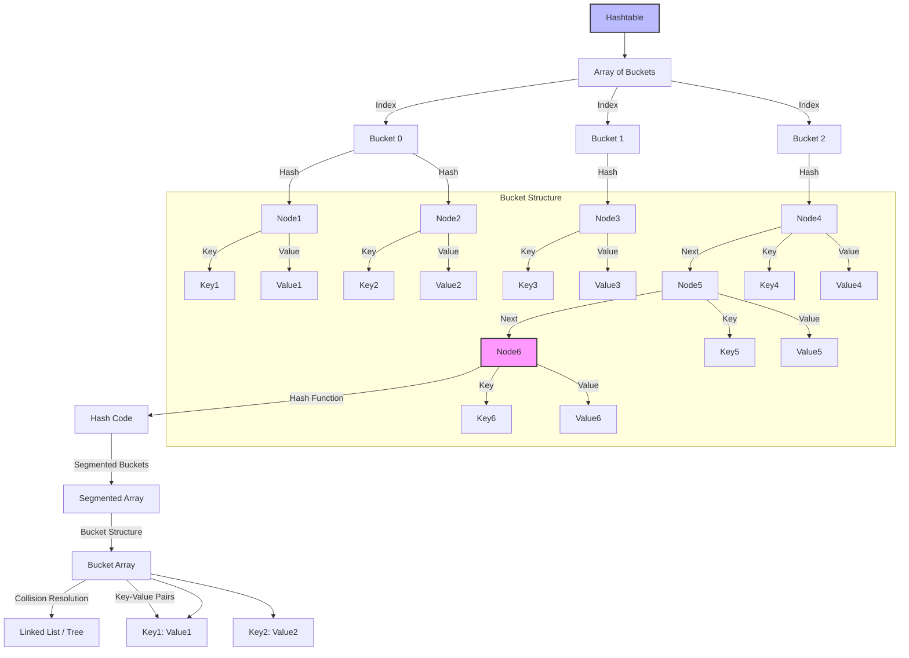
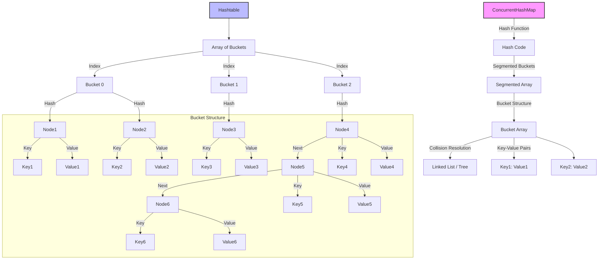
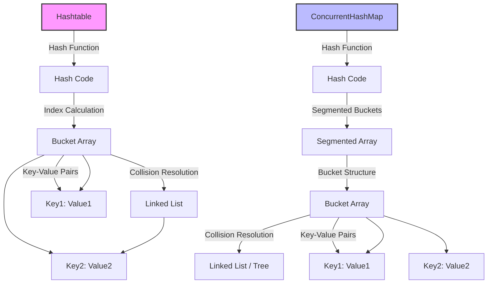
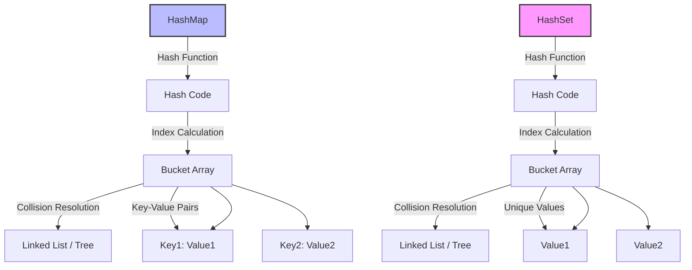
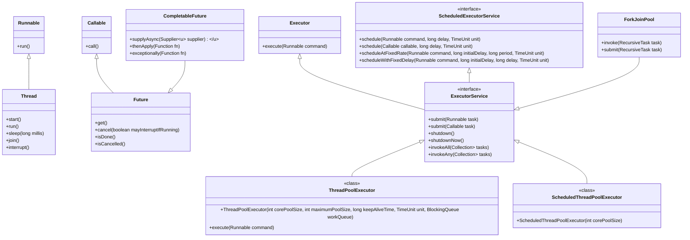

## New features introduced in Java 8

Java 8 introduced several significant features and enhancements that greatly improved the language and the Java Development Kit (JDK). Here are some of the key features:

### 1. Lambda Expressions
- **Description**: Provides a clear and concise way to represent a function as an object. It enables functional programming in Java, allowing you to pass behavior as a parameter.
- **Example**:
  ```java
  (a, b) -> a + b; // A simple lambda expression that adds two numbers.
  ```

Lambda expressions, introduced in Java 8, provide a clear and concise way to represent functional interfaces (interfaces with a single abstract method). They enable functional programming capabilities in Java, allowing you to treat behavior as a parameter and pass around functionality.

### 1. Basic Syntax
The syntax of a lambda expression is as follows:
```java
(parameters) -> expression
```
or, for more complex bodies:
```java
(parameters) -> { statements; }
```

### 2. Functional Interfaces
A functional interface is an interface that contains exactly one abstract method. Lambda expressions can be used to create instances of functional interfaces. Common examples include:
- `Runnable`
- `Callable`
- `Comparator`
- `Consumer`
- `Supplier`
- `Function`
- `Predicate`

#### Example:
```java
@FunctionalInterface
interface MyFunctionalInterface {
    void execute();
}

MyFunctionalInterface myLambda = () -> System.out.println("Executing...");
myLambda.execute();
```

### 3. Types of Lambda Expressions
Lambda expressions can be categorized based on the number of parameters and the type of body:

- **No Parameters**:
  ```java
  () -> System.out.println("Hello, World!");
  ```

- **Single Parameter (Type Inference)**:
  ```java
  x -> x * x; // No need for parentheses for a single parameter
  ```

- **Multiple Parameters**:
  ```java
  (x, y) -> x + y;
  ```

- **Block Body**:
  ```java
  (int x, int y) -> {
      int sum = x + y;
      return sum;
  };
  ```

### 4. Using Lambda Expressions
Lambda expressions can be used with Java's Collections Framework, particularly with the Stream API, to perform operations like filtering, mapping, and reducing.

#### Example with Streams:
```java
List<String> names = Arrays.asList("Alice", "Bob", "Charlie", "David");
names.stream()
     .filter(name -> name.startsWith("A"))
     .forEach(name -> System.out.println(name));
```

### 5. Method References
Lambda expressions can often be replaced with method references for improved readability. Method references are a shorthand notation for calling methods.

#### Syntax:
- **Static Method Reference**: `ClassName::methodName`
- **Instance Method Reference**: `instance::methodName`
- **Constructor Reference**: `ClassName::new`

#### Example:
```java
names.forEach(System.out::println); // Method reference instead of lambda
```

### 6. Benefits of Lambda Expressions
- **Conciseness**: Reduces boilerplate code, especially for simple implementations.
- **Readability**: Makes the code more readable and expressive.
- **Enhanced Functionality**: Facilitates functional programming constructs such as higher-order functions.

### 7. Capturing Variables
Lambda expressions can capture variables from their enclosing context (effectively final variables).

#### Example:
```java
int threshold = 5;
Predicate<Integer> filter = num -> num > threshold; // Captures `threshold`
```

### 8. Scope and `this`
Within a lambda expression, `this` refers to the enclosing class instance, not the lambda itself.

#### Example:
```java
class Outer {
    void outerMethod() {
        Runnable r = () -> System.out.println(this); // Refers to Outer instance
    }
}
```

### 9. Limitations
- **No `this` or `super`**: Lambda expressions cannot declare their own `this` or `super`, as they inherit from the enclosing context.
- **No checked exceptions**: You cannot throw checked exceptions from a lambda unless they are handled.

### 10. Use Cases
- **Event Handling**: Useful in GUI applications for handling events.
- **Functional Programming**: Streamlining functional operations on collections.
- **Parallel Processing**: Using streams to process collections in parallel.

### Conclusion
Lambda expressions in Java 8 represent a powerful addition to the language, allowing for more expressive, concise, and functional-style programming. By enabling the use of functional interfaces, they significantly enhance the way Java developers can write code, particularly when working with collections and streams. 

### 2. Streams API
- **Description**: Introduces a new abstraction for processing sequences of elements (collections, arrays, etc.) in a functional style. It supports operations like filtering, mapping, and reducing.
- **Example**:
  ```java
  List<String> names = Arrays.asList("Alice", "Bob", "Charlie");
  List<String> filteredNames = names.stream()
                                     .filter(name -> name.startsWith("A"))
                                     .collect(Collectors.toList());
  ```

### 3. Default Methods
- **Description**: Allows you to add new methods to interfaces with an implementation. This helps in evolving interfaces without breaking existing implementations.
- **Example**:
  ```java
  interface MyInterface {
      default void myDefaultMethod() {
          System.out.println("Default implementation");
      }
  }
  ```

### 4. Method References
- **Description**: A shorthand notation of a lambda expression to call a method. They enhance readability and can be used when you want to refer to a method without executing it.
- **Example**:
  ```java
  List<String> names = Arrays.asList("Alice", "Bob", "Charlie");
  names.forEach(System.out::println); // Method reference to print each name.
  ```

### 5. Optional Class
- **Description**: A container object which may or may not contain a value, designed to help avoid `NullPointerException` and to provide a more expressive way of dealing with optional values.
- **Example**:
  ```java
  Optional<String> optionalName = Optional.ofNullable(getName());
  optionalName.ifPresent(name -> System.out.println(name));
  ```

### 6. New Date and Time API
- **Description**: Introduces a comprehensive and immutable date and time API (java.time package) to handle dates and times more effectively than the old `java.util.Date` and `java.util.Calendar`.
- **Example**:
  ```java
  LocalDate today = LocalDate.now();
  LocalDate birthday = LocalDate.of(1990, Month.JANUARY, 1);
  Period age = Period.between(birthday, today);
  ```

### 7. Nashorn JavaScript Engine
- **Description**: A new lightweight JavaScript engine that allows you to execute JavaScript code on the Java Virtual Machine (JVM).
- **Example**:
  ```java
  ScriptEngine engine = new ScriptEngineManager().getEngineByName("Nashorn");
  engine.eval("print('Hello, Nashorn!');");
  ```

### 8. CompletableFuture
- **Description**: A new class that represents a future result of an asynchronous computation. It allows you to write non-blocking code using a functional style.
- **Example**:
  ```java
  CompletableFuture.supplyAsync(() -> {
      return "Hello, World!";
  }).thenAccept(result -> {
      System.out.println(result);
  });
  ```

### Summary
Java 8 introduced significant features that enhance the language's expressiveness and performance, especially in functional programming, concurrency, and data manipulation. These improvements have made Java more modern and aligned with other programming paradigms. If you have specific features you'd like to dive deeper into, feel free to ask!

## New features introduced in Java 8 Collections Framework

Java 8 introduced several enhancements and new features to the Java Collections Framework, making it more powerful and easier to use. Here are some of the key updates:

### 1. **Stream API**
- **Description**: Allows for functional-style operations on streams of elements (like collections). You can perform operations such as filtering, mapping, and reducing.
- **Example**:
  ```java
  List<String> names = Arrays.asList("Alice", "Bob", "Charlie");
  List<String> filteredNames = names.stream()
                                     .filter(name -> name.startsWith("A"))
                                     .collect(Collectors.toList());
  ```

### 2. **Default Methods in Interfaces**
- **Description**: Interfaces in the collections framework can now have default methods, providing additional functionality without breaking existing implementations.
- **Example**:
  ```java
  interface MyCollection<E> extends Collection<E> {
      default void printAll() {
          for (E element : this) {
              System.out.println(element);
          }
      }
  }
  ```

### 3. **Optional Class**
- **Description**: While not specifically part of the collections framework, `Optional` is used with collections to avoid `NullPointerException` when dealing with optional values.
- **Example**:
  ```java
  Optional<String> nameOpt = names.stream()
                                   .filter(name -> name.startsWith("A"))
                                   .findFirst();
  ```

### 4. **New Methods in Collection Interfaces**
- **Description**: Several interfaces in the collections framework received new default methods:
  - **forEach**: Iterates over the elements and applies a specified action.
  - **spliterator**: Creates a `Spliterator` for parallel processing of collections.
  - **removeIf**: Removes elements that satisfy a given predicate.
  - **stream**: Returns a sequential stream with the collection as its source.

- **Example**:
  ```java
  List<String> names = new ArrayList<>(Arrays.asList("Alice", "Bob", "Charlie"));
  names.removeIf(name -> name.startsWith("B")); // Removes names starting with 'B'
  ```

### 5. **New `Collectors` Utility**
- **Description**: The `Collectors` utility class provides various static methods for collecting results from streams, such as:
  - `toList()`
  - `toSet()`
  - `toMap()`
  - `joining()`
  - `groupingBy()`
  - `partitioningBy()`

- **Example**:
  ```java
  Map<Character, List<String>> groupedByFirstLetter = names.stream()
      .collect(Collectors.groupingBy(name -> name.charAt(0)));
  ```

### 6. **Concurrent Collections Enhancements**
- **Description**: Improvements to concurrent collections, including `ConcurrentHashMap` having new methods like `forEach`, `reduce`, and more for better parallelism and performance.

### 7. **Deque Interface Enhancements**
- **Description**: The `Deque` interface has methods like `offerFirst`, `offerLast`, `pollFirst`, and `pollLast` to simplify operations on double-ended queues.

### Summary
Java 8 significantly enhanced the Java Collections Framework, particularly through the introduction of the Stream API, default methods, and various utility methods for easier data manipulation. These improvements have made it simpler to perform complex data operations while maintaining readability and conciseness.

## Java Thread

The lifecycle of a thread in Java consists of several states, each representing the different stages of a thread's execution. Understanding these states helps in effectively managing thread behavior. Here's an overview of the thread lifecycle:

### Thread States

1. **New**: 
   - A thread is in the **new** state when it is created but not yet started.
   - This is done by instantiating a `Thread` object.

   ```java
   Thread thread = new Thread(() -> { /* task */ });
   ```

2. **Runnable**: 
   - A thread enters the **runnable** state when the `start()` method is called.
   - In this state, the thread is ready to run and may be executing or waiting for CPU time.
   - A thread can return to this state from **blocked** or **waiting** states.

   ```java
   thread.start();
   ```

3. **Blocked**: 
   - A thread is in the **blocked** state when it is waiting for a lock to be released by another thread.
   - This occurs when multiple threads attempt to access a synchronized block or method.

4. **Waiting**: 
   - A thread enters the **waiting** state when it calls methods like `wait()`, `join()`, or `LockSupport.park()`.
   - In this state, the thread is waiting for another thread to perform a specific action (e.g., notify or join).

5. **Timed Waiting**: 
   - A thread is in the **timed waiting** state when it is waiting for a specified period. This occurs when it calls methods like `sleep(millis)`, `wait(millis)`, or `join(millis)`.

6. **Terminated**: 
   - A thread enters the **terminated** state when it has completed its execution or has been terminated (either normally or due to an exception).
   - Once in this state, the thread cannot be restarted.

### State Transitions

The transitions between these states can be summarized as follows:

- **New to Runnable**: When `start()` is called.
- **Runnable to Blocked**: When the thread tries to access a synchronized resource that is locked by another thread.
- **Runnable to Waiting**: When the thread calls `wait()`, `join()`, or similar methods.
- **Runnable to Timed Waiting**: When the thread calls `sleep()` or `wait(millis)`.
- **Waiting to Runnable**: When another thread calls `notify()`, `notifyAll()`, or the waiting thread is interrupted.
- **Terminated**: When the thread completes execution or is terminated.

### Diagram Representation

A simplified diagram might look like this:

```
[New] ---> [Runnable] ---> [Terminated]
                |   |
                |   v
                | [Blocked]
                |
                v
             [Waiting] <--- [Timed Waiting]
```

### Conclusion

Understanding the thread lifecycle is essential for effective multi-threaded programming. It helps in managing thread synchronization, avoiding deadlocks, and improving performance in concurrent applications.

## Thread management and synchronization

In Java, `sleep()`, `wait()`, `join()`, and `LockSupport.park()` are all methods related to thread management and synchronization, but they serve different purposes. Here’s a detailed explanation of each:

### 1. `sleep()`

- **Purpose**: Pauses the execution of the current thread for a specified duration.
- **Usage**: Used to delay a thread, allowing other threads to execute.
- **State Change**: When a thread calls `sleep()`, it enters the **timed waiting** state.
- **Example**:

    ```java
    try {
        Thread.sleep(1000); // Sleep for 1 second
    } catch (InterruptedException e) {
        Thread.currentThread().interrupt(); // Restore interrupt status
    }
    ```

### 2. `wait()`

- **Purpose**: Makes the current thread wait until another thread invokes `notify()` or `notifyAll()` on the same object.
- **Usage**: Typically used in conjunction with synchronized blocks to facilitate communication between threads.
- **State Change**: When a thread calls `wait()`, it enters the **waiting** state and releases the monitor (lock) on the object.
- **Example**:

    ```java
    synchronized (sharedObject) {
        while (conditionNotMet) {
            sharedObject.wait(); // Wait until notified
        }
    }
    ```

### 3. `join()`

- **Purpose**: Waits for a thread to die (i.e., finish execution).
- **Usage**: Used to ensure that one thread completes before another thread continues execution.
- **State Change**: When a thread calls `join()`, it enters the **waiting** state until the specified thread terminates.
- **Example**:

    ```java
    Thread thread = new Thread(() -> {
        // Task
    });
    thread.start();
    try {
        thread.join(); // Wait for thread to finish
    } catch (InterruptedException e) {
        Thread.currentThread().interrupt(); // Restore interrupt status
    }
    ```

### 4. `LockSupport.park()`

- **Purpose**: Temporarily suspends the current thread until it is unparked by another thread.
- **Usage**: Often used in custom thread synchronization implementations, like in the `java.util.concurrent` package.
- **State Change**: When a thread calls `park()`, it enters the **waiting** state.
- **Unparking**: A thread can be unparked using `LockSupport.unpark(thread)` method.
- **Example**:

    ```java
    // Thread 1
    LockSupport.park(); // Suspends the thread

    // Thread 2
    LockSupport.unpark(thread1); // Unblocks thread1
    ```

### Summary of Differences

- **State Changes**: 
  - `sleep()` puts the thread in the **timed waiting** state.
  - `wait()` and `join()` put the thread in the **waiting** state.
  - `LockSupport.park()` also puts the thread in the **waiting** state.

- **Releasing Locks**: 
  - `sleep()` does not release any locks.
  - `wait()` releases the lock on the object it is called on.
  - `join()` does not release any locks directly, but if called from a synchronized context, it will hold that lock until the thread finishes.
  - `LockSupport.park()` releases the lock if used in a synchronized context.

Understanding these methods helps in managing thread synchronization and ensuring proper thread behavior in concurrent applications.

## Executor Framework

In Java, the `ExecutorService` interface, part of the `java.util.concurrent` package, provides a high-level API for managing and controlling thread execution. It abstracts thread management, allowing developers to focus on task execution rather than thread lifecycle management. Here are some key methods provided by the `ExecutorService` interface:

### Key Methods of `ExecutorService`

1. **submit()**:
   - **Description**: Submits a task for execution and returns a `Future` representing the result of the task.
   - **Overloads**: It can take either a `Callable` (which can return a result) or a `Runnable` (which does not return a result).
   - **Example**:

     ```java
     ExecutorService executor = Executors.newFixedThreadPool(2);
     Future<Integer> future = executor.submit(() -> {
         // Task logic
         return 123;
     });
     ```

2. **invokeAll()**:
   - **Description**: Accepts a collection of `Callable` tasks, executes them, and returns a list of `Future` objects.
   - **Blocking**: It blocks until all tasks are completed.
   - **Example**:

     ```java
     List<Callable<Integer>> tasks = Arrays.asList(
         () -> 1,
         () -> 2,
         () -> 3
     );
     List<Future<Integer>> results = executor.invokeAll(tasks);
     ```

3. **invokeAny()**:
   - **Description**: Accepts a collection of `Callable` tasks and executes them. It returns the result of the first successfully completed task.
   - **Blocking**: It blocks until at least one task is completed.
   - **Example**:

     ```java
     Integer result = executor.invokeAny(tasks);
     ```

4. **shutdown()**:
   - **Description**: Initiates an orderly shutdown of the `ExecutorService` in which previously submitted tasks are executed, but no new tasks will be accepted.
   - **Example**:

     ```java
     executor.shutdown();
     ```

5. **shutdownNow()**:
   - **Description**: Attempts to stop all actively executing tasks, halts the processing of waiting tasks, and returns a list of the tasks that were waiting to be executed.
   - **Example**:

     ```java
     List<Runnable> notExecutedTasks = executor.shutdownNow();
     ```

6. **isShutdown()**:
   - **Description**: Returns `true` if the `ExecutorService` has been shut down.
   - **Example**:

     ```java
     boolean shutdown = executor.isShutdown();
     ```

7. **isTerminated()**:
   - **Description**: Returns `true` if all tasks have completed following a shutdown request.
   - **Example**:

     ```java
     boolean terminated = executor.isTerminated();
     ```

8. **awaitTermination()**:
   - **Description**: Blocks until all tasks have completed execution after a shutdown request, or the timeout occurs, or the current thread is interrupted.
   - **Example**:

     ```java
     executor.shutdown();
     try {
         if (!executor.awaitTermination(60, TimeUnit.SECONDS)) {
             executor.shutdownNow(); // Force shutdown if not terminated
         }
     } catch (InterruptedException e) {
         executor.shutdownNow();
     }
     ```

### Additional Methods

- **execute()**:
  - **Description**: Accepts a `Runnable` task for execution. It does not return a result and does not throw checked exceptions.
  - **Example**:

    ```java
    executor.execute(() -> {
        // Task logic
    });
    ```

### Summary

The `ExecutorService` interface provides a robust framework for concurrent programming in Java, making it easier to manage threads and execute tasks asynchronously. By using these methods, you can effectively handle task submission, execution, and lifecycle management in a multi-threaded environment.

## Detecting and recovering from deadlocks

Detecting and recovering from deadlocks in Java can be complex, but it typically involves two main strategies: detecting deadlocks and implementing a recovery mechanism. Here’s a guide on how to implement logic to achieve this.

### 1. Deadlock Detection

To detect deadlocks, you can use the following strategies:

- **Thread Dumps**: Periodically analyze thread dumps to check for deadlock situations.
- **Resource Allocation Graph**: Maintain a graph that represents the allocation of resources to threads. If a cycle is detected in this graph, a deadlock exists.

Here’s a simple example using the `ThreadMXBean` to check for deadlocks:

```java
import java.lang.management.ManagementFactory;
import java.lang.management.ThreadInfo;
import java.lang.management.ThreadMXBean;

public class DeadlockDetector {

    public static void detectDeadlocks() {
        ThreadMXBean threadMXBean = ManagementFactory.getThreadMXBean();
        long[] deadlockedThreads = threadMXBean.findDeadlockedThreads();

        if (deadlockedThreads != null) {
            ThreadInfo[] threadInfos = threadMXBean.getThreadInfo(deadlockedThreads);
            for (ThreadInfo threadInfo : threadInfos) {
                System.out.println("Deadlocked thread: " + threadInfo.getThreadName());
                System.out.println("  " + threadInfo.getLockName());
            }
        } else {
            System.out.println("No deadlocks detected.");
        }
    }
}
```

### 2. Recovery from Deadlock

To recover from deadlocks, you can use one of these strategies:

- **Thread Termination**: Forcefully terminate one of the deadlocked threads. This is a harsh approach, but it can break the deadlock.
- **Timeouts**: Use timeouts when acquiring locks, allowing a thread to back off and retry if it cannot acquire a lock within a certain time.

#### Example: Using Timeouts

Here's a simplified implementation using `ReentrantLock` with a timeout:

```java
import java.util.concurrent.locks.ReentrantLock;
import java.util.concurrent.TimeUnit;

public class DeadlockDemo {
    private final ReentrantLock lock1 = new ReentrantLock();
    private final ReentrantLock lock2 = new ReentrantLock();

    public void threadA() {
        try {
            if (lock1.tryLock(1, TimeUnit.SECONDS)) {
                try {
                    System.out.println("Thread A acquired lock 1");
                    Thread.sleep(500); // Simulate work
                    if (lock2.tryLock(1, TimeUnit.SECONDS)) {
                        try {
                            System.out.println("Thread A acquired lock 2");
                        } finally {
                            lock2.unlock();
                        }
                    } else {
                        System.out.println("Thread A could not acquire lock 2, releasing lock 1");
                    }
                } finally {
                    lock1.unlock();
                }
            }
        } catch (InterruptedException e) {
            Thread.currentThread().interrupt();
        }
    }

    public void threadB() {
        try {
            if (lock2.tryLock(1, TimeUnit.SECONDS)) {
                try {
                    System.out.println("Thread B acquired lock 2");
                    Thread.sleep(500); // Simulate work
                    if (lock1.tryLock(1, TimeUnit.SECONDS)) {
                        try {
                            System.out.println("Thread B acquired lock 1");
                        } finally {
                            lock1.unlock();
                        }
                    } else {
                        System.out.println("Thread B could not acquire lock 1, releasing lock 2");
                    }
                } finally {
                    lock2.unlock();
                }
            }
        } catch (InterruptedException e) {
            Thread.currentThread().interrupt();
        }
    }

    public static void main(String[] args) {
        DeadlockDemo demo = new DeadlockDemo();
        Thread t1 = new Thread(demo::threadA);
        Thread t2 = new Thread(demo::threadB);
        t1.start();
        t2.start();
    }
}
```

### Summary

1. **Detection**: Use `ThreadMXBean` to check for deadlocked threads.
2. **Recovery**: Implement timeouts for lock acquisition or forcefully terminate threads if necessary.

While this example demonstrates basic detection and recovery, real-world scenarios may require more sophisticated strategies depending on the application's complexity and specific requirements.

## Forcefully terminating threads

Forcefully terminating threads in Java is generally not recommended because it can lead to resource leaks, inconsistent states, and other unintended side effects. However, if you find yourself needing to stop a thread forcefully, it's important to understand the implications.

### Recommended Approach: Using Interruption

Instead of terminating a thread forcefully, you can use the `interrupt()` method to signal a thread to stop its work. This method sets the thread's interrupt status, and the thread should check this status periodically and exit gracefully.

Here’s how to do it:

```java
class Task implements Runnable {
    @Override
    public void run() {
        try {
            while (!Thread.currentThread().isInterrupted()) {
                // Simulate work
                System.out.println("Working...");
                Thread.sleep(1000); // Simulate a task that can be interrupted
            }
        } catch (InterruptedException e) {
            // Handle the interruption (cleanup if necessary)
            System.out.println("Thread was interrupted!");
            Thread.currentThread().interrupt(); // Restore interrupt status
        }
    }
}

public class InterruptExample {
    public static void main(String[] args) {
        Thread thread = new Thread(new Task());
        thread.start();

        try {
            // Let the thread run for a while
            Thread.sleep(3000);
        } catch (InterruptedException e) {
            e.printStackTrace();
        }

        // Request the thread to stop
        thread.interrupt();
    }
}
```

### Forcefully Stopping a Thread (Not Recommended)

If you must forcefully stop a thread (e.g., in legacy code), you could use the deprecated `stop()` method, but this is **not safe**. Here’s how it works:

```java
class UnsafeTask implements Runnable {
    @Override
    public void run() {
        while (true) {
            System.out.println("Running...");
            // Simulate some work
            try {
                Thread.sleep(1000);
            } catch (InterruptedException e) {
                // Thread can handle interruption here
                break; // Exit the loop on interruption
            }
        }
    }
}

public class ForceStopExample {
    public static void main(String[] args) {
        Thread thread = new Thread(new UnsafeTask());
        thread.start();

        try {
            Thread.sleep(3000); // Let it run for a while
        } catch (InterruptedException e) {
            e.printStackTrace();
        }

        // Forcefully stop the thread (unsafe)
        thread.stop(); // Not recommended
    }
}
```

### Key Takeaways

1. **Use Interruption**: Always prefer using interruption to signal a thread to stop. This allows for safe resource management and proper cleanup.
   
2. **Avoid `stop()`**: The `stop()` method is deprecated and should be avoided due to its unsafe nature.

3. **Thread Coordination**: Ensure that threads can respond to interruptions by checking the interrupt status and handling cleanup appropriately.

By following these best practices, you can manage thread lifecycles more safely and effectively in your Java applications.

Your definitions of **Semaphore** and **Snapshot** are accurate! Here’s a bit more detail on both concepts to enhance your understanding:

### 4. Semaphore

- **Definition**: A semaphore is a synchronization construct that controls access to a shared resource by maintaining a set number of permits. Threads can acquire or release permits, and access to the resource is allowed only if permits are available.
  
- **Types**:
  - **Counting Semaphore**: Allows a specified number of permits (greater than one). Useful for managing a pool of resources (like database connections).
  - **Binary Semaphore**: Similar to a mutex, it only allows one permit (0 or 1). This is useful for mutual exclusion.

- **Usage**: Semaphores are commonly used to limit the number of threads that can access a particular resource at the same time. For example, limiting the number of concurrent connections to a server.

- **Example**:

    ```java
    import java.util.concurrent.Semaphore;

    public class SemaphoreExample {
        private static final Semaphore semaphore = new Semaphore(3); // Allows 3 concurrent threads

        public static void main(String[] args) {
            for (int i = 0; i < 10; i++) {
                new Thread(new Task()).start();
            }
        }

        static class Task implements Runnable {
            public void run() {
                try {
                    semaphore.acquire(); // Acquire a permit
                    System.out.println(Thread.currentThread().getName() + " acquired a permit.");
                    // Simulate work
                    Thread.sleep(2000);
                } catch (InterruptedException e) {
                    Thread.currentThread().interrupt();
                } finally {
                    semaphore.release(); // Release the permit
                    System.out.println(Thread.currentThread().getName() + " released a permit.");
                }
            }
        }
    }
    ```

### 5. Snapshot

- **Definition**: In concurrent programming, a snapshot refers to a consistent view of a collection or data structure at a specific point in time. This is crucial in situations where multiple threads may be modifying the collection concurrently.

- **Use Cases**:
  - **Read Consistency**: Ensuring that a reader sees a consistent view of data without being affected by ongoing modifications.
  - **Versioning**: Implementing versioned data structures where each operation may take a "snapshot" of the current state.

- **Example**: The `CopyOnWriteArrayList` is an example of a collection that provides snapshot-like behavior. When modifying the list (e.g., adding an element), it creates a copy of the underlying array, ensuring that any iterators or readers see the state before the modification.

    ```java
    import java.util.List;
    import java.util.concurrent.CopyOnWriteArrayList;

    public class SnapshotExample {
        public static void main(String[] args) {
            List<String> list = new CopyOnWriteArrayList<>();
            list.add("A");
            list.add("B");
            list.add("C");

            // Start a reader thread
            new Thread(() -> {
                for (String s : list) {
                    System.out.println("Reading: " + s);
                }
            }).start();

            // Modify the list
            list.add("D"); // This will not affect the reader's view
        }
    }
    ```

### Summary

- **Semaphore**: A powerful tool for controlling access to a limited resource, allowing for precise management of concurrent threads.
- **Snapshot**: A concept that helps maintain consistent views of data in a concurrent environment, crucial for ensuring data integrity during concurrent reads and writes.

Both of these concepts are essential in building robust concurrent applications in Java.

## ForkJoinPool

`ForkJoinPool` is a special implementation of the `ExecutorService` in Java that is designed to efficiently handle a large number of tasks that can be broken down into smaller subtasks. It is part of the `java.util.concurrent` package and is particularly useful for tasks that can take advantage of parallel processing.

### Key Features of ForkJoinPool

1. **Work-Stealing Algorithm**: 
   - Threads in a `ForkJoinPool` can "steal" tasks from other threads' queues if their own queues are empty. This helps balance the workload and utilize available CPU cores effectively.

2. **Fork and Join**:
   - The `fork()` method is used to asynchronously execute a subtask, while the `join()` method waits for the result of a forked task. This pattern allows for a divide-and-conquer approach to processing.

3. **RecursiveTask and RecursiveAction**:
   - `ForkJoinPool` works with two primary types of tasks:
     - **RecursiveTask<V>**: Used for tasks that return a result.
     - **RecursiveAction**: Used for tasks that do not return a result.

4. **Parallelism**: 
   - It is designed to leverage the capabilities of multicore processors, allowing you to achieve parallelism with ease.

### Basic Example

Here’s a simple example demonstrating the use of `ForkJoinPool` with a `RecursiveTask` to compute the sum of an array of numbers:

```java
import java.util.concurrent.RecursiveTask;
import java.util.concurrent.ForkJoinPool;

class SumTask extends RecursiveTask<Long> {
    private static final int THRESHOLD = 10; // Threshold for splitting tasks
    private final long[] array;
    private final int start;
    private final int end;

    public SumTask(long[] array, int start, int end) {
        this.array = array;
        this.start = start;
        this.end = end;
    }

    @Override
    protected Long compute() {
        if (end - start <= THRESHOLD) {
            // Base case: compute the sum directly
            long sum = 0;
            for (int i = start; i < end; i++) {
                sum += array[i];
            }
            return sum;
        } else {
            // Split the task into subtasks
            int middle = (start + end) / 2;
            SumTask leftTask = new SumTask(array, start, middle);
            SumTask rightTask = new SumTask(array, middle, end);
            leftTask.fork(); // Asynchronously execute the left task
            long rightResult = rightTask.compute(); // Compute the right task
            long leftResult = leftTask.join(); // Wait for the left task to complete
            return leftResult + rightResult; // Combine results
        }
    }
}

public class ForkJoinExample {
    public static void main(String[] args) {
        long[] array = new long[100];
        for (int i = 0; i < array.length; i++) {
            array[i] = i + 1; // Initialize array with values 1 to 100
        }

        ForkJoinPool pool = new ForkJoinPool(); // Create a ForkJoinPool
        SumTask task = new SumTask(array, 0, array.length);
        long result = pool.invoke(task); // Invoke the task
        System.out.println("Sum: " + result);
    }
}
```

### Explanation of the Example

1. **Threshold**: We define a threshold that determines when to stop splitting tasks. If the number of elements to sum is less than or equal to the threshold, the task computes the sum directly.

2. **Forking and Joining**: 
   - The `fork()` method is called on the left subtask, which allows it to run asynchronously.
   - The `compute()` method is called on the right subtask, which runs in the current thread. 
   - The `join()` method waits for the left task to complete and retrieves its result.

3. **Result**: The results of the left and right subtasks are combined to produce the final result.

### Conclusion

`ForkJoinPool` is a powerful tool for parallel processing in Java, especially for tasks that can be decomposed into smaller subtasks. It helps maximize CPU utilization and can significantly improve performance for compute-intensive applications. If you have more questions or need further details, feel free to ask!

## ReentrantLock

`ReentrantLock` in Java is part of the `java.util.concurrent.locks` package and is a more flexible alternative to using synchronized methods or blocks for managing access to shared resources. Here’s an overview of its key features and usage:

### Key Features

1. **Reentrant**: A thread can acquire the lock multiple times without causing a deadlock. Each time the lock is acquired, a counter is incremented, and the thread must release the lock the same number of times to fully release it.

2. **Fairness**: You can choose to create a fair lock that grants access to the longest-waiting thread first, or an unfair lock that does not guarantee this order.

3. **Try Locking**: You can try to acquire the lock without blocking. If the lock is not available, the method will return immediately.

4. **Condition Variables**: `ReentrantLock` allows you to create condition variables, which can be used to make threads wait until a certain condition is met.

### Basic Usage

Here’s a simple example of how to use `ReentrantLock`:

```java
import java.util.concurrent.locks.ReentrantLock;

public class Counter {
    private int count = 0;
    private final ReentrantLock lock = new ReentrantLock();

    public void increment() {
        lock.lock(); // Acquire the lock
        try {
            count++; // Critical section
        } finally {
            lock.unlock(); // Ensure the lock is released
        }
    }

    public int getCount() {
        return count;
    }
}
```

### Fair vs. Unfair Lock

You can create a fair lock by passing `true` to the constructor:

```java
ReentrantLock fairLock = new ReentrantLock(true);
```

### Try Lock Example

Using `tryLock()` allows you to attempt to acquire the lock without blocking:

```java
if (lock.tryLock()) {
    try {
        // Perform actions if the lock was acquired
    } finally {
        lock.unlock();
    }
} else {
    // Handle the case when the lock is not available
}
```

### Condition Variables

To use condition variables with `ReentrantLock`, you can create a `Condition` object:

```java
import java.util.concurrent.locks.Condition;

public class BoundedBuffer {
    private final ReentrantLock lock = new ReentrantLock();
    private final Condition notEmpty = lock.newCondition();
    private final Condition notFull = lock.newCondition();
    // Buffer implementation...
}
```

### Conclusion

`ReentrantLock` provides greater flexibility and more control than synchronized blocks, making it suitable for complex concurrent programming tasks. However, it requires careful handling to avoid deadlocks, especially when acquiring multiple locks.

## Condition

In Java, a **Condition** is an interface that provides a way for threads to communicate about the state of a shared resource, typically used in conjunction with a `ReentrantLock`. It allows threads to wait for certain conditions to occur and to signal other threads when those conditions are met.

### Key Features of Conditions

1. **Waiting**: A thread can wait for a condition to become true using the `await()` method. While waiting, the thread releases the associated lock, allowing other threads to acquire it.

2. **Signaling**: When a thread changes the state of the shared resource, it can signal waiting threads using `signal()` (to wake one waiting thread) or `signalAll()` (to wake all waiting threads).

3. **Multiple Conditions**: You can have multiple `Condition` objects associated with a single lock, allowing for more fine-grained control over thread coordination.

### Basic Usage Example

Here's a simple example demonstrating how to use `Condition` with a `ReentrantLock`:

```java
import java.util.concurrent.locks.Condition;
import java.util.concurrent.locks.ReentrantLock;

class BoundedBuffer {
    private final ReentrantLock lock = new ReentrantLock();
    private final Condition notEmpty = lock.newCondition();
    private final Condition notFull = lock.newCondition();
    private final Object[] buffer;
    private int count, putIndex, takeIndex;

    public BoundedBuffer(int size) {
        buffer = new Object[size];
    }

    public void put(Object item) throws InterruptedException {
        lock.lock();
        try {
            while (count == buffer.length) {
                notFull.await(); // Wait until the buffer is not full
            }
            buffer[putIndex] = item;
            if (++putIndex == buffer.length) putIndex = 0;
            count++;
            notEmpty.signal(); // Signal that the buffer is not empty
        } finally {
            lock.unlock();
        }
    }

    public Object take() throws InterruptedException {
        lock.lock();
        try {
            while (count == 0) {
                notEmpty.await(); // Wait until the buffer is not empty
            }
            Object item = buffer[takeIndex];
            if (++takeIndex == buffer.length) takeIndex = 0;
            count--;
            notFull.signal(); // Signal that the buffer is not full
            return item;
        } finally {
            lock.unlock();
        }
    }
}
```

### Explanation of the Example

- **Lock and Condition**: We create a `ReentrantLock` and two `Condition` objects, `notEmpty` and `notFull`, to manage the state of the buffer.
- **Waiting**: In the `put` method, if the buffer is full, the thread calls `notFull.await()`, releasing the lock and waiting for a signal that there is space.
- **Signaling**: When an item is added to the buffer, `notEmpty.signal()` is called to wake one waiting thread, indicating that the buffer is no longer empty.
- **Multiple Conditions**: The use of both `notEmpty` and `notFull` allows for efficient coordination between producers and consumers.

### Conclusion

Using `Condition` objects provides a powerful way to handle inter-thread communication and synchronization in a flexible manner. It's especially useful for implementing producer-consumer scenarios and other complex threading patterns.

**Perpetually** means in a way that is continuous, unending, or everlasting. It describes something that happens without interruption or that continues indefinitely over time. For example, if a task is described as being "perpetually delayed," it means that it is always delayed and there seems to be no end to the delays.

## Garbage collection (GC) algorithms

Java provides several garbage collection (GC) algorithms to manage memory automatically. Each of these algorithms has its own strengths and use cases. Here’s an overview of **Serial GC**, **Parallel GC**, **G1 GC**, and **ZGC**:

### 1. Serial GC

- **Description**: The Serial Garbage Collector is a simple and straightforward collector that uses a single thread for garbage collection. It is designed for single-threaded applications and is suitable for small applications with low memory requirements.
  
- **Characteristics**:
  - **Single-threaded**: Only one thread performs garbage collection, which can lead to pauses in application execution during collection.
  - **Stop-the-World**: All application threads are paused during the collection process.
  - **Best for Small Applications**: Suitable for small applications with limited memory and where pause times are not critical.

- **Usage**: Enabled with `-XX:+UseSerialGC`.

### 2. Parallel GC (Parallel Scavenge)

- **Description**: The Parallel Garbage Collector is designed for throughput. It uses multiple threads to perform garbage collection and is optimized for high throughput in multi-threaded applications.

- **Characteristics**:
  - **Multi-threaded**: Uses multiple threads to perform both minor and major collections.
  - **Stop-the-World**: Similar to Serial GC, it pauses all application threads during garbage collection.
  - **Throughput-Oriented**: Focuses on maximizing the overall throughput of the application.

- **Usage**: Enabled with `-XX:+UseParallelGC`.

### 3. G1 GC (Garbage-First Garbage Collector)

- **Description**: The G1 Garbage Collector is designed for applications that require predictable pause times while still providing high throughput. It divides the heap into regions and prioritizes the collection of regions with the most garbage.

- **Characteristics**:
  - **Region-Based**: The heap is divided into multiple regions, allowing G1 to collect garbage incrementally.
  - **Concurrent Marking**: G1 performs concurrent marking of live objects, which helps to reduce pause times.
  - **Pause Time Goals**: Allows setting a target for maximum pause times using the `-XX:MaxGCPauseMillis` option.

- **Usage**: Enabled with `-XX:+UseG1GC`.

### 4. ZGC (Z Garbage Collector)

- **Description**: ZGC is a low-latency garbage collector that aims to provide near-zero pause times, making it suitable for large heaps (multi-terabyte) and applications that cannot tolerate long garbage collection pauses.

- **Characteristics**:
  - **Concurrent and Low-Latency**: Most of the garbage collection work is done concurrently with the application threads, resulting in very short pause times (typically in the range of milliseconds).
  - **Region-Based**: Similar to G1, ZGC also uses a region-based approach for memory management.
  - **Handles Large Heaps**: Designed to efficiently manage large heaps without long stop-the-world pauses.

- **Usage**: Enabled with `-XX:+UseZGC`.

### Summary

- **Serial GC**: Single-threaded, simple, best for small applications.
- **Parallel GC**: Multi-threaded, throughput-oriented, suitable for multi-threaded applications.
- **G1 GC**: Balances pause times and throughput, suitable for larger applications needing predictable performance.
- **ZGC**: Low-latency, concurrent collector designed for applications that require minimal pause times and can handle large heaps.

Choosing the right garbage collector depends on the specific requirements of your application, such as throughput, latency, and memory usage patterns.

A memory leak in Java occurs when the Java Virtual Machine (JVM) retains references to objects that are no longer needed, preventing the garbage collector from reclaiming their memory. This can lead to increased memory usage and ultimately cause an application to run out of memory.

### Causes of Memory Leaks in Java

1. **Static Fields**: Objects held in static fields are not eligible for garbage collection until the class is unloaded, which typically happens only when the application is terminated.

2. **Listener/Callback References**: If an object registers itself as a listener to another object but does not unregister when it is no longer needed, it can lead to memory retention.

3. **Collection Classes**: Holding references in collection classes (e.g., `List`, `Map`) without clearing them can cause leaks, especially in long-lived applications.

4. **ThreadLocal Variables**: Misuse of `ThreadLocal` can lead to memory leaks, particularly in environments with thread pools, as the references can persist beyond the lifecycle of a thread.

5. **Inner Classes**: Non-static inner classes hold an implicit reference to their enclosing class. If the inner class instance outlives the enclosing class, it can prevent garbage collection.

### Prevention Strategies

1. **Nullify References**: Set references to `null` when they are no longer needed, especially in long-lived objects.

2. **Weak References**: Use `WeakReference` or `SoftReference` for caches or listeners that should be cleared when memory is needed.

3. **Unregister Listeners**: Always unregister listeners or callbacks when the objects are no longer needed.

4. **Avoid Static References**: Limit the use of static fields to those that need to persist for the application's lifetime.

5. **Use Profiling Tools**: Utilize memory profiling tools (like VisualVM, YourKit, or Eclipse MAT) to identify and diagnose memory leaks.

6. **Review Data Structures**: Regularly review and clear collections to ensure they do not hold onto unnecessary references.

7. **Limit Inner Class Use**: Consider using static inner classes or standalone classes to avoid unintended references to the enclosing class.

8. **Be Cautious with ThreadLocal**: Use `ThreadLocal` judiciously and ensure values are removed when no longer needed.

### Conclusion

By being mindful of object references, employing the right patterns, and regularly profiling your application, you can effectively prevent memory leaks and maintain optimal memory management in your Java applications.

## ACID properties

ACID properties are a set of principles that ensure reliable processing of database transactions. ACID stands for **Atomicity, Consistency, Isolation, and Durability**. Here’s a breakdown of each property:

### 1. Atomicity

- **Definition**: A transaction is treated as a single, indivisible unit of work. This means that either all operations within the transaction are completed successfully, or none are applied at all.
- **Implication**: If any part of the transaction fails, the entire transaction is rolled back, leaving the database in its original state. This ensures that partial updates do not occur.

### 2. Consistency

- **Definition**: A transaction must bring the database from one valid state to another valid state, maintaining all predefined rules, including constraints, cascades, and triggers.
- **Implication**: Any data written to the database must be valid according to the defined schema and rules. If a transaction violates these rules, it should be aborted, ensuring that the database remains consistent.

### 3. Isolation

- **Definition**: Transactions should operate independently of one another. The execution of one transaction should not affect the execution of another.
- **Implication**: Isolation ensures that concurrent transactions do not lead to inconsistencies in the database. Different levels of isolation (such as read committed, repeatable read, and serializable) can be implemented to manage how transactions interact.

### 4. Durability

- **Definition**: Once a transaction has been committed, it will remain so, even in the event of a system failure (like a crash or power loss).
- **Implication**: The effects of a committed transaction are permanent and must be stored in non-volatile memory, ensuring that the database can recover to the last committed state after a failure.

### Summary

- **Atomicity**: All or nothing.
- **Consistency**: Valid state transitions.
- **Isolation**: Independent execution.
- **Durability**: Permanent results.

These properties are crucial for maintaining the integrity and reliability of a database, especially in environments with concurrent transactions and potential failures.

Transaction isolation in Spring Boot is an essential aspect of managing database transactions to ensure data consistency and integrity, especially in concurrent environments. In Spring, you can control transaction isolation levels using the `@Transactional` annotation.

### Transaction Isolation Levels

There are several transaction isolation levels defined by the SQL standard, which dictate how transaction integrity is visible to other transactions. The levels are:

1. **READ_UNCOMMITTED**:
   - Allows dirty reads. A transaction can read data modified by another uncommitted transaction.
   - **Pros**: Maximum concurrency.
   - **Cons**: Data consistency is compromised.

2. **READ_COMMITTED**:
   - Prevents dirty reads. A transaction can only read data that has been committed.
   - **Pros**: Prevents dirty reads.
   - **Cons**: Can still lead to non-repeatable reads.

3. **REPEATABLE_READ**:
   - Prevents dirty and non-repeatable reads. A transaction can read the same data multiple times and get the same result within the transaction.
   - **Pros**: Better consistency.
   - **Cons**: Can lead to phantom reads.

4. **SERIALIZABLE**:
   - The strictest isolation level. Transactions are executed in a way that they appear to be serialized, effectively preventing dirty reads, non-repeatable reads, and phantom reads.
   - **Pros**: Highest data integrity.
   - **Cons**: Significant performance overhead and potential for increased contention.

### Configuring Isolation in Spring Boot

To configure transaction isolation in a Spring Boot application, you can use the `@Transactional` annotation. Here’s how to do it:

#### Example

```java
import org.springframework.stereotype.Service;
import org.springframework.transaction.annotation.Transactional;

@Service
public class MyService {

    @Transactional(isolation = Isolation.READ_COMMITTED)
    public void myTransactionalMethod() {
        // Your transactional logic here
    }
}
```

### Isolation Levels in Spring

In Spring, you can specify the isolation level using the `Isolation` enum:

```java
import org.springframework.transaction.annotation.Isolation;

@Transactional(isolation = Isolation.READ_COMMITTED)
```

### Default Isolation Level

If you do not specify an isolation level, Spring uses the default isolation level defined by the underlying database. For many databases, this is usually `READ_COMMITTED`.

### Considerations

1. **Performance**: Higher isolation levels can lead to decreased performance due to locking and increased contention for resources. It's crucial to choose an isolation level that balances data integrity and application performance.

2. **Database Support**: Not all databases support all isolation levels. Always check your specific database documentation for details on transaction isolation behavior.

3. **Testing**: When working with isolation levels, testing your application under concurrent load scenarios is vital to ensure the expected behavior.

### Conclusion

Transaction isolation in Spring Boot plays a crucial role in ensuring that your application maintains data integrity during concurrent operations. By leveraging the `@Transactional` annotation and understanding the implications of different isolation levels, you can design robust applications that handle transactions effectively.


## ACID properties

ACID properties are a set of principles that ensure reliable processing of database transactions. They are critical for maintaining data integrity and consistency. ACID stands for:

### 1. Atomicity
- **Definition**: Ensures that a transaction is treated as a single, indivisible unit. It either completes in its entirety or does not execute at all.
- **Example**: If a transaction involves transferring money from one account to another, both the debit from the first account and the credit to the second account must succeed; if one fails, the entire transaction is rolled back.

### 2. Consistency
- **Definition**: Guarantees that a transaction brings the database from one valid state to another, maintaining all predefined rules, constraints, and triggers.
- **Example**: If a transaction violates a database constraint (e.g., a foreign key constraint), it will not be allowed to commit, ensuring that the database remains in a consistent state.

### 3. Isolation
- **Definition**: Ensures that concurrent transactions do not interfere with each other. Each transaction should execute as if it is the only transaction in the system.
- **Example**: If two transactions are trying to update the same data simultaneously, isolation prevents them from affecting each other's operations, ensuring data integrity.

### 4. Durability
- **Definition**: Guarantees that once a transaction has been committed, its effects are permanent, even in the event of a system failure.
- **Example**: After a transaction to update a record is completed, the changes remain in the database even if there is a crash or power failure.

### Summary
The ACID properties are essential for ensuring reliable transaction processing in database systems, providing a framework that maintains data integrity, consistency, and reliability in multi-user environments.

## SOLID principles

The SOLID principles are a set of design principles aimed at making software designs more understandable, flexible, and maintainable. The acronym SOLID stands for five key principles:

### 1. Single Responsibility Principle (SRP)
- **Definition**: A class should have only one reason to change, meaning it should have only one job or responsibility.
- **Benefit**: This makes the system easier to understand and maintain since changes to one responsibility do not affect others.
- **Example**: A class handling user authentication should not also manage user data storage.

### 2. Open/Closed Principle (OCP)
- **Definition**: Software entities (classes, modules, functions, etc.) should be open for extension but closed for modification.
- **Benefit**: You can add new functionality without changing existing code, reducing the risk of introducing bugs.
- **Example**: Instead of modifying a class to add new features, you can create a new subclass or implement an interface.

### 3. Liskov Substitution Principle (LSP)
- **Definition**: Objects of a superclass should be replaceable with objects of a subclass without affecting the correctness of the program.
- **Benefit**: This ensures that a subclass can stand in for its parent class, allowing for polymorphism and easier code maintenance.
- **Example**: If a class `Bird` has a method `fly()`, any subclass like `Sparrow` should also be able to fulfill that contract.

### 4. Interface Segregation Principle (ISP)
- **Definition**: Clients should not be forced to depend on interfaces they do not use. Instead of one large interface, multiple smaller, specific interfaces are preferred.
- **Benefit**: This reduces the impact of changes and minimizes the side effects on clients.
- **Example**: Instead of having a single interface for all types of vehicles, create separate interfaces for flying vehicles and land vehicles.

### 5. Dependency Inversion Principle (DIP)
- **Definition**: High-level modules should not depend on low-level modules. Both should depend on abstractions (e.g., interfaces). Abstractions should not depend on details; details should depend on abstractions.
- **Benefit**: This reduces the coupling between components, making the system more flexible and easier to test.
- **Example**: Instead of a class directly creating instances of other classes, it should depend on interfaces or abstract classes.

### Summary
The SOLID principles guide developers in creating systems that are easy to manage, extend, and maintain. By adhering to these principles, you can reduce complexity and improve the overall design of your software architecture.


## Java design patterns

Java design patterns are standardized solutions to common software design problems. They provide templates that can be adapted to various situations, improving code readability, reusability, and maintainability. Here are some of the most common categories and examples of design patterns in Java:

### 1. Creational Patterns
These patterns deal with object creation mechanisms, aiming to create objects in a manner suitable for the situation.

- **Singleton Pattern**
  - **Description**: Ensures that a class has only one instance and provides a global point of access to it.
  - **Example**:
    ```java
    public class Singleton {
        private static Singleton instance;

        private Singleton() {} // Private constructor

        public static Singleton getInstance() {
            if (instance == null) {
                instance = new Singleton();
            }
            return instance;
        }
    }
    ```

The Singleton pattern ensures that a class has only one instance and provides a global point of access to it. However, there are several ways to break or bypass this pattern. Here are some common approaches:

### 1. Using Reflection

Reflection in Java allows you to bypass the private constructor of the Singleton class, creating multiple instances.

```java
import java.lang.reflect.Constructor;

public class Singleton {
    private static Singleton instance;

    private Singleton() {}

    public static Singleton getInstance() {
        if (instance == null) {
            instance = new Singleton();
        }
        return instance;
    }
}

public class BreakSingleton {
    public static void main(String[] args) throws Exception {
        Singleton instance1 = Singleton.getInstance();
        Singleton instance2 = null;

        // Using reflection to create a new instance
        Constructor<Singleton> constructor = Singleton.class.getDeclaredConstructor();
        constructor.setAccessible(true);
        instance2 = constructor.newInstance();

        System.out.println("Instance 1: " + instance1);
        System.out.println("Instance 2: " + instance2);
    }
}
```

### 2. Using Serialization

If a singleton class implements `Serializable`, deserializing it can create a new instance.

```java
import java.io.*;

public class Singleton implements Serializable {
    private static final long serialVersionUID = 1L;
    private static Singleton instance;

    private Singleton() {}

    public static Singleton getInstance() {
        if (instance == null) {
            instance = new Singleton();
        }
        return instance;
    }

    protected Object readResolve() {
        return instance; // Prevents creating a new instance during deserialization
    }
}

public class BreakSingletonSerialization {
    public static void main(String[] args) throws Exception {
        Singleton instance1 = Singleton.getInstance();

        // Serialize the instance
        FileOutputStream fileOut = new FileOutputStream("singleton.ser");
        ObjectOutputStream out = new ObjectOutputStream(fileOut);
        out.writeObject(instance1);
        out.close();
        fileOut.close();

        // Deserialize the instance
        FileInputStream fileIn = new FileInputStream("singleton.ser");
        ObjectInputStream in = new ObjectInputStream(fileIn);
        Singleton instance2 = (Singleton) in.readObject();
        in.close();
        fileIn.close();

        System.out.println("Instance 1: " + instance1);
        System.out.println("Instance 2: " + instance2);
    }
}
```

### 3. Using Multiple Classloaders

In certain environments, if multiple class loaders are used, each class loader can load its own instance of the singleton class.

### 4. Using Cloning

If the singleton class implements `Cloneable`, a new instance can be created through the `clone()` method.

```java
public class Singleton implements Cloneable {
    private static Singleton instance;

    private Singleton() {}

    public static Singleton getInstance() {
        if (instance == null) {
            instance = new Singleton();
        }
        return instance;
    }

    @Override
    protected Object clone() throws CloneNotSupportedException {
        throw new CloneNotSupportedException();
    }
}

public class BreakSingletonCloning {
    public static void main(String[] args) {
        try {
            Singleton instance1 = Singleton.getInstance();
            Singleton instance2 = (Singleton) instance1.clone(); // This will throw an exception
        } catch (CloneNotSupportedException e) {
            System.out.println("Cloning not supported.");
        }
    }
}
```

### Conclusion

While the Singleton pattern is useful for certain scenarios, it can be broken through reflection, serialization, classloaders, and cloning. To ensure the Singleton pattern remains effective, consider implementing safeguards like reflection prevention (by throwing exceptions in the constructor if an instance already exists) and handling serialization properly.

- **Factory Method Pattern**
  - **Description**: Defines an interface for creating an object but allows subclasses to alter the type of objects that will be created.
  - **Example**:
    ```java
    interface Shape {
        void draw();
    }

    class Circle implements Shape {
        public void draw() {
            System.out.println("Drawing a Circle");
        }
    }

    class Square implements Shape {
        public void draw() {
            System.out.println("Drawing a Square");
        }
    }

    abstract class ShapeFactory {
        abstract Shape createShape();
    }

    class CircleFactory extends ShapeFactory {
        Shape createShape() {
            return new Circle();
        }
    }

    class SquareFactory extends ShapeFactory {
        Shape createShape() {
            return new Square();
        }
    }
    ```

### 2. Structural Patterns
These patterns deal with object composition and typically help ensure that if one part of a system changes, the entire system doesn’t need to change.

- **Adapter Pattern**
  - **Description**: Allows incompatible interfaces to work together by acting as a bridge between them.
  - **Example**:
    ```java
    interface Bird {
        void fly();
    }

    class Sparrow implements Bird {
        public void fly() {
            System.out.println("Sparrow is flying");
        }
    }

    class ToyDuck {
        void squeak() {
            System.out.println("Toy duck squeaks");
        }
    }

    class BirdAdapter extends ToyDuck {
        private Bird bird;

        public BirdAdapter(Bird bird) {
            this.bird = bird;
        }

        void squeak() {
            bird.fly(); // Delegate the call
        }
    }
    ```

- **Decorator Pattern**
  - **Description**: Allows behavior to be added to individual objects, either statically or dynamically, without affecting the behavior of other objects from the same class.
  - **Example**:
    ```java
    interface Coffee {
        String getDescription();
        double cost();
    }

    class SimpleCoffee implements Coffee {
        public String getDescription() {
            return "Simple Coffee";
        }
        public double cost() {
            return 5.0;
        }
    }

    abstract class CoffeeDecorator implements Coffee {
        protected Coffee coffee;

        public CoffeeDecorator(Coffee coffee) {
            this.coffee = coffee;
        }
    }

    class MilkDecorator extends CoffeeDecorator {
        public MilkDecorator(Coffee coffee) {
            super(coffee);
        }

        public String getDescription() {
            return coffee.getDescription() + ", Milk";
        }

        public double cost() {
            return coffee.cost() + 1.5;
        }
    }
    ```

### 3. Behavioral Patterns
These patterns are concerned with algorithms and the assignment of responsibilities between objects.

- **Observer Pattern**
  - **Description**: Defines a one-to-many dependency between objects so that when one object changes state, all its dependents are notified.
  - **Example**:
    ```java
    import java.util.ArrayList;
    import java.util.List;

    interface Observer {
        void update(String message);
    }

    class ConcreteObserver implements Observer {
        private String name;

        public ConcreteObserver(String name) {
            this.name = name;
        }

        public void update(String message) {
            System.out.println(name + " received: " + message);
        }
    }

    class Subject {
        private List<Observer> observers = new ArrayList<>();

        public void attach(Observer observer) {
            observers.add(observer);
        }

        public void notifyObservers(String message) {
            for (Observer observer : observers) {
                observer.update(message);
            }
        }
    }
    ```

- **Strategy Pattern**
  - **Description**: Defines a family of algorithms, encapsulates each one, and makes them interchangeable. Strategy lets the algorithm vary independently from clients that use it.
  - **Example**:
    ```java
    interface Strategy {
        int execute(int a, int b);
    }

    class AddStrategy implements Strategy {
        public int execute(int a, int b) {
            return a + b;
        }
    }

    class SubtractStrategy implements Strategy {
        public int execute(int a, int b) {
            return a - b;
        }
    }

    class Context {
        private Strategy strategy;

        public Context(Strategy strategy) {
            this.strategy = strategy;
        }

        public int executeStrategy(int a, int b) {
            return strategy.execute(a, b);
        }
    }
    ```

### Conclusion
Java design patterns provide proven solutions to common problems encountered in software design. Understanding and applying these patterns can significantly improve the structure and maintainability of your code.

## Microservice Design Patterns

Microservices architecture involves designing applications as a collection of loosely coupled services that can be developed, deployed, and scaled independently. Various design patterns can help manage the complexity and enhance the effectiveness of microservices. Here are some common microservice design patterns, with a focus on the Sidecar pattern:

### Common Microservice Design Patterns

1. **API Gateway Pattern**
   - **Description**: A single entry point for all client requests. It acts as a reverse proxy, routing requests to appropriate microservices.
   - **Benefits**: Reduces the number of requests made by clients, handles cross-cutting concerns (like authentication and logging), and can aggregate responses from multiple services.

2. **Circuit Breaker Pattern**
   - **Description**: Prevents a service from being overwhelmed by too many requests. If a service fails repeatedly, the circuit breaker trips and requests are redirected until the service is stable again.
   - **Benefits**: Increases resilience and prevents cascading failures.

Rate limiting, retry, and bulkhead are important design patterns commonly used in distributed systems, particularly in microservices architecture. Each serves a unique purpose in managing service reliability, resource consumption, and system performance. Here's a detailed overview of each pattern:

### 1. Rate Limiter

**Definition**: Rate limiting controls the number of requests a client can make to a service in a given time period. It prevents abuse and ensures fair usage of resources.

**Use Cases**:
- Protecting APIs from being overwhelmed by too many requests (e.g., preventing DDoS attacks).
- Enforcing service quotas for different users.

**Implementation**:
- **Token Bucket**: Tokens are added to a bucket at a fixed rate, and each request consumes a token. If the bucket is empty, requests are denied.
- **Leaky Bucket**: Similar to the token bucket but processes requests at a constant rate, regardless of incoming requests.

**Example in Java**:
Using a simple token bucket algorithm:
```java
import java.util.concurrent.TimeUnit;

public class RateLimiter {
    private final long maxTokens;
    private long availableTokens;
    private long lastRefillTime;

    public RateLimiter(long maxTokens) {
        this.maxTokens = maxTokens;
        this.availableTokens = maxTokens;
        this.lastRefillTime = System.currentTimeMillis();
    }

    public synchronized boolean tryAcquire() {
        refillTokens();
        if (availableTokens > 0) {
            availableTokens--;
            return true;
        }
        return false;
    }

    private void refillTokens() {
        long now = System.currentTimeMillis();
        long elapsed = now - lastRefillTime;
        long tokensToAdd = TimeUnit.MILLISECONDS.toSeconds(elapsed);
        availableTokens = Math.min(maxTokens, availableTokens + tokensToAdd);
        lastRefillTime = now;
    }
}
```

### 2. Retry Pattern

**Definition**: The retry pattern automatically retries a failed operation (like an API call or a database query) a specified number of times before giving up.

**Use Cases**:
- Handling transient failures, such as network timeouts or temporary unavailability of services.

**Implementation**:
- Typically involves a backoff strategy (e.g., exponential backoff) to avoid overwhelming the service being called.

**Example in Java**:
Using a simple retry mechanism:
```java
import java.util.concurrent.TimeUnit;

public class Retry {
    public static <T> T executeWithRetry(Callable<T> task, int maxRetries) throws Exception {
        for (int attempt = 0; attempt < maxRetries; attempt++) {
            try {
                return task.call();
            } catch (Exception e) {
                if (attempt == maxRetries - 1) throw e; // Re-throw after max retries
                TimeUnit.SECONDS.sleep((long) Math.pow(2, attempt)); // Exponential backoff
            }
        }
        return null; // This line is unreachable
    }
}
```

### 3. Bulkhead Pattern

**Definition**: The bulkhead pattern isolates different parts of a system to prevent a failure in one part from cascading to other parts. It can be likened to compartments in a ship that prevent water from flooding the entire vessel.

**Use Cases**:
- Isolating different service calls to ensure that a failure in one service does not affect others.
- Managing resource allocation across different services or operations.

**Implementation**:
- Define limits (like thread pools or resource quotas) for specific service calls, so that if one call exceeds its limit, it doesn’t impact others.

**Example in Java**:
Using thread pools to isolate service calls:
```java
import java.util.concurrent.*;

public class Bulkhead {
    private final ExecutorService executorService;

    public Bulkhead(int maxConcurrentRequests) {
        this.executorService = Executors.newFixedThreadPool(maxConcurrentRequests);
    }

    public Future<String> callService(Callable<String> serviceCall) {
        return executorService.submit(serviceCall);
    }
}

// Example usage
Bulkhead bulkhead = new Bulkhead(5); // Limit to 5 concurrent requests
Future<String> response = bulkhead.callService(() -> {
    // Call to an external service
    return "Service Response";
});
```

### Summary

- **Rate Limiter**: Controls the number of requests a client can make to prevent overload and abuse.
- **Retry**: Automatically retries failed operations to handle transient issues.
- **Bulkhead**: Isolates parts of the system to prevent failures from propagating, ensuring service resilience.

These patterns enhance the reliability and stability of microservices and distributed systems.

3. **Service Registry Pattern**
   - **Description**: A directory that keeps track of all the microservices and their instances, enabling dynamic discovery.
   - **Benefits**: Facilitates load balancing, service discovery, and reducing the hardcoding of service endpoints.

4. **Strangler Fig Pattern**
   - **Description**: Incrementally refactor a monolithic application into microservices by replacing parts of it over time.
   - **Benefits**: Allows gradual migration without a complete overhaul, minimizing risk.

5. **Sidecar Pattern**
   - **Description**: This pattern involves deploying a sidecar container alongside the main service container. The sidecar handles tasks such as logging, monitoring, or service discovery, effectively decoupling these responsibilities from the main service.
   - **Benefits**: Promotes separation of concerns, making the main service simpler and more focused on its core functionality.

   **Implementation in Spring Boot**:
   - You might use a sidecar to handle logging, configuration management, or even service discovery. For example, Spring Cloud provides tools like Spring Cloud Config and Spring Cloud Netflix for service discovery and configuration management, which can be run in a sidecar.

   ```yaml
   # Example of a sidecar service configuration (application.yml)
   spring:
     application:
       name: sidecar-service
     cloud:
       config:
         uri: http://localhost:8888
   ```

   The main service can interact with the sidecar for configuration management and other cross-cutting concerns.

6. **Saga Pattern**
   - **Description**: A way to manage distributed transactions across multiple services. It breaks a transaction into a series of smaller operations, each with its own compensating transaction in case of failure.
   - **Benefits**: Improves data consistency and resilience in distributed systems.

7. **Event Sourcing Pattern**
   - **Description**: Instead of storing the current state of an entity, all changes (events) are stored. The current state can be rebuilt by replaying these events.
   - **Benefits**: Provides a complete history of changes and simplifies data recovery.

8. **CQRS (Command Query Responsibility Segregation) Pattern**
   - **Description**: Separates read and write operations into different models. Commands change the state, while queries retrieve data.
   - **Benefits**: Optimizes performance, scalability, and security.

### Conclusion

Microservice design patterns provide essential strategies for managing complexity in distributed systems. The **Sidecar pattern**, in particular, allows for the separation of concerns by offloading cross-cutting functionalities, which can enhance maintainability and scalability in Spring Boot microservices.

## Overview of `Hashtable` & `ConcurrentHashMap`

Here’s a detailed overview of `Hashtable`, `ConcurrentHashMap`, and hashing itself, along with a Mermaid diagram to visualize their structures.

### Internal Representation

#### 1. Hashtable

- **Array of Buckets**: Similar to `HashMap`, a `Hashtable` consists of an array of buckets.
- **Entry Class**: Each bucket contains entries, typically stored in a linked list. Each entry consists of:
  - The hash code of the key.
  - The key itself.
  - The value associated with the key.
  - A reference to the next entry (for collision resolution).
  
- **Synchronized**: All operations are synchronized, making it thread-safe but potentially slower in high contention scenarios.

#### 2. ConcurrentHashMap

- **Segmented Structure**: A `ConcurrentHashMap` divides its internal structure into segments (or buckets), allowing concurrent access.
- **Entry Class**: Each segment contains its own array of buckets. Each bucket can store:
  - The hash of the key.
  - The key itself.
  - The value associated with the key.
  - A reference to the next node (for collisions).
  
- **Locking Mechanism**: It uses a fine-grained locking mechanism, where only a specific segment is locked during write operations, allowing other segments to remain accessible for reads or writes.

### What is Hashing?

**Hashing** is the process of converting input (like a key) into a fixed-size string of bytes. The output, known as a hash code, is typically an integer that represents the original input in a compact form. Hashing has several key characteristics:

- **Efficiency**: Hashing allows for fast data retrieval. Instead of searching through a collection, a hash function can directly compute the index where the data should be stored or retrieved.
  
- **Collision Handling**: Since multiple keys can generate the same hash code (a collision), data structures like `Hashtable` and `ConcurrentHashMap` implement methods to handle these collisions, such as chaining (linked lists) or open addressing.
  
- **Deterministic**: The same input will always produce the same hash code.

### Mermaid Diagram

Here's a diagram that illustrates the internal structure of `Hashtable` and `ConcurrentHashMap` with respect to hashing.



### Explanation of the Diagram

1. **Hashtable**:
   - Similar to `HashMap`, `Hashtable` uses an array of buckets to store entries.
   - Each entry is linked in case of collisions, and synchronization ensures thread safety.

2. **ConcurrentHashMap**:
   - The `ConcurrentHashMap` uses segmented buckets, allowing multiple threads to access different segments simultaneously without interference.
   - It also uses a structure similar to `Hashtable` for handling collisions.

### Summary

- **Hashing** is a critical mechanism that enables fast data retrieval by converting keys into hash codes, which dictate their storage locations.
- Both `Hashtable` and `ConcurrentHashMap` leverage this concept but differ in their synchronization and collision resolution methods, with `ConcurrentHashMap` designed for better concurrency in multi-threaded environments.

### Revised Mermaid Diagram



### Explanation of the Diagram

1. **Hashtable**:
   - **Array of Buckets**: The `Hashtable` contains an array where each bucket can store entries.
   - **Collision Handling**: In buckets, if multiple keys hash to the same index, they are stored as nodes in a linked list (Node4 points to Node5, which points to Node6).

2. **ConcurrentHashMap**:
   - **Segmented Buckets**: The `ConcurrentHashMap` divides its structure into segments for better concurrency.
   - **Bucket Array**: Similar to `Hashtable`, it manages key-value pairs, and handles collisions using a linked list or tree structure.

### Summary

This diagram illustrates how both `Hashtable` and `ConcurrentHashMap` use hashing and handle collisions, without unsupported comments. If you have any further questions or need more modifications, feel free to ask!

### Hashing in `Hashtable &  `ConcurrentHashMap`

Hashing in a `Hashtable` and the concept of buckets in a `ConcurrentHashMap` are fundamental to how these data structures manage their data. Here’s an overview of each:

### Hashing in `Hashtable`

1. **Hash Function**: When you add a key-value pair to a `Hashtable`, the key is processed by a hash function, which generates an integer hash code. This hash code is typically derived from the key's `hashCode()` method.

2. **Index Calculation**: The hash code is then converted into an index for the internal array (buckets) by applying a modulus operation with the array length. This determines where the key-value pair will be stored.

3. **Collision Resolution**: If two keys hash to the same index (collision), `Hashtable` uses a simple approach:
   - It creates a linked list at that index (bucket) to store all key-value pairs that hash to the same index.
   - When searching, it traverses the linked list at that index to find the key.

4. **Synchronization**: `Hashtable` is synchronized, meaning that all operations are thread-safe, which can lead to performance overhead in multi-threaded environments.

### Buckets in `ConcurrentHashMap`

1. **Segmented Locking**: A `ConcurrentHashMap` divides its internal structure into segments (or buckets), allowing concurrent access. This means that multiple threads can read and write to different segments simultaneously without locking the entire map.

2. **Hashing Process**: Similar to `Hashtable`, keys are hashed to determine their bucket index. However, instead of a single array, the map is divided into segments (often using a fixed number of buckets).

3. **Buckets**: Each segment contains its own array of buckets (which can be linked lists or trees, depending on the implementation):
   - When a collision occurs, `ConcurrentHashMap` uses a linked list or a balanced tree (for large bucket sizes) to manage entries efficiently.
   - This allows for faster retrieval and modification, especially under high contention.

4. **Locking Mechanism**: 
   - In a `ConcurrentHashMap`, only a segment is locked when a write operation occurs, allowing other segments to remain accessible for reads or writes. This fine-grained locking improves performance compared to `Hashtable`.
   - Read operations do not require locks and can proceed concurrently, which enhances throughput.

### Summary

- **`Hashtable`**: Uses a simple array with linked lists for collision resolution and is synchronized, making it less efficient under high contention.
- **`ConcurrentHashMap`**: Employs segmented locking with buckets, allowing concurrent reads and writes across segments, which significantly improves performance in multi-threaded environments.

Both structures use hashing to manage keys efficiently, but `ConcurrentHashMap` is designed for higher concurrency and better performance in multi-threaded applications.

## Concepts of hashing in a `Hashtable` and the bucket structure in a `ConcurrentHashMap`.

### Mermaid Diagram



### Explanation

1. **Hashtable**:
   - **Hash Function**: When a key-value pair is added, the key is processed by a hash function to generate a hash code.
   - **Index Calculation**: The hash code is then converted into an index for the bucket array.
   - **Bucket Array**: This is the array that holds the entries.
   - **Collision Resolution**: If two keys hash to the same index, a linked list is used at that index to store multiple entries.
   - **Key-Value Pairs**: Each bucket may contain multiple key-value pairs if collisions occur.

2. **ConcurrentHashMap**:
   - **Hash Function**: Similar to `Hashtable`, the key is hashed to produce a hash code.
   - **Segmented Buckets**: Instead of a single array, the `ConcurrentHashMap` uses a segmented structure to allow concurrent access.
   - **Bucket Structure**: Each segment contains its own bucket array for managing entries.
   - **Collision Resolution**: Within each bucket, collisions are resolved using either linked lists or trees (for large sizes), providing efficient retrieval.
   - **Key-Value Pairs**: Just like in `Hashtable`, buckets store key-value pairs.

### Summary

- The diagram visually represents how both data structures handle hashing and storage of key-value pairs, with emphasis on the differences in their collision resolution and concurrent access mechanisms. 
- `Hashtable` uses a straightforward approach with linked lists for collisions, while `ConcurrentHashMap` optimizes for concurrency and performance with segmented locking and improved collision handling using trees or linked lists.

Concepts of `HashMap` and `HashSet`, highlighting how they manage data using hashing.

### Mermaid Diagram



### Explanation

1. **HashMap**:
   - **Hash Function**: When a key-value pair is added, the key is processed by a hash function to generate a hash code.
   - **Index Calculation**: The hash code is converted into an index for the internal bucket array.
   - **Bucket Array**: This array holds the entries in the `HashMap`.
   - **Collision Resolution**: If two keys hash to the same index, a linked list or tree is used to manage multiple entries at that index.
   - **Key-Value Pairs**: Each entry in the `HashMap` consists of a key and its corresponding value.

2. **HashSet**:
   - **Hash Function**: Similar to `HashMap`, the object is processed by a hash function to generate a hash code.
   - **Index Calculation**: The hash code determines the index in the bucket array.
   - **Bucket Array**: This array stores unique values.
   - **Collision Resolution**: Like `HashMap`, if collisions occur, a linked list or tree is used to manage values.
   - **Unique Values**: The `HashSet` only stores unique elements, so it contains no duplicates.

### Summary

- **`HashMap`**: A collection that stores key-value pairs, where each key is unique, and each key maps to a value. It uses hashing to optimize retrieval and manages collisions using linked lists or trees.
  
- **`HashSet`**: A collection that stores unique values (no duplicates) and does not associate values with keys. It also uses hashing and manages collisions similarly to `HashMap`.

This diagram helps illustrate the structural similarities and differences between `HashMap` and `HashSet`, particularly in how they use hashing and handle collisions.

## Ambiguities in Java technologies

Java technologies encompass a wide range of tools, libraries, frameworks, and APIs, which can sometimes lead to ambiguities. Here are some common areas where ambiguities may arise:

1. **Java Versions**:
   - Differences in features and APIs across Java versions (e.g., Java 8 vs. Java 11 vs. Java 17).
   - Backward compatibility issues.

2. **Frameworks and Libraries**:
   - Multiple frameworks for similar purposes (e.g., Spring vs. Java EE vs. Micronaut).
   - Overlapping functionalities in libraries (e.g., Hibernate vs. JPA).

3. **Dependency Management**:
   - Confusion over Maven vs. Gradle for dependency management.
   - Version conflicts in transitive dependencies.

4. **Java Virtual Machine (JVM)**:
   - Different JVM implementations (OpenJ9, GraalVM) may have performance implications.
   - Differences in garbage collection strategies and their effects.

5. **Concurrency and Multithreading**:
   - Ambiguity in using `synchronized` vs. `Lock` classes.
   - Misunderstanding of the Java Memory Model (JMM).

6. **Error Handling**:
   - Confusion between checked and unchecked exceptions.
   - Best practices for exception handling can be subjective.

7. **APIs and Standards**:
   - Different interpretations of Java APIs in implementation.
   - Variations in how standards are applied across different libraries.

8. **Java Language Features**:
   - Ambiguity in new language features (e.g., var vs. explicit types).
   - Differences in syntax and semantics introduced in newer versions.

9. **Design Patterns**:
   - Varying implementations and interpretations of common design patterns.
   - Contextual appropriateness of a design pattern can lead to confusion.

10. **JavaBeans vs. POJOs**:
    - Differences in conventions and use cases for JavaBeans and Plain Old Java Objects (POJOs).

11. **Testing Frameworks**:
    - Different approaches to testing (JUnit vs. TestNG vs. Mockito) can create confusion regarding best practices.

12. **Web Technologies**:
    - Confusion over Java-based web technologies (Servlets vs. JSP vs. JSF vs. Spring MVC).
    - Ambiguity in RESTful services vs. SOAP.

Navigating these ambiguities often requires a deeper understanding of the context in which Java technologies are used, along with continuous learning and adaptation.

## How to preventing ambiguities in Java technologies

Preventing ambiguities in Java technologies involves a combination of best practices, effective communication, and thorough documentation. Here are some strategies to consider:

1. **Stay Updated**:
   - Regularly follow Java's release notes and updates to understand new features and deprecations.

2. **Choose a Clear Framework**:
   - Select a single framework for a specific purpose (e.g., Spring for web applications) and stick to it, minimizing the use of multiple frameworks simultaneously.

3. **Consistent Coding Standards**:
   - Adopt and enforce consistent coding conventions within your team to reduce misunderstandings and improve code readability.

4. **Use Modern IDEs**:
   - Leverage Integrated Development Environments (IDEs) like IntelliJ IDEA or Eclipse, which provide features like code completion, error highlighting, and documentation support.

5. **Comprehensive Documentation**:
   - Document your code, frameworks, and architectural decisions clearly. Include rationale for choices made, especially for key dependencies and design patterns.

6. **Dependency Management**:
   - Use tools like Maven or Gradle effectively. Specify versions clearly and utilize dependency locking to avoid version conflicts.

7. **Code Reviews**:
   - Implement regular code reviews to catch ambiguities and ensure adherence to coding standards. This promotes knowledge sharing among team members.

8. **Testing**:
   - Adopt a consistent testing strategy (e.g., unit testing with JUnit) and ensure all team members are familiar with the chosen tools and frameworks.

9. **Training and Knowledge Sharing**:
   - Provide training sessions on key Java technologies and encourage knowledge sharing among team members to ensure everyone is on the same page.

10. **Clear Exception Handling Strategy**:
    - Establish a clear policy for exception handling, deciding when to use checked vs. unchecked exceptions and documenting the reasoning behind it.

11. **Design Patterns**:
    - Choose a set of commonly used design patterns for your projects and document their intended use cases to avoid misapplication.

12. **Community and Resources**:
    - Engage with the Java community through forums, meetups, or online courses to share experiences and learn from others.

By implementing these strategies, you can significantly reduce ambiguities and improve the overall quality and maintainability of your Java projects.

Here’s a more detailed exploration of specific Java ambiguities along with code examples and strategies for prevention:

### 1. **Ambiguity with Java Versions**

**Ambiguity**: Different Java versions introduce new features or deprecate existing ones, leading to confusion.

**Prevention**: Specify the Java version in your build tools and use features relevant to that version.

```xml
<!-- Maven example -->
<properties>
    <maven.compiler.source>11</maven.compiler.source>
    <maven.compiler.target>11</maven.compiler.target>
</properties>
```

### 2. **Framework Overlap**

**Ambiguity**: Multiple frameworks may provide similar functionalities, like Spring and Java EE.

**Prevention**: Choose one framework for a specific task and document the reasons for this choice.

```java
// Using Spring for dependency injection
@Component
public class MyService {
    // Service implementation
}

// Avoid mixing with Java EE @Stateless
```

### 3. **Dependency Conflicts**

**Ambiguity**: Transitive dependencies can lead to version conflicts.

**Prevention**: Use dependency management tools to lock versions and resolve conflicts explicitly.

```xml
<!-- Maven example -->
<dependencyManagement>
    <dependencies>
        <dependency>
            <groupId>org.springframework</groupId>
            <artifactId>spring-core</artifactId>
            <version>5.3.8</version>
        </dependency>
    </dependencies>
</dependencyManagement>
```

### 4. **Concurrency Issues**

**Ambiguity**: Misunderstanding the use of `synchronized` vs. `Lock` classes.

**Prevention**: Clearly document concurrency requirements and choose one approach consistently.

```java
// Using ReentrantLock
Lock lock = new ReentrantLock();
lock.lock();
try {
    // Critical section
} finally {
    lock.unlock();
}
```

### 5. **Error Handling Confusion**

**Ambiguity**: Differences in handling checked vs. unchecked exceptions.

**Prevention**: Establish a consistent policy for exception handling and document it.

```java
// Checked exception
public void readFile(String path) throws IOException {
    // Implementation
}

// Unchecked exception
public void process() {
    if (someCondition) {
        throw new IllegalArgumentException("Invalid argument");
    }
}
```

### 6. **JavaBeans vs. POJOs**

**Ambiguity**: Misunderstanding the purpose and structure of JavaBeans vs. POJOs.

**Prevention**: Clearly define and document the use case for each.

```java
// JavaBean example
public class User {
    private String name;
    
    public String getName() {
        return name;
    }

    public void setName(String name) {
        this.name = name;
    }
}

// POJO example
public class Product {
    private final String id;
    
    public Product(String id) {
        this.id = id;
    }
}
```

### 7. **Design Pattern Misapplication**

**Ambiguity**: Misunderstanding the use of design patterns.

**Prevention**: Document the intended use cases for patterns in your project.

```java
// Singleton pattern
public class Singleton {
    private static final Singleton INSTANCE = new Singleton();

    private Singleton() {}

    public static Singleton getInstance() {
        return INSTANCE;
    }
}
```

### 8. **Testing Framework Confusion**

**Ambiguity**: Different testing frameworks may lead to inconsistencies.

**Prevention**: Standardize on one testing framework and train team members.

```java
// JUnit example
import org.junit.jupiter.api.Test;
import static org.junit.jupiter.api.Assertions.assertEquals;

public class CalculatorTest {
    @Test
    public void testAdd() {
        Calculator calc = new Calculator();
        assertEquals(5, calc.add(2, 3));
    }
}
```

### 9. **APIs and Standards Misinterpretation**

**Ambiguity**: Different interpretations of Java APIs can lead to misuse.

**Prevention**: Provide clear documentation and guidelines for API usage.

```java
// Correct use of the Stream API
List<String> names = Arrays.asList("Alice", "Bob", "Charlie");
List<String> filteredNames = names.stream()
                                   .filter(name -> name.startsWith("A"))
                                   .collect(Collectors.toList());
```

### 10. **Web Technologies Confusion**

**Ambiguity**: Mixing different Java web technologies can lead to unclear implementations.

**Prevention**: Choose a single technology stack and stick to it.

```java
// Spring MVC Controller
@Controller
public class MyController {
    @GetMapping("/hello")
    public String sayHello(Model model) {
        model.addAttribute("message", "Hello, World!");
        return "hello";
    }
}
```

### Summary

By adopting these best practices and using the provided code examples, you can effectively minimize ambiguities in your Java projects. Establishing clear guidelines, consistent usage patterns, and thorough documentation are key to ensuring clarity and maintainability.

---

**Here’s an overview of Angular, React, microservices, and threading, along with their interactions and use cases.**

### Angular

**Overview**:
Angular is a TypeScript-based open-source web application framework led by the Angular Team at Google. It is primarily used for building single-page applications (SPAs).

**Key Features**:
- **Component-Based Architecture**: Encourages reusability and organization of code.
- **Dependency Injection**: Facilitates better code organization and testing.
- **Two-Way Data Binding**: Synchronizes data between the model and the view.
- **RxJS**: Supports reactive programming for handling asynchronous data.

**Use Case**: Angular is suitable for enterprise-level applications with complex UIs, such as dashboards or form-heavy applications.

### React

**Overview**:
React is a JavaScript library for building user interfaces, maintained by Facebook. It allows developers to create large web applications that can change data, without reloading the page.

**Key Features**:
- **Component-Based Architecture**: Promotes the creation of reusable UI components.
- **Virtual DOM**: Improves performance by minimizing direct manipulation of the DOM.
- **One-Way Data Binding**: Ensures a unidirectional data flow, which simplifies debugging.
- **Hooks**: Allows state and lifecycle management in functional components.

**Use Case**: React is often used for dynamic and interactive UIs, such as social media platforms and real-time applications.

Debugging React and Angular code involves various tools and techniques. Here’s a concise guide for each:

### Debugging React

1. **Browser Developer Tools**:
   - Use Chrome DevTools or Firefox Developer Edition to inspect elements, view console logs, and monitor network requests.
   - Check the “Components” tab in React Developer Tools to inspect component state and props.

2. **Console Logs**:
   - Insert `console.log()` statements to track the flow of data and state changes.

3. **Error Boundaries**:
   - Implement error boundaries to catch JavaScript errors in components and display a fallback UI.

4. **React Developer Tools**:
   - Install the React DevTools extension to visualize the component hierarchy, state, and props.

5. **Debugging Hooks**:
   - For hooks, ensure you're using them correctly. React's strict mode can help identify issues with hooks.

6. **Testing**:
   - Write tests using Jest or React Testing Library to catch errors before runtime.

### Debugging Angular

1. **Browser Developer Tools**:
   - Use the console for error messages and inspect the DOM using the Elements tab.

2. **Angular DevTools**:
   - Install Angular DevTools to analyze component trees, detect change detection issues, and profile performance.

3. **Console Logs**:
   - Use `console.log()` for debugging service responses, component lifecycles, and data flow.

4. **Error Handling**:
   - Implement global error handling in Angular with `ErrorHandler` for catching unexpected errors.

5. **Debugging Tools**:
   - Use the `ng.probe()` function in the console to inspect Angular components directly.

6. **Unit Testing**:
   - Utilize Jasmine and Karma for testing components and services to catch issues early.

### General Tips

- **Source Maps**: Ensure source maps are enabled for better stack traces.
- **Linting**: Use ESLint (for React) or TSLint (for Angular) to catch code quality issues.
- **Version Control**: Use git to track changes and identify when bugs were introduced.
- **Network Monitoring**: Use the Network tab to check API calls and responses.

By using these strategies and tools, you can efficiently debug both React and Angular applications.

Sharding in MongoDB is a method used to distribute data across multiple servers, allowing for horizontal scaling. It helps manage large datasets and high-throughput applications by breaking up the data into smaller, more manageable pieces called "shards."

### Key Concepts of Sharding

1. **Shard**: A single instance (or replica set) that holds a subset of the data.
2. **Shard Key**: A specific field or fields that determine how data is distributed across shards. The choice of shard key is critical for ensuring balanced distribution and performance.
3. **Config Server**: Stores metadata and configuration settings for the sharded cluster, including the shard key ranges.
4. **Mongos**: A routing service that directs client requests to the appropriate shard.

### Example Scenario

Let’s say we have a MongoDB collection called `users` that contains user profiles, and we want to shard this collection to handle a large volume of user data.

#### Step 1: Choosing a Shard Key

For this example, we might choose the `user_id` field as the shard key because it provides a good distribution of data and helps evenly distribute user records across shards.

#### Step 2: Setting Up the Sharded Cluster

1. **Start Config Servers**:
   ```bash
   mongod --configsvr --replSet configReplSet --port 27019 --dbpath /data/configdb --bind_ip localhost
   ```

2. **Start Shard Servers**:
   ```bash
   mongod --shardsvr --replSet shard1ReplSet --port 27018 --dbpath /data/shard1
   mongod --shardsvr --replSet shard2ReplSet --port 27020 --dbpath /data/shard2
   ```

3. **Start the Mongos Router**:
   ```bash
   mongos --configdb configReplSet/localhost:27019 --port 27017
   ```

4. **Connect to the Mongos**:
   ```bash
   mongo --host localhost --port 27017
   ```

5. **Enable Sharding for the Database**:
   ```javascript
   sh.enableSharding("myDatabase")
   ```

6. **Shard the Collection**:
   ```javascript
   sh.shardCollection("myDatabase.users", { "user_id": 1 })
   ```

#### Step 3: Inserting Data

Now, as you insert user records into the `users` collection, MongoDB automatically distributes them across the shards based on the `user_id` value.

```javascript
db.users.insertMany([
    { "user_id": 1, "name": "Alice" },
    { "user_id": 2, "name": "Bob" },
    { "user_id": 3, "name": "Charlie" },
    // More users...
]);
```

#### Step 4: Querying Data

When you query the `users` collection, the `mongos` router directs the request to the appropriate shard(s) based on the `user_id` provided:

```javascript
db.users.find({ "user_id": 2 });
```

### Benefits of Sharding

- **Scalability**: Easily add more shards as the dataset grows.
- **Performance**: Distributes load across multiple servers, improving read and write performance.
- **High Availability**: By using replica sets for shards, MongoDB provides redundancy and failover capabilities.

### Conclusion

Sharding in MongoDB is a powerful technique for managing large datasets and ensuring efficient data access. By properly selecting a shard key and configuring the sharded cluster, you can effectively scale your applications to handle increased load and data volume.

### Horizontal and Vertical Scaling

**Horizontal Scaling**:
- Involves adding more machines or nodes to a system (scaling out).
- Example: Adding more servers to handle increased web traffic.
- Advantages:
  - Improved fault tolerance.
  - Better resource utilization.
  - Easier to scale out by adding more nodes.

**Vertical Scaling**:
- Involves adding more resources (CPU, RAM) to an existing machine (scaling up).
- Example: Upgrading a server to a more powerful configuration.
- Advantages:
  - Simpler implementation (no need to change the application architecture).
  - Immediate performance improvements.

### Summary

- **Scaling**: Horizontal scaling involves adding more machines, while vertical scaling involves upgrading existing hardware.

In Java, the ClassLoader is a part of the Java Runtime Environment (JRE) that is responsible for loading classes into memory. It dynamically loads classes at runtime and is an essential component of the Java programming model. The ClassLoader finds the binary representation of a class and loads it into the Java Virtual Machine (JVM).

### Types of ClassLoaders

Java has a hierarchical structure of class loaders. The main types of class loaders are:

1. **Bootstrap ClassLoader**
   - The parent of all class loaders.
   - Loads core Java classes located in the `<JAVA_HOME>/lib` directory, such as `java.lang.*`, `java.util.*`, etc.
   - It is part of the JVM itself and written in native code.

2. **Extension ClassLoader (or Platform ClassLoader)**
   - Loads classes from the Java extension directory (`<JAVA_HOME>/lib/ext`).
   - It is a child of the Bootstrap ClassLoader.
   - Typically used for loading classes from external libraries that extend the standard Java platform.

3. **System ClassLoader (or Application ClassLoader)**
   - Loads classes from the application classpath (e.g., directories and JAR files specified in the `CLASSPATH` environment variable).
   - It is a child of the Extension ClassLoader.
   - Most user-defined classes are loaded by this loader.

4. **Custom ClassLoaders**
   - Developers can create their own class loaders by extending the `java.lang.ClassLoader` class.
   - Custom class loaders are useful for loading classes from non-standard sources, such as a database, network, or custom file formats.

### ClassLoader Hierarchy

The hierarchy of class loaders in Java is as follows:

```
Bootstrap ClassLoader
         |
   Extension ClassLoader
         |
   System ClassLoader
```

### Summary

- **Bootstrap ClassLoader**: Loads core Java classes.
- **Extension ClassLoader**: Loads classes from the Java extension directory.
- **System ClassLoader**: Loads classes from the application classpath.
- **Custom ClassLoaders**: User-defined loaders for specialized class-loading requirements.

---
In Java, there are several ways to create objects. Here are the main methods:

1. **Using the `new` Keyword**
   - The most common way to create an object.
   - Syntax:
     ```java
     ClassName obj = new ClassName();
     ```

2. **Using the `newInstance()` Method**
   - This method is part of the `Class` class and can be used to create an instance of a class using reflection.
   - Syntax:
     ```java
     ClassName obj = ClassName.class.newInstance();
     ```

3. **Using the `clone()` Method**
   - If a class implements the `Cloneable` interface, you can create a new object as a copy of an existing object.
   - Syntax:
     ```java
     ClassName obj1 = new ClassName();
     ClassName obj2 = (ClassName) obj1.clone();
     ```

4. **Using Factory Methods**
   - Classes can have static factory methods that return instances of the class. This is a common design pattern.
   - Example:
     ```java
     ClassName obj = ClassName.createInstance();
     ```

5. **Using Deserialization**
   - Objects can be created from a serialized state using the `ObjectInputStream` class.
   - Syntax:
     ```java
     ObjectInputStream in = new ObjectInputStream(new FileInputStream("objectfile.ser"));
     ClassName obj = (ClassName) in.readObject();
     ```

6. **Using Inner Classes**
   - You can create an object of an inner class directly using an instance of the outer class.
   - Syntax:
     ```java
     OuterClass outer = new OuterClass();
     OuterClass.InnerClass inner = outer.new InnerClass();
     ```

7. **Using Anonymous Classes**
   - Java allows you to create an object of a class without explicitly defining a class.
   - Syntax:
     ```java
     ClassName obj = new ClassName() {
         // Override methods here
     };
     ```

### Summary

- **`new` keyword**: Most common method.
- **`newInstance()`**: Reflection-based object creation.
- **`clone()`**: Create a copy of an existing object.
- **Factory methods**: Static methods for instance creation.
- **Deserialization**: Restore object state from a serialized format.
- **Inner classes**: Instantiate inner classes using outer class objects.
- **Anonymous classes**: Create instances without a separate class definition.

---

## In Java, `wait()`, `sleep()`, `join()`, and `yield()` are methods used in multi-threading to manage thread behavior. Here’s a breakdown of each:

### 1. `wait()`
- **Purpose**: Causes the current thread to wait until another thread invokes the `notify()` or `notifyAll()` method on the same object.
- **Use Case**: Typically used for inter-thread communication, especially when a thread needs to wait for a condition to be fulfilled by another thread.
- **How It Works**:
  - Must be called from within a synchronized block or method.
  - Releases the lock held by the thread, allowing other threads to access the synchronized block.

**Example**:
```java
synchronized (object) {
    while (conditionNotMet) {
        object.wait(); // Waits for notification
    }
}
```

### 2. `sleep()`
- **Purpose**: Pauses the execution of the current thread for a specified period.
- **Use Case**: Often used to create delays in execution or simulate processing time.
- **How It Works**:
  - It does not release any locks held by the thread.
  - It can throw `InterruptedException`.

**Example**:
```java
try {
    Thread.sleep(1000); // Sleeps for 1 second
} catch (InterruptedException e) {
    e.printStackTrace();
}
```

### 3. `join()`
- **Purpose**: Waits for a thread to die (i.e., finish its execution).
- **Use Case**: Used when you want one thread to wait for another to complete its execution before continuing.
- **How It Works**:
  - It can take an optional timeout parameter.
  - After calling `join()`, the current thread will be blocked until the thread it joins has completed.

**Example**:
```java
Thread t1 = new Thread(() -> {
    // Some work
});
t1.start();
t1.join(); // Waits for t1 to finish
```

### 4. `yield()`
- **Purpose**: Suggests that the current thread is willing to yield its current use of the CPU.
- **Use Case**: Used to improve the efficiency of thread scheduling, allowing other threads of the same priority to run.
- **How It Works**:
  - It does not guarantee that the thread will relinquish the CPU; it merely makes a request to the thread scheduler.

**Example**:
```java
Thread.yield(); // Suggests that the current thread yield
```

### Summary
- **`wait()`**: Used for inter-thread communication, releases locks.
- **`sleep()`**: Pauses the thread without releasing locks, for a specified time.
- **`join()`**: Makes the calling thread wait for another thread to finish.
- **`yield()`**: Suggests to the scheduler that the current thread can be paused to allow other threads to run.

# Immutable Classes in Java

In Java, an immutable object is one whose state can not be changed once created. Immutable objects are persistent views of their data without a direct option to change it. To change the state, we must create a new copy of such an object with the intended changes. 

In this post, we will learn immutability in detail, creating an immutable object and its advantages.

### 1. What is Immutability?
Immutability is a characteristic of Java objects that makes them immutable to future changes once they have been initialized. Its internal state cannot be changed in any way.

Take the example of java.lang.String class which is an immutable class. Once a String is created, there is no way we can change the content of that String. Every public API in String class returns a new String with the modified content. The original String always remains the same.
```java
String string = "test";
String newString = string.toLowerCase();  //Creates a new String
```
### 2. Immutability in Collections
Similarly, for Collections, Java provides a certain degree of immutability with three options:
```java
Unmodifiable collections
Immutable collection factory methods (Java 9+)
Immutable copies (Java 10+)
Collections.unmodifiableList(recordList);  //Unmodifiable list

List.of(new Record(1, "test"));  //Factory methods in Java 9

List.copyOf(recordList);  //Java 10
```
Note that such collections are only shallowly immutable, meaning that we can not add or remove any elements, but the collection elements themselves aren’t guaranteed to be immutable. If we hold the reference of a collection element, then we can change the element’s state without affecting the collection.

In the following example, we cannot add or remove the list items, but we can change the state of an existing item in the list.
```java
List<Record> list = List.of(new Record(1, "value"));
System.out.println(list);   //[Record(id=1, name=value)]

//list.add(new Record()); //UnsupportedOperationException

list.get(0).setName("modified-value");
System.out.println(list); //[Record(id=1, name=modified-value)]

@Data
@NoArgsConstructor
@AllArgsConstructor
class Record {
  long id;
  String name;
}
```
To ensure complete immutability, we must make sure that we only add immutable instances in the collections. This way, even if somebody gets a reference to an item in the collection, it cannot change anything.

### 3. How to Create an Immutable Class?
Java documentation itself has some guidelines identified to write immutable classes in this link. We will understand what these guidelines actually mean.

Do not provide setter methods. Setter methods are meant to change an object’s state, which we want to prevent here.
Make all fields final and private. Fields declared private will not be accessible outside the class, and making them final will ensure that we can not change them even accidentally.
Do not allow subclasses to override methods. The easiest way is to declare the class as final. Final classes in Java can not be extended.
Special attention to “immutable classes with mutable fields“. Always remember that member fields will be either mutable or immutable. Values of immutable members (primitives, wrapper classes, String etc) can be returned safely from the getter methods. For mutable members (POJO, collections etc), we must copy the content into a new Object before returning from the getter method.
Let us apply all the above rules to create an immutable custom class. Notice that we are returning a new copy of ArrayList from the getTokens() method. By doing so, we are hiding the original tokens list so no one can even get a reference of it and change it.
```java
final class Record {

  private final long id;
  private final String name;
  private final List<String> tokens;

  public Record(long id, String name, List<String> tokens) {
    this.id = id;
    this.name = name;
    this.tokens = tokens;
  }

  public long getId() {
    return id;
  }

  public String getName() {
    return name;
  }

  public List<String> getTokens() {
    return new ArrayList<>(tokens);
  }

  @Override
  public String toString() {
    return "Record{" +
        "id=" + id +
        ", name='" + name + '\'' +
        ", tokens=" + tokens +
        '}';
  }
}
```
Now it’s time to test our class. We tried to add a new item to the tokens list, but the original record and its list remain unchanged.
```java
ArrayList<String> tokens = new ArrayList<>();
tokens.add("active");

Record record = new Record(1, "value", tokens);
System.out.println(record);   //Record{id=1, name='value', tokens=[active]}

record.getTokens().add("new token"); 
System.out.println(record);   //Record{id=1, name='value', tokens=[active]}
```
### 4. Immutability with Java Records
Java records help reduce the boilerplate code by generating the constructors and getters at compile time. They can also help create immutable classes with very few lines of code.

For example, we can rewrite the above Record class as follows. Note that records generate the standard getters, so if we want to return a new copy of a mutable reference, we must override the corresponding method.
```java
record Record(long id, String name, List<String> tokens){

  public List<String> tokens() {
    return new ArrayList<>(tokens);
  }
}
```
Now let us test the immutability again.
```java
ArrayList<String> tokens = new ArrayList<>();
tokens.add("active");

Record record = new Record(1, "value", tokens);
System.out.println(record);   //Record{id=1, name='value', tokens=[active]}

record.tokens().add("new token");
System.out.println(record);   ////Record{id=1, name='value', tokens=[active]}
```
### 5. Immutable Classes in JDK
Apart from your written classes, JDK itself has lots of immutable classes. Given is such a list of immutable classes in Java.

- java.lang.String
- Wrapper classes such as Integer, Long, Double etc
- java.math.BigInteger and java.math.BigDecimal
- Unmodifiable collections such as Collections.singletonMap()
- java.lang.StackTraceElement
- Java enums
- java.util.Locale
- java.util.UUID
- Java 8 Date Time API – LocalDate, LocalTime etc.
- record types
### 6. Advantages
Immutable objects provide a lot of advantages over mutable objects. Let us discuss them.

- Predictability: guarantees that objects won’t change due to coding mistakes or by 3rd party libraries. As long as we reference a data structure, we know it is the same as at the time of its creation.
- Validity: is not needed to be tested again and again. Once we create the immutable object and test its validity once, we know that it will be valid indefinitely.
- Thread-safety: is achieved in the program as no thread can change immutable objects. It helps in writing code in a simple manner without accidentally corrupting the shared data objects.
- Cacheability: can be applied to immutable objects without worrying about state changes in the future. Optimization techniques, like memoization, are only possible with immutable data structures.
### 7. Conclusion
This tutorial taught us to create an immutable java class with mutable objects and immutable fields.

In Java, immutable classes are:

are simple to construct, test, and use
are automatically thread-safe and have no synchronization issues
do not need a copy constructor
do not need an implementation of clone()
allow hashCode() to use lazy initialization, and to cache its return value
do not need to be copied defensively when used as a field
make good Map keys and Set elements (these objects must not change state while in the collection)
have their class invariant established once upon construction, and it never needs to be checked again
always have “failure atomicity” (a term used by Joshua Bloch) : if an immutable object throws an exception, it’s never left in an undesirable or indeterminate state
We also saw the benefits which immutable classes bring in an application. As a design best practice, always aim to make your application Java classes to be immutable. In this way, you can always worry less about concurrency related defects in your program.

##  `void` and `Void`

In Java, `void` and `Void` are used in different contexts and have distinct meanings. Here’s a breakdown of the differences between them:

### `void`

- **Definition**: `void` is a primitive type used as a return type in methods to indicate that the method does not return a value.
- **Usage**: When a method is declared with a return type of `void`, it cannot return any value.

#### Example:
```java
public void doSomething() {
    // Method logic here
    // No return statement
}
```

### `Void`

- **Definition**: `Void` is a reference type (a class) in Java that is the wrapper for the `void` type. It is part of the `java.lang` package.
- **Usage**: `Void` can be used as a type parameter in generic classes or methods, particularly in scenarios where a method needs to represent the absence of a return value but still participate in generics.

#### Example:
```java
public Callable<Void> createTask() {
    return () -> {
        // Task logic here
        return null; // Must return null for Void
    };
}
```

### Return Type

- **`void`**: Indicates that a method does not return a value.
- **`Void`**: Can be used as a return type in contexts where you want to use generics but have no actual value to return.

### Summary

- **`void`**: Primitive type; used in method signatures to indicate no return value.
- **`Void`**: Reference type; used in generics or when a method needs to comply with an API that requires a return type but does not return a value.

In essence, use `void` when defining methods that don’t return a value, and use `Void` when you need to work with generics or APIs that require a return type in a context where there is no actual return value.

In Java, prior to Java 8, interfaces could only declare abstract methods. However, with the introduction of Java 8, two significant features were added to interfaces: default methods and static methods. Here’s why they were introduced and their importance:

1. **Default Methods**:
   - **Backward Compatibility**: Default methods allow developers to add new methods to interfaces without breaking existing implementations. This is crucial for maintaining libraries and APIs.
   - **Code Reusability**: They enable the provision of common functionality directly in the interface, allowing implementing classes to inherit this behavior without needing to override it unless customization is required.
   - **Multiple Inheritance**: They help avoid the complexities of multiple inheritance by allowing interfaces to provide shared behavior.

2. **Static Methods**:
   - **Utility Methods**: Static methods in interfaces allow you to define utility functions related to the interface itself, similar to static methods in classes.
   - **Organization**: They help keep related functionality within the interface, improving code organization and readability.

Overall, these features enhance the expressiveness and flexibility of interfaces in Java, enabling better design patterns and easier maintenance of code.


In Java 8, the introduction of default and static methods in interfaces helps address several challenges related to multiple inheritance and the diamond problem. Here’s how they work and their significance:

### Default Methods

**Definition**: A default method is a method defined in an interface with the `default` keyword. It provides a default implementation that can be inherited by implementing classes.

**Uses**:
1. **Backward Compatibility**: When new methods are added to an interface, existing implementations don’t break since they can choose to use the default implementation.
2. **Code Reusability**: Common functionality can be provided in the interface itself, reducing code duplication across implementing classes.

**Resolving Diamond Problem**:
- The diamond problem occurs when a class inherits from two interfaces that provide the same method. With default methods, if a class implements two interfaces that have a conflicting default method, it must override that method to resolve the ambiguity. The compiler will throw an error if the method is not explicitly overridden, forcing the developer to clarify which implementation to use.

### Static Methods

**Definition**: Static methods are methods that belong to the interface itself rather than to any instance. They are declared using the `static` keyword.

**Uses**:
1. **Utility Functions**: Static methods can provide utility or helper functions that are relevant to the interface but don’t require an instance of a class.
2. **Encapsulation**: They help in grouping related methods within the interface, enhancing organization.

**Resolving Ambiguities**:
- Static methods do not participate in inheritance, meaning they cannot be overridden. Therefore, if a class implements multiple interfaces with static methods of the same name, there is no ambiguity, as the static methods must be called on the interface itself (e.g., `InterfaceName.method()`).

### Summary

- **Default methods** allow interfaces to evolve while maintaining backward compatibility, resolving ambiguities through explicit overrides.
- **Static methods** provide utility functionalities without inheritance issues, ensuring clear access through the interface.

Together, these features enhance Java's interfaces by enabling better design and managing complexities related to multiple inheritance.

Sure! Here’s a coding example to illustrate the use of default and static methods in Java 8 interfaces, as well as how they resolve the diamond problem.

### Example of Default Methods

```java
interface Animal {
    void sound(); // abstract method

    default void eat() { // default method
        System.out.println("This animal eats food.");
    }
}

interface Dog extends Animal {
    @Override
    default void eat() { // overriding default method
        System.out.println("The dog eats dog food.");
    }
}

interface Cat extends Animal {
    @Override
    default void eat() { // overriding default method
        System.out.println("The cat eats cat food.");
    }
}

class Labrador implements Dog, Cat {
    @Override
    public void sound() {
        System.out.println("Woof!");
    }

    @Override
    public void eat() {
        Dog.super.eat(); // explicitly calling Dog's eat
        Cat.super.eat(); // explicitly calling Cat's eat
    }
}

public class Main {
    public static void main(String[] args) {
        Labrador labrador = new Labrador();
        labrador.sound(); // Output: Woof!
        labrador.eat(); // Output: The dog eats dog food. The cat eats cat food.
    }
}
```

### Explanation

1. **Interfaces**: 
   - `Animal` has an abstract method `sound()` and a default method `eat()`.
   - `Dog` and `Cat` extend `Animal` and override the `eat()` method.

2. **Labrador Class**:
   - Implements both `Dog` and `Cat`.
   - It overrides the `eat()` method to resolve the diamond problem by explicitly calling both default methods from `Dog` and `Cat`.

### Example of Static Methods

```java
interface MathOperations {
    static int add(int a, int b) { // static method
        return a + b;
    }

    static int subtract(int a, int b) { // static method
        return a - b;
    }
}

public class Main {
    public static void main(String[] args) {
        int sum = MathOperations.add(5, 3); // Calling static method
        int difference = MathOperations.subtract(5, 3); // Calling static method

        System.out.println("Sum: " + sum); // Output: Sum: 8
        System.out.println("Difference: " + difference); // Output: Difference: 2
    }
}
```

### Explanation

1. **Static Methods in Interface**:
   - `MathOperations` defines two static methods: `add()` and `subtract()`.
   - These methods can be called directly using the interface name without needing an instance.

### Summary

- **Default Methods**: Enable method sharing and provide default behavior, with the ability to resolve conflicts through explicit overriding.
- **Static Methods**: Provide utility methods directly within the interface, avoiding inheritance issues.

This illustrates how Java 8 enhances interfaces, enabling better design and resolving multiple inheritance complexities.

To resolve the diamond problem in Java, when two interfaces have the same method (including default methods) and a class implements both, the class must explicitly override the method to clarify which implementation to use. Here’s a coding example demonstrating this:

### Example of the Diamond Problem

```java
interface InterfaceA {
    default void display() {
        System.out.println("Display from Interface A");
    }
}

interface InterfaceB {
    default void display() {
        System.out.println("Display from Interface B");
    }
}

class ConcreteClass implements InterfaceA, InterfaceB {
    @Override
    public void display() {
        // Explicitly resolving ambiguity by choosing one implementation
        InterfaceA.super.display(); // Calls Interface A's method
        // OR
        // InterfaceB.super.display(); // Calls Interface B's method
    }
}

public class Main {
    public static void main(String[] args) {
        ConcreteClass obj = new ConcreteClass();
        obj.display(); // Output: Display from Interface A
    }
}
```

### Explanation

1. **Interfaces**:
   - `InterfaceA` and `InterfaceB` both define a default method called `display()`.

2. **ConcreteClass**:
   - Implements both `InterfaceA` and `InterfaceB`.
   - The class overrides the `display()` method to resolve the ambiguity caused by both interfaces having the same default method.

3. **Method Resolution**:
   - Within the overridden `display()` method, the class can choose which interface's method to call using `InterfaceA.super.display()` or `InterfaceB.super.display()`. In the example, it calls the method from `InterfaceA`.

### Summary

To resolve the diamond problem:
- When a class implements multiple interfaces that have conflicting default methods, the class must override the method to provide a specific implementation.
- You can use `InterfaceName.super.methodName()` to explicitly call the default method from a specific interface. This ensures clarity and prevents ambiguity in the method resolution process.

In Java, if you have an interface `A` that extends another interface `B`, and both interfaces have the same method (including default methods), you can still implement both interfaces in a class. However, since `A` inherits from `B`, the method from `B` will already be inherited in `A`. You only need to implement the method in your class to resolve the ambiguity.

Here's how you can do it:

### Example

```java
interface B {
    default void display() {
        System.out.println("Display from Interface B");
    }
}

interface A extends B {
    default void display() {
        System.out.println("Display from Interface A");
    }
}

class ConcreteClass implements A {
    @Override
    public void display() {
        // Call the display method from Interface A
        A.super.display(); // Calls Interface A's method
        
        // Call the display method from Interface B
        B.super.display(); // Calls Interface B's method
    }
}

public class Main {
    public static void main(String[] args) {
        ConcreteClass obj = new ConcreteClass();
        obj.display();
    }
}
```

### Explanation

1. **Interfaces**:
   - Interface `B` has a default method `display()`.
   - Interface `A` extends `B` and also has its own default method `display()`. This creates a situation where there are two default methods with the same name, one from `A` and one inherited from `B`.

2. **ConcreteClass**:
   - Implements `A`, which means it needs to provide an implementation for `display()`.
   - Within the overridden `display()` method, you can choose to call the `display()` method from both interfaces:
     - `A.super.display()` calls the `display()` method from `A`.
     - `B.super.display()` calls the `display()` method from `B`.

3. **Output**:
   - When you run the `Main` class, it will output:
     ```
     Display from Interface A
     Display from Interface B
     ```

### Summary

When you have a situation where:
- An interface extends another interface with the same method,
- You can implement both interfaces by overriding the method in the implementing class and explicitly calling the desired method from either interface using `InterfaceName.super.methodName()`. This resolves any ambiguity and allows access to both versions of the method.

Let’s explore the concepts of the diamond problem, race conditions, deadlocks, and fail-fast vs. fail-safe in Java. Each of these concepts plays a significant role in understanding Java's behavior, especially in multithreading and interface design. 

### 1. Diamond Problem

The diamond problem occurs in Java when a class inherits from two interfaces that both have a method with the same signature. Here’s how to resolve it:

**Example:**

```java
interface InterfaceA {
    default void display() {
        System.out.println("Display from Interface A");
    }
}

interface InterfaceB {
    default void display() {
        System.out.println("Display from Interface B");
    }
}

class ConcreteClass implements InterfaceA, InterfaceB {
    @Override
    public void display() {
        // Resolving ambiguity
        InterfaceA.super.display(); // Calls Interface A's method
        InterfaceB.super.display(); // Calls Interface B's method
    }
}

public class Main {
    public static void main(String[] args) {
        ConcreteClass obj = new ConcreteClass();
        obj.display();
    }
}
```

**Output:**
```
Display from Interface A
Display from Interface B
```

### How to Prevent Ambiguities:
- Always override the conflicting method in the implementing class.
- Use `InterfaceName.super.methodName()` to call specific implementations from parent interfaces.

---

### 2. Race Condition

A race condition occurs in a multithreading environment when two or more threads access shared data and try to change it simultaneously. This can lead to unpredictable results.

**Example:**

```java
class Counter {
    private int count = 0;

    public void increment() {
        count++; // Not thread-safe
    }

    public int getCount() {
        return count;
    }
}

public class RaceConditionExample {
    public static void main(String[] args) throws InterruptedException {
        Counter counter = new Counter();
        
        Thread t1 = new Thread(() -> {
            for (int i = 0; i < 1000; i++) {
                counter.increment();
            }
        });
        
        Thread t2 = new Thread(() -> {
            for (int i = 0; i < 1000; i++) {
                counter.increment();
            }
        });
        
        t1.start();
        t2.start();
        t1.join();
        t2.join();
        
        System.out.println("Final count: " + counter.getCount());
    }
}
```

**Output:** (Unpredictable, often not 2000)

### How to Prevent Race Conditions:
- Use synchronization (e.g., `synchronized` keyword) to ensure that only one thread can access the method at a time.
- Consider using `java.util.concurrent` classes like `AtomicInteger` for thread-safe operations.

### 1. Race Condition

A race condition occurs when two or more threads access shared data and try to change it simultaneously, leading to inconsistent results.

#### Example of Race Condition

```java
class Counter {
    private int count = 0;

    public void increment() {
        count++; // Not thread-safe
    }

    public int getCount() {
        return count;
    }
}

public class RaceConditionExample {
    public static void main(String[] args) throws InterruptedException {
        Counter counter = new Counter();
        
        Thread t1 = new Thread(() -> {
            for (int i = 0; i < 1000; i++) {
                counter.increment();
            }
        });
        
        Thread t2 = new Thread(() -> {
            for (int i = 0; i < 1000; i++) {
                counter.increment();
            }
        });
        
        t1.start();
        t2.start();
        t1.join();
        t2.join();
        
        System.out.println("Final count: " + counter.getCount());
    }
}
```

**Output**: The final count is often less than 2000 due to the race condition.

#### How to Prevent Race Conditions:
- **Synchronization**: Use the `synchronized` keyword to control access to shared resources.

```java
public synchronized void increment() {
    count++;
}
```

- **Atomic Variables**: Use classes from the `java.util.concurrent.atomic` package.

```java
import java.util.concurrent.atomic.AtomicInteger;

class Counter {
    private AtomicInteger count = new AtomicInteger(0);

    public void increment() {
        count.incrementAndGet(); // Thread-safe increment
    }
}
```

---
### 1. Race Condition

A race condition occurs when two or more threads access shared data and try to change it simultaneously, leading to inconsistent results.

#### Example of Race Condition

```java
class Counter {
    private int count = 0;

    public void increment() {
        count++; // Not thread-safe
    }

    public int getCount() {
        return count;
    }
}

public class RaceConditionExample {
    public static void main(String[] args) throws InterruptedException {
        Counter counter = new Counter();
        
        Thread t1 = new Thread(() -> {
            for (int i = 0; i < 1000; i++) {
                counter.increment();
            }
        });
        
        Thread t2 = new Thread(() -> {
            for (int i = 0; i < 1000; i++) {
                counter.increment();
            }
        });
        
        t1.start();
        t2.start();
        t1.join();
        t2.join();
        
        System.out.println("Final count: " + counter.getCount());
    }
}
```

**Output**: The final count is often less than 2000 due to the race condition.

#### How to Prevent Race Conditions:
- **Synchronization**: Use the `synchronized` keyword to control access to shared resources.

```java
public synchronized void increment() {
    count++;
}
```

- **Atomic Variables**: Use classes from the `java.util.concurrent.atomic` package.

```java
import java.util.concurrent.atomic.AtomicInteger;

class Counter {
    private AtomicInteger count = new AtomicInteger(0);

    public void increment() {
        count.incrementAndGet(); // Thread-safe increment
    }
}
```

---
---

### 3. Deadlock

A deadlock occurs when two or more threads are blocked forever, waiting for each other to release locks.

**Example:**

```java
class Resource {
    public synchronized void methodA(Resource other) {
        System.out.println(Thread.currentThread().getName() + " is in methodA");
        other.methodB();
    }

    public synchronized void methodB() {
        System.out.println(Thread.currentThread().getName() + " is in methodB");
    }
}

public class DeadlockExample {
    public static void main(String[] args) {
        Resource resource1 = new Resource();
        Resource resource2 = new Resource();

        Thread t1 = new Thread(() -> resource1.methodA(resource2));
        Thread t2 = new Thread(() -> resource2.methodA(resource1));

        t1.start();
        t2.start();
    }
}
```

### How to Prevent Deadlocks:
- Avoid nested locks.
- Use a timeout when trying to acquire locks.
- Implement a locking hierarchy (always acquire locks in the same order).

### 2. Deadlock

A deadlock occurs when two or more threads are blocked forever, waiting for each other to release locks.

#### Example of Deadlock

```java
class Resource {
    public synchronized void methodA(Resource other) {
        System.out.println(Thread.currentThread().getName() + " is in methodA");
        other.methodB();
    }

    public synchronized void methodB() {
        System.out.println(Thread.currentThread().getName() + " is in methodB");
    }
}

public class DeadlockExample {
    public static void main(String[] args) {
        Resource resource1 = new Resource();
        Resource resource2 = new Resource();

        Thread t1 = new Thread(() -> resource1.methodA(resource2));
        Thread t2 = new Thread(() -> resource2.methodA(resource1));

        t1.start();
        t2.start();
    }
}
```

#### How to Prevent Deadlocks:
- **Avoid Nested Locks**: Do not hold multiple locks at once.
- **Lock Ordering**: Always acquire locks in a consistent order.
- **Use Timeout**: Attempt to acquire locks with a timeout.

```java
public boolean tryLock(Resource other) {
    try {
        if (this.lock.tryLock(100, TimeUnit.MILLISECONDS)) {
            return other.lock.tryLock(100, TimeUnit.MILLISECONDS);
        }
    } catch (InterruptedException e) {
        Thread.currentThread().interrupt();
    }
    return false;
}
```

---
### 2. Deadlock

A deadlock occurs when two or more threads are blocked forever, waiting for each other to release locks.

#### Example of Deadlock

```java
class Resource {
    public synchronized void methodA(Resource other) {
        System.out.println(Thread.currentThread().getName() + " is in methodA");
        other.methodB();
    }

    public synchronized void methodB() {
        System.out.println(Thread.currentThread().getName() + " is in methodB");
    }
}

public class DeadlockExample {
    public static void main(String[] args) {
        Resource resource1 = new Resource();
        Resource resource2 = new Resource();

        Thread t1 = new Thread(() -> resource1.methodA(resource2));
        Thread t2 = new Thread(() -> resource2.methodA(resource1));

        t1.start();
        t2.start();
    }
}
```

#### How to Prevent Deadlocks:
- **Avoid Nested Locks**: Do not hold multiple locks at once.
- **Lock Ordering**: Always acquire locks in a consistent order.
- **Use Timeout**: Attempt to acquire locks with a timeout.

```java
public boolean tryLock(Resource other) {
    try {
        if (this.lock.tryLock(100, TimeUnit.MILLISECONDS)) {
            return other.lock.tryLock(100, TimeUnit.MILLISECONDS);
        }
    } catch (InterruptedException e) {
        Thread.currentThread().interrupt();
    }
    return false;
}
```

---
---

### 4. Fail-Fast vs. Fail-Safe

**Fail-Fast**:
- Fail-fast systems immediately throw an exception when they encounter a problem. For example, iterators in Java’s `Collections` framework are fail-fast; they throw `ConcurrentModificationException` if the collection is modified while iterating.

**Example:**

```java
import java.util.ArrayList;
import java.util.Iterator;
import java.util.List;

public class FailFastExample {
    public static void main(String[] args) {
        List<String> list = new ArrayList<>();
        list.add("A");
        list.add("B");

        Iterator<String> iterator = list.iterator();

        // Modify the list after obtaining the iterator
        list.add("C"); // This will cause a ConcurrentModificationException
        
        while (iterator.hasNext()) {
            System.out.println(iterator.next());
        }
    }
}
```

**Output:**
```
Exception in thread "main" java.util.ConcurrentModificationException
```

**Fail-Safe**:
- Fail-safe systems allow for a safe way to continue operating even in the presence of errors. In Java, the `java.util.concurrent` package provides collections like `CopyOnWriteArrayList` that are fail-safe.

**Example:**

```java
import java.util.List;
import java.util.concurrent.CopyOnWriteArrayList;

public class FailSafeExample {
    public static void main(String[] args) {
        List<String> list = new CopyOnWriteArrayList<>();
        list.add("A");
        list.add("B");

        for (String item : list) {
            System.out.println(item);
            list.add("C"); // Safe to modify
        }
    }
}
```

**Output:**
```
A
B
C
```

### Summary

- **Diamond Problem**: Resolve ambiguities by overriding methods in implementing classes and explicitly calling the desired implementation.
- **Race Condition**: Prevent it using synchronization or concurrent collections.
- **Deadlock**: Avoid nested locks and implement a locking hierarchy to prevent circular waiting.
- **Fail-Fast vs. Fail-Safe**: Choose fail-fast collections for immediate error detection, while fail-safe collections allow modifications during iteration without throwing exceptions.

Understanding these concepts is essential for writing robust Java applications, especially in concurrent programming.

Sure! Let’s explore race conditions, deadlocks, and starvation in Java, along with examples and ways to prevent them.


### 3. Starvation

Starvation occurs when a thread is perpetually denied access to resources because other threads are continually being given priority.

#### Example of Starvation

```java
class SharedResource {
    public synchronized void access() {
        System.out.println(Thread.currentThread().getName() + " is accessing resource.");
        try {
            Thread.sleep(100); // Simulating some work
        } catch (InterruptedException e) {
            Thread.currentThread().interrupt();
        }
    }
}

public class StarvationExample {
    public static void main(String[] args) {
        SharedResource resource = new SharedResource();
        
        Runnable task = () -> {
            while (true) {
                resource.access();
            }
        };
        
        // High-priority thread
        Thread highPriorityThread = new Thread(task);
        highPriorityThread.setPriority(Thread.MAX_PRIORITY);
        
        // Low-priority threads
        Thread lowPriorityThread1 = new Thread(task);
        Thread lowPriorityThread2 = new Thread(task);
        
        lowPriorityThread1.setPriority(Thread.MIN_PRIORITY);
        lowPriorityThread2.setPriority(Thread.MIN_PRIORITY);
        
        highPriorityThread.start();
        lowPriorityThread1.start();
        lowPriorityThread2.start();
    }
}
```

#### How to Prevent Starvation:
- **Fair Locks**: Use `ReentrantLock` with the fairness policy set to true.

```java
import java.util.concurrent.locks.ReentrantLock;

class SharedResource {
    private final ReentrantLock lock = new ReentrantLock(true); // Fair lock

    public void access() {
        lock.lock();
        try {
            // Access resource
        } finally {
            lock.unlock();
        }
    }
}
```

- **Avoid Excessive Prioritization**: Ensure that no single thread is given too much priority over others.

`ReentrantLock` in Java is part of the `java.util.concurrent.locks` package and is a more flexible alternative to using synchronized methods or blocks for managing access to shared resources. Here’s an overview of its key features and usage:

### Key Features

1. **Reentrant**: A thread can acquire the lock multiple times without causing a deadlock. Each time the lock is acquired, a counter is incremented, and the thread must release the lock the same number of times to fully release it.

2. **Fairness**: You can choose to create a fair lock that grants access to the longest-waiting thread first, or an unfair lock that does not guarantee this order.

3. **Try Locking**: You can try to acquire the lock without blocking. If the lock is not available, the method will return immediately.

4. **Condition Variables**: `ReentrantLock` allows you to create condition variables, which can be used to make threads wait until a certain condition is met.

### Basic Usage

Here’s a simple example of how to use `ReentrantLock`:

```java
import java.util.concurrent.locks.ReentrantLock;

public class Counter {
    private int count = 0;
    private final ReentrantLock lock = new ReentrantLock();

    public void increment() {
        lock.lock(); // Acquire the lock
        try {
            count++; // Critical section
        } finally {
            lock.unlock(); // Ensure the lock is released
        }
    }

    public int getCount() {
        return count;
    }
}
```

### Fair vs. Unfair Lock

You can create a fair lock by passing `true` to the constructor:

```java
ReentrantLock fairLock = new ReentrantLock(true);
```

### Try Lock Example

Using `tryLock()` allows you to attempt to acquire the lock without blocking:

```java
if (lock.tryLock()) {
    try {
        // Perform actions if the lock was acquired
    } finally {
        lock.unlock();
    }
} else {
    // Handle the case when the lock is not available
}
```

### Condition Variables

To use condition variables with `ReentrantLock`, you can create a `Condition` object:

```java
import java.util.concurrent.locks.Condition;

public class BoundedBuffer {
    private final ReentrantLock lock = new ReentrantLock();
    private final Condition notEmpty = lock.newCondition();
    private final Condition notFull = lock.newCondition();
    // Buffer implementation...
}
```

### Conclusion

`ReentrantLock` provides greater flexibility and more control than synchronized blocks, making it suitable for complex concurrent programming tasks. However, it requires careful handling to avoid deadlocks, especially when acquiring multiple locks.

In Java, a **Condition** is an interface that provides a way for threads to communicate about the state of a shared resource, typically used in conjunction with a `ReentrantLock`. It allows threads to wait for certain conditions to occur and to signal other threads when those conditions are met.

### Key Features of Conditions

1. **Waiting**: A thread can wait for a condition to become true using the `await()` method. While waiting, the thread releases the associated lock, allowing other threads to acquire it.

2. **Signaling**: When a thread changes the state of the shared resource, it can signal waiting threads using `signal()` (to wake one waiting thread) or `signalAll()` (to wake all waiting threads).

3. **Multiple Conditions**: You can have multiple `Condition` objects associated with a single lock, allowing for more fine-grained control over thread coordination.

### Basic Usage Example

Here's a simple example demonstrating how to use `Condition` with a `ReentrantLock`:

```java
import java.util.concurrent.locks.Condition;
import java.util.concurrent.locks.ReentrantLock;

class BoundedBuffer {
    private final ReentrantLock lock = new ReentrantLock();
    private final Condition notEmpty = lock.newCondition();
    private final Condition notFull = lock.newCondition();
    private final Object[] buffer;
    private int count, putIndex, takeIndex;

    public BoundedBuffer(int size) {
        buffer = new Object[size];
    }

    public void put(Object item) throws InterruptedException {
        lock.lock();
        try {
            while (count == buffer.length) {
                notFull.await(); // Wait until the buffer is not full
            }
            buffer[putIndex] = item;
            if (++putIndex == buffer.length) putIndex = 0;
            count++;
            notEmpty.signal(); // Signal that the buffer is not empty
        } finally {
            lock.unlock();
        }
    }

    public Object take() throws InterruptedException {
        lock.lock();
        try {
            while (count == 0) {
                notEmpty.await(); // Wait until the buffer is not empty
            }
            Object item = buffer[takeIndex];
            if (++takeIndex == buffer.length) takeIndex = 0;
            count--;
            notFull.signal(); // Signal that the buffer is not full
            return item;
        } finally {
            lock.unlock();
        }
    }
}
```

### Explanation of the Example

- **Lock and Condition**: We create a `ReentrantLock` and two `Condition` objects, `notEmpty` and `notFull`, to manage the state of the buffer.
- **Waiting**: In the `put` method, if the buffer is full, the thread calls `notFull.await()`, releasing the lock and waiting for a signal that there is space.
- **Signaling**: When an item is added to the buffer, `notEmpty.signal()` is called to wake one waiting thread, indicating that the buffer is no longer empty.
- **Multiple Conditions**: The use of both `notEmpty` and `notFull` allows for efficient coordination between producers and consumers.

### Conclusion

Using `Condition` objects provides a powerful way to handle inter-thread communication and synchronization in a flexible manner. It's especially useful for implementing producer-consumer scenarios and other complex threading patterns.

The lifecycle of a thread in Java consists of several states, each representing the different stages of a thread's execution. Understanding these states helps in effectively managing thread behavior. Here's an overview of the thread lifecycle:

### Thread States

1. **New**: 
   - A thread is in the **new** state when it is created but not yet started.
   - This is done by instantiating a `Thread` object.

   ```java
   Thread thread = new Thread(() -> { /* task */ });
   ```

2. **Runnable**: 
   - A thread enters the **runnable** state when the `start()` method is called.
   - In this state, the thread is ready to run and may be executing or waiting for CPU time.
   - A thread can return to this state from **blocked** or **waiting** states.

   ```java
   thread.start();
   ```

3. **Blocked**: 
   - A thread is in the **blocked** state when it is waiting for a lock to be released by another thread.
   - This occurs when multiple threads attempt to access a synchronized block or method.

4. **Waiting**: 
   - A thread enters the **waiting** state when it calls methods like `wait()`, `join()`, or `LockSupport.park()`.
   - In this state, the thread is waiting for another thread to perform a specific action (e.g., notify or join).

5. **Timed Waiting**: 
   - A thread is in the **timed waiting** state when it is waiting for a specified period. This occurs when it calls methods like `sleep(millis)`, `wait(millis)`, or `join(millis)`.

6. **Terminated**: 
   - A thread enters the **terminated** state when it has completed its execution or has been terminated (either normally or due to an exception).
   - Once in this state, the thread cannot be restarted.

### State Transitions

The transitions between these states can be summarized as follows:

- **New to Runnable**: When `start()` is called.
- **Runnable to Blocked**: When the thread tries to access a synchronized resource that is locked by another thread.
- **Runnable to Waiting**: When the thread calls `wait()`, `join()`, or similar methods.
- **Runnable to Timed Waiting**: When the thread calls `sleep()` or `wait(millis)`.
- **Waiting to Runnable**: When another thread calls `notify()`, `notifyAll()`, or the waiting thread is interrupted.
- **Terminated**: When the thread completes execution or is terminated.

### Diagram Representation

A simplified diagram might look like this:

```
[New] ---> [Runnable] ---> [Terminated]
                |   |
                |   v
                | [Blocked]
                |
                v
             [Waiting] <--- [Timed Waiting]
```

### Conclusion

Understanding the thread lifecycle is essential for effective multi-threaded programming. It helps in managing thread synchronization, avoiding deadlocks, and improving performance in concurrent applications.

In Java, `sleep()`, `wait()`, `join()`, and `LockSupport.park()` are all methods related to thread management and synchronization, but they serve different purposes. Here’s a detailed explanation of each:

### 1. `sleep()`

- **Purpose**: Pauses the execution of the current thread for a specified duration.
- **Usage**: Used to delay a thread, allowing other threads to execute.
- **State Change**: When a thread calls `sleep()`, it enters the **timed waiting** state.
- **Example**:

    ```java
    try {
        Thread.sleep(1000); // Sleep for 1 second
    } catch (InterruptedException e) {
        Thread.currentThread().interrupt(); // Restore interrupt status
    }
    ```

### 2. `wait()`

- **Purpose**: Makes the current thread wait until another thread invokes `notify()` or `notifyAll()` on the same object.
- **Usage**: Typically used in conjunction with synchronized blocks to facilitate communication between threads.
- **State Change**: When a thread calls `wait()`, it enters the **waiting** state and releases the monitor (lock) on the object.
- **Example**:

    ```java
    synchronized (sharedObject) {
        while (conditionNotMet) {
            sharedObject.wait(); // Wait until notified
        }
    }
    ```

### 3. `join()`

- **Purpose**: Waits for a thread to die (i.e., finish execution).
- **Usage**: Used to ensure that one thread completes before another thread continues execution.
- **State Change**: When a thread calls `join()`, it enters the **waiting** state until the specified thread terminates.
- **Example**:

    ```java
    Thread thread = new Thread(() -> {
        // Task
    });
    thread.start();
    try {
        thread.join(); // Wait for thread to finish
    } catch (InterruptedException e) {
        Thread.currentThread().interrupt(); // Restore interrupt status
    }
    ```

### 4. `LockSupport.park()`

- **Purpose**: Temporarily suspends the current thread until it is unparked by another thread.
- **Usage**: Often used in custom thread synchronization implementations, like in the `java.util.concurrent` package.
- **State Change**: When a thread calls `park()`, it enters the **waiting** state.
- **Unparking**: A thread can be unparked using `LockSupport.unpark(thread)` method.
- **Example**:

    ```java
    // Thread 1
    LockSupport.park(); // Suspends the thread

    // Thread 2
    LockSupport.unpark(thread1); // Unblocks thread1
    ```

### Summary of Differences

- **State Changes**: 
  - `sleep()` puts the thread in the **timed waiting** state.
  - `wait()` and `join()` put the thread in the **waiting** state.
  - `LockSupport.park()` also puts the thread in the **waiting** state.

- **Releasing Locks**: 
  - `sleep()` does not release any locks.
  - `wait()` releases the lock on the object it is called on.
  - `join()` does not release any locks directly, but if called from a synchronized context, it will hold that lock until the thread finishes.
  - `LockSupport.park()` releases the lock if used in a synchronized context.

Understanding these methods helps in managing thread synchronization and ensuring proper thread behavior in concurrent applications.

---

### Summary

- **Race Condition**: Prevent by synchronizing access to shared resources or using atomic variables.
- **Deadlock**: Avoid by using lock ordering, avoiding nested locks, and implementing timeouts.
- **Starvation**: Use fair locks or avoid excessive prioritization to ensure all threads get access to resources.

Understanding these concurrency issues is crucial for building robust multi-threaded applications in Java.

Sure! Let’s explore race conditions, deadlocks, and starvation in Java, along with examples and ways to prevent them.


### 3. Starvation

Starvation occurs when a thread is perpetually denied access to resources because other threads are continually being given priority.

#### Example of Starvation

```java
class SharedResource {
    public synchronized void access() {
        System.out.println(Thread.currentThread().getName() + " is accessing resource.");
        try {
            Thread.sleep(100); // Simulating some work
        } catch (InterruptedException e) {
            Thread.currentThread().interrupt();
        }
    }
}

public class StarvationExample {
    public static void main(String[] args) {
        SharedResource resource = new SharedResource();
        
        Runnable task = () -> {
            while (true) {
                resource.access();
            }
        };
        
        // High-priority thread
        Thread highPriorityThread = new Thread(task);
        highPriorityThread.setPriority(Thread.MAX_PRIORITY);
        
        // Low-priority threads
        Thread lowPriorityThread1 = new Thread(task);
        Thread lowPriorityThread2 = new Thread(task);
        
        lowPriorityThread1.setPriority(Thread.MIN_PRIORITY);
        lowPriorityThread2.setPriority(Thread.MIN_PRIORITY);
        
        highPriorityThread.start();
        lowPriorityThread1.start();
        lowPriorityThread2.start();
    }
}
```

#### How to Prevent Starvation:
- **Fair Locks**: Use `ReentrantLock` with the fairness policy set to true.

```java
import java.util.concurrent.locks.ReentrantLock;

class SharedResource {
    private final ReentrantLock lock = new ReentrantLock(true); // Fair lock

    public void access() {
        lock.lock();
        try {
            // Access resource
        } finally {
            lock.unlock();
        }
    }
}
```

- **Avoid Excessive Prioritization**: Ensure that no single thread is given too much priority over others.

---

### Summary

- **Race Condition**: Prevent by synchronizing access to shared resources or using atomic variables.
- **Deadlock**: Avoid by using lock ordering, avoiding nested locks, and implementing timeouts.
- **Starvation**: Use fair locks or avoid excessive prioritization to ensure all threads get access to resources.

Understanding these concurrency issues is crucial for building robust multi-threaded applications in Java.


### Fairness Policy

The **fairness policy** in Java's concurrency framework determines how threads acquire locks. It ensures that threads are granted access to shared resources in a fair manner, typically using FIFO (First-In-First-Out) ordering. 

1. **Fair Locks**: If a lock is fair, the longest waiting thread will acquire the lock first. This helps prevent thread starvation.
2. **Unfair Locks**: If a lock is unfair, a thread that has been waiting may not get the lock in the order it arrived. This can lead to better performance but may result in starvation.

You can set the fairness policy when creating a `ReentrantLock`:

```java
ReentrantLock fairLock = new ReentrantLock(true); // Fair
ReentrantLock unfairLock = new ReentrantLock(false); // Unfair
```

### Concurrency

**Concurrency** is the ability to run multiple threads simultaneously, enabling tasks to be executed in overlapping time periods. It’s crucial for improving the efficiency and responsiveness of applications, especially in I/O-bound and CPU-bound operations.

### Thread

A **thread** is the smallest unit of processing that can be scheduled by an operating system. In Java, threads are created using:

1. **Extending the `Thread` class**:
    ```java
    class MyThread extends Thread {
        public void run() {
            System.out.println("Thread is running");
        }
    }
    ```

2. **Implementing the `Runnable` interface**:
    ```java
    class MyRunnable implements Runnable {
        public void run() {
            System.out.println("Thread is running");
        }
    }
    ```

### Concurrent HashMap

A **ConcurrentHashMap** is a thread-safe variant of `HashMap` designed for concurrent use. It allows multiple threads to read and write simultaneously without locking the entire map, improving performance and scalability.

#### Example of ConcurrentHashMap

```java
import java.util.concurrent.ConcurrentHashMap;

public class ConcurrentHashMapExample {
    public static void main(String[] args) {
        ConcurrentHashMap<String, Integer> map = new ConcurrentHashMap<>();

        // Populate the map
        map.put("One", 1);
        map.put("Two", 2);
        map.put("Three", 3);

        // Accessing the map concurrently
        Runnable task = () -> {
            String threadName = Thread.currentThread().getName();
            for (String key : map.keySet()) {
                System.out.println(threadName + " read: " + key + " = " + map.get(key));
            }
        };

        Thread t1 = new Thread(task);
        Thread t2 = new Thread(task);
        
        t1.start();
        t2.start();
    }
}
```

### Executor Framework

The **Executor framework** in Java provides a high-level API for managing and controlling threads. It decouples task submission from the details of how each task will be run, allowing better resource management and flexibility.

#### Key Components

1. **Executor Interface**: A simple interface for executing tasks.

2. **ExecutorService**: Extends `Executor` and provides methods to manage the lifecycle of the executor (like shutdown).

3. **ScheduledExecutorService**: Extends `ExecutorService` to schedule commands to run after a given delay or periodically.

4. **ThreadPoolExecutor**: A versatile implementation of `ExecutorService` that allows managing a pool of threads.

#### Example of Executor Framework

```java
import java.util.concurrent.ExecutorService;
import java.util.concurrent.Executors;

public class ExecutorFrameworkExample {
    public static void main(String[] args) {
        // Create a thread pool with 3 threads
        ExecutorService executorService = Executors.newFixedThreadPool(3);

        Runnable task = () -> {
            String threadName = Thread.currentThread().getName();
            System.out.println("Task executed by: " + threadName);
        };

        // Submit tasks to the executor
        for (int i = 0; i < 5; i++) {
            executorService.submit(task);
        }

        // Shutdown the executor
        executorService.shutdown();
    }
}
```

### Summary

1. **Fairness Policy**: Controls how locks are acquired by threads, preventing starvation with fair locks.
2. **Concurrency**: Enables simultaneous execution of threads to enhance performance.
3. **Thread**: The smallest unit of execution in Java, created using `Thread` or `Runnable`.
4. **ConcurrentHashMap**: A thread-safe map allowing concurrent access without locking the entire structure.
5. **Executor Framework**: A high-level API for managing threads, providing various services for task execution.

This framework helps manage resources efficiently, making it easier to build scalable and responsive applications in Java.

### Fairness Policy

The **fairness policy** in Java's concurrency framework determines how threads acquire locks. It ensures that threads are granted access to shared resources in a fair manner, typically using FIFO (First-In-First-Out) ordering. 

1. **Fair Locks**: If a lock is fair, the longest waiting thread will acquire the lock first. This helps prevent thread starvation.
2. **Unfair Locks**: If a lock is unfair, a thread that has been waiting may not get the lock in the order it arrived. This can lead to better performance but may result in starvation.

You can set the fairness policy when creating a `ReentrantLock`:

```java
ReentrantLock fairLock = new ReentrantLock(true); // Fair
ReentrantLock unfairLock = new ReentrantLock(false); // Unfair
```

### Concurrency

**Concurrency** is the ability to run multiple threads simultaneously, enabling tasks to be executed in overlapping time periods. It’s crucial for improving the efficiency and responsiveness of applications, especially in I/O-bound and CPU-bound operations.

### Thread

A **thread** is the smallest unit of processing that can be scheduled by an operating system. In Java, threads are created using:

1. **Extending the `Thread` class**:
    ```java
    class MyThread extends Thread {
        public void run() {
            System.out.println("Thread is running");
        }
    }
    ```

2. **Implementing the `Runnable` interface**:
    ```java
    class MyRunnable implements Runnable {
        public void run() {
            System.out.println("Thread is running");
        }
    }
    ```

### Concurrent HashMap

A **ConcurrentHashMap** is a thread-safe variant of `HashMap` designed for concurrent use. It allows multiple threads to read and write simultaneously without locking the entire map, improving performance and scalability.

#### Example of ConcurrentHashMap

```java
import java.util.concurrent.ConcurrentHashMap;

public class ConcurrentHashMapExample {
    public static void main(String[] args) {
        ConcurrentHashMap<String, Integer> map = new ConcurrentHashMap<>();

        // Populate the map
        map.put("One", 1);
        map.put("Two", 2);
        map.put("Three", 3);

        // Accessing the map concurrently
        Runnable task = () -> {
            String threadName = Thread.currentThread().getName();
            for (String key : map.keySet()) {
                System.out.println(threadName + " read: " + key + " = " + map.get(key));
            }
        };

        Thread t1 = new Thread(task);
        Thread t2 = new Thread(task);
        
        t1.start();
        t2.start();
    }
}
```

### Executor Framework

The **Executor framework** in Java provides a high-level API for managing and controlling threads. It decouples task submission from the details of how each task will be run, allowing better resource management and flexibility.

#### Key Components

1. **Executor Interface**: A simple interface for executing tasks.

2. **ExecutorService**: Extends `Executor` and provides methods to manage the lifecycle of the executor (like shutdown).

3. **ScheduledExecutorService**: Extends `ExecutorService` to schedule commands to run after a given delay or periodically.

4. **ThreadPoolExecutor**: A versatile implementation of `ExecutorService` that allows managing a pool of threads.

#### Example of Executor Framework

```java
import java.util.concurrent.ExecutorService;
import java.util.concurrent.Executors;

public class ExecutorFrameworkExample {
    public static void main(String[] args) {
        // Create a thread pool with 3 threads
        ExecutorService executorService = Executors.newFixedThreadPool(3);

        Runnable task = () -> {
            String threadName = Thread.currentThread().getName();
            System.out.println("Task executed by: " + threadName);
        };

        // Submit tasks to the executor
        for (int i = 0; i < 5; i++) {
            executorService.submit(task);
        }

        // Shutdown the executor
        executorService.shutdown();
    }
}
```

### Summary

1. **Fairness Policy**: Controls how locks are acquired by threads, preventing starvation with fair locks.
2. **Concurrency**: Enables simultaneous execution of threads to enhance performance.
3. **Thread**: The smallest unit of execution in Java, created using `Thread` or `Runnable`.
4. **ConcurrentHashMap**: A thread-safe map allowing concurrent access without locking the entire structure.
5. **Executor Framework**: A high-level API for managing threads, providing various services for task execution.

This framework helps manage resources efficiently, making it easier to build scalable and responsive applications in Java.

To achieve synchronous and asynchronous execution using threads, concurrency, the Executor framework, and concurrent collections in Java, we can explore practical examples for each approach.

### 1. Synchronous Execution

**Synchronous execution** means that the caller waits for the task to complete before proceeding. You can achieve this with the basic thread model or using the Executor framework.

#### Example Using Threads

```java
class SynchronousTask extends Thread {
    @Override
    public void run() {
        try {
            Thread.sleep(1000); // Simulating a long-running task
            System.out.println("Task completed: " + Thread.currentThread().getName());
        } catch (InterruptedException e) {
            Thread.currentThread().interrupt();
        }
    }
}

public class SynchronousExecutionExample {
    public static void main(String[] args) {
        SynchronousTask task = new SynchronousTask();
        task.start(); // Start the thread
        try {
            task.join(); // Wait for the task to complete
        } catch (InterruptedException e) {
            e.printStackTrace();
        }
        System.out.println("Main thread proceeding after task completion.");
    }
}
```

#### Example Using Executor Framework

```java
import java.util.concurrent.ExecutorService;
import java.util.concurrent.Executors;
import java.util.concurrent.Future;

public class SynchronousExecutorExample {
    public static void main(String[] args) {
        ExecutorService executorService = Executors.newSingleThreadExecutor();

        Future<String> future = executorService.submit(() -> {
            Thread.sleep(1000); // Simulating a long-running task
            return "Task completed";
        });

        try {
            String result = future.get(); // Blocks until the task completes
            System.out.println(result);
        } catch (Exception e) {
            e.printStackTrace();
        } finally {
            executorService.shutdown();
        }

        System.out.println("Main thread proceeding after task completion.");
    }
}
```

### 2. Asynchronous Execution

**Asynchronous execution** allows the caller to continue processing without waiting for the task to complete. This can be achieved using threads or the Executor framework.

#### Example Using Threads

```java
class AsynchronousTask extends Thread {
    @Override
    public void run() {
        try {
            Thread.sleep(1000); // Simulating a long-running task
            System.out.println("Asynchronous task completed: " + Thread.currentThread().getName());
        } catch (InterruptedException e) {
            Thread.currentThread().interrupt();
        }
    }
}

public class AsynchronousExecutionExample {
    public static void main(String[] args) {
        AsynchronousTask task = new AsynchronousTask();
        task.start(); // Start the thread

        System.out.println("Main thread is not waiting for the task to complete.");
        
        // Continue with other processing...
        try {
            task.join(); // Optionally wait for task completion
        } catch (InterruptedException e) {
            e.printStackTrace();
        }
    }
}
```

#### Example Using Executor Framework

```java
import java.util.concurrent.ExecutorService;
import java.util.concurrent.Executors;

public class AsynchronousExecutorExample {
    public static void main(String[] args) {
        ExecutorService executorService = Executors.newFixedThreadPool(2);

        executorService.execute(() -> {
            try {
                Thread.sleep(1000); // Simulating a long-running task
                System.out.println("Asynchronous task completed by: " + Thread.currentThread().getName());
            } catch (InterruptedException e) {
                Thread.currentThread().interrupt();
            }
        });

        System.out.println("Main thread is not waiting for the task to complete.");

        // Perform other operations while the task runs asynchronously...

        executorService.shutdown(); // Shutdown the executor
    }
}
```

### 3. Using Concurrent Collections

Concurrent collections can be used within both synchronous and asynchronous contexts. They ensure thread safety when accessing shared data.

#### Example Using ConcurrentHashMap

```java
import java.util.concurrent.ConcurrentHashMap;

public class ConcurrentCollectionExample {
    public static void main(String[] args) {
        ConcurrentHashMap<String, Integer> map = new ConcurrentHashMap<>();

        // Asynchronous updates to the map
        Runnable updateTask = () -> {
            for (int i = 0; i < 5; i++) {
                map.put(Thread.currentThread().getName() + "-" + i, i);
                System.out.println(Thread.currentThread().getName() + " added: " + i);
            }
        };

        Thread t1 = new Thread(updateTask);
        Thread t2 = new Thread(updateTask);
        
        t1.start();
        t2.start();
        
        try {
            t1.join();
            t2.join();
        } catch (InterruptedException e) {
            e.printStackTrace();
        }

        System.out.println("Final map: " + map);
    }
}
```

### Summary

1. **Synchronous Execution**:
   - Achieved using `Thread.join()` to block the main thread until the task is complete.
   - In the Executor framework, `Future.get()` blocks until the task completes.

2. **Asynchronous Execution**:
   - Started threads without waiting for them to complete.
   - In the Executor framework, tasks can be submitted without waiting, and the main thread continues processing.

3. **Concurrent Collections**:
   - Use concurrent collections like `ConcurrentHashMap` to handle shared data safely in both synchronous and asynchronous tasks.

These examples demonstrate how to manage synchronous and asynchronous execution effectively using Java's threading and concurrency features.

In Java, the `ExecutorService` interface, part of the `java.util.concurrent` package, provides a high-level API for managing and controlling thread execution. It abstracts thread management, allowing developers to focus on task execution rather than thread lifecycle management. Here are some key methods provided by the `ExecutorService` interface:

### Key Methods of `ExecutorService`

1. **submit()**:
   - **Description**: Submits a task for execution and returns a `Future` representing the result of the task.
   - **Overloads**: It can take either a `Callable` (which can return a result) or a `Runnable` (which does not return a result).
   - **Example**:

     ```java
     ExecutorService executor = Executors.newFixedThreadPool(2);
     Future<Integer> future = executor.submit(() -> {
         // Task logic
         return 123;
     });
     ```

2. **invokeAll()**:
   - **Description**: Accepts a collection of `Callable` tasks, executes them, and returns a list of `Future` objects.
   - **Blocking**: It blocks until all tasks are completed.
   - **Example**:

     ```java
     List<Callable<Integer>> tasks = Arrays.asList(
         () -> 1,
         () -> 2,
         () -> 3
     );
     List<Future<Integer>> results = executor.invokeAll(tasks);
     ```

3. **invokeAny()**:
   - **Description**: Accepts a collection of `Callable` tasks and executes them. It returns the result of the first successfully completed task.
   - **Blocking**: It blocks until at least one task is completed.
   - **Example**:

     ```java
     Integer result = executor.invokeAny(tasks);
     ```

4. **shutdown()**:
   - **Description**: Initiates an orderly shutdown of the `ExecutorService` in which previously submitted tasks are executed, but no new tasks will be accepted.
   - **Example**:

     ```java
     executor.shutdown();
     ```

5. **shutdownNow()**:
   - **Description**: Attempts to stop all actively executing tasks, halts the processing of waiting tasks, and returns a list of the tasks that were waiting to be executed.
   - **Example**:

     ```java
     List<Runnable> notExecutedTasks = executor.shutdownNow();
     ```

6. **isShutdown()**:
   - **Description**: Returns `true` if the `ExecutorService` has been shut down.
   - **Example**:

     ```java
     boolean shutdown = executor.isShutdown();
     ```

7. **isTerminated()**:
   - **Description**: Returns `true` if all tasks have completed following a shutdown request.
   - **Example**:

     ```java
     boolean terminated = executor.isTerminated();
     ```

8. **awaitTermination()**:
   - **Description**: Blocks until all tasks have completed execution after a shutdown request, or the timeout occurs, or the current thread is interrupted.
   - **Example**:

     ```java
     executor.shutdown();
     try {
         if (!executor.awaitTermination(60, TimeUnit.SECONDS)) {
             executor.shutdownNow(); // Force shutdown if not terminated
         }
     } catch (InterruptedException e) {
         executor.shutdownNow();
     }
     ```

### Additional Methods

- **execute()**:
  - **Description**: Accepts a `Runnable` task for execution. It does not return a result and does not throw checked exceptions.
  - **Example**:

    ```java
    executor.execute(() -> {
        // Task logic
    });
    ```

### Summary

The `ExecutorService` interface provides a robust framework for concurrent programming in Java, making it easier to manage threads and execute tasks asynchronously. By using these methods, you can effectively handle task submission, execution, and lifecycle management in a multi-threaded environment.

In Java 8, the introduction of **default** and **static** methods in interfaces serves several important purposes, enhancing the flexibility and usability of interfaces in object-oriented programming. Here’s a detailed explanation of why these features were added, despite regular interfaces having methods:

### 1. Default Methods

**Default methods** allow interfaces to provide a default implementation of a method. This feature was introduced primarily for two reasons:

- **Backward Compatibility**: With the introduction of new methods in interfaces, existing classes that implement those interfaces wouldn’t break. Without default methods, adding new methods to an interface would require all implementing classes to provide an implementation, potentially leading to a lot of changes in existing codebases.

  ```java
  interface MyInterface {
      default void greet() {
          System.out.println("Hello from MyInterface");
      }
  }

  class MyClass implements MyInterface {
      // MyClass can use the default implementation or override it
  }
  ```

- **Enhanced Functionality**: Default methods allow interfaces to evolve with additional behavior without forcing all implementing classes to change. This is particularly useful for frameworks and libraries where interfaces might need to be extended.

### 2. Static Methods

**Static methods** in interfaces allow you to define utility or helper methods that can be called without needing an instance of the interface. This feature is beneficial for several reasons:

- **Organized Utility Methods**: It provides a way to group related utility methods in one place (the interface), improving code organization. For example, if you have utility methods that are relevant to the interface, defining them as static methods keeps them logically associated.

  ```java
  interface MathUtils {
      static int square(int number) {
          return number * number;
      }
  }

  // Usage
  int result = MathUtils.square(5); // No instance needed
  ```

- **Namespace Management**: Static methods in interfaces help avoid naming conflicts in classes by providing a clear namespace for utility methods related to the interface.

### Comparison to Regular Methods

Before Java 8, interfaces could only declare abstract methods (methods without implementations). This limitation meant that any changes to an interface would have a significant impact on all implementing classes. With the introduction of default and static methods, interfaces gained the following benefits:

- **Flexibility**: They can provide both contracts (abstract methods) and implementations (default methods) without breaking existing code.
- **Encapsulation of Behavior**: Interfaces can encapsulate common behaviors, reducing code duplication across implementing classes.
- **Utility Functions**: Static methods allow for shared utility functions that can operate on data without requiring an object instance.

### Conclusion

Default and static methods in interfaces introduced in Java 8 enhance the power of interfaces by:

- Allowing backward-compatible evolution of interfaces.
- Providing default implementations for new methods.
- Offering organized utility methods related to the interface.

These features help maintain cleaner code, support easier maintenance, and encourage better design practices in Java applications.

### Backward Compatibility and Evolution in Java

**Backward compatibility** refers to the ability of newer versions of a software system (like Java) to work with older code without requiring modification. In the context of Java interfaces, it means that existing implementations of an interface should not break when new methods are added to that interface.

### The Need for Evolution

As software systems evolve, there may be a need to add new functionality to interfaces. However, modifying an interface by adding new abstract methods poses a significant problem:

1. **Existing Implementations**: All classes implementing the interface would be required to implement the new methods. This could lead to extensive changes across the codebase, making it cumbersome and error-prone.
2. **Compatibility Issues**: It can introduce breaking changes, causing existing code to fail if not updated.

### How Default and Static Methods Help

Java 8 introduced **default** and **static** methods in interfaces specifically to address these backward compatibility concerns and facilitate the evolution of interfaces.

#### 1. Default Methods

- **Implementation**: Default methods allow an interface to provide a concrete implementation of a method.
  
- **Backward Compatibility**: When a new method is added to an interface as a default method, existing classes implementing that interface do not need to change. They can either:
  - Use the default implementation provided by the interface.
  - Override the default method if they need specific behavior.

**Example**:

```java
interface Vehicle {
    // Existing method
    void start();

    // New default method added in Java 8
    default void honk() {
        System.out.println("Honk! Honk!");
    }
}

class Car implements Vehicle {
    public void start() {
        System.out.println("Car starting");
    }

    // No need to implement honk() unless custom behavior is needed
}

public class Main {
    public static void main(String[] args) {
        Vehicle car = new Car();
        car.start(); // Car starting
        car.honk(); // Honk! Honk!
    }
}
```

In this example, if the `honk()` method were added without being a default method, all classes implementing `Vehicle` would need to provide an implementation for it. With the default method, they can continue functioning without any changes.

#### 2. Static Methods

- **Utility Functions**: Static methods in interfaces can be used to provide utility or helper functions related to the interface.

- **No Impact on Implementations**: Adding a static method does not affect existing implementations, as static methods belong to the interface itself, not to instances of the classes implementing it.

**Example**:

```java
interface MathUtils {
    // Static method for utility
    static int square(int number) {
        return number * number;
    }
}

public class Main {
    public static void main(String[] args) {
        int result = MathUtils.square(5); // Calls the static method
        System.out.println("Square: " + result); // Square: 25
    }
}
```

In this example, the `square` method can be added to `MathUtils` without affecting any classes that implement it. Users can directly call `MathUtils.square()` without needing an instance.

### Conclusion

The introduction of default and static methods in Java 8 allows interfaces to evolve while maintaining backward compatibility. This means:

- **Backward Compatibility**: Existing implementations remain valid without requiring changes.
- **Ease of Evolution**: New functionalities can be added to interfaces without breaking existing code.
- **Cleaner Code**: Static methods provide a way to encapsulate related utility functions within the interface.

These features support better software design, making it easier to maintain and extend codebases over time.


In Java, interfaces can contain default and static methods, introduced in Java 8. Here’s a breakdown of their purpose, use cases, and how they help achieve multiple inheritance.

### Default Methods

**Definition**: Default methods are methods in interfaces that have a body. They allow you to provide a default implementation that can be inherited by implementing classes.

**Purpose**:
1. **Backward Compatibility**: Default methods allow you to add new methods to interfaces without breaking existing implementations.
2. **Shared Behavior**: They enable common behavior across multiple classes without requiring those classes to implement the method themselves.

**Example**:
```java
interface Animal {
    void sound();

    default void sleep() {
        System.out.println("Sleeping...");
    }
}

class Dog implements Animal {
    @Override
    public void sound() {
        System.out.println("Bark");
    }
}

class Cat implements Animal {
    @Override
    public void sound() {
        System.out.println("Meow");
    }
}

// Usage
Animal dog = new Dog();
dog.sound(); // Output: Bark
dog.sleep(); // Output: Sleeping...
```

### Static Methods

**Definition**: Static methods in interfaces are methods that belong to the interface itself rather than any instance of a class. They can be called without creating an instance of the interface.

**Purpose**:
1. **Utility Methods**: They can be used to provide utility functions that are relevant to the interface but do not require instance-specific behavior.
2. **Organizing Code**: Static methods can help organize related functionality within the interface.

**Example**:
```java
interface MathOperations {
    static int add(int a, int b) {
        return a + b;
    }

    static int subtract(int a, int b) {
        return a - b;
    }
}

// Usage
int sum = MathOperations.add(5, 3); // Output: 8
int difference = MathOperations.subtract(5, 3); // Output: 2
```

### Achieving Multiple Inheritance

Java does not support multiple inheritance with classes to avoid ambiguity. However, it allows multiple inheritance of behavior through interfaces, including default methods. Here’s how default methods enable this:

1. **Default Method Overriding**: A class can implement multiple interfaces that define the same default method. The class must override the method to resolve the ambiguity.

**Example**:
```java
interface Flyer {
    default void fly() {
        System.out.println("Flying...");
    }
}

interface Swimmer {
    default void fly() {
        System.out.println("Swimming...");
    }
}

class Duck implements Flyer, Swimmer {
    @Override
    public void fly() {
        // Resolving ambiguity by providing a custom implementation
        System.out.println("Duck flying!");
    }
}

// Usage
Duck duck = new Duck();
duck.fly(); // Output: Duck flying!
```

### Summary

- **Default Methods**: Provide default implementations in interfaces, allowing for backward compatibility and shared behavior across implementing classes.
- **Static Methods**: Allow utility functions to be associated with the interface, enabling organized, instance-independent behavior.
- **Multiple Inheritance**: Achieved through interfaces by implementing multiple interfaces with default methods. Ambiguities must be resolved in the implementing class.

This approach allows you to combine behaviors from different interfaces while maintaining clean and organized code.

When you have two interfaces, `A` and `B`, with the same method, and `A` extends `B`, you can use the method from either interface in a class that implements `A`. However, if the class does not provide its own implementation, it will inherit the method from `B`. If the method in `A` is also defined, then the implementing class must override it to provide a specific behavior.

Here’s how to work with this scenario:

### Example Code

```java
interface B {
    default void display() {
        System.out.println("Display from interface B");
    }
}

interface A extends B {
    default void display() {
        System.out.println("Display from interface A");
    }
}

class MyClass implements A {
    @Override
    public void display() {
        // You can choose to call either method
        A.super.display(); // Calls display from A
        // or
        B.super.display(); // Calls display from B
        System.out.println("Display from MyClass");
    }
}

public class Main {
    public static void main(String[] args) {
        MyClass myClass = new MyClass();
        myClass.display();
    }
}
```

### Output
```
Display from A
Display from MyClass
```

### Explanation

1. **Interface Definitions**:
   - Interface `B` has a default method `display()`.
   - Interface `A` extends `B` and also has a default method `display()`. 

2. **Class Implementation**:
   - `MyClass` implements interface `A`.
   - It overrides the `display()` method. Within this method, you can call the `display()` method from either `A` or `B` using the `super` keyword, specifying which interface's method you want to call.

3. **Method Resolution**:
   - By default, if the method is not overridden, the implementation from `A` will be used since `A` extends `B`.
   - If you want to call the method from `B`, you explicitly call `B.super.display()`.

### Key Points

- If `A` has a method that overrides the one in `B`, the class must provide its own implementation of that method.
- You can call methods from both interfaces using the syntax `InterfaceName.super.methodName()` if needed.
- This design allows for flexibility in method implementation and resolution when dealing with multiple interfaces.

Sure! Let’s delve into the **diamond problem**, **race conditions**, **starvation**, and **deadlocks**—common issues in programming, particularly in concurrent and object-oriented programming—and explore how to prevent them, along with code examples.

### 1. Diamond Problem

#### Definition:
The diamond problem occurs in multiple inheritance scenarios when a class inherits from two classes that have a method with the same signature. This can create ambiguity about which method to execute.

#### Example:

```java
interface A {
    default void show() {
        System.out.println("Show from A");
    }
}

interface B extends A {
    default void show() {
        System.out.println("Show from B");
    }
}

interface C extends A {
    default void show() {
        System.out.println("Show from C");
    }
}

class D implements B, C {
    @Override
    public void show() {
        // Resolve ambiguity by calling a specific interface method
        B.super.show(); // Calls show from B
        C.super.show(); // Calls show from C
    }
}

// Usage
public class Main {
    public static void main(String[] args) {
        D d = new D();
        d.show();
    }
}
```

#### Output:
```
Show from B
Show from C
```

#### Prevention:
- **Explicitly Override**: Always override the conflicting method in the subclass to resolve ambiguity.
- **Design Interfaces Carefully**: Avoid multiple inheritance of stateful interfaces.

---

### 2. Race Condition

#### Definition:
A race condition occurs when two or more threads access shared data and try to change it at the same time. The outcome depends on the timing of their execution, which can lead to unpredictable results.

#### Example:

```java
class Counter {
    private int count = 0;

    public void increment() {
        count++;
    }

    public int getCount() {
        return count;
    }
}

class IncrementThread extends Thread {
    private Counter counter;

    public IncrementThread(Counter counter) {
        this.counter = counter;
    }

    @Override
    public void run() {
        for (int i = 0; i < 1000; i++) {
            counter.increment();
        }
    }
}

// Usage
public class Main {
    public static void main(String[] args) throws InterruptedException {
        Counter counter = new Counter();
        Thread t1 = new IncrementThread(counter);
        Thread t2 = new IncrementThread(counter);

        t1.start();
        t2.start();
        t1.join();
        t2.join();

        System.out.println("Final count: " + counter.getCount());
    }
}
```

#### Possible Output:
```
Final count: 1500  // Unpredictable; could be less due to race conditions
```

#### Prevention:
- **Synchronization**: Use synchronized methods or blocks to ensure only one thread can modify shared data at a time.

```java
public synchronized void increment() {
    count++;
}
```

- **Using Locks**: Use `ReentrantLock` for more complex scenarios where you need more control.

---

### 3. Starvation

#### Definition:
Starvation occurs when a thread is perpetually denied the resources it needs for execution. This typically happens when high-priority threads consume all the CPU time, leaving low-priority threads waiting indefinitely.

#### Example:

```java
class StarvationExample {
    public static void main(String[] args) {
        final Thread highPriorityThread = new Thread(() -> {
            while (true) {
                // Simulating work
            }
        });

        final Thread lowPriorityThread = new Thread(() -> {
            try {
                Thread.sleep(1000); // Giving high-priority thread a chance to run
            } catch (InterruptedException e) {
                e.printStackTrace();
            }
            System.out.println("Low priority thread finished work");
        });

        highPriorityThread.setPriority(Thread.MAX_PRIORITY);
        lowPriorityThread.setPriority(Thread.MIN_PRIORITY);
        
        highPriorityThread.start();
        lowPriorityThread.start();
    }
}
```

#### Prevention:
- **Fair Scheduling**: Use fair locks (`ReentrantLock(true)`) or Java's built-in thread scheduler that balances priorities.
- **Resource Allocation**: Ensure that all threads have fair access to resources.

---

### 4. Deadlock

#### Definition:
A deadlock occurs when two or more threads are blocked forever, each waiting on the other to release a resource. This can lead to a situation where none of the threads can proceed.

#### Example:

```java
class Resource {
    private final String name;

    public Resource(String name) {
        this.name = name;
    }

    public String getName() {
        return name;
    }
}

public class DeadlockExample {
    private static final Resource resource1 = new Resource("Resource 1");
    private static final Resource resource2 = new Resource("Resource 2");

    public static void main(String[] args) {
        Thread t1 = new Thread(() -> {
            synchronized (resource1) {
                System.out.println("Thread 1: Holding resource 1...");
                try { Thread.sleep(100); } catch (InterruptedException e) {}
                System.out.println("Thread 1: Waiting for resource 2...");
                synchronized (resource2) {
                    System.out.println("Thread 1: Acquired resource 2");
                }
            }
        });

        Thread t2 = new Thread(() -> {
            synchronized (resource2) {
                System.out.println("Thread 2: Holding resource 2...");
                try { Thread.sleep(100); } catch (InterruptedException e) {}
                System.out.println("Thread 2: Waiting for resource 1...");
                synchronized (resource1) {
                    System.out.println("Thread 2: Acquired resource 1");
                }
            }
        });

        t1.start();
        t2.start();
    }
}
```

#### Prevention:
- **Lock Ordering**: Always acquire locks in a specific order to prevent circular wait.
- **Timeouts**: Use try-locks with a timeout to avoid waiting indefinitely.

```java
if (lock1.tryLock(100, TimeUnit.MILLISECONDS)) {
    try {
        // Acquire lock2
    } finally {
        lock1.unlock();
    }
}
```

### Summary

- **Diamond Problem**: Avoid ambiguity in method resolution through explicit overrides.
- **Race Condition**: Use synchronization to prevent concurrent modification of shared resources.
- **Starvation**: Implement fair resource allocation to ensure all threads get a chance to execute.
- **Deadlock**: Use lock ordering and timeouts to prevent circular waits.

These practices help create robust, efficient, and predictable concurrent applications.


In Java, achieving synchronous and asynchronous behavior in concurrent programming can be effectively managed using the **Executor Framework** and **Java Collections**. Here's an in-depth look at both approaches.

### Synchronous Execution

Synchronous execution refers to blocking operations where a thread waits for a task to complete before moving on. In the Executor Framework, you can achieve synchronous behavior using `ExecutorService` and `Future`.

#### Example of Synchronous Execution:

```java
import java.util.concurrent.Callable;
import java.util.concurrent.ExecutionException;
import java.util.concurrent.ExecutorService;
import java.util.concurrent.Executors;
import java.util.concurrent.Future;

public class SynchronousExecutionExample {
    public static void main(String[] args) {
        ExecutorService executor = Executors.newSingleThreadExecutor();

        Callable<String> task = () -> {
            Thread.sleep(1000); // Simulating a long-running task
            return "Task completed";
        };

        Future<String> future = executor.submit(task);

        try {
            // This will block until the task is completed
            String result = future.get();
            System.out.println(result);
        } catch (InterruptedException | ExecutionException e) {
            e.printStackTrace();
        } finally {
            executor.shutdown();
        }
    }
}
```

### Key Points:
- **`Future.get()`**: This method blocks until the task is completed and retrieves the result.
- **Single-threaded Executor**: This is useful for synchronous execution as it processes one task at a time.

---

### Asynchronous Execution

Asynchronous execution allows a thread to start a task and move on without waiting for it to complete. You can achieve this using the `CompletableFuture` class introduced in Java 8, which provides a powerful way to handle asynchronous programming.

#### Example of Asynchronous Execution:

```java
import java.util.concurrent.CompletableFuture;

public class AsynchronousExecutionExample {
    public static void main(String[] args) {
        CompletableFuture<String> future = CompletableFuture.supplyAsync(() -> {
            try {
                Thread.sleep(1000); // Simulating a long-running task
            } catch (InterruptedException e) {
                e.printStackTrace();
            }
            return "Task completed";
        });

        // Non-blocking; can perform other operations while waiting
        System.out.println("Doing something else...");

        // Handle the result asynchronously
        future.thenAccept(result -> {
            System.out.println(result);
        });

        // Optional: Wait for completion if needed
        future.join();
    }
}
```

### Key Points:
- **`supplyAsync`**: This method allows you to run a task asynchronously.
- **Non-blocking execution**: The main thread can continue executing while the task runs in the background.
- **`thenAccept`**: This method is used to define a callback that will be executed when the computation is complete.

---

### Using Java Collections with Executors

When dealing with collections in a concurrent environment, Java provides various thread-safe collections. These can be used with the Executor Framework to manage data safely across multiple threads.

#### Example with Thread-Safe Collections:

```java
import java.util.concurrent.ConcurrentHashMap;
import java.util.concurrent.ExecutorService;
import java.util.concurrent.Executors;

public class ConcurrentCollectionExample {
    public static void main(String[] args) {
        ExecutorService executor = Executors.newFixedThreadPool(2);
        ConcurrentHashMap<String, Integer> map = new ConcurrentHashMap<>();

        Runnable task1 = () -> {
            for (int i = 0; i < 5; i++) {
                map.put("Key" + i, i);
                System.out.println("Task1 added Key" + i);
            }
        };

        Runnable task2 = () -> {
            for (int i = 0; i < 5; i++) {
                map.put("Key" + (i + 5), i + 5);
                System.out.println("Task2 added Key" + (i + 5));
            }
        };

        executor.submit(task1);
        executor.submit(task2);

        executor.shutdown();
        
        // Wait for all tasks to finish before accessing the map
        while (!executor.isTerminated()) {}

        System.out.println("Final map: " + map);
    }
}
```

### Key Points:
- **`ConcurrentHashMap`**: This is a thread-safe collection that allows multiple threads to read and write without external synchronization.
- **Fixed Thread Pool**: Using a thread pool for managing concurrent tasks helps in efficient resource utilization.

---

### Summary

- **Synchronous Execution**: Use `ExecutorService` and `Future` to block until a task completes.
- **Asynchronous Execution**: Use `CompletableFuture` for non-blocking execution with callback handling.
- **Thread-Safe Collections**: Use collections like `ConcurrentHashMap` for safe access in a concurrent environment.

These tools enable robust concurrent programming in Java, helping manage both synchronous and asynchronous tasks effectively.

Certainly! Let’s delve into **threads**, **concurrency**, and the **Executor Framework** in Java, along with detailed explanations, coding examples, and some tricky questions to deepen your understanding.

### 1. Threads

#### Definition:
A thread is the smallest unit of processing that can be scheduled by the operating system. In Java, a thread is an instance of the `Thread` class or implements the `Runnable` interface.

#### Creating Threads:
You can create threads in Java in two main ways:

1. **By Extending the Thread Class**:
   ```java
   class MyThread extends Thread {
       @Override
       public void run() {
           System.out.println("Thread running: " + Thread.currentThread().getName());
       }
   }

   public class ThreadExample {
       public static void main(String[] args) {
           MyThread thread = new MyThread();
           thread.start(); // Start the thread
       }
   }
   ```

2. **By Implementing the Runnable Interface**:
   ```java
   class MyRunnable implements Runnable {
       @Override
       public void run() {
           System.out.println("Runnable running: " + Thread.currentThread().getName());
       }
   }

   public class RunnableExample {
       public static void main(String[] args) {
           Thread thread = new Thread(new MyRunnable());
           thread.start(); // Start the thread
       }
   }
   ```

### 2. Concurrency

#### Definition:
Concurrency refers to the ability to run multiple threads simultaneously, which can improve the performance of applications, especially on multi-core processors. Concurrency allows multiple tasks to make progress, which may or may not happen at the same time.

#### Issues in Concurrency:
- **Race Conditions**: Occur when multiple threads access shared data and try to change it at the same time, leading to unpredictable results.
- **Deadlocks**: Occur when two or more threads are blocked forever, each waiting for the other to release a resource.
- **Starvation**: Occurs when a thread is perpetually denied access to resources.

"Perpetually" means in a way that is continuous, unending, or everlasting. It describes something that happens without interruption or that continues indefinitely over time. For example, if a task is described as being "perpetually delayed," it means that it is always delayed and there seems to be no end to the delays.

### 3. Executor Framework

#### Definition:
The Executor Framework in Java provides a higher-level replacement for managing threads directly. It simplifies thread management and allows for more scalable and maintainable code.

#### Key Components:
- **Executor**: The simplest interface to provide a way to execute a runnable task.
- **ExecutorService**: An interface that provides methods for managing and controlling the execution of tasks.
- **ScheduledExecutorService**: An extension of `ExecutorService` that can schedule tasks to run after a given delay or periodically.

#### Example of Executor Framework:

```java
import java.util.concurrent.ExecutorService;
import java.util.concurrent.Executors;

public class ExecutorExample {
    public static void main(String[] args) {
        ExecutorService executor = Executors.newFixedThreadPool(3); // Thread pool with 3 threads

        for (int i = 0; i < 5; i++) {
            final int taskId = i;
            executor.submit(() -> {
                System.out.println("Task " + taskId + " is running on thread: " + Thread.currentThread().getName());
                try {
                    Thread.sleep(1000); // Simulate work
                } catch (InterruptedException e) {
                    e.printStackTrace();
                }
            });
        }

        executor.shutdown(); // Initiates an orderly shutdown
    }
}
```

### Key Features of the Executor Framework:
- **Thread Pool Management**: You don’t need to manage threads manually; the executor handles it for you.
- **Task Submission**: You can submit `Runnable` or `Callable` tasks for execution.
- **Graceful Shutdown**: The framework provides methods to shut down the executor gracefully.

### Tricky Questions and Answers

1. **What is the difference between `Runnable` and `Callable`?**
   - **Runnable**: Represents a task that does not return a result and cannot throw checked exceptions. Its method `run()` does not return a value.
   - **Callable**: Represents a task that returns a result and can throw checked exceptions. It has a method `call()` that returns a value.

   ```java
   Callable<Integer> task = () -> {
       return 42; // Can return a result
   };
   ```

2. **How can you avoid deadlocks in Java?**
   - **Lock Ordering**: Always acquire locks in a consistent global order to avoid circular wait conditions.
   - **Timeouts**: Use `tryLock()` with a timeout to avoid waiting indefinitely.
   - **Deadlock Detection**: Implement logic to detect and recover from deadlocks.

Detecting and recovering from deadlocks in Java can be complex, but it typically involves two main strategies: detecting deadlocks and implementing a recovery mechanism. Here’s a guide on how to implement logic to achieve this.

### 1. Deadlock Detection

To detect deadlocks, you can use the following strategies:

- **Thread Dumps**: Periodically analyze thread dumps to check for deadlock situations.
- **Resource Allocation Graph**: Maintain a graph that represents the allocation of resources to threads. If a cycle is detected in this graph, a deadlock exists.

Here’s a simple example using the `ThreadMXBean` to check for deadlocks:

```java
import java.lang.management.ManagementFactory;
import java.lang.management.ThreadInfo;
import java.lang.management.ThreadMXBean;

public class DeadlockDetector {

    public static void detectDeadlocks() {
        ThreadMXBean threadMXBean = ManagementFactory.getThreadMXBean();
        long[] deadlockedThreads = threadMXBean.findDeadlockedThreads();

        if (deadlockedThreads != null) {
            ThreadInfo[] threadInfos = threadMXBean.getThreadInfo(deadlockedThreads);
            for (ThreadInfo threadInfo : threadInfos) {
                System.out.println("Deadlocked thread: " + threadInfo.getThreadName());
                System.out.println("  " + threadInfo.getLockName());
            }
        } else {
            System.out.println("No deadlocks detected.");
        }
    }
}
```

### 2. Recovery from Deadlock

To recover from deadlocks, you can use one of these strategies:

- **Thread Termination**: Forcefully terminate one of the deadlocked threads. This is a harsh approach, but it can break the deadlock.
- **Timeouts**: Use timeouts when acquiring locks, allowing a thread to back off and retry if it cannot acquire a lock within a certain time.

#### Example: Using Timeouts

Here's a simplified implementation using `ReentrantLock` with a timeout:

```java
import java.util.concurrent.locks.ReentrantLock;
import java.util.concurrent.TimeUnit;

public class DeadlockDemo {
    private final ReentrantLock lock1 = new ReentrantLock();
    private final ReentrantLock lock2 = new ReentrantLock();

    public void threadA() {
        try {
            if (lock1.tryLock(1, TimeUnit.SECONDS)) {
                try {
                    System.out.println("Thread A acquired lock 1");
                    Thread.sleep(500); // Simulate work
                    if (lock2.tryLock(1, TimeUnit.SECONDS)) {
                        try {
                            System.out.println("Thread A acquired lock 2");
                        } finally {
                            lock2.unlock();
                        }
                    } else {
                        System.out.println("Thread A could not acquire lock 2, releasing lock 1");
                    }
                } finally {
                    lock1.unlock();
                }
            }
        } catch (InterruptedException e) {
            Thread.currentThread().interrupt();
        }
    }

    public void threadB() {
        try {
            if (lock2.tryLock(1, TimeUnit.SECONDS)) {
                try {
                    System.out.println("Thread B acquired lock 2");
                    Thread.sleep(500); // Simulate work
                    if (lock1.tryLock(1, TimeUnit.SECONDS)) {
                        try {
                            System.out.println("Thread B acquired lock 1");
                        } finally {
                            lock1.unlock();
                        }
                    } else {
                        System.out.println("Thread B could not acquire lock 1, releasing lock 2");
                    }
                } finally {
                    lock2.unlock();
                }
            }
        } catch (InterruptedException e) {
            Thread.currentThread().interrupt();
        }
    }

    public static void main(String[] args) {
        DeadlockDemo demo = new DeadlockDemo();
        Thread t1 = new Thread(demo::threadA);
        Thread t2 = new Thread(demo::threadB);
        t1.start();
        t2.start();
    }
}
```

### Summary

1. **Detection**: Use `ThreadMXBean` to check for deadlocked threads.
2. **Recovery**: Implement timeouts for lock acquisition or forcefully terminate threads if necessary.

Forcefully terminating threads in Java is generally not recommended because it can lead to resource leaks, inconsistent states, and other unintended side effects. However, if you find yourself needing to stop a thread forcefully, it's important to understand the implications.

### Recommended Approach: Using Interruption

Instead of terminating a thread forcefully, you can use the `interrupt()` method to signal a thread to stop its work. This method sets the thread's interrupt status, and the thread should check this status periodically and exit gracefully.

Here’s how to do it:

```java
class Task implements Runnable {
    @Override
    public void run() {
        try {
            while (!Thread.currentThread().isInterrupted()) {
                // Simulate work
                System.out.println("Working...");
                Thread.sleep(1000); // Simulate a task that can be interrupted
            }
        } catch (InterruptedException e) {
            // Handle the interruption (cleanup if necessary)
            System.out.println("Thread was interrupted!");
            Thread.currentThread().interrupt(); // Restore interrupt status
        }
    }
}

public class InterruptExample {
    public static void main(String[] args) {
        Thread thread = new Thread(new Task());
        thread.start();

        try {
            // Let the thread run for a while
            Thread.sleep(3000);
        } catch (InterruptedException e) {
            e.printStackTrace();
        }

        // Request the thread to stop
        thread.interrupt();
    }
}
```

### Forcefully Stopping a Thread (Not Recommended)

If you must forcefully stop a thread (e.g., in legacy code), you could use the deprecated `stop()` method, but this is **not safe**. Here’s how it works:

```java
class UnsafeTask implements Runnable {
    @Override
    public void run() {
        while (true) {
            System.out.println("Running...");
            // Simulate some work
            try {
                Thread.sleep(1000);
            } catch (InterruptedException e) {
                // Thread can handle interruption here
                break; // Exit the loop on interruption
            }
        }
    }
}

public class ForceStopExample {
    public static void main(String[] args) {
        Thread thread = new Thread(new UnsafeTask());
        thread.start();

        try {
            Thread.sleep(3000); // Let it run for a while
        } catch (InterruptedException e) {
            e.printStackTrace();
        }

        // Forcefully stop the thread (unsafe)
        thread.stop(); // Not recommended
    }
}
```

### Key Takeaways

1. **Use Interruption**: Always prefer using interruption to signal a thread to stop. This allows for safe resource management and proper cleanup.
   
2. **Avoid `stop()`**: The `stop()` method is deprecated and should be avoided due to its unsafe nature.

3. **Thread Coordination**: Ensure that threads can respond to interruptions by checking the interrupt status and handling cleanup appropriately.

By following these best practices, you can manage thread lifecycles more safely and effectively in your Java applications.

3. **What happens if you don’t call `shutdown()` on an `ExecutorService`?**
   - The application may not terminate gracefully. Unfinished tasks may continue running, and the program could hang indefinitely. Always ensure to shut down the executor using `shutdown()` or `shutdownNow()`.

4. **Explain thread safety. How can you achieve it?**
   - **Thread Safety**: It means that a class or a method behaves correctly when accessed by multiple threads simultaneously.
   - **Ways to achieve it**:
     - Use synchronized methods or blocks.
     - Utilize thread-safe collections (e.g., `ConcurrentHashMap`).
     - Employ higher-level constructs like `ReentrantLock`.

5. **What is the purpose of `Future` in the Executor Framework?**
   - `Future` represents the result of an asynchronous computation. You can use it to check if the task is complete, wait for its completion, and retrieve its result.

   ```java
   Future<Integer> future = executor.submit(() -> {
       // Some computation
       return 10;
   });
   ```

### Summary

- **Threads**: Fundamental units of execution in Java.
- **Concurrency**: The ability to run multiple threads and manage shared resources.
- **Executor Framework**: A high-level API for managing thread execution, simplifying concurrent programming.

By mastering these concepts, you can write efficient, maintainable, and scalable multi-threaded applications in Java.


In Java, `void` and `Void` are used in different contexts and have distinct meanings. Here’s a breakdown of the differences between them:

### `void`

- **Definition**: `void` is a primitive type used as a return type in methods to indicate that the method does not return a value.
- **Usage**: When a method is declared with a return type of `void`, it cannot return any value.

#### Example:
```java
public void doSomething() {
    // Method logic here
    // No return statement
}
```

### `Void`

- **Definition**: `Void` is a reference type (a class) in Java that is the wrapper for the `void` type. It is part of the `java.lang` package.
- **Usage**: `Void` can be used as a type parameter in generic classes or methods, particularly in scenarios where a method needs to represent the absence of a return value but still participate in generics.

#### Example:
```java
public Callable<Void> createTask() {
    return () -> {
        // Task logic here
        return null; // Must return null for Void
    };
}
```

### Return Type

- **`void`**: Indicates that a method does not return a value.
- **`Void`**: Can be used as a return type in contexts where you want to use generics but have no actual value to return.

### Summary

- **`void`**: Primitive type; used in method signatures to indicate no return value.
- **`Void`**: Reference type; used in generics or when a method needs to comply with an API that requires a return type but does not return a value.

In essence, use `void` when defining methods that don’t return a value, and use `Void` when you need to work with generics or APIs that require a return type in a context where there is no actual return value.

---

Sure! Let’s delve into the **diamond problem**, **race conditions**, **starvation**, and **deadlocks**—common issues in programming, particularly in concurrent and object-oriented programming—and explore how to prevent them, along with code examples.

### 1. Diamond Problem

#### Definition:
The diamond problem occurs in multiple inheritance scenarios when a class inherits from two classes that have a method with the same signature. This can create ambiguity about which method to execute.

#### Example:

```java
interface A {
    default void show() {
        System.out.println("Show from A");
    }
}

interface B extends A {
    default void show() {
        System.out.println("Show from B");
    }
}

interface C extends A {
    default void show() {
        System.out.println("Show from C");
    }
}

class D implements B, C {
    @Override
    public void show() {
        // Resolve ambiguity by calling a specific interface method
        B.super.show(); // Calls show from B
        C.super.show(); // Calls show from C
    }
}

// Usage
public class Main {
    public static void main(String[] args) {
        D d = new D();
        d.show();
    }
}
```

#### Output:
```
Show from B
Show from C
```

#### Prevention:
- **Explicitly Override**: Always override the conflicting method in the subclass to resolve ambiguity.
- **Design Interfaces Carefully**: Avoid multiple inheritance of stateful interfaces.

---

### 2. Race Condition

#### Definition:
A race condition occurs when two or more threads access shared data and try to change it at the same time. The outcome depends on the timing of their execution, which can lead to unpredictable results.

#### Example:

```java
class Counter {
    private int count = 0;

    public void increment() {
        count++;
    }

    public int getCount() {
        return count;
    }
}

class IncrementThread extends Thread {
    private Counter counter;

    public IncrementThread(Counter counter) {
        this.counter = counter;
    }

    @Override
    public void run() {
        for (int i = 0; i < 1000; i++) {
            counter.increment();
        }
    }
}

// Usage
public class Main {
    public static void main(String[] args) throws InterruptedException {
        Counter counter = new Counter();
        Thread t1 = new IncrementThread(counter);
        Thread t2 = new IncrementThread(counter);

        t1.start();
        t2.start();
        t1.join();
        t2.join();

        System.out.println("Final count: " + counter.getCount());
    }
}
```

#### Possible Output:
```
Final count: 1500  // Unpredictable; could be less due to race conditions
```

#### Prevention:
- **Synchronization**: Use synchronized methods or blocks to ensure only one thread can modify shared data at a time.

```java
public synchronized void increment() {
    count++;
}
```

- **Using Locks**: Use `ReentrantLock` for more complex scenarios where you need more control.

---

### 3. Starvation

#### Definition:
Starvation occurs when a thread is perpetually denied the resources it needs for execution. This typically happens when high-priority threads consume all the CPU time, leaving low-priority threads waiting indefinitely.

#### Example:

```java
class StarvationExample {
    public static void main(String[] args) {
        final Thread highPriorityThread = new Thread(() -> {
            while (true) {
                // Simulating work
            }
        });

        final Thread lowPriorityThread = new Thread(() -> {
            try {
                Thread.sleep(1000); // Giving high-priority thread a chance to run
            } catch (InterruptedException e) {
                e.printStackTrace();
            }
            System.out.println("Low priority thread finished work");
        });

        highPriorityThread.setPriority(Thread.MAX_PRIORITY);
        lowPriorityThread.setPriority(Thread.MIN_PRIORITY);
        
        highPriorityThread.start();
        lowPriorityThread.start();
    }
}
```

#### Prevention:
- **Fair Scheduling**: Use fair locks (`ReentrantLock(true)`) or Java's built-in thread scheduler that balances priorities.
- **Resource Allocation**: Ensure that all threads have fair access to resources.

---

### 4. Deadlock

#### Definition:
A deadlock occurs when two or more threads are blocked forever, each waiting on the other to release a resource. This can lead to a situation where none of the threads can proceed.

#### Example:

```java
class Resource {
    private final String name;

    public Resource(String name) {
        this.name = name;
    }

    public String getName() {
        return name;
    }
}

public class DeadlockExample {
    private static final Resource resource1 = new Resource("Resource 1");
    private static final Resource resource2 = new Resource("Resource 2");

    public static void main(String[] args) {
        Thread t1 = new Thread(() -> {
            synchronized (resource1) {
                System.out.println("Thread 1: Holding resource 1...");
                try { Thread.sleep(100); } catch (InterruptedException e) {}
                System.out.println("Thread 1: Waiting for resource 2...");
                synchronized (resource2) {
                    System.out.println("Thread 1: Acquired resource 2");
                }
            }
        });

        Thread t2 = new Thread(() -> {
            synchronized (resource2) {
                System.out.println("Thread 2: Holding resource 2...");
                try { Thread.sleep(100); } catch (InterruptedException e) {}
                System.out.println("Thread 2: Waiting for resource 1...");
                synchronized (resource1) {
                    System.out.println("Thread 2: Acquired resource 1");
                }
            }
        });

        t1.start();
        t2.start();
    }
}
```

#### Prevention:
- **Lock Ordering**: Always acquire locks in a specific order to prevent circular wait.
- **Timeouts**: Use try-locks with a timeout to avoid waiting indefinitely.

```java
if (lock1.tryLock(100, TimeUnit.MILLISECONDS)) {
    try {
        // Acquire lock2
    } finally {
        lock1.unlock();
    }
}
```

### Summary

- **Diamond Problem**: Avoid ambiguity in method resolution through explicit overrides.
- **Race Condition**: Use synchronization to prevent concurrent modification of shared resources.
- **Starvation**: Implement fair resource allocation to ensure all threads get a chance to execute.
- **Deadlock**: Use lock ordering and timeouts to prevent circular waits.

These practices help create robust, efficient, and predictable concurrent applications.

---

In Java, achieving synchronous and asynchronous behavior in concurrent programming can be effectively managed using the **Executor Framework** and **Java Collections**. Here's an in-depth look at both approaches.

### Synchronous Execution

Synchronous execution refers to blocking operations where a thread waits for a task to complete before moving on. In the Executor Framework, you can achieve synchronous behavior using `ExecutorService` and `Future`.

#### Example of Synchronous Execution:

```java
import java.util.concurrent.Callable;
import java.util.concurrent.ExecutionException;
import java.util.concurrent.ExecutorService;
import java.util.concurrent.Executors;
import java.util.concurrent.Future;

public class SynchronousExecutionExample {
    public static void main(String[] args) {
        ExecutorService executor = Executors.newSingleThreadExecutor();

        Callable<String> task = () -> {
            Thread.sleep(1000); // Simulating a long-running task
            return "Task completed";
        };

        Future<String> future = executor.submit(task);

        try {
            // This will block until the task is completed
            String result = future.get();
            System.out.println(result);
        } catch (InterruptedException | ExecutionException e) {
            e.printStackTrace();
        } finally {
            executor.shutdown();
        }
    }
}
```

### Key Points:
- **`Future.get()`**: This method blocks until the task is completed and retrieves the result.
- **Single-threaded Executor**: This is useful for synchronous execution as it processes one task at a time.

---

### Asynchronous Execution

Asynchronous execution allows a thread to start a task and move on without waiting for it to complete. You can achieve this using the `CompletableFuture` class introduced in Java 8, which provides a powerful way to handle asynchronous programming.

#### Example of Asynchronous Execution:

```java
import java.util.concurrent.CompletableFuture;

public class AsynchronousExecutionExample {
    public static void main(String[] args) {
        CompletableFuture<String> future = CompletableFuture.supplyAsync(() -> {
            try {
                Thread.sleep(1000); // Simulating a long-running task
            } catch (InterruptedException e) {
                e.printStackTrace();
            }
            return "Task completed";
        });

        // Non-blocking; can perform other operations while waiting
        System.out.println("Doing something else...");

        // Handle the result asynchronously
        future.thenAccept(result -> {
            System.out.println(result);
        });

        // Optional: Wait for completion if needed
        future.join();
    }
}
```

### Key Points:
- **`supplyAsync`**: This method allows you to run a task asynchronously.
- **Non-blocking execution**: The main thread can continue executing while the task runs in the background.
- **`thenAccept`**: This method is used to define a callback that will be executed when the computation is complete.

---

### Using Java Collections with Executors

When dealing with collections in a concurrent environment, Java provides various thread-safe collections. These can be used with the Executor Framework to manage data safely across multiple threads.

#### Example with Thread-Safe Collections:

```java
import java.util.concurrent.ConcurrentHashMap;
import java.util.concurrent.ExecutorService;
import java.util.concurrent.Executors;

public class ConcurrentCollectionExample {
    public static void main(String[] args) {
        ExecutorService executor = Executors.newFixedThreadPool(2);
        ConcurrentHashMap<String, Integer> map = new ConcurrentHashMap<>();

        Runnable task1 = () -> {
            for (int i = 0; i < 5; i++) {
                map.put("Key" + i, i);
                System.out.println("Task1 added Key" + i);
            }
        };

        Runnable task2 = () -> {
            for (int i = 0; i < 5; i++) {
                map.put("Key" + (i + 5), i + 5);
                System.out.println("Task2 added Key" + (i + 5));
            }
        };

        executor.submit(task1);
        executor.submit(task2);

        executor.shutdown();
        
        // Wait for all tasks to finish before accessing the map
        while (!executor.isTerminated()) {}

        System.out.println("Final map: " + map);
    }
}
```

### Key Points:
- **`ConcurrentHashMap`**: This is a thread-safe collection that allows multiple threads to read and write without external synchronization.
- **Fixed Thread Pool**: Using a thread pool for managing concurrent tasks helps in efficient resource utilization.

---

### Summary

- **Synchronous Execution**: Use `ExecutorService` and `Future` to block until a task completes.
- **Asynchronous Execution**: Use `CompletableFuture` for non-blocking execution with callback handling.
- **Thread-Safe Collections**: Use collections like `ConcurrentHashMap` for safe access in a concurrent environment.

These tools enable robust concurrent programming in Java, helping manage both synchronous and asynchronous tasks effectively.

Certainly! Let’s delve into **threads**, **concurrency**, and the **Executor Framework** in Java, along with detailed explanations, coding examples, and some tricky questions to deepen your understanding.

### 1. Threads

#### Definition:
A thread is the smallest unit of processing that can be scheduled by the operating system. In Java, a thread is an instance of the `Thread` class or implements the `Runnable` interface.

#### Creating Threads:
You can create threads in Java in two main ways:

1. **By Extending the Thread Class**:
   ```java
   class MyThread extends Thread {
       @Override
       public void run() {
           System.out.println("Thread running: " + Thread.currentThread().getName());
       }
   }

   public class ThreadExample {
       public static void main(String[] args) {
           MyThread thread = new MyThread();
           thread.start(); // Start the thread
       }
   }
   ```

2. **By Implementing the Runnable Interface**:
   ```java
   class MyRunnable implements Runnable {
       @Override
       public void run() {
           System.out.println("Runnable running: " + Thread.currentThread().getName());
       }
   }

   public class RunnableExample {
       public static void main(String[] args) {
           Thread thread = new Thread(new MyRunnable());
           thread.start(); // Start the thread
       }
   }
   ```

### 2. Concurrency

#### Definition:
Concurrency refers to the ability to run multiple threads simultaneously, which can improve the performance of applications, especially on multi-core processors. Concurrency allows multiple tasks to make progress, which may or may not happen at the same time.

#### Issues in Concurrency:
- **Race Conditions**: Occur when multiple threads access shared data and try to change it at the same time, leading to unpredictable results.
- **Deadlocks**: Occur when two or more threads are blocked forever, each waiting for the other to release a resource.
- **Starvation**: Occurs when a thread is perpetually denied access to resources.

### 3. Executor Framework

#### Definition:
The Executor Framework in Java provides a higher-level replacement for managing threads directly. It simplifies thread management and allows for more scalable and maintainable code.

#### Key Components:
- **Executor**: The simplest interface to provide a way to execute a runnable task.
- **ExecutorService**: An interface that provides methods for managing and controlling the execution of tasks.
- **ScheduledExecutorService**: An extension of `ExecutorService` that can schedule tasks to run after a given delay or periodically.

#### Example of Executor Framework:

```java
import java.util.concurrent.ExecutorService;
import java.util.concurrent.Executors;

public class ExecutorExample {
    public static void main(String[] args) {
        ExecutorService executor = Executors.newFixedThreadPool(3); // Thread pool with 3 threads

        for (int i = 0; i < 5; i++) {
            final int taskId = i;
            executor.submit(() -> {
                System.out.println("Task " + taskId + " is running on thread: " + Thread.currentThread().getName());
                try {
                    Thread.sleep(1000); // Simulate work
                } catch (InterruptedException e) {
                    e.printStackTrace();
                }
            });
        }

        executor.shutdown(); // Initiates an orderly shutdown
    }
}
```

### Key Features of the Executor Framework:
- **Thread Pool Management**: You don’t need to manage threads manually; the executor handles it for you.
- **Task Submission**: You can submit `Runnable` or `Callable` tasks for execution.
- **Graceful Shutdown**: The framework provides methods to shut down the executor gracefully.

### Tricky Questions and Answers

1. **What is the difference between `Runnable` and `Callable`?**
   - **Runnable**: Represents a task that does not return a result and cannot throw checked exceptions. Its method `run()` does not return a value.
   - **Callable**: Represents a task that returns a result and can throw checked exceptions. It has a method `call()` that returns a value.

   ```java
   Callable<Integer> task = () -> {
       return 42; // Can return a result
   };
   ```

2. **How can you avoid deadlocks in Java?**
   - **Lock Ordering**: Always acquire locks in a consistent global order to avoid circular wait conditions.
   - **Timeouts**: Use `tryLock()` with a timeout to avoid waiting indefinitely.
   - **Deadlock Detection**: Implement logic to detect and recover from deadlocks.

3. **What happens if you don’t call `shutdown()` on an `ExecutorService`?**
   - The application may not terminate gracefully. Unfinished tasks may continue running, and the program could hang indefinitely. Always ensure to shut down the executor using `shutdown()` or `shutdownNow()`.

4. **Explain thread safety. How can you achieve it?**
   - **Thread Safety**: It means that a class or a method behaves correctly when accessed by multiple threads simultaneously.
   - **Ways to achieve it**:
     - Use synchronized methods or blocks.
     - Utilize thread-safe collections (e.g., `ConcurrentHashMap`).
     - Employ higher-level constructs like `ReentrantLock`.

5. **What is the purpose of `Future` in the Executor Framework?**
   - `Future` represents the result of an asynchronous computation. You can use it to check if the task is complete, wait for its completion, and retrieve its result.

   ```java
   Future<Integer> future = executor.submit(() -> {
       // Some computation
       return 10;
   });
   ```

### Summary

- **Threads**: Fundamental units of execution in Java.
- **Concurrency**: The ability to run multiple threads and manage shared resources.
- **Executor Framework**: A high-level API for managing thread execution, simplifying concurrent programming.

By mastering these concepts, you can write efficient, maintainable, and scalable multi-threaded applications in Java.

============================

### The Diamond Problem
Occurs when a class inherits from two interfaces that have the same method signature. The implementing class must override the method to resolve ambiguity.

#### Example of the Diamond Problem
```java
interface InterfaceA {
    default void display() {
        System.out.println("Display from Interface A");
    }
}

interface InterfaceB {
    default void display() {
        System.out.println("Display from Interface B");
    }
}

class ConcreteClass implements InterfaceA, InterfaceB {
    @Override
    public void display() {
        InterfaceA.super.display(); // Calls Interface A's method
        InterfaceB.super.display(); // Calls Interface B's method
    }
}

public class Main {
    public static void main(String[] args) {
        ConcreteClass obj = new ConcreteClass();
        obj.display(); // Output: Display from Interface A Display from Interface B
    }
}
```

### Concurrency Issues in Java

#### 1. Race Condition
Occurs when multiple threads access shared data and try to change it simultaneously, leading to unpredictable results.

##### Example of Race Condition
```java
class Counter {
    private int count = 0;

    public void increment() {
        count++; // Not thread-safe
    }

    public int getCount() {
        return count;
    }
}

public class RaceConditionExample {
    public static void main(String[] args) throws InterruptedException {
        Counter counter = new Counter();
        
        Thread t1 = new Thread(() -> {
            for (int i = 0; i < 1000; i++) {
                counter.increment();
            }
        });
        
        Thread t2 = new Thread(() -> {
            for (int i = 0; i < 1000; i++) {
                counter.increment();
            }
        });
        
        t1.start();
        t2.start();
        t1.join();
        t2.join();
        
        System.out.println("Final count: " + counter.getCount()); // Output can be unpredictable
    }
}
```

##### Prevention
- **Synchronization**: Use `synchronized` keyword to ensure mutual exclusion.
- **Atomic Variables**: Use classes like `AtomicInteger`.

#### 2. Deadlock
Occurs when two or more threads are blocked forever, each waiting for the other to release a lock.

##### Example of Deadlock
```java
class Resource {
    public synchronized void methodA(Resource other) {
        System.out.println(Thread.currentThread().getName() + " is in methodA");
        other.methodB();
    }

    public synchronized void methodB() {
        System.out.println(Thread.currentThread().getName() + " is in methodB");
    }
}

public class DeadlockExample {
    public static void main(String[] args) {
        Resource resource1 = new Resource();
        Resource resource2 = new Resource();

        Thread t1 = new Thread(() -> resource1.methodA(resource2));
        Thread t2 = new Thread(() -> resource2.methodA(resource1));

        t1.start();
        t2.start();
    }
}
```

##### Prevention
- **Lock Ordering**: Always acquire locks in a consistent order.
- **Timeouts**: Use timeout when trying to acquire locks.

#### 3. Starvation
Occurs when a thread is perpetually denied access to resources due to other threads continuously being prioritized.

##### Example of Starvation
```java
class SharedResource {
    public synchronized void access() {
        System.out.println(Thread.currentThread().getName() + " is accessing resource.");
        try {
            Thread.sleep(100); // Simulating work
        } catch (InterruptedException e) {
            Thread.currentThread().interrupt();
        }
    }
}

public class StarvationExample {
    public static void main(String[] args) {
        SharedResource resource = new SharedResource();
        
        Runnable task = () -> {
            while (true) {
                resource.access();
            }
        };
        
        Thread highPriorityThread = new Thread(task);
        highPriorityThread.setPriority(Thread.MAX_PRIORITY);
        
        Thread lowPriorityThread1 = new Thread(task);
        Thread lowPriorityThread2 = new Thread(task);
        
        lowPriorityThread1.setPriority(Thread.MIN_PRIORITY);
        lowPriorityThread2.setPriority(Thread.MIN_PRIORITY);
        
        highPriorityThread.start();
        lowPriorityThread1.start();
        lowPriorityThread2.start();
    }
}
```

##### Prevention
- **Fair Locks**: Use `ReentrantLock` with fairness policy.
- **Avoid Excessive Prioritization**: Balance thread priorities.

### Summary
- **Diamond Problem**: Resolve ambiguities by overriding methods in implementing classes.
- **Race Condition**: Use synchronization or atomic variables for thread safety.
- **Deadlock**: Avoid nested locks and implement a consistent lock ordering.
- **Starvation**: Utilize fair locking mechanisms and balance thread priorities.

Understanding these concepts is crucial for building robust and efficient Java applications, especially in concurrent programming scenarios.

Here's a consolidated overview of race conditions, deadlocks, starvation, and key concurrency concepts in Java, along with examples and prevention strategies.

---

### Concurrency Issues in Java

#### 1. Race Condition

A race condition occurs when multiple threads access shared data and try to change it simultaneously, leading to inconsistent results.

**Example:**
```java
class Counter {
    private int count = 0;

    public void increment() {
        count++; // Not thread-safe
    }

    public int getCount() {
        return count;
    }
}

public class RaceConditionExample {
    public static void main(String[] args) throws InterruptedException {
        Counter counter = new Counter();
        Thread t1 = new Thread(() -> { for (int i = 0; i < 1000; i++) counter.increment(); });
        Thread t2 = new Thread(() -> { for (int i = 0; i < 1000; i++) counter.increment(); });
        
        t1.start(); t2.start();
        t1.join(); t2.join();
        
        System.out.println("Final count: " + counter.getCount());
    }
}
```
**Output:** The final count is often less than 2000 due to the race condition.

**Prevention:**
- **Synchronization:** Use the `synchronized` keyword.
- **Atomic Variables:** Use `java.util.concurrent.atomic.AtomicInteger`.

#### 2. Deadlock

A deadlock occurs when two or more threads are blocked forever, each waiting for the other to release locks.

**Example:**
```java
class Resource {
    public synchronized void methodA(Resource other) {
        other.methodB();
    }
    public synchronized void methodB() {}
}

public class DeadlockExample {
    public static void main(String[] args) {
        Resource resource1 = new Resource();
        Resource resource2 = new Resource();
        
        new Thread(() -> resource1.methodA(resource2)).start();
        new Thread(() -> resource2.methodA(resource1)).start();
    }
}
```

**Prevention:**
- **Avoid Nested Locks**
- **Lock Ordering:** Always acquire locks in a consistent order.
- **Use Timeout:** Implement timeout mechanisms when trying to acquire locks.

#### 3. Starvation

Starvation occurs when a thread is perpetually denied access to resources because other threads continually receive priority.

**Example:**
```java
class SharedResource {
    public synchronized void access() {
        try { Thread.sleep(100); } catch (InterruptedException e) {}
    }
}

public class StarvationExample {
    public static void main(String[] args) {
        SharedResource resource = new SharedResource();
        Thread highPriorityThread = new Thread(() -> { while (true) resource.access(); });
        highPriorityThread.setPriority(Thread.MAX_PRIORITY);
        highPriorityThread.start();

        new Thread(() -> { while (true) resource.access(); }).start();
        new Thread(() -> { while (true) resource.access(); }).start();
    }
}
```

**Prevention:**
- **Fair Locks:** Use `ReentrantLock` with the fairness policy set to true.
- **Avoid Excessive Prioritization.**

### Key Concepts

#### Fairness Policy

The fairness policy in Java's concurrency framework ensures that threads acquire locks in a fair manner (FIFO order), which can help prevent starvation.

```java
ReentrantLock fairLock = new ReentrantLock(true); // Fair
ReentrantLock unfairLock = new ReentrantLock(false); // Unfair
```

#### Concurrency

Concurrency enables multiple threads to run simultaneously, improving application performance, especially for I/O-bound and CPU-bound operations.

#### Thread Creation

Threads can be created by:
1. Extending the `Thread` class:
    ```java
    class MyThread extends Thread {
        public void run() { System.out.println("Thread is running"); }
    }
    ```
2. Implementing the `Runnable` interface:
    ```java
    class MyRunnable implements Runnable {
        public void run() { System.out.println("Thread is running"); }
    }
    ```

#### Concurrent HashMap

`ConcurrentHashMap` is a thread-safe variant of `HashMap`, allowing concurrent access without locking the entire structure.

**Example:**
```java
import java.util.concurrent.ConcurrentHashMap;

public class ConcurrentHashMapExample {
    public static void main(String[] args) {
        ConcurrentHashMap<String, Integer> map = new ConcurrentHashMap<>();
        map.put("One", 1); map.put("Two", 2);

        Runnable task = () -> {
            for (String key : map.keySet()) {
                System.out.println(Thread.currentThread().getName() + " read: " + key + " = " + map.get(key));
            }
        };

        new Thread(task).start();
        new Thread(task).start();
    }
}
```

#### Executor Framework

The Executor framework provides a high-level API for managing threads and task execution, improving resource management and flexibility.

**Example:**
```java
import java.util.concurrent.ExecutorService;
import java.util.concurrent.Executors;

public class ExecutorFrameworkExample {
    public static void main(String[] args) {
        ExecutorService executorService = Executors.newFixedThreadPool(3);
        Runnable task = () -> System.out.println("Task executed by: " + Thread.currentThread().getName());
        
        for (int i = 0; i < 5; i++) {
            executorService.submit(task);
        }
        executorService.shutdown();
    }
}
```

### Summary

- **Race Condition:** Prevent with synchronization or atomic variables.
- **Deadlock:** Avoid with lock ordering, timeout mechanisms, and avoiding nested locks.
- **Starvation:** Use fair locks and minimize thread priority disparities.
- **Concurrency:** Improve efficiency through simultaneous execution of tasks.
- **Executor Framework:** Simplifies thread management and task execution.

Understanding these concepts is crucial for building robust multi-threaded applications in Java.

---

Here's a consolidated overview of the introduction of **default** and **static** methods in interfaces in Java 8, highlighting their purposes, benefits, and examples:

### Introduction of Default and Static Methods in Java 8

Java 8 introduced **default** and **static** methods in interfaces to enhance their flexibility and usability in object-oriented programming. These features allow interfaces to evolve without breaking existing code, facilitating better software design.

### 1. Default Methods

**Default methods** enable interfaces to provide a concrete implementation of a method, addressing two main concerns:

- **Backward Compatibility**: Adding new methods to an interface without default implementations would require all implementing classes to provide an implementation, leading to extensive changes in existing codebases. Default methods allow existing implementations to remain valid.

  **Example**:
  ```java
  interface Vehicle {
      void start();
      default void honk() {
          System.out.println("Honk! Honk!");
      }
  }

  class Car implements Vehicle {
      public void start() {
          System.out.println("Car starting");
      }
      // No need to implement honk() unless custom behavior is needed
  }

  public class Main {
      public static void main(String[] args) {
          Vehicle car = new Car();
          car.start(); // Car starting
          car.honk();  // Honk! Honk!
      }
  }
  ```

- **Enhanced Functionality**: Default methods allow interfaces to evolve with additional behavior without requiring changes to all implementing classes. This is particularly useful for libraries and frameworks.

### 2. Static Methods

**Static methods** in interfaces allow defining utility or helper methods that can be called without an instance of the interface. Their benefits include:

- **Organized Utility Methods**: They group related utility methods within the interface, improving code organization.

  **Example**:
  ```java
  interface MathUtils {
      static int square(int number) {
          return number * number;
      }
  }

  public class Main {
      public static void main(String[] args) {
          int result = MathUtils.square(5); // No instance needed
          System.out.println("Square: " + result); // Square: 25
      }
  }
  ```

- **Namespace Management**: Static methods provide a clear namespace for utility methods, helping avoid naming conflicts.

### Benefits Compared to Regular Methods

Before Java 8, interfaces could only declare abstract methods, limiting their evolution. With default and static methods, interfaces now offer:

- **Flexibility**: They can provide both contracts (abstract methods) and implementations (default methods) without breaking existing code.
- **Encapsulation of Behavior**: Interfaces can encapsulate common behaviors, reducing code duplication across implementing classes.
- **Utility Functions**: Static methods allow shared utility functions that operate on data without requiring an object instance.

### Conclusion

The introduction of default and static methods in Java 8 enhances the power of interfaces by:

- Allowing backward-compatible evolution of interfaces.
- Providing default implementations for new methods.
- Offering organized utility methods related to the interface.

These features help maintain cleaner code, support easier maintenance, and encourage better design practices in Java applications.

---

Here's a consolidated overview of the concepts related to interfaces, including default and static methods introduced in Java 8, as well as their implications for multiple inheritance, with relevant examples.

### Interfaces in Java (Post-Java 8)

Java 8 introduced **default** and **static methods** in interfaces, enhancing their capabilities significantly.

#### Default Methods

**Definition**: Default methods are methods in interfaces that have a body, allowing for a default implementation that can be inherited by implementing classes.

**Purpose**:
1. **Backward Compatibility**: New methods can be added to interfaces without breaking existing implementations.
2. **Shared Behavior**: Common functionality can be provided, reducing code duplication.

**Example**:
```java
interface Animal {
    void sound(); // Abstract method

    default void sleep() {
        System.out.println("Sleeping...");
    }
}

class Dog implements Animal {
    @Override
    public void sound() {
        System.out.println("Bark");
    }
}

class Cat implements Animal {
    @Override
    public void sound() {
        System.out.println("Meow");
    }
}

// Usage
Animal dog = new Dog();
dog.sound(); // Output: Bark
dog.sleep(); // Output: Sleeping...
```

### Static Methods

**Definition**: Static methods in interfaces are methods that belong to the interface itself and can be called without creating an instance of the interface.

**Purpose**:
1. **Utility Methods**: Provide utility functions relevant to the interface.
2. **Organizing Code**: Help in grouping related functionality within the interface.

**Example**:
```java
interface MathOperations {
    static int add(int a, int b) {
        return a + b;
    }

    static int subtract(int a, int b) {
        return a - b;
    }
}

// Usage
int sum = MathOperations.add(5, 3); // Output: 8
int difference = MathOperations.subtract(5, 3); // Output: 2
```

### Achieving Multiple Inheritance with Interfaces

Java does not allow multiple inheritance with classes to avoid ambiguity (the "diamond problem"). However, it permits multiple inheritance of behavior through interfaces, including default methods.

1. **Default Method Overriding**: A class can implement multiple interfaces that define the same default method. The class must override the method to resolve the ambiguity.

**Example**:
```java
interface Flyer {
    default void fly() {
        System.out.println("Flying...");
    }
}

interface Swimmer {
    default void fly() {
        System.out.println("Swimming...");
    }
}

class Duck implements Flyer, Swimmer {
    @Override
    public void fly() {
        // Resolving ambiguity by providing a custom implementation
        System.out.println("Duck flying!");
    }
}

// Usage
Duck duck = new Duck();
duck.fly(); // Output: Duck flying!
```

### Handling Ambiguity with Inherited Default Methods

When an interface extends another interface that has a default method, the implementing class must explicitly resolve which method to inherit if both interfaces define the same method.

**Example**:
```java
interface B {
    default void display() {
        System.out.println("Display from interface B");
    }
}

interface A extends B {
    default void display() {
        System.out.println("Display from interface A");
    }
}

class MyClass implements A {
    @Override
    public void display() {
        // You can choose to call either method
        A.super.display(); // Calls display from A
        // or
        B.super.display(); // Calls display from B
        System.out.println("Display from MyClass");
    }
}

public class Main {
    public static void main(String[] args) {
        MyClass myClass = new MyClass();
        myClass.display(); // Output: Display from A
                           // Output: Display from B
                           // Output: Display from MyClass
    }
}
```

### Key Points

- **Backward Compatibility**: Default methods ensure that adding new methods to an interface does not break existing implementations.
- **Code Reusability**: Default methods provide shared functionality across multiple classes.
- **Multiple Inheritance**: Java allows multiple inheritance through interfaces, and ambiguities must be resolved by the implementing class.

This approach enables developers to combine behaviors from different interfaces while maintaining clean and organized code.
Here's a detailed overview of the concepts you mentioned, along with updates and changes introduced in Java 8, 11, and 17 related to concurrency and collections.

### The Diamond Problem in Java

The **Diamond Problem** arises when a class inherits from two classes (or interfaces) that have methods with the same signature. This creates ambiguity about which method to inherit. Although Java does not support multiple inheritance through classes, it allows multiple inheritance through interfaces, which can lead to similar issues with default methods.

#### Example of the Diamond Problem

```java
interface A {
    default void show() {
        System.out.println("A's show");
    }
}

interface B extends A {
    default void show() {
        System.out.println("B's show");
    }
}

interface C extends A {
    default void show() {
        System.out.println("C's show");
    }
}

class D implements B, C {
    // Must override to resolve ambiguity
    @Override
    public void show() {
        B.super.show(); // or C.super.show();
    }
}
```

In the above example:
- `D` inherits `show` from both `B` and `C`, leading to ambiguity. 

#### Resolution

To resolve this ambiguity, the implementing class (`D` in this case) must provide its own implementation of the method, explicitly stating which interface's method it wants to call (using `InterfaceName.super.methodName()`).

### Multiple Inheritance in Functional Interfaces

Java allows multiple inheritance of types through interfaces, but functional interfaces (interfaces with a single abstract method) do not lead to the diamond problem when they are implemented.

#### Example with Functional Interfaces

```java
@FunctionalInterface
interface FuncA {
    void execute();
}

@FunctionalInterface
interface FuncB {
    void execute();
}

class FuncImpl implements FuncA, FuncB {
    @Override
    public void execute() {
        System.out.println("Executing from FuncImpl");
    }
}
```

In this example, `FuncImpl` implements both `FuncA` and `FuncB`, and provides its own implementation of the `execute` method. There is no ambiguity since functional interfaces have only one abstract method.

### Using Default and Static Methods

When several interfaces provide default methods with the same name, the implementing class must override the method to resolve the conflict.

#### Example of Default and Static Methods

```java
interface X {
    default void greet() {
        System.out.println("Hello from X");
    }
}

interface Y {
    default void greet() {
        System.out.println("Hello from Y");
    }
}

class Z implements X, Y {
    @Override
    public void greet() {
        X.super.greet(); // or Y.super.greet();
    }
}

class StaticExample {
    static void greet() {
        System.out.println("Static greeting");
    }
}
```

#### Points to Note:

- **Default Methods**: Implementing classes must provide an implementation when multiple interfaces have the same default method.
- **Static Methods**: Static methods in interfaces cannot be overridden. They can only be called by their interface name. If both interfaces have static methods with the same name, they do not cause ambiguity since they must be referenced with the interface name.

### Summary

- The Diamond Problem occurs due to ambiguity in method inheritance from multiple interfaces.
- To resolve it, the implementing class must provide its own implementation of the method.
- Functional interfaces can be implemented without ambiguity since they have only one abstract method.
- If multiple interfaces have default methods with the same name, the implementing class must override it, while static methods are accessed through the interface name and do not cause ambiguity.

If you have further questions or need clarification on any specific points, feel free to ask!

Sure! Let’s dive deep into threads, concurrency, and the differences between `HashMap` and `ConcurrentHashMap`, as well as the concepts of parallel and sequential processing using the Thread Executor framework.

### Key Concepts

1. **Diamond Problem**: Refers to an ambiguity that arises in multiple inheritance scenarios. In Java, this is avoided since Java doesn’t support multiple inheritance directly through classes. Instead, interfaces can have default methods that lead to ambiguity, which must be resolved.

2. **Race Condition**: Occurs when two or more threads access shared data and try to change it at the same time. Proper synchronization mechanisms (like synchronized blocks, locks, etc.) should be used to avoid this.

3. **Fail-Fast vs. Fail-Safe**:
   - **Fail-Fast**: Iterators of collections (like `ArrayList`) throw `ConcurrentModificationException` if the collection is modified during iteration.
   - **Fail-Safe**: Iterators (like `CopyOnWriteArrayList`) allow concurrent modifications without throwing exceptions, but may not reflect the latest changes.

4. **Semaphore**: A synchronization aid that allows controlling access to a shared resource through the use of permits. It can be used to manage a limited number of threads accessing a resource.

5. **Snapshot**: In concurrency, a snapshot refers to a state of a collection at a specific point in time, often used in operations where consistent read views are necessary.

Your definitions of **Semaphore** and **Snapshot** are accurate! Here’s a bit more detail on both concepts to enhance your understanding:

### 4. Semaphore

- **Definition**: A semaphore is a synchronization construct that controls access to a shared resource by maintaining a set number of permits. Threads can acquire or release permits, and access to the resource is allowed only if permits are available.
  
- **Types**:
  - **Counting Semaphore**: Allows a specified number of permits (greater than one). Useful for managing a pool of resources (like database connections).
  - **Binary Semaphore**: Similar to a mutex, it only allows one permit (0 or 1). This is useful for mutual exclusion.

- **Usage**: Semaphores are commonly used to limit the number of threads that can access a particular resource at the same time. For example, limiting the number of concurrent connections to a server.

- **Example**:

    ```java
    import java.util.concurrent.Semaphore;

    public class SemaphoreExample {
        private static final Semaphore semaphore = new Semaphore(3); // Allows 3 concurrent threads

        public static void main(String[] args) {
            for (int i = 0; i < 10; i++) {
                new Thread(new Task()).start();
            }
        }

        static class Task implements Runnable {
            public void run() {
                try {
                    semaphore.acquire(); // Acquire a permit
                    System.out.println(Thread.currentThread().getName() + " acquired a permit.");
                    // Simulate work
                    Thread.sleep(2000);
                } catch (InterruptedException e) {
                    Thread.currentThread().interrupt();
                } finally {
                    semaphore.release(); // Release the permit
                    System.out.println(Thread.currentThread().getName() + " released a permit.");
                }
            }
        }
    }
    ```

### 5. Snapshot

- **Definition**: In concurrent programming, a snapshot refers to a consistent view of a collection or data structure at a specific point in time. This is crucial in situations where multiple threads may be modifying the collection concurrently.

- **Use Cases**:
  - **Read Consistency**: Ensuring that a reader sees a consistent view of data without being affected by ongoing modifications.
  - **Versioning**: Implementing versioned data structures where each operation may take a "snapshot" of the current state.

- **Example**: The `CopyOnWriteArrayList` is an example of a collection that provides snapshot-like behavior. When modifying the list (e.g., adding an element), it creates a copy of the underlying array, ensuring that any iterators or readers see the state before the modification.

    ```java
    import java.util.List;
    import java.util.concurrent.CopyOnWriteArrayList;

    public class SnapshotExample {
        public static void main(String[] args) {
            List<String> list = new CopyOnWriteArrayList<>();
            list.add("A");
            list.add("B");
            list.add("C");

            // Start a reader thread
            new Thread(() -> {
                for (String s : list) {
                    System.out.println("Reading: " + s);
                }
            }).start();

            // Modify the list
            list.add("D"); // This will not affect the reader's view
        }
    }
    ```

### Summary

- **Semaphore**: A powerful tool for controlling access to a limited resource, allowing for precise management of concurrent threads.
- **Snapshot**: A concept that helps maintain consistent views of data in a concurrent environment, crucial for ensuring data integrity during concurrent reads and writes.

6. **Thread Executor**: Part of the `java.util.concurrent` framework, it simplifies the management of thread creation and execution, allowing for efficient execution of asynchronous tasks.

### Updates in the Map Collection Framework

Java 8 introduced new features in the Map collection framework:

- **`forEach` Method**: Allows iteration over map entries with a lambda expression.
- **`computeIfAbsent` and `computeIfPresent`**: Methods to simplify updating values based on current state.
- **`merge` Method**: Combines values for a key if it already exists.

### Changes in Java Versions

Here’s a tabular summary of the changes and updates in Java 8, 11, and 17 related to concurrency and the collections framework:

| Feature/Concept             | Java 8                                          | Java 11                               | Java 17                                  |
|-----------------------------|------------------------------------------------|--------------------------------------|------------------------------------------|
| **Diamond Problem**         | Support for default methods in interfaces       | No new changes                       | No new changes                           |
| **Concurrency Framework**   | Added `CompletableFuture`, enhanced `ForkJoinPool` | Improved `HttpClient`, no major changes | New `StampsLock`, further enhancements  |
| **Fail-Fast / Fail-Safe**   | Fail-fast behavior in standard collections      | No changes                           | No changes                               |
| **Semaphore**               | Standard use in concurrency                     | No changes                           | No changes                               |
| **Snapshot**                | No built-in snapshot support                    | No changes                           | No changes                               |
| **Thread Executor**         | Introduced `Executors.newWorkStealingPool()`  | No new changes                       | Enhanced usage patterns for Executors    |
| **Map Updates**             | Added `forEach`, `computeIfAbsent`, `merge`   | `Map.ofEntries` for immutable maps  | Added `Map.copyOf` for immutable maps   |

### Conclusion

Understanding these concepts and the evolution of Java's concurrency and collections framework is crucial for developing efficient, thread-safe applications. Each version has brought improvements and new features that enhance how developers work with concurrent programming and collections in Java. If you have any further questions or need clarification on specific topics, feel free to ask!

`ForkJoinPool` is a special implementation of the `ExecutorService` in Java that is designed to efficiently handle a large number of tasks that can be broken down into smaller subtasks. It is part of the `java.util.concurrent` package and is particularly useful for tasks that can take advantage of parallel processing.

### Key Features of ForkJoinPool

1. **Work-Stealing Algorithm**: 
   - Threads in a `ForkJoinPool` can "steal" tasks from other threads' queues if their own queues are empty. This helps balance the workload and utilize available CPU cores effectively.

2. **Fork and Join**:
   - The `fork()` method is used to asynchronously execute a subtask, while the `join()` method waits for the result of a forked task. This pattern allows for a divide-and-conquer approach to processing.

3. **RecursiveTask and RecursiveAction**:
   - `ForkJoinPool` works with two primary types of tasks:
     - **RecursiveTask<V>**: Used for tasks that return a result.
     - **RecursiveAction**: Used for tasks that do not return a result.

4. **Parallelism**: 
   - It is designed to leverage the capabilities of multicore processors, allowing you to achieve parallelism with ease.

### Basic Example

Here’s a simple example demonstrating the use of `ForkJoinPool` with a `RecursiveTask` to compute the sum of an array of numbers:

```java
import java.util.concurrent.RecursiveTask;
import java.util.concurrent.ForkJoinPool;

class SumTask extends RecursiveTask<Long> {
    private static final int THRESHOLD = 10; // Threshold for splitting tasks
    private final long[] array;
    private final int start;
    private final int end;

    public SumTask(long[] array, int start, int end) {
        this.array = array;
        this.start = start;
        this.end = end;
    }

    @Override
    protected Long compute() {
        if (end - start <= THRESHOLD) {
            // Base case: compute the sum directly
            long sum = 0;
            for (int i = start; i < end; i++) {
                sum += array[i];
            }
            return sum;
        } else {
            // Split the task into subtasks
            int middle = (start + end) / 2;
            SumTask leftTask = new SumTask(array, start, middle);
            SumTask rightTask = new SumTask(array, middle, end);
            leftTask.fork(); // Asynchronously execute the left task
            long rightResult = rightTask.compute(); // Compute the right task
            long leftResult = leftTask.join(); // Wait for the left task to complete
            return leftResult + rightResult; // Combine results
        }
    }
}

public class ForkJoinExample {
    public static void main(String[] args) {
        long[] array = new long[100];
        for (int i = 0; i < array.length; i++) {
            array[i] = i + 1; // Initialize array with values 1 to 100
        }

        ForkJoinPool pool = new ForkJoinPool(); // Create a ForkJoinPool
        SumTask task = new SumTask(array, 0, array.length);
        long result = pool.invoke(task); // Invoke the task
        System.out.println("Sum: " + result);
    }
}
```

### Explanation of the Example

1. **Threshold**: We define a threshold that determines when to stop splitting tasks. If the number of elements to sum is less than or equal to the threshold, the task computes the sum directly.

2. **Forking and Joining**: 
   - The `fork()` method is called on the left subtask, which allows it to run asynchronously.
   - The `compute()` method is called on the right subtask, which runs in the current thread. 
   - The `join()` method waits for the left task to complete and retrieves its result.

3. **Result**: The results of the left and right subtasks are combined to produce the final result.

### Conclusion

`ForkJoinPool` is a powerful tool for parallel processing in Java, especially for tasks that can be decomposed into smaller subtasks. It helps maximize CPU utilization and can significantly improve performance for compute-intensive applications. 

### Threads and Concurrency

#### Threads
- A thread is the smallest unit of processing that can be scheduled by an operating system.
- Java allows you to create threads in two main ways:
  1. **Extending the `Thread` class**: Override the `run()` method.
  2. **Implementing the `Runnable` interface**: Implement the `run()` method and pass it to a `Thread` instance.

#### Concurrency
- Concurrency allows multiple tasks to progress simultaneously, which can lead to improved performance on multi-core processors.
- Java provides a rich set of tools in the `java.util.concurrent` package to manage concurrency, such as `ExecutorService`, `Locks`, `Semaphores`, etc.

### HashMap vs. ConcurrentHashMap

| Feature                       | HashMap                               | ConcurrentHashMap                   |
|-------------------------------|---------------------------------------|-------------------------------------|
| **Thread Safety**             | Not thread-safe                        | Thread-safe                         |
| **Concurrency Level**         | Single-threaded access                | Allows concurrent reads/writes      |
| **Synchronization**           | Locks the entire map on modification  | Uses segment locking for better performance |
| **Null Keys/Values**          | Allows one null key and multiple null values | Does not allow null keys or values  |
| **Performance**               | Faster in single-threaded scenarios    | Slower than `HashMap` for single-threaded, but performs better under concurrency |
| **Iteration**                 | Fails-fast on concurrent modification  | Supports safe iteration via `ConcurrentHashMap.Iterator` |
| **Internal Structure**        | Single array of nodes (buckets)       | Divided into segments (sub-maps)    |

#### When to Use
- Use **HashMap** when you don’t require thread safety and expect single-threaded access.
- Use **ConcurrentHashMap** for concurrent access where multiple threads need to read/write simultaneously without conflicts.

### Parallel and Sequential Processing

#### Sequential Processing
- In sequential processing, tasks are executed one after the other.
- Example:
  ```java
  for (int i = 0; i < 10; i++) {
      System.out.println(i);
  }
  ```

#### Parallel Processing
- In parallel processing, multiple tasks are executed simultaneously, often leveraging multiple cores for improved performance.
- Java 8 introduced the `ForkJoinPool` and the `Stream` API to facilitate parallel processing.
- Example using parallel streams:
  ```java
  List<Integer> numbers = Arrays.asList(1, 2, 3, 4, 5);
  numbers.parallelStream().forEach(System.out::println);
  ```

### Thread Executor Framework

#### Overview
- The Executor framework, part of the `java.util.concurrent` package, provides a higher-level replacement for the traditional way of managing threads.
- Key components include:
  - **Executor**: Interface for classes that manage and control thread execution.
  - **ExecutorService**: Extends `Executor` to provide lifecycle management methods.
  - **ScheduledExecutorService**: Allows scheduling of tasks with fixed-rate or fixed-delay execution.

#### Key Classes
1. **ThreadPoolExecutor**:
   - A flexible thread pool that can adjust the number of threads dynamically.
   - Example:
     ```java
     ExecutorService executor = Executors.newFixedThreadPool(5);
     executor.submit(() -> System.out.println("Task executed"));
     executor.shutdown();
     ```

2. **ScheduledThreadPoolExecutor**:
   - For executing tasks after a given delay or periodically.
   - Example:
     ```java
     ScheduledExecutorService scheduledExecutor = Executors.newScheduledThreadPool(1);
     scheduledExecutor.scheduleAtFixedRate(() -> System.out.println("Scheduled task"), 0, 1, TimeUnit.SECONDS);
     ```

### Comparison of Sequential and Parallel Processing

| Feature                | Sequential Processing               | Parallel Processing                     |
|------------------------|-------------------------------------|-----------------------------------------|
| **Execution**          | One task at a time                  | Multiple tasks simultaneously           |
| **Performance**        | Limited by single-thread performance | Improved performance on multi-core CPUs |
| **Complexity**         | Simpler code structure               | More complex, requires synchronization  |
| **Use Case**           | Suitable for independent tasks       | Suitable for CPU-intensive tasks        |
| **Resources**          | Less resource utilization            | More resource utilization, can lead to contention |

### Conclusion

Understanding threads, concurrency, and the differences between `HashMap` and `ConcurrentHashMap`, as well as sequential vs. parallel processing, is crucial for building efficient Java applications. The Executor framework provides a powerful way to manage concurrency and improve performance. If you have specific areas you want to explore further or have questions, feel free to ask!

The Executor framework in Java, introduced in Java 5 and enhanced in later versions, provides a powerful and flexible mechanism for managing and controlling thread execution. It abstracts the thread management process, allowing developers to focus on the task rather than the mechanics of thread creation and management. Here’s an in-depth look at the Executor framework.

### Key Components of the Executor Framework

1. **Executor Interface**
   - The simplest interface for executing tasks. It has a single method:
     ```java
     void execute(Runnable command);
     ```

2. **ExecutorService Interface**
   - Extends the `Executor` interface, adding methods for managing the lifecycle of the executor and for submitting tasks.
   - Key methods:
     - `submit(Runnable task)`: Submits a task for execution and returns a `Future` representing the pending results.
     - `invokeAll(Collection<? extends Callable<T>> tasks)`: Executes a collection of tasks and returns a list of `Future` objects.
     - `shutdown()`: Initiates an orderly shutdown.
     - `shutdownNow()`: Attempts to stop all actively executing tasks and returns a list of the tasks that were waiting to be executed.

3. **ScheduledExecutorService Interface**
   - Extends `ExecutorService` to support the execution of tasks after a given delay or periodically.
   - Key methods:
     - `schedule(Runnable command, long delay, TimeUnit unit)`: Schedules a task for execution after a delay.
     - `scheduleAtFixedRate(Runnable command, long initialDelay, long period, TimeUnit unit)`: Executes a task at a fixed rate.
     - `scheduleWithFixedDelay(Runnable command, long initialDelay, long delay, TimeUnit unit)`: Executes a task with a fixed delay between the end of one execution and the start of the next.

### Executors Factory Class

The `Executors` class provides factory methods for creating different types of thread pools:

1. **newFixedThreadPool(int nThreads)**
   - Creates a thread pool that reuses a fixed number of threads.
   - If all threads are busy, new tasks are queued until a thread becomes available.

   ```java
   ExecutorService fixedThreadPool = Executors.newFixedThreadPool(3);
   ```

2. **newCachedThreadPool()**
   - Creates a thread pool that creates new threads as needed but will reuse previously constructed threads when they are available.
   - Suitable for short-lived tasks.

   ```java
   ExecutorService cachedThreadPool = Executors.newCachedThreadPool();
   ```

3. **newSingleThreadExecutor()**
   - Creates an executor that uses a single worker thread to execute tasks sequentially.

   ```java
   ExecutorService singleThreadExecutor = Executors.newSingleThreadExecutor();
   ```

4. **newScheduledThreadPool(int corePoolSize)**
   - Creates a thread pool that can schedule commands to run after a given delay or to execute periodically.

   ```java
   ScheduledExecutorService scheduledExecutor = Executors.newScheduledThreadPool(2);
   ```

5. **newWorkStealingPool(int parallelism)**
   - Creates a pool that uses a work-stealing algorithm to balance tasks across multiple threads.

   ```java
   ExecutorService workStealingPool = Executors.newWorkStealingPool();
   ```

### Task Submission and Execution

- **Runnable and Callable**
  - `Runnable`: Represents a task that does not return a result.
  - `Callable`: Similar to `Runnable`, but can return a result and can throw checked exceptions.

  Example:
  ```java
  Callable<Integer> task = () -> {
      // Simulate some computation
      return 42;
  };
  Future<Integer> future = executorService.submit(task);
  ```

- **Future Interface**
  - Represents the result of an asynchronous computation.
  - Methods include:
    - `get()`: Waits for the computation to complete and retrieves the result.
    - `isDone()`: Checks if the task is complete.
    - `cancel(boolean mayInterruptIfRunning)`: Attempts to cancel execution.

### Thread Pool Management

- **Core and Maximum Pool Size**: You can define the core size and maximum size of the thread pool.
- **Keep Alive Time**: The time that excess idle threads will wait for new tasks before terminating.
- **Blocking Queues**: You can specify a blocking queue for holding tasks before they are executed. Common options include:
  - `ArrayBlockingQueue`
  - `LinkedBlockingQueue`
  - `SynchronousQueue`

### Example of Using Executor Framework

```java
import java.util.concurrent.*;

public class ExecutorExample {
    public static void main(String[] args) {
        ExecutorService executorService = Executors.newFixedThreadPool(2);

        // Submitting Runnable tasks
        for (int i = 0; i < 5; i++) {
            int taskNumber = i;
            executorService.submit(() -> {
                System.out.println("Executing task " + taskNumber);
                try {
                    Thread.sleep(1000); // Simulate work
                } catch (InterruptedException e) {
                    Thread.currentThread().interrupt();
                }
            });
        }

        executorService.shutdown();
        try {
            executorService.awaitTermination(1, TimeUnit.HOURS);
        } catch (InterruptedException e) {
            Thread.currentThread().interrupt();
        }
    }
}
```

### Advantages of Using the Executor Framework

1. **Simplifies Thread Management**: Abstracts the thread management complexity.
2. **Improves Code Readability**: The code is cleaner and easier to understand.
3. **Handles Task Lifecycle**: Manages task scheduling, execution, and cancellation.
4. **Flexible Configuration**: Easily configurable with different thread pool sizes and types.
5. **Built-in Support for Scheduling**: Provides built-in scheduling capabilities.

### Conclusion

The Executor framework is a vital component of Java’s concurrency support, offering a high-level mechanism for managing and executing tasks in a multithreaded environment. It allows for better resource management, simplifies code, and enhances performance in concurrent applications. If you have any further questions or need more examples, feel free to ask!

The Executor framework in Java provides several advantages over traditional thread management (creating and managing threads manually). Here are the key benefits:

### 1. **Simplified Thread Management**
   - **Abstraction**: The Executor framework abstracts away the complexities of thread creation and management, allowing developers to focus on task execution rather than thread lifecycle management.
   - **Task Submission**: You can submit tasks (Runnable or Callable) to an ExecutorService without directly managing threads.

### 2. **Improved Code Readability**
   - **Cleaner Code**: Code using the Executor framework is generally cleaner and more readable. You avoid boilerplate code associated with creating and starting threads.
   - **Focus on Business Logic**: Developers can concentrate on the logic of tasks rather than the underlying thread mechanics.

### 3. **Flexible Thread Pool Management**
   - **Dynamic Sizing**: Thread pools can be configured to have a fixed size, or they can grow/shrink dynamically based on demand (e.g., using `newCachedThreadPool()`).
   - **Core and Maximum Pool Size**: You can specify core and maximum pool sizes to optimize resource usage.

### 4. **Task Scheduling**
   - **Built-in Scheduling**: The framework provides `ScheduledExecutorService` for executing tasks after a delay or periodically, simplifying scheduling without manual timers.

### 5. **Better Resource Management**
   - **Thread Reuse**: Threads are reused for executing multiple tasks, reducing the overhead of thread creation and destruction, which can be expensive.
   - **Blocking Queues**: Executors can manage a queue of tasks, allowing you to control how tasks are executed and when to back off if system resources are limited.

### 6. **Error Handling and Task Management**
   - **Future Interface**: The framework provides the `Future` interface, allowing you to check the status of tasks, retrieve results, and handle exceptions that may occur during task execution.
   - **Graceful Shutdown**: You can gracefully shut down an ExecutorService, allowing ongoing tasks to finish and avoiding abrupt terminations.

### 7. **Scalability**
   - **Concurrent Task Execution**: Executors can handle a large number of concurrent tasks, utilizing multiple processors efficiently.
   - **Work Stealing**: The framework supports work-stealing algorithms in some thread pools, allowing idle threads to "steal" tasks from busy threads, optimizing load distribution.

### 8. **Integration with Other Java Features**
   - **CompletableFuture**: The Executor framework works seamlessly with `CompletableFuture`, enabling a more flexible and functional style of asynchronous programming.
   - **Fork/Join Framework**: The Executor framework integrates with the Fork/Join framework for efficient parallel processing of tasks.

### 9. **Customization**
   - **Custom Executors**: You can create custom executor implementations by extending the `AbstractExecutorService` class if the built-in options do not meet your needs.

### Summary

The Executor framework significantly enhances the way multithreading is handled in Java by providing a higher level of abstraction, better resource management, and improved code readability. It simplifies many aspects of concurrent programming, making it easier to develop robust, scalable, and maintainable applications. In contrast, traditional multithreading often involves more boilerplate code, greater complexity, and manual management of thread lifecycles. If you have any specific scenarios or further questions, feel free to ask!

Sure! Let’s explore the key classes and interfaces in the Executor framework, along with their methods, using code examples for better understanding.

### Key Interfaces and Classes in the Executor Framework

1. **Executor**
   - The simplest interface for executing tasks.
   - **Method**:
     ```java
     void execute(Runnable command);
     ```

   **Example**:
   ```java
   Executor executor = new Executor() {
       @Override
       public void execute(Runnable command) {
           new Thread(command).start();
       }
   };
   executor.execute(() -> System.out.println("Task executed"));
   ```

2. **ExecutorService**
   - Extends `Executor` and adds methods for managing the lifecycle of the executor.
   - **Key Methods**:
     - `submit(Runnable task)`
     - `submit(Callable<T> task)`
     - `shutdown()`
     - `shutdownNow()`
     - `invokeAll(Collection<? extends Callable<T>> tasks)`
     - `invokeAny(Collection<? extends Callable<T>> tasks)`

   **Example**:
   ```java
   ExecutorService executorService = Executors.newFixedThreadPool(2);
   executorService.submit(() -> {
       System.out.println("Task 1 executed");
   });
   executorService.shutdown();
   ```

3. **ScheduledExecutorService**
   - Extends `ExecutorService` for scheduling tasks.
   - **Key Methods**:
     - `schedule(Runnable command, long delay, TimeUnit unit)`
     - `schedule(Callable<V> callable, long delay, TimeUnit unit)`
     - `scheduleAtFixedRate(Runnable command, long initialDelay, long period, TimeUnit unit)`
     - `scheduleWithFixedDelay(Runnable command, long initialDelay, long delay, TimeUnit unit)`

   **Example**:
   ```java
   ScheduledExecutorService scheduledExecutor = Executors.newScheduledThreadPool(1);
   scheduledExecutor.schedule(() -> System.out.println("Scheduled task executed"), 2, TimeUnit.SECONDS);
   scheduledExecutor.shutdown();
   ```

4. **ThreadPoolExecutor**
   - A versatile implementation of `ExecutorService` that manages a pool of threads.
   - **Constructor**:
     ```java
     ThreadPoolExecutor(int corePoolSize, int maximumPoolSize, long keepAliveTime, TimeUnit unit, BlockingQueue<Runnable> workQueue)
     ```
   - **Key Methods**:
     - `setCorePoolSize(int corePoolSize)`
     - `setMaximumPoolSize(int maximumPoolSize)`
     - `allowCoreThreadTimeOut(boolean value)`
     - `getActiveCount()`

   **Example**:
   ```java
   ThreadPoolExecutor executor = new ThreadPoolExecutor(2, 4, 10, TimeUnit.SECONDS, new LinkedBlockingQueue<>());
   for (int i = 0; i < 6; i++) {
       int taskId = i;
       executor.submit(() -> {
           System.out.println("Executing task " + taskId);
           try {
               Thread.sleep(2000);
           } catch (InterruptedException e) {
               Thread.currentThread().interrupt();
           }
       });
   }
   executor.shutdown();
   ```

5. **Future**
   - Represents the result of an asynchronous computation.
   - **Key Methods**:
     - `get()`
     - `cancel(boolean mayInterruptIfRunning)`
     - `isDone()`
     - `isCancelled()`

   **Example**:
   ```java
   ExecutorService executorService = Executors.newSingleThreadExecutor();
   Future<Integer> future = executorService.submit(() -> {
       Thread.sleep(1000);
       return 42;
   });

   try {
       Integer result = future.get(); // Blocks until the result is available
       System.out.println("Result: " + result);
   } catch (InterruptedException | ExecutionException e) {
       e.printStackTrace();
   } finally {
       executorService.shutdown();
   }
   ```

### Advanced Usage

#### CompletableFuture
- Introduced in Java 8, it allows you to write asynchronous, non-blocking code more easily.
- **Key Methods**:
  - `supplyAsync(Supplier<U> supplier)`
  - `thenApply(Function<? super T,? extends U> fn)`
  - `exceptionally(Function<Throwable, ? extends T> fn)`
  - `thenCombine(CompletionStage<? extends U> other, BiFunction<? super T, ? super U, ? extends R> fn)`

**Example**:
```java
CompletableFuture<Integer> future = CompletableFuture.supplyAsync(() -> {
    return 1; // Simulate a long-running task
});

future.thenApply(result -> result + 1)
      .thenAccept(System.out::println); // Outputs 2

// Blocking the main thread until the future is complete
future.join();
```

### Summary of Executor Framework Methods

| Interface/Class                   | Key Methods                                          |
|-----------------------------------|-----------------------------------------------------|
| **Executor**                      | `execute(Runnable command)`                         |
| **ExecutorService**               | `submit()`, `shutdown()`, `shutdownNow()`, `invokeAll()`, `invokeAny()` |
| **ScheduledExecutorService**      | `schedule()`, `scheduleAtFixedRate()`, `scheduleWithFixedDelay()` |
| **ThreadPoolExecutor**            | `setCorePoolSize()`, `setMaximumPoolSize()`, `getActiveCount()` |
| **Future**                        | `get()`, `cancel()`, `isDone()`, `isCancelled()`   |
| **CompletableFuture**             | `supplyAsync()`, `thenApply()`, `exceptionally()`  |

### Conclusion

The Executor framework provides a robust and flexible way to handle concurrency in Java. It simplifies task execution and management, allowing developers to write cleaner and more efficient code. By using various executor types, you can easily manage thread pools, schedule tasks, and handle asynchronous operations effectively. If you have any more questions or specific scenarios you'd like to explore, feel free to ask!

Here’s a representation of the class and interface hierarchy for Java's Thread, Concurrency, and Executor frameworks using a Mermaid diagram syntax.



### Explanation of the Diagram
- **Thread**: Represents the actual thread of execution.
- **Runnable**: An interface that defines a single method `run()`.
- **Callable**: Similar to `Runnable`, but can return a result and can throw exceptions.
- **Future**: Represents the result of an asynchronous computation, providing methods for getting results and checking completion.
- **Executor**: A simple interface to execute `Runnable` tasks.
- **ExecutorService**: An extension of `Executor` that adds lifecycle management methods.
- **ScheduledExecutorService**: Extends `ExecutorService` for scheduling tasks.
- **ThreadPoolExecutor**: A concrete implementation of `ExecutorService` that manages a pool of threads.
- **ScheduledThreadPoolExecutor**: A concrete implementation that can schedule tasks.
- **ForkJoinPool**: A special type of executor for parallel processing using work-stealing.
- **CompletableFuture**: Represents a future result and allows for non-blocking, asynchronous programming.

This diagram illustrates the hierarchical relationships among the main classes and interfaces in Java's concurrency framework. If you need more details or specific aspects covered, feel free to ask!

In the Java Executor framework, there are several ways to create a thread pool using the `Executors` class. Here are the main methods:

### 1. **Fixed Thread Pool**
Creates a thread pool that reuses a fixed number of threads. If all threads are busy, additional tasks are queued.

```java
ExecutorService fixedThreadPool = Executors.newFixedThreadPool(int nThreads);
```

**Example**:
```java
ExecutorService fixedThreadPool = Executors.newFixedThreadPool(3);
```

### 2. **Cached Thread Pool**
Creates a thread pool that creates new threads as needed but will reuse previously constructed threads when they are available. Suitable for short-lived tasks.

```java
ExecutorService cachedThreadPool = Executors.newCachedThreadPool();
```

**Example**:
```java
ExecutorService cachedThreadPool = Executors.newCachedThreadPool();
```

### 3. **Single Thread Executor**
Creates an executor that uses a single worker thread to execute tasks sequentially. If that thread is busy, additional tasks are queued.

```java
ExecutorService singleThreadExecutor = Executors.newSingleThreadExecutor();
```

**Example**:
```java
ExecutorService singleThreadExecutor = Executors.newSingleThreadExecutor();
```

### 4. **Scheduled Thread Pool**
Creates a thread pool that can schedule commands to run after a given delay or to execute periodically.

```java
ScheduledExecutorService scheduledExecutor = Executors.newScheduledThreadPool(int corePoolSize);
```

**Example**:
```java
ScheduledExecutorService scheduledExecutor = Executors.newScheduledThreadPool(2);
```

### 5. **Work Stealing Pool**
Creates a pool that uses a work-stealing algorithm to balance tasks across multiple threads. It is introduced in Java 8.

```java
ExecutorService workStealingPool = Executors.newWorkStealingPool();
```

**Example**:
```java
ExecutorService workStealingPool = Executors.newWorkStealingPool();
```

### 6. **Custom Thread Pool with ThreadPoolExecutor**
You can create a custom thread pool using the `ThreadPoolExecutor` class, allowing for more fine-tuned control over the thread pool's configuration.

```java
ThreadPoolExecutor customPool = new ThreadPoolExecutor(
    int corePoolSize,
    int maximumPoolSize,
    long keepAliveTime,
    TimeUnit unit,
    BlockingQueue<Runnable> workQueue
);
```

**Example**:
```java
BlockingQueue<Runnable> workQueue = new LinkedBlockingQueue<>();
ThreadPoolExecutor customPool = new ThreadPoolExecutor(2, 4, 60, TimeUnit.SECONDS, workQueue);
```

### Summary
In summary, you can create thread pools in the Executor framework using the following methods:

1. `Executors.newFixedThreadPool()`
2. `Executors.newCachedThreadPool()`
3. `Executors.newSingleThreadExecutor()`
4. `Executors.newScheduledThreadPool()`
5. `Executors.newWorkStealingPool()`
6. Custom creation using `ThreadPoolExecutor`

These methods allow for flexible management of concurrency in Java applications. If you have further questions or need examples for specific methods, feel free to ask!

Sure! Below are complete code examples for different types of thread pools in the Java Executor framework, along with explanations of their differences and expected results.

### 1. Fixed Thread Pool

**Code Example**:
```java
import java.util.concurrent.ExecutorService;
import java.util.concurrent.Executors;

public class FixedThreadPoolExample {
    public static void main(String[] args) {
        ExecutorService fixedThreadPool = Executors.newFixedThreadPool(3);

        for (int i = 0; i < 6; i++) {
            final int taskId = i;
            fixedThreadPool.submit(() -> {
                System.out.println("Fixed Pool - Task " + taskId + " executed by " + Thread.currentThread().getName());
                try {
                    Thread.sleep(1000); // Simulate work
                } catch (InterruptedException e) {
                    Thread.currentThread().interrupt();
                }
            });
        }

        fixedThreadPool.shutdown();
    }
}
```

**Expected Output**:
```
Fixed Pool - Task 0 executed by pool-1-thread-1
Fixed Pool - Task 1 executed by pool-1-thread-2
Fixed Pool - Task 2 executed by pool-1-thread-3
Fixed Pool - Task 3 executed by pool-1-thread-1
Fixed Pool - Task 4 executed by pool-1-thread-2
Fixed Pool - Task 5 executed by pool-1-thread-3
```

### 2. Cached Thread Pool

**Code Example**:
```java
import java.util.concurrent.ExecutorService;
import java.util.concurrent.Executors;

public class CachedThreadPoolExample {
    public static void main(String[] args) {
        ExecutorService cachedThreadPool = Executors.newCachedThreadPool();

        for (int i = 0; i < 6; i++) {
            final int taskId = i;
            cachedThreadPool.submit(() -> {
                System.out.println("Cached Pool - Task " + taskId + " executed by " + Thread.currentThread().getName());
                try {
                    Thread.sleep(1000); // Simulate work
                } catch (InterruptedException e) {
                    Thread.currentThread().interrupt();
                }
            });
        }

        cachedThreadPool.shutdown();
    }
}
```

**Expected Output**:
```
Cached Pool - Task 0 executed by pool-1-thread-1
Cached Pool - Task 1 executed by pool-1-thread-2
Cached Pool - Task 2 executed by pool-1-thread-3
Cached Pool - Task 3 executed by pool-1-thread-4
Cached Pool - Task 4 executed by pool-1-thread-5
Cached Pool - Task 5 executed by pool-1-thread-6
```

### 3. Single Thread Executor

**Code Example**:
```java
import java.util.concurrent.ExecutorService;
import java.util.concurrent.Executors;

public class SingleThreadExecutorExample {
    public static void main(String[] args) {
        ExecutorService singleThreadExecutor = Executors.newSingleThreadExecutor();

        for (int i = 0; i < 6; i++) {
            final int taskId = i;
            singleThreadExecutor.submit(() -> {
                System.out.println("Single Thread Pool - Task " + taskId + " executed by " + Thread.currentThread().getName());
                try {
                    Thread.sleep(1000); // Simulate work
                } catch (InterruptedException e) {
                    Thread.currentThread().interrupt();
                }
            });
        }

        singleThreadExecutor.shutdown();
    }
}
```

**Expected Output**:
```
Single Thread Pool - Task 0 executed by pool-1-thread-1
Single Thread Pool - Task 1 executed by pool-1-thread-1
Single Thread Pool - Task 2 executed by pool-1-thread-1
Single Thread Pool - Task 3 executed by pool-1-thread-1
Single Thread Pool - Task 4 executed by pool-1-thread-1
Single Thread Pool - Task 5 executed by pool-1-thread-1
```

### 4. Scheduled Thread Pool

**Code Example**:
```java
import java.util.concurrent.Executors;
import java.util.concurrent.ScheduledExecutorService;
import java.util.concurrent.TimeUnit;

public class ScheduledThreadPoolExample {
    public static void main(String[] args) {
        ScheduledExecutorService scheduledExecutor = Executors.newScheduledThreadPool(1);

        scheduledExecutor.schedule(() -> System.out.println("Task executed after 2 seconds"), 2, TimeUnit.SECONDS);
        scheduledExecutor.scheduleAtFixedRate(() -> System.out.println("Repeated task executed"), 0, 1, TimeUnit.SECONDS);

        try {
            Thread.sleep(5000); // Allow time for tasks to run
        } catch (InterruptedException e) {
            Thread.currentThread().interrupt();
        } finally {
            scheduledExecutor.shutdown();
        }
    }
}
```

**Expected Output**:
```
Task executed after 2 seconds
Repeated task executed
Repeated task executed
Repeated task executed
Repeated task executed
```

### 5. Work Stealing Pool

**Code Example**:
```java
import java.util.concurrent.ExecutorService;
import java.util.concurrent.Executors;

public class WorkStealingPoolExample {
    public static void main(String[] args) {
        ExecutorService workStealingPool = Executors.newWorkStealingPool();

        for (int i = 0; i < 6; i++) {
            final int taskId = i;
            workStealingPool.submit(() -> {
                System.out.println("Work Stealing Pool - Task " + taskId + " executed by " + Thread.currentThread().getName());
                try {
                    Thread.sleep(1000); // Simulate work
                } catch (InterruptedException e) {
                    Thread.currentThread().interrupt();
                }
            });
        }

        workStealingPool.shutdown();
    }
}
```

**Expected Output**:
```
Work Stealing Pool - Task 0 executed by pool-1-thread-1
Work Stealing Pool - Task 1 executed by pool-1-thread-2
Work Stealing Pool - Task 2 executed by pool-1-thread-3
Work Stealing Pool - Task 3 executed by pool-1-thread-1
Work Stealing Pool - Task 4 executed by pool-1-thread-2
Work Stealing Pool - Task 5 executed by pool-1-thread-3
```

### Differences Between Thread Pools

| Feature                     | Fixed Thread Pool           | Cached Thread Pool           | Single Thread Executor      | Scheduled Thread Pool        | Work Stealing Pool           |
|-----------------------------|-----------------------------|------------------------------|-----------------------------|------------------------------|-------------------------------|
| **Thread Count**            | Fixed number of threads     | Creates new threads as needed| Only one thread             | Configurable number          | Dynamic, based on workload    |
| **Task Execution**          | Queued if all threads busy  | Queued if all threads busy   | Tasks executed sequentially  | Supports delay and periodic tasks | Steals tasks from busy threads |
| **Use Case**                | Long-running tasks          | Short-lived tasks            | Simple task execution       | Scheduling tasks             | Work distribution              |
| **Overhead**                | Moderate                    | Low, due to reuse            | Low                         | Moderate                     | Moderate                       |

### Summary

The Java Executor framework provides various ways to create and manage thread pools, each suited for different use cases. The choice of thread pool affects how tasks are executed, how resources are managed, and the overall performance of the application. If you have further questions or need specific details about any aspect, feel free to ask!

Certainly! Below is an example that demonstrates the use of threads, `Runnable`, `Callable`, `Semaphore`, and locking conditions in a multi-threading scenario.

### Scenario
We'll create a simple producer-consumer example using a semaphore to control access to a shared resource (a bounded buffer). The producer will produce items and the consumer will consume them.

### Code Example

```java
import java.util.LinkedList;
import java.util.Queue;
import java.util.concurrent.Callable;
import java.util.concurrent.ExecutorService;
import java.util.concurrent.Executors;
import java.util.concurrent.Semaphore;
import java.util.concurrent.TimeUnit;

class BoundedBuffer {
    private final Queue<Integer> buffer = new LinkedList<>();
    private final int limit;
    private final Semaphore availableItems;
    private final Semaphore availableSpaces;

    public BoundedBuffer(int limit) {
        this.limit = limit;
        this.availableItems = new Semaphore(0); // Starts with 0 items
        this.availableSpaces = new Semaphore(limit); // Starts with full capacity
    }

    public void put(int value) throws InterruptedException {
        availableSpaces.acquire(); // Wait for space to be available
        synchronized (this) {
            buffer.add(value);
            System.out.println("Produced: " + value);
        }
        availableItems.release(); // Signal that an item is available
    }

    public int take() throws InterruptedException {
        availableItems.acquire(); // Wait for items to be available
        int value;
        synchronized (this) {
            value = buffer.remove();
            System.out.println("Consumed: " + value);
        }
        availableSpaces.release(); // Signal that space is available
        return value;
    }
}

class Producer implements Runnable {
    private final BoundedBuffer buffer;

    public Producer(BoundedBuffer buffer) {
        this.buffer = buffer;
    }

    @Override
    public void run() {
        for (int i = 0; i < 10; i++) {
            try {
                buffer.put(i);
                Thread.sleep(100); // Simulate time taken to produce
            } catch (InterruptedException e) {
                Thread.currentThread().interrupt();
            }
        }
    }
}

class Consumer implements Callable<Void> {
    private final BoundedBuffer buffer;

    public Consumer(BoundedBuffer buffer) {
        this.buffer = buffer;
    }

    @Override
    public Void call() {
        for (int i = 0; i < 10; i++) {
            try {
                buffer.take();
                Thread.sleep(150); // Simulate time taken to consume
            } catch (InterruptedException e) {
                Thread.currentThread().interrupt();
            }
        }
        return null;
    }
}

public class SemaphoreExample {
    public static void main(String[] args) {
        BoundedBuffer buffer = new BoundedBuffer(5); // Buffer limit of 5
        ExecutorService executorService = Executors.newFixedThreadPool(2);

        // Start producer
        executorService.submit(new Producer(buffer));

        // Start consumer
        executorService.submit(new Consumer(buffer));

        executorService.shutdown();
        try {
            executorService.awaitTermination(1, TimeUnit.MINUTES);
        } catch (InterruptedException e) {
            Thread.currentThread().interrupt();
        }
    }
}
```

### Explanation

1. **BoundedBuffer**: This class implements a thread-safe bounded buffer using semaphores to manage the number of available items and spaces.
   - **`put(int value)`**: Adds an item to the buffer. It acquires a permit from `availableSpaces` to ensure there's space in the buffer before adding.
   - **`take()`**: Removes an item from the buffer. It acquires a permit from `availableItems` to ensure there's at least one item to consume.

2. **Producer**: This class implements `Runnable` and continuously produces items (0 to 9) and adds them to the buffer.

3. **Consumer**: This class implements `Callable` and continuously consumes items from the buffer.

4. **SemaphoreExample**: This is the main class that initializes the bounded buffer, creates the producer and consumer, and starts them in a fixed thread pool.

### Output

The expected output will show produced and consumed items, for example:
```
Produced: 0
Consumed: 0
Produced: 1
Produced: 2
Consumed: 1
...
```

### Summary

This example illustrates the use of `Runnable` for the producer, `Callable` for the consumer, and a `Semaphore` to manage access to a shared resource in a multi-threading environment. The producer adds items to the buffer, while the consumer removes items, both coordinating their actions with semaphores to ensure thread safety and proper resource management. If you have more questions or need further modifications, feel free to ask!

`ForkJoinPool` is a special implementation of the `ExecutorService` in Java that is designed to efficiently handle a large number of tasks that can be broken down into smaller subtasks. It is part of the `java.util.concurrent` package and is particularly useful for tasks that can take advantage of parallel processing.

### Key Features of ForkJoinPool

1. **Work-Stealing Algorithm**: 
   - Threads in a `ForkJoinPool` can "steal" tasks from other threads' queues if their own queues are empty. This helps balance the workload and utilize available CPU cores effectively.

2. **Fork and Join**:
   - The `fork()` method is used to asynchronously execute a subtask, while the `join()` method waits for the result of a forked task. This pattern allows for a divide-and-conquer approach to processing.

3. **RecursiveTask and RecursiveAction**:
   - `ForkJoinPool` works with two primary types of tasks:
     - **RecursiveTask<V>**: Used for tasks that return a result.
     - **RecursiveAction**: Used for tasks that do not return a result.

4. **Parallelism**: 
   - It is designed to leverage the capabilities of multicore processors, allowing you to achieve parallelism with ease.

### Basic Example

Here’s a simple example demonstrating the use of `ForkJoinPool` with a `RecursiveTask` to compute the sum of an array of numbers:

```java
import java.util.concurrent.RecursiveTask;
import java.util.concurrent.ForkJoinPool;

class SumTask extends RecursiveTask<Long> {
    private static final int THRESHOLD = 10; // Threshold for splitting tasks
    private final long[] array;
    private final int start;
    private final int end;

    public SumTask(long[] array, int start, int end) {
        this.array = array;
        this.start = start;
        this.end = end;
    }

    @Override
    protected Long compute() {
        if (end - start <= THRESHOLD) {
            // Base case: compute the sum directly
            long sum = 0;
            for (int i = start; i < end; i++) {
                sum += array[i];
            }
            return sum;
        } else {
            // Split the task into subtasks
            int middle = (start + end) / 2;
            SumTask leftTask = new SumTask(array, start, middle);
            SumTask rightTask = new SumTask(array, middle, end);
            leftTask.fork(); // Asynchronously execute the left task
            long rightResult = rightTask.compute(); // Compute the right task
            long leftResult = leftTask.join(); // Wait for the left task to complete
            return leftResult + rightResult; // Combine results
        }
    }
}

public class ForkJoinExample {
    public static void main(String[] args) {
        long[] array = new long[100];
        for (int i = 0; i < array.length; i++) {
            array[i] = i + 1; // Initialize array with values 1 to 100
        }

        ForkJoinPool pool = new ForkJoinPool(); // Create a ForkJoinPool
        SumTask task = new SumTask(array, 0, array.length);
        long result = pool.invoke(task); // Invoke the task
        System.out.println("Sum: " + result);
    }
}
```

### Explanation of the Example

1. **Threshold**: We define a threshold that determines when to stop splitting tasks. If the number of elements to sum is less than or equal to the threshold, the task computes the sum directly.

2. **Forking and Joining**: 
   - The `fork()` method is called on the left subtask, which allows it to run asynchronously.
   - The `compute()` method is called on the right subtask, which runs in the current thread. 
   - The `join()` method waits for the left task to complete and retrieves its result.

3. **Result**: The results of the left and right subtasks are combined to produce the final result.

### Conclusion

`ForkJoinPool` is a powerful tool for parallel processing in Java, especially for tasks that can be decomposed into smaller subtasks. It helps maximize CPU utilization and can significantly improve performance for compute-intensive applications. If you have more questions or need further details, feel free to ask!


### Java and Concurrency
1. **Question**: What is the difference between `synchronized` and `volatile` in Java?
   **Answer**: `synchronized` is a keyword that ensures that only one thread can access a block of code or method at a time, providing mutual exclusion. `volatile`, on the other hand, is used to indicate that a variable's value will be modified by different threads. It ensures that the most recent value is always read from the main memory, but it does not provide mutual exclusion.

   ```java
   public class Example {
       private volatile int counter = 0;

       public void increment() {
           synchronized (this) {
               counter++;
           }
       }
   }
   ```

2. **Question**: Explain garbage collection in Java.
   **Answer**: Garbage Collection (GC) is the process of automatically freeing memory by removing objects that are no longer in use. Java provides several garbage collectors, such as the Serial GC, Parallel GC, G1 GC, and ZGC, each with different performance characteristics.

Java provides several garbage collection (GC) algorithms to manage memory automatically. Each of these algorithms has its own strengths and use cases. Here’s an overview of **Serial GC**, **Parallel GC**, **G1 GC**, and **ZGC**:

### 1. Serial GC

- **Description**: The Serial Garbage Collector is a simple and straightforward collector that uses a single thread for garbage collection. It is designed for single-threaded applications and is suitable for small applications with low memory requirements.
  
- **Characteristics**:
  - **Single-threaded**: Only one thread performs garbage collection, which can lead to pauses in application execution during collection.
  - **Stop-the-World**: All application threads are paused during the collection process.
  - **Best for Small Applications**: Suitable for small applications with limited memory and where pause times are not critical.

- **Usage**: Enabled with `-XX:+UseSerialGC`.

### 2. Parallel GC (Parallel Scavenge)

- **Description**: The Parallel Garbage Collector is designed for throughput. It uses multiple threads to perform garbage collection and is optimized for high throughput in multi-threaded applications.

- **Characteristics**:
  - **Multi-threaded**: Uses multiple threads to perform both minor and major collections.
  - **Stop-the-World**: Similar to Serial GC, it pauses all application threads during garbage collection.
  - **Throughput-Oriented**: Focuses on maximizing the overall throughput of the application.

- **Usage**: Enabled with `-XX:+UseParallelGC`.

### 3. G1 GC (Garbage-First Garbage Collector)

- **Description**: The G1 Garbage Collector is designed for applications that require predictable pause times while still providing high throughput. It divides the heap into regions and prioritizes the collection of regions with the most garbage.

- **Characteristics**:
  - **Region-Based**: The heap is divided into multiple regions, allowing G1 to collect garbage incrementally.
  - **Concurrent Marking**: G1 performs concurrent marking of live objects, which helps to reduce pause times.
  - **Pause Time Goals**: Allows setting a target for maximum pause times using the `-XX:MaxGCPauseMillis` option.

- **Usage**: Enabled with `-XX:+UseG1GC`.

### 4. ZGC (Z Garbage Collector)

- **Description**: ZGC is a low-latency garbage collector that aims to provide near-zero pause times, making it suitable for large heaps (multi-terabyte) and applications that cannot tolerate long garbage collection pauses.

- **Characteristics**:
  - **Concurrent and Low-Latency**: Most of the garbage collection work is done concurrently with the application threads, resulting in very short pause times (typically in the range of milliseconds).
  - **Region-Based**: Similar to G1, ZGC also uses a region-based approach for memory management.
  - **Handles Large Heaps**: Designed to efficiently manage large heaps without long stop-the-world pauses.

- **Usage**: Enabled with `-XX:+UseZGC`.

### Summary

- **Serial GC**: Single-threaded, simple, best for small applications.
- **Parallel GC**: Multi-threaded, throughput-oriented, suitable for multi-threaded applications.
- **G1 GC**: Balances pause times and throughput, suitable for larger applications needing predictable performance.
- **ZGC**: Low-latency, concurrent collector designed for applications that require minimal pause times and can handle large heaps.

Choosing the right garbage collector depends on the specific requirements of your application, such as throughput, latency, and memory usage patterns.

### Spring Boot and REST APIs
3. **Question**: How do you create a REST API using Spring Boot?
   **Answer**: You can create a REST API by defining a `@RestController` and using `@RequestMapping` or `@GetMapping`, `@PostMapping`, etc. annotations.

   ```java
   @RestController
   @RequestMapping("/api")
   public class UserController {

       @GetMapping("/users")
       public List<User> getAllUsers() {
           return userService.findAllUsers();
       }
       
       @PostMapping("/users")
       public User createUser(@RequestBody User user) {
           return userService.saveUser(user);
       }
   }
   ```

### JMS and EJB
4. **Question**: What is JMS, and how do you use it in a Spring Boot application?
   **Answer**: Java Message Service (JMS) is a messaging standard that allows application components to create, send, receive, and read messages. In Spring Boot, you can use Spring JMS to configure and use JMS easily.

   ```java
   @Service
   public class MessageSender {

       @Autowired
       private JmsTemplate jmsTemplate;

       public void sendMessage(String message) {
           jmsTemplate.convertAndSend("myQueue", message);
       }
   }
   ```

### DevSecOps and Tools
5. **Question**: How do you implement CI/CD using Jenkins?
   **Answer**: You can set up a Jenkins pipeline using a `Jenkinsfile`. The pipeline can define stages for building, testing, and deploying your application.

   ```groovy
   pipeline {
       agent any
       stages {
           stage('Build') {
               steps {
                   sh 'mvn clean package'
               }
           }
           stage('Test') {
               steps {
                   sh 'mvn test'
               }
           }
           stage('Deploy') {
               steps {
                   deployToServer()
               }
           }
       }
   }
   ```

### Database Concepts
6. **Question**: What are the differences between RDBMS and NoSQL databases?
   **Answer**: RDBMS (Relational Database Management System) uses structured schemas and SQL for querying, supporting ACID properties. NoSQL databases are schema-less, designed for horizontal scalability, and often use key-value, document, or column-family data models.

ACID properties are a set of principles that ensure reliable processing of database transactions. ACID stands for **Atomicity, Consistency, Isolation, and Durability**. Here’s a breakdown of each property:

### 1. Atomicity

- **Definition**: A transaction is treated as a single, indivisible unit of work. This means that either all operations within the transaction are completed successfully, or none are applied at all.
- **Implication**: If any part of the transaction fails, the entire transaction is rolled back, leaving the database in its original state. This ensures that partial updates do not occur.

### 2. Consistency

- **Definition**: A transaction must bring the database from one valid state to another valid state, maintaining all predefined rules, including constraints, cascades, and triggers.
- **Implication**: Any data written to the database must be valid according to the defined schema and rules. If a transaction violates these rules, it should be aborted, ensuring that the database remains consistent.

### 3. Isolation

- **Definition**: Transactions should operate independently of one another. The execution of one transaction should not affect the execution of another.
- **Implication**: Isolation ensures that concurrent transactions do not lead to inconsistencies in the database. Different levels of isolation (such as read committed, repeatable read, and serializable) can be implemented to manage how transactions interact.

### 4. Durability

- **Definition**: Once a transaction has been committed, it will remain so, even in the event of a system failure (like a crash or power loss).
- **Implication**: The effects of a committed transaction are permanent and must be stored in non-volatile memory, ensuring that the database can recover to the last committed state after a failure.

### Summary

- **Atomicity**: All or nothing.
- **Consistency**: Valid state transitions.
- **Isolation**: Independent execution.
- **Durability**: Permanent results.

These properties are crucial for maintaining the integrity and reliability of a database, especially in environments with concurrent transactions and potential failures.

ACID properties are a set of principles that ensure reliable processing of database transactions. They are critical for maintaining data integrity and consistency. ACID stands for:

### 1. Atomicity
- **Definition**: Ensures that a transaction is treated as a single, indivisible unit. It either completes in its entirety or does not execute at all.
- **Example**: If a transaction involves transferring money from one account to another, both the debit from the first account and the credit to the second account must succeed; if one fails, the entire transaction is rolled back.

### 2. Consistency
- **Definition**: Guarantees that a transaction brings the database from one valid state to another, maintaining all predefined rules, constraints, and triggers.
- **Example**: If a transaction violates a database constraint (e.g., a foreign key constraint), it will not be allowed to commit, ensuring that the database remains in a consistent state.

### 3. Isolation
- **Definition**: Ensures that concurrent transactions do not interfere with each other. Each transaction should execute as if it is the only transaction in the system.
- **Example**: If two transactions are trying to update the same data simultaneously, isolation prevents them from affecting each other's operations, ensuring data integrity.

### 4. Durability
- **Definition**: Guarantees that once a transaction has been committed, its effects are permanent, even in the event of a system failure.
- **Example**: After a transaction to update a record is completed, the changes remain in the database even if there is a crash or power failure.

### Summary
The ACID properties are essential for ensuring reliable transaction processing in database systems, providing a framework that maintains data integrity, consistency, and reliability in multi-user environments.

The SOLID principles are a set of design principles aimed at making software designs more understandable, flexible, and maintainable. The acronym SOLID stands for five key principles:

### 1. Single Responsibility Principle (SRP)
- **Definition**: A class should have only one reason to change, meaning it should have only one job or responsibility.
- **Benefit**: This makes the system easier to understand and maintain since changes to one responsibility do not affect others.
- **Example**: A class handling user authentication should not also manage user data storage.

### 2. Open/Closed Principle (OCP)
- **Definition**: Software entities (classes, modules, functions, etc.) should be open for extension but closed for modification.
- **Benefit**: You can add new functionality without changing existing code, reducing the risk of introducing bugs.
- **Example**: Instead of modifying a class to add new features, you can create a new subclass or implement an interface.

### 3. Liskov Substitution Principle (LSP)
- **Definition**: Objects of a superclass should be replaceable with objects of a subclass without affecting the correctness of the program.
- **Benefit**: This ensures that a subclass can stand in for its parent class, allowing for polymorphism and easier code maintenance.
- **Example**: If a class `Bird` has a method `fly()`, any subclass like `Sparrow` should also be able to fulfill that contract.

### 4. Interface Segregation Principle (ISP)
- **Definition**: Clients should not be forced to depend on interfaces they do not use. Instead of one large interface, multiple smaller, specific interfaces are preferred.
- **Benefit**: This reduces the impact of changes and minimizes the side effects on clients.
- **Example**: Instead of having a single interface for all types of vehicles, create separate interfaces for flying vehicles and land vehicles.

### 5. Dependency Inversion Principle (DIP)
- **Definition**: High-level modules should not depend on low-level modules. Both should depend on abstractions (e.g., interfaces). Abstractions should not depend on details; details should depend on abstractions.
- **Benefit**: This reduces the coupling between components, making the system more flexible and easier to test.
- **Example**: Instead of a class directly creating instances of other classes, it should depend on interfaces or abstract classes.

### Summary
The SOLID principles guide developers in creating systems that are easy to manage, extend, and maintain. By adhering to these principles, you can reduce complexity and improve the overall design of your software architecture.

### Algorithms and Data Structures
7. **Question**: Can you explain how a HashMap works in Java?
   **Answer**: A `HashMap` stores key-value pairs and uses a hash function to compute an index into an array of buckets or slots, from which the desired value can be found. If two keys hash to the same index, a collision occurs, and the `HashMap` uses linked lists or balanced trees (Java 8+) to resolve this.

   ```java
   HashMap<String, Integer> map = new HashMap<>();
   map.put("Alice", 30);
   map.put("Bob", 25);
   int age = map.get("Alice");
   ```

### Microservices and Event-Driven Architecture
8. **Question**: How do you implement an event-driven architecture using Kafka?
   **Answer**: You can use Kafka as a message broker to publish and subscribe to events. Producers send messages to topics, and consumers listen to those topics.

   ```java
   @KafkaProducer
   public void sendMessage(String topic, String message) {
       kafkaTemplate.send(topic, message);
   }

   @KafkaListener(topics = "myTopic", groupId = "group_id")
   public void listen(String message) {
       System.out.println("Received message: " + message);
   }
   ```

### Performance Tuning
9. **Question**: How do you identify performance bottlenecks in a Java application?
   **Answer**: You can use profiling tools (like VisualVM, YourKit, or JProfiler) to monitor CPU and memory usage. Additionally, analyzing logs and using APM tools (like New Relic or Dynatrace) can help identify slow queries and application bottlenecks.

### Documentation and Architecture
10. **Question**: How do you create and maintain technical documentation?
    **Answer**: Use tools like Markdown or documentation generators (like Swagger for APIs) to create clear and concise documentation. Maintain an updated architecture diagram and flowcharts using tools like Lucidchart or Draw.io.

### Conclusion
These questions and answers cover a broad range of topics relevant to the skills listed in your request. Tailor your responses and examples based on your own experiences to make them more personal and impactful. Good luck with your interview preparation!

Ambiguities in Java and Spring Boot can arise from various sources. 

### Ambiguities In Java

1. **Method Overloading vs. Method Overriding**:
   - **Overloading**: Same method name, different parameters within the same class.
   - **Overriding**: Redefining a method in a subclass with the same name and parameters. The distinction can sometimes confuse developers regarding which method is being called.

2. **Generics**:
   - Understanding the bounds and wildcards (`? extends T`, `? super T`) can be confusing. The purpose and usage of these wildcards might not be immediately clear, leading to ambiguity in generic type handling.

3. **Null Handling**:
   - The behavior of `null` in Java can be ambiguous, especially with method calls or when using Optional. Understanding how null values are treated in various contexts is crucial to avoid `NullPointerExceptions`.

4. **Static vs. Instance Context**:
   - Distinguishing when to use static methods vs. instance methods can be ambiguous. Static methods belong to the class, while instance methods belong to instances of the class, which can lead to confusion regarding state management.

5. **Final Keyword**:
   - The meaning of `final` can be ambiguous depending on its context: a final variable cannot be reassigned, a final method cannot be overridden, and a final class cannot be subclassed.

### To avoid ambiguities In Java, here are some practical strategies:

1. **Method Overloading vs. Method Overriding**:
   - **Clear Naming Conventions**: Use descriptive names for methods, particularly in overloaded scenarios, to make their purposes clear.
   - **Comments and Documentation**: Document method signatures clearly, specifying whether a method is overloaded or overridden.
   - **IDE Features**: Leverage your IDE's capabilities (like method hints) to show which method is being referenced.

2. **Generics**:
   - **Use Clear Type Names**: When defining generic types, use clear and descriptive names for type parameters (e.g., `<T extends Comparable<T>>`).
   - **Educate Yourself**: Familiarize yourself with generics through resources like Java documentation and tutorials to understand wildcards thoroughly.
   - **Examples and Practice**: Implement simple examples and gradually increase complexity to solidify understanding.

3. **Null Handling**:
   - **Use `Optional`**: Favor `Optional<T>` for return types that might be null to make the absence of a value explicit.
   - **Consistent Null Checks**: Implement consistent null checks throughout your code to prevent `NullPointerExceptions`.
   - **Code Reviews**: Encourage code reviews focusing on null handling practices.

4. **Static vs. Instance Context**:
   - **Use Static Wisely**: Only use static methods when state management is not required. For instance-specific behavior, prefer instance methods.
   - **Document Intent**: Clearly document the reason for using static methods when applicable, particularly in shared utility classes.

5. **Final Keyword**:
   - **Educate on Usage**: Provide guidelines on using `final` for variables, methods, and classes to convey intent and immutability clearly.
   - **Consistent Style**: Establish a coding style that favors immutability (using `final`) where appropriate.

### Ambiguities In Spring Boot

1. **Bean Scopes**:
   - Confusion can arise between different bean scopes (`singleton`, `prototype`, `request`, `session`, etc.). Understanding when to use each scope is critical, especially in web applications.

2. **Configuration Properties**:
   - The distinction between `@ConfigurationProperties` and `@Value` can be ambiguous. Both are used for external configuration, but their use cases differ, which can lead to confusion.

3. **AOP (Aspect-Oriented Programming)**:
   - Understanding how and when aspects are applied can be ambiguous, particularly with pointcuts and advice types. Misconfiguration can lead to unexpected behaviors.

4. **Spring Profiles**:
   - Using profiles to manage different environments can be ambiguous if not documented properly. Understanding how to activate and use profiles correctly is essential.

5. **Exception Handling**:
   - The various ways to handle exceptions in Spring (e.g., `@ControllerAdvice`, `@ExceptionHandler`) can create ambiguity about the best practices and proper configurations.

6. **Dependency Injection**:
   - The different forms of dependency injection (constructor injection, setter injection, method injection) can be ambiguous, especially regarding their implications for immutability and testing.

### Conclusion

To minimize ambiguity, it’s essential to have a strong understanding of both Java and Spring Boot fundamentals. Consistent code practices, thorough documentation, and leveraging community resources can also help clarify these ambiguities. If you have specific scenarios or questions in mind, feel free to ask!

### To avoid ambiguities In Spring Boot, here are some practical strategies:

1. **Bean Scopes**:
   - **Documentation**: Maintain comprehensive documentation on when to use each bean scope, including examples.
   - **Use Annotations**: Clearly annotate your beans with their scopes and provide comments on their intended use.

2. **Configuration Properties**:
   - **Standardize Usage**: Decide when to use `@ConfigurationProperties` vs. `@Value` in your projects and stick to that standard across the team.
   - **Educate the Team**: Share best practices and examples through team meetings or documentation.

3. **AOP (Aspect-Oriented Programming)**:
   - **Clear Documentation**: Document aspects, pointcuts, and advice types clearly in your codebase.
   - **Start Simple**: Begin with simple aspects and gradually incorporate more complex AOP patterns as understanding improves.

4. **Spring Profiles**:
   - **Clear Naming Conventions**: Use descriptive names for profiles that reflect their purpose (e.g., `dev`, `prod`).
   - **Documentation**: Maintain a guide on how to activate and use profiles, including examples and typical use cases.

5. **Exception Handling**:
   - **Unified Exception Strategy**: Establish a consistent strategy for handling exceptions (e.g., always use `@ControllerAdvice` for REST APIs).
   - **Code Examples**: Share code snippets and examples of proper exception handling during team knowledge-sharing sessions.

6. **Dependency Injection**:
   - **Prefer Constructor Injection**: Encourage the use of constructor injection for mandatory dependencies to improve immutability.
   - **Document Injection Types**: Provide documentation explaining the implications of each type of injection and when to use them.

### Conclusion

By implementing these strategies, you can significantly reduce ambiguity in Java and Spring Boot development. Regular training, consistent documentation, and fostering a culture of knowledge sharing within your team can also help clarify these areas. If you have specific scenarios where ambiguity arises, feel free to share, and we can address them further!


Certainly! Here's a list of common Java interview questions along with detailed answers that can help you prepare for your next interview:

### **Java Core Concepts**

**1. What is the difference between `==` and `.equals()` in Java?**

**Answer**:
- `==` compares the memory addresses of two objects, i.e., whether they point to the same location in memory.
- `.equals()` is a method defined in the `Object` class and is meant to compare the contents or logical equality of two objects.

**Example**:
```java
String s1 = new String("hello");
String s2 = new String("hello");
System.out.println(s1 == s2);        // false, different memory locations
System.out.println(s1.equals(s2));   // true, same content
```

**2. What is the difference between `ArrayList` and `LinkedList`?**

**Answer**:
- `ArrayList` is backed by a dynamic array and provides constant-time access for get and set operations. However, insertions and deletions are costly (O(n) in the worst case) because elements need to be shifted.
- `LinkedList` is backed by a doubly-linked list. It provides constant-time insertions and deletions but linear-time access operations (O(n)) because you need to traverse the list.

**Example**:
```java
List<String> arrayList = new ArrayList<>();
List<String> linkedList = new LinkedList<>();
```

**3. What is the purpose of the `final` keyword in Java?**

**Answer**:
- `final` can be applied to variables, methods, and classes.
  - **Variables**: When a variable is declared as `final`, its value cannot be changed once initialized.
  - **Methods**: When a method is declared as `final`, it cannot be overridden by subclasses.
  - **Classes**: When a class is declared as `final`, it cannot be subclassed.

**Example**:
```java
final int MAX_VALUE = 100;
class Base {
    public final void display() {
        System.out.println("Base display");
    }
}
```

**4. Explain the concept of inheritance and how it is implemented in Java.**

**Answer**:
- **Inheritance** is a mechanism where a new class (subclass) inherits properties and behaviors (methods) from an existing class (superclass).
- In Java, inheritance is implemented using the `extends` keyword. A subclass inherits all public and protected members from the superclass but can have its own methods and fields.

**Example**:
```java
class Animal {
    void eat() {
        System.out.println("This animal eats food.");
    }
}

class Dog extends Animal {
    void bark() {
        System.out.println("Dog barks.");
    }
}
```

**5. What is polymorphism in Java?**

**Answer**:
- **Polymorphism** allows objects to be treated as instances of their parent class rather than their actual class. It comes in two forms:
  - **Compile-time Polymorphism** (Method Overloading): Multiple methods with the same name but different parameters.
  - **Runtime Polymorphism** (Method Overriding): Subclasses provide specific implementations of methods that are already defined in their parent class.

**Example**:
```java
class Animal {
    void makeSound() {
        System.out.println("Animal makes a sound");
    }
}

class Dog extends Animal {
    @Override
    void makeSound() {
        System.out.println("Dog barks");
    }
}

public class TestPolymorphism {
    public static void main(String[] args) {
        Animal a = new Dog();  // Reference of Animal, object of Dog
        a.makeSound();  // Dog barks
    }
}
```

### **Java Advanced Concepts**

**6. What is a Java `Thread` and how do you create one?**

**Answer**:
- A `Thread` is a lightweight process that allows concurrent execution of code.
- You can create a thread by either extending the `Thread` class or implementing the `Runnable` interface.

**Example**:
```java
// Extending Thread class
class MyThread extends Thread {
    public void run() {
        System.out.println("Thread is running");
    }
}

// Implementing Runnable interface
class MyRunnable implements Runnable {
    public void run() {
        System.out.println("Runnable is running");
    }
}
```

**7. What is the difference between `synchronized` and `volatile` in Java?**

**Answer**:
- `synchronized` is used to ensure that only one thread can execute a block of code or method at a time, providing mutual exclusion.
- `volatile` ensures that changes to a variable are visible to all threads immediately, but does not provide mutual exclusion.

**Example**:
```java
// Using synchronized
synchronized (this) {
    // synchronized block
}

// Using volatile
private volatile boolean flag = false;
```

**8. What is the Java memory model and how does garbage collection work?**

**Answer**:
- The **Java Memory Model (JMM)** defines how threads interact through memory and how changes made by one thread are visible to others.
- **Garbage Collection (GC)** is the process by which Java automatically frees up memory by removing objects that are no longer referenced. The JVM performs garbage collection to reclaim memory.

**9. What are the different types of exception handling in Java?**

**Answer**:
- **Checked Exceptions**: Exceptions that are checked at compile-time (e.g., `IOException`, `SQLException`).
- **Unchecked Exceptions**: Exceptions that are not checked at compile-time (e.g., `NullPointerException`, `ArithmeticException`).
- **Error**: Represents serious problems that applications should not catch (e.g., `OutOfMemoryError`, `StackOverflowError`).

**Example**:
```java
try {
    // code that might throw an exception
} catch (IOException e) {
    // handle exception
} finally {
    // code that will run regardless of exception
}
```

**10. What is a `Java Stream` and how does it work?**

**Answer**:
- A `Stream` is a sequence of elements supporting sequential and parallel aggregate operations. It can be used to process collections of objects in a functional style.
- Streams can be created from collections using the `stream()` method and offer various operations such as `filter()`, `map()`, `reduce()`, and `collect()`.

**Example**:
```java
List<String> names = Arrays.asList("John", "Jane", "Tom");
names.stream()
     .filter(name -> name.startsWith("J"))
     .forEach(System.out::println);  // Output: John, Jane
```


Certainly! Here’s a comprehensive list of Java 8-related interview questions, along with coding examples and explanations to help you prepare effectively.

### **Java 8 Interview Questions and Answers**

#### **1. What are the main features introduced in Java 8?**

**Answer**:
Java 8 introduced several key features:
- **Lambda Expressions**: Allow you to write concise code for functional interfaces.
- **Streams API**: Provides a way to process sequences of elements (like collections) in a functional style.
- **Functional Interfaces**: Interfaces with a single abstract method, such as `Runnable`, `Callable`, `Function`, `Consumer`, `Supplier`, and `Predicate`.
- **Method References**: Allows you to refer to methods without executing them.
- **Default Methods**: Enable you to add new methods to interfaces with a default implementation.
- **Optional Class**: Provides a way to avoid `NullPointerException` by encapsulating optional values.
- **New Date and Time API**: Provides a comprehensive date and time library, replacing the old `java.util.Date` and `java.util.Calendar`.

#### **2. Explain Lambda Expressions with an example.**

**Answer**:
- **Lambda Expressions** provide a clear and concise way to represent one method interface using an expression. They are used primarily to define the method of a functional interface.

**Syntax**:
```java
(parameters) -> expression
```

**Example**:
```java
@FunctionalInterface
interface MathOperation {
    int operate(int a, int b);
}

public class LambdaExample {
    public static void main(String[] args) {
        MathOperation addition = (a, b) -> a + b;
        System.out.println(addition.operate(5, 3)); // Output: 8
    }
}
```

#### **3. How does the Streams API work in Java 8?**

**Answer**:
- **Streams API** provides a way to process sequences of elements (such as collections) in a functional style, supporting operations like filtering, mapping, and reducing.

**Example**:
```java
import java.util.Arrays;
import java.util.List;

public class StreamsExample {
    public static void main(String[] args) {
        List<String> names = Arrays.asList("John", "Jane", "Tom", "Jerry");

        names.stream()
             .filter(name -> name.startsWith("J"))
             .sorted()
             .forEach(System.out::println);  // Output: Jane, Jerry, John
    }
}
```

#### **4. What is the purpose of the `Optional` class in Java 8?**

**Answer**:
- **Optional** is a container object which may or may not contain a value. It is used to avoid `NullPointerException` by providing methods to handle values that may be absent.

**Example**:
```java
import java.util.Optional;

public class OptionalExample {
    public static void main(String[] args) {
        Optional<String> optionalValue = Optional.ofNullable("Hello, World!");

        optionalValue.ifPresent(value -> System.out.println("Value: " + value)); // Output: Value: Hello, World!

        String defaultValue = optionalValue.orElse("Default Value");
        System.out.println(defaultValue);  // Output: Hello, World!
    }
}
```

#### **5. Explain functional interfaces in Java 8 with examples.**

**Answer**:
- **Functional Interfaces** are interfaces with exactly one abstract method. They can have multiple default or static methods. They can be used as the target type for lambda expressions and method references.

**Examples**:
```java
@FunctionalInterface
interface MyFunctionalInterface {
    void singleAbstractMethod();
    
    default void defaultMethod() {
        System.out.println("Default method in functional interface");
    }
    
    static void staticMethod() {
        System.out.println("Static method in functional interface");
    }
}

public class FunctionalInterfaceExample {
    public static void main(String[] args) {
        MyFunctionalInterface myFunc = () -> System.out.println("Lambda expression");
        myFunc.singleAbstractMethod();  // Output: Lambda expression
        
        myFunc.defaultMethod();         // Output: Default method in functional interface
        MyFunctionalInterface.staticMethod(); // Output: Static method in functional interface
    }
}
```

#### **6. How do method references work in Java 8?**

**Answer**:
- **Method References** are a shorthand notation of a lambda expression to call a method. They improve code readability and reduce verbosity.

**Syntax**:
```java
ClassName::methodName
```

**Example**:
```java
import java.util.Arrays;
import java.util.List;

public class MethodReferenceExample {
    public static void main(String[] args) {
        List<String> names = Arrays.asList("John", "Jane", "Tom", "Jerry");

        // Using method reference
        names.forEach(System.out::println); // Output: John, Jane, Tom, Jerry
    }
}
```

#### **7. Demonstrate the use of `Collectors` in Java 8 Streams API.**

**Answer**:
- **Collectors** are utility classes that implement the `Collector` interface to collect elements of a stream into collections or other forms.

**Example**:
```java
import java.util.Arrays;
import java.util.List;
import java.util.Map;
import java.util.stream.Collectors;

public class CollectorsExample {
    public static void main(String[] args) {
        List<String> names = Arrays.asList("John", "Jane", "Tom", "Jerry");

        // Collect names into a List
        List<String> nameList = names.stream().collect(Collectors.toList());
        System.out.println(nameList); // Output: [John, Jane, Tom, Jerry]

        // Collect names into a Map with name length as the key
        Map<Integer, String> nameMap = names.stream()
                                             .collect(Collectors.toMap(String::length, name -> name));
        System.out.println(nameMap); // Output: {3=Tom, 4=John, 4=Jane, 5=Jerry}
    }
}
```

#### **8. What are default methods in interfaces and why are they useful?**

**Answer**:
- **Default Methods** are methods in interfaces that have a body. They allow you to add new methods to interfaces with a default implementation without affecting classes that implement the interface.

**Example**:
```java
interface MyInterface {
    void existingMethod();
    
    default void defaultMethod() {
        System.out.println("Default method implementation");
    }
}

public class DefaultMethodExample implements MyInterface {
    public void existingMethod() {
        System.out.println("Existing method implementation");
    }

    public static void main(String[] args) {
        DefaultMethodExample example = new DefaultMethodExample();
        example.existingMethod();   // Output: Existing method implementation
        example.defaultMethod();    // Output: Default method implementation
    }
}
```

#### **9. What are `Function`, `Consumer`, `Supplier`, and `Predicate` interfaces in Java 8?**

**Answer**:
- **Function<T, R>**: Represents a function that accepts one argument and produces a result.
- **Consumer<T>**: Represents an operation that takes a single input argument and returns no result.
- **Supplier<T>**: Represents a supplier of results. It takes no arguments and returns a result.
- **Predicate<T>**: Represents a predicate (boolean-valued function) of one argument.

**Examples**:
```java
import java.util.function.Function;
import java.util.function.Consumer;
import java.util.function.Supplier;
import java.util.function.Predicate;

public class FunctionalInterfacesExample {
    public static void main(String[] args) {
        // Function
        Function<String, Integer> lengthFunction = s -> s.length();
        System.out.println(lengthFunction.apply("Hello")); // Output: 5
        
        // Consumer
        Consumer<String> printConsumer = s -> System.out.println(s);
        printConsumer.accept("Hello"); // Output: Hello
        
        // Supplier
        Supplier<String> stringSupplier = () -> "Hello World";
        System.out.println(stringSupplier.get()); // Output: Hello World
        
        // Predicate
        Predicate<String> isEmptyPredicate = s -> s.isEmpty();
        System.out.println(isEmptyPredicate.test("")); // Output: true
    }
}
```

#### **10. How do you handle exceptions in Java 8 Streams API?**

**Answer**:
- Handling exceptions within Streams can be tricky since Streams are designed to work with lambda expressions. One common approach is to use a utility method to wrap code that can throw exceptions.

**Example**:
```java
import java.util.Arrays;
import java.util.List;
import java.util.function.Function;

public class StreamExceptionHandlingExample {
    public static void main(String[] args) {
        List<String> numbers = Arrays.asList("1", "2", "three", "4");

        // Process numbers, handling NumberFormatException
        numbers.stream()
               .map(convertToInt("0"))
               .forEach(System.out::println);
    }

    private static Function<String, Integer> convertToInt(Integer defaultValue) {
        return str -> {
            try {
                return Integer.valueOf(str);
            } catch (NumberFormatException e) {
                return defaultValue;
            }
        };
    }
}
```

These questions cover a wide range of Java 8 features, from lambda expressions and the Streams API to the `Optional` class and functional interfaces. Understanding these concepts and being able to apply them in coding scenarios will help you perform well in Java 8 interviews.

Java 8 introduced a host of new features and enhancements that have significantly transformed the way Java applications are written. Below is an in-depth explanation of the major features introduced in Java 8:

### **1. Lambda Expressions**

**Definition**: Lambda expressions provide a clear and concise way to represent one method interface using an expression. They are used primarily to define the method of a functional interface.

**Syntax**:
```java
(parameters) -> expression
```

**Example**:
```java
@FunctionalInterface
interface MathOperation {
    int operate(int a, int b);
}

public class LambdaExample {
    public static void main(String[] args) {
        MathOperation addition = (a, b) -> a + b;
        System.out.println(addition.operate(5, 3)); // Output: 8

        MathOperation subtraction = (a, b) -> a - b;
        System.out.println(subtraction.operate(5, 3)); // Output: 2
    }
}
```

**Usage**:
- **Functional Interfaces**: Lambda expressions are primarily used with functional interfaces (interfaces with a single abstract method).
- **Collections**: They are often used to process collections using the Streams API.

### **2. Functional Interfaces**

**Definition**: Functional interfaces are interfaces with a single abstract method. They can have multiple default or static methods but only one abstract method.

**Common Functional Interfaces**:
- `Function<T, R>`: Represents a function that takes an argument of type `T` and returns a result of type `R`.
- `Consumer<T>`: Represents an operation that takes a single input argument and returns no result.
- `Supplier<T>`: Represents a supplier of results; it takes no arguments and returns a result.
- `Predicate<T>`: Represents a predicate (boolean-valued function) of one argument.

**Example**:
```java
import java.util.function.Function;

public class FunctionalInterfaceExample {
    public static void main(String[] args) {
        Function<String, Integer> stringLength = str -> str.length();
        System.out.println(stringLength.apply("Hello")); // Output: 5
    }
}
```

### **3. Streams API**

**Definition**: The Streams API provides a way to process sequences of elements (such as collections) in a functional style. It supports operations like filtering, mapping, and reducing.

**Key Methods**:
- `filter()`: Filters elements based on a predicate.
- `map()`: Transforms each element into another form.
- `reduce()`: Reduces a stream to a single value.
- `collect()`: Collects the elements of a stream into a collection.

**Example**:
```java
import java.util.Arrays;
import java.util.List;
import java.util.stream.Collectors;

public class StreamsExample {
    public static void main(String[] args) {
        List<String> names = Arrays.asList("John", "Jane", "Tom", "Jerry");

        // Filter and collect names that start with 'J'
        List<String> filteredNames = names.stream()
                                          .filter(name -> name.startsWith("J"))
                                          .sorted()
                                          .collect(Collectors.toList());
        System.out.println(filteredNames); // Output: [Jane, Jerry, John]
    }
}
```

### **4. Default Methods**

**Definition**: Default methods allow you to add new methods to interfaces with a default implementation without affecting classes that implement the interface.

**Example**:
```java
interface MyInterface {
    void existingMethod();

    default void defaultMethod() {
        System.out.println("Default method implementation");
    }
}

public class DefaultMethodExample implements MyInterface {
    public void existingMethod() {
        System.out.println("Existing method implementation");
    }

    public static void main(String[] args) {
        DefaultMethodExample example = new DefaultMethodExample();
        example.existingMethod();   // Output: Existing method implementation
        example.defaultMethod();    // Output: Default method implementation
    }
}
```

### **5. Method References**

**Definition**: Method references provide a way to refer to methods without executing them. They serve as a shorthand for lambda expressions that call a specific method.

**Syntax**:
```java
ClassName::methodName
```

**Types of Method References**:
- **Static Method Reference**: `ClassName::staticMethodName`
- **Instance Method Reference**: `instance::instanceMethodName`
- **Constructor Reference**: `ClassName::new`

**Example**:
```java
import java.util.Arrays;
import java.util.List;

public class MethodReferenceExample {
    public static void main(String[] args) {
        List<String> names = Arrays.asList("John", "Jane", "Tom", "Jerry");

        // Using method reference to print each name
        names.forEach(System.out::println); // Output: John, Jane, Tom, Jerry
    }
}
```

### **6. Optional Class**

**Definition**: The `Optional` class is a container object that may or may not contain a non-null value. It is used to avoid `NullPointerException` by providing methods to handle values that may be absent.

**Key Methods**:
- `of()`: Returns an `Optional` with a non-null value.
- `ofNullable()`: Returns an `Optional` that may be empty.
- `isPresent()`: Checks if a value is present.
- `ifPresent()`: Executes a consumer if a value is present.
- `orElse()`: Returns the value if present, otherwise a default value.

**Example**:
```java
import java.util.Optional;

public class OptionalExample {
    public static void main(String[] args) {
        Optional<String> optionalValue = Optional.ofNullable("Hello, World!");

        // Using ifPresent to print value if present
        optionalValue.ifPresent(value -> System.out.println("Value: " + value)); // Output: Value: Hello, World!

        // Providing a default value
        String result = optionalValue.orElse("Default Value");
        System.out.println(result); // Output: Hello, World!
    }
}
```

### **7. New Date and Time API**

**Definition**: The new Date and Time API (introduced in `java.time` package) provides a more comprehensive and standardized way to handle date and time compared to the old `java.util.Date` and `java.util.Calendar` classes.

**Key Classes**:
- `LocalDate`: Represents a date without time.
- `LocalTime`: Represents a time without date.
- `LocalDateTime`: Represents a date and time without a time zone.
- `ZonedDateTime`: Represents a date and time with a time zone.
- `Duration` and `Period`: Represents time-based and date-based amounts of time.

**Example**:
```java
import java.time.LocalDate;
import java.time.LocalDateTime;
import java.time.ZonedDateTime;
import java.time.format.DateTimeFormatter;

public class DateTimeExample {
    public static void main(String[] args) {
        LocalDate today = LocalDate.now();
        LocalDateTime now = LocalDateTime.now();
        ZonedDateTime zonedNow = ZonedDateTime.now();

        System.out.println("Today's Date: " + today);
        System.out.println("Current Date and Time: " + now);
        System.out.println("Current Date and Time with Time Zone: " + zonedNow);

        // Formatting date
        DateTimeFormatter formatter = DateTimeFormatter.ofPattern("dd/MM/yyyy");
        System.out.println("Formatted Date: " + today.format(formatter)); // Output: Formatted Date: 07/08/2024
    }
}
```

### **8. Parallel Streams**

**Definition**: Parallel streams enable concurrent processing of stream elements using multiple threads, improving performance for large datasets.

**Example**:
```java
import java.util.Arrays;
import java.util.List;

public class ParallelStreamExample {
    public static void main(String[] args) {
        List<Integer> numbers = Arrays.asList(1, 2, 3, 4, 5, 6, 7, 8, 9, 10);

        // Processing elements in parallel
        numbers.parallelStream()
               .filter(n -> n % 2 == 0)
               .forEach(System.out::println); // Output: 2 4 6 8 10 (order may vary)
    }
}
```

### **9. CompletableFuture**

**Definition**: The `CompletableFuture` class provides a way to write asynchronous, non-blocking code. It supports asynchronous programming and composition of multiple asynchronous tasks.

**Example**:
```java
import java.util.concurrent.CompletableFuture;

public class CompletableFutureExample {
    public static void main(String[] args) {
        CompletableFuture.supplyAsync(() -> {
            return "Hello";
        }).thenApply(result -> {
            return result + " World";
        }).thenAccept(System.out::println); // Output: Hello World
    }
}
```

### **10. New Functional Interfaces**

**Definition**: Java 8 introduced several new functional interfaces in the `java.util.function` package, which are designed to work with lambda expressions.

**Examples**:
- `UnaryOperator<T>`: A function that takes one argument and returns a result of the same type.
- `BinaryOperator<T>`: A function that takes two arguments of the same type and returns a result of the same type.
- `BiFunction<T, U, R>`: A function that takes two arguments of different types and returns a result of another type.

**Example**:
```java
import java.util.function.BiFunction;
import java.util.function.UnaryOperator;

public class FunctionalInterfacesExample {
    public static void main(String[] args) {
        UnaryOperator<Integer> square = x -> x * x;
        System.out.println(square.apply(5)); // Output: 25


        BiFunction<Integer, Integer, Integer> add = (a, b) -> a + b;
        System.out.println(add.apply(5, 3)); // Output: 8
    }
}
```

These features represent the core enhancements introduced in Java 8. They have significantly improved the language, making it more expressive, functional, and efficient. Understanding these concepts in depth will not only help you write better code but also prepare you well for Java 8-related interview questions.

In Java, functional interfaces are interfaces with exactly one abstract method. With the introduction of Java 8, functional interfaces can also contain `static` and `default` methods. Here’s a detailed look at their usage and limitations, along with real-time examples.

### **Static Methods in Functional Interfaces**

**Definition**: 
- **Static methods** in interfaces are methods that belong to the interface itself rather than any instance of the interface. They can be called directly on the interface.

**Purpose**:
- To provide utility methods that can be shared among all implementations of the interface.
- To offer methods that are related to the interface but do not depend on instance-specific behavior.

**Limitations**:
- Static methods in interfaces cannot be overridden by implementing classes.
- They can only be called using the interface name.

**Example**:
```java
@FunctionalInterface
interface MathOperation {
    int operate(int a, int b);

    // Static method in the interface
    static int add(int a, int b) {
        return a + b;
    }
}

public class StaticMethodExample {
    public static void main(String[] args) {
        // Using static method directly from the interface
        int result = MathOperation.add(5, 3);
        System.out.println("Sum: " + result); // Output: Sum: 8
    }
}
```

### **Default Methods in Functional Interfaces**

**Definition**:
- **Default methods** are methods in an interface that have a body. They provide a default implementation and can be overridden by implementing classes.

**Purpose**:
- To add new methods to interfaces with default implementations without breaking existing implementations.
- To provide common functionality that all implementing classes can use.

**Limitations**:
- Default methods can be overridden by implementing classes.
- If a class implements multiple interfaces that have the same default method, the class must override the method to resolve the ambiguity.

**Example**:
```java
@FunctionalInterface
interface Greeting {
    void greet(String name);

    // Default method in the interface
    default void sayHello() {
        System.out.println("Hello from Greeting interface!");
    }
}

public class DefaultMethodExample implements Greeting {
    @Override
    public void greet(String name) {
        System.out.println("Hello, " + name);
    }

    public static void main(String[] args) {
        DefaultMethodExample example = new DefaultMethodExample();
        example.greet("John"); // Output: Hello, John
        example.sayHello();   // Output: Hello from Greeting interface!
    }
}
```

### **Combining Static and Default Methods in a Functional Interface**

You can use both static and default methods in the same functional interface. Here’s an example that demonstrates this:

**Example**:
```java
@FunctionalInterface
interface Calculator {
    int calculate(int a, int b);

    // Static method
    static int multiply(int a, int b) {
        return a * b;
    }

    // Default method
    default int add(int a, int b) {
        return a + b;
    }
}

public class CalculatorExample {
    public static void main(String[] args) {
        // Using the static method
        int product = Calculator.multiply(5, 3);
        System.out.println("Product: " + product); // Output: Product: 15

        // Using default method via implementation
        Calculator calculator = new Calculator() {
            @Override
            public int calculate(int a, int b) {
                return a - b;
            }
        };

        int sum = calculator.add(5, 3);
        System.out.println("Sum: " + sum); // Output: Sum: 8
    }
}
```

### **Real-Time Example:**

Consider a real-time scenario where you have an interface for logging and you want to provide default logging behavior while also having static utility methods to create common log messages.

**Example**:
```java
@FunctionalInterface
interface Logger {
    void log(String message);

    // Default method
    default void logInfo(String message) {
        log("INFO: " + message);
    }

    // Static method
    static String createLogMessage(String level, String message) {
        return level + ": " + message;
    }
}

public class LoggerExample {
    public static void main(String[] args) {
        // Using the static method
        String logMessage = Logger.createLogMessage("ERROR", "An error occurred");
        System.out.println(logMessage); // Output: ERROR: An error occurred

        // Implementing the Logger interface with default method usage
        Logger logger = message -> System.out.println("Logging message: " + message);
        logger.logInfo("This is an info message"); // Output: Logging message: INFO: This is an info message
    }
}
```

### **Summary**

- **Static Methods**: Useful for utility functions related to the interface, cannot be overridden, and must be called using the interface name.
- **Default Methods**: Allow adding new methods with default implementations to interfaces, can be overridden by implementing classes, and help in maintaining backward compatibility.

Understanding these methods and their limitations helps in designing flexible and maintainable interfaces in Java.


Sure! Here are some common interview questions related to Java multithreading and concurrency, along with detailed answers and code examples.

### **1. What is the difference between `Thread` and `Runnable`?**

**Answer**:
- **Thread**: A `Thread` is a class in Java that provides a way to create and manage threads. You can extend the `Thread` class and override its `run()` method to define the thread's behavior.
- **Runnable**: `Runnable` is a functional interface that represents a task that can be executed concurrently. You implement the `Runnable` interface and define the `run()` method. Then, you pass an instance of `Runnable` to a `Thread` object to execute it.

**Example**:
```java
// Using Thread
class MyThread extends Thread {
    public void run() {
        System.out.println("Thread is running");
    }
}

public class ThreadExample {
    public static void main(String[] args) {
        MyThread thread = new MyThread();
        thread.start();
    }
}

// Using Runnable
class MyRunnable implements Runnable {
    public void run() {
        System.out.println("Runnable is running");
    }
}

public class RunnableExample {
    public static void main(String[] args) {
        Thread thread = new Thread(new MyRunnable());
        thread.start();
    }
}
```

### **2. How do you create a thread-safe singleton class in Java?**

**Answer**:
- A thread-safe singleton class ensures that only one instance of the class is created, even in a multithreaded environment. The common way to implement this is using the **Bill Pugh Singleton Design** or **Double-Checked Locking**.

**Example (Bill Pugh Singleton)**:
```java
public class Singleton {
    private Singleton() {}

    private static class SingletonHelper {
        private static final Singleton INSTANCE = new Singleton();
    }

    public static Singleton getInstance() {
        return SingletonHelper.INSTANCE;
    }
}
```

### **3. What is the difference between `synchronized` block and `synchronized` method?**

**Answer**:
- **Synchronized Method**: Synchronizes the entire method, preventing multiple threads from executing the method simultaneously on the same object.
- **Synchronized Block**: Allows more granular control by synchronizing only a block of code within a method, reducing the scope of synchronization.

**Example**:
```java
class Counter {
    private int count = 0;

    // Synchronized Method
    public synchronized void increment() {
        count++;
    }

    // Synchronized Block
    public void incrementWithBlock() {
        synchronized (this) {
            count++;
        }
    }
}
```

### **4. Explain the concept of a `volatile` variable in Java.**

**Answer**:
- A `volatile` variable ensures that changes to the variable are visible to all threads immediately. It prevents caching of variables and ensures that updates made by one thread are visible to other threads.

**Example**:
```java
public class VolatileExample {
    private volatile boolean running = true;

    public void stop() {
        running = false;
    }

    public void work() {
        while (running) {
            // Do some work
        }
        System.out.println("Stopped working");
    }

    public static void main(String[] args) {
        VolatileExample example = new VolatileExample();
        new Thread(example::work).start();
        new Thread(() -> {
            try { Thread.sleep(1000); } catch (InterruptedException e) {}
            example.stop();
        }).start();
    }
}
```

### **5. What is the purpose of `CountDownLatch` and how does it work?**

**Answer**:
- `CountDownLatch` is a concurrency utility that allows one or more threads to wait until a set of operations performed by other threads completes. It is initialized with a count that is decremented by each operation.

**Example**:
```java
import java.util.concurrent.CountDownLatch;

public class CountDownLatchExample {
    public static void main(String[] args) throws InterruptedException {
        CountDownLatch latch = new CountDownLatch(3);

        Runnable task = () -> {
            System.out.println("Task completed");
            latch.countDown();
        };

        new Thread(task).start();
        new Thread(task).start();
        new Thread(task).start();

        latch.await(); // Waits for the count to reach zero
        System.out.println("All tasks completed");
    }
}
```

### **6. How does `ExecutorService` help in managing threads?**

**Answer**:
- `ExecutorService` is part of the Java Concurrency framework and provides a higher-level replacement for the traditional way of managing threads. It simplifies thread management by providing thread pools and various utility methods for task execution and lifecycle management.

**Example**:
```java
import java.util.concurrent.ExecutorService;
import java.util.concurrent.Executors;

public class ExecutorServiceExample {
    public static void main(String[] args) {
        ExecutorService executor = Executors.newFixedThreadPool(3);

        Runnable task = () -> {
            System.out.println("Task executed by: " + Thread.currentThread().getName());
        };

        for (int i = 0; i < 5; i++) {
            executor.execute(task);
        }

        executor.shutdown(); // Initiates an orderly shutdown
    }
}
```

### **7. What is the purpose of `Future` and `Callable`?**

**Answer**:
- **Callable**: A functional interface similar to `Runnable` but can return a result and throw checked exceptions. It is used with `ExecutorService` to submit tasks.
- **Future**: Represents the result of an asynchronous computation. You can use it to check if the task is complete, retrieve the result, or cancel the task.

**Example**:
```java
import java.util.concurrent.Callable;
import java.util.concurrent.ExecutionException;
import java.util.concurrent.ExecutorService;
import java.util.concurrent.Executors;
import java.util.concurrent.Future;

public class CallableFutureExample {
    public static void main(String[] args) throws InterruptedException, ExecutionException {
        ExecutorService executor = Executors.newFixedThreadPool(1);

        Callable<Integer> task = () -> {
            Thread.sleep(2000); // Simulate long-running task
            return 123;
        };

        Future<Integer> future = executor.submit(task);
        System.out.println("Task submitted");

        // Perform other operations while waiting
        Integer result = future.get(); // This will block until the task completes
        System.out.println("Task result: " + result);

        executor.shutdown();
    }
}
```

### **8. What are `synchronized` collections and how do they work?**

**Answer**:
- `Synchronized` collections are thread-safe versions of standard collections. They are created by wrapping standard collections with methods from the `Collections` class.

**Example**:
```java
import java.util.Collections;
import java.util.List;
import java.util.ArrayList;

public class SynchronizedCollectionsExample {
    public static void main(String[] args) {
        List<Integer> list = Collections.synchronizedList(new ArrayList<>());

        // Adding elements to the list
        list.add(1);
        list.add(2);
        list.add(3);

        // Synchronizing access to the list
        synchronized (list) {
            for (Integer number : list) {
                System.out.println(number);
            }
        }
    }
}
```

### **9. What is the difference between `notify()`, `notifyAll()`, and `wait()` in Java?**

**Answer**:
- **`wait()`**: Causes the current thread to wait until another thread invokes `notify()` or `notifyAll()` on the same object. It releases the lock on the object.
- **`notify()`**: Wakes up a single thread that is waiting on the object’s monitor.
- **`notifyAll()`**: Wakes up all threads that are waiting on the object’s monitor.

**Example**:
```java
class WaitNotifyExample {
    private final Object lock = new Object();
    private boolean isAvailable = false;

    public void produce() throws InterruptedException {
        synchronized (lock) {
            while (isAvailable) {
                lock.wait();
            }
            System.out.println("Produced");
            isAvailable = true;
            lock.notify(); // Notify consumer
        }
    }

    public void consume() throws InterruptedException {
        synchronized (lock) {
            while (!isAvailable) {
                lock.wait();
            }
            System.out.println("Consumed");
            isAvailable = false;
            lock.notify(); // Notify producer
        }
    }

    public static void main(String[] args) {
        WaitNotifyExample example = new WaitNotifyExample();

        Thread producer = new Thread(() -> {
            try {
                example.produce();
            } catch (InterruptedException e) {
                Thread.currentThread().interrupt();
            }
        });

        Thread consumer = new Thread(() -> {
            try {
                example.consume();
            } catch (InterruptedException e) {
                Thread.currentThread().interrupt();
            }
        });

        producer.start();
        consumer.start();
    }
}
```

### **10. What are `Semaphore` and `ReentrantLock`? How are they used?**

**Answer**:
- **Semaphore**: A synchronization aid that controls access to a shared resource through a set of permits. It can be used to limit the number of threads that can access a resource simultaneously.

**Example**:
```java
import java.util.concurrent.Semaphore;

public class SemaphoreExample {
    private static final Semaphore semaphore = new Semaphore(2);

    public static void main(String[] args) {
        Runnable task = () -> {
            try {
                semaphore.acquire();
                System.out.println("Semaphore acquired by " + Thread.currentThread().getName());
                Thread.sleep(2000); // Simulate work


            } catch (InterruptedException e) {
                Thread.currentThread().interrupt();
            } finally {
                semaphore.release();
                System.out.println("Semaphore released by " + Thread.currentThread().getName());
            }
        };

        for (int i = 0; i < 5; i++) {
            new Thread(task).start();
        }
    }
}
```

- **ReentrantLock**: A `Lock` implementation that allows threads to acquire the lock multiple times by the same thread and provides more sophisticated thread synchronization.

**Example**:
```java
import java.util.concurrent.locks.ReentrantLock;

public class ReentrantLockExample {
    private final ReentrantLock lock = new ReentrantLock();

    public void doWork() {
        lock.lock();
        try {
            System.out.println("Lock acquired by " + Thread.currentThread().getName());
            Thread.sleep(1000); // Simulate work
        } catch (InterruptedException e) {
            Thread.currentThread().interrupt();
        } finally {
            lock.unlock();
            System.out.println("Lock released by " + Thread.currentThread().getName());
        }
    }

    public static void main(String[] args) {
        ReentrantLockExample example = new ReentrantLockExample();

        Runnable task = example::doWork;

        for (int i = 0; i < 3; i++) {
            new Thread(task).start();
        }
    }
}
```

These questions cover fundamental aspects of multithreading and concurrency in Java, from basic thread management to advanced synchronization mechanisms. Understanding these concepts and their applications is crucial for writing efficient and thread-safe Java applications.

Certainly! Below is a tabular comparison of common Java concepts and features that are frequently asked about in interviews. This comparison highlights the key differences between each pair or group.

| **Aspect**                 | **Concept 1**               | **Concept 2**               | **Difference**                                                                                           |
|----------------------------|------------------------------|------------------------------|----------------------------------------------------------------------------------------------------------|
| **Thread vs Runnable**     | `Thread`                     | `Runnable`                   | - `Thread` is a class, while `Runnable` is an interface.<br>- `Thread` requires extending, while `Runnable` can be implemented and passed to a `Thread`. |
| **synchronized Method vs synchronized Block** | Synchronized Method          | Synchronized Block           | - Synchronized Method locks the entire method, while Synchronized Block locks only a specific block of code.<br>- Blocks allow more granular control of synchronization. |
| **Volatile vs synchronized** | `volatile`                   | `synchronized`               | - `volatile` ensures visibility of changes across threads without locking.<br>- `synchronized` ensures both visibility and atomicity through locking. |
| **Callable vs Runnable**   | `Callable`                   | `Runnable`                   | - `Callable` returns a result and can throw checked exceptions.<br>- `Runnable` does not return a result and cannot throw checked exceptions. |
| **Future vs CompletableFuture** | `Future`                    | `CompletableFuture`          | - `Future` represents the result of an asynchronous computation but has limited methods.<br>- `CompletableFuture` extends `Future` with more functionality and support for asynchronous programming. |
| **CountDownLatch vs CyclicBarrier** | `CountDownLatch`            | `CyclicBarrier`              | - `CountDownLatch` allows threads to wait until a count reaches zero.<br>- `CyclicBarrier` allows a set of threads to wait for each other to reach a common barrier point. |
| **Semaphore vs ReentrantLock** | `Semaphore`                 | `ReentrantLock`              | - `Semaphore` controls access to a shared resource with a set of permits.<br>- `ReentrantLock` provides explicit lock and unlock methods with advanced features like try-lock and timed lock. |
| **ConcurrentHashMap vs Hashtable** | `ConcurrentHashMap`        | `Hashtable`                  | - `ConcurrentHashMap` is designed for concurrent access and is not synchronized.<br>- `Hashtable` is synchronized but may be less performant in high-concurrency scenarios. |
| **Java 8 Streams vs Collections** | Streams                    | Collections                   | - Streams provide a functional approach to processing collections with operations like filter, map, and reduce.<br>- Collections are the traditional way of storing and manipulating data. |
| **Default Method vs Static Method** | Default Method              | Static Method                | - Default methods can be overridden and provide a default implementation in interfaces.<br>- Static methods belong to the interface itself and cannot be overridden. |
| **String vs StringBuilder vs StringBuffer** | `String`                    | `StringBuilder` / `StringBuffer` | - `String` is immutable, `StringBuilder` is mutable and not synchronized, and `StringBuffer` is mutable and synchronized.<br>- Use `StringBuilder` or `StringBuffer` for frequent modifications. |
| **Abstract Class vs Interface** | Abstract Class              | Interface                     | - An abstract class can have fields and constructors, while an interface cannot.<br>- An abstract class can provide implementation for some methods, while interfaces in Java 7 and earlier cannot (except default methods in Java 8). |
| **ArrayList vs LinkedList** | `ArrayList`                  | `LinkedList`                 | - `ArrayList` is backed by a dynamic array and provides faster access but slower insertions/deletions.<br>- `LinkedList` is backed by a doubly linked list and provides faster insertions/deletions but slower access. |
| **Hashtable vs HashMap**   | `Hashtable`                  | `HashMap`                    | - `Hashtable` is synchronized and does not allow null keys/values.<br>- `HashMap` is not synchronized and allows one null key and multiple null values. |
| **TreeMap vs HashMap**     | `TreeMap`                    | `HashMap`                    | - `TreeMap` is sorted based on natural ordering or a provided comparator, while `HashMap` is unordered.<br>- `TreeMap` is slower due to sorting but maintains order. |
| **LinkedHashMap vs HashMap** | `LinkedHashMap`             | `HashMap`                    | - `LinkedHashMap` maintains insertion order, while `HashMap` does not.<br>- `LinkedHashMap` has slightly slower performance due to maintaining order. |
| **String vs StringBuilder** | `String`                    | `StringBuilder`              | - `String` is immutable, meaning every modification creates a new instance.<br>- `StringBuilder` is mutable and allows modification without creating new instances. |

### Example Code for Some Differences

**1. Thread vs Runnable**

```java
// Thread
class MyThread extends Thread {
    public void run() {
        System.out.println("Thread running");
    }
}

public class ThreadExample {
    public static void main(String[] args) {
        new MyThread().start();
    }
}

// Runnable
class MyRunnable implements Runnable {
    public void run() {
        System.out.println("Runnable running");
    }
}

public class RunnableExample {
    public static void main(String[] args) {
        new Thread(new MyRunnable()).start();
    }
}
```

**2. Default Method vs Static Method**

```java
interface MyInterface {
    // Default method
    default void defaultMethod() {
        System.out.println("Default method");
    }

    // Static method
    static void staticMethod() {
        System.out.println("Static method");
    }
}

public class InterfaceExample {
    public static void main(String[] args) {
        MyInterface.staticMethod(); // Static method called on interface

        MyInterface instance = new MyInterface() {}; // Anonymous class to implement default method
        instance.defaultMethod(); // Default method called on instance
    }
}
```

**3. String vs StringBuilder**

```java
public class StringBuilderExample {
    public static void main(String[] args) {
        // String (immutable)
        String str = "Hello";
        str = str + " World";
        System.out.println(str); // Output: Hello World

        // StringBuilder (mutable)
        StringBuilder sb = new StringBuilder("Hello");
        sb.append(" World");
        System.out.println(sb.toString()); // Output: Hello World
    }
}
```

These questions and answers should provide a comprehensive overview of fundamental Java concepts and help you prepare for interviews effectively.

Here are some tricky Java interview questions related to strings, arrays, inheritance, access specifiers, and keywords. Each question is accompanied by its answer and an explanation.

### **1. String Immutability and Interning**

**Question**: What will be the output of the following code snippet?

```java
public class StringTest {
    public static void main(String[] args) {
        String s1 = new String("hello");
        String s2 = "hello";
        String s3 = s1.intern();
        System.out.println(s1 == s2); // Output?
        System.out.println(s2 == s3); // Output?
    }
}
```

**Answer**:
```
false
true
```

**Explanation**:
- `s1` is created using the `new` keyword, so it refers to a new object in the heap, whereas `s2` refers to a string literal in the string pool.
- `s3` is obtained using `s1.intern()`, which returns the reference to the string literal from the string pool.
- `s1 == s2` is `false` because `s1` and `s2` refer to different objects.
- `s2 == s3` is `true` because `s3` is interned and thus refers to the same object as `s2`.

### **2. Array Index Out Of Bounds**

**Question**: What will be the output of the following code snippet?

```java
public class ArrayTest {
    public static void main(String[] args) {
        int[] arr = new int[5];
        arr[5] = 10; // ArrayIndexOutOfBoundsException
        System.out.println("This will not be printed");
    }
}
```

**Answer**:
```
Exception in thread "main" java.lang.ArrayIndexOutOfBoundsException: Index 5 out of bounds for length 5
```

**Explanation**:
- Arrays in Java are zero-based, meaning indices range from `0` to `length-1`.
- Attempting to access or assign a value at index `5` in an array of length `5` results in an `ArrayIndexOutOfBoundsException`.

### **3. Inheritance and Overriding**

**Question**: What will be the output of the following code snippet?

```java
class A {
    public void display() {
        System.out.println("Display in A");
    }
}

class B extends A {
    public void display() {
        System.out.println("Display in B");
    }
}

public class TestInheritance {
    public static void main(String[] args) {
        A obj = new B();
        obj.display();
    }
}
```

**Answer**:
```
Display in B
```

**Explanation**:
- This demonstrates **runtime polymorphism** (method overriding). The reference variable `obj` of type `A` points to an object of type `B`.
- The `display()` method of class `B` is called, which overrides the method in class `A`.

### **4. Access Specifiers and Static**

**Question**: What will be the output of the following code snippet?

```java
class Parent {
    private static void show() {
        System.out.println("Parent show()");
    }
}

class Child extends Parent {
    public static void show() {
        System.out.println("Child show()");
    }
}

public class TestAccess {
    public static void main(String[] args) {
        Parent.show();
        Child.show();
    }
}
```

**Answer**:
```
Parent show()
Child show()
```

**Explanation**:
- Static methods are not polymorphic and are resolved at compile-time. 
- The method `show()` in `Parent` is hidden by the `show()` method in `Child`.
- The calls to `Parent.show()` and `Child.show()` are resolved to the respective static methods in `Parent` and `Child`.

### **5. Keywords and Control Flow**

**Question**: What will be the output of the following code snippet?

```java
public class TestKeywords {
    public static void main(String[] args) {
        int x = 10;
        switch (x) {
            case 10:
                System.out.println("Ten");
            case 20:
                System.out.println("Twenty");
            default:
                System.out.println("Default");
        }
    }
}
```

**Answer**:
```
Ten
Twenty
Default
```

**Explanation**:
- The `switch` statement does not have `break` statements, so after matching `case 10`, it continues to execute subsequent cases (including `case 20` and `default`).

### **6. Method Overloading with Varargs**

**Question**: What will be the output of the following code snippet?

```java
public class VarargsTest {
    public static void test(int... numbers) {
        System.out.println("Varargs method");
    }

    public static void test(int number) {
        System.out.println("Single int method");
    }

    public static void main(String[] args) {
        test(1);
        test(1, 2, 3);
    }
}
```

**Answer**:
```
Single int method
Varargs method
```

**Explanation**:
- When calling `test(1)`, the method `test(int number)` is selected because it matches a single integer exactly.
- When calling `test(1, 2, 3)`, the varargs method `test(int... numbers)` is chosen because it can accept multiple integers.

### **7. Constructor vs Static Block**

**Question**: What will be the output of the following code snippet?

```java
public class TestBlocks {
    static {
        System.out.println("Static block");
    }

    {
        System.out.println("Instance block");
    }

    public TestBlocks() {
        System.out.println("Constructor");
    }

    public static void main(String[] args) {
        new TestBlocks();
    }
}
```

**Answer**:
```
Static block
Instance block
Constructor
```

**Explanation**:
- The static block runs once when the class is loaded.
- The instance block runs every time an object is created, before the constructor.
- The constructor runs last when the object is created.

### **8. Final Keyword**

**Question**: What will be the output of the following code snippet?

```java
class A {
    final void display() {
        System.out.println("Display in A");
    }
}

class B extends A {
    // Uncommenting the following method will cause a compilation error
    // void display() {
    //     System.out.println("Display in B");
    // }
}

public class TestFinal {
    public static void main(String[] args) {
        new B().display();
    }
}
```

**Answer**:
```
Display in A
```

**Explanation**:
- The `final` keyword in a method declaration means that the method cannot be overridden in any subclass.
- Therefore, class `B` inherits the `display()` method from class `A` and cannot override it.

These questions test various aspects of Java, including string handling, inheritance, access control, and keywords. Understanding these tricky scenarios helps in mastering Java and preparing for complex interview questions.


POJO (Plain Old Java Object) classes are fundamental in Java programming, especially when working with frameworks like Spring and Hibernate, or in JavaBeans conventions. POJOs are used to encapsulate data in a simple and straightforward manner without imposing unnecessary constraints or requiring complex structures. Here are the key rules and conventions for creating POJO classes:

### **1. **Class Declaration**

- **No Special Inheritance**: POJOs should not extend any specialized classes or implement interfaces that impose constraints. They should be simple and not require inheritance from any specific base class.
- **Public Class**: Typically, the class should be `public` so it can be accessed from other packages.

**Example**:
```java
public class Person {
    // Class body
}
```

### **2. **Private Fields**

- **Encapsulation**: Fields should be private to enforce encapsulation. This prevents direct access to the fields from outside the class.
- **Field Declaration**: Fields should have a `private` access modifier to ensure they can only be accessed through getter and setter methods.

**Example**:
```java
public class Person {
    private String name;
    private int age;
}
```

### **3. **No-Argument Constructor**

- **Default Constructor**: A POJO class should have a no-argument (default) constructor. This allows for object creation without any initial values. Many frameworks require a no-argument constructor to create instances via reflection.

**Example**:
```java
public class Person {
    private String name;
    private int age;

    // No-argument constructor
    public Person() {
    }
}
```

### **4. **Getters and Setters**

- **Accessors**: Provide public getter and setter methods for accessing and modifying the private fields. This adheres to the principle of encapsulation and allows controlled access to the fields.

**Example**:
```java
public class Person {
    private String name;
    private int age;

    // No-argument constructor
    public Person() {
    }

    // Getter for name
    public String getName() {
        return name;
    }

    // Setter for name
    public void setName(String name) {
        this.name = name;
    }

    // Getter for age
    public int getAge() {
        return age;
    }

    // Setter for age
    public void setAge(int age) {
        this.age = age;
    }
}
```

### **5. **Override `toString()`, `equals()`, and `hashCode()`**

- **`toString()`**: Override `toString()` method to provide a string representation of the object. This is helpful for debugging and logging.
- **`equals()`** and **`hashCode()`**: Override `equals()` and `hashCode()` methods to ensure correct behavior in collections like `HashSet` and `HashMap`, especially if you need to compare POJO instances or use them as keys in a map.

**Example**:
```java
public class Person {
    private String name;
    private int age;

    // No-argument constructor
    public Person() {
    }

    // Getters and setters
    public String getName() {
        return name;
    }

    public void setName(String name) {
        this.name = name;
    }

    public int getAge() {
        return age;
    }

    public void setAge(int age) {
        this.age = age;
    }

    @Override
    public String toString() {
        return "Person{name='" + name + "', age=" + age + "}";
    }

    @Override
    public boolean equals(Object obj) {
        if (this == obj) return true;
        if (obj == null || getClass() != obj.getClass()) return false;
        Person person = (Person) obj;
        return age == person.age && name.equals(person.name);
    }

    @Override
    public int hashCode() {
        return Objects.hash(name, age);
    }
}
```

### **6. **No Business Logic**

- **Simplicity**: POJOs should not contain business logic. They should only serve as data carriers or models. Business logic should be handled by separate service classes or methods.

**Example**:
```java
// POJO Class
public class Person {
    private String name;
    private int age;

    // No-argument constructor
    public Person() {
    }

    // Getters and setters
    public String getName() {
        return name;
    }

    public void setName(String name) {
        this.name = name;
    }

    public int getAge() {
        return age;
    }

    public void setAge(int age) {
        this.age = age;
    }
}

// Business Logic Class
public class PersonService {
    public void celebrateBirthday(Person person) {
        person.setAge(person.getAge() + 1);
    }
}
```

### **7. **Serializable (Optional)**

- **Serialization**: If the POJO needs to be serialized (e.g., for sending over a network or saving to a file), implement `Serializable` interface. This is optional and depends on the use case.

**Example**:
```java
import java.io.Serializable;

public class Person implements Serializable {
    private static final long serialVersionUID = 1L; // Recommended for serialization
    private String name;
    private int age;

    // No-argument constructor
    public Person() {
    }

    // Getters and setters
    public String getName() {
        return name;
    }

    public void setName(String name) {
        this.name = name;
    }

    public int getAge() {
        return age;
    }

    public void setAge(int age) {
        this.age = age;
    }
}
```

### **Summary Table**

| **Rule**                       | **Description**                                                                                  | **Example**                                |
|--------------------------------|--------------------------------------------------------------------------------------------------|--------------------------------------------|
| **Class Declaration**          | The class should be public and not extend any specific class.                                    | `public class Person`                     |
| **Private Fields**             | Fields should be private to ensure encapsulation.                                                | `private String name;`                    |
| **No-Argument Constructor**    | Should have a no-argument constructor.                                                            | `public Person() {}`                      |
| **Getters and Setters**         | Provide public getter and setter methods for private fields.                                      | `public String getName() { return name; }` |
| **Override `toString()`, `equals()`, and `hashCode()`** | Provide meaningful implementations of these methods for better behavior in collections and debugging. | `@Override public String toString() {}`   |
| **No Business Logic**          | POJOs should not contain business logic; only data.                                                | Business logic should be in other classes.|
| **Serializable (Optional)**    | Implement `Serializable` if needed for serialization.                                             | `implements Serializable`                  |

These rules help in designing clean, maintainable, and efficient POJO classes that fit well within Java’s object-oriented paradigm.

Certainly! Here's an in-depth overview covering Java concepts related to inheritance, abstract classes, interfaces, final, `this`, `super`, exception handling, garbage collection, string manipulation, threads, functional programming, collections framework, and file handling, with explanations, code examples, and interview questions.

### **1. Inheritance**

**Definition**: Inheritance is a mechanism where a new class (subclass) inherits the properties and behaviors of an existing class (superclass). It supports code reuse and establishes a hierarchical relationship.

**Example**:
```java
class Animal {
    void eat() {
        System.out.println("Animal eats");
    }
}

class Dog extends Animal {
    void bark() {
        System.out.println("Dog barks");
    }
}

public class TestInheritance {
    public static void main(String[] args) {
        Dog dog = new Dog();
        dog.eat();  // Inherited method
        dog.bark(); // Specific method
    }
}
```

**Interview Question**:
- **Q**: What is the difference between `extends` and `implements` in Java?
- **A**: `extends` is used for class inheritance, while `implements` is used for implementing interfaces. A class can extend only one class but can implement multiple interfaces.

### **2. Abstract Class**

**Definition**: An abstract class cannot be instantiated and may contain abstract methods (methods without implementations) as well as concrete methods (methods with implementations).

**Example**:
```java
abstract class Shape {
    abstract void draw(); // Abstract method

    void color() {
        System.out.println("Coloring shape");
    }
}

class Circle extends Shape {
    void draw() {
        System.out.println("Drawing Circle");
    }
}

public class TestAbstractClass {
    public static void main(String[] args) {
        Shape shape = new Circle();
        shape.draw();  // Concrete implementation in Circle
        shape.color(); // Concrete method from Shape
    }
}
```

**Interview Question**:
- **Q**: Can you instantiate an abstract class?
- **A**: No, you cannot instantiate an abstract class directly. You need to create a subclass that provides implementations for all abstract methods.

### **3. Interface**

**Definition**: An interface is an abstract type that contains only abstract methods (until Java 8) and constants. From Java 8 onwards, interfaces can have default and static methods with implementations.

**Example**:
```java
interface Animal {
    void eat();

    default void sleep() {
        System.out.println("Animal sleeps");
    }
}

class Dog implements Animal {
    public void eat() {
        System.out.println("Dog eats");
    }
}

public class TestInterface {
    public static void main(String[] args) {
        Dog dog = new Dog();
        dog.eat();   // Implementation in Dog
        dog.sleep(); // Default method from Animal
    }
}
```

**Interview Question**:
- **Q**: What is the difference between an abstract class and an interface?
- **A**: An abstract class can have concrete methods and fields, while an interface cannot (except static and default methods from Java 8). A class can implement multiple interfaces but can extend only one class.

### **4. Final**

**Definition**: The `final` keyword in Java can be applied to classes, methods, and variables:
- **Final Class**: Cannot be subclassed.
- **Final Method**: Cannot be overridden.
- **Final Variable**: Its value cannot be changed once initialized.

**Example**:
```java
final class Constants {
    static final int MAX_VALUE = 100;
}

// Uncommenting the following code will cause a compilation error
// class ExtendedConstants extends Constants { }

public class TestFinal {
    public static void main(String[] args) {
        System.out.println(Constants.MAX_VALUE);
    }
}
```

**Interview Question**:
- **Q**: Can a final class have a constructor?
- **A**: Yes, a final class can have a constructor. It just cannot be subclassed.

### **5. `this` and `super`**

- **`this`**: Refers to the current instance of the class. It is used to access members (fields, methods) of the current class and can be used to invoke other constructors in the same class.
- **`super`**: Refers to the superclass of the current object. It is used to access superclass members and to invoke superclass constructors.

**Example**:
```java
class Parent {
    void show() {
        System.out.println("Parent class");
    }
}

class Child extends Parent {
    void show() {
        super.show();  // Calls show() method of Parent
        System.out.println("Child class");
    }
}

public class TestThisSuper {
    public static void main(String[] args) {
        Child child = new Child();
        child.show(); // Outputs both Parent and Child class messages
    }
}
```

**Interview Question**:
- **Q**: What is the difference between `this()` and `super()` in constructors?
- **A**: `this()` is used to call another constructor in the same class, while `super()` is used to call a constructor from the superclass.

### **6. Finally and Finalize**

- **`finally`**: A block that follows `try-catch` and is executed regardless of whether an exception is thrown or not. It is used for code that must execute, such as closing resources.

- **`finalize()`**: A method in `Object` class, which is called by the garbage collector before an object is removed from memory. It is not recommended to use it for releasing resources.

**Example**:
```java
public class TestFinally {
    public static void main(String[] args) {
        try {
            System.out.println("Inside try block");
            throw new Exception("Exception thrown");
        } catch (Exception e) {
            System.out.println("Exception caught");
        } finally {
            System.out.println("Finally block executed");
        }
    }
}
```

**Interview Question**:
- **Q**: What is the difference between `finally` and `finalize()`?
- **A**: `finally` is used for code that must execute after a `try-catch` block, while `finalize()` is used for cleanup before an object is garbage-collected.

### **7. Garbage Collection and Memory Management**

**Definition**: Java uses garbage collection to automatically manage memory. The JVM identifies and reclaims memory occupied by objects that are no longer in use.

- **Garbage Collector Types**: Minor GC, Major GC, Full GC.
- **Memory Areas**: Heap (used for object storage), Stack (used for method execution), and Metaspace (used for class metadata).

**Interview Question**:
- **Q**: How can you force garbage collection in Java?
- **A**: You can suggest garbage collection by calling `System.gc()`, but there is no guarantee that garbage collection will occur immediately.

### **8. Type Conversions**

**Definition**: Type conversion refers to converting one data type to another.

- **Widening Conversion**: Implicit conversion (e.g., `int` to `float`).
- **Narrowing Conversion**: Explicit conversion (e.g., `float` to `int`).

**Example**:
```java
public class TypeConversion {
    public static void main(String[] args) {
        int num = 10;
        double d = num; // Widening conversion

        double d2 = 10.5;
        int num2 = (int) d2; // Narrowing conversion
        System.out.println(num2); // Outputs 10
    }
}
```

**Interview Question**:
- **Q**: What is the difference between implicit and explicit type conversion?
- **A**: Implicit conversion (widening) is automatic and safe, while explicit conversion (narrowing) requires casting and may result in data loss.

### **9. Checked and Unchecked Exceptions**

**Checked Exceptions**: Must be either caught or declared in the method signature using `throws`.

**Unchecked Exceptions**: Do not need to be declared or caught. They are subclasses of `RuntimeException`.

**Example**:
```java
// Checked Exception
public class CheckedException {
    public static void main(String[] args) throws IOException {
        FileReader file = new FileReader("test.txt");
        BufferedReader reader = new BufferedReader(file);
        reader.close();
    }
}

// Unchecked Exception
public class UncheckedException {
    public static void main(String[] args) {
        int[] arr = new int[5];
        System.out.println(arr[10]); // ArrayIndexOutOfBoundsException
    }
}
```

**Interview Question**:
- **Q**: Can you give an example of a checked and unchecked exception in Java?
- **A**: Checked exceptions include `IOException` and `SQLException`. Unchecked exceptions include `NullPointerException` and `ArrayIndexOutOfBoundsException`.

### **10. String, StringBuffer, StringBuilder**

**String**: Immutable and thread-safe. Can be used for constant string operations.

**StringBuffer**: Mutable and thread-safe. Used for scenarios where the string changes frequently in a multi-threaded environment.

**StringBuilder**: Mutable and not thread-safe. Preferred when string changes are made in a single-threaded environment.

**Example**:
```java
public class StringExample {
    public static void main(String[] args) {
        // String
        String str1 = "Hello";
        str1 = str1 + " World";
        System.out.println(str1);

        // StringBuffer
        StringBuffer sb = new StringBuffer("Hello");
        sb.append(" World");
        System.out.println(sb);

        // StringBuilder
        StringBuilder sb2 = new

 StringBuilder("Hello");
        sb2.append(" World");
        System.out.println(sb2);
    }
}
```

**Interview Question**:
- **Q**: When would you use `StringBuilder` over `StringBuffer`?
- **A**: Use `StringBuilder` when working in a single-threaded environment for better performance and `StringBuffer` when working in a multi-threaded environment where thread safety is a concern.

### **11. Threads and Thread Lifecycle**

**Definition**: Threads represent independent paths of execution within a program. The lifecycle includes states like `New`, `Runnable`, `Blocked`, `Waiting`, `Timed Waiting`, and `Terminated`.

**Example**:
```java
class MyThread extends Thread {
    public void run() {
        System.out.println("Thread is running");
    }
}

public class ThreadExample {
    public static void main(String[] args) {
        MyThread t = new MyThread();
        t.start(); // Starts the thread
    }
}
```

**Interview Question**:
- **Q**: What are the different states of a thread in Java?
- **A**: New, Runnable, Blocked, Waiting, Timed Waiting, and Terminated.

### **12. Functional Programming in Java**

**Definition**: Functional programming focuses on using functions as first-class citizens and treating computations as the evaluation of mathematical functions. Java 8 introduced functional programming concepts like lambdas and streams.

**Example**:
```java
import java.util.Arrays;
import java.util.List;

public class FunctionalProgramming {
    public static void main(String[] args) {
        List<String> names = Arrays.asList("Alice", "Bob", "Charlie");
        
        // Using lambda expression
        names.forEach(name -> System.out.println(name));

        // Using streams
        names.stream()
             .filter(name -> name.startsWith("A"))
             .forEach(System.out::println);
    }
}
```

**Interview Question**:
- **Q**: Why is functional programming beneficial in Java?
- **A**: Functional programming promotes immutability, declarative code, and can lead to more concise and readable code, especially when using streams and lambda expressions.

### **13. Collection Framework and Differences**

**Definition**: The Java Collection Framework provides data structures and algorithms to store and manipulate collections of objects.

- **List**: Ordered collection (e.g., `ArrayList`, `LinkedList`).
- **Set**: Unordered collection with no duplicate elements (e.g., `HashSet`, `LinkedHashSet`, `TreeSet`).
- **Map**: Collection of key-value pairs (e.g., `HashMap`, `LinkedHashMap`, `TreeMap`).
- **Queue**: Collection designed for holding elements prior to processing (e.g., `PriorityQueue`, `LinkedList`).

**Interview Question**:
- **Q**: What is the difference between `HashMap` and `TreeMap`?
- **A**: `HashMap` does not guarantee any order of elements and is not sorted. `TreeMap` stores keys in a sorted order based on their natural ordering or a comparator provided at map creation.

### **14. Handling Inheritance in Java 8**

Java 8 added several features that can be used in conjunction with inheritance:

- **Default Methods in Interfaces**: Allow you to add new methods to interfaces with a default implementation.
- **Lambda Expressions**: Enable more concise implementations of interface methods.

**Example**:
```java
interface Animal {
    void eat();

    default void sleep() {
        System.out.println("Animal sleeps");
    }
}

class Dog implements Animal {
    public void eat() {
        System.out.println("Dog eats");
    }
}

public class TestJava8Features {
    public static void main(String[] args) {
        Dog dog = new Dog();
        dog.eat();
        dog.sleep(); // Default method from Animal
    }
}
```

**Interview Question**:
- **Q**: How do default methods in interfaces affect inheritance in Java 8?
- **A**: Default methods allow interfaces to have methods with implementations, which can be inherited by implementing classes. This avoids breaking existing classes when new methods are added to interfaces.

### **15. File Handling**

**Definition**: File handling involves reading from and writing to files using classes from the `java.io` and `java.nio` packages.

**Example**:
```java
import java.io.BufferedReader;
import java.io.FileReader;
import java.io.FileWriter;
import java.io.IOException;

public class FileHandlingExample {
    public static void main(String[] args) {
        // Writing to a file
        try (FileWriter writer = new FileWriter("example.txt")) {
            writer.write("Hello, world!");
        } catch (IOException e) {
            e.printStackTrace();
        }

        // Reading from a file
        try (BufferedReader reader = new BufferedReader(new FileReader("example.txt"))) {
            String line;
            while ((line = reader.readLine()) != null) {
                System.out.println(line);
            }
        } catch (IOException e) {
            e.printStackTrace();
        }
    }
}
```

**Interview Question**:
- **Q**: What is the difference between `FileReader` and `BufferedReader`?
- **A**: `FileReader` reads data as a stream of characters, while `BufferedReader` reads data from a `FileReader` (or other reader) and buffers it to provide efficient reading of characters, arrays, and lines.

These topics cover a broad range of essential Java concepts and practices that are commonly encountered in interviews and practical applications. Understanding these principles, along with the associated code examples, will help you effectively address various Java-related questions and scenarios.

Certainly! Let’s break down the various methods for reading and writing files using Java IO and NIO, explain serialization and deserialization with examples, and discuss synchronization.

### **Java IO and NIO File Reading and Writing**

#### **1. Java IO (Input/Output)**

Java IO provides several ways to read from and write to files:

**Reading Files:**

1. **Using `FileInputStream` and `FileOutputStream`**
   - For binary files or raw bytes.

   ```java
   import java.io.FileInputStream;
   import java.io.FileOutputStream;
   import java.io.IOException;

   public class IOExample {
       public static void main(String[] args) {
           try (FileInputStream fis = new FileInputStream("input.txt");
                FileOutputStream fos = new FileOutputStream("output.txt")) {

               int byteData;
               while ((byteData = fis.read()) != -1) {
                   fos.write(byteData);
               }

           } catch (IOException e) {
               e.printStackTrace();
           }
       }
   }
   ```

2. **Using `BufferedReader` and `BufferedWriter`**
   - For reading and writing text with buffering for efficiency.

   ```java
   import java.io.BufferedReader;
   import java.io.BufferedWriter;
   import java.io.FileReader;
   import java.io.FileWriter;
   import java.io.IOException;

   public class IOBufferedExample {
       public static void main(String[] args) {
           try (BufferedReader reader = new BufferedReader(new FileReader("input.txt"));
                BufferedWriter writer = new BufferedWriter(new FileWriter("output.txt"))) {

               String line;
               while ((line = reader.readLine()) != null) {
                   writer.write(line);
                   writer.newLine();
               }

           } catch (IOException e) {
               e.printStackTrace();
           }
       }
   }
   ```

3. **Using `FileReader` and `FileWriter`**
   - For simple text file operations without buffering.

   ```java
   import java.io.FileReader;
   import java.io.FileWriter;
   import java.io.IOException;

   public class IOFileExample {
       public static void main(String[] args) {
           try (FileReader fr = new FileReader("input.txt");
                FileWriter fw = new FileWriter("output.txt")) {

               int charData;
               while ((charData = fr.read()) != -1) {
                   fw.write(charData);
               }

           } catch (IOException e) {
               e.printStackTrace();
           }
       }
   }
   ```

**Writing Files:**

1. **Using `PrintWriter`**
   - Simplifies writing formatted text.

   ```java
   import java.io.FileWriter;
   import java.io.IOException;
   import java.io.PrintWriter;

   public class IOPrintWriterExample {
       public static void main(String[] args) {
           try (PrintWriter writer = new PrintWriter(new FileWriter("output.txt"))) {
               writer.println("Hello, World!");
               writer.printf("Number: %d%n", 123);
           } catch (IOException e) {
               e.printStackTrace();
           }
       }
   }
   ```

#### **2. Java NIO (New Input/Output)**

Java NIO provides more advanced file I/O operations, including non-blocking operations.

**Reading Files:**

1. **Using `Files.readAllLines()`**
   - Reads all lines from a file into a `List<String>`.

   ```java
   import java.io.IOException;
   import java.nio.file.Files;
   import java.nio.file.Paths;
   import java.util.List;

   public class NIOReadExample {
       public static void main(String[] args) {
           try {
               List<String> lines = Files.readAllLines(Paths.get("input.txt"));
               lines.forEach(System.out::println);
           } catch (IOException e) {
               e.printStackTrace();
           }
       }
   }
   ```

2. **Using `BufferedReader` with `Files.newBufferedReader()`**
   - For reading text files with buffering.

   ```java
   import java.io.BufferedReader;
   import java.io.IOException;
   import java.nio.file.Files;
   import java.nio.file.Paths;

   public class NIOBufferedReaderExample {
       public static void main(String[] args) {
           try (BufferedReader reader = Files.newBufferedReader(Paths.get("input.txt"))) {
               String line;
               while ((line = reader.readLine()) != null) {
                   System.out.println(line);
               }
           } catch (IOException e) {
               e.printStackTrace();
           }
       }
   }
   ```

**Writing Files:**

1. **Using `Files.write()`**
   - Write bytes or text to a file.

   ```java
   import java.io.IOException;
   import java.nio.file.Files;
   import java.nio.file.Paths;
   import java.util.List;

   public class NIOWriteExample {
       public static void main(String[] args) {
           List<String> lines = List.of("Hello", "World");

           try {
               Files.write(Paths.get("output.txt"), lines);
           } catch (IOException e) {
               e.printStackTrace();
           }
       }
   }
   ```

2. **Using `Files.newBufferedWriter()`**
   - For writing text with buffering.

   ```java
   import java.io.IOException;
   import java.nio.file.Files;
   import java.nio.file.Paths;
   import java.nio.file.StandardOpenOption;
   import java.nio.file.StandardOpenOption;
   import java.util.List;

   public class NIOBufferedWriterExample {
       public static void main(String[] args) {
           List<String> lines = List.of("Hello", "World");

           try (var writer = Files.newBufferedWriter(Paths.get("output.txt"), StandardOpenOption.CREATE)) {
               for (String line : lines) {
                   writer.write(line);
                   writer.newLine();
               }
           } catch (IOException e) {
               e.printStackTrace();
           }
       }
   }
   ```

### **Counting Words and Finding Words Used More than 50%**

Here’s how you can count words and find those used more than 50%:

```java
import java.io.IOException;
import java.nio.file.Files;
import java.nio.file.Paths;
import java.util.HashMap;
import java.util.List;
import java.util.Map;
import java.util.stream.Collectors;

public class WordFrequency {
    public static void main(String[] args) {
        try {
            List<String> lines = Files.readAllLines(Paths.get("input.txt"));
            Map<String, Integer> wordCount = new HashMap<>();

            // Count words
            for (String line : lines) {
                String[] words = line.split("\\s+");
                for (String word : words) {
                    word = word.toLowerCase();
                    wordCount.put(word, wordCount.getOrDefault(word, 0) + 1);
                }
            }

            int totalWords = wordCount.values().stream().mapToInt(Integer::intValue).sum();
            Map<String, Double> wordPercentage = new HashMap<>();

            // Calculate percentages
            for (Map.Entry<String, Integer> entry : wordCount.entrySet()) {
                double percentage = (entry.getValue() / (double) totalWords) * 100;
                if (percentage > 50) {
                    wordPercentage.put(entry.getKey(), percentage);
                }
            }

            // Print results
            wordPercentage.forEach((word, percentage) -> System.out.println(word + ": " + percentage + "%"));

        } catch (IOException e) {
            e.printStackTrace();
        }
    }
}
```

### **Serialization and Deserialization**

**Serialization**: Converting an object into a byte stream for storage or transmission. **Deserialization**: Reconstructing the object from the byte stream.

**Example**:

**Serialization:**

```java
import java.io.FileOutputStream;
import java.io.IOException;
import java.io.ObjectOutputStream;
import java.io.Serializable;

class Person implements Serializable {
    private static final long serialVersionUID = 1L;
    String name;
    int age;

    Person(String name, int age) {
        this.name = name;
        this.age = age;
    }
}

public class SerializationExample {
    public static void main(String[] args) {
        Person person = new Person("John Doe", 30);

        try (ObjectOutputStream oos = new ObjectOutputStream(new FileOutputStream("person.ser"))) {
            oos.writeObject(person);
        } catch (IOException e) {
            e.printStackTrace();
        }
    }
}
```

**Deserialization:**

```java
import java.io.FileInputStream;
import java.io.IOException;
import java.io.ObjectInputStream;

public class DeserializationExample {
    public static void main(String[] args) {
        try (ObjectInputStream ois = new ObjectInputStream(new FileInputStream("person.ser"))) {
            Person person = (Person) ois.readObject();
            System.out.println("Name: " + person.name);
            System.out.println("Age: " + person.age);
        } catch (IOException | ClassNotFoundException e) {
            e.printStackTrace();
        }
    }
}
```

### **Synchronization**

Synchronization is a mechanism to control access to shared resources by multiple threads to avoid data inconsistency.

**Example:**

**Synchronized Method:**

```java
public class Counter {
    private int count = 0;

    public synchronized void increment() {
        count++;
    }

    public synchronized int getCount() {
        return count;
    }
}

public class SynchronizationExample {
    public static void main(String[] args) {
        Counter counter = new Counter();

        Runnable task = () -> {
            for (int i = 0; i < 1000; i++) {
                counter.increment();
            }
        };

        Thread t1 =

 new Thread(task);
        Thread t2 = new Thread(task);

        t1.start();
        t2.start();

        try {
            t1.join();
            t2.join();
        } catch (InterruptedException e) {
            e.printStackTrace();
        }

        System.out.println("Count: " + counter.getCount());
    }
}
```

**Synchronized Block:**

```java
public class Counter {
    private int count = 0;

    public void increment() {
        synchronized (this) {
            count++;
        }
    }

    public int getCount() {
        return count;
    }
}

public class SynchronizationBlockExample {
    public static void main(String[] args) {
        Counter counter = new Counter();

        Runnable task = () -> {
            for (int i = 0; i < 1000; i++) {
                counter.increment();
            }
        };

        Thread t1 = new Thread(task);
        Thread t2 = new Thread(task);

        t1.start();
        t2.start();

        try {
            t1.join();
            t2.join();
        } catch (InterruptedException e) {
            e.printStackTrace();
        }

        System.out.println("Count: " + counter.getCount());
    }
}
```

This comprehensive guide covers various Java topics, including file handling with IO and NIO, serialization and deserialization, and synchronization, along with coding examples and explanations to help you understand and prepare for interview scenarios.

Certainly! Here’s a detailed explanation of the various Java concepts and terms you’ve mentioned, including coding examples where applicable:

### **1. Thread Safety**

**Definition**: Thread safety ensures that shared data structures or resources are accessed by only one thread at a time to prevent data corruption and inconsistency.

**Example**: Using synchronized methods or blocks to ensure only one thread can execute a critical section at a time.

```java
public class Counter {
    private int count = 0;

    public synchronized void increment() {
        count++;
    }

    public synchronized int getCount() {
        return count;
    }
}
```

### **2. Multithreading and Inter-Thread Communication**

**Inter-Thread Communication**: Mechanism for threads to communicate and synchronize with each other.

**Methods**:
- **`wait()`**: Causes the current thread to wait until another thread invokes `notify()` or `notifyAll()` on the same object.
- **`notify()`**: Wakes up a single thread waiting on the object.
- **`notifyAll()`**: Wakes up all threads waiting on the object.

**Example**:
```java
class SharedResource {
    private boolean available = false;

    public synchronized void produce() throws InterruptedException {
        while (available) {
            wait();
        }
        // Produce item
        available = true;
        notify();
    }

    public synchronized void consume() throws InterruptedException {
        while (!available) {
            wait();
        }
        // Consume item
        available = false;
        notify();
    }
}
```

**Wait vs Sleep**:
- **`wait()`**: Releases the lock and waits until notified.
- **`sleep()`**: Keeps the lock but pauses execution for a specified time.

### **3. Synchronized Method vs Synchronized Block**

**Synchronized Method**:
- Locks the entire method.
- Simplifies code but may lock more code than necessary.

```java
public synchronized void method() {
    // critical section
}
```

**Synchronized Block**:
- Locks a specific block of code.
- More granular control, can improve performance.

```java
public void method() {
    synchronized (this) {
        // critical section
    }
}
```

### **4. Finally vs Final vs Finalize**

- **`final`**: Keyword that defines constants, prevents method overriding, and inheritance.
  ```java
  final int MAX = 100; // constant
  ```

- **`finally`**: Block that executes after a `try` block, regardless of whether an exception was thrown.
  ```java
  try {
      // code
  } finally {
      // cleanup code
  }
  ```

- **`finalize()`**: Method called by the garbage collector before an object is collected. Not recommended for critical resource release.
  ```java
  @Override
  protected void finalize() throws Throwable {
      // cleanup code
  }
  ```

### **5. Garbage Collection**

**Garbage Collection**: Automatic memory management feature that reclaims memory used by objects that are no longer reachable.

**Handling GC**:
- Java handles garbage collection automatically.
- Use `System.gc()` to suggest garbage collection, but it’s not guaranteed to run.

### **6. String vs StringBuffer vs StringBuilder**

- **`String`**: Immutable, thread-safe, and can be used in a multi-threaded environment but is less performant due to frequent object creation.

- **`StringBuffer`**: Mutable and thread-safe, designed for use in multi-threaded environments.

- **`StringBuilder`**: Mutable but not thread-safe, used in single-threaded environments for better performance.

**Example**:
```java
// String (immutable)
String str = "Hello";
str = str.concat(" World");

// StringBuilder (mutable)
StringBuilder sb = new StringBuilder("Hello");
sb.append(" World");

// StringBuffer (mutable and thread-safe)
StringBuffer sbf = new StringBuffer("Hello");
sbf.append(" World");
```

### **7. Final vs Static**

- **`final`**: Used to define constants, prevent method overriding, and inheritance.
  ```java
  final int MAX = 100; // constant
  ```

- **`static`**: Used to define class-level fields and methods, which are shared among all instances of the class.
  ```java
  static int count = 0; // shared among all instances
  ```

### **8. This vs Super**

- **`this`**: Refers to the current instance of a class.
- **`super`**: Refers to the parent class’s instance and can be used to call parent class methods and constructors.

**Example**:
```java
class Parent {
    int value = 10;

    void display() {
        System.out.println("Parent");
    }
}

class Child extends Parent {
    int value = 20;

    void display() {
        super.display(); // Calls Parent's display method
        System.out.println("Child");
    }

    void show() {
        System.out.println(this.value); // 20
        System.out.println(super.value); // 10
    }
}
```

### **9. Ways to Create Objects**

1. **Using `new` Keyword**:
   ```java
   MyClass obj = new MyClass();
   ```

2. **Using Reflection**:
   ```java
   MyClass obj = (MyClass) Class.forName("MyClass").newInstance();
   ```

3. **Using `clone()` Method**:
   ```java
   MyClass obj1 = new MyClass();
   MyClass obj2 = (MyClass) obj1.clone();
   ```

4. **Using Factory Methods**:
   ```java
   MyClass obj = MyClass.createInstance();
   ```

### **10. Deadlock and Prevention**

**Deadlock**: Situation where two or more threads are blocked forever, each waiting for the other to release a lock.

**Prevention**:
- **Avoid Nested Locks**: Minimize the use of nested locks.
- **Lock Ordering**: Ensure consistent order of acquiring locks.
- **Timeouts**: Use timeouts when trying to acquire locks.

**Example**:
```java
public class DeadlockExample {
    private final Object lock1 = new Object();
    private final Object lock2 = new Object();

    public void method1() {
        synchronized (lock1) {
            synchronized (lock2) {
                // critical section
            }
        }
    }

    public void method2() {
        synchronized (lock2) {
            synchronized (lock1) {
                // critical section
            }
        }
    }
}
```

### **11. Immutable Class**

**Definition**: An immutable class is one whose instances cannot be modified once created.

**Features**:
- All fields are `final`.
- No setter methods.
- Constructor initializes all fields.

**Example**:
```java
public final class ImmutableClass {
    private final int value;

    public ImmutableClass(int value) {
        this.value = value;
    }

    public int getValue() {
        return value;
    }
}
```

### **12. Heap, Stack, String Pool, and Object Pool**

- **Heap**: Memory area where objects are dynamically allocated.
- **Stack**: Memory area for method calls, local variables, and function execution.
- **String Pool**: Cache of `String` objects to optimize memory usage by reusing immutable `String` literals.
- **Object Pool**: General technique to reuse objects to reduce overhead of object creation and garbage collection.

In Java, memory management and resource allocation involve several concepts, including the heap, stack, string pool, object pool, instance pool, and connection pool. Here’s a detailed explanation of each:

### 1. Heap
- **Definition**: The heap is a region of memory used for dynamic memory allocation. Objects created with the `new` keyword are stored here.
- **Characteristics**:
  - **Size**: The heap size can be adjusted with JVM parameters (e.g., `-Xms` for initial size, `-Xmx` for maximum size).
  - **Garbage Collection**: Memory in the heap is managed by the garbage collector, which automatically frees up memory occupied by objects that are no longer referenced.
  - **Accessibility**: Objects in the heap can be accessed from anywhere in the application, making it suitable for storing global variables and long-lived objects.

### 2. Stack
- **Definition**: The stack is a region of memory that stores method call frames, local variables, and method parameters.
- **Characteristics**:
  - **LIFO Structure**: The stack follows a Last In, First Out (LIFO) structure. Each method call creates a new frame on top of the stack.
  - **Automatic Memory Management**: Memory is automatically allocated and deallocated when methods are called and return, respectively.
  - **Limited Size**: The stack size is typically smaller than the heap and can lead to a `StackOverflowError` if too many method calls are made (e.g., deep recursion).

### 3. String Pool
- **Definition**: The string pool (or string intern pool) is a special area in the heap where Java stores string literals.
- **Characteristics**:
  - **Memory Efficiency**: When you create a string literal, Java checks the pool first. If an identical string already exists, it reuses that reference instead of creating a new object.
  - **String Interning**: You can manually add strings to the pool using the `String.intern()` method, which allows for more efficient memory use.
  - **Immutability**: Strings in Java are immutable, meaning once created, their values cannot be changed.

### 4. Object Pool
- **Definition**: An object pool is a design pattern that maintains a collection of reusable objects to improve performance by reducing the overhead of creating and destroying objects frequently.
- **Characteristics**:
  - **Reuse**: Objects are checked out and returned to the pool instead of being created and destroyed repeatedly.
  - **Performance**: This pattern is useful for expensive-to-create objects, such as database connections or thread pools.
  - **Implementation**: You typically implement an object pool by creating a class that manages the lifecycle of the pooled objects.

### 5. Instance Pool
- **Definition**: An instance pool is a specific type of object pool that maintains instances of a particular class, allowing for reuse of these instances.
- **Characteristics**:
  - **Specificity**: Unlike a general object pool, an instance pool typically focuses on a particular type of object.
  - **Management**: The pool manages the creation, reuse, and destruction of instances to optimize resource use.
  - **Use Cases**: Commonly used in applications where the creation of instances is resource-intensive.

### 6. Connection Pool
- **Definition**: A connection pool is a caching mechanism that maintains a pool of database connections to optimize the connection process in applications that frequently access a database.
- **Characteristics**:
  - **Performance**: It reduces the overhead of establishing a new database connection each time one is needed, improving performance.
  - **Resource Management**: Connections are reused, which helps manage database resources efficiently and can prevent connection limits from being reached.
  - **Configuration**: Connection pools can be configured to specify the maximum number of connections, idle time, and other parameters.

### Summary
- **Heap**: Dynamic memory allocation area for objects.
- **Stack**: Memory for method calls and local variables.
- **String Pool**: Special area for storing string literals to optimize memory usage.
- **Object Pool**: Design pattern for reusing objects to improve performance.
- **Instance Pool**: A specialized object pool for specific object instances.
- **Connection Pool**: Caches database connections for efficient access.

These concepts are fundamental in understanding how Java manages memory and resources, contributing to the efficiency and performance of Java applications.

A **resource pool** is a design pattern that manages a collection of resources, allowing them to be reused rather than created and destroyed repeatedly. This approach helps improve performance, reduces resource consumption, and optimizes resource management.

### Key Characteristics of Resource Pools

1. **Reusability**:
   - Resources (e.g., database connections, threads, sockets) are created once and reused multiple times.
   - This reduces the overhead associated with the creation and destruction of resources.

2. **Efficiency**:
   - By managing a limited number of resources, a pool can help ensure that the application does not exceed resource limits (e.g., database connections).
   - This can lead to improved performance, especially in high-load scenarios.

3. **Configuration**:
   - Resource pools can often be configured with parameters like maximum size, minimum size, idle time, and timeout values.
   - This allows fine-tuning based on application requirements and expected load.

4. **Lifecycle Management**:
   - Resource pools manage the lifecycle of the resources, including creation, validation, and destruction.
   - This can include checking if a resource is still valid before it is returned to the application.

### Common Types of Resource Pools

1. **Connection Pool**:
   - Manages database connections, allowing applications to reuse existing connections instead of creating new ones for each request.
   - Libraries like HikariCP and Apache DBCP are popular connection pool implementations in Java.

2. **Thread Pool**:
   - Manages a pool of worker threads to execute tasks concurrently.
   - This avoids the overhead of creating and destroying threads and helps manage system resources effectively.
   - The `ExecutorService` in Java provides built-in support for thread pooling.

3. **Object Pool**:
   - Maintains a pool of reusable objects, typically for objects that are expensive to create.
   - Can be used for various objects, such as network connections, file handles, or complex data structures.

4. **Socket Pool**:
   - Manages a pool of reusable socket connections, which can be useful for applications that communicate over a network.
   - Helps improve performance by reducing the overhead of establishing new socket connections.

### Example of a Resource Pool Implementation

Here’s a simplified example of an object pool in Java:

```java
import java.util.concurrent.BlockingQueue;
import java.util.concurrent.LinkedBlockingQueue;

class ObjectPool {
    private final BlockingQueue<MyObject> pool;

    public ObjectPool(int size) {
        pool = new LinkedBlockingQueue<>(size);
        for (int i = 0; i < size; i++) {
            pool.offer(new MyObject()); // Pre-populate the pool
        }
    }

    public MyObject acquire() throws InterruptedException {
        return pool.take(); // Waits if necessary until an object becomes available
    }

    public void release(MyObject obj) {
        pool.offer(obj); // Returns the object to the pool
    }
}

class MyObject {
    // Object details and methods
}
```

### Benefits of Using Resource Pools

- **Performance**: Reduces the overhead of creating and destroying resources frequently.
- **Scalability**: Helps manage resource limits effectively, allowing applications to scale.
- **Resource Management**: Facilitates better utilization of resources by tracking their usage and lifecycle.

### Summary
A resource pool is a powerful design pattern for managing collections of reusable resources, improving performance, and optimizing resource management in applications. Common implementations include connection pools, thread pools, and object pools, each tailored for specific types of resources.

### **13. Exception Handling**

**Definition**: Mechanism to handle runtime errors to maintain the normal flow of application.

**Keywords**:
- **`try`**: Block where exceptions might occur.
- **`catch`**: Block to handle exceptions.
- **`finally`**: Block that executes after `try`/`catch`, regardless of an exception.
- **`throw`**: Used to explicitly throw an exception.
- **`throws`**: Declares that a method can throw exceptions.

**Example**:
```java
try {
    int result = 10 / 0;
} catch (ArithmeticException e) {
    System.out.println("Cannot divide by zero.");
} finally {
    System.out.println("This will always execute.");
}
```

### **14. Object-Oriented Programming Concepts**

- **Abstraction**: Hiding implementation details and showing only functionality. Achieved through abstract classes and interfaces.
- **Polymorphism**: Ability of an object to take on many forms. Achieved through method overriding and overloading.
- **Inheritance**: Mechanism where one class inherits fields and methods from another class.
- **Encapsulation**: Bundling of data and methods that operate on the data into a single unit, usually a class.

**Method Overriding vs Overloading**:
- **Overriding**: Redefining a method in a subclass with the same name and parameters.
- **Overloading**: Defining multiple methods in the same class with the same name but different parameters.

### **15. Collections and Differences**

**List vs Set**:
- **List**: Ordered collection that allows duplicate elements (e.g., `ArrayList`, `LinkedList`).
- **Set**: Unordered collection that does not allow duplicate elements (e.g., `HashSet`, `LinkedHashSet`).

**Set vs SortedSet**:
- **Set**: No order guarantee (e.g., `HashSet`).
- **SortedSet**: Orders elements (e.g., `TreeSet`).

**Map vs HashMap vs ConcurrentHashMap vs TreeMap**:
- **Map**: Interface for key-value pairs.
- **HashMap**: Unordered, allows null keys

/values, not thread-safe.
- **ConcurrentHashMap**: Thread-safe version of `HashMap`.
- **TreeMap**: Sorted by natural ordering or comparator, implements `NavigableMap`.

**ArrayList vs LinkedList**:
- **ArrayList**: Backed by an array, fast access, slow insertions/removals.
- **LinkedList**: Doubly linked list, fast insertions/removals, slow access.

**Vector vs Stack**:
- **Vector**: Synchronized version of `ArrayList`, legacy class.
- **Stack**: Subclass of `Vector`, implements stack operations (push, pop).

**Queue vs Deque**:
- **Queue**: Represents a queue data structure, supports FIFO operations.
- **Deque**: Double-ended queue, supports FIFO and LIFO operations.

**Fail-Safe vs Fail-Fast**:
- **Fail-Safe**: Iterators operate on a copy of the collection, not affected by structural changes.
- **Fail-Fast**: Iterators throw `ConcurrentModificationException` if the collection is modified during iteration.

### **16. Diamond Problem**

The diamond problem occurs in multiple inheritance where a class inherits from two classes that have a common ancestor, leading to ambiguity.

**Java Solution**:
- Java avoids multiple inheritance of classes but allows multiple inheritance through interfaces.

### **17. Lambda Expressions and Functional Interfaces**

**Lambda Expressions**: Anonymous functions to provide implementation of functional interfaces (interfaces with a single abstract method).

**Functional Interface**: An interface with a single abstract method. Can have multiple default or static methods.

**Example**:
```java
@FunctionalInterface
interface MyFunctionalInterface {
    void apply(int x);

    default void defaultMethod() {
        System.out.println("Default Method");
    }

    static void staticMethod() {
        System.out.println("Static Method");
    }
}

public class LambdaExample {
    public static void main(String[] args) {
        MyFunctionalInterface myFunc = (x) -> System.out.println(x * 2);
        myFunc.apply(10); // Output: 20
        myFunc.defaultMethod(); // Output: Default Method
        MyFunctionalInterface.staticMethod(); // Output: Static Method
    }
}
```

This summary covers the key aspects of Java, including file handling, multithreading, synchronization, exception handling, OOP principles, and various collection frameworks. Each section provides a foundational understanding and examples to illustrate concepts effectively.

In Java, `HashMap`, `Hashtable`, and `HashSet` are fundamental collections that implement the `Map` and `Set` interfaces, respectively. They are all based on hashing mechanisms but have different internal implementations and characteristics. Here's an in-depth look at how each of these works internally:

### **1. HashMap**

**Internal Structure**:
- **HashMap** uses an array of buckets (also called a hash table) to store entries. Each bucket can hold multiple entries, which are linked together in a list.

**Key Points**:
- **Hashing**: The key's `hashCode()` is used to determine which bucket an entry belongs to. The hash code is then adjusted using a hash function to index into the array.
- **Buckets**: Each bucket is a linked list or a balanced tree (introduced in Java 8 for performance optimization when the bucket size exceeds a certain threshold).
- **Handling Collisions**: When two keys hash to the same bucket, their entries are stored in a linked list or a tree structure within that bucket.

**Code Example**:
```java
import java.util.HashMap;

public class HashMapExample {
    public static void main(String[] args) {
        HashMap<String, Integer> map = new HashMap<>();
        map.put("one", 1);
        map.put("two", 2);
        map.put("three", 3);
        
        System.out.println(map.get("two")); // Output: 2
    }
}
```

**Detailed Working**:
1. **Insertion**:
   - Compute hash code for the key.
   - Use the hash code to determine the bucket index.
   - Place the entry in the appropriate bucket. If the bucket already contains entries, append the new entry to the linked list or insert it into the tree.

2. **Retrieval**:
   - Compute the hash code and determine the bucket.
   - Traverse the bucket (linked list or tree) to find the entry with the matching key.

3. **Resizing**:
   - When the number of entries exceeds a threshold, the `HashMap` is resized (i.e., the array of buckets is increased) and entries are rehashed to the new bucket array.

### **2. Hashtable**

**Internal Structure**:
- **Hashtable** also uses an array of buckets to store key-value pairs, similar to `HashMap`.

**Key Points**:
- **Thread Safety**: `Hashtable` is synchronized, which means it is thread-safe and can be used safely in a multi-threaded environment.
- **Null Keys/Values**: `Hashtable` does not allow null keys or values, unlike `HashMap`.

**Code Example**:
```java
import java.util.Hashtable;

public class HashtableExample {
    public static void main(String[] args) {
        Hashtable<String, Integer> table = new Hashtable<>();
        table.put("one", 1);
        table.put("two", 2);
        table.put("three", 3);
        
        System.out.println(table.get("two")); // Output: 2
    }
}
```

**Detailed Working**:
1. **Insertion**:
   - Compute the hash code for the key.
   - Determine the bucket index and handle collisions using linked lists.
   - Insert the entry, ensuring thread safety by acquiring a lock on the table.

2. **Retrieval**:
   - Compute the hash code and bucket index.
   - Traverse the bucket to find the entry, with thread safety maintained.

3. **Synchronization**:
   - `Hashtable` uses synchronized methods for all operations to ensure that multiple threads can safely access and modify the table.

### **3. HashSet**

**Internal Structure**:
- **HashSet** is a collection that implements the `Set` interface and is backed by a `HashMap`.

**Key Points**:
- **Hashing**: Internally uses a `HashMap` to store elements. The elements are stored as keys in the map, with dummy values (usually `Boolean.TRUE`).
- **Uniqueness**: Ensures that no duplicate elements are stored (since it uses the keys of the underlying `HashMap`).

**Code Example**:
```java
import java.util.HashSet;

public class HashSetExample {
    public static void main(String[] args) {
        HashSet<String> set = new HashSet<>();
        set.add("one");
        set.add("two");
        set.add("three");
        
        System.out.println(set.contains("two")); // Output: true
    }
}
```

**Detailed Working**:
1. **Insertion**:
   - Hash the element to determine the bucket index.
   - Use the `HashMap` to store the element as a key.
   - If the element already exists in the map (based on hash code and equality check), it will not be added again.

2. **Retrieval**:
   - Hash the element to find the corresponding bucket.
   - Check for the existence of the element using the `HashMap`'s `containsKey()` method.

3. **No Duplicates**:
   - Duplicates are automatically handled by the `HashMap`'s key uniqueness.

### **Summary of Differences**

| Feature            | HashMap                   | Hashtable                 | HashSet                    |
|--------------------|---------------------------|---------------------------|----------------------------|
| **Thread Safety**  | Not synchronized           | Synchronized               | Not synchronized (backed by HashMap) |
| **Null Keys/Values** | Allows one null key and multiple null values | No null keys or values    | Allows null elements (as it is backed by HashMap) |
| **Internal Structure** | Array of buckets with linked lists or trees | Array of buckets with linked lists | Backed by HashMap, uses array of buckets |
| **Performance**    | Generally faster due to lack of synchronization | Slower due to synchronization | Similar to HashMap for element operations |
| **Usage**          | General-purpose map      | Legacy, thread-safe map   | Set implementation, ensures no duplicates |

### **Conclusion**

- **HashMap**: Ideal for most non-thread-safe scenarios where you need a map-like structure.
- **Hashtable**: Use when you need a thread-safe map and are working with legacy code.
- **HashSet**: Use when you need a set that does not allow duplicates and is backed by a `HashMap`.

Each of these collections is optimized for different use cases, and understanding their internal workings can help you choose the right one for your specific needs.

The Java Collection Framework provides a set of classes and interfaces to manage groups of objects. It includes various collections that are used to store, retrieve, manipulate, and communicate aggregate data. The framework is divided into several parts: interfaces, implementations, and algorithms.

### **1. Collection Framework Overview**

#### **1.1. Interfaces**

1. **Collection Interface**: The root interface of the collection hierarchy. It represents a group of objects known as elements.
   - **List**: An ordered collection (sequence) that allows duplicate elements. Examples include `ArrayList`, `LinkedList`, and `Vector`.
   - **Set**: A collection that does not allow duplicate elements. Examples include `HashSet`, `LinkedHashSet`, and `TreeSet`.
   - **Queue**: A collection designed for holding elements prior to processing. Examples include `LinkedList` (also implements Queue), `PriorityQueue`, and `Deque`.
   - **Deque**: A double-ended queue that allows elements to be added or removed from both ends. Examples include `ArrayDeque` and `LinkedList`.

2. **Map Interface**: A collection of key-value pairs where each key is associated with exactly one value. Examples include `HashMap`, `LinkedHashMap`, and `TreeMap`.

#### **1.2. Implementations**

- **ArrayList**: Implements the `List` interface using a dynamic array. Allows fast random access but slower insertion and deletion.
- **LinkedList**: Implements both `List` and `Deque` interfaces using a doubly-linked list. Allows fast insertion and deletion but slower random access.
- **HashSet**: Implements the `Set` interface using a hash table. Does not guarantee the order of elements.
- **LinkedHashSet**: Extends `HashSet` and maintains a linked list of the entries in the set, providing predictable iteration order.
- **TreeSet**: Implements the `Set` interface using a Red-Black tree. Guarantees that elements are in sorted order.
- **HashMap**: Implements the `Map` interface using a hash table. Does not guarantee the order of keys.
- **LinkedHashMap**: Extends `HashMap` and maintains insertion order.
- **TreeMap**: Implements the `Map` interface using a Red-Black tree. Guarantees that keys are in sorted order.
- **PriorityQueue**: Implements the `Queue` interface and orders elements based on their natural ordering or a comparator provided at queue construction.
- **ArrayDeque**: Implements the `Deque` interface using a resizable array.

### **2. Examples**

#### **ArrayList Example**
```java
import java.util.ArrayList;
import java.util.List;

public class ArrayListExample {
    public static void main(String[] args) {
        List<String> list = new ArrayList<>();
        list.add("Apple");
        list.add("Banana");
        list.add("Cherry");

        for (String fruit : list) {
            System.out.println(fruit);
        }
    }
}
```

#### **HashSet Example**
```java
import java.util.HashSet;
import java.util.Set;

public class HashSetExample {
    public static void main(String[] args) {
        Set<String> set = new HashSet<>();
        set.add("Apple");
        set.add("Banana");
        set.add("Cherry");
        set.add("Apple"); // Duplicate element, will not be added

        for (String fruit : set) {
            System.out.println(fruit);
        }
    }
}
```

#### **HashMap Example**
```java
import java.util.HashMap;
import java.util.Map;

public class HashMapExample {
    public static void main(String[] args) {
        Map<String, Integer> map = new HashMap<>();
        map.put("Apple", 1);
        map.put("Banana", 2);
        map.put("Cherry", 3);

        for (Map.Entry<String, Integer> entry : map.entrySet()) {
            System.out.println(entry.getKey() + ": " + entry.getValue());
        }
    }
}
```

### **3. Interview Questions and Answers**

#### **Q1: What is the difference between `ArrayList` and `LinkedList`?**

**Answer**:
- **ArrayList**:
  - Backed by a dynamic array.
  - Provides fast random access using index.
  - Slow insertion and deletion operations, especially when done in the middle of the list.
  - Better cache locality due to contiguous memory allocation.

- **LinkedList**:
  - Implemented as a doubly linked list.
  - Provides fast insertion and deletion operations, especially at the beginning or end of the list.
  - Slower random access since it requires traversing the list to reach an element.
  - Uses more memory due to node pointers.

#### **Q2: How does `HashSet` work internally?**

**Answer**:
- `HashSet` is backed by a `HashMap` instance. 
- It stores elements using a hash table, which uses hashing to provide efficient lookup, insertion, and deletion operations.
- The `HashSet` does not guarantee the order of elements.
- It ensures that no duplicate elements are stored by using the `equals` method to check for element equality.

#### **Q3: Explain the difference between `HashMap` and `TreeMap`.**

**Answer**:
- **HashMap**:
  - Uses a hash table for storage.
  - Provides constant-time performance for basic operations (`get`, `put`).
  - Does not guarantee the order of keys.
  - Allows null values and one null key.

- **TreeMap**:
  - Implements `NavigableMap` and is backed by a Red-Black tree.
  - Provides log(n) time complexity for basic operations (`get`, `put`).
  - Guarantees that the keys are sorted in natural order or by a comparator provided at map creation.
  - Does not allow null keys but allows null values.

#### **Q4: What is the difference between `HashMap` and `LinkedHashMap`?**

**Answer**:
- **HashMap**:
  - Does not maintain any order of its entries.
  - Faster performance for basic operations compared to `LinkedHashMap` due to lack of overhead for maintaining order.

- **LinkedHashMap**:
  - Maintains a doubly-linked list of entries in the map, preserving the order of insertion.
  - Slightly slower performance due to additional overhead for maintaining order.
  - Useful when you need predictable iteration order.

#### **Q5: How does `PriorityQueue` work and when would you use it?**

**Answer**:
- `PriorityQueue` is a queue that orders elements based on their natural ordering or by a comparator provided at queue construction.
- It does not guarantee the order of elements except that the head of the queue is the least element according to the ordering.
- Useful for scenarios where you need to process elements based on priority, such as in task scheduling or implementing algorithms like Dijkstra’s shortest path.

#### **Q6: What is the difference between `String`, `StringBuilder`, and `StringBuffer`?**

**Answer**:
- **String**:
  - Immutable; once created, its value cannot be changed.
  - Suitable for cases where the string value does not change frequently.

- **StringBuilder**:
  - Mutable; allows modification of the string value.
  - Not thread-safe, which means it is generally faster in a single-threaded environment.
  - Ideal for string manipulation in scenarios where thread safety is not a concern.

- **StringBuffer**:
  - Mutable; similar to `StringBuilder` but synchronized.
  - Thread-safe, which means it is slower compared to `StringBuilder` due to synchronization overhead.
  - Suitable for use in multi-threaded environments where thread safety is required.

### **Summary**

The Java Collection Framework offers various interfaces and classes to handle different types of collections, each with its own use cases and performance characteristics. Understanding these collections and their behaviors, along with their implementation details, can significantly impact the performance and scalability of your Java applications.


### **3. Class Loaders and Types of Class Loading**

#### **3.1 Class Loader**

A class loader in Java is responsible for loading classes into the Java Virtual Machine (JVM) at runtime. The class loader reads the binary data of a class file and converts it into a `Class` object.

#### **3.2 Types of Class Loading**

1. **Bootstrap Class Loader**: Loads core Java libraries located in the `<JAVA_HOME>/lib` directory. It is part of the JVM.
2. **Platform Class Loader (or System Class Loader)**: Loads classes from the application's classpath, typically from the `CLASSPATH` environment variable or `-classpath` option.
3. **Extension Class Loader**: Loads classes from the `jre/lib/ext` directory or from any other directory specified by the `java.ext.dirs` system property.
4. **Custom Class Loaders**: Developers can create custom class loaders to load classes from specific locations or implement special loading behavior.

#### **Example of a Custom Class Loader**

```java
import java.io.*;

public class CustomClassLoader extends ClassLoader {
    private String classPath;

    public CustomClassLoader(String classPath) {
        this.classPath = classPath;
    }

    @Override
    public Class<?> findClass(String name) throws ClassNotFoundException {
        byte[] b = loadClassData(name);
        return defineClass(name, b, 0, b.length);
    }

    private byte[] loadClassData(String name) throws ClassNotFoundException {
        String path = classPath + "/" + name.replace('.', '/') + ".class";
        try (InputStream inputStream = new FileInputStream(path);
             ByteArrayOutputStream buffer = new ByteArrayOutputStream()) {
            int data = inputStream.read();
            while (data != -1) {
                buffer.write(data);
                data = inputStream.read();
            }
            return buffer.toByteArray();
        } catch (IOException e) {
            throw new ClassNotFoundException("Class not found: " + name, e);
        }
    }
}
```


Threads are a fundamental concept in computer science, particularly in the context of programming and concurrent processing. In Java, threads allow you to run multiple tasks simultaneously within a single process, which can lead to more efficient use of resources and improved performance. Here's an in-depth explanation of threads in Java:

### **1. What is a Thread?**

A thread is a lightweight process that runs within the context of a larger process. Threads within the same process share the same memory space, which allows them to communicate more easily but also requires careful management to avoid conflicts.

### **2. Thread Life Cycle**

A thread in Java goes through several states during its life cycle:

1. **New**: The thread is created but not yet started. It is in the `New` state.
   ```java
   Thread t = new Thread();
   ```

2. **Runnable**: The thread is ready to run and waiting for CPU time. It enters this state when the `start()` method is called.
   ```java
   t.start();
   ```

3. **Blocked**: The thread is blocked waiting for a monitor lock to enter a synchronized block or method.

4. **Waiting**: The thread is waiting indefinitely for another thread to perform a particular action.
   ```java
   synchronized(object) {
       object.wait();
   }
   ```

5. **Timed Waiting**: The thread is waiting for a specified period.
   ```java
   Thread.sleep(1000); // Sleep for 1 second
   ```

6. **Terminated**: The thread has completed its execution or has been terminated.

### **3. Creating and Running Threads**

In Java, you can create and run threads in two primary ways:

#### **3.1 Extending the `Thread` Class**

You can create a thread by extending the `Thread` class and overriding its `run()` method.

**Example**:
```java
class MyThread extends Thread {
    @Override
    public void run() {
        System.out.println("Thread is running");
    }
}

public class ThreadExample {
    public static void main(String[] args) {
        MyThread t = new MyThread();
        t.start(); // Start the thread
    }
}
```

#### **3.2 Implementing the `Runnable` Interface**

Alternatively, you can create a thread by implementing the `Runnable` interface and passing an instance of it to a `Thread` object.

**Example**:
```java
class MyRunnable implements Runnable {
    @Override
    public void run() {
        System.out.println("Thread is running");
    }
}

public class RunnableExample {
    public static void main(String[] args) {
        Thread t = new Thread(new MyRunnable());
        t.start(); // Start the thread
    }
}
```

### **4. Thread Synchronization**

When multiple threads access shared resources, synchronization is necessary to prevent data corruption and ensure thread safety.

#### **4.1 Synchronized Methods**

Use the `synchronized` keyword to prevent multiple threads from executing a method simultaneously.

**Example**:
```java
public synchronized void synchronizedMethod() {
    // Critical section code
}
```

#### **4.2 Synchronized Blocks**

You can also synchronize blocks of code to limit the scope of synchronization.

**Example**:
```java
public void method() {
    synchronized(this) {
        // Critical section code
    }
}
```

#### **4.3 Locks**

Java provides more advanced synchronization mechanisms using `java.util.concurrent.locks.Lock` and `ReentrantLock`.

**Example**:
```java
import java.util.concurrent.locks.Lock;
import java.util.concurrent.locks.ReentrantLock;

public class LockExample {
    private final Lock lock = new ReentrantLock();

    public void criticalSection() {
        lock.lock();
        try {
            // Critical section code
        } finally {
            lock.unlock();
        }
    }
}
```

### **5. Thread Communication**

Threads often need to communicate with each other or coordinate their actions.

#### **5.1 Wait and Notify**

Threads can use `wait()`, `notify()`, and `notifyAll()` methods to communicate and synchronize.

**Example**:
```java
public class WaitNotifyExample {
    private final Object lock = new Object();

    public void waitingThread() throws InterruptedException {
        synchronized (lock) {
            lock.wait(); // Wait for notification
        }
    }

    public void notifyingThread() {
        synchronized (lock) {
            lock.notify(); // Notify waiting threads
        }
    }
}
```

### **6. Thread Pools**

Using thread pools can improve performance by reusing a fixed number of threads for multiple tasks.

#### **6.1 Executor Framework**

Java provides the `Executor` framework to manage a pool of threads.

**Example**:
```java
import java.util.concurrent.ExecutorService;
import java.util.concurrent.Executors;

public class ThreadPoolExample {
    public static void main(String[] args) {
        ExecutorService executor = Executors.newFixedThreadPool(3);

        Runnable task = () -> System.out.println("Task executed by " + Thread.currentThread().getName());

        for (int i = 0; i < 10; i++) {
            executor.submit(task);
        }

        executor.shutdown(); // Initiates an orderly shutdown
    }
}
```

### **7. Thread Safety and Concurrency Utilities**

Java provides a variety of concurrency utilities to help with thread safety and coordination.

#### **7.1 Atomic Variables**

Use `java.util.concurrent.atomic` classes for thread-safe operations on single variables.

**Example**:
```java
import java.util.concurrent.atomic.AtomicInteger;

public class AtomicExample {
    private AtomicInteger count = new AtomicInteger(0);

    public void increment() {
        count.incrementAndGet();
    }
}
```

#### **7.2 Concurrent Collections**

Java offers thread-safe collections such as `ConcurrentHashMap`, `CopyOnWriteArrayList`, etc.

**Example**:
```java
import java.util.concurrent.ConcurrentHashMap;

public class ConcurrentHashMapExample {
    private ConcurrentHashMap<String, Integer> map = new ConcurrentHashMap<>();

    public void addValue(String key, Integer value) {
        map.put(key, value);
    }
}
```

### **Summary**

- **Thread Life Cycle**: Threads go through states like New, Runnable, Blocked, Waiting, Timed Waiting, and Terminated.
- **Creating Threads**: Can be done by extending `Thread` or implementing `Runnable`.
- **Synchronization**: Use synchronized methods, blocks, or locks to ensure thread safety.
- **Thread Communication**: Use `wait()`, `notify()`, and `notifyAll()` for thread coordination.
- **Thread Pools**: Managed by the `Executor` framework for efficient thread reuse.
- **Concurrency Utilities**: Include atomic variables and concurrent collections for thread-safe operations.

Understanding these concepts helps in writing efficient, concurrent applications in Java, enabling better resource utilization and improved performance.

Java Collections and Maps are fundamental data structures that provide a way to store, manage, and manipulate groups of objects. Understanding the different types and their use cases is crucial for writing efficient and effective Java code. Here's an in-depth explanation of Java Collections and Maps, including their features, use cases, and examples.

### **1. Java Collections Framework Overview**

The Java Collections Framework provides a set of interfaces and classes that implement various data structures and algorithms. It is designed to handle different types of collections such as lists, sets, and queues.

#### **1.1 Core Interfaces**

- **Collection**: The root interface in the collection hierarchy. It represents a group of objects.
- **List**: An ordered collection that allows duplicate elements. Examples: `ArrayList`, `LinkedList`.
- **Set**: A collection that does not allow duplicate elements. Examples: `HashSet`, `LinkedHashSet`, `TreeSet`.
- **Queue**: A collection designed for holding elements prior to processing. Examples: `LinkedList`, `PriorityQueue`.
- **Deque**: A double-ended queue that supports element insertion and removal at both ends. Examples: `ArrayDeque`, `LinkedList`.

#### **1.2 Map Interface**

- **Map**: A collection that maps keys to values, where each key is associated with exactly one value. Examples: `HashMap`, `LinkedHashMap`, `TreeMap`.

### **2. Detailed Explanation of Collections**

#### **2.1 List Interface**

- **ArrayList**
  - **Description**: A resizable array implementation of the `List` interface. It allows fast random access and is good for scenarios where you need to frequently access elements by index.
  - **Features**: 
    - Backed by a dynamic array.
    - Provides constant-time access to elements.
    - Not synchronized (not thread-safe).
  - **Example**:
    ```java
    import java.util.ArrayList;
    import java.util.List;

    public class ArrayListExample {
        public static void main(String[] args) {
            List<String> list = new ArrayList<>();
            list.add("Apple");
            list.add("Banana");
            list.add("Cherry");

            for (String fruit : list) {
                System.out.println(fruit);
            }
        }
    }
    ```

- **LinkedList**
  - **Description**: A doubly-linked list implementation of the `List` interface. It supports element insertion and removal more efficiently than `ArrayList`.
  - **Features**:
    - Backed by a linked list.
    - Provides constant-time insertion and removal of elements.
    - More overhead for random access compared to `ArrayList`.
  - **Example**:
    ```java
    import java.util.LinkedList;
    import java.util.List;

    public class LinkedListExample {
        public static void main(String[] args) {
            List<String> list = new LinkedList<>();
            list.add("Apple");
            list.add("Banana");
            list.add("Cherry");

            for (String fruit : list) {
                System.out.println(fruit);
            }
        }
    }
    ```

#### **2.2 Set Interface**

- **HashSet**
  - **Description**: A collection that does not allow duplicate elements and does not guarantee any order.
  - **Features**:
    - Backed by a hash table.
    - Provides constant-time performance for basic operations (add, remove, contains).
    - Not synchronized.
  - **Example**:
    ```java
    import java.util.HashSet;
    import java.util.Set;

    public class HashSetExample {
        public static void main(String[] args) {
            Set<String> set = new HashSet<>();
            set.add("Apple");
            set.add("Banana");
            set.add("Cherry");

            for (String fruit : set) {
                System.out.println(fruit);
            }
        }
    }
    ```

- **LinkedHashSet**
  - **Description**: A collection that maintains insertion order and does not allow duplicate elements.
  - **Features**:
    - Backed by a hash table and a linked list.
    - Provides predictable iteration order (insertion order).
    - Not synchronized.
  - **Example**:
    ```java
    import java.util.LinkedHashSet;
    import java.util.Set;

    public class LinkedHashSetExample {
        public static void main(String[] args) {
            Set<String> set = new LinkedHashSet<>();
            set.add("Apple");
            set.add("Banana");
            set.add("Cherry");

            for (String fruit : set) {
                System.out.println(fruit);
            }
        }
    }
    ```

- **TreeSet**
  - **Description**: A collection that is sorted according to natural ordering or a comparator provided at set creation.
  - **Features**:
    - Backed by a `NavigableMap` (TreeMap).
    - Provides log(n) time complexity for add, remove, and contains operations.
    - Maintains elements in sorted order.
  - **Example**:
    ```java
    import java.util.TreeSet;
    import java.util.Set;

    public class TreeSetExample {
        public static void main(String[] args) {
            Set<String> set = new TreeSet<>();
            set.add("Banana");
            set.add("Apple");
            set.add("Cherry");

            for (String fruit : set) {
                System.out.println(fruit);
            }
        }
    }
    ```

#### **2.3 Queue Interface**

- **LinkedList**
  - **Description**: Implements both `List` and `Queue` interfaces, allowing it to be used as a queue.
  - **Features**:
    - Allows element insertion and removal from both ends.
    - More flexible than `ArrayDeque` for certain operations.
  - **Example**:
    ```java
    import java.util.LinkedList;
    import java.util.Queue;

    public class LinkedListQueueExample {
        public static void main(String[] args) {
            Queue<String> queue = new LinkedList<>();
            queue.add("Apple");
            queue.add("Banana");
            queue.add("Cherry");

            while (!queue.isEmpty()) {
                System.out.println(queue.poll());
            }
        }
    }
    ```

- **PriorityQueue**
  - **Description**: A queue that orders elements based on their natural ordering or a provided comparator.
  - **Features**:
    - Elements are ordered according to their priority.
    - Does not allow `null` elements.
  - **Example**:
    ```java
    import java.util.PriorityQueue;
    import java.util.Queue;

    public class PriorityQueueExample {
        public static void main(String[] args) {
            Queue<String> queue = new PriorityQueue<>();
            queue.add("Banana");
            queue.add("Apple");
            queue.add("Cherry");

            while (!queue.isEmpty()) {
                System.out.println(queue.poll());
            }
        }
    }
    ```

- **ArrayDeque**
  - **Description**: A resizable array implementation of the `Deque` interface.
  - **Features**:
    - Provides efficient operations for both ends of the deque.
    - No capacity limitations like `LinkedList`.
  - **Example**:
    ```java
    import java.util.ArrayDeque;
    import java.util.Deque;

    public class ArrayDequeExample {
        public static void main(String[] args) {
            Deque<String> deque = new ArrayDeque<>();
            deque.addFirst("Apple");
            deque.addLast("Banana");
            deque.addLast("Cherry");

            while (!deque.isEmpty()) {
                System.out.println(deque.pollFirst());
            }
        }
    }
    ```

### **3. Detailed Explanation of Maps**

Maps store key-value pairs, where each key is associated with a single value.

#### **3.1 HashMap**

- **Description**: An implementation of the `Map` interface that uses a hash table.
- **Features**:
  - Allows null values and one null key.
  - Provides constant-time performance for basic operations.
  - Does not guarantee any order.
- **Example**:
  ```java
  import java.util.HashMap;
  import java.util.Map;

  public class HashMapExample {
      public static void main(String[] args) {
          Map<String, Integer> map = new HashMap<>();
          map.put("Apple", 1);
          map.put("Banana", 2);
          map.put("Cherry", 3);

          for (Map.Entry<String, Integer> entry : map.entrySet()) {
              System.out.println(entry.getKey() + ": " + entry.getValue());
          }
      }
  }
  ```

#### **3.2 LinkedHashMap**

- **Description**: An implementation of `Map` that maintains the order of insertion.
- **Features**:
  - Allows null values and keys.
  - Maintains insertion order.
- **Example**:
  ```java
  import java.util.LinkedHashMap;
  import java.util.Map;

  public class LinkedHashMapExample {
      public static void main(String[] args) {
          Map<String, Integer> map = new LinkedHashMap<>();
          map.put("Apple", 1);
          map.put("Banana", 2);
          map.put("Cherry", 3);

          for (Map.Entry<String, Integer> entry : map.entrySet()) {
              System.out.println(entry.getKey() + ": " + entry.getValue());
          }
      }
  }
  ```

#### **3.3 TreeMap**

- **Description**: A map implementation that is sorted according to natural ordering or a comparator.
- **Features**:
  - Does not allow null keys.
  - Provides log(n) time complexity for basic operations.
  - Maintains sorted order.
- **Example**:
  ```java
  import java.util.Map;
  import java

.util.TreeMap;

  public class TreeMapExample {
      public static void main(String[] args) {
          Map<String, Integer> map = new TreeMap<>();
          map.put("Banana", 2);
          map.put("Apple", 1);
          map.put("Cherry", 3);

          for (Map.Entry<String, Integer> entry : map.entrySet()) {
              System.out.println(entry.getKey() + ": " + entry.getValue());
          }
      }
  }
  ```

### **4. Comparison and Use Cases**

- **ArrayList vs. LinkedList**: Use `ArrayList` for faster random access and `LinkedList` for frequent insertions and deletions.
- **HashSet vs. TreeSet**: Use `HashSet` for fast operations with no order and `TreeSet` for sorted elements.
- **HashMap vs. TreeMap**: Use `HashMap` for fast operations with no order and `TreeMap` for sorted key-value pairs.
- **PriorityQueue vs. ArrayDeque**: Use `PriorityQueue` when you need elements ordered by priority and `ArrayDeque` for efficient double-ended operations.

### **5. Common Operations**

- **Adding Elements**: `add()`, `put()`
- **Removing Elements**: `remove()`, `poll()`
- **Accessing Elements**: `get()`, `peek()`
- **Iterating**: Using for-each loops, `Iterator`, `ListIterator`, or stream API.

Understanding the Java Collections Framework and Maps allows developers to choose the right data structures for their applications, optimizing performance and efficiency.

In Java, the `final` keyword can be applied to variables, methods, and classes to restrict their modification in different ways. Understanding how `final` works with variables and objects is crucial for proper usage. Let’s break down what happens with `final` variables and why an object referenced by a `final` variable can still be modified.

### **1. Final Variables**

#### **1.1 Final Primitive Variables**

When you declare a primitive variable as `final`, it means that once assigned a value, it cannot be changed. For example:

```java
final int x = 10;
x = 20; // This will cause a compilation error.
```

#### **1.2 Final Reference Variables**

When you declare a reference variable as `final`, it means that the reference (or address) stored in the variable cannot be changed after it has been assigned. However, the object to which the reference points can still be modified if its class allows it. 

**Example**:
```java
final Employee emp = new Employee(101);
emp = new Employee(102); // This will cause a compilation error.
```

In the above example, attempting to reassign `emp` to point to a different `Employee` object will result in a compilation error. This is because the reference variable `emp` is `final`, so its reference cannot be changed to point to a different `Employee` object.

### **2. Modifying the Object**

While you cannot change the reference of a `final` variable, you can still modify the object it references if the object’s class allows it. The `final` keyword only applies to the reference, not to the internal state of the object.

**Example**:

```java
class Employee {
    private int id;

    public Employee(int id) {
        this.id = id;
    }

    public void setId(int id) {
        this.id = id;
    }

    public int getId() {
        return id;
    }
}

public class FinalExample {
    public static void main(String[] args) {
        final Employee emp = new Employee(101);
        System.out.println("Initial ID: " + emp.getId());

        // Modifying the object’s internal state
        emp.setId(102);
        System.out.println("Modified ID: " + emp.getId());

        // Attempting to reassign the reference will cause a compilation error
        // emp = new Employee(103); // Uncommenting this line will cause a compilation error
    }
}
```

**Explanation**:
- **Reference Modification**: The line `emp = new Employee(103);` is commented out because it would cause a compilation error. The `final` keyword prevents reassignment of the reference `emp` to a new `Employee` object.
- **Object Modification**: The method `emp.setId(102);` successfully changes the internal state of the `Employee` object from `101` to `102`. This is because the `final` keyword does not restrict modifications to the object’s internal state, only the reference itself.

### **3. Summary**

- **Final Variable**: For primitive types, a `final` variable cannot be reassigned. For reference types, a `final` variable cannot be reassigned to a different object, but the object itself can still be modified if it provides methods to do so.
- **Object State vs. Reference**: The `final` keyword affects the reference, not the state of the object. As long as the object's class allows state changes, those changes are permitted.

In summary, `final` ensures immutability of the reference but not the object itself. The reference to an object marked as `final` cannot be changed to refer to another object, but the content or state of the object itself can be modified if the class does not restrict it.

Sure! Here’s a step-by-step guide on how to use some popular Java profiling tools: **VisualVM**, **YourKit**, and **JProfiler**.

### 1. VisualVM


- **VisualVM**: You can find it at [visualvm.github.io](https://visualvm.github.io). This site provides information about the tool, including download links and documentation.

Upgrading Java VisualVM
VisualVM was previously distributed in Oracle JDK 6~8 as Java VisualVM. It has been discontinued in Oracle JDK 9. The latest Oracle JDK 8 updates contain Java VisualVM based on VisualVM 1.3.9 released on October 04, 2016.

To get the latest features, improvements and security & bug fixes, we recommend upgrading to the most recent VisualVM version distributed as a standalone tool at GitHub.

Use standalone VisualVM
Standalone VisualVM provides the latest features and bugfixes in a small .zip archive or .dmg application bundle. The tool can run using various JDK distributions and Java versions.

To start using the standalone VisualVM tool, download the latest version from the Download page and run visualvm\bin\visualvm.exe on Windows or visualvm/bin/visualvm on Linux and macOS.

The JDK to run VisualVM can be customized either using visualvm --jdkhome <JDK_HOME> or by setting the visualvm_jdkhome parameter in visualvm\etc\visualvm.conf or visualvm/etc/visualvm.conf config file.


**Installation:**
1. **Download VisualVM**: Go to [VisualVM's website](https://visualvm.github.io/) and download the latest version.
2. **Install**: Extract the downloaded zip file to a directory of your choice.

**Profiling a Java Application:**
1. **Launch VisualVM**: Run `visualvm` from the `bin` directory.
2. **Start Your Java Application**: Ensure your application is running. You may need to add JVM options for profiling:
   - Add `-Dcom.sun.management.jmxremote` to your Java command line.
3. **Connect to the Application**:
   - In VisualVM, your application should appear in the left panel under "Local" or "Remote".
   - Double-click your application to open its monitoring dashboard.
4. **Monitor Memory and CPU Usage**:
   - Go to the "Monitor" tab to view real-time CPU and memory usage.
5. **Perform Profiling**:
   - Navigate to the "Profiler" tab.
   - Click "CPU" to start CPU profiling or "Memory" to start memory profiling.
   - Execute the parts of your application you want to analyze.
   - Click "Stop Profiling" when done, and analyze the results.
6. **View Results**:
   - Check the call tree and method usage to identify bottlenecks or memory issues.

### 2. YourKit

- **YourKit**: The official website is [www.yourkit.com](https://www.yourkit.com). It offers details about the features, documentation, and trial versions of YourKit Java Profiler.

**Installation:**
1. **Download YourKit**: Visit [YourKit's website](https://www.yourkit.com/) and download the trial version.
2. **Install**: Follow the installation instructions provided.

**Profiling a Java Application:**
1. **Start Your Java Application**: Add YourKit agent to your application by modifying your Java command:
   ```bash
   java -agentpath:/path/to/yourkit/lib/yjpagent.so=port=10001 -jar your-application.jar
   ```
2. **Launch YourKit**: Start YourKit by executing the `YourKit` application.
3. **Connect to the Application**:
   - In YourKit, your application should appear in the "Applications" list.
   - Select your application to start profiling.
4. **Profiling CPU and Memory**:
   - Click on the "CPU" tab to analyze CPU usage.
   - Use the "Memory" tab to track memory allocation.
5. **Perform Profiling**:
   - Start CPU or memory profiling as needed.
   - Perform actions in your application you want to analyze.
6. **Analyze Results**:
   - Review the captured data to identify bottlenecks or excessive memory usage.

### 3. JProfiler

- **JProfiler**:You can find JProfiler's website at [www.ej-technologies.com/products/jprofiler/overview.html](https://www.ej-technologies.com/products/jprofiler/overview.html). There, you can explore features, documentation, and download options for JProfiler, which is a powerful tool for profiling Java applications. If you need specific information or help with JProfiler, let me know!

**Installation:**
1. **Download JProfiler**: Go to [JProfiler's website](https://www.ej-technologies.com/products/jprofiler/overview.html) and download it.
2. **Install**: Follow the provided instructions to complete the installation.

**Profiling a Java Application:**
1. **Start Your Java Application**: Use the JProfiler agent to profile your application by modifying your Java command:
   ```bash
   java -agentpath:/path/to/jprofiler/lib/jprofilertagent.so=port=8849 -jar your-application.jar
   ```
2. **Launch JProfiler**: Start the JProfiler application.
3. **Connect to the Application**:
   - In JProfiler, choose "Session" and then "New Session".
   - Select "Attach to a running JVM" and choose your application from the list.
4. **Monitor Performance**:
   - Use the "CPU" tab to track method calls and performance.
   - Navigate to the "Memory" tab to analyze memory usage and leaks.
5. **Perform Profiling**:
   - Start profiling for CPU or memory.
   - Execute the operations in your application you want to analyze.
6. **Analyze Results**:
   - Use the profiling data to identify high CPU usage methods, memory leaks, and more.

### Conclusion

Each of these profiling tools has its strengths and unique features. By following these steps, you can effectively profile your Java application and identify performance bottlenecks. Make sure to consult the official documentation of each tool for more advanced features and best practices! If you have further questions or need clarification on specific steps, feel free to ask!

Core Java Interview Questions:

### Interfaces in Java

**Interface**:
- A reference type in Java, similar to a class, that can contain only constants, method signatures, default methods, static methods, and nested types.
- Interfaces cannot have instance fields or constructors.

```java
public interface Animal {
    void makeSound();
}
```

### Functional Interfaces

**Functional Interface**:
- An interface with exactly one abstract method, which can be used as the assignment target for a lambda expression or method reference.
- It can have multiple default or static methods.

```java
@FunctionalInterface
public interface Greeting {
    void sayHello();

    default void sayGoodbye() {
        System.out.println("Goodbye!");
    }
}
```

### Abstract Classes

**Abstract Class**:
- A class that cannot be instantiated on its own and can have both abstract methods (without a body) and concrete methods (with a body).
- It can have instance fields and constructors.

```java
public abstract class Animal {
    abstract void makeSound();

    public void sleep() {
        System.out.println("Sleeping...");
    }
}
```

### Diamond Problem

**Diamond Problem**:
- Occurs when a class inherits from two classes (both of which implement the same interface), leading to ambiguity.
- Java resolves this through single inheritance for classes, meaning a class can only extend one other class. However, it can implement multiple interfaces.

**Resolution**:
- If both parent classes provide an implementation of a method, the child class must override the method to resolve the ambiguity.

### Example

```java
interface A {
    void display();
}

interface B {
    void display();
}

class C implements A, B {
    @Override
    public void display() {
        System.out.println("Display from class C");
    }
}
```

### Race Condition

**Race Condition**:
- Occurs when two or more threads access shared data and try to change it simultaneously, leading to unpredictable results.

**Example**:
```java
class Counter {
    private int count = 0;

    public void increment() {
        count++;
    }

    public int getCount() {
        return count;
    }
}
```

**Resolution**:
- Use synchronization mechanisms to control access to shared resources.

```java
class SynchronizedCounter {
    private int count = 0;

    public synchronized void increment() {
        count++;
    }

    public synchronized int getCount() {
        return count;
    }
}
```

### Deadlock

**Deadlock**:
- A situation where two or more threads are blocked forever, waiting for each other to release resources.

**Example**:
```java
class A {
    synchronized void methodA(B b) {
        b.last();
    }

    synchronized void last() {}
}

class B {
    synchronized void methodB(A a) {
        a.last();
    }

    synchronized void last() {}
}
```

**Resolution**:
- Avoid circular dependencies by locking resources in a consistent order or using a timeout mechanism.

### Memory Leaks in Java

**Memory Leak**:
- Occurs when objects are no longer used but still referenced, preventing garbage collection.

**Common Causes**:
- Unintentional references in collections.
- Static fields holding references to objects.
- Listeners and callbacks not being removed.

**Resolution**:
- Use weak references (`WeakReference`), remove unused references, and regularly profile the application for memory usage.

### Memory Leaks in Microservices

**Causes**:
- Resource mismanagement (like database connections, file handles).
- Improperly managed caches that hold onto data longer than necessary.

**Resolution**:
- Implement proper resource management, use connection pooling, and regularly monitor and clean caches.

### Summary

1. **Interfaces vs. Abstract Classes**: Interfaces allow multiple inheritance for behavior, while abstract classes provide a common base with shared code.
2. **Diamond Problem**: Resolved by overriding methods in the implementing class.
3. **Race Conditions**: Managed using synchronization.
4. **Deadlock**: Prevented by avoiding circular wait conditions.
5. **Memory Leaks**: Handled by eliminating unnecessary references and using weak references. In microservices, careful resource management is crucial to avoid leaks.

This combination of concepts is essential for writing robust, maintainable, and efficient Java applications and microservices.

### Functional Interfaces in Java

A **functional interface** is an interface that contains exactly one abstract method, which can be implemented using a lambda expression or method reference. Java 8 introduced the ability to include **default** and **static** methods in interfaces.

### Default and Static Methods

1. **Default Methods**: 
   - These methods can provide a default implementation in the interface itself. They allow you to add new methods to interfaces without breaking existing implementations.

   ```java
   @FunctionalInterface
   public interface MyFunctionalInterface {
       void performAction();

       default void defaultMethod() {
           System.out.println("Default method in MyFunctionalInterface");
       }
   }
   ```

2. **Static Methods**: 
   - These methods belong to the interface itself rather than any instance. They can be called without creating an instance of the interface.

   ```java
   public interface MyStaticInterface {
       static void staticMethod() {
           System.out.println("Static method in MyStaticInterface");
       }
   }
   ```

### Ambiguity Example with Default Methods

Ambiguity arises when a class implements two interfaces that have the same default method. Here’s how this can occur:

#### Example

```java
interface InterfaceA {
    default void show() {
        System.out.println("Show from InterfaceA");
    }
}

interface InterfaceB {
    default void show() {
        System.out.println("Show from InterfaceB");
    }
}

class MyClass implements InterfaceA, InterfaceB {
    // Ambiguity: show() is inherited from both interfaces
}
```

In the above example, `MyClass` inherits the `show()` method from both `InterfaceA` and `InterfaceB`, causing ambiguity.

### Resolution of Ambiguity

To resolve the ambiguity, you must override the conflicting default method in the implementing class:

```java
class MyClass implements InterfaceA, InterfaceB {
    @Override
    public void show() {
        // You can choose which implementation to call or provide your own
        InterfaceA.super.show(); // Calls the method from InterfaceA
        // or
        InterfaceB.super.show(); // Calls the method from InterfaceB
        // or provide a completely new implementation
        System.out.println("Custom show from MyClass");
    }
}

public class Main {
    public static void main(String[] args) {
        MyClass obj = new MyClass();
        obj.show(); // Will call the overridden show method
    }
}
```

### Summary

- **Functional Interface**: Contains exactly one abstract method and can have default and static methods.
- **Default Method Ambiguity**: Occurs when two interfaces with the same default method are implemented.
- **Resolution**: Override the conflicting method in the implementing class, specifying which default method to call if needed.

This pattern ensures that the implementing class clearly defines its behavior, avoiding ambiguity and potential runtime errors.

In Java, you can have multiple interfaces, each with default methods, and you can implement both interfaces in a single class. When a class implements multiple interfaces that have default methods with the same signature, you might run into conflicts. Here's a guide on how to handle such situations:

### Example Interfaces

Let's define two interfaces, each with a default method:

```java
interface InterfaceA {
    default void display() {
        System.out.println("InterfaceA display");
    }
}

interface InterfaceB {
    default void display() {
        System.out.println("InterfaceB display");
    }
}
```

### Implementing Both Interfaces

Now, if a class implements both `InterfaceA` and `InterfaceB`, it will need to resolve the conflict between the `display` methods provided by these interfaces:

```java
public class MyClass implements InterfaceA, InterfaceB {
    @Override
    public void display() {
        // You can choose which default method to use, or provide a new implementation
        InterfaceA.super.display();  // Calls the default method from InterfaceA
        // InterfaceB.super.display();  // Uncomment this to call the default method from InterfaceB
        // Alternatively, provide a completely new implementation
        System.out.println("MyClass display");
    }

    public static void main(String[] args) {
        MyClass obj = new MyClass();
        obj.display();  // This will call the overridden display method
    }
}
```

### Key Points

1. **Default Method Conflict**: When a class implements multiple interfaces with conflicting default methods, it must override the method to resolve the ambiguity. You cannot directly use both default implementations.

2. **Accessing Default Methods**: Inside the overridden method, you can explicitly call the default methods of the interfaces using the syntax `InterfaceName.super.methodName()`. This allows you to selectively use the default implementations from one or both interfaces.

3. **Providing a New Implementation**: Instead of calling the default methods from the interfaces, you can also provide a completely new implementation in the class.

### Running the Example

If you run the `main` method in `MyClass`, the output will depend on how you resolve the conflict in the `display` method:

- If you call `InterfaceA.super.display()`, you'll see "InterfaceA display".
- If you call `InterfaceB.super.display()`, you'll see "InterfaceB display".
- If you provide a new implementation, you'll see "MyClass display".

This way, you have the flexibility to manage multiple interface implementations and their default methods effectively.

In Java, functional interfaces are interfaces with a single abstract method. They are used primarily for lambda expressions and method references. Although functional interfaces are primarily defined by their single abstract method, they can also contain default and static methods. Here’s how to work with default and static methods in functional interfaces and what they’re used for in real-time scenarios.

### Example of Functional Interfaces with Default Methods

Let's say we have two functional interfaces with default methods:

```java
@FunctionalInterface
interface FunctionalA {
    void abstractMethod();  // Single abstract method

    default void defaultMethod() {
        System.out.println("FunctionalA defaultMethod");
    }

    static void staticMethod() {
        System.out.println("FunctionalA staticMethod");
    }
}

@FunctionalInterface
interface FunctionalB {
    void abstractMethod();  // Single abstract method

    default void defaultMethod() {
        System.out.println("FunctionalB defaultMethod");
    }

    static void staticMethod() {
        System.out.println("FunctionalB staticMethod");
    }
}
```

### Implementing Both Interfaces

When a class implements both interfaces, it must handle the potential conflict between the default methods of the interfaces:

```java
public class MyClass implements FunctionalA, FunctionalB {
    @Override
    public void abstractMethod() {
        System.out.println("MyClass abstractMethod");
    }

    @Override
    public void defaultMethod() {
        FunctionalA.super.defaultMethod();  // Calls the default method from FunctionalA
        FunctionalB.super.defaultMethod();  // Calls the default method from FunctionalB
    }

    public static void main(String[] args) {
        MyClass obj = new MyClass();
        obj.abstractMethod();  // Calls the overridden abstract method
        obj.defaultMethod();   // Calls the overridden default method
        
        // Accessing static methods of the interfaces
        FunctionalA.staticMethod();  // Calls static method from FunctionalA
        FunctionalB.staticMethod();  // Calls static method from FunctionalB
    }
}
```

### Explanation of Default and Static Methods

**Default Methods:**

- **Purpose:** Default methods allow you to add new methods to an interface without breaking the classes that already implement the interface. They provide a way to extend the functionality of interfaces while preserving backward compatibility.
  
- **Use Case:** Default methods are useful when you want to provide a common implementation that can be shared across multiple implementations but still allow implementing classes to override it if needed. For example, you might have a `Printable` interface with a default `print` method that provides a basic implementation, but implementing classes could provide more specific implementations if required.

**Static Methods:**

- **Purpose:** Static methods in interfaces are associated with the interface itself, not with instances of the interface. They cannot be overridden by implementing classes and are called using the interface name.

- **Use Case:** Static methods can be used for utility functions that are related to the interface but do not operate on the instance data. For instance, if you have a `MathOperations` interface, you might include static methods for common mathematical operations like `add` or `subtract` that can be used independently of any implementation.

### Real-Time Scenarios

1. **Default Methods:**
   - **Legacy Code:** If you are working with an older interface in a library that many classes implement, adding a default method can be a way to introduce new functionality without forcing all existing implementations to change.
   - **Common Behavior:** In a user interface library, a `Drawable` interface might have a default `draw` method that provides a basic rendering logic, but specific UI components can override it to provide custom drawing behavior.

2. **Static Methods:**
   - **Utility Functions:** Interfaces that define utility functions or constants can benefit from static methods. For example, an `HttpUtils` interface might include static methods for common HTTP operations like building URLs or parsing responses.
   - **Factory Methods:** You might use static methods in interfaces to provide factory methods for creating instances of implementing classes. This is often seen in design patterns like the Factory Method or Singleton.

By understanding how to use default and static methods in functional interfaces, you can leverage the flexibility of Java interfaces while maintaining clean and effective code architecture.

