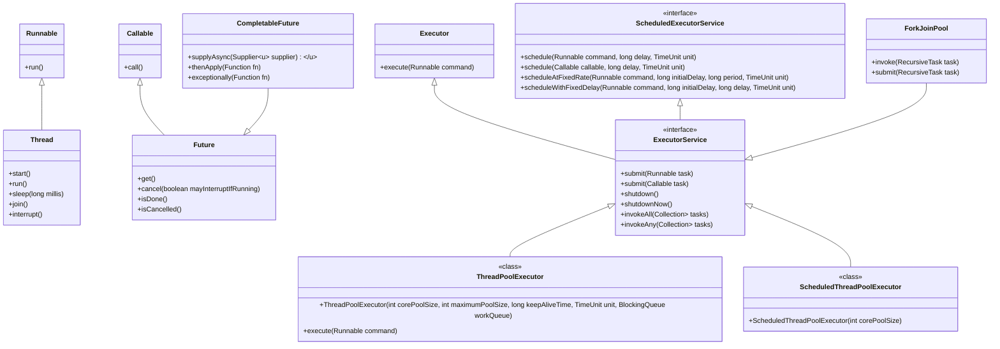

### Summary

- **Race Condition**: Prevent by synchronizing access to shared resources or using atomic variables.
- **Deadlock**: Avoid by using lock ordering, avoiding nested locks, and implementing timeouts.
- **Starvation**: Use fair locks or avoid excessive prioritization to ensure all threads get access to resources.

Understanding these concurrency issues is crucial for building robust multi-threaded applications in Java.

---

---

In Java 8, the introduction of **default** and **static** methods in interfaces serves several important purposes, enhancing the flexibility and usability of interfaces in object-oriented programming. Here’s a detailed explanation of why these features were added, despite regular interfaces having methods:

### 1. Default Methods

**Default methods** allow interfaces to provide a default implementation of a method. This feature was introduced primarily for two reasons:

- **Backward Compatibility**: With the introduction of new methods in interfaces, existing classes that implement those interfaces wouldn’t break. Without default methods, adding new methods to an interface would require all implementing classes to provide an implementation, potentially leading to a lot of changes in existing codebases.

  ```java
  interface MyInterface {
      default void greet() {
          System.out.println("Hello from MyInterface");
      }
  }

  class MyClass implements MyInterface {
      // MyClass can use the default implementation or override it
  }
  ```

- **Enhanced Functionality**: Default methods allow interfaces to evolve with additional behavior without forcing all implementing classes to change. This is particularly useful for frameworks and libraries where interfaces might need to be extended.

### 2. Static Methods

**Static methods** in interfaces allow you to define utility or helper methods that can be called without needing an instance of the interface. This feature is beneficial for several reasons:

- **Organized Utility Methods**: It provides a way to group related utility methods in one place (the interface), improving code organization. For example, if you have utility methods that are relevant to the interface, defining them as static methods keeps them logically associated.

  ```java
  interface MathUtils {
      static int square(int number) {
          return number * number;
      }
  }

  // Usage
  int result = MathUtils.square(5); // No instance needed
  ```

- **Namespace Management**: Static methods in interfaces help avoid naming conflicts in classes by providing a clear namespace for utility methods related to the interface.

### Comparison to Regular Methods

Before Java 8, interfaces could only declare abstract methods (methods without implementations). This limitation meant that any changes to an interface would have a significant impact on all implementing classes. With the introduction of default and static methods, interfaces gained the following benefits:

- **Flexibility**: They can provide both contracts (abstract methods) and implementations (default methods) without breaking existing code.
- **Encapsulation of Behavior**: Interfaces can encapsulate common behaviors, reducing code duplication across implementing classes.
- **Utility Functions**: Static methods allow for shared utility functions that can operate on data without requiring an object instance.

### Conclusion

Default and static methods in interfaces introduced in Java 8 enhance the power of interfaces by:

- Allowing backward-compatible evolution of interfaces.
- Providing default implementations for new methods.
- Offering organized utility methods related to the interface.

These features help maintain cleaner code, support easier maintenance, and encourage better design practices in Java applications.

### Backward Compatibility and Evolution in Java

**Backward compatibility** refers to the ability of newer versions of a software system (like Java) to work with older code without requiring modification. In the context of Java interfaces, it means that existing implementations of an interface should not break when new methods are added to that interface.

### The Need for Evolution

As software systems evolve, there may be a need to add new functionality to interfaces. However, modifying an interface by adding new abstract methods poses a significant problem:

1. **Existing Implementations**: All classes implementing the interface would be required to implement the new methods. This could lead to extensive changes across the codebase, making it cumbersome and error-prone.
2. **Compatibility Issues**: It can introduce breaking changes, causing existing code to fail if not updated.

### How Default and Static Methods Help

Java 8 introduced **default** and **static** methods in interfaces specifically to address these backward compatibility concerns and facilitate the evolution of interfaces.

#### 1. Default Methods

- **Implementation**: Default methods allow an interface to provide a concrete implementation of a method.
  
- **Backward Compatibility**: When a new method is added to an interface as a default method, existing classes implementing that interface do not need to change. They can either:
  - Use the default implementation provided by the interface.
  - Override the default method if they need specific behavior.

**Example**:

```java
interface Vehicle {
    // Existing method
    void start();

    // New default method added in Java 8
    default void honk() {
        System.out.println("Honk! Honk!");
    }
}

class Car implements Vehicle {
    public void start() {
        System.out.println("Car starting");
    }

    // No need to implement honk() unless custom behavior is needed
}

public class Main {
    public static void main(String[] args) {
        Vehicle car = new Car();
        car.start(); // Car starting
        car.honk(); // Honk! Honk!
    }
}
```

In this example, if the `honk()` method were added without being a default method, all classes implementing `Vehicle` would need to provide an implementation for it. With the default method, they can continue functioning without any changes.

#### 2. Static Methods

- **Utility Functions**: Static methods in interfaces can be used to provide utility or helper functions related to the interface.

- **No Impact on Implementations**: Adding a static method does not affect existing implementations, as static methods belong to the interface itself, not to instances of the classes implementing it.

**Example**:

```java
interface MathUtils {
    // Static method for utility
    static int square(int number) {
        return number * number;
    }
}

public class Main {
    public static void main(String[] args) {
        int result = MathUtils.square(5); // Calls the static method
        System.out.println("Square: " + result); // Square: 25
    }
}
```

In this example, the `square` method can be added to `MathUtils` without affecting any classes that implement it. Users can directly call `MathUtils.square()` without needing an instance.

### Conclusion

The introduction of default and static methods in Java 8 allows interfaces to evolve while maintaining backward compatibility. This means:

- **Backward Compatibility**: Existing implementations remain valid without requiring changes.
- **Ease of Evolution**: New functionalities can be added to interfaces without breaking existing code.
- **Cleaner Code**: Static methods provide a way to encapsulate related utility functions within the interface.

These features support better software design, making it easier to maintain and extend codebases over time.


In Java, interfaces can contain default and static methods, introduced in Java 8. Here’s a breakdown of their purpose, use cases, and how they help achieve multiple inheritance.

### Default Methods

**Definition**: Default methods are methods in interfaces that have a body. They allow you to provide a default implementation that can be inherited by implementing classes.

**Purpose**:
1. **Backward Compatibility**: Default methods allow you to add new methods to interfaces without breaking existing implementations.
2. **Shared Behavior**: They enable common behavior across multiple classes without requiring those classes to implement the method themselves.

**Example**:
```java
interface Animal {
    void sound();

    default void sleep() {
        System.out.println("Sleeping...");
    }
}

class Dog implements Animal {
    @Override
    public void sound() {
        System.out.println("Bark");
    }
}

class Cat implements Animal {
    @Override
    public void sound() {
        System.out.println("Meow");
    }
}

// Usage
Animal dog = new Dog();
dog.sound(); // Output: Bark
dog.sleep(); // Output: Sleeping...
```

### Static Methods

**Definition**: Static methods in interfaces are methods that belong to the interface itself rather than any instance of a class. They can be called without creating an instance of the interface.

**Purpose**:
1. **Utility Methods**: They can be used to provide utility functions that are relevant to the interface but do not require instance-specific behavior.
2. **Organizing Code**: Static methods can help organize related functionality within the interface.

**Example**:
```java
interface MathOperations {
    static int add(int a, int b) {
        return a + b;
    }

    static int subtract(int a, int b) {
        return a - b;
    }
}

// Usage
int sum = MathOperations.add(5, 3); // Output: 8
int difference = MathOperations.subtract(5, 3); // Output: 2
```

### Achieving Multiple Inheritance

Java does not support multiple inheritance with classes to avoid ambiguity. However, it allows multiple inheritance of behavior through interfaces, including default methods. Here’s how default methods enable this:

1. **Default Method Overriding**: A class can implement multiple interfaces that define the same default method. The class must override the method to resolve the ambiguity.

**Example**:
```java
interface Flyer {
    default void fly() {
        System.out.println("Flying...");
    }
}

interface Swimmer {
    default void fly() {
        System.out.println("Swimming...");
    }
}

class Duck implements Flyer, Swimmer {
    @Override
    public void fly() {
        // Resolving ambiguity by providing a custom implementation
        System.out.println("Duck flying!");
    }
}

// Usage
Duck duck = new Duck();
duck.fly(); // Output: Duck flying!
```

### Summary

- **Default Methods**: Provide default implementations in interfaces, allowing for backward compatibility and shared behavior across implementing classes.
- **Static Methods**: Allow utility functions to be associated with the interface, enabling organized, instance-independent behavior.
- **Multiple Inheritance**: Achieved through interfaces by implementing multiple interfaces with default methods. Ambiguities must be resolved in the implementing class.

This approach allows you to combine behaviors from different interfaces while maintaining clean and organized code.

---

When you have two interfaces, `A` and `B`, with the same method, and `A` extends `B`, you can use the method from either interface in a class that implements `A`. However, if the class does not provide its own implementation, it will inherit the method from `B`. If the method in `A` is also defined, then the implementing class must override it to provide a specific behavior.

Here’s how to work with this scenario:

### Example Code

```java
interface B {
    default void display() {
        System.out.println("Display from interface B");
    }
}

interface A extends B {
    default void display() {
        System.out.println("Display from interface A");
    }
}

class MyClass implements A {
    @Override
    public void display() {
        // You can choose to call either method
        A.super.display(); // Calls display from A
        // or
        B.super.display(); // Calls display from B
        System.out.println("Display from MyClass");
    }
}

public class Main {
    public static void main(String[] args) {
        MyClass myClass = new MyClass();
        myClass.display();
    }
}
```

### Output
```
Display from A
Display from MyClass
```

### Explanation

1. **Interface Definitions**:
   - Interface `B` has a default method `display()`.
   - Interface `A` extends `B` and also has a default method `display()`. 

2. **Class Implementation**:
   - `MyClass` implements interface `A`.
   - It overrides the `display()` method. Within this method, you can call the `display()` method from either `A` or `B` using the `super` keyword, specifying which interface's method you want to call.

3. **Method Resolution**:
   - By default, if the method is not overridden, the implementation from `A` will be used since `A` extends `B`.
   - If you want to call the method from `B`, you explicitly call `B.super.display()`.

### Key Points

- If `A` has a method that overrides the one in `B`, the class must provide its own implementation of that method.
- You can call methods from both interfaces using the syntax `InterfaceName.super.methodName()` if needed.
- This design allows for flexibility in method implementation and resolution when dealing with multiple interfaces.

---

Sure! Let’s delve into the **diamond problem**, **race conditions**, **starvation**, and **deadlocks**—common issues in programming, particularly in concurrent and object-oriented programming—and explore how to prevent them, along with code examples.

### 1. Diamond Problem

#### Definition:
The diamond problem occurs in multiple inheritance scenarios when a class inherits from two classes that have a method with the same signature. This can create ambiguity about which method to execute.

#### Example:

```java
interface A {
    default void show() {
        System.out.println("Show from A");
    }
}

interface B extends A {
    default void show() {
        System.out.println("Show from B");
    }
}

interface C extends A {
    default void show() {
        System.out.println("Show from C");
    }
}

class D implements B, C {
    @Override
    public void show() {
        // Resolve ambiguity by calling a specific interface method
        B.super.show(); // Calls show from B
        C.super.show(); // Calls show from C
    }
}

// Usage
public class Main {
    public static void main(String[] args) {
        D d = new D();
        d.show();
    }
}
```

#### Output:
```
Show from B
Show from C
```

#### Prevention:
- **Explicitly Override**: Always override the conflicting method in the subclass to resolve ambiguity.
- **Design Interfaces Carefully**: Avoid multiple inheritance of stateful interfaces.

---

### 2. Race Condition

#### Definition:
A race condition occurs when two or more threads access shared data and try to change it at the same time. The outcome depends on the timing of their execution, which can lead to unpredictable results.

#### Example:

```java
class Counter {
    private int count = 0;

    public void increment() {
        count++;
    }

    public int getCount() {
        return count;
    }
}

class IncrementThread extends Thread {
    private Counter counter;

    public IncrementThread(Counter counter) {
        this.counter = counter;
    }

    @Override
    public void run() {
        for (int i = 0; i < 1000; i++) {
            counter.increment();
        }
    }
}

// Usage
public class Main {
    public static void main(String[] args) throws InterruptedException {
        Counter counter = new Counter();
        Thread t1 = new IncrementThread(counter);
        Thread t2 = new IncrementThread(counter);

        t1.start();
        t2.start();
        t1.join();
        t2.join();

        System.out.println("Final count: " + counter.getCount());
    }
}
```

#### Possible Output:
```
Final count: 1500  // Unpredictable; could be less due to race conditions
```

#### Prevention:
- **Synchronization**: Use synchronized methods or blocks to ensure only one thread can modify shared data at a time.

```java
public synchronized void increment() {
    count++;
}
```

- **Using Locks**: Use `ReentrantLock` for more complex scenarios where you need more control.

---

### 3. Starvation

#### Definition:
Starvation occurs when a thread is perpetually denied the resources it needs for execution. This typically happens when high-priority threads consume all the CPU time, leaving low-priority threads waiting indefinitely.

#### Example:

```java
class StarvationExample {
    public static void main(String[] args) {
        final Thread highPriorityThread = new Thread(() -> {
            while (true) {
                // Simulating work
            }
        });

        final Thread lowPriorityThread = new Thread(() -> {
            try {
                Thread.sleep(1000); // Giving high-priority thread a chance to run
            } catch (InterruptedException e) {
                e.printStackTrace();
            }
            System.out.println("Low priority thread finished work");
        });

        highPriorityThread.setPriority(Thread.MAX_PRIORITY);
        lowPriorityThread.setPriority(Thread.MIN_PRIORITY);
        
        highPriorityThread.start();
        lowPriorityThread.start();
    }
}
```

#### Prevention:
- **Fair Scheduling**: Use fair locks (`ReentrantLock(true)`) or Java's built-in thread scheduler that balances priorities.
- **Resource Allocation**: Ensure that all threads have fair access to resources.

---

### 4. Deadlock

#### Definition:
A deadlock occurs when two or more threads are blocked forever, each waiting on the other to release a resource. This can lead to a situation where none of the threads can proceed.

#### Example:

```java
class Resource {
    private final String name;

    public Resource(String name) {
        this.name = name;
    }

    public String getName() {
        return name;
    }
}

public class DeadlockExample {
    private static final Resource resource1 = new Resource("Resource 1");
    private static final Resource resource2 = new Resource("Resource 2");

    public static void main(String[] args) {
        Thread t1 = new Thread(() -> {
            synchronized (resource1) {
                System.out.println("Thread 1: Holding resource 1...");
                try { Thread.sleep(100); } catch (InterruptedException e) {}
                System.out.println("Thread 1: Waiting for resource 2...");
                synchronized (resource2) {
                    System.out.println("Thread 1: Acquired resource 2");
                }
            }
        });

        Thread t2 = new Thread(() -> {
            synchronized (resource2) {
                System.out.println("Thread 2: Holding resource 2...");
                try { Thread.sleep(100); } catch (InterruptedException e) {}
                System.out.println("Thread 2: Waiting for resource 1...");
                synchronized (resource1) {
                    System.out.println("Thread 2: Acquired resource 1");
                }
            }
        });

        t1.start();
        t2.start();
    }
}
```

#### Prevention:
- **Lock Ordering**: Always acquire locks in a specific order to prevent circular wait.
- **Timeouts**: Use try-locks with a timeout to avoid waiting indefinitely.

```java
if (lock1.tryLock(100, TimeUnit.MILLISECONDS)) {
    try {
        // Acquire lock2
    } finally {
        lock1.unlock();
    }
}
```

### Summary

- **Diamond Problem**: Avoid ambiguity in method resolution through explicit overrides.
- **Race Condition**: Use synchronization to prevent concurrent modification of shared resources.
- **Starvation**: Implement fair resource allocation to ensure all threads get a chance to execute.
- **Deadlock**: Use lock ordering and timeouts to prevent circular waits.

These practices help create robust, efficient, and predictable concurrent applications.

---

In Java, achieving synchronous and asynchronous behavior in concurrent programming can be effectively managed using the **Executor Framework** and **Java Collections**. Here's an in-depth look at both approaches.

### Synchronous Execution

Synchronous execution refers to blocking operations where a thread waits for a task to complete before moving on. In the Executor Framework, you can achieve synchronous behavior using `ExecutorService` and `Future`.

#### Example of Synchronous Execution:

```java
import java.util.concurrent.Callable;
import java.util.concurrent.ExecutionException;
import java.util.concurrent.ExecutorService;
import java.util.concurrent.Executors;
import java.util.concurrent.Future;

public class SynchronousExecutionExample {
    public static void main(String[] args) {
        ExecutorService executor = Executors.newSingleThreadExecutor();

        Callable<String> task = () -> {
            Thread.sleep(1000); // Simulating a long-running task
            return "Task completed";
        };

        Future<String> future = executor.submit(task);

        try {
            // This will block until the task is completed
            String result = future.get();
            System.out.println(result);
        } catch (InterruptedException | ExecutionException e) {
            e.printStackTrace();
        } finally {
            executor.shutdown();
        }
    }
}
```

### Key Points:
- **`Future.get()`**: This method blocks until the task is completed and retrieves the result.
- **Single-threaded Executor**: This is useful for synchronous execution as it processes one task at a time.

---

### Asynchronous Execution

Asynchronous execution allows a thread to start a task and move on without waiting for it to complete. You can achieve this using the `CompletableFuture` class introduced in Java 8, which provides a powerful way to handle asynchronous programming.

#### Example of Asynchronous Execution:

```java
import java.util.concurrent.CompletableFuture;

public class AsynchronousExecutionExample {
    public static void main(String[] args) {
        CompletableFuture<String> future = CompletableFuture.supplyAsync(() -> {
            try {
                Thread.sleep(1000); // Simulating a long-running task
            } catch (InterruptedException e) {
                e.printStackTrace();
            }
            return "Task completed";
        });

        // Non-blocking; can perform other operations while waiting
        System.out.println("Doing something else...");

        // Handle the result asynchronously
        future.thenAccept(result -> {
            System.out.println(result);
        });

        // Optional: Wait for completion if needed
        future.join();
    }
}
```

### Key Points:
- **`supplyAsync`**: This method allows you to run a task asynchronously.
- **Non-blocking execution**: The main thread can continue executing while the task runs in the background.
- **`thenAccept`**: This method is used to define a callback that will be executed when the computation is complete.

---

### Using Java Collections with Executors

When dealing with collections in a concurrent environment, Java provides various thread-safe collections. These can be used with the Executor Framework to manage data safely across multiple threads.

#### Example with Thread-Safe Collections:

```java
import java.util.concurrent.ConcurrentHashMap;
import java.util.concurrent.ExecutorService;
import java.util.concurrent.Executors;

public class ConcurrentCollectionExample {
    public static void main(String[] args) {
        ExecutorService executor = Executors.newFixedThreadPool(2);
        ConcurrentHashMap<String, Integer> map = new ConcurrentHashMap<>();

        Runnable task1 = () -> {
            for (int i = 0; i < 5; i++) {
                map.put("Key" + i, i);
                System.out.println("Task1 added Key" + i);
            }
        };

        Runnable task2 = () -> {
            for (int i = 0; i < 5; i++) {
                map.put("Key" + (i + 5), i + 5);
                System.out.println("Task2 added Key" + (i + 5));
            }
        };

        executor.submit(task1);
        executor.submit(task2);

        executor.shutdown();
        
        // Wait for all tasks to finish before accessing the map
        while (!executor.isTerminated()) {}

        System.out.println("Final map: " + map);
    }
}
```

### Key Points:
- **`ConcurrentHashMap`**: This is a thread-safe collection that allows multiple threads to read and write without external synchronization.
- **Fixed Thread Pool**: Using a thread pool for managing concurrent tasks helps in efficient resource utilization.

---

### Summary

- **Synchronous Execution**: Use `ExecutorService` and `Future` to block until a task completes.
- **Asynchronous Execution**: Use `CompletableFuture` for non-blocking execution with callback handling.
- **Thread-Safe Collections**: Use collections like `ConcurrentHashMap` for safe access in a concurrent environment.

These tools enable robust concurrent programming in Java, helping manage both synchronous and asynchronous tasks effectively.

---

Certainly! Let’s delve into **threads**, **concurrency**, and the **Executor Framework** in Java, along with detailed explanations, coding examples, and some tricky questions to deepen your understanding.

### 1. Threads

#### Definition:
A thread is the smallest unit of processing that can be scheduled by the operating system. In Java, a thread is an instance of the `Thread` class or implements the `Runnable` interface.

#### Creating Threads:
You can create threads in Java in two main ways:

1. **By Extending the Thread Class**:
   ```java
   class MyThread extends Thread {
       @Override
       public void run() {
           System.out.println("Thread running: " + Thread.currentThread().getName());
       }
   }

   public class ThreadExample {
       public static void main(String[] args) {
           MyThread thread = new MyThread();
           thread.start(); // Start the thread
       }
   }
   ```

2. **By Implementing the Runnable Interface**:
   ```java
   class MyRunnable implements Runnable {
       @Override
       public void run() {
           System.out.println("Runnable running: " + Thread.currentThread().getName());
       }
   }

   public class RunnableExample {
       public static void main(String[] args) {
           Thread thread = new Thread(new MyRunnable());
           thread.start(); // Start the thread
       }
   }
   ```

### 2. Concurrency

#### Definition:
Concurrency refers to the ability to run multiple threads simultaneously, which can improve the performance of applications, especially on multi-core processors. Concurrency allows multiple tasks to make progress, which may or may not happen at the same time.

#### Issues in Concurrency:
- **Race Conditions**: Occur when multiple threads access shared data and try to change it at the same time, leading to unpredictable results.
- **Deadlocks**: Occur when two or more threads are blocked forever, each waiting for the other to release a resource.
- **Starvation**: Occurs when a thread is perpetually denied access to resources.

"Perpetually" means in a way that is continuous, unending, or everlasting. It describes something that happens without interruption or that continues indefinitely over time. For example, if a task is described as being "perpetually delayed," it means that it is always delayed and there seems to be no end to the delays.

### 3. Executor Framework

#### Definition:
The Executor Framework in Java provides a higher-level replacement for managing threads directly. It simplifies thread management and allows for more scalable and maintainable code.

#### Key Components:
- **Executor**: The simplest interface to provide a way to execute a runnable task.
- **ExecutorService**: An interface that provides methods for managing and controlling the execution of tasks.
- **ScheduledExecutorService**: An extension of `ExecutorService` that can schedule tasks to run after a given delay or periodically.

#### Example of Executor Framework:

```java
import java.util.concurrent.ExecutorService;
import java.util.concurrent.Executors;

public class ExecutorExample {
    public static void main(String[] args) {
        ExecutorService executor = Executors.newFixedThreadPool(3); // Thread pool with 3 threads

        for (int i = 0; i < 5; i++) {
            final int taskId = i;
            executor.submit(() -> {
                System.out.println("Task " + taskId + " is running on thread: " + Thread.currentThread().getName());
                try {
                    Thread.sleep(1000); // Simulate work
                } catch (InterruptedException e) {
                    e.printStackTrace();
                }
            });
        }

        executor.shutdown(); // Initiates an orderly shutdown
    }
}
```

### Key Features of the Executor Framework:
- **Thread Pool Management**: You don’t need to manage threads manually; the executor handles it for you.
- **Task Submission**: You can submit `Runnable` or `Callable` tasks for execution.
- **Graceful Shutdown**: The framework provides methods to shut down the executor gracefully.

### Tricky Questions and Answers

1. **What is the difference between `Runnable` and `Callable`?**
   - **Runnable**: Represents a task that does not return a result and cannot throw checked exceptions. Its method `run()` does not return a value.
   - **Callable**: Represents a task that returns a result and can throw checked exceptions. It has a method `call()` that returns a value.

   ```java
   Callable<Integer> task = () -> {
       return 42; // Can return a result
   };
   ```

2. **How can you avoid deadlocks in Java?**
   - **Lock Ordering**: Always acquire locks in a consistent global order to avoid circular wait conditions.
   - **Timeouts**: Use `tryLock()` with a timeout to avoid waiting indefinitely.
   - **Deadlock Detection**: Implement logic to detect and recover from deadlocks.

Detecting and recovering from deadlocks in Java can be complex, but it typically involves two main strategies: detecting deadlocks and implementing a recovery mechanism. Here’s a guide on how to implement logic to achieve this.

### 1. Deadlock Detection

To detect deadlocks, you can use the following strategies:

- **Thread Dumps**: Periodically analyze thread dumps to check for deadlock situations.
- **Resource Allocation Graph**: Maintain a graph that represents the allocation of resources to threads. If a cycle is detected in this graph, a deadlock exists.

Here’s a simple example using the `ThreadMXBean` to check for deadlocks:

```java
import java.lang.management.ManagementFactory;
import java.lang.management.ThreadInfo;
import java.lang.management.ThreadMXBean;

public class DeadlockDetector {

    public static void detectDeadlocks() {
        ThreadMXBean threadMXBean = ManagementFactory.getThreadMXBean();
        long[] deadlockedThreads = threadMXBean.findDeadlockedThreads();

        if (deadlockedThreads != null) {
            ThreadInfo[] threadInfos = threadMXBean.getThreadInfo(deadlockedThreads);
            for (ThreadInfo threadInfo : threadInfos) {
                System.out.println("Deadlocked thread: " + threadInfo.getThreadName());
                System.out.println("  " + threadInfo.getLockName());
            }
        } else {
            System.out.println("No deadlocks detected.");
        }
    }
}
```

### 2. Recovery from Deadlock

To recover from deadlocks, you can use one of these strategies:

- **Thread Termination**: Forcefully terminate one of the deadlocked threads. This is a harsh approach, but it can break the deadlock.
- **Timeouts**: Use timeouts when acquiring locks, allowing a thread to back off and retry if it cannot acquire a lock within a certain time.

#### Example: Using Timeouts

Here's a simplified implementation using `ReentrantLock` with a timeout:

```java
import java.util.concurrent.locks.ReentrantLock;
import java.util.concurrent.TimeUnit;

public class DeadlockDemo {
    private final ReentrantLock lock1 = new ReentrantLock();
    private final ReentrantLock lock2 = new ReentrantLock();

    public void threadA() {
        try {
            if (lock1.tryLock(1, TimeUnit.SECONDS)) {
                try {
                    System.out.println("Thread A acquired lock 1");
                    Thread.sleep(500); // Simulate work
                    if (lock2.tryLock(1, TimeUnit.SECONDS)) {
                        try {
                            System.out.println("Thread A acquired lock 2");
                        } finally {
                            lock2.unlock();
                        }
                    } else {
                        System.out.println("Thread A could not acquire lock 2, releasing lock 1");
                    }
                } finally {
                    lock1.unlock();
                }
            }
        } catch (InterruptedException e) {
            Thread.currentThread().interrupt();
        }
    }

    public void threadB() {
        try {
            if (lock2.tryLock(1, TimeUnit.SECONDS)) {
                try {
                    System.out.println("Thread B acquired lock 2");
                    Thread.sleep(500); // Simulate work
                    if (lock1.tryLock(1, TimeUnit.SECONDS)) {
                        try {
                            System.out.println("Thread B acquired lock 1");
                        } finally {
                            lock1.unlock();
                        }
                    } else {
                        System.out.println("Thread B could not acquire lock 1, releasing lock 2");
                    }
                } finally {
                    lock2.unlock();
                }
            }
        } catch (InterruptedException e) {
            Thread.currentThread().interrupt();
        }
    }

    public static void main(String[] args) {
        DeadlockDemo demo = new DeadlockDemo();
        Thread t1 = new Thread(demo::threadA);
        Thread t2 = new Thread(demo::threadB);
        t1.start();
        t2.start();
    }
}
```

### Summary

1. **Detection**: Use `ThreadMXBean` to check for deadlocked threads.
2. **Recovery**: Implement timeouts for lock acquisition or forcefully terminate threads if necessary.

Forcefully terminating threads in Java is generally not recommended because it can lead to resource leaks, inconsistent states, and other unintended side effects. However, if you find yourself needing to stop a thread forcefully, it's important to understand the implications.

### Recommended Approach: Using Interruption

Instead of terminating a thread forcefully, you can use the `interrupt()` method to signal a thread to stop its work. This method sets the thread's interrupt status, and the thread should check this status periodically and exit gracefully.

Here’s how to do it:

```java
class Task implements Runnable {
    @Override
    public void run() {
        try {
            while (!Thread.currentThread().isInterrupted()) {
                // Simulate work
                System.out.println("Working...");
                Thread.sleep(1000); // Simulate a task that can be interrupted
            }
        } catch (InterruptedException e) {
            // Handle the interruption (cleanup if necessary)
            System.out.println("Thread was interrupted!");
            Thread.currentThread().interrupt(); // Restore interrupt status
        }
    }
}

public class InterruptExample {
    public static void main(String[] args) {
        Thread thread = new Thread(new Task());
        thread.start();

        try {
            // Let the thread run for a while
            Thread.sleep(3000);
        } catch (InterruptedException e) {
            e.printStackTrace();
        }

        // Request the thread to stop
        thread.interrupt();
    }
}
```

### Forcefully Stopping a Thread (Not Recommended)

If you must forcefully stop a thread (e.g., in legacy code), you could use the deprecated `stop()` method, but this is **not safe**. Here’s how it works:

```java
class UnsafeTask implements Runnable {
    @Override
    public void run() {
        while (true) {
            System.out.println("Running...");
            // Simulate some work
            try {
                Thread.sleep(1000);
            } catch (InterruptedException e) {
                // Thread can handle interruption here
                break; // Exit the loop on interruption
            }
        }
    }
}

public class ForceStopExample {
    public static void main(String[] args) {
        Thread thread = new Thread(new UnsafeTask());
        thread.start();

        try {
            Thread.sleep(3000); // Let it run for a while
        } catch (InterruptedException e) {
            e.printStackTrace();
        }

        // Forcefully stop the thread (unsafe)
        thread.stop(); // Not recommended
    }
}
```

### Key Takeaways

1. **Use Interruption**: Always prefer using interruption to signal a thread to stop. This allows for safe resource management and proper cleanup.
   
2. **Avoid `stop()`**: The `stop()` method is deprecated and should be avoided due to its unsafe nature.

3. **Thread Coordination**: Ensure that threads can respond to interruptions by checking the interrupt status and handling cleanup appropriately.

By following these best practices, you can manage thread lifecycles more safely and effectively in your Java applications.

3. **What happens if you don’t call `shutdown()` on an `ExecutorService`?**
   - The application may not terminate gracefully. Unfinished tasks may continue running, and the program could hang indefinitely. Always ensure to shut down the executor using `shutdown()` or `shutdownNow()`.

4. **Explain thread safety. How can you achieve it?**
   - **Thread Safety**: It means that a class or a method behaves correctly when accessed by multiple threads simultaneously.
   - **Ways to achieve it**:
     - Use synchronized methods or blocks.
     - Utilize thread-safe collections (e.g., `ConcurrentHashMap`).
     - Employ higher-level constructs like `ReentrantLock`.

5. **What is the purpose of `Future` in the Executor Framework?**
   - `Future` represents the result of an asynchronous computation. You can use it to check if the task is complete, wait for its completion, and retrieve its result.

   ```java
   Future<Integer> future = executor.submit(() -> {
       // Some computation
       return 10;
   });
   ```

### Summary

- **Threads**: Fundamental units of execution in Java.
- **Concurrency**: The ability to run multiple threads and manage shared resources.
- **Executor Framework**: A high-level API for managing thread execution, simplifying concurrent programming.

By mastering these concepts, you can write efficient, maintainable, and scalable multi-threaded applications in Java.

---

---

Sure! Let’s delve into the **diamond problem**, **race conditions**, **starvation**, and **deadlocks**—common issues in programming, particularly in concurrent and object-oriented programming—and explore how to prevent them, along with code examples.

### 1. Diamond Problem

#### Definition:
The diamond problem occurs in multiple inheritance scenarios when a class inherits from two classes that have a method with the same signature. This can create ambiguity about which method to execute.

#### Example:

```java
interface A {
    default void show() {
        System.out.println("Show from A");
    }
}

interface B extends A {
    default void show() {
        System.out.println("Show from B");
    }
}

interface C extends A {
    default void show() {
        System.out.println("Show from C");
    }
}

class D implements B, C {
    @Override
    public void show() {
        // Resolve ambiguity by calling a specific interface method
        B.super.show(); // Calls show from B
        C.super.show(); // Calls show from C
    }
}

// Usage
public class Main {
    public static void main(String[] args) {
        D d = new D();
        d.show();
    }
}
```

#### Output:
```
Show from B
Show from C
```

#### Prevention:
- **Explicitly Override**: Always override the conflicting method in the subclass to resolve ambiguity.
- **Design Interfaces Carefully**: Avoid multiple inheritance of stateful interfaces.

---

### 2. Race Condition

#### Definition:
A race condition occurs when two or more threads access shared data and try to change it at the same time. The outcome depends on the timing of their execution, which can lead to unpredictable results.

#### Example:

```java
class Counter {
    private int count = 0;

    public void increment() {
        count++;
    }

    public int getCount() {
        return count;
    }
}

class IncrementThread extends Thread {
    private Counter counter;

    public IncrementThread(Counter counter) {
        this.counter = counter;
    }

    @Override
    public void run() {
        for (int i = 0; i < 1000; i++) {
            counter.increment();
        }
    }
}

// Usage
public class Main {
    public static void main(String[] args) throws InterruptedException {
        Counter counter = new Counter();
        Thread t1 = new IncrementThread(counter);
        Thread t2 = new IncrementThread(counter);

        t1.start();
        t2.start();
        t1.join();
        t2.join();

        System.out.println("Final count: " + counter.getCount());
    }
}
```

#### Possible Output:
```
Final count: 1500  // Unpredictable; could be less due to race conditions
```

#### Prevention:
- **Synchronization**: Use synchronized methods or blocks to ensure only one thread can modify shared data at a time.

```java
public synchronized void increment() {
    count++;
}
```

- **Using Locks**: Use `ReentrantLock` for more complex scenarios where you need more control.

---

### 3. Starvation

#### Definition:
Starvation occurs when a thread is perpetually denied the resources it needs for execution. This typically happens when high-priority threads consume all the CPU time, leaving low-priority threads waiting indefinitely.

#### Example:

```java
class StarvationExample {
    public static void main(String[] args) {
        final Thread highPriorityThread = new Thread(() -> {
            while (true) {
                // Simulating work
            }
        });

        final Thread lowPriorityThread = new Thread(() -> {
            try {
                Thread.sleep(1000); // Giving high-priority thread a chance to run
            } catch (InterruptedException e) {
                e.printStackTrace();
            }
            System.out.println("Low priority thread finished work");
        });

        highPriorityThread.setPriority(Thread.MAX_PRIORITY);
        lowPriorityThread.setPriority(Thread.MIN_PRIORITY);
        
        highPriorityThread.start();
        lowPriorityThread.start();
    }
}
```

#### Prevention:
- **Fair Scheduling**: Use fair locks (`ReentrantLock(true)`) or Java's built-in thread scheduler that balances priorities.
- **Resource Allocation**: Ensure that all threads have fair access to resources.

---

### 4. Deadlock

#### Definition:
A deadlock occurs when two or more threads are blocked forever, each waiting on the other to release a resource. This can lead to a situation where none of the threads can proceed.

#### Example:

```java
class Resource {
    private final String name;

    public Resource(String name) {
        this.name = name;
    }

    public String getName() {
        return name;
    }
}

public class DeadlockExample {
    private static final Resource resource1 = new Resource("Resource 1");
    private static final Resource resource2 = new Resource("Resource 2");

    public static void main(String[] args) {
        Thread t1 = new Thread(() -> {
            synchronized (resource1) {
                System.out.println("Thread 1: Holding resource 1...");
                try { Thread.sleep(100); } catch (InterruptedException e) {}
                System.out.println("Thread 1: Waiting for resource 2...");
                synchronized (resource2) {
                    System.out.println("Thread 1: Acquired resource 2");
                }
            }
        });

        Thread t2 = new Thread(() -> {
            synchronized (resource2) {
                System.out.println("Thread 2: Holding resource 2...");
                try { Thread.sleep(100); } catch (InterruptedException e) {}
                System.out.println("Thread 2: Waiting for resource 1...");
                synchronized (resource1) {
                    System.out.println("Thread 2: Acquired resource 1");
                }
            }
        });

        t1.start();
        t2.start();
    }
}
```

#### Prevention:
- **Lock Ordering**: Always acquire locks in a specific order to prevent circular wait.
- **Timeouts**: Use try-locks with a timeout to avoid waiting indefinitely.

```java
if (lock1.tryLock(100, TimeUnit.MILLISECONDS)) {
    try {
        // Acquire lock2
    } finally {
        lock1.unlock();
    }
}
```

### Summary

- **Diamond Problem**: Avoid ambiguity in method resolution through explicit overrides.
- **Race Condition**: Use synchronization to prevent concurrent modification of shared resources.
- **Starvation**: Implement fair resource allocation to ensure all threads get a chance to execute.
- **Deadlock**: Use lock ordering and timeouts to prevent circular waits.

These practices help create robust, efficient, and predictable concurrent applications.

---

In Java, achieving synchronous and asynchronous behavior in concurrent programming can be effectively managed using the **Executor Framework** and **Java Collections**. Here's an in-depth look at both approaches.

### Synchronous Execution

Synchronous execution refers to blocking operations where a thread waits for a task to complete before moving on. In the Executor Framework, you can achieve synchronous behavior using `ExecutorService` and `Future`.

#### Example of Synchronous Execution:

```java
import java.util.concurrent.Callable;
import java.util.concurrent.ExecutionException;
import java.util.concurrent.ExecutorService;
import java.util.concurrent.Executors;
import java.util.concurrent.Future;

public class SynchronousExecutionExample {
    public static void main(String[] args) {
        ExecutorService executor = Executors.newSingleThreadExecutor();

        Callable<String> task = () -> {
            Thread.sleep(1000); // Simulating a long-running task
            return "Task completed";
        };

        Future<String> future = executor.submit(task);

        try {
            // This will block until the task is completed
            String result = future.get();
            System.out.println(result);
        } catch (InterruptedException | ExecutionException e) {
            e.printStackTrace();
        } finally {
            executor.shutdown();
        }
    }
}
```

### Key Points:
- **`Future.get()`**: This method blocks until the task is completed and retrieves the result.
- **Single-threaded Executor**: This is useful for synchronous execution as it processes one task at a time.

---

### Asynchronous Execution

Asynchronous execution allows a thread to start a task and move on without waiting for it to complete. You can achieve this using the `CompletableFuture` class introduced in Java 8, which provides a powerful way to handle asynchronous programming.

#### Example of Asynchronous Execution:

```java
import java.util.concurrent.CompletableFuture;

public class AsynchronousExecutionExample {
    public static void main(String[] args) {
        CompletableFuture<String> future = CompletableFuture.supplyAsync(() -> {
            try {
                Thread.sleep(1000); // Simulating a long-running task
            } catch (InterruptedException e) {
                e.printStackTrace();
            }
            return "Task completed";
        });

        // Non-blocking; can perform other operations while waiting
        System.out.println("Doing something else...");

        // Handle the result asynchronously
        future.thenAccept(result -> {
            System.out.println(result);
        });

        // Optional: Wait for completion if needed
        future.join();
    }
}
```

### Key Points:
- **`supplyAsync`**: This method allows you to run a task asynchronously.
- **Non-blocking execution**: The main thread can continue executing while the task runs in the background.
- **`thenAccept`**: This method is used to define a callback that will be executed when the computation is complete.

---

### Using Java Collections with Executors

When dealing with collections in a concurrent environment, Java provides various thread-safe collections. These can be used with the Executor Framework to manage data safely across multiple threads.

#### Example with Thread-Safe Collections:

```java
import java.util.concurrent.ConcurrentHashMap;
import java.util.concurrent.ExecutorService;
import java.util.concurrent.Executors;

public class ConcurrentCollectionExample {
    public static void main(String[] args) {
        ExecutorService executor = Executors.newFixedThreadPool(2);
        ConcurrentHashMap<String, Integer> map = new ConcurrentHashMap<>();

        Runnable task1 = () -> {
            for (int i = 0; i < 5; i++) {
                map.put("Key" + i, i);
                System.out.println("Task1 added Key" + i);
            }
        };

        Runnable task2 = () -> {
            for (int i = 0; i < 5; i++) {
                map.put("Key" + (i + 5), i + 5);
                System.out.println("Task2 added Key" + (i + 5));
            }
        };

        executor.submit(task1);
        executor.submit(task2);

        executor.shutdown();
        
        // Wait for all tasks to finish before accessing the map
        while (!executor.isTerminated()) {}

        System.out.println("Final map: " + map);
    }
}
```

### Key Points:
- **`ConcurrentHashMap`**: This is a thread-safe collection that allows multiple threads to read and write without external synchronization.
- **Fixed Thread Pool**: Using a thread pool for managing concurrent tasks helps in efficient resource utilization.

---

### Summary

- **Synchronous Execution**: Use `ExecutorService` and `Future` to block until a task completes.
- **Asynchronous Execution**: Use `CompletableFuture` for non-blocking execution with callback handling.
- **Thread-Safe Collections**: Use collections like `ConcurrentHashMap` for safe access in a concurrent environment.

These tools enable robust concurrent programming in Java, helping manage both synchronous and asynchronous tasks effectively.

---

Certainly! Let’s delve into **threads**, **concurrency**, and the **Executor Framework** in Java, along with detailed explanations, coding examples, and some tricky questions to deepen your understanding.

### 1. Threads

#### Definition:
A thread is the smallest unit of processing that can be scheduled by the operating system. In Java, a thread is an instance of the `Thread` class or implements the `Runnable` interface.

#### Creating Threads:
You can create threads in Java in two main ways:

1. **By Extending the Thread Class**:
   ```java
   class MyThread extends Thread {
       @Override
       public void run() {
           System.out.println("Thread running: " + Thread.currentThread().getName());
       }
   }

   public class ThreadExample {
       public static void main(String[] args) {
           MyThread thread = new MyThread();
           thread.start(); // Start the thread
       }
   }
   ```

2. **By Implementing the Runnable Interface**:
   ```java
   class MyRunnable implements Runnable {
       @Override
       public void run() {
           System.out.println("Runnable running: " + Thread.currentThread().getName());
       }
   }

   public class RunnableExample {
       public static void main(String[] args) {
           Thread thread = new Thread(new MyRunnable());
           thread.start(); // Start the thread
       }
   }
   ```

### 2. Concurrency

#### Definition:
Concurrency refers to the ability to run multiple threads simultaneously, which can improve the performance of applications, especially on multi-core processors. Concurrency allows multiple tasks to make progress, which may or may not happen at the same time.

#### Issues in Concurrency:
- **Race Conditions**: Occur when multiple threads access shared data and try to change it at the same time, leading to unpredictable results.
- **Deadlocks**: Occur when two or more threads are blocked forever, each waiting for the other to release a resource.
- **Starvation**: Occurs when a thread is perpetually denied access to resources.

### 3. Executor Framework

#### Definition:
The Executor Framework in Java provides a higher-level replacement for managing threads directly. It simplifies thread management and allows for more scalable and maintainable code.

#### Key Components:
- **Executor**: The simplest interface to provide a way to execute a runnable task.
- **ExecutorService**: An interface that provides methods for managing and controlling the execution of tasks.
- **ScheduledExecutorService**: An extension of `ExecutorService` that can schedule tasks to run after a given delay or periodically.

#### Example of Executor Framework:

```java
import java.util.concurrent.ExecutorService;
import java.util.concurrent.Executors;

public class ExecutorExample {
    public static void main(String[] args) {
        ExecutorService executor = Executors.newFixedThreadPool(3); // Thread pool with 3 threads

        for (int i = 0; i < 5; i++) {
            final int taskId = i;
            executor.submit(() -> {
                System.out.println("Task " + taskId + " is running on thread: " + Thread.currentThread().getName());
                try {
                    Thread.sleep(1000); // Simulate work
                } catch (InterruptedException e) {
                    e.printStackTrace();
                }
            });
        }

        executor.shutdown(); // Initiates an orderly shutdown
    }
}
```

### Key Features of the Executor Framework:
- **Thread Pool Management**: You don’t need to manage threads manually; the executor handles it for you.
- **Task Submission**: You can submit `Runnable` or `Callable` tasks for execution.
- **Graceful Shutdown**: The framework provides methods to shut down the executor gracefully.

### Tricky Questions and Answers

1. **What is the difference between `Runnable` and `Callable`?**
   - **Runnable**: Represents a task that does not return a result and cannot throw checked exceptions. Its method `run()` does not return a value.
   - **Callable**: Represents a task that returns a result and can throw checked exceptions. It has a method `call()` that returns a value.

   ```java
   Callable<Integer> task = () -> {
       return 42; // Can return a result
   };
   ```

2. **How can you avoid deadlocks in Java?**
   - **Lock Ordering**: Always acquire locks in a consistent global order to avoid circular wait conditions.
   - **Timeouts**: Use `tryLock()` with a timeout to avoid waiting indefinitely.
   - **Deadlock Detection**: Implement logic to detect and recover from deadlocks.

3. **What happens if you don’t call `shutdown()` on an `ExecutorService`?**
   - The application may not terminate gracefully. Unfinished tasks may continue running, and the program could hang indefinitely. Always ensure to shut down the executor using `shutdown()` or `shutdownNow()`.

4. **Explain thread safety. How can you achieve it?**
   - **Thread Safety**: It means that a class or a method behaves correctly when accessed by multiple threads simultaneously.
   - **Ways to achieve it**:
     - Use synchronized methods or blocks.
     - Utilize thread-safe collections (e.g., `ConcurrentHashMap`).
     - Employ higher-level constructs like `ReentrantLock`.

5. **What is the purpose of `Future` in the Executor Framework?**
   - `Future` represents the result of an asynchronous computation. You can use it to check if the task is complete, wait for its completion, and retrieve its result.

   ```java
   Future<Integer> future = executor.submit(() -> {
       // Some computation
       return 10;
   });
   ```

### Summary

- **Threads**: Fundamental units of execution in Java.
- **Concurrency**: The ability to run multiple threads and manage shared resources.
- **Executor Framework**: A high-level API for managing thread execution, simplifying concurrent programming.

By mastering these concepts, you can write efficient, maintainable, and scalable multi-threaded applications in Java.

---

### The Diamond Problem
Occurs when a class inherits from two interfaces that have the same method signature. The implementing class must override the method to resolve ambiguity.

#### Example of the Diamond Problem
```java
interface InterfaceA {
    default void display() {
        System.out.println("Display from Interface A");
    }
}

interface InterfaceB {
    default void display() {
        System.out.println("Display from Interface B");
    }
}

class ConcreteClass implements InterfaceA, InterfaceB {
    @Override
    public void display() {
        InterfaceA.super.display(); // Calls Interface A's method
        InterfaceB.super.display(); // Calls Interface B's method
    }
}

public class Main {
    public static void main(String[] args) {
        ConcreteClass obj = new ConcreteClass();
        obj.display(); // Output: Display from Interface A Display from Interface B
    }
}
```

### Concurrency Issues in Java

#### 1. Race Condition
Occurs when multiple threads access shared data and try to change it simultaneously, leading to unpredictable results.

##### Example of Race Condition
```java
class Counter {
    private int count = 0;

    public void increment() {
        count++; // Not thread-safe
    }

    public int getCount() {
        return count;
    }
}

public class RaceConditionExample {
    public static void main(String[] args) throws InterruptedException {
        Counter counter = new Counter();
        
        Thread t1 = new Thread(() -> {
            for (int i = 0; i < 1000; i++) {
                counter.increment();
            }
        });
        
        Thread t2 = new Thread(() -> {
            for (int i = 0; i < 1000; i++) {
                counter.increment();
            }
        });
        
        t1.start();
        t2.start();
        t1.join();
        t2.join();
        
        System.out.println("Final count: " + counter.getCount()); // Output can be unpredictable
    }
}
```

##### Prevention
- **Synchronization**: Use `synchronized` keyword to ensure mutual exclusion.
- **Atomic Variables**: Use classes like `AtomicInteger`.

#### 2. Deadlock
Occurs when two or more threads are blocked forever, each waiting for the other to release a lock.

##### Example of Deadlock
```java
class Resource {
    public synchronized void methodA(Resource other) {
        System.out.println(Thread.currentThread().getName() + " is in methodA");
        other.methodB();
    }

    public synchronized void methodB() {
        System.out.println(Thread.currentThread().getName() + " is in methodB");
    }
}

public class DeadlockExample {
    public static void main(String[] args) {
        Resource resource1 = new Resource();
        Resource resource2 = new Resource();

        Thread t1 = new Thread(() -> resource1.methodA(resource2));
        Thread t2 = new Thread(() -> resource2.methodA(resource1));

        t1.start();
        t2.start();
    }
}
```

##### Prevention
- **Lock Ordering**: Always acquire locks in a consistent order.
- **Timeouts**: Use timeout when trying to acquire locks.

#### 3. Starvation
Occurs when a thread is perpetually denied access to resources due to other threads continuously being prioritized.

##### Example of Starvation
```java
class SharedResource {
    public synchronized void access() {
        System.out.println(Thread.currentThread().getName() + " is accessing resource.");
        try {
            Thread.sleep(100); // Simulating work
        } catch (InterruptedException e) {
            Thread.currentThread().interrupt();
        }
    }
}

public class StarvationExample {
    public static void main(String[] args) {
        SharedResource resource = new SharedResource();
        
        Runnable task = () -> {
            while (true) {
                resource.access();
            }
        };
        
        Thread highPriorityThread = new Thread(task);
        highPriorityThread.setPriority(Thread.MAX_PRIORITY);
        
        Thread lowPriorityThread1 = new Thread(task);
        Thread lowPriorityThread2 = new Thread(task);
        
        lowPriorityThread1.setPriority(Thread.MIN_PRIORITY);
        lowPriorityThread2.setPriority(Thread.MIN_PRIORITY);
        
        highPriorityThread.start();
        lowPriorityThread1.start();
        lowPriorityThread2.start();
    }
}
```

##### Prevention
- **Fair Locks**: Use `ReentrantLock` with fairness policy.
- **Avoid Excessive Prioritization**: Balance thread priorities.

### Summary
- **Diamond Problem**: Resolve ambiguities by overriding methods in implementing classes.
- **Race Condition**: Use synchronization or atomic variables for thread safety.
- **Deadlock**: Avoid nested locks and implement a consistent lock ordering.
- **Starvation**: Utilize fair locking mechanisms and balance thread priorities.

Understanding these concepts is crucial for building robust and efficient Java applications, especially in concurrent programming scenarios.

Here's a consolidated overview of race conditions, deadlocks, starvation, and key concurrency concepts in Java, along with examples and prevention strategies.

---

### Concurrency Issues in Java

#### 1. Race Condition

A race condition occurs when multiple threads access shared data and try to change it simultaneously, leading to inconsistent results.

**Example:**
```java
class Counter {
    private int count = 0;

    public void increment() {
        count++; // Not thread-safe
    }

    public int getCount() {
        return count;
    }
}

public class RaceConditionExample {
    public static void main(String[] args) throws InterruptedException {
        Counter counter = new Counter();
        Thread t1 = new Thread(() -> { for (int i = 0; i < 1000; i++) counter.increment(); });
        Thread t2 = new Thread(() -> { for (int i = 0; i < 1000; i++) counter.increment(); });
        
        t1.start(); t2.start();
        t1.join(); t2.join();
        
        System.out.println("Final count: " + counter.getCount());
    }
}
```
**Output:** The final count is often less than 2000 due to the race condition.

**Prevention:**
- **Synchronization:** Use the `synchronized` keyword.
- **Atomic Variables:** Use `java.util.concurrent.atomic.AtomicInteger`.

#### 2. Deadlock

A deadlock occurs when two or more threads are blocked forever, each waiting for the other to release locks.

**Example:**
```java
class Resource {
    public synchronized void methodA(Resource other) {
        other.methodB();
    }
    public synchronized void methodB() {}
}

public class DeadlockExample {
    public static void main(String[] args) {
        Resource resource1 = new Resource();
        Resource resource2 = new Resource();
        
        new Thread(() -> resource1.methodA(resource2)).start();
        new Thread(() -> resource2.methodA(resource1)).start();
    }
}
```

**Prevention:**
- **Avoid Nested Locks**
- **Lock Ordering:** Always acquire locks in a consistent order.
- **Use Timeout:** Implement timeout mechanisms when trying to acquire locks.

#### 3. Starvation

Starvation occurs when a thread is perpetually denied access to resources because other threads continually receive priority.

**Example:**
```java
class SharedResource {
    public synchronized void access() {
        try { Thread.sleep(100); } catch (InterruptedException e) {}
    }
}

public class StarvationExample {
    public static void main(String[] args) {
        SharedResource resource = new SharedResource();
        Thread highPriorityThread = new Thread(() -> { while (true) resource.access(); });
        highPriorityThread.setPriority(Thread.MAX_PRIORITY);
        highPriorityThread.start();

        new Thread(() -> { while (true) resource.access(); }).start();
        new Thread(() -> { while (true) resource.access(); }).start();
    }
}
```

**Prevention:**
- **Fair Locks:** Use `ReentrantLock` with the fairness policy set to true.
- **Avoid Excessive Prioritization.**

### Key Concepts

#### Fairness Policy

The fairness policy in Java's concurrency framework ensures that threads acquire locks in a fair manner (FIFO order), which can help prevent starvation.

```java
ReentrantLock fairLock = new ReentrantLock(true); // Fair
ReentrantLock unfairLock = new ReentrantLock(false); // Unfair
```

#### Concurrency

Concurrency enables multiple threads to run simultaneously, improving application performance, especially for I/O-bound and CPU-bound operations.

#### Thread Creation

Threads can be created by:
1. Extending the `Thread` class:
    ```java
    class MyThread extends Thread {
        public void run() { System.out.println("Thread is running"); }
    }
    ```
2. Implementing the `Runnable` interface:
    ```java
    class MyRunnable implements Runnable {
        public void run() { System.out.println("Thread is running"); }
    }
    ```

#### Concurrent HashMap

`ConcurrentHashMap` is a thread-safe variant of `HashMap`, allowing concurrent access without locking the entire structure.

**Example:**
```java
import java.util.concurrent.ConcurrentHashMap;

public class ConcurrentHashMapExample {
    public static void main(String[] args) {
        ConcurrentHashMap<String, Integer> map = new ConcurrentHashMap<>();
        map.put("One", 1); map.put("Two", 2);

        Runnable task = () -> {
            for (String key : map.keySet()) {
                System.out.println(Thread.currentThread().getName() + " read: " + key + " = " + map.get(key));
            }
        };

        new Thread(task).start();
        new Thread(task).start();
    }
}
```

#### Executor Framework

The Executor framework provides a high-level API for managing threads and task execution, improving resource management and flexibility.

**Example:**
```java
import java.util.concurrent.ExecutorService;
import java.util.concurrent.Executors;

public class ExecutorFrameworkExample {
    public static void main(String[] args) {
        ExecutorService executorService = Executors.newFixedThreadPool(3);
        Runnable task = () -> System.out.println("Task executed by: " + Thread.currentThread().getName());
        
        for (int i = 0; i < 5; i++) {
            executorService.submit(task);
        }
        executorService.shutdown();
    }
}
```

### Summary

- **Race Condition:** Prevent with synchronization or atomic variables.
- **Deadlock:** Avoid with lock ordering, timeout mechanisms, and avoiding nested locks.
- **Starvation:** Use fair locks and minimize thread priority disparities.
- **Concurrency:** Improve efficiency through simultaneous execution of tasks.
- **Executor Framework:** Simplifies thread management and task execution.

Understanding these concepts is crucial for building robust multi-threaded applications in Java.

---

Here's a consolidated overview of the introduction of **default** and **static** methods in interfaces in Java 8, highlighting their purposes, benefits, and examples:

## Introduction of Default and Static Methods in Java 8

Java 8 introduced **default** and **static** methods in interfaces to enhance their flexibility and usability in object-oriented programming. These features allow interfaces to evolve without breaking existing code, facilitating better software design.

### 1. Default Methods

**Default methods** enable interfaces to provide a concrete implementation of a method, addressing two main concerns:

- **Backward Compatibility**: Adding new methods to an interface without default implementations would require all implementing classes to provide an implementation, leading to extensive changes in existing codebases. Default methods allow existing implementations to remain valid.

  **Example**:
  ```java
  interface Vehicle {
      void start();
      default void honk() {
          System.out.println("Honk! Honk!");
      }
  }

  class Car implements Vehicle {
      public void start() {
          System.out.println("Car starting");
      }
      // No need to implement honk() unless custom behavior is needed
  }

  public class Main {
      public static void main(String[] args) {
          Vehicle car = new Car();
          car.start(); // Car starting
          car.honk();  // Honk! Honk!
      }
  }
  ```

- **Enhanced Functionality**: Default methods allow interfaces to evolve with additional behavior without requiring changes to all implementing classes. This is particularly useful for libraries and frameworks.

### 2. Static Methods

**Static methods** in interfaces allow defining utility or helper methods that can be called without an instance of the interface. Their benefits include:

- **Organized Utility Methods**: They group related utility methods within the interface, improving code organization.

  **Example**:
  ```java
  interface MathUtils {
      static int square(int number) {
          return number * number;
      }
  }

  public class Main {
      public static void main(String[] args) {
          int result = MathUtils.square(5); // No instance needed
          System.out.println("Square: " + result); // Square: 25
      }
  }
  ```

- **Namespace Management**: Static methods provide a clear namespace for utility methods, helping avoid naming conflicts.

### Benefits Compared to Regular Methods

Before Java 8, interfaces could only declare abstract methods, limiting their evolution. With default and static methods, interfaces now offer:

- **Flexibility**: They can provide both contracts (abstract methods) and implementations (default methods) without breaking existing code.
- **Encapsulation of Behavior**: Interfaces can encapsulate common behaviors, reducing code duplication across implementing classes.
- **Utility Functions**: Static methods allow shared utility functions that operate on data without requiring an object instance.

### Conclusion

The introduction of default and static methods in Java 8 enhances the power of interfaces by:

- Allowing backward-compatible evolution of interfaces.
- Providing default implementations for new methods.
- Offering organized utility methods related to the interface.

These features help maintain cleaner code, support easier maintenance, and encourage better design practices in Java applications.

---

Here's a consolidated overview of the concepts related to interfaces, including default and static methods introduced in Java 8, as well as their implications for multiple inheritance, with relevant examples.

## Interfaces in Java (Post-Java 8)

Java 8 introduced **default** and **static methods** in interfaces, enhancing their capabilities significantly.

#### Default Methods

**Definition**: Default methods are methods in interfaces that have a body, allowing for a default implementation that can be inherited by implementing classes.

**Purpose**:
1. **Backward Compatibility**: New methods can be added to interfaces without breaking existing implementations.
2. **Shared Behavior**: Common functionality can be provided, reducing code duplication.

**Example**:
```java
interface Animal {
    void sound(); // Abstract method

    default void sleep() {
        System.out.println("Sleeping...");
    }
}

class Dog implements Animal {
    @Override
    public void sound() {
        System.out.println("Bark");
    }
}

class Cat implements Animal {
    @Override
    public void sound() {
        System.out.println("Meow");
    }
}

// Usage
Animal dog = new Dog();
dog.sound(); // Output: Bark
dog.sleep(); // Output: Sleeping...
```

### Static Methods

**Definition**: Static methods in interfaces are methods that belong to the interface itself and can be called without creating an instance of the interface.

**Purpose**:
1. **Utility Methods**: Provide utility functions relevant to the interface.
2. **Organizing Code**: Help in grouping related functionality within the interface.

**Example**:
```java
interface MathOperations {
    static int add(int a, int b) {
        return a + b;
    }

    static int subtract(int a, int b) {
        return a - b;
    }
}

// Usage
int sum = MathOperations.add(5, 3); // Output: 8
int difference = MathOperations.subtract(5, 3); // Output: 2
```

### Achieving Multiple Inheritance with Interfaces

Java does not allow multiple inheritance with classes to avoid ambiguity (the "diamond problem"). However, it permits multiple inheritance of behavior through interfaces, including default methods.

1. **Default Method Overriding**: A class can implement multiple interfaces that define the same default method. The class must override the method to resolve the ambiguity.

**Example**:
```java
interface Flyer {
    default void fly() {
        System.out.println("Flying...");
    }
}

interface Swimmer {
    default void fly() {
        System.out.println("Swimming...");
    }
}

class Duck implements Flyer, Swimmer {
    @Override
    public void fly() {
        // Resolving ambiguity by providing a custom implementation
        System.out.println("Duck flying!");
    }
}

// Usage
Duck duck = new Duck();
duck.fly(); // Output: Duck flying!
```

### Handling Ambiguity with Inherited Default Methods

When an interface extends another interface that has a default method, the implementing class must explicitly resolve which method to inherit if both interfaces define the same method.

**Example**:
```java
interface B {
    default void display() {
        System.out.println("Display from interface B");
    }
}

interface A extends B {
    default void display() {
        System.out.println("Display from interface A");
    }
}

class MyClass implements A {
    @Override
    public void display() {
        // You can choose to call either method
        A.super.display(); // Calls display from A
        // or
        B.super.display(); // Calls display from B
        System.out.println("Display from MyClass");
    }
}

public class Main {
    public static void main(String[] args) {
        MyClass myClass = new MyClass();
        myClass.display(); // Output: Display from A
                           // Output: Display from B
                           // Output: Display from MyClass
    }
}
```

### Key Points

- **Backward Compatibility**: Default methods ensure that adding new methods to an interface does not break existing implementations.
- **Code Reusability**: Default methods provide shared functionality across multiple classes.
- **Multiple Inheritance**: Java allows multiple inheritance through interfaces, and ambiguities must be resolved by the implementing class.

This approach enables developers to combine behaviors from different interfaces while maintaining clean and organized code.
Here's a detailed overview of the concepts you mentioned, along with updates and changes introduced in Java 8, 11, and 17 related to concurrency and collections.

## The Diamond Problem in Java

The **Diamond Problem** arises when a class inherits from two classes (or interfaces) that have methods with the same signature. This creates ambiguity about which method to inherit. Although Java does not support multiple inheritance through classes, it allows multiple inheritance through interfaces, which can lead to similar issues with default methods.

#### Example of the Diamond Problem

```java
interface A {
    default void show() {
        System.out.println("A's show");
    }
}

interface B extends A {
    default void show() {
        System.out.println("B's show");
    }
}

interface C extends A {
    default void show() {
        System.out.println("C's show");
    }
}

class D implements B, C {
    // Must override to resolve ambiguity
    @Override
    public void show() {
        B.super.show(); // or C.super.show();
    }
}
```

In the above example:
- `D` inherits `show` from both `B` and `C`, leading to ambiguity. 

#### Resolution

To resolve this ambiguity, the implementing class (`D` in this case) must provide its own implementation of the method, explicitly stating which interface's method it wants to call (using `InterfaceName.super.methodName()`).

### Multiple Inheritance in Functional Interfaces

Java allows multiple inheritance of types through interfaces, but functional interfaces (interfaces with a single abstract method) do not lead to the diamond problem when they are implemented.

#### Example with Functional Interfaces

```java
@FunctionalInterface
interface FuncA {
    void execute();
}

@FunctionalInterface
interface FuncB {
    void execute();
}

class FuncImpl implements FuncA, FuncB {
    @Override
    public void execute() {
        System.out.println("Executing from FuncImpl");
    }
}
```

In this example, `FuncImpl` implements both `FuncA` and `FuncB`, and provides its own implementation of the `execute` method. There is no ambiguity since functional interfaces have only one abstract method.

### Using Default and Static Methods

When several interfaces provide default methods with the same name, the implementing class must override the method to resolve the conflict.

#### Example of Default and Static Methods

```java
interface X {
    default void greet() {
        System.out.println("Hello from X");
    }
}

interface Y {
    default void greet() {
        System.out.println("Hello from Y");
    }
}

class Z implements X, Y {
    @Override
    public void greet() {
        X.super.greet(); // or Y.super.greet();
    }
}

class StaticExample {
    static void greet() {
        System.out.println("Static greeting");
    }
}
```

#### Points to Note:

- **Default Methods**: Implementing classes must provide an implementation when multiple interfaces have the same default method.
- **Static Methods**: Static methods in interfaces cannot be overridden. They can only be called by their interface name. If both interfaces have static methods with the same name, they do not cause ambiguity since they must be referenced with the interface name.

### Summary

- The Diamond Problem occurs due to ambiguity in method inheritance from multiple interfaces.
- To resolve it, the implementing class must provide its own implementation of the method.
- Functional interfaces can be implemented without ambiguity since they have only one abstract method.
- If multiple interfaces have default methods with the same name, the implementing class must override it, while static methods are accessed through the interface name and do not cause ambiguity.


### Key Concepts

1. **Diamond Problem**: Refers to an ambiguity that arises in multiple inheritance scenarios. In Java, this is avoided since Java doesn’t support multiple inheritance directly through classes. Instead, interfaces can have default methods that lead to ambiguity, which must be resolved.

2. **Race Condition**: Occurs when two or more threads access shared data and try to change it at the same time. Proper synchronization mechanisms (like synchronized blocks, locks, etc.) should be used to avoid this.

3. **Fail-Fast vs. Fail-Safe**:
   - **Fail-Fast**: Iterators of collections (like `ArrayList`) throw `ConcurrentModificationException` if the collection is modified during iteration.
   - **Fail-Safe**: Iterators (like `CopyOnWriteArrayList`) allow concurrent modifications without throwing exceptions, but may not reflect the latest changes.

4. **Semaphore**: A synchronization aid that allows controlling access to a shared resource through the use of permits. It can be used to manage a limited number of threads accessing a resource.

5. **Snapshot**: In concurrency, a snapshot refers to a state of a collection at a specific point in time, often used in operations where consistent read views are necessary.

Your definitions of **Semaphore** and **Snapshot** are accurate! Here’s a bit more detail on both concepts to enhance your understanding:


6. **Thread Executor**: Part of the `java.util.concurrent` framework, it simplifies the management of thread creation and execution, allowing for efficient execution of asynchronous tasks.

### Updates in the Map Collection Framework

Java 8 introduced new features in the Map collection framework:

- **`forEach` Method**: Allows iteration over map entries with a lambda expression.
- **`computeIfAbsent` and `computeIfPresent`**: Methods to simplify updating values based on current state.
- **`merge` Method**: Combines values for a key if it already exists.

### Changes in Java Versions

Here’s a tabular summary of the changes and updates in Java 8, 11, and 17 related to concurrency and the collections framework:

| Feature/Concept             | Java 8                                          | Java 11                               | Java 17                                  |
|-----------------------------|------------------------------------------------|--------------------------------------|------------------------------------------|
| **Diamond Problem**         | Support for default methods in interfaces       | No new changes                       | No new changes                           |
| **Concurrency Framework**   | Added `CompletableFuture`, enhanced `ForkJoinPool` | Improved `HttpClient`, no major changes | New `StampsLock`, further enhancements  |
| **Fail-Fast / Fail-Safe**   | Fail-fast behavior in standard collections      | No changes                           | No changes                               |
| **Semaphore**               | Standard use in concurrency                     | No changes                           | No changes                               |
| **Snapshot**                | No built-in snapshot support                    | No changes                           | No changes                               |
| **Thread Executor**         | Introduced `Executors.newWorkStealingPool()`  | No new changes                       | Enhanced usage patterns for Executors    |
| **Map Updates**             | Added `forEach`, `computeIfAbsent`, `merge`   | `Map.ofEntries` for immutable maps  | Added `Map.copyOf` for immutable maps   |

### Conclusion

Understanding these concepts and the evolution of Java's concurrency and collections framework is crucial for developing efficient, thread-safe applications. Each version has brought improvements and new features that enhance how developers work with concurrent programming and collections in Java. If you have any further questions or need clarification on specific topics, feel free to ask!

---

## Threads and Concurrency

#### Threads
- A thread is the smallest unit of processing that can be scheduled by an operating system.
- Java allows you to create threads in two main ways:
  1. **Extending the `Thread` class**: Override the `run()` method.
  2. **Implementing the `Runnable` interface**: Implement the `run()` method and pass it to a `Thread` instance.

#### Concurrency
- Concurrency allows multiple tasks to progress simultaneously, which can lead to improved performance on multi-core processors.
- Java provides a rich set of tools in the `java.util.concurrent` package to manage concurrency, such as `ExecutorService`, `Locks`, `Semaphores`, etc.

### HashMap vs. ConcurrentHashMap

| Feature                       | HashMap                               | ConcurrentHashMap                   |
|-------------------------------|---------------------------------------|-------------------------------------|
| **Thread Safety**             | Not thread-safe                        | Thread-safe                         |
| **Concurrency Level**         | Single-threaded access                | Allows concurrent reads/writes      |
| **Synchronization**           | Locks the entire map on modification  | Uses segment locking for better performance |
| **Null Keys/Values**          | Allows one null key and multiple null values | Does not allow null keys or values  |
| **Performance**               | Faster in single-threaded scenarios    | Slower than `HashMap` for single-threaded, but performs better under concurrency |
| **Iteration**                 | Fails-fast on concurrent modification  | Supports safe iteration via `ConcurrentHashMap.Iterator` |
| **Internal Structure**        | Single array of nodes (buckets)       | Divided into segments (sub-maps)    |

#### When to Use
- Use **HashMap** when you don’t require thread safety and expect single-threaded access.
- Use **ConcurrentHashMap** for concurrent access where multiple threads need to read/write simultaneously without conflicts.

### Parallel and Sequential Processing

#### Sequential Processing
- In sequential processing, tasks are executed one after the other.
- Example:
  ```java
  for (int i = 0; i < 10; i++) {
      System.out.println(i);
  }
  ```

#### Parallel Processing
- In parallel processing, multiple tasks are executed simultaneously, often leveraging multiple cores for improved performance.
- Java 8 introduced the `ForkJoinPool` and the `Stream` API to facilitate parallel processing.
- Example using parallel streams:
  ```java
  List<Integer> numbers = Arrays.asList(1, 2, 3, 4, 5);
  numbers.parallelStream().forEach(System.out::println);
  ```

### Thread Executor Framework

#### Overview
- The Executor framework, part of the `java.util.concurrent` package, provides a higher-level replacement for the traditional way of managing threads.
- Key components include:
  - **Executor**: Interface for classes that manage and control thread execution.
  - **ExecutorService**: Extends `Executor` to provide lifecycle management methods.
  - **ScheduledExecutorService**: Allows scheduling of tasks with fixed-rate or fixed-delay execution.

#### Key Classes
1. **ThreadPoolExecutor**:
   - A flexible thread pool that can adjust the number of threads dynamically.
   - Example:
     ```java
     ExecutorService executor = Executors.newFixedThreadPool(5);
     executor.submit(() -> System.out.println("Task executed"));
     executor.shutdown();
     ```

2. **ScheduledThreadPoolExecutor**:
   - For executing tasks after a given delay or periodically.
   - Example:
     ```java
     ScheduledExecutorService scheduledExecutor = Executors.newScheduledThreadPool(1);
     scheduledExecutor.scheduleAtFixedRate(() -> System.out.println("Scheduled task"), 0, 1, TimeUnit.SECONDS);
     ```

### Comparison of Sequential and Parallel Processing

| Feature                | Sequential Processing               | Parallel Processing                     |
|------------------------|-------------------------------------|-----------------------------------------|
| **Execution**          | One task at a time                  | Multiple tasks simultaneously           |
| **Performance**        | Limited by single-thread performance | Improved performance on multi-core CPUs |
| **Complexity**         | Simpler code structure               | More complex, requires synchronization  |
| **Use Case**           | Suitable for independent tasks       | Suitable for CPU-intensive tasks        |
| **Resources**          | Less resource utilization            | More resource utilization, can lead to contention |

### Conclusion

Understanding threads, concurrency, and the differences between `HashMap` and `ConcurrentHashMap`, as well as sequential vs. parallel processing, is crucial for building efficient Java applications. The Executor framework provides a powerful way to manage concurrency and improve performance. If you have specific areas you want to explore further or have questions, feel free to ask!

The Executor framework in Java, introduced in Java 5 and enhanced in later versions, provides a powerful and flexible mechanism for managing and controlling thread execution. It abstracts the thread management process, allowing developers to focus on the task rather than the mechanics of thread creation and management. Here’s an in-depth look at the Executor framework.

### Key Components of the Executor Framework

1. **Executor Interface**
   - The simplest interface for executing tasks. It has a single method:
     ```java
     void execute(Runnable command);
     ```

2. **ExecutorService Interface**
   - Extends the `Executor` interface, adding methods for managing the lifecycle of the executor and for submitting tasks.
   - Key methods:
     - `submit(Runnable task)`: Submits a task for execution and returns a `Future` representing the pending results.
     - `invokeAll(Collection<? extends Callable<T>> tasks)`: Executes a collection of tasks and returns a list of `Future` objects.
     - `shutdown()`: Initiates an orderly shutdown.
     - `shutdownNow()`: Attempts to stop all actively executing tasks and returns a list of the tasks that were waiting to be executed.

3. **ScheduledExecutorService Interface**
   - Extends `ExecutorService` to support the execution of tasks after a given delay or periodically.
   - Key methods:
     - `schedule(Runnable command, long delay, TimeUnit unit)`: Schedules a task for execution after a delay.
     - `scheduleAtFixedRate(Runnable command, long initialDelay, long period, TimeUnit unit)`: Executes a task at a fixed rate.
     - `scheduleWithFixedDelay(Runnable command, long initialDelay, long delay, TimeUnit unit)`: Executes a task with a fixed delay between the end of one execution and the start of the next.

### Executors Factory Class

The `Executors` class provides factory methods for creating different types of thread pools:

1. **newFixedThreadPool(int nThreads)**
   - Creates a thread pool that reuses a fixed number of threads.
   - If all threads are busy, new tasks are queued until a thread becomes available.

   ```java
   ExecutorService fixedThreadPool = Executors.newFixedThreadPool(3);
   ```

2. **newCachedThreadPool()**
   - Creates a thread pool that creates new threads as needed but will reuse previously constructed threads when they are available.
   - Suitable for short-lived tasks.

   ```java
   ExecutorService cachedThreadPool = Executors.newCachedThreadPool();
   ```

3. **newSingleThreadExecutor()**
   - Creates an executor that uses a single worker thread to execute tasks sequentially.

   ```java
   ExecutorService singleThreadExecutor = Executors.newSingleThreadExecutor();
   ```

4. **newScheduledThreadPool(int corePoolSize)**
   - Creates a thread pool that can schedule commands to run after a given delay or to execute periodically.

   ```java
   ScheduledExecutorService scheduledExecutor = Executors.newScheduledThreadPool(2);
   ```

5. **newWorkStealingPool(int parallelism)**
   - Creates a pool that uses a work-stealing algorithm to balance tasks across multiple threads.

   ```java
   ExecutorService workStealingPool = Executors.newWorkStealingPool();
   ```

### Task Submission and Execution

- **Runnable and Callable**
  - `Runnable`: Represents a task that does not return a result.
  - `Callable`: Similar to `Runnable`, but can return a result and can throw checked exceptions.

  Example:
  ```java
  Callable<Integer> task = () -> {
      // Simulate some computation
      return 42;
  };
  Future<Integer> future = executorService.submit(task);
  ```

- **Future Interface**
  - Represents the result of an asynchronous computation.
  - Methods include:
    - `get()`: Waits for the computation to complete and retrieves the result.
    - `isDone()`: Checks if the task is complete.
    - `cancel(boolean mayInterruptIfRunning)`: Attempts to cancel execution.

### Thread Pool Management

- **Core and Maximum Pool Size**: You can define the core size and maximum size of the thread pool.
- **Keep Alive Time**: The time that excess idle threads will wait for new tasks before terminating.
- **Blocking Queues**: You can specify a blocking queue for holding tasks before they are executed. Common options include:
  - `ArrayBlockingQueue`
  - `LinkedBlockingQueue`
  - `SynchronousQueue`

### Example of Using Executor Framework

```java
import java.util.concurrent.*;

public class ExecutorExample {
    public static void main(String[] args) {
        ExecutorService executorService = Executors.newFixedThreadPool(2);

        // Submitting Runnable tasks
        for (int i = 0; i < 5; i++) {
            int taskNumber = i;
            executorService.submit(() -> {
                System.out.println("Executing task " + taskNumber);
                try {
                    Thread.sleep(1000); // Simulate work
                } catch (InterruptedException e) {
                    Thread.currentThread().interrupt();
                }
            });
        }

        executorService.shutdown();
        try {
            executorService.awaitTermination(1, TimeUnit.HOURS);
        } catch (InterruptedException e) {
            Thread.currentThread().interrupt();
        }
    }
}
```

### Advantages of Using the Executor Framework

1. **Simplifies Thread Management**: Abstracts the thread management complexity.
2. **Improves Code Readability**: The code is cleaner and easier to understand.
3. **Handles Task Lifecycle**: Manages task scheduling, execution, and cancellation.
4. **Flexible Configuration**: Easily configurable with different thread pool sizes and types.
5. **Built-in Support for Scheduling**: Provides built-in scheduling capabilities.

### Conclusion

The Executor framework is a vital component of Java’s concurrency support, offering a high-level mechanism for managing and executing tasks in a multithreaded environment. It allows for better resource management, simplifies code, and enhances performance in concurrent applications. If you have any further questions or need more examples, feel free to ask!

---

The Executor framework in Java provides several advantages over traditional thread management (creating and managing threads manually). Here are the key benefits:

### 1. **Simplified Thread Management**
   - **Abstraction**: The Executor framework abstracts away the complexities of thread creation and management, allowing developers to focus on task execution rather than thread lifecycle management.
   - **Task Submission**: You can submit tasks (Runnable or Callable) to an ExecutorService without directly managing threads.

### 2. **Improved Code Readability**
   - **Cleaner Code**: Code using the Executor framework is generally cleaner and more readable. You avoid boilerplate code associated with creating and starting threads.
   - **Focus on Business Logic**: Developers can concentrate on the logic of tasks rather than the underlying thread mechanics.

### 3. **Flexible Thread Pool Management**
   - **Dynamic Sizing**: Thread pools can be configured to have a fixed size, or they can grow/shrink dynamically based on demand (e.g., using `newCachedThreadPool()`).
   - **Core and Maximum Pool Size**: You can specify core and maximum pool sizes to optimize resource usage.

### 4. **Task Scheduling**
   - **Built-in Scheduling**: The framework provides `ScheduledExecutorService` for executing tasks after a delay or periodically, simplifying scheduling without manual timers.

### 5. **Better Resource Management**
   - **Thread Reuse**: Threads are reused for executing multiple tasks, reducing the overhead of thread creation and destruction, which can be expensive.
   - **Blocking Queues**: Executors can manage a queue of tasks, allowing you to control how tasks are executed and when to back off if system resources are limited.

### 6. **Error Handling and Task Management**
   - **Future Interface**: The framework provides the `Future` interface, allowing you to check the status of tasks, retrieve results, and handle exceptions that may occur during task execution.
   - **Graceful Shutdown**: You can gracefully shut down an ExecutorService, allowing ongoing tasks to finish and avoiding abrupt terminations.

### 7. **Scalability**
   - **Concurrent Task Execution**: Executors can handle a large number of concurrent tasks, utilizing multiple processors efficiently.
   - **Work Stealing**: The framework supports work-stealing algorithms in some thread pools, allowing idle threads to "steal" tasks from busy threads, optimizing load distribution.

### 8. **Integration with Other Java Features**
   - **CompletableFuture**: The Executor framework works seamlessly with `CompletableFuture`, enabling a more flexible and functional style of asynchronous programming.
   - **Fork/Join Framework**: The Executor framework integrates with the Fork/Join framework for efficient parallel processing of tasks.

### 9. **Customization**
   - **Custom Executors**: You can create custom executor implementations by extending the `AbstractExecutorService` class if the built-in options do not meet your needs.

### Summary

The Executor framework significantly enhances the way multithreading is handled in Java by providing a higher level of abstraction, better resource management, and improved code readability. It simplifies many aspects of concurrent programming, making it easier to develop robust, scalable, and maintainable applications. In contrast, traditional multithreading often involves more boilerplate code, greater complexity, and manual management of thread lifecycles. If you have any specific scenarios or further questions, feel free to ask!

---

Sure! Let’s explore the key classes and interfaces in the Executor framework, along with their methods, using code examples for better understanding.

### Key Interfaces and Classes in the Executor Framework

1. **Executor**
   - The simplest interface for executing tasks.
   - **Method**:
     ```java
     void execute(Runnable command);
     ```

   **Example**:
   ```java
   Executor executor = new Executor() {
       @Override
       public void execute(Runnable command) {
           new Thread(command).start();
       }
   };
   executor.execute(() -> System.out.println("Task executed"));
   ```

2. **ExecutorService**
   - Extends `Executor` and adds methods for managing the lifecycle of the executor.
   - **Key Methods**:
     - `submit(Runnable task)`
     - `submit(Callable<T> task)`
     - `shutdown()`
     - `shutdownNow()`
     - `invokeAll(Collection<? extends Callable<T>> tasks)`
     - `invokeAny(Collection<? extends Callable<T>> tasks)`

   **Example**:
   ```java
   ExecutorService executorService = Executors.newFixedThreadPool(2);
   executorService.submit(() -> {
       System.out.println("Task 1 executed");
   });
   executorService.shutdown();
   ```

3. **ScheduledExecutorService**
   - Extends `ExecutorService` for scheduling tasks.
   - **Key Methods**:
     - `schedule(Runnable command, long delay, TimeUnit unit)`
     - `schedule(Callable<V> callable, long delay, TimeUnit unit)`
     - `scheduleAtFixedRate(Runnable command, long initialDelay, long period, TimeUnit unit)`
     - `scheduleWithFixedDelay(Runnable command, long initialDelay, long delay, TimeUnit unit)`

   **Example**:
   ```java
   ScheduledExecutorService scheduledExecutor = Executors.newScheduledThreadPool(1);
   scheduledExecutor.schedule(() -> System.out.println("Scheduled task executed"), 2, TimeUnit.SECONDS);
   scheduledExecutor.shutdown();
   ```

4. **ThreadPoolExecutor**
   - A versatile implementation of `ExecutorService` that manages a pool of threads.
   - **Constructor**:
     ```java
     ThreadPoolExecutor(int corePoolSize, int maximumPoolSize, long keepAliveTime, TimeUnit unit, BlockingQueue<Runnable> workQueue)
     ```
   - **Key Methods**:
     - `setCorePoolSize(int corePoolSize)`
     - `setMaximumPoolSize(int maximumPoolSize)`
     - `allowCoreThreadTimeOut(boolean value)`
     - `getActiveCount()`

   **Example**:
   ```java
   ThreadPoolExecutor executor = new ThreadPoolExecutor(2, 4, 10, TimeUnit.SECONDS, new LinkedBlockingQueue<>());
   for (int i = 0; i < 6; i++) {
       int taskId = i;
       executor.submit(() -> {
           System.out.println("Executing task " + taskId);
           try {
               Thread.sleep(2000);
           } catch (InterruptedException e) {
               Thread.currentThread().interrupt();
           }
       });
   }
   executor.shutdown();
   ```

5. **Future**
   - Represents the result of an asynchronous computation.
   - **Key Methods**:
     - `get()`
     - `cancel(boolean mayInterruptIfRunning)`
     - `isDone()`
     - `isCancelled()`

   **Example**:
   ```java
   ExecutorService executorService = Executors.newSingleThreadExecutor();
   Future<Integer> future = executorService.submit(() -> {
       Thread.sleep(1000);
       return 42;
   });

   try {
       Integer result = future.get(); // Blocks until the result is available
       System.out.println("Result: " + result);
   } catch (InterruptedException | ExecutionException e) {
       e.printStackTrace();
   } finally {
       executorService.shutdown();
   }
   ```

### Advanced Usage

#### CompletableFuture
- Introduced in Java 8, it allows you to write asynchronous, non-blocking code more easily.
- **Key Methods**:
  - `supplyAsync(Supplier<U> supplier)`
  - `thenApply(Function<? super T,? extends U> fn)`
  - `exceptionally(Function<Throwable, ? extends T> fn)`
  - `thenCombine(CompletionStage<? extends U> other, BiFunction<? super T, ? super U, ? extends R> fn)`

**Example**:
```java
CompletableFuture<Integer> future = CompletableFuture.supplyAsync(() -> {
    return 1; // Simulate a long-running task
});

future.thenApply(result -> result + 1)
      .thenAccept(System.out::println); // Outputs 2

// Blocking the main thread until the future is complete
future.join();
```

### Summary of Executor Framework Methods

| Interface/Class                   | Key Methods                                          |
|-----------------------------------|-----------------------------------------------------|
| **Executor**                      | `execute(Runnable command)`                         |
| **ExecutorService**               | `submit()`, `shutdown()`, `shutdownNow()`, `invokeAll()`, `invokeAny()` |
| **ScheduledExecutorService**      | `schedule()`, `scheduleAtFixedRate()`, `scheduleWithFixedDelay()` |
| **ThreadPoolExecutor**            | `setCorePoolSize()`, `setMaximumPoolSize()`, `getActiveCount()` |
| **Future**                        | `get()`, `cancel()`, `isDone()`, `isCancelled()`   |
| **CompletableFuture**             | `supplyAsync()`, `thenApply()`, `exceptionally()`  |

### Conclusion

The Executor framework provides a robust and flexible way to handle concurrency in Java. It simplifies task execution and management, allowing developers to write cleaner and more efficient code. By using various executor types, you can easily manage thread pools, schedule tasks, and handle asynchronous operations effectively. If you have any more questions or specific scenarios you'd like to explore, feel free to ask!

Here’s a representation of the class and interface hierarchy for Java's Thread, Concurrency, and Executor frameworks using a Mermaid diagram syntax.



### Explanation of the Diagram
- **Thread**: Represents the actual thread of execution.
- **Runnable**: An interface that defines a single method `run()`.
- **Callable**: Similar to `Runnable`, but can return a result and can throw exceptions.
- **Future**: Represents the result of an asynchronous computation, providing methods for getting results and checking completion.
- **Executor**: A simple interface to execute `Runnable` tasks.
- **ExecutorService**: An extension of `Executor` that adds lifecycle management methods.
- **ScheduledExecutorService**: Extends `ExecutorService` for scheduling tasks.
- **ThreadPoolExecutor**: A concrete implementation of `ExecutorService` that manages a pool of threads.
- **ScheduledThreadPoolExecutor**: A concrete implementation that can schedule tasks.
- **ForkJoinPool**: A special type of executor for parallel processing using work-stealing.
- **CompletableFuture**: Represents a future result and allows for non-blocking, asynchronous programming.

This diagram illustrates the hierarchical relationships among the main classes and interfaces in Java's concurrency framework. If you need more details or specific aspects covered, feel free to ask!

---

In the Java Executor framework, there are several ways to create a thread pool using the `Executors` class. Here are the main methods:

### 1. **Fixed Thread Pool**
Creates a thread pool that reuses a fixed number of threads. If all threads are busy, additional tasks are queued.

```java
ExecutorService fixedThreadPool = Executors.newFixedThreadPool(int nThreads);
```

**Example**:
```java
ExecutorService fixedThreadPool = Executors.newFixedThreadPool(3);
```

### 2. **Cached Thread Pool**
Creates a thread pool that creates new threads as needed but will reuse previously constructed threads when they are available. Suitable for short-lived tasks.

```java
ExecutorService cachedThreadPool = Executors.newCachedThreadPool();
```

**Example**:
```java
ExecutorService cachedThreadPool = Executors.newCachedThreadPool();
```

### 3. **Single Thread Executor**
Creates an executor that uses a single worker thread to execute tasks sequentially. If that thread is busy, additional tasks are queued.

```java
ExecutorService singleThreadExecutor = Executors.newSingleThreadExecutor();
```

**Example**:
```java
ExecutorService singleThreadExecutor = Executors.newSingleThreadExecutor();
```

### 4. **Scheduled Thread Pool**
Creates a thread pool that can schedule commands to run after a given delay or to execute periodically.

```java
ScheduledExecutorService scheduledExecutor = Executors.newScheduledThreadPool(int corePoolSize);
```

**Example**:
```java
ScheduledExecutorService scheduledExecutor = Executors.newScheduledThreadPool(2);
```

### 5. **Work Stealing Pool**
Creates a pool that uses a work-stealing algorithm to balance tasks across multiple threads. It is introduced in Java 8.

```java
ExecutorService workStealingPool = Executors.newWorkStealingPool();
```

**Example**:
```java
ExecutorService workStealingPool = Executors.newWorkStealingPool();
```

### 6. **Custom Thread Pool with ThreadPoolExecutor**
You can create a custom thread pool using the `ThreadPoolExecutor` class, allowing for more fine-tuned control over the thread pool's configuration.

```java
ThreadPoolExecutor customPool = new ThreadPoolExecutor(
    int corePoolSize,
    int maximumPoolSize,
    long keepAliveTime,
    TimeUnit unit,
    BlockingQueue<Runnable> workQueue
);
```

**Example**:
```java
BlockingQueue<Runnable> workQueue = new LinkedBlockingQueue<>();
ThreadPoolExecutor customPool = new ThreadPoolExecutor(2, 4, 60, TimeUnit.SECONDS, workQueue);
```

### Summary
In summary, you can create thread pools in the Executor framework using the following methods:

1. `Executors.newFixedThreadPool()`
2. `Executors.newCachedThreadPool()`
3. `Executors.newSingleThreadExecutor()`
4. `Executors.newScheduledThreadPool()`
5. `Executors.newWorkStealingPool()`
6. Custom creation using `ThreadPoolExecutor`

These methods allow for flexible management of concurrency in Java applications. If you have further questions or need examples for specific methods, feel free to ask!

---

Sure! Below are complete code examples for different types of thread pools in the Java Executor framework, along with explanations of their differences and expected results.

### 1. Fixed Thread Pool

**Code Example**:
```java
import java.util.concurrent.ExecutorService;
import java.util.concurrent.Executors;

public class FixedThreadPoolExample {
    public static void main(String[] args) {
        ExecutorService fixedThreadPool = Executors.newFixedThreadPool(3);

        for (int i = 0; i < 6; i++) {
            final int taskId = i;
            fixedThreadPool.submit(() -> {
                System.out.println("Fixed Pool - Task " + taskId + " executed by " + Thread.currentThread().getName());
                try {
                    Thread.sleep(1000); // Simulate work
                } catch (InterruptedException e) {
                    Thread.currentThread().interrupt();
                }
            });
        }

        fixedThreadPool.shutdown();
    }
}
```

**Expected Output**:
```
Fixed Pool - Task 0 executed by pool-1-thread-1
Fixed Pool - Task 1 executed by pool-1-thread-2
Fixed Pool - Task 2 executed by pool-1-thread-3
Fixed Pool - Task 3 executed by pool-1-thread-1
Fixed Pool - Task 4 executed by pool-1-thread-2
Fixed Pool - Task 5 executed by pool-1-thread-3
```

### 2. Cached Thread Pool

**Code Example**:
```java
import java.util.concurrent.ExecutorService;
import java.util.concurrent.Executors;

public class CachedThreadPoolExample {
    public static void main(String[] args) {
        ExecutorService cachedThreadPool = Executors.newCachedThreadPool();

        for (int i = 0; i < 6; i++) {
            final int taskId = i;
            cachedThreadPool.submit(() -> {
                System.out.println("Cached Pool - Task " + taskId + " executed by " + Thread.currentThread().getName());
                try {
                    Thread.sleep(1000); // Simulate work
                } catch (InterruptedException e) {
                    Thread.currentThread().interrupt();
                }
            });
        }

        cachedThreadPool.shutdown();
    }
}
```

**Expected Output**:
```
Cached Pool - Task 0 executed by pool-1-thread-1
Cached Pool - Task 1 executed by pool-1-thread-2
Cached Pool - Task 2 executed by pool-1-thread-3
Cached Pool - Task 3 executed by pool-1-thread-4
Cached Pool - Task 4 executed by pool-1-thread-5
Cached Pool - Task 5 executed by pool-1-thread-6
```

### 3. Single Thread Executor

**Code Example**:
```java
import java.util.concurrent.ExecutorService;
import java.util.concurrent.Executors;

public class SingleThreadExecutorExample {
    public static void main(String[] args) {
        ExecutorService singleThreadExecutor = Executors.newSingleThreadExecutor();

        for (int i = 0; i < 6; i++) {
            final int taskId = i;
            singleThreadExecutor.submit(() -> {
                System.out.println("Single Thread Pool - Task " + taskId + " executed by " + Thread.currentThread().getName());
                try {
                    Thread.sleep(1000); // Simulate work
                } catch (InterruptedException e) {
                    Thread.currentThread().interrupt();
                }
            });
        }

        singleThreadExecutor.shutdown();
    }
}
```

**Expected Output**:
```
Single Thread Pool - Task 0 executed by pool-1-thread-1
Single Thread Pool - Task 1 executed by pool-1-thread-1
Single Thread Pool - Task 2 executed by pool-1-thread-1
Single Thread Pool - Task 3 executed by pool-1-thread-1
Single Thread Pool - Task 4 executed by pool-1-thread-1
Single Thread Pool - Task 5 executed by pool-1-thread-1
```

### 4. Scheduled Thread Pool

**Code Example**:
```java
import java.util.concurrent.Executors;
import java.util.concurrent.ScheduledExecutorService;
import java.util.concurrent.TimeUnit;

public class ScheduledThreadPoolExample {
    public static void main(String[] args) {
        ScheduledExecutorService scheduledExecutor = Executors.newScheduledThreadPool(1);

        scheduledExecutor.schedule(() -> System.out.println("Task executed after 2 seconds"), 2, TimeUnit.SECONDS);
        scheduledExecutor.scheduleAtFixedRate(() -> System.out.println("Repeated task executed"), 0, 1, TimeUnit.SECONDS);

        try {
            Thread.sleep(5000); // Allow time for tasks to run
        } catch (InterruptedException e) {
            Thread.currentThread().interrupt();
        } finally {
            scheduledExecutor.shutdown();
        }
    }
}
```

**Expected Output**:
```
Task executed after 2 seconds
Repeated task executed
Repeated task executed
Repeated task executed
Repeated task executed
```

### 5. Work Stealing Pool

**Code Example**:
```java
import java.util.concurrent.ExecutorService;
import java.util.concurrent.Executors;

public class WorkStealingPoolExample {
    public static void main(String[] args) {
        ExecutorService workStealingPool = Executors.newWorkStealingPool();

        for (int i = 0; i < 6; i++) {
            final int taskId = i;
            workStealingPool.submit(() -> {
                System.out.println("Work Stealing Pool - Task " + taskId + " executed by " + Thread.currentThread().getName());
                try {
                    Thread.sleep(1000); // Simulate work
                } catch (InterruptedException e) {
                    Thread.currentThread().interrupt();
                }
            });
        }

        workStealingPool.shutdown();
    }
}
```

**Expected Output**:
```
Work Stealing Pool - Task 0 executed by pool-1-thread-1
Work Stealing Pool - Task 1 executed by pool-1-thread-2
Work Stealing Pool - Task 2 executed by pool-1-thread-3
Work Stealing Pool - Task 3 executed by pool-1-thread-1
Work Stealing Pool - Task 4 executed by pool-1-thread-2
Work Stealing Pool - Task 5 executed by pool-1-thread-3
```

### Differences Between Thread Pools

| Feature                     | Fixed Thread Pool           | Cached Thread Pool           | Single Thread Executor      | Scheduled Thread Pool        | Work Stealing Pool           |
|-----------------------------|-----------------------------|------------------------------|-----------------------------|------------------------------|-------------------------------|
| **Thread Count**            | Fixed number of threads     | Creates new threads as needed| Only one thread             | Configurable number          | Dynamic, based on workload    |
| **Task Execution**          | Queued if all threads busy  | Queued if all threads busy   | Tasks executed sequentially  | Supports delay and periodic tasks | Steals tasks from busy threads |
| **Use Case**                | Long-running tasks          | Short-lived tasks            | Simple task execution       | Scheduling tasks             | Work distribution              |
| **Overhead**                | Moderate                    | Low, due to reuse            | Low                         | Moderate                     | Moderate                       |

### Summary

The Java Executor framework provides various ways to create and manage thread pools, each suited for different use cases. The choice of thread pool affects how tasks are executed, how resources are managed, and the overall performance of the application. If you have further questions or need specific details about any aspect, feel free to ask!

---

Certainly! Below is an example that demonstrates the use of threads, `Runnable`, `Callable`, `Semaphore`, and locking conditions in a multi-threading scenario.

### Scenario
We'll create a simple producer-consumer example using a semaphore to control access to a shared resource (a bounded buffer). The producer will produce items and the consumer will consume them.

### Code Example

```java
import java.util.LinkedList;
import java.util.Queue;
import java.util.concurrent.Callable;
import java.util.concurrent.ExecutorService;
import java.util.concurrent.Executors;
import java.util.concurrent.Semaphore;
import java.util.concurrent.TimeUnit;

class BoundedBuffer {
    private final Queue<Integer> buffer = new LinkedList<>();
    private final int limit;
    private final Semaphore availableItems;
    private final Semaphore availableSpaces;

    public BoundedBuffer(int limit) {
        this.limit = limit;
        this.availableItems = new Semaphore(0); // Starts with 0 items
        this.availableSpaces = new Semaphore(limit); // Starts with full capacity
    }

    public void put(int value) throws InterruptedException {
        availableSpaces.acquire(); // Wait for space to be available
        synchronized (this) {
            buffer.add(value);
            System.out.println("Produced: " + value);
        }
        availableItems.release(); // Signal that an item is available
    }

    public int take() throws InterruptedException {
        availableItems.acquire(); // Wait for items to be available
        int value;
        synchronized (this) {
            value = buffer.remove();
            System.out.println("Consumed: " + value);
        }
        availableSpaces.release(); // Signal that space is available
        return value;
    }
}

class Producer implements Runnable {
    private final BoundedBuffer buffer;

    public Producer(BoundedBuffer buffer) {
        this.buffer = buffer;
    }

    @Override
    public void run() {
        for (int i = 0; i < 10; i++) {
            try {
                buffer.put(i);
                Thread.sleep(100); // Simulate time taken to produce
            } catch (InterruptedException e) {
                Thread.currentThread().interrupt();
            }
        }
    }
}

class Consumer implements Callable<Void> {
    private final BoundedBuffer buffer;

    public Consumer(BoundedBuffer buffer) {
        this.buffer = buffer;
    }

    @Override
    public Void call() {
        for (int i = 0; i < 10; i++) {
            try {
                buffer.take();
                Thread.sleep(150); // Simulate time taken to consume
            } catch (InterruptedException e) {
                Thread.currentThread().interrupt();
            }
        }
        return null;
    }
}

public class SemaphoreExample {
    public static void main(String[] args) {
        BoundedBuffer buffer = new BoundedBuffer(5); // Buffer limit of 5
        ExecutorService executorService = Executors.newFixedThreadPool(2);

        // Start producer
        executorService.submit(new Producer(buffer));

        // Start consumer
        executorService.submit(new Consumer(buffer));

        executorService.shutdown();
        try {
            executorService.awaitTermination(1, TimeUnit.MINUTES);
        } catch (InterruptedException e) {
            Thread.currentThread().interrupt();
        }
    }
}
```

### Explanation

1. **BoundedBuffer**: This class implements a thread-safe bounded buffer using semaphores to manage the number of available items and spaces.
   - **`put(int value)`**: Adds an item to the buffer. It acquires a permit from `availableSpaces` to ensure there's space in the buffer before adding.
   - **`take()`**: Removes an item from the buffer. It acquires a permit from `availableItems` to ensure there's at least one item to consume.

2. **Producer**: This class implements `Runnable` and continuously produces items (0 to 9) and adds them to the buffer.

3. **Consumer**: This class implements `Callable` and continuously consumes items from the buffer.

4. **SemaphoreExample**: This is the main class that initializes the bounded buffer, creates the producer and consumer, and starts them in a fixed thread pool.

### Output

The expected output will show produced and consumed items, for example:
```
Produced: 0
Consumed: 0
Produced: 1
Produced: 2
Consumed: 1
...
```

### Summary

This example illustrates the use of `Runnable` for the producer, `Callable` for the consumer, and a `Semaphore` to manage access to a shared resource in a multi-threading environment. The producer adds items to the buffer, while the consumer removes items, both coordinating their actions with semaphores to ensure thread safety and proper resource management. If you have more questions or need further modifications, feel free to ask!

---

---

## Java and Concurrency
1. **Question**: What is the difference between `synchronized` and `volatile` in Java?
   **Answer**: `synchronized` is a keyword that ensures that only one thread can access a block of code or method at a time, providing mutual exclusion. `volatile`, on the other hand, is used to indicate that a variable's value will be modified by different threads. It ensures that the most recent value is always read from the main memory, but it does not provide mutual exclusion.

   ```java
   public class Example {
       private volatile int counter = 0;

       public void increment() {
           synchronized (this) {
               counter++;
           }
       }
   }
   ```

2. **Question**: Explain garbage collection in Java.
   **Answer**: Garbage Collection (GC) is the process of automatically freeing memory by removing objects that are no longer in use. Java provides several garbage collectors, such as the Serial GC, Parallel GC, G1 GC, and ZGC, each with different performance characteristics.

## Garbage Collection in Java

**Garbage Collection (GC)** in Java is the process by which the Java Virtual Machine (JVM) automatically reclaims memory that is no longer in use or referenced by any part of the program. It helps in managing memory automatically and preventing memory leaks, which can cause a program to consume more memory than necessary or even crash due to an **OutOfMemoryError**.

Java uses automatic garbage collection to handle the deallocation of memory for objects that are no longer reachable, meaning no references to the object remain in the program. This process runs in the background without manual intervention.

### **Key Concepts of Garbage Collection in Java**

1. **Heap Memory**:
   - The **heap** is where Java stores objects during runtime.
   - The heap is divided into several generations: 
     - **Young Generation**: Where new objects are allocated.
     - **Old Generation**: Where objects that have survived multiple garbage collection cycles are moved.
     - **Permanent Generation (Metaspace in newer versions)**: Stores metadata related to classes and methods.
   
2. **Generational Garbage Collection**:
   - Java’s garbage collectors are generational, meaning they divide objects into generations to optimize collection. Objects that are recently created are likely to become unreachable quickly, so the **young generation** is collected more frequently.
   - The **old generation** collects objects that have existed for a longer time and are less likely to become garbage quickly.
   
3. **Mark-and-Sweep Algorithm**:
   - The most common garbage collection algorithm is the **Mark-and-Sweep** algorithm.
   - **Mark Phase**: The garbage collector marks objects that are still reachable (i.e., objects that can be accessed via references).
   - **Sweep Phase**: It then sweeps through the heap and removes objects that are not marked as reachable.

4. **Stop-the-World Event**:
   - Garbage collection is often a **stop-the-world event**, meaning all application threads are paused while GC happens. This can cause performance bottlenecks, especially in large applications with many objects.
   
5. **Garbage Collectors in Java**:
   - **Serial Garbage Collector**: A simple, single-threaded collector.
   - **Parallel Garbage Collector**: Uses multiple threads to speed up the collection process in multicore systems.
   - **Concurrent Mark-Sweep (CMS) Collector**: Designed to minimize pauses by performing most of the marking and sweeping concurrently with application threads.
   - **G1 Garbage Collector**: A newer collector designed to handle large heaps with low latency. It divides the heap into regions and collects them independently.
   - **ZGC (Z Garbage Collector)** and **Shenandoah GC**: Low-latency collectors for large heaps.

6. **Finalization**:
   - Objects that are about to be garbage collected can have their `finalize()` method called. However, the use of `finalize()` is **deprecated** in recent Java versions, and it is recommended to use `try-with-resources` or other mechanisms for cleanup.

## **Memory Management in Java**

Memory management in Java involves controlling the allocation and deallocation of memory for objects in the heap. Java provides automatic memory management through garbage collection, but developers still have control over object creation, resource management, and the proper release of resources.

1. **Object Creation**:
   - When an object is created using the `new` keyword, it is allocated memory on the heap. The memory is managed by the JVM.
   
2. **Object Reachability**:
   - An object is **reachable** if it can be accessed directly or indirectly through any reference in the program. When no references point to an object, the object becomes **garbage** and eligible for collection.

3. **Manual Resource Management**:
   - While garbage collection handles memory management, resources like **file handles**, **database connections**, and **network connections** are not managed by GC. These resources must be manually managed, typically through `try-with-resources` or explicitly calling resource cleanup methods like `close()`.

4. **Memory Leaks**:
   - **Memory leaks** occur when an object is no longer needed but is still reachable and cannot be garbage collected. This often happens due to lingering references in static collections, improperly closed resources, or circular references.

---

## Garbage Collection vs Semaphore

Garbage collection and semaphores are two very different concepts, but they are often discussed in concurrent programming. Here's a comparison:

#### **Garbage Collection**:
- **Purpose**: Automatic memory management; freeing memory that is no longer in use.
- **Nature**: A background process that runs independently of the application's main logic. It deals with memory reclamation.
- **Context**: Primarily used to manage the heap memory in Java.
- **Concurrency**: While the garbage collector operates on the heap in a multi-threaded environment, it does so **independently** and may cause pauses in the application (stop-the-world events). It’s generally invisible to the programmer.
- **Performance Impact**: Garbage collection can **impact performance** if it happens frequently, as it may stop the application threads to reclaim memory. This can lead to **latency issues** in real-time or high-performance applications.

#### **Semaphore**:
- **Purpose**: A synchronization mechanism used to control access to a shared resource in concurrent programming.
- **Nature**: A **synchronization primitive** that controls access to shared resources by multiple threads. It is used for **resource management** in multithreaded environments.
- **Context**: Used to manage access to a limited number of resources (e.g., database connections, thread pools, etc.).
- **Concurrency**: Semaphores directly control **thread synchronization**. They limit the number of threads that can access a resource concurrently. A **binary semaphore** (similar to a mutex) can be used to restrict access to a resource to a single thread.
- **Performance Impact**: Semaphores can **affect performance** by introducing thread contention, causing threads to wait for access to the resource if other threads are already holding the semaphore.

---

### **Key Differences Between Garbage Collection and Semaphore**

| Feature                  | **Garbage Collection**                                   | **Semaphore**                                              |
|--------------------------|-----------------------------------------------------------|------------------------------------------------------------|
| **Purpose**               | Automatic memory management, reclaim unused objects      | Synchronization tool to control access to shared resources |
| **Scope**                 | Applies to memory (heap) management                       | Applies to managing access to resources or controlling concurrency |
| **Triggered By**          | JVM (automatically)                                       | Explicitly by threads or program logic                     |
| **Context**               | Focuses on memory cleanup and object lifecycle           | Focuses on controlling thread access to limited resources  |
| **Concurrency Control**   | Operates in background and does not directly control threads | Controls access to resources in multi-threaded environments |
| **Usage**                 | Used for memory management, not resource synchronization | Used to control how many threads can access a resource concurrently |
| **Interaction with Threads** | Can stop threads during collection (stop-the-world event) | Directly interacts with threads, causing them to wait or proceed based on availability of resources |
| **Performance Impact**    | Can cause latency (stop-the-world pauses) during collection | May cause thread contention, leading to delays in execution |
| **Example**               | Automatic garbage collection in Java                      | Limiting thread access to a limited resource like a database connection pool |

---

### **Summary**

- **Garbage Collection (GC)** in Java automatically manages the heap memory by reclaiming memory used by objects that are no longer in use. It runs in the background and helps avoid memory leaks, although it can cause performance hits (such as stop-the-world pauses) during collection.
  
- A **Semaphore** is a synchronization primitive used to manage access to a limited resource by multiple threads. It helps coordinate access in multi-threaded environments, preventing race conditions and ensuring thread safety.

In conclusion, **garbage collection** is about automatic memory management, while **semaphores** are about managing concurrency and access to resources in multi-threaded applications. They serve different purposes but are both crucial for building efficient, concurrent, and memory-safe applications.

## **Garbage Collection Algorithms in Java**

In Java, **Garbage Collection (GC)** is the automatic process by which the JVM (Java Virtual Machine) reclaims memory by identifying and deleting objects that are no longer in use (i.e., objects that cannot be reached from any live thread or static references). The goal of GC is to free up memory, preventing memory leaks, and optimizing memory usage during the application's lifecycle.

There are several **garbage collection algorithms** used by the JVM, each with different trade-offs in terms of performance, pause times, and how they handle memory. Below is an overview of the most common GC algorithms, their inner workings, and their pros and cons.

### **Garbage Collection Process Overview**

The **GC process** typically follows these steps:
1. **Marking**: The GC identifies which objects are still reachable (i.e., in use).
2. **Sweeping**: Unreachable objects (those that cannot be accessed from any references) are cleared from memory.
3. **Compacting (optional)**: To avoid memory fragmentation, the memory is reorganized (compact the memory) by moving objects together, which creates contiguous free space.

## Main Garbage Collection Algorithms

#### 1. **Serial Garbage Collector**
- The **Serial Garbage Collector** is the simplest and most basic garbage collection algorithm in Java. It uses a **single thread** for both the **mark** and **sweep** phases.

**Working:**
- It performs the GC process in a **stop-the-world event**, where all application threads are paused while garbage collection is happening.
- After identifying unreachable objects (marking), it sweeps and removes those objects.
- It also performs **compaction** of the heap to reduce fragmentation.

**When to Use:**
- The **Serial GC** is suitable for small applications, single-threaded environments, or applications with limited memory usage. It is typically used when low latency is not a primary concern and when the application does not require high throughput.

**Advantages:**
- Simple and easy to implement.
- Efficient for small applications or on systems with limited resources.

**Disadvantages:**
- **Single-threaded**: This means that **pause times** can be quite long, as all GC activities are done sequentially on a single thread.
- Not suitable for multi-core or multi-threaded environments as it doesn't leverage multiple cores.

---

#### 2. **Parallel Garbage Collector**
- The **Parallel Garbage Collector** (also known as the **Throughput Collector**) uses multiple threads to perform the garbage collection process. It is an enhancement over the Serial Collector and is designed to improve performance by utilizing multiple threads to perform the marking and sweeping phases in parallel.

**Working:**
- It runs in a **stop-the-world** manner, where all application threads are paused while the GC threads run in parallel.
- This is especially beneficial for applications that have **large heaps** and require high throughput. The collector tries to minimize the pause time for garbage collection, which can increase the overall throughput of the application.

**When to Use:**
- Suitable for multi-core systems or applications with large heaps where maximizing throughput is important.
- Typically used in server environments where **low pause times** are not critical.

**Advantages:**
- Utilizes **multiple threads** to speed up GC processes, reducing the overall time spent in GC.
- Suitable for applications with large memory requirements.

**Disadvantages:**
- Still causes **stop-the-world events**, so there can be **pause times** during collection.
- May not be suitable for applications that require **low-latency** or real-time behavior.

---

#### 3. **Concurrent Mark-Sweep (CMS) Collector**
- The **CMS Garbage Collector** is a more sophisticated collector designed to minimize the **stop-the-world pauses** by performing most of the GC activities concurrently with the application threads.

**Working:**
- The **marking** phase is done concurrently with the application threads, meaning that the application threads can continue running while objects are being marked for garbage collection.
- After the marking phase, the **sweep** and **compaction** phases occur, but **sweeping** happens concurrently as well.
- It still pauses during certain critical phases, such as when compacting the heap or during some synchronization steps between the application threads and GC threads.

**When to Use:**
- CMS is ideal for **low-latency** applications (e.g., web servers, real-time systems) where minimizing pause times is critical.
- Suitable for applications with large heaps where long GC pauses would negatively impact user experience.

**Advantages:**
- **Minimizes pause times** by doing much of the marking and sweeping concurrently.
- Can improve **responsiveness** and **latency** of applications that need to remain responsive to users.

**Disadvantages:**
- Not suitable for all workloads, especially in environments with **very large heaps**.
- Complexity in tuning and configuration (such as setting the **thresholds** for concurrent phases).
- Can suffer from **fragmentation** over time, as compacting the heap is done less frequently.

---

#### 4. **G1 Garbage Collector (Garbage-First)**
- The **G1 Garbage Collector** was introduced as a replacement for the CMS garbage collector in Java 7. G1 is designed to handle large heaps and reduce pause times while providing **predictability** and **low-latency** behavior.

**Working:**
- G1 divides the heap into **regions** (small, manageable parts), and each region is collected independently. This enables **more fine-grained control** over memory and garbage collection activities.
- It performs GC in **incremental steps**, and it can prioritize regions with the most garbage to collect first (hence the name "Garbage-First").
- G1 provides **concurrent marking**, **sweeping**, and **compaction** phases, allowing most of the collection work to happen in parallel with the application threads.

**When to Use:**
- Ideal for applications with **large heaps** that require a balance between high throughput and low pause times (e.g., large-scale enterprise applications).
- G1 can be tuned for **predictable latency** and can be used in **real-time** applications where long GC pauses are unacceptable.

**Advantages:**
- **Low pause times**: Designed to minimize pause times while maintaining high throughput.
- **Predictable pauses**: G1 allows you to specify a maximum pause time target (e.g., 200ms), and it will try to meet this target as much as possible.
- **Handles large heaps efficiently**: Dividing the heap into regions makes it more efficient in managing and collecting large memory areas.

**Disadvantages:**
- More **complex** to configure and fine-tune compared to other collectors.
- Still requires some stop-the-world pauses, but these are usually shorter and more predictable.

---

#### 5. **Z Garbage Collector (ZGC)**
- **ZGC** is a **low-latency** garbage collector introduced in JDK 11. It is designed for applications that require **extremely low pause times**, even with very large heaps.

**Working:**
- ZGC works by performing **all marking, sweeping, and compacting** operations **concurrently** with the application threads. It avoids stopping the entire application for long periods, even for large heaps.
- It uses **colored pointers** (metadata) to track which objects are reachable, allowing it to handle the collection process without pausing application threads for significant periods.

**When to Use:**
- Suitable for applications that need **sub-millisecond pauses** and **very large heaps** (terabytes of memory).
- Real-time applications or workloads that require **extremely low latency**.

**Advantages:**
- **Low latency**: Designed for sub-millisecond pause times.
- Can handle **very large heaps** efficiently without noticeable pauses.

**Disadvantages:**
- Can have higher CPU overhead compared to other collectors, though it is optimized for low latency.
- More recent and may not be as widely adopted as other collectors.

---

#### 6. **Shenandoah Garbage Collector**
- Shenandoah GC is a **low-latency** garbage collector introduced by Red Hat and integrated into OpenJDK. Similar to ZGC, it aims to provide low pause times, even for large heaps.

**Working:**
- Shenandoah operates by **concurrent collection** and performs all phases (marking, sweeping, and compaction) concurrently with the application threads.
- The goal is to keep the pause times **predictable** and **short**, even for very large heaps.

**When to Use:**
- Suitable for large applications with low-latency requirements, such as real-time systems or applications that need to handle large data sets efficiently.

**Advantages:**
- **Low latency** and **predictable pause times** for large heaps.
- Provides concurrency during all stages of GC.

**Disadvantages:**
- May require more resources, such as CPU, compared to more traditional collectors.
- Still not as mature or widely adopted as G1 or CMS in the JVM ecosystem.

---

### **Comparison of Garbage Collection Algorithms**

| Feature/Collector               | **Serial GC** | **Parallel GC** | **CMS** | **G1** | **ZGC** | **Shenandoah GC** |
|----------------------------------|---------------|-----------------|---------|--------|---------|-------------------|
| **Pause Times**                  | Long          | Moderate        | Shorter | Predictable | Low | Very Low |
| **Heap Size**                    | Small         | Medium to Large | Medium  | Large  | Very Large | Very Large |
| **Throughput**                   | Low           | High            | Moderate| High   | High    | High              |
| **Concurrency**                  | None          | Multiple Threads| Concurrent | Concurrent | Concurrent | Concurrent |
| **When to Use**                  | Small apps    |

 Multi-core apps | Low-latency apps | Large heap, low latency | Extreme low latency, large heap | Extreme low latency, large heap |
| **Advantages**                   | Simple, low resource usage | High throughput | Low pause time | Predictable pauses | Sub-millisecond pauses | Low latency, predictable pauses |
| **Disadvantages**                | Long pauses, single thread | Still causes stop-the-world | May have fragmentation, not suitable for large heaps | More complex tuning | Higher CPU overhead, newer | Higher CPU overhead, newer |

---

### **Conclusion**

Garbage collection algorithms in Java vary in terms of their performance characteristics, complexity, and suitability for different types of applications. While the **Serial** and **Parallel** collectors are more suitable for small applications with limited memory requirements, the **CMS**, **G1**, **ZGC**, and **Shenandoah** collectors are designed to handle large heaps and provide low-latency, high-throughput performance for applications that require minimal pause times. Each algorithm comes with trade-offs, and choosing the right one depends on your application's specific needs for **heap size**, **pause times**, **throughput**, and **latency**.

---


### Algorithms and Data Structures
7. **Question**: Can you explain how a HashMap works in Java?
   **Answer**: A `HashMap` stores key-value pairs and uses a hash function to compute an index into an array of buckets or slots, from which the desired value can be found. If two keys hash to the same index, a collision occurs, and the `HashMap` uses linked lists or balanced trees (Java 8+) to resolve this.

   ```java
   HashMap<String, Integer> map = new HashMap<>();
   map.put("Alice", 30);
   map.put("Bob", 25);
   int age = map.get("Alice");
   ```

### Microservices and Event-Driven Architecture
8. **Question**: How do you implement an event-driven architecture using Kafka?
   **Answer**: You can use Kafka as a message broker to publish and subscribe to events. Producers send messages to topics, and consumers listen to those topics.

   ```java
   @KafkaProducer
   public void sendMessage(String topic, String message) {
       kafkaTemplate.send(topic, message);
   }

   @KafkaListener(topics = "myTopic", groupId = "group_id")
   public void listen(String message) {
       System.out.println("Received message: " + message);
   }
   ```

### Performance Tuning
9. **Question**: How do you identify performance bottlenecks in a Java application?
   **Answer**: You can use profiling tools (like VisualVM, YourKit, or JProfiler) to monitor CPU and memory usage. Additionally, analyzing logs and using APM tools (like New Relic or Dynatrace) can help identify slow queries and application bottlenecks.

### Documentation and Architecture
10. **Question**: How do you create and maintain technical documentation?
    **Answer**: Use tools like Markdown or documentation generators (like Swagger for APIs) to create clear and concise documentation. Maintain an updated architecture diagram and flowcharts using tools like Lucidchart or Draw.io.

### Conclusion
These questions and answers cover a broad range of topics relevant to the skills listed in your request. Tailor your responses and examples based on your own experiences to make them more personal and impactful. Good luck with your interview preparation!

Ambiguities in Java and Spring Boot can arise from various sources. 

## Ambiguities In Java

1. **Method Overloading vs. Method Overriding**:
   - **Overloading**: Same method name, different parameters within the same class.
   - **Overriding**: Redefining a method in a subclass with the same name and parameters. The distinction can sometimes confuse developers regarding which method is being called.

2. **Generics**:
   - Understanding the bounds and wildcards (`? extends T`, `? super T`) can be confusing. The purpose and usage of these wildcards might not be immediately clear, leading to ambiguity in generic type handling.

3. **Null Handling**:
   - The behavior of `null` in Java can be ambiguous, especially with method calls or when using Optional. Understanding how null values are treated in various contexts is crucial to avoid `NullPointerExceptions`.

4. **Static vs. Instance Context**:
   - Distinguishing when to use static methods vs. instance methods can be ambiguous. Static methods belong to the class, while instance methods belong to instances of the class, which can lead to confusion regarding state management.

5. **Final Keyword**:
   - The meaning of `final` can be ambiguous depending on its context: a final variable cannot be reassigned, a final method cannot be overridden, and a final class cannot be subclassed.

### To avoid ambiguities In Java, here are some practical strategies:

1. **Method Overloading vs. Method Overriding**:
   - **Clear Naming Conventions**: Use descriptive names for methods, particularly in overloaded scenarios, to make their purposes clear.
   - **Comments and Documentation**: Document method signatures clearly, specifying whether a method is overloaded or overridden.
   - **IDE Features**: Leverage your IDE's capabilities (like method hints) to show which method is being referenced.

2. **Generics**:
   - **Use Clear Type Names**: When defining generic types, use clear and descriptive names for type parameters (e.g., `<T extends Comparable<T>>`).
   - **Educate Yourself**: Familiarize yourself with generics through resources like Java documentation and tutorials to understand wildcards thoroughly.
   - **Examples and Practice**: Implement simple examples and gradually increase complexity to solidify understanding.

3. **Null Handling**:
   - **Use `Optional`**: Favor `Optional<T>` for return types that might be null to make the absence of a value explicit.
   - **Consistent Null Checks**: Implement consistent null checks throughout your code to prevent `NullPointerExceptions`.
   - **Code Reviews**: Encourage code reviews focusing on null handling practices.

4. **Static vs. Instance Context**:
   - **Use Static Wisely**: Only use static methods when state management is not required. For instance-specific behavior, prefer instance methods.
   - **Document Intent**: Clearly document the reason for using static methods when applicable, particularly in shared utility classes.

5. **Final Keyword**:
   - **Educate on Usage**: Provide guidelines on using `final` for variables, methods, and classes to convey intent and immutability clearly.
   - **Consistent Style**: Establish a coding style that favors immutability (using `final`) where appropriate.

### Ambiguities In Spring Boot

1. **Bean Scopes**:
   - Confusion can arise between different bean scopes (`singleton`, `prototype`, `request`, `session`, etc.). Understanding when to use each scope is critical, especially in web applications.

2. **Configuration Properties**:
   - The distinction between `@ConfigurationProperties` and `@Value` can be ambiguous. Both are used for external configuration, but their use cases differ, which can lead to confusion.

3. **AOP (Aspect-Oriented Programming)**:
   - Understanding how and when aspects are applied can be ambiguous, particularly with pointcuts and advice types. Misconfiguration can lead to unexpected behaviors.

4. **Spring Profiles**:
   - Using profiles to manage different environments can be ambiguous if not documented properly. Understanding how to activate and use profiles correctly is essential.

5. **Exception Handling**:
   - The various ways to handle exceptions in Spring (e.g., `@ControllerAdvice`, `@ExceptionHandler`) can create ambiguity about the best practices and proper configurations.

6. **Dependency Injection**:
   - The different forms of dependency injection (constructor injection, setter injection, method injection) can be ambiguous, especially regarding their implications for immutability and testing.

### Conclusion

To minimize ambiguity, it’s essential to have a strong understanding of both Java and Spring Boot fundamentals. Consistent code practices, thorough documentation, and leveraging community resources can also help clarify these ambiguities. If you have specific scenarios or questions in mind, feel free to ask!

### To avoid ambiguities In Spring Boot, here are some practical strategies:

1. **Bean Scopes**:
   - **Documentation**: Maintain comprehensive documentation on when to use each bean scope, including examples.
   - **Use Annotations**: Clearly annotate your beans with their scopes and provide comments on their intended use.

2. **Configuration Properties**:
   - **Standardize Usage**: Decide when to use `@ConfigurationProperties` vs. `@Value` in your projects and stick to that standard across the team.
   - **Educate the Team**: Share best practices and examples through team meetings or documentation.

3. **AOP (Aspect-Oriented Programming)**:
   - **Clear Documentation**: Document aspects, pointcuts, and advice types clearly in your codebase.
   - **Start Simple**: Begin with simple aspects and gradually incorporate more complex AOP patterns as understanding improves.

4. **Spring Profiles**:
   - **Clear Naming Conventions**: Use descriptive names for profiles that reflect their purpose (e.g., `dev`, `prod`).
   - **Documentation**: Maintain a guide on how to activate and use profiles, including examples and typical use cases.

5. **Exception Handling**:
   - **Unified Exception Strategy**: Establish a consistent strategy for handling exceptions (e.g., always use `@ControllerAdvice` for REST APIs).
   - **Code Examples**: Share code snippets and examples of proper exception handling during team knowledge-sharing sessions.

6. **Dependency Injection**:
   - **Prefer Constructor Injection**: Encourage the use of constructor injection for mandatory dependencies to improve immutability.
   - **Document Injection Types**: Provide documentation explaining the implications of each type of injection and when to use them.

### Conclusion

By implementing these strategies, you can significantly reduce ambiguity in Java and Spring Boot development. Regular training, consistent documentation, and fostering a culture of knowledge sharing within your team can also help clarify these areas. If you have specific scenarios where ambiguity arises, feel free to share, and we can address them further!

---

## List of common Java interview questions along with detailed answers

### **Java Core Concepts**

**1. What is the difference between `==` and `.equals()` in Java?**

**Answer**:
- `==` compares the memory addresses of two objects, i.e., whether they point to the same location in memory.
- `.equals()` is a method defined in the `Object` class and is meant to compare the contents or logical equality of two objects.

**Example**:
```java
String s1 = new String("hello");
String s2 = new String("hello");
System.out.println(s1 == s2);        // false, different memory locations
System.out.println(s1.equals(s2));   // true, same content
```

**2. What is the difference between `ArrayList` and `LinkedList`?**

**Answer**:
- `ArrayList` is backed by a dynamic array and provides constant-time access for get and set operations. However, insertions and deletions are costly (O(n) in the worst case) because elements need to be shifted.
- `LinkedList` is backed by a doubly-linked list. It provides constant-time insertions and deletions but linear-time access operations (O(n)) because you need to traverse the list.

**Example**:
```java
List<String> arrayList = new ArrayList<>();
List<String> linkedList = new LinkedList<>();
```

**3. What is the purpose of the `final` keyword in Java?**

**Answer**:
- `final` can be applied to variables, methods, and classes.
  - **Variables**: When a variable is declared as `final`, its value cannot be changed once initialized.
  - **Methods**: When a method is declared as `final`, it cannot be overridden by subclasses.
  - **Classes**: When a class is declared as `final`, it cannot be subclassed.

**Example**:
```java
final int MAX_VALUE = 100;
class Base {
    public final void display() {
        System.out.println("Base display");
    }
}
```

**4. Explain the concept of inheritance and how it is implemented in Java.**

**Answer**:
- **Inheritance** is a mechanism where a new class (subclass) inherits properties and behaviors (methods) from an existing class (superclass).
- In Java, inheritance is implemented using the `extends` keyword. A subclass inherits all public and protected members from the superclass but can have its own methods and fields.

**Example**:
```java
class Animal {
    void eat() {
        System.out.println("This animal eats food.");
    }
}

class Dog extends Animal {
    void bark() {
        System.out.println("Dog barks.");
    }
}
```

**5. What is polymorphism in Java?**

**Answer**:
- **Polymorphism** allows objects to be treated as instances of their parent class rather than their actual class. It comes in two forms:
  - **Compile-time Polymorphism** (Method Overloading): Multiple methods with the same name but different parameters.
  - **Runtime Polymorphism** (Method Overriding): Subclasses provide specific implementations of methods that are already defined in their parent class.

**Example**:
```java
class Animal {
    void makeSound() {
        System.out.println("Animal makes a sound");
    }
}

class Dog extends Animal {
    @Override
    void makeSound() {
        System.out.println("Dog barks");
    }
}

public class TestPolymorphism {
    public static void main(String[] args) {
        Animal a = new Dog();  // Reference of Animal, object of Dog
        a.makeSound();  // Dog barks
    }
}
```

### **Java Advanced Concepts**

**6. What is a Java `Thread` and how do you create one?**

**Answer**:
- A `Thread` is a lightweight process that allows concurrent execution of code.
- You can create a thread by either extending the `Thread` class or implementing the `Runnable` interface.

**Example**:
```java
// Extending Thread class
class MyThread extends Thread {
    public void run() {
        System.out.println("Thread is running");
    }
}

// Implementing Runnable interface
class MyRunnable implements Runnable {
    public void run() {
        System.out.println("Runnable is running");
    }
}
```

**7. What is the difference between `synchronized` and `volatile` in Java?**

**Answer**:
- `synchronized` is used to ensure that only one thread can execute a block of code or method at a time, providing mutual exclusion.
- `volatile` ensures that changes to a variable are visible to all threads immediately, but does not provide mutual exclusion.

**Example**:
```java
// Using synchronized
synchronized (this) {
    // synchronized block
}

// Using volatile
private volatile boolean flag = false;
```

**8. What is the Java memory model and how does garbage collection work?**

**Answer**:
- The **Java Memory Model (JMM)** defines how threads interact through memory and how changes made by one thread are visible to others.
- **Garbage Collection (GC)** is the process by which Java automatically frees up memory by removing objects that are no longer referenced. The JVM performs garbage collection to reclaim memory.

**9. What are the different types of exception handling in Java?**

**Answer**:
- **Checked Exceptions**: Exceptions that are checked at compile-time (e.g., `IOException`, `SQLException`).
- **Unchecked Exceptions**: Exceptions that are not checked at compile-time (e.g., `NullPointerException`, `ArithmeticException`).
- **Error**: Represents serious problems that applications should not catch (e.g., `OutOfMemoryError`, `StackOverflowError`).

**Example**:
```java
try {
    // code that might throw an exception
} catch (IOException e) {
    // handle exception
} finally {
    // code that will run regardless of exception
}
```

**10. What is a `Java Stream` and how does it work?**

**Answer**:
- A `Stream` is a sequence of elements supporting sequential and parallel aggregate operations. It can be used to process collections of objects in a functional style.
- Streams can be created from collections using the `stream()` method and offer various operations such as `filter()`, `map()`, `reduce()`, and `collect()`.

**Example**:
```java
List<String> names = Arrays.asList("John", "Jane", "Tom");
names.stream()
     .filter(name -> name.startsWith("J"))
     .forEach(System.out::println);  // Output: John, Jane
```

---

## Java 8 Interview Questions and Answers

#### **1. What are the main features introduced in Java 8?**

**Answer**:
Java 8 introduced several key features:
- **Lambda Expressions**: Allow you to write concise code for functional interfaces.
- **Streams API**: Provides a way to process sequences of elements (like collections) in a functional style.
- **Functional Interfaces**: Interfaces with a single abstract method, such as `Runnable`, `Callable`, `Function`, `Consumer`, `Supplier`, and `Predicate`.
- **Method References**: Allows you to refer to methods without executing them.
- **Default Methods**: Enable you to add new methods to interfaces with a default implementation.
- **Optional Class**: Provides a way to avoid `NullPointerException` by encapsulating optional values.
- **New Date and Time API**: Provides a comprehensive date and time library, replacing the old `java.util.Date` and `java.util.Calendar`.

#### **2. Explain Lambda Expressions with an example.**

**Answer**:
- **Lambda Expressions** provide a clear and concise way to represent one method interface using an expression. They are used primarily to define the method of a functional interface.

**Syntax**:
```java
(parameters) -> expression
```

**Example**:
```java
@FunctionalInterface
interface MathOperation {
    int operate(int a, int b);
}

public class LambdaExample {
    public static void main(String[] args) {
        MathOperation addition = (a, b) -> a + b;
        System.out.println(addition.operate(5, 3)); // Output: 8
    }
}
```

#### **3. How does the Streams API work in Java 8?**

**Answer**:
- **Streams API** provides a way to process sequences of elements (such as collections) in a functional style, supporting operations like filtering, mapping, and reducing.

**Example**:
```java
import java.util.Arrays;
import java.util.List;

public class StreamsExample {
    public static void main(String[] args) {
        List<String> names = Arrays.asList("John", "Jane", "Tom", "Jerry");

        names.stream()
             .filter(name -> name.startsWith("J"))
             .sorted()
             .forEach(System.out::println);  // Output: Jane, Jerry, John
    }
}
```

#### **4. What is the purpose of the `Optional` class in Java 8?**

**Answer**:
- **Optional** is a container object which may or may not contain a value. It is used to avoid `NullPointerException` by providing methods to handle values that may be absent.

**Example**:
```java
import java.util.Optional;

public class OptionalExample {
    public static void main(String[] args) {
        Optional<String> optionalValue = Optional.ofNullable("Hello, World!");

        optionalValue.ifPresent(value -> System.out.println("Value: " + value)); // Output: Value: Hello, World!

        String defaultValue = optionalValue.orElse("Default Value");
        System.out.println(defaultValue);  // Output: Hello, World!
    }
}
```

#### **5. Explain functional interfaces in Java 8 with examples.**

**Answer**:
- **Functional Interfaces** are interfaces with exactly one abstract method. They can have multiple default or static methods. They can be used as the target type for lambda expressions and method references.

**Examples**:
```java
@FunctionalInterface
interface MyFunctionalInterface {
    void singleAbstractMethod();
    
    default void defaultMethod() {
        System.out.println("Default method in functional interface");
    }
    
    static void staticMethod() {
        System.out.println("Static method in functional interface");
    }
}

public class FunctionalInterfaceExample {
    public static void main(String[] args) {
        MyFunctionalInterface myFunc = () -> System.out.println("Lambda expression");
        myFunc.singleAbstractMethod();  // Output: Lambda expression
        
        myFunc.defaultMethod();         // Output: Default method in functional interface
        MyFunctionalInterface.staticMethod(); // Output: Static method in functional interface
    }
}
```

#### **6. How do method references work in Java 8?**

**Answer**:
- **Method References** are a shorthand notation of a lambda expression to call a method. They improve code readability and reduce verbosity.

**Syntax**:
```java
ClassName::methodName
```

**Example**:
```java
import java.util.Arrays;
import java.util.List;

public class MethodReferenceExample {
    public static void main(String[] args) {
        List<String> names = Arrays.asList("John", "Jane", "Tom", "Jerry");

        // Using method reference
        names.forEach(System.out::println); // Output: John, Jane, Tom, Jerry
    }
}
```

#### **7. Demonstrate the use of `Collectors` in Java 8 Streams API.**

**Answer**:
- **Collectors** are utility classes that implement the `Collector` interface to collect elements of a stream into collections or other forms.

**Example**:
```java
import java.util.Arrays;
import java.util.List;
import java.util.Map;
import java.util.stream.Collectors;

public class CollectorsExample {
    public static void main(String[] args) {
        List<String> names = Arrays.asList("John", "Jane", "Tom", "Jerry");

        // Collect names into a List
        List<String> nameList = names.stream().collect(Collectors.toList());
        System.out.println(nameList); // Output: [John, Jane, Tom, Jerry]

        // Collect names into a Map with name length as the key
        Map<Integer, String> nameMap = names.stream()
                                             .collect(Collectors.toMap(String::length, name -> name));
        System.out.println(nameMap); // Output: {3=Tom, 4=John, 4=Jane, 5=Jerry}
    }
}
```

#### **8. What are default methods in interfaces and why are they useful?**

**Answer**:
- **Default Methods** are methods in interfaces that have a body. They allow you to add new methods to interfaces with a default implementation without affecting classes that implement the interface.

**Example**:
```java
interface MyInterface {
    void existingMethod();
    
    default void defaultMethod() {
        System.out.println("Default method implementation");
    }
}

public class DefaultMethodExample implements MyInterface {
    public void existingMethod() {
        System.out.println("Existing method implementation");
    }

    public static void main(String[] args) {
        DefaultMethodExample example = new DefaultMethodExample();
        example.existingMethod();   // Output: Existing method implementation
        example.defaultMethod();    // Output: Default method implementation
    }
}
```

#### **9. What are `Function`, `Consumer`, `Supplier`, and `Predicate` interfaces in Java 8?**

**Answer**:
- **Function<T, R>**: Represents a function that accepts one argument and produces a result.
- **Consumer<T>**: Represents an operation that takes a single input argument and returns no result.
- **Supplier<T>**: Represents a supplier of results. It takes no arguments and returns a result.
- **Predicate<T>**: Represents a predicate (boolean-valued function) of one argument.

**Examples**:
```java
import java.util.function.Function;
import java.util.function.Consumer;
import java.util.function.Supplier;
import java.util.function.Predicate;

public class FunctionalInterfacesExample {
    public static void main(String[] args) {
        // Function
        Function<String, Integer> lengthFunction = s -> s.length();
        System.out.println(lengthFunction.apply("Hello")); // Output: 5
        
        // Consumer
        Consumer<String> printConsumer = s -> System.out.println(s);
        printConsumer.accept("Hello"); // Output: Hello
        
        // Supplier
        Supplier<String> stringSupplier = () -> "Hello World";
        System.out.println(stringSupplier.get()); // Output: Hello World
        
        // Predicate
        Predicate<String> isEmptyPredicate = s -> s.isEmpty();
        System.out.println(isEmptyPredicate.test("")); // Output: true
    }
}
```

#### **10. How do you handle exceptions in Java 8 Streams API?**

**Answer**:
- Handling exceptions within Streams can be tricky since Streams are designed to work with lambda expressions. One common approach is to use a utility method to wrap code that can throw exceptions.

**Example**:
```java
import java.util.Arrays;
import java.util.List;
import java.util.function.Function;

public class StreamExceptionHandlingExample {
    public static void main(String[] args) {
        List<String> numbers = Arrays.asList("1", "2", "three", "4");

        // Process numbers, handling NumberFormatException
        numbers.stream()
               .map(convertToInt("0"))
               .forEach(System.out::println);
    }

    private static Function<String, Integer> convertToInt(Integer defaultValue) {
        return str -> {
            try {
                return Integer.valueOf(str);
            } catch (NumberFormatException e) {
                return defaultValue;
            }
        };
    }
}
```

These questions cover a wide range of Java 8 features, from lambda expressions and the Streams API to the `Optional` class and functional interfaces. Understanding these concepts and being able to apply them in coding scenarios will help you perform well in Java 8 interviews.

---

## Features introduced in Java 8:

### **1. Lambda Expressions**

**Definition**: Lambda expressions provide a clear and concise way to represent one method interface using an expression. They are used primarily to define the method of a functional interface.

**Syntax**:
```java
(parameters) -> expression
```

**Example**:
```java
@FunctionalInterface
interface MathOperation {
    int operate(int a, int b);
}

public class LambdaExample {
    public static void main(String[] args) {
        MathOperation addition = (a, b) -> a + b;
        System.out.println(addition.operate(5, 3)); // Output: 8

        MathOperation subtraction = (a, b) -> a - b;
        System.out.println(subtraction.operate(5, 3)); // Output: 2
    }
}
```

**Usage**:
- **Functional Interfaces**: Lambda expressions are primarily used with functional interfaces (interfaces with a single abstract method).
- **Collections**: They are often used to process collections using the Streams API.

### **2. Functional Interfaces**

**Definition**: Functional interfaces are interfaces with a single abstract method. They can have multiple default or static methods but only one abstract method.

**Common Functional Interfaces**:
- `Function<T, R>`: Represents a function that takes an argument of type `T` and returns a result of type `R`.
- `Consumer<T>`: Represents an operation that takes a single input argument and returns no result.
- `Supplier<T>`: Represents a supplier of results; it takes no arguments and returns a result.
- `Predicate<T>`: Represents a predicate (boolean-valued function) of one argument.

**Example**:
```java
import java.util.function.Function;

public class FunctionalInterfaceExample {
    public static void main(String[] args) {
        Function<String, Integer> stringLength = str -> str.length();
        System.out.println(stringLength.apply("Hello")); // Output: 5
    }
}
```

### **3. Streams API**

**Definition**: The Streams API provides a way to process sequences of elements (such as collections) in a functional style. It supports operations like filtering, mapping, and reducing.

**Key Methods**:
- `filter()`: Filters elements based on a predicate.
- `map()`: Transforms each element into another form.
- `reduce()`: Reduces a stream to a single value.
- `collect()`: Collects the elements of a stream into a collection.

**Example**:
```java
import java.util.Arrays;
import java.util.List;
import java.util.stream.Collectors;

public class StreamsExample {
    public static void main(String[] args) {
        List<String> names = Arrays.asList("John", "Jane", "Tom", "Jerry");

        // Filter and collect names that start with 'J'
        List<String> filteredNames = names.stream()
                                          .filter(name -> name.startsWith("J"))
                                          .sorted()
                                          .collect(Collectors.toList());
        System.out.println(filteredNames); // Output: [Jane, Jerry, John]
    }
}
```

### **4. Default Methods**

**Definition**: Default methods allow you to add new methods to interfaces with a default implementation without affecting classes that implement the interface.

**Example**:
```java
interface MyInterface {
    void existingMethod();

    default void defaultMethod() {
        System.out.println("Default method implementation");
    }
}

public class DefaultMethodExample implements MyInterface {
    public void existingMethod() {
        System.out.println("Existing method implementation");
    }

    public static void main(String[] args) {
        DefaultMethodExample example = new DefaultMethodExample();
        example.existingMethod();   // Output: Existing method implementation
        example.defaultMethod();    // Output: Default method implementation
    }
}
```

### **5. Method References**

**Definition**: Method references provide a way to refer to methods without executing them. They serve as a shorthand for lambda expressions that call a specific method.

**Syntax**:
```java
ClassName::methodName
```

**Types of Method References**:
- **Static Method Reference**: `ClassName::staticMethodName`
- **Instance Method Reference**: `instance::instanceMethodName`
- **Constructor Reference**: `ClassName::new`

**Example**:
```java
import java.util.Arrays;
import java.util.List;

public class MethodReferenceExample {
    public static void main(String[] args) {
        List<String> names = Arrays.asList("John", "Jane", "Tom", "Jerry");

        // Using method reference to print each name
        names.forEach(System.out::println); // Output: John, Jane, Tom, Jerry
    }
}
```

### **6. Optional Class**

**Definition**: The `Optional` class is a container object that may or may not contain a non-null value. It is used to avoid `NullPointerException` by providing methods to handle values that may be absent.

**Key Methods**:
- `of()`: Returns an `Optional` with a non-null value.
- `ofNullable()`: Returns an `Optional` that may be empty.
- `isPresent()`: Checks if a value is present.
- `ifPresent()`: Executes a consumer if a value is present.
- `orElse()`: Returns the value if present, otherwise a default value.

**Example**:
```java
import java.util.Optional;

public class OptionalExample {
    public static void main(String[] args) {
        Optional<String> optionalValue = Optional.ofNullable("Hello, World!");

        // Using ifPresent to print value if present
        optionalValue.ifPresent(value -> System.out.println("Value: " + value)); // Output: Value: Hello, World!

        // Providing a default value
        String result = optionalValue.orElse("Default Value");
        System.out.println(result); // Output: Hello, World!
    }
}
```

### **7. New Date and Time API**

**Definition**: The new Date and Time API (introduced in `java.time` package) provides a more comprehensive and standardized way to handle date and time compared to the old `java.util.Date` and `java.util.Calendar` classes.

**Key Classes**:
- `LocalDate`: Represents a date without time.
- `LocalTime`: Represents a time without date.
- `LocalDateTime`: Represents a date and time without a time zone.
- `ZonedDateTime`: Represents a date and time with a time zone.
- `Duration` and `Period`: Represents time-based and date-based amounts of time.

**Example**:
```java
import java.time.LocalDate;
import java.time.LocalDateTime;
import java.time.ZonedDateTime;
import java.time.format.DateTimeFormatter;

public class DateTimeExample {
    public static void main(String[] args) {
        LocalDate today = LocalDate.now();
        LocalDateTime now = LocalDateTime.now();
        ZonedDateTime zonedNow = ZonedDateTime.now();

        System.out.println("Today's Date: " + today);
        System.out.println("Current Date and Time: " + now);
        System.out.println("Current Date and Time with Time Zone: " + zonedNow);

        // Formatting date
        DateTimeFormatter formatter = DateTimeFormatter.ofPattern("dd/MM/yyyy");
        System.out.println("Formatted Date: " + today.format(formatter)); // Output: Formatted Date: 07/08/2024
    }
}
```

### **8. Parallel Streams**

**Definition**: Parallel streams enable concurrent processing of stream elements using multiple threads, improving performance for large datasets.

**Example**:
```java
import java.util.Arrays;
import java.util.List;

public class ParallelStreamExample {
    public static void main(String[] args) {
        List<Integer> numbers = Arrays.asList(1, 2, 3, 4, 5, 6, 7, 8, 9, 10);

        // Processing elements in parallel
        numbers.parallelStream()
               .filter(n -> n % 2 == 0)
               .forEach(System.out::println); // Output: 2 4 6 8 10 (order may vary)
    }
}
```

### **9. CompletableFuture**

**Definition**: The `CompletableFuture` class provides a way to write asynchronous, non-blocking code. It supports asynchronous programming and composition of multiple asynchronous tasks.

**Example**:
```java
import java.util.concurrent.CompletableFuture;

public class CompletableFutureExample {
    public static void main(String[] args) {
        CompletableFuture.supplyAsync(() -> {
            return "Hello";
        }).thenApply(result -> {
            return result + " World";
        }).thenAccept(System.out::println); // Output: Hello World
    }
}
```

### **10. New Functional Interfaces**

**Definition**: Java 8 introduced several new functional interfaces in the `java.util.function` package, which are designed to work with lambda expressions.

**Examples**:
- `UnaryOperator<T>`: A function that takes one argument and returns a result of the same type.
- `BinaryOperator<T>`: A function that takes two arguments of the same type and returns a result of the same type.
- `BiFunction<T, U, R>`: A function that takes two arguments of different types and returns a result of another type.

**Example**:
```java
import java.util.function.BiFunction;
import java.util.function.UnaryOperator;

public class FunctionalInterfacesExample {
    public static void main(String[] args) {
        UnaryOperator<Integer> square = x -> x * x;
        System.out.println(square.apply(5)); // Output: 25


        BiFunction<Integer, Integer, Integer> add = (a, b) -> a + b;
        System.out.println(add.apply(5, 3)); // Output: 8
    }
}
```

These features represent the core enhancements introduced in Java 8. They have significantly improved the language, making it more expressive, functional, and efficient. Understanding these concepts in depth will not only help you write better code but also prepare you well for Java 8-related interview questions.

---

In Java, functional interfaces are interfaces with exactly one abstract method. With the introduction of Java 8, functional interfaces can also contain `static` and `default` methods. Here’s a detailed look at their usage and limitations, along with real-time examples.

### **Static Methods in Functional Interfaces**

**Definition**: 
- **Static methods** in interfaces are methods that belong to the interface itself rather than any instance of the interface. They can be called directly on the interface.

**Purpose**:
- To provide utility methods that can be shared among all implementations of the interface.
- To offer methods that are related to the interface but do not depend on instance-specific behavior.

**Limitations**:
- Static methods in interfaces cannot be overridden by implementing classes.
- They can only be called using the interface name.

**Example**:
```java
@FunctionalInterface
interface MathOperation {
    int operate(int a, int b);

    // Static method in the interface
    static int add(int a, int b) {
        return a + b;
    }
}

public class StaticMethodExample {
    public static void main(String[] args) {
        // Using static method directly from the interface
        int result = MathOperation.add(5, 3);
        System.out.println("Sum: " + result); // Output: Sum: 8
    }
}
```

### **Default Methods in Functional Interfaces**

**Definition**:
- **Default methods** are methods in an interface that have a body. They provide a default implementation and can be overridden by implementing classes.

**Purpose**:
- To add new methods to interfaces with default implementations without breaking existing implementations.
- To provide common functionality that all implementing classes can use.

**Limitations**:
- Default methods can be overridden by implementing classes.
- If a class implements multiple interfaces that have the same default method, the class must override the method to resolve the ambiguity.

**Example**:
```java
@FunctionalInterface
interface Greeting {
    void greet(String name);

    // Default method in the interface
    default void sayHello() {
        System.out.println("Hello from Greeting interface!");
    }
}

public class DefaultMethodExample implements Greeting {
    @Override
    public void greet(String name) {
        System.out.println("Hello, " + name);
    }

    public static void main(String[] args) {
        DefaultMethodExample example = new DefaultMethodExample();
        example.greet("John"); // Output: Hello, John
        example.sayHello();   // Output: Hello from Greeting interface!
    }
}
```

### **Combining Static and Default Methods in a Functional Interface**

You can use both static and default methods in the same functional interface. Here’s an example that demonstrates this:

**Example**:
```java
@FunctionalInterface
interface Calculator {
    int calculate(int a, int b);

    // Static method
    static int multiply(int a, int b) {
        return a * b;
    }

    // Default method
    default int add(int a, int b) {
        return a + b;
    }
}

public class CalculatorExample {
    public static void main(String[] args) {
        // Using the static method
        int product = Calculator.multiply(5, 3);
        System.out.println("Product: " + product); // Output: Product: 15

        // Using default method via implementation
        Calculator calculator = new Calculator() {
            @Override
            public int calculate(int a, int b) {
                return a - b;
            }
        };

        int sum = calculator.add(5, 3);
        System.out.println("Sum: " + sum); // Output: Sum: 8
    }
}
```

### **Real-Time Example:**

Consider a real-time scenario where you have an interface for logging and you want to provide default logging behavior while also having static utility methods to create common log messages.

**Example**:
```java
@FunctionalInterface
interface Logger {
    void log(String message);

    // Default method
    default void logInfo(String message) {
        log("INFO: " + message);
    }

    // Static method
    static String createLogMessage(String level, String message) {
        return level + ": " + message;
    }
}

public class LoggerExample {
    public static void main(String[] args) {
        // Using the static method
        String logMessage = Logger.createLogMessage("ERROR", "An error occurred");
        System.out.println(logMessage); // Output: ERROR: An error occurred

        // Implementing the Logger interface with default method usage
        Logger logger = message -> System.out.println("Logging message: " + message);
        logger.logInfo("This is an info message"); // Output: Logging message: INFO: This is an info message
    }
}
```

### **Summary**

- **Static Methods**: Useful for utility functions related to the interface, cannot be overridden, and must be called using the interface name.
- **Default Methods**: Allow adding new methods with default implementations to interfaces, can be overridden by implementing classes, and help in maintaining backward compatibility.

Understanding these methods and their limitations helps in designing flexible and maintainable interfaces in Java.

----


Threads are a fundamental concept in computer science, particularly in the context of programming and concurrent processing. In Java, threads allow you to run multiple tasks simultaneously within a single process, which can lead to more efficient use of resources and improved performance. Here's an in-depth explanation of threads in Java:

### **1. What is a Thread?**

A thread is a lightweight process that runs within the context of a larger process. Threads within the same process share the same memory space, which allows them to communicate more easily but also requires careful management to avoid conflicts.

### **2. Thread Life Cycle**

A thread in Java goes through several states during its life cycle:

1. **New**: The thread is created but not yet started. It is in the `New` state.
   ```java
   Thread t = new Thread();
   ```

2. **Runnable**: The thread is ready to run and waiting for CPU time. It enters this state when the `start()` method is called.
   ```java
   t.start();
   ```

3. **Blocked**: The thread is blocked waiting for a monitor lock to enter a synchronized block or method.

4. **Waiting**: The thread is waiting indefinitely for another thread to perform a particular action.
   ```java
   synchronized(object) {
       object.wait();
   }
   ```

5. **Timed Waiting**: The thread is waiting for a specified period.
   ```java
   Thread.sleep(1000); // Sleep for 1 second
   ```

6. **Terminated**: The thread has completed its execution or has been terminated.

### **3. Creating and Running Threads**

In Java, you can create and run threads in two primary ways:

#### **3.1 Extending the `Thread` Class**

You can create a thread by extending the `Thread` class and overriding its `run()` method.

**Example**:
```java
class MyThread extends Thread {
    @Override
    public void run() {
        System.out.println("Thread is running");
    }
}

public class ThreadExample {
    public static void main(String[] args) {
        MyThread t = new MyThread();
        t.start(); // Start the thread
    }
}
```

#### **3.2 Implementing the `Runnable` Interface**

Alternatively, you can create a thread by implementing the `Runnable` interface and passing an instance of it to a `Thread` object.

**Example**:
```java
class MyRunnable implements Runnable {
    @Override
    public void run() {
        System.out.println("Thread is running");
    }
}

public class RunnableExample {
    public static void main(String[] args) {
        Thread t = new Thread(new MyRunnable());
        t.start(); // Start the thread
    }
}
```

### **4. Thread Synchronization**

When multiple threads access shared resources, synchronization is necessary to prevent data corruption and ensure thread safety.

#### **4.1 Synchronized Methods**

Use the `synchronized` keyword to prevent multiple threads from executing a method simultaneously.

**Example**:
```java
public synchronized void synchronizedMethod() {
    // Critical section code
}
```

#### **4.2 Synchronized Blocks**

You can also synchronize blocks of code to limit the scope of synchronization.

**Example**:
```java
public void method() {
    synchronized(this) {
        // Critical section code
    }
}
```

#### **4.3 Locks**

Java provides more advanced synchronization mechanisms using `java.util.concurrent.locks.Lock` and `ReentrantLock`.

**Example**:
```java
import java.util.concurrent.locks.Lock;
import java.util.concurrent.locks.ReentrantLock;

public class LockExample {
    private final Lock lock = new ReentrantLock();

    public void criticalSection() {
        lock.lock();
        try {
            // Critical section code
        } finally {
            lock.unlock();
        }
    }
}
```

### **5. Thread Communication**

Threads often need to communicate with each other or coordinate their actions.

#### **5.1 Wait and Notify**

Threads can use `wait()`, `notify()`, and `notifyAll()` methods to communicate and synchronize.

**Example**:
```java
public class WaitNotifyExample {
    private final Object lock = new Object();

    public void waitingThread() throws InterruptedException {
        synchronized (lock) {
            lock.wait(); // Wait for notification
        }
    }

    public void notifyingThread() {
        synchronized (lock) {
            lock.notify(); // Notify waiting threads
        }
    }
}
```

### **6. Thread Pools**

Using thread pools can improve performance by reusing a fixed number of threads for multiple tasks.

#### **6.1 Executor Framework**

Java provides the `Executor` framework to manage a pool of threads.

**Example**:
```java
import java.util.concurrent.ExecutorService;
import java.util.concurrent.Executors;

public class ThreadPoolExample {
    public static void main(String[] args) {
        ExecutorService executor = Executors.newFixedThreadPool(3);

        Runnable task = () -> System.out.println("Task executed by " + Thread.currentThread().getName());

        for (int i = 0; i < 10; i++) {
            executor.submit(task);
        }

        executor.shutdown(); // Initiates an orderly shutdown
    }
}
```

### **7. Thread Safety and Concurrency Utilities**

Java provides a variety of concurrency utilities to help with thread safety and coordination.

#### **7.1 Atomic Variables**

Use `java.util.concurrent.atomic` classes for thread-safe operations on single variables.

**Example**:
```java
import java.util.concurrent.atomic.AtomicInteger;

public class AtomicExample {
    private AtomicInteger count = new AtomicInteger(0);

    public void increment() {
        count.incrementAndGet();
    }
}
```

#### **7.2 Concurrent Collections**

Java offers thread-safe collections such as `ConcurrentHashMap`, `CopyOnWriteArrayList`, etc.

**Example**:
```java
import java.util.concurrent.ConcurrentHashMap;

public class ConcurrentHashMapExample {
    private ConcurrentHashMap<String, Integer> map = new ConcurrentHashMap<>();

    public void addValue(String key, Integer value) {
        map.put(key, value);
    }
}
```

### **Summary**

- **Thread Life Cycle**: Threads go through states like New, Runnable, Blocked, Waiting, Timed Waiting, and Terminated.
- **Creating Threads**: Can be done by extending `Thread` or implementing `Runnable`.
- **Synchronization**: Use synchronized methods, blocks, or locks to ensure thread safety.
- **Thread Communication**: Use `wait()`, `notify()`, and `notifyAll()` for thread coordination.
- **Thread Pools**: Managed by the `Executor` framework for efficient thread reuse.
- **Concurrency Utilities**: Include atomic variables and concurrent collections for thread-safe operations.

Understanding these concepts helps in writing efficient, concurrent applications in Java, enabling better resource utilization and improved performance.

---

Java Collections and Maps are fundamental data structures that provide a way to store, manage, and manipulate groups of objects. Understanding the different types and their use cases is crucial for writing efficient and effective Java code. Here's an in-depth explanation of Java Collections and Maps, including their features, use cases, and examples.

### **1. Java Collections Framework Overview**

The Java Collections Framework provides a set of interfaces and classes that implement various data structures and algorithms. It is designed to handle different types of collections such as lists, sets, and queues.

#### **1.1 Core Interfaces**

- **Collection**: The root interface in the collection hierarchy. It represents a group of objects.
- **List**: An ordered collection that allows duplicate elements. Examples: `ArrayList`, `LinkedList`.
- **Set**: A collection that does not allow duplicate elements. Examples: `HashSet`, `LinkedHashSet`, `TreeSet`.
- **Queue**: A collection designed for holding elements prior to processing. Examples: `LinkedList`, `PriorityQueue`.
- **Deque**: A double-ended queue that supports element insertion and removal at both ends. Examples: `ArrayDeque`, `LinkedList`.

#### **1.2 Map Interface**

- **Map**: A collection that maps keys to values, where each key is associated with exactly one value. Examples: `HashMap`, `LinkedHashMap`, `TreeMap`.

### **2. Detailed Explanation of Collections**

#### **2.1 List Interface**

- **ArrayList**
  - **Description**: A resizable array implementation of the `List` interface. It allows fast random access and is good for scenarios where you need to frequently access elements by index.
  - **Features**: 
    - Backed by a dynamic array.
    - Provides constant-time access to elements.
    - Not synchronized (not thread-safe).
  - **Example**:
    ```java
    import java.util.ArrayList;
    import java.util.List;

    public class ArrayListExample {
        public static void main(String[] args) {
            List<String> list = new ArrayList<>();
            list.add("Apple");
            list.add("Banana");
            list.add("Cherry");

            for (String fruit : list) {
                System.out.println(fruit);
            }
        }
    }
    ```

- **LinkedList**
  - **Description**: A doubly-linked list implementation of the `List` interface. It supports element insertion and removal more efficiently than `ArrayList`.
  - **Features**:
    - Backed by a linked list.
    - Provides constant-time insertion and removal of elements.
    - More overhead for random access compared to `ArrayList`.
  - **Example**:
    ```java
    import java.util.LinkedList;
    import java.util.List;

    public class LinkedListExample {
        public static void main(String[] args) {
            List<String> list = new LinkedList<>();
            list.add("Apple");
            list.add("Banana");
            list.add("Cherry");

            for (String fruit : list) {
                System.out.println(fruit);
            }
        }
    }
    ```

#### **2.2 Set Interface**

- **HashSet**
  - **Description**: A collection that does not allow duplicate elements and does not guarantee any order.
  - **Features**:
    - Backed by a hash table.
    - Provides constant-time performance for basic operations (add, remove, contains).
    - Not synchronized.
  - **Example**:
    ```java
    import java.util.HashSet;
    import java.util.Set;

    public class HashSetExample {
        public static void main(String[] args) {
            Set<String> set = new HashSet<>();
            set.add("Apple");
            set.add("Banana");
            set.add("Cherry");

            for (String fruit : set) {
                System.out.println(fruit);
            }
        }
    }
    ```

- **LinkedHashSet**
  - **Description**: A collection that maintains insertion order and does not allow duplicate elements.
  - **Features**:
    - Backed by a hash table and a linked list.
    - Provides predictable iteration order (insertion order).
    - Not synchronized.
  - **Example**:
    ```java
    import java.util.LinkedHashSet;
    import java.util.Set;

    public class LinkedHashSetExample {
        public static void main(String[] args) {
            Set<String> set = new LinkedHashSet<>();
            set.add("Apple");
            set.add("Banana");
            set.add("Cherry");

            for (String fruit : set) {
                System.out.println(fruit);
            }
        }
    }
    ```

- **TreeSet**
  - **Description**: A collection that is sorted according to natural ordering or a comparator provided at set creation.
  - **Features**:
    - Backed by a `NavigableMap` (TreeMap).
    - Provides log(n) time complexity for add, remove, and contains operations.
    - Maintains elements in sorted order.
  - **Example**:
    ```java
    import java.util.TreeSet;
    import java.util.Set;

    public class TreeSetExample {
        public static void main(String[] args) {
            Set<String> set = new TreeSet<>();
            set.add("Banana");
            set.add("Apple");
            set.add("Cherry");

            for (String fruit : set) {
                System.out.println(fruit);
            }
        }
    }
    ```

#### **2.3 Queue Interface**

- **LinkedList**
  - **Description**: Implements both `List` and `Queue` interfaces, allowing it to be used as a queue.
  - **Features**:
    - Allows element insertion and removal from both ends.
    - More flexible than `ArrayDeque` for certain operations.
  - **Example**:
    ```java
    import java.util.LinkedList;
    import java.util.Queue;

    public class LinkedListQueueExample {
        public static void main(String[] args) {
            Queue<String> queue = new LinkedList<>();
            queue.add("Apple");
            queue.add("Banana");
            queue.add("Cherry");

            while (!queue.isEmpty()) {
                System.out.println(queue.poll());
            }
        }
    }
    ```

- **PriorityQueue**
  - **Description**: A queue that orders elements based on their natural ordering or a provided comparator.
  - **Features**:
    - Elements are ordered according to their priority.
    - Does not allow `null` elements.
  - **Example**:
    ```java
    import java.util.PriorityQueue;
    import java.util.Queue;

    public class PriorityQueueExample {
        public static void main(String[] args) {
            Queue<String> queue = new PriorityQueue<>();
            queue.add("Banana");
            queue.add("Apple");
            queue.add("Cherry");

            while (!queue.isEmpty()) {
                System.out.println(queue.poll());
            }
        }
    }
    ```

- **ArrayDeque**
  - **Description**: A resizable array implementation of the `Deque` interface.
  - **Features**:
    - Provides efficient operations for both ends of the deque.
    - No capacity limitations like `LinkedList`.
  - **Example**:
    ```java
    import java.util.ArrayDeque;
    import java.util.Deque;

    public class ArrayDequeExample {
        public static void main(String[] args) {
            Deque<String> deque = new ArrayDeque<>();
            deque.addFirst("Apple");
            deque.addLast("Banana");
            deque.addLast("Cherry");

            while (!deque.isEmpty()) {
                System.out.println(deque.pollFirst());
            }
        }
    }
    ```

### **3. Detailed Explanation of Maps**

Maps store key-value pairs, where each key is associated with a single value.

#### **3.1 HashMap**

- **Description**: An implementation of the `Map` interface that uses a hash table.
- **Features**:
  - Allows null values and one null key.
  - Provides constant-time performance for basic operations.
  - Does not guarantee any order.
- **Example**:
  ```java
  import java.util.HashMap;
  import java.util.Map;

  public class HashMapExample {
      public static void main(String[] args) {
          Map<String, Integer> map = new HashMap<>();
          map.put("Apple", 1);
          map.put("Banana", 2);
          map.put("Cherry", 3);

          for (Map.Entry<String, Integer> entry : map.entrySet()) {
              System.out.println(entry.getKey() + ": " + entry.getValue());
          }
      }
  }
  ```

#### **3.2 LinkedHashMap**

- **Description**: An implementation of `Map` that maintains the order of insertion.
- **Features**:
  - Allows null values and keys.
  - Maintains insertion order.
- **Example**:
  ```java
  import java.util.LinkedHashMap;
  import java.util.Map;

  public class LinkedHashMapExample {
      public static void main(String[] args) {
          Map<String, Integer> map = new LinkedHashMap<>();
          map.put("Apple", 1);
          map.put("Banana", 2);
          map.put("Cherry", 3);

          for (Map.Entry<String, Integer> entry : map.entrySet()) {
              System.out.println(entry.getKey() + ": " + entry.getValue());
          }
      }
  }
  ```

#### **3.3 TreeMap**

- **Description**: A map implementation that is sorted according to natural ordering or a comparator.
- **Features**:
  - Does not allow null keys.
  - Provides log(n) time complexity for basic operations.
  - Maintains sorted order.
- **Example**:
  ```java
  import java.util.Map;
  import java

.util.TreeMap;

  public class TreeMapExample {
      public static void main(String[] args) {
          Map<String, Integer> map = new TreeMap<>();
          map.put("Banana", 2);
          map.put("Apple", 1);
          map.put("Cherry", 3);

          for (Map.Entry<String, Integer> entry : map.entrySet()) {
              System.out.println(entry.getKey() + ": " + entry.getValue());
          }
      }
  }
  ```

### **4. Comparison and Use Cases**

- **ArrayList vs. LinkedList**: Use `ArrayList` for faster random access and `LinkedList` for frequent insertions and deletions.
- **HashSet vs. TreeSet**: Use `HashSet` for fast operations with no order and `TreeSet` for sorted elements.
- **HashMap vs. TreeMap**: Use `HashMap` for fast operations with no order and `TreeMap` for sorted key-value pairs.
- **PriorityQueue vs. ArrayDeque**: Use `PriorityQueue` when you need elements ordered by priority and `ArrayDeque` for efficient double-ended operations.

### **5. Common Operations**

- **Adding Elements**: `add()`, `put()`
- **Removing Elements**: `remove()`, `poll()`
- **Accessing Elements**: `get()`, `peek()`
- **Iterating**: Using for-each loops, `Iterator`, `ListIterator`, or stream API.

Understanding the Java Collections Framework and Maps allows developers to choose the right data structures for their applications, optimizing performance and efficiency.

---

In Java, the `final` keyword can be applied to variables, methods, and classes to restrict their modification in different ways. Understanding how `final` works with variables and objects is crucial for proper usage. Let’s break down what happens with `final` variables and why an object referenced by a `final` variable can still be modified.

### **1. Final Variables**

#### **1.1 Final Primitive Variables**

When you declare a primitive variable as `final`, it means that once assigned a value, it cannot be changed. For example:

```java
final int x = 10;
x = 20; // This will cause a compilation error.
```

#### **1.2 Final Reference Variables**

When you declare a reference variable as `final`, it means that the reference (or address) stored in the variable cannot be changed after it has been assigned. However, the object to which the reference points can still be modified if its class allows it. 

**Example**:
```java
final Employee emp = new Employee(101);
emp = new Employee(102); // This will cause a compilation error.
```

In the above example, attempting to reassign `emp` to point to a different `Employee` object will result in a compilation error. This is because the reference variable `emp` is `final`, so its reference cannot be changed to point to a different `Employee` object.

### **2. Modifying the Object**

While you cannot change the reference of a `final` variable, you can still modify the object it references if the object’s class allows it. The `final` keyword only applies to the reference, not to the internal state of the object.

**Example**:

```java
class Employee {
    private int id;

    public Employee(int id) {
        this.id = id;
    }

    public void setId(int id) {
        this.id = id;
    }

    public int getId() {
        return id;
    }
}

public class FinalExample {
    public static void main(String[] args) {
        final Employee emp = new Employee(101);
        System.out.println("Initial ID: " + emp.getId());

        // Modifying the object’s internal state
        emp.setId(102);
        System.out.println("Modified ID: " + emp.getId());

        // Attempting to reassign the reference will cause a compilation error
        // emp = new Employee(103); // Uncommenting this line will cause a compilation error
    }
}
```

**Explanation**:
- **Reference Modification**: The line `emp = new Employee(103);` is commented out because it would cause a compilation error. The `final` keyword prevents reassignment of the reference `emp` to a new `Employee` object.
- **Object Modification**: The method `emp.setId(102);` successfully changes the internal state of the `Employee` object from `101` to `102`. This is because the `final` keyword does not restrict modifications to the object’s internal state, only the reference itself.

### **3. Summary**

- **Final Variable**: For primitive types, a `final` variable cannot be reassigned. For reference types, a `final` variable cannot be reassigned to a different object, but the object itself can still be modified if it provides methods to do so.
- **Object State vs. Reference**: The `final` keyword affects the reference, not the state of the object. As long as the object's class allows state changes, those changes are permitted.

In summary, `final` ensures immutability of the reference but not the object itself. The reference to an object marked as `final` cannot be changed to refer to another object, but the content or state of the object itself can be modified if the class does not restrict it.

---

Sure! Here’s a step-by-step guide on how to use some popular Java profiling tools: **VisualVM**, **YourKit**, and **JProfiler**.

### 1. VisualVM

- **VisualVM**: You can find it at [visualvm.github.io](https://visualvm.github.io). This site provides information about the tool, including download links and documentation.

Upgrading Java VisualVM
VisualVM was previously distributed in Oracle JDK 6~8 as Java VisualVM. It has been discontinued in Oracle JDK 9. The latest Oracle JDK 8 updates contain Java VisualVM based on VisualVM 1.3.9 released on October 04, 2016.

To get the latest features, improvements and security & bug fixes, we recommend upgrading to the most recent VisualVM version distributed as a standalone tool at GitHub.

Use standalone VisualVM
Standalone VisualVM provides the latest features and bugfixes in a small .zip archive or .dmg application bundle. The tool can run using various JDK distributions and Java versions.

To start using the standalone VisualVM tool, download the latest version from the Download page and run visualvm\bin\visualvm.exe on Windows or visualvm/bin/visualvm on Linux and macOS.

The JDK to run VisualVM can be customized either using visualvm --jdkhome <JDK_HOME> or by setting the visualvm_jdkhome parameter in visualvm\etc\visualvm.conf or visualvm/etc/visualvm.conf config file.


**Installation:**
1. **Download VisualVM**: Go to [VisualVM's website](https://visualvm.github.io/) and download the latest version.
2. **Install**: Extract the downloaded zip file to a directory of your choice.

**Profiling a Java Application:**
1. **Launch VisualVM**: Run `visualvm` from the `bin` directory.
2. **Start Your Java Application**: Ensure your application is running. You may need to add JVM options for profiling:
   - Add `-Dcom.sun.management.jmxremote` to your Java command line.
3. **Connect to the Application**:
   - In VisualVM, your application should appear in the left panel under "Local" or "Remote".
   - Double-click your application to open its monitoring dashboard.
4. **Monitor Memory and CPU Usage**:
   - Go to the "Monitor" tab to view real-time CPU and memory usage.
5. **Perform Profiling**:
   - Navigate to the "Profiler" tab.
   - Click "CPU" to start CPU profiling or "Memory" to start memory profiling.
   - Execute the parts of your application you want to analyze.
   - Click "Stop Profiling" when done, and analyze the results.
6. **View Results**:
   - Check the call tree and method usage to identify bottlenecks or memory issues.

### 2. YourKit

- **YourKit**: The official website is [www.yourkit.com](https://www.yourkit.com). It offers details about the features, documentation, and trial versions of YourKit Java Profiler.

**Installation:**
1. **Download YourKit**: Visit [YourKit's website](https://www.yourkit.com/) and download the trial version.
2. **Install**: Follow the installation instructions provided.

**Profiling a Java Application:**
1. **Start Your Java Application**: Add YourKit agent to your application by modifying your Java command:
   ```bash
   java -agentpath:/path/to/yourkit/lib/yjpagent.so=port=10001 -jar your-application.jar
   ```
2. **Launch YourKit**: Start YourKit by executing the `YourKit` application.
3. **Connect to the Application**:
   - In YourKit, your application should appear in the "Applications" list.
   - Select your application to start profiling.
4. **Profiling CPU and Memory**:
   - Click on the "CPU" tab to analyze CPU usage.
   - Use the "Memory" tab to track memory allocation.
5. **Perform Profiling**:
   - Start CPU or memory profiling as needed.
   - Perform actions in your application you want to analyze.
6. **Analyze Results**:
   - Review the captured data to identify bottlenecks or excessive memory usage.

### 3. JProfiler

- **JProfiler**:You can find JProfiler's website at [www.ej-technologies.com/products/jprofiler/overview.html](https://www.ej-technologies.com/products/jprofiler/overview.html). There, you can explore features, documentation, and download options for JProfiler, which is a powerful tool for profiling Java applications. If you need specific information or help with JProfiler, let me know!

**Installation:**
1. **Download JProfiler**: Go to [JProfiler's website](https://www.ej-technologies.com/products/jprofiler/overview.html) and download it.
2. **Install**: Follow the provided instructions to complete the installation.

**Profiling a Java Application:**
1. **Start Your Java Application**: Use the JProfiler agent to profile your application by modifying your Java command:
   ```bash
   java -agentpath:/path/to/jprofiler/lib/jprofilertagent.so=port=8849 -jar your-application.jar
   ```
2. **Launch JProfiler**: Start the JProfiler application.
3. **Connect to the Application**:
   - In JProfiler, choose "Session" and then "New Session".
   - Select "Attach to a running JVM" and choose your application from the list.
4. **Monitor Performance**:
   - Use the "CPU" tab to track method calls and performance.
   - Navigate to the "Memory" tab to analyze memory usage and leaks.
5. **Perform Profiling**:
   - Start profiling for CPU or memory.
   - Execute the operations in your application you want to analyze.
6. **Analyze Results**:
   - Use the profiling data to identify high CPU usage methods, memory leaks, and more.

### Conclusion

Each of these profiling tools has its strengths and unique features. By following these steps, you can effectively profile your Java application and identify performance bottlenecks. Make sure to consult the official documentation of each tool for more advanced features and best practices! If you have further questions or need clarification on specific steps, feel free to ask!

---

Core Java Interview Questions:

### Interfaces in Java

**Interface**:
- A reference type in Java, similar to a class, that can contain only constants, method signatures, default methods, static methods, and nested types.
- Interfaces cannot have instance fields or constructors.

```java
public interface Animal {
    void makeSound();
}
```

### Functional Interfaces

**Functional Interface**:
- An interface with exactly one abstract method, which can be used as the assignment target for a lambda expression or method reference.
- It can have multiple default or static methods.

```java
@FunctionalInterface
public interface Greeting {
    void sayHello();

    default void sayGoodbye() {
        System.out.println("Goodbye!");
    }
}
```

### Abstract Classes

**Abstract Class**:
- A class that cannot be instantiated on its own and can have both abstract methods (without a body) and concrete methods (with a body).
- It can have instance fields and constructors.

```java
public abstract class Animal {
    abstract void makeSound();

    public void sleep() {
        System.out.println("Sleeping...");
    }
}
```

### Diamond Problem

**Diamond Problem**:
- Occurs when a class inherits from two classes (both of which implement the same interface), leading to ambiguity.
- Java resolves this through single inheritance for classes, meaning a class can only extend one other class. However, it can implement multiple interfaces.

**Resolution**:
- If both parent classes provide an implementation of a method, the child class must override the method to resolve the ambiguity.

### Example

```java
interface A {
    void display();
}

interface B {
    void display();
}

class C implements A, B {
    @Override
    public void display() {
        System.out.println("Display from class C");
    }
}
```

### Race Condition

**Race Condition**:
- Occurs when two or more threads access shared data and try to change it simultaneously, leading to unpredictable results.

**Example**:
```java
class Counter {
    private int count = 0;

    public void increment() {
        count++;
    }

    public int getCount() {
        return count;
    }
}
```

**Resolution**:
- Use synchronization mechanisms to control access to shared resources.

```java
class SynchronizedCounter {
    private int count = 0;

    public synchronized void increment() {
        count++;
    }

    public synchronized int getCount() {
        return count;
    }
}
```

### Deadlock

**Deadlock**:
- A situation where two or more threads are blocked forever, waiting for each other to release resources.

**Example**:
```java
class A {
    synchronized void methodA(B b) {
        b.last();
    }

    synchronized void last() {}
}

class B {
    synchronized void methodB(A a) {
        a.last();
    }

    synchronized void last() {}
}
```

**Resolution**:
- Avoid circular dependencies by locking resources in a consistent order or using a timeout mechanism.

### Memory Leaks in Java

**Memory Leak**:
- Occurs when objects are no longer used but still referenced, preventing garbage collection.

**Common Causes**:
- Unintentional references in collections.
- Static fields holding references to objects.
- Listeners and callbacks not being removed.

**Resolution**:
- Use weak references (`WeakReference`), remove unused references, and regularly profile the application for memory usage.

### Memory Leaks in Microservices

**Causes**:
- Resource mismanagement (like database connections, file handles).
- Improperly managed caches that hold onto data longer than necessary.

**Resolution**:
- Implement proper resource management, use connection pooling, and regularly monitor and clean caches.

### Summary

1. **Interfaces vs. Abstract Classes**: Interfaces allow multiple inheritance for behavior, while abstract classes provide a common base with shared code.
2. **Diamond Problem**: Resolved by overriding methods in the implementing class.
3. **Race Conditions**: Managed using synchronization.
4. **Deadlock**: Prevented by avoiding circular wait conditions.
5. **Memory Leaks**: Handled by eliminating unnecessary references and using weak references. In microservices, careful resource management is crucial to avoid leaks.

This combination of concepts is essential for writing robust, maintainable, and efficient Java applications and microservices.

---

### Functional Interfaces in Java

A **functional interface** is an interface that contains exactly one abstract method, which can be implemented using a lambda expression or method reference. Java 8 introduced the ability to include **default** and **static** methods in interfaces.

### Default and Static Methods

1. **Default Methods**: 
   - These methods can provide a default implementation in the interface itself. They allow you to add new methods to interfaces without breaking existing implementations.

   ```java
   @FunctionalInterface
   public interface MyFunctionalInterface {
       void performAction();

       default void defaultMethod() {
           System.out.println("Default method in MyFunctionalInterface");
       }
   }
   ```

2. **Static Methods**: 
   - These methods belong to the interface itself rather than any instance. They can be called without creating an instance of the interface.

   ```java
   public interface MyStaticInterface {
       static void staticMethod() {
           System.out.println("Static method in MyStaticInterface");
       }
   }
   ```

### Ambiguity Example with Default Methods

Ambiguity arises when a class implements two interfaces that have the same default method. Here’s how this can occur:

#### Example

```java
interface InterfaceA {
    default void show() {
        System.out.println("Show from InterfaceA");
    }
}

interface InterfaceB {
    default void show() {
        System.out.println("Show from InterfaceB");
    }
}

class MyClass implements InterfaceA, InterfaceB {
    // Ambiguity: show() is inherited from both interfaces
}
```

In the above example, `MyClass` inherits the `show()` method from both `InterfaceA` and `InterfaceB`, causing ambiguity.

### Resolution of Ambiguity

To resolve the ambiguity, you must override the conflicting default method in the implementing class:

```java
class MyClass implements InterfaceA, InterfaceB {
    @Override
    public void show() {
        // You can choose which implementation to call or provide your own
        InterfaceA.super.show(); // Calls the method from InterfaceA
        // or
        InterfaceB.super.show(); // Calls the method from InterfaceB
        // or provide a completely new implementation
        System.out.println("Custom show from MyClass");
    }
}

public class Main {
    public static void main(String[] args) {
        MyClass obj = new MyClass();
        obj.show(); // Will call the overridden show method
    }
}
```

### Summary

- **Functional Interface**: Contains exactly one abstract method and can have default and static methods.
- **Default Method Ambiguity**: Occurs when two interfaces with the same default method are implemented.
- **Resolution**: Override the conflicting method in the implementing class, specifying which default method to call if needed.

This pattern ensures that the implementing class clearly defines its behavior, avoiding ambiguity and potential runtime errors.

---

In Java, you can have multiple interfaces, each with default methods, and you can implement both interfaces in a single class. When a class implements multiple interfaces that have default methods with the same signature, you might run into conflicts. Here's a guide on how to handle such situations:

### Example Interfaces

Let's define two interfaces, each with a default method:

```java
interface InterfaceA {
    default void display() {
        System.out.println("InterfaceA display");
    }
}

interface InterfaceB {
    default void display() {
        System.out.println("InterfaceB display");
    }
}
```

### Implementing Both Interfaces

Now, if a class implements both `InterfaceA` and `InterfaceB`, it will need to resolve the conflict between the `display` methods provided by these interfaces:

```java
public class MyClass implements InterfaceA, InterfaceB {
    @Override
    public void display() {
        // You can choose which default method to use, or provide a new implementation
        InterfaceA.super.display();  // Calls the default method from InterfaceA
        // InterfaceB.super.display();  // Uncomment this to call the default method from InterfaceB
        // Alternatively, provide a completely new implementation
        System.out.println("MyClass display");
    }

    public static void main(String[] args) {
        MyClass obj = new MyClass();
        obj.display();  // This will call the overridden display method
    }
}
```

### Key Points

1. **Default Method Conflict**: When a class implements multiple interfaces with conflicting default methods, it must override the method to resolve the ambiguity. You cannot directly use both default implementations.

2. **Accessing Default Methods**: Inside the overridden method, you can explicitly call the default methods of the interfaces using the syntax `InterfaceName.super.methodName()`. This allows you to selectively use the default implementations from one or both interfaces.

3. **Providing a New Implementation**: Instead of calling the default methods from the interfaces, you can also provide a completely new implementation in the class.

### Running the Example

If you run the `main` method in `MyClass`, the output will depend on how you resolve the conflict in the `display` method:

- If you call `InterfaceA.super.display()`, you'll see "InterfaceA display".
- If you call `InterfaceB.super.display()`, you'll see "InterfaceB display".
- If you provide a new implementation, you'll see "MyClass display".

This way, you have the flexibility to manage multiple interface implementations and their default methods effectively.

---

In Java, functional interfaces are interfaces with a single abstract method. They are used primarily for lambda expressions and method references. Although functional interfaces are primarily defined by their single abstract method, they can also contain default and static methods. Here’s how to work with default and static methods in functional interfaces and what they’re used for in real-time scenarios.

### Example of Functional Interfaces with Default Methods

Let's say we have two functional interfaces with default methods:

```java
@FunctionalInterface
interface FunctionalA {
    void abstractMethod();  // Single abstract method

    default void defaultMethod() {
        System.out.println("FunctionalA defaultMethod");
    }

    static void staticMethod() {
        System.out.println("FunctionalA staticMethod");
    }
}

@FunctionalInterface
interface FunctionalB {
    void abstractMethod();  // Single abstract method

    default void defaultMethod() {
        System.out.println("FunctionalB defaultMethod");
    }

    static void staticMethod() {
        System.out.println("FunctionalB staticMethod");
    }
}
```

### Implementing Both Interfaces

When a class implements both interfaces, it must handle the potential conflict between the default methods of the interfaces:

```java
public class MyClass implements FunctionalA, FunctionalB {
    @Override
    public void abstractMethod() {
        System.out.println("MyClass abstractMethod");
    }

    @Override
    public void defaultMethod() {
        FunctionalA.super.defaultMethod();  // Calls the default method from FunctionalA
        FunctionalB.super.defaultMethod();  // Calls the default method from FunctionalB
    }

    public static void main(String[] args) {
        MyClass obj = new MyClass();
        obj.abstractMethod();  // Calls the overridden abstract method
        obj.defaultMethod();   // Calls the overridden default method
        
        // Accessing static methods of the interfaces
        FunctionalA.staticMethod();  // Calls static method from FunctionalA
        FunctionalB.staticMethod();  // Calls static method from FunctionalB
    }
}
```

### Explanation of Default and Static Methods

**Default Methods:**

- **Purpose:** Default methods allow you to add new methods to an interface without breaking the classes that already implement the interface. They provide a way to extend the functionality of interfaces while preserving backward compatibility.
  
- **Use Case:** Default methods are useful when you want to provide a common implementation that can be shared across multiple implementations but still allow implementing classes to override it if needed. For example, you might have a `Printable` interface with a default `print` method that provides a basic implementation, but implementing classes could provide more specific implementations if required.

**Static Methods:**

- **Purpose:** Static methods in interfaces are associated with the interface itself, not with instances of the interface. They cannot be overridden by implementing classes and are called using the interface name.

- **Use Case:** Static methods can be used for utility functions that are related to the interface but do not operate on the instance data. For instance, if you have a `MathOperations` interface, you might include static methods for common mathematical operations like `add` or `subtract` that can be used independently of any implementation.

### Real-Time Scenarios

1. **Default Methods:**
   - **Legacy Code:** If you are working with an older interface in a library that many classes implement, adding a default method can be a way to introduce new functionality without forcing all existing implementations to change.
   - **Common Behavior:** In a user interface library, a `Drawable` interface might have a default `draw` method that provides a basic rendering logic, but specific UI components can override it to provide custom drawing behavior.

2. **Static Methods:**
   - **Utility Functions:** Interfaces that define utility functions or constants can benefit from static methods. For example, an `HttpUtils` interface might include static methods for common HTTP operations like building URLs or parsing responses.
   - **Factory Methods:** You might use static methods in interfaces to provide factory methods for creating instances of implementing classes. This is often seen in design patterns like the Factory Method or Singleton.

By understanding how to use default and static methods in functional interfaces, you can leverage the flexibility of Java interfaces while maintaining clean and effective code architecture.

---
## Immutable Classes in Java

In Java, an immutable object is one whose state can not be changed once created. Immutable objects are persistent views of their data without a direct option to change it. To change the state, we must create a new copy of such an object with the intended changes. 

In this post, we will learn immutability in detail, creating an immutable object and its advantages.

## 1. What is Immutability?
Immutability is a characteristic of Java objects that makes them immutable to future changes once they have been initialized. Its internal state cannot be changed in any way.

Take the example of java.lang.String class which is an immutable class. Once a String is created, there is no way we can change the content of that String. Every public API in String class returns a new String with the modified content. The original String always remains the same.
```java
String string = "test";
String newString = string.toLowerCase();  //Creates a new String
```
## 2. Immutability in Collections
Similarly, for Collections, Java provides a certain degree of immutability with three options:
```java
Unmodifiable collections
Immutable collection factory methods (Java 9+)
Immutable copies (Java 10+)
Collections.unmodifiableList(recordList);  //Unmodifiable list

List.of(new Record(1, "test"));  //Factory methods in Java 9

List.copyOf(recordList);  //Java 10
```
Note that such collections are only shallowly immutable, meaning that we can not add or remove any elements, but the collection elements themselves aren’t guaranteed to be immutable. If we hold the reference of a collection element, then we can change the element’s state without affecting the collection.

In the following example, we cannot add or remove the list items, but we can change the state of an existing item in the list.
```java
List<Record> list = List.of(new Record(1, "value"));
System.out.println(list);   //[Record(id=1, name=value)]

//list.add(new Record()); //UnsupportedOperationException

list.get(0).setName("modified-value");
System.out.println(list); //[Record(id=1, name=modified-value)]

@Data
@NoArgsConstructor
@AllArgsConstructor
class Record {
  long id;
  String name;
}
```
To ensure complete immutability, we must make sure that we only add immutable instances in the collections. This way, even if somebody gets a reference to an item in the collection, it cannot change anything.

## 3. How to Create an Immutable Class?
Java documentation itself has some guidelines identified to write immutable classes in this link. We will understand what these guidelines actually mean.

Do not provide setter methods. Setter methods are meant to change an object’s state, which we want to prevent here.
Make all fields final and private. Fields declared private will not be accessible outside the class, and making them final will ensure that we can not change them even accidentally.
Do not allow subclasses to override methods. The easiest way is to declare the class as final. Final classes in Java can not be extended.
Special attention to “immutable classes with mutable fields“. Always remember that member fields will be either mutable or immutable. Values of immutable members (primitives, wrapper classes, String etc) can be returned safely from the getter methods. For mutable members (POJO, collections etc), we must copy the content into a new Object before returning from the getter method.
Let us apply all the above rules to create an immutable custom class. Notice that we are returning a new copy of ArrayList from the getTokens() method. By doing so, we are hiding the original tokens list so no one can even get a reference of it and change it.
```java
final class Record {

  private final long id;
  private final String name;
  private final List<String> tokens;

  public Record(long id, String name, List<String> tokens) {
    this.id = id;
    this.name = name;
    this.tokens = tokens;
  }

  public long getId() {
    return id;
  }

  public String getName() {
    return name;
  }

  public List<String> getTokens() {
    return new ArrayList<>(tokens);
  }

  @Override
  public String toString() {
    return "Record{" +
        "id=" + id +
        ", name='" + name + '\'' +
        ", tokens=" + tokens +
        '}';
  }
}
```
Now it’s time to test our class. We tried to add a new item to the tokens list, but the original record and its list remain unchanged.
```java
ArrayList<String> tokens = new ArrayList<>();
tokens.add("active");

Record record = new Record(1, "value", tokens);
System.out.println(record);   //Record{id=1, name='value', tokens=[active]}

record.getTokens().add("new token"); 
System.out.println(record);   //Record{id=1, name='value', tokens=[active]}
```
## 4. Immutability with Java Records
Java records help reduce the boilerplate code by generating the constructors and getters at compile time. They can also help create immutable classes with very few lines of code.

For example, we can rewrite the above Record class as follows. Note that records generate the standard getters, so if we want to return a new copy of a mutable reference, we must override the corresponding method.
```java
record Record(long id, String name, List<String> tokens){

  public List<String> tokens() {
    return new ArrayList<>(tokens);
  }
}
```
Now let us test the immutability again.
```java
ArrayList<String> tokens = new ArrayList<>();
tokens.add("active");

Record record = new Record(1, "value", tokens);
System.out.println(record);   //Record{id=1, name='value', tokens=[active]}

record.tokens().add("new token");
System.out.println(record);   ////Record{id=1, name='value', tokens=[active]}
```
## 5. Immutable Classes in JDK
Apart from your written classes, JDK itself has lots of immutable classes. Given is such a list of immutable classes in Java.

- java.lang.String
- Wrapper classes such as Integer, Long, Double etc
- java.math.BigInteger and java.math.BigDecimal
- Unmodifiable collections such as Collections.singletonMap()
- java.lang.StackTraceElement
- Java enums
- java.util.Locale
- java.util.UUID
- Java 8 Date Time API – LocalDate, LocalTime etc.
- record types
## 6. Advantages
Immutable objects provide a lot of advantages over mutable objects. Let us discuss them.

- **Predictability**: guarantees that objects won’t change due to coding mistakes or by 3rd party libraries. As long as we reference a data structure, we know it is the same as at the time of its creation.
- **Validity**: is not needed to be tested again and again. Once we create the immutable object and test its validity once, we know that it will be valid indefinitely.
- **Thread-safety**: is achieved in the program as no thread can change immutable objects. It helps in writing code in a simple manner without accidentally corrupting the shared data objects.
- **Cacheability**: can be applied to immutable objects without worrying about state changes in the future. Optimization techniques, like memoization, are only possible with immutable data structures.
## 7. Conclusion
This tutorial taught us to create an immutable java class with mutable objects and immutable fields.

In Java, immutable classes are:

are simple to construct, test, and use
are automatically thread-safe and have no synchronization issues
do not need a copy constructor
do not need an implementation of clone()
allow hashCode() to use lazy initialization, and to cache its return value
do not need to be copied defensively when used as a field
make good Map keys and Set elements (these objects must not change state while in the collection)
have their class invariant established once upon construction, and it never needs to be checked again
always have “failure atomicity” (a term used by Joshua Bloch) : if an immutable object throws an exception, it’s never left in an undesirable or indeterminate state
We also saw the benefits which immutable classes bring in an application. As a design best practice, always aim to make your application Java classes to be immutable. In this way, you can always worry less about concurrency related defects in your program.


---


