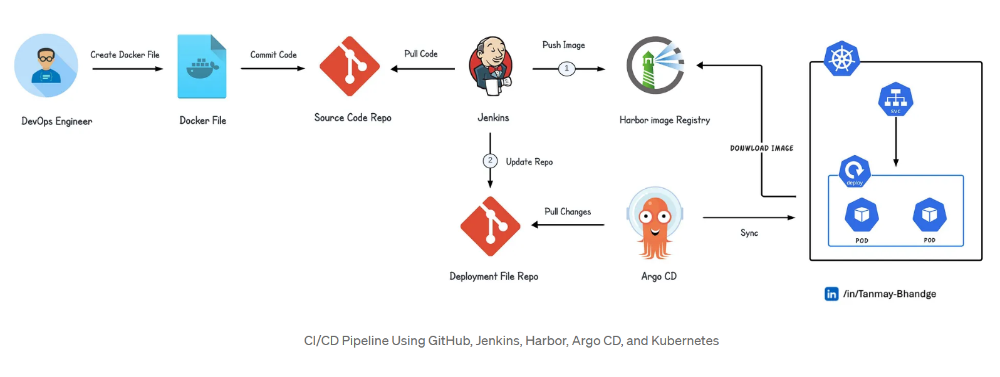
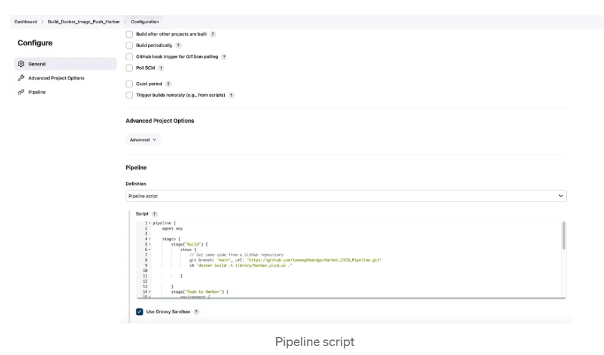
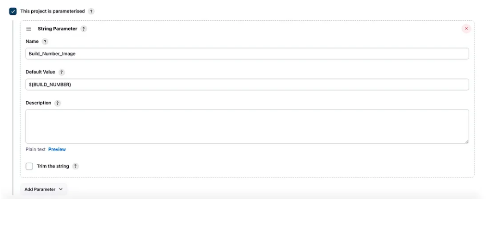
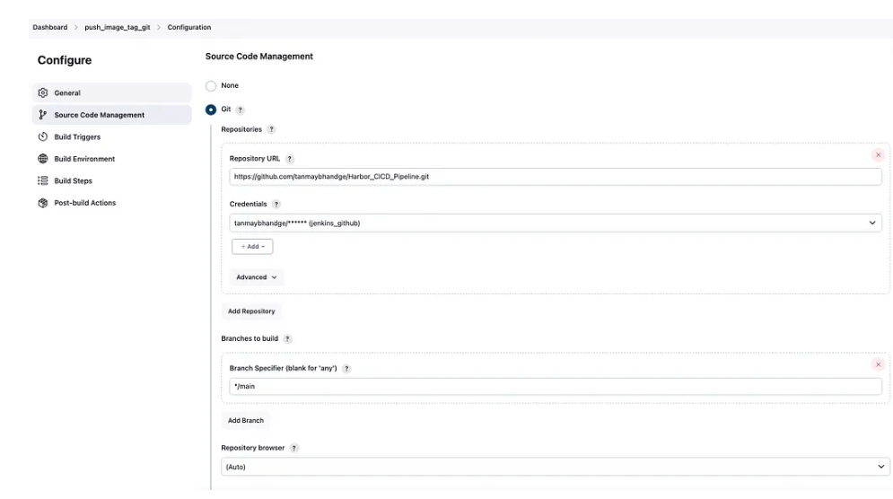
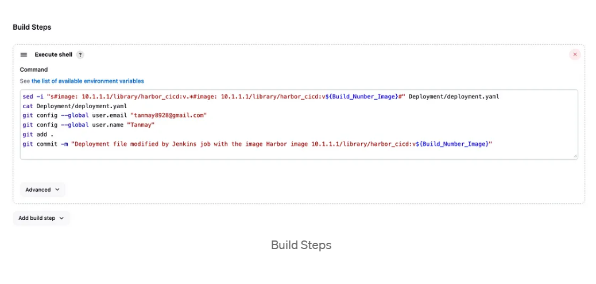
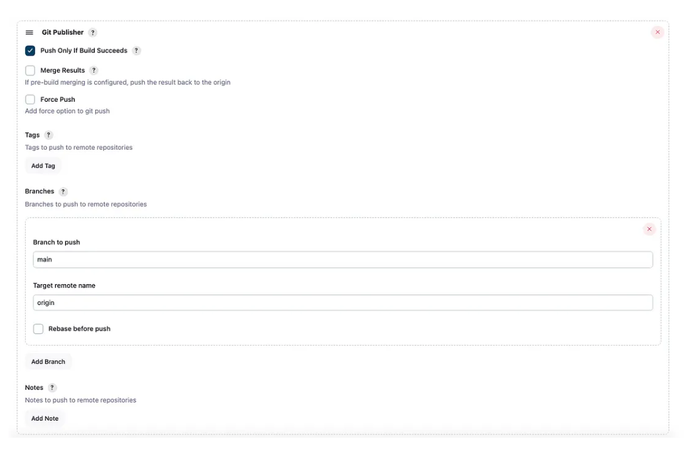
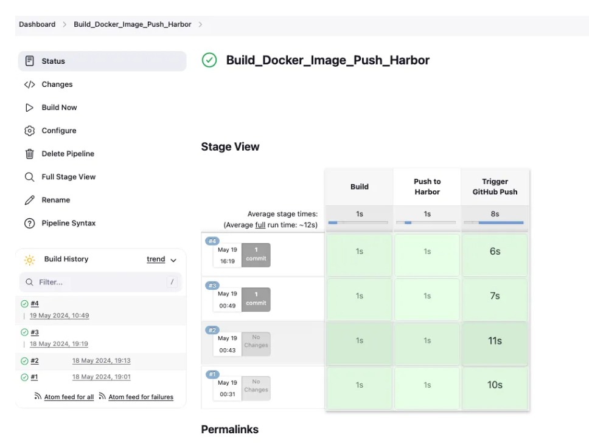
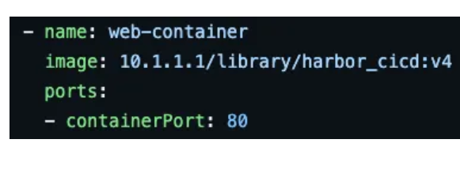
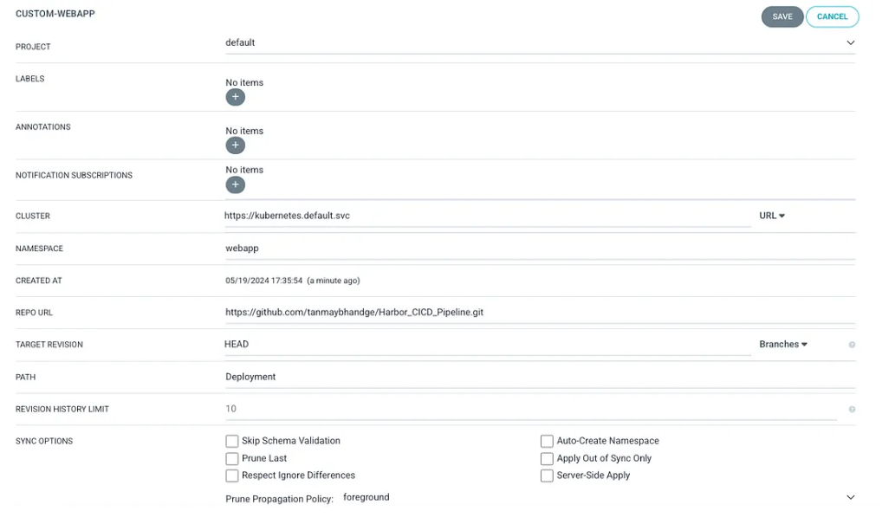
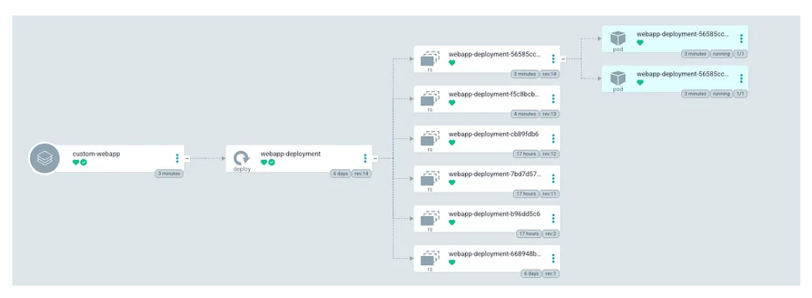

# How to Build and Deploy Application on Kubernetes with CI/CD Pipeline Using Jenkins, Docker, Harbor Private Repository, and ArgoCD

CI/CD pipelines are essential for producing high-quality software in today's development environment. This article explains how to set up a continuous integration/delivery (CI/CD) pipeline using Jenkins, Docker images, the Harbor private repository, Git, and ArgoCD. This will enable seamless image generation, pushing to Harbor, and automatic deployment to Kubernetes pods.

## Getting Started

### General Workflow

1. **Docker File Creation**: A Docker file is created, specifying the environment and dependencies needed for the application.
2. **Commit Code to the Repository**: Store the source code and the Docker file in a repository, such as GitHub.
3. **Jenkins Pulls the Code**: Launch a Jenkins job to pull the most recent code from the repository to begin the build process.
4. **Building and Pushing the Docker Image**: Jenkins builds a Docker image using the Docker file and pushes the completed image to the Harbor private repository.
5. **Updating the Deployment Repository**: Jenkins modifies the deployment file repository containing the Kubernetes deployment configurations.
6. **Syncing with ArgoCD**: ArgoCD retrieves the most recent updates from the deployment source to ensure everything is current.
7. **Deploying to Kubernetes**: ArgoCD syncs the modifications with the Kubernetes cluster, deploying the application into designated pods.



## Tools Needed

- Kubernetes Cluster
- Docker
- Jenkins
- Harbor
- ArgoCD
- GitHub

## Implementation

### 1. Create the Docker File

We will be using the Docker file mentioned below, which uses the following `index.html` file.

You can find all the files in the GitHub repository: [Harbor_CICD_Pipeline](https://github.com/tanmaybhandge/Harbor_CICD_Pipeline.git)

### 2. Trigger Jenkins Jobs

We have two jobs configured on Jenkins:

- **Upstream Job**: This job clones the GitHub repository to obtain the latest source code. It builds the Docker image, logs into a Harbor private registry, pushes the image, and tags it with the upstream job's build number.
- **Downstream Job**: After the image is successfully pushed, this job modifies the image version to match the build number and pushes the changes to the Kubernetes deployment file.

**Upstream and Downstream Job Explanation**: 
- The job that initiates the process is called the **upstream job** (e.g., `Build_Docker_Image_Push_Harbor`), while the job that gets started as a result is called the **downstream job** (e.g., `push_image_tag_git`).

#### Job: Build_Docker_Image_Push_Harbor

Create a pipeline job `Build_Docker_Image_Push_Harbor` and paste the following script:

```groovy
pipeline {
    agent any

    stages {
        stage('Build') {
            steps {
                git branch: 'main', url: 'https://github.com/tanmaybhandge/Harbor_CICD_Pipeline.git'
                sh 'docker build -t library/harbor_cicd_v2 .'
            }
        }
        stage('Push to Harbor') {
            environment {
                DOCKER_CREDENTIALS = credentials('Harbor')
            }
            steps {
                script {
                    sh "docker login -u ${DOCKER_CREDENTIALS_USR} -p ${DOCKER_CREDENTIALS_PSW} 10.1.1.1"
                    sh 'docker tag library/harbor_cicd_v2 10.1.1.1/library/harbor_cicd:v${BUILD_NUMBER}'
                    sh 'docker push 10.1.1.1/library/harbor_cicd:v${BUILD_NUMBER}'
                }
            }
        }
        stage('Trigger GitHub Push') {
            steps {
                build job: 'push_image_tag_git', wait: true, parameters: [string(name: 'Build_Number_Image', value: "${BUILD_NUMBER}")]
            }
        }
    }
}
```



**Explanation of Each Stage**:

- **Build**:
  - **Git Checkout**: Clones the repository and checks out the ‘main’ branch.
  - **Docker Build**: Builds a Docker image from the Dockerfile in the repository.

- **Push to Harbor**:
  - **Environment Variables**: Fetches Docker credentials stored in Jenkins.
  - **Docker Login**: Logs into the Harbor registry.
  - **Docker Tag**: Tags the built Docker image with the Jenkins build number.
  - **Docker Push**: Pushes the tagged Docker image to the Harbor repository.

- **Trigger GitHub Push**:
  - **Trigger Another Job**: Initiates the `push_image_tag_git` job and sends the current build number as a parameter.

#### Job: Push_Image_Tag_Git

This job modifies the Kubernetes deployment YAML file on GitHub to include the new image tag pushed by the upstream job.

**Configuration**:
- **Parameterized Trigger Plugin**
- **GitHub Plugin**
- **GitHub credentials with push access permission**

**Create Freestyle Project** with the name `push_image_tag_git` and configure it as follows:

1. **Parameter Configuration**: Ensure "This project is parameterized" is selected and configure the string parameter accordingly.


2. **Source Code Management**: Select Git, paste the repository URL, and choose the appropriate credentials which has the permission/access to your GitHub. 



3. **Build Steps**: Add Execute Shell and paste the following:


```bash
sed -i "s#image: 10.1.1.1/library/harbor_cicd:v.*#image: 10.1.1.1/library/harbor_cicd:v${Build_Number_Image}#" Deployment/deployment.yaml
cat Deployment/deployment.yaml
git config --global user.email "tanmay8928@gmail.com"
git config --global user.name "Tanmay"
git add .
git commit -m "Deployment file modified by Jenkins job with the image Harbor image 10.1.1.1/library/harbor_cicd:v${Build_Number_Image}"
```
4. **Post-Build Actions**: Select "Push Only If Build Succeeds" and specify the branch name and target remote name.

This script locates the image tag in the Deployment.yaml file, replaces it with the specified version from the Jenkins build (${Build_Number_Image}), configures the email and name for Git commits, adds all modified files to the Git staging area, and commits the changes with a descriptive message.

D. In the Post-Build Actionssection, select ‘Push Only If Build Succeeds’ Then, specify the branch name and the target remote name under the ‘Branches’ field. I am specifying branch name asmain and the target remote name asorigin



### 3. Trigger the Build Docker Job

Manually trigger the Build_Docker_Image_Push_Harbor it will perform the below actions and it will trigger the Push_image_Tag_Git job. Both of the jobs will perform the below

Build_Docker_Image_Push_Harbor

Build Stage: Clones a GitHub repository and builds a Docker image.
Push to Harbor Stage: Logs into a Harbor registry, tags the image with the build number, and pushes it.
Trigger GitHub Push Stage: Triggers downstream job Push_image_Tag_Gitand passes the build number as a parameter.
Push_image_Tag_Git

Execute Shell: It will locate the image tag in the Deployment.yaml file, replace it with the specified version from the previous Jenkins build, configures the email and name for Git commits, adds all modified files to the Git staging area, and commits the changes with a descriptive message.
Here is the output of the Status



Manually trigger the `Build_Docker_Image_Push_Harbor` job. It will:
- Clone the GitHub repository and build a Docker image.
- Log into a Harbor registry, tag the image with the build number, and push it.
- Trigger the downstream job `push_image_tag_git` to update the deployment file.

To ensure synchronization between the Docker image build and the Kubernetes Deployment, the version specified in the Deployment.yaml file will be updated to reflect the build number generated during the Build_Docker_Image_Push_Harbor



### 4. Re-create Pods with a Newer Version of Image

Set up an ArgoCD application to monitor the `deployment.yaml` file, ensuring the Kubernetes Deployment environment stays in sync with any modifications.

**ArgoCD Application Configuration**:
- **CLUSTER**: `https://kubernetes.default.svc`
- **NAMESPACE**: `webapp`
- **REPO URL**: `https://github.com/tanmaybhandge/Harbor_CICD_Pipeline.git`
- **PATH**: `Deployment`

You may need to create the `webapp` namespace in your Kubernetes Cluster.





### 5. Access the Pods

After confirming that everything is healthy on the ArgoCD Deployment, you can test the deployed application. The deployment is exposed via a NodePort service, allowing access to the application using the service port and the IP address of the worker node.

```yaml
apiVersion: v1
kind: Service
metadata:
  name: webapp-service
spec:
  selector:
    app: webapp
  ports:
    - protocol: TCP
      port: 80
      targetPort: 80
  type: LoadBalancer
```

Now you can access your application for testing and validation.
