# The Collections Framework

This chapter begins our examination of java.util. This important package contains a large assortment of classes and interfaces that support a broad range of functionality. For example, java.util has classes that generate pseudorandom numbers, manage date and time, observe events, manipulate sets of bits, tokenize strings, and handle formatted data.

The java.util package also contains one of Java’s most powerful subsystems: The Collections Framework. The Collections Framework is a sophisticated hierarchy of interfaces and classes that provide state-of-the-art technology for managing groups of objects. It merits close attention by all programmers.

```mermaid
classDiagram
    %% Interfaces
    class Collection {
        <<interface>>
    }

    class List {
        <<interface>>
    }

    class Queue {
        <<interface>>
    }

    class Set {
        <<interface>>
    }

    class Map {
        <<interface>>
    }

    class Comparable {
        <<interface>>
    }

    class Comparator {
        <<interface>>
    }

    class RandomAccess {
        <<interface>>
    }

    class Deque {
        <<interface>>
    }

    class NavigableMap {
        <<interface>>
    }

    class SortedMap {
        <<interface>>
    }

    class SortedSet {
        <<interface>>
    }

    class NavigableSet {
        <<interface>>
    }

    class Formattable {
        <<interface>>
    }

    class Observer {
        <<interface>>
    }

    class Iterator {
        <<interface>>
    }

    class ListIterator {
        <<interface>>
    }

    class Enumeration {
        <<interface>>
    }

    %% Abstract Classes
    class AbstractCollection {
        <<abstract>>
    }

    class AbstractList {
        <<abstract>>
    }

    class AbstractQueue {
        <<abstract>>
    }

    class AbstractSet {
        <<abstract>>
    }

    class AbstractMap {
        <<abstract>>
    }

    class AbstractSequentialList {
        <<abstract>>
    }

    %% Concrete Classes
    class ArrayList {
        <<class>>
    }

    class LinkedList {
        <<class>>
    }

    class Vector {
        <<class>>
    }

    class Stack {
        <<class>>
    }

    class HashSet {
        <<class>>
    }

    class LinkedHashSet {
        <<class>>
    }

    class TreeSet {
        <<class>>
    }

    class HashMap {
        <<class>>
    }

    class LinkedHashMap {
        <<class>>
    }

    class TreeMap {
        <<class>>
    }

    class Hashtable {
        <<class>>
    }

    class IdentityHashMap {
        <<class>>
    }

    class EnumMap {
        <<class>>
    }

    class EnumSet {
        <<class>>
    }

    class PriorityQueue {
        <<class>>
    }

    class ArrayDeque {
        <<class>>
    }

    class BitSet {
        <<class>>
    }

    class Date {
        <<class>>
    }

    class Calendar {
        <<class>>
    }

    class GregorianCalendar {
        <<class>>
    }

    class SimpleTimeZone {
        <<class>>
    }

    class TimeZone {
        <<class>>
    }

    class ResourceBundle {
        <<class>>
    }

    class Properties {
        <<class>>
    }

    class ServiceLoader {
        <<class>>
    }

    class Formatter {
        <<class>>
    }

    class StringTokenizer {
        <<class>>
    }

    %% Relationships
    Collection <|-- Set
    Collection <|-- List
    Collection <|-- Queue
    Set <|-- SortedSet
    List <|-- AbstractList
    Queue <|-- AbstractQueue
    Set <|-- AbstractSet
    AbstractCollection <|-- AbstractList
    AbstractCollection <|-- AbstractSet
    AbstractQueue <|-- PriorityQueue
    AbstractList <|-- LinkedList
    AbstractSet <|-- HashSet
    AbstractSet <|-- LinkedHashSet
    AbstractSet <|-- TreeSet
    AbstractMap <|-- HashMap
    AbstractMap <|-- LinkedHashMap
    AbstractMap <|-- TreeMap
    AbstractMap <|-- Hashtable
    AbstractMap <|-- IdentityHashMap
    AbstractMap <|-- EnumMap
    AbstractMap <|-- EnumSet

    Map <|-- SortedMap
    Map <|-- NavigableMap
    SortedSet <|-- NavigableSet
    Set <|-- SortedSet
    Queue <|-- Deque
    Formattable <|-- Formatter

    Observer <|-- Observable
    EventListener <|-- EventListenerProxy

    AbstractCollection <|-- ArrayList
    AbstractCollection <|-- Vector
    AbstractCollection <|-- Stack

    AbstractCollection <|-- BitSet
    AbstractCollection <|-- Date
    AbstractCollection <|-- Calendar
    AbstractCollection <|-- GregorianCalendar
    AbstractCollection <|-- SimpleTimeZone
    AbstractCollection <|-- TimeZone
    AbstractCollection <|-- ResourceBundle
    AbstractCollection <|-- Properties
    AbstractCollection <|-- ServiceLoader
    AbstractCollection <|-- Formatter
    AbstractCollection <|-- StringTokenizer

```


## Java Collections Framework: Methods

### Collection Interface Methods

| Method                              | Description                                                                                      |
|-------------------------------------|--------------------------------------------------------------------------------------------------|
| `boolean add(E obj)`                | Adds `obj` to the collection. Returns `true` if added, `false` if already present and duplicates are not allowed. |
| `boolean addAll(Collection<? extends E> c)` | Adds all elements of `c` to the collection. Returns `true` if the collection changed, `false` otherwise. |
| `void clear()`                      | Removes all elements from the collection.                                                        |
| `boolean contains(Object obj)`      | Returns `true` if `obj` is an element of the collection, `false` otherwise.                       |
| `boolean containsAll(Collection<?> c)` | Returns `true` if the collection contains all elements of `c`, `false` otherwise.                |
| `boolean equals(Object obj)`        | Returns `true` if the collection and `obj` are equal, `false` otherwise.                         |
| `int hashCode()`                    | Returns the hash code for the collection.                                                        |
| `boolean isEmpty()`                 | Returns `true` if the collection is empty, `false` otherwise.                                     |
| `Iterator<E> iterator()`            | Returns an iterator for the collection.                                                           |
| `boolean remove(Object obj)`        | Removes one instance of `obj` from the collection. Returns `true` if removed, `false` otherwise. |
| `boolean removeAll(Collection<?> c)` | Removes all elements of `c` from the collection. Returns `true` if collection changed, `false` otherwise. |
| `boolean retainAll(Collection<?> c)` | Removes all elements from the collection except those in `c`. Returns `true` if collection changed, `false` otherwise. |
| `int size()`                        | Returns the number of elements in the collection.                                                 |
| `Object[] toArray()`                | Returns an array containing all elements of the collection.                                       |
| `<T> T[] toArray(T[] array)`        | Returns an array containing all elements of the collection. If the provided array is large enough, it is used; otherwise, a new array is created. |

### List Interface Methods

In addition to `Collection` methods, `List` defines the following methods:

| Method                              | Description                                                                                      |
|-------------------------------------|--------------------------------------------------------------------------------------------------|
| `void add(int index, E obj)`        | Inserts `obj` into the list at the specified index. Preexisting elements are shifted up.          |
| `boolean addAll(int index, Collection<? extends E> c)` | Inserts all elements of `c` into the list at the specified index. Elements are shifted as necessary. |
| `E get(int index)`                  | Returns the element at the specified index.                                                      |
| `E set(int index, E obj)`           | Replaces the element at the specified index with `obj`.                                           |
| `int indexOf(Object obj)`           | Returns the index of the first occurrence of `obj`, or `-1` if not found.                        |
| `int lastIndexOf(Object obj)`       | Returns the index of the last occurrence of `obj`, or `-1` if not found.                         |
| `List<E> subList(int fromIndex, int toIndex)` | Returns a view of the portion of the list between `fromIndex`, inclusive, and `toIndex`, exclusive. |

### Set Interface Methods

The `Set` interface extends `Collection` and adds no new methods, but it defines the behavior of collections that do not allow duplicate elements. The `add` method will return `false` if an attempt is made to add a duplicate element.

### Notes

- `List` and `Set` interfaces may throw `UnsupportedOperationException` if modifications are not supported.
- `List` may throw `IndexOutOfBoundsException` for invalid indices.
- `NullPointerException` may be thrown if `null` elements are not allowed.
- `IllegalArgumentException` may be thrown for invalid arguments.
- `ArrayStoreException` is thrown if elements are of an incompatible type for the specified array.

Because java.util contains a wide array of functionality, it is quite large. Here is a list of
its classes:

|     |    |    |
|---------------|----------------------|---------------------|
|AbstractCollection| EventObject |Random|
|AbstractList |FormattableFlags |ResourceBundle|
|AbstractMap| Formatter |Scanner|
|AbstractQueue |GregorianCalendar |ServiceLoader (Added by Java SE 6.)|
|AbstractSequentialList| HashMap |SimpleTimeZone|
|AbstractSet| HashSet| Stack|
|ArrayDeque (Added by Java SE 6.)| Hashtable |StringTokenizer|
|ArrayList |IdentityHashMap |Timer|
|Arrays |LinkedHashMap |TimerTask|
|BitSet |LinkedHashSet |TimeZone|
|Calendar |LinkedList |TreeMap|
|Collections |ListResourceBundle |TreeSet|
|Currency| Locale| UUID|
|Date |Observable |Vector|
|Dictionary |PriorityQueue| WeakHashMap|
|EnumMap| Properties||
|EnumSet |PropertyPermission||
|EventListenerProxy| PropertyResourceBundle||

The interfaces defined by java.util are shown next:

|     |    |    |
|---------------|----------------------|---------------------|
|Collection |List |Queue|
|Comparator |ListIterator |RandomAccess|
|Deque (Added by Java SE 6.)| Map| Set|
|Enumeration| Map.Entry |SortedMap|
|EventListener| NavigableMap (Added by Java SE 6.) |SortedSet|
|Formattable |NavigableSet|(Added by Java SE 6.)|
|Iterator| Observer||

Because of its size, the description of java.util is broken into two chapters. This chapter examines those members of java.util that are part of the Collections Framework. Chapter 18 discusses its other classes and interfaces.

### Collections Overview
The Java Collections Framework standardizes the way in which groups of objects are handled by your programs. Collections were not part of the original Java release, but were added by J2SE 1.2. Prior to the Collections Framework, Java provided ad hoc classes such as Dictionary, Vector, Stack, and Properties to store and manipulate groups of objects. Although these classes were quite useful, they lacked a central, unifying theme. The way that you used Vector was different from the way that you used Properties, for example. Also, this early, ad hoc approach was not designed to be easily extended or adapted. Collections are an answer to these (and
other) problems.

The Collections Framework was designed to meet several goals. 

First, the framework had to be high-performance. The implementations for the fundamental collections (dynamic arrays, linked lists, trees, and hash tables) are highly efficient. You seldom, if ever, need to code one of these “data engines” manually. 

Second, the framework had to allow different types of collections to work in a similar manner and with a high degree of interoperability. 

Third, extending and/or adapting a collection had to be easy. Toward this end, the entire Collections Framework is built upon a set of standard interfaces. Several standard implementations (such as LinkedList, HashSet, and TreeSet) of these interfaces are provided that you may use as-is. You may also implement your own collection, if you choose. 

Various special-purpose implementations are created for your convenience, and some partial implementations are provided that make creating your own collection class easier. Finally, mechanisms were added that allow the integration of standard arrays into the Collections Framework.

Algorithms are another important part of the collection mechanism. Algorithms operate on collections and are defined as static methods within the Collections class. Thus, they are available for all collections. Each collection class need not implement its own versions. The algorithms provide a standard means of manipulating collections.

Another item closely associated with the Collections Framework is the Iterator interface.

An iterator offers a general-purpose, standardized way of accessing the elements within a collection, one at a time. Thus, an iterator provides a means of enumerating the contents of a collection. Because each collection implements Iterator, the elements of any collection class can be accessed through the methods defined by Iterator. Thus, with only small changes, the code that cycles through a set can also be used to cycle through a list, for example. 


In addition to collections, the framework defines several map interfaces and classes. Maps store key/value pairs. Although maps are part of the Collections Framework, they are not “collections” in the strict use of the term. You can, however, obtain a collection-view of a map.

Such a view contains the elements from the map stored in a collection. Thus, you can process the contents of a map as a collection, if you choose.

The collection mechanism was retrofitted to some of the original classes defined by java.util so that they too could be integrated into the new system. It is important to understand that although the addition of collections altered the architecture of many of the original utility classes, it did not cause the deprecation of any. Collections simply provide a better way of doing several things.

NOTE If you are familiar with C++, then you will find it helpful to know that the Java collections technology is similar in spirit to the Standard Template Library (STL) defined by C++. What C++ calls a container, Java calls a collection. However, there are significant differences between the Collections Framework and the STL. It is important to not jump to conclusions.

## Recent Changes to Collections 

Recently, the Collections Framework underwent a fundamental change that significantly increased its power and streamlined its use. The changes were caused by the addition of generics, autoboxing/unboxing, and the for-each style for loop, by JDK 5. Although we will be revisiting these topics throughout the course of this chapter, a brief overview is warranted now.

### Generics Fundamentally Change the Collections Framework 

The addition of generics caused a significant change to the Collections Framework because the entire Collections Framework has been reengineered for it. All collections are now generic, and many of the methods that operate on collections take generic type parameters. Simply put, the addition of generics has affected every part of the Collections Framework.

Generics add the one feature that collections had been missing: type safety. Prior to generics, all collections stored Object references, which meant that any collection could store any type of object. Thus, it was possible to accidentally store incompatible types in a collection. Doing so could result in run-time type mismatch errors. With generics, it is possible to explicitly
state the type of data being stored, and run-time type mismatch errors can be avoided.

Although the addition of generics changed the declarations of most of its classes and interfaces, and several of their methods, overall, the Collections Framework still works the same as it did prior to generics. However, if you are familiar with the pre-generics version
of the Collections Framework, you might find the new syntax a bit intimidating. Don’t worry; over time, the generic syntax will become second nature. 

One other point: to gain the advantages that generics bring collections, older code will need to be rewritten. This is also important because pre-generics code will generate warning messages when compiled by a modern Java compiler. To eliminate these warnings, you will
need to add type information to all your collections code.

### Autoboxing Facilitates the Use of Primitive Types

Autoboxing/unboxing facilitates the storing of primitive types in collections. As you will see, a collection can store only references, not primitive values. In the past, if you wanted to store a primitive value, such as an int, in a collection, you had to manually box it into its type wrapper. When the value was retrieved, it needed to be manually unboxed (by using an explicit cast) into its proper primitive type. Because of autoboxing/unboxing, Java can automatically perform the proper boxing and unboxing needed when storing or retrieving primitive types. There is no need to manually perform these operations.

### The For-Each Style for Loop

All collection classes in the Collections Framework have been retrofitted to implement the Iterable interface, which means that a collection can be cycled through by use of the for-each style for loop. In the past, cycling through a collection required the use of an iterator (described later in this chapter), with the programmer manually constructing the loop. Although iterators are still needed for some uses, in many cases, iterator-based loops can be replaced by for loops.

## The Collection Interfaces

The Collections Framework defines several interfaces. This section provides an overview of each interface. Beginning with the collection interfaces is necessary because they determine the fundamental nature of the collection classes. Put differently, the concrete classes simply provide different implementations of the standard interfaces. The interfaces that underpin collections are summarized in the following table:

|Interface |Description|
|---------------|----------------------|
|Collection |Enables you to work with groups of objects; it is at the top of the collections hierarchy.|
|Deque |Extends Queue to handle a double-ended queue. (Added by Java SE 6.)|
|List |Extends Collection to handle sequences (lists of objects).|
|NavigableSet| Extends SortedSet to handle retrieval of elements based on closest-match searches. (Added by Java SE 6.)|
|Queue |Extends Collection to handle special types of lists in which elements are removed only from the head.|
|Set |Extends Collection to handle sets, which must contain unique elements.|
|SortedSet |Extends Set to handle sorted sets.|

In addition to the collection interfaces, collections also use the Comparator, RandomAccess, Iterator, and ListIterator interfaces, which are described in depth later in this chapter. Briefly, Comparator defines how two objects are compared; Iterator and ListIterator enumerate the objects within a collection. By implementing RandomAccess, a list indicates that it supports efficient, random access to its elements.

To provide the greatest flexibility in their use, the collection interfaces allow some methods to be optional. The optional methods enable you to modify the contents of a collection.

Collections that support these methods are called modifiable. Collections that do not allow their contents to be changed are called unmodifiable. If an attempt is made to use one of these methods on an unmodifiable collection, an UnsupportedOperationException is thrown. All the built-in collections are modifiable.

The following sections examine the collection interfaces.

### The Collection Interface

The Collection interface is the foundation upon which the Collections Framework is built because it must be implemented by any class that defines a collection. Collection is a generic interface that has this declaration:

interface Collection<E>

Here, E specifies the type of objects that the collection will hold. Collection extends the Iterable interface. This means that all collections can be cycled through by use of the for-each style forloop. (Recall that only classes that implementIterable can be cycled through by the for.)

Collection declares the core methods that all collections will have. These methods are summarized in Table 17-1. Because all collections implement Collection, familiarity with its methods is necessary for a clear understanding of the framework. Several of these methods
can throw an UnsupportedOperationException. As explained, this occurs if a collection cannot be modified. 

A ClassCastException is generated when one object is incompatible with another, such as when an attempt is made to add an incompatible object to a collection.

A NullPointerException is thrown if an attempt is made to store a null object and null elements are not allowed in the collection. An IllegalArgumentException is thrown if an invalid argument is used. An IllegalStateException is thrown if an attempt is made to add an
element to a fixed-length collection that is full.

Objects are added to a collection by calling add( ). Notice that add( ) takes an argument of type E, which means that objects added to a collection must be compatible with the type of data expected by the collection. You can add the entire contents of one collection to another by calling addAll( ).

You can remove an object by using remove( ). To remove a group of objects, call removeAll( ). You can remove all elements except those of a specified group by calling retainAll( ). To empty a collection, call clear( ).
You can determine whether a collection contains a specific object by calling contains( ).
To determine whether one collection contains all the members of another, call containsAll( ).
You can determine when a collection is empty by calling isEmpty( ). The number of elements currently held in a collection can be determined by calling size( ).

The toArray( ) methods return an array that contains the elements stored in the invoking collection. The first returns an array of Object. The second returns an array of elements that have the same type as the array specified as a parameter. Normally, the second form is more convenient because it returns the desired array type. These methods are more important than it might at first seem. Often, processing the contents of a collection by using array-like syntax is advantageous. By providing a pathway between collections and arrays, you can have the best of both worlds.

Two collections can be compared for equality by calling equals( ). The precise meaning of
“equality” may differ from collection to collection. For example, you can implement equals( )
so that it compares the values of elements stored in the collection. Alternatively, equals( ) can
compare references to those elements.
One more very important method is iterator( ), which returns an iterator to a collection.
Iterators are frequently used when working with collections.

### The List Interface
The List interface extends Collection and declares the behavior of a collection that stores a
sequence of elements. Elements can be inserted or accessed by their position in the list, using

a zero-based index. A list may contain duplicate elements. List is a generic interface that has
this declaration:
interface List<E>
Here, E specifies the type of objects that the list will hold.
In addition to the methods defined by Collection, List defines some of its own, which
are summarized in Table 17-2. Note again that several of these methods will throw an
UnsupportedOperationException if the list cannot be modified, and a ClassCastException is

Method Description
boolean add(E obj) Adds obj to the invoking collection. Returns true if obj was added
to the collection. Returns false if obj is already a member of the
collection and the collection does not allow duplicates.
boolean addAll(Collection<? extends E> c) Adds all the elements of c to the invoking collection. Returns true
if the operation succeeded (i.e., the elements were added).
Otherwise, returns false.
void clear( ) Removes all elements from the invoking collection.
boolean contains(Object obj) Returns true if obj is an element of the invoking collection.
Otherwise, returns false.
boolean containsAll(Collection<?> c) Returns true if the invoking collection contains all elements
of c. Otherwise, returns false.
boolean equals(Object obj) Returns true if the invoking collection and obj are equal.
Otherwise, returns false.
int hashCode( ) Returns the hash code for the invoking collection.
boolean isEmpty( ) Returns true if the invoking collection is empty. Otherwise,
returns false.
Iterator<E> iterator( ) Returns an iterator for the invoking collection.
boolean remove(Object obj) Removes one instance of obj from the invoking collection. Returns
true if the element was removed. Otherwise, returns false.
boolean removeAll(Collection<?> c) Removes all elements of c from the invoking collection. Returns
true if the collection changed (i.e., elements were removed).
Otherwise, returns false.
boolean retainAll(Collection<?> c) Removes all elements from the invoking collection except those
in c. Returns true if the collection changed (i.e., elements were
removed). Otherwise, returns false.
int size( ) Returns the number of elements held in the invoking collection.
Object[ ] toArray( ) Returns an array that contains all the elements stored in the
invoking collection. The array elements are copies of the
collection elements.
<T> T[ ] toArray(T array[ ]) Returns an array that contains the elements of the invoking
collection. The array elements are copies of the collection
elements. If the size of array equals the number of elements,
these are returned in array. If the size of array is less than the
number of elements, a new array of the necessary size is allocated
and returned. If the size of array is greater than the number of
elements, the array element following the last collection element
is set to null. An ArrayStoreException is thrown if any collection
element has a type that is not a subtype of array.
TABLE 17-1 The Methods Defined by Collection generated when one object is incompatible with another, such as when an attempt is made to add an incompatible object to a list. Also, several methods will throw an IndexOutOfBoundsException
if an invalid index is used. A NullPointerException is thrown if an attempt is made to store
a null object and null elements are not allowed in the list. An IllegalArgumentException is
thrown if an invalid argument is used.
To the versions of add( ) and addAll( ) defined by Collection, List adds the methods
add(int, E) and addAll(int, Collection). These methods insert elements at the specified index.
Also, the semantics of add(E) and addAll(Collection) defined by Collection are changed by
List so that they add elements to the end of the list.
To obtain the object stored at a specific location, call get( ) with the index of the object.
To assign a value to an element in the list, call set( ), specifying the index of the object to be
changed. To find the index of an object, use indexOf( ) or lastIndexOf( ).
You can obtain a sublist of a list by calling subList( ), specifying the beginning and ending
indexes of the sublist. As you can imagine, subList( ) makes list processing quite convenient.

### The Set Interface
The Set interface defines a set. It extends Collection and declares the behavior of a collection
that does not allow duplicate elements. Therefore, the add( ) method returns false if an attempt
Method Description
void add(int index, E obj) Inserts obj into the invoking list at the index passed in index.
Any preexisting elements at or beyond the point of insertion
are shifted up. Thus, no elements are overwritten.
boolean addAll(int index,
Collection<? extends E> c)


Inserts all elements of c into the invoking list at the index
passed in index. Any preexisting elements at or beyond the
point of insertion are shifted up. Thus, no elements are
overwritten. Returns true if the invoking list changes and
returns false otherwise.
E get(int index) Returns the object stored at the specified index within the
invoking collection.
int indexOf(Object obj) Returns the index of the first instance of obj in the invoking
list. If obj is not an element of the list, –1 is returned.
int lastIndexOf(Object obj) Returns the index of the last instance of obj in the invoking
list. If obj is not an element of the list, –1 is returned.
ListIterator<E> listIterator( ) Returns an iterator to the start of the invoking list.
ListIterator<E> listIterator(int index) Returns an iterator to the invoking list that begins at the
specified index.
E remove(int index) Removes the element at position index from the invoking list
and returns the deleted element. The resulting list is compacted.
That is, the indexes of subsequent elements are decremented
by one.
E set(int index, E obj) Assigns obj to the location specified by index within the
invoking list.
List<E> subList(int start, int end) Returns a list that includes elements from start to end–1 in the
invoking list. Elements in the returned list are also referenced
by the invoking object.
TABLE 17-2 The Methods Defined by List
is made to add duplicate elements to a set. It does not define any additional methods of its
own. Set is a generic interface that has this declaration:
interface Set<E>
Here, E specifies the type of objects that the set will hold.

### The SortedSet Interface
The SortedSet interface extends Set and declares the behavior of a set sorted in ascending
order. SortedSet is a generic interface that has this declaration:
interface SortedSet<E>
Here, E specifies the type of objects that the set will hold.
In addition to those methods defined by Set, the SortedSet interface declares the methods
summarized in Table 17-3. Several methods throw a NoSuchElementException when no
items are contained in the invoking set. A ClassCastException is thrown when an object
is incompatible with the elements in a set. A NullPointerException is thrown if an attempt is
made to use a null object and null is not allowed in the set. An IllegalArgumentException
is thrown if an invalid argument is used.
SortedSet defines several methods that make set processing more convenient. To obtain
the first object in the set, call first( ). To get the last element, use last( ). You can obtain a subset
of a sorted set by calling subSet( ), specifying the first and last object in the set. If you need
the subset that starts with the first element in the set, use headSet( ). If you want the subset
that ends the set, use tailSet( ).

### The NavigableSet Interface
The NavigableSet interface was added by Java SE 6. It extends SortedSet and declares the
behavior of a collection that supports the retrieval of elements based on the closest match to
a given value or values. NavigableSet is a generic interface that has this declaration:
interface NavigableSet<E>
Here, E specifies the type of objects that the set will hold. In addition to the methods
that it inherits from SortedSet, NavigableSet adds those summarized in Table 17-4. A

Method Description
Comparator<? super E> comparator( ) Returns the invoking sorted set’s comparator. If the natural ordering
is used for this set, null is returned.
E first( ) Returns the first element in the invoking sorted set.
SortedSet<E> headSet(E end) Returns a SortedSet containing those elements less than end that
are contained in the invoking sorted set. Elements in the returned
sorted set are also referenced by the invoking sorted set.
E last( ) Returns the last element in the invoking sorted set.
SortedSet<E> subSet(E start, E end) Returns a SortedSet that includes those elements between start
and end–1. Elements in the returned collection are also referenced
by the invoking object.
SortedSet<E> tailSet(E start) Returns a SortedSet that contains those elements greater than or
equal to start that are contained in the sorted set. Elements in the
returned set are also referenced by the invoking object.
TABLE 17-3 The Methods Defined by SortedSet
Chapter 17: java.util Part 1: The Collections Framework 445
ClassCastException is thrown when an object is incompatible with the elements in the set.
A NullPointerException is thrown if an attempt is made to use a null object and null is not
allowed in the set. An IllegalArgumentException is thrown if an invalid argument is used.
### The Queue Interface
The Queue interface extends Collection and declares the behavior of a queue, which is often a
first-in, first-out list. However, there are types of queues in which the ordering is based upon
other criteria. Queue is a generic interface that has this declaration:
interface Queue<E>
Method Description
E ceiling(E obj) Searches the set for the smallest element e such that e >= obj. If
such an element is found, it is returned. Otherwise, null is returned.
Iterator<E> descendingIterator( ) Returns an iterator that moves from the greatest to least. In
other words, it returns a reverse iterator.
NavigableSet<E> descendingSet( ) Returns a NavigableSet that is the reverse of the invoking set.
The resulting set is backed by the invoking set.
E floor(E obj) Searches the set for the largest element e such that e <= obj. If
such an element is found, it is returned. Otherwise, null is
returned.
NavigableSet<E>
headSet(E upperBound, boolean incl)
Returns a NavigableSet that includes all elements from the
invoking set that are less than upperBound. If incl is true, then
an element equal to upperBound is included. The resulting set is
backed by the invoking set.
E higher(E obj) Searches the set for the largest element e such that e > obj. If such
an element is found, it is returned. Otherwise, null is returned.
E lower(E obj) Searches the set for the largest element e such that e < obj. If
such an element is found, it is returned. Otherwise, null is
returned.
E pollFirst( ) Returns the first element, removing the element in the process.
Because the set is sorted, this is the element with the least
value. null is returned if the set is empty.
E pollLast( ) Returns the last element, removing the element in the process.
Because the set is sorted, this is the element with the greatest
value. null is returned if the set is empty.
NavigableSet<E>
subSet(E lowerBound,
boolean lowIncl,
E upperBound,
boolean highIncl)
Returns a NavigableSet that includes all elements from the
invoking set that are greater than lowerBound and less than
upperBound. If lowIncl is true, then an element equal to
lowerBound is included. If highIncl is true, then an element
equal to upperBound is included. The resulting set is backed
by the invoking set.
NavigableSet<E>
tailSet(E lowerBound, boolean incl)
Returns a NavigableSet that includes all elements from the
invoking set that are greater than lowerBound. If incl is true, then
an element equal to lowerBound is included. The resulting set is
backed by the invoking set.
TABLE 17-4 The Methods Defined by NavigableSet
Here, E specifies the type of objects that the queue will hold. The methods defined by Queue
are shown in Table 17-5.
Several methods throw a ClassCastException when an object is incompatible with the
elements in the queue. A NullPointerException is thrown if an attempt is made to store a
null object and null elements are not allowed in the queue. An IllegalArgumentException
is thrown if an invalid argument is used. An IllegalStateException is thrown if an attempt is
made to add an element to a fixed-length queue that is full. A NoSuchElementException
is thrown if an attempt is made to remove an element from an empty queue.
Despite its simplicity, Queue offers several points of interest. First, elements can only be
removed from the head of the queue. Second, there are two methods that obtain and remove
elements: poll( ) and remove( ). The difference between them is that poll( ) returns null if the
queue is empty, but remove( ) throws an exception. Third, there are two methods, element( )
and peek( ), that obtain but don’t remove the element at the head of the queue. They differ
only in that element( ) throws an exception if the queue is empty, but peek( ) returns null.
Finally, notice that offer( ) only attempts to add an element to a queue. Because some queues
have a fixed length and might be full, offer( ) can fail.
### The Deque Interface
The Deque interface was added by Java SE 6. It extends Queue and declares the behavior of
a double-ended queue. Double-ended queues can function as standard, first-in, first-out
queues or as last-in, first-out stacks. Deque is a generic interface that has this declaration:
interface Deque<E>
Here, E specifies the type of objects that the deque will hold. In addition to the methods that
it inherits from Queue, Deque adds those methods summarized in Table 17-6. Several
methods throw a ClassCastException when an object is incompatible with the elements in
the deque. A NullPointerException is thrown if an attempt is made to store a null object
and null elements are not allowed in the deque. An IllegalArgumentException is thrown if
an invalid argument is used. An IllegalStateException is thrown if an attempt is made to
add an element to a fixed-length deque that is full. A NoSuchElementException is thrown
if an attempt is made to remove an element from an empty deque.
Notice that Deque includes the methods push( ) and pop( ). These methods enable a Deque
to function as a stack. Also, notice the descendingIterator( ) method. It returns an iterator that
returns elements in reverse order. In other words, it returns an iterator that moves from the end
of the collection to the start. A Deque implementation can be capacity-restricted, which means

Method Description
E element( ) Returns the element at the head of the queue. The element is not removed. It throws
NoSuchElementException if the queue is empty.
boolean offer(E obj) Attempts to add obj to the queue. Returns true if obj was added and false otherwise.
E peek( ) Returns the element at the head of the queue. It returns null if the queue is empty.
The element is not removed.
E poll( ) Returns the element at the head of the queue, removing the element in the process. It
returns null if the queue is empty.
E remove( ) Removes the element at the head of the queue, returning the element in the process.
It throws NoSuchElementException if the queue is empty.
TABLE 17-5 The Methods Defined by Queue

that only a limited number of elements can be added to the deque. When this is the case, an
attempt to add an element to the deque can fail. Deque allows you to handle such a failure in
two ways. First, methods such as addFirst( ) and addLast( ) throw an IllegalStateException if a

Method Description
void addFirst(E obj) Adds obj to the head of the deque. Throws an IllegalStateException
if a capacity-restricted deque is out of space.
void addLast(E obj) Adds obj to the tail of the deque. Throws an IllegalStateException
if a capacity-restricted deque is out of space.
Iterator<E> descendingIterator( ) Returns an iterator that moves from the tail to the head of the
deque. In other words, it returns a reverse iterator.
E getFirst( ) Returns the first element in the deque. The object is not removed
from the deque. It throws NoSuchElementException if the deque
is empty.
E getLast( ) Returns the last element in the deque. The object is not removed
from the deque. It throws NoSuchElementException if the deque is
empty.
boolean offerFirst(E obj) Attempts to add obj to the head of the deque. Returns true if
obj was added and false otherwise. Therefore, this method
returns false when an attempt is made to add obj to a full,
capacity-restricted deque.
boolean offerLast(E obj) Attempts to add obj to the tail of the deque. Returns true if obj
was added and false otherwise.
E peekFirst( ) Returns the element at the head of the deque. It returns null if
the deque is empty. The object is not removed.
E peekLast( ) Returns the element at the tail of the deque. It returns null if the
deque is empty. The object is not removed.
E pollFirst( ) Returns the element at the head of the deque, removing the
element in the process. It returns null if the deque is empty.
E pollLast( ) Returns the element at the tail of the deque, removing the
element in the process. It returns null if the deque is empty.
E pop( ) Returns the element at the head of the deque, removing it in the
process. It throws NoSuchElementException if the deque is empty.
void push(E obj ) Adds obj to the head of the deque. Throws an IllegalStateException
if a capacity-restricted deque is out of space.
E removeFirst( ) Returns the element at the head of the deque, removing the
element in the process. It throws NoSuchElementException if
the deque is empty.
boolean
removeFirstOccurrence(Object obj)
Removes the first occurrence of obj from the deque. Returns true
if successful and false if the deque did not contain obj.
E removeLast( ) Returns the element at the tail of the deque, removing the element
in the process. It throws NoSuchElementException if the deque
is empty.
boolean
removeLastOccurrence(Object obj)
Removes the last occurrence of obj from the deque. Returns true
if successful and false if the deque did not contain obj.
TABLE 17-6 The Methods Defined by Deque

capacity-restricted deque is full. Second, methods such as offerFirst( ) and offerLast( ) return
false if the element can not be added.


### The Collection Interface

The `Collection` interface is the core building block of the Java Collections Framework. It represents a group of objects known as elements. Any class implementing `Collection` must adhere to its defined methods, which are summarized below:

- **add(E obj)**: Adds the specified object to the collection. Returns `true` if the object was added successfully; otherwise, `false`.
- **addAll(Collection<? extends E> c)**: Adds all elements from the specified collection to this collection. Returns `true` if the collection was modified as a result of the operation.
- **clear()**: Removes all elements from the collection.
- **contains(Object obj)**: Checks if the collection contains the specified object. Returns `true` if present, otherwise `false`.
- **containsAll(Collection<?> c)**: Checks if the collection contains all elements in the specified collection. Returns `true` if all elements are present.
- **equals(Object obj)**: Compares the collection with another object for equality.
- **hashCode()**: Returns the hash code value for the collection.
- **isEmpty()**: Checks if the collection is empty. Returns `true` if it is empty, otherwise `false`.
- **iterator()**: Returns an iterator over the elements in the collection.
- **remove(Object obj)**: Removes a single instance of the specified object from the collection. Returns `true` if an element was removed.
- **removeAll(Collection<?> c)**: Removes all elements in the specified collection from this collection. Returns `true` if the collection was modified.
- **retainAll(Collection<?> c)**: Retains only the elements in this collection that are contained in the specified collection. Returns `true` if the collection was modified.
- **size()**: Returns the number of elements in the collection.
- **toArray()**: Returns an array containing all elements in the collection.
- **toArray(T[] array)**: Returns an array containing all elements in the collection, the runtime type of the returned array is that of the specified array.

### The List Interface

`List` extends `Collection` and represents an ordered collection where elements can be accessed by their position in the list. Lists may contain duplicate elements. It is a generic interface:

```java
interface List<E>
```

Additional methods provided by `List`:

- **add(int index, E obj)**: Inserts the specified element at the specified position in the list.
- **addAll(int index, Collection<? extends E> c)**: Inserts all elements from the specified collection into the list at the specified position.
- **get(int index)**: Returns the element at the specified position.
- **indexOf(Object obj)**: Returns the index of the first occurrence of the specified element.
- **lastIndexOf(Object obj)**: Returns the index of the last occurrence of the specified element.
- **remove(int index)**: Removes the element at the specified position.
- **set(int index, E obj)**: Replaces the element at the specified position with the specified element.
- **subList(int start, int end)**: Returns a view of the portion of the list between `start`, inclusive, and `end`, exclusive.

### The Set Interface

`Set` extends `Collection` and represents a collection that does not allow duplicate elements. It is a generic interface:

```java
interface Set<E>
```

`Set` does not define any additional methods beyond those inherited from `Collection`.

### The SortedSet Interface

`SortedSet` extends `Set` and represents a set with elements sorted in ascending order. It is a generic interface:

```java
interface SortedSet<E>
```

Additional methods provided by `SortedSet`:

- **first()**: Returns the first (lowest) element in the set.
- **last()**: Returns the last (highest) element in the set.
- **subSet(E start, E end)**: Returns a view of the portion of the set between `start` (inclusive) and `end` (exclusive).
- **headSet(E toElement)**: Returns a view of the portion of the set whose elements are strictly less than `toElement`.
- **tailSet(E fromElement)**: Returns a view of the portion of the set whose elements are greater than or equal to `fromElement`.

### The NavigableSet Interface

`NavigableSet` extends `SortedSet` and supports retrieval of elements based on the closest match to a given value. It is a generic interface:

```java
interface NavigableSet<E>
```

Additional methods provided by `NavigableSet`:

- **ceiling(E obj)**: Returns the smallest element greater than or equal to `obj`.
- **floor(E obj)**: Returns the largest element less than or equal to `obj`.
- **higher(E obj)**: Returns the smallest element greater than `obj`.
- **lower(E obj)**: Returns the largest element less than `obj`.
- **descendingIterator()**: Returns an iterator that iterates over the elements in reverse order.
- **descendingSet()**: Returns a view of the set in reverse order.
- **pollFirst()**: Retrieves and removes the first (lowest) element.
- **pollLast()**: Retrieves and removes the last (highest) element.

### The Queue Interface

`Queue` extends `Collection` and represents a collection designed for holding elements prior to processing. It is a generic interface:

```java
interface Queue<E>
```

Additional methods provided by `Queue`:

- **add(E obj)**: Inserts the specified element into the queue.
- **offer(E obj)**: Inserts the specified element into the queue, returning `false` if the queue is full.
- **remove()**: Retrieves and removes the head of the queue.
- **poll()**: Retrieves and removes the head of the queue, returning `null` if the queue is empty.
- **peek()**: Retrieves, but does not remove, the head of the queue.
- **element()**: Retrieves, but does not remove, the head of the queue.

### The Deque Interface

`Deque` extends `Queue` and represents a double-ended queue that allows elements to be added or removed from both ends. It is a generic interface:

```java
interface Deque<E>
```

Additional methods provided by `Deque`:

- **addFirst(E obj)**: Inserts the specified element at the front of the deque.
- **addLast(E obj)**: Inserts the specified element at the end of the deque.
- **removeFirst()**: Retrieves and removes the first element of the deque.
- **removeLast()**: Retrieves and removes the last element of the deque.
- **peekFirst()**: Retrieves, but does not remove, the first element of the deque.
- **peekLast()**: Retrieves, but does not remove, the last element of the deque.
- **push(E obj)**: Pushes the specified element onto the front of the deque.
- **pop()**: Pops an element from the front of the deque.

These interfaces form the backbone of the Java Collections Framework, providing various ways to handle collections of objects.
## The Collection Classes
Now that you are familiar with the collection interfaces, you are ready to examine the standard
classes that implement them. Some of the classes provide full implementations that can be
used as-is. Others are abstract, providing skeletal implementations that are used as starting
points for creating concrete collections. None of the collection classes are synchronized, but
as you will see later in this chapter, it is possible to obtain synchronized versions.
The standard collection classes are summarized in the following table:

Class Description
AbstractCollection Implements most of the Collection interface.
AbstractList Extends AbstractCollection and implements most of the List interface.
AbstractQueue Extends AbstractCollection and implements parts of the Queue interface.
AbstractSequentialList Extends AbstractList for use by a collection that uses sequential rather than random
access of its elements.
LinkedList Implements a linked list by extending AbstractSequentialList.
ArrayList Implements a dynamic array by extending AbstractList.
ArrayDeque Implements a dynamic double-ended queue by extending AbstractCollection and
implementing the Deque interface. (Added by Java SE 6.)
AbstractSet Extends AbstractCollection and implements most of the Set interface.
EnumSet Extends AbstractSet for use with enum elements.
HashSet Extends AbstractSet for use with a hash table.
LinkedHashSet Extends HashSet to allow insertion-order iterations.
PriorityQueue Extends AbstractQueue to support a priority-based queue.
TreeSet Implements a set stored in a tree. Extends AbstractSet.

The following sections examine the concrete collection classes and illustrate their use.
NOTE In addition to the collection classes, several legacy classes, such as Vector, Stack, and
Hashtable, have been reengineered to support collections. These are examined later in this chapter.
### The ArrayList Class
The ArrayList class extends AbstractList and implements the List interface. ArrayList is a
generic class that has this declaration:
class ArrayList<E>
Here, E specifies the type of objects that the list will hold.
ArrayList supports dynamic arrays that can grow as needed. In Java, standard arrays are
of a fixed length. After arrays are created, they cannot grow or shrink, which means that you
must know in advance how many elements an array will hold. But, sometimes, you may not
know until run time precisely how large an array you need. To handle this situation, the
Collections Framework defines ArrayList. In essence, an ArrayList is a variable-length array
of object references. That is, an ArrayList can dynamically increase or decrease in size. Array
Chapter 17: java.util Part 1: The Collections Framework 449
lists are created with an initial size. When this size is exceeded, the collection is automatically
enlarged. When objects are removed, the array can be shrunk.
NOTE Dynamic arrays are also supported by the legacy class Vector, which is described later
in this chapter.
ArrayList has the constructors shown here:
ArrayList( )
ArrayList(Collection<? extends E> c)
ArrayList(int capacity)
The first constructor builds an empty array list. The second constructor builds an array list
that is initialized with the elements of the collection c. The third constructor builds an array
list that has the specified initial capacity. The capacity is the size of the underlying array that
is used to store the elements. The capacity grows automatically as elements are added to an
array list.
The following program shows a simple use of ArrayList. An array list is created for objects
of type String, and then several strings are added to it. (Recall that a quoted string is translated
into a String object.) The list is then displayed. Some of the elements are removed and the
list is displayed again.
// Demonstrate ArrayList.
import java.util.*;
class ArrayListDemo {
public static void main(String args[]) {
// Create an array list.
ArrayList<String> al = new ArrayList<String>();
System.out.println("Initial size of al: " +
al.size());
// Add elements to the array list.
al.add("C");
al.add("A");
al.add("E");
al.add("B");
al.add("D");
al.add("F");
al.add(1, "A2");
System.out.println("Size of al after additions: " +
al.size());
// Display the array list.
System.out.println("Contents of al: " + al);
// Remove elements from the array list.
al.remove("F");
al.remove(2);
System.out.println("Size of al after deletions: " +
al.size());
450 Part II: The Java Library
System.out.println("Contents of al: " + al);
}
}
The output from this program is shown here:
Initial size of al: 0
Size of al after additions: 7
Contents of al: [C, A2, A, E, B, D, F]
Size of al after deletions: 5
Contents of al: [C, A2, E, B, D]
Notice that a1 starts out empty and grows as elements are added to it. When elements are
removed, its size is reduced.
In the preceding example, the contents of a collection are displayed using the default
conversion provided by toString( ), which was inherited from AbstractCollection. Although
it is sufficient for short, sample programs, you seldom use this method to display the contents
of a real-world collection. Usually, you provide your own output routines. But, for the next
few examples, the default output created by toString( ) is sufficient.
Although the capacity of an ArrayList object increases automatically as objects are stored
in it, you can increase the capacity of an ArrayList object manually by calling ensureCapacity( ).
You might want to do this if you know in advance that you will be storing many more items
in the collection than it can currently hold. By increasing its capacity once, at the start, you can
prevent several reallocations later. Because reallocations are costly in terms of time, preventing
unnecessary ones improves performance. The signature for ensureCapacity( ) is shown here:
void ensureCapacity(int cap)
Here, cap is the new capacity.
Conversely, if you want to reduce the size of the array that underlies an ArrayList object so
that it is precisely as large as the number of items that it is currently holding, call trimToSize( ),
shown here:
void trimToSize( )
Obtaining an Array from an ArrayList
When working with ArrayList, you will sometimes want to obtain an actual array that contains
the contents of the list. You can do this by calling toArray( ), which is defined by Collection.
Several reasons exist why you might want to convert a collection into an array, such as:
• To obtain faster processing times for certain operations
• To pass an array to a method that is not overloaded to accept a collection
• To integrate collection-based code with legacy code that does not understand collections
Whatever the reason, converting an ArrayList to an array is a trivial matter.
As explained earlier, there are two versions of toArray( ), which are shown again here
for your convenience:
Object[ ] toArray( )
<T> T[ ] toArray(T array[ ])
Chapter 17: java.util Part 1: The Collections Framework 451
The first returns an array of Object. The second returns an array of elements that have the
same type as T. Normally, the second form is more convenient because it returns the proper
type of array. The following program demonstrates its use:
// Convert an ArrayList into an array.
import java.util.*;
class ArrayListToArray {
public static void main(String args[]) {
// Create an array list.
ArrayList<Integer> al = new ArrayList<Integer>();
// Add elements to the array list.
al.add(1);
al.add(2);
al.add(3);
al.add(4);
System.out.println("Contents of al: " + al);
// Get the array.
Integer ia[] = new Integer[al.size()];
ia = al.toArray(ia);
int sum = 0;
// Sum the array.
for(int i : ia) sum += i;
System.out.println("Sum is: " + sum);
}
}
The output from the program is shown here:
Contents of al: [1, 2, 3, 4]
Sum is: 10
The program begins by creating a collection of integers. Next, toArray( ) is called and it
obtains an array of Integers. Then, the contents of that array are summed by use of a for-each
style for loop.
There is something else of interest in this program. As you know, collections can store only
references to, not values of, primitive types. However, autoboxing makes it possible to pass
values of type int to add( ) without having to manually wrap them within an Integer, as the
program shows. Autoboxing causes them to be automatically wrapped. In this way, autoboxing
significantly improves the ease with which collections can be used to store primitive values.
### The LinkedList Class
The LinkedList class extends AbstractSequentialList and implements the List, Deque, and
Queue interfaces. It provides a linked-list data structure. LinkedList is a generic class that
has this declaration:
class LinkedList<E>
Here, E specifies the type of objects that the list will hold. LinkedList has the two constructors
shown here:
LinkedList( )
LinkedList(Collection<? extends E> c)
The first constructor builds an empty linked list. The second constructor builds a linked list
that is initialized with the elements of the collection c.
Because LinkedList implements the Deque interface, you have access to the methods
defined by Deque. For example, to add elements to the start of a list you can use addFirst( )
or offerFirst( ). To add elements to the end of the list, use addLast( ) or offerLast( ). To
obtain the first element, you can use getFirst( ) or peekFirst( ). To obtain the last element,
use getLast( ) or peekLast( ). To remove the first element, use removeFirst( ) or pollFirst( ).
To remove the last element, use removeLast( ) or pollLast( ).
The following program illustrates LinkedList:
// Demonstrate LinkedList.
import java.util.*;
class LinkedListDemo {
public static void main(String args[]) {
// Create a linked list.
LinkedList<String> ll = new LinkedList<String>();
// Add elements to the linked list.
ll.add("F");
ll.add("B");
ll.add("D");
ll.add("E");
ll.add("C");
ll.addLast("Z");
ll.addFirst("A");
ll.add(1, "A2");
System.out.println("Original contents of ll: " + ll);
// Remove elements from the linked list.
ll.remove("F");
ll.remove(2);
System.out.println("Contents of ll after deletion: "
+ ll);
// Remove first and last elements.
ll.removeFirst();
ll.removeLast();
System.out.println("ll after deleting first and last: "
+ ll);
// Get and set a value.
452 Part II: The Java Library
Chapter 17: java.util Part 1: The Collections Framework 453
String val = ll.get(2);
ll.set(2, val + " Changed");
System.out.println("ll after change: " + ll);
}
}
The output from this program is shown here:
Original contents of ll: [A, A2, F, B, D, E, C, Z]
Contents of ll after deletion: [A, A2, D, E, C, Z]
ll after deleting first and last: [A2, D, E, C]
ll after change: [A2, D, E Changed, C]
Because LinkedList implements the List interface, calls to add(E) append items to the end
of the list, as do calls to addLast( ). To insert items at a specific location, use the add(int, E)
form of add( ), as illustrated by the call to add(1, “A2”) in the example.
Notice how the third element in ll is changed by employing calls to get( ) and set( ). To
obtain the current value of an element, pass get( ) the index at which the element is stored.
To assign a new value to that index, pass set( ) the index and its new value.
### The HashSet Class
HashSet extends AbstractSet and implements the Set interface. It creates a collection that
uses a hash table for storage. HashSet is a generic class that has this declaration:
class HashSet<E>
Here, E specifies the type of objects that the set will hold.
As most readers likely know, a hash table stores information by using a mechanism called
hashing. In hashing, the informational content of a key is used to determine a unique value,
called its hash code. The hash code is then used as the index at which the data associated with
the key is stored. The transformation of the key into its hash code is performed automatically—
you never see the hash code itself. Also, your code can’t directly index the hash table. The
advantage of hashing is that it allows the execution time of add( ), contains( ), remove( ), and
size( ) to remain constant even for large sets.
The following constructors are defined:
HashSet( )
HashSet(Collection<? extends E> c)
HashSet(int capacity)
HashSet(int capacity, float fillRatio)
The first form constructs a default hash set. The second form initializes the hash set by using
the elements of c. The third form initializes the capacity of the hash set to capacity. (The default
capacity is 16.) The fourth form initializes both the capacity and the fill ratio (also called load
capacity) of the hash set from its arguments. The fill ratio must be between 0.0 and 1.0, and it
determines how full the hash set can be before it is resized upward. Specifically, when the
number of elements is greater than the capacity of the hash set multiplied by its fill ratio,
the hash set is expanded. For constructors that do not take a fill ratio, 0.75 is used.
HashSet does not define any additional methods beyond those provided by its superclasses
and interfaces.
It is important to note that HashSet does not guarantee the order of its elements, because
the process of hashing doesn’t usually lend itself to the creation of sorted sets. If you need
sorted storage, then another collection, such as TreeSet, is a better choice.
Here is an example that demonstrates HashSet:
// Demonstrate HashSet.
import java.util.*;
class HashSetDemo {
public static void main(String args[]) {
// Create a hash set.
HashSet<String> hs = new HashSet<String>();
// Add elements to the hash set.
hs.add("B");
hs.add("A");
hs.add("D");
hs.add("E");
hs.add("C");
hs.add("F");
System.out.println(hs);
}
}
The following is the output from this program:
[D, A, F, C, B, E]
As explained, the elements are not stored in sorted order, and the precise output may vary.
The LinkedHashSet Class
The LinkedHashSet class extends HashSet and adds no members of its own. It is a generic
class that has this declaration:
class LinkedHashSet<E>
Here, E specifies the type of objects that the set will hold. Its constructors parallel those in
HashSet.
LinkedHashSet maintains a linked list of the entries in the set, in the order in which they
were inserted. This allows insertion-order iteration over the set. That is, when cycling through
a LinkedHashSet using an iterator, the elements will be returned in the order in which they
were inserted. This is also the order in which they are contained in the string returned by
toString( ) when called on a LinkedHashSet object. To see the effect of LinkedHashSet, try
substituting LinkedHashSet for HashSet in the preceding program. The output will be
[B, A, D, E, C, F]
which is the order in which the elements were inserted.
454 Part II: The Java Library
Chapter 17: java.util Part 1: The Collections Framework 455
### The TreeSet Class
TreeSet extends AbstractSet and implements the NavigableSet interface. It creates a
collection that uses a tree for storage. Objects are stored in sorted, ascending order. Access
and retrieval times are quite fast, which makes TreeSet an excellent choice when storing large
amounts of sorted information that must be found quickly.
TreeSet is a generic class that has this declaration:
class TreeSet<E>
Here, E specifies the type of objects that the set will hold.
TreeSet has the following constructors:
TreeSet( )
TreeSet(Collection<? extends E> c)
TreeSet(Comparator<? super E> comp)
TreeSet(SortedSet<E> ss)
The first form constructs an empty tree set that will be sorted in ascending order according
to the natural order of its elements. The second form builds a tree set that contains the elements
of c. The third form constructs an empty tree set that will be sorted according to the comparator
specified by comp. (Comparators are described later in this chapter.) The fourth form builds
a tree set that contains the elements of ss.
Here is an example that demonstrates a TreeSet:
// Demonstrate TreeSet.
import java.util.*;
class TreeSetDemo {
public static void main(String args[]) {
// Create a tree set.
TreeSet<String> ts = new TreeSet<String>();
// Add elements to the tree set.
ts.add("C");
ts.add("A");
ts.add("B");
ts.add("E");
ts.add("F");
ts.add("D");
System.out.println(ts);
}
}
The output from this program is shown here:
[A, B, C, D, E, F]
As explained, because TreeSet stores its elements in a tree, they are automatically arranged
in sorted order, as the output confirms.

Because TreeSet implements the NavigableSet interface (which was added by Java SE 6),
you can use the methods defined by NavigableSet to retrieve elements of a TreeSet. For
example, assuming the preceding program, the following statement uses subSet( ) to obtain a
subset of ts that contains the elements between C (inclusive) and F (exclusive). It then displays
the resulting set.
System.out.println(ts.subSet()("C", "F"));
The output from this statement is shown here:
[C, D, E]
You might want to experiment with the other methods defined by NavigableSet.
### The PriorityQueue Class
PriorityQueue extends AbstractQueue and implements the Queue interface. It creates a queue
that is prioritized based on the queue’s comparator. PriorityQueue is a generic class that has
this declaration:
class PriorityQueue<E>
Here, E specifies the type of objects stored in the queue. PriorityQueues are dynamic, growing
as necessary.
PriorityQueue defines the six constructors shown here:
PriorityQueue( )
PriorityQueue(int capacity)
PriorityQueue(int capacity, Comparator<? super E> comp)
PriorityQueue(Collection<? extends E> c)
PriorityQueue(PriorityQueue<? extends E> c)
PriorityQueue(SortedSet<? extends E> c)
The first constructor builds an empty queue. Its starting capacity is 11. The second constructor
builds a queue that has the specified initial capacity. The third constructor builds a queue
with the specified capacity and comparator. The last three constructors create queues that
are initialized with the elements of the collection passed in c. In all cases, the capacity grows
automatically as elements are added.
If no comparator is specified when a PriorityQueue is constructed, then the default
comparator for the type of data stored in the queue is used. The default comparator will order
the queue in ascending order. Thus, the head of the queue will be the smallest value. However,
by providing a custom comparator, you can specify a different ordering scheme. For example,
when storing items that include a time stamp, you could prioritize the queue such that the
oldest items are first in the queue.
You can obtain a reference to the comparator used by a PriorityQueue by calling its
comparator( ) method, shown here:
Comparator<? super E> comparator( )
It returns the comparator. If natural ordering is used for the invoking queue, null is returned.
One word of caution: although you can iterate through a PriorityQueue using an iterator,
the order of that iteration is undefined. To properly use a PriorityQueue, you must call methods
such as offer( ) and poll( ), which are defined by the Queue interface.

### The ArrayDeque Class
Java SE 6 added the ArrayDeque class, which extends AbstractCollection and implements
the Deque interface. It adds no methods of its own. ArrayDeque creates a dynamic array
and has no capacity restrictions. (The Deque interface supports implementations that
restrict capacity, but does not require such restrictions.) ArrayDeque is a generic class that
has this declaration:
class ArrayDeque<E>
Here, E specifies the type of objects stored in the collection.
ArrayDeque defines the following constructors:
ArrayDeque( )
ArrayDeque(int size)
ArrayDeque(Collection<? extends E> c)
The first constructor builds an empty deque. Its starting capacity is 16. The second
constructor builds a deque that has the specified initial capacity. The third constructor
creates a deque that is initialized with the elements of the collection passed in c. In all cases,
the capacity grows as needed to handle the elements added to the deque.
The following program demonstrates ArrayDeque by using it to create a stack:
// Demonstrate ArrayDeque.
import java.util.*;
class ArrayDequeDemo {
public static void main(String args[]) {
// Create a tree set.
ArrayDeque<String> adq = new ArrayDeque<String>();
// Use an ArrayDeque like a stack.
adq.push("A");
adq.push("B");
adq.push("D");
adq.push("E");
adq.push("F");
System.out.print("Popping the stack: ");
while(adq.peek() != null)
System.out.print(adq.pop() + " ");
System.out.println();
}
}
The output is shown here:
Popping the stack: F E D B A
458 Part II: The Java Library
The EnumSet Class
EnumSet extends AbstractSet and implements Set. It is specifically for use with keys of an
enum type. It is a generic class that has this declaration:
class EnumSet<E extends Enum<E>>
Here, E specifies the elements. Notice that E must extend Enum<E>, which enforces the
requirement that the elements must be of the specified enum type.
EnumSet defines no constructors. Instead, it uses the factory methods shown in Table 17-7
to create objects. All methods can throw NullPointerException. The copyOf( ) and range( )
methods can also throw IllegalArgumentException. Notice that the of( ) method is overloaded
a number of times. This is in the interest of efficiency. Passing a known number of arguments
can be faster than using a vararg parameter when the number of arguments is small.
### Accessing a Collection via an Iterator
Often, you will want to cycle through the elements in a collection. For example, you might
want to display each element. One way to do this is to employ an iterator, which is an object
that implements either the Iterator or the ListIterator interface. Iterator enables you to cycle
through a collection, obtaining or removing elements. ListIterator extends Iterator to allow
Method Description
static <E extends Enum<E>>
EnumSet<E> allOf(Class<E> t)
Creates an EnumSet that contains the elements in the
enumeration specified by t.
static <E extends Enum<E>> EnumSet<E>
complementOf(EnumSet<E> e)
Creates an EnumSet that is comprised of those elements not
stored in e.
static <E extends Enum<E>>
EnumSet<E> copyOf(EnumSet<E> c)
Creates an EnumSet from the elements stored in c.
static <E extends Enum<E>>
EnumSet<E> copyOf(Collection<E> c)
Creates an EnumSet from the elements stored in c.
static <E extends Enum<E>>
EnumSet<E> noneOf(Class<E> t)
Creates an EnumSet that contains the elements that are not in
the enumeration specified by t, which is an empty set by definition.
static <E extends Enum<E>>
EnumSet<E> of(E v, E ... varargs)
Creates an EnumSet that contains v and zero or more
additional enumeration values.
static <E extends Enum<E>>
EnumSet<E> of(E v)
Creates an EnumSet that contains v.
static <E extends Enum<E>>
EnumSet<E> of(E v1, E v2)
Creates an EnumSet that contains v1 and v2.
static <E extends Enum<E>>
EnumSet<E> of(E v1, E v2, E v3)
Creates an EnumSet that contains v1 through v3.
static <E extends Enum<E>>
EnumSet<E> of(E v1, E v2, E v3, E v4)
Creates an EnumSet that contains v1 through v4.
static <E extends Enum<E>>
EnumSet<E> of(E v1, E v2, E v3, E v4,
E v5)
Creates an EnumSet that contains v1 through v5.
static <E extends Enum<E>>
EnumSet<E> range(E start, E end)
Creates an EnumSet that contains the elements in the range
specified by start and end.
TABLE 17-7 The Methods Defined by EnumSet

bidirectional traversal of a list, and the modification of elements. Iterator and ListIterator
are generic interfaces which are declared as shown here:
interface Iterator<E>
interface ListIterator<E>
Here, E specifies the type of objects being iterated. The Iterator interface declares the methods
shown in Table 17-8. The methods declared by ListIterator are shown in Table 17-9. In both
cases, operations that modify the underlying collection are optional. For example, remove( )
will throw UnsupportedOperationException when used with a read-only collection. Various
other exceptions are possible.
### Using an Iterator
Before you can access a collection through an iterator, you must obtain one. Each of the
collection classes provides an iterator( ) method that returns an iterator to the start of
the collection. By using this iterator object, you can access each element in the collection, one

Method Description
boolean hasNext( ) Returns true if there are more elements. Otherwise, returns false.
E next( ) Returns the next element. Throws NoSuchElementException if there is not
a next element.
void remove( ) Removes the current element. Throws IllegalStateException if an attempt
is made to call remove( ) that is not preceded by a call to next( ).
TABLE 17-8 The Methods Defined by Iterator
Method Description
void add(E obj) Inserts obj into the list in front of the element that will be returned
by the next call to next( ).
boolean hasNext( ) Returns true if there is a next element. Otherwise, returns false.
boolean hasPrevious( ) Returns true if there is a previous element. Otherwise, returns false.
E next( ) Returns the next element. A NoSuchElementException is thrown
if there is not a next element.
int nextIndex( ) Returns the index of the next element. If there is not a next element,
returns the size of the list.
E previous( ) Returns the previous element. A NoSuchElementException is thrown
if there is not a previous element.
int previousIndex( ) Returns the index of the previous element. If there is not a previous
element, returns −1.
void remove( ) Removes the current element from the list. An IllegalStateException
is thrown if remove( ) is called before next( ) or previous( ) is invoked.
void set(E obj) Assigns obj to the current element. This is the element last returned
by a call to either next( ) or previous( ).
TABLE 17-9 The Methods Defined by ListIterator

element at a time. In general, to use an iterator to cycle through the contents of a collection,
follow these steps:
1. Obtain an iterator to the start of the collection by calling the collection’s iterator( )
method.
2. Set up a loop that makes a call to hasNext( ). Have the loop iterate as long as hasNext( )
returns true.
3. Within the loop, obtain each element by calling next( ).
For collections that implement List, you can also obtain an iterator by calling listIterator( ).
As explained, a list iterator gives you the ability to access the collection in either the forward
or backward direction and lets you modify an element. Otherwise, ListIterator is used just
like Iterator.
The following example implements these steps, demonstrating both the Iterator and
ListIterator interfaces. It uses an ArrayList object, but the general principles apply to any
type of collection. Of course, ListIterator is available only to those collections that implement
the List interface.
// Demonstrate iterators.
import java.util.*;
class IteratorDemo {
public static void main(String args[]) {
// Create an array list.
ArrayList<String> al = new ArrayList<String>();
// Add elements to the array list.
al.add("C");
al.add("A");
al.add("E");
al.add("B");
al.add("D");
al.add("F");
// Use iterator to display contents of al.
System.out.print("Original contents of al: ");
Iterator<String> itr = al.iterator();
while(itr.hasNext()) {
String element = itr.next();
System.out.print(element + " ");
}
System.out.println();
// Modify objects being iterated.
ListIterator<String> litr = al.listIterator();
while(litr.hasNext()) {
String element = litr.next();
litr.set(element + "+");
}
System.out.print("Modified contents of al: ");
itr = al.iterator();
while(itr.hasNext()) {

String element = itr.next();
System.out.print(element + " ");
}
System.out.println();
// Now, display the list backwards.
System.out.print("Modified list backwards: ");
while(litr.hasPrevious()) {
String element = litr.previous();
System.out.print(element + " ");
}
System.out.println();
}
}
The output is shown here:
Original contents of al: C A E B D F
Modified contents of al: C+ A+ E+ B+ D+ F+
Modified list backwards: F+ D+ B+ E+ A+ C+
Pay special attention to how the list is displayed in reverse. After the list is modified, litr
points to the end of the list. (Remember, litr.hasNext( ) returns false when the end of the list
has been reached.) To traverse the list in reverse, the program continues to use litr, but this
time it checks to see whether it has a previous element. As long as it does, that element is
obtained and displayed.
### The For-Each Alternative to Iterators
If you won’t be modifying the contents of a collection or obtaining elements in reverse order,
then the for-each version of the for loop is often a more convenient alternative to cycling
through a collection than is using an iterator. Recall that the for can cycle through any collection
of objects that implement the Iterable interface. Because all of the collection classes implement
this interface, they can all be operated upon by the for.
The following example uses a for loop to sum the contents of a collection:
// Use the for-each for loop to cycle through a collection.
import java.util.*;
class ForEachDemo {
public static void main(String args[]) {
// Create an array list for integers.
ArrayList<Integer> vals = new ArrayList<Integer>();
// Add values to the array list.
vals.add(1);
vals.add(2);
vals.add(3);
vals.add(4);
vals.add(5);
// Use for loop to display the values.
System.out.print("Original contents of vals: ");
for(int v : vals)
System.out.print(v + " ");
462 Part II: The Java Library
System.out.println();
// Now, sum the values by using a for loop.
int sum = 0;
for(int v : vals)
sum += v;
System.out.println("Sum of values: " + sum);
}
}
The output from the program is shown here:
Original contents of vals: 1 2 3 4 5
Sum of values: 15
As you can see, the for loop is substantially shorter and simpler to use than the iteratorbased approach. However, it can only be used to cycle through a collection in the forward
direction, and you can’t modify the contents of the collection.
Storing User-Defined Classes in Collections
For the sake of simplicity, the foregoing examples have stored built-in objects, such as String
or Integer, in a collection. Of course, collections are not limited to the storage of built-in
objects. Quite the contrary. The power of collections is that they can store any type of object,
including objects of classes that you create. For example, consider the following example that
uses a LinkedList to store mailing addresses:
// A simple mailing list example.
import java.util.*;
class Address {
private String name;
private String street;
private String city;
private String state;
private String code;
Address(String n, String s, String c,
String st, String cd) {
name = n;
street = s;
city = c;
state = st;
code = cd;
}
public String toString() {
return name + "\n" + street + "\n" +
city + " " + state + " " + code;
}
}
Chapter 17: java.util Part 1: The Collections Framework 463
class MailList {
public static void main(String args[]) {
LinkedList<Address> ml = new LinkedList<Address>();
// Add elements to the linked list.
ml.add(new Address("J.W. West", "11 Oak Ave",
"Urbana", "IL", "61801"));
ml.add(new Address("Ralph Baker", "1142 Maple Lane",
"Mahomet", "IL", "61853"));
ml.add(new Address("Tom Carlton", "867 Elm St",
"Champaign", "IL", "61820"));
// Display the mailing list.
for(Address element : ml)
System.out.println(element + "\n");
System.out.println();
}
}
The output from the program is shown here:
J.W. West
11 Oak Ave
Urbana IL 61801
Ralph Baker
1142 Maple Lane
Mahomet IL 61853
Tom Carlton
867 Elm St
Champaign IL 61820
Aside from storing a user-defined class in a collection, another important thing to notice
about the preceding program is that it is quite short. When you consider that it sets up a linked
list that can store, retrieve, and process mailing addresses in about 50 lines of code, the power
of the Collections Framework begins to become apparent. As most readers know, if all of this
functionality had to be coded manually, the program would be several times longer. Collections
offer off-the-shelf solutions to a wide variety of programming problems. You should use them
whenever the situation presents itself.
### The RandomAccess Interface
The RandomAccess interface contains no members. However, by implementing this interface,
a collection signals that it supports efficient random access to its elements. Although a collection
might support random access, it might not do so efficiently. By checking for the RandomAccess
interface, client code can determine at run time whether a collection is suitable for certain
types of random access operations—especially as they apply to large collections. (You can use
instanceof to determine if a class implements an interface.) RandomAccess is implemented
by ArrayList and by the legacy Vector class, among others.

## Working with Maps
A map is an object that stores associations between keys and values, or key/value pairs. Given
a key, you can find its value. Both keys and values are objects. The keys must be unique, but
the values may be duplicated. Some maps can accept a null key and null values, others cannot.
There is one key point about maps that is important to mention at the outset: they don’t
implement the Iterable interface. This means that you cannot cycle through a map using a
for-each style for loop. Furthermore, you can’t obtain an iterator to a map. However, as you
will soon see, you can obtain a collection-view of a map, which does allow the use of either
the for loop or an iterator.
### The Map Interfaces
Because the map interfaces define the character and nature of maps, this discussion of maps
begins with them. The following interfaces support maps:

Interface Description
Map Maps unique keys to values.
Map.Entry Describes an element (a key/value pair) in a map. This is an inner class of Map.
NavigableMap Extends SortedMap to handle the retrieval of entries based on closest-match
searches. (Added by Java SE 6.)
SortedMap Extends Map so that the keys are maintained in ascending order.
Each interface is examined next, in turn.

### The Map Interface
The Map interface maps unique keys to values. A key is an object that you use to retrieve a
value at a later date. Given a key and a value, you can store the value in a Map object. After
the value is stored, you can retrieve it by using its key. Map is generic and is declared as
shown here:
interface Map<K, V>
Here, K specifies the type of keys, and V specifies the type of values.
The methods declared by Map are summarized in Table 17-10. Several methods
throw a ClassCastException when an object is incompatible with the elements in a map. A
NullPointerException is thrown if an attempt is made to use a null object and null is not
allowed in the map. An UnsupportedOperationException is thrown when an attempt is
made to change an unmodifiable map. An IllegalArgumentException is thrown if an
invalid argument is used.
Maps revolve around two basic operations: get( ) and put( ). To put a value into a map,
use put( ), specifying the key and the value. To obtain a value, call get( ), passing the key as
an argument. The value is returned.
As mentioned earlier, although part of the Collections Framework, maps are not,
themselves, collections because they do not implement the Collection interface. However,
you can obtain a collection-view of a map. To do this, you can use the entrySet( ) method. It
returns a Set that contains the elements in the map. To obtain a collection-view of the keys,
use keySet( ). To get a collection-view of the values, use values( ). Collection-views are the
means by which maps are integrated into the larger Collections Framework.
### The SortedMap Interface
The SortedMap interface extends Map. It ensures that the entries are maintained in ascending
order based on the keys. SortedMap is generic and is declared as shown here:
interface SortedMap<K, V>
Here, K specifies the type of keys, and V specifies the type of values.
The methods declared by SortedMap are summarized in Table 17-11. Several methods throw
a NoSuchElementException when no items are in the invoking map. A ClassCastException
is thrown when an object is incompatible with the elements in a map. A NullPointerException
is thrown if an attempt is made to use a null object when null is not allowed in the map. An
IllegalArgumentException is thrown if an invalid argument is used.
Sorted maps allow very efficient manipulations of submaps (in other words, subsets of a
map). To obtain a submap, use headMap( ), tailMap( ), or subMap( ). To get the first key in
the set, call firstKey( ). To get the last key, use lastKey( ).
Chapter 17: java.util Part 1: The Collections Framework 465

Method Description
void clear( ) Removes all key/value pairs from the invoking map.
boolean containsKey(Object k) Returns true if the invoking map contains k as a key. Otherwise,
returns false.
boolean containsValue(Object v) Returns true if the map contains v as a value. Otherwise, returns false.
Set<Map.Entry<K, V>> entrySet( ) Returns a Set that contains the entries in the map. The set contains
objects of type Map.Entry. Thus, this method provides a set-view of the
invoking map.
boolean equals(Object obj) Returns true if obj is a Map and contains the same entries. Otherwise,
returns false.
V get(Object k) Returns the value associated with the key k. Returns null if the key is
not found.
int hashCode( ) Returns the hash code for the invoking map.
boolean isEmpty( ) Returns true if the invoking map is empty. Otherwise, returns false.
Set<K> keySet( ) Returns a Set that contains the keys in the invoking map. This method
provides a set-view of the keys in the invoking map.
V put(K k, V v) Puts an entry in the invoking map, overwriting any previous value
associated with the key. The key and value are k and v, respectively.
Returns null if the key did not already exist. Otherwise, the previous
value linked to the key is returned.
void putAll(Map<? extends K,
void putAll(Map<? extends V> m)
Puts all the entries from m into this map.
V remove(Object k) Removes the entry whose key equals k.
int size( ) Returns the number of key/value pairs in the map.
Collection<V> values( ) Returns a collection containing the values in the map. This method
provides a collection-view of the values in the map.
TABLE 17-10 The Methods Defined by Map

### The NavigableMap Interface
The NavigableMap interface was added by Java SE 6. It extends SortedMap and declares
the behavior of a map that supports the retrieval of entries based on the closest match to a
given key or keys. NavigableMap is a generic interface that has this declaration:
interface NavigableMap<K,V>
Here, K specifies the type of the keys, and V specifies the type of the values associated with
the keys. In addition to the methods that it inherits from SortedMap, NavigableMap adds
those summarized in Table 17-12. Several methods throw a ClassCastException when
an object is incompatible with the keys in the map. A NullPointerException is thrown
if an attempt is made to use a null object and null keys are not allowed in the set. An
IllegalArgumentException is thrown if an invalid argument is used.

Method Description
Comparator<? super K> comparator( ) Returns the invoking sorted map’s comparator. If natural
ordering is used for the invoking map, null is returned.
K firstKey( ) Returns the first key in the invoking map.
SortedMap<K, V> headMap(K end) Returns a sorted map for those map entries with keys that are
less than end.
K lastKey( ) Returns the last key in the invoking map.
SortedMap<K, V> subMap(K start, K end) Returns a map containing those entries with keys that are
greater than or equal to start and less than end.
SortedMap<K, V> tailMap(K start) Returns a map containing those entries with keys that are
greater than or equal to start.
TABLE 17-11 The Methods Defined by SortedMap

Method Description
Map.Entry<K,V> ceilingEntry(K obj) Searches the map for the smallest key k such that k >= obj. If such a key
is found, its entry is returned. Otherwise, null is returned.
K ceilingKey(K obj) Searches the map for the smallest key k such that k >= obj. If such a key
is found, it is returned. Otherwise, null is returned.
NavigableSet<K> descendingKeySet( ) Returns a NavigableSet that contains the keys in the invoking map in
reverse order. Thus, it returns a reverse set-view of the keys. The
resulting set is backed by the map.
NavigableMap<K,V> descendingMap( ) Returns a NavigableMap that is the reverse of the invoking map. The
resulting map is backed by the invoking map.
Map.Entry<K,V> firstEntry( ) Returns the first entry in the map. This is the entry with the least key.
Map.Entry<K,V> floorEntry(K obj) Searches the map for the largest key k such that k <= obj. If such a key
is found, its entry is returned. Otherwise, null is returned.
K floorKey(K obj) Searches the map for the largest key k such that k <= obj. If such a key
is found, it is returned. Otherwise, null is returned.
NavigableMap<K,V>
headMap(K upperBound, boolean incl)
Returns a NavigableMap that includes all entries from the invoking map
that have keys that are less than upperBound. If incl is true, then an
element equal to upperBound is included. The resulting map is backed by
the invoking map.
Map.Entry<K,V> higherEntry(K obj) Searches the set for the largest key k such that k > obj. If such a key is
found, its entry is returned. Otherwise, null is returned.
TABLE 17-12 The Methods defined by NavigableMap
### The Map.Entry Interface
The Map.Entry interface enables you to work with a map entry. Recall that the entrySet( )
method declared by the Map interface returns a Set containing the map entries. Each of these
set elements is a Map.Entry object. Map.Entry is generic and is declared like this:
interface Map.Entry<K, V>
Here, K specifies the type of keys, and V specifies the type of values. Table 17-13 summarizes
the methods declared by Map.Entry. Various exceptions are possible.
Chapter 17: java.util Part 1: The Collections Framework 467
Method Description
boolean equals(Object obj) Returns true if obj is a Map.Entry whose key and value are equal to that of the
invoking object.
K getKey( ) Returns the key for this map entry.
V getValue( ) Returns the value for this map entry.
int hashCode( ) Returns the hash code for this map entry.
V setValue(V v) Sets the value for this map entry to v. A ClassCastException is thrown if v is not
the correct type for the map. An IllegalArgumentException is thrown if there is
a problem with v. A NullPointerException is thrown if v is null and the map does
not permit null keys. An UnsupportedOperationException is thrown if the map
cannot be changed.
TABLE 17-13 The Methods Defined by Map.Entry

Method Description
K higherKey(K obj) Searches the set for the largest key k such that k > obj. If such a key is
found, it is returned. Otherwise, null is returned.
Map.Entry<K,V> lastEntry( ) Returns the last entry in the map. This is the entry with the largest key.
Map.Entry<K,V> lowerEntry(K obj) Searches the set for the largest key k such that k < obj. If such a key is
found, its entry is returned. Otherwise, null is returned.
K lowerKey(K obj) Searches the set for the largest key k such that k < obj. If such a key is
found, it is returned. Otherwise, null is returned.
NavigableSet<K> navigableKeySet( ) Returns a NavigableSet that contains the keys in the invoking map. The
resulting set is backed by the invoking map.
Map.Entry<K,V> pollFirstEntry( ) Returns the first entry, removing the entry in the process. Because the
map is sorted, this is the entry with the least key value. null is returned if
the map is empty.
Map.Entry<K,V> pollLastEntry( ) Returns the last entry, removing the entry in the process. Because the
map is sorted, this is the entry with the greatest key value. null is
returned if the map is empty.
NavigableMap<K,V>
subMap(K lowerBound,
boolean lowIncl,
K upperBound
boolean highIncl)
Returns a NavigableMap that includes all entries from the invoking map
that have keys that are greater than lowerBound and less than
upperBound. If lowIncl is true, then an element equal to lowerBound is
included. If highIncl is true, then an element equal to highIncl is included.
The resulting map is backed by the invoking map.
NavigableMap<K,V>
tailMap(K lowerBound, boolean incl)
Returns a NavigableMap that includes all entries from the invoking map
that have keys that are greater than lowerBound. If incl is true, then an
element equal to lowerBound is included. The resulting map is backed by
the invoking map.
TABLE 17-12 The Methods defined by NavigableMap (continued)

### The Map Classes
Several classes provide implementations of the map interfaces. The classes that can be used
for maps are summarized here:
Class Description
AbstractMap Implements most of the Map interface.
EnumMap Extends AbstractMap for use with enum keys.
HashMap Extends AbstractMap to use a hash table.
TreeMap Extends AbstractMap to use a tree.
WeakHashMap Extends AbstractMap to use a hash table with weak keys.
LinkedHashMap Extends HashMap to allow insertion-order iterations.
IdentityHashMap Extends AbstractMap and uses reference equality when comparing documents.
Notice that AbstractMap is a superclass for all concrete map implementations.
WeakHashMap implements a map that uses “weak keys,” which allows an element in
a map to be garbage-collected when its key is otherwise unused. This class is not discussed
further here. The other map classes are described next.
### The HashMap Class
The HashMap class extends AbstractMap and implements the Map interface. It uses a hash
table to store the map. This allows the execution time of get( ) and put( ) to remain constant
even for large sets. HashMap is a generic class that has this declaration:
class HashMap<K, V>
Here, K specifies the type of keys, and V specifies the type of values.
The following constructors are defined:
HashMap( )
HashMap(Map<? extends K, ? extends V> m)
HashMap(int capacity)
HashMap(int capacity, float fillRatio)
The first form constructs a default hash map. The second form initializes the hash map by
using the elements of m. The third form initializes the capacity of the hash map to capacity. The
fourth form initializes both the capacity and fill ratio of the hash map by using its arguments.
The meaning of capacity and fill ratio is the same as for HashSet, described earlier. The
default capacity is 16. The default fill ratio is 0.75.
HashMap implements Map and extends AbstractMap. It does not add any methods of
its own.
You should note that a hash map does not guarantee the order of its elements. Therefore,
the order in which elements are added to a hash map is not necessarily the order in which
they are read by an iterator.
The following program illustrates HashMap. It maps names to account balances. Notice
how a set-view is obtained and used.
Chapter 17: java.util Part 1: The Collections Framework 469
import java.util.*;
class HashMapDemo {
public static void main(String args[]) {
// Create a hash map.
HashMap<String, Double> hm = new HashMap<String, Double>();
// Put elements to the map
hm.put("John Doe", new Double(3434.34));
hm.put("Tom Smith", new Double(123.22));
hm.put("Jane Baker", new Double(1378.00));
hm.put("Tod Hall", new Double(99.22));
hm.put("Ralph Smith", new Double(-19.08));
// Get a set of the entries.
Set<Map.Entry<String, Double>> set = hm.entrySet();
// Display the set.
for(Map.Entry<String, Double> me : set) {
System.out.print(me.getKey() + ": ");
System.out.println(me.getValue());
}
System.out.println();
// Deposit 1000 into John Doe's account.
double balance = hm.get("John Doe");
hm.put("John Doe", balance + 1000);
System.out.println("John Doe's new balance: " +
hm.get("John Doe"));
}
}
Output from this program is shown here (the precise order may vary):
Ralph Smith: -19.08
Tom Smith: 123.22
John Doe: 3434.34
Tod Hall: 99.22
Jane Baker: 1378.0
John Doe’s new balance: 4434.34
The program begins by creating a hash map and then adds the mapping of names to
balances. Next, the contents of the map are displayed by using a set-view, obtained by calling
entrySet( ). The keys and values are displayed by calling the getKey( ) and getValue( ) methods
that are defined by Map.Entry. Pay close attention to how the deposit is made into John Doe’s
account. The put( ) method automatically replaces any preexisting value that is associated
with the specified key with the new value. Thus, after John Doe’s account is updated, the
hash map will still contain just one “John Doe” account.

### The TreeMap Class
The TreeMap class extends AbstractMap and implements the NavigableMap interface.
It creates maps stored in a tree structure. A TreeMap provides an efficient means of storing
key/value pairs in sorted order and allows rapid retrieval. You should note that, unlike a
hash map, a tree map guarantees that its elements will be sorted in ascending key order.
TreeMap is a generic class that has this declaration:
class TreeMap<K, V>
Here, K specifies the type of keys, and V specifies the type of values.
The following TreeMap constructors are defined:
TreeMap( )
TreeMap(Comparator<? super K> comp)
TreeMap(Map<? extends K, ? extends V> m)
TreeMap(SortedMap<K, ? extends V> sm)
The first form constructs an empty tree map that will be sorted by using the natural order of
its keys. The second form constructs an empty tree-based map that will be sorted by using the
Comparator comp. (Comparators are discussed later in this chapter.) The third form initializes
a tree map with the entries from m, which will be sorted by using the natural order of the
keys. The fourth form initializes a tree map with the entries from sm, which will be sorted in
the same order as sm.
TreeMap has no methods beyond those specified by the NavigableMap interface and
the AbstractMap class.
The following program reworks the preceding example so that it uses TreeMap:
import java.util.*;
class TreeMapDemo {
public static void main(String args[]) {
// Create a tree map.
TreeMap<String, Double> tm = new TreeMap<String, Double>();
// Put elements to the map.
tm.put("John Doe", new Double(3434.34));
tm.put("Tom Smith", new Double(123.22));
tm.put("Jane Baker", new Double(1378.00));
tm.put("Tod Hall", new Double(99.22));
tm.put("Ralph Smith", new Double(-19.08));
// Get a set of the entries.
Set<Map.Entry<String, Double>> set = tm.entrySet();
// Display the elements.
for(Map.Entry<String, Double> me : set) {
System.out.print(me.getKey() + ": ");
System.out.println(me.getValue());
}
System.out.println();
Chapter 17: java.util Part 1: The Collections Framework 471
// Deposit 1000 into John Doe's account.
double balance = tm.get("John Doe");
tm.put("John Doe", balance + 1000);
System.out.println("John Doe's new balance: " +
tm.get("John Doe"));
}
}
The following is the output from this program:
Jane Baker: 1378.0
John Doe: 3434.34
Ralph Smith: -19.08
Todd Hall: 99.22
Tom Smith: 123.22
John Doe’s current balance: 4434.34
Notice that TreeMap sorts the keys. However, in this case, they are sorted by first name
instead of last name. You can alter this behavior by specifying a comparator when the map
is created, as described shortly.
### The LinkedHashMap Class
LinkedHashMap extends HashMap. It maintains a linked list of the entries in the map, in the
order in which they were inserted. This allows insertion-order iteration over the map. That is,
when iterating through a collection-view of a LinkedHashMap, the elements will be returned
in the order in which they were inserted. You can also create a LinkedHashMap that returns
its elements in the order in which they were last accessed. LinkedHashMap is a generic class
that has this declaration:
class LinkedHashMap<K, V>
Here, K specifies the type of keys, and V specifies the type of values.
LinkedHashMap defines the following constructors:
LinkedHashMap( )
LinkedHashMap(Map<? extends K, ? extends V> m)
LinkedHashMap(int capacity)
LinkedHashMap(int capacity, float fillRatio)
LinkedHashMap(int capacity, float fillRatio, boolean Order)
The first form constructs a default LinkedHashMap. The second form initializes the
LinkedHashMap with the elements from m. The third form initializes the capacity. The fourth
form initializes both capacity and fill ratio. The meaning of capacity and fill ratio are the same
as for HashMap. The default capactiy is 16. The default ratio is 0.75. The last form allows
you to specify whether the elements will be stored in the linked list by insertion order, or by
order of last access. If Order is true, then access order is used. If Order is false, then insertion
order is used.

LinkedHashMap adds only one method to those defined by HashMap. This method is
removeEldestEntry( ) and it is shown here:
protected boolean removeEldestEntry(Map.Entry<K, V> e)
This method is called by put( ) and putAll( ). The oldest entry is passed in e. By default, this
method returns false and does nothing. However, if you override this method, then you can
have the LinkedHashMap remove the oldest entry in the map. To do this, have your override
return true. To keep the oldest entry, return false.
### The IdentityHashMap Class
IdentityHashMap extends AbstractMap and implements the Map interface. It is similar to
HashMap except that it uses reference equality when comparing elements. IdentityHashMap
is a generic class that has this declaration:
class IdentityHashMap<K, V>
Here, K specifies the type of key, and V specifies the type of value. The API documentation
explicitly states that IdentityHashMap is not for general use.
### The EnumMap Class
EnumMap extends AbstractMap and implements Map. It is specifically for use with keys of
an enum type. It is a generic class that has this declaration:
class EnumMap<K extends Enum<K>, V>
Here, K specifies the type of key, and V specifies the type of value. Notice that K must extend
Enum<K>, which enforces the requirement that the keys must be of an enum type.
EnumMap defines the following constructors:
EnumMap(Class<K> kType)
EnumMap(Map<K, ? extends V> m)
EnumMap(EnumMap<K, ? extends V> em)
The first constructor creates an empty EnumMap of type kType. The second creates an
EnumMap map that contains the same entries as m. The third creates an EnumMap initialized
with the values in em.
EnumMap defines no methods of its own.
### Comparators
Both TreeSet and TreeMap store elements in sorted order. However, it is the comparator that
defines precisely what “sorted order” means. By default, these classes store their elements
by using what Java refers to as “natural ordering,” which is usually the ordering that you
would expect (A before B, 1 before 2, and so forth). If you want to order elements a different
way, then specify a Comparator when you construct the set or map. Doing so gives you the
ability to govern precisely how elements are stored within sorted collections and maps.
Comparator is a generic interface that has this declaration:
interface Comparator<T>
Here, T specifies the type of objects being compared.
Chapter 17: java.util Part 1: The Collections Framework 473
The Comparator interface defines two methods: compare( ) and equals( ). The compare( )
method, shown here, compares two elements for order:
int compare(T obj1, T obj2)
obj1 and obj2 are the objects to be compared. This method returns zero if the objects are equal.
It returns a positive value if obj1 is greater than obj2. Otherwise, a negative value is returned.
The method can throw a ClassCastException if the types of the objects are not compatible
for comparison. By overriding compare( ), you can alter the way that objects are ordered. For
example, to sort in reverse order, you can create a comparator that reverses the outcome of
a comparison.
The equals( ) method, shown here, tests whether an object equals the invoking comparator:
boolean equals(Object obj)
Here, obj is the object to be tested for equality. The method returns true if obj and the invoking
object are both Comparator objects and use the same ordering. Otherwise, it returns false.
Overriding equals( ) is unnecessary, and most simple comparators will not do so.
### Using a Comparator
The following is an example that demonstrates the power of a custom comparator. It
implements the compare( ) method for strings that operates in reverse of normal. Thus,
it causes a tree set to be stored in reverse order.
// Use a custom comparator.
import java.util.*;
// A reverse comparator for strings.
class MyComp implements Comparator<String> {
public int compare(String a, String b) {
String aStr, bStr;
aStr = a;
bStr = b;
// Reverse the comparison.
return bStr.compareTo(aStr);
}
// No need to override equals.
}
class CompDemo {
public static void main(String args[]) {
// Create a tree set.
TreeSet<String> ts = new TreeSet<String>(new MyComp());
// Add elements to the tree set.
ts.add("C");
ts.add("A");
ts.add("B");
ts.add("E");
ts.add("F");
ts.add("D");
474 Part II: The Java Library
// Display the elements.
for(String element : ts)
System.out.print(element + " ");
System.out.println();
}
}
As the following output shows, the tree is now stored in reverse order:
F E D C B A
Look closely at the MyComp class, which implements Comparator and overrides
compare( ). (As explained earlier, overriding equals( ) is neither necessary nor common.)
Inside compare( ), the String method compareTo( ) compares the two strings. However, bStr—
not aStr—invokes compareTo( ). This causes the outcome of the comparison to be reversed.
For a more practical example, the following program is an updated version of the TreeMap
program shown earlier that stores account balances. In the previous version, the accounts
were sorted by name, but the sorting began with the first name. The following program sorts
the accounts by last name. To do so, it uses a comparator that compares the last name of each
account. This results in the map being sorted by last name.
// Use a comparator to sort accounts by last name.
import java.util.*;
// Compare last whole words in two strings.
class TComp implements Comparator<String> {
public int compare(String a, String b) {
int i, j, k;
String aStr, bStr;
aStr = a;
bStr = b;
// Find index of beginning of last name.
i = aStr.lastIndexOf(' ');
j = bStr.lastIndexOf(' ');
k = aStr.substring(i).compareTo(bStr.substring(j));
if(k==0) // last names match, check entire name
return aStr.compareTo(bStr);
else
return k;
}
// No need to override equals.
}
class TreeMapDemo2 {
public static void main(String args[]) {
// Create a tree map.
TreeMap<String, Double> tm = new TreeMap<String, Double>(new TComp());
Chapter 17: java.util Part 1: The Collections Framework 475
// Put elements to the map.
tm.put("John Doe", new Double(3434.34));
tm.put("Tom Smith", new Double(123.22));
tm.put("Jane Baker", new Double(1378.00));
tm.put("Tod Hall", new Double(99.22));
tm.put("Ralph Smith", new Double(-19.08));
// Get a set of the entries.
Set<Map.Entry<String, Double>> set = tm.entrySet();
// Display the elements.
for(Map.Entry<String, Double> me : set) {
System.out.print(me.getKey() + ": ");
System.out.println(me.getValue());
}
System.out.println();
// Deposit 1000 into John Doe's account.
double balance = tm.get("John Doe");
tm.put("John Doe", balance + 1000);
System.out.println("John Doe's new balance: " +
tm.get("John Doe"));
}
}
Here is the output; notice that the accounts are now sorted by last name:
Jane Baker: 1378.0
John Doe: 3434.34
Todd Hall: 99.22
Ralph Smith: -19.08
Tom Smith: 123.22
John Doe’s new balance: 4434.34
The comparator class TComp compares two strings that hold first and last names. It does
so by first comparing last names. To do this, it finds the index of the last space in each string
and then compares the substrings of each element that begin at that point. In cases where last
names are equivalent, the first names are then compared. This yields a tree map that is sorted
by last name, and within last name by first name. You can see this because Ralph Smith comes
before Tom Smith in the output.
### The Collection Algorithms
The Collections Framework defines several algorithms that can be applied to collections and
maps. These algorithms are defined as static methods within the Collections class. They are
summarized in Table 17-14. As explained earlier, beginning with JDK 5 all of the algorithms
have been retrofitted for generics. Although the generic syntax might seem a bit intimidating
at first, the algorithms are as simple to use as they were before generics. It’s just that now,
they are type safe.
476 Part II: The Java Library
Method Description
static <T> boolean
addAll(Collection <? super T> c,
T ... elements)
Inserts the elements specified by elements into the
collection specified by c. Returns true if the
elements were added and false otherwise.
static <T> Queue<T> asLifoQueue(Deque<T> c) Returns a last-in, first-out view of c. (Added by Java
SE 6.)
static <T>
int binarySearch(List<? extends T> list,
T value,
Comparator<? super T> c)
Searches for value in list ordered according to c.
Returns the position of value in list, or a negative
value if value is not found.
static <T>
int binarySearch(List<? extends
Comparable<? super T>> list,
T value)
Searches for value in list. The list must be sorted.
Returns the position of value in list, or a negative
value if value is not found.
static <E> Collection<E>
checkedCollection(Collection<E> c,
Class<E> t)
Returns a run-time type-safe view of a collection.
An attempt to insert an incompatible element will
cause a ClassCastException.
static <E> List<E>
checkedList(List<E> c, Class<E> t)
Returns a run-time type-safe view of a List. An
attempt to insert an incompatible element will
cause a ClassCastException.
static <K, V> Map<K, V>
checkedMap(Map<K, V> c,
Class<K> keyT,
Class<V> valueT)
Returns a run-time type-safe view of a Map. An
attempt to insert an incompatible element will
cause a ClassCastException.
static <E> List<E>
checkedSet(Set<E> c, Class<E> t)
Returns a run-time type-safe view of a Set. An
attempt to insert an incompatible element will
cause a ClassCastException.
static <K, V> SortedMap<K, V>
checkedSortedMap(SortedMap<K, V> c,
Class<K> keyT,
Class<V> valueT)
Returns a run-time type-safe view of a SortedMap.
An attempt to insert an incompatible element will
cause a ClassCastException.
static <E> SortedSet<E>
checkedSortedSet(SortedSet<E> c, Class<E> t)
Returns a run-time type-safe view of a SortedSet.
An attempt to insert an incompatible element will
cause a ClassCastException.
static <T> void copy(List<? super T> list1,
List<? extends T> list2)
Copies the elements of list2 to list1.
static boolean disjoint(Collection<?> a,
Collection<?> b)
Compares the elements in a to elements in b.
Returns true if the two collections contain no
common elements (i.e., the collections contain
disjoint sets of elements). Otherwise, returns true.
static <T> List<T> emptyList( ) Returns an immutable, empty List object of the
inferred type.
static <K, V> Map<K, V> emptyMap( ) Returns an immutable, empty Map object of the
inferred type.
static <T> Set<T> emptySet( ) Returns an immutable, empty Set object of the
inferred type.
static <T> Enumeration<T>
enumeration(Collection<T> c)
Returns an enumeration over c. (See “The
Enumeration Interface,” later in this chapter.)
static <T> void fill(List<? super T> list, T obj) Assigns obj to each element of list.
TABLE 17-14 The Algorithms Defined by Collections

Method Description
static int frequency(Collection<?> c, Object obj) Counts the number of occurrences of obj in c and
returns the result.
static int indexOfSubList(List<?> list,
List<?> subList)
Searches list for the first occurrence of subList.
Returns the index of the first match, or –1 if no
match is found.
static int lastIndexOfSubList(List<?> list,
List<?> subList)
Searches list for the last occurrence of subList.
Returns the index of the last match, or –1 if no
match is found.
static <T>
ArrayList<T> list(Enumeration<T> enum)
Returns an ArrayList that contains the elements
of enum.
static <T> T max(Collection<? extends T> c,
Comparator<? super T> comp)
Returns the maximum element in c as determined
by comp.
static <T extends Object &
Comparable<? super T>>
T max(Collection<? extends T> c)
Returns the maximum element in c as determined
by natural ordering. The collection need not be
sorted.
static <T> T min(Collection<? extends T> c,
Comparator<? super T> comp)
Returns the minimum element in c as determined
by comp. The collection need not be sorted.
static <T extends Object &
Comparable<? superT>>
T min(Collection<? extends T> c)
Returns the minimum element in c as determined
by natural ordering.
static <T> List<T> nCopies(int num, T obj) Returns num copies of obj contained in an immutable
list. num must be greater than or equal to zero.
static <E> Set<E> newSetFromMap(Map<E, Boolean> m) Creates and returns a set backed by the map
specified by m, which must be empty at the time
this method is called. (Added by Java SE 6.)
static <T> boolean replaceAll(List<T> list,
T old, T new)
Replaces all occurrences of old with new in list.
Returns true if at least one replacement occurred.
Returns false, otherwise.
static void reverse(List<T> list) Reverses the sequence in list.
static <T> Comparator<T>
reverseOrder(Comparator<T> comp)
Returns a reverse comparator based on the one
passed in comp. That is, the returned comparator
reverses the outcome of a comparison that uses
comp.
static <T> Comparator<T> reverseOrder( ) Returns a reverse comparator, which is a
comparator that reverses the outcome of a
comparison between two elements.
static void rotate(List<T> list, int n) Rotates list by n places to the right. To rotate left,
use a negative value for n.
static void shuffle(List<T> list, Random r) Shuffles (i.e., randomizes) the elements in list by
using r as a source of random numbers.
static void shuffle(List<T> list) Shuffles (i.e., randomizes) the elements in list.
static <T> Set<T> singleton(T obj) Returns obj as an immutable set. This is an easy
way to convert a single object into a set.
static <T> List<T> singletonList(T obj) Returns obj as an immutable list. This is an easy
way to convert a single object into a list.
static <K, V> Map<K, V>
singletonMap(K k, V v)
Returns the key/value pair k/v as an immutable
map. This is an easy way to convert a single key/
value pair into a map.
TABLE 17-14 The Algorithms Defined by Collections (continued)

Several of the methods can throw a ClassCastException, which occurs when an attempt
is made to compare incompatible types, or an UnsupportedOperationException, which occurs
when an attempt is made to modify an unmodifiable collection. Other exceptions are
possible, depending on the method.
One thing to pay special attention to is the set of checked methods, such as
checkedCollection( ), which returns what the API documentation refers to as a “dynamically
typesafe view” of a collection. This view is a reference to the collection that monitors insertions
into the collection for type compatibility at run time. An attempt to insert an incompatible
element will cause a ClassCastException. Using such a view is especially helpful during
debugging because it ensures that the collection always contains valid elements. Related
methods include checkedSet( ), checkedList( ), checkedMap( ), and so on. They obtain a
type-safe view for the indicated collection.

Method Description
static <T>
void sort(List<T> list,
Comparator<? super T> comp)
Sorts the elements of list as determined by comp.
static <T extends Comparable<? super T>>
void sort(List<T> list)
Sorts the elements of list as determined by their
natural ordering.
static void swap(List<?> list,
int idx1, int idx2)
Exchanges the elements in list at the indices
specified by idx1 and idx2.
static <T> Collection<T>
synchronizedCollection(Collection<T> c)
Returns a thread-safe collection backed by c.
static <T> List<T> synchronizedList(List<T> list) Returns a thread-safe list backed by list.
static <K, V> Map<K, V>
synchronizedMap(Map<K, V> m)
Returns a thread-safe map backed by m.
static <T> Set<T> synchronizedSet(Set<T> s) Returns a thread-safe set backed by s.
static <K, V> SortedMap<K, V>
synchronizedSortedMap(SortedMap<K, V> sm)
Returns a thread-safe sorted map backed by sm.
static <T> SortedSet<T>
synchronizedSortedSet(SortedSet<T> ss)
Returns a thread-safe set backed by ss.
static <T> Collection<T>
unmodifiableCollection(
Collection<? extends T> c)
Returns an unmodifiable collection backed by c.
static <T> List<T>
unmodifiableList(List<? extends T> list)
Returns an unmodifiable list backed by list.
static <K, V> Map<K, V>
unmodifiableMap(Map<? extends K,
? extends V> m)
Returns an unmodifiable map backed by m.
static <T> Set<T>
unmodifiableSet(Set<? extends T> s)
Returns an unmodifiable set backed by s.
static <K, V> SortedMap<K, V>
unmodifiableSortedMap(SortedMap<K,
? extends V> sm)
Returns an unmodifiable sorted map backed
by sm.
static <T> SortedSet<T>
unmodifiableSortedSet(SortedSet<T> ss)
Returns an unmodifiable sorted set backed by ss.
TABLE 17-14 The Algorithms Defined by Collections (continued)
Notice that several methods, such as synchronizedList( ) and synchronizedSet( ), are used
to obtain synchronized (thread-safe) copies of the various collections. As explained, none of
the standard collections implementations are synchronized. You must use the synchronization
algorithms to provide synchronization. One other point: iterators to synchronized collections
must be used within synchronized blocks.
The set of methods that begins with unmodifiable returns views of the various collections
that cannot be modified. These will be useful when you want to grant some process read—
but not write—capabilities on a collection.
Collections defines three static variables: EMPTY_SET, EMPTY_LIST, and EMPTY_MAP.
All are immutable.
The following program demonstrates some of the algorithms. It creates and initializes a
linked list. The reverseOrder( ) method returns a Comparator that reverses the comparison of
Integer objects. The list elements are sorted according to this comparator and then are displayed.
Next, the list is randomized by calling shuffle( ), and then its minimum and maximum values
are displayed.
// Demonstrate various algorithms.
import java.util.*;
class AlgorithmsDemo {
public static void main(String args[]) {
// Create and initialize linked list.
LinkedList<Integer> ll = new LinkedList<Integer>();
ll.add(-8);
ll.add(20);
ll.add(-20);
ll.add(8);
// Create a reverse order comparator.
Comparator<Integer> r = Collections.reverseOrder();
// Sort list by using the comparator.
Collections.sort(ll, r);
System.out.print("List sorted in reverse: ");
for(int i : ll)
System.out.print(i+ " ");
System.out.println();
// Shuffle list.
Collections.shuffle(ll);
// Display randomized list.
System.out.print("List shuffled: ");
for(int i : ll)
System.out.print(i + " ");
System.out.println();
Chapter 17: java.util Part 1: The Collections Framework 479
480 Part II: The Java Library
System.out.println("Minimum: " + Collections.min(ll));
System.out.println("Maximum: " + Collections.max(ll));
}
}
Output from this program is shown here:
List sorted in reverse: 20 8 -8 -20
List shuffled: 20 -20 8 -8
Minimum: -20
Maximum: 20
Notice that min( ) and max( ) operate on the list after it has been shuffled. Neither requires
a sorted list for its operation.
Arrays
The Arrays class provides various methods that are useful when working with arrays. These
methods help bridge the gap between collections and arrays. Each method defined by
Arrays is examined in this section.
The asList( ) method returns a List that is backed by a specified array. In other words,
both the list and the array refer to the same location. It has the following signature:
static <T> List asList(T ... array)
Here, array is the array that contains the data.
The binarySearch( ) method uses a binary search to find a specified value. This method
must be applied to sorted arrays. Here are some of its forms. (Java SE 6 adds several others.)
static int binarySearch(byte array[ ], byte value)
static int binarySearch(char array[ ], char value)
static int binarySearch(double array[ ], double value)
static int binarySearch(float array[ ], float value)
static int binarySearch(int array[ ], int value)
static int binarySearch(long array[ ], long value)
static int binarySearch(short array[ ], short value)
static int binarySearch(Object array[ ], Object value)
static <T> int binarySearch(T[ ] array, T value, Comparator<? super T> c)
Here, array is the array to be searched, and value is the value to be located. The last two forms
throw a ClassCastException if array contains elements that cannot be compared (for example,
Double and StringBuffer) or if value is not compatible with the types in array. In the last form,
the Comparator c is used to determine the order of the elements in array. In all cases, if value
exists in array, the index of the element is returned. Otherwise, a negative value is returned.
The copyOf( ) method was added by Java SE 6. It returns a copy of an array and has the
following forms:
static boolean[ ] copyOf(boolean[ ] source, int len)
static byte[ ] copyOf(byte[ ] source, int len)
static char[ ] copyOf(char[ ] source, int len)
static double[ ] copyOf(double[ ] source, int len)
static float[ ] copyOf(float[ ] source, int len)
Chapter 17: java.util Part 1: The Collections Framework 481
static int[ ] copyOf(int[ ] source, int len)
static long[ ] copyOf(long[ ] source, int len)
static short[ ] copyOf(short[ ] source, int len)
static <T> T[ ] copyOf(T[ ] source, int len)
static <T,U> T[ ] copyOf(U[ ] source, int len, Class<? extends T[ ]> resultT)
The original array is specified by source, and the length of the copy is specified by len. If the
copy is longer than source, then the copy is padded with zeros (for numeric arrays), nulls
(for object arrays), or false (for boolean arrays). If the copy is shorter than source, then the
copy is truncated. In the last form, the type of resultT becomes the type of the array
returned. If len is negative, a NegativeArraySizeException is thrown. If source is null,
a NullPointerException is thrown. If resultT is incompatible with the type of source, an
ArrayStoreException is thrown.
The copyOfRange( ) method was also added by Java SE 6. It returns a copy of a range
within an array and has the following forms:
static boolean[ ] copyOfRange(boolean[ ] source, int start, int end)
static byte[ ] copyOfRange(byte[ ] source, int start, int end)
static char[ ] copyOfRange(char[ ] source, int start, int end)
static double[ ] copyOfRange(double[ ] source, int start, int end)
static float[ ] copyOfRange(float[ ] source, int start, int end)
static int[ ] copyOfRange(int[ ] source, int start, int end)
static long[ ] copyOfRange(long[ ] source, int start, int end)
static short[ ] copyOfRange(short[ ] source, int start, int end)
static <T> T[ ] copyOfRange(T[ ] source, int start, int end)
static <T,U> T[ ] copyOfRange(U[ ] source, int start, int end,
Class<? extends T[ ]> resultT)
The original array is specified by source. The range to copy is specified by the indices
passed via start and end. The range runs from start to end –1. If the range is longer than source,
then the copy is padded with zeros (for numeric arrays), nulls (for object arrays), or false (for
boolean arrays). In the last form, the type of resultT becomes the type of the array returned. If
start is negative or greater than the length of source, an ArrayIndexOutOfBoundsException is
thrown. If start is greater than end, an IllegalArgumentException is thrown. If source is null, a
NullPointerException is thrown. If resultT is incompatible with the type of source, an
ArrayStoreException is thrown.
The equals( ) method returns true if two arrays are equivalent. Otherwise, it returns false.
The equals( ) method has the following forms:
static boolean equals(boolean array1[ ], boolean array2[ ])
static boolean equals(byte array1[ ], byte array2[ ])
static boolean equals(char array1[ ], char array2[ ])
static boolean equals(double array1[ ], double array2[ ])
static boolean equals(float array1[ ], float array2[ ])
static boolean equals(int array1[ ], int array2[ ])
static boolean equals(long array1[ ], long array2[ ])
static boolean equals(short array1[ ], short array2[ ])
static boolean equals(Object array1[ ], Object array2[ ])
Here, array1 and array2 are the two arrays that are compared for equality.

The deepEquals( ) method can be used to determine if two arrays, which might contain
nested arrays, are equal. It has this declaration:
static boolean deepEquals(Object[ ] a, Object[ ] b)
It returns true if the arrays passed in a and b contain the same elements. If a and b contain
nested arrays, then the contents of those nested arrays are also checked. It returns false if
the arrays, or any nested arrays, differ.
The fill( ) method assigns a value to all elements in an array. In other words, it fills an
array with a specified value. The fill( ) method has two versions. The first version, which
has the following forms, fills an entire array:
static void fill(boolean array[ ], boolean value)
static void fill(byte array[ ], byte value)
static void fill(char array[ ], char value)
static void fill(double array[ ], double value)
static void fill(float array[ ], float value)
static void fill(int array[ ], int value)
static void fill(long array[ ], long value)
static void fill(short array[ ], short value)
static void fill(Object array[ ], Object value)
Here, value is assigned to all elements in array.
The second version of the fill( ) method assigns a value to a subset of an array. Its forms
are shown here:
static void fill(boolean array[ ], int start, int end, boolean value)
static void fill(byte array[ ], int start, int end, byte value)
static void fill(char array[ ], int start, int end, char value)
static void fill(double array[ ], int start, int end, double value)
static void fill(float array[ ], int start, int end, float value)
static void fill(int array[ ], int start, int end, int value)
static void fill(long array[ ], int start, int end, long value)
static void fill(short array[ ], int start, int end, short value)
static void fill(Object array[ ], int start, int end, Object value)
Here, value is assigned to the elements in array from position start to position end–1. These
methods may all throw an IllegalArgumentException if start is greater than end, or an
ArrayIndexOutOfBoundsException if start or end is out of bounds.
The sort( ) method sorts an array so that it is arranged in ascending order. The sort( )
method has two versions. The first version, shown here, sorts the entire array:
static void sort(byte array[ ])
static void sort(char array[ ])
static void sort(double array[ ])
static void sort(float array[ ])
static void sort(int array[ ])
static void sort(long array[ ])
static void sort(short array[ ])
static void sort(Object array[ ])
static <T> void sort(T array[ ], Comparator<? super T> c)
Chapter 17: java.util Part 1: The Collections Framework 483
Here, array is the array to be sorted. In the last form, c is a Comparator that is used to order
the elements of array. The last two forms can throw a ClassCastException if elements of the
array being sorted are not comparable.
The second version of sort( ) enables you to specify a range within an array that you want
to sort. Its forms are shown here:
static void sort(byte array[ ], int start, int end)
static void sort(char array[ ], int start, int end)
static void sort(double array[ ], int start, int end)
static void sort(float array[ ], int start, int end)
static void sort(int array[ ], int start, int end)
static void sort(long array[ ], int start, int end)
static void sort(short array[ ], int start, int end)
static void sort(Object array[ ], int start, int end)
static <T> void sort(T array[ ], int start, int end, Comparator<? super T> c)
Here, the range beginning at start and running through end–1 within array will be sorted.
In the last form, c is a Comparator that is used to order the elements of array. All of these
methods can throw an IllegalArgumentException if start is greater than end, or an
ArrayIndexOutOfBoundsException if start or end is out of bounds. The last two forms can
also throw a ClassCastException if elements of the array being sorted are not comparable.
Arrays also overrides toString( ) and hashCode( ) for the various types of arrays. In
addition, deepToString( ) and deepHashCode( ) are provided, which operate effectively on
arrays that contain nested arrays.
The following program illustrates how to use some of the methods of the Arrays class:
// Demonstrate Arrays
import java.util.*;
class ArraysDemo {
public static void main(String args[]) {
// Allocate and initialize array.
int array[] = new int[10];
for(int i = 0; i < 10; i++)
array[i] = -3 * i;
// Display, sort, and display the array.
System.out.print("Original contents: ");
display(array);
Arrays.sort(array);
System.out.print("Sorted: ");
display(array);
// Fill and display the array.
Arrays.fill(array, 2, 6, -1);
System.out.print("After fill(): ");
display(array);
// Sort and display the array.
Arrays.sort(array);
System.out.print("After sorting again: ");
display(array);
484 Part II: The Java Library
// Binary search for -9.
System.out.print("The value -9 is at location ");
int index =
Arrays.binarySearch(array, -9);
System.out.println(index);
}
static void display(int array[]) {
for(int i: array)
System.out.print(i + " ");
System.out.println();
}
}
The following is the output from this program:
Original contents: 0 -3 -6 -9 -12 -15 -18 -21 -24 -27
Sorted: -27 -24 -21 -18 -15 -12 -9 -6 -3 0
After fill(): -27 -24 -1 -1 -1 -1 -9 -6 -3 0
After sorting again: -27 -24 -9 -6 -3 -1 -1 -1 -1 0
The value -9 is at location 2
### Why Generic Collections?
As mentioned at the start of this chapter, the entire Collections Framework was refitted for
generics when JDK 5 was released. Furthermore, the Collections Framework is arguably
the single most important use of generics in the Java API. The reason for this is that generics
add type safety to the Collections Framework. Before moving on, it is worth taking some
time to examine in detail the significance of this improvement.
Let’s begin with an example that uses pre-generics code. The following program stores
a list of strings in an ArrayList and then displays the contents of the list:
// Pre-generics example that uses a collection.
import java.util.*;
class OldStyle {
public static void main(String args[]) {
ArrayList list = new ArrayList();
// These lines store strings, but any type of object
// can be stored. In old-style code, there is no
// convenient way to restrict the type of objects stored
// in a collection
list.add("one");
list.add("two");
list.add("three");
list.add("four");
Iterator itr = list.iterator();
while(itr.hasNext()) {
Chapter 17: java.util Part 1: The Collections Framework 485
// To retrieve an element, an explicit type cast is needed
// because the collection stores only Object.
String str = (String) itr.next(); // explicit cast needed here.
System.out.println(str + " is " + str.length() + " chars long.");
}
}
}
Prior to generics, all collections stored references of type Object. This allowed any type
of reference to be stored in the collection. The preceding program uses this feature to store
references to objects of type String in list, but any type of reference could have been stored.
Unfortunately, the fact that a pre-generics collection stored Object references could easily
lead to errors. First, it required that you, rather than the compiler, ensure that only objects of
the proper type be stored in a specific collection. For example, in the preceding example, list
is clearly intended to store Strings, but there is nothing that actually prevents another type
of reference from being added to the collection. For example, the compiler will find nothing
wrong with this line of code:
list.add(new Integer(100));
Because list stores Object references, it can store a reference to Integer as well as it can
store a reference to String. However, if you intended list to hold only strings, then the preceding
statement would corrupt the collection. Again, the compiler had no way to know that the
preceding statement is invalid.
The second problem with pre-generics collections is that when you retrieve a reference
from the collection, you must manually cast that reference into the proper type. This is why
the preceding program casts the reference returned by next( ) into String. Prior to generics,
collections simply stored Object references. Thus, the cast was necessary when retrieving
objects from a collection.
Aside from the inconvenience of always having to cast a retrieved reference into
its proper type, this lack of type safety often led to a rather serious, but surprisingly
easy-to-create, error. Because Object can be cast into any type of object, it was possible to
cast a reference obtained from a collection into the wrong type. For example, if the following
statement were added to the preceding example, it would still compile without error, but
generate a run-time exception when executed:
Integer i = (Integer) itr.next();
Recall that the preceding example stored only references to instances of type String in list.
Thus, when this statement attempts to cast a String into an Integer, an invalid cast exception
results! Because this happens at run time, this is a very serious error.
The addition of generics fundamentally improves the usability and safety of collections
because it
• Ensures that only references to objects of the proper type can actually be stored in
a collection. Thus, a collection will always contain references of a known type.
• Eliminates the need to cast a reference retrieved from a collection. Instead, a reference
retrieved from a collection is automatically cast into the proper type. This prevents
run-time errors due to invalid casts and avoids an entire category of errors.
486 Part II: The Java Library
These two improvements are made possible because each collection class has been given
a type parameter that specifies the type of the collection. For example, ArrayList is now
declared like this:
class ArrayList<E>
Here, E is the type of element stored in the collection. Therefore, the following declares an
ArrayList for objects of type String:
ArrayList<String> list = new ArrayList<String>();
Now, only references of type String can be added to list.
The Iterator and ListIterator interfaces are now also generic. This means that the type
parameter must agree with the type of the collection for which the iterator is obtained.
Furthermore, this type compatibility is enforced at compile time.
The following program shows the modern, generic form of the preceding program:
// Modern, generics version.
import java.util.*;
class NewStyle {
public static void main(String args[]) {
// Now, list holds references of type String.
ArrayList<String> list = new ArrayList<String>();
list.add("one");
list.add("two");
list.add("three");
list.add("four");
// Notice that Iterator is also generic.
Iterator<String> itr = list.iterator();
// The following statement will now cause a compile-time error.
// Iterator<Integer> itr = list.iterator(); // Error!
while(itr.hasNext()) {
String str = itr.next(); // no cast needed
// Now, the following line is a compile-time,
// rather than run-time, error.
// Integer i = itr.next(); // this won't compile
System.out.println(str + " is " + str.length() + " chars long.");
}
}
}
Now, list can hold only references to objects of type String. Furthermore, as the following
line shows, there is no need to cast the return value of next( ) into String:
String str = itr.next(); // no cast needed
The cast is performed automatically.
Chapter 17: java.util Part 1: The Collections Framework 487
Because of support for raw types, it is not necessary to immediately update older
collection code. However, all new code should use generics, and you should update older
code as soon as time permits. The addition of generics to the Collections Framework is a
fundamental improvement that should be utilized wherever possible.
### The Legacy Classes and Interfaces
As explained at the start of this chapter, early versions of java.util did not include the
Collections Framework. Instead, it defined several classes and an interface that provided an
ad hoc method of storing objects. When collections were added (by J2SE 1.2), several of the
original classes were reengineered to support the collection interfaces. Thus, they are fully
compatible with the framework. While no classes have actually been deprecated, one has been
rendered obsolete. Of course, where a collection duplicates the functionality of a legacy class,
you will usually want to use the collection for new code. In general, the legacy classes are
supported because there is still code that uses them.
One other point: none of the collection classes are synchronized, but all the legacy classes
are synchronized. This distinction may be important in some situations. Of course, you can
easily synchronize collections, too, by using one of the algorithms provided by Collections.
The legacy classes defined by java.util are shown here:
Dictionary Hashtable Properties Stack Vector
There is one legacy interface called Enumeration. The following sections examine Enumeration
and each of the legacy classes, in turn.
### The Enumeration Interface
The Enumeration interface defines the methods by which you can enumerate (obtain one at
a time) the elements in a collection of objects. This legacy interface has been superseded by
Iterator. Although not deprecated, Enumeration is considered obsolete for new code. However,
it is used by several methods defined by the legacy classes (such as Vector and Properties),
is used by several other API classes, and is currently in widespread use in application code.
Because it is still in use, it was retrofitted for generics by JDK 5. It has this declaration:
interface Enumeration<E>
where E specifies the type of element being enumerated.
Enumeration specifies the following two methods:
boolean hasMoreElements( )
E nextElement( )
When implemented, hasMoreElements( ) must return true while there are still more elements
to extract, and false when all the elements have been enumerated. nextElement( ) returns the
next object in the enumeration. That is, each call to nextElement( ) obtains the next object in
the enumeration. It throws NoSuchElementException when the enumeration is complete.
### Vector
Vector implements a dynamic array. It is similar to ArrayList, but with two differences: Vector
is synchronized, and it contains many legacy methods that are not part of the Collections
488 Part II: The Java Library
Framework. With the advent of collections, Vector was reengineered to extend AbstractList and
to implement the List interface. With the release of JDK 5, it was retrofitted for generics and
reengineered to implement Iterable. This means that Vector is fully compatible with collections,
and a Vector can have its contents iterated by the enhanced for loop.
Vector is declared like this:
class Vector<E>
Here, E specifies the type of element that will be stored.
Here are the Vector constructors:
Vector( )
Vector(int size)
Vector(int size, int incr)
Vector(Collection<? extends E> c)
The first form creates a default vector, which has an initial size of 10. The second form creates
a vector whose initial capacity is specified by size. The third form creates a vector whose
initial capacity is specified by size and whose increment is specified by incr. The increment
specifies the number of elements to allocate each time that a vector is resized upward. The
fourth form creates a vector that contains the elements of collection c.
All vectors start with an initial capacity. After this initial capacity is reached, the next
time that you attempt to store an object in the vector, the vector automatically allocates
space for that object plus extra room for additional objects. By allocating more than just the
required memory, the vector reduces the number of allocations that must take place. This
reduction is important, because allocations are costly in terms of time. The amount of extra
space allocated during each reallocation is determined by the increment that you specify
when you create the vector. If you don’t specify an increment, the vector’s size is doubled
by each allocation cycle.
Vector defines these protected data members:
int capacityIncrement;
int elementCount;
Object[ ] elementData;
The increment value is stored in capacityIncrement. The number of elements currently in the
vector is stored in elementCount. The array that holds the vector is stored in elementData.
In addition to the collections methods defined by List, Vector defines several legacy
methods, which are summarized in Table 17-15.
Because Vector implements List, you can use a vector just like you use an ArrayList
instance. You can also manipulate one using its legacy methods. For example, after you
instantiate a Vector, you can add an element to it by calling addElement( ). To obtain the
element at a specific location, call elementAt( ). To obtain the first element in the vector, call
firstElement( ). To retrieve the last element, call lastElement( ). You can obtain the index of an
element by using indexOf( ) and lastIndexOf( ). To remove an element, call removeElement( )
or removeElementAt( ).
Chapter 17: java.util Part 1: The Collections Framework 489
The following program uses a vector to store various types of numeric objects. It
demonstrates several of the legacy methods defined by Vector. It also demonstrates the
Enumeration interface.
// Demonstrate various Vector operations.
import java.util.*;
class VectorDemo {
public static void main(String args[]) {
// initial size is 3, increment is 2
Method Description
void addElement(E element) The object specified by element is added to the vector.
int capacity( ) Returns the capacity of the vector.
Object clone( ) Returns a duplicate of the invoking vector.
boolean contains(Object element) Returns true if element is contained by the vector, and returns false if it is not.
void copyInto(Object array[ ]) The elements contained in the invoking vector are copied into the array
specified by array.
E elementAt(int index) Returns the element at the location specified by index.
Enumeration<E> elements( ) Returns an enumeration of the elements in the vector.
void ensureCapacity(int size) Sets the minimum capacity of the vector to size.
E firstElement( ) Returns the first element in the vector.
int indexOf(Object element) Returns the index of the first occurrence of element. If the object is not in the
vector, –1 is returned.
int indexOf(Object element, int start) Returns the index of the first occurrence of element at or after start. If the object
is not in that portion of the vector, –1 is returned.
void insertElementAt(E element,
int index)
Adds element to the vector at the location specified by index.
boolean isEmpty( ) Returns true if the vector is empty, and returns false if it contains one or more
elements.
E lastElement( ) Returns the last element in the vector.
int lastIndexOf(Object element) Returns the index of the last occurrence of element. If the object is not in the
vector, –1 is returned.
int lastIndexOf(Object element,
int start)
Returns the index of the last occurrence of element before start. If the object
is not in that portion of the vector, –1 is returned.
void removeAllElements( ) Empties the vector. After this method executes, the size of the vector is zero.
boolean removeElement(Object element) Removes element from the vector. If more than one instance of the specified
object exists in the vector, then it is the first one that is removed. Returns
true if successful and false if the object is not found.
void removeElementAt(int index) Removes the element at the location specified by index.
void setElementAt(E element,
int index)
The location specified by index is assigned element.
void setSize(int size) Sets the number of elements in the vector to size. If the new size is less than
the old size, elements are lost. If the new size is larger than the old size, null
elements are added.
int size( ) Returns the number of elements currently in the vector.
String toString( ) Returns the string equivalent of the vector.
void trimToSize( ) Sets the vector’s capacity equal to the number of elements that
it currently holds.
TABLE 17-15 The Legacy Methods Defined by Vector
490 Part II: The Java Library
Vector<Integer> v = new Vector<Integer>(3, 2);
System.out.println("Initial size: " + v.size());
System.out.println("Initial capacity: " +
v.capacity());
v.addElement(1);
v.addElement(2);
v.addElement(3);
v.addElement(4);
System.out.println("Capacity after four additions: " +
v.capacity());
v.addElement(5);
System.out.println("Current capacity: " +
v.capacity());
v.addElement(6);
v.addElement(7);
System.out.println("Current capacity: " +
v.capacity());
v.addElement(9);
v.addElement(10);
System.out.println("Current capacity: " +
v.capacity());
v.addElement(11);
v.addElement(12);
System.out.println("First element: " + v.firstElement());
System.out.println("Last element: " + v.lastElement());
if(v.contains(3))
System.out.println("Vector contains 3.");
// Enumerate the elements in the vector.
Enumeration vEnum = v.elements();
System.out.println("\nElements in vector:");
while(vEnum.hasMoreElements())
System.out.print(vEnum.nextElement() + " ");
System.out.println();
}
}
The output from this program is shown here:
Initial size: 0
Initial capacity: 3
Capacity after four additions: 5
Current capacity: 5
Current capacity: 7
Current capacity: 9
First element: 1
Last element: 12
Vector contains 3.
Elements in vector:
1 2 3 4 5 6 7 9 10 11 12
Instead of relying on an enumeration to cycle through the objects (as the preceding
program does), you can use an iterator. For example, the following iterator-based code can
be substituted into the program:
// Use an iterator to display contents.
Iterator<Integer> vItr = v.iterator();
System.out.println("\nElements in vector:");
while(vItr.hasNext())
System.out.print(vItr.next() + " ");
System.out.println();
You can also use a for-each for loop to cycle through a Vector, as the following version
of the preceding code shows:
// Use an enhanced for loop to display contents.
System.out.println("\nElements in vector:");
for(int i : v)
System.out.print(i + " ");
System.out.println();
Because the Enumeration interface is not recommended for new code, you will usually use
an iterator or a for-each for loop to enumerate the contents of a vector. Of course, much
legacy code exists that employs Enumeration. Fortunately, enumerations and iterators
work in nearly the same manner.
### Stack
Stack is a subclass of Vector that implements a standard last-in, first-out stack. Stack only
defines the default constructor, which creates an empty stack. With the release of JDK 5, Stack
was retrofitted for generics and is declared as shown here:
class Stack<E>
Here, E specifies the type of element stored in the stack.
Stack includes all the methods defined by Vector and adds several of its own, shown in
Table 17-16.
To put an object on the top of the stack, call push( ). To remove and return the top element,
call pop( ). An EmptyStackException is thrown if you call pop( ) when the invoking stack is
empty. You can use peek( ) to return, but not remove, the top object. The empty( ) method
returns true if nothing is on the stack. The search( ) method determines whether an object
exists on the stack and returns the number of pops that are required to bring it to the top of
Chapter 17: java.util Part 1: The Collections Framework 491
492 Part II: The Java Library
the stack. Here is an example that creates a stack, pushes several Integer objects onto it, and
then pops them off again:
// Demonstrate the Stack class.
import java.util.*;
class StackDemo {
static void showpush(Stack<Integer> st, int a) {
st.push(a);
System.out.println("push(" + a + ")");
System.out.println("stack: " + st);
}
static void showpop(Stack<Integer> st) {
System.out.print("pop -> ");
Integer a = st.pop();
System.out.println(a);
System.out.println("stack: " + st);
}
public static void main(String args[]) {
Stack<Integer> st = new Stack<Integer>();
System.out.println("stack: " + st);
showpush(st, 42);
showpush(st, 66);
showpush(st, 99);
showpop(st);
showpop(st);
showpop(st);
try {
showpop(st);
} catch (EmptyStackException e) {
System.out.println("empty stack");
}
}
}
Method Description
boolean empty( ) Returns true if the stack is empty, and returns false if the stack
contains elements.
E peek( ) Returns the element on the top of the stack, but does not remove it.
E pop( ) Returns the element on the top of the stack, removing it in the
process.
E push(E element) Pushes element onto the stack. element is also returned.
int search(Object element) Searches for element in the stack. If found, its offset from the top
of the stack is returned. Otherwise, –1 is returned.
TABLE 17-16 The Methods Defined by Stack
The following is the output produced by the program; notice how the exception handler for
EmptyStackException is caught so that you can gracefully handle a stack underflow:
stack: [ ]
push(42)
stack: [42]
push(66)
stack: [42, 66]
push(99)
stack: [42, 66, 99]
pop -> 99
stack: [42, 66]
pop -> 66
stack: [42]
pop -> 42
stack: [ ]
pop -> empty stack
One other point: Although Stack is not deprecated, with the release of Java SE 6,
ArrayDeque is a better choice.
### Dictionary
Dictionary is an abstract class that represents a key/value storage repository and operates
much like Map. Given a key and value, you can store the value in a Dictionary object. Once
the value is stored, you can retrieve it by using its key. Thus, like a map, a dictionary can be
thought of as a list of key/value pairs. Although not currently deprecated, Dictionary is
classified as obsolete, because it is fully superseded by Map. However, Dictionary is still in
use and thus is fully discussed here.
With the advent of JDK 5, Dictionary was made generic. It is declared as shown here:
class Dictionary<K, V>
Here, K specifies the type of keys, and V specifies the type of values. The abstract methods
defined by Dictionary are listed in Table 17-17.
Chapter 17: java.util Part 1: The Collections Framework 493
Method Purpose
Enumeration<V> elements( ) Returns an enumeration of the values contained in the dictionary.
V get(Object key) Returns the object that contains the value associated with key. If
key is not in the dictionary, a null object is returned.
boolean isEmpty( ) Returns true if the dictionary is empty, and returns false if it
contains at least one key.
Enumeration<K> keys( ) Returns an enumeration of the keys contained in the dictionary.
V put(K key, V value) Inserts a key and its value into the dictionary. Returns null if key
is not already in the dictionary; returns the previous value
associated with key if key is already in the dictionary.
V remove(Object key) Removes key and its value. Returns the value associated with
key. If key is not in the dictionary, a null is returned.
int size( ) Returns the number of entries in the dictionary.
TABLE 17-17 The Abstract Methods Defined by Dictionary
To add a key and a value, use the put( ) method. Use get( ) to retrieve the value of a given
key. The keys and values can each be returned as an Enumeration by the keys( ) and elements( )
methods, respectively. The size( ) method returns the number of key/value pairs stored in a
dictionary, and isEmpty( ) returns true when the dictionary is empty. You can use the remove( )
method to delete a key/value pair.
REMEMBER The Dictionary class is obsolete. You should implement the Map interface to obtain
key/value storage functionality.
### Hashtable
Hashtable was part of the original java.util and is a concrete implementation of a Dictionary.
However, with the advent of collections, Hashtable was reengineered to also implement the
Map interface. Thus, Hashtable is now integrated into the Collections Framework. It is similar
to HashMap, but is synchronized.
Like HashMap, Hashtable stores key/value pairs in a hash table. However, neither keys
nor values can be null. When using a Hashtable, you specify an object that is used as a key,
and the value that you want linked to that key. The key is then hashed, and the resulting
hash code is used as the index at which the value is stored within the table.
Hashtable was made generic by JDK 5. It is declared like this:
class Hashtable<K, V>
Here, K specifies the type of keys, and V specifies the type of values.
A hash table can only store objects that override the hashCode( ) and equals( ) methods
that are defined by Object. The hashCode( ) method must compute and return the hash code
for the object. Of course, equals( ) compares two objects. Fortunately, many of Java’s built-in
classes already implement the hashCode( ) method. For example, the most common type of
Hashtable uses a String object as the key. String implements both hashCode( ) and equals( ).
The Hashtable constructors are shown here:
Hashtable( )
Hashtable(int size)
Hashtable(int size, float fillRatio)
Hashtable(Map<? extends K, ? extends V> m)
The first version is the default constructor. The second version creates a hash table that has
an initial size specified by size. (The default size is 11.) The third version creates a hash table that
has an initial size specified by size and a fill ratio specified by fillRatio. This ratio must be
between 0.0 and 1.0, and it determines how full the hash table can be before it is resized
upward. Specifically, when the number of elements is greater than the capacity of the hash
table multiplied by its fill ratio, the hash table is expanded. If you do not specify a fill ratio,
then 0.75 is used. Finally, the fourth version creates a hash table that is initialized with the
elements in m. The capacity of the hash table is set to twice the number of elements in m.
The default load factor of 0.75 is used.
In addition to the methods defined by the Map interface, which Hashtable now
implements, Hashtable defines the legacy methods listed in Table 17-18. Several methods
throw NullPointerException if an attempt is made to use a null key or value.
494 Part II: The Java Library
Chapter 17: java.util Part 1: The Collections Framework 495
The following example reworks the bank account program, shown earlier, so that it uses
a Hashtable to store the names of bank depositors and their current balances:
// Demonstrate a Hashtable.
import java.util.*;
class HTDemo {
public static void main(String args[]) {
Hashtable<String, Double> balance =
new Hashtable<String, Double>();
Enumeration<String> names;
String str;
double bal;
balance.put("John Doe", 3434.34);
balance.put("Tom Smith", 123.22);
balance.put("Jane Baker", 1378.00);
balance.put("Tod Hall", 99.22);
balance.put("Ralph Smith", -19.08);
// Show all balances in hashtable.
names = balance.keys();
Method Description
void clear( ) Resets and empties the hash table.
Object clone( ) Returns a duplicate of the invoking object.
boolean contains(Object value) Returns true if some value equal to value exists within the hash table.
Returns false if the value isn’t found.
boolean containsKey(Object key) Returns true if some key equal to key exists within the hash table.
Returns false if the key isn’t found.
boolean containsValue(Object value) Returns true if some value equal to value exists within the hash table.
Returns false if the value isn’t found.
Enumeration<V> elements( ) Returns an enumeration of the values contained in the hash table.
V get(Object key) Returns the object that contains the value associated with key.
If key is not in the hash table, a null object is returned.
boolean isEmpty( ) Returns true if the hash table is empty; returns false if it contains
at least one key.
Enumeration<K> keys( ) Returns an enumeration of the keys contained in the hash table.
V put(K key, V value) Inserts a key and a value into the hash table. Returns null if key isn’t
already in the hash table; returns the previous value associated with
key if key is already in the hash table.
void rehash( ) Increases the size of the hash table and rehashes all of its keys.
V remove(Object key) Removes key and its value. Returns the value associated with key.
If key is not in the hash table, a null object is returned.
int size( ) Returns the number of entries in the hash table.
String toString( ) Returns the string equivalent of a hash table.
TABLE 17-18 The Legacy Methods Defined by Hashtable
496 Part II: The Java Library
while(names.hasMoreElements()) {
str = names.nextElement();
System.out.println(str + ": " +
balance.get(str));
}
System.out.println();
// Deposit 1,000 into John Doe's account.
bal = balance.get("John Doe");
balance.put("John Doe", bal+1000);
System.out.println("John Doe's new balance: " +
balance.get("John Doe"));
}
}
The output from this program is shown here:
Todd Hall: 99.22
Ralph Smith: -19.08
John Doe: 3434.34
Jane Baker: 1378.0
Tom Smith: 123.22
John Doe’s new balance: 4434.34
One important point: like the map classes, Hashtable does not directly support iterators.
Thus, the preceding program uses an enumeration to display the contents of balance. However,
you can obtain set-views of the hash table, which permits the use of iterators. To do so, you
simply use one of the collection-view methods defined by Map, such as entrySet( ) or keySet( ).
For example, you can obtain a set-view of the keys and cycle through them using either an
iterator or an enhanced for loop. Here is a reworked version of the program that shows this
technique:
// Use iterators with a Hashtable.
import java.util.*;
class HTDemo2 {
public static void main(String args[]) {
Hashtable<String, Double> balance =
new Hashtable<String, Double>();
String str;
double bal;
balance.put("John Doe", 3434.34);
balance.put("Tom Smith", 123.22);
balance.put("Jane Baker", 1378.00);
balance.put("Tod Hall", 99.22);
balance.put("Ralph Smith", -19.08);
// Show all balances in hashtable.
// First, get a set view of the keys.
Set<String> set = balance.keySet();
// Get an iterator.
Iterator<String> itr = set.iterator();
while(itr.hasNext()) {
str = itr.next();
System.out.println(str + ": " +
balance.get(str));
}
System.out.println();
// Deposit 1,000 into John Doe's account.
bal = balance.get("John Doe");
balance.put("John Doe", bal+1000);
System.out.println("John Doe's new balance: " +
balance.get("John Doe"));
}
}
### Properties
Properties is a subclass of Hashtable. It is used to maintain lists of values in which the key
is a String and the value is also a String. The Properties class is used by many other Java
classes. For example, it is the type of object returned by System.getProperties( ) when
obtaining environmental values. Although the Properties class, itself, is not generic, several
of its methods are.
Properties defines the following instance variable:
Properties defaults;
This variable holds a default property list associated with a Properties object. Properties
defines these constructors:
Properties( )
Properties(Properties propDefault)
The first version creates a Properties object that has no default values. The second creates an
object that uses propDefault for its default values. In both cases, the property list is empty.
In addition to the methods that Properties inherits from Hashtable, Properties defines
the methods listed in Table 17-19. Properties also contains one deprecated method: save( ).
This was replaced by store( ) because save( ) did not handle errors correctly.
One useful capability of the Properties class is that you can specify a default property
that will be returned if no value is associated with a certain key. For example, a default value
can be specified along with the key in the getProperty( ) method—such as getProperty(“name”,
“default value”). If the “name” value is not found, then “default value” is returned. When
you construct a Properties object, you can pass another instance of Properties to be used as
the default properties for the new instance. In this case, if you call getProperty(“foo”) on a
given Properties object, and “foo” does not exist, Java looks for “foo” in the default Properties
object. This allows for arbitrary nesting of levels of default properties.
Chapter 17: java.util Part 1: The Collections Framework 497
498 Part II: The Java Library
The following example demonstrates Properties. It creates a property list in which the keys
are the names of states and the values are the names of their capitals. Notice that the attempt
to find the capital for Florida includes a default value.
// Demonstrate a Property list.
import java.util.*;
class PropDemo {
public static void main(String args[]) {
Properties capitals = new Properties();
capitals.put("Illinois", "Springfield");
capitals.put("Missouri", "Jefferson City");
capitals.put("Washington", "Olympia");
capitals.put("California", "Sacramento");
capitals.put("Indiana", "Indianapolis");
// Get a set-view of the keys.
Set states = capitals.keySet();
Method Description
String getProperty(String key) Returns the value associated with key. A null object is returned if key is
neither in the list nor in the default property list.
String getProperty(String key,
String defaultProperty)
Returns the value associated with key. defaultProperty is returned if key is
neither in the list nor in the default property list.
void list(PrintStream streamOut) Sends the property list to the output stream linked to streamOut.
void list(PrintWriter streamOut) Sends the property list to the output stream linked to streamOut.
void load(InputStream streamIn)
throws IOException
Inputs a property list from the input stream linked to streamIn.
void load(Reader streamIn)
throws IOException
Inputs a property list from the input stream linked to streamIn. (Added by
Java SE 6.)
void loadFromXML(InputStream streamIn)
throws IOException,
InvalidPropertiesFormatException
Inputs a property list from an XML document linked to streamIn.
Enumeration<?> propertyNames( ) Returns an enumeration of the keys. This includes those keys found in
the default property list, too.
Object setProperty(String key, String value) Associates value with key. Returns the previous value associated with key,
or returns null if no such association exists.
void store(OutputStream streamOut,
String description)
throws IOException
After writing the string specified by description, the property list is written
to the output stream linked to streamOut.
void store(Writer streamOut,
String description)
throws IOException
After writing the string specified by description, the property list is written
to the output stream linked to streamOut. (Added by Java SE 6.)
void storeToXML(OutputStream streamOut,
String description)
throws IOException
After writing the string specified by description, the property list is written
to the XML document linked to streamOut.
void storeToXML(OutputStream streamOut,
String description,
String enc)
The property list and the string specified by description is written to the
XML document linked to streamOut using the specified character
encoding.
Set<String> stringPropertyNames( ) Returns a set of keys. (Added by Java SE 6.)
TABLE 17-19 The Methods Defined by Properties
Chapter 17: java.util Part 1: The Collections Framework 499
// Show all of the states and capitals.
for(Object name : states)
System.out.println("The capital of " +
name + " is " +
capitals.getProperty((String)name)
+ ".");
System.out.println();
// Look for state not in list -- specify default.
String str = capitals.getProperty("Florida", "Not Found");
System.out.println("The capital of Florida is "
+ str + ".");
}
}
The output from this program is shown here:
The capital of Missouri is Jefferson City.
The capital of Illinois is Springfield.
The capital of Indiana is Indianapolis.
The capital of California is Sacramento.
The capital of Washington is Olympia.
The capital of Florida is Not Found.
Since Florida is not in the list, the default value is used.
Although it is perfectly valid to use a default value when you call getProperty( ), as the
preceding example shows, there is a better way of handling default values for most applications
of property lists. For greater flexibility, specify a default property list when constructing
a Properties object. The default list will be searched if the desired key is not found in the
main list. For example, the following is a slightly reworked version of the preceding program,
with a default list of states specified. Now, when Florida is sought, it will be found in the
default list:
// Use a default property list.
import java.util.*;
class PropDemoDef {
public static void main(String args[]) {
Properties defList = new Properties();
defList.put("Florida", "Tallahassee");
defList.put("Wisconsin", "Madison");
Properties capitals = new Properties(defList);
capitals.put("Illinois", "Springfield");
capitals.put("Missouri", "Jefferson City");
capitals.put("Washington", "Olympia");
capitals.put("California", "Sacramento");
capitals.put("Indiana", "Indianapolis");
500 Part II: The Java Library
// Get a set-view of the keys.
Set states = capitals.keySet();
// Show all of the states and capitals.
for(Object name : states)
System.out.println("The capital of " +
name + " is " +
capitals.getProperty((String)name)
+ ".");
System.out.println();
// Florida will now be found in the default list.
String str = capitals.getProperty("Florida");
System.out.println("The capital of Florida is "
+ str + ".");
}
}
Using store( ) and load( )
One of the most useful aspects of Properties is that the information contained in a Properties
object can be easily stored to or loaded from disk with the store( ) and load( ) methods. At
any time, you can write a Properties object to a stream or read it back. This makes property
lists especially convenient for implementing simple databases. For example, the following
program uses a property list to create a simple computerized telephone book that stores names
and phone numbers. To find a person’s number, you enter his or her name. The program uses
the store( ) and load( ) methods to store and retrieve the list. When the program executes, it
first tries to load the list from a file called phonebook.dat. If this file exists, the list is loaded.
You can then add to the list. If you do, the new list is saved when you terminate the
program. Notice how little code is required to implement a small, but functional, computerized
phone book.
/* A simple telephone number database that uses
a property list. */
import java.io.*;
import java.util.*;
class Phonebook {
public static void main(String args[])
throws IOException
{
Properties ht = new Properties();
BufferedReader br =
new BufferedReader(new InputStreamReader(System.in));
String name, number;
FileInputStream fin = null;
boolean changed = false;
// Try to open phonebook.dat file.
try {
fin = new FileInputStream("phonebook.dat");
} catch(FileNotFoundException e) {
Chapter 17: java.util Part 1: The Collections Framework 501
// ignore missing file
}
/* If phonebook file already exists,
load existing telephone numbers. */
try {
if(fin != null) {
ht.load(fin);
fin.close();
}
} catch(IOException e) {
System.out.println("Error reading file.");
}
// Let user enter new names and numbers.
do {
System.out.println("Enter new name" +
" ('quit' to stop): ");
name = br.readLine();
if(name.equals("quit")) continue;
System.out.println("Enter number: ");
number = br.readLine();
ht.put(name, number);
changed = true;
} while(!name.equals("quit"));
// If phone book data has changed, save it.
if(changed) {
FileOutputStream fout = new FileOutputStream("phonebook.dat");
ht.store(fout, "Telephone Book");
fout.close();
}
// Look up numbers given a name.
do {
System.out.println("Enter name to find" +
" ('quit' to quit): ");
name = br.readLine();
if(name.equals("quit")) continue;
number = (String) ht.get(name);
System.out.println(number);
} while(!name.equals("quit"));
}
}
Parting Thoughts on Collections
The Collections Framework gives you, the programmer, a powerful set of well-engineered
solutions to some of programming’s most common tasks. Now that the Collections Framework
is generic, it can be used with complete type safety, which further contributes to its value.
Consider using a collection the next time that you need to store and retrieve information.
Remember, collections need not be reserved for only the “large jobs,” such as corporate
databases, mailing lists, or inventory systems. They are also effective when applied to smaller
jobs. For example, a TreeMap would make an excellent collection to hold the directory
structure of a set of files. A TreeSet could be quite useful for storing project-management
information. Frankly, the types of problems that will benefit from a collections-based solution
are limited only by your imagination.

### More Utility Classes
This chapter continues our discussion of java.util by examining those classes and
interfaces that are not part of the Collections Framework. These include classes that
tokenize strings, work with dates, compute random numbers, bundle resources, and
observe events. Also covered are the Formatter and Scanner classes which make it easy to
write and read formatted data. Finally, the subpackages of java.util are briefly mentioned
at the end of this chapter.
### StringTokenizer
The processing of text often consists of parsing a formatted input string. Parsing is the division
of text into a set of discrete parts, or tokens, which in a certain sequence can convey a semantic
meaning. The StringTokenizer class provides the first step in this parsing process, often
called the lexer (lexical analyzer) or scanner. StringTokenizer implements the Enumeration
interface. Therefore, given an input string, you can enumerate the individual tokens contained
in it using StringTokenizer.
To use StringTokenizer, you specify an input string and a string that contains delimiters.
Delimiters are characters that separate tokens. Each character in the delimiters string is
considered a valid delimiter—for example, “,;:” sets the delimiters to a comma, semicolon,
and colon. The default set of delimiters consists of the whitespace characters: space, tab,
newline, and carriage return.
The StringTokenizer constructors are shown here:
StringTokenizer(String str)
StringTokenizer(String str, String delimiters)
StringTokenizer(String str, String delimiters, boolean delimAsToken)
In all versions, str is the string that will be tokenized. In the first version, the default delimiters
are used. In the second and third versions, delimiters is a string that specifies the delimiters.
In the third version, if delimAsToken is true, then the delimiters are also returned as tokens
when the string is parsed. Otherwise, the delimiters are not returned. Delimiters are not
returned as tokens by the first two forms.
503
Once you have created a StringTokenizer object, the nextToken( ) method is used to extract
consecutive tokens. The hasMoreTokens( ) method returns true while there are more tokens to
be extracted. Since StringTokenizer implements Enumeration, the hasMoreElements( ) and
nextElement( ) methods are also implemented, and they act the same as hasMoreTokens( ) and
nextToken( ), respectively. The StringTokenizer methods are shown in Table 18-1.
Here is an example that creates a StringTokenizer to parse “key=value” pairs. Consecutive
sets of “key=value” pairs are separated by a semicolon.
// Demonstrate StringTokenizer.
import java.util.StringTokenizer;
class STDemo {
static String in = "title=Java: The Complete Reference;" +
"author=Schildt;" +
"publisher=Osborne/McGraw-Hill;" +
"copyright=2007";
public static void main(String args[]) {
StringTokenizer st = new StringTokenizer(in, "=;");
while(st.hasMoreTokens()) {
String key = st.nextToken();
String val = st.nextToken();
System.out.println(key + "\t" + val);
}
}
}
The output from this program is shown here:
title Java: The Complete Reference
author Schildt
publisher Osborne/McGraw-Hill
copyright 2007
504 Part II: The Java Library
Method Description
int countTokens( ) Using the current set of delimiters, the method determines
the number of tokens left to be parsed and returns the
result.
boolean hasMoreElements( ) Returns true if one or more tokens remain in the string and
returns false if there are none.
boolean hasMoreTokens( ) Returns true if one or more tokens remain in the string and
returns false if there are none.
Object nextElement( ) Returns the next token as an Object.
String nextToken( ) Returns the next token as a String.
String nextToken(String delimiters) Returns the next token as a String and sets the delimiters
string to that specified by delimiters.
TABLE 18-1 The Methods Defined by StringTokenizer
### BitSet
ABitSet class creates a special type of array that holds bit values. This array can increase in size
as needed. This makes it similar to a vector of bits. The BitSet constructors are shown here:
BitSet( )
BitSet(int size)
The first version creates a default object. The second version allows you to specify its initial
size (that is, the number of bits that it can hold). All bits are initialized to zero.
BitSet defines the methods listed in Table 18-2.
Chapter 18: java.util Part 2: More Utility Classes 505
Method Description
void and(BitSet bitSet) ANDs the contents of the invoking BitSet object with those
specified by bitSet. The result is placed into the invoking
object.
void andNot(BitSet bitSet) For each 1 bit in bitSet, the corresponding bit in the invoking
BitSet is cleared.
int cardinality( ) Returns the number of set bits in the invoking object.
void clear( ) Zeros all bits.
void clear(int index) Zeros the bit specified by index.
void clear(int startIndex,
int endIndex)
Zeros the bits from startIndex to endIndex–1.
Object clone( ) Duplicates the invoking BitSet object.
boolean equals(Object bitSet) Returns true if the invoking bit set is equivalent to the one
passed in bitSet. Otherwise, the method returns false.
void flip(int index) Reverses the bit specified by index.
void flip(int startIndex,
int endIndex)
Reverses the bits from startIndex to endIndex–1.
boolean get(int index) Returns the current state of the bit at the specified index.
BitSet get(int startIndex,
int endIndex)
Returns a BitSet that consists of the bits from startIndex
to endIndex–1. The invoking object is not changed.
int hashCode( ) Returns the hash code for the invoking object.
boolean intersects(BitSet bitSet) Returns true if at least one pair of corresponding bits within
the invoking object and bitSet are 1.
boolean isEmpty( ) Returns true if all bits in the invoking object are zero.
int length( ) Returns the number of bits required to hold the contents of
the invoking BitSet. This value is determined by the location
of the last 1 bit.
int nextClearBit(int startIndex) Returns the index of the next cleared bit (that is, the next
zero bit), starting from the index specified by startIndex.
TABLE 18-2 The Methods Defined by BitSet
506 Part II: The Java Library
Here is an example that demonstrates BitSet:
// BitSet Demonstration.
import java.util.BitSet;
class BitSetDemo {
public static void main(String args[]) {
BitSet bits1 = new BitSet(16);
BitSet bits2 = new BitSet(16);
// set some bits
for(int i=0; i<16; i++) {
if((i%2) == 0) bits1.set(i);
if((i%5) != 0) bits2.set(i);
}
System.out.println("Initial pattern in bits1: ");
System.out.println(bits1);
System.out.println("\nInitial pattern in bits2: ");
System.out.println(bits2);
// AND bits
bits2.and(bits1);
System.out.println("\nbits2 AND bits1: ");
System.out.println(bits2);
Method Description
int nextSetBit(int startIndex) Returns the index of the next set bit (that is, the next 1 bit),
starting from the index specified by startIndex. If no bit is set,
–1 is returned.
void or(BitSet bitSet) ORs the contents of the invoking BitSet object with that
specified by bitSet. The result is placed into the invoking object.
void set(int index) Sets the bit specified by index.
void set(int index, boolean v) Sets the bit specified by index to the value passed in v. true
sets the bit, false clears the bit.
void set(int startIndex,
int endIndex)
Sets the bits from startIndex to endIndex–1.
void set(int startIndex,
int endIndex, boolean v)
Sets the bits from startIndex to endIndex–1, to the value
passed in v. true sets the bits, false clears the bits.
int size( ) Returns the number of bits in the invoking BitSet object.
String toString( ) Returns the string equivalent of the invoking BitSet object.
void xor(BitSet bitSet) XORs the contents of the invoking BitSet object with that
specified by bitSet. The result is placed into the invoking object.
TABLE 18-2 The Methods Defined by BitSet (continued)
Chapter 18: java.util Part 2: More Utility Classes 507
// OR bits
bits2.or(bits1);
System.out.println("\nbits2 OR bits1: ");
System.out.println(bits2);
// XOR bits
bits2.xor(bits1);
System.out.println("\nbits2 XOR bits1: ");
System.out.println(bits2);
}
}
The output from this program is shown here. When toString( ) converts a BitSet object to its
string equivalent, each set bit is represented by its bit position. Cleared bits are not shown.
Initial pattern in bits1:
{0, 2, 4, 6, 8, 10, 12, 14}
Initial pattern in bits2:
{1, 2, 3, 4, 6, 7, 8, 9, 11, 12, 13, 14}
bits2 AND bits1:
{2, 4, 6, 8, 12, 14}
bits2 OR bits1:
{0, 2, 4, 6, 8, 10, 12, 14}
bits2 XOR bits1:
{}
### Date
The Date class encapsulates the current date and time. Before beginning our examination of
Date, it is important to point out that it has changed substantially from its original version
defined by Java 1.0. When Java 1.1 was released, many of the functions carried out by the
original Date class were moved into the Calendar and DateFormat classes, and as a result,
many of the original 1.0 Date methods were deprecated. Since the deprecated 1.0 methods
should not be used for new code, they are not described here.
Date supports the following constructors:
Date( )
Date(long millisec)
The first constructor initializes the object with the current date and time. The second constructor
accepts one argument that equals the number of milliseconds that have elapsed since midnight,
January 1, 1970. The nondeprecated methods defined by Date are shown in Table 18-3. Date also
implements the Comparable interface.
508 Part II: The Java Library
As you can see by examining Table 18-3, the Date features do not allow you to obtain
the individual components of the date or time. As the following program demonstrates, you
can only obtain the date and time in terms of milliseconds or in its default string representation
as returned by toString( ). To obtain more-detailed information about the date and time,
you will use the Calendar class.
// Show date and time using only Date methods.
import java.util.Date;
class DateDemo {
public static void main(String args[]) {
// Instantiate a Date object
Date date = new Date();
// display time and date using toString()
System.out.println(date);
// Display number of milliseconds since midnight, January 1, 1970 GMT
long msec = date.getTime();
System.out.println("Milliseconds since Jan. 1, 1970 GMT = " + msec);
}
}
Method Description
boolean after(Date date) Returns true if the invoking Date object contains a date that is
later than the one specified by date. Otherwise, it returns false.
boolean before(Date date) Returns true if the invoking Date object contains a date that is
earlier than the one specified by date. Otherwise, it returns false.
Object clone( ) Duplicates the invoking Date object.
int compareTo(Date date) Compares the value of the invoking object with that of date. Returns
0 if the values are equal. Returns a negative value if the invoking
object is earlier than date. Returns a positive value if the invoking
object is later than date.
boolean equals(Object date) Returns true if the invoking Date object contains the same time
and date as the one specified by date. Otherwise, it returns false.
long getTime( ) Returns the number of milliseconds that have elapsed since
January 1, 1970.
int hashCode( ) Returns a hash code for the invoking object.
void setTime(long time) Sets the time and date as specified by time, which represents
an elapsed time in milliseconds from midnight, January 1, 1970.
String toString( ) Converts the invoking Date object into a string and returns the result.
TABLE 18-3 The Nondeprecated Methods Defined by Date
Sample output is shown here:
Mon Jan 01 16:28:16 CST 2007
Milliseconds since Jan. 1, 1970 GMT = 1167690496023
### Calendar
The abstract Calendar class provides a set of methods that allows you to convert a time in
milliseconds to a number of useful components. Some examples of the type of information
that can be provided are year, month, day, hour, minute, and second. It is intended that
subclasses of Calendar will provide the specific functionality to interpret time information
according to their own rules. This is one aspect of the Java class library that enables you
to write programs that can operate in international environments. An example of such a
subclass is GregorianCalendar.
Calendar provides no public constructors.
Calendar defines several protected instance variables. areFieldsSet is a boolean that
indicates if the time components have been set. fields is an array of ints that holds the
components of the time. isSet is a boolean array that indicates if a specific time component
has been set. time is a long that holds the current time for this object. isTimeSet is a boolean
that indicates if the current time has been set.
Some commonly used methods defined by Calendar are shown in Table 18-4.
Chapter 18: java.util Part 2: More Utility Classes 509
Method Description
abstract void add(int which, int val) Adds val to the time or date component specified
by which. To subtract, add a negative value. which
must be one of the fields defined by Calendar, such
as Calendar.HOUR.
boolean after(Object calendarObj) Returns true if the invoking Calendar object
contains a date that is later than the one specified
by calendarObj. Otherwise, it returns false.
boolean before(Object calendarObj) Returns true if the invoking Calendar object contains
a date that is earlier than the one specified by
calendarObj. Otherwise, it returns false.
final void clear( ) Zeros all time components in the invoking object.
final void clear(int which) Zeros the time component specified by which in
the invoking object.
Object clone( ) Returns a duplicate of the invoking object.
boolean equals(Object calendarObj) Returns true if the invoking Calendar object
contains a date that is equal to the one specified
by calendarObj. Otherwise, it returns false.
TABLE 18-4 Commonly Used Methods Defined by Calendar
Calendar defines the following int constants, which are used when you get or set
components of the calendar:
510 Part II: The Java Library
Method Description
int get(int calendarField) Returns the value of one component of the invoking
object. The component is indicated by calendarField.
Examples of the components that can be requested
are Calendar.YEAR, Calendar.MONTH,
Calendar.MINUTE, and so forth.
static Locale[ ] getAvailableLocales( ) Returns an array of Locale objects that contains
the locales for which calendars are available.
static Calendar getInstance( ) Returns a Calendar object for the default locale and
time zone.
static Calendar getInstance(TimeZone tz) Returns a Calendar object for the time zone
specified by tz. The default locale is used.
static Calendar getInstance(Locale locale) Returns a Calendar object for the locale specified
by locale. The default time zone is used.
static Calendar getInstance(TimeZone tz,
Locale locale)
Returns a Calendar object for the time zone
specified by tz and the locale specified by locale.
final Date getTime( ) Returns a Date object equivalent to the time of the
invoking object.
TimeZone getTimeZone( ) Returns the time zone for the invoking object.
final boolean isSet(int which) Returns true if the specified time component is set.
Otherwise, it returns false.
void set(int which, int val) Sets the date or time component specified by which
to the value specified by val in the invoking object.
which must be one of the fields defined by
Calendar, such as Calendar.HOUR.
final void set(int year, int month,
int dayOfMonth)
Sets various date and time components of the
invoking object.
final void set(int year, int month,
int dayOfMonth, int hours,
int minutes)
Sets various date and time components of the
invoking object.
final void set(int year, int month,
int dayOfMonth, int hours,
int minutes, int seconds)
Sets various date and time components of the
invoking object.
final void setTime(Date d) Sets various date and time components of the
invoking object. This information is obtained from
the Date object d.
void setTimeZone(TimeZone tz) Sets the time zone for the invoking object to that
specified by tz.
TABLE 18-4 Commonly Used Methods Defined by Calendar (continued)
Chapter 18: java.util Part 2: More Utility Classes 511
ALL_STYLES FRIDAY PM
AM HOUR SATURDAY
AM_PM HOUR_OF_DAY SECOND
APRIL JANUARY SEPTEMBER
AUGUST JULY SHORT
DATE JUNE SUNDAY
DAY_OF_MONTH LONG THURSDAY
DAY_OF_WEEK MARCH TUESDAY
DAY_OF_WEEK_IN_MONTH MAY UNDECIMBER
DAY_OF_YEAR MILLISECOND WEDNESDAY
DECEMBER MINUTE WEEK_OF_MONTH
DST_OFFSET MONDAY WEEK_OF_YEAR
ERA MONTH YEAR
FEBRUARY NOVEMBER ZONE_OFFSET
FIELD_COUNT OCTOBER
The following program demonstrates several Calendar methods:
// Demonstrate Calendar
import java.util.Calendar;
class CalendarDemo {
public static void main(String args[]) {
String months[] = {
"Jan", "Feb", "Mar", "Apr",
"May", "Jun", "Jul", "Aug",
"Sep", "Oct", "Nov", "Dec"};
// Create a calendar initialized with the
// current date and time in the default
// locale and timezone.
Calendar calendar = Calendar.getInstance();
// Display current time and date information.
System.out.print("Date: ");
System.out.print(months[calendar.get(Calendar.MONTH)]);
System.out.print(" " + calendar.get(Calendar.DATE) + " ");
System.out.println(calendar.get(Calendar.YEAR));
System.out.print("Time: ");
System.out.print(calendar.get(Calendar.HOUR) + ":");
System.out.print(calendar.get(Calendar.MINUTE) + ":");
System.out.println(calendar.get(Calendar.SECOND));
// Set the time and date information and display it.
calendar.set(Calendar.HOUR, 10);
calendar.set(Calendar.MINUTE, 29);
calendar.set(Calendar.SECOND, 22);
512 Part II: The Java Library
System.out.print("Updated time: ");
System.out.print(calendar.get(Calendar.HOUR) + ":");
System.out.print(calendar.get(Calendar.MINUTE) + ":");
System.out.println(calendar.get(Calendar.SECOND));
}
}
Sample output is shown here:
Date: Jan 1 2007
Time: 11:24:25
Updated time: 10:29:22
### GregorianCalendar
GregorianCalendar is a concrete implementation of a Calendar that implements the normal
Gregorian calendar with which you are familiar. The getInstance( ) method of Calendar
will typically return a GregorianCalendar initialized with the current date and time in the
default locale and time zone.
GregorianCalendar defines two fields: AD and BC. These represent the two eras defined
by the Gregorian calendar.
There are also several constructors for GregorianCalendar objects. The default,
GregorianCalendar( ), initializes the object with the current date and time in the default
locale and time zone. Three more constructors offer increasing levels of specificity:
GregorianCalendar(int year, int month, int dayOfMonth)
GregorianCalendar(int year, int month, int dayOfMonth, int hours,
int minutes)
GregorianCalendar(int year, int month, int dayOfMonth, int hours,
int minutes, int seconds)
All three versions set the day, month, and year. Here, year specifies the year. The month
is specified by month, with zero indicating January. The day of the month is specified by
dayOfMonth. The first version sets the time to midnight. The second version also sets the
hours and the minutes. The third version adds seconds.
You can also construct a GregorianCalendar object by specifying the locale and/or time
zone. The following constructors create objects initialized with the current date and time
using the specified time zone and/or locale:
GregorianCalendar(Locale locale)
GregorianCalendar(TimeZone timeZone)
GregorianCalendar(TimeZone timeZone, Locale locale)
GregorianCalendar provides an implementation of all the abstract methods in Calendar.
It also provides some additional methods. Perhaps the most interesting is isLeapYear( ), which
tests if the year is a leap year. Its form is
boolean isLeapYear(int year)
This method returns true if year is a leap year and false otherwise.
The following program demonstrates GregorianCalendar:
// Demonstrate GregorianCalendar
import java.util.*;
class GregorianCalendarDemo {
public static void main(String args[]) {
String months[] = {
"Jan", "Feb", "Mar", "Apr",
"May", "Jun", "Jul", "Aug",
"Sep", "Oct", "Nov", "Dec"};
int year;
// Create a Gregorian calendar initialized
// with the current date and time in the
// default locale and timezone.
GregorianCalendar gcalendar = new GregorianCalendar();
// Display current time and date information.
System.out.print("Date: ");
System.out.print(months[gcalendar.get(Calendar.MONTH)]);
System.out.print(" " + gcalendar.get(Calendar.DATE) + " ");
System.out.println(year = gcalendar.get(Calendar.YEAR));
System.out.print("Time: ");
System.out.print(gcalendar.get(Calendar.HOUR) + ":");
System.out.print(gcalendar.get(Calendar.MINUTE) + ":");
System.out.println(gcalendar.get(Calendar.SECOND));
// Test if the current year is a leap year
if(gcalendar.isLeapYear(year)) {
System.out.println("The current year is a leap year");
}
else {
System.out.println("The current year is not a leap year");
}
}
}
Sample output is shown here:
Date: Jan 1 2007
Time: 11:25:27
The current year is not a leap year
### TimeZone
Another time-related class is TimeZone. The TimeZone class allows you to work with time
zone offsets from Greenwich mean time (GMT), also referred to as Coordinated Universal Time
(UTC). It also computes daylight saving time. TimeZone only supplies the default constructor.
A sampling of methods defined by TimeZone is given in Table 18-5.
Chapter 18: java.util Part 2: More Utility Classes 513
### SimpleTimeZone
The SimpleTimeZone class is a convenient subclass of TimeZone. It implements TimeZone’s
abstract methods and allows you to work with time zones for a Gregorian calendar. It also
computes daylight saving time.
SimpleTimeZone defines four constructors. One is
SimpleTimeZone(int timeDelta, String tzName)
This constructor creates a SimpleTimeZone object. The offset relative to Greenwich mean
time (GMT) is timeDelta. The time zone is named tzName.
514 Part II: The Java Library
Method Description
Object clone( ) Returns a TimeZone-specific version of clone( ).
static String[ ] getAvailableIDs( ) Returns an array of String objects representing the
names of all time zones.
static String[ ]
getAvailableIDs(int timeDelta)
Returns an array of String objects representing the
names of all time zones that are timeDelta offset from
GMT.
static TimeZone getDefault( ) Returns a TimeZone object that represents the default
time zone used on the host computer.
String getID( ) Returns the name of the invoking TimeZone object.
abstract int getOffset(int era, int year,
int month,
int dayOfMonth,
int dayOfWeek,
int millisec)
Returns the offset that should be added to GMT to
compute local time. This value is adjusted for daylight
saving time. The parameters to the method represent
date and time components.
abstract int getRawOffset( ) Returns the raw offset that should be added to GMT
to compute local time. This value is not adjusted for
daylight saving time.
static TimeZone
getTimeZone(String tzName)
Returns the TimeZone object for the time zone named
tzName.
abstract boolean inDaylightTime(Date d) Returns true if the date represented by d is in daylight
saving time in the invoking object. Otherwise, it
returns false.
static void setDefault(TimeZone tz) Sets the default time zone to be used on this host. tz
is a reference to the TimeZone object to be used.
void setID(String tzName) Sets the name of the time zone (that is, its ID) to that
specified by tzName.
abstract void setRawOffset(int millis) Sets the offset in milliseconds from GMT.
abstract boolean useDaylightTime( ) Returns true if the invoking object uses daylight saving
time. Otherwise, it returns false.
TABLE 18-5 Some of the Methods Defined by TimeZone
The second SimpleTimeZone constructor is
SimpleTimeZone(int timeDelta, String tzId, int dstMonth0,
int dstDayInMonth0, int dstDay0, int time0,
int dstMonth1, int dstDayInMonth1, int dstDay1,
int time1)
Here, the offset relative to GMT is specified in timeDelta. The time zone name is passed in tzId.
The start of daylight saving time is indicated by the parameters dstMonth0, dstDayInMonth0,
dstDay0, and time0. The end of daylight saving time is indicated by the parameters dstMonth1,
dstDayInMonth1, dstDay1, and time1.
The third SimpleTimeZone constructor is
SimpleTimeZone(int timeDelta, String tzId, int dstMonth0,
int dstDayInMonth0, int dstDay0, int time0,
int dstMonth1, int dstDayInMonth1, int dstDay1,
int time1, int dstDelta)
Here, dstDelta is the number of milliseconds saved during daylight saving time.
The fourth SimpleTimeZone constructor is
SimpleTimeZone(int timeDelta, String tzId, int dstMonth0,
int dstDayInMonth0, int dstDay0, int time0,
int time0mode, int dstMonth1, int dstDayInMonth1,
int dstDay1, int time1, int time1mode, int dstDelta)
Here, time0mode specifies the mode of the starting time, and time1mode specifies the
mode of the ending time. Valid mode values include
STANDARD_TIME WALL_TIME UTC_TIME
The time mode indicates how the time values are interpreted. The default mode used by the
other constructors is WALL_TIME.
### Locale
The Locale class is instantiated to produce objects that describe a geographical or cultural
region. It is one of several classes that provide you with the ability to write programs that
can execute in different international environments. For example, the formats used to display
dates, times, and numbers are different in various regions.
Internationalization is a large topic that is beyond the scope of this book. However, many
programs will only need to deal with its basics, which include setting the current locale.
The Locale class defines the following constants that are useful for dealing with the most
common locales:
CANADA GERMAN KOREAN
CANADA_FRENCH GERMANY PRC
Chapter 18: java.util Part 2: More Utility Classes 515
CHINA ITALIAN SIMPLIFIED_CHINESE
CHINESE ITALY TAIWAN
ENGLISH JAPAN TRADITIONAL_CHINESE
FRANCE JAPANESE UK
FRENCH KOREA US
For example, the expression Locale.CANADA represents the Locale object for Canada.
The constructors for Locale are
Locale(String language)
Locale(String language, String country)
Locale(String language, String country, String data)
These constructors build a Locale object to represent a specific language and in the case
of the last two, country. These values must contain ISO-standard language and country codes.
Auxiliary browser and vendor-specific information can be provided in data.
Locale defines several methods. One of the most important is setDefault( ), shown here:
static void setDefault(Locale localeObj)
This sets the default locale to that specified by localeObj.
Some other interesting methods are the following:
final String getDisplayCountry( )
final String getDisplayLanguage( )
final String getDisplayName( )
These return human-readable strings that can be used to display the name of the country,
the name of the language, and the complete description of the locale.
The default locale can be obtained using getDefault( ), shown here:
static Locale getDefault( )
Calendar and GregorianCalendar are examples of classes that operate in a localesensitive manner. DateFormat and SimpleDateFormat also depend on the locale.
### Random
The Random class is a generator of pseudorandom numbers. These are called pseudorandom
numbers because they are simply uniformly distributed sequences. Random defines the
following constructors:
Random( )
Random(long seed)
The first version creates a number generator that uses the current time as the starting, or seed,
value. The second form allows you to specify a seed value manually.
516 Part II: The Java Library
If you initialize a Random object with a seed, you define the starting point for the random
sequence. If you use the same seed to initialize another Random object, you will extract the
same random sequence. If you want to generate different sequences, specify different seed
values. The easiest way to do this is to use the current time to seed a Random object. This
approach reduces the possibility of getting repeated sequences.
The public methods defined by Random are shown in Table 18-6.
As you can see, there are seven types of random numbers that you can extract from a
Random object. Random Boolean values are available from nextBoolean( ). Random bytes
can be obtained by calling nextBytes( ). Integers can be extracted via the nextInt( ) method.
Long integers, uniformly distributed over their range, can be obtained with nextLong( ).
The nextFloat( ) and nextDouble( ) methods return a uniformly distributed float and double,
respectively, between 0.0 and 1.0. Finally, nextGaussian( ) returns a double value centered
at 0.0 with a standard deviation of 1.0. This is what is known as a bell curve.
Here is an example that demonstrates the sequence produced by nextGaussian( ). It
obtains 100 random Gaussian values and averages these values. The program also counts
the number of values that fall within two standard deviations, plus or minus, using increments
of 0.5 for each category. The result is graphically displayed sideways on the screen.
// Demonstrate random Gaussian values.
import java.util.Random;
class RandDemo {
public static void main(String args[]) {
Random r = new Random();
double val;
double sum = 0;
int bell[] = new int[10];
for(int i=0; i<100; i++) {
val = r.nextGaussian();
sum += val;
double t = -2;
Chapter 18: java.util Part 2: More Utility Classes 517
Method Description
boolean nextBoolean( ) Returns the next boolean random number.
void nextBytes(byte vals[ ]) Fills vals with randomly generated values.
double nextDouble( ) Returns the next double random number.
float nextFloat( ) Returns the next float random number.
double nextGaussian( ) Returns the next Gaussian random number.
int nextInt( ) Returns the next int random number.
int nextInt(int n) Returns the next int random number within the range zero to n.
long nextLong( ) Returns the next long random number.
void setSeed(long newSeed) Sets the seed value (that is, the starting point for the random
number generator) to that specified by newSeed.
TABLE 18-6 The Methods Defined by Random
518 Part II: The Java Library
for(int x=0; x<10; x++, t += 0.5)
if(val < t) {
bell[x]++;
break;
}
}
System.out.println("Average of values: " +
(sum/100));
// display bell curve, sideways
for(int i=0; i<10; i++) {
for(int x=bell[i]; x>0; x--)
System.out.print("*");
System.out.println();
}
}
}
Here is a sample program run. As you can see, a bell-like distribution of numbers is obtained.
Average of values: 0.0702235271133344
**
*******
******
***************
******************
*****************
*************
**********
********
***
### Observable
The Observable class is used to create subclasses that other parts of your program can
observe. When an object of such a subclass undergoes a change, observing classes are
notified. Observing classes must implement the Observer interface, which defines the
update( ) method. The update( ) method is called when an observer is notified of a change
in an observed object.
Observable defines the methods shown in Table 18-7. An object that is being observed
must follow two simple rules. First, if it has changed, it must call setChanged( ). Second,
when it is ready to notify observers of this change, it must call notifyObservers( ). This
causes the update( ) method in the observing object(s) to be called. Be careful—if the object
calls notifyObservers( ) without having previously called setChanged( ), no action will take
place. The observed object must call both setChanged( ) and notifyObservers( ) before
update( ) will be called.
Notice that notifyObservers( ) has two forms: one that takes an argument and one that does
not. If you call notifyObservers( ) with an argument, this object is passed to the observer’s
update( ) method as its second parameter. Otherwise, null is passed to update( ). You can use
the second parameter for passing any type of object that is appropriate for your application.
Chapter 18: java.util Part 2: More Utility Classes 519
The Observer Interface
To observe an observable object, you must implement the Observer interface. This interface
defines only the one method shown here:
void update(Observable observOb, Object arg)
Here, observOb is the object being observed, and arg is the value passed by notifyObservers( ).
The update( ) method is called when a change in the observed object takes place.
An Observer Example
Here is an example that demonstrates an observable object. It creates an observer class,
called Watcher, that implements the Observer interface. The class being monitored is called
BeingWatched. It extends Observable. Inside BeingWatched is the method counter( ),
which simply counts down from a specified value. It uses sleep( ) to wait a tenth of a
second between counts. Each time the count changes, notifyObservers( ) is called with the
current count passed as its argument. This causes the update( ) method inside Watcher to
be called, which displays the current count. Inside main( ), a Watcher and a BeingWatched
object, called observing and observed, respectively, are created. Then, observing is added
to the list of observers for observed. This means that observing.update( ) will be called each
time counter( ) calls notifyObservers( ).
/* Demonstrate the Observable class and the
Observer interface.
*/
Method Description
void addObserver(Observer obj) Adds obj to the list of objects observing the invoking object.
protected void clearChanged( ) Calling this method returns the status of the invoking object
to “unchanged.”
int countObservers( ) Returns the number of objects observing the invoking object.
void deleteObserver(Observer obj) Removes obj from the list of objects observing the invoking
object.
void deleteObservers( ) Removes all observers for the invoking object.
boolean hasChanged( ) Returns true if the invoking object has been modified and
false if it has not.
void notifyObservers( ) Notifies all observers of the invoking object that it has
changed by calling update( ). A null is passed as the second
argument to update( ).
void notifyObservers(Object obj) Notifies all observers of the invoking object that it has
changed by calling update( ). obj is passed as an argument
to update( ).
protected void setChanged( ) Called when the invoking object has changed.
TABLE 18-7 The Methods Defined by Observable
import java.util.*;
// This is the observing class.
class Watcher implements Observer {
public void update(Observable obj, Object arg) {
System.out.println("update() called, count is " +
((Integer)arg).intValue());
}
}
/ This is the class being observed.
class BeingWatched extends Observable {
void counter(int period) {
for( ; period >=0; period--) {
setChanged();
notifyObservers(new Integer(period));
try {
Thread.sleep(100);
} catch(InterruptedException e) {
System.out.println("Sleep interrupted");
}
}
}
}
class ObserverDemo {
public static void main(String args[]) {
BeingWatched observed = new BeingWatched();
Watcher observing = new Watcher();
/* Add the observing to the list of observers for
observed object. */
observed.addObserver(observing);
observed.counter(10);
}
}
The output from this program is shown here:
update() called, count is 10
update() called, count is 9
update() called, count is 8
update() called, count is 7
update() called, count is 6
update() called, count is 5
update() called, count is 4
update() called, count is 3
update() called, count is 2
update() called, count is 1
update() called, count is 0
520 Part II: The Java Library
Chapter 18: java.util Part 2: More Utility Classes 521
More than one object can be an observer. For example, the following program implements
two observing classes and adds an object of each class to the BeingWatched observer list. The
second observer waits until the count reaches zero and then rings the bell.
/* An object may be observed by two or more
observers.
*/
import java.util.*;
// This is the first observing class.
class Watcher1 implements Observer {
public void update(Observable obj, Object arg) {
System.out.println("update() called, count is " +
((Integer)arg).intValue());
}
}
// This is the second observing class.
class Watcher2 implements Observer {
public void update(Observable obj, Object arg) {
// Ring bell when done
if(((Integer)arg).intValue() == 0)
System.out.println("Done" + '\7');
}
}
// This is the class being observed.
class BeingWatched extends Observable {
void counter(int period) {
for( ; period >=0; period--) {
setChanged();
notifyObservers(new Integer(period));
try {
Thread.sleep(100);
} catch(InterruptedException e) {
System.out.println("Sleep interrupted");
}
}
}
}
class TwoObservers {
public static void main(String args[]) {
BeingWatched observed = new BeingWatched();
Watcher1 observing1 = new Watcher1();
Watcher2 observing2 = new Watcher2();
// add both observers
observed.addObserver(observing1);
observed.addObserver(observing2);
observed.counter(10);
}
}

The Observable class and the Observer interface allow you to implement sophisticated
program architectures based on the document/view methodology. They are also useful in
multithreaded situations.
### Timer and TimerTask
An interesting and useful feature offered by java.util is the ability to schedule a task for
execution at some future time. The classes that support this are Timer and TimerTask. Using
these classes, you can create a thread that runs in the background, waiting for a specific
time. When the time arrives, the task linked to that thread is executed. Various options
allow you to schedule a task for repeated execution, and to schedule a task to run on a
specific date. Although it was always possible to manually create a task that would be
executed at a specific time using the Thread class, Timer and TimerTask greatly simplify
this process.
Timer and TimerTask work together. Timer is the class that you will use to schedule
a task for execution. The task being scheduled must be an instance of TimerTask. Thus, to
schedule a task, you will first create a TimerTask object and then schedule it for execution
using an instance of Timer.
TimerTask implements the Runnable interface; thus, it can be used to create a thread
of execution. Its constructor is shown here:
TimerTask( )
TimerTask defines the methods shown in Table 18-8. Notice that run( ) is abstract, which
means that it must be overridden. The run( ) method, defined by the Runnable interface,
contains the code that will be executed. Thus, the easiest way to create a timer task is to extend
TimerTask and override run( ).
Once a task has been created, it is scheduled for execution by an object of type Timer.
The constructors for Timer are shown here:
Timer( )
Timer(boolean DThread)
Timer(String tName)
Timer(String tName, boolean DThread)
The first version creates a Timer object that runs as a normal thread. The second uses a
daemon thread if DThread is true. A daemon thread will execute only as long as the rest of
the program continues to execute. The third and fourth constructors allow you to specify a
name for the Timer thread. The methods defined by Timer are shown in Table 18-9.
Method Description
boolean cancel( ) Terminates the task. Returns true if an execution of the task is
prevented. Otherwise, returns false.
abstract void run( ) Contains the code for the timer task.
long scheduledExecutionTime( ) Returns the time at which the last execution of the task was
scheduled to have occurred.
TABLE 18-8 The Methods Defined by TimerTask
Chapter 18: java.util Part 2: More Utility Classes 523
Once a Timer has been created, you will schedule a task by calling schedule( ) on the
Timer that you created. As Table 18-9 shows, there are several forms of schedule( ) which
allow you to schedule tasks in a variety of ways.
If you create a non-daemon task, then you will want to call cancel( ) to end the task when
your program ends. If you don’t do this, then your program may “hang” for a period of time.
The following program demonstrates Timer and TimerTask. It defines a timer task whose
run( ) method displays the message “Timer task executed.” This task is scheduled to run once
every half second after an initial delay of one second.
// Demonstrate Timer and TimerTask.
import java.util.*;
class MyTimerTask extends TimerTask {
Method Description
void cancel( ) Cancels the timer thread.
int purge( ) Deletes cancelled tasks from the timer’s queue.
void schedule(TimerTask TTask,
long wait)
TTask is scheduled for execution after the period passed
in wait has elapsed. The wait parameter is specified in
milliseconds.
void schedule(TimerTask TTask,
long wait, long repeat)
TTask is scheduled for execution after the period passed
in wait has elapsed. The task is then executed repeatedly
at the interval specified by repeat. Both wait and repeat
are specified in milliseconds.
void schedule(TimerTask TTask,
Date targetTime)
TTask is scheduled for execution at the time specified
by targetTime.
void schedule(TimerTask TTask,
Date targetTime,
long repeat)
TTask is scheduled for execution at the time specified
by targetTime. The task is then executed repeatedly at
the interval passed in repeat. The repeat parameter is
specified in milliseconds.
void scheduleAtFixedRate(
TimerTask TTask,
long wait, long repeat)
TTask is scheduled for execution after the period passed
in wait has elapsed. The task is then executed repeatedly
at the interval specified by repeat. Both wait and repeat
are specified in milliseconds. The time of each repetition is
relative to the first execution, not the preceding execution.
Thus, the overall rate of execution is fixed.
void scheduleAtFixedRate(
TimerTask TTask,
Date targetTime,
long repeat)
TTask is scheduled for execution at the time specified
by targetTime. The task is then executed repeatedly at
the interval passed in repeat. The repeat parameter is
specified in milliseconds. The time of each repetition is
relative to the first execution, not the preceding execution.
Thus, the overall rate of execution is fixed.
TABLE 18-9 The Methods Defined by Timer
public void run() {
System.out.println("Timer task executed.");
}
}
class TTest {
public static void main(String args[]) {
MyTimerTask myTask = new MyTimerTask();
Timer myTimer = new Timer();
/* Set an initial delay of 1 second,
then repeat every half second.
*/
myTimer.schedule(myTask, 1000, 500);
try {
Thread.sleep(5000);
} catch (InterruptedException exc) {}
myTimer.cancel();
}
}
### Currency
The Currency class encapsulates information about a currency. It defines no constructors. The
methods supported by Currency are shown in Table 18-10. The following program
demonstrates Currency:
// Demonstrate Currency.
import java.util.*;
class CurDemo {
public static void main(String args[]) {
Currency c;
c = Currency.getInstance(Locale.US);
System.out.println("Symbol: " + c.getSymbol());
System.out.println("Default fractional digits: " +
c.getDefaultFractionDigits());
}
}
The output is shown here:
Symbol: $
Default fractional digits: 2
524 Part II: The Java Library
Formatter
With the release of JDK 5, Java added a capability long desired by programmers: the ability to
easily create formatted output. Since the beginning, Java has offered a rich and varied API, but
it had not always offered an easy way to create formatted text output, especially for numeric
values. Classes such as NumberFormat, DateFormat, and MessageFormat provided by earlier
versions of Java do have useful formatting capabilities, but they were not especially convenient
to use. Furthermore, unlike C and C++ that support the widely understood and used printf( )
family of functions which offers a simple way to format output, Java had previously not offered
such methods. One reason for this is that printf-style formatting requires the use of
variable-length arguments (varargs), which Java did not support until the release of JDK 5. Once
varargs were available, it was a simple matter to add a general-purpose formatter.
At the core of Java’s support for creating formatted output is the Formatter class. It provides
format conversions that let you display numbers, strings, and time and date in virtually any
format you like. It operates in a manner similar to the C/C++ printf( ) function, which means
that if you are familiar with C/C++, then learning to use Formatter will be very easy. It also
further streamlines the conversion of C/C++ code to Java. If you are not familiar with C/C++,
it is still quite easy to format data.
NOTE Although Java’s Formatter class operates in a manner very similar to the C/C++ printf( )
function, there are some differences, and some new features. Therefore, if you have a C/C++
background, a careful reading is advised.
Chapter 18: java.util Part 2: More Utility Classes 525
Method Description
String getCurrencyCode( ) Returns the code (as defined by ISO 4217) that describes
the invoking currency.
int getDefaultFractionDigits( ) Returns the number of digits after the decimal point that
are normally used by the invoking currency. For example,
there are 2 fractional digits normally used for dollars.
static Currency
getInstance(Locale localeObj)
Returns a Currency object for the locale specified by
localeObj.
static Currency
getInstance(String code)
Returns a Currency object associated with the currency
code passed in code.
String getSymbol( ) Returns the currency symbol (such as $) for the invoking
object.
String getSymbol(Locale localeObj) Returns the currency symbol (such as $) for the locale
passed in localeObj.
String toString( ) Returns the currency code for the invoking object.
TABLE 18-10 The Methods Defined by Currency

### The Formatter Constructors
Before you can use Formatter to format output, you must create a Formatter object. In general,
Formatter works by converting the binary form of data used by a program into formatted
text. It stores the formatted text in a buffer, the contents of which can be obtained by your
program whenever they are needed. It is possible to let Formatter supply this buffer
automatically, or you can specify the buffer explicitly when a Formatter object is created.
It is also possible to have Formatter output its buffer to a file.
The Formatter class defines many constructors, which enable you to construct a Formatter
in a variety of ways. Here is a sampling:
Formatter( )
Formatter(Appendable buf)
Formatter(Appendable buf, Locale loc)
Formatter(String filename)
throws FileNotFoundException
Formatter(String filename, String charset)
throws FileNotFoundException, UnsupportedEncodingException
Formatter(File outF)
throws FileNotFoundException
Formatter(OutputStream outStrm)
Here, buf specifies a buffer for the formatted output. If buf is null, then Formatter automatically
allocates a StringBuilder to hold the formatted output. The loc parameter specifies a locale.
If no locale is specified, the default locale is used. The filename parameter specifies the name
of a file that will receive the formatted output. The charset parameter specifies the character
set. If no character set is specified, then the default character set is used. The outF parameter
specifies a reference to an open file that will receive output. The outStrm parameter specifies
a reference to an output stream that will receive output. When using a file, output is also
written to the file.
Perhaps the most widely used constructor is the first, which has no parameters.
It automatically uses the default locale and allocates a StringBuilder to hold the formatted
output.
### The Formatter Methods
Formatter defines the methods shown in Table 18-11.
Formatting Basics
After you have created a Formatter, you can use it to create a formatted string. To do so, use
the format( ) method. The most commonly used version is shown here:
Formatter format(String fmtString, Object ... args)
The fmtSring consists of two types of items. The first type is composed of characters that are
simply copied to the output buffer. The second type contains format specifiers that define the
way the subsequent arguments are displayed.
In its simplest form, a format specifier begins with a percent sign followed by the format
conversion specifier. All format conversion specifiers consist of a single character. For example,
the format specifier for floating-point data is %f. In general, there must be the same number
of arguments as there are format specifiers, and the format specifiers and the arguments are
matched in order from left to right. For example, consider this fragment:
Formatter fmt = new Formatter();
fmt.format("Formatting %s is easy %d %f", "with Java", 10, 98.6);
This sequence creates a Formatter that contains the following string:
Formatting with Java is easy 10 98.600000
In this example, the format specifiers, %s, %d, and %f, are replaced with the arguments that
follow the format string. Thus, %s is replaced by “with Java”, %d is replaced by 10, and %f
is replaced by 98.6. All other characters are simply used as-is. As you might guess, the
format specifier %s specifies a string, and %d specifies an integer value. As mentioned
earlier, the %f specifies a floating-point value.
Chapter 18: java.util Part 2: More Utility Classes 527
Method Description
void close( ) Closes the invoking Formatter. This causes any resources
used by the object to be released. After a Formatter has
been closed, it cannot be reused. An attempt to use a
closed Formatter results in a FormatterClosedException.
void flush( ) Flushes the format buffer. This causes any output currently
in the buffer to be written to the destination. This applies
mostly to a Formatter tied to a file.
Formatter format(String fmtString,
Object ... args)
Formats the arguments passed via args according to the format
specifiers contained in fmtString. Returns the invoking object.
Formatter format(Locale loc,
String fmtString,
Object ... args)
Formats the arguments passed via args according to the format
specifiers contained in fmtString. The locale specified by loc is
used for this format. Returns the invoking object.
IOException ioException( ) If the underlying object that is the destination for output throws
an IOException, then this exception is returned. Otherwise,
null is returned.
Locale locale( ) Returns the invoking object’s locale.
Appendable out( ) Returns a reference to the underlying object that is the
destination for output.
String toString( ) Returns a String containing the formatted output.
TABLE 18-11 The Methods Defined by Formatter
The format( ) method accepts a wide variety of format specifiers, which are shown in
Table 18-12. Notice that many specifiers have both upper- and lowercase forms. When an
uppercase specifier is used, then letters are shown in uppercase. Otherwise, the upper- and
lowercase specifiers perform the same conversion. It is important to understand that Java
type-checks each format specifier against its corresponding argument. If the argument doesn’t
match, an IllegalFormatException is thrown.
Once you have formatted a string, you can obtain it by calling toString( ). For example,
continuing with the preceding example, the following statement obtains the formatted string
contained in fmt:
String str = fmt.toString();
Of course, if you simply want to display the formatted string, there is no reason to first
assign it to a String object. When a Formatter object is passed to println( ), for example, its
toString( ) method is automatically called.
Here is a short program that puts together all of the pieces, showing how to create and
display a formatted string:

Format Specifier Conversion Applied
%a
%A
Floating-point hexadecimal
%b
%B
Boolean
%c Character
%d Decimal integer
%h
%H
Hash code of the argument
%e
%E
Scientific notation
%f Decimal floating-point
%g
%G
Uses %e or %f, whichever is shorter
%o Octal integer
%n Inserts a newline character
%s
%S
String
%t
%T
Time and date
%x
%X
Integer hexadecimal
%% Inserts a % sign
TABLE 18-12
The Format
Specifiers
Chapter 18: java.util Part 2: More Utility Classes 529
// A very simple example that uses Formatter.
import java.util.*;
class FormatDemo {
public static void main(String args[]) {
Formatter fmt = new Formatter();
fmt.format("Formatting %s is easy %d %f", "with Java", 10, 98.6);
System.out.println(fmt);
}
}
One other point: You can obtain a reference to the underlying output buffer by calling
out( ). It returns a reference to an Appendable object.
Now that you know the general mechanism used to create a formatted string, the remainder
of this section discusses in detail each conversion. It also describes various options, such as
justification, minimum field width, and precision.
Formatting Strings and Characters
To format an individual character, use %c. This causes the matching character argument to
be output, unmodified. To format a string, use %s.
Formatting Numbers
To format an integer in decimal format, use %d. To format a floating-point value in decimal
format, use %f. To format a floating-point value in scientific notation, use %e. Numbers
represented in scientific notation take this general form:
x.dddddde+/–yy
The %g format specifier causes Formatter to use either %f or %e, whichever is shorter.
The following program demonstrates the effect of the %g format specifier:
// Demonstrate the %g format specifier.
import java.util.*;
class FormatDemo2 {
public static void main(String args[]) {
Formatter fmt = new Formatter();
for(double i=1000; i < 1.0e+10; i *= 100) {
fmt.format("%g ", i);
System.out.println(fmt);
}
}
}
530 Part II: The Java Library
It produces the following output:
1000.000000
1000.000000 100000.000000
1000.000000 100000.000000 1.000000e+07
1000.000000 100000.000000 1.000000e+07 1.000000e+09
You can display integers in octal or hexadecimal format by using %o and %x, respectively.
For example, this fragment:
fmt.format("Hex: %x, Octal: %o", 196, 196);
produces this output:
Hex: c4, Octal: 304
You can display floating-point values in hexadecimal format by using %a. The format
produced by %a appears a bit strange at first glance. This is because its representation uses
a form similar to scientific notation that consists of a significand and an exponent, both in
hexadecimal. Here is the general format:
0x1.sigpexp
Here, sig contains the fractional portion of the significand and exp contains the exponent.
The p indicates the start of the exponent. For example, this call:
fmt.format("%a", 123.123);
produces this output:
0x1.ec7df3b645a1dp6
### Formatting Time and Date
One of the more powerful conversion specifiers is %t. It lets you format time and date
information. The %t specifier works a bit differently than the others because it requires the
use of a suffix to describe the portion and precise format of the time or date desired. The
suffixes are shown in Table 18-13. For example, to display minutes, you would use %tM,
where M indicates minutes in a two-character field. The argument corresponding to the %t
specifier must be of type Calendar, Date, Long, or long.
Here is a program that demonstrates several of the formats:
// Formatting time and date.
import java.util.*;
class TimeDateFormat {
public static void main(String args[]) {
Formatter fmt = new Formatter();
Calendar cal = Calendar.getInstance();
// Display standard 12-hour time format.
fmt.format("%tr", cal);
System.out.println(fmt);
// Display complete time and date information.
fmt = new Formatter();
fmt.format("%tc", cal);
System.out.println(fmt);
// Display just hour and minute.
fmt = new Formatter();
fmt.format("%tl:%tM", cal, cal);
System.out.println(fmt);
// Display month by name and number.
fmt = new Formatter();
fmt.format("%tB %tb %tm", cal, cal, cal);
System.out.println(fmt);
}
}
Sample output is shown here:
09:17:15 AM
Mon Jan 01 09:17:15 CST 2007
9:17
January Jan 01
Chapter 18: java.util Part 2: More Utility Classes 531
Suffix Replaced By
a Abbreviated weekday name
A Full weekday name
b Abbreviated month name
B Full month name
c Standard date and time string formatted as
day month date hh::mm:ss tzone year
C First two digits of year
d Day of month as a decimal (01–31)
D month/day/year
e Day of month as a decimal (1–31)
F year-month-day
h Abbreviated month name
H Hour (00 to 23)
I Hour (01 to 12)
j Day of year as a decimal (001 to 366)
k Hour (0 to 23)
l Hour (1 to 12)
TABLE 18-13
The Time and Date
Format Suffixes
The %n and %% Specifiers
The %n and %% format specifiers differ from the others in that they do not match an
argument. Instead, they are simply escape sequences that insert a character into the output
sequence. The %n inserts a newline. The %% inserts a percent sign. Neither of these characters
can be entered directly into the format string. Of course, you can also use the standard
escape sequence \n to embed a newline character.
Here is an example that demonstrates the %n and %% format specifiers:
// Demonstrate the %n and %% format specifiers.
import java.util.*;
class FormatDemo3 {
public static void main(String args[]) {
Formatter fmt = new Formatter();
fmt.format("Copying file%nTransfer is %d%% complete", 88);
System.out.println(fmt);
}
}
It displays the following output:
Copying file
Transfer is 88% complete
532 Part II: The Java Library
Suffix Replaced By
L Millisecond (000 to 999)
m Month as decimal (01 to 13)
M Minute as decimal (00 to 59)
N Nanosecond (000000000 to 999999999)
p Locale’s equivalent of AM or PM in lowercase
Q Milliseconds from 1/1/1970
r hh:mm:ss (12-hour format)
R hh:mm (24-hour format)
S Seconds (00 to 60)
s Seconds from 1/1/1970 UTC
T hh:mm:ss (24-hour format)
y Year in decimal without century (00 to 99)
Y Year in decimal including century (0001 to 9999)
z Offset from UTC
Z Time zone name
TABLE 18-13
The Time and Date
Format Suffixes
(continued)

### Specifying a Minimum Field Width
An integer placed between the % sign and the format conversion code acts as a minimum
field-width specifier. This pads the output with spaces to ensure that it reaches a certain
minimum length. If the string or number is longer than that minimum, it will still be
printed in full. The default padding is done with spaces. If you want to pad with 0’s, place
a 0 before the field-width specifier. For example, %05d will pad a number of less than five
digits with 0’s so that its total length is five. The field-width specifier can be used with all
format specifiers except %n.
The following program demonstrates the minimum field-width specifier by applying
it to the %f conversion:
// Demonstrate a field-width specifier.
import java.util.*;
class FormatDemo4 {
public static void main(String args[]) {
Formatter fmt = new Formatter();
fmt.format("|%f|%n|%12f|%n|%012f|",
10.12345, 10.12345, 10.12345);
System.out.println(fmt);
}
}
This program produces the following output:
|10.123450|
| 10.123450|
|00010.123450|
The first line displays the number 10.12345 in its default width. The second line displays
that value in a 12-character field. The third line displays the value in a 12-character field,
padded with leading zeros.
The minimum field-width modifier is often used to produce tables in which the columns
line up. For example, the next program produces a table of squares and cubes for the numbers
between 1 and 10:
// Create a table of squares and cubes.
import java.util.*;
class FieldWidthDemo {
public static void main(String args[]) {
Formatter fmt;
for(int i=1; i <= 10; i++) {
fmt = new Formatter();
534 Part II: The Java Library
fmt.format("%4d %4d %4d", i, i*i, i*i*i);
System.out.println(fmt);
}
}
}
Its output is shown here:
1 1 1
2 4 8
3 9 27
4 16 64
5 25 125
6 36 216
7 49 343
8 64 512
9 81 729
10 100 1000
Specifying Precision
A precision specifier can be applied to the %f, %e, %g, and %s format specifiers. It follows the
minimum field-width specifier (if there is one) and consists of a period followed by an integer.
Its exact meaning depends upon the type of data to which it is applied.
When you apply the precision specifier to floating-point data using the %f or %e
specifiers, it determines the number of decimal places displayed. For example, %10.4f displays
a number at least ten characters wide with four decimal places. When using %g, the precision
determines the number of significant digits. The default precision is 6.
Applied to strings, the precision specifier specifies the maximum field length. For example,
%5.7s displays a string at least five and not exceeding seven characters long. If the string is
longer than the maximum field width, the end characters will be truncated.
The following program illustrates the precision specifier:
// Demonstrate the precision modifier.
import java.util.*;
class PrecisionDemo {
public static void main(String args[]) {
Formatter fmt = new Formatter();
// Format 4 decimal places.
fmt.format("%.4f", 123.1234567);
System.out.println(fmt);
// Format to 2 decimal places in a 16 character field.
fmt = new Formatter();
fmt.format("%16.2e", 123.1234567);
System.out.println(fmt);
// Display at most 15 characters in a string.
fmt = new Formatter();
Chapter 18: java.util Part 2: More Utility Classes 535
fmt.format("%.15s", "Formatting with Java is now easy.");
System.out.println(fmt);
}
}
It produces the following output:
123.1235
1.23e+02
Formatting with
Using the Format Flags
Formatter recognizes a set of format flags that lets you control various aspects of a conversion.
All format flags are single characters, and a format flag follows the % in a format specification.
The flags are shown here:
Flag Effect
– Left justification
# Alternate conversion format
0 Output is padded with zeros rather than spaces
space Positive numeric output is preceded by a space
+ Positive numeric output is preceded by a + sign
, Numeric values include grouping separators
( Negative numeric values are enclosed within parentheses
Not all flags apply to all format specifiers. The following sections explain each in detail.
Justifying Output
By default, all output is right-justified. That is, if the field width is larger than the data printed,
the data will be placed on the right edge of the field. You can force output to be left-justified
by placing a minus sign directly after the %. For instance, %–10.2f left-justifies a floating-point
number with two decimal places in a 10-character field. For example, consider this program:
// Demonstrate left justification.
import java.util.*;
class LeftJustify {
public static void main(String args[]) {
Formatter fmt = new Formatter();
// Right justify by default
fmt.format("|%10.2f|", 123.123);
System.out.println(fmt);
// Now, left justify.
fmt = new Formatter();
536 Part II: The Java Library
fmt.format("|%-10.2f|", 123.123);
System.out.println(fmt);
}
}
It produces the following output:
| 123.12|
|123.12 |
As you can see, the second line is left-justified within a 10-character field.
The Space, +, 0, and ( Flags
To cause a + sign to be shown before positive numeric values, add the + flag. For example,
fmt.format("%+d", 100);
creates this string:
+100
When creating columns of numbers, it is sometimes useful to output a space before
positive values so that positive and negative values line up. To do this, add the space flag.
For example,
// Demonstrate the space format specifiers.
import java.util.*;
class FormatDemo5 {
public static void main(String args[]) {
Formatter fmt = new Formatter();
fmt.format("% d", -100);
System.out.println(fmt);
fmt = new Formatter();
fmt.format("% d", 100);
System.out.println(fmt);
fmt = new Formatter();
fmt.format("% d", -200);
System.out.println(fmt);
fmt = new Formatter();
fmt.format("% d", 200);
System.out.println(fmt);
}
}
The output is shown here:
-100
100
-200
200
Notice that the positive values have a leading space, which causes the digits in the column
to line up properly.
To show negative numeric output inside parentheses, rather than with a leading –, use
the ( flag. For example,
fmt.format("%(d", -100);
creates this string:
(100)
The 0 flag causes output to be padded with zeros rather than spaces.
The Comma Flag
When displaying large numbers, it is often useful to add grouping separators, which in
English are commas. For example, the value 1234567 is more easily read when formatted
as 1,234,567. To add grouping specifiers, use the comma (,) flag. For example,
fmt.format("%,.2f", 4356783497.34);
creates this string:
4,356,783,497.34
The # Flag
The # can be applied to %o, %x, %e, and %f. For %e and %f, the # ensures that there
will be a decimal point even if there are no decimal digits. If you precede the %x format
specifier with a #, the hexadecimal number will be printed with a 0x prefix. Preceding the
%o specifier with # causes the number to be printed with a leading zero.
The Uppercase Option
As mentioned earlier, several of the format specifiers have uppercase versions that cause the
conversion to use uppercase where appropriate. The following table describes the effect.
Specifier Effect
%A Causes the hexadecimal digits a through f to be displayed in uppercase as A
through F. Also, the prefix 0x is displayed as 0X, and the p will be displayed as P.
%B Uppercases the values true and false.
Chapter 18: java.util Part 2: More Utility Classes 537
538 Part II: The Java Library
Specifier Effect
%E Causes the e symbol that indicates the exponent to be displayed in uppercase.
%G Causes the e symbol that indicates the exponent to be displayed in uppercase.
%H Causes the hexadecimal digits a through f to be displayed in uppercase as A
through F.
%S Uppercases the corresponding string.
%T Causes all alphabetical output to be displayed in uppercase.
%X Causes the hexadecimal digits a through f to be displayed in uppercase as A
through F. Also, the optional prefix 0x is displayed as 0X, if present.
For example, this call:
fmt.format("%X", 250);
creates this string:
FA
This call:
fmt.format("%E", 123.1234);
creates this string:
1.231234E+02
Using an Argument Index
Formatter includes a very useful feature that lets you specify the argument to which a format
specifier applies. Normally, format specifiers and arguments are matched in order, from left
to right. That is, the first format specifier matches the first argument, the second format
specifier matches the second argument, and so on. However, by using an argument index,
you can explicitly control which argument a format specifier matches.
An argument index immediately follows the % in a format specifier. It has the following
format:
n$
where n is the index of the desired argument, beginning with 1. For example, consider this
example:
fmt.format("%3$d %1$d %2$d", 10, 20, 30);
It produces this string:
30 10 20
In this example, the first format specifier matches 30, the second matches 10, and the
third matches 20. Thus, the arguments are used in an order other than strictly left to right.
One advantage of argument indexes is that they enable you to reuse an argument without
having to specify it twice. For example, consider this line:
fmt.format("%d in hex is %1$x", 255);
It produces the following string:
255 in hex is ff
As you can see, the argument 255 is used by both format specifiers.
There is a convenient shorthand called a relative index that enables you to reuse the
argument matched by the preceding format specifier. Simply specify < for the argument
index. For example, the following call to format( ) produces the same results as the previous
example:
fmt.format("%d in hex is %<x", 255);
Relative indexes are especially useful when creating custom time and date formats.
Consider the following example:
// Use relative indexes to simplify the
// creation of a custom time and date format.
import java.util.*;
class FormatDemo6 {
public static void main(String args[]) {
Formatter fmt = new Formatter();
Calendar cal = Calendar.getInstance();
fmt.format("Today is day %te of %<tB, %<tY", cal);
System.out.println(fmt);
}
}
Here is sample output:
Today is day 1 of Jan, 2007
Because of relative indexing, the argument cal need only be passed once, rather than
three times.
The Java printf( ) Connection
Although there is nothing technically wrong with using Formatter directly (as the preceding
examples have done) when creating output that will be displayed on the console, there is
a more convenient alternative: the printf( ) method. The printf( ) method automatically uses
Formatter to create a formatted string. It then displays that string on System.out, which
is the console by default. The printf( ) method is defined by both PrintStream and
PrintWriter. The printf( ) method is described in Chapter 19.
Chapter 18: java.util Part 2: More Utility Classes 539
540 Part II: The Java Library
### Scanner
Scanner is the complement of Formatter. Added by JDK 5, Scanner reads formatted input
and converts it into its binary form. Although it has always been possible to read formatted
input, it required more effort than most programmers would prefer. Because of the addition
of Scanner, it is now easy to read all types of numeric values, strings, and other types of
data, whether it comes from a disk file, the keyboard, or another source.
Scanner can be used to read input from the console, a file, a string, or any source that
implements the Readable interface or ReadableByteChannel. For example, you can use
Scanner to read a number from the keyboard and assign its value to a variable. As you will
see, given its power, Scanner is surprisingly easy to use.
The Scanner Constructors
Scanner defines the constructors shown in Table 18-14. In general, a Scanner can be
created for a String, an InputStream, a File, or any object that implements the Readable
or ReadableByteChannel interfaces. Here are some examples.
The following sequence creates a Scanner that reads the file Test.txt:
FileReader fin = new FileReader("Test.txt");
Scanner src = new Scanner(fin);
This works because FileReader implements the Readable interface. Thus, the call to the
constructor resolves to Scanner(Readable).
Method Description
Scanner(File from)
throws FileNotFoundException
Creates a Scanner that uses the file specified by
from as a source for input.
Scanner(File from, String charset)
throws FileNotFoundException
Creates a Scanner that uses the file specified by from
with the encoding specified by charset as a source for
input.
Scanner(InputStream from) Creates a Scanner that uses the stream specified
by from as a source for input.
Scanner(InputStream from, String charset) Creates a Scanner that uses the stream specified
by from with the encoding specified by charset as
a source for input.
Scanner(Readable from) Creates a Scanner that uses the Readable object
specified by from as a source for input.
Scanner (ReadableByteChannel from) Creates a Scanner that uses the ReadableByteChannel
specified by from as a source for input.
Scanner(ReadableByteChannel from,
String charset)
Creates a Scanner that uses the ReadableByteChannel
specified by from with the encoding specified by charset
as a source for input.
Scanner(String from) Creates a Scanner that uses the string specified by
from as a source for input.
TABLE 18-14 The Scanner Constructors
Chapter 18: java.util Part 2: More Utility Classes 541
This next line creates a Scanner that reads from standard input, which is the keyboard
by default:
Scanner conin = new Scanner(System.in);
This works because System.in is an object of type InputStream. Thus, the call to the
constructor maps to Scanner(InputStream).
The next sequence creates a Scanner that reads from a string.
String instr = "10 99.88 scanning is easy.";
Scanner conin = new Scanner(instr);
Scanning Basics
Once you have created a Scanner, it is a simple matter to use it to read formatted input.
In general, a Scanner reads tokens from the underlying source that you specified when the
Scanner was created. As it relates to Scanner, a token is a portion of input that is delineated
by a set of delimiters, which is whitespace by default. A token is read by matching it with a
particular regular expression, which defines the format of the data. Although Scanner allows
you to define the specific type of expression that its next input operation will match, it includes
many predefined patterns, which match the primitive types, such as int and double, and
strings. Thus, often you won’t need to specify a pattern to match.
In general, to use Scanner, follow this procedure:
1. Determine if a specific type of input is available by calling one of Scanner’s
hasNextX methods, where X is the type of data desired.
2. If input is available, read it by calling one of Scanner’s nextX methods.
3. Repeat the process until input is exhausted.
As the preceding indicates, Scanner defines two sets of methods that enable you to read
input. The first are the hasNextX methods, which are shown in Table 18-15. These methods
determine if the specified type of input is available. For example, calling hasNextInt( ) returns
true only if the next token to be read is an integer. If the desired data is available, then you
read it by calling one of Scanner’s nextX methods, which are shown in Table 18-16. For
example, to read the next integer, call nextInt( ). The following sequence shows how to read
a list of integers from the keyboard.
Scanner conin = new Scanner(System.in);
int i;
// Read a list of integers.
while(conin.hasNextInt()) {
i = conin.nextInt();
// ...
}
542 Part II: The Java Library
Method Description
boolean hasNext( ) Returns true if another token of any type is available to
be read. Returns false otherwise.
boolean hasNext(Pattern pattern) Returns true if a token that matches the pattern passed
in pattern is available to be read. Returns false otherwise.
boolean hasNext(String pattern) Returns true if a token that matches the pattern passed
in pattern is available to be read. Returns false otherwise.
boolean hasNextBigDecimal( ) Returns true if a value that can be stored in a BigDecimal
object is available to be read. Returns false otherwise.
boolean hasNextBigInteger( ) Returns true if a value that can be stored in a BigInteger
object is available to be read. Returns false otherwise. The
default radix is used. (Unless changed, the default radix is 10.)
boolean hasNextBigInteger(int radix) Returns true if a value in the specified radix that can be
stored in a BigInteger object is available to be read.
Returns false otherwise.
boolean hasNextBoolean( ) Returns true if a boolean value is available to be read.
Returns false otherwise.
boolean hasNextByte( ) Returns true if a byte value is available to be read. Returns
false otherwise. The default radix is used. (Unless changed,
the default radix is 10.)
boolean hasNextByte(int radix) Returns true if a byte value in the specified radix is available
to be read. Returns false otherwise.
boolean hasNextDouble( ) Returns true if a double value is available to be read. Returns
false otherwise.
boolean hasNextFloat( ) Returns true if a float value is available to be read. Returns
false otherwise.
boolean hasNextInt( ) Returns true if an int value is available to be read. Returns
false otherwise. The default radix is used. (Unless changed,
the default radix is 10.)
boolean hasNextInt(int radix) Returns true if an int value in the specified radix is available
to be read. Returns false otherwise.
boolean hasNextLine( ) Returns true if a line of input is available.
boolean hasNextLong( ) Returns true if a long value is available to be read. Returns
false otherwise. The default radix is used. (Unless changed,
the default radix is 10.)
boolean hasNextLong(int radix) Returns true if a long value in the specified radix is available
to be read. Returns false otherwise.
boolean hasNextShort( ) Returns true if a short value is available to be read.
Returns false otherwise. The default radix is used. (Unless
changed, the default radix is 10.)
boolean hasNextShort(int radix) Returns true if a short value in the specified radix is available
to be read. Returns false otherwise.
TABLE 18-15 The Scanner hasNext Methods
The while loop stops as soon as the next token is not an integer. Thus, the loop
stops reading integers as soon as a non-integer is encountered in the input stream.
If a next method cannot find the type of data it is looking for, it throws a
NoSuchElementException. For this reason, it is best to first confirm that the desired type of
data is available by calling a hasNext method before calling its corresponding next method.
Chapter 18: java.util Part 2: More Utility Classes 543
Method Description
String next( ) Returns the next token of any type from the input source.
String next(Pattern pattern) Returns the next token that matches the pattern passed
in pattern from the input source.
String next(String pattern) Returns the next token that matches the pattern passed
in pattern from the input source.
BigDecimal nextBigDecimal( ) Returns the next token as a BigDecimal object.
BigInteger nextBigInteger( ) Returns the next token as a BigInteger object. The default
radix is used. (Unless changed, the default radix is 10.)
BigInteger nextBigInteger(int radix) Returns the next token (using the specified radix) as a
BigInteger object.
boolean nextBoolean( ) Returns the next token as a boolean value.
byte nextByte( ) Returns the next token as a byte value. The default radix
is used. (Unless changed, the default radix is 10.)
byte nextByte(int radix) Returns the next token (using the specified radix) as a
byte value.
double nextDouble( ) Returns the next token as a double value.
float nextFloat( ) Returns the next token as a float value.
int nextInt( ) Returns the next token as an int value. The default radix
is used. (Unless changed, the default radix is 10.)
int nextInt(int radix) Returns the next token (using the specified radix) as an
int value.
String nextLine( ) Returns the next line of input as a string.
long nextLong( ) Returns the next token as a long value. The default radix
is used. (Unless changed, the default radix is 10.)
long nextLong(int radix) Returns the next token (using the specified radix) as a
long value.
short nextShort( ) Returns the next token as a short value. The default radix
is used. (Unless changed, the default radix is 10.)
short nextShort(int radix) Returns the next token (using the specified radix) as a
short value.
TABLE 18-16 The Scanner next Methods

Some Scanner Examples
The addition of Scanner to Java makes what was formerly a tedious task into an easy one.
To understand why, let’s look at some examples. The following program averages a list of
numbers entered at the keyboard:
// Use Scanner to compute an average of the values.
import java.util.*;
class AvgNums {
public static void main(String args[]) {
Scanner conin = new Scanner(System.in);
int count = 0;
double sum = 0.0;
System.out.println("Enter numbers to average.");
// Read and sum numbers.
while(conin.hasNext()) {
if(conin.hasNextDouble()) {
sum += conin.nextDouble();
count++;
}
else {
String str = conin.next();
if(str.equals("done")) break;
else {
System.out.println("Data format error.");
return;
}
}
}
System.out.println("Average is " + sum / count);
}
}
The program reads numbers from the keyboard, summing them in the process, until the
user enters the string “done”. It then stops input and displays the average of the numbers.
Here is a sample run:
Enter numbers to average.
1.2
2
3.4
4
done
Average is 2.65
The program reads numbers until it encounters a token that does not represent a valid
double value. When this occurs, it confirms that the token is the string “done”. If it is, the
program terminates normally. Otherwise, it displays an error.
Chapter 18: java.util Part 2: More Utility Classes 545
Notice that the numbers are read by calling nextDouble( ). This method reads any
number that can be converted into a double value, including an integer value, such as 2,
and a floating-point value like 3.4. Thus, a number read by nextDouble( ) need not specify a
decimal point. This same general principle applies to all next methods. They will match and
read any data format that can represent the type of value being requested.
One thing that is especially nice about Scanner is that the same technique used to read
from one source can be used to read from another. For example, here is the preceding program
reworked to average a list of numbers contained in a text file:
// Use Scanner to compute an average of the values in a file.
import java.util.*;
import java.io.*;
class AvgFile {
public static void main(String args[])
throws IOException {
int count = 0;
double sum = 0.0;
// Write output to a file.
FileWriter fout = new FileWriter("test.txt");
fout.write("2 3.4 5 6 7.4 9.1 10.5 done");
fout.close();
FileReader fin = new FileReader("Test.txt");
Scanner src = new Scanner(fin);
// Read and sum numbers.
while(src.hasNext()) {
if(src.hasNextDouble()) {
sum += src.nextDouble();
count++;
}
else {
String str = src.next();
if(str.equals("done")) break;
else {
System.out.println("File format error.");
return;
}
}
}
fin.close();
System.out.println("Average is " + sum / count);
}
}
Here is the output:
Average is 6.2
546 Part II: The Java Library
You can use Scanner to read input that contains several different types of data—even if
the order of that data is unknown in advance. You must simply check what type of data is
available before reading it. For example, consider this program:
// Use Scanner to read various types of data from a file.
import java.util.*;
import java.io.*;
class ScanMixed {
public static void main(String args[])
throws IOException {
int i;
double d;
boolean b;
String str;
// Write output to a file.
FileWriter fout = new FileWriter("test.txt");
fout.write("Testing Scanner 10 12.2 one true two false");
fout.close();
FileReader fin = new FileReader("Test.txt");
Scanner src = new Scanner(fin);
// Read to end.
while(src.hasNext()) {
if(src.hasNextInt()) {
i = src.nextInt();
System.out.println("int: " + i);
}
else if(src.hasNextDouble()) {
d = src.nextDouble();
System.out.println("double: " + d);
}
else if(src.hasNextBoolean()) {
b = src.nextBoolean();
System.out.println("boolean: " + b);
}
else {
str = src.next();
System.out.println("String: " + str);
}
}
fin.close();
}
}
Here is the output:
String: Testing
String: Scanner
Chapter 18: java.util Part 2: More Utility Classes 547
int: 10
double: 12.2
String: one
boolean: true
String: two
boolean: false
When reading mixed data types, as the preceding program does, you need to be a bit
careful about the order in which you call the next methods. For example, if the loop reversed
the order of the calls to nextInt( ) and nextDouble( ), both numeric values would have been
read as doubles, because nextDouble( ) matches any numeric string that can be represented
as a double.
Setting Delimiters
Scanner defines where a token starts and ends based on a set of delimiters. The default delimiters
are the whitespace characters, and this is the delimiter set that the preceding examples have
used. However, it is possible to change the delimiters by calling the useDelimiter( ) method,
shown here:
Scanner useDelimiter(String pattern)
Scanner useDelimiter(Pattern pattern)
Here, pattern is a regular expression that specifies the delimiter set.
Here is the program that reworks the average program shown earlier so that it reads a
list of numbers that are separated by commas, and any number of spaces:
// Use Scanner to compute an average a list of
// comma-separated values.
import java.util.*;
import java.io.*;
class SetDelimiters {
public static void main(String args[])
throws IOException {
int count = 0;
double sum = 0.0;
// Write output to a file.
FileWriter fout = new FileWriter("test.txt");
// Now, store values in comma-separated list.
fout.write("2, 3.4, 5,6, 7.4, 9.1, 10.5, done");
fout.close();
FileReader fin = new FileReader("Test.txt");
Scanner src = new Scanner(fin);
// Set delimiters to space and comma.
src.useDelimiter(", *");
548 Part II: The Java Library
// Read and sum numbers.
while(src.hasNext()) {
if(src.hasNextDouble()) {
sum += src.nextDouble();
count++;
}
else {
String str = src.next();
if(str.equals("done")) break;
else {
System.out.println("File format error.");
return;
}
}
}
fin.close();
System.out.println("Average is " + sum / count);
}
}
In this version, the numbers written to test.txt are separated by commas and spaces. The
use of the delimiter pattern “, *” tells Scanner to match a comma and zero or more spaces as
delimiters. The output is the same as before.
You can obtain the current delimiter pattern by calling delimiter( ), shown here:
Pattern delimiter( )
Other Scanner Features
Scanner defines several other methods in addition to those already discussed. One that is
particularly useful in some circumstances is findInLine( ). Its general forms are shown here:
String findInLine(Pattern pattern)
String findInLine(String pattern)
This method searches for the specified pattern within the next line of text. If the pattern is
found, the matching token is consumed and returned. Otherwise, null is returned. It operates
independently of any delimiter set. This method is useful if you want to locate a specific
pattern. For example, the following program locates the Age field in the input string and
then displays the age:
// Demonstrate findInLine().
import java.util.*;
class FindInLineDemo {
public static void main(String args[]) {
String instr = "Name: Tom Age: 28 ID: 77";
Scanner conin = new Scanner(instr);
// Find and display age.
conin.findInLine("Age:"); // find Age
if(conin.hasNext())
Chapter 18: java.util Part 2: More Utility Classes 549
System.out.println(conin.next());
else
System.out.println("Error!");
}
}
The output is 28. In the program, findInLine( ) is used to find an occurrence of the pattern
“Age”. Once found, the next token is read, which is the age.
Related to findInLine( ) is findWithinHorizon( ) It is shown here:
String findWithinHorizon(Pattern pattern, int count)
String findWithinHorizon(String pattern, int count)
This method attempts to find an occurrence of the specified pattern within the next count
characters. If successful, it returns the matching pattern. Otherwise, it returns null. If count is
zero, then all input is searched until either a match is found or the end of input is encountered.
You can bypass a pattern using skip( ), shown here:
Scanner skip(Pattern pattern)
Scanner skip(String pattern)
If pattern is matched, skip( ) simply advances beyond it and returns a reference to the invoking
object. If pattern is not found, skip( ) throws NoSuchElementException.
Other Scanner methods include radix( ), which returns the default radix used by the
Scanner; useRadix( ), which sets the radix; reset( ), which resets the scanner; and close( ),
which closes the scanner.
### The ResourceBundle, ListResourceBundle, and PropertyResourceBundle Classes
The java.util package includes three classes that aid in the internationalization of your
program. The first is the abstract class ResourceBundle. It defines methods that enable you
to manage a collection of locale-sensitive resources, such as the strings that are used to label
the user interface elements in your program. You can define two or more sets of translated
strings that support various languages, such as English, German, or Chinese, with each
translation set residing in its own bundle. You can then load the bundle appropriate to the
current locale and use the strings to construct the program’s user interface.
Resource bundles are identified by their family name (also called their base name). To
the family name can be added a two-character lowercase language code which specifies the
language. In this case, if a requested locale matches the language code, then that version
of the resource bundle is used. For example, a resource bundle with a family name of
SampleRB could have a German version called SampleRB_de and a Russian version
called SampleRB_ru. (Notice that an underscore links the family name to the language
code.) Therefore, if the locale is Locale.GERMAN, SampleRB_de will be used.
It is also possible to indicate specific variants of a language that relate to a specific country
by specifying a country code after the language code. A country code is a two-character uppercase
identifier, such as AU for Australia or IN for India. A country code is also preceded by an
underscore when linked to the resource bundle name. A resource bundle that has only the
family name is the default bundle. It is used when no language-specific bundles are applicable.
NOTE The language codes are defined by ISO standard 639 and the country codes by ISO
standard 3166.
The methods defined by ResourceBundle are summarized in Table 18-17. One important
point: null keys are not allowed and several of the methods will throw a NullPointerException
if null is passed as the key. Notice the nested class ResourceBundle.Control. It was added by
Java SE 6 and is used to control the resource-bundle loading process.
There are two subclasses of ResourceBundle. The first is PropertyResourceBundle, which
manages resources by using property files. PropertyResourceBundle adds no methods of
550 Part II: The Java Library
Method Description
static final void clearCache( ) Deletes all resource bundles from the cache that were
loaded by the default class loader. (Added by Java SE 6.)
static final void
clearCache(ClassLoader ldr)
Deletes all resource bundles from the cache that were
loaded by ldr. (Added by Java SE 6.)
boolean containsKey(String k) Returns true if k is a key within the invoking resource
bundle (or its parent). (Added by Java SE 6.)
static final ResourceBundle
getBundle(String familyName)
Loads the resource bundle with a family name of
familyName using the default locale and the default class
loader. Throws MissingResourceException if no resource
bundle matching the family name specified by familyName
is available.
static final ResourceBundle
getBundle(String familyName,
Locale loc)
Loads the resource bundle with a family name of
familyName using the specified locale and the default
class loader. Throws MissingResourceException if no
resource bundle matching the family name specified by
familyName is available.
static ResourceBundle
getBundle(String familyName,
Locale loc,
ClassLoader ldr)
Loads the resource bundle with a family name of
familyName using the specified locale and the specified
class loader. Throws MissingResourceException if no
resource bundle matching the family name specified by
familyName is available.
static final ResourceBundle
getBundle(String familyName,
ResourceBundle.Control cntl)
Loads the resource bundle with a family name of
familyName using the default locale and the default class
loader. The loading process is under the control of cntl.
Throws MissingResourceException if no resource bundle
matching the family name specified by familyName is
available. (Added by Java SE 6.)
static final ResourceBundle
getBundle(String familyName,
Locale loc,
ResourceBundle.Control cntl)
Loads the resource bundle with a family name of
familyName using the specified locale and the default
class loader. The loading process is under the control of
cntl. Throws MissingResourceException if no resource
bundle matching the family name specified by familyName
is available. (Added by Java SE 6.)
TABLE 18-17 The Methods Defined by ResourceBundle
Chapter 18: java.util Part 2: More Utility Classes 551
its own. The second is the abstract class ListResourceBundle, which manages resources in
an array of key/value pairs. ListResourceBundle adds the method getContents( ), which
all subclasses must implement. It is shown here:
protected abstract Object[ ][ ] getContents( )
It returns a two-dimensional array that contains key/value pairs that represent resources.
The keys must be strings. The values are typically strings, but can be other types of objects.
Here is an example that demonstrates using a resource bundle. The resource bundle
has the family name SampleRB. Two resource bundle classes of this family are created by
extending ListResourceBundle. The first is called SampleRB, and it is the default bundle
(which uses English). It is shown here:
import java.util.*;
Method Description
static ResourceBundle
getBundle(String familyName,
Locale loc,
ClassLoader ldr,
ResourceBundle.Control cntl)
Loads the resource bundle with a family name of
familyName using the specified locale and the specified
class loader. The loading process is under the control of
cntl. Throws MissingResourceException if no resource
bundle matching the family name specified by familyName
is available. (Added by Java SE 6.)
abstract Enumeration<String> getKeys( ) Returns the resource bundle keys as an enumeration of
strings. Any parent’s keys are also obtained.
Locale getLocale( ) Returns the locale supported by the resource bundle.
final Object getObject(String k) Returns the object associated with the key passed via k.
Throws MissingResourceException if k is not in the
resource bundle.
final String getString(String k) Returns the string associated with the key passed via k.
Throws MissingResourceException if k is not in the
resource bundle. Throws ClassCastException if the
object associated with k is not a string.
final String[ ] getStringArray(String k) Returns the string array associated with the key passed
via k. Throws MissingResourceException if k is not in the
resource bundle. Throws ClassCastException if the
object associated with k is not a string array.
protected abstract Object
handleGetObject(String k)
Returns the object associated with the key passed via k.
Returns null if k is not in the resource bundle.
protected Set<String> handleKeySet( ) Returns the resource bundle keys as a set of strings. No
parent’s keys are obtained. Also, keys with null values
are not obtained. (Added by Java SE 6.)
Set<String> keySet( ) Returns the resource bundle keys as a set of strings. Any
parent keys are also obtained. (Added by Java SE 6.)
protected void
setParent(ResourceBundle parent)
Sets parent as the parent bundle for the resource bundle.
When a key is looked up, the parent will be searched if
the key is not found in the invoking resource object.
TABLE 18-17 The Methods Defined by ResourceBundle (continued)
552 Part II: The Java Library
public class SampleRB extends ListResourceBundle {
protected Object[][] getContents() {
Object[][] resources = new Object[3][2];
resources[0][0] = "title";
resources[0][1] = "My Program";
resources[1][0] = "StopText";
resources[1][1] = "Stop";
resources[2][0] = "StartText";
resources[2][1] = "Start";
return resources;
}
}
The second resource bundle, shown next, is called SampleRB_de. It contains the
German translation.
import java.util.*;
// German version.
public class SampleRB_de extends ListResourceBundle {
protected Object[][] getContents() {
Object[][] resources = new Object[3][2];
resources[0][0] = "title";
resources[0][1] = "Mein Programm";
resources[1][0] = "StopText";
resources[1][1] = "Anschlag";
resources[2][0] = "StartText";
resources[2][1] = "Anfang";
return resources;
}
}
The following program demonstrates these two resource bundles by displaying the string
associated with each key for both the default (English) version and the German version:
// Demonstrate a resource bundle.
import java.util.*;
class LRBDemo {
public static void main(String args[]) {
// Load the default bundle.
ResourceBundle rd = ResourceBundle.getBundle("SampleRB");
System.out.println("English version: ");
System.out.println("String for Title key : " +
rd.getString("title"));
Chapter 18: java.util Part 2: More Utility Classes 553
System.out.println("String for StopText key: " +
rd.getString("StopText"));
System.out.println("String for StartText key: " +
rd.getString("StartText"));
// Load the German bundle.
rd = ResourceBundle.getBundle("SampleRB", Locale.GERMAN);
System.out.println("\nGerman version: ");
System.out.println("String for Title key : " +
rd.getString("title"));
System.out.println("String for StopText key: " +
rd.getString("StopText"));
System.out.println("String for StartText key: " +
rd.getString("StartText"));
}
}
The output from the program is shown here:
English version:
String for Title key : My Program
String for StopText key: Stop
String for StartText key: Start
German version:
String for Title key : Mein Programm
String for StopText key: Anschlag
String for StartText key: Anfang
Miscellaneous Utility Classes and Interfaces
In addition to the classes already discussed, java.util includes the following classes:
EventListenerProxy Extends the EventListener class to allow additional parameters. See Chapter 22 for a
discussion of event listeners.
EventObject The superclass for all event classes. Events are discussed in Chapter 22.
FormattableFlags Defines formatting flags that are used with the Formattable interface.
PropertyPermission Manages property permissions.
ServiceLoader Provides a means of finding service providers. (Added by Java SE 6.)
UUID Encapsulates and manages Universally Unique Identifiers (UUIDs).
The following interfaces are also packaged in java.util:
EventListener Indicates that a class is an event listener. Events are discussed in Chapter 22.
Formattable Enables a class to provide custom formatting.
554 Part II: The Java Library
The java.util Subpackages
Java defines the following subpackages to java.util:
• java.util.concurrent
• java.util.concurrent.atomic
• java.util.concurrent.locks
• java.util.jar
• java.util.logging
• java.util.prefs
• java.util.regex
• java.util.spi
• java.util.zip
Each is briefly examined here.
java.util.concurrent, java.util.concurrent.atomic, and java.util.concurrent.locks
The java.util.concurrent package along with its two subpackages, java.util.concurrent.atomic
and java.util.concurrent.locks, support concurrent programming. These packages provide
a high-performance alternative to using Java’s built-in synchronization features when
thread-safe operation is required. These packages are examined in detail in Chapter 26.
java.util.jar
The java.util.jar package provides the ability to read and write Java Archive (JAR) files.
java.util.logging
The java.util.logging package provides support for program activity logs, which can be
used to record program actions, and to help find and debug problems.
java.util.prefs
The java.util.prefs package provides support for user preferences. It is typically used to
support program configuration.
java.util.regex
The java.util.regex package provides support for regular expression handling. It is described
in detail in Chapter 27.
java.util.spi
The java.util.spi package provides support for service providers. (Added by Java SE 6.)
java.util.zip
The java.util.zip package provides the ability to read and write files in the popular ZIP
and GZIP formats. Both ZIP and GZIP input and output streams are available
