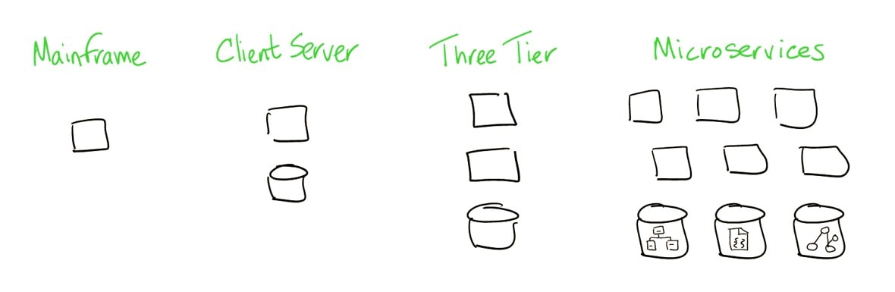
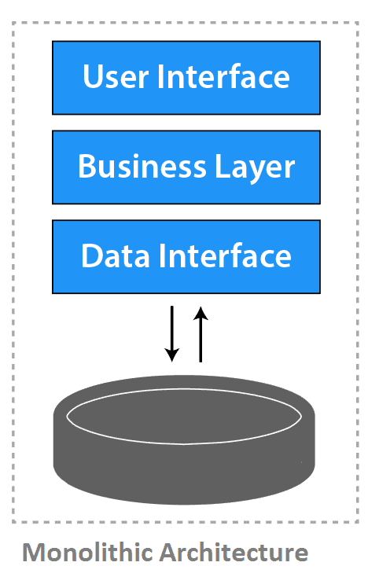
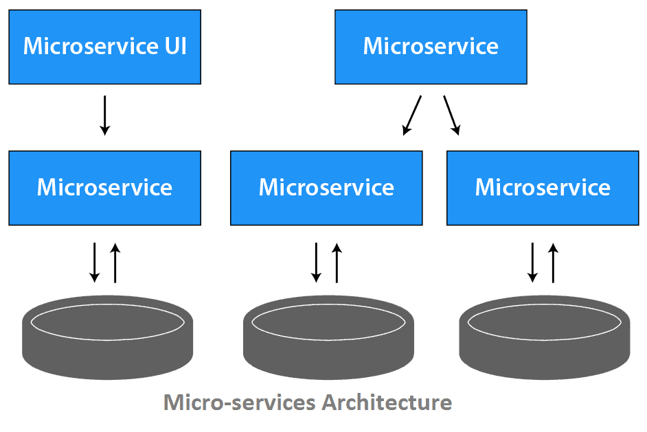
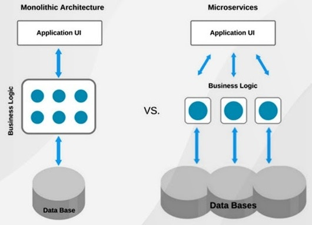
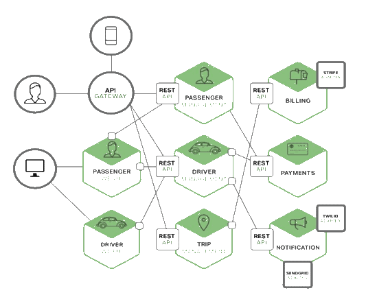
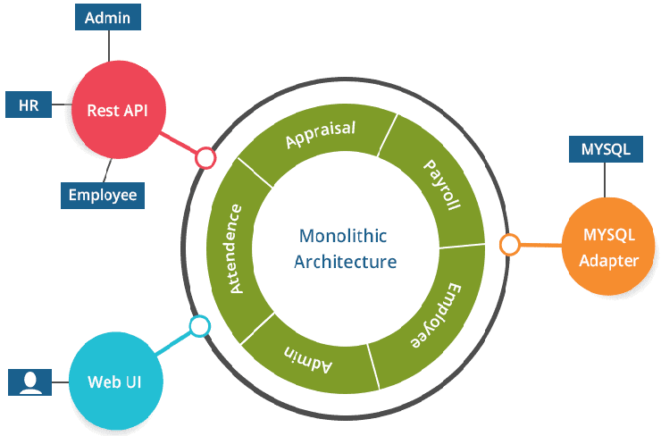
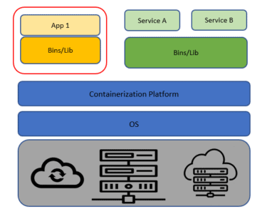
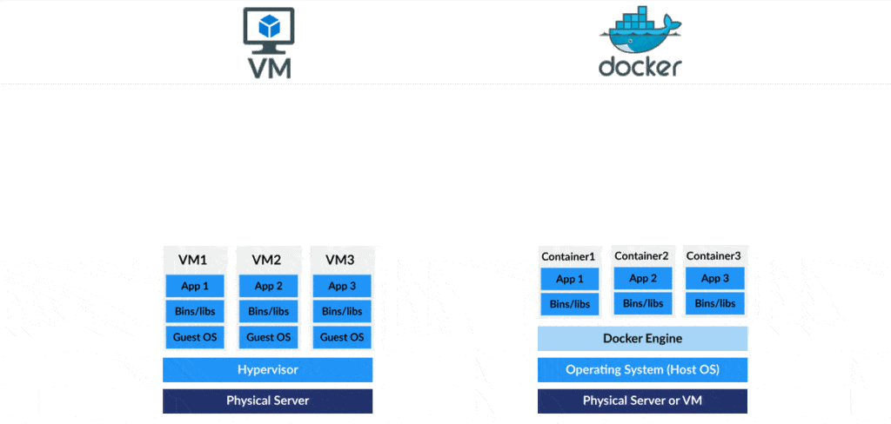
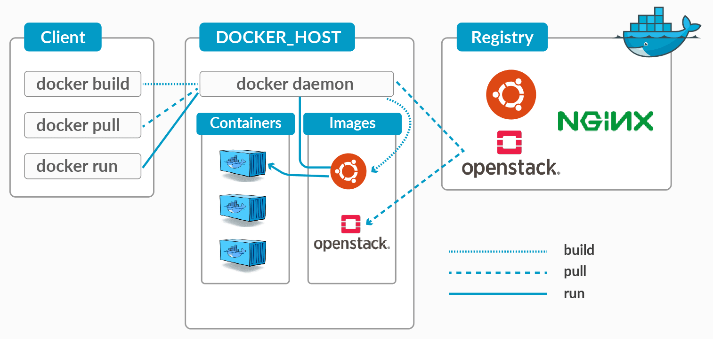

# The complete step-by-step guide to Docker and Kubernetes.

According to Moore’s law, the computer processing speed supposedly doubles every 18 months or so! Docker is undoubtedly on edge out of all application deployment strategies in today’s world. Consequently, most IT professionals are looking to learn Docker. Well, if you are looking for one, you are in for a treat! To summarise, this post is a complete course with a Hands-on tutorial from beginner to advanced level.

### Topics Covered:

- History of Application Deployment
  - Monolithic
  - Microservices
  - Containers
- Containers vs VMs
- Beginner to Advanced Docker Tutorial
- Why Docker?
- Docker Architecture
- Installation of Docker Tutorial
- Docker Images
- Commands in Docker Tutorial
- Docker Networking Tutorial
- Docker Storage Tutorial
- Case Study: Docker’s Boon to Companies
- History of Application Deployment

**Deployment History**

### Application Deployment History

Over the past twenty years, application deployment has evolved hand-in-hand with IT in business. All businesses need their application to run without any downtime, and it hasn’t taken us long years to achieve something of that sort. Ever-developing technology would fall behind, and the process of deploying would be expensive. The more prominent companies never get late in implementing new technology and make the most of it; hence, they are the so-called ‘Tech Giants’. Let’s look at the deployment history in brief:

### Monolithic Application

**Monolithic Architecture**

Monolithic architecture is used for traditional server-side systems. The entire system’s work is based on a single application. This system comes with various advantages; first, you can develop faster with the essential requirements. It also makes the application quicker since there is no use of APIs.  Maintaining applications becomes problematic if it is not designed well. And this is because processes are likely to be tightly coupled. Also, Monolithic puts all of the functionality into a single process monitoring becomes one hell of a task! So, scalability, availability, and reliability get tough for the same reason.

### Microservice Application 

**Microservices**

Monolithic had many drawbacks, which lead to the invention of Microservices. It breaks the whole process into smaller, loosely coupled microservices.  In a microservice model, a single distinct business function would be combined with other microservices to provide a complete business application in this approach. Communication between microservices is majorly by the APIs where each one of them exposes its functionality as a well-defined interface. Each process is concerned only with its data, making design a lot better. Hence, the factors like scalability, reliability, and availability get a lot better.

Note: Don’t forget to check out the Monolithic Vs. Microservices comparison.

### Difference between Monolithic vs Microservices:

Monolithic vs Microservices

- What is Monolithic?
- Advantages of Monolithics
- Disadvantages of Monolithic
- What is Microservices
- Advantages of Microservices
- Disadvantage of Microservices
- Microservices and containers
- Why Microservices?
- What’s the Diff: Monolithic vs Microservices

### What is Monolithic? ^
MonolithicA monolithic application is constructed as one unit which means it’s composed all in one piece. The Monolithic application describes a one-tiered software application within which different components combined into one program from a single platform. The three components are the user interface, the data access layer, and the data store.

The user interface is the entry point of the application and is also the point of the program that a user will interact with.
Data access layer is the layer of the program which will wrap the data stored.
The data store is the most fundamental part of the system and is liable for storing data and retrieving it.
Check out: Kubernetes Security For Beginner – CKS

### Advantages of Monolithic:
Simple to deploy – In monolithic applications, we don’t need to handle many deployments just one file or directory.
Easier debugging and testing –  monolithic applications are much easier to debug and test. Since a monolithic app is a single indivisible unit, we can run end-to-end testing much faster.
Performance: Components in a monolith typically share memory which is Quicker than service-to-service communications.
Read this blog about Role-Based access control. It’s the way to outline which users can do what within a Kubernetes cluster.

### Disadvantages of Monolithic:
New technology barriers – It’s extremely problematic to use new technology in a monolithic application because then the whole application must be rewritten.
Scalability- You can’t scale components independently, only the whole application.
Size – It becomes overlarge in size with time and becomes difficult to manage.
Difficult to understand – For any new developer joining the project, it’s very difficult to grasp the logic of an oversized monolithic application whether or not his responsibility is related to one functionality.

### What is Microservices? ^
MicroservicesThe idea of microservices is to separate our application into smaller sets and interconnected services rather than building one monolithic application. Each module supports a selected business goal and uses a simple and well-defined interface to communicate with other sets of services. Each microservice has its own database. Having a database per service is crucial if you wish to learn from microservices because it ensures loose coupling.

### Advantages of Microservices:
The application starts faster, which makes developers more productive, and accelerates deployments.
It enables us to arrange the event effort around multiple teams. Each team is responsible for one or more single service. Each team can develop, deploy, and scale their services independently of all of the opposite teams.
Microservices allow the usage of the most appropriate technology for various services. Meaning each team building the selected service can choose their preferred programming language and framework, as they’re working independently.
Once the organization develops and implements a microservices architecture, it’s the schematic diagram that may be reused and expanded upon for future projects and services.
Each service is a separate object within the microservices framework which enables their independent functioning.

### Disadvantages of Microservices:

Since everything is now an independent service, we’ve to carefully handle requests traveling between our modules. In one such scenario, developers are also forced to write extra code to avoid disruption.
Communication between services may be complex and there’s a higher chance of failure during communication between different services.
The developer has to solve the problem, like network latency and load balancing.
 While unit testing may be easier with microservices but integration testing isn’t. The components are distributed and developers can’t test a complete system from their individual machines.

### Microservices and Containers
It’s difficult to talk about microservices without also talking about containers,  Docker delivers an easy way to create, share, and test container images, and has become very popular among businesses that have committed to developing software using containers.

### Example of Microservices 

This is an example of cab booking software. Each functional area of the application that is now implemented by its own microservice and the backend service exposes a REST API. Most services consume APIs provided by other services. These might also use asynchronous, message-based communication inter-service communication. Run multiple instances of each service behind a load balancer for throughput and availability.

### Why MicroServices? ^

The good thing about using microservices is that development teams are ready to rapidly build new components of apps to fulfill changing business needs. In microservices, every application resides in separate containers along with the environment it needs to run. It allows it to maximize deployment velocity and application reliability. There’s no risk of interfering with the other applications.  It also allows optimizing the sources micro services multiply team works on independent services.

In Microservices, we run all the applications on Containers (Docker), so the boot-up time and memory consumption of applications decrease, thus the performance of the application increases. In organizations, not one or two but multiple numbers of Containers (Docker) are running. So, to manage them, we use Kubernetes. Kubernetes comes in handy because it provides various facilities like self-healing, scalability, auto-scaling, and declarative state.

### What’s the Diff: Monolithic vs Microservices

|Monolithic	|Microservice|
|------------------------------------------|-------------------------------------------------------|
|It is built as one large system|	It is built as a small independent module|
|Not easy to scale based on demand	|Easy to scale based on demand.|
|It has a shared database	|Each project and module have their own database|
|Large code base makes IDE slow	|Each project is independent and small in size|
|Continues deployment becomes difficult|	Continues deployment is possible here|
|It is extremely difficult to change technology or language or framework because everything is tightly coupled and  depends on each other.|Easy to change technology or framework because every module and project is independent.|
### Containers

**Container Architecture**

Containers are effectively a form of virtualisation that lets you app isolation. All the features of OS virtualisation are not available, and we don’t need them either. Hence, it results in a faster boot time! A developer can specify the resources he needs, the OS he needs to run the application and doesn’t have to worry about the hardware so much as the container takes care of it. There is no perfect technology that solves all the problems. So, let’s take a look at the comparison of Containers and Virtual Machines.

Note: Check out more on Containers.

### Docker Containers Vs. Virtual Machines (VM)

**Container vs VMContainers Vs. Virtual Machines**

A virtual machine (VM) is like a copy of an actual physical computer. A virtual server operates in a multi-tenant environment, meaning that multiple VMs run on the same physical hardware. Contrarily, Containers sit on top of a physical server and its host OS. Every container shares the host OS kernel and the binaries and libraries to run the required application. Once you set up a VM, you can run a container within the VM. Containers and VMs are not mutually exclusive and can co-exist alongside.

### Some Important Concepts:

- Why Docker?
- Docker Architecture
- Docker Installation
- Register Free Azure Trial Account
- Create and Configure Ubuntu Machine on Azure Cloud
- Connect Azure Ubuntu Machine From MAC
- Install and Configure Docker on Ubuntu Machine
- Docker Daemon and Client
- Images and DockerHub
- Docker Lifecycle and Commands
- Networking
- Bridge Networking
- Custom Bridge & Host Networking
- Docker Storage
- Host-Path Mounting
- Volume & tmpfs

### Docker Containers: What and Why?

A Docker container is similar to a computer inside your computer. The cool thing about this virtual computer is that you can share it with your friends.  And when they start this computer and run your code, they will get the same results as you did. So, all the hectic dependencies starting from the operating system up to package versions. Hence, it eases portability and Sharability.

### Docker Architecture

**Docker Architecture**

Docker uses Client-Server architecture, which involves the 3 main components that are Docker Client, Docker Host, and Docker Registry. The Docker client communicates with the Docker daemon, which takes care of the building, running, and distributing the Docker containers. The Docker client and daemon can run on the same system or connect a client to a remote Docker daemon. They communicate using REST APIs, over UNIX sockets or a network interface.

Note: Know everything about Docker Architecture

### Docker Installation
Docker Installation
Installing Docker is no rocket science! It can be installed on your local machine, on any cloud platforms where you can start a Linux virtual instance. We will help you in installing and setting up Docker in our course. In addition to that, we also show you how to create a FREE TRIAL Azure Account and also how to boot up an Ubuntu virtual machine. Click here to start installing Docker by a step-by-step procedure.

Note: Not only have we covered this in our course, but we also have a detailed step-by-step guide on Docker Installation

### Docker Images
Docker Image is a read-only (immutable) file that contains the source code, libraries, dependencies, tools, and other files needed for an application to run. To create a docker image, we write a Docker file with all of our requirements and perform a docker build command to get a Docker Image. This image is now ready to run as a Docker Container on successful creation.

### Docker Installation
Since containers are intended to be fast and lightweight, images tend to be small.; An official Alpine Linux image is about 5MB in size, and an official Ubuntu image is 40MB. These images are similar to the VM image, but there are some differences. A docker container is nothing but a running instance of a Docker image!

Note: Don’t forget to check out our in-depth blog on Docker Images

### Docker Lifecycle & Commands

**Docker Lifecycle**

A container can be matched with a process in OS. We know that a process is a running instance of a program. It can also have multiple threads running. And our containers work the same as a process, but the difference is that Containers are processing with their full environment. Containers can have the states depicted above; Created, Running, Paused, Stopped, and Deleted.

We have shown all the Docker commands in the Hands-on section and have explained the lifecycle process of a Docker. Click here to watch more.

Note: To understand Docker in detail, you have to know everything about the Docker Lifecycle

### Docker Networking
Docker Networking

Docker Networking connects the docker container and the outside world to communicate with Docker Host. The containers can be connected to non-Docker workloads. To add to that, Docker uses CNM Model for networking. The CNM model standardizes the steps needed to provide networking for containers utilizing multiple network drivers. The types of networking in Docker are listed below, which are covered in detail with hands-on in our Docker tutorial:

### Bridge Networking
- Host Networking
- Overlay Networking
- Macvlan Networking
Note:  Docker Networking is a prominent topic in our learning curve.

### Docker Storage
We all know that no technology is perfect, and containers aren’t an exclusion. Containers don’t store data permanently in any storage location. The storage in Docker must be configured if you would like your container to keep the data permanently. The data doesn’t exist when the container is deleted. This is because when a container is deleted, the writable layer is also deleted.

### Docker Storage

The data stored outside the container can be uses even if the container no longer exists. For instance, if a container crashes and can’t be restored, the data vanishes too! Usually, containers can be restarted and continued, resulting in no data loss. Hence, it’s mandatory to mount the data outside the container.

Note:  As mentioned above, without Docker Storage configuration, we go nowhere!
