# ✵ KUBERNETES ARCHITECTURE:

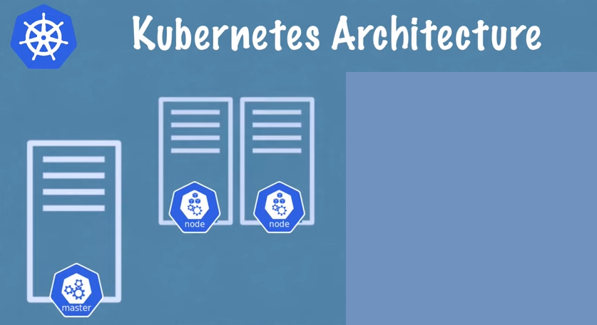
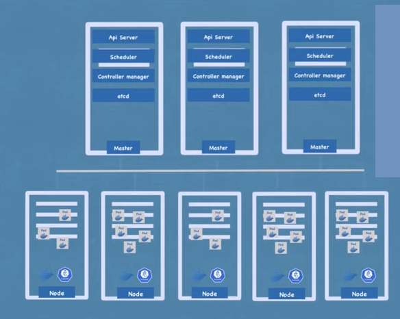

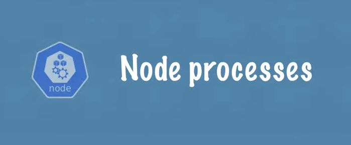

Basic setup of one node with two application pods running on it so one of the man components of kubernetes architecture are its worker servers or node and each node will have multiple application pods with containers running on that pods and the communities does it is using three processes that must be installed on every node that are used to schedule and manage those pods.

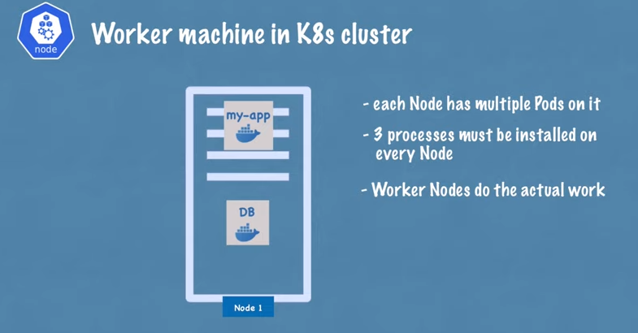

So no nodes are the cluster servers that actually do the work thats why sometimes also called worker nodes so the first process that needs to run on every node is the container runtime in this example i have docker but it could be some other techonolgies as well.

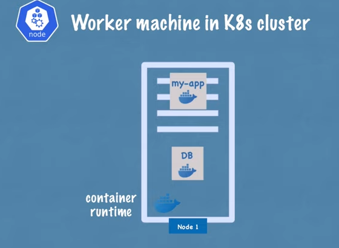

So because application pods have containers running inside a container runtime needs to be installed on every node but the process that actually schedules those can those pods and the containers then underneath is kublet which is a process of kubernetes itself unlike container runtime that has interface with both container runtime and the machine the node itself because at the end of the day Kubelet is reponsible for taking that configuration and actually running a pod or starting a pod with a container inside and then assigning resources from that node to the container like CPU RAM and storage resources. 

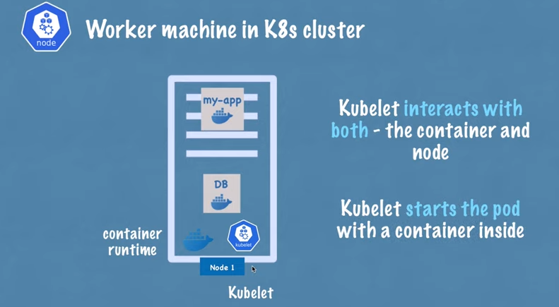

So usually kubernetes cluster is made up of multiple nodes which also must have container runtime and Kubelet services installed and you can have hundreds of those worker nodes which will run other pods and container and replicas of the existing pods like my app and database pods in this example. 

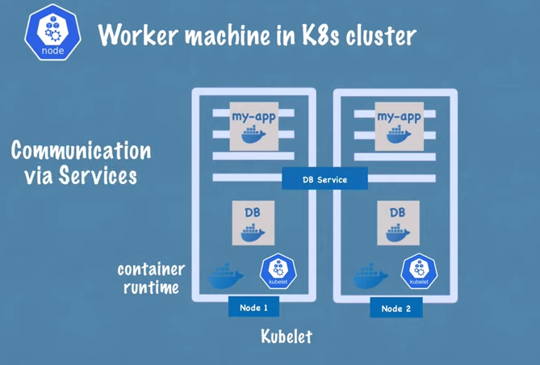

And the way that communication between them works is using services which is sort of a load balancer that basically catches the requests directed to the pod or the application like database example and then forwards it to the respective pod and the third process that is responsible for forwarding requests from service to pods is actually Kube proxy that also must be installed on every node 

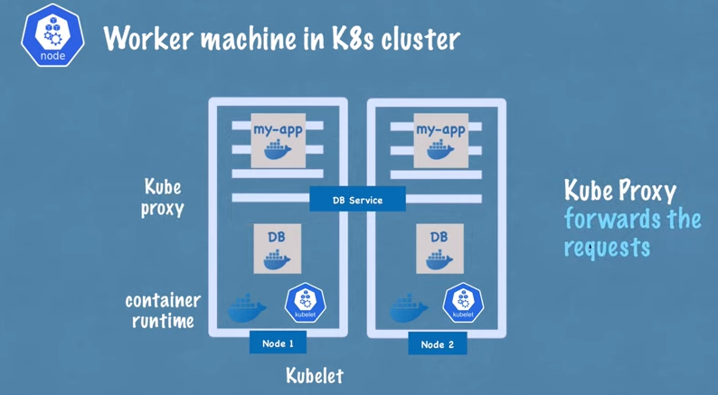

And kube proxy has actually intelligent forwarding logic inside that makes sure that the communication also works in a performant way with low overhead for example if an application my app replica is making a request database instead of service just randomly forwarding the request to any replica it will actually forward it to the replica that is running on the same node as the pod that initiated the request thus this way avoiding the network overhead of sending the request to another machine.

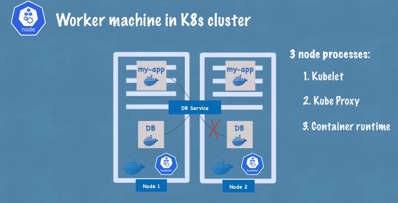

So to summerize to kubernetes processes Kubelet and kube proxy must be installed on every kubenetes worker node along with an independent container runtime in order for kubernetes cluster to function properly. 

But now the question is how do you interact with this cluster or do you decide on which node a new application pod or database pod should be schedules or if replica pod dies what process actually monitors it and then reschedules it or restart it again or when we add another server how does he own the cluster to become another node and get pods and other components created on it

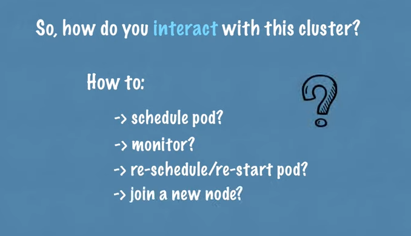

 And the answer is all these managing processes are done by master nodes.
 
So master server or master nodes have completely different process running of inside and these are four processes that run on every master node that control the cluster state and the worker nodes. We see the first service is API server so when you as a user want to deploy a new application in a kubernetes cluster you interact with the API server using some client it could be a UI like kubernetes dashboard could be command line tool like kubelet or acuminate this API. 

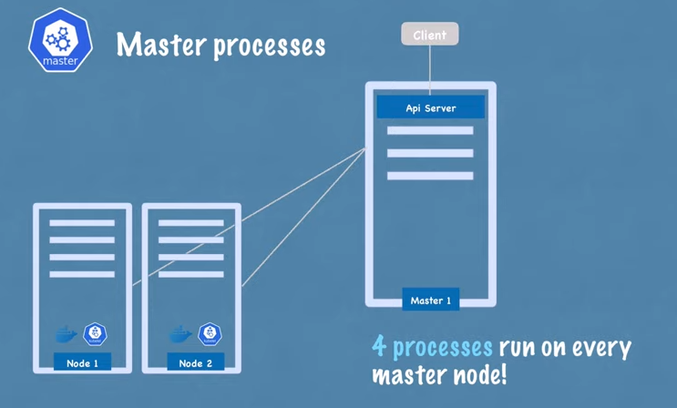

So API server is like a cluster gateway which gets the initial requests of any updates into the cluster or even the quesries from the cluster and it also acts as a gatekeeper for authentication.

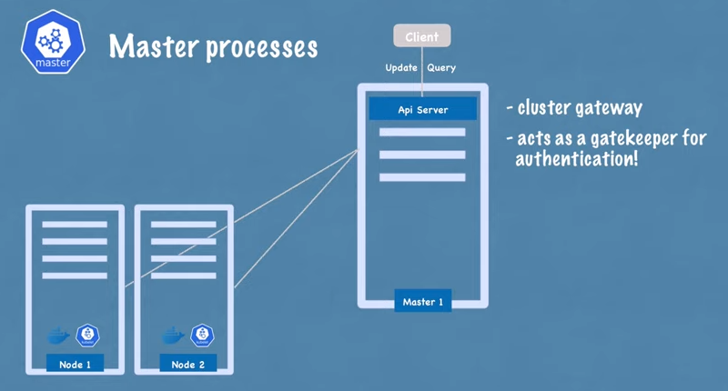

To make sure that only authenticated and authorized request get through to the cluster that means whenever you want to schedlue new pods deploy new applications create new service or any other components you have to talk to the API server on the master node and the API server then validate your request and if everything is fine then it will forward your request to other processes in order to schedule the pod or create this component that you requested.

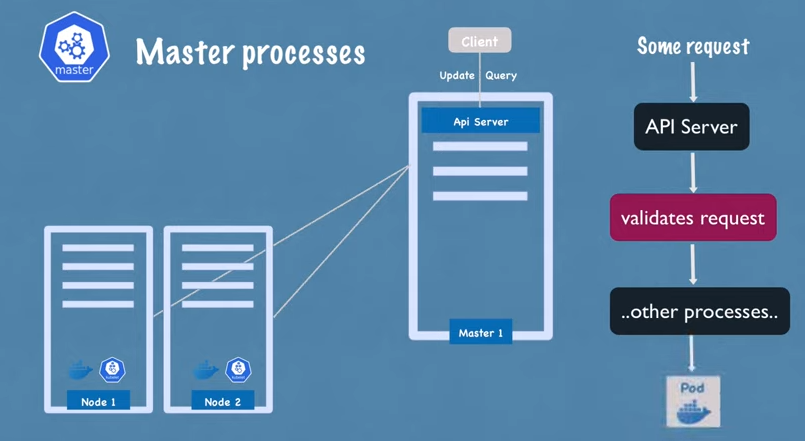

And also if you want to quesry the status of your deployment or the cluster health etc you make a request of the API server and it gives you the response which is good for security because you just have one entry point into the cluster another master process is a scheduler.
 
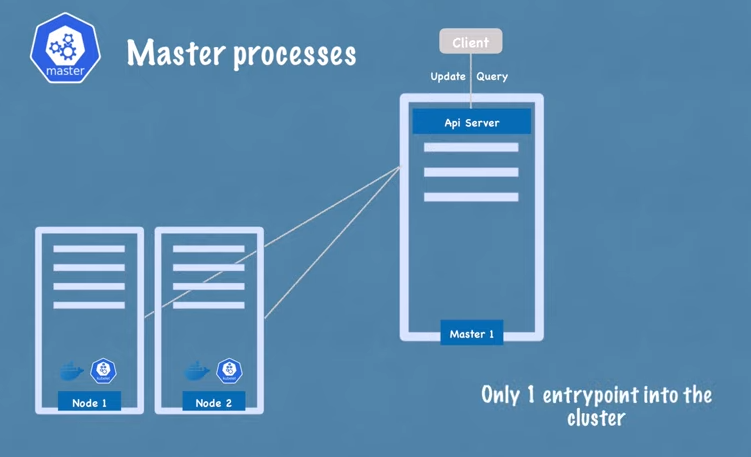

So as I mentioned if you send an API server a request to schedule a new pod API server after its validate your request will actually hand it over the scheduler in order to start the application pod on one of the worker nodes and of just randomly assigning to any node schedule has this whole intelligent way of deciding on which specific node the next pod will be scheduled or next component will be scheduled. 

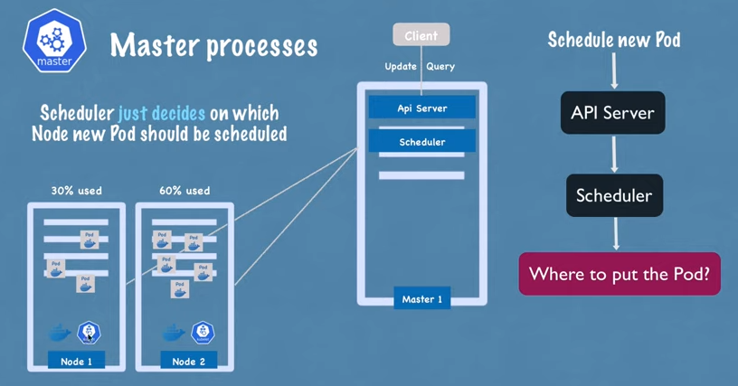

So first it will look at your request and see how much resources the application that you want to schedule will need how much CPU how much RAM and then its gonna look at and its going to go through the worker nodes and see the available resources each one of them and if it sees that one node is the least busy or has the most resources available it will schedule the new pod on that node an important point here is that scheduler just decides on which node a new pod will be schedules the process that actually does the scheduling that actually starts that pod with a container is the kubelet. so its gets the request from the schedular and execute the request on that node.

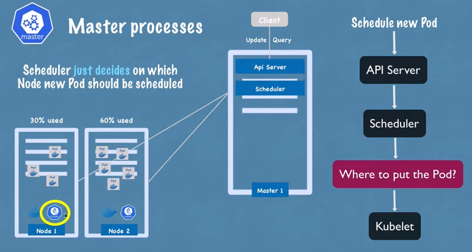

The next componet is controller manager which is another crucial component because what happens when pods die on any node there must be a way to detect that nodes died and then reschedule those pods as soon as possible so what controller manager does is detect state changes like crashing of pods for example so when pods die controller manager detects that and tries to recover the cluster state as soon as possible and for that it makes a request to the scheduler to reschedule those dead pods in the same cycle happens here where the scheduler decides based on the reasource calculation which worker nodes should restart those pods again and makes requests so the corresponding kubelets on those worker nodes to actually restart the pods.

| | |
|--------------------------------------|------------------------------------------|
| 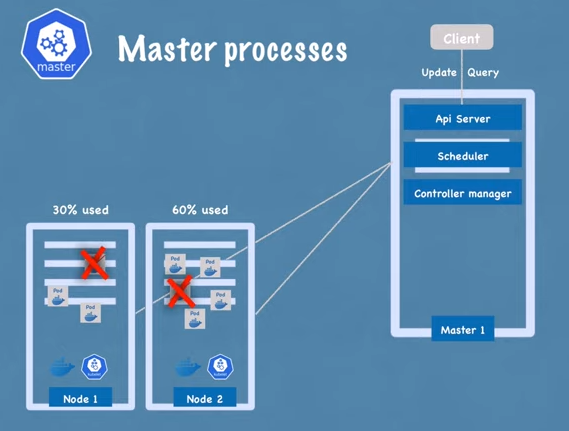 | 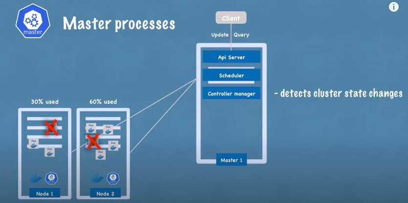 |
| 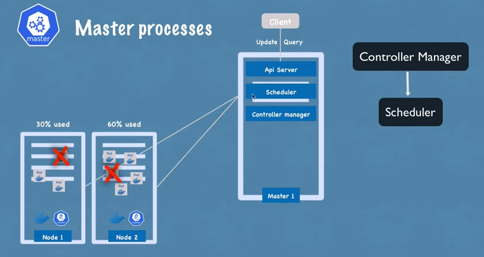 | 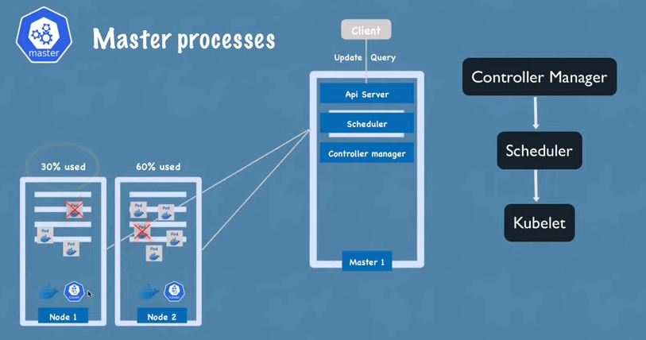 |

And finally the last master process is etcd which is a key value store of a cluster state you can think of is as a cluster brain.

Actually which means that every change in the cluster for example when a new pod gets scheduled when a pod dies all of these chanegs get saved or updated into this key value store of etcd and the reason why etcd store is a cluster brain is because all of these mechanism with schedular controller manager etc works because of its data.

So for example how to schedular know what resources are available on each worker node or how does controller manager know that a cluster state changes in some way for example pods died or kubelet restarted new pods upon the request of a schedular or when you make quesr request to API server about the cluster health or for example your application deployment state where as API server get all this state information from so all of this information is stored in etcd cluster.

What is not stored in etcd key value store is the actual application data for example if you have a database application running inside the of the cluster the data will be stored somewhere else not in the etcd this is just a cluster state information which is used for master processes to communicate with them work processes and vice versa. 

So now you probably already see that master processes are absolutely crucial for the cluster operation specialy the etcd store which contains some data must be reliably stored or replicated so in practice kubernetes cluster is masde up of multiple masters where each master node runs its master processes where of course the API server is load balanced and the etcd store forms a distributed storage across all the master nodes.

| | |
|--------------------------------------|------------------------------------------|
|  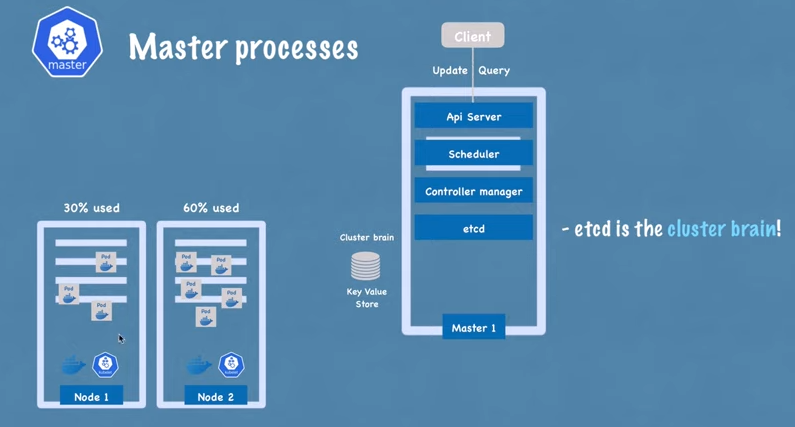 | 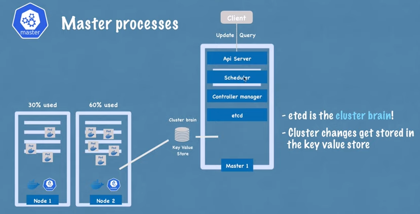 |
| 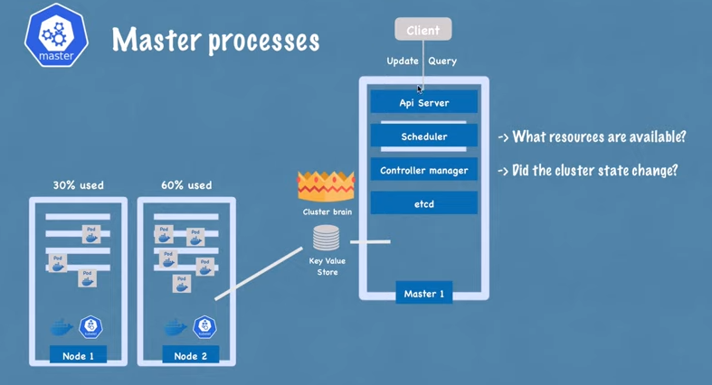 | 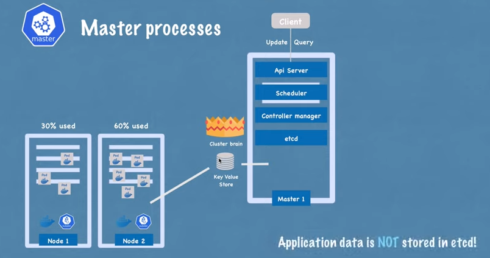 |
| 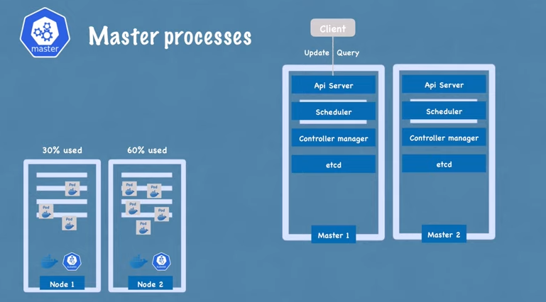| 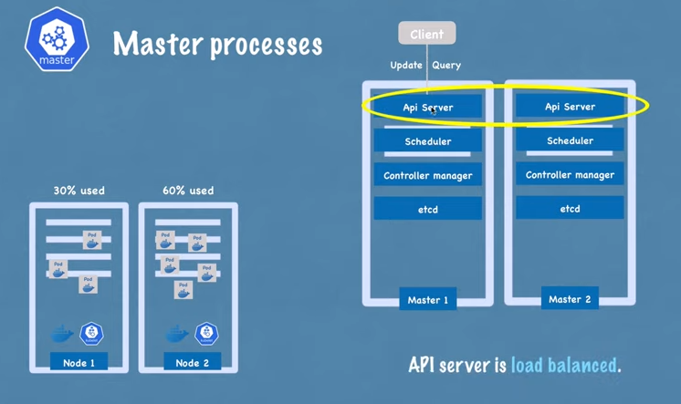 |
| 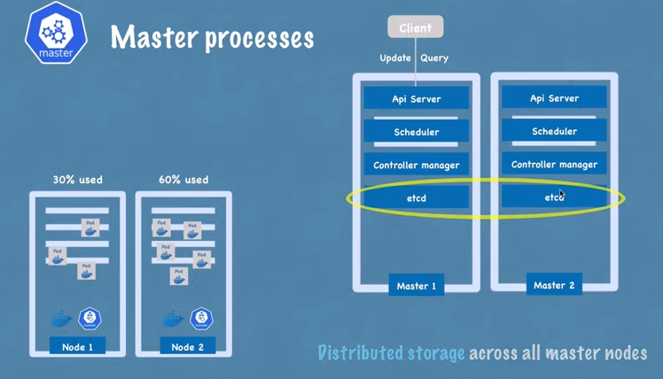| |

So now that we saw what processes run on worker nodes and master nodes lets actually have a look at a realistic example of cluster setup So in a very small cluster you'd probably have two master nodes and three worker nodes also to note here the hardware resources of master and node servers actually differ master processes are more important but they actually have less load of work so they need less resources like CPU RAM and storage whereas the worker nodes do the actual job of running those thoughts with containers inside therefore they need more resources and as your application complexity and its demand of resources increases you may actually add more master and node server to your cluster and thus forming a more powerful and robust cluster to meet your application resource requirements so in existing kubernetes cluster you can actually add new master or node servers pretty easily so if you want to add a master server you just get a new bare server you install all the master processes on it and edit to the kubernetes cluster same way if you need to worker nodes you get their servers you install all the worker node processes like container runtime kubelet and key proxy on it and add it to the kubernetes cluster that's it and this way you can infinetely increase the power and resources of your kubernetes cluster is a replication complexity and its resource demand increases.

| | |
|--------------------------------------|------------------------------------------|
| 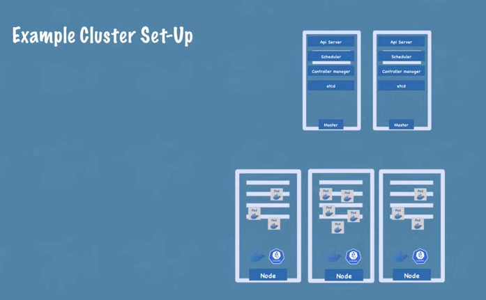 | 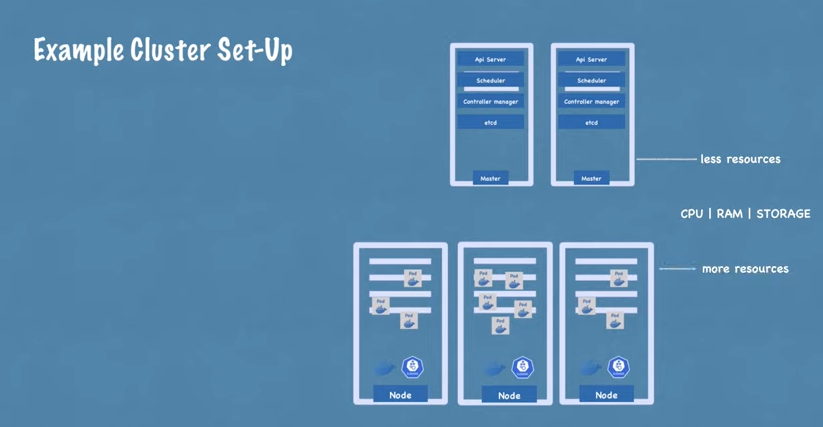|
|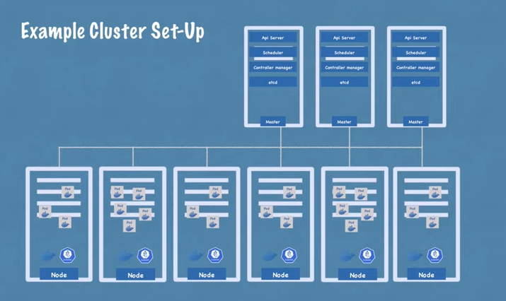|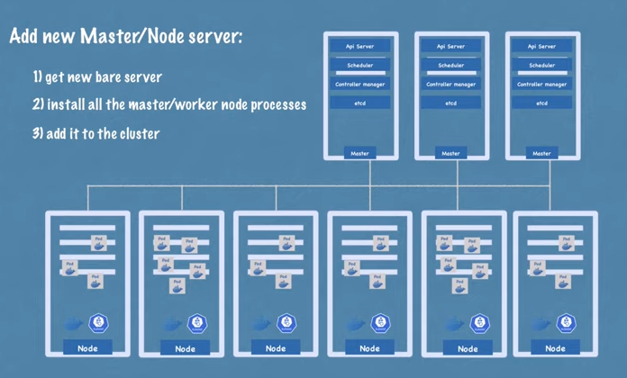|
