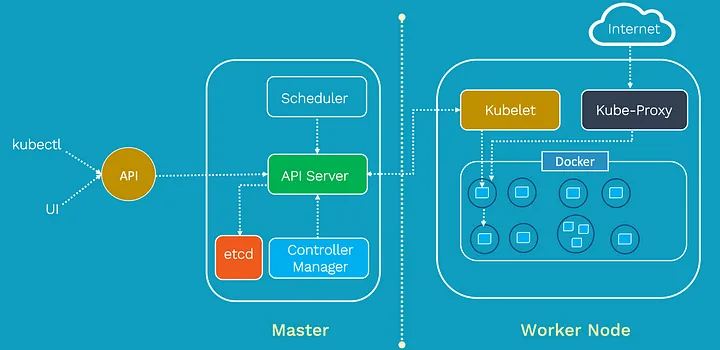

## What is Kubernetes?
we’ll start by understanding what Kubernetes is. Kubernetes is an open-source container orchestration platform that automates the deployment, scaling, and management of containerized applications. It helps developers and operators to manage containerized applications effortlessly.

Kubernetes achieves this by providing a robust and scalable platform for deploying, scaling, and managing containerized applications. It abstracts the underlying infrastructure and provides a consistent API for interacting with the cluster. This abstraction allows developers to focus on their applications’ logic and not worry about the complexities of managing the infrastructure.

### Kubernetes Architecture
we’ll dive into Kubernetes architecture. Understanding the architecture is crucial to grasp how Kubernetes efficiently manages containerized applications.



### Master Node:
The heart of a Kubernetes cluster is the Master Node. It acts as the control plane for the entire cluster and manages the overall cluster state. The Master Node is responsible for making global decisions about the cluster, such as scheduling new pods, monitoring the health of nodes and pods, and scaling applications based on demand.

The Master Node consists of several key components:

**API Server**: This is the central management point of the cluster. It exposes the Kubernetes API, which allows users and other components to interact with the cluster.

**etcd**: It is a distributed key-value store that stores the configuration data of the cluster. All information about the cluster’s state is stored here.

**Controller Manager**: The Controller Manager includes several controllers that watch the cluster state through the API Server and take corrective actions to ensure the desired state is maintained. For example, the ReplicaSet controller ensures the specified number of pod replicas are running.

**Scheduler**: The Scheduler is responsible for assigning new pods to nodes based on resource requirements and availability. It helps distribute the workload evenly across the worker nodes.

### Worker Nodes:
The Worker Nodes are the machines where containers (pods) are scheduled and run. They form the data plane of the cluster, executing the actual workloads. Each Worker Node runs several 

#### key components:

**Kubelet**: The Kubelet is the agent that runs on each Worker Node and communicates with the Master Node. It ensures that the containers described in the pod specifications are running and healthy.

**Container Runtime**: Kubernetes supports multiple container runtimes, such as Docker or containerd. The Container Runtime is responsible for pulling container images and running containers on the Worker Nodes.

**Kube Proxy**: Kube Proxy is responsible for network communication within the cluster. It manages the network routing for services and performs load balancing.

### How They Interact:

The Master Node and Worker Nodes communicate through the Kubernetes API Server. Users and other components interact with the cluster through the API Server as well. For example, when a user deploys a new application, the configuration is sent to the API Server, which then stores it in etcd.

The Controller Manager continuously monitors the cluster state through the API Server. If there are any deviations from the desired state (e.g., a pod is not running), the Controller Manager takes corrective actions to reconcile the state.

When a new pod needs to be scheduled, the Scheduler selects an appropriate Worker Node based on resource availability and other constraints. The API Server informs the chosen Worker Node, and the Kubelet on that node starts the container.

The Worker Nodes report the status of the running pods back to the Master Node through the Kubelet. This way, the Master Node always has an up-to-date view of the entire cluster.

In the upcoming sections, we will explore other fundamental concepts and main Kubernetes components, such as pods, services, deployments, and more. This will further enhance your understanding of Kubernetes and how you can utilize it to orchestrate your containerized applications effectively.

### Main K8s Components

#### Nodes and Pods
we’ll explore the fundamental building blocks of Kubernetes: nodes and pods. You’ll understand how nodes represent individual machines in a cluster, and pods are the smallest deployable units that can hold one or more containers.

#### Nodes:
In Kubernetes, a Node is a worker machine where containers are deployed and run. Each node represents an individual machine within the cluster, and it could be a physical or virtual machine. Nodes are responsible for running the actual workloads and providing the necessary resources to run containers.

Example:

Let’s consider an example where we have a Kubernetes cluster with three worker nodes: Node A, Node B, and Node C. These nodes are responsible for hosting and running our containerized applications.

Nodes:
- Node A
- Node B
- Node C

#### Pods:
A Pod is the smallest deployable unit in Kubernetes and represents one or more tightly coupled containers. Containers within a pod share the same network namespace, enabling them to communicate with each other over localhost. A pod represents a single instance of a process in the cluster.

Example:

Suppose we want to deploy a simple web application in our Kubernetes cluster, and this web application requires both an application server and a database. We can package both the application server and the database server into a single pod.

Pods:
- Pod 1 (Web App + Database)
Below is a code sample for a Kubernetes YAML configuration file that deploys a simple web application with both an application server (nginx) and a database server (MongoDB) into a single pod:

# webapp-with-db-pod.yaml
```yaml
apiVersion: v1
kind: Pod
metadata:
  name: webapp-with-db
  labels:
    app: my-webapp
spec:
  containers:
    - name: webapp
      image: nginx:latest
      ports:
        - containerPort: 80
    - name: database
      image: mongo:latest
```
Explanation:

We define a Pod named webapp-with-db.

The pod has two containers: webapp and database.

The webapp container uses the nginx:latest image, which is a popular web server and reverse proxy. We expose port 80 to access the web application.

The database container uses the mongo:latest image, which is a widely used NoSQL database.

Both containers share the same network namespace and can communicate with each other over localhost.

#### Why Pods and Not Just Containers?

You might wonder why Kubernetes introduces the concept of pods when we can directly deploy individual containers. The reason is that pods provide several benefits:

**Grouping Containers**: Pods allow us to group logically related containers together, simplifying their scheduling, scaling, and management.

**Shared Resources**: Containers within a pod share the same network namespace and can share volumes, making it easier for them to communicate and share data.

**Atomic Unit**: Pods represent an atomic unit of deployment. When you need to scale or manage your application, you typically do it at the pod level.

**Scheduling and Affinity**: Kubernetes schedules pods to nodes, not individual containers. This ensures that related containers within the pod are co-located on the same node.

In summary, while individual containers can be deployed directly in Kubernetes, pods provide an additional layer of abstraction that facilitates the management of related containers and enables more advanced scheduling and resource sharing capabilities.

In the next sections, we’ll explore more Kubernetes concepts, such as services, deployments, and other main components, to build a comprehensive understanding of how to effectively orchestrate containerized applications in Kubernetes.

#### Service:
A Kubernetes Service is an abstraction that defines a stable endpoint to access a group of pods. It allows you to expose your application to other pods within the cluster or to external clients. Services provide load balancing and automatic scaling for the pods behind them, ensuring that the application remains highly available.

Here’s an updated version of the YAML configuration file that includes a Service for the web application:

# webapp-with-db-pod-and-service.yaml
```yaml
apiVersion: v1
kind: Pod
metadata:
  name: webapp-with-db
  labels:
    app: my-webapp
spec:
  containers:
    - name: webapp
      image: nginx:latest
      ports:
        - containerPort: 80
    - name: database
      image: mongo:latest
---
apiVersion: v1
kind: Service
metadata:
  name: webapp-service
spec:
  selector:
    app: my-webapp
  ports:
    - protocol: TCP
      port: 80
      targetPort: 80
```
Explanation:

We’ve added a new YAML block to create a Service named webapp-service.

The selector field in the Service ensures that it selects pods with the label app: my-webapp. Since our pod has this label, the service will target it.

The service exposes port 80, which matches the port exposed by the webapp container in the pod.

The targetPort specifies the port on the pod that the service forwards traffic to. In this case, it is set to 80 to match the containerPort of the webapp container.

Now that we have a service, other pods within the cluster can access the web application by simply referring to the service’s name (webapp-service).

#### Ingress:

While the service enables internal communication between pods within the cluster, Kubernetes Ingress provides a way to expose your services to external clients outside the cluster. It acts as an external entry point to your applications and enables you to configure routing rules and load balancing for incoming traffic.

Here’s the continuation of the YAML configuration file with an Ingress for the web application:

# webapp-with-db-pod-service-and-ingress.yaml
```yaml
apiVersion: networking.k8s.io/v1
kind: Ingress
metadata:
  name: webapp-ingress
spec:
  rules:
    - host: mywebapp.example.com
      http:
        paths:
          - path: /
            pathType: Prefix
            backend:
              service:
                name: webapp-service
                port:
                  number: 80
```
Explanation:

We’ve added a new YAML block to create an Ingress named webapp-ingress.

The host field specifies the domain name under which the web application will be accessible from outside the cluster. Replace mywebapp.example.com with your actual domain name or IP address.

The paths section defines the routing rules. In this example, any incoming requests with a path prefix of / will be forwarded to the webapp-service.

The backend specifies the target service to which the traffic should be forwarded. In our case, it's the webapp-service we defined earlier.

With the Ingress resource in place, external clients can access the web application through the specified domain name or IP address (mywebapp.example.com in this example).

Note: For the Ingress resource to work, you need an Ingress controller deployed in your Kubernetes cluster. The Ingress controller is responsible for implementing the Ingress rules and managing the external traffic to the services.

In summary, by combining the Pod, Service, and Ingress resources, you can deploy a web application with its database into a Kubernetes cluster and make it accessible both internally and externally. This setup provides a scalable and reliable infrastructure for your web application, allowing it to handle incoming requests efficiently.

Let’s continue building on the previous example and introduce Kubernetes ConfigMap and Secret resources to handle configuration data and sensitive information in a more secure and organized manner.

#### ConfigMap:

A Kubernetes ConfigMap is used to store configuration data that can be consumed by pods as environment variables or mounted as configuration files. It helps separate the configuration from the container image, making it easier to update configurations without rebuilding the container.

Here’s an updated version of the YAML configuration file that includes a ConfigMap for the web application:

# webapp-with-db-pod-service-ingress-configmap.yaml
```yaml
apiVersion: v1
kind: Pod
metadata:
  name: webapp-with-db
  labels:
    app: my-webapp
spec:
  containers:
    - name: webapp
      image: nginx:latest
      ports:
        - containerPort: 80
      envFrom:
        - configMapRef:
            name: webapp-config
    - name: database
      image: mongo:latest
---
apiVersion: v1
kind: Service
metadata:
  name: webapp-service
spec:
  selector:
    app: my-webapp
  ports:
    - protocol: TCP
      port: 80
      targetPort: 80
---
apiVersion: v1
kind: ConfigMap
metadata:
  name: webapp-config
data:
  WEBAPP_ENV: "production"
  DATABASE_URL: "mongodb://database-service:27017/mydb"
```
Explanation:

We’ve added a new YAML block to create a ConfigMap named webapp-config.

The data section contains key-value pairs representing the configuration data for the web application.

In the Pod definition, we've added an envFrom field under the webapp container to reference the webapp-config ConfigMap. This will inject the key-value pairs from the ConfigMap as environment variables into the container.

With this setup, the webapp container will have access to the environment variables WEBAPP_ENV and DATABASE_URL, which can be used to configure the application.

#### Secret:

Kubernetes Secrets are used to store sensitive information, such as passwords, API keys, or TLS certificates. Secrets are base64-encoded by default and can be mounted as files or used as environment variables in pods.

Here’s an updated version of the YAML configuration file that includes a Secret for the database:

# webapp-with-db-pod-service-ingress-configmap-secret.yaml
```yaml
apiVersion: v1
kind: Pod
metadata:
  name: webapp-with-db
  labels:
    app: my-webapp
spec:
  containers:
    - name: webapp
      image: nginx:latest
      ports:
        - containerPort: 80
      envFrom:
        - configMapRef:
            name: webapp-config
    - name: database
      image: mongo:latest
      env:
        - name: MONGO_INITDB_ROOT_USERNAME
          valueFrom:
            secretKeyRef:
              name: db-credentials
              key: username
        - name: MONGO_INITDB_ROOT_PASSWORD
          valueFrom:
            secretKeyRef:
              name: db-credentials
              key: password
---
apiVersion: v1
kind: Service
metadata:
  name: webapp-service
spec:
  selector:
    app: my-webapp
  ports:
    - protocol: TCP
      port: 80
      targetPort: 80
---
apiVersion: v1
kind: ConfigMap
metadata:
  name: webapp-config
data:
  WEBAPP_ENV: "production"
  DATABASE_URL: "mongodb://database-service:27017/mydb"
---
apiVersion: v1
kind: Secret
metadata:
  name: db-credentials
type: Opaque
data:
  username: <base64-encoded-username>
  password: <base64-encoded-password>
```
Explanation:

We’ve added a new YAML block to create a Secret named db-credentials.

The data section contains base64-encoded values for the database username and password. You should replace <base64-encoded-username> and <base64-encoded-password> with actual base64-encoded values.

In the Pod definition, we've added environment variables for the database container to reference the db-credentials Secret. These variables (MONGO_INITDB_ROOT_USERNAME and MONGO_INITDB_ROOT_PASSWORD) will hold the sensitive information needed to authenticate to the MongoDB database.

Using Secrets, we can securely manage sensitive data and avoid exposing it directly in the configuration files or container images.

With ConfigMap and Secret resources in place, our web application is now properly configured with both non-sensitive and sensitive information, ready to be deployed and accessed securely in the Kubernetes cluster.

Let’s continue building on the previous example and introduce Kubernetes Volume to provide persistent storage for our database. Volumes allow data to persist across container restarts and provide a way to share data between containers within a pod.

### Volume:

A Kubernetes Volume is a directory that is accessible to all containers in a pod. It decouples the storage from the containers, ensuring that data persists even if a container is restarted or rescheduled.

In this example, we’ll use a PersistentVolumeClaim (PVC) to dynamically provision a PersistentVolume (PV) and attach it to our database container.

Here’s the updated version of the YAML configuration file with a Volume for the database:

# webapp-with-db-pod-service-ingress-configmap-secret-volume.yaml
```yaml
apiVersion: v1
kind: Pod
metadata:
  name: webapp-with-db
  labels:
    app: my-webapp
spec:
  containers:
    - name: webapp
      image: nginx:latest
      ports:
        - containerPort: 80
      envFrom:
        - configMapRef:
            name: webapp-config
    - name: database
      image: mongo:latest
      env:
        - name: MONGO_INITDB_ROOT_USERNAME
          valueFrom:
            secretKeyRef:
              name: db-credentials
              key: username
        - name: MONGO_INITDB_ROOT_PASSWORD
          valueFrom:
            secretKeyRef:
              name: db-credentials
              key: password
      volumeMounts:
        - name: db-data
          mountPath: /data/db
  volumes:
    - name: db-data
      persistentVolumeClaim:
        claimName: database-pvc
---
apiVersion: v1
kind: Service
metadata:
  name: webapp-service
spec:
  selector:
    app: my-webapp
  ports:
    - protocol: TCP
      port: 80
      targetPort: 80
---
apiVersion: v1
kind: ConfigMap
metadata:
  name: webapp-config
data:
  WEBAPP_ENV: "production"
  DATABASE_URL: "mongodb://database-service:27017/mydb"
---
apiVersion: v1
kind: Secret
metadata:
  name: db-credentials
type: Opaque
data:
  username: <base64-encoded-username>
  password: <base64-encoded-password>
---
apiVersion: v1
kind: PersistentVolumeClaim
metadata:
  name: database-pvc
spec:
  accessModes:
    - ReadWriteOnce
  resources:
    requests:
      storage: 1Gi
```
Explanation:

We’ve added a new YAML block to create a PersistentVolumeClaim (PVC) named database-pvc.

The PVC defines the storage requirements for our database. In this example, we request a 1Gi storage volume.

In the Pod definition, we've added a Volume named db-data and specified that it should be dynamically provisioned using the database-pvc PVC.

The database container is then configured to mount this volume at the path /data/db. This ensures that any data written to this path inside the container will be stored in the db-data volume.

With this setup, the MongoDB data will be stored persistently in the db-data volume, which is backed by the dynamically provisioned PersistentVolume. This ensures that data remains available even if the database container is restarted or rescheduled on a different node.

The combination of ConfigMap, Secret, Service, and Volume provides a comprehensive solution to deploy a web application with a database, manage configurations securely, and store data persistently in a Kubernetes cluster.

Let’s continue building on the previous example and introduce Kubernetes Deployment and StatefulSet to manage the lifecycle of our application pods. Both resources ensure that the desired number of replicas of our application is always running, but they have different use cases.

### Deployment:

A Kubernetes Deployment is a higher-level abstraction that manages a set of identical pods. It's ideal for stateless applications where individual pods are interchangeable. Deployments provide features like rolling updates, rollback, and scaling, making them suitable for web servers, APIs, and microservices.

Here’s the updated version of the YAML configuration file using a Deployment for the web application:

# webapp-with-db-deployment.yaml
```yaml
apiVersion: apps/v1
kind: Deployment
metadata:
  name: webapp-deployment
spec:
  replicas: 3
  selector:
    matchLabels:
      app: my-webapp
  template:
    metadata:
      labels:
        app: my-webapp
    spec:
      containers:
        - name: webapp
          image: nginx:latest
          ports:
            - containerPort: 80
          envFrom:
            - configMapRef:
                name: webapp-config
        - name: database
          image: mongo:latest
          env:
            - name: MONGO_INITDB_ROOT_USERNAME
              valueFrom:
                secretKeyRef:
                  name: db-credentials
                  key: username
            - name: MONGO_INITDB_ROOT_PASSWORD
              valueFrom:
                secretKeyRef:
                  name: db-credentials
                  key: password
          volumeMounts:
            - name: db-data
              mountPath: /data/db
  volumes:
    - name: db-data
      persistentVolumeClaim:
        claimName: database-pvc
---
apiVersion: v1
kind: Service
metadata:
  name: webapp-service
spec:
  selector:
    app: my-webapp
  ports:
    - protocol: TCP
      port: 80
      targetPort: 80
---
apiVersion: v1
kind: ConfigMap
metadata:
  name: webapp-config
data:
  WEBAPP_ENV: "production"
  DATABASE_URL: "mongodb://database-service:27017/mydb"
---
apiVersion: v1
kind: Secret
metadata:
  name: db-credentials
type: Opaque
data:
  username: <base64-encoded-username>
  password: <base64-encoded-password>
---
apiVersion: v1
kind: PersistentVolumeClaim
metadata:
  name: database-pvc
spec:
  accessModes:
    - ReadWriteOnce
  resources:
    requests:
      storage: 1Gi
```
Explanation:

We’ve replaced the Pod resource with a Deployment resource named webapp-deployment.

The replicas field is set to 3, indicating that we want three replicas (instances) of the web application and database running in the cluster.

The Deployment ensures that the desired number of replicas is maintained. If a pod fails or is terminated, the Deployment will automatically create a new pod to replace it, ensuring high availability.

### StatefulSet:
On the other hand, a Kubernetes StatefulSet is used for stateful applications where each pod has a unique identity and persistent storage. StatefulSets provide stable network identities and are suitable for databases, key-value stores, and other applications that require unique persistent storage and ordered scaling.

Here’s the updated version of the YAML configuration file using a StatefulSet for the database:

# webapp-with-db-deployment-and-statefulset.yaml
```yaml
apiVersion: apps/v1
kind: Deployment
metadata:
  name: webapp-deployment
spec:
  replicas: 3
  selector:
    matchLabels:
      app: my-webapp
  template:
    metadata:
      labels:
        app: my-webapp
    spec:
      # ... (same as the previous Deployment config)
---
apiVersion: v1
kind: Service
metadata:
  name: webapp-service
spec:
  selector:
    app: my-webapp
  ports:
    - protocol: TCP
      port: 80
      targetPort: 80
---
apiVersion: v1
kind: ConfigMap
metadata:
  name: webapp-config
data:
  WEBAPP_ENV: "production"
  DATABASE_URL: "mongodb://database-service:27017/mydb"
---
apiVersion: v1
kind: StatefulSet
metadata:
  name: database-statefulset
spec:
  serviceName: database
  replicas: 1
  selector:
    matchLabels:
      app: database
  template:
    metadata:
      labels:
        app: database
    spec:
      containers:
        - name: database
          image: mongo:latest
          env:
            - name: MONGO_INITDB_ROOT_USERNAME
              valueFrom:
                secretKeyRef:
                  name: db-credentials
                  key: username
            - name: MONGO_INITDB_ROOT_PASSWORD
              valueFrom:
                secretKeyRef:
                  name: db-credentials
                  key: password
          volumeClaimTemplates:
            - metadata:
                name: database-data
              spec:
                accessModes: [ "ReadWriteOnce" ]
                resources:
                  requests:
                    storage: 1Gi
```
Explanation:

We’ve added a new YAML block to create a StatefulSet named database-statefulset for the database.

The replicas field is set to 1, as StatefulSets create unique identities for each pod, and scaling them requires manual intervention.

The StatefulSet ensures that each pod has a stable hostname and identity, making it suitable for stateful applications like databases.

With the combination of Deployment and StatefulSet, we have a scalable and highly available web application deployed through the Deployment and a stateful and uniquely identifiable database managed by the StatefulSet. This provides a complete solution for running both stateless and stateful applications in a Kubernetes cluster.

### Kubernetes Configuration
we’ll delve into Kubernetes configuration files. You’ll learn how to create and configure Kubernetes components using YAML files. Understanding the syntax and contents of these files is vital for managing your applications in Kubernetes effectively.

Kubernetes configuration files, typically written in YAML format, are used to define and configure various Kubernetes resources such as Pods, Services, Deployments, StatefulSets, ConfigMaps, Secrets, and more. These files provide a declarative way to specify the desired state of your Kubernetes objects.

In this example, we’ll create separate YAML files for the Deployment, Service, ConfigMap, Secret, and StatefulSet components we discussed earlier.

#### Deployment Configuration:
# webapp-deployment.yaml
```yaml
apiVersion: apps/v1
kind: Deployment
metadata:
  name: webapp-deployment
spec:
  replicas: 3
  selector:
    matchLabels:
      app: my-webapp
  template:
    metadata:
      labels:
        app: my-webapp
    spec:
      containers:
        - name: webapp
          image: nginx:latest
          ports:
            - containerPort: 80
          envFrom:
            - configMapRef:
                name: webapp-config
        - name: database
          image: mongo:latest
          env:
            - name: MONGO_INITDB_ROOT_USERNAME
              valueFrom:
                secretKeyRef:
                  name: db-credentials
                  key: username
            - name: MONGO_INITDB_ROOT_PASSWORD
              valueFrom:
                secretKeyRef:
                  name: db-credentials
                  key: password
          volumeMounts:
            - name: db-data
              mountPath: /data/db
  volumes:
    - name: db-data
      persistentVolumeClaim:
        claimName: database-pvc
Apply Deployment Configuration Command:

kubectl apply -f webapp-deployment.yaml
Service Configuration:
# webapp-service.yaml

apiVersion: v1
kind: Service
metadata:
  name: webapp-service
spec:
  selector:
    app: my-webapp
  ports:
    - protocol: TCP
      port: 80
      targetPort: 80
Apply Service Configuration Command:

kubectl apply -f webapp-service.yaml
ConfigMap Configuration:
# webapp-config.yaml

apiVersion: v1
kind: ConfigMap
metadata:
  name: webapp-config
data:
  WEBAPP_ENV: "production"
  DATABASE_URL: "mongodb://database-service:27017/mydb"
Apply ConfigMap Configuration Command:

kubectl apply -f webapp-config.yaml
Secret Configuration:
# db-credentials-secret.yaml

apiVersion: v1
kind: Secret
metadata:
  name: db-credentials
type: Opaque
data:
  username: <base64-encoded-username>
  password: <base64-encoded-password>
Apply Secret Configuration Command:

kubectl apply -f db-credentials-secret.yaml
StatefulSet Configuration:
# database-statefulset.yaml

apiVersion: apps/v1
kind: StatefulSet
metadata:
  name: database-statefulset
spec:
  serviceName: database
  replicas: 1
  selector:
    matchLabels:
      app: database
  template:
    metadata:
      labels:
        app: database
    spec:
      containers:
        - name: database
          image: mongo:latest
          env:
            - name: MONGO_INITDB_ROOT_USERNAME
              valueFrom:
                secretKeyRef:
                  name: db-credentials
                  key: username
            - name: MONGO_INITDB_ROOT_PASSWORD
              valueFrom:
                secretKeyRef:
                  name: db-credentials
                  key: password
          volumeClaimTemplates:
            - metadata:
                name: database-data
              spec:
                accessModes: [ "ReadWriteOnce" ]
                resources:
                  requests:
                    storage: 1Gi
```
### Apply StatefulSet Configuration Command:

kubectl apply -f database-statefulset.yaml
Explanation:

Each YAML file represents a separate Kubernetes resource (Deployment, Service, ConfigMap, Secret, StatefulSet).

The files define the desired state of the Kubernetes objects. When applied to the cluster using the kubectl apply -f <filename> command, Kubernetes will create or update the resources accordingly to match the specified state.

The deployment, service, configmap, secret, and statefulset resources are all named as per our previous examples, so they will refer to the same application components.

By organizing and managing configuration files like this, you can easily version control them and apply changes to your application consistently and reproducibly across different environments. This is one of the key advantages of using Kubernetes configuration files to manage your infrastructure and applications.

### Minikube and Kubectl — Setting up K8s Cluster Locally

Setting up a local Kubernetes cluster using Minikube and using kubectl to interact with it is an excellent way to get hands-on experience with Kubernetes without the need for a full-fledged production environment. Follow the detailed steps below to set up Minikube and kubectl:

- Step 1: Install Minikube

First, ensure you have a hypervisor installed on your machine (e.g., VirtualBox, Hyper-V, or KVM) as Minikube requires one to run the virtual machine.

Download and install the Minikube binary for your operating system by following the instructions on the official Minikube website: https://minikube.sigs.k8s.io/docs/start/
After installation, verify that Minikube is working by opening a terminal or command prompt and running the following command:

minikube version

This should display the version of Minikube installed on your system.

- Step 2: Start Minikube Cluster

Start Minikube to create a local Kubernetes cluster. In your terminal or command prompt, run:

minikube start

2. Minikube will start a virtual machine and set up the Kubernetes cluster inside it. This might take a few minutes depending on your internet connection.

3. Once the cluster is up and running, you can verify its status using:

kubectl cluster-info

This will show you the URL for accessing the Kubernetes cluster.

- Step 3: Verify Kubernetes Nodes

Run the following command to check the nodes in your Kubernetes cluster:

kubectl get nodes

You should see a single node (the Minikube virtual machine) listed as “Ready.”

- Step 4: Deploy a Test Application

To ensure everything is working correctly, let’s deploy a simple test application. Create a YAML file (e.g., test-app.yaml) with the following contents:

```yaml
apiVersion: v1
kind: Pod
metadata:
  name: test-app-pod
spec:
  containers:
    - name: test-app-container
      image: nginx:latest
      ports:
        - containerPort: 80
```
2. Apply the configuration to create the test pod:

kubectl apply -f test-app.yaml

3. Check the status of the pod:

kubectl get pods

It should show the pod status as “Running.”

4. Access the test application:

kubectl port-forward test-app-pod 8080:80

Now you can access the test application by opening a web browser and navigating to http://localhost:8080. You should see the default Nginx page.

### Interacting with Kubernetes Cluster

we’ll show you how to interact with your Kubernetes cluster using kubectl commands. You’ll learn how to inspect and manage your applications, pods, and other resources in the cluster.

Interacting with a Kubernetes cluster is primarily done using the `kubectl` command-line tool. `kubectl` allows you to inspect and manage various Kubernetes resources, such as pods, deployments, services, and more, in the cluster. Below, I’ll cover some common `kubectl` commands to help you get started:

#### Inspecting Cluster Information:

To check the status of your cluster and its components:

kubectl cluster-info

2. To view the nodes in your cluster:

kubectl get nodes

#### Working with Resources:

To get a list of resources (pods, services, deployments, etc.) in your namespace:

kubectl get <resource>

Replace `<resource>` with the name of the resource you want to list (e.g., `pods`, `services`, `deployments`, etc.).

2. To get detailed information about a specific resource:

kubectl describe <resource> <resource_name>

Replace `<resource>` with the name of the resource you want to inspect and `<resource_name>` with the name of the specific resource instance.

### Managing Resources:

To create or apply a Kubernetes resource from a YAML configuration file:

kubectl apply -f <filename>

Replace `<filename>` with the name of your YAML configuration file.

2. To delete a resource:

kubectl delete <resource> <resource_name>

Replace `<resource>` with the name of the resource you want to delete and `<resource_name>` with the name of the specific resource instance.

### Interacting with Pods:

To view the pods in your namespace:

kubectl get pods

2. To view the logs of a specific pod:

kubectl logs <pod_name>

3. To access a shell inside a pod:

kubectl exec -it <pod_name> - /bin/bash

This will open an interactive shell inside the specified pod.

### Interacting with Services:

To view the services in your namespace:

kubectl get services

2. To access a service from your local machine:

kubectl port-forward <service_name> <local_port>:<service_port>

Replace `<service_name>` with the name of the service, `<local_port>` with the port on your local machine, and `<service_port>` with the port of the service you want to access.

These are some basic `kubectl` commands that allow you to interact with your Kubernetes cluster. As you become more familiar with Kubernetes, you can explore additional commands and options to manage and monitor your applications effectively. Remember to always refer to the Kubernetes documentation for detailed information on `kubectl` commands and best practices.
