# ✵ KUBERNETES COMPONENTS:

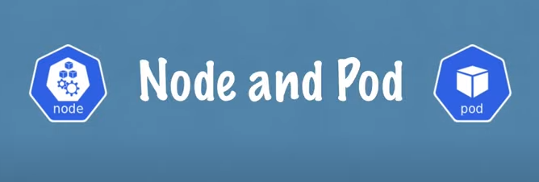

Basic fundamental components of kubernates but just enough to actually get you started using kubernetes 
in paractice either as a DevOps engineer or a software developer 

Now kubernetes has tons of components but most of the time you are going to be working with just a handful.

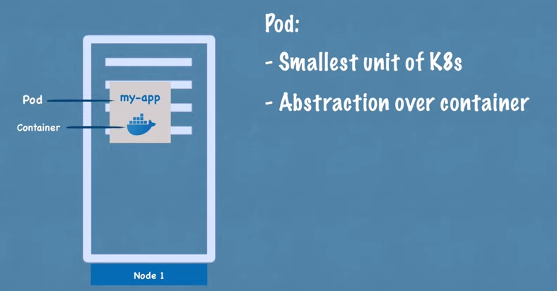 

Basic setup of a worker node or in kubernetes terms a node which is a simple server a physical or virtual machine and the basic componet or the smallest unit of kubernetes is a pod.

So what pod is basically an abstraction over a container so if you are familier with docker containers or container ../kubernetes-components/images so basically what pod does is it creates this running environment or a layer on top of the container and the reason because kubernetes wants to abstract away the container runtime or container technologies so you can replace them.

If you want to and also because you dont have directly work with docker or whatever the container technology you use in kubernates so you only interact with the kubernetes layer so we have an application pod which is our own application and that will may be use a database pod with its own container and this is also an important concept.

Here pod is usually meant to run one application container inside of it you can run multile containers inside one pod but usually its only the case if you have one main application container and helper container or some side service that has  to run inside of that pod and you say this is nothing special just you have one server and two containers running on it with a abstraction layer on top of it. 

So now let's see how they communicate with each other in kubernetes world so kubernetes offers out of the box a virtual network which means that each pod gets its own IP Address no the conatiner the pod gets the IP address and each pod can communicate with each other using that IP address which is an internal IP address obviously its not the public one so my application container can communicate with database using the IP address.

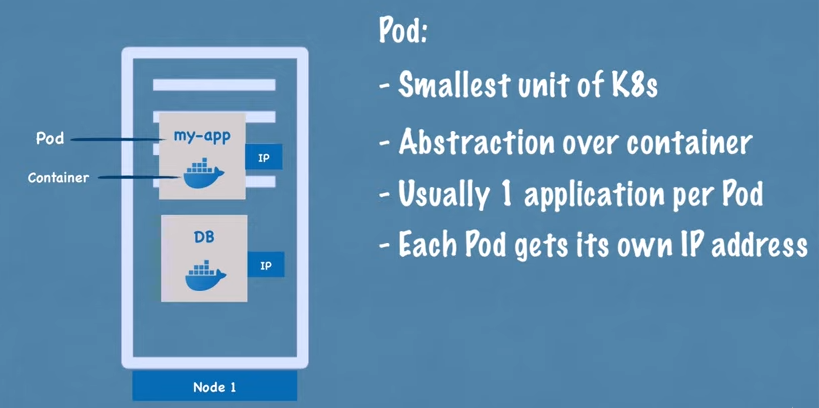 

However pod component kubernetes also an important concept are ephemeral which means that they can die very easily and that happens for example if I lose a day a base container because the container crash because the application crashed

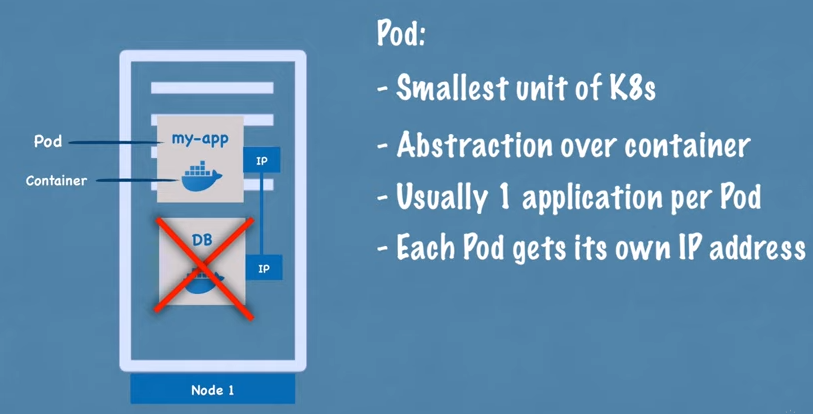

Because the application crashed inside because the nodes the server that I am running them on ran out the resources the pod will die and new one will get created in its place and when that happens it will get assigned a new IP address obviously inconvenient if you are communicating with the database using the IP address.

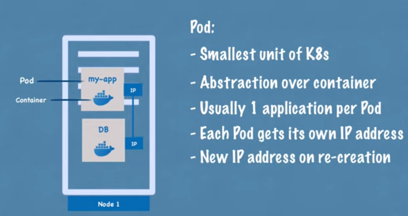

Because now you have to adjust it every time pod restarts and because of that another component of kubernetes called service is used.
 
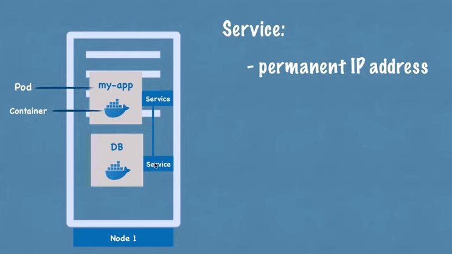

So service is basically a static IP address or permanent IP address that can be attached so to say to each pot so my app will have its own service and database part will have its own service and the good thing here is that the lifecycles of service and pod are not connected so even if the pod dies the services and its IP address will stay.

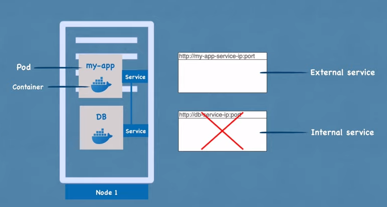

So you dont have to change that end points anymore so now obviously you would want your application to be accessible through a browser right and for this you would have to create an external service so external service is a service that opens the communication from external sources but obviously you wouldn't want your database to be open to the public requests and for that you would create something called an internal service so this is a type of service that you specify when creating one.

However if you notice the URL of the extenal service is not very practical so basically what you have is an HTTP protocol with a node IP Adsress so of the node not the service and the port.

If you want to test something very fast but not for the end product so usually you will want your URL to look to like this if you want to talk to your application with a secure protocol and a domain name and for that another component of kubernetes called Ingress so instead of service request goes first to Ingress and it does the forwarding them to the service.

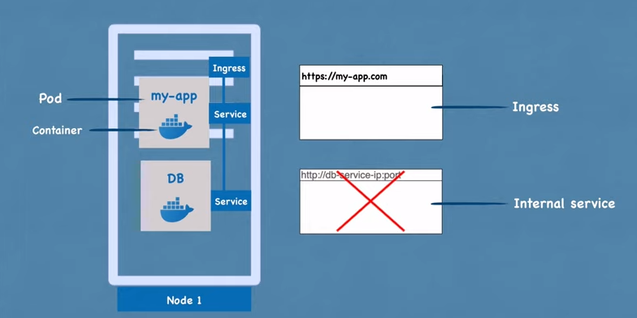

So now we saw the some the very basic components of kubernetes and as you see this is a very simple setup we just have one server and a couple of containers running and some service nothing really speacial when kubenetes advantages or the actual cool features really come forward but we're gonna get there step-by-step.

### Summary:

To summarize, the basic fundamental components of Kubernetes to get started as a DevOps engineer or software developer are:

Worker node: A server, physical or virtual machine in Kubernetes terminology.

Pod: Abstraction layer over a container, creating a running environment for applications.

Container: Basic component inside a pod, containing the application or service.

Virtual network: Provided by Kubernetes, each pod gets its own internal IP address for communication.

Ephemeral nature of pods: Pods can easily die and get replaced, causing IP address changes.

Service: Static or permanent IP address attached to a pod, ensuring consistent communication even if the pod dies.

External service: Opens communication from external sources, allowing access to applications through a browser.

Internal service: Restricts access to internal services, preventing public requests to sensitive components like databases.

URL structure of external services: Typically follows HTTP protocol with the node IP address and port number.

So as we said pods communicate with each other using a service so my appcation will have a database endpoint let's say called MongoDB service that it uses to communicate with the database but where do you configure usually this database URL or endpoints usually you would do it in application properties file or as some kind of external environmental variable but usually its inside of the built image of the application.

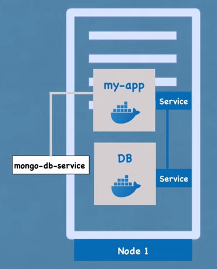

So for example if the endpoint of the service or service name in this case changed to MongoDB you would have to adjust the URL in the application so usually you'd have to rebuild the application with the new version and you have to push it to the repository and now you have to pull that new image in your pod and restart the whole thing so a little bit tedious for a small change like database URL.

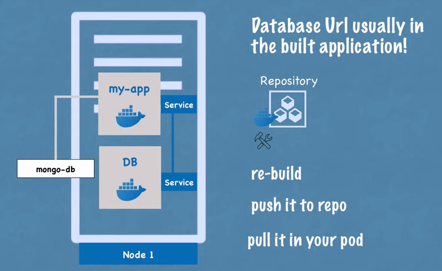

So for that purpose kubernetes has a component called config map.
 
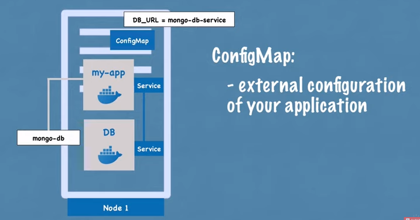

So what it does is its basically your external configuration to your application so config map would usually contain configuration data like URLs of database or some other services that use and in kubernetes you just connect it to the pod so that pod actually gets the data that config map contains and now if you change the name of the service the endpoint of the service you just adjust the config map and that's it you dont have to build a new image and have to go through this whole cycle now part of the external configuration can also be database username and password righ which may also change in gthe application deployment process but putting a password or other credentials in a config map in a plain text format would be insecure even though its external configuration.

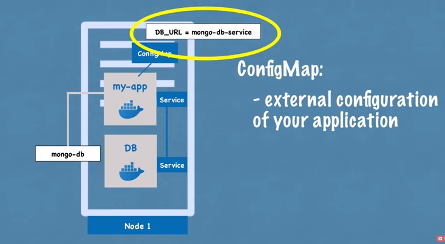
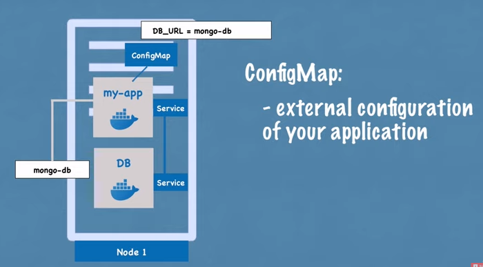
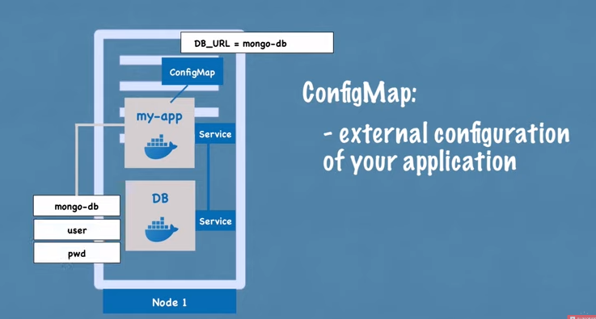

So for this kubernetes has another component called secret so secret is just like config map but the difference is that its used to store secret data creadential.

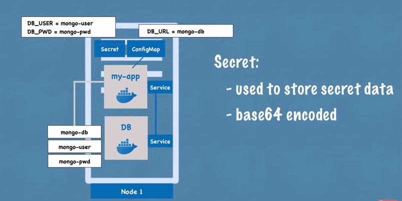

For example and its stored not a plain text format of course but in base64 encoded format so secret would contai things like creadentials and of course I mean database user you also put in the config map but whtas important is the password certificates things that you dont want other people to have access to would go in the secret and just like config map you just connect it to your pod so that pod can actually see those data and read from the secret you can actually use the data from the config map or secret inside of your application pod using for example environmental varibales or even as a properties file.

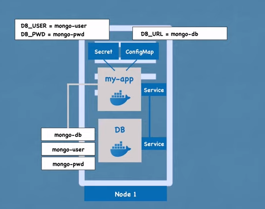

So now to review we've actually looked at all mostly used kubernetes basic components 

We've looked at the pod

We've see how services are used 

What is ingress component useful for 

And, we have also seen external configuration using config map and secrets.

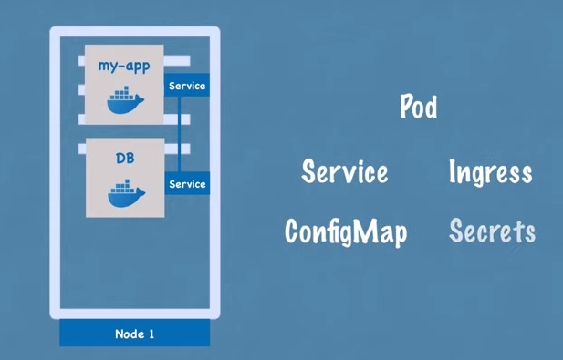

Now we will see the anoter important concept generally which is data storegae and how it works in kubenetes.

So now we have this database pod that our application usesand it has some data or generate some data with this setup you see now if the database container or the pod gets restarted the data would be gone and thats problematics and incovenient obviously because you want your databse data or log data to be persisted reliably long term and the way you can do it in kubernetes is using another componet of kubernetes called volumes and how is that work basically attaches a physical storage on a hard drive to your pod and that storage could be either on a local machine meaning on the same server node where the pod is running or it could be on a remote stoarge meaning outside of the kubernetes cluster it could be a cloud storage or it could be your own premise storage which is not prt of the kubernetes cluster so you just have an external reference on it so now when the database pod or container gets restarted all the data will be there persisted and because data storage and volumes is a very important topic.

The distiction between kubernetes cluster and and all of its components and the storage regardless of whether its a local or remote storage think of a storage as an external hard drive plug in into the kubernetes cluster. 

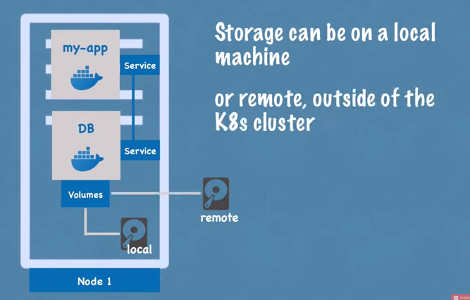

Because the point is Kunitz clustered explicitly doesnt manage any data persistnce which means that you as a community's user or an administrator are responsible for backing up the data replicating and meaning it and making sure that its kept on a proper Hardware etc because its not taking care of kubernetes.

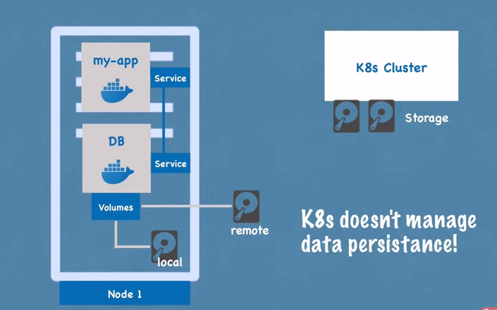

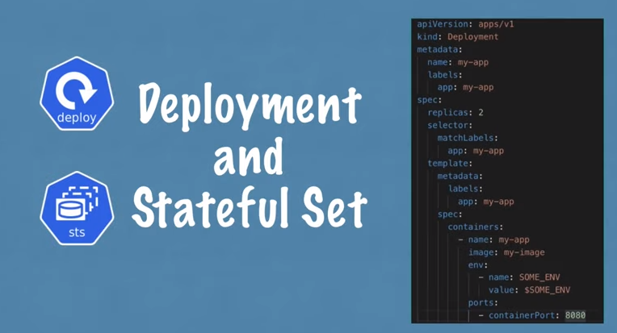

So now lets see everything is running perfectly and a user can access our application through a browser and they set up what happens if my application pod dies right crushes or i have to restart the pod because built a new container image basically I would have a downtime where a use can reach my application which is obviously a very bad thing if it happens in production and this is exactly the advantages of distributed system and containers.

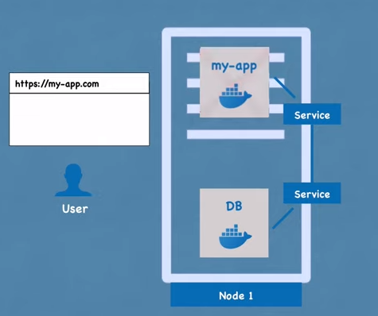

So instead of relying on just one application node and one database pod etc we are replicating everything on multiple servers so we would have another node where a replica or clone of our application would run which will also be connected to the service.
 
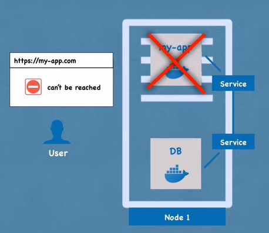

So remember previously we said the service is like an persisted static IP address with a DNS name so that you dont have to constantly adjust the end point when pod dies the service is also a load balancer which means that the service will actually catch the request and forward it so whichever part is least busy.

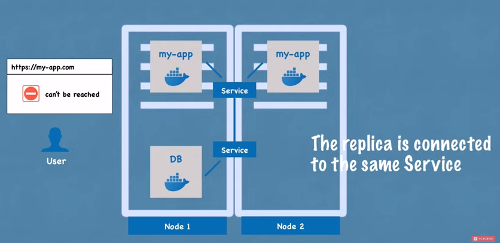

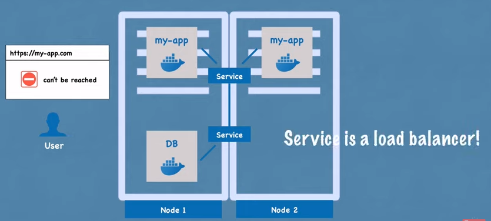

So it has both of these functionalities but in order to create the second replica of the my application pod you wouldn't create a second part but instead would define a blueprint for in my application part and specify how many replicas of that pod you would like to run and that component or that blueprint is called deployment which is another component of kubernetes.

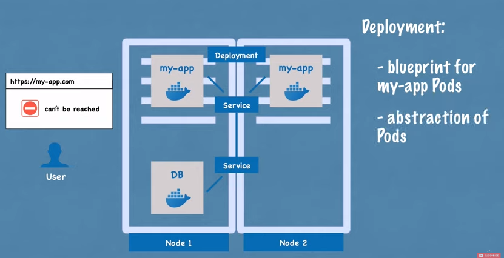
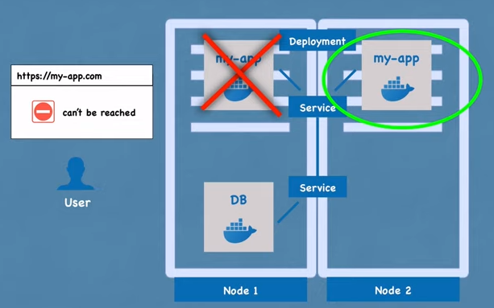

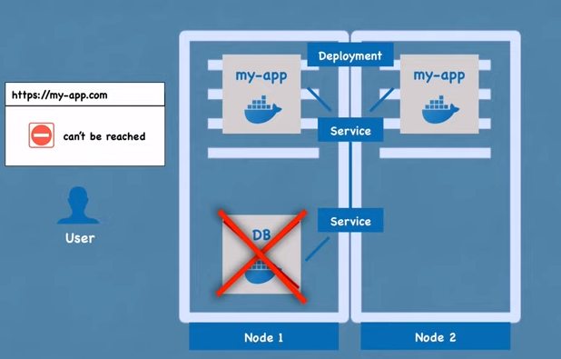

kubernetes and in practice yiu would not working with pause or you will not be creating pods you would be creating deployment because there you can specify how many replicas and you can also scale up or scale down number of replicas of pods that you need so with pod we said that part is layer of abstraction on top of containers and deployment is another abstarction on top of the deployment is another abstraction on top of pods which makes it more convenient to interact with the pods replicate them and do some other configuration so in practice you would mostly work with deployments and not with pods so now if one of the replicas of your application pod would die the service will forward the request to another one so your application would still be access for the user.

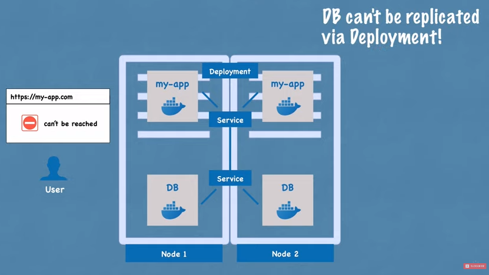

So now you're wondering what about the database pod because if the database pod died your application also wouldnt be accessible so we need database replicas as well however we cant replicate database using a deployment and the reason for that is because database has a state  which is its data meaning if we have closed a replicas of the database they would all need to access the same shared data storage and there you would need some kind of mechanism that manages which parts are currently writing to that storage or which parts are reading from that storage in order to avoid data incosistencies and that mechanism in addition to replicating feature is offered by abother kubernetes component called stateful set.

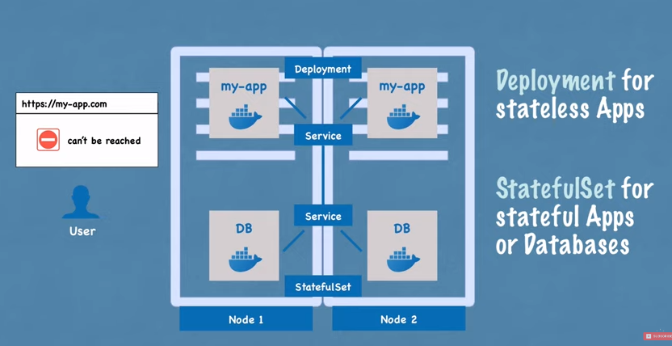

So this component meant specifically for applications like database so MySQL MogoDB elasticsearch or any other statefull apploications or databases should be created using stateful sets and not deployments its very important distinction and statefull said just like deployment would take care of replicating the pods and scaling them up or scaling them down but making sure that database reads and writes are syncronized so that no database inconsistencies are offered however I must mention here that deploying database applications using stateful sets in kubernetes cluster can be somewhat tedious.

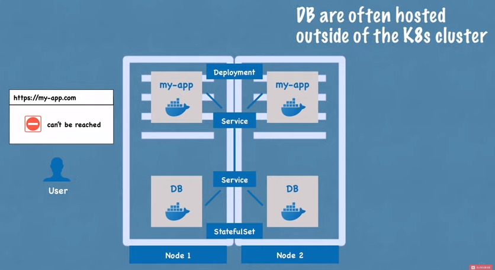

So its definitely more difficult than working with deployments where you dont have all these challenges thats why its also called a common practice to host database application outside of the kubernetes cluster and jut have the deployments or stateless applications that replicate and scale with no problem inside of the kubernetes cluster and communicate with the external database.

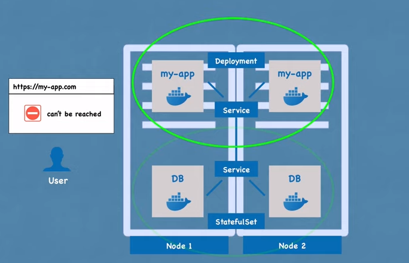

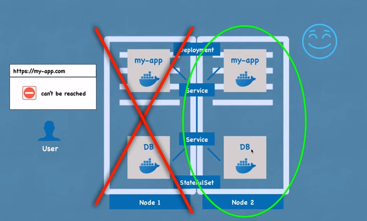

So now that we have two replicas of my application pod and two replicas of the database and they're both load balanced our setup is more robust which means that now even if node one whole node server was actually rebooted or crashed and nothing could run on itwe will have a second node with application and database pods running on it and the application would still be accessible by the user until these two replicas get recreated so you can avoid downtime.

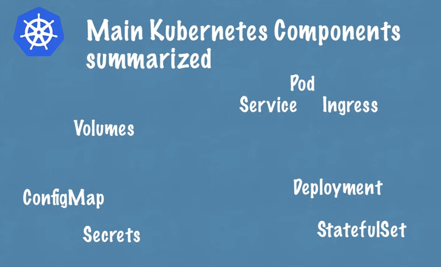

So to summerize we have looked at the most used kubernetes components:-

We start with the pods and the services in order to communicate between the pod and the ingress component which is used to route traffic into the cluster.

We've also looked at exttenal configuration using maps and secrete and data persistence using volumes.

and finally we have looked at pod blueprints with replicating mechanisms like deployments and stateful sets where stateful set is used specifically for stateful applications like databases and yes there are a lot more components that communities offers but these are really the core the basic ones using these core components you actually build pretty powerfull kubernetes clusters.
