https://blog.devops.dev/building-an-end-to-end-ci-cd-pipeline-with-jenkins-7ef2205d7988
# End-to-End CI/CD Pipeline Implementation

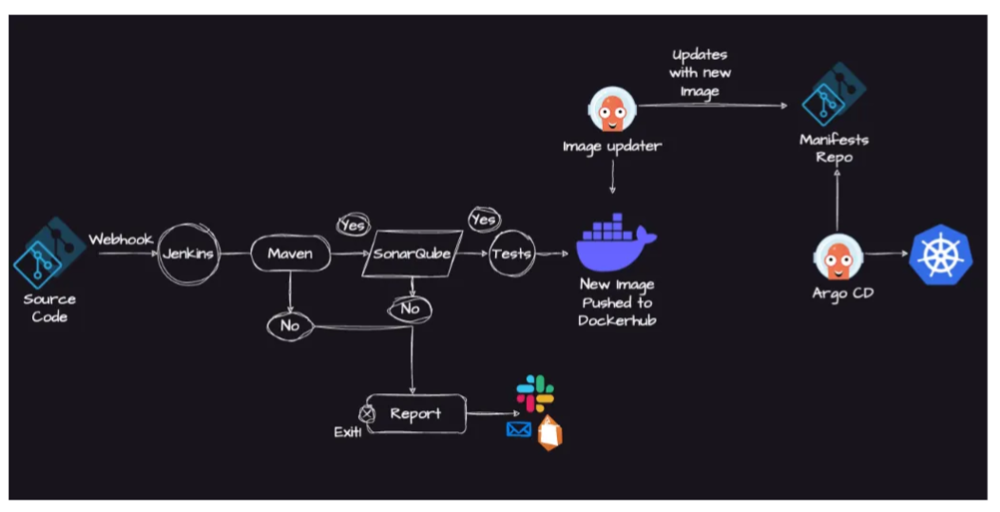

Introduction
Continuous Integration and Continuous Delivery (CI/CD) are crucial in modern software development, facilitating automated code integration and reliable application delivery.

Jenkins, known for its flexibility and extensive plugin options, is a leading tool for creating CI/CD pipelines.

This blog post will guide you through the complete setup of a CI/CD pipeline using Jenkins. We will cover everything from configuring Jenkins and integrating it with version control systems to orchestrating builds, tests, and deployments. We aim to enhance your software delivery process.

Tools and Technologies Used
We will be utilizing a variety of technologies and tools in this guide, including:

GitHub for version control
Maven for project management and builds
SonarQube for code quality analysis
Docker for containerization
Jenkins for Continuous Integration
ArgoCD and Helm for Kubernetes deployment management
Kubernetes for orchestrating containers
Feel free to connect with me on LinkedIn to discuss this post, or ask any questions.

Setting up Git
To establish a foundation for your Jenkins pipeline with a Java application, you’ll start by configuring Git:

Create a Private Git Repository:
Visit your preferred Git hosting platform (e.g., GitHub, GitLab).
Log in to your account or sign up if you do not have one.
Create a new repository. Make sure to set its visibility to private to protect your code.
2. Generate a Personal Access Token:

Navigate to your account settings, often found under your profile or in the dropdown menu.
Look for a section labeled “Developer settings” or “Personal access tokens.”
Generate a new token and assign the necessary permissions, such as ‘repo’ to access repositories.
Copy and save this token securely; you will need it later to configure access within your Jenkins pipeline.
3. Clone the Repository Locally:

Find the Source Code here.
Open Git Bash or your terminal.
Change to the directory where you wish to clone the repository.
Execute the following command, replacing <URL> with your repository's URL:

git clone <URL>

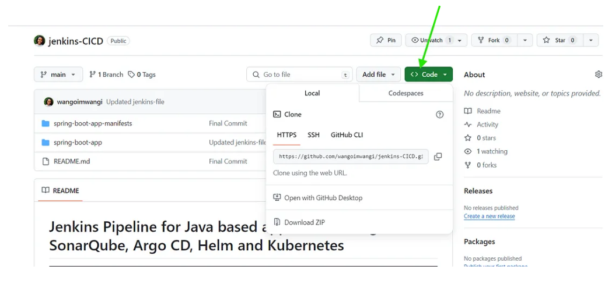

Create an EC2 Instance
Note that this step can also be automated using Terraform, but for the sake of simplicity, we will do it manually here.

Sign in to the AWS Management Console:
Access the AWS Management Console
Log in using your AWS account credentials. If you do not have an account, you will need to create one.
2. Navigate to the EC2 Dashboard:

Once logged in, find the “Services” menu at the top of the console.
Click on “EC2” under the “Compute” section to go to the EC2 Dashboard.
3. Launch Instance:

Click on the “Launch Instances” button. This will start the process of creating a new EC2 instance.
4. Add Tags:

Add tags and names to your instance for better organization and management.
5. Choose an Amazon Machine Image (AMI):

You’ll be presented with a list of AMIs, which are pre-configured server templates. These can include different operating systems and setups.
Choose an AMI that suits your requirements. For beginners, an Amazon Linux AMI or a basic Ubuntu Server might be the easiest option.
6. Choose an Instance Type:

Select the instance type that fits your requirements.
The default option (usually a t2.micro instance) is suitable for testing and small workloads and is eligible for the free tier.
I selected the t2.large instance, which offers 2 vCPUs and 8 GiB of memory, suitable for handling moderate workloads.
Please note that utilizing this instance type will incur charges, so it's important to review the current pricing details on AWS to manage your budget effectively.
7. Create a Key Pair:

Create a key pair or use an existing one. This key pair is crucial for SSH access to your instance.
Download the private key file (.pem file) and keep it secure. You cannot download it again after it is created.
8. Configure Instance Details:

Optionally, configure instance details such as network settings, subnets, IAM role, etc. You can leave these settings as default for now.
9. Configure Security Group:

A security group acts as a virtual firewall that controls the traffic allowed to and from your instance.
You can either create a new security group or select an existing one. Make sure to open inbound ports like SSH (port 22), Custom TCP (8080), and Custom TCP (9000).
10. Add Storage:

Specify the size of the root volume (default is usually fine for testing purposes).
11. Review and Launch:

Review your instance setup. Check the AMI details, instance type, security groups, and key pairs.
Click on “Launch” to proceed.

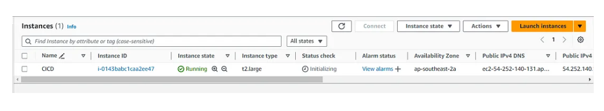

Access Your Instance
Once the instance is launched, it will take a few minutes to initialize.

You can then connect to your instance using SSH with the downloaded .pem file.

We are using Mobaxterm to SSH to the EC2 Instance ( For Windows machines).

Get MobaXterm and install it.
Open MobaXterm from your desktop or the Start menu.
Click the “Session” button, then select “SSH”.
Enter the IP address or hostname of the server and specify username.
Click on “Advanced SSH settings” tick the “Use private key” box and select the private key pair you used in your instance.
Click “OK” to connect.

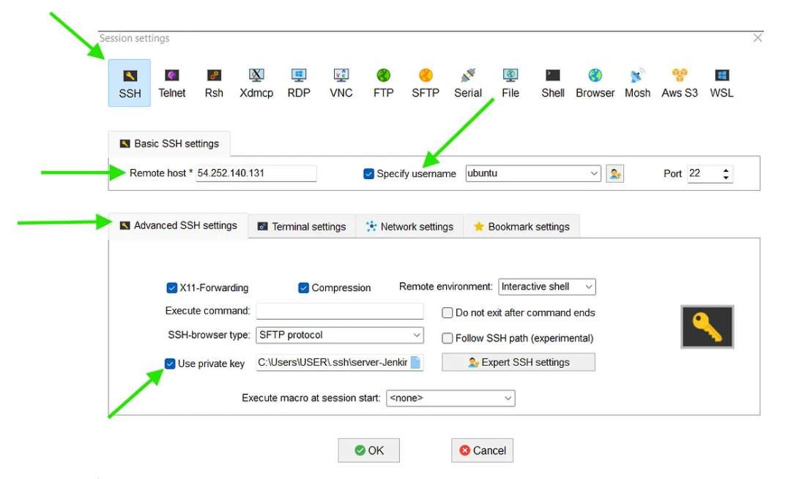

Setting up Jenkins
Install Java:

Before you can run Jenkins, it’s essential to have Java installed on the server. Jenkins is compatible with both OpenJDK and Oracle Java, though it generally performs best with OpenJDK.

Here’s how to install Java on the instance you’ve SSHed into:

sudo apt update
sudo apt install openjdk-11-jdk
java -version
Install Jenkins:

With Java now installed and ready on our server, the next step is to install Jenkins. You have two options for proceeding with the installation: Using a Script or Manual Command Execution.

Using a script is efficient and reproducible, especially if you are planning to deploy Jenkins multiple times or maintain a consistent setup across different environments.

Create a script file using ‘vim’ or any other editor of your choice.
vim install_jenkins.sh
Press i to ensure you are in insert mode and write your script.
#!/bin/bash
# Download Jenkins GPG key
sudo wget -O /usr/share/keyrings/jenkins-keyring.asc \
  https://pkg.jenkins.io/debian-stable/jenkins.io-2023.key

# Add Jenkins repository to package manager sources
echo deb [signed-by=/usr/share/keyrings/jenkins-keyring.asc] \
  https://pkg.jenkins.io/debian-stable binary/ | sudo tee \
  /etc/apt/sources.list.d/jenkins.list > /dev/null

# Update package manager repositories
sudo apt-get update

# Install Jenkins
sudo apt-get install jenkins -y
Type:wq and then press Enter. This command writes the changes to the file (w) and quits the editor (q).
Make the file executable using the following command:
chmod +x install_jenkins.sh 
Now that your script is executable, you can run it to install Jenkins:
./install_jenkins.sh
Adjust Firewall Settings:

To ensure that you can access Jenkins via a web browser, it’s crucial to configure your firewall settings properly.

Jenkins runs on port 8080 by default. Hence, ensure your security group settings allow inbound traffic on this port.

Accessing Jenkins UI:

To access the Jenkins UI, open a web browser and type in the IP address of your instance followed by:8080 (e.g., http://192.168.1.2:8080). Replace 192.168.1.2 with the actual IP address of your server.

Unlock Jenkins by using the initial admin password found at:

sudo cat /var/lib/jenkins/secrets/initialAdminPassword

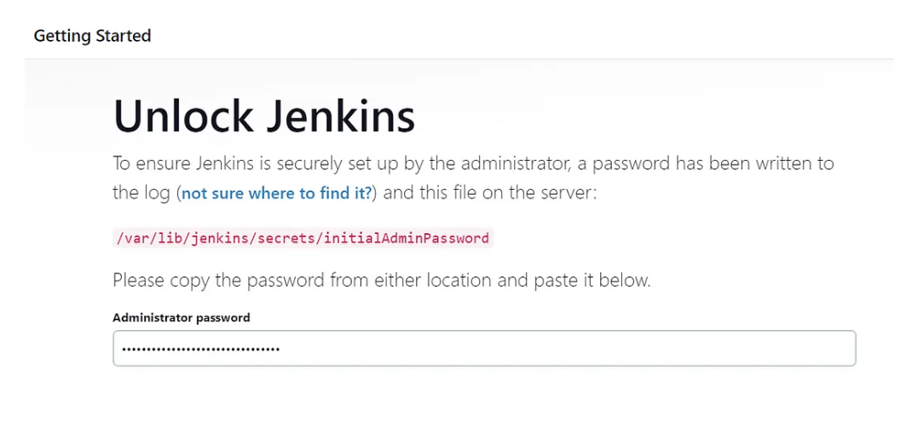

Install Suggested Plugins:

Once Jenkins is unlocked, you will be presented with the option to install suggested plugins or to select specific plugins manually.
Click Install suggested plugins to automatically install a standard set of plugins, which is recommended for most users.

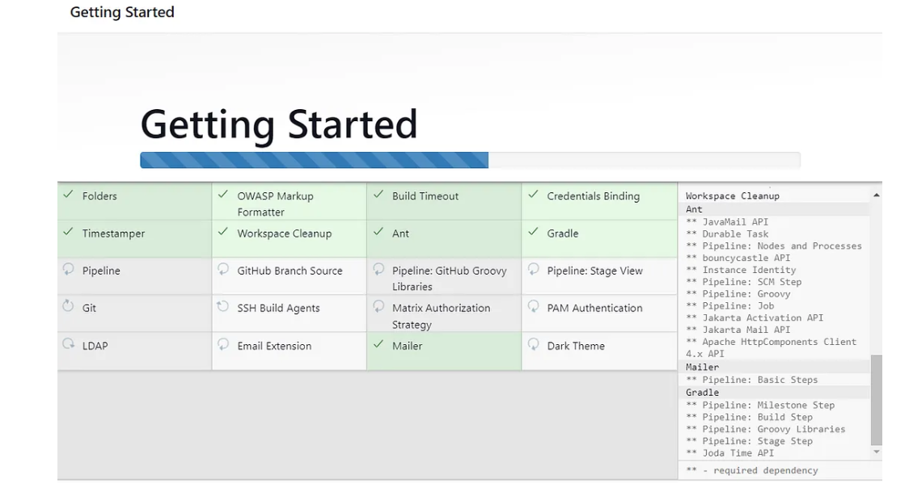

Create Your Admin User:

After plugin installation, you will be prompted to create an admin user for Jenkins.
Fill out the form with the username, password, full name, and email address. Click “Save and Continue”.

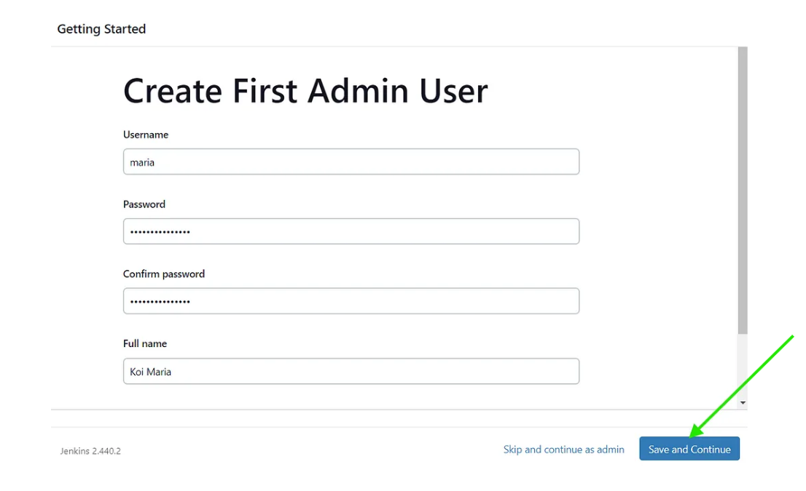

Jenkins Ready:

Jenkins will ask you to configure the URL for your Jenkins instance.
The default URL (based on your server’s IP and port) will be filled in.
Click “Start using Jenkins” to complete the setup and be taken to the Jenkins dashboard.

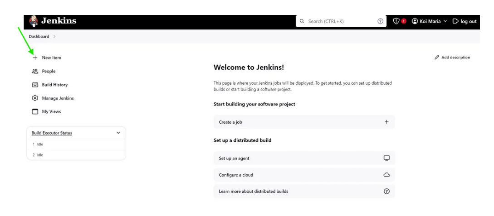

Install Necessary Plugins:

Open Jenkins Dashboard: Log in to your Jenkins interface.
Navigate to “Manage Jenkins > Plugins”.
Install Plugins: Look for the “docker pipeline” and “sonarqube scanner” plugins install them and restart Jenkins if required.

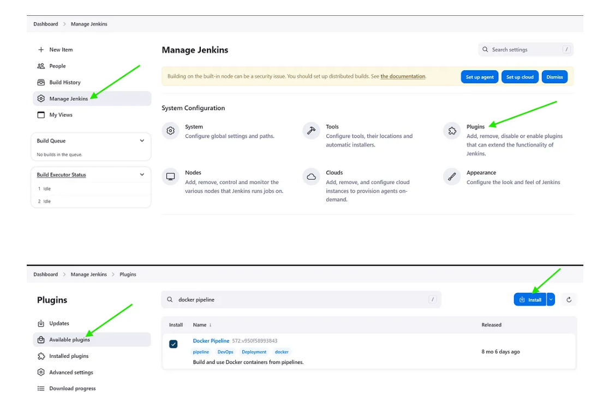

Compile Job
From the Jenkins main dashboard, click on “New Item”.
Name your pipeline and select ‘Pipeline’ as the type of project, then click ‘OK’.

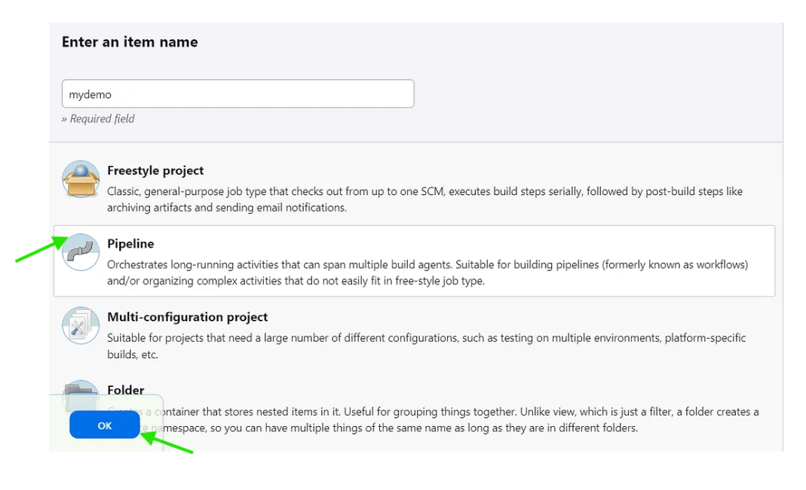

Configure Your Pipeline:

Click on the created job and scroll down to the “Pipeline” section in the configuration screen.
Choose “Pipeline script” or “Pipeline script from SCM”.
The first option allows you to write the Groovy script directly in the Jenkins interface, while the second option pulls the script from a Source Code Management system like Git.

If you chose “Pipeline script from SCM”: Select the type of SCM (e.g., Git).
Enter the URL of the repository containing your Jenkinsfile.
Add credentials if your repository is private.
Specify the branch to build from, typically */main or */master.
If your Jenkinsfile is located in a subdirectory or named differently, specify the path (default is Jenkinsfile).

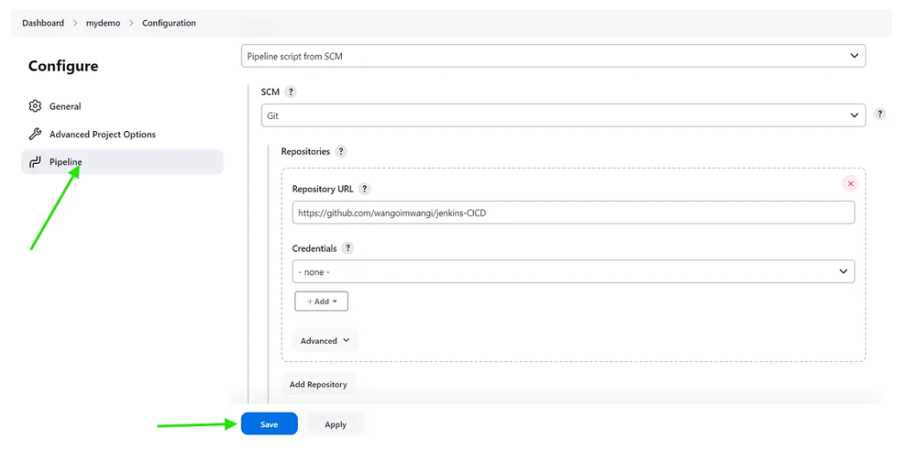

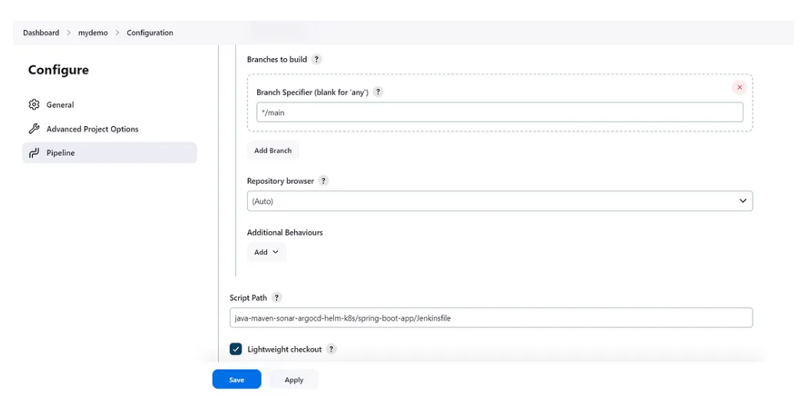

Restart Jenkins:

Restart Jenkins to apply configuration changes or updates effectively.
To do so, navigate to the Jenkins “dashboard” and click on ‘Manage Jenkins’ in the sidebar.
From there, select “Reload Configuration from Disk’” or “Restart Safely”.

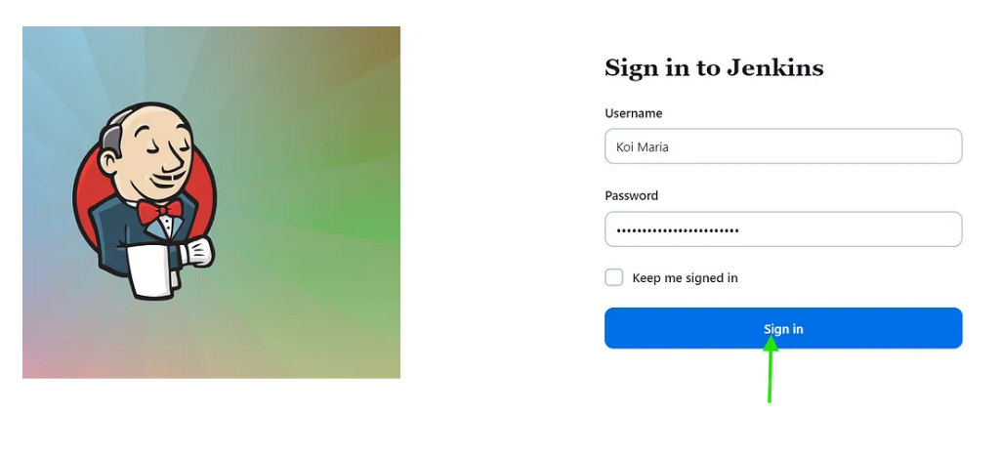

Set up Sonarqube Server
Installing SonarQube as a Docker container is a popular option that simplifies the setup process and makes it easier to manage and scale.

Prerequisites: Ensure Docker is installed on your server. If not, you can download and install Docker from the official Docker website.

Docker Installation:

Create a script file using ‘vim’ or any other editor of your choice.
vim install_docker.sh
Press i to ensure you are in insert mode and write your script.
#!/bin/bash

# Update package manager repositories
sudo apt-get update

# Install necessary dependencies
sudo apt-get install -y ca-certificates curl

# Create directory for Docker GPG key
sudo install -m 0755 -d /etc/apt/keyrings

# Download Docker's GPG key
sudo curl -fsSL https://download.docker.com/linux/ubuntu/gpg -o /etc/apt/keyrings/docker.asc

# Ensure proper permissions for the key
sudo chmod a+r /etc/apt/keyrings/docker.asc

# Add Docker repository to Apt sources
echo "deb [arch=$(dpkg --print-architecture) signed-by=/etc/apt/keyrings/docker.asc] https://download.docker.com/linux/ubuntu \
$(. /etc/os-release && echo "$VERSION_CODENAME") stable" | \
sudo tee /etc/apt/sources.list.d/docker.list > /dev/null

# Update package manager repositories
sudo apt-get update

sudo apt-get install -y docker-ce docker-ce-cli containerd.io docker-buildx-plugin docker-compose-plugin 
Press Esc to ensure you are in normal mode then type:wq and then press Enter.
Make the file executable using the following command:
chmod +x install_docker.sh
Now that your script is executable, you can run it to install Docker:
./install_docker.sh
Install Sonarqube:

Pull the official SonarQube Docker image from Docker Hub:
docker pull sonarqube
Run SonarQube in a Docker container, using the following command.
docker run -d --name sonarqube -p 9000:9000 sonarqube
SonarQube operates on port 9000 by default. Therefore, to ensure seamless access to the SonarQube dashboard, it’s essential to configure your firewall to allow inbound traffic on this port.

Access SonarQube by entering http://<your_instance_ip>:9000 in your browser, replacing <your_instance_ip> with your server's IP address.

The default login credentials for SonarQube are:

Username: admin
Password: admin
However, it’s recommended to change these default credentials after the initial setup for security reasons.

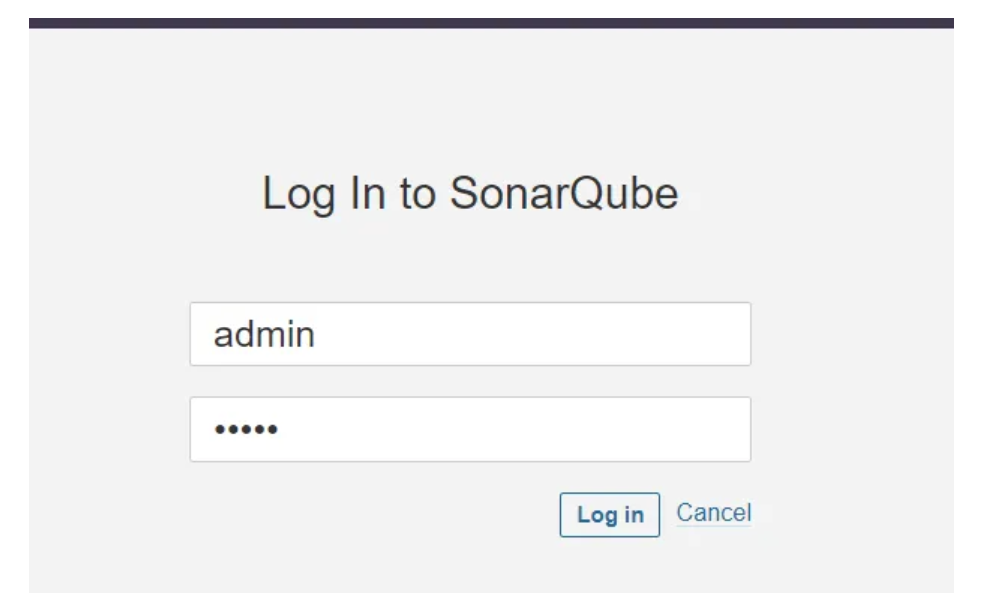

Integrate with Jenkins:

Install the SonarQube Scanner for the Jenkins plugin.
Log in to your SonarQube dashboard.
Go to “My Account” > “Security” Click on “Generate Token”
Provide a name for the token and click “Generate”.
Copy the generated token.

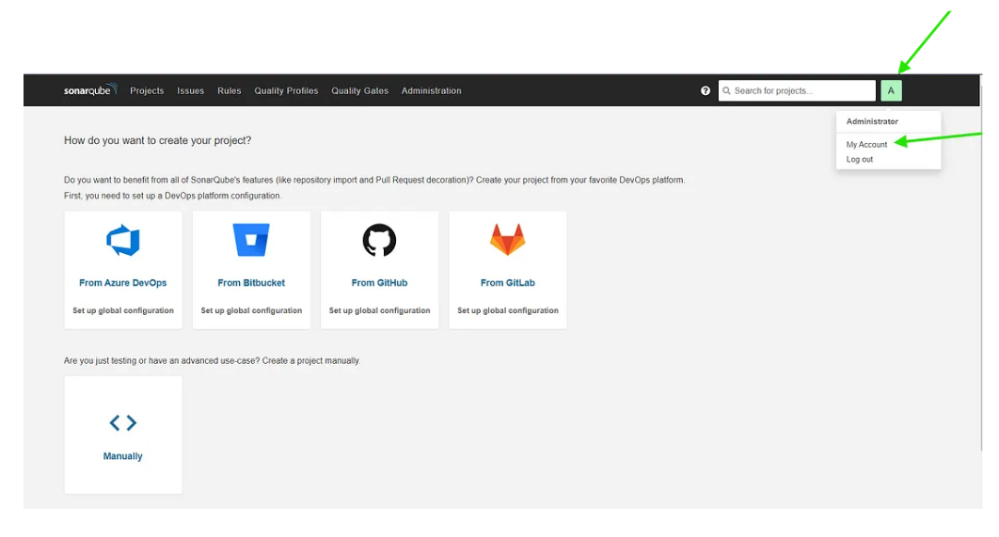

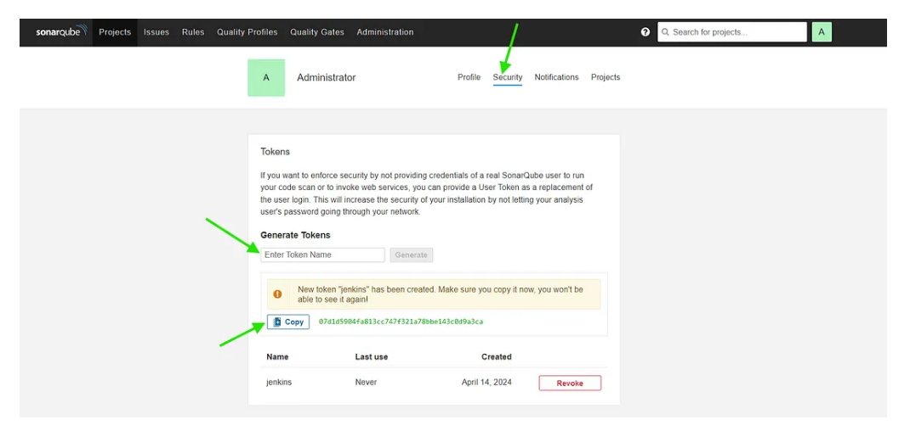

Add SonarQube Token as Credential in Jenkins:

In Jenkins, go to “Manage Jenkins” >“Credentials” > “System” > “Global credentials” (or navigate to your project’s credentials).
Click “Add Credentials”.
Choose “Secret text” as the kind of credential.
Paste the SonarQube authentication token into the “Secret” field.
Optionally, provide an ID and a description of the credential.
Click “Create” to save the credential.

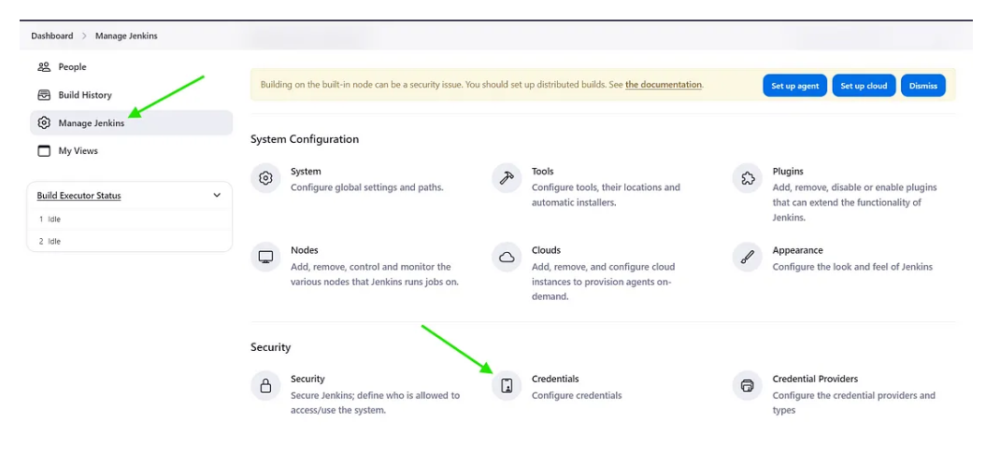

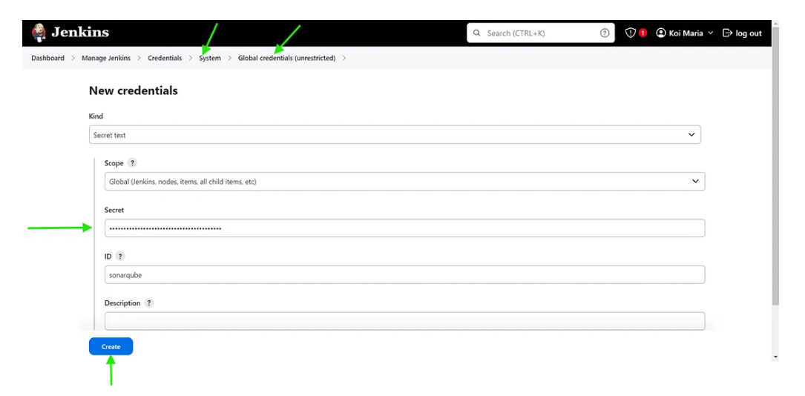

Configure Jenkins SonarQube Scanner:

In your Jenkins job configuration, find the section for SonarQube analysis or whatever you have named it.
Provide the SonarQube server URL (e.g.,http://<your_instance_ip>:9000, replacing <your_instance_ip> with your server's IP address).
Use the previously added SonarQube token as the authentication token.
Credentials
Ensure that all required credentials are properly configured for your CI/CD pipeline.

This includes credentials for SonarQube authentication, Docker Hub access, and Git repository authentication.

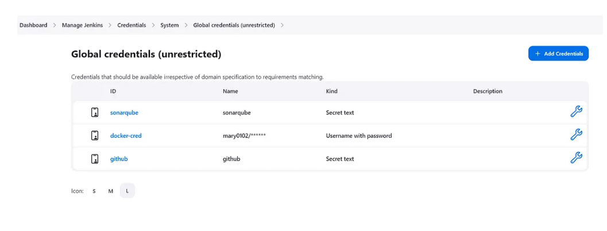

Jenkinsfile
A Jenkinsfile is a text file that defines the configuration of a Jenkins pipeline. It is written in Groovy, a scripting language for the Java platform.

The Jenkinsfile specifies the steps, stages, and actions that Jenkins should execute when running a pipeline job.

Some parts of the Jenkins file will require you to replace them with your credentials and details so be on the look out for this.

Pipeline Stages:

Stage1: Checkout the source code from Git.

Stage 2: Build the Java Application using Maven.

Stage 3: Run unit tests using JUnit and Mockito.

Stage 4: Run SonarQube analysis to check the code quality.

Stage 5: Package the application into a JAR file.

Stage 6: Deploy the application to a test environment using Helm.

Stage 7: Run User acceptance tests on the deployed application.

Stage 8: Promote the application to a production environment using Helm.

pipeline {
  agent {
    docker {
      image 'abhishekf5/maven-abhishek-docker-agent:v1'
      args '--user root -v /var/run/docker.sock:/var/run/docker.sock' // mount Docker socket to access the host's Docker daemon
    }
  }
  stages {
    stage('Checkout') {
      steps {
        sh 'echo passed'
        //git branch: 'main', url: 'https://github.com/wangoimwangi/jenkins-CICD.git'
      }
    }
    stage('Build and Test') {
      steps {
        sh 'ls -ltr'
        // build the project and create a JAR file
        sh 'cd spring-boot-app && mvn clean package'
      }
    }
    stage('Static Code Analysis') {
      environment {
        SONAR_URL = "http://54.252.140.131:9000"
      }
      steps {
        withCredentials([string(credentialsId: 'sonarqube', variable: 'SONAR_AUTH_TOKEN')]) {
          sh 'cd spring-boot-app && mvn sonar:sonar -Dsonar.login=$SONAR_AUTH_TOKEN -Dsonar.host.url=${SONAR_URL}'
        }
      }
    }
    stage('Build and Push Docker Image') {
      environment {
        DOCKER_IMAGE = "ultimate-cicd:${BUILD_NUMBER}"
        // DOCKERFILE_LOCATION = "spring-boot-app/Dockerfile"
        REGISTRY_CREDENTIALS = credentials('docker-cred')
      }
      steps {
        script {
            sh 'cd spring-boot-app && docker build -t ${DOCKER_IMAGE} .'
            def dockerImage = docker.image("${DOCKER_IMAGE}")
            docker.withRegistry('https://index.docker.io/v1/', "docker-cred") {
                dockerImage.push()
            }
        }
      }
    }
    stage('Update Deployment File') {
        environment {
            GIT_REPO_NAME = "jenkins-CICD"
            GIT_USER_NAME = "wangoimwangi"
        }
        steps {
            withCredentials([string(credentialsId: 'github', variable: 'GITHUB_TOKEN')]) {
                sh '''
                    git config user.email "mariakoi800@gmail.com"
                    git config user.name "Maria"
                    BUILD_NUMBER=${BUILD_NUMBER}
                    sed -i "s/replaceImageTag/${BUILD_NUMBER}/g" spring-boot-app-manifests/deployment.yml
                    git add spring-boot-app-manifests/deployment.yml
                    git commit -m "Update deployment image to version ${BUILD_NUMBER}"
                    git push @github.com/${GIT_USER_NAME}/${GIT_REPO_NAME">https://${GITHUB_TOKEN}@github.com/${GIT_USER_NAME}/${GIT_REPO_NAME} HEAD:main
                '''
            }
        }
    }
  }
}
Click on “Build Now” to trigger a build of your pipeline job.
Jenkins will fetch the Jenkinsfile from your repository and execute it as defined.
View the progress of your pipeline job on the Jenkins dashboard.
Click on the job to view detailed logs and status updates as each stage of the pipeline is executed.
If there are any issues during pipeline execution, review the Jenkinsfile and job configuration for errors.
Check the console output and logs for more information on any failures.

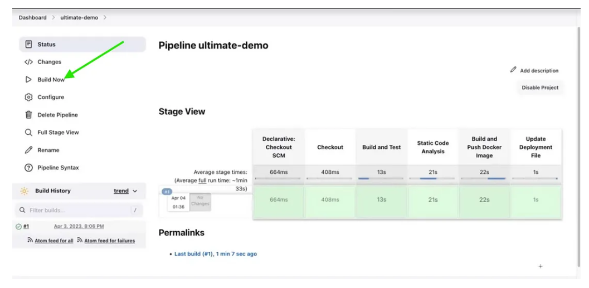

SonarQube will contain the report of the pipeline execution.

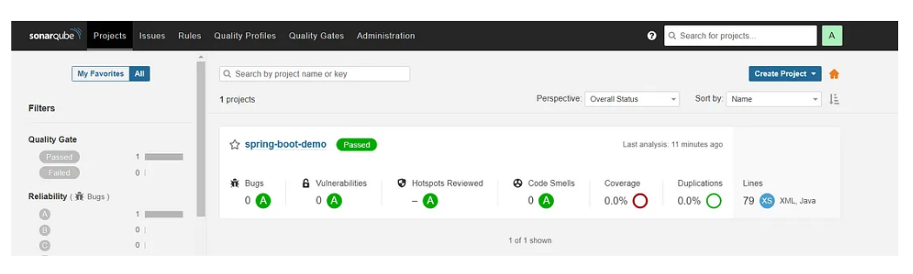

Set Up ArgoCD
ArgoCD manages the continuous deployment segment of CI/CD pipelines, automating deployments to Kubernetes.

You can either have local deployment using Minikube or Cloud Deployment using Amazon EKS.

Prerequisites:

Ensure VirtualBox or Hyper-V is installed on your Windows machine for virtualization, as required by Minikube.
Install Minikube:

Download and install Minikube following the instructions specific to your OS from the Minikube official documentation.
Start your local Kubernetes cluster.
minikube start
Install Kubectl:

Download the latest version of kubectl from the official Kubernetes release page.
Add kubectl to your PATH to run it from anywhere in your command prompt.
Install ArgoCD Operator
You can install Argo CD on Kubernetes using the Argo CD Operator which automates the deployment and management of Argo CD instances.

Go to the official Operator Hub page at OperatorHub.io.
Use the search bar on the Operator Hub website to search for “Argo CD” and click “Install”.
Run the Commands the following commands:
#Install Operator Lifecycle Manager (OLM), a tool to help manage the Operators running on your cluster.

$ curl -sL https://github.com/operator-framework/operator-lifecycle-manager/releases/download/v0.27.0/install.sh | bash -s v0.27.0
#Install the AgroCD Operator
kubectl create -f https://operatorhub.io/install/argocd-operator.yaml
This Operator will be installed in the “operators” namespace and will be usable from all namespaces in the cluster.
# watch your operator come up 
$ kubectl get csv -n operators

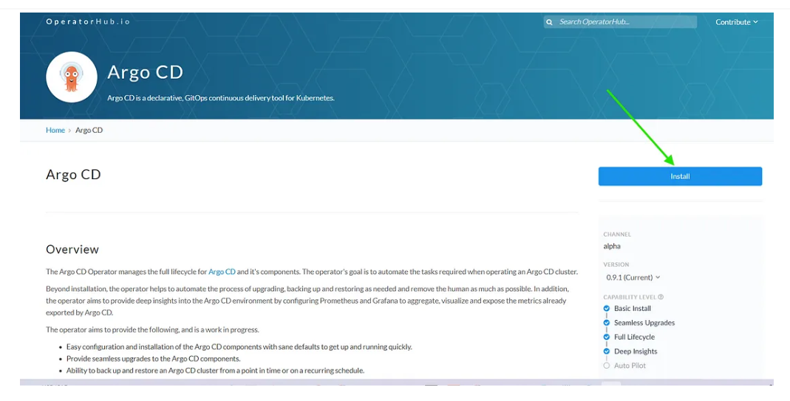

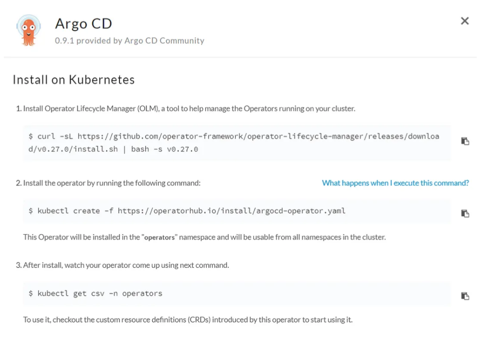

Set Up ArgoCD Controller
Navigate to OperatorHub.io.
In the “Argo CD” Operator scroll down to “Operator Documentation”.
Click on “Usage” and then “Basics”.
Copy the YAML configuration provided. This YAML is used to deploy Argo CD in your Kubernetes cluster.

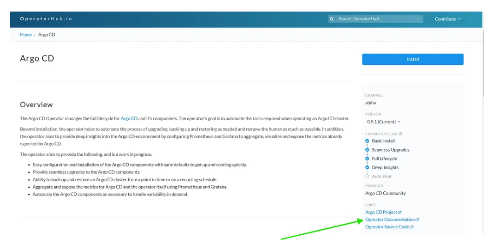

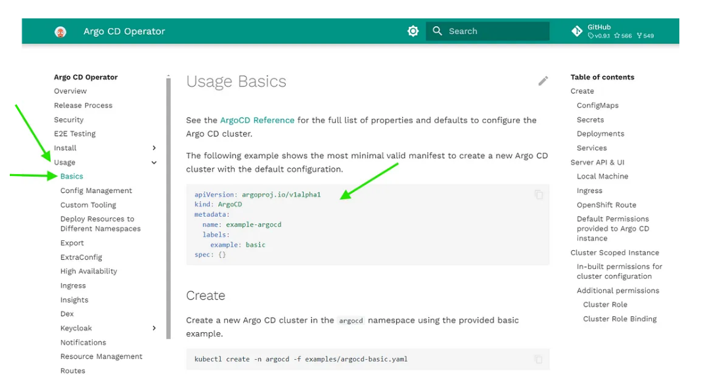

Create a new file named vim argocd-basic.yml with the following content to define your Argo CD instance:
apiVersion: argoproj.io/v1alpha1
kind: ArgoCD
metadata:
  name: example-argocd
  labels:
    example: basic
spec: {}
Apply the Configuration.
kubectl apply -f argocd-basic.yml

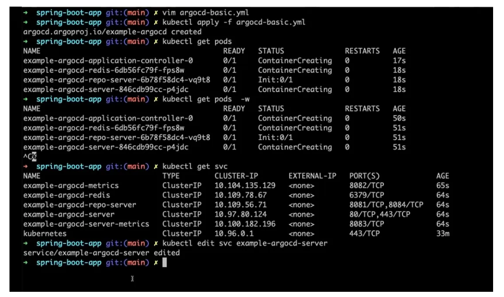

Set Up ArgoCD UI
To access the Argo CD server UI via the browser, you need to change the service type from ‘ClusterIP’ to ‘NodePort’.
kubectl get svc
Minikube can generate a URL that provides direct access to the Argo CD server through a browser.
minikube service argocd-server --url

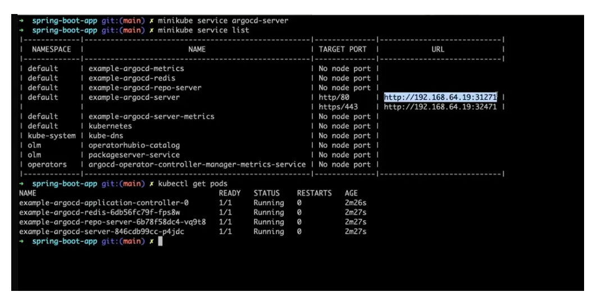

Copy the URL displayed from the previous command into your browser to access the Argo CD UI.

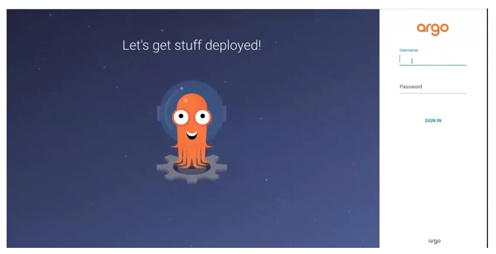

The default username is ‘admin’. To get the admin password, you need to extract it from Kubernetes secrets:
kubectl get secret
Edit the “example-argocd-cluster” secret and copy the admin password.
kubectl edit secret example-argocd-cluster
K8s secrets are base 64 encrypted so to decode it use this command.
echo <encoded password here>= | base64 -d
Use the username ‘admin’ and the password retrieved in the previous step to log into the Argo CD UI.

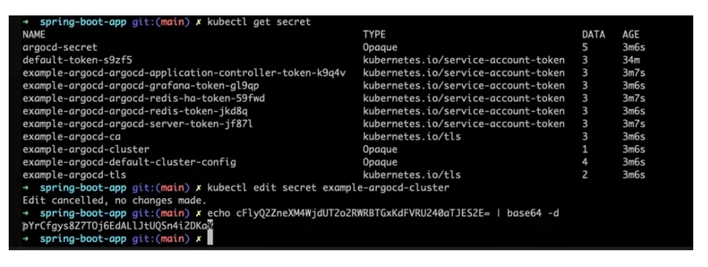

Deployment with Argo CD
In the Argo CD UI, click on “Create Application”.
Fill in the required information for the application:
Application Name: Enter a descriptive name for your application.

Project Name: Specify the project to which the application belongs.

Sync: Choose “Automatic” for automatic synchronization.

Repository URL: Enter the URL of your Git repository containing the application code.

Path: Specify the path to the deployment files within the repository.

Destination: Enter the URL of your Kubernetes cluster (e.g., https://kubernetes.default.svc).

Namespace: Specify the Kubernetes namespace where the application will be deployed.

After providing all the necessary information, click on “Create”.
Argo CD will automatically create the application on your Kubernetes cluster based on the provided configuration.

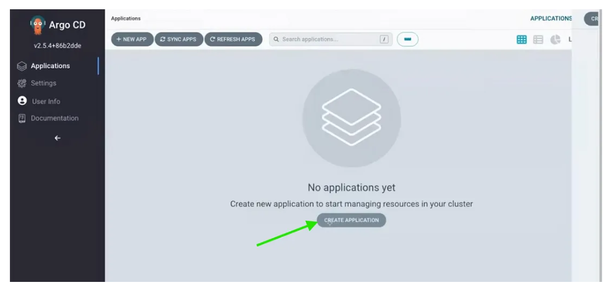

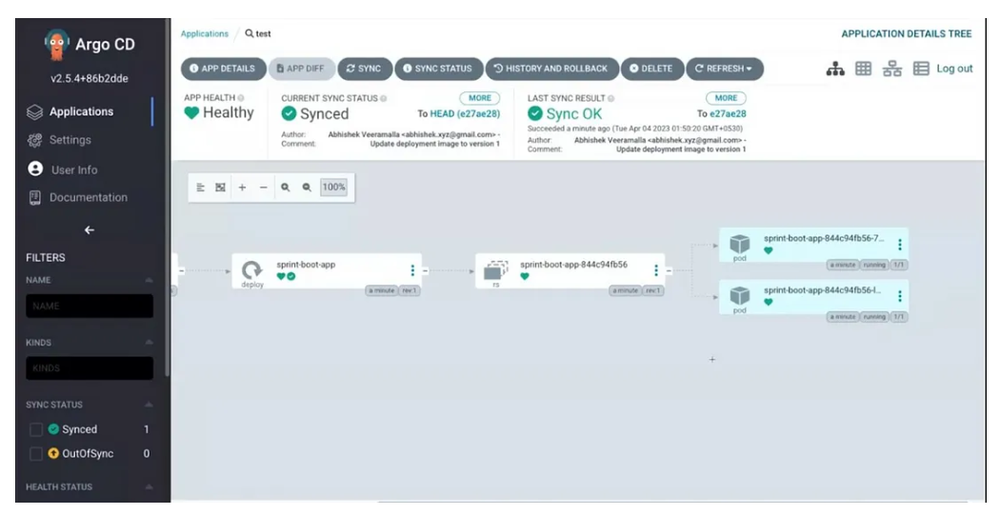

Conclusion
This project has effectively demonstrated how integrating GitHub, Maven, SonarQube, Docker, Jenkins, Argo CD, Helm, and Kubernetes into a CI/CD pipeline can enhance software development efficiency and reliability.

We’ve streamlined our processes, enabling faster delivery and improved software quality.

Moving forward, we will continue refining our pipeline and exploring new tools to enhance automation.

Acknowledgment

This project was significantly inspired by Abhishek Veeramalla, known for his excellent DevOps content. His content provided a solid foundation for my enhancement. Check out his content here.
