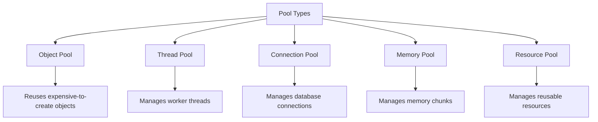
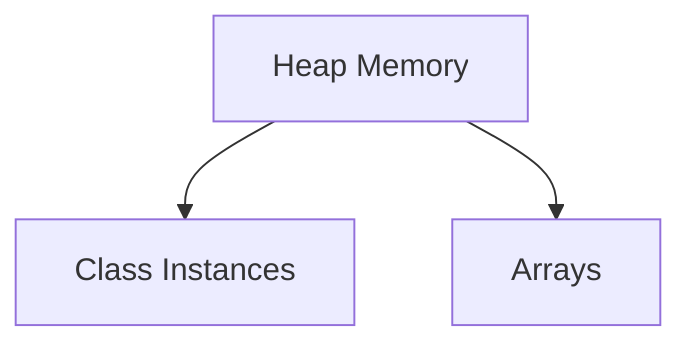
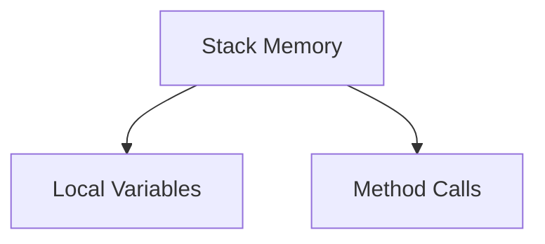
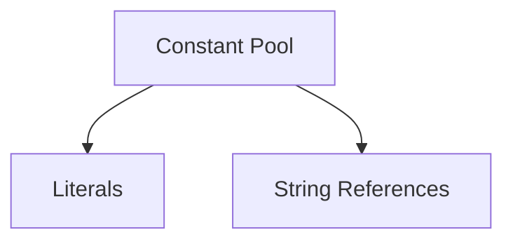
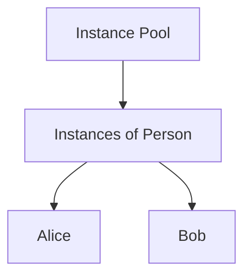
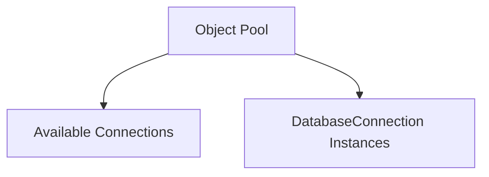
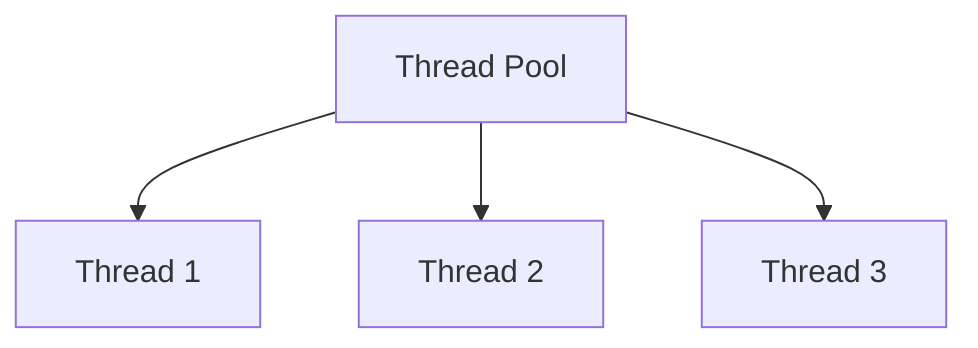
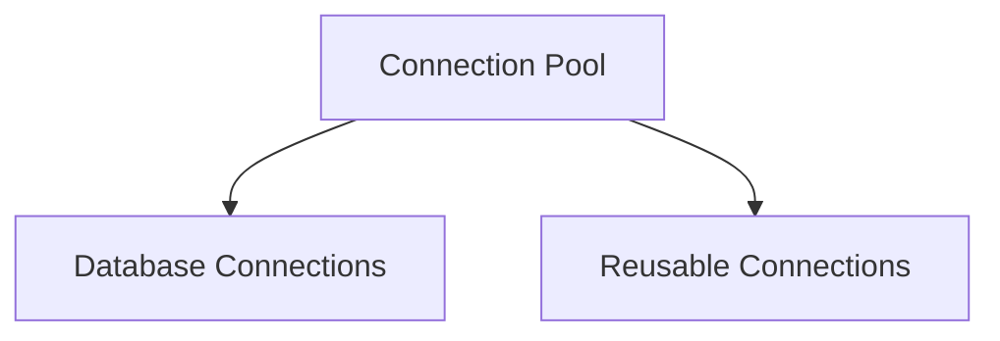
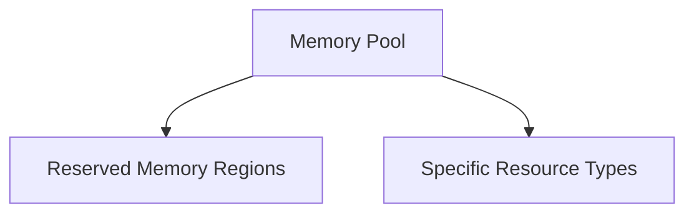
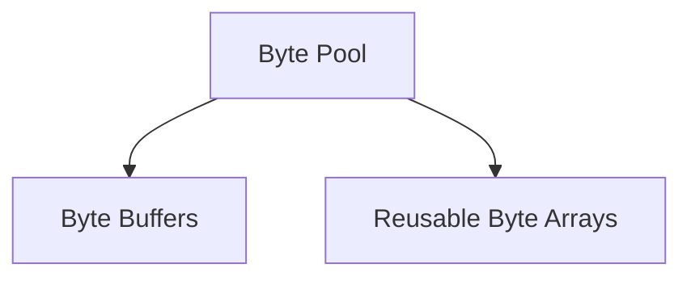

<details><summary><b>Java Exception Handling</b></summary>
</details>
<details><summary><b>Java Garbage Collection & Memory Management</b></summary>

 ### Memory Management in Java

Memory management in Java is a process of allocating and deallocating memory for Java objects. Java uses a combination of manual and automatic memory management techniques to ensure efficient usage of memory.

#### Key Concepts

1. **Heap and Stack Memory**:
   - **Heap Memory**: Used for dynamic memory allocation where all class instances and arrays are allocated.
   - **Stack Memory**: Used for method calls and local variables. Each thread has its own stack.

2. **Garbage Collection**:
   - Java has an automatic garbage collection mechanism that helps in reclaiming memory occupied by objects that are no longer in use. The Java Virtual Machine (JVM) runs the garbage collector, which identifies and removes unreachable objects.

3. **Generational Garbage Collection**:
   - The heap is divided into generations:
     - **Young Generation**: Where all new objects are allocated. It includes Eden Space and Survivor Spaces.
     - **Old Generation (Tenured Generation)**: Where long-lived objects are eventually moved after surviving multiple garbage collection cycles.
   - This approach optimizes the collection process, as most objects are short-lived.

4. **Garbage Collector Algorithms**:
   - Different algorithms are used for garbage collection, including:
     - **Mark-and-Sweep**: Marks live objects and sweeps away unmarked objects.
     - **Copying**: Divides memory into two halves, copying live objects from one half to the other.
     - **Generational Collection**: Optimizes garbage collection by focusing on young objects that have a higher rate of disposal.

### Memory Leak in Java

A memory leak occurs when an application inadvertently retains references to objects that are no longer needed, preventing the garbage collector from reclaiming that memory. This can lead to increased memory usage and eventually cause `OutOfMemoryError`.

#### Common Causes of Memory Leaks

1. **Static Collections**: Holding references to objects in static fields or collections that grow indefinitely.
2. **Long-lived Object References**: Keeping references to objects that are no longer needed, especially in event listeners, callbacks, or singletons.
3. **Thread Local Variables**: Not clearing thread-local variables, leading to memory retention beyond the thread's lifecycle.
4. **Inner Classes**: Non-static inner classes hold a reference to the enclosing class, which can lead to leaks if they outlive the enclosing instance.

### Solutions to Prevent Memory Leaks

1. **Weak References**:
   - Use `WeakReference` or `SoftReference` for objects that should be collected by the garbage collector when memory is needed.

   ```java
   WeakReference<MyObject> weakRef = new WeakReference<>(new MyObject());
   ```

2. **Proper Cleanup**:
   - Explicitly nullify references to objects when they are no longer needed, especially in collections.

   ```java
   myList.clear(); // Clear list when done
   ```

3. **Use of `finalize()`**:
   - Although not recommended for memory management, overriding the `finalize()` method can help clean up resources. However, its use is discouraged due to unpredictability.

4. **Avoid Static Fields**:
   - Limit the use of static collections or fields that hold large objects or data, as they persist for the application's lifecycle.

5. **Remove Listeners**:
   - Always unregister listeners and callbacks when they are no longer needed, particularly in GUI applications or event-driven architectures.

   ```java
   myObject.removeListener(this);
   ```

6. **Use Profiling Tools**:
   - Use tools like VisualVM, YourKit, or Eclipse Memory Analyzer to monitor memory usage and detect leaks. These tools help identify objects that are not being collected and trace memory retention paths.

7. **Static Analysis Tools**:
   - Employ static code analysis tools like SonarQube to catch potential memory leaks in code before runtime.

### Example of a Memory Leak

Here’s a simple example demonstrating a memory leak using a static collection:

```java
import java.util.ArrayList;
import java.util.List;

public class MemoryLeakExample {
    private static List<Object> leakList = new ArrayList<>();

    public static void addObject() {
        Object obj = new Object();
        leakList.add(obj); // Retaining references
    }

    public static void main(String[] args) {
        for (int i = 0; i < 100000; i++) {
            addObject();
        }
    }
}
```

In this example, the `leakList` grows indefinitely, retaining references to `Object` instances, leading to a memory leak.

### Conclusion

Memory management in Java, primarily handled through garbage collection, is generally effective, but developers must be cautious about object references to avoid memory leaks. By following best practices, using the right tools, and understanding the lifecycle of objects, you can minimize the risks of memory leaks and ensure efficient memory usage in your Java applications. If you have any more specific questions or scenarios, feel free to ask!

Certainly! Let's delve into the various memory areas in Java, including heap memory, stack memory, constant pool, instance pool, and object pool.

### 1. Heap Memory

**Definition**: Heap memory is used for dynamic memory allocation in Java. It is where all class instances (objects) and arrays are allocated. 

**Characteristics**:
- **Shared among all threads**: All threads in a Java application share the same heap memory.
- **Garbage Collection**: Objects in the heap are managed by the garbage collector, which automatically frees up memory when objects are no longer referenced.
- **Flexible Size**: The size of the heap can be adjusted by JVM options (e.g., `-Xms` and `-Xmx` to set the initial and maximum heap size).

**Usage**: Objects created using the `new` keyword are stored in heap memory.

```java
MyObject obj = new MyObject(); // Stored in heap
```

### 2. Stack Memory

**Definition**: Stack memory is used for method execution and local variable storage. Each thread has its own stack memory.

**Characteristics**:
- **Last In, First Out (LIFO)**: The stack follows this principle, where the last method called is the first to return.
- **Thread-specific**: Each thread has its own stack, and its memory is not shared among threads.
- **Memory Management**: Memory allocation and deallocation in the stack are managed automatically, with local variables being removed when a method exits.

**Usage**: Method parameters, local variables, and references to objects are stored in stack memory.

```java
public void myMethod() {
    int localVariable = 10; // Stored in stack
}
```

### 3. Constant Pool

**Definition**: The constant pool is a special area in the Java heap memory that stores literal values and references to classes and methods.

**Characteristics**:
- **Part of Class File**: Each class has its own constant pool, which is defined in the class file and loaded into the heap when the class is loaded.
- **Efficient Storage**: String literals and other constants are stored to allow reuse and save memory.

**Usage**: 
- String literals are stored in the constant pool.
- Constants defined with the `final` keyword are also stored here.

```java
String s1 = "Hello"; // "Hello" is stored in the constant pool
```

### 4. Instance Pool

**Definition**: While not a formally defined term, the instance pool generally refers to the heap space where instances of classes are stored.

**Characteristics**:
- **Object Instances**: All objects created using `new` are stored in this area.
- **No Pooling by Default**: Java does not implement object pooling by default, but you can create your own pools for performance optimization.

### 5. Object Pool

**Definition**: An object pool is a design pattern used to manage the reuse of objects, reducing the overhead of object creation and garbage collection.

**Characteristics**:
- **Reusability**: Objects are pre-allocated and kept ready for use, minimizing the cost of creation.
- **Thread Safety**: Implementations often need to ensure that the pool can be accessed safely by multiple threads.

**Usage**: Object pools are commonly used for database connections, thread pools, etc.

**Example**:
```java
public class ConnectionPool {
    private List<Connection> pool;

    public ConnectionPool(int size) {
        pool = new ArrayList<>(size);
        for (int i = 0; i < size; i++) {
            pool.add(createConnection());
        }
    }

    public Connection borrowConnection() {
        // Logic to borrow a connection from the pool
    }

    public void returnConnection(Connection conn) {
        // Logic to return the connection to the pool
    }
}
```

### Summary of Memory Areas

| Memory Area       | Definition                                      | Characteristics                       | Example Usage                          |
|-------------------|------------------------------------------------|--------------------------------------|----------------------------------------|
| **Heap Memory**    | Dynamic memory allocation for objects and arrays | Shared among threads, managed by GC | `MyObject obj = new MyObject();`      |
| **Stack Memory**   | Stores method execution and local variables     | Thread-specific, LIFO                | `int localVariable = 10;`             |
| **Constant Pool**  | Stores literals and references to classes/methods| Part of class file                   | `String s1 = "Hello";`                |
| **Instance Pool**  | Area for storing instances of classes           | Not a formal term                    | Objects created with `new`             |
| **Object Pool**    | Design pattern for reusing objects              | Reduces object creation overhead      | Connection pooling                      |

Understanding these memory areas is crucial for optimizing performance, managing memory effectively, and avoiding issues like memory leaks in Java applications. If you have further questions or need more details on any specific area, feel free to ask!

In Java, various types of "pools" are used to manage resources efficiently and improve performance. Here are some common types of pools:

### 1. **Object Pool**
   - **Description**: Reuses objects instead of creating new ones to minimize memory overhead and improve performance.
   - **Usage**: Commonly used for database connections, threads, or any expensive-to-create objects.
   - **Example**: Connection pooling in JDBC.

### 2. **Thread Pool**
   - **Description**: A collection of pre-initialized threads that can be reused to execute multiple tasks concurrently.
   - **Usage**: Improves performance by reducing the overhead of thread creation and destruction.
   - **Example**: `ExecutorService` in the `java.util.concurrent` package.

### 3. **Connection Pool**
   - **Description**: A specific type of object pool used to manage database connections.
   - **Usage**: Allows applications to reuse existing connections rather than creating new ones, which is expensive.
   - **Example**: Libraries like HikariCP or Apache DBCP provide connection pooling.

### 4. **Memory Pool**
   - **Description**: Manages a pool of memory chunks for allocating objects of a similar size.
   - **Usage**: Reduces fragmentation and improves allocation speed for small, frequently allocated objects.
   - **Example**: The `java.nio` package provides memory-mapped buffers.

### 5. **Resource Pool**
   - **Description**: General term for any pool managing reusable resources such as sockets, file handles, etc.
   - **Usage**: Helps manage limited resources effectively.
   - **Example**: File descriptor pools in server applications.

### 6. **Byte Pool**
   - **Description**: A pool for managing byte arrays, particularly useful in high-performance applications.
   - **Usage**: Helps reduce garbage collection overhead for short-lived byte arrays.
   - **Example**: Byte buffers in networking applications.

### Summary
These pools serve different purposes and are utilized in various scenarios to enhance performance, manage resources effectively, and ensure that applications can handle high loads without unnecessary overhead.

Here's a detailed explanation of different types of pools in Java, including code examples and a Mermaid diagram to visualize their relationships and functionalities.

### 1. Object Pool

**Description**: An object pool reuses instances of expensive-to-create objects, reducing memory overhead and improving performance.

**Example**: A simple implementation of an object pool.

```java
import java.util.Stack;

class ObjectPool {
    private Stack<MyObject> pool;

    public ObjectPool(int initialSize) {
        pool = new Stack<>();
        for (int i = 0; i < initialSize; i++) {
            pool.push(new MyObject());
        }
    }

    public MyObject acquire() {
        return pool.isEmpty() ? new MyObject() : pool.pop();
    }

    public void release(MyObject obj) {
        pool.push(obj);
    }
}

class MyObject {
    // Object properties and methods
}

public class Main {
    public static void main(String[] args) {
        ObjectPool pool = new ObjectPool(5);
        MyObject obj = pool.acquire();
        // Use the object
        pool.release(obj);
    }
}
```

### 2. Thread Pool

**Description**: A thread pool manages a set of worker threads to execute tasks concurrently, minimizing the overhead of thread creation.

**Example**: Using `ExecutorService`.

```java
import java.util.concurrent.ExecutorService;
import java.util.concurrent.Executors;

public class ThreadPoolExample {
    public static void main(String[] args) {
        ExecutorService executor = Executors.newFixedThreadPool(3);

        for (int i = 0; i < 10; i++) {
            final int taskId = i;
            executor.submit(() -> {
                System.out.println("Executing task " + taskId);
            });
        }

        executor.shutdown();
    }
}
```

### 3. Connection Pool

**Description**: A connection pool manages a pool of database connections, allowing for the reuse of connections and reducing the overhead of establishing new connections.

**Example**: Using HikariCP for a connection pool.

```xml
<!-- pom.xml -->
<dependency>
    <groupId>com.zaxxer</groupId>
    <artifactId>HikariCP</artifactId>
    <version>5.0.1</version>
</dependency>
```

```java
import com.zaxxer.hikari.HikariConfig;
import com.zaxxer.hikari.HikariDataSource;

import java.sql.Connection;
import java.sql.SQLException;

public class ConnectionPoolExample {
    public static void main(String[] args) {
        HikariConfig config = new HikariConfig();
        config.setJdbcUrl("jdbc:mysql://localhost:3306/mydb");
        config.setUsername("user");
        config.setPassword("password");

        HikariDataSource dataSource = new HikariDataSource(config);

        try (Connection connection = dataSource.getConnection()) {
            // Use the connection
        } catch (SQLException e) {
            e.printStackTrace();
        }
    }
}
```

### 4. Memory Pool

**Description**: A memory pool manages memory chunks for allocating similar-sized objects, reducing fragmentation.

**Example**: Simple memory pool simulation.

```java
import java.util.ArrayList;
import java.util.List;

class MemoryPool {
    private List<byte[]> pool;

    public MemoryPool(int chunkSize, int chunkCount) {
        pool = new ArrayList<>();
        for (int i = 0; i < chunkCount; i++) {
            pool.add(new byte[chunkSize]);
        }
    }

    public byte[] acquire() {
        return pool.isEmpty() ? new byte[1024] : pool.remove(pool.size() - 1);
    }

    public void release(byte[] chunk) {
        pool.add(chunk);
    }
}
```

### 5. Resource Pool

**Description**: A resource pool manages reusable resources like sockets or file handles.

**Example**: A simple socket resource pool.

```java
import java.io.IOException;
import java.net.ServerSocket;
import java.util.Stack;

class SocketPool {
    private Stack<ServerSocket> pool;

    public SocketPool(int size) throws IOException {
        pool = new Stack<>();
        for (int i = 0; i < size; i++) {
            pool.push(new ServerSocket(8080 + i));
        }
    }

    public ServerSocket acquire() {
        return pool.pop();
    }

    public void release(ServerSocket socket) {
        pool.push(socket);
    }
}
```

### Mermaid Diagram



### Summary

These various pools in Java help manage resources efficiently, leading to better performance and reduced overhead. Each pool type serves specific use cases, from managing database connections to reusing objects and threads. Understanding these pools is essential for building high-performance Java applications.

Here’s a detailed explanation of each memory area and pool in Java, along with examples and corresponding Mermaid diagrams to visualize the concepts.

### 1. Heap Memory

**Definition**: Heap memory is a runtime data area from which memory for all class instances and arrays is allocated. It is managed by the Garbage Collector (GC).

**Example**:
```java
public class HeapMemoryExample {
    public static void main(String[] args) {
        String str = new String("Heap Memory");
        System.out.println(str);
    }
}
```

**Mermaid Diagram**:


---

### 2. Stack Memory

**Definition**: Stack memory is used for storing local variables and method call information. It operates in a last-in, first-out (LIFO) manner.

**Example**:
```java
public class StackMemoryExample {
    public static void main(String[] args) {
        int a = 5; // 'a' is stored in stack memory
        method1();
    }

    public static void method1() {
        int b = 10; // 'b' is stored in stack memory
        System.out.println(b);
    }
}
```

**Mermaid Diagram**:


---

### 3. Constant Pool

**Definition**: The constant pool is a special area within the heap memory that stores literals and references. This pool is used to optimize memory usage by storing duplicate values.

**Example**:
```java
public class ConstantPoolExample {
    public static void main(String[] args) {
        String str1 = "Hello";
        String str2 = "Hello"; // str2 refers to the same string in the constant pool
        System.out.println(str1 == str2); // true
    }
}
```

**Mermaid Diagram**:


---

### 4. Instance Pool

**Definition**: The instance pool refers to the area in heap memory where the instances of classes are stored after being created.

**Example**:
```java
public class InstancePoolExample {
    public static void main(String[] args) {
        Person p1 = new Person("Alice");
        Person p2 = new Person("Bob");
    }
}

class Person {
    String name;

    Person(String name) {
        this.name = name;
    }
}
```

**Mermaid Diagram**:


---

### 5. Object Pool

**Definition**: An object pool is a design pattern that manages the reuse of objects that are expensive to create. It helps in resource optimization.

**Example**:
```java
import java.util.ArrayList;

class ObjectPool {
    private final ArrayList<DatabaseConnection> availableConnections = new ArrayList<>();

    public DatabaseConnection getConnection() {
        if (availableConnections.isEmpty()) {
            return new DatabaseConnection(); // Create new if none available
        }
        return availableConnections.remove(availableConnections.size() - 1);
    }

    public void releaseConnection(DatabaseConnection conn) {
        availableConnections.add(conn);
    }
}

class DatabaseConnection {
    // Simulate a database connection
}
```

**Mermaid Diagram**:


---

### 6. Thread Pool

**Definition**: A thread pool is a collection of pre-initialized threads that can be reused for executing tasks, helping to manage the overhead of thread creation.

**Example**:
```java
import java.util.concurrent.ExecutorService;
import java.util.concurrent.Executors;

public class ThreadPoolExample {
    public static void main(String[] args) {
        ExecutorService executor = Executors.newFixedThreadPool(3);
        executor.submit(() -> System.out.println("Task 1"));
        executor.submit(() -> System.out.println("Task 2"));
        executor.shutdown();
    }
}
```

**Mermaid Diagram**:


---

### 7. Connection Pool

**Definition**: A connection pool is a cache of database connections that can be reused, reducing the overhead of establishing new connections.

**Example**:
```java
import javax.sql.DataSource;
import org.apache.commons.dbcp2.BasicDataSource;

public class ConnectionPoolExample {
    public static void main(String[] args) {
        BasicDataSource dataSource = new BasicDataSource();
        dataSource.setUrl("jdbc:mysql://localhost/test");
        dataSource.setUsername("user");
        dataSource.setPassword("password");

        // Get a connection from the pool
        try (Connection conn = dataSource.getConnection()) {
            // Use the connection
        } catch (SQLException e) {
            e.printStackTrace();
        }
    }
}
```

**Mermaid Diagram**:


---

### 8. Memory Pool

**Definition**: A memory pool is a region of memory reserved for a specific type of object or resource, improving performance by minimizing fragmentation.

**Example**: This is often implemented in managed environments. An example in Java is not straightforward, but you might use libraries that implement memory pools.

**Mermaid Diagram**:


---

### 9. Byte Pool

**Definition**: A byte pool is a pool of byte arrays for reuse, typically used in I/O operations to reduce garbage collection overhead.

**Example**:
```java
import java.nio.ByteBuffer;
import java.util.ArrayList;

class BytePool {
    private final ArrayList<ByteBuffer> availableBuffers = new ArrayList<>();

    public ByteBuffer getBuffer(int size) {
        if (availableBuffers.isEmpty()) {
            return ByteBuffer.allocate(size); // Create new buffer if none available
        }
        return availableBuffers.remove(availableBuffers.size() - 1);
    }

    public void releaseBuffer(ByteBuffer buffer) {
        availableBuffers.add(buffer);
    }
}
```

**Mermaid Diagram**:


---

This comprehensive overview covers various memory areas and pools in Java, along with illustrative examples and diagrams to help visualize each concept.

</details>
