Sure! Here’s a concise Java Object-Oriented Programming (OOP) cheat sheet:

### Java Object-Oriented Programming Cheat Sheet

Java is an Object-Oriented language as it is modeled and organized around objects rather than actions; and data rather than logic. It simplifies software development and maintenance by providing some very intriguing features. Object-Oriented Programming in Java aims to implement real-world entities such as objects, classes, abstraction, inheritance, polymorphism, and many more.

#### Classes & Objects
- **Class**: A class in Java is a blueprint which includes all your data. A class contains fields (variables) and methods to describe the behavior of an object.

  ```java
  class Test {
      // member variables  // class body
      // methods
  }
  ```

- **Object**: An object is a major element in a class which has a state and behavior. It is an instance of a class which can access your data. The ‘new’ keyword is used to create the object.
  An instance of a class created using the `new` keyword.
  
  ```java
  //Declaring and Initializing an object
  Test t = new Test();
  ```

#### Constructors

A constructor is a block of code that initializes a newly created object. It is similar to a method in Java but doesn’t have any return type and its name is the same as the class name. There are 3 types of constructors:

- Default Constructor (No-Argument Constructor)
- Parameterized Constructor

- **Default Constructor**: This constructor is created by default by the java compiler at the time of class creation if no other constructor is declared in the class. Sometimes its also called no-argument constructor as it doesn’t contain any parameters.

No parameters, created by the compiler if none are defined.

  ```java
  class Test {
      public Test() { }
  }
  ```
- **Parameterized Constructor**: This constructor is called parameterized as it contains one or more parameters. It is used to provide different values to the distinct objects at the time of their creation.

Accepts parameters to initialize objects.

  ```java
  public class Test {
      int appId; 
      String appName;  
      Test(int id, String name) {
          this.appId = id;
          this.appName = name; 
      }
  }
  ```
  ```
  public class Test {
   int appId; 
   String appName;  
   //parameterized constructor with two parameters
   Test(int id, String name) {
      this.appId = id;
      this.appName = name; 
  } 
  void info() {
   System.out.println("Id: "+appId+" Name: "+appName);
  }
  public static void main(String args[]){ 
   Test obj1 = new Test(11001,"Facebook"); 
   Test obj2 = new Test(23003,"Instagram"); 
   obj1.info(); 
   obj2.info(); 
   }
  }
```

#### Modifiers

- **Access Modifiers**: Java access modifiers specify the scope of accessibility of a data member, method, constructor or class.
                        Control visibility (e.g., `public`, `private`, `protected`).
- **Non-Access Modifiers**: The non-access modifiers in Java, do not change the accessibility of variables and methods rather they provide special properties.
                            These modifiers can alter the behavior of elements as well.
                            Provide additional properties (e.g., `static`, `final`, `abstract`).

#### Inheritance

Inheritance is the property of a child/derived/subclass which allows it to inherit the properties(data members) and functionalities(methods) from its parent/base/superclass.

All objects have the Object class as their top parent.
Methods can be overridden but attributes can not.
To call a parent class constructor, super() is used.
Java supports 5 types of inheritance:

- **Types**:
  - **Single**: One parent. A class inherits the properties of a single parent class.
  - **Multi-Level**: Chain of classes. In multi-level inheritance, one class has more than one parent class but at different levels of inheritance
  - **Hierarchical**: One parent, multiple children. In hierarchical inheritance, one parent can have one or more child/sub/derived classes.
  - **Hybrid**: Combination of types. Hybrid Inheritance is the combination of more than one type of inheritance in a single program, for example, you can combine a multilevel inheritance with a hierarchical inheritance.
  - **Multiple**: Not supported directly (use interfaces). Multiple inheritance is not supported in Java as it leads to the diamond problem. The diamond problem is an ambiguity where the compiler doesn’t know which superclass method to execute in case the superclasses has a method with the same name.
 
```java
class A { }
class B extends A { }
class C extends B { }  // Multi-level
```
** But multiple inheritance in Java can be achieved using interfaces.

#### Polymorphism

Polymorphism is the ability of a variable, function or an object to take multiple forms. It allows you to define one interface or method and have multiple implementations. There are two types of polymorphism in Java.

- **Compile-Time**: Achieved via method overloading. Also called static binding, as the type of the object is determined at the compile time by the compiler itself.

  Example: Method Overloading
  
  ```java
  class Calculator {
      static int add(int a, int b) { return a + b; }
      static double add(double a, double b) { return a + b; }
  }
  ```

  ```java
  class Calculator {
    static int add(int a, int b){
      return a+b;
    }
    static double add( double a, double b){
      return a+b;
    }
    public static void main(String args[]){
      System.out.println(Calculator.add(123,17));
      System.out.println(Calculator.add(18.3,1.9));
    }
  }
```
- **Runtime**: Achieved via method overriding. Also called dynamic binding as the overridden method is resolved at runtime rather than compile-time. In this, a reference variable is used to call an overridden method of a superclass at run time. Example: Method Overriding.

  ```java
  class Mobile {
      void sms() { System.out.println("Mobile class"); }
  }
  class OnePlus extends Mobile {
      void sms() { System.out.println("OnePlus class"); }
  }
  ```
  ```java
    public class Mobile{
      void sms(){
        System.out.println("Mobile class");
      }
    }
    //Extending the Mobile class
    public class OnePlus extends Mobile{
      //Overriding sms() of Mobile class
      void sms(){
      System.out.println(" OnePlus class");
    }
    public static void main(String[] args)
    {
      OnePlus smsObj= new OnePlus();
      smsObj.sms();
    }
  }
 ```

#### Abstraction
- **Abstract Class**: Can have abstract and non-abstract methods.

- Ways To Achieve Abstraction
Abstraction is the process of hiding the details and showing only the necessary things to the user. You can achieve abstraction in two ways in Java:

Using Abstract Class (0–100%)
Using Interface (100%)

  ```java
  public abstract class MyAbstractClass {
      public abstract void abstractMethod();
  }
  ```
**Abstract Class** is a class which is declared with an abstract keyword and cannot be instantiated. Few pointers to create an abstract class:

- It can contain abstract and non-abstract methods.
- It can contain constructors and static methods as well.
- It can contain final methods which force the subclass not to change the body of the method.

- **Interface**: Contains abstract methods; classes implement interfaces.

An interface in java is a blueprint of a class that contains static constants and abstract methods. It represents the IS-A relation. You need to implement an interface to use its methods or constants.
  
  ```java
  public interface Bike {
      void start();
  }
  ```

  ```java

  //Creating an Interface
  public interface Bike { public void start(); }
  //Creating classes to implement Bike interface
  class Honda implements Bike{
    public void start() { System.out.println("Honda Bike"); }
  }
  class Apache implements Bike{
    public void start() { System.out.println("Apache Bike"); }
  }
  class Rider{
    public static void main(String args[]){ 
      Bike b1=new Honda(); 
      b1.start();
      Bike b2=new Apache();
      b2.start(); 
    }
  }
  ```

#### Encapsulation
- **Encapsulation**: Bundles data and methods. Encapsulation is a process of binding your data and code together as a single unit using getter and setter methods.
  - Use `private` fields and public getter/setter methods.

You need to perform two steps to achieve encapsulation:

Declare the variables of a class as private.
Provide public setter and getter methods to modify and view the values of the variables.

  ```java
  public class Artist {
      private String name;
      public String getName() { return name; }
      public void setName(String name) { this.name = name; }
  }
  ```

  ```java
  public class Artist {
    private String name;
    //getter method
    public String getName() { return name; }
    //setter method
    public void setName(String name) { this.name = name; }
  }
  public class Show{
    public static void main(String[] args){
    //creating instance of the encapsulated class
    Artist s=new Artist(); 
    //setting value in the name member 
    s.setName("V"); 
    //getting value of the name member 
    System.out.println(s.getName()); 
    }
}
  ```

#### Association, Aggregation, and Composition

- **Association**: Relationship between classes (e.g., one-to-one, one-to-many).
  
**Association** is the relation between two different classes that is established via their objects. Association can be in many forms:

- One-to-One
- One-to-Many
- Many-to-One
- Many-to-Many.

- **Aggregation**: A "has-a" relationship; both entities can exist independently.

**Aggregation** is a special form of Association which represents the Has-A relationship. It is an uni-directional Association where both the entries can survive individually.

- **Composition**: A strong "part-of" relationship; the part cannot exist without the whole.

**Composition** is a more restrictive form of aggregation that makes two entities highly dependent on each other. It represents the part-of relationship where the composed object cannot exist without the other entity.

### Key Concepts
- **Inheritance** allows reusability and the creation of hierarchical relationships.
- **Polymorphism** enables flexibility and dynamic method resolution.
- **Abstraction** simplifies code by hiding complexity.
- **Encapsulation** protects data and maintains integrity.

  Here are the answers and explanations for each code snippet you've provided:

1. **Output:**
   ```java
   String s1 = "Hello";
   String s2 = "Hello";
   System.out.println(s1 == s2);
   ```
   **Answer:** a) true  
   **Explanation:** Both `s1` and `s2` reference the same object in the String pool.

2. **Output:**
   ```java
   int x = 10;
   if (x == 10) {
       int y = 20;
       System.out.println(y);
   }
   System.out.println(y);
   ```
   **Answer:** b) 20, error  
   **Explanation:** `y` is declared within the `if` block and cannot be accessed outside of it.

3. **Output:**
   ```java
   int x = 5;
   System.out.println(x++ + ++x);
   ```
   **Answer:** c) 12  
   **Explanation:** The calculation is `5 (x++) + 7 (++x)` = 12.

4. **Output:**
   ```java
   int[] arr = {1, 2, 3};
   for (int i = 0; i < arr.length; i++) {
       System.out.print(arr[i] + " ");
       arr[i] = 0;
   }
   System.out.println();
   for (int i : arr) {
       System.out.print(i + " ");
   }
   ```
   **Answer:** a) 1 2 3, 0 0 0  
   **Explanation:** The first loop prints original values before changing them to 0, while the second loop prints the modified array.

5. **Output:**
   ```java
   int x = 10;
   switch (x) {
       case 10:
           System.out.println("x is 10");
           break;
       case 20:
           System.out.println("x is 20");
           break;
       default:
           System.out.println("x is neither 10 nor 20");
           break;
   }
   ```
   **Answer:** a) x is 10  
   **Explanation:** The value of `x` matches the first case.

6. **Output:**
   ```java
   int x = 5;
   int y = ++x + x++ + --x - x--;
   System.out.println(y);
   ```
   **Answer:** b) 10  
   **Explanation:** The operations evaluate to `6 (incremented) + 6 (post-incremented) + 5 (decremented) - 5 (post-decremented) = 10`.

7. **Output:**
   ```java
   int x = 3;
   int y = 4;
   System.out.println("x + y = " + x + y);
   ```
   **Answer:** b) x + y = 34  
   **Explanation:** The expression concatenates strings and integers, resulting in "x + y = 3" followed by "4", yielding "x + y = 34".

8. **Output:**
   ```java
   int[] arr = {1, 2, 3, 4, 5};
   System.out.println(arr[5]);
   ```
   **Answer:** c) An ArrayIndexOutOfBoundsException is thrown  
   **Explanation:** Valid indices are 0-4; accessing index 5 is out of bounds.

9. **Output:**
   ```java
   String s1 = "hello";
   String s2 = new String("hello");
   System.out.println(s1 == s2);
   ```
   **Answer:** b) false  
   **Explanation:** `s1` and `s2` are different objects, so `==` compares references and returns false.

10. **Output:**
    ```java
    for(int i=0; i<5; i++) {
        if(i==3) {
            continue;
        }
        System.out.print(i + " ");
    }
    ```
    **Answer:** b) 0 1 2 4  
    **Explanation:** The `continue` statement skips the iteration when `i` is 3, so 3 is not printed.

In Java, you can work with streams in two ways: sequential and parallel. Here's a brief explanation followed by examples of each.

### Sequential Stream
A sequential stream processes elements one at a time in the order they appear. This is the default behavior when you create a stream from a collection.

**Example: Sequential Stream**
```java
import java.util.Arrays;
import java.util.List;

public class SequentialStreamExample {
    public static void main(String[] args) {
        List<Integer> numbers = Arrays.asList(1, 2, 3, 4, 5);

        // Sequential stream to calculate the sum of the list
        int sum = numbers.stream()
                         .mapToInt(Integer::intValue)
                         .sum();

        System.out.println("Sum (Sequential): " + sum);
    }
}
```

### Parallel Stream
A parallel stream splits the source into multiple chunks and processes them concurrently using multiple threads. This can improve performance for large datasets on multi-core processors.

**Example: Parallel Stream**
```java
import java.util.Arrays;
import java.util.List;

public class ParallelStreamExample {
    public static void main(String[] args) {
        List<Integer> numbers = Arrays.asList(1, 2, 3, 4, 5);

        // Parallel stream to calculate the sum of the list
        int sum = numbers.parallelStream()
                         .mapToInt(Integer::intValue)
                         .sum();

        System.out.println("Sum (Parallel): " + sum);
    }
}
```

### Key Differences
- **Performance**: Parallel streams can significantly speed up processing for large datasets but may introduce overhead for smaller datasets.
- **Order**: Sequential streams maintain the order of elements, while parallel streams may not, depending on the operation performed.

### When to Use
- **Use Sequential Streams** when you need to maintain order or are dealing with small datasets.
- **Use Parallel Streams** when you have a large dataset and performance is critical, but be cautious of side effects from operations that rely on order.

The Java Collection Framework is a unified architecture for representing and manipulating collections of objects. It provides various classes and interfaces to work with data in a flexible and efficient manner. Here's a detailed overview:

## 1. **Core Interfaces**

### a. **Collection Interface**
- The root interface in the collection hierarchy. It defines basic operations such as adding, removing, and querying elements.

### b. **List Interface**
- An ordered collection (also known as a sequence) that can contain duplicate elements.
- Common implementations: 
  - **ArrayList**: Resizable array implementation; provides fast random access.
  - **LinkedList**: Doubly-linked list implementation; better for insertion and deletion operations.

**Example:**
```java
List<String> list = new ArrayList<>();
list.add("A");
list.add("B");
```

### c. **Set Interface**
- A collection that does not allow duplicate elements.
- Common implementations:
  - **HashSet**: Uses a hash table; no guaranteed order of elements.
  - **LinkedHashSet**: Maintains insertion order.
  - **TreeSet**: Implements a sorted set using a red-black tree; maintains natural ordering or a specified comparator.

**Example:**
```java
Set<String> set = new HashSet<>();
set.add("A");
set.add("B");
set.add("A"); // Duplicate, will not be added
```

### d. **Map Interface**
- An object that maps keys to values, where each key is unique.
- Common implementations:
  - **HashMap**: Uses a hash table; allows null keys and values; no guaranteed order.
  - **LinkedHashMap**: Maintains insertion order.
  - **TreeMap**: Implements a sorted map; keys are sorted according to their natural ordering or a specified comparator.

**Example:**
```java
Map<String, Integer> map = new HashMap<>();
map.put("A", 1);
map.put("B", 2);
```

### e. **Queue Interface**
- A collection designed for holding elements prior to processing.
- Common implementations:
  - **PriorityQueue**: Elements are ordered according to their natural ordering or a specified comparator.
  - **LinkedList**: Can be used as a queue as it implements the Queue interface.

**Example:**
```java
Queue<String> queue = new LinkedList<>();
queue.offer("A");
queue.offer("B");
String first = queue.poll(); // Retrieves and removes the head of the queue
```

## 2. **Key Classes**

### a. **ArrayList**
- Resizable array implementation of the List interface.
- Good for random access, but slower for insertions and deletions compared to linked lists.

### b. **LinkedList**
- Implements both List and Deque interfaces.
- Provides better performance for insertions and deletions.

### c. **HashSet**
- Implements Set using a hash table.
- Provides constant-time performance for basic operations.

### d. **TreeSet**
- Implements Set using a red-black tree.
- Allows sorted access.

### e. **HashMap**
- Implements Map using a hash table.
- Provides constant-time performance for get and put operations.

### f. **TreeMap**
- Implements Map using a red-black tree.
- Maintains order according to keys.

## 3. **Utility Classes**

### a. **Collections**
- A utility class that contains static methods for manipulating collections (e.g., sorting, searching).

**Example:**
```java
List<String> list = Arrays.asList("B", "A", "C");
Collections.sort(list); // Sorts the list
```

### b. **Arrays**
- A utility class that contains methods for manipulating arrays (e.g., sorting, searching).

**Example:**
```java
int[] numbers = {3, 1, 2};
Arrays.sort(numbers); // Sorts the array
```

## 4. **Important Features**

### a. **Generics**
- Collections use generics to provide type safety. For example, `List<String>` ensures that only strings can be added.

### b. **Iterators**
- Iterators allow you to traverse collections without exposing their underlying representation.

**Example:**
```java
Iterator<String> iterator = list.iterator();
while (iterator.hasNext()) {
    System.out.println(iterator.next());
}
```

### c. **Streams API**
- Introduced in Java 8, the Streams API allows functional-style operations on collections, enabling filtering, mapping, and reducing.

**Example:**
```java
List<String> names = Arrays.asList("Alice", "Bob", "Charlie");
names.stream()
     .filter(name -> name.startsWith("A"))
     .forEach(System.out::println);
```

## 5. **Concurrent Collections**

Java provides thread-safe collections in the `java.util.concurrent` package, such as:

### a. **ConcurrentHashMap**
- A thread-safe variant of HashMap that allows concurrent reads and updates.

### b. **CopyOnWriteArrayList**
- A thread-safe variant of ArrayList where all mutative operations (add, set, etc.) are implemented by making a fresh copy of the underlying array.

### c. **BlockingQueue**
- An interface that represents a thread-safe queue that supports blocking operations.

**Example:**
```java
BlockingQueue<String> queue = new LinkedBlockingQueue<>();
queue.put("A"); // Blocks if the queue is full
String item = queue.take(); // Blocks if the queue is empty
```

## 6. **Common Operations**

- **Adding elements**: `add()`, `put()`
- **Removing elements**: `remove()`, `poll()`
- **Iterating**: Using `forEach`, `Iterator`
- **Sorting**: Using `Collections.sort()`, `stream().sorted()`
- **Searching**: Using `contains()`, `stream().filter()`

## Conclusion

The Java Collection Framework is a powerful and flexible set of classes and interfaces that simplifies the management of groups of objects. Understanding its structure and capabilities is essential for effective Java programming. If you have specific questions or need more examples, feel free to ask!

Java 8 introduced several significant enhancements to the `Map` interface, making it more powerful and easier to work with. Here are the key changes:

### 1. Default Methods
Java 8 added default methods to interfaces, allowing you to provide implementations directly within the interface. For `Map`, the following methods were added:

- **`forEach(BiConsumer<? super K,? super V> action)`**: This method iterates over each entry in the map and applies the given action.

  ```java
  Map<String, Integer> map = new HashMap<>();
  map.put("One", 1);
  map.put("Two", 2);
  
  map.forEach((key, value) -> System.out.println(key + ": " + value));
  ```

- **`getOrDefault(Object key, V defaultValue)`**: Returns the value associated with the key, or a default value if the key is not present.

  ```java
  int value = map.getOrDefault("Three", 0); // Returns 0
  ```

- **`remove(Object key, Object value)`**: Removes the entry for a key only if it is currently mapped to a specific value.

  ```java
  map.remove("One", 1); // Removes the entry if the value is 1
  ```

- **`replace(K key, V value)`**: Replaces the entry for a key only if it is currently mapped to some value.

  ```java
  map.replace("Two", 3); // Changes the value of "Two" to 3
  ```

- **`replace(K key, V oldValue, V newValue)`**: Replaces the entry for a key only if currently mapped to the specified value.

### 2. `Map.of()` and `Map.ofEntries()`
Java 9 introduced static factory methods for creating immutable maps. This is useful for quickly creating small maps without having to create a new `HashMap`.

```java
Map<String, Integer> immutableMap = Map.of("One", 1, "Two", 2);
Map<String, Integer> anotherImmutableMap = Map.ofEntries(
    Map.entry("Three", 3),
    Map.entry("Four", 4)
);
```

### 3. Stream Support
With the addition of the `Stream` API, you can easily transform maps and perform bulk operations:

- **`keySet().stream()`** or **`entrySet().stream()`** to create a stream of keys or entries, respectively.

```java
map.entrySet().stream()
    .filter(entry -> entry.getValue() > 1)
    .forEach(entry -> System.out.println(entry.getKey() + ": " + entry.getValue()));
```

### 4. `computeIfAbsent()` and `computeIfPresent()`
These methods allow for more concise and efficient manipulation of map entries:

- **`computeIfAbsent(K key, Function<? super K,? extends V> mappingFunction)`**: Computes a value for the given key if it is not already present.

  ```java
  map.computeIfAbsent("Three", k -> 3); // Adds "Three" with value 3 if not present
  ```

- **`computeIfPresent(K key, BiFunction<? super K,? super V,? extends V> remappingFunction)`**: Computes a new value if the key is present.

  ```java
  map.computeIfPresent("Two", (k, v) -> v + 1); // Increments the value of "Two"
  ```

### Summary
These enhancements make the `Map` interface in Java 8 and beyond more flexible and easier to use, especially when dealing with functional programming paradigms. They enable cleaner and more expressive code when working with collections in Java.

### ConcurrentHashMap in Java

`ConcurrentHashMap` is part of the `java.util.concurrent` package and is designed for concurrent access, allowing multiple threads to read and write without requiring explicit synchronization. It provides high concurrency while maintaining thread safety.

#### Key Features
- **Segmented Storage**: Divides the map into segments, allowing for concurrent reads and writes.
- **Lock-Free Reads**: Read operations can be performed without locking, improving performance.
- **Fine-Grained Locking**: Writes are synchronized on individual segments, allowing for higher throughput compared to a fully synchronized map.
- **No Nulls**: Does not allow null keys or values.

### Key Methods

Here are the main methods provided by `ConcurrentHashMap`:

1. **Constructor**
   - `ConcurrentHashMap()`: Initializes a default concurrent hash map.
   - `ConcurrentHashMap(int initialCapacity)`: Initializes with a specific initial capacity.
   - `ConcurrentHashMap(int initialCapacity, float loadFactor)`: Initializes with specific capacity and load factor.
   - `ConcurrentHashMap(int initialCapacity, float loadFactor, int concurrencyLevel)`: Initializes with specific parameters.

2. **put() and putIfAbsent()**
   - `V put(K key, V value)`: Inserts or updates the value for the specified key.
   - `V putIfAbsent(K key, V value)`: Inserts the value if the key is not already associated with a value.

3. **get()**
   - `V get(Object key)`: Retrieves the value associated with the specified key.

4. **remove() and remove() with value**
   - `V remove(Object key)`: Removes the key (and its value) from the map.
   - `boolean remove(Object key, Object value)`: Removes the entry for the key only if it is currently mapped to the specified value.

5. **replace()**
   - `V replace(K key, V value)`: Replaces the entry for the specified key only if it is currently mapped to some value.
   - `boolean replace(K key, V oldValue, V newValue)`: Replaces the entry for the key only if it is currently mapped to the specified old value.

6. **computeIfAbsent()**
   - `V computeIfAbsent(K key, Function<? super K,? extends V> mappingFunction)`: Computes a value if absent.

7. **computeIfPresent()**
   - `V computeIfPresent(K key, BiFunction<? super K,? super V,? extends V> remappingFunction)`: Computes a new value if the key is present.

8. **forEach()**
   - `void forEach(BiConsumer<? super K,? super V> action)`: Performs the given action for each entry.

9. **size()**
   - `int size()`: Returns the number of key-value mappings.

### Example Code

Here’s an example of how to use `ConcurrentHashMap`:

```java
import java.util.concurrent.ConcurrentHashMap;

public class ConcurrentHashMapExample {
    public static void main(String[] args) {
        ConcurrentHashMap<String, Integer> map = new ConcurrentHashMap<>();

        // Adding elements
        map.put("One", 1);
        map.put("Two", 2);
        map.putIfAbsent("Three", 3);

        // Getting elements
        System.out.println("Value for key 'Two': " + map.get("Two"));

        // Removing an element
        map.remove("One");

        // Replacing an element
        map.replace("Two", 22);

        // Displaying elements
        map.forEach((key, value) -> System.out.println(key + ": " + value));

        // Size of the map
        System.out.println("Size of map: " + map.size());
    }
}
```

### Common Interview Questions

1. **What is the difference between HashMap and ConcurrentHashMap?**
   - `HashMap` is not thread-safe, while `ConcurrentHashMap` is designed for concurrent access.
   - `HashMap` allows null keys/values; `ConcurrentHashMap` does not.

2. **How does ConcurrentHashMap achieve thread safety?**
   - It uses segmented locking and lock-free reads to manage concurrent access efficiently.

3. **Can you explain the putIfAbsent method?**
   - This method inserts the specified value if the key is not already present, allowing you to avoid overwriting existing values.

4. **What happens if two threads try to update the same key in a ConcurrentHashMap?**
   - The updates will be handled safely. Only one thread will succeed in updating the value, ensuring that the map remains in a consistent state.

### Coding Questions

1. **Implement a simple caching mechanism using ConcurrentHashMap.**
   - Create a cache class that uses `ConcurrentHashMap` to store and retrieve values.

2. **Count the frequency of words in a list using ConcurrentHashMap.**
   - Given a list of words, use `ConcurrentHashMap` to count how many times each word appears.

#### Example for Word Count

```java
import java.util.Arrays;
import java.util.List;
import java.util.concurrent.ConcurrentHashMap;

public class WordCountExample {
    public static void main(String[] args) {
        List<String> words = Arrays.asList("apple", "banana", "apple", "orange", "banana", "apple");

        ConcurrentHashMap<String, Integer> wordCount = new ConcurrentHashMap<>();

        words.parallelStream().forEach(word -> 
            wordCount.merge(word, 1, Integer::sum)
        );

        wordCount.forEach((word, count) -> System.out.println(word + ": " + count));
    }
}
```

In this example, we use `parallelStream` to process the list of words concurrently and `merge` to update the count in the `ConcurrentHashMap`. This allows for thread-safe updates without explicit synchronization.

Concurrency in Java allows multiple threads to run simultaneously, enabling applications to perform multiple tasks efficiently. Here's an in-depth look at concurrency in Java, covering concepts, tools, and best practices.

### Key Concepts

1. **Threads**:
   - A thread is the smallest unit of processing. In Java, the `Thread` class and `Runnable` interface are used to create and manage threads.
   - **Creating Threads**: You can create threads by extending the `Thread` class or implementing the `Runnable` interface.

   ```java
   class MyRunnable implements Runnable {
       public void run() {
           System.out.println("Thread is running!");
       }
   }

   Thread thread = new Thread(new MyRunnable());
   thread.start();
   ```

2. **Thread Lifecycle**:
   - **New**: A thread that is created but not yet started.
   - **Runnable**: A thread that is ready to run but not necessarily running.
   - **Blocked**: A thread that is blocked waiting for a monitor lock.
   - **Waiting**: A thread that is waiting indefinitely for another thread to perform a particular action.
   - **Timed Waiting**: A thread that is waiting for another thread to perform an action for a specific waiting time.
   - **Terminated**: A thread that has completed execution.

3. **Synchronization**:
   - **Synchronized Methods**: Mark a method with the `synchronized` keyword to ensure that only one thread can execute it at a time.

   ```java
   synchronized void synchronizedMethod() {
       // thread-safe code
   }
   ```

   - **Synchronized Blocks**: You can also synchronize blocks of code to reduce the scope of synchronization.

   ```java
   void method() {
       synchronized (this) {
           // thread-safe code
       }
   }
   ```

4. **Volatile Keyword**:
   - The `volatile` keyword ensures that a variable's value is always read from the main memory, not from a thread's local cache. This is crucial for variables shared between threads.

   ```java
   private volatile boolean flag = false;
   ```

5. **Thread Safety**:
   - A class is thread-safe if it behaves correctly when accessed by multiple threads concurrently. Use synchronization, concurrent collections, and other concurrency utilities to achieve thread safety.

### Concurrency Utilities

Java provides several classes in the `java.util.concurrent` package that simplify working with concurrency:

1. **Executor Framework**:
   - The Executor framework abstracts thread management and provides thread pools, which manage a pool of threads to execute tasks.

   ```java
   ExecutorService executor = Executors.newFixedThreadPool(10);
   executor.submit(() -> {
       // task code
   });
   executor.shutdown();
   ```

2. **Future and Callable**:
   - The `Callable` interface allows you to create tasks that return results, while `Future` represents the result of an asynchronous computation.

   ```java
   Callable<Integer> task = () -> {
       // compute a result
       return 42;
   };

   Future<Integer> future = executor.submit(task);
   Integer result = future.get(); // blocks until the result is available
   ```

3. **Concurrent Collections**:
   - Java provides thread-safe collections like `ConcurrentHashMap`, `CopyOnWriteArrayList`, and `BlockingQueue` that handle concurrent access.

4. **Locks**:
   - `ReentrantLock` is a more flexible lock than synchronized blocks. It provides methods for try-locking and interruptible locks.

   ```java
   ReentrantLock lock = new ReentrantLock();
   lock.lock();
   try {
       // thread-safe code
   } finally {
       lock.unlock();
   }
   ```

5. **Condition Variables**:
   - Use `Condition` objects to implement complex thread interactions, allowing threads to wait for certain conditions.

   ```java
   Condition condition = lock.newCondition();
   lock.lock();
   try {
       condition.await(); // thread waits
       condition.signal(); // wakes up waiting threads
   } finally {
       lock.unlock();
   }
   ```

### Best Practices

1. **Minimize Synchronization**:
   - Only synchronize critical sections of code to reduce contention and improve performance.

2. **Use High-Level Concurrency Utilities**:
   - Prefer using classes from the `java.util.concurrent` package over manual synchronization.

3. **Avoid Deadlocks**:
   - Deadlocks occur when two or more threads are waiting indefinitely for resources held by each other. Use techniques like lock ordering or timeout mechanisms to prevent deadlocks.

4. **Immutable Objects**:
   - Design classes to be immutable wherever possible. Immutable objects are inherently thread-safe since their state cannot change after construction.

5. **Test for Concurrency Issues**:
   - Use testing tools and frameworks to simulate concurrent access and identify potential race conditions or deadlocks.

### Example of a Simple Producer-Consumer Problem

Here's a basic implementation of the producer-consumer problem using `BlockingQueue`:

```java
import java.util.concurrent.ArrayBlockingQueue;
import java.util.concurrent.BlockingQueue;

class Producer implements Runnable {
    private final BlockingQueue<Integer> queue;

    public Producer(BlockingQueue<Integer> queue) {
        this.queue = queue;
    }

    @Override
    public void run() {
        try {
            for (int i = 0; i < 10; i++) {
                queue.put(i); // wait if the queue is full
                System.out.println("Produced: " + i);
            }
        } catch (InterruptedException e) {
            Thread.currentThread().interrupt();
        }
    }
}

class Consumer implements Runnable {
    private final BlockingQueue<Integer> queue;

    public Consumer(BlockingQueue<Integer> queue) {
        this.queue = queue;
    }

    @Override
    public void run() {
        try {
            for (int i = 0; i < 10; i++) {
                Integer value = queue.take(); // wait if the queue is empty
                System.out.println("Consumed: " + value);
            }
        } catch (InterruptedException e) {
            Thread.currentThread().interrupt();
        }
    }
}

public class ProducerConsumerExample {
    public static void main(String[] args) {
        BlockingQueue<Integer> queue = new ArrayBlockingQueue<>(5);
        new Thread(new Producer(queue)).start();
        new Thread(new Consumer(queue)).start();
    }
}
```

### Conclusion

Understanding concurrency is essential for building high-performance, scalable applications in Java. By using the right tools and following best practices, you can effectively manage concurrent access, avoid common pitfalls, and improve your application's responsiveness and throughput.


The `volatile` keyword in Java is used to indicate that a variable's value will be modified by different threads. When a variable is declared as `volatile`, it ensures that reads and writes to that variable are visible to all threads, meaning that any thread that reads the variable will see the most recent write by any other thread.

### Key Effects of `volatile`

1. **Visibility**: Changes made by one thread to a `volatile` variable are immediately visible to other threads. This prevents threads from caching the value and ensures they read the most up-to-date value from main memory.

2. **Ordering**: The `volatile` keyword also prevents certain kinds of reordering optimizations by the JVM and the CPU. It ensures that operations on a `volatile` variable happen in a predictable order.

### Example of Using `volatile`

Here’s a simple example to illustrate the usage and effect of the `volatile` keyword:

```java
class VolatileExample {
    private volatile boolean running = true;

    public void run() {
        System.out.println("Thread started");
        while (running) {
            // Simulate some work
        }
        System.out.println("Thread stopped");
    }

    public void stop() {
        running = false; // Change the volatile variable
    }

    public static void main(String[] args) throws InterruptedException {
        VolatileExample example = new VolatileExample();
        Thread thread = new Thread(example::run);

        thread.start(); // Start the thread

        Thread.sleep(1000); // Let it run for a second
        example.stop(); // Stop the thread

        thread.join(); // Wait for the thread to finish
    }
}
```

### Explanation of the Example

1. **Thread Creation**: A new thread is created that runs the `run()` method.

2. **Running Loop**: The `run()` method contains a loop that continues as long as the `running` variable is `true`.

3. **Stopping the Thread**: The `stop()` method sets `running` to `false`. Because `running` is declared as `volatile`, the change will be visible to the thread running the `run()` method immediately.

4. **Termination**: When `stop()` is called, the loop in the `run()` method will eventually exit, allowing the thread to stop gracefully.

### Effects of Not Using `volatile`

If the `running` variable were not declared as `volatile`, it could lead to unexpected behavior. The thread may cache the value of `running`, and changes made by the main thread may not be visible to it. In that case, the loop might run indefinitely, even after `stop()` is called.

### When to Use `volatile`

- Use `volatile` when you have a simple flag or state that will be accessed by multiple threads without requiring complex operations or compound actions (like incrementing a counter).
- It is not a substitute for synchronization when multiple threads need to modify shared state or perform compound actions atomically.

### Summary

The `volatile` keyword is a lightweight synchronization mechanism that helps manage visibility of shared variables across threads. It is best used in scenarios where you need a simple flag or state that may be updated by multiple threads, ensuring that all threads see the most recent value.

Sure! Let's dive deep into **thread synchronization** and **serialization** in Java.

## Thread Synchronization

### Overview
Thread synchronization is a mechanism that ensures that two or more concurrent threads do not simultaneously execute critical sections of code that access shared resources. This prevents data inconsistency and ensures thread safety.

### Why Synchronization is Needed
When multiple threads access shared data concurrently, there is a risk of data corruption or inconsistent results. For example, if one thread is updating a variable while another thread reads it, the reading thread may get an outdated or incorrect value.

### Types of Synchronization

1. **Method Synchronization**
   - You can declare an entire method as synchronized. Only one thread can execute that method on an instance at any given time.
   ```java
   public synchronized void synchronizedMethod() {
       // critical section
   }
   ```

2. **Block Synchronization**
   - You can synchronize a block of code instead of an entire method. This provides more granular control.
   ```java
   public void someMethod() {
       synchronized (this) {
           // critical section
       }
   }
   ```

3. **Static Synchronization**
   - Static methods can also be synchronized, which locks the class rather than an instance.
   ```java
   public static synchronized void staticSynchronizedMethod() {
       // critical section
   }
   ```

### Synchronized Blocks vs. Synchronized Methods
- **Synchronized methods** lock the object that the method belongs to.
- **Synchronized blocks** allow you to specify which object to lock, enabling finer control over synchronization.

### Reentrant Locks
Java provides the `ReentrantLock` class for more flexible locking mechanisms compared to synchronized methods/blocks. With `ReentrantLock`, you can:
- Try to acquire a lock without blocking.
- Specify a timeout for acquiring a lock.
- Use multiple condition variables.

```java
ReentrantLock lock = new ReentrantLock();

lock.lock();
try {
    // critical section
} finally {
    lock.unlock();
}
```

### Deadlocks
Deadlocks occur when two or more threads are blocked forever, each waiting for the other to release a resource. To avoid deadlocks:
- Always acquire locks in a consistent order.
- Use timeout mechanisms.

### Example of Synchronization
```java
class Counter {
    private int count = 0;

    public synchronized void increment() {
        count++;
    }

    public int getCount() {
        return count;
    }
}
```

## Serialization

### Overview
Serialization is the process of converting an object into a byte stream, which can then be saved to a file, sent over a network, or stored in a database. Deserialization is the reverse process—converting the byte stream back into an object.

### Why Serialization is Needed
Serialization is useful for:
- Saving the state of an object to a persistent storage.
- Sending objects over a network (e.g., in RMI).
- Caching objects for performance improvements.

### Implementing Serialization
To make a class serializable, it must implement the `Serializable` interface.

```java
import java.io.Serializable;

public class Person implements Serializable {
    private static final long serialVersionUID = 1L; // Version control

    private String name;
    private int age;

    // Constructor, getters, and setters
}
```

### transient Keyword
The `transient` keyword is used to indicate that a field should not be serialized. This is useful for fields that contain sensitive data or are derived from other fields.

```java
public class User implements Serializable {
    private String username;
    private transient String password; // This will not be serialized
}
```

### Serializing and Deserializing Objects
You can serialize an object using `ObjectOutputStream` and deserialize it using `ObjectInputStream`.

```java
import java.io.*;

public class SerializationExample {
    public static void main(String[] args) {
        Person person = new Person("John", 30);

        // Serialization
        try (ObjectOutputStream oos = new ObjectOutputStream(new FileOutputStream("person.ser"))) {
            oos.writeObject(person);
        } catch (IOException e) {
            e.printStackTrace();
        }

        // Deserialization
        try (ObjectInputStream ois = new ObjectInputStream(new FileInputStream("person.ser"))) {
            Person deserializedPerson = (Person) ois.readObject();
            System.out.println("Name: " + deserializedPerson.getName());
            System.out.println("Age: " + deserializedPerson.getAge());
        } catch (IOException | ClassNotFoundException e) {
            e.printStackTrace();
        }
    }
}
```

### Version Control with serialVersionUID
The `serialVersionUID` is a unique identifier for each class. If the class structure changes (e.g., adding new fields), the `serialVersionUID` helps in version control during serialization and deserialization. If a serialized object is deserialized with a different `serialVersionUID`, an `InvalidClassException` is thrown.

### Conclusion
- **Thread Synchronization** ensures that multiple threads can safely interact with shared data, preventing race conditions and data inconsistency.
- **Serialization** allows Java objects to be easily saved and transmitted, making it a powerful tool for persistence and communication.

These concepts are fundamental in Java programming, especially when dealing with multi-threaded applications and data persistence. If you have specific questions or scenarios in mind, feel free to ask!

Sure! The **Executor Framework** in Java provides a high-level mechanism for managing and controlling thread execution, making it easier to work with asynchronous tasks. It abstracts away the complexities of thread management and offers a variety of tools for concurrent programming.

### Overview

The Executor Framework is part of the `java.util.concurrent` package and was introduced in Java 5. It allows developers to define, manage, and control thread execution without needing to directly handle thread lifecycle management.

### Key Components

1. **Executor Interface**
   - The simplest interface for executing tasks.
   - It has a single method:
     ```java
     void execute(Runnable command);
     ```
   - You can use it to execute `Runnable` tasks asynchronously.

2. **ExecutorService Interface**
   - Extends the `Executor` interface and provides methods for managing the lifecycle of tasks.
   - Key methods include:
     - `submit(Callable<T> task)`: Submits a callable task for execution and returns a `Future` representing the result.
     - `invokeAll(Collection<? extends Callable<T>> tasks)`: Executes a collection of tasks and returns a list of `Future` objects.
     - `shutdown()`: Initiates an orderly shutdown in which previously submitted tasks are executed but no new tasks will be accepted.
     - `shutdownNow()`: Attempts to stop all actively executing tasks and returns a list of the tasks that were waiting to be executed.

3. **ThreadPoolExecutor**
   - A concrete implementation of the `ExecutorService` interface.
   - It provides a flexible thread pool for executing tasks with a defined number of threads.
   - You can configure parameters such as core pool size, maximum pool size, idle time, and more.

4. **ScheduledExecutorService**
   - Extends `ExecutorService` to provide scheduling capabilities.
   - Key methods include:
     - `schedule(Runnable command, long delay, TimeUnit unit)`: Schedules a command to be executed after a specified delay.
     - `scheduleAtFixedRate(Runnable command, long initialDelay, long period, TimeUnit unit)`: Schedules a command to be executed at fixed intervals.

### Example Usage

Here's a simple example to demonstrate the use of the Executor Framework:

#### 1. Basic Executor Example

```java
import java.util.concurrent.Executor;
import java.util.concurrent.Executors;

public class ExecutorExample {
    public static void main(String[] args) {
        Executor executor = Executors.newFixedThreadPool(2); // Create a thread pool with 2 threads

        for (int i = 0; i < 5; i++) {
            int taskId = i;
            executor.execute(() -> {
                System.out.println("Task " + taskId + " is running on " + Thread.currentThread().getName());
            });
        }
    }
}
```

#### 2. Using ExecutorService

```java
import java.util.concurrent.ExecutorService;
import java.util.concurrent.Executors;
import java.util.concurrent.Future;

public class ExecutorServiceExample {
    public static void main(String[] args) {
        ExecutorService executorService = Executors.newFixedThreadPool(3);

        Future<Integer> future = executorService.submit(() -> {
            Thread.sleep(1000);
            return 123;
        });

        try {
            System.out.println("Result from the callable: " + future.get()); // blocks until the result is available
        } catch (Exception e) {
            e.printStackTrace();
        } finally {
            executorService.shutdown();
        }
    }
}
```

#### 3. Scheduled Executor Service

```java
import java.util.concurrent.Executors;
import java.util.concurrent.ScheduledExecutorService;
import java.util.concurrent.TimeUnit;

public class ScheduledExecutorExample {
    public static void main(String[] args) {
        ScheduledExecutorService scheduler = Executors.newScheduledThreadPool(1);

        scheduler.scheduleAtFixedRate(() -> {
            System.out.println("Executing task at: " + System.currentTimeMillis());
        }, 0, 2, TimeUnit.SECONDS);
    }
}
```

### Benefits of Using the Executor Framework

1. **Thread Management**: The framework manages thread pooling, allowing for efficient reuse of threads and minimizing overhead associated with thread creation and destruction.

2. **Task Submission**: It provides different ways to submit tasks (e.g., `Runnable`, `Callable`), allowing for flexibility in how tasks are defined and executed.

3. **Concurrency Handling**: It simplifies the complexity of concurrent programming by providing higher-level abstractions and utilities.

4. **Lifecycle Management**: The framework allows for easy management of task execution lifecycle, including graceful shutdown and handling of long-running tasks.

5. **Error Handling**: The use of `Future` objects makes it easier to handle exceptions that occur during task execution.

### Common Interview Questions

1. **What is the Executor Framework?**
   - It is a framework for managing and controlling thread execution in Java.

2. **What are the key interfaces of the Executor Framework?**
   - `Executor`, `ExecutorService`, `ScheduledExecutorService`.

3. **How do you create a thread pool using the Executor Framework?**
   - You can use `Executors.newFixedThreadPool(int nThreads)` to create a fixed-size thread pool.

4. **What is the difference between `submit()` and `execute()`?**
   - `submit()` returns a `Future` that can be used to retrieve the result of a task or check its status, while `execute()` does not return any result.

5. **What is the purpose of the `ScheduledExecutorService`?**
   - It provides capabilities to schedule tasks for future execution with fixed-rate or fixed-delay execution.

6. **How do you handle exceptions in tasks submitted to an `ExecutorService`?**
   - You can catch exceptions by calling `Future.get()`, which will throw an `ExecutionException` if the task fails.

### Conclusion

The Executor Framework is a powerful and flexible tool for handling concurrency in Java. It abstracts many of the complexities involved with managing threads directly, making it easier to build scalable and maintainable applications. If you have more specific questions or topics you’d like to explore, feel free to ask!

### Memory Management in Java

Memory management in Java is a process of allocating and deallocating memory for Java objects. Java uses a combination of manual and automatic memory management techniques to ensure efficient usage of memory.

#### Key Concepts

1. **Heap and Stack Memory**:
   - **Heap Memory**: Used for dynamic memory allocation where all class instances and arrays are allocated.
   - **Stack Memory**: Used for method calls and local variables. Each thread has its own stack.

2. **Garbage Collection**:
   - Java has an automatic garbage collection mechanism that helps in reclaiming memory occupied by objects that are no longer in use. The Java Virtual Machine (JVM) runs the garbage collector, which identifies and removes unreachable objects.

3. **Generational Garbage Collection**:
   - The heap is divided into generations:
     - **Young Generation**: Where all new objects are allocated. It includes Eden Space and Survivor Spaces.
     - **Old Generation (Tenured Generation)**: Where long-lived objects are eventually moved after surviving multiple garbage collection cycles.
   - This approach optimizes the collection process, as most objects are short-lived.

4. **Garbage Collector Algorithms**:
   - Different algorithms are used for garbage collection, including:
     - **Mark-and-Sweep**: Marks live objects and sweeps away unmarked objects.
     - **Copying**: Divides memory into two halves, copying live objects from one half to the other.
     - **Generational Collection**: Optimizes garbage collection by focusing on young objects that have a higher rate of disposal.

### Memory Leak in Java

A memory leak occurs when an application inadvertently retains references to objects that are no longer needed, preventing the garbage collector from reclaiming that memory. This can lead to increased memory usage and eventually cause `OutOfMemoryError`.

#### Common Causes of Memory Leaks

1. **Static Collections**: Holding references to objects in static fields or collections that grow indefinitely.
2. **Long-lived Object References**: Keeping references to objects that are no longer needed, especially in event listeners, callbacks, or singletons.
3. **Thread Local Variables**: Not clearing thread-local variables, leading to memory retention beyond the thread's lifecycle.
4. **Inner Classes**: Non-static inner classes hold a reference to the enclosing class, which can lead to leaks if they outlive the enclosing instance.

### Solutions to Prevent Memory Leaks

1. **Weak References**:
   - Use `WeakReference` or `SoftReference` for objects that should be collected by the garbage collector when memory is needed.

   ```java
   WeakReference<MyObject> weakRef = new WeakReference<>(new MyObject());
   ```

2. **Proper Cleanup**:
   - Explicitly nullify references to objects when they are no longer needed, especially in collections.

   ```java
   myList.clear(); // Clear list when done
   ```

3. **Use of `finalize()`**:
   - Although not recommended for memory management, overriding the `finalize()` method can help clean up resources. However, its use is discouraged due to unpredictability.

4. **Avoid Static Fields**:
   - Limit the use of static collections or fields that hold large objects or data, as they persist for the application's lifecycle.

5. **Remove Listeners**:
   - Always unregister listeners and callbacks when they are no longer needed, particularly in GUI applications or event-driven architectures.

   ```java
   myObject.removeListener(this);
   ```

6. **Use Profiling Tools**:
   - Use tools like VisualVM, YourKit, or Eclipse Memory Analyzer to monitor memory usage and detect leaks. These tools help identify objects that are not being collected and trace memory retention paths.

7. **Static Analysis Tools**:
   - Employ static code analysis tools like SonarQube to catch potential memory leaks in code before runtime.

### Example of a Memory Leak

Here’s a simple example demonstrating a memory leak using a static collection:

```java
import java.util.ArrayList;
import java.util.List;

public class MemoryLeakExample {
    private static List<Object> leakList = new ArrayList<>();

    public static void addObject() {
        Object obj = new Object();
        leakList.add(obj); // Retaining references
    }

    public static void main(String[] args) {
        for (int i = 0; i < 100000; i++) {
            addObject();
        }
    }
}
```

In this example, the `leakList` grows indefinitely, retaining references to `Object` instances, leading to a memory leak.

### Conclusion

Memory management in Java, primarily handled through garbage collection, is generally effective, but developers must be cautious about object references to avoid memory leaks. By following best practices, using the right tools, and understanding the lifecycle of objects, you can minimize the risks of memory leaks and ensure efficient memory usage in your Java applications. If you have any more specific questions or scenarios, feel free to ask!

Certainly! Let's delve into the various memory areas in Java, including heap memory, stack memory, constant pool, instance pool, and object pool.

### 1. Heap Memory

**Definition**: Heap memory is used for dynamic memory allocation in Java. It is where all class instances (objects) and arrays are allocated. 

**Characteristics**:
- **Shared among all threads**: All threads in a Java application share the same heap memory.
- **Garbage Collection**: Objects in the heap are managed by the garbage collector, which automatically frees up memory when objects are no longer referenced.
- **Flexible Size**: The size of the heap can be adjusted by JVM options (e.g., `-Xms` and `-Xmx` to set the initial and maximum heap size).

**Usage**: Objects created using the `new` keyword are stored in heap memory.

```java
MyObject obj = new MyObject(); // Stored in heap
```

### 2. Stack Memory

**Definition**: Stack memory is used for method execution and local variable storage. Each thread has its own stack memory.

**Characteristics**:
- **Last In, First Out (LIFO)**: The stack follows this principle, where the last method called is the first to return.
- **Thread-specific**: Each thread has its own stack, and its memory is not shared among threads.
- **Memory Management**: Memory allocation and deallocation in the stack are managed automatically, with local variables being removed when a method exits.

**Usage**: Method parameters, local variables, and references to objects are stored in stack memory.

```java
public void myMethod() {
    int localVariable = 10; // Stored in stack
}
```

### 3. Constant Pool

**Definition**: The constant pool is a special area in the Java heap memory that stores literal values and references to classes and methods.

**Characteristics**:
- **Part of Class File**: Each class has its own constant pool, which is defined in the class file and loaded into the heap when the class is loaded.
- **Efficient Storage**: String literals and other constants are stored to allow reuse and save memory.

**Usage**: 
- String literals are stored in the constant pool.
- Constants defined with the `final` keyword are also stored here.

```java
String s1 = "Hello"; // "Hello" is stored in the constant pool
```

### 4. Instance Pool

**Definition**: While not a formally defined term, the instance pool generally refers to the heap space where instances of classes are stored.

**Characteristics**:
- **Object Instances**: All objects created using `new` are stored in this area.
- **No Pooling by Default**: Java does not implement object pooling by default, but you can create your own pools for performance optimization.

### 5. Object Pool

**Definition**: An object pool is a design pattern used to manage the reuse of objects, reducing the overhead of object creation and garbage collection.

**Characteristics**:
- **Reusability**: Objects are pre-allocated and kept ready for use, minimizing the cost of creation.
- **Thread Safety**: Implementations often need to ensure that the pool can be accessed safely by multiple threads.

**Usage**: Object pools are commonly used for database connections, thread pools, etc.

**Example**:
```java
public class ConnectionPool {
    private List<Connection> pool;

    public ConnectionPool(int size) {
        pool = new ArrayList<>(size);
        for (int i = 0; i < size; i++) {
            pool.add(createConnection());
        }
    }

    public Connection borrowConnection() {
        // Logic to borrow a connection from the pool
    }

    public void returnConnection(Connection conn) {
        // Logic to return the connection to the pool
    }
}
```

### Summary of Memory Areas

| Memory Area       | Definition                                      | Characteristics                       | Example Usage                          |
|-------------------|------------------------------------------------|--------------------------------------|----------------------------------------|
| **Heap Memory**    | Dynamic memory allocation for objects and arrays | Shared among threads, managed by GC | `MyObject obj = new MyObject();`      |
| **Stack Memory**   | Stores method execution and local variables     | Thread-specific, LIFO                | `int localVariable = 10;`             |
| **Constant Pool**  | Stores literals and references to classes/methods| Part of class file                   | `String s1 = "Hello";`                |
| **Instance Pool**  | Area for storing instances of classes           | Not a formal term                    | Objects created with `new`             |
| **Object Pool**    | Design pattern for reusing objects              | Reduces object creation overhead      | Connection pooling                      |

Understanding these memory areas is crucial for optimizing performance, managing memory effectively, and avoiding issues like memory leaks in Java applications. If you have further questions or need more details on any specific area, feel free to ask!

In Java, various types of "pools" are used to manage resources efficiently and improve performance. Here are some common types of pools:

### 1. **Object Pool**
   - **Description**: Reuses objects instead of creating new ones to minimize memory overhead and improve performance.
   - **Usage**: Commonly used for database connections, threads, or any expensive-to-create objects.
   - **Example**: Connection pooling in JDBC.

### 2. **Thread Pool**
   - **Description**: A collection of pre-initialized threads that can be reused to execute multiple tasks concurrently.
   - **Usage**: Improves performance by reducing the overhead of thread creation and destruction.
   - **Example**: `ExecutorService` in the `java.util.concurrent` package.

### 3. **Connection Pool**
   - **Description**: A specific type of object pool used to manage database connections.
   - **Usage**: Allows applications to reuse existing connections rather than creating new ones, which is expensive.
   - **Example**: Libraries like HikariCP or Apache DBCP provide connection pooling.

### 4. **Memory Pool**
   - **Description**: Manages a pool of memory chunks for allocating objects of a similar size.
   - **Usage**: Reduces fragmentation and improves allocation speed for small, frequently allocated objects.
   - **Example**: The `java.nio` package provides memory-mapped buffers.

### 5. **Resource Pool**
   - **Description**: General term for any pool managing reusable resources such as sockets, file handles, etc.
   - **Usage**: Helps manage limited resources effectively.
   - **Example**: File descriptor pools in server applications.

### 6. **Byte Pool**
   - **Description**: A pool for managing byte arrays, particularly useful in high-performance applications.
   - **Usage**: Helps reduce garbage collection overhead for short-lived byte arrays.
   - **Example**: Byte buffers in networking applications.

### Summary
These pools serve different purposes and are utilized in various scenarios to enhance performance, manage resources effectively, and ensure that applications can handle high loads without unnecessary overhead.

Here's a detailed explanation of different types of pools in Java, including code examples and a Mermaid diagram to visualize their relationships and functionalities.

### 1. Object Pool

**Description**: An object pool reuses instances of expensive-to-create objects, reducing memory overhead and improving performance.

**Example**: A simple implementation of an object pool.

```java
import java.util.Stack;

class ObjectPool {
    private Stack<MyObject> pool;

    public ObjectPool(int initialSize) {
        pool = new Stack<>();
        for (int i = 0; i < initialSize; i++) {
            pool.push(new MyObject());
        }
    }

    public MyObject acquire() {
        return pool.isEmpty() ? new MyObject() : pool.pop();
    }

    public void release(MyObject obj) {
        pool.push(obj);
    }
}

class MyObject {
    // Object properties and methods
}

public class Main {
    public static void main(String[] args) {
        ObjectPool pool = new ObjectPool(5);
        MyObject obj = pool.acquire();
        // Use the object
        pool.release(obj);
    }
}
```

### 2. Thread Pool

**Description**: A thread pool manages a set of worker threads to execute tasks concurrently, minimizing the overhead of thread creation.

**Example**: Using `ExecutorService`.

```java
import java.util.concurrent.ExecutorService;
import java.util.concurrent.Executors;

public class ThreadPoolExample {
    public static void main(String[] args) {
        ExecutorService executor = Executors.newFixedThreadPool(3);

        for (int i = 0; i < 10; i++) {
            final int taskId = i;
            executor.submit(() -> {
                System.out.println("Executing task " + taskId);
            });
        }

        executor.shutdown();
    }
}
```

### 3. Connection Pool

**Description**: A connection pool manages a pool of database connections, allowing for the reuse of connections and reducing the overhead of establishing new connections.

**Example**: Using HikariCP for a connection pool.

```xml
<!-- pom.xml -->
<dependency>
    <groupId>com.zaxxer</groupId>
    <artifactId>HikariCP</artifactId>
    <version>5.0.1</version>
</dependency>
```

```java
import com.zaxxer.hikari.HikariConfig;
import com.zaxxer.hikari.HikariDataSource;

import java.sql.Connection;
import java.sql.SQLException;

public class ConnectionPoolExample {
    public static void main(String[] args) {
        HikariConfig config = new HikariConfig();
        config.setJdbcUrl("jdbc:mysql://localhost:3306/mydb");
        config.setUsername("user");
        config.setPassword("password");

        HikariDataSource dataSource = new HikariDataSource(config);

        try (Connection connection = dataSource.getConnection()) {
            // Use the connection
        } catch (SQLException e) {
            e.printStackTrace();
        }
    }
}
```

### 4. Memory Pool

**Description**: A memory pool manages memory chunks for allocating similar-sized objects, reducing fragmentation.

**Example**: Simple memory pool simulation.

```java
import java.util.ArrayList;
import java.util.List;

class MemoryPool {
    private List<byte[]> pool;

    public MemoryPool(int chunkSize, int chunkCount) {
        pool = new ArrayList<>();
        for (int i = 0; i < chunkCount; i++) {
            pool.add(new byte[chunkSize]);
        }
    }

    public byte[] acquire() {
        return pool.isEmpty() ? new byte[1024] : pool.remove(pool.size() - 1);
    }

    public void release(byte[] chunk) {
        pool.add(chunk);
    }
}
```

### 5. Resource Pool

**Description**: A resource pool manages reusable resources like sockets or file handles.

**Example**: A simple socket resource pool.

```java
import java.io.IOException;
import java.net.ServerSocket;
import java.util.Stack;

class SocketPool {
    private Stack<ServerSocket> pool;

    public SocketPool(int size) throws IOException {
        pool = new Stack<>();
        for (int i = 0; i < size; i++) {
            pool.push(new ServerSocket(8080 + i));
        }
    }

    public ServerSocket acquire() {
        return pool.pop();
    }

    public void release(ServerSocket socket) {
        pool.push(socket);
    }
}
```

### Mermaid Diagram

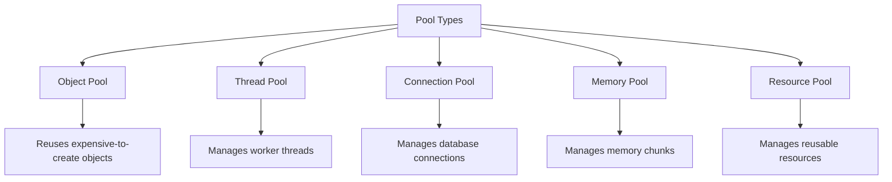

### Summary

These various pools in Java help manage resources efficiently, leading to better performance and reduced overhead. Each pool type serves specific use cases, from managing database connections to reusing objects and threads. Understanding these pools is essential for building high-performance Java applications.

Here’s a detailed explanation of the terms you mentioned, along with examples and key points.

### 1. Race Condition

**Definition**: A race condition occurs when two or more threads access shared data and try to change it simultaneously. This can lead to unpredictable results if proper synchronization is not implemented.

**Example**:

```java
class Counter {
    private int count = 0;

    public void increment() {
        count++;
    }

    public int getCount() {
        return count;
    }
}

public class RaceConditionExample {
    public static void main(String[] args) throws InterruptedException {
        Counter counter = new Counter();

        Thread t1 = new Thread(() -> {
            for (int i = 0; i < 1000; i++) {
                counter.increment();
            }
        });

        Thread t2 = new Thread(() -> {
            for (int i = 0; i < 1000; i++) {
                counter.increment();
            }
        });

        t1.start();
        t2.start();
        t1.join();
        t2.join();

        System.out.println("Final count: " + counter.getCount()); // May not be 2000 due to race condition
    }
}
```

### 2. Fail-Fast and Fail-Safe

**Fail-Fast**: Fail-fast systems immediately throw an error when they detect an inconsistency or an invalid state. This approach allows developers to identify issues early.

**Example**: Iterating over a `Collection` while modifying it.

```java
import java.util.ArrayList;
import java.util.List;

public class FailFastExample {
    public static void main(String[] args) {
        List<String> list = new ArrayList<>();
        list.add("One");
        list.add("Two");
        list.add("Three");

        for (String s : list) {
            if (s.equals("Two")) {
                list.remove(s); // Throws ConcurrentModificationException
            }
        }
    }
}
```

**Fail-Safe**: Fail-safe systems handle errors gracefully, allowing the program to continue functioning even if an issue arises.

**Example**: Using a `CopyOnWriteArrayList`, which is a thread-safe variant of `ArrayList`.

```java
import java.util.List;
import java.util.concurrent.CopyOnWriteArrayList;

public class FailSafeExample {
    public static void main(String[] args) {
        List<String> list = new CopyOnWriteArrayList<>();
        list.add("One");
        list.add("Two");
        list.add("Three");

        for (String s : list) {
            if (s.equals("Two")) {
                list.remove(s); // Does not throw an exception
            }
        }

        System.out.println(list); // Outputs: [One, Three]
    }
}
```

### 3. Diamond Problem

**Definition**: The diamond problem occurs in multiple inheritance scenarios when a class inherits from two classes that have a common superclass. This can lead to ambiguity in method resolution.

**Example**:

```java
interface A {
    default void show() {
        System.out.println("A's show");
    }
}

interface B extends A {
    default void show() {
        System.out.println("B's show");
    }
}

interface C extends A {
    default void show() {
        System.out.println("C's show");
    }
}

class D implements B, C {
    public void show() {
        B.super.show(); // Resolving ambiguity
    }
}

public class DiamondProblemExample {
    public static void main(String[] args) {
        D obj = new D();
        obj.show(); // Outputs: B's show
    }
}
```

### 4. Deadlock and Prevention

**Deadlock**: A situation where two or more threads are blocked forever, waiting for each other to release resources.

**Example of Deadlock**:

```java
class Resource {
    public synchronized void lockResource(Resource resource) {
        System.out.println(Thread.currentThread().getName() + " locked " + this);
        resource.lockResource(this);
    }
}

public class DeadlockExample {
    public static void main(String[] args) {
        Resource resource1 = new Resource();
        Resource resource2 = new Resource();

        Thread t1 = new Thread(() -> resource1.lockResource(resource2));
        Thread t2 = new Thread(() -> resource2.lockResource(resource1));

        t1.start();
        t2.start();
    }
}
```

**Prevention Techniques**:
1. **Lock Ordering**: Always acquire locks in a specific order.
2. **Timeouts**: Use a timeout when trying to acquire a lock.
3. **Deadlock Detection**: Regularly check for deadlocks and recover.

### 5. Semaphore Snapshot

**Definition**: A semaphore is a synchronization primitive that restricts access to shared resources by maintaining a set number of permits. It can be used to control access to a resource pool.

**Example**:

```java
import java.util.concurrent.Semaphore;

public class SemaphoreExample {
    private static final Semaphore semaphore = new Semaphore(2);

    public static void main(String[] args) {
        for (int i = 0; i < 5; i++) {
            new Thread(() -> {
                try {
                    semaphore.acquire();
                    System.out.println(Thread.currentThread().getName() + " acquired a permit.");
                    Thread.sleep(1000); // Simulate work
                } catch (InterruptedException e) {
                    e.printStackTrace();
                } finally {
                    System.out.println(Thread.currentThread().getName() + " released a permit.");
                    semaphore.release();
                }
            }).start();
        }
    }
}
```

### Summary

- **Race Condition**: Occurs when multiple threads modify shared data simultaneously, leading to unpredictable results.
- **Fail-Fast**: Immediately detects and reports inconsistencies; Fail-Safe: Continues operation despite errors.
- **Diamond Problem**: Ambiguity in multiple inheritance, resolved using specific interface methods.
- **Deadlock**: Threads waiting indefinitely for resources; prevention involves ordering and timeouts.
- **Semaphore**: Manages access to a limited number of resources, allowing concurrent processing. 

The `java.util.concurrent` package in Java provides a framework for managing concurrent programming, offering a set of classes and interfaces that simplify the development of multi-threaded applications. Here's a detailed breakdown of its core components:

### Key Components of `java.util.concurrent`

1. **Concurrency Utilities**: 
   - Provides utilities for managing and controlling concurrent operations.

2. **Executor Framework**:
   - Simplifies thread management and task execution.

3. **Synchronization Constructs**:
   - Tools for managing shared resources and ensuring thread safety.

4. **Concurrent Collections**:
   - Thread-safe variants of standard Java collections.

5. **Locks**:
   - More flexible locking mechanisms than synchronized blocks.

6. **Atomic Variables**:
   - Classes that provide lock-free thread-safe operations on single variables.

7. **Barriers, Latches, and Semaphores**:
   - Synchronization aids for controlling the execution flow of threads.

### Detailed Breakdown

#### 1. Executor Framework

The Executor framework abstracts the details of thread creation and management. It includes:

- **Executor Interface**: 
  - The basic interface for task execution.

- **ExecutorService Interface**:
  - Extends Executor, providing methods for managing lifecycle and task execution.

- **ThreadPoolExecutor**:
  - A powerful implementation that executes tasks using a pool of threads.

- **ScheduledExecutorService**:
  - An interface for scheduling tasks at a fixed rate or with a delay.

**Example**:

```java
import java.util.concurrent.ExecutorService;
import java.util.concurrent.Executors;

public class ExecutorExample {
    public static void main(String[] args) {
        ExecutorService executor = Executors.newFixedThreadPool(2);

        for (int i = 0; i < 5; i++) {
            final int taskId = i;
            executor.submit(() -> {
                System.out.println("Task " + taskId + " is running.");
            });
        }
        
        executor.shutdown();
    }
}
```

#### 2. Synchronization Constructs

- **CountDownLatch**: 
  - A synchronization aid that allows one or more threads to wait until a set of operations completes.

- **CyclicBarrier**: 
  - Allows a set of threads to all wait for each other to reach a common barrier point.

- **Semaphore**: 
  - Controls access to a shared resource through counting.

**Example of CountDownLatch**:

```java
import java.util.concurrent.CountDownLatch;

public class CountDownLatchExample {
    public static void main(String[] args) throws InterruptedException {
        CountDownLatch latch = new CountDownLatch(3);

        for (int i = 0; i < 3; i++) {
            new Thread(() -> {
                System.out.println("Task completed.");
                latch.countDown();
            }).start();
        }

        latch.await(); // Wait for all tasks to complete
        System.out.println("All tasks are completed.");
    }
}
```

#### 3. Concurrent Collections

The `java.util.concurrent` package provides thread-safe collections, including:

- **ConcurrentHashMap**: 
  - A hash table that allows concurrent access and updates.

- **CopyOnWriteArrayList**: 
  - A thread-safe variant of `ArrayList` that creates a new copy on each write operation.

- **BlockingQueue Interface**:
  - Provides a thread-safe queue with blocking operations (e.g., `ArrayBlockingQueue`, `LinkedBlockingQueue`).

**Example of ConcurrentHashMap**:

```java
import java.util.concurrent.ConcurrentHashMap;

public class ConcurrentHashMapExample {
    public static void main(String[] args) {
        ConcurrentHashMap<String, Integer> map = new ConcurrentHashMap<>();
        map.put("A", 1);
        map.put("B", 2);

        map.forEach((key, value) -> System.out.println(key + ": " + value));
    }
}
```

#### 4. Locks

- **ReentrantLock**: 
  - A versatile and powerful lock that provides advanced locking capabilities.

- **ReadWriteLock**: 
  - Allows multiple readers or one writer to access a resource.

**Example of ReentrantLock**:

```java
import java.util.concurrent.locks.ReentrantLock;

public class ReentrantLockExample {
    private static final ReentrantLock lock = new ReentrantLock();

    public static void main(String[] args) {
        lock.lock();
        try {
            System.out.println("Critical section");
        } finally {
            lock.unlock();
        }
    }
}
```

#### 5. Atomic Variables

Atomic classes provide a way to perform atomic operations on single variables without using synchronization.

- **AtomicInteger**, **AtomicLong**, **AtomicReference**:
  - These classes provide methods like `get()`, `set()`, and `incrementAndGet()`.

**Example**:

```java
import java.util.concurrent.atomic.AtomicInteger;

public class AtomicIntegerExample {
    public static void main(String[] args) {
        AtomicInteger count = new AtomicInteger(0);
        
        System.out.println("Initial Count: " + count.get());
        count.incrementAndGet();
        System.out.println("Count after increment: " + count.get());
    }
}
```

### Conclusion

The `java.util.concurrent` package provides a robust framework for building concurrent applications in Java. Its components, like the Executor framework, concurrent collections, synchronization aids, locks, and atomic variables, greatly simplify the complexity of managing multi-threaded environments. Understanding and effectively utilizing these tools can lead to better performance, improved resource management, and reduced potential for concurrency-related bugs.
This overview should give you a solid understanding of these concurrency concepts in Java!

Here’s a detailed explanation of each memory area and pool in Java, along with examples and corresponding Mermaid diagrams to visualize the concepts.

### 1. Heap Memory

**Definition**: Heap memory is a runtime data area from which memory for all class instances and arrays is allocated. It is managed by the Garbage Collector (GC).

**Example**:
```java
public class HeapMemoryExample {
    public static void main(String[] args) {
        String str = new String("Heap Memory");
        System.out.println(str);
    }
}
```

**Mermaid Diagram**:
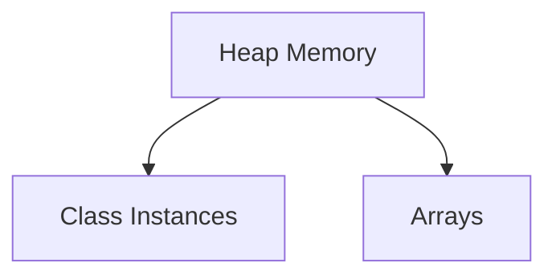

---

### 2. Stack Memory

**Definition**: Stack memory is used for storing local variables and method call information. It operates in a last-in, first-out (LIFO) manner.

**Example**:
```java
public class StackMemoryExample {
    public static void main(String[] args) {
        int a = 5; // 'a' is stored in stack memory
        method1();
    }

    public static void method1() {
        int b = 10; // 'b' is stored in stack memory
        System.out.println(b);
    }
}
```

**Mermaid Diagram**:
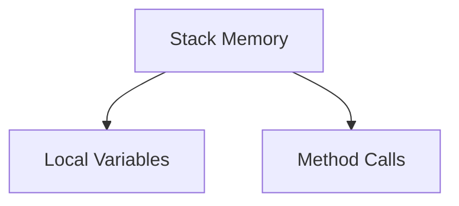

---

### 3. Constant Pool

**Definition**: The constant pool is a special area within the heap memory that stores literals and references. This pool is used to optimize memory usage by storing duplicate values.

**Example**:
```java
public class ConstantPoolExample {
    public static void main(String[] args) {
        String str1 = "Hello";
        String str2 = "Hello"; // str2 refers to the same string in the constant pool
        System.out.println(str1 == str2); // true
    }
}
```

**Mermaid Diagram**:
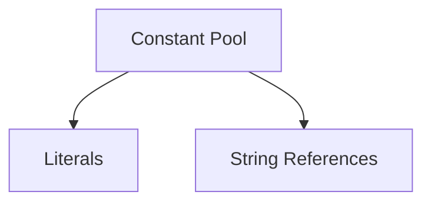

---

### 4. Instance Pool

**Definition**: The instance pool refers to the area in heap memory where the instances of classes are stored after being created.

**Example**:
```java
public class InstancePoolExample {
    public static void main(String[] args) {
        Person p1 = new Person("Alice");
        Person p2 = new Person("Bob");
    }
}

class Person {
    String name;

    Person(String name) {
        this.name = name;
    }
}
```

**Mermaid Diagram**:
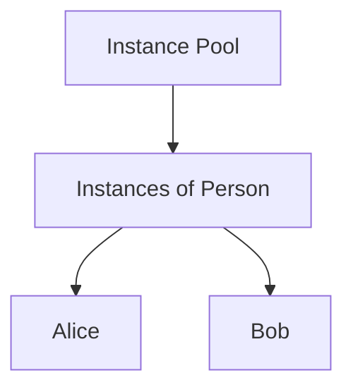

---

### 5. Object Pool

**Definition**: An object pool is a design pattern that manages the reuse of objects that are expensive to create. It helps in resource optimization.

**Example**:
```java
import java.util.ArrayList;

class ObjectPool {
    private final ArrayList<DatabaseConnection> availableConnections = new ArrayList<>();

    public DatabaseConnection getConnection() {
        if (availableConnections.isEmpty()) {
            return new DatabaseConnection(); // Create new if none available
        }
        return availableConnections.remove(availableConnections.size() - 1);
    }

    public void releaseConnection(DatabaseConnection conn) {
        availableConnections.add(conn);
    }
}

class DatabaseConnection {
    // Simulate a database connection
}
```

**Mermaid Diagram**:
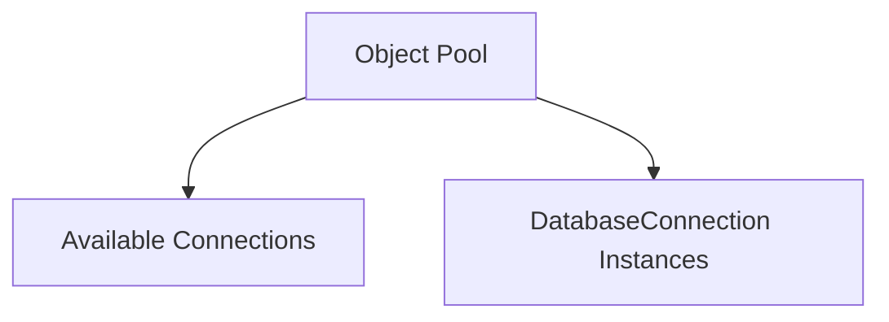

---

### 6. Thread Pool

**Definition**: A thread pool is a collection of pre-initialized threads that can be reused for executing tasks, helping to manage the overhead of thread creation.

**Example**:
```java
import java.util.concurrent.ExecutorService;
import java.util.concurrent.Executors;

public class ThreadPoolExample {
    public static void main(String[] args) {
        ExecutorService executor = Executors.newFixedThreadPool(3);
        executor.submit(() -> System.out.println("Task 1"));
        executor.submit(() -> System.out.println("Task 2"));
        executor.shutdown();
    }
}
```

**Mermaid Diagram**:
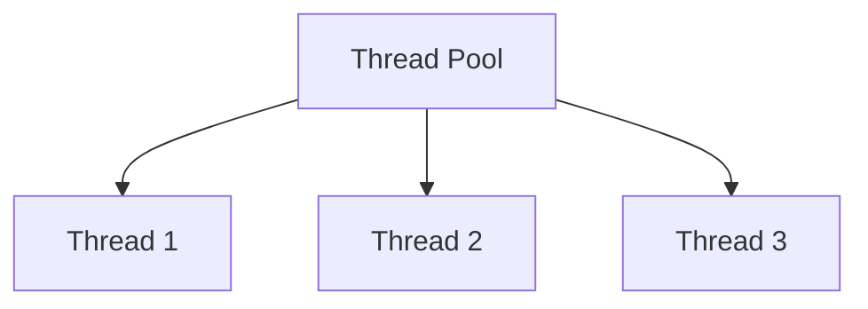

---

### 7. Connection Pool

**Definition**: A connection pool is a cache of database connections that can be reused, reducing the overhead of establishing new connections.

**Example**:
```java
import javax.sql.DataSource;
import org.apache.commons.dbcp2.BasicDataSource;

public class ConnectionPoolExample {
    public static void main(String[] args) {
        BasicDataSource dataSource = new BasicDataSource();
        dataSource.setUrl("jdbc:mysql://localhost/test");
        dataSource.setUsername("user");
        dataSource.setPassword("password");

        // Get a connection from the pool
        try (Connection conn = dataSource.getConnection()) {
            // Use the connection
        } catch (SQLException e) {
            e.printStackTrace();
        }
    }
}
```

**Mermaid Diagram**:
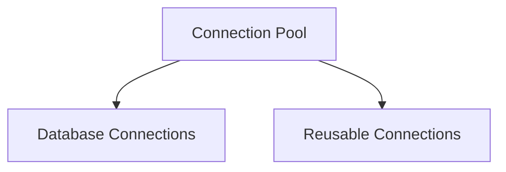

---

### 8. Memory Pool

**Definition**: A memory pool is a region of memory reserved for a specific type of object or resource, improving performance by minimizing fragmentation.

**Example**: This is often implemented in managed environments. An example in Java is not straightforward, but you might use libraries that implement memory pools.

**Mermaid Diagram**:
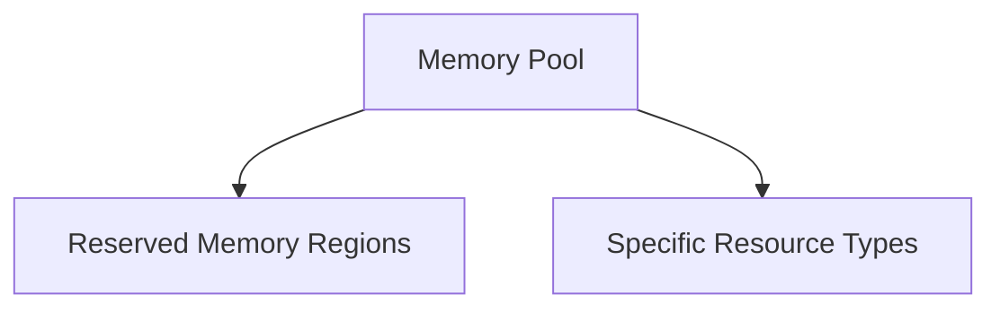

---

### 9. Byte Pool

**Definition**: A byte pool is a pool of byte arrays for reuse, typically used in I/O operations to reduce garbage collection overhead.

**Example**:
```java
import java.nio.ByteBuffer;
import java.util.ArrayList;

class BytePool {
    private final ArrayList<ByteBuffer> availableBuffers = new ArrayList<>();

    public ByteBuffer getBuffer(int size) {
        if (availableBuffers.isEmpty()) {
            return ByteBuffer.allocate(size); // Create new buffer if none available
        }
        return availableBuffers.remove(availableBuffers.size() - 1);
    }

    public void releaseBuffer(ByteBuffer buffer) {
        availableBuffers.add(buffer);
    }
}
```

**Mermaid Diagram**:
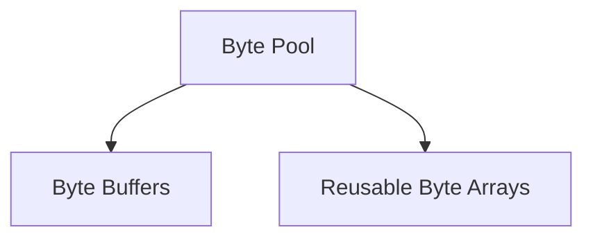

---

This comprehensive overview covers various memory areas and pools in Java, along with illustrative examples and diagrams to help visualize each concept.

### Parallel Stream Programming in Java

Java introduced the concept of **Streams** in Java 8, which allows for functional-style operations on collections. With the addition of **parallel streams**, developers can easily leverage multiple CPU cores for processing large datasets efficiently.

#### What is a Parallel Stream?

A parallel stream is a stream that can process elements in parallel, dividing the task among multiple threads. It utilizes the Fork/Join framework introduced in Java 7 to distribute the workload across available processor cores.

### Benefits of Parallel Streams

- **Performance**: Parallel streams can significantly improve performance for large datasets, especially for CPU-bound tasks.
- **Simplicity**: You can write parallelized code without worrying about thread management.

### How to Create a Parallel Stream

You can create a parallel stream from a collection by calling the `parallelStream()` method or by converting a regular stream to a parallel one using the `parallel()` method.

### Example of Parallel Stream

Here’s a simple example demonstrating how to use parallel streams in Java:

```java
import java.util.Arrays;
import java.util.List;

public class ParallelStreamExample {
    public static void main(String[] args) {
        List<Integer> numbers = Arrays.asList(1, 2, 3, 4, 5, 6, 7, 8, 9, 10);

        // Using a parallel stream to calculate the sum of squares
        int sumOfSquares = numbers.parallelStream()
                                   .map(n -> n * n)
                                   .reduce(0, Integer::sum);

        System.out.println("Sum of squares: " + sumOfSquares);
    }
}
```

### Explanation of the Example

1. **Creating a List**: We create a list of integers.
2. **Using `parallelStream()`**: We convert the list into a parallel stream.
3. **Mapping**: We use the `map()` operation to square each number.
4. **Reduction**: We use `reduce()` to sum the squares, starting from `0`.
5. **Output**: The result is printed.

### Important Considerations

- **Order**: Parallel streams may not maintain the order of elements. If order matters, consider using `forEachOrdered()` or using a sequential stream.
- **Thread Safety**: Ensure that the operations on elements are stateless and thread-safe.
- **Performance**: Parallel streams are not always faster. For small datasets or simple operations, the overhead of managing threads might outweigh the benefits.

### Performance Comparison Example

Here’s an example comparing the performance of a sequential stream versus a parallel stream:

```java
import java.util.Arrays;
import java.util.List;
import java.util.stream.LongStream;

public class PerformanceComparison {
    public static void main(String[] args) {
        List<Long> numbers = LongStream.rangeClosed(1, 1_000_000).boxed().toList();

        // Sequential Stream
        long startTime = System.currentTimeMillis();
        long sequentialSum = numbers.stream()
                                     .reduce(0L, Long::sum);
        long endTime = System.currentTimeMillis();
        System.out.println("Sequential sum: " + sequentialSum);
        System.out.println("Sequential time: " + (endTime - startTime) + " ms");

        // Parallel Stream
        startTime = System.currentTimeMillis();
        long parallelSum = numbers.parallelStream()
                                   .reduce(0L, Long::sum);
        endTime = System.currentTimeMillis();
        System.out.println("Parallel sum: " + parallelSum);
        System.out.println("Parallel time: " + (endTime - startTime) + " ms");
    }
}
```

### Explanation of Performance Comparison

1. **Creating a Range**: We create a list of long integers from `1` to `1,000,000`.
2. **Sequential Stream**: We calculate the sum using a sequential stream and record the time taken.
3. **Parallel Stream**: We calculate the sum using a parallel stream and record the time taken.
4. **Output**: Both sums and their respective times are printed.

### Mermaid Diagram for Parallel Stream Flow

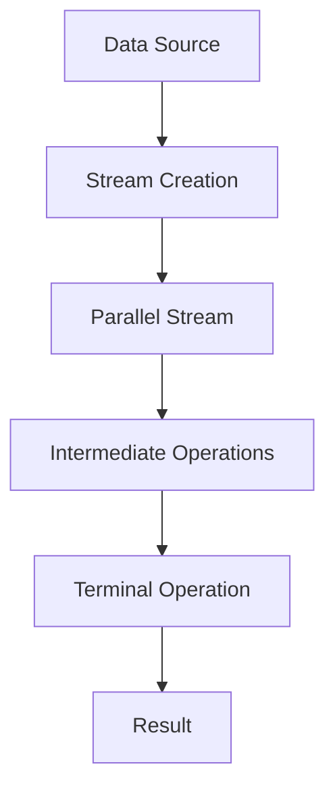

### Conclusion

Parallel streams in Java provide a powerful way to perform operations on collections concurrently, leveraging the power of multi-core processors. However, it’s important to understand when to use them, as not all tasks will benefit from parallelism. Always consider the size of the dataset and the complexity of the operation before opting for parallel streams.

### Difference Between Spring and Spring Boot

#### Spring Framework
- **Overview**: A comprehensive framework for building Java applications. It provides a wide range of functionalities, including dependency injection, transaction management, and aspect-oriented programming.
- **Configuration**: Requires extensive XML or Java configuration to set up applications.
- **Complexity**: Can be complex and verbose, especially for large applications.
- **Server Dependency**: Traditional Spring applications often require a separate web server (e.g., Tomcat, Jetty) to run.

#### Spring Boot
- **Overview**: A project built on top of the Spring framework that simplifies the setup and development of new Spring applications.
- **Configuration**: Provides auto-configuration and defaults, allowing for minimal configuration (no XML needed).
- **Ease of Use**: Reduces boilerplate code and complexity, making it easier to create stand-alone applications.
- **Embedded Server**: Comes with embedded servers (Tomcat, Jetty) allowing you to run applications as stand-alone without needing a separate server.

### Difference Between Monolithic and Microservices Architecture

#### Monolithic Architecture
- **Definition**: An architectural style where all components of an application are combined into a single unit.
- **Development**: Easier to develop initially, as everything is in one codebase.
- **Deployment**: Simple deployment process; deploying the application involves deploying the entire codebase.
- **Scalability**: Difficult to scale; if one part of the application needs more resources, the entire application must be scaled.
- **Maintenance**: Can become cumbersome over time as the application grows; a single change can require full application testing.

#### Microservices Architecture
- **Definition**: An architectural style where an application is composed of small, independent services that communicate over a network.
- **Development**: Each service can be developed, deployed, and scaled independently, allowing for more flexibility.
- **Deployment**: More complex; each service has its deployment process, requiring orchestration tools (like Kubernetes).
- **Scalability**: Easier to scale; you can scale only the services that require additional resources.
- **Maintenance**: Improved maintainability; teams can work on different services without affecting others.

### Transitioning from Monolithic to Microservices

1. **Identify Boundaries**: Analyze the monolithic application to identify distinct functionalities and boundaries. Common domains could be user management, product catalog, order processing, etc.

2. **Decouple Components**: Start decoupling the identified components into separate services. This may involve:
   - Refactoring code to create service APIs.
   - Ensuring that each service has its own database if necessary.

3. **Implement APIs**: Define and implement RESTful APIs or messaging protocols (like Kafka) for inter-service communication.

4. **Data Management**: Decide on a data management strategy. Each microservice should manage its own data to avoid tight coupling.

5. **Containerization**: Use containers (like Docker) to package each microservice, ensuring consistency across environments.

6. **Service Discovery**: Implement service discovery (like Eureka or Consul) to manage service instances dynamically.

7. **API Gateway**: Introduce an API Gateway (like Zuul or Spring Cloud Gateway) to handle incoming requests and route them to the appropriate microservice.

8. **Monitoring and Logging**: Set up centralized logging and monitoring for better visibility into the microservices' performance.

9. **Gradual Migration**: Consider a gradual migration approach, where new features are developed as microservices while the existing functionality continues to reside in the monolith until it's ready to be refactored.

10. **Testing**: Implement comprehensive testing strategies to ensure that changes do not break existing functionality during the transition.

### Summary

- **Spring vs. Spring Boot**: Spring is a robust framework requiring extensive configuration, while Spring Boot simplifies the development process with auto-configuration and embedded servers.
- **Monolithic vs. Microservices**: Monolithic architecture combines all functionalities into a single unit, whereas microservices architecture divides the application into small, independent services.
- **Transition Process**: Moving from monolithic to microservices involves identifying boundaries, decoupling components, implementing APIs, and utilizing containerization and service discovery.

This transition requires careful planning, incremental changes, and adequate testing to ensure a smooth transformation.

### Designing a Microservices Application in Java Architecture

Designing a microservices application involves several key concepts, principles, and technologies. Here’s a structured approach to understand and design a microservices architecture.

#### Key Concepts

1. **Microservices**: Independent, small services that perform specific business functions and communicate over well-defined APIs.
2. **Decentralized Data Management**: Each microservice can have its own database, allowing it to manage its data independently.
3. **Inter-Service Communication**: Microservices communicate using lightweight protocols, typically HTTP/REST or messaging systems like RabbitMQ or Kafka.
4. **API Gateway**: A single entry point for all clients, handling routing, composition, and protocol translation.
5. **Service Discovery**: Automatically detects the network locations of services, enabling dynamic communication.
6. **Containerization**: Using containers (e.g., Docker) to package services for consistent deployment and scaling.
7. **Monitoring and Logging**: Centralized monitoring and logging for visibility into service performance and health.

#### Steps to Design a Microservices Application

1. **Identify Business Capabilities**:
   - Break down the application into business capabilities (e.g., User Management, Order Processing, Inventory Management).
   - Each capability will become a microservice.

2. **Define Service Boundaries**:
   - Clearly delineate the responsibilities of each microservice to avoid overlap.
   - Use domain-driven design to help define boundaries.

3. **Choose Communication Methods**:
   - Decide on synchronous (e.g., REST, gRPC) vs. asynchronous (e.g., messaging queues) communication.

4. **Data Management Strategy**:
   - Each microservice should own its data (polyglot persistence).
   - Define how services will communicate about data changes (event sourcing, CQRS).

5. **Implement an API Gateway**:
   - Use an API Gateway to handle incoming requests and route them to appropriate services.
   - This can also manage cross-cutting concerns like authentication, logging, and rate limiting.

6. **Set Up Service Discovery**:
   - Implement service discovery (e.g., Eureka, Consul) for dynamic resolution of service instances.

7. **Monitoring and Logging**:
   - Implement distributed tracing (e.g., Spring Cloud Sleuth, Zipkin) for request tracking.
   - Centralize logs (e.g., using ELK stack) for easier debugging.

8. **Security**:
   - Implement security measures at both the API Gateway and individual microservices.
   - Use OAuth2 or JWT for secure service communication.

9. **Deployment**:
   - Use container orchestration tools (e.g., Kubernetes) to manage service deployments, scaling, and health checks.

#### Example Architecture Diagram

Here's a simplified diagram representing a microservices architecture:

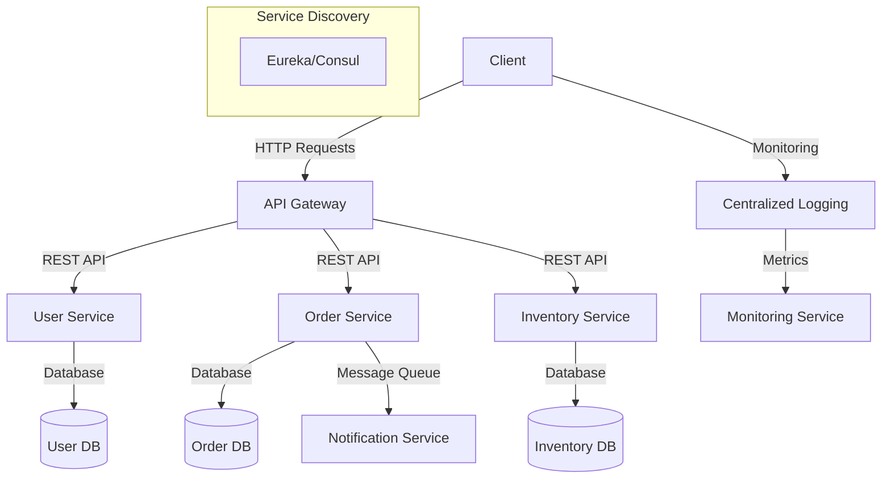

### Technologies and Tools

- **Frameworks**: Spring Boot for microservices, Spring Cloud for configuration, service discovery, and API gateway.
- **Databases**: PostgreSQL, MongoDB, or any other relevant databases based on service needs.
- **Messaging**: RabbitMQ, Apache Kafka for asynchronous communication.
- **Containerization**: Docker for packaging services, Kubernetes for orchestration.
- **Monitoring**: Prometheus and Grafana for metrics, ELK stack for logging.

### Conclusion

Designing a microservices application involves understanding the business capabilities, defining clear service boundaries, selecting communication methods, and ensuring robust monitoring and security. By leveraging modern tools and frameworks, teams can effectively build and manage scalable microservices architectures. 

This approach not only enhances flexibility and scalability but also allows teams to adopt new technologies and practices as they evolve.
What is Spring Boot?
Spring Boot is a Java based spring framework, it provides Rapid application development features like auto-configuration, embedded servers, package structures.

2. Why Spring Boot over Spring?

Spring Boot provides a stand-alone application with minimal configuration.
It provides embedded tomcat, jetty servers. So we just have to write the code and run the application.
No XML configuration is required.
Provides production ready features such as health checks, actuators etc.
Provides In-memory database, version management, component scanning etc.
3. What are all the different HTTP Methods?

Here are the commonly used HTTP methods

1. GET: Retrieves a resource or data from a server.

2. POST: Submits data to be processed to a server, typically resulting in the creation of a new resource.

3. PUT: Updates or replaces an existing resource with new data.

4. DELETE: Deletes a specified resource.

5. PATCH: Partially updates an existing resource with new data.

6. HEAD: Retrieves metadata of a resource without fetching the actual content.

7. OPTIONS: Returns the allowed HTTP methods and capabilities of a server for a given resource.

4. How does Spring Boot works internally?

Spring Boot automatically configures the application based on the dependencies added during creation of the project
The entry point of the Spring boot application is the class that contains @SpringBootApplication annotation and the main method.
Spring Boot automatically scans all the components included in the project by using @ComponentScan annotation.
5. How to disable @EnableAutoConfiguration, included in @SpringBootApplication?

There are some requirements where we do not want to use some of the specific auto-configuration classes. We can disable them using specific attributes.
For this the exclude attribute of the @EnableAutoConfiguration annotation can be used.
@EnableAutoConfiguration(exclude=DataSourceAutoConfiguration.class) 
  public class ApplicationConfiguration { 
     ... 
  }
6. What is the default port number of Tomcat Server in Spring Boot.
Ans: 8080 is Default port number.

7. Can we change port number of Tomcat?
Ans:- Yes, We can change port number in application.properties file.

Ex: server.port =8081

8. How does @SpringBootApplication works internally?

The @SpringBootApplication internally contains 3 other annotations — @Configuration, @EnableAutoConfiguration, and @ComponentScan with their default attributes.
This enables the developer to use single annotation instead of using all the 3 annotations.
Also, we know spring boot provides loosely coupled feature, we can use each annotation as per our requirement.
9. How to convert Spring Boot REST Application as Web Application?

As we know, by default spring boot provides embedded servers and makes the application production ready in terms of REST API’s
To convert REST into Web application we have to disable the embedded servers and set the configuration to false in properties files.
@SpringBootApplication(exclude = {EmbeddedServletContainerAutoConfiguration.class, 
  WebMvcAutoConfiguration.class})
  public class ApplicationConfiguration { 
     ... 
  }
And need to add the below property to non-rest applications so that spring boot does not try to start the
WebApplicationContext. This should go to the application.properties.
spring.main.web-environment=false
10. How to disable embedded tomcat server and use other servers?

Spring boot by default provides tomcat and Jetty servers, if we do not want we can exclude these default servers.
To exclude tomcat from servers, we just have to add the additional block to the Spring Boot starter dependency.
We have to add <exclusions> tags that make sure the given artifact is removed at build time.
<dependency>
      <groupId>org.springframework.boot</groupId>
      <artifactId>spring-boot-starter-web</artifactId>
      <exclusions>
          <exclusion>
              <groupId>org.springframework.boot</groupId>
              <artifactId>spring-boot-starter-tomcat</artifactId>
          </exclusion>
      </exclusions>
  </dependency>
11.Explain @RestController annotation of Spring Boot?

The @RestController annotation is a combination of @Controller and @ResponseBody, which is used for creating a restful api’s.
It converts the response to JSON or XML.
It makes sure that data returned by each method will be written directly into the response body instead of returning a template.
12. What are Spring Profiles?

When we are developing the application in the organizations, we deal with multiple environments such as —
— dev : for development

— QA : for test environment

— Pre-Prod : for production environment

— Prod : for live or production ready

So each environment requires different configurations.
For example: we might be using an embedded H2 database for dev but for prod — we might have Oracle or DB2. Even if DBMS is the same across the environment, the URLs will be different.
To make this easy and clean, Spring has the provision of Profiles to keep the separate configuration of environments.
13. What is the difference between @RestController and @Controller in Spring Boot?

@Controller Map the model object to view or template and make it human readable.
@RestController simply returns the object and object data is directly written in HTTP response as JSON or XML.
14. Describe the flow of HTTP request through the Spring Boot Application.


Spring Boot mainly be having 4 layers
— Presentation Layer : Authentication & Json Translation

— Business Layer : Business Logic, Validation & Authorization

— Persistence Layer : Storage Logic

— Database Layer : Actual Database

When the Client makes an HTTP request through GET, PUT, POST, etc. The HTTP request is forwarded to the Controller. The controller maps the request. It processes the handles and calls the server logic, i.e service class
The business logic is performed in the Service layer. The spring boot performs all the logic over the data of the database which is mapped to the spring boot model class through Java Persistence Library(JPA)/Hibernate.
15. What is the difference between application.properties file and application.yml file?

There are the files, where we mention in which port our application should run, what are the credentials required for db is mentioned in these
15. What Are the Basic Annotations that Spring Boot Offers?
Spring Boot offers several annotations that simplify the development of Spring-based applications. Here are some of the basic annotations that Spring Boot provides:

@SpringBootApplication: This annotation is used to mark the main class of a Spring Boot application. It enables component scanning, auto-configuration, and starts the embedded web server.

@Controller: This annotation is used to mark a class as a Spring MVC controller. It handles HTTP requests and returns HTTP responses.

@RestController: This annotation is a combination of @Controller and @ResponseBody. It is used to mark a class as a RESTful controller. It handles HTTP requests and returns JSON/XML responses.

@Service: This annotation is used to mark a class as a service. It encapsulates the business logic of an application.

@Repository: This annotation is used to mark a class as a repository. It is used to interact with a database.

@Component: This annotation is the base annotation for all Spring-managed components. It is used to mark a class as a bean.

@Autowired: This annotation is used to inject dependencies into a Spring-managed bean.

@Qualifier: This annotation is used to specify which bean to inject when multiple beans of the same type are available.

@Value: This annotation is used to inject values from the properties file into a Spring-managed bean.

@Configuration: This annotation is used to mark a class as a configuration class. It provides configuration to the Spring application context.

@Profile: This annotation is used to activate/deactivate a bean based on the specified profile.

@RequestMapping: This annotation is used to map an HTTP request to a method in a controller.

@PathVariable: This annotation is used to extract a variable from the URL path.

These are some of the basic annotations that Spring Boot provides. There are many more annotations available that you can explore in the Spring documentation.

16. What is the difference between RequestMapping and GetMapping?
RequestMapping can be used with GET, POST, PUT, and many other request methods using the method attribute on the annotation. Whereas getMapping is only an extension of RequestMapping which helps you to improve on clarity on request.


Errors arise unexpectedly and can result in disrupting the normal flow of execution. This is something that every programmer faces at one point or the other while coding. Java, being the most prominent object-oriented language, provides a powerful mechanism to handle these errors/exceptions. Through this article on Java Exception Handling, I will give you a complete insight into the fundamentals and various methods of Exception Handling.

In this article, I will be covering the following topics.

Introduction to Exception Handling
Exceptions Hierarchy
Basic Exception Example
Types of Exceptions
Exception Handling Methods
final vs finally vs finalize
throw vs throws
Introduction to Exception Handling
An exception is a problem that arises during the execution of a program. It can occur for various reasons say-

A user has entered an invalid data
File not found
A network connection has been lost in the middle of communications
The JVM has run out of a memory
Exception Handling mechanism follows a flow which is depicted in the below figure. But if an exception is not handled, it may lead to a system failure. That is why handling an exception is very important.


The flow of Exception Handling — Java Exception Handling

Next, begin by understanding the Exceptions Hierarchy.

Exceptions Hierarchy
All exception and error types are subclasses of class Throwable, which is the base class of hierarchy. One branch is headed by Error which occurs at run-time and other by Exception that can happen either at compile time or run-time.


Exceptions Hierarchy — Java Exception Handling

Basically, an Error is used by the Java run-time system (JVM) to indicate errors that are associated with the run-time environment (JRE). StackOverflowError is an example of such an error. Whereas Exception is used for exceptional conditions that user programs should catch. NullPointerException is an example of such an exception.

Now that you know what errors and exceptions are, let’s find out the basic difference between them. Take a look at the below table which draws a clear line between both of them.


Now, we will dive deeper into exceptions and see how they can be handled. First, let’s see the different types of exceptions.

Checked Exception
It is an exception that occurs at compile time, also called compile time exceptions. If some code within a method throws a checked exception, then the method must either handle the exception or it must specify the exception using throws keyword.
Unchecked Exception
It is an exception that occurs at the time of execution. These are also called Runtime Exceptions. In C++, all exceptions are unchecked, so it is not forced by the compiler to either handle or specify the exception. It is up to the programmers to specify or catch the exceptions.
Basic Example of Exception
class Exception{
public static void main(String args[]){
try{
//code that may raise exception
}
catch(Exception e){
// rest of the program
  }
 }
}
Above code represent an exception wherein inside try block we are going to write a code that may raise an exception and then, that exception will be handled in the catch block.

Types of Exceptions
Built-in Exceptions

User-Defined Exceptions
Sometimes, the built-in exceptions in Java are not able to describe a certain situation. In such cases, a user can also create exceptions which are called ‘User-Defined Exceptions’.
Key points to note:

A user-defined exception must extend Exception class.

The exception is thrown using throw keyword.

Example:

class MyException extends Exception{ 
 String str1;
 MyException(String str2) {str1=str2;}
  public String toString(){
   return ("MyException Occurred: "+str1);
 }
}
class Example1{
public static void main(String args[]){
 try{
      System.out.println("Start of try block");
      throw new MyException(“Error Message");
    }
    catch(MyException exp){System.out.println("Catch Block");
    System.out.println(exp);
 }
}
Now that you have seen the different types of exceptions, let’s dive deeper into this Java Exception Handling blog to understand various methods for handling these exceptions.

Exception Handling Methods
As I have already mentioned, handling an exception is very important, else it leads to system failure. But how do you handle these exceptions?

Java provides various methods to handle the Exceptions like:

try
catch
finally
throw
throws
Let’s understand each of these methods in detail.

try block
The try block contains a set of statements where an exception can occur. It is always followed by a catch block, which handles the exception that occurs in the associated try block. A try block must be followed by catch blocks or finally block or both.

try{
//code that may throw exception
}catch(Exception_class_Name ref){}
Nested try block
try block within a try block is known as nested try block in java.

class Exception{
  public static void main(String args[]){
    try{
      try{
          System.out.println("going to divide");
          int b=59/0;
         }catch(ArithmeticException e){System.out.println(e);}
      try{
          int a[]=new int[5];
         a[5]=4;
         }
        catch(ArrayIndexOutOfBoundsException e) {System.out.println(e);}
            System.out.println("other statement);
        }catch(Exception e)
         {System.out.println("Exception handeled");}
       System.out.println("casual flow");
    }
}
catch block
A catch block is where you handle the exceptions. This block must follow the try block and a single try block can have several catch blocks associated with it. You can catch different exceptions in different catch blocks. When an exception occurs in a try block, the corresponding catch block that handles that particular exception executes.

public class Testtrycatch1{
  public static void main(String args[]){
    int data=50/0;//may throw exception
    System.out.println("rest of the code...");
 }
}
Multi-catch block
If you have to perform various tasks at the occurrence of various exceptions, you can use the multi-catch block.

public class SampleMultipleCatchBlock{
 public static void main(String args[]){
    try{
       int a[]=new int[5];
       a[5]=30/0;
      }
      catch(ArithmeticException e)
        {System.out.println("task1 is completed");}
      catch(ArrayIndexOutOfBoundsException e)
        {System.out.println("task 2 completed");}
      catch(Exception e)
        {System.out.println("task 3 completed");}
      System.out.println("remaining code");
  }
}
finally block
A finally block contains all the crucial statements that must be executed whether an exception occurs or not. The statements present in this block will always execute, regardless an exception occurs in the try block or not such as closing a connection, stream etc.

class SampleFinallyBlock{
 public static void main(String args[]){
   try{
     int data=55/5;
     System.out.println(data);
    }
    catch(NullPointerException e)
       {System.out.println(e);} 
    finally {System.out.println("finally block is executed");}
    System.out.println("remaining code");
  }
}
So, this was all about the various methods of handling exceptions.

You might have heard that final, finally and finalize are keywords in Java. Yes, they are, but they differ from each other in various aspects. So, let’s see how final, finally and finalize are different from each other with the help of below table.

final vs finally vs finalize

Similarly, throw & throws sound alike, but they are different from each other. Let’s see how, with the help of the below table.

throw vs throws

//Java throw example
void a()
{
  throw new ArithmeticException("Incorrect");
}
//Java throws example
void a()throws ArithmeticException
{
  //method code
}
//Java throw and throws example
void a()throws ArithmeticException
{
  throw new ArithmeticException("Incorrect");
}
This brings us to the end of our blog on Exception Handling in Java. I hope you found this blog informative and added value to your knowledge.
