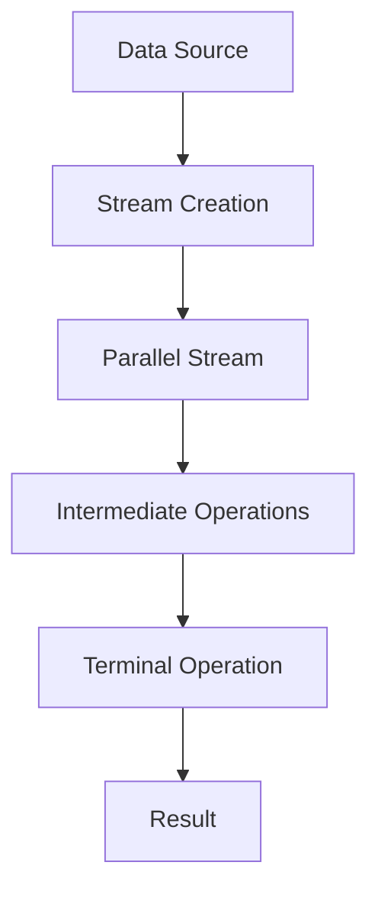
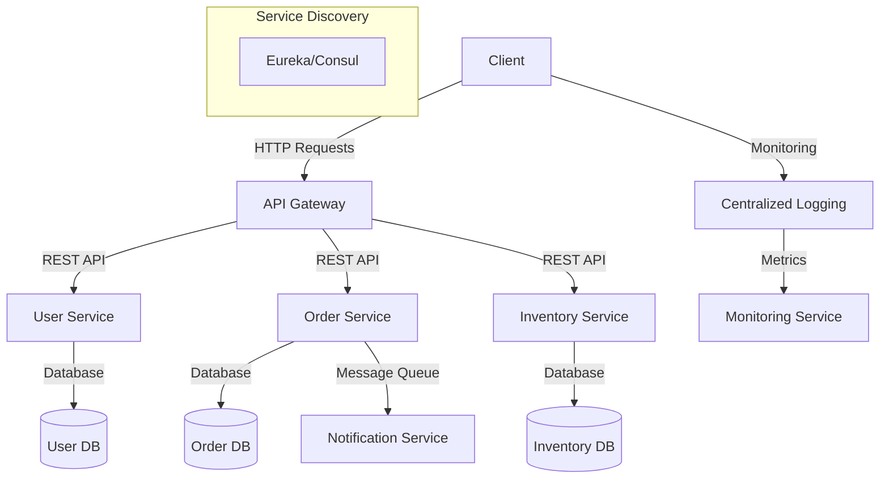
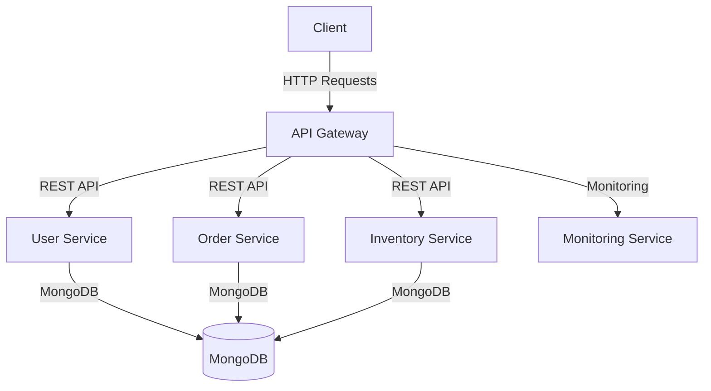
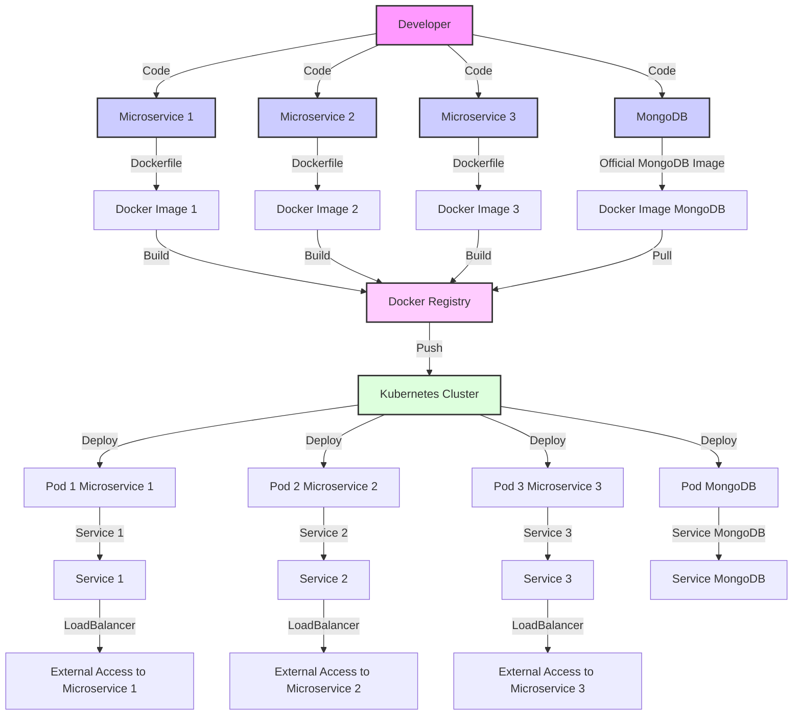
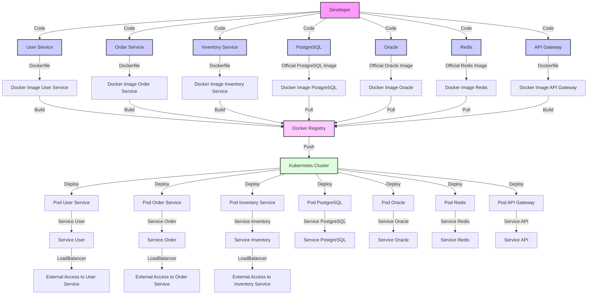
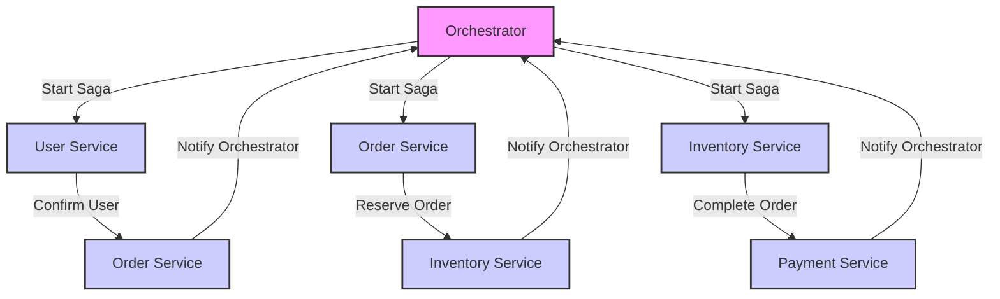
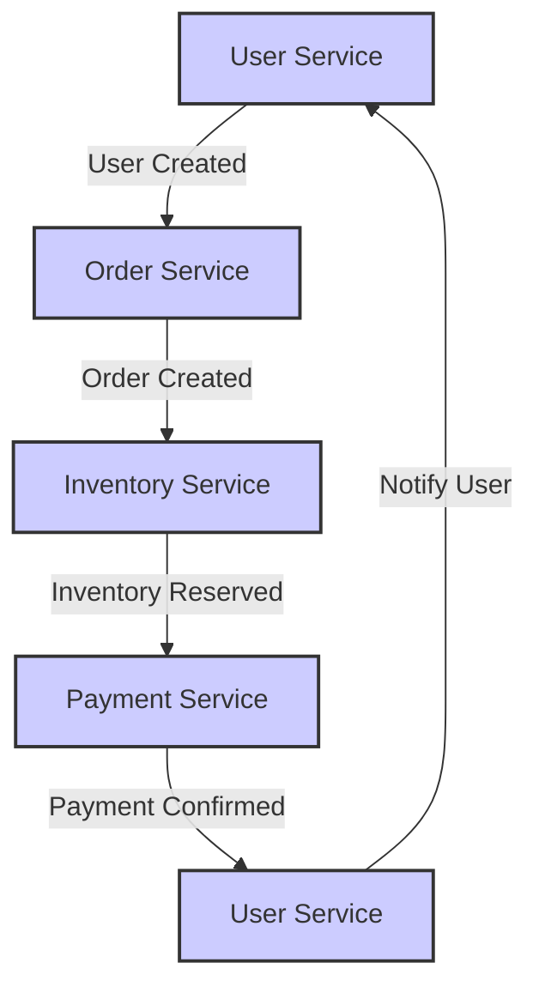
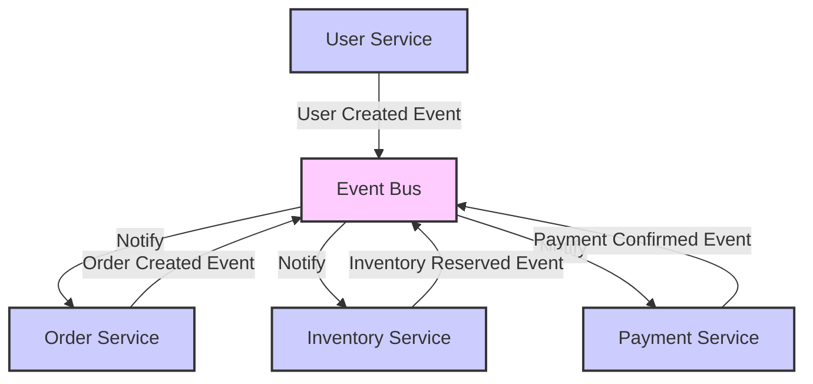

Sure! Here’s a concise Java Object-Oriented Programming (OOP) cheat sheet:


### Parallel Stream Programming in Java

Java introduced the concept of **Streams** in Java 8, which allows for functional-style operations on collections. With the addition of **parallel streams**, developers can easily leverage multiple CPU cores for processing large datasets efficiently.

#### What is a Parallel Stream?

A parallel stream is a stream that can process elements in parallel, dividing the task among multiple threads. It utilizes the Fork/Join framework introduced in Java 7 to distribute the workload across available processor cores.

### Benefits of Parallel Streams

- **Performance**: Parallel streams can significantly improve performance for large datasets, especially for CPU-bound tasks.
- **Simplicity**: You can write parallelized code without worrying about thread management.

### How to Create a Parallel Stream

You can create a parallel stream from a collection by calling the `parallelStream()` method or by converting a regular stream to a parallel one using the `parallel()` method.

### Example of Parallel Stream

Here’s a simple example demonstrating how to use parallel streams in Java:

```java
import java.util.Arrays;
import java.util.List;

public class ParallelStreamExample {
    public static void main(String[] args) {
        List<Integer> numbers = Arrays.asList(1, 2, 3, 4, 5, 6, 7, 8, 9, 10);

        // Using a parallel stream to calculate the sum of squares
        int sumOfSquares = numbers.parallelStream()
                                   .map(n -> n * n)
                                   .reduce(0, Integer::sum);

        System.out.println("Sum of squares: " + sumOfSquares);
    }
}
```

### Explanation of the Example

1. **Creating a List**: We create a list of integers.
2. **Using `parallelStream()`**: We convert the list into a parallel stream.
3. **Mapping**: We use the `map()` operation to square each number.
4. **Reduction**: We use `reduce()` to sum the squares, starting from `0`.
5. **Output**: The result is printed.

### Important Considerations

- **Order**: Parallel streams may not maintain the order of elements. If order matters, consider using `forEachOrdered()` or using a sequential stream.
- **Thread Safety**: Ensure that the operations on elements are stateless and thread-safe.
- **Performance**: Parallel streams are not always faster. For small datasets or simple operations, the overhead of managing threads might outweigh the benefits.

### Performance Comparison Example

Here’s an example comparing the performance of a sequential stream versus a parallel stream:

```java
import java.util.Arrays;
import java.util.List;
import java.util.stream.LongStream;

public class PerformanceComparison {
    public static void main(String[] args) {
        List<Long> numbers = LongStream.rangeClosed(1, 1_000_000).boxed().toList();

        // Sequential Stream
        long startTime = System.currentTimeMillis();
        long sequentialSum = numbers.stream()
                                     .reduce(0L, Long::sum);
        long endTime = System.currentTimeMillis();
        System.out.println("Sequential sum: " + sequentialSum);
        System.out.println("Sequential time: " + (endTime - startTime) + " ms");

        // Parallel Stream
        startTime = System.currentTimeMillis();
        long parallelSum = numbers.parallelStream()
                                   .reduce(0L, Long::sum);
        endTime = System.currentTimeMillis();
        System.out.println("Parallel sum: " + parallelSum);
        System.out.println("Parallel time: " + (endTime - startTime) + " ms");
    }
}
```

### Explanation of Performance Comparison

1. **Creating a Range**: We create a list of long integers from `1` to `1,000,000`.
2. **Sequential Stream**: We calculate the sum using a sequential stream and record the time taken.
3. **Parallel Stream**: We calculate the sum using a parallel stream and record the time taken.
4. **Output**: Both sums and their respective times are printed.

### Mermaid Diagram for Parallel Stream Flow



### Conclusion

Parallel streams in Java provide a powerful way to perform operations on collections concurrently, leveraging the power of multi-core processors. However, it’s important to understand when to use them, as not all tasks will benefit from parallelism. Always consider the size of the dataset and the complexity of the operation before opting for parallel streams.

### Difference Between Spring and Spring Boot

#### Spring Framework
- **Overview**: A comprehensive framework for building Java applications. It provides a wide range of functionalities, including dependency injection, transaction management, and aspect-oriented programming.
- **Configuration**: Requires extensive XML or Java configuration to set up applications.
- **Complexity**: Can be complex and verbose, especially for large applications.
- **Server Dependency**: Traditional Spring applications often require a separate web server (e.g., Tomcat, Jetty) to run.

#### Spring Boot
- **Overview**: A project built on top of the Spring framework that simplifies the setup and development of new Spring applications.
- **Configuration**: Provides auto-configuration and defaults, allowing for minimal configuration (no XML needed).
- **Ease of Use**: Reduces boilerplate code and complexity, making it easier to create stand-alone applications.
- **Embedded Server**: Comes with embedded servers (Tomcat, Jetty) allowing you to run applications as stand-alone without needing a separate server.

### Difference Between Monolithic and Microservices Architecture

#### Monolithic Architecture
- **Definition**: An architectural style where all components of an application are combined into a single unit.
- **Development**: Easier to develop initially, as everything is in one codebase.
- **Deployment**: Simple deployment process; deploying the application involves deploying the entire codebase.
- **Scalability**: Difficult to scale; if one part of the application needs more resources, the entire application must be scaled.
- **Maintenance**: Can become cumbersome over time as the application grows; a single change can require full application testing.

#### Microservices Architecture
- **Definition**: An architectural style where an application is composed of small, independent services that communicate over a network.
- **Development**: Each service can be developed, deployed, and scaled independently, allowing for more flexibility.
- **Deployment**: More complex; each service has its deployment process, requiring orchestration tools (like Kubernetes).
- **Scalability**: Easier to scale; you can scale only the services that require additional resources.
- **Maintenance**: Improved maintainability; teams can work on different services without affecting others.

### Transitioning from Monolithic to Microservices

1. **Identify Boundaries**: Analyze the monolithic application to identify distinct functionalities and boundaries. Common domains could be user management, product catalog, order processing, etc.

2. **Decouple Components**: Start decoupling the identified components into separate services. This may involve:
   - Refactoring code to create service APIs.
   - Ensuring that each service has its own database if necessary.

3. **Implement APIs**: Define and implement RESTful APIs or messaging protocols (like Kafka) for inter-service communication.

4. **Data Management**: Decide on a data management strategy. Each microservice should manage its own data to avoid tight coupling.

5. **Containerization**: Use containers (like Docker) to package each microservice, ensuring consistency across environments.

6. **Service Discovery**: Implement service discovery (like Eureka or Consul) to manage service instances dynamically.

7. **API Gateway**: Introduce an API Gateway (like Zuul or Spring Cloud Gateway) to handle incoming requests and route them to the appropriate microservice.

8. **Monitoring and Logging**: Set up centralized logging and monitoring for better visibility into the microservices' performance.

9. **Gradual Migration**: Consider a gradual migration approach, where new features are developed as microservices while the existing functionality continues to reside in the monolith until it's ready to be refactored.

10. **Testing**: Implement comprehensive testing strategies to ensure that changes do not break existing functionality during the transition.

### Summary

- **Spring vs. Spring Boot**: Spring is a robust framework requiring extensive configuration, while Spring Boot simplifies the development process with auto-configuration and embedded servers.
- **Monolithic vs. Microservices**: Monolithic architecture combines all functionalities into a single unit, whereas microservices architecture divides the application into small, independent services.
- **Transition Process**: Moving from monolithic to microservices involves identifying boundaries, decoupling components, implementing APIs, and utilizing containerization and service discovery.

This transition requires careful planning, incremental changes, and adequate testing to ensure a smooth transformation.

### Designing a Microservices Application in Java Architecture

Designing a microservices application involves several key concepts, principles, and technologies. Here’s a structured approach to understand and design a microservices architecture.

#### Key Concepts

1. **Microservices**: Independent, small services that perform specific business functions and communicate over well-defined APIs.
2. **Decentralized Data Management**: Each microservice can have its own database, allowing it to manage its data independently.
3. **Inter-Service Communication**: Microservices communicate using lightweight protocols, typically HTTP/REST or messaging systems like RabbitMQ or Kafka.
4. **API Gateway**: A single entry point for all clients, handling routing, composition, and protocol translation.
5. **Service Discovery**: Automatically detects the network locations of services, enabling dynamic communication.
6. **Containerization**: Using containers (e.g., Docker) to package services for consistent deployment and scaling.
7. **Monitoring and Logging**: Centralized monitoring and logging for visibility into service performance and health.

#### Steps to Design a Microservices Application

1. **Identify Business Capabilities**:
   - Break down the application into business capabilities (e.g., User Management, Order Processing, Inventory Management).
   - Each capability will become a microservice.

2. **Define Service Boundaries**:
   - Clearly delineate the responsibilities of each microservice to avoid overlap.
   - Use domain-driven design to help define boundaries.

3. **Choose Communication Methods**:
   - Decide on synchronous (e.g., REST, gRPC) vs. asynchronous (e.g., messaging queues) communication.

4. **Data Management Strategy**:
   - Each microservice should own its data (polyglot persistence).
   - Define how services will communicate about data changes (event sourcing, CQRS).

5. **Implement an API Gateway**:
   - Use an API Gateway to handle incoming requests and route them to appropriate services.
   - This can also manage cross-cutting concerns like authentication, logging, and rate limiting.

6. **Set Up Service Discovery**:
   - Implement service discovery (e.g., Eureka, Consul) for dynamic resolution of service instances.

7. **Monitoring and Logging**:
   - Implement distributed tracing (e.g., Spring Cloud Sleuth, Zipkin) for request tracking.
   - Centralize logs (e.g., using ELK stack) for easier debugging.

8. **Security**:
   - Implement security measures at both the API Gateway and individual microservices.
   - Use OAuth2 or JWT for secure service communication.

9. **Deployment**:
   - Use container orchestration tools (e.g., Kubernetes) to manage service deployments, scaling, and health checks.

#### Example Architecture Diagram

Here's a simplified diagram representing a microservices architecture:



### Technologies and Tools

- **Frameworks**: Spring Boot for microservices, Spring Cloud for configuration, service discovery, and API gateway.
- **Databases**: PostgreSQL, MongoDB, or any other relevant databases based on service needs.
- **Messaging**: RabbitMQ, Apache Kafka for asynchronous communication.
- **Containerization**: Docker for packaging services, Kubernetes for orchestration.
- **Monitoring**: Prometheus and Grafana for metrics, ELK stack for logging.

### Conclusion

Designing a microservices application involves understanding the business capabilities, defining clear service boundaries, selecting communication methods, and ensuring robust monitoring and security. By leveraging modern tools and frameworks, teams can effectively build and manage scalable microservices architectures. 

This approach not only enhances flexibility and scalability but also allows teams to adopt new technologies and practices as they evolve.

### Azure, Microservices, and MongoDB Deployment with Docker and Kubernetes

#### Overview

**Azure** is a cloud computing platform from Microsoft that provides a range of services, including virtual machines, databases, and managed Kubernetes. **Microservices** architecture is an approach to software development that structures an application as a collection of loosely coupled services. **MongoDB** is a NoSQL database that stores data in flexible, JSON-like documents.

This guide will explain how to deploy a microservices application using MongoDB in Docker and Kubernetes on Azure.

### Key Components

1. **Microservices**: Each service handles a specific business function and can be developed and deployed independently.
2. **MongoDB**: A NoSQL database that will be used for storing data for the microservices.
3. **Docker**: A platform for containerizing applications, allowing them to run consistently across environments.
4. **Kubernetes**: An orchestration platform for automating the deployment, scaling, and management of containerized applications.
5. **Azure Kubernetes Service (AKS)**: A managed Kubernetes service provided by Azure, simplifying the deployment and management of Kubernetes clusters.

### Architecture Diagram



### Step-by-Step Deployment

#### Step 1: Containerize Microservices

1. **Create Dockerfile for Each Service**: 

Example Dockerfile for a User Service:

```dockerfile
# Use a base image
FROM openjdk:11-jre-slim

# Set the working directory
WORKDIR /app

# Copy the jar file
COPY target/user-service.jar user-service.jar

# Run the application
ENTRYPOINT ["java", "-jar", "user-service.jar"]
```

2. **Build Docker Images**:

```bash
docker build -t user-service:latest .
docker build -t order-service:latest .
docker build -t inventory-service:latest .
```

3. **Push Images to Azure Container Registry (ACR)**:

```bash
# Login to ACR
az acr login --name <your-acr-name>

# Tag and push images
docker tag user-service:latest <your-acr-name>.azurecr.io/user-service:latest
docker push <your-acr-name>.azurecr.io/user-service:latest
```

#### Step 2: Set Up MongoDB

1. **Create a MongoDB Deployment**:

```yaml
apiVersion: apps/v1
kind: Deployment
metadata:
  name: mongodb
spec:
  replicas: 1
  selector:
    matchLabels:
      app: mongodb
  template:
    metadata:
      labels:
        app: mongodb
    spec:
      containers:
      - name: mongodb
        image: mongo:latest
        ports:
        - containerPort: 27017
        volumeMounts:
        - name: mongodb-data
          mountPath: /data/db
      volumes:
      - name: mongodb-data
        emptyDir: {}
```

2. **Create a Service for MongoDB**:

```yaml
apiVersion: v1
kind: Service
metadata:
  name: mongodb
spec:
  ports:
    - port: 27017
  selector:
    app: mongodb
```

#### Step 3: Deploy Microservices on Kubernetes

1. **Create Deployment YAML for Each Service**:

Example for User Service:

```yaml
apiVersion: apps/v1
kind: Deployment
metadata:
  name: user-service
spec:
  replicas: 2
  selector:
    matchLabels:
      app: user-service
  template:
    metadata:
      labels:
        app: user-service
    spec:
      containers:
      - name: user-service
        image: <your-acr-name>.azurecr.io/user-service:latest
        ports:
        - containerPort: 8080
        env:
        - name: MONGODB_URI
          value: mongodb://mongodb:27017
```

2. **Create a Service for Each Microservice**:

Example for User Service:

```yaml
apiVersion: v1
kind: Service
metadata:
  name: user-service
spec:
  ports:
    - port: 8080
  selector:
    app: user-service
```

#### Step 4: Deploy to Azure Kubernetes Service (AKS)

1. **Create AKS Cluster**:

```bash
az aks create --resource-group <your-resource-group> --name <your-aks-cluster> --node-count 1 --enable-addons monitoring --generate-ssh-keys
```

2. **Connect to AKS**:

```bash
az aks get-credentials --resource-group <your-resource-group> --name <your-aks-cluster>
```

3. **Deploy All Configurations**:

```bash
kubectl apply -f mongodb-deployment.yaml
kubectl apply -f user-service-deployment.yaml
kubectl apply -f order-service-deployment.yaml
kubectl apply -f inventory-service-deployment.yaml
kubectl apply -f mongodb-service.yaml
kubectl apply -f user-service-service.yaml
kubectl apply -f order-service-service.yaml
kubectl apply -f inventory-service-service.yaml
```

### Conclusion

Deploying microservices with MongoDB using Docker and Kubernetes on Azure enables you to build scalable and resilient applications. By using Azure Kubernetes Service, you can manage your microservices efficiently, utilizing the benefits of containerization and orchestration. This architecture not only promotes independent development and deployment of services but also ensures that your application can scale as needed.

To use the connection string `spring.data.mongodb.uri=mongodb://docker-kubernet-microservice-mongodb-1:27017/mydatabase` in a Spring Boot application that connects to a MongoDB instance running in a Kubernetes environment, follow these steps:

### Step 1: Update `application.properties` or `application.yml`

You need to add the MongoDB connection string to your `application.properties` or `application.yml` file in your Spring Boot project.

#### Using `application.properties`

```properties
spring.data.mongodb.uri=mongodb://docker-kubernet-microservice-mongodb-1:27017/mydatabase
```

#### Using `application.yml`

```yaml
spring:
  data:
    mongodb:
      uri: mongodb://docker-kubernet-microservice-mongodb-1:27017/mydatabase
```

### Step 2: Configure MongoDB Dependency

Make sure to include the MongoDB dependency in your `pom.xml` (for Maven) or `build.gradle` (for Gradle).

#### For Maven

```xml
<dependency>
    <groupId>org.springframework.boot</groupId>
    <artifactId>spring-boot-starter-data-mongodb</artifactId>
</dependency>
```

#### For Gradle

```groovy
implementation 'org.springframework.boot:spring-boot-starter-data-mongodb'
```

### Step 3: Create a MongoDB Configuration Class (Optional)

While Spring Boot can auto-configure MongoDB for you, you may want to customize the configuration further. Here’s an example of how to do that:

```java
import org.springframework.context.annotation.Bean;
import org.springframework.context.annotation.Configuration;
import org.springframework.data.mongodb.config.AbstractMongoClientConfiguration;
import org.springframework.data.mongodb.core.MongoTemplate;
import com.mongodb.client.MongoClients;

@Configuration
public class MongoConfig extends AbstractMongoClientConfiguration {

    @Override
    protected String getDatabaseName() {
        return "mydatabase"; // Use your database name
    }

    @Bean
    public MongoTemplate mongoTemplate() {
        return new MongoTemplate(MongoClients.create("mongodb://docker-kubernet-microservice-mongodb-1:27017"), getDatabaseName());
    }
}
```

### Step 4: Using MongoDB in Your Repositories

Create a repository interface to interact with MongoDB.

```java
import org.springframework.data.mongodb.repository.MongoRepository;
import org.springframework.stereotype.Repository;

@Repository
public interface UserRepository extends MongoRepository<User, String> {
    // Custom query methods can be defined here
}
```

### Step 5: Define Your Document Class

Define a class representing the documents you want to store in MongoDB.

```java
import org.springframework.data.annotation.Id;
import org.springframework.data.mongodb.core.mapping.Document;

@Document(collection = "users") // Specify the collection name
public class User {
    
    @Id
    private String id;
    private String name;
    private String email;

    // Getters and Setters
}
```

### Step 6: Use Your Repository

You can now use your `UserRepository` in your service or controller classes to perform CRUD operations.

```java
import org.springframework.beans.factory.annotation.Autowired;
import org.springframework.stereotype.Service;

import java.util.List;

@Service
public class UserService {

    @Autowired
    private UserRepository userRepository;

    public List<User> getAllUsers() {
        return userRepository.findAll();
    }

    public User saveUser(User user) {
        return userRepository.save(user);
    }
}
```

### Step 7: Ensure Connectivity in Kubernetes

Make sure that the MongoDB service in your Kubernetes cluster is correctly set up and accessible. You can test the connection by deploying your Spring Boot application and verifying that it connects to the MongoDB instance.

### Conclusion

By following these steps, you can successfully connect your Spring Boot application to a MongoDB instance running in Kubernetes using the specified connection string. Make sure to replace any placeholder values (like database names and document fields) with those specific to your application.

Deploying a Spring Boot application that connects to MongoDB in Docker and Kubernetes involves several steps. Below, I've outlined the steps for both Docker and Kubernetes deployment.

### Part 1: Deploying with Docker

#### Step 1: Create a Dockerfile

Create a `Dockerfile` in the root of your Spring Boot project.

```dockerfile
# Use a base image
FROM openjdk:11-jre-slim

# Set the working directory
WORKDIR /app

# Copy the JAR file into the container
COPY target/your-app.jar app.jar

# Expose the application port
EXPOSE 8080

# Run the application
ENTRYPOINT ["java", "-jar", "app.jar"]
```

#### Step 2: Build the Docker Image

Navigate to the root directory of your project and build the Docker image using the following command:

```bash
docker build -t your-app-name .
```

#### Step 3: Run the Docker Container

Run your MongoDB container and your Spring Boot application container:

```bash
# Start MongoDB
docker run --name mongodb -d -p 27017:27017 mongo

# Start your Spring Boot application
docker run --name spring-boot-app --link mongodb -p 8080:8080 your-app-name
```

### Part 2: Deploying with Kubernetes

#### Step 1: Create Kubernetes Deployment and Service Files

Create a YAML file (e.g., `k8s-deployment.yml`) for your Spring Boot application and MongoDB.

```yaml
apiVersion: apps/v1
kind: Deployment
metadata:
  name: mongodb
spec:
  replicas: 1
  selector:
    matchLabels:
      app: mongodb
  template:
    metadata:
      labels:
        app: mongodb
    spec:
      containers:
      - name: mongodb
        image: mongo
        ports:
        - containerPort: 27017

---

apiVersion: v1
kind: Service
metadata:
  name: mongodb
spec:
  ports:
  - port: 27017
    targetPort: 27017
  selector:
    app: mongodb
  type: ClusterIP

---

apiVersion: apps/v1
kind: Deployment
metadata:
  name: spring-boot-app
spec:
  replicas: 1
  selector:
    matchLabels:
      app: spring-boot-app
  template:
    metadata:
      labels:
        app: spring-boot-app
    spec:
      containers:
      - name: spring-boot-app
        image: your-app-name
        ports:
        - containerPort: 8080
        env:
        - name: SPRING_DATA_MONGODB_URI
          value: "mongodb://mongodb:27017/mydatabase"
```

#### Step 2: Apply the YAML File

Run the following command to deploy the services and applications:

```bash
kubectl apply -f k8s-deployment.yml
```

#### Step 3: Verify the Deployment

Check the status of your deployments and services:

```bash
kubectl get deployments
kubectl get pods
kubectl get services
```

#### Step 4: Access Your Spring Boot Application

If you want to expose your Spring Boot application to the outside world, you can change the service type to `LoadBalancer` or create an Ingress resource.

Here's how to change the service type:

```yaml
apiVersion: v1
kind: Service
metadata:
  name: spring-boot-app
spec:
  type: LoadBalancer
  ports:
  - port: 8080
    targetPort: 8080
  selector:
    app: spring-boot-app
```

Apply the changes:

```bash
kubectl apply -f k8s-deployment.yml
```

### Summary

By following these steps, you can successfully deploy a Spring Boot application with MongoDB using both Docker and Kubernetes. Make sure to replace placeholder names and values with those specific to your application. After deployment, you can access your Spring Boot application via the exposed service or load balancer.

Certainly! Below is a complete process diagram for deploying a microservices architecture using Docker and Kubernetes, which includes the microservices and databases.

### Docker and Kubernetes Deployment Process Diagram



### Explanation of the Diagram

1. **Developer**: This is where the microservices code is developed.
2. **Microservices**: These are individual components (Microservice 1, Microservice 2, Microservice 3) that perform specific functionalities.
3. **Database**: A MongoDB instance that stores data for the microservices.
4. **Dockerfile**: Each microservice has a Dockerfile that defines how to build its Docker image.
5. **Docker Images**: After building, each microservice's code is converted into Docker images.
6. **Docker Registry**: The images are stored in a Docker registry (like Docker Hub or a private registry).
7. **Kubernetes Cluster**: The images are pulled from the registry and deployed into a Kubernetes cluster.
8. **Pods**: Each microservice and MongoDB runs inside a pod.
9. **Services**: Kubernetes services expose the microservices and MongoDB to allow communication.
10. **LoadBalancer**: Services can be exposed via a LoadBalancer to allow external access.

### Deployment Steps

- **Code the Microservices**: Develop each microservice and the MongoDB configuration.
- **Create Docker Images**: Write Dockerfiles and build images for each microservice.
- **Push to Docker Registry**: Push the built images to a Docker registry.
- **Set Up Kubernetes**: Create deployment and service YAML files for Kubernetes.
- **Deploy to Kubernetes**: Use `kubectl apply` to deploy the services and pods.
- **Access Microservices**: Use the LoadBalancer IP or Ingress to access the microservices.

This diagram and explanation provide a comprehensive overview of how microservices can be deployed using Docker and Kubernetes, highlighting the interaction between various components.

Here's a similar diagram for a microservices architecture incorporating PostgreSQL, Oracle, Redis, API Gateway, Eureka for service discovery, and a combination of Saga orchestration and choreography patterns, along with Kubernetes deployment commands.



### Kubernetes Deployment Commands
```bash
kubectl apply -f mongodb-deployment.yaml
kubectl apply -f user-service-deployment.yaml
kubectl apply -f order-service-deployment.yaml
kubectl apply -f inventory-service-deployment.yaml
kubectl apply -f mongodb-service.yaml
kubectl apply -f user-service-service.yaml
kubectl apply -f order-service-service.yaml
kubectl apply -f inventory-service-service.yaml
kubectl apply -f postgres-deployment.yaml
kubectl apply -f oracle-deployment.yaml
kubectl apply -f redis-deployment.yaml
kubectl apply -f api-gateway-deployment.yaml
```

This setup shows a microservices architecture with service discovery, database services, caching, an API gateway, and deployment configurations for Kubernetes. Let me know if you need any adjustments!

Here's a representation of microservice architecture diagrams for **Saga Orchestration**, **Saga Choreography**, and **Event-Driven** patterns.

### 1. Saga Orchestration
In this architecture, a central orchestrator directs the flow of the saga across different microservices.



### 2. Saga Choreography
In this architecture, each service knows what to do next and communicates directly with other services.



### 3. Event-Driven Architecture
In this architecture, services publish and subscribe to events. 



### Summary
- **Saga Orchestration:** Centralized control by an orchestrator.
- **Saga Choreography:** Each service manages its own state and communicates with others directly.
- **Event-Driven Architecture:** Services communicate through events using an event bus.

Let me know if you need further details or modifications!


