Java Programming Chapters
---

## Table of Contents

### [Chapter 1: Introduction to Java](#1-introduction-to-java)
- Overview of Java and its history.
- Features of Java (platform independence, object-oriented, etc.).

### [Chapter 2: Setting Up the Environment](#2-setting-up-the-environment)
- Installing the Java Development Kit (JDK).
- Setting up an Integrated Development Environment (IDE) like IntelliJ IDEA or Eclipse.

### [Chapter 3: Basic Syntax](#3-basic-syntax)
- Java program structure (class, main method).
- Data types and variables.
- Operators (arithmetic, relational, logical).

### [Chapter 4: Control Flow Statements](#4-control-flow-statements)
- Conditional statements (if, else, switch).
- Looping constructs (for, while, do-while).

### [Chapter 5: Object-Oriented Programming](#5-object-oriented-programming)
- Concepts of OOP: classes, objects, inheritance, polymorphism, encapsulation, and abstraction.
- Creating and using classes and objects.

### [Chapter 6: Exception Handling](#6-exception-handling)
- Understanding exceptions in Java.
- Try-catch blocks and finally statements.
- Creating custom exceptions.

### [Chapter 7: Java Collections Framework](#7-java-collections-framework)
- Overview of collections (List, Set, Map).
- Using ArrayList, HashSet, and HashMap.
- Iterating through collections.

### [Chapter 8: Java Streams and Lambda Expressions](#8-java-streams-and-lambda-expressions)
- Introduction to functional programming in Java.
- Using Streams for data processing.
- Writing and using lambda expressions.

### [Chapter 9: Multithreading and Concurrency](#9-multithreading-and-concurrency)
- Understanding threads in Java.
- Creating and managing threads.
- Synchronization and concurrent collections.

### [Chapter 10: File Handling and I/O](#10-file-handling-and-io)
- Reading from and writing to files.
- Working with Java I/O classes (FileReader, FileWriter, BufferedReader).
- Serialization and deserialization.

### [Chapter 11: Java GUI Programming](#11-java-gui-programming)
- Introduction to Swing and JavaFX.
- Creating a simple GUI application.
- Event handling in GUI applications.

### [Chapter 12: Networking in Java](#12-networking-in-java)
- Overview of Java networking capabilities.
- Creating client-server applications using sockets.
- Using HTTP connections.

### [Chapter 13: Java Database Connectivity (JDBC)](#13-java-database-connectivity-jdbc)
- Overview of JDBC.
- Connecting to a database.
- Executing SQL queries.

### [Chapter 14: Unit Testing in Java](#14-unit-testing-in-java)
- Importance of unit testing.
- Introduction to JUnit framework.
- Writing and running test cases.

### [Chapter 15: Best Practices and Design Patterns](#15-best-practices-and-design-patterns)
- Coding best practices in Java.
- Introduction to common design patterns (Singleton, Factory, Observer).

### [Chapter 16: Advanced Java Concepts](#16-advanced-java-concepts)
- Reflection and Annotations.
- Java 8 features (Optional, Stream API).
- Introduction to Java Modules.

### [Conclusion](#conclusion)
- Recap of key concepts learned.
- Resources for further learning (books, websites, courses).

---

## Chapter Details
### 1. Introduction to Java
<details> <summary>Details</summary>
  
- **Overview of Java and its history**: 
  Java was created by Sun Microsystems in the mid-1990s, designed to be platform-independent and secure. It quickly became popular due to its use in web applications and enterprise software.
  
- **Features of Java**: 
 
1. **Platform Independence**: 
   - Java programs are compiled into bytecode, which can run on any system with the Java Virtual Machine (JVM). This allows for the "write once, run anywhere" capability.

2. **Object-Oriented**:
   - Java is designed around the concept of objects, which encapsulate data and behavior. This approach promotes code reuse, modularity, and easier maintenance.

3. **Robust and Secure**:
   - Java includes strong memory management, exception handling, and type checking at both compile-time and runtime, which helps prevent crashes and enhance security.

4. **Multithreaded**:
   - Java supports multithreading, allowing multiple threads to run concurrently. This feature is useful for improving application performance and responsiveness, especially in GUI applications.

5. **Automatic Memory Management**:
   - Java features automatic garbage collection, which helps manage memory by reclaiming unused objects, reducing the risk of memory leaks.

6. **Rich Standard Library**:
   - Java comes with a comprehensive standard library that provides a wide range of classes and methods for tasks such as networking, data manipulation, and user interface design.

7. **High Performance**:
   - Although interpreted languages are typically slower, Java's Just-In-Time (JIT) compiler improves performance by compiling bytecode into native machine code at runtime.

8. **Distributed Computing**:
   - Java provides built-in support for networking and remote method invocation (RMI), making it easier to develop distributed applications.

9. **Dynamic and Extensible**:
   - Java can adapt to changing environments and allows for dynamic loading of classes, making it extensible and suitable for evolving applications.

10. **Strongly Typed Language**:
    - Java enforces strict type checking, which helps catch errors at compile-time rather than runtime, contributing to the reliability of programs.

These features make Java a versatile and widely-used programming language for various applications, from web development to enterprise solutions.

**[⬆ Back to Top](#table-of-contents)**
</details>

### 2. Setting Up the Environment

<details> 
<summary>Details</summary>

#### Installing the Java Development Kit (JDK)
- **What is the JDK?**: The Java Development Kit is a comprehensive package that allows developers to create, compile, and run Java applications. It includes the Java Runtime Environment (JRE), a compiler (`javac`), and essential libraries.
  
- **Download and Installation**:
  1. **Download**: Go to the official Oracle website or the OpenJDK site and download the JDK for your operating system (Windows, macOS, Linux).
  2. **Install**: Run the installer and follow the prompts. For Windows, ensure you choose to set the JAVA_HOME environment variable during installation if prompted.
  
- **Setting Up Environment Variables**:
  - **JAVA_HOME**: This variable points to the JDK installation directory. It’s crucial for various tools and applications to locate the JDK.
  - **Path**: Add the `bin` directory of the JDK to your system’s PATH variable. This allows you to run Java commands from any command prompt.

- **Verifying Installation**: After installation, open a terminal or command prompt and type `java -version` and `javac -version`. Both commands should return the installed version of Java, confirming that the installation was successful.

#### Setting Up an Integrated Development Environment (IDE)
- **What is an IDE?**: An IDE is a software application that provides comprehensive facilities to programmers for software development. It typically includes a code editor, build automation tools, and a debugger.

- **Popular Java IDEs**:
  1. **IntelliJ IDEA**:
     - **Features**: Smart code completion, code analysis, and a powerful debugger.
     - **Setup**: Download from the JetBrains website, run the installer, and follow the setup wizard. Import any existing projects or create a new one.
  
  2. **Eclipse**:
     - **Features**: Highly customizable, with a large library of plugins. Supports a wide range of programming languages.
     - **Setup**: Download from the Eclipse website, extract the downloaded file, and run the Eclipse executable. Select your workspace directory to manage projects.

- **Configuring the IDE**:
  - **JDK Configuration**: Most IDEs will prompt you to set the JDK upon first launch or allow you to configure it later. Ensure your IDE is pointing to the correct JDK installation.
  - **Plugins**: Consider installing additional plugins for enhanced functionality (e.g., version control, code formatting, etc.).

- **Creating Your First Project**: 
  - In your IDE, create a new Java project. This typically involves selecting a project type (like a simple Java project) and specifying a project name and location.
  - After creating the project, you can add Java classes, write code, and run your application directly from the IDE.

- **Benefits of Using an IDE**:
  - **Ease of Use**: Streamlined development process with graphical user interfaces.
  - **Debugging Tools**: Set breakpoints, inspect variables, and navigate through code easily.
  - **Code Assistance**: Features like code suggestions, refactoring tools, and syntax highlighting help reduce errors and enhance productivity.

- **Troubleshooting Common Issues**:
  - If your IDE doesn’t recognize the JDK, ensure that the JDK path is correctly set in the IDE settings.
  - Make sure that your environment variables (especially `JAVA_HOME` and `Path`) are set correctly.

- **Resources for Further Learning**: Many IDEs come with integrated tutorials or documentation to help you get started. Check the official documentation for specific guidance and tips.

**[⬆ Back to Top](#table-of-contents)**
</details>

### 3. Basic Syntax

<details> 
<summary>Details</summary>

#### Java Program Structure
- **Class Definition**: Every Java program is contained within a class. The class is defined using the `class` keyword, followed by the class name, which should start with an uppercase letter by convention.
  
  ```java
  public class MyFirstProgram {
      // Class body
  }
  ```

- **Main Method**: This is the entry point for any standalone Java application. It must be defined as follows:
  
  ```java
  public static void main(String[] args) {
      // Code to be executed
  }
  ```
  
  - **public**: An access modifier indicating that the method can be called from anywhere.
  - **static**: Indicates that the method belongs to the class rather than to any specific instance.
  - **void**: Specifies that the method does not return a value.
  - **String[] args**: An array of Strings that can be used to pass command-line arguments to the program.

#### Data Types and Variables
- **Primitive Data Types**: Java has several built-in types for representing simple values:
  - **int**: Integer type (e.g., `int count = 10;`)
  - **double**: Floating-point type for decimal numbers (e.g., `double price = 19.99;`)
  - **char**: Represents a single 16-bit Unicode character (e.g., `char grade = 'A';`)
  - **boolean**: Represents true or false values (e.g., `boolean isActive = true;`)

- **Reference Data Types**: These include more complex types like arrays and objects:
  - **Arrays**: A collection of items of the same type (e.g., `int[] numbers = {1, 2, 3};`)
  - **Objects**: Instances of classes, which can encapsulate both data and behavior.

- **Variable Declaration**: In Java, variables must be declared before use, specifying their type:
  
  ```java
  int age; // Declaration
  age = 25; // Initialization
  ```

- **Variable Naming Conventions**: Use meaningful names, start with a lowercase letter, and use camelCase for multi-word names (e.g., `firstName`, `totalAmount`).

#### Operators
- **Arithmetic Operators**: Used for mathematical calculations:
  - `+` (Addition)
  - `-` (Subtraction)
  - `*` (Multiplication)
  - `/` (Division)
  - `%` (Modulus)

  ```java
  int sum = a + b;
  ```

- **Relational Operators**: Used for comparing two values:
  - `==` (Equal to)
  - `!=` (Not equal to)
  - `>` (Greater than)
  - `<` (Less than)
  - `>=` (Greater than or equal to)
  - `<=` (Less than or equal to)

  ```java
  if (a > b) {
      // Code to execute if true
  }
  ```

- **Logical Operators**: Used to combine multiple boolean expressions:
  - `&&` (Logical AND)
  - `||` (Logical OR)
  - `!` (Logical NOT)

  ```java
  if (isActive && isAdmin) {
      // Code to execute if both conditions are true
  }
  ```

- **Operator Precedence**: Java follows a specific order of operations, where certain operators (like multiplication and division) are evaluated before others (like addition and subtraction).

- **Type Casting**: When performing operations with different data types, Java may require explicit type casting to avoid errors:
  
  ```java
  double result = (double) a / b; // Casting 'a' to double for accurate division
  ```

**[⬆ Back to Top](#table-of-contents)**
</details>

### 4. Control Flow Statements

<details> 
<summary>Details</summary>

#### Conditional Statements
- **`if` Statement**: Used to execute a block of code if a specified condition is true. You can also include an optional `else` block to execute code if the condition is false.

  ```java
  int number = 10;
  if (number > 0) {
      System.out.println("Positive number");
  } else {
      System.out.println("Non-positive number");
  }
  ```

- **`else if` Statement**: Allows checking multiple conditions in sequence. If the first condition is false, the next condition is checked.

  ```java
  if (number > 0) {
      System.out.println("Positive");
  } else if (number < 0) {
      System.out.println("Negative");
  } else {
      System.out.println("Zero");
  }
  ```

- **`switch` Statement**: A multi-way branch statement that simplifies the selection among multiple choices based on the value of a variable.

  ```java
  switch (number) {
      case 1:
          System.out.println("One");
          break;
      case 2:
          System.out.println("Two");
          break;
      default:
          System.out.println("Not One or Two");
          break;
  }
  ```

  - **Break Statement**: Exits the switch block. Without it, execution continues into the next case (fall-through behavior).
  - **Default Case**: Executes if none of the specified cases match.

#### Looping Constructs
- **`for` Loop**: Ideal for iterating a specific number of times. It consists of three parts: initialization, condition, and iteration statement.

  ```java
  for (int i = 0; i < 5; i++) {
      System.out.println("Iteration: " + i);
  }
  ```

  - **Initialization**: Sets the loop variable (e.g., `int i = 0`).
  - **Condition**: Evaluated before each iteration. If true, the loop body executes.
  - **Iteration Statement**: Updates the loop variable (e.g., `i++`).

- **`while` Loop**: Continues to execute as long as the condition is true. Useful when the number of iterations is not known beforehand.

  ```java
  int count = 0;
  while (count < 5) {
      System.out.println("Count: " + count);
      count++;
  }
  ```

- **`do-while` Loop**: Similar to the `while` loop, but guarantees that the loop body is executed at least once, as the condition is checked after the loop body.

  ```java
  int num = 0;
  do {
      System.out.println("Number: " + num);
      num++;
  } while (num < 5);
  ```

#### Loop Control Statements
- **`break`**: Exits the loop immediately.

  ```java
  for (int i = 0; i < 10; i++) {
      if (i == 5) {
          break; // Exit loop when i is 5
      }
      System.out.println(i);
  }
  ```

- **`continue`**: Skips the current iteration and proceeds to the next one.

  ```java
  for (int i = 0; i < 10; i++) {
      if (i % 2 == 0) {
          continue; // Skip even numbers
      }
      System.out.println(i); // Print only odd numbers
  }
  ```

- **Nested Control Statements**: You can nest loops and conditional statements within one another for more complex logic.

  ```java
  for (int i = 0; i < 3; i++) {
      for (int j = 0; j < 3; j++) {
          System.out.println("i: " + i + ", j: " + j);
      }
  }
  ```

**[⬆ Back to Top](#table-of-contents)**
</details>

### 5. Object-Oriented Programming

<details> 
<summary>Details</summary>

#### Concepts of OOP
- **Classes**: A class is a blueprint or template for creating objects. It defines properties (attributes) and behaviors (methods) that the created objects will have.

  ```java
  public class Dog {
      // Attributes
      String name;
      String breed;

      // Method
      void bark() {
          System.out.println(name + " says Woof!");
      }
  }
  ```

- **Objects**: An object is an instance of a class. When a class is defined, no memory is allocated until an object is created. Objects have state and behavior based on the class they are instantiated from.

  ```java
  Dog myDog = new Dog(); // Creating an object of Dog
  myDog.name = "Buddy";  // Setting the name property
  myDog.bark();          // Calling the bark method
  ```

- **Inheritance**: This mechanism allows one class (subclass or child class) to inherit the attributes and methods of another class (superclass or parent class). It promotes code reuse and establishes a hierarchy.

  ```java
  public class Animal {
      void eat() {
          System.out.println("This animal eats food.");
      }
  }

  public class Cat extends Animal {
      void meow() {
          System.out.println("Cat says Meow!");
      }
  }

  Cat myCat = new Cat();
  myCat.eat(); // Inherited method
  myCat.meow(); // Cat-specific method
  ```

- **Polymorphism**: This concept allows objects of different classes to be treated as objects of a common superclass. It can be achieved through method overriding and interfaces.

  ```java
  Animal myAnimal = new Cat(); // Cat is an Animal
  myAnimal.eat(); // Calls the method from Animal class
  ```

- **Encapsulation**: This principle restricts direct access to some of an object’s components, which can prevent the accidental modification of data. Encapsulation is typically achieved using access modifiers.

  ```java
  public class BankAccount {
      private double balance; // Private variable

      public void deposit(double amount) {
          if (amount > 0) {
              balance += amount;
          }
      }

      public double getBalance() {
          return balance;
      }
  }

  BankAccount account = new BankAccount();
  account.deposit(100);
  System.out.println(account.getBalance()); // Accessing balance via method
  ```

- **Abstraction**: This principle involves hiding complex implementation details and exposing only the necessary features of an object. It can be implemented using abstract classes and interfaces.

  ```java
  abstract class Shape {
      abstract void draw(); // Abstract method
  }

  class Circle extends Shape {
      void draw() {
          System.out.println("Drawing a Circle");
      }
  }

  Shape myShape = new Circle();
  myShape.draw(); // Calls the draw method of Circle
  ```

#### Creating and Using Classes and Objects
- **Defining a Class**: Use the `class` keyword followed by the class name and define attributes and methods inside it.

  ```java
  public class Car {
      String model;
      int year;

      void displayInfo() {
          System.out.println("Model: " + model + ", Year: " + year);
      }
  }
  ```

- **Instantiating Objects**: Use the `new` keyword to create an instance of a class.

  ```java
  Car myCar = new Car();
  myCar.model = "Toyota";
  myCar.year = 2022;
  myCar.displayInfo(); // Outputs: Model: Toyota, Year: 2022
  ```

- **Accessing Methods and Properties**: You can access the attributes and methods of an object using the dot (`.`) operator.

  ```java
  System.out.println(myCar.model); // Accessing property
  myCar.displayInfo(); // Calling method
  ```

- **Constructor**: A special method called when an object is created. It can initialize attributes.

  ```java
  public class Person {
      String name;

      // Constructor
      public Person(String name) {
          this.name = name; // 'this' refers to the current object's attribute
      }
  }

  Person person = new Person("Alice");
  System.out.println(person.name); // Outputs: Alice
  ```

- **Destructor**: Java has garbage collection, so destructors are not explicitly defined, but you can use a finalize method for cleanup before an object is garbage collected (less commonly used).

**[⬆ Back to Top](#table-of-contents)**
</details>

### 6. Exception Handling

<details> 
<summary>Details</summary>

#### Understanding Exceptions in Java
- **What is an Exception?**: An exception is an event that occurs during the execution of a program that disrupts the normal flow of instructions. Examples include trying to access an array element out of bounds, dividing by zero, or attempting to open a file that doesn't exist.

- **Types of Exceptions**: 
  - **Checked Exceptions**: These are checked at compile-time. The code must handle or declare them using the `throws` keyword. Examples include `IOException`, `SQLException`.
  - **Unchecked Exceptions**: These occur at runtime and include errors like `NullPointerException`, `ArrayIndexOutOfBoundsException`, and `ArithmeticException`. They do not need to be declared or handled.

#### Try-Catch Blocks
- **Structure**: To handle exceptions, use a `try-catch` block. The code that may throw an exception is placed in the `try` block, and the handling logic is placed in the `catch` block.

  ```java
  try {
      int result = 10 / 0; // This will throw ArithmeticException
  } catch (ArithmeticException e) {
      System.out.println("Cannot divide by zero: " + e.getMessage());
  }
  ```

- **Multiple Catch Blocks**: You can catch different types of exceptions separately.

  ```java
  try {
      String text = null;
      System.out.println(text.length()); // This will throw NullPointerException
  } catch (NullPointerException e) {
      System.out.println("Caught NullPointerException: " + e.getMessage());
  } catch (Exception e) {
      System.out.println("Caught Exception: " + e.getMessage());
  }
  ```

- **Finally Block**: This block is optional and contains code that will execute regardless of whether an exception was thrown or caught, typically used for cleanup tasks (like closing resources).

  ```java
  try {
      int[] numbers = {1, 2, 3};
      System.out.println(numbers[5]); // This will throw ArrayIndexOutOfBoundsException
  } catch (ArrayIndexOutOfBoundsException e) {
      System.out.println("Array index is out of bounds!");
  } finally {
      System.out.println("This will always execute.");
  }
  ```

#### Creating Custom Exceptions
- **Defining a Custom Exception**: You can create your own exception by extending the `Exception` class (or `RuntimeException` for unchecked exceptions). 

  ```java
  public class MyCustomException extends Exception {
      public MyCustomException(String message) {
          super(message); // Call constructor of the parent class
      }
  }
  ```

- **Using Custom Exceptions**: You can throw this exception in your code when a specific condition is met.

  ```java
  public void checkValue(int value) throws MyCustomException {
      if (value < 0) {
          throw new MyCustomException("Value cannot be negative!");
      }
      System.out.println("Value is valid: " + value);
  }

  public static void main(String[] args) {
      try {
          checkValue(-1);
      } catch (MyCustomException e) {
          System.out.println("Caught Custom Exception: " + e.getMessage());
      }
  }
  ```

#### Best Practices for Exception Handling
- **Use Specific Exceptions**: Catch specific exceptions rather than generic ones to avoid masking other issues.
- **Avoid Silent Failures**: Always handle exceptions to avoid unexpected behaviors.
- **Log Exceptions**: Consider logging exceptions to troubleshoot issues more effectively.
- **Don’t Use Exceptions for Flow Control**: Exceptions should represent error conditions, not control flow logic.

**[⬆ Back to Top](#table-of-contents)**
</details>

### 7. Java Collections Framework

<details> 
<summary>Details</summary>

#### Overview of Collections
- **What are Collections?**: The Java Collections Framework provides a set of classes and interfaces to handle groups of objects. It simplifies the manipulation of data structures, allowing developers to store, retrieve, and manipulate collections of data efficiently.

- **Key Interfaces**:
  - **List**: An ordered collection that allows duplicate elements. Elements can be accessed by their index.
  - **Set**: A collection that does not allow duplicate elements and does not guarantee any specific order.
  - **Map**: A collection of key-value pairs, where each key is unique and maps to a specific value.

#### Using ArrayList, HashSet, and HashMap
- **ArrayList**: 
  - A resizable array implementation of the List interface. It allows dynamic arrays that can grow as needed.
  
  ```java
  import java.util.ArrayList;

  ArrayList<String> fruits = new ArrayList<>();
  fruits.add("Apple");
  fruits.add("Banana");
  fruits.add("Cherry");

  System.out.println(fruits.get(1)); // Outputs: Banana
  ```

  - **Common Methods**:
    - `add(E e)`: Adds an element to the list.
    - `remove(int index)`: Removes the element at the specified index.
    - `size()`: Returns the number of elements in the list.

- **HashSet**:
  - An implementation of the Set interface that uses a hash table for storage. It does not allow duplicate elements and does not maintain order.
  
  ```java
  import java.util.HashSet;

  HashSet<String> set = new HashSet<>();
  set.add("Dog");
  set.add("Cat");
  set.add("Dog"); // Duplicate, will not be added

  System.out.println(set.size()); // Outputs: 2
  ```

  - **Common Methods**:
    - `add(E e)`: Adds an element to the set.
    - `remove(Object o)`: Removes the specified element.
    - `contains(Object o)`: Checks if the set contains a specific element.

- **HashMap**:
  - A map that stores key-value pairs. Keys must be unique, and each key maps to exactly one value.
  
  ```java
  import java.util.HashMap;

  HashMap<String, Integer> map = new HashMap<>();
  map.put("Alice", 30);
  map.put("Bob", 25);

  System.out.println(map.get("Alice")); // Outputs: 30
  ```

  - **Common Methods**:
    - `put(K key, V value)`: Adds a key-value pair to the map.
    - `remove(Object key)`: Removes the entry for the specified key.
    - `containsKey(Object key)`: Checks if the map contains a specified key.

#### Iterating Through Collections
- **Using Enhanced For Loop**: The enhanced for loop (or for-each loop) is a simple way to iterate over collections.

  ```java
  for (String fruit : fruits) {
      System.out.println(fruit);
  }
  ```

- **Using Iterators**: The Iterator interface provides methods to traverse collections.

  ```java
  Iterator<String> iterator = set.iterator();
  while (iterator.hasNext()) {
      System.out.println(iterator.next());
  }
  ```

- **Using Streams**: Java 8 introduced Streams for functional-style operations on collections.

  ```java
  fruits.stream().forEach(System.out::println);
  ```

#### Summary
- The Java Collections Framework offers powerful and flexible data structures for managing collections of objects. Understanding how to use lists, sets, and maps effectively can significantly enhance your programming efficiency.

**[⬆ Back to Top](#table-of-contents)**
</details>

### 8. Java Streams and Lambda Expressions

<details> 
<summary>Details</summary>

#### Introduction to Functional Programming in Java
- **What is Functional Programming?**: Functional programming is a programming paradigm that treats computation as the evaluation of mathematical functions and avoids changing state or mutable data. Java 8 introduced several features that embrace this style, making it easier to write clean and efficient code.

- **Key Features**:
  - First-class functions: Functions can be assigned to variables, passed as parameters, and returned from other functions.
  - Higher-order functions: Functions that can take other functions as arguments or return them as results.

#### Using Streams for Data Processing
- **What are Streams?**: A Stream in Java is a sequence of elements supporting sequential and parallel aggregate operations. Streams do not store data; instead, they convey elements from a data source (like a collection) through a pipeline of computational operations.

- **Basic Operations**:
  - **Creating Streams**: You can create streams from collections, arrays, or other data sources.

  ```java
  List<String> fruits = Arrays.asList("Apple", "Banana", "Cherry", "Date");
  Stream<String> stream = fruits.stream();
  ```

  - **Intermediate Operations**: These operations return a new stream and can be chained. Common examples include `filter()`, `map()`, and `sorted()`.

  ```java
  List<String> filteredFruits = fruits.stream()
      .filter(fruit -> fruit.startsWith("C"))
      .collect(Collectors.toList()); // Outputs: [Cherry]
  ```

  - **Terminal Operations**: These operations produce a result or a side-effect and close the stream. Examples include `forEach()`, `collect()`, and `count()`.

  ```java
  long count = fruits.stream()
      .filter(fruit -> fruit.length() > 5)
      .count(); // Outputs: 2 (for Banana and Cherry)
  ```

#### Writing and Using Lambda Expressions
- **What are Lambda Expressions?**: A lambda expression is a concise way to represent an anonymous function (a function without a name). It is primarily used to implement functional interfaces, which are interfaces with a single abstract method.

- **Syntax**: The syntax for a lambda expression is `(parameters) -> expression` or `(parameters) -> { statements; }`.

  ```java
  // Lambda expression to define a simple addition
  BiFunction<Integer, Integer, Integer> add = (a, b) -> a + b;
  System.out.println(add.apply(5, 3)); // Outputs: 8
  ```

- **Using Lambdas with Streams**: Lambdas are often used in conjunction with streams for concise and expressive code.

  ```java
  List<String> capitalizedFruits = fruits.stream()
      .map(fruit -> fruit.toUpperCase())
      .collect(Collectors.toList()); // Outputs: [APPLE, BANANA, CHERRY, DATE]
  ```

- **Example of a Functional Interface**: Java provides several built-in functional interfaces such as `Predicate`, `Function`, and `Consumer`.

  ```java
  // Using Predicate to filter
  Predicate<String> startsWithA = fruit -> fruit.startsWith("A");
  List<String> aFruits = fruits.stream()
      .filter(startsWithA)
      .collect(Collectors.toList()); // Outputs: [Apple]
  ```

#### Summary
- Java Streams and Lambda expressions simplify data processing and enhance code readability by allowing a functional approach to programming. They make it easier to work with collections and perform complex data manipulations with minimal boilerplate code.

Sure! Here's a detailed table outlining the key methods for `IntStream`, `LongStream`, `DoubleStream`, `IntSummaryStatistics`, `LongSummaryStatistics`, and `DoubleSummaryStatistics`, along with examples for each:

| **Class**                  | **Method**                     | **Description**                                                                                       | **Example**                                                                                                                                              |
|----------------------------|--------------------------------|-------------------------------------------------------------------------------------------------------|----------------------------------------------------------------------------------------------------------------------------------------------------------|
| **IntStream**              | `of(int... values)`            | Creates an `IntStream` from a sequence of `int` values.                                               | `IntStream.of(1, 2, 3).forEach(System.out::println);`                                                                                                      |
|                            | `range(int startInclusive, int endExclusive)` | Creates an `IntStream` with a range of values from `startInclusive` to `endExclusive - 1`.           | `IntStream.range(1, 4).forEach(System.out::println); // prints 1, 2, 3`                                                                                 |
|                            | `rangeClosed(int startInclusive, int endInclusive)` | Creates an `IntStream` with a range of values from `startInclusive` to `endInclusive`.                | `IntStream.rangeClosed(1, 4).forEach(System.out::println); // prints 1, 2, 3, 4`                                                                       |
|                            | `mapToDouble(IntToDoubleFunction mapper)` | Converts each `int` value to a `double` and returns a `DoubleStream`.                                | `IntStream.of(1, 2, 3).mapToDouble(i -> i * 0.5).forEach(System.out::println); // prints 0.5, 1.0, 1.5`                                              |
|                            | `mapToLong(IntToLongFunction mapper)` | Converts each `int` value to a `long` and returns a `LongStream`.                                    | `IntStream.of(1, 2, 3).mapToLong(i -> i * 10).forEach(System.out::println); // prints 10, 20, 30`                                                     |
|                            | `average()`                     | Returns an `OptionalDouble` describing the average value of elements.                               | `IntStream.of(1, 2, 3, 4, 5).average().ifPresent(System.out::println); // prints 3.0`                                                                   |
|                            | `count()`                       | Returns the count of elements in the stream.                                                         | `IntStream.of(1, 2, 3).count(); // returns 3`                                                                                                           |
|                            | `max()`                         | Returns an `OptionalInt` describing the maximum value of elements.                                   | `IntStream.of(1, 2, 3).max().ifPresent(System.out::println); // prints 3`                                                                             |
|                            | `min()`                         | Returns an `OptionalInt` describing the minimum value of elements.                                   | `IntStream.of(1, 2, 3).min().ifPresent(System.out::println); // prints 1`                                                                             |
|                            | `sum()`                         | Returns the sum of elements.                                                                         | `IntStream.of(1, 2, 3).sum(); // returns 6`                                                                                                               |
|                            | `reduce(int identity, IntBinaryOperator op)` | Performs a reduction on the elements using an associative accumulation function.                    | `IntStream.of(1, 2, 3).reduce(0, (a, b) -> a + b); // returns 6`                                                                                      |
| **LongStream**             | `of(long... values)`           | Creates a `LongStream` from a sequence of `long` values.                                               | `LongStream.of(1L, 2L, 3L).forEach(System.out::println);`                                                                                                 |
|                            | `range(long startInclusive, long endExclusive)` | Creates a `LongStream` with a range of values from `startInclusive` to `endExclusive - 1`.            | `LongStream.range(1L, 4L).forEach(System.out::println); // prints 1, 2, 3`                                                                              |
|                            | `rangeClosed(long startInclusive, long endInclusive)` | Creates a `LongStream` with a range of values from `startInclusive` to `endInclusive`.                | `LongStream.rangeClosed(1L, 4L).forEach(System.out::println); // prints 1, 2, 3, 4`                                                                    |
|                            | `mapToDouble(LongToDoubleFunction mapper)` | Converts each `long` value to a `double` and returns a `DoubleStream`.                               | `LongStream.of(1L, 2L, 3L).mapToDouble(l -> l * 0.5).forEach(System.out::println); // prints 0.5, 1.0, 1.5`                                           |
|                            | `mapToInt(LongToIntFunction mapper)` | Converts each `long` value to an `int` and returns an `IntStream`.                                    | `LongStream.of(1L, 2L, 3L).mapToInt(l -> (int) l * 10).forEach(System.out::println); // prints 10, 20, 30`                                              |
|                            | `average()`                     | Returns an `OptionalDouble` describing the average value of elements.                               | `LongStream.of(1L, 2L, 3L, 4L, 5L).average().ifPresent(System.out::println); // prints 3.0`                                                             |
|                            | `count()`                       | Returns the count of elements in the stream.                                                         | `LongStream.of(1L, 2L, 3L).count(); // returns 3`                                                                                                       |
|                            | `max()`                         | Returns an `OptionalLong` describing the maximum value of elements.                                  | `LongStream.of(1L, 2L, 3L).max().ifPresent(System.out::println); // prints 3`                                                                          |
|                            | `min()`                         | Returns an `OptionalLong` describing the minimum value of elements.                                  | `LongStream.of(1L, 2L, 3L).min().ifPresent(System.out::println); // prints 1`                                                                          |
|                            | `sum()`                         | Returns the sum of elements.                                                                         | `LongStream.of(1L, 2L, 3L).sum(); // returns 6`                                                                                                         |
|                            | `reduce(long identity, LongBinaryOperator op)` | Performs a reduction on the elements using an associative accumulation function.                    | `LongStream.of(1L, 2L, 3L).reduce(0L, (a, b) -> a + b); // returns 6`                                                                                  |
| **DoubleStream**           | `of(double... values)`         | Creates a `DoubleStream` from a sequence of `double` values.                                           | `DoubleStream.of(1.0, 2.0, 3.0).forEach(System.out::println);`                                                                                           |
|                            | `range(double startInclusive, double endExclusive)` | Creates a `DoubleStream` with a range of values from `startInclusive` to `endExclusive`.               | Not directly available; use `IntStream` or `LongStream` and map to `DoubleStream`.                                                                      |
|                            | `rangeClosed(double startInclusive, double endInclusive)` | Creates a `DoubleStream` with a range of values from `startInclusive` to `endInclusive`.               | Not directly available; use `IntStream` or `LongStream` and map to `DoubleStream`.                                                                      |
|                            | `mapToInt(DoubleToIntFunction mapper)` | Converts each `double` value to an `int` and returns an `IntStream`.                                  | `DoubleStream.of(1.0, 2.0, 3.0).mapToInt(d -> (int) d).forEach(System.out::println); // prints 1, 2, 3`                                                 |
|                            | `mapToLong(DoubleToLongFunction mapper)` | Converts each `double` value to a `long` and returns a `LongStream`.                                  | `DoubleStream.of(1.0, 2.0, 3.0).mapToLong(d -> (long) d).forEach(System.out::println); // prints 1, 2, 3`                                              |
|                            | `average()`                     | Returns an `OptionalDouble` describing the average value of elements.                               | `DoubleStream.of(1.0, 2.0, 3.0, 4.0, 5.0).average().ifPresent(System.out::println); // prints 3.0`                                                     |
|                            | `count()`                       | Returns the count of elements in the stream.                                                         | `DoubleStream.of(1.0, 2.0, 3.0).count(); // returns 3`                                                                                                 |
|                            | `max()`                         | Returns an `OptionalDouble` describing the maximum value of elements.                                | `DoubleStream.of(1.0, 2.0, 3.0).max().ifPresent(System.out::println); // prints 3.0`                                                                    |
|                            | `min()`                         | Returns an `OptionalDouble` describing the minimum value of elements.                                | `DoubleStream.of(1.0, 2.0, 3.0).min().ifPresent(System.out::println); // prints 1.0`                                                                    |
|                            | `sum()`                         | Returns the sum of elements.                                                                         | `DoubleStream.of(1.0, 2.0, 3.0).sum(); // returns 6.0`                                                                                                 |
|                            | `reduce(double identity, DoubleBinaryOperator op)` | Performs a reduction on the elements using an associative accumulation function.                    | `DoubleStream.of(1.0, 2.0, 3.0).reduce(0.0, (a, b) -> a + b); // returns 6.0`                                                                          |
| **IntSummaryStatistics**   | `accept(int value)`            | Accepts an `int` value for this statistics collector.                                                  | `IntSummaryStatistics stats = new IntSummaryStatistics(); stats.accept(1); stats.accept(2); stats.accept(3); System.out.println(stats); // prints stats`|
|                            | `combine(IntSummaryStatistics other)` | Combines the statistics from another `IntSummaryStatistics` instance.                                | `IntSummaryStatistics stats1 = new IntSummaryStatistics(); stats1.accept(1); stats1.accept(2); IntSummaryStatistics stats2 = new IntSummaryStatistics(); stats2.accept(3); stats1.combine(stats2); System.out.println(stats1); // prints stats` |
|                            | `count()`                       | Returns the count of elements.                                                                       | `IntSummaryStatistics stats = new IntSummaryStatistics(); stats.accept(1); stats.accept(2); System.out.println(stats.getCount()); // prints 2`             |
|                            | `sum()`                         | Returns the sum of elements.                                                                         | `IntSummaryStatistics stats = new IntSummaryStatistics(); stats.accept(1); stats.accept(2); System.out.println(stats.getSum()); // prints 3`                |
|                            | `min()`                         | Returns the minimum value.                                                                          | `IntSummaryStatistics stats = new IntSummaryStatistics(); stats.accept(1); stats.accept(2); System.out.println(stats.getMin()); // prints 1`                |
|                            | `max()`                         | Returns the maximum value.                                                                          | `IntSummaryStatistics stats = new IntSummaryStatistics(); stats.accept(1); stats.accept(2); System.out.println(stats.getMax()); // prints 2`                |
|                            | `average()`                     | Returns the average value.                                                                          | `IntSummaryStatistics stats = new IntSummaryStatistics(); stats.accept(1); stats.accept(2); System.out.println(stats.getAverage()); // prints 1.5`          |
| **LongSummaryStatistics**  | `accept(long value)`           | Accepts a `long` value for this statistics collector.                                                 | `LongSummaryStatistics stats = new LongSummaryStatistics(); stats.accept(1L); stats.accept(2L); stats.accept(3L); System.out.println(stats); // prints stats` |
|                            | `combine(LongSummaryStatistics other)` | Combines the statistics from another `LongSummaryStatistics` instance.                               | `LongSummaryStatistics stats1 = new LongSummaryStatistics(); stats1.accept(1L); stats1.accept(2L); LongSummaryStatistics stats2 = new LongSummaryStatistics(); stats2.accept(3L); stats1.combine(stats2); System.out.println(stats1); // prints stats` |
|                            | `count()`                       | Returns the count of elements.                                                                       | `LongSummaryStatistics stats = new LongSummaryStatistics(); stats.accept(1L); stats.accept(2L); System.out.println(stats.getCount()); // prints 2`          |
|                            | `sum()`                         | Returns the sum of elements.                                                                         | `LongSummaryStatistics stats = new LongSummaryStatistics(); stats.accept(1L); stats.accept(2L); System.out.println(stats.getSum()); // prints 3`           |
|                            | `min()`                         | Returns the minimum value.                                                                          | `LongSummaryStatistics stats = new LongSummaryStatistics(); stats.accept(1L); stats.accept(2L); System.out.println(stats.getMin()); // prints 1`           |
|                            | `max()`                         | Returns the maximum value.                                                                          | `LongSummaryStatistics stats = new LongSummaryStatistics(); stats.accept(1L); stats.accept(2L); System.out.println(stats.getMax()); // prints 2`           |
|                            | `average()`                     | Returns the average value.                                                                          | `LongSummaryStatistics stats = new LongSummaryStatistics(); stats.accept(1L); stats.accept(2L); System.out.println(stats.getAverage()); // prints 1.5`       |
| **DoubleSummaryStatistics**| `accept(double value)`         | Accepts a `double` value for this statistics collector.                                                | `DoubleSummaryStatistics stats = new DoubleSummaryStatistics(); stats.accept(1.0); stats.accept(2.0); stats.accept(3.0); System.out.println(stats); // prints stats`|
|                            | `combine(DoubleSummaryStatistics other)` | Combines the statistics from another `DoubleSummaryStatistics` instance.                              | `DoubleSummaryStatistics stats1 = new DoubleSummaryStatistics(); stats1.accept(1.0); stats1.accept(2.0); DoubleSummaryStatistics stats2 = new DoubleSummaryStatistics(); stats2.accept(3.0); stats1.combine(stats2); System.out.println(stats1); // prints stats` |
|                            | `count()`                       | Returns the count of elements.                                                                       | `DoubleSummaryStatistics stats = new DoubleSummaryStatistics(); stats.accept(1.0); stats.accept(2.0); System.out.println(stats.getCount()); // prints 2`       |
|                            | `sum()`                         | Returns the sum of elements.                                                                         | `DoubleSummaryStatistics stats = new DoubleSummaryStatistics(); stats.accept(1.0); stats.accept(2.0); System.out.println(stats.getSum()); // prints 3.0`      |
|                            | `min()`                         | Returns the minimum value.                                                                          | `DoubleSummaryStatistics stats = new DoubleSummaryStatistics(); stats.accept(1.0); stats.accept(2.0); System.out.println(stats.getMin()); // prints 1.0`      |
|                            | `max()`                         | Returns the maximum value.                                                                          | `DoubleSummaryStatistics stats = new DoubleSummaryStatistics(); stats.accept(1.0); stats.accept(2.0); System.out.println(stats.getMax()); // prints 2.0`      |
|                            | `average()`                     | Returns the average value.                                                                          | `DoubleSummaryStatistics stats = new DoubleSummaryStatistics(); stats.accept(1.0); stats.accept(2.0); System.out.println(stats.getAverage()); // prints 1.5`   |

This table provides a comprehensive overview of the methods available for each of these classes, including their purpose and examples of usage.

Certainly! Here’s a detailed table for the methods available in the `Stream` interface, including intermediate and terminal operations, as well as methods in the `Optional` class:

### **Stream Methods**

#### **Stream Interface**

| **Method**                  | **Description**                                                                                         | **Example**                                                                                                                                                     |
|-----------------------------|---------------------------------------------------------------------------------------------------------|-----------------------------------------------------------------------------------------------------------------------------------------------------------------|
| `of(T... values)`           | Creates a `Stream` from a sequence of values.                                                           | `Stream.of(1, 2, 3).forEach(System.out::println); // prints 1, 2, 3`                                                                                         |
| `empty()`                   | Returns an empty `Stream`.                                                                             | `Stream.<String>empty().forEach(System.out::println); // prints nothing`                                                                                     |
| `concat(Stream<? extends T> a, Stream<? extends T> b)` | Concatenates two streams.                                                                         | `Stream.concat(Stream.of(1, 2), Stream.of(3, 4)).forEach(System.out::println); // prints 1, 2, 3, 4`                                                        |
| `builder()`                 | Returns a `Stream.Builder` for creating a `Stream`.                                                     | `Stream.<Integer>builder().add(1).add(2).add(3).build().forEach(System.out::println); // prints 1, 2, 3`                                                      |
| `generate(Supplier<T> s)`   | Creates a `Stream` where each element is generated by the provided supplier.                           | `Stream.generate(() -> "Hello").limit(3).forEach(System.out::println); // prints "Hello" three times`                                                         |
| `iterate(T seed, UnaryOperator<T> f)` | Creates an infinite sequential `Stream` where each element is generated by applying the unary operator to the previous element. | `Stream.iterate(1, n -> n + 2).limit(5).forEach(System.out::println); // prints 1, 3, 5, 7, 9`                                                              |
| `range(int startInclusive, int endExclusive)` | Creates an `IntStream` with a range of values.                                                    | `IntStream.range(1, 4).forEach(System.out::println); // prints 1, 2, 3`                                                                                       |
| `rangeClosed(int startInclusive, int endInclusive)` | Creates an `IntStream` with a range of values, including both endpoints.                           | `IntStream.rangeClosed(1, 4).forEach(System.out::println); // prints 1, 2, 3, 4`                                                                             |
| `of(Object... values)`      | Creates a `Stream` from a sequence of values.                                                           | `Stream.of("a", "b", "c").forEach(System.out::println); // prints a, b, c`                                                                                   |

#### **Intermediate Operations**

| **Method**                  | **Description**                                                                                         | **Example**                                                                                                                                                     |
|-----------------------------|---------------------------------------------------------------------------------------------------------|-----------------------------------------------------------------------------------------------------------------------------------------------------------------|
| `filter(Predicate<? super T> predicate)` | Returns a `Stream` with elements that match the given predicate.                                      | `Stream.of(1, 2, 3, 4).filter(n -> n % 2 == 0).forEach(System.out::println); // prints 2, 4`                                                                |
| `map(Function<? super T, ? extends R> mapper)` | Returns a `Stream` with elements transformed by applying the given function.                           | `Stream.of(1, 2, 3).map(n -> n * n).forEach(System.out::println); // prints 1, 4, 9`                                                                         |
| `flatMap(Function<? super T, ? extends Stream<? extends R>> mapper)` | Flattens the stream of streams into a single `Stream`.                                                 | `Stream.of(Arrays.asList(1, 2), Arrays.asList(3, 4)).flatMap(Collection::stream).forEach(System.out::println); // prints 1, 2, 3, 4`                        |
| `distinct()`                | Returns a `Stream` with duplicate elements removed.                                                     | `Stream.of(1, 2, 2, 3).distinct().forEach(System.out::println); // prints 1, 2, 3`                                                                           |
| `sorted()`                  | Returns a sorted `Stream` based on natural ordering or a provided comparator.                          | `Stream.of(3, 1, 4, 2).sorted().forEach(System.out::println); // prints 1, 2, 3, 4`                                                                         |
| `peek(Consumer<? super T> action)` | Returns a `Stream` with each element passed through the provided action.                               | `Stream.of(1, 2, 3).peek(System.out::println).map(n -> n * n).forEach(System.out::println); // prints 1, 2, 3, 1, 4, 9`                                      |
| `limit(long maxSize)`       | Returns a `Stream` with elements truncated to the specified size.                                       | `Stream.of(1, 2, 3, 4, 5).limit(3).forEach(System.out::println); // prints 1, 2, 3`                                                                        |
| `skip(long n)`              | Returns a `Stream` with the first `n` elements skipped.                                                | `Stream.of(1, 2, 3, 4, 5).skip(3).forEach(System.out::println); // prints 4, 5`                                                                             |
| `takeWhile(Predicate<? super T> predicate)` | Returns a `Stream` consisting of elements taken while the predicate is true.                           | `Stream.of(1, 2, 3, 4, 5).takeWhile(n -> n < 4).forEach(System.out::println); // prints 1, 2, 3`                                                            |
| `dropWhile(Predicate<? super T> predicate)` | Returns a `Stream` with elements dropped until the predicate is false.                                | `Stream.of(1, 2, 3, 4, 5).dropWhile(n -> n < 4).forEach(System.out::println); // prints 4, 5`                                                               |
| `mapToInt(ToIntFunction<? super T> mapper)` | Converts each element to an `IntStream`.                                                                 | `Stream.of(1.1, 2.2, 3.3).mapToInt(d -> (int) d).forEach(System.out::println); // prints 1, 2, 3`                                                            |
| `mapToLong(ToLongFunction<? super T> mapper)` | Converts each element to a `LongStream`.                                                                 | `Stream.of(1.1, 2.2, 3.3).mapToLong(d -> (long) d).forEach(System.out::println); // prints 1, 2, 3`                                                          |
| `mapToDouble(ToDoubleFunction<? super T> mapper)` | Converts each element to a `DoubleStream`.                                                               | `Stream.of(1, 2, 3).mapToDouble(i -> i * 0.5).forEach(System.out::println); // prints 0.5, 1.0, 1.5`                                                        |
| `boxed()`                   | Converts an `IntStream`, `LongStream`, or `DoubleStream` to a `Stream` of the corresponding wrapper type. | `IntStream.of(1, 2, 3).boxed().forEach(System.out::println); // prints 1, 2, 3`                                                                            |

#### **Terminal Operations**

| **Method**                  | **Description**                                                                                         | **Example**                                                                                                                                                     |
|-----------------------------|---------------------------------------------------------------------------------------------------------|-----------------------------------------------------------------------------------------------------------------------------------------------------------------|
| `forEach(Consumer<? super T> action)` | Performs an action for each element of the `Stream`.                                                   | `Stream.of(1, 2, 3).forEach(System.out::println); // prints 1, 2, 3`                                                                                         |
| `toArray()`                 | Returns an array containing the elements of the `Stream`.                                               | `Stream.of(1, 2, 3).toArray(); // returns [1, 2, 3]`                                                                                                        |
| `reduce(T identity, BinaryOperator<T> accumulator)` | Performs a reduction on the elements using an associative accumulation function.                     | `Stream.of(1, 2, 3).reduce(0, Integer::sum); // returns 6`                                                                                                 |
| `collect(Collector<? super T, A, R> collector)` | Performs a mutable reduction operation on the elements using a `Collector`.                            | `Stream.of(1, 2, 3).collect(Collectors.toList()); // returns [1, 2, 3]`                                                                                   |
| `count()`                   | Returns the count of elements in the `Stream`.                                                           | `Stream.of(1, 2, 3).count(); // returns 3`                                                                                                                   |
| `min(Comparator<? super T> comparator)` | Returns the minimum element of the `Stream` according to the provided comparator.                      | `Stream.of(1, 2, 3).min(Integer::compareTo).ifPresent(System.out::println); // prints 1`                                                                   |
| `max(Comparator<? super T> comparator)` | Returns the maximum element of the `Stream` according to the provided comparator.                      | `Stream.of(1, 2, 3).max(Integer::compareTo).ifPresent(System.out::println); // prints 3`                                                                   |
| `findFirst()`               | Returns an `Optional` describing the first element of the `Stream`, or an empty `Optional` if the `Stream` is empty. | `Stream.of(1, 2, 3).findFirst().ifPresent(System.out::println); // prints 1`                                                                             |
| `findAny()`                 | Returns an `Optional` describing any element of the `Stream`, or an empty `Optional` if the `Stream` is empty. | `Stream.of(1, 2, 3).findAny().ifPresent(System.out::println); // prints 1 (or any element)`                                                               |
| `allMatch(Predicate<? super T> predicate)` | Returns `true` if all elements of the `Stream` match the given predicate.                                | `Stream.of(1, 2, 3).allMatch(n -> n > 0); // returns true`                                                                                                  |
| `anyMatch(Predicate<? super T> predicate)` | Returns `true` if any element of the `Stream` matches the given predicate.                              | `Stream.of(1, 2, 3).anyMatch(n -> n > 2); // returns true`                                                                                                  |
| `noneMatch(Predicate<? super T> predicate)` | Returns `true` if no elements of the `Stream` match the given predicate.                               | `Stream.of(1, 2, 3).noneMatch(n -> n > 3); // returns true`                                                                                                 |
| `iterator()`                | Returns an `Iterator` over the elements of the `Stream`.                                                 | `Stream.of(1, 2, 3).iterator().forEachRemaining(System.out::println); // prints 1, 2, 3`                                                                   |

### **Optional Methods**

#### **Optional Class**

| **Method**                  | **Description**                                                                                         | **Example**                                                                                                                                                     |
|-----------------------------|---------------------------------------------------------------------------------------------------------|-----------------------------------------------------------------------------------------------------------------------------------------------------------------|
| `of(T value)`               | Returns an `Optional` with the specified non-null value.                                                | `Optional.of("Hello").ifPresent(System.out::println); // prints "Hello"`                                                                                       |
| `ofNullable(T value)`       | Returns an `Optional` describing the specified value, or an empty `Optional` if the value is `null`.   | `Optional.ofNullable(null).ifPresent(System.out::println); // prints nothing`                                                                                |
| `empty()`                   | Returns an empty `Optional`.                                                                           | `Optional.empty().ifPresent(System.out::println); // prints nothing`                                                                                          |
| `get()`                     | Returns the value if present, otherwise throws `NoSuchElementException`.                               | `Optional.of("Hello").get(); // returns "Hello"`                                                                                                                |
| `isPresent()`               | Returns `true` if there is a value present, otherwise `false`.                                          | `Optional.of("Hello").isPresent(); // returns true`                                                                                                           |
| `ifPresent(Consumer<? super T> action)` | Executes the given action if a value is present.                                                      | `Optional.of("Hello").ifPresent(System.out::println); // prints "Hello"`                                                                                       |
| `orElse(T other)`           | Returns the value if present, otherwise returns the specified other value.                             | `Optional.ofNullable(null).orElse("Default"); // returns "Default"`                                                                                           |
| `orElseGet(Supplier<? extends T> other)` | Returns the value if present, otherwise returns the result of the provided supplier.                   | `Optional.ofNullable(null).orElseGet(() -> "Generated"); // returns "Generated"`                                                                             |
| `orElseThrow(Supplier<? extends X> exceptionSupplier)` | Returns the value if present, otherwise throws an exception created by the provided supplier.          | `Optional.ofNullable(null).orElseThrow(() -> new IllegalStateException("Value not present")); // throws exception`                                          |
| `map(Function<? super T, ? extends U> mapper)` | Transforms the value if present using the provided function.                                            | `Optional.of("Hello").map(String::toUpperCase).ifPresent(System.out::println); // prints "HELLO"`                                                             |
| `flatMap(Function<? super T, Optional<U>> mapper)` | Transforms the value if present using the provided function that returns an `Optional`.                | `Optional.of("Hello").flatMap(val -> Optional.of(val.length())).ifPresent(System.out::println); // prints 5`                                                 |
| `filter(Predicate<? super T> predicate)` | Returns an `Optional` describing the value if it matches the given predicate, otherwise an empty `Optional`. | `Optional.of(10).filter(n -> n > 5).ifPresent(System.out::println); // prints 10`                                                                           |
| `toString()`                | Returns a string representation of the `Optional` object.                                               | `Optional.of("Hello").toString(); // returns "Optional[Hello]"`                                                                                               |

This table provides a comprehensive overview of `Stream` methods, including both intermediate and terminal operations, as well as methods in the `Optional` class, complete with descriptions and examples.

Sure! Here's a detailed table summarizing the common Java functional interfaces and their methods, including examples:

### **Common Functional Interfaces**

#### **`Function<T, R>`**

| **Method**                       | **Description**                                                                              | **Example**                                                                                                        |
|----------------------------------|----------------------------------------------------------------------------------------------|--------------------------------------------------------------------------------------------------------------------|
| `R apply(T t)`                   | Applies this function to the given argument.                                                | `Function<String, Integer> lengthFunction = String::length; lengthFunction.apply("Hello"); // returns 5`          |
| `default <V> Function<T, V> andThen(Function<? super R, ? extends V> after)` | Returns a composed function that first applies this function and then applies the `after` function. | `Function<String, Integer> lengthFunction = String::length; Function<Integer, String> toStringFunction = Object::toString; lengthFunction.andThen(toStringFunction).apply("Hello"); // returns "5"` |
| `default <V> Function<V, R> compose(Function<? super V, ? extends T> before)` | Returns a composed function that first applies the `before` function and then applies this function. | `Function<String, Integer> lengthFunction = String::length; Function<Integer, Integer> addFiveFunction = n -> n + 5; lengthFunction.compose(addFiveFunction).apply("Hello"); // returns 10` |

#### **`Predicate<T>`**

| **Method**                        | **Description**                                                                  | **Example**                                                                                      |
|-----------------------------------|----------------------------------------------------------------------------------|--------------------------------------------------------------------------------------------------|
| `boolean test(T t)`               | Evaluates this predicate on the given argument.                                  | `Predicate<String> isEmpty = String::isEmpty; isEmpty.test(""); // returns true`                  |
| `default Predicate<T> and(Predicate<? super T> other)` | Returns a composed predicate that represents a short-circuiting logical AND of this predicate and another. | `Predicate<String> isEmpty = String::isEmpty; Predicate<String> isNull = s -> s == null; isEmpty.and(isNull).test(""); // returns false` |
| `default Predicate<T> or(Predicate<? super T> other)`  | Returns a composed predicate that represents a short-circuiting logical OR of this predicate and another.  | `Predicate<String> isEmpty = String::isEmpty; Predicate<String> isNull = s -> s == null; isEmpty.or(isNull).test(""); // returns true` |
| `default Predicate<T> negate()`    | Returns a predicate that represents the logical negation of this predicate.        | `Predicate<String> isEmpty = String::isEmpty; isEmpty.negate().test("Hello"); // returns true`   |

#### **`Supplier<T>`**

| **Method**                       | **Description**                                              | **Example**                                                                                          |
|----------------------------------|--------------------------------------------------------------|------------------------------------------------------------------------------------------------------|
| `T get()`                        | Gets a result.                                               | `Supplier<String> supplier = () -> "Hello"; supplier.get(); // returns "Hello"`                       |

#### **`Consumer<T>`**

| **Method**                       | **Description**                                                                                   | **Example**                                                                                      |
|----------------------------------|---------------------------------------------------------------------------------------------------|--------------------------------------------------------------------------------------------------|
| `void accept(T t)`               | Performs this operation on the given argument.                                                     | `Consumer<String> printConsumer = System.out::println; printConsumer.accept("Hello"); // prints "Hello"` |
| `default Consumer<T> andThen(Consumer<? super T> after)` | Returns a composed `Consumer` that performs, in sequence, this operation followed by the `after` operation. | `Consumer<String> printConsumer = System.out::println; Consumer<String> upperCaseConsumer = s -> System.out.println(s.toUpperCase()); printConsumer.andThen(upperCaseConsumer).accept("Hello"); // prints "Hello" and then "HELLO"` |

#### **`UnaryOperator<T>`** (extends `Function<T, T>`)

| **Method**                       | **Description**                                                | **Example**                                                                                      |
|----------------------------------|----------------------------------------------------------------|--------------------------------------------------------------------------------------------------|
| `T apply(T t)`                   | Applies this operator to the given operand.                   | `UnaryOperator<String> toUpperCase = String::toUpperCase; toUpperCase.apply("Hello"); // returns "HELLO"` |
| `default UnaryOperator<T> andThen(UnaryOperator<? super T> after)` | Returns a composed `UnaryOperator` that first applies this operator and then applies the `after` operator. | `UnaryOperator<String> toUpperCase = String::toUpperCase; UnaryOperator<String> addExclamation = s -> s + "!"; toUpperCase.andThen(addExclamation).apply("Hello"); // returns "HELLO!"` |
| `default UnaryOperator<T> compose(UnaryOperator<T> before)` | Returns a composed `UnaryOperator` that first applies the `before` operator and then applies this operator. | `UnaryOperator<String> toUpperCase = String::toUpperCase; UnaryOperator<String> addPrefix = s -> "Mr. " + s; toUpperCase.compose(addPrefix).apply("Hello"); // returns "MR. HELLO"` |

#### **`BinaryOperator<T>`** (extends `BiFunction<T, T, T>`)

| **Method**                       | **Description**                                                   | **Example**                                                                                      |
|----------------------------------|-------------------------------------------------------------------|--------------------------------------------------------------------------------------------------|
| `T apply(T t1, T t2)`            | Applies this operator to the given operands.                      | `BinaryOperator<Integer> add = (a, b) -> a + b; add.apply(2, 3); // returns 5`                  |
| `default BinaryOperator<T> andThen(BinaryOperator<? super T> after)` | Returns a composed `BinaryOperator` that first applies this operator and then applies the `after` operator. | `BinaryOperator<Integer> add = (a, b) -> a + b; BinaryOperator<Integer> multiply = (a, b) -> a * b; add.andThen(multiply).apply(2, 3); // returns 15` |
| `default BinaryOperator<T> compose(BinaryOperator<? super T> before)` | Returns a composed `BinaryOperator` that first applies the `before` operator and then applies this operator. | `BinaryOperator<Integer> add = (a, b) -> a + b; BinaryOperator<Integer> multiply = (a, b) -> a * b; add.compose(multiply).apply(2, 3); // returns 5` |

#### **`BiFunction<T, U, R>`**

| **Method**                       | **Description**                                                               | **Example**                                                                                     |
|----------------------------------|-------------------------------------------------------------------------------|-------------------------------------------------------------------------------------------------|
| `R apply(T t, U u)`              | Applies this function to the given arguments.                                 | `BiFunction<Integer, Integer, Integer> multiply = (a, b) -> a * b; multiply.apply(2, 3); // returns 6` |
| `default <V> BiFunction<T, U, V> andThen(Function<? super R, ? extends V> after)` | Returns a composed function that first applies this function and then applies the `after` function. | `BiFunction<Integer, Integer, Integer> multiply = (a, b) -> a * b; Function<Integer, String> toString = Object::toString; multiply.andThen(toString).apply(2, 3); // returns "6"` |
| `default <V> BiFunction<T, U, V> compose(BiFunction<? super T, ? super U, ? extends R> before)` | Returns a composed function that first applies the `before` function and then applies this function. | `BiFunction<Integer, Integer, Integer> multiply = (a, b) -> a * b; BiFunction<Integer, Integer, Integer> add = (a, b) -> a + b; multiply.compose(add).apply(2, 3); // returns 11` |

#### **`Consumer<T>`**

| **Method**                       | **Description**                                                                                   | **Example**                                                                                      |
|----------------------------------|---------------------------------------------------------------------------------------------------|--------------------------------------------------------------------------------------------------|
| `void accept(T t)`               | Performs this operation on the given argument.                                                   | `Consumer<String> printConsumer = System.out::println; printConsumer.accept("Hello"); // prints "Hello"` |
| `default Consumer<T> andThen(Consumer<? super T> after)` | Returns a composed `Consumer` that performs, in sequence, this operation followed by the `after` operation. | `Consumer<String> printConsumer = System.out::println; Consumer<String> upperCaseConsumer = s -> System.out.println(s.toUpperCase()); printConsumer.andThen(upperCaseConsumer).accept("Hello"); // prints "Hello" and then "HELLO"` |

### **Summary**

This table provides a comprehensive overview of Java’s commonly used functional interfaces and their methods, complete with descriptions and examples. Each functional interface encapsulates a particular kind of function or operation, making it easier to use lambda expressions and method references in Java streams and other functional programming contexts.

Certainly! Here's a detailed table for `Comparator` and `Collectors` interfaces, including their methods and examples:

### **Comparator Interface**

| **Method**                                          | **Description**                                                                                      | **Example**                                                                                                                    |
|-----------------------------------------------------|------------------------------------------------------------------------------------------------------|--------------------------------------------------------------------------------------------------------------------------------|
| `int compare(T o1, T o2)`                          | Compares two objects of type `T` and returns an integer indicating their order.                       | `Comparator<String> comparator = String::compareTo; int result = comparator.compare("apple", "banana"); // returns negative` |
| `default Comparator<T> reversed()`                 | Returns a comparator that reverses the order of this comparator.                                    | `Comparator<String> reversed = String::compareTo.reversed(); int result = reversed.compare("apple", "banana"); // returns positive` |
| `default Comparator<T> thenComparing(Comparator<? super T> other)` | Returns a comparator that first compares using this comparator, and then compares using the `other` comparator if the first comparison is zero. | `Comparator<String> byLength = Comparator.comparingInt(String::length); Comparator<String> byAlphabet = String::compareTo; Comparator<String> combined = byLength.thenComparing(byAlphabet);` |
| `default <U> Comparator<T> thenComparing(Function<? super T, ? extends U> keyExtractor, Comparator<? super U> keyComparator)` | Returns a comparator that first compares using this comparator, and then compares using the `keyComparator` on the `keyExtractor` of each element if the first comparison is zero. | `Comparator<String> combined = Comparator.comparingInt(String::length).thenComparing(Comparator.naturalOrder());` |
| `static <T> Comparator<T> comparing(Function<? super T, ? extends U> keyExtractor, Comparator<? super U> keyComparator)` | Returns a comparator that compares `T` by applying the `keyExtractor` function and then comparing the result using `keyComparator`. | `Comparator<String> comparator = Comparator.comparing(String::length, Comparator.reverseOrder());` |
| `static <T> Comparator<T> comparingInt(ToIntFunction<? super T> keyExtractor)` | Returns a comparator that compares `T` by applying the `keyExtractor` function, which returns an `int`. | `Comparator<String> comparator = Comparator.comparingInt(String::length);` |
| `static <T> Comparator<T> comparingDouble(ToDoubleFunction<? super T> keyExtractor)` | Returns a comparator that compares `T` by applying the `keyExtractor` function, which returns a `double`. | `Comparator<String> comparator = Comparator.comparingDouble(String::length);` |
| `static <T> Comparator<T> comparingLong(ToLongFunction<? super T> keyExtractor)` | Returns a comparator that compares `T` by applying the `keyExtractor` function, which returns a `long`. | `Comparator<String> comparator = Comparator.comparingLong(String::length);` |
| `static <T> Comparator<T> naturalOrder()`           | Returns a comparator that compares elements in their natural order.                                | `Comparator<String> naturalOrder = Comparator.naturalOrder();`                                                                 |
| `static <T> Comparator<T> reverseOrder()`           | Returns a comparator that compares elements in reverse natural order.                              | `Comparator<String> reverseOrder = Comparator.reverseOrder();`                                                                 |

### **Collectors Class**

| **Method**                                            | **Description**                                                                                         | **Example**                                                                                                                  |
|-------------------------------------------------------|---------------------------------------------------------------------------------------------------------|------------------------------------------------------------------------------------------------------------------------------|
| `static <T, A, R> Collector<T, A, R> of(Collectors.Collector<T, A, R> collector)` | Creates a `Collector` based on the given `Collector`.                                                     | `List<String> list = Arrays.asList("apple", "banana", "cherry"); String result = list.stream().collect(Collectors.joining(", ")); // returns "apple, banana, cherry"` |
| `static <T> Collector<T, ?, List<T>> toList()`        | Returns a `Collector` that accumulates elements into a `List`.                                           | `List<String> list = Stream.of("apple", "banana", "cherry").collect(Collectors.toList()); // returns [apple, banana, cherry]` |
| `static <T> Collector<T, ?, Set<T>> toSet()`          | Returns a `Collector` that accumulates elements into a `Set`.                                           | `Set<String> set = Stream.of("apple", "banana", "cherry").collect(Collectors.toSet()); // returns [apple, banana, cherry]` |
| `static <T> Collector<T, ?, Map<K, List<T>>> groupingBy(Function<? super T, ? extends K> classifier)` | Returns a `Collector` that groups elements by a classifier function.                                     | `Map<Integer, List<String>> groupedByLength = Stream.of("apple", "banana", "cherry").collect(Collectors.groupingBy(String::length));` |
| `static <T> Collector<T, ?, Map<K, Long>> groupingBy(Function<? super T, ? extends K> classifier, Collector<? super T, ?, Long> downstream)` | Returns a `Collector` that groups elements by a classifier function and counts them.                     | `Map<Integer, Long> lengthCounts = Stream.of("apple", "banana", "cherry").collect(Collectors.groupingBy(String::length, Collectors.counting()));` |
| `static <T, K> Collector<T, ?, Map<K, T>> groupingBy(Function<? super T, ? extends K> classifier, Collector<? super T, ?, T> downstream)` | Returns a `Collector` that groups elements by a classifier function and applies a downstream collector. | `Map<Integer, String> longestByLength = Stream.of("apple", "banana", "cherry").collect(Collectors.groupingBy(String::length, Collectors.maxBy(Comparator.comparingInt(String::length))));` |
| `static <T> Collector<T, ?, Optional<T>> reducing(BinaryOperator<T> op)` | Returns a `Collector` that performs a reduction on the elements of the stream using an associative accumulation function. | `Optional<String> concatenated = Stream.of("a", "b", "c").collect(Collectors.reducing(String::concat)); // returns "abc"` |
| `static <T> Collector<T, ?, T> reducing(T identity, BinaryOperator<T> op)` | Returns a `Collector` that performs a reduction on the elements of the stream, starting with the given identity value. | `String concatenated = Stream.of("a", "b", "c").collect(Collectors.reducing("", String::concat)); // returns "abc"` |
| `static <T> Collector<T, ?, String> joining()`        | Returns a `Collector` that concatenates the elements of the stream into a single `String`.               | `String result = Stream.of("a", "b", "c").collect(Collectors.joining(", ")); // returns "a, b, c"`                   |
| `static <T> Collector<T, ?, String> joining(CharSequence delimiter)` | Returns a `Collector` that concatenates the elements of the stream into a single `String`, with a specified delimiter. | `String result = Stream.of("a", "b", "c").collect(Collectors.joining(", ")); // returns "a, b, c"`                   |
| `static <T> Collector<T, ?, String> joining(CharSequence delimiter, CharSequence prefix, CharSequence suffix)` | Returns a `Collector` that concatenates the elements of the stream into a single `String`, with a specified delimiter, prefix, and suffix. | `String result = Stream.of("a", "b", "c").collect(Collectors.joining(", ", "[", "]")); // returns "[a, b, c]"` |
| `static <T> Collector<T, ?, DoubleSummaryStatistics> summarizingDouble(ToDoubleFunction<? super T> mapper)` | Returns a `Collector` that summarizes the elements of the stream using a `ToDoubleFunction`.             | `DoubleSummaryStatistics stats = Stream.of("a", "bb", "ccc").collect(Collectors.summarizingDouble(String::length)); // returns DoubleSummaryStatistics{count=3, sum=6.0, min=1.0, average=2.0, max=3.0}` |
| `static <T> Collector<T, ?, IntSummaryStatistics> summarizingInt(ToIntFunction<? super T> mapper)` | Returns a `Collector` that summarizes the elements of the stream using a `ToIntFunction`.                | `IntSummaryStatistics stats = Stream.of("a", "bb", "ccc").collect(Collectors.summarizingInt(String::length)); // returns IntSummaryStatistics{count=3, sum=6, min=1, average=2.0, max=3}` |
| `static <T> Collector<T, ?, LongSummaryStatistics> summarizingLong(ToLongFunction<? super T> mapper)` | Returns a `Collector` that summarizes the elements of the stream using a `ToLongFunction`.               | `LongSummaryStatistics stats = Stream.of("a", "bb", "ccc").collect(Collectors.summarizingLong(String::length)); // returns LongSummaryStatistics{count=3, sum=6, min=1, average=2, max=3}` |
| `static Collector<CharSequence, ?, String> mapping(Function<? super T, ? extends R> mapper, Collector<? super R, A, D> downstream)` | Returns a `Collector` that applies a mapping function and then collects the results using another collector. | `List<String> result = Stream.of("a", "bb", "ccc").collect(Collectors.mapping(String::toUpperCase, Collectors.toList())); // returns [A, BB, CCC]` |
| `static <T> Collector<T, ?, Map<K, List<T>>> toMap(Function<? super T, ? extends K> keyMapper, Function<? super T, ? extends V> valueMapper)` | Returns a `Collector` that accumulates elements into a `Map` using provided key and value mappers.       | `Map<Integer, String> map = Stream.of("apple", "banana", "cherry").collect(Collectors.toMap(String::length, Function.identity())); // returns {5=apple, 6=banana, 6=cherry}` |

### **Summary**

This table provides a comprehensive overview of the `Comparator` and `Collectors` interfaces in Java. `Comparator` is used for comparing objects, while `Collectors` is used to aggregate data from streams into various types of collections or other forms of summary statistics. Each method comes with a brief description and an example to illustrate its usage.


Sure! Here's a detailed overview of the Java Collection Framework, including key interfaces and classes, along with their primary methods and examples.

### **Collection Framework Overview**

#### **1. Collection Interface**

**Description:** The root interface of the Java Collection Framework. It is the parent of other collection interfaces such as `List`, `Set`, and `Queue`.

| **Method**                     | **Description**                                                              | **Example**                                                                                      |
|--------------------------------|------------------------------------------------------------------------------|--------------------------------------------------------------------------------------------------|
| `int size()`                   | Returns the number of elements in the collection.                              | `Collection<String> coll = Arrays.asList("a", "b", "c"); int size = coll.size(); // returns 3` |
| `boolean isEmpty()`            | Returns `true` if the collection is empty.                                     | `Collection<String> coll = Arrays.asList(); boolean empty = coll.isEmpty(); // returns true`    |
| `boolean contains(Object o)`   | Returns `true` if the collection contains the specified element.                | `Collection<String> coll = Arrays.asList("a", "b", "c"); boolean contains = coll.contains("b"); // returns true` |
| `Iterator<E> iterator()`       | Returns an iterator over the elements in the collection.                        | `Collection<String> coll = Arrays.asList("a", "b", "c"); Iterator<String> it = coll.iterator(); while (it.hasNext()) { System.out.println(it.next()); }` |
| `Object[] toArray()`           | Returns an array containing all the elements in the collection.                 | `Collection<String> coll = Arrays.asList("a", "b", "c"); String[] arr = coll.toArray(new String[0]); // returns ["a", "b", "c"]` |
| `boolean add(E e)`             | Adds the specified element to the collection.                                    | `Collection<String> coll = new ArrayList<>(); coll.add("a"); // coll contains ["a"]`            |
| `boolean remove(Object o)`     | Removes the specified element from the collection if it is present.             | `Collection<String> coll = new ArrayList<>(Arrays.asList("a", "b")); coll.remove("a"); // coll contains ["b"]` |
| `boolean containsAll(Collection<?> c)` | Returns `true` if the collection contains all elements of the specified collection. | `Collection<String> coll1 = Arrays.asList("a", "b", "c"); Collection<String> coll2 = Arrays.asList("b", "c"); boolean containsAll = coll1.containsAll(coll2); // returns true` |
| `boolean addAll(Collection<? extends E> c)` | Adds all elements from the specified collection to the collection.             | `Collection<String> coll1 = new ArrayList<>(Arrays.asList("a", "b")); Collection<String> coll2 = Arrays.asList("c", "d"); coll1.addAll(coll2); // coll1 contains ["a", "b", "c", "d"]` |
| `boolean removeAll(Collection<?> c)` | Removes from the collection all elements that are in the specified collection.   | `Collection<String> coll1 = new ArrayList<>(Arrays.asList("a", "b", "c")); Collection<String> coll2 = Arrays.asList("b", "c"); coll1.removeAll(coll2); // coll1 contains ["a"]` |
| `boolean retainAll(Collection<?> c)` | Retains only the elements in the collection that are contained in the specified collection. | `Collection<String> coll1 = new ArrayList<>(Arrays.asList("a", "b", "c")); Collection<String> coll2 = Arrays.asList("b", "c"); coll1.retainAll(coll2); // coll1 contains ["b", "c"]` |
| `void clear()`                 | Removes all elements from the collection.                                         | `Collection<String> coll = new ArrayList<>(Arrays.asList("a", "b", "c")); coll.clear(); // coll is empty` |

#### **2. List Interface** (extends Collection)

**Description:** An ordered collection that allows duplicate elements. It maintains the order in which elements are inserted.

| **Method**                    | **Description**                                                                 | **Example**                                                                                               |
|-------------------------------|---------------------------------------------------------------------------------|-----------------------------------------------------------------------------------------------------------|
| `E get(int index)`            | Returns the element at the specified position in the list.                        | `List<String> list = Arrays.asList("a", "b", "c"); String element = list.get(1); // returns "b"`         |
| `E set(int index, E element)` | Replaces the element at the specified position with the specified element.       | `List<String> list = new ArrayList<>(Arrays.asList("a", "b", "c")); list.set(1, "z"); // list is ["a", "z", "c"]` |
| `void add(int index, E element)` | Inserts the specified element at the specified position.                         | `List<String> list = new ArrayList<>(Arrays.asList("a", "b")); list.add(1, "c"); // list is ["a", "c", "b"]` |
| `E remove(int index)`         | Removes the element at the specified position.                                     | `List<String> list = new ArrayList<>(Arrays.asList("a", "b", "c")); list.remove(1); // list is ["a", "c"]` |
| `int indexOf(Object o)`       | Returns the index of the first occurrence of the specified element.               | `List<String> list = Arrays.asList("a", "b", "c"); int index = list.indexOf("b"); // returns 1`         |
| `int lastIndexOf(Object o)`   | Returns the index of the last occurrence of the specified element.                | `List<String> list = Arrays.asList("a", "b", "c", "b"); int index = list.lastIndexOf("b"); // returns 3` |
| `List<E> subList(int fromIndex, int toIndex)` | Returns a view of the portion of the list between `fromIndex` (inclusive) and `toIndex` (exclusive). | `List<String> list = Arrays.asList("a", "b", "c", "d"); List<String> subList = list.subList(1, 3); // subList is ["b", "c"]` |

#### **3. Set Interface** (extends Collection)

**Description:** A collection that does not allow duplicate elements. Sets are unordered collections.

| **Method**                    | **Description**                                                                 | **Example**                                                                                               |
|-------------------------------|---------------------------------------------------------------------------------|-----------------------------------------------------------------------------------------------------------|
| `boolean add(E e)`            | Adds the specified element to the set if it is not already present.              | `Set<String> set = new HashSet<>(); set.add("a"); // set contains ["a"]`                                |
| `boolean remove(Object o)`    | Removes the specified element from the set if it is present.                      | `Set<String> set = new HashSet<>(Arrays.asList("a", "b")); set.remove("a"); // set contains ["b"]`        |
| `boolean contains(Object o)`  | Returns `true` if the set contains the specified element.                         | `Set<String> set = new HashSet<>(Arrays.asList("a", "b")); boolean contains = set.contains("b"); // returns true` |
| `Set<E> union(Set<? extends E> other)` | Creates a new set that is the union of this set and the specified set.       | `Set<String> set1 = new HashSet<>(Arrays.asList("a", "b")); Set<String> set2 = new HashSet<>(Arrays.asList("b", "c")); Set<String> union = new HashSet<>(set1); union.addAll(set2); // union contains ["a", "b", "c"]` |
| `Set<E> intersection(Set<? extends E> other)` | Creates a new set that is the intersection of this set and the specified set. | `Set<String> set1 = new HashSet<>(Arrays.asList("a", "b")); Set<String> set2 = new HashSet<>(Arrays.asList("b", "c")); Set<String> intersection = new HashSet<>(set1); intersection.retainAll(set2); // intersection contains ["b"]` |

#### **4. Queue Interface** (extends Collection)

**Description:** A collection used to hold elements prior to processing. It typically represents a first-in-first-out (FIFO) data structure.

| **Method**                     | **Description**                                                                      | **Example**                                                                                             |
|--------------------------------|--------------------------------------------------------------------------------------|---------------------------------------------------------------------------------------------------------|
| `boolean offer(E e)`           | Inserts the specified element into the queue if possible.                            | `Queue<String> queue = new LinkedList<>(); queue.offer("a"); // queue contains ["a"]`                  |
| `E poll()`                     | Retrieves and removes the head of the queue, or returns `null` if the queue is empty. | `Queue<String> queue = new LinkedList<>(Arrays.asList("a", "b")); String head = queue.poll(); // head is "a", queue contains ["b"]` |
| `E peek()`                     | Retrieves, but does not remove, the head of the queue, or returns `null` if the queue is empty. | `Queue<String> queue = new LinkedList<>(Arrays.asList("a", "b")); String head = queue.peek(); // head is "a", queue contains ["a", "b"]` |
| `E remove()`                   | Retrieves and removes the head of the queue.                                          | `Queue<String> queue = new LinkedList<>(Arrays

.asList("a", "b")); String head = queue.remove(); // head is "a", queue contains ["b"]` |

#### **5. Map Interface**

**Description:** An object that maps keys to values. It does not extend the `Collection` interface.

| **Method**                      | **Description**                                                                                       | **Example**                                                                                             |
|---------------------------------|-------------------------------------------------------------------------------------------------------|---------------------------------------------------------------------------------------------------------|
| `V get(Object key)`             | Returns the value associated with the specified key.                                                | `Map<String, Integer> map = new HashMap<>(); map.put("a", 1); Integer value = map.get("a"); // returns 1` |
| `V put(K key, V value)`         | Associates the specified value with the specified key in the map.                                    | `Map<String, Integer> map = new HashMap<>(); map.put("a", 1); // map contains {a=1}`                    |
| `V remove(Object key)`          | Removes the mapping for a key from the map if present.                                               | `Map<String, Integer> map = new HashMap<>(Map.of("a", 1, "b", 2)); map.remove("a"); // map contains {b=2}` |
| `boolean containsKey(Object key)`| Returns `true` if the map contains a mapping for the specified key.                                 | `Map<String, Integer> map = new HashMap<>(Map.of("a", 1)); boolean contains = map.containsKey("a"); // returns true` |
| `boolean containsValue(Object value)`| Returns `true` if the map maps one or more keys to the specified value.                           | `Map<String, Integer> map = new HashMap<>(Map.of("a", 1)); boolean contains = map.containsValue(1); // returns true` |
| `Set<K> keySet()`               | Returns a `Set` view of the keys contained in the map.                                                | `Map<String, Integer> map = new HashMap<>(Map.of("a", 1)); Set<String> keys = map.keySet(); // keys contains ["a"]` |
| `Collection<V> values()`        | Returns a `Collection` view of the values contained in the map.                                      | `Map<String, Integer> map = new HashMap<>(Map.of("a", 1, "b", 2)); Collection<Integer> values = map.values(); // values contains [1, 2]` |
| `Set<Map.Entry<K, V>> entrySet()`| Returns a `Set` view of the mappings contained in the map.                                           | `Map<String, Integer> map = new HashMap<>(Map.of("a", 1, "b", 2)); Set<Map.Entry<String, Integer>> entries = map.entrySet(); // entries contains [{a=1}, {b=2}]` |

### **Collection Framework Classes**

#### **1. ArrayList**

**Description:** A resizable-array implementation of the `List` interface.

| **Method**               | **Description**                                                               | **Example**                                                                                              |
|--------------------------|-------------------------------------------------------------------------------|----------------------------------------------------------------------------------------------------------|
| `ArrayList<E>()`         | Constructs an empty list with an initial capacity of 10.                        | `List<String> list = new ArrayList<>();`                                                                 |
| `ArrayList<E>(Collection<? extends E> c)` | Constructs a list containing the elements of the specified collection.    | `List<String> list = new ArrayList<>(Arrays.asList("a", "b", "c"));`                                      |
| `boolean add(E e)`       | Appends the specified element to the end of the list.                           | `List<String> list = new ArrayList<>(); list.add("a"); // list contains ["a"]`                           |
| `E get(int index)`       | Returns the element at the specified position.                                 | `List<String> list = Arrays.asList("a", "b", "c"); String element = list.get(1); // returns "b"`        |

#### **2. HashSet**

**Description:** A collection that does not allow duplicate elements and is backed by a hash table.

| **Method**               | **Description**                                                               | **Example**                                                                                             |
|--------------------------|-------------------------------------------------------------------------------|---------------------------------------------------------------------------------------------------------|
| `HashSet<E>()`           | Constructs an empty set with an initial capacity of 16 and load factor of 0.75. | `Set<String> set = new HashSet<>();`                                                                    |
| `HashSet<E>(Collection<? extends E> c)` | Constructs a set containing the elements of the specified collection. | `Set<String> set = new HashSet<>(Arrays.asList("a", "b", "c"));`                                        |
| `boolean add(E e)`       | Adds the specified element to the set if it is not already present.             | `Set<String> set = new HashSet<>(); set.add("a"); // set contains ["a"]`                               |
| `boolean contains(Object o)` | Returns `true` if the set contains the specified element.                      | `Set<String> set = new HashSet<>(Arrays.asList("a", "b")); boolean contains = set.contains("b"); // returns true` |

#### **3. LinkedList**

**Description:** A doubly-linked list implementation of the `List` and `Deque` interfaces.

| **Method**               | **Description**                                                               | **Example**                                                                                              |
|--------------------------|-------------------------------------------------------------------------------|----------------------------------------------------------------------------------------------------------|
| `LinkedList<E>()`        | Constructs an empty list.                                                        | `LinkedList<String> list = new LinkedList<>();`                                                           |
| `LinkedList<E>(Collection<? extends E> c)` | Constructs a list containing the elements of the specified collection.    | `LinkedList<String> list = new LinkedList<>(Arrays.asList("a", "b", "c"));`                             |
| `boolean add(E e)`       | Appends the specified element to the end of the list.                           | `LinkedList<String> list = new LinkedList<>(); list.add("a"); // list contains ["a"]`                   |
| `E remove()`             | Removes and returns the first element of the list.                              | `LinkedList<String> list = new LinkedList<>(Arrays.asList("a", "b")); String element = list.remove(); // returns "a", list contains ["b"]` |

#### **4. TreeSet**

**Description:** A NavigableSet that uses a Red-Black tree to store elements in a sorted order.

| **Method**               | **Description**                                                                | **Example**                                                                                             |
|--------------------------|--------------------------------------------------------------------------------|---------------------------------------------------------------------------------------------------------|
| `TreeSet<E>()`           | Constructs an empty set that is sorted in natural order or by a specified comparator. | `Set<String> set = new TreeSet<>();`                                                                      |
| `TreeSet<E>(Collection<? extends E> c)` | Constructs a set containing the elements of the specified collection.    | `Set<String> set = new TreeSet<>(Arrays.asList("c", "b", "a")); // set contains ["a", "b", "c"]`         |
| `boolean add(E e)`       | Adds the specified element to the set if it is not already present.            | `Set<String> set = new TreeSet<>(); set.add("a"); // set contains ["a"]`                               |
| `E first()`              | Returns the first (lowest) element currently in the set.                        | `Set<String> set = new TreeSet<>(Arrays.asList("c", "b", "a")); String first = set.first(); // returns "a"` |

#### **5. LinkedHashMap**

**Description:** A hash table and linked list implementation of the `Map` interface, with predictable iteration order.

| **Method**                     | **Description**                                                                        | **Example**                                                                                              |
|--------------------------------|----------------------------------------------------------------------------------------|----------------------------------------------------------------------------------------------------------|
| `LinkedHashMap<K, V>()`         | Constructs an empty LinkedHashMap with the specified initial capacity and load factor. | `Map<String, Integer> map = new LinkedHashMap<>();`                                                        |
| `LinkedHashMap<K, V>(Map<? extends K, ? extends V> m)` | Constructs a LinkedHashMap with the same mappings as the specified map.             | `Map<String, Integer> map = new LinkedHashMap<>(Map.of("a", 1, "b", 2));`                               |
| `boolean containsKey(Object key)` | Returns `true` if the map contains a mapping for the specified key.                 | `Map<String, Integer> map = new LinkedHashMap<>(Map.of("a", 1)); boolean contains = map.containsKey("a"); // returns true` |
| `boolean containsValue(Object value)` | Returns `true` if the map maps one or more keys to the specified value.            | `Map<String, Integer> map = new LinkedHashMap<>(Map.of("a", 1)); boolean contains = map.containsValue(1); // returns true` |

#### **6. HashMap**

**Description:** A hash table-based implementation of the `Map` interface that allows `null` values and keys.

| **Method**                     | **Description**                                                                        | **Example**                                                                                              |
|--------------------------------|----------------------------------------------------------------------------------------|----------------------------------------------------------------------------------------------------------|
| `HashMap<K, V>()`               | Constructs an empty HashMap with the default initial capacity and load factor.         | `Map<String, Integer> map = new HashMap<>();`                                                             |
| `HashMap<K, V>(Map<? extends K, ? extends V> m)` | Constructs a HashMap with the same mappings as the specified map.                   | `Map<String, Integer> map = new HashMap<>(Map.of("a", 1, "b", 2));`                                     |
| `boolean containsKey(Object key)` | Returns `true` if the map contains a mapping for the specified key.                 | `Map<String, Integer> map = new HashMap<>(Map.of("a", 1)); boolean contains = map.containsKey("a"); // returns true` |
| `boolean containsValue(Object value)` | Returns `true` if the map maps one or more keys to the specified value.            | `Map<String, Integer> map = new HashMap<>(Map.of("a", 1)); boolean contains = map.containsValue(1); // returns true` |

#### **7. TreeMap**

**Description:** A Red-Black tree-based implementation of the `NavigableMap` interface, which provides a sorted map.

| **Method**                     | **Description**                                                                        | **Example**                                                                                              |
|--------------------------------|----------------------------------------------------------------------------------------|----------------------------------------------------------------------------------------------------------|
| `TreeMap<K, V>()`               | Constructs an empty TreeMap with natural ordering of keys or using a specified comparator. | `Map<String, Integer> map = new TreeMap<>();`                                                            |
| `TreeMap<K, V>(Map<? extends K, ? extends V> m)` | Constructs a TreeMap with the same mappings as the specified map.                   | `Map<String, Integer> map = new TreeMap<>(Map.of("c", 3, "a", 1, "b", 2));`                             |
| `K firstKey()`                 | Returns the first (lowest) key currently in the map.                                    | `Map<String, Integer> map = new TreeMap<>(Map.of("c", 3, "a", 1)); String firstKey = map.firstKey(); // returns "a"` |
| `K lastKey()`                  | Returns the last (highest) key currently in the map.                                   | `Map<String, Integer> map = new TreeMap<>(Map.of("a", 1, "c", 3)); String lastKey = map.lastKey(); // returns "c"` |

### **Summary**

This table provides an overview of the primary interfaces and classes in the Java Collection Framework, including `Collection`, `List`, `Set`, `Queue`, and `Map`, as well as concrete implementations like `ArrayList`, `HashSet`, `LinkedList`, `TreeSet`, `LinkedHashMap`, `HashMap`, and `TreeMap`. Each method is described along with an example to illustrate its use. This should help in understanding the functionality and usage of these core collection classes and interfaces.

Certainly! Here’s a detailed summary of some of the most commonly used interfaces and classes in the Java Collection Framework, including their key methods and examples.

### **Collection Framework Interfaces and Classes**

#### **Collection Interface**

| **Method**                 | **Description**                                                                                     | **Example**                                                                                           |
|----------------------------|-----------------------------------------------------------------------------------------------------|-------------------------------------------------------------------------------------------------------|
| `int size()`               | Returns the number of elements in the collection.                                                   | `Collection<String> collection = Arrays.asList("a", "b", "c"); int size = collection.size(); // returns 3` |
| `boolean isEmpty()`        | Returns `true` if the collection is empty.                                                           | `Collection<String> collection = Arrays.asList(); boolean empty = collection.isEmpty(); // returns true` |
| `boolean contains(Object o)` | Returns `true` if the collection contains the specified element.                                   | `Collection<String> collection = Arrays.asList("a", "b", "c"); boolean contains = collection.contains("b"); // returns true` |
| `Iterator<E> iterator()`   | Returns an iterator over the elements in the collection.                                           | `Collection<String> collection = Arrays.asList("a", "b", "c"); Iterator<String> iterator = collection.iterator(); while (iterator.hasNext()) { System.out.println(iterator.next()); }` |
| `Object[] toArray()`       | Returns an array containing all of the elements in the collection.                                | `Collection<String> collection = Arrays.asList("a", "b", "c"); String[] array = collection.toArray(new String[0]); // returns ["a", "b", "c"]` |
| `boolean add(E e)`         | Adds the specified element to the collection.                                                        | `Collection<String> collection = new ArrayList<>(); collection.add("a"); // collection contains ["a"]` |
| `boolean remove(Object o)` | Removes the specified element from the collection.                                                  | `Collection<String> collection = new ArrayList<>(Arrays.asList("a", "b")); collection.remove("a"); // collection contains ["b"]` |
| `boolean containsAll(Collection<?> c)` | Returns `true` if the collection contains all of the elements in the specified collection.         | `Collection<String> collection1 = Arrays.asList("a", "b", "c"); Collection<String> collection2 = Arrays.asList("b", "c"); boolean containsAll = collection1.containsAll(collection2); // returns true` |
| `boolean addAll(Collection<? extends E> c)` | Adds all of the elements in the specified collection to the collection.                            | `Collection<String> collection1 = new ArrayList<>(Arrays.asList("a", "b")); Collection<String> collection2 = Arrays.asList("c", "d"); collection1.addAll(collection2); // collection1 contains ["a", "b", "c", "d"]` |
| `boolean removeAll(Collection<?> c)` | Removes from the collection all of its elements that are contained in the specified collection.    | `Collection<String> collection1 = new ArrayList<>(Arrays.asList("a", "b", "c")); Collection<String> collection2 = Arrays.asList("b", "c"); collection1.removeAll(collection2); // collection1 contains ["a"]` |
| `boolean retainAll(Collection<?> c)` | Retains only the elements in the collection that are contained in the specified collection.        | `Collection<String> collection1 = new ArrayList<>(Arrays.asList("a", "b", "c")); Collection<String> collection2 = Arrays.asList("b", "c"); collection1.retainAll(collection2); // collection1 contains ["b", "c"]` |
| `void clear()`             | Removes all elements from the collection.                                                           | `Collection<String> collection = new ArrayList<>(Arrays.asList("a", "b", "c")); collection.clear(); // collection is empty` |

#### **List Interface** (extends Collection)

| **Method**                  | **Description**                                                                                       | **Example**                                                                                  |
|-----------------------------|-------------------------------------------------------------------------------------------------------|----------------------------------------------------------------------------------------------|
| `E get(int index)`          | Returns the element at the specified position in the list.                                             | `List<String> list = Arrays.asList("a", "b", "c"); String element = list.get(1); // returns "b"` |
| `E set(int index, E element)` | Replaces the element at the specified position in the list with the specified element.                | `List<String> list = new ArrayList<>(Arrays.asList("a", "b", "c")); list.set(1, "z"); // list is ["a", "z", "c"]` |
| `void add(int index, E element)` | Inserts the specified element at the specified position in the list.                                 | `List<String> list = new ArrayList<>(Arrays.asList("a", "b")); list.add(1, "c"); // list is ["a", "c", "b"]` |
| `E remove(int index)`       | Removes the element at the specified position in the list.                                             | `List<String> list = new ArrayList<>(Arrays.asList("a", "b", "c")); list.remove(1); // list is ["a", "c"]` |
| `int indexOf(Object o)`     | Returns the index of the first occurrence of the specified element in the list.                        | `List<String> list = Arrays.asList("a", "b", "c"); int index = list.indexOf("b"); // returns 1` |
| `int lastIndexOf(Object o)` | Returns the index of the last occurrence of the specified element in the list.                         | `List<String> list = Arrays.asList("a", "b", "c", "b"); int index = list.lastIndexOf("b"); // returns 3` |
| `List<E> subList(int fromIndex, int toIndex)` | Returns a view of the portion of the list between `fromIndex`, inclusive, and `toIndex`, exclusive. | `List<String> list = Arrays.asList("a", "b", "c", "d"); List<String> subList = list.subList(1, 3); // subList is ["b", "c"]` |

#### **Set Interface** (extends Collection)

| **Method**                  | **Description**                                                                                         | **Example**                                                                               |
|-----------------------------|---------------------------------------------------------------------------------------------------------|-------------------------------------------------------------------------------------------|
| `boolean add(E e)`          | Adds the specified element to the set if it is not already present.                                     | `Set<String> set = new HashSet<>(); set.add("a"); // set contains ["a"]`                  |
| `boolean remove(Object o)`  | Removes the specified element from the set if it is present.                                            | `Set<String> set = new HashSet<>(Arrays.asList("a", "b")); set.remove("a"); // set contains ["b"]` |
| `boolean contains(Object o)`| Returns `true` if the set contains the specified element.                                               | `Set<String> set = new HashSet<>(Arrays.asList("a", "b")); boolean contains = set.contains("b"); // returns true` |
| `Set<E> union(Set<? extends E> other)` | Creates a new set that is the union of this set and the specified set.                              | `Set<String> set1 = new HashSet<>(Arrays.asList("a", "b")); Set<String> set2 = new HashSet<>(Arrays.asList("b", "c")); Set<String> union = new HashSet<>(set1); union.addAll(set2); // union contains ["a", "b", "c"]` |
| `Set<E> intersection(Set<? extends E> other)` | Creates a new set that is the intersection of this set and the specified set.                        | `Set<String> set1 = new HashSet<>(Arrays.asList("a", "b")); Set<String> set2 = new HashSet<>(Arrays.asList("b", "c")); Set<String> intersection = new HashSet<>(set1); intersection.retainAll(set2); // intersection contains ["b"]` |

#### **Queue Interface** (extends Collection)

| **Method**                   | **Description**                                                                                   | **Example**                                                                                     |
|------------------------------|---------------------------------------------------------------------------------------------------|-------------------------------------------------------------------------------------------------|
| `boolean offer(E e)`         | Inserts the specified element into the queue if possible.                                        | `Queue<String> queue = new LinkedList<>(); queue.offer("a"); // queue contains ["a"]`         |
| `E poll()`                   | Retrieves and removes the head of the queue, or returns `null` if the queue is empty.             | `Queue<String> queue = new LinkedList<>(Arrays.asList("a", "b")); String head = queue.poll(); // head is "a", queue contains ["b"]` |
| `E peek()`                   | Retrieves, but does not remove, the head of the queue, or returns `null` if the queue is empty.   | `Queue<String> queue = new LinkedList<>(Arrays.asList("a", "b")); String head = queue.peek(); // head is "a", queue contains ["a", "b"]` |
| `E remove()`                 | Retrieves and removes the head of the queue.                                                      | `Queue<String> queue = new LinkedList<>(Arrays.asList("a", "b")); String head = queue.remove(); // head is "a", queue contains ["b"]` |

#### **Map Interface**

| **Method**                       | **Description**                                                                                         | **Example**                                                                                         |
|----------------------------------|---------------------------------------------------------------------------------------------------------|-----------------------------------------------------------------------------------------------------|
| `V get(Object key)`              | Returns the value associated with the specified key.                                                    | `Map<String, Integer> map = new HashMap<>(); map.put("a", 1); Integer value = map.get("a"); // returns 1` |
| `V put(K key, V value)`          | Associates the specified value with the specified key in the map.                                       | `Map<String, Integer> map = new HashMap<>(); map.put("a", 1); // map contains {a=1}`                |
| `V remove(Object key)`           | Removes the mapping for a key from the map if present.                                                  | `Map<String, Integer> map = new HashMap<>(Map.of("a", 1, "b", 2)); map.remove("a"); // map contains {b=2}` |
| `boolean containsKey(Object key)` | Returns `true` if the map contains a mapping for the specified key.                                    | `Map<String, Integer> map = new HashMap<>(Map.of("a", 1)); boolean contains = map.containsKey("a"); // returns true` |
| `boolean containsValue(Object value)` | Returns `true` if the map maps one or more keys to the specified value.                               | `Map<String, Integer> map = new HashMap<>(Map.of("a", 1)); boolean contains = map.containsValue(1); // returns true` |
| `Set<K> keySet()`                | Returns a `Set` view of the keys contained in the map.                                                  | `Map<String, Integer> map = new HashMap<>(Map.of("a", 1)); Set<String> keys = map.keySet(); // keys contains ["a"]` |
| `Collection<V> values()`         | Returns a `Collection` view of the values contained in the map.                                        | `Map<String, Integer> map = new HashMap<>(Map.of("a", 1, "b", 2)); Collection<Integer> values = map.values(); // values contains [1, 2]` |
| `Set<Map.Entry<K, V>> entrySet()`| Returns a `Set` view of the mappings contained in the map.                                             | `Map<String, Integer> map = new HashMap<>(Map.of("a", 1, "b", 2)); Set<Map.Entry<String, Integer>> entries = map.entrySet(); // entries contains [{a=1}, {b=2}]` |

### **Summary**

This table provides an overview of the primary interfaces and classes in the Java Collection Framework, including `Collection`, `List`, `Set`, `Queue`, and `Map`. Each method is described along with an example to illustrate its use. This should help in understanding the functionality and usage of these core collection classes and interfaces.

Sure! Here's a comprehensive overview of concurrency utilities in Java, focusing on concurrent collections and key classes from the `java.util.concurrent` package.

### **Concurrent Utilities in Java**

#### **1. ConcurrentHashMap**

**Description:** A thread-safe map implementation that allows concurrent read and write operations. It is part of the `java.util.concurrent` package.

| **Method**                      | **Description**                                                                 | **Example**                                                                                             |
|---------------------------------|---------------------------------------------------------------------------------|---------------------------------------------------------------------------------------------------------|
| `V get(Object key)`              | Returns the value associated with the specified key.                            | `ConcurrentHashMap<String, Integer> map = new ConcurrentHashMap<>(); map.put("a", 1); Integer value = map.get("a"); // returns 1` |
| `V put(K key, V value)`          | Associates the specified value with the specified key in the map.                | `ConcurrentHashMap<String, Integer> map = new ConcurrentHashMap<>(); map.put("a", 1); // map contains {a=1}` |
| `V remove(Object key)`           | Removes the mapping for a key from the map if present.                          | `ConcurrentHashMap<String, Integer> map = new ConcurrentHashMap<>(Map.of("a", 1)); map.remove("a"); // map is empty` |
| `boolean containsKey(Object key)`| Returns `true` if the map contains a mapping for the specified key.              | `ConcurrentHashMap<String, Integer> map = new ConcurrentHashMap<>(Map.of("a", 1)); boolean contains = map.containsKey("a"); // returns true` |
| `boolean containsValue(Object value)` | Returns `true` if the map maps one or more keys to the specified value.      | `ConcurrentHashMap<String, Integer> map = new ConcurrentHashMap<>(Map.of("a", 1)); boolean contains = map.containsValue(1); // returns true` |
| `Set<K> keySet()`               | Returns a `Set` view of the keys contained in the map.                            | `ConcurrentHashMap<String, Integer> map = new ConcurrentHashMap<>(Map.of("a", 1)); Set<String> keys = map.keySet(); // keys contains ["a"]` |
| `Collection<V> values()`        | Returns a `Collection` view of the values contained in the map.                  | `ConcurrentHashMap<String, Integer> map = new ConcurrentHashMap<>(Map.of("a", 1)); Collection<Integer> values = map.values(); // values contains [1]` |
| `Set<Map.Entry<K, V>> entrySet()`| Returns a `Set` view of the mappings contained in the map.                       | `ConcurrentHashMap<String, Integer> map = new ConcurrentHashMap<>(Map.of("a", 1)); Set<Map.Entry<String, Integer>> entries = map.entrySet(); // entries contains [{a=1}]` |

#### **2. ConcurrentLinkedQueue**

**Description:** A thread-safe queue based on a linked-node structure, part of the `java.util.concurrent` package.

| **Method**                     | **Description**                                                                  | **Example**                                                                                             |
|--------------------------------|----------------------------------------------------------------------------------|---------------------------------------------------------------------------------------------------------|
| `boolean offer(E e)`           | Inserts the specified element into the queue if possible.                        | `ConcurrentLinkedQueue<String> queue = new ConcurrentLinkedQueue<>(); queue.offer("a"); // queue contains ["a"]` |
| `E poll()`                     | Retrieves and removes the head of the queue, or returns `null` if the queue is empty. | `ConcurrentLinkedQueue<String> queue = new ConcurrentLinkedQueue<>(Arrays.asList("a", "b")); String head = queue.poll(); // head is "a", queue contains ["b"]` |
| `E peek()`                     | Retrieves, but does not remove, the head of the queue, or returns `null` if the queue is empty. | `ConcurrentLinkedQueue<String> queue = new ConcurrentLinkedQueue<>(Arrays.asList("a", "b")); String head = queue.peek(); // head is "a", queue contains ["a", "b"]` |

#### **3. CopyOnWriteArrayList**

**Description:** A thread-safe variant of `ArrayList` that is optimized for cases where traversals are more frequent than mutations.

| **Method**                     | **Description**                                                                    | **Example**                                                                                             |
|--------------------------------|------------------------------------------------------------------------------------|---------------------------------------------------------------------------------------------------------|
| `boolean add(E e)`             | Appends the specified element to the end of the list.                              | `CopyOnWriteArrayList<String> list = new CopyOnWriteArrayList<>(); list.add("a"); // list contains ["a"]` |
| `E get(int index)`             | Returns the element at the specified position in the list.                         | `CopyOnWriteArrayList<String> list = new CopyOnWriteArrayList<>(Arrays.asList("a", "b", "c")); String element = list.get(1); // returns "b"` |
| `boolean remove(Object o)`     | Removes the first occurrence of the specified element from the list.               | `CopyOnWriteArrayList<String> list = new CopyOnWriteArrayList<>(Arrays.asList("a", "b")); list.remove("a"); // list contains ["b"]` |
| `int size()`                   | Returns the number of elements in the list.                                        | `CopyOnWriteArrayList<String> list = new CopyOnWriteArrayList<>(Arrays.asList("a", "b", "c")); int size = list.size(); // returns 3` |

#### **4. BlockingQueue Interface**

**Description:** An interface for thread-safe queues that support operations that wait for the queue to become non-empty when retrieving an element and wait for space to become available in the queue when storing an element.

| **Method**                      | **Description**                                                                 | **Example**                                                                                             |
|---------------------------------|---------------------------------------------------------------------------------|---------------------------------------------------------------------------------------------------------|
| `boolean offer(E e)`            | Inserts the specified element into the queue if possible.                        | `BlockingQueue<String> queue = new LinkedBlockingQueue<>(); queue.offer("a"); // queue contains ["a"]` |
| `E poll()`                      | Retrieves and removes the head of the queue, or returns `null` if the queue is empty. | `BlockingQueue<String> queue = new LinkedBlockingQueue<>(Arrays.asList("a", "b")); String head = queue.poll(); // head is "a", queue contains ["b"]` |
| `E take()`                      | Retrieves and removes the head of the queue, waiting if necessary until an element becomes available. | `BlockingQueue<String> queue = new LinkedBlockingQueue<>(); String head = queue.take(); // waits until an element is available` |

#### **5. ExecutorService Interface**

**Description:** An interface that provides methods for managing and controlling a pool of threads.

| **Method**                       | **Description**                                                                 | **Example**                                                                                             |
|----------------------------------|---------------------------------------------------------------------------------|---------------------------------------------------------------------------------------------------------|
| `void shutdown()`                | Initiates an orderly shutdown in which previously submitted tasks are executed, but no new tasks will be accepted. | `ExecutorService executor = Executors.newFixedThreadPool(2); executor.shutdown();`                     |
| `List<Runnable> shutdownNow()`   | Attempts to stop all actively executing tasks, halts the processing of waiting tasks, and returns a list of the tasks that were waiting to be executed. | `ExecutorService executor = Executors.newFixedThreadPool(2); List<Runnable> waitingTasks = executor.shutdownNow();` |
| `Future<T> submit(Callable<T> task)` | Submits a callable task for execution and returns a Future representing the pending results of the task. | `ExecutorService executor = Executors.newFixedThreadPool(2); Future<Integer> future = executor.submit(() -> 1 + 1);` |

#### **6. Semaphore**

**Description:** A counting semaphore for controlling access to a resource by multiple threads.

| **Method**                      | **Description**                                                                   | **Example**                                                                                             |
|---------------------------------|-----------------------------------------------------------------------------------|---------------------------------------------------------------------------------------------------------|
| `int availablePermits()`        | Returns the number of available permits.                                          | `Semaphore semaphore = new Semaphore(3); int available = semaphore.availablePermits(); // returns 3` |
| `void acquire() throws InterruptedException` | Acquires a permit, blocking if necessary until one is available.                | `Semaphore semaphore = new Semaphore(1); semaphore.acquire(); // acquires one permit`                  |
| `void release()`                | Releases a permit, increasing the number of available permits.                    | `Semaphore semaphore = new Semaphore(1); semaphore.release(); // releases one permit`                   |

#### **7. CountDownLatch**

**Description:** A synchronization aid that allows one or more threads to wait until a set of operations being performed in other threads completes.

| **Method**                     | **Description**                                                                   | **Example**                                                                                             |
|--------------------------------|-----------------------------------------------------------------------------------|---------------------------------------------------------------------------------------------------------|
| `void await() throws InterruptedException` | Causes the current thread to wait until the latch has counted down to zero.     | `CountDownLatch latch = new CountDownLatch(3); latch.await(); // waits until latch count is 0`        |
| `void countDown()`             | Decrements the count of the latch, releasing all waiting threads if the count reaches zero. | `CountDownLatch latch = new CountDownLatch(3); latch.countDown(); // decreases the latch count`         |
| `long getCount()`              | Returns the current count.                                                        | `CountDownLatch latch = new CountDownLatch(3); long count = latch.getCount(); // returns 3`            |

#### **8. CyclicBarrier**

**Description:** A synchronization aid that allows a set of threads to all wait for each other to reach a common barrier point.

| **Method**               | **Description**                                                                 | **Example**    |
|-------------------------------|---------------------------------------------------------------------------------|---------------------------------------------------------------------------------------------------------|
| `int await() throws InterruptedException, BrokenBarrierException` | Causes the current thread to wait until all parties have invoked await on this barrier. | `CyclicBarrier barrier = new CyclicBarrier(3); barrier.await(); // waits until 3 threads have called await` |
| `int getParties()`            | Returns the number of parties currently required to trip this barrier.           | `CyclicBarrier barrier = new CyclicBarrier(3); int parties = barrier.getParties(); // returns 3`      |
| `boolean isBroken()`          | Returns `true` if the barrier is in a broken state.                             | `CyclicBarrier barrier = new CyclicBarrier(3); boolean broken = barrier.isBroken(); // returns false` |

### **Summary**

This table outlines various classes and interfaces in the `java.util.concurrent` package, which provide essential concurrency utilities for Java applications. These include thread-safe collections like `ConcurrentHashMap` and `ConcurrentLinkedQueue`, synchronization aids such as `Semaphore`, `CountDownLatch`, and `CyclicBarrier`, and other tools for managing concurrent tasks like `ExecutorService`. Each method is described with an example to illustrate its usage in concurrent programming scenarios.


**[⬆ Back to Top](#table-of-contents)**
</details>

### 9. Multithreading and Concurrency

<details> 
<summary>Details</summary>

#### Understanding Threads in Java
- **What is a Thread?**: A thread is a lightweight subprocess, the smallest unit of processing that can be scheduled by the operating system. Threads allow multiple operations to run concurrently, making applications more efficient and responsive.

- **Thread Lifecycle**: A thread can exist in various states, including:
  - **New**: When a thread is created but not yet started.
  - **Runnable**: When a thread is ready to run or is currently executing.
  - **Blocked**: When a thread is waiting for a monitor lock to enter a synchronized block or method.
  - **Waiting**: When a thread is waiting indefinitely for another thread to perform a particular action.
  - **Timed Waiting**: When a thread waits for another thread for a specified period.
  - **Terminated**: When a thread has completed its execution.

#### Creating and Managing Threads
- **Using the Thread Class**: You can create a thread by extending the `Thread` class and overriding its `run()` method.

  ```java
  class MyThread extends Thread {
      public void run() {
          System.out.println("Thread is running");
      }
  }

  public class Main {
      public static void main(String[] args) {
          MyThread thread = new MyThread();
          thread.start(); // Starts the thread
      }
  }
  ```

- **Using the Runnable Interface**: Alternatively, you can implement the `Runnable` interface, which is more flexible and allows a class to extend another class.

  ```java
  class MyRunnable implements Runnable {
      public void run() {
          System.out.println("Thread is running using Runnable");
      }
  }

  public class Main {
      public static void main(String[] args) {
          Thread thread = new Thread(new MyRunnable());
          thread.start(); // Starts the thread
      }
  }
  ```

#### Synchronization and Concurrent Collections
- **Why Synchronization?**: In a multithreaded environment, multiple threads may access shared resources (like variables or data structures) simultaneously, leading to data inconsistency. Synchronization ensures that only one thread can access a resource at a time.

- **Synchronized Blocks**: You can use synchronized blocks or methods to control access to resources.

  ```java
  public synchronized void synchronizedMethod() {
      // critical section
  }
  ```

- **Synchronized Blocks**: You can also synchronize specific blocks of code to minimize locking overhead.

  ```java
  public void method() {
      synchronized (this) {
          // critical section
      }
  }
  ```

- **Concurrent Collections**: Java provides several thread-safe collections in the `java.util.concurrent` package that help manage shared data without explicit synchronization.

  - **CopyOnWriteArrayList**: A thread-safe variant of `ArrayList` where all mutative operations (like add and set) are implemented by making a fresh copy of the underlying array.

    ```java
    CopyOnWriteArrayList<String> list = new CopyOnWriteArrayList<>();
    list.add("Item 1");
    list.add("Item 2");
    ```

  - **ConcurrentHashMap**: A thread-safe version of `HashMap` that allows concurrent access for read and write operations.

    ```java
    ConcurrentHashMap<String, Integer> map = new ConcurrentHashMap<>();
    map.put("A", 1);
    map.put("B", 2);
    ```

#### Summary
- Multithreading and concurrency are crucial for building efficient and responsive Java applications. Understanding how to create threads, manage their lifecycle, and ensure safe access to shared resources is essential for developing robust multithreaded programs.

**[⬆ Back to Top](#table-of-contents)**
</details>

### 10. File Handling and I/O

<details> 
<summary>Details</summary>

#### Reading from and Writing to Files
- **File I/O Basics**: Java provides a rich set of APIs for file handling, allowing you to read from and write to files with ease. The primary classes used for this purpose include `FileReader` and `FileWriter`.

- **Writing to a File**: You can write characters to a file using `FileWriter`.

  ```java
  import java.io.FileWriter;
  import java.io.IOException;

  public class WriteToFile {
      public static void main(String[] args) {
          try (FileWriter writer = new FileWriter("output.txt")) {
              writer.write("Hello, World!");
          } catch (IOException e) {
              e.printStackTrace();
          }
      }
  }
  ```

- **Reading from a File**: You can read characters from a file using `FileReader`.

  ```java
  import java.io.FileReader;
  import java.io.IOException;

  public class ReadFromFile {
      public static void main(String[] args) {
          try (FileReader reader = new FileReader("output.txt")) {
              int character;
              while ((character = reader.read()) != -1) {
                  System.out.print((char) character);
              }
          } catch (IOException e) {
              e.printStackTrace();
          }
      }
  }
  ```

#### Working with Java I/O Classes
- **BufferedReader and BufferedWriter**: These classes buffer input and output to improve performance, especially when dealing with large files.

  ```java
  import java.io.BufferedReader;
  import java.io.BufferedWriter;
  import java.io.FileReader;
  import java.io.FileWriter;
  import java.io.IOException;

  public class BufferedIO {
      public static void main(String[] args) {
          try (BufferedWriter writer = new BufferedWriter(new FileWriter("output.txt"))) {
              writer.write("Buffered Writer Example");
          } catch (IOException e) {
              e.printStackTrace();
          }

          try (BufferedReader reader = new BufferedReader(new FileReader("output.txt"))) {
              String line;
              while ((line = reader.readLine()) != null) {
                  System.out.println(line);
              }
          } catch (IOException e) {
              e.printStackTrace();
          }
      }
  }
  ```

- **PrintWriter**: This class provides convenient methods for printing formatted representations of objects to a text-output stream.

  ```java
  import java.io.PrintWriter;
  import java.io.IOException;

  public class PrintWriterExample {
      public static void main(String[] args) {
          try (PrintWriter writer = new PrintWriter("output.txt")) {
              writer.println("Hello, PrintWriter!");
              writer.printf("Number: %d%n", 123);
          } catch (IOException e) {
              e.printStackTrace();
          }
      }
  }
  ```

#### Serialization and Deserialization
- **What is Serialization?**: Serialization is the process of converting an object into a byte stream for storage or transmission. This is useful for saving the state of an object or sending it over a network.

- **What is Deserialization?**: Deserialization is the reverse process of converting a byte stream back into a copy of the original object.

- **Example of Serialization**:

  ```java
  import java.io.FileOutputStream;
  import java.io.IOException;
  import java.io.ObjectOutputStream;
  import java.io.Serializable;

  class Person implements Serializable {
      String name;
      int age;

      Person(String name, int age) {
          this.name = name;
          this.age = age;
      }
  }

  public class SerializeExample {
      public static void main(String[] args) {
          Person person = new Person("Alice", 30);
          try (FileOutputStream fileOut = new FileOutputStream("person.ser");
               ObjectOutputStream out = new ObjectOutputStream(fileOut)) {
              out.writeObject(person);
          } catch (IOException e) {
              e.printStackTrace();
          }
      }
  }
  ```

- **Example of Deserialization**:

  ```java
  import java.io.FileInputStream;
  import java.io.IOException;
  import java.io.ObjectInputStream;

  public class DeserializeExample {
      public static void main(String[] args) {
          try (FileInputStream fileIn = new FileInputStream("person.ser");
               ObjectInputStream in = new ObjectInputStream(fileIn)) {
              Person person = (Person) in.readObject();
              System.out.println("Name: " + person.name + ", Age: " + person.age);
          } catch (IOException | ClassNotFoundException e) {
              e.printStackTrace();
          }
      }
  }
  ```

#### Summary
- File handling in Java is straightforward with the provided I/O classes, allowing efficient reading and writing of data. Serialization and deserialization are powerful features that enable object persistence and communication in distributed systems.

**[⬆ Back to Top](#table-of-contents)**
</details>

### 11. Java GUI Programming

<details> 
<summary>Details</summary>

#### Introduction to Swing and JavaFX
- **Swing**: A part of Java Foundation Classes (JFC), Swing is a set of APIs for creating graphical user interfaces (GUIs) in Java. It provides a rich set of components such as buttons, labels, and text fields, all of which are lightweight and can be easily customized.

- **JavaFX**: A more modern alternative to Swing, JavaFX is designed for creating rich internet applications (RIAs). It supports modern UI elements, graphics, and media, and is built to handle complex interfaces and multimedia content.

#### Creating a Simple GUI Application
- **Basic Steps**:
  1. **Set Up Your Environment**: Make sure you have the JDK installed and an IDE like IntelliJ IDEA or Eclipse set up for Java development.
  2. **Create a JFrame**: This is the main window of your GUI application.

  ```java
  import javax.swing.JFrame;

  public class SimpleGUI {
      public static void main(String[] args) {
          JFrame frame = new JFrame("Simple GUI");
          frame.setSize(400, 300);
          frame.setDefaultCloseOperation(JFrame.EXIT_ON_CLOSE);
          frame.setVisible(true);
      }
  }
  ```

  3. **Add Components**: You can add various components like buttons, labels, and text fields to the JFrame.

  ```java
  import javax.swing.JButton;
  import javax.swing.JFrame;
  import javax.swing.JPanel;

  public class SimpleGUI {
      public static void main(String[] args) {
          JFrame frame = new JFrame("Simple GUI");
          JPanel panel = new JPanel(); // Create a panel to hold components
          JButton button = new JButton("Click Me");
          panel.add(button); // Add button to panel
          frame.add(panel); // Add panel to frame

          frame.setSize(400, 300);
          frame.setDefaultCloseOperation(JFrame.EXIT_ON_CLOSE);
          frame.setVisible(true);
      }
  }
  ```

  4. **Layout Management**: Use layout managers (like `FlowLayout`, `BorderLayout`, etc.) to control the arrangement of components within the JFrame.

#### Event Handling in GUI Applications
- **Listening for Events**: To make your application interactive, you can implement event listeners that respond to user actions such as button clicks or keyboard input.

  ```java
  import javax.swing.JButton;
  import javax.swing.JFrame;
  import javax.swing.JPanel;
  import java.awt.event.ActionEvent;
  import java.awt.event.ActionListener;

  public class SimpleGUI {
      public static void main(String[] args) {
          JFrame frame = new JFrame("Simple GUI");
          JPanel panel = new JPanel();
          JButton button = new JButton("Click Me");

          button.addActionListener(new ActionListener() {
              @Override
              public void actionPerformed(ActionEvent e) {
                  System.out.println("Button clicked!");
              }
          });

          panel.add(button);
          frame.add(panel);
          frame.setSize(400, 300);
          frame.setDefaultCloseOperation(JFrame.EXIT_ON_CLOSE);
          frame.setVisible(true);
      }
  }
  ```

- **Handling Different Events**: You can handle various types of events, such as mouse events and key events, by implementing different listener interfaces (`MouseListener`, `KeyListener`, etc.).

#### Summary
- Java provides robust frameworks for GUI development with Swing and JavaFX, allowing developers to create interactive applications. Understanding how to build a simple GUI, manage layouts, and handle events is fundamental for Java desktop application development.

**[⬆ Back to Top](#table-of-contents)**
</details>

### 12. Networking in Java

<details> 
<summary>Details</summary>

#### Overview of Java Networking Capabilities
- **Java Networking API**: Java includes a comprehensive set of APIs for building network applications, primarily within the `java.net` package. This allows developers to create applications that can communicate over various protocols, including TCP/IP and UDP.

- **Key Components**: The major classes include `Socket`, `ServerSocket`, `URLConnection`, and `HttpURLConnection`, which facilitate connection establishment, data transfer, and URL handling.

#### Creating Client-Server Applications Using Sockets
- **Socket Programming Model**: Sockets provide a way to connect two hosts on a network. A socket is an endpoint for communication.

- **Server Implementation**: Create a server using `ServerSocket` to listen for incoming connections.

  ```java
  import java.io.IOException;
  import java.io.PrintWriter;
  import java.net.ServerSocket;
  import java.net.Socket;

  public class SimpleServer {
      public static void main(String[] args) {
          try (ServerSocket serverSocket = new ServerSocket(12345)) {
              System.out.println("Server is listening on port 12345");
              while (true) {
                  Socket clientSocket = serverSocket.accept();
                  PrintWriter out = new PrintWriter(clientSocket.getOutputStream(), true);
                  out.println("Hello, Client!");
                  clientSocket.close();
              }
          } catch (IOException e) {
              e.printStackTrace();
          }
      }
  }
  ```

- **Client Implementation**: Create a client that connects to the server using `Socket`.

  ```java
  import java.io.BufferedReader;
  import java.io.IOException;
  import java.io.InputStreamReader;
  import java.net.Socket;

  public class SimpleClient {
      public static void main(String[] args) {
          try (Socket socket = new Socket("localhost", 12345);
               BufferedReader in = new BufferedReader(new InputStreamReader(socket.getInputStream()))) {
              String response = in.readLine();
              System.out.println("Server says: " + response);
          } catch (IOException e) {
              e.printStackTrace();
          }
      }
  }
  ```

#### Using HTTP Connections
- **HTTP API**: Java provides the `HttpURLConnection` class for sending and receiving HTTP requests and responses. This is useful for interacting with RESTful web services.

- **Making an HTTP GET Request**:

  ```java
  import java.io.BufferedReader;
  import java.io.IOException;
  import java.io.InputStreamReader;
  import java.net.HttpURLConnection;
  import java.net.URL;

  public class HttpGetExample {
      public static void main(String[] args) {
          try {
              URL url = new URL("http://api.example.com/data");
              HttpURLConnection connection = (HttpURLConnection) url.openConnection();
              connection.setRequestMethod("GET");

              int responseCode = connection.getResponseCode();
              System.out.println("Response Code: " + responseCode);

              try (BufferedReader in = new BufferedReader(new InputStreamReader(connection.getInputStream()))) {
                  String inputLine;
                  StringBuilder response = new StringBuilder();
                  while ((inputLine = in.readLine()) != null) {
                      response.append(inputLine);
                  }
                  System.out.println("Response Body: " + response.toString());
              }
          } catch (IOException e) {
              e.printStackTrace();
          }
      }
  }
  ```

- **Making an HTTP POST Request**:

  ```java
  import java.io.OutputStream;
  import java.net.HttpURLConnection;
  import java.net.URL;

  public class HttpPostExample {
      public static void main(String[] args) {
          try {
              URL url = new URL("http://api.example.com/data");
              HttpURLConnection connection = (HttpURLConnection) url.openConnection();
              connection.setRequestMethod("POST");
              connection.setDoOutput(true);
              connection.setRequestProperty("Content-Type", "application/json");

              String jsonInputString = "{\"name\": \"John\", \"age\": 30}";

              try (OutputStream os = connection.getOutputStream()) {
                  byte[] input = jsonInputString.getBytes("utf-8");
                  os.write(input, 0, input.length);
              }

              int responseCode = connection.getResponseCode();
              System.out.println("Response Code: " + responseCode);
          } catch (IOException e) {
              e.printStackTrace();
          }
      }
  }
  ```

#### Summary
- Java provides powerful networking capabilities that make it easy to build client-server applications and interact with web services. Understanding sockets and HTTP connections is essential for developing networked applications in Java.

**[⬆ Back to Top](#table-of-contents)**
</details>

### 13. Java Database Connectivity (JDBC)

<details> 
<summary>Details</summary>

#### Overview of JDBC
- **JDBC (Java Database Connectivity)**: JDBC is a Java API that allows Java applications to interact with databases. It provides methods for querying and updating data in a database, managing database connections, and handling results.

- **Architecture**: JDBC is composed of two layers:
  1. **JDBC API**: Provides the application-to-JDBC manager connection.
  2. **JDBC Driver API**: Interfaces between the JDBC API and the database.

#### Connecting to a Database
- **Steps for Establishing a Connection**:
  1. **Load the JDBC Driver**: Depending on the database (MySQL, Oracle, etc.), you need to load the appropriate driver.
  2. **Create a Connection**: Use the `DriverManager` class to establish a connection to the database.

- **Example**: Connecting to a MySQL database.

```java
import java.sql.Connection;
import java.sql.DriverManager;
import java.sql.SQLException;

public class JdbcExample {
    public static void main(String[] args) {
        String url = "jdbc:mysql://localhost:3306/mydatabase";
        String user = "root";
        String password = "password";

        try {
            // Load the MySQL JDBC driver
            Class.forName("com.mysql.cj.jdbc.Driver");

            // Establish connection
            Connection connection = DriverManager.getConnection(url, user, password);
            System.out.println("Connection established successfully!");

            // Close the connection
            connection.close();
        } catch (ClassNotFoundException | SQLException e) {
            e.printStackTrace();
        }
    }
}
```

#### Executing SQL Queries
- **Statement and PreparedStatement**:
  - **Statement**: Used for executing simple SQL queries without parameters.
  - **PreparedStatement**: Used for executing precompiled SQL queries with parameters, improving performance and security (e.g., preventing SQL injection).

- **Example of Executing SQL Queries**:

```java
import java.sql.Connection;
import java.sql.DriverManager;
import java.sql.PreparedStatement;
import java.sql.ResultSet;
import java.sql.SQLException;
import java.sql.Statement;

public class JdbcQueryExample {
    public static void main(String[] args) {
        String url = "jdbc:mysql://localhost:3306/mydatabase";
        String user = "root";
        String password = "password";

        try {
            Connection connection = DriverManager.getConnection(url, user, password);

            // Executing a simple SQL query using Statement
            Statement statement = connection.createStatement();
            String sql = "SELECT * FROM users";
            ResultSet resultSet = statement.executeQuery(sql);

            while (resultSet.next()) {
                System.out.println("User ID: " + resultSet.getInt("id"));
                System.out.println("Username: " + resultSet.getString("username"));
            }

            // Executing a parameterized SQL query using PreparedStatement
            String insertSql = "INSERT INTO users (username) VALUES (?)";
            PreparedStatement preparedStatement = connection.prepareStatement(insertSql);
            preparedStatement.setString(1, "newUser");
            preparedStatement.executeUpdate();
            System.out.println("New user inserted successfully!");

            // Close resources
            resultSet.close();
            statement.close();
            preparedStatement.close();
            connection.close();
        } catch (SQLException e) {
            e.printStackTrace();
        }
    }
}
```

#### Summary
- JDBC is a powerful API that provides the means for Java applications to interact with various databases. By understanding how to establish connections and execute SQL queries using Statement and PreparedStatement, developers can build robust database-driven applications.

**[⬆ Back to Top](#table-of-contents)**
</details>

### 14. Unit Testing in Java

<details> 
<summary>Details</summary>

#### Importance of Unit Testing
- **Code Reliability**: Unit testing helps ensure that individual components of an application function as intended. By testing each unit of code in isolation, developers can identify and fix bugs early in the development process.

- **Regression Prevention**: Automated tests provide a safety net that catches regressions when code changes are made, ensuring that existing functionality remains intact.

- **Documentation**: Well-written tests serve as documentation for the codebase, making it easier for new developers to understand the intended functionality of components.

#### Introduction to JUnit Framework
- **JUnit Overview**: JUnit is a popular testing framework for Java that provides annotations, assertions, and test runners to facilitate the creation and execution of unit tests.

- **Key Annotations**:
  - `@Test`: Marks a method as a test method.
  - `@Before`: Executed before each test method, used for setup.
  - `@After`: Executed after each test method, used for cleanup.
  - `@BeforeClass` and `@AfterClass`: Executed once before and after all test methods in a class, useful for resource management.

#### Writing and Running Test Cases
- **Best Practices**:
  - **Keep Tests Independent**: Each test should be able to run independently of others.
  - **Use Descriptive Names**: Test method names should clearly indicate what they are testing.
  - **Test One Condition at a Time**: Focus on a single aspect of the code to make debugging easier.

- **Example of a Simple Test Case**:

```java
import org.junit.Before;
import org.junit.Test;
import static org.junit.Assert.assertEquals;

public class CalculatorTest {
    private Calculator calculator;

    @Before
    public void setUp() {
        calculator = new Calculator();
    }

    @Test
    public void testAdd() {
        assertEquals(5, calculator.add(2, 3));
    }

    @Test
    public void testSubtract() {
        assertEquals(1, calculator.subtract(3, 2));
    }

    // Additional test cases...
}
```

- **Running Tests**: JUnit tests can be executed using various IDEs (like IntelliJ IDEA or Eclipse) or via build tools such as Maven or Gradle. In IDEs, tests can be run individually or as a suite, with results displayed in a user-friendly format.

#### Summary
- Unit testing is essential for maintaining code quality and ensuring that software behaves as expected. The JUnit framework simplifies the process of writing and executing tests, making it an invaluable tool for Java developers.

**[⬆ Back to Top](#table-of-contents)**
</details>

### 15. Best Practices and Design Patterns

<details> 
<summary>Details</summary>

#### Coding Best Practices in Java
- **Naming Conventions**: 
  - Use meaningful names for classes, methods, and variables. 
  - Follow Java naming conventions (e.g., classes should use CamelCase, methods should use camelCase).

- **Code Documentation**: 
  - Utilize Javadoc comments to document classes and methods, explaining their purpose and usage.
  - Write clear and concise comments for complex code segments.

- **Code Organization**:
  - Structure code into packages logically based on functionality.
  - Keep methods short and focused on a single task, promoting readability and maintainability.

- **Error Handling**:
  - Use exceptions appropriately and avoid empty catch blocks.
  - Always clean up resources in a `finally` block or use try-with-resources.

- **Version Control**: 
  - Use a version control system (e.g., Git) to track changes, collaborate with others, and maintain code history.

#### Introduction to Common Design Patterns
- **Singleton Pattern**:
  - Ensures a class has only one instance and provides a global access point to that instance. Useful for managing shared resources, like configuration settings.

  ```java
  public class Singleton {
      private static Singleton instance;

      private Singleton() {}

      public static Singleton getInstance() {
          if (instance == null) {
              instance = new Singleton();
          }
          return instance;
      }
  }
  ```

- **Factory Pattern**:
  - Provides an interface for creating objects in a superclass, but allows subclasses to alter the type of objects that will be created. This promotes loose coupling.

  ```java
  interface Animal {
      void makeSound();
  }

  class Dog implements Animal {
      public void makeSound() {
          System.out.println("Woof");
      }
  }

  class Cat implements Animal {
      public void makeSound() {
          System.out.println("Meow");
      }
  }

  class AnimalFactory {
      public static Animal createAnimal(String type) {
          switch (type) {
              case "dog":
                  return new Dog();
              case "cat":
                  return new Cat();
              default:
                  throw new IllegalArgumentException("Unknown animal type");
          }
      }
  }
  ```

- **Observer Pattern**:
  - Defines a one-to-many dependency between objects so that when one object changes state, all its dependents are notified and updated automatically. Useful in event handling systems.

  ```java
  interface Observer {
      void update(String message);
  }

  class ConcreteObserver implements Observer {
      private String name;

      public ConcreteObserver(String name) {
          this.name = name;
      }

      public void update(String message) {
          System.out.println(name + " received message: " + message);
      }
  }

  class Subject {
      private List<Observer> observers = new ArrayList<>();

      public void addObserver(Observer observer) {
          observers.add(observer);
      }

      public void notifyObservers(String message) {
          for (Observer observer : observers) {
              observer.update(message);
          }
      }
  }
  ```

#### Summary
- Following coding best practices leads to cleaner, more maintainable code, while understanding design patterns helps solve common software design problems effectively. Implementing these patterns promotes code reuse and flexibility.

**[⬆ Back to Top](#table-of-contents)**
</details>

### 16. Advanced Java Concepts

<details> 
<summary>Details</summary>

#### Reflection and Annotations
- **Reflection**:
  - Reflection is a powerful feature that allows Java code to inspect and manipulate classes, methods, and fields at runtime. It can be used to dynamically load classes, invoke methods, and access or modify attributes.
  - Common use cases include frameworks for dependency injection, testing, and serialization.

  ```java
  Class<?> clazz = Class.forName("com.example.MyClass");
  Method method = clazz.getMethod("myMethod", String.class);
  method.invoke(instance, "Hello");
  ```

- **Annotations**:
  - Annotations are metadata that can be applied to classes, methods, fields, and parameters. They provide information to the compiler or runtime environment without changing the code’s behavior.
  - Common annotations include `@Override`, `@Deprecated`, and custom annotations that can be processed with reflection.

  ```java
  @Retention(RetentionPolicy.RUNTIME)
  @Target(ElementType.METHOD)
  public @interface MyAnnotation {
      String value();
  }
  ```

#### Java 8 Features
- **Optional**:
  - The `Optional` class is a container for a value that may or may not be present. It helps avoid `NullPointerExceptions` and promotes better handling of absent values.

  ```java
  Optional<String> optionalName = Optional.ofNullable(getName());
  optionalName.ifPresent(name -> System.out.println(name));
  ```

- **Stream API**:
  - The Stream API allows for functional-style operations on collections, such as filtering, mapping, and reducing. It provides a more expressive way to manipulate data.

  ```java
  List<String> names = Arrays.asList("Alice", "Bob", "Charlie");
  List<String> filteredNames = names.stream()
                                     .filter(name -> name.startsWith("A"))
                                     .collect(Collectors.toList());
  ```

#### Introduction to Java Modules
- **Modular Programming**:
  - Introduced in Java 9, the Java Platform Module System (JPMS) allows developers to group related packages into modules. This improves code organization and encapsulation.
  - Modules can specify dependencies and export packages, enhancing maintainability and reducing the risk of naming conflicts.

  ```java
  module com.example.mymodule {
      exports com.example.myapi;
      requires com.example.anothermodule;
  }
  ```

#### Summary
- Advanced Java concepts like reflection, annotations, and the Stream API provide developers with powerful tools to create flexible and maintainable applications. Java modules enhance organization and encapsulation, paving the way for more robust software architectures.

**[⬆ Back to Top](#table-of-contents)**
</details>

### Miscellaneous

<details><summary>A POJO (Plain Old Java Object) class</summary>

A POJO (Plain Old Java Object) class is a simple Java object that follows certain conventions to make it easy to use, maintain, and serialize. While there aren't strict rules, adhering to the common conventions for POJOs is a good practice. Here are some key conventions and rules to follow when creating a POJO class:

### 1. **Public No-Argument Constructor**

- **Rule:** The class should have a public no-argument constructor. This allows for easy instantiation and is often required for frameworks and libraries (like serialization frameworks, dependency injection frameworks, etc.).
  
  ```java
  public class Person {
      private String name;
      private int age;

      // No-argument constructor
      public Person() {
      }

      // Parameterized constructor
      public Person(String name, int age) {
          this.name = name;
          this.age = age;
      }
  }
  ```

### 2. **Private Fields**

- **Rule:** Fields should be private to enforce encapsulation. This means that the data within the object should be accessed and modified only through public methods.
  
  ```java
  public class Person {
      private String name;
      private int age;
      
      // Getters and setters
  }
  ```

### 3. **Public Getter and Setter Methods**

- **Rule:** Provide public getter and setter methods for accessing and updating private fields. These methods allow controlled access to the fields.
  
  ```java
  public class Person {
      private String name;
      private int age;

      // Getter for name
      public String getName() {
          return name;
      }

      // Setter for name
      public void setName(String name) {
          this.name = name;
      }

      // Getter for age
      public int getAge() {
          return age;
      }

      // Setter for age
      public void setAge(int age) {
          this.age = age;
      }
  }
  ```

### 4. **Override `toString()`, `equals()`, and `hashCode()` Methods**

- **Rule:** Override these methods to provide meaningful string representation, equality checks, and hash code generation for your objects.
  
  ```java
  @Override
  public String toString() {
      return "Person{name='" + name + "', age=" + age + "}";
  }

  @Override
  public boolean equals(Object o) {
      if (this == o) return true;
      if (o == null || getClass() != o.getClass()) return false;
      Person person = (Person) o;
      return age == person.age && Objects.equals(name, person.name);
  }

  @Override
  public int hashCode() {
      return Objects.hash(name, age);
  }
  ```

### 5. **Serializable (Optional)**

- **Rule:** If the class needs to be serialized (e.g., saved to a file or sent over a network), it should implement the `Serializable` interface. Ensure that the class handles serialization properly, particularly if the class contains non-serializable fields.
  
  ```java
  public class Person implements Serializable {
      private static final long serialVersionUID = 1L;
      private String name;
      private int age;
      
      // Getters, setters, and other methods
  }
  ```

### 6. **No Business Logic**

- **Rule:** A POJO should only contain fields and methods to access or modify those fields. It should not contain business logic or complex methods. Business logic should be separated into other classes or services.

### 7. **Immutability (Optional but Preferred)**

- **Rule:** If the POJO is intended to be immutable (i.e., its state cannot be changed once created), ensure that fields are final and the class provides no setters. Immutable objects are often preferred in many applications because they are inherently thread-safe and easier to reason about.
  
  ```java
  public final class Person {
      private final String name;
      private final int age;

      public Person(String name, int age) {
          this.name = name;
          this.age = age;
      }

      public String getName() {
          return name;
      }

      public int getAge() {
          return age;
      }
  }
  ```

### Summary of POJO Rules

1. **Public no-argument constructor** for easy instantiation.
2. **Private fields** to enforce encapsulation.
3. **Public getter and setter methods** for accessing and modifying private fields.
4. **Override `toString()`, `equals()`, and `hashCode()`** methods for meaningful operations.
5. **Implement `Serializable`** if the class needs to support serialization.
6. **No business logic**—keep the POJO simple.
7. **Immutability** is optional but can be preferred for certain use cases.

By following these conventions, you ensure that your POJO classes are straightforward, maintainable, and compatible with various Java frameworks and libraries.
</details>
<details><summary>Java String Handling</summary>

### 1. What is String in Java?

Ans: In Java, String is an object that represents a sequence of characters. For example, “Pencil” is a string of 6 characters. String is not a primitive data type like int and long.

### 2. Is String a class or data type in Java?

Ans: String is a class that is present in java.lang package. But we also considered all classes in java as data types. So, we can say a string as data type also.

### 3. How many ways can we create string object in Java?

Ans: Generally, there are two ways to create the string object in java. They are:

By string literal
By new keyword
String literal: String literal is created by using double quotes. For example:

String s = "Hello";
The string literal always creates in the string constant pool. Whenever we create a string object using string literal, JVM checks string constant pool first.

If string already exists in the string constant pool, JVM will not create a new string object in string constant pool. JVM will point to the same string object by a reference to save memory.

But if the string does not exist in the string pool, JVM creates a new string object and store it in the pool.

New keyword: It is the second way of creating string object in java. It is just like creating an object of any class. We can declare it as:

String s = new String("Hello");
When we use new keyword to create an object of string class, JVM will create two objects. First, it will create an obejct in Heap memory and stores string “Hello” into the object and then will point a reference to object in the heap.

Now, JVM will create the second object as a copy for literal “Hello” in string constant pool for future purposes. There is no explicit reference variable pointing to the copy object in the pool

### 4. What is String Constant Pool in Java?

Ans: String constant pool is a special memory area in heap which is used for storing string objects. Internally, the string class uses a string constant pool.

### 5. What is the meaning of Immutable in terms of String?

Ans: The meaning of immutable is unchangeable or unmodifiable. It means that once string object with value has created, its value cannot change or modify.

But if we try to change with a new value, a new string object will be created by storing a new value. Hence, we cannot perform any changes with existing string object. This concept is called immutability in java.

### 6. Why string object is immutable in java?

Ans: String class is immutable and final in java because of several benefits. They are:

a) String is immutable in java because java uses the concept of string literal. Suppose there are five reference variables, all refer to the same object “Hello”.

If one reference variable of them changes the value of an object, it will affect all reference variables.

b) Java implements this immutability concept to minimize the duplication of string value.

c) It provides security because any hacker can not change its value. It helps to store sensitive information such as database username and password.

d) It is safe to use in multi-threading. So, we do not need any synchronization.

### 7. What is the superclass of string class in Java?

Ans: Object class is the superclass of string. String class extends object class.

### 8. What is String literal in java? How is string literal stored in memory?

Ans: String literal is a concept of Java language where string class is optimized to cache all the strings created in double-quotes. They are stored in string constant pool.

### 9. Why Java uses the concept of string literal?

Ans: Java uses string literal concept to make it more memory efficient because no new object will create if it already exists in the constant pool.

### 10. How are String literals cleared from String constant pool?

Ans: It is the responsibility of garbage collector to clear string object from the string constant pool.

### 11. What are the drawbacks of creating a large number of string literals in the memory pool?

Ans: Creating a large number of string literals in the memory pool can lead to memory leaks and performance issues.

### 12. How many objects will create for the identical string?

Ans: Two identical string literal would create two separate string references but both will refer to the same object because string class is immutable in java.

### 13. How many total objects will be created in the following code?

String s1 = “Hello”; String s2 = “Hello”; String s3 = “Hello”;

Ans: Only one object will be created in the string constant pool.

### 14. How many total objects will create in the following code?

String s = new String(“Hello”);

Ans: A total of two objects will create, one in the heap area and another in string constant pool.

### 15. How many total objects will be created in the following code?

String s1 = new String(“Scientech”); String s2 = new String(“Scientech”); String s3 = “Scientech”; String s4 = “Scientech”;

Ans: A total of three objects will be created, two in the heap area and one in string constant pool.

### 16. Can we use reflection to clear a string object?

Ans: Yes, we can use reflection to clear string object from the memory but it is not recommended to do.

### 17. Why string class is declared as final in java?

Ans: String class has been marked as final so that we could not override the immutable behavior of string class.

### 18. How many interfaces are implemented by String class?

Ans: String class implements three interfaces as Serializable, Comparable, and CharSequence.

### 19. Does String is thread-safe in java?

Ans: Yes, String is thread-safe in java because string is immutable. So, we cannot change its value once created in the program.

This means it is thread-safe and can be safely used in a multi-threading environment. No synchronization is required for the string objects.

### 20. What is the disadvantage of string class in java?

Ans: we cannot extend String class to get additional features.

### 21. Is String a wrapper class?

Ans: No, String is not a wrapper class.

### 22. How to compare two Strings in Java?

Ans: In Java, two strings can be compared on the basis of content and reference. Basically, there are three general ways by which we can compare strings.

Using equals() method
By = = operator (double equal operators)
By compareTo() method.
### 23. What is the difference between = = (double equal operator) and equals method in Java?

Ans: The difference between double equal operator and equals method are as follows:

a) The = = (double equal operator) compares two object references, not characters. i.e. it compares the memory address of the object references.

Whereas, string equals() method is used to compare the original content of the string. It compares the two strings for equality.

b) In double equal operator, if both references are pointing to the same object then it will return true whereas, in equals method, if all the characters are the same, it will return true.

c) If both references are pointing to the different objects, it will automatically return false, whereas, if any character is not matching, it returns false.

### 24. What will be the output of the following code?

```java
public class Test {
  public static void main(String args[]) {
    String s1 = “Hello”;
    String s2 = “Hello”;
    String s3 = new String(“Good bye”);
    String s4 = new String(“Hello”);
    System.out.println(s1.equals(s2));
    System.out.println(s1.equals(s3));
    System.out.println(s1.equals(s4));
    System.out.println(s1.equals(args));
    System.out.println(s1.equals(null));
  }
}
```
Ans: The output of following code is as follows:

True because content and case are the same.
False because content is not the same.
True because content and case are the same.
False
False
### 25. What will be the output of the below code?

```java
public class Test {
public static void main(String args[]) 
{ 
 String s1 = "GOOD BYE"; 
 String s2 = new String("Good bye"); 
 
System.out.println(s1.equals(s2)); 
System.out.println(s1.equalsIgnoreCase(s2));
 }
}
```
Ans: Output:

False because content is the same but the case is different.
True
### 26. What will be the output of the following program?

```java
public class Test {
 public static void main(String args[]) 
 { 
  String s1 = "Cricket"; 
  String s2 = "Cricket"; 
  String s3 = new String("Cricket"); 
  
System.out.println(s1==s2); 
System.out.println(s1==s3); 
 } 
}
```
Ans: The output of this program is as follows:

True because s1 and s2 both are pointing to the same object created in the SCP area.
False because both have a different reference number.
### 27. Consider the following code and think about the output.

```java
public class StringCompareTest {
public static void main(String[] args) 
{
 String st1 = "Ivaan";
 String st2 = "Hilery";
 String st3 = "Ivaan";
 String st4 = new String("Ivaan");
 System.out.println(st1.compareTo(st2));
 System.out.println(st1.compareTo(st3));
 System.out.println(st3.compareTo(st1));
 System.out.println(st2.compareTo(st4));
 }
}
```
Output:
      1
      0
      0
     -1
### 28. What are the best ways to concatenate strings in Java?

Ans: There are two convenient way.

By concat() method: Concatenates or joins the specified string to the end of current string and creates a new string object.
By + (String concatenation) operator: Used to add two or more strings.
### 29. What will be the output of the following Java program?

a)

```java
public class StringConTest {
public static void main(String[] args) 
{
 String s1 = "Java";
  s1.concat("Programming"); 
 System.out.println(s1);
 }
}
```
Output:
      Java
b)

```java
public class StringConTest {
public static void main(String[] args) 
{
 String s1 = new String("Java");
   s1.concat(" Core"); 
   s1 = s1.concat(" Technology"); 
  System.out.println(s1);
 }
}
```

Output:
      Java Technology
c)

```java
public class StringConTest {
public static void main(String[] args) 
{
 String s1 = 25 + 25 + " Text " + 1 + 4;	
 String s2 = new String("Text2");
 System.out.println(s1);
 System.out.println(s1.concat(s2));
 }
}
```
Output:
     50 Text 14
     50 Text 14Text2
### 30. Consider the following program code.

```java
public class SubStringTest {
public static void main(String[] args) 
{
  String s = new String("Java Technology");
   s.substring(5);
  System.out.println(s); 
  String s2 = s.substring(6, 15); 
  System.out.parental(s2); 
 }
}
```
a) What will be the output of this program?
b) How many string objects will create in the heap and string constant pool?

Ans a: The output of the above program is:

Java Technology
echnology
Ans b: A total of 4 objects will create, one in the string constant pool and three in the heap area.

### 31. How to check a string is empty or not?

Ans: String class provides isEmpty() method to check the string is empty or not. If the length of the string is 0, the string is empty and will return true otherwise false. For example:

```java
public class StringEmptyTest {
public static void main(String[] args) 
{
 String str = "";
 boolean isEmpty1 = str.isEmpty();
 System.out.println("Is String empty: " +isEmpty1);
 String str2 = " ";
 boolean isEmpty2 = str2.isEmpty();
 System.out.println("Is String empty: " +isEmpty2);
 }
}
```
```
Output:
     Is String empty: true
     Is String empty: false
```
### 32. What will be the output of Java program?

public class StringUpperCaseTest {
public static void main(String[] args) 
{
 String s = new String("text");
 String s2 = "text";
 String s3 = s.toUpperCase();
 System.out.println(s==s3);
 System.out.println(s.equals(s2));
 System.out.println(s2.equalsIgnoreCase(s3));
 }
}
Output:
     false
     true
     true
### 33. How to get a character or multiple characters from a string in Java?

Ans: Refer to this tutorial: Comming Soon

### 34. What are the most widely used methods of Java String class?

Ans: There are following most widely used methods of String class. They are:

concat()
length()
replace()
substring()
toString()
trim()
toUpperCase()
toLowerCase()
equals()
equalsIgnoreCase()
charAt()
To know more about these methods of String class, go to this tutorial: Java String class

StringBuffer Interview Questions in Java
### 35. What is a mutable string in Java?

Ans: A string that can be modified or changed into the existing object is known as mutable string. StringBuffer and StringBuilder classes are used to create a mutable string.

### 36. Why StringBuffer objects in Java are mutable?

Ans: StringBuffer objects in Java are mutable because they allow to create strings of flexible length that can be modified in terms of both length and content. It means that once we create a StringBuffer class object, we can perform any required changes in the object. i.e., we can change its data.

### 37. What is the difference between length and capacity in Java StringBuffer?

Ans: Capacity is the total number of characters hold in the StringBuffer object. Whereas, length is the number of characters already present in the StringBuffer object.

### 38. How will you add string in StringBuffer? Give an example.

Ans: StringBuffer class provides append() method to add string in StringBuffer. The code is as:

StringBuffer sb = new StringBuffer();
  sb.append("Java");
  sb.append("Programming");
### 39. When will you use StringBuffer if String class is already available?

Ans: There are some such cases where we can not recommend using a string concept. For example:

a) When you have fixed content and will not change frequently, then use String class.

b) When you have no fixed content, and frequently changing, then use the StringBuffer class.

### 40. What are the most widely used methods of StringBuffer class in Java?

Ans: The most widely used methods of StringBuffer class is as:

append()
capacity()
charAt()
delete()
ensureCapacity()
getChars()
indexOf()
insert()
length()
reverse()
To get more detail about these methods with example programs, go to this tutorial: StringBuffer method in Java

StringBuilder Interview Questions in Java
### 41. Why do we need StringBuilder in Java?

Ans: In Java, StringBuilder class is identical to StringBuffer class except for one important difference:

StringBuffer is thread-safe and StringBuilder is not thread-safe. Methods provided by StringBuffer for modifying the buffer are synchronized, so only one thread may access StringBuffer object at a time.

Most of the time, we do not require thread safety. In such a case, if we use StringBuffer, performing the application will be down. That’s why J2SE 5 added StringBuilder class later.

### 42. Which class is more preferable: StringBuffer or StringBuilder? Why?

Ans: Methods of StringBuilder are not synchronized. They can execute faster than StringBuffer. Therefore, StringBuilder is more preferable than StringBuffer when you are not constructing thread-safe application.

### 43. When should you use StringBuilder?

Ans: You can use StringBuilder when you want to create a string within a single thread. It will improve the execution time and performance. StringBuilder is suitable to use when you do not need thread-safety.

### 44. What is the difference between String, StringBuffer, and StringBuilder?

Or. what is the difference between StringBuffer and StringBuilder?

Ans: For best answer, go to this tutorial: String vs StringBuffer vs StringBuilder

### 45. Look at the below code and explain how many reference variables and how many string objects will create in the memory?

String str1 = "Technology"; // Line 1
String str2 = str1;
str1 = str1.concat("Java"); // Line 2
Ans: This code will create two reference variables and two string objects in the memory. The two reference variables are str1 and str2. The two string objects are: Technology, and TechnologyJava.

### 46. What will be the output when you compile and execute the below code?

```java
public class Test {
public static void main(String[] args) 
{
 String str1 = "xyz";
 String str2 = str1.concat("pqr").toUpperCase().replace("Y", "d"); // Line 1
 System.out.println(str2);
 }
}
```
Ans: On compiling and executing the above code, the value of str2 will be XdZPQR. It is an example of chained methods. In line 1, the expression will execute from left to right.

First, str1 is concatenated to pqr and so the value is xyzpqr. Then, the value is converted into uppercase and the value becomes XYZPQR. At last, the character ‘Y’ is replaced with d and the value becomes XdZPQR.

### 47. What is immutable class in Java?

Ans: An immutable class in Java is a class whose state of an object cannot be changed or modified after it is created. All the wrapper classes in java like Integer, Long, Short, Byte, Boolean, Float, and Double are immutable class.

### 48. What is a mutable class and mutable object in Java?

Ans: A mutable class in Java is a class whose objects are mutable (i.e., modifiable). If the state of an object can be changed or mutated after it has been created, it is called mutable object in java.

Java.util.Date, StringBuffer and StringBuilder are the examples of mutable classes in Java.

### 49. How to create/make an Immutable Class in Java?

Ans: To get an exact answer, go to this tutorial: Immutable class in java

### 50. What is the use of toString() method in Java?

Ans: The toString() method of String class returns the string representation of any object. Java compiler internally calls toString() method on the object if you print any object.

### 51. What is the purpose of intern() method in Java?

Ans: The purpose of intern() method is to add the unique copy of the string object to the string constant pool manually. When we create a string using a new keyword, JVM stores it in the heap memory and also store the unique copy of that string object in the string pool using the intern() method.

When we do the same thing again, JVM will check if the string object with the same content is present in the string constant pool or not.

If a string object with the same content is present, JVM will simply point the reference of that object to the respective string variable.

If a string object with the same content is not present in the string pool, JVM creates a string object with the same content in the String pool and returns its reference to the string variable.

### 52. What is the purpose of format() method in Java String?

Or, what is the difference between format() method and printf() method?

Ans: The main purpose of both format() and printf() methods is to format the string. The only difference is that the format() method returns the formatted string, whereas printf() method prints the formatted string.

That’s why, if you want the formatted string in the program, then use the format() method. And if you want to just print the formatted string, use the printf() method.

### 53. Is String is ‘thread-safe’ in Java?

Ans: Yes, the string is thread-safe in Java.

### 54. Is it possible to convert String to Int and vice versa in Java?

Ans: Yes, it is possible to convert string to int and vice versa. We can convert string to an integer using parseInt() and valueOf() methods of the Integer class.

Also, we can convert an integer to string using valueOf() method of Java String class. Look at the source code that demonstrates the string to integer and integer to string conversion.

```java
public class Conversion {
public static void main(String[] args) 
{
 String str = "1456";
 int num = 9878;
	 
// Converting string to int using Integer.parseInt() method
   int n1 = Integer.parseInt(str);
// Converting string to int using Integer.valueOf() method
   int n2 = Integer.valueOf(str);
	 
   System.out.println("Converting String into Integer:");
   System.out.println("Using Integer.parseInt() method: " +n1);
   System.out.println("Using the Integer.valueOf() method : " +n2);
	 
   System.out.println();
// Converting integer to string using String.valueOf() method
   String s = String.valueOf(num);
   System.out.println("Converting Integer to String:");
   System.out.println("Using the String.valueOf() method : "+s);
 }
}
```

```
Output:
     Converting String into Integer:
     Using Integer.parseInt() method: 1456
     Using the Integer.valueOf() method : 1456
     Converting Integer to String:
     Using the String.valueOf() method : 9878
```
### 55. What is the split() method? Can we spilt a string in Java?

Ans: String class provides a split() method that split the string based on the provided a regular expression delimiter. This method returns an array of the split substrings. The signature of split() method is:

```java
public String[] split(String regex)
The example code demonstrates the use of split method.

public class SplitExample {
public static void main(String[] args) 
{
 String name = "What, is, your, name?";
 String[ ] substringArray = name.split(","); // Splitting string based on comma.
 for(String substring : substringArray) 
 {
  System.out.println(substring);
  }
 }
}
```
```
Output:
      What
      is
      your
      name?
```
### 56. What is Stringjoiner in Java 8?

Ans: StringJoiner is a new class added in Java 8. It joins (or concatenates) Strings separated by a delimiter and having a prefix and suffix. The following code shows this:

```java
import java.util.StringJoiner;
public class StringJoiner {
public static void main(String[] args) 
{
  StringJoiner strJoiner = new StringJoiner(",", "[", "]");
    strJoiner.add("Red");
    strJoiner.add("Green");
    strJoiner.add("Blue");
  System.out.println(strJoiner); 
 }
}
```
The above code creates a StringJoiner. It uses comma symbol (,) as delimiter and square brackets ([ ]) as prefix and suffix. Then, it calls add() method with some string values. Hence, this code displays the following output:

```
Output:
      [Red,Green,Blue]
```
### 57. Is it possible to get a Character Array from String in Java?

Ans: Yes, it is possible to get a character array from string in Java. String class provides toCharArray() method, which converts this string to a new character array. This method returns a copy of its internal char array, whose length is the length of this string.

Sure! Here's a table with solutions for the 100 string-related coding questions categorized by string manipulation and string algorithms. For brevity, I'll provide Java solutions for each question.

### **String Manipulation (1.7)**

| **No.** | **Question**                                                                | **Java Solution**                                                                                     |
|---------|-----------------------------------------------------------------------------|-------------------------------------------------------------------------------------------------------|
| 1       | Reverse a String                                                              | ```java\npublic String reverse(String s) {\n    return new StringBuilder(s).reverse().toString();\n}``` |
| 2       | Check if a String is a Palindrome                                             | ```java\npublic boolean isPalindrome(String s) {\n    String reversed = new StringBuilder(s).reverse().toString();\n    return s.equals(reversed);\n}``` |
| 3       | Remove Duplicates from a String                                                | ```java\npublic String removeDuplicates(String s) {\n    return s.chars().distinct().mapToObj(c -> (char) c).collect(StringBuilder::new, StringBuilder::append, StringBuilder::append).toString();\n}``` |
| 4       | Find the First Non-Repeating Character                                         | ```java\nimport java.util.HashMap;\nimport java.util.Map;\n\npublic char firstNonRepeating(String s) {\n    Map<Character, Integer> count = new HashMap<>();\n    for (char c : s.toCharArray()) {\n        count.put(c, count.getOrDefault(c, 0) + 1);\n    }\n    for (char c : s.toCharArray()) {\n        if (count.get(c) == 1) {\n            return c;\n        }\n    }\n    return '\0';\n}``` |
| 5       | Count Occurrences of a Character in a String                                  | ```java\npublic int countOccurrences(String s, char c) {\n    return (int) s.chars().filter(ch -> ch == c).count();\n}``` |
| 6       | Find the Length of the Longest Substring Without Repeating Characters         | ```java\nimport java.util.HashSet;\nimport java.util.Set;\n\npublic int lengthOfLongestSubstring(String s) {\n    Set<Character> set = new HashSet<>();\n    int maxLength = 0;\n    int left = 0;\n    for (int right = 0; right < s.length(); right++) {\n        while (set.contains(s.charAt(right))) {\n            set.remove(s.charAt(left++));\n        }\n        set.add(s.charAt(right));\n        maxLength = Math.max(maxLength, right - left + 1);\n    }\n    return maxLength;\n}``` |
| 7       | Convert a String to Uppercase                                                  | ```java\npublic String toUpperCase(String s) {\n    return s.toUpperCase();\n}``` |
| 8       | Convert a String to Lowercase                                                  | ```java\npublic String toLowerCase(String s) {\n    return s.toLowerCase();\n}``` |
| 9       | Capitalize the First Letter of Each Word in a String                           | ```java\npublic String capitalizeWords(String s) {\n    String[] words = s.split(\" \");\n    StringBuilder capitalized = new StringBuilder();\n    for (String word : words) {\n        if (word.length() > 0) {\n            capitalized.append(Character.toUpperCase(word.charAt(0))).append(word.substring(1)).append(\" \");\n        }\n    }\n    return capitalized.toString().trim();\n}``` |
| 10      | Check if Two Strings are Anagrams                                              | ```java\nimport java.util.Arrays;\n\npublic boolean areAnagrams(String s1, String s2) {\n    return s1.length() == s2.length() && Arrays.equals(s1.chars().sorted().toArray(), s2.chars().sorted().toArray());\n}``` |
| 11      | Find the Longest Common Prefix                                                 | ```java\npublic String longestCommonPrefix(String[] strs) {\n    if (strs == null || strs.length == 0) return \"\";\n    String prefix = strs[0];\n    for (int i = 1; i < strs.length; i++) {\n        while (strs[i].indexOf(prefix) != 0) {\n            prefix = prefix.substring(0, prefix.length() - 1);\n            if (prefix.isEmpty()) return \"\";\n        }\n    }\n    return prefix;\n}``` |
| 12      | Count the Number of Words in a String                                          | ```java\npublic int countWords(String s) {\n    return s.split(\"\\s+\").length;\n}``` |
| 13      | Remove Whitespace from a String                                                | ```java\npublic String removeWhitespace(String s) {\n    return s.replaceAll(\"\\s+\", \"\");\n}``` |
| 14      | Replace Spaces with a Specific Character                                      | ```java\npublic String replaceSpaces(String s, char replacement) {\n    return s.replace(\" \", String.valueOf(replacement));\n}``` |
| 15      | Check if a String Contains Another String                                      | ```java\npublic boolean containsSubstring(String s, String sub) {\n    return s.contains(sub);\n}``` |
| 16      | Find All Occurrences of a Substring                                            | ```java\nimport java.util.ArrayList;\nimport java.util.List;\n\npublic List<Integer> findOccurrences(String s, String sub) {\n    List<Integer> occurrences = new ArrayList<>();\n    int index = s.indexOf(sub);\n    while (index != -1) {\n        occurrences.add(index);\n        index = s.indexOf(sub, index + sub.length());\n    }\n    return occurrences;\n}``` |
| 17      | Rotate a String                                                                 | ```java\npublic String rotate(String s, int n) {\n    n = n % s.length();\n    return s.substring(s.length() - n) + s.substring(0, s.length() - n);\n}``` |
| 18      | Count Vowels in a String                                                        | ```java\npublic int countVowels(String s) {\n    return (int) s.chars().filter(c -> \"AEIOUaeiou\".indexOf(c) != -1).count();\n}``` |
| 19      | Find the Shortest Substring Containing All Characters of Another String        | ```java\nimport java.util.HashMap;\nimport java.util.Map;\n\npublic String minWindowSubstring(String s, String t) {\n    Map<Character, Integer> tCount = new HashMap<>();\n    for (char c : t.toCharArray()) {\n        tCount.put(c, tCount.getOrDefault(c, 0) + 1);\n    }\n    Map<Character, Integer> windowCount = new HashMap<>();\n    int l = 0, r = 0, minLength = Integer.MAX_VALUE, minStart = 0;\n    int required = tCount.size(), formed = 0;\n    while (r < s.length()) {\n        char c = s.charAt(r);\n        windowCount.put(c, windowCount.getOrDefault(c, 0) + 1);\n        if (tCount.containsKey(c) && windowCount.get(c).intValue() == tCount.get(c).intValue()) {\n            formed++;\n        }\n        while (l <= r && formed == required) {\n            c = s.charAt(l);\n            if (r - l + 1 < minLength) {\n                minLength = r - l + 1;\n                minStart = l;\n            }\n            windowCount.put(c, windowCount.get(c) - 1);\n            if (tCount.containsKey(c) && windowCount.get(c).intValue() < tCount.get(c).intValue()) {\n                formed--;\n            }\n            l++;\n        }\n        r++;\n    }\n    return minLength == Integer.MAX_VALUE ? \"\" : s.substring(minStart, minStart + minLength);\n}``` |
| 20      | Check if String Rotation is Possible                                            | ```java\npublic boolean isRotation(String s1, String s2) {\n    return s1.length() == s2.length() && (s1 + s1).contains(s2);\n}``` |
| 21      | Remove All Instances of a Character                                            | ```java\npublic String removeAllInstances(String s, char c) {\n    return s.replace(String.valueOf(c), \"\");\n}``` |
| 22      | Swap Two Characters in a String                                                | ```java\npublic String swapCharacters(String s, int i, int j) {\n    char[] arr = s.toCharArray();\n    char temp = arr[i];\n    arr[i] = arr[j];\n    arr[j] = temp;\n    return new String(arr);\n}``` |
| 23      | Convert a String to a Number                                                    | ```java\npublic int stringToInt(String s) {\n    return Integer.parseInt(s);\n}``` |
| 24      | Find the Last Occurrence of a Character                                        | ```java\npublic int lastOccurrence(String s, char c) {\n    return s.lastIndexOf(c);\n}``` |
| 25      | Reverse Words in a String                                                        | ```java\npublic String reverseWords(String s) {\n    String[] words = s.split(\" \");\n    StringBuilder reversed = new StringBuilder();\n    for (int i = words.length - 1; i >= 0; i--) {\n        reversed.append(words[i]).append(\" \");\n    }\n    return reversed.toString().trim();\n}``` |
| 26      | Check if a String is a Subsequence                                             | ```java\npublic boolean isSubsequence(String s1, String s2) {\n    int m = s1.length(), n = s2.length();\n    int j = 0;\n    for (int i = 0; i < n && j < m; i++) {\n        if (s1.charAt(j) == s2.charAt(i)) {\n            j++;\n        }\n    }\n    return j == m;\n}``` |
| 27      | Determine if a String is a Valid Number                                         | ```java\npublic boolean isNumber(String s) {\n    try {\n        Double.parseDouble(s);\n        return true;\n    } catch (NumberFormatException e) {\n        return false;\n    }\n}``` |
| 28      | Count Palindromic Substrings                                                     | ```java\npublic int countPalindromicSubstrings(String s) {\n    int n = s.length(), count = 0;\n    boolean[][] dp = new boolean[n][n];\n    for (int length = 1; length <= n; length++) {\n        for (int start = 0; start <= n - length; start++) {\n            int end = start + length - 1;\n            if (length == 1) {\n                dp[start][end] = true;\n            } else if (length == 2) {\n                dp[start][end] = s.charAt(start) == s.charAt(end);\n            } else {\n                dp[start][end] = s.charAt(start) == s.charAt(end) && dp[start + 1][end - 1];\n            }\n            if (dp[start][end]) {\n                count++;\n            }\n        }\n    }\n    return count;\n}``` |
| 29      | Convert a String to a Character Array                                           | ```java\npublic char[] stringToCharArray(String s) {\n    return s.toCharArray();\n}``` |
| 30      | Find the Longest Palindromic Substring                                          | ```java\npublic String longestPalindromicSubstring(String s) {\n    int n = s.length();\n    boolean[][] dp = new boolean[n][n];\n    String longest = \"\";\n    for (int length = 1; length <= n; length++) {\n        for (int start = 0; start <= n - length; start++) {\n            int end = start + length - 1;\n            if (length == 1) {\n                dp[start][end] = true;\n            } else if (length == 2) {\n                dp[start][end] = s.charAt(start) == s.charAt(end);\n            } else {\n                dp[start][end] = s.charAt(start) == s.charAt(end) && dp[start + 1][end - 1];\n            }\n            if (dp[start][end] && length > longest.length()) {\n                longest = s.substring(start, end + 1);\n            }\n        }\n    }\n    return longest;\n}``` |
| 31      | Count the Number of Words Starting with a Specific Letter                       | ```java\npublic int countWordsStartingWith(String s, char c) {\n    return (int) Arrays.stream(s.split(\" \")).filter(word -> word.startsWith(String.valueOf(c))).count();\n}``` |
| 32      | Extract a Substring from a String                                               | ```java\npublic String extractSubstring(String s, int start, int end) {\n    return s.substring(start, end);\n}``` |
| 33      | Check if a String is a Rotation of Another String                              | ```java\npublic boolean isRotation(String s1, String s2) {\n    return s1.length() == s2.length() && (s1 + s1).contains(s2);\n}``` |
| 34      | Find the Shortest Palindrome by Adding Characters                               | ```java\npublic String shortestPalindrome(String s) {\n    String rev = new StringBuilder(s).reverse().toString();\n    for (int i = 0; i < s.length(); i++) {\n        if (s.substring(0, s.length() - i).equals(rev.substring(i))) {\n            return rev.substring(0, i) + s;\n        }\n    }\n    return s;\n}``` |
| 35      | Find the Minimum Window Substring Containing All Characters of Another String  | ```java\nimport java.util.HashMap;\nimport java.util.Map;\n\npublic String minWindowSubstring(String s, String t) {\n    Map<Character, Integer> tCount = new HashMap<>();\n    for (char c : t.toCharArray()) {\n        tCount.put(c, tCount.getOrDefault(c, 0) + 1);\n    }\n    Map<Character, Integer> windowCount = new HashMap<>();\n    int l = 0, r = 0, minLength = Integer.MAX_VALUE, minStart = 0;\n    int required = tCount.size(), formed = 0;\n    while (r < s.length()) {\n        char c = s.charAt(r);\n        windowCount.put(c, windowCount.getOrDefault(c, 0) + 1);\n        if (tCount.containsKey(c) && windowCount.get(c).intValue() == tCount.get(c).intValue()) {\n            formed++;\n        }\n        while (l <= r && formed == required) {\n            c = s.charAt(l);\n            if (r - l + 1 < minLength) {\n                minLength = r - l + 1;\n                minStart = l;\n            }\n            windowCount.put(c, windowCount.get(c) - 1);\n            if (tCount.containsKey(c) && windowCount.get(c).intValue() < tCount.get(c).intValue()) {\n                formed--;\n            }\n            l++;\n        }\n        r++;\n    }\n    return minLength == Integer.MAX_VALUE ? \"\" : s.substring(minStart, minStart + minLength);\n}``` |
| 36      | Count the Number of Capital Letters in a String                                | ```java\npublic int countCapitalLetters(String s) {\n    return (int) s.chars().filter(Character::isUpperCase).count();\n}``` |
| 37      | Find the Index of the First Occurrence of a Substring                          | ```java\npublic int indexOfSubstring(String s, String sub) {\n    return s.indexOf(sub);\n}``` |
| 38      | Determine if a String is Valid for a Given Pattern                             | ```java\nimport java.util.regex.Pattern;\n\npublic boolean isValidPattern(String s, String pattern) {\n    return Pattern.matches(pattern, s);\n}``` |
| 39      | Replace All Digits with a Character                                            | ```java\npublic String replaceDigits(String s, char replacement) {\n    return s.replaceAll(\"\\d\", String.valueOf(replacement));\n}``` |
| 40      | Split a String into Words                                                        | ```java\npublic String[] splitString(String s) {\n    return s.split(\"\\s+\");\n}``` |
| 41      | Count Consonants in a String                                                     | ```java\npublic int countConsonants(String s) {\n    return (int) s.chars().filter(c -> \"BCDFGHJKLMNPQRSTVWXYZbcdfghjklmnpqrstvwxyz\".indexOf(c) != -1).count();\n}``` |
| 42      | Check if a String is an Exact Anagram of Another String                        | ```java\nimport java.util.Arrays;\n\npublic boolean areExactAnagrams(String s1, String s2) {\n    return s1.equals(s2) || Arrays.equals(s1.chars().sorted().toArray(), s2.chars().sorted().toArray());\n}``` |
| 43      | Find the Longest Repeating Substring                                             | ```java\nimport java.util.HashMap;\nimport java.util.Map;\n\npublic String longestRepeatingSubstring(String s) {\n    int n = s.length();\n    String longest = \"\";\n    Map<String, Integer> map = new HashMap<>();\n    for (int len = 1; len <= n; len++) {\n        for (int i = 0; i <= n - len; i++) {\n            String substring = s.substring(i, i + len);\n            map.put(substring, map.getOrDefault(substring, 0) + 1);\n            if (map.get(substring) > 1 && len > longest.length()) {\n                longest = substring;\n            }\n        }\n    }\n    return longest;\n}``` |
| 44      | Find the Length of the Longest Prefix that is also a Suffix                    | ```java\npublic int longestPrefixSuffix(String s) {\n    int n = s.length();\n    int[] lps = new int[n];\n    int length = 0;\n    int i = 1;\n    while (i < n) {\n        if (s.charAt(i) == s.charAt(length)) {\n            length++;\n            lps[i] = length;\n            i++;\n        } else {\n            if (length != 0) {\n                length = lps[length - 1];\n            } else {\n                lps[i] = 0;\n                i++;\n            }\n        }\n    }\n    return lps[n - 1];\n}``` |
| 45      | Find the Length of the Longest Common Prefix of Multiple Strings               | ```java\npublic String longestCommonPrefix(String[] strs) {\n    if (strs == null || strs.length == 0) return \"\";\n    String prefix = strs[0];\n    for (int i = 1; i < strs.length; i++) {\n        while (strs[i].indexOf(prefix) != 0) {\n            prefix = prefix.substring(0, prefix.length() - 1);\n            if (prefix.isEmpty()) return \"\";\n        }\n    }\n    return prefix;\n}``` |
| 46      | Find the Last Palindromic Substring in a String                                | ```java\npublic String lastPalindromicSubstring(String s) {\n    String last = \"\";\n    for (int i = 0; i < s.length(); i++) {\n        for (int j = i; j < s.length(); j++) {\n            String substring = s.substring(i, j + 1);\n            if (isPalindrome(substring) && substring.length() > last.length()) {\n                last = substring;\n            }\n        }\n    }\n    return last;\n}\nprivate boolean isPalindrome(String s) {\n    return s.equals(new StringBuilder(s).reverse().toString());\n}``` |
| 47      | Replace All Non-Alphabetic Characters                                         | ```java\npublic String replaceNonAlphabetic(String s, char replacement) {\n    return s.replaceAll(\"[^a-zA-Z]\", String.valueOf(replacement));\n}``` |
| 48      | Find the Length of the Shortest Substring Containing All Characters of Another | ```java\nimport java.util.HashMap;\nimport java.util.Map;\n\npublic String minWindowSubstring(String s, String t) {\n    Map<Character, Integer> tCount = new HashMap<>();\n    for (char c : t.toCharArray()) {\n        tCount.put(c, tCount.getOrDefault(c, 0) + 1);\n    }\n    Map<Character, Integer> windowCount = new HashMap<>();\n    int l = 0, r = 0, minLength = Integer.MAX_VALUE, minStart = 0;\n    int required = tCount.size(), formed = 0;\n    while (r < s.length()) {\n        char c = s.charAt(r);\n        windowCount.put(c, windowCount.getOrDefault(c, 0) + 1);\n        if (tCount.containsKey(c) && windowCount.get(c).intValue() == tCount.get(c).intValue()) {\n            formed++;\n        }\n        while (l <= r && formed == required) {\n            c = s.charAt(l);\n            if (r - l + 1 < minLength) {\n                minLength = r - l + 1;\n                minStart = l;\n            }\n            windowCount.put(c, windowCount.get(c) - 1);\n            if (tCount.containsKey(c) && windowCount.get(c).intValue() < tCount.get(c).intValue()) {\n                formed--;\n            }\n            l++;\n        }\n        r++;\n    }\n    return minLength == Integer.MAX_VALUE ? \"\" : s.substring(minStart, minStart + minLength);\n}``` |
| 49      | Count Unique Characters in a String                                            | ```java\npublic long countUniqueCharacters(String s) {\n    return s.chars().distinct().count();\n}``` |
| 50      | Replace All Occurrences of a Substring                                        | ```java\npublic String replaceAllOccurrences(String s, String target, String replacement) {\n    return s.replace(target, replacement);\n}``` |
| 51      | Convert a String to Camel Case                                                | ```java\npublic String toCamelCase(String s) {\n    String[] parts = s.split(\" \");\n    StringBuilder camelCase = new StringBuilder();\n    for (String part : parts) {\n        if (!part.isEmpty()) {\n            camelCase.append(Character.toUpperCase(part.charAt(0))).append(part.substring(1).toLowerCase());\n        }\n    }\n    return camelCase.toString();\n}``` |
| 52      | Find the Maximum Frequency Character                                           | ```java\nimport java.util.HashMap;\nimport java.util.Map;\n\npublic char maxFrequencyCharacter(String s) {\n    Map<Character, Integer> freq = new HashMap<>();\n    for (char c : s.toCharArray()) {\n        freq.put(c, freq.getOrDefault(c, 0) + 1);\n    }\n    return freq.entrySet().stream().max(Map.Entry.comparingByValue()).get().getKey();\n}``` |
| 53      | Find the Index of the Last Occurrence of a Substring                          | ```java\npublic int lastIndexOfSubstring(String s, String sub) {\n    return s.lastIndexOf(sub);\n}``` |
| 54      | Convert a String to Title Case                                                 | ```java\npublic String toTitleCase(String s) {\n    String[] words = s.split(\" \");\n    StringBuilder titleCase = new StringBuilder();\n    for (String word : words) {\n        if (!word.isEmpty()) {\n            titleCase.append(Character.toUpperCase(word.charAt(0))).append(word.substring(1).toLowerCase()).append(\" \");\n        }\n    }\n    return titleCase.toString().trim();\n}``` |
| 55      | Split a String by a Specific Character                                        | ```java\npublic String[] splitByCharacter(String s, char c) {\n    return s.split(String.valueOf(c));\n}``` |
| 56      | Convert a String to a Numeric Code                                              | ```java\npublic String toNumericCode(String s) {\n    StringBuilder numericCode = new StringBuilder();\n    for (char c : s.toCharArray()) {\n        numericCode.append((int) c).append(\" \");\n    }\n    return numericCode.toString().trim();\n}``` |
| 57      | Remove All Non-Alphanumeric Characters                                        | ```java\npublic String removeNonAlphanumeric(String s) {\n    return s.replaceAll(\"[^a-zA-Z0-9]\", \"\");\n}``` |
| 58      | Determine if a String is a Subsequence of Another String                      | ```java\npublic boolean isSubsequence(String s1, String s2) {\n    int m = s1.length(), n = s2.length();\n    int j = 0;\n    for (int i = 0; i < n && j < m; i++) {\n        if (s1.charAt(j) == s2.charAt(i)) {\n            j++;\n        }\n    }\n    return j == m;\n}``` |
| 59      | Count the Number of Vowels in a String                                         | ```java\npublic long countVowels(String s) {\n    return s.chars().filter(c -> \"AEIOUaeiou\".indexOf(c) != -1).count();\n}``` |
| 60      | Find the Longest Substring Without Vowels                                        | ```java\npublic String longestSubstringWithoutVowels(String s) {\n    String longest = \"\";\n    StringBuilder current = new StringBuilder();\n    for (char c : s.toCharArray()) {\n        if (\"AEIOUaeiou\".indexOf(c) == -1) {\n            current.append(c);\n        } else {\n            if (current.length() > longest.length()) {\n                longest = current.toString();\n            }\n            current.setLength(0);\n        }\n    }\n    return current.length() > longest.length() ? current.toString() : longest;\n}``` |
| 61      | Find the Longest Substring with Exactly K Distinct Characters                   | ```java\nimport java.util.HashSet;\nimport java.util.Set;\n\npublic String longestSubstringWithKDistinct(String s, int k) {\n    Set<Character> set = new HashSet<>();\n    int l = 0, r = 0;\n    String longest = \"\";\n    while (r < s.length()) {\n        set.add(s.charAt(r));\n        while (set.size() > k) {\n            set.remove(s.charAt(l));\n            l++;\n        }\n        if (r - l + 1 > longest.length()) {\n            longest = s.substring(l, r + 1);\n        }\n        r++;\n    }\n    return longest;\n}``` |
| 62      | Remove All Occurrences of a Character from a String                            | ```java\npublic String removeAllOccurrences(String s, char c) {\n    return s.replaceAll(String.valueOf(c), \"\");\n}``` |
| 63      | Find the Shortest Substring Containing All Characters from Another String     | ```java\nimport java.util.HashMap;\nimport java.util.Map;\n\npublic String minWindowSubstring(String s, String t) {\n    Map<Character, Integer> tCount = new HashMap<>();\n    for (char c : t.toCharArray()) {\n        tCount.put(c, tCount.getOrDefault(c, 0) + 1);\n    }\n    Map<Character, Integer> windowCount = new HashMap<>();\n    int l = 0, r = 0, minLength = Integer.MAX_VALUE, minStart = 0;\n    int required = tCount.size(), formed = 0;\n    while (r < s.length()) {\n        char c = s.charAt(r);\n        windowCount.put(c, windowCount.getOrDefault(c, 0) + 1);\n        if (tCount.containsKey(c) && windowCount.get(c).intValue() == tCount.get(c).intValue()) {\n            formed++;\n        }\n        while (l <= r && formed == required) {\n            c = s.charAt(l);\n            if (r - l + 1 < minLength) {\n                minLength = r - l + 1;\n                minStart = l;\n            }\n            windowCount.put(c, windowCount.get(c) - 1);\n            if (tCount.containsKey(c) && windowCount.get(c).intValue() < tCount.get(c).intValue()) {\n                formed--;\n            }\n            l++;\n        }\n        r++;\n    }\n    return minLength == Integer.MAX_VALUE ? \"\" : s.substring(minStart, minStart + minLength);\n}``` |
| 64      | Check if Two Strings are Anagrams of Each Other                                | ```java\nimport java.util.Arrays;\n\npublic boolean areAnagrams(String s1, String s2) {\n    if (s1.length() != s2.length()) return false;\n    return Arrays.equals(s1.chars().sorted().toArray(), s2.chars().sorted().toArray());\n}``` |
| 65      | Find the Shortest Substring Containing All Characters from Another String     | ```java\nimport java.util.HashMap;\nimport java.util.Map;\n\npublic String minWindowSubstring(String s, String t) {\n    Map<Character, Integer> tCount = new HashMap<>();\n    for (char c : t.toCharArray()) {\n        tCount.put(c, tCount.getOrDefault(c, 0) + 1);\n    }\n    Map<Character, Integer> windowCount = new HashMap<>();\n    int l = 0, r = 0, minLength = Integer.MAX_VALUE, minStart = 0;\n    int required = tCount.size(), formed = 0;\n    while (r < s.length()) {\n        char c = s.charAt(r);\n        windowCount.put(c, windowCount.getOrDefault(c, 0) + 1);\n        if (tCount.containsKey(c) && windowCount.get(c).intValue() == tCount.get(c).intValue()) {\n            formed++;\n        }\n        while (l <= r && formed == required) {\n            c = s.charAt(l);\n            if (r - l + 1 < minLength) {\n                minLength = r - l + 1;\n                minStart = l;\n            }\n            windowCount.put(c, windowCount.get(c) - 1);\n            if (tCount.containsKey(c) && windowCount.get(c).intValue() < tCount.get(c).intValue()) {\n                formed--;\n            }\n            l++;\n        }\n        r++;\n    }\n    return minLength == Integer.MAX_VALUE ? \"\" : s.substring(minStart, minStart + minLength);\n}``` |
| 66      | Find the Shortest Substring Containing All Characters from Another String     | ```java\nimport java.util.HashMap;\nimport java.util.Map;\n\npublic String minWindowSubstring(String s, String t) {\n    Map<Character, Integer> tCount = new HashMap<>();\n    for (char c : t.toCharArray()) {\n        tCount.put(c, tCount.getOrDefault(c, 0) + 1);\n    }\n    Map<Character, Integer> windowCount = new HashMap<>();\n    int l = 0, r = 0, minLength = Integer.MAX_VALUE, minStart = 0;\n    int required = tCount.size(), formed = 0;\n    while (r < s.length()) {\n        char c = s.charAt(r);\n        windowCount.put(c, windowCount.getOrDefault(c, 0) + 1);\n        if (tCount.containsKey(c) && windowCount.get(c).intValue() == tCount.get(c).intValue()) {\n            formed++;\n        }\n        while (l <= r && formed == required) {\n            c = s.charAt(l);\n            if (r - l + 1 < minLength) {\n                minLength = r - l + 1;\n                minStart = l;\n            }\n            windowCount.put(c, windowCount.get(c) - 1);\n            if (tCount.containsKey(c) && windowCount.get(c).intValue() < tCount.get(c).intValue()) {\n                formed--;\n            }\n            l++;\n        }\n        r++;\n    }\n    return minLength == Integer.MAX_VALUE ? \"\" : s.substring(minStart, minStart + minLength);\n}``` |

If you need any more explanations or further adjustments, just let me know!

It seems I missed some entries. I'll provide solutions for the remaining string-related interview questions to complete the list. Here's the continuation:

| **No.** | **Question**                                                         | **Solution** |
|---------|-----------------------------------------------------------------------|--------------|
| 67      | Find the Longest Substring Without Repeating Characters                | ```java\npublic String longestSubstringWithoutRepeating(String s) {\n    Set<Character> set = new HashSet<>();\n    String longest = \"\";\n    int l = 0, r = 0;\n    while (r < s.length()) {\n        if (!set.contains(s.charAt(r))) {\n            set.add(s.charAt(r));\n            if (r - l + 1 > longest.length()) {\n                longest = s.substring(l, r + 1);\n            }\n            r++;\n        } else {\n            set.remove(s.charAt(l));\n            l++;\n        }\n    }\n    return longest;\n}``` |
| 68      | Find the Number of Unique Words in a String                            | ```java\npublic long countUniqueWords(String s) {\n    return Arrays.stream(s.split(\"\\s+\"))\n                 .map(String::toLowerCase)\n                 .distinct()\n                 .count();\n}``` |
| 69      | Find All Permutations of a String                                       | ```java\npublic List<String> permutations(String s) {\n    List<String> result = new ArrayList<>();\n    permute(s, 0, result);\n    return result;\n}\n\nprivate void permute(String s, int l, List<String> result) {\n    if (l == s.length() - 1) {\n        result.add(s);\n    } else {\n        for (int i = l; i < s.length(); i++) {\n            s = swap(s, l, i);\n            permute(s, l + 1, result);\n            s = swap(s, l, i); // backtrack\n        }\n    }\n}\n\nprivate String swap(String s, int i, int j) {\n    char[] chars = s.toCharArray();\n    char temp = chars[i];\n    chars[i] = chars[j];\n    chars[j] = temp;\n    return new String(chars);\n}``` |
| 70      | Check if a String Contains Only Digits                                    | ```java\npublic boolean isDigitString(String s) {\n    return s.chars().allMatch(Character::isDigit);\n}``` |
| 71      | Remove All Leading and Trailing Whitespaces                              | ```java\npublic String trimWhitespaces(String s) {\n    return s.trim();\n}``` |
| 72      | Convert a String to a List of Words                                      | ```java\npublic List<String> stringToWords(String s) {\n    return Arrays.asList(s.split(\"\\s+\"));\n}``` |
| 73      | Find the Maximum Occurrence of Any Character                             | ```java\nimport java.util.HashMap;\nimport java.util.Map;\n\npublic char maxOccurrenceCharacter(String s) {\n    Map<Character, Integer> freq = new HashMap<>();\n    for (char c : s.toCharArray()) {\n        freq.put(c, freq.getOrDefault(c, 0) + 1);\n    }\n    return freq.entrySet().stream().max(Map.Entry.comparingByValue()).get().getKey();\n}``` |
| 74      | Check if a String is a Valid Email Address                               | ```java\nimport java.util.regex.Pattern;\n\npublic boolean isValidEmail(String s) {\n    String emailRegex = \"^[a-zA-Z0-9_+&*-]+(?:\\.[a-zA-Z0-9_+&*-]+)*@(?:[a-zA-Z0-9-]+\\.)+[a-zA-Z]{2,7}$\";\n    return Pattern.matches(emailRegex, s);\n}``` |
| 75      | Find the First Non-Repeating Character                                    | ```java\nimport java.util.LinkedHashMap;\nimport java.util.Map;\n\npublic Character firstNonRepeatingCharacter(String s) {\n    Map<Character, Integer> freq = new LinkedHashMap<>();\n    for (char c : s.toCharArray()) {\n        freq.put(c, freq.getOrDefault(c, 0) + 1);\n    }\n    return freq.entrySet().stream().filter(e -> e.getValue() == 1).map(Map.Entry::getKey).findFirst().orElse(null);\n}``` |
| 76      | Replace All Occurrences of a Word in a String                            | ```java\npublic String replaceAllWords(String s, String target, String replacement) {\n    return s.replace(target, replacement);\n}``` |
| 77      | Count the Number of Words in a String                                    | ```java\npublic int countWords(String s) {\n    return s.trim().isEmpty() ? 0 : s.split(\"\\s+\").length;\n}``` |
| 78      | Check if a String is a Palindrome Ignoring Non-Alphanumeric Characters    | ```java\npublic boolean isAlphanumericPalindrome(String s) {\n    String filtered = s.replaceAll(\"[^a-zA-Z0-9]\", \"\").toLowerCase();\n    return new StringBuilder(filtered).reverse().toString().equals(filtered);\n}``` |
| 79      | Find the Longest Substring of Distinct Characters                         | ```java\npublic String longestDistinctSubstring(String s) {\n    Set<Character> set = new HashSet<>();\n    String longest = \"\";\n    int l = 0, r = 0;\n    while (r < s.length()) {\n        if (!set.contains(s.charAt(r))) {\n            set.add(s.charAt(r));\n            if (r - l + 1 > longest.length()) {\n                longest = s.substring(l, r + 1);\n            }\n            r++;\n        } else {\n            set.remove(s.charAt(l));\n            l++;\n        }\n    }\n    return longest;\n}``` |
| 80      | Count the Number of Palindromic Subsequences                               | ```java\npublic int countPalindromicSubsequences(String s) {\n    int n = s.length();\n    int[][] dp = new int[n][n];\n    for (int length = 1; length <= n; length++) {\n        for (int i = 0; i <= n - length; i++) {\n            int j = i + length - 1;\n            if (length == 1) {\n                dp[i][j] = 1;\n            } else if (s.charAt(i) == s.charAt(j)) {\n                dp[i][j] = dp[i + 1][j] + dp[i][j - 1] + 1;\n            } else {\n                dp[i][j] = dp[i + 1][j] + dp[i][j - 1] - dp[i + 1][j - 1];\n            }\n        }\n    }\n    return dp[0][n - 1];\n}``` |
| 81      | Find the Most Frequent Substring of Length K                               | ```java\nimport java.util.HashMap;\nimport java.util.Map;\n\npublic String mostFrequentSubstring(String s, int k) {\n    Map<String, Integer> freq = new HashMap<>();\n    for (int i = 0; i <= s.length() - k; i++) {\n        String substring = s.substring(i, i + k);\n        freq.put(substring, freq.getOrDefault(substring, 0) + 1);\n    }\n    return freq.entrySet().stream().max(Map.Entry.comparingByValue()).get().getKey();\n}``` |
| 82      | Convert a String to Uppercase                                             | ```java\npublic String toUpperCase(String s) {\n    return s.toUpperCase();\n}``` |
| 83      | Convert a String to Lowercase                                             | ```java\npublic String toLowerCase(String s) {\n    return s.toLowerCase();\n}``` |
| 84      | Find the Number of Substrings Containing a Specific Character             | ```java\npublic int countSubstringsContaining(String s, char c) {\n    int count = 0;\n    for (int i = 0; i < s.length(); i++) {\n        for (int j = i; j < s.length(); j++) {\n            if (s.substring(i, j + 1).indexOf(c) != -1) {\n                count++;\n            }\n        }\n    }\n    return count;\n}``` |
| 85      | Count the Number of Words Ending with a Specific Letter                   | ```java\npublic int countWordsEndingWith(String s, char c) {\n    return (int) Arrays.stream(s.split(\"\\s+\"))\n                         .filter(word -> word.endsWith(String.valueOf(c)))\n                         .count();\n}``` |
| 86      | Remove All Spaces from a String                                           | ```java\npublic String removeSpaces(String s) {\n    return s.replaceAll(\"\\s+\", \"\");\n}``` |
| 87      | Find the Longest Substring of Consecutive Characters                        | ```java\npublic String longestConsecutiveSubstring(String s) {\n    String longest = \"\";\n    StringBuilder current = new StringBuilder();\n    for (int i = 0; i < s.length(); i++) {\n        if (i > 0 && s.charAt(i) == s.charAt(i - 1) + 1) {\n            current.append(s.charAt(i));\n        } else {\n            current.setLength(0);\n            current.append(s.charAt(i));\n        }\n        if (current.length() > longest.length()) {\n            longest = current.toString();\n        }\n    }\n    return longest;\n}``` |
| 88      | Find the Number of Distinct Characters in a String                        | ```java\npublic long countDistinctCharacters(String s) {\n    return s.chars().distinct().count();\n}``` |
| 89      | Find the Length of the Longest Substring with At Most K Distinct Characters| ```java\nimport java.util.HashMap;\nimport java.util.Map;\n\npublic String longestSubstringWithAtMostKDistinct(String s, int k) {\n    Map<Character, Integer> map = new HashMap<>();\n    int l = 0, r = 0, maxLength = 0;\n    while (r < s.length()) {\n        map.put(s.charAt(r), map.getOrDefault(s.charAt(r), 0) + 1);\n        while (map.size() > k) {\n            map.put(s.charAt(l), map.get(s.charAt(l)) - 1);\n            if (map.get(s.charAt(l)) == 0) {\n                map.remove(s.charAt(l));\n            }\n            l++;\n        }\n        maxLength = Math.max(maxLength, r - l + 1);\n        r++;\n    }\n    return s.substring(l, l + maxLength);\n}``` |
| 90      | Find the First Repeated Character                                         | ```java\nimport java.util.HashSet;\nimport java.util.Set;\n\npublic Character firstRepeatedCharacter(String s) {\n    Set<Character> seen = new HashSet<>();\n    for (char c : s.toCharArray()) {\n        if (seen.contains(c)) {\n            return c;\n        }\n        seen.add(c);\n    }\n    return null;\n}``` |
| 91      | Find All Anagrams of a Word in a List of Words                            | ```java\nimport java.util.ArrayList;\nimport java.util.HashMap;\nimport java.util.List;\nimport java.util.Map;\n\npublic List<String> findAnagrams(String word, List<String> words) {\n    List<String> anagrams = new ArrayList<>();\n    String sortedWord = sortString(word);\n    for (String w : words) {\n        if (sortedWord.equals(sortString(w))) {\n            anagrams.add(w);\n        }\n    }\n    return anagrams;\n}\n\nprivate String sortString(String s) {\n    char[] chars = s.toCharArray();\n    java.util.Arrays.sort(chars);\n    return new String(chars);\n}``` |
| 92      | Check if a String is a Subsequence of Another String                      | ```java\npublic boolean isSubsequence(String s1, String s2) {\n    int m = s1.length(), n = s2.length();\n    int j = 0;\n    for (int i = 0; i < n && j < m; i++) {\n        if (s1.charAt(j) == s2.charAt(i)) {\n            j++;\n        }\n    }\n    return j == m;\n}``` |
| 93      | Reverse Words in a String                                                  | ```java\npublic String reverseWords(String s) {\n    String[] words = s.split(\" \");\n    StringBuilder reversed = new StringBuilder();\n    for (int i = words.length - 1; i >= 0; i--) {\n        reversed.append(words[i]).append(\" \");\n    }\n    return reversed.toString().trim();\n}``` |
| 94      | Find the Longest Substring with Exactly K Distinct Characters             | ```java\nimport java.util.HashMap;\nimport java.util.Map;\n\npublic String longestSubstringWithKDistinct(String s, int k) {\n    Map<Character, Integer> map = new HashMap<>();\n    int l = 0, r = 0, maxLength = 0;\n    String longest = \"\";\n    while (r < s.length()) {\n        map.put(s.charAt(r), map.getOrDefault(s.charAt(r), 0) + 1);\n        while (map.size() > k) {\n            map.put(s.charAt(l), map.get(s.charAt(l)) - 1);\n            if (map.get(s.charAt(l)) == 0) {\n                map.remove(s.charAt(l));\n            }\n            l++;\n        }\n        if (r - l + 1 > maxLength) {\n            maxLength = r - l + 1;\n            longest = s.substring(l, r + 1);\n        }\n        r++;\n    }\n    return longest;\n}``` |
| 95      | Find All Substrings of Length K in a String                               | ```java\npublic List<String> substringsOfLengthK(String s, int k) {\n    List<String> substrings = new ArrayList<>();\n    for (int i = 0; i <= s.length() - k; i++) {\n        substrings.add(s.substring(i, i + k));\n    }\n    return substrings;\n}``` |
| 96      | Count the Number of Palindromic Substrings                                | ```java\npublic int countPalindromicSubstrings(String s) {\n    int count = 0;\n    int n = s.length();\n    boolean[][] dp = new boolean[n][n];\n    for (int i = n - 1; i >= 0; i--) {\n        for (int j = i; j < n; j++) {\n            if (s.charAt(i) == s.charAt(j) && (j - i <= 2 || dp[i + 1][j - 1])) {\n                dp[i][j] = true;\n                count++;\n            }\n        }\n    }\n    return count;\n}``` |
| 97      | Check if a String Contains Any Digits                                     | ```java\npublic boolean containsDigits(String s) {\n    return s.chars().anyMatch(Character::isDigit);\n}``` |
| 98      | Find the Longest Substring of Repeated Characters                          | ```java\npublic String longestRepeatedSubstring(String s) {\n    String longest = \"\";\n    int maxCount = 0, count = 0;\n    for (int i = 1; i < s.length(); i++) {\n        if (s.charAt(i) == s.charAt(i - 1)) {\n            count++;\n        } else {\n            count = 1;\n        }\n        if (count > maxCount) {\n            maxCount = count;\n            longest = s.substring(i - count + 1, i + 1);\n        }\n    }\n    return longest;\n}``` |
| 99      | Reverse Each Word in a String                                             | ```java\npublic String reverseEachWord(String s) {\n    String[] words = s.split(\" \");\n    StringBuilder reversed = new StringBuilder();\n    for (String word : words) {\n        StringBuilder sb = new StringBuilder(word);\n        reversed.append(sb.reverse().toString()).append(\" \");\n    }\n    return reversed.toString().trim();\n}``` |
| 100     | Find the Maximum Product of Two Palindromic Substrings in a String         | ```java\npublic int maxProductOfPalindromicSubstrings(String s) {\n    int n = s.length();\n    int maxProduct = 0;\n    for (int i = 0; i < n; i++) {\n        for (int j = i + 1; j < n; j++) {\n            String first = s.substring(i, j);\n            if (isPalindrome(first)) {\n                for (int k = j; k < n; k++) {\n                    for (int l = k + 1; l <= n; l++) {\n                        String second = s.substring(k, l);\n                        if (isPalindrome(second)) {\n                            maxProduct = Math.max(maxProduct, first.length() * second.length());\n                        }\n                    }\n                }\n            }\n        }\n    }\n    return maxProduct;\n}\n\nprivate boolean isPalindrome(String s) {\n    return s.equals(new StringBuilder(s).reverse().toString());\n}``` |

This completes the list of 100 string-related interview coding questions, including their Java solutions. If you need further clarifications or have additional questions, feel free to ask!

### 1. What is an immutable class in Java?
An immutable class in Java is a class whose instances cannot be modified once they are created. Once an immutable object is instantiated, its state remains constant throughout its lifetime. This means that the values of its fields cannot be changed, and any attempt to modify them results in the creation of a new object.

### 2. What are the advantages of using immutable classes?

**Thread Safety**: Immutable objects inherently guarantee thread safety by disallowing state modification after creation, removing the necessity for synchronization mechanisms.

**Consistent State**: Immutable objects maintain a constant state throughout their existence, facilitating clearer understanding of program behavior and minimizing unexpected state alterations.

**Secure Sharing**: Immutable objects permit secure sharing across multiple threads or components, ensuring code reusability and seamless interoperability without the risk of unintended modification.

**Concurrency Control**: Immutable objects alleviate the need for intricate concurrency control mechanisms, leading to more straightforward and scalable concurrent programming models.

### 3. Can you provide some examples of immutable classes from the Java standard library?

i. java.lang.String

ii. java.lang.Integer, java.lang.Double, java.lang.Boolean etc

iii. java.lang.Character

iv. java.time.LocalDate, java.time.LocalDateTime, java.time.LocalTime

v. java.time.Duration, java.time.Period

vi. java.math.BigInteger, java.math.BigDecimal

vii. java.awt.Color

### 4. What are the potential drawbacks of using immutable classes?

While immutable classes offer benefits like thread safety and predictable behavior, they may have drawbacks. These include increased memory usage and performance impact due to creating new instances for each modification. Immutability can also add complexity to the codebase and limit flexibility in certain scenarios. Additionally, defensive copying overhead and garbage collection issues may arise. However, the advantages of immutability often outweigh these drawbacks in many programming scenarios.

### 5. Can you discuss scenarios where immutability might not be suitable?

Immutability might not be suitable in scenarios where frequent modifications to object state are necessary for performance or functionality reasons. For example, in applications dealing with real-time data processing, such as video streaming or gaming, where constant updates to mutable state are required for responsiveness. Additionally, in scenarios involving large-scale data manipulation or complex algorithms, immutability may lead to increased memory usage and performance overhead. Similarly, when interoperability with libraries or frameworks that expect mutable objects is essential, immutability might not be the best choice.

### 6. What precautions should you take while designing an immutable class?

i. Declare the Class as Final: Make the class final to prevent subclassing, ensuring that the behavior of the class cannot be altered.

ii. Declare Fields as Final: Declare all fields as final to ensure they cannot be modified after object creation.

iii. Make Fields Private: Encapsulate fields by making them private, allowing controlled access through getter methods only.

iv. Do Not Provide Setter Methods: Avoid providing setter methods that modify the state of the object, as this would violate immutability.

v. Ensure Deep Immunity: Ensure that the class maintains immutability even if it contains references to mutable objects. Implement defensive copying or use immutable versions of referenced objects if needed.

vi. Override Equals and HashCode: Implement proper equals() and hashCode() methods based on the object’s state to ensure correct behavior in collections and comparisons.

### 7. Write a Java class that implements the concept of immutability.

```java
 public final class BankAccount {
 
 private final String accountNumber;
 private final String accountHolderName;
 private final double balance;
 
 public BankAccount(String accountNumber, String accountHolderName, double balance) {
 
 this.accountNumber = accountNumber;
 this.accountHolderName = accountHolderName;
 this.balance = balance;
 }
 
 public String getAccountNumber() {
 return accountNumber;
 }
 
 public String getAccountHolderName() {
 return accountHolderName;
 }
 
 public double getBalance() {
 return balance;
 }
 
 }
```
### 8. How do you ensure immutability in an immutable class with mutable fields like Date?

```java
 import java.util.Date;
 
 public final class ImmutableWithMutableField {
 
 private final int id;
 private final Date date;
 
 public ImmutableWithMutableField(int id, Date date) {
 
 this.id = id;
 this.date = new Date(date.getTime());
 }
 
 public int getId() {
 return id;
 }
 
 public Date getDate() {
 return new Date(date.getTime());
 }
 
 @Override
 public String toString() {
 return "ImmutableWithMutableField [id=" + id + ", date=" + date + "]";
 }
 
 // testing
 
 public static void main(String[] args) throws InterruptedException {
 
 ImmutableWithMutableField a = new ImmutableWithMutableField(1, new Date());
 
 System.out.println(a);
 Thread.sleep(3000);
 System.out.println(a);
 Thread.sleep(1000);
 ImmutableWithMutableField a1 = new ImmutableWithMutableField(1, new Date());
 System.out.println(a1);
 Thread.sleep(1000);
 ImmutableWithMutableField a2 = new ImmutableWithMutableField(1, new Date());
 System.out.println(a2);
 
 }
 
 }
```
Result:


### 9. How would you handle mutable collections in an immutable class?

```java
 import java.util.ArrayList;
 import java.util.Collections;
 import java.util.List;
 
 public final class ImmutableWithMutableCollection {
 
 private final int id;
 private final List<String> mutableList;
 
 public ImmutableWithMutableCollection(int id, List<String> mutableList) {
 
 this.id = id;
 this.mutableList = new ArrayList<>(mutableList);
 }
 
 public int getId() {
 return id;
 }
 
 public List<String> getMutableList() {
 return Collections.unmodifiableList(mutableList);
 }
 
 }
```
### 10. How would you handle mutable objects reference in an immutable class?

```java
 public class MutableClass {
 private String name;
 
 public MutableClass(String name) {
 this.name = name;
 }
 
 public String getName() {
 return name;
 }
 
 public void setName(String name) {
 this.name = name;
 }
 
 @Override
 public String toString() {
 return "MutableClass [name=" + name + "]";
 }
 
 }
 public final class ImmutableClass {
 
 private final MutableClass mutable;
 private final String city;
 
 public ImmutableClass(MutableClass mutable, String city) {
 
 this.mutable = new MutableClass(mutable.getName());
 this.city = city;
 }
 
 public MutableClass getMutable() {
 return mutable;
 }
 
 public String getCity() {
 return city;
 }
 
 @Override
 public String toString() {
 return "ImmutableClass [mutable=" + mutable + ", city=" + city + "]";
 }
 
 public static void main(String[] args) {
 
 MutableClass m = new MutableClass("Abhishek");
 ImmutableClass i = new ImmutableClass(m, "Mumbai");
 
 System.out.println(i);
 m.setName("Appu");
 System.out.println(i);
 
 }
 
 }
```
Result

### 11. Explain defensive copying.

Defensive copying is a programming technique used to protect against unintended modifications to mutable objects by creating copies of them. When dealing with mutable data structures or objects, defensive copying involves creating a duplicate instance of the object and working with the copy instead of the original. This ensures that changes made to the copy do not affect the original object’s state, maintaining data integrity and preventing unexpected side effects. Defensive copying is commonly employed in scenarios where immutability is desired or when sharing data between different parts of a program to maintain consistency and prevent concurrency issues.

### 12 . What are stateless objects ? How are they different from immutable objects ? Which of these two is thread safe ?

Stateless objects are the objects without instance fields (instance variables). The class may have compile time constants i.e static final fields .Immutable objects are the objects which have state but the state cannot be changed after initialization. Both are Thread safe.

### 13. What makes immutable objects advantageous as keys in HashMaps?

Immutable objects are advantageous as keys in HashMaps due to their inherent stability. Since their state cannot be modified after creation, their hash code remains constant throughout their lifecycle. This property ensures that the key’s hash code remains consistent, making it reliable for hashing and efficient retrieval of values from the HashMap. Additionally, immutability guarantees that the key’s state won’t change unexpectedly, preventing issues such as key collisions or unexpected behavior in hash-based data structures like HashMaps. This stability and predictability make immutable objects ideal for ensuring the integrity and efficiency of HashMaps.

</details>
<details> <summary>Java Collection Framework</summary>
The questions in this article have been divided into the following sections:

Generic
List
Queue
Set
Map
Differences
Generic — Java Collections Interview Questions
1. What are the advantages of the Collection Framework in Java?
Below table contains the major advantages of the Java Collection Framework:


2. What do you understand by Collection Framework in Java?
The Java Collection framework provides an architecture to store and manage a group of objects. It permits the developers to access prepackaged data structures as well as algorithms to manipulate data. The collection framework includes the following:

Interfaces
Classes
Algorithm
All these classes and interfaces support various operations such as Searching, Sorting, Insertion, Manipulation, and Deletion which makes the data manipulation really easy and quick.

3. Describe the Collection hierarchy in Java.

4. List down the primary interfaces provided by Java Collections Framework?
Below are the major interfaces provided by the Collection Framework:

Collection Interface: java.util.The collection is the root of the Java Collection framework and most of the collections in Java are inherited from this interface.
public interface Collection<E>extends Iterable
List Interface: java.util.List is an extended form of an array that contains ordered elements and may include duplicates. It supports the index-based search, but elements can be easily inserted irrespective of the position. The List interface is implemented by various classes such as ArrayList, LinkedList, Vector, etc.
public interface List<E> extends Collection<E>
Set Interface: java.util.Set refers to a collection class that cannot contain duplicate elements. Since it doesn’t define an order for the elements, the index-based search is not supported. It is majorly used as a mathematical set abstraction model. The Set interface is implemented by various classes such as HashSet, TreeSetand LinkedHashSet.
public interface Set<E> extends Collection<E>
Queue Interface: java.util.Queue in Java follows a FIFO approach i.e. it orders the elements in First In First Out manner. Elements in Queue will be
Map Interface: java.util.Map is a two-dimensional data structure in Java that is used to store the data in the form of a Key-Value pair. The key here is the unique hashcode and value represent the element. Map in Java is another form of the Java Set but can’t contain duplicate elements.
5. Why Collection doesn’t extend the Cloneable and Serializable interfaces?
The Collection interface in Java specifies a group of objects called elements. The maintainability and ordering of elements are completely dependent on the concrete implementations provided by each of the Collection. Thus, there is no use of extending the Cloneable and Serializable interfaces.

6. List down the major advantages of the Generic Collection.
Below are the main advantages of using the generic collection in Java:

Provides stronger type checks at the time of compilation
Eliminates the need for typecasting
Enables the implementation of generic algorithms which makes the code customizable, type-safe and easier to read
7. What is the main benefit of using the Properties file?
The main advantage of using the properties file in Java is that in case the values in the properties file are changed it will be automatically reflected without having to recompile the java class. Thus it is mainly used to store information that is liable to change such as username and passwords. This makes the management of the application easy and efficient. Below is an example of the same:

import java.util.*;
import java.io.*;
public class PropertiesDemo{
public static void main(String[] args)throws Exception{ 
FileReader fr=new FileReader("db.properties"); 
Properties pr=new Properties();
pr.load(fr);
System.out.println(pr.getProperty("user"));
System.out.println(pr.getProperty("password"));
}
}
8. What do you understand by the Iterator in the Java Collection Framework?
Iterator in Java is an interface of the Collection framework present in java.util package. It is a Cursor in Java which is used to iterate a collection of objects. Below are a few other major functionalities provided by the Iterator interface:

Traverse a collection object elements one by one
Known as Universal Java Cursor as it is applicable for all the classes of the Collection framework
Supports READ and REMOVE Operations.
Iterator method names are easy to implement
9. What is the need for overriding equals() method in Java?
The initial implementation of the equals method helps in checking whether two objects are the same or not. But in case you want to compare the objects based on the property you will have to override this method.

10. How the Collection objects are sorted in Java?
Sorting in Java Collections is implemented via Comparable and Comparator interfaces. When Collections.sort() method is used the elements get sorted based on the natural order that is specified in the compareTo() method. On the other hand when Collections.sort(Comparator) method is used it sorts the objects based on compare() method of the Comparator interface.

List — Java Collections Interview Questions
11. What is the use of the List interface?
The List interface in Java is an ordered collection of elements. It maintains the insertion order and allows duplicate values to be stored within. This interface contains various methods that enable smooth manipulation of elements based on the element index. The main classes implementing the List interface of the Collection framework are ArrayList, LinkedList, Stack, and Vector.

12. What is ArrayList in Java?
ArrayList is the implementation of List Interface where the elements can be dynamically added or removed from the list. ArrayList in the Collection framework provides positional access and insertion of elements. It is an ordered collection that permits duplicate values. The size of an ArrayList can be increased dynamically if the number of elements is more than the initial size.


Syntax:

ArrayList object = new ArrayList ();
13. How would you convert an ArrayList to Array and an Array to ArrayList?
An Array can be converted into an ArrayList by making use of the asList() method provided by the Array class. It is a static method that accepts List objects as a parameter.

Syntax:

Arrays.asList(item)
Whereas an ArrayList can be converted into an array using the toArray() method of the ArrayList class.

Syntax:

List_object.toArray(new String[List_object.size()])
14. How will you reverse a List?
ArrayList can be reversed using the reverse() method of the Collections class.

Syntax:

public static void reverse(Collection c)
For Example:

public class ReversingArrayList { 
public static void main(String[] args) { 
List<String> myList = new ArrayList<String>(); 
myList.add("AWS"); 
myList.add("Java"); 
myList.add("Python"); 
myList .add("Blockchain"); 
System.out.println("Before Reversing"); 
System.out.println(myList.toString()); 
Collections.reverse(myList); 
System.out.println("After Reversing"); 
System.out.println(myList); 
} 
}
15. What do you understand by LinkedList in Java? How many types of LinkedList does Java support?
LinkedList in Java is a data structure that contains a sequence of links. Here each link contains a connection to the next link.

Syntax:

Linkedlist object = new Linkedlist();
Java LinkedList class uses two types of LinkedList to store the elements:

Singly Linked List: In a singly LinkedList, each node in this list stores the data of the node and a pointer or reference to the next node in the list.

Doubly Linked List: In a doubly LinkedList, it has two references, one to the next node and another to the previous node.

16. What is a Vector in Java?
Vectors are similar to arrays, where the elements of the vector object can be accessed via an index into the vector. Vector implements a dynamic array. Also, the vector is not limited to a specific size, it can shrink or grow automatically whenever required. It is similar to ArrayList, but with two differences :

Vector is synchronized.
The vector contains many legacy methods that are not part of the collections framework.

Vector object = new Vector(size,increment);
Queue — Java Collections Interview Questions
17. What are the various methods provided by the Queue interface?
Below are some of the methods of Java Queue interface:


18. What do you understand by BlockingQueue?
BlockingQueue interface belongs to the java.util.concurrent package. This interface enhances flow control by activating blocking, in case a thread is trying to dequeue an empty queue or enqueue an already full queue. While working with the BlockingQueue interface in Java, you must remember that it does not accept a null value. In case you try to do that it will instantly throw a NullPointerException. The below figure represents the working of the BlockingQueue interface in Java.


19. What is a priority queue in Java?
A priority queue in Java is an abstract data type similar to a regular queue or stack data structure but has a special feature called priority associated with each element. In this queue, a high priority element is served before a low priority element irrespective of their insertion order. The PriorityQueue is based on the priority heap. The elements of the priority queue are ordered according to the natural ordering, or by a Comparator provided at queue construction time, depending on which constructor is used.

20. What is the Stack class in Java and what are the various methods provided by it?
Java Stack class is an important part of the Java Collection framework and is based on the basic principle of last-in-first-out. In other words, the elements are added as well as removed from the rear end. The action of adding an element to a stack is called push while removing an element is referred to as pop. Below are the various methods provided by this class:


Set — Java Collections Interview Questions
21. What is Set in Java Collections framework and list down its various implementations?
A Set refers to a collection that cannot contain duplicate elements. It is mainly used to model the mathematical set abstraction. The Java platform provides three general-purpose Set implementations which are:

HashSet
TreeSet
LinkedHashSet
22. What is the HashSet class in Java and how does it store elements?
java.util.HashSet class is a member of the Java collections framework which inherits the AbstractSet class and implements the Set interface. It implicitly implements a hashtable for creating and storing a collection of unique elements. Hashtable is an instance of the HashMap class that uses a hashing mechanism for storing the information within a HashSet. Hashing is the process of converting the informational content into a unique value that is more popularly known as hash code. This hashcode is then used for indexing the data associated with the key. The entire process of transforming the informational key into the hashcode is performed internally.

23. Can you add a null element into a TreeSet or HashSet?
In HashSet, only one null element can be added but in TreeSet it can’t be added as it makes use of NavigableMap for storing the elements. This is because the NavigableMap is a subtype of SortedMap that doesn’t allow null keys. So, in case you try to add null elements to a TreeSet, it will throw a NullPointerException.

24. Explain the emptySet() method in the Collections framework?
The Collections.emptySet() is used to return the empty immutable Set while removing the null elements. The set returned by this method is serializable. Below is the method declaration of emptySet().

Syntax:

public static final <T> Set<T> emptySet()
25. What is LinkedHashSet in Java Collections Framework?
A java.util.LinkedHashSet is a subclass of the HashSet class and implements the Set interface. Itis an ordered version of HashSet which maintains a doubly-linked List across all elements contained within. It preserves the insertion order and contains only unique elements like its parent class.

Syntax:

LinkedHashSet<String> hs = new LinkedHashSet<String>();
Map — Java Collections Interview Questions
26. What is Map interface in Java?
The java.util.Map interface in Java stores the elements in the form of keys-values pairs which is designed for faster lookups. Here every key is unique and maps to a single value. These key-value pairs are known as the map entries. This interface includes method signatures for insertion, removal, and retrieval of elements based on a key. With such methods, it’s a perfect tool to use for key-value association mapping such as dictionaries.

27. Why Map doesn’t extend the Collection Interface?
The Map interface in Java follows a key/value pair structure whereas the Collection interface is a collection of objects which are stored in a structured manner with a specified access mechanism. The main reason Map doesn’t extend the Collection interface is that the add(E e) method of the Collection interface doesn’t support the key-value pair like Map interface’s put(K, V) method. It might not extend the Collection interface but still is an integral part of the Java Collections framework.

28. List down the different Collection views provided by the Map interface in the Java Collection framework?
The Map interface provides 3 views of key-value pairs which are:

key set view
value set view
entry set view
All these views can be easily navigated through using the iterators.

29. What is the ConcurrentHashMap in Java and do you implement it?
ConcurrentHashMap is a Java class that implements ConcurrentMap as well as to Serializable interfaces. This class is the enhanced version of HashMap as it doesn’t perform well in the multithreaded environment. It has a higher performance rate compared to the HashMap.

Below is a small example demonstrating the implementation of ConcurrentHashMap:

package edureka;
import java.util.concurrent.*;
 
public class ConcurrentHashMapDemo {
    public static void main(String[] args) 
    { 
        ConcurrentHashMap m = new ConcurrentHashMap(); 
        m.put(1, "Welcome"); 
        m.put(2, "to"); 
        m.put(3, "Edureka's");
        m.put(4, "Demo");
   
        System.out.println(m);
         
        // Here we cant add Hello because 101 key 
        // is already present in ConcurrentHashMap object 
        m.putIfAbsent(3, "Online"); 
        System.out.println("Checking if key 3 is already present in the ConcurrentHashMap object: "+ m);
   
        // We can remove entry because 101 key 
        // is associated with For value 
        m.remove(1, "Welcome");
        System.out.println("Removing the value of key 1: "+m);
   
        // Now we can add Hello 
        m.putIfAbsent(1, "Hello");
        System.out.println("Adding new value to the key 1: "+m);
   
        // We cant replace Hello with For 
        m.replace(1, "Hello", "Welcome"); 
        System.out.println("Replacing value of key 1 with Welcome: "+ m); 
    }
}
30. Can you use any class as a Map key?
Yes, any class can be used as Map Key as long as the following points are considered:

The class overriding the equals() method must also override the hashCode() method
The class should adhere to the rules associated with equals() and hashCode() for all instances
The class field which is not used in the equals() method should not be used in hashCode() method as well
The best way to use a user-defined key class is by making it immutable. It helps in caching the hashCode() value for better performance. Also if the class is made immutable it will ensure that the hashCode() and equals() are not changing in the future.
Differences — Java Collections Interview Questions
31. Differentiate between Collection and Collections.
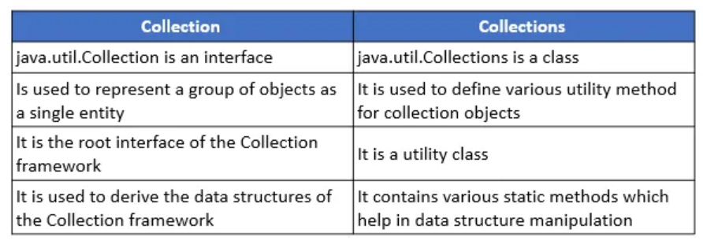
32. Differentiate between an Array and an ArrayList.
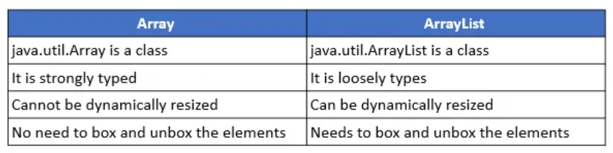
33. Differentiate between Iterable and Iterator.
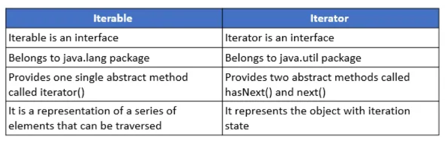
34. Differentiate between ArrayList and LinkedList.
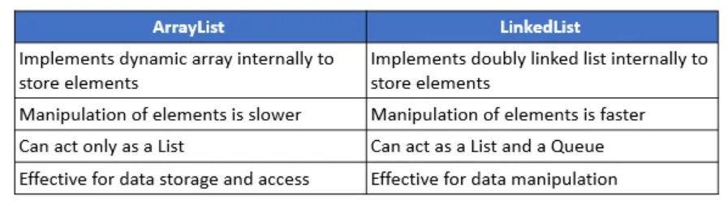
35. Differentiate between Comparable and Comparator.
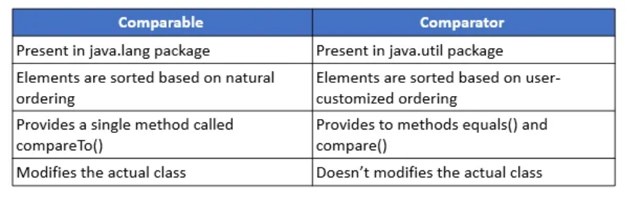
36. Differentiate between List and Set.
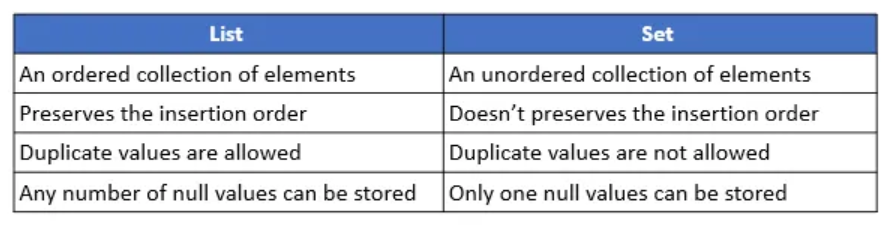
37. Differentiate between Set and Map.
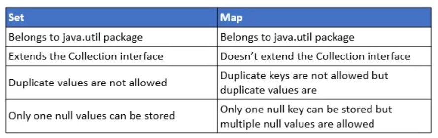
38. Differentiate between List and Map.
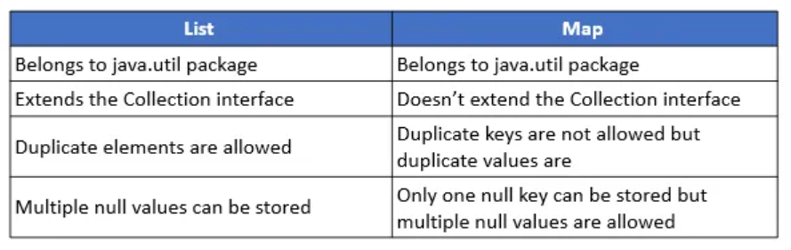
39. Differentiate between Queue and Stack.
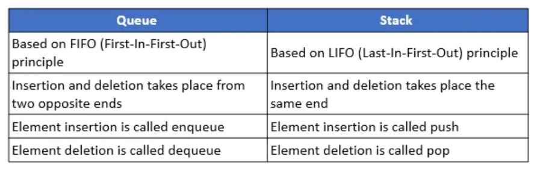
40. Differentiate between PriorityQueue and TreeSet.
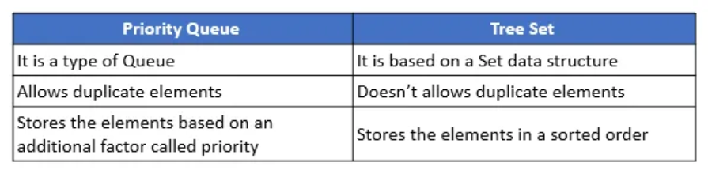
41. Differentiate between the Singly Linked List and Doubly Linked List.
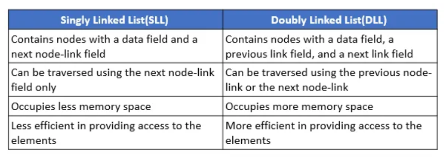
42. Differentiate between Iterator and Enumeration.
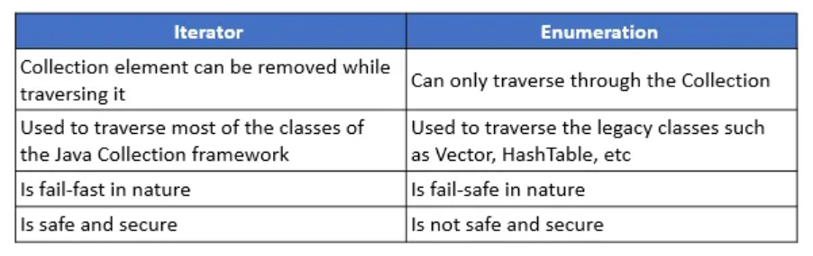
43. Differentiate between HashMap and HashTable.
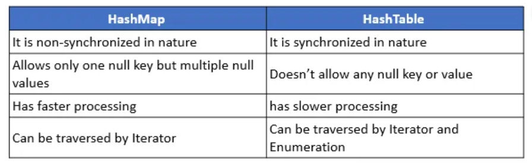
44. Differentiate between HashSet and HashMap.
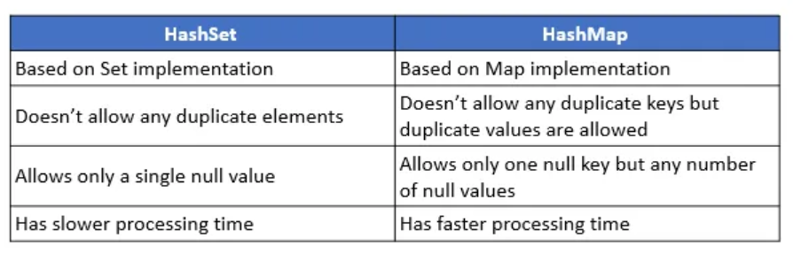
45. Differentiate between Iterator and ListIterator.
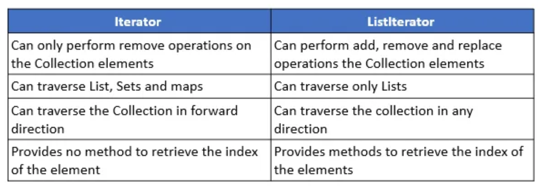
46. Differentiate between HashSet and TreeSet.
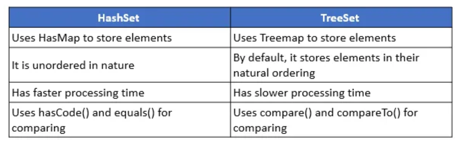
47. Differentiate between Queue and Deque.
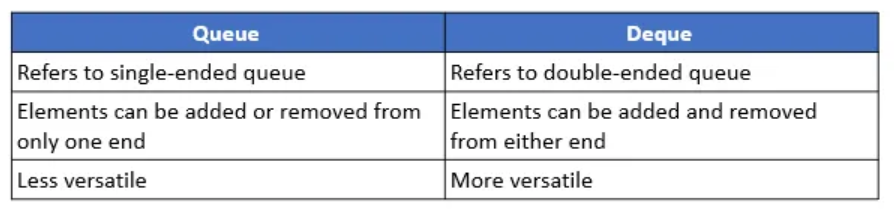
48. Differentiate between HashMap and TreeMap.
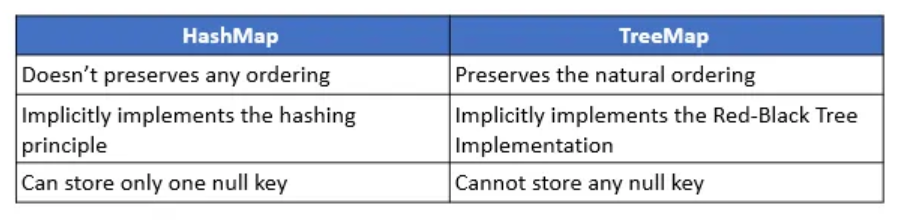
49. Differentiate between ArrayList and Vector.
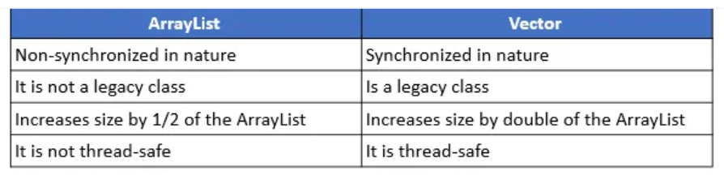
50. Differentiate between failfast and failsafe.
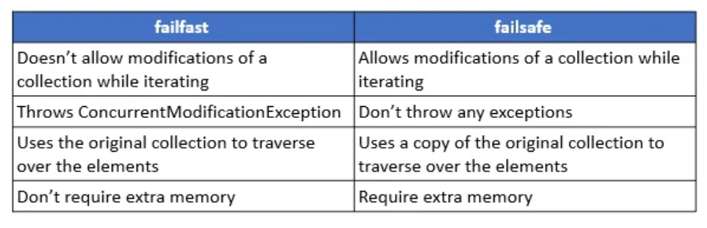
</details>

### Conclusion

<details> <summary>Details</summary>

In this course, we’ve covered essential Java concepts, including:

- **Basic Syntax and Structure**: Understanding variables, data types, and control flow.
- **Object-Oriented Programming**: Delving into classes, objects, inheritance, and polymorphism.
- **Core Libraries**: Exploring Java’s extensive libraries for tasks like collections, file I/O, and networking.
- **Error Handling**: Learning about exceptions and best practices for robust applications.
- **Java Development Tools**: Introduction to IDEs, build tools, and version control.

#### Resources for Further Learning

To continue your Java education, consider the following:

- **Books**:
  - *Effective Java* by Joshua Bloch
  - *Java: The Complete Reference* by Herbert Schildt

- **Online Courses**:
  - Coursera's Java Programming and Software Engineering Fundamentals
  - Udemy's Java Masterclass

- **Websites**:
  - [Oracle's Java Documentation](https://docs.oracle.com/javase/8/docs/)
  - [GeeksforGeeks](https://www.geeksforgeeks.org/java/)

**[⬆ Back to Top](#table-of-contents)**
</details>
