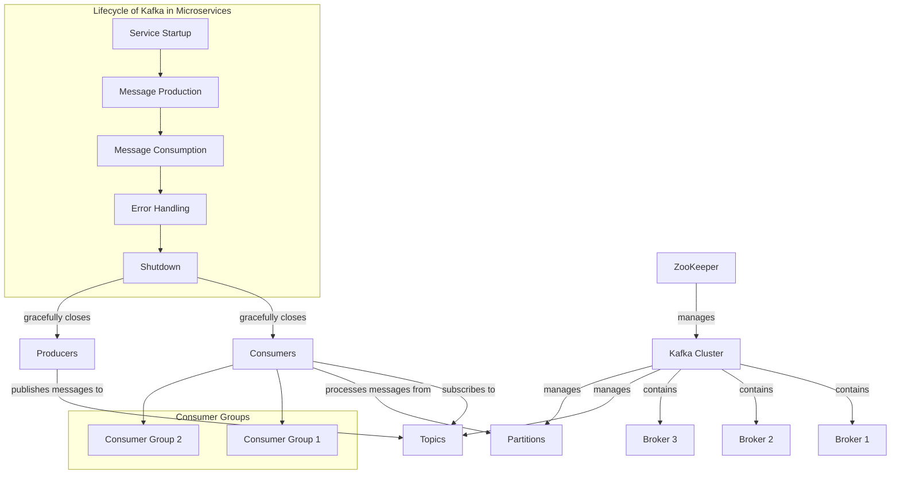

Default methods in Java 8 interfaces allow you to add new methods to interfaces without breaking existing implementations. Here are the key uses and benefits of default methods:

### 1. **Backward Compatibility**:
   - Default methods enable you to extend interfaces without forcing all implementing classes to provide an implementation for the new method. This is particularly useful when updating libraries or APIs.

### 2. **Code Reusability**:
   - Default methods can contain a body, allowing you to provide a common implementation that can be reused by multiple classes. This reduces code duplication.

### 3. **Multiple Inheritance of Behavior**:
   - With default methods, a class can inherit behavior from multiple interfaces, providing a way to mix-in functionality without the complications of multiple inheritance.

### 4. **Improved Interface Design**:
   - Default methods allow you to evolve interfaces over time, adding new functionality while maintaining a clean design and adhering to the principle of interface segregation.

### 5. **Providing Helper Methods**:
   - You can implement utility methods that may be useful to all implementers of the interface, reducing the need for utility classes.

### Example

Here's a simple example of a default method in an interface:

```java
interface Vehicle {
    void start();

    default void stop() {
        System.out.println("Vehicle stopping...");
    }
}

class Car implements Vehicle {
    public void start() {
        System.out.println("Car starting...");
    }

    // No need to implement stop(), it can use the default method
}

public class Main {
    public static void main(String[] args) {
        Vehicle myCar = new Car();
        myCar.start(); // Output: Car starting...
        myCar.stop();  // Output: Vehicle stopping...
    }
}
```

### Conclusion

Default methods enhance the flexibility of interface design in Java, allowing for easier maintenance and evolution of codebases while maintaining compatibility with existing implementations. They strike a balance between the purity of interfaces and the practical needs of software development.

Sure! Let's dive into **Apache Kafka** and **Apache ZooKeeper**, and explore the key concepts related to Kafka, including brokers, partitions, offsets, consumers, producers, consumer groups, replication factors, and topics.

### 1. Apache Kafka Overview

Apache Kafka is a distributed streaming platform designed for high-throughput, fault-tolerant data processing. It enables the building of real-time data pipelines and streaming applications. Kafka is designed to handle a large volume of data and allows you to publish and subscribe to streams of records.

### 2. Apache ZooKeeper

**Overview**: 
ZooKeeper is a centralized service for maintaining configuration information, naming, providing distributed synchronization, and providing group services. In the context of Kafka, ZooKeeper is used for:

- Managing the Kafka brokers.
- Keeping track of topics and their partitions.
- Managing configurations.
- Electing a leader for partitions.

**Note**: As of Kafka 2.8.0, Kafka can operate without ZooKeeper using KRaft mode (Kafka Raft), but ZooKeeper is still widely used in many existing deployments.

### Key Concepts in Kafka

#### 1. Kafka Broker

- **Definition**: A Kafka broker is a server that stores data and serves client requests. A Kafka cluster is made up of multiple brokers to distribute load and ensure fault tolerance.
- **Example**: If you have a Kafka cluster with three brokers (`broker1`, `broker2`, and `broker3`), each broker can handle messages and maintain its own partition of the topics.

#### 2. Partition

- **Definition**: Each topic in Kafka is divided into partitions, which are ordered, immutable sequences of records. Each partition is a log that retains the order of messages.
- **Example**: If you have a topic called `orders` with three partitions, each partition will receive a subset of the messages sent to that topic:
  - Partition 0: `order1`, `order4`, `order7`
  - Partition 1: `order2`, `order5`, `order8`
  - Partition 2: `order3`, `order6`, `order9`

#### 3. Offset

- **Definition**: An offset is a unique identifier for each record within a partition. It denotes the position of a record in a partition and is used to track the consumer's progress.
- **Example**: If `order1` is the first message in Partition 0, it will have an offset of `0`. The next message, `order4`, will have an offset of `1`, and so on.

#### 4. Consumer

- **Definition**: A consumer is an application that reads messages from Kafka topics. Consumers can subscribe to one or more topics and process the records.
- **Example**: A web application that processes user orders can act as a consumer of the `orders` topic, reading and handling messages as they arrive.

#### 5. Producer

- **Definition**: A producer is an application that publishes messages to Kafka topics. Producers send data to the brokers, which store the data in the appropriate partitions.
- **Example**: An e-commerce application can act as a producer, sending order details to the `orders` topic whenever a customer makes a purchase.

#### 6. Consumer Group

- **Definition**: A consumer group is a group of consumers that work together to consume messages from a set of topics. Each consumer in a group reads from a different partition to balance the load.
- **Example**: If you have a consumer group called `orderProcessors` with three consumers, each can read from different partitions of the `orders` topic, allowing parallel processing of messages.

#### 7. Kafka Server (Broker)

- **Definition**: Kafka server refers to the Kafka brokers that manage the storage and transmission of data. Each broker can handle a portion of the partitions and can serve consumer and producer requests.
- **Example**: In a three-broker Kafka cluster, each broker is responsible for some partitions of various topics and communicates with ZooKeeper for cluster management.

#### 8. Replication Factor

- **Definition**: The replication factor determines how many copies of each partition are maintained across the Kafka cluster. A higher replication factor provides better fault tolerance.
- **Example**: If the `orders` topic has a replication factor of 3, each partition of that topic will be stored on three different brokers. This way, if one broker fails, the data can still be accessed from the other brokers.

#### 9. Topic

- **Definition**: A topic is a category or feed name to which records are published. Topics are split into partitions, and they are the primary way to organize messages in Kafka.
- **Example**: You might have multiple topics in your Kafka cluster, such as `orders`, `inventory`, and `shipping`, each serving different purposes and data streams.

### Example Workflow

Let’s illustrate these concepts with a practical example:

1. **Producers** send messages to the `orders` topic when a customer places an order.
   ```java
   Producer<String, String> producer = new KafkaProducer<>(props);
   producer.send(new ProducerRecord<>("orders", "orderId", "orderDetails"));
   ```

2. The **Kafka Broker** receives these messages and stores them in partitions based on the topic's configuration.

3. Each message is assigned an **offset** starting from 0 for each partition.

4. **Consumers** in the `orderProcessors` group read from the `orders` topic.
   ```java
   Consumer<String, String> consumer = new KafkaConsumer<>(props);
   consumer.subscribe(Arrays.asList("orders"));
   while (true) {
       ConsumerRecords<String, String> records = consumer.poll(Duration.ofMillis(100));
       for (ConsumerRecord<String, String> record : records) {
           System.out.printf("Consumed message with offset %d: %s%n", record.offset(), record.value());
       }
   }
   ```

5. If there are three partitions for `orders`, the three consumers can read from these partitions concurrently, allowing for efficient processing.

6. The **replication factor** ensures that each partition is stored on multiple brokers, providing resilience against broker failures.

### Conclusion

Apache Kafka, together with ZooKeeper, provides a robust system for handling real-time data streams. By understanding concepts like brokers, partitions, offsets, consumers, producers, consumer groups, replication factors, and topics, you can effectively design and implement streaming applications that are scalable and fault-tolerant.

If you have further questions or need clarification on any specific aspect, feel free to ask!

Creating an event-driven and distributed microservices architecture using Kafka involves several key steps. Below, I’ll outline a high-level approach, along with an example to illustrate the concepts.

### Overview of Event-Driven Microservices with Kafka

1. **Microservices Design**: Each microservice should be designed to handle specific business capabilities. They communicate asynchronously using Kafka as the message broker.

2. **Kafka Topics**: Define topics for different events or data streams. Each microservice will publish to and consume from these topics.

3. **Producers and Consumers**: Implement producers to send messages to Kafka topics and consumers to read messages from these topics.

4. **Schema Management**: Use schema registries to manage message formats, ensuring compatibility between producers and consumers.

5. **Error Handling and Retrying**: Implement mechanisms to handle failures, such as message retries and dead-letter queues.

### Example Scenario

Let’s consider a simple e-commerce system with the following microservices:
- **Order Service**: Handles order placements.
- **Inventory Service**: Manages inventory levels.
- **Shipping Service**: Handles shipping logistics.

### Step-by-Step Implementation

#### 1. Setting Up Kafka

1. **Install Kafka**: Set up a Kafka cluster. You can use Docker for a quick setup:
   ```bash
   docker run -d --name zookeeper -p 2181:2181 wurstmeister/zookeeper
   docker run -d --name kafka --link zookeeper -p 9092:9092 wurstmeister/kafka
   ```

2. **Create Topics**:
   ```bash
   kafka-topics.sh --create --topic orders --bootstrap-server localhost:9092 --partitions 3 --replication-factor 1
   kafka-topics.sh --create --topic inventory --bootstrap-server localhost:9092 --partitions 3 --replication-factor 1
   kafka-topics.sh --create --topic shipping --bootstrap-server localhost:9092 --partitions 3 --replication-factor 1
   ```

#### 2. Implementing Producers

**Order Service**: This service publishes an order event to the `orders` topic.
```java
public class OrderService {
    private final Producer<String, Order> producer;

    public OrderService(Producer<String, Order> producer) {
        this.producer = producer;
    }

    public void placeOrder(Order order) {
        // Publish order event
        producer.send(new ProducerRecord<>("orders", order.getId(), order));
    }
}
```

#### 3. Implementing Consumers

**Inventory Service**: This service consumes order events and updates the inventory.
```java
public class InventoryService {
    private final Consumer<String, Order> consumer;

    public InventoryService(Consumer<String, Order> consumer) {
        this.consumer = consumer;
    }

    public void startConsuming() {
        consumer.subscribe(Collections.singletonList("orders"));
        while (true) {
            ConsumerRecords<String, Order> records = consumer.poll(Duration.ofMillis(100));
            for (ConsumerRecord<String, Order> record : records) {
                // Update inventory based on the order
                updateInventory(record.value());
            }
        }
    }
}
```

**Shipping Service**: This service consumes inventory update events to process shipments.
```java
public class ShippingService {
    private final Consumer<String, InventoryUpdate> consumer;

    public ShippingService(Consumer<String, InventoryUpdate> consumer) {
        this.consumer = consumer;
    }

    public void startConsuming() {
        consumer.subscribe(Collections.singletonList("inventory"));
        while (true) {
            ConsumerRecords<String, InventoryUpdate> records = consumer.poll(Duration.ofMillis(100));
            for (ConsumerRecord<String, InventoryUpdate> record : records) {
                // Handle shipping based on inventory updates
                handleShipping(record.value());
            }
        }
    }
}
```

#### 4. Error Handling and Retries

Implement error handling in your consumers. For example, if updating the inventory fails, you might want to retry or log the error.

#### 5. Monitoring and Schema Management

1. **Monitoring**: Use tools like Kafka Manager or Prometheus to monitor your Kafka cluster and the health of your microservices.

2. **Schema Registry**: Use a schema registry (like Confluent Schema Registry) to manage message formats, ensuring that producers and consumers can communicate effectively.

### Conclusion

By using Kafka, you can effectively implement an event-driven architecture that allows microservices to communicate asynchronously. Each microservice operates independently, allowing for scalability and resilience. 

You can extend this architecture by adding more services, implementing additional features like retries, and ensuring fault tolerance.

If you have further questions or want to dive deeper into any aspect, feel free to ask!

Here are some common Kafka programming interview questions, along with explanations and examples to help you prepare:

### 1. What is Kafka, and how does it work?

**Explanation**: 
Kafka is a distributed streaming platform designed for high-throughput, fault-tolerant data processing. It operates as a publish-subscribe system where producers send messages to topics, and consumers read from these topics.

### 2. Explain the concept of topics and partitions in Kafka.

**Example**: 
A topic is a category or feed name to which records are published. Each topic can be divided into multiple partitions, allowing for parallel processing and scalability.

**Interview Question**:
- **Q**: How do you ensure that messages within a partition are processed in order?
- **A**: Messages within a partition are always processed in the order they are received, as Kafka guarantees ordering at the partition level. To maintain order, you should produce related messages to the same partition.

### 3. What is the role of a producer and a consumer in Kafka?

**Explanation**:
- **Producer**: Sends messages to Kafka topics.
- **Consumer**: Reads messages from Kafka topics.

**Example Code for Producer**:
```java
Producer<String, String> producer = new KafkaProducer<>(props);
producer.send(new ProducerRecord<>("topicName", "key", "value"));
```

**Example Code for Consumer**:
```java
Consumer<String, String> consumer = new KafkaConsumer<>(props);
consumer.subscribe(Collections.singletonList("topicName"));
while (true) {
    ConsumerRecords<String, String> records = consumer.poll(Duration.ofMillis(100));
    for (ConsumerRecord<String, String> record : records) {
        System.out.printf("Consumed message: %s%n", record.value());
    }
}
```

### 4. What is an offset in Kafka?

**Explanation**: 
An offset is a unique identifier for each message within a partition. It represents the position of the message in the partition.

**Interview Question**:
- **Q**: How do you handle message acknowledgment in Kafka?
- **A**: Kafka consumers can manually commit offsets to acknowledge that they have processed messages. This allows for control over which messages are considered processed.

### 5. What is the difference between Kafka and traditional message brokers?

**Explanation**:
Kafka is designed for high throughput and scalability, often used for streaming data. Traditional message brokers might focus on simple message queuing without the same performance characteristics.

**Interview Question**:
- **Q**: Can you explain the advantages of using Kafka over traditional message brokers?
- **A**: Kafka provides high throughput, fault tolerance, durability, scalability, and support for both real-time and batch processing.

### 6. What is a consumer group, and why is it important?

**Explanation**: 
A consumer group is a group of consumers that work together to consume messages from one or more topics. Each consumer in the group reads from a different partition, allowing for load balancing.

**Interview Question**:
- **Q**: How do consumer groups help in scaling Kafka consumers?
- **A**: By distributing partitions among multiple consumers in a group, Kafka allows for parallel processing of messages, improving throughput and efficiency.

### 7. Explain the replication factor in Kafka.

**Explanation**: 
The replication factor determines how many copies of each partition are maintained across the Kafka cluster. A higher replication factor increases fault tolerance.

**Interview Question**:
- **Q**: What happens if a broker fails?
- **A**: If a broker fails, the replicas of its partitions on other brokers can take over, ensuring no data loss as long as the replication factor is maintained.

### 8. How do you handle message serialization in Kafka?

**Explanation**: 
Kafka messages need to be serialized before sending and deserialized upon receiving. Common serialization formats include JSON, Avro, and Protobuf.

**Example Code**:
Using JSON serialization:
```java
ObjectMapper mapper = new ObjectMapper();
String jsonValue = mapper.writeValueAsString(yourObject);
producer.send(new ProducerRecord<>("topicName", "key", jsonValue));
```

### 9. What are some strategies for error handling in Kafka consumers?

**Explanation**: 
Error handling can involve logging errors, retrying message processing, and using dead-letter queues for unprocessable messages.

**Interview Question**:
- **Q**: How would you implement a retry mechanism for failed messages?
- **A**: You can implement a retry mechanism by keeping track of the number of attempts in a separate counter and reprocessing the message if it fails, up to a maximum limit.

### 10. How do you monitor and manage Kafka clusters?

**Explanation**: 
Monitoring Kafka involves using tools like Kafka Manager, Prometheus, or Grafana to track metrics like consumer lag, throughput, and broker health.

**Interview Question**:
- **Q**: What metrics would you consider important for monitoring a Kafka cluster?
- **A**: Key metrics include producer and consumer throughput, consumer lag, partition distribution, broker health, and error rates.

### Conclusion

These questions and examples cover fundamental concepts of Kafka and can help you prepare for a Kafka-related programming interview. Understanding these concepts deeply and being able to discuss them clearly will demonstrate your knowledge and proficiency in using Kafka for event-driven architectures. If you have more specific topics or questions, feel free to ask!

Let's clarify the concepts of **feed**, **consumer lag**, **broker**, and **master node** in the context of distributed messaging systems like Kafka.

### 1. Feed

**Definition**: 
In the context of Kafka, a "feed" typically refers to a stream of messages or data that is continuously produced and consumed. It can represent a topic in Kafka that holds the sequence of records generated by producers.

**Example**: 
If you have a topic named `user-activity`, the feed would consist of all the messages related to user actions (like logins, clicks, etc.) that are published to this topic over time.

### 2. Consumer Lag

**Definition**: 
Consumer lag refers to the difference between the latest message offset produced to a topic partition and the offset of the last message that a consumer group has processed. In other words, it indicates how far behind a consumer is from the latest messages.

**Example**: 
If the latest offset for a partition is `100`, and a consumer in that partition has processed messages up to offset `90`, the consumer lag would be `10`. High consumer lag can indicate that the consumer is unable to keep up with the rate of message production.

**Importance**: 
Monitoring consumer lag is crucial for ensuring that consumers are processing messages in a timely manner. If lag is consistently high, it may signal performance issues or the need for scaling consumers.

### 3. Broker

**Definition**: 
A broker in Kafka is a server that stores data and serves client requests. It is responsible for receiving, storing, and forwarding messages to consumers. A Kafka cluster consists of multiple brokers, allowing for distributed load and fault tolerance.

**Example**: 
In a Kafka cluster with three brokers (`broker1`, `broker2`, and `broker3`), each broker stores a portion of the data (partitions of topics) and handles requests from producers and consumers.

### 4. Master Node

**Definition**: 
In a broader distributed systems context, a master node typically refers to a node that coordinates activities and manages state across a cluster. In Kafka, however, the concept of a "master node" is not explicitly defined as it is in some other systems (like Hadoop or certain databases).

**In Kafka**:
- **Leader Broker**: In Kafka, each partition of a topic has a designated leader broker that handles all reads and writes for that partition. The leader is responsible for managing the partition's data and coordinating replication to follower brokers.
- **ZooKeeper**: Kafka uses ZooKeeper for managing the metadata and leader election among brokers. However, with newer versions (KRaft mode), Kafka can operate without ZooKeeper.

**Example**: 
When a producer sends a message to a partition, the request is directed to the leader broker of that partition. The follower brokers replicate the data but do not handle client requests directly.

### Summary

- **Feed**: A stream of messages in a Kafka topic.
- **Consumer Lag**: The difference between the latest produced message and the last processed message by a consumer, indicating processing delays.
- **Broker**: A server in Kafka that stores and serves messages, part of a Kafka cluster.
- **Master Node**: Not explicitly defined in Kafka; instead, it uses a leader-follower model for partitions, with ZooKeeper or KRaft managing metadata and coordination.

If you have more questions or need further details on any of these concepts, feel free to ask!

In Kafka, brokers are crucial components of the architecture, and they can be categorized based on their roles and responsibilities. Here's an overview of the different types of brokers and their internal roles:

### Types of Brokers in Kafka

1. **Leader Broker**
2. **Follower Broker**
3. **Controller Broker**

### 1. Leader Broker

**Definition**: 
The leader broker is responsible for all reads and writes for a particular partition. Each partition has one leader and may have multiple followers.

**Internal Role**:
- **Handling Requests**: The leader processes all requests from producers and consumers for the partition it leads.
- **Data Storage**: It stores the actual log of records for its partitions and ensures that data is correctly written and replicated.
- **Coordinating Replication**: It coordinates the replication of data to follower brokers, ensuring that they remain in sync.

**Example**: 
If you have a topic with three partitions (`p0`, `p1`, `p2`), one of the brokers will be elected as the leader for each partition. For instance:
- `p0` leader: `Broker 1`
- `p1` leader: `Broker 2`
- `p2` leader: `Broker 3`

### 2. Follower Broker

**Definition**: 
Follower brokers replicate the data from the leader broker for a partition. They do not handle client requests directly.

**Internal Role**:
- **Data Replication**: Followers replicate the log data from the leader broker. They receive messages from the leader and append them to their own log.
- **Maintaining Readiness**: They periodically check in with the leader to ensure they are caught up and ready to take over if the leader fails.
- **Failover Support**: If a leader broker fails, one of the followers can be elected as the new leader to maintain availability and data integrity.

**Example**: 
For the same topic with three partitions:
- `p0` might have `Broker 2` and `Broker 3` as followers of `Broker 1`.
- If `Broker 1` fails, one of the followers (e.g., `Broker 2`) will become the new leader for `p0`.

### 3. Controller Broker

**Definition**: 
The controller broker is responsible for managing the state of the Kafka cluster. It is usually one of the brokers but has special responsibilities.

**Internal Role**:
- **Leader Election**: The controller handles the leader election process for partitions. When a leader broker goes down, the controller will select a new leader from the available followers.
- **Cluster Management**: It keeps track of the brokers in the cluster, topics, partitions, and their states.
- **Metadata Management**: The controller is responsible for updating the metadata about the cluster and ensuring consistency.

**Example**: 
If `Broker 1` is the controller and it detects that `Broker 2` has failed, it will initiate the leader election process for the partitions that `Broker 2` was leading.

### Summary of Roles

| Broker Type      | Responsibilities |
|------------------|------------------|
| **Leader Broker** | Handles all read/write requests for its partition, coordinates data replication to followers. |
| **Follower Broker** | Replicates data from the leader, maintains readiness for leader failover. |
| **Controller Broker** | Manages cluster state, handles leader election, updates metadata. |

### Conclusion

Understanding the roles of different types of brokers in Kafka is crucial for designing robust, scalable, and fault-tolerant streaming applications. Each broker type plays a specific role that contributes to the overall reliability and performance of the Kafka ecosystem. If you have more questions or need further clarification on any aspect, feel free to ask!

Here’s a Mermaid diagram representing the internal structure of Kafka in microservices, including the Kafka cluster components and the lifecycle of Kafka in a microservice context.



### Explanation of the Diagram:

- **Kafka Cluster**: Contains multiple brokers that manage topics and partitions.
- **Producers**: Services that publish messages to the topics managed by the brokers.
- **Consumers**: Services that subscribe to topics, process messages, and can belong to consumer groups for load balancing.
- **ZooKeeper**: Manages broker metadata and leader election (not needed in KRaft mode).
- **Lifecycle Steps**:
  - **Service Startup**: Initializes producers and consumers.
  - **Message Production**: Producers send messages to the topics.
  - **Message Consumption**: Consumers read and process the messages.
  - **Error Handling**: Implement strategies like retries and dead-letter queues.
  - **Shutdown**: Ensures graceful closure of producers and consumers.

This diagram provides a clear visualization of how Kafka operates within a microservices architecture, highlighting the components and lifecycle steps. If you need any modifications or further explanations, let me know!

Creating a complete Kafka-based microservice involves several steps, including setting up the Kafka environment, implementing producer and consumer services, and managing the internal structure and lifecycle. Below is an overview of the internal structure, the lifecycle of Kafka in a microservice context, and a simple example program.

### Internal Structure of Kafka in Microservices

1. **Kafka Cluster**: Composed of multiple brokers that manage topics and partitions.
2. **Producers**: Services that publish messages to Kafka topics.
3. **Consumers**: Services that subscribe to topics and process messages.
4. **Consumer Groups**: Allow multiple consumers to work together to consume messages from a topic.
5. **ZooKeeper (if used)**: Manages broker metadata and leader election (not needed in KRaft mode).

### Lifecycle of Kafka in Microservices

1. **Service Startup**: The microservice starts and initializes its Kafka producer or consumer.
2. **Message Production**: Producers send messages to Kafka topics.
3. **Message Consumption**: Consumers read messages from Kafka topics, process them, and can send results back to Kafka or other services.
4. **Error Handling**: Implement retries, logging, or dead-letter queues for failed messages.
5. **Shutdown**: Gracefully close producers and consumers to ensure all messages are processed or committed.

### Example Program

Here's a simple Java-based example using Spring Boot to create a producer and a consumer.

#### Step 1: Setup Maven Dependencies

In your `pom.xml`, include the following dependencies:

```xml
<dependencies>
    <dependency>
        <groupId>org.springframework.boot</groupId>
        <artifactId>spring-boot-starter</artifactId>
    </dependency>
    <dependency>
        <groupId>org.springframework.kafka</groupId>
        <artifactId>spring-kafka</artifactId>
    </dependency>
    <dependency>
        <groupId>org.springframework.boot</groupId>
        <artifactId>spring-boot-starter-web</artifactId>
    </dependency>
</dependencies>
```

#### Step 2: Configuration

Create a configuration class to set up Kafka properties.

```java
import org.springframework.context.annotation.Bean;
import org.springframework.context.annotation.Configuration;
import org.springframework.kafka.annotation.EnableKafka;
import org.springframework.kafka.core.ConsumerFactory;
import org.springframework.kafka.core.DefaultKafkaConsumerFactory;
import org.springframework.kafka.core.DefaultKafkaProducerFactory;
import org.springframework.kafka.core.ProducerFactory;
import org.springframework.kafka.listener.ConcurrentMessageListenerContainer;
import org.springframework.kafka.listener.config.ContainerProperties;

import java.util.HashMap;
import java.util.Map;

@EnableKafka
@Configuration
public class KafkaConfig {

    private final String bootstrapServers = "localhost:9092";

    @Bean
    public ProducerFactory<String, String> producerFactory() {
        Map<String, Object> configProps = new HashMap<>();
        configProps.put("bootstrap.servers", bootstrapServers);
        configProps.put("key.serializer", "org.apache.kafka.common.serialization.StringSerializer");
        configProps.put("value.serializer", "org.apache.kafka.common.serialization.StringSerializer");
        return new DefaultKafkaProducerFactory<>(configProps);
    }

    @Bean
    public ConsumerFactory<String, String> consumerFactory() {
        Map<String, Object> configProps = new HashMap<>();
        configProps.put("bootstrap.servers", bootstrapServers);
        configProps.put("group.id", "my-group");
        configProps.put("key.deserializer", "org.apache.kafka.common.serialization.StringDeserializer");
        configProps.put("value.deserializer", "org.apache.kafka.common.serialization.StringDeserializer");
        return new DefaultKafkaConsumerFactory<>(configProps);
    }

    @Bean
    public ConcurrentMessageListenerContainer<String, String> kafkaListenerContainer() {
        ContainerProperties containerProps = new ContainerProperties("my-topic");
        containerProps.setMessageListener(new MyMessageListener());
        return new ConcurrentMessageListenerContainer<>(consumerFactory(), containerProps);
    }
}
```

#### Step 3: Producer Service

Create a service for producing messages to Kafka.

```java
import org.springframework.beans.factory.annotation.Autowired;
import org.springframework.kafka.core.KafkaTemplate;
import org.springframework.stereotype.Service;

@Service
public class ProducerService {

    private final KafkaTemplate<String, String> kafkaTemplate;

    @Autowired
    public ProducerService(KafkaTemplate<String, String> kafkaTemplate) {
        this.kafkaTemplate = kafkaTemplate;
    }

    public void sendMessage(String message) {
        kafkaTemplate.send("my-topic", message);
    }
}
```

#### Step 4: Consumer Service

Create a message listener to consume messages.

```java
import org.springframework.kafka.annotation.KafkaListener;
import org.springframework.stereotype.Component;

@Component
public class MyMessageListener {

    @KafkaListener(topics = "my-topic", groupId = "my-group")
    public void listen(String message) {
        System.out.printf("Consumed message: %s%n", message);
    }
}
```

#### Step 5: REST Controller (Optional)

Create a REST controller to send messages through HTTP requests.

```java
import org.springframework.beans.factory.annotation.Autowired;
import org.springframework.web.bind.annotation.*;

@RestController
@RequestMapping("/api")
public class KafkaController {

    private final ProducerService producerService;

    @Autowired
    public KafkaController(ProducerService producerService) {
        this.producerService = producerService;
    }

    @PostMapping("/send")
    public String sendMessage(@RequestBody String message) {
        producerService.sendMessage(message);
        return "Message sent to Kafka";
    }
}
```

#### Step 6: Application Entry Point

Create the main application class.

```java
import org.springframework.boot.SpringApplication;
import org.springframework.boot.autoconfigure.SpringBootApplication;

@SpringBootApplication
public class KafkaMicroserviceApplication {
    public static void main(String[] args) {
        SpringApplication.run(KafkaMicroserviceApplication.class, args);
    }
}
```

### Running the Application

1. Start your Kafka broker.
2. Create the topic `my-topic`:
   ```bash
   kafka-topics.sh --create --topic my-topic --bootstrap-server localhost:9092 --partitions 1 --replication-factor 1
   ```
3. Run your Spring Boot application.
4. Use a tool like Postman or curl to send POST requests to `http://localhost:8080/api/send` with a message in the body.

### Conclusion

This example demonstrates the internal structure and lifecycle of Kafka in a microservices architecture. The producer sends messages to Kafka, while the consumer listens for those messages. You can expand this basic structure to include error handling, retries, and more sophisticated message processing as needed.

If you have more specific questions or need further examples, feel free to ask!

### Kafka

**1. Interview Questions:**

- What is Apache Kafka, and how does it work?
- Explain the difference between a Kafka topic, partition, and offset.
- How does Kafka ensure message durability and fault tolerance?
- What are producers and consumers in Kafka?
- Describe the role of ZooKeeper in Kafka.

**2. Coding Challenge:**

Create a simple Kafka producer and consumer using Spring Boot.

```java
// KafkaProducerConfig.java
import org.apache.kafka.clients.producer.ProducerConfig;
import org.apache.kafka.common.serialization.StringSerializer;
import org.springframework.context.annotation.Bean;
import org.springframework.context.annotation.Configuration;
import org.springframework.kafka.core.KafkaTemplate;
import org.springframework.kafka.core.ProducerFactory;
import org.springframework.kafka.core.DefaultKafkaProducerFactory;
import org.springframework.kafka.core.KafkaTemplate;
import org.springframework.kafka.core.ProducerFactory;
import org.springframework.kafka.core.DefaultKafkaProducerFactory;
import org.springframework.kafka.support.serializer.ErrorHandlingDeserializer;
import org.springframework.kafka.support.serializer.JsonDeserializer;

import java.util.HashMap;
import java.util.Map;

@Configuration
public class KafkaProducerConfig {

    @Bean
    public ProducerFactory<String, String> producerFactory() {
        Map<String, Object> configProps = new HashMap<>();
        configProps.put(ProducerConfig.BOOTSTRAP_SERVERS_CONFIG, "localhost:9092");
        configProps.put(ProducerConfig.KEY_SERIALIZER_CLASS_CONFIG, StringSerializer.class);
        configProps.put(ProducerConfig.VALUE_SERIALIZER_CLASS_CONFIG, StringSerializer.class);
        return new DefaultKafkaProducerFactory<>(configProps);
    }

    @Bean
    public KafkaTemplate<String, String> kafkaTemplate() {
        return new KafkaTemplate<>(producerFactory());
    }
}
```

```java
// KafkaConsumerConfig.java
import org.apache.kafka.clients.consumer.ConsumerConfig;
import org.apache.kafka.common.serialization.StringDeserializer;
import org.springframework.context.annotation.Bean;
import org.springframework.context.annotation.Configuration;
import org.springframework.kafka.annotation.EnableKafka;
import org.springframework.kafka.config.ConcurrentKafkaListenerContainerFactory;
import org.springframework.kafka.core.ConsumerFactory;
import org.springframework.kafka.core.DefaultKafkaConsumerFactory;
import org.springframework.kafka.listener.ConcurrentMessageListenerContainer;
import org.springframework.kafka.listener.config.ContainerProperties;
import org.springframework.kafka.support.serializer.ErrorHandlingDeserializer;
import org.springframework.kafka.support.serializer.JsonDeserializer;

import java.util.HashMap;
import java.util.Map;

@Configuration
@EnableKafka
public class KafkaConsumerConfig {

    @Bean
    public ConsumerFactory<String, String> consumerFactory() {
        Map<String, Object> configProps = new HashMap<>();
        configProps.put(ConsumerConfig.BOOTSTRAP_SERVERS_CONFIG, "localhost:9092");
        configProps.put(ConsumerConfig.GROUP_ID_CONFIG, "my-group");
        configProps.put(ConsumerConfig.KEY_DESERIALIZER_CLASS_CONFIG, StringDeserializer.class);
        configProps.put(ConsumerConfig.VALUE_DESERIALIZER_CLASS_CONFIG, StringDeserializer.class);
        return new DefaultKafkaConsumerFactory<>(configProps);
    }

    @Bean
    public ConcurrentKafkaListener

```
It looks like you’re setting up a Kafka consumer configuration in a Spring Boot application. Your configuration file, `KafkaConsumerConfig.java`, sets up the `ConsumerFactory` and is in the process of setting up a `ConcurrentKafkaListenerContainerFactory`. Here’s how you can complete the `ConcurrentKafkaListenerContainerFactory` setup and add a Kafka listener configuration.

### Completed `KafkaConsumerConfig.java`

```java
import org.apache.kafka.clients.consumer.ConsumerConfig;
import org.apache.kafka.common.serialization.StringDeserializer;
import org.springframework.context.annotation.Bean;
import org.springframework.context.annotation.Configuration;
import org.springframework.kafka.annotation.EnableKafka;
import org.springframework.kafka.config.ConcurrentKafkaListenerContainerFactory;
import org.springframework.kafka.core.ConsumerFactory;
import org.springframework.kafka.core.DefaultKafkaConsumerFactory;
import org.springframework.kafka.listener.ConcurrentMessageListenerContainer;
import org.springframework.kafka.listener.config.ContainerProperties;
import org.springframework.kafka.support.serializer.JsonDeserializer;

import java.util.HashMap;
import java.util.Map;

@Configuration
@EnableKafka
public class KafkaConsumerConfig {

    @Bean
    public ConsumerFactory<String, String> consumerFactory() {
        Map<String, Object> configProps = new HashMap<>();
        configProps.put(ConsumerConfig.BOOTSTRAP_SERVERS_CONFIG, "localhost:9092");
        configProps.put(ConsumerConfig.GROUP_ID_CONFIG, "my-group");
        configProps.put(ConsumerConfig.KEY_DESERIALIZER_CLASS_CONFIG, StringDeserializer.class);
        configProps.put(ConsumerConfig.VALUE_DESERIALIZER_CLASS_CONFIG, StringDeserializer.class);
        return new DefaultKafkaConsumerFactory<>(configProps);
    }

    @Bean
    public ConcurrentKafkaListenerContainerFactory<String, String> kafkaListenerContainerFactory() {
        ConcurrentKafkaListenerContainerFactory<String, String> factory = new ConcurrentKafkaListenerContainerFactory<>();
        factory.setConsumerFactory(consumerFactory());
        factory.setConcurrency(3); // Adjust concurrency based on your needs
        factory.getContainerProperties().setPollTimeout(3000); // Adjust poll timeout
        return factory;
    }
}
```

### Explanation

- **`ConsumerFactory<String, String>`:**
  This bean creates a Kafka `ConsumerFactory` with properties such as the Kafka server address, consumer group ID, and deserializers for key and value.

- **`ConcurrentKafkaListenerContainerFactory<String, String>`:**
  This factory bean is responsible for creating `ConcurrentMessageListenerContainer` instances, which handle the actual message consumption. The `setConcurrency` method sets the number of concurrent threads to process messages, and `setPollTimeout` sets the maximum time the consumer will block while polling for records.

### Optional Enhancements

1. **Error Handling Deserializer:**
   If you want to handle errors in deserialization gracefully, you might want to use `ErrorHandlingDeserializer`.

   ```java
   import org.springframework.kafka.support.serializer.ErrorHandlingDeserializer;

   @Bean
   public ConsumerFactory<String, String> consumerFactory() {
       Map<String, Object> configProps = new HashMap<>();
       configProps.put(ConsumerConfig.BOOTSTRAP_SERVERS_CONFIG, "localhost:9092");
       configProps.put(ConsumerConfig.GROUP_ID_CONFIG, "my-group");
       configProps.put(ConsumerConfig.KEY_DESERIALIZER_CLASS_CONFIG, ErrorHandlingDeserializer.class);
       configProps.put(ConsumerConfig.VALUE_DESERIALIZER_CLASS_CONFIG, ErrorHandlingDeserializer.class);
       configProps.put(ErrorHandlingDeserializer.VALUE_DESERIALIZER_CLASS, StringDeserializer.class);
       return new DefaultKafkaConsumerFactory<>(configProps);
   }
   ```

2. **JSON Deserialization:**
   If your messages are in JSON format and you want to use a specific class for deserialization:

   ```java
   @Bean
   public ConsumerFactory<String, MyObject> consumerFactory() {
       Map<String, Object> configProps = new HashMap<>();
       configProps.put(ConsumerConfig.BOOTSTRAP_SERVERS_CONFIG, "localhost:9092");
       configProps.put(ConsumerConfig.GROUP_ID_CONFIG, "my-group");
       configProps.put(ConsumerConfig.KEY_DESERIALIZER_CLASS_CONFIG, StringDeserializer.class);
       configProps.put(ConsumerConfig.VALUE_DESERIALIZER_CLASS_CONFIG, JsonDeserializer.class);
       configProps.put(JsonDeserializer.TRUSTED_PACKAGES, "*");
       configProps.put(JsonDeserializer.VALUE_DEFAULT_TYPE, MyObject.class.getName());
       return new DefaultKafkaConsumerFactory<>(configProps);
   }
   ```

### Kafka Listener Example

To use the `ConcurrentKafkaListenerContainerFactory`, you would create a Kafka listener like this:

```java
import org.springframework.kafka.annotation.KafkaListener;
import org.springframework.stereotype.Component;

@Component
public class KafkaConsumer {

    @KafkaListener(topics = "my-topic", groupId = "my-group")
    public void listen(String message) {
        System.out.println("Received message: " + message);
    }
}
```

In this example, the `@KafkaListener` annotation indicates that the `listen` method should be invoked when a message is received on the specified topic.

This setup configures Kafka consumers in a Spring Boot application, enabling them to process messages efficiently while handling potential errors and utilizing concurrency effectively.

Performance tuning, load balancing, handling memory leaks, and managing large amounts of data are critical aspects of building and maintaining scalable and efficient systems. Here's how you can address each of these concerns:

### 1. Performance Tuning

**A. Application Performance Tuning:**

1. **Profiling and Monitoring:**
   - Use profiling tools (e.g., VisualVM, YourKit, JProfiler) to identify performance bottlenecks in your application.
   - Implement application performance monitoring (APM) tools (e.g., New Relic, Dynatrace, Prometheus) to track key metrics and identify issues in real-time.

2. **Code Optimization:**
   - Optimize algorithms and data structures to improve execution speed.
   - Avoid unnecessary computations and optimize loops and recursion.
   - Use caching strategies to reduce redundant processing (e.g., in-memory caches like Redis or local caches).

3. **Database Optimization:**
   - Index frequently queried columns and optimize queries to reduce execution time.
   - Use database connection pooling to manage and reuse database connections efficiently.
   - Regularly analyze and optimize database schema and queries.

4. **Concurrency and Parallelism:**
   - Use concurrent programming techniques to handle multiple tasks simultaneously.
   - Optimize thread usage and avoid creating too many threads, which can lead to contention.

5. **Asynchronous Processing:**
   - Implement asynchronous processing for tasks that do not require immediate completion (e.g., background jobs, message queues).

**B. JVM Tuning (for Java applications):**

1. **Heap Size Configuration:**
   - Adjust the heap size (`-Xms` and `-Xmx` parameters) based on your application’s memory requirements.

2. **Garbage Collection (GC):**
   - Choose an appropriate GC algorithm (e.g., G1GC, CMS) based on your application's needs.
   - Monitor and tune GC settings to minimize pause times and optimize performance.

3. **JVM Flags:**
   - Use JVM flags to enable performance monitoring and tuning (e.g., `-XX:+PrintGCDetails`, `-XX:+HeapDumpOnOutOfMemoryError`).

### 2. Load Balancing

**A. Load Balancing Strategies:**

1. **Round-Robin:**
   - Distribute incoming requests evenly across a pool of servers.

2. **Least Connections:**
   - Route requests to the server with the fewest active connections.

3. **IP Hashing:**
   - Use client IP addresses to determine which server will handle the request, ensuring that a client’s requests go to the same server.

4. **Weighted Load Balancing:**
   - Assign different weights to servers based on their capacity, and distribute requests proportionally.

**B. Load Balancing Tools:**

1. **Hardware Load Balancers:**
   - Use dedicated hardware appliances to distribute traffic.

2. **Software Load Balancers:**
   - Implement software-based load balancers like HAProxy, NGINX, or Apache HTTP Server.

3. **Cloud-Based Load Balancers:**
   - Utilize cloud provider load balancers (e.g., AWS Elastic Load Balancing, Google Cloud Load Balancing) for scalability and managed services.

### 3. Handling Memory Leaks

**A. Identifying Memory Leaks:**

1. **Profiling Tools:**
   - Use memory profiling tools (e.g., VisualVM, YourKit) to analyze heap dumps and identify memory leaks.

2. **Heap Dump Analysis:**
   - Analyze heap dumps to find objects that are consuming excessive memory or not being garbage-collected.

3. **Application Monitoring:**
   - Monitor memory usage trends over time to detect unusual patterns.

**B. Fixing Memory Leaks:**

1. **Code Review:**
   - Review code for common leak patterns such as unclosed resources, static references, or improper caching.

2. **Use Weak References:**
   - Use `WeakReference` or `SoftReference` for objects that are large and should be eligible for garbage collection when memory is needed.

3. **Manage Resources Properly:**
   - Ensure proper closure of resources like files, database connections, and network sockets.

4. **Garbage Collection Tuning:**
   - Adjust GC settings to help manage memory more efficiently, though fixing the root cause of leaks is preferable.

### 4. Handling Large Amounts of Data

**A. Data Storage and Management:**

1. **Database Optimization:**
   - Use indexing, partitioning, and sharding to handle large datasets efficiently.
   - Consider using NoSQL databases (e.g., MongoDB, Cassandra) for scalable storage of unstructured data.

2. **Data Compression:**
   - Implement data compression techniques to reduce the size of data stored and transmitted.

3. **Data Archiving:**
   - Archive old or infrequently accessed data to reduce the load on your primary storage.

**B. Data Processing:**

1. **Batch Processing:**
   - Use batch processing frameworks (e.g., Apache Hadoop, Apache Spark) to process large datasets in chunks.

2. **Stream Processing:**
   - Implement stream processing frameworks (e.g., Apache Kafka Streams, Apache Flink) to handle real-time data ingestion and processing.

3. **Distributed Computing:**
   - Utilize distributed computing frameworks to scale out data processing tasks across multiple nodes.

**C. Data Caching:**

1. **In-Memory Caching:**
   - Use in-memory caching solutions (e.g., Redis, Memcached) to speed up access to frequently used data.

2. **Application-Level Caching:**
   - Implement caching mechanisms in your application logic to avoid repetitive data retrieval.

### Summary

Effective performance tuning, load balancing, managing memory leaks, and handling large amounts of data are crucial for building high-performing and scalable systems. By profiling and monitoring, optimizing code, implementing appropriate load balancing strategies, and using the right tools and techniques for memory management and data handling, you can ensure your system remains efficient and reliable under various loads and conditions.
