### What is Kafka
Apache Kafka is a streaming platform that is free and open-source. Kafka was first built at LinkedIn as a messaging queue, but it has evolved into much more. It's a versatile tool for working with data streams that may be applied to a variety of scenarios.

Kafka is a distributed system, which means it can scale up as needed. All you have to do now is add new Kafka nodes (servers) to the cluster.

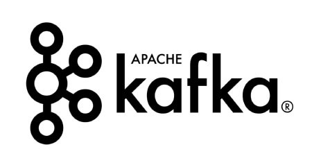

Kafka can process a large amount of data in a short amount of time. It also has low latency, making it possible to process data in real-time. Although Apache Kafka is written in Scala and Java, it may be used with a variety of different programming languages.

Traditional message queues, like RabbitMQ, are not the same as Kafka. RabbitMQ eliminates messages immediately after the consumer confirms them, whereas Kafka keeps them for a period of time (default is 7 days) after they've been received. RabbitMQ also sends messages to consumers and monitors their load. It determines how many messages each consumer should be processing at any one time. On the other hand, Consumers can retrieve messages from Kafka by pulling. It is built to be scalable horizontally by adding more nodes.

It is used for fault-tolerant storage as well as publishing and subscribing to a stream of records. The programs are intended to process timing and consumption records. Kafka replicates log partitions from many hosts. Developers and users contribute coding updates, which it keeps, reads, and analyses in real-time. For messaging, website activity tracking, log aggregation, and commit logs, Kafka is employed. Although Kafka can be used as a database, it lacks a data schema and indexes.

The four key APIs of the Apache Kafka distributed streaming platform is the Producer API, Consumer API, Streams API, and Connector API. In addition to offering redundant storage of massive data volumes, the Connector API and its features such as a message bus capable of throughput reaching millions of messages per second are capable of processing streaming data from real-time applications. 

### 1. What does it mean if a replica is not an In-Sync Replica for a long time?

A replica that has been out of ISR for a long period of time indicates that the follower is unable to fetch data at the same rate as the leader.

### 2. What are the traditional methods of message transfer? How is Kafka better from them?
   
Following are the traditional methods of message transfer:-

#### Message Queuing:- 
A point-to-point technique is used in the message queuing pattern. A message in the queue will be destroyed once it has been consumed, similar to how a message is removed from the server once it has been delivered in the Post Office Protocol. Asynchronous messaging is possible with these queues.
If a network problem delays a message's delivery, such as if a consumer is unavailable, the message will be held in the queue until it can be sent. This means that messages aren't always sent in the same order. Instead, they are given on a first-come, first-served basis, which can improve efficiency in some situations.

#### Publisher - Subscriber Model:- 
The publish-subscribe pattern entails publishers producing ("publishing") messages in multiple categories and subscribers consuming published messages from the various categories to which they are subscribed. Unlike point-to-point texting, a message is only removed once it has been consumed by all category subscribers.
Kafka caters to a single consumer abstraction that encompasses both of the aforementioned- the consumer group. Following are the benefits of using Kafka over the traditional messaging transfer techniques:
Scalable: A cluster of devices is used to partition and streamline the data thereby, scaling up the storage capacity.
Faster: Thousands of clients can be served by a single Kafka broker as it can manage megabytes of reads and writes per second.
Durability and Fault-Tolerant: The data is kept persistent and tolerant to any hardware failures by copying the data in the clusters.

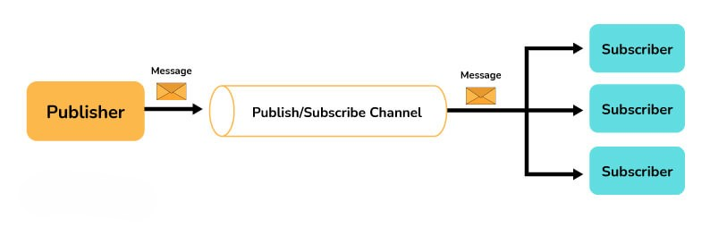

### 3. What are the major components of Kafka?

Following are the major components of Kafka:-

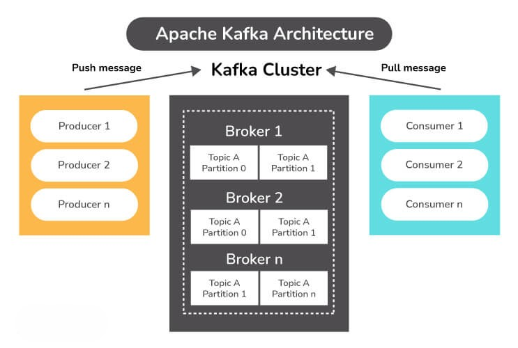

#### Topic:
A Topic is a category or feed in which records are saved and published.
Topics are used to organize all of Kafka's records. Consumer apps read data from topics, whereas producer applications write data to them. Records published to the cluster remain in the cluster for the duration of a configurable retention period.
Kafka keeps records in the log, and it's up to the consumers to keep track of where they are in the log (the "offset"). As messages are read, a consumer typically advances the offset in a linear fashion. The consumer, on the other hand, is in charge of the position, as he or she can consume messages in any order. When reprocessing records, for example, a consumer can reset to an older offset.
#### Producer:
A Kafka producer is a data source for one or more Kafka topics that optimizes, writes, and publishes messages. Partitioning allows Kafka producers to serialize, compress, and load balance data among brokers.
#### Consumer:
Data is read by consumers by reading messages from topics to which they have subscribed. Consumers will be divided into groups. Each consumer in a consumer group will be responsible for reading a subset of the partitions of each subject to which they have subscribed.
#### Broker:
A Kafka broker is a server that works as part of a Kafka cluster (in other words, a Kafka cluster is made up of a number of brokers). Multiple brokers typically work together to build a Kafka cluster, which provides load balancing, reliable redundancy, and failover. The cluster is managed and coordinated by brokers using Apache ZooKeeper. Without sacrificing performance, each broker instance can handle read and write volumes of hundreds of thousands per second (and gigabytes of messages). Each broker has its own ID and can be in charge of one or more topic log divisions.
ZooKeeper is also used by Kafka brokers for leader elections, in which a broker is chosen to lead the handling of client requests for a certain partition of a topic. Connecting to any broker will bring a client up to speed with the entire Kafka cluster. A minimum of three brokers should be used to achieve reliable failover; the higher the number of brokers, the more reliable the failover.

### 4. Explain the four core API architecture that Kafka uses.

Following are the four core APIs that Kafka uses:

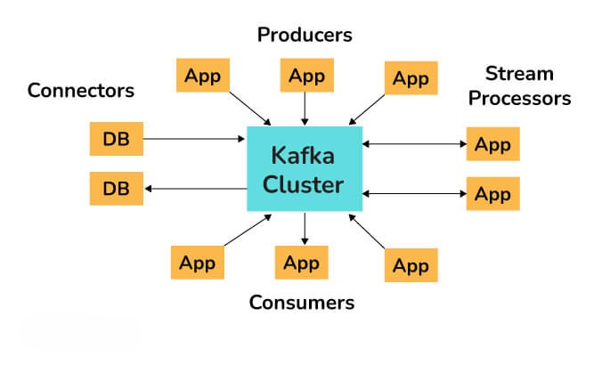

#### Producer API:
The Producer API in Kafka allows an application to publish a stream of records to one or more Kafka topics.
#### Consumer API:
An application can subscribe to one or more Kafka topics using the Kafka Consumer API. It also enables the application to process streams of records generated in relation to such topics.
#### Streams API:
The Kafka Streams API allows an application to use a stream processing architecture to process data in Kafka. An application can use this API to take input streams from one or more topics, process them using streams operations, and generate output streams to transmit to one or more topics. The Streams API allows you to convert input streams into output streams in this manner.
#### Connect API:
The Kafka Connector API connects Kafka topics to applications. This opens up possibilities for constructing and managing the operations of producers and consumers, as well as establishing reusable links between these solutions. A connector, for example, may capture all database updates and ensure that they are made available in a Kafka topic.

### 5. What do you mean by a Partition in Kafka?

Kafka topics are separated into partitions, each of which contains records in a fixed order. A unique offset is assigned and attributed to each record in a partition. Multiple partition logs can be found in a single topic. This allows several users to read from the same topic at the same time. Topics can be parallelized via partitions, which split data into a single topic among numerous brokers.

Replication in Kafka is done at the partition level. A replica is the redundant element of a topic partition. Each partition often contains one or more replicas, which means that partitions contain messages that are duplicated across many Kafka brokers in the cluster.

One server serves as the leader of each partition (replica), while the others function as followers. The leader replica is in charge of all read-write requests for the partition, while the followers replicate the leader. If the lead server goes down, one of the followers takes over as the leader. To disperse the burden, we should aim for a good balance of leaders, with each broker leading an equal number of partitions.

### 6. What do you mean by zookeeper in Kafka and what are its uses?

Apache ZooKeeper is a naming registry for distributed applications as well as a distributed, open-source configuration and synchronization service. It keeps track of the Kafka cluster nodes' status, as well as Kafka topics, partitions, and so on.

ZooKeeper is used by Kafka brokers to maintain and coordinate the Kafka cluster. When the topology of the Kafka cluster changes, such as when brokers and topics are added or removed, ZooKeeper notifies all nodes. When a new broker enters the cluster, for example, ZooKeeper notifies the cluster, as well as when a broker fails. ZooKeeper also allows brokers and topic partition pairs to elect leaders, allowing them to select which broker will be the leader for a given partition (and server read and write operations from producers and consumers), as well as which brokers contain clones of the same data. When the cluster of brokers receives a notification from ZooKeeper, they immediately begin to coordinate with one another and elect any new partition leaders that are required. This safeguards against the unexpected absence of a broker.

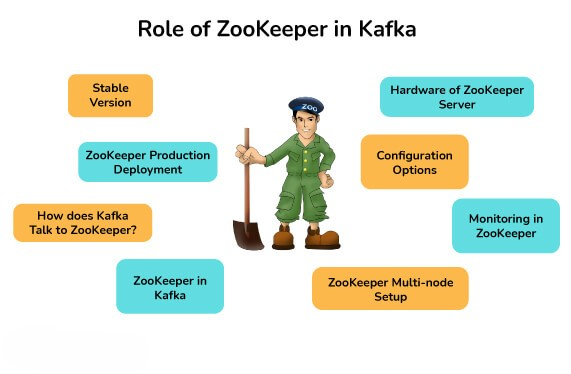

### 7. Can we use Kafka without Zookeeper?

Kafka can now be used without ZooKeeper as of version 2.8. The release of Kafka 2.8.0 in April 2021 gave us all the opportunity to try it out without ZooKeeper. However, this version is not yet ready for production and lacks some key features.
In the previous versions, bypassing Zookeeper and connecting directly to the Kafka broker was not possible. This is because when the Zookeeper is down, it is unable to fulfill client requests.

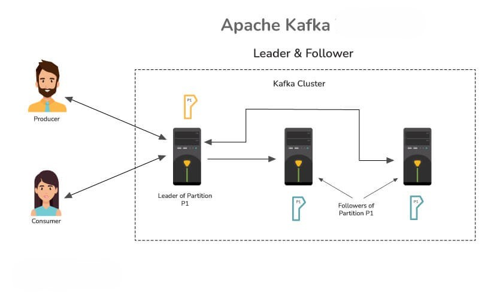

### 8. Explain the concept of Leader and Follower in Kafka.

In Kafka, each partition has one server that acts as a Leader and one or more servers that operate as Followers. The Leader is in charge of all read and writes requests for the partition, while the Followers are responsible for passively replicating the leader. In the case that the Leader fails, one of the Followers will assume leadership. The server's load is balanced as a result of this.

### 9. Why is Topic Replication important in Kafka? What do you mean by ISR in Kafka?

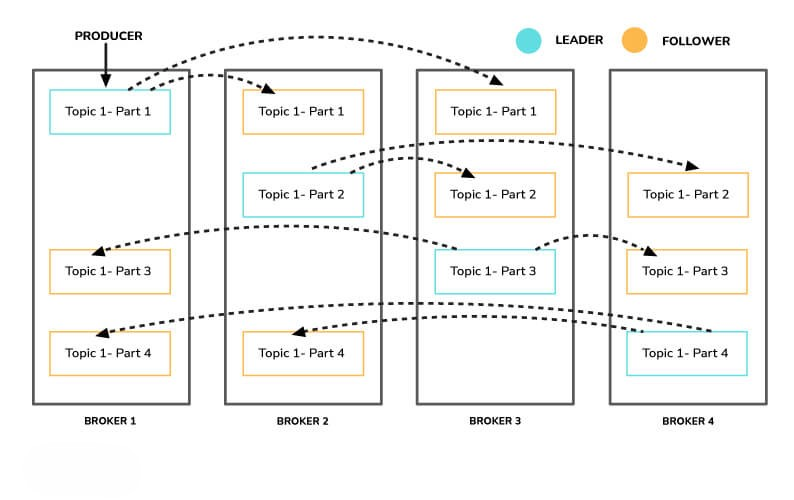

Topic replication is critical for constructing Kafka deployments that are both durable and highly available. When one broker fails, topic replicas on other brokers remain available to ensure that data is not lost and that the Kafka deployment is not disrupted. The replication factor specifies the number of copies of a topic that are kept across the Kafka cluster. It takes place at the partition level and is defined at the subject level. A replication factor of two, for example, will keep two copies of a topic for each partition.

Each partition has an elected leader, and other brokers store a copy that can be used if necessary. Logically, the replication factor cannot be more than the cluster's total number of brokers. An In-Sync Replica (ISR) is a replica that is up to date with the partition's leader.

### 10. What do you understand about a consumer group in Kafka?
    
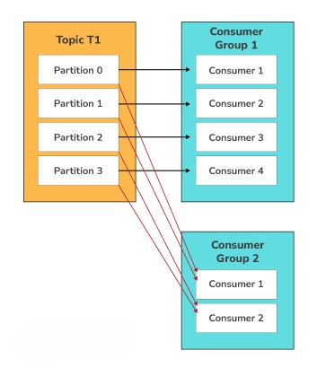

A consumer group in Kafka is a collection of consumers who work together to ingest data from the same topic or range of topics. The name of an application is essentially represented by a consumer group. Consumers in Kafka often fall into one of several categories. The ‘-group' command must be used to consume messages from a consumer group. 

### 11. What is the maximum size of a message that Kafka can receive?

By default, the maximum size of a Kafka message is 1MB (megabyte). The broker settings allow you to modify the size. Kafka, on the other hand, is designed to handle 1KB messages as well.

### 12. What are some of the features of Kafka?

Following are the key features of Kafka:-

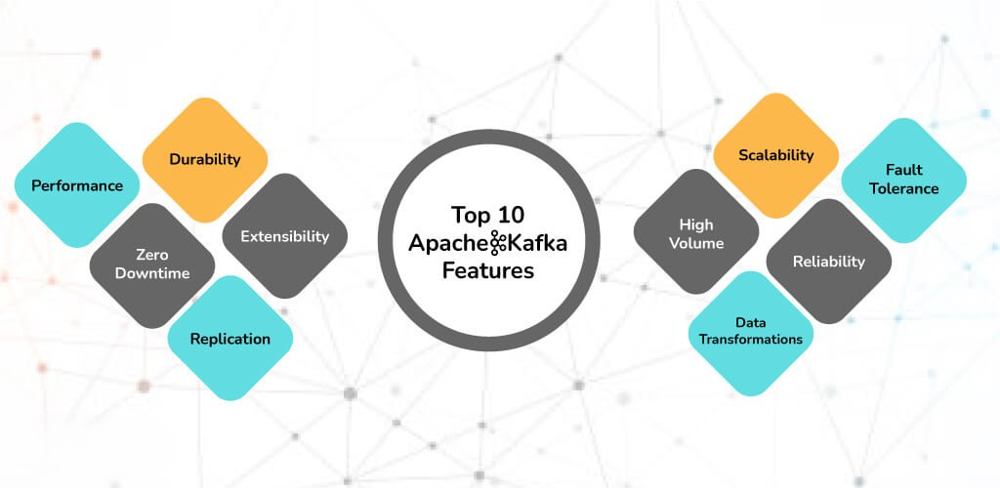

Kafka is a messaging system built for high throughput and fault tolerance.
Kafka has a built-in patriation system known as a Topic.
Kafka Includes a replication feature as well.
Kafka provides a queue that can handle large amounts of data and move messages from one sender to another.
Kafka can also save the messages to storage and replicate them across the cluster.
For coordination and synchronization with other services, Kafka collaborates with Zookeeper.
Apache Spark is well supported by Kafka.

### 13. How do you start a Kafka server?

Firstly, we extract Kafka once we have downloaded the most recent version. We must make sure that our local environment has Java 8+ installed in order to run Kafka.

The following commands must be done in order to start the Kafka server and ensure that all services are started in the correct order:

Start the ZooKeeper service by doing the following:
$bin/zookeeper-server-start.sh config/zookeeper.properties
To start the Kafka broker service, open a new terminal and type the following commands:
$ bin/kafka-server-start.sh config/server.properties

### 14. What do you mean by geo-replication in Kafka?

Geo-Replication is a Kafka feature that allows messages in one cluster to be copied across many data centers or cloud regions. Geo-replication entails replicating all of the files and storing them throughout the globe if necessary. Geo-replication can be accomplished with Kafka's MirrorMaker Tool. Geo-replication is a technique for ensuring data backup.

### 15. What are some of the disadvantages of Kafka?

Following are the disadvantages of Kafka :

Kafka performance degrades if there is message tweaking. When the message does not need to be updated, Kafka works well.
Wildcard topic selection is not supported by Kafka. It is necessary to match the exact topic name.
Brokers and consumers reduce Kafka's performance when dealing with huge messages by compressing and decompressing the messages. This has an impact on Kafka's throughput and performance.
Certain message paradigms, including point-to-point queues and request/reply, are not supported by Kafka.
Kafka does not have a complete set of monitoring tools.

### 16. Tell me about some of the real-world usages of Apache Kafka.

Following are some of the real-world usages of Apache Kafka:

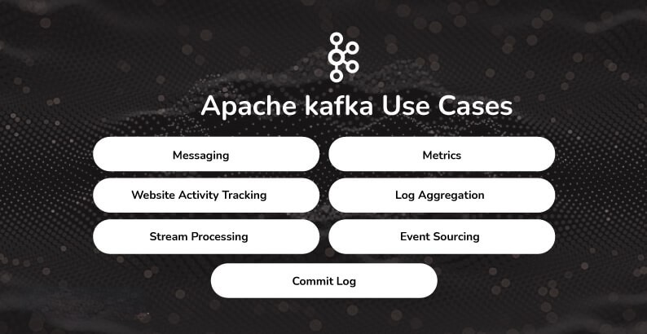

As a Message Broker: Due to its high throughput value, Kafka is capable of managing a huge amount of comparable types of messages or data. Kafka can be used as a publish-subscribe messaging system that allows data to be read and published in a convenient manner.
To Monitor operational data: Kafka can be used to keep track of metrics related to certain technologies, such as security logs.
Website activity tracking: Kafka can be used to check that data is transferred and received successfully by websites. Kafka can handle the massive amounts of data created by websites for each page and for the activities of users.
Data logging: Kafka's data replication between nodes functionality can be used to restore data on nodes that have failed. Kafka may also be used to collect data from a variety of logs and make it available to consumers.
Stream Processing with Kafka: Kafka may be used to handle streaming data, which is data that is read from one topic, processed, and then written to another. Users and applications will have access to a new topic containing the processed data.

### 17. What are the use cases of Kafka monitoring?

Following are the use cases of Kafka monitoring :

Track System Resource Consumption: It can be used to keep track of system resources such as memory, CPU, and disk utilization over time.
Monitor threads and JVM usage: Kafka relies on the Java garbage collector to free up memory, ensuring that it runs frequently thereby guaranteeing that the Kafka cluster is more active.
Keep an eye on the broker, controller, and replication statistics so that the statuses of partitions and replicas can be modified as needed.
Finding out which applications are causing excessive demand and identifying performance bottlenecks might help solve performance issues rapidly. 

### 18. What do you mean by Kafka schema registry?

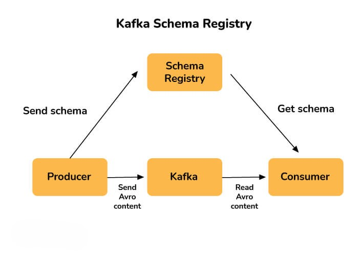

 A Schema Registry is present for both producers and consumers in a Kafka cluster, and it holds Avro schemas. For easy serialization and de-serialization, Avro schemas enable the configuration of compatibility parameters between producers and consumers. The Kafka Schema Registry is used to ensure that the schema used by the consumer and the schema used by the producer are identical. The producers just need to submit the schema ID and not the whole schema when using the Confluent schema registry in Kafka. The consumer looks up the matching schema in the Schema Registry using the schema ID.

### 19. What are the benefits of using clusters in Kafka?

Kafka cluster is basically a group of multiple brokers. They are used to maintain load balance. Because Kafka brokers are stateless, they rely on Zookeeper to keep track of their cluster state. A single Kafka broker instance can manage hundreds of thousands of reads and writes per second, and each broker can handle TBs of messages without compromising performance. Zookeeper can be used to choose the Kafka broker leader. Thus having a cluster of Kafka brokers heavily increases the performance.

### 20. Describe partitioning key in Kafka.

In Kafka terminology, messages are referred to as records. Each record has a key and a value, with the key being optional. For record partitioning, the record's key is used. There will be one or more partitions for each topic. Partitioning is a straightforward data structure. It's the append-only sequence of records, which is arranged chronologically by the time they were attached. Once a record is written to a partition, it is given an offset – a sequential id that reflects the record's position in the partition and uniquely identifies it inside it.

Partitioning is done using the record's key. By default, Kafka producer uses the record's key to determine which partition the record should be written to. The producer will always choose the same partition for two records with the same key. 

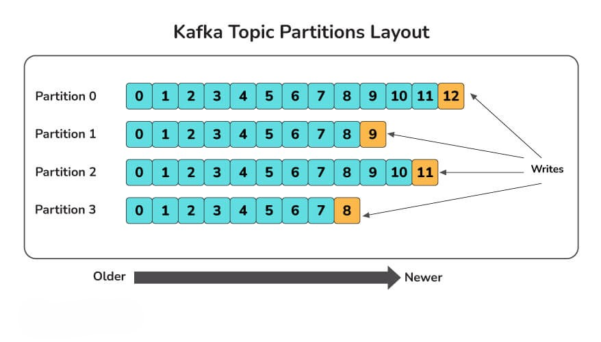

This is important because we may have to deliver records to customers in the same order that they were made. You want these events to come in the order they were created when a consumer purchases an eBook from your webshop and subsequently cancels the transaction. If you receive a cancellation event before a buy event, the cancellation will be rejected as invalid (since the purchase has not yet been registered in the system), and the system will then record the purchase and send the product to the client (and lose you money). You might use a customer id as the key of these Kafka records to solve this problem and assure ordering. This will ensure that all of a customer's purchase events are grouped together in the same partition.

### 21. What is the purpose of partitions in Kafka?

Partitions allow a single topic to be partitioned across numerous servers from the perspective of the Kafka broker. This allows you to store more data in a single topic than a single server can. If you have three brokers and need to store 10TB of data in a topic, one option is to construct a topic with only one partition and store all 10TB on one broker. Another alternative is to build a three-partitioned topic and distribute 10 TB of data among all brokers. A partition is a unit of parallelism from the consumer's perspective.

### 1. Tell me about some of the use cases where Kafka is not suitable.

Following are some of the use cases where Kafka is not suitable :

Kafka is designed to manage large amounts of data. Traditional messaging systems would be more appropriate if only a small number of messages need to be processed every day.
Although Kafka includes a streaming API, it is insufficient for executing data transformations. For ETL (extract, transform, load) jobs, Kafka should be avoided.
There are superior options, such as RabbitMQ, for scenarios when a simple task queue is required.
If long-term storage is necessary, Kafka is not a good choice. It simply allows you to save data for a specific retention period and no longer.

### 2. What is a Replication Tool in Kafka? Explain some of the replication tools available in Kafka.
   
The Kafka Replication Tool is used to create a high-level design for the replica maintenance process. The following are some of the replication tools available:

Preferred Replica Leader Election Tool: Partitions are spread to many brokers in a cluster, each copy known as a replica, using the Preferred Replica Leader Election Tool. The leader is frequently referred to as the favored replica. The brokers normally spread the leader position equitably across the cluster for various partitions, but owing to failures, planned shutdowns, and other factors, an imbalance can develop over time. This tool can be used to preserve the balance in these situations by reassigning the preferred replicas, and hence the leaders.
Topics tool: The Kafka topics tool is in charge of all administration operations relating to topics, including:
Listing and describing the topics.
Topic generation.
Modifying Topics.
Adding a topic's dividers.
Disposing of topics.
Tool to reassign partitions: The replicas assigned to a partition can be changed with this tool. This refers to adding or removing followers from a partition.
StateChangeLogMerger tool: The StateChangeLogMerger tool collects data from brokers in a cluster, formats it into a central log, and aids in the troubleshooting of state change issues. Sometimes there are issues with the election of a leader for a particular partition. This tool can be used to figure out what's causing the issue.
Change topic configuration tool: used to create new configuration choices, modify current configuration options, and delete configuration options.

### 3. Differentiate between Rabbitmq and Kafka.

 Following are the differences between Kafka and Rabbitmq:
 
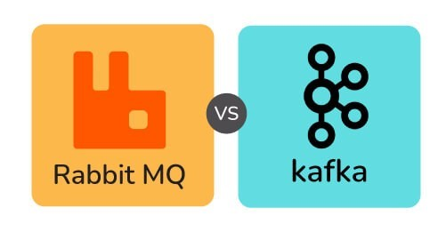

### Based on Architecture :

### Rabbitmq: 

Rabbitmq is a general-purpose message broker and request/reply, point-to-point, and pub-sub communication patterns are all used by it.
It has a smart broker/ dumb consumer model. There is the consistent transmission of messages to consumers at about the same speed as the broker monitors the consumer's status.
It is a mature platform and is well supported for Java, client libraries, .NET, Ruby, and Node.js. It offers a variety of plugins as well.
The communication can be synchronous or asynchronous. It also provides options for distributed deployment.
Kafka:

Kafka is a message and stream platform for high-volume publish-subscribe messages and streams. It is durable, quick, and scalable.
It is a durable message store, similar to a log, and it runs in a server cluster and maintains streams of records in topics (categories).
In this, messages are made up of three components: a value, a key, and a timestamp.
It has a dumb broker / smart consumer model as it does not track which messages are viewed by customers and only maintains unread messages. Kafka stores all messages for a specific amount of time.
In this, external services are required to run, including Apache Zookeeper in some circumstances.
Manner of Handling Messages :

### Basis	Rabbitmq	Kafka
Ordering of messages	The ordering of messages is not supported here. 	Partitions in Kafka enable message ordering. Message keys are used while sending the messages to the topic.
Lifetime of messages	Since Rabbitmq is a message queue, messages are done away with once consumed and the acknowledgement is sent.	Since Kafka is a log, the messages are always present there. We can have a message retention policy for the same.
Prioritizing the messages 	In this, priorities can be specified for the messages and the messages can be consumed according to their priority.	Prioritising the messages is not possible in  Kafka.
Guarantee of delivering the messages 	Atomicity is not guaranteed in this case, even when the transaction involves a single queue.	In Kafka, it is guaranteed that the whole batch of messages in a partition is either sent successfully or failed.
### Based on Approach :

Kafka: The pull model is used by Kafka. Batches of messages from a given offset are requested by consumers. When there are no messages past the offset, Kafka allows for long-pooling, which eliminates tight loops.
Because of Kafka's partitions, a pull model makes sense. In a partition with no competing customers, Kafka provides message orders. This allows users to take advantage of message batching for more efficient message delivery and higher throughput.
Rabbitmq: RabbitMQ operates on a push paradigm, which prevents users from becoming overwhelmed by imposing a prefetch limit on them. This can be used for messaging with low latency. The push model's goal is to distribute messages individually and promptly, ensuring that work is parallelized equitably and messages are handled roughly in the order they came in the queue.
### Based on Performance:

Kafka: Compared to message brokers like RabbitMQ, Kafka provides significantly better performance. It boosts performance by using sequential disc I/O, making it a good choice for queue implementation. With limited resources, it can achieve high throughput (millions of messages per second), which is essential for large data use cases.
Rabbitmq: RabbitMQ can also handle a million messages per second, but it does so at the expense of more resources (around 30 nodes). RabbitMQ can be used for many of the same applications as Kafka, however, it must be used in conjunction with other technologies such as Apache Cassandra.

### 4. What are the parameters that you should look for while optimising kafka for optimal performance?
   
Two major measurements are taken into account while tuning for optimal performance: latency measures, which relate to the amount of time it takes to process one event, and throughput measures, which refer to the number of events that can be processed in a given length of time. Most systems are tuned for one of two things: delay or throughput, whereas Kafka can do both. 

The following stages are involved in optimizing Kafka's performance:

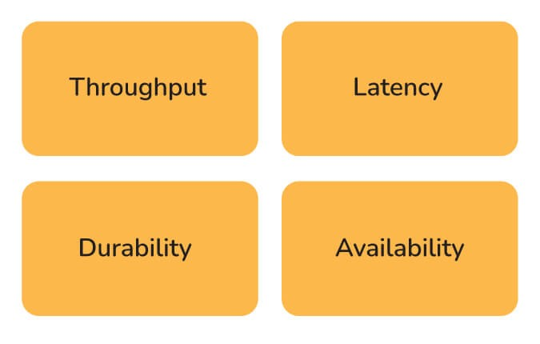

Kafka producer tuning: Data that producers must provide to brokers is kept in a batch. The producer transmits the batch to the broker when it's ready. To adjust the producers for latency and throughput, two parameters must be considered: batch size and linger time. The batch size must be chosen with great care. If the producer is constantly delivering messages, a bigger batch size is recommended to maximize throughput. However, if the batch size is set to a huge value, it may never fill up or take a long time to do so, affecting the latency. The batch size must be selected based on the nature of the volume of messages transmitted by the producer. The linger duration is included to create a delay while more records are added to the batch, allowing for larger records to be transmitted. More messages can be transmitted in one batch with a longer linger period, but latency may suffer as a result. A shorter linger time, on the other hand, will result in fewer messages being transmitted faster, resulting in lower latency but also lower throughput.
Tuning the Kafka broker: Each partition in a topic has a leader, and each leader has 0 or more followers. It's critical that the leaders are appropriately balanced, and that some nodes aren't overworked in comparison to others.
Tuning Kafka Consumers: To ensure that consumers keep up with producers, the number of partitions for a topic should be equal to the number of consumers. The divisions are divided among the consumers in the same consumer group.

### 5. Differentiate between Redis and Kafka.
   
The following table illustrates the differences between Redis and Kafka:

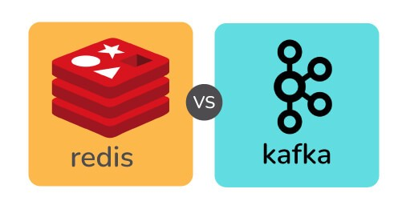
Redis	Kafka
Push-based message delivery is supported by Redis. This means that messages published to Redis will be distributed to consumers automatically.	Pull-based message delivery is supported by Kafka. The messages published to the Kafka broker are not automatically sent to the consumers; instead, consumers must pull the messages when they are ready.
Message retention is not supported by Redis. The communications are destroyed once they have been delivered to the recipients.	In its log, Kafka allows for message preservation.
Parallel processing is not supported by Redis.	Multiple consumers in a consumer group can consume partitions of the topic concurrently because of the Kafka's partitioning feature.
Redis can not manage vast amounts of data because it's an in-memory database.	Kafka can handle massive amounts of data since it uses disc space as its primary storage.
Because Redis is an in-memory store, it is much faster than Kafka.	Because Kafka stores data on disc, it is slower than Redis.

### 6. Describe in what ways Kafka enforces security.

The security given by Kafka is made up of three parts:

Encryption: All communications sent between the Kafka broker and its many clients are encrypted. This prevents data from being intercepted by other clients. All messages are shared in an encrypted format between the components.
Authentication: Before being able to connect to Kafka, apps that use the Kafka broker must be authenticated. Only approved applications will be able to send or receive messages. To identify themselves, authorized applications will have unique ids and passwords.
After authentication, authorization is carried out. It is possible for a client to publish or consume messages once it has been validated. The permission ensures that write access to apps can be restricted to prevent data contamination.

### 7. Differentiate between Kafka and Java Messaging Service(JMS).

The following table illustrates the differences between Kafka and Java Messaging Service:

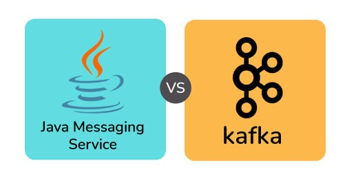

### Java Messaging Service(JMS)	Kafka
The push model is used to deliver the messages. Consumers receive messages on a regular basis.	A pull mechanism is used in the delivery method. When consumers are ready to receive the messages, they pull them.
When the JMS queue receives confirmation from the consumer that the message has been received, it is permanently destroyed.	Even after the consumer has viewed the communications, they are maintained for a specified length of time.
JMS is better suited to multi-node clusters in very complicated systems.	Kafka is better suited to handling big amounts of data.
JMS is a FIFO queue that does not support any other type of ordering.	Kafka ensures that partitions are sent in the order in which they appeared in the message.

### 8. What do you understand about Kafka MirrorMaker?

The MirrorMaker is a standalone utility for copying data from one Apache Kafka cluster to another. The MirrorMaker reads data from original cluster topics and writes it to a destination cluster with the same topic name. The source and destination clusters are separate entities that can have various partition counts and offset values.

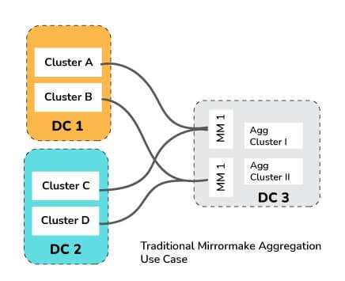

### 9. Differentiate between Kafka and Flume.

Apache Flume is a dependable, distributed, and available software for aggregating, collecting, and transporting massive amounts of log data quickly and efficiently. Its architecture is versatile and simple, based on streaming data flows. It's written in the Java programming language. It features its own query processing engine, allowing it to alter each fresh batch of data before sending it to its intended sink. It is designed to be adaptable.

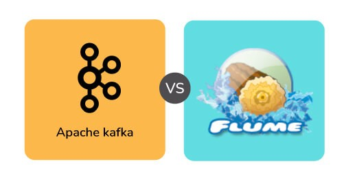

The following table illustrates the differences between Kafka and Flume :

Kafka	Flume
Kafka is a distributed data system.	Apache Flume is a system that is available, dependable, and distributed.
It essentially functions as a pull model.	It essentially functions as a push model.
It is made for absorbing and analysing real-time streaming data.	It collects, aggregates, and moves massive amounts of log data from a variety of sources to a centralised data repository in an efficient manner.
If it is resilient to node failure, it facilitates automatic recovery.	If the flume-agent fails, you will lose events in the channel.
Kafka operates as a cluster that manages incoming high-volume data streams in real-time.	Flume is a tool for collecting log data from web servers that are spread.
It is a messaging system that is fault-tolerant, efficient, and scalable.	It is made specifically for Hadoop.
It's simple to scale.	In comparison to Kafka, it is not scalable.

### 10. What do you mean by confluent kafka? What are its advantages?

Confluent is an Apache Kafka-based data streaming platform: a full-scale streaming platform capable of not just publish-and-subscribe but also data storage and processing within the stream. Confluent Kafka is a more comprehensive Apache Kafka distribution. It enhances Kafka's integration capabilities by including tools for optimizing and managing Kafka clusters, as well as ways for ensuring the streams' security. Kafka is easy to construct and operate because of the Confluent Platform. Confluent's software comes in three varieties: 

A free, open-source streaming platform that makes it simple to get started with real-time data streams;
An enterprise-grade version with more administration, operations, and monitoring tools;
A premium cloud-based version.
Following are the advantages of Confluent Kafka :

It features practically all of Kafka's characteristics, as well as a few extras.
It greatly simplifies the administrative operations procedures.
It relieves data managers of the burden of thinking about data relaying.

### 11. Describe message compression in Kafka. What is the need of message compression in Kafka? Also mention if there are any disadvantages of it.

Producers transmit data to brokers in JSON format in Kafka. The JSON format stores data in string form, which can result in several duplicate records being stored in the Kafka topic. As a result, the amount of disc space used increases. As a result, before delivering messages to Kafka, compression or delaying of data is performed to save disk space. Because message compression is performed on the producer side, no changes to the consumer or broker setup are required. 

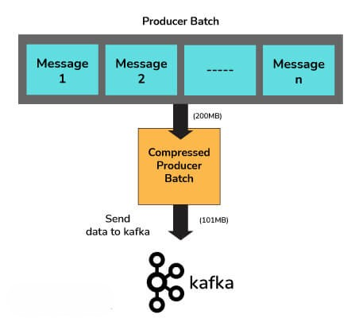

It is advantageous because of the following factors:

It decreases the latency of messages transmitted to Kafka by reducing their size.
Producers can send more net messages to the broker with less bandwidth.
When data is saved in Kafka using cloud platforms, it can save money in circumstances where cloud services are paid.
Message compression reduces the amount of data stored on disk, allowing for faster read and write operations.
Message Compression has the following disadvantages :

Producers must use some CPU cycles to compress their work.
Decompression takes up several CPU cycles for consumers.
Compression and decompression place a higher burden on the CPU.

### 12. What do you mean by multi-tenancy in Kafka?

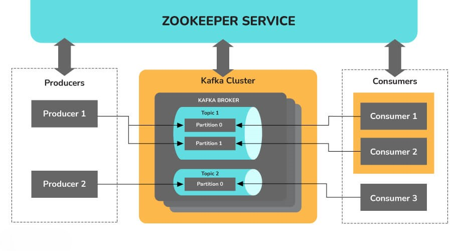

Multi-tenancy is a software operation mode in which many instances of one or more programs operate in a shared environment independently of one another. The instances are considered to be physically separate yet logically connected. The level of logical isolation in a system that supports multi-tenancy must be comprehensive, but the level of physical integration can vary. Kafka is multi-tenant because it allows for the configuration of many topics for data consumption and production on the same cluster.

### 13. What do you understand about log compaction and quotas in Kafka?

Log compaction is a way through which Kafka assures that for each topic partition, at least the last known value for each message key within the log of data is kept. This allows for the restoration of state following an application crash or a system failure. During any operational maintenance, it allows refreshing caches after an application restarts. Any consumer processing the log from the beginning will be able to see at least the final state of all records in the order in which they were written, because of the log compaction.

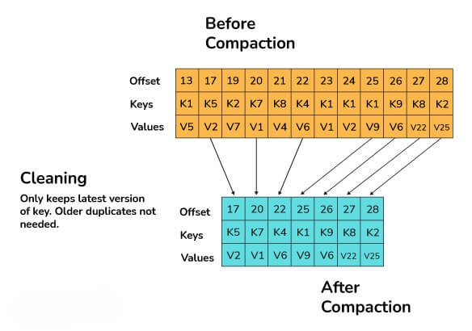

A Kafka cluster can apply quotas on producers and fetch requests as of Kafka 0.9. Quotas are byte-rate limits that are set for each client-id. A client-id is a logical identifier for a request-making application. A single client-id can therefore link to numerous producers and client instances. The quota will be applied to them all as a single unit. Quotas prevent a single application from monopolizing broker resources and causing network saturation by consuming extremely large amounts of data.

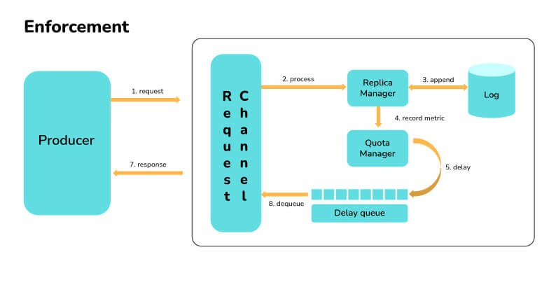

### 14. What are the guarantees that Kafka provides?

Following are the guarantees that Kafka assures :

The messages are displayed in the same order as they were published by the producers. The order of the messages is maintained.
The replication factor determines the number of replicas. If the replication factor is n, the Kafka cluster has fault tolerance for up to n-1 servers.
Per partition, Kafka can provide "at least one" delivery semantics. This means that if a partition is given numerous times, Kafka assures that it will reach a customer at least once.

### 15. What do you mean by an unbalanced cluster in Kafka? How can you balance it?

It's as simple as assigning a unique broker id, listeners, and log directory to the server.properties file to add new brokers to an existing Kafka cluster. However, these brokers will not be allocated any data partitions from the cluster's existing topics, so they won't be performing much work unless the partitions are moved or new topics are formed. A cluster is referred to as unbalanced if it has any of the following problems :

Leader Skew: 

Consider the following scenario: a topic with three partitions and a replication factor of three across three brokers. 

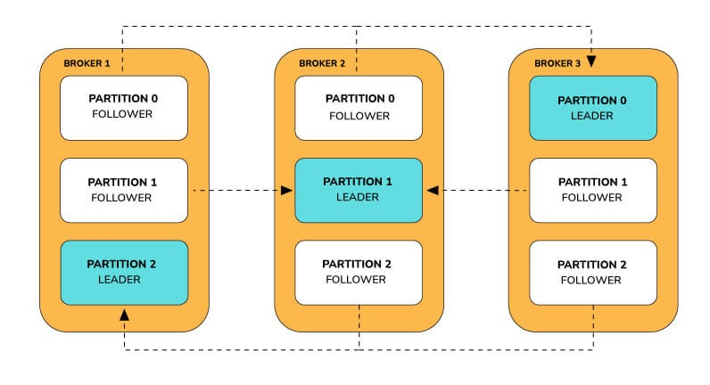

The leader receives all reads and writes on a partition. Followers send fetch requests to the leaders in order to receive their most recent messages. Followers exist solely for redundancy and fail-over purposes.

Consider the case of a broker who has failed. It's possible that the failed broker was a collection of numerous leader partitions. Each unsuccessful broker's leader partition is promoted as the leader by its followers on the other brokers. Because fail-over to an out-of-sync replica is not allowed, the follower must be in sync with the leader in order to be promoted as the leader.

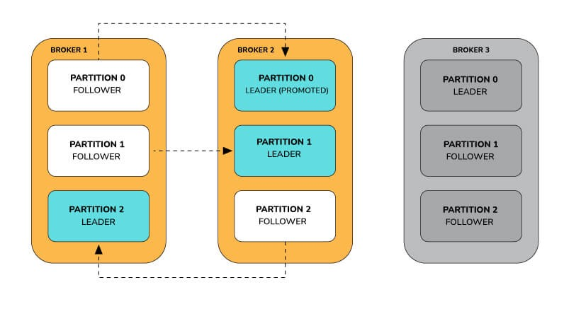

If another broker goes down, all of the leaders are on the same broker, therefore there is no redundancy.

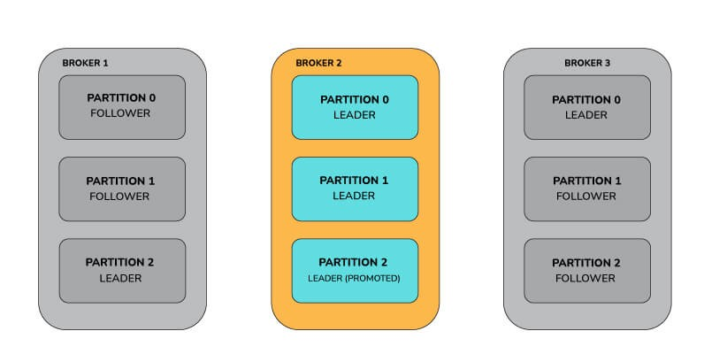

When both brokers 1 and 3 go live, the partitions gain some redundancy, but the leaders stay focused on broker 2.

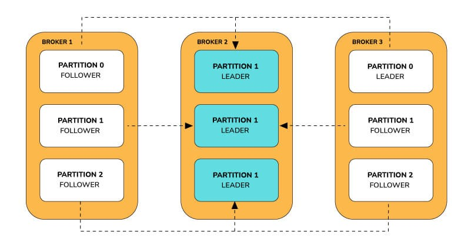

As a result, the Kafka brokers have a leader imbalance. When a node is a leader for more partitions than the number of partitions/number of brokers, the cluster is in a leader skewed condition.

Solving the leader skew problem:

Kafka offers the ability to reassign leaders to the desired replicas in order to tackle this problem. This can be accomplished in one of two ways:

The auto.leader.rebalance.enable=true broker option allows the controller node to transfer leadership to the preferred replica leaders, restoring the even distribution.
When Kafka-preferred-replica-election.sh is run, the preferred replica is selected for all partitions: The utility requires a JSON file containing a mandatory list of zookeeper hosts and an optional list of topic partitions. If no list is provided, the utility uses a zookeeper to retrieve all of the cluster's topic partitions. The Kafka-preferred-replica-election.sh utility can be time-consuming to use. Custom scripts can render only the topics and partitions that are required, automating the process across the cluster.
Broker Skew:

Let us consider a Kafka cluster with nine brokers. Let the topic name be "sample_topic." The following is how the brokers are assigned to the topic in our example:

Broker Id	Number of Partitions	Partitions	Is Skewed?

On brokers 3,4 and 5, the topic “sample_topic” is skewed. This is because if the number of partitions per broker on a given issue is more than the average, the broker is considered to be skewed.

Solving the broker skew problem :

The following steps can be used to solve it:

Generate the candidate assignment configuration using the partition reassignment tool (Kafka-reassign-partition.sh) with the –generate option. The current and intended replica allocations are shown here.
Create a JSON file with the suggested assignment.
To update the metadata for balancing, run the partition reassignment tool.
Run the “Kafka-preferred-replica-election.sh” tool to complete the balancing after the partition reassignment is complete.

### 16. How will you expand a cluster in Kafka?

To add a server to a Kafka cluster, it only needs to be given a unique broker id and Kafka must be started on that server. However, until a new topic is created, a new server will not be given any of the data partitions. As a result, when a new machine is introduced to the cluster, some existing data must be migrated to these new machines. To relocate some partitions to the new broker, we use the partition reassignment tool. Kafka will make the new server a follower of the partition it is migrating to, allowing it to replicate the data on that partition completely. When all of the data has been duplicated, the new server can join the ISR, and one of the current replicas will erase the data it has for that partition.  

### 17. What do you mean by graceful shutdown in Kafka?
    
The Apache cluster will automatically identify any broker shutdown or failure. In this instance, new leaders for partitions previously handled by that device will be chosen. This can happen as a result of a server failure or even if it is shut down for maintenance or configuration changes. When a server is taken down on purpose, Kafka provides a graceful method for terminating the server rather than killing it.

When a server is switched off:

To prevent having to undertake any log recovery when Kafka is restarted, it ensures that all of its logs are synced onto a disk. Because log recovery takes time, purposeful restarts can be sped up.
Prior to shutting down, all partitions for which the server is the leader will be moved to the replicas. The leadership transfer will be faster as a result, and the period each partition is inaccessible will be decreased to a few milliseconds.

### 18. Can the number of partitions for a topic be changed in Kafka?
    
Currently, Kafka does not allow you to reduce the number of partitions for a topic. The partitions can be expanded but not shrunk. The alter command in Apache Kafka allows you to change the behavior of a topic and its associated configurations. To add extra partitions, use the alter command.

To increase the number of partitions to five, use the following command:

./bin/kafka-topics.sh --alter --zookeeper localhost:2181 --topic sample-topic --partitions 5

### 19. What do you mean by BufferExhaustedException and OutOfMemoryException in Kafka?
    
When the producer can't assign memory to a record because the buffer is full, a BufferExhaustedException is thrown. If the producer is in non-blocking mode, and the rate of production exceeds the rate at which data is transferred from the buffer for long enough, the allocated buffer will be depleted, the exception will be thrown.

If the consumers are sending huge messages or if there is a spike in the number of messages sent at a rate quicker than the rate of downstream processing, an OutOfMemoryException may arise. As a result, the message queue fills up, consuming memory space.

### 20. How will you change the retention time in Kafka at runtime?

A topic's retention time can be configured in Kafka. A topic's default retention time is seven days. While creating a new subject, we can set the retention time. When a topic is generated, the broker's property log.retention.hours are used to set the retention time. When configurations for a currently operating topic need to be modified, kafka-topic.sh must be used.

The right command is determined on the Kafka version in use.

The command to use up to 0.8.2 is kafka-topics.sh --alter.
Use kafka-configs.sh --alter starting with version 0.9.0.

### 21. Differentiate between Kafka streams and Spark Streaming.

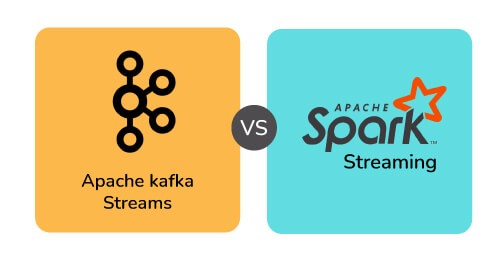

Kafka Streams	Spark Streaming
Kafka is fault-tolerant because of partitions and their replicas.	Using Cache and RDD (Resilient Distributed Dataset), Spark can restore partitions.
It is only capable of handling real-time streams	It is capable of handling both real-time and batch tasks.
Messages in the Kafka log are persistent.	To keep the data durable, you'll need to utilize a dataframe or another data structure.
There are no interactive modes in Kafka. The data from the producer is simply consumed by the broker, who then waits for the client to read it.	Interactive modes are available.

### 22. What are Znodes in Kafka Zookeeper? How many types of Znodes are there?

The nodes in a ZooKeeper tree are called znodes. Version numbers for data modifications, ACL changes, and timestamps are kept by Znodes in a structure. ZooKeeper uses the version number and timestamp to verify the cache and guarantee that updates are coordinated. Each time the data on Znode changes, the version number connected with it grows.

There are three different types of Znodes:

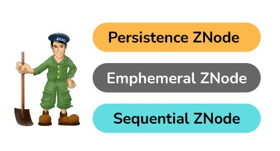

Persistence Znode: These are znodes that continue to function even after the client who created them has been disconnected. Unless otherwise specified, all znodes are persistent by default.
Ephemeral Znode: Ephemeral znodes are only active while the client is still alive. When the client who produced them disconnects from the ZooKeeper ensemble, the ephemeral Znodes are automatically removed. They have a significant part in the election of the leader.
Sequential Znode: When znodes are constructed, the ZooKeeper can be asked to append an increasing counter to the path's end. The parent znode's counter is unique. Sequential nodes can be either persistent or ephemeral.

## Introduction and Trends
The Producer, Consumer, Streams, and Connector APIs of Apache Kafka provide four key services: persistent storage of massive data volumes, message bus capable of throughput reaching millions of messages every second, redundant storage of massive data volumes, and parallel processing of huge amounts of streaming data. It is a solution designed for processing streaming data from real-time applications that have the capacity to handle millions of messages every second.

To run Kafka, a platform, you must first register with the Kafka Producer API and Consumer API, then connect to the Kafka cluster through Brokers, Consumers, Producers, and ZooKeeper. The Kafka Producer API, Kafka Streams API, and Kafka Connect API are used to manage the platform, while the Kafka cluster architecture is made up of Brokers, Consumers, Producers, and ZooKeeper.

Apache Kafka’s architecture is, in fact, simple, albeit for a reason: It eliminates the Kafkaesque complexities that often accompany messaging architectures. The intent of the architecture is to deliver an easier-to-understand method of application messaging than most of the alternatives. Kafka is known for being a fault-tolerant, fault-diffusional scalable log with a very simple data design.

Kafka allows for a persistent ordered data structure. A record cannot be deleted, or modified, only appended to the log. Kafka cluster keeps track of the order of items in Kafka logs and guarantees that the log is partitioned into distinct commits with equal priority. Messages are stored in the order they are received, which ensures the order and integrity of the record structure. Every record has an assigned unique sequential ID known as an offset, which is used to retrieve data. This ensures the log has a unique start and end point.

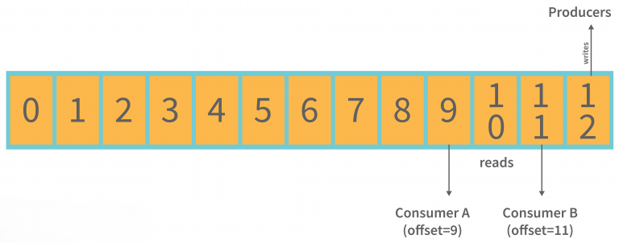

By providing set ordering and deterministic processing, Kafka addresses typical issues with distributed systems. In addition to sequential disk reads, Kafka benefits from ordered-on-disk message data storage because it keeps data on disk and in an ordered manner. Disk seeks are costly in terms of resource waste, and Kafka’s process of first reading and writing at a consistent pace, followed by simultaneous reads and writing, reduces resource waste. In addition to that, because Kafka reads and writes simultaneously, it does not get in the way of each other; it also offers great resource efficiency.

The fact that Kafka can scale up makes horizontal scaling effortless. For example, if you ask Kafka to handle a simple list update, it can do it with the same level of performance.

### Kafka Architecture
The producer API, the consumer API, the streams API, and the connector API are the four core APIs in the Apache Kafka architecture. We will discuss them one by one:

Producer API: An application can publish a stream of records to a Kafka topic using the Producer API.
Consumer API: An application can subscribe to one or more topics and also process the stream of records generated to them using this API.
Streams API: The streams API enables applications to convert input streams to output streams, which is accomplished by consuming an input stream from one or more topics and producing an output stream from one or more output topics. Furthermore, to act as a stream processor, consuming an input stream from one or more topics and producing an output stream to one or more output topics, effectively transforming the input streams into output streams, the streams API permits an application.
Connector API: The Connector API is used to connect Kafka topics to existing applications or data systems. For example, a connector to a relational database might capture every change to a table.

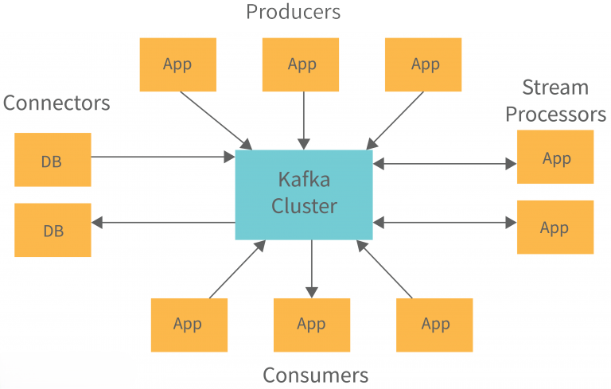

### Kafka Cluster Architecture
The diagram provides information about the cluster structure of Apache Kafka:

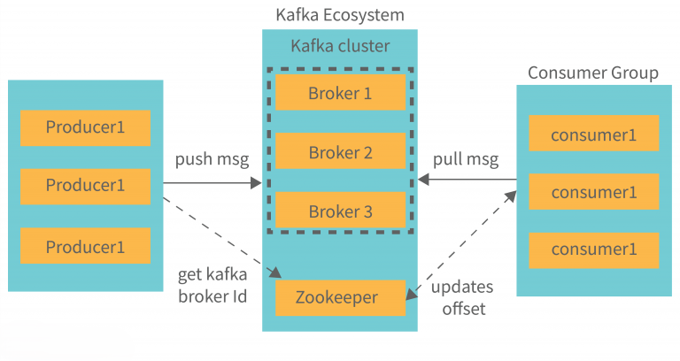

The structure diagram above provides a detailed description of its architecture of Kafka, including:

Kafka Broker: When maintaining the state of the cluster, the Kafka cluster typically uses ZooKeeper. However, these are stateless brokers, so keeping the cluster state is a stateful task. Despite the fact that one Kafka Broker instance can handle hundreds of thousands of reads and writes per second, keeping the cluster state is a stateful process.

A broker can handle tens of millions of messages without performance impact, but ZooKeeper must perform Kafka broker-leader election.

Kafka – ZooKeeper: Kafka broker uses ZooKeeper to coordinate, manage, and report on the status of a Kafka broker in the Kafka system. It also informs producers and consumers about the presence of any new brokers or the failure of the current brokers.

Immediately after Zookeeper sends the notification regarding the broker’s presence or absence, producers and consumers make the decision and begin coordinating their work with another broker.

Kafka Producers: Kafka brokers receive data from Producers. In addition, all the Producers send messages to the new brokers when they start, thus automatically connecting all the Producers.

While the Kafka producer hands out messages as fast as the broker can process them, it does not wait for acknowledgments from the broker.

Kafka Consumers: The main advantage of partition offset is that the Kafka Consumer keeps track of how many messages have been consumed by keeping track of the partition offset. In addition, you can ensure that the consumer has consumed all prior messages by acknowledging every message offset.

There must be a buffer of bytes available to consume in order for the consumer to initiate a pull request. For example, if the offset is 5, consumers can rewind or skip to any point in a partition by supplying 5 as an offset value. ZooKeeper informs consumers of the offset value.

### Fundamental Concepts of Kafka Architecture
We have listed some of the fundamental concepts of Kafka Architecture that you must understand.

#### Kafka Topics
Messages are received by producers through logical channels to which they publish messages and from which consumers receive messages.

A data topic defines the stream of data of a particular type/classification. In Kafka.
The way messages are structured or organised here impacts how they are received. A certain type of message is published on a certain topic.
A producer initially writes its messages to the topics. Once consumers read those messages from topics, they are read by other consumers.
A Kafka cluster has a topic named by its name and must be unique.
You can cover any number of topics, but there is no limit to them.
Data has to be published before it can be changed or updated.
The image provides information about the partitioning relationship between Kafka Topics and partitions:

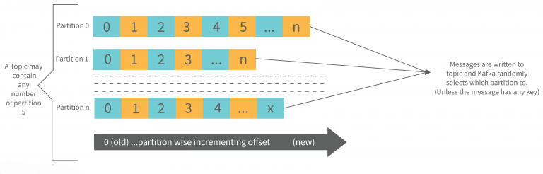

#### Partitions in Kafka
Partitions and also replicated across brokers are employed to divide up Topics in a Kafka cluster.

Regardless of which partition the message is written to, there is no guarantee that it will be published to that partition.
If a producer publishes a message with a specific key to Kafka, it will be ensured that all such messages (with the same key) will be delivered to the same partition. This feature ensures message sequencing. Even without a key being added to it, data is written to partitions randomly.
Each message is stored in a sequence fashion in one partition.
The messages are partitioned into chunks, and each chunk is assigned an incremental id, also known as offset.
The offsets within a partition are only meaningful within that partition; however, the values across partitions are meaningless.
There is no limit to the number of Partitions.
#### Topic Replication Factor in Kafka
When designing a Kafka system, it’s important to include topic replication in the algorithm. When a broker goes down, its topic replicas from another broker can solve the crisis, assuming there is no partitioning. We have 3 brokers and 3 topics.

Topic 1 and Partition 0 both have a replication factor of 2, and so on and so forth. Broker1 has Topic 1 and Partition 0, and Broker2 has Broker2. It has got a replication factor of 2; which means it will have one additional copy other than the primary copy. The image is below:

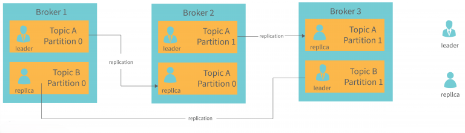

Some important points are stated:

The level of replication performed is partition level only.
There can be only one broker leader at a time for a given partition. Meanwhile, other brokers will maintain synchronised replicas.
Having more than the number of brokers would result in an over-saturation of the replication factor.
#### Consumer Group
There can be multiple consumer processes running.
Every consumer group has its own group-id, which is basically one consumer group.
Reading the data from one partition in one consumer group, at the time of reading, exactly one consumer instance reads the data.
Consumer groups can read from one single partition since there is more than one consumer group.
If the number of consumers exceeds the number of partitions, there will be some inactive consumers. We will discuss it with an example if there are 8 consumers and 6 partitions in a single consumer group. We have 2 inactive consumers in that situation.

### Advantages of Kafka Architecture

Apache Kafka has the following features that make it worthwhile:

The Apache Kafka platform offers a low latency value, i.e., up to 10 milliseconds. Because it decouples the message, the consumer can consume that message at any time.
When using Kafka, businesses such as Uber can handle a lot of data at the same time because of its low latency. Kafka is able to handle a lot of messages in a second. Uber uses Kafka to store a lot of data.
Kafka must have the ability to survive a node or machine failure within the cluster.
A Kafka cluster can use the replication function, which makes data or messages persist on the cluster in addition to being written on a disk. This makes the cluster durable.
A single Kafka integration handles all of a producer’s data. Therefore, we only need to create one Kafka integration, which automatically integrates us with every producing and consuming system.
Anyone who has access to Kafka data can easily view it.
The distributed system includes a distributed architecture that makes it scalable. Partitioning and replication are two of the distributed systems’ capabilities.
With Apache Kafka, you can build a real-time data pipeline. It can handle a real-time data pipeline. Processors, analytics, storage, and the rest of the staff are required to build a real-time data pipeline.
Kafka works as a batch-like operation and can also function as an ETL tool due to its data persistence abilities.
A scalable software product is one that can handle large amounts of messages simultaneously. Kafka is such a product.

### Disadvantages of Kafka Architecture

There are certain restrictions/disadvantages to Apache Kafka.

An exception to the rule is that Apache Kafka does not come with a complete set of monitoring and management tools. Because of this, new ventures or enterprises avoid using Kafka.
A message being tweaked by the Kafka broker requires system calls. In case the message needs some work, its performance of Kafka is reduced. So, it is advisable to keep the message the same.
Apache Kafka does not permit wildcard topic selection. Instead, it applies only the exact topic name. The reason for this is that ignoring wildcard topics is unable to meet certain demands.
The reduction in the data flow caused by brokers and consumers padding and decompressing the data flow affects its performance as well as its throughput.
When there are more than one Kafka Queue in the Kafka Cluster, Apache Kafka can be a bit clumsy.
Some message paradigms, such as point-to-point queues, request/reply, and so on, are absent from Kafka for certain use cases.
