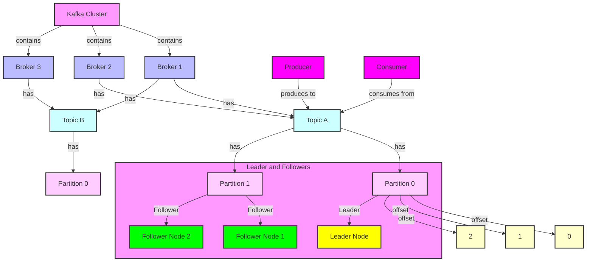
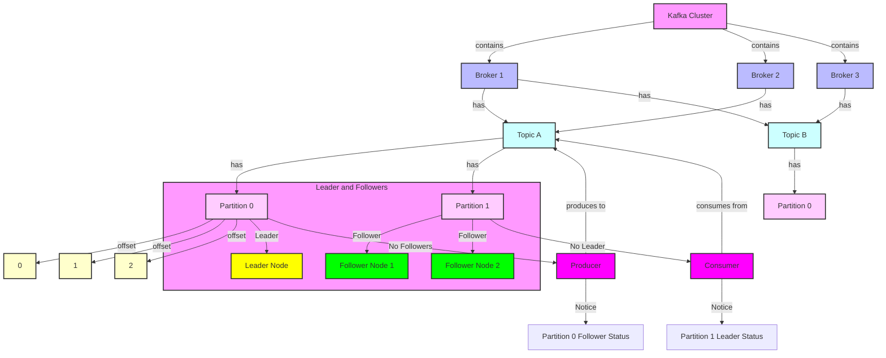
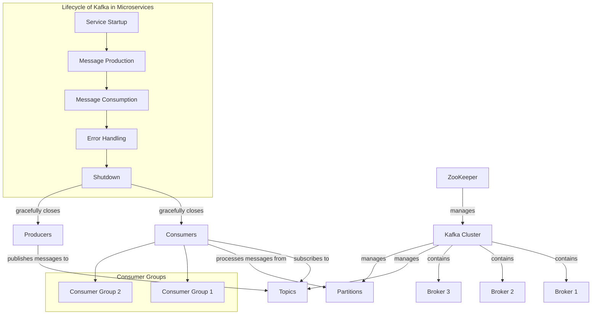
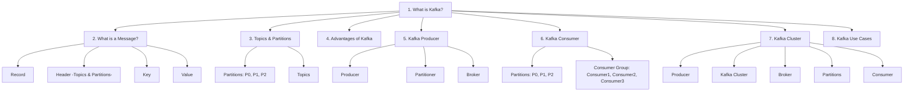

# Apache Kafka 

Apache Kafka is a distributed streaming platform used for building real-time data pipelines and streaming applications. Here’s an in-depth look at Kafka interview questions, including replication concepts and examples.

To illustrate the concepts of a Kafka cluster, broker, server, partition, offset, follower, leader, producer, consumer, and topic, you can use below diagram. Below is an example of how you might represent these elements in below diagram:



### Explanation of the Diagram Elements:
- **Kafka Cluster**: Represents the overall Kafka cluster that contains multiple brokers.
- **Broker**: Each broker (Broker 1, Broker 2, Broker 3) stores topics and manages data.
- **Topics**: Topics (e.g., Topic A and Topic B) are logical channels for storing messages.
- **Partitions**: Each topic can have multiple partitions, which allow for parallel processing (e.g., Partition 0, Partition 1).
- **Offsets**: Each message within a partition has an offset that uniquely identifies its position.
- **Leader and Followers**: Each partition has one leader (responsible for handling reads and writes) and multiple followers (which replicate the data).
- **Producer**: Sends messages to a topic.
- **Consumer**: Reads messages from a topic.

---

Below diagram reflecting that Partition 0 does not have a follower and Partition 1 does not have a leader:



### Changes Made:
- **Partition 0**: It has been noted that it has no followers, indicating it is solely managed by its leader without any replicas.
- **Partition 1**: It has been noted that it has no leader, meaning it cannot handle writes until a leader is assigned.

---

In Apache Kafka, the assignment of leaders and followers for partitions is a critical part of its design, ensuring high availability and fault tolerance. Here’s how this process works and who is responsible for it:

### 1. Leader and Follower Roles

- **Leader**: Each partition in a Kafka topic has a leader broker that handles all read and write requests for that partition. The leader is responsible for data consistency and coordinating updates.
- **Follower**: Followers replicate the data from the leader. They are responsible for keeping a copy of the partition's data and fetching updates from the leader.

### 2. Assignment Process

#### a. Topic Creation
- When a new topic is created, the Kafka cluster assigns a leader and followers for each partition based on the broker configuration and replication factor specified during topic creation.
- For example, if a topic is created with 3 partitions and a replication factor of 2, Kafka will select one broker as the leader for each partition and assign one or more followers.

#### b. Controller Role
- **Controller**: One of the brokers in the cluster is designated as the controller. The controller is responsible for managing the overall state of the cluster, including leader election and partition assignments.
- The controller is elected using Apache ZooKeeper (or, in newer versions, Kafka's own Raft-based consensus mechanism).

#### c. Leader Election
- The controller monitors the state of the brokers and performs leader elections when necessary, such as:
  - **Initial Assignment**: When a topic is created, the controller assigns leaders to partitions.
  - **Broker Failure**: If a broker that is currently a leader fails, the controller will detect this and elect a new leader from the in-sync replicas (followers) of that partition.
  - **Broker Recovery**: When a failed broker recovers, it may become a follower again and wait for leadership reassignment if it is still an in-sync replica.

### 3. In-Sync Replicas (ISR)
- The set of followers that are up-to-date with the leader is known as the **In-Sync Replica set (ISR)**. Only these followers can become leaders in case of a leader failure.
- The ISR is maintained by the leader, which periodically checks the status of its followers. If a follower falls behind (e.g., due to network issues), it may be removed from the ISR.

### 4. Configuration
- **Replication Factor**: Determines how many copies of each partition exist in the cluster, influencing how many followers can be assigned.
- **Min Insync Replicas**: A configuration parameter that specifies the minimum number of replicas that must acknowledge a write before it is considered successful. This ensures data durability.

### Summary
- **Who Assigns**: The controller broker, elected from the cluster, is responsible for assigning leaders and followers.
- **How It Works**: It assigns a leader to each partition upon topic creation and monitors broker health to reassign leadership in case of failures.

This design ensures that Kafka remains resilient and can handle failures without losing data, maintaining a high level of availability and reliability in message processing.
### 1. **What is Apache Kafka, and what are its key components?**

**Answer:**
Apache Kafka is a distributed streaming platform designed for high-throughput, low-latency data streaming. It allows for the real-time processing of data streams and is commonly used for building data pipelines and streaming applications.

**Key Components:**
- **Producer**: Publishes messages to Kafka topics.
- **Consumer**: Subscribes to topics and processes messages.
- **Broker**: Kafka server that stores and serves data. A Kafka cluster consists of multiple brokers.
- **Topic**: A category or feed name to which messages are published.
- **Partition**: A topic is divided into partitions, which allow Kafka to scale and provide parallel processing.
- **Offset**: A unique identifier for each message within a partition.
- **Zookeeper**: Manages and coordinates Kafka brokers (though Kafka is moving towards its own consensus protocol and might not require ZooKeeper in the future).

### 2. **How does Kafka achieve fault tolerance and high availability?**

**Answer:**
Kafka achieves fault tolerance and high availability through **replication**.

**Replication in Kafka:**
- Each partition of a topic can be replicated across multiple brokers.
- **Leader and Followers**: Each partition has one leader and multiple followers.
  - **Leader**: Handles all reads and writes for the partition.
  - **Followers**: Replicate the data from the leader. They don’t handle read or write requests.
- **Replication Factor**: Defines the number of replicas for a partition, including the leader. For example, if a topic's replication factor is 3, there will be 1 leader and 2 followers.

**High-Level Steps for Replication:**
1. **Write**: Producers send data to the leader of the partition.
2. **Replication**: The leader replicates data to follower brokers.
3. **Acknowledgment**: The leader waits for acknowledgments from followers before confirming successful writes.

### 3. **What is the "highest order of replication" in Kafka, and how does it work?**

**Answer:**
The "highest order of replication" typically refers to ensuring that the replication factor is high enough to guarantee data durability and availability, even if some brokers fail. In practice, the term often points to configurations that aim to achieve "in-sync replicas" (ISR) to maintain data consistency and durability.

**Key Concepts:**
- **In-Sync Replicas (ISR)**: A set of replicas that are fully caught up with the leader. Kafka ensures that writes are acknowledged only after being replicated to a majority of ISR to ensure durability.
- **Replication Factor**: The total number of replicas for each partition, including the leader. For example, a replication factor of 3 ensures that there are 3 copies of each partition's data.

**Example Configuration:**

```properties
# Kafka Broker Configuration
num.replica.fetchers=1
default.replication.factor=3
min.insync.replicas=2
```

In this configuration:
- `default.replication.factor=3`: Each partition has 3 replicas (1 leader + 2 followers).
- `min.insync.replicas=2`: To consider a write successful, at least 2 replicas (including the leader) must acknowledge it. This ensures that even if one replica fails, data will still be available.

### 4. **How does Kafka handle data durability and consistency?**

**Answer:**
Kafka ensures data durability and consistency through its replication and acknowledgment mechanisms.

**Data Durability:**
- Kafka guarantees that data is not lost as long as at least one replica remains intact.
- Data written to a Kafka topic will be retained according to the configured retention policy, even if some brokers fail.

**Consistency:**
- **Leader-Follower Synchronization**: Only the leader handles read and write requests. Followers replicate data from the leader.
- **Acks Configuration**: Producers can configure the acknowledgment setting (`acks`) to determine when a write is considered successful:
  - `acks=0`: The producer does not wait for any acknowledgment (least reliable).
  - `acks=1`: The producer waits for the leader to acknowledge the write.
  - `acks=all`: The producer waits for all in-sync replicas to acknowledge the write (most reliable).

**Example of Producer Configuration:**

```properties
# Producer Configuration
acks=all
```

This ensures that the producer waits for all in-sync replicas to acknowledge the write, enhancing data durability and consistency.

### 5. **Explain Kafka's message delivery semantics.**

**Answer:**
Kafka provides three types of message delivery semantics:
- **At Most Once**: Messages may be lost but are never redelivered. This occurs when the producer doesn’t wait for acknowledgment or the consumer doesn’t commit offsets properly.
- **At Least Once**: Messages are never lost but may be redelivered. This occurs when the producer waits for acknowledgment and the consumer commits offsets after processing the message.
- **Exactly Once**: Each message is delivered and processed exactly once. Achieving exactly-once semantics requires careful configuration and coordination between producers, Kafka, and consumers.

**Example of Configuring Exactly-Once Semantics:**

1. **Producer Configuration:**
   ```properties
   enable.idempotence=true
   ```

2. **Consumer Configuration:**
   - Use transactions or commit offsets after processing messages to avoid reprocessing.

### 6. **How can you monitor and manage Kafka clusters?**

**Answer:**
Monitoring and managing Kafka clusters involve tracking metrics, logs, and using tools for performance tuning and troubleshooting.

**Key Monitoring Metrics:**
- **Broker Metrics**: JVM memory usage, disk I/O, network I/O, and request handling.
- **Topic Metrics**: Message rates (produced/consumed), lag (difference between the latest offset and the last committed offset).
- **Consumer Metrics**: Offset lag, processing time.

**Tools for Monitoring:**
- **Kafka Manager**: Web-based tool for managing Kafka clusters.
- **Confluent Control Center**: Part of Confluent Platform, provides a graphical interface for monitoring and managing Kafka.
- **Prometheus & Grafana**: Open-source tools for monitoring and visualizing metrics.

**Example of Monitoring with JMX:**
Kafka exposes metrics via JMX (Java Management Extensions). You can use JMX exporters to scrape metrics and visualize them with tools like Grafana.

**JMX Exporter Configuration Example:**
```yaml
# jmx_exporter.yaml
rules:
  - pattern: "kafka.server<type=(.*), name=(.*)>(.*)"
    name: kafka_$1_$2
    type: GAUGE
    help: "Kafka $1 $2"
```

**Kafka Startup Command:**
```bash
KAFKA_OPTS="-Dcom.sun.management.jmxremote" ./kafka-server-start.sh config/server.properties
```

These questions and answers provide a comprehensive overview of Apache Kafka's key concepts, including replication, fault tolerance, and monitoring. Understanding these concepts will help you discuss Kafka's capabilities and configurations effectively during an interview.

---

Ensuring that messages are successfully sent from Kafka topics involves several considerations related to producer configuration, acknowledgment settings, monitoring, and handling failures. Here’s a detailed guide on how to ensure message delivery in Kafka, including code examples and explanations:

### 1. **Producer Configuration for Reliable Message Delivery**

**a. Acknowledgment Settings (`acks`):**
The `acks` setting controls the acknowledgment behavior from the Kafka broker to the producer. Configuring this correctly ensures that messages are reliably acknowledged.

- **`acks=0`**: The producer does not wait for any acknowledgment from the broker. This can lead to data loss if the broker fails.
- **`acks=1`**: The producer waits for the leader broker to acknowledge the write. This is a trade-off between reliability and performance.
- **`acks=all`** or **`acks=-1`**: The producer waits for the leader and all in-sync replicas to acknowledge the write. This provides the highest level of durability but may impact performance.

**Example Producer Configuration:**

```properties
acks=all
```

**b. Enable Idempotence:**
Enabling idempotence ensures that messages are not duplicated due to retries. Kafka producers can be configured to ensure exactly-once semantics.

**Example Producer Configuration:**

```properties
enable.idempotence=true
```

**c. Configure Retries:**
Set the number of retries for message sending. This helps in handling transient issues.

**Example Producer Configuration:**

```properties
retries=5
```

**d. Configure Delivery Timeout:**
Set a timeout for how long the producer will wait for acknowledgments.

**Example Producer Configuration:**

```properties
delivery.timeout.ms=120000
```

### 2. **Handling Producer Errors and Retries**

**a. Catch Exceptions:**
Always handle exceptions that may occur when sending messages. Kafka producers throw exceptions for various reasons such as network issues, broker failures, or message size limits.

**Example in Java:**

```java
import org.apache.kafka.clients.producer.KafkaProducer;
import org.apache.kafka.clients.producer.ProducerConfig;
import org.apache.kafka.clients.producer.ProducerRecord;
import org.apache.kafka.clients.producer.RecordMetadata;
import org.apache.kafka.clients.producer.Callback;
import org.apache.kafka.common.serialization.StringSerializer;

import java.util.Properties;

public class KafkaProducerExample {
    public static void main(String[] args) {
        Properties props = new Properties();
        props.put(ProducerConfig.BOOTSTRAP_SERVERS_CONFIG, "localhost:9092");
        props.put(ProducerConfig.KEY_SERIALIZER_CLASS_CONFIG, StringSerializer.class.getName());
        props.put(ProducerConfig.VALUE_SERIALIZER_CLASS_CONFIG, StringSerializer.class.getName());
        props.put(ProducerConfig.ACKS_CONFIG, "all");
        props.put(ProducerConfig.ENABLE_IDEMPOTENCE_CONFIG, "true");

        KafkaProducer<String, String> producer = new KafkaProducer<>(props);

        ProducerRecord<String, String> record = new ProducerRecord<>("my-topic", "key", "value");

        producer.send(record, new Callback() {
            @Override
            public void onCompletion(RecordMetadata metadata, Exception exception) {
                if (exception != null) {
                    System.err.println("Error sending message: " + exception.getMessage());
                } else {
                    System.out.println("Message sent to topic " + metadata.topic() + " partition " + metadata.partition());
                }
            }
        });

        producer.close();
    }
}
```

**b. Implement Retries and Backoff:**
Incorporate retry logic with backoff to handle temporary failures.

### 3. **Monitoring and Logging**

**a. Monitor Producer Metrics:**
Use Kafka’s metrics to monitor producer performance, including successful and failed sends, latency, and retries.

**Example Monitoring Metrics:**
- **`records-send-total`**: Total number of records sent.
- **`record-send-rate`**: Rate of records sent per second.
- **`record-send-error-total`**: Total number of errors encountered when sending records.

**b. Enable Logging:**
Configure logging to capture detailed information about producer operations and failures.

**Example Logging Configuration:**

```properties
log4j.logger.org.apache.kafka.clients.producer=DEBUG
```

### 4. **Configuring Topic Settings**

**a. Ensure Proper Replication:**
Make sure that topics are configured with an appropriate replication factor to ensure data durability and availability.

**Example Topic Configuration:**

```properties
# Create a topic with replication factor of 3
bin/kafka-topics.sh --create --topic my-topic --bootstrap-server localhost:9092 --replication-factor 3 --partitions 1
```

**b. Monitor Topic Partitions:**
Ensure that all partitions are evenly distributed and have sufficient replicas. Use Kafka monitoring tools to keep track of partition health.

### 5. **Using Transactions for Exactly-Once Semantics**

For applications requiring exactly-once delivery, use Kafka’s transaction APIs to ensure that messages are neither lost nor duplicated.

**Producer Configuration for Transactions:**

```properties
acks=all
enable.idempotence=true
transactional.id=my-transactional-id
```

**Example Transactional Producer in Java:**

```java
import org.apache.kafka.clients.producer.KafkaProducer;
import org.apache.kafka.clients.producer.ProducerConfig;
import org.apache.kafka.clients.producer.ProducerRecord;
import org.apache.kafka.clients.producer.RecordMetadata;
import org.apache.kafka.clients.producer.Callback;
import org.apache.kafka.common.serialization.StringSerializer;

import java.util.Properties;

public class KafkaTransactionalProducerExample {
    public static void main(String[] args) {
        Properties props = new Properties();
        props.put(ProducerConfig.BOOTSTRAP_SERVERS_CONFIG, "localhost:9092");
        props.put(ProducerConfig.KEY_SERIALIZER_CLASS_CONFIG, StringSerializer.class.getName());
        props.put(ProducerConfig.VALUE_SERIALIZER_CLASS_CONFIG, StringSerializer.class.getName());
        props.put(ProducerConfig.ACKS_CONFIG, "all");
        props.put(ProducerConfig.ENABLE_IDEMPOTENCE_CONFIG, "true");
        props.put(ProducerConfig.TRANSACTIONAL_ID_CONFIG, "my-transactional-id");

        KafkaProducer<String, String> producer = new KafkaProducer<>(props);

        try {
            producer.initTransactions();
            producer.beginTransaction();

            ProducerRecord<String, String> record = new ProducerRecord<>("my-topic", "key", "value");
            producer.send(record, new Callback() {
                @Override
                public void onCompletion(RecordMetadata metadata, Exception exception) {
                    if (exception != null) {
                        System.err.println("Error sending message: " + exception.getMessage());
                    } else {
                        System.out.println("Message sent to topic " + metadata.topic() + " partition " + metadata.partition());
                    }
                }
            });

            producer.commitTransaction();
        } catch (Exception e) {
            producer.abortTransaction();
            System.err.println("Transaction failed: " + e.getMessage());
        } finally {
            producer.close();
        }
    }
}
```

**Key Points in the Example:**
- **`producer.initTransactions()`**: Initializes the producer for transactions.
- **`producer.beginTransaction()`**: Starts a new transaction.
- **`producer.commitTransaction()`**: Commits the transaction, ensuring all messages are successfully written.
- **`producer.abortTransaction()`**: Aborts the transaction in case of errors.

### Summary

Ensuring that messages are reliably sent from Kafka topics involves:
- Properly configuring the producer’s acknowledgment settings (`acks`), enabling idempotence, and handling retries.
- Monitoring producer metrics and logging errors.
- Configuring topic settings with appropriate replication factors.
- Using transactions for exactly-once delivery semantics if needed.

By addressing these aspects, you can enhance the reliability and durability of message delivery in your Kafka-based systems.

---

Apache Kafka is a distributed streaming platform designed to handle real-time data feeds with high throughput, scalability, and fault tolerance. It’s widely used for building real-time data pipelines and streaming applications.

### **Overview of Kafka**

#### **1. Core Concepts**

1. **Producer**: A component that sends data (messages) to Kafka topics.
2. **Consumer**: A component that reads data from Kafka topics.
3. **Topic**: A logical channel to which records are sent by producers and from which records are read by consumers.
4. **Partition**: Each topic is split into partitions, which allows Kafka to scale horizontally and balance load.
5. **Broker**: A Kafka server that stores data and serves clients. A Kafka cluster is made up of multiple brokers.
6. **ZooKeeper**: Kafka uses ZooKeeper for distributed coordination and to manage cluster metadata.

#### **2. How Kafka Works**

1. **Producers** send records to a Kafka topic. Each record consists of a key, a value, and optional metadata.
2. **Kafka Topics** are split into partitions to distribute data and allow parallel processing.
3. **Consumers** read records from partitions in a topic. Each consumer can be part of a consumer group to allow for parallel processing and load balancing.
4. **Messages** are stored in Kafka's durable log files and replicated across multiple brokers to ensure fault tolerance.

### **Sending and Receiving Messages in Kafka**

#### **1. Sending Messages**

To send a message to a Kafka topic, you typically use the Kafka Producer API.

**Java Example**:
```java
import org.apache.kafka.clients.producer.KafkaProducer;
import org.apache.kafka.clients.producer.ProducerConfig;
import org.apache.kafka.clients.producer.ProducerRecord;
import org.apache.kafka.common.serialization.StringSerializer;

import java.util.Properties;

public class KafkaProducerExample {
    public static void main(String[] args) {
        Properties props = new Properties();
        props.put(ProducerConfig.BOOTSTRAP_SERVERS_CONFIG, "localhost:9092");
        props.put(ProducerConfig.KEY_SERIALIZER_CLASS_CONFIG, StringSerializer.class.getName());
        props.put(ProducerConfig.VALUE_SERIALIZER_CLASS_CONFIG, StringSerializer.class.getName());

        KafkaProducer<String, String> producer = new KafkaProducer<>(props);
        
        ProducerRecord<String, String> record = new ProducerRecord<>("my-topic", "key", "value");
        producer.send(record, (metadata, exception) -> {
            if (exception != null) {
                exception.printStackTrace();
            } else {
                System.out.printf("Sent message with offset %d to topic %s%n", metadata.offset(), metadata.topic());
            }
        });

        producer.close();
    }
}
```

#### **2. Receiving Messages**

To consume messages from a Kafka topic, you use the Kafka Consumer API.

**Java Example**:
```java
import org.apache.kafka.clients.consumer.ConsumerConfig;
import org.apache.kafka.clients.consumer.KafkaConsumer;
import org.apache.kafka.clients.consumer.ConsumerRecord;
import org.apache.kafka.common.serialization.StringDeserializer;

import java.util.Collections;
import java.util.Properties;

public class KafkaConsumerExample {
    public static void main(String[] args) {
        Properties props = new Properties();
        props.put(ConsumerConfig.BOOTSTRAP_SERVERS_CONFIG, "localhost:9092");
        props.put(ConsumerConfig.GROUP_ID_CONFIG, "my-group");
        props.put(ConsumerConfig.KEY_DESERIALIZER_CLASS_CONFIG, StringDeserializer.class.getName());
        props.put(ConsumerConfig.VALUE_DESERIALIZER_CLASS_CONFIG, StringDeserializer.class.getName());
        props.put(ConsumerConfig.AUTO_OFFSET_RESET_CONFIG, "earliest");

        KafkaConsumer<String, String> consumer = new KafkaConsumer<>(props);
        consumer.subscribe(Collections.singletonList("my-topic"));

        while (true) {
            consumer.poll(100).forEach(record -> {
                System.out.printf("Consumed record with value %s from topic %s%n", record.value(), record.topic());
            });
        }
    }
}
```

### **Verifying Message Delivery**

#### **1. Producer Callback**

When sending a message, you can use a callback to verify the delivery status. The callback provides metadata such as the partition and offset of the message and can report any exceptions.

**Example**:
```java
producer.send(record, (metadata, exception) -> {
    if (exception != null) {
        exception.printStackTrace();
    } else {
        System.out.printf("Sent message to topic %s at partition %d with offset %d%n", metadata.topic(), metadata.partition(), metadata.offset());
    }
});
```

#### **2. Consumer Offsets**

Consumers keep track of their progress by committing offsets. By monitoring the committed offsets, you can determine which messages have been processed.

**Java Example**:
```java
consumer.commitSync(); // Commits the offsets of the messages that have been processed
```

**Kafka Monitoring Tools**:
- **Kafka Manager**: Provides a web-based UI for managing and monitoring Kafka clusters.
- **Kafka Tool**: A GUI application for browsing Kafka topics and inspecting message contents.
- **Confluent Control Center**: Part of Confluent Platform, it provides advanced monitoring and management features for Kafka.

#### **3. Logging and Metrics**

Use Kafka metrics and logging tools to monitor the health and performance of your Kafka setup:
- **JMX Metrics**: Kafka exposes various metrics through JMX that can be monitored using tools like Prometheus and Grafana.
- **Logging**: Enable logging to track Kafka broker activities and consumer/producer operations.

### **Summary**

- **Kafka**: A distributed streaming platform that uses topics, partitions, and brokers to handle real-time data streams.
- **Producer**: Sends messages to Kafka topics.
- **Consumer**: Reads messages from Kafka topics.
- **Verifying Message Delivery**: Use producer callbacks to confirm message delivery and consumer offsets to track processing status.
- **Monitoring**: Utilize Kafka's monitoring tools and metrics to manage and observe the Kafka ecosystem.

By understanding these concepts and tools, you can effectively manage message production and consumption in Kafka, ensuring reliable and scalable data streaming in your applications.

---

Synchronizing and asynchronous communication between microservices are critical aspects of designing a robust and scalable microservices architecture. Both approaches have their own use cases and benefits, depending on the requirements of your application.

### **1. Synchronous Communication**

Synchronous communication is when a microservice sends a request to another microservice and waits for a response before proceeding. This approach is straightforward but can lead to tight coupling and scalability issues if not managed carefully.

#### **1.1. **HTTP REST API**

**HTTP REST API** is a common method for synchronous communication in microservices.

**Example**: 

**Service A** calling **Service B**:

**Service A** (Client):
```java
@RestController
public class ServiceAController {

    @Autowired
    private RestTemplate restTemplate;

    @GetMapping("/get-data")
    public ResponseEntity<String> getData() {
        String url = "http://service-b/api/data";
        ResponseEntity<String> response = restTemplate.getForEntity(url, String.class);
        return response;
    }
}
```

**Service B** (Server):
```java
@RestController
public class ServiceBController {

    @GetMapping("/api/data")
    public ResponseEntity<String> getData() {
        return ResponseEntity.ok("Data from Service B");
    }
}
```

**Configuration**:
```java
@Configuration
public class AppConfig {

    @Bean
    public RestTemplate restTemplate() {
        return new RestTemplate();
    }
}
```

#### **1.2. **gRPC**

**gRPC** is a high-performance, open-source RPC framework that uses HTTP/2 for transport and Protocol Buffers as the serialization mechanism.

**Example**:

**Define a Service** (in `.proto` file):
```protobuf
syntax = "proto3";

service MyService {
    rpc GetData (Request) returns (Response);
}

message Request {
    string request_id = 1;
}

message Response {
    string data = 1;
}
```

**Service Implementation** (Server):
```java
public class MyServiceImpl extends MyServiceGrpc.MyServiceImplBase {
    @Override
    public void getData(Request request, StreamObserver<Response> responseObserver) {
        Response response = Response.newBuilder().setData("Data from Service B").build();
        responseObserver.onNext(response);
        responseObserver.onCompleted();
    }
}
```

**Client Implementation**:
```java
public class MyClient {
    private final MyServiceGrpc.MyServiceBlockingStub blockingStub;

    public MyClient(Channel channel) {
        blockingStub = MyServiceGrpc.newBlockingStub(channel);
    }

    public String getData(String requestId) {
        Request request = Request.newBuilder().setRequestId(requestId).build();
        Response response = blockingStub.getData(request);
        return response.getData();
    }
}
```

### **2. Asynchronous Communication**

Asynchronous communication is when a microservice sends a request to another microservice and does not wait for a response, or it handles responses later. This approach is suitable for decoupling services and improving scalability and fault tolerance.

#### **2.1. **Message Queues (e.g., RabbitMQ, Apache Kafka)**

**Message Queues** allow services to send and receive messages asynchronously.

**Example**:

**Producer (Service A)**:
```java
import org.springframework.amqp.rabbit.core.RabbitTemplate;
import org.springframework.beans.factory.annotation.Autowired;
import org.springframework.web.bind.annotation.PostMapping;
import org.springframework.web.bind.annotation.RequestBody;
import org.springframework.web.bind.annotation.RestController;

@RestController
public class ProducerController {

    @Autowired
    private RabbitTemplate rabbitTemplate;

    @PostMapping("/send")
    public void sendMessage(@RequestBody String message) {
        rabbitTemplate.convertAndSend("exchange", "routingKey", message);
    }
}
```

**Consumer (Service B)**:
```java
import org.springframework.amqp.rabbit.annotation.RabbitListener;
import org.springframework.stereotype.Component;

@Component
public class Consumer {

    @RabbitListener(queues = "queueName")
    public void receiveMessage(String message) {
        System.out.println("Received message: " + message);
    }
}
```

#### **2.2. **Event-Driven Architecture (e.g., Kafka Streams, Apache Pulsar)**

**Event-Driven Architecture** uses events to communicate between services, enabling services to react to changes asynchronously.

**Producer**:
```java
import org.apache.kafka.clients.producer.KafkaProducer;
import org.apache.kafka.clients.producer.ProducerConfig;
import org.apache.kafka.clients.producer.ProducerRecord;
import org.apache.kafka.common.serialization.StringSerializer;

import java.util.Properties;

public class EventProducer {

    public static void main(String[] args) {
        Properties props = new Properties();
        props.put(ProducerConfig.BOOTSTRAP_SERVERS_CONFIG, "localhost:9092");
        props.put(ProducerConfig.KEY_SERIALIZER_CLASS_CONFIG, StringSerializer.class.getName());
        props.put(ProducerConfig.VALUE_SERIALIZER_CLASS_CONFIG, StringSerializer.class.getName());

        KafkaProducer<String, String> producer = new KafkaProducer<>(props);
        ProducerRecord<String, String> record = new ProducerRecord<>("my-topic", "key", "value");

        producer.send(record, (metadata, exception) -> {
            if (exception != null) {
                exception.printStackTrace();
            } else {
                System.out.println("Message sent successfully to topic " + metadata.topic());
            }
        });

        producer.close();
    }
}
```

**Consumer**:
```java
import org.apache.kafka.clients.consumer.ConsumerConfig;
import org.apache.kafka.clients.consumer.KafkaConsumer;
import org.apache.kafka.clients.consumer.ConsumerRecord;
import org.apache.kafka.common.serialization.StringDeserializer;

import java.util.Collections;
import java.util.Properties;

public class EventConsumer {

    public static void main(String[] args) {
        Properties props = new Properties();
        props.put(ConsumerConfig.BOOTSTRAP_SERVERS_CONFIG, "localhost:9092");
        props.put(ConsumerConfig.GROUP_ID_CONFIG, "my-group");
        props.put(ConsumerConfig.KEY_DESERIALIZER_CLASS_CONFIG, StringDeserializer.class.getName());
        props.put(ConsumerConfig.VALUE_DESERIALIZER_CLASS_CONFIG, StringDeserializer.class.getName());
        props.put(ConsumerConfig.AUTO_OFFSET_RESET_CONFIG, "earliest");

        KafkaConsumer<String, String> consumer = new KafkaConsumer<>(props);
        consumer.subscribe(Collections.singletonList("my-topic"));

        while (true) {
            consumer.poll(100).forEach(record -> {
                System.out.println("Consumed record with value " + record.value());
            });
        }
    }
}
```

### **Choosing Between Synchronous and Asynchronous**

- **Synchronous**:
  - **Use Cases**: Real-time data processing where immediate feedback is required.
  - **Pros**: Simpler interaction model; easier to implement and debug.
  - **Cons**: Can cause tight coupling; potential for cascading failures.

- **Asynchronous**:
  - **Use Cases**: Decoupling services, processing tasks in the background, improving scalability.
  - **Pros**: Better fault tolerance; improves scalability and performance; reduces coupling.
  - **Cons**: More complex to implement; requires handling eventual consistency and error recovery.

### **Best Practices**

1. **Use Synchronous Communication**:
   - When you need real-time responses or direct interactions.
   - When implementing simple request-response patterns.

2. **Use Asynchronous Communication**:
   - For background processing, batch jobs, or tasks that can be processed independently.
   - When improving system scalability and decoupling services.

3. **Hybrid Approach**:
   - Combine both synchronous and asynchronous communication in your system where appropriate.

4. **Error Handling**:
   - Ensure robust error handling and retry mechanisms, especially for asynchronous communication.
   - Implement proper logging and monitoring to track issues.

By understanding and applying these communication patterns appropriately, you can build a more resilient, scalable, and maintainable microservices architecture.

---

The key concepts of Apache Kafka, including brokers, containers, topics, partitions, replicas, offsets, producers, consumers, consumer groups, and the reasons for using multiple partitions.

### Key Concepts of Kafka

1. **Kafka Broker**:
   - A Kafka broker is a server that stores and serves data. It handles requests from producers and consumers.
   - A Kafka cluster consists of multiple brokers, which work together to provide fault tolerance and high availability.

2. **Kafka Container**:
   - This usually refers to the infrastructure for running Kafka (e.g., using Docker). It allows you to create a Kafka environment easily for development and testing.

3. **Topic**:
   - A topic is a category or feed name to which records are published. Each topic can be divided into partitions.
   - Topics are multi-subscriber; you can have multiple producers and consumers writing to and reading from the same topic.

4. **Partition**:
   - A topic is split into partitions, which are ordered logs of messages. Each partition can be hosted on different brokers.
   - Each message in a partition has an offset, which is a unique identifier that denotes its position in the partition.
   - Partitions allow Kafka to scale horizontally; they enable parallel processing of data.

5. **Replica**:
   - Each partition can have replicas, which are copies of the partition stored on different brokers. This provides fault tolerance.
   - If a broker fails, Kafka can still serve data from replicas on other brokers.

6. **Offset**:
   - An offset is a unique identifier for each message within a partition. It indicates the position of the message and allows consumers to track their progress.
   - Offsets are managed by Kafka, allowing consumers to start reading from any point in the partition.

7. **Producer**:
   - A producer is a client application that publishes messages to a Kafka topic. Producers can choose which partition to send their message to, usually based on a key.

8. **Consumer**:
   - A consumer is a client application that reads messages from a Kafka topic. It tracks the offsets of the messages it has consumed.

9. **Consumer Group**:
   - A consumer group is a group of consumers that coordinate to consume messages from a topic. Each consumer in the group reads from different partitions, allowing for load balancing.
   - Each consumer group maintains its own offsets, which allows multiple consumer groups to read the same messages independently.

10. **Group ID**:
    - The group ID is a unique identifier for a consumer group. All consumers with the same group ID belong to the same group.

### Multiple Partitions

#### Why Use Multiple Partitions?

1. **Scalability**:
   - Multiple partitions allow a topic to be distributed across multiple brokers, enabling Kafka to handle higher volumes of data. This also allows for parallel processing.

2. **Load Balancing**:
   - When consumers are part of a consumer group, each consumer can read from different partitions, allowing for balanced processing of messages.

3. **Fault Tolerance**:
   - With replicas of partitions, Kafka can withstand broker failures without losing data. This replication ensures that data is still available even if one or more brokers go down.

4. **Increased Throughput**:
   - Multiple partitions allow for more concurrent reads and writes, increasing the overall throughput of the system.

5. **Ordering Guarantees**:
   - Messages within a partition maintain their order. By partitioning a topic, you can design your application to maintain order for specific keys while allowing other data to be processed in parallel.

### Example

- Imagine a Kafka topic named `orders` that handles incoming order messages.
- If you set this topic to have 5 partitions, you can have:
  - Multiple producers writing to different partitions based on the order ID or some hashing strategy.
  - Multiple consumers in a consumer group reading from these partitions concurrently, leading to faster processing of orders.

### Conclusion

Using multiple partitions in Kafka enhances scalability, fault tolerance, and performance. Understanding these concepts helps you design and implement robust messaging systems that can handle high-throughput scenarios effectively. If you have further questions or need more details on any specific area, feel free to ask!

---

Setting up Kafka in a Spring Boot microservices environment involves several steps, including configuring your Kafka broker, creating a Spring Boot application, and connecting to the Kafka cluster. Below is a complete guide to setting up Kafka with Spring Boot.

### Step 1: Set Up Kafka Broker

1. **Install Kafka**:
   - Download Kafka from the [Apache Kafka website](https://kafka.apache.org/downloads).
   - Extract the downloaded archive and navigate to the Kafka directory.

2. **Start Zookeeper** (Kafka needs Zookeeper to manage brokers):
   ```bash
   bin/zookeeper-server-start.sh config/zookeeper.properties
   ```

3. **Start Kafka Broker**:
   ```bash
   bin/kafka-server-start.sh config/server.properties
   ```

4. **Create a Topic**:
   Create a topic named `orders` with 3 partitions:
   ```bash
   bin/kafka-topics.sh --create --topic orders --bootstrap-server localhost:9092 --partitions 3 --replication-factor 1
   ```

### Step 2: Set Up Spring Boot Application

1. **Create a Spring Boot Project**:
   Use Spring Initializr (https://start.spring.io/) to create a new project with the following dependencies:
   - Spring Web
   - Spring for Apache Kafka

2. **Add Dependencies**:
   If you're using Maven, add the following dependencies to your `pom.xml`:
   ```xml
   <dependency>
       <groupId>org.springframework.boot</groupId>
       <artifactId>spring-boot-starter-web</artifactId>
   </dependency>
   <dependency>
       <groupId>org.springframework.kafka</groupId>
       <artifactId>spring-kafka</artifactId>
   </dependency>
   ```

### Step 3: Configure Kafka in `application.yml`

Create an `application.yml` file in the `src/main/resources` directory with the following configuration:

```yaml
spring:
  kafka:
    bootstrap-servers: localhost:9092
    consumer:
      group-id: orders-consumer-group
      auto-offset-reset: earliest
      value-deserializer: org.apache.kafka.common.serialization.StringDeserializer
      key-deserializer: org.apache.kafka.common.serialization.StringDeserializer
    producer:
      key-serializer: org.apache.kafka.common.serialization.StringSerializer
      value-serializer: org.apache.kafka.common.serialization.StringSerializer
```

### Step 4: Create Kafka Producer

Create a service class for producing messages:

```java
import org.springframework.kafka.core.KafkaTemplate;
import org.springframework.stereotype.Service;

@Service
public class OrderProducer {
    
    private final KafkaTemplate<String, String> kafkaTemplate;

    public OrderProducer(KafkaTemplate<String, String> kafkaTemplate) {
        this.kafkaTemplate = kafkaTemplate;
    }

    public void sendOrder(String order) {
        kafkaTemplate.send("orders", order);
    }
}
```

### Step 5: Create Kafka Consumer

Create a service class for consuming messages:

```java
import org.springframework.kafka.annotation.KafkaListener;
import org.springframework.stereotype.Service;

@Service
public class OrderConsumer {

    @KafkaListener(topics = "orders", groupId = "orders-consumer-group")
    public void consume(String message) {
        System.out.println("Consumed message: " + message);
    }
}
```

### Step 6: Create a REST Controller

Create a controller to expose an API endpoint for sending orders:

```java
import org.springframework.web.bind.annotation.PostMapping;
import org.springframework.web.bind.annotation.RequestBody;
import org.springframework.web.bind.annotation.RestController;

@RestController
public class OrderController {

    private final OrderProducer orderProducer;

    public OrderController(OrderProducer orderProducer) {
        this.orderProducer = orderProducer;
    }

    @PostMapping("/orders")
    public void createOrder(@RequestBody String order) {
        orderProducer.sendOrder(order);
    }
}
```

### Step 7: Run the Application

1. **Start Your Spring Boot Application**:
   Run your application as a Spring Boot application. The application will start, and the Kafka consumer will be ready to consume messages from the `orders` topic.

2. **Test the Setup**:
   You can use a tool like Postman or curl to send a POST request to your application:
   ```bash
   curl -X POST -H "Content-Type: application/json" -d '"New Order"' http://localhost:8080/orders
   ```

### Step 8: Verify

- Check the logs of your Spring Boot application to see if the consumer logs the consumed messages.
- You can also use the Kafka command line to see the messages:
   ```bash
   bin/kafka-console-consumer.sh --topic orders --from-beginning --bootstrap-server localhost:9092
   ```

### Summary

You now have a complete setup of Kafka with a Spring Boot microservice that can produce and consume messages. This setup demonstrates how to send messages to a Kafka topic and process them in real-time. You can expand this example by adding error handling, more complex message types, or integrating with databases. If you have further questions or need additional features, feel free to ask!

---

Overview of the common Kafka configuration properties used in a Spring Boot application, along with descriptions and purposes for each setting. I'll also provide an example of how to set these properties in `application.properties`.

### Kafka Configuration Properties

#### General Properties

- **bootstrap-servers**: 
  - **Purpose**: Specifies the Kafka broker(s) to connect to.
  - **Example**: `localhost:9092`
  
#### Consumer Properties

- **consumer.group-id**: 
  - **Purpose**: Identifies the consumer group that the consumer belongs to. Consumers in the same group share the consumption of messages from the topic partitions.
  - **Example**: `orders-consumer-group`

- **consumer.auto-offset-reset**: 
  - **Purpose**: Determines what to do when there is no initial offset or if the current offset no longer exists. Possible values:
    - `earliest`: Start reading from the beginning of the topic.
    - `latest`: Start reading from the end of the topic.
    - `none`: Throw an exception if no previous offset is found.
  - **Example**: `earliest`

- **consumer.key-deserializer**: 
  - **Purpose**: Class to deserialize the key of the incoming messages.
  - **Example**: `org.apache.kafka.common.serialization.StringDeserializer`

- **consumer.value-deserializer**: 
  - **Purpose**: Class to deserialize the value of the incoming messages.
  - **Example**: `org.apache.kafka.common.serialization.StringDeserializer`

- **consumer.enable-auto-commit**: 
  - **Purpose**: If true, offsets will be committed automatically in the background.
  - **Example**: `true` (default) or `false`

- **consumer.auto-commit-interval**: 
  - **Purpose**: The frequency (in milliseconds) at which the consumer's offsets will be committed automatically.
  - **Example**: `100` (default)

#### Producer Properties

- **producer.key-serializer**: 
  - **Purpose**: Class to serialize the key of the outgoing messages.
  - **Example**: `org.apache.kafka.common.serialization.StringSerializer`

- **producer.value-serializer**: 
  - **Purpose**: Class to serialize the value of the outgoing messages.
  - **Example**: `org.apache.kafka.common.serialization.StringSerializer`

- **producer.acks**: 
  - **Purpose**: Controls the acknowledgment behavior for producers. Possible values:
    - `0`: No acknowledgment.
    - `1`: Leader acknowledgment.
    - `all` (or `-1`): All in-sync replicas must acknowledge.
  - **Example**: `1`

- **producer.retries**: 
  - **Purpose**: The number of times to retry sending a message upon failure.
  - **Example**: `3`

- **producer.linger.ms**: 
  - **Purpose**: Time to wait before sending messages in order to batch them for efficiency.
  - **Example**: `5`

- **producer.buffer.memory**: 
  - **Purpose**: Total bytes of memory available to the producer for buffering.
  - **Example**: `33554432` (32 MB)

### Example `application.properties`

Here’s how you can set all of these properties in an `application.properties` file:

```properties
spring.kafka.bootstrap-servers=localhost:9092

# Consumer properties
spring.kafka.consumer.group-id=orders-consumer-group
spring.kafka.consumer.auto-offset-reset=earliest
spring.kafka.consumer.key-deserializer=org.apache.kafka.common.serialization.StringDeserializer
spring.kafka.consumer.value-deserializer=org.apache.kafka.common.serialization.StringDeserializer
spring.kafka.consumer.enable-auto-commit=true
spring.kafka.consumer.auto-commit-interval=100

# Producer properties
spring.kafka.producer.key-serializer=org.apache.kafka.common.serialization.StringSerializer
spring.kafka.producer.value-serializer=org.apache.kafka.common.serialization.StringSerializer
spring.kafka.producer.acks=1
spring.kafka.producer.retries=3
spring.kafka.producer.linger.ms=5
spring.kafka.producer.buffer.memory=33554432
```

### Summary

This setup provides a robust configuration for connecting to Kafka from a Spring Boot application. By fine-tuning these properties, you can optimize performance and behavior based on your application's requirements. Adjust the values based on your use case, and feel free to add more properties as needed.

---

### Understanding Partitions in Kafka

1. **How Many Partitions Can You Create?**
   - The number of partitions you can create in a Kafka topic is primarily determined by the configuration of your Kafka broker and system resources.
   - Kafka allows you to create a large number of partitions, potentially thousands or even millions, but there are practical limits based on:
     - **Performance**: More partitions increase the overhead of managing metadata and coordination, which can lead to degraded performance if too many are created.
     - **Resource Availability**: Each partition consumes memory and file descriptors on the broker. Ensure your hardware can handle the expected load.
   - **Recommended Limits**: Generally, it’s recommended to keep the number of partitions in the range of hundreds to thousands per topic.

2. **Kafka Container**:
   - A Kafka container typically refers to running Kafka in a containerized environment, such as Docker. This allows for easy deployment, scaling, and management of Kafka services.
   - Using Docker or orchestration tools like Kubernetes, you can deploy Kafka brokers along with their dependencies (like Zookeeper) in isolated environments, making it easier to manage multiple instances and microservices.

### Building an Event-Driven Application with Kafka, Spring Boot, and MongoDB

Let's create a simple Spring Boot application that produces and consumes messages to/from a Kafka topic and stores them in MongoDB.

#### Step 1: Set Up Kafka

Follow the earlier instructions to install and run Kafka locally. Ensure you have Zookeeper and a Kafka broker running and a topic created (e.g., `orders`).

#### Step 2: Set Up MongoDB

1. **Install MongoDB** locally or use a service like MongoDB Atlas.
2. **Create a database** and a collection (e.g., `orders`).

#### Step 3: Create a Spring Boot Project

Use Spring Initializr to create a new Spring Boot project with the following dependencies:
- Spring Web
- Spring for Apache Kafka
- Spring Data MongoDB

#### Step 4: Add Dependencies to `pom.xml`

Here are the necessary dependencies for a Maven project:

```xml
<dependencies>
    <dependency>
        <groupId>org.springframework.boot</groupId>
        <artifactId>spring-boot-starter-web</artifactId>
    </dependency>
    <dependency>
        <groupId>org.springframework.kafka</groupId>
        <artifactId>spring-kafka</artifactId>
    </dependency>
    <dependency>
        <groupId>org.springframework.boot</groupId>
        <artifactId>spring-boot-starter-data-mongodb</artifactId>
    </dependency>
    <dependency>
        <groupId>org.springframework.boot</groupId>
        <artifactId>spring-boot-starter</artifactId>
    </dependency>
</dependencies>
```

#### Step 5: Configure `application.properties`

Create an `application.properties` file in `src/main/resources` with the following:

```properties
spring.kafka.bootstrap-servers=localhost:9092
spring.kafka.consumer.group-id=orders-consumer-group
spring.kafka.consumer.auto-offset-reset=earliest
spring.kafka.consumer.key-deserializer=org.apache.kafka.common.serialization.StringDeserializer
spring.kafka.consumer.value-deserializer=org.apache.kafka.common.serialization.StringDeserializer

spring.kafka.producer.key-serializer=org.apache.kafka.common.serialization.StringSerializer
spring.kafka.producer.value-serializer=org.apache.kafka.common.serialization.StringSerializer

spring.data.mongodb.uri=mongodb://localhost:27017/ordersDB
```

#### Step 6: Create MongoDB Entity

Create an entity class for the orders:

```java
import org.springframework.data.annotation.Id;
import org.springframework.data.mongodb.core.mapping.Document;

@Document(collection = "orders")
public class Order {
    @Id
    private String id;
    private String description;

    public Order() {}

    public Order(String id, String description) {
        this.id = id;
        this.description = description;
    }

    public String getId() {
        return id;
    }

    public String getDescription() {
        return description;
    }
}
```

#### Step 7: Create a Repository

Create a repository interface for MongoDB:

```java
import org.springframework.data.mongodb.repository.MongoRepository;

public interface OrderRepository extends MongoRepository<Order, String> {
}
```

#### Step 8: Create Kafka Producer

Create a service for producing messages to Kafka:

```java
import org.springframework.kafka.core.KafkaTemplate;
import org.springframework.stereotype.Service;

@Service
public class OrderProducer {
    private final KafkaTemplate<String, String> kafkaTemplate;

    public OrderProducer(KafkaTemplate<String, String> kafkaTemplate) {
        this.kafkaTemplate = kafkaTemplate;
    }

    public void sendOrder(String order) {
        kafkaTemplate.send("orders", order);
    }
}
```

#### Step 9: Create Kafka Consumer

Create a service for consuming messages from Kafka:

```java
import org.springframework.kafka.annotation.KafkaListener;
import org.springframework.stereotype.Service;

@Service
public class OrderConsumer {
    private final OrderRepository orderRepository;

    public OrderConsumer(OrderRepository orderRepository) {
        this.orderRepository = orderRepository;
    }

    @KafkaListener(topics = "orders", groupId = "orders-consumer-group")
    public void consume(String message) {
        System.out.println("Consumed message: " + message);
        Order order = new Order(null, message);
        orderRepository.save(order);  // Save the order to MongoDB
    }
}
```

#### Step 10: Create a REST Controller

Create a controller to handle order creation:

```java
import org.springframework.web.bind.annotation.PostMapping;
import org.springframework.web.bind.annotation.RequestBody;
import org.springframework.web.bind.annotation.RestController;

@RestController
public class OrderController {
    private final OrderProducer orderProducer;

    public OrderController(OrderProducer orderProducer) {
        this.orderProducer = orderProducer;
    }

    @PostMapping("/orders")
    public void createOrder(@RequestBody String orderDescription) {
        orderProducer.sendOrder(orderDescription);
    }
}
```

### Step 11: Run the Application

1. Start your Spring Boot application.
2. Use Postman or `curl` to send a POST request to your application:
   ```bash
   curl -X POST -H "Content-Type: application/json" -d '"New Order Description"' http://localhost:8080/orders
   ```

### Step 12: Verify

- Check the Spring Boot logs to see if the consumer processes the message and saves it to MongoDB.
- You can check your MongoDB database to verify that the order has been saved.

### Summary

You've now built a complete event-driven application using Kafka, Spring Boot, and MongoDB. This application can produce messages to a Kafka topic and consume them for processing, storing the results in MongoDB. You can extend this setup further with additional features, error handling, and more complex data processing. If you have more questions or need further assistance, feel free to ask!

---

To configure Kafka, Spring Boot, and MongoDB for a Kubernetes and Docker environment, you'll need to create Docker images for your Spring Boot application and set up Kubernetes resources (like deployments and services) for Kafka and MongoDB. Below is a step-by-step guide to achieve this.

### Step 1: Dockerize Your Spring Boot Application

1. **Create a Dockerfile** in the root of your Spring Boot project:

```dockerfile
# Use a base image with Java
FROM openjdk:17-jdk-slim

# Set the working directory
WORKDIR /app

# Copy the jar file into the container
COPY target/your-app-name.jar app.jar

# Expose the application port
EXPOSE 8080

# Run the application
ENTRYPOINT ["java", "-jar", "app.jar"]
```

2. **Build the Docker image**:
   Make sure to replace `your-app-name.jar` with the actual name of your jar file.

   ```bash
   ./mvnw clean package
   docker build -t your-app-name .
   ```

### Step 2: Kubernetes Configuration

1. **Create Kubernetes YAML files** for Kafka, MongoDB, and your Spring Boot application.

#### 1. Kafka Deployment and Service

Create a file named `kafka-deployment.yaml`:

```yaml
apiVersion: apps/v1
kind: Deployment
metadata:
  name: kafka
spec:
  replicas: 1
  selector:
    matchLabels:
      app: kafka
  template:
    metadata:
      labels:
        app: kafka
    spec:
      containers:
        - name: kafka
          image: wurstmeister/kafka:latest
          ports:
            - containerPort: 9092
          env:
            - name: KAFKA_ADVERTISED_LISTENERS
              value: INSIDE://kafka:9092,OUTSIDE://localhost:9094
            - name: KAFKA_LISTENER_SECURITY_PROTOCOL_MAP
              value: INSIDE:PLAINTEXT,OUTSIDE:PLAINTEXT
            - name: KAFKA_LISTENERS
              value: INSIDE://0.0.0.0:9092,OUTSIDE://0.0.0.0:9094
            - name: KAFKA_ZOOKEEPER_CONNECT
              value: zookeeper:2181

---
apiVersion: v1
kind: Service
metadata:
  name: kafka
spec:
  type: NodePort
  ports:
    - port: 9092
      targetPort: 9092
      nodePort: 30992
  selector:
    app: kafka
```

#### 2. Zookeeper Deployment and Service

Create a file named `zookeeper-deployment.yaml`:

```yaml
apiVersion: apps/v1
kind: Deployment
metadata:
  name: zookeeper
spec:
  replicas: 1
  selector:
    matchLabels:
      app: zookeeper
  template:
    metadata:
      labels:
        app: zookeeper
    spec:
      containers:
        - name: zookeeper
          image: wurstmeister/zookeeper:latest
          ports:
            - containerPort: 2181

---
apiVersion: v1
kind: Service
metadata:
  name: zookeeper
spec:
  ports:
    - port: 2181
      targetPort: 2181
  selector:
    app: zookeeper
```

#### 3. MongoDB Deployment and Service

Create a file named `mongodb-deployment.yaml`:

```yaml
apiVersion: apps/v1
kind: Deployment
metadata:
  name: mongodb
spec:
  replicas: 1
  selector:
    matchLabels:
      app: mongodb
  template:
    metadata:
      labels:
        app: mongodb
    spec:
      containers:
        - name: mongodb
          image: mongo:latest
          ports:
            - containerPort: 27017
          env:
            - name: MONGO_INITDB_DATABASE
              value: ordersDB

---
apiVersion: v1
kind: Service
metadata:
  name: mongodb
spec:
  ports:
    - port: 27017
      targetPort: 27017
  selector:
    app: mongodb
```

#### 4. Spring Boot Application Deployment and Service

Create a file named `app-deployment.yaml`:

```yaml
apiVersion: apps/v1
kind: Deployment
metadata:
  name: springboot-app
spec:
  replicas: 1
  selector:
    matchLabels:
      app: springboot-app
  template:
    metadata:
      labels:
        app: springboot-app
    spec:
      containers:
        - name: springboot-app
          image: your-app-name:latest
          ports:
            - containerPort: 8080
          env:
            - name: SPRING_KAFKA_BOOTSTRAP_SERVERS
              value: kafka:9092
            - name: SPRING_DATA_MONGODB_URI
              value: mongodb://mongodb:27017/ordersDB

---
apiVersion: v1
kind: Service
metadata:
  name: springboot-app
spec:
  type: NodePort
  ports:
    - port: 8080
      targetPort: 8080
      nodePort: 30080
  selector:
    app: springboot-app
```

### Step 3: Deploy to Kubernetes

1. **Deploy Zookeeper**:

   ```bash
   kubectl apply -f zookeeper-deployment.yaml
   ```

2. **Deploy Kafka**:

   ```bash
   kubectl apply -f kafka-deployment.yaml
   ```

3. **Deploy MongoDB**:

   ```bash
   kubectl apply -f mongodb-deployment.yaml
   ```

4. **Deploy Spring Boot Application**:

   ```bash
   kubectl apply -f app-deployment.yaml
   ```

### Step 4: Accessing the Application

1. Use the following commands to find the NodePort for Kafka and the Spring Boot application:
   ```bash
   kubectl get svc
   ```

2. You can now send requests to your Spring Boot application using the NodePort (e.g., `http://<node-ip>:30080/orders`).

### Summary

You now have a complete setup for a Spring Boot application using Kafka and MongoDB, all running on Kubernetes and Docker. This configuration allows your application to handle messages in an event-driven manner, storing the results in MongoDB. Adjust the configurations based on your environment and specific needs. If you have further questions or need additional details, feel free to ask!

---

Preventing duplicate messages in Kafka involves a combination of configuration, application design, and careful handling of message processing. Here are several strategies to consider:

1. **Idempotent Producers**:
   - Enable idempotence by setting `enable.idempotence=true` in your producer configuration. This ensures that the same message sent multiple times will only be written once to the topic.

2. **Unique Message Keys**:
   - Use a unique key for each message. Kafka guarantees that messages with the same key are written to the same partition and will be processed in order, which helps in identifying and deduplicating messages.

3. **Transaction Support**:
   - Use Kafka's transactional support by configuring your producer to use transactions (`transactional.id`). This ensures that a batch of messages is either fully committed or fully rolled back, preventing partial writes.

4. **Consumer Deduplication Logic**:
   - Implement deduplication logic in your consumers. Maintain a cache or database to track processed message IDs, allowing your application to ignore duplicates.

5. **Message Content Hashing**:
   - Include a unique identifier in the message payload (like a UUID) and use it to check for duplicates before processing.

6. **Offset Management**:
   - Properly manage offsets in your consumers. By ensuring that offsets are committed only after processing the message successfully, you can avoid reprocessing the same messages in case of failures.

7. **Configure Retention Policies**:
   - Set appropriate retention policies to limit how long messages are kept in Kafka. This can help with managing duplicates but doesn't eliminate them.

8. **Use of External Systems**:
   - If applicable, leverage external systems (like databases) to track and manage message states, helping to ensure that only new messages are processed.

By combining these strategies, you can significantly reduce the likelihood of processing duplicate messages in your Kafka application.

---

Idempotence is a key concept in both Kafka and microservice architecture that refers to the property of an operation whereby performing it multiple times has the same effect as performing it once. This is crucial for ensuring consistency, especially in distributed systems where network failures or retries can occur.

### Idempotence in Kafka

1. **Producer Idempotence**:
   - In Kafka, enabling idempotent producers (via `enable.idempotence=true`) ensures that messages are delivered exactly once to a topic partition, even if the producer retries sending the same message due to failures or timeouts. Each message is assigned a unique sequence number, and Kafka tracks these numbers to prevent duplicates.

2. **Benefits**:
   - **Consistency**: Ensures that the same message is not processed multiple times, preserving data integrity.
   - **Simplicity**: Reduces the need for complex deduplication logic on the consumer side.

### Idempotence in Microservice Architecture

1. **Idempotent Operations**:
   - In a microservice context, idempotent operations are those that can be safely retried without changing the result beyond the initial application. For example, updating a resource to a specific value is idempotent, whereas incrementing a value is not.

2. **Benefits**:
   - **Reliability**: Allows services to handle retries and failures gracefully, improving system robustness.
   - **Simplified Error Handling**: Reduces the complexity of managing state and ensuring consistency across services.

3. **Implementation**:
   - Use unique identifiers (e.g., request IDs) to track requests and avoid processing the same request multiple times.
   - Design endpoints and operations to be idempotent wherever possible, particularly for critical operations like payment processing or resource creation.

### Conclusion

In both Kafka and microservice architectures, idempotence is vital for maintaining data consistency, simplifying error handling, and improving the overall reliability of the system. By designing producers and service operations to be idempotent, developers can mitigate the effects of retries and failures inherent in distributed systems.

---

Let's dive into **Apache Kafka** and **Apache ZooKeeper**, and explore the key concepts related to Kafka, including brokers, partitions, offsets, consumers, producers, consumer groups, replication factors, and topics.

### 1. Apache Kafka Overview

Apache Kafka is a distributed streaming platform designed for high-throughput, fault-tolerant data processing. It enables the building of real-time data pipelines and streaming applications. Kafka is designed to handle a large volume of data and allows you to publish and subscribe to streams of records.

### 2. Apache ZooKeeper

**Overview**: 
ZooKeeper is a centralized service for maintaining configuration information, naming, providing distributed synchronization, and providing group services. In the context of Kafka, ZooKeeper is used for:

- Managing the Kafka brokers.
- Keeping track of topics and their partitions.
- Managing configurations.
- Electing a leader for partitions.

**Note**: As of Kafka 2.8.0, Kafka can operate without ZooKeeper using KRaft mode (Kafka Raft), but ZooKeeper is still widely used in many existing deployments.

### Key Concepts in Kafka

#### 1. Kafka Broker

- **Definition**: A Kafka broker is a server that stores data and serves client requests. A Kafka cluster is made up of multiple brokers to distribute load and ensure fault tolerance.
- **Example**: If you have a Kafka cluster with three brokers (`broker1`, `broker2`, and `broker3`), each broker can handle messages and maintain its own partition of the topics.

#### 2. Partition

- **Definition**: Each topic in Kafka is divided into partitions, which are ordered, immutable sequences of records. Each partition is a log that retains the order of messages.
- **Example**: If you have a topic called `orders` with three partitions, each partition will receive a subset of the messages sent to that topic:
  - Partition 0: `order1`, `order4`, `order7`
  - Partition 1: `order2`, `order5`, `order8`
  - Partition 2: `order3`, `order6`, `order9`

#### 3. Offset

- **Definition**: An offset is a unique identifier for each record within a partition. It denotes the position of a record in a partition and is used to track the consumer's progress.
- **Example**: If `order1` is the first message in Partition 0, it will have an offset of `0`. The next message, `order4`, will have an offset of `1`, and so on.

#### 4. Consumer

- **Definition**: A consumer is an application that reads messages from Kafka topics. Consumers can subscribe to one or more topics and process the records.
- **Example**: A web application that processes user orders can act as a consumer of the `orders` topic, reading and handling messages as they arrive.

#### 5. Producer

- **Definition**: A producer is an application that publishes messages to Kafka topics. Producers send data to the brokers, which store the data in the appropriate partitions.
- **Example**: An e-commerce application can act as a producer, sending order details to the `orders` topic whenever a customer makes a purchase.

#### 6. Consumer Group

- **Definition**: A consumer group is a group of consumers that work together to consume messages from a set of topics. Each consumer in a group reads from a different partition to balance the load.
- **Example**: If you have a consumer group called `orderProcessors` with three consumers, each can read from different partitions of the `orders` topic, allowing parallel processing of messages.

#### 7. Kafka Server (Broker)

- **Definition**: Kafka server refers to the Kafka brokers that manage the storage and transmission of data. Each broker can handle a portion of the partitions and can serve consumer and producer requests.
- **Example**: In a three-broker Kafka cluster, each broker is responsible for some partitions of various topics and communicates with ZooKeeper for cluster management.

#### 8. Replication Factor

- **Definition**: The replication factor determines how many copies of each partition are maintained across the Kafka cluster. A higher replication factor provides better fault tolerance.
- **Example**: If the `orders` topic has a replication factor of 3, each partition of that topic will be stored on three different brokers. This way, if one broker fails, the data can still be accessed from the other brokers.

#### 9. Topic

- **Definition**: A topic is a category or feed name to which records are published. Topics are split into partitions, and they are the primary way to organize messages in Kafka.
- **Example**: You might have multiple topics in your Kafka cluster, such as `orders`, `inventory`, and `shipping`, each serving different purposes and data streams.

### Example Workflow

Let’s illustrate these concepts with a practical example:

1. **Producers** send messages to the `orders` topic when a customer places an order.
   ```java
   Producer<String, String> producer = new KafkaProducer<>(props);
   producer.send(new ProducerRecord<>("orders", "orderId", "orderDetails"));
   ```

2. The **Kafka Broker** receives these messages and stores them in partitions based on the topic's configuration.

3. Each message is assigned an **offset** starting from 0 for each partition.

4. **Consumers** in the `orderProcessors` group read from the `orders` topic.
   ```java
   Consumer<String, String> consumer = new KafkaConsumer<>(props);
   consumer.subscribe(Arrays.asList("orders"));
   while (true) {
       ConsumerRecords<String, String> records = consumer.poll(Duration.ofMillis(100));
       for (ConsumerRecord<String, String> record : records) {
           System.out.printf("Consumed message with offset %d: %s%n", record.offset(), record.value());
       }
   }
   ```

5. If there are three partitions for `orders`, the three consumers can read from these partitions concurrently, allowing for efficient processing.

6. The **replication factor** ensures that each partition is stored on multiple brokers, providing resilience against broker failures.

### Conclusion

Apache Kafka, together with ZooKeeper, provides a robust system for handling real-time data streams. By understanding concepts like brokers, partitions, offsets, consumers, producers, consumer groups, replication factors, and topics, you can effectively design and implement streaming applications that are scalable and fault-tolerant.

---

Creating an event-driven and distributed microservices architecture using Kafka involves several key steps. Below, I’ll outline a high-level approach, along with an example to illustrate the concepts.

### Overview of Event-Driven Microservices with Kafka

1. **Microservices Design**: Each microservice should be designed to handle specific business capabilities. They communicate asynchronously using Kafka as the message broker.

2. **Kafka Topics**: Define topics for different events or data streams. Each microservice will publish to and consume from these topics.

3. **Producers and Consumers**: Implement producers to send messages to Kafka topics and consumers to read messages from these topics.

4. **Schema Management**: Use schema registries to manage message formats, ensuring compatibility between producers and consumers.

5. **Error Handling and Retrying**: Implement mechanisms to handle failures, such as message retries and dead-letter queues.

### Example Scenario

Let’s consider a simple e-commerce system with the following microservices:
- **Order Service**: Handles order placements.
- **Inventory Service**: Manages inventory levels.
- **Shipping Service**: Handles shipping logistics.

### Step-by-Step Implementation

#### 1. Setting Up Kafka

1. **Install Kafka**: Set up a Kafka cluster. You can use Docker for a quick setup:
   ```bash
   docker run -d --name zookeeper -p 2181:2181 wurstmeister/zookeeper
   docker run -d --name kafka --link zookeeper -p 9092:9092 wurstmeister/kafka
   ```

2. **Create Topics**:
   ```bash
   kafka-topics.sh --create --topic orders --bootstrap-server localhost:9092 --partitions 3 --replication-factor 1
   kafka-topics.sh --create --topic inventory --bootstrap-server localhost:9092 --partitions 3 --replication-factor 1
   kafka-topics.sh --create --topic shipping --bootstrap-server localhost:9092 --partitions 3 --replication-factor 1
   ```

#### 2. Implementing Producers

**Order Service**: This service publishes an order event to the `orders` topic.
```java
public class OrderService {
    private final Producer<String, Order> producer;

    public OrderService(Producer<String, Order> producer) {
        this.producer = producer;
    }

    public void placeOrder(Order order) {
        // Publish order event
        producer.send(new ProducerRecord<>("orders", order.getId(), order));
    }
}
```

#### 3. Implementing Consumers

**Inventory Service**: This service consumes order events and updates the inventory.
```java
public class InventoryService {
    private final Consumer<String, Order> consumer;

    public InventoryService(Consumer<String, Order> consumer) {
        this.consumer = consumer;
    }

    public void startConsuming() {
        consumer.subscribe(Collections.singletonList("orders"));
        while (true) {
            ConsumerRecords<String, Order> records = consumer.poll(Duration.ofMillis(100));
            for (ConsumerRecord<String, Order> record : records) {
                // Update inventory based on the order
                updateInventory(record.value());
            }
        }
    }
}
```

**Shipping Service**: This service consumes inventory update events to process shipments.
```java
public class ShippingService {
    private final Consumer<String, InventoryUpdate> consumer;

    public ShippingService(Consumer<String, InventoryUpdate> consumer) {
        this.consumer = consumer;
    }

    public void startConsuming() {
        consumer.subscribe(Collections.singletonList("inventory"));
        while (true) {
            ConsumerRecords<String, InventoryUpdate> records = consumer.poll(Duration.ofMillis(100));
            for (ConsumerRecord<String, InventoryUpdate> record : records) {
                // Handle shipping based on inventory updates
                handleShipping(record.value());
            }
        }
    }
}
```

#### 4. Error Handling and Retries

Implement error handling in your consumers. For example, if updating the inventory fails, you might want to retry or log the error.

#### 5. Monitoring and Schema Management

1. **Monitoring**: Use tools like Kafka Manager or Prometheus to monitor your Kafka cluster and the health of your microservices.

2. **Schema Registry**: Use a schema registry (like Confluent Schema Registry) to manage message formats, ensuring that producers and consumers can communicate effectively.

### Conclusion

By using Kafka, you can effectively implement an event-driven architecture that allows microservices to communicate asynchronously. Each microservice operates independently, allowing for scalability and resilience. 

You can extend this architecture by adding more services, implementing additional features like retries, and ensuring fault tolerance.

---

Here are some common Kafka programming interview questions, along with explanations and examples to help you prepare:

### 1. What is Kafka, and how does it work?

**Explanation**: 
Kafka is a distributed streaming platform designed for high-throughput, fault-tolerant data processing. It operates as a publish-subscribe system where producers send messages to topics, and consumers read from these topics.

### 2. Explain the concept of topics and partitions in Kafka.

**Example**: 
A topic is a category or feed name to which records are published. Each topic can be divided into multiple partitions, allowing for parallel processing and scalability.

**Interview Question**:
- **Q**: How do you ensure that messages within a partition are processed in order?
- **A**: Messages within a partition are always processed in the order they are received, as Kafka guarantees ordering at the partition level. To maintain order, you should produce related messages to the same partition.

### 3. What is the role of a producer and a consumer in Kafka?

**Explanation**:
- **Producer**: Sends messages to Kafka topics.
- **Consumer**: Reads messages from Kafka topics.

**Example Code for Producer**:
```java
Producer<String, String> producer = new KafkaProducer<>(props);
producer.send(new ProducerRecord<>("topicName", "key", "value"));
```

**Example Code for Consumer**:
```java
Consumer<String, String> consumer = new KafkaConsumer<>(props);
consumer.subscribe(Collections.singletonList("topicName"));
while (true) {
    ConsumerRecords<String, String> records = consumer.poll(Duration.ofMillis(100));
    for (ConsumerRecord<String, String> record : records) {
        System.out.printf("Consumed message: %s%n", record.value());
    }
}
```

### 4. What is an offset in Kafka?

**Explanation**: 
An offset is a unique identifier for each message within a partition. It represents the position of the message in the partition.

**Interview Question**:
- **Q**: How do you handle message acknowledgment in Kafka?
- **A**: Kafka consumers can manually commit offsets to acknowledge that they have processed messages. This allows for control over which messages are considered processed.

### 5. What is the difference between Kafka and traditional message brokers?

**Explanation**:
Kafka is designed for high throughput and scalability, often used for streaming data. Traditional message brokers might focus on simple message queuing without the same performance characteristics.

**Interview Question**:
- **Q**: Can you explain the advantages of using Kafka over traditional message brokers?
- **A**: Kafka provides high throughput, fault tolerance, durability, scalability, and support for both real-time and batch processing.

### 6. What is a consumer group, and why is it important?

**Explanation**: 
A consumer group is a group of consumers that work together to consume messages from one or more topics. Each consumer in the group reads from a different partition, allowing for load balancing.

**Interview Question**:
- **Q**: How do consumer groups help in scaling Kafka consumers?
- **A**: By distributing partitions among multiple consumers in a group, Kafka allows for parallel processing of messages, improving throughput and efficiency.

### 7. Explain the replication factor in Kafka.

**Explanation**: 
The replication factor determines how many copies of each partition are maintained across the Kafka cluster. A higher replication factor increases fault tolerance.

**Interview Question**:
- **Q**: What happens if a broker fails?
- **A**: If a broker fails, the replicas of its partitions on other brokers can take over, ensuring no data loss as long as the replication factor is maintained.

### 8. How do you handle message serialization in Kafka?

**Explanation**: 
Kafka messages need to be serialized before sending and deserialized upon receiving. Common serialization formats include JSON, Avro, and Protobuf.

**Example Code**:
Using JSON serialization:
```java
ObjectMapper mapper = new ObjectMapper();
String jsonValue = mapper.writeValueAsString(yourObject);
producer.send(new ProducerRecord<>("topicName", "key", jsonValue));
```

### 9. What are some strategies for error handling in Kafka consumers?

**Explanation**: 
Error handling can involve logging errors, retrying message processing, and using dead-letter queues for unprocessable messages.

**Interview Question**:
- **Q**: How would you implement a retry mechanism for failed messages?
- **A**: You can implement a retry mechanism by keeping track of the number of attempts in a separate counter and reprocessing the message if it fails, up to a maximum limit.

### 10. How do you monitor and manage Kafka clusters?

**Explanation**: 
Monitoring Kafka involves using tools like Kafka Manager, Prometheus, or Grafana to track metrics like consumer lag, throughput, and broker health.

**Interview Question**:
- **Q**: What metrics would you consider important for monitoring a Kafka cluster?
- **A**: Key metrics include producer and consumer throughput, consumer lag, partition distribution, broker health, and error rates.

### Conclusion

These questions and examples cover fundamental concepts of Kafka and can help you prepare for a Kafka-related programming interview. Understanding these concepts deeply and being able to discuss them clearly will demonstrate your knowledge and proficiency in using Kafka for event-driven architectures. If you have more specific topics or questions, feel free to ask!

---

The concepts of **feed**, **consumer lag**, **broker**, and **master node** in the context of distributed messaging systems like Kafka.

### 1. Feed

**Definition**: 
In the context of Kafka, a "feed" typically refers to a stream of messages or data that is continuously produced and consumed. It can represent a topic in Kafka that holds the sequence of records generated by producers.

**Example**: 
If you have a topic named `user-activity`, the feed would consist of all the messages related to user actions (like logins, clicks, etc.) that are published to this topic over time.

### 2. Consumer Lag

**Definition**: 
Consumer lag refers to the difference between the latest message offset produced to a topic partition and the offset of the last message that a consumer group has processed. In other words, it indicates how far behind a consumer is from the latest messages.

**Example**: 
If the latest offset for a partition is `100`, and a consumer in that partition has processed messages up to offset `90`, the consumer lag would be `10`. High consumer lag can indicate that the consumer is unable to keep up with the rate of message production.

**Importance**: 
Monitoring consumer lag is crucial for ensuring that consumers are processing messages in a timely manner. If lag is consistently high, it may signal performance issues or the need for scaling consumers.

### 3. Broker

**Definition**: 
A broker in Kafka is a server that stores data and serves client requests. It is responsible for receiving, storing, and forwarding messages to consumers. A Kafka cluster consists of multiple brokers, allowing for distributed load and fault tolerance.

**Example**: 
In a Kafka cluster with three brokers (`broker1`, `broker2`, and `broker3`), each broker stores a portion of the data (partitions of topics) and handles requests from producers and consumers.

### 4. Master Node

**Definition**: 
In a broader distributed systems context, a master node typically refers to a node that coordinates activities and manages state across a cluster. In Kafka, however, the concept of a "master node" is not explicitly defined as it is in some other systems (like Hadoop or certain databases).

**In Kafka**:
- **Leader Broker**: In Kafka, each partition of a topic has a designated leader broker that handles all reads and writes for that partition. The leader is responsible for managing the partition's data and coordinating replication to follower brokers.
- **ZooKeeper**: Kafka uses ZooKeeper for managing the metadata and leader election among brokers. However, with newer versions (KRaft mode), Kafka can operate without ZooKeeper.

**Example**: 
When a producer sends a message to a partition, the request is directed to the leader broker of that partition. The follower brokers replicate the data but do not handle client requests directly.

### Summary

- **Feed**: A stream of messages in a Kafka topic.
- **Consumer Lag**: The difference between the latest produced message and the last processed message by a consumer, indicating processing delays.
- **Broker**: A server in Kafka that stores and serves messages, part of a Kafka cluster.
- **Master Node**: Not explicitly defined in Kafka; instead, it uses a leader-follower model for partitions, with ZooKeeper or KRaft managing metadata and coordination.

---

In Kafka, brokers are crucial components of the architecture, and they can be categorized based on their roles and responsibilities. Here's an overview of the different types of brokers and their internal roles:

### Types of Brokers in Kafka

1. **Leader Broker**
2. **Follower Broker**
3. **Controller Broker**

### 1. Leader Broker

**Definition**: 
The leader broker is responsible for all reads and writes for a particular partition. Each partition has one leader and may have multiple followers.

**Internal Role**:
- **Handling Requests**: The leader processes all requests from producers and consumers for the partition it leads.
- **Data Storage**: It stores the actual log of records for its partitions and ensures that data is correctly written and replicated.
- **Coordinating Replication**: It coordinates the replication of data to follower brokers, ensuring that they remain in sync.

**Example**: 
If you have a topic with three partitions (`p0`, `p1`, `p2`), one of the brokers will be elected as the leader for each partition. For instance:
- `p0` leader: `Broker 1`
- `p1` leader: `Broker 2`
- `p2` leader: `Broker 3`

### 2. Follower Broker

**Definition**: 
Follower brokers replicate the data from the leader broker for a partition. They do not handle client requests directly.

**Internal Role**:
- **Data Replication**: Followers replicate the log data from the leader broker. They receive messages from the leader and append them to their own log.
- **Maintaining Readiness**: They periodically check in with the leader to ensure they are caught up and ready to take over if the leader fails.
- **Failover Support**: If a leader broker fails, one of the followers can be elected as the new leader to maintain availability and data integrity.

**Example**: 
For the same topic with three partitions:
- `p0` might have `Broker 2` and `Broker 3` as followers of `Broker 1`.
- If `Broker 1` fails, one of the followers (e.g., `Broker 2`) will become the new leader for `p0`.

### 3. Controller Broker

**Definition**: 
The controller broker is responsible for managing the state of the Kafka cluster. It is usually one of the brokers but has special responsibilities.

**Internal Role**:
- **Leader Election**: The controller handles the leader election process for partitions. When a leader broker goes down, the controller will select a new leader from the available followers.
- **Cluster Management**: It keeps track of the brokers in the cluster, topics, partitions, and their states.
- **Metadata Management**: The controller is responsible for updating the metadata about the cluster and ensuring consistency.

**Example**: 
If `Broker 1` is the controller and it detects that `Broker 2` has failed, it will initiate the leader election process for the partitions that `Broker 2` was leading.

### Summary of Roles

| Broker Type      | Responsibilities |
|------------------|------------------|
| **Leader Broker** | Handles all read/write requests for its partition, coordinates data replication to followers. |
| **Follower Broker** | Replicates data from the leader, maintains readiness for leader failover. |
| **Controller Broker** | Manages cluster state, handles leader election, updates metadata. |

### Conclusion

Understanding the roles of different types of brokers in Kafka is crucial for designing robust, scalable, and fault-tolerant streaming applications. Each broker type plays a specific role that contributes to the overall reliability and performance of the Kafka ecosystem. If you have more questions or need further clarification on any aspect, feel free to ask!

Below diagram representing the internal structure of Kafka in microservices, including the Kafka cluster components and the lifecycle of Kafka in a microservice context.



### Explanation of the Diagram:

- **Kafka Cluster**: Contains multiple brokers that manage topics and partitions.
- **Producers**: Services that publish messages to the topics managed by the brokers.
- **Consumers**: Services that subscribe to topics, process messages, and can belong to consumer groups for load balancing.
- **ZooKeeper**: Manages broker metadata and leader election (not needed in KRaft mode).
- **Lifecycle Steps**:
  - **Service Startup**: Initializes producers and consumers.
  - **Message Production**: Producers send messages to the topics.
  - **Message Consumption**: Consumers read and process the messages.
  - **Error Handling**: Implement strategies like retries and dead-letter queues.
  - **Shutdown**: Ensures graceful closure of producers and consumers.

This diagram provides a clear visualization of how Kafka operates within a microservices architecture, highlighting the components and lifecycle steps. If you need any modifications or further explanations, let me know!

---

Creating a complete Kafka-based microservice involves several steps, including setting up the Kafka environment, implementing producer and consumer services, and managing the internal structure and lifecycle. Below is an overview of the internal structure, the lifecycle of Kafka in a microservice context, and a simple example program.

### Internal Structure of Kafka in Microservices

1. **Kafka Cluster**: Composed of multiple brokers that manage topics and partitions.
2. **Producers**: Services that publish messages to Kafka topics.
3. **Consumers**: Services that subscribe to topics and process messages.
4. **Consumer Groups**: Allow multiple consumers to work together to consume messages from a topic.
5. **ZooKeeper (if used)**: Manages broker metadata and leader election (not needed in KRaft mode).

### Lifecycle of Kafka in Microservices

1. **Service Startup**: The microservice starts and initializes its Kafka producer or consumer.
2. **Message Production**: Producers send messages to Kafka topics.
3. **Message Consumption**: Consumers read messages from Kafka topics, process them, and can send results back to Kafka or other services.
4. **Error Handling**: Implement retries, logging, or dead-letter queues for failed messages.
5. **Shutdown**: Gracefully close producers and consumers to ensure all messages are processed or committed.

### Example Program

Here's a simple Java-based example using Spring Boot to create a producer and a consumer.

#### Step 1: Setup Maven Dependencies

In your `pom.xml`, include the following dependencies:

```xml
<dependencies>
    <dependency>
        <groupId>org.springframework.boot</groupId>
        <artifactId>spring-boot-starter</artifactId>
    </dependency>
    <dependency>
        <groupId>org.springframework.kafka</groupId>
        <artifactId>spring-kafka</artifactId>
    </dependency>
    <dependency>
        <groupId>org.springframework.boot</groupId>
        <artifactId>spring-boot-starter-web</artifactId>
    </dependency>
</dependencies>
```

#### Step 2: Configuration

Create a configuration class to set up Kafka properties.

```java
import org.springframework.context.annotation.Bean;
import org.springframework.context.annotation.Configuration;
import org.springframework.kafka.annotation.EnableKafka;
import org.springframework.kafka.core.ConsumerFactory;
import org.springframework.kafka.core.DefaultKafkaConsumerFactory;
import org.springframework.kafka.core.DefaultKafkaProducerFactory;
import org.springframework.kafka.core.ProducerFactory;
import org.springframework.kafka.listener.ConcurrentMessageListenerContainer;
import org.springframework.kafka.listener.config.ContainerProperties;

import java.util.HashMap;
import java.util.Map;

@EnableKafka
@Configuration
public class KafkaConfig {

    private final String bootstrapServers = "localhost:9092";

    @Bean
    public ProducerFactory<String, String> producerFactory() {
        Map<String, Object> configProps = new HashMap<>();
        configProps.put("bootstrap.servers", bootstrapServers);
        configProps.put("key.serializer", "org.apache.kafka.common.serialization.StringSerializer");
        configProps.put("value.serializer", "org.apache.kafka.common.serialization.StringSerializer");
        return new DefaultKafkaProducerFactory<>(configProps);
    }

    @Bean
    public ConsumerFactory<String, String> consumerFactory() {
        Map<String, Object> configProps = new HashMap<>();
        configProps.put("bootstrap.servers", bootstrapServers);
        configProps.put("group.id", "my-group");
        configProps.put("key.deserializer", "org.apache.kafka.common.serialization.StringDeserializer");
        configProps.put("value.deserializer", "org.apache.kafka.common.serialization.StringDeserializer");
        return new DefaultKafkaConsumerFactory<>(configProps);
    }

    @Bean
    public ConcurrentMessageListenerContainer<String, String> kafkaListenerContainer() {
        ContainerProperties containerProps = new ContainerProperties("my-topic");
        containerProps.setMessageListener(new MyMessageListener());
        return new ConcurrentMessageListenerContainer<>(consumerFactory(), containerProps);
    }
}
```

#### Step 3: Producer Service

Create a service for producing messages to Kafka.

```java
import org.springframework.beans.factory.annotation.Autowired;
import org.springframework.kafka.core.KafkaTemplate;
import org.springframework.stereotype.Service;

@Service
public class ProducerService {

    private final KafkaTemplate<String, String> kafkaTemplate;

    @Autowired
    public ProducerService(KafkaTemplate<String, String> kafkaTemplate) {
        this.kafkaTemplate = kafkaTemplate;
    }

    public void sendMessage(String message) {
        kafkaTemplate.send("my-topic", message);
    }
}
```

#### Step 4: Consumer Service

Create a message listener to consume messages.

```java
import org.springframework.kafka.annotation.KafkaListener;
import org.springframework.stereotype.Component;

@Component
public class MyMessageListener {

    @KafkaListener(topics = "my-topic", groupId = "my-group")
    public void listen(String message) {
        System.out.printf("Consumed message: %s%n", message);
    }
}
```

#### Step 5: REST Controller (Optional)

Create a REST controller to send messages through HTTP requests.

```java
import org.springframework.beans.factory.annotation.Autowired;
import org.springframework.web.bind.annotation.*;

@RestController
@RequestMapping("/api")
public class KafkaController {

    private final ProducerService producerService;

    @Autowired
    public KafkaController(ProducerService producerService) {
        this.producerService = producerService;
    }

    @PostMapping("/send")
    public String sendMessage(@RequestBody String message) {
        producerService.sendMessage(message);
        return "Message sent to Kafka";
    }
}
```

#### Step 6: Application Entry Point

Create the main application class.

```java
import org.springframework.boot.SpringApplication;
import org.springframework.boot.autoconfigure.SpringBootApplication;

@SpringBootApplication
public class KafkaMicroserviceApplication {
    public static void main(String[] args) {
        SpringApplication.run(KafkaMicroserviceApplication.class, args);
    }
}
```

### Running the Application

1. Start your Kafka broker.
2. Create the topic `my-topic`:
   ```bash
   kafka-topics.sh --create --topic my-topic --bootstrap-server localhost:9092 --partitions 1 --replication-factor 1
   ```
3. Run your Spring Boot application.
4. Use a tool like Postman or curl to send POST requests to `http://localhost:8080/api/send` with a message in the body.

### Conclusion

This example demonstrates the internal structure and lifecycle of Kafka in a microservices architecture. The producer sends messages to Kafka, while the consumer listens for those messages. You can expand this basic structure to include error handling, retries, and more sophisticated message processing as needed.

---

### Kafka

**1. Interview Questions:**

- What is Apache Kafka, and how does it work?
- Explain the difference between a Kafka topic, partition, and offset.
- How does Kafka ensure message durability and fault tolerance?
- What are producers and consumers in Kafka?
- Describe the role of ZooKeeper in Kafka.

**2. Coding Challenge:**

Create a simple Kafka producer and consumer using Spring Boot.

```java
// KafkaProducerConfig.java
import org.apache.kafka.clients.producer.ProducerConfig;
import org.apache.kafka.common.serialization.StringSerializer;
import org.springframework.context.annotation.Bean;
import org.springframework.context.annotation.Configuration;
import org.springframework.kafka.core.KafkaTemplate;
import org.springframework.kafka.core.ProducerFactory;
import org.springframework.kafka.core.DefaultKafkaProducerFactory;
import org.springframework.kafka.core.KafkaTemplate;
import org.springframework.kafka.core.ProducerFactory;
import org.springframework.kafka.core.DefaultKafkaProducerFactory;
import org.springframework.kafka.support.serializer.ErrorHandlingDeserializer;
import org.springframework.kafka.support.serializer.JsonDeserializer;

import java.util.HashMap;
import java.util.Map;

@Configuration
public class KafkaProducerConfig {

    @Bean
    public ProducerFactory<String, String> producerFactory() {
        Map<String, Object> configProps = new HashMap<>();
        configProps.put(ProducerConfig.BOOTSTRAP_SERVERS_CONFIG, "localhost:9092");
        configProps.put(ProducerConfig.KEY_SERIALIZER_CLASS_CONFIG, StringSerializer.class);
        configProps.put(ProducerConfig.VALUE_SERIALIZER_CLASS_CONFIG, StringSerializer.class);
        return new DefaultKafkaProducerFactory<>(configProps);
    }

    @Bean
    public KafkaTemplate<String, String> kafkaTemplate() {
        return new KafkaTemplate<>(producerFactory());
    }
}
```

```java
// KafkaConsumerConfig.java
import org.apache.kafka.clients.consumer.ConsumerConfig;
import org.apache.kafka.common.serialization.StringDeserializer;
import org.springframework.context.annotation.Bean;
import org.springframework.context.annotation.Configuration;
import org.springframework.kafka.annotation.EnableKafka;
import org.springframework.kafka.config.ConcurrentKafkaListenerContainerFactory;
import org.springframework.kafka.core.ConsumerFactory;
import org.springframework.kafka.core.DefaultKafkaConsumerFactory;
import org.springframework.kafka.listener.ConcurrentMessageListenerContainer;
import org.springframework.kafka.listener.config.ContainerProperties;
import org.springframework.kafka.support.serializer.ErrorHandlingDeserializer;
import org.springframework.kafka.support.serializer.JsonDeserializer;

import java.util.HashMap;
import java.util.Map;

@Configuration
@EnableKafka
public class KafkaConsumerConfig {

    @Bean
    public ConsumerFactory<String, String> consumerFactory() {
        Map<String, Object> configProps = new HashMap<>();
        configProps.put(ConsumerConfig.BOOTSTRAP_SERVERS_CONFIG, "localhost:9092");
        configProps.put(ConsumerConfig.GROUP_ID_CONFIG, "my-group");
        configProps.put(ConsumerConfig.KEY_DESERIALIZER_CLASS_CONFIG, StringDeserializer.class);
        configProps.put(ConsumerConfig.VALUE_DESERIALIZER_CLASS_CONFIG, StringDeserializer.class);
        return new DefaultKafkaConsumerFactory<>(configProps);
    }

    @Bean
    public ConcurrentKafkaListener

```
It looks like you’re setting up a Kafka consumer configuration in a Spring Boot application. Your configuration file, `KafkaConsumerConfig.java`, sets up the `ConsumerFactory` and is in the process of setting up a `ConcurrentKafkaListenerContainerFactory`. Here’s how you can complete the `ConcurrentKafkaListenerContainerFactory` setup and add a Kafka listener configuration.

### Completed `KafkaConsumerConfig.java`

```java
import org.apache.kafka.clients.consumer.ConsumerConfig;
import org.apache.kafka.common.serialization.StringDeserializer;
import org.springframework.context.annotation.Bean;
import org.springframework.context.annotation.Configuration;
import org.springframework.kafka.annotation.EnableKafka;
import org.springframework.kafka.config.ConcurrentKafkaListenerContainerFactory;
import org.springframework.kafka.core.ConsumerFactory;
import org.springframework.kafka.core.DefaultKafkaConsumerFactory;
import org.springframework.kafka.listener.ConcurrentMessageListenerContainer;
import org.springframework.kafka.listener.config.ContainerProperties;
import org.springframework.kafka.support.serializer.JsonDeserializer;

import java.util.HashMap;
import java.util.Map;

@Configuration
@EnableKafka
public class KafkaConsumerConfig {

    @Bean
    public ConsumerFactory<String, String> consumerFactory() {
        Map<String, Object> configProps = new HashMap<>();
        configProps.put(ConsumerConfig.BOOTSTRAP_SERVERS_CONFIG, "localhost:9092");
        configProps.put(ConsumerConfig.GROUP_ID_CONFIG, "my-group");
        configProps.put(ConsumerConfig.KEY_DESERIALIZER_CLASS_CONFIG, StringDeserializer.class);
        configProps.put(ConsumerConfig.VALUE_DESERIALIZER_CLASS_CONFIG, StringDeserializer.class);
        return new DefaultKafkaConsumerFactory<>(configProps);
    }

    @Bean
    public ConcurrentKafkaListenerContainerFactory<String, String> kafkaListenerContainerFactory() {
        ConcurrentKafkaListenerContainerFactory<String, String> factory = new ConcurrentKafkaListenerContainerFactory<>();
        factory.setConsumerFactory(consumerFactory());
        factory.setConcurrency(3); // Adjust concurrency based on your needs
        factory.getContainerProperties().setPollTimeout(3000); // Adjust poll timeout
        return factory;
    }
}
```

### Explanation

- **`ConsumerFactory<String, String>`:**
  This bean creates a Kafka `ConsumerFactory` with properties such as the Kafka server address, consumer group ID, and deserializers for key and value.

- **`ConcurrentKafkaListenerContainerFactory<String, String>`:**
  This factory bean is responsible for creating `ConcurrentMessageListenerContainer` instances, which handle the actual message consumption. The `setConcurrency` method sets the number of concurrent threads to process messages, and `setPollTimeout` sets the maximum time the consumer will block while polling for records.

### Optional Enhancements

1. **Error Handling Deserializer:**
   If you want to handle errors in deserialization gracefully, you might want to use `ErrorHandlingDeserializer`.

   ```java
   import org.springframework.kafka.support.serializer.ErrorHandlingDeserializer;

   @Bean
   public ConsumerFactory<String, String> consumerFactory() {
       Map<String, Object> configProps = new HashMap<>();
       configProps.put(ConsumerConfig.BOOTSTRAP_SERVERS_CONFIG, "localhost:9092");
       configProps.put(ConsumerConfig.GROUP_ID_CONFIG, "my-group");
       configProps.put(ConsumerConfig.KEY_DESERIALIZER_CLASS_CONFIG, ErrorHandlingDeserializer.class);
       configProps.put(ConsumerConfig.VALUE_DESERIALIZER_CLASS_CONFIG, ErrorHandlingDeserializer.class);
       configProps.put(ErrorHandlingDeserializer.VALUE_DESERIALIZER_CLASS, StringDeserializer.class);
       return new DefaultKafkaConsumerFactory<>(configProps);
   }
   ```

2. **JSON Deserialization:**
   If your messages are in JSON format and you want to use a specific class for deserialization:

   ```java
   @Bean
   public ConsumerFactory<String, MyObject> consumerFactory() {
       Map<String, Object> configProps = new HashMap<>();
       configProps.put(ConsumerConfig.BOOTSTRAP_SERVERS_CONFIG, "localhost:9092");
       configProps.put(ConsumerConfig.GROUP_ID_CONFIG, "my-group");
       configProps.put(ConsumerConfig.KEY_DESERIALIZER_CLASS_CONFIG, StringDeserializer.class);
       configProps.put(ConsumerConfig.VALUE_DESERIALIZER_CLASS_CONFIG, JsonDeserializer.class);
       configProps.put(JsonDeserializer.TRUSTED_PACKAGES, "*");
       configProps.put(JsonDeserializer.VALUE_DEFAULT_TYPE, MyObject.class.getName());
       return new DefaultKafkaConsumerFactory<>(configProps);
   }
   ```

### Kafka Listener Example

To use the `ConcurrentKafkaListenerContainerFactory`, you would create a Kafka listener like this:

```java
import org.springframework.kafka.annotation.KafkaListener;
import org.springframework.stereotype.Component;

@Component
public class KafkaConsumer {

    @KafkaListener(topics = "my-topic", groupId = "my-group")
    public void listen(String message) {
        System.out.println("Received message: " + message);
    }
}
```

In this example, the `@KafkaListener` annotation indicates that the `listen` method should be invoked when a message is received on the specified topic.

This setup configures Kafka consumers in a Spring Boot application, enabling them to process messages efficiently while handling potential errors and utilizing concurrency effectively.

---

Performance tuning, load balancing, handling memory leaks, and managing large amounts of data are critical aspects of building and maintaining scalable and efficient systems. Here's how you can address each of these concerns:

### 1. Performance Tuning

**A. Application Performance Tuning:**

1. **Profiling and Monitoring:**
   - Use profiling tools (e.g., VisualVM, YourKit, JProfiler) to identify performance bottlenecks in your application.
   - Implement application performance monitoring (APM) tools (e.g., New Relic, Dynatrace, Prometheus) to track key metrics and identify issues in real-time.

2. **Code Optimization:**
   - Optimize algorithms and data structures to improve execution speed.
   - Avoid unnecessary computations and optimize loops and recursion.
   - Use caching strategies to reduce redundant processing (e.g., in-memory caches like Redis or local caches).

3. **Database Optimization:**
   - Index frequently queried columns and optimize queries to reduce execution time.
   - Use database connection pooling to manage and reuse database connections efficiently.
   - Regularly analyze and optimize database schema and queries.

4. **Concurrency and Parallelism:**
   - Use concurrent programming techniques to handle multiple tasks simultaneously.
   - Optimize thread usage and avoid creating too many threads, which can lead to contention.

5. **Asynchronous Processing:**
   - Implement asynchronous processing for tasks that do not require immediate completion (e.g., background jobs, message queues).

**B. JVM Tuning (for Java applications):**

1. **Heap Size Configuration:**
   - Adjust the heap size (`-Xms` and `-Xmx` parameters) based on your application’s memory requirements.

2. **Garbage Collection (GC):**
   - Choose an appropriate GC algorithm (e.g., G1GC, CMS) based on your application's needs.
   - Monitor and tune GC settings to minimize pause times and optimize performance.

3. **JVM Flags:**
   - Use JVM flags to enable performance monitoring and tuning (e.g., `-XX:+PrintGCDetails`, `-XX:+HeapDumpOnOutOfMemoryError`).

### 2. Load Balancing

**A. Load Balancing Strategies:**

1. **Round-Robin:**
   - Distribute incoming requests evenly across a pool of servers.

2. **Least Connections:**
   - Route requests to the server with the fewest active connections.

3. **IP Hashing:**
   - Use client IP addresses to determine which server will handle the request, ensuring that a client’s requests go to the same server.

4. **Weighted Load Balancing:**
   - Assign different weights to servers based on their capacity, and distribute requests proportionally.

**B. Load Balancing Tools:**

1. **Hardware Load Balancers:**
   - Use dedicated hardware appliances to distribute traffic.

2. **Software Load Balancers:**
   - Implement software-based load balancers like HAProxy, NGINX, or Apache HTTP Server.

3. **Cloud-Based Load Balancers:**
   - Utilize cloud provider load balancers (e.g., AWS Elastic Load Balancing, Google Cloud Load Balancing) for scalability and managed services.

### 3. Handling Memory Leaks

**A. Identifying Memory Leaks:**

1. **Profiling Tools:**
   - Use memory profiling tools (e.g., VisualVM, YourKit) to analyze heap dumps and identify memory leaks.

2. **Heap Dump Analysis:**
   - Analyze heap dumps to find objects that are consuming excessive memory or not being garbage-collected.

3. **Application Monitoring:**
   - Monitor memory usage trends over time to detect unusual patterns.

**B. Fixing Memory Leaks:**

1. **Code Review:**
   - Review code for common leak patterns such as unclosed resources, static references, or improper caching.

2. **Use Weak References:**
   - Use `WeakReference` or `SoftReference` for objects that are large and should be eligible for garbage collection when memory is needed.

3. **Manage Resources Properly:**
   - Ensure proper closure of resources like files, database connections, and network sockets.

4. **Garbage Collection Tuning:**
   - Adjust GC settings to help manage memory more efficiently, though fixing the root cause of leaks is preferable.

### 4. Handling Large Amounts of Data

**A. Data Storage and Management:**

1. **Database Optimization:**
   - Use indexing, partitioning, and sharding to handle large datasets efficiently.
   - Consider using NoSQL databases (e.g., MongoDB, Cassandra) for scalable storage of unstructured data.

2. **Data Compression:**
   - Implement data compression techniques to reduce the size of data stored and transmitted.

3. **Data Archiving:**
   - Archive old or infrequently accessed data to reduce the load on your primary storage.

**B. Data Processing:**

1. **Batch Processing:**
   - Use batch processing frameworks (e.g., Apache Hadoop, Apache Spark) to process large datasets in chunks.

2. **Stream Processing:**
   - Implement stream processing frameworks (e.g., Apache Kafka Streams, Apache Flink) to handle real-time data ingestion and processing.

3. **Distributed Computing:**
   - Utilize distributed computing frameworks to scale out data processing tasks across multiple nodes.

**C. Data Caching:**

1. **In-Memory Caching:**
   - Use in-memory caching solutions (e.g., Redis, Memcached) to speed up access to frequently used data.

2. **Application-Level Caching:**
   - Implement caching mechanisms in your application logic to avoid repetitive data retrieval.

### Summary

Effective performance tuning, load balancing, managing memory leaks, and handling large amounts of data are crucial for building high-performing and scalable systems. By profiling and monitoring, optimizing code, implementing appropriate load balancing strategies, and using the right tools and techniques for memory management and data handling, you can ensure your system remains efficient and reliable under various loads and conditions.

In Apache Kafka, the terms **Broker**, **Server**, and **Cluster** are fundamental concepts that relate to its architecture. Here’s a breakdown of each term:

### 1. Kafka Broker
- **Definition**: A Kafka Broker is a server that stores and serves data. Each broker is responsible for handling the requests from producers and consumers, managing the storage of messages, and ensuring data durability.
- **Functionality**:
  - **Message Storage**: Brokers store data in the form of topics, which are divided into partitions. Each partition is an ordered, immutable sequence of messages.
  - **Replication**: Brokers can replicate partitions across other brokers to ensure data availability and fault tolerance.
  - **Client Interaction**: They handle incoming requests from producers (who send data) and consumers (who read data).

### 2. Kafka Server
- **Definition**: The term "Kafka Server" is often used interchangeably with "Kafka Broker." In practice, when people refer to a Kafka server, they mean a single instance of a Kafka broker running on a machine.
- **Functionality**: Just like a broker, a Kafka server is responsible for the same tasks: handling data, managing requests, and maintaining the system’s health. The distinction is mainly in naming rather than functionality.

### 3. Kafka Cluster
- **Definition**: A Kafka Cluster is a group of Kafka brokers working together to provide a unified messaging service. A cluster can consist of multiple brokers, which work together to distribute data and manage workloads.
- **Functionality**:
  - **Scalability**: By adding more brokers to the cluster, you can increase the system's capacity to handle more data and clients.
  - **Fault Tolerance**: Data can be replicated across multiple brokers, so if one broker fails, the cluster can still operate without data loss.
  - **Load Balancing**: The cluster can distribute partitions of topics across different brokers, allowing for efficient load balancing and improved performance.

### Summary
- **Broker**: A single server that handles data storage, requests, and replication.
- **Server**: Often synonymous with broker; refers to an instance of Kafka running on a machine.
- **Cluster**: A group of brokers working together to provide fault tolerance, scalability, and high availability.

This architecture allows Kafka to efficiently process large volumes of data in real-time, making it a popular choice for event streaming and data integration solutions.

In Apache Kafka, a **retention policy** defines how long Kafka retains messages in a topic before they are eligible for deletion. This is a critical aspect of Kafka’s design, as it helps manage disk space and ensures that old data does not consume resources unnecessarily. Here’s an overview of how retention policies work in Kafka:

### Key Concepts of Retention Policy

1. **Retention Period**:
   - Messages in a Kafka topic are retained based on a specified time period, defined by the configuration parameter `retention.ms`.
   - For example, if `retention.ms` is set to 7 days (604800000 milliseconds), messages will be retained for 7 days before they can be deleted.

2. **Retention Size**:
   - In addition to the time-based retention, Kafka also supports retention based on the size of the topic, controlled by the `retention.bytes` configuration.
   - If the total size of the messages in a topic exceeds the specified size limit, Kafka will delete the oldest messages to free up space, regardless of the retention period.

3. **Log Segments**:
   - Kafka stores messages in log segments. Each partition of a topic is divided into segments, and when a retention policy is triggered, entire segments can be deleted.
   - This helps optimize the performance of the deletion process since Kafka can efficiently manage log segments instead of individual messages.

4. **Default Configuration**:
   - By default, Kafka sets the retention period to 7 days (`retention.ms = 604800000`) and does not impose a size limit (`retention.bytes = -1`), meaning messages will be retained indefinitely until manually configured otherwise.

5. **Compacted Topics**:
   - For topics that use **log compaction**, the retention policy is slightly different. Log compaction ensures that only the most recent value for each key is retained, while older records are subject to deletion based on the retention policy.
   - This is useful for scenarios where you want to keep the latest state of a record rather than all historical data.

### Setting Retention Policies

You can set or modify the retention policies for a Kafka topic using the Kafka command-line tools or via the Admin API. Here’s how you can do it with the command line:

1. **Set Retention Period**:
   ```bash
   kafka-configs.sh --bootstrap-server <broker-address> --entity-type topics --entity-name <topic-name> --alter --add-config retention.ms=86400000
   ```

2. **Set Retention Size**:
   ```bash
   kafka-configs.sh --bootstrap-server <broker-address> --entity-type topics --entity-name <topic-name> --alter --add-config retention.bytes=1073741824
   ```

### Implications of Retention Policies

- **Disk Space Management**: Properly configuring retention policies helps manage disk usage effectively and prevents the broker from running out of disk space.
- **Data Availability**: Retention settings impact how long consumers can access historical data. Longer retention periods provide more time for consumers to process messages but require more storage.
- **Use Cases**: The choice of retention policy should align with the application’s requirements—whether it’s for stream processing, event sourcing, or storing logs.

### Summary

- **Retention Policy**: Controls how long messages are retained in Kafka topics based on time (`retention.ms`) and size (`retention.bytes`).
- **Management**: Kafka uses log segments for efficient retention management, allowing bulk deletions of old messages.
- **Configuration**: Retention settings can be configured per topic and can significantly impact disk usage and data availability.

By understanding and configuring retention policies, Kafka users can ensure optimal performance and resource utilization tailored to their specific use cases.

In Apache Kafka, the retention policy ensures that data written to a topic is retained according to its configured settings, even in the event of broker failures. This reliability is achieved through a combination of the replication mechanism, the retention policy, and the underlying storage structure of Kafka.

### Programmatic Explanation

Here’s how this works programmatically:

1. **Topic Configuration**:
   When you create a topic in Kafka, you specify its retention settings. These can be set programmatically using the Kafka Admin API or through command-line tools.

   ```java
   import org.apache.kafka.clients.admin.AdminClient;
   import org.apache.kafka.clients.admin.NewTopic;
   import org.apache.kafka.common.config.TopicConfig;

   Properties props = new Properties();
   props.put("bootstrap.servers", "localhost:9092");
   AdminClient adminClient = AdminClient.create(props);

   NewTopic newTopic = new NewTopic("my-topic", 3, (short) 2); // 3 partitions, replication factor of 2
   newTopic.config(Collections.singletonMap(TopicConfig.RETENTION_MS_CONFIG, "604800000")); // 7 days
   adminClient.createTopics(Collections.singleton(newTopic));
   ```

2. **Writing Data**:
   When a producer sends messages to a Kafka topic, these messages are stored in the partitions of the topic. Kafka ensures that these messages are written to the leader broker for each partition.

   ```java
   import org.apache.kafka.clients.producer.KafkaProducer;
   import org.apache.kafka.clients.producer.ProducerRecord;

   Properties producerProps = new Properties();
   producerProps.put("bootstrap.servers", "localhost:9092");
   producerProps.put("key.serializer", "org.apache.kafka.common.serialization.StringSerializer");
   producerProps.put("value.serializer", "org.apache.kafka.common.serialization.StringSerializer");

   KafkaProducer<String, String> producer = new KafkaProducer<>(producerProps);
   producer.send(new ProducerRecord<>("my-topic", "key", "value"));
   producer.close();
   ```

3. **Replication for Fault Tolerance**:
   Each partition has one leader and multiple followers (based on the replication factor). When a message is written to the leader, it is also replicated to the followers. This ensures that even if the leader fails, the data is still available on the followers.

   - The leader will handle all reads and writes.
   - Followers will replicate the messages and maintain an in-sync replica set (ISR).

4. **Retention Policy Application**:
   Kafka periodically checks the messages in the partitions based on the retention settings. Even if some brokers fail, the retention policy is applied to the data stored in the remaining brokers.

   - When the retention period expires, Kafka will delete the expired messages based on the configured `retention.ms` setting, regardless of broker status.

5. **Consumer Access**:
   Consumers can access messages as long as they are within the retention window. If a consumer tries to read messages from a partition and the messages are still available (not expired), they will receive the messages.

   ```java
   import org.apache.kafka.clients.consumer.KafkaConsumer;
   import org.apache.kafka.clients.consumer.ConsumerRecords;

   Properties consumerProps = new Properties();
   consumerProps.put("bootstrap.servers", "localhost:9092");
   consumerProps.put("group.id", "my-group");
   consumerProps.put("key.deserializer", "org.apache.kafka.common.serialization.StringDeserializer");
   consumerProps.put("value.deserializer", "org.apache.kafka.common.serialization.StringDeserializer");

   KafkaConsumer<String, String> consumer = new KafkaConsumer<>(consumerProps);
   consumer.subscribe(Collections.singletonList("my-topic"));

   while (true) {
       ConsumerRecords<String, String> records = consumer.poll(Duration.ofMillis(100));
       records.forEach(record -> {
           System.out.printf("Consumed message: %s%n", record.value());
       });
   }
   ```

### Summary

1. **Retention Policy**: Configured during topic creation, controlling how long messages are retained.
2. **Replication**: Messages are stored in a leader broker and replicated to followers, ensuring durability.
3. **Data Availability**: Even if some brokers fail, the retention policy will continue to be applied, and consumers can access available messages as long as they are within the retention period.
4. **Fault Tolerance**: The combination of replication and retention policies allows Kafka to maintain data integrity and availability despite broker failures.

This architecture ensures that data is reliably retained and accessible according to the configured retention policy, making Kafka a robust solution for distributed messaging.

In Kafka, the **replication factor** and **partition count** determine how messages are distributed and replicated across different brokers. Let's break down the scenario where the **replication factor is 1** and the **partition count is 1**.

### Definitions:
1. **Replication Factor**: This specifies how many copies (replicas) of each partition Kafka should maintain across different brokers. A replication factor of 1 means there is **only one replica** of each partition (i.e., no replication to other brokers).
   
2. **Partition Count**: This defines how many partitions the topic will have. In this case, there is **1 partition** for the topic.

3. **Leader and Followers**:
   - **Leader**: The partition leader is the broker that is responsible for all reads and writes to the partition.
   - **Followers**: These are other replicas (if any) of the partition. They stay in sync with the leader by replicating data from the leader.

---

### Scenario: **Replication Factor = 1**, **Partition Count = 1**

- **Partition Count = 1**: This means there is only **1 partition** for the topic.
- **Replication Factor = 1**: This means there is only **1 replica** of the partition, which is the partition itself.
  
Given this, here’s the breakdown:

- There will be **only one broker** that holds the partition.
- Since the replication factor is 1, there are no **followers** for this partition, and the **leader** of the partition is the broker that holds it.

### Conclusion:
- **Leader**: The single broker holding the partition.
- **Followers**: None, because the replication factor is 1 (i.e., no additional replicas or followers).

In short, when the replication factor is 1 and there is only one partition, **the broker holding the partition is the leader, and there are no follower replicas**.

When a Kafka topic has **1 partition** and a **replication factor of 2**, it means that there will be **2 copies** (replicas) of that partition, but only **one partition** overall.

### Definitions in this scenario:
1. **Partition Count = 1**: This means the topic has only **1 partition**.
2. **Replication Factor = 2**: This means that there will be **2 replicas** of the partition (i.e., one replica on one broker, and another replica on a different broker). **One replica** will be the **leader** and the other will be the **follower**.

### Leader and Follower in this case:
- **Leader**: The broker that is responsible for handling all read and write operations for the partition.
- **Followers**: The brokers that hold replicas of the partition. They replicate data from the leader to stay in sync.

---

### In a **1 Partition, Replication Factor 2** setup:
- **Partition Count = 1** means there is **only one partition** in the topic.
- **Replication Factor = 2** means **two replicas** of the partition exist (one leader and one follower).

So, the setup will look like this:

- The partition will have a **leader** that handles all the reads and writes for that partition.
- There will be **one follower** (a replica of the partition) that replicates the data from the leader.

### Example with 2 Brokers (B1 and B2):
- **Leader**: One of the brokers will be the **leader** (say Broker 1).
- **Follower**: The other broker (Broker 2) will be the **follower** and will have a replica of the partition.

### Kafka Example:
- **Partition 0** (the only partition):
  - **Leader**: Broker 1
  - **Follower**: Broker 2

**Replication Factor 2** means that Broker 2 will have a copy of the data from Broker 1, and Broker 1 will be the **leader** for handling all the partition's reads and writes.

---

### Summary:
- **Leader**: 1 broker (responsible for reads and writes).
- **Follower**: 1 broker (replicates data from the leader).

There are **2 brokers** involved (because the replication factor is 2), and the partition will have **one leader** and **one follower**.

In **Apache Kafka**, **Replication Factor** and **Partitions** are two critical concepts that ensure **data availability**, **fault tolerance**, and **scalability**. They both play key roles in how Kafka handles high-throughput, distributed messaging.

Let’s break down the need for **Replication Factor** and **Partition** in Kafka:

---

### **1. Replication Factor**

The **Replication Factor** determines how many copies of each partition Kafka should maintain across multiple brokers. The replication factor is important for **data redundancy**, **fault tolerance**, and **high availability**.

#### Why Do We Need Replication Factor?

1. **Fault Tolerance**:
   - Replication ensures that **data is not lost** in case of broker failures. If a broker crashes or becomes unavailable, Kafka can still retrieve the data from one of the other brokers that have a replica of the partition.
   - For example, if a partition has a **replication factor of 3**, there will be 3 copies of the data, spread across 3 different brokers. If one broker goes down, Kafka can still serve the data from the remaining replicas.

2. **High Availability**:
   - Replication enables high availability by ensuring that there are always multiple copies of the partition's data available. This is especially important in **distributed systems** where brokers could fail due to network issues, hardware failures, or other reasons.
   - A **leader** and **followers** for each partition ensure that if a leader goes down, one of the **followers** can be promoted to leader, avoiding downtime.

3. **Data Durability**:
   - Kafka guarantees **message durability** through replication. Even if one replica goes down, the other replicas still have the data, ensuring **durability** and **data integrity**.

4. **Load Balancing**:
   - Replication allows Kafka to **distribute read traffic** across different replicas. Clients can read from any replica, which helps distribute the load and ensures the system can scale.

#### Example:
- **Replication Factor = 3** means there are 3 replicas of each partition, distributed across 3 different brokers. Even if 2 brokers fail, the data will still be available.

---

### **2. Partitions**

A **partition** is essentially a unit of parallelism in Kafka. Kafka topics are divided into partitions, and each partition can be hosted on a different broker, enabling **horizontal scalability** and **load balancing**. 

#### Why Do We Need Partitions?

1. **Scalability (Horizontal Scaling)**:
   - Kafka can handle **huge amounts of data** by splitting the data across multiple partitions. The more partitions a topic has, the more brokers Kafka can distribute the load across.
   - If there are multiple consumers (e.g., in a consumer group), they can each consume from different partitions concurrently, allowing Kafka to **scale horizontally** and handle a higher volume of messages.
   - Partitions help Kafka distribute the processing load across multiple **consumer instances** in parallel. For example, if you have 10 partitions and 5 consumers, Kafka will assign multiple partitions to each consumer, allowing them to work in parallel and increase throughput.

2. **Concurrency and Parallelism**:
   - Kafka uses **partitioning** to allow multiple consumers to read from different partitions of a topic concurrently. This allows for parallel processing and increases throughput.
   - If a topic has many partitions, Kafka can distribute the partitions across multiple consumers in a **consumer group**, improving performance and processing efficiency.

3. **Ordering Guarantees**:
   - Kafka guarantees the **order** of messages within a **single partition**. So, the order of messages will be preserved within a partition, but not necessarily across partitions. If your use case requires ordered processing of messages, you can ensure it by sending related messages to the same partition.

4. **Efficient Data Distribution**:
   - Kafka can distribute the data efficiently across brokers based on the partitioning strategy. This means that data can be evenly distributed, avoiding hotspots where some brokers hold more data than others.
   - **Partition keys** can be used to determine how data is distributed across partitions. This is helpful if you want messages related to a specific entity to always be processed by the same consumer (e.g., all messages for a specific user go to the same partition).

5. **Fault Tolerance in Consumers**:
   - Kafka allows a **consumer group** to consume data in parallel from **multiple partitions**. Each consumer in the group reads from one or more partitions, and each partition is read by only one consumer at a time.
   - If one consumer fails, Kafka ensures that another consumer in the group will take over reading from the failed consumer’s partitions.

#### Example:
- **Topic with 3 partitions**:
  - Partition 0: Broker 1
  - Partition 1: Broker 2
  - Partition 2: Broker 3

Kafka will distribute the partitions across brokers, allowing parallel reads/writes from multiple clients. Each partition can have its own replica on a different broker for redundancy.

---

### **Summary of the Need for Replication Factor and Partitions**

| **Feature**           | **Replication Factor**                                   | **Partitions**                                          |
|-----------------------|-----------------------------------------------------------|---------------------------------------------------------|
| **Primary Role**      | Ensures data **redundancy**, **fault tolerance**, and **high availability**. | Provides **horizontal scalability**, **load balancing**, and **parallelism** for high throughput. |
| **Data Availability** | Multiple copies of data ensure that Kafka can recover from broker failures without data loss. | Partitions allow Kafka to distribute data across multiple brokers. |
| **Fault Tolerance**   | Replication ensures that data is available even if a broker or replica goes down. | Partitions ensure that consumers can read in parallel, and a failed consumer can be reassigned partitions. |
| **Scaling**           | Does not affect scaling directly but supports the availability of data across brokers. | Allows Kafka to **scale horizontally** by distributing load across many brokers and consumers. |
| **Ordering**          | Replicated data is consistent across brokers, but order is maintained only within partitions. | Data is ordered only within a partition. |
| **Throughput**        | Not directly related to throughput.                     | Increases throughput by allowing multiple consumers to process different partitions simultaneously. |

### When to Adjust Replication Factor and Partitions:

- **Replication Factor**: 
  - Increase the replication factor if you need higher **data availability** and **fault tolerance**.
  - Lower replication factor (e.g., 1) may be acceptable in non-critical environments where you prioritize performance and can tolerate data loss.

- **Partitions**: 
  - Increase the number of partitions if you need higher **parallelism** and **throughput**. More partitions mean more consumers can work concurrently.
  - Too many partitions can lead to overhead in managing metadata and cause more stress on brokers.

---

### **In Summary**:
- **Replication Factor** provides **data durability**, **fault tolerance**, and **high availability** by ensuring multiple copies of data are stored across different brokers.
- **Partitions** enable **horizontal scaling**, **parallelism**, and **high throughput** by distributing data across brokers and allowing multiple consumers to read in parallel.

Together, **replication** and **partitioning** form the backbone of Kafka's ability to handle large-scale, distributed, and fault-tolerant messaging systems.

In **Apache Kafka**, handling failures is critical to maintaining high availability, data integrity, and fault tolerance. Kafka is designed to be fault-tolerant by default, but understanding how to configure, monitor, and manage failures in Kafka is key to ensuring that your system remains reliable and resilient. Here’s how Kafka handles different types of failures, and how you can configure and respond to them.

### Types of Failures in Kafka:
1. **Broker Failure**: When a Kafka broker goes down.
2. **Partition Leader Failure**: When the leader of a partition fails.
3. **Consumer Failure**: When a consumer crashes or becomes unavailable.
4. **Producer Failure**: When a producer fails to send messages to Kafka.

---

### 1. **Broker Failure**

Kafka can handle the failure of individual brokers without losing data. **Replication** plays a crucial role in this process.

- **How Kafka Handles It:**
  - **Replication Factor**: Kafka replicates data across multiple brokers. If a broker goes down, another broker containing a replica of the partition will take over.
  - **Leader Election**: Kafka uses **ZooKeeper** (or KRaft mode in newer versions) for leader election. If the leader of a partition becomes unavailable, a new leader will be elected from the available replicas.
  
- **Steps to Handle Broker Failures:**
  - **Monitor Kafka brokers**: Use monitoring tools like **Prometheus** with **Grafana**, **Confluent Control Center**, or **Kafka’s JMX metrics** to detect broker failures.
  - **Set Replication Factor to >1**: Ensure your topic has a replication factor greater than 1 to allow for redundancy. Typically, a replication factor of 3 is recommended.
  - **Maximize Broker Availability**: Configure the number of in-sync replicas (`min.insync.replicas`) to ensure data is written only when at least the minimum number of replicas are available.
  
- **Configuration Example**:
  ```properties
  # Number of replicas for a topic
  replication.factor=3

  # Min in-sync replicas to write
  min.insync.replicas=2
  ```

- **Handling Broker Failures Automatically**:
  - Kafka automatically recovers from broker failures if the partition's replicas are in sync. The **leader election** will trigger, and one of the replicas will become the new leader.
  - You can configure the **`unclean.leader.election.enable`** flag to control whether Kafka should allow an **unclean** leader election (where the leader might not have the latest data).

---

### 2. **Partition Leader Failure**

When a partition leader goes down, Kafka will trigger a **leader election** process to choose a new leader for that partition. 

- **How Kafka Handles It:**
  - **Leader Election**: Kafka will choose one of the **in-sync replicas** (ISR) as the new leader.
  - **ISR (In-Sync Replicas)**: Kafka maintains a list of replicas that are fully in sync with the leader. If a leader fails, one of the replicas from the ISR will become the new leader.
  
- **Steps to Handle Partition Leader Failures:**
  - **Minimize Leader Election Time**: You can reduce the time Kafka takes to elect a new leader by tuning the `zookeeper.session.timeout.ms` and `replica.lag.time.max.ms` configurations.
  - **Ensure Sufficient Replicas**: Ensure that each partition has multiple replicas (at least 2). Without sufficient replicas, a failure could result in data loss if the replica with the leader fails.
  
- **Example of Leader Election Tuning**:
  ```properties
  # The maximum time before Kafka detects a leader is unavailable
  replica.lag.time.max.ms=10000
  
  # Timeout for ZooKeeper sessions
  zookeeper.session.timeout.ms=6000
  ```

---

### 3. **Consumer Failure**

When a consumer crashes or is unavailable, Kafka ensures that the message processing can continue by reassigning partition consumption to other available consumers in the same **consumer group**.

- **How Kafka Handles It:**
  - **Consumer Group**: Kafka groups consumers into **consumer groups**. Each partition is consumed by only one consumer in the group at a time. If a consumer fails, Kafka will automatically assign the failed consumer’s partitions to another consumer in the group.
  - **Offset Management**: Kafka stores the consumer’s offset (the position in the partition) in **ZooKeeper** (or **Kafka itself** in newer versions). This ensures that consumers can resume from where they left off.

- **Steps to Handle Consumer Failures:**
  - **Consumer Group Rebalancing**: Kafka automatically rebalances consumer group assignments when a consumer joins or leaves the group. If a consumer fails, its partitions are reassigned to other consumers in the group.
  - **Manage Offsets**: Use **automatic offset management** or **manual offset commits** based on your application’s needs. Ensure you store offsets in Kafka to avoid message loss or duplicate consumption.

- **Configuration Example**:
  ```properties
  # Auto-commit offsets every 5 seconds
  enable.auto.commit=true
  auto.commit.interval.ms=5000
  
  # Manually commit offsets after processing
  enable.auto.commit=false
  ```

- **Handle Consumer Failures Gracefully**:
  - **Graceful Shutdown**: Make sure your consumer application shuts down gracefully and commits offsets before exiting. This ensures that when the consumer restarts, it resumes processing from the last committed offset.
  - **Monitor Consumer Lag**: Keep an eye on **consumer lag** (how far behind the consumer is from the latest offset) to ensure consumers are processing messages in a timely manner.

---

### 4. **Producer Failure**

If a **producer** fails to send a message, Kafka has mechanisms to ensure that the message is either successfully delivered or discarded based on the producer’s configuration.

- **How Kafka Handles It:**
  - **Producer Acknowledgments**: Kafka allows you to configure the level of acknowledgment the producer should wait for before considering the message sent successfully. 
    - `acks=0`: No acknowledgment required from the broker.
    - `acks=1`: Wait for acknowledgment from the leader.
    - `acks=all` (or `acks=-1`): Wait for acknowledgment from all in-sync replicas.

  - **Retries and Timeouts**: Kafka producers can automatically retry failed message sends, and you can configure the number of retries and the timeout before giving up.

- **Steps to Handle Producer Failures:**
  - **Configure Acknowledgments (`acks`)**: Set `acks=all` (or `acks=-1`) to ensure data durability even if some replicas are unavailable.
  - **Enable Retries**: Configure the producer to retry sending messages if the first attempt fails. This is particularly useful for network or transient issues.

- **Example of Producer Configuration**:
  ```properties
  # Wait for acknowledgment from all replicas
  acks=all
  
  # Number of retries before giving up
  retries=5
  
  # Time between retries
  retry.backoff.ms=500
  
  # Timeout for connecting to brokers
  request.timeout.ms=30000
  ```

- **Graceful Failure**: Ensure the producer gracefully handles failure scenarios, like retrying or logging errors when unable to send messages.

---

### Best Practices for Handling Failures in Kafka

1. **Replication**: Always configure a **replication factor** greater than 1 to ensure fault tolerance and high availability.
2. **Monitoring**: Continuously monitor your Kafka cluster for **broker health**, **consumer lag**, **partition leader elections**, and **disk usage**. Tools like **Prometheus**, **Grafana**, and **Confluent Control Center** can help.
3. **Minimize Unclean Leader Elections**: Avoid unclean leader elections, which can result in data loss. Set `unclean.leader.election.enable=false` to prevent unclean elections.
4. **Consumer Groups**: Use consumer groups for parallelism and automatic failure handling. Rebalancing is automatic, but ensure your consumers are robust and commit offsets properly.
5. **Replication and In-Sync Replicas (ISR)**: Keep a sufficient number of **in-sync replicas** (ISR) to ensure that leader election can be handled without data loss. Set `min.insync.replicas` to ensure data is written to a minimum number of replicas.
6. **Use Idempotent Producers**: For producers, enable **idempotence** (`acks=all` and `retries > 0`) to ensure that duplicate messages are not written to Kafka, even during network retries.

---

### Conclusion

Kafka is designed with **fault tolerance** and **high availability** in mind. Failures in brokers, partitions, consumers, and producers are handled by built-in mechanisms such as **replication**, **leader election**, **consumer group rebalancing**, and **producer retries**. By properly configuring these features and monitoring your Kafka cluster, you can ensure that your Kafka system remains highly available and resilient to failures.



---

Certainly! Apache Kafka is a distributed streaming platform used for building real-time data pipelines and streaming applications. Here’s an in-depth look at Kafka interview questions, including replication concepts and examples.

### 1. **What is Apache Kafka, and what are its key components?**

**Answer:**
Apache Kafka is a distributed streaming platform designed for high-throughput, low-latency data streaming. It allows for the real-time processing of data streams and is commonly used for building data pipelines and streaming applications.

**Key Components:**
- **Producer**: Publishes messages to Kafka topics.
- **Consumer**: Subscribes to topics and processes messages.
- **Broker**: Kafka server that stores and serves data. A Kafka cluster consists of multiple brokers.
- **Topic**: A category or feed name to which messages are published.
- **Partition**: A topic is divided into partitions, which allow Kafka to scale and provide parallel processing.
- **Offset**: A unique identifier for each message within a partition.
- **Zookeeper**: Manages and coordinates Kafka brokers (though Kafka is moving towards its own consensus protocol and might not require ZooKeeper in the future).

### 2. **How does Kafka achieve fault tolerance and high availability?**

**Answer:**
Kafka achieves fault tolerance and high availability through **replication**.

**Replication in Kafka:**
- Each partition of a topic can be replicated across multiple brokers.
- **Leader and Followers**: Each partition has one leader and multiple followers.
  - **Leader**: Handles all reads and writes for the partition.
  - **Followers**: Replicate the data from the leader. They don’t handle read or write requests.
- **Replication Factor**: Defines the number of replicas for a partition, including the leader. For example, if a topic's replication factor is 3, there will be 1 leader and 2 followers.

**High-Level Steps for Replication:**
1. **Write**: Producers send data to the leader of the partition.
2. **Replication**: The leader replicates data to follower brokers.
3. **Acknowledgment**: The leader waits for acknowledgments from followers before confirming successful writes.

### 3. **What is the "highest order of replication" in Kafka, and how does it work?**

**Answer:**
The "highest order of replication" typically refers to ensuring that the replication factor is high enough to guarantee data durability and availability, even if some brokers fail. In practice, the term often points to configurations that aim to achieve "in-sync replicas" (ISR) to maintain data consistency and durability.

**Key Concepts:**
- **In-Sync Replicas (ISR)**: A set of replicas that are fully caught up with the leader. Kafka ensures that writes are acknowledged only after being replicated to a majority of ISR to ensure durability.
- **Replication Factor**: The total number of replicas for each partition, including the leader. For example, a replication factor of 3 ensures that there are 3 copies of each partition's data.

**Example Configuration:**

```properties
# Kafka Broker Configuration
num.replica.fetchers=1
default.replication.factor=3
min.insync.replicas=2
```

In this configuration:
- `default.replication.factor=3`: Each partition has 3 replicas (1 leader + 2 followers).
- `min.insync.replicas=2`: To consider a write successful, at least 2 replicas (including the leader) must acknowledge it. This ensures that even if one replica fails, data will still be available.

### 4. **How does Kafka handle data durability and consistency?**

**Answer:**
Kafka ensures data durability and consistency through its replication and acknowledgment mechanisms.

**Data Durability:**
- Kafka guarantees that data is not lost as long as at least one replica remains intact.
- Data written to a Kafka topic will be retained according to the configured retention policy, even if some brokers fail.

**Consistency:**
- **Leader-Follower Synchronization**: Only the leader handles read and write requests. Followers replicate data from the leader.
- **Acks Configuration**: Producers can configure the acknowledgment setting (`acks`) to determine when a write is considered successful:
  - `acks=0`: The producer does not wait for any acknowledgment (least reliable).
  - `acks=1`: The producer waits for the leader to acknowledge the write.
  - `acks=all`: The producer waits for all in-sync replicas to acknowledge the write (most reliable).

**Example of Producer Configuration:**

```properties
# Producer Configuration
acks=all
```

This ensures that the producer waits for all in-sync replicas to acknowledge the write, enhancing data durability and consistency.

### 5. **Explain Kafka's message delivery semantics.**

**Answer:**
Kafka provides three types of message delivery semantics:
- **At Most Once**: Messages may be lost but are never redelivered. This occurs when the producer doesn’t wait for acknowledgment or the consumer doesn’t commit offsets properly.
- **At Least Once**: Messages are never lost but may be redelivered. This occurs when the producer waits for acknowledgment and the consumer commits offsets after processing the message.
- **Exactly Once**: Each message is delivered and processed exactly once. Achieving exactly-once semantics requires careful configuration and coordination between producers, Kafka, and consumers.

**Example of Configuring Exactly-Once Semantics:**

1. **Producer Configuration:**
   ```properties
   enable.idempotence=true
   ```

2. **Consumer Configuration:**
   - Use transactions or commit offsets after processing messages to avoid reprocessing.

### 6. **How can you monitor and manage Kafka clusters?**

**Answer:**
Monitoring and managing Kafka clusters involve tracking metrics, logs, and using tools for performance tuning and troubleshooting.

**Key Monitoring Metrics:**
- **Broker Metrics**: JVM memory usage, disk I/O, network I/O, and request handling.
- **Topic Metrics**: Message rates (produced/consumed), lag (difference between the latest offset and the last committed offset).
- **Consumer Metrics**: Offset lag, processing time.

**Tools for Monitoring:**
- **Kafka Manager**: Web-based tool for managing Kafka clusters.
- **Confluent Control Center**: Part of Confluent Platform, provides a graphical interface for monitoring and managing Kafka.
- **Prometheus & Grafana**: Open-source tools for monitoring and visualizing metrics.

**Example of Monitoring with JMX:**
Kafka exposes metrics via JMX (Java Management Extensions). You can use JMX exporters to scrape metrics and visualize them with tools like Grafana.

**JMX Exporter Configuration Example:**
```yaml
# jmx_exporter.yaml
rules:
  - pattern: "kafka.server<type=(.*), name=(.*)>(.*)"
    name: kafka_$1_$2
    type: GAUGE
    help: "Kafka $1 $2"
```

**Kafka Startup Command:**
```bash
KAFKA_OPTS="-Dcom.sun.management.jmxremote" ./kafka-server-start.sh config/server.properties
```

These questions and answers provide a comprehensive overview of Apache Kafka's key concepts, including replication, fault tolerance, and monitoring. Understanding these concepts will help you discuss Kafka's capabilities and configurations effectively during an interview.

Ensuring that messages are successfully sent from Kafka topics involves several considerations related to producer configuration, acknowledgment settings, monitoring, and handling failures. Here’s a detailed guide on how to ensure message delivery in Kafka, including code examples and explanations:

### 1. **Producer Configuration for Reliable Message Delivery**

**a. Acknowledgment Settings (`acks`):**
The `acks` setting controls the acknowledgment behavior from the Kafka broker to the producer. Configuring this correctly ensures that messages are reliably acknowledged.

- **`acks=0`**: The producer does not wait for any acknowledgment from the broker. This can lead to data loss if the broker fails.
- **`acks=1`**: The producer waits for the leader broker to acknowledge the write. This is a trade-off between reliability and performance.
- **`acks=all`** or **`acks=-1`**: The producer waits for the leader and all in-sync replicas to acknowledge the write. This provides the highest level of durability but may impact performance.

**Example Producer Configuration:**

```properties
acks=all
```

**b. Enable Idempotence:**
Enabling idempotence ensures that messages are not duplicated due to retries. Kafka producers can be configured to ensure exactly-once semantics.

**Example Producer Configuration:**

```properties
enable.idempotence=true
```

**c. Configure Retries:**
Set the number of retries for message sending. This helps in handling transient issues.

**Example Producer Configuration:**

```properties
retries=5
```

**d. Configure Delivery Timeout:**
Set a timeout for how long the producer will wait for acknowledgments.

**Example Producer Configuration:**

```properties
delivery.timeout.ms=120000
```

### 2. **Handling Producer Errors and Retries**

**a. Catch Exceptions:**
Always handle exceptions that may occur when sending messages. Kafka producers throw exceptions for various reasons such as network issues, broker failures, or message size limits.

**Example in Java:**

```java
import org.apache.kafka.clients.producer.KafkaProducer;
import org.apache.kafka.clients.producer.ProducerConfig;
import org.apache.kafka.clients.producer.ProducerRecord;
import org.apache.kafka.clients.producer.RecordMetadata;
import org.apache.kafka.clients.producer.Callback;
import org.apache.kafka.common.serialization.StringSerializer;

import java.util.Properties;

public class KafkaProducerExample {
    public static void main(String[] args) {
        Properties props = new Properties();
        props.put(ProducerConfig.BOOTSTRAP_SERVERS_CONFIG, "localhost:9092");
        props.put(ProducerConfig.KEY_SERIALIZER_CLASS_CONFIG, StringSerializer.class.getName());
        props.put(ProducerConfig.VALUE_SERIALIZER_CLASS_CONFIG, StringSerializer.class.getName());
        props.put(ProducerConfig.ACKS_CONFIG, "all");
        props.put(ProducerConfig.ENABLE_IDEMPOTENCE_CONFIG, "true");

        KafkaProducer<String, String> producer = new KafkaProducer<>(props);

        ProducerRecord<String, String> record = new ProducerRecord<>("my-topic", "key", "value");

        producer.send(record, new Callback() {
            @Override
            public void onCompletion(RecordMetadata metadata, Exception exception) {
                if (exception != null) {
                    System.err.println("Error sending message: " + exception.getMessage());
                } else {
                    System.out.println("Message sent to topic " + metadata.topic() + " partition " + metadata.partition());
                }
            }
        });

        producer.close();
    }
}
```

**b. Implement Retries and Backoff:**
Incorporate retry logic with backoff to handle temporary failures.

### 3. **Monitoring and Logging**

**a. Monitor Producer Metrics:**
Use Kafka’s metrics to monitor producer performance, including successful and failed sends, latency, and retries.

**Example Monitoring Metrics:**
- **`records-send-total`**: Total number of records sent.
- **`record-send-rate`**: Rate of records sent per second.
- **`record-send-error-total`**: Total number of errors encountered when sending records.

**b. Enable Logging:**
Configure logging to capture detailed information about producer operations and failures.

**Example Logging Configuration:**

```properties
log4j.logger.org.apache.kafka.clients.producer=DEBUG
```

### 4. **Configuring Topic Settings**

**a. Ensure Proper Replication:**
Make sure that topics are configured with an appropriate replication factor to ensure data durability and availability.

**Example Topic Configuration:**

```properties
# Create a topic with replication factor of 3
bin/kafka-topics.sh --create --topic my-topic --bootstrap-server localhost:9092 --replication-factor 3 --partitions 1
```

**b. Monitor Topic Partitions:**
Ensure that all partitions are evenly distributed and have sufficient replicas. Use Kafka monitoring tools to keep track of partition health.

### 5. **Using Transactions for Exactly-Once Semantics**

For applications requiring exactly-once delivery, use Kafka’s transaction APIs to ensure that messages are neither lost nor duplicated.

**Producer Configuration for Transactions:**

```properties
acks=all
enable.idempotence=true
transactional.id=my-transactional-id
```

**Example Transactional Producer in Java:**

```java
import org.apache.kafka.clients.producer.KafkaProducer;
import org.apache.kafka.clients.producer.ProducerConfig;
import org.apache.kafka.clients.producer.ProducerRecord;
import org.apache.kafka.clients.producer.RecordMetadata;
import org.apache.kafka.clients.producer.Callback;
import org.apache.kafka.common.serialization.StringSerializer;

import java.util.Properties;

public class KafkaTransactionalProducerExample {
    public static void main(String[] args) {
        Properties props = new Properties();
        props.put(ProducerConfig.BOOTSTRAP_SERVERS_CONFIG, "localhost:9092");
        props.put(ProducerConfig.KEY_SERIALIZER_CLASS_CONFIG, StringSerializer.class.getName());
        props.put(ProducerConfig.VALUE_SERIALIZER_CLASS_CONFIG, StringSerializer.class.getName());
        props.put(ProducerConfig.ACKS_CONFIG, "all");
        props.put(ProducerConfig.ENABLE_IDEMPOTENCE_CONFIG, "true");
        props.put(ProducerConfig.TRANSACTIONAL_ID_CONFIG, "my-transactional-id");

        KafkaProducer<String, String> producer = new KafkaProducer<>(props);

        try {
            producer.initTransactions();
            producer.beginTransaction();

            ProducerRecord<String, String> record = new ProducerRecord<>("my-topic", "key", "value");
            producer.send(record, new Callback() {
                @Override
                public void onCompletion(RecordMetadata metadata, Exception exception) {
                    if (exception != null) {
                        System.err.println("Error sending message: " + exception.getMessage());
                    } else {
                        System.out.println("Message sent to topic " + metadata.topic() + " partition " + metadata.partition());
                    }
                }
            });

            producer.commitTransaction();
        } catch (Exception e) {
            producer.abortTransaction();
            System.err.println("Transaction failed: " + e.getMessage());
        } finally {
            producer.close();
        }
    }
}
```

**Key Points in the Example:**
- **`producer.initTransactions()`**: Initializes the producer for transactions.
- **`producer.beginTransaction()`**: Starts a new transaction.
- **`producer.commitTransaction()`**: Commits the transaction, ensuring all messages are successfully written.
- **`producer.abortTransaction()`**: Aborts the transaction in case of errors.

### Summary

Ensuring that messages are reliably sent from Kafka topics involves:
- Properly configuring the producer’s acknowledgment settings (`acks`), enabling idempotence, and handling retries.
- Monitoring producer metrics and logging errors.
- Configuring topic settings with appropriate replication factors.
- Using transactions for exactly-once delivery semantics if needed.

By addressing these aspects, you can enhance the reliability and durability of message delivery in your Kafka-based systems.


Apache Kafka is a distributed streaming platform designed to handle real-time data feeds with high throughput, scalability, and fault tolerance. It’s widely used for building real-time data pipelines and streaming applications.

### **Overview of Kafka**

#### **1. Core Concepts**

1. **Producer**: A component that sends data (messages) to Kafka topics.
2. **Consumer**: A component that reads data from Kafka topics.
3. **Topic**: A logical channel to which records are sent by producers and from which records are read by consumers.
4. **Partition**: Each topic is split into partitions, which allows Kafka to scale horizontally and balance load.
5. **Broker**: A Kafka server that stores data and serves clients. A Kafka cluster is made up of multiple brokers.
6. **ZooKeeper**: Kafka uses ZooKeeper for distributed coordination and to manage cluster metadata.

#### **2. How Kafka Works**

1. **Producers** send records to a Kafka topic. Each record consists of a key, a value, and optional metadata.
2. **Kafka Topics** are split into partitions to distribute data and allow parallel processing.
3. **Consumers** read records from partitions in a topic. Each consumer can be part of a consumer group to allow for parallel processing and load balancing.
4. **Messages** are stored in Kafka's durable log files and replicated across multiple brokers to ensure fault tolerance.

### **Sending and Receiving Messages in Kafka**

#### **1. Sending Messages**

To send a message to a Kafka topic, you typically use the Kafka Producer API.

**Java Example**:
```java
import org.apache.kafka.clients.producer.KafkaProducer;
import org.apache.kafka.clients.producer.ProducerConfig;
import org.apache.kafka.clients.producer.ProducerRecord;
import org.apache.kafka.common.serialization.StringSerializer;

import java.util.Properties;

public class KafkaProducerExample {
    public static void main(String[] args) {
        Properties props = new Properties();
        props.put(ProducerConfig.BOOTSTRAP_SERVERS_CONFIG, "localhost:9092");
        props.put(ProducerConfig.KEY_SERIALIZER_CLASS_CONFIG, StringSerializer.class.getName());
        props.put(ProducerConfig.VALUE_SERIALIZER_CLASS_CONFIG, StringSerializer.class.getName());

        KafkaProducer<String, String> producer = new KafkaProducer<>(props);
        
        ProducerRecord<String, String> record = new ProducerRecord<>("my-topic", "key", "value");
        producer.send(record, (metadata, exception) -> {
            if (exception != null) {
                exception.printStackTrace();
            } else {
                System.out.printf("Sent message with offset %d to topic %s%n", metadata.offset(), metadata.topic());
            }
        });

        producer.close();
    }
}
```

#### **2. Receiving Messages**

To consume messages from a Kafka topic, you use the Kafka Consumer API.

**Java Example**:
```java
import org.apache.kafka.clients.consumer.ConsumerConfig;
import org.apache.kafka.clients.consumer.KafkaConsumer;
import org.apache.kafka.clients.consumer.ConsumerRecord;
import org.apache.kafka.common.serialization.StringDeserializer;

import java.util.Collections;
import java.util.Properties;

public class KafkaConsumerExample {
    public static void main(String[] args) {
        Properties props = new Properties();
        props.put(ConsumerConfig.BOOTSTRAP_SERVERS_CONFIG, "localhost:9092");
        props.put(ConsumerConfig.GROUP_ID_CONFIG, "my-group");
        props.put(ConsumerConfig.KEY_DESERIALIZER_CLASS_CONFIG, StringDeserializer.class.getName());
        props.put(ConsumerConfig.VALUE_DESERIALIZER_CLASS_CONFIG, StringDeserializer.class.getName());
        props.put(ConsumerConfig.AUTO_OFFSET_RESET_CONFIG, "earliest");

        KafkaConsumer<String, String> consumer = new KafkaConsumer<>(props);
        consumer.subscribe(Collections.singletonList("my-topic"));

        while (true) {
            consumer.poll(100).forEach(record -> {
                System.out.printf("Consumed record with value %s from topic %s%n", record.value(), record.topic());
            });
        }
    }
}
```

### **Verifying Message Delivery**

#### **1. Producer Callback**

When sending a message, you can use a callback to verify the delivery status. The callback provides metadata such as the partition and offset of the message and can report any exceptions.

**Example**:
```java
producer.send(record, (metadata, exception) -> {
    if (exception != null) {
        exception.printStackTrace();
    } else {
        System.out.printf("Sent message to topic %s at partition %d with offset %d%n", metadata.topic(), metadata.partition(), metadata.offset());
    }
});
```

#### **2. Consumer Offsets**

Consumers keep track of their progress by committing offsets. By monitoring the committed offsets, you can determine which messages have been processed.

**Java Example**:
```java
consumer.commitSync(); // Commits the offsets of the messages that have been processed
```

**Kafka Monitoring Tools**:
- **Kafka Manager**: Provides a web-based UI for managing and monitoring Kafka clusters.
- **Kafka Tool**: A GUI application for browsing Kafka topics and inspecting message contents.
- **Confluent Control Center**: Part of Confluent Platform, it provides advanced monitoring and management features for Kafka.

#### **3. Logging and Metrics**

Use Kafka metrics and logging tools to monitor the health and performance of your Kafka setup:
- **JMX Metrics**: Kafka exposes various metrics through JMX that can be monitored using tools like Prometheus and Grafana.
- **Logging**: Enable logging to track Kafka broker activities and consumer/producer operations.

### **Summary**

- **Kafka**: A distributed streaming platform that uses topics, partitions, and brokers to handle real-time data streams.
- **Producer**: Sends messages to Kafka topics.
- **Consumer**: Reads messages from Kafka topics.
- **Verifying Message Delivery**: Use producer callbacks to confirm message delivery and consumer offsets to track processing status.
- **Monitoring**: Utilize Kafka's monitoring tools and metrics to manage and observe the Kafka ecosystem.

By understanding these concepts and tools, you can effectively manage message production and consumption in Kafka, ensuring reliable and scalable data streaming in your applications.

Synchronizing and asynchronous communication between microservices are critical aspects of designing a robust and scalable microservices architecture. Both approaches have their own use cases and benefits, depending on the requirements of your application.

### **1. Synchronous Communication**

Synchronous communication is when a microservice sends a request to another microservice and waits for a response before proceeding. This approach is straightforward but can lead to tight coupling and scalability issues if not managed carefully.

#### **1.1. **HTTP REST API**

**HTTP REST API** is a common method for synchronous communication in microservices.

**Example**: 

**Service A** calling **Service B**:

**Service A** (Client):
```java
@RestController
public class ServiceAController {

    @Autowired
    private RestTemplate restTemplate;

    @GetMapping("/get-data")
    public ResponseEntity<String> getData() {
        String url = "http://service-b/api/data";
        ResponseEntity<String> response = restTemplate.getForEntity(url, String.class);
        return response;
    }
}
```

**Service B** (Server):
```java
@RestController
public class ServiceBController {

    @GetMapping("/api/data")
    public ResponseEntity<String> getData() {
        return ResponseEntity.ok("Data from Service B");
    }
}
```

**Configuration**:
```java
@Configuration
public class AppConfig {

    @Bean
    public RestTemplate restTemplate() {
        return new RestTemplate();
    }
}
```

#### **1.2. **gRPC**

**gRPC** is a high-performance, open-source RPC framework that uses HTTP/2 for transport and Protocol Buffers as the serialization mechanism.

**Example**:

**Define a Service** (in `.proto` file):
```protobuf
syntax = "proto3";

service MyService {
    rpc GetData (Request) returns (Response);
}

message Request {
    string request_id = 1;
}

message Response {
    string data = 1;
}
```

**Service Implementation** (Server):
```java
public class MyServiceImpl extends MyServiceGrpc.MyServiceImplBase {
    @Override
    public void getData(Request request, StreamObserver<Response> responseObserver) {
        Response response = Response.newBuilder().setData("Data from Service B").build();
        responseObserver.onNext(response);
        responseObserver.onCompleted();
    }
}
```

**Client Implementation**:
```java
public class MyClient {
    private final MyServiceGrpc.MyServiceBlockingStub blockingStub;

    public MyClient(Channel channel) {
        blockingStub = MyServiceGrpc.newBlockingStub(channel);
    }

    public String getData(String requestId) {
        Request request = Request.newBuilder().setRequestId(requestId).build();
        Response response = blockingStub.getData(request);
        return response.getData();
    }
}
```

### **2. Asynchronous Communication**

Asynchronous communication is when a microservice sends a request to another microservice and does not wait for a response, or it handles responses later. This approach is suitable for decoupling services and improving scalability and fault tolerance.

#### **2.1. **Message Queues (e.g., RabbitMQ, Apache Kafka)**

**Message Queues** allow services to send and receive messages asynchronously.

**Example**:

**Producer (Service A)**:
```java
import org.springframework.amqp.rabbit.core.RabbitTemplate;
import org.springframework.beans.factory.annotation.Autowired;
import org.springframework.web.bind.annotation.PostMapping;
import org.springframework.web.bind.annotation.RequestBody;
import org.springframework.web.bind.annotation.RestController;

@RestController
public class ProducerController {

    @Autowired
    private RabbitTemplate rabbitTemplate;

    @PostMapping("/send")
    public void sendMessage(@RequestBody String message) {
        rabbitTemplate.convertAndSend("exchange", "routingKey", message);
    }
}
```

**Consumer (Service B)**:
```java
import org.springframework.amqp.rabbit.annotation.RabbitListener;
import org.springframework.stereotype.Component;

@Component
public class Consumer {

    @RabbitListener(queues = "queueName")
    public void receiveMessage(String message) {
        System.out.println("Received message: " + message);
    }
}
```

#### **2.2. **Event-Driven Architecture (e.g., Kafka Streams, Apache Pulsar)**

**Event-Driven Architecture** uses events to communicate between services, enabling services to react to changes asynchronously.

**Producer**:
```java
import org.apache.kafka.clients.producer.KafkaProducer;
import org.apache.kafka.clients.producer.ProducerConfig;
import org.apache.kafka.clients.producer.ProducerRecord;
import org.apache.kafka.common.serialization.StringSerializer;

import java.util.Properties;

public class EventProducer {

    public static void main(String[] args) {
        Properties props = new Properties();
        props.put(ProducerConfig.BOOTSTRAP_SERVERS_CONFIG, "localhost:9092");
        props.put(ProducerConfig.KEY_SERIALIZER_CLASS_CONFIG, StringSerializer.class.getName());
        props.put(ProducerConfig.VALUE_SERIALIZER_CLASS_CONFIG, StringSerializer.class.getName());

        KafkaProducer<String, String> producer = new KafkaProducer<>(props);
        ProducerRecord<String, String> record = new ProducerRecord<>("my-topic", "key", "value");

        producer.send(record, (metadata, exception) -> {
            if (exception != null) {
                exception.printStackTrace();
            } else {
                System.out.println("Message sent successfully to topic " + metadata.topic());
            }
        });

        producer.close();
    }
}
```

**Consumer**:
```java
import org.apache.kafka.clients.consumer.ConsumerConfig;
import org.apache.kafka.clients.consumer.KafkaConsumer;
import org.apache.kafka.clients.consumer.ConsumerRecord;
import org.apache.kafka.common.serialization.StringDeserializer;

import java.util.Collections;
import java.util.Properties;

public class EventConsumer {

    public static void main(String[] args) {
        Properties props = new Properties();
        props.put(ConsumerConfig.BOOTSTRAP_SERVERS_CONFIG, "localhost:9092");
        props.put(ConsumerConfig.GROUP_ID_CONFIG, "my-group");
        props.put(ConsumerConfig.KEY_DESERIALIZER_CLASS_CONFIG, StringDeserializer.class.getName());
        props.put(ConsumerConfig.VALUE_DESERIALIZER_CLASS_CONFIG, StringDeserializer.class.getName());
        props.put(ConsumerConfig.AUTO_OFFSET_RESET_CONFIG, "earliest");

        KafkaConsumer<String, String> consumer = new KafkaConsumer<>(props);
        consumer.subscribe(Collections.singletonList("my-topic"));

        while (true) {
            consumer.poll(100).forEach(record -> {
                System.out.println("Consumed record with value " + record.value());
            });
        }
    }
}
```

### **Choosing Between Synchronous and Asynchronous**

- **Synchronous**:
  - **Use Cases**: Real-time data processing where immediate feedback is required.
  - **Pros**: Simpler interaction model; easier to implement and debug.
  - **Cons**: Can cause tight coupling; potential for cascading failures.

- **Asynchronous**:
  - **Use Cases**: Decoupling services, processing tasks in the background, improving scalability.
  - **Pros**: Better fault tolerance; improves scalability and performance; reduces coupling.
  - **Cons**: More complex to implement; requires handling eventual consistency and error recovery.

### **Best Practices**

1. **Use Synchronous Communication**:
   - When you need real-time responses or direct interactions.
   - When implementing simple request-response patterns.

2. **Use Asynchronous Communication**:
   - For background processing, batch jobs, or tasks that can be processed independently.
   - When improving system scalability and decoupling services.

3. **Hybrid Approach**:
   - Combine both synchronous and asynchronous communication in your system where appropriate.

4. **Error Handling**:
   - Ensure robust error handling and retry mechanisms, especially for asynchronous communication.
   - Implement proper logging and monitoring to track issues.

By understanding and applying these communication patterns appropriately, you can build a more resilient, scalable, and maintainable microservices architecture.


Sure! Let’s break down the key concepts of Apache Kafka, including brokers, containers, topics, partitions, replicas, offsets, producers, consumers, consumer groups, and the reasons for using multiple partitions.

### Key Concepts of Kafka

1. **Kafka Broker**:
   - A Kafka broker is a server that stores and serves data. It handles requests from producers and consumers.
   - A Kafka cluster consists of multiple brokers, which work together to provide fault tolerance and high availability.

2. **Kafka Container**:
   - This usually refers to the infrastructure for running Kafka (e.g., using Docker). It allows you to create a Kafka environment easily for development and testing.

3. **Topic**:
   - A topic is a category or feed name to which records are published. Each topic can be divided into partitions.
   - Topics are multi-subscriber; you can have multiple producers and consumers writing to and reading from the same topic.

4. **Partition**:
   - A topic is split into partitions, which are ordered logs of messages. Each partition can be hosted on different brokers.
   - Each message in a partition has an offset, which is a unique identifier that denotes its position in the partition.
   - Partitions allow Kafka to scale horizontally; they enable parallel processing of data.

5. **Replica**:
   - Each partition can have replicas, which are copies of the partition stored on different brokers. This provides fault tolerance.
   - If a broker fails, Kafka can still serve data from replicas on other brokers.

6. **Offset**:
   - An offset is a unique identifier for each message within a partition. It indicates the position of the message and allows consumers to track their progress.
   - Offsets are managed by Kafka, allowing consumers to start reading from any point in the partition.

7. **Producer**:
   - A producer is a client application that publishes messages to a Kafka topic. Producers can choose which partition to send their message to, usually based on a key.

8. **Consumer**:
   - A consumer is a client application that reads messages from a Kafka topic. It tracks the offsets of the messages it has consumed.

9. **Consumer Group**:
   - A consumer group is a group of consumers that coordinate to consume messages from a topic. Each consumer in the group reads from different partitions, allowing for load balancing.
   - Each consumer group maintains its own offsets, which allows multiple consumer groups to read the same messages independently.

10. **Group ID**:
    - The group ID is a unique identifier for a consumer group. All consumers with the same group ID belong to the same group.

### Multiple Partitions

#### Why Use Multiple Partitions?

1. **Scalability**:
   - Multiple partitions allow a topic to be distributed across multiple brokers, enabling Kafka to handle higher volumes of data. This also allows for parallel processing.

2. **Load Balancing**:
   - When consumers are part of a consumer group, each consumer can read from different partitions, allowing for balanced processing of messages.

3. **Fault Tolerance**:
   - With replicas of partitions, Kafka can withstand broker failures without losing data. This replication ensures that data is still available even if one or more brokers go down.

4. **Increased Throughput**:
   - Multiple partitions allow for more concurrent reads and writes, increasing the overall throughput of the system.

5. **Ordering Guarantees**:
   - Messages within a partition maintain their order. By partitioning a topic, you can design your application to maintain order for specific keys while allowing other data to be processed in parallel.

### Example

- Imagine a Kafka topic named `orders` that handles incoming order messages.
- If you set this topic to have 5 partitions, you can have:
  - Multiple producers writing to different partitions based on the order ID or some hashing strategy.
  - Multiple consumers in a consumer group reading from these partitions concurrently, leading to faster processing of orders.

### Conclusion

Using multiple partitions in Kafka enhances scalability, fault tolerance, and performance. Understanding these concepts helps you design and implement robust messaging systems that can handle high-throughput scenarios effectively. If you have further questions or need more details on any specific area, feel free to ask!

Setting up Kafka in a Spring Boot microservices environment involves several steps, including configuring your Kafka broker, creating a Spring Boot application, and connecting to the Kafka cluster. Below is a complete guide to setting up Kafka with Spring Boot.

### Step 1: Set Up Kafka Broker

1. **Install Kafka**:
   - Download Kafka from the [Apache Kafka website](https://kafka.apache.org/downloads).
   - Extract the downloaded archive and navigate to the Kafka directory.

2. **Start Zookeeper** (Kafka needs Zookeeper to manage brokers):
   ```bash
   bin/zookeeper-server-start.sh config/zookeeper.properties
   ```

3. **Start Kafka Broker**:
   ```bash
   bin/kafka-server-start.sh config/server.properties
   ```

4. **Create a Topic**:
   Create a topic named `orders` with 3 partitions:
   ```bash
   bin/kafka-topics.sh --create --topic orders --bootstrap-server localhost:9092 --partitions 3 --replication-factor 1
   ```

### Step 2: Set Up Spring Boot Application

1. **Create a Spring Boot Project**:
   Use Spring Initializr (https://start.spring.io/) to create a new project with the following dependencies:
   - Spring Web
   - Spring for Apache Kafka

2. **Add Dependencies**:
   If you're using Maven, add the following dependencies to your `pom.xml`:
   ```xml
   <dependency>
       <groupId>org.springframework.boot</groupId>
       <artifactId>spring-boot-starter-web</artifactId>
   </dependency>
   <dependency>
       <groupId>org.springframework.kafka</groupId>
       <artifactId>spring-kafka</artifactId>
   </dependency>
   ```

### Step 3: Configure Kafka in `application.yml`

Create an `application.yml` file in the `src/main/resources` directory with the following configuration:

```yaml
spring:
  kafka:
    bootstrap-servers: localhost:9092
    consumer:
      group-id: orders-consumer-group
      auto-offset-reset: earliest
      value-deserializer: org.apache.kafka.common.serialization.StringDeserializer
      key-deserializer: org.apache.kafka.common.serialization.StringDeserializer
    producer:
      key-serializer: org.apache.kafka.common.serialization.StringSerializer
      value-serializer: org.apache.kafka.common.serialization.StringSerializer
```

### Step 4: Create Kafka Producer

Create a service class for producing messages:

```java
import org.springframework.kafka.core.KafkaTemplate;
import org.springframework.stereotype.Service;

@Service
public class OrderProducer {
    
    private final KafkaTemplate<String, String> kafkaTemplate;

    public OrderProducer(KafkaTemplate<String, String> kafkaTemplate) {
        this.kafkaTemplate = kafkaTemplate;
    }

    public void sendOrder(String order) {
        kafkaTemplate.send("orders", order);
    }
}
```

### Step 5: Create Kafka Consumer

Create a service class for consuming messages:

```java
import org.springframework.kafka.annotation.KafkaListener;
import org.springframework.stereotype.Service;

@Service
public class OrderConsumer {

    @KafkaListener(topics = "orders", groupId = "orders-consumer-group")
    public void consume(String message) {
        System.out.println("Consumed message: " + message);
    }
}
```

### Step 6: Create a REST Controller

Create a controller to expose an API endpoint for sending orders:

```java
import org.springframework.web.bind.annotation.PostMapping;
import org.springframework.web.bind.annotation.RequestBody;
import org.springframework.web.bind.annotation.RestController;

@RestController
public class OrderController {

    private final OrderProducer orderProducer;

    public OrderController(OrderProducer orderProducer) {
        this.orderProducer = orderProducer;
    }

    @PostMapping("/orders")
    public void createOrder(@RequestBody String order) {
        orderProducer.sendOrder(order);
    }
}
```

### Step 7: Run the Application

1. **Start Your Spring Boot Application**:
   Run your application as a Spring Boot application. The application will start, and the Kafka consumer will be ready to consume messages from the `orders` topic.

2. **Test the Setup**:
   You can use a tool like Postman or curl to send a POST request to your application:
   ```bash
   curl -X POST -H "Content-Type: application/json" -d '"New Order"' http://localhost:8080/orders
   ```

### Step 8: Verify

- Check the logs of your Spring Boot application to see if the consumer logs the consumed messages.
- You can also use the Kafka command line to see the messages:
   ```bash
   bin/kafka-console-consumer.sh --topic orders --from-beginning --bootstrap-server localhost:9092
   ```

### Summary

You now have a complete setup of Kafka with a Spring Boot microservice that can produce and consume messages. This setup demonstrates how to send messages to a Kafka topic and process them in real-time. You can expand this example by adding error handling, more complex message types, or integrating with databases. If you have further questions or need additional features, feel free to ask!

Certainly! Below is a comprehensive overview of the common Kafka configuration properties used in a Spring Boot application, along with descriptions and purposes for each setting. I'll also provide an example of how to set these properties in `application.properties`.

### Kafka Configuration Properties

#### General Properties

- **bootstrap-servers**: 
  - **Purpose**: Specifies the Kafka broker(s) to connect to.
  - **Example**: `localhost:9092`
  
#### Consumer Properties

- **consumer.group-id**: 
  - **Purpose**: Identifies the consumer group that the consumer belongs to. Consumers in the same group share the consumption of messages from the topic partitions.
  - **Example**: `orders-consumer-group`

- **consumer.auto-offset-reset**: 
  - **Purpose**: Determines what to do when there is no initial offset or if the current offset no longer exists. Possible values:
    - `earliest`: Start reading from the beginning of the topic.
    - `latest`: Start reading from the end of the topic.
    - `none`: Throw an exception if no previous offset is found.
  - **Example**: `earliest`

- **consumer.key-deserializer**: 
  - **Purpose**: Class to deserialize the key of the incoming messages.
  - **Example**: `org.apache.kafka.common.serialization.StringDeserializer`

- **consumer.value-deserializer**: 
  - **Purpose**: Class to deserialize the value of the incoming messages.
  - **Example**: `org.apache.kafka.common.serialization.StringDeserializer`

- **consumer.enable-auto-commit**: 
  - **Purpose**: If true, offsets will be committed automatically in the background.
  - **Example**: `true` (default) or `false`

- **consumer.auto-commit-interval**: 
  - **Purpose**: The frequency (in milliseconds) at which the consumer's offsets will be committed automatically.
  - **Example**: `100` (default)

#### Producer Properties

- **producer.key-serializer**: 
  - **Purpose**: Class to serialize the key of the outgoing messages.
  - **Example**: `org.apache.kafka.common.serialization.StringSerializer`

- **producer.value-serializer**: 
  - **Purpose**: Class to serialize the value of the outgoing messages.
  - **Example**: `org.apache.kafka.common.serialization.StringSerializer`

- **producer.acks**: 
  - **Purpose**: Controls the acknowledgment behavior for producers. Possible values:
    - `0`: No acknowledgment.
    - `1`: Leader acknowledgment.
    - `all` (or `-1`): All in-sync replicas must acknowledge.
  - **Example**: `1`

- **producer.retries**: 
  - **Purpose**: The number of times to retry sending a message upon failure.
  - **Example**: `3`

- **producer.linger.ms**: 
  - **Purpose**: Time to wait before sending messages in order to batch them for efficiency.
  - **Example**: `5`

- **producer.buffer.memory**: 
  - **Purpose**: Total bytes of memory available to the producer for buffering.
  - **Example**: `33554432` (32 MB)

### Example `application.properties`

Here’s how you can set all of these properties in an `application.properties` file:

```properties
spring.kafka.bootstrap-servers=localhost:9092

# Consumer properties
spring.kafka.consumer.group-id=orders-consumer-group
spring.kafka.consumer.auto-offset-reset=earliest
spring.kafka.consumer.key-deserializer=org.apache.kafka.common.serialization.StringDeserializer
spring.kafka.consumer.value-deserializer=org.apache.kafka.common.serialization.StringDeserializer
spring.kafka.consumer.enable-auto-commit=true
spring.kafka.consumer.auto-commit-interval=100

# Producer properties
spring.kafka.producer.key-serializer=org.apache.kafka.common.serialization.StringSerializer
spring.kafka.producer.value-serializer=org.apache.kafka.common.serialization.StringSerializer
spring.kafka.producer.acks=1
spring.kafka.producer.retries=3
spring.kafka.producer.linger.ms=5
spring.kafka.producer.buffer.memory=33554432
```

### Summary

This setup provides a robust configuration for connecting to Kafka from a Spring Boot application. By fine-tuning these properties, you can optimize performance and behavior based on your application's requirements. Adjust the values based on your use case, and feel free to add more properties as needed. If you have further questions or need more details, just let me know!

### Understanding Partitions in Kafka

1. **How Many Partitions Can You Create?**
   - The number of partitions you can create in a Kafka topic is primarily determined by the configuration of your Kafka broker and system resources.
   - Kafka allows you to create a large number of partitions, potentially thousands or even millions, but there are practical limits based on:
     - **Performance**: More partitions increase the overhead of managing metadata and coordination, which can lead to degraded performance if too many are created.
     - **Resource Availability**: Each partition consumes memory and file descriptors on the broker. Ensure your hardware can handle the expected load.
   - **Recommended Limits**: Generally, it’s recommended to keep the number of partitions in the range of hundreds to thousands per topic.

2. **Kafka Container**:
   - A Kafka container typically refers to running Kafka in a containerized environment, such as Docker. This allows for easy deployment, scaling, and management of Kafka services.
   - Using Docker or orchestration tools like Kubernetes, you can deploy Kafka brokers along with their dependencies (like Zookeeper) in isolated environments, making it easier to manage multiple instances and microservices.

### Building an Event-Driven Application with Kafka, Spring Boot, and MongoDB

Let's create a simple Spring Boot application that produces and consumes messages to/from a Kafka topic and stores them in MongoDB.

#### Step 1: Set Up Kafka

Follow the earlier instructions to install and run Kafka locally. Ensure you have Zookeeper and a Kafka broker running and a topic created (e.g., `orders`).

#### Step 2: Set Up MongoDB

1. **Install MongoDB** locally or use a service like MongoDB Atlas.
2. **Create a database** and a collection (e.g., `orders`).

#### Step 3: Create a Spring Boot Project

Use Spring Initializr to create a new Spring Boot project with the following dependencies:
- Spring Web
- Spring for Apache Kafka
- Spring Data MongoDB

#### Step 4: Add Dependencies to `pom.xml`

Here are the necessary dependencies for a Maven project:

```xml
<dependencies>
    <dependency>
        <groupId>org.springframework.boot</groupId>
        <artifactId>spring-boot-starter-web</artifactId>
    </dependency>
    <dependency>
        <groupId>org.springframework.kafka</groupId>
        <artifactId>spring-kafka</artifactId>
    </dependency>
    <dependency>
        <groupId>org.springframework.boot</groupId>
        <artifactId>spring-boot-starter-data-mongodb</artifactId>
    </dependency>
    <dependency>
        <groupId>org.springframework.boot</groupId>
        <artifactId>spring-boot-starter</artifactId>
    </dependency>
</dependencies>
```

#### Step 5: Configure `application.properties`

Create an `application.properties` file in `src/main/resources` with the following:

```properties
spring.kafka.bootstrap-servers=localhost:9092
spring.kafka.consumer.group-id=orders-consumer-group
spring.kafka.consumer.auto-offset-reset=earliest
spring.kafka.consumer.key-deserializer=org.apache.kafka.common.serialization.StringDeserializer
spring.kafka.consumer.value-deserializer=org.apache.kafka.common.serialization.StringDeserializer

spring.kafka.producer.key-serializer=org.apache.kafka.common.serialization.StringSerializer
spring.kafka.producer.value-serializer=org.apache.kafka.common.serialization.StringSerializer

spring.data.mongodb.uri=mongodb://localhost:27017/ordersDB
```

#### Step 6: Create MongoDB Entity

Create an entity class for the orders:

```java
import org.springframework.data.annotation.Id;
import org.springframework.data.mongodb.core.mapping.Document;

@Document(collection = "orders")
public class Order {
    @Id
    private String id;
    private String description;

    public Order() {}

    public Order(String id, String description) {
        this.id = id;
        this.description = description;
    }

    public String getId() {
        return id;
    }

    public String getDescription() {
        return description;
    }
}
```

#### Step 7: Create a Repository

Create a repository interface for MongoDB:

```java
import org.springframework.data.mongodb.repository.MongoRepository;

public interface OrderRepository extends MongoRepository<Order, String> {
}
```

#### Step 8: Create Kafka Producer

Create a service for producing messages to Kafka:

```java
import org.springframework.kafka.core.KafkaTemplate;
import org.springframework.stereotype.Service;

@Service
public class OrderProducer {
    private final KafkaTemplate<String, String> kafkaTemplate;

    public OrderProducer(KafkaTemplate<String, String> kafkaTemplate) {
        this.kafkaTemplate = kafkaTemplate;
    }

    public void sendOrder(String order) {
        kafkaTemplate.send("orders", order);
    }
}
```

#### Step 9: Create Kafka Consumer

Create a service for consuming messages from Kafka:

```java
import org.springframework.kafka.annotation.KafkaListener;
import org.springframework.stereotype.Service;

@Service
public class OrderConsumer {
    private final OrderRepository orderRepository;

    public OrderConsumer(OrderRepository orderRepository) {
        this.orderRepository = orderRepository;
    }

    @KafkaListener(topics = "orders", groupId = "orders-consumer-group")
    public void consume(String message) {
        System.out.println("Consumed message: " + message);
        Order order = new Order(null, message);
        orderRepository.save(order);  // Save the order to MongoDB
    }
}
```

#### Step 10: Create a REST Controller

Create a controller to handle order creation:

```java
import org.springframework.web.bind.annotation.PostMapping;
import org.springframework.web.bind.annotation.RequestBody;
import org.springframework.web.bind.annotation.RestController;

@RestController
public class OrderController {
    private final OrderProducer orderProducer;

    public OrderController(OrderProducer orderProducer) {
        this.orderProducer = orderProducer;
    }

    @PostMapping("/orders")
    public void createOrder(@RequestBody String orderDescription) {
        orderProducer.sendOrder(orderDescription);
    }
}
```

### Step 11: Run the Application

1. Start your Spring Boot application.
2. Use Postman or `curl` to send a POST request to your application:
   ```bash
   curl -X POST -H "Content-Type: application/json" -d '"New Order Description"' http://localhost:8080/orders
   ```

### Step 12: Verify

- Check the Spring Boot logs to see if the consumer processes the message and saves it to MongoDB.
- You can check your MongoDB database to verify that the order has been saved.

### Summary

You've now built a complete event-driven application using Kafka, Spring Boot, and MongoDB. This application can produce messages to a Kafka topic and consume them for processing, storing the results in MongoDB. You can extend this setup further with additional features, error handling, and more complex data processing. If you have more questions or need further assistance, feel free to ask!

To configure Kafka, Spring Boot, and MongoDB for a Kubernetes and Docker environment, you'll need to create Docker images for your Spring Boot application and set up Kubernetes resources (like deployments and services) for Kafka and MongoDB. Below is a step-by-step guide to achieve this.

### Step 1: Dockerize Your Spring Boot Application

1. **Create a Dockerfile** in the root of your Spring Boot project:

```dockerfile
# Use a base image with Java
FROM openjdk:17-jdk-slim

# Set the working directory
WORKDIR /app

# Copy the jar file into the container
COPY target/your-app-name.jar app.jar

# Expose the application port
EXPOSE 8080

# Run the application
ENTRYPOINT ["java", "-jar", "app.jar"]
```

2. **Build the Docker image**:
   Make sure to replace `your-app-name.jar` with the actual name of your jar file.

   ```bash
   ./mvnw clean package
   docker build -t your-app-name .
   ```

### Step 2: Kubernetes Configuration

1. **Create Kubernetes YAML files** for Kafka, MongoDB, and your Spring Boot application.

#### 1. Kafka Deployment and Service

Create a file named `kafka-deployment.yaml`:

```yaml
apiVersion: apps/v1
kind: Deployment
metadata:
  name: kafka
spec:
  replicas: 1
  selector:
    matchLabels:
      app: kafka
  template:
    metadata:
      labels:
        app: kafka
    spec:
      containers:
        - name: kafka
          image: wurstmeister/kafka:latest
          ports:
            - containerPort: 9092
          env:
            - name: KAFKA_ADVERTISED_LISTENERS
              value: INSIDE://kafka:9092,OUTSIDE://localhost:9094
            - name: KAFKA_LISTENER_SECURITY_PROTOCOL_MAP
              value: INSIDE:PLAINTEXT,OUTSIDE:PLAINTEXT
            - name: KAFKA_LISTENERS
              value: INSIDE://0.0.0.0:9092,OUTSIDE://0.0.0.0:9094
            - name: KAFKA_ZOOKEEPER_CONNECT
              value: zookeeper:2181

---
apiVersion: v1
kind: Service
metadata:
  name: kafka
spec:
  type: NodePort
  ports:
    - port: 9092
      targetPort: 9092
      nodePort: 30992
  selector:
    app: kafka
```

#### 2. Zookeeper Deployment and Service

Create a file named `zookeeper-deployment.yaml`:

```yaml
apiVersion: apps/v1
kind: Deployment
metadata:
  name: zookeeper
spec:
  replicas: 1
  selector:
    matchLabels:
      app: zookeeper
  template:
    metadata:
      labels:
        app: zookeeper
    spec:
      containers:
        - name: zookeeper
          image: wurstmeister/zookeeper:latest
          ports:
            - containerPort: 2181

---
apiVersion: v1
kind: Service
metadata:
  name: zookeeper
spec:
  ports:
    - port: 2181
      targetPort: 2181
  selector:
    app: zookeeper
```

#### 3. MongoDB Deployment and Service

Create a file named `mongodb-deployment.yaml`:

```yaml
apiVersion: apps/v1
kind: Deployment
metadata:
  name: mongodb
spec:
  replicas: 1
  selector:
    matchLabels:
      app: mongodb
  template:
    metadata:
      labels:
        app: mongodb
    spec:
      containers:
        - name: mongodb
          image: mongo:latest
          ports:
            - containerPort: 27017
          env:
            - name: MONGO_INITDB_DATABASE
              value: ordersDB

---
apiVersion: v1
kind: Service
metadata:
  name: mongodb
spec:
  ports:
    - port: 27017
      targetPort: 27017
  selector:
    app: mongodb
```

#### 4. Spring Boot Application Deployment and Service

Create a file named `app-deployment.yaml`:

```yaml
apiVersion: apps/v1
kind: Deployment
metadata:
  name: springboot-app
spec:
  replicas: 1
  selector:
    matchLabels:
      app: springboot-app
  template:
    metadata:
      labels:
        app: springboot-app
    spec:
      containers:
        - name: springboot-app
          image: your-app-name:latest
          ports:
            - containerPort: 8080
          env:
            - name: SPRING_KAFKA_BOOTSTRAP_SERVERS
              value: kafka:9092
            - name: SPRING_DATA_MONGODB_URI
              value: mongodb://mongodb:27017/ordersDB

---
apiVersion: v1
kind: Service
metadata:
  name: springboot-app
spec:
  type: NodePort
  ports:
    - port: 8080
      targetPort: 8080
      nodePort: 30080
  selector:
    app: springboot-app
```

### Step 3: Deploy to Kubernetes

1. **Deploy Zookeeper**:

   ```bash
   kubectl apply -f zookeeper-deployment.yaml
   ```

2. **Deploy Kafka**:

   ```bash
   kubectl apply -f kafka-deployment.yaml
   ```

3. **Deploy MongoDB**:

   ```bash
   kubectl apply -f mongodb-deployment.yaml
   ```

4. **Deploy Spring Boot Application**:

   ```bash
   kubectl apply -f app-deployment.yaml
   ```

### Step 4: Accessing the Application

1. Use the following commands to find the NodePort for Kafka and the Spring Boot application:
   ```bash
   kubectl get svc
   ```

2. You can now send requests to your Spring Boot application using the NodePort (e.g., `http://<node-ip>:30080/orders`).

### Summary

You now have a complete setup for a Spring Boot application using Kafka and MongoDB, all running on Kubernetes and Docker. This configuration allows your application to handle messages in an event-driven manner, storing the results in MongoDB. Adjust the configurations based on your environment and specific needs. If you have further questions or need additional details, feel free to ask!


Certainly! Apache Kafka is a distributed streaming platform used for building real-time data pipelines and streaming applications. Here’s an in-depth look at Kafka interview questions, including replication concepts and examples.

Here are some tricky Kafka and microservices-related interview questions, along with explanations to help you understand the concepts behind them:

### 1. **What happens if a Kafka consumer is slow to process messages?**
   **Explanation:**
   - If a consumer is slow, it will fall behind in consuming messages, which can lead to a backlog of unprocessed messages. In Kafka, the consumer’s offset is tracked, and it will continue consuming messages from its current position. 
   - Kafka doesn't "push" messages to consumers but rather "lets" consumers pull messages from topics. If the consumer is slow, it could eventually run into issues like running out of memory or CPU resources (if it's trying to keep up).
   - **Solution**: This can be mitigated by using multiple consumers in a **consumer group** to share the load or by implementing **backpressure** handling mechanisms.

### 2. **Can you have multiple consumers consuming from the same Kafka topic in a single consumer group?**
   **Explanation:**
   - No, in a single **consumer group**, each message is consumed by only one consumer. Kafka guarantees that each partition of the topic is consumed by only one consumer in a group. 
   - If you have multiple consumers in a group, Kafka will assign partitions among consumers so that each consumer processes a subset of partitions. If you have more consumers than partitions, some consumers will remain idle.
   - **Key takeaway**: More consumers than partitions means some consumers won't receive messages.

### 3. **What is the difference between Kafka Consumer Polling and Event-Driven Architecture?**
   **Explanation:**
   - **Polling**: Kafka consumers pull data from topics at a regular interval using the `poll()` method. This model is based on the consumer explicitly asking Kafka for new messages at regular intervals.
   - **Event-Driven Architecture**: This model relies on a producer emitting events that trigger actions in the consumer or listener. This is reactive in nature where consumers react to events as they occur.
   - **Key takeaway**: While both can be used in Kafka-based systems, **polling** allows more control over when messages are processed, whereas **event-driven** is more reactive and suitable for loosely coupled systems.

### 4. **What are Kafka’s message ordering guarantees?**
   **Explanation:**
   - Kafka guarantees **message ordering** only within a single partition. If a topic has multiple partitions, Kafka cannot guarantee the order of messages across those partitions.
   - Messages within a partition will always be consumed in the order they are written, but when a message is split across multiple partitions (due to topic sharding), the order is not guaranteed across those partitions.
   - **Solution**: To ensure ordered processing, Kafka producers can use a key to ensure all related messages are sent to the same partition.

### 5. **What happens if a Kafka broker goes down?**
   **Explanation:**
   - If a broker goes down, **Kafka's replication** mechanism ensures data availability. Each partition in Kafka can be replicated across multiple brokers. If one broker goes down, the other replicas of the partition will still be available for consumers.
   - Kafka ensures **data durability** by keeping replicas of data, but performance might degrade if the leader of the partition is on the broker that is down.
   - Once the broker comes back up, Kafka will automatically elect a new leader and ensure the data is consistent across the replicas.

### 6. **How does Kafka ensure exactly-once semantics?**
   **Explanation:**
   - Kafka supports **exactly-once semantics** (EOS) through a combination of producer, broker, and consumer configurations:
     - Producer: Set `acks=all` and `transactional.id` to ensure that messages are not lost and are committed only when successfully written to Kafka.
     - Broker: Kafka brokers maintain transactional logs to ensure that messages are either fully committed or rolled back.
     - Consumer: Kafka consumer can enable **idempotence** in processing to avoid double consumption.
   - **Key takeaway**: Ensuring exactly-once semantics is crucial for high-integrity use cases (like financial transactions) and involves a combination of settings across the producer, broker, and consumer.

### 7. **What is the difference between Kafka Streams and Kafka Consumer/Producer API?**
   **Explanation:**
   - **Kafka Consumer/Producer API**: These are low-level APIs that allow direct interaction with Kafka for producing and consuming messages. They don't provide any higher-level abstractions and require the user to handle message processing logic.
   - **Kafka Streams**: Kafka Streams is a higher-level library built on top of Kafka that allows for **stateful** and **stateless** stream processing. It abstracts much of the boilerplate code around consuming, processing, and producing messages, and it integrates tightly with Kafka for both event-driven and batch processing.
   - **Key takeaway**: Kafka Streams is for real-time processing of data streams with complex transformations, while Kafka Consumer/Producer APIs are for basic message consumption and production.

### 8. **How do you ensure fault tolerance in Kafka consumers?**
   **Explanation:**
   - Kafka ensures fault tolerance through **partition replication**. If a consumer fails, the offset of the consumer is saved (by default) in Kafka, so when the consumer comes back, it can continue processing from where it left off.
   - If a consumer crashes, Kafka's **consumer group** mechanism ensures that another consumer in the group can pick up the partition.
   - **Key takeaway**: Fault tolerance is provided by partition replication, consumer groups, and offset storage in Kafka.

### 9. **How can you handle Kafka consumer lag?**
   **Explanation:**
   - **Consumer lag** occurs when consumers are not processing messages fast enough, and the message queue (topic) builds up.
   - **Solution**:
     - Increase consumer instances (more consumers in the consumer group).
     - Optimize consumer processing logic to speed up message handling.
     - Use **auto-scaling** if the processing logic involves heavy computation.
     - Set appropriate **message retention periods** to avoid long-term lag.

### 10. **What are the benefits and challenges of using Kafka in a microservices architecture?**
   **Explanation:**
   - **Benefits**:
     - **Decoupling**: Kafka allows microservices to communicate asynchronously and decouples the producer from the consumer.
     - **Scalability**: Kafka’s distributed nature makes it highly scalable.
     - **Fault Tolerance**: Kafka ensures reliability with message replication and offset tracking.
   - **Challenges**:
     - **Message Ordering**: Ensuring message order across different partitions can be complex.
     - **Exactly-Once Semantics**: Implementing and configuring Kafka for exactly-once processing can be tricky.
     - **Complexity in Operations**: Managing Kafka at scale can be complex, especially when handling failures, partitions, and replication.
   - **Key takeaway**: Kafka provides high scalability and reliability, but managing it requires expertise, especially as the number of services and message volume grows.

### 11. **What is the role of Kafka Consumer Groups in microservices?**
   **Explanation:**
   - **Consumer Groups** allow multiple consumers to work in parallel while processing messages from a Kafka topic. Each consumer in the group processes messages from a subset of partitions. This is crucial in a microservices architecture, where each service might have a dedicated consumer that processes messages in parallel without interfering with other services.
   - **Key takeaway**: Consumer groups allow for load balancing and parallel processing, which is essential for scaling microservices efficiently.

### 12. **How would you handle message retries and dead-letter queues in Kafka?**
   **Explanation:**
   - **Message Retries**: Kafka doesn't provide built-in retries. However, you can implement retries within the consumer logic by catching message processing errors, retrying a fixed number of times, and delaying the retry with backoff policies.
   - **Dead-letter Queue (DLQ)**: For messages that repeatedly fail to process, you can send them to a **dead-letter queue** for further inspection or manual handling.
   - **Solution**: Set up a separate topic for the dead-letter queue and ensure that failed messages are moved to this topic after a set number of retries or specific conditions.

### Conclusion:
These tricky Kafka and microservices interview questions test the depth of your knowledge on both Kafka-specific topics (like fault tolerance, message ordering, and consumer lag) and how to integrate Kafka with microservices architectures (scalability, event-driven processing, and handling failures). Preparing for these questions involves understanding Kafka's internals, the impact of configurations, and how Kafka can help decouple services in a microservices architecture.


In Kafka, **message ordering** is guaranteed **only within a partition**, not across partitions. If you want to ensure that related messages are processed in order, you need to ensure that they are sent to the **same partition**. This can be achieved by using a **key** when producing messages.

Kafka's **Producer API** allows you to specify a key when sending a message. Kafka will use this key to determine the partition where the message should be sent. The **same key** will always be routed to the **same partition**, ensuring that all messages with the same key are processed in order.

### Example of Ordered Processing with Kafka Producer Using a Key

Let's assume we're building a system where we want to ensure that messages related to a particular **user** (based on the user ID) are processed in order. The Kafka producer will send messages for each user with the **user ID** as the key, ensuring that all messages for that user are sent to the same partition.

#### 1. **Kafka Producer Configuration**:
Here's a simple example using the Kafka producer in Java to send messages with a key (user ID) to ensure ordered processing.

```java
import org.apache.kafka.clients.producer.KafkaProducer;
import org.apache.kafka.clients.producer.ProducerConfig;
import org.apache.kafka.clients.producer.ProducerRecord;
import org.apache.kafka.common.serialization.StringSerializer;

import java.util.Properties;

public class KafkaOrderProducer {
    public static void main(String[] args) {
        // Configure the producer
        Properties props = new Properties();
        props.put(ProducerConfig.BOOTSTRAP_SERVERS_CONFIG, "localhost:9092");
        props.put(ProducerConfig.KEY_SERIALIZER_CLASS_CONFIG, StringSerializer.class.getName());
        props.put(ProducerConfig.VALUE_SERIALIZER_CLASS_CONFIG, StringSerializer.class.getName());

        KafkaProducer<String, String> producer = new KafkaProducer<>(props);

        // Send messages with the same key (userId) to ensure ordering in the partition
        String topic = "user-activity-topic";
        String userId = "user123";  // This is the key we will use to ensure message ordering

        for (int i = 0; i < 10; i++) {
            String value = "Activity #" + i + " for user " + userId;
            
            // Create a ProducerRecord with the userId as the key
            ProducerRecord<String, String> record = new ProducerRecord<>(topic, userId, value);
            
            // Send the record asynchronously
            producer.send(record, (metadata, exception) -> {
                if (exception != null) {
                    exception.printStackTrace();
                } else {
                    System.out.println("Sent message: " + value + " to partition " + metadata.partition());
                }
            });
        }

        // Close the producer
        producer.close();
    }
}
```

#### 2. **Explanation**:

- **Key**: The `userId` is used as the key for each message. Kafka will use this key to determine the partition to which the message should be sent.
  - Kafka's partitioner will hash the `userId` and route all messages with the same `userId` to the same partition.
  
- **Ordering**: Since all messages with the same `userId` will be sent to the same partition, they will be processed in the order they are sent, ensuring **message order** for that user.

- **ProducerRecord**: When creating the `ProducerRecord`, the first argument is the topic, the second is the key (in this case, the `userId`), and the third is the message value.

#### 3. **Kafka Consumer Processing**:
On the consumer side, we can process messages for each user in order, as Kafka ensures messages with the same key will be routed to the same partition.

```java
import org.apache.kafka.clients.consumer.KafkaConsumer;
import org.apache.kafka.common.serialization.StringDeserializer;

import java.util.Collections;
import java.util.Properties;

public class KafkaOrderConsumer {
    public static void main(String[] args) {
        // Configure the consumer
        Properties props = new Properties();
        props.put("bootstrap.servers", "localhost:9092");
        props.put("group.id", "user-activity-group");
        props.put("key.deserializer", StringDeserializer.class.getName());
        props.put("value.deserializer", StringDeserializer.class.getName());
        props.put("auto.offset.reset", "earliest");

        KafkaConsumer<String, String> consumer = new KafkaConsumer<>(props);

        // Subscribe to the topic
        String topic = "user-activity-topic";
        consumer.subscribe(Collections.singletonList(topic));

        while (true) {
            consumer.poll(100).forEach(record -> {
                System.out.println("Consumed: " + record.value() + " from partition " + record.partition());
            });
        }
    }
}
```

#### 4. **Key Points**:

- The Kafka **Producer** sends messages for the same user (using `userId` as the key) to the same partition. This guarantees that messages related to the same user are consumed in order.
- The **Consumer** reads messages in the order they were sent, since the messages are in the same partition and Kafka guarantees message ordering within partitions.
  
### Example Scenario:
Imagine that in an eCommerce application, each user’s activity is logged. By using the `userId` as the key when producing messages, all messages related to **User 123** will be sent to the same partition. The messages for this user will be processed in the order they were produced.

For example:
1. **User 123** adds items to the cart.
2. **User 123** proceeds to checkout.
3. **User 123** makes a payment.

Each of these actions will be recorded in the same partition, and they will be consumed in the exact order in which they were produced.

---

### Conclusion:
By using keys in Kafka messages, you can ensure that related messages are routed to the same partition, guaranteeing that they are processed in order. This is essential in many scenarios, such as processing events for individual users, maintaining the order of transactions, or any other case where the order of processing is critical.
