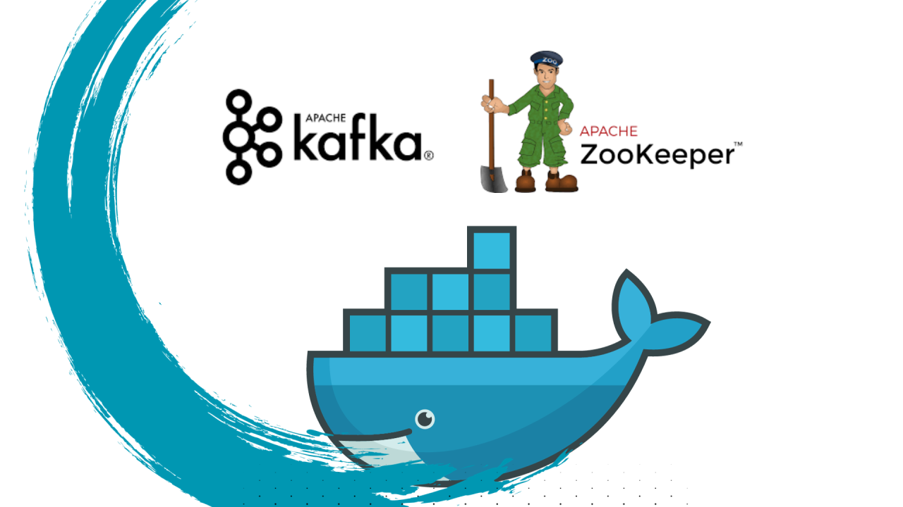

## Setting Up Kafka and Zookeeper Locally Using Docker

The process of setting up Kafka and Zookeeper using Docker Compose based on Bitnami images. For more detailed information about Apache Kafka by Bitnami, please visit their Github repository
### Prerequisites : 
Ensure that you have Docker installed on your machine. You can install Docker Desktop on Windows, Linux, or macOS by following the instructions provided in Microsoft's documentation
After installing Docker, please verify that both Docker and Docker Compose have been installed successfully. You can use the following commands to check the versions:
```dos
docker --version
```
You should be able to see something like this in the output : 

Terminal showing docker version
Check docker compose version :
docker compose version

Terminal showing docker compose version
### Configuration
Now that you have Docker and Docker Compose installed, you will need a docker-compose.yml file. You can place this file wherever you prefer, just ensure that you have the appropriate access rights. Copy the following code into your Docker Compose file:
```yaml
version: "3"
networks:
  myNetwork:

services:

  zookeeper:
    image: 'bitnami/zookeeper:latest'
    ports:
      - '2181:2181'
    environment:
      - ALLOW_ANONYMOUS_LOGIN=yes
    networks:
      - myNetwork

  kafka:
    image: 'bitnami/kafka:latest'
    user: root
    ports:
      - '9092:9092'
    environment:
      - KAFKA_BROKER_ID=1
      - KAFKA_LISTENERS=PLAINTEXT://:9092
      - KAFKA_ADVERTISED_LISTENERS=PLAINTEXT://127.0.0.1:9092
      - KAFKA_ZOOKEEPER_CONNECT=zookeeper:2181
      - ALLOW_PLAINTEXT_LISTENER=yes
    volumes:
      - ./Kafka:/bitnami/kafka
    networks:
      - myNetwork
    depends_on:
      - zookeeper
```
Basically, this Docker Compose file defines two services, Zookeeper and Kafka, which will run within the same network, enabling seamless communication between them. Note that even if you don't explicitly specify the network in your file, Docker Compose will create it by default. We've mapped the ports for `Zookeeper (2181)` and `Kafka (9092)` between your local machine and the respective containers.

Additionally, we've defined several environment variables for configuration purposes. The use of the root user in the Kafka service is optional but can be used in case of permission issues. Moreover, we've created a volume that will be mounted with `/bitnami/kafka` to ensure that topics, partitions, and messages persist even if the containers are deleted.

After that, run this command in the same path as your docker compose file. Note that the file should be named `"docker-compose.yml"`.

```
docker compose up -d
```
Docker Compose will pull both images from your default registry if you don't already have them on your local machine. The -d flag signifies that the containers will run in detached mode (in the background). You should expect to see output similar to the following. Please note that this process may take a few moments to complete.

Terminal showing kafka and zookeeper containers running in the same network
You can also see them running in your docker desktop app

Using your Docker Desktop, access the terminal for the Kafka container and execute the following command to check for existing topics:
```
kafka-topics.sh --bootstrap-server localhost:9092 --list
```
Actually, you will not see any output because there are currently no existing topics. Let's create the first topic. Using your local terminal or CMD in Windows, execute the following command:
```
docker exec -it <your_container_id> kafka-topics.sh --create --bootstrap-server localhost:9092 --replication-factor 1 --partitions 3 --topic test-tp 
```
To get your container id, you can execute this command and look for kafka in the output then copy it's container id.
``
docker ps
``
List again the available topics 
```
docker exec -it <your_container_id> kafka-topics.sh --bootstrap-server localhost:9092 --list
```
You should now see your test topic in the output. 
### Simulation
Here, we will add some events to the topics and use the console producer to write messages line by line to the topics. After that, we will utilize the console consumer in another terminal to listen to the events.
Run this command in your first terminal. Note that before you begin writing messages, execute the next command in another terminal to monitor the events.
```
docker exec -it <your_container_id> kafka-console-producer.sh --bootstrap-server localhost:9092 --topic test-tp
```
In your second terminal run this command :
```
docker exec -it <your_container_id> kafka-console-consumer.sh --from-beginning --bootstrap-server localhost:9092 --topic test-tp
```
Now you can write whatever you desire in the first terminal and monitor the output in the second. You can exit by pressing `'Ctrl + C'`.
Congratulations! You have successfully configured Apache Kafka and Apache Zookeeper with Docker using the Bitnami packages. 
