# Apache Kafka Cheat sheet for windows

### Table of Contents
#### How to turn on Apache Kafka
#### Kafka Topic Management:
#### Creating a Topic:
#### Listing Topics:
#### Describing a Topic:
#### Deleting a Topic:
#### Altering Partition Count:
#### Monitoring Topic Health:
#### Producer Operations:
#### Starting a Producer:
#### Configuring Acknowledgement:
#### Consumer Operations:
#### Starting a Consumer:
#### Setting Consumer Properties:
#### Consumer Group Management:
#### Creating a Consumer Group:
#### Listing Consumer Groups:
#### Describing a Consumer Group:
#### Viewing Group Members:
#### Checking Group State:
#### Partition Reassignment:
#### Preparation:
#### Executing Reassignment:
#### Viewing Partition Data:
#### Conclusion

### How to turn on Apache Kafka
The first step is to start the zookeeper server
```
.\bin\windows\zookeeper-server-start.bat .\config\zookeeper.properties
```
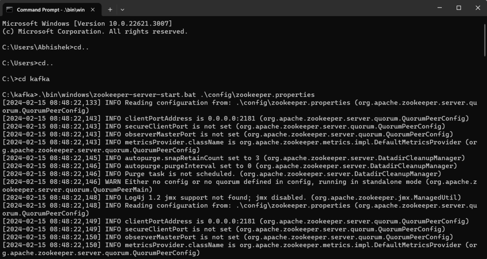

### The second step is to start the kafka server
```
.\bin\windows\kafka-server-start.bat .\config\server.properties
```
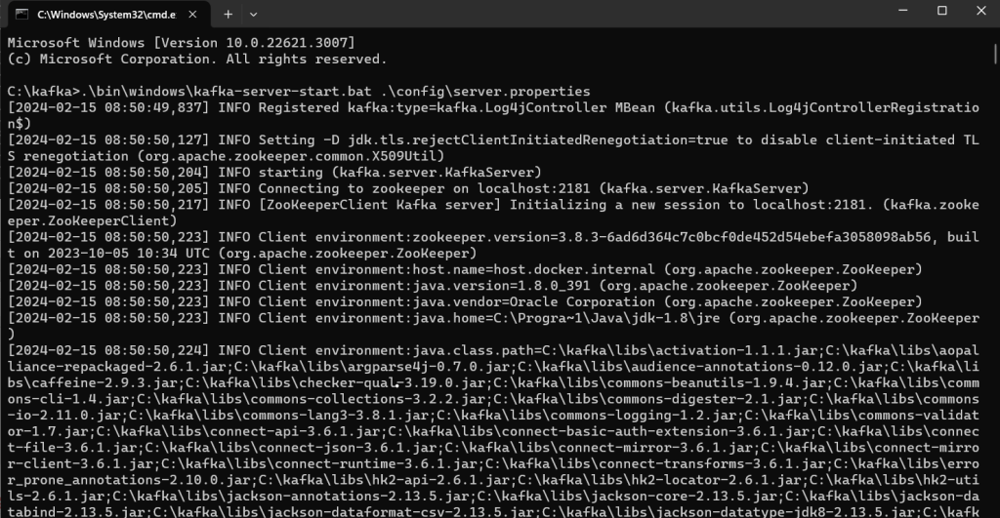

### Kafka Topic Management:
#### Creating a Topic:
The first command is suitable for quick and simple topic creation when default settings are acceptable.
```
kafka-topics.bat --create --bootstrap-server localhost:9092 --topic test
```
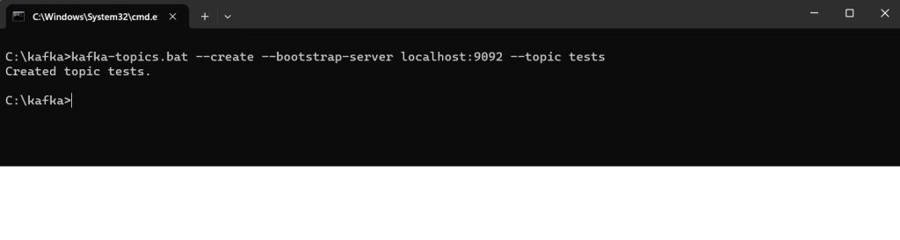

The second command is suitable when you need to define specific configurations for the topic, such as partition count and replication factor.
```
kafka-topics --bootstrap-server localhost:9092 --topic test --create --partitions 3 --replication-factor 3 --if-not-exists
```
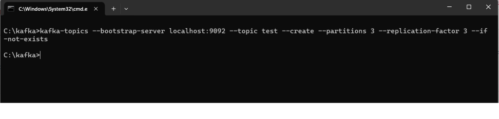

#### Listing Topics:
``` kafka-topics --bootstrap-server localhost:9092 --list ```

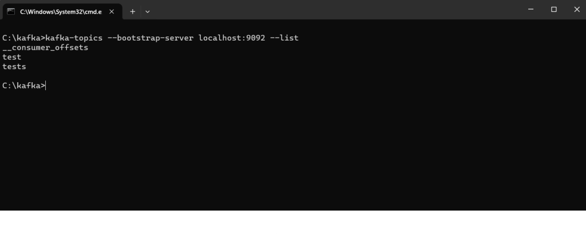

#### Describing a Topic:
``` kafka-topics --bootstrap-server localhost:9092 --topic test --describe ```

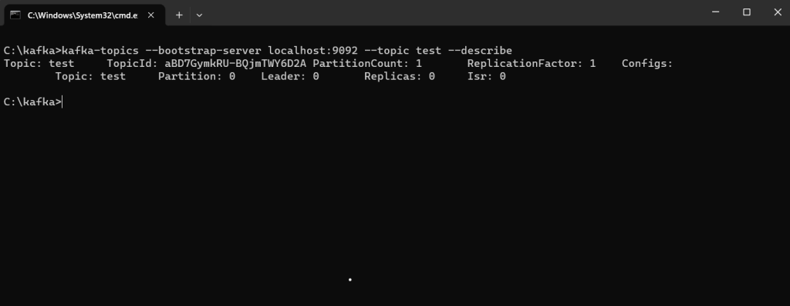

#### Deleting a Topic:
``` kafka-topics --bootstrap-server localhost:9092 --topic test --delete ```

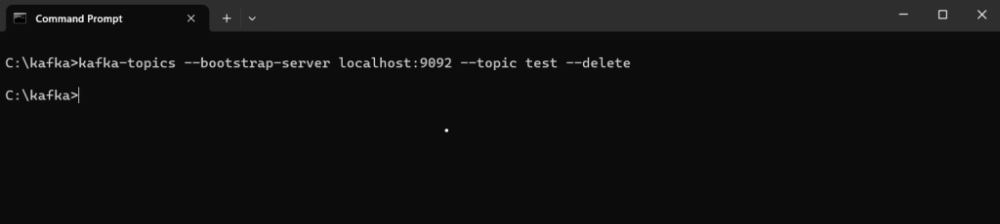

#### Altering Partition Count:
``` kafka-topics --bootstrap-server localhost:9092 --alter --topic test --partitions 7 ```

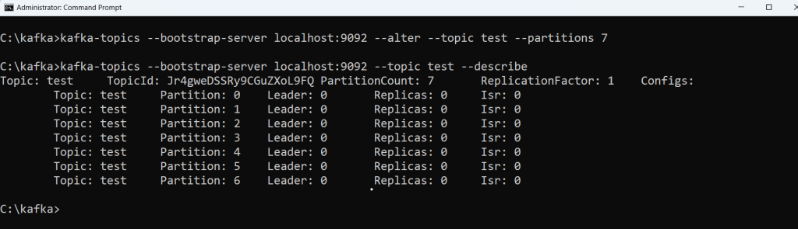

#### Monitoring Topic Health:

``` kafka-topics --bootstrap-server localhost:9092 --describe --under-replicated-partitions ```

``` kafka-topics --bootstrap-server localhost:9092 --describe --unavailable-partitions ```

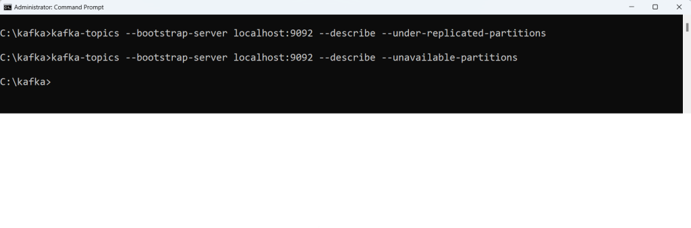

Note- There is no output showing while running these it means that there are no under-replicated partitions or unavailable partitions in your Kafka cluster at the moment.

### Producer Operations:
#### Starting a Producer:
``` kafka-console-producer.bat --broker-list localhost:9092 --topic test ```

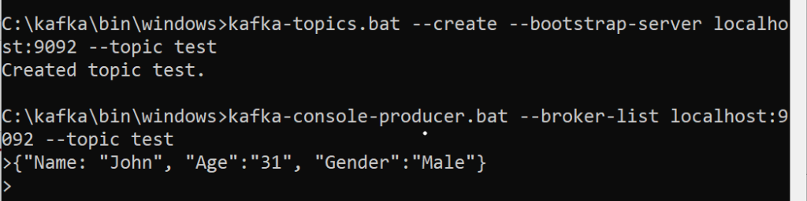

#### Configuring Acknowledgement:
There are three types of acknowledgment in Kafka

- No acknowledgment (acks=0):
- Leader acknowledgment (acks=1)
- All acknowledgment (acks=all)
  
``` kafka-console-producer.bat --broker-list localhost:9092 --topic test --producer-property acks=all ```

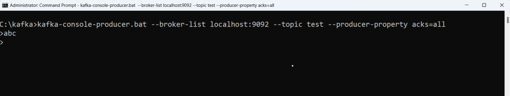

### Consumer Operations:
#### Starting a Consumer:
``` kafka-console-consumer.bat --topic test --bootstrap-server localhost:9092 --from-beginning ```

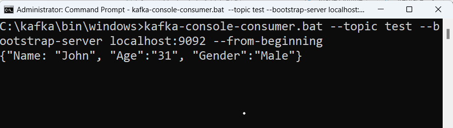

#### Setting Consumer Properties:
``` kafka-console-consumer.bat --topic test --bootstrap-server localhost:9092 --from-beginning --group my-group --property print.key=true --property key.deserializer=org.apache.kafka.common.serialization.StringDeserializer ```

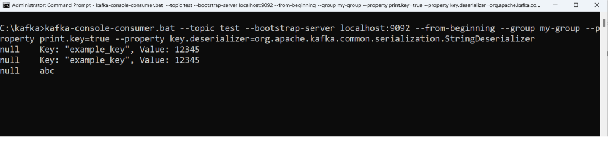

#### Consumer Group Management:
Creating a Consumer Group:
``` kafka-console-consumer --bootstrap-server localhost:9092 --topic test --group app1 ```

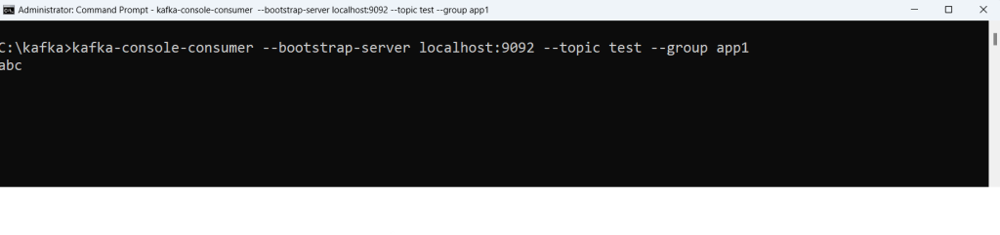

#### Listing Consumer Groups:
``` kafka-consumer-groups --bootstrap-server localhost:9092 --list ```

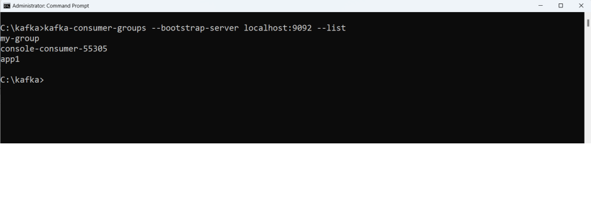

#### Describing a Consumer Group:
``` kafka-consumer-groups --bootstrap-server localhost:9092 --describe --group app1 ```

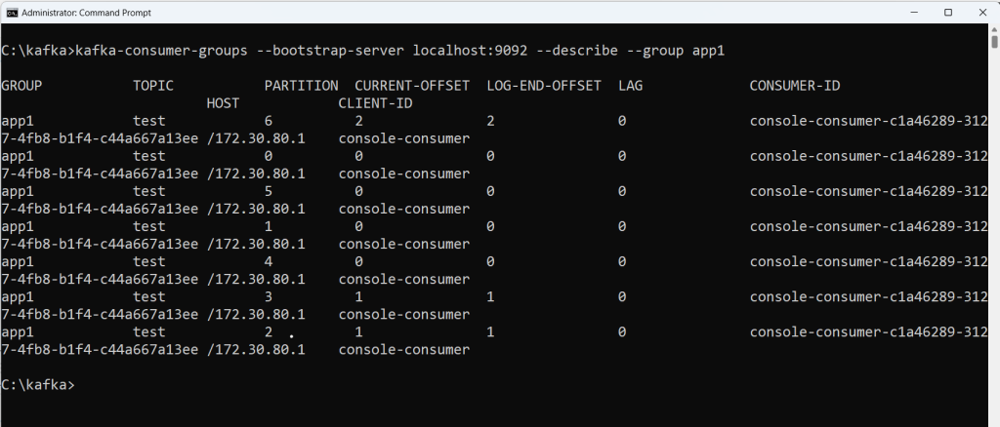

#### Viewing Group Members:
``` kafka-consumer-groups --bootstrap-server localhost:9092 --describe --group app1 --members ```

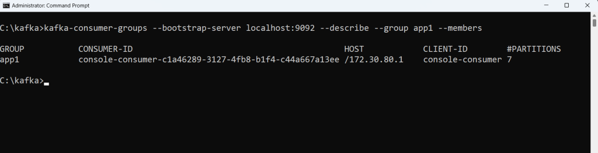

#### Checking Group State:
``` kafka-consumer-groups --bootstrap-server localhost:9092 --describe --group app1 --state ```

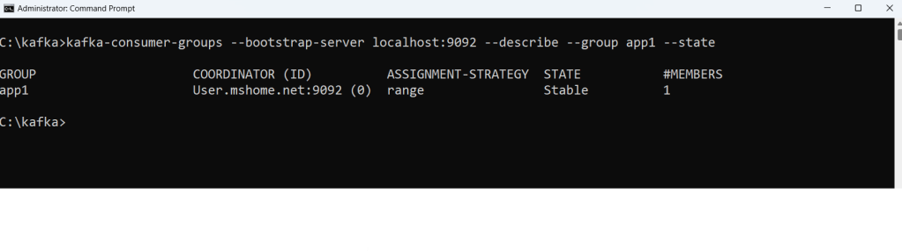

### Partition Reassignment:
#### Preparation:
Create a JSON file (e.g., topics.json) specifying topics for reassignment.
```json
{
  "topics": [{ "topic": "test" }],
  "version": 1
}
```
#### Executing Reassignment:
``` kafka-reassign-partitions --bootstrap-server localhost:9092 --generate --topics-to-move-json-file topics.json --broker-list 3,2,1 ```

``` kafka-reassign-partitions --bootstrap-server localhost:9092 --execute --reassignment-json-file plan.json ```

``` kafka-reassign-partitions --bootstrap-server localhost:9092 --verify --reassignment-json-file plan.json ```
#### Viewing Partition Data:
``` kafka-run-class kafka.tools.DumpLogSegments --print-data-log --files <kafka-data-dir>/<partition-dir>/00000000000000000000.log ```
