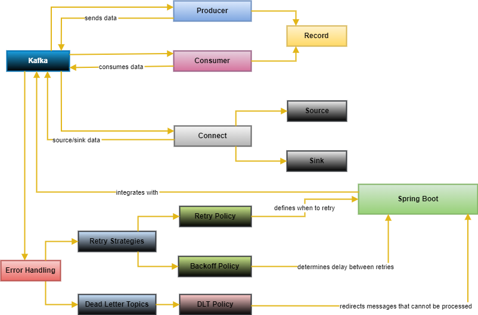
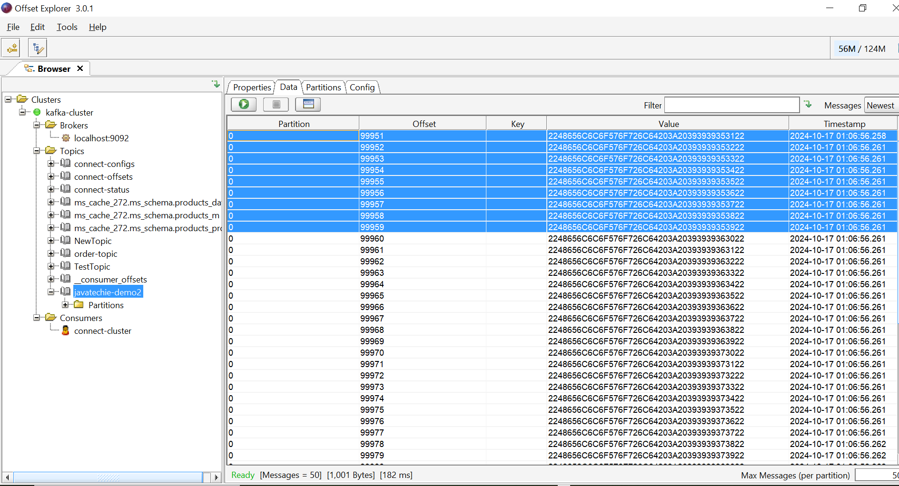

# kafka for beginners

- components and architecture 
- kafka installation
- kafka CLI and workflows
- installing kafka using docker-compose
- kafka producer example using springboot
- kafka consumer example using springboot
- kafka serialize & deserialize
- kafka partition
- kafka e2e testing in spring boot with test containers 
- kafka error handling
- kafka schema registry



In Kafka, a Connect is a framework for implementing and running connectors that continuously import/export data between Kafka and external systems. Source connectors bring data from an external system into Kafka, while sink connectors export data from Kafka to an external system.

In the flowchart provided, Connect is shown as connecting to both the Source and Sink. This indicates that Connect can interact with both the Source (which brings data into Kafka) and the Sink (which exports data from Kafka).

In summary, Connect plays a crucial role in facilitating the movement of data between external systems and Kafka by interacting with both the Source and the Sink.

Configuring Kafka consumers and producers is crucial for ensuring efficient and reliable message processing. Below are key configurations for both, as well as explanations of their types.

### Kafka Producer Configuration

Producers are responsible for sending messages to Kafka topics. Here are some important configuration properties:

1. **Bootstrap Servers**
   ```properties
   bootstrap.servers=localhost:9092
   ```
   - A list of Kafka brokers to connect to for sending messages.

2. **Key Serializer**
   ```properties
   key.serializer=org.apache.kafka.common.serialization.StringSerializer
   ```
   - Specifies the class used to serialize the message keys.

3. **Value Serializer**
   ```properties
   value.serializer=org.apache.kafka.common.serialization.StringSerializer
   ```
   - Specifies the class used to serialize the message values.

4. **Acknowledgment**
   ```properties
   acks=all
   ```
   - Determines how many brokers must acknowledge receipt of a message. Options are:
     - `0`: No acknowledgment needed.
     - `1`: Leader acknowledgment required.
     - `all`: All in-sync replicas must acknowledge.

5. **Compression Type**
   ```properties
   compression.type=gzip
   ```
   - Type of compression to use for messages. Options include `gzip`, `snappy`, and `lz4`.

6. **Retries**
   ```properties
   retries=3
   ```
   - Number of retries for sending a message if it fails.

7. **Batch Size**
   ```properties
   batch.size=16384
   ```
   - Maximum size of a batch of messages sent to the broker. This can help optimize throughput.

8. **Linger Time**
   ```properties
   linger.ms=5
   ```
   - Time to wait for additional messages before sending the batch. Helps increase throughput by reducing the number of requests.

### Kafka Consumer Configuration

Consumers read messages from Kafka topics. Here are important configuration properties:

1. **Bootstrap Servers**
   ```properties
   bootstrap.servers=localhost:9092
   ```
   - Same as the producer, it defines the Kafka brokers to connect to.

2. **Group ID**
   ```properties
   group.id=my-consumer-group
   ```
   - Identifies the consumer group this consumer belongs to, which enables load balancing of message consumption.

3. **Key Deserializer**
   ```properties
   key.deserializer=org.apache.kafka.common.serialization.StringDeserializer
   ```
   - Specifies the class used to deserialize message keys.

4. **Value Deserializer**
   ```properties
   value.deserializer=org.apache.kafka.common.serialization.StringDeserializer
   ```
   - Specifies the class used to deserialize message values.

5. **Auto Offset Reset**
   ```properties
   auto.offset.reset=earliest
   ```
   - Determines what to do when there is no initial offset or if the current offset no longer exists. Options include:
     - `earliest`: Start from the beginning.
     - `latest`: Start from the end.
     - `none`: Throw an exception if no offsets are found.

6. **Enable Auto Commit**
   ```properties
   enable.auto.commit=true
   ```
   - Controls whether offsets are committed automatically.

7. **Auto Commit Interval**
   ```properties
   auto.commit.interval.ms=1000
   ```
   - How frequently to commit offsets when `enable.auto.commit` is true.

8. **Session Timeout**
   ```properties
   session.timeout.ms=30000
   ```
   - The maximum amount of time the consumer can be inactive before being considered dead.

### Types of Configurations

Kafka configurations can generally be categorized into the following types:

1. **Producer Configurations**: As detailed above, these control the behavior of message production, serialization, acknowledgment settings, and error handling.

2. **Consumer Configurations**: These settings manage how messages are read from topics, offset management, deserialization, and error handling.

3. **Client-Side Configurations**: Settings that control how the Kafka client interacts with the broker, including connection timeouts and retries.

4. **Broker Configurations**: These configurations (typically set in `server.properties`) define how the Kafka brokers operate, including replication factors, log retention policies, and network settings.

5. **Topic Configurations**: These can be set at the time of topic creation or modified later. They include settings for cleanup policies, retention periods, and partitions.

### Example Configuration

Here’s an example of both producer and consumer properties in a properties file:

```properties
# Producer properties
bootstrap.servers=localhost:9092
key.serializer=org.apache.kafka.common.serialization.StringSerializer
value.serializer=org.apache.kafka.common.serialization.StringSerializer
acks=all
compression.type=gzip

# Consumer properties
bootstrap.servers=localhost:9092
group.id=my-consumer-group
key.deserializer=org.apache.kafka.common.serialization.StringDeserializer
value.deserializer=org.apache.kafka.common.serialization.StringDeserializer
auto.offset.reset=earliest
enable.auto.commit=true
```

These configurations can be fine-tuned based on your application's specific needs, such as performance requirements, message durability, and fault tolerance.

## spring-boot-dockerize
### How to Dockerize Spring Boot Application

**Build Docker Image**
```
$ docker build -t spring-boot-docker.jar .
```
**Check Docker Image**
```
$ docker image ls
```
**Run Docker Image**
```
$ docker run -p 9090:8080 spring-boot-docker.jar
```
In the run command, we have specified that the port 8080 on the container should be mapped to the port 9090 on the Host OS.

**Dockerfile**
```
FROM openjdk:8
EXPOSE 8080
ADD target/spring-boot-docker.jar spring-boot-docker.jar 
ENTRYPOINT ["java","-jar","/spring-boot-docker.jar"]
```
**pom.xml**

```pom
<?xml version="1.0" encoding="UTF-8"?>
<project xmlns="http://maven.apache.org/POM/4.0.0" xmlns:xsi="http://www.w3.org/2001/XMLSchema-instance"
	xsi:schemaLocation="http://maven.apache.org/POM/4.0.0 http://maven.apache.org/xsd/maven-4.0.0.xsd">
	<modelVersion>4.0.0</modelVersion>
	<parent>
		<groupId>org.springframework.boot</groupId>
		<artifactId>spring-boot-starter-parent</artifactId>
		<version>2.1.2.RELEASE</version>
		<relativePath/> <!-- lookup parent from repository -->
	</parent>
	<groupId>com.javatechie</groupId>
	<artifactId>spring-boot-docker</artifactId>
	<version>0.0.1-SNAPSHOT</version>
	<name>spring-boot-docker</name>
	<description>Dockerize spring boot applicatio n </description>

	<properties>
		<java.version>1.8</java.version>
	</properties>

	<dependencies>
		<dependency>
			<groupId>org.springframework.boot</groupId>
			<artifactId>spring-boot-starter-web</artifactId>
		</dependency>

		<dependency>
			<groupId>org.springframework.boot</groupId>
			<artifactId>spring-boot-starter-test</artifactId>
			<scope>test</scope>
		</dependency>
	</dependencies>

	<build>
		<plugins>
			<plugin>
				<groupId>org.springframework.boot</groupId>
				<artifactId>spring-boot-maven-plugin</artifactId>
			</plugin>
		</plugins>
		<finalName>spring-boot-docker</finalName>
	</build>

</project>
```
**SpringBootDockerApplication.java**
```java
package com.javatechie.spring.boot.docker.demo;

import org.springframework.boot.SpringApplication;
import org.springframework.boot.autoconfigure.SpringBootApplication;
import org.springframework.web.bind.annotation.GetMapping;
import org.springframework.web.bind.annotation.RestController;

@SpringBootApplication
@RestController
public class SpringBootDockerApplication {

	@GetMapping("/message")
	public String getMessage() {
		return "Welcome to JavaTechie..!!";
	}

	public static void main(String[] args) {
		SpringApplication.run(SpringBootDockerApplication.class, args);
	}

}
```

## spring-boot-docker-maven-example
How to dockerize  spring boot application using maven plugin 

### Maven plugin


#### Docker Hub 


## Start with a base image containing Java runtime
```
FROM java:8
```
## Make port 8080 available to the world outside this container
```
EXPOSE 8080

ADD target/spring-boot-docker-maven.jar spring-boot-docker-maven.jar
```
## Run the jar file 
```
ENTRYPOINT ["java","-jar","spring-boot-docker-maven.jar"]
```
```pom
<?xml version="1.0" encoding="UTF-8"?>
<project xmlns="http://maven.apache.org/POM/4.0.0"
	xmlns:xsi="http://www.w3.org/2001/XMLSchema-instance"
	xsi:schemaLocation="http://maven.apache.org/POM/4.0.0 http://maven.apache.org/xsd/maven-4.0.0.xsd">
	<modelVersion>4.0.0</modelVersion>
	<parent>
		<groupId>org.springframework.boot</groupId>
		<artifactId>spring-boot-starter-parent</artifactId>
		<version>2.1.2.RELEASE</version>
		<relativePath /> <!-- lookup parent from repository -->
	</parent>
	<groupId>com.javatechie</groupId>
	<artifactId>spring-boot-docker-maven</artifactId>
	<version>0.0.1-SNAPSHOT</version>
	<name>spring-boot-docker-maven</name>
	<description>dockerize your spring boot application using maven</description>

	<properties>
		<java.version>1.8</java.version>
	</properties>

	<dependencies>
		<dependency>
			<groupId>org.springframework.boot</groupId>
			<artifactId>spring-boot-starter-web</artifactId>
		</dependency>

		<dependency>
			<groupId>org.springframework.boot</groupId>
			<artifactId>spring-boot-starter-test</artifactId>
			<scope>test</scope>
		</dependency>
	</dependencies>

	<build>
		<plugins>
			<plugin>
				<groupId>org.springframework.boot</groupId>
				<artifactId>spring-boot-maven-plugin</artifactId>
			</plugin>
			<plugin>
				<groupId>com.spotify</groupId>
				<artifactId>dockerfile-maven-plugin</artifactId>
				<version>1.4.0</version>
				<configuration>
					<repository>javatechie/${project.artifactId}</repository>
					<tag>${project.version}</tag>
					<buildArgs>
						<JAR_FILE>target/${project.build.finalName}.jar</JAR_FILE>
					</buildArgs>
				</configuration>
				<executions>
					<execution>
						<id>default</id>
						<phase>install</phase>
						<goals>
							<goal>build</goal>
							<goal>push</goal>
						</goals>
					</execution>
				</executions>
			</plugin>
		</plugins>
		<finalName>spring-boot-docker-maven</finalName>
	</build>

</project>
```

## springboot-docker-ecs
```java
package com.javatechie.aws.ecs;

import org.springframework.boot.SpringApplication;
import org.springframework.boot.autoconfigure.SpringBootApplication;
import org.springframework.web.bind.annotation.GetMapping;
import org.springframework.web.bind.annotation.PathVariable;
import org.springframework.web.bind.annotation.RequestMapping;
import org.springframework.web.bind.annotation.RestController;

@SpringBootApplication
@RestController
@RequestMapping("/")
public class SpringbootDockerAwsEcsApplication {

    @GetMapping
    public String applicationStatus() {
        return "Application is up and running !";
    }

    @GetMapping("/{name}")
    public String welcome(@PathVariable String name) {
        return "Hi " + name + " Welcome to javatechie AWS ECS Example";
    }

    public static void main(String[] args) {
        SpringApplication.run(SpringbootDockerAwsEcsApplication.class, args);
    }

}
```
# springboot-docker-ecs
Run your Docker image on AWS ECS (Elastic Container Service)

### Required commands

- Build Docker Image.

  mvn spring-boot:build-image
   
- Run Docker Image.

  docker run --tty --publish 8080:8080 <image-name>
    
- Tag Docker Image

 docker tag <image-name> tag-name/<image-name>
    
- Push Docker Image to Docker Hub

docker push tag-name/<image-name>
		
- Application Flow
   
```pom


<?xml version="1.0" encoding="UTF-8"?>
<project xmlns="http://maven.apache.org/POM/4.0.0" xmlns:xsi="http://www.w3.org/2001/XMLSchema-instance"
	xsi:schemaLocation="http://maven.apache.org/POM/4.0.0 https://maven.apache.org/xsd/maven-4.0.0.xsd">
	<modelVersion>4.0.0</modelVersion>
	<parent>
		<groupId>org.springframework.boot</groupId>
		<artifactId>spring-boot-starter-parent</artifactId>
		<version>2.3.3.RELEASE</version>
		<relativePath/> <!-- lookup parent from repository -->
	</parent>
	<groupId>com.javatechie</groupId>
	<artifactId>springboot-docker-aws-ecs</artifactId>
	<version>0.0.1-SNAPSHOT</version>
	<name>springboot-docker-aws-ecs</name>
	<description>Demo project for Spring Boot</description>

	<properties>
		<java.version>1.8</java.version>
	</properties>

	<dependencies>
		<dependency>
			<groupId>org.springframework.boot</groupId>
			<artifactId>spring-boot-starter-web</artifactId>
		</dependency>

		<dependency>
			<groupId>org.springframework.boot</groupId>
			<artifactId>spring-boot-starter-test</artifactId>
			<scope>test</scope>
			<exclusions>
				<exclusion>
					<groupId>org.junit.vintage</groupId>
					<artifactId>junit-vintage-engine</artifactId>
				</exclusion>
			</exclusions>
		</dependency>
	</dependencies>

	<build>
		<plugins>
			<plugin>
				<groupId>org.springframework.boot</groupId>
				<artifactId>spring-boot-maven-plugin</artifactId>
				<version>2.3.0.RELEASE</version>
			</plugin>
		</plugins>
	</build>

</project>
```

= Java Techie Spring REST Docs Example

This is an example output for a service running at http://localhost:9091:

== POST API Example

.request
include::{snippets}/testAddOrder/http-request.adoc[]

.response
include::{snippets}/testAddOrder/http-response.adoc[]

== GET API Example

.request
include::{snippets}/testGetOrders/http-request.adoc[]

.response
include::{snippets}/testGetOrders/http-response.adoc[]

The data which we can see as part of documentation will loaded from MockMvc Test case data


### docker-remote-debug
```
FROM openjdk:8
EXPOSE 8080 8000
ADD target/spring-docker-demo.jar spring-docker-demo.jar
ADD entrypoint.sh entrypoint.sh
ENTRYPOINT ["sh","/entrypoint.sh"]
```
### entrypoint.sh
```
java -Xdebug -Xrunjdwp:transport=dt_socket,server=y,address=8000,suspend=n -jar spring-docker-demo.jar
```
```pom
<?xml version="1.0" encoding="UTF-8"?>
<project xmlns="http://maven.apache.org/POM/4.0.0" xmlns:xsi="http://www.w3.org/2001/XMLSchema-instance"
	xsi:schemaLocation="http://maven.apache.org/POM/4.0.0 https://maven.apache.org/xsd/maven-4.0.0.xsd">
	<modelVersion>4.0.0</modelVersion>
	<parent>
		<groupId>org.springframework.boot</groupId>
		<artifactId>spring-boot-starter-parent</artifactId>
		<version>2.6.3</version>
		<relativePath/> <!-- lookup parent from repository -->
	</parent>
	<groupId>com.javatechie</groupId>
	<artifactId>docker-image-debugging</artifactId>
	<version>0.0.1-SNAPSHOT</version>
	<name>docker-image-debugging</name>
	<description>Demo project for Spring Boot</description>
	<properties>
		<java.version>1.8</java.version>
	</properties>
	<dependencies>
		<dependency>
			<groupId>org.springframework.boot</groupId>
			<artifactId>spring-boot-starter-web</artifactId>
		</dependency>

		<dependency>
			<groupId>org.projectlombok</groupId>
			<artifactId>lombok</artifactId>
			<optional>true</optional>
		</dependency>
		<dependency>
			<groupId>org.springframework.boot</groupId>
			<artifactId>spring-boot-starter-test</artifactId>
			<scope>test</scope>
		</dependency>
	</dependencies>

	<build>
		<plugins>
			<plugin>
				<groupId>org.springframework.boot</groupId>
				<artifactId>spring-boot-maven-plugin</artifactId>
				<configuration>
					<excludes>
						<exclude>
							<groupId>org.projectlombok</groupId>
							<artifactId>lombok</artifactId>
						</exclude>
					</excludes>
				</configuration>
			</plugin>
		</plugins>
		<finalName>spring-docker-demo</finalName>
	</build>

</project>
```
```java
import org.springframework.boot.SpringApplication;
import org.springframework.boot.autoconfigure.SpringBootApplication;
import org.springframework.web.bind.annotation.GetMapping;
import org.springframework.web.bind.annotation.PathVariable;
import org.springframework.web.bind.annotation.RequestMapping;
import org.springframework.web.bind.annotation.RestController;

import java.util.List;
import java.util.stream.Collectors;

@SpringBootApplication
@RestController
@RequestMapping("/employees")
public class DockerImageDebuggingApplication {

    private EmployeeRepository employeeRepository;

    public DockerImageDebuggingApplication(EmployeeRepository employeeRepository) {
        this.employeeRepository = employeeRepository;
    }

    @GetMapping("/{dept}")
    public List<Employee> getEmployees(@PathVariable String dept) {
        return employeeRepository.getEmployees()
                .stream()
                .filter(employee -> dept.equals(employee.getDept()))
                .collect(Collectors.toList());
    }

    @GetMapping("/notify/{dept}")
    public void sendAnnouncementTOEmployees(@PathVariable String dept) {
        List<String> emailIds = employeeRepository.getEmailIds(dept);
        emailIds.forEach(email -> System.out.println("send email to " + email));
    }

    public static void main(String[] args) {
        SpringApplication.run(DockerImageDebuggingApplication.class, args);
    }

}
```
```java
import lombok.AllArgsConstructor;
import lombok.Data;
import lombok.NoArgsConstructor;
import lombok.ToString;

@AllArgsConstructor
@NoArgsConstructor
@ToString
@Data
public class Employee {

    private int id;
    private String name;
    private String dept;
    private String email;
}
```
```java
import org.springframework.stereotype.Component;

import java.util.List;
import java.util.stream.Collectors;
import java.util.stream.Stream;
@Component
public class EmployeeRepository {

    public List<Employee> getEmployees() {
        return Stream.of(new Employee(101, "Bikas", "Devops", "Bikas@company.com"),
                        new Employee(102, "Ashok", "Developer", "Ashok@company.com"),
                        new Employee(103, "Prasad", "Devops", "Prasad@company.com"),
                        new Employee(104, "Santosh", "Developer", "Santosh@company.com"),
                        new Employee(105, "Basant", "Developer", "Basant@company.com"),
                        new Employee(106, "Bala", "Manager", "Bala@company.com"),
                        new Employee(107, "Anupama", "HR", "Anupama@company.com"))
                .collect(Collectors.toList());
    }

    public List<String> getEmailIds(String dept) {
        return getEmployees().stream()
                .filter(employee -> dept.equals(employee.getDept()))
                .map(Employee::getEmail)
                .collect(Collectors.toList());
    }
}
```

# springboot-mongodb-docker
Deploying Spring Boot and MongoDB as Containers Using Docker and Docker Compose

**Steps & Commands**

- [x] pull mongo image from docker hub **`docker pull mongo:latest`**
- [x] run mongo image **`docker run -d -p 27017:27017 --name javatechiemongodb mongo:latest`**
- [x] dockerize spring boot application **`docker build -t springboot-mongodb:1.0 .`**
- [x] run spring boot docker image and link that container to mongo container 
   **`docker run -p 8080:8080 --name springboot-mongodb --link javatechiemongodb:mongo -d springboot-mongodb:1.0`**
- [x] check docker running containers  **`docker ps`** it should display two container ids
- [x] check logs of spring boot image **`docker logs springboot-mongodb`**
- [x] if all good access your api  :tada:
```bash
curl --location --request POST 'http://localhost:8080/books' \
--header 'Content-Type: application/json' \
--data-raw '{
    "id":1,
    "bookName":"corejava",
    "authorName":"Basant"
}'
```
- [x] login to mongo terminal to verify records **`docker exec -it javatechiemongodb bash`**
- type mongo and enter
- show dbs
- use book
- show collections
- db.book.find().pretty()

**Use Docker Compose**

- [x] Kill running container:
```
docker rm <containerId>
```

#### docker-compose.yml

```yaml
version: "3"
services:
  javatechiemongodb:
    image: mongo:latest
    container_name: "javatechiemongodb"
    ports:
      - 27017:27017
  springboot-mongodb:
    image: springboot-mongodb:1.0
    container_name: springboot-mongodb
    ports:
      - 8080:8080
    links:
      - javatechiemongodb
```
- [x] navigate to resources folder:
```
springboot-mongo-docker/src/main/resources and run docker-compose up
```

```java
import com.javatechie.docker.compose.model.Book;
import org.springframework.data.mongodb.repository.MongoRepository;

public interface BookRepository extends MongoRepository<Book,Integer> {
}
```
```java
import lombok.AllArgsConstructor;
import lombok.Data;
import lombok.NoArgsConstructor;
import org.springframework.data.annotation.Id;
import org.springframework.data.mongodb.core.mapping.Document;

@Data
@AllArgsConstructor
@NoArgsConstructor
@Document(collection = "books")
public class Book {
    @Id
    private int id;
    private String name;
    private String authorName;
}
```
```java
import com.javatechie.docker.compose.dao.BookRepository;
import com.javatechie.docker.compose.model.Book;
import org.springframework.beans.factory.annotation.Autowired;
import org.springframework.boot.SpringApplication;
import org.springframework.boot.autoconfigure.SpringBootApplication;
import org.springframework.web.bind.annotation.*;

import java.util.List;

@SpringBootApplication
@RestController
@RequestMapping("/book")
public class SpringbootMongodbDockerApplication {

	@Autowired
	private BookRepository repository;

	@PostMapping
	public Book saveBook(@RequestBody Book book){
		return repository.save(book);
	}

	@GetMapping
	public List<Book> getBooks(){
		return repository.findAll();
	}

	public static void main(String[] args) {
		SpringApplication.run(SpringbootMongodbDockerApplication.class, args);
	}

}
```
**Dockerfile**

```
FROM openjdk:8
ADD target/springboot-mongo-docker.jar app.jar
ENTRYPOINT ["java","-jar","app.jar"]
```
```pom
<?xml version="1.0" encoding="UTF-8"?>
<project xmlns="http://maven.apache.org/POM/4.0.0" xmlns:xsi="http://www.w3.org/2001/XMLSchema-instance"
	xsi:schemaLocation="http://maven.apache.org/POM/4.0.0 https://maven.apache.org/xsd/maven-4.0.0.xsd">
	<modelVersion>4.0.0</modelVersion>
	<parent>
		<groupId>org.springframework.boot</groupId>
		<artifactId>spring-boot-starter-parent</artifactId>
		<version>2.5.4</version>
		<relativePath/> <!-- lookup parent from repository -->
	</parent>
	<groupId>com.javatechie</groupId>
	<artifactId>springboot-mongodb-docker</artifactId>
	<version>0.0.1-SNAPSHOT</version>
	<name>springboot-mongodb-docker</name>
	<description>Demo project for Spring Boot</description>
	<properties>
		<java.version>1.8</java.version>
	</properties>
	<dependencies>
		<dependency>
			<groupId>org.springframework.boot</groupId>
			<artifactId>spring-boot-starter-data-mongodb</artifactId>
		</dependency>
		<dependency>
			<groupId>org.springframework.boot</groupId>
			<artifactId>spring-boot-starter-web</artifactId>
		</dependency>

		<dependency>
			<groupId>org.projectlombok</groupId>
			<artifactId>lombok</artifactId>
			<optional>true</optional>
		</dependency>
		<dependency>
			<groupId>org.springframework.boot</groupId>
			<artifactId>spring-boot-starter-test</artifactId>
			<scope>test</scope>
		</dependency>
	</dependencies>

	<build>
		<plugins>
			<plugin>
				<groupId>org.springframework.boot</groupId>
				<artifactId>spring-boot-maven-plugin</artifactId>
				<configuration>
					<excludes>
						<exclude>
							<groupId>org.projectlombok</groupId>
							<artifactId>lombok</artifactId>
						</exclude>
					</excludes>
				</configuration>
			</plugin>
		</plugins>
		<finalName>springboot-mongo-docker</finalName>
	</build>

</project>
```
application.yml
```yaml
spring:
  data:
    mongodb:
      database: Book
      host: javatechiemongodb
      port: 27017
```
docker-compose.yml
```yaml
version: "3"
services:
  javatechiemongodb:
    image: mongo:latest
    container_name: "javatechiemongodb"
    ports:
      - 27017:27017
  springboot-mongodb:
    image: springboot-mongodb:1.0
    container_name: springboot-mongodb
    ports:
      - 8080:8080
    links:
      - javatechiemongodb
```
# kafka-installation

# Command uses 

### Move into Kafka container
```docker exec -it <kafka_conatiner_id> /bin/sh```
### Go inside kafka installation folder
```cd /opt/kafka_<version>/bin```
### Create Kafka topic
```kafka-topics.sh --create --zookeeper zookeeper:2181 --replication-factor 1 --partitions 1 --topic quickstart```
### Start Producer app (CLI)
```kafka-console-producer.sh --topic quickstart --bootstrap-server localhost:9092```
### Start consumer app (CLI)
```kafka-console-consumer.sh --topic quickstart --from-beginning --bootstrap-server localhost:9092```

docker-compose.yml
```yaml
version: '3'

services:
  zookeeper:
    image: wurstmeister/zookeeper
    container_name: zookeeper
    ports:
      - "2181:2181"
  kafka:
    image: wurstmeister/kafka
    container_name: kafka
    ports:
      - "9092:9092"
    environment:
      KAFKA_ADVERTISED_HOST_NAME: localhost
      KAFKA_ZOOKEEPER_CONNECT: zookeeper:2181
```
# kafka-publisher
Apache Kafka Publisher Example using SpringBoot

# start zookeeper.start bat file like below
zookeeper-server-start.bat D:\DEV-SOFTWARES\kafka_2.12-1.1.0\config\zookeeper.properties

# start kafka server
kafka-server-start.bat D:\DEV-SOFTWARES\kafka_2.12-1.1.0\config\server.properties

# Create Topic:
kafka-topics.bat --create --zookeeper localhost:2181 --replication-factor 1 --partitions 1 -topic javatechie

# Produce a message 
kafka-console-producer.bat --broker-list localhost:9092 --topic javatechie

# Consume a message
kafka-console-consumer.bat --bootstrap-server localhost:9092 --topic javatechie

```yaml
<?xml version="1.0" encoding="UTF-8"?>
<project xmlns="http://maven.apache.org/POM/4.0.0" xmlns:xsi="http://www.w3.org/2001/XMLSchema-instance"
	xsi:schemaLocation="http://maven.apache.org/POM/4.0.0 http://maven.apache.org/xsd/maven-4.0.0.xsd">
	<modelVersion>4.0.0</modelVersion>

	<groupId>com.example</groupId>
	<artifactId>kafka-publisher</artifactId>
	<version>0.0.1-SNAPSHOT</version>
	<packaging>jar</packaging>

	<name>kafka-publisher</name>
	<description>Publish message using kafka</description>

	<parent>
		<groupId>org.springframework.boot</groupId>
		<artifactId>spring-boot-starter-parent</artifactId>
		<version>2.0.2.RELEASE</version>
		<relativePath/> <!-- lookup parent from repository -->
	</parent>

	<properties>
		<project.build.sourceEncoding>UTF-8</project.build.sourceEncoding>
		<project.reporting.outputEncoding>UTF-8</project.reporting.outputEncoding>
		<java.version>1.8</java.version>
	</properties>

	<dependencies>
		<dependency>
			<groupId>org.springframework.boot</groupId>
			<artifactId>spring-boot-starter-web</artifactId>
		</dependency>
		<dependency>
			<groupId>org.springframework.kafka</groupId>
			<artifactId>spring-kafka</artifactId>
		</dependency>

		<dependency>
			<groupId>org.springframework.boot</groupId>
			<artifactId>spring-boot-devtools</artifactId>
			<scope>runtime</scope>
		</dependency>
		<dependency>
			<groupId>org.projectlombok</groupId>
			<artifactId>lombok</artifactId>
			<optional>true</optional>
		</dependency>
		<dependency>
			<groupId>org.springframework.boot</groupId>
			<artifactId>spring-boot-starter-test</artifactId>
			<scope>test</scope>
		</dependency>
	</dependencies>

	<build>
		<plugins>
			<plugin>
				<groupId>org.springframework.boot</groupId>
				<artifactId>spring-boot-maven-plugin</artifactId>
			</plugin>
		</plugins>
	</build>


</project>
```
```java
import java.util.HashMap;
import java.util.Map;

import org.apache.kafka.clients.producer.ProducerConfig;
import org.apache.kafka.common.serialization.StringSerializer;
import org.springframework.context.annotation.Bean;
import org.springframework.context.annotation.Configuration;
import org.springframework.kafka.core.DefaultKafkaProducerFactory;
import org.springframework.kafka.core.KafkaTemplate;
import org.springframework.kafka.core.ProducerFactory;
import org.springframework.kafka.support.serializer.JsonSerializer;

@Configuration
public class KafkaPublisherConfig {

	@Bean
	public ProducerFactory<String, Object> producerFactory() {
		Map<String, Object> configs = new HashMap<>();
		configs.put(ProducerConfig.BOOTSTRAP_SERVERS_CONFIG, "localhost:9092");
		configs.put(ProducerConfig.KEY_SERIALIZER_CLASS_CONFIG, StringSerializer.class);
		configs.put(ProducerConfig.VALUE_SERIALIZER_CLASS_CONFIG, JsonSerializer.class);
		return new DefaultKafkaProducerFactory<String, Object>(configs);
	}

	@Bean
	public KafkaTemplate<String, Object> kafkaTemplate() {
		return new KafkaTemplate<>(producerFactory());
	}

}
```
```java
import org.springframework.beans.factory.annotation.Autowired;
import org.springframework.boot.SpringApplication;
import org.springframework.boot.autoconfigure.SpringBootApplication;
import org.springframework.kafka.core.KafkaTemplate;
import org.springframework.web.bind.annotation.GetMapping;
import org.springframework.web.bind.annotation.PathVariable;
import org.springframework.web.bind.annotation.RestController;

@SpringBootApplication
@RestController
public class KafkaPublisherApplication {

	@Autowired
	private KafkaTemplate<String, Object> template;

	private String topic = "javatechie";

	@GetMapping("/publish/{name}")
	public String publishMessage(@PathVariable String name) {
		template.send(topic, "Hi " + name + " Welcome to java techie");
		return "Data published";
	}

	@GetMapping("/publishJson")
	public String publishMessage() {
		User user = new User(2532, "User88", new String[] { "Bangalore", "BTM", "house 90" });
		template.send(topic, user);
		return "Json Data published";
	}

	public static void main(String[] args) {
		SpringApplication.run(KafkaPublisherApplication.class, args);
	}
}
```
```java
import lombok.AllArgsConstructor;
import lombok.Data;
import lombok.NoArgsConstructor;

@Data
@AllArgsConstructor
@NoArgsConstructor
public class User {
	private int id;
	private String name;
	private String[] address;

}
```
server.port=9091

```java
import java.util.HashMap;
import java.util.Map;

import org.apache.kafka.clients.consumer.ConsumerConfig;
import org.apache.kafka.common.serialization.StringDeserializer;
import org.springframework.context.annotation.Bean;
import org.springframework.context.annotation.Configuration;
import org.springframework.kafka.annotation.EnableKafka;
import org.springframework.kafka.config.ConcurrentKafkaListenerContainerFactory;
import org.springframework.kafka.core.ConsumerFactory;
import org.springframework.kafka.core.DefaultKafkaConsumerFactory;
import org.springframework.kafka.support.serializer.JsonDeserializer;

import com.javatechie.spring.kafka.api.User;

@Configuration
@EnableKafka
public class KafkaConsumerConfig {

	// config for String plain text

	@Bean
	public ConsumerFactory<String, String> consumerFactory() {
		Map<String, Object> configs = new HashMap<>();
		configs.put(ConsumerConfig.BOOTSTRAP_SERVERS_CONFIG, "localhost:9092");
		configs.put(ConsumerConfig.KEY_DESERIALIZER_CLASS_CONFIG, StringDeserializer.class);
		configs.put(ConsumerConfig.VALUE_DESERIALIZER_CLASS_CONFIG, StringDeserializer.class);
		configs.put(ConsumerConfig.GROUP_ID_CONFIG, "javatechie-1");
		return new DefaultKafkaConsumerFactory<>(configs);
	}

	@Bean
	public ConcurrentKafkaListenerContainerFactory<String, String> kafkaListenerContainerFactory() {
		ConcurrentKafkaListenerContainerFactory<String, String> factory = new ConcurrentKafkaListenerContainerFactory<String, String>();
		factory.setConsumerFactory(consumerFactory());
		return factory;
	}

	// config for json data

	@Bean
	public ConsumerFactory<String, User> userConsumerFactory() {
		Map<String, Object> configs = new HashMap<>();
		configs.put(ConsumerConfig.BOOTSTRAP_SERVERS_CONFIG, "localhost:9092");
		configs.put(ConsumerConfig.KEY_DESERIALIZER_CLASS_CONFIG, StringDeserializer.class);
		configs.put(ConsumerConfig.VALUE_DESERIALIZER_CLASS_CONFIG, JsonDeserializer.class);
		configs.put(ConsumerConfig.GROUP_ID_CONFIG, "javatechie-2");
		return new DefaultKafkaConsumerFactory<>(configs, new StringDeserializer(), new JsonDeserializer<>(User.class));
	}

	@Bean
	public ConcurrentKafkaListenerContainerFactory<String, User> userKafkaListenerContainerFactory() {
		ConcurrentKafkaListenerContainerFactory<String, User> factory = new ConcurrentKafkaListenerContainerFactory<String, User>();
		factory.setConsumerFactory(userConsumerFactory());
		return factory;
	}

}
```
```java
import java.util.ArrayList;
import java.util.List;

import org.springframework.boot.SpringApplication;
import org.springframework.boot.autoconfigure.SpringBootApplication;
import org.springframework.kafka.annotation.KafkaListener;
import org.springframework.web.bind.annotation.GetMapping;
import org.springframework.web.bind.annotation.RestController;

@SpringBootApplication
@RestController
public class KafkaConsumerApplication {

	List<String> messages = new ArrayList<>();

	User userFromTopic = null;

	@GetMapping("/consumeStringMessage")
	public List<String> consumeMsg() {
		return messages;
	}

	@GetMapping("/consumeJsonMessage")
	public User consumeJsonMessage() {
		return userFromTopic;
	}

	@KafkaListener(groupId = "javatechie-1", topics = "javatechie", containerFactory = "kafkaListenerContainerFactory")
	public List<String> getMsgFromTopic(String data) {
		messages.add(data);
		return messages;
	}

	@KafkaListener(groupId = "javatechie-2", topics = "javatechie", containerFactory = "userKafkaListenerContainerFactory")
	public User getJsonMsgFromTopic(User user) {
		userFromTopic = user;
		return userFromTopic;
	}

	public static void main(String[] args) {
		SpringApplication.run(KafkaConsumerApplication.class, args);
	}
}
```
```java
import lombok.AllArgsConstructor;
import lombok.Data;
import lombok.NoArgsConstructor;

@Data
@AllArgsConstructor
@NoArgsConstructor
public class User {
	private int id;
	private String name;
	private String[] address;

}
```
```pom
<?xml version="1.0" encoding="UTF-8"?>
<project xmlns="http://maven.apache.org/POM/4.0.0" xmlns:xsi="http://www.w3.org/2001/XMLSchema-instance"
	xsi:schemaLocation="http://maven.apache.org/POM/4.0.0 http://maven.apache.org/xsd/maven-4.0.0.xsd">
	<modelVersion>4.0.0</modelVersion>

	<groupId>com.example</groupId>
	<artifactId>kafka-consumer</artifactId>
	<version>0.0.1-SNAPSHOT</version>
	<packaging>jar</packaging>

	<name>kafka-consumer</name>
	<description>listen message from topic </description>

	<parent>
		<groupId>org.springframework.boot</groupId>
		<artifactId>spring-boot-starter-parent</artifactId>
		<version>2.0.2.RELEASE</version>
		<relativePath/> <!-- lookup parent from repository -->
	</parent>

	<properties>
		<project.build.sourceEncoding>UTF-8</project.build.sourceEncoding>
		<project.reporting.outputEncoding>UTF-8</project.reporting.outputEncoding>
		<java.version>1.8</java.version>
	</properties>

	<dependencies>
		<dependency>
			<groupId>org.springframework.boot</groupId>
			<artifactId>spring-boot-starter-web</artifactId>
		</dependency>
		<dependency>
			<groupId>org.springframework.kafka</groupId>
			<artifactId>spring-kafka</artifactId>
		</dependency>

		<dependency>
			<groupId>org.springframework.boot</groupId>
			<artifactId>spring-boot-devtools</artifactId>
			<scope>runtime</scope>
		</dependency>
		<dependency>
			<groupId>org.projectlombok</groupId>
			<artifactId>lombok</artifactId>
			<optional>true</optional>
		</dependency>
		<dependency>
			<groupId>org.springframework.boot</groupId>
			<artifactId>spring-boot-starter-test</artifactId>
			<scope>test</scope>
		</dependency>
	</dependencies>

	<build>
		<plugins>
			<plugin>
				<groupId>org.springframework.boot</groupId>
				<artifactId>spring-boot-maven-plugin</artifactId>
			</plugin>
		</plugins>
	</build>


</project>
```


# kafka-producer-example

# documents

## Open Source Kafka Startup in local ##

1. Start Zookeeper Server

    ```sh bin/zookeeper-server-start.sh config/zookeeper.properties```

2. Start Kafka Server / Broker

    ```sh bin/kafka-server-start.sh config/server.properties```

3. Create topic

    ```sh bin/kafka-topics.sh --bootstrap-server localhost:9092 --create --topic NewTopic --partitions 3 --replication-factor 1```

4. list out all topic names

    ``` sh bin/kafka-topics.sh --bootstrap-server localhost:9092 --list ```

5. Describe topics
  
    ``` sh bin/kafka-topics.sh --bootstrap-server localhost:9092 --describe --topic NewTopic ```

6. Produce message

    ```sh bin/kafka-console-producer.sh --broker-list localhost:9092 --topic NewTopic```


7. consume message

    ``` sh bin/kafka-console-consumer.sh --bootstrap-server localhost:9092 --topic NewTopic --from-beginning ```


## Confluent Kafka Community Edition in local ##

1. Start Zookeeper Server

    ```bin/zookeeper-server-start etc/kafka/zookeeper.properties```

2. Start Kafka Server / Broker

    ```bin/kafka-server-start etc/kafka/server.properties```

3. Create topic

    ```bin/kafka-topics --bootstrap-server localhost:9092 --create --topic NewTopic1 --partitions 3 --replication-factor 1```

4. list out all topic names

    ``` bin/kafka-topics --bootstrap-server localhost:9092 --list ```

5. Describe topics
  
    ``` bin/kafka-topics --bootstrap-server localhost:9092 --describe --topic NewTopic1 ```

6. Produce message

    ```bin/kafka-console-producer --broker-list localhost:9092 --topic NewTopic1```


7. consume message

    ```bin/kafka-console-consumer --bootstrap-server localhost:9092 --topic NewTopic1 --from-beginning ```
    
8. Send CSV File data to kafka    

   ```bin/kafka-console-producer --broker-list localhost:9092 --topic NewTopic1 <bin/customers.csv```
```pom
   <?xml version="1.0" encoding="UTF-8"?>
<project xmlns="http://maven.apache.org/POM/4.0.0" xmlns:xsi="http://www.w3.org/2001/XMLSchema-instance"
	xsi:schemaLocation="http://maven.apache.org/POM/4.0.0 https://maven.apache.org/xsd/maven-4.0.0.xsd">
	<modelVersion>4.0.0</modelVersion>
	<parent>
		<groupId>org.springframework.boot</groupId>
		<artifactId>spring-boot-starter-parent</artifactId>
		<version>3.1.1</version>
		<relativePath/> <!-- lookup parent from repository -->
	</parent>
	<groupId>com.javatechie</groupId>
	<artifactId>kafka-producer-example</artifactId>
	<version>0.0.1-SNAPSHOT</version>
	<name>kafka-producer-example</name>
	<description>Demo project for Spring Boot</description>
	<properties>
		<java.version>17</java.version>
	</properties>
	<dependencies>
		<dependency>
			<groupId>org.springframework.boot</groupId>
			<artifactId>spring-boot-starter-web</artifactId>
		</dependency>
		<dependency>
			<groupId>org.springframework.kafka</groupId>
			<artifactId>spring-kafka</artifactId>
		</dependency>

		<dependency>
			<groupId>org.springframework.boot</groupId>
			<artifactId>spring-boot-starter-test</artifactId>
			<scope>test</scope>
		</dependency>
		<dependency>
			<groupId>org.springframework.kafka</groupId>
			<artifactId>spring-kafka-test</artifactId>
			<scope>test</scope>
		</dependency>
		<dependency>
			<groupId>org.projectlombok</groupId>
			<artifactId>lombok</artifactId>
			<optional>true</optional>
		</dependency>
	</dependencies>

	<build>
		<plugins>
			<plugin>
				<groupId>org.springframework.boot</groupId>
				<artifactId>spring-boot-maven-plugin</artifactId>
			</plugin>
		</plugins>
	</build>

</project>
```
```java
import org.apache.kafka.clients.admin.NewTopic;
import org.apache.kafka.clients.producer.ProducerConfig;
import org.apache.kafka.common.serialization.StringSerializer;
import org.springframework.context.annotation.Bean;
import org.springframework.context.annotation.Configuration;
import org.springframework.kafka.core.DefaultKafkaProducerFactory;
import org.springframework.kafka.core.KafkaTemplate;
import org.springframework.kafka.core.ProducerFactory;
import org.springframework.kafka.support.serializer.JsonSerializer;

import java.util.HashMap;
import java.util.Map;

@Configuration
public class KafkaProducerConfig {

    @Bean
    public NewTopic createTopic(){
        return new NewTopic("javatechie-demo", 3, (short) 1);
    }

    @Bean
    public Map<String,Object> producerConfig(){
        Map<String,Object> props=new HashMap<>();
        props.put(ProducerConfig.BOOTSTRAP_SERVERS_CONFIG,
                "localhost:9092");
        props.put(ProducerConfig.KEY_SERIALIZER_CLASS_CONFIG,
                StringSerializer.class);
        props.put(ProducerConfig.VALUE_SERIALIZER_CLASS_CONFIG,
                JsonSerializer.class);
        return props;
    }

    @Bean
    public ProducerFactory<String,Object> producerFactory(){
        return new DefaultKafkaProducerFactory<>(producerConfig());
    }

    @Bean
    public KafkaTemplate<String,Object> kafkaTemplate(){
        return new KafkaTemplate<>(producerFactory());
    }

}
```
```java
import com.javatechie.dto.Customer;
import com.javatechie.service.KafkaMessagePublisher;
import org.springframework.beans.factory.annotation.Autowired;
import org.springframework.http.HttpStatus;
import org.springframework.http.ResponseEntity;
import org.springframework.web.bind.annotation.*;

@RestController
@RequestMapping("/producer-app")
public class EventController {

    @Autowired
    private KafkaMessagePublisher publisher;

    @GetMapping("/publish/{message}")
    public ResponseEntity<?> publishMessage(@PathVariable String message) {
        try {
            for (int i = 0; i <= 100000; i++) {
                publisher.sendMessageToTopic(message + " : " + i);
            }
            return ResponseEntity.ok("message published successfully ..");
        } catch (Exception ex) {
            return ResponseEntity.status(HttpStatus.INTERNAL_SERVER_ERROR)
                    .build();
        }
    }

    @PostMapping("/publish")
    public void sendEvents(@RequestBody Customer customer) {
        publisher.sendEventsToTopic(customer);
    }

}
```
```java
import lombok.Data;

@Data
public class Customer {

    private int id;
    private String name;
    private String email;
    private String contactNo;

}
```
```java
import com.javatechie.dto.Customer;
import org.springframework.beans.factory.annotation.Autowired;
import org.springframework.kafka.core.KafkaTemplate;
import org.springframework.kafka.support.SendResult;
import org.springframework.stereotype.Service;

import java.util.concurrent.CompletableFuture;

@Service
public class KafkaMessagePublisher {

    @Autowired
    private KafkaTemplate<String,Object> template;

    public void sendMessageToTopic(String message){
        CompletableFuture<SendResult<String, Object>> future = template.send("javatechie-demo2", message);
        future.whenComplete((result,ex)->{
            if (ex == null) {
                System.out.println("Sent message=[" + message +
                        "] with offset=[" + result.getRecordMetadata().offset() + "]");
            } else {
                System.out.println("Unable to send message=[" +
                        message + "] due to : " + ex.getMessage());
            }
        });

    }

    public void sendEventsToTopic(Customer customer) {
        try {
            CompletableFuture<SendResult<String, Object>> future = template.send("javatechie-demo", customer);
            future.whenComplete((result, ex) -> {
                if (ex == null) {
                    System.out.println("Sent message=[" + customer.toString() +
                            "] with offset=[" + result.getRecordMetadata().offset() + "]");
                } else {
                    System.out.println("Unable to send message=[" +
                            customer.toString() + "] due to : " + ex.getMessage());
                }
            });

        } catch (Exception ex) {
            System.out.println("ERROR : "+ ex.getMessage());
        }
    }
}
```
```java
import org.springframework.boot.SpringApplication;
import org.springframework.boot.autoconfigure.SpringBootApplication;

@SpringBootApplication
public class KafkaProducerExampleApplication {

	public static void main(String[] args) {
		SpringApplication.run(KafkaProducerExampleApplication.class, args);
	}

}
```

```java
import org.apache.kafka.clients.consumer.ConsumerConfig;
import org.apache.kafka.common.serialization.StringDeserializer;
import org.springframework.context.annotation.Bean;
import org.springframework.context.annotation.Configuration;
import org.springframework.kafka.config.ConcurrentKafkaListenerContainerFactory;
import org.springframework.kafka.config.KafkaListenerContainerFactory;
import org.springframework.kafka.core.ConsumerFactory;
import org.springframework.kafka.core.DefaultKafkaConsumerFactory;
import org.springframework.kafka.listener.ConcurrentMessageListenerContainer;
import org.springframework.kafka.support.serializer.JsonDeserializer;

import java.util.HashMap;
import java.util.Map;

@Configuration
public class KafkaConsumerConfig {


    @Bean
    public Map<String, Object> consumerConfig() {
        Map<String, Object> props = new HashMap<>();
        props.put(ConsumerConfig.BOOTSTRAP_SERVERS_CONFIG,
                "localhost:9092");
        props.put(ConsumerConfig.KEY_DESERIALIZER_CLASS_CONFIG,
                StringDeserializer.class);
        props.put(ConsumerConfig.VALUE_DESERIALIZER_CLASS_CONFIG,
                JsonDeserializer.class);
        props.put(JsonDeserializer.TRUSTED_PACKAGES, "com.javatechie.dto");
        return props;
    }

    @Bean
    public ConsumerFactory<String,Object> consumerFactory(){
        return new DefaultKafkaConsumerFactory<>(consumerConfig());
    }

    @Bean
    public KafkaListenerContainerFactory<ConcurrentMessageListenerContainer<String, Object>> kafkaListenerContainerFactory() {
        ConcurrentKafkaListenerContainerFactory<String, Object> factory =
                new ConcurrentKafkaListenerContainerFactory<>();
        factory.setConsumerFactory(consumerFactory());
        return factory;
    }
}
```
```java
import com.javatechie.dto.Customer;
import org.slf4j.Logger;
import org.slf4j.LoggerFactory;
import org.springframework.kafka.annotation.KafkaListener;
import org.springframework.stereotype.Service;

@Service
public class KafkaMessageListener {

    Logger log = LoggerFactory.getLogger(KafkaMessageListener.class);

    @KafkaListener(topics = "javatechie-demo",groupId = "jt-group")
    public void consumeEvents(Customer customer) {
        log.info("consumer consume the events {} ", customer.toString());
    }

//    @KafkaListener(topics = "javatechie-demo1",groupId = "jt-group-new")
//    public void consume2(String message) {
//        log.info("consumer2 consume the message {} ", message);
//    }
//
//    @KafkaListener(topics = "javatechie-demo1",groupId = "jt-group-new")
//    public void consume3(String message) {
//        log.info("consumer3 consume the message {} ", message);
//    }
//
//    @KafkaListener(topics = "javatechie-demo1",groupId = "jt-group-new")
//    public void consume4(String message) {
//        log.info("consumer4 consume the message {} ", message);
//    }
}
```
```java
import lombok.Data;

@Data
public class Customer {

    private int id;
    private String name;
    private String email;
    private String contactNo;

}
```
```java
import org.springframework.boot.SpringApplication;
import org.springframework.boot.autoconfigure.SpringBootApplication;

@SpringBootApplication
public class KafkaConsumerExampleApplication {

	public static void main(String[] args) {
		SpringApplication.run(KafkaConsumerExampleApplication.class, args);
	}

}
```
```yaml
#spring:
#  kafka:
#    consumer:
#      bootstrap-servers: localhost:9092
#      group-id: jt-group-1
#      key-deserializer: org.apache.kafka.common.serialization.StringDeserializer
#      value-deserializer: org.springframework.kafka.support.serializer.JsonDeserializer
#      properties:
#        spring:
#          json:
#            trusted:
#              packages : com.javatechie.dto


server:
  port: 9292
```
```pom
<?xml version="1.0" encoding="UTF-8"?>
<project xmlns="http://maven.apache.org/POM/4.0.0" xmlns:xsi="http://www.w3.org/2001/XMLSchema-instance"
	xsi:schemaLocation="http://maven.apache.org/POM/4.0.0 https://maven.apache.org/xsd/maven-4.0.0.xsd">
	<modelVersion>4.0.0</modelVersion>
	<parent>
		<groupId>org.springframework.boot</groupId>
		<artifactId>spring-boot-starter-parent</artifactId>
		<version>3.1.1</version>
		<relativePath/> <!-- lookup parent from repository -->
	</parent>
	<groupId>com.javatechie</groupId>
	<artifactId>kafka-consumer-example</artifactId>
	<version>0.0.1-SNAPSHOT</version>
	<name>kafka-consumer-example</name>
	<description>Demo project for Spring Boot</description>
	<properties>
		<java.version>17</java.version>
	</properties>
	<dependencies>
		<dependency>
			<groupId>org.springframework.boot</groupId>
			<artifactId>spring-boot-starter-web</artifactId>
		</dependency>
		<dependency>
			<groupId>org.springframework.kafka</groupId>
			<artifactId>spring-kafka</artifactId>
		</dependency>
		<dependency>
			<groupId>org.projectlombok</groupId>
			<artifactId>lombok</artifactId>
			<optional>true</optional>
		</dependency>
		<dependency>
			<groupId>org.springframework.boot</groupId>
			<artifactId>spring-boot-starter-test</artifactId>
			<scope>test</scope>
		</dependency>
		<dependency>
			<groupId>org.springframework.kafka</groupId>
			<artifactId>spring-kafka-test</artifactId>
			<scope>test</scope>
		</dependency>
	</dependencies>

	<build>
		<plugins>
			<plugin>
				<groupId>org.springframework.boot</groupId>
				<artifactId>spring-boot-maven-plugin</artifactId>
			</plugin>
		</plugins>
	</build>

</project>
```

kafka-error-handling
```java
package com.javatechie.config;

import org.apache.kafka.clients.admin.NewTopic;
import org.springframework.beans.factory.annotation.Value;
import org.springframework.context.annotation.Bean;
import org.springframework.context.annotation.Configuration;

@Configuration
public class KafkaConfig {

    @Value("${app.topic.name}")
    private String topicName;

    @Bean
    public NewTopic createTopic() {
        return new NewTopic(topicName, 3, (short) 1);
    }

}
```
```java
package com.javatechie.consumer;

import com.fasterxml.jackson.core.JsonProcessingException;
import com.fasterxml.jackson.databind.ObjectMapper;
import com.javatechie.dto.User;
import lombok.extern.slf4j.Slf4j;
import org.springframework.kafka.annotation.DltHandler;
import org.springframework.kafka.annotation.KafkaListener;
import org.springframework.kafka.annotation.RetryableTopic;
import org.springframework.kafka.support.KafkaHeaders;
import org.springframework.messaging.handler.annotation.Header;
import org.springframework.stereotype.Service;

import java.util.List;
import java.util.stream.Collectors;
import java.util.stream.Stream;

@Service
@Slf4j
public class KafkaMessageConsumer {

    @RetryableTopic(attempts = "4")// 3 topic N-1
    @KafkaListener(topics = "${app.topic.name}", groupId = "javatechie-group")
    public void consumeEvents(User user, @Header(KafkaHeaders.RECEIVED_TOPIC) String topic, @Header(KafkaHeaders.OFFSET) long offset) {
        try {
            log.info("Received: {} from {} offset {}", new ObjectMapper().writeValueAsString(user), topic, offset);
            //validate restricted IP before process the records
            List<String> restrictedIpList = Stream.of("32.241.244.236", "15.55.49.164", "81.1.95.253", "126.130.43.183").collect(Collectors.toList());
            if (restrictedIpList.contains(user.getIpAddress())) {
                throw new RuntimeException("Invalid IP Address received !");
            }

        } catch (JsonProcessingException e) {
            e.printStackTrace();
        }
    }

    @DltHandler
    public void listenDLT(User user, @Header(KafkaHeaders.RECEIVED_TOPIC) String topic, @Header(KafkaHeaders.OFFSET) long offset) {
        log.info("DLT Received : {} , from {} , offset {}",user.getFirstName(),topic,offset);
    }
}
```
```java
package com.javatechie.controller;

import com.javatechie.dto.User;
import com.javatechie.publisher.KafkaMessagePublisher;
import com.javatechie.util.CsvReaderUtils;
import org.springframework.beans.factory.annotation.Autowired;
import org.springframework.http.HttpStatus;
import org.springframework.http.ResponseEntity;
import org.springframework.web.bind.annotation.*;

import java.util.List;

@RestController
@RequestMapping("/producer-app")
public class EventController {

    @Autowired
    private KafkaMessagePublisher publisher;


    @PostMapping("/publishNew")
    public ResponseEntity<?> publishEvent(@RequestBody User user) {
        try {
            List<User> users = CsvReaderUtils.readDataFromCsv();
            users.forEach(usr -> publisher.sendEvents(usr));
            return ResponseEntity.ok("Message published successfully");
        } catch (Exception exception) {
            return ResponseEntity.
                    status(HttpStatus.INTERNAL_SERVER_ERROR)
                    .build();
        }
    }
}
```
```java
package com.javatechie.dto;

import lombok.AllArgsConstructor;
import lombok.Data;
import lombok.NoArgsConstructor;

@Data
@AllArgsConstructor
@NoArgsConstructor
public class User {
    private int id;
    private String firstName;
    private String lastName;
    private String email;
    private String gender;
    private String ipAddress;
}
```
```java
package com.javatechie.publisher;

import com.javatechie.dto.User;
import org.springframework.beans.factory.annotation.Autowired;
import org.springframework.beans.factory.annotation.Value;
import org.springframework.kafka.core.KafkaTemplate;
import org.springframework.kafka.support.SendResult;
import org.springframework.stereotype.Service;

import java.util.concurrent.CompletableFuture;

@Service
public class KafkaMessagePublisher {

    @Autowired
    private KafkaTemplate<String, Object> kafkaTemplate;

    @Value("${app.topic.name}")
    private String topicName;


    public void sendEvents(User user) {
        try {
            CompletableFuture<SendResult<String, Object>> future = kafkaTemplate.send(topicName, user);
            future.whenComplete((result, ex) -> {
                if (ex == null) {
                    System.out.println("Sent message=[" + user.toString() +
                            "] with offset=[" + result.getRecordMetadata().offset() + "]");
                } else {
                    System.out.println("Unable to send message=[" +
                            user.toString() + "] due to : " + ex.getMessage());
                }
            });
        } catch (Exception ex) {
            System.out.println(ex.getMessage());
        }
    }


}
```
```java
package com.javatechie.util;

import com.javatechie.dto.User;
import com.opencsv.bean.CsvToBean;
import com.opencsv.bean.CsvToBeanBuilder;
import org.springframework.core.io.ClassPathResource;

import java.io.BufferedReader;
import java.io.IOException;
import java.io.InputStreamReader;
import java.util.List;

public class CsvReaderUtils {

    public static List<User> readDataFromCsv() {
        try (BufferedReader reader = new BufferedReader(new InputStreamReader
                (new ClassPathResource("users.csv").getInputStream()))) {
            CsvToBean<User> csvToBean = new CsvToBeanBuilder<User>(reader)
                    .withType(User.class)
                    .build();

            return csvToBean.parse();
        } catch (IOException e) {
            e.printStackTrace();
            // Handle the exception as needed
            return null;
        }
    }
}
```
application.properties
```
######## Kafka Configuration  #########
#spring.kafka.bootstrap-servers=localhost:9092
#spring.kafka.producer.key-serializer=org.apache.kafka.common.serialization.StringSerializer
#spring.kafka.producer.value-serializer=org.springframework.kafka.support.serializer.JsonSerializer
#
#spring.kafka.consumer.group-id=demo
#spring.kafka.consumer.auto-offset-reset=latest
#spring.kafka.consumer.key-deserializer=org.apache.kafka.common.serialization.StringDeserializer
#spring.kafka.consumer.value-deserializer=org.springframework.kafka.support.serializer.JsonDeserializer
#spring.kafka.consumer.properties.spring.json.trusted.packages=*

app.topic.name=kafka-error-handle
```
application.yml

```yaml
server:
  port: 9191

spring:
  kafka:
    producer:
      bootstrap-servers: localhost:9092
      key-serializer: org.apache.kafka.common.serialization.StringSerializer
      value-serializer:  org.springframework.kafka.support.serializer.JsonSerializer
    consumer:
      bootstrap-servers: localhost:9092
      key-deserializer: org.apache.kafka.common.serialization.StringDeserializer
      value-deserializer: org.springframework.kafka.support.serializer.JsonDeserializer
      group-id: demo
      auto-offset-reset: latest
      properties:
        spring:
          json:
            trusted:
              packages: com.javatechie.dto

##
#spring:
#  kafka:
#    consumer:
#      enable-auto-commit: false
```
KafkaConsumerApplicationTests.java
```java
//package com.javatechie;
//
//import com.javatechie.consumer.KafkaMessageConsumer;
//import com.javatechie.dto.User;
//import org.junit.jupiter.api.Test;
//import org.springframework.beans.factory.annotation.Autowired;
//import org.springframework.boot.test.context.SpringBootTest;
//import org.springframework.kafka.core.KafkaTemplate;
//import org.springframework.test.context.DynamicPropertyRegistry;
//import org.springframework.test.context.DynamicPropertySource;
//import org.testcontainers.containers.KafkaContainer;
//import org.testcontainers.junit.jupiter.Container;
//import org.testcontainers.junit.jupiter.Testcontainers;
//import org.testcontainers.utility.DockerImageName;
//
//import java.time.Duration;
//
//import static java.util.concurrent.TimeUnit.SECONDS;
//import static org.awaitility.Awaitility.await;
//
//@SpringBootTest(webEnvironment = SpringBootTest.WebEnvironment.RANDOM_PORT)
//@Testcontainers
//public class KafkaConsumerApplicationTests {
//
//    @Container
//    static final KafkaContainer kafka =
//            new KafkaContainer(DockerImageName.parse("confluentinc/cp-kafka:latest"));
//
//    @DynamicPropertySource
//    static void overridePropertiesInternal(DynamicPropertyRegistry registry) {
//        registry.add("spring.kafka.bootstrap-servers", kafka::getBootstrapServers);
//   }
//
//    @Autowired
//    private KafkaMessageConsumer messageConsumer;
//
//    @Autowired
//    private KafkaTemplate<String, Object> kafkaTemplate;
//
//    @Test
//    public void testSendMessageToTopic() {
//        User customer = new User();
//        kafkaTemplate.send("testTopic", customer);
//        await().pollInterval(Duration.ofSeconds(3)).atMost(10, SECONDS).untilAsserted(() -> {
//
//        });
//    }
//
//}
```
KafkaProducerApplicationTests.java
```
//package com.javatechie;
//
//import com.javatechie.dto.Customer;
//import com.javatechie.publisher.KafkaMessagePublisher;
//import org.junit.jupiter.api.Test;
//import org.springframework.beans.factory.annotation.Autowired;
//import org.springframework.boot.test.context.SpringBootTest;
//import org.springframework.test.context.DynamicPropertyRegistry;
//import org.springframework.test.context.DynamicPropertySource;
//import org.testcontainers.containers.KafkaContainer;
//import org.testcontainers.junit.jupiter.Container;
//import org.testcontainers.junit.jupiter.Testcontainers;
//import org.testcontainers.utility.DockerImageName;
//
//import java.time.Duration;
//import java.util.stream.IntStream;
//
//import static java.util.concurrent.TimeUnit.SECONDS;
//import static org.awaitility.Awaitility.await;
//
//
//@SpringBootTest(webEnvironment = SpringBootTest.WebEnvironment.RANDOM_PORT)
//@Testcontainers
//public class KafkaProducerApplicationTests {
//
//    //confluentinc/cp-kafka:7.2.1
//    //confluentinc/cp-kafka:latest
//    @Container
//    static final KafkaContainer kafka =
//            new KafkaContainer(DockerImageName.parse("confluentinc/cp-kafka:latest"));
//
//    @DynamicPropertySource
//    static void overridePropertiesInternal(DynamicPropertyRegistry registry) {
//        registry.add("spring.kafka.bootstrap-servers", kafka::getBootstrapServers);
////        registry.add(ProducerConfig.KEY_SERIALIZER_CLASS_CONFIG, StringSerializer.class::getName);
////        registry.add(ProducerConfig.VALUE_SERIALIZER_CLASS_CONFIG, JsonSerializer.class::getName);
//
//    }
//
//    @Autowired
//    private KafkaMessagePublisher kafkaMessagePublisher;
//
//
////    @Test
////    public void testSendMessageToTopic() {
////        IntStream.rangeClosed(1, 10)
////                        .forEach(i->
////                                kafkaMessagePublisher.sendEvents(new Customer(i, "testUser"+i, "test@gmail.com", "43134612167")));
////        //kafkaMessagePublisher.sendEvents(new Customer(101, "testUser", "test@gmail.com", "43134612167"));
////        await().pollInterval(Duration.ofSeconds(3)).atMost(10, SECONDS).untilAsserted(() -> {
////
////        });
////    }
//
//
//}
```
application.properties
```
app.topic.name=javatechie-topic
```
application.yml
```yaml
spring:
  kafka:
    producer:
      key-serializer: org.apache.kafka.common.serialization.StringSerializer
      value-serializer:  org.springframework.kafka.support.serializer.JsonSerializer
    consumer:
      key-deserializer: org.apache.kafka.common.serialization.StringDeserializer
      value-deserializer: org.springframework.kafka.support.serializer.JsonDeserializer
      group-id: demo
      auto-offset-reset: latest
      properties:
        spring:
          json:
            trusted:
              packages: com.javatechie.dto
```
```pom
<?xml version="1.0" encoding="UTF-8"?>
<project xmlns="http://maven.apache.org/POM/4.0.0" xmlns:xsi="http://www.w3.org/2001/XMLSchema-instance"
	xsi:schemaLocation="http://maven.apache.org/POM/4.0.0 https://maven.apache.org/xsd/maven-4.0.0.xsd">
	<modelVersion>4.0.0</modelVersion>
	<parent>
		<groupId>org.springframework.boot</groupId>
		<artifactId>spring-boot-starter-parent</artifactId>
		<version>3.1.2</version>
		<relativePath/> <!-- lookup parent from repository -->
	</parent>
	<groupId>com.javatechie</groupId>
	<artifactId>kafka-demo</artifactId>
	<version>0.0.1-SNAPSHOT</version>
	<name>kafka-demo</name>
	<description>Demo project for Spring Boot with Kafka producer and consumer example</description>
	<properties>
		<java.version>17</java.version>
		<testcontainers.version>1.17.6</testcontainers.version>
	</properties>
	<dependencies>
		<dependency>
			<groupId>org.springframework.boot</groupId>
			<artifactId>spring-boot-starter-web</artifactId>
		</dependency>
		<dependency>
			<groupId>org.springframework.kafka</groupId>
			<artifactId>spring-kafka</artifactId>
		</dependency>
		<dependency>
			<groupId>org.testcontainers</groupId>
			<artifactId>testcontainers</artifactId>
			<version>${testcontainers.version}</version>
			<scope>test</scope>
		</dependency>
		<dependency>
			<groupId>org.testcontainers</groupId>
			<artifactId>junit-jupiter</artifactId>
			<version>${testcontainers.version}</version>
			<scope>test</scope>
		</dependency>
		<dependency>
			<groupId>org.testcontainers</groupId>
			<artifactId>kafka</artifactId>
			<version>${testcontainers.version}</version>
			<scope>test</scope>
		</dependency>
		<dependency>
			<groupId>org.projectlombok</groupId>
			<artifactId>lombok</artifactId>
			<optional>true</optional>
		</dependency>
		<dependency>
			<groupId>org.awaitility</groupId>
			<artifactId>awaitility</artifactId>
			<version>4.2.0</version>
			<scope>test</scope>
		</dependency>
		<dependency>
			<groupId>org.springframework.boot</groupId>
			<artifactId>spring-boot-starter-test</artifactId>
			<scope>test</scope>
		</dependency>
		<dependency>
			<groupId>org.springframework.kafka</groupId>
			<artifactId>spring-kafka-test</artifactId>
			<scope>test</scope>
		</dependency>
		<dependency>
			<groupId>com.opencsv</groupId>
			<artifactId>opencsv</artifactId>
			<version>5.7.0</version> <!-- Use the latest version available -->
		</dependency>
	</dependencies>

	<build>
		<plugins>
			<plugin>
				<groupId>org.springframework.boot</groupId>
				<artifactId>spring-boot-maven-plugin</artifactId>
				<configuration>
					<excludes>
						<exclude>
							<groupId>org.projectlombok</groupId>
							<artifactId>lombok</artifactId>
						</exclude>
					</excludes>
				</configuration>
			</plugin>
		</plugins>
	</build>

</project>
```

kafka-integration-test
```java
//package com.javatechie.config;
//
//import org.apache.kafka.clients.consumer.ConsumerConfig;
//import org.apache.kafka.common.serialization.StringDeserializer;
//import org.springframework.context.annotation.Bean;
//import org.springframework.context.annotation.Configuration;
//import org.springframework.kafka.config.ConcurrentKafkaListenerContainerFactory;
//import org.springframework.kafka.config.KafkaListenerContainerFactory;
//import org.springframework.kafka.core.ConsumerFactory;
//import org.springframework.kafka.core.DefaultKafkaConsumerFactory;
//import org.springframework.kafka.listener.ConcurrentMessageListenerContainer;
//import org.springframework.kafka.support.serializer.JsonDeserializer;
//
//import java.util.HashMap;
//import java.util.Map;
//
//@Configuration
//public class KafkaConsumerConfig {
//
//
//    @Bean
//    public Map<String, Object> consumerConfig() {
//        Map<String, Object> props = new HashMap<>();
//        props.put(ConsumerConfig.BOOTSTRAP_SERVERS_CONFIG,
//                "localhost:9092");
//        props.put(ConsumerConfig.KEY_DESERIALIZER_CLASS_CONFIG,
//                StringDeserializer.class);
//        props.put(ConsumerConfig.VALUE_DESERIALIZER_CLASS_CONFIG,
//                JsonDeserializer.class);
//        props.put(JsonDeserializer.TRUSTED_PACKAGES, "com.javatechie.dto");
//        return props;
//    }
//
//    @Bean
//    public ConsumerFactory<String,Object> consumerFactory(){
//        return new DefaultKafkaConsumerFactory<>(consumerConfig());
//    }
//
//    @Bean
//    public KafkaListenerContainerFactory<ConcurrentMessageListenerContainer<String, Object>> kafkaListenerContainerFactory() {
//        ConcurrentKafkaListenerContainerFactory<String, Object> factory =
//                new ConcurrentKafkaListenerContainerFactory<>();
//        factory.setConsumerFactory(consumerFactory());
//        return factory;
//    }
//}
```java
package com.javatechie.consumer;

import com.javatechie.dto.Customer;
import org.slf4j.Logger;
import org.slf4j.LoggerFactory;
import org.springframework.kafka.annotation.KafkaListener;
import org.springframework.stereotype.Service;

@Service
public class KafkaMessageListener {

    Logger log = LoggerFactory.getLogger(KafkaMessageListener.class);

    @KafkaListener(topics = "javatechie-demo",groupId = "jt-group")
    public void consumeEvents(Customer customer) {
        log.info("consumer consume the events {} ", customer.toString());
    }

//    @KafkaListener(topics = "javatechie-demo1",groupId = "jt-group-new")
//    public void consume2(String message) {
//        log.info("consumer2 consume the message {} ", message);
//    }
//
//    @KafkaListener(topics = "javatechie-demo1",groupId = "jt-group-new")
//    public void consume3(String message) {
//        log.info("consumer3 consume the message {} ", message);
//    }
//
//    @KafkaListener(topics = "javatechie-demo1",groupId = "jt-group-new")
//    public void consume4(String message) {
//        log.info("consumer4 consume the message {} ", message);
//    }
}
```
```java
package com.javatechie.dto;

import lombok.AllArgsConstructor;
import lombok.Data;
import lombok.NoArgsConstructor;

@Data
@AllArgsConstructor
@NoArgsConstructor
public class Customer {

    private int id;
    private String name;
    private String email;
    private String contactNo;

}
```
```java
package com.javatechie;

import org.springframework.boot.SpringApplication;
import org.springframework.boot.autoconfigure.SpringBootApplication;

@SpringBootApplication
public class KafkaConsumerExampleApplication {

	public static void main(String[] args) {
		SpringApplication.run(KafkaConsumerExampleApplication.class, args);
	}

}
```
```yaml
spring:
  kafka:
    consumer:
      bootstrap-servers: localhost:9092
      group-id: jt-group
      key-deserializer: org.apache.kafka.common.serialization.StringDeserializer
      value-deserializer: org.springframework.kafka.support.serializer.JsonDeserializer
      properties:
        spring:
          json:
            trusted:
              packages : com.javatechie.dto


server:
  port: 9292
```
```java
package com.javatechie;

import com.javatechie.consumer.KafkaMessageListener;
import com.javatechie.dto.Customer;
import lombok.extern.slf4j.Slf4j;
import org.junit.jupiter.api.Test;
import org.springframework.beans.factory.annotation.Autowired;
import org.springframework.boot.test.context.SpringBootTest;
import org.springframework.kafka.core.KafkaTemplate;
import org.springframework.test.context.DynamicPropertyRegistry;
import org.springframework.test.context.DynamicPropertySource;
import org.testcontainers.containers.KafkaContainer;
import org.testcontainers.junit.jupiter.Container;
import org.testcontainers.junit.jupiter.Testcontainers;
import org.testcontainers.utility.DockerImageName;

import java.time.Duration;

import static java.util.concurrent.TimeUnit.SECONDS;
import static org.awaitility.Awaitility.await;

@SpringBootTest(webEnvironment = SpringBootTest.WebEnvironment.RANDOM_PORT)
@Testcontainers
@Slf4j
public class KafkaConsumerExampleApplicationTests {

    @Container
    static final KafkaContainer kafka =
            new KafkaContainer(DockerImageName.parse("confluentinc/cp-kafka:latest"));

    @DynamicPropertySource
    static void overridePropertiesInternal(DynamicPropertyRegistry registry) {
        registry.add("spring.kafka.bootstrap-servers", kafka::getBootstrapServers);
    }

    @Autowired
    private KafkaTemplate<String, Object> kafkaTemplate;


    @Test
    public void testConsumeEvents() {
        log.info("testConsumeEvents method execution started...");
        Customer customer = new Customer(263, "test user", "test@gmail.com", "564782542752");
        kafkaTemplate.send("javatechie-demo", customer);
        log.info("testConsumeEvents method execution ended...");
        await().pollInterval(Duration.ofSeconds(3)).atMost(10, SECONDS).untilAsserted(() -> {

        });
    }

}
```
```yaml
spring:
  kafka:
    producer:
      key-serializer: org.apache.kafka.common.serialization.StringSerializer
      value-serializer:  org.springframework.kafka.support.serializer.JsonSerializer
    consumer:
      key-deserializer: org.apache.kafka.common.serialization.StringDeserializer
      value-deserializer: org.springframework.kafka.support.serializer.JsonDeserializer
      group-id: jt-group
      auto-offset-reset: earliest
      properties:
        spring:
          json:
            trusted:
              packages: com.javatechie.dto
```
```pom
<?xml version="1.0" encoding="UTF-8"?>
<project xmlns="http://maven.apache.org/POM/4.0.0" xmlns:xsi="http://www.w3.org/2001/XMLSchema-instance"
	xsi:schemaLocation="http://maven.apache.org/POM/4.0.0 https://maven.apache.org/xsd/maven-4.0.0.xsd">
	<modelVersion>4.0.0</modelVersion>
	<parent>
		<groupId>org.springframework.boot</groupId>
		<artifactId>spring-boot-starter-parent</artifactId>
		<version>3.1.2</version>
		<relativePath/> <!-- lookup parent from repository -->
	</parent>
	<groupId>com.javatechie</groupId>
	<artifactId>kafka-consumer-example</artifactId>
	<version>0.0.1-SNAPSHOT</version>
	<name>kafka-consumer-example</name>
	<description>Demo project for Spring Boot</description>
	<properties>
		<java.version>17</java.version>
	</properties>
	<dependencies>
		<dependency>
			<groupId>org.springframework.boot</groupId>
			<artifactId>spring-boot-starter-web</artifactId>
		</dependency>
		<dependency>
			<groupId>org.springframework.kafka</groupId>
			<artifactId>spring-kafka</artifactId>
		</dependency>
		<dependency>
			<groupId>org.projectlombok</groupId>
			<artifactId>lombok</artifactId>
			<optional>true</optional>
		</dependency>
		<dependency>
			<groupId>org.springframework.boot</groupId>
			<artifactId>spring-boot-starter-test</artifactId>
			<scope>test</scope>
		</dependency>
		<dependency>
			<groupId>org.springframework.kafka</groupId>
			<artifactId>spring-kafka-test</artifactId>
			<scope>test</scope>
		</dependency>
		<dependency>
			<groupId>org.testcontainers</groupId>
			<artifactId>testcontainers</artifactId>
			<version>1.18.1</version>
			<scope>test</scope>
		</dependency>
		<dependency>
			<groupId>org.testcontainers</groupId>
			<artifactId>kafka</artifactId>
			<version>1.18.1</version>
			<scope>test</scope>
		</dependency>
		<dependency>
			<groupId>org.testcontainers</groupId>
			<artifactId>junit-jupiter</artifactId>
			<version>1.18.1</version>
			<scope>test</scope>
		</dependency>
		<dependency>
			<groupId>org.awaitility</groupId>
			<artifactId>awaitility</artifactId>
			<version>4.2.0</version>
			<scope>test</scope>
		</dependency>
	</dependencies>

	<build>
		<plugins>
			<plugin>
				<groupId>org.springframework.boot</groupId>
				<artifactId>spring-boot-maven-plugin</artifactId>
				<configuration>
					<excludes>
						<exclude>
							<groupId>org.projectlombok</groupId>
							<artifactId>lombok</artifactId>
						</exclude>
					</excludes>
				</configuration>
			</plugin>
		</plugins>
	</build>

</project>
```
```java
//package com.javatechie.config;
//
//import org.apache.kafka.clients.admin.NewTopic;
//import org.apache.kafka.clients.producer.ProducerConfig;
//import org.apache.kafka.common.serialization.StringSerializer;
//import org.springframework.context.annotation.Bean;
//import org.springframework.context.annotation.Configuration;
//import org.springframework.kafka.core.DefaultKafkaProducerFactory;
//import org.springframework.kafka.core.KafkaTemplate;
//import org.springframework.kafka.core.ProducerFactory;
//import org.springframework.kafka.support.serializer.JsonSerializer;
//
//import java.util.HashMap;
//import java.util.Map;
//
//@Configuration
//public class KafkaProducerConfig {
//
//    @Bean
//    public NewTopic createTopic(){
//        return new NewTopic("javatechie-demo", 3, (short) 1);
//    }
//
//    @Bean
//    public Map<String,Object> producerConfig(){
//        Map<String,Object> props=new HashMap<>();
//        props.put(ProducerConfig.BOOTSTRAP_SERVERS_CONFIG,
//                "localhost:9092");
//        props.put(ProducerConfig.KEY_SERIALIZER_CLASS_CONFIG,
//                StringSerializer.class);
//        props.put(ProducerConfig.VALUE_SERIALIZER_CLASS_CONFIG,
//                JsonSerializer.class);
//        return props;
//    }
//
//    @Bean
//    public ProducerFactory<String,Object> producerFactory(){
//        return new DefaultKafkaProducerFactory<>(producerConfig());
//    }
//
//    @Bean
//    public KafkaTemplate<String,Object> kafkaTemplate(){
//        return new KafkaTemplate<>(producerFactory());
//    }
//
//}
```
```java
package com.javatechie.controller;

import com.javatechie.dto.Customer;
import com.javatechie.service.KafkaMessagePublisher;
import org.springframework.beans.factory.annotation.Autowired;
import org.springframework.http.HttpStatus;
import org.springframework.http.ResponseEntity;
import org.springframework.web.bind.annotation.*;

@RestController
@RequestMapping("/producer-app")
public class EventController {

    @Autowired
    private KafkaMessagePublisher publisher;

    @GetMapping("/publish/{message}")
    public ResponseEntity<?> publishMessage(@PathVariable String message) {
        try {
            for (int i = 0; i <= 100000; i++) {
                publisher.sendMessageToTopic(message + " : " + i);
            }
            return ResponseEntity.ok("message published successfully ..");
        } catch (Exception ex) {
            return ResponseEntity.status(HttpStatus.INTERNAL_SERVER_ERROR)
                    .build();
        }
    }

    @PostMapping("/publish")
    public void sendEvents(@RequestBody Customer customer) {
        publisher.sendEventsToTopic(customer);
    }


}
```
```java
package com.javatechie.dto;

import lombok.AllArgsConstructor;
import lombok.Data;
import lombok.NoArgsConstructor;

@Data
@AllArgsConstructor
@NoArgsConstructor
public class Customer {

    private int id;
    private String name;
    private String email;
    private String contactNo;

}
```
```java
package com.javatechie.service;

import com.javatechie.dto.Customer;
import org.springframework.beans.factory.annotation.Autowired;
import org.springframework.kafka.core.KafkaTemplate;
import org.springframework.kafka.support.SendResult;
import org.springframework.stereotype.Service;

import java.util.concurrent.CompletableFuture;

@Service
public class KafkaMessagePublisher {

    @Autowired
    private KafkaTemplate<String,Object> template;

    public void sendMessageToTopic(String message){
        CompletableFuture<SendResult<String, Object>> future = template.send("javatechie-demo2", message);
        future.whenComplete((result,ex)->{
            if (ex == null) {
                System.out.println("Sent message=[" + message +
                        "] with offset=[" + result.getRecordMetadata().offset() + "]");
            } else {
                System.out.println("Unable to send message=[" +
                        message + "] due to : " + ex.getMessage());
            }
        });

    }

    public void sendEventsToTopic(Customer customer) {
        try {
            CompletableFuture<SendResult<String, Object>> future = template.send("javatechie-demo", customer);
            future.whenComplete((result, ex) -> {
                if (ex == null) {
                    System.out.println("Sent message=[" + customer.toString() +
                            "] with offset=[" + result.getRecordMetadata().offset() + "]");
                } else {
                    System.out.println("Unable to send message=[" +
                            customer.toString() + "] due to : " + ex.getMessage());
                }
            });

        } catch (Exception ex) {
            System.out.println("ERROR : "+ ex.getMessage());
        }
    }
}
```
```java
package com.javatechie;

import org.springframework.boot.SpringApplication;
import org.springframework.boot.autoconfigure.SpringBootApplication;

@SpringBootApplication
public class KafkaProducerExampleApplication {

	public static void main(String[] args) {
		SpringApplication.run(KafkaProducerExampleApplication.class, args);
	}

}
```
application.yml
```yaml
server:
  port: 9191

spring:
  kafka:
    producer:
      bootstrap-servers: localhost:9092
      key-serializer: org.apache.kafka.common.serialization.StringSerializer
      value-serializer: org.springframework.kafka.support.serializer.JsonSerializer
```
```java
package com.javatechie;

import com.javatechie.dto.Customer;
import com.javatechie.service.KafkaMessagePublisher;
import org.junit.jupiter.api.Test;
import org.springframework.beans.factory.annotation.Autowired;
import org.springframework.boot.test.context.SpringBootTest;
import org.springframework.test.context.DynamicPropertyRegistry;
import org.springframework.test.context.DynamicPropertySource;
import org.testcontainers.containers.KafkaContainer;
import org.testcontainers.junit.jupiter.Container;
import org.testcontainers.junit.jupiter.Testcontainers;
import org.testcontainers.utility.DockerImageName;

import java.time.Duration;
import java.util.concurrent.TimeUnit;

import static org.awaitility.Awaitility.await;


@SpringBootTest(webEnvironment = SpringBootTest.WebEnvironment.RANDOM_PORT)
@Testcontainers
public class KafkaProducerExampleApplicationTests {

    @Container
    static KafkaContainer kafka = new KafkaContainer(DockerImageName.parse("confluentinc/cp-kafka:latest"));

    @DynamicPropertySource
    public static void initKafkaProperties(DynamicPropertyRegistry registry) {
        registry.add("spring.kafka.bootstrap-servers", kafka::getBootstrapServers);
    }

    @Autowired
    private KafkaMessagePublisher publisher;

    @Test
    public void testSendEventsToTopic() {
        publisher.sendEventsToTopic(new Customer(263, "test user", "test@gmail.com", "564782542752"));
        await().pollInterval(Duration.ofSeconds(3))
                .atMost(10, TimeUnit.SECONDS).untilAsserted(() -> {
                    // assert statement
                });
    }

}
```
application.yml
```yaml
spring:
  kafka:
    producer:
      key-serializer: org.apache.kafka.common.serialization.StringSerializer
      value-serializer: org.springframework.kafka.support.serializer.JsonSerializer
```
```pom
<?xml version="1.0" encoding="UTF-8"?>
<project xmlns="http://maven.apache.org/POM/4.0.0" xmlns:xsi="http://www.w3.org/2001/XMLSchema-instance"
	xsi:schemaLocation="http://maven.apache.org/POM/4.0.0 https://maven.apache.org/xsd/maven-4.0.0.xsd">
	<modelVersion>4.0.0</modelVersion>
	<parent>
		<groupId>org.springframework.boot</groupId>
		<artifactId>spring-boot-starter-parent</artifactId>
		<version>3.1.2</version>
		<relativePath/> <!-- lookup parent from repository -->
	</parent>
	<groupId>com.javatechie</groupId>
	<artifactId>kafka-producer-example</artifactId>
	<version>0.0.1-SNAPSHOT</version>
	<name>kafka-producer-example</name>
	<description>Demo project for Spring Boot</description>
	<properties>
		<java.version>17</java.version>
	</properties>
	<dependencies>
		<dependency>
			<groupId>org.springframework.boot</groupId>
			<artifactId>spring-boot-starter-web</artifactId>
		</dependency>
		<dependency>
			<groupId>org.springframework.kafka</groupId>
			<artifactId>spring-kafka</artifactId>
		</dependency>

		<dependency>
			<groupId>org.springframework.boot</groupId>
			<artifactId>spring-boot-starter-test</artifactId>
			<scope>test</scope>
		</dependency>
		<dependency>
			<groupId>org.springframework.kafka</groupId>
			<artifactId>spring-kafka-test</artifactId>
			<scope>test</scope>
		</dependency>
		<dependency>
			<groupId>org.projectlombok</groupId>
			<artifactId>lombok</artifactId>
			<optional>true</optional>
		</dependency>
		<dependency>
			<groupId>org.testcontainers</groupId>
			<artifactId>testcontainers</artifactId>
			<version>1.18.1</version>
			<scope>test</scope>
		</dependency>
		<dependency>
			<groupId>org.testcontainers</groupId>
			<artifactId>kafka</artifactId>
			<version>1.18.1</version>
			<scope>test</scope>
		</dependency>
		<dependency>
			<groupId>org.testcontainers</groupId>
			<artifactId>junit-jupiter</artifactId>
			<version>1.18.1</version>
			<scope>test</scope>
		</dependency>
		<dependency>
			<groupId>org.awaitility</groupId>
			<artifactId>awaitility</artifactId>
			<version>4.2.0</version>
			<scope>test</scope>
		</dependency>
	</dependencies>

	<build>
		<plugins>
			<plugin>
				<groupId>org.springframework.boot</groupId>
				<artifactId>spring-boot-maven-plugin</artifactId>
			</plugin>
		</plugins>
	</build>

</project>
```
https://www.kafkatool.com/download.html

Here are the `curl` commands for making GET and POST requests to your Spring Boot application.

### 1. GET Request

To publish messages using the GET endpoint, you can use the following `curl` command:

```bash
curl -X GET "http://localhost:8080/producer-app/publish/YourMessage"
```

Replace `YourMessage` with the actual message you want to publish. For example:

```bash
curl -X GET "http://localhost:8080/producer-app/publish/HelloWorld"
```

### 2. POST Request

To publish a `Customer` object using the POST endpoint, you can use the following `curl` command:

```bash
curl -X POST "http://localhost:8080/producer-app/publish" \
     -H "Content-Type: application/json" \
     -d '{"name": "John Doe", "email": "john.doe@example.com"}'
```

Make sure to replace the JSON data in the `-d` option with the actual fields of your `Customer` object. For example, if your `Customer` class has fields like `name` and `email`, structure the JSON accordingly.

### Notes

- Ensure that your Spring Boot application is running on port `8080` or adjust the URL accordingly.
- Make sure that the `Customer` class fields in the JSON match the expected structure in your application.
- If you're using a different port or context path, modify the URL in the `curl` commands accordingly.

Let me know if you have any questions or need further assistance!


