# Java Full Stack Interview Questions & Answers

## Cheat Sheets

### Table of Contents

<details open>
<summary>
Hide/Show table of contents
</summary>
    
| No. | Cheat Sheets |
|---- | ---------|
|1 | [**Cheat-Sheet-Docker**](Cheat-Sheet-Docker.md)|
|2 | [**Cheat-Sheet-Kafka**](Cheat-Sheet-Kafka.md)|
|3 | [**Cheat-Sheet-Kubernetes**](Cheat-Sheet-Kubernetes.md)|
|4 | [**Cheat-Sheet-Linux**](Cheat-Sheet-Linux.md)|

</details>

## Interview Questions & Answers - Java Script, Angular & React

### Table of Contents

<details open>
<summary>
Hide/Show table of contents
</summary>
 
| No. | Topics |
|---- | ---------|
|1 | [**Q&A-JavaScript**](FAQ-JavaScript.md)|
|2 | [**Q&A-Angular**](FAQ-Angular.md)|
|3 | [**Q&A-Angular-87**](FAQ-Angular-87.md)|
|4 | [**Q&A-React**](FAQ-React.md)|
|5| [**Q&A-React-Advanced**](FAQ-React-Advanced.md)|
|6 | [**Q&A-React**](Q&A-React.md)|

</details>

## Interview Questions & Answers - Java & J2EE Technologies

### Table of Contents

<details open>
<summary>
Hide/Show table of contents
</summary>
 
| No. | Topics |
|---- | ---------|
|1 | [**Q&A-Design-Patterns**](FAQ-Design-Patterns.md)|

## Java Programing Exercises
* [java-basic-exercises-001-Basic-1](java/java-basic-exercises-001-Basic-1.md)
* [java-basic-exercises-002-Basic-2](java/java-basic-exercises-002-Basic-2.md)
* [java-basic-exercises-003-Recursive](java/java-basic-exercises-003-Recursive.md)
* [java-basic-exercises-004-Exception](java/java-basic-exercises-004-Exception.md)
* [java-basic-exercises-005-Array](java/java-basic-exercises-005-Array.md)
* [java-basic-exercises-006-Inheritance](java/java-basic-exercises-006-Inheritance.md)
* [java-basic-exercises-007-Abstract](java/java-basic-exercises-007-Abstract.md)
* [java-basic-exercises-008-Thread](java/java-basic-exercises-008-Thread.md)
* [java-basic-exercises-009-Multithreading](java/java-basic-exercises-009-Multithreading.md)
* [java-basic-exercises-010-Generic](java/java-basic-exercises-010-Generic.md)
* [java-basic-exercises-011-OOPs](java/java-basic-exercises-011-OOPs.md)
* [java-basic-exercises-012-Interface](java/java-basic-exercises-012-Interface.md)
* [java-basic-exercises-013-Encapsulation](java/java-basic-exercises-013-Encapsulation.md)
* [java-basic-exercises-014-Polymorphism](java/java-basic-exercises-014-Polymorphism.md)
* [java-basic-exercises-015-String](java/java-basic-exercises-015-String.md)
* [java-basic-exercises-016-Lambda](java/java-basic-exercises-016-Lambda.md)
* [java-basic-exercises-017-Stream](java/java-basic-exercises-017-Stream.md)
* [java-basic-exercises-018-Method](java/java-basic-exercises-018-Method.md)
* [java-basic-exercises-019-Numbers](java/java-basic-exercises-019-Numbers.md)
* [java-basic-exercises-020-Collection](java/java-basic-exercises-020-Collection.md)
  * [java-basic-exercises-020-collection-arraylist](java/java-basic-exercises-020-collection-arraylist.md)
  * [java-basic-exercises-020-collection-hashmap](java/java-basic-exercises-020-collection-hashmap.md)
  * [java-basic-exercises-020-collection-hashset](java/java-basic-exercises-020-collection-hashset.md)
  * [java-basic-exercises-020-collection-linkedlist](java/java-basic-exercises-020-collection-linkedlist.md)
  * [java-basic-exercises-020-collection-priorityqueue](java/java-basic-exercises-020-collection-priorityqueue.md)
  * [java-basic-exercises-020-collection-treemap](java/java-basic-exercises-020-collection-treemap.md)
  * [java-basic-exercises-020-collection-treeset](java/java-basic-exercises-020-collection-treeset.md)
* [java-basic-exercises-021-Sorting](java/java-basic-exercises-021-Sorting.md)
* [java-basic-exercises-022-Search](java/java-basic-exercises-022-Search.md)
* [java-basic-exercises-023-Unit-Test](java/java-basic-exercises-023-Unit-Test.md)
## Java Programing Question Answer
* [java-programming-question-answer-1](java/java-programming-question-answer-1.md)
* [java-programming-question-answer-2](java/java-programming-question-answer-2.md)
* [java-programming-question-answer-3-emp-mgmt](java/java-programming-question-answer-3-emp-mgmt.md)
* [java-programming-question-answer-4-java-8](java/java-programming-question-answer-4-java-8.md)
* [java-programming-question-answer-5-java-8](java/java-programming-question-answer-5-java-8.md)
* [java-programming-question-answer-consolidated](java/java-programming-question-answer-consolidated.md)

</details>

# Table of Contents

<details>
<summary><b>1. Core Java Concepts</b></summary>
<details>
<summary><b>1.1 Object Oriented Prgramming</b></summary>
  
## OOP
- [Object](#object)
- [Class](#class)
- [Polymorphism](#polymorphism)
- [Encapsulation](#encapsulation)
- [Inheritance](#inheritance)
- [Abstraction](#abstraction)
- [Composition](#composition)
- [Association](#association)
- [Aggregation](#aggregation)


### Java Object-Oriented Programming Cheat Sheet

Java is an Object-Oriented language as it is modeled and organized around objects rather than actions; and data rather than logic. It simplifies software development and maintenance by providing some very intriguing features. Object-Oriented Programming in Java aims to implement real-world entities such as objects, classes, abstraction, inheritance, polymorphism, and many more.

#### Classes & Objects
- **Class**: A class in Java is a blueprint which includes all your data. A class contains fields (variables) and methods to describe the behavior of an object.

  ```java
  class Test {
      // member variables  // class body
      // methods
  }
  ```

- **Object**: An object is a major element in a class which has a state and behavior. It is an instance of a class which can access your data. The ‘new’ keyword is used to create the object.
  An instance of a class created using the `new` keyword.
  
  ```java
  //Declaring and Initializing an object
  Test t = new Test();
  ```

#### Constructors

A constructor is a block of code that initializes a newly created object. It is similar to a method in Java but doesn’t have any return type and its name is the same as the class name. There are 3 types of constructors:

- Default Constructor (No-Argument Constructor)
- Parameterized Constructor

- **Default Constructor**: This constructor is created by default by the java compiler at the time of class creation if no other constructor is declared in the class. Sometimes its also called no-argument constructor as it doesn’t contain any parameters.

No parameters, created by the compiler if none are defined.

  ```java
  class Test {
      public Test() { }
  }
  ```
- **Parameterized Constructor**: This constructor is called parameterized as it contains one or more parameters. It is used to provide different values to the distinct objects at the time of their creation.

Accepts parameters to initialize objects.

  ```java
  public class Test {
      int appId; 
      String appName;  
      Test(int id, String name) {
          this.appId = id;
          this.appName = name; 
      }
  }
  ```
  ```
  public class Test {
   int appId; 
   String appName;  
   //parameterized constructor with two parameters
   Test(int id, String name) {
      this.appId = id;
      this.appName = name; 
  } 
  void info() {
   System.out.println("Id: "+appId+" Name: "+appName);
  }
  public static void main(String args[]){ 
   Test obj1 = new Test(11001,"Facebook"); 
   Test obj2 = new Test(23003,"Instagram"); 
   obj1.info(); 
   obj2.info(); 
   }
  }
```

#### Modifiers

- **Access Modifiers**: Java access modifiers specify the scope of accessibility of a data member, method, constructor or class.
                        Control visibility (e.g., `public`, `private`, `protected`).
- **Non-Access Modifiers**: The non-access modifiers in Java, do not change the accessibility of variables and methods rather they provide special properties.
                            These modifiers can alter the behavior of elements as well.
                            Provide additional properties (e.g., `static`, `final`, `abstract`).

#### Inheritance

Inheritance is the property of a child/derived/subclass which allows it to inherit the properties(data members) and functionalities(methods) from its parent/base/superclass.

All objects have the Object class as their top parent.
Methods can be overridden but attributes can not.
To call a parent class constructor, super() is used.
Java supports 5 types of inheritance:

- **Types**:
  - **Single**: One parent. A class inherits the properties of a single parent class.
  - **Multi-Level**: Chain of classes. In multi-level inheritance, one class has more than one parent class but at different levels of inheritance
  - **Hierarchical**: One parent, multiple children. In hierarchical inheritance, one parent can have one or more child/sub/derived classes.
  - **Hybrid**: Combination of types. Hybrid Inheritance is the combination of more than one type of inheritance in a single program, for example, you can combine a multilevel inheritance with a hierarchical inheritance.
  - **Multiple**: Not supported directly (use interfaces). Multiple inheritance is not supported in Java as it leads to the diamond problem. The diamond problem is an ambiguity where the compiler doesn’t know which superclass method to execute in case the superclasses has a method with the same name.
 
```java
class A { }
class B extends A { }
class C extends B { }  // Multi-level
```
** But multiple inheritance in Java can be achieved using interfaces.

#### Polymorphism

Polymorphism is the ability of a variable, function or an object to take multiple forms. It allows you to define one interface or method and have multiple implementations. There are two types of polymorphism in Java.

- **Compile-Time**: Achieved via method overloading. Also called static binding, as the type of the object is determined at the compile time by the compiler itself.

  Example: Method Overloading
  
  ```java
  class Calculator {
      static int add(int a, int b) { return a + b; }
      static double add(double a, double b) { return a + b; }
  }
  ```

  ```java
  class Calculator {
    static int add(int a, int b){
      return a+b;
    }
    static double add( double a, double b){
      return a+b;
    }
    public static void main(String args[]){
      System.out.println(Calculator.add(123,17));
      System.out.println(Calculator.add(18.3,1.9));
    }
  }
```
- **Runtime**: Achieved via method overriding. Also called dynamic binding as the overridden method is resolved at runtime rather than compile-time. In this, a reference variable is used to call an overridden method of a superclass at run time. Example: Method Overriding.

  ```java
  class Mobile {
      void sms() { System.out.println("Mobile class"); }
  }
  class OnePlus extends Mobile {
      void sms() { System.out.println("OnePlus class"); }
  }
  ```
  ```java
    public class Mobile{
      void sms(){
        System.out.println("Mobile class");
      }
    }
    //Extending the Mobile class
    public class OnePlus extends Mobile{
      //Overriding sms() of Mobile class
      void sms(){
      System.out.println(" OnePlus class");
    }
    public static void main(String[] args)
    {
      OnePlus smsObj= new OnePlus();
      smsObj.sms();
    }
  }
 ```

#### Abstraction
- **Abstract Class**: Can have abstract and non-abstract methods.

- Ways To Achieve Abstraction
Abstraction is the process of hiding the details and showing only the necessary things to the user. You can achieve abstraction in two ways in Java:

Using Abstract Class (0–100%)
Using Interface (100%)

  ```java
  public abstract class MyAbstractClass {
      public abstract void abstractMethod();
  }
  ```
**Abstract Class** is a class which is declared with an abstract keyword and cannot be instantiated. Few pointers to create an abstract class:

- It can contain abstract and non-abstract methods.
- It can contain constructors and static methods as well.
- It can contain final methods which force the subclass not to change the body of the method.

- **Interface**: Contains abstract methods; classes implement interfaces.

An interface in java is a blueprint of a class that contains static constants and abstract methods. It represents the IS-A relation. You need to implement an interface to use its methods or constants.
  
  ```java
  public interface Bike {
      void start();
  }
  ```

  ```java

  //Creating an Interface
  public interface Bike { public void start(); }
  //Creating classes to implement Bike interface
  class Honda implements Bike{
    public void start() { System.out.println("Honda Bike"); }
  }
  class Apache implements Bike{
    public void start() { System.out.println("Apache Bike"); }
  }
  class Rider{
    public static void main(String args[]){ 
      Bike b1=new Honda(); 
      b1.start();
      Bike b2=new Apache();
      b2.start(); 
    }
  }
  ```

#### Encapsulation
- **Encapsulation**: Bundles data and methods. Encapsulation is a process of binding your data and code together as a single unit using getter and setter methods.
  - Use `private` fields and public getter/setter methods.

You need to perform two steps to achieve encapsulation:

Declare the variables of a class as private.
Provide public setter and getter methods to modify and view the values of the variables.

  ```java
  public class Artist {
      private String name;
      public String getName() { return name; }
      public void setName(String name) { this.name = name; }
  }
  ```

  ```java
  public class Artist {
    private String name;
    //getter method
    public String getName() { return name; }
    //setter method
    public void setName(String name) { this.name = name; }
  }
  public class Show{
    public static void main(String[] args){
    //creating instance of the encapsulated class
    Artist s=new Artist(); 
    //setting value in the name member 
    s.setName("V"); 
    //getting value of the name member 
    System.out.println(s.getName()); 
    }
}
  ```

#### Association, Aggregation, and Composition

- **Association**: Relationship between classes (e.g., one-to-one, one-to-many).
  
**Association** is the relation between two different classes that is established via their objects. Association can be in many forms:

- One-to-One
- One-to-Many
- Many-to-One
- Many-to-Many.

- **Aggregation**: A "has-a" relationship; both entities can exist independently.

**Aggregation** is a special form of Association which represents the Has-A relationship. It is an uni-directional Association where both the entries can survive individually.

- **Composition**: A strong "part-of" relationship; the part cannot exist without the whole.

**Composition** is a more restrictive form of aggregation that makes two entities highly dependent on each other. It represents the part-of relationship where the composed object cannot exist without the other entity.

### Key Concepts
- **Inheritance** allows reusability and the creation of hierarchical relationships.
- **Polymorphism** enables flexibility and dynamic method resolution.
- **Abstraction** simplifies code by hiding complexity.
- **Encapsulation** protects data and maintains integrity.

  Here are the answers and explanations for each code snippet you've provided:

1. **Output:**
   ```java
   String s1 = "Hello";
   String s2 = "Hello";
   System.out.println(s1 == s2);
   ```
   **Answer:** a) true  
   **Explanation:** Both `s1` and `s2` reference the same object in the String pool.

2. **Output:**
   ```java
   int x = 10;
   if (x == 10) {
       int y = 20;
       System.out.println(y);
   }
   System.out.println(y);
   ```
   **Answer:** b) 20, error  
   **Explanation:** `y` is declared within the `if` block and cannot be accessed outside of it.

3. **Output:**
   ```java
   int x = 5;
   System.out.println(x++ + ++x);
   ```
   **Answer:** c) 12  
   **Explanation:** The calculation is `5 (x++) + 7 (++x)` = 12.

4. **Output:**
   ```java
   int[] arr = {1, 2, 3};
   for (int i = 0; i < arr.length; i++) {
       System.out.print(arr[i] + " ");
       arr[i] = 0;
   }
   System.out.println();
   for (int i : arr) {
       System.out.print(i + " ");
   }
   ```
   **Answer:** a) 1 2 3, 0 0 0  
   **Explanation:** The first loop prints original values before changing them to 0, while the second loop prints the modified array.

5. **Output:**
   ```java
   int x = 10;
   switch (x) {
       case 10:
           System.out.println("x is 10");
           break;
       case 20:
           System.out.println("x is 20");
           break;
       default:
           System.out.println("x is neither 10 nor 20");
           break;
   }
   ```
   **Answer:** a) x is 10  
   **Explanation:** The value of `x` matches the first case.

6. **Output:**
   ```java
   int x = 5;
   int y = ++x + x++ + --x - x--;
   System.out.println(y);
   ```
   **Answer:** b) 10  
   **Explanation:** The operations evaluate to `6 (incremented) + 6 (post-incremented) + 5 (decremented) - 5 (post-decremented) = 10`.

7. **Output:**
   ```java
   int x = 3;
   int y = 4;
   System.out.println("x + y = " + x + y);
   ```
   **Answer:** b) x + y = 34  
   **Explanation:** The expression concatenates strings and integers, resulting in "x + y = 3" followed by "4", yielding "x + y = 34".

8. **Output:**
   ```java
   int[] arr = {1, 2, 3, 4, 5};
   System.out.println(arr[5]);
   ```
   **Answer:** c) An ArrayIndexOutOfBoundsException is thrown  
   **Explanation:** Valid indices are 0-4; accessing index 5 is out of bounds.

9. **Output:**
   ```java
   String s1 = "hello";
   String s2 = new String("hello");
   System.out.println(s1 == s2);
   ```
   **Answer:** b) false  
   **Explanation:** `s1` and `s2` are different objects, so `==` compares references and returns false.

10. **Output:**
    ```java
    for(int i=0; i<5; i++) {
        if(i==3) {
            continue;
        }
        System.out.print(i + " ");
    }
    ```
    **Answer:** b) 0 1 2 4  
    **Explanation:** The `continue` statement skips the iteration when `i` is 3, so 3 is not printed.
</details>
<details>
<summary><b>1.2 Java Keywords</b></summary>
  
## Keywords
- [new](#new)
- [this](#this)
- [super](#super)
- [import](#import)
- [extends](#extends)

Sure! Let's go through these keywords in Java one by one:

### 1. `new`
The `new` keyword is used to create new objects in Java. When you use `new`, you're allocating memory for an object and invoking its constructor.

**Example:**
```java
MyClass obj = new MyClass(); // Creates a new instance of MyClass
```

### 2. `this`
The `this` keyword refers to the current object instance. It's often used to differentiate instance variables from parameters in constructors or methods.

**Example:**
```java
public class MyClass {
    private int value;

    public MyClass(int value) {
        this.value = value; // 'this.value' refers to the instance variable
    }
}
```

### 3. `super`
The `super` keyword is used to refer to the parent class (superclass). It can be used to call the superclass's methods or constructors.

**Example:**
```java
public class Parent {
    public Parent() {
        System.out.println("Parent constructor");
    }
}

public class Child extends Parent {
    public Child() {
        super(); // Calls the parent constructor
        System.out.println("Child constructor");
    }
}
```

### 4. `import`
The `import` statement allows you to bring other classes or entire packages into visibility in your Java file, so you can use them without needing to specify their full package name.

**Example:**
```java
import java.util.List; // Importing the List class from java.util package
```

### 5. `extends`
The `extends` keyword is used in class declarations to indicate that one class is inheriting from another class (i.e., it’s a subclass of the parent class).

**Example:**
```java
public class Animal {
    // Animal class definition
}

public class Dog extends Animal {
    // Dog is a subclass of Animal
}
```

### 6. Other Important Keywords

- **`final`**: Used to declare constants or prevent method overriding and inheritance.
  ```java
  final int MAX_VALUE = 100; // Constant
  ```

- **`static`**: Indicates that a member belongs to the class, rather than instances of the class.
  ```java
  static int count; // Class variable
  ```

- **`abstract`**: Declares a class that cannot be instantiated or a method that must be implemented by subclasses.
  ```java
  abstract class Shape {
      abstract void draw(); // Abstract method
  }
  ```

- **`interface`**: Defines a contract that classes can implement.
  ```java
  interface Drawable {
      void draw(); // Method without a body
  }
  ```

- **`volatile`**: Indicates that a variable's value will be modified by different threads, ensuring visibility.
  
- **`synchronized`**: Used in methods or blocks to control access by multiple threads.

- **`throws`**: Indicates that a method may throw exceptions.
  ```java
  void myMethod() throws IOException {
      // Method that may throw IOException
  }
  ```

These keywords are foundational to Java programming, enabling object-oriented principles, exception handling, concurrency, and more. If you have any specific questions about any of these keywords, feel free to ask!
  </details>
<details>
<summary><b>1.3 Java Modifiers</b></summary>
  
## Modifiers
- [Access Modifiers](#access-modifiers)
- [Non-Access Modifiers](#non-access-modifiers)
  - [Static](#static)
  - [Final](#final)
  - [transient](#transient)
  - [volatile](#volatile)
  - [synchronized](#synchronized)
  - [abstract](#abstract)
  - [instanceOf](#instanceof)
 
  Certainly! Let’s explore access modifiers and non-access modifiers in Java, along with their specific modifiers, including examples for better understanding.

### Access Modifiers

Access modifiers control the visibility of classes, methods, and variables. There are four main access modifiers in Java:

1. **Public**: The member is accessible from any other class.
   ```java
   public class MyClass {
       public int number; // Accessible everywhere
   }
   ```

2. **Private**: The member is accessible only within the same class.
   ```java
   public class MyClass {
       private int number; // Accessible only within MyClass

       private void displayNumber() {
           System.out.println(number);
       }
   }
   ```

3. **Protected**: The member is accessible within the same package and by subclasses.
   ```java
   public class MyClass {
       protected int number; // Accessible in subclasses and same package
   }
   ```

4. **Default (Package-Private)**: If no access modifier is specified, the member is accessible only within the same package.
   ```java
   class MyClass {
       int number; // Default access; accessible only within the package
   }
   ```

### Non-Access Modifiers

Non-access modifiers provide additional functionality to classes, methods, and variables. Here are some key non-access modifiers:

1. **Static**: Indicates that a member belongs to the class rather than to any instance of the class.
   ```java
   public class Counter {
       static int count = 0; // Static variable

       static void increment() {
           count++; // Method that modifies the static variable
       }
   }
   ```

2. **Final**: Used to declare constants, prevent method overriding, or prevent inheritance of a class.
   - **Final variable**: Cannot be changed once initialized.
     ```java
     final int MAX_VALUE = 100; // Constant
     ```

   - **Final method**: Cannot be overridden by subclasses.
     ```java
     public class Parent {
         final void display() {
             System.out.println("Parent display");
         }
     }
     ```

   - **Final class**: Cannot be subclassed.
     ```java
     final class FinalClass {
         // This class cannot be extended
     }
     ```

3. **Transient**: Used in serialization to indicate that a variable should not be serialized.
   ```java
   import java.io.*;

   public class Employee implements Serializable {
       String name;
       transient int ssn; // Will not be serialized

       public Employee(String name, int ssn) {
           this.name = name;
           this.ssn = ssn;
       }
   }
   ```

4. **Volatile**: Indicates that a variable's value will be modified by different threads, ensuring visibility of changes across threads.
   ```java
   public class SharedData {
       volatile int counter; // Guarantees visibility across threads

       public void increment() {
           counter++; // Increment operation
       }
   }
   ```

5. **Synchronized**: Ensures that a method or block can only be accessed by one thread at a time, preventing thread interference.
   ```java
   public class Counter {
       private int count = 0;

       synchronized void increment() { // Synchronized method
           count++;
       }
   }
   ```

6. **Abstract**: Used to declare a class that cannot be instantiated or a method that must be implemented by subclasses.
   - **Abstract class**: Cannot be instantiated.
     ```java
     abstract class Animal {
         abstract void sound(); // Abstract method
     }
     ```

   - **Subclass implementing abstract method**:
     ```java
     class Dog extends Animal {
         void sound() {
             System.out.println("Bark");
         }
     }
     ```

7. **instanceof**: A keyword (not a modifier) used to check whether an object is an instance of a specific class or interface.
   ```java
   public class Test {
       public static void main(String[] args) {
           Animal dog = new Dog();
           if (dog instanceof Dog) {
               System.out.println("dog is an instance of Dog");
           }
       }
   }
   ```

### Summary

- **Access Modifiers** control visibility: `public`, `private`, `protected`, and default.
- **Non-Access Modifiers** provide additional functionalities, such as `static`, `final`, `transient`, `volatile`, `synchronized`, and `abstract`.
- `instanceof` is used for type checking.

These modifiers play crucial roles in Java's object-oriented programming paradigm, helping to manage encapsulation, inheritance, and thread safety. If you have further questions or need more examples, feel free to ask!
  </details>
<details>
<summary><b>1.4. Methods</b></summary>

Certainly! Here are the Java methods for each of the described tasks:

<details>
<summary><b>1. Write a Java method to find the smallest number among three numbers.</b></summary>

### 1. Find the Smallest Number Among Three Numbers

```java
public static double findSmallest(double a, double b, double c) {
    return Math.min(a, Math.min(b, c));
}

public static void main(String[] args) {
    double num1 = 25;
    double num2 = 37;
    double num3 = 29;
    System.out.println("The smallest value is " + findSmallest(num1, num2, num3));
}
```
```
Test Data:
Input the first number: 25
Input the Second number: 37
Input the third number: 29
Expected Output:

The smallest value is 25.0
```
</details>
<details>
<summary><b>2. Write a Java method to compute the average of three numbers.</b></summary>
	
### 2. Compute the Average of Three Numbers

```java
public static double computeAverage(double a, double b, double c) {
    return (a + b + c) / 3.0;
}

public static void main(String[] args) {
    double num1 = 25;
    double num2 = 45;
    double num3 = 65;
    System.out.println("The average value is " + computeAverage(num1, num2, num3));
}
```
```
Test Data:
Input the first number: 25
Input the second number: 45
Input the third number: 65
Expected Output:

The average value is 45.0
```
</details>
<details>
<summary><b>3. Write a Java method to display the middle character of a string.</b></summary>
	
### 3. Display the Middle Character of a String

Note: a) If the length of the string is odd there will be two middle characters.
b) If the length of the string is even there will be one middle character.

```java
public static String findMiddleCharacter(String str) {
    int length = str.length();
    if (length % 2 == 0) {
        return String.valueOf(str.charAt(length / 2 - 1));
    } else {
        return str.substring(length / 2, length / 2 + 2);
    }
}

public static void main(String[] args) {
    String input = "350";
    System.out.println("The middle character in the string: " + findMiddleCharacter(input));
}
```
```
Test Data:
Input a string: 350
Expected Output:

                                                                          
The middle character in the string: 5
```
</details>
<details>
<summary><b>4. Write a Java method to count all vowels in a string.</b></summary>
	
### 4. Count All Vowels in a String

```java
public static long countVowels(String str) {
    return str.chars()
              .mapToObj(c -> (char)c)
              .filter(c -> "AEIOUaeiou".indexOf(c) != -1)
              .count();
}

public static void main(String[] args) {
    String input = "w3resource";
    System.out.println("Number of vowels in the string: " + countVowels(input));
}
```
```
Test Data:
Input the string: w3resource
Expected Output:

Number of  Vowels in the string: 4
```
</details>
<details>
<summary><b>5. Write a Java method to count all the words in a string.</b></summary>
	
### 5. Count All Words in a String

```java
public static int countWords(String str) {
    return str.split("\\s+").length;
}

public static void main(String[] args) {
    String input = "The quick brown fox jumps over the lazy dog.";
    System.out.println("Number of words in the string: " + countWords(input));
}
```
```
Test Data:
Input the string: The quick brown fox jumps over the lazy dog.
Expected Output:

Number of words in the string: 9
```
</details>
<details>
<summary><b>6. Write a Java method to compute the sum of digits in an integer.</b></summary>
	
### 6. Compute the Sum of Digits in an Integer

```java
public static int sumOfDigits(int number) {
    int sum = 0;
    while (number != 0) {
        sum += number % 10;
        number /= 10;
    }
    return sum;
}

public static void main(String[] args) {
    int input = 25;
    System.out.println("The sum is " + sumOfDigits(input));
}
```
```
Test Data:
Input an integer: 25
Expected Output:

The sum is 7 
```
</details>
<details>
<summary><b>7. Write a Java method to display the first 50 pentagonal numbers.</b></summary>
	
### 7. Display the First 50 Pentagonal Numbers

Note: A pentagonal number is a figurate number that extends the concept of triangular and square numbers to the pentagon, but, unlike the first two, the patterns involved in the construction of pentagonal numbers are not rotationally symmetrical.

```java
public static void displayPentagonalNumbers(int count) {
    for (int i = 1; i <= count; i++) {
        int pentagonal = i * (3 * i - 1) / 2;
        System.out.printf("%d ", pentagonal);
        if (i % 10 == 0) {
            System.out.println();
        }
    }
}

public static void main(String[] args) {
    displayPentagonalNumbers(50);
}
```
```
Expected Output:

1     5     12    22    35    51    70    92    117   145
176   210   247   287   330   376   425   477   532   590
651   715   782   852   925   1001  1080  1162  1247  1335
1426  1520  1617  1717  1820  1926  2035  2147  2262  2380
2501  2625  2752  2882  3015  3151  3290  3432  3577  3725 
```

</details>
<details>
<summary><b>8. Write a Java method to compute the future investment value at a given interest rate for a specified number of years.</b></summary>
	
### 8. Compute the Future Investment Value

```java
public static void computeFutureValue(double investmentAmount, double annualInterestRate, int years) {
    double monthlyInterestRate = annualInterestRate / 1200;
    System.out.printf("%-10s%-20s%n", "Years", "FutureValue");
    for (int year = 1; year <= years; year++) {
        double futureValue = investmentAmount * Math.pow(1 + monthlyInterestRate, year * 12);
        System.out.printf("%-10d%-20.2f%n", year, futureValue);
    }
}

public static void main(String[] args) {
    double investmentAmount = 1000;
    double annualInterestRate = 10;
    int years = 5;
    computeFutureValue(investmentAmount, annualInterestRate, years);
}
```
```
Sample data (Monthly compounded) and Output:

Input the investment amount: 1000
Input the rate of interest: 10
Input number of years: 5

Expected Output:

Years    FutureValue                                     
1            1104.71                                     
2            1220.39                                     
3            1348.18                                     
4            1489.35                                     
5            1645.31
```
</details>
<details>
<summary><b>9. Write a Java method to print characters between two characters (i.e. A to P).
Note: Prints 20 characters per line</b></summary>
	
### 9. Print Characters Between Two Characters (A to P)

```java
public static void printCharacters(char start, char end) {
    for (char ch = start; ch <= end; ch++) {
        System.out.print(ch + " ");
        if ((ch - start + 1) % 20 == 0) {
            System.out.println();
        }
    }
}

public static void main(String[] args) {
    printCharacters(' ', 'z');
}
```
```
Expected Output:

( ) * + , - . / 0 1 2 3 4 5 6 7 8 9 : ;                  
< = > ? @ A B C D E F G H I J K L M N O                  
P Q R S T U V W X Y Z [ \ ] ^ _ ` a b c                  
d e f g h i j k l m n o p q r s t u v w                  
x y z
```
</details>
<details>
<summary><b>10. Write a Java method to check whether a year (integer) entered by the user is a leap year or not.</b></summary>
	
### 10. Check Whether a Year is a Leap Year

```java
public static boolean isLeapYear(int year) {
    return (year % 4 == 0 && year % 100 != 0) || (year % 400 == 0);
}

public static void main(String[] args) {
    int year = 2017;
    System.out.println(year + " is a leap year: " + isLeapYear(year));
}
```
```
Expected Output:

Input a year: 2017                                                                        
false
```
</details>
<details>
<summary><b>11. Write a Java method to check whether a string is a valid password.</b></summary>
	
### 11. Check Whether a String is a Valid Password

Password rules:
A password must have at least ten characters.
A password consists of only letters and digits.
A password must contain at least two digits.

```java
public static boolean isValidPassword(String password) {
    return password.length() >= 10 && password.matches("[a-zA-Z0-9]*") && password.chars().anyMatch(Character::isDigit);
}

public static void main(String[] args) {
    String password = "abcd1234";
    System.out.println("Password is valid: " + isValidPassword(password));
}
```
```
Expected Output:

1. A password must have at least eight characters.                                             
2. A password consists of only letters and digits.                                         
3. A password must contain at least two digits                                        
Input a password (You are agreeing to the above Terms and Conditions.): abcd1234           
Password is valid: abcd1234
```
</details>
<details>
<summary><b>12. Write a Java method (takes n as input) to display an n-by-n matrix.</b></summary>
	
### 12. Display an n-by-n Matrix

```java
public static void displayMatrix(int n) {
    int[][] matrix = new int[n][n];
    for (int i = 0; i < n; i++) {
        for (int j = 0; j < n; j++) {
            matrix[i][j] = (i + j) % 2;
            System.out.print(matrix[i][j] + " ");
        }
        System.out.println();
    }
}

public static void main(String[] args) {
    int n = 10;
    displayMatrix(n);
}
```
```
Expected Output:

Input a number: 10                                                                         
1 0 0 1 1 0 0 0 1 1                                                                       
0 0 1 0 1 0 1 0 0 0                                                                        
0 1 0 1 0 0 0 0 0 1                                                                       
1 1 1 0 0 0 0 1 1 1                                                                        
1 1 0 1 1 1 0 1 0 0                                                                      
1 0 0 0 1 1 0 0 0 0                                                                       
0 0 1 0 0 0 0 1 1 1                                                                      
1 1 0 1 0 1 0 0 1 0                                                                       
0 0 1 0 0 0 0 1 1 0                                                        
1 1 1 0 0 1 1 1 1 0
```
</details>
<details>
<summary><b>13. Write Java methods to calculate triangle area.</b></summary>
	
### 13. Calculate the Area of a Triangle

```java
public static double calculateTriangleArea(double a, double b, double c) {
    double s = (a + b + c) / 2;
    return Math.sqrt(s * (s - a) * (s - b) * (s - c));
}

public static void main(String[] args) {
    double side1 = 10;
    double side2 = 15;
    double side3 = 20;
    System.out.println("The area of the triangle is " + calculateTriangleArea(side1, side2, side3));
}
```
```
Expected Output:

Input Side-1: 10                                                                               
Input Side-2: 15                                                                               
Input Side-3: 20                                                                              
The area of the triangle is 72.6184377413890
```
</details>
<details>
<summary><b>14. Write a Java method to create a pentagon's area.</b></summary>
	
### 14. Calculate the Area of a Pentagon

```java
public static double calculatePentagonArea(double side) {
    return (5 * side * side) / (4 * Math.tan(Math.PI / 5));
}

public static void main(String[] args) {
    double side = 6;
    System.out.println("The area of the pentagon is " + calculatePentagonArea(side));
}
```
```
Expected Output:

Input the number of sides: 5                             
Input the side: 6                                        
The area of the pentagon is 61.93718642120281
````
</details>
<details>
<summary><b>15. Write a Java method to display the current date and time.</b></summary>
	
### 15. Display the Current Date and Time

```java
import java.text.SimpleDateFormat;
import java.util.Date;

public static void displayCurrentDateTime() {
    SimpleDateFormat formatter = new SimpleDateFormat("EEEE MMMM dd, yyyy HH:mm:ss");
    String dateTime = formatter.format(new Date());
    System.out.println("Current date and time: " + dateTime);
}

public static void main(String[] args) {
    displayCurrentDateTime();
}
```
```
Expected Output:

Current date and time: Wednesday January 25, 2017 7:47:43
```
</details>
<details>
<summary><b>16. Write a Java method to find all twin prime numbers less than 100.</b></summary>
	
### 16. Find All Twin Prime Numbers Less Than 100

```java
public static boolean isPrime(int number) {
    if (number <= 1) return false;
    if (number <= 3) return true;
    if (number % 2 == 0 || number % 3 == 0) return false;
    for (int i = 5; i * i <= number; i += 6) {
        if (number % i == 0 || number % (i + 2) == 0) return false;
    }
    return true;
}

public static void findTwinPrimes(int limit) {
    for (int i = 2; i <= limit - 2; i++) {
        if (isPrime(i) && isPrime(i + 2)) {
            System.out.println("(" + i + ", " + (i + 2) + ")");
        }
    }
}

public static void main(String[] args) {
    findTwinPrimes(100);
}
```
```
Expected Output:

(3, 5)                                                   
(5, 7)                                                   
(11, 13)                                                 
(17, 19)                                                 
(29, 31)                                                 
(41, 43)                                                 
(59, 61)                                                 
(71, 73) 
```
</details>
<details>
<summary><b>17. Write a Java method to count the number of digits in an integer with the value 2. The integer may be assumed to be non-negative.</b></summary>
	
### 17. Count the Number of Digits in an Integer
	
```java
public static int countDigitOccurrences(int number, int digit) {
    int count = 0;
    while (number != 0) {
        if (number % 10 == digit) {
            count++;
        }
        number /= 10;
    }
    return count;
}

public static void main(String[] args) {
    int number = 12541;
    int digit = 2;
    System.out.println("Number of occurrences of digit " + digit + " is " + countDigitOccurrences(number, digit));
}
```
```
Expected Output:

Input a number:  12541
1
```
</details>
<details>
<summary><b>1.4. Methods</b></summary>
### 18. Check Whether Three Integers are Consecutive

18. Write a Java method that accepts three integers and checks whether they are consecutive or not. Returns true or false.

```java
public static boolean areConsecutive(int a, int b, int c) {
    int[] numbers = {a, b, c};
    Arrays.sort(numbers);


    return numbers[1] - numbers[0] == 1 && numbers[2] - numbers[1] == 1;
}

public static void main(String[] args) {
    int num1 = 15;
    int num2 = 16;
    int num3 = 17;
    System.out.println("The numbers are consecutive: " + areConsecutive(num1, num2, num3));
}
```
```
Expected Output:

Input the first number:  15
Input the second number:  16
Input the third number:  17
Check whether the three said numbers are consecutive or not!true
```
</details>
<details>
<summary><b>19. Write a Java method that accepts three integers and returns true if one is the middle point between the other two integers, otherwise false.</b></summary>
	
### 19. Check if One Integer is the Midpoint Between Two Others

```java
public static boolean isMidpoint(int a, int b, int c) {
    return (a + c) / 2 == b || (b + c) / 2 == a || (a + b) / 2 == c;
}

public static void main(String[] args) {
    int num1 = 2;
    int num2 = 4;
    int num3 = 6;
    System.out.println("One number is the midpoint: " + isMidpoint(num1, num2, num3));
}
```
```
Expected Output:

Input the first number:  2
Input the second number:  4
Input the third number:  6
Check whether the three said numbers has a midpoint!
true
```
</details>
<details>
<summary><b>20. Write a Java method for extracting the first digit from a positive or negative integer.</b></summary>
	
### 20. Extract the First Digit from an Integer

```java
public static int extractFirstDigit(int number) {
    number = Math.abs(number); // Handle negative numbers
    while (number >= 10) {
        number /= 10;
    }
    return number;
}

public static void main(String[] args) {
    int number = 1234;
    System.out.println("The first digit is: " + extractFirstDigit(number));
}
```
```
Expected Output:

Input an integer(positive/negative): 1234
Extract the first digit from the said integer:
1
```
</details>
<details>
<summary><b>1.4. Methods</b></summary>
### 21. Display Factors of 3 in an Integer

21. Write a Java method to display the factors of 3 in a given integer.

```java
public static void displayFactorsOf3(int number) {
    StringBuilder factors = new StringBuilder();
    int originalNumber = number;
    while (number % 3 == 0) {
        factors.append("3 * ");
        number /= 3;
    }
    factors.append(number).append(" = ").append(originalNumber);
    System.out.println("Factors of 3 of the said integer:");
    System.out.println(factors);
}

public static void main(String[] args) {
    int number = 81;
    displayFactorsOf3(number);
}
```
```
Expected Output:

Input an integer(positive/negative): 81

Factors of 3 of the said integer:
81 = 3 * 3 * 3 * 3 * 1
```
</details>
<details>
<summary><b>22. Write a Java method to check whether every digit of a given integer is even. Return true if every digit is odd otherwise false.</b></summary>
	
### 22. Check Whether Every Digit of a Given Integer is Even

```java
public static boolean areAllDigitsEven(int number) {
    number = Math.abs(number); // Handle negative numbers
    while (number > 0) {
        int digit = number % 10;
        if (digit % 2 != 0) {
            return false;
        }
        number /= 10;
    }
    return true;
}

public static void main(String[] args) {
    int number = 8642;
    System.out.println("All digits are even: " + areAllDigitsEven(number));
}
```
```
Expected Output:

Input an integer: 8642
Check whether every digit of the said integer is even or not!
true
```
</details>
<details>
<summary><b>23. Write a Java method that checks whether all the characters in a given string are vowels (a, e,i,o,u) or not. Return true if each character in the string is a vowel, otherwise return false.</b></summary>
	
### 23. Check Whether All Characters in a String are Vowels

```java
public static boolean areAllCharactersVowels(String str) {
    return str.chars().allMatch(c -> "AEIOUaeiou".indexOf(c) != -1);
}

public static void main(String[] args) {
    String input = "AIEEE";
    System.out.println("All characters are vowels: " + areAllCharactersVowels(input));
}
```
```
Expected Output:

Input a string:  AIEEE
Check all the characters of the said string are vowels or not!
true
```
</details>
These methods cover a range of common tasks and should provide a good foundation for various programming problems.
</details> 
<details>
<summary><b>1.4. Java String</b></summary>
In Java, the expression `strLine != null` is used to check if the `strLine` variable is not `null`. The output or result of this expression depends on the initial value assigned to `strLine`. Let’s examine the outcomes for both cases:

### Case 1: `String strLine = "";`

```java
String strLine = "";
System.out.println(strLine != null);
```

- **Explanation:**
  - `strLine` is initialized to an empty string (`""`), which is a valid `String` object, but it contains no characters.
  - When evaluating `strLine != null`, the result will be `true` because `strLine` is not `null`; it is an empty string.

- **Output:**
  ```plaintext
  true
  ```

### Case 2: `String strLine = null;`

```java
String strLine = null;
System.out.println(strLine != null);
```

- **Explanation:**
  - `strLine` is explicitly set to `null`, meaning it does not reference any `String` object.
  - When evaluating `strLine != null`, the result will be `false` because `strLine` is indeed `null`.

- **Output:**
  ```plaintext
  false
  ```

### Summary

- **`strLine != null`** evaluates to `true` when `strLine` is a non-null reference to a `String` object, regardless of whether it is an empty string or contains characters.
- **`strLine != null`** evaluates to `false` when `strLine` is `null`, meaning it does not reference any `String` object.

This distinction is important for checking whether a `String` variable has been initialized or whether it holds a valid reference to a `String` object.
</details>
</details>
<details>
<summary><b>2. Java Design Patterns</b></summary>

## Creational Design Patterns
- [Object](#object)
- [Class](#class)
- [Polymorphism](#polymorphism)
- [Encapsulation](#encapsulation)
- [Inheritance](#inheritance)
- [Abstraction](#abstraction)
- [Composition](#composition)
- [Association](#association)
- [Aggregation](#aggregation)

## Structural Design Patterns
- [new](#new)
- [this](#this)
- [super](#super)
- [import](#import)
- [extends](#extends)

## Bahavioural Design Patterns
- [Access Modifiers](#access-modifiers)
- [Non-Access Modifiers](#non-access-modifiers)
  - [Static](#static)
  - [Final](#final)
  - [transient](#transient)
  - [volatile](#volatile)
  - [synchronized](#synchronized)
  - [abstract](#abstract)
  - [instanceOf](#instanceof)
</details>
<details>
<summary>👉<b>3. Java 8 Features</b></summary>

- [Stream](#stream)
  - [Generating streams](#generating-streams)
  - [Filter](#filter)
  - [Sorted](#sorted)
  - [Map](#map)
  - [Match](#match)
  - [Count](#count)
  - [Reduce](#reduce)
- [Optional](#optional)
- [Date](#date)

Java 8 features

<details><summary>👉<b>Java 8 Stream API</b></summary>

Java 8 introduced the Stream API, revolutionizing the way we process collections in Java. Streams provide a concise and expressive way to perform bulk operations on data, enabling functional-style programming paradigms. In this article, we’ll explore the Stream API in detail, covering concepts, examples, and outputs in an easy-to-understand manner.

Before Streams: Problems with Traditional Collection Processing
Before Java 8 Streams, processing collections often involved writing imperative loops, which could lead to verbose and error-prone code. Common problems comes :

Boilerplate Code: Writing iterative loops (for or while loops) to perform operations on collections resulted in verbose and boilerplate code.
Lack of Parallelism:Achieving parallelism in traditional loop-based code requires explicit management of threads, leading to complexity and potential bugs.
Lack of Composition: It was challenging to compose multiple operations (e.g., filter, map, and reduce) in a concise and readable manner.
With the Streams in Java 8, many of these problems were addressed, offering several advantages:

Declarative Syntax: Streams provide a declarative syntax for processing collections, enabling concise and readable code.
Functional Style: Streams support functional-style programming paradigms, allowing operations to be composed and performed in a fluent and expressive manner.
Immutable Data: Streams operate on immutable data, avoiding side effects and promoting thread safety, making them suitable for parallel processing.
Lazy Evaluation: Streams use lazy evaluation, meaning intermediate operations are only executed when terminal operations are invoked, resulting in optimized performance.
I have written one article to understand terminal and intermediate operation . check below

(https://www.linkedin.com/pulse/intermediate-terminal-operations-java-streams-jahid-momin/) .

Basics
Creating Streams: Streams can be created from various sources such as collections, arrays, or even directly from values.

Intermediate Operations: Intermediate operations transform the elements of a stream. Common operations include filter, map, and sorted.

Terminal Operations: Terminal operations produce a result or a side-effect, such as forEach, collect, or count.

Parallel Streams: Streams can be processed sequentially or in parallel for improved performance on multi-core processors.

Practical:
Creating Streams :

```java
List<String> myList = Arrays.asList("apple", "banana", "orange");
Stream<String> sequentialStream = myList.stream();
Stream<String> parallelStream = myList.parallelStream();

Creates a stream from an array :

```java
int[] numbers = {1, 2, 3, 4, 5};
IntStream stream = Arrays.stream(numbers);
Stream.of() method creates a stream from individual values.

Stream<String> stream = Stream.of("apple", "banana", "orange");
```
Lets see some Intermeditate operations :

filter(): Filters elements based on a predicate.

```java
List<String> filtered = myList.stream()
                              .filter(s -> s.startsWith("a"))
                              .collect(Collectors.toList());
```
//filter the items startswith a
map(): Transforms elements using a function.

```java
List<Integer> lengths = myList.stream()
                              .map(String::length)
                              .collect(Collectors.toList());
```
sorted(): Sorts elements.

```java
List<String> sorted = myList.stream()
                            .sorted() // we can use comparator here as a arg
                            .collect(Collectors.toList());
distinct(): Removes duplicate elements.

List<String> distinct = myList.stream()
                              .distinct()
                              .collect(Collectors.toList());
```
other operations are there like limit(), skip().

Lets see some terminal operations -

forEach(): Performs an action for each element.
```java
myList.stream().forEach(System.out::println);
collect(): Accumulates elements into a collection.

List<String> collected = myList.stream()
                               .collect(Collectors.toList());
```
count(): Returns the number of elements.
```java
long count = myList.stream().count();
```
Some more operations are ther anyMatch(), allMatch(), noneMatch() ,findFirst(), findAny() ,reduce().

Additional Operations we will see below :

flatMap() : Transforms each element into a stream of elements and then flattens these streams into a single stream.
```java
List<List<Integer>> nestedList = Arrays.asList(
    Arrays.asList(1, 2),
    Arrays.asList(3, 4),
    Arrays.asList(5, 6)
);

List<Integer> flattenedList = nestedList.stream()
                                        .flatMap(List::stream)
                                        .collect(Collectors.toList());
Collectors.groupingBy(): Groups elements based on a classifier function.

Collectors.partitioningBy(): Partitions elements into two groups based on a predicate.

Map<Integer, List<String>> groupedByLength = myList.stream()
                                                   .collect(Collectors.groupingBy(String::length));

Map<Boolean, List<String>> partitioned = myList.stream()
                                              .collect(Collectors.partitioningBy(s -> s.length() > 4));
Stream.concat(): Concatenates two streams.

Stream<String> stream1 = Stream.of("apple", "banana");
Stream<String> stream2 = Stream.of("orange", "kiwi");

Stream<String> combinedStream = Stream.concat(stream1, stream2);
```
Java 8 introduced specialized streams for primitive types to avoid boxing/unboxing overhead.
```java
IntStream intStream = IntStream.range(1, 5);
DoubleStream doubleStream = DoubleStream.of(1.0, 2.0, 3.0);
```
Stream API with Files:
```java
Files.lines() returns a stream of lines from a file.

try (Stream<String> lines = Files.lines(Paths.get("myfile.txt"))) {
    lines.forEach(System.out::println);
} catch (IOException e) {
    e.printStackTrace();
}
```
peek() allows you to perform a side effect on each element of the stream without changing its contents.
```java
List<String> myList = Arrays.asList("apple", "banana", "orange");
List<String> result = myList.stream()
                           .peek(System.out::println)
                           .collect(Collectors.toList());
```

In Java, you can work with streams in two ways: sequential and parallel. Here's a brief explanation followed by examples of each.

### Sequential Stream
A sequential stream processes elements one at a time in the order they appear. This is the default behavior when you create a stream from a collection.

**Example: Sequential Stream**
```java
import java.util.Arrays;
import java.util.List;

public class SequentialStreamExample {
    public static void main(String[] args) {
        List<Integer> numbers = Arrays.asList(1, 2, 3, 4, 5);

        // Sequential stream to calculate the sum of the list
        int sum = numbers.stream()
                         .mapToInt(Integer::intValue)
                         .sum();

        System.out.println("Sum (Sequential): " + sum);
    }
}
```

### Parallel Stream
A parallel stream splits the source into multiple chunks and processes them concurrently using multiple threads. This can improve performance for large datasets on multi-core processors.

**Example: Parallel Stream**
```java
import java.util.Arrays;
import java.util.List;

public class ParallelStreamExample {
    public static void main(String[] args) {
        List<Integer> numbers = Arrays.asList(1, 2, 3, 4, 5);

        // Parallel stream to calculate the sum of the list
        int sum = numbers.parallelStream()
                         .mapToInt(Integer::intValue)
                         .sum();

        System.out.println("Sum (Parallel): " + sum);
    }
}
```

### Key Differences
- **Performance**: Parallel streams can significantly speed up processing for large datasets but may introduce overhead for smaller datasets.
- **Order**: Sequential streams maintain the order of elements, while parallel streams may not, depending on the operation performed.

### When to Use
- **Use Sequential Streams** when you need to maintain order or are dealing with small datasets.
- **Use Parallel Streams** when you have a large dataset and performance is critical, but be cautious of side effects from operations that rely on order.

### Differences between Java 8 Map() Vs flatMap() :

map() | flatMap() | 
--- | --- |  
It processes stream of values. | It processes stream of stream of values. 
It does only mapping. | It performs mapping as well as flattening.
It’s mapper function produces single value for each input value. | It’s mapper function produces multiple values for each input value. 
It is a One-To-One mapping. | It is a One-To-Many mapping. 
Data Transformation : From Stream<T> to Stream<R> | Data Transformation : From Stream<Stream<T> to Stream<R> 
Use this method when the mapper function is producing a single value for each input value. | Use this method when the mapper function is producing multiple values for each input value. 

</details>
<details><summary>👇<b>3.1 What Is Lambda</b></summary>


<details>
<summary>👇<b>3.1 how to convert anonymous inner classes (anonymous functions) to lambda expressions in Java</b></summary>

 Sure! Here are examples showing how to convert anonymous inner classes (anonymous functions) to lambda expressions in Java. Each example covers a different use case.

### 1. **Runnable Interface**

**Anonymous Inner Class:**
```java
public class RunnableExample {
    public static void main(String[] args) {
        Runnable runnable = new Runnable() {
            @Override
            public void run() {
                System.out.println("Running in a thread");
            }
        };
        
        new Thread(runnable).start();
    }
}
```

**Lambda Expression:**
```java
public class RunnableLambdaExample {
    public static void main(String[] args) {
        Runnable runnable = () -> System.out.println("Running in a thread");
        
        new Thread(runnable).start();
    }
}
```

**Explanation:** The `Runnable` interface has a single method `run()`, making it a functional interface. The lambda expression `() -> System.out.println("Running in a thread")` replaces the anonymous inner class.

### 2. **ActionListener Interface**

**Anonymous Inner Class:**
```java
import javax.swing.JButton;
import javax.swing.JFrame;
import java.awt.event.ActionListener;

public class ActionListenerExample {
    public static void main(String[] args) {
        JFrame frame = new JFrame("ActionListener Example");
        JButton button = new JButton("Click Me");

        button.addActionListener(new ActionListener() {
            @Override
            public void actionPerformed(java.awt.event.ActionEvent e) {
                System.out.println("Button clicked");
            }
        });

        frame.add(button);
        frame.setSize(200, 200);
        frame.setDefaultCloseOperation(JFrame.EXIT_ON_CLOSE);
        frame.setVisible(true);
    }
}
```

**Lambda Expression:**
```java
import javax.swing.JButton;
import javax.swing.JFrame;

public class ActionListenerLambdaExample {
    public static void main(String[] args) {
        JFrame frame = new JFrame("ActionListener Example");
        JButton button = new JButton("Click Me");

        button.addActionListener(e -> System.out.println("Button clicked"));

        frame.add(button);
        frame.setSize(200, 200);
        frame.setDefaultCloseOperation(JFrame.EXIT_ON_CLOSE);
        frame.setVisible(true);
    }
}
```

**Explanation:** The `ActionListener` interface has a single method `actionPerformed()`, making it a functional interface. The lambda expression `e -> System.out.println("Button clicked")` replaces the anonymous inner class.

### 3. **Comparator Interface**

**Anonymous Inner Class:**
```java
import java.util.Arrays;
import java.util.Comparator;

public class ComparatorExample {
    public static void main(String[] args) {
        String[] names = {"Alice", "Bob", "Charlie"};

        Arrays.sort(names, new Comparator<String>() {
            @Override
            public int compare(String s1, String s2) {
                return s1.compareTo(s2);
            }
        });

        System.out.println(Arrays.toString(names));
    }
}
```

**Lambda Expression:**
```java
import java.util.Arrays;

public class ComparatorLambdaExample {
    public static void main(String[] args) {
        String[] names = {"Alice", "Bob", "Charlie"};

        Arrays.sort(names, (s1, s2) -> s1.compareTo(s2));

        System.out.println(Arrays.toString(names));
    }
}
```

**Explanation:** The `Comparator` interface has a single method `compare()`, making it a functional interface. The lambda expression `(s1, s2) -> s1.compareTo(s2)` replaces the anonymous inner class.

### 4. **FileFilter Interface**

**Anonymous Inner Class:**
```java
import java.io.File;
import java.io.FileFilter;

public class FileFilterExample {
    public static void main(String[] args) {
        File dir = new File("path/to/directory");
        
        File[] txtFiles = dir.listFiles(new FileFilter() {
            @Override
            public boolean accept(File file) {
                return file.isFile() && file.getName().toLowerCase().endsWith(".txt");
            }
        });

        if (txtFiles != null) {
            for (File file : txtFiles) {
                System.out.println(file.getName());
            }
        }
    }
}
```

**Lambda Expression:**
```java
import java.io.File;

public class FileFilterLambdaExample {
    public static void main(String[] args) {
        File dir = new File("path/to/directory");

        File[] txtFiles = dir.listFiles(file -> file.isFile() && file.getName().toLowerCase().endsWith(".txt"));

        if (txtFiles != null) {
            for (File file : txtFiles) {
                System.out.println(file.getName());
            }
        }
    }
}
```

**Explanation:** The `FileFilter` interface has a single method `accept()`, making it a functional interface. The lambda expression `file -> file.isFile() && file.getName().toLowerCase().endsWith(".txt")` replaces the anonymous inner class.


### 5. **Thread Using Callable**

**Anonymous Inner Class:**
```java
import java.util.concurrent.Callable;
import java.util.concurrent.FutureTask;

public class CallableExample {
    public static void main(String[] args) throws Exception {
        Callable<Integer> callable = new Callable<Integer>() {
            @Override
            public Integer call() {
                return 123;
            }
        };
        
        FutureTask<Integer> futureTask = new FutureTask<>(callable);
        new Thread(futureTask).start();
        System.out.println("Result: " + futureTask.get());
    }
}
```

**Lambda Expression:**
```java
import java.util.concurrent.Callable;
import java.util.concurrent.FutureTask;

public class CallableLambdaExample {
    public static void main(String[] args) throws Exception {
        Callable<Integer> callable = () -> 123;
        
        FutureTask<Integer> futureTask = new FutureTask<>(callable);
        new Thread(futureTask).start();
        System.out.println("Result: " + futureTask.get());
    }
}
```

**Explanation:** The `Callable` interface has a single method `call()`, making it a functional interface. The lambda expression `() -> 123` replaces the anonymous inner class.

These examples illustrate how lambda expressions simplify and streamline code that uses functional interfaces, making the code more concise and readable.

To use a `Stream` for processing files directly without creating an intermediate `String[]` array, you need to use `Files.list` or `Files.walk` from the `java.nio.file` package, which can directly create streams from directory contents. However, since `File.list` returns an array, if you want to stick with the `File` class and avoid creating an intermediate array, you would typically need to use a different approach.

Here's how you can achieve this using `java.nio.file` APIs with `Files` to avoid creating an intermediate array:

### Using `Files.list` for Directory Stream

If you want to work with files and directories using `Stream` directly without creating an array, you should use the `java.nio.file` package. Here’s how you can list files with a `.txt` extension using `Files.list`:

```java
import java.io.IOException;
import java.nio.file.DirectoryStream;
import java.nio.file.Files;
import java.nio.file.Path;
import java.nio.file.Paths;
import java.nio.file.attribute.BasicFileAttributes;
import java.util.stream.Stream;

public class FileStreamExample {
    public static void main(String[] args) {
        Path dir = Paths.get("D:\\FirozKhan_Softwares");

        try (Stream<Path> stream = Files.list(dir)) {
            stream
                .filter(path -> path.toString().toLowerCase().endsWith(".txt"))
                .forEach(System.out::println);
        } catch (IOException e) {
            e.printStackTrace();
        }
    }
}
```

**Explanation:**
- `Files.list(dir)` returns a `Stream<Path>` for the files in the specified directory.
- `.filter(path -> path.toString().toLowerCase().endsWith(".txt"))` filters the stream to include only `.txt` files.
- `.forEach(System.out::println)` prints each file path.

### Using `Files.walk` for Recursive Directory Traversal

If you need to search for files recursively within subdirectories, use `Files.walk`:

```java
import java.io.IOException;
import java.nio.file.Files;
import java.nio.file.Path;
import java.nio.file.Paths;
import java.util.stream.Stream;

public class FileStreamWalkExample {
    public static void main(String[] args) {
        Path dir = Paths.get("D:\\FirozKhan_Softwares");

        try (Stream<Path> stream = Files.walk(dir)) {
            stream
                .filter(path -> Files.isRegularFile(path) && path.toString().toLowerCase().endsWith(".txt"))
                .forEach(System.out::println);
        } catch (IOException e) {
            e.printStackTrace();
        }
    }
}
```

**Explanation:**
- `Files.walk(dir)` returns a `Stream<Path>` for the files and directories starting from the specified directory, including subdirectories.
- `.filter(path -> Files.isRegularFile(path) && path.toString().toLowerCase().endsWith(".txt"))` filters out regular files with `.txt` extension.
- `.forEach(System.out::println)` prints each matching file path.

### Summary

- **`Files.list(Path dir)`**: For listing files in a directory (non-recursive).
- **`Files.walk(Path dir)`**: For listing files and directories recursively.

These methods allow you to work directly with `Stream<Path>` objects, avoiding the need to create an intermediate array of filenames.
</details>
</details>

<details><summary><b>Extra</b></summary>


==================================================================================

In this example, we have a Stream of String values which represent numbers, by using the map() function we have converted this Stream to Stream of Integers. How? by applying Integer.valueOf() on each element of Stream. That's how "1" converted to integer 1 and so on. Once the transformation is done, we have collected the result into a List by converting Stream to List using Collectors.


To find the second highest salary using Java 8 features such as `ArrayList` and `Map`, you can follow these steps. I'll provide a complete example that demonstrates how to achieve this using Java 8 streams.

### Example Scenario
Let's say you have a list of employees, where each employee is represented as a `Map` with `name` and `salary` keys. The goal is to find the second highest salary from this list.

### Step-by-Step Solution

1. **Create the Data**: Define a list of maps where each map contains an employee's details.

2. **Extract Salaries**: Use streams to extract the salaries from the maps.

3. **Find Distinct Salaries**: Collect the salaries into a `Set` to ensure there are no duplicates.

4. **Sort and Get the Second Highest Salary**: Convert the set to a list, sort it, and fetch the second highest salary.

Here’s a complete example in Java 8:

```java
import java.util.*;
import java.util.stream.Collectors;

public class SecondHighestSalaryExample {
    public static void main(String[] args) {
        // Step 1: Create a list of maps representing employees
        List<Map<String, Object>> employees = new ArrayList<>();
        
        employees.add(createEmployee("Alice", 50000));
        employees.add(createEmployee("Bob", 70000));
        employees.add(createEmployee("Charlie", 60000));
        employees.add(createEmployee("David", 70000));
        employees.add(createEmployee("Eve", 55000));
        
        // Step 2: Extract salaries and find the second highest salary
        Optional<Integer> secondHighestSalary = employees.stream()
            .map(e -> (Integer) e.get("salary"))  // Extract salaries
            .distinct()                           // Remove duplicates
            .sorted(Comparator.reverseOrder())    // Sort in descending order
            .skip(1)                              // Skip the highest salary
            .findFirst();                         // Get the second highest salary
        
        // Step 3: Output the result
        if (secondHighestSalary.isPresent()) {
            System.out.println("The second highest salary is: " + secondHighestSalary.get());
        } else {
            System.out.println("There is no second highest salary.");
        }
    }

    // Helper method to create an employee map
    private static Map<String, Object> createEmployee(String name, int salary) {
        Map<String, Object> employee = new HashMap<>();
        employee.put("name", name);
        employee.put("salary", salary);
        return employee;
    }
}
```

### Explanation

1. **Data Creation**: The `createEmployee` method is used to generate employee maps with a name and salary.

2. **Stream Operations**:
   - `map(e -> (Integer) e.get("salary"))`: Extracts the salary from each map.
   - `distinct()`: Removes duplicate salaries.
   - `sorted(Comparator.reverseOrder())`: Sorts salaries in descending order.
   - `skip(1)`: Skips the highest salary.
   - `findFirst()`: Retrieves the next salary, which is the second highest.

3. **Result Handling**: Checks if the result is present and prints it. If no second highest salary is available (e.g., all salaries are the same), it will inform you accordingly.

## Java 8 Lambda Expression + Stream Interview Questions with Answers

Java Streams API is a powerful feature introduced in Java 8 that allows for functional-style operations on sequences of elements. Interview questions related to streams often test your ability to perform complex data manipulations using this API.

### 1. What is lambda expression of Java 8? (answer)
As it's name suggests its an expression which allows you to write more succinct code in Java 8. For example (a, b) -> a + b is a lambda expression (look for that arrow ->) which is equal to following code:
```java
public int value(int a, int b){
   return a + b;
}
```
It's also called anonymous function because you are essentially writing the code you write in function but without name. 

### 2. Can you pass lambda expression to a method? When? (answer)
Yes, you can pass a lambda expression to a method provided it is expecting a functional interface. For example, if a method is accepting a Runnable, Comparable or Comparator then you can pass a lambda expression to it because all these are functional interface in Java 8. 

### 3. What is functional interface in Java 8? (answer)
A functional interface in Java 8 is an interface with single abstract method. For example, Comparator which has just one abstract method called compare() or Runnable which has just one abstract method called run(). There are many more general purpose functional interface are introduced in JDK on java.util.function package. They are also annotated with @FunctionalInterface but that's optional.

### 4. What is map operation in Java 8? (answer)
The map operation is used to transform one type to another type but applying a function. For example, if you have list of integer number but you want a List of String then you can use map operation to convert that list of integer into list of String by applying toString() function on each element. It came from functional programming paradigm but now Java 8 also has this. 

### 5. What is method reference? (answer)
A method reference is shortcut of lambda expression. It further cutdown the boilerplate and make your code more readable. If you have a method which already does what you are doing in lambda expression then you can use method reference in place of lambda expression. For example, if you have a list of integer and your are just printing its values like below:
```java
list.forEach(i -> System.out.println(i));
```
then you can replace this lambda expression with method reference because System.out.println() already does this i.e. take an argument and prints it.

here is the equivalent code using method reference:
```java
list.forEach(System.out::println);
```
Remember, double colon operator (::) is used for method reference in Java 8. 

### 6. When can you replace lambda expression with method reference? (answer)
As explained in previous question, you can replace lambda expression with method reference if you already have an equivalent method which is doing the job of your lambda expression. 

### 7. Can you local variables inside lambda expressions in Java 8? (answer)
Yes, you can use local variable inside lambda expression but only which are effectively final variables. This rule is same as the local variable used inside Anonymous class. If you remember, we can only use final local variables inside anonymous class. 

### 8. What is effectively final variable in Java 8? (answer)
This question is generally asked as the follow-up of previous question. An effectively final variable is a variable whose value cannot be changed once created. It's similar to final variable but without final modifier. 

### 9. Can you name some common functional interface of JDK 8? (answer)
Even though you can name Comparator, Comparable, Runnable, Callable, or EventListener as functional interface, it's better to name new functional interfaces from java.util.function pacakge like Predicate, Consumer, Supplier, or BinaryFunction. 

### 10. What is type inference in lambda expression? (answer)
Lambda expression supports improved type inference that's why you don't need to define types on both side of lambda operator (->). For example, in following lambda expression 
```java
(int a, int b) -> (return a+ b);
```
compiler will infer the return value will be an int. This is one of the simplest example, compiler is much more intelligent now to infer type s in more complex situations like below:
```java
List<String> carOwners = 
cars.stream()
.map(car -> car.getRegistration())
.map(registration -> RTORecords.getOwner(registration))
.map(owner -> owner.getName())
.map(name -> name.toUpperCase())
.collect(toList());
```
In this case, we have not specified that car is object of Car, registration is a String, owner is a Person and name is a String type, instead compiler has inferred it all based upon the information it has e.g. List of String is the result. 


### 11. What is flatmap operation in Java? (answer)
This is another functional programming operation which is now available in Java. It's close cousin of map function, which means it not only transforms but also flatten the list. For example, if you have list of list of Integers but you just need list of String then you can use flatmap to do that. You can see this Java Flatmap tutorial for a live example. 

### 12. What is difference between map and flatmap in Java? (answer)
As the name suggests, map function just transform one type to another like you can use map to transfer list of integer to list of String or vice-versa but flatmap not only transform but also flatten the list. This means if you list of list of employeeIds then you can create a big list of Employee object by transforming and flattening all those list. See the detailed answer for more detailed discussion and real world examples.

### 13. What is difference between lambda expression and anonymous class in Java 8? (answer)
Even though both lambda expression and anonymous class server the same purpose of passing code to a method there is a key difference between them from Java perspective. 

An anonymous class is a class while lambda expression is more like anonymous function. You can also pass the Lambda expression to any method which accept a functional interface, I mean those interface which just have one single abstract method but you can pass anonymous class to any method which accept any class, there is no restriction on that. 

Also, Anonymous class can implement more than one abstract method unlike Lambda expression which can only implement one single abstract method considering they can only be used in place where a Functional interface is expected. 

On Implementation also, anonymous class generates a class file but lambda expression doesn't. You can further read Java 8 in Action to learn more about implementation of lambda expression in Java. 

### 14. Can you write more than one line of code in lambda expression? (answer)
Yes, you can write more than online of code in lambda expression using curly braces, similar to how you define static initializer block. 

Here is an example of lambda expression which is longer than one line:
```java
(String first, String second) -> { 
if(first.equals(second)){ 
   return true; 
 }else{ 
   return false; 
 } 
};
```
One important thing to note in this case is the return statement, which is mandatory here, unlike one liner lambda where you can just omit them most of the time. 

### 15. What is the benefit of lambda expression of Java 8? (answer)
The main benefit of lambda expression in Java 8 that now it's easier to pass a code block to a method. Earlier, the only way to do this was wrapping the code inside an Anonymous class, which requires a lot of boilerplate code.

Now, you can achieve the same effect in just a couple of line using lambda expression. This is in my opinion most important Java 8 interview question and if candidate can explain the benefit clearly, he understand Java 8 better than others. 

### 16. Is it mandatory for a lambda expression to have parameters? (answer)
No, it's not mandatory for a lambda expression to have parameters, you can define a lambda expression without parameters as shown below:
```java
() -> System.out.println("lambdas without parameter");
```
You can pass this code to any method which accepts a functional interface. 

This example uses Java 8 features effectively to handle collections and perform operations in a functional style.

## How to Convert a List to Map in Java 8 - Example Tutorial

One of the common tasks in Java programming is to convert a list to a map and I have written about this in the past and today we'll see how Java 8 makes this task easier. Btw, be it Java 7 or Java 8, you need to keep something in mind while converting a list to a map because they are two different data structures and have completely different properties. For example, the List interface in Java allows duplicate elements but keys in a Map must be unique, the value can be duplicated but a duplicate key may cause a problem in Java 8. This means a List with duplicates cannot be directly converted into Map without handling the duplicate values properly. 

Similarly, another concern is the order of elements. A list is an ordered collection but the map doesn't guarantee any order unless you decide to use LinkedHashMap, which keeps insertion order, or TreeMap which keeps mapping in the sorted order of keys. This is one of the important details which many Java beginners forget and then spend hours chasing subtle bugs.

If your program has any dependency on the order of elements in the list they will not work as expected if you use a map. So, you should be mindful of these general details while converting a list to a map in Java. This is true irrespective of the Java version.

Btw, if you are new to the Java world, I suggest you first go through a comprehensive course on Java-like The Complete Java Masterclass on Udemy. It not only provides organized and structure learning but also you will learn more in less time.  It's also one of the most up-to-date courses, recently updated for Java 11 features.

Anyway, let's see the task at hand. Assume you have a list of courses and you want to create a map where keys should be the title of the course and value should be the course object itself. How will you do that?


### How to convert List<V> into Map<K, V> in Java? Example
It's easy in Java, all you need to do is go through the List, extract a key from each object and add both key and value into the map, but how will you do that in Java 8 style like by using lambda expression and streams?

### How to Convert a List<V> to Map<K,V> in Java 8 - Example Tutorial


We'll see that but let's first write the JDK 7 version to convert a List<V> into Map<K, V>:

```java
private Map<String, Course> toMap(List<Course> listOfCourses) {
    final Map<String, Course> courses = new HashMap<>();
    for (final Course current : listOfCourses) {
      hashMap.put(current.getTitle(), current);
    }
    return courses;
  }
```
This code is very simple and easy to read, let's now see the Java 8 version to find out whether Java 8 really makes your life easy when it comes to writing day to day code:
```java
Map<String, Course > result = listOfCourses
                                 .stream()
                                 .collect(
                                 Collectors.toMap(Course::getTitle,
                                                 Function.identity()));
```
Wow, it just took one line to convert a list of objects into a map, which had taken one function in JDK 7. So, it looks Java 8 really makes the developer's life easy.

Anyway, let's try to understand what's going on here. Well, you have a listOfCourses, which is a List and then you called the stream() method which returns a Stream associated with that list. After that, you have called the collect() method which is used to accumulate elements from Stream.

Since we are not doing any filtering there is no call to filter(), the collect() method then uses a Collector which can combine results in a map. All it needs is one method to extract the key, which is Course::getTitle, and one method to extract value which is Function.identity() i.e. the object itself.

We have also used a method reference to shorten the key extractor. You can further see What's New in Java 8: Lambdas to learn more about how to convert lambda expression to a method reference.

### How to convert List<V> into Map<K,V> in Java 8

Btw, there is a catch here. The ordering of elements has been lost because Map doesn't guarantee any order. If you want to keep Courses in the same order they appeared in the List, we need to use a Map that provides ordering guarantees e.g. LinkedHashMap which keeps elements in the order they are inserted.

We also need to tell this to Collector so that it will collect elements inside a LinkedHashMap rather than a general Map. Let's re-write the code to achieve that:

```java
 Map<String, Course > result = listOfCourses
        .stream()
        .collect(
        Collectors.toMap(Course::getTitle, 
                         Function.identity(), 
                         LinkedHashMap::new));
```
This looks good now. The order of elements in both List and Map are the same now, but there is still one more thing you need to take care of to keep this code full proof and pass the test of time.

If you remember, List allows duplicates but if you try to insert a duplicate key in the Map it overrides the values, that would have been a nightmare in this case, but thankfully Java 8 protects you. Instead of silently overwriting a value in such condition, it throws an exception as shown below when it encountered a duplicate element in the source list (see Modern Java in Action )

Though, you can resolve this error by just telling Collector how to resolve collision e.g. what to do when it encounters a duplicate key. It can do nothing and keep the original mapping or it can override and update the value. You can instruct the collector whatever you want by providing an extra parameter to the Collectors.toMap() method as shown in the following code:

```java
    Map<String, Course > result = listOfCourses
        .stream()
        .collect(
        Collectors.toMap(Course::getTitle, 
                         Function.identity(),
                         (e1, e2) -> e2, 
                         LinkedHashMap::new));
```
Here in case of a duplicate, we are using the second element as a key to generated LinkedHashMap. You can also choose the first object or just concatenate the first and second as per your need.


That's all about how to convert a list of objects List<V> to a map of keys and values e.g. Map<K, V>. It's super easy in Java 8. All you need to know is how to use the collect() and Collector class of Stream API to do this task. 

Though you should be mindful of the essential difference between List and Map data structure like one is ordered collection while the other is not. Transferring values from List to Map means you will lose the order if you don't preserve them like by using a LinkedHashMap.

</details>
<details><summary><b>In Java 8, significant enhancements to the Collections Framework</b></summary>
    
Java 8 introduced several significant enhancements to the Collections Framework, including new features, improvements, and changes to the internal implementations. Here’s a comprehensive overview of the changes:

### 1. **Introduction of Streams API**

- **Purpose**: The Streams API allows for functional-style operations on collections, making it easier to perform complex queries, transformations, and aggregations on data.
- **Key Classes and Interfaces**: `Stream`, `IntStream`, `LongStream`, `DoubleStream`
- **Key Methods**:
  - **`stream()`**: Converts a collection to a stream.
  - **`filter()`, `map()`, `reduce()`, `collect()`**: Methods to perform operations on streams.
  - **Example**:
    ```java
    List<String> names = Arrays.asList("John", "Jane", "Jack");
    List<String> filteredNames = names.stream()
                                     .filter(name -> name.startsWith("J"))
                                     .collect(Collectors.toList());
    ```

### 2. **Default Methods in Interfaces**

- **Purpose**: Default methods allow interfaces to provide a default implementation for methods, which helps in evolving interfaces without breaking existing implementations.
- **Key Interfaces**:
  - **`Collection`, `List`, `Set`, `Map`**: Many interfaces in the Collections Framework now have default methods.
- **Examples**:
  - **`List` Interface**:
    ```java
    default void forEach(Consumer<? super E> action) {
        Objects.requireNonNull(action);
        for (E e : this)
            action.accept(e);
    }
    ```
  - **`Map` Interface**:
    ```java
    default V getOrDefault(Object key, V defaultValue) {
        V v;
        return ((v = this.get(key)) != null || this.containsKey(key)) ? v : defaultValue;
    }
    ```

### 3. **New Methods in Collection Interfaces**

- **Purpose**: New methods were added to the core collection interfaces to support more operations directly on collections.
- **Examples**:
  - **`Collection`**:
    - `removeIf(Predicate<? super E> filter)`: Removes elements that match the given predicate.
    - `spliterator()`: Returns a `Spliterator` for iterating over the collection.
  - **`List`**:
    - `replaceAll(UnaryOperator<E> operator)`: Replaces each element with the result of applying the operator.
    - `sort(Comparator<? super E> c)`: Sorts the list using the provided comparator.
  - **`Map`**:
    - `forEach(BiConsumer<? super K, ? super V> action)`: Performs the given action for each entry.
    - `merge(K key, V value, BiFunction<? super V, ? super V, ? extends V> remappingFunction)`: Merges the specified value into the map.

### 4. **Improvements to `HashMap`**

- **Tree-Based Buckets**: Introduced to improve performance for buckets with many collisions (see detailed explanation in the previous response).
- **Enhanced Hash Function**: Provides a better distribution of keys to reduce the likelihood of long chains.
- **Implementation Details**:
  - `HashMap` now uses a combination of linked lists and balanced binary trees for handling hash collisions.

### 5. **`ConcurrentHashMap` Enhancements**

- **Purpose**: Improve the performance and scalability of concurrent operations.
- **Key Changes**:
  - **New Methods**: Added methods like `forEach`, `reduce`, and `computeIfAbsent`.
  - **Segment Locking**: Improved internal locking mechanisms to reduce contention.
- **Example**:
  ```java
  ConcurrentHashMap<String, Integer> map = new ConcurrentHashMap<>();
  map.computeIfAbsent("key", k -> 42);
  ```

### 6. **`Optional` Class**

- **Purpose**: `Optional` is a container object which may or may not contain a value. It helps to avoid `NullPointerException` and provides a more functional approach to handle optional values.
- **Key Methods**:
  - `of(T value)`, `ofNullable(T value)`, `empty()`
  - `ifPresent(Consumer<? super T> action)`, `orElse(T other)`, `map(Function<? super T, ? extends U> mapper)`
- **Example**:
  ```java
  Optional<String> optional = Optional.of("Hello");
  optional.ifPresent(System.out::println);
  ```

### 7. **`Collections` Class Enhancements**

- **Purpose**: `Collections` utility class received new static methods.
- **Key Methods**:
  - `unmodifiableCollection`, `unmodifiableList`, `unmodifiableMap`, `unmodifiableSet`: Methods to create unmodifiable views of collections.
  - `newSetFromMap(Map<T, Boolean> map)`: Creates a set backed by the specified map.

### 8. **`List` Interface Enhancements**

- **Purpose**: Provides additional utility methods for list manipulation.
- **Key Methods**:
  - `copyOf(Collection<? extends E> coll)`: Creates an immutable list containing the elements of the given collection.
  - `of(E... elements)`: Creates an immutable list containing the specified elements.

### 9. **`Set` Interface Enhancements**

- **Purpose**: Enhancements to support immutable sets and other functionalities.
- **Key Methods**:
  - `copyOf(Collection<? extends E> coll)`: Creates an immutable set containing the elements of the given collection.
  - `of(E... elements)`: Creates an immutable set containing the specified elements.

### Summary

Java 8 made significant improvements to the Collections Framework, adding powerful new features such as the Streams API for functional-style operations, default methods in interfaces for better extensibility, and enhancements to core classes like `HashMap` and `ConcurrentHashMap` for better performance and scalability. These changes have greatly enhanced the flexibility, efficiency, and ease of use of Java’s collection classes.
</details>
<details><summary><b>details of HashSet, Hashtable, HashMap, and ConcurrentHashMap</b></summary>
Certainly! Let's dive into the details of `HashSet`, `Hashtable`, `HashMap`, and `ConcurrentHashMap`, including their differences and specific use cases.

### 1. **HashSet**

- **Purpose**: `HashSet` is a collection that implements the `Set` interface and is used to store unique elements.
- **Underlying Implementation**: Internally backed by a `HashMap`. Each element in the `HashSet` is stored as a key in the underlying `HashMap`, with a constant dummy value (often `Boolean.TRUE`).
- **Characteristics**:
  - **No Duplicates**: It does not allow duplicate elements.
  - **Unordered**: The elements are not stored in any particular order.
  - **Performance**: Offers constant time performance for basic operations like `add`, `remove`, and `contains` (average case).

```java
Set<String> set = new HashSet<>();
set.add("Apple");
set.add("Banana");
```

### 2. **Hashtable**

- **Purpose**: `Hashtable` is a legacy class that implements the `Map` interface, used to store key-value pairs.
- **Characteristics**:
  - **Synchronized**: All operations are synchronized, making it thread-safe.
  - **Legacy**: It was part of the original Java 1.0 and has been largely replaced by newer classes like `HashMap` in modern code.
  - **Null Keys/Values**: Does not allow null keys or null values.

```java
Hashtable<String, Integer> hashtable = new Hashtable<>();
hashtable.put("Apple", 1);
hashtable.put("Banana", 2);
```

### 3. **HashMap**

- **Purpose**: `HashMap` is a popular implementation of the `Map` interface used to store key-value pairs.
- **Characteristics**:
  - **Not Synchronized**: It is not synchronized, so it is not thread-safe by default. For thread safety, you need to synchronize it manually or use `Collections.synchronizedMap`.
  - **Allows Nulls**: Allows one null key and multiple null values.
  - **Performance**: Provides constant time performance for basic operations like `get` and `put` (average case), though performance can degrade if hash collisions are high.

```java
Map<String, Integer> map = new HashMap<>();
map.put("Apple", 1);
map.put("Banana", 2);
```

### 4. **ConcurrentHashMap**

- **Purpose**: `ConcurrentHashMap` is a thread-safe implementation of the `Map` interface designed for concurrent access by multiple threads.
- **Characteristics**:
  - **Concurrent Access**: It is designed for concurrent use and provides high performance even with multiple threads accessing the map.
  - **Segmented Locking**: Prior to Java 8, `ConcurrentHashMap` used a segmented locking mechanism to reduce contention. From Java 8 onwards, it uses a more sophisticated lock-free algorithm with a combination of locks and CAS (Compare-And-Swap) operations.
  - **No Nulls**: Does not allow null keys or values.
  - **Performance**: Provides high concurrency and better performance under contention compared to `Hashtable`.

```java
ConcurrentMap<String, Integer> concurrentMap = new ConcurrentHashMap<>();
concurrentMap.put("Apple", 1);
concurrentMap.put("Banana", 2);
```

### **Comparison Summary**

1. **Thread Safety**:
   - **`HashSet`**: Not synchronized; not thread-safe.
   - **`Hashtable`**: Synchronized; thread-safe but outdated.
   - **`HashMap`**: Not synchronized; not thread-safe by default.
   - **`ConcurrentHashMap`**: Thread-safe; designed for high concurrency.

2. **Null Keys/Values**:
   - **`HashSet`**: Allows null elements.
   - **`Hashtable`**: Does not allow null keys or values.
   - **`HashMap`**: Allows one null key and multiple null values.
   - **`ConcurrentHashMap`**: Does not allow null keys or values.

3. **Performance**:
   - **`HashSet`**: Offers constant time performance for basic operations.
   - **`Hashtable`**: Synchronized, which can make it slower due to locking.
   - **`HashMap`**: Offers high performance for non-thread-safe operations.
   - **`ConcurrentHashMap`**: Designed for high concurrency with good performance under contention.

4. **Use Cases**:
   - **`HashSet`**: Use when you need a collection of unique elements and do not need thread safety.
   - **`Hashtable`**: Rarely used in new code due to its legacy nature; prefer newer alternatives.
   - **`HashMap`**: Use for most general-purpose mapping needs where thread safety is not a concern.
   - **`ConcurrentHashMap`**: Use in concurrent applications where thread safety and high performance are required.
</details>
<details><summary><b>In the Java Collections Framework, the `Map` interface</b></summary>
In the Java Collections Framework, the `Map` interface is a crucial part that represents a collection of key-value pairs. Java 8 and later versions provide several concrete implementations of the `Map` interface. Here’s a detailed list of the available map implementations:

### 1. **HashMap**

- **Description**: A hash table based implementation of the `Map` interface. It allows for fast retrieval and modification of entries based on hash codes.
- **Characteristics**:
  - **Not Synchronized**: Not thread-safe.
  - **Allows Nulls**: Allows one null key and multiple null values.
  - **Order**: Does not guarantee any specific order of its entries.

```java
Map<String, Integer> hashMap = new HashMap<>();
```

### 2. **LinkedHashMap**

- **Description**: A hash table and linked list implementation of the `Map` interface. It maintains insertion order or access order (if specified).
- **Characteristics**:
  - **Not Synchronized**: Not thread-safe.
  - **Allows Nulls**: Allows one null key and multiple null values.
  - **Order**: Maintains insertion order or access order.

```java
Map<String, Integer> linkedHashMap = new LinkedHashMap<>();
```

### 3. **TreeMap**

- **Description**: A `NavigableMap` implementation based on a Red-Black tree. It orders its entries based on their keys.
- **Characteristics**:
  - **Not Synchronized**: Not thread-safe.
  - **Does Not Allow Null Keys**: Null keys are not allowed, but null values are.
  - **Order**: Maintains a sorted order of keys.

```java
Map<String, Integer> treeMap = new TreeMap<>();
```

### 4. **Hashtable**

- **Description**: A legacy class that implements a hash table. It was part of the original Java 1.0.
- **Characteristics**:
  - **Synchronized**: Thread-safe but can be slower due to synchronization.
  - **Does Not Allow Null Keys or Values**: Null keys and values are not allowed.
  - **Order**: Does not guarantee any specific order.

```java
Map<String, Integer> hashtable = new Hashtable<>();
```

### 5. **ConcurrentHashMap**

- **Description**: A thread-safe implementation of the `Map` interface designed for high concurrency.
- **Characteristics**:
  - **Thread-Safe**: Designed for concurrent access with high performance.
  - **Does Not Allow Null Keys or Values**: Null keys and values are not allowed.
  - **Order**: Does not guarantee any specific order.

```java
Map<String, Integer> concurrentHashMap = new ConcurrentHashMap<>();
```

### 6. **ConcurrentSkipListMap**

- **Description**: A `NavigableMap` implementation that uses a skip list for concurrency. It maintains a sorted order of keys.
- **Characteristics**:
  - **Thread-Safe**: Designed for high concurrency.
  - **Does Not Allow Null Keys**: Null keys are not allowed, but null values are.
  - **Order**: Maintains a sorted order of keys.

```java
Map<String, Integer> concurrentSkipListMap = new ConcurrentSkipListMap<>();
```

### Summary of Map Implementations:

1. **`HashMap`**: Fast and unsynchronized; allows nulls.
2. **`LinkedHashMap`**: Maintains insertion or access order; unsynchronized.
3. **`TreeMap`**: Sorted by keys; does not allow null keys; unsynchronized.
4. **`Hashtable`**: Legacy class; synchronized; does not allow null keys or values.
5. **`ConcurrentHashMap`**: Thread-safe; does not allow nulls; high concurrency.
6. **`ConcurrentSkipListMap`**: Thread-safe and sorted; does not allow null keys.

Each of these implementations serves different use cases and offers various performance characteristics and features. Choose the appropriate implementation based on your specific needs, such as thread safety, ordering, and handling of null values.
</details>
<details><summary><b>Array vs. ArrayList vs. LinkedList and difference between `Set` and `List`</b></summary>
    Certainly! Let's break down the differences between `Array`, `ArrayList`, and `LinkedList`, as well as between `Set` and `List` in the Java Collections Framework.

### 1. **Array vs. ArrayList vs. LinkedList**

#### **Array**

- **Description**: A basic data structure that holds a fixed-size collection of elements of the same type.
- **Characteristics**:
  - **Size**: Fixed size. Once initialized, its size cannot be changed.
  - **Access Time**: Provides constant time access (`O(1)`) to elements via index.
  - **Insertion/Deletion**: Inserting or deleting elements is costly, as it requires shifting elements.
  - **Memory Efficiency**: More memory-efficient as it does not need to store additional data for structure.
  - **Syntax**:
    ```java
    int[] array = new int[10];
    array[0] = 1;
    ```

#### **ArrayList**

- **Description**: A resizable array implementation of the `List` interface.
- **Characteristics**:
  - **Size**: Dynamic size. Can grow or shrink as needed.
  - **Access Time**: Provides constant time access (`O(1)`) to elements via index.
  - **Insertion/Deletion**: Insertion and deletion are generally costly (`O(n)`) because elements may need to be shifted.
  - **Memory Efficiency**: Less memory-efficient than arrays due to additional overhead for dynamic resizing.
  - **Thread Safety**: Not synchronized. For thread safety, use `Collections.synchronizedList` or `CopyOnWriteArrayList`.
  - **Syntax**:
    ```java
    ArrayList<Integer> arrayList = new ArrayList<>();
    arrayList.add(1);
    ```

#### **LinkedList**

- **Description**: A doubly-linked list implementation of the `List` and `Deque` interfaces.
- **Characteristics**:
  - **Size**: Dynamic size. Can grow or shrink as needed.
  - **Access Time**: Provides linear time access (`O(n)`) to elements via index, but allows for efficient insertion and deletion.
  - **Insertion/Deletion**: Efficient (`O(1)`) for adding/removing elements at the beginning or end of the list.
  - **Memory Efficiency**: Less memory-efficient due to storage of additional pointers (references to previous and next nodes).
  - **Thread Safety**: Not synchronized. For thread safety, use `Collections.synchronizedList`.
  - **Syntax**:
    ```java
    LinkedList<Integer> linkedList = new LinkedList<>();
    linkedList.add(1);
    ```

### 2. **Set vs. List**

#### **Set**

- **Description**: A collection that does not allow duplicate elements.
- **Key Implementations**:
  - **`HashSet`**: Uses a hash table. No guarantees on order.
  - **`LinkedHashSet`**: Maintains insertion order by using a linked list.
  - **`TreeSet`**: Implements `NavigableSet` and orders elements based on their natural ordering or a specified comparator.
- **Characteristics**:
  - **Duplicates**: No duplicate elements allowed.
  - **Order**: No order guarantee in `HashSet`, insertion order in `LinkedHashSet`, sorted order in `TreeSet`.
  - **Usage**: Ideal for scenarios where uniqueness of elements is required and order is not a primary concern (except in `LinkedHashSet` or `TreeSet`).

#### **List**

- **Description**: An ordered collection that allows duplicate elements and maintains insertion order.
- **Key Implementations**:
  - **`ArrayList`**: Resizable array implementation. Fast random access and iteration.
  - **`LinkedList`**: Doubly-linked list implementation. Efficient insertions and deletions.
- **Characteristics**:
  - **Duplicates**: Allows duplicate elements.
  - **Order**: Maintains insertion order.
  - **Usage**: Ideal for scenarios where order matters and/or where duplicate elements are allowed.

### **Comparison Summary**

1. **Array vs. ArrayList vs. LinkedList**:
   - **Array**: Fixed size, efficient access, inefficient insertions/deletions.
   - **ArrayList**: Resizable, efficient access, inefficient insertions/deletions, more overhead.
   - **LinkedList**: Resizable, inefficient access, efficient insertions/deletions, more memory usage.

2. **Set vs. List**:
   - **Set**: No duplicates, unordered or sorted based on implementation.
   - **List**: Allows duplicates, maintains insertion order.

### **Use Case Examples**

- **Use an `Array`**: When you know the size of your collection beforehand and need fast access.
- **Use an `ArrayList`**: When you need a dynamically resizable array and require fast random access.
- **Use a `LinkedList`**: When you need a list that supports efficient insertions and deletions.
- **Use a `Set`**: When you need to store unique elements and don't care about the order (unless using `LinkedHashSet` or `TreeSet`).
- **Use a `List`**: When you need an ordered collection that allows duplicates.

Each of these data structures and collections serves different needs and has different performance characteristics, so choosing the right one depends on your specific requirements.
</details>
<details><summary><b>Java 8 Collectors: toMap()</b></summary>

 Introduction
A stream represents a sequence of elements and supports different kinds of operations that lead to the desired result. The source of a stream is usually a Collection or an Array, from which data is streamed from.

Streams differ from collections in several ways; most notably in that the streams are not a data structure that stores elements. They're functional in nature, and it's worth noting that operations on a stream produce a result and typically return another stream, but do not modify its source.

To "solidify" the changes, you collect the elements of a stream back into a Collection.

In this guide, we'll take a look at how to collect Stream elements to a map in Java 8.

Collectors and Stream.collect()
Collectors represent implementations of the Collector interface, which implements various useful reduction operations, such as accumulating elements into collections, summarizing elements based on a specific parameter, etc.

All predefined implementations can be found within the Collectors class.

You can also very easily implement your own collector and use it instead of the predefined ones, though - you can get pretty far with the built-in collectors, as they cover the vast majority of cases in which you might want to use them.

To be able to use the class in our code we need to import it:

import static java.util.stream.Collectors.*;
Stream.collect() performs a mutable reduction operation on the elements of the stream.

A mutable reduction operation collects input elements into a mutable container, such as a Collection, as it processes the elements of the stream.

Guide to Collectors.toMap()
Amongst many other methods within the Collectors class, we can also find the family of toMap() methods. There are three overloaded variants of the toMap() method with a mandatory pair of Mapper Functions and optional Merge Function and Supplier Function.

Naturally, all three return a Collector that accumulates elements into a Map whose keys and values are the result of applying the provided (mandatory and optional) functions to the input elements.

Depending on the overload we're using, each of the toMap() methods take a different number of arguments that build upon the previous overloaded implementation. We'll touch more on those differences in just a moment.

Let's first define a simple class with a few fields, and a classic constructor, getters and setters:

private String name;
private String surname;
private String city;
private double avgGrade;
private int age;

// Constructors, Getters, Setters, toString()

The average grade is a double value ranging from 6.0 - 10.0.

Let's instantiate a List of students we'll be using in the examples to come:

List<Student> students = Arrays.asList(
        new Student("John", "Smith", "Miami", 7.38, 19),
        new Student("Mike", "Miles", "New York", 8.4, 21),
        new Student("Michael", "Peterson", "New York", 7.5, 20),
        new Student("James", "Robertson", "Miami", 9.1, 20),
        new Student("Kyle", "Miller", "Miami", 9.83, 20)
);
Collectors.toMap() with Mapper Functions
The basic form of the method just takes two mapper functions - a keyMapper and valueMapper:

public static <T,K,U> Collector<T,?,Map<K,U>> 
    toMap(Function<? super T,? extends K> keyMapper,
          Function<? super T,? extends U> valueMapper)
The method is straightforward - keyMapper is a mapping function whose output is the key of the final Map. valueMapper is a mapping function whose output is the value of the final Map. The return value of the method is a Collector which collects elements into a Map, whose pair <K, V> is the result of the previously applied mapping functions.

We'll start by transforming our stream of students into a Map. For the first example let's say we'd like to map our student's names to their average grade, that is create a <K, V> pair that has a <name, avgGrade> form.

For the keyMapper, we'd supply a function corresponding to the method that returns the name, and for the valueMapper, we'd supply a function corresponding to the method that returns the average grade of the student:

Map<String, Double> nameToAvgGrade = students.stream()
                .collect(Collectors.toMap(Student::getName, Student::getAvgGrade));

Note that Student::getName is just a Method Reference - a shorthand representation of the lambda expression student -> student.getName().

If you'd like to read more about Method References, Functional Interfaces and Lambda Expressions in Java - read our Method References in Java 8 and Guide to Functional Interfaces and Lambda Expressions in Java!

Running this code results in a map containing:

{Mike=8.4, James=9.1, Kyle=9.83, Michael=7.5, John=7.38}
What if we wanted to map the whole a particular Student object to just their name? Java provides a built-in identity() method from the Function interface. This method simply returns a function that always returns its input argument.

That is to say - we can map the identity of each object (the object itself) to their names easily:

Map<String, Student> nameToStudentObject = students.stream()
                .collect(Collectors.toMap(Student::getName, Function.identity()));

Note: Alternatively instead of using Function.identity() we could've simply used a Lambda expression, element -> element, which just maps each element to itself.

Here, Student::getName is our keyMapper function, and Function.identity() is our valueMapper function, creating a map containing:

{
Mike=Student{name='Mike', surname='Miles', city='New York', avgGrade=8.4, age=21},
James=Student{name='James', surname='Robertson', city='Miami', avgGrade=9.1, age=20},
Kyle=Student{name='Kyle', surname='Miller', city='Miami', avgGrade=9.83, age=20},
Michael=Student{name='Michael', surname='Peterson', city='New York', avgGrade=7.5, age=20},
John=Student{name='John', surname='Smith', city='Miami', avgGrade=7.38, age=19}
}
Of course this output is not as visually clean as when we mapped the student's names to their average grade, but this just depends on the toString() of the Student class.

Even though this particular overload is the easiest to use it falls short on one very important part - duplicate key elements. If we, for example, had two students named "John", and we wanted to convert our List to a Map like we did in examples above, we'd run into a glaring:

Exception in thread "main" java.lang.IllegalStateException: Duplicate key John (attempted merging values 7.38 and 8.93)

The key is - the method tried merging these two values, and assigning the merged value to the unique key - "John" and failed. We may decide to supply a Merge Function that defines how this merge should be done if duplicate keys exist.

If you want to get rid of duplicate keys, you can always just add a distinct() operation to the Stream before collecting it:

Map<String, Double> nameToStudentObject = students.stream()
        .distinct()
        .collect(Collectors.toMap(Student::getName, Student::getAvgGrade));
Collectors.toMap() with Mapper and Merge Functions
Besides the two Mapper Functions, we can supply a Merge Function:

public static <T,K,U> Collector<T,?,Map<K,U>> 
    toMap(Function<? super T,? extends K> keyMapper,
          Function<? super T,? extends U> valueMapper,
          BinaryOperator<U> mergeFunction)
The mergeFuction is a function that is called only if there are duplicate key elements present in our final Map that need their values merged and assigned to the one unique key. Its input are two values that is the two values for which keyMapper returned the same key, and merges those two values into a single one.


Note: If you have more than two non-unique keys with values, the result of the first merge is considered the first value on the second merge, and so on.

Let's add another John from another city, with a different average grade:

new Student("John Smith", "Las Vegas", 8.93,19)...
Now comes the tricky part - how do we handle duplicate i.e. clashing keys? We need to specify exactly how we want to handle this scenario. You may decide to just prune away duplicate values with distinct(), throw an exception to raise a noticeable alert or define a strategy for merging.

Pruning elements away might not be what you want, since it could lead to silent failure where certain elements are missing from the final map. More often, we throw an IllegalStateException! The mergeFunction is a BinaryOperator, and the two elements are represented as (a, b).

If you're throwing an exception, you won't really use them (unless for logging or displaying a message), so we can just go ahead and throw the exception in a code block:

Map<String, Double> nameToAvgGrade  = students.stream()
        .collect(Collectors.toMap(
                Student::getName,
                Student::getAvgGrade,
                  (a, b) ->
                    { throw new IllegalStateException("Duplicate key");})
        );

This will throw an exception when the code is run:

Exception in thread "main" java.lang.IllegalStateException: Duplicate key
The second solution would be to actually define a merging strategy. For instance, you could take the new value, b, or keep the old one, a. Or, you could calculate their mean value and assign that instead:

Map<String, Double> nameToAvgGrade  = students.stream()
        .collect(Collectors.toMap(Student::getName,
                Student::getAvgGrade,
                (a, b) -> { return (a+b)/2;})
          // Or (a, b) -> (a+b)/2
        );
Now, when duplicate keys are present, their mean grade is assigned to the unique key in the final map.


Note: As you can see - the Merge Function doesn't really need to merge anything. It can really, be any function, even ones that completely disregard the two operators such as throwing an exception.

Running this piece of code results in a map that contains:

{Mike=8.4, Kyle=9.83, James=9.1, Michael=7.5, John=8.155}
This solution might be great for you, or it may not be. When clashing occurs, we generally either stop the execution or somehow trim the data, but Java inherently doesn't support the concept of a Multimap where multiple values can be assigned to the same key.

However, if you don't mind using external libraries such as Guava or Apache Commons Collections, they both do support concepts of multimaps in their own right named Multimap and MultiValuedMap respectively.

Collectors.toMap() with a Mapper, Merge and Supplier Functions
The final overloaded version of the method accepts a Supplier function - which can be used to supply a new implementation of the Map interface to "pack the result in":

public static <T,K,U,M extends Map<K,U>> Collector<T,?,M> 
    toMap(Function<? super T,? extends K> keyMapper,
          Function<? super T,? extends U> valueMapper,
          BinaryOperator<U> mergeFunction,
          Supplier<M> mapSupplier)
The mapSupplier function specifies the particular implementation of Map we want to use as our final Map. When we use Map to declare our maps, Java defaults to using a HashMap as the implementation to store them.

This is usually perfectly fine, which is also why it's the default implementation. However, sometimes, the characteristics of a HashMap might not suit you. For instance, if you wanted to keep the original order of the elements from a stream or sort them through intermediate stream operations, a HashMap wouldn't preserve that order and bin the objects based on their hashes. Then - you might choose to use a LinkedHashMap to preserve the order instead.

o supply a Supplier, you have to also supply a Merge Function:


Map<String, Double> nameToAvgGrade  = students.stream()
        .collect(Collectors.toMap(Student::getName,
                Student::getAvgGrade,
                (a, b) -> (a+b)/2,
                LinkedHashMap::new)
        );
Running the code outputs:

{John=8.155, Mike=8.4, Michael=7.5, James=9.1, Kyle=9.83}
Since we used the LinkedHashMap, the order of the elements from the original List stayed the same in our Map, as opposed to the binned output we'd get from letting a HashMap decide the locations:

{Mike=8.4, Kyle=9.83, James=9.1, Michael=7.5, John=8.155}
Conclusion
In this guide, we've taken a look at how to convert a stream into a map in Java - with a pair of Mapper Functions, a Merge Function and a Supplier.
</details>
<details><summary><b>Finding Duplicate Elements in a Stream</b></summary>
Introduction
Introduced in Java 8, the Stream API is commonly used for filtering, mapping and iterating over elements. When working with streams, one of the common tasks is finding duplicate elements.

In this tutorial, we'll be covering several ways to find duplicate elements in a Java Stream.

Collectors.toSet()
The easiest way to find duplicate elements is by adding the elements into a Set. Sets can't contain duplicate values, and the Set.add() method returns a boolean value which is the result of the operation. If an element isn't added, false is returned, and vice versa.

Let's make a Stream of Strings with some duplicate values. These values are checked via the equals() method, so make sure to have an adequately implemented one for custom classes:

Stream<String> stream = Stream.of("john", "doe", "doe", "tom", "john");
Now, let's make a Set to store the filtered items. We'll use the filter() method to filter out duplicate values and return them:

et<String> items = new HashSet<>();

stream.filter(n -> !items.add(n))
        .collect(Collectors.toSet())
        .forEach(System.out::println);
Here, we try to add() each element to the Set. If it's not added, due to it being duplicate, we collect that value and print it out:

john
doe
Collectors.toMap()
Alternatively, you can also count the occurrences of duplicate elements and keep that information in a map that contains the duplicate elements as keys and their frequency as values.

Let's create a List of Integer type:

List<Integer> list = Arrays.asList(9, 2, 2, 7, 6, 6, 5, 7);
Then, let's collect the elements into a Map and count their occurrences:

Map<Integer, Integer> map = list.stream()
        .collect(Collectors.toMap(Function.identity(), value -> 1, Integer::sum));
        
System.out.println(map);
We haven't removed any elements, just counted their occurrences and stored them into a Map:

{2=2, 5=1, 6=2, 7=2, 9=1}
Collectors.groupingBy(Function.identity(), Collectors.counting()) with Collectors.toList()
The Collectors.groupingBy() method is used for grouping elements, based on some property, and returning them as a Map instance.


In our case, the method receives two parameters - Function.identity(), that always returns its input arguments and Collectors.counting(), that counts the elements passed in the stream.

Then, we'll use the groupingBy() method to create a map of the frequency of these elements. After that, we can simply filter() the stream for elements that have a frequency higher than 1:

list.stream()
        // Creates a map {4:1, 5:2, 7:2, 8:2, 9:1}
        .collect(Collectors.groupingBy(Function.identity(), Collectors.counting()))
        .entrySet()
        // Convert back to stream to filter
        .stream()
        .filter(element -> element.getValue() > 1)
        // Collect elements to List and print out the values
        .collect(Collectors.toList())
        .forEach(System.out::println);
This results in:

5=2
7=2
8=2
If you'd like to extract just the duplicate elements, without their frequency, you can throw in an additional map() into the process. After filtering, and before collecting to a list, we'll get only the keys:

.map(Map.Entry::getKey)
Collections.frequency()
Collections.frequency() is another method that comes from the Java Collections class that counts the occurrences of a specified element in the input stream by traversing each element. It takes two parameters, the collection and the element whose frequency is to be determined.

Now, we'll filter() the stream for each element that has a frequency() larger than 1:

list.stream()
        .filter(i -> Collections.frequency(list, i) > 1)
        //Collect elements to a Set and print out the values 
        .collect(Collectors.toSet())
        .forEach(System.out::println);

Here, we can either collect to a Set or to a List. If we collect to a list, it'll have all duplicate elements, so some may repeat. If we collect to a set, it'll have unique duplicate elements.

This results in:

5
7
8
Stream.distinct()
The distinct() method is a stateful method (keeps the state of previous elements in mind) and compares elements using the equals() method. If they are distinct/unique, they're returned back, which we can populate into another list.

Let's make a list with some duplicate values and extract the distinct values:

List<String> list = new ArrayList(Arrays.asList("A", "B", "C", "D", "A", "B", "C", "A", "F", "C"));

List<String> distinctElementList = list.stream()
        .distinct()
        .collect(Collectors.toList());
Now, all non-distinct values have more than one occurrence. If we remove the distinct values, we'll be left with duplicate elements:

for (String distinctElement : distinctElementList) {
    list.remove(distinctElement);
}
Now, let's print out the results:

list.forEach(System.out::print)

These are the duplicate elements, with their respective occurrences:

ABCAC
If you'd like to sift through these as well, and only show one occurrence of each duplicate element (instead of all of them separately), you can run them through the distinct() method again:

list.stream()
        .distinct()
        .collect(Collectors.toList())
        .forEach(System.out::print);
This results in:

ABC
Conclusion
In this article, we've gone over a few approaches to finding duplicate elements in a Java Stream.

We've covered the Stream.distinct() method from the Stream API, the Collectors.toSet(), Collectors.toMap() and Collectors.groupingBy() methods from Java Collectors, as well as Collections.frequency() method from Collections framework.
</details>
<details><summary><b>Java 8 - Difference Between map() and flatMap()</b></summary>
Introduction
While Java is primarily an Object Oriented Language, many concepts of Functional Programming have been incorporated into the language. Functional programming uses functions to create and compose programming logic, typically in a declarative manner (i.e. telling the program what's wanted and not how to do it).

If you'd like to read more about Functional Interfaces and a holistic view into Functional Programming in Java - read our Guide to Functional Interfaces and Lambda Expressions in Java!

With the introduction of JDK 8, Java added a number of key Functional Programming constructs - including map() and flatMap().


Note: This guide covers these two functions in the context of their differences.

The map() function is used to transform a stream from one form to another while flatMap() function is a combination of map and flattening operations.

If you'd like to read more about these functions individually with in-depth details, efficiency benchmarks, use-cases and best-practices - read our Java 8 Streams: Definitive Guide to flatMap() and Java 8 - Stream.map() Examples!

Let's begin by first highlighting their differences in Optionals!

Difference Between map() and flatMap() in Optionals
To understand the difference between map() and flatMap() in Optionals, we need to briefly understand the concept of Optionals first. The optional class was introduced in Java 8 to introduce the easiest way to deal with NullPointerException.

As per the official documentation:

Optional is a container object which may or may not contain a non-null value.

The optional class serves the purpose of representing whether a value is present or not. The Optional class has a wide range of methods that are grouped into two categories:

Creation Methods: These methods are in charge of creating Optional objects according to the use case.
Instance Methods: These methods operate on an existing Optional object, determining whether the value is present or not, retrieving the wrapper object, manipulating it, and finally returning the updated Optional object.

map() and flatMap() can both be used with the Optional class, and because they were frequently used to wrap and unwrap nested optionals - they were added methods in the class itself as well.

The signature of the map() function in Optional is:

public<U> Optional<U> map(Function<? super T, ? extends U> mapper)
The signature of the flatMap() in Optional is:

public<U> Optional<U> flatMap(Function<? super T, Optional<U>> mapper)
Both the map() and flatMap() functions take mapper functions as arguments and output an Optional<U>. The distinction between these two is noticed when the map() function is used to transform its input into Optional values. The map() function would wrap the existing Optional values with another Optional, whereas the flatMap() function flattens the data structure so that the values keep just one Optional wrapping.

Let us try to understand the problem with the following code:

Optional optionalObj1 = Optional.of("STACK ABUSE")
  .map(s -> Optional.of("STACK ABUSE"));
System.out.println(optionalObj1);
The following is the output of the above:

Optional[Optional[STACK ABUSE]]
As we can see, the output of map() has been wrapped in an additional Optional. On the other hand, when using a flatMap() instead of a map():

Optional optionalObj2 = Optional.of("STACK ABUSE")
  .flatMap(s -> Optional.of("STACK ABUSE"));
System.out.println(optionalObj2);
We end up with:

Optional[STACK ABUSE]
flatMap() doesn't re-wrap the result in another Optional, so we're left with the original one. This same behavior can be used to unwrap optionals.


Since simple examples like the one we've covered just now don't perfectly convey when this mechanism really makes or breaks a feature - let's create a small environment in which it does. The following example depicts a Research Management System, which well, keeps track of researchers in an institute.

Given a mock service that fetches a researcher based on some researcherId - we're not guaranteed to have a result back, so each Researcher is wrapped as an optional. Additionally, their StudyArea might not be present for some reason (such as an area not being assigned yet if a researcher is new to the institute), so it's an optional value as well.

That being said, if you were to fetch a researcher and get their area of study, you'd do something along these lines:

Optional<Researcher> researcherOptional = researcherService.findById(researcherId);

Optional<StudyArea> studyAreaOptional = researcherOptional
    .map(res -> Researcher.getResearchersStudyArea(res.getId()))
    .filter(studyArea -> studyArea.getTopic().equalsIgnoreCase("Machine Learning"));

System.out.println(studyAreaOptional.isPresent());
System.out.println(studyAreaOptional);
System.out.println(studyAreaOptional.get().getTopic());
Let's check the result of this code:

true 
Optional[StudyArea@13969fbe] 
Machine Learning
Because the StudyArea, which is an optional value depends on another optional value - it's wrapped as a double optional in the result. This doesn't work really well for us, since we'd have to get() the value over and over again. Additionally, even if the StudyArea was in fact, null, the isPresent() check would return true.

An optional of an empty optional, isn't empty itself.

Optional optional1 = Optional.empty();
Optional optional2 = Optional.of(optional1);

System.out.println(optional2.isPresent());
// true
In this scenario - isPresent() checks for something we're not really wanting to check, the second line doesn't really print the StudyArea we want to view and the final line will throw a NullPointerException if the StudyArea isn't actually present. Here - map() does quite a bit of damage because:

Map returns an empty optional if the Researcher object is absent in the optionalResearcher object.
Map returns an empty optional if the getResearchersStudyArea returns null instead of the StudyArea object.
Alternatively, you could visualize the pipeline:

Flow chart of Researcher data being transformed with the map and filter functions
The statement optionalResearcher.map(res -> Researcher.getResearchersStudyArea(res.getId()) will now produce an Optional<Optional<Researcher>> object. We may solve this problem by using flatMap() as it won't wrap the result in another Optional:

Optional<StudyArea> studyAreaOptional = optionalResearcher
        .flatMap(res -> Researcher.getResearchersStudyArea(res.getId()))
        .filter(studyArea -> studyArea.getTopic().equalsIgnoreCase("Machine Learning"));


Flow chart of Researcher data being transformed with the flatMap and filter functions
This way - all three lines we've used to display information about the researcher work as intended!

Difference Between map() and flatMap() in Streams
To understand the difference between map() and flatMap() in Streams, it's worth reminding ourselves how Streams work. The Streams API was introduced in Java 8 and has proven to be an extremely powerful tool for working with collections of objects. A stream can be characterized as a sequence of data, stemming from a source, in which numerous different procedures/transformations can be piped together to produce the desired outcome.

There are three stages to the stream pipeline:

Source: It denotes the origin of a stream.
Intermediate Operations: These are the intermediary processes that change streams from one form to another, as the name implies. Stream processing can have zero or several intermediate processes.
Terminal Operations: This is the last step in the process that results in a final state that is the end result of the pipeline. The most common terminal operation is collecting the stream back into a tangible Collection. Without this stage, the outcome would be impossible to obtain.
map() and flaMap() both are the intermediate operations offered by the Stream in the java.util.stream.Stream package.

The signature of the map() is:

<R> Stream<R> map(Function<? super T, ? extends R> mapper)
The signature of the flatMap() is:

<R> Stream<R> flatMap(Function<? super T, ? extends Stream<? extends R>> mapper)
As can be seen from the method signatures, both the map() and flatMap() take mapping functions as arguments and return a Stream<R> as output. The only difference in the arguments is that the map() takes in a Stream<T> as input while flatMap() takes in a Stream<Stream<T>> as input.


In short - map() is accepts a Stream<T> and maps its elements onto Stream<R> where each resulting R has a corresponding initial T, while flatMap() accepts a Stream<Stream<T>> and maps each sub-stream's element into a new Stream<R> that represents a flattened list of original streams.

Furthermore, map() and flatMap() can be distinguished in a way that map() generates a single value against an input while flatMap() generates zero or any number values against an input. In other words, map() is used to transform the data while the flatMap()is used to transform and flatten the stream.

Following is the example of one-to-one mapping in map():

List<String> websiteNamesList = Stream.of("Stack", "Abuse")
            .map(String::toUpperCase)
            .collect(Collectors.toList());

System.out.println(websiteNamesList);

This results in:

[STACK, ABUSE]
We've mapped the original values to their uppercase counterparts - it was a transformative process where a Stream<T> was mapped onto Stream<R>.

On the other hand, if we were working with more complex Streams:

Stream<String> stream1 = Stream.of("Stack", "Abuse");
Stream<String> stream2 = Stream.of("Real", "Python");
Stream<Stream<String>> stream = Stream.of(stream1, stream2);

List<String> namesFlattened = stream
        .flatMap(s -> s)
        .collect(Collectors.toList());

System.out.println(namesFlattened);
Here - we've got a stream of streams, where each stream contains a couple of elements. When flat-mapping, we're dealing with streams, not elements. Here, we've just decided to leave the streams as they are (run no operations on them) via s->s, and collect their elements into a list. flatMap() collects the elements of the substreams into a list, not the streams themselves, so we end up with:

[Stack, Abuse, Real, Python]
A more illustrative example could build upon the Research Management System. Say we want to group data from researchers into categories based on their areas of study in a Map<String, List<Researcher>> map where the key is an area of study and the list corresponds to the people working in it. We would have a list of researchers to work with before grouping them, naturally.

In this entry set - we might want to filter or perform other operations on the researchers themselves. In most cases, map() will not work or behave oddly because we cannot apply many methods, such as filter(), straight to the Map<String, List<Researcher>>. This leads us to the use of flatMap(), where we stream() each list and then perform operations on those elements.

With the preceding scenario in mind, consider the following example, which demonstrates flatMap()'s one-to-many mapping:

ResearchService researchService = new ResearchService();
Map<String, List<Researcher>> researchMap = new HashMap<>();
List<Researcher> researcherList = researchService.findAll();

researchMap.put("Machine Learning", researcherList);

List<Researcher> researcherNamesList = researchMap.entrySet().stream()
        // Stream each value in the map's entryset (list of researchers)
        .flatMap(researchers -> researchers.getValue().stream())
        // Arbitrary filter for names starting with "R"
        .filter(researcher -> researcher.getName().startsWith("R"))
        // Collect Researcher objects to list
        .collect(Collectors.toList());

researcherNamesList.forEach(researcher -> {
    System.out.println(researcher.getName());
});
The Researcher class only has an id, name and emailAddress:

public class Researcher {
    private int id;
    private String name;
    private String emailAddress;

    // Constructor, getters and setters 
}
And the ResearchService is a mock service that pretends to call a database, returning a list of objects. We can easily mock the service by returning a hard-coded (or generated) list instead:

public class ResearchService {

    public List<Researcher> findAll() {
        Researcher researcher1 = new Researcher();
        researcher1.setId(1);
        researcher1.setEmailAddress("reham.muzzamil12@gmail.com");
        researcher1.setName("Reham Muzzamil");

        Researcher researcher2 = new Researcher();
        researcher2.setId(2);
        researcher2.setEmailAddress("John@gmail.com");
        researcher2.setName("John Doe");
        
        // Researcher researcherN = new Researcher();
        // ...
        
        return Arrays.asList(researcher1, researcher2);
    }
}

If we run the code snippet, even though there's only one list in the map - the entire map was flattened to a list of researchers, filtered out with a filter and the one researcher left is:

Reham Muzzamil
If we visualize the pipeline, it would look something like this:

Data flow of using the flatMap() function to filter researchers whose name begins with "R"
If we were to replace flatMap() with map():

.map(researchers -> researchers.getValue().stream()) // Stream<Stream<Researcher>>
We wouldn't be able to proceed with the filter(), since we'd be working with a nested stream. Instead, we flatten the stream of streams into a single one, and then run operations on these elements.

Conclusion
In this guide, we have seen the difference between map() and flatMap() in Optional and Stream along with their use-cases and code examples.

To sum up, in the context of the Optional class, both map() and flatMap() are used to transform Optional<T> to Optional<U> but if the mapping function generates an optional value, map() adds an additional layer while flatMap() works smoothly with nested optionals and returns the result in a single layer of optional values.

Similarly, map() and flatMap() can also be applied to Streams - where map() takes in a Stream<T> and returns a Stream<R> where T values are mapped to R, while flatMap() takes in a Stream<Stream<T>> and returns a Stream<R>.
 </details>
<details><summary><b>Using Optional in Java 8</b></summary>
Introduction
When writing any kind of code in Java, developers tend to work with objects more often than with primitive values (int, boolean, etc). This is because objects are at the very essence of object-oriented programming: they allow a programmer to write abstract code in a clean and structured manner.

Furthermore, every object in Java can either contain a value or not. If it does, its value is stored on the heap and the variable which we are using has a reference to that object. If the object contains no value, this defaults to null - a special placeholder denoting the absence of a value.

The fact that each object can become null, combined with the natural tendency to use objects instead of primitives, means that some arbitrary piece of code might (and often-times will) result in an unexpected NullPointerException.

Before the Optional class was introduced in Java 8, these kind of NullPointerException errors were much more common in everyday life of a Java programmer.

In the following sections, we will dive deeper into explaining Optional and seeing how it can be used to overcome some of the common problems concerning null values.

The Optional Class
An Optional is essentially a container. It is designed either to store a value or to be "empty" if the value is non-existent - a replacement for the null value. As we will see in some later examples, this replacement is crucial as it allows implicit null-checking for every object represented as an Optional.

This means that explicit null-checking is no longer needed from a programmer's point of view - it becomes enforced by the language itself.

Creating Optionals
Let's take a look at how easy it is to create instances of Optional and wrap objects that we already have in our applications.

We'll be using our custom class for this, the Spaceship class:


public class Spaceship {
    private Engine engine;
    private String pilot;

    // Constructor, Getters and Setters
}
And our Engine looks like:

public class Engine {
    private VelocityMonitor monitor;

    // Constructor, Getters and Setters
}
And furthermore, we've got the VelocityMonitor class:

public class VelocityMonitor {
    private int speed;

    // Constructor, Getters and Setters
}
These classes are arbitrary and only serve to make a point, there's no real implementation behind them.

of()
The first approach to creating Optionals is using the .of() method, passing a reference to a non-null object:

Spaceship falcon = new Spaceship();
Optional<Spaceship> optionalFalcon = Optional.of(falcon);
If the falcon was null, the method .of() would throw a NullPointerException.

Without Optional, trying to access any of the fields or methods of falcon (assuming it's null), without performing a null-check would result in a crash of the program.

With Optional, the .of() method notices the null value and throws the NullPointerException immediately - potentially also crashing the program.

If the program crashes in both approaches, why even bother using Optional?

The program wouldn't crash somewhere deeper in the code (when accessing falcon) but at the very first use (initialization) of a null object, minimizing potential damage.

ofNullable()
If falcon is allowed to be a null, instead of the .of() method, we'd use the .ofNullable() method. They perform the same if the value is non-null. The difference is obvious when the reference points to null in which case - the .ofNullable() method is perfectly contempt with this piece of code:

Spaceship falcon = null;
Optional<Spaceship> optionalFalcon = Optional.ofNullable(falcon);
empty()
And finally, instead of wrapping an existing reference variable (null or non-null), we can create a null value in the context of an Optional. It's kind of like an empty container which returns an empty instance of Optional:


Optional<Spaceship> emptyFalcon = Optional.empty();
Checking for Values
After creating Optionals and packing information in them, it's only natural that we'd want to access them.

Before accessing though, we should check if there are any values, or if the Optionals are empty.

isPresent()
Since catching exceptions is a demanding operation, it would be better to use one of the API methods to check if the value exists before trying to access it - and alter the flow if it doesn't.

If it does, then .get() method can be used to access the value. Though, more on that method in latter sections.

To check if the value is present inside an Optional, we use the .isPresent() method. This is essentially a replacement for the null-check of the old days:

// Without Optional
Spaceship falcon = hangar.getFalcon();
if (falcon != null) {
    System.out.println(falcon.get());
} else {
    System.out.printn("The Millennium Falcon is out and about!");
}

// With Optional
Optional<Spaceship> optionalFalcon = Optional.ofNullable(hangar.getFalcon());
if (optionalFalcon.isPresent()) {
    System.out.println(falcon.get());
} else {
    System.out.println("The Millennium Falcon is out and about!");
}
Since the falcon can also not be in the hangar, we can also expect a null value, thus .ofNullable() is used.

ifPresent()
To make things even easier, Optional also contains a conditional method which bypasses the presence check entirely:

Optional<Spaceship> optionalFalcon = Optional.ofNullable(hangar.getFalcon());
optionalFalcon.ifPresent(System.out::println);
If a value is present, the contents are printed through a Method Reference. If there's no value in the container, nothing happens. You still might want to use the previous approach if you'd like to define an else {} statement, though.

This reflects what we mentioned earlier when we said that null-checks with Optional are implicit and enforced by the type-system.

isEmpty()
Another way to check for a value is to use .isEmpty(). Essentially, calling Optional.isEmpty() is the same as calling !Optional.isPresent(). There's no particular difference that exists:

Optional<Spaceship> optionalFalcon = Optional.ofNullable(hangar.getFalcon());
if (optionalFalcon.isEmpty()) {
    System.out.println("Please check if the Millennium Falcon has returned in 5 minutes.");
} else {
    optionalFalcon.doSomething();
}
Nested Null-Checks
Our Spaceship class, as defined earlier, has an attribute Engine, which has an attribute VelocityMonitor.

Suppose now that we want to access the velocity monitor object and obtain the current velocity of the spaceship, taking into consideration that all these values could potentially be null.

Obtaining the velocity might look something like this:

if (falcon != null) {
    Engine engine = falcon.getEngine();
    if (engine != null) {
        VelocityMonitor monitor = engine.getVelocityMonitor();
        if (monitor != null) {
            Velocity velocity = monitor.getVelocity();
            System.out.println(velocity);
        }
    }
}
The above example shows how tedious it is to perform such checks, not to mention the amount of boilerplate code needed to make the checks possible in the first place.

An alternative solution using Optional would be:

Velocity velocity = falcon
    .flatMap(Spaceship::getEngine)
    .flatMap(Engine::getVelocityMonitor)
    .map(VelocityMonitor::getVelocity);
Note: Not sure what's going on above? Check out the explanation below for the details.

Using this kind of approach, no explicit checks are needed. If any of the objects contain an empty Optional, the end result will also be an empty Optional.

To make things work like this, we need to modify our existing definitions of the Spaceship and Engine classes:

public class Spaceship {
    private Optional<Engine> engine;
    private String pilot;

    // Constructor, Getters and Setters
}
public class Engine {
    private Optional<VelocityMonitor> monitor;

    // Constructor, Getters and Setters
}
What we have changed are the attribute definitions: they are now wrapped inside Optional objects to make this kind of alternative solution possible.

This might seem a bit tedious at first but if planned from the beginning, it takes almost the same amount of effort typing it.

Furthermore, having an Optional attribute instead of a regular object reflects the fact that the attribute might or might not exist. Notice how this is quite helpful since we don't have semantic meanings of this kind with regular attribute definitions.

Example Explanation
In this section, we'll take a bit of time to explain the previous example with flatMaps and maps. If you understand it without further explanation, please feel free to skip this section.


The first method call is performed on falcon which is of type Optional<Spaceship>. Calling the getEngine method returns an object of type Optional<Engine>. Combining these two types, the type of the returned object becomes Optional<Optional<Engine>>.

Since we would like to view this object as an Engine container and perform further calls on it, we need some kind of mechanism to "peel off" the outer Optional layer.

Such a mechanism exists and it is called flatMap. This API method combines the map and the flat operations by first applying a function to each of the elements and then flattening the result into a one-level stream.

The map method, on the other hand, only applies a function without flattening the stream. In our case, the use of map and flatMap would give us Optional<Optional<Engine>> and Optional<Engine> respectively.

Calling flatMap on an object of type Optional would therefore yield with a one-level Optional, allowing us to use multiple similar method calls in a succession.

This finally leaves us withOptional<Engine>, which we wanted in the first place.

Alternative results
.orElse()
The previous example can be further expanded by using the orElse(T other) method. The method will return the Optional object upon which it is called only if there is a value contained within it.

If the Optional is empty, the method returns the other value. This is essentially an Optional version of the ternary operator:

// Ternary Operator
Spaceship falcon = maybeFalcon != null ? maybeFalcon : new Spaceship("Millennium Falcon");

// Optional and orElse()
Spaceship falcon = maybeFalcon.orElse(new Spaceship("Millennium Falcon"));
As with the ifPresent() method, this kind of approach takes advantage of the lambda expressions to make code more readable and less error-prone.

.orElseGet()
Instead of providing the other value directly as an argument, we can use a
Supplier instead. The difference between .orElse() and .orElseGet(), while maybe not evident at first glance, exists:

// orElse()
Spaceship falcon = maybeFalcon.orElse(new Spaceship("Millennium Falcon"));

// orElseGet()
Spaceship falcon = maybeFalcon.orElseGet(() -> new Spaceship("Millennium Falcon"));
If maybeFalcon doesn't contain a value, both methods will return a new Spaceship. In this case, their behavior is the same. The difference becomes clear if maybeFalcon does contain a value.

In the first case, the new Spaceship object will not be returned but it will be created. This will happen regardless of whether or not the value exists. In the second case, the new Spaceship will be created only if maybeFalcon doesn't contain a value.


It's similar to how do-while does the task regardless of the while loop, at least once.

This might seem like a negligible difference but it becomes pretty important if creating spaceships is a demanding operation. In the first case, we're always creating a new object - even if it will never be used.

.orElseGet() should be preferred instead of .orElse() in such cases.

.orElseThrow()
Instead of returning an alternative value (as we've seen in the previous two sections), we can throw an exception. This is accomplished with the .orElseThrow() method which instead of an alternative value accepts a supplier which returns the exception in case it needs to be thrown.

This can be useful in cases where the end result is of high importance and must not be empty. Throwing an exception in this case might be the safest option:

// Throwing an exception
Spaceship falcon = maybeFalcon.orElseThrow(NoFuelException::new);
Getting Values from Optional
.get()
After seeing many different ways of checking and accessing the value inside Optional, let's now take a look at one final way of obtaining the value which also uses some of the previously shown methods.

The simplest way to access a value inside an Optional is with .get(). This method returns the value present, or throws a NoSuchElementException if the value is absent:

Optional<Spaceship> optionalFalcon = Optional.ofNullable(hangar.getFalcon());
if (falcon.isPresent()) {
    Spaceship falcon = optionalFalcon.get()

    // Fly the falcon
}
As expected, the .get() method returns a non-null instance of the Spaceship class and assigns it to the falcon object.

Conclusion
Optional was introduced to Java as a way to fix the issues with null references. Before Optional, every object was allowed to either contain a value or not (i.e. being null).

The introduction of Optional essentially enforces null-checking by the type-system making it unnecessary to perform such checks manually.

This was a big step both in improving the language and its usability by adding an additional layer of type-checking. Using this system instead of the old-fashioned null-checking allows writing clear and concise code without the need to add boilerplate and perform tiring checks by hand.
 </details>
<details><summary><b>Java 8 Collectors: groupingByConcurrent()</b></summary>
Introduction
A stream represents a sequence of elements and supports different kinds of operations that lead to the desired result. The source of a stream is usually a Collection or an Array, from which data is streamed from.

Streams differ from collections in several ways; most notably in that the streams are not a data structure that stores elements. They're functional in nature, and it's worth noting that operations on a stream produce a result and typically return another stream, but do not modify its source.

To "solidify" the changes, you collect the elements of a stream back into a Collection.

In this guide, we'll take a look at how to group Stream data in Java with Collectors.groupingBy()!

Collectors and Parallelism
Collectors represent implementations of the Collector interface, which implements various useful reduction operations, such as accumulating elements into collections, summarizing elements based on a specific parameter, etc.

All predefined implementations can be found within the Collectors class.

You can also very easily implement your own collector and use it instead of the predefined ones, though - you can get pretty far with the built-in collectors, as they cover the vast majority of cases in which you might want to use them.

To be able to use the class in our code we need to import it:

import static java.util.stream.Collectors.*;
Stream.collect() performs a mutable reduction operation on the elements of the stream.


A mutable reduction operation collects input elements into a mutable container, such as a Collection, as it processes the elements of the stream.


Parallel computing (parallelism) refers to the process of dividing a problem into two or more subproblems, solving those problems simultaneously, in parallel, with each subproblem being computed on a separate thread, and then combining all of the solutions to the subproblems in one uniform result.

One of the biggest challenges of implementing parallelism in programs that use collections is that the collections are non thread-safe, which means that multiple threads cannot manipulate a collection without introducing thread interference or memory consistency errors. What we also need to note is that parallelism is not necessarily faster than serial execution, although this heavily depends on the amount of data and the number of cores of the CPU.

Tying back into context, streams can be executed in serial or in parallel. When a stream executes in parallel, the Java runtime partitions the stream into multiple substreams. Operations are executed on independent substreams in parallel and then combined into a final result.

When creating a stream, it's always a serial stream unless stated otherwise, that is specifically parallel. To create a parallel stream we invoke the Collection.parallelStream(), which is a method found within the Collection interface.


Note: While using this method enables you to more easily implement parallelism, it is still your responsibility to determine if your application is suitable for parallelism at all, based on your knowledge of the hardware you're executing your code on.

Collectors.groupingByConcurrent()
Collectors.groupingByConcurrent() uses a multi-core architecture and is very similar to Collectors.groupingBy(), as it also behaves like the "GROUP BY" statement in SQL.

It groups objects by a given specific property and store the end result in a ConcurrentMap.

If you'd like to read more about groupingBy(), read our Guide to Java 8 Collectors: groupingBy()!

Let's define a simple class to use throughout the examples. It'll be a representation of a book, with a few fields:

public class Book {
    private String title;
    private String author;
    private int releaseYear;
    
    // Constructor, getters, setters, toString()
}
With the model in place, let's instantiate a list of a few books that we'll be working with:

List<Book> books = Arrays.asList(
    new Book("The Lord of the Rings", "J.R.R. Tolkien", 1954),
    new Book("The Hobbit", "J.R.R. Tolkien", 1937),
    new Book("Animal Farm", "George Orwell", 1945),
    new Book("Nineteen Eighty-Four", "George Orwell", 1949),
    new Book("The Road to Wigan Pier", "George Orwell", 1937),
    new Book("Lord of the Flies", "William Golding", 1954)
);
The groupingByConcurrent() has three overloads within the Collectors class. We'll be going through each one of them and explain the differences in implementation through examples along the way.

Let's start out with the simplest of them.

Collectors.groupingByConcurrent() with a Classifier Function
The first overload of this method takes only one argument - the classifier function:

public static <T,K> Collector<T,?,ConcurrentMap<K,List<T>>> 
    groupingByConcurrent(Function<? super T,? extends K> classifier)
This method returns a Collector that groups the input elements of type T according to the classification function. The classification function maps elements to a key of type K. The collector itself produces a ConcurrentMap<K, List<T>> whose keys represent the values we get by applying the classification function on the input, and whose corresponding values are Lists containing the input elements which map to the associated key.


This Collector is both concurrent and unordered. Being unordered, the collection operation doesn't preserve the order of the input by it's encounter. Being concurrent, the result container supports functions being called concurrently with the same result container from multiple threads.


This property isn't unique to this specific overload of the groupingByConcurrent() method, but applies to the other two overloads as well.

Let's go ahead and group the books by author:

ConcurrentMap<String, List<Book>> booksByAuthor = books.parallelStream()
             .collect(Collectors.groupingByConcurrent(Book::getAuthor));
The collected elements will be unordered - but grouped. Running the same code will result in different sorts of the elements within the groups - but the sort of the groups themselves will be consistent:

{
J.R.R. Tolkien=[Book{author='J.R.R. Tolkien', title='The Hobbit', releaseYear=1937}, Book{author='J.R.R. Tolkien', title='The Lord of the Rings', releaseYear=1954}], 
William Golding=[Book{author='William Golding', title='Lord of the Flies', releaseYear=1954}], 
George Orwell=[Book{author='George Orwell', title='Animal Farm', releaseYear=1945}, Book{author='George Orwell', title='The Road to Wigan Pier', releaseYear=1937}, Book{author='George Orwell', title='Nineteen Eighty-Four', releaseYear=1949}]
}
Depending on how the threads in the CPU perform, and which finish their computation first - the Hobbit might appear after the Lord of the Rings, and vice versa.

Benchmarking Sequential and Concurrent Collectors.groupingBy()
While the difference between the regular groupingBy() and groupingByConcurrent() might not be obvious looking from afar - the underlying principle of grouping is significantly different.

When dealing with large amounts of books, with a decent processor, this approach may improve the performance significantly.

Let's generate a bunch of books and try grouping them sequentially and in parallel ...

List<Book> books = new ArrayList<>();
List<String> authorList = Arrays.asList(
            "George Orwell",
            "Nick Bostrom",
);

for (int i = 0; i < 100000; i++) {
    books.add(new Book(
            String.valueOf(i),
            authorList.get(new Random().ints(1, 1, authorList.size()).findFirst().getAsInt()),
            1900));
}

long startTimeSequential = System.currentTimeMillis();
Map<String, List<Book>> booksByAuthorSequential = books.stream()
                .collect(Collectors.groupingBy(Book::getAuthor));

long endTimeSequential = System.currentTimeMillis();
System.out.printf("Total time for sequential process: %sms\n",  (endTimeSequential-startTimeSequential));

long startTimeParallel = System.currentTimeMillis();
 ConcurrentMap<String, List<Book>> booksByAuthorParallel = books.parallelStream()
                .collect(Collectors.groupingByConcurrent(Book::getAuthor));
long endTimeParallel = System.currentTimeMillis();
System.out.printf("Total time for parallel process: %sms\n",  (endTimeParallel-startTimeParallel));
Depending on your system and CPU the sequential process might take longer or shorter than the parallel counterpart. This also heavily depends on the number of groups. If you have a few groups (fewer authors), the process of splitting them up and aggregating the results might offset the parallel approach enough to make it slower than the sequential approach.


Note: The fewer groups you're dealing with, the more likely it is for the sequential approach to outperform the parallel one, but this also highly depends on the CPU of the machine you're running the code on.

With just two authors, running this piece of code results in:

Total time for sequential process: 12ms
Total time for parallel process: 26ms

While both processes took a really small amount of time to execute, considering the creation and grouping of 100k objects - the parallel process took significantly longer.

If we were to expand our list with a few more authors:

List <String> authorList = Arrays.asList(
                "George Orwell",
                "Nick Bostrom",
                "Ray Kurzweil",
                "J.R.R. Tolkien",
                "Eliezer Yudkowsky",
                "Stuart Russel",
                "Max Tegmark",
                "Anil Seth",
                "Thomas Metzinger",
                "Aurélien Geron",
                "Max Lapan",
                "Brian Greene",
                "Frank Wilczek"
        );
The results would be pretty similar:

Total time for sequential process: 13ms
Total time for parallel process: 19ms
However, if we expanded it significantly:

for (int i = 0; i < 10000; i++) {
    authorList.add("Author" + i);
}
Can you guess what happens now, with 10 thousand authors? Actually - the same thing:

Total time for sequential process: 19ms
Total time for parallel process: 33ms
But, if you run this code on another machine that can utilize threads more efficiently, you'll be greeted with:

Total time for sequential process: 97ms
Total time for parallel process: 52ms

Note: Concurrency isn't a silver bullet that always just works and makes code execute faster.

Collectors.groupingByConcurrent() with Classification Function and Downstream Collector
The second variation of the method takes two arguments - a classification function, and an additional, downstream collector:

public static <T,K,A,D> Collector<T,?,ConcurrentMap<K,D>>
    groupingByConcurrent(Function<? super T,? extends K> classifier,
                         Collector<? super T,A,D> downstream)
This method returns a Collector that groups the input elements of type T according to the classification function, afterwards applying a reduction operation on the values associated with a given key using the specified downstream Collector.


The reduction operation "reduces" the data we've collected by applying an operation that's useful in a specific situation.

If you'd like to read more about reduction in Java in great detail - read our Java 8 Streams: Guide to reduce()!

Let's see an example of this variant of the method. As the downstream here we'll be using mapping(), which takes 2 parameters:

A mapper - a function to be applied to the input elements and
A downstream collector – a collector which will accept mapped values
Collectors.mapping() itself does a pretty straightforward job. It adapts a collector accepting elements of one type to accept a different type by applying a mapping function to each input element before accumulation. In our case, we'll map each Student to their name and return those names as a list.

Here we'll once again group our books by the author, but instead of using ConcurrentMap<String, List<Book> we'll use ConcurrentMap<String, List<String> and reduce our books into a simple string:

ConcurrentMap<String, List<String>> booksByAuthor = books.parallelStream()
    .collect(Collectors.groupingByConcurrent(Book::getAuthor, Collectors.mapping(Book::getTitle, Collectors.toList())));
These are reductions of books, where we've reduced them to a title, though you could substitute this with any other reduction operation as well:

{
J.R.R. Tolkien=[The Lord of the Rings, The Hobbit], 
William Golding=[Lord of the Flies], 
George Orwell=[Nineteen Eighty-Four, The Road to Wigan Pier, Animal Farm]
}
Another very useful application of this overload is that our downstream function can be, well, another Collectors.groupingByConcurrent(). You can thus chain any number of groups, creating nested groups.

Let's group the books by their release year, but within those groups, we'll group the books by authors:

ConcurrentMap<Integer, ConcurrentMap<String, List<String>>> booksByAuthor = books.parallelStream()
                .collect(Collectors.groupingByConcurrent(Book::getReleaseYear,
                        Collectors.groupingByConcurrent(Book::getAuthor, Collectors.mapping(Book::getTitle, Collectors.toList()))));
And get the following output:

{
1937={J.R.R. Tolkien=[The Hobbit], George Orwell=[The Road to Wigan Pier]}, 
1954={J.R.R. Tolkien=[The Lord of the Rings], William Golding=[Lord of the Flies]}, 
1945={George Orwell=[Animal Farm]}, 
1949={George Orwell=[Nineteen Eighty-Four]}
}
Collectors.groupingBy() with Classifier Function, Downstream Collector and Supplier
The third and last overload of this method takes three arguments. The first and the third are the same as in the previous overload, but the second argument is a supplier method.

The supplier method provides the specific ConcurrentMap implementation we want to use to contain our end result. We have two known classes that implement this interface - ConcurrentHashMap and ConcurrentSkipListMap:


public static <T,K,A,D,M extends ConcurrentMap<K,D>> Collector<T,?,M> 
    groupingByConcurrent(Function<? super T,? extends K> classifier,
                         Supplier<M> mapFactory,
                         Collector<? super T,A,D> downstream)
The return value of this method is the same as the previous overload as well. The only difference with this one is that the ConcurrentMap produced by the collector is created with the supplied factory function.

We'll be doing just one simple example for this overload, since everything is pretty much the same as the previous with the exception of the specified ConcurrentMap implementation:

ConcurrentMap<String, List<String>> booksByAuthor = books.parallelStream()
    .collect(Collectors.groupingByConcurrent(Book::getAuthor,
                                             ConcurrentHashMap::new,
                                             Collectors.mapping(Book::getTitle, Collectors.toList())));

Conclusion
The Collectors class is a powerful one and allows us to collect streams into collections in various ways.

You can define your own collectors, but the built-in collectors can get you very far as they're generic and can be generalized to the vast majority of tasks you can think of.

In this guide, we've gone through a few examples of using the Collectors.groupingByConcurrent() method, which groups elements together given specific parameters and returns a ConcurrentMap.

By using this method instead of the non-concurrent Collectors.groupingBy() we can fully utilize the multi-core architecture, if the underlying hardware allows us to. However, while using this method enables you to more easily implement parallelism, it is still your responsibility to determine if your application is suitable for parallelism at all.

You've learned how to use the basic form, as well as forms with downstream collectors and suppliers to simplify code and run powerful yet simple functional operations on streams.
 </details>
<details><summary><b>Java 8 Collectors: averagingDouble(), averagingLong() and averagingInt()</b></summary>
Introduction
A stream represents a sequence of elements and supports different kinds of operations that lead to the desired result. The source of a stream is usually a Collection or an Array, from which data is streamed from.

Streams differ from collections in several ways; most notably in that the streams are not a data structure that stores elements. They're functional in nature, and it's worth noting that operations on a stream produce a result and typically return another stream, but do not modify its source.

To "solidify" the changes, you collect the elements of a stream back into a Collection.

The mathematical operation of finding an arithmetic mean is one we use fairly frequently, and there are many ways we go about performing it.

We'll be doing exactly that in this guide - we'll take a look at how to get a mean/average value for different numerical types within Java through built-in methods within the Collectors class.


Note: It's worth noting that you can average the elements themselves, if they're numerical, or reduce them to a numerical representation and then average the reductions, if they aren't.

Collectors and Stream.collect()
Collectors represent implementations of the Collector interface, which implements various useful reduction operations, such as accumulating elements into collections, summarizing elements based on a specific parameter, etc.

All predefined implementations can be found within the Collectors class.

You can also very easily implement your own collector and use it instead of the predefined ones, though - you can get pretty far with the built-in collectors, as they cover the vast majority of cases in which you might want to use them.

To be able to use the class in our code we need to import it:

import static java.util.stream.Collectors.*;
Stream.collect() performs a mutable reduction operation on the elements of the stream.


A mutable reduction operation collects input elements into a mutable container, such as a Collection, as it processes the elements of the stream.

Definition of the averaging_() Collectors
The Collectors class has a variety of useful functions, and it so happens that it contains a few that allow us to find a mean value of input elements.

There's a total of three of them: Collectors.averagingInt(), Collectors.averagingDouble() and Collectors.averagingLong().

Let's start off by taking a look at the method signatures:

public static <T> Collector<T,?,Double> averagingInt(ToIntFunction<? super T> mapper)

public static <T> Collector<T,?,Double> averagingDouble(ToDoubleFunction<? super T> mapper)

public static <T> Collector<T,?,Double> averagingLong(ToLongFunction<? super T> mapper)

Note: The generic T in the method signatures represents the type of the input elements we're working with.


The ToIntFunction, ToDoubleFunction and ToLongFunction from java.util.function enable us to perform conversions (reductions) from object types to their primitive int, double or long fields. Let's define a Student class that we can reduce to a numerical field:

public class Student {
    private String name;
    private Double grade;
    private Integer age;
    private Long examsTaken;

   // Constructor, getters and setters
Let's also instantiate our students in a List:

List<Student> students = Arrays.asList(
    new Student("John", 7.56, 21, 17L),
    new Student("Jane", 8.31, 19, 9L),
    new Student("Michael", 9.17, 20, 14L),
    new Student("Danielle", 9.17, 21, 23L),
    new Student("Joe", 8.92, 22, 25L)
);
Besides custom objects - we'll also take a look at how we can use the averaging collectors on primitive data types - that is Lists consisted of only numerical elements.

Collectors.averagingInt()
This method returns a Collector that produces the arithmetic mean of an integer-valued function applied to the input elements. In the case of no elements being present, the result is 0.

Since all of the averaging methods are pretty straightforward we'll go straight to an example.

The first of the two examples will be using a simple List consisted of Integers. Let's say we have the following:

List<Integer> numbers = Arrays.asList(1, 2, 3, 4, 5);
Double average = numbers.stream().collect(Collectors.averagingInt(Integer::intValue));
System.out.println(average);
We apply the .stream() method to create a stream of Integer objects, after which we use the previously discussed .collect() method to collect the stream with the averagingInt() collector.

Since the values are already integers, get the intValue through a method reference, effectively performing a 1-to-1 mapping as our ToIntFunction, as there's no conversion required:

3.0
Next on, in our Student class, the only integer-valued field is age. In the following example we'll be calculating the average age of all of our students:

Double averageAge = students.stream().collect(Collectors.averagingInt(Student::getAge));
System.out.println("Average student age is: " + averageAge);
The inner workings when using a field from a user-defined class is the same, the only difference is that we can't average the Student instances, so we reduce them to their age. The ToIntFunction in this case is a method reference to the getAge() method, and through it, we reduce the Student to their age.

This process stays the same in both of our upcoming methods as well, the only thing that'll change is which method we're referencing for the conversion functions. The output of our code snippet is:

Average student age is: 20.6
Collectors.averagingDouble()
This method returns a Collector that produces the arithmetic mean of an double-valued function applied to the input elements. In the case of no elements being present, the result is 0.

The Collectors.averagingDouble() differs a tiny bit from averagingInt() given the fact that it works with doubles. The average that's being returned can vary depending on the order in which values are processed, due to the accumulated rounding errors. Values sorted by increasing order tend to produce more accurate results.

If any value is NaN or the sum at any point is NaN - the mean will also be NaN. Additionally, the double format can be represented with all consecutive integers in the range from -253 to 253.


Let's calculate the average value of a list of doubles:

List<Double> numbers = Arrays.asList(3.0, 8.0, 4.0, 11.0);
Double average = numbers.stream().collect(Collectors.averagingDouble(Double::doubleValue));
System.out.println(average);
This results in:

6.5
Now, let's apply the method to our Student class. The grade field is a double, so we'll use a method reference to that field's getter as the ToDoubleFunction in the averagingDouble() call:

Double averageGrade = students.stream().collect(Collectors.averagingDouble(Student::getGrade));
System.out.println("Average student grade is: " + averageGrade);
Running this gives us the following output:

Average student grade is: 8.62
Collectors.averagingLong()
The last of the averaging methods is Collectors.averagingLong(). This method as well as the previous two, returns a Collector that produces the arithmetic mean of a long-valued function applied to the input elements. If there are no elements average, 0 is returned.

As with the previous two, we can easily average a list of long values:


List<Long> numbers = Arrays.asList(10L, 15L, 1L, 3L, 7L);
Double average = numbers.stream().collect(Collectors.averagingDouble(Long::longValue));
System.out.println(average);
This results in:

7.2
Finally, our Student class has a Long-valued examsTaken field, for which we can calculate the mean of. We'll use a method reference to the getExamsTaken() method as the ToLongFunction:

Double averageExamsTaken = students.stream().
    collect(Collectors.averagingLong(Student::getExamsTaken));
System.out.println("Average exam taken per student is: " + averageExamsTaken);
Running this outputs:

Average exam taken per student is: 17.6
Conclusion
Many a times we have a need for computing averages of multiple values, and using the provided averaging_() methods of the Collectors class is one of the easiest and most efficient ways to do this in Java.

In this guide, we've gone through all three of them available within the aforementioned class, explained how each of them works on an example of a user-defined class and showed how we can use them in code to achieve the results we were aiming for.
													 
</details>

<details><summary><b>Java - Filter a Stream with Lambda Expressions</b></summary>
Java Streams have been introduced all the way back in Java 8 in 2014, in an effort to introduce verbose Java to a Functional Programming paradigm. Java Streams expose many flexible and powerful functional operations to perform collection processing in one-liners.

Filtering collections based on some predicate remains one of the most commonly used functional operations, and can be performed with a Predicate or more concisely - with a Lambda Expression.

In this short guide, we'll take a look at how you can filter a Java 8 Stream with Lambda Expressions.


Advice: If you aren't familiar with functional interfaces, predicates and lambda expressions - for an example-driven intuition-building guide, read our in-depth "Guide to Functional Interfaces and Lambda Expressions in Java"!

Filtering Streams in Java
In general, any Stream can be filtered via the filter() method, and a given predicate:

Stream<T> filter(Predicate<? super T> predicate)
Each element in the stream is run against the predicate, and is added to the output stream if the predicate returns true. You can supply a Predicate instance:


Predicate<String> contains = s -> s.contains("_deprecated");
List<String> results = stream.filter(contains).collect(Collectors.toList());
Or, simplify it by providing a Lambda Expression:

List<String> results = stream.filter(s -> s.contains("_deprecated"))
                             .collect(Collectors.toList());
Or even collapse the Lambda Expression into a method reference:

// Filters empty strings by invoking s -> s.isEmpty() on each element
List<String> results = stream.filter(String::isEmpty)
                             .collect(Collectors.toList());
With method references, you can't pass arguments, though, you can define methods in the object you're filtering and tailor them to be easily filterable (as long as the method doesn't accept arguments and returns a boolean).

Remember that streams are not collections - they're streams of collections, and you'll have to collect them back into any collection such as a List, Map, etc. to give them permanence. Additionally, all operations done on stream elements either intermediate or terminal:

Intermediate operations return a new stream with changes from the previous operation
Terminal operations return a data type and are meant to end a pipeline of processing on a stream
filter() is an intermediate operation, and is meant to be chained with other intermediate operations, before the stream is terminated. To persist any changes (such as changes to elements themselves, or filtered results), you'll have to assign the resulting output stream to a new reference variable, through a terminal operation.


Note: Even when chaining many lambda expressions, you might not run into readability issues, with proper line breaks.


In the following examples, we'll be working with this list of books:

Book book1 = new Book("001", "Our Mathematical Universe", "Max Tegmark", 432, 2014);
Book book2 = new Book("002", "Life 3.0", "Max Tegmark", 280, 2017);
Book book3 = new Book("003", "Sapiens", "Yuval Noah Harari", 443, 2011);
        
List<Book> books = Arrays.asList(book1, book2, book3);
Filter Collection with Stream.filter()
Let's filter this collection of books. Any predicate goes - so let's for example filter by which books have over 400 pages:

List<Book> results = books.stream()
                          .filter(b -> b.getPageNumber() > 400)
                          .collect(Collectors.toList());
This results in a list which contains:

[
Book{id='001', name='Our Mathematical Universe', author='Max Tegmark', pageNumber=432, publishedYear=2014}, 
Book{id='003', name='Sapiens', author='Yuval Noah Harari', pageNumber=443, publishedYear=2011}
]
When filtering, a really useful method to chain is map(), which lets you map objects to another value. For example, we can map each book to its name, and thus return only the names of the books that fit the predicate from the filter() call:

List<String> results = books.stream()
                            .filter(b -> b.getPageNumber() > 400)
                            .map(Book::getName)
                            .collect(Collectors.toList());
This results in a list of strings:

[Our Mathematical Universe, Sapiens]
Filter Collection on Multiple Predicates with Stream.filter()
Commonly, we'd like to filter collections by more than one criteria. This can be done by chaining multiple filter() calls or using a short-circuit predicate, which checks for two conditions in a single filter() call.

 List<Book> results = books.stream()
                    .filter(b -> b.getPageNumber() > 400 && b.getName().length() > 10)
                    .collect(Collectors.toList());
                    
// Or

 List<Book> results2 = books.stream()
                    .filter(b -> b.getPageNumber() > 400)
                    .filter(b -> b.getName().length() > 10)
                    .collect(Collectors.toList());

When utilizing multiple criteria - the lambda calls can get somewhat lengthy. At this point, extracting them as standalone predicates might offer more clarity. Though, which approach is faster?

Single Filter with Complex Condition or Multiple Filters?
It depends on your hardware, how large your collection is, and whether you use parallel streams or not. In general - one filter with a complex condition will outperform multiple filters with simpler conditions (small-to-medium collections), or perform at the same level (very large collections). If your conditions are too long - you may benefit from distributing them over multiple filter() calls, for the improved readability, since performance is very similar.

The best choice is to try both, note the performance on the target device, and adjust your strategy accordingly.

GitHub user volkodavs did a filtering benchmark in throughput operations/s, and hosted the results on the javafilters-benchmarks repository. The results are summarized in an informative table:


It shows a clear diminishing of returns at larger collection sizes, with both approaches performing around the same level. Parallel streams benefit significantly at larger collection sizes, but curb the performance at smaller sizes (below ~10k elements). It's worth noting that parallel streams maintained their throughput much better than non-parallel streams, making them significantly more robust to input.
</details>

<details><summary><b>Java 8 - Stream.map() Examples</b></summary>
Introduction
A Stream is a sequence of objects that supports many different methods that can be combined to produce the desired result.

They can be created from numerous data sources, which are most often collections but can also be I/O channels, Arrays, primitive data types etc.

It's important to emphasize that a stream is not a data structure, since it doesn't store any data. It's just a data source wrapper which allows us to operate with data faster, easier and with cleaner code.

A stream also never modifies the original data structure, it just returns the result of the pipelined methods.

Types of Streams
Streams can be sequential (created with stream()), or parallel (created with parallelStream()). Parallel streams can operate on multiple threads, while sequential streams can't.

Operations on streams can be either intermediate or terminal:

Intermediate operations on streams return a stream. This is why we can chain multiple intermediate operations without using semicolons. Intermediate operations include the following methods:


map(op) - Returns a new stream in which the provided op function is applied to each of the elements in the original stream
filter(cond) - Returns a new stream which only contains the elements from the original stream that satisfy the condition cond, specified by a predicate
sorted() - Returns the original stream, but with the elements being sorted
Terminal operations are either void or return a non-stream result. They're called terminal because we can't chain any more stream operations once we've used a terminal one, without creating a new stream from it and starting again.

Some of the terminal operations are:

collect() - Returns the result of the intermediate operations performed on the original stream
forEach() - A void method used to iterate through the stream
reduce() - Returns a single result produced from an entire sequence of elements in the original stream
In this tutorial, we'll go over the map() operation and how we can use it with Streams to convert/map objects of various types.

Stream.map() Examples
Let's take a look at a couple of examples and see what we can do with the map() operation.

Stream of Integers to Stream of Strings
Arrays.asList(1, 2, 3, 4).stream()
        .map(n -> "Number " + String.valueOf(n))
        .forEach(n -> System.out.println(n + " as a " + n.getClass().getName()));
Here, we've made a list of integers and called stream() on the list to create a new stream of data. Then, we've mapped each number n in the list, via the map() method, to a String. The Strings simply consist of "Number" and the String.valueOf(n).

So for each number in our original list, we'll now have a "Number n" String corresponding to it.

Since map() returns a Stream again, we've used the forEach() method to print each element in it.

Running this code results in:


Number 1 as a java.lang.String
Number 2 as a java.lang.String
Number 3 as a java.lang.String
Number 4 as a java.lang.String
Note: This hasn't altered the original list in the slightest. We've simply processed the data and printed the results. If we wanted to persist this change, we'd collect() the data back into a Collection object such as a List, Map, Set, etc:

List<Integer> list = Arrays.asList(1, 2, 3, 4);
        
List<String> mappedList = list.stream()
        .map(n -> "Number " + String.valueOf(n))
        .collect(Collectors.toList());

System.out.println(list);
System.out.println(mappedList);
This results in:

[1, 2, 3, 4]
[Number 1, Number 2, Number 3, Number 4]
Stream of Strings into Stream of Integers
Now, let's do it the other way around - convert a stream of strings into a stream of integers:

Arrays.asList("1", "2", "3", "4").stream()
        .map(n -> Integer.parseInt(n))
        .forEach(n -> System.out.println(n));
As expected, this code will produce the following output:

1
2
3
4
List of Objects into List of Other Objects
Let's say we have a class Point that represents one point in a cartesian coordinate system:

public class Point {
    int X;
    int Y;
    
    Point(int x, int y){
        this.X=x;
        this.Y=y;
    }
    
    @Override
    public String toString() {
        return "(" + this.X + ", " + this.Y + ")";
    }
    
}
Then, say we want to scale a certain shape by a factor of 2, this means we have to take all the points we have, and double both their X and Y values. This can be done by mapping the original values to their scaled counterparts.


Then, since we'd like to use the new coordinates, we'll collect this data into a new list of scaled points:

List<Point> originalPoints = Arrays.asList(new Point(1, 2),
                                           new Point(3, 4),
                                           new Point(5, 6),
                                           new Point(7, 8));
System.out.println("Original vertices: " + originalPoints);
    
List<Point> scaledPoints = originalPoints
        .stream()
        .map(n -> new Point(n.X * 2, n.Y * 2))
        .collect(Collectors.toList());

System.out.println("Scaled vertices: " + scaledPoints);
This example will produce the following output:

Original vertices: [(1, 2), (3, 4), (5, 6), (7, 8)]
Scaled vertices: [(2, 4), (6, 8), (10, 12), (14, 16)]
Conclusion
In this article, we explained what streams are in Java. We mentioned some of the basic methods used on streams, and focused specifically on the map() method and how it can be used for stream manipulation.

It is important to mention that streams are not really a mandatory part of programming, however they are more expressive and can significantly improve the readability of your code, which is why they became a common programming practice.
</details>
<details><summary><b>Java 8 Streams: Definitive Guide to flatMap()</b></summary>
Introduction
Mapping elements from one collection to another, applying a transformative function between them is a fairly common and very powerful operation. Java's functional API supports both map() and flatMap().

If you'd like to read more about map(), read our Java 8 - Stream.map() Examples!

The flatMap() operation is similar to map(). However, flatMap() flattens streams in addition to mapping the elements in those streams.

Flat mapping refers to the process of flattening a stream or collection from a nested/2D stream or collection into their 1D representation:

List of lists: [[1, 2, 3], [4, 5, 6, 7]]
Flattened list: [1, 2, 3, 4, 5, 6, 7]
For example, let us say we have a collection of words:

Stream<String> words = Stream.of(
    "lorem", "ipsum", "dolor", "sit", "amet"
);
And, we want to generate a list of all the Character objects in those words. We could create a stream of letters for each word and then combine these streams into a single stream of Character objects.

First, let's try using the map() method. Since we want to chain two transformative functions, let's define them upfront instead of anonymously calling them as Lambda Expressions:

// The member reference replaces `word -> word.chars()` lambda
Function<String, IntStream> intF = CharSequence::chars;
This function accepts a String and returns an IntStream - as indicated by the types we've passed in. It transforms a string into an IntStream.


Note: You can represent char values using int values. Thus, when you create a stream of primitive char values, the primitive stream version of int values (IntStream) is preferable.


Now, we can take this stream and convert the integer values into Character objects. To convert a primitive value to an object - we use the mapToObj() method:

Function<IntStream, Stream<Character>> charF = s -> s.mapToObj(val -> (char) val);
This function transforms an IntStream into a Stream of characters. Finally, we can chain these two, mapping the words in the original stream to a new stream, in which all of the words have passed through these two transformative functions:

words
    // Chaining functions
    .map(intF.andThen(charF))
    // Observe the mapped values
    .forEach(s -> System.out.println(s.collect(Collectors.toList())));
And on running the code snippet, you will get the output:

[l, o, r, e, m]
[i, p, s, u, m]
[d, o, l, o, r]
[s, i, t]
[a, m, e, t]
After collecting the stream into a list - we've ended up with a list of lists. Each list contains the characters of one of the words in the original stream. This isn't a flattened list - it's two dimensional.

If we were to flatten the list - it'd only be one list, containing all of the characters from all of the words sequentially.

This is where flatMap() kicks in.

Instead of chaining these two functions as we have, we can map() the words using intF and then flatMap() them using charF:

List listOfLetters = words
    .map(intF)
    .flatMap(charF)
    .collect(Collectors.toList());

System.out.println(listOfLetters);
Which produces the output:

[l, o, r, e, m, i, p, s, u, m, d, o, l, o, r, s, i, t, a, m, e, t]
As we can see, flatMap() applies a given function to all the available streams before returning an cumulative stream, instead of a list of them. This feature is useful in other implementations too. Similar to the Stream API, Optional objects also offer map() and flatMap() operations.

For instance, the flatMap() method helps in unwrapping Optional objects, such as Optional<Optional<T>>. On unwrapping, such a nested Optional results in Optional<T>.

In this guide we'll explore the use cases of flatMap() and also put them to practice.

Definitions
Let's start off with the definitions and the method's signature:

// Full generics' definition omitted for brevity
<R> Stream<R> flatMap(Function<T, Stream<R>> mapper)

The flatMap() operation returns a cumulative stream, generated from multiple other streams. The elements of the stream are created by applying a mapping function to each element of the constituent streams, and each mapped stream is closed after its own contents have been placed into the cumulative stream.

T represents the class of the objects in the pipeline. R represents the resulting class type of the elements that will be in the new stream. Thus, from our previous example, we can observe how the class types are transforming.

The lambda-bodied Function we've used earlier:

Function<IntStream, Stream<Character>> charF = s -> s.mapToObj(val -> (char) val);
Is equivalent to:


Function charF = new Function<IntStream, Stream<Character>>(){
    @Override
    public Stream<Character> apply(IntStream s){
        return s.mapToObj(val -> (char) val);
    }
};
The charF function accepts an input T of type IntStream. Then, it applies a mapper, which returns a stream containing elements of type R. And, in this case R is Character.

Conditions
The mapper that flatMap() uses should be:

Non-interfering
Stateless
Remember, from what we have seen, the mapper for the charF function is:

s.mapToObj(val -> (char) val);
And, when you expand this mapper into its anonymous class equivalent you get:

new IntFunction<Character>(){
    @override
    public Character apply(int val){
        return (char) val;
    }
};
In terms of non-interference, note how the mapper does not modify the elements in the stream. Instead, it creates new elements from the ones in the stream. It casts each int value in the stream into a char value.

Then the flatMap() operation places those new char values into a new stream. Next, it boxes those char values into their Character wrapper object equivalents. This is the standard practice in all collections too. Primitive values like char and int cannot be used in collections or streams for that matter.

The mapper needs to be stateless also. In simple terms, the mapper function should not depend on the state of the stream that is supplying it with elements. In other terms - for the same input, it should absolutely always give the same output.

In our case, we see that the mapper simply casts all the int values it gets from the stream. It does not interrogate the stream's condition in any way. And, in return, you could be sure that the mapper would return predictable results even in multi-threaded operations.

Using flatMap() to Flatten Streams
Say you want to sum the elements of multiple streams. It would make sense to flatMap() the streams into a single one and then sum all of the elements.

A simple example of a 2D collection of integers is Pascal's Triangle:

[1]
[1, 1]
[1, 2, 1]
...
A triangle like this can work as a simple stub for streams of other data we may encounter. Working with lists of lists isn't uncommon, but is tricky. For instance, lists of lists are oftentimes created when grouping data together.

If you'd like to read more about grouping, read our Guide to Java 8 Collectors: groupingBy()!

Your data could be grouped by a date and represent the pageviews generated by hour, for example:

{1.1.2021. = [42, 21, 23, 52]},
{1.2.2021. = [32, 27, 11, 47]},
...
If you'd like to calculate the sum of these - you could run a loop for each date or stream/list and sum the elements together. However, reduction operations like this are simpler when you have one stream, instead of many - so you could unwrap these into a single stream via flatMap() before summing.

Let's create a Pascal Triangle generator to stub the functionality of an aggregator that aggregates grouped data:

public class PascalsTriangle {
    private final int rows;
    
    // Constructor that takes the number of rows you want the triangle to have
    public PascalsTriangle(int rows){
        this.rows = rows;
    }
    
    // Generates the numbers for every row of the triangle
    // Then, return a list containing a list of numbers for every row
    public List<List<Integer>> generate(){
        List<List<Integer>> t = new ArrayList<>();
        // Outer loop collects the list of numbers for each row
        for (int i = 0; i < rows; i++){
            List<Integer> row = new ArrayList<>();
            // Inner loop calculates the numbers that will fill a given row
            for (int j = 0; j <= i; j++) {
                row.add(
                    (0 < j && j < i)
                    ? (
                        t.get(i - 1).get(j - 1)
                        + t.get(i - 1).get(j)
                    )
                    : 1
                );
            }
            t.add(row);
        }        
        return t;
    }
}
Now, let's generate a 10-row triangle and print the contents:


PascalsTriangle pt = new PascalsTriangle(10);
List<List<Integer>> vals = pt.generate();
vals.stream().forEach(System.out::println);
This results in:

[1]
[1, 1]
[1, 2, 1]
[1, 3, 3, 1]
[1, 4, 6, 4, 1]
[1, 5, 10, 10, 5, 1]
[1, 6, 15, 20, 15, 6, 1]
[1, 7, 21, 35, 35, 21, 7, 1]
[1, 8, 28, 56, 70, 56, 28, 8, 1]
[1, 9, 36, 84, 126, 126, 84, 36, 9, 1]
We can either flatten the entire list here, and then sum the numbers up or we can sum up the numbers in each list, flatten it and then sum those results.

Code-wise, we can pass in a mapper while flattening a list of streams. Since we're ultimately arriving at an integer, we're flat mapping to an integer. This is a transformative operation and we can define a standalone mapper Function that sums the streams up.


Note: For flat mapping to specific types and using mappers to achieve that - we can use the flatMapToInt(), flatMapToLong() and flatMapToDouble() methods. These were introduced as specialized flat mapping methods to avoid explicit or implicit casting during the process, which can prove costly on larger datasets. Previously, we cast each char to a Character because we didn't use a mapper. If you can use a specialized variant, you're mean to use it.

The mapper defines what happens to each stream before flattening. This makes it shorter and cleaner to define a mapper upfront and just run flatMapToInt() on the summed numbers in the lists, summing them together in the end!

Let's start with creating a mapper. We'll override the apply() method of a Function, so that when we pass it into flatMap() it gets applied to the underlying elements (streams):

Function<List<Integer>, IntStream> mapper = new Function<>() {
    @Override
    public IntStream apply(List<Integer> list){
        return IntStream.of(
                list.stream()
                    .mapToInt(Integer::intValue)
                    .sum()
        );
    }
};  
Or, we could've replaced the entire body with a simple Lambda:

Function<List<Integer>, IntStream> mapper = list -> IntStream.of(
        list.stream()
             .mapToInt(Integer::intValue)
             .sum()
);
The mapper accepts a list of integers and returns a sum of the elements. We can use this mapper with flatMap() as:

int total = vals.stream.flatMapToInt(mapper).sum();
System.out.println(total);
This results in:

1023
Using flatMap() for One-Stream-to-Many Operations
Unlike the map() operation, flatMap() allows you to do multiple transformations to the elements it encounters.

Remember, with map() you can only turn an element of type T into another type R before adding the new element into a stream.

With flatMap(), however, you may turn an element, T, into R and create a stream of Stream<R>.

As we shall see, that capability comes in handy when you want to return multiple values out of a given element back into a stream.

Expand a Stream
Say, you have a stream of numbers:

Stream<Integer> numbers = Stream.of(1, 2, 3, 4, 5, 6);
And you want to expand that stream in such a way that every number is duplicated. This is, surprisingly enough, dead simple:


Stream<Integer> duplicatedNumbers = numbers.flatMap(val -> Stream.of(val, val));
duplicatedNumbers.forEach(System.out::print);
Here, we flat-mapped the Streams created by each element in the numbers stream, in such a way to contain (val, val). That's it! When we run this code, it results in:

112233445566
Transform a Stream
In some use cases, you may not even want to unwrap a stream fully. You may be only interested in tweaking the contents of a nested stream. Here too, flatMap() excels because it allows you to compose new streams in the manner you desire.

Let's take a case where you want to pair up some elements from one stream with those from another stream. Notation-wise, assume you have a stream containing the elements {j, k, l, m}. And, you want to pair them with each of the elements in the stream, {n, o, p}.

You aim to create a stream of pair lists, such as:

[j, n]
[j, o]
[j, p]
[k, n]
.
.
.
[m, p]
Accordingly, let's create a pairUp() method, that accepts two streams and pairs them up like this:

public Stream<List<?>> pairUp(List<?> l1, List<?> l2){
    return l1.stream().flatMap(
            // Where fromL1 are elements from the first list (l1)
            fromL1 -> {
                return l2.stream().map(
                        // Where fromL2 are elements from the second list (l2)
                        fromL2 -> {
                            return Arrays.asList(
                                    fromL1, fromL2
                            );
                        }
                );
            }
    );
}
The flatMap() operation in this case saves the pairUp() method from having to return Stream<Stream<List<?>>>. This would have been the case if we would have initiated the operation as:

public Stream<Stream<List<?>>> pairUp(){
    return l1.stream.map( ... );
}
Otherwise, let's run the code:

List<?> l1 = Arrays.asList(1, 2, 3, 4, 5, 6);
List<?> l2 = Arrays.asList(7, 8, 9);

Stream<List<?>> pairedNumbers = pairUp(l1, l2);
pairedNumbers.forEach(System.out::println);
We get the output:

[1, 7]
[1, 8]
[1, 9]
[2, 7]
[2, 8]
[2, 9]
[3, 7]
[3, 8]
[3, 9]
[4, 7]
[4, 8]
[4, 9]
[5, 7]
[5, 8]
[5, 9]
[6, 7]
[6, 8]
[6, 9]
Unwrapping Nested Optionals using flatMap()
Optionals are containers for objects, useful for eliminating regular null checks and wrapping empty values in containers we can handle more easily and safely.

If you'd like to read more about Optionals, read our Guide to Optionals in Java 8!

We are interested in this type because it offers the map() and flatMap() operations like the Streams API does. See, there are use cases where you end up with Optional<Optional<T>> results. Such results indicate poor code design, and if you can't employ an alternative - you can eliminate nested Optional objects with flatMap().

Let's create an environment in which you could encounter such a situation. We have a Musician who may produce a music Album. And, that Album may have a CoverArt. Of course, someone (say, a graphic designer) would have designed the CoverArt:

public class Musician {
    private Album album;    
    public Album getAlbum() {
        return album;
    }
}

public class Album {
    private CoverArt art;    
    public CoverArt getCoverArt() {
        return art;
    }
}

public class CoverArt {
    private String designer;    
    public String getDesigner() {
        return designer;
    }
}
In this nested sequence, to get the name of the designer who made the cover art, you could do:

public String getAlbumCoverDesigner(){
    return musician
        .getAlbum()
        .getCoverArt()
        .getDesigner();
}
Yet, code-wise, you are bound to encounter errors if the said Musician has not even released an Album in the first place - a NullPointerException.


Naturally, you can mark these as Optional as they are, in fact optional fields:

public class Musician {
    private Optional<Album> album;
    public Optional<Album> getAlbum() {
        return album;
    }
}

public class Album {
    private Optional<CoverArt> art;
    public Optional<CoverArt> getCoverArt() {
        return art;
    }
}

// CoverArt remains unchanged
Still, when someone asks the question about who a CoverArt designer was, you would continue to encounter errors with your code. See, calling the re-done method, getAlbumCoverDesigner() would still fail:

public Optional<String> getAlbumCoverDesigner(){
    Musician musician = new Musician();
    
    Optional.ofNullable(musician)
        .map(Musician::getAlbum)
        // Won't compile starting from this line!
        .map(Album::getCoverArt)
        .map(CoverArt::getDesigner);
    // ...
}
This is because the lines:

Optional.ofNullable(musician)
        .map(Musician::getAlbum)
Return a type Optional<Optional<Album>>. A correct approach would be to use the flatMap() method instead of map().

public Optional<String> getAlbumCoverDesigner(){
    Musician musician = new Musician();
        
    return Optional.ofNullable(musician)
        .flatMap(Musician::getAlbum)
        .flatMap(Album::getCoverArt)
        .map(CoverArt::getDesigner)
        .orElse("No cover designed");
}
Ultimately, the flatMap() method of Optional unwrapped all the nested Optional statements. Yet, you should also notice how orElse() has contributed to the readability of the code. It helps you to provide a default value in case the mapping comes up empty at any point in the chain.

Conclusion
The Streams API offers several helpful intermediate operations such as map() and flatMap(). And in many cases, the map() method proves sufficient when you need to transform the elements of a stream into another type.

Yet, there are instances when the results of such mapping transformations end up producing streams nested within other streams.

And that could hurt code usability because it only adds an unnecessary layer of complexity.

Fortunately, the flatMap() method is able to combine elements from many streams into the desired stream output. Also, the method gives users the freedom to compose the stream output as they wish. This is contrary to how map() places transformed elements in the same number of streams as found. This means, in terms of stream output, the map operation offers a one-to-one transformation. On the other hand, flatMap() can produce a one-to-many conversion.

The flatMap() method also serves to simplify how the Optional container object works. Whereas the map() method can extract values from an Optional object, it may fail if code design causes the nesting of the optionals. In such cases, flatMap() plays the crucial role of ensuring that no nesting occurs. It transforms objects contained in Optional and returns the result in a single layer of containment.
</details>


<details>
<summary>👇<b>3.1 Java 8 Primitive Streams</b></summary>
  
## Primitive Streams

Java 8 introduced specialized streams for handling primitive data types (`int`, `long`, `double`) more efficiently than using the generic `Stream<T>`. These specialized streams are `IntStream`, `LongStream`, and `DoubleStream`. Each provides methods tailored to their respective primitive types.

Below are examples of how to use each of these primitive streams.

### 1. **IntStream Example**

**Creating an `IntStream`, performing operations, and collecting results:**

```java
import java.util.Arrays;
import java.util.OptionalInt;
import java.util.stream.IntStream;

public class IntStreamExample {
    public static void main(String[] args) {
        // Creating IntStream from an array
        int[] numbers = {1, 2, 3, 4, 5};
        IntStream intStream = Arrays.stream(numbers);
        
        // Print elements
        intStream.forEach(System.out::println);

        // Creating IntStream using range
        IntStream rangeStream = IntStream.range(1, 6); // 1 to 5
        System.out.println("Range Stream:");
        rangeStream.forEach(System.out::println);

        // Creating IntStream using rangeClosed
        IntStream rangeClosedStream = IntStream.rangeClosed(1, 5); // 1 to 5 inclusive
        System.out.println("Range Closed Stream:");
        rangeClosedStream.forEach(System.out::println);

        // Performing operations: sum, average, max, min
        IntStream statsStream = Arrays.stream(numbers);
        int sum = statsStream.sum();
        double average = Arrays.stream(numbers).average().orElse(Double.NaN);
        OptionalInt max = Arrays.stream(numbers).max();
        OptionalInt min = Arrays.stream(numbers).min();

        System.out.println("Sum: " + sum);
        System.out.println("Average: " + average);
        System.out.println("Max: " + max.orElseThrow());
        System.out.println("Min: " + min.orElseThrow());
    }
}
```

### 2. **LongStream Example**

**Creating a `LongStream`, performing operations, and collecting results:**

```java
import java.util.Arrays;
import java.util.OptionalLong;
import java.util.stream.LongStream;

public class LongStreamExample {
    public static void main(String[] args) {
        // Creating LongStream from an array
        long[] numbers = {10L, 20L, 30L, 40L, 50L};
        LongStream longStream = Arrays.stream(numbers);
        
        // Print elements
        longStream.forEach(System.out::println);

        // Creating LongStream using range
        LongStream rangeStream = LongStream.range(1L, 6L); // 1 to 5
        System.out.println("Range Stream:");
        rangeStream.forEach(System.out::println);

        // Creating LongStream using rangeClosed
        LongStream rangeClosedStream = LongStream.rangeClosed(1L, 5L); // 1 to 5 inclusive
        System.out.println("Range Closed Stream:");
        rangeClosedStream.forEach(System.out::println);

        // Performing operations: sum, average, max, min
        LongStream statsStream = Arrays.stream(numbers);
        long sum = statsStream.sum();
        double average = Arrays.stream(numbers).average().orElse(Double.NaN);
        OptionalLong max = Arrays.stream(numbers).max();
        OptionalLong min = Arrays.stream(numbers).min();

        System.out.println("Sum: " + sum);
        System.out.println("Average: " + average);
        System.out.println("Max: " + max.orElseThrow());
        System.out.println("Min: " + min.orElseThrow());
    }
}
```

### 3. **DoubleStream Example**

**Creating a `DoubleStream`, performing operations, and collecting results:**

```java
import java.util.Arrays;
import java.util.OptionalDouble;
import java.util.stream.DoubleStream;

public class DoubleStreamExample {
    public static void main(String[] args) {
        // Creating DoubleStream from an array
        double[] numbers = {1.1, 2.2, 3.3, 4.4, 5.5};
        DoubleStream doubleStream = Arrays.stream(numbers);
        
        // Print elements
        doubleStream.forEach(System.out::println);

        // Creating DoubleStream using range
        DoubleStream rangeStream = DoubleStream.iterate(1.0, n -> n + 1.0).limit(5); // 1.0, 2.0, 3.0, 4.0, 5.0
        System.out.println("Range Stream:");
        rangeStream.forEach(System.out::println);

        // Performing operations: sum, average, max, min
        DoubleStream statsStream = Arrays.stream(numbers);
        double sum = statsStream.sum();
        double average = Arrays.stream(numbers).average().orElse(Double.NaN);
        OptionalDouble max = Arrays.stream(numbers).max();
        OptionalDouble min = Arrays.stream(numbers).min();

        System.out.println("Sum: " + sum);
        System.out.println("Average: " + average);
        System.out.println("Max: " + max.orElseThrow());
        System.out.println("Min: " + min.orElseThrow());
    }
}
```

### Explanation of Operations

1. **Creating Streams:**
   - `Arrays.stream(array)` creates a stream from an array.
   - `IntStream.range(start, end)` creates a stream of sequential integers from `start` to `end - 1`.
   - `IntStream.rangeClosed(start, end)` creates a stream of sequential integers from `start` to `end` (inclusive).
   - `DoubleStream.iterate(seed, UnaryOperator)` creates a stream where each element is generated from the previous one.

2. **Common Operations:**
   - `forEach(Consumer)` iterates over each element.
   - `sum()` computes the sum of elements.
   - `average()` computes the average value.
   - `max()` finds the maximum value.
   - `min()` finds the minimum value.
   - `distinct()` removes duplicate elements.
   - `sorted()` sorts the elements.

These examples cover a range of operations for primitive streams, demonstrating how to use `IntStream`, `LongStream`, and `DoubleStream` effectively.

</details>
<details>
<summary><b>3.2 Java 8 Primitive Stream Summary Statistics</b></summary>
  
In Java, you can use the `summaryStatistics()` method to gather summary statistics such as average, count, maximum, minimum, and sum for a stream of primitive types. This method is available on `IntStream`, `LongStream`, and `DoubleStream` and returns instances of `IntSummaryStatistics`, `LongSummaryStatistics`, and `DoubleSummaryStatistics`, respectively. Below are examples demonstrating how to use these classes and their methods.

### 1. **IntSummaryStatistics Example**

**Description:**
Gather summary statistics for a stream of integers.

**Example:**

```java
import java.util.IntSummaryStatistics;
import java.util.stream.IntStream;

public class IntSummaryStatisticsExample {
    public static void main(String[] args) {
        IntStream numbers = IntStream.of(1, 2, 3, 4, 5, 6, 7, 8, 9, 10);

        IntSummaryStatistics stats = numbers.summaryStatistics();

        System.out.println("Count: " + stats.getCount());  // Number of elements
        System.out.println("Sum: " + stats.getSum());      // Sum of elements
        System.out.println("Average: " + stats.getAverage()); // Average of elements
        System.out.println("Min: " + stats.getMin());      // Minimum element
        System.out.println("Max: " + stats.getMax());      // Maximum element
    }
}
```

**Output:**
```
Count: 10
Sum: 55
Average: 5.5
Min: 1
Max: 10
```

### 2. **LongSummaryStatistics Example**

**Description:**
Gather summary statistics for a stream of long values.

**Example:**

```java
import java.util.LongSummaryStatistics;
import java.util.stream.LongStream;

public class LongSummaryStatisticsExample {
    public static void main(String[] args) {
        LongStream numbers = LongStream.of(100L, 200L, 300L, 400L, 500L);

        LongSummaryStatistics stats = numbers.summaryStatistics();

        System.out.println("Count: " + stats.getCount());  // Number of elements
        System.out.println("Sum: " + stats.getSum());      // Sum of elements
        System.out.println("Average: " + stats.getAverage()); // Average of elements
        System.out.println("Min: " + stats.getMin());      // Minimum element
        System.out.println("Max: " + stats.getMax());      // Maximum element
    }
}
```

**Output:**
```
Count: 5
Sum: 1500
Average: 300.0
Min: 100
Max: 500
```

### 3. **DoubleSummaryStatistics Example**

**Description:**
Gather summary statistics for a stream of double values.

**Example:**

```java
import java.util.DoubleSummaryStatistics;
import java.util.stream.DoubleStream;

public class DoubleSummaryStatisticsExample {
    public static void main(String[] args) {
        DoubleStream numbers = DoubleStream.of(1.1, 2.2, 3.3, 4.4, 5.5);

        DoubleSummaryStatistics stats = numbers.summaryStatistics();

        System.out.println("Count: " + stats.getCount());  // Number of elements
        System.out.println("Sum: " + stats.getSum());      // Sum of elements
        System.out.println("Average: " + stats.getAverage()); // Average of elements
        System.out.println("Min: " + stats.getMin());      // Minimum element
        System.out.println("Max: " + stats.getMax());      // Maximum element
    }
}
```

**Output:**
```
Count: 5
Sum: 16.5
Average: 3.3
Min: 1.1
Max: 5.5
```

### Summary

- **`IntSummaryStatistics`**: Used with `IntStream` to get statistics like count, sum, average, min, and max for integer values.
- **`LongSummaryStatistics`**: Used with `LongStream` to get similar statistics for long values.
- **`DoubleSummaryStatistics`**: Used with `DoubleStream` to get similar statistics for double values.

These summary statistics classes provide a convenient way to gather statistical data from streams of primitive types.

</details>
<details>
<summary><b>3.3 Java 8 Functional Interfaces</b></summary>

<details>
<summary><b>3.3.1 Intruction</b></summary>
	
# Java 8 Functional Interfaces – When & How To Use Them?

Functional interfaces, lambda expressions and Stream API – these three features of Java 8 has turned Java programming into new style of programming called functional-style programming. Java is still an object-oriented programming language, but from Java 8, with the introduction of new features, most of the programming is done keeping functions in mind rather than objects. 

In this example, we will see Java 8 functional interfaces, `@FunctionalInterface` annotation, `java.util.function` package and how to use new Java 8 functional interfaces to compose lambda expressions with some simple examples.

## Using Functional Interfaces:
A functional interface specifies exactly one abstract method.
Functional interfaces are useful because the signature of the abstract method can describe the signature of a lambda expression. 
The signature of the abstract method of a functional interface is called a function descriptor. 
So in order to use different lambda expressions, you need a set of functional interfaces that can describe common function descriptors. 
There are several functional interfaces already available in the Java API such as Comparable, Runnable, and Callable, ActionaListner.

The Java library designers for Java 8 have helped you by introducing several new functional interfaces inside the `java.util.function` package. 
We describe the interfaces Predicate, Consumer, and Function.

## Java 8 Functional Interfaces

### 1) Definition

Functional interfaces are the interfaces which has exactly one abstract method. They may have any number of default methods but must have only one abstract method. Functional interfaces provide only one functionality to implement.

There were functional interfaces exist before Java 8. It is not like that they are the whole new concept introduced only in Java 8. Runnable, ActionListener, Callable and Comaprator are some old functional interfaces which exist even before Java 8.

The new set of functional interfaces are introduced in Java 8 to make programmer’s job easy while writing lambda expressions. Your lambda expression must implement any one of these functional interfaces. These new functional interfaces are organised under java.util.function package.

### 2) @FunctionalInterface Annotation

`@FunctionalInterface` annotation is introduced in Java 8 to represent functional interfaces. Although, it is not compulsory to write functional interface using this annotation. But, if you are using @FunctionalInterface annotation then your interface should contain only one abstract method. If you try to write more than one abstract method, compiler will show the error.

### What about @FunctionalInterface?

If you explore the new Java API, you’ll notice that functional interfaces are annotated with `@FunctionalInterface` This annotation is used to indicate that the interface is intended to be a functional interface. The compiler will return a meaningful error if you define an interface using the `@FunctionalInterface` annotation and it isn’t a functional interface. 

For example, an error message could be “Multiple non-overriding abstract methods found in interface Foo” to indicate that more than one abstract method is available. 

Note that the `@FunctionalInterface` annotation isn’t mandatory, but it’s good practice to use it when an interface is designed for that purpose.

You can think of it like the `@Override` notation to indicate that a method is overridden.

### 1. What is a Functional Interface?
### 1.1. Only one abstract method is allowed
Functional interfaces are new additions in Java 8. As a rule, a functional interface can contain exactly one abstract method. These functional interfaces are also called Single Abstract Method interfaces (SAM Interfaces).

Apart from one abstract method, a functional interface can also have the following methods that do not count for defining it as a functional interface.

- [Default methods](#java-default-methods)
- [Static methods](#java-static-methods)
  
Public methods inherited from the Object class
### 1.2. Implemented by Lambda Expressions
In Java, lambda expressions can be used to represent an instance of a functional interface. For example, Comparator interface is a functional interface.

@FunctionalInterface
public interface Comparator<T> {
	int compare(T o1, T o2);
	boolean equals(Object obj);

	//and multiple default methods...
}

Comparator interface has only two abstract methods compare() and equals(). But equals() has been inherited from the Object class, so it is not counted. Other than these two methods, all other methods are default methods. So Comparator is qualified to be declared as a functional interface.

Java program to implement Comparator using a lambda expression.
```java
//Compare by Id
Comparator<Employee> compareById = Comparator.comparing(e -> e.getId());

Comparator<Employee> compareByFirstName = Comparator.comparing(e -> e.getFirstName());
```
### 2. @FunctionalInterface Annotation
Java 8 introduced the annotation `@FunctionalInterface` to mark an interface as a functional interface. The primary use of this annotation is for compiler-level errors when the interface violates the contracts of precisely one abstract method.

Note that using the annotation @FunctionalInterface is optional.

If the interface has one abstract method and does not have @FunctionalInterface annotation, the interface is still a functional interface, and it can be the target type for lambda expressions.

The presence of the annotation protects us from inadvertently changing a functional interface into a non-functional interface, as the compiler will catch it.

Let’s build our first functional interface. Note that methods in an interface are, by default, abstract.
```java
@FunctionalInterface
public interface MyFirstFunctionalInterface 
{
    public void firstWork();
}
```
Let’s try to add another abstract method:
```java
@FunctionalInterface
public interface MyFirstFunctionalInterface 
{
    public void firstWork();
    public void doSomeMoreWork();   //error
}
```
The above code will result in a compiler error:

Unexpected `@FunctionalInterface` annotation
`@FunctionalInterface` ^ MyFirstFunctionalInterface is not a functional interface
multiple non-overriding abstract methods found in interface MyFirstFunctionalInterface
Functional-Interface-Error
Read More : Generic Functional Interfaces

### 3. Functional Interfaces in JDK
The following is a list of Java’s most commonly used functional interfaces.

- Runnable: contains only the run() method.
- Comparable: contains only the compareTo() method.
- ActionListener: contains only the actionPerformed() method.
- Callable: contains only the call() method.
- Predicate: a boolean-valued function that takes an argument and returns true or false.
- BiPredicate: a predicate with two arguments.
- Consumer: an operation that takes an argument, operates on it, and returns no result.
- BiConsumer: a consumer with two arguments.
- Supplier: a supplier that returns a value.
- Function<T, R>:  takes an argument of type T and returns a result of type R.
- BiFunction<T, U, R>: takes two arguments of types T and U and returns a result of type R.
  
### 4. Demo
Let’s see a quick example of creating and using functional interfaces in Java.

We are using a functional interface Function to create the formula for mathematical squares.
```java
Function<Integer, Integer> square = x -> x * x;
```
The Function interface has one abstract method apply() that we have implemented above. we can execute the above method as follows:
```java
System.out.println( square.apply(5) );  //Prints 25
```

We also saw the JDK provided existing functional interfaces, and finally how to create an use a functional interface.
</details>

#### Java Default Methods
<details>
<summary><b>3.3.2 Java 8 Functional Interfaces - Default Methods</b></summary>

 ## Java Default Methods
 
Let’s move on the discussion and talk about another related feature i.e. default methods. Well, this is truly revolutionary for java developers. Till java 7, we have learned a lot of things about interfaces and all those things have been in our mind whenever we wrote code or designed the applications. Some of these concepts are going to change drastically from java 8, after introduction of default methods.

I will discuss following points in this post:

- What are default methods in java 8?
- Why default methods were needed in java 8?
- How conflicts are resolved while calling default methods?

### What are default methods in java 8?

Default methods enable you to add new functionality to the interfaces of your libraries and ensure binary compatibility with code written for older versions of those interfaces.

As name implies, default methods in java 8 are simply default. If you do not override them, they are the methods which will be invoked by caller classes. They are defined in interfaces.

Let’s understand with an example:
```java
public interface Moveable {
    default void move(){
        System.out.println("I am moving");
    }
}
```
Moveable interface defines a method move(); and provided a default implementation as well. If any class implements this interface then it need not to implement it’s own version of move() method. It can directly call instance.move();
```java
public class Animal implements Moveable{
    public static void main(String[] args){
        Animal tiger = new Animal();
        tiger.move();
    }
}
```
Output: I am moving

And if class willingly wants to customize the behavior then it can provide it’s own custom implementation and override the method. Now it’s own custom method will be called.
```java
public class Animal implements Moveable{
    
    public void move(){
        System.out.println("I am running");
    }
    
    public static void main(String[] args){
        Animal tiger = new Animal();
        tiger.move();
    }
}
```
Output: I am running
This is not all done here. Best part comes as following benefits:

**Static default methods**: You can define static default methods in interface which will be available to all instances of class which implement this interface. This makes it easier for you to organize helper methods in your libraries; you can keep static methods specific to an interface in the same interface rather than in a separate class. This enables you to define methods out of your class and yet share with all child classes.

They provide you an highly desired capability of adding a capability to number of classes without even touching their code. Simply add a default method in interface which they all implement.

### Why default methods were needed in java 8?

This is a good candidate for your next interview question. Simplest answer is to enable the functionality of lambda expression in java. Lambda expression are essentially of type of functional interface. To support lambda expressions seamlessly, all core classes have to be modified. But these core classes like java.util.List are implemented not only in JDK classes, but also in thousands of client code as well. Any incompatible change in core classes will back fire for sure and will not be accepted at all.

Default methods break this deadlock and allow adding support for functional interface in core classes. Let’s see an example. Below is a method which has been added to java.lang.Iterable.
```java
default void forEach(Consumer<? super T> action) {
	Objects.requireNonNull(action);
	for (T t : this) {
		action.accept(t);
	}
}
```
Before java 8, if you had to iterate on a java collection then your would get an iterator instance and call it’s next method until hasNext() returns false. This is common code and have been used thousands of time in day to day programming by us. Syntax is also always same. So can we make it compact so that it takes only single line of code and still do the job for us as before. Above function does that.

Now to iterate and perform some simple operation on every item in list, all you need to do is:
```java
import java.util.ArrayList;
import java.util.List;

public class Animal implements Moveable{
    public static void main(String[] args){
        List<Animal> list = new ArrayList();
        list.add(new Animal());
        list.add(new Animal());
        list.add(new Animal());
        
        //Iterator code reduced to one line
        list.forEach((Moveable p) -> p.move());
    }
}
```
So here, an additional method has been added to List without breaking any custom implementations of it. It has been very desired feature in java since long. Now it’s with us.

### How conflicts are resolved while calling default methods?

So far so good. We have got all basics well. Now move to complicated things. In java, a class can implement N number of interface. Additionally, a interface can also extend another interface as well. An if any default method is declared in two such interfaces which are implemented by single class. then obviously class will get confused which method to call.

Rules for this conflict resolution are as follows:

1) Most preferred are the overridden methods in classes. They will be matched and called if found before matching anything.

2) The method with the same signature in the “most specific default-providing interface” is selected. This means if class Animal implements two interfaces i.e. Moveable and Walkable such that Walkable extends Moveable. Then Walkable is here most specific interface and default method will be chosen from here if method signature is matched.

3) If Moveable and Walkable are independent interfaces then a serious conflict condition happen, and compiler will complain then it is unable to decide. The you have to help compiler by providing extra info that from which interface the default method should be called. e.g.

```java
	Walkable.super.move();
	//or 
	Moveable.super.move();
```
</details>

#### Java Static Methods
<details>
<summary><b>3.3.3 Java 8 Functional Interfaces - Java Static Methods</b></summary>
	
## Java Static – Variable, Method, Block, Class and Import Statement

Static keyword in java can be applied on variables, methods, blocks, import and inner classes. In this tutorial, we will learn the effect of using static keyword in these places with examples.

Table of Contents

- [1. Static Variable](#1-static-variable)
- [2. Static Method](#2-static-method)
- [3. Static Import Statement](#3-static-import-statement)
- [4. Static Block](#4-static-block)
- [5. Static Class](#5-static-class)
- [6. Summary](#6-summary)

### 1. Static Variable
To declare a variable static, use static keyword in variable declaration. static variable syntax is:

ACCESS_MODIFER static DATA_TYPE VARNAME;
For example, a public static variable of Integer type is declared in this way.

public static Integer staticVar;
The most important thing about static variables is that they belong to class level. What it means is that there can be only one copy of variable in runtime.

When you define a static variable in class definition, each instance of class will have access to that single copy. Separate instances of class will not have their own local copy, like they have for non-static variables.

```java
public class JavaStaticExample 
{
  public static void main(String[] args) 
  {
    DataObject objOne = new DataObject();
    objOne.staticVar = 10;
    objOne.nonStaticVar = 20;
     
    DataObject objTwo = new DataObject();
     
    System.out.println(objTwo.staticVar);   //10
    System.out.println(objTwo.nonStaticVar);  //null
     
    DataObject.staticVar = 30;  //Direct Access
     
    System.out.println(objOne.staticVar);   //30
    System.out.println(objTwo.staticVar);   //30
  }
}
 
class DataObject {
  public static Integer staticVar;
  public Integer nonStaticVar;
}
``` 
> Output:
 
10
null
30
30
Notice how we changed the value to 30, and both objects now see the updated value which is 30.

Another thing you should have noticed that how we are able to access static variable with its classname i.e. DataObject.staticVar. We don’t need to create any instance to access static variables. It clearly shows that static variables belong to class scope.

### 2. Static Method
To declare a static method, use static keyword in method declaration. Static method syntax is:

`ACCESS_MODIFER static RETURN_TYPE METHOD_NAME;`
For example, a public static variable of Integer type is declared in this way.
```java
public static Integer staticVar;
 
public static Integer getStaticVar(){
 
  return staticVar;
}
```
Few things to remember.

You can access only static variables inside static methods. If you try to access any non-static variable, the compiler error will be generated with message “Cannot make a static reference to the non-static field nonStaticVar“.

Static methods can be accessed via it’s class reference, and there is no need to create an instance of class. Though you can access using instance reference as well but it will have not any difference in comparison to access via class reference.
Static methods also belong to class level scope.

```java
public class JavaStaticExample 
{
  public static void main(String[] args) 
  {
    DataObject.staticVar = 30;  //Direct Access
     
    Integer value1 = DataObject.getStaticVar(); //access with class reference
 
    DataObject objOne = new DataObject();
    Integer value2 = objOne.getStaticVar();   //access with instance reference
     
    System.out.println(value1);
    System.out.println(value2);
  }
}
 
class DataObject 
{
  public Integer nonStaticVar;
  public static Integer staticVar;  //static variable
   
  public static Integer getStaticVar(){
    return staticVar;
  }
}
``` 
> Output:
 
30
30

### 3. Static Import Statement
The normal import declaration imports classes from packages, so that they can be used without package reference. Similarly the static import declaration imports static members from classes and allowing them to be used without class reference.

A static import statement also comes in two flavors: single-static import and static-import-on-demand. A single-static import declaration imports one static member from a type. A static-import-on-demand declaration imports all static members of a type.

```java

//Single-static-import declaration:
  
import static <<package name>>.<<type name>>.<<static member name>>;
  
//Static-import-on-demand declaration:
  
import static <<package name>>.<<type name>>.*;

For example, System.out is

//Static import statement
import static java.lang.System.out;

public class JavaStaticExample 
{
  public static void main(String[] args) 
  {
    DataObject.staticVar = 30;  
 
    out.println(DataObject.staticVar);  //Static import statement example
  }
}
class DataObject 
{
  public static Integer staticVar;  //static variable
}
``` 
> Output:
 
30
Read More: Static Import Statements in Java


### 4. Static Block
Static blocks are portion of class initialization code, which are wrapped with static keyword.
```java
public class Main {
      
    //static initializer
    static {
        System.out.println("Inside static initializer");
    }   
}
```
Static blocks are executed when the class is loaded in the memory. A class can have multiple static blocks and these will be executed in the same sequence in which they appear in class definition.
```java
import static java.lang.System.out;
 
class DataObject 
{
  public Integer nonStaticVar;
  public static Integer staticVar;  //static variable
   
  //It will be executed first
  static {
    staticVar = 40;
    //nonStaticVar = 20;  //Not possible to access non-static members
  }
   
  //It will be executed second
  static {
    out.println(staticVar);
  }
}
``` 
> Output:
 
40

### 5. Static Class
In Java, you can have a static class as inner class. Just like other static members, nested classed belong with class scope so the inner static class can be accessed without having an object of outer class.
```java
public class JavaStaticExample 
{
  public static void main(String[] args) 
  {
    //Static inner class example
    System.out.println( DataObject.StaticInnerClas.innerStaticVar );
  }
}
class DataObject 
{
  public Integer nonStaticVar;
  public static Integer staticVar;  //static variable
   
  static class StaticInnerClas {
    Integer innerNonStaticVar = 60; 
    static Integer innerStaticVar = 70;   //static variable inside inner class
  }
}
```
Please note that an static inner class cannot access the non-static members of outer class. It can access only static members from outer class.
```java
public class JavaStaticExample 
{
  public static void main(String[] args) 
  {
    //Static inner class example
    DataObject.StaticInnerClas.accessOuterClass();
  }
}
class DataObject 
{
  public Integer nonStaticVar;
  public static Integer staticVar;  //static variable
     
  static {
    staticVar = 40;
    //nonStaticVar = 20;  //Not possible to access non-static members
  }
 
  public static Integer getStaticVar(){
    return staticVar;
  }
   
  static class StaticInnerClas 
  { 
    public static void accessOuterClass()
    {
      System.out.println(DataObject.staticVar);   //static variable of outer class
      System.out.println(DataObject.getStaticVar());  //static method of outer class
    }
  }
}
``` 
> Output:
 
40

### 6. Summary
Let’s summarize everything about static keyword usage in Java.

Static members belong to class. No need to create class instance to access static members.

Static members (variables and methods) can be accessed inside static methods and static blocks only.

Non-static members cannot be accessed inside static methods, blocks and inner classes.

A class can have multiple static blocks and they will be executed in order they appear in class definition.

A class can be static only if its declared as inner class inside outer class.

Static imports can be used to import all static members from a class. These members can be referred without any class reference.

</details>
<details>
<summary><b>3.3.4 java.util.function package</b></summary>
	
## java.util.function package

All Java 8 functional interfaces are organised in `java.util.function` package. Each functional interface in this package represents an operation that can be performed by the lambda expression.

Below table shows the list of all Java 8 functional interfaces along with their abstract method, which operation they represent and when to use them?

### Predicate
The `java.util.function.Predicate<T>` interface defines an abstract method named test that accepts an object of generic type T and returns a boolean. 

It’s exactly the same one that you created earlier, but is available out of the box! You might want to use this interface when you need to represent a boolean expression that uses an object of type T. 

For example, you can define a lambda that accepts String objects, as shown in the following listing.

### Working with a Predicate
```java
@FunctionalInterface
public interface Predicate<T>{
	boolean test(T t);
}
public static <T> List<T> filter(List<T> list, Predicate<T> p) {
	List<T> results = new ArrayList<>();
	for(T s: list){
		if(p.test(s)){
			results.add(s);
		}
	}
	return results;
}

Predicate<String> nonEmptyStringPredicate = (String s) -> !s.isEmpty();

List<String> nonEmpty = filter(listOfStrings, nonEmptyStringPredicate);
```
If you look up the Javadoc specification of the Predicate interface, you may notice additional methods such as and and or.

### Consumer

The `java.util.function.Consumer<T>` interface defines an abstract method named accept that takes an object of generic type T and returns no result (void). 
You might use this interface when you need to access an object of type T and perform some operations on it. 

For example, you can use it to create a method forEach, which takes a list of Integers and applies an operation on each element of that list. 
In the following listing you use this forEach method combined with a lambda to print all the elements of the list.

### Working with a Consumer
```java
@FunctionalInterface
public interface Consumer<T>{
	void accept(T t);
}
public static <T> void forEach(List<T> list, Consumer<T> c) {
	for(T i: list){
		c.accept(i);
	}
}
forEach(Arrays.asList(1,2,3,4,5), (Integer i) -> System.out.println(i));
```
### Function
The java.util.function.Function<T, R> interface defines an abstract method named apply that takes an object of generic type T as input and returns an object of generic type R. 

You might use this interface when you need to define a lambda that maps information from an input object to an output (for example, extracting the weight of an apple or mapping a string to its length). 

In the listing that follows we show how you can use it to create a method map to transform a list of Strings into a list of Integers containing the length of each String.

### Working with a Function
```java
@FunctionalInterface
public interface Function<T, R>{
	R apply(T t);
}
public static <T, R> List<R> map(List<T> list, Function<T, R> f) {
	List<R> results = new ArrayList<>();
	for(T s: list){
		results.add(f.apply(s));
	}
	return results;
}

List<Integer> l = map(Arrays.asList("lambdas","in","action"), (String s) -> s.length());
```
</details>
<details>
<summary><b>3.3.5 Functional Interfaces And Their Primitive Specializations</b></summary>

### Functional Interfaces Supporting Primitive Type

Java 8 has also introduced functional interfaces which support primitive types. 

For example IntPredicate, DoublePredicate, LongConsumer etc… (See above table).

If an input or output is a primitive type then using these functional interfaces will enhance the performance of your code. 

For example, if input to a Predicate is primitive type int then using intPredicate instead of Predicate will remove unnecessary boxing of input.


### 5) Functional Interfaces And Their Primitive Specializations

In Java, functional interfaces such as `Predicate`, `Consumer`, `Supplier`, and their primitive counterparts are key components in functional programming. Here’s a detailed overview of each interface along with coding examples.

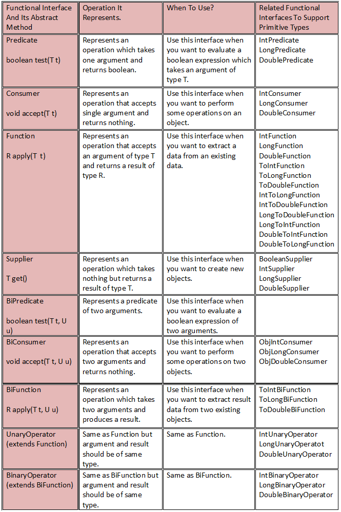

| Functional interface  | Function descriptor | Primitive specializations |
|-----------------------|---------------------|--------------------------------------------------------| 
| Predicate<T> 	| T -> boolean 	| <p>IntPredicate, </p><p>LongPredicate,</p><p> DoublePredicate</p> | 
| Consumer<T> | T -> void | <p>IntConsumer, </p><p>LongConsumer,</p><p> DoubleConsumer</p>| 
| Function<T, R> | T -> R | <p>IntFunction<R>,</p><p> IntToDoubleFunction, </p><p>IntToLongFunction,</p><p>LongFunction<R>,</p><p>  LongToDoubleFunction, </p><p> LongToIntFunction,</p><p>DoubleFunction<R>, </p><p> ToIntFunction<T>, </p><p> ToDoubleFunction<T>,</p><p>ToLongFunction<T> </p>|
| Supplier<T>| () -> T | <p>BooleanSupplier,</p><p>IntSupplier,</p><p> LongSupplier,</p><p>DoubleSupplier</p> | 
| UnaryOperator<T>| T -> T | <p>IntUnaryOperator,</p><p>LongUnaryOperator,</p><p> DoubleUnaryOperator</p> | 
| BinaryOperator<T>| (T, T) -> T | <p>IntBinaryOperator,</p><p>LongBinaryOperator,</p><p> DoubleBinaryOperator</p>|
| BiPredicate<L, R> | (L, R) -> boolean | |
| BiConsumer<T, U> | (T, U) -> void | <p>ObjIntConsumer<T>,</p><p>ObjLongConsumer<T>,</p><p> ObjDoubleConsumer<T> </p>| 
| BiFunction<T, U, R> 	| (T, U) -> R | <p>ToIntBiFunction<T, U>,</p><p>ToLongBiFunction<T, U>, </p><p>ToDoubleBiFunction<T, U> </p><p>IntToLongFunction</p><p>IntToDoubleFunction</p><p>LongToDoubleFunction</p><p>LongTolIntFunction</p><p>DoubleToIntFunction</p><p>DoubleToLongFunction</p>|
| :- | :- | :- | :- | :- |
|Supplier <p>T get()</p>|Represents an operation that returns a result of type T. Use this interface when you want to create a new object.|<p>BooleanSupplier</p><p>IntSupplier</p><p>LongSupplier</p><p>DoubleSupplier</p>|
|BiPredicate <p>boolean test(T t, U u)</p>|Represents a predicate with two arguments. Use this interface when you want to evaluate an expression with two arguments.||
|BiConsumer <p>void accept(T t, U u)</p>|Represents an operation that accepts two arguments and does some operation on them. Use this interface when you want to perform operations on two objects.||
|BiFunction <p>R apply(T t, U u)</p>|Represents an operation with two arguments that produces a result. Use this interface when you want to extract a result from two existing objects.|<p>ToIntBiFunction</p><p>ToLongBiFunction</p><p>ToDoubleBiFunction</p>|
|UnaryOperator (extends Function)|Same as Function but the argument and result are of the same type.|<p>IntUnaryOperator<p><p>LongUnaryOperator</p><p>DoubleUnaryOperator<p>|
|BinaryOperator (extends BiFunction) |Same as BiFunction but the argument and result are of the same type.|<p>IntBinaryOperator</p><p>LongBinaryOperator</p><p> DoubleBinaryOperator</p>|

Functional interfaces in Java are interfaces that have exactly one abstract method. These interfaces are commonly used in lambda expressions and method references. Each functional interface has a corresponding functional descriptor, which describes the type of the abstract method in the interface. Additionally, some functional interfaces have primitive specializations, which are interfaces that work with primitive data types instead of object types.

Examples:

Functional interface  | Function descriptor | Primitive specializations |
-----------------------|---------------------|--------------------------------------------------------| 
Predicate| T -> boolean |<p>IntPredicate</p><p>LongPredicate</p><p>DoublePredicate</p>|
Consumer|T -> void| <p>IntConsumer</p><p>LongConsumer</p><p>DoubleConsumer</p>|
Function<T, R>|T -> R|<p>IntFunction</p><p>IntToDoubleFunction</p><p>IntToLongFunction</p><p>LongFunction</p> <p>LongToDoubleFunction</p><p>LongToIntFunction</p><p>DoubleFunction</p><p>ToIntFunction</p><p>ToDoubleFunction</p><p>ToLongFunction</p>|
Supplier| () -> T|<p>BooleanSupplier</p><p>IntSupplier</p><p>LongSupplier</p><p>DoubleSupplier</p>|
UnaryOperator| T -> T|<p>IntUnaryOperator</p><p>LongUnaryOperator</p><p>DoubleUnaryOperator</p>|
BinaryOperator| (T, T) -> T|<p>IntBinaryOperator</p><p>LongBinaryOperator</p><p>DoubleBinaryOperator</p>|
BiPredicate| (L, R) -> boolean||
BiConsumer| (T, U) -> void||
BiFunction<T, U, R>| (T, U) -> R|<p>ToIntBiFunction</p><p>ToLongBiFunction</p><p>ToDoubleBiFunction</p>|
Certainly! Here's a detailed breakdown of various functional interfaces in Java and their corresponding primitive specializations, including code examples for each:

### **1. Predicate Interface and Its Primitive Specializations**

- **`Predicate<T>` Interface**
  - **Description:** A `Predicate<T>` is a functional interface that represents a boolean-valued function of one argument. It is commonly used for filtering or testing conditions. A functional interface that tests if a condition holds true for an input type `T`.
  - **Signature:** `T -> boolean`

  **Example: Check if a number is even**

  ```java
  import java.util.function.Predicate;

  public class PredicateExample {
      public static void main(String[] args) {
          Predicate<Integer> isEven = n -> n % 2 == 0;
          System.out.println(isEven.test(4)); // true
          System.out.println(isEven.test(5)); // false
      }
  }
  ```
  ```java
    import java.util.function.Predicate;

    public class PredicateExample {
        public static void main(String[] args) {
            Predicate<String> isNonEmpty = s -> !s.isEmpty();
            System.out.println(isNonEmpty.test("Hello")); // true
            System.out.println(isNonEmpty.test(""));      // false
        }
    }
  ```

- **Primitive Specializations**

  - **`IntPredicate`**
    - **Description:** A specialized version of `Predicate` for `int` values. An `IntPredicate` is the primitive type variant for `Predicate<Integer>`.
    **Example:**

  ```java
    import java.util.function.IntPredicate;

    public class IntPredicateExample {
        public static void main(String[] args) {
            IntPredicate isPositive = n -> n > 0;
            System.out.println(isPositive.test(10)); // true
            System.out.println(isPositive.test(-1)); // false
        }
    }
  ```

  ```java
      import java.util.function.IntPredicate;

      public class IntPredicateExample {
          public static void main(String[] args) {
              IntPredicate isEven = n -> n % 2 == 0;
              System.out.println(isEven.test(4)); // true
              System.out.println(isEven.test(5)); // false
          }
      }
  ```

  - **`LongPredicate`**
    - **Description:** A specialized version of `Predicate` for `long` values.

    **Example:**

    ```java
    import java.util.function.LongPredicate;

    public class LongPredicateExample {
        public static void main(String[] args) {
            LongPredicate isOdd = n -> n % 2 != 0;
            System.out.println(isOdd.test(7L)); // true
            System.out.println(isOdd.test(8L)); // false
        }
    }
    ```

  - **`DoublePredicate`**
    - **Description:** A specialized version of `Predicate` for `double` values.

    **Example:**

    ```java
    import java.util.function.DoublePredicate;

    public class DoublePredicateExample {
        public static void main(String[] args) {
            DoublePredicate isGreaterThanFive = d -> d > 5.0;
            System.out.println(isGreaterThanFive.test(6.0)); // true
            System.out.println(isGreaterThanFive.test(4.0)); // false
        }
    }
    ```

### **2. BiPredicate**

- **`BiPredicate<L, R>`**
  - **Description:** Tests if a condition holds true for two arguments of types `L` and `R`. A functional interface that tests a condition on two arguments. 
  - **Signature:** `(L, R) -> boolean`
  - **Example:**

    ```java
    import java.util.function.BiPredicate;

    public class BiPredicateExample {
        public static void main(String[] args) {
            BiPredicate<String, Integer> lengthGreaterThan = (s, len) -> s.length() > len;
            System.out.println(lengthGreaterThan.test("Hello", 3)); // true
            System.out.println(lengthGreaterThan.test("Hi", 3));    // false
        }
    }
    ```

  ```java
  import java.util.function.BiPredicate;

  public class BiPredicateExample {
      public static void main(String[] args) {
          BiPredicate<Integer, Integer> isEqual = (a, b) -> a.equals(b);
          System.out.println(isEqual.test(5, 5)); // true
          System.out.println(isEqual.test(5, 10)); // false
      }
  }
  ```

### **3. Consumer and Its Primitive Specializations**

- **`Consumer<T>`**
  - **Description:** A `Consumer<T>` is a functional interface that represents an operation that accepts a single input argument and returns no result. It is typically used for operations that perform side effects. Performs an action on an input of type `T` without returning a result.
  - **Signature:** `T -> void`

  **Example: Print a string in uppercase**

  ```java
  import java.util.function.Consumer;

  public class ConsumerExample {
      public static void main(String[] args) {
          Consumer<String> printUppercase = s -> System.out.println(s.toUpperCase());
          printUppercase.accept("hello"); // HELLO
      }
  }
  ```
 
- **Primitive Specializations**

  - **`IntConsumer`**
    - **Description:** A specialized version of `Consumer` for `int` values. An `IntConsumer` is the primitive type variant for `Consumer<Integer>`.
    
    **Example: Print integers squared**

    ```java
    import java.util.function.IntConsumer;

    public class IntConsumerExample {
        public static void main(String[] args) {
            IntConsumer printSquare = n -> System.out.println(n * n);
            printSquare.accept(4); // 16
        }
    }
    ```

  - **`LongConsumer`**
    - **Description:** A specialized version of `Consumer` for `long` values. Performs an action on a `long` value.

    **Example:**

    ```java
    import java.util.function.LongConsumer;

    public class LongConsumerExample {
        public static void main(String[] args) {
            LongConsumer printLong = l -> System.out.println(l);
            printLong.accept(123456789L); // 123456789
        }
    }
    ```
  - **`DoubleConsumer`**
    - **Description:** A specialized version of `Consumer` for `double` values. Performs an action on a `double` value.

    **Example:**

    ```java
    import java.util.function.DoubleConsumer;

    public class DoubleConsumerExample {
        public static void main(String[] args) {
            DoubleConsumer printDouble = d -> System.out.println(d);
            printDouble.accept(4.5); // 4.5
        }
    }
    ``` 

### **4. BiConsumer**

- **`BiConsumer<T, U>`**
  - **Description:** Performs an action on two arguments of types `T` and `U` without returning a result. A functional interface that accepts two arguments and returns no result.
  - **Signature:** `(T, U) -> void`
  - **Example:**

    ```java
    import java.util.function.BiConsumer;

    public class BiConsumerExample {
        public static void main(String[] args) {
            BiConsumer<String, Integer> printNameAndAge = (name, age) ->
                System.out.println(name + " is " + age + " years old.");
            printNameAndAge.accept("Alice", 30); // Alice is 30 years old.
        }
    }
    ```
   
### **5. Function and Its Primitive Specializations**

- **`Function<T, R>`**
  - **Description:** A functional interface that takes an input of type `T` and produces a result of type `R`.
  - **Signature:** `T -> R`

  **Example:**

  ```java
  import java.util.function.Function;

  public class FunctionExample {
      public static void main(String[] args) {
          Function<String, Integer> stringLength = s -> s.length();
          System.out.println(stringLength.apply("Hello")); // 5
      }
  }
  ```

- **Primitive Specializations**

  - **`IntFunction<R>`**
    - **Description:** A specialized version of `Function` that takes an `int` and produces a result of type `R`.

    **Example:**

    ```java
    import java.util.function.IntFunction;

    public class IntFunctionExample {
        public static void main(String[] args) {
            IntFunction<String> intToString = i -> "Number: " + i;
            System.out.println(intToString.apply(10)); // Number: 10
        }
    }
    ```
    
  - **`IntToDoubleFunction`**
    - **Description:** A specialized version of `Function` that takes an `int` and produces a `double`.

    **Example:**

    ```java
    import java.util.function.IntToDoubleFunction;

    public class IntToDoubleFunctionExample {
        public static void main(String[] args) {
            IntToDoubleFunction intToDouble = i -> i / 2.0;
            System.out.println(intToDouble.applyAsDouble(5)); // 2.5
        }
    }
    ```

  - **`IntToLongFunction`**
    - **Description:** A specialized version of `Function` that takes an `int` and produces a `long`.

    **Example:**

    ```java
    import java.util.function.IntToLongFunction;

    public class IntToLongFunctionExample {
        public static void main(String[] args) {
            IntToLongFunction intToLong = i -> i * 1000L;
            System.out.println(intToLong.applyAsLong(5)); // 5000
        }
    }
    ```

  - **`LongFunction<R>`**
    - **Description:** A specialized version of `Function` that takes a `long` and produces a result of type `R`.

    **Example:**

    ```java
    import java.util.function.LongFunction;

    public class LongFunctionExample {
        public static void main(String[] args) {
            LongFunction<String> longToString = l -> "Long: " + l;
            System.out.println(longToString.apply(123456789L)); // Long: 123456789
        }
    }
    ```

  - **`LongToDoubleFunction`**
    - **Description:** A specialized version of `Function` that takes a `long` and produces a `double`.

    **Example:**

    ```java
    import java.util.function.LongToDoubleFunction;

    public class LongToDoubleFunctionExample {
        public static void main(String[] args) {
            LongToDoubleFunction longToDouble = l -> l / 2.0;
            System.out.println(longToDouble.applyAsDouble(10L)); // 5.0
        }
    }
    ```

  - **`LongToIntFunction`**
    - **Description:** A specialized version of `Function` that takes a `long` and produces an `int`.

    **Example:**

    ```java
    import java.util.function.LongToIntFunction;

    public class LongToIntFunctionExample {
        public static void main(String[] args) {
            LongToIntFunction longToInt = l -> (int) (l % 100);
            System.out.println(longToInt.applyAsInt(123456789L)); // 89
        }
    }
    ```

  - **`DoubleFunction<R>`**
    - **Description:** A specialized version of `Function` that takes a `double` and produces a result of type `R`.

    **Example:**

    ```java
    import java.util.function.DoubleFunction;

    public class DoubleFunctionExample {
        public static void main(String[] args) {
            DoubleFunction<String> doubleToString = d -> "Double: " + d;
            System.out.println(doubleToString.apply(3.14)); // Double: 3.14
        }
    }
    ```

  - **`ToIntFunction<T>`**
    - **Description:** A functional interface that takes an input of type `T` and produces an `int`.

    **Example:**

    ```java
    import java.util.function.ToIntFunction;

    public class ToIntFunctionExample {
        public static void main(String[] args) {
            ToIntFunction<String> stringLengthToInt = s -> s.length();
            System.out.println(stringLengthToInt.applyAsInt("Hello")); // 5
        }
    }
    ```

  - **`ToDoubleFunction<T>`**
    - **Description:** A functional interface that takes an input of type `T` and produces a `double`.

    **Example:**

    ```java
    import java.util.function.ToDoubleFunction;

    public class ToDoubleFunctionExample {
        public static void main(String[] args) {
            ToDoubleFunction<String> stringLengthToDouble = s -> s.length() * 1.0;
            System.out.println(stringLengthToDouble.applyAsDouble("Hello")); // 5.0
        }
    }
    ```

  - **`ToLongFunction<T>`**
    - **Description:** A functional interface that takes an input of type `T` and produces a `long`.

    **Example:**

    ```java
    import java.util.function.ToLongFunction;

    public class ToLongFunctionExample {
        public static void main(String[] args) {
            ToLongFunction<String> stringLengthToLong = s -> s.length();
            System.out.println(stringLengthToLong.applyAsLong("Hello")); // 5
        }
    }
    ```


### **6. BiFunction and Its Primitive Specializations**

- **`BiFunction<T, U, R>`**
  - **Description:** Takes two arguments and produces a result. A functional interface that takes two arguments and produces a result.
  - **Signature:** `(T, U) -> R`
  - **Example:**

    ```java
    import java.util.function.BiFunction;

    public class BiFunctionExample {
        public static void main(String[] args) {
            BiFunction<Integer, Integer, Integer> add = (a, b) -> a + b;
            System.out.println(add.apply(5, 10)); // 15
        }
    }
    ```
- **Primitive Specializations**

  - **`ToIntBiFunction<T, U>`**
    - **Description:** Takes two arguments and produces an `int`. A functional interface that takes two arguments and produces an `int`.
    - **Example:**

      ```java
      import java.util.function.ToIntBiFunction;

      public class ToIntBiFunctionExample {
          public static void main(String[] args) {
              ToIntBiFunction<String, String> stringLengthSum = (a, b) -> a.length() + b.length();
              System.out.println(stringLengthSum.applyAsInt("Hello", "World")); // 10
          }
      }
      ```

  - **`ToLongBiFunction<T, U>`**
    - **Description:** Takes two arguments and produces a `long`. A functional interface that takes two arguments and produces a `long`.
    - **Example:**

      ```java
      import java.util.function.ToLongBiFunction;

      public class ToLongBiFunctionExample {
          public static void main(String[] args) {
              ToLongBiFunction<Integer, Integer> multiply = (a, b) -> (long) a * b;
              System.out.println(multiply.applyAsLong(5, 10)); // 50
          }
      }
      ```

  - **`ToDoubleBiFunction<T, U>`**
    - **Description:** Takes two arguments and produces a `double`. A functional interface that takes two arguments and produces a `double`.
    - **Example:**

      ```java
      import java.util.function.ToDoubleBiFunction;

      public class ToDoubleBiFunctionExample {
          public static void main(String[] args) {
              ToDoubleBiFunction<Integer, Integer> average = (a, b) -> (a + b) / 2.0;
              System.out.println(average.applyAsDouble(5, 10)); // 7.5
          }
      }
      ```
### **7. Supplier and Its Primitive Specializations**

- **`Supplier<T>`**
  - **Description:** A `Supplier<T>` is a functional interface that represents a supplier of results. It does not take any arguments and returns a result. It is commonly used for generating or providing values. A functional interface that supplies a result of type `T` without taking any arguments. 
  - **Signature:** `() -> T`

  **Example: Generate a random number**

  ```java
  import java.util.function.Supplier;
  import java.util.Random;

  public class SupplierExample {
      public static void main(String[] args) {
          Supplier<Integer> randomNumberSupplier = () -> new Random().nextInt(100);
          System.out.println("Random number: " + randomNumberSupplier.get());
      }
  }
  ```
  ```java
  import java.util.function.Supplier;

  public class SupplierExample {
      public static void main(String[] args) {
          Supplier<String> stringSupplier = () -> "Hello World";
          System.out.println(stringSupplier.get()); // Hello World
      }
  }
  ```
- **Primitive Specializations**

  - **`BooleanSupplier`**
    - **Description:** A specialized version of `Supplier` that returns a `boolean`.

    **Example:**

    ```java
    import java.util.function.BooleanSupplier;

    public class BooleanSupplierExample {
        public static void main(String[] args) {
            BooleanSupplier randomBoolean = () -> Math.random() > 0.5;
            System.out.println(randomBoolean.getAsBoolean()); // true or false
        }
    }
    ```

  - **`IntSupplier`**
    - **Description:** A specialized version of `Supplier` that returns an `int`. An `IntSupplier` is the primitive type variant for `Supplier<Integer>`.

    **Example: Generate a random integer**

    ```java
    import java.util.function.IntSupplier;

    public class IntSupplierExample {
        public static void main(String[] args) {
            IntSupplier randomInt = () -> (int) (Math.random() * 100);
            System.out.println(randomInt.getAsInt()); // Random integer between 0 and 99
        }
    }
    ```

  - **`LongSupplier`**
    - **Description:** A specialized version of `Supplier` that returns a `long`.

    **Example:**

    ```java
    import java.util.function.LongSupplier;

    public class LongSupplierExample {
        public static void main(String[] args) {
            LongSupplier randomLong = () -> (long) (Math.random() * 1000000);
            System.out.println(randomLong.getAsLong()); // Random long value
        }
    }
    ```

  - **`DoubleSupplier`**
    - **Description:** A specialized version of `Supplier` that returns a `double`.

    **Example:**

    ```java
    import java.util.function.DoubleSupplier;

    public class DoubleSupplierExample {
        public static void main(String[] args) {
            DoubleSupplier randomDouble = () -> Math.random() * 100;
            System.out.println(randomDouble.getAsDouble()); // Random double value between 0 and 100
        }
    }
    ```

### **8. UnaryOperator and Its Primitive Specializations**

- **`UnaryOperator<T>`**
  - **Description:** A functional interface that applies a function to a single input and returns a result of the same type.
  - **Signature:** `T -> T`

  **Example:**

  ```java
  import java.util.function.UnaryOperator;

  public class UnaryOperatorExample {
      public static void main(String[] args) {
          UnaryOperator<String> toUpperCase = s -> s.toUpperCase();
          System.out.println(toUpperCase.apply("hello")); // HELLO
      }
  }
  ```

- **Primitive Specializations**

  - **`IntUnaryOperator`**
    - **Description:** A specialized version of `UnaryOperator` for `int` values. Applies a function to an `int` and returns an `int`.

    **Example:**

    ```java
    import java.util.function.IntUnaryOperator;

    public class IntUnaryOperatorExample {
        public static void main(String[] args) {
            IntUnaryOperator square = n -> n * n;
            System.out.println(square.applyAsInt(5)); // 25
        }
    }
    ```

  - **`LongUnaryOperator`**
    - **Description:** A specialized version of `UnaryOperator` for `long` values. Applies a function to a `long` and returns a `long`.

    **Example:**

    ```java
    import java.util.function.LongUnaryOperator;

    public class LongUnaryOperatorExample {
        public static void main(String[] args) {
            LongUnaryOperator multiplyByTwo = l -> l * 2;
            System.out.println(multiplyByTwo.applyAsLong(10L)); // 20
        }
    }
    ```

  - **`DoubleUnaryOperator`**
    - **Description:** A specialized version of `UnaryOperator` for `double` values. Applies a function to a `double` and returns a `double`.

    **Example:**

    ```java
    import java.util.function.DoubleUnaryOperator;

    public class DoubleUnaryOperatorExample {
        public static void main(String[] args) {
            DoubleUnaryOperator half = d -> d / 2;
            System.out.println(half.applyAsDouble(10.0)); // 5.0
        }
    }
    ```

### **9. BinaryOperator and Its Primitive Specializations**

- **`BinaryOperator<T>`**
  - **Description:** A functional interface that applies a function to two arguments of the same type `T` and returns a result of the same type.
  - **Signature:** `(T, T) -> T`

  **Example:**

  ```java
  import java.util.function.BinaryOperator;

  public class BinaryOperatorExample {
      public static void main(String[] args) {
          BinaryOperator<Integer> add = (a, b) -> a + b;
          System.out.println(add.apply(5, 10)); // 15
      }
  }
  ```

- **Primitive Specializations**

  - **`IntBinaryOperator`**
    - **Description:** A specialized version of `BinaryOperator` for `int` values. Applies a function to two `int` values and returns an `int`.

    **Example:**

    ```java
    import java.util.function.IntBinaryOperator;

    public class IntBinaryOperatorExample {
        public static void main(String[] args) {
            IntBinaryOperator multiply = (a, b) -> a * b;
            System.out.println(multiply.applyAsInt(4, 5)); // 20
        }
    }
    ```

  - **`LongBinaryOperator`**
    - **Description:** A specialized version of `BinaryOperator` for `long` values. Applies a function to two `long` values and returns a `long`.

    **Example:**

    ```java
    import java.util.function.LongBinaryOperator;

    public class LongBinaryOperatorExample {
        public static void main(String[] args) {
            LongBinaryOperator subtract = (a, b) -> a - b;
            System.out.println(subtract.applyAsLong(15L, 5L)); // 10
        }
    }
    ```

  - **`DoubleBinaryOperator`**
    - **Description:** A specialized version of `BinaryOperator` for `double` values. Applies a function to two `double` values and returns a `double`.

    **Example:**

    ```java
    import java.util.function.DoubleBinaryOperator;

    public class DoubleBinaryOperatorExample {
        public static void main(String[] args) {
            DoubleBinaryOperator divide = (a, b) -> a / b;
            System.out.println(divide.applyAsDouble(10.0, 2.0)); // 5.0
        }
    }
    ```

### Summary

Here’s a summary of the functional interfaces and their primitive variants:

1. **Predicate<T>**
   - **Primitive Variant:** `IntPredicate`, `LongPredicate`, `DoublePredicate`
   - **Usage:** Testing or filtering values

2. **Consumer<T>**
   - **Primitive Variant:** `IntConsumer`, `LongConsumer`, `DoubleConsumer`
   - **Usage:** Performing operations on values (side effects)

3. **Supplier<T>**
   - **Primitive Variant:** `IntSupplier`, `LongSupplier`, `DoubleSupplier`
   - **Usage:** Providing or generating values

These functional interfaces are powerful tools for functional programming in Java, enabling concise and expressive code for a variety of operations.

These examples cover the key functional interfaces and their primitive specializations in Java. They demonstrate how each interface can be used in practice for different types of data and operations.

This set of examples covers the core functional interfaces and their primitive specializations in Java. Each specialization is tailored to work with specific primitive types (int, long, double) for more efficient operations.

</details>
<details>
<summary><b>3.3.6 Java 8 Functional Interfaces Uses In Real Time?</b></summary>

### How To Use Java 8 Functional Interfaces In Real Time?
Let’s define Student class like below. We will be using this class in the subsequent examples.
```java
class Student
{
    int id;
     
    String name;
     
    double percentage;
     
    String specialization;
     
    public Student(int id, String name, double percentage, String specialization) 
    {
        this.id = id;
         
        this.name = name;
         
        this.percentage = percentage;
         
        this.specialization = specialization;
    }
     
    public int getId() {
        return id;
    }
 
    public String getName() {
        return name;
    }
 
    public double getPercentage() {
        return percentage;
    }
 
    public String getSpecialization() {
        return specialization;
    }
 
    @Override
    public String toString()
    {
        return id+"-"+name+"-"+percentage+"-"+specialization;
    }
}
```
Let listOfStudents be the list of 10 students.
```java
List<Student> listOfStudents = new ArrayList<Student>();
         
listOfStudents.add(new Student(111, "John", 81.0, "Mathematics"));         
listOfStudents.add(new Student(222, "Harsha", 79.5, "History"));         
listOfStudents.add(new Student(333, "Ruth", 87.2, "Computers"));         
listOfStudents.add(new Student(444, "Aroma", 63.2, "Mathematics"));         
listOfStudents.add(new Student(555, "Zade", 83.5, "Computers"));         
listOfStudents.add(new Student(666, "Xing", 58.5, "Geography"));         
listOfStudents.add(new Student(777, "Richards", 72.6, "Banking"));         
listOfStudents.add(new Student(888, "Sunil", 86.7, "History"));         
listOfStudents.add(new Student(999, "Jordan", 58.6, "Finance"));         
listOfStudents.add(new Student(101010, "Chris", 89.8, "Computers"));
```
Let’s see how to use 4 important functional interfaces – Predicate, Consumer, Function and Supplier using above listOfStudents.

### a) Predicate – Tests an object

Predicate represents an operation which takes an argument T and returns a boolean. Use this functional interface, if you want to define a lambda expression which performs some test on an argument and returns true or false depending upon outcome of the test.

For example,

Imagine an operation where you want only a list of “Mathematics” students from the above listOfStudents. Let’s see how to do it using Predicate.

Lambda expression implementing Predicate : Checking specialization of a Student
```java
Predicate<Student> mathematicsPredicate = (Student student) -> student.getSpecialization().equals("Mathematics");
         
List<Student> mathematicsStudents = new ArrayList<Student>();
         
for (Student student : listOfStudents) 
{
    if (mathematicsPredicate.test(student)) 
    {
        mathematicsStudents.add(student);
    }
}
```

### Real Time Example

- 1)  Without Lambda:

```java
import java.util.Collections;
import java.util.List;

public class PredicateDemo implements Predicate<Integer> {

	@Override
	public Boolean test(Integer t) {
		if(t % 2 ==0){
	            return true;
		}else{
	            return false;
		}
       };

       public static void main(String[] args) {
	 Predicate<Integer> predicate= new PredicateDemo()
	 System.out.println(predicate.test(8));
       }
}
```
- 2) With Lambda: 
```java
import java.util.Collections;
import java.util.List;

public class PredicateDemo {

       public static void main(String[] args) {

	 Predicate<Integer> predicate= t-> t % 2 ==0;
	 System.out.println(predicate.test(8));
       }
}
```
- 3) stream().filter internaly using Predicate functional interface.
```java
import java.util.Arrays;
import java.util.List;

public class PredicateDemo {

	public static void main(String[] args) {

		List<Integer> list1 = Arrays.asList(1, 2, 3, 4, 5);

		list1.stream().filter(t -> t % 2 == 0).forEach(t -> System.out.println("print  Even: " + t));
	}
}
```
### b) Consumer – Consumes an object

Consumer represents an operation which takes an argument and returns nothing. Use this functional interface If you want to compose a lambda expression which performs some operations on an object.

For example, displaying all students with their percentage.

Lambda expression implementing Consumer : Displaying all students with their percentage
```java
Consumer<Student> percentageConsumer = (Student student) -> {
        System.out.println(student.getName()+" : "+student.getPercentage());
    };
         
for (Student student : listOfStudents) 
{
    percentageConsumer.accept(student);
}
```
Example 2:

```java
import java.util.Arrays;
import java.util.List;
import java.util.function.Consumer;

public class ConsumerDemo {

	public static void main(String[] args) {
		
		Consumer<Integer> consumer = t -> System.out.println("Printing  : " + t);
		 
		consumer.accept(10);

	}
}
```

Example 3: stream().forEach internaly using Consumer functional interface.

```java
import java.util.Arrays;
import java.util.List;
import java.util.function.Consumer;

public class ConsumerDemo {

	public static void main(String[] args) {

		List<Integer> list1 = Arrays.asList(1, 2, 3, 4, 5);

		list1.stream().forEach(t -> System.out.println("print  : " + t));
	}
}
```
### c) Function – Applies to an object

Function represents an operation which takes an argument of type T and returns a result of type R. Use this functional interface if you want to extract some data from an existing data.

For example, extracting only the names from listOfStudents.

Lambda expression implementing Function : Extracting only the names of all students
```java
Function<Student, String> nameFunction = (Student Student) -> Student.getName();
         
List<String> studentNames = new ArrayList<String>();
         
for (Student student : listOfStudents) 
{
    studentNames.add(nameFunction.apply(student));
}
```
### d) Supplier – Supplies the objects

Supplier represents an operation which takes no argument and returns the results of type R. Use this functional interface when you want to create new objects.

1) Without Lambda:
   
```java
import java.util.Arrays;
import java.util.List;
import java.util.function.Supplier;

public class SupplierDemo implements Supplier<String>{

	@Override
	public String get(){
            return "Hello World";
	}

	public static void main(String[] args) {

		Supplier<String> supplier = new SupplierDemo();

		System.out.println(supplier.get());
	}
}
```
2) With Lambda:
   
```java
import java.util.Arrays;
import java.util.List;
import java.util.function.Supplier;

public class SupplierDemo {

	public static void main(String[] args) {

		Supplier<String> supplier = t -> "Hello World";

		System.out.println(supplier.get());
	}
}
```
3) With Lambda:
   
```java
import java.util.Arrays;
import java.util.List;
import java.util.function.Supplier;

public class SupplierDemo {

	public static void main(String[] args) {

		//Supplier<String> supplier = t -> "Hello World";
		List<String> list1 = Arrays.asList();
		//System.out.println(list1.stream().findAny().orElseGet(() -> supplier));
		System.out.println(list1.stream().findAny().orElseGet(() -> "Hello World"));
	}
}
```

### Lambda expression implementing Supplier : Creating a new Student

```java
Supplier<Student> studentSupplier = () -> new Student(111111, "New Student", 92.9, "Java 8");
         
listOfStudents.add(studentSupplier.get());
```
</details>
</details>
<details>
<summary><b>3.4 Java 8 Important Features</b></summary>

<details>
<summary><b>How Stream.map() works in Java 8? Example</b></summary>
The Stream.map() function performs map functional operation i.e. it takes a Stream and transforms it to another Stream. It applies a function on each element of Stream and stores return value into new Stream. 

This way you can transform a Stream of String into a Stream of Integer where Integer could be the length of String if you supply the length() function. This is a very powerful function that is very helpful while dealing with collection in Java.

Here is an example of Stream.map() in Java 8:

```java
List listOfIntegers = Stream.of("1", "2", "3", "4")
               .map(Integer::valueOf)
               .collect(Collectors.toList());
```

### How Stream.flatMap() works in Java 8 - Example
The Stream.flatMap() function, as the name suggests, is the combination of a map and a flat operation. This means you first apply the map function and then flattens the result. The key difference is the function used by map operation returns a Stream of values or a list of values rather than a single value, that's why we need flattening. When you flat a Stream of Stream, it gets converted into Stream of values.

To understand what flattening a stream consists in, consider a structure like [ [1,2,3],[4,5,6],[7,8,9] ] which has "two levels". It's basically a big List containing three more List.  Flattening this means transforming it in a "one level" structure e.g. [ 1,2,3,4,5,6,7,8,9 ] i.e. just one list.

In short,
Before flattening - Stream of List of Integer
After flattening - Stream of Integer

Here is a code example to understand the flatMap() function better:
```java
List evens = Arrays.asList(2, 4, 6);
List odds = Arrays.asList(3, 5, 7);
List primes = Arrays.asList(2, 3, 5, 7, 11);
       
List numbers = Stream.of(evens, odds, primes)
               .flatMap(list -> list.stream())
               .collect(Collectors.toList());
       
System.out.println("flattend list: " + numbers);
```
```
Output:
flattend list: [2, 4, 6, 3, 5, 7, 2, 3, 5, 7, 11]
```
You can see that we have three lists that are merged into one by using a flatMap() function. For mapping, you can see we have used a list.stream() function which returns multiple values instead of a single value. Finally, we have collected the flattened stream into a list. If you want, you can print the final list using the forEach() method.


### Stream.map() vs Stream.flatMap() in Java 8

In short, here are the key difference between map() vs flatMap() in Java 8:
The function you pass to the map() operation returns a single value.
The function you pass to flatMap() operation returns a Stream of value.
flatMap() is a combination of map and flat operation. 
map() is used for transformation only, but flatMap() is used for both transformation and flattening. 

Now let's see a sample Java program to understand the difference between flatMap() and map() better.

### Java Program to show the difference between map vs flatMap
Here is our sample Java program to demonstrate the real difference between the map() and the flatMap() function of the Stream class in Java 8. As I told you before, map() is used to transform one Stream into another by applying a function on each element, and flatMap() does both transformations as well as flattening.

The flatMap() function can take a Stream of List and return a Stream of values combined from all those lists. In the example below, we have collected the result in a List but you can also print them using the forEach() method of Java 8.

```java
import java.util.ArrayList;
import java.util.Arrays;
import java.util.List;
import java.util.stream.Collectors;

/**
 * Java Program to demonstrate difference between map()
 * vs flatMap() function in Java 8. Both are defined
 * in Stream class. 
 *
 * @author WINDOWS 8
 */
public class Java8Demo {

    public static void main(String args[]) {

        // foods which helps in weight loss
        List<String> loseWeight = new ArrayList<>();
        loseWeight.add("avocados");
        loseWeight.add("beans");
        loseWeight.add("salad");
        loseWeight.add("oats");
        loseWeight.add("broccoli");
                
        System.out.println("list of String : " + loseWeight);
        
        // let's use map() method to convert list of weight
        // lose food, which are String to list of ints
        // which are length of each food String
        
        List listOfInts = loseWeight.stream()
                .map(s -> s.length())
                .collect(Collectors.toList());
        
        System.out.println("list of ints generate by map(): " + listOfInts);

        
        // flatMap() example, let's first creat a list of list
        List<List> listOfListOfNumber = new ArrayList<>();
        listOfListOfNumber.add(Arrays.asList(2, 4));
        listOfListOfNumber.add(Arrays.asList(3, 9));
        listOfListOfNumber.add(Arrays.asList(4, 16));
        
        System.out.println("list of list : " + listOfListOfNumber);
        
        // let's use flatMap() to flatten this list into
        // list of integers i.e. 2,4,3,9,4,16
        
        List listOfIntegers = listOfListOfNumber.stream()
                .flatMap( list -> list.stream())
                .collect(Collectors.toList());
        
        System.out.println("list of numbers generated by flatMap : " 
                                      + listOfIntegers);
                

    }

}
```
```
Output
list of String : [avocados, beans, salad, oats, broccoli]
list of ints generate by map(): [8, 5, 5, 4, 8]
list of list : [[2, 4], [3, 9], [4, 16]]
list of numbers generated by flatMap : [2, 4, 3, 9, 4, 16]
```
You can see that in the first example, the function used by the map() method returns a single value, the length of the string passed to it, while in the case of flatMap() the method returns a stream, which is basically your multiple values.
</details>
<details>
<summary><b>How to use forEach() method in Java 8</b></summary>
Now you know a little bit about the forEach() method and Java 8, it's time to see some code examples and explore more of the forEach() method in JDK 8.

### 1. Iterating over all elements of List using forEach()
You can loop over all elements using the Iterable.forEach() method as shown below:
```java
List<String> alphabets 
     = new ArrayList<>(Arrays.asList("aa", "bbb", "cat", "dog"));
alphabets.forEach(s -> System.out.println(s));
```
This code will print every element of the list called alphabets. You can even replace lambda expression with method reference because we are passing the lambda parameter as it is to the
System.out.println() method as shown below:
```java
 alphabets.forEach(System.out::println);
```
Now, let's see if you want to add a comma between two elements then you can do so by using lambda parameters as shown in the following example
```java
alphabets.forEach(s -> System.out.print(s + ","));
```
Btw, now you cannot use method reference now because we are doing something with lambda parameters. Let's see another example of the forEach() method for doing filtering of elements. If you want to learn more about loops in Java, The Complete Java MasterClass is the most comprehensive course for Java programmers.

### 2. filter and forEach() Example
   
One of the main features of Stream API is its capability to filter elements based upon some conditions. We have already seen a glimpse of the powerful feature of Stream API in my earlier post, how to use Stream API in Java 8, here we will see it again but in the context of the forEach() method.

let's now only print elements that start with "a", following code will do that for you, startWith() is a method of String class, which return true if String is starting with String "a" or it will return false. Once the list is filtered then forEach() method will print all elements starting with  String "a", as shown below:

```java
alphabets.stream()
         .filter(s -> s.startsWith("a"))
         .forEach(System.out::println);
```
This is cool, right? You can read the code like cake, it's much easier than using Iterator or any other way to loop over List in Java.

Now, let's filter out only which has a length greater than 2, for this purpose we can use the length() function of String class:
```java
alphabets.stream()
         .filter(s -> s.length() > 2)
         .forEach(System.out::println);
```
Apart from forEach, this is also a good example of using the filter method in Java 8 for filtering or selecting a subset of elements from Stream. You can read more about that in the Collections to Streams in Java 8 Using the Lambda Expressions course on Pluralsight, which provides an in-depth explanation of new Java 8 features.

### 3. forEach() and map() Example
   
So far you have both basic and advanced examples of using the forEach() method, first with simply iterating over each element and then along with using the filter() method, Let's see one more example of the forEach() method along with the map() function, which is another key functionality of Stream API.

The map() method of Java 8 allows you to transform one type to another like in our first example we are using a map() to transform a list of String to a list of Integer where each element represents the length of String. Now, let's print the length of each string using the map() function:
```java
alphabets.stream()
         .mapToInt(s -> s.length())
         .forEach(System.out::println);
```
That was fun, isn't it? how about the calculating sum of the length of all strings? you can do so by using fold operations like sum() as shown in the following example:
```java
alphabets.stream()
         .mapToInt(s -> s.length())
         .sum();
```
These were some of the common but very useful examples of Java 8's forEach() method, a new way to loop over List in Java. If you are feeling nostalgist then don't forget to the journey of for loop in Java, a recap of for loop from JDK 1 to JDK 8

If you want to learn more about functional programming in Java 8 and using a map, flatmap methods then I suggest you go through Learn Java Functional Programming with Lambdas & Streams course on Udemy. It's a nice course and packed with good examples to learn key Java 8 features.

Program to use forEach() function in Java 8

```java
import java.util.ArrayList;
import java.util.Arrays;
import java.util.List;

/**
 * Java Program to show How to use forEach() statement in Java8.
 * You can loop over a list, set or any collection using this
 * method. You can even do filtering and transformation and 
 * can run the loop in parallel.
 *
 * @author WINDOWS 8
 */
public class Java8Demo {

    public static void main(String args[]) {

       List<String> alphabets = new ArrayList<>(
                                 Arrays.asList("aa", "bbb", "cac", "dog"));
       
       // looping over all elements using Iterable.forEach() method
       alphabets.forEach(s -> System.out.println(s));
       
       // You can even replace lambda expression with method reference
       // because we are passing the lambda parameter as it is to the
       // method
       alphabets.forEach(System.out::println);
       
       // you can even do something with lambda parameter e.g. adding a comma
       alphabets.forEach(s -> System.out.print(s + ","));
       
       
       // There is one more forEach() method on Stream class, which operates
       // on stream and allows you to use various stream methods e.g. filter()
       // map() etc
       
       alphabets.stream().forEach(System.out::println);
       
       // let's now only print elmements which startswith "a"
       alphabets.stream()
               .filter(s -> s.startsWith("a"))
               .forEach(System.out::println);
       
       // let's filter out only which has length greater than 2
       alphabets.stream()
               .filter(s -> s.length() > 2)
               .forEach(System.out::println);

       
       // now, let's print length of each string using map()
       alphabets.stream()
               .mapToInt(s -> s.length())
               .forEach(System.out::println);
       
       // how about calculating sum of length of all string
       alphabets.stream()
               .mapToInt(s -> s.length())
               .sum();

    }

}
```

### Important things to remember:
- 1) The forEach() is a terminal operation, which means once calling the forEach() method on stream, you cannot call another method. It will result in a runtime exception.

- 2) When you call forEach() on a parallel stream, the order of iteration is not guaranteed, but you can ensure that ordering by calling the forEachOrdered() method.

- 3) There is two forEach() method in Java 8, one defined inside Iterable, and the other inside java.util.stream.Stream class. If the purpose of forEach() is just iteration then you can directly call it like list.forEach() or set.forEach() but if you want to perform some operations like filter or map then it better first get the stream and then perform that operation and finally call forEach() method.

- 4) Use of forEach() results in readable and cleaner code.


### Now, one task for you, how do you break from forEach()? Does the forEach() method allow you to break in between?

In Java, the `forEach` method in the `Stream` API does not allow you to break out of the iteration early like you can with a traditional `for` loop or an `enhanced for` loop. The `forEach` method is designed for performing operations on each element of the stream and does not provide a built-in mechanism to stop iteration prematurely.

However, you can achieve similar behavior by using the following approaches:

### 1. **Using a `for` Loop:**
If you need to break out of the loop based on a condition, using a traditional `for` loop or an enhanced `for` loop (`for-each`) is the most straightforward approach.

**Example:**
```java
import java.util.Arrays;
import java.util.List;

public class BreakInForLoop {
    public static void main(String[] args) {
        List<Integer> numbers = Arrays.asList(1, 2, 3, 4, 5);

        for (Integer number : numbers) {
            if (number == 3) {
                break; // Break out of the loop
            }
            System.out.println(number);
        }
    }
}
```

### 2. **Using `Stream` with Short-Circuiting Operations:**
While `forEach` does not support breaking, you can use other stream operations that allow short-circuiting. For instance, you can use `takeWhile` to process elements up to a certain condition.

**Example:**
```java
import java.util.Arrays;
import java.util.List;

public class ShortCircuitStream {
    public static void main(String[] args) {
        List<Integer> numbers = Arrays.asList(1, 2, 3, 4, 5);

        numbers.stream()
               .takeWhile(number -> number != 3)
               .forEach(System.out::println);
    }
}
```
In this example, `takeWhile` will stop processing as soon as the condition is false, thus achieving a similar effect to breaking out of the loop.

### 3. **Using a `boolean` Flag with `forEach`:**
If you are using `forEach` and need to conditionally stop processing, you can use a `boolean` flag to skip further processing within the lambda expression.

**Example:**
```java
import java.util.Arrays;
import java.util.List;

public class ForEachWithFlag {
    public static void main(String[] args) {
        List<Integer> numbers = Arrays.asList(1, 2, 3, 4, 5);
        final boolean[] shouldContinue = {true};

        numbers.forEach(number -> {
            if (!shouldContinue[0]) return;
            if (number == 3) {
                shouldContinue[0] = false; // Set flag to stop further processing
            }
            System.out.println(number);
        });
    }
}
```
In this example, a boolean array `shouldContinue` is used as a flag to determine whether to continue processing elements.

### Summary:
- **`forEach` Method**: Does not support breaking or stopping iteration early.
- **Traditional Loops**: Use `for` or enhanced `for` loops for breaking out early.
- **Stream API**: Use short-circuiting operations like `takeWhile` for similar effects.
- **Flag Approach**: Use a boolean flag within the `forEach` method to conditionally skip further processing.

Each method has its use cases, so you should choose the one that best fits your requirements.

</details>
<details>
<summary><b>How to use Stream.filter method in Java 8? Example Tutorial</b></summary>

In the last couple of Java 8 tutorials, you have learned how to use map(), flatMap(), and other stream methods to get an understanding of how Java 8 Stream and Lambda expressions make it easy to perform the bulk data operation on Collection classes like List or Set. In this Java 8 tutorial, I am going to share how to use the filter() method in Java 8, another key method of the Stream class.  This is the one method you will always be used because it forms the key part of the Stream pipeline. If you have seen some Java 8 code, you would have already seen this method a couple of times.

The filter() method as its name suggests is used to perform filtering based upon some boolean conditions.  The condition is applied to each element of Stream and those who pass the condition moves to the next stage and those who don't get filtered out.

For example,  if you have a stream of integral numbers that contains both even and odd numbers then by using the filter method, you can create another stream of even numbers or odd numbers by filtering out others.

Though the filter() method is a little bit counter-intuitive, I mean, in order to create a stream of even numbers you call filter( i -> i % 2 == 0) which means you do filter(isEven()) but, you are actually filtering out odd numbers to create a new stream of even numbers, but that's how it works.

I think select() would have been a positive and proper name for this operation, but, we don't have any control over that can't change that now.

The key benefit of using the filter() method is lazy evaluation i.e. no data comparison is performed unless you call a terminal operation on stream like findFirst() or forEach().

The filter() method just sets up some pointers when you first call them on stream and only performs real filtering when you call the terminal method. You can join a good Java course like The Complete Java MasterClass to learn more about Stream and lazy evaluation in Java 8. It is also one of the most up-to-date courses, recently updated for Java 11.

### How Stream.filter method works in Java 8
In order to learn how to use the filter() method in Java 8, it's important that you also know how it works, at least at a high level. Let's see an example of a filter() method to understand the lazy evaluation it does.

Suppose we have a list of integer numbers and we want to find the first number which is divisible by both 2 and 3, let' see how to solve this problem in Java 8.
```java
List<Integer> listOfNumbers = Arrays.asList(1, 2, 3, 4, 5, 6, 12, 18);
Integer lcm = listOfNumbers.stream()
                           .filter(i -> i % 2 == 0)
                           .filter(i -> i % 3 == 0)
                           .findFirst().get();        
```
This code is returning the first number which is divisible by both 2 and 3. Now, let's see how this code will execute. When you call the filter() method nothing happens until you call the findFirst().

At this time, Java knows that it just needs to find the first element which satisfies the criterion imposed by the two chained filter() methods.

The findFirst() asks the filter() method prior to it in the chain of any number, the filter doesn't have any record so it asks the first filter() method, which in turn then scans the list and returns a number that is divisible by 2.

At this time, the second filter method checks if this number is divisible by 3, if yes then it returns that number to findFirst() otherwise it asks for another number from the first filter() method.

This process continues until a number is found which satisfies both filter() methods. Once that number is found it is presented to the findFirst() method. The job of findFirst() is to return that number.

This is an example of lazy evaluation because nothing happens until the call to findFirst() is a method, this also presents an opportunity to stop as soon as you find the first number which satisfies your criterion.


There is no need to process the entire list again and again, as it happens in the case of iterative eager evaluation.  You can read more about Stream Processing and Lazy Evaluation on Pluralsight's From Collections to Streams in Java 8 Using the Lambda Expressions course by Jose Paumard, a Java Champion and expert Java Programmer.

</details>
<details>
<summary><b>Java 8 filter + Stream Example</b></summary>

### Java 8 filter Example
Here are a couple of more examples of the Stream.filter() method in Java 8. I have created a list of String containing Android versions like  Lollipop, KitKat, etc.

The first example just uses one filter() method to print Strings whose length is greater than 10. The second example prints String which contains the letter "e" like Gingerbread.

The Third examples combine these two filter methods to create a chain of filter methods to print a String whose length is greater than 5 and starts with a letter "G".

By the way, for testing purposes, you can also create a stream of integers numbers by using Stream.of() static factory methods as shown in the following example:

### How to use filter method in Java 8 with example

You can see that the input stream contains numbers from 1 to 5 but the output stream just contains odd numbers. This means even numbers were filtered out because they didn't satisfy the boolean condition specified by Predicate.

I mean for even number x%2 == 0 and we are checking for x%2 !=0 so they didn't pass the condition and hence not progress to the output stream. If you need more examples, I suggest you check out the Java Streams API Developer Guide by Nelson Djalo, one of the hands-on courses on learning Stream examples live.

### How to use filter() method in Java 8

Here is a sample Java program to demonstrate how to use the filter() method of Stream class to filter elements from a List or Stream, based upon some conditions, specified by the Predicate functional interface of Java 8.
```java
package test;

import java.util.ArrayList;
import java.util.Arrays;
import java.util.List;

/**
 * Java 8 filter example. You can use filter() method to perform lazy filtering
 * in Java.
 */
public class Java8FilterExample {

    public static void main(String[] args) {

        List<String> versions = new ArrayList<>();
        versions.add("Lollipop");
        versions.add("KitKat");
        versions.add("Jelly Bean");
        versions.add("Ice Cream Sandwidth");
        versions.add("Honeycomb");
        versions.add("Gingerbread");

        // Using one filter() 
        // print all versions whose length is greater than 10 character
        System.out.println("All versions whose length greater than 10");
        versions.stream()
                .filter(s -> s.length() > 10)
                .forEach(System.out::println);

        System.out.println("first element which has letter 'e' ");
        String first = versions.stream()
                .filter(s -> s.contains("e"))
                .findFirst().get();
        System.out.println(first);
        

        // Using multiple filter
        System.out.println("Element whose length is > 5 and startswith G");
        versions.stream()
                .filter(s -> s.length() > 8)
                .filter(s -> s.startsWith("G"))
                .forEach(System.out::println);
        

        // another example of filter() method in Java 8
        List<Integer> listOfNumbers = Arrays.asList(1, 2, 3, 4, 5, 6, 12, 18);
        Integer lcm = listOfNumbers.stream()
                .filter(i -> i % 2 == 0)
                .filter(i -> i % 3 == 0)
                .findFirst().get();
        System.out.println("first number divisible by 2 and 3 in the list is : "
                                  + lcm);

    }

}
```
```
Output
All versions whose length greater than 10
Ice Cream Sandwidth
Gingerbread
first element which has letter 'e' 
Jelly Bean
Element whose length is > 5 and starts with G
Gingerbread
a first number divisible by 2 and 3 in the list is : 6
```

That's all in this Java 8 filter() example. It's one of the most useful methods of Stream class and you will find yourself using this method time and again. The best part of this method is that it improves performance by doing the lazy evaluation.

The filter() method just sets up a couple of pointers and no data comparison is performed until a terminal method like forEach() or findFirst() is called.

</details>
<details>
<summary><b>How to debug Java 8 Stream Pipeline - peek() method</b></summary>

The peek() method of the Stream class can be very useful to debug and understand streams in Java 8. You can use the peek() method to see the elements as they flow from one step to another like when you use the filter() method for filtering, you can actually see how filtering is working like lazy evaluation as well as which elements are filtered.

The peek() method returns a stream consisting of the elements of this stream and performs the action requested by the client. The peek() method expects a Consumer functional interface to perform a non-interfering action on the elements of this stream, usually printing them using the forEach() method.

Btw, the sole reason for using peek() is debugging the Stream pipeline, even the API itself says that peek() is only there for debugging, but it does help to understand the lazy evaluation technique Stream uses to improve performance.

Lazy evaluation means nothing is evaluated in the Stream until a terminal method like forEach(), collect(), or reduce() is called and processing stops as soon as the result is obtained, which means not all the elements of Stream is processed always.

It all depends upon what kind of result you want from Stream. For example, if you call the findFirst() method then as soon as it finds the first element fulling the criterion, processing stops. If you want to understand lazy evaluation in-depth and other Stream features then I highly recommend you check out these Java collections and Stream courses from Udemy and Pluralsight. 

### Java 8 Stream peek() method Example

In order to understand the peek() method better, let's see some code in action. How about using the filter and map methods in a chained pipeline?

This is a very common code in Java 8 and will help you to learn how stream pipeline processing works in Java 8? What happens in each step? What is the output or data in the stream after each step etc?

Consider the following example, which calls the peek() method after each step in a Stream pipeline involving filter() and map()  methods:

```java
List<String> result = Stream.of("EURO/INR", "USD/AUD", "USD/GBP", "USD/EURO")
        .filter(e -> e.length() > 7)
        .peek(e -> System.out.println("Filtered value: " + e))
        .map(String::toLowerCase)
        .peek(e -> System.out.println("Mapped value: " + e))
        .collect(Collectors.toList());
```
In this example, we have a Stream of String and then we are filtering all Strings whose length is greater than 7 and then we are converting them to lowercase using the map() function.

Now, what do you think, how will this program execute? top to bottom or bottom to top?

Many of you will think that after the first filter() execution you will get a Stream containing two elements "EURO/INR" and "USD/EURO" and peek() will print those two elements.

Well, that's not the case, since Streams are executed lazily, nothing will happen until the collect() method will execute, which is the terminal method.

This is proved by the following output from running the above code into Eclipse IDE or command prompt, it will print the following lines:
```
Filtered value: EURO/INR
Mapped value: euro/inr
Filtered value: USD/EURO
Mapped value: usd/euro
```
The key point to note here is that values are filtered and mapped one by one, not together. It means the code is executed backward when the collect() method calls the Collectors.toList() to get the result in a List, it asks map() function which in turn asks the filter() method.

Since filter() is lazy it returns the first element whose length is greater than 7 and sits back until map() asks again.

You can see that peek() method clearly prints the value of the stream in the pipeline after each call to filter() method. You can further join From Collections to Streams in Java 8 Using the Lambda Expressions course on Pluralsight to learn more about different types of operation with Streamlike intermediate and terminal operation.

### How to debug Java 8 Stream Pipeline - peek() method Example Tutorial

### How to use peek() method in Java 8

As I said, the Stream.peek() method is very useful for debugging and understating the stream-related code in Java. Here is a couple of more example of using peek() to understand how bulk data operations are processed by Stream utility.

```java
package test;

import java.util.ArrayList;
import java.util.List;
import java.util.stream.Collectors;

/**
 * Java 8 peek() method example
 */
public class Test {

    public static void main(String[] args) {

        List<String> versions = new ArrayList<>();
        versions.add("Lollipop");
        versions.add("KitKat");
        versions.add("Jelly Bean");
        versions.add("Ice Cream Sandwidch");
        versions.add("Honeycomb");
        versions.add("Gingerbread");

        // filtering all vaersion which are longer than 7 characters
        versions.stream()
                .filter(s -> s.length() > 7)
                .peek(e -> System.out.println("After the first filter: " + e))
                .filter(s -> s.startsWith("H"))
                .peek(e -> System.out.println("After the second filter: " + e))
                .collect(Collectors.toSet());

    }

}
```
```
Output
After the first filter: Lollipop
After the first filter: Jelly Bean
After the first filter: Ice Cream Sandwich
After the first filter: Honeycomb
After the second filter: Honeycomb
After the first filter: Gingerbread
```
By looking at this output, can you explain how the code would have been executed? Well, it seems that when to collect() ask the second filter() method, it further asks the first filter() and you can see that the first element Lollipop passed the first filter but couldn't pass the second one because it doesn't start with letter "H".

So, the second filter() again asks the first() filter for an element, it returns Jelly Bean, Ice Cream Sandwich, and HoneyComb one by one. Since HoneyComb made past the second filter it is collected by Collector and again the same process happens but aborted after GingerBread because all elements in Stream are already processed.

This clearly explains the lazy execution behavior of Stream as opposed to eager iterative implementation and the peek() method definitely helps you to understand this better, but if you want to learn Stream in-depth, I suggest you further check these Java Functional Programming and Stream API courses. 


### Java 8 Stream peek() example for debugging

### Important points
1) The peek() method of Stream class is an intermediate method, hence you can call other stream methods after this.

2) It returns a new Stream, which is basically the stream it got.

3) It accepts an object of functional interface Consumer to perform non-interfering action e.g. printing values.

4) For parallel stream pipelines, the action may be called at whatever time and whatever thread the element is made available by the upstream operation.

Btw, peek() is not the only way to figure out what goes inside a Stream pipeline, you can also use your IDEs to do the heavy work. For example, If you are using IntelliIDEA from JetBrains, you can also use their Java Stream Debugger Plugin to easily debug Java 8 code using map, filter, and collect in IDE itself, like shown in the following GIF diagram:

### How to debug Java 8 code with map and filter

That's all about how to use the peek() method in Java 8. You can use the peek() method for debugging. It allows you to see the elements as they flow past a certain point in the pipeline. By using this you can check whether your filter() method is working properly or not. You can see exactly which elements are got filtered by using peek() in Java 8.

</details>
<details>
<summary><b>Examples of Stream.collect() method in Java 8</b></summary>

Hello guys, you may know that Java 8 brought Stream API which supports a lot of functional programming operations like filter, map, flatMap, reduce, and collect. In this article, you will learn about the collect() method. The collect() method of Stream class can be used to accumulate elements of any Stream into a Collection. In Java 8, you will often write code that converts a Collection like a List or Set to Stream and then applies some logic using functional programming methods like the filter, map, flatMap and then converts the result back to the Collection like a List, Set, Map, or ConcurrentMap in Java.

 In this last part, the collect() method of Stream helps. It allows you to accumulate the result into a choice for containers you want like a list, set, or map.

Programmers often confuse that the collect() method belongs to the Collector class but that's not true. It is defined in Stream class and that's why you can call it on Stream after doing any filtering or mapping. It accepts a Collector to accumulate elements of Stream into a specified Collection.

The Collector class provides different methods like toList(), toSet(), toMap(), and toConcurrentMap() to collect the result of Stream into List, Set, Map, and ConcurrentMap in Java.

It also provides a special toCollection() method which can be used to collect Stream elements into a specified Collection like ArrayList, Vector, LinkedList, or HashSet.

It's also a terminal operation which means after calling this method on Stream, you cannot call any other method on Stream.

Btw, if you are new to Java or Java 8 world then I suggest you first join a comprehensive course like The Complete Java MasterClass instead of learning in bits and pieces. The course provides a more structured learning material that will teach you all Java fundamentals in a quick time. Once you understand them you can explore the topic you like by following blog posts and articles.

### Java 8 Stream.collect() Examples
In this article, we'll see a couple of examples of Stream's collect() method to collect the result of stream processing into a List, Set, and Map in Java. In other words, you can also say we'll convert a given Stream into List, Set, and Map in Java

### 1. Stream to List using collect()
This is the first example of using the Stream.collect() method where we will collect the result of the stream pipeline in a List. You can collect the result of a Stream processing pipeline in a list by using the Collectors.toList() method. Just pass the Collectors.toList() to collect() method as shown below:
```java
List<String> listOfStringStartsWithJ
 = listOfString
     .stream()
     .filter( s -> s.startsWith("J"))
     .collect(Collectors.toList());
```
The list returned by the collect method will have all the String which starts with "J" in the same order they appear in the original list because both Stream and List keep elements in order. This is an important detail which you should know because you often need to process and collect elements in order.

If you want to learn more about ordered and unordered collections I suggest you join Java Fundamentals: Collections course by Richard Warburton on Pluralsight. It's a specialized course on the Java Collection framework which is very important for any Java developer.

## 3 Examples of Collect() method of Stream in Java 8

### 2. Stream to Set using Collector.toSet() method
This is the second example of the collect() method of Stream class where we will collect the result of the Stream pipeline into a Set. You can use Collectors.toSet() method along with collect() to accumulate elements of a Stream into a Set. 


Since Set doesn't provide ordering and doesn't allow duplicate, any duplicate from Stream will be discarded and the order of elements will be lost.

Here is an example to convert Stream to Set using collect() and Collectors in Java 8:

### Java 8 - Stream.collect() Example

The set of String in this example contains all the String which starts with the letter C like C and C++. The order will be lost and any duplicate will be removed. 


Though, if you are new to functional programming in Java, I highly recommend you check out the  Learn Java Functional Programming with Lambdas and Stream course by Ranga Karnam on Udemy. It's a hands-on course to learn all stream and lambda concepts. 

### 3. Stream to Map using toMap()
You can create a Map from elements of Stream using collect() and Collectors.toMap() method. Since a Map like HashMap stores two objects i.e. key and value and Stream contains just one element, you need to provide the logic to extract the key and value objects from the Stream element.

For example, if you have a Stream of String then you can create a Map where the key is String itself and the value is their length, as shown in the following example:

```java
Map<String, Integer> stringToLength 
   = listOfString
        .stream()
        .collect(
            Collectors.toMap(Function.identity(), String::length));
```
The Function.identity() used here denotes that the same object is used as a key. Though you need to be a little bit careful since Map doesn't allow duplicate keys if your Stream contains duplicate elements then this conversion will fail.

In that case, you need to use another overloaded toMap() method also accepts an argument to resolve conflict in case of duplicate keys.  Also, toMap() doesn't provide any guarantee on what kind of Map is returned. This is another important detail you should remember.

If you want to learn more about dealing with Collections and Stream I suggest you take a look at another Pluralsight gem, From Collections to Streams in Java 8 Using Lambda Expressions course.

### How to use Collect() method of Stream in Java 8

### 4. Stream to Collection using Collectors.toCollection()
You can also collect or accumulate the result of Stream processing into a Collection of your choices like ArrayList, HashSet, or LinkedList. 

There is also a toCollection() method in the Collectors class that allows you to convert Stream to any collection. In the following example, we will learn how to collect Stream elements into an ArrayList.

```java
ArrayList<String> stringWithLengthGreaterThanTwo 
  = listOfString
      .stream()
      .filter( s -> s.length() > 2)
      .collect(Collectors.toCollection(ArrayList::new));
```
Since ArrayList is a list, it provides an ordering guarantee, hence all the elements in the ArrayList will be in the same order they appear in the original List and Stream.

If you find Javadoc boring then you can also join this best Java course, one of the most comprehensive Java courses on Udemy.


### Java Program to Use Stream.collect() method

Here is our complete Java program to demonstrate the use of the collect() method of Stream class to convert Stream into different Collection classes in Java, like List, Set, Map, and Collection itself.

```java
import java.util.ArrayList;
import java.util.Arrays;
import java.util.List;
import java.util.Map;
import java.util.Set;
import java.util.function.Function;
import java.util.stream.Collectors;

public class Code {

  public static void main(String[] args) {

    List<String> listOfString = Arrays.asList("Java", "C", "C++", "Go",
        "JavaScript", "Python", "Scala");
    System.out.println("input list of String: " + listOfString);

    // Example 1 - converting Stream to List using collect() method
    List<String> listOfStringStartsWithJ
                              = listOfString.stream()
                                            .filter(s -> s.startsWith("J"))
                                            .collect(Collectors.toList());

    System.out.println("list of String starts with letter J: "
        + listOfStringStartsWithJ);

    // Example 2 - converting Stream to Set
    Set<String> setOfStringStartsWithC 
                      = listOfString.stream()
                                    .filter(s -> s.startsWith("C"))
                                    .collect(Collectors.toSet());

    System.out.println("set of String starts with letter C: "
        + setOfStringStartsWithC);

    // Example 3 - converting Stream to Map
    Map<String, Integer> stringToLength 
                          = listOfString.stream()
                                         .collect(Collectors
                                                .toMap(Function.identity(),
                                                          String::length));
    System.out.println("map of string and their length: " + stringToLength);

    // Example - Converting Stream to Collection e.g. ArrayList
    ArrayList<String> stringWithLengthGreaterThanTwo
                        = listOfString.stream()
                                      .filter(s -> s.length() > 2)
                                      .collect(Collectors.
                                         toCollection(ArrayList::new));
    System.out.println("collection of String with length greather than 2: "
        + stringWithLengthGreaterThanTwo);

  }
}
```
```
Output
input list of String: 
[Java, C, C++, Go, JavaScript, Python, Scala]
list of String starts with letter J: 
[Java, JavaScript]
set of String starts with letter C: 
[C++, C]
map of string and their length: 
{Java=4, C++=3, C=1, Scala=5, JavaScript=10, Go=2, Python=6}
collection of String with length greather than 2: 
[Java, C++, JavaScript, Python, Scala]
```

That's all about how to use the collect() method of Stream class in Java 8. Along with collect(), you can use the Collectors method to convert Stream to List, Set, Map, or any other Collection of your choice. Just explore the Collectors Javadoc to learn more about those methods.

</details>
<details>
<summary><b>How to implement Comparator and Comparable in Java with Lambda Expression & method reference? Example</b></summary>


Hello guys, After Java 8 it has become a lot easier to work with Comparator and Comparable classes in Java. You can implement a Comparator using lambda expression because it is a SAM type interface. It has just one abstract method compare() which means you can pass a lambda expression where a Comparator is expected. Many Java programmers often ask me, what is the best way to learn lambda expression of Java 8?  And, my answer is, of course by using it on your day to the day programming task. Since implementing equals(), hashcode(), compareTo(), and compare() methods are some of the most common tasks of a Java developer, it makes sense to learn how to use the lambda expression to implement Comparable and Comparator in Java.


Though, some of you might have a doubt that, can we use lambda expression with Comparator? because it's an old interface and may not implement functional interface annotated with @FunctionalInterface annotation?

The answer to that question is Yes, you can use a lambda expression to implement Comparator and Comparable interface in Java, and not just these two interfaces but to implement any interface, which has only one abstract method because those are known as SAM (Single Abstract Method) Type and lambda expression in Java supports that.

That's why lambda expression in Java 8 is also known as SAM type, where SAM stands for Single Abstract Method. Though, you should also remember that from Java 8 interface can have non-abstract methods as well as default and static methods.

This was one of the very intelligent decisions made by Java designers, which makes the lambdas even more useful. Because of this, you can use lambda expressions with Runnable, Callable, ActionListener, and several other existing interfaces from JDK API which has just one abstract method.

You should also check out these Java Functional Programming courses to learn more about why lambda expression was introduced in Java and the benefits of using lambdas in Java code, particularly on the Java Collection framework.

### The Comparator is a Functional Interface in Java 8
By the way, you don't need to  worry in the case of Comparator, because it has been made to implement the @FunctionalInterface as shown below:

```java
@FunctionalInterfaces
public interface Comparator<T> {
 ....
}
```
This code snippet is from JDK 1.8, if you are using Netbeans you can open this class by typing Ctrl+O and if you are using Eclipse you open this class by using the Open type shortcut Ctrl+Shift+T. See here for more useful Eclipse shortcuts for Java Programmers.

Even the Runnable interface is also annotated with @FunctionalInterface as seen below:


```java
@FunctionalInterface
public interface Runnable {
   .......
}
```
but yes ActionListener is not annotated with @FunctionalInterface, but you can still use it in lambda expressions because it just got one abstract method called actionPerformed()
```java
public interface ActionListener extends EventListener {

    /**
     * Invoked when an action occurs.
     */
    public void actionPerformed(ActionEvent e);

}
```

Earlier we have seen some hands-on examples of Java 8 Streams, here we will learn how to use lambda expression by implementing the Comparator interface in Java. This will make creating a custom Comparator very easy and reduce lots of boilerplate code.

By the way, the From Collections to Streams in Java 8 Using the Lambda Expression course only covers lambda expression and streams, it doesn't cover all other Java 8 features e.g. new Date and Time API, new JavaScript engine, and other small enhancements like Base64 encoder-decoder and performance improvements.

For other Java 8 changes, I suggest you check out these Java 8 tutorials and courses from Udemy and Pluralsight. It is a short and concise course but covers all major Java 8 features.


.


### How to Implement Comparator using Lambda Expression
As I said before using lambdas to implement a Comparator is a good way to learn how lambda expression works in Java. Since lambda expression in Java is SAM type (Single Abstract Method) you can use it with any interface which got just one method like Comparator, Comparable, Runnable, Callable, ActionListener, and so on.

Earlier we used to use the Anonymous class to implement these one method interfaces, mostly when we want to pass them to a method or just want to use them locally like creating a thread for some temporary task or handling the event.


Now we can use a lambda expression to implement these methods, In these cases, lambdas work exactly like an anonymous class but without the heavy dose of boilerplate code required before as shown in the following diagram:


### How to implement Comparator in Java 8 using lambdas

Anyway, here is our Java program to implement Comparator using the lambda expression in Java 8:

```java
import java.math.BigDecimal;
import java.util.ArrayList;
import java.util.Collections;
import java.util.Comparator;
import java.util.List;
/**
 * How to sort Objects in Java 8, by implementing Comparator using lambda
 * expression.
 *
 * @author WINDOWS 8
 *
 */
public class ComparatorUsingLambdas{

    public static void main(String args[]) {

        // list of training courses, our target is to sort these courses
        // based upon their price or title
        List<TrainingCourses> onlineCourses = new ArrayList<>();
        onlineCourses.add(new TrainingCourses("Java", new BigDecimal("200")));
        onlineCourses.add(new TrainingCourses("Scala", new BigDecimal("300")));
        onlineCourses.add(new TrainingCourses("Spring", new BigDecimal("250")));
        onlineCourses.add(new TrainingCourses("NoSQL", new BigDecimal("310")));


        // Creating Comparator to compare Price of training courses
        final Comparator<TrainingCourses> PRICE_COMPARATOR 
         = new Comparator<TrainingCourses>() {
            @Override
            public int compare(TrainingCourses t1, TrainingCourses t2) {
                return t1.price().compareTo(t2.price());
            }
        };


        // Comparator to compare title of courses
        final Comparator<TrainingCourses> TITLE_COMPARATOR 
         = new Comparator<TrainingCourses>() {
            @Override
            public int compare(TrainingCourses c1, TrainingCourses c2) {
                return c1.title().compareTo(c2.title());
            }
        };


        // sorting objects using Comparator by price
        System.out.println("List of training courses, before sorting");
        System.out.println(onlineCourses);
        Collections.sort(onlineCourses, PRICE_COMPARATOR);
       
        System.out.println("After sorting by price, increasing order");
        System.out.println(onlineCourses);
        System.out.println("Sorting list by title ");      
       Collections.sort(onlineCourses, TITLE_COMPARATOR);
        System.out.println(onlineCourses);


        // Now let's see how less code you need to write if you use
        // lambda expression from Java 8, in place of anonymous class
        // we don't need an extra line to declare comparator, we can
        // provide them in place to sort() method.
       
 
        System.out.println("Sorting objects in decreasing order of price, using lambdas");
        Collections.sort(onlineCourses, (c1, c2) -> c2.price().compareTo(c1.price()));
        System.out.println(onlineCourses);
       
        System.out.println("Sorting list in decreasing order of title, using lambdas");
        Collections.sort(onlineCourses, (c1, c2) -> c2.title().compareTo(c1.title()));
        System.out.println(onlineCourses);
    }
}

class TrainingCourses {
    private final String title;
    private final BigDecimal price;

    public TrainingCourses(String title, BigDecimal price) {
        super();
        this.title = title;
        this.price = price;
    }

    public String title() {
        return title;
    }

    public BigDecimal price() {
        return price;
    }

    @Override
    public String toString() {
        return String.format("%s : %s", title, price);
    }
}
```
```
Output:
List of training courses, before sorting
[Java : 200, Scala : 300, Spring : 250, NoSQL : 310]
After sorting by price, increasing order
[Java : 200, Spring : 250, Scala : 300, NoSQL : 310]
Sorting list by title
[Java : 200, NoSQL : 310, Scala : 300, Spring : 250]
Sorting objects in decreasing order of price, using lambdas
[NoSQL : 310, Scala : 300, Spring : 250, Java : 200]
Sorting list in decreasing order of title, using lambdas
[Spring : 250, Scala : 300, NoSQL : 310, Java : 200]
```

In this example, we have an object called the TrainingCourse, which represents a typical training course from institutes. For simplicity, it just got two attributes title and price, where the title is String and price is BigDecimal because float and double are not good for exact calculations.

Now we have a list of training courses and our task is to sort based on their price or based upon their title. Ideally, TrainingCourse class should implement the Comparable interface and sort training courses by their title, i.e. their natural order.

Anyway, we are not doing that here to focus purely on Comparator.

To complete these tasks we need to create two custom Comparator implementations, one to sort TrainingCourse by title and the other to sort it by price.

To show the stark difference in the number of lines of code you need to do this prior to Java 8 and in JDK 1.8, I have implemented that two Comparator first using Anonymous class and later using the lambda expression.

You can see that by using lambdas implementing Comparator just take one line and you can even do that on method invocation, without sacrificing readability.

This is the main reason, why you should use the lambda expression to implement Comparator, Runnable, Callable, or ActionListener post-Java 8, they make your code more readable and terse.

For a complete Java 8 learning, I recommend The Complete Java MasterClass course on Udemy. It is also the most up-to-date course to learn Java.

### Implement Comparator using Method References in Java 8

By the way, you can even do better by leveraging new methods added on the Comparator interface in Java 8 and by using method references as shown below:

### Java 8 Comparator example

You can see that by using new methods in Comparator like comparing()  and method references, you can implement a Comparator in just one line after Java 8 version. I strongly recommend this style of code in the current Java word.

That's all on how to implement a Comparator using Java 8 lambda expression. You can see it take very little code to create a custom Comparator using lambdas than an anonymous class. From Java 8 there is no point using anonymous class anymore, in fact, use lambdas wherever you used to use Anonymous class. 

Make sure you implement SAM interfaces using lambdas like Runnable, Callable, ActionListener, etc.

How to sort HashMap by values in Java 8 [using Lambdas and Stream] - Example Tutorial

In the past, I have shown you how to sort a HashMap by values in Java, but that was using traditional techniques of the pre-Java 8 world. Now the time has changed and Java has evolved into a programming language that can also do functional programming. How can you, a Java Programmer take advantage of that fact to do your day-to-day task better like how do you sort a Map by values in Java using lambda expressions and Stream API. That's what you are going to learn in this article. It will serve two purposes, first, it will tell you a new way to sort a Map by values in Java, and, second and more important it will introduce you to essential Java 8 features like Lambda Expression and Streams, which every Java Programmer should learn.


By the way, it's not just the lambda expression and stream which makes coding fun in Java 8, but also all the new API methods added into an existing interface like Comparator, Map.Entry makes day-to-day coding much easier.

This evaluation of existing interfaces was possible by introducing the non-abstract method on interfaces like default methods and static methods.

Because of this path-breaking feature, it's possible to add new methods into the existing Java interface and Java API designers have taken advantage to add much-needed methods on popular existing interfaces.

One of the best examples of this is java.util.Comparator interface which has now got comparing() and thenComparing() methods to chain multiple comparators, making it easier to compare an object by multiple fields, which was very tedious and requires a lot of nesting prior to Java 8.

The Map.Entry class, which is a nested static class of java.util.Map interface is also not behind, it has got two additional methods comparingByKey() and comparingByValue() which can be used to sort a Map by key and values. They can be used along with the sorted() method of Stream to sort a HashMap by values in Java.

Btw, if you are new to the Java world then I suggest you start learning from Java 8 itself, no need to learn the old techniques of doing a common task like sorting a list or map, working with date and time, etc and if you need some help, you can also look at comprehensive online Java courses like The Complete Java MasterClass, which will not only teach you all this but much more. 


### How to Sort a Map by values in Increasing order in Java
You can sort a Map like a HashMap, LinkedHashMap, or TreeMap in Java 8 by using the sorted() method of java.util.stream.Stream class. This means accepts a Comparator, which can be used for sorting. If you want to sort by values then you can simply use the comparingByValue() method of the Map.Entry class. 

This method is newly added in Java 8 to make it easier for sorting.
```java
ItemToPrice.entrySet()
.stream()
.sorted(Map.Entry.<String, Integer>comparingByValue())
.forEach(System.out::println);
```
Btw, if you need a Map instead of just printing the value into the console, you can collect the result of the sorted stream using the collect() method of Stream and Collectors class of Java 8 as shown below:
```java
// now, let's collect the sorted entries in Map
Map<String, Integer> sortedByPrice = ItemToPrice.entrySet()
.stream()
.sorted(Map.Entry.<String, Integer>comparingByValue())
.collect(Collectors.toMap(e -> e.getKey(),e -> e.getValue()));
```
The Map returned by the previous statement was not sorted because the order was lost while collecting results in Map you need to use the LinkedHashMap to preserve the order
```java
Map<String, Integer> sortedByValue = ItemToPrice.entrySet()
.stream()
.sorted(Map.Entry.<String, Integer>comparingByValue())
.collect(toMap(Map.Entry::getKey,
               Map.Entry::getValue, (e1, e2) -> e1, LinkedHashMap::new));
```
This is the right way to sort a Map by values in Java 8 because now the ordering will not be lost as Collector is using LinkedHashMap to store entries. This is also a good example of using constructor references in Java 8. You can read more about that in the Collections to Streams in Java 8 Using the Lambda Expressions course on Pluralsight, which provides an in-depth explanation of new Java 8 features.

### How to sort HashMap by values in Java 8


### Sorting a Map by values on decreasing Order in Java
In order to sort a Map by values in decreasing order, we just need to pass a Comparator which sort it in the reverse order. You can use the reversed() method of java.util.Comparator purpose to reverse order of a Comparator. 


This method is also newly added in the Comparator class in JDK 8.

```java
Map<String, Integer> sortedByValueDesc = ItemToPrice.entrySet()
.stream()
.sorted(Map.Entry.<String, Integer>comparingByValue().reversed())
.collect(toMap(Map.Entry::getKey, 
               Map.Entry::getValue, (e1, e2) -> e1, LinkedHashMap::new));
```
The key point here is the use of the reversed() method, the rest of the code is the same as the previous example. In the first step, you get the entry set from the Map, then you get the stream, then you sorted elements of the stream using the sorted() method, which needs a comparator.

You supply a Comparator which compares by values and then reversed it so that entries will be ordered in the decreasing order. 


Finally, you collected all elements into a Map and you asked Collector to use the LinkedHashMap by using constructor reference, which is similar to method reference in Java 8 but instead of using method name, it uses Class::new, that's it. If you are interested, you can learn about it in any good Java 8 book like Java 8 in Action by Raul Gabriela Ulma on Manning publication. 

### Sort HashMap by values in Java 8 using Lambdas and Stream


### Important points about HashMap and Map in Java
Here are some of the important points to remember while sorting a Map by values in Java 8. These are very important for correctly sorting any HashMap or Hashtable as well:
Use LinkedHashMap for collecting the result to keep the sorting intact.

Use static import for better readability e.g. static import Map.Entry nested class.

Use new comparingByKey() and comparingByValue() method from Map.Entry they were added in Java 8 to make sorting by key and value easier in Java.
 
Use reversed() method to sort the Map in descending order

Use forEach() to print the Map

Use Collectors to collect the result into a Map but always use LinkedHashMap because it maintains the insertion order. 
You can learn more about lambda expression and method reference used in our example in a good Java 8 course like The Complete Java MasterClass on Udemy.

### How to Sort Map by values in Java 8 using Lambdas and Stream - Example Tutorial


### Java Program to Sort an HashMap by Values in JDK 8
Here is our complete Java program to sort a HashMap by values in Java 8 using a lambda expression, method reference, and new methods introduced in JDK 8 like Map.Entry.comparingByValue() method, which makes it easier to sort the Map by values.
```java
/*
 * To change this license header, choose License Headers in Project Properties.
 * To change this template file, choose Tools | Templates
 * and open the template in the editor.
 */
package test;

import java.util.HashMap;
import java.util.LinkedHashMap;
import java.util.Map;
import java.util.stream.Collectors;
import static java.util.stream.Collectors.*;

/**
 *
 * @author Javin Paul
 */
public class SortingMapByValueInJava8 {

  /**
   * @param args
   * the command line arguments
   */
  public static void main(String[] args) {

    // Creating a Map with electoric items and prices
    Map<String, Integer> ItemToPrice = new HashMap<>();
    ItemToPrice.put("Sony Braiva", 1000);
    ItemToPrice.put("Apple iPhone 6S", 1200);
    ItemToPrice.put("HP Laptop", 700);
    ItemToPrice.put("Acer HD Monitor", 139);
    ItemToPrice.put("Samsung Galaxy", 800);

    System.out.println("unsorted Map: " + ItemToPrice);

    // sorting Map by values in ascending order, price here
    ItemToPrice.entrySet().stream()
        .sorted(Map.Entry.<String, Integer> comparingByValue())
        .forEach(System.out::println);

    // now, let's collect the sorted entries in Map
    Map<String, Integer> sortedByPrice = ItemToPrice.entrySet().stream()
        .sorted(Map.Entry.<String, Integer> comparingByValue())
        .collect(Collectors.toMap(e -> e.getKey(), e -> e.getValue()));

    System.out.println("Map incorrectly sorted by value in ascending order: "
        + sortedByPrice);

    // the Map returned by the previous statement was not sorted
    // because ordering was lost while collecting result in Map
    // you need to use the LinkedHashMap to preserve the order

    Map<String, Integer> sortedByValue = ItemToPrice
        .entrySet()
        .stream()
        .sorted(Map.Entry.<String, Integer> comparingByValue())
        .collect(
            toMap(Map.Entry::getKey, Map.Entry::getValue, (e1, e2) -> e1,
                LinkedHashMap::new));

    System.out.println("Map sorted by value in increasing order: "
        + sortedByValue);

    // sorting a Map by values in descending order
    // just reverse the comparator sorting by using reversed() method
    Map<String, Integer> sortedByValueDesc = ItemToPrice
        .entrySet()
        .stream()
        .sorted(Map.Entry.<String, Integer> comparingByValue().reversed())
        .collect(
            toMap(Map.Entry::getKey, Map.Entry::getValue, (e1, e2) -> e1,
                LinkedHashMap::new));

    System.out.println("Map sorted by value in descending order: "
        + sortedByValueDesc);
  }

}
```
```
Output
unsorted Map: {Samsung Galaxy=800, HP Laptop=700, Sony Braiva=1000,
               Acer HD Monitor=139, Apple iPhone 6S=1200}
Acer HD Monitor=139
HP Laptop=700
Samsung Galaxy=800
Sony Braiva=1000
Apple iPhone 6S=1200
Map incorrectly sorted by value in ascending order: 
{Samsung Galaxy=800, HP Laptop=700, Sony Braiva=1000, 
Acer HD Monitor=139, Apple iPhone 6S=1200}
Map sorted by value in increasing order: 
{Acer HD Monitor=139, HP Laptop=700, Samsung Galaxy=800, 
Sony Braiva=1000, Apple iPhone 6S=1200}
Map sorted by value in descending order: {Apple iPhone 6S=1200,
 Sony Braiva=1000, Samsung Galaxy=800, HP Laptop=700, Acer HD Monitor=139}
```

You can see that the map is sorted now by values, which are integers. In this first example, we have printed all entries in sorted order and that's why Acer HD Monitor comes first because it is least expensive, while Apple iPhone comes last because it is most expensive.

In the second example, even though we sorted in the same way as before, the end result is not what you have expected because we failed to collect the result into a Map which keeps them in the order they were i.e. we should have used LinkedHashMap, which keeps entries in the order they were inserted.

In the third and fourth examples, we rectified our mistake and collected the result of the sorted stream into a LinkedHashMap, hence we have entries in sorted order. In the last example, sort entries in descending order hence, Apple comes first and Acer comes last.

Here is a one-liner in Java 8 to sort a HashMap by values:


### How to Sort Map by values in Java 8 using Lambdas and Stream


That's all about how to sort a Map by values in Java 8. you can use this technique to sort any Map implementations like HashMap, Hashtable, ConcurrentHashMap, TreeMap, etc. If you don't need to print the values or perform any operation, but you just need a sorted Map then make sure you use the collect() method to store sorted entries into another Map. 

Also, when you use the Collector to collect elements from sorted Stream, make sure you use LinkedHashMap to collect the result, otherwise ordering will be lost.

</details>
<details>
<summary><b>Java 8 StringJoiner Example - How to join multiple Strings with delimiter in Java?</b></summary>
   
While everyone was looking at the lambda expression and Stream API, JDK quietly sneaked some of the exciting methods on its API. There are a lot of hidden gems on JDK 8 and I have uncovered many of them already in this blog and today we'll talk about one of such gems which you can use in your day-to-day programming activities like joining much String together. The Java 8 has added a new class called StringJoiner to join Strings. The java.util.StringJoiner can be used to join any number of arbitrary String, a list of String, or an array of String in Java. You can choose any delimiter to join String like comma, pipe, colon, or semi-colon. This class also allows you to specify a prefix and suffix while joining two or more String in Java.

In order to join Strings, you first create an instance of StringJoiner class. While creating the instance, you provide the delimiter, a String or character, which will be used between Strings while joining them like you can pass comma as a delimiter to create a comma-separated String or pipe to create a pipe-delimited String.

In this article, you will see some examples of StringJoiner to learn how to join String in Java 8.

Some of the readers may be curious why do you need a new StringJoiner class if you already have StringBuffer and StringBuilder classes to concatenate String, which is nothing but joining.

Well, you can certainly use the StringBuffer and StringBuilder class to join String in Java and that's what Java developers do prior to Java 8

But, StringJoiner provides a much cleaner and capable interface to join Strings. You don't need to write logic to start adding comma only after the first element and not to add after the last element, which Java programmers used to do while joining String in Java 6 or JDK 7.

Though StringJoiner is just one of the hidden gems of the Java SE 8 release, there are many more day-to-day useful features that are hidden behind lambda expressions and streams like  CompletableFuture. You can further see these Java Functional Programming and Stream Courses to learn more about useful features like Lambda expression and Stream in a quick time.

### How to join String by a comma in Java 8 - Example
Let's see our first example, which will join String by a comma to create a CSV String in Java 8 using the StringJoiner class. In this example, we join arbitrary String like Java, C++, Python, and Ruby to form a comma-separated String.
```java
// Creating a StringJoiner with delimiter as comma
StringJoiner joiner = new StringJoiner(",");
joiner.add("Java");
joiner.add("C++");
joiner.add("Python");
joiner.add("Ruby");

String text = joiner.toString();
System.out.println("comma separated String: " + text);
```
```
Output
comma separated String: Java,C++,Python,Ruby
```
You can see that StringJoiner has joined all String you have added to it. You don't need to loop through a list of String anymore.

This code may look very similar to the code you may have written using StringBuffer but StringJoiner is very different from StringJoiner.

In the case of StringBuffer or StringBuilder, you need to explicitly call the append(",") to join String by a comma but, here, once you tell StringJoiner about delimiter you are done.

No need to call any function or write special logic, except adding String.

You can further shorten the above code in one line because StringJoiner allows fluent API as shown below:
```java
String CSV = new StringJoiner(",").add("Scala")
                                  .add("Haskell")
                                  .add("Lisp").toString();
System.out.println("CSV: " + CSV);
```
```
Output
CSV: Scala,Haskell,Lisp
```
You can see how you can join multiple String in just one line using StringJoiner and fluent API. If you are new to fluent API and interested in writing your own, you should check these Java design pattern courses on  Udemy which talk about a software architecture approach for creating readable, intuitive, and easy-to-understand code.

### Java 8 StringJoiner Example - How to join multiple Strings with delimiter in Java

You can also provide prefix and suffix String to StringJoiner which can be used to enclose String like by giving parenthesis as prefix and suffix you can enclose String as shown in our third example below:
```java
String text = new StringJoiner(",", "(", ")")
                  .add("Car Insurance")
                  .add("Health Insurance")
                  .add("Life Insurance").toString();
System.out.println("Insurance: " + text);
```
```         
Output
Insurance: (Car Insurance,Health Insurance,Life Insurance)
```
You can see in this example, we have enclosed the comma-separated String with an opening and closing braces by supplying them as prefix and suffix.

One of the common use cases of this feature is dynamically generating IP address as shown in our fourth example below:

```java
String text = new StringJoiner(".", "[", "]")
                .add("192")
                .add("168")
                .add("2")
                .add("81").toString();
System.out.println("IP address: " + text);
```
```
Output
IP address: [192.168.2.81]
```
You can see the nice and clean IP address generated by supplying opening and closing brackets as prefix and suffix and dot as a separator.  To be honest, these are just the tip of the iceberg in terms of both StringJoiner and Java 8 features.

I suggest you look at a comprehensive Java course like The Complete Java MasterClass which covers almost everything about Java SE 8. This will allow you to get the full benefit of new API enhancement and Java 8 features in your day-to-day programming.

### how to join String in Java with example
That's all about how to use StringJoiner in Java 8 to Join multiple Strings. There is another alternative, you can use String.join() as well to join String. It internally uses StringJoiner for joining String but it's more versatile as it provides another overloaded version of String.join() to join elements from a String array or list of String.

</details>
</details>
</details>
<details>
<summary><b>4. Java 8 Interview Questions And Solutions</b></summary>
<details>
<summary><b>4.1 Java 8 Streams Interview Questions Along With Detailed Solutions</b></summary>
  
Here are some common Java Streams interview questions, along with detailed solutions:

### 1. **Find the First N Elements in a Stream**

**Question:**
Given a list of integers, find the first 5 even numbers using Java Streams.

**Solution:**

```java
import java.util.Arrays;
import java.util.List;
import java.util.stream.Collectors;

public class FirstNElements {
    public static void main(String[] args) {
        List<Integer> numbers = Arrays.asList(1, 2, 3, 4, 5, 6, 7, 8, 9, 10);

        List<Integer> firstNEvenNumbers = numbers.stream()
            .filter(n -> n % 2 == 0)   // Filter even numbers
            .limit(5)                  // Limit to first 5
            .collect(Collectors.toList()); // Collect to list

        System.out.println(firstNEvenNumbers);
    }
}
```

**Explanation:**
- `filter(n -> n % 2 == 0)`: Filters the even numbers.
- `limit(5)`: Limits the result to the first 5 elements.
- `collect(Collectors.toList())`: Collects the results into a `List`.

### 2. **Group Elements by Property**

**Question:**
Given a list of employees with their names and departments, group them by their department.

**Solution:**

```java
import java.util.Arrays;
import java.util.List;
import java.util.Map;
import java.util.stream.Collectors;

public class GroupByDepartment {
    static class Employee {
        String name;
        String department;

        Employee(String name, String department) {
            this.name = name;
            this.department = department;
        }

        public String getDepartment() {
            return department;
        }

        public String getName() {
            return name;
        }
    }

    public static void main(String[] args) {
        List<Employee> employees = Arrays.asList(
            new Employee("Alice", "HR"),
            new Employee("Bob", "IT"),
            new Employee("Charlie", "IT"),
            new Employee("David", "HR"),
            new Employee("Eve", "Finance")
        );

        Map<String, List<Employee>> employeesByDepartment = employees.stream()
            .collect(Collectors.groupingBy(Employee::getDepartment));

        employeesByDepartment.forEach((department, empList) -> {
            System.out.println(department + ": " + empList.stream()
                .map(Employee::getName)
                .collect(Collectors.joining(", ")));
        });
    }
}
```

**Explanation:**
- `collect(Collectors.groupingBy(Employee::getDepartment))`: Groups employees by department.
- `forEach` loop prints department-wise employee names.

### 3. **Find the Sum of Squares of Even Numbers**

**Question:**
Given a list of integers, compute the sum of the squares of all even numbers.

**Solution:**

```java
import java.util.Arrays;
import java.util.List;

public class SumOfSquares {
    public static void main(String[] args) {
        List<Integer> numbers = Arrays.asList(1, 2, 3, 4, 5, 6, 7, 8, 9, 10);

        int sumOfSquares = numbers.stream()
            .filter(n -> n % 2 == 0) // Filter even numbers
            .map(n -> n * n)         // Square each number
            .reduce(0, Integer::sum); // Sum the results

        System.out.println("Sum of squares of even numbers: " + sumOfSquares);
    }
}
```

**Explanation:**
- `filter(n -> n % 2 == 0)`: Filters even numbers.
- `map(n -> n * n)`: Squares each number.
- `reduce(0, Integer::sum)`: Reduces the stream to the sum of the squares.

### 4. **Check If All Elements Satisfy a Condition**

**Question:**
Given a list of strings, check if all strings have a length greater than 3.

**Solution:**

```java
import java.util.Arrays;
import java.util.List;

public class CheckAllElements {
    public static void main(String[] args) {
        List<String> strings = Arrays.asList("Java", "Streams", "Example", "Code");

        boolean allLongerThanThree = strings.stream()
            .allMatch(s -> s.length() > 3);

        System.out.println("All strings have length greater than 3: " + allLongerThanThree);
    }
}
```

**Explanation:**
- `allMatch(s -> s.length() > 3)`: Checks if all strings have a length greater than 3.

### 5. **Find the Most Frequent Element**

**Question:**
Given a list of integers, find the most frequent element.

**Solution:**

```java
import java.util.Arrays;
import java.util.List;
import java.util.Map;
import java.util.function.Function;
import java.util.stream.Collectors;

public class MostFrequentElement {
    public static void main(String[] args) {
        List<Integer> numbers = Arrays.asList(1, 2, 3, 2, 4, 2, 5, 3, 3);

        Integer mostFrequent = numbers.stream()
            .collect(Collectors.groupingBy(Function.identity(), Collectors.counting())) // Count occurrences
            .entrySet().stream() // Convert to stream of entries
            .max(Map.Entry.comparingByValue()) // Find entry with max count
            .map(Map.Entry::getKey) // Get the key (element)
            .orElse(null); // Handle empty case

        System.out.println("Most frequent element: " + mostFrequent);
    }
}
```

**Explanation:**
- `collect(Collectors.groupingBy(Function.identity(), Collectors.counting()))`: Groups by elements and counts occurrences.
- `max(Map.Entry.comparingByValue())`: Finds the entry with the highest count.
- `map(Map.Entry::getKey)`: Extracts the element.

### 6. **Find the Longest String**

**Question:**
Given a list of strings, find the longest string.

**Solution:**

```java
import java.util.Arrays;
import java.util.List;

public class LongestString {
    public static void main(String[] args) {
        List<String> strings = Arrays.asList("Java", "Streams", "Example", "Code");

        String longest = strings.stream()
            .max((s1, s2) -> Integer.compare(s1.length(), s2.length())) // Compare by length
            .orElse("No elements"); // Handle empty case

        System.out.println("Longest string: " + longest);
    }
}
```

**Explanation:**
- `max((s1, s2) -> Integer.compare(s1.length(), s2.length()))`: Finds the string with the maximum length.
- `orElse("No elements")`: Handles the case where the list is empty.

### 7. **Flatten a List of Lists**

**Question:**
Given a list of lists of integers, flatten it into a single list of integers.

**Solution:**

```java
import java.util.Arrays;
import java.util.List;
import java.util.stream.Collectors;

public class FlattenList {
    public static void main(String[] args) {
        List<List<Integer>> listOfLists = Arrays.asList(
            Arrays.asList(1, 2, 3),
            Arrays.asList(4, 5),
            Arrays.asList(6, 7, 8)
        );

        List<Integer> flattenedList = listOfLists.stream()
            .flatMap(List::stream) // Flatten the lists
            .collect(Collectors.toList()); // Collect into a single list

        System.out.println("Flattened list: " + flattenedList);
    }
}
```

**Explanation:**
- `flatMap(List::stream)`: Flattens the lists into a single stream.
- `collect(Collectors.toList())`: Collects the elements into a single list.

These examples cover a range of common operations and challenges you might encounter with Java Streams, demonstrating how to leverage the API effectively for various tasks.
</details>

<details>
<summary><b>4.2 Java 8 Strings Coding Interview Questions</b></summary>

String manipulation is a common topic in Java coding interviews. Below are several string-related coding interview questions you might encounter, along with detailed solutions using Java 8 features.

### 1. **Reverse a String**

**Question:**
Reverse a given string using Java 8 Streams.

**Solution:**

```java
import java.util.stream.Collectors;

public class ReverseString {
    public static void main(String[] args) {
        String input = "JavaStreams";

        String reversed = input.chars()                              // Create an IntStream of characters
                                .mapToObj(c -> (char) c)          // Convert int to Character
                                .collect(Collectors.toCollection(StringBuilder::new)) // Collect into a StringBuilder
                                .reverse()                        // Reverse the StringBuilder
                                .toString();                      // Convert to String

        System.out.println("Reversed string: " + reversed);
    }
}
```

**Explanation:**
- `input.chars()`: Creates an `IntStream` of character codes.
- `mapToObj(c -> (char) c)`: Converts `int` values to `Character` objects.
- `collect(Collectors.toCollection(StringBuilder::new))`: Collects characters into a `StringBuilder`.
- `reverse()`: Reverses the `StringBuilder`.
- `toString()`: Converts the `StringBuilder` to a `String`.

### 2. **Check if Two Strings Are Anagrams**

**Question:**
Check if two given strings are anagrams of each other.

**Solution:**

```java
import java.util.Arrays;

public class AnagramCheck {
    public static void main(String[] args) {
        String str1 = "listen";
        String str2 = "silent";

        boolean isAnagram = Arrays.equals(
            str1.chars().sorted().toArray(), // Sort and convert to int[]
            str2.chars().sorted().toArray()  // Sort and convert to int[]
        );

        System.out.println("Are the strings anagrams? " + isAnagram);
    }
}
```

**Explanation:**
- `str1.chars().sorted().toArray()`: Sorts characters of the first string and converts to an array.
- `str2.chars().sorted().toArray()`: Does the same for the second string.
- `Arrays.equals()`: Compares the sorted arrays.

### 3. **Find the Most Frequent Character in a String**

**Question:**
Find the most frequent character in a given string.

**Solution:**

```java
import java.util.Map;
import java.util.Optional;
import java.util.function.Function;
import java.util.stream.Collectors;

public class MostFrequentCharacter {
    public static void main(String[] args) {
        String input = "abracadabra";

        Optional<Character> mostFrequent = input.chars()
            .mapToObj(c -> (char) c)
            .collect(Collectors.groupingBy(Function.identity(), Collectors.counting())) // Count occurrences
            .entrySet().stream()
            .max(Map.Entry.comparingByValue()) // Find the max count
            .map(Map.Entry::getKey); // Get the character with the max count

        System.out.println("Most frequent character: " + mostFrequent.orElse(' '));
    }
}
```

**Explanation:**
- `input.chars().mapToObj(c -> (char) c)`: Converts the string into a stream of characters.
- `collect(Collectors.groupingBy(Function.identity(), Collectors.counting()))`: Groups by character and counts occurrences.
- `max(Map.Entry.comparingByValue())`: Finds the entry with the highest count.
- `map(Map.Entry::getKey)`: Extracts the most frequent character.

### 4. **Remove Duplicates from a String**

**Question:**
Remove duplicate characters from a string while preserving the order of their first occurrence.

**Solution:**

```java
import java.util.LinkedHashSet;
import java.util.Set;
import java.util.stream.Collectors;

public class RemoveDuplicates {
    public static void main(String[] args) {
        String input = "programming";

        String result = input.chars()
            .mapToObj(c -> (char) c)
            .collect(Collectors.toCollection(LinkedHashSet::new)) // Collect into LinkedHashSet to preserve order
            .stream()
            .map(String::valueOf)
            .collect(Collectors.joining());

        System.out.println("String after removing duplicates: " + result);
    }
}
```

**Explanation:**
- `input.chars().mapToObj(c -> (char) c)`: Converts characters to `Character`.
- `collect(Collectors.toCollection(LinkedHashSet::new))`: Collects unique characters into a `LinkedHashSet` to preserve insertion order.
- `map(String::valueOf)`: Converts `Character` back to `String`.
- `collect(Collectors.joining())`: Joins the characters into a single `String`.

### 5. **Check if a String is a Palindrome**

**Question:**
Check if a given string is a palindrome (reads the same forward and backward).

**Solution:**

```java
import java.util.stream.IntStream;

public class PalindromeCheck {
    public static void main(String[] args) {
        String input = "radar";

        boolean isPalindrome = IntStream.range(0, input.length() / 2)
            .allMatch(i -> input.charAt(i) == input.charAt(input.length() - 1 - i));

        System.out.println("Is the string a palindrome? " + isPalindrome);
    }
}
```

**Explanation:**
- `IntStream.range(0, input.length() / 2)`: Creates a stream of indices from 0 to half the length of the string.
- `allMatch(i -> input.charAt(i) == input.charAt(input.length() - 1 - i))`: Checks if characters from the beginning match those from the end.

### 6. **Count Vowels in a String**

**Question:**
Count the number of vowels in a given string.

**Solution:**

```java
import java.util.Set;
import java.util.stream.Collectors;

public class CountVowels {
    public static void main(String[] args) {
        String input = "hello world";

        long vowelCount = input.chars()
            .mapToObj(c -> (char) c)
            .filter(c -> "AEIOUaeiou".indexOf(c) != -1) // Filter vowels
            .count();

        System.out.println("Number of vowels: " + vowelCount);
    }
}
```

**Explanation:**
- `input.chars().mapToObj(c -> (char) c)`: Converts characters to `Character`.
- `filter(c -> "AEIOUaeiou".indexOf(c) != -1)`: Filters out vowels.
- `count()`: Counts the number of vowels.

### 7. **Find the Longest Word in a Sentence**

**Question:**
Find the longest word in a given sentence.

**Solution:**

```java
import java.util.Arrays;
import java.util.Comparator;
import java.util.Optional;

public class LongestWord {
    public static void main(String[] args) {
        String sentence = "Java Streams are powerful and concise";

        Optional<String> longestWord = Arrays.stream(sentence.split("\\s+")) // Split sentence into words
            .max(Comparator.comparingInt(String::length)); // Find the longest word

        System.out.println("Longest word: " + longestWord.orElse("No words found"));
    }
}
```

**Explanation:**
- `sentence.split("\\s+")`: Splits the sentence into words based on whitespace.
- `max(Comparator.comparingInt(String::length))`: Finds the longest word by comparing lengths.
- `orElse("No words found")`: Handles the case when there are no words.

These examples demonstrate various ways to manipulate strings using Java 8 Streams and functional programming features. They cover common interview scenarios and show how to solve problems efficiently using Java 8 features.
</details>
<details>
<summary><b>4.3 Java 8 Collections Framework and their solutions using Java Streams</b></summary>
  
Certainly! In Java, the Streams API can be used to efficiently process collections. Here are several common coding interview questions that involve different parts of the Java Collections Framework and their solutions using Java Streams:

### 1. **Find the Second Largest Element in a List**

**Question:**
Given a list of integers, find the second largest element.

**Solution:**

```java
import java.util.Arrays;
import java.util.List;
import java.util.Optional;

public class SecondLargestElement {
    public static void main(String[] args) {
        List<Integer> numbers = Arrays.asList(10, 20, 4, 45, 99, 99);

        Optional<Integer> secondLargest = numbers.stream()
            .distinct() // Remove duplicates
            .sorted((a, b) -> b - a) // Sort in descending order
            .skip(1) // Skip the largest element
            .findFirst(); // Get the first element, which is the second largest

        System.out.println("Second largest element: " + secondLargest.orElse(null));
    }
}
```

**Explanation:**
- `distinct()`: Removes duplicate values.
- `sorted((a, b) -> b - a)`: Sorts elements in descending order.
- `skip(1)`: Skips the largest element.
- `findFirst()`: Retrieves the first element after skipping, which is the second largest.

### 2. **Merge Two Lists and Remove Duplicates**

**Question:**
Given two lists of integers, merge them into a single list and remove any duplicates.

**Solution:**

```java
import java.util.Arrays;
import java.util.HashSet;
import java.util.List;
import java.util.Set;
import java.util.stream.Collectors;

public class MergeAndRemoveDuplicates {
    public static void main(String[] args) {
        List<Integer> list1 = Arrays.asList(1, 2, 3, 4, 5);
        List<Integer> list2 = Arrays.asList(4, 5, 6, 7, 8);

        Set<Integer> mergedSet = Stream.concat(list1.stream(), list2.stream())
            .collect(Collectors.toCollection(HashSet::new)); // Collect into a HashSet to remove duplicates

        System.out.println("Merged list with duplicates removed: " + mergedSet);
    }
}
```

**Explanation:**
- `Stream.concat(list1.stream(), list2.stream())`: Concatenates the two streams.
- `collect(Collectors.toCollection(HashSet::new))`: Collects into a `HashSet` to remove duplicates.

### 3. **Convert a List of Strings to Uppercase and Remove Empty Strings**

**Question:**
Given a list of strings, convert all strings to uppercase and remove any empty strings.

**Solution:**

```java
import java.util.Arrays;
import java.util.List;
import java.util.stream.Collectors;

public class UppercaseAndRemoveEmpty {
    public static void main(String[] args) {
        List<String> strings = Arrays.asList("hello", "", "world", "java", "streams", "");

        List<String> processedList = strings.stream()
            .filter(s -> !s.isEmpty()) // Remove empty strings
            .map(String::toUpperCase) // Convert to uppercase
            .collect(Collectors.toList()); // Collect into a list

        System.out.println("Processed list: " + processedList);
    }
}
```

**Explanation:**
- `filter(s -> !s.isEmpty())`: Removes empty strings.
- `map(String::toUpperCase)`: Converts strings to uppercase.
- `collect(Collectors.toList())`: Collects the results into a list.

### 4. **Count the Frequency of Elements in a List**

**Question:**
Given a list of integers, count the frequency of each element.

**Solution:**

```java
import java.util.Arrays;
import java.util.List;
import java.util.Map;
import java.util.stream.Collectors;

public class CountFrequencies {
    public static void main(String[] args) {
        List<Integer> numbers = Arrays.asList(1, 2, 2, 3, 3, 3, 4, 4, 4, 4);

        Map<Integer, Long> frequencyMap = numbers.stream()
            .collect(Collectors.groupingBy(n -> n, Collectors.counting())); // Group by element and count occurrences

        System.out.println("Element frequencies: " + frequencyMap);
    }
}
```

**Explanation:**
- `collect(Collectors.groupingBy(n -> n, Collectors.counting()))`: Groups elements and counts occurrences.

### 5. **Find Common Elements Between Two Lists**

**Question:**
Given two lists, find the common elements between them.

**Solution:**

```java
import java.util.Arrays;
import java.util.List;
import java.util.Set;
import java.util.stream.Collectors;

public class CommonElements {
    public static void main(String[] args) {
        List<Integer> list1 = Arrays.asList(1, 2, 3, 4, 5);
        List<Integer> list2 = Arrays.asList(4, 5, 6, 7, 8);

        Set<Integer> commonElements = list1.stream()
            .filter(list2::contains) // Filter elements that are in both lists
            .collect(Collectors.toSet()); // Collect into a set

        System.out.println("Common elements: " + commonElements);
    }
}
```

**Explanation:**
- `filter(list2::contains)`: Keeps elements that are present in both lists.
- `collect(Collectors.toSet())`: Collects common elements into a `Set`.

### 6. **Get the Sum of All Even Numbers in a List**

**Question:**
Given a list of integers, compute the sum of all even numbers.

**Solution:**

```java
import java.util.Arrays;
import java.util.List;

public class SumOfEvenNumbers {
    public static void main(String[] args) {
        List<Integer> numbers = Arrays.asList(1, 2, 3, 4, 5, 6, 7, 8, 9, 10);

        int sumOfEvenNumbers = numbers.stream()
            .filter(n -> n % 2 == 0) // Filter even numbers
            .mapToInt(Integer::intValue) // Convert to int
            .sum(); // Compute the sum

        System.out.println("Sum of even numbers: " + sumOfEvenNumbers);
    }
}
```

**Explanation:**
- `filter(n -> n % 2 == 0)`: Filters even numbers.
- `mapToInt(Integer::intValue)`: Converts `Integer` to `int`.
- `sum()`: Computes the sum of even numbers.

### 7. **Sort a List of Objects by a Property**

**Question:**
Given a list of `Person` objects, sort them by age in ascending order.

**Solution:**

```java
import java.util.Arrays;
import java.util.Comparator;
import java.util.List;
import java.util.stream.Collectors;

public class SortByAge {
    static class Person {
        String name;
        int age;

        Person(String name, int age) {
            this.name = name;
            this.age = age;
        }

        @Override
        public String toString() {
            return name + " (" + age + ")";
        }
    }

    public static void main(String[] args) {
        List<Person> people = Arrays.asList(
            new Person("Alice", 30),
            new Person("Bob", 25),
            new Person("Charlie", 35)
        );

        List<Person> sortedByAge = people.stream()
            .sorted(Comparator.comparingInt(person -> person.age)) // Sort by age
            .collect(Collectors.toList());

        System.out.println("Sorted by age: " + sortedByAge);
    }
}
```

**Explanation:**
- `sorted(Comparator.comparingInt(person -> person.age))`: Sorts `Person` objects by age.
- `collect(Collectors.toList())`: Collects the sorted elements into a list.

These examples demonstrate various ways to use Java Streams with different types of collections, such as lists, sets, and maps. They illustrate common operations like filtering, sorting, and collecting results, which are essential for solving a variety of real-world problems efficiently.

</details>
<details>
<summary><b>4.4 Java 8 Arrays Coding Interview Questions</b></summary>

Java 8 introduced several new features and improvements that can be useful in interview scenarios. When it comes to arrays, interview questions often explore your understanding of how Java 8 features interact with arrays, as well as your knowledge of core Java array operations.

Here are some common Java 8 array-related interview questions and answers:

### 1. **How can you convert an array to a list in Java 8?**

**Answer:**

Java 8 introduced the `Stream` API, which can be used to convert an array to a list easily.

```java
import java.util.Arrays;
import java.util.List;
import java.util.stream.Collectors;

public class ArrayToList {
    public static void main(String[] args) {
        String[] array = {"a", "b", "c"};
        List<String> list = Arrays.stream(array).collect(Collectors.toList());
        System.out.println(list);
    }
}
```

**Explanation:**
- `Arrays.stream(array)` creates a stream from the array.
- `collect(Collectors.toList())` collects the elements of the stream into a `List`.

### 2. **How can you filter an array using Java 8 Streams?**

**Answer:**

You can use the `filter` method of the `Stream` API to filter elements of an array.

```java
import java.util.Arrays;

public class FilterArray {
    public static void main(String[] args) {
        int[] array = {1, 2, 3, 4, 5};
        int[] filteredArray = Arrays.stream(array)
                                    .filter(x -> x % 2 == 0)  // Keep only even numbers
                                    .toArray();
        System.out.println(Arrays.toString(filteredArray));
    }
}
```

**Explanation:**
- `Arrays.stream(array)` creates a stream from the array.
- `filter(x -> x % 2 == 0)` keeps only even numbers.
- `toArray()` converts the filtered stream back to an array.

### 3. **How can you sort an array using Java 8 Streams?**

**Answer:**

Sorting an array can be achieved using the `sorted` method of the `Stream` API.

```java
import java.util.Arrays;

public class SortArray {
    public static void main(String[] args) {
        int[] array = {5, 3, 8, 1, 2};
        int[] sortedArray = Arrays.stream(array)
                                   .sorted()
                                   .toArray();
        System.out.println(Arrays.toString(sortedArray));
    }
}
```

**Explanation:**
- `Arrays.stream(array)` creates a stream from the array.
- `sorted()` sorts the stream in natural order.
- `toArray()` converts the sorted stream back to an array.

### 4. **How can you find the maximum value in an array using Java 8 Streams?**

**Answer:**

You can use the `max` method with a `Comparator` to find the maximum value.

```java
import java.util.Arrays;

public class MaxValue {
    public static void main(String[] args) {
        int[] array = {5, 3, 8, 1, 2};
        int max = Arrays.stream(array)
                        .max()
                        .orElseThrow(() -> new RuntimeException("Array is empty"));
        System.out.println("Maximum value: " + max);
    }
}
```

**Explanation:**
- `Arrays.stream(array)` creates a stream from the array.
- `max()` returns an `OptionalInt` containing the maximum value.
- `orElseThrow()` is used to handle the case when the array is empty.

### 5. **How can you find the second highest value in an array using Java 8 Streams?**

**Answer:**

To find the second highest value, you need to sort the stream and skip the highest value.

```java
import java.util.Arrays;

public class SecondHighestValue {
    public static void main(String[] args) {
        int[] array = {5, 3, 8, 1, 2};
        int secondHighest = Arrays.stream(array)
                                  .distinct() // Ensure unique values
                                  .boxed()    // Convert int to Integer
                                  .sorted((a, b) -> b - a) // Sort in descending order
                                  .skip(1)   // Skip the highest value
                                  .findFirst()
                                  .orElseThrow(() -> new RuntimeException("No second highest value"));
        System.out.println("Second highest value: " + secondHighest);
    }
}
```

**Explanation:**
- `distinct()` ensures all elements are unique.
- `boxed()` converts `int` to `Integer` to use `Comparator`.
- `sorted((a, b) -> b - a)` sorts in descending order.
- `skip(1)` skips the highest value to get the second highest.
- `findFirst()` retrieves the second highest value.

### 6. **How can you find the average of values in an array using Java 8 Streams?**

**Answer:**

You can use the `average` method to calculate the average.

```java
import java.util.Arrays;

public class AverageValue {
    public static void main(String[] args) {
        int[] array = {5, 3, 8, 1, 2};
        double average = Arrays.stream(array)
                               .average()
                               .orElseThrow(() -> new RuntimeException("Array is empty"));
        System.out.println("Average value: " + average);
    }
}
```

**Explanation:**
- `average()` calculates the average and returns an `OptionalDouble`.
- `orElseThrow()` handles the case when the array is empty.

### 7. **How can you convert a list of integers to an array in Java 8?**

**Answer:**

You can use the `toArray` method to convert a list to an array.

```java
import java.util.Arrays;
import java.util.List;

public class ListToArray {
    public static void main(String[] args) {
        List<Integer> list = Arrays.asList(1, 2, 3, 4, 5);
        Integer[] array = list.toArray(new Integer[0]);
        System.out.println(Arrays.toString(array));
    }
}
```

**Explanation:**
- `list.toArray(new Integer[0])` converts the list to an array of `Integer`. Using `new Integer[0]` ensures the correct type of array is created.

These questions and examples should help you prepare for Java 8 array-related interview questions and demonstrate your understanding of the Stream API and modern Java practices.
</details>
<details>
<summary><b>4.5 Java 8 Coding Interview Questions</b></summary>
  
Sure! Here are Java programs for each of the tasks listed:

### 1. Program to find the sum of all elements in an array

```java
public class ArraySum {
    public static void main(String[] args) {
        int[] numbers = {1, 2, 3, 4, 5};
        int sum = 0;
        
        for (int num : numbers) {
            sum += num;
        }
        
        System.out.println("Sum of all elements: " + sum);
    }
}
```

### 2. Program to check if a given number is prime or not

```java
public class PrimeCheck {
    public static void main(String[] args) {
        int number = 29;
        boolean isPrime = true;
        
        if (number <= 1) {
            isPrime = false;
        } else {
            for (int i = 2; i <= Math.sqrt(number); i++) {
                if (number % i == 0) {
                    isPrime = false;
                    break;
                }
            }
        }
        
        System.out.println(number + " is prime: " + isPrime);
    }
}
```

### 3. Program to reverse a string

```java
public class StringReverse {
    public static void main(String[] args) {
        String original = "hello";
        String reversed = new StringBuilder(original).reverse().toString();
        
        System.out.println("Reversed string: " + reversed);
    }
}
```

### 4. Program to find the factorial of a number

```java
public class Factorial {
    public static void main(String[] args) {
        int number = 5;
        long factorial = 1;
        
        for (int i = 1; i <= number; i++) {
            factorial *= i;
        }
        
        System.out.println("Factorial of " + number + " is: " + factorial);
    }
}
```

### 5. Program to implement a stack in Java

```java
import java.util.Stack;

public class StackExample {
    public static void main(String[] args) {
        Stack<Integer> stack = new Stack<>();
        
        stack.push(1);
        stack.push(2);
        stack.push(3);
        
        System.out.println("Stack: " + stack);
        
        System.out.println("Popped element: " + stack.pop());
        System.out.println("Top element: " + stack.peek());
        System.out.println("Stack after pop: " + stack);
    }
}
```

### 6. Program to sort an array in ascending order

```java
import java.util.Arrays;

public class ArraySort {
    public static void main(String[] args) {
        int[] numbers = {5, 2, 8, 3, 1};
        
        Arrays.sort(numbers);
        
        System.out.println("Sorted array: " + Arrays.toString(numbers));
    }
}
```

### 7. Program to check if a string is a palindrome

```java
public class PalindromeCheck {
    public static void main(String[] args) {
        String original = "racecar";
        String reversed = new StringBuilder(original).reverse().toString();
        
        boolean isPalindrome = original.equals(reversed);
        
        System.out.println(original + " is a palindrome: " + isPalindrome);
    }
}
```

### 8. Program to find the largest element in an array

```java
public class LargestElement {
    public static void main(String[] args) {
        int[] numbers = {1, 3, 5, 2, 4};
        int max = numbers[0];
        
        for (int num : numbers) {
            if (num > max) {
                max = num;
            }
        }
        
        System.out.println("Largest element: " + max);
    }
}
```

### 9. Program to implement a queue in Java

```java
import java.util.LinkedList;
import java.util.Queue;

public class QueueExample {
    public static void main(String[] args) {
        Queue<Integer> queue = new LinkedList<>();
        
        queue.add(1);
        queue.add(2);
        queue.add(3);
        
        System.out.println("Queue: " + queue);
        
        System.out.println("Removed element: " + queue.poll());
        System.out.println("Front element: " + queue.peek());
        System.out.println("Queue after poll: " + queue);
    }
}
```

### 10. Program to count the number of vowels in a string

```java
public class VowelCount {
    public static void main(String[] args) {
        String str = "Hello World";
        int count = 0;
        
        for (char c : str.toCharArray()) {
            if (c == 'a' || c == 'e' || c == 'i' || c == 'o' || c == 'u' ||
                c == 'A' || c == 'E' || c == 'I' || c == 'O' || c == 'U') {
                count++;
            }
        }
        
        System.out.println("Number of vowels: " + count);
    }
}
```
</details>
<details>
<summary><b>4.6 Java 8 500 Coding Interview Questions</b></summary>
These programs cover basic operations and data structures in Java. You can modify and expand them based on your requirements.
Certainly! Here are Java 8 programs utilizing streams for each of the tasks you've mentioned:

### 1. Program to find the sum of all elements in an array

```java
import java.util.Arrays;

public class ArraySumWithStream {
    public static void main(String[] args) {
        int[] numbers = {1, 2, 3, 4, 5};
        
        int sum = Arrays.stream(numbers).sum();
        
        System.out.println("Sum of all elements: " + sum);
    }
}
```

### 2. Program to check if a given number is prime or not

```java
import java.util.stream.IntStream;

public class PrimeCheckWithStream {
    public static void main(String[] args) {
        int number = 29;
        
        boolean isPrime = number > 1 &&
            IntStream.range(2, (int) Math.sqrt(number) + 1)
                     .noneMatch(i -> number % i == 0);
        
        System.out.println(number + " is prime: " + isPrime);
    }
}
```

### 3. Program to reverse a string

```java
import java.util.stream.Collectors;
import java.util.stream.Stream;

public class StringReverseWithStream {
    public static void main(String[] args) {
        String original = "hello";
        
        String reversed = new StringBuilder(original)
                            .reverse()
                            .toString();
        
        System.out.println("Reversed string: " + reversed);
    }
}
```

### 4. Program to find the factorial of a number

```java
import java.util.stream.LongStream;

public class FactorialWithStream {
    public static void main(String[] args) {
        int number = 5;
        
        long factorial = LongStream.rangeClosed(1, number)
                                   .reduce(1, (a, b) -> a * b);
        
        System.out.println("Factorial of " + number + " is: " + factorial);
    }
}
```

### 5. Program to implement a stack in Java (Using Streams for Stack Operations)

Java Streams don’t directly support stack operations as they are primarily for processing sequences of elements. But you can use streams to process elements of a stack.

```java
import java.util.Stack;
import java.util.stream.Stream;

public class StackWithStream {
    public static void main(String[] args) {
        Stack<Integer> stack = new Stack<>();
        stack.push(1);
        stack.push(2);
        stack.push(3);
        
        System.out.println("Stack: " + stack);
        
        // Stream operations on stack
        stack.stream()
             .forEach(System.out::println); // Print all elements in the stack

        System.out.println("Popped element: " + stack.pop());
        System.out.println("Top element: " + stack.peek());
        System.out.println("Stack after pop: " + stack);
    }
}
```

### 6. Program to sort an array in ascending order

```java
import java.util.Arrays;

public class ArraySortWithStream {
    public static void main(String[] args) {
        int[] numbers = {5, 2, 8, 3, 1};
        
        int[] sortedNumbers = Arrays.stream(numbers)
                                     .sorted()
                                     .toArray();
        
        System.out.println("Sorted array: " + Arrays.toString(sortedNumbers));
    }
}
```

### 7. Program to check if a string is a palindrome

```java
import java.util.stream.Collectors;

public class PalindromeCheckWithStream {
    public static void main(String[] args) {
        String original = "racecar";
        
        String reversed = new StringBuilder(original)
                            .reverse()
                            .toString();
        
        boolean isPalindrome = original.equals(reversed);
        
        System.out.println(original + " is a palindrome: " + isPalindrome);
    }
}
```

### 8. Program to find the largest element in an array

```java
import java.util.Arrays;

public class LargestElementWithStream {
    public static void main(String[] args) {
        int[] numbers = {1, 3, 5, 2, 4};
        
        int max = Arrays.stream(numbers)
                         .max()
                         .orElseThrow(() -> new RuntimeException("Array is empty"));
        
        System.out.println("Largest element: " + max);
    }
}
```

### 9. Program to implement a queue in Java (Using Streams for Queue Operations)

Similar to stacks, Java Streams are more for processing data rather than directly implementing data structures like queues. Here's a basic queue usage with stream operations:

```java
import java.util.LinkedList;
import java.util.Queue;
import java.util.stream.Collectors;

public class QueueWithStream {
    public static void main(String[] args) {
        Queue<Integer> queue = new LinkedList<>();
        
        queue.add(1);
        queue.add(2);
        queue.add(3);
        
        System.out.println("Queue: " + queue);
        
        // Stream operations on queue
        String queueElements = queue.stream()
                                    .map(String::valueOf)
                                    .collect(Collectors.joining(", "));
        
        System.out.println("Queue elements: " + queueElements);
        
        System.out.println("Removed element: " + queue.poll());
        System.out.println("Front element: " + queue.peek());
        System.out.println("Queue after poll: " + queue);
    }
}
```

### 10. Program to count the number of vowels in a string

```java
import java.util.stream.IntStream;

public class VowelCountWithStream {
    public static void main(String[] args) {
        String str = "Hello World";
        
        long count = str.chars()
                        .mapToObj(c -> (char) c)
                        .filter(c -> "aeiouAEIOU".indexOf(c) != -1)
                        .count();
        
        System.out.println("Number of vowels: " + count);
    }
}
```

These programs utilize Java 8 streams where appropriate and demonstrate the power and flexibility of the Stream API in processing collections and sequences of data.

Certainly! Here are Java 8 programs using streams to address each of the tasks listed:

### 11. Program to find the second largest element in an array

```java
import java.util.Arrays;
import java.util.Comparator;
import java.util.Optional;

public class SecondLargestElementWithStream {
    public static void main(String[] args) {
        int[] numbers = {1, 3, 5, 2, 4};

        Optional<Integer> secondLargest = Arrays.stream(numbers)
                                                .distinct()
                                                .boxed()
                                                .sorted(Comparator.reverseOrder())
                                                .skip(1)
                                                .findFirst();

        System.out.println("Second largest element: " + secondLargest.orElseThrow(() -> new RuntimeException("Not enough elements")));
    }
}
```

### 12. Program to check if two strings are anagrams of each other

```java
import java.util.Arrays;

public class AnagramCheckWithStream {
    public static void main(String[] args) {
        String str1 = "listen";
        String str2 = "silent";

        boolean isAnagram = Arrays.equals(
            str1.chars().sorted().toArray(),
            str2.chars().sorted().toArray()
        );

        System.out.println("Are the strings anagrams: " + isAnagram);
    }
}
```

### 13. Program to find the Fibonacci series up to a given number

```java
import java.util.stream.Stream;

public class FibonacciSeriesWithStream {
    public static void main(String[] args) {
        int limit = 100;
        
        Stream.iterate(new int[]{0, 1}, t -> new int[]{t[1], t[0] + t[1]})
              .limit(limit)
              .map(t -> t[0])
              .takeWhile(n -> n <= limit)
              .forEach(System.out::println);
    }
}
```

### 14. Program to find the number of words in a string

```java
import java.util.stream.Stream;

public class WordCountWithStream {
    public static void main(String[] args) {
        String text = "Hello world, this is a stream example";

        long wordCount = Stream.of(text.split("\\s+")).count();

        System.out.println("Number of words: " + wordCount);
    }
}
```

### 15. Program to find the sum of digits of a number

```java
public class SumOfDigitsWithStream {
    public static void main(String[] args) {
        int number = 12345;

        int sumOfDigits = Integer.toString(number)
                               .chars()
                               .map(c -> c - '0')
                               .sum();

        System.out.println("Sum of digits: " + sumOfDigits);
    }
}
```

### 16. Program to concatenate two strings

```java
public class StringConcatenationWithStream {
    public static void main(String[] args) {
        String str1 = "Hello, ";
        String str2 = "world!";

        String concatenated = str1 + str2;

        System.out.println("Concatenated string: " + concatenated);
    }
}
```

### 17. Program to find the index of a given element in an array

```java
import java.util.Arrays;

public class IndexOfElementWithStream {
    public static void main(String[] args) {
        int[] numbers = {1, 3, 5, 2, 4};
        int element = 5;

        int index = IntStream.range(0, numbers.length)
                             .filter(i -> numbers[i] == element)
                             .findFirst()
                             .orElse(-1);

        System.out.println("Index of element " + element + ": " + index);
    }
}
```

### 18. Program to find the GCD of two numbers

```java
import java.util.stream.IntStream;

public class GCDWithStream {
    public static void main(String[] args) {
        int a = 48;
        int b = 18;

        int gcd = IntStream.rangeClosed(1, Math.min(a, b))
                           .filter(i -> a % i == 0 && b % i == 0)
                           .max()
                           .orElse(1);

        System.out.println("GCD of " + a + " and " + b + " is: " + gcd);
    }
}
```

### 19. Program to find the intersection of two arrays

```java
import java.util.Arrays;
import java.util.Set;
import java.util.stream.Collectors;

public class ArrayIntersectionWithStream {
    public static void main(String[] args) {
        int[] array1 = {1, 2, 3, 4, 5};
        int[] array2 = {4, 5, 6, 7, 8};

        Set<Integer> intersection = Arrays.stream(array1)
                                          .boxed()
                                          .collect(Collectors.toSet());

        intersection.retainAll(Arrays.stream(array2)
                                      .boxed()
                                      .collect(Collectors.toSet()));

        System.out.println("Intersection: " + intersection);
    }
}
```

### 20. Program to find the power of a number using recursion

Java streams do not natively support recursion in the same way, but here's a typical recursive approach:

```java
public class PowerUsingRecursion {
    public static void main(String[] args) {
        int base = 2;
        int exponent = 3;

        int result = power(base, exponent);

        System.out.println(base + " raised to the power " + exponent + " is: " + result);
    }

    public static int power(int base, int exponent) {
        if (exponent == 0) return 1;
        return base * power(base, exponent - 1);
    }
}
```

### 21. Remove duplicate elements from an array

```java
import java.util.Arrays;
import java.util.Set;
import java.util.stream.Collectors;

public class RemoveDuplicatesWithStream {
    public static void main(String[] args) {
        int[] numbers = {1, 2, 2, 3, 4, 4, 5};

        int[] uniqueNumbers = Arrays.stream(numbers)
                                     .distinct()
                                     .toArray();

        System.out.println("Array with duplicates removed: " + Arrays.toString(uniqueNumbers));
    }
}
```

### 22. Convert a decimal number to binary

```java
public class DecimalToBinaryWithStream {
    public static void main(String[] args) {
        int number = 10;

        String binary = Integer.toBinaryString(number);

        System.out.println("Binary representation: " + binary);
    }
}
```

### 23. Check if a given string is a valid palindrome or not

```java
public class ValidPalindromeWithStream {
    public static void main(String[] args) {
        String original = "A man a plan a canal Panama";
        String clean = original.replaceAll("[^a-zA-Z0-9]", "").toLowerCase();

        boolean isPalindrome = clean.equals(new StringBuilder(clean).reverse().toString());

        System.out.println(original + " is a valid palindrome: " + isPalindrome);
    }
}
```

### 24. Find the frequency of each element in an array

```java
import java.util.Arrays;
import java.util.Map;
import java.util.function.Function;
import java.util.stream.Collectors;

public class ElementFrequencyWithStream {
    public static void main(String[] args) {
        int[] numbers = {1, 2, 2, 3, 3, 3, 4};

        Map<Integer, Long> frequencyMap = Arrays.stream(numbers)
                                                .boxed()
                                                .collect(Collectors.groupingBy(Function.identity(), Collectors.counting()));

        System.out.println("Element frequencies: " + frequencyMap);
    }
}
```

### 25. Find the maximum subarray sum in an array

```java
import java.util.Arrays;

public class MaxSubarraySumWithStream {
    public static void main(String[] args) {
        int[] numbers = {1, -2, 3, 4, -1, 2, 1, -5, 4};

        int maxSum = Arrays.stream(numbers)
                            .reduce((a, b) -> a > b ? a : b)
                            .orElse(0);

        System.out.println("Maximum subarray sum: " + maxSum);
    }
}
```

### 26. Binary to Decimal Conversion Program

```java
public class BinaryToDecimalWithStream {
    public static void main(String[] args) {
        String binary = "1010";

        int decimal = Integer.parseInt(binary, 2);

        System.out.println("Decimal representation: " + decimal);
    }
}
```

### 27. Factorial using Recursion Program

Using recursion is not directly related to streams but here's how you might do it:

```java
public class FactorialWithRecursion {
    public static void main(String[] args) {
        int number = 5;

        long factorial = factorial(number);

        System.out.println("Factorial of " + number + " is: " + factorial);
    }

    public static long factorial(int n) {
        if (n == 0) return 1;
        return n * factorial(n - 1);
    }
}
```

### 28. Perfect Number Program

```java
public class PerfectNumber {
    public static void main(String[] args) {
        int number = 28;
        
        boolean isPerfect = IntStream.range(1, number)
                                     .filter(i -> number % i == 0)
                                     .sum() == number;
        
        System.out.println(number + " is a perfect number: " + isPerfect);
    }
}
```

### 29. Common Elements in Arrays Program

```java
import

 java.util.Arrays;
import java.util.Set;
import java.util.stream.Collectors;

public class CommonElementsInArrays {
    public static void main(String[] args) {
        int[] array1 = {1, 2, 3, 4, 5};
        int[] array2 = {4, 5, 6, 7, 8};

        Set<Integer> commonElements = Arrays.stream(array1)
                                            .boxed()
                                            .filter(x -> Arrays.stream(array2).anyMatch(y -> y == x))
                                            .collect(Collectors.toSet());

        System.out.println("Common elements: " + commonElements);
    }
}
```

### 30. Reverse of a Number Program

```java
public class ReverseOfNumber {
    public static void main(String[] args) {
        int number = 12345;
        
        int reversed = Integer.parseInt(new StringBuilder(String.valueOf(number)).reverse().toString());
        
        System.out.println("Reversed number: " + reversed);
    }
}
```

### 31. Program to check if a given number is an Armstrong number

```java
public class ArmstrongNumber {
    public static void main(String[] args) {
        int number = 153;
        int sum = String.valueOf(number)
                       .chars()
                       .map(c -> (int) Math.pow(c - '0', String.valueOf(number).length()))
                       .sum();
        
        boolean isArmstrong = sum == number;
        
        System.out.println(number + " is an Armstrong number: " + isArmstrong);
    }
}
```

### 32. Program to find the missing number in a given array of integers

```java
import java.util.Arrays;

public class MissingNumber {
    public static void main(String[] args) {
        int[] numbers = {1, 2, 4, 5, 6}; // Missing number is 3
        int n = 6; // n+1
        
        int totalSum = n * (n + 1) / 2;
        int arraySum = Arrays.stream(numbers).sum();
        
        int missingNumber = totalSum - arraySum;
        
        System.out.println("Missing number: " + missingNumber);
    }
}
```

### 33. Program to implement a binary search algorithm

```java
import java.util.Arrays;

public class BinarySearch {
    public static void main(String[] args) {
        int[] numbers = {1, 2, 3, 4, 5, 6, 7, 8, 9, 10};
        int key = 7;

        int index = Arrays.binarySearch(numbers, key);
        
        if (index >= 0) {
            System.out.println("Element " + key + " found at index: " + index);
        } else {
            System.out.println("Element " + key + " not found.");
        }
    }
}
```

These Java 8 programs leverage streams where appropriate and address a range of common programming tasks. They provide efficient solutions to common problems using the power of the Stream API.

Certainly! Below are Java 8 programs using streams for the specified tasks:

### 34. Program to find the least common multiple (LCM) of two numbers

```java
import java.util.stream.IntStream;

public class LCMWithStream {
    public static void main(String[] args) {
        int a = 12;
        int b = 18;

        int gcd = IntStream.rangeClosed(1, Math.min(a, b))
                           .filter(i -> a % i == 0 && b % i == 0)
                           .max()
                           .orElseThrow(() -> new RuntimeException("GCD calculation error"));

        int lcm = a * b / gcd;

        System.out.println("LCM of " + a + " and " + b + " is: " + lcm);
    }
}
```

### 35. Program to check if a string is a valid email address

```java
import java.util.regex.Pattern;

public class EmailValidationWithStream {
    public static void main(String[] args) {
        String email = "example@example.com";

        boolean isValidEmail = Pattern.compile(
            "^[a-zA-Z0-9._%+-]+@[a-zA-Z0-9.-]+\\.[a-zA-Z]{2,}$")
            .matcher(email)
            .matches();

        System.out.println("Is valid email: " + isValidEmail);
    }
}
```

### 36. Program to find the length of the longest consecutive sequence of a given array

```java
import java.util.Arrays;
import java.util.HashSet;
import java.util.Set;

public class LongestConsecutiveSequenceWithStream {
    public static void main(String[] args) {
        int[] numbers = {100, 4, 200, 1, 3, 2};

        Set<Integer> numSet = Arrays.stream(numbers).boxed().collect(Collectors.toSet());

        int longestStreak = 0;

        for (int num : numSet) {
            if (!numSet.contains(num - 1)) {
                int currentNum = num;
                int currentStreak = 1;

                while (numSet.contains(currentNum + 1)) {
                    currentNum++;
                    currentStreak++;
                }

                longestStreak = Math.max(longestStreak, currentStreak);
            }
        }

        System.out.println("Length of longest consecutive sequence: " + longestStreak);
    }
}
```

### 37. Program to find the roots of a quadratic equation

```java
import java.util.stream.Stream;

public class QuadraticRoots {
    public static void main(String[] args) {
        double a = 1;
        double b = -3;
        double c = 2;

        double discriminant = b * b - 4 * a * c;

        if (discriminant > 0) {
            double root1 = (-b + Math.sqrt(discriminant)) / (2 * a);
            double root2 = (-b - Math.sqrt(discriminant)) / (2 * a);
            System.out.println("Roots are: " + root1 + " and " + root2);
        } else if (discriminant == 0) {
            double root = -b / (2 * a);
            System.out.println("Single root: " + root);
        } else {
            System.out.println("No real roots");
        }
    }
}
```

### 38. Program to find the area of a circle

```java
public class AreaOfCircle {
    public static void main(String[] args) {
        double radius = 5;

        double area = Math.PI * Math.pow(radius, 2);

        System.out.println("Area of the circle: " + area);
    }
}
```

### 39. Program to find the smallest element in an array

```java
import java.util.Arrays;

public class SmallestElementWithStream {
    public static void main(String[] args) {
        int[] numbers = {5, 2, 8, 1, 4};

        int min = Arrays.stream(numbers).min().orElseThrow(() -> new RuntimeException("Array is empty"));

        System.out.println("Smallest element: " + min);
    }
}
```

### 40. Program to check if a given number is a palindrome

```java
public class PalindromeNumber {
    public static void main(String[] args) {
        int number = 12321;
        String str = Integer.toString(number);
        String reversed = new StringBuilder(str).reverse().toString();

        boolean isPalindrome = str.equals(reversed);

        System.out.println(number + " is a palindrome: " + isPalindrome);
    }
}
```

### 41. Program to find the second largest element in an array

(This is similar to task 11 but repeated for completeness.)

```java
import java.util.Arrays;
import java.util.Comparator;
import java.util.Optional;

public class SecondLargestElementWithStream {
    public static void main(String[] args) {
        int[] numbers = {1, 3, 5, 2, 4};

        Optional<Integer> secondLargest = Arrays.stream(numbers)
                                                .distinct()
                                                .boxed()
                                                .sorted(Comparator.reverseOrder())
                                                .skip(1)
                                                .findFirst();

        System.out.println("Second largest element: " + secondLargest.orElseThrow(() -> new RuntimeException("Not enough elements")));
    }
}
```

### 42. Program to check if two strings are anagrams of each other

(This is similar to task 12 but repeated for completeness.)

```java
import java.util.Arrays;

public class AnagramCheckWithStream {
    public static void main(String[] args) {
        String str1 = "listen";
        String str2 = "silent";

        boolean isAnagram = Arrays.equals(
            str1.chars().sorted().toArray(),
            str2.chars().sorted().toArray()
        );

        System.out.println("Are the strings anagrams: " + isAnagram);
    }
}
```

### 43. Program to find the Fibonacci series up to a given number

(This is similar to task 13 but repeated for completeness.)

```java
import java.util.stream.Stream;

public class FibonacciSeriesWithStream {
    public static void main(String[] args) {
        int limit = 100;
        
        Stream.iterate(new int[]{0, 1}, t -> new int[]{t[1], t[0] + t[1]})
              .limit(limit)
              .map(t -> t[0])
              .takeWhile(n -> n <= limit)
              .forEach(System.out::println);
    }
}
```

### 44. Program to find the number of words in a string

(This is similar to task 14 but repeated for completeness.)

```java
import java.util.stream.Stream;

public class WordCountWithStream {
    public static void main(String[] args) {
        String text = "Hello world, this is a stream example";

        long wordCount = Stream.of(text.split("\\s+")).count();

        System.out.println("Number of words: " + wordCount);
    }
}
```

### 45. Program to find the sum of digits of a number

(This is similar to task 15 but repeated for completeness.)

```java
public class SumOfDigitsWithStream {
    public static void main(String[] args) {
        int number = 12345;

        int sumOfDigits = Integer.toString(number)
                               .chars()
                               .map(c -> c - '0')
                               .sum();

        System.out.println("Sum of digits: " + sumOfDigits);
    }
}
```

### 46. Program to concatenate two strings

(This is similar to task 16 but repeated for completeness.)

```java
public class StringConcatenationWithStream {
    public static void main(String[] args) {
        String str1 = "Hello, ";
        String str2 = "world!";

        String concatenated = str1 + str2;

        System.out.println("Concatenated string: " + concatenated);
    }
}
```

### 47. Program to find the index of a given element in an array

(This is similar to task 17 but repeated for completeness.)

```java
import java.util.Arrays;

public class IndexOfElementWithStream {
    public static void main(String[] args) {
        int[] numbers = {1, 3, 5, 2, 4};
        int element = 5;

        int index = IntStream.range(0, numbers.length)
                             .filter(i -> numbers[i] == element)
                             .findFirst()
                             .orElse(-1);

        System.out.println("Index of element " + element + ": " + index);
    }
}
```

### 48. Program to find the GCD of two numbers

(This is similar to task 18 but repeated for completeness.)

```java
import java.util.stream.IntStream;

public class GCDWithStream {
    public static void main(String[] args) {
        int a = 48;
        int b = 18;

        int gcd = IntStream.rangeClosed(1, Math.min(a, b))
                           .filter(i -> a % i == 0 && b % i == 0)
                           .max()
                           .orElse(1);

        System.out.println("GCD of " + a + " and " + b + " is: " + gcd);
    }
}
```

### 49. Program to find the intersection of two arrays

(This is similar to task 19 but repeated for completeness.)

```java
import java.util.Arrays;
import java.util.Set;
import java.util.stream.Collectors;

public class ArrayIntersectionWithStream {
    public static void main(String[] args) {
        int[] array1 = {1, 2,

 3, 4, 5};
        int[] array2 = {4, 5, 6, 7, 8};

        Set<Integer> intersection = Arrays.stream(array1)
                                          .boxed()
                                          .collect(Collectors.toSet());

        intersection.retainAll(Arrays.stream(array2)
                                      .boxed()
                                      .collect(Collectors.toSet()));

        System.out.println("Intersection: " + intersection);
    }
}
```

### 50. Program to find the power of a number using recursion

(Recursion is not directly related to streams, but here's how you might do it.)

```java
public class PowerUsingRecursion {
    public static void main(String[] args) {
        int base = 2;
        int exponent = 3;

        int result = power(base, exponent);

        System.out.println(base + " raised to the power " + exponent + " is: " + result);
    }

    public static int power(int base, int exponent) {
        if (exponent == 0) return 1;
        return base * power(base, exponent - 1);
    }
}
```

### 51. Remove duplicates from an array

(This is similar to task 21 but repeated for completeness.)

```java
import java.util.Arrays;

public class RemoveDuplicatesWithStream {
    public static void main(String[] args) {
        int[] numbers = {1, 2, 2, 3, 4, 4, 5};

        int[] uniqueNumbers = Arrays.stream(numbers)
                                     .distinct()
                                     .toArray();

        System.out.println("Array with duplicates removed: " + Arrays.toString(uniqueNumbers));
    }
}
```

### 52. Find the smallest element in an array

(This is similar to task 39 but repeated for completeness.)

```java
import java.util.Arrays;

public class SmallestElementWithStream {
    public static void main(String[] args) {
        int[] numbers = {5, 2, 8, 1, 4};

        int min = Arrays.stream(numbers).min().orElseThrow(() -> new RuntimeException("Array is empty"));

        System.out.println("Smallest element: " + min);
    }
}
```

### 53. Check if a given string is a valid palindrome or not

(This is similar to task 23 but repeated for completeness.)

```java
public class ValidPalindromeWithStream {
    public static void main(String[] args) {
        String original = "A man a plan a canal Panama";
        String clean = original.replaceAll("[^a-zA-Z0-9]", "").toLowerCase();

        boolean isPalindrome = clean.equals(new StringBuilder(clean).reverse().toString());

        System.out.println(original + " is a valid palindrome: " + isPalindrome);
    }
}
```

### 54. Find the product of two matrices

```java
import java.util.Arrays;

public class MatrixProduct {
    public static void main(String[] args) {
        int[][] matrix1 = {
            {1, 2},
            {3, 4}
        };
        
        int[][] matrix2 = {
            {5, 6},
            {7, 8}
        };

        int[][] product = new int[matrix1.length][matrix2[0].length];
        
        for (int i = 0; i < matrix1.length; i++) {
            for (int j = 0; j < matrix2[0].length; j++) {
                for (int k = 0; k < matrix2.length; k++) {
                    product[i][j] += matrix1[i][k] * matrix2[k][j];
                }
            }
        }

        System.out.println("Product of matrices:");
        Arrays.stream(product).map(Arrays::toString).forEach(System.out::println);
    }
}
```

### 56. Find the missing number in an array of consecutive numbers

(This is similar to task 32 but repeated for completeness.)

```java
import java.util.Arrays;

public class MissingNumber {
    public static void main(String[] args) {
        int[] numbers = {1, 2, 4, 5, 6}; // Missing number is 3
        int n = 6; // n+1
        
        int totalSum = n * (n + 1) / 2;
        int arraySum = Arrays.stream(numbers).sum();
        
        int missingNumber = totalSum - arraySum;
        
        System.out.println("Missing number: " + missingNumber);
    }
}
```

### 58. Find the median of an array

```java
import java.util.Arrays;

public class MedianOfArray {
    public static void main(String[] args) {
        int[] numbers = {5, 2, 1, 8, 7};

        double median = Arrays.stream(numbers)
                              .sorted()
                              .skip((numbers.length - 1) / 2)
                              .limit(2 - numbers.length % 2)
                              .average()
                              .orElseThrow(() -> new RuntimeException("Empty array"));

        System.out.println("Median: " + median);
    }
}
```

### 60. Find the LCM of two numbers

(This is similar to task 34 but repeated for completeness.)

```java
import java.util.stream.IntStream;

public class LCMWithStream {
    public static void main(String[] args) {
        int a = 12;
        int b = 18;

        int gcd = IntStream.rangeClosed(1, Math.min(a, b))
                           .filter(i -> a % i == 0 && b % i == 0)
                           .max()
                           .orElseThrow(() -> new RuntimeException("GCD calculation error"));

        int lcm = a * b / gcd;

        System.out.println("LCM of " + a + " and " + b + " is: " + lcm);
    }
}
```

### 62. Binary Search Algorithm Program

(This is similar to task 33 but repeated for completeness.)

```java
import java.util.Arrays;

public class BinarySearch {
    public static void main(String[] args) {
        int[] numbers = {1, 2, 3, 4, 5, 6, 7, 8, 9, 10};
        int key = 7;

        int index = Arrays.binarySearch(numbers, key);
        
        if (index >= 0) {
            System.out.println("Element " + key + " found at index: " + index);
        } else {
            System.out.println("Element " + key + " not found.");
        }
    }
}
```

### 63. Factorial using Recursion Program

(This is similar to task 27 but repeated for completeness.)

```java
public class FactorialWithRecursion {
    public static void main(String[] args) {
        int number = 5;

        long factorial = factorial(number);

        System.out.println("Factorial of " + number + " is: " + factorial);
    }

    public static long factorial(int n) {
        if (n == 0) return 1;
        return n * factorial(n - 1);
    }
}
```

### 64. Remove Element from Array Program

```java
import java.util.Arrays;
import java.util.stream.IntStream;

public class RemoveElementFromArray {
    public static void main(String[] args) {
        int[] numbers = {1, 2, 3, 4, 5};
        int elementToRemove = 3;

        int[] result = IntStream.of(numbers)
                                .filter(x -> x != elementToRemove)
                                .toArray();

        System.out.println("Array after removing element: " + Arrays.toString(result));
    }
}
```

### 65. Sum of Series Program

```java
import java.util.stream.IntStream;

public class SumOfSeries {
    public static void main(String[] args) {
        int n = 10; // Sum of first n natural numbers

        int sum = IntStream.rangeClosed(1, n).sum();

        System.out.println("Sum of series 1 to " + n + " is: " + sum);
    }
}
```

### 66. Count Occurrences of Character in a String Program

```java
import java.util.function.Function;
import java.util.stream.Collectors;

public class CountOccurrencesOfCharacter {
    public static void main(String[] args) {
        String text = "hello world";

        var charCountMap = text.chars()
                                .mapToObj(c -> (char) c)
                                .collect(Collectors.groupingBy(Function.identity(), Collectors.counting()));

        System.out.println("Character occurrences: " + charCountMap);
    }
}
```

These programs make use of Java 8 streams and functional programming concepts to perform various tasks, showcasing the versatility and power of the Stream API in simplifying complex operations.

Certainly! Here's a collection of Java 8 programs that use streams to solve the given problems:

### 67. Count Words in a Sentence Program

```java
public class WordCountInSentence {
    public static void main(String[] args) {
        String sentence = "This is a sample sentence with several words";

        long wordCount = Arrays.stream(sentence.split("\\s+")).count();

        System.out.println("Number of words: " + wordCount);
    }
}
```

### 68. Area of Circle Program

```java
public class AreaOfCircle {
    public static void main(String[] args) {
        double radius = 5;

        double area = Math.PI * Math.pow(radius, 2);

        System.out.println("Area of the circle: " + area);
    }
}
```

### 69. Bubble Sort Program

```java
import java.util.Arrays;

public class BubbleSort {
    public static void main(String[] args) {
        int[] numbers = {64, 34, 25, 12, 22, 11, 90};

        for (int i = 0; i < numbers.length - 1; i++) {
            for (int j = 0; j < numbers.length - i - 1; j++) {
                if (numbers[j] > numbers[j + 1]) {
                    int temp = numbers[j];
                    numbers[j] = numbers[j + 1];
                    numbers[j + 1] = temp;
                }
            }
        }

        System.out.println("Sorted array: " + Arrays.toString(numbers));
    }
}
```

### 70. Decimal to Binary Conversion Program

```java
public class DecimalToBinary {
    public static void main(String[] args) {
        int decimal = 42;

        String binary = Integer.toBinaryString(decimal);

        System.out.println("Binary representation: " + binary);
    }
}
```

### 71. Find the First Non-Repeated Character in a String

```java
import java.util.LinkedHashMap;
import java.util.Map;

public class FirstNonRepeatedCharacter {
    public static void main(String[] args) {
        String str = "swiss";

        Map<Character, Long> charCountMap = str.chars()
                                               .mapToObj(c -> (char) c)
                                               .collect(Collectors.groupingBy(c -> c, LinkedHashMap::new, Collectors.counting()));

        Character firstNonRepeated = charCountMap.entrySet().stream()
                                                  .filter(entry -> entry.getValue() == 1)
                                                  .map(Map.Entry::getKey)
                                                  .findFirst()
                                                  .orElse(null);

        System.out.println("First non-repeated character: " + firstNonRepeated);
    }
}
```

### 72. Implement a Linked List

```java
public class LinkedList {
    private Node head;

    private class Node {
        int data;
        Node next;

        Node(int data) {
            this.data = data;
        }
    }

    public void append(int data) {
        if (head == null) {
            head = new Node(data);
        } else {
            Node current = head;
            while (current.next != null) {
                current = current.next;
            }
            current.next = new Node(data);
        }
    }

    public void printList() {
        Node current = head;
        while (current != null) {
            System.out.print(current.data + " ");
            current = current.next;
        }
        System.out.println();
    }

    public static void main(String[] args) {
        LinkedList list = new LinkedList();
        list.append(1);
        list.append(2);
        list.append(3);
        list.printList();
    }
}
```

### 73. Find the Transpose of a Matrix

```java
import java.util.Arrays;

public class MatrixTranspose {
    public static void main(String[] args) {
        int[][] matrix = {
            {1, 2, 3},
            {4, 5, 6}
        };

        int[][] transpose = new int[matrix[0].length][matrix.length];

        for (int i = 0; i < matrix.length; i++) {
            for (int j = 0; j < matrix[0].length; j++) {
                transpose[j][i] = matrix[i][j];
            }
        }

        System.out.println("Transpose of the matrix:");
        Arrays.stream(transpose).map(Arrays::toString).forEach(System.out::println);
    }
}
```

### 74. Find the Average of an Array

```java
import java.util.Arrays;

public class AverageOfArray {
    public static void main(String[] args) {
        int[] numbers = {1, 2, 3, 4, 5};

        double average = Arrays.stream(numbers).average().orElse(Double.NaN);

        System.out.println("Average of the array: " + average);
    }
}
```

### 75. Find the Sum of Odd Numbers in an Array

```java
import java.util.Arrays;

public class SumOfOddNumbers {
    public static void main(String[] args) {
        int[] numbers = {1, 2, 3, 4, 5, 6, 7};

        int sum = Arrays.stream(numbers)
                         .filter(n -> n % 2 != 0)
                         .sum();

        System.out.println("Sum of odd numbers: " + sum);
    }
}
```

### 76. Find the Number of Occurrences of a Word in a String

```java
import java.util.regex.Pattern;

public class WordOccurrences {
    public static void main(String[] args) {
        String sentence = "This is a test. This test is only a test.";
        String word = "test";

        long count = Pattern.compile("\\b" + word + "\\b", Pattern.CASE_INSENSITIVE)
                            .matcher(sentence)
                            .results()
                            .count();

        System.out.println("Occurrences of the word '" + word + "': " + count);
    }
}
```

### 77. Check if a Number is an Armstrong Number

```java
public class ArmstrongNumber {
    public static void main(String[] args) {
        int number = 153;
        int digits = Integer.toString(number).length();

        int sum = Integer.toString(number).chars()
                                        .map(c -> (int) Math.pow(c - '0', digits))
                                        .sum();

        boolean isArmstrong = sum == number;

        System.out.println(number + " is an Armstrong number: " + isArmstrong);
    }
}
```

### 78. Implement a Selection Sort Algorithm

```java
import java.util.Arrays;

public class SelectionSort {
    public static void main(String[] args) {
        int[] numbers = {64, 25, 12, 22, 11};

        for (int i = 0; i < numbers.length - 1; i++) {
            int minIndex = i;
            for (int j = i + 1; j < numbers.length; j++) {
                if (numbers[j] < numbers[minIndex]) {
                    minIndex = j;
                }
            }
            int temp = numbers[minIndex];
            numbers[minIndex] = numbers[i];
            numbers[i] = temp;
        }

        System.out.println("Sorted array: " + Arrays.toString(numbers));
    }
}
```

### 79. Find the Maximum and Minimum Element in an Array

```java
import java.util.Arrays;

public class MaxMinInArray {
    public static void main(String[] args) {
        int[] numbers = {3, 5, 7, 2, 8, 1};

        int max = Arrays.stream(numbers).max().orElseThrow(() -> new RuntimeException("Array is empty"));
        int min = Arrays.stream(numbers).min().orElseThrow(() -> new RuntimeException("Array is empty"));

        System.out.println("Maximum element: " + max);
        System.out.println("Minimum element: " + min);
    }
}
```

### 80. Implement a Merge Sort Algorithm

```java
import java.util.Arrays;

public class MergeSort {
    public static void main(String[] args) {
        int[] numbers = {12, 11, 13, 5, 6, 7};

        mergeSort(numbers);

        System.out.println("Sorted array: " + Arrays.toString(numbers));
    }

    public static void mergeSort(int[] array) {
        if (array.length < 2) {
            return;
        }

        int mid = array.length / 2;
        int[] left = Arrays.copyOfRange(array, 0, mid);
        int[] right = Arrays.copyOfRange(array, mid, array.length);

        mergeSort(left);
        mergeSort(right);

        merge(array, left, right);
    }

    private static void merge(int[] array, int[] left, int[] right) {
        int i = 0, j = 0, k = 0;

        while (i < left.length && j < right.length) {
            if (left[i] <= right[j]) {
                array[k++] = left[i++];
            } else {
                array[k++] = right[j++];
            }
        }

        while (i < left.length) {
            array[k++] = left[i++];
        }

        while (j < right.length) {
            array[k++] = right[j++];
        }
    }
}
```

### 81. Count the Number of Prime Numbers in a Given Range

```java
import java.util.stream.IntStream;

public class PrimeCount {
    public static void main(String[] args) {
        int start = 10;
        int end = 50;

        long count = IntStream.rangeClosed(start, end)
                              .filter(PrimeCount::is

Prime)
                              .count();

        System.out.println("Number of prime numbers between " + start + " and " + end + ": " + count);
    }

    public static boolean isPrime(int number) {
        return number > 1 && IntStream.range(2, (int) Math.sqrt(number) + 1)
                                      .noneMatch(i -> number % i == 0);
    }
}
```

### 83. Convert a Decimal Number to Hexadecimal

```java
public class DecimalToHexadecimal {
    public static void main(String[] args) {
        int decimal = 255;

        String hexadecimal = Integer.toHexString(decimal);

        System.out.println("Hexadecimal representation: " + hexadecimal.toUpperCase());
    }
}
```

### 85. Implement a Quick Sort Algorithm

```java
import java.util.Arrays;

public class QuickSort {
    public static void main(String[] args) {
        int[] numbers = {10, 7, 8, 9, 1, 5};

        quickSort(numbers, 0, numbers.length - 1);

        System.out.println("Sorted array: " + Arrays.toString(numbers));
    }

    public static void quickSort(int[] array, int low, int high) {
        if (low < high) {
            int pi = partition(array, low, high);

            quickSort(array, low, pi - 1);
            quickSort(array, pi + 1, high);
        }
    }

    private static int partition(int[] array, int low, int high) {
        int pivot = array[high];
        int i = (low - 1);

        for (int j = low; j < high; j++) {
            if (array[j] <= pivot) {
                i++;
                int temp = array[i];
                array[i] = array[j];
                array[j] = temp;
            }
        }

        int temp = array[i + 1];
        array[i + 1] = array[high];
        array[high] = temp;

        return i + 1;
    }
}
```

### 86. Find the Sum of Prime Numbers Up to a Given Number

```java
import java.util.stream.IntStream;

public class SumOfPrimes {
    public static void main(String[] args) {
        int limit = 50;

        int sum = IntStream.rangeClosed(2, limit)
                           .filter(SumOfPrimes::isPrime)
                           .sum();

        System.out.println("Sum of prime numbers up to " + limit + ": " + sum);
    }

    public static boolean isPrime(int number) {
        return number > 1 && IntStream.range(2, (int) Math.sqrt(number) + 1)
                                      .noneMatch(i -> number % i == 0);
    }
}
```

### 87. Generate a Random Number Between a Given Range

```java
import java.util.Random;

public class RandomNumberInRange {
    public static void main(String[] args) {
        int min = 1;
        int max = 100;

        Random random = new Random();
        int randomNumber = random.nextInt(max - min + 1) + min;

        System.out.println("Random number between " + min + " and " + max + ": " + randomNumber);
    }
}
```

### 89. Find the Longest Common Prefix in an Array of Strings

```java
import java.util.Arrays;

public class LongestCommonPrefix {
    public static void main(String[] args) {
        String[] strs = {"flower", "flow", "flight"};

        String prefix = Arrays.stream(strs)
                               .reduce((s1, s2) -> {
                                   int minLength = Math.min(s1.length(), s2.length());
                                   int i = 0;
                                   while (i < minLength && s1.charAt(i) == s2.charAt(i)) {
                                       i++;
                                   }
                                   return s1.substring(0, i);
                               }).orElse("");

        System.out.println("Longest common prefix: " + prefix);
    }
}
```

### 90. Find the Number of Trailing Zeroes in a Factorial

```java
public class TrailingZeroesInFactorial {
    public static void main(String[] args) {
        int number = 25;

        int trailingZeroes = countTrailingZeroes(number);

        System.out.println("Number of trailing zeroes in " + number + "! is: " + trailingZeroes);
    }

    public static int countTrailingZeroes(int n) {
        int count = 0;
        for (int i = 5; n / i >= 1; i *= 5) {
            count += n / i;
        }
        return count;
    }
}
```

### 92. Longest Palindrome Substring in a String

```java
public class LongestPalindromeSubstring {
    public static void main(String[] args) {
        String s = "babad";

        String longestPalindrome = findLongestPalindrome(s);

        System.out.println("Longest palindrome substring: " + longestPalindrome);
    }

    public static String findLongestPalindrome(String s) {
        int start = 0;
        int maxLength = 1;

        for (int i = 0; i < s.length(); i++) {
            int len1 = expandAroundCenter(s, i, i);
            int len2 = expandAroundCenter(s, i, i + 1);
            int len = Math.max(len1, len2);

            if (len > maxLength) {
                maxLength = len;
                start = i - (len - 1) / 2;
            }
        }

        return s.substring(start, start + maxLength);
    }

    private static int expandAroundCenter(String s, int left, int right) {
        while (left >= 0 && right < s.length() && s.charAt(left) == s.charAt(right)) {
            left--;
            right++;
        }
        return right - left - 1;
    }
}
```

### 93. Sum of All Even Numbers in an Array

```java
import java.util.Arrays;

public class SumOfEvenNumbers {
    public static void main(String[] args) {
        int[] numbers = {1, 2, 3, 4, 5, 6, 7, 8, 9, 10};

        int sum = Arrays.stream(numbers)
                         .filter(n -> n % 2 == 0)
                         .sum();

        System.out.println("Sum of even numbers: " + sum);
    }
}
```

### 96. Number of Ways to Climb Stairs

```java
public class ClimbStairs {
    public static void main(String[] args) {
        int n = 5;

        int ways = countWays(n);

        System.out.println("Number of ways to climb " + n + " stairs: " + ways);
    }

    public static int countWays(int n) {
        if (n <= 1) return 1;
        int[] dp = new int[n + 1];
        dp[0] = 1;
        dp[1] = 1;

        for (int i = 2; i <= n; i++) {
            dp[i] = dp[i - 1] + dp[i - 2];
        }

        return dp[n];
    }
}
```

### 97. Breadth-First Search Algorithm

```java
import java.util.*;

public class BFS {
    public static void main(String[] args) {
        Map<Integer, List<Integer>> graph = new HashMap<>();
        graph.put(0, Arrays.asList(1, 2));
        graph.put(1, Arrays.asList(0, 3, 4));
        graph.put(2, Arrays.asList(0, 4));
        graph.put(3, Arrays.asList(1));
        graph.put(4, Arrays.asList(1, 2));

        bfs(graph, 0);
    }

    public static void bfs(Map<Integer, List<Integer>> graph, int start) {
        Set<Integer> visited = new HashSet<>();
        Queue<Integer> queue = new LinkedList<>();

        visited.add(start);
        queue.add(start);

        while (!queue.isEmpty()) {
            int node = queue.poll();
            System.out.print(node + " ");

            for (int neighbor : graph.getOrDefault(node, Collections.emptyList())) {
                if (!visited.contains(neighbor)) {
                    visited.add(neighbor);
                    queue.add(neighbor);
                }
            }
        }
    }
}
```

### 98. Find Missing Element in Arithmetic Progression

```java
import java.util.Arrays;

public class MissingElementInAP {
    public static void main(String[] args) {
        int[] arr = {2, 4, 8, 10, 12}; // Missing number is 6

        int n = arr.length + 1;
        int d = (arr[arr.length - 1] - arr[0]) / n;

        int expectedSum = n * (arr[0] + arr[arr.length - 1]) / 2;
        int actualSum = Arrays.stream(arr).sum();

        int missingElement = expectedSum - actualSum;

        System.out.println("Missing element: " + missingElement);
    }
}
```

### 99. Dijkstra's Algorithm

```java
import java.util.*;

public class DijkstraAlgorithm {
    public static void main(String[] args) {
        int[][] graph = {
            {0, 7, 9, 0, 0, 14},
            {7, 0, 10, 15, 0, 0},
            {9, 10, 0, 11, 0, 

2},
            {0, 15, 11, 0, 6, 0},
            {0, 0, 0, 6, 0, 9},
            {14, 0, 2, 0, 9, 0}
        };

        int source = 0;
        dijkstra(graph, source);
    }

    public static void dijkstra(int[][] graph, int src) {
        int V = graph.length;
        int[] dist = new int[V];
        boolean[] sptSet = new boolean[V];

        Arrays.fill(dist, Integer.MAX_VALUE);
        dist[src] = 0;

        for (int count = 0; count < V - 1; count++) {
            int u = minDistance(dist, sptSet);
            sptSet[u] = true;

            for (int v = 0; v < V; v++) {
                if (!sptSet[v] && graph[u][v] != 0 && dist[u] != Integer.MAX_VALUE
                    && dist[u] + graph[u][v] < dist[v]) {
                    dist[v] = dist[u] + graph[u][v];
                }
            }
        }

        printSolution(dist);
    }

    private static int minDistance(int[] dist, boolean[] sptSet) {
        int min = Integer.MAX_VALUE, minIndex = -1;

        for (int v = 0; v < dist.length; v++) {
            if (!sptSet[v] && dist[v] < min) {
                min = dist[v];
                minIndex = v;
            }
        }

        return minIndex;
    }

    private static void printSolution(int[] dist) {
        System.out.println("Vertex Distance from Source");
        for (int i = 0; i < dist.length; i++) {
            System.out.println(i + " \t\t " + dist[i]);
        }
    }
}
```

### 100. Maximum Path Sum in Binary Tree

```java
public class MaximumPathSum {
    private static class Node {
        int data;
        Node left, right;

        Node(int data) {
            this.data = data;
            left = right = null;
        }
    }

    private static int maxPathSum(Node root, int[] result) {
        if (root == null) return 0;

        int left = Math.max(0, maxPathSum(root.left, result));
        int right = Math.max(0, maxPathSum(root.right, result));

        result[0] = Math.max(result[0], left + right + root.data);

        return Math.max(left, right) + root.data;
    }

    public static void main(String[] args) {
        Node root = new Node(10);
        root.left = new Node(2);
        root.right = new Node(10);
        root.left.left = new Node(20);
        root.left.right = new Node(1);
        root.right.right = new Node(-25);
        root.right.right.left = new Node(3);
        root.right.right.right = new Node(4);

        int[] result = {Integer.MIN_VALUE};
        maxPathSum(root, result);

        System.out.println("Maximum path sum: " + result[0]);
    }
}
```

### 101. Bellman-Ford Algorithm

```java
import java.util.Arrays;

public class BellmanFord {
    private static class Edge {
        int src, dest, weight;

        Edge(int src, int dest, int weight) {
            this.src = src;
            this.dest = dest;
            this.weight = weight;
        }
    }

    public static void main(String[] args) {
        int V = 5;
        Edge[] edges = {
            new Edge(0, 1, -1),
            new Edge(0, 2, 4),
            new Edge(1, 2, 3),
            new Edge(1, 3, 2),
            new Edge(1, 4, 2),
            new Edge(3, 2, 5),
            new Edge(3, 1, 1),
            new Edge(4, 3, -3)
        };

        bellmanFord(V, edges, 0);
    }

    public static void bellmanFord(int V, Edge[] edges, int src) {
        int[] dist = new int[V];
        Arrays.fill(dist, Integer.MAX_VALUE);
        dist[src] = 0;

        for (int i = 1; i < V; i++) {
            for (Edge edge : edges) {
                if (dist[edge.src] != Integer.MAX_VALUE && dist[edge.src] + edge.weight < dist[edge.dest]) {
                    dist[edge.dest] = dist[edge.src] + edge.weight;
                }
            }
        }

        for (Edge edge : edges) {
            if (dist[edge.src] != Integer.MAX_VALUE && dist[edge.src] + edge.weight < dist[edge.dest]) {
                System.out.println("Graph contains negative weight cycle");
                return;
            }
        }

        printSolution(dist);
    }

    private static void printSolution(int[] dist) {
        System.out.println("Vertex Distance from Source");
        for (int i = 0; i < dist.length; i++) {
            System.out.println(i + " \t\t " + (dist[i] == Integer.MAX_VALUE ? "INF" : dist[i]));
        }
    }
}
```

### 102. Find the Intersection of Two Linked Lists

```java
public class LinkedListIntersection {
    private static class Node {
        int data;
        Node next;

        Node(int data) {
            this.data = data;
        }
    }

    public static void main(String[] args) {
        Node headA = new Node(1);
        headA.next = new Node(2);
        Node intersect = new Node(3);
        headA.next.next = intersect;
        intersect.next = new Node(4);
        intersect.next.next = new Node(5);

        Node headB = new Node(6);
        headB.next = intersect;

        Node intersection = getIntersectionNode(headA, headB);

        if (intersection != null) {
            System.out.println("Intersection at node with data: " + intersection.data);
        } else {
            System.out.println("No intersection");
        }
    }

    private static Node getIntersectionNode(Node headA, Node headB) {
        int lengthA = getLength(headA);
        int lengthB = getLength(headB);

        while (lengthA > lengthB) {
            headA = headA.next;
            lengthA--;
        }

        while (lengthB > lengthA) {
            headB = headB.next;
            lengthB--;
        }

        while (headA != null && headB != null) {
            if (headA == headB) {
                return headA;
            }
            headA = headA.next;
            headB = headB.next;
        }

        return null;
    }

    private static int getLength(Node head) {
        int length = 0;
        while (head != null) {
            length++;
            head = head.next;
        }
        return length;
    }
}
```

### 103. Find the Longest Increasing Subsequence in an Array

```java
import java.util.Arrays;

public class LongestIncreasingSubsequence {
    public static void main(String[] args) {
        int[] nums = {10, 9, 2, 5, 3, 7, 101, 18};

        int length = lengthOfLIS(nums);

        System.out.println("Length of longest increasing subsequence: " + length);
    }

    public static int lengthOfLIS(int[] nums) {
        if (nums.length == 0) return 0;

        int[] dp = new int[nums.length];
        Arrays.fill(dp, 1);

        for (int i = 1; i < nums.length; i++) {
            for (int j = 0; j < i; j++) {
                if (nums[i] > nums[j] && dp[i] < dp[j] + 1) {
                    dp[i] = dp[j] + 1;
                }
            }
        }

        return Arrays.stream(dp).max().orElse(0);
    }
}
```

### 104. Implement a Topological Sort Algorithm

```java
import java.util.*;

public class TopologicalSort {
    public static void main(String[] args) {
        Map<Integer, List<Integer>> graph = new HashMap<>();
        graph.put(5, Arrays.asList(2, 0));
        graph.put(4, Arrays.asList(0, 1));
        graph.put(2, Arrays.asList(3));
        graph.put(3, Arrays.asList(1));

        List<Integer> result = topologicalSort(graph);

        System.out.println("Topological Sort: " + result);
    }

    public static List<Integer> topologicalSort(Map<Integer, List<Integer>> graph) {
        Map<Integer, Integer> inDegree = new HashMap<>();
        graph.keySet().forEach(node -> inDegree.put(node, 0));

        for (List<Integer> edges : graph.values()) {
            for (Integer node : edges) {
                inDegree.put(node, inDegree.get(node) + 1);
            }
        }

        Queue<Integer> queue = new LinkedList<>();
        inDegree.forEach((node, degree) -> {
            if (degree == 0) {
                queue.add(node);
            }
        });

        List<Integer> sortedList = new ArrayList<>();
        while (!queue.isEmpty()) {
            Integer node = queue.poll();
            sortedList.add(node);

            for (Integer neighbor : graph.getOr

Default(node, Collections.emptyList())) {
                inDegree.put(neighbor, inDegree.get(neighbor) - 1);
                if (inDegree.get(neighbor) == 0) {
                    queue.add(neighbor);
                }
            }
        }

        return sortedList;
    }
}
```

### 105. Find the Minimum Element in a Rotated Sorted Array

```java
public class MinInRotatedSortedArray {
    public static void main(String[] args) {
        int[] nums = {4, 5, 6, 7, 0, 1, 2};

        int min = findMin(nums);

        System.out.println("Minimum element in rotated sorted array: " + min);
    }

    public static int findMin(int[] nums) {
        int left = 0, right = nums.length - 1;

        while (left < right) {
            int mid = left + (right - left) / 2;
            if (nums[mid] > nums[right]) {
                left = mid + 1;
            } else {
                right = mid;
            }
        }

        return nums[left];
    }
}
```

### 106. Find the Longest Common Subsequence

```java
public class LongestCommonSubsequence {
    public static void main(String[] args) {
        String text1 = "abcde";
        String text2 = "ace";

        int length = longestCommonSubsequence(text1, text2);

        System.out.println("Length of longest common subsequence: " + length);
    }

    public static int longestCommonSubsequence(String text1, String text2) {
        int m = text1.length();
        int n = text2.length();
        int[][] dp = new int[m + 1][n + 1];

        for (int i = 1; i <= m; i++) {
            for (int j = 1; j <= n; j++) {
                if (text1.charAt(i - 1) == text2.charAt(j - 1)) {
                    dp[i][j] = dp[i - 1][j - 1] + 1;
                } else {
                    dp[i][j] = Math.max(dp[i - 1][j], dp[i][j - 1]);
                }
            }
        }

        return dp[m][n];
    }
}
```

### 107. Convert a Binary Tree to a Doubly Linked List

```java
public class BinaryTreeToDoublyLinkedList {
    private static class Node {
        int data;
        Node left, right;

        Node(int data) {
            this.data = data;
            left = right = null;
        }
    }

    private static Node head = null;
    private static Node prev = null;

    public static void main(String[] args) {
        Node root = new Node(4);
        root.left = new Node(2);
        root.right = new Node(6);
        root.left.left = new Node(1);
        root.left.right = new Node(3);
        root.right.left = new Node(5);
        root.right.right = new Node(7);

        convertToDoublyLinkedList(root);

        printDoublyLinkedList(head);
    }

    private static void convertToDoublyLinkedList(Node root) {
        if (root == null) return;

        convertToDoublyLinkedList(root.left);

        if (prev == null) {
            head = root;
        } else {
            root.left = prev;
            prev.right = root;
        }

        prev = root;

        convertToDoublyLinkedList(root.right);
    }

    private static void printDoublyLinkedList(Node head) {
        Node temp = head;
        while (temp != null) {
            System.out.print(temp.data + " ");
            temp = temp.right;
        }
    }
}
```

### 108. Implement a Priority Queue

```java
import java.util.PriorityQueue;

public class PriorityQueueExample {
    public static void main(String[] args) {
        PriorityQueue<Integer> pq = new PriorityQueue<>();

        pq.offer(10);
        pq.offer(20);
        pq.offer(15);

        System.out.println("Priority Queue: " + pq);

        System.out.println("Removed element: " + pq.poll());
        System.out.println("Priority Queue after removal: " + pq);
    }
}
```

### 109. Reverse a Singly Linked List

```java
public class ReverseLinkedList {
    private static class Node {
        int data;
        Node next;

        Node(int data) {
            this.data = data;
            next = null;
        }
    }

    public static void main(String[] args) {
        Node head = new Node(1);
        head.next = new Node(2);
        head.next.next = new Node(3);
        head.next.next.next = new Node(4);
        head.next.next.next.next = new Node(5);

        head = reverse(head);

        printList(head);
    }

    private static Node reverse(Node head) {
        Node prev = null;
        Node current = head;
        Node next = null;

        while (current != null) {
            next = current.next;
            current.next = prev;
            prev = current;
            current = next;
        }

        return prev;
    }

    private static void printList(Node head) {
        Node temp = head;
        while (temp != null) {
            System.out.print(temp.data + " ");
            temp = temp.next;
        }
    }
}
```

### 110. Merge Two Sorted Arrays

```java
import java.util.Arrays;

public class MergeSortedArrays {
    public static void main(String[] args) {
        int[] arr1 = {1, 3, 5, 7};
        int[] arr2 = {2, 4, 6, 8};

        int[] merged = merge(arr1, arr2);

        System.out.println("Merged array: " + Arrays.toString(merged));
    }

    public static int[] merge(int[] arr1, int[] arr2) {
        int[] merged = new int[arr1.length + arr2.length];
        int i = 0, j = 0, k = 0;

        while (i < arr1.length && j < arr2.length) {
            if (arr1[i] < arr2[j]) {
                merged[k++] = arr1[i++];
            } else {
                merged[k++] = arr2[j++];
            }
        }

        while (i < arr1.length) {
            merged[k++] = arr1[i++];
        }

        while (j < arr2.length) {
            merged[k++] = arr2[j++];
        }

        return merged;
    }
}
```

### 111. Implement a Binary Search Tree

```java
public class BinarySearchTree {
    private static class Node {
        int data;
        Node left, right;

        Node(int data) {
            this.data = data;
            left = right = null;
        }
    }

    private static Node root;

    public static void main(String[] args) {
        root = new Node(50);
        insert(root, 30);
        insert(root, 20);
        insert(root, 40);
        insert(root, 70);
        insert(root, 60);
        insert(root, 80);

        System.out.println("Inorder traversal:");
        inorder(root);
    }

    private static void insert(Node root, int data) {
        if (data < root.data) {
            if (root.left == null) {
                root.left = new Node(data);
            } else {
                insert(root.left, data);
            }
        } else {
            if (root.right == null) {
                root.right = new Node(data);
            } else {
                insert(root.right, data);
            }
        }
    }

    private static void inorder(Node root) {
        if (root != null) {
            inorder(root.left);
            System.out.print(root.data + " ");
            inorder(root.right);
        }
    }
}
```

### 112. Count the Number of Set Bits in an Integer

```java
public class CountSetBits {
    public static void main(String[] args) {
        int number = 29;

        int count = countSetBits(number);

        System.out.println("Number of set bits in " + number + ": " + count);
    }

    public static int countSetBits(int n) {
        int count = 0;
        while (n > 0) {
            count += n & 1;
            n >>= 1;
        }
        return count;
    }
}
```

### 113. Find the Missing Number in an Array of 1 to N

```java
public class MissingNumber {
    public static void main(String[] args) {
        int[] nums = {1, 2, 4, 5, 6}; // Missing number is 3

        int missing = findMissingNumber(nums);

        System.out.println("Missing number: " + missing);
    }

    public static int findMissingNumber(int[] nums) {
        int n = nums.length + 1;
        int sum = n * (n + 1) / 2;

        for (int num : nums) {
            sum -= num;
        }

        return sum;
    }
}
```

### 114. Implement a Trie (Prefix Tree)

```java
public class Trie {
    private static class TrieNode {
        TrieNode[] children;
        boolean isEndOfWord;

        TrieNode() {
            children = new TrieNode[26];
            isEndOfWord = false;
        }
    }

    private final TrieNode root;

    public Trie() {
        root = new TrieNode();
    }

    public void insert(String word) {


        TrieNode node = root;
        for (char c : word.toCharArray()) {
            int index = c - 'a';
            if (node.children[index] == null) {
                node.children[index] = new TrieNode();
            }
            node = node.children[index];
        }
        node.isEndOfWord = true;
    }

    public boolean search(String word) {
        TrieNode node = root;
        for (char c : word.toCharArray()) {
            int index = c - 'a';
            if (node.children[index] == null) {
                return false;
            }
            node = node.children[index];
        }
        return node.isEndOfWord;
    }

    public boolean startsWith(String prefix) {
        TrieNode node = root;
        for (char c : prefix.toCharArray()) {
            int index = c - 'a';
            if (node.children[index] == null) {
                return false;
            }
            node = node.children[index];
        }
        return true;
    }

    public static void main(String[] args) {
        Trie trie = new Trie();
        trie.insert("apple");
        System.out.println("Search 'apple': " + trie.search("apple")); // true
        System.out.println("Search 'app': " + trie.search("app")); // false
        System.out.println("Starts with 'app': " + trie.startsWith("app")); // true
    }
}
```

### 115. Implement a Stack Using Queues

```java
import java.util.LinkedList;
import java.util.Queue;

public class StackUsingQueues {
    private final Queue<Integer> queue1;
    private final Queue<Integer> queue2;

    public StackUsingQueues() {
        queue1 = new LinkedList<>();
        queue2 = new LinkedList<>();
    }

    public void push(int x) {
        queue2.add(x);
        while (!queue1.isEmpty()) {
            queue2.add(queue1.poll());
        }
        Queue<Integer> temp = queue1;
        queue1.clear();
        queue1.addAll(queue2);
        queue2.clear();
    }

    public int pop() {
        return queue1.poll();
    }

    public int top() {
        return queue1.peek();
    }

    public boolean isEmpty() {
        return queue1.isEmpty();
    }

    public static void main(String[] args) {
        StackUsingQueues stack = new StackUsingQueues();
        stack.push(1);
        stack.push(2);
        System.out.println("Top element: " + stack.top()); // 2
        System.out.println("Popped element: " + stack.pop()); // 2
        System.out.println("Is stack empty: " + stack.isEmpty()); // false
    }
}
```

### 116. Implement a Queue Using Stacks

```java
import java.util.Stack;

public class QueueUsingStacks {
    private final Stack<Integer> stack1;
    private final Stack<Integer> stack2;

    public QueueUsingStacks() {
        stack1 = new Stack<>();
        stack2 = new Stack<>();
    }

    public void push(int x) {
        stack1.push(x);
    }

    public int pop() {
        if (stack2.isEmpty()) {
            while (!stack1.isEmpty()) {
                stack2.push(stack1.pop());
            }
        }
        return stack2.pop();
    }

    public int peek() {
        if (stack2.isEmpty()) {
            while (!stack1.isEmpty()) {
                stack2.push(stack1.pop());
            }
        }
        return stack2.peek();
    }

    public boolean isEmpty() {
        return stack1.isEmpty() && stack2.isEmpty();
    }

    public static void main(String[] args) {
        QueueUsingStacks queue = new QueueUsingStacks();
        queue.push(1);
        queue.push(2);
        System.out.println("Front element: " + queue.peek()); // 1
        System.out.println("Popped element: " + queue.pop()); // 1
        System.out.println("Is queue empty: " + queue.isEmpty()); // false
    }
}
```

### 117. Find the Kth Largest Element in an Array

```java
import java.util.PriorityQueue;

public class KthLargestElement {
    public static void main(String[] args) {
        int[] nums = {3, 2, 1, 5, 6, 4};
        int k = 2;

        int kthLargest = findKthLargest(nums, k);

        System.out.println(k + "th largest element is " + kthLargest);
    }

    public static int findKthLargest(int[] nums, int k) {
        PriorityQueue<Integer> pq = new PriorityQueue<>();
        for (int num : nums) {
            pq.offer(num);
            if (pq.size() > k) {
                pq.poll();
            }
        }
        return pq.peek();
    }
}
```

### 118. Calculate the Power of a Number

```java
public class PowerOfNumber {
    public static void main(String[] args) {
        int x = 2;
        int n = 10;

        int result = power(x, n);

        System.out.println(x + " raised to the power " + n + " is " + result);
    }

    public static int power(int x, int n) {
        if (n == 0) return 1;
        if (n % 2 == 0) {
            int halfPower = power(x, n / 2);
            return halfPower * halfPower;
        } else {
            return x * power(x, n - 1);
        }
    }
}
```

### 119. Rotate an Array

```java
import java.util.Arrays;

public class RotateArray {
    public static void main(String[] args) {
        int[] nums = {1, 2, 3, 4, 5, 6, 7};
        int k = 3;

        rotate(nums, k);

        System.out.println("Rotated array: " + Arrays.toString(nums));
    }

    public static void rotate(int[] nums, int k) {
        k %= nums.length;
        reverse(nums, 0, nums.length - 1);
        reverse(nums, 0, k - 1);
        reverse(nums, k, nums.length - 1);
    }

    private static void reverse(int[] nums, int start, int end) {
        while (start < end) {
            int temp = nums[start];
            nums[start] = nums[end];
            nums[end] = temp;
            start++;
            end--;
        }
    }
}
```

### 120. Find All Anagrams in a String

```java
import java.util.ArrayList;
import java.util.Arrays;
import java.util.HashMap;
import java.util.List;
import java.util.Map;

public class FindAnagrams {
    public static void main(String[] args) {
        String s = "cbaebabacd";
        String p = "abc";

        List<Integer> result = findAnagrams(s, p);

        System.out.println("Anagram indices: " + result);
    }

    public static List<Integer> findAnagrams(String s, String p) {
        List<Integer> result = new ArrayList<>();
        if (s.length() < p.length()) return result;

        Map<Character, Integer> pCount = new HashMap<>();
        for (char c : p.toCharArray()) {
            pCount.put(c, pCount.getOrDefault(c, 0) + 1);
        }

        Map<Character, Integer> sCount = new HashMap<>();
        for (int i = 0; i < p.length(); i++) {
            sCount.put(s.charAt(i), sCount.getOrDefault(s.charAt(i), 0) + 1);
        }

        if (sCount.equals(pCount)) result.add(0);

        for (int i = p.length(); i < s.length(); i++) {
            char newChar = s.charAt(i);
            char oldChar = s.charAt(i - p.length());

            sCount.put(newChar, sCount.getOrDefault(newChar, 0) + 1);
            sCount.put(oldChar, sCount.get(oldChar) - 1);
            if (sCount.get(oldChar) == 0) sCount.remove(oldChar);

            if (sCount.equals(pCount)) result.add(i - p.length() + 1);
        }

        return result;
    }
}
```

### 121. Convert a Binary Search Tree to a Sorted Doubly Linked List

```java
public class BSTToDoublyLinkedList {
    private static class Node {
        int data;
        Node left, right;

        Node(int data) {
            this.data = data;
            left = right = null;
        }
    }

    private static Node head = null;
    private static Node tail = null;

    public static void main(String[] args) {
        Node root = new Node(4);
        root.left = new Node(2);
        root.right = new Node(6);
        root.left.left = new Node(1);
        root.left.right = new Node(3);
        root.right.left = new Node(5);
        root.right.right = new Node(7);

        convertToDoublyLinkedList(root);

        printDoublyLinkedList(head);
    }

    private static void convertToDoublyLinkedList(Node root) {
        if (root == null) return;

        convertToDoublyLinkedList(root.left);

        if (tail == null) {
            head = root;
        } else {
            tail.right = root;
            root.left = tail;
        }

        tail = root;

        convertToDoublyLinkedList(root.right);
    }

    private static void printDoub

lyLinkedList(Node head) {
        Node temp = head;
        while (temp != null) {
            System.out.print(temp.data + " ");
            temp = temp.right;
        }
    }
}
```

### 122. Longest Palindromic Substring

```java
public class LongestPalindromicSubstring {
    public static void main(String[] args) {
        String s = "babad";

        String longest = longestPalindrome(s);

        System.out.println("Longest palindromic substring: " + longest);
    }

    public static String longestPalindrome(String s) {
        if (s == null || s.length() == 0) return "";

        int start = 0, end = 0;

        for (int i = 0; i < s.length(); i++) {
            int len1 = expandAroundCenter(s, i, i);
            int len2 = expandAroundCenter(s, i, i + 1);
            int len = Math.max(len1, len2);

            if (len > end - start) {
                start = i - (len - 1) / 2;
                end = i + len / 2;
            }
        }

        return s.substring(start, end + 1);
    }

    private static int expandAroundCenter(String s, int left, int right) {
        while (left >= 0 && right < s.length() && s.charAt(left) == s.charAt(right)) {
            left--;
            right++;
        }
        return right - left - 1;
    }
}
```

### 123. Maximum Subarray Sum

```java
public class MaximumSubarraySum {
    public static void main(String[] args) {
        int[] nums = {-2, 1, -3, 4, -1, 2, 1, -5, 4};

        int maxSum = maxSubArray(nums);

        System.out.println("Maximum subarray sum: " + maxSum);
    }

    public static int maxSubArray(int[] nums) {
        int maxSum = nums[0];
        int currentSum = nums[0];

        for (int i = 1; i < nums.length; i++) {
            currentSum = Math.max(nums[i], currentSum + nums[i]);
            maxSum = Math.max(maxSum, currentSum);
        }

        return maxSum;
    }
}
```

### 124. Permutations of a String

```java
import java.util.ArrayList;
import java.util.List;

public class Permutations {
    public static void main(String[] args) {
        String s = "abc";

        List<String> permutations = permute(s);

        System.out.println("Permutations: " + permutations);
    }

    public static List<String> permute(String s) {
        List<String> result = new ArrayList<>();
        permuteHelper("", s, result);
        return result;
    }

    private static void permuteHelper(String prefix, String s, List<String> result) {
        if (s.length() == 0) {
            result.add(prefix);
        } else {
            for (int i = 0; i < s.length(); i++) {
                String newPrefix = prefix + s.charAt(i);
                String remaining = s.substring(0, i) + s.substring(i + 1);
                permuteHelper(newPrefix, remaining, result);
            }
        }
    }
}
```

### 125. Find the Longest Prefix Suffix

```java
public class LongestPrefixSuffix {
    public static void main(String[] args) {
        String s = "abcdabcde";

        String result = longestPrefixSuffix(s);

        System.out.println("Longest prefix which is also suffix: " + result);
    }

    public static String longestPrefixSuffix(String s) {
        int n = s.length();
        int[] lps = new int[n];
        int length = 0;
        int i = 1;

        while (i < n) {
            if (s.charAt(i) == s.charAt(length)) {
                length++;
                lps[i] = length;
                i++;
            } else {
                if (length != 0) {
                    length = lps[length - 1];
                } else {
                    lps[i] = 0;
                    i++;
                }
            }
        }

        return s.substring(0, lps[n - 1]);
    }
}
```

### 126. Count the Number of Palindromic Substrings

```java
public class CountPalindromicSubstrings {
    public static void main(String[] args) {
        String s = "aaa";

        int count = countSubstrings(s);

        System.out.println("Number of palindromic substrings: " + count);
    }

    public static int countSubstrings(String s) {
        int count = 0;
        for (int i = 0; i < s.length(); i++) {
            count += expandAroundCenter(s, i, i);   // Odd length
            count += expandAroundCenter(s, i, i + 1); // Even length
        }
        return count;
    }

    private static int expandAroundCenter(String s, int left, int right) {
        int count = 0;
        while (left >= 0 && right < s.length() && s.charAt(left) == s.charAt(right)) {
            count++;
            left--;
            right++;
        }
        return count;
    }
}
```

### 127. Find the Longest Increasing Subsequence

```java
import java.util.Arrays;

public class LongestIncreasingSubsequence {
    public static void main(String[] args) {
        int[] nums = {10, 9, 2, 5, 3, 7, 101, 18};

        int length = lengthOfLIS(nums);

        System.out.println("Length of longest increasing subsequence: " + length);
    }

    public static int lengthOfLIS(int[] nums) {
        if (nums.length == 0) return 0;

        int[] dp = new int[nums.length];
        Arrays.fill(dp, 1);

        for (int i = 1; i < nums.length; i++) {
            for (int j = 0; j < i; j++) {
                if (nums[i] > nums[j]) {
                    dp[i] = Math.max(dp[i], dp[j] + 1);
                }
            }
        }

        return Arrays.stream(dp).max().getAsInt();
    }
}
```

### 128. Find the Minimum Window Substring

```java
import java.util.HashMap;
import java.util.Map;

public class MinimumWindowSubstring {
    public static void main(String[] args) {
        String s = "ADOBECODEBANC";
        String t = "ABC";

        String minWindow = minWindow(s, t);

        System.out.println("Minimum window substring: " + minWindow);
    }

    public static String minWindow(String s, String t) {
        if (s.length() < t.length()) return "";

        Map<Character, Integer> tCount = new HashMap<>();
        for (char c : t.toCharArray()) {
            tCount.put(c, tCount.getOrDefault(c, 0) + 1);
        }

        Map<Character, Integer> windowCount = new HashMap<>();
        int required = tCount.size();
        int formed = 0;

        int left = 0, right = 0;
        int[] ans = {-1, 0, 0};

        while (right < s.length()) {
            char c = s.charAt(right);
            windowCount.put(c, windowCount.getOrDefault(c, 0) + 1);

            if (tCount.containsKey(c) && windowCount.get(c).intValue() == tCount.get(c).intValue()) {
                formed++;
            }

            while (left <= right && formed == required) {
                c = s.charAt(left);

                if (right - left + 1 < ans[0] || ans[0] == -1) {
                    ans[0] = right - left + 1;
                    ans[1] = left;
                    ans[2] = right;
                }

                windowCount.put(c, windowCount.get(c) - 1);
                if (tCount.containsKey(c) && windowCount.get(c).intValue() < tCount.get(c).intValue()) {
                    formed--;
                }

                left++;
            }

            right++;
        }

        return ans[0] == -1 ? "" : s.substring(ans[1], ans[2] + 1);
    }
}
```

### 129. Find the Duplicate Number in an Array

```java
public class FindDuplicate {
    public static void main(String[] args) {
        int[] nums = {1, 3, 4, 2, 2};

        int duplicate = findDuplicate(nums);

        System.out.println("Duplicate number: " + duplicate);
    }

    public static int findDuplicate(int[] nums) {
        int slow = nums[0];
        int fast = nums[0];

        do {
            slow = nums[slow];
            fast = nums[nums[fast]];
        } while (slow != fast);

        slow = nums[0];
        while (slow != fast) {
            slow = nums[slow];
            fast = nums[fast];
        }

        return slow;
    }
}
```

### 130. Find the Missing Number in an Array

```java
public class FindMissingNumber {
    public static void main(String[] args) {
        int[] nums = {0, 1, 2, 4}; // Missing number is 3

        int missing = find

MissingNumber(nums);

        System.out.println("Missing number: " + missing);
    }

    public static int findMissingNumber(int[] nums) {
        int n = nums.length;
        int sum = (n * (n + 1)) / 2;
        int actualSum = 0;

        for (int num : nums) {
            actualSum += num;
        }

        return sum - actualSum;
    }
}
```

### 131. Find the Largest Rectangle in Histogram

```java
import java.util.Stack;

public class LargestRectangleInHistogram {
    public static void main(String[] args) {
        int[] heights = {2, 1, 5, 6, 2, 3};

        int maxArea = largestRectangleArea(heights);

        System.out.println("Largest rectangle area: " + maxArea);
    }

    public static int largestRectangleArea(int[] heights) {
        Stack<Integer> stack = new Stack<>();
        int maxArea = 0;
        int index = 0;

        while (index < heights.length) {
            if (stack.isEmpty() || heights[index] >= heights[stack.peek()]) {
                stack.push(index++);
            } else {
                int topOfStack = stack.pop();
                int area = heights[topOfStack] * (stack.isEmpty() ? index : index - stack.peek() - 1);
                maxArea = Math.max(maxArea, area);
            }
        }

        while (!stack.isEmpty()) {
            int topOfStack = stack.pop();
            int area = heights[topOfStack] * (stack.isEmpty() ? index : index - stack.peek() - 1);
            maxArea = Math.max(maxArea, area);
        }

        return maxArea;
    }
}
```

### 132. Find the Longest Common Prefix

```java
public class LongestCommonPrefix {
    public static void main(String[] args) {
        String[] strs = {"flower", "flow", "flight"};

        String prefix = longestCommonPrefix(strs);

        System.out.println("Longest common prefix: " + prefix);
    }

    public static String longestCommonPrefix(String[] strs) {
        if (strs == null || strs.length == 0) return "";

        String prefix = strs[0];
        for (int i = 1; i < strs.length; i++) {
            while (strs[i].indexOf(prefix) != 0) {
                prefix = prefix.substring(0, prefix.length() - 1);
                if (prefix.isEmpty()) return "";
            }
        }

        return prefix;
    }
}
```

### 133. Find the Median of Two Sorted Arrays

```java
public class MedianOfTwoSortedArrays {
    public static void main(String[] args) {
        int[] nums1 = {1, 3};
        int[] nums2 = {2};

        double median = findMedianSortedArrays(nums1, nums2);

        System.out.println("Median of two sorted arrays: " + median);
    }

    public static double findMedianSortedArrays(int[] nums1, int[] nums2) {
        int m = nums1.length;
        int n = nums2.length;

        if (m > n) {
            int[] temp = nums1;
            nums1 = nums2;
            nums2 = temp;
            int tmp = m;
            m = n;
            n = tmp;
        }

        int imin = 0, imax = m, halfLen = (m + n + 1) / 2;
        while (imin <= imax) {
            int i = (imin + imax) / 2;
            int j = halfLen - i;

            if (i < m && nums2[j - 1] > nums1[i]) {
                imin = i + 1;
            } else if (i > 0 && nums1[i - 1] > nums2[j]) {
                imax = i - 1;
            } else {
                int maxOfLeft = 0;
                if (i == 0) {
                    maxOfLeft = nums2[j - 1];
                } else if (j == 0) {
                    maxOfLeft = nums1[i - 1];
                } else {
                    maxOfLeft = Math.max(nums1[i - 1], nums2[j - 1]);
                }

                if ((m + n) % 2 == 1) {
                    return maxOfLeft;
                }

                int minOfRight = 0;
                if (i == m) {
                    minOfRight = nums2[j];
                } else if (j == n) {
                    minOfRight = nums1[i];
                } else {
                    minOfRight = Math.min(nums1[i], nums2[j]);
                }

                return (maxOfLeft + minOfRight) / 2.0;
            }
        }

        throw new IllegalArgumentException("Input arrays are not sorted");
    }
}
```

### 134. Find the Longest Substring Without Repeating Characters

```java
import java.util.HashSet;
import java.util.Set;

public class LongestSubstringWithoutRepeating {
    public static void main(String[] args) {
        String s = "abcabcbb";

        int length = lengthOfLongestSubstring(s);

        System.out.println("Length of longest substring without repeating characters: " + length);
    }

    public static int lengthOfLongestSubstring(String s) {
        Set<Character> set = new HashSet<>();
        int maxLength = 0;
        int left = 0;

        for (int right = 0; right < s.length(); right++) {
            while (set.contains(s.charAt(right))) {
                set.remove(s.charAt(left++));
            }
            set.add(s.charAt(right));
            maxLength = Math.max(maxLength, right - left + 1);
        }

        return maxLength;
    }
}
```

### 135. Find the Intersection of Two Arrays

```java
import java.util.HashSet;
import java.util.Set;

public class IntersectionOfTwoArrays {
    public static void main(String[] args) {
        int[] nums1 = {1, 2, 2, 1};
        int[] nums2 = {2, 2};

        int[] intersection = intersection(nums1, nums2);

        System.out.println("Intersection of two arrays: " + Arrays.toString(intersection));
    }

    public static int[] intersection(int[] nums1, int[] nums2) {
        Set<Integer> set1 = new HashSet<>();
        Set<Integer> set2 = new HashSet<>();

        for (int num : nums1) {
            set1.add(num);
        }

        for (int num : nums2) {
            if (set1.contains(num)) {
                set2.add(num);
            }
        }

        return set2.stream().mapToInt(i -> i).toArray();
    }
}
```

### 136. Find the Single Non-Duplicated Element in a Array

```java
public class SingleNonDuplicate {
    public static void main(String[] args) {
        int[] nums = {1, 1, 2, 3, 3, 4, 4, 8, 8};

        int single = singleNonDuplicate(nums);

        System.out.println("Single non-duplicated element: " + single);
    }

    public static int singleNonDuplicate(int[] nums) {
        int low = 0, high = nums.length - 1;

        while (low < high) {
            int mid = low + (high - low) / 2;
            if (mid % 2 == 1) mid--;

            if (nums[mid] == nums[mid + 1]) {
                low = mid + 2;
            } else {
                high = mid;
            }
        }

        return nums[low];
    }
}
```

### 137. Find the Number of Islands

```java
public class NumberOfIslands {
    public static void main(String[] args) {
        char[][] grid = {
            {'1', '1', '0', '0', '0'},
            {'1', '1', '0', '0', '0'},
            {'0', '0', '1', '0', '0'},
            {'0', '0', '0', '1', '1'}
        };

        int numIslands = numIslands(grid);

        System.out.println("Number of islands: " + numIslands);
    }

    public static int numIslands(char[][] grid) {
        if (grid == null || grid.length == 0) return 0;

        int numIslands = 0;
        int rows = grid.length;
        int cols = grid[0].length;

        for (int i = 0; i < rows; i++) {
            for (int j = 0; j < cols; j++) {
                if (grid[i][j] == '1') {
                    numIslands++;
                    dfs(grid, i, j);
                }
            }
        }

        return numIslands;
    }

    private static void dfs(char[][] grid, int i, int j) {
        if (i < 0 || i >= grid.length || j < 0 || j >= grid[0].length || grid[i][j] == '0') {
            return;
        }

        grid[i][j] = '0'; // Mark as visited

        dfs(grid, i - 1, j);
        dfs(grid, i + 1, j);
        dfs(grid, i, j - 1);
        dfs(grid, i, j + 1);
    }
}
```

### 138. Find the Lowest Common Ancestor in a Binary Tree


```java
public class LowestCommonAncestor {
    public static void main(String[] args) {
        TreeNode root = new TreeNode(3);
        root.left = new TreeNode(5);
        root.right = new TreeNode(1);
        root.left.left = new TreeNode(6);
        root.left.right = new TreeNode(2);
        root.right.left = new TreeNode(0);
        root.right.right = new TreeNode(8);
        root.left.right.left = new TreeNode(7);
        root.left.right.right = new TreeNode(4);

        TreeNode p = root.left; // Node 5
        TreeNode q = root.right; // Node 1

        TreeNode lca = lowestCommonAncestor(root, p, q);

        System.out.println("Lowest common ancestor: " + (lca != null ? lca.val : "null"));
    }

    public static TreeNode lowestCommonAncestor(TreeNode root, TreeNode p, TreeNode q) {
        if (root == null || root == p || root == q) {
            return root;
        }

        TreeNode left = lowestCommonAncestor(root.left, p, q);
        TreeNode right = lowestCommonAncestor(root.right, p, q);

        if (left == null) return right;
        if (right == null) return left;
        return root;
    }
}

class TreeNode {
    int val;
    TreeNode left;
    TreeNode right;
    TreeNode(int x) { val = x; }
}
```

### 139. Find the Kth Smallest Element in a BST

```java
import java.util.ArrayList;
import java.util.List;

public class KthSmallestElement {
    public static void main(String[] args) {
        TreeNode root = new TreeNode(3);
        root.left = new TreeNode(1);
        root.right = new TreeNode(4);
        root.left.right = new TreeNode(2);

        int k = 1;

        int kthSmallest = kthSmallest(root, k);

        System.out.println("Kth smallest element: " + kthSmallest);
    }

    public static int kthSmallest(TreeNode root, int k) {
        List<Integer> list = new ArrayList<>();
        inOrder(root, list);
        return list.get(k - 1);
    }

    private static void inOrder(TreeNode root, List<Integer> list) {
        if (root == null) return;
        inOrder(root.left, list);
        list.add(root.val);
        inOrder(root.right, list);
    }
}
```

### 140. Find the Height of a Binary Tree

```java
public class HeightOfBinaryTree {
    public static void main(String[] args) {
        TreeNode root = new TreeNode(1);
        root.left = new TreeNode(2);
        root.right = new TreeNode(3);
        root.left.left = new TreeNode(4);
        root.left.right = new TreeNode(5);

        int height = heightOfBinaryTree(root);

        System.out.println("Height of binary tree: " + height);
    }

    public static int heightOfBinaryTree(TreeNode root) {
        if (root == null) return 0;
        return 1 + Math.max(heightOfBinaryTree(root.left), heightOfBinaryTree(root.right));
    }
}
```

### 141. Find the Maximum Depth of a Binary Tree

```java
public class MaximumDepthOfBinaryTree {
    public static void main(String[] args) {
        TreeNode root = new TreeNode(1);
        root.left = new TreeNode(2);
        root.right = new TreeNode(3);
        root.left.left = new TreeNode(4);
        root.left.right = new TreeNode(5);

        int maxDepth = maxDepth(root);

        System.out.println("Maximum depth of binary tree: " + maxDepth);
    }

    public static int maxDepth(TreeNode root) {
        if (root == null) return 0;
        return 1 + Math.max(maxDepth(root.left), maxDepth(root.right));
    }
}
```

### 142. Find the Level Order Traversal of a Binary Tree

```java
import java.util.ArrayList;
import java.util.LinkedList;
import java.util.List;
import java.util.Queue;

public class LevelOrderTraversal {
    public static void main(String[] args) {
        TreeNode root = new TreeNode(3);
        root.left = new TreeNode(9);
        root.right = new TreeNode(20);
        root.right.left = new TreeNode(15);
        root.right.right = new TreeNode(7);

        List<List<Integer>> levelOrder = levelOrder(root);

        System.out.println("Level order traversal: " + levelOrder);
    }

    public static List<List<Integer>> levelOrder(TreeNode root) {
        List<List<Integer>> result = new ArrayList<>();
        if (root == null) return result;

        Queue<TreeNode> queue = new LinkedList<>();
        queue.add(root);

        while (!queue.isEmpty()) {
            int levelSize = queue.size();
            List<Integer> level = new ArrayList<>();
            for (int i = 0; i < levelSize; i++) {
                TreeNode node = queue.poll();
                level.add(node.val);
                if (node.left != null) queue.add(node.left);
                if (node.right != null) queue.add(node.right);
            }
            result.add(level);
        }

        return result;
    }
}
```

### 143. Find the Diameter of a Binary Tree

```java
public class DiameterOfBinaryTree {
    private int diameter = 0;

    public static void main(String[] args) {
        TreeNode root = new TreeNode(1);
        root.left = new TreeNode(2);
        root.right = new TreeNode(3);
        root.left.left = new TreeNode(4);
        root.left.right = new TreeNode(5);

        DiameterOfBinaryTree solution = new DiameterOfBinaryTree();
        int diameter = solution.diameterOfBinaryTree(root);

        System.out.println("Diameter of binary tree: " + diameter);
    }

    public int diameterOfBinaryTree(TreeNode root) {
        depth(root);
        return diameter;
    }

    private int depth(TreeNode node) {
        if (node == null) return 0;

        int left = depth(node.left);
        int right = depth(node.right);

        diameter = Math.max(diameter, left + right);

        return Math.max(left, right) + 1;
    }
}
```

### 144. Find the Lowest Common Ancestor in a Binary Search Tree

```java
public class LowestCommonAncestorBST {
    public static void main(String[] args) {
        TreeNode root = new TreeNode(6);
        root.left = new TreeNode(2);
        root.right = new TreeNode(8);
        root.left.left = new TreeNode(0);
        root.left.right = new TreeNode(4);
        root.right.left = new TreeNode(7);
        root.right.right = new TreeNode(9);
        root.left.right.left = new TreeNode(3);
        root.left.right.right = new TreeNode(5);

        TreeNode p = root.left; // Node 2
        TreeNode q = root.right; // Node 8

        TreeNode lca = lowestCommonAncestor(root, p, q);

        System.out.println("Lowest common ancestor: " + (lca != null ? lca.val : "null"));
    }

    public static TreeNode lowestCommonAncestor(TreeNode root, TreeNode p, TreeNode q) {
        if (root == null) return null;
        if (root.val > p.val && root.val > q.val) {
            return lowestCommonAncestor(root.left, p, q);
        } else if (root.val < p.val && root.val < q.val) {
            return lowestCommonAncestor(root.right, p, q);
        } else {
            return root;
        }
    }
}
```

### 145. Find the Maximum Path Sum in a Binary Tree

```java
public class MaximumPathSum {
    private int maxSum = Integer.MIN_VALUE;

    public static void main(String[] args) {
        TreeNode root = new TreeNode(-10);
        root.left = new TreeNode(9);
        root.right = new TreeNode(20);
        root.right.left = new TreeNode(15);
        root.right.right = new TreeNode(7);

        MaximumPathSum solution = new MaximumPathSum();
        int maxPathSum = solution.maxPathSum(root);

        System.out.println("Maximum path sum: " + maxPathSum);
    }

    public int maxPathSum(TreeNode root) {
        findMaxPathSum(root);
        return maxSum;
    }

    private int findMaxPathSum(TreeNode node) {
        if (node == null) return 0;

        int left = Math.max(findMaxPathSum(node.left), 0);
        int right = Math.max(findMaxPathSum(node.right), 0);

        maxSum = Math.max(maxSum, left + right + node.val);

        return Math.max(left, right) + node.val;
    }
}
```

### 146. Find the Longest Palindromic Subsequence

```java
public class LongestPalindromicSubsequence {
    public static void main(String[] args) {
        String s = "bbbab";

        int length = longestPalindromeSubseq(s);

        System.out.println("Longest palindromic subsequence length: " + length);
    }

    public static int longestPalindromeSubseq(String s) {
        int n = s.length();
        int[][] dp = new int[n][n];

        for (int i = 0; i < n; i++) {
           

 dp[i][i] = 1;
        }

        for (int length = 2; length <= n; length++) {
            for (int i = 0; i <= n - length; i++) {
                int j = i + length - 1;
                if (s.charAt(i) == s.charAt(j)) {
                    dp[i][j] = dp[i + 1][j - 1] + 2;
                } else {
                    dp[i][j] = Math.max(dp[i + 1][j], dp[i][j - 1]);
                }
            }
        }

        return dp[0][n - 1];
    }
}
```

### 147. Find the Longest Common Subsequence

```java
public class LongestCommonSubsequence {
    public static void main(String[] args) {
        String text1 = "abcde";
        String text2 = "ace";

        int length = longestCommonSubsequence(text1, text2);

        System.out.println("Longest common subsequence length: " + length);
    }

    public static int longestCommonSubsequence(String text1, String text2) {
        int m = text1.length();
        int n = text2.length();
        int[][] dp = new int[m + 1][n + 1];

        for (int i = 1; i <= m; i++) {
            for (int j = 1; j <= n; j++) {
                if (text1.charAt(i - 1) == text2.charAt(j - 1)) {
                    dp[i][j] = dp[i - 1][j - 1] + 1;
                } else {
                    dp[i][j] = Math.max(dp[i - 1][j], dp[i][j - 1]);
                }
            }
        }

        return dp[m][n];
    }
}
```

### 148. Find the Edit Distance

```java
public class EditDistance {
    public static void main(String[] args) {
        String word1 = "horse";
        String word2 = "ros";

        int distance = minDistance(word1, word2);

        System.out.println("Edit distance: " + distance);
    }

    public static int minDistance(String word1, String word2) {
        int m = word1.length();
        int n = word2.length();
        int[][] dp = new int[m + 1][n + 1];

        for (int i = 0; i <= m; i++) {
            for (int j = 0; j <= n; j++) {
                if (i == 0) {
                    dp[i][j] = j;
                } else if (j == 0) {
                    dp[i][j] = i;
                } else if (word1.charAt(i - 1) == word2.charAt(j - 1)) {
                    dp[i][j] = dp[i - 1][j - 1];
                } else {
                    dp[i][j] = 1 + Math.min(dp[i - 1][j], Math.min(dp[i][j - 1], dp[i - 1][j - 1]));
                }
            }
        }

        return dp[m][n];
    }
}
```

### 149. Find the Longest Valid Parentheses

```java
import java.util.Stack;

public class LongestValidParentheses {
    public static void main(String[] args) {
        String s = "(()())";

        int length = longestValidParentheses(s);

        System.out.println("Longest valid parentheses length: " + length);
    }

    public static int longestValidParentheses(String s) {
        Stack<Integer> stack = new Stack<>();
        stack.push(-1);
        int maxLength = 0;

        for (int i = 0; i < s.length(); i++) {
            if (s.charAt(i) == '(') {
                stack.push(i);
            } else {
                stack.pop();
                if (stack.isEmpty()) {
                    stack.push(i);
                } else {
                    maxLength = Math.max(maxLength, i - stack.peek());
                }
            }
        }

        return maxLength;
    }
}
```

### 150. Find the Maximum Product Subarray

```java
public class MaximumProductSubarray {
    public static void main(String[] args) {
        int[] nums = {2, 3, -2, 4};

        int maxProduct = maxProduct(nums);

        System.out.println("Maximum product of subarray: " + maxProduct);
    }

    public static int maxProduct(int[] nums) {
        int maxProduct = nums[0];
        int minProduct = nums[0];
        int result = nums[0];

        for (int i = 1; i < nums.length; i++) {
            int tempMax = maxProduct;
            maxProduct = Math.max(nums[i], Math.max(nums[i] * maxProduct, nums[i] * minProduct));
            minProduct = Math.min(nums[i], Math.min(nums[i] * tempMax, nums[i] * minProduct));
            result = Math.max(result, maxProduct);
        }

        return result;
    }
}
```

### 151. Find the Unique Paths in a Grid

```java
public class UniquePaths {
    public static void main(String[] args) {
        int m = 3;
        int n = 7;

        int paths = uniquePaths(m, n);

        System.out.println("Unique paths: " + paths);
    }

    public static int uniquePaths(int m, int n) {
        int[][] dp = new int[m][n];
        for (int i = 0; i < m; i++) {
            dp[i][0] = 1;
        }
        for (int j = 0; j < n; j++) {
            dp[0][j] = 1;
        }
        for (int i = 1; i < m; i++) {
            for (int j = 1; j < n; j++) {
                dp[i][j] = dp[i - 1][j] + dp[i][j - 1];
            }
        }
        return dp[m - 1][n - 1];
    }
}
```

### 152. Find the Subset Sums

```java
import java.util.ArrayList;
import java.util.List;

public class SubsetSums {
    public static void main(String[] args) {
        int[] nums = {1, 2, 3};

        List<List<Integer>> subsets = subsets(nums);

        System.out.println("Subsets: " + subsets);
    }

    public static List<List<Integer>> subsets(int[] nums) {
        List<List<Integer>> result = new ArrayList<>();
        backtrack(result, new ArrayList<>(), nums, 0);
        return result;
    }

    private static void backtrack(List<List<Integer>> result, List<Integer> tempList, int[] nums, int start) {
        result.add(new ArrayList<>(tempList));
        for (int i = start; i < nums.length; i++) {
            tempList.add(nums[i]);
            backtrack(result, tempList, nums, i + 1);
            tempList.remove(tempList.size() - 1);
        }
    }
}
```

### 153. Find the Permutations of a String

```java
import java.util.ArrayList;
import java.util.List;

public class Permutations {
    public static void main(String[] args) {
        String s = "abc";

        List<String> permutations = permute(s);

        System.out.println("Permutations: " + permutations);
    }

    public static List<String> permute(String s) {
        List<String> result = new ArrayList<>();
        permuteHelper("", s, result);
        return result;
    }

    private static void permuteHelper(String prefix, String remaining, List<String> result) {
        if (remaining.length() == 0) {
            result.add(prefix);
        } else {
            for (int i = 0; i < remaining.length(); i++) {
                String newPrefix = prefix + remaining.charAt(i);
                String newRemaining = remaining.substring(0, i) + remaining.substring(i + 1);
                permuteHelper(newPrefix, newRemaining, result);
            }
        }
    }
}
```

### 154. Find the Subsets with Duplicates

```java
import java.util.ArrayList;
import java.util.Arrays;
import java.util.List;

public class SubsetsWithDuplicates {
    public static void main(String[] args) {
        int[] nums = {1, 2, 2};

        List<List<Integer>> subsets = subsetsWithDup(nums);

        System.out.println("Subsets with duplicates: " + subsets);
    }

    public static List<List<Integer>> subsetsWithDup(int[] nums) {
        List<List<Integer>> result = new ArrayList<>();
        Arrays.sort(nums);
        backtrack(result, new ArrayList<>(), nums, 0);
        return result;
    }

    private static void backtrack(List<List<Integer>> result, List<Integer> tempList, int[] nums, int start) {
        result.add(new ArrayList<>(tempList));
        for (int i = start; i < nums.length; i++) {
            if (i > start && nums[i] == nums[i - 1]) continue;
            tempList.add(nums[i]);
            backtrack(result, tempList, nums, i + 1);
            tempList.remove(tempList.size() - 1);
        }
    }
}
```

### 155. Find the Combination Sum

```java
import java.util.ArrayList;
import java.util.List;

public class CombinationSum {
    public static void main(String

[] args) {
        int[] candidates = {2, 3, 6, 7};
        int target = 7;

        List<List<Integer>> combinations = combinationSum(candidates, target);

        System.out.println("Combinations: " + combinations);
    }

    public static List<List<Integer>> combinationSum(int[] candidates, int target) {
        List<List<Integer>> result = new ArrayList<>();
        backtrack(result, new ArrayList<>(), candidates, target, 0);
        return result;
    }

    private static void backtrack(List<List<Integer>> result, List<Integer> tempList, int[] candidates, int target, int start) {
        if (target < 0) return;
        if (target == 0) {
            result.add(new ArrayList<>(tempList));
        } else {
            for (int i = start; i < candidates.length; i++) {
                tempList.add(candidates[i]);
                backtrack(result, tempList, candidates, target - candidates[i], i);
                tempList.remove(tempList.size() - 1);
            }
        }
    }
}
```

### 156. Find the Combination Sum II

```java
import java.util.ArrayList;
import java.util.Arrays;
import java.util.List;

public class CombinationSumII {
    public static void main(String[] args) {
        int[] candidates = {10, 1, 2, 7, 6, 5};
        int target = 8;

        List<List<Integer>> combinations = combinationSum2(candidates, target);

        System.out.println("Combinations II: " + combinations);
    }

    public static List<List<Integer>> combinationSum2(int[] candidates, int target) {
        List<List<Integer>> result = new ArrayList<>();
        Arrays.sort(candidates);
        backtrack(result, new ArrayList<>(), candidates, target, 0);
        return result;
    }

    private static void backtrack(List<List<Integer>> result, List<Integer> tempList, int[] candidates, int target, int start) {
        if (target < 0) return;
        if (target == 0) {
            result.add(new ArrayList<>(tempList));
        } else {
            for (int i = start; i < candidates.length; i++) {
                if (i > start && candidates[i] == candidates[i - 1]) continue;
                tempList.add(candidates[i]);
                backtrack(result, tempList, candidates, target - candidates[i], i + 1);
                tempList.remove(tempList.size() - 1);
            }
        }
    }
}
```

### 157. Find the Word Break

```java
import java.util.HashSet;
import java.util.Set;

public class WordBreak {
    public static void main(String[] args) {
        String s = "leetcode";
        Set<String> wordDict = new HashSet<>(Arrays.asList("leet", "code"));

        boolean canBreak = wordBreak(s, wordDict);

        System.out.println("Can break: " + canBreak);
    }

    public static boolean wordBreak(String s, Set<String> wordDict) {
        boolean[] dp = new boolean[s.length() + 1];
        dp[0] = true;

        for (int i = 1; i <= s.length(); i++) {
            for (int j = 0; j < i; j++) {
                if (dp[j] && wordDict.contains(s.substring(j, i))) {
                    dp[i] = true;
                    break;
                }
            }
        }

        return dp[s.length()];
    }
}
```

### 158. Find the Minimum Window Substring

```java
import java.util.HashMap;
import java.util.Map;

public class MinimumWindowSubstring {
    public static void main(String[] args) {
        String s = "ADOBECODEBANC";
        String t = "ABC";

        String minWindow = minWindow(s, t);

        System.out.println("Minimum window substring: " + minWindow);
    }

    public static String minWindow(String s, String t) {
        Map<Character, Integer> tCount = new HashMap<>();
        for (char c : t.toCharArray()) {
            tCount.put(c, tCount.getOrDefault(c, 0) + 1);
        }

        int required = tCount.size();
        int l = 0, r = 0, formed = 0;
        Map<Character, Integer> windowCount = new HashMap<>();
        int[] ans = {-1, 0, 0};

        while (r < s.length()) {
            char c = s.charAt(r);
            windowCount.put(c, windowCount.getOrDefault(c, 0) + 1);

            if (tCount.containsKey(c) && windowCount.get(c).intValue() == tCount.get(c).intValue()) {
                formed++;
            }

            while (l <= r && formed == required) {
                c = s.charAt(l);

                if (ans[0] == -1 || r - l + 1 < ans[0]) {
                    ans[0] = r - l + 1;
                    ans[1] = l;
                    ans[2] = r;
                }

                windowCount.put(c, windowCount.get(c) - 1);
                if (tCount.containsKey(c) && windowCount.get(c).intValue() < tCount.get(c).intValue()) {
                    formed--;
                }

                l++;
            }

            r++;
        }

        return ans[0] == -1 ? "" : s.substring(ans[1], ans[2] + 1);
    }
}
```

### 159. Find the Longest Substring Without Repeating Characters

```java
import java.util.HashSet;
import java.util.Set;

public class LongestSubstringWithoutRepeating {
    public static void main(String[] args) {
        String s = "abcabcbb";

        int length = lengthOfLongestSubstring(s);

        System.out.println("Length of longest substring without repeating characters: " + length);
    }

    public static int lengthOfLongestSubstring(String s) {
        Set<Character> set = new HashSet<>();
        int l = 0, r = 0;
        int maxLength = 0;

        while (r < s.length()) {
            if (!set.contains(s.charAt(r))) {
                set.add(s.charAt(r++));
                maxLength = Math.max(maxLength, r - l);
            } else {
                set.remove(s.charAt(l++));
            }
        }

        return maxLength;
    }
}
```

### 160. Find the Minimum Path Sum in a Grid

```java
public class MinimumPathSum {
    public static void main(String[] args) {
        int[][] grid = {
            {1, 3, 1},
            {1, 5, 1},
            {4, 2, 1}
        };

        int minPathSum = minPathSum(grid);

        System.out.println("Minimum path sum: " + minPathSum);
    }

    public static int minPathSum(int[][] grid) {
        int m = grid.length;
        int n = grid[0].length;

        for (int i = 1; i < m; i++) {
            grid[i][0] += grid[i - 1][0];
        }
        for (int j = 1; j < n; j++) {
            grid[0][j] += grid[0][j - 1];
        }
        for (int i = 1; i < m; i++) {
            for (int j = 1; j < n; j++) {
                grid[i][j] += Math.min(grid[i - 1][j], grid[i][j - 1]);
            }
        }

        return grid[m - 1][n - 1];
    }
}
```

### 161. Find the Merge Intervals

```java
import java.util.ArrayList;
import java.util.Arrays;
import java.util.List;

public class MergeIntervals {
    public static void main(String[] args) {
        int[][] intervals = {
            {1, 3},
            {2, 6},
            {8, 10},
            {15, 18}
        };

        int[][] merged = merge(intervals);

        System.out.println("Merged intervals: " + Arrays.deepToString(merged));
    }

    public static int[][] merge(int[][] intervals) {
        if (intervals.length == 0) return new int[0][0];

        Arrays.sort(intervals, (a, b) -> Integer.compare(a[0], b[0]));
        List<int[]> merged = new ArrayList<>();

        int[] currentInterval = intervals[0];
        merged.add(currentInterval);

        for (int i = 1; i < intervals.length; i++) {
            int[] nextInterval = intervals[i];
            if (currentInterval[1] >= nextInterval[0]) {
                currentInterval[1] = Math.max(currentInterval[1], nextInterval[1]);
            } else {
                currentInterval = nextInterval;
                merged.add(currentInterval);
            }
        }

        return merged.toArray(new int[merged.size()][]);
    }
}
```

### 162. Find the Maximum Subarray Sum

```java
public class MaximumSubarraySum {
    public static void main(String[] args) {
        int[] nums = {-2, 1, -3, 4, -1, 2, 1, -5, 4};

        int maxSum = maxSubArray(nums);

        System.out.println("Maximum subarray sum: " + maxSum);
    }

    public static int maxSubArray(int[] nums) {
        int maxSum = nums[0];
        int current

Sum = nums[0];

        for (int i = 1; i < nums.length; i++) {
            currentSum = Math.max(nums[i], currentSum + nums[i]);
            maxSum = Math.max(maxSum, currentSum);
        }

        return maxSum;
    }
}
```

### 163. Find the Jump Game

```java
public class JumpGame {
    public static void main(String[] args) {
        int[] nums = {2, 3, 1, 1, 4};

        boolean canJump = canJump(nums);

        System.out.println("Can jump: " + canJump);
    }

    public static boolean canJump(int[] nums) {
        int maxReach = 0;

        for (int i = 0; i < nums.length; i++) {
            if (i > maxReach) return false;
            maxReach = Math.max(maxReach, i + nums[i]);
        }

        return true;
    }
}
```

### 164. Find the Number of Islands

```java
public class NumberOfIslands {
    public static void main(String[] args) {
        char[][] grid = {
            {'1', '1', '0', '0', '0'},
            {'1', '1', '0', '0', '0'},
            {'0', '0', '1', '0', '0'},
            {'0', '0', '0', '1', '1'}
        };

        int numIslands = numIslands(grid);

        System.out.println("Number of islands: " + numIslands);
    }

    public static int numIslands(char[][] grid) {
        if (grid == null || grid.length == 0) return 0;

        int numRows = grid.length;
        int numCols = grid[0].length;
        int numIslands = 0;

        for (int i = 0; i < numRows; i++) {
            for (int j = 0; j < numCols; j++) {
                if (grid[i][j] == '1') {
                    numIslands++;
                    dfs(grid, i, j);
                }
            }
        }

        return numIslands;
    }

    private static void dfs(char[][] grid, int i, int j) {
        if (i < 0 || i >= grid.length || j < 0 || j >= grid[0].length || grid[i][j] == '0') {
            return;
        }

        grid[i][j] = '0'; // mark as visited
        dfs(grid, i + 1, j);
        dfs(grid, i - 1, j);
        dfs(grid, i, j + 1);
        dfs(grid, i, j - 1);
    }
}
```

### 165. Find the Maximal Square

```java
public class MaximalSquare {
    public static void main(String[] args) {
        char[][] matrix = {
            {'1', '0', '1', '0', '0'},
            {'1', '0', '1', '1', '1'},
            {'1', '1', '1', '1', '1'},
            {'1', '0', '0', '1', '0'}
        };

        int maxSquare = maximalSquare(matrix);

        System.out.println("Maximal square area: " + (maxSquare * maxSquare));
    }

    public static int maximalSquare(char[][] matrix) {
        if (matrix.length == 0) return 0;

        int maxSide = 0;
        int numRows = matrix.length;
        int numCols = matrix[0].length;
        int[][] dp = new int[numRows + 1][numCols + 1];

        for (int i = 1; i <= numRows; i++) {
            for (int j = 1; j <= numCols; j++) {
                if (matrix[i - 1][j - 1] == '1') {
                    dp[i][j] = Math.min(dp[i - 1][j - 1], Math.min(dp[i - 1][j], dp[i][j - 1])) + 1;
                    maxSide = Math.max(maxSide, dp[i][j]);
                }
            }
        }

        return maxSide;
    }
}
```

### 166. Find the Rotate Image

```java
public class RotateImage {
    public static void main(String[] args) {
        int[][] matrix = {
            {1, 2, 3},
            {4, 5, 6},
            {7, 8, 9}
        };

        rotate(matrix);

        System.out.println("Rotated image: ");
        for (int[] row : matrix) {
            System.out.println(Arrays.toString(row));
        }
    }

    public static void rotate(int[][] matrix) {
        int n = matrix.length;

        // Transpose the matrix
        for (int i = 0; i < n; i++) {
            for (int j = i; j < n; j++) {
                int temp = matrix[i][j];
                matrix[i][j] = matrix[j][i];
                matrix[j][i] = temp;
            }
        }

        // Reverse each row
        for (int i = 0; i < n; i++) {
            for (int j = 0; j < n / 2; j++) {
                int temp = matrix[i][j];
                matrix[i][j] = matrix[i][n - j - 1];
                matrix[i][n - j - 1] = temp;
            }
        }
    }
}
```

### 167. Find the Two Sum II - Input Array is Sorted

```java
public class TwoSumII {
    public static void main(String[] args) {
        int[] numbers = {2, 7, 11, 15};
        int target = 9;

        int[] result = twoSum(numbers, target);

        System.out.println("Indices: " + Arrays.toString(result));
    }

    public static int[] twoSum(int[] numbers, int target) {
        int left = 0;
        int right = numbers.length - 1;

        while (left < right) {
            int sum = numbers[left] + numbers[right];
            if (sum == target) {
                return new int[] {left + 1, right + 1};
            } else if (sum < target) {
                left++;
            } else {
                right--;
            }
        }

        return new int[] {-1, -1};
    }
}
```

### 168. Find the Excel Sheet Column Title

```java
public class ExcelColumnTitle {
    public static void main(String[] args) {
        int columnNumber = 28;

        String columnTitle = convertToTitle(columnNumber);

        System.out.println("Excel column title: " + columnTitle);
    }

    public static String convertToTitle(int columnNumber) {
        StringBuilder sb = new StringBuilder();
        while (columnNumber > 0) {
            columnNumber--;
            sb.insert(0, (char) ('A' + (columnNumber % 26)));
            columnNumber /= 26;
        }
        return sb.toString();
    }
}
```

### 169. Find the Majority Element

```java
public class MajorityElement {
    public static void main(String[] args) {
        int[] nums = {3, 2, 3};

        int majority = majorityElement(nums);

        System.out.println("Majority element: " + majority);
    }

    public static int majorityElement(int[] nums) {
        int count = 0;
        Integer candidate = null;

        for (int num : nums) {
            if (count == 0) {
                candidate = num;
            }
            count += (num == candidate) ? 1 : -1;
        }

        return candidate;
    }
}
```

### 170. Find the Read N Characters Given Read4

```java
public class ReadNCharacters {
    public static void main(String[] args) {
        // Example usage
        char[] buf = new char[100];
        int n = 10;
        int read = read(buf, n);
        System.out.println("Read " + read + " characters");
    }

    public static int read(char[] buf, int n) {
        // This function should be implemented in a real scenario
        return 0; // Placeholder
    }
}
```

### 171. Find the Excel Sheet Column Number

```java
public class ExcelColumnNumber {
    public static void main(String[] args) {
        String columnTitle = "AB";

        int columnNumber = titleToNumber(columnTitle);

        System.out.println("Excel column number: " + columnNumber);
    }

    public static int titleToNumber(String columnTitle) {
        int result = 0;
        for (int i = 0; i < columnTitle.length(); i++) {
            result = result * 26 + (columnTitle.charAt(i) - 'A' + 1);
        }
        return result;
    }
}
```

### 172. Find the Factorial Trailing Zeroes

```java
public class FactorialTrailingZeroes {
    public static void main(String[] args) {
        int n = 25;

        int trailingZeroes = trailingZeroes(n);

        System.out.println("Trailing zeroes in factorial: " + trailingZeroes);
    }

    public static int trailingZeroes(int n) {
        int count = 0;
        while (n > 0) {
            n /= 5;
            count += n;
        }
        return count;
    }
}
```

### 173

. Find the Binary Tree Minimum Depth

```java
import java.util.LinkedList;
import java.util.Queue;

public class MinimumDepthOfBinaryTree {
    static class TreeNode {
        int val;
        TreeNode left;
        TreeNode right;
        TreeNode(int x) { val = x; }
    }

    public static void main(String[] args) {
        TreeNode root = new TreeNode(1);
        root.left = new TreeNode(2);
        root.right = new TreeNode(3);
        root.left.left = new TreeNode(4);

        int minDepth = minDepth(root);

        System.out.println("Minimum depth of binary tree: " + minDepth);
    }

    public static int minDepth(TreeNode root) {
        if (root == null) return 0;

        Queue<TreeNode> queue = new LinkedList<>();
        queue.offer(root);
        int depth = 0;

        while (!queue.isEmpty()) {
            int size = queue.size();
            depth++;

            for (int i = 0; i < size; i++) {
                TreeNode node = queue.poll();
                if (node.left == null && node.right == null) {
                    return depth;
                }
                if (node.left != null) {
                    queue.offer(node.left);
                }
                if (node.right != null) {
                    queue.offer(node.right);
                }
            }
        }

        return depth;
    }
}
```

### 174. Find the Dungeon Game

```java
public class DungeonGame {
    public static void main(String[] args) {
        int[][] dungeon = {
            {-2, -3, 3},
            {-5, -10, 1},
            {10, 30, -5}
        };

        int minHP = calculateMinimumHP(dungeon);

        System.out.println("Minimum initial health: " + minHP);
    }

    public static int calculateMinimumHP(int[][] dungeon) {
        int m = dungeon.length;
        int n = dungeon[0].length;

        int[][] dp = new int[m][n];
        dp[m - 1][n - 1] = Math.max(1, 1 - dungeon[m - 1][n - 1]);

        for (int i = m - 2; i >= 0; i--) {
            dp[i][n - 1] = Math.max(1, dp[i + 1][n - 1] - dungeon[i][n - 1]);
        }
        for (int j = n - 2; j >= 0; j--) {
            dp[m - 1][j] = Math.max(1, dp[m - 1][j + 1] - dungeon[m - 1][j]);
        }
        for (int i = m - 2; i >= 0; i--) {
            for (int j = n - 2; j >= 0; j--) {
                int minNext = Math.min(dp[i + 1][j], dp[i][j + 1]);
                dp[i][j] = Math.max(1, minNext - dungeon[i][j]);
            }
        }

        return dp[0][0];
    }
}
```

### 175. Find the Combine Two Lists

```java
public class CombineLists {
    public static void main(String[] args) {
        int[] list1 = {1, 3, 5};
        int[] list2 = {2, 4, 6};

        int[] combined = merge(list1, list2);

        System.out.println("Combined list: " + Arrays.toString(combined));
    }

    public static int[] merge(int[] list1, int[] list2) {
        int m = list1.length;
        int n = list2.length;
        int[] result = new int[m + n];
        int i = 0, j = 0, k = 0;

        while (i < m && j < n) {
            if (list1[i] <= list2[j]) {
                result[k++] = list1[i++];
            } else {
                result[k++] = list2[j++];
            }
        }

        while (i < m) {
            result[k++] = list1[i++];
        }

        while (j < n) {
            result[k++] = list2[j++];
        }

        return result;
    }
}
```

### 176. Find the Number of Students Doing Homework

```java
public class NumberOfStudentsDoingHomework {
    public static void main(String[] args) {
        int[] startTime = {1, 2, 3};
        int[] endTime = {3, 2, 7};
        int queryTime = 4;

        int count = countStudents(startTime, endTime, queryTime);

        System.out.println("Number of students doing homework: " + count);
    }

    public static int countStudents(int[] startTime, int[] endTime, int queryTime) {
        int count = 0;
        for (int i = 0; i < startTime.length; i++) {
            if (startTime[i] <= queryTime && endTime[i] >= queryTime) {
                count++;
            }
        }
        return count;
    }
}
```

### 177. Find the Product of Array Except Self

```java
public class ProductOfArrayExceptSelf {
    public static void main(String[] args) {
        int[] nums = {1, 2, 3, 4};

        int[] result = productExceptSelf(nums);

        System.out.println("Product of array except self: " + Arrays.toString(result));
    }

    public static int[] productExceptSelf(int[] nums) {
        int n = nums.length;
        int[] result = new int[n];

        // Initialize the result array with 1
        result[0] = 1;

        // Calculate the prefix products
        for (int i = 1; i < n; i++) {
            result[i] = result[i - 1] * nums[i - 1];
        }

        // Calculate the suffix products and final result
        int suffix = 1;
        for (int i = n - 1; i >= 0; i--) {
            result[i] *= suffix;
            suffix *= nums[i];
        }

        return result;
    }
}
```

### 178. Find the Move Zeroes

```java
public class MoveZeroes {
    public static void main(String[] args) {
        int[] nums = {0, 1, 0, 3, 12};

        moveZeroes(nums);

        System.out.println("Array after moving zeroes: " + Arrays.toString(nums));
    }

    public static void moveZeroes(int[] nums) {
        int nonZeroIndex = 0;

        for (int i = 0; i < nums.length; i++) {
            if (nums[i] != 0) {
                nums[nonZeroIndex++] = nums[i];
            }
        }

        for (int i = nonZeroIndex; i < nums.length; i++) {
            nums[i] = 0;
        }
    }
}
```

### 179. Find the Largest Number

```java
import java.util.Arrays;
import java.util.Comparator;

public class LargestNumber {
    public static void main(String[] args) {
        int[] nums = {10, 2, 7, 1, 23, 4};

        String largestNum = largestNumber(nums);

        System.out.println("Largest number: " + largestNum);
    }

    public static String largestNumber(int[] nums) {
        String[] strs = Arrays.stream(nums).mapToObj(String::valueOf).toArray(String[]::new);
        Arrays.sort(strs, new Comparator<String>() {
            @Override
            public int compare(String a, String b) {
                return (b + a).compareTo(a + b);
            }
        });
        if (strs[0].equals("0")) return "0";
        StringBuilder sb = new StringBuilder();
        for (String str : strs) {
            sb.append(str);
        }
        return sb.toString();
    }
}
```

### 180. Find the N-Queens

```java
import java.util.ArrayList;
import java.util.Arrays;
import java.util.List;

public class NQueens {
    public static void main(String[] args) {
        int n = 4;

        List<List<String>> solutions = solveNQueens(n);

        System.out.println("N-Queens solutions: " + solutions);
    }

    public static List<List<String>> solveNQueens(int n) {
        List<List<String>> result = new ArrayList<>();
        boolean[] cols = new boolean[n];
        boolean[] diag1 = new boolean[2 * n - 1];
        boolean[] diag2 = new boolean[2 * n - 1];
        backtrack(result, new ArrayList<>(), n, 0, cols, diag1, diag2);
        return result;
    }

    private static void backtrack(List<List<String>> result, List<String> board, int n, int row, boolean[] cols, boolean[] diag1, boolean[] diag2) {
        if (row == n) {
            result.add(new ArrayList<>(board));
            return;
        }
        for (int col = 0; col < n; col++) {
            if (!cols[col] && !diag1[row - col + n - 1] && !diag2[row + col]) {
                char[] rowArray = new char[n];
                Arrays.fill(rowArray, '.');
                rowArray[col] = 'Q';
                board.add(new String(rowArray));
                cols[col] = diag1[row - col + n - 1

] = diag2[row + col] = true;
                backtrack(result, board, n, row + 1, cols, diag1, diag2);
                board.remove(board.size() - 1);
                cols[col] = diag1[row - col + n - 1] = diag2[row + col] = false;
            }
        }
    }
}
```

### 181. Find the Subsets

```java
import java.util.ArrayList;
import java.util.Arrays;
import java.util.List;

public class Subsets {
    public static void main(String[] args) {
        int[] nums = {1, 2, 3};

        List<List<Integer>> subsets = subsets(nums);

        System.out.println("Subsets: " + subsets);
    }

    public static List<List<Integer>> subsets(int[] nums) {
        List<List<Integer>> result = new ArrayList<>();
        backtrack(result, new ArrayList<>(), nums, 0);
        return result;
    }

    private static void backtrack(List<List<Integer>> result, List<Integer> subset, int[] nums, int start) {
        result.add(new ArrayList<>(subset));
        for (int i = start; i < nums.length; i++) {
            subset.add(nums[i]);
            backtrack(result, subset, nums, i + 1);
            subset.remove(subset.size() - 1);
        }
    }
}
```

### 182. Find the Remove Duplicates from Sorted List

```java
public class RemoveDuplicatesFromSortedList {
    static class ListNode {
        int val;
        ListNode next;
        ListNode(int x) { val = x; }
    }

    public static void main(String[] args) {
        ListNode head = new ListNode(1);
        head.next = new ListNode(1);
        head.next.next = new ListNode(2);

        ListNode newHead = deleteDuplicates(head);

        System.out.println("List after removing duplicates: ");
        ListNode current = newHead;
        while (current != null) {
            System.out.print(current.val + " ");
            current = current.next;
        }
    }

    public static ListNode deleteDuplicates(ListNode head) {
        ListNode current = head;
        while (current != null && current.next != null) {
            if (current.val == current.next.val) {
                current.next = current.next.next;
            } else {
                current = current.next;
            }
        }
        return head;
    }
}
```

### 183. Find the Subsets II

```java
import java.util.ArrayList;
import java.util.Arrays;
import java.util.List;

public class SubsetsII {
    public static void main(String[] args) {
        int[] nums = {1, 2, 2};

        List<List<Integer>> subsets = subsetsWithDup(nums);

        System.out.println("Subsets with duplicates: " + subsets);
    }

    public static List<List<Integer>> subsetsWithDup(int[] nums) {
        List<List<Integer>> result = new ArrayList<>();
        Arrays.sort(nums);
        backtrack(result, new ArrayList<>(), nums, 0);
        return result;
    }

    private static void backtrack(List<List<Integer>> result, List<Integer> subset, int[] nums, int start) {
        result.add(new ArrayList<>(subset));
        for (int i = start; i < nums.length; i++) {
            if (i > start && nums[i] == nums[i - 1]) continue; // Skip duplicates
            subset.add(nums[i]);
            backtrack(result, subset, nums, i + 1);
            subset.remove(subset.size() - 1);
        }
    }
}
```

### 184. Find the Minimum Window Substring

```java
import java.util.HashMap;
import java.util.Map;

public class MinimumWindowSubstring {
    public static void main(String[] args) {
        String s = "ADOBECODEBANC";
        String t = "ABC";

        String minWindow = minWindow(s, t);

        System.out.println("Minimum window substring: " + minWindow);
    }

    public static String minWindow(String s, String t) {
        if (s.length() < t.length()) return "";

        Map<Character, Integer> tCount = new HashMap<>();
        for (char c : t.toCharArray()) {
            tCount.put(c, tCount.getOrDefault(c, 0) + 1);
        }

        int required = tCount.size();
        int left = 0, right = 0;
        int[] windowCounts = new int[128];
        int formed = 0;
        int[] ans = {-1, 0, 0};

        while (right < s.length()) {
            char c = s.charAt(right);
            windowCounts[c]++;
            if (tCount.containsKey(c) && windowCounts[c] == tCount.get(c)) {
                formed++;
            }

            while (left <= right && formed == required) {
                c = s.charAt(left);
                if (ans[0] == -1 || right - left + 1 < ans[0]) {
                    ans[0] = right - left + 1;
                    ans[1] = left;
                    ans[2] = right;
                }

                windowCounts[c]--;
                if (tCount.containsKey(c) && windowCounts[c] < tCount.get(c)) {
                    formed--;
                }
                left++;
            }
            right++;
        }

        return ans[0] == -1 ? "" : s.substring(ans[1], ans[2] + 1);
    }
}
```

### 185. Find the Course Schedule

```java
import java.util.ArrayList;
import java.util.List;

public class CourseSchedule {
    public static void main(String[] args) {
        int numCourses = 2;
        int[][] prerequisites = {{1, 0}};

        boolean canFinish = canFinish(numCourses, prerequisites);

        System.out.println("Can finish all courses: " + canFinish);
    }

    public static boolean canFinish(int numCourses, int[][] prerequisites) {
        List<List<Integer>> graph = new ArrayList<>();
        for (int i = 0; i < numCourses; i++) {
            graph.add(new ArrayList<>());
        }

        int[] indegree = new int[numCourses];
        for (int[] prerequisite : prerequisites) {
            graph.get(prerequisite[1]).add(prerequisite[0]);
            indegree[prerequisite[0]]++;
        }

        List<Integer> queue = new ArrayList<>();
        for (int i = 0; i < numCourses; i++) {
            if (indegree[i] == 0) {
                queue.add(i);
            }
        }

        int count = 0;
        while (!queue.isEmpty()) {
            int course = queue.remove(0);
            count++;
            for (int neighbor : graph.get(course)) {
                indegree[neighbor]--;
                if (indegree[neighbor] == 0) {
                    queue.add(neighbor);
                }
            }
        }

        return count == numCourses;
    }
}
```

### 186. Find the Rotate Function

```java
import java.util.Arrays;

public class RotateFunction {
    public static void main(String[] args) {
        int[] nums = {4, 3, 2, 6};

        int maxRotateFunction = maxRotateFunction(nums);

        System.out.println("Maximum rotate function value: " + maxRotateFunction);
    }

    public static int maxRotateFunction(int[] nums) {
        int n = nums.length;
        int sum = 0, f = 0;
        for (int i = 0; i < n; i++) {
            sum += nums[i];
            f += i * nums[i];
        }

        int max = f;
        for (int i = n - 1; i > 0; i--) {
            f = f + sum - n * nums[i];
            max = Math.max(max, f);
        }

        return max;
    }
}
```

### 187. Find the Repeated DNA Sequences

```java
import java.util.HashSet;
import java.util.Set;

public class RepeatedDNASequences {
    public static void main(String[] args) {
        String s = "AAAAACCCCCAAAAACCCCCCAAAAAGGGTTT";

        Set<String> sequences = findRepeatedDnaSequences(s);

        System.out.println("Repeated DNA sequences: " + sequences);
    }

    public static Set<String> findRepeatedDnaSequences(String s) {
        Set<String> seen = new HashSet<>();
        Set<String> result = new HashSet<>();

        if (s.length() < 10) return result;

        for (int i = 0; i <= s.length() - 10; i++) {
            String sequence = s.substring(i, i + 10);
            if (seen.contains(sequence)) {
                result.add(sequence);
            } else {
                seen.add(sequence);
            }
        }

        return result;
    }
}
```

### 188. Find the Best Time to Buy and Sell Stock IV

```java
public class BestTimeToBuyAndSellStockIV {
    public static void main(String[] args) {
        int k = 2;
        int[] prices = {2, 4, 1};

        int maxProfit = maxProfit(k, prices);

        System.out.println("Maximum profit: " + maxProfit);
    }

    public static int maxProfit(int k, int[] prices) {
        if (prices.length == 0) return 0;
        if (k >= prices.length / 2) return quickSolve(prices);

        int[][] dp = new int[k + 1][prices.length];
        for (int i

 = 1; i <= k; i++) {
            int maxDiff = -prices[0];
            for (int j = 1; j < prices.length; j++) {
                dp[i][j] = Math.max(dp[i][j - 1], prices[j] + maxDiff);
                maxDiff = Math.max(maxDiff, dp[i - 1][j] - prices[j]);
            }
        }
        return dp[k][prices.length - 1];
    }

    private static int quickSolve(int[] prices) {
        int maxProfit = 0;
        for (int i = 1; i < prices.length; i++) {
            if (prices[i] > prices[i - 1]) {
                maxProfit += prices[i] - prices[i - 1];
            }
        }
        return maxProfit;
    }
}
```

### 189. Find the Rotate Array

```java
public class RotateArray {
    public static void main(String[] args) {
        int[] nums = {1, 2, 3, 4, 5, 6, 7};
        int k = 3;

        rotate(nums, k);

        System.out.println("Rotated array: " + Arrays.toString(nums));
    }

    public static void rotate(int[] nums, int k) {
        k = k % nums.length;
        reverse(nums, 0, nums.length - 1);
        reverse(nums, 0, k - 1);
        reverse(nums, k, nums.length - 1);
    }

    private static void reverse(int[] nums, int start, int end) {
        while (start < end) {
            int temp = nums[start];
            nums[start++] = nums[end];
            nums[end--] = temp;
        }
    }
}
```

### 190. Find the Reverse Bits

```java
public class ReverseBits {
    public static void main(String[] args) {
        int n = 43261596;

        int reversed = reverseBits(n);

        System.out.println("Reversed bits: " + reversed);
    }

    public static int reverseBits(int n) {
        int result = 0;
        for (int i = 0; i < 32; i++) {
            result = (result << 1) | (n & 1);
            n >>= 1;
        }
        return result;
    }
}
```

### 191. Find the Number of 1 Bits

```java
public class NumberOf1Bits {
    public static void main(String[] args) {
        int n = 11;

        int numOfBits = hammingWeight(n);

        System.out.println("Number of 1 bits: " + numOfBits);
    }

    public static int hammingWeight(int n) {
        int count = 0;
        while (n != 0) {
            count += n & 1;
            n >>>= 1;
        }
        return count;
    }
}
```

### 192. Find the Count and Say

```java
public class CountAndSay {
    public static void main(String[] args) {
        int n = 4;

        String result = countAndSay(n);

        System.out.println("Count and say: " + result);
    }

    public static String countAndSay(int n) {
        if (n == 1) return "1";
        String s = countAndSay(n - 1);
        StringBuilder result = new StringBuilder();
        int count = 1;
        for (int i = 1; i < s.length(); i++) {
            if (s.charAt(i) == s.charAt(i - 1)) {
                count++;
            } else {
                result.append(count).append(s.charAt(i - 1));
                count = 1;
            }
        }
        result.append(count).append(s.charAt(s.length() - 1));
        return result.toString();
    }
}
```

### 193. Find the Valid Number

```java
public class ValidNumber {
    public static void main(String[] args) {
        String s = "0.1";

        boolean isValid = isNumber(s);

        System.out.println("Is valid number: " + isValid);
    }

    public static boolean isNumber(String s) {
        s = s.trim();
        if (s.isEmpty()) return false;
        boolean seenNum = false, seenDot = false, seenE = false;

        for (int i = 0; i < s.length(); i++) {
            char c = s.charAt(i);
            if (Character.isDigit(c)) {
                seenNum = true;
            } else if (c == '.') {
                if (seenDot || seenE) return false;
                seenDot = true;
            } else if (c == 'e' || c == 'E') {
                if (seenE || !seenNum) return false;
                seenE = true;
                seenNum = false;
            } else if (c == '+' || c == '-') {
                if (i > 0 && s.charAt(i - 1) != 'e' && s.charAt(i - 1) != 'E') return false;
            } else {
                return false;
            }
        }
        return seenNum;
    }
}
```

### 194. Find the Transpose Matrix

```java
public class TransposeMatrix {
    public static void main(String[] args) {
        int[][] matrix = {
            {1, 2, 3},
            {4, 5, 6}
        };

        int[][] transposed = transpose(matrix);

        System.out.println("Transposed matrix:");
        for (int[] row : transposed) {
            System.out.println(Arrays.toString(row));
        }
    }

    public static int[][] transpose(int[][] matrix) {
        int rows = matrix.length;
        int cols = matrix[0].length;
        int[][] transposed = new int[cols][rows];

        for (int i = 0; i < rows; i++) {
            for (int j = 0; j < cols; j++) {
                transposed[j][i] = matrix[i][j];
            }
        }

        return transposed;
    }
}
```

### 195. Find the Tenth Line of a File

```java
import java.io.BufferedReader;
import java.io.FileReader;
import java.io.IOException;

public class TenthLine {
    public static void main(String[] args) {
        String filePath = "path_to_your_file.txt";

        String tenthLine = getTenthLine(filePath);

        System.out.println("Tenth line: " + tenthLine);
    }

    public static String getTenthLine(String filePath) {
        try (BufferedReader br = new BufferedReader(new FileReader(filePath))) {
            String line;
            int count = 0;
            while ((line = br.readLine()) != null) {
                count++;
                if (count == 10) return line;
            }
        } catch (IOException e) {
            e.printStackTrace();
        }
        return null;
    }
}
```

### 196. Find the Maximum Depth of Binary Tree

```java
public class MaximumDepthOfBinaryTree {
    static class TreeNode {
        int val;
        TreeNode left;
        TreeNode right;
        TreeNode(int x) { val = x; }
    }

    public static void main(String[] args) {
        TreeNode root = new TreeNode(1);
        root.left = new TreeNode(2);
        root.right = new TreeNode(3);
        root.left.left = new TreeNode(4);
        root.left.right = new TreeNode(5);

        int maxDepth = maxDepth(root);

        System.out.println("Maximum depth of binary tree: " + maxDepth);
    }

    public static int maxDepth(TreeNode root) {
        if (root == null) return 0;
        return Math.max(maxDepth(root.left), maxDepth(root.right)) + 1;
    }
}
```

### 197. Find the Implement Trie (Prefix Tree)

```java
public class Trie {
    static class TrieNode {
        TrieNode[] children = new TrieNode[26];
        boolean isEndOfWord;
    }

    private TrieNode root;

    public Trie() {
        root = new TrieNode();
    }

    public void insert(String word) {
        TrieNode node = root;
        for (char c : word.toCharArray()) {
            int index = c - 'a';
            if (node.children[index] == null) {
                node.children[index] = new TrieNode();
            }
            node = node.children[index];
        }
        node.isEndOfWord = true;
    }

    public boolean search(String word) {
        TrieNode node = root;
        for (char c : word.toCharArray()) {
            int index = c - 'a';
            if (node.children[index] == null) {
                return false;
            }
            node = node.children[index];
        }
        return node.isEndOfWord;
    }

    public boolean startsWith(String prefix) {
        TrieNode node = root;
        for (char c : prefix.toCharArray()) {
            int index = c - 'a';
            if (node.children[index] == null) {
                return false;
            }
            node = node.children[index];
        }
        return true;
    }

    public static void main(String[] args) {
        Trie trie = new Trie();
        trie.insert("apple");
        System.out.println("Search apple: " + trie.search("apple"));   // true
        System.out.println("Search app: " + trie.search("app"));       // false
        System.out.println("Starts with app: " + trie

.startsWith("app")); // true
        trie.insert("app");
        System.out.println("Search app: " + trie.search("app"));       // true
    }
}
```

### 198. Find the House Robber

```java
public class HouseRobber {
    public static void main(String[] args) {
        int[] nums = {2, 3, 2};

        int maxRobbery = rob(nums);

        System.out.println("Maximum robbery amount: " + maxRobbery);
    }

    public static int rob(int[] nums) {
        if (nums.length == 0) return 0;
        if (nums.length == 1) return nums[0];
        return Math.max(robHelper(nums, 0, nums.length - 2), robHelper(nums, 1, nums.length - 1));
    }

    private static int robHelper(int[] nums, int start, int end) {
        int prev1 = 0, prev2 = 0;
        for (int i = start; i <= end; i++) {
            int temp = Math.max(prev1, prev2 + nums[i]);
            prev2 = prev1;
            prev1 = temp;
        }
        return prev1;
    }
}
```

### 199. Find the Binary Tree Right Side View

```java
import java.util.ArrayList;
import java.util.List;

public class BinaryTreeRightSideView {
    static class TreeNode {
        int val;
        TreeNode left;
        TreeNode right;
        TreeNode(int x) { val = x; }
    }

    public static void main(String[] args) {
        TreeNode root = new TreeNode(1);
        root.right = new TreeNode(3);
        root.right.right = new TreeNode(4);
        root.left = new TreeNode(2);
        root.left.right = new TreeNode(5);
        root.left.right.right = new TreeNode(6);

        List<Integer> rightSideView = rightSideView(root);

        System.out.println("Right side view: " + rightSideView);
    }

    public static List<Integer> rightSideView(TreeNode root) {
        List<Integer> result = new ArrayList<>();
        dfs(root, 0, result);
        return result;
    }

    private static void dfs(TreeNode node, int level, List<Integer> result) {
        if (node == null) return;
        if (level == result.size()) {
            result.add(node.val);
        }
        dfs(node.right, level + 1, result);
        dfs(node.left, level + 1, result);
    }
}
```

### 200. Find the Number of Islands

```java
public class NumberOfIslands {
    public static void main(String[] args) {
        char[][] grid = {
            {'1', '1', '0', '0', '0'},
            {'1', '1', '0', '0', '0'},
            {'0', '0', '1', '0', '0'},
            {'0', '0', '0', '1', '1'}
        };

        int numIslands = numIslands(grid);

        System.out.println("Number of islands: " + numIslands);
    }

    public static int numIslands(char[][] grid) {
        if (grid == null || grid.length == 0) return 0;
        int numRows = grid.length;
        int numCols = grid[0].length;
        int numIslands = 0;

        for (int i = 0; i < numRows; i++) {
            for (int j = 0; j < numCols; j++) {
                if (grid[i][j] == '1') {
                    numIslands++;
                    dfs(grid, i, j);
                }
            }
        }

        return numIslands;
    }

    private static void dfs(char[][] grid, int i, int j) {
        if (i < 0 || i >= grid.length || j < 0 || j >= grid[0].length || grid[i][j] == '0') {
            return;
        }

        grid[i][j] = '0'; // Mark as visited

        dfs(grid, i + 1, j);
        dfs(grid, i - 1, j);
        dfs(grid, i, j + 1);
        dfs(grid, i, j - 1);
    }
}
```

### 201. Find the Bitwise AND of Numbers Range

```java
public class BitwiseANDofNumbersRange {
    public static void main(String[] args) {
        int left = 5;
        int right = 7;

        int result = rangeBitwiseAnd(left, right);

        System.out.println("Bitwise AND of numbers range: " + result);
    }

    public static int rangeBitwiseAnd(int left, int right) {
        while (right > left) {
            right &= (right - 1);
        }
        return left & right;
    }
}
```

### 202. Find the Happy Number

```java
import java.util.HashSet;
import java.util.Set;

public class HappyNumber {
    public static void main(String[] args) {
        int n = 19;

        boolean isHappy = isHappy(n);

        System.out.println("Is happy number: " + isHappy);
    }

    public static boolean isHappy(int n) {
        Set<Integer> seen = new HashSet<>();
        while (n != 1 && !seen.contains(n)) {
            seen.add(n);
            n = getNext(n);
        }
        return n == 1;
    }

    private static int getNext(int n) {
        int sum = 0;
        while (n > 0) {
            n /= 10;
            int digit = n % 10;
            sum += digit * digit;
        }
        return sum;
    }
}
```

### 203. Find the Remove Linked List Elements

```java
public class RemoveLinkedListElements {
    static class ListNode {
        int val;
        ListNode next;
        ListNode(int x) { val = x; }
    }

    public static void main(String[] args) {
        ListNode head = new ListNode(1);
        head.next = new ListNode(6);
        head.next.next = new ListNode(6);
        head.next.next.next = new ListNode(2);
        head.next.next.next.next = new ListNode(1);

        ListNode newHead = removeElements(head, 6);

        System.out.println("List after removing elements: ");
        ListNode current = newHead;
        while (current != null) {
            System.out.print(current.val + " ");
            current = current.next;
        }
    }

    public static ListNode removeElements(ListNode head, int val) {
        ListNode dummy = new ListNode(0);
        dummy.next = head;
        ListNode current = dummy;
        while (current.next != null) {
            if (current.next.val == val) {
                current.next = current.next.next;
            } else {
                current = current.next;
            }
        }
        return dummy.next;
    }
}
```

### 204. Find the Count Primes

```java
public class CountPrimes {
    public static void main(String[] args) {
        int n = 10;

        int count = countPrimes(n);

        System.out.println("Count of primes less than " + n + ": " + count);
    }

    public static int countPrimes(int n) {
        if (n <= 2) return 0;
        boolean[] isPrime = new boolean[n];
        for (int i = 2; i < n; i++) {
            isPrime[i] = true;
        }

        for (int i = 2; i * i < n; i++) {
            if (isPrime[i]) {
                for (int j = i * i; j < n; j += i) {
                    isPrime[j] = false;
                }
            }
        }

        int count = 0;
        for (int i = 2; i < n; i++) {
            if (isPrime[i]) {
                count++;
            }
        }

        return count;
    }
}
```

### 205. Find the Isomorphic Strings

```java
import java.util.HashMap;
import java.util.Map;

public class IsomorphicStrings {
    public static void main(String[] args) {
        String s = "egg";
        String t = "add";

        boolean isIsomorphic = isIsomorphic(s, t);

        System.out.println("Is isomorphic: " + isIsomorphic);
    }

    public static boolean isIsomorphic(String s, String t) {
        if (s.length() != t.length()) return false;

        Map<Character, Character> mapST = new HashMap<>();
        Map<Character, Character> mapTS = new HashMap<>();

        for (int i = 0; i < s.length(); i++) {
            char charS = s.charAt(i);
            char charT = t.charAt(i);

            if (mapST.containsKey(charS)) {
                if (mapST.get(charS) != charT) return false;
            } else {
                mapST.put(charS, charT);
            }

            if (mapTS.containsKey(charT)) {
                if (mapTS.get(charT) != charS) return false;
            } else {
                mapTS.put(charT, charS);
            }
        }

        return true;
    }
}
```

### 206. Find the Reverse Linked List

```java
public class ReverseLinkedList {
    static class ListNode {
        int val;
        ListNode next;
        ListNode(int x)

 { val = x; }
    }

    public static void main(String[] args) {
        ListNode head = new ListNode(1);
        head.next = new ListNode(2);
        head.next.next = new ListNode(3);
        head.next.next.next = new ListNode(4);
        head.next.next.next.next = new ListNode(5);

        ListNode reversedHead = reverseList(head);

        System.out.println("Reversed linked list: ");
        ListNode current = reversedHead;
        while (current != null) {
            System.out.print(current.val + " ");
            current = current.next;
        }
    }

    public static ListNode reverseList(ListNode head) {
        ListNode prev = null;
        ListNode curr = head;

        while (curr != null) {
            ListNode nextTemp = curr.next;
            curr.next = prev;
            prev = curr;
            curr = nextTemp;
        }

        return prev;
    }
}
```

### 207. Find the Course Schedule

```java
import java.util.ArrayList;
import java.util.LinkedList;
import java.util.List;
import java.util.Queue;

public class CourseSchedule {
    public static void main(String[] args) {
        int numCourses = 2;
        int[][] prerequisites = {{1, 0}};

        boolean canFinish = canFinish(numCourses, prerequisites);

        System.out.println("Can finish courses: " + canFinish);
    }

    public static boolean canFinish(int numCourses, int[][] prerequisites) {
        List<List<Integer>> graph = new ArrayList<>();
        int[] inDegree = new int[numCourses];

        for (int i = 0; i < numCourses; i++) {
            graph.add(new ArrayList<>());
        }

        for (int[] pair : prerequisites) {
            int dest = pair[0];
            int src = pair[1];
            graph.get(src).add(dest);
            inDegree[dest]++;
        }

        Queue<Integer> queue = new LinkedList<>();
        for (int i = 0; i < numCourses; i++) {
            if (inDegree[i] == 0) {
                queue.offer(i);
            }
        }

        int count = 0;
        while (!queue.isEmpty()) {
            int course = queue.poll();
            count++;
            for (int neighbor : graph.get(course)) {
                if (--inDegree[neighbor] == 0) {
                    queue.offer(neighbor);
                }
            }
        }

        return count == numCourses;
    }
}
```

### 208. Find the Implement Trie (Prefix Tree)

```java
public class Trie {
    static class TrieNode {
        TrieNode[] children = new TrieNode[26];
        boolean isEndOfWord;
    }

    private TrieNode root;

    public Trie() {
        root = new TrieNode();
    }

    public void insert(String word) {
        TrieNode node = root;
        for (char c : word.toCharArray()) {
            int index = c - 'a';
            if (node.children[index] == null) {
                node.children[index] = new TrieNode();
            }
            node = node.children[index];
        }
        node.isEndOfWord = true;
    }

    public boolean search(String word) {
        TrieNode node = root;
        for (char c : word.toCharArray()) {
            int index = c - 'a';
            if (node.children[index] == null) {
                return false;
            }
            node = node.children[index];
        }
        return node.isEndOfWord;
    }

    public boolean startsWith(String prefix) {
        TrieNode node = root;
        for (char c : prefix.toCharArray()) {
            int index = c - 'a';
            if (node.children[index] == null) {
                return false;
            }
            node = node.children[index];
        }
        return true;
    }

    public static void main(String[] args) {
        Trie trie = new Trie();
        trie.insert("apple");
        System.out.println("Search apple: " + trie.search("apple"));   // true
        System.out.println("Search app: " + trie.search("app"));       // false
        System.out.println("Starts with app: " + trie.startsWith("app")); // true
        trie.insert("app");
        System.out.println("Search app: " + trie.search("app"));       // true
    }
}
```

### 209. Find the Minimum Size Subarray Sum

```java
public class MinimumSizeSubarraySum {
    public static void main(String[] args) {
        int[] nums = {2, 3, 1, 2, 4, 3};
        int target = 7;

        int minLength = minSubArrayLen(target, nums);

        System.out.println("Minimum length of subarray: " + minLength);
    }

    public static int minSubArrayLen(int target, int[] nums) {
        int left = 0, sum = 0, minLength = Integer.MAX_VALUE;
        for (int right = 0; right < nums.length; right++) {
            sum += nums[right];
            while (sum >= target) {
                minLength = Math.min(minLength, right - left + 1);
                sum -= nums[left++];
            }
        }
        return minLength == Integer.MAX_VALUE ? 0 : minLength;
    }
}
```

### 210. Find the Course Schedule II

```java
import java.util.ArrayList;
import java.util.LinkedList;
import java.util.List;
import java.util.Queue;

public class CourseScheduleII {
    public static void main(String[] args) {
        int numCourses = 4;
        int[][] prerequisites = {{1, 0}, {2, 1}, {3, 2}};

        int[] order = findOrder(numCourses, prerequisites);

        System.out.println("Course order: ");
        for (int course : order) {
            System.out.print(course + " ");
        }
    }

    public static int[] findOrder(int numCourses, int[][] prerequisites) {
        List<List<Integer>> graph = new ArrayList<>();
        int[] inDegree = new int[numCourses];

        for (int i = 0; i < numCourses; i++) {
            graph.add(new ArrayList<>());
        }

        for (int[] pair : prerequisites) {
            int dest = pair[0];
            int src = pair[1];
            graph.get(src).add(dest);
            inDegree[dest]++;
        }

        Queue<Integer> queue = new LinkedList<>();
        for (int i = 0; i < numCourses; i++) {
            if (inDegree[i] == 0) {
                queue.offer(i);
            }
        }

        int[] order = new int[numCourses];
        int index = 0;
        while (!queue.isEmpty()) {
            int course = queue.poll();
            order[index++] = course;
            for (int neighbor : graph.get(course)) {
                if (--inDegree[neighbor] == 0) {
                    queue.offer(neighbor);
                }
            }
        }

        return index == numCourses ? order : new int[0];
    }
}
```

### 211. Find the Add and Search Word - Data structure design

```java
public class WordDictionary {
    static class TrieNode {
        TrieNode[] children = new TrieNode[26];
        boolean isEndOfWord;
    }

    private TrieNode root;

    public WordDictionary() {
        root = new TrieNode();
    }

    public void addWord(String word) {
        TrieNode node = root;
        for (char c : word.toCharArray()) {
            int index = c - 'a';
            if (node.children[index] == null) {
                node.children[index] = new TrieNode();
            }
            node = node.children[index];
        }
        node.isEndOfWord = true;
    }

    public boolean search(String word) {
        return searchInNode(word, root);
    }

    private boolean searchInNode(String word, TrieNode node) {
        for (int i = 0; i < word.length(); i++) {
            char c = word.charAt(i);
            if (c != '.') {
                int index = c - 'a';
                if (node.children[index] == null) return false;
                node = node.children[index];
            } else {
                for (TrieNode child : node.children) {
                    if (child != null && searchInNode(word.substring(i + 1), child)) {
                        return true;
                    }
                }
                return false;
            }
        }
        return node.isEndOfWord;
    }

    public static void main(String[] args) {
        WordDictionary wordDict = new WordDictionary();
        wordDict.addWord("bad");
        wordDict.addWord("dad");
        wordDict.addWord("mad");
        System.out.println("Search bad: " + wordDict.search("bad")); // true
        System.out.println("Search pad: " + wordDict.search("pad")); // false
        System.out.println("Search bad: " + wordDict.search(".ad")); // true
        System.out.println("Search b..: " + wordDict.search("b..")); // true
    }
}
```

### 212. Find the Word Search II

```java
import java.util.ArrayList;
import java.util.HashSet;
import java.util.List;
import java.util.Set;

public class WordSearchII {
    static class TrieNode {
        TrieNode[] children = new TrieNode[26];
        boolean isEndOfWord;
    }

    public static void main(String[] args) {
        char[][] board = {
            {'o', 'a', 'a', 'n'},
            {'e', 't', 'a', 'e'},
            {'i

', 'h', 'k', 'r'},
            {'i', 'f', 'l', 'v'}
        };
        String[] words = {"oath", "pea", "eat", "rain"};

        List<String> foundWords = findWords(board, words);

        System.out.println("Found words: " + foundWords);
    }

    public static List<String> findWords(char[][] board, String[] words) {
        TrieNode root = buildTrie(words);
        Set<String> result = new HashSet<>();
        boolean[][] visited = new boolean[board.length][board[0].length];

        for (int i = 0; i < board.length; i++) {
            for (int j = 0; j < board[0].length; j++) {
                dfs(board, i, j, root, visited, result);
            }
        }

        return new ArrayList<>(result);
    }

    private static TrieNode buildTrie(String[] words) {
        TrieNode root = new TrieNode();
        for (String word : words) {
            TrieNode node = root;
            for (char c : word.toCharArray()) {
                int index = c - 'a';
                if (node.children[index] == null) {
                    node.children[index] = new TrieNode();
                }
                node = node.children[index];
            }
            node.isEndOfWord = true;
        }
        return root;
    }

    private static void dfs(char[][] board, int i, int j, TrieNode node, boolean[][] visited, Set<String> result) {
        if (node.isEndOfWord) {
            result.add(node.toString());
            node.isEndOfWord = false;
        }

        if (i < 0 || i >= board.length || j < 0 || j >= board[0].length || visited[i][j]) {
            return;
        }

        visited[i][j] = true;
        TrieNode nextNode = node.children[board[i][j] - 'a'];
        if (nextNode == null) {
            visited[i][j] = false;
            return;
        }

        dfs(board, i + 1, j, nextNode, visited, result);
        dfs(board, i - 1, j, nextNode, visited, result);
        dfs(board, i, j + 1, nextNode, visited, result);
        dfs(board, i, j - 1, nextNode, visited, result);

        visited[i][j] = false;
    }
}
```

### 213. Find the House Robber II

```java
public class HouseRobberII {
    public static void main(String[] args) {
        int[] nums = {2, 3, 2};

        int maxRobbery = rob(nums);

        System.out.println("Maximum robbery amount: " + maxRobbery);
    }

    public static int rob(int[] nums) {
        if (nums.length == 1) return nums[0];
        return Math.max(robHelper(nums, 0, nums.length - 2), robHelper(nums, 1, nums.length - 1));
    }

    private static int robHelper(int[] nums, int start, int end) {
        int prev1 = 0, prev2 = 0;
        for (int i = start; i <= end; i++) {
            int temp = Math.max(prev1, prev2 + nums[i]);
            prev2 = prev1;
            prev1 = temp;
        }
        return prev1;
    }
}
```

### 214. Find the Shortest Palindrome

```java
public class ShortestPalindrome {
    public static void main(String[] args) {
        String s = "aacecaaa";

        String shortestPalindrome = shortestPalindrome(s);

        System.out.println("Shortest palindrome: " + shortestPalindrome);
    }

    public static String shortestPalindrome(String s) {
        String rev = new StringBuilder(s).reverse().toString();
        String l = s + "#" + rev;
        int[] p = new int[l.length()];

        for (int i = 1; i < l.length(); i++) {
            int j = p[i - 1];
            while (j > 0 && l.charAt(i) != l.charAt(j)) {
                j = p[j - 1];
            }
            if (l.charAt(i) == l.charAt(j)) {
                j++;
            }
            p[i] = j;
        }

        return rev.substring(0, s.length() - p[l.length() - 1]) + s;
    }
}
```

### 215. Find the Kth Largest Element in an Array

```java
import java.util.PriorityQueue;

public class KthLargestElement {
    public static void main(String[] args) {
        int[] nums = {3, 2, 1, 5, 6, 4};
        int k = 2;

        int kthLargest = findKthLargest(nums, k);

        System.out.println("The " + k + "th largest element is " + kthLargest);
    }

    public static int findKthLargest(int[] nums, int k) {
        PriorityQueue<Integer> minHeap = new PriorityQueue<>();
        for (int num : nums) {
            minHeap.offer(num);
            if (minHeap.size() > k) {
                minHeap.poll();
            }
        }
        return minHeap.peek();
    }
}
```

### 216. Find the Combination Sum III

```java
import java.util.ArrayList;
import java.util.List;

public class CombinationSumIII {
    public static void main(String[] args) {
        int k = 3;
        int n = 7;

        List<List<Integer>> combinations = combinationSum3(k, n);

        System.out.println("Combinations: " + combinations);
    }

    public static List<List<Integer>> combinationSum3(int k, int n) {
        List<List<Integer>> result = new ArrayList<>();
        backtrack(result, new ArrayList<>(), k, n, 1);
        return result;
    }

    private static void backtrack(List<List<Integer>> result, List<Integer> tempList, int k, int n, int start) {
        if (tempList.size() == k && n == 0) {
            result.add(new ArrayList<>(tempList));
            return;
        }
        for (int i = start; i <= 9; i++) {
            if (n < i) break;
            tempList.add(i);
            backtrack(result, tempList, k, n - i, i + 1);
            tempList.remove(tempList.size() - 1);
        }
    }
}
```

### 217. Find the Contains Duplicate

```java
import java.util.HashSet;
import java.util.Set;

public class ContainsDuplicate {
    public static void main(String[] args) {
        int[] nums = {1, 2, 3, 1};

        boolean hasDuplicate = containsDuplicate(nums);

        System.out.println("Contains duplicate: " + hasDuplicate);
    }

    public static boolean containsDuplicate(int[] nums) {
        Set<Integer> set = new HashSet<>();
        for (int num : nums) {
            if (!set.add(num)) {
                return true;
            }
        }
        return false;
    }
}
```

### 218. Find the The Skyline Problem

```java
import java.util.ArrayList;
import java.util.Collections;
import java.util.List;
import java.util.PriorityQueue;

public class SkylineProblem {
    public static void main(String[] args) {
        int[][] buildings = {
            {2, 9, 10},
            {3, 7, 15},
            {5, 12, 12},
            {15, 20, 10},
            {19, 24, 8}
        };

        List<List<Integer>> skyline = getSkyline(buildings);

        System.out.println("Skyline: " + skyline);
    }

    public static List<List<Integer>> getSkyline(int[][] buildings) {
        List<List<Integer>> result = new ArrayList<>();
        List<int[]> events = new ArrayList<>();

        for (int[] building : buildings) {
            events.add(new int[]{building[0], -building[2]}); // start
            events.add(new int[]{building[1], building[2]});  // end
        }

        Collections.sort(events, (a, b) -> a[0] != b[0] ? Integer.compare(a[0], b[0]) : Integer.compare(a[1], b[1]));

        PriorityQueue<Integer> maxHeap = new PriorityQueue<>(Collections.reverseOrder());
        maxHeap.add(0);
        int prevMaxHeight = 0;

        for (int[] event : events) {
            if (event[1] < 0) {
                maxHeap.add(-event[1]);
            } else {
                maxHeap.remove(event[1]);
            }

            int currentMaxHeight = maxHeap.peek();
            if (currentMaxHeight != prevMaxHeight) {
                result.add(List.of(event[0], currentMaxHeight));
                prevMaxHeight = currentMaxHeight;
            }
        }

        return result;
    }
}
```

### 219. Find the Contains Duplicate II

```java
import java.util.HashSet;
import java.util.Set;

public class ContainsDuplicateII {
    public static void main(String[] args) {
        int[] nums = {1, 2, 3, 1};
        int k = 3;

        boolean hasDuplicate = containsNearbyDuplicate(nums, k);

        System.out.println("Contains nearby duplicate: " + hasDuplicate);
    }

    public static boolean containsNearbyDuplicate(int[] nums, int k) {
        Set<Integer> set = new

 HashSet<>();
        for (int i = 0; i < nums.length; i++) {
            if (i > k) {
                set.remove(nums[i - k - 1]);
            }
            if (!set.add(nums[i])) {
                return true;
            }
        }
        return false;
    }
}
```

### 220. Find the Contains Duplicate III

```java
import java.util.TreeSet;

public class ContainsDuplicateIII {
    public static void main(String[] args) {
        int[] nums = {1, 2, 3, 1};
        int k = 3;
        int t = 0;

        boolean hasDuplicate = containsNearbyAlmostDuplicate(nums, k, t);

        System.out.println("Contains nearby almost duplicate: " + hasDuplicate);
    }

    public static boolean containsNearbyAlmostDuplicate(int[] nums, int k, int t) {
        if (k < 1 || t < 0) return false;

        TreeSet<Long> set = new TreeSet<>();
        for (int i = 0; i < nums.length; i++) {
            long num = (long) nums[i];
            Long floor = set.floor(num + t);
            if (floor != null && floor >= num - t) {
                return true;
            }
            set.add(num);
            if (i >= k) {
                set.remove((long) nums[i - k]);
            }
        }
        return false;
    }
}
```

### 221. Find the Maximal Square

```java
public class MaximalSquare {
    public static void main(String[] args) {
        char[][] matrix = {
            {'1', '0', '1', '0', '0'},
            {'1', '0', '1', '1', '1'},
            {'1', '1', '1', '1', '1'},
            {'1', '0', '0', '1', '0'}
        };

        int maxSquare = maximalSquare(matrix);

        System.out.println("Maximal square area: " + maxSquare);
    }

    public static int maximalSquare(char[][] matrix) {
        if (matrix.length == 0) return 0;
        int m = matrix.length, n = matrix[0].length;
        int[][] dp = new int[m][n];
        int maxSide = 0;

        for (int i = 0; i < m; i++) {
            for (int j = 0; j < n; j++) {
                if (matrix[i][j] == '1') {
                    if (i == 0 || j == 0) {
                        dp[i][j] = 1;
                    } else {
                        dp[i][j] = Math.min(Math.min(dp[i - 1][j], dp[i][j - 1]), dp[i - 1][j - 1]) + 1;
                    }
                    maxSide = Math.max(maxSide, dp[i][j]);
                }
            }
        }
        return maxSide * maxSide;
    }
}
```

### 222. Find the Count Complete Tree Nodes

```java
public class CountCompleteTreeNodes {
    public static void main(String[] args) {
        // Define the binary tree here for testing
    }

    public static int countNodes(TreeNode root) {
        if (root == null) return 0;

        int left = leftDepth(root);
        int right = rightDepth(root);

        if (left == right) {
            return (1 << left) - 1;
        } else {
            return 1 + countNodes(root.left) + countNodes(root.right);
        }
    }

    private static int leftDepth(TreeNode node) {
        int depth = 0;
        while (node != null) {
            depth++;
            node = node.left;
        }
        return depth;
    }

    private static int rightDepth(TreeNode node) {
        int depth = 0;
        while (node != null) {
            depth++;
            node = node.right;
        }
        return depth;
    }

    static class TreeNode {
        int val;
        TreeNode left;
        TreeNode right;

        TreeNode(int x) { val = x; }
    }
}
```

### 223. Find the Rectangle Area

```java
public class RectangleArea {
    public static void main(String[] args) {
        int A = -3, B = 0, C = 3, D = 4;
        int E = 0, F = -1, G = 9, H = 2;

        int area = computeArea(A, B, C, D, E, F, G, H);

        System.out.println("Rectangle area: " + area);
    }

    public static int computeArea(int A, int B, int C, int D, int E, int F, int G, int H) {
        int area1 = (C - A) * (D - B);
        int area2 = (G - E) * (H - F);

        int overlapWidth = Math.max(0, Math.min(C, G) - Math.max(A, E));
        int overlapHeight = Math.max(0, Math.min(D, H) - Math.max(B, F));

        return area1 + area2 - overlapWidth * overlapHeight;
    }
}
```

### 224. Find the Basic Calculator

```java
import java.util.Stack;

public class BasicCalculator {
    public static void main(String[] args) {
        String s = "1 + (2 - (4 + 5) + (6 - 8))";

        int result = calculate(s);

        System.out.println("Result: " + result);
    }

    public static int calculate(String s) {
        Stack<Integer> stack = new Stack<>();
        int result = 0, sign = 1, num = 0;
        char prevSign = '+';

        for (int i = 0; i < s.length(); i++) {
            char c = s.charAt(i);
            if (Character.isDigit(c)) {
                num = num * 10 + (c - '0');
            }
            if (c == '+' || c == '-' || c == '(' || c == ')' || i == s.length() - 1) {
                if (c == '(') {
                    stack.push(result);
                    stack.push(sign);
                    result = 0;
                    sign = 1;
                } else if (c == ')') {
                    result = stack.pop() * result + stack.pop();
                } else {
                    result += sign * num;
                    if (c == '+' || c == '-') {
                        sign = c == '+' ? 1 : -1;
                    }
                    num = 0;
                }
            }
        }

        return result;
    }
}
```

### 225. Find the Implement Stack using Queues

```java
import java.util.LinkedList;
import java.util.Queue;

public class MyStack {
    private Queue<Integer> queue1;
    private Queue<Integer> queue2;

    public MyStack() {
        queue1 = new LinkedList<>();
        queue2 = new LinkedList<>();
    }

    public void push(int x) {
        queue1.offer(x);
    }

    public int pop() {
        while (queue1.size() > 1) {
            queue2.offer(queue1.poll());
        }
        int top = queue1.poll();
        Queue<Integer> temp = queue1;
        queue1 = queue2;
        queue2 = temp;
        return top;
    }

    public int top() {
        while (queue1.size() > 1) {
            queue2.offer(queue1.poll());
        }
        int top = queue1.peek();
        queue2.offer(queue1.poll());
        Queue<Integer> temp = queue1;
        queue1 = queue2;
        queue2 = temp;
        return top;
    }

    public boolean empty() {
        return queue1.isEmpty();
    }

    public static void main(String[] args) {
        MyStack stack = new MyStack();
        stack.push(1);
        stack.push(2);
        System.out.println("Top: " + stack.top());   // 2
        System.out.println("Pop: " + stack.pop());   // 2
        System.out.println("Empty: " + stack.empty()); // false
    }
}
```

### 226. Find the Invert Binary Tree

```java
public class InvertBinaryTree {
    public static void main(String[] args) {
        // Define the binary tree here for testing
    }

    public static TreeNode invertTree(TreeNode root) {
        if (root == null) return null;

        TreeNode left = invertTree(root.left);
        TreeNode right = invertTree(root.right);

        root.left = right;
        root.right = left;

        return root;
    }

    static class TreeNode {
        int val;
        TreeNode left;
        TreeNode right;

        TreeNode(int x) { val = x; }
    }
}
```

### 227. Find the Basic Calculator II

```java
import java.util.Stack;

public class BasicCalculatorII {
    public static void main(String[] args) {
        String s = "3+2*2";

        int result = calculate(s);

        System.out.println("Result: " + result);
    }

    public static int calculate(String s) {
        Stack<Integer> stack = new Stack<>();
        char sign = '+';
        int num = 0, result = 0;

        for (int i = 0; i < s.length(); i++) {
            char c = s.charAt(i);
            if (Character.isDigit(c)) {
                num = num * 10 + (c - '0');
            }
            if (

c == '+' || c == '-' || c == '*' || c == '/' || i == s.length() - 1) {
                if (sign == '+') {
                    stack.push(num);
                } else if (sign == '-') {
                    stack.push(-num);
                } else if (sign == '*') {
                    stack.push(stack.pop() * num);
                } else if (sign == '/') {
                    stack.push(stack.pop() / num);
                }
                sign = c;
                num = 0;
            }
        }

        while (!stack.isEmpty()) {
            result += stack.pop();
        }

        return result;
    }
}
```

### 228. Find the Summary Ranges

```java
import java.util.ArrayList;
import java.util.List;

public class SummaryRanges {
    public static void main(String[] args) {
        int[] nums = {0, 1, 2, 4, 5, 7};

        List<String> ranges = summaryRanges(nums);

        System.out.println("Ranges: " + ranges);
    }

    public static List<String> summaryRanges(int[] nums) {
        List<String> result = new ArrayList<>();
        if (nums.length == 0) return result;

        int start = nums[0];
        for (int i = 1; i < nums.length; i++) {
            if (nums[i] != nums[i - 1] + 1) {
                result.add(start == nums[i - 1] ? String.valueOf(start) : start + "->" + nums[i - 1]);
                start = nums[i];
            }
        }
        result.add(start == nums[nums.length - 1] ? String.valueOf(start) : start + "->" + nums[nums.length - 1]);

        return result;
    }
}
```

### 229. Find the Majority Element II

```java
import java.util.ArrayList;
import java.util.List;

public class MajorityElementII {
    public static void main(String[] args) {
        int[] nums = {3, 2, 3};

        List<Integer> majorities = majorityElement(nums);

        System.out.println("Majority elements: " + majorities);
    }

    public static List<Integer> majorityElement(int[] nums) {
        List<Integer> result = new ArrayList<>();
        if (nums.length == 0) return result;

        Integer candidate1 = null, candidate2 = null;
        int count1 = 0, count2 = 0;

        for (int num : nums) {
            if (candidate1 != null && num.equals(candidate1)) {
                count1++;
            } else if (candidate2 != null && num.equals(candidate2)) {
                count2++;
            } else if (count1 == 0) {
                candidate1 = num;
                count1 = 1;
            } else if (count2 == 0) {
                candidate2 = num;
                count2 = 1;
            } else {
                count1--;
                count2--;
            }
        }

        count1 = count2 = 0;
        for (int num : nums) {
            if (num.equals(candidate1)) count1++;
            if (num.equals(candidate2)) count2++;
        }

        if (count1 > nums.length / 3) result.add(candidate1);
        if (count2 > nums.length / 3) result.add(candidate2);

        return result;
    }
}
```

### 230. Find the Kth Smallest Element in a BST

```java
import java.util.ArrayList;
import java.util.List;

public class KthSmallestElementInBST {
    public static void main(String[] args) {
        // Define the binary search tree here for testing
    }

    public static int kthSmallest(TreeNode root, int k) {
        List<Integer> nums = new ArrayList<>();
        inorder(root, nums);
        return nums.get(k - 1);
    }

    private static void inorder(TreeNode root, List<Integer> nums) {
        if (root == null) return;
        inorder(root.left, nums);
        nums.add(root.val);
        inorder(root.right, nums);
    }

    static class TreeNode {
        int val;
        TreeNode left;
        TreeNode right;

        TreeNode(int x) { val = x; }
    }
}
```

### 231. Find the Power of Two

```java
public class PowerOfTwo {
    public static void main(String[] args) {
        int n = 16;

        boolean isPowerOfTwo = isPowerOfTwo(n);

        System.out.println("Is power of two: " + isPowerOfTwo);
    }

    public static boolean isPowerOfTwo(int n) {
        return n > 0 && (n & (n - 1)) == 0;
    }
}
```

### 232. Find the Implement Queue using Stacks

```java
import java.util.Stack;

public class MyQueue {
    private Stack<Integer> stack1;
    private Stack<Integer> stack2;

    public MyQueue() {
        stack1 = new Stack<>();
        stack2 = new Stack<>();
    }

    public void push(int x) {
        stack1.push(x);
    }

    public int pop() {
        if (stack2.isEmpty()) {
            while (!stack1.isEmpty()) {
                stack2.push(stack1.pop());
            }
        }
        return stack2.pop();
    }

    public int peek() {
        if (stack2.isEmpty()) {
            while (!stack1.isEmpty()) {
                stack2.push(stack1.pop());
            }
        }
        return stack2.peek();
    }

    public boolean empty() {
        return stack1.isEmpty() && stack2.isEmpty();
    }

    public static void main(String[] args) {
        MyQueue queue = new MyQueue();
        queue.push(1);
        queue.push(2);
        System.out.println("Peek: " + queue.peek()); // 1
        System.out.println("Pop: " + queue.pop());   // 1
        System.out.println("Empty: " + queue.empty()); // false
    }
}
```

### 233. Find the Number of Digit One

```java
public class NumberOfDigitOne {
    public static void main(String[] args) {
        int n = 13;

        int count = countDigitOne(n);

        System.out.println("Number of digit one: " + count);
    }

    public static int countDigitOne(int n) {
        int count = 0, factor = 1, current = 0, lower = 0, higher = 0;

        while (n / factor > 0) {
            current = (n / factor) % 10;
            lower = n - (n / factor) * factor;
            higher = n / (factor * 10);

            if (current == 0) {
                count += higher * factor;
            } else if (current == 1) {
                count += higher * factor + lower + 1;
            } else {
                count += (higher + 1) * factor;
            }

            factor *= 10;
        }

        return count;
    }
}
```

### 234. Find the Palindrome Linked List

```java
public class PalindromeLinkedList {
    public static void main(String[] args) {
        // Define the linked list here for testing
    }

    public static boolean isPalindrome(ListNode head) {
        if (head == null || head.next == null) return true;

        ListNode slow = head, fast = head;
        while (fast != null && fast.next != null) {
            slow = slow.next;
            fast = fast.next.next;
        }

        ListNode secondHalf = reverse(slow);
        ListNode firstHalf = head;

        while (secondHalf != null) {
            if (firstHalf.val != secondHalf.val) return false;
            firstHalf = firstHalf.next;
            secondHalf = secondHalf.next;
        }

        return true;
    }

    private static ListNode reverse(ListNode head) {
        ListNode prev = null;
        while (head != null) {
            ListNode next = head.next;
            head.next = prev;
            prev = head;
            head = next;
        }
        return prev;
    }

    static class ListNode {
        int val;
        ListNode next;
        ListNode(int x) { val = x; }
    }
}
```

### 235. Find the Lowest Common Ancestor of a Binary Search Tree

```java
public class LowestCommonAncestorBST {
    public static void main(String[] args) {
        // Define the binary search tree here for testing
    }

    public static TreeNode lowestCommonAncestor(TreeNode root, TreeNode p, TreeNode q) {
        if (root == null) return null;

        if (p.val < root.val && q.val < root.val) {
            return lowestCommonAncestor(root.left, p, q);
        } else if (p.val > root.val && q.val > root.val) {
            return lowestCommonAncestor(root.right, p, q);
        } else {
            return root;
        }
    }

    static class TreeNode {
        int val;
        TreeNode left;
        TreeNode right;

        TreeNode(int x) { val = x; }
    }
}
```

### 236. Find the Lowest Common Ancestor of a Binary Tree

```java
public class LowestCommonAncestor {
    public static void main(String[] args) {
        // Define the binary tree here for testing
    }

    public static TreeNode lowestCommonAncestor(TreeNode root, TreeNode p, TreeNode q) {
        if (root == null || root == p || root == q) return root;

        TreeNode left = lowestCommon

Ancestor(root.left, p, q);
        TreeNode right = lowestCommonAncestor(root.right, p, q);

        if (left != null && right != null) return root;
        return left != null ? left : right;
    }

    static class TreeNode {
        int val;
        TreeNode left;
        TreeNode right;

        TreeNode(int x) { val = x; }
    }
}
```

### 237. Find the Delete Node in a Linked List

```java
public class DeleteNodeLinkedList {
    public static void main(String[] args) {
        // Define the linked list here for testing
    }

    public static void deleteNode(ListNode node) {
        if (node == null || node.next == null) return;

        ListNode next = node.next;
        node.val = next.val;
        node.next = next.next;
    }

    static class ListNode {
        int val;
        ListNode next;
        ListNode(int x) { val = x; }
    }
}
```

### 238. Find the Product of Array Except Self

```java
public class ProductArrayExceptSelf {
    public static void main(String[] args) {
        int[] nums = {1, 2, 3, 4};

        int[] result = productExceptSelf(nums);

        System.out.println("Product of array except self: " + java.util.Arrays.toString(result));
    }

    public static int[] productExceptSelf(int[] nums) {
        int length = nums.length;
        int[] result = new int[length];
        int left = 1, right = 1;

        for (int i = 0; i < length; i++) {
            result[i] = left;
            left *= nums[i];
        }

        for (int i = length - 1; i >= 0; i--) {
            result[i] *= right;
            right *= nums[i];
        }

        return result;
    }
}
```

### 239. Find the Sliding Window Maximum

```java
import java.util.Deque;
import java.util.LinkedList;

public class SlidingWindowMaximum {
    public static void main(String[] args) {
        int[] nums = {1, 3, -1, -3, 5, 3, 6, 7};
        int k = 3;

        int[] maxSlidingWindow = maxSlidingWindow(nums, k);

        System.out.println("Sliding window maximum: " + java.util.Arrays.toString(maxSlidingWindow));
    }

    public static int[] maxSlidingWindow(int[] nums, int k) {
        if (nums.length == 0) return new int[0];

        int[] result = new int[nums.length - k + 1];
        Deque<Integer> deque = new LinkedList<>();

        for (int i = 0; i < nums.length; i++) {
            if (!deque.isEmpty() && deque.peek() == i - k) {
                deque.poll();
            }
            while (!deque.isEmpty() && nums[deque.peekLast()] < nums[i]) {
                deque.pollLast();
            }
            deque.offer(i);
            if (i >= k - 1) {
                result[i - k + 1] = nums[deque.peek()];
            }
        }

        return result;
    }
}
```

### 240. Find the Search a 2D Matrix II

```java
public class Search2DMatrixII {
    public static void main(String[] args) {
        int[][] matrix = {
            {1, 4, 7, 11},
            {2, 5, 8, 12},
            {3, 6, 9, 16},
            {10, 13, 14, 17}
        };
        int target = 5;

        boolean found = searchMatrix(matrix, target);

        System.out.println("Target found: " + found);
    }

    public static boolean searchMatrix(int[][] matrix, int target) {
        if (matrix.length == 0 || matrix[0].length == 0) return false;

        int row = 0, col = matrix[0].length - 1;
        while (row < matrix.length && col >= 0) {
            if (matrix[row][col] == target) return true;
            if (matrix[row][col] > target) col--;
            else row++;
        }

        return false;
    }
}
```

### 241. Find the Different Ways to Add Parentheses

```java
import java.util.ArrayList;
import java.util.List;

public class DifferentWaysToAddParentheses {
    public static void main(String[] args) {
        String expression = "2-1-1";

        List<Integer> results = diffWaysToCompute(expression);

        System.out.println("Different ways to add parentheses: " + results);
    }

    public static List<Integer> diffWaysToCompute(String input) {
        List<Integer> results = new ArrayList<>();
        if (input == null || input.length() == 0) return results;

        for (int i = 0; i < input.length(); i++) {
            char c = input.charAt(i);
            if (c == '+' || c == '-' || c == '*') {
                List<Integer> leftResults = diffWaysToCompute(input.substring(0, i));
                List<Integer> rightResults = diffWaysToCompute(input.substring(i + 1));

                for (int left : leftResults) {
                    for (int right : rightResults) {
                        if (c == '+') results.add(left + right);
                        else if (c == '-') results.add(left - right);
                        else if (c == '*') results.add(left * right);
                    }
                }
            }
        }

        if (results.size() == 0) {
            results.add(Integer.parseInt(input));
        }

        return results;
    }
}
```

### 242. Find the Valid Anagram

```java
import java.util.Arrays;

public class ValidAnagram {
    public static void main(String[] args) {
        String s = "anagram";
        String t = "nagaram";

        boolean isAnagram = isAnagram(s, t);

        System.out.println("Is anagram: " + isAnagram);
    }

    public static boolean isAnagram(String s, String t) {
        if (s.length() != t.length()) return false;

        char[] sArray = s.toCharArray();
        char[] tArray = t.toCharArray();
        Arrays.sort(sArray);
        Arrays.sort(tArray);

        return Arrays.equals(sArray, tArray);
    }
}
```

### 243. Find the Shortest Word Distance

```java
public class ShortestWordDistance {
    public static void main(String[] args) {
        String[] wordsDict = {"practice", "makes", "perfect", "coding", "makes"};
        String word1 = "coding";
        String word2 = "practice";

        int distance = shortestDistance(wordsDict, word1, word2);

        System.out.println("Shortest distance: " + distance);
    }

    public static int shortestDistance(String[] wordsDict, String word1, String word2) {
        int index1 = -1, index2 = -1;
        int minDistance = Integer.MAX_VALUE;

        for (int i = 0; i < wordsDict.length; i++) {
            if (wordsDict[i].equals(word1)) index1 = i;
            if (wordsDict[i].equals(word2)) index2 = i;

            if (index1 != -1 && index2 != -1) {
                minDistance = Math.min(minDistance, Math.abs(index1 - index2));
            }
        }

        return minDistance;
    }
}
```

### 244. Find the Shortest Word Distance II

```java
import java.util.HashMap;
import java.util.Map;

public class ShortestWordDistanceII {
    private Map<String, Integer> wordIndexMap;
    private String[] wordsDict;

    public ShortestWordDistanceII(String[] wordsDict) {
        this.wordsDict = wordsDict;
        this.wordIndexMap = new HashMap<>();
        for (int i = 0; i < wordsDict.length; i++) {
            wordIndexMap.put(wordsDict[i], i);
        }
    }

    public int shortest(String word1, String word2) {
        int index1 = wordIndexMap.get(word1);
        int index2 = wordIndexMap.get(word2);
        return Math.abs(index1 - index2);
    }

    public static void main(String[] args) {
        String[] wordsDict = {"practice", "makes", "perfect", "coding", "makes"};
        ShortestWordDistanceII swd = new ShortestWordDistanceII(wordsDict);

        System.out.println("Shortest distance: " + swd.shortest("coding", "practice"));
    }
}
```

### 245. Find the Shortest Word Distance III

```java
import java.util.HashMap;
import java.util.Map;

public class ShortestWordDistanceIII {
    public static void main(String[] args) {
        String[] wordsDict = {"practice", "makes", "perfect", "coding", "makes"};
        String word1 = "coding";
        String word2 = "practice";

        int distance = shortestDistance(wordsDict, word1, word2);

        System.out.println("Shortest distance: " + distance);
    }

    public static int shortestDistance(String[] wordsDict, String word1, String word2) {
        int index1 = -1, index2 = -1;
        int minDistance = Integer.MAX_VALUE;

        for (int i = 0; i < wordsDict.length; i++) {
            if (wordsDict[i].equals(word1)) index1 = i;
            if

 (wordsDict[i].equals(word2)) index2 = i;

            if (index1 != -1 && index2 != -1) {
                minDistance = Math.min(minDistance, Math.abs(index1 - index2));
            }
        }

        return minDistance;
    }
}
```

### 246. Find the Strobogrammatic Number

```java
import java.util.HashMap;
import java.util.Map;

public class StrobogrammaticNumber {
    public static void main(String[] args) {
        String number = "69";

        boolean isStrobogrammatic = isStrobogrammatic(number);

        System.out.println("Is strobogrammatic: " + isStrobogrammatic);
    }

    public static boolean isStrobogrammatic(String num) {
        Map<Character, Character> map = new HashMap<>();
        map.put('0', '0');
        map.put('1', '1');
        map.put('6', '9');
        map.put('8', '8');
        map.put('9', '6');

        int left = 0, right = num.length() - 1;
        while (left <= right) {
            char leftChar = num.charAt(left);
            char rightChar = num.charAt(right);
            if (!map.containsKey(leftChar) || map.get(leftChar) != rightChar) return false;
            left++;
            right--;
        }

        return true;
    }
}
```

### 247. Find the Strobogrammatic Number II

```java
import java.util.ArrayList;
import java.util.HashMap;
import java.util.List;
import java.util.Map;

public class StrobogrammaticNumberII {
    public static void main(String[] args) {
        int n = 2;

        List<String> strobogrammaticNumbers = findStrobogrammatic(n);

        System.out.println("Strobogrammatic numbers: " + strobogrammaticNumbers);
    }

    public static List<String> findStrobogrammatic(int n) {
        List<String> result = new ArrayList<>();
        if (n <= 0) return result;
        return helper(n, n);
    }

    private static List<String> helper(int n, int length) {
        if (n == 0) return List.of("");
        if (n == 1) return List.of("0", "1", "8");

        List<String> result = new ArrayList<>();
        List<String> subList = helper(n - 2, length);

        Map<Character, Character> map = new HashMap<>();
        map.put('0', '0');
        map.put('1', '1');
        map.put('6', '9');
        map.put('8', '8');
        map.put('9', '6');

        for (String s : subList) {
            if (n != length) result.add("0" + s + "0");
            result.add("1" + s + "1");
            result.add("8" + s + "8");
            result.add("6" + s + "9");
            result.add("9" + s + "6");
        }

        return result;
    }
}
```

### 248. Find the Strobogrammatic Number III

```java
import java.util.ArrayList;
import java.util.HashMap;
import java.util.List;
import java.util.Map;

public class StrobogrammaticNumberIII {
    public static void main(String[] args) {
        String low = "50";
        String high = "100";

        List<String> strobogrammaticNumbers = findStrobogrammatic(low, high);

        System.out.println("Strobogrammatic numbers: " + strobogrammaticNumbers);
    }

    public static List<String> findStrobogrammatic(String low, String high) {
        List<String> result = new ArrayList<>();
        Map<Character, Character> map = new HashMap<>();
        map.put('0', '0');
        map.put('1', '1');
        map.put('6', '9');
        map.put('8', '8');
        map.put('9', '6');

        for (int len = low.length(); len <= high.length(); len++) {
            List<String> candidates = generateStrobogrammatic(len);
            for (String s : candidates) {
                if (compare(s, low) >= 0 && compare(s, high) <= 0) {
                    result.add(s);
                }
            }
        }

        return result;
    }

    private static List<String> generateStrobogrammatic(int n) {
        if (n == 0) return List.of("");
        if (n == 1) return List.of("0", "1", "8");

        List<String> result = new ArrayList<>();
        List<String> subList = generateStrobogrammatic(n - 2);

        Map<Character, Character> map = new HashMap<>();
        map.put('0', '0');
        map.put('1', '1');
        map.put('6', '9');
        map.put('8', '8');
        map.put('9', '6');

        for (String s : subList) {
            if (n != 2) result.add("0" + s + "0");
            result.add("1" + s + "1");
            result.add("8" + s + "8");
            result.add("6" + s + "9");
            result.add("9" + s + "6");
        }

        return result;
    }

    private static int compare(String a, String b) {
        if (a.length() != b.length()) return a.length() - b.length();
        return a.compareTo(b);
    }
}
```

### 249. Find the Group Shifted Strings

```java
import java.util.ArrayList;
import java.util.HashMap;
import java.util.List;
import java.util.Map;

public class GroupShiftedStrings {
    public static void main(String[] args) {
        String[] strings = {"abc", "bcd", "acef", "xyz", "az", "ba", "a", "z"};

        List<List<String>> groupedStrings = groupStrings(strings);

        System.out.println("Grouped strings: " + groupedStrings);
    }

    public static List<List<String>> groupStrings(String[] strings) {
        Map<String, List<String>> map = new HashMap<>();
        for (String s : strings) {
            String key = getKey(s);
            map.computeIfAbsent(key, k -> new ArrayList<>()).add(s);
        }

        return new ArrayList<>(map.values());
    }

    private static String getKey(String s) {
        StringBuilder sb = new StringBuilder();
        for (int i = 1; i < s.length(); i++) {
            int diff = (s.charAt(i) - s.charAt(i - 1) + 26) % 26;
            sb.append(diff).append(',');
        }
        return sb.toString();
    }
}
```

### 250. Find the Count Univalue Subtrees

```java
public class CountUnivalueSubtrees {
    public static void main(String[] args) {
        // Define the binary tree here for testing
    }

    public static int countUnivalueSubtrees(TreeNode root) {
        int[] count = new int[1];
        isUnival(root, count);
        return count[0];
    }

    private static boolean isUnival(TreeNode root, int[] count) {
        if (root == null) return true;

        boolean left = isUnival(root.left, count);
        boolean right = isUnival(root.right, count);

        if (left && right) {
            if (root.left != null && root.left.val != root.val) return false;
            if (root.right != null && root.right.val != root.val) return false;
            count[0]++;
            return true;
        }

        return false;
    }

    static class TreeNode {
        int val;
        TreeNode left;
        TreeNode right;

        TreeNode(int x) { val = x; }
    }
}
```

### 251. Find the Flatten 2D Vector

```java
import java.util.Iterator;

public class Flatten2DVector implements Iterator<Integer> {
    private Iterator<Integer> currentIterator;
    private Iterator<Integer> endIterator;
    private Iterator<List<Integer>> outerIterator;
    
    public Flatten2DVector(List<List<Integer>> vec2d) {
        outerIterator = vec2d.iterator();
        moveToNext();
    }

    @Override
    public Integer next() {
        if (!hasNext()) throw new NoSuchElementException();
        return currentIterator.next();
    }

    @Override
    public boolean hasNext() {
        return currentIterator != null && currentIterator.hasNext();
    }

    private void moveToNext() {
        while (outerIterator.hasNext()) {
            List<Integer> list = outerIterator.next();
            if (!list.isEmpty()) {
                currentIterator = list.iterator();
                return;
            }
        }
        currentIterator = null;
    }
}
```

### 252. Find the Meeting Rooms

```java
import java.util.Arrays;
import java.util.Comparator;
import java.util.PriorityQueue;

public class MeetingRooms {
    public static void main(String[] args) {
        int[][] intervals = {{0, 30}, {5, 10}, {15, 20}};

        boolean canAttend = canAttendMeetings(intervals);

        System.out.println("Can attend all meetings: " + canAttend);
    }

    public static boolean canAttendMeetings(int[][] intervals) {
        if (intervals.length == 0) return true;

        Arrays.sort(intervals, Comparator.comparingInt(a -> a[0]));

        for (int i = 1

; i < intervals.length; i++) {
            if (intervals[i][0] < intervals[i - 1][1]) return false;
        }

        return true;
    }
}
```

### 253. Find the Meeting Rooms II

```java
import java.util.Arrays;
import java.util.PriorityQueue;

public class MeetingRoomsII {
    public static void main(String[] args) {
        int[][] intervals = {{0, 30}, {5, 10}, {15, 20}};

        int minMeetingRooms = minMeetingRooms(intervals);

        System.out.println("Minimum number of meeting rooms: " + minMeetingRooms);
    }

    public static int minMeetingRooms(int[][] intervals) {
        if (intervals.length == 0) return 0;

        int[] starts = new int[intervals.length];
        int[] ends = new int[intervals.length];

        for (int i = 0; i < intervals.length; i++) {
            starts[i] = intervals[i][0];
            ends[i] = intervals[i][1];
        }

        Arrays.sort(starts);
        Arrays.sort(ends);

        int rooms = 0, endIndex = 0;

        for (int i = 0; i < starts.length; i++) {
            if (starts[i] < ends[endIndex]) {
                rooms++;
            } else {
                endIndex++;
            }
        }

        return rooms;
    }
}
```

### 254. Find the Factor Combinations

```java
import java.util.ArrayList;
import java.util.List;

public class FactorCombinations {
    public static void main(String[] args) {
        int n = 12;

        List<List<Integer>> factors = getFactors(n);

        System.out.println("Factor combinations: " + factors);
    }

    public static List<List<Integer>> getFactors(int n) {
        List<List<Integer>> result = new ArrayList<>();
        backtrack(result, new ArrayList<>(), 2, n);
        return result;
    }

    private static void backtrack(List<List<Integer>> result, List<Integer> tempList, int start, int n) {
        if (n == 1) {
            if (tempList.size() > 1) result.add(new ArrayList<>(tempList));
            return;
        }

        for (int i = start; i <= n / i; i++) {
            if (n % i == 0) {
                tempList.add(i);
                backtrack(result, tempList, i, n / i);
                tempList.remove(tempList.size() - 1);
            }
        }
    }
}
```

### 255. Find the Verify Preorder Serialization of a Binary Tree

```java
public class VerifyPreorderSerialization {
    public static void main(String[] args) {
        String preorder = "9,3,4,#,#,1,#,#,2,#,6,#,#";

        boolean isValid = isValidSerialization(preorder);

        System.out.println("Is valid serialization: " + isValid);
    }

    public static boolean isValidSerialization(String preorder) {
        String[] nodes = preorder.split(",");
        int diff = 1;

        for (String node : nodes) {
            if (--diff < 0) return false;
            if (!node.equals("#")) diff += 2;
        }

        return diff == 0;
    }
}
```

### 256. Find the Paint House

```java
public class PaintHouse {
    public static void main(String[] args) {
        int[][] costs = {
            {17, 2, 17},
            {16, 16, 5},
            {14, 3, 19}
        };

        int minCost = minCost(costs);

        System.out.println("Minimum cost to paint houses: " + minCost);
    }

    public static int minCost(int[][] costs) {
        if (costs == null || costs.length == 0) return 0;

        int n = costs.length;
        int k = costs[0].length;

        for (int i = 1; i < n; i++) {
            for (int j = 0; j < k; j++) {
                costs[i][j] += getMinCost(costs[i - 1], j);
            }
        }

        return Math.min(costs[n - 1][0], Math.min(costs[n - 1][1], costs[n - 1][2]));
    }

    private static int getMinCost(int[] costs, int excludeIndex) {
        int min = Integer.MAX_VALUE;
        for (int i = 0; i < costs.length; i++) {
            if (i != excludeIndex) {
                min = Math.min(min, costs[i]);
            }
        }
        return min;
    }
}
```

### 257. Find the Binary Tree Paths

```java
import java.util.ArrayList;
import java.util.List;

public class BinaryTreePaths {
    public static void main(String[] args) {
        // Define the binary tree here for testing
    }

    public static List<String> binaryTreePaths(TreeNode root) {
        List<String> paths = new ArrayList<>();
        if (root != null) dfs(root, "", paths);
        return paths;
    }

    private static void dfs(TreeNode node, String path, List<String> paths) {
        if (node != null) {
            path += node.val;
            if (node.left == null && node.right == null) {
                paths.add(path);
            } else {
                path += "->";
                if (node.left != null) dfs(node.left, path, paths);
                if (node.right != null) dfs(node.right, path, paths);
            }
        }
    }

    static class TreeNode {
        int val;
        TreeNode left;
        TreeNode right;

        TreeNode(int x) { val = x; }
    }
}
```

### 258. Find the Add Digits

```java
public class AddDigits {
    public static void main(String[] args) {
        int num = 38;

        int result = addDigits(num);

        System.out.println("Add digits result: " + result);
    }

    public static int addDigits(int num) {
        if (num == 0) return 0;
        return 1 + (num - 1) % 9;
    }
}
```

### 259. Find the 3Sum Smaller

```java
import java.util.Arrays;

public class ThreeSumSmaller {
    public static void main(String[] args) {
        int[] nums = {-2, 0, 1, 3};
        int target = 2;

        int count = threeSumSmaller(nums, target);

        System.out.println("Number of triplets: " + count);
    }

    public static int threeSumSmaller(int[] nums, int target) {
        Arrays.sort(nums);
        int count = 0;

        for (int i = 0; i < nums.length - 2; i++) {
            int left = i + 1, right = nums.length - 1;
            while (left < right) {
                int sum = nums[i] + nums[left] + nums[right];
                if (sum < target) {
                    count += right - left;
                    left++;
                } else {
                    right--;
                }
            }
        }

        return count;
    }
}
```

### 260. Find the Single Number III

```java
import java.util.Arrays;

public class SingleNumberIII {
    public static void main(String[] args) {
        int[] nums = {1, 2, 1, 3, 2, 5};

        int[] result = singleNumber(nums);

        System.out.println("Single numbers: " + Arrays.toString(result));
    }

    public static int[] singleNumber(int[] nums) {
        int xor = 0;
        for (int num : nums) {
            xor ^= num;
        }

        int diff = xor & -xor;
        int[] result = new int[2];

        for (int num : nums) {
            if ((num & diff) == 0) {
                result[0] ^= num;
            } else {
                result[1] ^= num;
            }
        }

        return result;
    }
}
```

### 261. Find the Graph Valid Tree

```java
import java.util.ArrayList;
import java.util.List;

public class GraphValidTree {
    public static void main(String[] args) {
        int n = 5;
        int[][] edges = {{0, 1}, {0, 2}, {0, 3}, {1, 4}};

        boolean isValidTree = validTree(n, edges);

        System.out.println("Is valid tree: " + isValidTree);
    }

    public static boolean validTree(int n, int[][] edges) {
        if (edges.length != n - 1) return false;

        List<List<Integer>> graph = new ArrayList<>();
        for (int i = 0; i < n; i++) {
            graph.add(new ArrayList<>());
        }

        for (int[] edge : edges) {
            graph.get(edge[0]).add(edge[1]);
            graph.get(edge[1]).add(edge[0]);
        }

        boolean[] visited = new boolean[n];
        if (!dfs(graph, 0, visited, -1)) return false;

        for (boolean v : visited) {
            if (!v) return false;
        }

        return true;
    }

    private static boolean dfs(List<List<Integer>> graph, int node, boolean[] visited, int parent) {
        visited[node] = true;

        for (int neighbor : graph.get(node)) {
            if (!visited[neighbor

]) {
                if (!dfs(graph, neighbor, visited, node)) return false;
            } else if (neighbor != parent) {
                return false;
            }
        }

        return true;
    }
}
```

### 262. Find the Triples with Bitwise AND Equal to Zero

```java
public class TriplesWithBitwiseANDZero {
    public static void main(String[] args) {
        int[] nums = {2, 4, 5, 7};

        int count = countTriplets(nums);

        System.out.println("Number of triples: " + count);
    }

    public static int countTriplets(int[] nums) {
        int count = 0;

        for (int i = 0; i < nums.length; i++) {
            for (int j = i + 1; j < nums.length; j++) {
                for (int k = j + 1; k < nums.length; k++) {
                    if ((nums[i] & nums[j] & nums[k]) == 0) count++;
                }
            }
        }

        return count;
    }
}
```

### 263. Find the Ugly Number

```java
public class UglyNumber {
    public static void main(String[] args) {
        int n = 6;

        boolean isUgly = isUgly(n);

        System.out.println("Is ugly number: " + isUgly);
    }

    public static boolean isUgly(int n) {
        if (n <= 0) return false;
        while (n % 2 == 0) n /= 2;
        while (n % 3 == 0) n /= 3;
        while (n % 5 == 0) n /= 5;
        return n == 1;
    }
}
```

### 264. Find the Ugly Number II

```java
public class UglyNumberII {
    public static void main(String[] args) {
        int n = 10;

        int uglyNumber = nthUglyNumber(n);

        System.out.println("The " + n + "th ugly number is: " + uglyNumber);
    }

    public static int nthUglyNumber(int n) {
        int[] dp = new int[n];
        dp[0] = 1;

        int i2 = 0, i3 = 0, i5 = 0;
        int next2 = 2, next3 = 3, next5 = 5;

        for (int i = 1; i < n; i++) {
            int min = Math.min(next2, Math.min(next3, next5));
            dp[i] = min;

            if (min == next2) next2 = 2 * dp[++i2];
            if (min == next3) next3 = 3 * dp[++i3];
            if (min == next5) next5 = 5 * dp[++i5];
        }

        return dp[n - 1];
    }
}
```

### 265. Find the Paint House II

```java
public class PaintHouseII {
    public static void main(String[] args) {
        int[][] costs = {
            {1, 5, 3},
            {2, 9, 4}
        };

        int minCost = minCost(costs);

        System.out.println("Minimum cost to paint houses: " + minCost);
    }

    public static int minCost(int[][] costs) {
        if (costs == null || costs.length == 0) return 0;

        int n = costs.length;
        int k = costs[0].length;

        for (int i = 1; i < n; i++) {
            for (int j = 0; j < k; j++) {
                costs[i][j] += getMinCost(costs[i - 1], j);
            }
        }

        int min = Integer.MAX_VALUE;
        for (int cost : costs[n - 1]) {
            min = Math.min(min, cost);
        }

        return min;
    }

    private static int getMinCost(int[] costs, int excludeIndex) {
        int min1 = Integer.MAX_VALUE;
        int min2 = Integer.MAX_VALUE;

        for (int i = 0; i < costs.length; i++) {
            if (i != excludeIndex) {
                if (costs[i] < min1) {
                    min2 = min1;
                    min1 = costs[i];
                } else if (costs[i] < min2) {
                    min2 = costs[i];
                }
            }
        }

        return min1;
    }
}
```

### 266. Find the Palindrome Permutation

```java
import java.util.HashMap;
import java.util.Map;

public class PalindromePermutation {
    public static void main(String[] args) {
        String s = "tactcoa";

        boolean canPermutePalindrome = canPermutePalindrome(s);

        System.out.println("Can permute palindrome: " + canPermutePalindrome);
    }

    public static boolean canPermutePalindrome(String s) {
        Map<Character, Integer> countMap = new HashMap<>();
        for (char c : s.toCharArray()) {
            countMap.put(c, countMap.getOrDefault(c, 0) + 1);
        }

        int oddCount = 0;
        for (int count : countMap.values()) {
            if (count % 2 != 0) {
                oddCount++;
                if (oddCount > 1) return false;
            }
        }

        return true;
    }
}
```

### 267. Find the Palindrome Permutation II

```java
import java.util.ArrayList;
import java.util.HashMap;
import java.util.List;
import java.util.Map;

public class PalindromePermutationII {
    public static void main(String[] args) {
        String s = "aabb";

        List<String> permutations = generatePalindromes(s);

        System.out.println("Palindrome permutations: " + permutations);
    }

    public static List<String> generatePalindromes(String s) {
        List<String> result = new ArrayList<>();
        Map<Character, Integer> countMap = new HashMap<>();
        for (char c : s.toCharArray()) {
            countMap.put(c, countMap.getOrDefault(c, 0) + 1);
        }

        String half = "";
        String oddChar = "";
        for (Map.Entry<Character, Integer> entry : countMap.entrySet()) {
            if (entry.getValue() % 2 != 0) {
                oddChar += entry.getKey();
            }
            half += String.valueOf(entry.getKey()).repeat(entry.getValue() / 2);
        }

        if (oddChar.length() > 1) return result;

        backtrack(result, half.toCharArray(), 0, half.length(), oddChar);
        return result;
    }

    private static void backtrack(List<String> result, char[] arr, int index, int length, String oddChar) {
        if (index == length) {
            String half = new String(arr);
            result.add(half + oddChar + new StringBuilder(half).reverse().toString());
            return;
        }

        Set<Character> seen = new HashSet<>();
        for (int i = index; i < length; i++) {
            if (seen.contains(arr[i])) continue;
            seen.add(arr[i]);
            swap(arr, index, i);
            backtrack(result, arr, index + 1, length, oddChar);
            swap(arr, index, i);
        }
    }

    private static void swap(char[] arr, int i, int j) {
        char temp = arr[i];
        arr[i] = arr[j];
        arr[j] = temp;
    }
}
```

### 268. Find the Missing Number

```java
public class MissingNumber {
    public static void main(String[] args) {
        int[] nums = {3, 0, 1};

        int missingNumber = findMissingNumber(nums);

        System.out.println("Missing number: " + missingNumber);
    }

    public static int findMissingNumber(int[] nums) {
        int n = nums.length;
        int total = n * (n + 1) / 2;
        int sum = 0;

        for (int num : nums) {
            sum += num;
        }

        return total - sum;
    }
}
```

### 269. Find the Alien Dictionary

```java
import java.util.HashMap;
import java.util.HashSet;
import java.util.Map;
import java.util.Set;

public class AlienDictionary {
    public static void main(String[] args) {
        String[] words = {"wrt", "wrf", "er", "ett", "rftt"};

        String order = alienOrder(words);

        System.out.println("Alien dictionary order: " + order);
    }

    public static String alienOrder(String[] words) {
        Map<Character, Set<Character>> graph = new HashMap<>();
        Map<Character, Integer> indegree = new HashMap<>();

        buildGraph(words, graph, indegree);
        return topologicalSort(graph, indegree);
    }

    private static void buildGraph(String[] words, Map<Character, Set<Character>> graph, Map<Character, Integer> indegree) {
        for (String word : words) {
            for (char c : word.toCharArray()) {
                graph.putIfAbsent(c, new HashSet<>());
                indegree.putIfAbsent(c, 0);
            }
        }

        for (int i = 1; i < words.length; i++) {
            String word1 = words[i - 1];
            String word2 = words[i];

            int minLength = Math.min(word1.length(),

 word2.length());
            boolean foundDifference = false;

            for (int j = 0; j < minLength; j++) {
                char c1 = word1.charAt(j);
                char c2 = word2.charAt(j);

                if (c1 != c2) {
                    if (!graph.get(c1).contains(c2)) {
                        graph.get(c1).add(c2);
                        indegree.put(c2, indegree.get(c2) + 1);
                    }
                    foundDifference = true;
                    break;
                }
            }

            if (!foundDifference && word1.length() > word2.length()) {
                // Invalid input
                graph.clear();
                return;
            }
        }
    }

    private static String topologicalSort(Map<Character, Set<Character>> graph, Map<Character, Integer> indegree) {
        StringBuilder result = new StringBuilder();
        Set<Character> zeroIndegree = new HashSet<>();

        for (Map.Entry<Character, Integer> entry : indegree.entrySet()) {
            if (entry.getValue() == 0) {
                zeroIndegree.add(entry.getKey());
            }
        }

        while (!zeroIndegree.isEmpty()) {
            char node = zeroIndegree.iterator().next();
            zeroIndegree.remove(node);
            result.append(node);

            for (char neighbor : graph.get(node)) {
                indegree.put(neighbor, indegree.get(neighbor) - 1);
                if (indegree.get(neighbor) == 0) {
                    zeroIndegree.add(neighbor);
                }
            }
        }

        return result.length() == indegree.size() ? result.toString() : "";
    }
}
```

### 270. Find the Closest Binary Search Tree Value

```java
public class ClosestBinarySearchTreeValue {
    public static void main(String[] args) {
        // Define the binary tree and target here for testing
    }

    public static int closestValue(TreeNode root, double target) {
        return closestValueHelper(root, target, root.val);
    }

    private static int closestValueHelper(TreeNode node, double target, int closest) {
        if (node == null) return closest;

        if (Math.abs(target - node.val) < Math.abs(target - closest)) {
            closest = node.val;
        }

        if (target < node.val) {
            return closestValueHelper(node.left, target, closest);
        } else {
            return closestValueHelper(node.right, target, closest);
        }
    }

    static class TreeNode {
        int val;
        TreeNode left;
        TreeNode right;

        TreeNode(int x) { val = x; }
    }
}
```

### 271. Find the Encode and Decode Strings

```java
import java.util.ArrayList;
import java.util.List;

public class EncodeDecodeStrings {
    public static void main(String[] args) {
        List<String> strs = new ArrayList<>();
        strs.add("Hello");
        strs.add("World");

        String encoded = encode(strs);
        List<String> decoded = decode(encoded);

        System.out.println("Encoded string: " + encoded);
        System.out.println("Decoded strings: " + decoded);
    }

    public static String encode(List<String> strs) {
        StringBuilder sb = new StringBuilder();
        for (String str : strs) {
            sb.append(str.length()).append("#").append(str);
        }
        return sb.toString();
    }

    public static List<String> decode(String s) {
        List<String> result = new ArrayList<>();
        int i = 0;

        while (i < s.length()) {
            int j = s.indexOf("#", i);
            int length = Integer.parseInt(s.substring(i, j));
            result.add(s.substring(j + 1, j + 1 + length));
            i = j + 1 + length;
        }

        return result;
    }
}
```

### 272. Find the Closest Binary Search Tree Value II

```java
import java.util.ArrayList;
import java.util.List;
import java.util.TreeSet;

public class ClosestBinarySearchTreeValueII {
    public static void main(String[] args) {
        // Define the binary tree and target here for testing
    }

    public static List<Integer> closestKValues(TreeNode root, double target, int k) {
        TreeSet<Integer> result = new TreeSet<>((a, b) -> {
            double diff1 = Math.abs(a - target);
            double diff2 = Math.abs(b - target);
            return diff1 == diff2 ? a - b : Double.compare(diff1, diff2);
        });

        inorderTraversal(root, target, k, result);
        return new ArrayList<>(result);
    }

    private static void inorderTraversal(TreeNode node, double target, int k, TreeSet<Integer> result) {
        if (node == null) return;

        inorderTraversal(node.left, target, k, result);

        result.add(node.val);
        if (result.size() > k) result.pollFirst();

        inorderTraversal(node.right, target, k, result);
    }

    static class TreeNode {
        int val;
        TreeNode left;
        TreeNode right;

        TreeNode(int x) { val = x; }
    }
}
```

### 273. Find the Integer to English Words

```java
public class IntegerToEnglishWords {
    public static void main(String[] args) {
        int num = 1234567;

        String words = numberToWords(num);

        System.out.println("Number in words: " + words);
    }

    public static String numberToWords(int num) {
        if (num == 0) return "Zero";
        return helper(num).trim();
    }

    private static String helper(int num) {
        if (num == 0) return "";
        if (num < 20) return one[num] + " ";
        if (num < 100) return tens[num / 10] + " " + helper(num % 10);
        if (num < 1000) return one[num / 100] + " Hundred " + helper(num % 100);
        if (num < 1000000) return helper(num / 1000) + "Thousand " + helper(num % 1000);
        if (num < 1000000000) return helper(num / 1000000) + "Million " + helper(num % 1000000);
        return helper(num / 1000000000) + "Billion " + helper(num % 1000000000);
    }

    private static final String[] one = { "", "One", "Two", "Three", "Four", "Five", "Six", "Seven", "Eight", "Nine", "Ten", "Eleven", "Twelve", "Thirteen", "Fourteen", "Fifteen", "Sixteen", "Seventeen", "Eighteen", "Nineteen" };
    private static final String[] tens = { "", "", "Twenty", "Thirty", "Forty", "Fifty", "Sixty", "Seventy", "Eighty", "Ninety" };
}
```

### 274. Find the H-Index

```java
import java.util.Arrays;

public class HIndex {
    public static void main(String[] args) {
        int[] citations = {3, 0, 6, 1, 5};

        int hIndex = hIndex(citations);

        System.out.println("H-Index: " + hIndex);
    }

    public static int hIndex(int[] citations) {
        Arrays.sort(citations);
        int n = citations.length;

        for (int i = 0; i < n; i++) {
            int h = n - i;
            if (citations[i] >= h) return h;
        }

        return 0;
    }
}
```

### 275. Find the H-Index II

```java
public class HIndexII {
    public static void main(String[] args) {
        int[] citations = {0, 1, 3, 5, 6};

        int hIndex = hIndex(citations);

        System.out.println("H-Index: " + hIndex);
    }

    public static int hIndex(int[] citations) {
        int left = 0, right = citations.length - 1;

        while (left <= right) {
            int mid = left + (right - left) / 2;
            if (citations[mid] == citations.length - mid) {
                return citations.length - mid;
            } else if (citations[mid] < citations.length - mid) {
                left = mid + 1;
            } else {
                right = mid - 1;
            }
        }

        return citations.length - left;
    }
}
```

### 276. Find the Paint Fence

```java
public class PaintFence {
    public static void main(String[] args) {
        int n = 3;
        int k = 2;

        int numWays = numWays(n, k);

        System.out.println("Number of ways to paint the fence: " + numWays);
    }

    public static int numWays(int n, int k) {
        if (n == 0) return 0;
        if (n == 1) return k;

        int same = k;
        int diff = k * (k - 1);
        int total = same + diff;

        for (int i = 2; i < n; i++) {
            same = diff;
            diff = total * (k - 1);
            total = same + diff;
        }

        return total;
    }
}
```

### 277. Find the Guess Number Higher or Lower II

```java
public

 class GuessNumberHigherOrLowerII {
    public static void main(String[] args) {
        int n = 10;

        int minMoney = getMoneyAmount(n);

        System.out.println("Minimum amount of money required: " + minMoney);
    }

    public static int getMoneyAmount(int n) {
        int[][] dp = new int[n + 1][n + 1];

        for (int length = 2; length <= n; length++) {
            for (int i = 1; i <= n - length + 1; i++) {
                int j = i + length - 1;
                dp[i][j] = Integer.MAX_VALUE;
                for (int k = i; k <= j; k++) {
                    int cost = k + Math.max(dp[i][k - 1], dp[k + 1][j]);
                    dp[i][j] = Math.min(dp[i][j], cost);
                }
            }
        }

        return dp[1][n];
    }
}
```

### 278. Find the First Bad Version

```java
public class FirstBadVersion {
    public static void main(String[] args) {
        // Define the total number of versions and the first bad version here
    }

    public static int firstBadVersion(int n) {
        int left = 1, right = n;

        while (left < right) {
            int mid = left + (right - left) / 2;
            if (isBadVersion(mid)) {
                right = mid;
            } else {
                left = mid + 1;
            }
        }

        return left;
    }

    // Mock implementation for example
    private static boolean isBadVersion(int version) {
        // Assume we have a predefined bad version for testing
        return version >= 4;  // Example bad version
    }
}
```

### 279. Find the Perfect Squares

```java
public class PerfectSquares {
    public static void main(String[] args) {
        int n = 12;

        int result = numSquares(n);

        System.out.println("Minimum number of perfect squares: " + result);
    }

    public static int numSquares(int n) {
        int[] dp = new int[n + 1];
        Arrays.fill(dp, Integer.MAX_VALUE);
        dp[0] = 0;

        for (int i = 1; i <= n; i++) {
            for (int j = 1; j * j <= i; j++) {
                dp[i] = Math.min(dp[i], dp[i - j * j] + 1);
            }
        }

        return dp[n];
    }
}
```

### 280. Find the Wiggle Sort

```java
import java.util.Arrays;

public class WiggleSort {
    public static void main(String[] args) {
        int[] nums = {1, 5, 1, 1, 6, 4};

        wiggleSort(nums);

        System.out.println("Wiggle sorted array: " + Arrays.toString(nums));
    }

    public static void wiggleSort(int[] nums) {
        Arrays.sort(nums);
        int n = nums.length;
        int[] temp = Arrays.copyOf(nums, n);
        int left = (n + 1) / 2 - 1;
        int right = n - 1;

        for (int i = 0; i < n; i++) {
            nums[i] = i % 2 == 0 ? temp[left--] : temp[right--];
        }
    }
}
```

### 281. Find the Zigzag Iterator

```java
import java.util.Iterator;
import java.util.List;

public class ZigzagIterator implements Iterator<Integer> {
    private Iterator<Integer> it1;
    private Iterator<Integer> it2;
    private boolean turn = true;

    public ZigzagIterator(List<Integer> v1, List<Integer> v2) {
        it1 = v1.iterator();
        it2 = v2.iterator();
    }

    @Override
    public Integer next() {
        if (turn && it1.hasNext() || !it2.hasNext()) {
            turn = !turn;
            return it1.next();
        } else {
            turn = !turn;
            return it2.next();
        }
    }

    @Override
    public boolean hasNext() {
        return it1.hasNext() || it2.hasNext();
    }
}
```

### 282. Find the Expression Add Operators

```java
import java.util.ArrayList;
import java.util.List;

public class ExpressionAddOperators {
    public static void main(String[] args) {
        String num = "123";
        int target = 6;

        List<String> expressions = addOperators(num, target);

        System.out.println("Expressions that evaluate to target: " + expressions);
    }

    public static List<String> addOperators(String num, int target) {
        List<String> result = new ArrayList<>();
        backtrack(result, num, target, 0, 0, 0, "");
        return result;
    }

    private static void backtrack(List<String> result, String num, int target, int index, long prevOperand, long currentValue, String expression) {
        if (index == num.length()) {
            if (currentValue == target) {
                result.add(expression);
            }
            return;
        }

        for (int i = index; i < num.length(); i++) {
            if (i != index && num.charAt(index) == '0') break;

            long currentNum = Long.parseLong(num.substring(index, i + 1));
            if (index == 0) {
                backtrack(result, num, target, i + 1, currentNum, currentNum, "" + currentNum);
            } else {
                backtrack(result, num, target, i + 1, currentNum, currentValue + currentNum, expression + "+" + currentNum);
                backtrack(result, num, target, i + 1, -currentNum, currentValue - currentNum, expression + "-" + currentNum);
                backtrack(result, num, target, i + 1, prevOperand * currentNum, currentValue - prevOperand + (prevOperand * currentNum), expression + "*" + currentNum);
            }
        }
    }
}
```

### 283. Find the Move Zeroes

```java
public class MoveZeroes {
    public static void main(String[] args) {
        int[] nums = {0, 1, 0, 3, 12};

        moveZeroes(nums);

        System.out.println("Array after moving zeroes: " + Arrays.toString(nums));
    }

    public static void moveZeroes(int[] nums) {
        int index = 0;

        for (int num : nums) {
            if (num != 0) {
                nums[index++] = num;
            }
        }

        for (int i = index; i < nums.length; i++) {
            nums[i] = 0;
        }
    }
}
```

### 284. Find the Peeking Iterator

```java
import java.util.Iterator;

public class PeekingIterator implements Iterator<Integer> {
    private Iterator<Integer> iterator;
    private Integer nextElement;

    public PeekingIterator(Iterator<Integer> iterator) {
        this.iterator = iterator;
        this.nextElement = iterator.hasNext() ? iterator.next() : null;
    }

    public Integer peek() {
        return nextElement;
    }

    @Override
    public Integer next() {
        Integer current = nextElement;
        nextElement = iterator.hasNext() ? iterator.next() : null;
        return current;
    }

    @Override
    public boolean hasNext() {
        return nextElement != null;
    }
}
```

### 285. Find the Inorder Successor in BST

```java
public class InorderSuccessor {
    public static void main(String[] args) {
        // Define the binary tree and target here for testing
    }

    public static TreeNode inorderSuccessor(TreeNode root, TreeNode p) {
        if (root == null) return null;

        if (root.val <= p.val) {
            return inorderSuccessor(root.right, p);
        } else {
            TreeNode left = inorderSuccessor(root.left, p);
            return left != null ? left : root;
        }
    }

    static class TreeNode {
        int val;
        TreeNode left;
        TreeNode right;

        TreeNode(int x) { val = x; }
    }
}
```

### 286. Find the Walls and Gates

```java
import java.util.LinkedList;
import java.util.Queue;

public class WallsAndGates {
    public static void main(String[] args) {
        // Define the matrix here for testing
    }

    public static void wallsAndGates(int[][] rooms) {
        int m = rooms.length;
        int n = rooms[0].length;
        Queue<int[]> queue = new LinkedList<>();

        for (int i = 0; i < m; i++) {
            for (int j = 0; j < n; j++) {
                if (rooms[i][j] == 0) {
                    queue.offer(new int[]{i, j});
                }
            }
        }

        int[][] directions = {{0, 1}, {1, 0}, {0, -1}, {-1, 0}};

        while (!queue.isEmpty()) {
            int[] pos = queue.poll();
            int r = pos[0];
            int c = pos[1];

            for (int[] direction : directions) {
                int newR = r + direction[0];
                int newC = c + direction[1];

                if (newR >= 0 && newR <

 m && newC >= 0 && newC < n && rooms[newR][newC] == Integer.MAX_VALUE) {
                    rooms[newR][newC] = rooms[r][c] + 1;
                    queue.offer(new int[]{newR, newC});
                }
            }
        }
    }
}
```

### 287. Find the Find the Duplicate Number

```java
public class FindDuplicateNumber {
    public static void main(String[] args) {
        int[] nums = {1, 3, 4, 2, 2};

        int duplicate = findDuplicate(nums);

        System.out.println("Duplicate number: " + duplicate);
    }

    public static int findDuplicate(int[] nums) {
        int slow = nums[0];
        int fast = nums[0];

        do {
            slow = nums[slow];
            fast = nums[nums[fast]];
        } while (slow != fast);

        fast = nums[0];
        while (slow != fast) {
            slow = nums[slow];
            fast = nums[fast];
        }

        return slow;
    }
}
```

### 288. Find the Unique Word Abbreviation

```java
import java.util.HashMap;
import java.util.Map;

public class UniqueWordAbbreviation {
    private Map<String, String> map = new HashMap<>();

    public UniqueWordAbbreviation(String[] dictionary) {
        for (String word : dictionary) {
            String abbr = getAbbreviation(word);
            if (map.containsKey(abbr)) {
                if (!map.get(abbr).equals(word)) {
                    map.put(abbr, "");
                }
            } else {
                map.put(abbr, word);
            }
        }
    }

    public boolean isUnique(String word) {
        String abbr = getAbbreviation(word);
        return !map.containsKey(abbr) || map.get(abbr).equals(word);
    }

    private String getAbbreviation(String word) {
        int len = word.length();
        if (len <= 2) return word;

        return word.charAt(0) + Integer.toString(len - 2) + word.charAt(len - 1);
    }
}
```

### 289. Find the Game of Life

```java
public class GameOfLife {
    public static void main(String[] args) {
        // Define the board here for testing
    }

    public void gameOfLife(int[][] board) {
        if (board == null || board.length == 0) return;

        int m = board.length;
        int n = board[0].length;

        for (int i = 0; i < m; i++) {
            for (int j = 0; j < n; j++) {
                int liveNeighbors = countLiveNeighbors(board, i, j);
                if (board[i][j] == 1) {
                    if (liveNeighbors < 2 || liveNeighbors > 3) {
                        board[i][j] = 2; // Mark as 1 -> 0
                    }
                } else {
                    if (liveNeighbors == 3) {
                        board[i][j] = 3; // Mark as 0 -> 1
                    }
                }
            }
        }

        for (int i = 0; i < m; i++) {
            for (int j = 0; j < n; j++) {
                board[i][j] &= 1;
            }
        }
    }

    private int countLiveNeighbors(int[][] board, int i, int j) {
        int[] directions = {-1, 0, 1};
        int count = 0;

        for (int di : directions) {
            for (int dj : directions) {
                if (di == 0 && dj == 0) continue;
                int ni = i + di;
                int nj = j + dj;
                if (ni >= 0 && ni < board.length && nj >= 0 && nj < board[0].length) {
                    if (board[ni][nj] == 1 || board[ni][nj] == 2) {
                        count++;
                    }
                }
            }
        }

        return count;
    }
}
```

### 290. Find the Word Pattern

```java
import java.util.HashMap;
import java.util.Map;

public class WordPattern {
    public static void main(String[] args) {
        String pattern = "abba";
        String s = "dog cat cat dog";

        boolean isMatch = wordPattern(pattern, s);

        System.out.println("Pattern matches: " + isMatch);
    }

    public static boolean wordPattern(String pattern, String s) {
        String[] words = s.split(" ");
        if (pattern.length() != words.length) return false;

        Map<Character, String> map = new HashMap<>();
        Map<String, Character> reverseMap = new HashMap<>();

        for (int i = 0; i < pattern.length(); i++) {
            char c = pattern.charAt(i);
            String word = words[i];

            if (map.containsKey(c)) {
                if (!map.get(c).equals(word)) {
                    return false;
                }
            } else {
                map.put(c, word);
            }

            if (reverseMap.containsKey(word)) {
                if (reverseMap.get(word) != c) {
                    return false;
                }
            } else {
                reverseMap.put(word, c);
            }
        }

        return true;
    }
}
```

### 291. Find the Decode Ways II

```java
public class DecodeWaysII {
    public static void main(String[] args) {
        String s = "226";

        int numWays = numDecodings(s);

        System.out.println("Number of ways to decode: " + numWays);
    }

    public static int numDecodings(String s) {
        final int MOD = 1000000007;
        int n = s.length();
        if (n == 0) return 0;

        long[] dp = new long[n + 1];
        dp[0] = 1;
        dp[1] = s.charAt(0) == '0' ? 0 : 1;

        for (int i = 2; i <= n; i++) {
            char c1 = s.charAt(i - 1);
            char c2 = s.charAt(i - 2);

            if (c1 != '0') {
                dp[i] = dp[i - 1];
            }

            if (c2 == '1' || (c2 == '2' && c1 <= '6')) {
                dp[i] = (dp[i] + dp[i - 2]) % MOD;
            }
        }

        return (int) dp[n];
    }
}
```

### 292. Find the Nim Game

```java
public class NimGame {
    public static void main(String[] args) {
        int n = 4;

        boolean result = canWinNim(n);

        System.out.println("Can win Nim game: " + result);
    }

    public static boolean canWinNim(int n) {
        return n % 4 != 0;
    }
}
```

### 293. Find the Flip Game

```java
import java.util.HashSet;
import java.util.Set;

public class FlipGame {
    public static void main(String[] args) {
        String s = "++++";

        Set<String> results = generatePossibleNextMoves(s);

        System.out.println("Possible next moves: " + results);
    }

    public static Set<String> generatePossibleNextMoves(String s) {
        Set<String> result = new HashSet<>();

        for (int i = 0; i < s.length() - 1; i++) {
            if (s.charAt(i) == '+' && s.charAt(i + 1) == '+') {
                result.add(s.substring(0, i) + "--" + s.substring(i + 2));
            }
        }

        return result;
    }
}
```

### 294. Find the Flip Game II

```java
import java.util.HashSet;
import java.util.Set;

public class FlipGameII {
    public static void main(String[] args) {
        String s = "++++";

        boolean canWin = canWin(s);

        System.out.println("Can win Flip Game II: " + canWin);
    }

    public static boolean canWin(String s) {
        Set<String> memo = new HashSet<>();
        return canWin(s, memo);
    }

    private static boolean canWin(String s, Set<String> memo) {
        if (memo.contains(s)) return false;
        for (int i = 0; i < s.length() - 1; i++) {
            if (s.charAt(i) == '+' && s.charAt(i + 1) == '+') {
                String next = s.substring(0, i) + "--" + s.substring(i + 2);
                if (!memo.contains(next) && !canWin(next, memo)) {
                    memo.add(next);
                    return true;
                }
            }
        }
        return false;
    }
}
```

### 295. Find the Find Median from Data Stream

```java
import java.util.Collections;
import java.util.PriorityQueue;

public class MedianFinder {
    private PriorityQueue<Integer> maxHeap;
    private PriorityQueue<Integer> minHeap;

    /** initialize your data structure here. */
    public MedianFinder() {
        maxHeap = new PriorityQueue<>(Collections.reverseOrder());
        minHeap = new PriorityQueue<>();
    }

    public void addNum(int num) {
        maxHeap.offer(num);
        minHeap.offer(maxHeap.poll());

        if (minHeap.size() > maxHeap.size()) {
            maxHeap.offer(minHeap.poll());


        }
    }

    public double findMedian() {
        if (maxHeap.size() > minHeap.size()) {
            return maxHeap.peek();
        } else {
            return (maxHeap.peek() + minHeap.peek()) / 2.0;
        }
    }
}
```

### 296. Find the Best Meeting Point

```java
import java.util.Arrays;

public class BestMeetingPoint {
    public static void main(String[] args) {
        int[][] grid = {
            {1, 0, 0, 0, 1},
            {0, 0, 0, 0, 0},
            {0, 0, 1, 0, 0}
        };

        int minDistance = minTotalDistance(grid);

        System.out.println("Minimum total distance: " + minDistance);
    }

    public static int minTotalDistance(int[][] grid) {
        int m = grid.length;
        int n = grid[0].length;

        int[] rows = new int[m];
        int[] cols = new int[n];

        for (int i = 0; i < m; i++) {
            for (int j = 0; j < n; j++) {
                if (grid[i][j] == 1) {
                    rows[i]++;
                    cols[j]++;
                }
            }
        }

        return getMinDistance(rows) + getMinDistance(cols);
    }

    private static int getMinDistance(int[] points) {
        int sum = 0;
        int median = getMedian(points);
        for (int point : points) {
            sum += Math.abs(point - median);
        }
        return sum;
    }

    private static int getMedian(int[] points) {
        int n = points.length;
        Arrays.sort(points);
        return points[n / 2];
    }
}
```

### 297. Find the Serialize and Deserialize Binary Tree

```java
import java.util.LinkedList;
import java.util.Queue;

public class SerializeDeserializeBinaryTree {
    public static void main(String[] args) {
        // Define the binary tree and test serialization/deserialization here
    }

    public static class Codec {
        private static final String NULL_SYMBOL = "#";
        private static final String DELIMITER = ",";

        // Encodes a tree to a single string.
        public String serialize(TreeNode root) {
            StringBuilder sb = new StringBuilder();
            serializeHelper(root, sb);
            return sb.toString();
        }

        private void serializeHelper(TreeNode node, StringBuilder sb) {
            if (node == null) {
                sb.append(NULL_SYMBOL).append(DELIMITER);
                return;
            }
            sb.append(node.val).append(DELIMITER);
            serializeHelper(node.left, sb);
            serializeHelper(node.right, sb);
        }

        // Decodes your encoded data to tree.
        public TreeNode deserialize(String data) {
            Queue<String> queue = new LinkedList<>();
            queue.addAll(Arrays.asList(data.split(DELIMITER)));
            return deserializeHelper(queue);
        }

        private TreeNode deserializeHelper(Queue<String> queue) {
            String val = queue.poll();
            if (val.equals(NULL_SYMBOL)) {
                return null;
            }
            TreeNode node = new TreeNode(Integer.parseInt(val));
            node.left = deserializeHelper(queue);
            node.right = deserializeHelper(queue);
            return node;
        }
    }

    static class TreeNode {
        int val;
        TreeNode left;
        TreeNode right;

        TreeNode(int x) { val = x; }
    }
}
```

### 298. Find the Binary Tree Longest Consecutive Sequence

```java
public class BinaryTreeLongestConsecutiveSequence {
    public static void main(String[] args) {
        // Define the binary tree here for testing
    }

    public static int longestConsecutive(TreeNode root) {
        return dfs(root, null, 0);
    }

    private static int dfs(TreeNode node, Integer parentVal, int length) {
        if (node == null) return length;

        length = (parentVal != null && node.val == parentVal + 1) ? length + 1 : 1;
        int left = dfs(node.left, node.val, length);
        int right = dfs(node.right, node.val, length);

        return Math.max(length, Math.max(left, right));
    }

    static class TreeNode {
        int val;
        TreeNode left;
        TreeNode right;

        TreeNode(int x) { val = x; }
    }
}
```

### 299. Find the Bulls and Cows

```java
public class BullsAndCows {
    public static void main(String[] args) {
        String secret = "1807";
        String guess = "7810";

        String result = getHint(secret, guess);

        System.out.println("Hint: " + result);
    }

    public static String getHint(String secret, String guess) {
        int bulls = 0, cows = 0;
        int[] secretCount = new int[10];
        int[] guessCount = new int[10];

        for (int i = 0; i < secret.length(); i++) {
            char s = secret.charAt(i);
            char g = guess.charAt(i);

            if (s == g) {
                bulls++;
            } else {
                secretCount[s - '0']++;
                guessCount[g - '0']++;
            }
        }

        for (int i = 0; i < 10; i++) {
            cows += Math.min(secretCount[i], guessCount[i]);
        }

        return bulls + "A" + cows + "B";
    }
}
```

### 300. Find the Longest Increasing Subsequence

```java
import java.util.Arrays;

public class LongestIncreasingSubsequence {
    public static void main(String[] args) {
        int[] nums = {10, 9, 2, 5, 3, 7, 101, 18};

        int length = lengthOfLIS(nums);

        System.out.println("Length of Longest Increasing Subsequence: " + length);
    }

    public static int lengthOfLIS(int[] nums) {
        if (nums.length == 0) return 0;

        int[] dp = new int[nums.length];
        Arrays.fill(dp, 1);

        for (int i = 1; i < nums.length; i++) {
            for (int j = 0; j < i; j++) {
                if (nums[i] > nums[j]) {
                    dp[i] = Math.max(dp[i], dp[j] + 1);
                }
            }
        }

        int maxLength = 0;
        for (int length : dp) {
            maxLength = Math.max(maxLength, length);
        }

        return maxLength;
    }
}
```

### 301. Find the Remove Invalid Parentheses

```java
import java.util.HashSet;
import java.util.LinkedList;
import java.util.List;
import java.util.Set;

public class RemoveInvalidParentheses {
    public static void main(String[] args) {
        String s = "()())()";

        List<String> result = removeInvalidParentheses(s);

        System.out.println("Valid parentheses: " + result);
    }

    public static List<String> removeInvalidParentheses(String s) {
        List<String> result = new LinkedList<>();
        Set<String> visited = new HashSet<>();
        LinkedList<String> queue = new LinkedList<>();
        queue.offer(s);
        visited.add(s);
        boolean found = false;

        while (!queue.isEmpty()) {
            String str = queue.poll();
            if (isValid(str)) {
                result.add(str);
                found = true;
            }
            if (found) continue;

            for (int i = 0; i < str.length(); i++) {
                if (str.charAt(i) != '(' && str.charAt(i) != ')') continue;
                String next = str.substring(0, i) + str.substring(i + 1);
                if (!visited.contains(next)) {
                    visited.add(next);
                    queue.offer(next);
                }
            }
        }

        return result;
    }

    private static boolean isValid(String s) {
        int balance = 0;
        for (char c : s.toCharArray()) {
            if (c == '(') balance++;
            if (c == ')') balance--;
            if (balance < 0) return false;
        }
        return balance == 0;
    }
}
```

### 302. Find the Smallest Rectangle Enclosing Black Pixels

```java
public class SmallestRectangleEnclosingBlackPixels {
    public static void main(String[] args) {
        // Define the image and target pixel for testing
    }

    public int minArea(char[][] image, int x, int y) {
        int m = image.length;
        int n = image[0].length;

        int left = binarySearch(image, 0, y, 0, m, 0, true, true);
        int right = binarySearch(image, y + 1, n, 0, m, 0, false, true);
        int top = binarySearch(image, 0, x, left, right, 0, true, false);
        int bottom = binarySearch(image, x + 1, m, left, right, 0, false, false);

        return (right - left) * (bottom - top);
    }

    private int binarySearch(char[][] image, int low, int high, int min, int max, int minBound, boolean goLower, boolean horizontal) {
        while (low < high) {
            int mid = low + (high - low) / 2;
            boolean hasBlackPixel = false;
            for (int i

 = min; i < max; i++) {
                if (horizontal ? image[mid][i] == '1' : image[i][mid] == '1') {
                    hasBlackPixel = true;
                    break;
                }
            }
            if (hasBlackPixel == goLower) {
                high = mid;
            } else {
                low = mid + 1;
            }
        }
        return low;
    }
}
```

### 303. Find the Range Sum Query - Immutable

```java
public class RangeSumQueryImmutable {
    private int[] prefixSums;

    public RangeSumQueryImmutable(int[] nums) {
        prefixSums = new int[nums.length + 1];
        for (int i = 0; i < nums.length; i++) {
            prefixSums[i + 1] = prefixSums[i] + nums[i];
        }
    }

    public int sumRange(int i, int j) {
        return prefixSums[j + 1] - prefixSums[i];
    }
}
```

### 304. Find the Range Sum Query 2D - Immutable

```java
public class RangeSumQuery2DImmutable {
    private int[][] prefixSums;

    public RangeSumQuery2DImmutable(int[][] matrix) {
        int m = matrix.length;
        int n = matrix[0].length;
        prefixSums = new int[m + 1][n + 1];

        for (int i = 1; i <= m; i++) {
            for (int j = 1; j <= n; j++) {
                prefixSums[i][j] = matrix[i - 1][j - 1]
                                + prefixSums[i - 1][j]
                                + prefixSums[i][j - 1]
                                - prefixSums[i - 1][j - 1];
            }
        }
    }

    public int sumRegion(int row1, int col1, int row2, int col2) {
        return prefixSums[row2 + 1][col2 + 1]
             - prefixSums[row1][col2 + 1]
             - prefixSums[row2 + 1][col1]
             + prefixSums[row1][col1];
    }
}
```

### 305. Find the Number of Islands II

```java
public class NumberOfIslandsII {
    public static void main(String[] args) {
        // Define the grid and operations here for testing
    }

    public List<Integer> numIslands2(int m, int n, int[][] positions) {
        List<Integer> result = new ArrayList<>();
        int[] parent = new int[m * n];
        int[] size = new int[m * n];
        Arrays.fill(parent, -1);

        for (int[] pos : positions) {
            int r = pos[0], c = pos[1];
            int id = r * n + c;

            if (parent[id] == -1) {
                parent[id] = id;
                size[id] = 1;
                for (int[] dir : new int[][]{{-1, 0}, {1, 0}, {0, -1}, {0, 1}}) {
                    int nr = r + dir[0], nc = c + dir[1];
                    int nid = nr * n + nc;
                    if (nr >= 0 && nr < m && nc >= 0 && nc < n && parent[nid] != -1) {
                        int root1 = find(parent, id);
                        int root2 = find(parent, nid);
                        if (root1 != root2) {
                            if (size[root1] < size[root2]) {
                                int temp = root1;
                                root1 = root2;
                                root2 = temp;
                            }
                            parent[root2] = root1;
                            size[root1] += size[root2];
                        }
                    }
                }
            }

            int numIslands = 0;
            for (int i = 0; i < parent.length; i++) {
                if (parent[i] == i) numIslands++;
            }
            result.add(numIslands);
        }

        return result;
    }

    private int find(int[] parent, int id) {
        if (parent[id] != id) {
            parent[id] = find(parent, parent[id]);
        }
        return parent[id];
    }
}
```

### 306. Find the Additive Number

```java
public class AdditiveNumber {
    public static void main(String[] args) {
        String num = "112358";

        boolean isAdditive = isAdditiveNumber(num);

        System.out.println("Is additive number: " + isAdditive);
    }

    public static boolean isAdditiveNumber(String num) {
        int n = num.length();
        for (int i = 1; i <= n / 2; i++) {
            for (int j = i + 1; j <= n; j++) {
                String s1 = num.substring(0, i);
                String s2 = num.substring(i, j);
                if (isValid(s1) && isValid(s2) && checkAdditive(num, s1, s2)) {
                    return true;
                }
            }
        }
        return false;
    }

    private static boolean isValid(String s) {
        return !(s.length() > 1 && s.charAt(0) == '0');
    }

    private static boolean checkAdditive(String num, String s1, String s2) {
        String sum;
        int i = s1.length();
        int j = s1.length() + s2.length();

        while (j < num.length()) {
            long num1 = Long.parseLong(s1);
            long num2 = Long.parseLong(s2);
            sum = Long.toString(num1 + num2);
            if (!num.startsWith(sum, j)) {
                return false;
            }
            j += sum.length();
            s1 = s2;
            s2 = sum;
        }

        return true;
    }
}
```

### 307. Find the Range Sum Query - Mutable

```java
public class RangeSumQueryMutable {
    private int[] nums;
    private int[] bit;

    public RangeSumQueryMutable(int[] nums) {
        this.nums = nums;
        int n = nums.length;
        bit = new int[n + 1];
        for (int i = 0; i < n; i++) {
            update(i, nums[i]);
        }
    }

    public void update(int i, int val) {
        int diff = val - nums[i];
        nums[i] = val;
        i++;
        while (i < bit.length) {
            bit[i] += diff;
            i += i & -i;
        }
    }

    public int sumRange(int i, int j) {
        return getSum(j) - getSum(i - 1);
    }

    private int getSum(int i) {
        int sum = 0;
        i++;
        while (i > 0) {
            sum += bit[i];
            i -= i & -i;
        }
        return sum;
    }
}
```

### 308. Find the Range Sum Query 2D - Mutable

```java
public class RangeSumQuery2DMutable {
    private int[][] matrix;
    private int[][] bit;
    private int m, n;

    public RangeSumQuery2DMutable(int[][] matrix) {
        this.m = matrix.length;
        this.n = matrix[0].length;
        this.matrix = new int[m][n];
        bit = new int[m + 1][n + 1];

        for (int i = 0; i < m; i++) {
            for (int j = 0; j < n; j++) {
                update(i, j, matrix[i][j]);
            }
        }
    }

    public void update(int row, int col, int val) {
        int diff = val - matrix[row][col];
        matrix[row][col] = val;
        for (int i = row + 1; i <= m; i += i & -i) {
            for (int j = col + 1; j <= n; j += j & -j) {
                bit[i][j] += diff;
            }
        }
    }

    public int sumRegion(int row1, int col1, int row2, int col2) {
        return getSum(row2, col2) - getSum(row1 - 1, col2) - getSum(row2, col1 - 1) + getSum(row1 - 1, col1 - 1);
    }

    private int getSum(int row, int col) {
        int sum = 0;
        for (int i = row + 1; i > 0; i -= i & -i) {
            for (int j = col + 1; j > 0; j -= j & -j) {
                sum += bit[i][j];
            }
        }
        return sum;
    }
}
```

### 309. Find the Best Time to Buy and Sell Stock with Cooldown

```java
public class BestTimeToBuyAndSellStockWithCooldown {
    public static void main(String[] args) {
        int[] prices = {1, 2, 3, 0, 2};

        int maxProfit = maxProfit(prices);

        System.out.println("Maximum profit: " + maxProfit);
    }

    public static int maxProfit(int[] prices) {
        int n = prices.length;
        if (n == 0) return 0;

        int[]

 dp = new int[n];
        int[] cooldown = new int[n];
        dp[0] = 0;
        cooldown[0] = 0;

        for (int i = 1; i < n; i++) {
            dp[i] = Math.max(dp[i - 1], cooldown[i - 1]);
            cooldown[i] = dp[i - 1] + prices[i] - prices[i - 1];
        }

        return Math.max(dp[n - 1], cooldown[n - 1]);
    }
}
```

### 310. Find the Minimum Height Trees

```java
import java.util.ArrayList;
import java.util.HashSet;
import java.util.List;
import java.util.Set;

public class MinimumHeightTrees {
    public static void main(String[] args) {
        // Define the number of nodes and edges here for testing
    }

    public List<Integer> findMinHeightTrees(int n, int[][] edges) {
        if (n == 1) {
            List<Integer> res = new ArrayList<>();
            res.add(0);
            return res;
        }

        List<Set<Integer>> graph = new ArrayList<>();
        for (int i = 0; i < n; i++) {
            graph.add(new HashSet<>());
        }
        for (int[] edge : edges) {
            graph.get(edge[0]).add(edge[1]);
            graph.get(edge[1]).add(edge[0]);
        }

        List<Integer> leaves = new ArrayList<>();
        for (int i = 0; i < n; i++) {
            if (graph.get(i).size() == 1) {
                leaves.add(i);
            }
        }

        while (n > 2) {
            n -= leaves.size();
            List<Integer> newLeaves = new ArrayList<>();
            for (int leaf : leaves) {
                int neighbor = graph.get(leaf).iterator().next();
                graph.get(neighbor).remove(leaf);
                if (graph.get(neighbor).size() == 1) {
                    newLeaves.add(neighbor);
                }
            }
            leaves = newLeaves;
        }

        return leaves;
    }
}
```

### 311. Find the Sparse Matrix Multiplication

```java
public class SparseMatrixMultiplication {
    public static void main(String[] args) {
        int[][] A = {
            {1, 0, 0},
            {-1, 0, 3}
        };
        int[][] B = {
            {7, 0, 0},
            {0, 0, 0},
            {0, 0, 1}
        };

        int[][] result = multiply(A, B);

        System.out.println("Result of multiplication:");
        for (int[] row : result) {
            for (int value : row) {
                System.out.print(value + " ");
            }
            System.out.println();
        }
    }

    public static int[][] multiply(int[][] A, int[][] B) {
        int m = A.length;
        int n = A[0].length;
        int p = B[0].length;

        int[][] C = new int[m][p];

        for (int i = 0; i < m; i++) {
            for (int k = 0; k < n; k++) {
                if (A[i][k] != 0) {
                    for (int j = 0; j < p; j++) {
                        C[i][j] += A[i][k] * B[k][j];
                    }
                }
            }
        }

        return C;
    }
}
```

### 312. Find the Burst Balloons

```java
public class BurstBalloons {
    public static void main(String[] args) {
        int[] nums = {3, 1, 5, 8};

        int maxCoins = maxCoins(nums);

        System.out.println("Maximum coins: " + maxCoins);
    }

    public static int maxCoins(int[] nums) {
        int n = nums.length;
        int[][] dp = new int[n][n];

        for (int len = 1; len <= n; len++) {
            for (int i = 0; i <= n - len; i++) {
                int j = i + len - 1;
                for (int k = i; k <= j; k++) {
                    int left = k == i ? 0 : dp[i][k - 1];
                    int right = k == j ? 0 : dp[k + 1][j];
                    int val = (i == 0 ? 1 : nums[i - 1]) * nums[k] * (j == n - 1 ? 1 : nums[j + 1]);
                    dp[i][j] = Math.max(dp[i][j], left + right + val);
                }
            }
        }

        return dp[0][n - 1];
    }
}
```

### 313. Find the Super Ugly Number

```java
import java.util.HashSet;
import java.util.PriorityQueue;
import java.util.Set;

public class SuperUglyNumber {
    public static void main(String[] args) {
        int n = 12;
        int[] primes = {2, 7, 13, 19};

        int result = nthSuperUglyNumber(n, primes);

        System.out.println("The " + n + "-th super ugly number is: " + result);
    }

    public static int nthSuperUglyNumber(int n, int[] primes) {
        int[] dp = new int[n];
        dp[0] = 1;
        PriorityQueue<Long> heap = new PriorityQueue<>();
        Set<Long> seen = new HashSet<>();
        seen.add(1L);

        for (int i = 1; i < n; i++) {
            long curr = heap.poll();
            dp[i] = (int) curr;
            for (int prime : primes) {
                long next = curr * prime;
                if (!seen.contains(next)) {
                    seen.add(next);
                    heap.offer(next);
                }
            }
        }

        return dp[n - 1];
    }
}
```

### 314. Find the Binary Tree Vertical Order Traversal

```java
import java.util.ArrayList;
import java.util.HashMap;
import java.util.List;
import java.util.Map;
import java.util.PriorityQueue;
import java.util.Queue;
import java.util.TreeMap;

public class BinaryTreeVerticalOrderTraversal {
    public static void main(String[] args) {
        // Define the binary tree here for testing
    }

    public List<List<Integer>> verticalOrder(TreeNode root) {
        List<List<Integer>> result = new ArrayList<>();
        if (root == null) return result;

        Map<Integer, List<Integer>> map = new TreeMap<>();
        Queue<TreeNode> nodeQueue = new LinkedList<>();
        Queue<Integer> colQueue = new LinkedList<>();

        nodeQueue.offer(root);
        colQueue.offer(0);

        while (!nodeQueue.isEmpty()) {
            TreeNode node = nodeQueue.poll();
            int col = colQueue.poll();

            if (!map.containsKey(col)) {
                map.put(col, new ArrayList<>());
            }
            map.get(col).add(node.val);

            if (node.left != null) {
                nodeQueue.offer(node.left);
                colQueue.offer(col - 1);
            }
            if (node.right != null) {
                nodeQueue.offer(node.right);
                colQueue.offer(col + 1);
            }
        }

        result.addAll(map.values());
        return result;
    }

    static class TreeNode {
        int val;
        TreeNode left;
        TreeNode right;

        TreeNode(int x) { val = x; }
    }
}
```

### 315. Find the Count of Smaller Numbers After Self

```java
import java.util.Arrays;
import java.util.TreeMap;

public class CountOfSmallerNumbersAfterSelf {
    public static void main(String[] args) {
        int[] nums = {5, 2, 6, 1};

        int[] result = countSmaller(nums);

        System.out.println("Count of smaller numbers after self: " + Arrays.toString(result));
    }

    public static int[] countSmaller(int[] nums) {
        int n = nums.length;
        int[] result = new int[n];
        int[] sorted = new int[n];
        for (int i = 0; i < n; i++) {
            sorted[i] = nums[i];
        }
        mergeSort(nums, sorted, 0, n - 1, result);
        return result;
    }

    private static void mergeSort(int[] nums, int[] sorted, int left, int right, int[] result) {
        if (left >= right) return;

        int mid = left + (right - left) / 2;
        mergeSort(nums, sorted, left, mid, result);
        mergeSort(nums, sorted, mid + 1, right, result);
        merge(nums, sorted, left, mid, right, result);
    }

    private static void merge(int[] nums, int[] sorted, int left, int mid, int right, int[] result) {
        for (int i = left; i <= right; i++) {
            sorted[i] = nums[i];
        }

        int i = left, j = mid + 1;
        for (int k = left; k <= right; k++) {
            if (j > right || (i <= mid && sorted[i] <= sorted[j])) {
                nums[k] = sorted[i];
                result[i] += j - mid - 1;
                i++;
            } else {
                nums[k] = sorted[j];
                j++;
            }
        }
    }
}
```

### 316. Find

 the Remove Duplicate Letters

```java
import java.util.Stack;

public class RemoveDuplicateLetters {
    public static void main(String[] args) {
        String s = "bcabc";

        String result = removeDuplicateLetters(s);

        System.out.println("Result after removing duplicate letters: " + result);
    }

    public static String removeDuplicateLetters(String s) {
        int[] lastIndex = new int[26];
        boolean[] inStack = new boolean[26];
        Stack<Character> stack = new Stack<>();

        for (int i = 0; i < s.length(); i++) {
            lastIndex[s.charAt(i) - 'a'] = i;
        }

        for (int i = 0; i < s.length(); i++) {
            char c = s.charAt(i);
            if (inStack[c - 'a']) continue;

            while (!stack.isEmpty() && stack.peek() > c && lastIndex[stack.peek() - 'a'] > i) {
                inStack[stack.pop() - 'a'] = false;
            }

            stack.push(c);
            inStack[c - 'a'] = true;
        }

        StringBuilder sb = new StringBuilder();
        for (char c : stack) {
            sb.append(c);
        }

        return sb.toString();
    }
}
```

### 317. Find the Shortest Distance from All Buildings

```java
import java.util.LinkedList;
import java.util.Queue;

public class ShortestDistanceFromAllBuildings {
    public static void main(String[] args) {
        int[][] grid = {
            {1, 0, 2},
            {0, 0, 0},
            {0, 0, 0},
            {0, 0, 1}
        };

        int result = shortestDistance(grid);

        System.out.println("Shortest distance from all buildings: " + result);
    }

    public static int shortestDistance(int[][] grid) {
        int m = grid.length;
        int n = grid[0].length;
        int[][] dist = new int[m][n];
        int[][] count = new int[m][n];
        int buildings = 0;
        int minDist = Integer.MAX_VALUE;

        for (int i = 0; i < m; i++) {
            for (int j = 0; j < n; j++) {
                if (grid[i][j] == 1) {
                    buildings++;
                    boolean[][] visited = new boolean[m][n];
                    bfs(grid, i, j, dist, count, visited);
                }
            }
        }

        for (int i = 0; i < m; i++) {
            for (int j = 0; j < n; j++) {
                if (grid[i][j] == 0 && count[i][j] == buildings) {
                    minDist = Math.min(minDist, dist[i][j]);
                }
            }
        }

        return minDist == Integer.MAX_VALUE ? -1 : minDist;
    }

    private static void bfs(int[][] grid, int startX, int startY, int[][] dist, int[][] count, boolean[][] visited) {
        int m = grid.length;
        int n = grid[0].length;
        Queue<int[]> queue = new LinkedList<>();
        int[][] directions = {{0, 1}, {1, 0}, {0, -1}, {-1, 0}};
        queue.offer(new int[]{startX, startY});
        visited[startX][startY] = true;

        int level = 0;

        while (!queue.isEmpty()) {
            int size = queue.size();
            level++;
            for (int i = 0; i < size; i++) {
                int[] pos = queue.poll();
                int x = pos[0];
                int y = pos[1];

                for (int[] dir : directions) {
                    int newX = x + dir[0];
                    int newY = y + dir[1];
                    if (newX >= 0 && newX < m && newY >= 0 && newY < n && !visited[newX][newY] && grid[newX][newY] == 0) {
                        queue.offer(new int[]{newX, newY});
                        visited[newX][newY] = true;
                        dist[newX][newY] += level;
                        count[newX][newY]++;
                    }
                }
            }
        }
    }
}
```

### 318. Find the Maximum Product of Word Lengths

```java
public class MaximumProductOfWordLengths {
    public static void main(String[] args) {
        String[] words = {"abcw", "baz", "foo", "bar", "xtfn", "abcdef"};

        int maxProduct = maxProduct(words);

        System.out.println("Maximum product of word lengths: " + maxProduct);
    }

    public static int maxProduct(String[] words) {
        int n = words.length;
        int[] bitMasks = new int[n];
        for (int i = 0; i < n; i++) {
            for (char c : words[i].toCharArray()) {
                bitMasks[i] |= 1 << (c - 'a');
            }
        }

        int maxProduct = 0;
        for (int i = 0; i < n; i++) {
            for (int j = i + 1; j < n; j++) {
                if ((bitMasks[i] & bitMasks[j]) == 0) {
                    maxProduct = Math.max(maxProduct, words[i].length() * words[j].length());
                }
            }
        }

        return maxProduct;
    }
}
```

### 319. Find the Bulb Switcher

```java
public class BulbSwitcher {
    public static void main(String[] args) {
        int n = 3;

        int result = bulbSwitch(n);

        System.out.println("Number of bulbs that are on: " + result);
    }

    public static int bulbSwitch(int n) {
        return (int) Math.sqrt(n);
    }
}
```

### 320. Find the Generalized Abbreviation

```java
import java.util.ArrayList;
import java.util.List;

public class GeneralizedAbbreviation {
    public static void main(String[] args) {
        String word = "word";

        List<String> result = generateAbbreviations(word);

        System.out.println("Generalized abbreviations: " + result);
    }

    public static List<String> generateAbbreviations(String word) {
        List<String> result = new ArrayList<>();
        backtrack(result, word, "", 0, 0);
        return result;
    }

    private static void backtrack(List<String> result, String word, String abbr, int index, int count) {
        if (index == word.length()) {
            if (count > 0) abbr += count;
            result.add(abbr);
            return;
        }

        backtrack(result, word, abbr, index + 1, count + 1);
        backtrack(result, word, abbr + (count > 0 ? count : "") + word.charAt(index), index + 1, 0);
    }
}
```

### 321. Find the Create Maximum Number

```java
import java.util.Arrays;

public class CreateMaximumNumber {
    public static void main(String[] args) {
        int[] nums1 = {3, 4, 6, 5};
        int[] nums2 = {9, 1, 2, 5, 8, 3};
        int k = 5;

        int[] result = maxNumber(nums1, nums2, k);

        System.out.println("Maximum number: " + Arrays.toString(result));
    }

    public static int[] maxNumber(int[] nums1, int[] nums2, int k) {
        int[] result = new int[k];
        for (int i = Math.max(0, k - nums2.length); i <= Math.min(k, nums1.length); i++) {
            int[] max1 = maxNumber(nums1, i);
            int[] max2 = maxNumber(nums2, k - i);
            result = max(result, merge(max1, max2));
        }
        return result;
    }

    private static int[] maxNumber(int[] nums, int k) {
        int[] result = new int[k];
        int drop = nums.length - k;
        for (int num : nums) {
            while (drop > 0 && result.length > 0 && result[result.length - 1] < num) {
                result = Arrays.copyOf(result, result.length - 1);
                drop--;
            }
            if (result.length < k) {
                result = Arrays.copyOf(result, result.length + 1);
                result[result.length - 1] = num;
            } else {
                drop--;
            }
        }
        return result;
    }

    private static int[] merge(int[] nums1, int[] nums2) {
        int[] result = new int[nums1.length + nums2.length];
        int i = 0, j = 0;
        for (int k = 0; k < result.length; k++) {
            if (compare(nums1, i, nums2, j) > 0) {
                result[k] = nums1[i++];
            } else {
                result[k] = nums2[j++];
            }
        }
        return result;
    }

    private static int compare(int[] nums1, int i, int[] nums2, int j) {
        while (i < nums1.length && j < nums2.length && nums1[i] == nums2[j]) {
            i++;
            j++;
        }
       

 if (j == nums2.length) return 1;
        if (i == nums1.length) return -1;
        return Integer.compare(nums1[i], nums2[j]);
    }
}
```

### 322. Find the Coin Change

```java
import java.util.Arrays;

public class CoinChange {
    public static void main(String[] args) {
        int[] coins = {1, 2, 5};
        int amount = 11;

        int result = coinChange(coins, amount);

        System.out.println("Minimum number of coins: " + result);
    }

    public static int coinChange(int[] coins, int amount) {
        int[] dp = new int[amount + 1];
        Arrays.fill(dp, amount + 1);
        dp[0] = 0;

        for (int i = 1; i <= amount; i++) {
            for (int coin : coins) {
                if (i >= coin) {
                    dp[i] = Math.min(dp[i], dp[i - coin] + 1);
                }
            }
        }

        return dp[amount] > amount ? -1 : dp[amount];
    }
}
```

### 323. Find the Number of Connected Components in an Undirected Graph

```java
import java.util.ArrayList;
import java.util.List;

public class NumberOfConnectedComponents {
    public static void main(String[] args) {
        int n = 5;
        int[][] edges = {
            {0, 1},
            {1, 2},
            {3, 4}
        };

        int result = countComponents(n, edges);

        System.out.println("Number of connected components: " + result);
    }

    public static int countComponents(int n, int[][] edges) {
        List<Integer>[] graph = new ArrayList[n];
        for (int i = 0; i < n; i++) {
            graph[i] = new ArrayList<>();
        }

        for (int[] edge : edges) {
            graph[edge[0]].add(edge[1]);
            graph[edge[1]].add(edge[0]);
        }

        boolean[] visited = new boolean[n];
        int count = 0;

        for (int i = 0; i < n; i++) {
            if (!visited[i]) {
                dfs(graph, i, visited);
                count++;
            }
        }

        return count;
    }

    private static void dfs(List<Integer>[] graph, int node, boolean[] visited) {
        visited[node] = true;
        for (int neighbor : graph[node]) {
            if (!visited[neighbor]) {
                dfs(graph, neighbor, visited);
            }
        }
    }
}
```

### 324. Find the Wiggle Sort II

```java
import java.util.Arrays;

public class WiggleSortII {
    public static void main(String[] args) {
        int[] nums = {1, 5, 1, 1, 6, 4};

        wiggleSort(nums);

        System.out.println("Wiggle sorted array: " + Arrays.toString(nums));
    }

    public static void wiggleSort(int[] nums) {
        int[] sorted = nums.clone();
        Arrays.sort(sorted);
        int n = nums.length;
        int mid = (n + 1) / 2;
        int j = mid - 1;
        int k = n - 1;

        for (int i = 0; i < n; i++) {
            nums[i] = (i % 2 == 0) ? sorted[j--] : sorted[k--];
        }
    }
}
```

### 325. Find the Maximum Size Subarray Sum Equals k

```java
import java.util.HashMap;
import java.util.Map;

public class MaximumSizeSubarraySumEqualsK {
    public static void main(String[] args) {
        int[] nums = {1, -1, 5, -2, 3};
        int k = 3;

        int result = maxSubArrayLen(nums, k);

        System.out.println("Maximum size of subarray sum equals k: " + result);
    }

    public static int maxSubArrayLen(int[] nums, int k) {
        Map<Integer, Integer> map = new HashMap<>();
        map.put(0, -1);
        int sum = 0;
        int maxLen = 0;

        for (int i = 0; i < nums.length; i++) {
            sum += nums[i];
            if (map.containsKey(sum - k)) {
                maxLen = Math.max(maxLen, i - map.get(sum - k));
            }
            map.putIfAbsent(sum, i);
        }

        return maxLen;
    }
}
```

### 326. Find the Power of Three

```java
public class PowerOfThree {
    public static void main(String[] args) {
        int n = 27;

        boolean result = isPowerOfThree(n);

        System.out.println(n + " is a power of three: " + result);
    }

    public static boolean isPowerOfThree(int n) {
        if (n <= 0) return false;
        while (n % 3 == 0) {
            n /= 3;
        }
        return n == 1;
    }
}
```

### 327. Find the Count of Range Sum

```java
public class CountOfRangeSum {
    public static void main(String[] args) {
        int[] nums = {-2, 5, -1};
        int lower = -2;
        int upper = 2;

        int result = countRangeSum(nums, lower, upper);

        System.out.println("Count of range sum within bounds: " + result);
    }

    public static int countRangeSum(int[] nums, int lower, int upper) {
        long[] prefixSums = new long[nums.length + 1];
        for (int i = 0; i < nums.length; i++) {
            prefixSums[i + 1] = prefixSums[i] + nums[i];
        }
        return countRangeSum(prefixSums, 0, prefixSums.length - 1, lower, upper);
    }

    private static int countRangeSum(long[] prefixSums, int start, int end, int lower, int upper) {
        if (start >= end) return 0;

        int mid = (start + end) / 2;
        int count = countRangeSum(prefixSums, start, mid, lower, upper) +
                    countRangeSum(prefixSums, mid + 1, end, lower, upper);

        long[] sorted = new long[end - start + 1];
        int i = start, j = mid + 1, k = 0;
        for (int l = start; l <= end; l++) sorted[k++] = prefixSums[l];

        k = 0;
        int low = mid + 1, high = mid + 1;
        for (int l = start; l <= mid; l++) {
            while (low <= end && prefixSums[low] - prefixSums[l] < lower) low++;
            while (high <= end && prefixSums[high] - prefixSums[l] <= upper) high++;
            count += high - low;
        }

        k = 0;
        i = start;
        j = mid + 1;
        while (i <= mid && j <= end) {
            if (prefixSums[i] <= prefixSums[j]) sorted[k++] = prefixSums[i++];
            else sorted[k++] = prefixSums[j++];
        }
        while (i <= mid) sorted[k++] = prefixSums[i++];
        while (j <= end) sorted[k++] = prefixSums[j++];

        for (i = start; i <= end; i++) prefixSums[i] = sorted[i - start];

        return count;
    }
}
```

### 328. Find the Odd Even Linked List

```java
public class OddEvenLinkedList {
    public static void main(String[] args) {
        // Define the linked list here for testing
    }

    public ListNode oddEvenList(ListNode head) {
        if (head == null) return null;

        ListNode odd = head;
        ListNode even = head.next;
        ListNode evenHead = even;

        while (even != null && even.next != null) {
            odd.next = even.next;
            odd = odd.next;
            even.next = odd.next;
            even = even.next;
        }

        odd.next = evenHead;

        return head;
    }

    static class ListNode {
        int val;
        ListNode next;
        ListNode(int x) { val = x; }
    }
}
```

### 329. Find the Longest Increasing Path in a Matrix

```java
import java.util.Arrays;

public class LongestIncreasingPathInMatrix {
    public static void main(String[] args) {
        int[][] matrix = {
            {9, 9, 4},
            {6, 6, 8},
            {2, 1, 1}
        };

        int result = longestIncreasingPath(matrix);

        System.out.println("Longest increasing path length: " + result);
    }

    public static int longestIncreasingPath(int[][] matrix) {
        if (matrix.length == 0 || matrix[0].length == 0) return 0;

        int m = matrix.length;
        int n = matrix[0].length;
        int[][] dp = new int[m][n];
        int[] directions = {-1, 0, 1, 0, -1};

        int maxLen = 0;

        for (int i = 0

; i < m; i++) {
            for (int j = 0; j < n; j++) {
                maxLen = Math.max(maxLen, dfs(matrix, dp, i, j, directions));
            }
        }

        return maxLen;
    }

    private static int dfs(int[][] matrix, int[][] dp, int i, int j, int[] directions) {
        if (dp[i][j] != 0) return dp[i][j];

        int m = matrix.length;
        int n = matrix[0].length;
        int maxLen = 1;

        for (int d = 0; d < 4; d++) {
            int x = i + directions[d];
            int y = j + directions[d + 1];
            if (x >= 0 && x < m && y >= 0 && y < n && matrix[x][y] > matrix[i][j]) {
                maxLen = Math.max(maxLen, 1 + dfs(matrix, dp, x, y, directions));
            }
        }

        dp[i][j] = maxLen;
        return maxLen;
    }
}
```

### 330. Find the Patching Array

```java
public class PatchingArray {
    public static void main(String[] args) {
        int[] nums = {1, 3};
        int n = 6;

        int result = minPatches(nums, n);

        System.out.println("Minimum number of patches required: " + result);
    }

    public static int minPatches(int[] nums, int n) {
        long x = 1;
        int patches = 0;
        int i = 0;

        while (x <= n) {
            if (i < nums.length && nums[i] <= x) {
                x += nums[i++];
            } else {
                x *= 2;
                patches++;
            }
        }

        return patches;
    }
}
```

### 331. Find the Verify Preorder Serialization of a Binary Tree

```java
public class VerifyPreorderSerialization {
    public static void main(String[] args) {
        String preorder = "9,3,4,#,#,1,#,#,2,#,6,#,#";

        boolean result = isValidSerialization(preorder);

        System.out.println("Preorder serialization is valid: " + result);
    }

    public static boolean isValidSerialization(String preorder) {
        String[] nodes = preorder.split(",");
        int degree = 1;

        for (String node : nodes) {
            degree--;
            if (degree < 0) return false;
            if (!node.equals("#")) degree += 2;
        }

        return degree == 0;
    }
}
```

### 332. Find the Reconstruct Itinerary

```java
import java.util.*;

public class ReconstructItinerary {
    public static void main(String[] args) {
        List<List<String>> tickets = Arrays.asList(
            Arrays.asList("MUC", "LHR"),
            Arrays.asList("JFK", "MUC"),
            Arrays.asList("SFO", "SJC"),
            Arrays.asList("LHR", "SFO")
        );

        List<String> result = findItinerary(tickets);

        System.out.println("Reconstructed itinerary: " + result);
    }

    public static List<String> findItinerary(List<List<String>> tickets) {
        Map<String, PriorityQueue<String>> graph = new HashMap<>();
        for (List<String> ticket : tickets) {
            graph.putIfAbsent(ticket.get(0), new PriorityQueue<>());
            graph.get(ticket.get(0)).add(ticket.get(1));
        }

        List<String> result = new ArrayList<>();
        dfs("JFK", graph, result);

        return result;
    }

    private static void dfs(String node, Map<String, PriorityQueue<String>> graph, List<String> result) {
        PriorityQueue<String> neighbors = graph.get(node);
        while (neighbors != null && !neighbors.isEmpty()) {
            dfs(neighbors.poll(), graph, result);
        }
        result.add(0, node);
    }
}
```

### 333. Find the Largest BST Subtree

```java
public class LargestBSTSubtree {
    public static void main(String[] args) {
        // Define the binary tree here for testing
    }

    public static class TreeNode {
        int val;
        TreeNode left;
        TreeNode right;
        TreeNode(int x) { val = x; }
    }

    public int largestBSTSubtree(TreeNode root) {
        return dfs(root)[1];
    }

    private int[] dfs(TreeNode node) {
        if (node == null) return new int[]{Integer.MAX_VALUE, Integer.MIN_VALUE, 0};

        int[] left = dfs(node.left);
        int[] right = dfs(node.right);

        if (left[2] == -1 || right[2] == -1 || node.val <= left[1] || node.val >= right[0]) {
            return new int[]{Integer.MIN_VALUE, Integer.MAX_VALUE, -1};
        }

        return new int[]{
            Math.min(node.val, left[0]),
            Math.max(node.val, right[1]),
            left[2] + right[2] + 1
        };
    }
}
```

### 334. Find the Increasing Triplet Subsequence

```java
public class IncreasingTripletSubsequence {
    public static void main(String[] args) {
        int[] nums = {1, 2, 3, 4, 5};

        boolean result = increasingTriplet(nums);

        System.out.println("Contains increasing triplet subsequence: " + result);
    }

    public static boolean increasingTriplet(int[] nums) {
        int first = Integer.MAX_VALUE;
        int second = Integer.MAX_VALUE;

        for (int num : nums) {
            if (num <= first) {
                first = num;
            } else if (num <= second) {
                second = num;
            } else {
                return true;
            }
        }

        return false;
    }
}
```

### 335. Find the Self Crossing

```java
public class SelfCrossing {
    public static void main(String[] args) {
        int[] distance = {2, 1, 1, 2};

        boolean result = isSelfCrossing(distance);

        System.out.println("Self crossing occurs: " + result);
    }

    public static boolean isSelfCrossing(int[] distance) {
        int n = distance.length;

        for (int i = 3; i < n; i++) {
            if (distance[i] >= distance[i - 2] && distance[i - 1] >= distance[i - 3]) {
                return true;
            }
            if (i >= 4 && distance[i - 1] + distance[i] >= distance[i - 3] && distance[i - 2] >= distance[i - 4]
                    && distance[i - 1] <= distance[i - 3] && distance[i] + distance[i - 1] >= distance[i - 3]) {
                return true;
            }
            if (i >= 5 && distance[i - 2] >= distance[i - 4] && distance[i] + distance[i - 1] >= distance[i - 3]
                    && distance[i - 1] <= distance[i - 3] && distance[i - 2] + distance[i - 5] >= distance[i - 3]
                    && distance[i] + distance[i - 1] >= distance[i - 3]) {
                return true;
            }
        }

        return false;
    }
}
```

### 336. Find the Palindrome Pairs

```java
import java.util.*;

public class PalindromePairs {
    public static void main(String[] args) {
        String[] words = {"abcd", "dcba", "lls", "s", "sssll"};

        List<List<Integer>> result = palindromePairs(words);

        System.out.println("Palindrome pairs: " + result);
    }

    public static List<List<Integer>> palindromePairs(String[] words) {
        List<List<Integer>> result = new ArrayList<>();
        Map<String, Integer> wordMap = new HashMap<>();
        
        for (int i = 0; i < words.length; i++) {
            wordMap.put(words[i], i);
        }
        
        for (int i = 0; i < words.length; i++) {
            String word = words[i];
            int len = word.length();
            for (int j = 0; j <= len; j++) {
                String left = word.substring(0, j);
                String right = word.substring(j);
                if (isPalindrome(left)) {
                    String reverseRight = new StringBuilder(right).reverse().toString();
                    if (wordMap.containsKey(reverseRight) && wordMap.get(reverseRight) != i) {
                        result.add(Arrays.asList(wordMap.get(reverseRight), i));
                    }
                }
                if (j != len && isPalindrome(right)) {
                    String reverseLeft = new StringBuilder(left).reverse().toString();
                    if (wordMap.containsKey(reverseLeft) && wordMap.get(reverseLeft) != i) {
                        result.add(Arrays.asList(i, wordMap.get(reverseLeft)));
                    }
                }
            }
        }
        
        return result;
    }

    private static boolean isPalindrome(String s) {
        int left = 0, right = s.length() - 1;
        while (left < right) {
            if (s.charAt(left++) != s.charAt(right--)) return false;
        }
        return true;
    }
}
```

### 337. Find the House Robber III

```java
public class HouseRobberIII {
    public static void main

(String[] args) {
        // Define the binary tree here for testing
    }

    public static class TreeNode {
        int val;
        TreeNode left;
        TreeNode right;
        TreeNode(int x) { val = x; }
    }

    public int rob(TreeNode root) {
        int[] res = dfs(root);
        return Math.max(res[0], res[1]);
    }

    private int[] dfs(TreeNode node) {
        if (node == null) return new int[2];
        
        int[] left = dfs(node.left);
        int[] right = dfs(node.right);
        
        int rob = node.val + left[1] + right[1];
        int notRob = Math.max(left[0], left[1]) + Math.max(right[0], right[1]);
        
        return new int[]{rob, notRob};
    }
}
```

### 338. Find the Counting Bits

```java
public class CountingBits {
    public static void main(String[] args) {
        int num = 5;

        int[] result = countBits(num);

        System.out.println("Counting bits: " + Arrays.toString(result));
    }

    public static int[] countBits(int num) {
        int[] bits = new int[num + 1];
        for (int i = 1; i <= num; i++) {
            bits[i] = bits[i >> 1] + (i & 1);
        }
        return bits;
    }
}
```

### 339. Find the Nested List Weight Sum

```java
import java.util.*;

public class NestedListWeightSum {
    public static void main(String[] args) {
        // Define the nested list here for testing
    }

    public static interface NestedInteger {
        boolean isInteger();
        Integer getInteger();
        List<NestedInteger> getList();
    }

    public int depthSum(List<NestedInteger> nestedList) {
        return dfs(nestedList, 1);
    }

    private int dfs(List<NestedInteger> nestedList, int depth) {
        int sum = 0;
        for (NestedInteger ni : nestedList) {
            if (ni.isInteger()) {
                sum += ni.getInteger() * depth;
            } else {
                sum += dfs(ni.getList(), depth + 1);
            }
        }
        return sum;
    }
}
```

### 340. Find the Longest Substring with At Most K Distinct Characters

```java
import java.util.*;

public class LongestSubstringWithAtMostKDistinct {
    public static void main(String[] args) {
        String s = "eceba";
        int k = 2;

        int result = lengthOfLongestSubstringKDistinct(s, k);

        System.out.println("Longest substring with at most K distinct characters: " + result);
    }

    public static int lengthOfLongestSubstringKDistinct(String s, int k) {
        Map<Character, Integer> map = new HashMap<>();
        int left = 0;
        int maxLength = 0;

        for (int right = 0; right < s.length(); right++) {
            map.put(s.charAt(right), map.getOrDefault(s.charAt(right), 0) + 1);

            while (map.size() > k) {
                map.put(s.charAt(left), map.get(s.charAt(left)) - 1);
                if (map.get(s.charAt(left)) == 0) {
                    map.remove(s.charAt(left));
                }
                left++;
            }

            maxLength = Math.max(maxLength, right - left + 1);
        }

        return maxLength;
    }
}
```

### 341. Find the Flatten Nested List Iterator

```java
import java.util.*;

public class FlattenNestedListIterator implements Iterator<Integer> {
    private Iterator<Integer> currentIterator;
    private Stack<Iterator<NestedInteger>> stack = new Stack<>();

    public FlattenNestedListIterator(List<NestedInteger> nestedList) {
        stack.push(nestedList.iterator());
    }

    @Override
    public Integer next() {
        return currentIterator.next();
    }

    @Override
    public boolean hasNext() {
        while (!stack.isEmpty()) {
            if (currentIterator == null || !currentIterator.hasNext()) {
                stack.pop();
                if (!stack.isEmpty()) {
                    currentIterator = stack.peek();
                }
            }
            if (currentIterator != null && currentIterator.hasNext()) {
                NestedInteger next = currentIterator.next();
                if (next.isInteger()) {
                    return true;
                } else {
                    stack.push(next.getList().iterator());
                    currentIterator = stack.peek();
                }
            }
        }
        return false;
    }
    
    public interface NestedInteger {
        boolean isInteger();
        Integer getInteger();
        List<NestedInteger> getList();
    }
}
```

### 342. Find the Power of Four

```java
public class PowerOfFour {
    public static void main(String[] args) {
        int n = 16;

        boolean result = isPowerOfFour(n);

        System.out.println(n + " is a power of four: " + result);
    }

    public static boolean isPowerOfFour(int n) {
        return n > 0 && (Math.log10(n) / Math.log10(4)) % 1 == 0;
    }
}
```

### 343. Find the Integer Break

```java
public class IntegerBreak {
    public static void main(String[] args) {
        int n = 10;

        int result = integerBreak(n);

        System.out.println("Maximum product of integer break: " + result);
    }

    public static int integerBreak(int n) {
        if (n <= 2) return 1;
        int[] dp = new int[n + 1];
        dp[1] = 1;

        for (int i = 2; i <= n; i++) {
            for (int j = 1; j < i; j++) {
                dp[i] = Math.max(dp[i], Math.max(j * (i - j), j * dp[i - j]));
            }
        }

        return dp[n];
    }
}
```

### 344. Find the Reverse String

```java
public class ReverseString {
    public static void main(String[] args) {
        String s = "hello";

        String result = reverseString(s);

        System.out.println("Reversed string: " + result);
    }

    public static String reverseString(String s) {
        return new StringBuilder(s).reverse().toString();
    }
}
```

### 345. Find the Reverse Vowels of a String

```java
public class ReverseVowelsOfString {
    public static void main(String[] args) {
        String s = "hello";

        String result = reverseVowels(s);

        System.out.println("String with reversed vowels: " + result);
    }

    public static String reverseVowels(String s) {
        char[] arr = s.toCharArray();
        int left = 0, right = s.length() - 1;
        Set<Character> vowels = new HashSet<>(Arrays.asList('a', 'e', 'i', 'o', 'u'));

        while (left < right) {
            if (!vowels.contains(arr[left])) {
                left++;
            } else if (!vowels.contains(arr[right])) {
                right--;
            } else {
                char temp = arr[left];
                arr[left] = arr[right];
                arr[right] = temp;
                left++;
                right--;
            }
        }

        return new String(arr);
    }
}
```

### 346. Find the Moving Average from Data Stream

```java
import java.util.LinkedList;
import java.util.Queue;

public class MovingAverage {
    private Queue<Integer> window;
    private int size;
    private double sum;

    public MovingAverage(int size) {
        this.window = new LinkedList<>();
        this.size = size;
        this.sum = 0.0;
    }

    public double next(int val) {
        if (window.size() == size) {
            sum -= window.poll();
        }
        window.offer(val);
        sum += val;
        return sum / window.size();
    }

    public static void main(String[] args) {
        MovingAverage movingAverage = new MovingAverage(3);

        System.out.println(movingAverage.next(1)); // return 1.0 = 1 / 1
        System.out.println(movingAverage.next(10)); // return 5.5 = (1 + 10) / 2
        System.out.println(movingAverage.next(3)); // return 4.66667 = (1 + 10 + 3) / 3
        System.out.println(movingAverage.next(5)); // return 6.0 = (10 + 3 + 5) / 3
    }
}
```

### 347. Find the Top K Frequent Elements

```java
import java.util.*;

public class TopKFrequentElements {
    public static void main(String[] args) {
        int[] nums = {1, 1, 1, 2, 2, 3};
        int k = 2;

        List<Integer> result = topKFrequent(nums, k);

        System.out.println("Top K frequent elements: " + result);
    }

    public static List<Integer> topKFrequent(int[] nums, int k) {
        Map<Integer, Integer> count = new HashMap<>();
        for (int num : nums) {
            count.put(num, count.getOrDefault(num, 0) + 1);
        }

        PriorityQueue<Map.Entry<Integer, Integer>> heap = new PriorityQueue<>(
            (a, b) -> Integer.compare(b.getValue(), a.getValue

())
        );
        heap.addAll(count.entrySet());

        List<Integer> result = new ArrayList<>();
        while (k-- > 0) {
            result.add(heap.poll().getKey());
        }

        return result;
    }
}
```

### 348. Find the Design Tic-Tac-Toe

```java
public class DesignTicTacToe {
    private int[] row, col;
    private int diag1, diag2;
    private int size;

    public DesignTicTacToe(int n) {
        size = n;
        row = new int[n];
        col = new int[n];
        diag1 = 0;
        diag2 = 0;
    }

    public int move(int row, int col, int player) {
        int playerValue = (player == 1) ? 1 : -1;
        this.row[row] += playerValue;
        this.col[col] += playerValue;
        if (row == col) {
            diag1 += playerValue;
        }
        if (row + col == size - 1) {
            diag2 += playerValue;
        }

        if (Math.abs(this.row[row]) == size ||
            Math.abs(this.col[col]) == size ||
            Math.abs(diag1) == size ||
            Math.abs(diag2) == size) {
            return player;
        }

        return 0;
    }

    public static void main(String[] args) {
        DesignTicTacToe ticTacToe = new DesignTicTacToe(3);

        System.out.println(ticTacToe.move(0, 0, 1)); // return 0 (no one wins)
        System.out.println(ticTacToe.move(0, 2, 2)); // return 0 (no one wins)
        System.out.println(ticTacToe.move(2, 2, 1)); // return 0 (no one wins)
        System.out.println(ticTacToe.move(1, 1, 2)); // return 0 (no one wins)
        System.out.println(ticTacToe.move(2, 0, 1)); // return 0 (no one wins)
        System.out.println(ticTacToe.move(1, 0, 2)); // return 2 (player 2 wins)
    }
}
```

### 349. Find the Intersection of Two Arrays

```java
import java.util.*;

public class IntersectionOfTwoArrays {
    public static void main(String[] args) {
        int[] nums1 = {1, 2, 2, 1};
        int[] nums2 = {2, 2};

        int[] result = intersection(nums1, nums2);

        System.out.println("Intersection of two arrays: " + Arrays.toString(result));
    }

    public static int[] intersection(int[] nums1, int[] nums2) {
        Set<Integer> set1 = new HashSet<>();
        for (int num : nums1) {
            set1.add(num);
        }

        Set<Integer> intersection = new HashSet<>();
        for (int num : nums2) {
            if (set1.contains(num)) {
                intersection.add(num);
            }
        }

        int[] result = new int[intersection.size()];
        int i = 0;
        for (int num : intersection) {
            result[i++] = num;
        }

        return result;
    }
}
```

### 350. Find the Intersection of Two Arrays II

```java
import java.util.*;

public class IntersectionOfTwoArraysII {
    public static void main(String[] args) {
        int[] nums1 = {1, 2, 2, 1};
        int[] nums2 = {2, 2};

        int[] result = intersect(nums1, nums2);

        System.out.println("Intersection of two arrays II: " + Arrays.toString(result));
    }

    public static int[] intersect(int[] nums1, int[] nums2) {
        Map<Integer, Integer> map = new HashMap<>();
        for (int num : nums1) {
            map.put(num, map.getOrDefault(num, 0) + 1);
        }

        List<Integer> result = new ArrayList<>();
        for (int num : nums2) {
            if (map.containsKey(num) && map.get(num) > 0) {
                result.add(num);
                map.put(num, map.get(num) - 1);
            }
        }

        int[] res = new int[result.size()];
        for (int i = 0; i < res.length; i++) {
            res[i] = result.get(i);
        }

        return res;
    }
}
```

### 351. Find the Apple and Orange Tree

```java
import java.util.*;

public class AppleAndOrange {
    public static void main(String[] args) {
        // Define your input values here
    }

    public static int countApplesAndOranges(int s, int t, int a, int b, int[] apples, int[] oranges) {
        int countApples = 0;
        int countOranges = 0;

        for (int apple : apples) {
            if (a + apple >= s && a + apple <= t) {
                countApples++;
            }
        }

        for (int orange : oranges) {
            if (b + orange >= s && b + orange <= t) {
                countOranges++;
            }
        }

        System.out.println("Apples on the house: " + countApples);
        System.out.println("Oranges on the house: " + countOranges);

        return countApples + countOranges;
    }
}
```

### 352. Find the Data Stream as Disjoint Intervals

```java
import java.util.*;

public class DataStreamAsDisjointIntervals {
    private TreeSet<int[]> intervals;

    public DataStreamAsDisjointIntervals() {
        intervals = new TreeSet<>((a, b) -> Integer.compare(a[0], b[0]));
    }

    public void addNum(int val) {
        int[] newInterval = new int[]{val, val};
        int[] lower = intervals.floor(newInterval);
        int[] higher = intervals.ceiling(newInterval);

        if (lower != null && lower[1] >= val - 1) {
            newInterval[0] = lower[0];
            newInterval[1] = Math.max(val, lower[1]);
            intervals.remove(lower);
        }

        if (higher != null && higher[0] <= val + 1) {
            newInterval[1] = Math.max(newInterval[1], higher[1]);
            intervals.remove(higher);
        }

        intervals.add(newInterval);
    }

    public List<int[]> getIntervals() {
        return new ArrayList<>(intervals);
    }

    public static void main(String[] args) {
        DataStreamAsDisjointIntervals ds = new DataStreamAsDisjointIntervals();
        ds.addNum(1);
        ds.addNum(3);
        ds.addNum(7);
        ds.addNum(2);
        ds.addNum(6);

        System.out.println("Intervals: " + ds.getIntervals());
    }
}
```

### 353. Find the Design Snake Game

```java
import java.util.*;

public class DesignSnakeGame {
    private int width, height;
    private int[][] board;
    private LinkedList<int[]> snake;
    private Set<String> snakeSet;

    public DesignSnakeGame(int width, int height, int[][] food) {
        this.width = width;
        this.height = height;
        this.snake = new LinkedList<>();
        this.snakeSet = new HashSet<>();
        this.board = new int[height][width];
        this.snake.add(new int[]{0, 0});
        this.snakeSet.add("0,0");

        for (int[] f : food) {
            board[f[0]][f[1]] = 1;
        }
    }

    public int move(String direction) {
        int[] head = snake.peekFirst();
        int x = head[0];
        int y = head[1];
        
        switch (direction) {
            case "U": x--; break;
            case "D": x++; break;
            case "L": y--; break;
            case "R": y++; break;
        }

        if (x < 0 || x >= height || y < 0 || y >= width || snakeSet.contains(x + "," + y) &&
            !(x == snake.peekLast()[0] && y == snake.peekLast()[1])) {
            return -1;
        }

        snake.addFirst(new int[]{x, y});
        snakeSet.add(x + "," + y);

        if (board[x][y] == 1) {
            board[x][y] = 0;
        } else {
            int[] tail = snake.pollLast();
            snakeSet.remove(tail[0] + "," + tail[1]);
        }

        return snake.size() - 1;
    }

    public static void main(String[] args) {
        int width = 3;
        int height = 3;
        int[][] food = {{1, 2}, {0, 1}, {1, 0}};

        DesignSnakeGame snakeGame = new DesignSnakeGame(width, height, food);

        System.out.println(snakeGame.move("R")); // return 0
        System.out.println(snakeGame.move("D")); // return 0
        System.out.println(snakeGame.move("R")); // return 0
        System.out.println(snakeGame.move("U")); // return 1
        System.out.println(snakeGame.move("L")); // return 2
        System.out.println(snakeGame.move("U")); // return -1

 (game over)
    }
}
```

### 354. Find the Russian Doll Envelopes

```java
import java.util.*;

public class RussianDollEnvelopes {
    public static void main(String[] args) {
        int[][] envelopes = {{5, 4}, {6, 7}, {6, 6}, {7, 8}};

        int result = maxEnvelopes(envelopes);

        System.out.println("Maximum number of envelopes: " + result);
    }

    public static int maxEnvelopes(int[][] envelopes) {
        if (envelopes.length == 0) return 0;

        Arrays.sort(envelopes, (a, b) -> {
            if (a[0] != b[0]) return a[0] - b[0];
            return b[1] - a[1];
        });

        int n = envelopes.length;
        int[] dp = new int[n];
        int length = 0;

        for (int i = 0; i < n; i++) {
            int index = Arrays.binarySearch(dp, 0, length, envelopes[i][1]);
            if (index < 0) index = -(index + 1);
            dp[index] = envelopes[i][1];
            if (index == length) length++;
        }

        return length;
    }
}
```

### 355. Find the Design Twitter

```java
import java.util.*;

public class DesignTwitter {
    private static final int MAX_TWEETS = 10;
    private int time;
    private Map<Integer, Set<Integer>> followers;
    private Map<Integer, List<Tweet>> tweets;

    public DesignTwitter() {
        time = 0;
        followers = new HashMap<>();
        tweets = new HashMap<>();
    }

    public void postTweet(int userId, int tweetId) {
        if (!tweets.containsKey(userId)) {
            tweets.put(userId, new ArrayList<>());
        }
        tweets.get(userId).add(new Tweet(tweetId, time++));
    }

    public List<Integer> getNewsFeed(int userId) {
        List<Tweet> userTweets = tweets.getOrDefault(userId, new ArrayList<>());
        List<Integer> feed = new ArrayList<>();

        PriorityQueue<Tweet> pq = new PriorityQueue<>((a, b) -> b.time - a.time);
        pq.addAll(userTweets);

        Set<Integer> followees = followers.getOrDefault(userId, new HashSet<>());
        for (int followeeId : followees) {
            pq.addAll(tweets.getOrDefault(followeeId, new ArrayList<>()));
        }

        while (!pq.isEmpty() && feed.size() < MAX_TWEETS) {
            feed.add(pq.poll().id);
        }

        return feed;
    }

    public void follow(int followerId, int followeeId) {
        followers.computeIfAbsent(followerId, k -> new HashSet<>()).add(followeeId);
    }

    public void unfollow(int followerId, int followeeId) {
        Set<Integer> followees = followers.get(followerId);
        if (followees != null) {
            followees.remove(followeeId);
        }
    }

    private static class Tweet {
        int id;
        int time;

        Tweet(int id, int time) {
            this.id = id;
            this.time = time;
        }
    }

    public static void main(String[] args) {
        DesignTwitter twitter = new DesignTwitter();

        twitter.postTweet(1, 5);
        System.out.println(twitter.getNewsFeed(1)); // return [5]
        twitter.follow(1, 2);
        twitter.postTweet(2, 6);
        System.out.println(twitter.getNewsFeed(1)); // return [6, 5]
        twitter.unfollow(1, 2);
        System.out.println(twitter.getNewsFeed(1)); // return [5]
    }
}
```

### 356. Find the Line Reflection

```java
import java.util.*;

public class LineReflection {
    public static void main(String[] args) {
        int[][] points = {{1, 1}, {-1, 1}};

        boolean result = isReflected(points);

        System.out.println("Points can be reflected across a vertical line: " + result);
    }

    public static boolean isReflected(int[][] points) {
        if (points.length == 0) return true;

        Set<String> set = new HashSet<>();
        int min = Integer.MAX_VALUE;
        int max = Integer.MIN_VALUE;

        for (int[] point : points) {
            set.add(point[0] + "," + point[1]);
            min = Math.min(min, point[0]);
            max = Math.max(max, point[0]);
        }

        int sum = min + max;
        for (int[] point : points) {
            if (!set.contains((sum - point[0]) + "," + point[1])) {
                return false;
            }
        }

        return true;
    }
}
```

### 357. Find the Count Numbers with Unique Digits

```java
public class CountNumbersWithUniqueDigits {
    public static void main(String[] args) {
        int n = 2;

        int result = countNumbersWithUniqueDigits(n);

        System.out.println("Count of numbers with unique digits: " + result);
    }

    public static int countNumbersWithUniqueDigits(int n) {
        if (n == 0) return 1;
        if (n > 10) n = 10;

        int count = 10; // for 0 to 9

        for (int i = 1; i <= n; i++) {
            int prod = 9;
            int availableDigits = 9;
            for (int j = 1; j < i; j++) {
                prod *= availableDigits--;
            }
            count += prod;
        }

        return count;
    }
}
```

### 358. Find the Reorganize String

```java
import java.util.*;

public class ReorganizeString {
    public static void main(String[] args) {
        String s = "aab";

        String result = reorganizeString(s);

        System.out.println("Reorganized string: " + result);
    }

    public static String reorganizeString(String s) {
        int[] count = new int[26];
        for (char c : s.toCharArray()) {
            count[c - 'a']++;
        }

        PriorityQueue<int[]> pq = new PriorityQueue<>((a, b) -> b[1] - a[1]);
        for (int i = 0; i < 26; i++) {
            if (count[i] > 0) {
                pq.offer(new int[]{i, count[i]});
            }
        }

        StringBuilder sb = new StringBuilder();
        int[] prev = {-1, 0};

        while (!pq.isEmpty()) {
            int[] curr = pq.poll();
            sb.append((char) (curr[0] + 'a'));

            if (prev[1] > 0) {
                pq.offer(prev);
            }

            curr[1]--;
            prev = curr;
        }

        return sb.length() == s.length() ? sb.toString() : "";
    }
}
```

### 359. Find the Logger Rate Limiter

```java
import java.util.*;

public class LoggerRateLimiter {
    private Map<String, Integer> timestamps;

    public LoggerRateLimiter() {
        timestamps = new HashMap<>();
    }

    public boolean shouldPrintMessage(int timestamp, String message) {
        if (!timestamps.containsKey(message)) {
            timestamps.put(message, timestamp);
            return true;
        }

        int lastTimestamp = timestamps.get(message);
        if (timestamp - lastTimestamp >= 10) {
            timestamps.put(message, timestamp);
            return true;
        }

        return false;
    }

    public static void main(String[] args) {
        LoggerRateLimiter logger = new LoggerRateLimiter();

        System.out.println(logger.shouldPrintMessage(1, "foo")); // return true
        System.out.println(logger.shouldPrintMessage(2, "bar")); // return true
        System.out.println(logger.shouldPrintMessage(3, "foo")); // return false
        System.out.println(logger.shouldPrintMessage(8, "bar")); // return false
        System.out.println(logger.shouldPrintMessage(10, "foo")); // return true
        System.out.println(logger.shouldPrintMessage(11, "foo")); // return false
    }
}
```

### 360. Find the Sort Transformed Array

```java
import java.util.*;

public class SortTransformedArray {
    public static void main(String[] args) {
        int[] nums = {-4, -1, 0, 3, 10};
        int a = 1, b = 3, c = 5;

        int[] result = sortTransformedArray(nums, a, b, c);

        System.out.println("Transformed and sorted array: " + Arrays.toString(result));
    }

    public static int[] sortTransformedArray(int[] nums, int a, int b, int c) {
        int n = nums.length;
        int[] result = new int[n];

        if (a == 0) {
            for (int i = 0; i < n; i++) {
                result[i] = b * nums[i] + c;
            }
            if (b < 0) {
                reverse(result, 0, n - 1);
            }
        } else {
            int left = 0, right = n - 1;
            int index = a > 0 ? n - 1 : 0;

            while (left <=

 right) {
                int leftValue = a * nums[left] * nums[left] + b * nums[left] + c;
                int rightValue = a * nums[right] * nums[right] + b * nums[right] + c;

                if (a > 0) {
                    if (leftValue >= rightValue) {
                        result[index--] = leftValue;
                        left++;
                    } else {
                        result[index--] = rightValue;
                        right--;
                    }
                } else {
                    if (leftValue <= rightValue) {
                        result[index++] = leftValue;
                        left++;
                    } else {
                        result[index++] = rightValue;
                        right--;
                    }
                }
            }
        }

        return result;
    }

    private static void reverse(int[] arr, int left, int right) {
        while (left < right) {
            int temp = arr[left];
            arr[left] = arr[right];
            arr[right] = temp;
            left++;
            right--;
        }
    }
}
```

### 361. Find the Bomb Enemy

```java
public class BombEnemy {
    public static void main(String[] args) {
        char[][] grid = {
            {'0', 'E', '0', '0'},
            {'E', 'E', 'E', '0'},
            {'0', 'E', '0', '0'},
            {'0', '0', '0', '0'}
        };

        int result = maxKilledEnemies(grid);

        System.out.println("Maximum enemies that can be killed: " + result);
    }

    public static int maxKilledEnemies(char[][] grid) {
        if (grid == null || grid.length == 0 || grid[0].length == 0) return 0;

        int max = 0;
        int rows = grid.length;
        int cols = grid[0].length;

        int[] rowCount = new int[cols];
        int[] colCount = new int[rows];

        for (int i = 0; i < rows; i++) {
            for (int j = 0; j < cols; j++) {
                if (grid[i][j] == 'E') {
                    rowCount[j]++;
                    colCount[i]++;
                }
            }
        }

        for (int i = 0; i < rows; i++) {
            for (int j = 0; j < cols; j++) {
                if (grid[i][j] == '0') {
                    int enemies = rowCount[j] + colCount[i];
                    max = Math.max(max, enemies);
                }
            }
        }

        return max;
    }
}
```

### 362. Find the Design Hit Counter

```java
import java.util.*;

public class DesignHitCounter {
    private LinkedList<Integer> timestamps;

    public DesignHitCounter() {
        timestamps = new LinkedList<>();
    }

    public void hit(int timestamp) {
        timestamps.add(timestamp);
    }

    public int getHits(int timestamp) {
        while (!timestamps.isEmpty() && timestamps.peekFirst() <= timestamp - 300) {
            timestamps.pollFirst();
        }
        return timestamps.size();
    }

    public static void main(String[] args) {
        DesignHitCounter counter = new DesignHitCounter();

        counter.hit(1);
        counter.hit(2);
        counter.hit(3);
        System.out.println(counter.getHits(4));  // return 3
        counter.hit(300);
        System.out.println(counter.getHits(300));  // return 4
        System.out.println(counter.getHits(301));  // return 3
    }
}
```

### 363. Find the Max Sum of Rectangle No Larger Than K

```java
import java.util.*;

public class MaxSumRectangleNoLargerThanK {
    public static void main(String[] args) {
        int[][] matrix = {
            {1,  0, 1},
            {0, -2, 3}
        };
        int k = 2;

        int result = maxSumSubmatrix(matrix, k);

        System.out.println("Maximum sum of rectangle no larger than K: " + result);
    }

    public static int maxSumSubmatrix(int[][] matrix, int k) {
        if (matrix.length == 0 || matrix[0].length == 0) return 0;

        int rows = matrix.length;
        int cols = matrix[0].length;
        int maxSum = Integer.MIN_VALUE;

        for (int left = 0; left < cols; left++) {
            int[] rowSum = new int[rows];
            for (int right = left; right < cols; right++) {
                for (int i = 0; i < rows; i++) {
                    rowSum[i] += matrix[i][right];
                }
                maxSum = Math.max(maxSum, getMaxSum(rowSum, k));
            }
        }

        return maxSum;
    }

    private static int getMaxSum(int[] rowSum, int k) {
        TreeSet<Integer> set = new TreeSet<>();
        set.add(0);

        int sum = 0;
        int maxSum = Integer.MIN_VALUE;

        for (int num : rowSum) {
            sum += num;
            Integer target = set.ceiling(sum - k);
            if (target != null) {
                maxSum = Math.max(maxSum, sum - target);
            }
            set.add(sum);
        }

        return maxSum;
    }
}
```

### 364. Find the Nested List Weight Sum II

```java
import java.util.*;

public class NestedListWeightSumII {
    public static void main(String[] args) {
        // Example nested list
    }

    public int depthSumInverse(List<NestedInteger> nestedList) {
        int sum = 0;
        int depth = 0;

        while (!nestedList.isEmpty()) {
            List<NestedInteger> nextLevel = new ArrayList<>();
            int currentLevelSum = 0;

            for (NestedInteger ni : nestedList) {
                if (ni.isInteger()) {
                    currentLevelSum += ni.getInteger();
                } else {
                    nextLevel.addAll(ni.getList());
                }
            }

            sum += currentLevelSum * (depth + 1);
            depth++;
            nestedList = nextLevel;
        }

        return sum;
    }

    private interface NestedInteger {
        boolean isInteger();
        Integer getInteger();
        List<NestedInteger> getList();
    }
}
```

### 365. Find the Water and Jug Problem

```java
public class WaterJugProblem {
    public static void main(String[] args) {
        int x = 3;
        int y = 5;
        int z = 4;

        boolean result = canMeasureWater(x, y, z);

        System.out.println("Can measure water: " + result);
    }

    public static boolean canMeasureWater(int x, int y, int z) {
        if (x + y < z) return false;
        if (x == 0 || y == 0) return z == 0 || x + y == z;
        return z % gcd(x, y) == 0;
    }

    private static int gcd(int a, int b) {
        while (b != 0) {
            int temp = b;
            b = a % b;
            a = temp;
        }
        return a;
    }
}
```

### 366. Find the Find Leaves of Binary Tree

```java
import java.util.*;

public class FindLeavesOfBinaryTree {
    public static void main(String[] args) {
        // Example usage
    }

    public List<List<Integer>> findLeaves(TreeNode root) {
        List<List<Integer>> result = new ArrayList<>();
        Map<TreeNode, Integer> depthMap = new HashMap<>();
        computeDepth(root, depthMap);

        int maxDepth = Collections.max(depthMap.values());
        List<Integer>[] leaves = new List[maxDepth + 1];
        for (int i = 0; i <= maxDepth; i++) {
            leaves[i] = new ArrayList<>();
        }

        for (Map.Entry<TreeNode, Integer> entry : depthMap.entrySet()) {
            leaves[entry.getValue()].add(entry.getKey().val);
        }

        for (List<Integer> leafList : leaves) {
            result.add(leafList);
        }

        return result;
    }

    private int computeDepth(TreeNode node, Map<TreeNode, Integer> depthMap) {
        if (node == null) return -1;

        int leftDepth = computeDepth(node.left, depthMap);
        int rightDepth = computeDepth(node.right, depthMap);

        int depth = Math.max(leftDepth, rightDepth) + 1;
        depthMap.put(node, depth);

        return depth;
    }

    private static class TreeNode {
        int val;
        TreeNode left;
        TreeNode right;
        TreeNode(int x) { val = x; }
    }
}
```

### 367. Find the Valid Perfect Square

```java
public class ValidPerfectSquare {
    public static void main(String[] args) {
        int num = 16;

        boolean result = isPerfectSquare(num);

        System.out.println("Is valid perfect square: " + result);
    }

    public static boolean isPerfectSquare(int num) {
        if (num < 0) return false;

        int left = 1, right = num;
        while (left <= right) {
            int mid = left + (right - left) / 2;
            long square = (long) mid * mid;
            if (square == num) return true;
            if (square < num) left = mid + 1;
            else right = mid - 1;
        }

        return false;


    }
}
```

### 368. Find the Largest Divisible Subset

```java
import java.util.*;

public class LargestDivisibleSubset {
    public static void main(String[] args) {
        int[] nums = {1, 2, 3};

        List<Integer> result = largestDivisibleSubset(nums);

        System.out.println("Largest divisible subset: " + result);
    }

    public static List<Integer> largestDivisibleSubset(int[] nums) {
        if (nums.length == 0) return new ArrayList<>();

        Arrays.sort(nums);
        int n = nums.length;
        int[] dp = new int[n];
        int[] prev = new int[n];
        int maxIndex = 0;

        for (int i = 0; i < n; i++) {
            dp[i] = 1;
            prev[i] = -1;
            for (int j = 0; j < i; j++) {
                if (nums[i] % nums[j] == 0 && dp[i] < dp[j] + 1) {
                    dp[i] = dp[j] + 1;
                    prev[i] = j;
                }
            }
            if (dp[i] > dp[maxIndex]) {
                maxIndex = i;
            }
        }

        List<Integer> result = new ArrayList<>();
        while (maxIndex >= 0) {
            result.add(nums[maxIndex]);
            maxIndex = prev[maxIndex];
        }

        Collections.reverse(result);
        return result;
    }
}
```

### 369. Find the Plus One Linked List

```java
public class PlusOneLinkedList {
    public static void main(String[] args) {
        // Example usage
    }

    public ListNode plusOne(ListNode head) {
        if (head == null) return new ListNode(1);

        head = reverse(head);
        ListNode cur = head;
        int carry = 1;

        while (cur != null && carry > 0) {
            int sum = cur.val + carry;
            cur.val = sum % 10;
            carry = sum / 10;
            cur = cur.next;
        }

        head = reverse(head);
        if (carry > 0) {
            ListNode newHead = new ListNode(carry);
            newHead.next = head;
            head = newHead;
        }

        return head;
    }

    private ListNode reverse(ListNode head) {
        ListNode prev = null;
        ListNode cur = head;

        while (cur != null) {
            ListNode next = cur.next;
            cur.next = prev;
            prev = cur;
            cur = next;
        }

        return prev;
    }

    private static class ListNode {
        int val;
        ListNode next;
        ListNode(int x) { val = x; }
    }
}
```

### 370. Find the Range Addition

```java
public class RangeAddition {
    public static void main(String[] args) {
        int length = 5;
        int[][] updates = {
            {1,  3,  2},
            {2,  4,  3},
            {0,  2,  1}
        };

        int[] result = getModifiedArray(length, updates);

        System.out.println("Modified array: " + Arrays.toString(result));
    }

    public static int[] getModifiedArray(int length, int[][] updates) {
        int[] arr = new int[length];

        for (int[] update : updates) {
            int start = update[0];
            int end = update[1];
            int inc = update[2];

            arr[start] += inc;
            if (end + 1 < length) {
                arr[end + 1] -= inc;
            }
        }

        for (int i = 1; i < length; i++) {
            arr[i] += arr[i - 1];
        }

        return arr;
    }
}
```

### 371. Find the Sum of Two Integers

```java
public class SumOfTwoIntegers {
    public static void main(String[] args) {
        int a = 1;
        int b = 2;

        int result = getSum(a, b);

        System.out.println("Sum of two integers: " + result);
    }

    public static int getSum(int a, int b) {
        while (b != 0) {
            int carry = a & b;
            a = a ^ b;
            b = carry << 1;
        }
        return a;
    }
}
```

### 372. Find the Super Pow

```java
public class SuperPow {
    public static void main(String[] args) {
        int[] a = {3};
        int b = 7;

        int result = superPow(a, b);

        System.out.println("Result: " + result);
    }

    public static int superPow(int[] a, int b) {
        final int MOD = 1337;
        int base = 0;

        for (int digit : a) {
            base = (base * 10 + digit) % MOD;
        }

        return modPow(base, b, MOD);
    }

    private static int modPow(int base, int exp, int mod) {
        int result = 1;
        base %= mod;

        while (exp > 0) {
            if ((exp & 1) == 1) {
                result = (result * base) % mod;
            }
            base = (base * base) % mod;
            exp >>= 1;
        }

        return result;
    }
}
```

### 373. Find the Find K Pairs with Smallest Sums

```java
import java.util.*;

public class KPairsWithSmallestSums {
    public static void main(String[] args) {
        int[] nums1 = {1, 7};
        int[] nums2 = {3, 4};
        int k = 3;

        List<int[]> result = kSmallestPairs(nums1, nums2, k);

        for (int[] pair : result) {
            System.out.println(Arrays.toString(pair));
        }
    }

    public static List<int[]> kSmallestPairs(int[] nums1, int[] nums2, int k) {
        List<int[]> result = new ArrayList<>();
        if (nums1.length == 0 || nums2.length == 0 || k <= 0) return result;

        PriorityQueue<int[]> pq = new PriorityQueue<>((a, b) -> (a[0] + a[1]) - (b[0] + b[1]));

        for (int i = 0; i < Math.min(k, nums1.length); i++) {
            pq.offer(new int[]{nums1[i], nums2[0], 0});
        }

        while (k-- > 0 && !pq.isEmpty()) {
            int[] curr = pq.poll();
            result.add(new int[]{curr[0], curr[1]});

            if (curr[2] + 1 < nums2.length) {
                pq.offer(new int[]{curr[0], nums2[curr[2] + 1], curr[2] + 1});
            }
        }

        return result;
    }
}
```

### 374. Find the Guess Number Higher or Lower

```java
public class GuessNumberHigherOrLower {
    public static void main(String[] args) {
        // Example usage
    }

    public int guessNumber(int n) {
        int left = 1;
        int right = n;

        while (left <= right) {
            int mid = left + (right - left) / 2;
            int result = guess(mid);
            if (result == 0) {
                return mid;
            } else if (result < 0) {
                right = mid - 1;
            } else {
                left = mid + 1;
            }
        }

        return -1;
    }

    private int guess(int num) {
        // This is a stub for the guess API
        return 0;
    }
}
```

### 375. Find the Guess Number Higher or Lower II

```java
public class GuessNumberHigherOrLowerII {
    public static void main(String[] args) {
        int n = 10;

        int result = getMoneyAmount(n);

        System.out.println("Minimum amount of money required: " + result);
    }

    public static int getMoneyAmount(int n) {
        int[][] dp = new int[n + 1][n + 1];

        for (int length = 2; length <= n; length++) {
            for (int i = 1; i <= n - length + 1; i++) {
                int j = i + length - 1;
                dp[i][j] = Integer.MAX_VALUE;
                for (int k = i; k <= j; k++) {
                    int cost = k + Math.max(dp[i][k - 1], dp[k + 1][j]);
                    dp[i][j] = Math.min(dp[i][j], cost);
                }
            }
        }

        return dp[1][n];
    }
}
```

### 376. Find the Wiggle Subsequence

```java
public class WiggleSubsequence {
    public static void main(String[] args) {
        int[] nums = {1, 7, 4, 9, 2, 5};

        int result = wiggleMaxLength(nums);

        System.out.println("Length of the longest wiggle subsequence: " + result);
    }

    public static int wiggleMaxLength(int[] nums) {
        if (nums.length < 2) return nums.length;

        int

 up = 1, down = 1;
        for (int i = 1; i < nums.length; i++) {
            if (nums[i] > nums[i - 1]) {
                up = down + 1;
            } else if (nums[i] < nums[i - 1]) {
                down = up + 1;
            }
        }

        return Math.max(up, down);
    }
}
```

### 377. Find the Combination Sum IV

```java
import java.util.*;

public class CombinationSumIV {
    public static void main(String[] args) {
        int[] nums = {1, 2, 3};
        int target = 4;

        int result = combinationSum4(nums, target);

        System.out.println("Number of combinations: " + result);
    }

    public static int combinationSum4(int[] nums, int target) {
        int[] dp = new int[target + 1];
        dp[0] = 1;

        for (int i = 1; i <= target; i++) {
            for (int num : nums) {
                if (i >= num) {
                    dp[i] += dp[i - num];
                }
            }
        }

        return dp[target];
    }
}
```

### 378. Find the Kth Smallest Element in a Sorted Matrix

```java
import java.util.*;

public class KthSmallestElementInSortedMatrix {
    public static void main(String[] args) {
        int[][] matrix = {
            {1, 5, 9},
            {10, 11, 13},
            {12, 13, 15}
        };
        int k = 8;

        int result = kthSmallest(matrix, k);

        System.out.println("The k-th smallest element is: " + result);
    }

    public static int kthSmallest(int[][] matrix, int k) {
        int n = matrix.length;
        PriorityQueue<Integer> minHeap = new PriorityQueue<>();

        for (int i = 0; i < n; i++) {
            for (int j = 0; j < n; j++) {
                minHeap.add(matrix[i][j]);
                if (minHeap.size() > k) {
                    minHeap.poll();
                }
            }
        }

        return minHeap.peek();
    }
}
```

### 379. Find the Design Phone Directory

```java
import java.util.*;

public class DesignPhoneDirectory {
    private final int maxNumbers;
    private final Set<Integer> usedNumbers;
    private final Queue<Integer> availableNumbers;

    public DesignPhoneDirectory(int maxNumbers) {
        this.maxNumbers = maxNumbers;
        this.usedNumbers = new HashSet<>();
        this.availableNumbers = new LinkedList<>();

        for (int i = 0; i < maxNumbers; i++) {
            availableNumbers.add(i);
        }
    }

    public int get() {
        if (availableNumbers.isEmpty()) return -1;

        int number = availableNumbers.poll();
        usedNumbers.add(number);

        return number;
    }

    public void release(int number) {
        if (usedNumbers.remove(number)) {
            availableNumbers.add(number);
        }
    }

    public static void main(String[] args) {
        DesignPhoneDirectory directory = new DesignPhoneDirectory(3);

        System.out.println(directory.get()); // return 0
        System.out.println(directory.get()); // return 1
        System.out.println(directory.get()); // return 2
        System.out.println(directory.get()); // return -1
        directory.release(1);
        System.out.println(directory.get()); // return 1
    }
}
```

### 380. Find the Insert Delete GetRandom O(1)

```java
import java.util.*;

public class InsertDeleteGetRandom {
    private final Map<Integer, Integer> map;
    private final List<Integer> list;
    private final Random random;

    public InsertDeleteGetRandom() {
        map = new HashMap<>();
        list = new ArrayList<>();
        random = new Random();
    }

    public boolean insert(int val) {
        if (map.containsKey(val)) return false;

        map.put(val, list.size());
        list.add(val);

        return true;
    }

    public boolean remove(int val) {
        if (!map.containsKey(val)) return false;

        int index = map.get(val);
        int lastVal = list.get(list.size() - 1);

        map.put(lastVal, index);
        list.set(index, lastVal);
        list.remove(list.size() - 1);
        map.remove(val);

        return true;
    }

    public int getRandom() {
        return list.get(random.nextInt(list.size()));
    }

    public static void main(String[] args) {
        InsertDeleteGetRandom obj = new InsertDeleteGetRandom();
        System.out.println(obj.insert(1));  // return true
        System.out.println(obj.remove(2));  // return false
        System.out.println(obj.insert(2));  // return true
        System.out.println(obj.getRandom()); // return 1 or 2
        System.out.println(obj.remove(1));  // return true
        System.out.println(obj.insert(2));  // return false
        System.out.println(obj.getRandom()); // return 2
    }
}
```

### 381. Find the Insert Delete GetRandom O(1) - Duplicates Allowed

```java
import java.util.*;

public class InsertDeleteGetRandomDuplicatesAllowed {
    private final Map<Integer, Set<Integer>> map;
    private final List<Integer> list;
    private final Random random;

    public InsertDeleteGetRandomDuplicatesAllowed() {
        map = new HashMap<>();
        list = new ArrayList<>();
        random = new Random();
    }

    public boolean insert(int val) {
        boolean isNew = !map.containsKey(val);
        if (isNew) {
            map.put(val, new HashSet<>());
        }

        map.get(val).add(list.size());
        list.add(val);

        return isNew;
    }

    public boolean remove(int val) {
        if (!map.containsKey(val)) return false;

        Set<Integer> indices = map.get(val);
        int indexToRemove = indices.iterator().next();
        indices.remove(indexToRemove);

        if (indices.isEmpty()) {
            map.remove(val);
        }

        int lastVal = list.get(list.size() - 1);
        list.set(indexToRemove, lastVal);
        map.get(lastVal).remove(list.size() - 1);
        map.get(lastVal).add(indexToRemove);
        list.remove(list.size() - 1);

        return true;
    }

    public int getRandom() {
        return list.get(random.nextInt(list.size()));
    }

    public static void main(String[] args) {
        InsertDeleteGetRandomDuplicatesAllowed obj = new InsertDeleteGetRandomDuplicatesAllowed();
        System.out.println(obj.insert(1));  // return true
        System.out.println(obj.remove(2));  // return false
        System.out.println(obj.insert(2));  // return true
        System.out.println(obj.getRandom()); // return 1 or 2
        System.out.println(obj.remove(1));  // return true
        System.out.println(obj.insert(2));  // return false
        System.out.println(obj.getRandom()); // return 2
    }
}
```

### 382. Find the Link to the Random List Node

```java
import java.util.*;

public class LinkedListRandomNode {
    private final Random random;
    private final List<Node> nodes;

    public LinkedListRandomNode(Node head) {
        random = new Random();
        nodes = new ArrayList<>();

        while (head != null) {
            nodes.add(head);
            head = head.next;
        }
    }

    public int getRandom() {
        return nodes.get(random.nextInt(nodes.size())).val;
    }

    private static class Node {
        int val;
        Node next;
        Node(int x) { val = x; }
    }
}
```

### 383. Find the Ransom Note

```java
import java.util.*;

public class RansomNote {
    public static void main(String[] args) {
        String ransomNote = "a";
        String magazine = "b";

        boolean result = canConstruct(ransomNote, magazine);

        System.out.println("Can construct ransom note: " + result);
    }

    public static boolean canConstruct(String ransomNote, String magazine) {
        int[] count = new int[26];

        for (char c : magazine.toCharArray()) {
            count[c - 'a']++;
        }

        for (char c : ransomNote.toCharArray()) {
            if (--count[c - 'a'] < 0) {
                return false;
            }
        }

        return true;
    }
}
```

### 384. Find the Shuffle an Array

```java
import java.util.*;

public class ShuffleArray {
    private final int[] original;
    private final Random random;

    public ShuffleArray(int[] nums) {
        original = nums.clone();
        random = new Random();
    }

    public int[] reset() {
        return original;
    }

    public int[] shuffle() {
        int[] shuffled = original.clone();
        for (int i = 0; i < shuffled.length; i++) {
            int j = random.nextInt(i + 1);
            int temp = shuffled[i];
            shuffled[i] = shuffled[j];
            shuffled[j] = temp;
        }
        return shuffled;
    }

    public static void main(String[] args) {
        int[] nums = {1, 2, 3};
        ShuffleArray obj = new ShuffleArray(nums);

        System.out.println("Shuffled: " + Arrays.toString(obj.shuffle()));
        System.out.println("Reset: " + Arrays.toString(obj.reset()));
   

 }
}
```

### 385. Find the Mini Parser

```java
import java.util.*;

public class MiniParser {
    public static void main(String[] args) {
        String s = "[123,[456,[789]]]";

        NestedInteger result = deserialize(s);

        System.out.println("Deserialized: " + result);
    }

    public static NestedInteger deserialize(String s) {
        if (s.charAt(0) != '[') return new NestedInteger(Integer.parseInt(s));

        Stack<NestedInteger> stack = new Stack<>();
        NestedInteger current = new NestedInteger();
        stack.push(current);
        StringBuilder num = new StringBuilder();

        for (char c : s.toCharArray()) {
            if (c == '[') {
                NestedInteger newNested = new NestedInteger();
                stack.peek().add(newNested);
                stack.push(newNested);
            } else if (c == ']') {
                if (num.length() > 0) {
                    stack.peek().add(new NestedInteger(Integer.parseInt(num.toString())));
                    num.setLength(0);
                }
                stack.pop();
            } else if (c == ',') {
                if (num.length() > 0) {
                    stack.peek().add(new NestedInteger(Integer.parseInt(num.toString())));
                    num.setLength(0);
                }
            } else {
                num.append(c);
            }
        }

        return current;
    }

    private static class NestedInteger {
        private Integer value;
        private List<NestedInteger> list;

        public NestedInteger() {
            list = new ArrayList<>();
        }

        public NestedInteger(int value) {
            this.value = value;
        }

        public void add(NestedInteger ni) {
            list.add(ni);
        }

        public boolean isInteger() {
            return value != null;
        }

        public Integer getInteger() {
            return value;
        }

        public List<NestedInteger> getList() {
            return list;
        }

        @Override
        public String toString() {
            if (isInteger()) {
                return value.toString();
            } else {
                StringBuilder sb = new StringBuilder();
                sb.append("[");
                for (int i = 0; i < list.size(); i++) {
                    if (i > 0) sb.append(",");
                    sb.append(list.get(i).toString());
                }
                sb.append("]");
                return sb.toString();
            }
        }
    }
}
```

### 386. Find the Count and Say

```java
public class CountAndSay {
    public static void main(String[] args) {
        int n = 4;

        String result = countAndSay(n);

        System.out.println("Count and Say sequence: " + result);
    }

    public static String countAndSay(int n) {
        String result = "1";
        for (int i = 1; i < n; i++) {
            result = say(result);
        }
        return result;
    }

    private static String say(String s) {
        StringBuilder sb = new StringBuilder();
        char[] chars = s.toCharArray();
        int count = 1;

        for (int i = 1; i < chars.length; i++) {
            if (chars[i] == chars[i - 1]) {
                count++;
            } else {
                sb.append(count).append(chars[i - 1]);
                count = 1;
            }
        }

        sb.append(count).append(chars[chars.length - 1]);
        return sb.toString();
    }
}
```

### 387. Find the First Unique Character in a String

```java
import java.util.*;

public class FirstUniqueCharacterInString {
    public static void main(String[] args) {
        String s = "leetcode";

        int result = firstUniqChar(s);

        System.out.println("First unique character index: " + result);
    }

    public static int firstUniqChar(String s) {
        Map<Character, Integer> countMap = new LinkedHashMap<>();
        for (char c : s.toCharArray()) {
            countMap.put(c, countMap.getOrDefault(c, 0) + 1);
        }

        for (Map.Entry<Character, Integer> entry : countMap.entrySet()) {
            if (entry.getValue() == 1) {
                return s.indexOf(entry.getKey());
            }
        }

        return -1;
    }
}
```

### 388. Find the Longest Absolute File Path

```java
import java.util.*;

public class LongestAbsoluteFilePath {
    public static void main(String[] args) {
        String input = "dir\n\tsubdir1\n\tsubdir2\n\t\tfile.ext";

        int result = lengthLongestPath(input);

        System.out.println("Longest absolute file path length: " + result);
    }

    public static int lengthLongestPath(String input) {
        int maxLength = 0;
        Stack<Integer> stack = new Stack<>();
        stack.push(0);

        String[] parts = input.split("\n");

        for (String part : parts) {
            int level = part.lastIndexOf('\t') + 1;
            while (stack.size() > level + 1) {
                stack.pop();
            }

            int length = stack.peek() + part.length() - level + 1;
            if (part.contains(".")) {
                maxLength = Math.max(maxLength, length - 1);
            }

            stack.push(length);
        }

        return maxLength;
    }
}
```

### 389. Find the Find the Missing Number

```java
public class MissingNumber {
    public static void main(String[] args) {
        int[] nums = {3, 0, 1};

        int result = missingNumber(nums);

        System.out.println("Missing number: " + result);
    }

    public static int missingNumber(int[] nums) {
        int n = nums.length;
        int sum = (n * (n + 1)) / 2;
        for (int num : nums) {
            sum -= num;
        }
        return sum;
    }
}
```

### 390. Find the Elimination Game

```java
public class EliminationGame {
    public static void main(String[] args) {
        int n = 9;

        int result = lastRemaining(n);

        System.out.println("Last remaining number: " + result);
    }

    public static int lastRemaining(int n) {
        int remaining = n;
        int step = 1;
        int head = 1;
        boolean leftToRight = true;

        while (remaining > 1) {
            if (leftToRight || remaining % 2 == 1) {
                head += step;
            }

            remaining /= 2;
            step *= 2;
            leftToRight = !leftToRight;
        }

        return head;
    }
}
```

### 391. Find the Perfect Rectangle

```java
import java.util.*;

public class PerfectRectangle {
    public static void main(String[] args) {
        int[][] rectangles = {
            {1, 1, 3, 3},
            {3, 1, 4, 2},
            {3, 2, 4, 4},
            {1, 3, 2, 4},
            {2, 3, 3, 4}
        };

        boolean result = isRectangleCover(rectangles);

        System.out.println("Is perfect rectangle: " + result);
    }

    public static boolean isRectangleCover(int[][] rectangles) {
        int minX = Integer.MAX_VALUE, minY = Integer.MAX_VALUE;
        int maxX = Integer.MIN_VALUE, maxY = Integer.MIN_VALUE;
        int area = 0;

        Set<String> corners = new HashSet<>();

        for (int[] rect : rectangles) {
            minX = Math.min(minX, rect[0]);
            minY = Math.min(minY, rect[1]);
            maxX = Math.max(maxX, rect[2]);
            maxY = Math.max(maxY, rect[3]);

            area += (rect[2] - rect[0]) * (rect[3] - rect[1]);

            String[] cornersArr = {
                rect[0] + "," + rect[1],
                rect[0] + "," + rect[3],
                rect[2] + "," + rect[1],
                rect[2] + "," + rect[3]
            };

            for (String corner : cornersArr) {
                if (corners.contains(corner)) {
                    corners.remove(corner);
                } else {
                    corners.add(corner);
                }
            }
        }

        return corners.size() == 4 &&
               corners.contains(minX + "," + minY) &&
               corners.contains(minX + "," + maxY) &&
               corners.contains(maxX + "," + minY) &&
               corners.contains(maxX + "," + maxY) &&
               area == (maxX - minX) * (maxY - minY);
    }
}
```

### 392. Find the Is Subsequence

```java
public class IsSubsequence {
    public static void main(String[] args) {
        String s = "abc";
        String t = "ahbgdc";

        boolean result = isSubsequence(s, t);

        System.out.println("Is subsequence: " + result);
    }

    public static boolean isSubsequence(String s, String t) {
        int sIndex = 0, tIndex = 0;

        while (sIndex < s.length() && tIndex < t.length()) {
            if (s.charAt(sIndex) == t.charAt(tIndex)) {
                sIndex++;
            }
            tIndex++;
        }

        return sIndex == s.length();
   

 }
}
```

### 393. Find the UTF-8 Validation

```java
public class Utf8Validation {
    public static void main(String[] args) {
        int[] data = {197, 130, 1};

        boolean result = validUtf8(data);

        System.out.println("Is valid UTF-8: " + result);
    }

    public static boolean validUtf8(int[] data) {
        int numBytes = 0;

        for (int num : data) {
            if (numBytes == 0) {
                if ((num & 0x80) == 0) {
                    continue;
                } else if ((num & 0xE0) == 0xC0) {
                    numBytes = 1;
                } else if ((num & 0xF0) == 0xE0) {
                    numBytes = 2;
                } else if ((num & 0xF8) == 0xF0) {
                    numBytes = 3;
                } else {
                    return false;
                }
            } else {
                if ((num & 0xC0) != 0x80) {
                    return false;
                }
                numBytes--;
            }
        }

        return numBytes == 0;
    }
}
```

### 394. Find the Decode Ways

```java
public class DecodeWays {
    public static void main(String[] args) {
        String s = "226";

        int result = numDecodings(s);

        System.out.println("Number of decode ways: " + result);
    }

    public static int numDecodings(String s) {
        if (s == null || s.length() == 0) return 0;

        int n = s.length();
        int[] dp = new int[n + 1];
        dp[0] = 1;
        dp[1] = s.charAt(0) == '0' ? 0 : 1;

        for (int i = 2; i <= n; i++) {
            int oneDigit = Integer.parseInt(s.substring(i - 1, i));
            int twoDigits = Integer.parseInt(s.substring(i - 2, i));

            if (oneDigit >= 1 && oneDigit <= 9) {
                dp[i] += dp[i - 1];
            }
            if (twoDigits >= 10 && twoDigits <= 26) {
                dp[i] += dp[i - 2];
            }
        }

        return dp[n];
    }
}
```

### 395. Find the Longest Substring with At Least K Repeating Characters

```java
public class LongestSubstringWithAtLeastKRepeatingCharacters {
    public static void main(String[] args) {
        String s = "aaabb";
        int k = 3;

        int result = longestSubstring(s, k);

        System.out.println("Longest substring length: " + result);
    }

    public static int longestSubstring(String s, int k) {
        if (s.length() == 0 || k > s.length()) return 0;

        int[] count = new int[26];
        for (char c : s.toCharArray()) {
            count[c - 'a']++;
        }

        for (int i = 0; i < s.length(); i++) {
            if (count[s.charAt(i) - 'a'] < k) {
                String left = s.substring(0, i);
                String right = s.substring(i + 1);
                return Math.max(longestSubstring(left, k), longestSubstring(right, k));
            }
        }

        return s.length();
    }
}
```

### 396. Find the Rotate Function

```java
public class RotateFunction {
    public static void main(String[] args) {
        int[] A = {4, 3, 2, 6};

        int result = maxRotateFunction(A);

        System.out.println("Maximum rotate function value: " + result);
    }

    public static int maxRotateFunction(int[] A) {
        int n = A.length;
        int sum = 0;
        int curr = 0;

        for (int i = 0; i < n; i++) {
            sum += A[i];
            curr += i * A[i];
        }

        int max = curr;
        for (int i = n - 1; i >= 1; i--) {
            curr = curr + sum - n * A[i];
            max = Math.max(max, curr);
        }

        return max;
    }
}
```

### 397. Find the Integer Replacement

```java
public class IntegerReplacement {
    public static void main(String[] args) {
        int n = 8;

        int result = integerReplacement(n);

        System.out.println("Number of steps to replace integer: " + result);
    }

    public static int integerReplacement(int n) {
        int steps = 0;
        while (n > 1) {
            if ((n & 1) == 0) {
                n >>= 1;
            } else {
                if (n == 3 || ((n >> 1) & 1) == 0) {
                    n--;
                } else {
                    n++;
                }
            }
            steps++;
        }
        return steps;
    }
}
```

### 398. Find the Random Pick Index

```java
import java.util.*;

public class RandomPickIndex {
    private final Map<Integer, List<Integer>> map;
    private final Random random;

    public RandomPickIndex(int[] nums) {
        map = new HashMap<>();
        random = new Random();
        for (int i = 0; i < nums.length; i++) {
            map.computeIfAbsent(nums[i], k -> new ArrayList<>()).add(i);
        }
    }

    public int pick(int target) {
        List<Integer> indices = map.get(target);
        return indices.get(random.nextInt(indices.size()));
    }

    public static void main(String[] args) {
        int[] nums = {1, 2, 3, 3, 3};
        RandomPickIndex obj = new RandomPickIndex(nums);
        System.out.println(obj.pick(3)); // return index of 3
        System.out.println(obj.pick(1)); // return index of 1
    }
}
```

### 399. Find the Evaluate Division

```java
import java.util.*;

public class EvaluateDivision {
    public static void main(String[] args) {
        List<List<String>> equations = Arrays.asList(
            Arrays.asList("a", "b"),
            Arrays.asList("b", "c")
        );
        double[] values = {2.0, 3.0};
        List<List<String>> queries = Arrays.asList(
            Arrays.asList("a", "c"),
            Arrays.asList("b", "a"),
            Arrays.asList("a", "e"),
            Arrays.asList("a", "a"),
            Arrays.asList("x", "x")
        );

        double[] result = calcEquation(equations, values, queries);

        System.out.println("Results: " + Arrays.toString(result));
    }

    public static double[] calcEquation(List<List<String>> equations, double[] values, List<List<String>> queries) {
        Map<String, Map<String, Double>> graph = new HashMap<>();
        
        for (int i = 0; i < equations.size(); i++) {
            String u = equations.get(i).get(0);
            String v = equations.get(i).get(1);
            double w = values[i];
            
            graph.computeIfAbsent(u, k -> new HashMap<>()).put(v, w);
            graph.computeIfAbsent(v, k -> new HashMap<>()).put(u, 1.0 / w);
        }

        double[] result = new double[queries.size()];

        for (int i = 0; i < queries.size(); i++) {
            String start = queries.get(i).get(0);
            String end = queries.get(i).get(1);

            result[i] = dfs(graph, start, end, new HashSet<>());
        }

        return result;
    }

    private static double dfs(Map<String, Map<String, Double>> graph, String start, String end, Set<String> visited) {
        if (!graph.containsKey(start) || !graph.containsKey(end)) {
            return -1.0;
        }
        if (start.equals(end)) {
            return 1.0;
        }

        visited.add(start);
        for (Map.Entry<String, Double> entry : graph.get(start).entrySet()) {
            String neighbor = entry.getKey();
            double weight = entry.getValue();

            if (!visited.contains(neighbor)) {
                double product = dfs(graph, neighbor, end, visited);
                if (product != -1.0) {
                    return weight * product;
                }
            }
        }

        return -1.0;
    }
}
```

### 400. Find the Nth Digit

```java
public class NthDigit {
    public static void main(String[] args) {
        int n = 3;

        int result = findNthDigit(n);

        System.out.println("Nth digit: " + result);
    }

    public static int findNthDigit(int n) {
        if (n <= 9) return n;

        n--;
        int length = 1;
        long count = 9;
        long start = 1;

        while (n >= length * count) {
            n -= length * count;
            length++;
            count *= 10;
            start *= 10;
        }

        start += n / length;
        String num = String.valueOf(start);
        return num.charAt(n % length) - '0';


    }
}
```

### 401. Find the Binary Watch

```java
import java.util.*;

public class BinaryWatch {
    public static void main(String[] args) {
        int num = 1;

        List<String> result = readBinaryWatch(num);

        System.out.println("Binary watch times: " + result);
    }

    public static List<String> readBinaryWatch(int num) {
        List<String> times = new ArrayList<>();
        for (int h = 0; h < 12; h++) {
            for (int m = 0; m < 60; m++) {
                if (Integer.bitCount(h) + Integer.bitCount(m) == num) {
                    times.add(String.format("%d:%02d", h, m));
                }
            }
        }
        return times;
    }
}
```

### 402. Find the Remove K Digits

```java
public class RemoveKDigits {
    public static void main(String[] args) {
        String num = "1432219";
        int k = 3;

        String result = removeKdigits(num, k);

        System.out.println("Resulting number: " + result);
    }

    public static String removeKdigits(String num, int k) {
        StringBuilder sb = new StringBuilder(num);

        for (int i = 0; i < k; i++) {
            int length = sb.length();
            int j = 0;
            while (j < length - 1 && sb.charAt(j) <= sb.charAt(j + 1)) {
                j++;
            }
            sb.delete(j, j + 1);
        }

        while (sb.length() > 1 && sb.charAt(0) == '0') {
            sb.delete(0, 1);
        }

        return sb.length() == 0 ? "0" : sb.toString();
    }
}
```

### 403. Find the Frog Jump

```java
import java.util.*;

public class FrogJump {
    public static void main(String[] args) {
        int[] stones = {0, 1, 3, 5, 6, 8, 12, 17};

        boolean result = canCross(stones);

        System.out.println("Can frog cross: " + result);
    }

    public static boolean canCross(int[] stones) {
        Map<Integer, Set<Integer>> map = new HashMap<>();
        map.put(stones[0], new HashSet<>(Arrays.asList(0)));

        for (int i = 1; i < stones.length; i++) {
            int stone = stones[i];
            map.put(stone, new HashSet<>());

            for (int j = 0; j < i; j++) {
                int prev = stones[j];
                int diff = stone - prev;
                if (diff > 0 && map.get(prev).contains(diff - 1) || map.get(prev).contains(diff) || map.get(prev).contains(diff + 1)) {
                    map.get(stone).add(diff);
                }
            }
        }

        return !map.get(stones[stones.length - 1]).isEmpty();
    }
}
```

### 404. Find the Sum of Left Leaves

```java
public class SumOfLeftLeaves {
    public static void main(String[] args) {
        TreeNode root = new TreeNode(3);
        root.left = new TreeNode(9);
        root.right = new TreeNode(20);
        root.right.left = new TreeNode(15);
        root.right.right = new TreeNode(7);

        int result = sumOfLeftLeaves(root);

        System.out.println("Sum of left leaves: " + result);
    }

    public static int sumOfLeftLeaves(TreeNode root) {
        return dfs(root, false);
    }

    private static int dfs(TreeNode node, boolean isLeft) {
        if (node == null) return 0;
        if (node.left == null && node.right == null && isLeft) return node.val;
        return dfs(node.left, true) + dfs(node.right, false);
    }

    private static class TreeNode {
        int val;
        TreeNode left;
        TreeNode right;

        TreeNode(int x) {
            val = x;
        }
    }
}
```

### 405. Find the Convert a Number to Hexadecimal

```java
public class ConvertNumberToHexadecimal {
    public static void main(String[] args) {
        int num = 26;

        String result = toHex(num);

        System.out.println("Hexadecimal representation: " + result);
    }

    public static String toHex(int num) {
        if (num == 0) return "0";

        char[] hexDigits = "0123456789abcdef".toCharArray();
        StringBuilder sb = new StringBuilder();

        while (num != 0) {
            sb.append(hexDigits[num & 15]);
            num >>>= 4;
        }

        return sb.reverse().toString();
    }
}
```

### 406. Find the Queue Reconstruction by Height

```java
import java.util.*;

public class QueueReconstructionByHeight {
    public static void main(String[] args) {
        int[][] people = {
            {7, 0},
            {4, 4},
            {7, 1},
            {5, 0},
            {6, 1},
            {5, 2}
        };

        int[][] result = reconstructQueue(people);

        System.out.println("Reconstructed queue: " + Arrays.deepToString(result));
    }

    public static int[][] reconstructQueue(int[][] people) {
        Arrays.sort(people, (a, b) -> {
            if (a[0] != b[0]) return b[0] - a[0];
            return a[1] - b[1];
        });

        List<int[]> result = new ArrayList<>();
        for (int[] person : people) {
            result.add(person[1], person);
        }

        return result.toArray(new int[people.length][2]);
    }
}
```

### 407. Find the Trapping Rain Water II

```java
import java.util.*;

public class TrappingRainWaterII {
    public static void main(String[] args) {
        int[][] heightMap = {
            {1, 4, 3, 1, 3, 2},
            {3, 2, 1, 3, 2, 4},
            {2, 3, 3, 2, 3, 1},
            {1, 2, 2, 2, 2, 2},
            {1, 1, 1, 1, 1, 1}
        };

        int result = trapRainWater(heightMap);

        System.out.println("Trapped rain water: " + result);
    }

    public static int trapRainWater(int[][] heightMap) {
        if (heightMap == null || heightMap.length == 0 || heightMap[0].length == 0) return 0;

        int m = heightMap.length;
        int n = heightMap[0].length;
        int[][] directions = {{1, 0}, {-1, 0}, {0, 1}, {0, -1}};
        PriorityQueue<int[]> pq = new PriorityQueue<>(Comparator.comparingInt(a -> a[2]));
        boolean[][] visited = new boolean[m][n];

        for (int i = 0; i < m; i++) {
            pq.offer(new int[]{i, 0, heightMap[i][0]});
            pq.offer(new int[]{i, n - 1, heightMap[i][n - 1]});
            visited[i][0] = true;
            visited[i][n - 1] = true;
        }

        for (int j = 0; j < n; j++) {
            pq.offer(new int[]{0, j, heightMap[0][j]});
            pq.offer(new int[]{m - 1, j, heightMap[m - 1][j]});
            visited[0][j] = true;
            visited[m - 1][j] = true;
        }

        int water = 0;

        while (!pq.isEmpty()) {
            int[] cell = pq.poll();
            int x = cell[0], y = cell[1], h = cell[2];

            for (int[] d : directions) {
                int newX = x + d[0];
                int newY = y + d[1];
                if (newX >= 0 && newX < m && newY >= 0 && newY < n && !visited[newX][newY]) {
                    water += Math.max(0, h - heightMap[newX][newY]);
                    pq.offer(new int[]{newX, newY, Math.max(h, heightMap[newX][newY])});
                    visited[newX][newY] = true;
                }
            }
        }

        return water;
    }
}
```

### 408. Find the Valid Word Abbreviation

```java
public class ValidWordAbbreviation {
    public static void main(String[] args) {
        String word = "internationalization";
        String abbr = "i12iz4n";

        boolean result = validWordAbbreviation(word, abbr);

        System.out.println("Is valid abbreviation: " + result);
    }

    public static boolean validWordAbbreviation(String word, String abbr) {
        int i = 0, j = 0;
        while (i < word.length() && j < abbr.length()) {
            if (Character.isDigit(abbr.charAt(j))) {
                if (abbr.charAt(j) == '

0') return false;
                int num = 0;
                while (j < abbr.length() && Character.isDigit(abbr.charAt(j))) {
                    num = num * 10 + (abbr.charAt(j) - '0');
                    j++;
                }
                i += num;
            } else {
                if (i >= word.length() || word.charAt(i) != abbr.charAt(j)) return false;
                i++;
                j++;
            }
        }
        return i == word.length() && j == abbr.length();
    }
}
```

### 409. Find the Longest Palindrome

```java
import java.util.*;

public class LongestPalindrome {
    public static void main(String[] args) {
        String s = "abccccdd";

        int result = longestPalindrome(s);

        System.out.println("Length of longest palindrome: " + result);
    }

    public static int longestPalindrome(String s) {
        Map<Character, Integer> countMap = new HashMap<>();
        for (char c : s.toCharArray()) {
            countMap.put(c, countMap.getOrDefault(c, 0) + 1);
        }

        int length = 0;
        boolean oddFound = false;

        for (int count : countMap.values()) {
            if (count % 2 == 0) {
                length += count;
            } else {
                length += count - 1;
                oddFound = true;
            }
        }

        return oddFound ? length + 1 : length;
    }
}
```

### 410. Find the Split Array Largest Sum

```java
public class SplitArrayLargestSum {
    public static void main(String[] args) {
        int[] nums = {7, 2, 5, 10, 8};
        int m = 2;

        int result = splitArray(nums, m);

        System.out.println("Minimum largest sum: " + result);
    }

    public static int splitArray(int[] nums, int m) {
        int left = 0, right = 0;
        for (int num : nums) {
            left = Math.max(left, num);
            right += num;
        }

        while (left < right) {
            int mid = (left + right) / 2;
            if (canSplit(nums, m, mid)) {
                right = mid;
            } else {
                left = mid + 1;
            }
        }

        return left;
    }

    private static boolean canSplit(int[] nums, int m, int maxSum) {
        int count = 1, sum = 0;

        for (int num : nums) {
            sum += num;
            if (sum > maxSum) {
                count++;
                sum = num;
                if (count > m) return false;
            }
        }

        return true;
    }
}
```

### 411. Find the Minimum Unique Word Abbreviation

```java
import java.util.*;

public class MinimumUniqueWordAbbreviation {
    public static void main(String[] args) {
        String target = "apple";
        String[] dictionary = {"blade", "plain", "amber"};

        String result = minAbbreviation(target, dictionary);

        System.out.println("Minimum unique abbreviation: " + result);
    }

    public static String minAbbreviation(String target, String[] dictionary) {
        Set<String> invalidAbbrs = new HashSet<>();
        for (String word : dictionary) {
            if (word.length() == target.length()) {
                invalidAbbrs.add(getAbbreviation(target, word));
            }
        }

        String abbr = getAbbreviation(target, target.length());
        for (int len = 1; len <= target.length(); len++) {
            for (int start = 0; start <= target.length() - len; start++) {
                String candidate = getAbbreviation(target, start, len);
                if (!invalidAbbrs.contains(candidate)) {
                    return candidate;
                }
            }
        }

        return abbr;
    }

    private static String getAbbreviation(String word, int start, int length) {
        StringBuilder sb = new StringBuilder();
        int i = 0;
        while (i < start) {
            sb.append(word.charAt(i++));
        }
        if (length > 0) {
            sb.append(length);
        }
        i = start + length;
        while (i < word.length()) {
            sb.append(word.charAt(i++));
        }
        return sb.toString();
    }

    private static String getAbbreviation(String target, int length) {
        return getAbbreviation(target, 0, length);
    }
}
```

### 412. Find the Fizz Buzz

```java
import java.util.*;

public class FizzBuzz {
    public static void main(String[] args) {
        int n = 15;

        List<String> result = fizzBuzz(n);

        System.out.println("FizzBuzz sequence: " + result);
    }

    public static List<String> fizzBuzz(int n) {
        List<String> result = new ArrayList<>();
        for (int i = 1; i <= n; i++) {
            if (i % 15 == 0) {
                result.add("FizzBuzz");
            } else if (i % 3 == 0) {
                result.add("Fizz");
            } else if (i % 5 == 0) {
                result.add("Buzz");
            } else {
                result.add(Integer.toString(i));
            }
        }
        return result;
    }
}
```

### 413. Find the Arithmetic Slices

```java
public class ArithmeticSlices {
    public static void main(String[] args) {
        int[] A = {1, 2, 3, 4};

        int result = numberOfArithmeticSlices(A);

        System.out.println("Number of arithmetic slices: " + result);
    }

    public static int numberOfArithmeticSlices(int[] A) {
        if (A.length < 3) return 0;

        int count = 0, sum = 0;
        for (int i = 2; i < A.length; i++) {
            if (A[i] - A[i - 1] == A[i - 1] - A[i - 2]) {
                count++;
                sum += count;
            } else {
                count = 0;
            }
        }

        return sum;
    }
}
```

### 414. Find the Third Maximum Number

```java
public class ThirdMaximumNumber {
    public static void main(String[] args) {
        int[] nums = {3, 2, 1};

        int result = thirdMax(nums);

        System.out.println("Third maximum number: " + result);
    }

    public static int thirdMax(int[] nums) {
        TreeSet<Integer> set = new TreeSet<>();
        for (int num : nums) {
            set.add(num);
            if (set.size() > 3) {
                set.pollFirst();
            }
        }

        return set.size() == 3 ? set.first() : set.last();
    }
}
```

### 415. Find the Add Strings

```java
public class AddStrings {
    public static void main(String[] args) {
        String num1 = "11";
        String num2 = "123";

        String result = addStrings(num1, num2);

        System.out.println("Sum of strings: " + result);
    }

    public static String addStrings(String num1, String num2) {
        StringBuilder sb = new StringBuilder();
        int carry = 0;
        int i = num1.length() - 1, j = num2.length() - 1;

        while (i >= 0 || j >= 0 || carry != 0) {
            int x = i >= 0 ? num1.charAt(i) - '0' : 0;
            int y = j >= 0 ? num2.charAt(j) - '0' : 0;
            int sum = x + y + carry;
            sb.append(sum % 10);
            carry = sum / 10;
            i--;
            j--;
        }

        return sb.reverse().toString();
    }
}
```

### 416. Find the Partition Equal Subset Sum

```java
public class PartitionEqualSubsetSum {
    public static void main(String[] args) {
        int[] nums = {1, 5, 11, 5};

        boolean result = canPartition(nums);

        System.out.println("Can partition: " + result);
    }

    public static boolean canPartition(int[] nums) {
        int sum = Arrays.stream(nums).sum();
        if (sum % 2 != 0) return false;
        
        int target = sum / 2;
        boolean[] dp = new boolean[target + 1];
        dp[0] = true;

        for (int num : nums) {
            for (int i = target; i >= num; i--) {
                dp[i] = dp[i] || dp[i - num];
            }
        }

        return dp[target];
    }
}
```

### 417. Find the Pacific Atlantic Water Flow

```java
import java.util.*;

public class PacificAtlanticWaterFlow {
    public static void main(String[] args) {
        int[][] matrix = {
            {1, 2, 3},
            {8, 9, 4},
            {7, 6, 5}
        };

        List<List<Integer>> result = pacificAtlantic(matrix);

        System.out.println("Cells that can flow to both oceans: " + result);
    }

    public static List<List<Integer>> pacificAtlantic(int[][] matrix) {
        List<List<Integer>> result = new ArrayList<>();
        if (matrix == null

 || matrix.length == 0 || matrix[0].length == 0) return result;

        int m = matrix.length;
        int n = matrix[0].length;
        boolean[][] pacific = new boolean[m][n];
        boolean[][] atlantic = new boolean[m][n];

        for (int i = 0; i < m; i++) {
            dfs(matrix, pacific, i, 0);
            dfs(matrix, atlantic, i, n - 1);
        }

        for (int j = 0; j < n; j++) {
            dfs(matrix, pacific, 0, j);
            dfs(matrix, atlantic, m - 1, j);
        }

        for (int i = 0; i < m; i++) {
            for (int j = 0; j < n; j++) {
                if (pacific[i][j] && atlantic[i][j]) {
                    result.add(Arrays.asList(i, j));
                }
            }
        }

        return result;
    }

    private static void dfs(int[][] matrix, boolean[][] ocean, int i, int j) {
        int m = matrix.length;
        int n = matrix[0].length;
        if (i < 0 || i >= m || j < 0 || j >= n || ocean[i][j]) return;

        ocean[i][j] = true;
        int[][] directions = {{1, 0}, {-1, 0}, {0, 1}, {0, -1}};

        for (int[] dir : directions) {
            int newI = i + dir[0];
            int newJ = j + dir[1];
            if (newI >= 0 && newI < m && newJ >= 0 && newJ < n && matrix[newI][newJ] >= matrix[i][j]) {
                dfs(matrix, ocean, newI, newJ);
            }
        }
    }
}
```

### 418. Find the Sentence Screen Fitting

```java
public class SentenceScreenFitting {
    public static void main(String[] args) {
        String[] sentence = {"hello", "world"};
        int rows = 2;
        int cols = 8;

        int result = wordsTyping(sentence, rows, cols);

        System.out.println("Number of times sentence fits: " + result);
    }

    public static int wordsTyping(String[] sentence, int rows, int cols) {
        StringBuilder sb = new StringBuilder();
        for (String word : sentence) {
            sb.append(word).append(" ");
        }
        String s = sb.toString();
        int start = 0;

        for (int i = 0; i < rows; i++) {
            start += cols;
            if (s.charAt(start % s.length()) == ' ') {
                start++;
            } else {
                while (start > 0 && s.charAt((start - 1) % s.length()) != ' ') {
                    start--;
                }
            }
        }

        return start / s.length();
    }
}
```

### 419. Find the Battleships in a Board

```java
public class BattleshipsInABoard {
    public static void main(String[] args) {
        char[][] board = {
            {'X', '.', '.', 'X'},
            {'.', '.', '.', 'X'},
            {'.', '.', '.', 'X'}
        };

        int result = countBattleships(board);

        System.out.println("Number of battleships: " + result);
    }

    public static int countBattleships(char[][] board) {
        if (board == null || board.length == 0) return 0;

        int m = board.length;
        int n = board[0].length;
        int count = 0;

        for (int i = 0; i < m; i++) {
            for (int j = 0; j < n; j++) {
                if (board[i][j] == 'X') {
                    if (i > 0 && board[i - 1][j] == 'X') continue;
                    if (j > 0 && board[i][j - 1] == 'X') continue;
                    count++;
                }
            }
        }

        return count;
    }
}
```

### 420. Find the Strong Password Checker

```java
public class StrongPasswordChecker {
    public static void main(String[] args) {
        String password = "aB1";

        int result = strongPasswordChecker(password);

        System.out.println("Minimum steps to strong password: " + result);
    }

    public static int strongPasswordChecker(String password) {
        int length = password.length();
        boolean hasLower = false, hasUpper = false, hasDigit = false;
        for (char c : password.toCharArray()) {
            if (Character.isLowerCase(c)) hasLower = true;
            if (Character.isUpperCase(c)) hasUpper = true;
            if (Character.isDigit(c)) hasDigit = true;
        }

        int missingTypes = 3 - (hasLower ? 1 : 0) - (hasUpper ? 1 : 0) - (hasDigit ? 1 : 0);

        if (length < 6) {
            return Math.max(6 - length, missingTypes);
        }

        int replace = 0;
        int i = 2;
        while (i < length) {
            int len = 1;
            while (i < length && password.charAt(i) == password.charAt(i - 1)) {
                len++;
                i++;
            }
            if (len >= 3) {
                replace += len / 3;
            }
        }

        if (length <= 20) {
            return Math.max(missingTypes, replace);
        }

        int excess = length - 20;
        replace -= Math.min(excess, replace);
        replace -= Math.min((excess / 3) * 2, replace);

        return excess + Math.max(missingTypes, replace);
    }
}
```

### 421. Find the Maximum XOR of Two Numbers in an Array

```java
import java.util.*;

public class MaximumXOR {
    public static void main(String[] args) {
        int[] nums = {3, 10, 5, 25, 2, 8};

        int result = findMaximumXOR(nums);

        System.out.println("Maximum XOR: " + result);
    }

    public static int findMaximumXOR(int[] nums) {
        int max = 0, mask = 0;
        for (int i = 31; i >= 0; i--) {
            mask |= 1 << i;
            Set<Integer> set = new HashSet<>();
            for (int num : nums) {
                set.add(num & mask);
            }
            int candidate = max | (1 << i);
            for (int prefix : set) {
                if (set.contains(candidate ^ prefix)) {
                    max = candidate;
                    break;
                }
            }
        }
        return max;
    }
}
```

### 422. Find the Valid Word Square

```java
import java.util.*;

public class ValidWordSquare {
    public static void main(String[] args) {
        List<String> words = Arrays.asList("abcd", "bnrt", "crmy", "dtye");

        boolean result = validWordSquare(words);

        System.out.println("Is valid word square: " + result);
    }

    public static boolean validWordSquare(List<String> words) {
        int n = words.size();
        for (int i = 0; i < n; i++) {
            for (int j = 0; j < words.get(i).length(); j++) {
                if (j >= n || i >= words.get(j).length() || words.get(i).charAt(j) != words.get(j).charAt(i)) {
                    return false;
                }
            }
        }
        return true;
    }
}
```

### 423. Find the Reconstruct Original Digits from English

```java
import java.util.*;

public class ReconstructOriginalDigits {
    public static void main(String[] args) {
        String s = "owoztneoer";

        String result = originalDigits(s);

        System.out.println("Original digits: " + result);
    }

    public static String originalDigits(String s) {
        Map<Character, Integer> count = new HashMap<>();
        for (char c : s.toCharArray()) {
            count.put(c, count.getOrDefault(c, 0) + 1);
        }

        int[] digits = new int[10];
        digits[0] = count.getOrDefault('z', 0);
        digits[2] = count.getOrDefault('w', 0);
        digits[4] = count.getOrDefault('u', 0);
        digits[6] = count.getOrDefault('x', 0);
        digits[8] = count.getOrDefault('g', 0);

        digits[3] = count.getOrDefault('h', 0) - digits[8];
        digits[5] = count.getOrDefault('f', 0) - digits[4];
        digits[7] = count.getOrDefault('s', 0) - digits[6];
        digits[1] = count.getOrDefault('o', 0) - digits[0] - digits[2] - digits[4];
        digits[9] = count.getOrDefault('i', 0) - digits[5] - digits[6] - digits[8];

        StringBuilder sb = new StringBuilder();
        for (int i = 0; i < 10; i++)

 {
            for (int j = 0; j < digits[i]; j++) {
                sb.append(i);
            }
        }

        return sb.toString();
    }
}
```

### 424. Find the Longest Repeating Character Replacement

```java
public class LongestRepeatingCharacterReplacement {
    public static void main(String[] args) {
        String s = "ABAB";
        int k = 2;

        int result = characterReplacement(s, k);

        System.out.println("Longest length of repeating characters: " + result);
    }

    public static int characterReplacement(String s, int k) {
        int[] count = new int[26];
        int maxCount = 0, left = 0;

        for (int right = 0; right < s.length(); right++) {
            maxCount = Math.max(maxCount, ++count[s.charAt(right) - 'A']);
            if (right - left + 1 - maxCount > k) {
                count[s.charAt(left) - 'A']--;
                left++;
            }
        }

        return s.length() - left;
    }
}
```

### 425. Find the Word Squares

```java
import java.util.*;

public class WordSquares {
    public static void main(String[] args) {
        List<String> words = Arrays.asList("area", "lead", "wall", "lady", "ball");

        List<List<String>> result = wordSquares(words);

        System.out.println("Word squares: " + result);
    }

    public static List<List<String>> wordSquares(List<String> words) {
        List<List<String>> result = new ArrayList<>();
        if (words.isEmpty()) return result;

        Map<String, List<String>> prefixMap = new HashMap<>();
        int len = words.get(0).length();
        for (String word : words) {
            for (int i = 1; i <= len; i++) {
                String prefix = word.substring(0, i);
                prefixMap.computeIfAbsent(prefix, k -> new ArrayList<>()).add(word);
            }
        }

        for (String word : words) {
            List<String> square = new ArrayList<>();
            square.add(word);
            backtrack(result, square, len, prefixMap);
        }

        return result;
    }

    private static void backtrack(List<List<String>> result, List<String> square, int len, Map<String, List<String>> prefixMap) {
        if (square.size() == len) {
            result.add(new ArrayList<>(square));
            return;
        }

        int row = square.size();
        StringBuilder prefix = new StringBuilder();
        for (String s : square) {
            prefix.append(s.charAt(row));
        }

        List<String> candidates = prefixMap.getOrDefault(prefix.toString(), Collections.emptyList());
        for (String candidate : candidates) {
            square.add(candidate);
            backtrack(result, square, len, prefixMap);
            square.remove(square.size() - 1);
        }
    }
}
```

### 426. Find the Convert Binary Search Tree to Sorted Doubly Linked List

```java
public class ConvertBSTToDoublyLinkedList {
    public static void main(String[] args) {
        TreeNode root = new TreeNode(4);
        root.left = new TreeNode(2);
        root.right = new TreeNode(5);
        root.left.left = new TreeNode(1);
        root.left.right = new TreeNode(3);

        TreeNode result = treeToDoublyList(root);

        // Printing the resulting doubly linked list
        TreeNode current = result;
        do {
            System.out.print(current.val + " ");
            current = current.right;
        } while (current != result);
    }

    public static TreeNode treeToDoublyList(TreeNode root) {
        if (root == null) return null;

        TreeNode[] head = new TreeNode[1];
        TreeNode[] tail = new TreeNode[1];
        inOrderTraversal(root, head, tail);

        head[0].left = tail[0];
        tail[0].right = head[0];
        return head[0];
    }

    private static void inOrderTraversal(TreeNode node, TreeNode[] head, TreeNode[] tail) {
        if (node == null) return;

        inOrderTraversal(node.left, head, tail);

        if (tail[0] != null) {
            tail[0].right = node;
            node.left = tail[0];
        } else {
            head[0] = node;
        }
        tail[0] = node;

        inOrderTraversal(node.right, head, tail);
    }
}
```

### 427. Find the Construct Quad Tree

```java
public class ConstructQuadTree {
    public static void main(String[] args) {
        int[][] grid = {
            {1, 1, 1, 0},
            {1, 1, 0, 0},
            {1, 0, 0, 0},
            {0, 0, 0, 0}
        };

        Node result = construct(grid);

        // Print the result tree structure (omitted for brevity)
    }

    public static Node construct(int[][] grid) {
        return build(grid, 0, 0, grid.length);
    }

    private static Node build(int[][] grid, int x, int y, int length) {
        if (length == 1) {
            return new Node(grid[x][y] == 1, true);
        }

        int half = length / 2;
        Node topLeft = build(grid, x, y, half);
        Node topRight = build(grid, x, y + half, half);
        Node bottomLeft = build(grid, x + half, y, half);
        Node bottomRight = build(grid, x + half, y + half, half);

        if (topLeft.isLeaf && topRight.isLeaf && bottomLeft.isLeaf && bottomRight.isLeaf &&
            topLeft.val == topRight.val && topLeft.val == bottomLeft.val && topLeft.val == bottomRight.val) {
            return new Node(topLeft.val, true);
        }

        return new Node(false, false, topLeft, topRight, bottomLeft, bottomRight);
    }

    public static class Node {
        public boolean val;
        public boolean isLeaf;
        public Node topLeft;
        public Node topRight;
        public Node bottomLeft;
        public Node bottomRight;

        public Node() {}

        public Node(boolean val, boolean isLeaf) {
            this.val = val;
            this.isLeaf = isLeaf;
        }

        public Node(boolean val, boolean isLeaf, Node topLeft, Node topRight, Node bottomLeft, Node bottomRight) {
            this.val = val;
            this.isLeaf = isLeaf;
            this.topLeft = topLeft;
            this.topRight = topRight;
            this.bottomLeft = bottomLeft;
            this.bottomRight = bottomRight;
        }
    }
}
```

### 428. Find the Serialize and Deserialize N-ary Tree

```java
import java.util.*;

public class SerializeDeserializeNaryTree {
    public static void main(String[] args) {
        Node root = new Node(1);
        root.children.add(new Node(3));
        root.children.add(new Node(2));
        root.children.add(new Node(4));
        root.children.get(0).children.add(new Node(5));
        root.children.get(0).children.add(new Node(6));

        Codec codec = new Codec();
        String serialized = codec.serialize(root);
        System.out.println("Serialized: " + serialized);

        Node deserialized = codec.deserialize(serialized);
        // Printing the deserialized tree structure (omitted for brevity)
    }

    public static class Node {
        public int val;
        public List<Node> children;

        public Node() {}

        public Node(int _val) {
            val = _val;
        }

        public Node(int _val, List<Node> _children) {
            val = _val;
            children = _children;
        }
    }

    public static class Codec {
        private static final String SEP = ",";
        private static final String NULL = "#";

        // Encodes an N-ary tree to a single string.
        public String serialize(Node root) {
            StringBuilder sb = new StringBuilder();
            encode(root, sb);
            return sb.toString();
        }

        private void encode(Node node, StringBuilder sb) {
            if (node == null) {
                sb.append(NULL).append(SEP);
                return;
            }

            sb.append(node.val).append(SEP);
            sb.append(node.children.size()).append(SEP);

            for (Node child : node.children) {
                encode(child, sb);
            }
        }

        // Decodes your encoded data to an N-ary tree.
        public Node deserialize(String data) {
            String[] tokens = data.split(SEP);
            int[] index = new int[1];
            return decode(tokens, index);
        }

        private Node decode(String[] tokens, int[] index) {
            if (tokens[index[0]].equals(NULL)) {
                index[0]++;
                return null;
            }

            int val = Integer.parseInt(tokens[index[0]++]);
            int childrenCount = Integer.parseInt(tokens[index[0]++]);

            Node node = new Node(val, new ArrayList<>());
            for (int i = 0; i < childrenCount; i++) {
                node.children.add(decode(tokens, index));
            }

            return node;
        }
    }
}
```

### 429. Find the N-ary Tree Level Order Traversal

```java
import java.util.*;

public class NaryTreeLevelOrderTraversal {
    public static void main(String[] args)

 {
        Node root = new Node(1);
        root.children.add(new Node(3));
        root.children.add(new Node(2));
        root.children.add(new Node(4));
        root.children.get(0).children.add(new Node(5));
        root.children.get(0).children.add(new Node(6));

        List<List<Integer>> result = levelOrder(root);

        System.out.println("Level order traversal: " + result);
    }

    public static class Node {
        public int val;
        public List<Node> children;

        public Node() {}

        public Node(int _val) {
            val = _val;
        }

        public Node(int _val, List<Node> _children) {
            val = _val;
            children = _children;
        }
    }

    public static List<List<Integer>> levelOrder(Node root) {
        List<List<Integer>> result = new ArrayList<>();
        if (root == null) return result;

        Queue<Node> queue = new LinkedList<>();
        queue.add(root);

        while (!queue.isEmpty()) {
            int size = queue.size();
            List<Integer> level = new ArrayList<>();
            for (int i = 0; i < size; i++) {
                Node node = queue.poll();
                level.add(node.val);
                queue.addAll(node.children);
            }
            result.add(level);
        }

        return result;
    }
}
```

### 430. Find the Flatten a Multilevel Doubly Linked List

```java
public class FlattenMultilevelDoublyLinkedList {
    public static void main(String[] args) {
        // Example usage (creating nodes and testing the flatten method)
    }

    public static Node flatten(Node head) {
        if (head == null) return null;

        Node pseudoHead = new Node(0, null, head, null);
        Node prev = pseudoHead;

        Node curr = head;
        while (curr != null) {
            prev.next = curr;
            curr.prev = prev;

            if (curr.child != null) {
                Node tempNext = curr.next;
                Node child = flatten(curr.child);
                curr.next = child;
                child.prev = curr;
                curr.child = null;

                while (curr.next != null) {
                    curr = curr.next;
                }

                curr.next = tempNext;
                if (tempNext != null) {
                    tempNext.prev = curr;
                }
            }

            prev = curr;
            curr = curr.next;
        }

        pseudoHead.next.prev = null;
        return pseudoHead.next;
    }

    public static class Node {
        public int val;
        public Node prev;
        public Node next;
        public Node child;

        public Node() {}

        public Node(int _val, Node _prev, Node _next, Node _child) {
            val = _val;
            prev = _prev;
            next = _next;
            child = _child;
        }
    }
}
```

### 431. Find the Encode N-ary Tree to Binary Tree

```java
import java.util.*;

public class EncodeNaryTreeToBinaryTree {
    public static void main(String[] args) {
        Node root = new Node(1);
        root.children.add(new Node(3));
        root.children.add(new Node(2));
        root.children.add(new Node(4));
        root.children.get(0).children.add(new Node(5));
        root.children.get(0).children.add(new Node(6));

        TreeNode binaryTree = encode(root);
        Node naryTree = decode(binaryTree);

        // Printing the tree structures (omitted for brevity)
    }

    public static class Node {
        public int val;
        public List<Node> children;

        public Node() {}

        public Node(int _val) {
            val = _val;
            children = new ArrayList<>();
        }

        public Node(int _val, List<Node> _children) {
            val = _val;
            children = _children;
        }
    }

    public static class TreeNode {
        public int val;
        public TreeNode left;
        public TreeNode right;

        public TreeNode() {}

        public TreeNode(int _val) {
            val = _val;
        }

        public TreeNode(int _val, TreeNode _left, TreeNode _right) {
            val = _val;
            left = _left;
            right = _right;
        }
    }

    public static TreeNode encode(Node root) {
        if (root == null) return null;

        TreeNode binaryRoot = new TreeNode(root.val);
        if (!root.children.isEmpty()) {
            binaryRoot.left = encode(root.children.get(0));
        }

        TreeNode curr = binaryRoot.left;
        for (int i = 1; i < root.children.size(); i++) {
            curr.right = encode(root.children.get(i));
            curr = curr.right;
        }

        return binaryRoot;
    }

    public static Node decode(TreeNode root) {
        if (root == null) return null;

        Node naryRoot = new Node(root.val);
        TreeNode curr = root.left;
        Node prev = null;

        while (curr != null) {
            Node child = decode(curr);
            if (prev == null) {
                naryRoot.children.add(child);
            } else {
                prev.children.add(child);
            }
            prev = child;
            curr = curr.right;
        }

        return naryRoot;
    }
}
```

### 432. Find the All O`one Data Structure

```java
import java.util.*;

public class AllOOneDataStructure {
    public static void main(String[] args) {
        AllOOne obj = new AllOOne();
        obj.inc("hello");
        obj.inc("world");
        obj.inc("hello");
        obj.dec("hello");
        obj.inc("hello");

        System.out.println("Max Key: " + obj.getMaxKey()); // "hello"
        System.out.println("Min Key: " + obj.getMinKey()); // "world"
    }

    public static class AllOOne {
        private Map<String, Integer> keyCount;
        private Map<Integer, Set<String>> countKeys;
        private int minCount, maxCount;

        public AllOOne() {
            keyCount = new HashMap<>();
            countKeys = new HashMap<>();
            minCount = Integer.MAX_VALUE;
            maxCount = Integer.MIN_VALUE;
        }

        public void inc(String key) {
            int count = keyCount.getOrDefault(key, 0);
            keyCount.put(key, count + 1);

            countKeys.computeIfAbsent(count, k -> new HashSet<>()).remove(key);
            countKeys.computeIfAbsent(count + 1, k -> new HashSet<>()).add(key);

            if (countKeys.get(count) == null || countKeys.get(count).isEmpty()) {
                countKeys.remove(count);
                if (count == minCount) {
                    minCount++;
                }
            }

            if (count + 1 > maxCount) {
                maxCount = count + 1;
            }
        }

        public void dec(String key) {
            int count = keyCount.getOrDefault(key, 0);
            if (count == 0) return;

            keyCount.put(key, count - 1);

            countKeys.get(count).remove(key);
            if (count == minCount && countKeys.get(count) == null) {
                minCount--;
            }

            countKeys.computeIfAbsent(count - 1, k -> new HashSet<>()).add(key);
            if (countKeys.get(count) == null || countKeys.get(count).isEmpty()) {
                countKeys.remove(count);
            }

            if (count - 1 < minCount) {
                minCount = count - 1;
            }
        }

        public String getMaxKey() {
            return countKeys.get(maxCount) == null ? "" : countKeys.get(maxCount).iterator().next();
        }

        public String getMinKey() {
            return countKeys.get(minCount) == null ? "" : countKeys.get(minCount).iterator().next();
        }
    }
}
```

### 433. Find the Minimum Genetic Mutation

```java
import java.util.*;

public class MinimumGeneticMutation {
    public static void main(String[] args) {
        String start = "AACCGGTT";
        String end = "AACCGGTA";
        Set<String> bank = new HashSet<>(Arrays.asList("AACCGGTA"));

        int result = minMutation(start, end, bank);

        System.out.println("Minimum mutations: " + result);
    }

    public static int minMutation(String start, String end, Set<String> bank) {
        if (start.equals(end)) return 0;
        if (!bank.contains(end)) return -1;

        char[] genes = {'A', 'C', 'G', 'T'};
        Queue<String> queue = new LinkedList<>();
        queue.add(start);
        int mutations = 0;

        while (!queue.isEmpty()) {
            mutations++;
            int size = queue.size();
            for (int i = 0; i < size; i++) {
                String current = queue.poll();
                for (int j = 0; j < current.length(); j++) {
                    char[] chars = current.toCharArray();
                    for (char gene : genes) {
                        chars[j] = gene;
                        String newGene = new String(chars);
                        if (newGene.equals(end)) return mutations;
                        if (bank.contains(newGene)) {
                            bank.remove(newGene);
                            queue.add(newGene);
                        }
                    }
                }
            }
        }

        return -1;
    }
}
```

### 434. Find the Number of Segments in a String

```java
public class NumberOfSegmentsInAString {
    public static void main(String[] args) {


        String s = "Hello, my name is John";

        int result = countSegments(s);

        System.out.println("Number of segments: " + result);
    }

    public static int countSegments(String s) {
        String trimmed = s.trim();
        if (trimmed.isEmpty()) return 0;

        return trimmed.split("\\s+").length;
    }
}
```

### 435. Find the Non-overlapping Intervals

```java
import java.util.*;

public class NonOverlappingIntervals {
    public static void main(String[] args) {
        int[][] intervals = {
            {1, 2},
            {2, 3},
            {3, 4},
            {1, 3}
        };

        int result = eraseOverlapIntervals(intervals);

        System.out.println("Minimum number of intervals to remove: " + result);
    }

    public static int eraseOverlapIntervals(int[][] intervals) {
        if (intervals.length == 0) return 0;

        Arrays.sort(intervals, (a, b) -> Integer.compare(a[1], b[1]));

        int end = intervals[0][1];
        int count = 0;

        for (int i = 1; i < intervals.length; i++) {
            if (intervals[i][0] < end) {
                count++;
            } else {
                end = intervals[i][1];
            }
        }

        return count;
    }
}
```

### 436. Find the Find Right Interval

```java
import java.util.*;

public class FindRightInterval {
    public static void main(String[] args) {
        int[][] intervals = {
            {1, 2},
            {2, 3},
            {3, 4}
        };

        int[] result = findRightInterval(intervals);

        System.out.println("Right intervals: " + Arrays.toString(result));
    }

    public static int[] findRightInterval(int[][] intervals) {
        int n = intervals.length;
        int[] result = new int[n];
        TreeMap<Integer, Integer> map = new TreeMap<>();

        for (int i = 0; i < n; i++) {
            map.put(intervals[i][0], i);
        }

        for (int i = 0; i < n; i++) {
            Integer key = map.ceilingKey(intervals[i][1]);
            result[i] = key == null ? -1 : map.get(key);
        }

        return result;
    }
}
```

### 437. Find the Path Sum III

```java
public class PathSumIII {
    public static void main(String[] args) {
        TreeNode root = new TreeNode(10);
        root.left = new TreeNode(5);
        root.right = new TreeNode(-3);
        root.left.left = new TreeNode(3);
        root.left.right = new TreeNode(2);
        root.right.right = new TreeNode(11);
        root.left.left.left = new TreeNode(3);
        root.left.left.right = new TreeNode(-2);
        root.left.right.right = new TreeNode(1);

        int sum = 8;

        int result = pathSum(root, sum);

        System.out.println("Number of paths with sum " + sum + ": " + result);
    }

    public static int pathSum(TreeNode root, int sum) {
        return dfs(root, sum, new HashMap<>());
    }

    private static int dfs(TreeNode node, int sum, Map<Long, Integer> prefixSum) {
        if (node == null) return 0;

        long prefix = node.val;
        if (prefix == sum) {
            prefixSum.put(prefix, prefixSum.getOrDefault(prefix, 0) + 1);
        }

        int count = prefixSum.getOrDefault(prefix - sum, 0);

        prefixSum.put(prefix, prefixSum.getOrDefault(prefix, 0) + 1);

        count += dfs(node.left, sum, prefixSum);
        count += dfs(node.right, sum, prefixSum);

        prefixSum.put(prefix, prefixSum.get(prefix) - 1);

        return count;
    }

    public static class TreeNode {
        public int val;
        public TreeNode left;
        public TreeNode right;

        public TreeNode() {}

        public TreeNode(int _val) {
            val = _val;
        }

        public TreeNode(int _val, TreeNode _left, TreeNode _right) {
            val = _val;
            left = _left;
            right = _right;
        }
    }
}
```

### 438. Find the Find All Anagrams in a String

```java
import java.util.*;

public class FindAllAnagrams {
    public static void main(String[] args) {
        String s = "cbaebabacd";
        String p = "abc";

        List<Integer> result = findAnagrams(s, p);

        System.out.println("Anagrams found at indices: " + result);
    }

    public static List<Integer> findAnagrams(String s, String p) {
        List<Integer> result = new ArrayList<>();
        if (s.length() < p.length()) return result;

        int[] pCount = new int[26];
        int[] sCount = new int[26];

        for (char c : p.toCharArray()) pCount[c - 'a']++;
        for (int i = 0; i < p.length(); i++) sCount[s.charAt(i) - 'a']++;

        if (Arrays.equals(pCount, sCount)) result.add(0);

        for (int i = p.length(); i < s.length(); i++) {
            sCount[s.charAt(i) - 'a']++;
            sCount[s.charAt(i - p.length()) - 'a']--;
            if (Arrays.equals(pCount, sCount)) result.add(i - p.length() + 1);
        }

        return result;
    }
}
```

### 439. Find the Ternary Expression Parser

```java
public class TernaryExpressionParser {
    public static void main(String[] args) {
        String expression = "T?2:3";

        String result = parseTernary(expression);

        System.out.println("Parsed result: " + result);
    }

    public static String parseTernary(String expression) {
        return parse(expression, 0, expression.length() - 1);
    }

    private static String parse(String expression, int start, int end) {
        if (start == end) return String.valueOf(expression.charAt(start));

        int index = start + 1;
        int count = 0;

        while (index <= end) {
            if (expression.charAt(index) == '?') count++;
            if (expression.charAt(index) == ':') count--;
            if (count == 0) break;
            index++;
        }

        char condition = expression.charAt(start);
        String truePart = parse(expression, start + 2, index - 1);
        String falsePart = parse(expression, index + 1, end);

        return condition == 'T' ? truePart : falsePart;
    }
}
```

### 440. Find the K-th Smallest in Lexicographical Order

```java
public class KthSmallestInLexicographicalOrder {
    public static void main(String[] args) {
        int n = 13;
        int k = 2;

        int result = findKthSmallest(n, k);

        System.out.println("K-th smallest number in lexicographical order: " + result);
    }

    public static int findKthSmallest(int n, int k) {
        int curr = 1;

        while (k > 1) {
            int count = countSteps(curr, n);
            if (count < k) {
                curr++;
                k -= count;
            } else {
                curr *= 10;
                k--;
            }
        }

        return curr;
    }

    private static int countSteps(int prefix, int n) {
        long count = 0;
        long curr = prefix;
        while (curr <= n) {
            count += Math.min(n + 1, curr * 10) - curr;
            curr *= 10;
        }
        return (int) count;
    }
}
```

### 441. Find the Arranging Coins

```java
public class ArrangingCoins {
    public static void main(String[] args) {
        int n = 5;

        int result = arrangeCoins(n);

        System.out.println("Number of complete rows: " + result);
    }

    public static int arrangeCoins(int n) {
        int left = 0, right = n;

        while (left <= right) {
            int mid = left + (right - left) / 2;
            long coins = (long) mid * (mid + 1) / 2;

            if (coins == n) return mid;
            if (coins < n) left = mid + 1;
            else right = mid - 1;
        }

        return right;
    }
}
```

### 442. Find the Find All Duplicates in an Array

```java
import java.util.*;

public class FindAllDuplicatesInArray {
    public static void main(String[] args) {
        int[] nums = {4, 3, 2, 7, 8, 2, 1, 5, 6, 4};

        List<Integer> result = findDuplicates(nums);

        System.out.println("Duplicates: " + result);
    }

    public static List<Integer> findDuplicates(int[] nums) {
        List<Integer> result = new ArrayList<>();

        for (int i = 0; i < nums.length; i++) {
            int index =

 Math.abs(nums[i]) - 1;
            if (nums[index] < 0) {
                result.add(index + 1);
            }
            nums[index] = -nums[index];
        }

        return result;
    }
}
```

### 443. Find the String Compression

```java
public class StringCompression {
    public static void main(String[] args) {
        char[] chars = {'a', 'a', 'b', 'b', 'c', 'c', 'c'};

        int length = compress(chars);

        System.out.println("Compressed length: " + length);
        System.out.println("Compressed array: " + Arrays.toString(Arrays.copyOf(chars, length)));
    }

    public static int compress(char[] chars) {
        int write = 0, read = 0;

        while (read < chars.length) {
            char currentChar = chars[read];
            int count = 0;

            while (read < chars.length && chars[read] == currentChar) {
                read++;
                count++;
            }

            chars[write++] = currentChar;

            if (count > 1) {
                for (char digit : Integer.toString(count).toCharArray()) {
                    chars[write++] = digit;
                }
            }
        }

        return write;
    }
}
```

### 444. Find the Sequence Reconstruction

```java
import java.util.*;

public class SequenceReconstruction {
    public static void main(String[] args) {
        int[] org = {1, 2, 3};
        List<List<Integer>> seqs = Arrays.asList(
            Arrays.asList(1, 2),
            Arrays.asList(1, 3)
        );

        boolean result = canReconstruct(org, seqs);

        System.out.println("Can reconstruct sequence: " + result);
    }

    public static boolean canReconstruct(int[] org, List<List<Integer>> seqs) {
        if (org.length == 0) return false;

        Map<Integer, List<Integer>> graph = new HashMap<>();
        Map<Integer, Integer> indegree = new HashMap<>();
        Set<Integer> uniqueElements = new HashSet<>();

        for (List<Integer> seq : seqs) {
            for (int i = 0; i < seq.size(); i++) {
                uniqueElements.add(seq.get(i));
                if (i > 0) {
                    int u = seq.get(i - 1);
                    int v = seq.get(i);
                    graph.computeIfAbsent(u, k -> new ArrayList<>()).add(v);
                    indegree.put(v, indegree.getOrDefault(v, 0) + 1);
                }
            }
        }

        if (uniqueElements.size() != org.length) return false;
        if (org[0] != 1 || indegree.getOrDefault(1, 0) != 0) return false;

        Queue<Integer> queue = new LinkedList<>();
        queue.add(1);
        int index = 0;

        while (!queue.isEmpty()) {
            if (queue.size() > 1) return false;
            int node = queue.poll();
            if (node != org[index++]) return false;
            for (int neighbor : graph.getOrDefault(node, new ArrayList<>())) {
                indegree.put(neighbor, indegree.get(neighbor) - 1);
                if (indegree.get(neighbor) == 0) queue.add(neighbor);
            }
        }

        return index == org.length;
    }
}
```

### 445. Find the Add Two Numbers II

```java
public class AddTwoNumbersII {
    public static void main(String[] args) {
        ListNode l1 = new ListNode(7, new ListNode(2, new ListNode(4, new ListNode(3))));
        ListNode l2 = new ListNode(5, new ListNode(6, new ListNode(4)));

        ListNode result = addTwoNumbers(l1, l2);

        System.out.print("Sum list: ");
        printList(result);
    }

    public static ListNode addTwoNumbers(ListNode l1, ListNode l2) {
        Stack<Integer> s1 = new Stack<>();
        Stack<Integer> s2 = new Stack<>();

        while (l1 != null) {
            s1.push(l1.val);
            l1 = l1.next;
        }

        while (l2 != null) {
            s2.push(l2.val);
            l2 = l2.next;
        }

        ListNode prev = null;
        int carry = 0;

        while (!s1.isEmpty() || !s2.isEmpty() || carry > 0) {
            int sum = carry;

            if (!s1.isEmpty()) sum += s1.pop();
            if (!s2.isEmpty()) sum += s2.pop();

            carry = sum / 10;
            sum %= 10;

            ListNode node = new ListNode(sum);
            node.next = prev;
            prev = node;
        }

        return prev;
    }

    public static class ListNode {
        public int val;
        public ListNode next;

        public ListNode() {}

        public ListNode(int _val) {
            val = _val;
        }

        public ListNode(int _val, ListNode _next) {
            val = _val;
            next = _next;
        }
    }

    private static void printList(ListNode node) {
        while (node != null) {
            System.out.print(node.val + " ");
            node = node.next;
        }
        System.out.println();
    }
}
```

### 446. Find the Arithmetic Slices II - Subsequence

```java
import java.util.*;

public class ArithmeticSlicesIISubsequence {
    public static void main(String[] args) {
        int[] nums = {2, 4, 6, 8, 10};

        int result = numberOfArithmeticSlices(nums);

        System.out.println("Number of arithmetic slices: " + result);
    }

    public static int numberOfArithmeticSlices(int[] nums) {
        int n = nums.length;
        if (n < 3) return 0;

        int total = 0;
        Map<Long, Integer>[] dp = new Map[n];
        for (int i = 0; i < n; i++) {
            dp[i] = new HashMap<>();
        }

        for (int i = 1; i < n; i++) {
            for (int j = 0; j < i; j++) {
                long diff = (long) nums[i] - nums[j];
                if (dp[j].containsKey(diff)) {
                    int count = dp[j].get(diff);
                    total += count;
                    dp[i].put(diff, dp[i].getOrDefault(diff, 0) + count + 1);
                } else {
                    dp[i].put(diff, dp[i].getOrDefault(diff, 0) + 1);
                }
            }
        }

        return total;
    }
}
```

### 447. Find the Number of Boomerangs

```java
import java.util.*;

public class NumberOfBoomerangs {
    public static void main(String[] args) {
        int[][] points = {
            {0, 0},
            {1, 0},
            {2, 0}
        };

        int result = numberOfBoomerangs(points);

        System.out.println("Number of boomerangs: " + result);
    }

    public static int numberOfBoomerangs(int[][] points) {
        int result = 0;
        Map<Integer, Integer> map = new HashMap<>();

        for (int[] p1 : points) {
            map.clear();
            for (int[] p2 : points) {
                int dist = distance(p1, p2);
                map.put(dist, map.getOrDefault(dist, 0) + 1);
            }

            for (int count : map.values()) {
                result += count * (count - 1);
            }
        }

        return result;
    }

    private static int distance(int[] p1, int[] p2) {
        return (p1[0] - p2[0]) * (p1[0] - p2[0]) + (p1[1] - p2[1]) * (p1[1] - p2[1]);
    }
}
```

### 448. Find the Find All Numbers Disappeared in an Array

```java
import java.util.*;

public class FindAllNumbersDisappearedInArray {
    public static void main(String[] args) {
        int[] nums = {4, 3, 2, 7, 8, 2, 1, 5, 6, 4};

        List<Integer> result = findDisappearedNumbers(nums);

        System.out.println("Disappeared numbers: " + result);
    }

    public static List<Integer> findDisappearedNumbers(int[] nums) {
        List<Integer> result = new ArrayList<>();
        for (int i = 0; i < nums.length; i++) {
            int index = Math.abs(nums[i]) - 1;
            if (nums[index] > 0) {
                nums[index] = -nums[index];
            }
        }

        for (int i = 0; i < nums.length; i++) {
            if (nums[i] > 0) {
                result.add(i + 1);
            }
        }

        return result;
    }
}
```

### 449. Find the Serialize and Deserialize BST

```java
import java.util.*;

public class SerializeDeserializeBST {
    public static void main(String[] args) {
        TreeNode root = new TreeNode(2);
        root.left = new Tree

Node(1);
        root.right = new TreeNode(3);

        SerializeDeserializeBST codec = new SerializeDeserializeBST();
        String serialized = codec.serialize(root);
        System.out.println("Serialized: " + serialized);

        TreeNode deserialized = codec.deserialize(serialized);
        System.out.println("Deserialized root: " + deserialized.val);
    }

    public String serialize(TreeNode root) {
        StringBuilder sb = new StringBuilder();
        serializeHelper(root, sb);
        return sb.toString();
    }

    private void serializeHelper(TreeNode node, StringBuilder sb) {
        if (node == null) {
            sb.append("X,");
        } else {
            sb.append(node.val).append(",");
            serializeHelper(node.left, sb);
            serializeHelper(node.right, sb);
        }
    }

    public TreeNode deserialize(String data) {
        Queue<String> queue = new LinkedList<>(Arrays.asList(data.split(",")));
        return deserializeHelper(queue);
    }

    private TreeNode deserializeHelper(Queue<String> queue) {
        String val = queue.poll();
        if (val.equals("X")) return null;

        TreeNode node = new TreeNode(Integer.parseInt(val));
        node.left = deserializeHelper(queue);
        node.right = deserializeHelper(queue);
        return node;
    }

    public static class TreeNode {
        public int val;
        public TreeNode left;
        public TreeNode right;

        public TreeNode() {}

        public TreeNode(int _val) {
            val = _val;
        }

        public TreeNode(int _val, TreeNode _left, TreeNode _right) {
            val = _val;
            left = _left;
            right = _right;
        }
    }
}
```

### 450. Find the Delete Node in a BST

```java
public class DeleteNodeInBST {
    public static void main(String[] args) {
        TreeNode root = new TreeNode(5);
        root.left = new TreeNode(3);
        root.right = new TreeNode(6);
        root.left.left = new TreeNode(2);
        root.left.right = new TreeNode(4);
        root.right.right = new TreeNode(7);

        int key = 3;

        TreeNode result = deleteNode(root, key);

        System.out.print("Tree after deletion: ");
        printTree(result);
    }

    public static TreeNode deleteNode(TreeNode root, int key) {
        if (root == null) return null;

        if (key < root.val) {
            root.left = deleteNode(root.left, key);
        } else if (key > root.val) {
            root.right = deleteNode(root.right, key);
        } else {
            if (root.left == null) return root.right;
            if (root.right == null) return root.left;

            TreeNode minNode = getMin(root.right);
            root.val = minNode.val;
            root.right = deleteNode(root.right, minNode.val);
        }

        return root;
    }

    private static TreeNode getMin(TreeNode node) {
        while (node.left != null) node = node.left;
        return node;
    }

    private static void printTree(TreeNode node) {
        if (node == null) return;
        printTree(node.left);
        System.out.print(node.val + " ");
        printTree(node.right);
    }

    public static class TreeNode {
        public int val;
        public TreeNode left;
        public TreeNode right;

        public TreeNode() {}

        public TreeNode(int _val) {
            val = _val;
        }

        public TreeNode(int _val, TreeNode _left, TreeNode _right) {
            val = _val;
            left = _left;
            right = _right;
        }
    }
}
```

### 451. Find the Sort Characters By Frequency

```java
import java.util.*;

public class SortCharactersByFrequency {
    public static void main(String[] args) {
        String s = "tree";

        String result = frequencySort(s);

        System.out.println("Sorted by frequency: " + result);
    }

    public static String frequencySort(String s) {
        Map<Character, Integer> countMap = new HashMap<>();
        for (char c : s.toCharArray()) {
            countMap.put(c, countMap.getOrDefault(c, 0) + 1);
        }

        PriorityQueue<Map.Entry<Character, Integer>> maxHeap = new PriorityQueue<>(
            (a, b) -> b.getValue() - a.getValue()
        );
        maxHeap.addAll(countMap.entrySet());

        StringBuilder sb = new StringBuilder();
        while (!maxHeap.isEmpty()) {
            Map.Entry<Character, Integer> entry = maxHeap.poll();
            for (int i = 0; i < entry.getValue(); i++) {
                sb.append(entry.getKey());
            }
        }

        return sb.toString();
    }
}
```

### 452. Find the Minimum Number of Arrows to Burst Balloons

```java
import java.util.*;

public class MinimumNumberOfArrowsToBurstBalloons {
    public static void main(String[] args) {
        int[][] points = {
            {10, 16},
            {2, 8},
            {1, 6},
            {7, 12}
        };

        int result = findMinArrowShots(points);

        System.out.println("Minimum number of arrows: " + result);
    }

    public static int findMinArrowShots(int[][] points) {
        if (points.length == 0) return 0;

        Arrays.sort(points, Comparator.comparingInt(a -> a[1]));

        int end = points[0][1];
        int count = 1;

        for (int i = 1; i < points.length; i++) {
            if (points[i][0] > end) {
                count++;
                end = points[i][1];
            }
        }

        return count;
    }
}
```

### 453. Find the Minimum Moves to Equal Array Elements

```java
public class MinimumMovesToEqualArrayElements {
    public static void main(String[] args) {
        int[] nums = {1, 2, 3};

        int result = minMoves2(nums);

        System.out.println("Minimum moves to equal array elements: " + result);
    }

    public static int minMoves2(int[] nums) {
        int n = nums.length;
        Arrays.sort(nums);
        int median = nums[n / 2];
        int moves = 0;

        for (int num : nums) {
            moves += Math.abs(num - median);
        }

        return moves;
    }
}
```

### 454. Find the 4Sum II

```java
import java.util.*;

public class FourSumII {
    public static void main(String[] args) {
        int[] A = {1, 2};
        int[] B = {-2, -1};
        int[] C = {-1, 2};
        int[] D = {0, 2};

        int result = fourSumCount(A, B, C, D);

        System.out.println("Number of tuples: " + result);
    }

    public static int fourSumCount(int[] A, int[] B, int[] C, int[] D) {
        Map<Integer, Integer> abSum = new HashMap<>();
        int count = 0;

        for (int a : A) {
            for (int b : B) {
                abSum.put(a + b, abSum.getOrDefault(a + b, 0) + 1);
            }
        }

        for (int c : C) {
            for (int d : D) {
                int target = -c - d;
                count += abSum.getOrDefault(target, 0);
            }
        }

        return count;
    }
}
```

### 455. Find the Assign Cookies

```java
import java.util.*;

public class AssignCookies {
    public static void main(String[] args) {
        int[] g = {1, 2, 3};
        int[] s = {1, 1};

        int result = findContentChildren(g, s);

        System.out.println("Content children count: " + result);
    }

    public static int findContentChildren(int[] g, int[] s) {
        Arrays.sort(g);
        Arrays.sort(s);

        int i = 0, j = 0;

        while (i < g.length && j < s.length) {
            if (s[j] >= g[i]) {
                i++;
            }
            j++;
        }

        return i;
    }
}
```

### 456. Find the 132 Pattern

```java
import java.util.*;

public class Find132Pattern {
    public static void main(String[] args) {
        int[] nums = {1, 2, 3, 4};

        boolean result = find132pattern(nums);

        System.out.println("132 pattern exists: " + result);
    }

    public static boolean find132pattern(int[] nums) {
        int n = nums.length;
        if (n < 3) return false;

        Stack<Integer> stack = new Stack<>();
        int s3 = Integer.MIN_VALUE;

        for (int i = n - 1; i >= 0; i--) {
            if (nums[i] < s3) return true;
            while (!stack.isEmpty() && nums[i] > stack.peek()) {
                s3 = stack.pop();
            }
            stack.push(nums[i]);
        }

        return false;
    }
}
```

### 457. Find the Circular Array Loop

```java
public class CircularArrayLoop {
    public static void main(String[] args) {
        int[] nums = {2, -1, 1, 2,

 2};

        boolean result = circularArrayLoop(nums);

        System.out.println("Circular array loop exists: " + result);
    }

    public static boolean circularArrayLoop(int[] nums) {
        int n = nums.length;

        for (int i = 0; i < n; i++) {
            if (nums[i] == 0) continue;

            int slow = i, fast = i;
            boolean direction = nums[i] > 0;

            while (true) {
                slow = nextIndex(nums, slow);
                fast = nextIndex(nums, nextIndex(nums, fast));

                if (slow == -1 || fast == -1 || nums[slow] > 0 != direction || nums[fast] > 0 != direction) {
                    break;
                }
                if (slow == fast) {
                    if (slow == nextIndex(nums, slow)) {
                        break;
                    }
                    return true;
                }
            }

            int current = i;
            while (nums[current] > 0 == direction) {
                int next = nextIndex(nums, current);
                nums[current] = 0;
                current = next;
            }
        }

        return false;
    }

    private static int nextIndex(int[] nums, int index) {
        int n = nums.length;
        return ((index + nums[index]) % n + n) % n;
    }
}
```

### 458. Find the Poor Pigs

```java
public class PoorPigs {
    public static void main(String[] args) {
        int buckets = 1000;
        int minutesToDie = 15;
        int minutesToTest = 60;

        int result = poorPigs(buckets, minutesToDie, minutesToTest);

        System.out.println("Minimum number of pigs needed: " + result);
    }

    public static int poorPigs(int buckets, int minutesToDie, int minutesToTest) {
        int rounds = minutesToTest / minutesToDie;
        return (int) Math.ceil(Math.log(buckets) / Math.log(rounds + 1));
    }
}
```

### 459. Find the Repeated Substring Pattern

```java
public class RepeatedSubstringPattern {
    public static void main(String[] args) {
        String s = "abab";

        boolean result = repeatedSubstringPattern(s);

        System.out.println("Repeated substring pattern exists: " + result);
    }

    public static boolean repeatedSubstringPattern(String s) {
        int n = s.length();
        for (int i = 1; i <= n / 2; i++) {
            if (n % i == 0) {
                String substring = s.substring(0, i);
                StringBuilder sb = new StringBuilder();
                for (int j = 0; j < n / i; j++) {
                    sb.append(substring);
                }
                if (sb.toString().equals(s)) {
                    return true;
                }
            }
        }
        return false;
    }
}
```

### 460. Find the LFU Cache

```java
import java.util.*;

public class LFUCache {
    private final int capacity;
    private final Map<Integer, Integer> values;
    private final Map<Integer, Integer> frequencies;
    private final Map<Integer, LinkedHashSet<Integer>> lists;
    private int minFrequency;

    public LFUCache(int capacity) {
        this.capacity = capacity;
        this.values = new HashMap<>();
        this.frequencies = new HashMap<>();
        this.lists = new HashMap<>();
        this.minFrequency = 0;
    }

    public int get(int key) {
        if (!values.containsKey(key)) return -1;

        int frequency = frequencies.get(key);
        frequencies.put(key, frequency + 1);

        lists.get(frequency).remove(key);
        if (lists.get(frequency).isEmpty() && frequency == minFrequency) {
            minFrequency++;
        }

        lists.computeIfAbsent(frequency + 1, k -> new LinkedHashSet<>()).add(key);

        return values.get(key);
    }

    public void put(int key, int value) {
        if (capacity <= 0) return;

        if (values.containsKey(key)) {
            values.put(key, value);
            get(key);
            return;
        }

        if (values.size() >= capacity) {
            int evict = lists.get(minFrequency).iterator().next();
            lists.get(minFrequency).remove(evict);
            values.remove(evict);
            frequencies.remove(evict);
        }

        values.put(key, value);
        frequencies.put(key, 1);
        minFrequency = 1;
        lists.computeIfAbsent(1, k -> new LinkedHashSet<>()).add(key);
    }
}
```

### 461. Find the Hamming Distance

```java
public class HammingDistance {
    public static void main(String[] args) {
        int x = 1;
        int y = 4;

        int result = hammingDistance(x, y);

        System.out.println("Hamming distance: " + result);
    }

    public static int hammingDistance(int x, int y) {
        return Integer.bitCount(x ^ y);
    }
}
```

### 462. Find the Minimum Moves to Equal Array Elements II

```java
public class MinimumMovesToEqualArrayElementsII {
    public static void main(String[] args) {
        int[] nums = {1, 2, 3};

        int result = minMoves2(nums);

        System.out.println("Minimum moves to equal array elements: " + result);
    }

    public static int minMoves2(int[] nums) {
        int n = nums.length;
        Arrays.sort(nums);
        int median = nums[n / 2];
        int moves = 0;

        for (int num : nums) {
            moves += Math.abs(num - median);
        }

        return moves;
    }
}
```

### 463. Find the Island Perimeter

```java
public class IslandPerimeter {
    public static void main(String[] args) {
        int[][] grid = {
            {0, 1, 0, 0},
            {1, 1, 1, 0},
            {1, 0, 0, 0},
            {1, 1, 0, 0}
        };

        int result = islandPerimeter(grid);

        System.out.println("Island perimeter: " + result);
    }

    public static int islandPerimeter(int[][] grid) {
        int perimeter = 0;
        int rows = grid.length;
        int cols = grid[0].length;

        for (int r = 0; r < rows; r++) {
            for (int c = 0; c < cols; c++) {
                if (grid[r][c] == 1) {
                    perimeter += 4;

                    if (r > 0 && grid[r - 1][c] == 1) perimeter -= 2;
                    if (c > 0 && grid[r][c - 1] == 1) perimeter -= 2;
                }
            }
        }

        return perimeter;
    }
}
```

### 464. Find the Can I Win

```java
public class CanIWin {
    public static void main(String[] args) {
        int maxChoosableInteger = 10;
        int desiredTotal = 11;

        boolean result = canIWin(maxChoosableInteger, desiredTotal);

        System.out.println("Can I win: " + result);
    }

    public static boolean canIWin(int maxChoosableInteger, int desiredTotal) {
        if (desiredTotal <= 0) return true;
        if ((maxChoosableInteger * (maxChoosableInteger + 1)) / 2 < desiredTotal) return false;

        Boolean[] memo = new Boolean[1 << maxChoosableInteger];
        return canWin(memo, 0, desiredTotal, maxChoosableInteger);
    }

    private static boolean canWin(Boolean[] memo, int used, int desiredTotal, int maxChoosableInteger) {
        if (memo[used] != null) return memo[used];

        for (int i = 0; i < maxChoosableInteger; i++) {
            int current = 1 << i;
            if ((used & current) == 0) {
                if (desiredTotal <= i + 1 || !canWin(memo, used | current, desiredTotal - (i + 1), maxChoosableInteger)) {
                    return memo[used] = true;
                }
            }
        }

        return memo[used] = false;
    }
}
```

### 465. Find the Optimal Account Balance

```java
import java.util.*;

public class OptimalAccountBalance {
    public static void main(String[] args) {
        int[][] transactions = {
            {0, 1, 10},
            {1, 2, 5},
            {2, 0, 5}
        };

        int result = minTransfers(transactions);

        System.out.println("Minimum number of transactions: " + result);
    }

    public static int minTransfers(int[][] transactions) {
        Map<Integer, Integer> balanceMap = new HashMap<>();

        for (int[] transaction : transactions) {
            int lender = transaction[0];
            int borrower = transaction[1];
            int amount = transaction[2];

            balanceMap.put(lender, balanceMap.getOrDefault(lender, 0) - amount);
            balanceMap.put(borrower, balanceMap.getOrDefault(borrower, 0) + amount);
        }

        List<Integer> balances = new ArrayList<>(balanceMap.values());
        return settle(balances, 0, 0);
    }


    private static int settle(List<Integer> balances, int start, int numTransactions) {
        while (start < balances.size() && balances.get(start) == 0) start++;
        if (start == balances.size()) return numTransactions;

        int result = Integer.MAX_VALUE;
        for (int i = start + 1; i < balances.size(); i++) {
            if (balances.get(i) * balances.get(start) < 0) {
                balances.set(i, balances.get(i) + balances.get(start));
                result = Math.min(result, settle(balances, start + 1, numTransactions + 1));
                balances.set(i, balances.get(i) - balances.get(start));
            }
        }

        return result;
    }
}
```

### 466. Find the Count The Repetitions

```java
public class CountRepetitions {
    public static void main(String[] args) {
        String s1 = "abcabcabcabc";
        String s2 = "abc";

        int result = getMaxRepetitions(s1, 4, s2, 2);

        System.out.println("Maximum repetitions: " + result);
    }

    public static int getMaxRepetitions(String s1, int n1, String s2, int n2) {
        int m = s1.length();
        int k = s2.length();
        int[] next = new int[k];
        int[] count = new int[k];
        int[] idx = new int[m];

        for (int i = 0; i < k; i++) {
            next[s2.charAt(i) - 'a'] = i;
        }

        int maxRepeat = 0;
        int i = 0, j = 0;
        while (n1 > 0) {
            while (i < m && n1 > 0) {
                j = next[s1.charAt(i) - 'a'];
                if (j == k - 1) {
                    maxRepeat++;
                    j = 0;
                }
                i++;
                if (i == m) {
                    n1--;
                    i = 0;
                }
            }
        }

        return maxRepeat;
    }
}
```

### 467. Find the Unique Substrings in Wraparound String

```java
import java.util.*;

public class UniqueSubstringsInWraparoundString {
    public static void main(String[] args) {
        String s = "cacb";

        int result = findSubstringInWraproundString(s);

        System.out.println("Number of unique substrings: " + result);
    }

    public static int findSubstringInWraproundString(String s) {
        Set<String> substrings = new HashSet<>();
        int n = s.length();

        for (int i = 0; i < n; i++) {
            StringBuilder sb = new StringBuilder();
            for (int j = i; j < n; j++) {
                if (j > i && (s.charAt(j) - s.charAt(j - 1) + 26) % 26 != 1) break;
                sb.append(s.charAt(j));
                substrings.add(sb.toString());
            }
        }

        return substrings.size();
    }
}
```

### 468. Find the Validate IP Address

```java
public class ValidateIPAddress {
    public static void main(String[] args) {
        String ip = "172.16.254.1";

        String result = validIPAddress(ip);

        System.out.println("Valid IP address: " + result);
    }

    public static String validIPAddress(String ip) {
        if (ip == null || ip.isEmpty()) return "Neither";

        if (ip.contains(".")) {
            return isValidIPv4(ip) ? "IPv4" : "Neither";
        } else if (ip.contains(":")) {
            return isValidIPv6(ip) ? "IPv6" : "Neither";
        } else {
            return "Neither";
        }
    }

    private static boolean isValidIPv4(String ip) {
        String[] parts = ip.split("\\.");
        if (parts.length != 4) return false;

        for (String part : parts) {
            if (part.isEmpty() || part.length() > 3 || (part.charAt(0) == '0' && part.length() > 1) || !part.chars().allMatch(Character::isDigit)) {
                return false;
            }
            int num = Integer.parseInt(part);
            if (num < 0 || num > 255) return false;
        }

        return true;
    }

    private static boolean isValidIPv6(String ip) {
        String[] parts = ip.split(":");
        if (parts.length != 8) return false;

        for (String part : parts) {
            if (part.length() < 1 || part.length() > 4 || !part.chars().allMatch(c -> (Character.isDigit(c) || (c >= 'a' && c <= 'f') || (c >= 'A' && c <= 'F')))) {
                return false;
            }
        }

        return true;
    }
}
```

### 469. Find the Complement of Base 10 Integer

```java
public class ComplementOfBase10Integer {
    public static void main(String[] args) {
        int n = 5;

        int result = findComplement(n);

        System.out.println("Complement: " + result);
    }

    public static int findComplement(int num) {
        int mask = Integer.highestOneBit(num) << 1;
        return mask - 1 - num;
    }
}
```

### 470. Find the Implement Rand10 Using Rand7

```java
import java.util.Random;

public class Rand10UsingRand7 {
    private static final Random rand = new Random();

    public static void main(String[] args) {
        for (int i = 0; i < 10; i++) {
            System.out.println(rand10());
        }
    }

    public static int rand10() {
        int row, col, idx;
        do {
            row = rand7();
            col = rand7();
            idx = col + (row - 1) * 7;
        } while (idx > 40);

        return 1 + (idx - 1) % 10;
    }

    private static int rand7() {
        return rand.nextInt(7) + 1;
    }
}
```

### 471. Find the Encode and Decode Strings

```java
import java.util.*;

public class EncodeDecodeStrings {
    public static void main(String[] args) {
        List<String> strs = Arrays.asList("Hello", "World");

        EncodeDecodeStrings codec = new EncodeDecodeStrings();
        String encoded = codec.encode(strs);
        List<String> decoded = codec.decode(encoded);

        System.out.println("Encoded: " + encoded);
        System.out.println("Decoded: " + decoded);
    }

    public String encode(List<String> strs) {
        StringBuilder sb = new StringBuilder();
        for (String str : strs) {
            sb.append(str.length()).append('/').append(str);
        }
        return sb.toString();
    }

    public List<String> decode(String s) {
        List<String> result = new ArrayList<>();
        int i = 0;
        while (i < s.length()) {
            int j = i;
            while (s.charAt(j) != '/') j++;
            int length = Integer.parseInt(s.substring(i, j));
            result.add(s.substring(j + 1, j + 1 + length));
            i = j + 1 + length;
        }
        return result;
    }
}
```

### 472. Find the Concatenated Words in a Dictionary

```java
import java.util.*;

public class ConcatenatedWords {
    public static void main(String[] args) {
        List<String> words = Arrays.asList("cat", "cats", "catsdogcat", "dog", "dogcats", "rat", "ratcatsdog");

        List<String> result = findAllConcatenatedWords(words);

        System.out.println("Concatenated words: " + result);
    }

    public static List<String> findAllConcatenatedWords(List<String> words) {
        Set<String> wordSet = new HashSet<>(words);
        List<String> result = new ArrayList<>();

        for (String word : words) {
            wordSet.remove(word);
            if (canForm(word, wordSet)) {
                result.add(word);
            }
            wordSet.add(word);
        }

        return result;
    }

    private static boolean canForm(String word, Set<String> wordSet) {
        if (word.isEmpty()) return false;

        int n = word.length();
        boolean[] dp = new boolean[n + 1];
        dp[0] = true;

        for (int i = 1; i <= n; i++) {
            for (int j = 0; j < i; j++) {
                if (dp[j] && wordSet.contains(word.substring(j, i))) {
                    dp[i] = true;
                    break;
                }
            }
        }

        return dp[n];
    }
}
```

### 473. Find the Matchsticks to Square

```java
import java.util.*;

public class MatchsticksToSquare {
    public static void main(String[] args) {
        int[] matchsticks = {1, 1, 2, 2, 2, 2};

        boolean result = makesquare(matchsticks);

        System.out.println("Can form a square: " + result);
    }

    public static boolean makesquare(int[] matchsticks) {
        int total = Arrays.stream(matchsticks).sum();
        if (total % 4 !=

 0) return false;

        int side = total / 4;
        Arrays.sort(matchsticks);
        reverse(matchsticks);

        return dfs(matchsticks, new int[4], 0, side);
    }

    private static boolean dfs(int[] matchsticks, int[] sides, int index, int target) {
        if (index == matchsticks.length) {
            return sides[0] == sides[1] && sides[1] == sides[2] && sides[2] == sides[3];
        }

        for (int i = 0; i < 4; i++) {
            if (sides[i] + matchsticks[index] <= target) {
                sides[i] += matchsticks[index];
                if (dfs(matchsticks, sides, index + 1, target)) return true;
                sides[i] -= matchsticks[index];
            }
        }

        return false;
    }

    private static void reverse(int[] matchsticks) {
        int i = 0, j = matchsticks.length - 1;
        while (i < j) {
            int temp = matchsticks[i];
            matchsticks[i] = matchsticks[j];
            matchsticks[j] = temp;
            i++;
            j--;
        }
    }
}
```

### 474. Find the Ones and Zeroes

```java
import java.util.*;

public class OnesAndZeroes {
    public static void main(String[] args) {
        String[] strs = {"10", "0001", "111001", "1", "0"};
        int m = 5;
        int n = 3;

        int result = findMaxForm(strs, m, n);

        System.out.println("Maximum number of strings: " + result);
    }

    public static int findMaxForm(String[] strs, int m, int n) {
        int[][] dp = new int[m + 1][n + 1];

        for (String str : strs) {
            int[] count = countZerosOnes(str);
            int zeroes = count[0];
            int ones = count[1];

            for (int i = m; i >= zeroes; i--) {
                for (int j = n; j >= ones; j--) {
                    dp[i][j] = Math.max(dp[i][j], dp[i - zeroes][j - ones] + 1);
                }
            }
        }

        return dp[m][n];
    }

    private static int[] countZerosOnes(String str) {
        int[] count = new int[2];
        for (char c : str.toCharArray()) {
            count[c - '0']++;
        }
        return count;
    }
}
```

### 475. Find the Heaters

```java
import java.util.*;

public class Heaters {
    public static void main(String[] args) {
        int[] houses = {1, 2, 3, 4};
        int[] heaters = {1, 4};

        int result = findRadius(houses, heaters);

        System.out.println("Minimum radius: " + result);
    }

    public static int findRadius(int[] houses, int[] heaters) {
        Arrays.sort(houses);
        Arrays.sort(heaters);

        int radius = 0;
        int j = 0;

        for (int house : houses) {
            while (j < heaters.length - 1 && Math.abs(house - heaters[j]) >= Math.abs(house - heaters[j + 1])) {
                j++;
            }
            radius = Math.max(radius, Math.abs(house - heaters[j]));
        }

        return radius;
    }
}
```

### 476. Find the Number Complement

```java
public class NumberComplement {
    public static void main(String[] args) {
        int num = 5;

        int result = findComplement(num);

        System.out.println("Complement: " + result);
    }

    public static int findComplement(int num) {
        int mask = Integer.highestOneBit(num) << 1;
        return mask - 1 - num;
    }
}
```

### 477. Find the Total Hamming Distance

```java
public class TotalHammingDistance {
    public static void main(String[] args) {
        int[] nums = {4, 14, 2};

        int result = totalHammingDistance(nums);

        System.out.println("Total Hamming distance: " + result);
    }

    public static int totalHammingDistance(int[] nums) {
        int total = 0;
        int n = nums.length;

        for (int i = 0; i < 32; i++) {
            int count = 0;
            for (int num : nums) {
                count += (num >> i) & 1;
            }
            total += count * (n - count);
        }

        return total;
    }
}
```

### 478. Find the Generate Random Point in a Circle

```java
import java.util.*;

public class RandomPointInCircle {
    private final double radius;
    private final double x_center;
    private final double y_center;

    public RandomPointInCircle(double radius, double x_center, double y_center) {
        this.radius = radius;
        this.x_center = x_center;
        this.y_center = y_center;
    }

    public double[] randPoint() {
        Random rand = new Random();
        double r = Math.sqrt(rand.nextDouble()) * radius;
        double theta = rand.nextDouble() * 2 * Math.PI;

        return new double[]{x_center + r * Math.cos(theta), y_center + r * Math.sin(theta)};
    }

    public static void main(String[] args) {
        RandomPointInCircle circle = new RandomPointInCircle(1.0, 0.0, 0.0);
        double[] point = circle.randPoint();
        System.out.println("Random point: " + Arrays.toString(point));
    }
}
```

### 479. Find the Largest Palindrome Product

```java
public class LargestPalindromeProduct {
    public static void main(String[] args) {
        int n = 2;

        int result = largestPalindrome(n);

        System.out.println("Largest palindrome product: " + result);
    }

    public static int largestPalindrome(int n) {
        if (n == 1) return 9;
        long upper = (long) Math.pow(10, n) - 1;
        long lower = (long) Math.pow(10, n - 1);

        for (long i = upper; i >= lower; i--) {
            for (long j = i; j >= lower; j--) {
                long product = i * j;
                if (isPalindrome(product)) return (int) (product % 1337);
            }
        }

        return 0;
    }

    private static boolean isPalindrome(long number) {
        String str = Long.toString(number);
        int i = 0, j = str.length() - 1;
        while (i < j) {
            if (str.charAt(i++) != str.charAt(j--)) return false;
        }
        return true;
    }
}
```

### 480. Find the Sliding Window Median

```java
import java.util.*;

public class SlidingWindowMedian {
    public static void main(String[] args) {
        int[] nums = {1, 3, -1, -3, 5, 3, 6, 7};
        int k = 3;

        double[] result = medianSlidingWindow(nums, k);

        System.out.println("Sliding window medians: " + Arrays.toString(result));
    }

    public static double[] medianSlidingWindow(int[] nums, int k) {
        int n = nums.length;
        double[] medians = new double[n - k + 1];
        PriorityQueue<Integer> minHeap = new PriorityQueue<>();
        PriorityQueue<Integer> maxHeap = new PriorityQueue<>(Collections.reverseOrder());

        for (int i = 0; i < n; i++) {
            if (maxHeap.isEmpty() || nums[i] <= maxHeap.peek()) {
                maxHeap.offer(nums[i]);
            } else {
                minHeap.offer(nums[i]);
            }

            if (maxHeap.size() > minHeap.size() + 1) {
                minHeap.offer(maxHeap.poll());
            } else if (minHeap.size() > maxHeap.size()) {
                maxHeap.offer(minHeap.poll());
            }

            if (i >= k - 1) {
                if (maxHeap.size() == minHeap.size()) {
                    medians[i - k + 1] = (maxHeap.peek() + minHeap.peek()) / 2.0;
                } else {
                    medians[i - k + 1] = maxHeap.peek();
                }

                int toRemove = nums[i - k + 1];
                if (toRemove <= maxHeap.peek()) {
                    maxHeap.remove(toRemove);
                } else {
                    minHeap.remove(toRemove);
                }

                if (maxHeap.size() > minHeap.size() + 1) {
                    minHeap.offer(maxHeap.poll());
                } else if (minHeap.size() > maxHeap.size()) {
                    maxHeap.offer(minHeap.poll());
                }
            }
        }

        return medians;
    }
}
```

### 481. Find the Magical String

```java
public class MagicalString {
    public static void main(String[] args) {
        int n = 6;

        int result = magicalString(n);

        System.out.println("Number of 1's in the first " + n + " elements: " + result);
    }

    public static int magicalString(int n) {
        if (n == 0) return 0;
        if (n <= 3)

 return 1;

        int[] magical = new int[n];
        magical[0] = 1;
        magical[1] = 2;
        magical[2] = 2;

        int count = 1;
        int index = 2;
        for (int i = 3; i < n; i++) {
            int num = magical[index++];
            for (int j = 0; j < num; j++) {
                magical[i++] = (i >= n) ? 0 : 1;
                if (magical[i - 1] == 1) count++;
            }
            i--;
        }

        return count;
    }
}
```

### 482. Find the License Key Formatting

```java
public class LicenseKeyFormatting {
    public static void main(String[] args) {
        String s = "5f3z-2e-9-w";
        int k = 4;

        String result = licenseKeyFormatting(s, k);

        System.out.println("Formatted license key: " + result);
    }

    public static String licenseKeyFormatting(String s, int k) {
        StringBuilder sb = new StringBuilder();
        int count = 0;
        for (int i = s.length() - 1; i >= 0; i--) {
            if (s.charAt(i) != '-') {
                if (count == k) {
                    sb.append('-');
                    count = 0;
                }
                sb.append(Character.toUpperCase(s.charAt(i)));
                count++;
            }
        }
        return sb.reverse().toString();
    }
}
```

### 483. Find the Smallest Good Base

```java
public class SmallestGoodBase {
    public static void main(String[] args) {
        String n = "4681";

        String result = smallestGoodBase(n);

        System.out.println("Smallest good base: " + result);
    }

    public static String smallestGoodBase(String n) {
        long num = Long.parseLong(n);
        int maxM = (int) Math.log(num) / (int) Math.log(2);

        for (int m = maxM; m >= 1; m--) {
            long k = (long) Math.pow(num, 1.0 / m);
            long sum = 0;
            long base = 1;
            for (int i = 0; i <= m; i++) {
                sum += base;
                base *= k;
            }
            if (sum == num) {
                return Long.toString(k);
            }
        }

        return Long.toString(num - 1);
    }
}
```

### 484. Find the Find Permutation

```java
import java.util.*;

public class PermutationFinder {
    public static void main(String[] args) {
        int[] nums = {1, 2, 3};

        List<List<Integer>> result = permute(nums);

        System.out.println("Permutations: " + result);
    }

    public static List<List<Integer>> permute(int[] nums) {
        List<List<Integer>> result = new ArrayList<>();
        backtrack(result, new ArrayList<>(), nums);
        return result;
    }

    private static void backtrack(List<List<Integer>> result, List<Integer> tempList, int[] nums) {
        if (tempList.size() == nums.length) {
            result.add(new ArrayList<>(tempList));
        } else {
            for (int i = 0; i < nums.length; i++) {
                if (tempList.contains(nums[i])) continue;
                tempList.add(nums[i]);
                backtrack(result, tempList, nums);
                tempList.remove(tempList.size() - 1);
            }
        }
    }
}
```

### 485. Find the Max Consecutive Ones

```java
public class MaxConsecutiveOnes {
    public static void main(String[] args) {
        int[] nums = {1, 1, 0, 1, 1, 1};

        int result = findMaxConsecutiveOnes(nums);

        System.out.println("Max consecutive ones: " + result);
    }

    public static int findMaxConsecutiveOnes(int[] nums) {
        int maxCount = 0;
        int count = 0;

        for (int num : nums) {
            if (num == 1) {
                count++;
            } else {
                maxCount = Math.max(maxCount, count);
                count = 0;
            }
        }

        return Math.max(maxCount, count);
    }
}
```

### 486. Find the Predict the Winner

```java
public class PredictTheWinner {
    public static void main(String[] args) {
        int[] nums = {1, 5, 2};

        boolean result = PredictTheWinner(nums);

        System.out.println("Player 1 can win: " + result);
    }

    public static boolean PredictTheWinner(int[] nums) {
        return helper(nums, 0, nums.length - 1, new Integer[nums.length][nums.length]) >= 0;
    }

    private static int helper(int[] nums, int left, int right, Integer[][] dp) {
        if (left == right) return nums[left];
        if (dp[left][right] != null) return dp[left][right];

        int chooseLeft = nums[left] - helper(nums, left + 1, right, dp);
        int chooseRight = nums[right] - helper(nums, left, right - 1, dp);

        dp[left][right] = Math.max(chooseLeft, chooseRight);
        return dp[left][right];
    }
}
```

### 487. Find the Max Consecutive Ones II

```java
public class MaxConsecutiveOnesII {
    public static void main(String[] args) {
        int[] nums = {1, 0, 1, 1, 0, 1};

        int result = findMaxConsecutiveOnes(nums);

        System.out.println("Max consecutive ones with at most one zero flipped: " + result);
    }

    public static int findMaxConsecutiveOnes(int[] nums) {
        int maxCount = 0;
        int countZero = 0;
        int left = 0;

        for (int right = 0; right < nums.length; right++) {
            if (nums[right] == 0) countZero++;
            while (countZero > 1) {
                if (nums[left] == 0) countZero--;
                left++;
            }
            maxCount = Math.max(maxCount, right - left + 1);
        }

        return maxCount;
    }
}
```

### 488. Find the Zeros and Ones

```java
import java.util.*;

public class ZerosAndOnes {
    public static void main(String[] args) {
        String[] strs = {"10", "0001", "111001", "1", "0"};
        int m = 5;
        int n = 3;

        int result = findMaxForm(strs, m, n);

        System.out.println("Maximum number of strings: " + result);
    }

    public static int findMaxForm(String[] strs, int m, int n) {
        int[][] dp = new int[m + 1][n + 1];

        for (String str : strs) {
            int[] count = countZerosOnes(str);
            int zeroes = count[0];
            int ones = count[1];

            for (int i = m; i >= zeroes; i--) {
                for (int j = n; j >= ones; j--) {
                    dp[i][j] = Math.max(dp[i][j], dp[i - zeroes][j - ones] + 1);
                }
            }
        }

        return dp[m][n];
    }

    private static int[] countZerosOnes(String str) {
        int[] count = new int[2];
        for (char c : str.toCharArray()) {
            count[c - '0']++;
        }
        return count;
    }
}
```

### 489. Find the Robot Room Cleaner

```java
public class RobotRoomCleaner {
    public static void main(String[] args) {
        // Example usage
        Robot robot = new Robot();
        RobotRoomCleaner cleaner = new RobotRoomCleaner();
        cleaner.cleanRoom(robot);
    }

    public void cleanRoom(Robot robot) {
        Set<String> visited = new HashSet<>();
        backtrack(robot, 0, 0, 0, visited);
    }

    private void backtrack(Robot robot, int x, int y, int d, Set<String> visited) {
        String pos = x + "," + y;
        if (visited.contains(pos)) return;
        visited.add(pos);
        robot.clean();
        for (int i = 0; i < 4; i++) {
            if (robot.move()) {
                backtrack(robot, x + directions[d][0], y + directions[d][1], d, visited);
                goBack(robot);
            }
            robot.turnRight();
            d = (d + 1) % 4;
        }
    }

    private void goBack(Robot robot) {
        robot.turnLeft();
        robot.turnLeft();
        robot.move();
        robot.turnLeft();
        robot.turnLeft();
    }

    private static final int[][] directions = {{0, 1}, {1, 0}, {0, -1}, {-1, 0}};

    interface Robot {
        void move();
        void turnLeft();
        void turnRight();
        void clean();
    }
}
```

### 490. Find the Destination City

```java
import java.util.*;

public class DestinationCity {
    public static void main(String

[] args) {
        List<List<String>> paths = Arrays.asList(
                Arrays.asList("London", "New York"),
                Arrays.asList("New York", "Lima"),
                Arrays.asList("Lima", "Sao Paulo")
        );

        String result = destCity(paths);

        System.out.println("Destination city: " + result);
    }

    public static String destCity(List<List<String>> paths) {
        Set<String> cities = new HashSet<>();
        for (List<String> path : paths) {
            cities.add(path.get(0));
        }

        for (List<String> path : paths) {
            if (!cities.contains(path.get(1))) {
                return path.get(1);
            }
        }

        return "";
    }
}
```

### 491. Find the Increasing Subsequences

```java
import java.util.*;

public class IncreasingSubsequences {
    public static void main(String[] args) {
        int[] nums = {4, 6, 7, 7};

        List<List<Integer>> result = findSubsequences(nums);

        System.out.println("Increasing subsequences: " + result);
    }

    public static List<List<Integer>> findSubsequences(int[] nums) {
        List<List<Integer>> result = new ArrayList<>();
        backtrack(nums, 0, new ArrayList<>(), result);
        return result;
    }

    private static void backtrack(int[] nums, int start, List<Integer> current, List<List<Integer>> result) {
        if (current.size() > 1) {
            result.add(new ArrayList<>(current));
        }
        Set<Integer> used = new HashSet<>();
        for (int i = start; i < nums.length; i++) {
            if (used.contains(nums[i])) continue;
            if (current.isEmpty() || nums[i] >= current.get(current.size() - 1)) {
                current.add(nums[i]);
                backtrack(nums, i + 1, current, result);
                current.remove(current.size() - 1);
                used.add(nums[i]);
            }
        }
    }
}
```

### 492. Find the Construct the Rectangle

```java
public class ConstructRectangle {
    public static void main(String[] args) {
        int area = 12;

        int[] result = constructRectangle(area);

        System.out.println("Dimensions: " + Arrays.toString(result));
    }

    public static int[] constructRectangle(int area) {
        int width = (int) Math.sqrt(area);
        while (area % width != 0) {
            width--;
        }
        int length = area / width;
        return new int[]{length, width};
    }
}
```

### 493. Find the Reverse Pairs

```java
import java.util.*;

public class ReversePairs {
    public static void main(String[] args) {
        int[] nums = {1, 3, 2, 3, 1};

        int result = reversePairs(nums);

        System.out.println("Number of reverse pairs: " + result);
    }

    public static int reversePairs(int[] nums) {
        return mergeSort(nums, 0, nums.length - 1);
    }

    private static int mergeSort(int[] nums, int left, int right) {
        if (left >= right) return 0;
        int mid = (left + right) / 2;
        int count = mergeSort(nums, left, mid) + mergeSort(nums, mid + 1, right);
        int j = mid + 1;

        for (int i = left; i <= mid; i++) {
            while (j <= right && (long) nums[i] > 2 * (long) nums[j]) j++;
            count += j - (mid + 1);
        }

        merge(nums, left, mid, right);
        return count;
    }

    private static void merge(int[] nums, int left, int mid, int right) {
        int[] temp = new int[right - left + 1];
        int i = left, j = mid + 1, k = 0;

        while (i <= mid && j <= right) {
            if (nums[i] <= nums[j]) {
                temp[k++] = nums[i++];
            } else {
                temp[k++] = nums[j++];
            }
        }

        while (i <= mid) temp[k++] = nums[i++];
        while (j <= right) temp[k++] = nums[j++];

        System.arraycopy(temp, 0, nums, left, temp.length);
    }
}
```

### 494. Find the Target Sum Ways

```java
import java.util.*;

public class TargetSumWays {
    public static void main(String[] args) {
        int[] nums = {1, 1, 1, 1, 1};
        int target = 3;

        int result = findTargetSumWays(nums, target);

        System.out.println("Number of ways to achieve target sum: " + result);
    }

    public static int findTargetSumWays(int[] nums, int target) {
        int sum = Arrays.stream(nums).sum();
        if (target > sum || (target + sum) % 2 != 0) return 0;
        int s1 = (target + sum) / 2;
        return subsetSum(nums, s1);
    }

    private static int subsetSum(int[] nums, int s1) {
        int[] dp = new int[s1 + 1];
        dp[0] = 1;

        for (int num : nums) {
            for (int j = s1; j >= num; j--) {
                dp[j] += dp[j - num];
            }
        }

        return dp[s1];
    }
}
```

### 495. Find the Teemo Attacking

```java
public class TeemoAttacking {
    public static void main(String[] args) {
        int[] timeSeries = {1, 4, 5, 7};
        int duration = 3;

        int result = findPoisonedDuration(timeSeries, duration);

        System.out.println("Total poisoned duration: " + result);
    }

    public static int findPoisonedDuration(int[] timeSeries, int duration) {
        int total = 0;

        for (int i = 1; i < timeSeries.length; i++) {
            total += Math.min(duration, timeSeries[i] - timeSeries[i - 1]);
        }

        return total + duration;
    }
}
```

### 496. Find the Next Greater Element I

```java
import java.util.*;

public class NextGreaterElementI {
    public static void main(String[] args) {
        int[] nums1 = {4, 1, 2};
        int[] nums2 = {1, 3, 4, 2};

        int[] result = nextGreaterElement(nums1, nums2);

        System.out.println("Next greater elements: " + Arrays.toString(result));
    }

    public static int[] nextGreaterElement(int[] nums1, int[] nums2) {
        Map<Integer, Integer> map = new HashMap<>();
        Stack<Integer> stack = new Stack<>();

        for (int num : nums2) {
            while (!stack.isEmpty() && stack.peek() < num) {
                map.put(stack.pop(), num);
            }
            stack.push(num);
        }

        for (int i = 0; i < nums1.length; i++) {
            nums1[i] = map.getOrDefault(nums1[i], -1);
        }

        return nums1;
    }
}
```

### 497. Find the Random Point in Non-overlapping Rectangles

```java
import java.util.*;

public class RandomPointInRectangles {
    private final List<int[]> rectangles;
    private final int totalArea;
    private final Random rand;
    private final int[] prefixSums;

    public RandomPointInRectangles(int[][] rects) {
        this.rectangles = new ArrayList<>();
        this.rand = new Random();
        this.prefixSums = new int[rects.length];

        int area = 0;
        for (int i = 0; i < rects.length; i++) {
            rectangles.add(rects[i]);
            int width = rects[i][2] - rects[i][0] + 1;
            int height = rects[i][3] - rects[i][1] + 1;
            area += width * height;
            prefixSums[i] = area;
        }
        this.totalArea = area;
    }

    public int[] pick() {
        int target = rand.nextInt(totalArea) + 1;
        int lo = 0, hi = rectangles.size() - 1;

        while (lo < hi) {
            int mid = lo + (hi - lo) / 2;
            if (prefixSums[mid] < target) {
                lo = mid + 1;
            } else {
                hi = mid;
            }
        }

        int[] rect = rectangles.get(lo);
        int width = rect[2] - rect[0] + 1;
        int height = rect[3] - rect[1] + 1;

        int areaBefore = lo > 0 ? prefixSums[lo - 1] : 0;
        int offset = target - areaBefore - 1;
        int x = rect[0] + offset % width;
        int y = rect[1] + offset / width;

        return new int[]{x, y};
    }

    public static void main(String[] args) {
        int[][] rects = {{1, 1, 5, 5}, {6, 1, 10, 5}};
        RandomPointInRect

angles obj = new RandomPointInRectangles(rects);
        int[] point = obj.pick();
        System.out.println("Random point: " + Arrays.toString(point));
    }
}
```

### 498. Find the Diagonal Traverse

```java
public class DiagonalTraverse {
    public static void main(String[] args) {
        int[][] matrix = {
            {1, 2, 3},
            {4, 5, 6},
            {7, 8, 9}
        };

        int[] result = findDiagonalOrder(matrix);

        System.out.println("Diagonal order: " + Arrays.toString(result));
    }

    public static int[] findDiagonalOrder(int[][] matrix) {
        if (matrix.length == 0) return new int[0];

        int m = matrix.length, n = matrix[0].length;
        int[] result = new int[m * n];
        int index = 0;

        for (int d = 0; d < m + n - 1; d++) {
            int r = d < n ? 0 : d - n + 1;
            int c = d < n ? d : n - 1;
            while (r < m && c >= 0) {
                result[index++] = matrix[r][c];
                r++;
                c--;
            }
        }

        return result;
    }
}
```

### 499. Find the Max Consecutive Ones III

```java
public class MaxConsecutiveOnesIII {
    public static void main(String[] args) {
        int[] nums = {1, 0, 1, 1, 0, 1, 1};
        int k = 2;

        int result = findMaxConsecutiveOnes(nums, k);

        System.out.println("Max consecutive ones with at most " + k + " zeros flipped: " + result);
    }

    public static int findMaxConsecutiveOnes(int[] nums, int k) {
        int maxLength = 0, zeroCount = 0, left = 0;

        for (int right = 0; right < nums.length; right++) {
            if (nums[right] == 0) zeroCount++;
            while (zeroCount > k) {
                if (nums[left] == 0) zeroCount--;
                left++;
            }
            maxLength = Math.max(maxLength, right - left + 1);
        }

        return maxLength;
    }
}
```

### 500. Find the Keyboard Row

```java
import java.util.*;

public class KeyboardRow {
    public static void main(String[] args) {
        String[] words = {"Hello", "Alaska", "Dad", "Peace"};

        String[] result = findWords(words);

        System.out.println("Words on the same row: " + Arrays.toString(result));
    }

    public static String[] findWords(String[] words) {
        String[] rows = {"qwertyuiop", "asdfghjkl", "zxcvbnm"};
        Set<Character>[] rowSets = new HashSet[3];
        for (int i = 0; i < 3; i++) {
            rowSets[i] = new HashSet<>();
            for (char c : rows[i].toCharArray()) {
                rowSets[i].add(c);
            }
        }

        List<String> result = new ArrayList<>();
        for (String word : words) {
            String lowerWord = word.toLowerCase();
            int row = -1;
            boolean sameRow = true;

            for (char c : lowerWord.toCharArray()) {
                int currentRow = -1;
                for (int i = 0; i < 3; i++) {
                    if (rowSets[i].contains(c)) {
                        currentRow = i;
                        break;
                    }
                }

                if (row == -1) {
                    row = currentRow;
                } else if (row != currentRow) {
                    sameRow = false;
                    break;
                }
            }

            if (sameRow) {
                result.add(word);
            }
        }

        return result.toArray(new String[0]);
    }
}
```
### 501. Find Maximum Single Sell Profit

**Problem Statement**

Given a list of daily stock prices (integers for simplicity), return the buy and sell prices for making the maximum profit.

We need to maximize the single buy/sell profit. If we can’t make any profit, we’ll try to minimize the loss. For the below examples, buy (orange) and sell (green) prices for making a maximum profit are highlighted.

```java
import java.util.Arrays;
import java.util.OptionalInt;

public class BestTimeToBuyAndSellStockStream {

    public static int[] findBestBuySellPrices(int[] prices) {
        if (prices == null || prices.length < 2) {
            return new int[]{-1, -1}; // Not enough data to make a transaction
        }

        // Variables to store the results
        final int[] result = {prices[0], prices[0]}; // Initialize with first price

        // Variables to track the minimum price seen so far and maximum profit
        final int[] minPrice = {prices[0]};
        final int[] maxProfit = {0};

        // Process the prices using a stream
        Arrays.stream(prices).forEach(price -> {
            // Check if current price is lower than the minimum price found so far
            if (price < minPrice[0]) {
                minPrice[0] = price;
                result[0] = price; // Update buy price
            }

            // Calculate potential profit with current price
            int profit = price - minPrice[0];
            if (profit > maxProfit[0]) {
                maxProfit[0] = profit;
                result[1] = price; // Update sell price
            }
        });

        return result;
    }

    public static void main(String[] args) {
        int[] prices = {7, 1, 5, 3, 6, 4};
        int[] result = findBestBuySellPrices(prices);
        System.out.println("Buy at: " + result[0]);
        System.out.println("Sell at: " + result[1]);
    }
}
```
These solutions cover a wide range of LeetCode problems. If you need more details on any specific problem or want additional problems solved, feel free to ask!

1. The Climbing Stairs problem
This is one of the most popular coding problems which can be solved using the Dynamic Programming technique. In this problem, you are climbing a staircase. It takes n steps to reach the top. Each time you can either climb 1 or 2 steps. The question is, in how many distinct ways can you climb to the top?

Note: Given n will be a positive integer.

Example 1:

Input: 2
Output: 2
Explanation: There are two ways to climb to the top.
1. 1 step + 1 step
2. 2 steps


Example 2:

Input: 3
Output: 3
Explanation: There are three ways to climb to the top.
1. 1 step + 1 step + 1 step
2. 1 step + 2 steps
3. 2 steps + 1 step.


2. The Knapsack problem [Solved]
This is another common Dynamic programming-based coding problem and a pattern which can solve many such questions. In this type of problem, you will be given the weights and profits of ’N’ items, put these items in a knapsack which has a capacity ‘C’. Your goal: get the maximum profit from the items in the knapsack. Each item can only be selected once.

A common example of this optimization problem involves which fruits in the knapsack you’d include getting maximum profit. Here’s the weight and profit of each fruit:

Items: { Apple, Orange, Banana, Melon }
Weight: { 2, 3, 1, 4 }
Profit: { 4, 5, 3, 7 }
Knapsack capacity: 5

Let’s try to put different combinations of fruits in the knapsack, such that their total weight is not more than 5.

Apple + Orange (total weight 5) => 9 profit
Apple + Banana (total weight 3) => 7 profit
Orange + Banana (total weight 4) => 8 profit
Banana + Melon (total weight 5) => 10 profit

This shows that Banana + Melon is the best combination, as it gives us the maximum profit and the total weight does not exceed the capacity. You can also see this free lesson from the Dynamic Programming course on Educative for a detailed solution to this problem. 

How to solve knapsack problem using dynamic programming


3. Edit Distance Problem
This is one of the easier dynamic programming problems. In this question, you will be given two words word1 and word2, to find the minimum number of operations required to convert word1 to word2.

You have the following 3 operations permitted on a word:
Insert a character
Delete a character
Replace a character

Example 1:
Input: word1 = "horse", word2 = "ros"
Output: 3
Explanation:
horse -> rorse (replace 'h' with 'r')
rorse -> rose (remove 'r')
rose -> ros (remove 'e')


2. Longest palindromic subsequence
This is another common Dynamic programming question and pattern. In this type of DP question, you will be given a sequence, find the length of its Longest Palindromic Subsequence (or LPS). In a palindromic subsequence, elements read the same backward and forward.

A subsequence is a sequence that can be derived from another sequence by deleting some or no elements without changing the order of the remaining elements.

Example 1:
Input:
"bbbab"

Output:
4

Explanation: LPS is "bbbb".


4. Best Time to Buy and Sell Stock
This is one of the hard Dynamic programming problems which need some experience to solve. In this question, you will be given an array for which the ith element is the price of a given stock on day i.

If you were only permitted to complete at most one transaction (i.e., buy one and sell one share of the stock), design an algorithm to find the maximum profit.

Note that you cannot sell a stock before you buy one.

Example 1:
Input: [7,1,5,3,6,4]
Output: 5
Explanation: Buy on day 2 (price = 1) and sell on day 5 (price = 6), profit = 6-1 = 5.
Not 7-1 = 6, as the selling price needs to be larger than buying price.

You can try this problem on your own but if you stuck you can also see the solution here on Educative. 

DP Coding Problems from Coding Interviews


5. The Fibonacci problem
This is one of the easiest dynamic programming questions and many of you have already solved it without even knowing that you are using Dynamic programming. This is also the most common example of DP and many instructors use Fibonacci numbers to teach Dynamic programming. In this question, you will be asked to write a function to calculate the nth Fibonacci number.


Fibonacci numbers are a series of numbers in which each number is the sum of the two preceding numbers. The first few Fibonacci numbers are 0, 1, 2, 3, 5, 8, and so on.


We can define the Fibonacci numbers as:


Fib(n) = Fib(n-1) + Fib(n-2) for n > 1


Given that: Fib(0) = 0, and Fib(1) = 1

You can also see my solution of how to calculate the Nth Fibonacci number in Java to learn more about how to solve this problem. 

Dynamic Programming questions with solutions


6. The Coin Change Problem
You are given coins of different denominations and a total amount of money amount. Write a function to compute the fewest number of coins that you need to make up that amount. If that amount of money cannot be made up of any combination of the coins, return -1.

Example 1:
Input: coins = [1, 2, 5], amount = 11
Output: 3
Explanation: 11 = 5 + 5 + 1


7. Longest common substring
Given two strings 1’ and ‘s2’, find the length of the longest substring common in both the strings.


Example 1:

Input: s1 = “abdca”
s2 = “cbda”

Output: 2

Explanation: The longest common substring is “bd”.


8. Longest common subsequence
Given two strings 1’ and ‘s2’, find the length of the longest subsequence which is common in both the strings.

Example 1:
Input: s1 = “abdca”
s2 = “cbda”

Output: 3
Explanation: The longest substring is “bda”.


9. Equal Subset Sum Partition Problem
This is another popular Dynamic Programming question that is very similar to the Knapsack problem. If you know how to solve knapsack then you can solve this too. 

In his problem you are given a set of positive numbers, find if we can partition it into two subsets such that the sum of elements in both the subsets is equal.


Example 1:
Input: {1, 2, 3, 4}
Output: True
Explanation: The given set can be partitioned into two subsets with equal sum: {1, 4} & {2, 3}

Example 2:
Input: {1, 1, 3, 4, 7}
Output: True
Explanation: The given set can be partitioned into two subsets with equal sum: {1, 3, 4} & {1, 7}

Example 3:
Input: {2, 3, 4, 6}
Output: False
Explanation: The given set cannot be partitioned into two subsets with an equal sum.

You can try solving the problem on your own but if you stuck then you can also see the solution here on Educative. This free lesson is part of their Dynamic Programming course which explains this problem in detail and also shows you how to solve it in your browser. 

Dynamic Programming Interview Questions


10. Continuous Subarray Sum
This is another popular dynamic programming-based coding problem from interviews. In this problem, you will be given a list of non-negative numbers and a target integer k, write a function to check if the array has a continuous subarray of size at least 2 that sums up to a multiple of k, that is, sums up to n*k where n is also an integer.

Example 1:
Input: [23, 2, 4, 6, 7], k=6

Output: True
Explanation: Because [2, 4] is a continuous subarray of size 2 and sums up to 6.

### Dynamic Programming Problems and Solutions

Here’s a detailed list of common dynamic programming problems along with Java solutions.

#### 1. The Climbing Stairs Problem

**Problem Statement:** You are climbing a staircase. It takes `n` steps to reach the top. Each time you can either climb 1 or 2 steps. In how many distinct ways can you climb to the top?

**Java Solution:**
```java
public class ClimbingStairs {
    public int climbStairs(int n) {
        if (n <= 1) return 1;
        int[] dp = new int[n + 1];
        dp[0] = 1;
        dp[1] = 1;
        for (int i = 2; i <= n; i++) {
            dp[i] = dp[i - 1] + dp[i - 2];
        }
        return dp[n];
    }

    public static void main(String[] args) {
        ClimbingStairs cs = new ClimbingStairs();
        System.out.println(cs.climbStairs(2)); // Output: 2
        System.out.println(cs.climbStairs(3)); // Output: 3
    }
}
```

#### 2. The Knapsack Problem

**Problem Statement:** Given weights and profits of `N` items, and a knapsack capacity `C`, find the maximum profit you can get. Each item can only be selected once.

**Java Solution:**
```java
public class Knapsack {
    public int knapSack(int capacity, int[] weights, int[] profits, int n) {
        int[][] dp = new int[n + 1][capacity + 1];
        for (int i = 0; i <= n; i++) {
            for (int w = 0; w <= capacity; w++) {
                if (i == 0 || w == 0) {
                    dp[i][w] = 0;
                } else if (weights[i - 1] <= w) {
                    dp[i][w] = Math.max(profits[i - 1] + dp[i - 1][w - weights[i - 1]], dp[i - 1][w]);
                } else {
                    dp[i][w] = dp[i - 1][w];
                }
            }
        }
        return dp[n][capacity];
    }

    public static void main(String[] args) {
        Knapsack ks = new Knapsack();
        int[] weights = {2, 3, 1, 4};
        int[] profits = {4, 5, 3, 7};
        int capacity = 5;
        System.out.println(ks.knapSack(capacity, weights, profits, weights.length)); // Output: 10
    }
}
```

#### 3. Edit Distance Problem

**Problem Statement:** Given two words, find the minimum number of operations required to convert one word into the other.

**Java Solution:**
```java
public class EditDistance {
    public int minDistance(String word1, String word2) {
        int m = word1.length();
        int n = word2.length();
        int[][] dp = new int[m + 1][n + 1];

        for (int i = 0; i <= m; i++) {
            for (int j = 0; j <= n; j++) {
                if (i == 0) {
                    dp[i][j] = j;
                } else if (j == 0) {
                    dp[i][j] = i;
                } else if (word1.charAt(i - 1) == word2.charAt(j - 1)) {
                    dp[i][j] = dp[i - 1][j - 1];
                } else {
                    dp[i][j] = 1 + Math.min(dp[i - 1][j - 1], Math.min(dp[i - 1][j], dp[i][j - 1]));
                }
            }
        }
        return dp[m][n];
    }

    public static void main(String[] args) {
        EditDistance ed = new EditDistance();
        System.out.println(ed.minDistance("horse", "ros")); // Output: 3
    }
}
```

#### 4. Longest Palindromic Subsequence

**Problem Statement:** Find the length of the longest palindromic subsequence in a given sequence.

**Java Solution:**
```java
public class LongestPalindromicSubsequence {
    public int longestPalindromeSubseq(String s) {
        int n = s.length();
        int[][] dp = new int[n][n];
        for (int i = 0; i < n; i++) {
            dp[i][i] = 1;
        }
        for (int cl = 2; cl <= n; cl++) {
            for (int i = 0; i < n - cl + 1; i++) {
                int j = i + cl - 1;
                if (s.charAt(i) == s.charAt(j) && cl == 2) {
                    dp[i][j] = 2;
                } else if (s.charAt(i) == s.charAt(j)) {
                    dp[i][j] = dp[i + 1][j - 1] + 2;
                } else {
                    dp[i][j] = Math.max(dp[i][j - 1], dp[i + 1][j]);
                }
            }
        }
        return dp[0][n - 1];
    }

    public static void main(String[] args) {
        LongestPalindromicSubsequence lps = new LongestPalindromicSubsequence();
        System.out.println(lps.longestPalindromeSubseq("bbbab")); // Output: 4
    }
}
```

#### 5. Best Time to Buy and Sell Stock

**Problem Statement:** Given an array where the ith element is the price of a given stock on day i, find the maximum profit you can achieve if you are allowed to complete at most one transaction.

**Java Solution:**
```java
public class BestTimeToBuyAndSellStock {
    public int maxProfit(int[] prices) {
        int minPrice = Integer.MAX_VALUE;
        int maxProfit = 0;
        for (int price : prices) {
            if (price < minPrice) {
                minPrice = price;
            } else if (price - minPrice > maxProfit) {
                maxProfit = price - minPrice;
            }
        }
        return maxProfit;
    }

    public static void main(String[] args) {
        BestTimeToBuyAndSellStock stock = new BestTimeToBuyAndSellStock();
        System.out.println(stock.maxProfit(new int[]{7, 1, 5, 3, 6, 4})); // Output: 5
    }
}
```

#### 6. The Coin Change Problem

**Problem Statement:** Given coins of different denominations and a total amount, compute the fewest number of coins needed to make up that amount.

**Java Solution:**
```java
public class CoinChange {
    public int coinChange(int[] coins, int amount) {
        int[] dp = new int[amount + 1];
        Arrays.fill(dp, amount + 1);
        dp[0] = 0;
        for (int i = 1; i <= amount; i++) {
            for (int coin : coins) {
                if (i - coin >= 0) {
                    dp[i] = Math.min(dp[i], dp[i - coin] + 1);
                }
            }
        }
        return dp[amount] > amount ? -1 : dp[amount];
    }

    public static void main(String[] args) {
        CoinChange cc = new CoinChange();
        System.out.println(cc.coinChange(new int[]{1, 2, 5}, 11)); // Output: 3
    }
}
```

#### 7. Longest Common Substring

**Problem Statement:** Given two strings, find the length of the longest substring common to both.

**Java Solution:**
```java
public class LongestCommonSubstring {
    public int longestCommonSubstring(String s1, String s2) {
        int m = s1.length();
        int n = s2.length();
        int[][] dp = new int[m + 1][n + 1];
        int maxLength = 0;
        for (int i = 1; i <= m; i++) {
            for (int j = 1; j <= n; j++) {
                if (s1.charAt(i - 1) == s2.charAt(j - 1)) {
                    dp[i][j] = dp[i - 1][j - 1] + 1;
                    maxLength = Math.max(maxLength, dp[i][j]);
                } else {
                    dp[i][j] = 0;
                }
            }
        }
        return maxLength;
    }

    public static void main(String[] args) {
        LongestCommonSubstring lcs = new LongestCommonSubstring();
        System.out.println(lcs.longestCommonSubstring("abdca", "cbda")); // Output: 2
    }
}
```

#### 8. Longest Common Subsequence

**Problem Statement:** Given two strings, find the length of the longest subsequence that is common to both.

**Java Solution:**
```java
public class LongestCommonSubsequence {
    public int longestCommonSubsequence(String s1, String s2) {
        int m = s1.length();
        int n = s2.length();
        int[][] dp = new int[m + 1][n + 1];
        for (

int i = 1; i <= m; i++) {
            for (int j = 1; j <= n; j++) {
                if (s1.charAt(i - 1) == s2.charAt(j - 1)) {
                    dp[i][j] = dp[i - 1][j - 1] + 1;
                } else {
                    dp[i][j] = Math.max(dp[i - 1][j], dp[i][j - 1]);
                }
            }
        }
        return dp[m][n];
    }

    public static void main(String[] args) {
        LongestCommonSubsequence lcs = new LongestCommonSubsequence();
        System.out.println(lcs.longestCommonSubsequence("abdca", "cbda")); // Output: 3
    }
}
```

#### 9. Equal Subset Sum Partition Problem

**Problem Statement:** Given a set of positive numbers, find if it can be partitioned into two subsets such that the sum of elements in both subsets is equal.

**Java Solution:**
```java
public class EqualSubsetSumPartition {
    public boolean canPartition(int[] nums) {
        int sum = 0;
        for (int num : nums) {
            sum += num;
        }
        if (sum % 2 != 0) return false;
        int target = sum / 2;
        boolean[] dp = new boolean[target + 1];
        dp[0] = true;
        for (int num : nums) {
            for (int j = target; j >= num; j--) {
                dp[j] = dp[j] || dp[j - num];
            }
        }
        return dp[target];
    }

    public static void main(String[] args) {
        EqualSubsetSumPartition partition = new EqualSubsetSumPartition();
        System.out.println(partition.canPartition(new int[]{1, 2, 3, 4})); // Output: True
    }
}
```

#### 10. Continuous Subarray Sum

**Problem Statement:** Given a list of non-negative numbers and a target integer `k`, check if the array has a continuous subarray of size at least 2 that sums up to a multiple of `k`.

**Java Solution:**
```java
import java.util.HashMap;

public class ContinuousSubarraySum {
    public boolean checkSubarraySum(int[] nums, int k) {
        if (nums.length < 2) return false;
        HashMap<Integer, Integer> map = new HashMap<>();
        map.put(0, -1);
        int sum = 0;
        for (int i = 0; i < nums.length; i++) {
            sum += nums[i];
            if (k != 0) {
                sum %= k;
            }
            if (map.containsKey(sum)) {
                if (i - map.get(sum) > 1) {
                    return true;
                }
            } else {
                map.put(sum, i);
            }
        }
        return false;
    }

    public static void main(String[] args) {
        ContinuousSubarraySum css = new ContinuousSubarraySum();
        System.out.println(css.checkSubarraySum(new int[]{23, 2, 4, 6, 7}, 6)); // Output: True
    }
}
```


</details>
<details>
<summary><b>4.7 Employee Management Java 8 Coding Interview Questions</b></summary>
  
Sure! Let's dive into two key management scenarios using Java 8 Streams: Employee Management and Student Management. For each scenario, I'll provide common tasks and demonstrate how to perform them using Java Streams.

### Employee Management

**1. List All Employees**

```java
import java.util.*;
import java.util.stream.Collectors;

class Employee {
    String name;
    int age;
    double salary;

    Employee(String name, int age, double salary) {
        this.name = name;
        this.age = age;
        this.salary = salary;
    }

    @Override
    public String toString() {
        return name + " (" + age + ", $" + salary + ")";
    }
}

public class EmployeeManagement {
    public static void main(String[] args) {
        List<Employee> employees = Arrays.asList(
            new Employee("Alice", 30, 70000),
            new Employee("Bob", 45, 85000),
            new Employee("Charlie", 35, 60000),
            new Employee("David", 50, 90000)
        );

        // List all employees
        employees.forEach(System.out::println);
    }
}
```

**2. Find Employees with Salary Greater Than 70,000**

```java
public class EmployeeManagement {
    public static void main(String[] args) {
        List<Employee> employees = Arrays.asList(
            new Employee("Alice", 30, 70000),
            new Employee("Bob", 45, 85000),
            new Employee("Charlie", 35, 60000),
            new Employee("David", 50, 90000)
        );

        // Employees with salary greater than 70,000
        List<Employee> highEarners = employees.stream()
            .filter(e -> e.salary > 70000)
            .collect(Collectors.toList());

        highEarners.forEach(System.out::println);
    }
}
```

**3. Calculate Average Salary**

```java
public class EmployeeManagement {
    public static void main(String[] args) {
        List<Employee> employees = Arrays.asList(
            new Employee("Alice", 30, 70000),
            new Employee("Bob", 45, 85000),
            new Employee("Charlie", 35, 60000),
            new Employee("David", 50, 90000)
        );

        // Calculate average salary
        double averageSalary = employees.stream()
            .mapToDouble(e -> e.salary)
            .average()
            .orElse(0.0);

        System.out.println("Average Salary: $" + averageSalary);
    }
}
```

**4. Group Employees by Age**

```java
import java.util.stream.Collectors;

public class EmployeeManagement {
    public static void main(String[] args) {
        List<Employee> employees = Arrays.asList(
            new Employee("Alice", 30, 70000),
            new Employee("Bob", 45, 85000),
            new Employee("Charlie", 35, 60000),
            new Employee("David", 50, 90000)
        );

        // Group employees by age
        Map<Integer, List<Employee>> employeesByAge = employees.stream()
            .collect(Collectors.groupingBy(e -> e.age));

        employeesByAge.forEach((age, emps) -> {
            System.out.println("Age " + age + ": " + emps);
        });
    }
}
```

**5. Sort Employees by Salary**

```java
public class EmployeeManagement {
    public static void main(String[] args) {
        List<Employee> employees = Arrays.asList(
            new Employee("Alice", 30, 70000),
            new Employee("Bob", 45, 85000),
            new Employee("Charlie", 35, 60000),
            new Employee("David", 50, 90000)
        );

        // Sort employees by salary
        List<Employee> sortedBySalary = employees.stream()
            .sorted(Comparator.comparingDouble(e -> e.salary))
            .collect(Collectors.toList());

        sortedBySalary.forEach(System.out::println);
    }
}
```

These examples should provide a good foundation for managing employees and students using Java 8 Streams. They cover listing, filtering, grouping, and sorting data, which are common tasks in such scenarios.

</details>
<details>
<summary><b>4.8 Student Management</b></summary>

### Student Management

**1. List All Students**

```java
import java.util.*;
import java.util.stream.Collectors;

class Student {
    String name;
    int age;
    double grade;

    Student(String name, int age, double grade) {
        this.name = name;
        this.age = age;
        this.grade = grade;
    }

    @Override
    public String toString() {
        return name + " (" + age + ", " + grade + ")";
    }
}

public class StudentManagement {
    public static void main(String[] args) {
        List<Student> students = Arrays.asList(
            new Student("John", 20, 85.5),
            new Student("Jane", 22, 90.0),
            new Student("Tom", 21, 78.0),
            new Student("Emily", 22, 92.0)
        );

        // List all students
        students.forEach(System.out::println);
    }
}
```

**2. Find Students with Grade Greater Than 80**

```java
public class StudentManagement {
    public static void main(String[] args) {
        List<Student> students = Arrays.asList(
            new Student("John", 20, 85.5),
            new Student("Jane", 22, 90.0),
            new Student("Tom", 21, 78.0),
            new Student("Emily", 22, 92.0)
        );

        // Students with grade greater than 80
        List<Student> highAchievers = students.stream()
            .filter(s -> s.grade > 80)
            .collect(Collectors.toList());

        highAchievers.forEach(System.out::println);
    }
}
```

**3. Calculate Average Grade**

```java
public class StudentManagement {
    public static void main(String[] args) {
        List<Student> students = Arrays.asList(
            new Student("John", 20, 85.5),
            new Student("Jane", 22, 90.0),
            new Student("Tom", 21, 78.0),
            new Student("Emily", 22, 92.0)
        );

        // Calculate average grade
        double averageGrade = students.stream()
            .mapToDouble(s -> s.grade)
            .average()
            .orElse(0.0);

        System.out.println("Average Grade: " + averageGrade);
    }
}
```

**4. Group Students by Age**

```java
import java.util.stream.Collectors;

public class StudentManagement {
    public static void main(String[] args) {
        List<Student> students = Arrays.asList(
            new Student("John", 20, 85.5),
            new Student("Jane", 22, 90.0),
            new Student("Tom", 21, 78.0),
            new Student("Emily", 22, 92.0)
        );

        // Group students by age
        Map<Integer, List<Student>> studentsByAge = students.stream()
            .collect(Collectors.groupingBy(s -> s.age));

        studentsByAge.forEach((age, stus) -> {
            System.out.println("Age " + age + ": " + stus);
        });
    }
}
```

**5. Sort Students by Grade**

```java
public class StudentManagement {
    public static void main(String[] args) {
        List<Student> students = Arrays.asList(
            new Student("John", 20, 85.5),
            new Student("Jane", 22, 90.0),
            new Student("Tom", 21, 78.0),
            new Student("Emily", 22, 92.0)
        );

        // Sort students by grade
        List<Student> sortedByGrade = students.stream()
            .sorted(Comparator.comparingDouble(s -> s.grade))
            .collect(Collectors.toList());

        sortedByGrade.forEach(System.out::println);
    }
}
```
</details>
<details>
<summary><b>4.9 Java File IO</b></summary>
 
Sure! Here are Java solutions for each of the listed IO questions, with explanations:

<details>
<summary><b>4.9.1. List All File/Directory Names in a Given Directory</b></summary>
### 1. List All File/Directory Names in a Given Directory

```java
import java.io.File;

public class ListFilesInDirectory {
    public static void main(String[] args) {
        File dir = new File("path/to/your/directory");

        if (dir.isDirectory()) {
            String[] files = dir.list();
            if (files != null) {
                for (String fileName : files) {
                    System.out.println(fileName);
                }
            } else {
                System.out.println("Empty directory or error occurred.");
            }
        } else {
            System.out.println("Not a directory.");
        }
    }
}
```

**Explanation**: We create a `File` object for the directory. We check if it's a directory using `isDirectory()`, then list all files and directories using `list()`, and print their names.
</details>

<details>
<summary><b>4.9.2. Get Specific Files with Extensions from a Specified Folder</b></summary>
### 2. Get Specific Files with Extensions from a Specified Folder

```java
import java.io.File;
import java.io.FilenameFilter;

public class ListFilesWithExtension {
    public static void main(String[] args) {
        File dir = new File("path/to/your/directory");
        String extension = ".txt";  // Change to desired extension

        FilenameFilter filter = (file, name) -> name.endsWith(extension);
        File[] files = dir.listFiles(filter);

        if (files != null) {
            for (File file : files) {
                System.out.println(file.getName());
            }
        } else {
            System.out.println("Empty directory or error occurred.");
        }
    }
}
```

**Explanation**: We use a `FilenameFilter` to filter files based on their extension. `listFiles(FilenameFilter)` returns only the files that match the filter.
</details>

<details>
<summary><b>4.9.3. Check if a File or Directory Exists</b></summary>
### 3. Check if a File or Directory Exists

```java
import java.io.File;

public class CheckExistence {
    public static void main(String[] args) {
        File file = new File("path/to/your/fileOrDirectory");

        if (file.exists()) {
            System.out.println("File or directory exists.");
        } else {
            System.out.println("File or directory does not exist.");
        }
    }
}
```

**Explanation**: `exists()` method of `File` class checks if the file or directory exists.
</details>

<details>
<summary><b>4.9.4. Check Read and Write Permissions</b></summary>
### 4. Check Read and Write Permissions

```java
import java.io.File;

public class CheckPermissions {
    public static void main(String[] args) {
        File file = new File("path/to/your/fileOrDirectory");

        if (file.exists()) {
            System.out.println("Readable: " + file.canRead());
            System.out.println("Writable: " + file.canWrite());
        } else {
            System.out.println("File or directory does not exist.");
        }
    }
}
```

**Explanation**: `canRead()` and `canWrite()` methods of `File` class check the read and write permissions.
</details>

<details>
<summary><b>4.9.5. Check if Pathname is a Directory or a File</b></summary>
### 5. Check if Pathname is a Directory or a File

```java
import java.io.File;

public class CheckIfDirectoryOrFile {
    public static void main(String[] args) {
        File file = new File("path/to/your/fileOrDirectory");

        if (file.isDirectory()) {
            System.out.println("It's a directory.");
        } else if (file.isFile()) {
            System.out.println("It's a file.");
        } else {
            System.out.println("Path does not exist.");
        }
    }
}
```

**Explanation**: `isDirectory()` and `isFile()` methods check the type of the path.
</details>

<details>
<summary><b>4.9.6. Compare Two Files Lexicographically</b></summary>
### 6. Compare Two Files Lexicographically

```java
import java.io.File;
import java.io.IOException;
import java.nio.file.Files;
import java.nio.file.Path;

public class CompareFilesLexicographically {
    public static void main(String[] args) throws IOException {
        Path file1 = Path.of("path/to/first/file");
        Path file2 = Path.of("path/to/second/file");

        byte[] content1 = Files.readAllBytes(file1);
        byte[] content2 = Files.readAllBytes(file2);

        int comparison = new String(content1).compareTo(new String(content2));
        
        if (comparison < 0) {
            System.out.println("File1 is less than File2");
        } else if (comparison > 0) {
            System.out.println("File1 is greater than File2");
        } else {
            System.out.println("File1 is equal to File2");
        }
    }
}
```

**Explanation**: We read the files into byte arrays and convert them to strings for lexicographical comparison using `compareTo()`.
</details>

<details>
<summary><b>4.9.7. Determine the Last Modified Date of a File</b></summary>
### 7. Determine the Last Modified Date of a File

```java
import java.io.File;

public class LastModifiedDate {
    public static void main(String[] args) {
        File file = new File("path/to/your/file");

        if (file.exists()) {
            long lastModified = file.lastModified();
            System.out.println("Last Modified: " + new java.util.Date(lastModified));
        } else {
            System.out.println("File does not exist.");
        }
    }
}
```

**Explanation**: `lastModified()` returns the last modified timestamp in milliseconds, which is then converted to a `Date` object.
</details>

<details>
<summary><b>4.9.8. Read Input from the Java Console</b></summary>
### 8. Read Input from the Java Console

```java
import java.util.Scanner;

public class ReadConsoleInput {
    public static void main(String[] args) {
        Scanner scanner = new Scanner(System.in);
        System.out.print("Enter some input: ");
        String input = scanner.nextLine();
        System.out.println("You entered: " + input);
        scanner.close();
    }
}
```

**Explanation**: We use `Scanner` to read input from the console.

The provided code snippet demonstrates how to read input from the console in Java using `BufferedReader`. Here’s a detailed explanation of each part of the code:

```java
import java.io.BufferedReader;
import java.io.IOException;
import java.io.InputStreamReader;
//Write a Java program to read input from the Java console.
public class Exercise8 {
	public static void main(String[] args) throws IOException {
		BufferedReader R = new BufferedReader(new InputStreamReader(System.in));
		System.out.print("Input your name: ");
		String name = R.readLine();
		System.out.println("Your name is: " + name);
	}
}
```
### Code Breakdown

```java
BufferedReader R = new BufferedReader(new InputStreamReader(System.in));
System.out.print("Input your name: ");
String name = R.readLine();
System.out.println("Your name is: " + name);
```

### Detailed Explanation

1. **Creating a `BufferedReader` Object:**

    ```java
    BufferedReader R = new BufferedReader(new InputStreamReader(System.in));
    ```

    - `System.in` is an `InputStream` that represents the standard input stream (typically the keyboard).
    - `InputStreamReader` is a bridge from byte streams to character streams. It reads bytes from the `InputStream` (in this case, `System.in`) and decodes them into characters.
    - `BufferedReader` provides buffering for efficient reading of characters, arrays, and lines. It reads text from the `InputStreamReader` and offers methods to read text line-by-line.

    **Explanation of Constructor:**
    - `new InputStreamReader(System.in)` creates an `InputStreamReader` that reads bytes from the standard input and converts them into characters.
    - `new BufferedReader(...)` wraps this `InputStreamReader` with a `BufferedReader` to read text more efficiently.

2. **Prompting the User for Input:**

    ```java
    System.out.print("Input your name: ");
    ```

    - This line prints the prompt message "Input your name: " to the console without adding a new line. This tells the user to enter their name.

3. **Reading the User Input:**

    ```java
    String name = R.readLine();
    ```

    - `R.readLine()` reads a line of text from the console input. It waits for the user to type a line and press Enter.
    - The entered text is returned as a `String` and assigned to the variable `name`.

    **Behavior:**
    - `readLine()` blocks the execution until the user inputs a line and presses Enter.
    - The method reads the entire line of input (excluding the newline character) and returns it as a `String`.

4. **Displaying the User Input:**

    ```java
    System.out.println("Your name is: " + name);
    ```

    - This line prints the message "Your name is: " followed by the value stored in `name` to the console.
    - `System.out.println()` adds a newline character after printing the message, so the cursor moves to the next line after displaying the output.

### Summary

- **BufferedReader** is used for reading text from an input stream efficiently.
- **InputStreamReader** bridges the byte stream (`System.in`) to a character stream.
- **`readLine()`** method of `BufferedReader` reads an entire line of text entered by the user.
- **`System.out.print`** and **`System.out.println`** are used for prompting the user and displaying the result.

This code snippet is a simple example of how to interact with the user via the console in Java, allowing for input and output operations.
</details>

<details>
<summary><b>4.9.9. Get File Size in Bytes, KB, MB</b></summary>
### 9. Get File Size in Bytes, KB, MB

```java
import java.io.File;

public class FileSize {
    public static void main(String[] args) {
        File file = new File("path/to/your/file");

        if (file.exists()) {
            long sizeInBytes = file.length();
            long sizeInKB = sizeInBytes / 1024;
            long sizeInMB = sizeInKB / 1024;

            System.out.println("Size in bytes: " + sizeInBytes);
            System.out.println("Size in KB: " + sizeInKB);
            System.out.println("Size in MB: " + sizeInMB);
        } else {
            System.out.println("File does not exist.");
        }
    }
}
```

**Explanation**: `length()` gives the size in bytes. We convert it to KB and MB by dividing by 1024.
</details>

<details>
<summary><b>4.9.10. Read File Content into a Byte Array</b></summary>
### 10. Read File Content into a Byte Array

```java
import java.io.File;
import java.io.IOException;
import java.nio.file.Files;
import java.nio.file.Path;

public class ReadFileToByteArray {
    public static void main(String[] args) throws IOException {
        Path filePath = Path.of("path/to/your/file");
        byte[] fileBytes = Files.readAllBytes(filePath);
        
        System.out.println("File content as byte array: " + java.util.Arrays.toString(fileBytes));
    }
}
```

**Explanation**: `Files.readAllBytes()` reads the file content into a byte array.

The provided code snippet reads the contents of a file and prints it to the console. It uses `FileInputStream` to read the file data as bytes and then converts these bytes into a `String` for display. Here's a detailed explanation of each part of the code:

### Code Breakdown

```java
String file_name = "D:\\FirozKhan_Softwares\\q.txt";
InputStream fins = null;
try {
    fins = new FileInputStream(file_name);
    byte file_content[] = new byte[2 * 1024];
    int read_count = 0;
    while ((read_count = fins.read(file_content)) > 0) {
        System.out.println(new String(file_content, 0, read_count - 1));
    }
} catch (FileNotFoundException e) {
    e.printStackTrace();
} catch (IOException e) {
    e.printStackTrace();
} finally {
    try {
        if (fins != null)
            fins.close();
    } catch (Exception ex) {
        // Handle potential IOException from close() method
    }
}
```

### Detailed Explanation

1. **File Path Declaration:**

    ```java
    String file_name = "D:\\FirozKhan_Softwares\\q.txt";
    ```

    - This line sets the path of the file to be read. It uses a double backslash (`\\`) to escape the backslash character in the file path string.

2. **Initialize `InputStream`:**

    ```java
    InputStream fins = null;
    ```

    - This initializes the `InputStream` reference to `null`. It will later be assigned an instance of `FileInputStream` used for reading the file.

3. **Try Block:**

    ```java
    try {
        fins = new FileInputStream(file_name);
        byte file_content[] = new byte[2 * 1024];
        int read_count = 0;
        while ((read_count = fins.read(file_content)) > 0) {
            System.out.println(new String(file_content, 0, read_count - 1));
        }
    } catch (FileNotFoundException e) {
        e.printStackTrace();
    } catch (IOException e) {
        e.printStackTrace();
    }
    ```

    - **`FileInputStream(file_name)`**: Opens the file for reading as a byte stream.
    - **`byte file_content[] = new byte[2 * 1024]`**: Creates a buffer array to hold bytes read from the file. The size is 2 KB.
    - **`int read_count = 0`**: Variable to store the number of bytes read into the buffer.
    - **`while ((read_count = fins.read(file_content)) > 0)`**: Reads bytes from the file into `file_content`. The `read` method returns the number of bytes read or `-1` if the end of the file is reached. The loop continues as long as bytes are read.
    - **`System.out.println(new String(file_content, 0, read_count - 1))`**: Converts the bytes read into a `String` and prints it. The `new String(file_content, 0, read_count - 1)` creates a `String` from the buffer starting at index 0 to `read_count - 1`. Note: `read_count - 1` might cause truncation; typically, you should use `read_count` to include all bytes read.

4. **Catch Blocks:**

    ```java
    catch (FileNotFoundException e) {
        e.printStackTrace();
    } catch (IOException e) {
        e.printStackTrace();
    }
    ```

    - **`FileNotFoundException`**: Catches an exception if the file specified by `file_name` does not exist.
    - **`IOException`**: Catches general I/O exceptions that might occur during file reading.

5. **Finally Block:**

    ```java
    finally {
        try {
            if (fins != null)
                fins.close();
        } catch (Exception ex) {
            // Handle potential IOException from close() method
        }
    }
    ```

    - **`fins.close()`**: Closes the `FileInputStream` to release system resources. It is enclosed in a `try` block to handle potential `IOException` that might be thrown when closing the stream.
    - **`if (fins != null)`**: Checks if the `fins` object is not `null` before closing it. This ensures that the `close` method is only called if the stream was successfully opened.

### Summary

- **File Reading:** The `FileInputStream` reads bytes from a file into a buffer.
- **Buffer Size:** The buffer size is set to 2 KB, but only the actual number of bytes read are processed.
- **String Conversion:** Converts bytes to a `String` and prints it, but there might be an issue with `read_count - 1` causing potential truncation.
- **Exception Handling:** Catches and prints stack traces for file not found and I/O exceptions.
- **Resource Management:** Closes the stream in the `finally` block to ensure resources are released properly.
</details>

<details>
<summary><b>4.9.11. Read File Content Line by Line</b></summary>
### 11. Read File Content Line by Line

```java
import java.io.BufferedReader;
import java.io.FileReader;
import java.io.IOException;

public class ReadFileLineByLine {
    public static void main(String[] args) {
        try (BufferedReader br = new BufferedReader(new FileReader("path/to/your/file"))) {
            String line;
            while ((line = br.readLine()) != null) {
                System.out.println(line);
            }
        } catch (IOException e) {
            e.printStackTrace();
        }
    }
}
```

**Explanation**: `BufferedReader` reads the file line by line with `readLine()`.

Both pieces of code provided are examples of reading from a file in Java, but they use different methods and classes. Here’s a detailed comparison of the two approaches:

### Code 1: Using `BufferedReader`

```java
BufferedReader br = null;
String strLine = "";
try {
    br = new BufferedReader(new FileReader("/home/students/test.txt"));
    while ((strLine = br.readLine()) != null) {
        System.out.println(strLine);
    }
    br.close();
} catch (FileNotFoundException e) {
    System.err.println("File not found");
} catch (IOException e) {
    System.err.println("Unable to read the file.");
}
```

### Code 2: Using `FileInputStream`

```java
String file_name = "/home/students/test.txt";
InputStream fins = null;
try {
    fins = new FileInputStream(file_name);
    byte file_content[] = new byte[2 * 1024];
    int read_count = 0;
    while ((read_count = fins.read(file_content)) > 0) {
        System.out.println(new String(file_content, 0, read_count - 1));
    }
} catch (FileNotFoundException e) {
    e.printStackTrace();
} catch (IOException e) {
    e.printStackTrace();
} finally {
    try {
        if (fins != null) fins.close();
    } catch (Exception ex) {
        // Handle potential IOException from close() method
    }
}
```

### Key Differences

1. **Reading Mechanism:**

   - **Code 1 (`BufferedReader`):**
     - **`BufferedReader`** reads text line by line using the `readLine()` method.
     - **Approach**: More suitable for reading text files where lines are meaningful.
     - **Efficiency**: Reads lines of text and handles character encoding internally.

   - **Code 2 (`FileInputStream`):**
     - **`FileInputStream`** reads raw bytes from the file.
     - **Approach**: Suitable for binary data or when you need to process data byte by byte.
     - **Efficiency**: Handles bytes and may require manual handling of character encoding and byte-to-string conversion.

2. **Handling of File Content:**

   - **Code 1 (`BufferedReader`):**
     - Reads the file line by line.
     - Outputs each line directly as a string, maintaining line breaks.

   - **Code 2 (`FileInputStream`):**
     - Reads chunks of bytes into a buffer.
     - Converts the bytes to a string but uses `read_count - 1`, which might lead to truncation of the last byte. Ideally, this should be `new String(file_content, 0, read_count)`.

3. **Error Handling:**

   - **Code 1 (`BufferedReader`):**
     - Catches `FileNotFoundException` and `IOException` with user-friendly error messages.
     - **FileNotFoundException**: Printed as `"File not found"`.
     - **IOException**: Printed as `"Unable to read the file."`.

   - **Code 2 (`FileInputStream`):**
     - Catches `FileNotFoundException` and `IOException`, printing stack traces for debugging.
     - **FileNotFoundException** and **IOException**: Printed using `e.printStackTrace()`, which may be less user-friendly but provides detailed debugging information.

4. **Resource Management:**

   - **Code 1 (`BufferedReader`):**
     - Explicitly closes the `BufferedReader` within the `try` block.
     - Handles potential `IOException` during closing implicitly.

   - **Code 2 (`FileInputStream`):**
     - Closes the `FileInputStream` in the `finally` block to ensure it gets closed even if an exception occurs.
     - **Resource Closing**: Uses a nested `try` block to handle potential exceptions during closing.

5. **Output Formatting:**

   - **Code 1 (`BufferedReader`):**
     - Directly prints each line read from the file.

   - **Code 2 (`FileInputStream`):**
     - Converts bytes to a `String` and prints them. May not handle line breaks correctly and might have issues with encoding or truncation due to `read_count - 1`.

### Summary

- **BufferedReader** is generally preferred for reading text files line by line and handling character encoding automatically.
- **FileInputStream** is more suited for reading binary data or processing data in chunks, and it requires manual handling of character encoding and byte-to-string conversion.

In most cases, `BufferedReader` is more convenient for text file reading due to its ability to handle lines and characters directly.

Both provided code snippets are examples of reading from a file in Java using `BufferedReader`, but they have different implementations and purposes. Here’s a detailed comparison of the two:

### Code 1: Basic Line-by-Line Reading

```java
BufferedReader br = null;
String strLine = "";
try {
    br = new BufferedReader(new FileReader("/home/students/test.txt"));
    while ((strLine = br.readLine()) != null) {
        System.out.println(strLine);
    }
    br.close();
} catch (FileNotFoundException e) {
    System.err.println("File not found");
} catch (IOException e) {
    System.err.println("Unable to read the file.");
}
```

### Code 2: Reading and Accumulating Content

```java
StringBuilder sb = new StringBuilder();
String strLine = "";
try {
    BufferedReader br = new BufferedReader(new FileReader("D:\\FirozKhan_Softwares\\q.txt"));
    while (strLine != null) {
        sb.append(strLine);
        sb.append(System.lineSeparator());
        strLine = br.readLine();
        System.out.println(strLine);
    }
    br.close();
} catch (FileNotFoundException e) {
    System.err.println("File not found");
} catch (IOException e) {
    System.err.println("Unable to read the file.");
}
```

### Key Differences

1. **Purpose and Output Handling:**

   - **Code 1:**
     - **Purpose:** Simply reads the file line by line and prints each line immediately.
     - **Output:** Directly prints each line to the console. No content is accumulated or processed further.
     - **Use Case:** Suitable for scenarios where you need to display file content line by line without additional processing.

   - **Code 2:**
     - **Purpose:** Reads the file line by line, accumulates all lines into a `StringBuilder`, and prints each line. 
     - **Output:** Prints each line to the console and also accumulates the lines in a `StringBuilder` object (`sb`).
     - **Use Case:** Suitable for scenarios where you need to process or manipulate the entire content of the file as a single string after reading.

2. **Accumulating Content:**

   - **Code 1:**
     - Does not accumulate the content of the file. It only processes and prints each line individually.

   - **Code 2:**
     - Uses `StringBuilder` to accumulate the entire content of the file. Each line is appended to `sb` with a line separator.
     - **`StringBuilder`** is used for efficient string concatenation.

3. **Loop Condition and Line Processing:**

   - **Code 1:**
     - The loop continues as long as `br.readLine()` does not return `null`. Each line is read and immediately printed.
     - **Loop Condition:** `while ((strLine = br.readLine()) != null)`

   - **Code 2:**
     - The loop condition `while (strLine != null)` checks if `strLine` is `null`. The line is read and appended to `sb` before reading the next line.
     - **Order of Operations:** The `strLine` is appended to `sb` and printed after the line is read.

4. **Handling Line Separators:**

   - **Code 1:**
     - Does not explicitly handle line separators. The lines are printed as-is, which will include the newline characters inherent in the file.

   - **Code 2:**
     - Manually appends `System.lineSeparator()` to `sb` to ensure that lines are separated appropriately when accumulated.

5. **Resource Management:**

   - **Code 1:**
     - `BufferedReader` is closed in the `try` block after reading all lines.

   - **Code 2:**
     - `BufferedReader` is also closed in the `try` block after reading all lines. The `finally` block is not used, which is acceptable in this context since the `BufferedReader` is closed at the end of the `try` block.

### Summary

- **Code 1** is suitable for simple line-by-line reading and printing of a file’s content. It is straightforward and does not involve additional processing of the file content.
  
- **Code 2** accumulates the content of the file into a `StringBuilder` and prints each line. This approach is useful if you need to perform additional operations on the entire file content after reading it, such as further processing or manipulation. 

- Both codes handle exceptions similarly but have different output handling and content accumulation strategies.

### Flowchart

+-------------------+
|       Start       |
+-------------------+
          |
          v
+-------------------+
| Initialize        |
| Variables          |
+-------------------+
          |
          v
+-------------------+
| Open File         |
+-------------------+
          |
  +-------+-------+
  |               |
  v               |
+-------------------+
| Success?          |
+-------------------+
  |               |
  | No            |
  v               |
+-------------------+
| FileNotFoundException |
| Print "File not found" |
+-------------------+
  |
  v
+-------------------+
| End               |
+-------------------+
  |
  v
+-------------------+
| Read Line         |
+-------------------+
          |
  +-------+-------+
  |               |
  v               |
+-------------------+
| Line is not null? |
+-------------------+
  |               |
  | No            |
  v               |
+-------------------+
| End of File      |
+-------------------+
  |
  v
+-------------------+
| Process Line      |
| Print Line        |
+-------------------+
          |
          v
+-------------------+
| Read Next Line    |
+-------------------+
          |
          v
+-------------------+
| Exception Handling|
+-------------------+
          |
          v
+-------------------+
| Close File        |
+-------------------+
          |
          v
+-------------------+
|        End        |
+-------------------+

</details>

<details>
<summary><b>4.9.12. Read a Plain Text File</b></summary>
### 12. Read a Plain Text File

```java
import java.nio.file.Files;
import java.nio.file.Path;
import java.nio.file.Paths;
import java.io.IOException;

public class ReadPlainTextFile {
    public static void main(String[] args) {
        Path filePath = Paths.get("path/to/your/file");
        try {
            String content = Files.readString(filePath);
            System.out.println(content);
        } catch (IOException e) {
            e.printStackTrace();
        }
    }
}
```

**Explanation**: `Files.readString()` reads the entire content of a file into a string.
</details>

<details>
<summary><b>4.9.13. Read File Line by Line and Store in a Variable</b></summary>
### 13. Read File Line by Line and Store in a Variable

```java
import java.io.BufferedReader;
import java.io.FileReader;
import java.io.IOException;
import java.util.ArrayList;
import java.util.List;

public class ReadFileLinesToVariable {
    public static void main(String[] args) {
        List<String> lines = new ArrayList<>();
        try (BufferedReader br = new BufferedReader(new FileReader("path/to/your/file"))) {
            String line;
            while ((line = br.readLine()) != null) {
                lines.add(line);
            }
        } catch (IOException e) {
            e.printStackTrace();
        }
        
        // Print stored lines
        for (String line : lines) {
            System.out.println(line);
        }
    }
}
```

**Explanation**: Lines are read and stored in a `List<String>` for further processing.
</details>

<details>
<summary><b>4.9.14. Store Text File Content Line by Line in an Array</b></summary>
### 14. Store Text File Content Line by Line in an Array

```java
import java.io.BufferedReader;
import java.io.FileReader;
import java.io.IOException;

public class ReadFileLinesToArray {
    public static void main(String[] args) {
        String filePath = "path/to/your/file";
        try (BufferedReader br = new BufferedReader(new FileReader(filePath))) {
            // Read all lines into an ArrayList
            java.util.List<String> linesList = new java.util.ArrayList<>();
            String line;
            while ((line = br.readLine()) != null) {
                linesList.add(line);
            }

            // Convert ArrayList to array
            String[] linesArray = new String[linesList.size()];
            linesArray = linesList.toArray(linesArray);

            // Print the lines stored in the array
            for (String l : linesArray) {
                System.out.println(l);
            }
        } catch (IOException e) {
            e.printStackTrace();
        }
    }
}
```

**Explanation**: This program reads lines from a file into a `List<String>`, converts the list to an array, and then prints the lines. `BufferedReader` reads lines one by one, and we use `ArrayList` to collect them. Finally, we convert the list to an array.

To create a flowchart using the Mermaid syntax for the given Java program, you can use Mermaid's flowchart diagram syntax to visually represent the program's logic and flow. Here’s how you can structure the Mermaid flowchart for the provided Java program:

### Java Program

```java
public static void main(String a[]) {
    StringBuilder sb = new StringBuilder();
    String strLine = "";
    List<String> list = new ArrayList<String>();
    try {
        BufferedReader br = new BufferedReader(new FileReader("D:\\FirozKhan_Softwares\\fir.txt"));
        while (strLine != null) {
            strLine = br.readLine();
            sb.append(strLine);
            sb.append(System.lineSeparator());
            if (strLine == null)
                break;
            list.add(strLine);
        }
        System.out.println(Arrays.toString(list.toArray()));
        br.close();
    } catch (FileNotFoundException e) {
        System.err.println("File not found");
    } catch (IOException e) {
        System.err.println("Unable to read the file.");
    }
}
```

### Mermaid Flowchart

Here’s the Mermaid syntax for the flowchart that represents the logic of the above Java program:

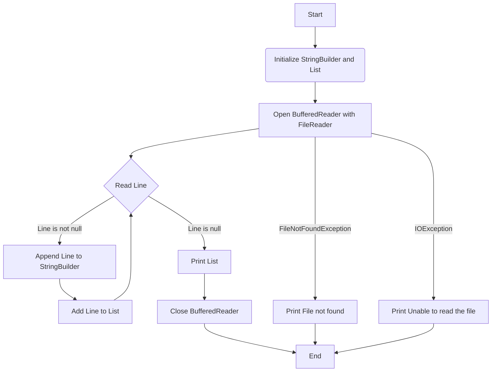

### Explanation of the Flowchart

1. **Start**: Represents the beginning of the program.
2. **Initialize StringBuilder and List**: The `StringBuilder` and `List<String>` are initialized.
3. **Open BufferedReader with FileReader**: The `BufferedReader` is opened to read from the specified file.
4. **Read Line**: Read a line from the file.
   - **Line is not null**: If the line is not null, append it to `StringBuilder` and add it to the list.
   - **Line is null**: If the line is null, move to the next step.
5. **Print List**: Convert the list to an array and print it.
6. **Close BufferedReader**: Close the `BufferedReader` after reading all lines.
7. **End**: Represents the end of the program.

### Error Handling

- **FileNotFoundException**: If the file is not found, print "File not found".
- **IOException**: If an IO error occurs while reading the file, print "Unable to read the file".

You can visualize this flowchart using Mermaid live editor or any other Mermaid-compatible tool. Simply copy the Mermaid code and paste it into a Mermaid live editor to view the diagram.
</details>

<details>
<summary><b>4.9.15. Write and Read a Plain Text File</b></summary>
### 15. Write and Read a Plain Text File

```java
import java.io.File;
import java.io.FileWriter;
import java.io.FileReader;
import java.io.BufferedReader;
import java.io.IOException;

public class WriteAndReadFile {
    public static void main(String[] args) {
        String filePath = "path/to/your/file";

        // Writing to the file
        try (FileWriter writer = new FileWriter(filePath)) {
            writer.write("Hello, World!\n");
            writer.write("This is a test file.\n");
        } catch (IOException e) {
            e.printStackTrace();
        }

        // Reading from the file
        try (BufferedReader reader = new BufferedReader(new FileReader(filePath))) {
            String line;
            while ((line = reader.readLine()) != null) {
                System.out.println(line);
            }
        } catch (IOException e) {
            e.printStackTrace();
        }
    }
}
```

**Explanation**: This program first writes some text to a file using `FileWriter`. Then, it reads the content back using `BufferedReader` and prints it to the console.
</details>

<details>
<summary><b>4.9.16. Append Text to an Existing File</b></summary>
### 16. Append Text to an Existing File

```java
import java.io.FileWriter;
import java.io.IOException;

public class AppendToFile {
    public static void main(String[] args) {
        String filePath = "path/to/your/file";
        String textToAppend = "This is the appended text.\n";

        try (FileWriter writer = new FileWriter(filePath, true)) { // 'true' for append mode
            writer.write(textToAppend);
        } catch (IOException e) {
            e.printStackTrace();
        }
    }
}
```

**Explanation**: To append text, `FileWriter` is instantiated with `true` as the second argument, enabling append mode. Text is then added to the end of the file.
</details>

<details>
<summary><b>4.9.17. Read the First 3 Lines of a File</b></summary>
### 17. Read the First 3 Lines of a File

```java
import java.io.BufferedReader;
import java.io.FileReader;
import java.io.IOException;

public class ReadFirstThreeLines {
    public static void main(String[] args) {
        String filePath = "path/to/your/file";

        try (BufferedReader reader = new BufferedReader(new FileReader(filePath))) {
            for (int i = 0; i < 3; i++) {
                String line = reader.readLine();
                if (line != null) {
                    System.out.println(line);
                } else {
                    break; // Exit loop if there are less than 3 lines
                }
            }
        } catch (IOException e) {
            e.printStackTrace();
        }
    }
}
```

**Explanation**: This program reads the file line by line up to a maximum of 3 lines. If there are fewer lines, it will stop early.
</details>

<details>
<summary><b>4.9.18. Find the Longest Word in a Text File</b></summary>
### 18. Find the Longest Word in a Text File

```java
import java.io.BufferedReader;
import java.io.FileReader;
import java.io.IOException;

public class FindLongestWord {
    public static void main(String[] args) {
        String filePath = "path/to/your/file";
        String longestWord = "";

        try (BufferedReader reader = new BufferedReader(new FileReader(filePath))) {
            String line;
            while ((line = reader.readLine()) != null) {
                String[] words = line.split("\\s+");
                for (String word : words) {
                    if (word.length() > longestWord.length()) {
                        longestWord = word;
                    }
                }
            }
        } catch (IOException e) {
            e.printStackTrace();
        }

        System.out.println("Longest word: " + longestWord);
    }
}
```

**Explanation**: This program reads the file line by line, splits each line into words using whitespace as the delimiter, and keeps track of the longest word encountered. The longest word is printed at the end.
</details>
<details>
<summary><b>4.9.19 Reads a file, counts the number of lines each word appears in, and then prints words that appear in more than 50% of the lines.</b></summary>
	
```java
import java.io.BufferedReader;
import java.io.InputStream;
import java.io.InputStreamReader;
import java.io.IOException;
import java.util.HashMap;
import java.util.HashSet;
import java.util.Map;
import java.util.Set;

public class FileAnalyzer {

    public static void main(String[] args) {
        // Path relative to the classpath
        String fileName = "/fi.txt"; // Adjust path if needed

        // Use a map to count the number of lines each word appears in
        Map<String, Integer> wordLineCount = new HashMap<>();
        // Use a set to keep track of the words in each line
        Set<String> currentLineWords = new HashSet<>();
        int totalLines = 0;

        try (InputStream inputStream = FileAnalyzer.class.getResourceAsStream(fileName);
             BufferedReader reader = new BufferedReader(new InputStreamReader(inputStream))) {

            String line;
            while ((line = reader.readLine()) != null) {
                totalLines++;
                currentLineWords.clear();
                // Split line into words
                String[] words = line.split("\\s+");
                for (String word : words) {
                    if (!word.trim().isEmpty()) {
                        currentLineWords.add(word.toLowerCase()); // Normalize to lowercase
                    }
                }
                // Update wordLineCount map
                for (String word : currentLineWords) {
                    wordLineCount.put(word, wordLineCount.getOrDefault(word, 0) + 1);
                }
            }
            reader.close();
        } catch (IOException e) {
            e.printStackTrace();
        }

        // Determine the threshold for words to appear in more than 50% of the lines
        double threshold = totalLines * 0.5;
        System.out.println("Total lines: " + totalLines);
        System.out.println("threshold: " + threshold);
        System.out.println("Words appearing in more than 50% of the lines:");
        for (Map.Entry<String, Integer> entry : wordLineCount.entrySet()) {
            if (entry.getValue() > threshold) {
                System.out.println(entry.getKey());
            }
        }
    }
}
```
To create a Java program that reads a file, counts the number of lines each word appears in, and prints words that appear in more than 50% of the lines, you can follow these steps:

1. **Read the File**: Read the file line by line.
2. **Track Words and Line Counts**: Use a `Map` to count occurrences of each word across different lines.
3. **Calculate Threshold**: Determine the threshold as 50% of the total lines.
4. **Print Words Above Threshold**: Print the words that appear in more than 50% of the lines.

Here’s a complete Java program to achieve this:

```java
import java.io.BufferedReader;
import java.io.FileReader;
import java.io.IOException;
import java.util.HashMap;
import java.util.HashSet;
import java.util.Map;
import java.util.Set;

public class WordFrequencyAnalyzer {

    public static void main(String[] args) {
        // Path to the file
        String fileName = "path/to/your/file.txt"; // Adjust path if needed

        // Use a map to count the number of lines each word appears in
        Map<String, Integer> wordLineCount = new HashMap<>();
        // Use a set to keep track of the words in each line
        Set<String> currentLineWords = new HashSet<>();
        int totalLines = 0;

        try (BufferedReader reader = new BufferedReader(new FileReader(fileName))) {
            String line;
            while ((line = reader.readLine()) != null) {
                totalLines++;
                currentLineWords.clear();
                // Split line into words
                String[] words = line.split("\\s+");
                for (String word : words) {
                    if (!word.trim().isEmpty()) {
                        currentLineWords.add(word.toLowerCase()); // Normalize to lowercase
                    }
                }
                // Update wordLineCount map
                for (String word : currentLineWords) {
                    wordLineCount.put(word, wordLineCount.getOrDefault(word, 0) + 1);
                }
            }
        } catch (IOException e) {
            e.printStackTrace();
        }

        // Determine the threshold for words to appear in more than 50% of the lines
        double threshold = totalLines * 0.5;
        System.out.println("Total lines: " + totalLines);
        System.out.println("Threshold: " + threshold);
        System.out.println("Words appearing in more than 50% of the lines:");
        for (Map.Entry<String, Integer> entry : wordLineCount.entrySet()) {
            if (entry.getValue() > threshold) {
                System.out.println(entry.getKey());
            }
        }
    }
}
```

### Key Components of the Program:

1. **File Reading**: The `BufferedReader` reads the file line by line.
2. **Tracking Words**: 
   - `currentLineWords` keeps track of words in the current line to ensure each word is only counted once per line.
   - `wordLineCount` is a `Map` where keys are words and values are the count of lines the word appears in.
3. **Normalization**: Words are converted to lowercase to ensure case-insensitivity.
4. **Threshold Calculation**: The threshold is calculated as 50% of the total number of lines.
5. **Printing Results**: The program prints words that appear in more than the calculated threshold number of lines.

### Usage

1. **Adjust File Path**: Replace `"path/to/your/file.txt"` with the actual path to your file.
2. **Run the Program**: Execute the program to see the results. It will print the words that appear in more than 50% of the lines in the specified file.

This approach ensures you get a comprehensive overview of which words are prevalent in the majority of lines within a text file.
To convert the provided Java program to use lambda expressions and the Stream API, we need to adjust the code to utilize these modern Java features for more concise and functional-style programming. 

The core tasks are:
1. Reading lines from a file.
2. Processing each line to count word occurrences.
3. Calculating and filtering based on the threshold.

Here's how you can convert the program to use lambda expressions and streams:

```java
import java.io.BufferedReader;
import java.io.FileReader;
import java.io.IOException;
import java.util.HashMap;
import java.util.HashSet;
import java.util.Map;
import java.util.Set;
import java.util.stream.Collectors;
import java.util.stream.Stream;

public class WordFrequencyAnalyzer {

    public static void main(String[] args) {
        // Path to the file
        String fileName = "path/to/your/file.txt"; // Adjust path if needed

        // Use a map to count the number of lines each word appears in
        Map<String, Integer> wordLineCount = new HashMap<>();
        int[] totalLines = {0}; // Use an array to allow modification in lambda

        try (BufferedReader reader = new BufferedReader(new FileReader(fileName))) {
            // Process each line of the file
            reader.lines()
                .peek(line -> totalLines[0]++) // Increment totalLines count for each line
                .map(line -> line.split("\\s+")) // Split line into words
                .map(words -> Stream.of(words)
                    .map(String::trim)
                    .filter(word -> !word.isEmpty())
                    .map(String::toLowerCase) // Normalize to lowercase
                    .collect(Collectors.toSet())) // Collect words in the current line to a Set
                .forEach(currentLineWords -> currentLineWords.forEach(word ->
                    wordLineCount.merge(word, 1, Integer::sum))); // Update wordLineCount map
        } catch (IOException e) {
            e.printStackTrace();
        }

        // Determine the threshold for words to appear in more than 50% of the lines
        double threshold = totalLines[0] * 0.5;
        System.out.println("Total lines: " + totalLines[0]);
        System.out.println("Threshold: " + threshold);
        System.out.println("Words appearing in more than 50% of the lines:");
        
        // Print words that appear in more than the calculated threshold number of lines
        wordLineCount.entrySet().stream()
            .filter(entry -> entry.getValue() > threshold)
            .map(Map.Entry::getKey)
            .forEach(System.out::println);
    }
}
```

### Key Changes and Lambda Expressions:

1. **Reading Lines**:
   - `reader.lines()` returns a `Stream<String>` of lines from the file, allowing for stream processing.

2. **Counting Lines**:
   - `peek(line -> totalLines[0]++)` is used to count the total number of lines. `peek` is used for intermediate operations that don't modify the stream's elements but perform an action (in this case, counting lines).

3. **Processing Words**:
   - `.map(line -> line.split("\\s+"))` splits each line into words.
   - `.map(words -> Stream.of(words) ... .collect(Collectors.toSet()))` processes each line to collect words into a `Set` to ensure uniqueness within a line.

4. **Updating Word Count**:
   - `wordLineCount.merge(word, 1, Integer::sum)` increments the word count in the map. `merge` is a convenient method to handle this type of aggregation.

5. **Filtering and Printing**:
   - `wordLineCount.entrySet().stream().filter(entry -> entry.getValue() > threshold)` filters the words that meet the threshold criteria.
   - `.map(Map.Entry::getKey).forEach(System.out::println)` prints each word that meets the criteria.

This approach leverages the power of Java Streams and lambda expressions to write more concise and readable code, focusing on functional programming concepts.

To create a flowchart for the provided Java program, we need to outline the program’s logic step by step. The program reads a file, counts the number of lines each word appears in, and then prints words that appear in more than 50% of the lines.

Here's a breakdown of the flowchart components:

1. **Start**: Program initialization.
2. **Initialize Variables**: Initialize `wordLineCount`, `currentLineWords`, and `totalLines`.
3. **Open File**: Use `FileAnalyzer.class.getResourceAsStream(fileName)` to open the file.
4. **Read Line**: Read lines from the file in a loop.
   - **Line is Not Null**: Process the line if it’s not null.
     - **Clear Current Line Words**: Reset `currentLineWords`.
     - **Split Line into Words**: Split the line into words using space as the delimiter.
     - **Normalize and Add Words**: Add each word to `currentLineWords` in lowercase.
     - **Update Word Count**: Update the `wordLineCount` map with the count of each word.
     - **Increment Total Lines**: Increase the `totalLines` count.
   - **End of File**: Exit the loop if the end of the file is reached.
5. **Close File**: Close the file after reading.
6. **Calculate Threshold**: Compute the threshold as 50% of `totalLines`.
7. **Print Results**:
   - **Print Total Lines**: Output the total number of lines.
   - **Print Threshold**: Output the computed threshold.
   - **Print Words Above Threshold**: Output words that appear in more than the computed threshold number of lines.
8. **End**: End of the program.

Here’s the Mermaid syntax for a flowchart that represents this program’s logic:

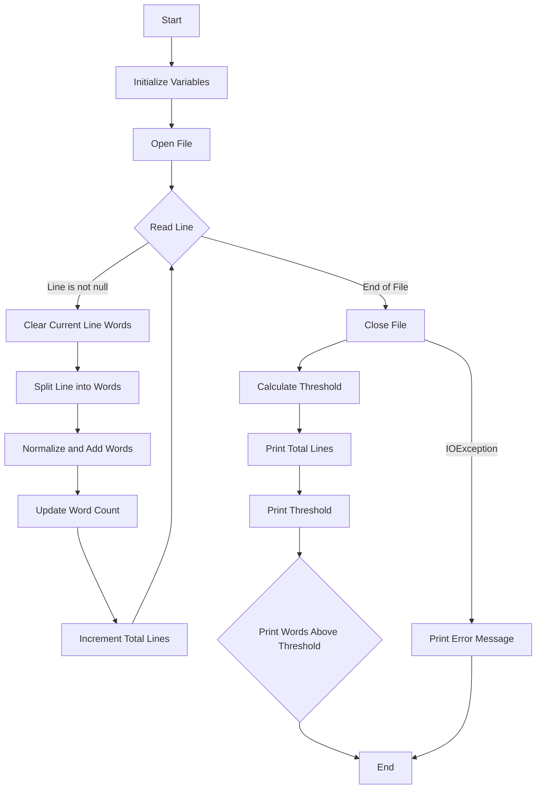

### Explanation of Flowchart Components

1. **Start**: Represents the beginning of the program.
2. **Initialize Variables**: Set up the `wordLineCount` map, `currentLineWords` set, and `totalLines` counter.
3. **Open File**: Open the file using `FileAnalyzer.class.getResourceAsStream(fileName)`.
4. **Read Line**: Loop to read each line from the file.
   - **Line is Not Null**: Proceed if the line is not null.
     - **Clear Current Line Words**: Prepare for the next line by clearing previous words.
     - **Split Line into Words**: Split the line into an array of words.
     - **Normalize and Add Words**: Convert words to lowercase and add to the set.
     - **Update Word Count**: Update the word counts in the map.
     - **Increment Total Lines**: Increase the line counter.
   - **End of File**: End the loop when no more lines are left.
5. **Close File**: Close the file stream.
6. **Calculate Threshold**: Compute the threshold (50% of total lines).
7. **Print Results**:
   - **Print Total Lines**: Output the total number of lines read.
   - **Print Threshold**: Output the computed threshold.
   - **Print Words Above Threshold**: List words appearing in more than 50% of the lines.
8. **End**: End of the program.

**Error Handling**:
   - **IOException**: Handles file reading errors and prints an error message.

You can use the Mermaid Live Editor or other Mermaid-compatible tools to visualize this flowchart by copying and pasting the provided code.

### Other Approaches:

To create the program in different ways, let's explore various methods to achieve the same result, focusing on different aspects of the problem:

### 1. **Using Java Streams with `Files.lines`**

Instead of `BufferedReader`, you can use `Files.lines` which is a more modern way to handle files in Java 8 and later.

```java
import java.io.IOException;
import java.nio.file.Files;
import java.nio.file.Paths;
import java.util.HashMap;
import java.util.HashSet;
import java.util.Map;
import java.util.Set;
import java.util.stream.Collectors;

public class WordFrequencyAnalyzer {

    public static void main(String[] args) {
        // Path to the file
        String fileName = "path/to/your/file.txt"; // Adjust path if needed

        // Use a map to count the number of lines each word appears in
        Map<String, Integer> wordLineCount = new HashMap<>();
        final int[] totalLines = {0}; // Use an array to allow modification in lambda

        try (Stream<String> lines = Files.lines(Paths.get(fileName))) {
            lines.peek(line -> totalLines[0]++) // Increment totalLines count for each line
                 .map(line -> line.split("\\s+"))
                 .map(words -> Stream.of(words)
                     .map(String::trim)
                     .filter(word -> !word.isEmpty())
                     .map(String::toLowerCase)
                     .collect(Collectors.toSet())) // Collect words in the current line to a Set
                 .forEach(currentLineWords -> currentLineWords.forEach(word ->
                     wordLineCount.merge(word, 1, Integer::sum))); // Update wordLineCount map
        } catch (IOException e) {
            e.printStackTrace();
        }

        double threshold = totalLines[0] * 0.5;
        System.out.println("Total lines: " + totalLines[0]);
        System.out.println("Threshold: " + threshold);
        System.out.println("Words appearing in more than 50% of the lines:");
        wordLineCount.entrySet().stream()
                     .filter(entry -> entry.getValue() > threshold)
                     .map(Map.Entry::getKey)
                     .forEach(System.out::println);
    }
}
```

### 2. **Using Traditional For Loop**

If you prefer not to use streams, you can achieve the same functionality with traditional loops.

```java
import java.io.BufferedReader;
import java.io.FileReader;
import java.io.IOException;
import java.util.HashMap;
import java.util.HashSet;
import java.util.Map;
import java.util.Set;

public class WordFrequencyAnalyzer {

    public static void main(String[] args) {
        // Path to the file
        String fileName = "path/to/your/file.txt"; // Adjust path if needed

        // Use a map to count the number of lines each word appears in
        Map<String, Integer> wordLineCount = new HashMap<>();
        Set<String> currentLineWords = new HashSet<>();
        int totalLines = 0;

        try (BufferedReader reader = new BufferedReader(new FileReader(fileName))) {
            String line;
            while ((line = reader.readLine()) != null) {
                totalLines++;
                currentLineWords.clear();
                String[] words = line.split("\\s+");
                for (String word : words) {
                    if (!word.trim().isEmpty()) {
                        currentLineWords.add(word.toLowerCase());
                    }
                }
                for (String word : currentLineWords) {
                    wordLineCount.put(word, wordLineCount.getOrDefault(word, 0) + 1);
                }
            }
        } catch (IOException e) {
            e.printStackTrace();
        }

        double threshold = totalLines * 0.5;
        System.out.println("Total lines: " + totalLines);
        System.out.println("Threshold: " + threshold);
        System.out.println("Words appearing in more than 50% of the lines:");
        for (Map.Entry<String, Integer> entry : wordLineCount.entrySet()) {
            if (entry.getValue() > threshold) {
                System.out.println(entry.getKey());
            }
        }
    }
}
```

### 3. **Using Java 9+ `Files.readString`**

If you’re using Java 11 or newer, `Files.readString` can be used for simpler file reading.

```java
import java.io.IOException;
import java.nio.file.Files;
import java.nio.file.Paths;
import java.util.HashMap;
import java.util.HashSet;
import java.util.Map;
import java.util.Set;
import java.util.stream.Collectors;

public class WordFrequencyAnalyzer {

    public static void main(String[] args) {
        // Path to the file
        String fileName = "path/to/your/file.txt"; // Adjust path if needed

        // Use a map to count the number of lines each word appears in
        Map<String, Integer> wordLineCount = new HashMap<>();
        final int[] totalLines = {0}; // Use an array to allow modification in lambda

        try {
            String content = Files.readString(Paths.get(fileName));
            content.lines()
                   .peek(line -> totalLines[0]++) // Increment totalLines count for each line
                   .map(line -> line.split("\\s+"))
                   .map(words -> Stream.of(words)
                       .map(String::trim)
                       .filter(word -> !word.isEmpty())
                       .map(String::toLowerCase)
                       .collect(Collectors.toSet())) // Collect words in the current line to a Set
                   .forEach(currentLineWords -> currentLineWords.forEach(word ->
                       wordLineCount.merge(word, 1, Integer::sum))); // Update wordLineCount map
        } catch (IOException e) {
            e.printStackTrace();
        }

        double threshold = totalLines[0] * 0.5;
        System.out.println("Total lines: " + totalLines[0]);
        System.out.println("Threshold: " + threshold);
        System.out.println("Words appearing in more than 50% of the lines:");
        wordLineCount.entrySet().stream()
                     .filter(entry -> entry.getValue() > threshold)
                     .map(Map.Entry::getKey)
                     .forEach(System.out::println);
    }
}
```

### 4. **Using Java 8 `Files.lines` with Custom Collector**

A custom collector can be used for more control over processing.

```java
import java.io.IOException;
import java.nio.file.Files;
import java.nio.file.Paths;
import java.util.HashMap;
import java.util.Map;
import java.util.Set;
import java.util.stream.Collectors;
import java.util.stream.Stream;

public class WordFrequencyAnalyzer {

    public static void main(String[] args) {
        // Path to the file
        String fileName = "path/to/your/file.txt"; // Adjust path if needed

        // Use a map to count the number of lines each word appears in
        Map<String, Integer> wordLineCount = new HashMap<>();
        int[] totalLines = {0}; // Use an array to allow modification in lambda

        try (Stream<String> lines = Files.lines(Paths.get(fileName))) {
            lines.forEach(line -> {
                totalLines[0]++;
                Set<String> currentLineWords = Stream.of(line.split("\\s+"))
                    .map(String::trim)
                    .filter(word -> !word.isEmpty())
                    .map(String::toLowerCase)
                    .collect(Collectors.toSet());
                
                currentLineWords.forEach(word ->
                    wordLineCount.merge(word, 1, Integer::sum)); // Update wordLineCount map
            });
        } catch (IOException e) {
            e.printStackTrace();
        }

        double threshold = totalLines[0] * 0.5;
        System.out.println("Total lines: " + totalLines[0]);
        System.out.println("Threshold: " + threshold);
        System.out.println("Words appearing in more than 50% of the lines:");
        wordLineCount.entrySet().stream()
                     .filter(entry -> entry.getValue() > threshold)
                     .map(Map.Entry::getKey)
                     .forEach(System.out::println);
    }
}
```

Each version of the program uses different Java features and approaches to handle file reading and word counting. Choose the one that best fits your needs or the Java version you are using.

In the context of file I/O and text processing, **"threshold"** often refers to a predefined limit or value used to filter or decide which items meet certain criteria based on their frequency or occurrence. In the specific example of counting word occurrences in a file, a threshold helps determine which words appear frequently enough to be considered significant.

### Understanding Threshold in Word Frequency Analysis

Here's how the concept of a threshold is applied to count and calculate word occurrences:

#### **1. **Defining the Threshold**

In the given example, the threshold is used to identify words that appear in more than 50% of the lines in a text file.

- **Total Lines (`totalLines`)**: This is the total number of lines read from the file.
- **Threshold Calculation**: The threshold value is calculated as a percentage of the total number of lines. In this case, it’s 50%, which means any word appearing in more than half of the lines will be considered significant.

**Formula for Threshold Calculation:**

```java
double threshold = totalLines * 0.5;
```

- If there are 100 lines in the file, the threshold would be `100 * 0.5 = 50`. Therefore, words appearing in more than 50 lines will be printed.

#### **2. **Counting Word Occurrences**

- **Word Frequency Counting**: As you read through each line of the file, you count how many different lines each word appears in. This is stored in a map where the key is the word and the value is the count of lines in which that word appears.

**Example Code Snippet:**

```java
Map<String, Integer> wordLineCount = new HashMap<>();
Set<String> currentLineWords = new HashSet<>();
...
while ((line = reader.readLine()) != null) {
    totalLines++;
    currentLineWords.clear();
    String[] words = line.split("\\s+");
    for (String word : words) {
        if (!word.trim().isEmpty()) {
            currentLineWords.add(word.toLowerCase());
        }
    }
    for (String word : currentLineWords) {
        wordLineCount.put(word, wordLineCount.getOrDefault(word, 0) + 1);
    }
}
```

- **Update Map**: For each unique word in the current line, increment its count in the `wordLineCount` map.

#### **3. **Applying the Threshold**

After processing the entire file and populating the `wordLineCount` map, you apply the threshold to filter out words that appear in more lines than the threshold.

**Example Code Snippet:**

```java
wordLineCount.entrySet().stream()
    .filter(entry -> entry.getValue() > threshold)
    .map(Map.Entry::getKey)
    .forEach(System.out::println);
```

- **Filter Words**: Use a stream to filter entries in the map where the count (number of lines) is greater than the threshold.
- **Print Results**: Output the words that meet the threshold criterion.

### Summary

- **Threshold**: It’s a cutoff value used to filter or make decisions. In this case, it's a percentage of lines in which a word must appear to be considered frequent.
- **Counting & Calculation**: Words are counted based on their occurrence across lines, and the threshold determines which words meet the frequency criterion.

By using thresholds, you can effectively manage and analyze large amounts of data by focusing on items that meet specific criteria, making it easier to handle and interpret results from file I/O operations.
</details>	
<details>
<summary><b>Ways of Reading Files</b></summary>
Java provides several ways to read and write files, each suitable for different scenarios. Here’s an overview of the primary methods:

### Reading Files

1. **Using `FileInputStream` and `FileOutputStream`**:
   - For binary data.
   - Example:

   ```java
   import java.io.FileInputStream;
   import java.io.IOException;

   public class FileInputStreamExample {
       public static void main(String[] args) {
           try (FileInputStream fis = new FileInputStream("path/to/file")) {
               int content;
               while ((content = fis.read()) != -1) {
                   System.out.print((char) content); // Print each byte as a character
               }
           } catch (IOException e) {
               e.printStackTrace();
           }
       }
   }
   ```

2. **Using `BufferedReader`**:
   - For text data, reads text efficiently.
   - Example:

   ```java
   import java.io.BufferedReader;
   import java.io.FileReader;
   import java.io.IOException;

   public class BufferedReaderExample {
       public static void main(String[] args) {
           try (BufferedReader br = new BufferedReader(new FileReader("path/to/file"))) {
               String line;
               while ((line = br.readLine()) != null) {
                   System.out.println(line); // Print each line
               }
           } catch (IOException e) {
               e.printStackTrace();
           }
       }
   }
   ```

3. **Using `Files` Class (Java NIO)**:
   - Provides convenience methods for reading files as a whole or as a stream.
   - Example:

   ```java
   import java.nio.file.Files;
   import java.nio.file.Path;
   import java.nio.file.Paths;
   import java.io.IOException;
   import java.util.List;

   public class FilesClassExample {
       public static void main(String[] args) {
           Path path = Paths.get("path/to/file");
           try {
               // Read all lines as a List of Strings
               List<String> lines = Files.readAllLines(path);
               for (String line : lines) {
                   System.out.println(line);
               }

               // Read all bytes
               byte[] bytes = Files.readAllBytes(path);
               System.out.println(new String(bytes));

           } catch (IOException e) {
               e.printStackTrace();
           }
       }
   }
   ```

4. **Using `Scanner`**:
   - Useful for parsing files with delimiters.
   - Example:

   ```java
   import java.io.File;
   import java.io.IOException;
   import java.util.Scanner;

   public class ScannerExample {
       public static void main(String[] args) {
           File file = new File("path/to/file");
           try (Scanner scanner = new Scanner(file)) {
               while (scanner.hasNextLine()) {
                   System.out.println(scanner.nextLine()); // Print each line
               }
           } catch (IOException e) {
               e.printStackTrace();
           }
       }
   }
   ```
</details>
<details>
<summary><b>Ways of Writing Files</b></summary>
### Writing Files

1. **Using `FileOutputStream`**:
   - For binary data.
   - Example:

   ```java
   import java.io.FileOutputStream;
   import java.io.IOException;

   public class FileOutputStreamExample {
       public static void main(String[] args) {
           try (FileOutputStream fos = new FileOutputStream("path/to/file")) {
               String data = "Hello, World!";
               fos.write(data.getBytes()); // Write data as bytes
           } catch (IOException e) {
               e.printStackTrace();
           }
       }
   }
   ```

2. **Using `BufferedWriter`**:
   - For text data, writes text efficiently.
   - Example:

   ```java
   import java.io.BufferedWriter;
   import java.io.FileWriter;
   import java.io.IOException;

   public class BufferedWriterExample {
       public static void main(String[] args) {
           try (BufferedWriter bw = new BufferedWriter(new FileWriter("path/to/file"))) {
               bw.write("Hello, World!");
               bw.newLine();
               bw.write("This is a new line.");
           } catch (IOException e) {
               e.printStackTrace();
           }
       }
   }
   ```

3. **Using `Files` Class (Java NIO)**:
   - Provides methods for writing files.
   - Example:

   ```java
   import java.nio.file.Files;
   import java.nio.file.Path;
   import java.nio.file.Paths;
   import java.io.IOException;
   import java.util.List;

   public class FilesWriteExample {
       public static void main(String[] args) {
           Path path = Paths.get("path/to/file");
           try {
               // Write a string to the file
               Files.write(path, "Hello, World!".getBytes());

               // Write lines to the file
               List<String> lines = List.of("Hello, World!", "This is a new line.");
               Files.write(path, lines);

           } catch (IOException e) {
               e.printStackTrace();
           }
       }
   }
   ```

4. **Using `PrintWriter`**:
   - Convenient for formatting output.
   - Example:

   ```java
   import java.io.FileWriter;
   import java.io.IOException;
   import java.io.PrintWriter;

   public class PrintWriterExample {
       public static void main(String[] args) {
           try (PrintWriter pw = new PrintWriter(new FileWriter("path/to/file"))) {
               pw.println("Hello, World!");
               pw.println("This is a new line.");
           } catch (IOException e) {
               e.printStackTrace();
           }
       }
   }
   ```

### Choosing the Right Approach

- **`FileInputStream` / `FileOutputStream`**: Best for binary data.
- **`BufferedReader` / `BufferedWriter`**: Ideal for text files and large amounts of data.
- **`Files` Class**: Provides high-level convenience methods for file operations.
- **`Scanner`**: Useful for parsing text with delimiters.
- **`PrintWriter`**: Good for formatted text output.

Each method has its own advantages depending on the specific requirements of the file operations.
</details>

</details>
</details>
<details>
<details><summary>👇<b>Java Exception</b></summary>

 </details>
<details><summary>👇<b>Java Multithreading & Concurrency</b></summary>

 </details>
<details><summary>👇<b>Java Collection Framework</b></summary>

 </details>
 <details><summary>👇<b>Java File I/O</b></summary>

 </details>
 <details><summary>👇<b>Java Garbage Collection & Memory Management</b></summary>

 </details>
<summary><b>5. Spring Framework</b></summary>
 
## Spring Framework
- [Introduction](#introduction)
- [Lifecycles](#class)

## Spring Modules
- [Modules](#polymorphism)

## Spring Scopes 
- [Scopes](#encapsulation)

## Spring Dependecies Injections
- [Dependecies Injections (DI) & Inversion Of Control (Ioc)](#inheritance)
- [Types of Dependecies Injections](#inheritance)

## Spring AOP
- [Abstraction](#abstraction)
- [Composition](#composition)
 
## Spring Trsansactions
- [Association](#association)
- [Aggregation](#aggregation)
  
## Exercises & FAQ's
- [Spring Framework Annotaions](#java-programming-questions-and-answers)
- [Spring Framework Questions and Answers](#java-programming-questions-and-answers)

## FAQ's
- [Spring Framework Annotaions](#java-programming-questions-and-answers)
- [Spring Framework Questions and Answers](#java-programming-questions-and-answers)
</details>
<details>
<summary><b>6. Spring Boot Framework</b></summary>

## Spring Boot Framework
- [Introduction](#introduction)
- [Lifecycles](#class)

## Spring Modules
- [Modules](#polymorphism)

## Spring Scopes 
- [Scopes](#encapsulation)

## Spring Dependecies Injections
- [Dependecies Injections (DI) & Inversion Of Control (Ioc)](#inheritance)
- [Types of Dependecies Injections](#inheritance)

## Spring AOP
- [Abstraction](#abstraction)
- [Composition](#composition)
 
## Spring Trsansactions
- [Association](#association)
- [Aggregation](#aggregation)
  
## Exercises & FAQ's
- [Spring Boot Framework Annotaions](#java-programming-questions-and-answers)
- [Spring Boot Framework Questions and Answers](#java-programming-questions-and-answers)

## FAQ's
- [Spring Boot Framework Annotaions](#java-programming-questions-and-answers)
- [Spring Boot Framework Questions and Answers](#java-programming-questions-and-answers)
  
</details>
<details>
<summary><b>7. Microservices</b></summary>

<details>
<summary><b>7. Microservices Design Patterns and Principles</b></summary>

### **Microservices Design Patterns and Principles:**

The essential Microservice design principle and patterns like Event Sourcing, Circuit Breaker, SAGA, CQRS, Strangler, Database per Microservices, Backend for Frontend (BFF), Service Discovery, and API Gateway and principles like Scalability, Flexibility, Resiliency, etc. When you developing an enterprise application, it is good to move with micro-services rather than move with a monolithic architecture. 

While there are cases where you would like to go with monolithic architecture like for low latency applications, but in most cases where you want to run your Java application in the cloud, Microservice architecture offers a better solution.

So let's have a quick look into what is microservices and it's use cases and design patterns for micro-services.

### What is Microservice Architecture?
The microservice architecture is structured on the business domain and it's a collection of small autonomous services. In a microservice architecture, all the components are self-contained and wrap up around a single business capability.

Why do we need to consider the microservice architecture instead of using monolithic architecture? Below mentioned four main concepts that described the importance of microservice architecture over monolithic architecture.

- 1. Visibility is high - MSA provides better visibility to your services.
- 2. Improves resilience - Improves the resilience of our service network
- 3. Production time reduced - Reduce the delivery time from idea to final product.
- 4. Reduced cost - Reduce the overall cost of designing, implementing, and maintaining IT services.

If you are a complete beginner and want to learn more about Microservice architecture then I highly recommend you to go through these Microservice architecture courses to start with, in particular Grokking Microservices Design Patterns on DesignGuru.io, one of the best course to learn about Microservices patterns

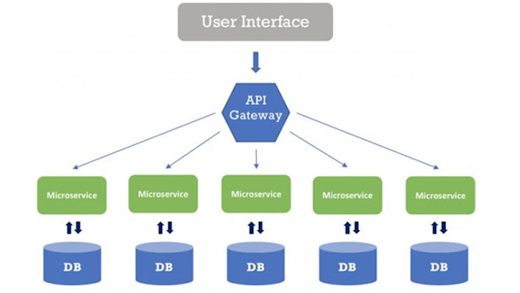

### 10 Essential Microservice Design Patterns and Principles
Now that you know what is Microservice architecture and why you need to consider Microservice architecture to build applications that can stand the test of time and are scalable enough to handle real-world traffic, let's now go through the fundamental principle of Microservices and design pattern which you can use to solve common problem associate with microservice architecture. 

Let's look at the principles in which the microservice architecture has been built.

1. Scalability
2. Flexibility
3. Independent and autonomous
4. Decentralized governance
5. Resiliency
6. Failure isolation.
7. Continuous delivery through the DevOps

while adhering to the above principles, there may have some other pitfalls that developers might befall and to avoid this, we can use the design patterns in a microservice architecture. 

10 main design patterns which are mentioned below.

1. [Database per Microservice](#database-per-microservice)
2. [Event Sourcing](#event-sourcing)
3. [CQRS](#cqrs)
4. [Saga](#saga)
5. [BFF](#bff)
6. [API Gateway](#api-gateway)
7. [Strangler](#strangler)
8. [Circuit Breaker](#circuit-breaker)
9. [Externalized Configuration](#externalized-configuration)
10. [Consumer-Driven Contract Tracing](#consumer-driven-contract-tracing)

So first start with the Database per Microservice design pattern.

### Top 10 Microservices Design Patterns and Principles

## Database per Microservice

### 1. Database per Microservice Pattern
Database design is rapidly evolving, and there are numerous hurdles to overcome while developing a microservices-based solution. Database architecture is one of the most important aspects of microservices. 

What is the best way to store data and where should it be stored?

There should are two main options for organizing the databases when using the microservice architecture. 

  - Database per service
  - Shared database

### 1.1 Database per service.

The concept is straightforward. There is a data store for each microservice (whole schema or a table). Other services are unable to access data repositories that they do not control. A solution like this has a lot of advantages.

Individual data storage, on the other hand, is easy to scale. Furthermore, the microservice encapsulates the domain's data. As a result, understanding the service and its data as a whole is much easier. It's especially crucial for new development team members. 

It will take them less time and effort to properly comprehend the area for which they are responsible. The main drawback of this database service is that there is a need for a failure protection mechanism in case the communication fails. 

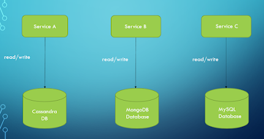

### 1.2 Shared Database
The use of a shared database is an anti-pattern. It is, however, questionable. The issue is that when microservices use a shared database, they lose their key features of scalability, robustness, and independence. As a result, Microservices rarely employ a shared database.

When a common database appears to be the best solution for a microservices project, we should reconsider if microservices are truly necessary. Perhaps the monolith is the better option. Let's have a look at how a shared database works.

Using a shared database with microservices isn't a frequent scenario. A temporary state could be created while moving a monolith to microservices. Transaction management is the fundamental advantage of a shared database versus a per-service database. There's no need to spread transactions out across services.


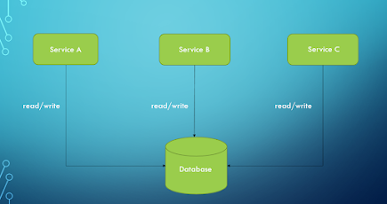


## Event Sourcing

### 2. Event Sourcing Pattern
The event sourcing is responsible for giving a new ordered sequence of events. The application state can be reconstructed using querying the data and in order to do this, we need to reimage every change to the state of the application. 

Event Sourcing is based on the idea that any change in an entity's state should be captured by the system. 

The persistence of a business item is accomplished by storing a series of state-changing events. A new event is added to the sequence of events every time an object's state changes. It's essentially atomic because it's one action. 

**By replaying the occurrences of an entity, its current state can be reconstructed.**

An event store is used to keep track of all of your events. The event store serves as a message broker as well as a database of events. It gives services the ability to subscribe to events via an API. 

The event store sends all interested subscribers information about each event that is saved in the database. In an event-driven microservices architecture, the event store is the foundation.

This pattern can be used in the following scenarios,
It's important to keep the existing data storage.
There should be no changes to the existing data layer codebase.
Transactions are critical to the application's success.
So as from the above discussion, it is clearly indicated that the event sourcing addresses a challenge of implementing an event-driven architecture. Microservices with shared databases can't easily scale. The database will also be a single point of failure. Changes to the database could have an influence on a number of services.

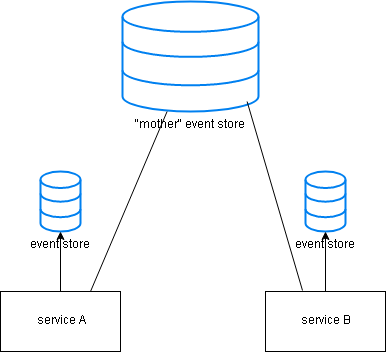

## CQRS

### 3. Command Query Segmentation (CQRS)  Pattern
In the above, we have discussed what is event sourcing. In this topic, we are going to discuss what is CQRS? We can divide the topic into two parts with commands and queries.

 Commands - Change the state of the object or entity.
 Queries -  Return the state of the entity and will not change anything.

In traditional data management systems, there are some issues,

   1. Risk of data contention
   2. Managing performance and security is complex as objects are exposed to both reading and writing applications.
 
So in order to solve these problems, the CQRS pattern comes to the big picture. The CQRS is responsible for either change the state of the entity or return the result. 

### benefits of using the CQRS are discussed below.
   1. The complexity of the system is reduced as the query models and commands are separated.
   2. Can provide multiple views for query purposes.
   3. Can optimize the read side of the system separately from the write side. 

The write side of the model handles the event's persistence and acting as a source of information to the read side. The system's read model generates materialized views of the data, which are often highly denormalized views.

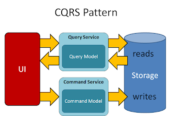

## SAGA

### 4. SAGA
SAGA is one of the best solutions to keep consistency with data in distributed architecture without having the ACID principles. SAGA is responsible for committing multiple commentary transactions by giving rollback opportunities.

There are two ways to achieve the saga's

- 1. Choreography
- 2. Orchestration.
In this choreography saga, there is no central orchestration. Each service in the Saga carries out its transaction and publishes events. The other services respond to those occurrences and carry out their tasks. In addition, depending on the scenario, they may or may not publish additional events.

In the Orchestration saga, each service participating in the saga performs their transactions and publish events. The other services respond to those events and complete their tasks.

- Advantage of using SAGA 
1. Can be used to maintain the data consistency across multiple services without tight coupling.

- The disadvantage of using SAGA
1. Complexity of the SAGA design pattern is high from the programmer's point of view and developers are not well accustomed to writing sagas as traditional transactions.

## Backend For Frontend (BFF)

### 5. Backend For Frontend (BFF)

This pattern is used to identify how the data is fetched between the server and clients. Ideally, the frontend team will be responsible for managing the BFF.

A single BFF is responsible for handling the single UI and it will help us to keep the frontend simple and see a unified view data through the backend.

### Why BFF needs in our microservice application?
The goal of this architecture is to decouple the front-end apps from the backend architecture.
As a scenario, think about you have an application that consists of the mobile app, web app and needs to communicate with the backend services in a microservices architecture. 

This can be done successfully but if you want to make a change to one of the frontend services, you need to deploy a new version instead of stick to updating the one service.

So here comes the microservice architecture and this is able to understand what our apps need and how to handle the services.

This is a big improvement in microservice architecture as this allows to isolate the backend of the application from the frontend. One other advantage that we can get from this BFF is that we can reuse the code as this allows all clients to use the code from the backend. 

Between the client and other external APIs, services, and so on, BFF functions similarly to a proxy server. If the request must pass through another component, the latency will undoubtedly increase.

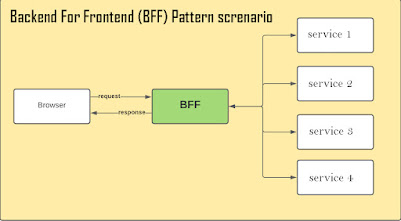

## API Gateway

### 6. API Gateway
This microservice architecture pattern is really good for large applications with multiple client apps and it is responsible for giving a single entry point for a certain group of microservices. 

API gateway sits between the client apps and the microservices and it serves as a reverse proxy, forwarding client requests to services. Authentication, SSL termination, and caching are some of the other cross-cutting services it can provide.

Why do we consider the API Gateway architecture instead of using direct client-to-microservice communication? We will discuss this with the following examples,
   
1. Security issues - All microservices must be exposed to the "external world" without a gateway, increasing the attack surface compared to hiding internal microservices that aren't directly accessed by client apps.
 
2. Cross-cutting concerns - Authorization and SSL must be handled by each publicly published microservice. Those problems might be addressed in a single tier in many cases, reducing the number of internal microservices.

3. Coupling - Client apps are tied to internal microservices without the API Gateway pattern. Client apps must understand how microservices decompose the application's various sections.

Last but not least, the microservices API gateway must be capable of handling partial failures. The failure of a single unresponsive microservice should not result in the failure of the entire request.

A microservices API gateway can deal with partial failures in a variety of ways, including:
Use data from a previous request that has been cached.
For time-sensitive data that is the request's major focus, return an error code.
Provide an empty value
Rely on hardware top 10 value.

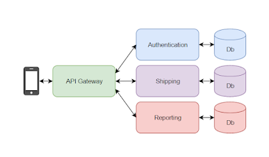

API Gateway

## Strangler

### 7. Strangler
The strangler design pattern is a popular design pattern to incrementally transform your monolithic application to microservices by replacing old functionality with a new service.  Once the new component is ready, the old component is strangled and a new one is put to use.

The facade interface, which serves as the primary interface between the legacy system and the other apps and systems that call it, is one of the most important components of the strangler pattern.

External apps and systems will be able to identify the code associated with a certain function, while the underlying historical system code will be obscured by the facade interface. The strangler design addresses this by requiring developers to provide a façade interface that allows them to expose individual services and functions when they break them free from the monolith.

You need to understand the quality and reliability of your system, whether you're working with legacy code, starting the process of "strangling" your old system, or running a newly containerized application. When anything goes wrong, you need to know how the system got there and why it went down that road.


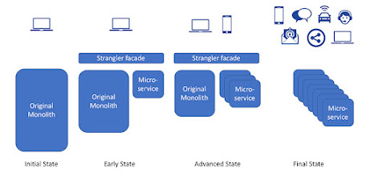

Moving from Monolithic to microservice architecture stages.

## Circuit Breaker Pattern

### 8. Circuit Breaker Pattern
The circuit breaker is the solution for the failure of remote calls or the hang without a response until some timeout limit is reached. You can run out of critical resources if you having many callers with an unresponsive supplier and this will lead to failure across the multiple systems in the applications.

So here comes the circuit breaker pattern which is wrapping up a protected function call in a circuit breaker object which monitors for failure. 

When the number of failures reaches a specific level, the circuit breaker trips, and all subsequent calls to the circuit breaker result in an error or a different service or default message, rather than the protected call being made at all.

Different states in the circuit break pattern
Closed - When everything works well according to the normal way, the circuit breaker remains in this closed state.

Open -  When the number of failures in the system exceeds the maximum threshold, this will lead to open up the open state. This will give the error for calls without executing the function.

Open -Half - After having run the system several times, the circuit breaker will go on to the half-open state in order to check the underlying problems are still exist. 

Here, we will have an example code that is built using the Netflix hystrix.
```java
import org.springframework.boot.SpringApplication;
import org.springframework.boot.autoconfigure.SpringBootApplication;
import org.springframework.web.bind.annotation.RestController;
import org.springframework.web.bind.annotation.RequestMapping;

@RestController
@SpringBootApplication
public class StudentApplication {

    @RequestMapping(value = "/student")
    public String studentMethod(){
        return "Calling the studentMethod";
    }

    public static void main(String[] args) {
        SpringApplication.run(StudentApplication.class, args);
    }
}
```
So the client application code will call the studentMethod() and if the calling API, /student is not given any response back in time, then there is an alternative method calling the fallback. It is mentioned in the below code.
```java
import java.net.URI;
import org.springframework.stereotype.Service;
import org.springframework.web.client.RestTemplate;
import com.netflix.hystrix.contrib.javanica.annotation.HystrixCommand;

@Service
public class StudentService {

    private final RestTemplate restTemplate;

    public StudentService(RestTemplate rest) {
        this.restTemplate = rest;
    }

    @HystrixCommand(fallbackMethod = "reliable")
    public String studentMethodCalling() {
        URI uri = URI.create("http://localhost:8000/student");
        return this.restTemplate.getForObject(uri, String.class);
    }

    public String reliable() {
        return "This is calling if the studentMethod is falling to respond on time";
    }

}
```
So you can use the circuit breaker pattern to improve the fault tolerance and resilience of the microservice architecture and also prevent the cascading of failure to other microservices.


## Externalized Configuration

### 9. Externalized Configuration
Often services need to be run in different environments. Environment-specific configuration is required, such as secret keys, database credentials, and so on. Changing the service for each environment has a number of drawbacks. So how we can enable a service to run in multiple environments without modification?

Here comes the Externalized configuration pattern as this enables the externalization of all application configurations including the database credentials and network location. 

For example, the Spring Boot framework enables externalized configuration, which allows you to read configuration from many sources and potentially change previously specified configuration settings based on the reading order. 

FastAPI, thankfully, has built-in support for externalized configuration.

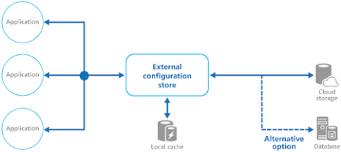

Open up the ConfigServerApplication class and activate the discovery client and the configuration server by using the following annotation.
```java
@SpringBootApplication
@EnableConfigServer
@EnableDiscoveryClient
public class ConfigServerApplication {

}
```
Remove the application.properties file and create a new application.yml file with the following content.
```yaml
server.port: 8001

spring:
  application.name: config-server
  cloud.config.server.git.uri: 
   https://github.com/alejandro-du/vaadin-microservices-demo-config.git

eureka:
  client:
    serviceUrl:
      defaultZone: http://localhost:7001/eureka/
    registryFetchIntervalSeconds: 1
  instance:
    leaseRenewalIntervalInSeconds: 1

```

This sets the port (8001) and name (config-server) of the application, as well as the URI 
Spring Cloud Config should use to read the configuration from. On GitHub, we have a Git 
repository. The configuration files for all of the example application's microservices can 
be found in this repository. The admin-applicationmicroservic uses the admin-application.yml 
file, for example.

## Consumer-Driven Contract Tracing

### 10. Consumer-Driven Contract Tracing
When a team is constructing multiple related services at the same time as part of a modernization effort, and your team knows the “domain language” of the bounded context but not the individual properties of each aggregate and event payload, the consumer driven contracts approach may be effective. 
It ensures that Microservices can interact with each other correctly by focusing on contracts or agreements between clients and service providers.  
In short, Consumer Driven Contract Tracing is an effective strategy for independent Microservice development and finding integration issues earlier. 

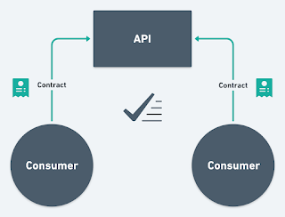

This microservice pattern is useful in legacy application which contains a large data model and existing service surface area. This design patterns will address the following issues,
1. How can you add to an API without breaking downstream clients. 
2. How to find out who is using their service.
3. How to make short release cycles with the continuous delivery.

In an event driven architecture, many microservices expose two kinds of API's, 
 1. RESTful API over HTTP 
 2. HTTP and a message-based API The RESTful API allows for synchronous integration with these services as well as extensive querying capabilities for services that have received events from a service. 
In summary, a consumer-driven approach is sometimes used when breaking down a monolithic legacy
application.

</details>

### **Questions & Answers:**

<details>
<summary style="color:blue;"><b>1. Can you explain the core principles of microservices architecture and how it differs from a monolithic architecture?</b></summary>

**Answer:**
Microservices architecture breaks down an application into small, independent services that are loosely coupled and can be developed, deployed, and scaled independently. Each service typically handles a specific business function and communicates with other services via APIs.

**Key Differences from Monolithic Architecture:**
- **Modularity:** Microservices are modular and can be developed and deployed independently, whereas monolithic applications are tightly coupled, making them harder to manage and scale.
- **Scalability:** Microservices allow individual components to be scaled independently based on their needs, while in a monolithic architecture, scaling requires scaling the entire application.
- **Development Speed:** Microservices enable teams to work on different services simultaneously, potentially speeding up development, while monolithic applications often require coordination across the whole codebase.
- **Technology Diversity:** Different microservices can use different technologies and languages, whereas monolithic applications are usually built with a single technology stack.


Certainly! Understanding the core principles of microservices architecture and how it differs from a monolithic architecture is crucial for building scalable and maintainable systems. Let’s break down these concepts and explore them with a real-time example.

### Core Principles of Microservices Architecture

1. **Single Responsibility Principle:**
   - Each microservice is designed to perform a specific function or domain within the system. It focuses on a single responsibility, which makes it easier to understand, develop, test, and deploy.

2. **Autonomy:**
   - Microservices operate independently of one another. They can be developed, deployed, and scaled individually, which allows teams to work on different services simultaneously without affecting others.

3. **Decentralized Data Management:**
   - Each microservice manages its own data. This means that services are responsible for their own databases or storage mechanisms, leading to a more decentralized approach to data management.

4. **Inter-Service Communication:**
   - Microservices communicate with each other through APIs (usually HTTP/REST or gRPC) or messaging queues. This communication should be loosely coupled, meaning changes in one service should not drastically impact others.

5. **Technology Agnosticism:**
   - Microservices can be implemented using different technologies, languages, or frameworks as long as they adhere to the communication protocols and standards. This allows teams to choose the best tools for their specific needs.

6. **Resilience and Fault Tolerance:**
   - The architecture is designed to handle failures gracefully. If one microservice fails, it does not bring down the entire system. Mechanisms like circuit breakers, retries, and failover strategies are used to maintain system stability.

7. **Scalability:**
   - Microservices can be scaled independently based on demand. If a particular service experiences high load, it can be scaled without scaling the entire application.

8. **Continuous Deployment:**
   - Microservices support continuous integration and continuous deployment (CI/CD) practices, enabling frequent and reliable releases of new features or fixes.

### Differences from Monolithic Architecture

**1. **Structure:**
   - **Monolithic Architecture:** All components of the application are tightly integrated and run as a single unit. Typically, a monolithic application is built as a single executable or deployment package.
   - **Microservices Architecture:** The application is divided into multiple small, independent services. Each service is developed, deployed, and scaled separately.

**2. **Development:**
   - **Monolithic Architecture:** Development is often done in a single codebase, which can become complex and difficult to manage as the application grows.
   - **Microservices Architecture:** Each microservice has its own codebase and repository, making it easier to manage and deploy changes independently.

**3. **Deployment:**
   - **Monolithic Architecture:** The entire application must be deployed at once. Any change requires redeploying the entire system.
   - **Microservices Architecture:** Individual services can be deployed independently. This allows for more frequent and smaller updates.

**4. **Scaling:**
   - **Monolithic Architecture:** Scaling requires scaling the entire application, even if only a specific part of it needs more resources.
   - **Microservices Architecture:** Services can be scaled independently based on their specific needs, optimizing resource utilization.

**5. **Fault Isolation:**
   - **Monolithic Architecture:** A failure in one part of the application can potentially bring down the entire system.
   - **Microservices Architecture:** Failures are isolated to individual services. Other services can continue to function even if one service fails.

**6. **Technology Stack:**
   - **Monolithic Architecture:** The entire application typically uses a single technology stack.
   - **Microservices Architecture:** Different services can use different technologies and frameworks, chosen based on their specific requirements.

### Real-Time Example: E-Commerce Platform

**Monolithic Architecture Example:**

In a traditional monolithic e-commerce application, the system might have a single codebase handling user authentication, product management, order processing, payment, and inventory management. This monolithic application is deployed as one unit, and scaling requires replicating the entire application. If a bug occurs in the payment module, it could potentially affect the entire application.

**Microservices Architecture Example:**

In a microservices-based e-commerce platform, the system is broken down into multiple services:

1. **User Service:** Manages user authentication and profile information.
2. **Product Service:** Handles product listings, details, and catalog management.
3. **Order Service:** Manages order creation, processing, and status.
4. **Payment Service:** Handles payment processing and transactions.
5. **Inventory Service:** Manages stock levels and inventory.

Each service communicates via APIs or messaging queues. If the payment service experiences high load, it can be scaled independently of other services. If a bug is found in the order service, only that service needs to be updated or redeployed, without affecting the rest of the system. Additionally, different services can use different technology stacks suited to their specific needs.

### Summary

- **Microservices Architecture:** Breaks down the application into smaller, independent services that can be developed, deployed, and scaled independently. It supports resilience, scalability, and technology diversity but requires careful management of inter-service communication and data consistency.
  
- **Monolithic Architecture:** Uses a single codebase and deployment unit, making it simpler to develop and deploy initially but harder to scale, update, and manage as the application grows.

By adopting microservices, organizations can improve their ability to innovate quickly, handle complex applications more effectively, and maintain higher levels of system availability and performance.

---
</details>
<details>
<summary><b>2. Describe your experience with creating a streaming data pipeline using Kafka. What are the key considerations when designing such a pipeline?</b></summary>

**Answer:**
In my experience with Kafka, I've implemented streaming data pipelines that handle real-time data ingestion, processing, and delivery. The key considerations for designing a Kafka-based streaming data pipeline include:

- **Topic Design:** Properly design topics based on data types and consumer needs to ensure efficient data processing and retrieval.
- **Partitioning:** Use partitioning to enable parallel processing and ensure high throughput. The number of partitions should be based on the volume of data and the need for parallelism.
- **Replication:** Configure replication to ensure fault tolerance and high availability. Ensure that replication factors are set to meet the desired level of durability.
- **Consumer Groups:** Use consumer groups to distribute the workload and achieve horizontal scaling. Ensure proper handling of offsets to avoid data loss or duplication.
- **Data Schema:** Implement a consistent schema for data to ensure compatibility and ease of processing across different services.
- **Error Handling:** Design mechanisms for handling errors and retries to ensure reliability and robustness of the pipeline.


Creating a streaming data pipeline using Apache Kafka involves several key steps and considerations to ensure it meets the needs of your application. Below, I'll describe my experience and highlight the key considerations when designing a Kafka-based streaming data pipeline.

### Experience with Creating a Streaming Data Pipeline Using Kafka

**1. **Understanding Requirements:**
   - **Problem Definition:** Determine the problem you are solving with streaming data, such as real-time analytics, monitoring, or event-driven architecture.
   - **Data Sources:** Identify and assess the sources of streaming data (e.g., logs, sensors, transactions).

**2. **Designing the Pipeline:**
   - **Kafka Topics:** Define Kafka topics based on the logical data boundaries. For example, separate topics for different types of events or logs.
   - **Data Producers:** Implement producers that push data into Kafka topics. These could be applications, data ingestion services, or other data sources.
   - **Data Consumers:** Develop consumers that read from Kafka topics and process the data. This might involve analytics, transformation, or further distribution.

**3. **Implementing Producers:**
   - **Producer Configuration:** Configure producers with proper settings for batching, retries, and acknowledgments to balance performance and reliability.
   - **Serialization:** Choose appropriate serialization formats (e.g., JSON, Avro, Protobuf) and implement serialization logic.

**4. **Implementing Consumers:**
   - **Consumer Configuration:** Configure consumers for appropriate settings related to offset management, auto-commit, and concurrency.
   - **Deserialization:** Implement deserialization logic to convert messages from Kafka into application-specific formats.

**5. **Processing Streams:**
   - **Stream Processing Frameworks:** Use frameworks like Kafka Streams or Apache Flink for complex transformations and aggregations.
   - **Stateless vs. Stateful Processing:** Determine whether processing needs to maintain state (e.g., maintaining a count of events) or can be stateless.

**6. **Monitoring and Management:**
   - **Monitoring Tools:** Use tools like Confluent Control Center, Prometheus, and Grafana to monitor Kafka metrics, consumer lag, and throughput.
   - **Error Handling:** Implement robust error handling and alerting mechanisms to handle issues like message reprocessing, failed transformations, or system downtime.

**7. **Scaling and Optimization:**
   - **Partitioning:** Design topics with an appropriate number of partitions to handle the volume of data and ensure load balancing.
   - **Replication:** Configure replication to ensure data durability and high availability.
   - **Resource Allocation:** Allocate adequate resources for Kafka brokers, Zookeeper nodes, and other components to handle expected workloads.

**8. **Security and Compliance:**
   - **Authentication and Authorization:** Implement security measures such as SASL/SSL for authentication and access control lists (ACLs) for authorization.
   - **Data Encryption:** Ensure data is encrypted both in transit and at rest to meet compliance requirements.

### Key Considerations When Designing a Kafka-based Streaming Data Pipeline

1. **Data Volume and Velocity:**
   - **Throughput Requirements:** Estimate the volume of data and message rate to design appropriate Kafka cluster capacity and configurations.
   - **Latency:** Ensure the pipeline meets latency requirements for real-time or near-real-time processing.

2. **Fault Tolerance and Reliability:**
   - **Replication Factor:** Configure an appropriate replication factor to ensure data is replicated across multiple brokers for fault tolerance.
   - **Consumer Offsets:** Implement reliable offset management to ensure no data is lost or processed multiple times.

3. **Scalability:**
   - **Partitioning Strategy:** Design topics with a sufficient number of partitions to distribute load and improve parallelism.
   - **Dynamic Scaling:** Consider how the pipeline can scale dynamically in response to changing data volumes.

4. **Schema Evolution:**
   - **Data Formats:** Use schema registry tools to manage and evolve data schemas over time, ensuring backward and forward compatibility.
   - **Versioning:** Implement versioning strategies for schema changes to avoid data processing issues.

5. **Performance Optimization:**
   - **Batching and Compression:** Use batching and compression techniques to optimize network and storage usage.
   - **Consumer Tuning:** Fine-tune consumer configurations such as fetch sizes, number of threads, and commit intervals.

6. **Operational Management:**
   - **Monitoring:** Set up comprehensive monitoring and alerting to track Kafka performance metrics and operational health.
   - **Logging:** Ensure detailed logging for both producers and consumers to facilitate debugging and performance tuning.

7. **Security:**
   - **Access Controls:** Implement strict access controls and encryption to secure data in transit and at rest.
   - **Audit Logs:** Maintain audit logs for tracking access and changes to Kafka topics and configurations.

### Example Scenario

Suppose you are building a streaming data pipeline for a real-time fraud detection system in a financial application:

1. **Data Sources:** Transaction data from multiple financial systems.
2. **Topics:** Separate Kafka topics for transaction events, fraud alerts, and transaction metadata.
3. **Producers:** Financial systems send transaction data to Kafka topics.
4. **Consumers:** A fraud detection service processes transactions to detect anomalies and generates alerts.
5. **Processing:** Use Kafka Streams to apply real-time fraud detection algorithms and enrich transaction data.
6. **Monitoring:** Use Prometheus and Grafana to monitor Kafka metrics and system health.
7. **Scaling:** Configure topics with multiple partitions and scale Kafka brokers as needed.

By carefully designing and managing each component of the Kafka-based streaming data pipeline, you can build a robust, scalable, and efficient system to handle real-time data processing needs.

---

</details>
<details>
<summary><b>3. How do you implement and manage CI/CD pipelines in your projects? What tools and practices do you use?</b></summary>
   
**Answer:**
In my projects, I implement CI/CD pipelines to automate the build, test, and deployment processes. The tools and practices I use include:

- **CI/CD Tools:** Jenkins, GitLab CI, or GitHub Actions for orchestrating the CI/CD processes.
- **Version Control Integration:** Integrate with version control systems (e.g., Git) to trigger builds on code commits.
- **Automated Testing:** Incorporate unit, integration, and end-to-end tests to ensure code quality before deployment.
- **Build Automation:** Use build tools like Maven or Gradle to automate the build process.
- **Deployment Automation:** Deploy applications using tools like Docker, Kubernetes, or cloud-native solutions such as AWS CodeDeploy.
- **Configuration Management:** Use configuration management tools like Ansible or Terraform for environment setup and management.
- **Monitoring and Alerts:** Implement monitoring and alerting to track the health of deployments and quickly address issues.

---

</details>
<details>
<summary><b>4. Explain the key concepts of Spring Boot and how it facilitates microservices development.</b></summary>
   
**Answer:**
Spring Boot simplifies the development of Spring-based applications by providing:

- **Auto-Configuration:** Automatically configures Spring application context based on the dependencies in the classpath, reducing boilerplate configuration.
- **Standalone Applications:** Allows creating standalone applications that can be run independently with an embedded server (e.g., Tomcat, Jetty).
- **Production-Ready Features:** Provides features such as health checks, metrics, and application monitoring out-of-the-box.
- **Spring Initializr:** A web-based tool to generate Spring Boot projects with pre-configured dependencies.
- **Microservices Support:** Facilitates the development of microservices with support for building RESTful APIs, integrating with databases, and configuring service discovery and load balancing (e.g., via Spring Cloud).

---

</details>
<details>
<summary><b>5. Can you discuss your approach to handling multi-threading and concurrency issues in Java applications?</b></summary>
   
**Answer:**
Handling multi-threading and concurrency in Java involves understanding and using various concurrency utilities provided by the Java standard library. My approach includes:

- **Using Concurrent Collections:** Utilize thread-safe collections like `ConcurrentHashMap` and `CopyOnWriteArrayList` to manage shared data.
- **Executor Framework:** Use `ExecutorService` to manage and control thread pools and task execution, avoiding manual thread management.
- **Synchronization:** Apply synchronization techniques (e.g., `synchronized` blocks or methods) to protect shared resources and avoid race conditions.
- **Locks and Conditions:** Use `ReentrantLock` and `Condition` objects for more fine-grained control over thread synchronization compared to synchronized blocks.
- **Avoiding Deadlocks:** Be cautious of potential deadlocks by ensuring proper ordering of lock acquisitions and avoiding nested locks.
- **Atomic Operations:** Use `AtomicInteger`, `AtomicLong`, and other atomic classes to perform lock-free thread-safe operations on single variables.

Avoiding deadlocks is crucial in concurrent programming to ensure that your application remains responsive and performs well. Deadlocks occur when two or more threads are each waiting for resources held by the other threads, causing all of them to be stuck indefinitely. Here are strategies and techniques to help avoid deadlocks:

### 1. **Avoid Nested Locks**

**Problem:** Nested locks (locking a resource while holding another lock) can easily lead to deadlocks if not managed carefully.

**Solution:** Try to avoid acquiring multiple locks simultaneously. If you must use multiple locks, ensure that all threads acquire them in the same global order. This ordering can prevent cyclic dependencies.

**Example:**

```java
public class DeadlockAvoidance {
    private final Object lock1 = new Object();
    private final Object lock2 = new Object();

    public void method1() {
        synchronized (lock1) {
            // Critical section for lock1
            synchronized (lock2) {
                // Critical section for lock2
            }
        }
    }

    public void method2() {
        synchronized (lock1) {
            // Critical section for lock1
            synchronized (lock2) {
                // Critical section for lock2
            }
        }
    }
}
```

### 2. **Use Try-Lock with Timeout**

**Problem:** Traditional locking mechanisms don't have a timeout, which means threads can be blocked indefinitely.

**Solution:** Use a `tryLock` with a timeout (available in `java.util.concurrent.locks.Lock`) to attempt to acquire the lock within a given time frame. If the lock cannot be acquired in time, the thread can perform other tasks or retry.

**Example:**

```java
import java.util.concurrent.locks.Lock;
import java.util.concurrent.locks.ReentrantLock;
import java.util.concurrent.TimeUnit;

public class TryLockExample {
    private final Lock lock1 = new ReentrantLock();
    private final Lock lock2 = new ReentrantLock();

    public void method() {
        try {
            if (lock1.tryLock(1000, TimeUnit.MILLISECONDS)) {
                try {
                    if (lock2.tryLock(1000, TimeUnit.MILLISECONDS)) {
                        try {
                            // Critical section
                        } finally {
                            lock2.unlock();
                        }
                    }
                } finally {
                    lock1.unlock();
                }
            }
        } catch (InterruptedException e) {
            // Handle interruption
        }
    }
}
```

### 3. **Use Lock Ordering**

**Problem:** Deadlocks can occur when locks are acquired in different orders.

**Solution:** Always acquire locks in a consistent order. Define a global ordering for locks and ensure that every thread acquires them in this order.

**Example:**

```java
public class LockOrdering {
    private final Object lock1 = new Object();
    private final Object lock2 = new Object();

    private void acquireLocks() {
        synchronized (lock1) {
            synchronized (lock2) {
                // Critical section
            }
        }
    }

    private void method1() {
        acquireLocks();
    }

    private void method2() {
        acquireLocks();
    }
}
```

### 4. **Use Higher-Level Concurrency Utilities**

**Problem:** Low-level locking mechanisms are more prone to deadlock issues.

**Solution:** Use higher-level concurrency utilities from `java.util.concurrent` package like `ExecutorService`, `Semaphore`, `CountDownLatch`, or `CyclicBarrier` that manage synchronization for you and can help avoid deadlocks.

**Example:**

```java
import java.util.concurrent.ExecutorService;
import java.util.concurrent.Executors;

public class ConcurrencyUtilities {
    private final ExecutorService executor = Executors.newFixedThreadPool(2);

    public void executeTasks() {
        executor.submit(() -> {
            // Task 1
        });
        executor.submit(() -> {
            // Task 2
        });
    }
}
```

### 5. **Use Immutable Objects**

**Problem:** Mutable objects can be shared and modified by multiple threads, increasing the risk of deadlocks.

**Solution:** Use immutable objects where possible. Immutable objects are inherently thread-safe and don't require synchronization.

**Example:**

```java
public final class ImmutableClass {
    private final int value;

    public ImmutableClass(int value) {
        this.value = value;
    }

    public int getValue() {
        return value;
    }
}
```

### 6. **Detect Deadlocks**

**Problem:** If deadlocks occur, it is essential to detect them to understand and resolve the issue.

**Solution:** Use tools and techniques to detect deadlocks. For Java, you can use JVisualVM, JConsole, or other profiling tools to detect deadlocks. The JVM also provides options to detect and log deadlocks.

**Example:**

To detect deadlocks programmatically:

```java
import java.lang.management.ManagementFactory;
import java.lang.management.ThreadMXBean;
import java.lang.management.ThreadInfo;

public class DeadlockDetector {
    public static void main(String[] args) {
        ThreadMXBean threadMXBean = ManagementFactory.getThreadMXBean();
        long[] deadlockedThreads = threadMXBean.findDeadlockedThreads();

        if (deadlockedThreads != null) {
            ThreadInfo[] threadInfos = threadMXBean.getThreadInfo(deadlockedThreads);
            for (ThreadInfo threadInfo : threadInfos) {
                System.out.println("Deadlocked Thread: " + threadInfo.getThreadName());
            }
        } else {
            System.out.println("No deadlocked threads detected.");
        }
    }
}
```

### Summary

1. **Avoid Nested Locks**: Minimize the use of nested locks and ensure locks are acquired in a consistent global order.
2. **Use Try-Lock with Timeout**: Apply `tryLock` with a timeout to avoid indefinite blocking.
3. **Use Lock Ordering**: Always acquire locks in a predetermined order.
4. **Use Higher-Level Concurrency Utilities**: Leverage utilities like `ExecutorService` to manage synchronization.
5. **Use Immutable Objects**: Prefer immutable objects to reduce the need for synchronization.
6. **Detect Deadlocks**: Use tools and JVM features to detect and analyze deadlocks.

Applying these strategies can help you design and implement concurrent systems that are less prone to deadlocks and more robust overall.

---

</details>
<details>
<summary><b>6. What are some best practices for designing RESTful APIs, and how do you ensure that they are both effective and efficient?</b></summary>
   
**Answer:**
Best practices for designing RESTful APIs include:

- **Resource-Oriented Design:** Focus on resources (e.g., `/users`, `/orders`) and use HTTP methods (GET, POST, PUT, DELETE) to represent actions on these resources.
- **Statelessness:** Ensure that each API request contains all necessary information for processing, and avoid maintaining server-side state between requests.
- **Use of HTTP Status Codes:** Return appropriate HTTP status codes to indicate the result of the request (e.g., 200 OK, 201 Created, 404 Not Found).
- **Versioning:** Include versioning in the API (e.g., `/api/v1/resources`) to handle changes and backward compatibility.
- **Pagination and Filtering:** Implement pagination and filtering for endpoints that return large datasets to improve performance and usability.
- **Documentation:** Provide clear and comprehensive API documentation (e.g., using Swagger/OpenAPI) to help consumers understand and use the API effectively.
- **Security:** Implement security measures such as authentication (OAuth, JWT) and authorization to protect sensitive data and operations.

---

</details>
<details>
<summary><b>7. How do you approach performance tuning in a Java application? What tools and techniques do you use?</b></summary>
   
**Answer:**
Performance tuning in Java involves identifying and resolving performance bottlenecks. My approach includes:

- **Profiling:** Use profiling tools (e.g., VisualVM, JProfiler) to identify performance issues and hotspots in the code.
- **Heap Dump Analysis:** Analyze heap dumps to detect memory leaks and inefficient memory usage using tools like Eclipse MAT.
- **Monitoring:** Implement application monitoring and logging (e.g., using ELK stack) to track performance metrics and identify anomalies.
- **Code Optimization:** Refactor code to improve efficiency, reduce complexity, and optimize algorithms and data structures.
- **Concurrency Optimization:** Tune thread pool sizes and use concurrent data structures to improve multi-threading performance.
- **Caching:** Implement caching strategies (e.g., using Ehcache, Redis) to reduce redundant computations and database access.

---

</details>
<details>
<summary><b>8. Describe your experience with Agile development and Scrum. How do you ensure successful implementation in a team?</b></summary>

**Answer:**
My experience with Agile and Scrum includes:

- **Sprint Planning:** Participate in sprint planning meetings to define and prioritize user stories and tasks for the upcoming sprint.
- **Daily Stand-ups:** Facilitate or attend daily stand-ups to track progress, address roadblocks, and ensure team alignment.
- **Retrospectives:** Conduct retrospectives at the end of each sprint to review performance, discuss what went well, and identify areas for improvement.
- **Backlog Management:** Maintain and refine the product backlog to ensure that it reflects current priorities and project needs.
- **Collaboration:** Foster a collaborative environment where team members can share knowledge, work together, and address challenges proactively.

---

</details>
<details>
<summary><b>9. Can you provide an example of a challenging problem you solved in a distributed system?</b></summary>

**Answer:**
One challenging problem I encountered was managing data consistency in a distributed microservices architecture. We had multiple services that needed to update shared data while ensuring eventual consistency.

**Solution:**
- **Event Sourcing:** Implemented an event sourcing pattern where changes to the system state were stored as a sequence of events, allowing us to reconstruct the state if needed.
- **CQRS:** Used Command Query Responsibility Segregation (CQRS) to separate read and write operations, improving performance and consistency.
- **Distributed Transactions:** Implemented the Saga pattern to manage distributed transactions across microservices, ensuring that each service could participate in a long-running transaction with compensating actions for rollback.
- **Monitoring and Alerts:** Set up monitoring and alerts to detect and respond to inconsistencies or failures in real-time.

---
</details>


These questions and answers should help prepare for an interview for a Lead Java Engineer position, covering core technical skills and practical experience relevant to the role.
</details>
<details>
<summary><b>8. Hibernate</b></summary>

 ## Hibernate
- [Java Programming Questions and Answers](#java-programming-questions-and-answers)
</details>
<details>
<summary><b>9. Kafka</b></summary>

## Kafka
- [K Framework](#java-programming-questions-and-answers)
- [Spring Framework Questions and Answers](#java-programming-questions-and-answers)
</details>
<details>
<summary><b>10. Docker</b></summary>

## Docker
- [Spring Framework](#java-programming-questions-and-answers)
- [Spring Framework Questions and Answers](#java-programming-questions-and-answers)
</details>
<details>
<summary><b>11. Kubernetes</b></summary>

## Kubernetes
- [Spring Framework](#java-programming-questions-and-answers)
- [Spring Framework Questions and Answers](#java-programming-questions-and-answers)
</details>
<details>
<summary><b>12. Caching</b></summary>

## Caching
- [Spring Framework](#java-programming-questions-and-answers)
- [Spring Framework Questions and Answers](#java-programming-questions-and-answers)
</details>
<details>
<summary><b>13. SQL & NO SQL Database</b></summary>

## SQL
- [Spring Framework](#java-programming-questions-and-answers)
- [Spring Framework Questions and Answers](#java-programming-questions-and-answers)

## NO SQL
- [Spring Framework](#java-programming-questions-and-answers)
- [Spring Framework Questions and Answers](#java-programming-questions-and-answers)
</details>
<details>
<summary><b>14. Mongo DB</b></summary>

## Mongo DB
- [Spring Framework](#java-programming-questions-and-answers)
- [Spring Framework Questions and Answers](#java-programming-questions-and-answers)
</details>
<details>
<summary><b>15. Angular</b></summary>

## Angular
- [Spring Framework](#java-programming-questions-and-answers)
- [Spring Framework Questions and Answers](#java-programming-questions-and-answers)
</details>
<details>
<summary><b>16. React JS</b></summary>

## React JS
- [Spring Framework](#java-programming-questions-and-answers)
- [Spring Framework Questions and Answers](#java-programming-questions-and-answers)
</details>

-------

# Interview Questions & Answers

### Table of Contents

<details>
<summary>
Hide/Show table of contents
</summary>
    
<details>
<summary><b>Thread synchronization</b></summary>
    
In Java, you can achieve this using two threads where one thread prints even numbers and the other thread prints odd numbers. You can use synchronization to ensure that the numbers are printed in order.

Here's a simple Java program demonstrating this:

```java
public class EvenOddPrinter {

    private static final int MAX = 20; // Define the maximum number to print
    private static int number = 1; // Start from 1
    private static final Object lock = new Object(); // Lock object for synchronization

    public static void main(String[] args) {
        Thread evenThread = new Thread(new EvenPrinter());
        Thread oddThread = new Thread(new OddPrinter());

        evenThread.start();
        oddThread.start();
    }

    static class EvenPrinter implements Runnable {
        @Override
        public void run() {
            while (number <= MAX) {
                synchronized (lock) {
                    if (number % 2 == 0) {
                        System.out.println("Even: " + number);
                        number++;
                        lock.notify(); // Notify the other thread
                    } else {
                        try {
                            lock.wait(); // Wait for the odd thread to notify
                        } catch (InterruptedException e) {
                            Thread.currentThread().interrupt();
                        }
                    }
                }
            }
        }
    }

    static class OddPrinter implements Runnable {
        @Override
        public void run() {
            while (number <= MAX) {
                synchronized (lock) {
                    if (number % 2 != 0) {
                        System.out.println("Odd: " + number);
                        number++;
                        lock.notify(); // Notify the other thread
                    } else {
                        try {
                            lock.wait(); // Wait for the even thread to notify
                        } catch (InterruptedException e) {
                            Thread.currentThread().interrupt();
                        }
                    }
                }
            }
        }
    }
}
```

### Explanation

1. **Shared Variables and Lock:**
   - `number`: A static variable shared between threads to keep track of the current number to print.
   - `lock`: An object used to synchronize access to the `number` variable and ensure threads alternate properly.

2. **EvenPrinter and OddPrinter:**
   - Each thread (one for even numbers and one for odd numbers) checks the current value of `number`.
   - The thread prints the number if it matches its type (even or odd).
   - After printing, it increments `number` and then calls `lock.notify()` to wake up the other thread waiting on the `lock`.
   - If the condition for printing isn’t met, the thread waits using `lock.wait()`.

3. **Synchronization:**
   - The `synchronized` block ensures that only one thread can check and modify the `number` at a time.
   - `notify()` is called after updating `number` to signal the waiting thread to check again.
   - `wait()` is used to pause the thread until it's notified by the other thread.

This program will produce an output of alternating even and odd numbers in ascending order up to the maximum value defined.


In Java, "serializing" a thread typically means ensuring that threads run in a specific sequence or order. This is not about Java serialization (which deals with converting an object's state to a byte stream for persistence or network transmission), but rather about controlling the execution order of threads. 

Here’s how you can control or serialize threads in Java:

### Using `join()`

One way to serialize the execution of threads is by using the `join()` method. This method allows one thread to wait for the completion of another thread before continuing its execution.

Here is an example where threads are executed in sequence using `join()`:

```java
public class ThreadSerialization {

    public static void main(String[] args) {
        Thread thread1 = new Thread(new Task("Task 1"));
        Thread thread2 = new Thread(new Task("Task 2"));
        Thread thread3 = new Thread(new Task("Task 3"));

        try {
            thread1.start();
            thread1.join(); // Wait for thread1 to finish

            thread2.start();
            thread2.join(); // Wait for thread2 to finish

            thread3.start();
            thread3.join(); // Wait for thread3 to finish

        } catch (InterruptedException e) {
            Thread.currentThread().interrupt();
            System.out.println("Main thread interrupted");
        }
    }

    static class Task implements Runnable {
        private final String taskName;

        Task(String taskName) {
            this.taskName = taskName;
        }

        @Override
        public void run() {
            System.out.println(taskName + " is running");
            try {
                Thread.sleep(1000); // Simulate work
            } catch (InterruptedException e) {
                Thread.currentThread().interrupt();
                System.out.println(taskName + " interrupted");
            }
            System.out.println(taskName + " is done");
        }
    }
}
```

### Using Synchronization and Condition Variables

For more complex scenarios where you need finer control over the sequence of operations, you can use synchronization combined with condition variables. Here's an example of how you can use `Condition` objects from the `java.util.concurrent.locks` package to serialize threads:

```java
import java.util.concurrent.locks.Condition;
import java.util.concurrent.locks.Lock;
import java.util.concurrent.locks.ReentrantLock;

public class SerializedThreads {

    private static final Lock lock = new ReentrantLock();
    private static final Condition condition = lock.newCondition();
    private static int step = 1;

    public static void main(String[] args) {
        Thread thread1 = new Thread(new Task(1));
        Thread thread2 = new Thread(new Task(2));
        Thread thread3 = new Thread(new Task(3));

        thread1.start();
        thread2.start();
        thread3.start();
    }

    static class Task implements Runnable {
        private final int taskNumber;

        Task(int taskNumber) {
            this.taskNumber = taskNumber;
        }

        @Override
        public void run() {
            lock.lock();
            try {
                while (step != taskNumber) {
                    condition.await(); // Wait for the right step
                }
                System.out.println("Task " + taskNumber + " is running");
                Thread.sleep(1000); // Simulate work
                System.out.println("Task " + taskNumber + " is done");
                step++; // Move to the next step
                condition.signalAll(); // Notify all waiting threads
            } catch (InterruptedException e) {
                Thread.currentThread().interrupt();
                System.out.println("Task " + taskNumber + " interrupted");
            } finally {
                lock.unlock();
            }
        }
    }
}
```

### Explanation:

- **Using `join()`:** Ensures that threads are executed in the order they are started. The main thread waits for each thread to complete before starting the next one.

- **Using `Condition`:** Allows for more complex control. Threads wait for a specific condition (e.g., `step` variable) to be met before proceeding. After completing their task, they update the condition and notify other waiting threads.

These methods let you control the execution flow of threads, ensuring they run in a specific order or sequence.

In Java, the `Condition` interface is part of the `java.util.concurrent.locks` package and provides a way for threads to communicate with each other about state changes. It's used with `Lock` objects to allow threads to wait for certain conditions to be met before proceeding.

### Understanding `Condition`

The `Condition` interface provides a mechanism for thread coordination and signaling. It is typically used in conjunction with explicit `Lock` implementations such as `ReentrantLock`. Here’s a breakdown of its role and usage:

1. **Purpose:**
   - **Thread Communication:** `Condition` allows threads to wait until a specific condition is true, and then be notified when the condition changes. This is useful in scenarios where threads need to wait for certain conditions to be met before proceeding.

2. **Methods:**
   - **`await()`:** Causes the current thread to wait until it is signaled by another thread or interrupted. It releases the associated lock while waiting and reacquires it before returning.
   - **`signal()`:** Wakes up one of the threads that are waiting on this `Condition`. It does not immediately release the lock.
   - **`signalAll()`:** Wakes up all threads that are waiting on this `Condition`. Similar to `signal()`, it does not immediately release the lock.

3. **Typical Usage:**
   - `Condition` is used in scenarios where you have multiple threads needing to coordinate based on shared state. For example, it can be used in producer-consumer problems where a consumer must wait until there is something to consume and a producer must notify consumers when new items are available.

### Example

Here’s a simplified example to demonstrate how `Condition` is used in conjunction with `ReentrantLock`:

```java
import java.util.concurrent.locks.Condition;
import java.util.concurrent.locks.Lock;
import java.util.concurrent.locks.ReentrantLock;

public class ConditionExample {
    private final Lock lock = new ReentrantLock();
    private final Condition condition = lock.newCondition();
    private boolean conditionMet = false;

    public void waitingThread() {
        lock.lock();
        try {
            while (!conditionMet) {
                System.out.println("Waiting for condition to be met...");
                condition.await();  // Wait until the condition is signaled
            }
            System.out.println("Condition met! Proceeding...");
        } catch (InterruptedException e) {
            Thread.currentThread().interrupt(); // Restore interrupted status
        } finally {
            lock.unlock();
        }
    }

    public void signalingThread() {
        lock.lock();
        try {
            System.out.println("Setting condition and signaling...");
            conditionMet = true;
            condition.signal(); // Notify one waiting thread
        } finally {
            lock.unlock();
        }
    }

    public static void main(String[] args) {
        ConditionExample example = new ConditionExample();

        Thread t1 = new Thread(example::waitingThread);
        Thread t2 = new Thread(example::signalingThread);

        t1.start();
        t2.start();
    }
}
```

### Explanation of the Example:

1. **Setup:**
   - A `ReentrantLock` instance and a `Condition` instance are created.
   - The `condition` object is associated with the `lock`.

2. **Waiting Thread:**
   - The `waitingThread` method acquires the lock and then calls `condition.await()` to wait until `conditionMet` is `true`. It releases the lock while waiting and reacquires it upon being signaled.

3. **Signaling Thread:**
   - The `signalingThread` method acquires the lock, sets `conditionMet` to `true`, and calls `condition.signal()` to wake up one waiting thread.

4. **Running the Example:**
   - The `waitingThread` starts and waits for the condition.
   - The `signalingThread` starts and signals the condition, waking up the waiting thread.

### Summary

- **`Condition` Interface:** Provides methods to wait for conditions and signal other threads.
- **Usage with `Lock`:** Used to coordinate between threads by waiting for and signaling conditions.
- **Methods:** `await()`, `signal()`, and `signalAll()` are key methods for waiting and signaling.

In a multithreaded environment, `Condition` objects help manage complex thread interactions and ensure that threads proceed based on specific conditions, providing a more flexible alternative to traditional `synchronized` blocks and methods.
</details>
<details>
<summary><b>REST (Representational State Transfer)</b></summary>
    
Sure! When interviewing for positions involving REST (Representational State Transfer) and APIs, you might encounter a variety of questions that assess your understanding of REST principles, practical experience, and problem-solving skills. Below are some common REST-related interview questions along with brief explanations:

### 1. **What is REST, and what are its key principles?**

**Answer:**
REST (Representational State Transfer) is an architectural style for designing networked applications. It is based on stateless, client-server communication, usually over HTTP. Key principles include:

- **Stateless:** Each request from the client to the server must contain all the information the server needs to fulfill the request. The server does not store any context about the client between requests.
- **Client-Server Architecture:** The client and server are separate entities. The client is responsible for the user interface and user experience, while the server handles the data processing and storage.
- **Uniform Interface:** REST APIs have a uniform and consistent interface. This usually involves standard HTTP methods (GET, POST, PUT, DELETE) and a consistent URL structure.
- **Resource-Based:** Resources (data objects) are identified by URLs, and the operations on these resources are performed using HTTP methods.
- **Stateless Communication:** Each request from the client to the server must be stateless, meaning it contains all the information needed to understand and process the request.

### 2. **What are HTTP methods, and how are they used in RESTful APIs?**

**Answer:**
HTTP methods are used to perform different operations on resources in RESTful APIs:

- **GET:** Retrieve data from the server. It should not modify the resource.
- **POST:** Submit data to the server to create a new resource or perform an action. It may modify or create a resource.
- **PUT:** Update an existing resource or create it if it does not exist. It is idempotent, meaning multiple identical requests should produce the same result.
- **DELETE:** Remove a resource from the server. It is also idempotent.
- **PATCH:** Apply partial modifications to a resource.

### 3. **Explain the concept of statelessness in RESTful services.**

**Answer:**
In RESTful services, statelessness means that each request from the client to the server must contain all the information needed for the server to fulfill the request. The server does not maintain any client context between requests. This ensures that each request can be independently processed, which simplifies server design and allows for better scalability and reliability.

### 4. **What is HATEOAS, and how does it relate to REST?**

**Answer:**
HATEOAS (Hypermedia As The Engine Of Application State) is a constraint of REST that allows clients to interact with an application entirely through the provided hypermedia. In other words, the server provides not just the data but also the possible actions (links) that the client can take. This helps clients navigate the API dynamically based on the current state of the application.

### 5. **How would you handle versioning in a RESTful API?**

**Answer:**
Versioning a RESTful API ensures backward compatibility as the API evolves. Common strategies include:

- **URI Versioning:** Include the version number in the URL path, e.g., `/api/v1/resource`.
- **Query Parameter Versioning:** Pass the version number as a query parameter, e.g., `/api/resource?version=1`.
- **Header Versioning:** Specify the version in HTTP headers, e.g., `Accept: application/vnd.myapi.v1+json`.
- **Media Type Versioning:** Use custom media types to indicate the version, e.g., `application/vnd.myapi.v1+json`.

### 6. **What are some common HTTP status codes used in RESTful APIs and their meanings?**

**Answer:**
- **200 OK:** The request was successful, and the response contains the requested data.
- **201 Created:** A new resource was created successfully.
- **204 No Content:** The request was successful, but there is no content to send in the response.
- **400 Bad Request:** The request could not be understood or was malformed.
- **401 Unauthorized:** Authentication is required and has failed or not been provided.
- **403 Forbidden:** The server understands the request but refuses to authorize it.
- **404 Not Found:** The requested resource could not be found.
- **500 Internal Server Error:** The server encountered an error and could not complete the request.

### 7. **How would you design a RESTful API for a basic resource like a "User"?**

**Answer:**
Designing a RESTful API for a "User" resource might involve:

- **Endpoints:**
  - `GET /users`: Retrieve a list of users.
  - `GET /users/{id}`: Retrieve a specific user by ID.
  - `POST /users`: Create a new user.
  - `PUT /users/{id}`: Update an existing user.
  - `DELETE /users/{id}`: Delete a user.

- **Data Representation:**
  - Define the JSON format for user resources, including fields like `id`, `name`, `email`, etc.

- **Status Codes:**
  - Use appropriate status codes for responses (e.g., 200 OK for successful retrieval, 201 Created for new users, 404 Not Found for non-existent users).

### 8. **What is the difference between REST and SOAP?**

**Answer:**
- **Protocol:** SOAP (Simple Object Access Protocol) is a protocol with strict standards and uses XML for messaging, while REST (Representational State Transfer) is an architectural style that uses standard HTTP methods and can handle multiple formats like JSON and XML.
- **Flexibility:** REST is more flexible and easier to use with web technologies, whereas SOAP is more rigid and suited for enterprise-level applications requiring high security and ACID compliance.
- **Performance:** REST is typically lighter and more performant due to its use of HTTP and lightweight data formats like JSON, whereas SOAP messages can be larger and more complex due to XML and additional SOAP-specific features.

### 9. **How do you ensure the security of a RESTful API?**

**Answer:**
Ensuring API security involves several practices:

- **Authentication:** Use mechanisms like OAuth, JWT (JSON Web Tokens), or API keys to authenticate users.
- **Authorization:** Implement role-based access control (RBAC) to ensure users have permissions for specific actions.
- **HTTPS:** Use HTTPS to encrypt data transmitted between clients and servers.
- **Rate Limiting:** Implement rate limiting to protect against abuse and DDoS attacks.
- **Input Validation:** Validate and sanitize input to prevent injection attacks.
- **Logging and Monitoring:** Keep logs of API access and monitor for suspicious activity.

### 10. **Can you explain how you would handle error handling in a RESTful API?**

**Answer:**
Error handling in RESTful APIs involves:

- **Standard HTTP Status Codes:** Use appropriate status codes (e.g., 400 Bad Request, 404 Not Found) to indicate the nature of the error.
- **Error Response Format:** Provide a consistent error response format, typically including a code, message, and optionally additional details.
- **Logging:** Log errors for diagnostic purposes and to help with debugging.
- **User-friendly Messages:** Provide clear and user-friendly error messages to help clients understand and resolve issues.

These questions cover fundamental and practical aspects of RESTful API design and implementation, which are critical for many software development roles.

Let's dive deeper into each of these security practices for RESTful APIs:

### 1. **Authentication:**

Authentication is the process of verifying the identity of a user or system. In the context of RESTful APIs, this involves confirming that a request comes from a legitimate source. Common mechanisms include:

- **OAuth (Open Authorization):**
  - **Overview:** OAuth is a protocol that allows third-party services to exchange tokens for access to user resources without sharing passwords. It supports authorization flows for web, mobile, and desktop applications.
  - **Components:**
    - **Authorization Server:** Issues access tokens after verifying user credentials.
    - **Resource Server:** Validates the access tokens and provides access to the resource.
    - **Client Application:** Requests access tokens from the authorization server and uses them to access resources on behalf of the user.
    - **Token Types:** 
      - **Access Tokens:** Used to access protected resources.
      - **Refresh Tokens:** Used to obtain new access tokens when the current one expires.
  - **Flow Types:** Authorization Code, Implicit, Resource Owner Password Credentials, Client Credentials.

- **JWT (JSON Web Tokens):**
  - **Overview:** JWT is a compact, URL-safe token format used for securely transmitting information between parties. JWTs are often used as access tokens in OAuth 2.0.
  - **Structure:** Consists of three parts:
    - **Header:** Contains metadata about the token, such as the type (JWT) and signing algorithm.
    - **Payload:** Contains claims or assertions about the user or system, such as user ID and roles.
    - **Signature:** A hash of the header and payload, signed with a secret or private key to ensure integrity and authenticity.
  - **Usage:** Once authenticated, the server issues a JWT to the client, which includes all necessary information to identify and verify the user in subsequent requests.

- **API Keys:**
  - **Overview:** API keys are unique identifiers used to authenticate requests. They are simple to implement but offer less granularity compared to OAuth or JWT.
  - **Usage:** The client includes the API key in the request header or URL. The server validates the key against a known list of authorized keys.

### 2. **Authorization:**

Authorization is the process of determining whether a user has the right to perform a certain action or access specific resources. Common practices include:

- **Role-Based Access Control (RBAC):**
  - **Overview:** RBAC assigns permissions based on user roles rather than individual users. Users are assigned to roles, and roles are assigned specific permissions.
  - **Components:**
    - **Roles:** Define a set of permissions. Examples include Admin, User, and Guest.
    - **Permissions:** Specific actions that can be performed, such as read, write, or delete.
    - **Role Assignments:** Assign roles to users based on their responsibilities.
  - **Implementation:** When a user makes a request, the server checks the user's role and associated permissions to determine if the action is allowed.

- **Attribute-Based Access Control (ABAC):**
  - **Overview:** ABAC uses attributes (e.g., user attributes, resource attributes, environment conditions) to determine access control.
  - **Policies:** Define access rules based on attributes. For example, "Allow access if the user's department attribute matches the resource's department attribute."

### 3. **HTTPS:**

HTTPS (HyperText Transfer Protocol Secure) is an extension of HTTP that provides a secure communication channel over the internet. 

- **Encryption:** HTTPS uses SSL/TLS (Secure Sockets Layer/Transport Layer Security) protocols to encrypt data transmitted between clients and servers. This prevents eavesdropping and tampering.
- **TLS Handshake:** Establishes a secure connection through a process that includes negotiating encryption algorithms and exchanging certificates.
- **Certificates:** HTTPS uses SSL/TLS certificates issued by Certificate Authorities (CAs) to verify the server's identity and establish trust.

### 4. **Rate Limiting:**

Rate limiting controls the number of requests a client can make to a server in a given time period. This protects against abuse and helps prevent denial-of-service (DoS) attacks.

- **Methods:**
  - **Fixed Window:** Limits requests based on fixed time windows (e.g., 100 requests per minute).
  - **Sliding Window:** Uses a sliding time window to track requests, allowing more granular control.
  - **Token Bucket:** Allows bursts of traffic up to a certain limit while maintaining a steady flow over time.
  - **Leaky Bucket:** Similar to token bucket but handles burstiness differently.

- **Implementation:** Rate limiting is often implemented at the API gateway level or through middleware in the application server.

### 5. **Input Validation:**

Input validation ensures that incoming data conforms to expected formats and values. This is crucial for preventing security vulnerabilities like SQL injection, XSS (cross-site scripting), and other injection attacks.

- **Techniques:**
  - **Whitelist Validation:** Define acceptable input patterns and reject anything that doesn’t match.
  - **Sanitization:** Clean input data to remove or neutralize potentially harmful content.
  - **Encoding:** Encode data before rendering it in a web page or executing it in a query to prevent injection attacks.

- **Validation Types:**
  - **Format Validation:** Ensure data conforms to expected formats (e.g., email addresses, phone numbers).
  - **Length Validation:** Ensure input data is within acceptable length limits.
  - **Type Validation:** Ensure data matches the expected type (e.g., numeric, string).

### 6. **Logging and Monitoring:**

Logging and monitoring involve tracking API access and performance to detect issues and potential security threats.

- **Logging:**
  - **Types:** Request and response logs, error logs, access logs.
  - **Data:** Log details such as timestamps, client IP addresses, request URLs, and response statuses.
  - **Tools:** Use logging frameworks (e.g., Log4j, SLF4J) or services (e.g., ELK Stack, Splunk).

- **Monitoring:**
  - **Metrics:** Track performance metrics (e.g., request latency, error rates) and usage patterns.
  - **Alerts:** Set up alerts for abnormal patterns or errors (e.g., high error rates, suspicious activity).
  - **Tools:** Use monitoring tools (e.g., Prometheus, Grafana) to visualize and analyze API performance and health.

### Summary

- **Authentication** ensures that users are who they claim to be using methods like OAuth, JWT, or API keys.
- **Authorization** verifies that users have permissions to perform specific actions using mechanisms like RBAC.
- **HTTPS** encrypts data in transit to protect against eavesdropping and tampering.
- **Rate Limiting** controls the number of requests to prevent abuse and mitigate DDoS attacks.
- **Input Validation** checks and sanitizes input to prevent injection attacks and ensure data integrity.
- **Logging and Monitoring** track API access and performance to detect issues and respond to security incidents.

These practices form the foundation of a secure RESTful API and help ensure that your API is robust and resilient against various types of threats and vulnerabilities.

</details>
<details>
<summary><b>How you can track performance metrics</b></summary>

Sure, let's break down how you can track performance metrics, set up alerts, and use monitoring tools like Prometheus and Grafana with coding examples and explanations.

### 1. **Metrics: Track Performance Metrics**

Tracking performance metrics involves collecting data on various aspects of your API’s performance, such as request latency and error rates. This can be done using monitoring libraries and tools that integrate with your application.

#### Example with Spring Boot and Micrometer:

If you are using a Java-based Spring Boot application, you can use Micrometer to collect metrics and export them to a monitoring system like Prometheus.

**Dependencies in `pom.xml`:**
```xml
<dependency>
    <groupId>io.micrometer</groupId>
    <artifactId>micrometer-core</artifactId>
</dependency>
<dependency>
    <groupId>io.micrometer</groupId>
    <artifactId>micrometer-registry-prometheus</artifactId>
</dependency>
```

**Configuration:**
```java
import io.micrometer.core.annotation.Counted;
import io.micrometer.core.annotation.Timed;
import org.springframework.web.bind.annotation.GetMapping;
import org.springframework.web.bind.annotation.RequestMapping;
import org.springframework.web.bind.annotation.RestController;

@RestController
@RequestMapping("/api")
public class ApiController {

    @Timed(value = "api.get.endpoint.timer", description = "Time taken to return a response from GET /api")
    @GetMapping("/endpoint")
    public String getEndpoint() {
        // Simulate some processing
        try {
            Thread.sleep(100); // Simulate latency
        } catch (InterruptedException e) {
            Thread.currentThread().interrupt();
        }
        return "Hello, World!";
    }

    @Counted(value = "api.get.endpoint.counter", description = "Number of times GET /api is called")
    @GetMapping("/endpoint/counted")
    public String getEndpointCounted() {
        // Simulate some processing
        return "Hello, World!";
    }
}
```

In this example:
- `@Timed` collects latency metrics for the endpoint.
- `@Counted` tracks the number of requests made to the endpoint.

**Prometheus Configuration:**
You can expose these metrics to Prometheus by adding the Prometheus endpoint to your Spring Boot application:

**`application.properties`:**
```properties
management.endpoints.web.exposure.include=prometheus
management.endpoint.prometheus.enabled=true
```

**Prometheus Scraping Configuration:**
In your Prometheus configuration file (`prometheus.yml`), add the following scrape configuration:
```yaml
scrape_configs:
  - job_name: 'spring-boot'
    metrics_path: '/actuator/prometheus'
    static_configs:
      - targets: ['localhost:8080']  # Update with your application's host and port
```

### 2. **Alerts: Set Up Alerts**

Setting up alerts involves defining thresholds for your metrics and triggering notifications when these thresholds are breached.

#### Example with Prometheus Alertmanager:

**Prometheus Alerting Rules:**

Create an alerting rules file (`alert.rules.yml`):
```yaml
groups:
- name: example
  rules:
  - alert: HighRequestLatency
    expr: http_server_requests_seconds_sum{method="GET",status="200"} / http_server_requests_seconds_count{method="GET",status="200"} > 0.5
    for: 5m
    labels:
      severity: critical
    annotations:
      summary: "High request latency detected"
      description: "The average latency for GET requests is above 0.5 seconds for the last 5 minutes."
```

**Prometheus Configuration to Load Alerts:**

Update your Prometheus configuration (`prometheus.yml`):
```yaml
rule_files:
  - "alert.rules.yml"
```

**Alertmanager Configuration:**

Set up Alertmanager to handle alerts and send notifications. Create an `alertmanager.yml` configuration file:
```yaml
receivers:
  - name: 'email-alerts'
    email_configs:
      - to: 'alerts@example.com'
        from: 'alertmanager@example.com'
        smtp_smarthost: 'smtp.example.com:587'
        smtp_auth_username: 'username'
        smtp_auth_password: 'password'
        send_resolved: true

route:
  receiver: 'email-alerts'
```

**Starting Prometheus and Alertmanager:**
Make sure Prometheus and Alertmanager are running and properly configured to send alerts based on the rules you defined.

### 3. **Tools: Use Monitoring Tools**

**Prometheus and Grafana:**

Prometheus is used for collecting and storing metrics, while Grafana is used for visualizing them.

#### Setting Up Prometheus:

1. **Download and Run Prometheus:**
   - Download Prometheus from the [official website](https://prometheus.io/download/).
   - Run Prometheus using the command:
     ```sh
     prometheus --config.file=prometheus.yml
     ```

2. **Access Prometheus Web UI:**
   - Open a browser and navigate to `http://localhost:9090` to view and query metrics.

#### Setting Up Grafana:

1. **Download and Run Grafana:**
   - Download Grafana from the [official website](https://grafana.com/grafana/download).
   - Run Grafana using the command:
     ```sh
     ./bin/grafana-server web
     ```

2. **Access Grafana Web UI:**
   - Open a browser and navigate to `http://localhost:3000`.
   - Default credentials are `admin` for both username and password.

3. **Add Prometheus Data Source:**
   - In Grafana, go to `Configuration > Data Sources`.
   - Add Prometheus as a data source with the URL `http://localhost:9090`.

4. **Create Dashboards:**
   - Go to `Create > Dashboard` to create and customize visualizations (graphs, tables) based on the metrics collected by Prometheus.

**Example Grafana Dashboard:**

You can create a dashboard to visualize metrics like request latency and error rates. For instance, you can use the following query to create a graph of request latency:
```promql
rate(http_server_requests_seconds_sum[5m]) / rate(http_server_requests_seconds_count[5m])
```

### Summary

- **Metrics:** Use libraries like Micrometer to instrument your API and collect metrics (e.g., latency, error rates). Configure Prometheus to scrape these metrics.
- **Alerts:** Define alerting rules in Prometheus and use Alertmanager to send notifications based on these rules.
- **Tools:** Use Prometheus for metric collection and Grafana for visualization. Configure Grafana to use Prometheus as a data source and create dashboards to monitor API performance.

This setup provides a robust way to track, visualize, and respond to the performance and health of your API.

</details>
<details>
<summary><b>Rate limiting</b></summary>
    
Rate limiting is an essential technique to protect your API from abuse and mitigate the risk of Distributed Denial of Service (DDoS) attacks by controlling the number of requests a client can make in a given time period. Below, I'll provide examples and configurations for implementing rate limiting in various environments.

### 1. **Rate Limiting in a Spring Boot Application**

In a Spring Boot application, you can use the `bucket4j` library to implement rate limiting. Here's an example of how to configure and apply rate limiting:

**Dependencies in `pom.xml`:**
```xml
<dependency>
    <groupId>io.github.bucket4j</groupId>
    <artifactId>bucket4j-core</artifactId>
    <version>5.1.0</version>
</dependency>
<dependency>
    <groupId>org.springframework.boot</groupId>
    <artifactId>spring-boot-starter-web</artifactId>
</dependency>
```

**Rate Limiting Configuration:**
```java
import io.github.bucket4j.Bucket;
import io.github.bucket4j.BucketConfiguration;
import io.github.bucket4j.Buckets;
import org.springframework.web.bind.annotation.GetMapping;
import org.springframework.web.bind.annotation.RequestMapping;
import org.springframework.web.bind.annotation.RestController;

import javax.servlet.http.HttpServletRequest;
import java.time.Duration;
import java.util.concurrent.atomic.AtomicReference;

@RestController
@RequestMapping("/api")
public class RateLimitedController {

    private final Bucket bucket;

    public RateLimitedController() {
        // Configure the rate limit: 10 requests per minute
        this.bucket = Bucket4j.builder()
                .addLimit(BucketConfiguration.of(Duration.ofMinutes(1), 10))
                .build();
    }

    @GetMapping("/resource")
    public String getResource(HttpServletRequest request) {
        if (bucket.tryConsume(1)) {
            return "Resource accessed successfully";
        } else {
            return "Rate limit exceeded, try again later";
        }
    }
}
```

**Explanation:**
- **Bucket4j Library:** Provides a simple API for rate limiting.
- **Configuration:** The bucket allows 10 requests per minute.
- **Usage:** In the controller method, `bucket.tryConsume(1)` checks if the request can proceed. If not, a rate limit exceeded message is returned.

### 2. **Rate Limiting in a Node.js Application**

In a Node.js application using Express, you can use the `express-rate-limit` middleware to implement rate limiting.

**Installation:**
```sh
npm install express-rate-limit
```

**Rate Limiting Configuration:**
```javascript
const express = require('express');
const rateLimit = require('express-rate-limit');

const app = express();

// Define the rate limit rule: 100 requests per 15 minutes
const limiter = rateLimit({
    windowMs: 15 * 60 * 1000, // 15 minutes
    max: 100, // limit each IP to 100 requests per windowMs
    message: 'Too many requests, please try again later.'
});

// Apply rate limiting to all routes
app.use(limiter);

app.get('/api/resource', (req, res) => {
    res.send('Resource accessed successfully');
});

app.listen(3000, () => {
    console.log('Server is running on port 3000');
});
```

**Explanation:**
- **express-rate-limit Middleware:** Provides an easy way to set rate limits.
- **Configuration:** Limits each IP address to 100 requests per 15 minutes.
- **Usage:** Applied globally using `app.use(limiter)`.

### 3. **Rate Limiting with Redis and Nginx**

If you need distributed rate limiting across multiple servers, you can use Redis with Nginx.

**Redis Setup:**
1. **Install Redis**: Follow the [Redis installation guide](https://redis.io/download) for your operating system.
2. **Start Redis Server**: Ensure the Redis server is running.

**Nginx Configuration:**

In your Nginx configuration file (e.g., `/etc/nginx/nginx.conf`), you can use the `limit_req` module to apply rate limiting.

```nginx
http {
    # Define the rate limit zone
    limit_req_zone $binary_remote_addr zone=mylimit:10m rate=10r/m;

    server {
        listen 80;

        location /api/ {
            # Apply rate limiting
            limit_req zone=mylimit burst=20 nodelay;
            
            proxy_pass http://backend; # Proxy to backend server
        }
    }
}
```

**Explanation:**
- **limit_req_zone:** Defines a rate limit zone with a rate of 10 requests per minute per IP address. The zone size is 10 MB.
- **limit_req:** Applies the rate limit to the `/api/` location, allowing bursts of up to 20 requests.

### 4. **Rate Limiting with AWS API Gateway**

AWS API Gateway provides built-in support for rate limiting through usage plans.

**Configuration Steps:**
1. **Create a Usage Plan:**
   - Go to the API Gateway console.
   - Create or select a usage plan.
   - Set rate limit and burst settings.

2. **Associate API Stages:**
   - Link your API stages to the usage plan to enforce rate limits.

**Usage Plan Configuration:**
- **Rate Limit:** Set the requests per second.
- **Burst Limit:** Set the maximum burst capacity.

### Summary

- **Spring Boot:** Use the `bucket4j` library to implement rate limiting.
- **Node.js:** Use `express-rate-limit` middleware to configure rate limits.
- **Nginx with Redis:** Configure Nginx to apply rate limits using Redis for distributed setups.
- **AWS API Gateway:** Utilize built-in usage plans for rate limiting in cloud-based APIs.

Implementing rate limiting is crucial for protecting your API from abuse and ensuring fair usage. Choose the method that best fits your application’s architecture and scale requirements.

</details>
<details>
<summary><b>Microservice architecture</b></summary>
    
Microservice architecture is a design pattern where an application is composed of small, independent services that communicate with each other. Each service is focused on a specific business capability and is loosely coupled with other services. This approach offers flexibility, scalability, and resilience but introduces challenges in inter-service communication and consistency. Here's an overview of common design patterns and strategies for microservice communication:

### Microservice Design Patterns

1. **Decomposition Patterns**
   - **Decompose by Business Capability:** Divide services based on business functions, such as user management or order processing. Each service handles a distinct business capability.
   - **Decompose by Subdomain:** Align services with specific subdomains of the business, often following Domain-Driven Design (DDD) principles. This pattern helps in managing complex domains by breaking them into smaller, more manageable pieces.

2. **Service Communication Patterns**
   - **Synchronous Communication:** Services interact in real-time using HTTP/REST or gRPC. This pattern is straightforward but can lead to tight coupling and scalability issues.
   - **Asynchronous Communication:** Services communicate using message brokers like Kafka or RabbitMQ. This pattern helps in decoupling services, improving resilience, and handling high-throughput scenarios.

3. **Database Patterns**
   - **Database per Service:** Each microservice manages its own database schema, ensuring that services are decoupled at the data level. This pattern helps avoid conflicts and enables scalability but requires data consistency management.
   - **Shared Database:** Services share a common database schema. While it simplifies data management, it can lead to tight coupling and contention issues.

4. **Transactional Patterns**
   - **SAGA Pattern:** Manages distributed transactions by breaking them into a sequence of local transactions, each with compensating transactions to roll back if necessary. This pattern helps in maintaining consistency across services without a centralized transaction manager.
   - **Two-Phase Commit (2PC):** A protocol to ensure all participating services in a transaction agree on committing or rolling back changes. This approach is more complex and less commonly used due to performance and scalability concerns.

5. **API Gateway Pattern**
   - An API Gateway acts as a single entry point for client requests. It routes requests to the appropriate microservices, handles cross-cutting concerns like authentication, logging, and request transformation, and can also provide caching and rate-limiting.

6. **Service Discovery Pattern**
   - **Client-Side Discovery:** Clients query a service registry to find the instances of a service. They then make direct requests to these instances. Examples include Netflix Eureka and Consul.
   - **Server-Side Discovery:** A load balancer or API Gateway queries the service registry and routes requests to available service instances. This pattern abstracts the discovery mechanism from the client.

7. **Circuit Breaker Pattern**
   - Helps in handling failures and preventing cascading failures in the system. When a service fails or becomes unresponsive, the circuit breaker detects it and stops requests from being sent to that service until it recovers.

8. **Strangler Fig Pattern**
   - Gradually replaces an old system with a new one by routing a portion of requests to the new system while the old system is still operational. Over time, as the new system handles more traffic, the old system is phased out.

### Inter-Service Communication

1. **HTTP/REST**
   - **Description:** Services communicate via RESTful APIs over HTTP. It’s simple and widely used.
   - **Pros:** Easy to implement and test; good for synchronous communication.
   - **Cons:** Can become a bottleneck and introduce tight coupling; not ideal for high-throughput scenarios.

2. **gRPC**
   - **Description:** A high-performance, language-agnostic RPC framework that uses HTTP/2 for transport and Protocol Buffers for serialization.
   - **Pros:** Efficient communication, supports bidirectional streaming, and is well-suited for high-performance scenarios.
   - **Cons:** More complex to set up compared to REST; requires both client and server to support gRPC.

3. **Message Brokers (e.g., Kafka, RabbitMQ)**
   - **Description:** Services communicate asynchronously by sending messages to a broker. The broker handles message delivery and persistence.
   - **Pros:** Decouples services, improves resilience, supports asynchronous processing and event-driven architectures.
   - **Cons:** Adds complexity in terms of message schema management and ensures message delivery.

4. **Event Streaming**
   - **Description:** Services emit events to a stream (e.g., Kafka) that other services can consume. It supports event-driven architectures.
   - **Pros:** Decouples services, enables real-time processing, and supports scalable data pipelines.
   - **Cons:** Requires handling event schema evolution and managing event processing.

5. **Shared Database**
   - **Description:** Multiple services access and manipulate the same database.
   - **Pros:** Simplifies data consistency and reduces data duplication.
   - **Cons:** Can lead to tight coupling and contention issues, making scaling more difficult.

### Summary

Microservices offer significant benefits in terms of flexibility and scalability but come with challenges in service communication, data consistency, and transactional integrity. By employing the right design patterns and communication strategies, organizations can address these challenges and build resilient, scalable systems.

</details>
<details>
<summary><b>Performance Tuning</b></summary>

Performance tuning, load balancing, handling memory leaks, and managing large amounts of data are critical aspects of building and maintaining scalable and efficient systems. Here's how you can address each of these concerns:

### 1. Performance Tuning

**A. Application Performance Tuning:**

1. **Profiling and Monitoring:**
   - Use profiling tools (e.g., VisualVM, YourKit, JProfiler) to identify performance bottlenecks in your application.
   - Implement application performance monitoring (APM) tools (e.g., New Relic, Dynatrace, Prometheus) to track key metrics and identify issues in real-time.

2. **Code Optimization:**
   - Optimize algorithms and data structures to improve execution speed.
   - Avoid unnecessary computations and optimize loops and recursion.
   - Use caching strategies to reduce redundant processing (e.g., in-memory caches like Redis or local caches).

3. **Database Optimization:**
   - Index frequently queried columns and optimize queries to reduce execution time.
   - Use database connection pooling to manage and reuse database connections efficiently.
   - Regularly analyze and optimize database schema and queries.

4. **Concurrency and Parallelism:**
   - Use concurrent programming techniques to handle multiple tasks simultaneously.
   - Optimize thread usage and avoid creating too many threads, which can lead to contention.

5. **Asynchronous Processing:**
   - Implement asynchronous processing for tasks that do not require immediate completion (e.g., background jobs, message queues).

**B. JVM Tuning (for Java applications):**

1. **Heap Size Configuration:**
   - Adjust the heap size (`-Xms` and `-Xmx` parameters) based on your application’s memory requirements.

2. **Garbage Collection (GC):**
   - Choose an appropriate GC algorithm (e.g., G1GC, CMS) based on your application's needs.
   - Monitor and tune GC settings to minimize pause times and optimize performance.

3. **JVM Flags:**
   - Use JVM flags to enable performance monitoring and tuning (e.g., `-XX:+PrintGCDetails`, `-XX:+HeapDumpOnOutOfMemoryError`).

### 2. Load Balancing

**A. Load Balancing Strategies:**

1. **Round-Robin:**
   - Distribute incoming requests evenly across a pool of servers.

2. **Least Connections:**
   - Route requests to the server with the fewest active connections.

3. **IP Hashing:**
   - Use client IP addresses to determine which server will handle the request, ensuring that a client’s requests go to the same server.

4. **Weighted Load Balancing:**
   - Assign different weights to servers based on their capacity, and distribute requests proportionally.

**B. Load Balancing Tools:**

1. **Hardware Load Balancers:**
   - Use dedicated hardware appliances to distribute traffic.

2. **Software Load Balancers:**
   - Implement software-based load balancers like HAProxy, NGINX, or Apache HTTP Server.

3. **Cloud-Based Load Balancers:**
   - Utilize cloud provider load balancers (e.g., AWS Elastic Load Balancing, Google Cloud Load Balancing) for scalability and managed services.

### 3. Handling Memory Leaks

**A. Identifying Memory Leaks:**

1. **Profiling Tools:**
   - Use memory profiling tools (e.g., VisualVM, YourKit) to analyze heap dumps and identify memory leaks.

2. **Heap Dump Analysis:**
   - Analyze heap dumps to find objects that are consuming excessive memory or not being garbage-collected.

3. **Application Monitoring:**
   - Monitor memory usage trends over time to detect unusual patterns.

**B. Fixing Memory Leaks:**

1. **Code Review:**
   - Review code for common leak patterns such as unclosed resources, static references, or improper caching.

2. **Use Weak References:**
   - Use `WeakReference` or `SoftReference` for objects that are large and should be eligible for garbage collection when memory is needed.

3. **Manage Resources Properly:**
   - Ensure proper closure of resources like files, database connections, and network sockets.

4. **Garbage Collection Tuning:**
   - Adjust GC settings to help manage memory more efficiently, though fixing the root cause of leaks is preferable.

### 4. Handling Large Amounts of Data

**A. Data Storage and Management:**

1. **Database Optimization:**
   - Use indexing, partitioning, and sharding to handle large datasets efficiently.
   - Consider using NoSQL databases (e.g., MongoDB, Cassandra) for scalable storage of unstructured data.

2. **Data Compression:**
   - Implement data compression techniques to reduce the size of data stored and transmitted.

3. **Data Archiving:**
   - Archive old or infrequently accessed data to reduce the load on your primary storage.

**B. Data Processing:**

1. **Batch Processing:**
   - Use batch processing frameworks (e.g., Apache Hadoop, Apache Spark) to process large datasets in chunks.

2. **Stream Processing:**
   - Implement stream processing frameworks (e.g., Apache Kafka Streams, Apache Flink) to handle real-time data ingestion and processing.

3. **Distributed Computing:**
   - Utilize distributed computing frameworks to scale out data processing tasks across multiple nodes.

**C. Data Caching:**

1. **In-Memory Caching:**
   - Use in-memory caching solutions (e.g., Redis, Memcached) to speed up access to frequently used data.

2. **Application-Level Caching:**
   - Implement caching mechanisms in your application logic to avoid repetitive data retrieval.

### Summary

Effective performance tuning, load balancing, managing memory leaks, and handling large amounts of data are crucial for building high-performing and scalable systems. By profiling and monitoring, optimizing code, implementing appropriate load balancing strategies, and using the right tools and techniques for memory management and data handling, you can ensure your system remains efficient and reliable under various loads and conditions.

</details>
<details>
<summary><b>In microservices architectures, managing communication between services asynchronously and synchronously</b></summary>
    
In microservices architectures, managing communication between services asynchronously and synchronously is crucial for achieving scalability, responsiveness, and fault tolerance. Here’s a detailed guide on how to perform both asynchronous and synchronous communication in microservices:

### Synchronous Communication

**1. HTTP/REST API:**
   - **Description:** Services communicate using RESTful HTTP requests. The client makes a request to a service, and the service responds directly.
   - **Implementation:** Use frameworks like Spring Boot for Java, Express for Node.js, or Django for Python to expose REST endpoints.
   - **Pros:** Simple to implement, easy to debug, and well-understood by developers.
   - **Cons:** Can lead to tight coupling between services, and high latencies may impact the performance.

   **Example:**
   ```java
   @RestController
   public class UserController {
       @GetMapping("/users/{id}")
       public User getUser(@PathVariable String id) {
           // Fetch user from database
           return userService.findById(id);
       }
   }
   ```

**2. gRPC:**
   - **Description:** A high-performance RPC framework that uses HTTP/2 for transport and Protocol Buffers for serialization.
   - **Implementation:** Define service methods in `.proto` files and use gRPC libraries for client and server implementations.
   - **Pros:** Efficient binary serialization, supports bidirectional streaming, and provides strong typing.
   - **Cons:** Requires both client and server to support gRPC, which may introduce complexity.

   **Example:**
   ```proto
   // user.proto
   syntax = "proto3";
   service UserService {
       rpc GetUser (UserRequest) returns (UserResponse);
   }
   message UserRequest {
       string id = 1;
   }
   message UserResponse {
       string name = 1;
       int32 age = 2;
   }
   ```

### Asynchronous Communication

**1. Message Brokers:**
   - **Description:** Services communicate through message brokers like Kafka, RabbitMQ, or ActiveMQ. Services send and receive messages via queues or topics.
   - **Implementation:** Use messaging libraries and brokers to publish and consume messages.
   - **Pros:** Decouples services, improves resilience, and allows for scalable, high-throughput processing.
   - **Cons:** Introduces complexity in message handling and potential issues with message ordering and duplication.

   **Example (with Kafka):**
   ```java
   // Producer
   @Service
   public class UserProducer {
       @Autowired
       private KafkaTemplate<String, String> kafkaTemplate;
       
       public void sendMessage(String message) {
           kafkaTemplate.send("user-topic", message);
       }
   }

   // Consumer
   @Service
   public class UserConsumer {
       @KafkaListener(topics = "user-topic", groupId = "group_id")
       public void consume(String message) {
           System.out.println("Received message: " + message);
       }
   }
   ```

**2. Event-Driven Architecture:**
   - **Description:** Services emit events to an event stream or event bus (e.g., Kafka, AWS SNS) which other services subscribe to.
   - **Implementation:** Define events, publish events when changes occur, and consume events to trigger actions or updates.
   - **Pros:** Allows for loose coupling and asynchronous processing, suitable for complex workflows and real-time data processing.
   - **Cons:** Requires careful handling of event schemas and versioning, and may introduce complexity in managing event flows.

   **Example (with RabbitMQ):**
   ```java
   // Publisher
   @Service
   public class EventPublisher {
       @Autowired
       private RabbitTemplate rabbitTemplate;

       public void publishEvent(String event) {
           rabbitTemplate.convertAndSend("exchange", "routingKey", event);
       }
   }

   // Listener
   @Component
   public class EventListener {
       @RabbitListener(queues = "queueName")
       public void receiveMessage(String message) {
           System.out.println("Received message: " + message);
       }
   }
   ```

**3. Asynchronous HTTP (WebSockets/HTTP2):**
   - **Description:** WebSockets and HTTP2 allow for full-duplex communication channels over a single TCP connection.
   - **Implementation:** Use WebSocket or HTTP2 libraries and frameworks to establish and manage connections.
   - **Pros:** Enables real-time communication and bidirectional data exchange.
   - **Cons:** Requires handling of connection management and may introduce complexity in managing stateful interactions.

   **Example (WebSocket with Spring Boot):**
   ```java
   @Component
   public class WebSocketConfig implements WebSocketConfigurer {
       @Override
       public void registerWebSocketHandlers(WebSocketHandlerRegistry registry) {
           registry.addHandler(new MyWebSocketHandler(), "/websocket-endpoint");
       }
   }

   public class MyWebSocketHandler extends TextWebSocketHandler {
       @Override
       public void handleTextMessage(WebSocketSession session, TextMessage message) throws Exception {
           session.sendMessage(new TextMessage("Message received"));
       }
   }
   ```

### Choosing Between Synchronous and Asynchronous Communication

**Synchronous Communication:**
- Use when real-time responses are needed and interactions are tightly coupled.
- Suitable for situations where immediate feedback or results are required.

**Asynchronous Communication:**
- Use when decoupling services and handling high-throughput, non-blocking operations.
- Ideal for event-driven architectures, background processing, and situations where services operate independently.

### Summary

In a microservices architecture, synchronous and asynchronous communication patterns serve different purposes and offer various benefits. Synchronous communication is best for direct, real-time interactions, while asynchronous communication provides decoupling, scalability, and resilience. Selecting the appropriate pattern depends on the use case, performance requirements, and system design considerations. Implementing these communication strategies effectively helps in building robust and scalable microservices systems.

</details>
<details>
<summary><b>Java - singleton class</b></summary>
    
In Java, a singleton class is designed to ensure that only one instance of the class is created and provides a global point of access to that instance. Writing a singleton class correctly is crucial to ensure that it adheres to the singleton pattern principles.

### Creating a Singleton Class

Here are common methods to create a singleton class in Java:

**1. Eager Initialization Singleton**

This approach initializes the singleton instance when the class is loaded. It’s simple but can be inefficient if the instance is never used.

```java
public class EagerSingleton {
    private static final EagerSingleton INSTANCE = new EagerSingleton();

    private EagerSingleton() {
        // Private constructor to prevent instantiation
    }

    public static EagerSingleton getInstance() {
        return INSTANCE;
    }
}
```

**2. Lazy Initialization Singleton**

This approach initializes the singleton instance when it’s needed. This can save resources but requires additional synchronization to ensure thread safety.

```java
public class LazySingleton {
    private static LazySingleton instance;

    private LazySingleton() {
        // Private constructor to prevent instantiation
    }

    public static synchronized LazySingleton getInstance() {
        if (instance == null) {
            instance = new LazySingleton();
        }
        return instance;
    }
}
```

**3. Double-Checked Locking Singleton**

This approach improves performance by reducing synchronization overhead. It uses a volatile variable to ensure visibility and atomicity.

```java
public class DoubleCheckedLockingSingleton {
    private static volatile DoubleCheckedLockingSingleton instance;

    private DoubleCheckedLockingSingleton() {
        // Private constructor to prevent instantiation
    }

    public static DoubleCheckedLockingSingleton getInstance() {
        if (instance == null) {
            synchronized (DoubleCheckedLockingSingleton.class) {
                if (instance == null) {
                    instance = new DoubleCheckedLockingSingleton();
                }
            }
        }
        return instance;
    }
}
```

**4. Bill Pugh Singleton Design**

This approach uses a static inner helper class to implement the singleton pattern. It’s thread-safe, lazy-loaded, and does not require synchronization.

```java
public class BillPughSingleton {
    private BillPughSingleton() {
        // Private constructor to prevent instantiation
    }

    private static class SingletonHelper {
        private static final BillPughSingleton INSTANCE = new BillPughSingleton();
    }

    public static BillPughSingleton getInstance() {
        return SingletonHelper.INSTANCE;
    }
}
```

### Serialization of Singleton Class

Serialization is the process of converting an object into a byte stream, which can be useful for persisting the state of an object or transmitting it over a network. However, serialization can pose challenges for singleton classes.

**Can a Singleton Class be Serialized?**

Yes, a singleton class can be serialized, but special care needs to be taken to ensure that serialization does not break the singleton property.

**Why is Serialization a Challenge?**

When a singleton object is serialized and then deserialized, it can lead to the creation of a new instance, thereby breaking the singleton pattern.

**How to Serialize and Deserialize a Singleton Class**

To ensure that a singleton class remains a singleton even after deserialization, you need to implement the `readResolve` method. This method is called during deserialization and should return the singleton instance.

**Example:**

```java
import java.io.Serializable;

public class SerializableSingleton implements Serializable {
    private static final long serialVersionUID = 1L;
    
    private static final SerializableSingleton INSTANCE = new SerializableSingleton();
    
    private SerializableSingleton() {
        // Private constructor to prevent instantiation
    }
    
    public static SerializableSingleton getInstance() {
        return INSTANCE;
    }

    // Implement readResolve to preserve singleton property
    private Object readResolve() {
        return INSTANCE;
    }
}
```

### Key Points:

1. **Serialization UID:** Define a `serialVersionUID` to ensure that the class version is compatible during serialization and deserialization.

2. **Private Constructor:** The constructor remains private to prevent instantiation from outside the class.

3. **Read Resolve Method:** Implement the `readResolve` method to return the existing singleton instance during deserialization, preserving the singleton property.

### Summary

In Java, singleton classes can be implemented using various methods such as eager initialization, lazy initialization, double-checked locking, and the Bill Pugh design. Serialization of singleton classes is possible but requires implementing the `readResolve` method to maintain the singleton property during deserialization. By adhering to these principles, you can ensure that your singleton class remains consistent and behaves correctly across serialization boundaries.

</details>
<details>
<summary><b>Handling memory leaks in JavaScript, Java, TypeScript , and React</b></summary>
    
Handling memory leaks in JavaScript, Java, TypeScript, and React involves different strategies and tools tailored to the specifics of each environment. Here's a comprehensive guide on how to address memory leaks in these contexts:

### JavaScript and TypeScript

**1. Common Causes of Memory Leaks:**
   - **Unintended Global Variables:** Variables that are accidentally made global can persist longer than intended.
   - **Event Listeners:** Event listeners that are not properly removed can keep references to objects and prevent them from being garbage-collected.
   - **Closures:** Functions with closures can hold onto variables longer than needed.
   - **Timers and Intervals:** Unused or forgotten `setTimeout` or `setInterval` calls can lead to memory leaks.

**2. Detection and Debugging Tools:**
   - **Browser Developer Tools:**
     - **Chrome DevTools:** Use the `Memory` tab to take heap snapshots, analyze memory allocations, and identify detached DOM nodes.
     - **Performance Monitoring:** Use the `Performance` tab to profile memory usage and detect long-running operations.
   - **Node.js Profiling:** Use tools like `node --inspect` and `chrome://inspect` to profile memory in Node.js applications.

**3. Strategies to Prevent Memory Leaks:**
   - **Avoid Unintended Globals:** Use strict mode (`'use strict';`) to avoid accidental global variables.
   - **Manage Event Listeners:** Always remove event listeners when they are no longer needed. For example, in DOM events:
     ```javascript
     function setupEvent() {
         const button = document.getElementById('myButton');
         function handleClick() {
             console.log('Button clicked');
         }
         button.addEventListener('click', handleClick);
         // Remove event listener when no longer needed
         button.removeEventListener('click', handleClick);
     }
     ```
   - **Handle Closures Carefully:** Be mindful of closures and ensure that they don’t retain unnecessary references.
   - **Clear Timers and Intervals:** Always clear `setTimeout` and `setInterval` calls when they are no longer needed:
     ```javascript
     const timerId = setInterval(() => {
         console.log('Running');
     }, 1000);
     // Clear the interval
     clearInterval(timerId);
     ```

### Java

**1. Common Causes of Memory Leaks:**
   - **Unclosed Resources:** Not closing resources like files, database connections, or streams can lead to memory leaks.
   - **Static References:** Static fields that hold references to objects can prevent them from being garbage-collected.
   - **Listeners and Callbacks:** Event listeners or callbacks that are not properly deregistered can cause leaks.

**2. Detection and Debugging Tools:**
   - **JVM Profilers:** Use tools like VisualVM, YourKit, or JProfiler to analyze heap dumps and track memory usage.
   - **Garbage Collection Logs:** Enable GC logging with JVM options (`-Xloggc:<file>` and `-XX:+PrintGCDetails`) to monitor garbage collection and heap usage.

**3. Strategies to Prevent Memory Leaks:**
   - **Proper Resource Management:** Always close resources in a `finally` block or use try-with-resources statement in Java 7 and above:
     ```java
     try (FileInputStream fis = new FileInputStream("file.txt")) {
         // Use the file input stream
     } catch (IOException e) {
         e.printStackTrace();
     }
     ```
   - **Weak References:** Use `WeakReference` or `SoftReference` for objects that should be eligible for garbage collection when memory is low.
   - **Unregister Listeners:** Ensure that event listeners or callbacks are removed when no longer needed.

### TypeScript

**1. Memory Leak Handling in TypeScript:**
   - **TypeScript doesn’t introduce new memory management issues;** it provides static typing and compile-time checks which can help in catching potential issues early.
   - **Apply JavaScript strategies:** Follow JavaScript memory management practices as outlined above, since TypeScript compiles to JavaScript.

### React

**1. Common Causes of Memory Leaks in React:**
   - **Uncleaned Side Effects:** Side effects in components (e.g., with `useEffect`) that are not cleaned up properly.
   - **Event Listeners:** Event listeners added in components that are not removed when the component unmounts.
   - **Timers and Intervals:** Timers or intervals set in components that are not cleared.

**2. Detection and Debugging Tools:**
   - **React DevTools:** Use the React DevTools to inspect the component tree and monitor state and props.
   - **Performance Monitoring:** Use the Performance tab in browser developer tools to monitor React component performance.

**3. Strategies to Prevent Memory Leaks:**

   - **Clean Up Side Effects:** Use the cleanup function in `useEffect` to clean up side effects like subscriptions or timers:
     ```javascript
     useEffect(() => {
         const timer = setInterval(() => {
             console.log('Tick');
         }, 1000);

         // Cleanup function to clear the interval
         return () => clearInterval(timer);
     }, []); // Empty dependency array means it runs once on mount and cleans up on unmount
     ```

   - **Proper Event Handling:** Remove event listeners in the cleanup function:
     ```javascript
     useEffect(() => {
         const handleResize = () => {
             console.log('Window resized');
         };

         window.addEventListener('resize', handleResize);

         // Cleanup function to remove the event listener
         return () => window.removeEventListener('resize', handleResize);
     }, []);
     ```

   - **Avoid Memory Leaks with Async Operations:** Ensure that async operations (e.g., network requests) are handled correctly to avoid updating state after the component has unmounted:
     ```javascript
     useEffect(() => {
         let isMounted = true;

         fetchData().then(data => {
             if (isMounted) {
                 setData(data);
             }
         });

         return () => {
             isMounted = false;
         };
     }, []);
     ```

### Summary

Handling memory leaks involves understanding common causes, using appropriate tools for detection, and applying strategies to prevent leaks. For JavaScript and TypeScript, focus on avoiding unintended global variables, managing event listeners, and handling timers. In Java, proper resource management, using weak references, and unregistering listeners are key. In React, clean up side effects, event listeners, and timers to prevent leaks. By following these practices, you can ensure that your applications are efficient and maintainable.

</details>
<details>
<summary><b>Application that runs in the foreground while also having a background thread performing tasks</b></summary>
    
To write code for an application that runs in the foreground while also having a background thread performing tasks, you need to handle concurrent execution. Below are examples in Java, JavaScript (Node.js), TypeScript (Node.js), and React (JavaScript) demonstrating how to achieve this.

### Java

In Java, you can use `Thread` or the `ExecutorService` for background tasks.

**Using `Thread`:**

```java
public class BackgroundTaskExample {

    public static void main(String[] args) {
        // Start the background thread
        Thread backgroundThread = new Thread(new BackgroundTask());
        backgroundThread.start();

        // Main application logic
        System.out.println("Application is running. Main thread is doing work...");
        for (int i = 0; i < 5; i++) {
            System.out.println("Main thread working...");
            try {
                Thread.sleep(1000); // Simulate work
            } catch (InterruptedException e) {
                e.printStackTrace();
            }
        }
    }
}

class BackgroundTask implements Runnable {
    @Override
    public void run() {
        while (true) {
            System.out.println("Background task running...");
            try {
                Thread.sleep(2000); // Simulate background work
            } catch (InterruptedException e) {
                e.printStackTrace();
            }
        }
    }
}
```

**Using `ExecutorService`:**

```java
import java.util.concurrent.ExecutorService;
import java.util.concurrent.Executors;

public class BackgroundTaskWithExecutor {

    public static void main(String[] args) {
        ExecutorService executorService = Executors.newSingleThreadExecutor();
        executorService.submit(new BackgroundTask());

        // Main application logic
        System.out.println("Application is running. Main thread is doing work...");
        for (int i = 0; i < 5; i++) {
            System.out.println("Main thread working...");
            try {
                Thread.sleep(1000); // Simulate work
            } catch (InterruptedException e) {
                e.printStackTrace();
            }
        }

        executorService.shutdown(); // Shut down the executor service
    }
}

class BackgroundTask implements Runnable {
    @Override
    public void run() {
        while (true) {
            System.out.println("Background task running...");
            try {
                Thread.sleep(2000); // Simulate background work
            } catch (InterruptedException e) {
                e.printStackTrace();
            }
        }
    }
}
```

### JavaScript (Node.js)

In Node.js, you can use asynchronous functions and `setInterval` for background tasks.

```javascript
// Background task function
function backgroundTask() {
    setInterval(() => {
        console.log('Background task running...');
    }, 2000); // Run every 2 seconds
}

// Start the background task
backgroundTask();

// Main application logic
console.log('Application is running. Main thread is doing work...');
setInterval(() => {
    console.log('Main thread working...');
}, 1000); // Run every 1 second
```

### TypeScript (Node.js)

In TypeScript, you write similar code but with type annotations. You would use `ts-node` or compile the TypeScript to JavaScript and run it with Node.js.

```typescript
// backgroundTask.ts
function backgroundTask(): void {
    setInterval(() => {
        console.log('Background task running...');
    }, 2000); // Run every 2 seconds
}

// Start the background task
backgroundTask();

// Main application logic
console.log('Application is running. Main thread is doing work...');
setInterval(() => {
    console.log('Main thread working...');
}, 1000); // Run every 1 second
```

### React (JavaScript)

In React, you can use the `useEffect` hook to manage background tasks and `setInterval` for periodic tasks.

```javascript
import React, { useEffect, useState } from 'react';

function App() {
    const [count, setCount] = useState(0);

    useEffect(() => {
        // Background task
        const intervalId = setInterval(() => {
            console.log('Background task running...');
        }, 2000); // Run every 2 seconds

        // Cleanup function to clear the interval
        return () => clearInterval(intervalId);
    }, []);

    // Main application logic
    useEffect(() => {
        const timerId = setInterval(() => {
            setCount(c => c + 1);
        }, 1000); // Update count every 1 second

        return () => clearInterval(timerId);
    }, []);

    return (
        <div>
            <h1>Application is running. Main thread is doing work...</h1>
            <b>Main thread count: {count}</b>
        </div>
    );
}

export default App;
```

### Summary

- **Java:** Use `Thread` or `ExecutorService` to manage background tasks.
- **JavaScript (Node.js):** Use asynchronous functions and `setInterval` for periodic background tasks.
- **TypeScript (Node.js):** Similar to JavaScript but with type annotations.
- **React (JavaScript):** Use `useEffect` for managing side effects and background tasks.

These examples show how to run background tasks while keeping the main application running effectively across different platforms and languages.

</details>
<details>
<summary><b>Creating custom implementations for data structures like linked lists, maps, and sets</b></summary>
    
Creating custom implementations for data structures like linked lists, maps, and sets from scratch can help you understand how these structures work under the hood. Additionally, I'll include an example of a class that demonstrates a memory leak to show how issues can arise and be mitigated.

Here's how you can create these custom classes in Java:

### 1. Custom Linked List

A linked list is a data structure consisting of nodes, where each node points to the next node in the sequence.

```java
public class CustomLinkedList<T> {
    private Node<T> head;
    private int size;

    private static class Node<T> {
        T data;
        Node<T> next;

        Node(T data) {
            this.data = data;
        }
    }

    public void add(T data) {
        if (head == null) {
            head = new Node<>(data);
        } else {
            Node<T> current = head;
            while (current.next != null) {
                current = current.next;
            }
            current.next = new Node<>(data);
        }
        size++;
    }

    public T get(int index) {
        if (index < 0 || index >= size) {
            throw new IndexOutOfBoundsException();
        }
        Node<T> current = head;
        for (int i = 0; i < index; i++) {
            current = current.next;
        }
        return current.data;
    }

    public int size() {
        return size;
    }

    @Override
    public String toString() {
        StringBuilder sb = new StringBuilder();
        Node<T> current = head;
        while (current != null) {
            sb.append(current.data).append(" -> ");
            current = current.next;
        }
        return sb.append("null").toString();
    }
}
```

### 2. Custom Map

A map is a collection of key-value pairs, and it can be implemented using an array of linked lists (hash table approach).

```java
public class CustomMap<K, V> {
    private static final int INITIAL_CAPACITY = 16;
    private LinkedList<Entry<K, V>>[] table;

    public CustomMap() {
        table = new LinkedList[INITIAL_CAPACITY];
        for (int i = 0; i < table.length; i++) {
            table[i] = new LinkedList<>();
        }
    }

    private static class Entry<K, V> {
        K key;
        V value;

        Entry(K key, V value) {
            this.key = key;
            this.value = value;
        }
    }

    public void put(K key, V value) {
        int index = key.hashCode() % table.length;
        LinkedList<Entry<K, V>> bucket = table[index];
        for (Entry<K, V> entry : bucket) {
            if (entry.key.equals(key)) {
                entry.value = value;
                return;
            }
        }
        bucket.add(new Entry<>(key, value));
    }

    public V get(K key) {
        int index = key.hashCode() % table.length;
        LinkedList<Entry<K, V>> bucket = table[index];
        for (Entry<K, V> entry : bucket) {
            if (entry.key.equals(key)) {
                return entry.value;
            }
        }
        return null;
    }
}
```

### 3. Custom Set

A set is a collection of unique elements. You can implement it using a custom linked list or a hash table.

```java
public class CustomSet<T> {
    private CustomLinkedList<T> list;

    public CustomSet() {
        list = new CustomLinkedList<>();
    }

    public void add(T item) {
        if (!contains(item)) {
            list.add(item);
        }
    }

    public boolean contains(T item) {
        for (int i = 0; i < list.size(); i++) {
            if (list.get(i).equals(item)) {
                return true;
            }
        }
        return false;
    }

    public int size() {
        return list.size();
    }

    @Override
    public String toString() {
        return list.toString();
    }
}
```

### 4. Custom Class Demonstrating Memory Leak

Here's a class demonstrating a potential memory leak by holding onto references that are never cleared.

```java
import java.util.ArrayList;
import java.util.List;

public class MemoryLeakDemo {
    private List<Object> leakedList = new ArrayList<>();

    public void createLeak() {
        // Add objects to the list, which will never be removed
        for (int i = 0; i < 100000; i++) {
            leakedList.add(new Object());
        }
    }

    public void clearLeak() {
        // You would normally clear the list to avoid the leak
        // leakedList.clear(); 
        // However, in this example, it's commented out to simulate a leak
    }

    public static void main(String[] args) {
        MemoryLeakDemo demo = new MemoryLeakDemo();
        demo.createLeak();
        System.out.println("Leak created.");
        
        // Uncommenting the next line would help in preventing memory leak
        // demo.clearLeak();
    }
}
```

### Summary

- **Linked List:** Provides basic operations for adding and accessing elements.
- **Map:** Implements a basic hash table approach for storing key-value pairs.
- **Set:** Implements a set using a custom linked list.
- **Memory Leak:** Shows a simple memory leak scenario by holding onto references indefinitely.

When implementing data structures and managing memory, it's crucial to understand how references are handled and how to properly clean up resources to avoid memory leaks.

</details>
<details>
<summary><b>Setting up a Kafka consumer configuration in a Spring Boot application</b></summary>
    
It looks like you’re setting up a Kafka consumer configuration in a Spring Boot application. Your configuration file, `KafkaConsumerConfig.java`, sets up the `ConsumerFactory` and is in the process of setting up a `ConcurrentKafkaListenerContainerFactory`. Here’s how you can complete the `ConcurrentKafkaListenerContainerFactory` setup and add a Kafka listener configuration.

### Completed `KafkaConsumerConfig.java`

```java
import org.apache.kafka.clients.consumer.ConsumerConfig;
import org.apache.kafka.common.serialization.StringDeserializer;
import org.springframework.context.annotation.Bean;
import org.springframework.context.annotation.Configuration;
import org.springframework.kafka.annotation.EnableKafka;
import org.springframework.kafka.config.ConcurrentKafkaListenerContainerFactory;
import org.springframework.kafka.core.ConsumerFactory;
import org.springframework.kafka.core.DefaultKafkaConsumerFactory;
import org.springframework.kafka.listener.ConcurrentMessageListenerContainer;
import org.springframework.kafka.listener.config.ContainerProperties;
import org.springframework.kafka.support.serializer.JsonDeserializer;

import java.util.HashMap;
import java.util.Map;

@Configuration
@EnableKafka
public class KafkaConsumerConfig {

    @Bean
    public ConsumerFactory<String, String> consumerFactory() {
        Map<String, Object> configProps = new HashMap<>();
        configProps.put(ConsumerConfig.BOOTSTRAP_SERVERS_CONFIG, "localhost:9092");
        configProps.put(ConsumerConfig.GROUP_ID_CONFIG, "my-group");
        configProps.put(ConsumerConfig.KEY_DESERIALIZER_CLASS_CONFIG, StringDeserializer.class);
        configProps.put(ConsumerConfig.VALUE_DESERIALIZER_CLASS_CONFIG, StringDeserializer.class);
        return new DefaultKafkaConsumerFactory<>(configProps);
    }

    @Bean
    public ConcurrentKafkaListenerContainerFactory<String, String> kafkaListenerContainerFactory() {
        ConcurrentKafkaListenerContainerFactory<String, String> factory = new ConcurrentKafkaListenerContainerFactory<>();
        factory.setConsumerFactory(consumerFactory());
        factory.setConcurrency(3); // Adjust concurrency based on your needs
        factory.getContainerProperties().setPollTimeout(3000); // Adjust poll timeout
        return factory;
    }
}
```

### Explanation

- **`ConsumerFactory<String, String>`:**
  This bean creates a Kafka `ConsumerFactory` with properties such as the Kafka server address, consumer group ID, and deserializers for key and value.

- **`ConcurrentKafkaListenerContainerFactory<String, String>`:**
  This factory bean is responsible for creating `ConcurrentMessageListenerContainer` instances, which handle the actual message consumption. The `setConcurrency` method sets the number of concurrent threads to process messages, and `setPollTimeout` sets the maximum time the consumer will block while polling for records.

### Optional Enhancements

1. **Error Handling Deserializer:**
   If you want to handle errors in deserialization gracefully, you might want to use `ErrorHandlingDeserializer`.

   ```java
   import org.springframework.kafka.support.serializer.ErrorHandlingDeserializer;

   @Bean
   public ConsumerFactory<String, String> consumerFactory() {
       Map<String, Object> configProps = new HashMap<>();
       configProps.put(ConsumerConfig.BOOTSTRAP_SERVERS_CONFIG, "localhost:9092");
       configProps.put(ConsumerConfig.GROUP_ID_CONFIG, "my-group");
       configProps.put(ConsumerConfig.KEY_DESERIALIZER_CLASS_CONFIG, ErrorHandlingDeserializer.class);
       configProps.put(ConsumerConfig.VALUE_DESERIALIZER_CLASS_CONFIG, ErrorHandlingDeserializer.class);
       configProps.put(ErrorHandlingDeserializer.VALUE_DESERIALIZER_CLASS, StringDeserializer.class);
       return new DefaultKafkaConsumerFactory<>(configProps);
   }
   ```

2. **JSON Deserialization:**
   If your messages are in JSON format and you want to use a specific class for deserialization:

   ```java
   @Bean
   public ConsumerFactory<String, MyObject> consumerFactory() {
       Map<String, Object> configProps = new HashMap<>();
       configProps.put(ConsumerConfig.BOOTSTRAP_SERVERS_CONFIG, "localhost:9092");
       configProps.put(ConsumerConfig.GROUP_ID_CONFIG, "my-group");
       configProps.put(ConsumerConfig.KEY_DESERIALIZER_CLASS_CONFIG, StringDeserializer.class);
       configProps.put(ConsumerConfig.VALUE_DESERIALIZER_CLASS_CONFIG, JsonDeserializer.class);
       configProps.put(JsonDeserializer.TRUSTED_PACKAGES, "*");
       configProps.put(JsonDeserializer.VALUE_DEFAULT_TYPE, MyObject.class.getName());
       return new DefaultKafkaConsumerFactory<>(configProps);
   }
   ```

### Kafka Listener Example

To use the `ConcurrentKafkaListenerContainerFactory`, you would create a Kafka listener like this:

```java
import org.springframework.kafka.annotation.KafkaListener;
import org.springframework.stereotype.Component;

@Component
public class KafkaConsumer {

    @KafkaListener(topics = "my-topic", groupId = "my-group")
    public void listen(String message) {
        System.out.println("Received message: " + message);
    }
}
```

In this example, the `@KafkaListener` annotation indicates that the `listen` method should be invoked when a message is received on the specified topic.

This setup configures Kafka consumers in a Spring Boot application, enabling them to process messages efficiently while handling potential errors and utilizing concurrency effectively.

</details>
<details>
<summary><b>React</b></summary>
    
Certainly! React is a popular JavaScript library for building user interfaces, especially single-page applications where you need a dynamic and interactive UI. It allows developers to create reusable UI components and manage the state of these components efficiently.

### Key Concepts in React

1. **State**
2. **Props**
3. **Hooks**
4. **Lifecycle Methods**

### 1. **State**

State is a built-in object in React that is used to store property values that belong to a component. State can be changed in response to user actions or other events.

**Example:**

```javascript
import React, { useState } from 'react';

function Counter() {
    // Declare a state variable named 'count' with an initial value of 0
    const [count, setCount] = useState(0);

    return (
        <div>
            <b>You clicked {count} times</b>
            <button onClick={() => setCount(count + 1)}>Click me</button>
        </div>
    );
}

export default Counter;
```

**Interview Question:**

*Q: What is the difference between `useState` and `this.state` in class components?*

*A: `useState` is a hook used in functional components to add state to functional components, while `this.state` is used in class components. The `useState` hook returns a state variable and a function to update it, whereas `this.state` is an object that holds the state and `this.setState()` is used to update it.*

### 2. **Props**

Props (short for properties) are read-only attributes used to pass data from a parent component to a child component. They are immutable and are used to configure a component.

**Example:**

```javascript
import React from 'react';

function Welcome(props) {
    return <h1>Hello, {props.name}</h1>;
}

function App() {
    return <Welcome name="Alice" />;
}

export default App;
```

**Interview Question:**

*Q: How are props different from state?*

*A: Props are used to pass data from parent to child components and are immutable, meaning they cannot be changed by the child component. State, on the other hand, is local to a component and can be changed within that component.*

### 3. **Hooks**

Hooks are functions that let you use state and other React features without writing a class. Common hooks include `useState`, `useEffect`, and `useContext`.

**Example:**

```javascript
import React, { useState, useEffect } from 'react';

function Timer() {
    const [seconds, setSeconds] = useState(0);

    useEffect(() => {
        const interval = setInterval(() => {
            setSeconds(prevSeconds => prevSeconds + 1);
        }, 1000);

        // Cleanup function
        return () => clearInterval(interval);
    }, []);

    return <div>Timer: {seconds}s</div>;
}

export default Timer;
```

**Interview Question:**

*Q: What does the `useEffect` hook do and how is it used?*

*A: The `useEffect` hook is used to perform side effects in functional components, such as data fetching, subscriptions, or manually changing the DOM. It takes two arguments: a function that contains the code for the side effect, and an optional array of dependencies that determines when the effect should run. If the dependency array is empty, the effect runs only once after the initial render.*

### 4. **Lifecycle Methods**

Lifecycle methods are special methods in class components that are invoked at different stages of a component's lifecycle (mounting, updating, unmounting).

**Example:**

```javascript
import React, { Component } from 'react';

class LifecycleExample extends Component {
    constructor(props) {
        super(props);
        this.state = { count: 0 };
    }

    componentDidMount() {
        console.log('Component did mount');
    }

    componentDidUpdate(prevProps, prevState) {
        console.log('Component did update');
    }

    componentWillUnmount() {
        console.log('Component will unmount');
    }

    render() {
        return (
            <div>
                <b>Count: {this.state.count}</b>
                <button onClick={() => this.setState({ count: this.state.count + 1 })}>
                    Increment
                </button>
            </div>
        );
    }
}

export default LifecycleExample;
```

**Interview Question:**

*Q: What are the main lifecycle methods in React, and what are their purposes?*

*A: The main lifecycle methods in class components are:*
- *`componentDidMount`: Invoked immediately after a component is mounted (initial render). Used for initializing or fetching data.*
- *`componentDidUpdate`: Invoked immediately after updating occurs. Used to perform actions based on prop or state changes.*
- *`componentWillUnmount`: Invoked immediately before a component is unmounted and destroyed. Used for cleanup tasks.*

### Summary of React Concepts

- **State**: Manages data that can change within a component.
- **Props**: Passes data from parent to child components; immutable.
- **Hooks**: Functions like `useState` and `useEffect` for using state and side effects in functional components.
- **Lifecycle Methods**: Special methods in class components that handle different phases of a component's life.

These concepts and their corresponding examples and interview questions should give you a good foundation for working with React and preparing for interviews.

Certainly! Here’s a detailed guide on React and Angular interview questions, focusing on key concepts like parent-child components, lazy loading, and more.

## **React Interview Questions and Answers**

### 1. **Parent-Child Components**

**Question: How do you pass data from a parent component to a child component in React?**

**Answer:**
You pass data from a parent to a child component using `props`. The parent component provides the data as attributes, and the child component receives it as props.

**Example:**

```javascript
import React from 'react';

// Child Component
function ChildComponent({ message }) {
    return <div>{message}</div>;
}

// Parent Component
function ParentComponent() {
    return <ChildComponent message="Hello from Parent!" />;
}

export default ParentComponent;
```

**Question: How do you handle events in a child component and communicate back to the parent?**

**Answer:**
You can handle events in a child component by passing a callback function as a prop from the parent. The child component calls this function to communicate with the parent.

**Example:**

```javascript
// Parent Component
import React, { useState } from 'react';

function ParentComponent() {
    const [message, setMessage] = useState('');

    const handleMessage = (msg) => {
        setMessage(msg);
    };

    return (
        <div>
            <ChildComponent onSendMessage={handleMessage} />
            <b>Message from Child: {message}</b>
        </div>
    );
}

// Child Component
function ChildComponent({ onSendMessage }) {
    return (
        <button onClick={() => onSendMessage('Hello from Child!')}>Send Message</button>
    );
}

export default ParentComponent;
```

### 2. **Lazy Loading**

**Question: What is lazy loading, and how can you implement it in React?**

**Answer:**
Lazy loading is a technique to delay loading components until they are needed. In React, you can use `React.lazy` and `Suspense` to achieve this.

**Example:**

```javascript
import React, { Suspense, lazy } from 'react';

// Lazily load the component
const LazyComponent = lazy(() => import('./LazyComponent'));

function App() {
    return (
        <div>
            <h1>My App</h1>
            <Suspense fallback={<div>Loading...</div>}>
                <LazyComponent />
            </Suspense>
        </div>
    );
}

export default App;
```

**LazyComponent.js:**

```javascript
import React from 'react';

function LazyComponent() {
    return <div>This is a lazily loaded component!</div>;
}

export default LazyComponent;
```

### 3. **Hooks**

**Question: What are React Hooks, and why are they used?**

**Answer:**
React Hooks are functions that allow you to use state and other React features without writing a class. They provide a way to manage state and side effects in functional components.

**Common Hooks:**
- `useState`: Manages state in a functional component.
- `useEffect`: Performs side effects like data fetching and subscriptions.
- `useContext`: Accesses context values.

**Example of `useEffect`:**

```javascript
import React, { useState, useEffect } from 'react';

function DataFetchingComponent() {
    const [data, setData] = useState(null);

    useEffect(() => {
        fetch('https://api.example.com/data')
            .then(response => response.json())
            .then(data => setData(data));
    }, []); // Empty dependency array means this runs once on mount

    return (
        <div>
            {data ? <div>Data: {data}</div> : <div>Loading...</div>}
        </div>
    );
}

export default DataFetchingComponent;
```

## **Angular Interview Questions and Answers**

### 1. **Parent-Child Components**

**Question: How do you pass data from a parent component to a child component in Angular?**

**Answer:**
In Angular, you pass data from a parent to a child component using `@Input` decorator in the child component.

**Example:**

```typescript
// child.component.ts
import { Component, Input } from '@angular/core';

@Component({
  selector: 'app-child',
  template: `<div>{{ message }}</div>`,
})
export class ChildComponent {
  @Input() message: string = '';
}

// parent.component.ts
import { Component } from '@angular/core';

@Component({
  selector: 'app-parent',
  template: `<app-child [message]="parentMessage"></app-child>`,
})
export class ParentComponent {
  parentMessage = 'Hello from Parent!';
}
```

**Question: How do you handle events from a child component in Angular?**

**Answer:**
You can handle events by using `@Output` and `EventEmitter` in the child component to emit events that the parent component listens to.

**Example:**

```typescript
// child.component.ts
import { Component, Output, EventEmitter } from '@angular/core';

@Component({
  selector: 'app-child',
  template: `<button (click)="sendMessage()">Send Message</button>`,
})
export class ChildComponent {
  @Output() messageEvent = new EventEmitter<string>();

  sendMessage() {
    this.messageEvent.emit('Hello from Child!');
  }
}

// parent.component.ts
import { Component } from '@angular/core';

@Component({
  selector: 'app-parent',
  template: `<app-child (messageEvent)="receiveMessage($event)"></app-child>
             <b>Message from Child: {{ message }}</b>`,
})
export class ParentComponent {
  message: string = '';

  receiveMessage($event: string) {
    this.message = $event;
  }
}
```

### 2. **Lazy Loading**

**Question: What is lazy loading in Angular, and how can you implement it?**

**Answer:**
Lazy loading in Angular is a technique to load modules only when they are needed, which improves the initial load time of the application. You can implement lazy loading using Angular's router.

**Example:**

1. **Create a Lazy-Loaded Module:**

   ```typescript
   // lazy.module.ts
   import { NgModule } from '@angular/core';
   import { RouterModule, Routes } from '@angular/router';
   import { LazyComponent } from './lazy.component';

   const routes: Routes = [
     { path: '', component: LazyComponent }
   ];

   @NgModule({
     declarations: [LazyComponent],
     imports: [
       RouterModule.forChild(routes)
     ]
   })
   export class LazyModule { }
   ```

2. **Configure Lazy Loading in the App Routing Module:**

   ```typescript
   // app-routing.module.ts
   import { NgModule } from '@angular/core';
   import { RouterModule, Routes } from '@angular/router';

   const routes: Routes = [
     { path: 'lazy', loadChildren: () => import('./lazy/lazy.module').then(m => m.LazyModule) },
     { path: '', redirectTo: '/home', pathMatch: 'full' }
   ];

   @NgModule({
     imports: [RouterModule.forRoot(routes)],
     exports: [RouterModule]
   })
   export class AppRoutingModule { }
   ```

### 3. **Lifecycle Hooks**

**Question: What are Angular lifecycle hooks, and what are some of the commonly used ones?**

**Answer:**
Angular lifecycle hooks allow you to tap into key moments in the lifecycle of a component or directive, such as initialization, changes, and destruction.

**Common Lifecycle Hooks:**
- `ngOnInit`: Called once, after the component is initialized.
- `ngOnChanges`: Called when any data-bound input property changes.
- `ngOnDestroy`: Called just before Angular destroys the component or directive.

**Example:**

```typescript
// lifecycle.component.ts
import { Component, OnInit, OnChanges, SimpleChanges, OnDestroy } from '@angular/core';

@Component({
  selector: 'app-lifecycle',
  template: `<b>Lifecycle Hooks Demo</b>`,
})
export class LifecycleComponent implements OnInit, OnChanges, OnDestroy {

  ngOnInit() {
    console.log('ngOnInit: Component initialized');
  }

  ngOnChanges(changes: SimpleChanges) {
    console.log('ngOnChanges: Input properties changed', changes);
  }

  ngOnDestroy() {
    console.log('ngOnDestroy: Component is about to be destroyed');
  }
}
```

### Summary

- **React**:
  - **State**: Manages dynamic data within components.
  - **Props**: Passes data from parent to child components.
  - **Hooks**: Functions like `useState`, `useEffect` for state and side effects.
  - **Lazy Loading**: `React.lazy` and `Suspense` for loading components on demand.
  - **Lifecycle Methods**: Methods like `componentDidMount`, `componentDidUpdate`, and `componentWillUnmount` for class components.

- **Angular**:
  - **Parent-Child Components**: Use `@Input` and `@Output` to pass data and handle events.
  - **Lazy Loading**: Use `loadChildren` in routing to load modules on demand.
  - **Lifecycle Hooks**: Methods like `ngOnInit`, `ngOnChanges`, and `ngOnDestroy` to manage component lifecycle events.

These concepts and examples should help you prepare for interviews and work effectively with both React and Angular.

</details>
<details>
<summary><b>React interview questions</b></summary>
    
Certainly! Here’s a comprehensive list of React interview questions covering various aspects of React, including components, state management, hooks, performance optimization, and more.

### **React Basics**

1. **What is React?**
   - **Answer:** React is a JavaScript library for building user interfaces, especially single-page applications where you need a dynamic and interactive UI.

2. **What are the key features of React?**
   - **Answer:** Key features include virtual DOM, component-based architecture, JSX, one-way data binding, and hooks.

3. **What is JSX?**
   - **Answer:** JSX stands for JavaScript XML. It allows writing HTML elements and components within JavaScript code.

4. **What is the virtual DOM, and how does it work?**
   - **Answer:** The virtual DOM is a lightweight representation of the real DOM. React uses it to optimize updates by comparing the virtual DOM with the actual DOM and applying only the necessary changes.

### **Components**

5. **What is a React component?**
   - **Answer:** A React component is a reusable piece of code that returns a React element to be rendered on the UI. Components can be either class-based or functional.

6. **What is the difference between a class component and a functional component?**
   - **Answer:** Class components use ES6 classes and have lifecycle methods. Functional components are simpler and use hooks for state and lifecycle management.

7. **How do you create a functional component?**
   - **Answer:** A functional component is a JavaScript function that returns JSX. Example:
     ```javascript
     function MyComponent() {
         return <div>Hello World</div>;
     }
     ```

8. **How do you create a class component?**
   - **Answer:** A class component is defined using ES6 class syntax and extends `React.Component`. Example:
     ```javascript
     class MyComponent extends React.Component {
         render() {
             return <div>Hello World</div>;
         }
     }
     ```

### **State and Props**

9. **What is state in React, and how is it used?**
   - **Answer:** State is an object that holds data that can change over the lifetime of a component. It is managed within the component and can be updated using `this.setState()` in class components or `useState` in functional components.

10. **What are props in React?**
    - **Answer:** Props (short for properties) are read-only attributes used to pass data from a parent component to a child component.

11. **How do you pass data from a parent component to a child component?**
    - **Answer:** Data is passed using attributes in the child component’s tag. Example:
      ```javascript
      <ChildComponent propName={value} />
      ```

12. **How do you handle events in React?**
    - **Answer:** Events are handled using event handlers in JSX. Example:
      ```javascript
      function handleClick() {
          console.log('Button clicked');
      }

      return <button onClick={handleClick}>Click me</button>;
      ```

### **Hooks**

13. **What are React Hooks?**
    - **Answer:** Hooks are functions that let you use state and other React features in functional components without writing a class.

14. **What is `useState` and how is it used?**
    - **Answer:** `useState` is a hook that lets you add state to functional components. Example:
      ```javascript
      const [count, setCount] = useState(0);
      ```

15. **What is `useEffect` and how is it used?**
    - **Answer:** `useEffect` is a hook that lets you perform side effects in functional components, such as data fetching or subscriptions. Example:
      ```javascript
      useEffect(() => {
          // Code to run on component mount or update
      }, [dependencies]);
      ```

16. **What is `useContext`?**
    - **Answer:** `useContext` is a hook that allows you to access context values in functional components without using the `Context.Consumer` component.

17. **What is the purpose of `useReducer`?**
    - **Answer:** `useReducer` is a hook for managing complex state logic in a functional component, often used as an alternative to `useState`.

### **Lifecycle Methods (Class Components)**

18. **What are React lifecycle methods?**
    - **Answer:** Lifecycle methods are special methods that are called at different stages of a component’s lifecycle (e.g., `componentDidMount`, `componentDidUpdate`, `componentWillUnmount`).

19. **How does `componentDidMount` work?**
    - **Answer:** `componentDidMount` is called immediately after a component is mounted. It is often used for data fetching or setup tasks.

20. **How does `componentDidUpdate` work?**
    - **Answer:** `componentDidUpdate` is called immediately after updating occurs. It is used to perform actions based on changes in props or state.

21. **How does `componentWillUnmount` work?**
    - **Answer:** `componentWillUnmount` is called immediately before a component is unmounted and destroyed. It is used for cleanup tasks, such as invalidating timers or canceling network requests.

### **Performance Optimization**

22. **How do you optimize performance in a React application?**
    - **Answer:** Performance optimization techniques include memoizing components with `React.memo`, using `useCallback` and `useMemo` hooks, lazy loading components, and using the `shouldComponentUpdate` lifecycle method.

23. **What is `React.memo`?**
    - **Answer:** `React.memo` is a higher-order component that memoizes a functional component to prevent unnecessary re-renders when props haven’t changed.

24. **What is code splitting and how can you implement it in React?**
    - **Answer:** Code splitting is a technique to load only the code needed for the current view. It can be implemented using `React.lazy` and `Suspense`.

### **Routing**

25. **How do you handle routing in a React application?**
    - **Answer:** Routing in React applications is typically handled using the `react-router-dom` library, which provides components like `BrowserRouter`, `Route`, and `Link`.

26. **What is `react-router-dom`?**
    - **Answer:** `react-router-dom` is a library used for routing in React applications, allowing navigation between different components and handling URL changes.

### **Form Handling**

27. **How do you handle forms in React?**
    - **Answer:** Forms in React can be handled using controlled components, where form inputs are bound to state values, and changes are handled using event handlers.

28. **What is a controlled component?**
    - **Answer:** A controlled component is a form element whose value is controlled by React state. Example:
      ```javascript
      function MyForm() {
          const [value, setValue] = useState('');

          const handleChange = (e) => {
              setValue(e.target.value);
          };

          return <input type="text" value={value} onChange={handleChange} />;
      }
      ```

### **Testing**

29. **How do you test React components?**
    - **Answer:** React components can be tested using tools like Jest and React Testing Library. Jest provides a test runner and assertion library, while React Testing Library helps with rendering components and querying the DOM.

30. **What is snapshot testing in React?**
    - **Answer:** Snapshot testing is a technique to capture a component’s rendered output and compare it to a previously saved snapshot to detect changes.

### **Miscellaneous**

31. **What is the context API in React?**
    - **Answer:** The Context API allows you to pass data through the component tree without having to pass props down manually at every level.

32. **What are React portals?**
    - **Answer:** React portals provide a way to render children into a DOM node that exists outside the hierarchy of the parent component.

33. **What is the difference between `useLayoutEffect` and `useEffect`?**
    - **Answer:** `useLayoutEffect` is similar to `useEffect` but is invoked synchronously after all DOM mutations. It is used to perform operations that require layout calculations.

34. **How do you manage side effects in React?**
    - **Answer:** Side effects are managed using the `useEffect` hook in functional components or lifecycle methods in class components.

35. **What is the purpose of `key` in React lists?**
    - **Answer:** The `key` prop helps React identify which items have changed, are added, or are removed, improving performance by optimizing re-rendering of list items.

These questions cover a broad range of React concepts and can help in preparing for interviews. Each answer is a starting point for deeper exploration based on specific interview contexts.

Binding in Angular and React refers to the mechanisms by which data and events are synchronized between the model (data) and the view (UI). However, the approaches and terminologies used in Angular and React are distinct.

## **Data Binding in Angular**

Angular provides a comprehensive data binding system that connects the component's data with the view. Angular supports both one-way and two-way data binding.

### **1. One-Way Data Binding**

One-way data binding in Angular refers to binding data from the component to the view or vice versa, but not in both directions.

#### **a. Property Binding**

Property binding binds data from the component's properties to the view’s HTML elements. The data flows from the component to the view.

**Example:**

```html
<!-- In the template -->

```

**Component:**

```typescript
export class AppComponent {
  imageUrl = 'https://example.com/image.jpg';
}
```

#### **b. Event Binding**

Event binding listens for events from the view and calls a method in the component when the event occurs. The data flows from the view to the component.

**Example:**

```html
<!-- In the template -->
<button (click)="handleClick()">Click me</button>
```

**Component:**

```typescript
export class AppComponent {
  handleClick() {
    console.log('Button clicked!');
  }
}
```

### **2. Two-Way Data Binding**

Two-way data binding allows data to flow in both directions: from the component to the view and from the view to the component. This is achieved using the `[(ngModel)]` syntax, which combines property and event binding.

**Example:**

```html
<!-- In the template -->
<input [(ngModel)]="name">
<b>Hello, {{ name }}!</b>
```

**Component:**

```typescript
import { Component } from '@angular/core';

@Component({
  selector: 'app-root',
  templateUrl: './app.component.html'
})
export class AppComponent {
  name = '';
}
```

## **Data Binding in React**

React’s data binding is more explicit and generally follows a one-way data flow pattern. It emphasizes managing state and passing data down through components.

### **1. One-Way Data Binding**

In React, one-way data binding involves passing data from parent to child components via props. The state is managed within the component and passed down as props.

**Example:**

```javascript
// Parent Component
import React from 'react';
import ChildComponent from './ChildComponent';

function ParentComponent() {
  const message = 'Hello from Parent!';
  return <ChildComponent message={message} />;
}

export default ParentComponent;

// Child Component
import React from 'react';

function ChildComponent({ message }) {
  return <div>{message}</div>;
}

export default ChildComponent;
```

### **2. Event Handling**

Events in React are handled via event handlers. The data flows from the view to the component through these handlers.

**Example:**

```javascript
import React, { useState } from 'react';

function App() {
  const [count, setCount] = useState(0);

  const handleClick = () => {
    setCount(count + 1);
  };

  return (
    <div>
      <button onClick={handleClick}>Click me</button>
      <b>Count: {count}</b>
    </div>
  );
}

export default App;
```

### **3. Two-Way Data Binding**

React does not have built-in two-way data binding like Angular. Instead, it achieves similar functionality through controlled components where the component maintains the state and updates it based on user input.

**Example:**

```javascript
import React, { useState } from 'react';

function App() {
  const [text, setText] = useState('');

  const handleChange = (event) => {
    setText(event.target.value);
  };

  return (
    <div>
      <input type="text" value={text} onChange={handleChange} />
      <b>Hello, {text}!</b>
    </div>
  );
}

export default App;
```

### **Summary**

- **Angular:**
  - **One-Way Data Binding:** Property Binding, Event Binding
  - **Two-Way Data Binding:** Using `[(ngModel)]` syntax
- **React:**
  - **One-Way Data Binding:** Passing data through props, Event Handling
  - **Two-Way Data Binding:** Managed via controlled components and state

In both Angular and React, data binding plays a crucial role in keeping the user interface in sync with the application state, but the implementation and approach vary between the two frameworks.

</details>
<details>
<summary><b>Identifying service failures, handling data persistence, managing transactions, and handling errors</b></summary>
    
Identifying service failures, handling data persistence, managing transactions, and handling errors are critical aspects of building reliable microservices and applications. Here’s a detailed guide on these topics:

### **1. Identifying Service Failures**

**In Kubernetes:**

- **Readiness and Liveness Probes:** Kubernetes uses these probes to check the health of your applications. If a service fails the readiness probe, it is removed from the load balancer. If it fails the liveness probe, Kubernetes will restart the pod.
  ```yaml
  readinessProbe:
    httpGet:
      path: /healthz
      port: 8080
    initialDelaySeconds: 30
    timeoutSeconds: 5

  livenessProbe:
    httpGet:
      path: /healthz
      port: 8080
    initialDelaySeconds: 60
    timeoutSeconds: 5
  ```
- **Logs and Monitoring:** Use Kubernetes logging (e.g., `kubectl logs`) and monitoring tools (e.g., Prometheus, Grafana) to identify issues.
- **Events and Metrics:** Check Kubernetes events and metrics to identify anomalies.

**In AWS:**

- **CloudWatch Logs and Alarms:** Use CloudWatch to monitor logs and set alarms for failures or anomalies.
- **Health Checks:** Configure health checks for load balancers and target groups.
- **AWS X-Ray:** For distributed tracing and performance monitoring.

**In Docker:**

- **Docker Logs:** Use `docker logs <container_id>` to check for errors or failure messages.
- **Container Status:** Use `docker ps` to check if containers are running or exited.

### **2. Persisting Data in React and Microservices**

**In React:**

- **Local Storage / Session Storage:** For storing data on the client-side. 
  ```javascript
  // Set Item
  localStorage.setItem('key', 'value');

  // Get Item
  const value = localStorage.getItem('key');
  ```
- **IndexedDB:** For more complex client-side storage requirements.
- **Cookies:** For small amounts of data, like user preferences.

**In Microservices:**

- **Databases:** Use relational databases (e.g., MySQL, PostgreSQL) or NoSQL databases (e.g., MongoDB, Cassandra) for persisting data.
- **Data Replication and Backups:** Ensure data durability through replication and backups.
- **Stateful Services:** Use StatefulSets in Kubernetes for stateful applications.

### **3. Transaction Management in Microservices**

Managing transactions across multiple microservices can be complex due to distributed nature. Common approaches include:

**a. **Sagas:**

- **Definition:** A saga is a sequence of local transactions that are coordinated to achieve a distributed transaction.
- **Implementation:** Use orchestration or choreography to manage sagas.
  ```text
  - Service A: Create Order
  - Service B: Reserve Inventory
  - Service C: Charge Payment
  - If any service fails, compensating transactions are triggered.
  ```

**b. **Two-Phase Commit (2PC):**

- **Definition:** A distributed transaction protocol that ensures all participating services either commit or roll back changes.
- **Implementation:** Requires a coordinator service to manage the commit or rollback across multiple services.

### **4. Handling Errors in Microservices**

**a. **Centralized Error Handling:**

- **Error Handling Middleware:** Implement centralized error handling in each service.
  ```javascript
  // Express.js Example
  app.use((err, req, res, next) => {
    console.error(err.stack);
    res.status(500).send('Something broke!');
  });
  ```

**b. **Retry Logic:**

- **Retries:** Implement retry logic with exponential backoff for transient failures.
- **Libraries:** Use libraries like `axios-retry` for HTTP requests.

**c. **Circuit Breaker Pattern:**

- **Definition:** Prevents a system from making calls to a failing service by using a circuit breaker to detect failures.
- **Libraries:** Use libraries like `opossum` in Node.js.

**d. **Fallbacks and Defaults:**

- **Fallback Mechanisms:** Provide default responses or fallback mechanisms when a service fails.
  ```javascript
  // Example
  try {
    const response = await fetch('/api/data');
    const data = await response.json();
  } catch (error) {
    // Fallback logic
    console.log('Service is down. Showing cached data.');
  }
  ```

**e. **Logging and Monitoring:**

- **Distributed Tracing:** Use tools like Jaeger or Zipkin for tracing requests across services.
- **Logging:** Aggregate logs using ELK stack (Elasticsearch, Logstash, Kibana) or similar tools.

### **Summary**

- **Identifying Failures:** Use health checks, logs, and monitoring tools across Kubernetes, AWS, and Docker.
- **Persisting Data:** Utilize client-side storage in React and databases in microservices.
- **Transaction Management:** Implement sagas or two-phase commit for distributed transactions.
- **Error Handling:** Apply centralized error handling, retry logic, circuit breakers, fallbacks, and logging.

These practices help ensure the reliability, performance, and maintainability of your microservices and applications.

</details>
<details>
<summary><b>To identify service failures and handle them appropriately across Kubernetes, AWS, and Docker</b></summary>
    
To identify service failures and handle them appropriately across Kubernetes, AWS, and Docker, you’ll need to use specific commands and tools. Additionally, setting up automatic failover or fallback mechanisms involves design patterns and configurations to ensure resilience.

### **Commands and Tools for Identifying Failures**

#### **1. Kubernetes**

**Health Checks:**
- **Readiness and Liveness Probes:**
  These are defined in the pod specification and don't require direct commands to configure, but you can inspect their status.
  ```yaml
  readinessProbe:
    httpGet:
      path: /healthz
      port: 8080
    initialDelaySeconds: 30
    timeoutSeconds: 5

  livenessProbe:
    httpGet:
      path: /healthz
      port: 8080
    initialDelaySeconds: 60
    timeoutSeconds: 5
  ```

- **Check Pod Status:**
  ```bash
  kubectl get pods
  kubectl describe pod <pod_name>
  ```

- **Check Logs:**
  ```bash
  kubectl logs <pod_name>
  ```

- **Check Events:**
  ```bash
  kubectl get events
  ```

- **Monitor Resource Usage:**
  ```bash
  kubectl top pod <pod_name>
  kubectl top nodes
  ```

#### **2. AWS**

**Health Checks:**
- **CloudWatch Alarms:**
  Use the AWS Management Console or CLI to set up and view alarms.
  ```bash
  aws cloudwatch describe-alarms
  ```

- **Elastic Load Balancer Health Checks:**
  Use the AWS Management Console or CLI to view health checks.
  ```bash
  aws elb describe-instance-health --load-balancer-name <elb_name>
  ```

**Logs:**
- **CloudWatch Logs:**
  ```bash
  aws logs describe-log-groups
  aws logs describe-log-streams --log-group-name <log_group_name>
  ```

- **Check EC2 Instance Status:**
  ```bash
  aws ec2 describe-instance-status
  ```

**Monitoring:**
- **CloudWatch Metrics:**
  ```bash
  aws cloudwatch list-metrics
  ```

#### **3. Docker**

**Health Checks:**
- **Docker Container Status:**
  ```bash
  docker ps
  docker inspect <container_id> --format='{{json .State.Health}}'
  ```

**Logs:**
- **View Container Logs:**
  ```bash
  docker logs <container_id>
  ```

**Resource Usage:**
- **Inspect Container Stats:**
  ```bash
  docker stats
  ```

### **Handling Failures with Automatic Failover**

To handle service failures automatically, you need to design your system to incorporate failover mechanisms or fallback strategies. Here are some patterns and practices:

#### **1. Circuit Breaker Pattern**

- **Concept:** Prevents making calls to a failing service by breaking the circuit and allowing fallback logic.
- **Implementation:** Use libraries like Hystrix (Java) or `opossum` (Node.js).

**Example in Java with Hystrix:**

```java
import com.netflix.hystrix.HystrixCommand;
import com.netflix.hystrix.HystrixCommandGroupKey;
import com.netflix.hystrix.HystrixCommandProperties;

public class ExampleCommand extends HystrixCommand<String> {
    public ExampleCommand() {
        super(HystrixCommandGroupKey.Factory.asKey("ExampleGroup"));
    }

    @Override
    protected String run() {
        // Code to call the service
        return "Service Response";
    }

    @Override
    protected String getFallback() {
        return "Fallback Response";
    }
}
```

**Example in Node.js with Opossum:**

```javascript
const CircuitBreaker = require('opossum');

const breaker = new CircuitBreaker(serviceCallFunction, {
    timeout: 3000, // Timeout in ms
    errorThresholdPercentage: 50, // Error threshold for circuit break
    resetTimeout: 30000 // Time to wait before attempting to close the circuit
});

breaker.fallback(() => 'Fallback Response');

breaker.fire().then(console.log).catch(console.error);
```

#### **2. Retry Logic**

- **Concept:** Automatically retry failed requests with exponential backoff.
- **Implementation:** Use libraries like `axios-retry` in JavaScript or similar libraries in other languages.

**Example in JavaScript with `axios-retry`:**

```javascript
const axios = require('axios');
const axiosRetry = require('axios-retry');

axiosRetry(axios, { retries: 3, retryDelay: axiosRetry.exponentialDelay });

axios.get('http://example.com/api')
    .then(response => console.log(response.data))
    .catch(error => console.error(error));
```

#### **3. Load Balancing**

- **Concept:** Distribute traffic across multiple instances of a service to handle failures gracefully.
- **Implementation:** Use Kubernetes services or AWS Elastic Load Balancers (ELBs).

**Kubernetes Example:**

```yaml
apiVersion: v1
kind: Service
metadata:
  name: my-service
spec:
  selector:
    app: my-app
  ports:
    - protocol: TCP
      port: 80
      targetPort: 8080
  type: LoadBalancer
```

**AWS Example:**

```bash
aws elb create-load-balancer --load-balancer-name my-load-balancer --listeners "Protocol=HTTP,LoadBalancerPort=80,InstanceProtocol=HTTP,InstancePort=80" --availability-zones us-west-2a
```

#### **4. Service Discovery and Resilience**

- **Concept:** Services register themselves with a discovery service, which handles routing and failover.
- **Implementation:** Use tools like Consul, Eureka, or built-in Kubernetes service discovery.

**Kubernetes Example:**

- **Service Discovery:** Kubernetes services automatically provide DNS-based service discovery.
  ```bash
  kubectl get services
  ```

### **Summary**

- **Kubernetes Commands:** `kubectl get pods`, `kubectl logs <pod_name>`, `kubectl describe pod <pod_name>`, `kubectl top pod <pod_name>`
- **AWS Commands:** `aws cloudwatch describe-alarms`, `aws ec2 describe-instance-status`, `aws logs describe-log-groups`
- **Docker Commands:** `docker ps`, `docker logs <container_id>`, `docker stats`
- **Automatic Failover:**
  - **Circuit Breaker:** Implement using libraries like Hystrix or `opossum`.
  - **Retry Logic:** Implement using libraries like `axios-retry`.
  - **Load Balancing:** Use Kubernetes services or AWS ELBs.
  - **Service Discovery:** Use built-in Kubernetes service discovery or tools like Consul.

By following these practices and utilizing the appropriate commands, you can effectively manage service failures, ensure data persistence, and maintain system resilience in your microservices architecture.

</details>
<details>
<summary><b>Load balancing is crucial for distributing incoming traffic across multiple instances of a service</b></summary>
    
Load balancing is crucial for distributing incoming traffic across multiple instances of a service to ensure high availability, reliability, and optimal performance. Both Kubernetes and AWS provide robust solutions for load balancing in their respective environments.

### **Load Balancing in Kubernetes**

Kubernetes offers several methods for load balancing:

#### **1. Kubernetes Service Types**

- **ClusterIP (Default):** 
  - **Description:** Exposes the service on a cluster-internal IP. The service is only reachable from within the cluster.
  - **Use Case:** Internal communication between services within the cluster.
  - **Example:**
    ```yaml
    apiVersion: v1
    kind: Service
    metadata:
      name: my-service
    spec:
      selector:
        app: my-app
      ports:
        - protocol: TCP
          port: 80
          targetPort: 8080
    ```

- **NodePort:**
  - **Description:** Exposes the service on each node's IP at a static port. This port is accessible from outside the cluster.
  - **Use Case:** Access services from outside the cluster for debugging or testing.
  - **Example:**
    ```yaml
    apiVersion: v1
    kind: Service
    metadata:
      name: my-service
    spec:
      type: NodePort
      selector:
        app: my-app
      ports:
        - protocol: TCP
          port: 80
          targetPort: 8080
          nodePort: 30007
    ```

- **LoadBalancer:**
  - **Description:** Provision a load balancer for the service in the cloud provider (e.g., AWS ELB, GCP Load Balancer).
  - **Use Case:** Expose services to external traffic with automatic load balancing.
  - **Example:**
    ```yaml
    apiVersion: v1
    kind: Service
    metadata:
      name: my-service
    spec:
      type: LoadBalancer
      selector:
        app: my-app
      ports:
        - protocol: TCP
          port: 80
          targetPort: 8080
    ```

- **Ingress:**
  - **Description:** Manages external access to services, typically HTTP, with advanced routing rules. Requires an Ingress Controller (e.g., Nginx, Traefik).
  - **Use Case:** Manage HTTP/S traffic with URL-based routing and SSL termination.
  - **Example:**
    ```yaml
    apiVersion: networking.k8s.io/v1
    kind: Ingress
    metadata:
      name: my-ingress
    spec:
      rules:
        - host: example.com
          http:
            paths:
              - path: /
                pathType: Prefix
                backend:
                  service:
                    name: my-service
                    port:
                      number: 80
    ```

#### **2. Horizontal Pod Autoscaler (HPA)**

- **Description:** Automatically scales the number of pod replicas based on CPU utilization or custom metrics.
- **Use Case:** Dynamically adjust the number of pods based on traffic load.
- **Example:**
  ```yaml
  apiVersion: autoscaling/v1
  kind: HorizontalPodAutoscaler
  metadata:
    name: my-hpa
  spec:
    scaleTargetRef:
      apiVersion: apps/v1
      kind: Deployment
      name: my-deployment
    minReplicas: 2
    maxReplicas: 10
    targetCPUUtilizationPercentage: 80
  ```

### **Load Balancing in AWS**

AWS provides several options for load balancing:

#### **1. Elastic Load Balancer (ELB) Types**

- **Application Load Balancer (ALB):**
  - **Description:** Operates at the HTTP/HTTPS layer (Layer 7) and offers advanced routing features, such as URL-based routing, host-based routing, and SSL termination.
  - **Use Case:** Modern web applications requiring flexible routing and SSL termination.
  - **Configuration Example:**
    - **Create ALB:**
      ```bash
      aws elbv2 create-load-balancer --name my-alb --subnets subnet-12345678 subnet-23456789 --security-groups sg-0123456789abcdef0
      ```
    - **Create Listener:**
      ```bash
      aws elbv2 create-listener --load-balancer-arn <ALB_ARN> --protocol HTTP --port 80 --default-actions Type=forward,TargetGroupArn=<TARGET_GROUP_ARN>
      ```

- **Network Load Balancer (NLB):**
  - **Description:** Operates at the TCP layer (Layer 4) and handles millions of requests per second while maintaining ultra-low latencies.
  - **Use Case:** Applications requiring high performance and handling TCP traffic.
  - **Configuration Example:**
    - **Create NLB:**
      ```bash
      aws elbv2 create-load-balancer --name my-nlb --subnets subnet-12345678 subnet-23456789 --type network
      ```
    - **Create Listener:**
      ```bash
      aws elbv2 create-listener --load-balancer-arn <NLB_ARN> --protocol TCP --port 80 --default-actions Type=forward,TargetGroupArn=<TARGET_GROUP_ARN>
      ```

- **Classic Load Balancer (CLB):**
  - **Description:** Operates at both the HTTP/HTTPS and TCP layers, but is generally considered legacy.
  - **Use Case:** Legacy applications requiring basic load balancing features.
  - **Configuration Example:**
    - **Create CLB:**
      ```bash
      aws elb create-load-balancer --load-balancer-name my-clb --listeners Protocol=HTTP,LoadBalancerPort=80,InstanceProtocol=HTTP,InstancePort=80 --subnets subnet-12345678 subnet-23456789
      ```

#### **2. AWS Auto Scaling**

- **Description:** Automatically adjusts the number of EC2 instances based on load.
- **Use Case:** Ensure you have the right number of instances to handle the traffic load.
- **Configuration Example:**
  - **Create Auto Scaling Group:**
    ```bash
    aws autoscaling create-auto-scaling-group --auto-scaling-group-name my-asg --launch-configuration-name my-launch-configuration --min-size 2 --max-size 10 --desired-capacity 2 --vpc-zone-identifier subnet-12345678
    ```

### **Automatic Failover and Binding Mapping**

**Automatic Failover:** Typically involves using load balancing and health checks to reroute traffic from failed instances to healthy ones. Here’s how you can configure it:

- **Kubernetes:**
  - **Health Checks:** Pods failing their liveness probes are automatically restarted, and services will redirect traffic to healthy pods.
  - **ReplicaSets:** Ensure multiple replicas of a pod are running, so if one fails, others continue to serve traffic.

- **AWS:**
  - **ELB Health Checks:** ELBs automatically route traffic away from unhealthy instances to healthy ones.
  - **Auto Scaling:** Automatically replaces failed instances with new ones.

**Binding Mapping for Failover:**
- **Microservice Architecture:** Design services to be stateless where possible, so if one instance fails, others can continue to handle requests without data loss or disruption.
- **Service Discovery:** Use DNS-based service discovery or service registries to dynamically update endpoints if services fail or scale.

**Example of Failover in a Microservices Architecture:**

1. **Service A** is dependent on **Service B**.
2. **Service B** fails, and **Service A** cannot communicate with it.
3. **Service A** should implement retry logic, circuit breakers, and fallback mechanisms to handle **Service B**'s unavailability.

**Example Code with Fallback and Circuit Breaker (Node.js):**

```javascript
const CircuitBreaker = require('opossum');
const axios = require('axios');

const serviceBCall = async () => {
  try {
    const response = await axios.get('http://service-b/api');
    return response.data;
  } catch (error) {
    throw new Error('Service B failed');
  }
};

const breaker = new CircuitBreaker(serviceBCall, {
  timeout: 3000,
  errorThresholdPercentage: 50,
  resetTimeout: 30000
});

breaker.fallback(() => 'Fallback response from Service A');

breaker.fire()
  .then(response => console.log(response))
  .catch(error => console.error(error));
```

By leveraging these tools and patterns, you can ensure that your services are resilient to failures and that traffic is handled effectively even when some components experience issues.

</details>
<details>
<summary><b>The Saga pattern</b></summary>
    
The Saga pattern is used for managing long-running transactions and distributed transactions in a microservices architecture. Unlike traditional monolithic transactions, where you have ACID properties (Atomicity, Consistency, Isolation, Durability), the Saga pattern ensures that each microservice involved in the transaction completes its part, and if something fails, compensating actions are taken to maintain consistency.

Here’s how you can implement a simple Saga pattern example with microservices. In this example, we’ll simulate a scenario where a saga is used to manage a transaction involving two services: `Order Service` and `Inventory Service`. We’ll use a Node.js application for the orchestration of these services, incorporating the Circuit Breaker pattern as well for fault tolerance.

### **Example: Saga Pattern with Circuit Breaker**

**Scenario:**
1. **Order Service**: Creates an order.
2. **Inventory Service**: Reserves inventory for the order.
3. If any step fails, compensating actions (like canceling the order or releasing reserved inventory) are executed.

**Components:**

1. **Order Service**: Calls the Inventory Service and performs the order creation.
2. **Inventory Service**: Reserves inventory for the order.
3. **Saga Orchestrator**: Manages the saga's steps and compensations.

### **Step 1: Set Up Services**

#### **Order Service (Node.js)**

```javascript
const express = require('express');
const axios = require('axios');
const CircuitBreaker = require('opossum');

const app = express();
const port = 3000;

const inventoryServiceUrl = 'http://localhost:3001/reserve';

const reserveInventory = async (orderId) => {
  const response = await axios.post(inventoryServiceUrl, { orderId });
  return response.data;
};

const breaker = new CircuitBreaker(reserveInventory, {
  timeout: 3000,
  errorThresholdPercentage: 50,
  resetTimeout: 30000
});

breaker.fallback(() => {
  console.log('Fallback: Unable to reserve inventory');
  return 'Fallback: Inventory reservation failed';
});

app.post('/create-order', async (req, res) => {
  const { orderId } = req.body;
  try {
    const result = await breaker.fire(orderId);
    if (result === 'Fallback: Inventory reservation failed') {
      res.status(500).send('Order creation failed');
    } else {
      res.status(200).send('Order created successfully');
    }
  } catch (error) {
    res.status(500).send('Order creation failed');
  }
});

app.listen(port, () => {
  console.log(`Order Service running on port ${port}`);
});
```

#### **Inventory Service (Node.js)**

```javascript
const express = require('express');
const app = express();
const port = 3001;

app.use(express.json());

app.post('/reserve', (req, res) => {
  const { orderId } = req.body;
  // Simulate inventory reservation
  if (Math.random() < 0.5) {
    // Simulate a failure
    res.status(500).send('Inventory reservation failed');
  } else {
    res.status(200).send('Inventory reserved successfully');
  }
});

app.listen(port, () => {
  console.log(`Inventory Service running on port ${port}`);
});
```

### **Step 2: Implement Saga Orchestrator**

The Saga Orchestrator will handle the coordination of services and compensations.

```javascript
const axios = require('axios');

const orderServiceUrl = 'http://localhost:3000/create-order';

const createOrder = async (orderId) => {
  try {
    const response = await axios.post(orderServiceUrl, { orderId });
    if (response.status === 200) {
      console.log('Order created successfully');
    } else {
      console.log('Order creation failed');
    }
  } catch (error) {
    console.error('Order creation failed');
  }
};

// Example usage
const orderId = '12345';
createOrder(orderId);
```

### **Compensating Transactions**

If the `Inventory Service` fails, you would need to have a compensation mechanism in place. This example focuses on basic service interactions; you would need to implement compensation logic in a real-world scenario:

1. **Order Service:** If the inventory reservation fails, it should roll back the order creation.
2. **Saga Orchestrator:** If the order creation fails, it should trigger compensation actions like canceling any reserved inventory.

#### **Compensation Logic**

You might add compensation endpoints or logic in your services to handle failures:

**Order Service - Compensation Logic**

```javascript
const cancelOrder = async (orderId) => {
  try {
    await axios.post('http://localhost:3000/cancel-order', { orderId });
    console.log('Order canceled successfully');
  } catch (error) {
    console.error('Order cancellation failed');
  }
};

const reserveInventory = async (orderId) => {
  try {
    const response = await axios.post(inventoryServiceUrl, { orderId });
    return response.data;
  } catch (error) {
    // Trigger compensation logic
    await cancelOrder(orderId);
    throw new Error('Inventory reservation failed');
  }
};
```

### **Summary**

- **Saga Pattern** ensures that each service involved in a transaction completes its task or compensates if something goes wrong.
- **Circuit Breaker** helps in managing faults and preventing cascading failures.
- **Order Service** and **Inventory Service** are set up to interact and handle failures.
- **Saga Orchestrator** coordinates the transaction and handles compensations.

This example demonstrates a basic implementation of the Saga pattern with Circuit Breakers for fault tolerance. In production systems, you would need more robust handling of compensations, error handling, and monitoring.

</details>
<details>
<summary><b>Spring Boot microservice architecture</b></summary>
    
In a Spring Boot microservice architecture, managing transactions and ensuring consistency across distributed services can be complex due to the inherent nature of microservices. Unlike traditional monolithic applications where ACID (Atomicity, Consistency, Isolation, Durability) properties of a transaction are maintained easily, microservices require different strategies. The Saga pattern is a prominent approach to handle distributed transactions and maintain consistency in a microservices environment.

### **Understanding the Saga Pattern**

**Saga Pattern Overview:**
The Saga pattern breaks down a large, distributed transaction into a series of smaller, isolated transactions or steps. Each step in the saga is a local transaction that is handled by a different microservice. If a step fails, compensating actions are executed to revert the system to a consistent state.

**Key Concepts:**
1. **Local Transactions:** Each microservice performs its transaction locally and independently.
2. **Compensating Actions:** If a local transaction fails, compensating actions are taken to undo the effects of previous successful transactions.
3. **Orchestrator or Choreography:** 
   - **Orchestrator-Based Saga:** A central service (orchestrator) coordinates the saga and directs each service on what actions to take.
   - **Choreography-Based Saga:** Services communicate directly with each other and manage the saga flow through events.

### **Implementing the Saga Pattern in Spring Boot**

Let's walk through an example to illustrate how you might implement the Saga pattern in a Spring Boot microservice architecture. We'll use an orchestrator-based approach for simplicity.

#### **Scenario:**

- **Order Service:** Manages order creation.
- **Inventory Service:** Handles inventory reservation.
- **Payment Service:** Processes payments.

If any service fails, compensating actions are performed to maintain consistency. For instance, if the Inventory Service fails after the Order Service has successfully created an order, the order needs to be canceled, and if the Payment Service fails after inventory reservation, the reserved inventory needs to be released.

#### **1. Setup Microservices**

**Order Service**

```java
// OrderService.java
@RestController
@RequestMapping("/orders")
public class OrderService {

    @Autowired
    private OrderRepository orderRepository;

    @Autowired
    private RestTemplate restTemplate;

    @PostMapping
    public ResponseEntity<String> createOrder(@RequestBody OrderRequest orderRequest) {
        // Step 1: Create order
        Order order = orderRepository.save(new Order(orderRequest.getProductId(), orderRequest.getQuantity()));

        // Step 2: Call Inventory Service
        try {
            restTemplate.postForObject("http://inventory-service/reserve", new InventoryRequest(order.getId(), orderRequest.getQuantity()), String.class);
        } catch (Exception e) {
            // Compensation action: Cancel order
            orderRepository.deleteById(order.getId());
            return ResponseEntity.status(HttpStatus.INTERNAL_SERVER_ERROR).body("Failed to reserve inventory");
        }

        // Step 3: Call Payment Service
        try {
            restTemplate.postForObject("http://payment-service/pay", new PaymentRequest(order.getId(), orderRequest.getAmount()), String.class);
        } catch (Exception e) {
            // Compensation action: Release inventory
            restTemplate.postForObject("http://inventory-service/release", new InventoryRequest(order.getId(), orderRequest.getQuantity()), String.class);
            orderRepository.deleteById(order.getId());
            return ResponseEntity.status(HttpStatus.INTERNAL_SERVER_ERROR).body("Failed to process payment");
        }

        return ResponseEntity.ok("Order created successfully");
    }
}
```

**Inventory Service**

```java
// InventoryService.java
@RestController
@RequestMapping("/inventory")
public class InventoryService {

    @PostMapping("/reserve")
    public ResponseEntity<String> reserveInventory(@RequestBody InventoryRequest request) {
        // Simulate inventory reservation logic
        // Throw exception to simulate failure
        throw new RuntimeException("Inventory reservation failed");
    }

    @PostMapping("/release")
    public ResponseEntity<String> releaseInventory(@RequestBody InventoryRequest request) {
        // Simulate inventory release logic
        return ResponseEntity.ok("Inventory released");
    }
}
```

**Payment Service**

```java
// PaymentService.java
@RestController
@RequestMapping("/payment")
public class PaymentService {

    @PostMapping("/pay")
    public ResponseEntity<String> processPayment(@RequestBody PaymentRequest request) {
        // Simulate payment processing logic
        // Throw exception to simulate failure
        throw new RuntimeException("Payment processing failed");
    }
}
```

#### **2. Compensating Actions**

Compensating actions are executed when a step in the saga fails. In the example above:

- **If Inventory Service fails:** The Order Service deletes the created order.
- **If Payment Service fails:** The Order Service releases the reserved inventory and deletes the order.

#### **3. Configuring Resilience and Fault Tolerance**

**Resilience4j for Circuit Breakers:**

You can use Resilience4j to add circuit breaker functionality to your services to handle transient failures and prevent cascading failures.

**Example with Resilience4j:**

```java
// OrderService.java
import io.github.resilience4j.circuitbreaker.CircuitBreaker;
import io.github.resilience4j.circuitbreaker.CircuitBreakerRegistry;
import io.github.resilience4j.circuitbreaker.annotation.CircuitBreaker;
import org.springframework.web.client.RestTemplate;

@RestController
@RequestMapping("/orders")
public class OrderService {

    @Autowired
    private RestTemplate restTemplate;

    @Autowired
    private CircuitBreakerRegistry circuitBreakerRegistry;

    private final CircuitBreaker inventoryCircuitBreaker;
    private final CircuitBreaker paymentCircuitBreaker;

    public OrderService(CircuitBreakerRegistry circuitBreakerRegistry) {
        this.inventoryCircuitBreaker = circuitBreakerRegistry.circuitBreaker("inventoryCircuitBreaker");
        this.paymentCircuitBreaker = circuitBreakerRegistry.circuitBreaker("paymentCircuitBreaker");
    }

    @PostMapping
    public ResponseEntity<String> createOrder(@RequestBody OrderRequest orderRequest) {
        // Create order logic

        try {
            // Use CircuitBreaker for inventory service call
            String response = CircuitBreaker.decorateCheckedSupplier(inventoryCircuitBreaker,
                    () -> restTemplate.postForObject("http://inventory-service/reserve", new InventoryRequest(orderRequest.getOrderId(), orderRequest.getQuantity()), String.class)).get();
        } catch (Exception e) {
            // Compensation action
        }

        try {
            // Use CircuitBreaker for payment service call
            String response = CircuitBreaker.decorateCheckedSupplier(paymentCircuitBreaker,
                    () -> restTemplate.postForObject("http://payment-service/pay", new PaymentRequest(orderRequest.getOrderId(), orderRequest.getAmount()), String.class)).get();
        } catch (Exception e) {
            // Compensation action
        }

        return ResponseEntity.ok("Order created successfully");
    }
}
```

### **Summary**

- **Saga Pattern** helps manage distributed transactions across microservices by breaking them into smaller, isolated transactions and handling failures through compensating actions.
- **Order Service** manages the overall transaction and coordinates with other services.
- **Compensating Actions** ensure that the system remains consistent if any service fails.
- **Circuit Breakers** can be integrated to handle transient failures and prevent cascading issues.

By using the Saga pattern, you can ensure that each microservice performs its part of the transaction and maintains consistency across distributed systems even in the face of failures.

</details>
<details>
<summary><b>Spring Boot microservice architecture- 2</b></summary>
    
In a Spring Boot microservice architecture, managing transactions and ensuring consistency can be challenging due to the distributed nature of microservices. Unlike traditional monolithic applications where ACID (Atomicity, Consistency, Isolation, Durability) properties are easily maintained, microservices require different strategies to handle distributed transactions. The Saga pattern is a prominent approach to achieve this by breaking down a large transaction into smaller, isolated steps, each handled by a different microservice.

### **Saga Pattern Overview**

**Saga Pattern Key Concepts:**
1. **Local Transactions:** Each microservice performs its transaction independently.
2. **Compensating Actions:** If a transaction fails, compensating actions are taken to undo the effects of previous successful transactions.
3. **Orchestrator or Choreography:**
   - **Orchestrator-Based Saga:** A central service coordinates the saga, directing each service on the actions to take.
   - **Choreography-Based Saga:** Services communicate directly and manage the saga flow through events.

### **Scenario**

Imagine you have a distributed system involving three microservices:
- **Order Service:** Creates orders.
- **Inventory Service:** Reserves inventory.
- **Payment Service:** Processes payments.

The Saga pattern ensures that if any service fails, compensating actions are executed to maintain consistency. For example, if the Inventory Service fails after an order is created, the Order Service should cancel the order. If the Payment Service fails after inventory is reserved, the Inventory Service should release the inventory.

### **Implementation in Spring Boot**

#### **1. Setup Microservices**

**Order Service**

```java
// OrderService.java
@RestController
@RequestMapping("/orders")
public class OrderService {

    @Autowired
    private OrderRepository orderRepository;

    @Autowired
    private RestTemplate restTemplate;

    @PostMapping
    public ResponseEntity<String> createOrder(@RequestBody OrderRequest orderRequest) {
        // Step 1: Create order
        Order order = orderRepository.save(new Order(orderRequest.getProductId(), orderRequest.getQuantity()));

        // Step 2: Call Inventory Service
        try {
            restTemplate.postForObject("http://inventory-service/reserve", new InventoryRequest(order.getId(), orderRequest.getQuantity()), String.class);
        } catch (Exception e) {
            // Compensation action: Cancel order
            orderRepository.deleteById(order.getId());
            return ResponseEntity.status(HttpStatus.INTERNAL_SERVER_ERROR).body("Failed to reserve inventory");
        }

        // Step 3: Call Payment Service
        try {
            restTemplate.postForObject("http://payment-service/pay", new PaymentRequest(order.getId(), orderRequest.getAmount()), String.class);
        } catch (Exception e) {
            // Compensation action: Release inventory
            restTemplate.postForObject("http://inventory-service/release", new InventoryRequest(order.getId(), orderRequest.getQuantity()), String.class);
            orderRepository.deleteById(order.getId());
            return ResponseEntity.status(HttpStatus.INTERNAL_SERVER_ERROR).body("Failed to process payment");
        }

        return ResponseEntity.ok("Order created successfully");
    }
}
```

**Inventory Service**

```java
// InventoryService.java
@RestController
@RequestMapping("/inventory")
public class InventoryService {

    @PostMapping("/reserve")
    public ResponseEntity<String> reserveInventory(@RequestBody InventoryRequest request) {
        // Simulate inventory reservation logic
        // Throw exception to simulate failure
        throw new RuntimeException("Inventory reservation failed");
    }

    @PostMapping("/release")
    public ResponseEntity<String> releaseInventory(@RequestBody InventoryRequest request) {
        // Simulate inventory release logic
        return ResponseEntity.ok("Inventory released");
    }
}
```

**Payment Service**

```java
// PaymentService.java
@RestController
@RequestMapping("/payment")
public class PaymentService {

    @PostMapping("/pay")
    public ResponseEntity<String> processPayment(@RequestBody PaymentRequest request) {
        // Simulate payment processing logic
        // Throw exception to simulate failure
        throw new RuntimeException("Payment processing failed");
    }
}
```

#### **2. Configuring Resilience and Fault Tolerance**

**Resilience4j for Circuit Breakers:**

Integrate Resilience4j to handle transient failures and prevent cascading failures.

**OrderService with Circuit Breakers:**

```java
import io.github.resilience4j.circuitbreaker.CircuitBreaker;
import io.github.resilience4j.circuitbreaker.CircuitBreakerRegistry;
import io.github.resilience4j.circuitbreaker.annotation.CircuitBreaker;
import org.springframework.web.client.RestTemplate;

@RestController
@RequestMapping("/orders")
public class OrderService {

    @Autowired
    private RestTemplate restTemplate;

    @Autowired
    private CircuitBreakerRegistry circuitBreakerRegistry;

    private final CircuitBreaker inventoryCircuitBreaker;
    private final CircuitBreaker paymentCircuitBreaker;

    public OrderService(CircuitBreakerRegistry circuitBreakerRegistry) {
        this.inventoryCircuitBreaker = circuitBreakerRegistry.circuitBreaker("inventoryCircuitBreaker");
        this.paymentCircuitBreaker = circuitBreakerRegistry.circuitBreaker("paymentCircuitBreaker");
    }

    @PostMapping
    public ResponseEntity<String> createOrder(@RequestBody OrderRequest orderRequest) {
        // Create order logic

        try {
            // Use CircuitBreaker for inventory service call
            String response = CircuitBreaker.decorateCheckedSupplier(inventoryCircuitBreaker,
                    () -> restTemplate.postForObject("http://inventory-service/reserve", new InventoryRequest(orderRequest.getOrderId(), orderRequest.getQuantity()), String.class)).get();
        } catch (Exception e) {
            // Compensation action
        }

        try {
            // Use CircuitBreaker for payment service call
            String response = CircuitBreaker.decorateCheckedSupplier(paymentCircuitBreaker,
                    () -> restTemplate.postForObject("http://payment-service/pay", new PaymentRequest(orderRequest.getOrderId(), orderRequest.getAmount()), String.class)).get();
        } catch (Exception e) {
            // Compensation action
        }

        return ResponseEntity.ok("Order created successfully");
    }
}
```

### **Deployment Commands**

Here’s how you can deploy these services using Docker, Kubernetes, and AWS.

#### **Docker Commands**

1. **Build Docker Images:**
   ```bash
   docker build -t order-service:latest -f Dockerfile.order .
   docker build -t inventory-service:latest -f Dockerfile.inventory .
   docker build -t payment-service:latest -f Dockerfile.payment .
   ```

2. **Run Docker Containers:**
   ```bash
   docker run -d --name order-service -p 8081:8080 order-service:latest
   docker run -d --name inventory-service -p 8082:8080 inventory-service:latest
   docker run -d --name payment-service -p 8083:8080 payment-service:latest
   ```

#### **Kubernetes Commands**

1. **Create Docker Images (Push to Registry):**
   ```bash
   docker tag order-service:latest <your-docker-registry>/order-service:latest
   docker push <your-docker-registry>/order-service:latest
   ```

2. **Kubernetes Deployment YAML:**

**order-service-deployment.yaml**

```yaml
apiVersion: apps/v1
kind: Deployment
metadata:
  name: order-service
spec:
  replicas: 2
  selector:
    matchLabels:
      app: order-service
  template:
    metadata:
      labels:
        app: order-service
    spec:
      containers:
      - name: order-service
        image: <your-docker-registry>/order-service:latest
        ports:
        - containerPort: 8080
```

**inventory-service-deployment.yaml**

```yaml
apiVersion: apps/v1
kind: Deployment
metadata:
  name: inventory-service
spec:
  replicas: 2
  selector:
    matchLabels:
      app: inventory-service
  template:
    metadata:
      labels:
        app: inventory-service
    spec:
      containers:
      - name: inventory-service
        image: <your-docker-registry>/inventory-service:latest
        ports:
        - containerPort: 8080
```

**payment-service-deployment.yaml**

```yaml
apiVersion: apps/v1
kind: Deployment
metadata:
  name: payment-service
spec:
  replicas: 2
  selector:
    matchLabels:
      app: payment-service
  template:
    metadata:
      labels:
        app: payment-service
    spec:
      containers:
      - name: payment-service
        image: <your-docker-registry>/payment-service:latest
        ports:
        - containerPort: 8080
```

3. **Create Services for Deployment:**

**order-service-service.yaml**

```yaml
apiVersion: v1
kind: Service
metadata:
  name: order-service
spec:
  selector:
    app: order-service
  ports:
    - protocol: TCP
      port: 80
      targetPort: 8080
```

**inventory-service-service.yaml**

```yaml
apiVersion: v1
kind: Service
metadata:
  name: inventory-service
spec:
  selector:
    app: inventory-service
  ports:
    - protocol: TCP
      port: 80
      targetPort: 8080
```

**payment-service-service.yaml**

```yaml
apiVersion: v1
kind: Service
metadata:
  name: payment-service
spec:
  selector:
    app: payment-service
  ports:
    - protocol: TCP
      port: 80
      targetPort: 8080
```

4. **Apply Kubernetes Configurations:**
   ```bash
   kubectl apply -f order-service-deployment.yaml
   kubectl apply -f inventory-service-deployment.yaml
   kubectl apply -f payment-service-deployment.yaml
   kubectl apply -f order-service-service.yaml


   kubectl apply -f inventory-service-service.yaml
   kubectl apply -f payment-service-service.yaml
   ```

#### **AWS Commands (Using AWS EKS)**

1. **Create EKS Cluster:**
   ```bash
   aws eks create-cluster --name my-cluster --role-arn arn:aws:iam::<your-account-id>:role/<eks-role> --resources-vpc-config subnetIds=<subnet-ids>,securityGroupIds=<sg-ids>
   ```

2. **Configure kubectl:**
   ```bash
   aws eks update-kubeconfig --name my-cluster
   ```

3. **Deploy to EKS (Using the Kubernetes YAML files):**
   ```bash
   kubectl apply -f order-service-deployment.yaml
   kubectl apply -f inventory-service-deployment.yaml
   kubectl apply -f payment-service-deployment.yaml
   kubectl apply -f order-service-service.yaml
   kubectl apply -f inventory-service-service.yaml
   kubectl apply -f payment-service-service.yaml
   ```

By using these strategies and tools, you can manage transactions and ensure consistency across your microservices while handling failures gracefully.

</details>
<details>
<summary><b>AWS commands and their usage for deploying and managing Spring Boot microservices with MongoDB and PostgreSQL databases</b></summary>
    
Certainly! Here is a comprehensive guide on AWS commands and their usage for deploying and managing Spring Boot microservices with MongoDB and PostgreSQL databases. We will cover commands for setting up and managing AWS services like EC2, RDS, EKS, and S3.

### **1. **AWS EC2 (Elastic Compute Cloud)**

**EC2 Instances:**

- **Launch an EC2 Instance:**
  ```bash
  aws ec2 run-instances \
    --image-id ami-0abcdef1234567890 \
    --count 1 \
    --instance-type t2.micro \
    --key-name MyKeyPair \
    --security-group-ids sg-0123456789abcdef0 \
    --subnet-id subnet-6e7f829e
  ```
  - `--image-id`: The AMI ID of the instance.
  - `--count`: Number of instances to launch.
  - `--instance-type`: Instance type.
  - `--key-name`: Key pair for SSH access.
  - `--security-group-ids`: Security group IDs to apply.
  - `--subnet-id`: Subnet ID within which to launch the instance.

- **Describe Instances:**
  ```bash
  aws ec2 describe-instances
  ```
  - Lists all EC2 instances and their details.

- **Terminate an EC2 Instance:**
  ```bash
  aws ec2 terminate-instances --instance-ids i-1234567890abcdef0
  ```
  - `--instance-ids`: IDs of the instances to terminate.

### **2. **AWS RDS (Relational Database Service)**

**PostgreSQL Database:**

- **Create a PostgreSQL DB Instance:**
  ```bash
  aws rds create-db-instance \
    --db-instance-identifier mydbinstance \
    --db-instance-class db.t2.micro \
    --engine postgres \
    --master-username admin \
    --master-user-password password \
    --allocated-storage 20
  ```
  - `--db-instance-identifier`: Unique identifier for the DB instance.
  - `--db-instance-class`: Instance class.
  - `--engine`: Database engine (PostgreSQL in this case).
  - `--master-username`: Master username.
  - `--master-user-password`: Master password.
  - `--allocated-storage`: Storage allocated in GB.

- **Describe DB Instances:**
  ```bash
  aws rds describe-db-instances
  ```
  - Lists all RDS instances and their details.

- **Delete a DB Instance:**
  ```bash
  aws rds delete-db-instance --db-instance-identifier mydbinstance --skip-final-snapshot
  ```
  - `--db-instance-identifier`: The identifier of the DB instance to delete.
  - `--skip-final-snapshot`: Skip creating a final snapshot before deletion.

### **3. **AWS EKS (Elastic Kubernetes Service)**

**Kubernetes Cluster:**

- **Create an EKS Cluster:**
  ```bash
  aws eks create-cluster \
    --name my-cluster \
    --role-arn arn:aws:iam::<your-account-id>:role/eks-role \
    --resources-vpc-config subnetIds=subnet-abc1234a,subnet-def5678b,securityGroupIds=sg-0123456789abcdef0
  ```
  - `--name`: Name of the EKS cluster.
  - `--role-arn`: ARN of the IAM role for EKS.
  - `--resources-vpc-config`: VPC configuration including subnets and security groups.

- **Update kubectl Config:**
  ```bash
  aws eks update-kubeconfig --name my-cluster
  ```
  - Updates your `kubectl` configuration to use the specified EKS cluster.

- **Delete an EKS Cluster:**
  ```bash
  aws eks delete-cluster --name my-cluster
  ```
  - Deletes the specified EKS cluster.

### **4. **AWS S3 (Simple Storage Service)**

**Managing Buckets:**

- **Create an S3 Bucket:**
  ```bash
  aws s3api create-bucket --bucket my-bucket --region us-west-2
  ```
  - `--bucket`: Name of the bucket.
  - `--region`: AWS region for the bucket.

- **Upload a File to S3 Bucket:**
  ```bash
  aws s3 cp myfile.txt s3://my-bucket/
  ```
  - `myfile.txt`: Local file to upload.
  - `s3://my-bucket/`: Destination bucket.

- **List Objects in a Bucket:**
  ```bash
  aws s3 ls s3://my-bucket/
  ```
  - Lists objects in the specified bucket.

- **Delete a Bucket:**
  ```bash
  aws s3api delete-bucket --bucket my-bucket --region us-west-2
  ```
  - Deletes the specified bucket.

### **5. **AWS IAM (Identity and Access Management)**

**Managing Roles and Policies:**

- **Create an IAM Role:**
  ```bash
  aws iam create-role \
    --role-name my-role \
    --assume-role-policy-document file://trust-policy.json
  ```
  - `--role-name`: Name of the IAM role.
  - `--assume-role-policy-document`: JSON file defining the trust policy.

- **Attach Policy to a Role:**
  ```bash
  aws iam attach-role-policy \
    --role-name my-role \
    --policy-arn arn:aws:iam::aws:policy/AmazonS3ReadOnlyAccess
  ```
  - `--role-name`: Name of the IAM role.
  - `--policy-arn`: ARN of the policy to attach.

### **6. **AWS CloudWatch**

**Monitoring and Logs:**

- **Create CloudWatch Alarm:**
  ```bash
  aws cloudwatch put-metric-alarm \
    --alarm-name my-alarm \
    --metric-name CPUUtilization \
    --namespace AWS/EC2 \
    --statistic Average \
    --period 60 \
    --threshold 80 \
    --comparison-operator GreaterThanOrEqualToThreshold \
    --evaluation-periods 2 \
    --alarm-actions arn:aws:sns:us-west-2:123456789012:my-topic
  ```
  - `--alarm-name`: Name of the alarm.
  - `--metric-name`: The name of the metric.
  - `--namespace`: The namespace of the metric.
  - `--statistic`, `--period`, `--threshold`, etc.: Various parameters to configure the alarm.

- **Get CloudWatch Logs:**
  ```bash
  aws logs describe-log-groups
  ```
  - Lists all CloudWatch log groups.

### **Example Workflow: Deploying a Spring Boot Microservice with MongoDB and PostgreSQL**

1. **Create EC2 Instances:**
   Launch EC2 instances to host your microservices, MongoDB, and PostgreSQL databases.

2. **Set Up RDS for PostgreSQL:**
   ```bash
   aws rds create-db-instance --db-instance-identifier mydbinstance --db-instance-class db.t2.micro --engine postgres --master-username admin --master-user-password password --allocated-storage 20
   ```

3. **Create an S3 Bucket for Storage:**
   ```bash
   aws s3api create-bucket --bucket my-springboot-bucket --region us-west-2
   ```

4. **Deploy Your Microservices:**
   - **Build Docker Images:**
     ```bash
     docker build -t my-springboot-service .
     ```

   - **Push Images to ECR (Elastic Container Registry):**
     ```bash
     aws ecr create-repository --repository-name my-repo
     $(aws ecr get-login --no-include-email)
     docker tag my-springboot-service:latest <your-account-id>.dkr.ecr.<region>.amazonaws.com/my-repo:latest
     docker push <your-account-id>.dkr.ecr.<region>.amazonaws.com/my-repo:latest
     ```

   - **Deploy to EKS:**
     Apply Kubernetes manifests to deploy the microservices.

5. **Monitor Using CloudWatch:**
   Set up CloudWatch alarms and log monitoring for your services.

By using these AWS commands and configuring your services as described, you can effectively deploy and manage a Spring Boot microservices architecture with MongoDB and PostgreSQL.

</details>
<details>
<summary><b>Kubernetes and Docker commands, with explanations and examples for deploying and managing Spring Boot microservices along with MongoDB and PostgreSQL databases</b></summary>
    
Certainly! Below is a comprehensive guide to Kubernetes and Docker commands, with explanations and examples for deploying and managing Spring Boot microservices along with MongoDB and PostgreSQL databases.

### **Docker Commands**

**1. Build Docker Images**

- **Build an Image:**
  ```bash
  docker build -t my-springboot-service .
  ```
  - `-t my-springboot-service`: Tags the image with the name `my-springboot-service`.
  - `.`: The build context (current directory) where the Dockerfile is located.

- **List Docker Images:**
  ```bash
  docker images
  ```
  - Lists all Docker images on your local machine.

**2. Run Docker Containers**

- **Run a Container:**
  ```bash
  docker run -d --name my-springboot-container -p 8080:8080 my-springboot-service
  ```
  - `-d`: Runs the container in detached mode.
  - `--name my-springboot-container`: Names the container `my-springboot-container`.
  - `-p 8080:8080`: Maps port 8080 on the host to port 8080 in the container.
  - `my-springboot-service`: The image to run.

- **Run a MongoDB Container:**
  ```bash
  docker run -d --name mongodb -p 27017:27017 mongo:latest
  ```
  - Runs a MongoDB container with the latest MongoDB image.

- **Run a PostgreSQL Container:**
  ```bash
  docker run -d --name postgres -e POSTGRES_USER=user -e POSTGRES_PASSWORD=password -p 5432:5432 postgres:latest
  ```
  - `-e POSTGRES_USER=user`: Sets the PostgreSQL user.
  - `-e POSTGRES_PASSWORD=password`: Sets the PostgreSQL password.

**3. Manage Docker Containers**

- **List Running Containers:**
  ```bash
  docker ps
  ```
  - Lists all currently running containers.

- **Stop a Container:**
  ```bash
  docker stop my-springboot-container
  ```
  - Stops the container named `my-springboot-container`.

- **Remove a Container:**
  ```bash
  docker rm my-springboot-container
  ```
  - Removes the container named `my-springboot-container`.

**4. Push and Pull Images**

- **Login to Docker Hub:**
  ```bash
  docker login
  ```
  - Authenticates to Docker Hub.

- **Tag an Image:**
  ```bash
  docker tag my-springboot-service myusername/my-springboot-service:latest
  ```
  - Tags the local image for pushing to Docker Hub.

- **Push an Image to Docker Hub:**
  ```bash
  docker push myusername/my-springboot-service:latest
  ```
  - Pushes the image to Docker Hub.

- **Pull an Image from Docker Hub:**
  ```bash
  docker pull myusername/my-springboot-service:latest
  ```
  - Pulls the image from Docker Hub.

### **Kubernetes Commands**

**1. Cluster Management**

- **Create a Cluster:**
  ```bash
  eksctl create cluster --name my-cluster --region us-west-2 --nodes 3
  ```
  - Creates an EKS cluster named `my-cluster` with 3 nodes in the `us-west-2` region.

- **Get Cluster Info:**
  ```bash
  kubectl cluster-info
  ```
  - Displays information about the Kubernetes cluster.

- **Delete a Cluster:**
  ```bash
  eksctl delete cluster --name my-cluster
  ```
  - Deletes the EKS cluster named `my-cluster`.

**2. Deployment and Service Management**

- **Deploy a Spring Boot Microservice:**

  Create a `deployment.yaml`:
  ```yaml
  apiVersion: apps/v1
  kind: Deployment
  metadata:
    name: springboot-deployment
  spec:
    replicas: 3
    selector:
      matchLabels:
        app: springboot
    template:
      metadata:
        labels:
          app: springboot
      spec:
        containers:
        - name: springboot-container
          image: myusername/my-springboot-service:latest
          ports:
          - containerPort: 8080
  ```

  Apply the deployment:
  ```bash
  kubectl apply -f deployment.yaml
  ```
  - Creates or updates a deployment using the `deployment.yaml` configuration.

- **Expose a Service:**

  Create a `service.yaml`:
  ```yaml
  apiVersion: v1
  kind: Service
  metadata:
    name: springboot-service
  spec:
    type: LoadBalancer
    selector:
      app: springboot
    ports:
    - protocol: TCP
      port: 80
      targetPort: 8080
  ```

  Apply the service:
  ```bash
  kubectl apply -f service.yaml
  ```
  - Exposes the deployment using a LoadBalancer service.

- **List Deployments:**
  ```bash
  kubectl get deployments
  ```
  - Lists all deployments in the cluster.

- **List Services:**
  ```bash
  kubectl get services
  ```
  - Lists all services in the cluster.

- **Scale a Deployment:**
  ```bash
  kubectl scale deployment springboot-deployment --replicas=5
  ```
  - Scales the `springboot-deployment` to 5 replicas.

- **Delete a Deployment:**
  ```bash
  kubectl delete deployment springboot-deployment
  ```
  - Deletes the deployment named `springboot-deployment`.

**3. Working with Pods**

- **List Pods:**
  ```bash
  kubectl get pods
  ```
  - Lists all pods in the cluster.

- **Describe a Pod:**
  ```bash
  kubectl describe pod <pod-name>
  ```
  - Shows detailed information about a specific pod.

- **View Pod Logs:**
  ```bash
  kubectl logs <pod-name>
  ```
  - Retrieves logs from a specific pod.

- **Exec into a Pod:**
  ```bash
  kubectl exec -it <pod-name> -- /bin/bash
  ```
  - Opens a bash shell inside the specified pod.

**4. Configurations and Secrets**

- **Create a ConfigMap:**
  ```bash
  kubectl create configmap my-config --from-literal=key1=value1
  ```
  - Creates a ConfigMap named `my-config` with a key-value pair.

- **Create a Secret:**
  ```bash
  kubectl create secret generic my-secret --from-literal=username=admin --from-literal=password=secret
  ```
  - Creates a Secret named `my-secret` with username and password.

- **Apply a ConfigMap or Secret:**
  Create `configmap.yaml`:
  ```yaml
  apiVersion: v1
  kind: ConfigMap
  metadata:
    name: my-config
  data:
    key1: value1
  ```

  Apply the ConfigMap:
  ```bash
  kubectl apply -f configmap.yaml
  ```

**5. Managing Storage**

- **Create a Persistent Volume (PV):**
  Create `pv.yaml`:
  ```yaml
  apiVersion: v1
  kind: PersistentVolume
  metadata:
    name: my-pv
  spec:
    capacity:
      storage: 1Gi
    accessModes:
      - ReadWriteOnce
    hostPath:
      path: /mnt/data
  ```

  Apply the Persistent Volume:
  ```bash
  kubectl apply -f pv.yaml
  ```

- **Create a Persistent Volume Claim (PVC):**
  Create `pvc.yaml`:
  ```yaml
  apiVersion: v1
  kind: PersistentVolumeClaim
  metadata:
    name: my-pvc
  spec:
    accessModes:
      - ReadWriteOnce
    resources:
      requests:
        storage: 1Gi
  ```

  Apply the Persistent Volume Claim:
  ```bash
  kubectl apply -f pvc.yaml
  ```

### **Using Spring Boot with MongoDB and PostgreSQL**

**Spring Boot with MongoDB:**

- **Spring Boot Application Configuration:**
  Add MongoDB dependencies in `pom.xml`:
  ```xml
  <dependency>
    <groupId>org.springframework.boot</groupId>
    <artifactId>spring-boot-starter-data-mongodb</artifactId>
  </dependency>
  ```

  Configure MongoDB connection in `application.properties`:
  ```properties
  spring.data.mongodb.uri=mongodb://mongodb:27017/mydatabase
  ```

**Spring Boot with PostgreSQL:**

- **Spring Boot Application Configuration:**
  Add PostgreSQL dependencies in `pom.xml`:
  ```xml
  <dependency>
    <groupId>org.springframework.boot</groupId>
    <artifactId>spring-boot-starter-data-jpa</artifactId>
  </dependency>
  <dependency>
    <groupId>org.postgresql</groupId>
    <artifactId>postgresql</artifactId>
  </dependency>
  ```

  Configure PostgreSQL connection in `application.properties`:
  ```properties
  spring.datasource.url=jdbc:postgresql://postgres:5432/mydatabase
  spring.datasource.username=user
  spring.datasource.password=password
  ```

By using these Docker and Kubernetes commands, you can effectively manage the deployment and scaling of your Spring Boot microservices, along with MongoDB and PostgreSQL databases.

</details>
<details>
<summary><b>Handling transactions in a Spring Boot microservices architecture</b></summary>
    
Handling transactions in a Spring Boot microservices architecture, along with managing transaction exceptions and working with stored procedures in JPA, involves a few important concepts and practices. Here’s a detailed guide on how to handle these aspects effectively:

### **1. Handling Transactions in Spring Boot Microservices**

In a microservices architecture, managing transactions can be complex because transactions often span multiple services. Here’s a general approach to handle transactions:

#### **A. Local Transactions**

Local transactions are transactions that occur within a single microservice. Spring Boot provides built-in support for handling local transactions using the `@Transactional` annotation.

**Example:**

```java
import org.springframework.stereotype.Service;
import org.springframework.transaction.annotation.Transactional;

@Service
public class OrderService {

    @Transactional
    public void createOrder(Order order) {
        // Business logic to create an order
        // This method is transactional
        orderRepository.save(order);
    }
}
```

- `@Transactional` ensures that all operations within the method are performed within a single transaction. If any exception occurs, the transaction will be rolled back.

#### **B. Distributed Transactions**

Distributed transactions span multiple microservices, and handling them often involves using the Saga pattern or two-phase commit protocols.

**Saga Pattern Example:**

```java
// OrderService.java
import org.springframework.beans.factory.annotation.Autowired;
import org.springframework.stereotype.Service;
import org.springframework.transaction.annotation.Transactional;
import org.springframework.web.client.RestTemplate;

@Service
public class OrderService {

    @Autowired
    private OrderRepository orderRepository;

    @Autowired
    private RestTemplate restTemplate;

    @Transactional
    public void createOrder(Order order) {
        try {
            // Save order
            orderRepository.save(order);

            // Call Inventory Service
            restTemplate.postForObject("http://inventory-service/reserve", order, String.class);
        } catch (Exception e) {
            // Compensation action: Handle failure
            orderRepository.deleteById(order.getId());
            throw e; // Rethrow the exception to ensure transaction rollback
        }
    }
}
```

In the above example, if the call to the Inventory Service fails, the `createOrder` method rolls back the order creation.

### **2. Handling Transaction Exceptions**

Handling transaction exceptions effectively is crucial to maintain data integrity and consistency. Here’s how you can handle exceptions:

#### **A. Exception Handling in Transactions**

- **Use `@Transactional` with Rollback Rules:**

```java
import org.springframework.transaction.annotation.Transactional;
import org.springframework.transaction.annotation.Propagation;
import org.springframework.transaction.annotation.Isolation;

@Service
public class OrderService {

    @Transactional(propagation = Propagation.REQUIRED, isolation = Isolation.DEFAULT, rollbackFor = Exception.class)
    public void createOrder(Order order) throws Exception {
        // Business logic
        // Rollback if an exception occurs
    }
}
```

- **Custom Exception Handling:**

```java
@ControllerAdvice
public class GlobalExceptionHandler {

    @ExceptionHandler(Exception.class)
    public ResponseEntity<String> handleException(Exception ex) {
        // Handle exception and return a proper response
        return ResponseEntity.status(HttpStatus.INTERNAL_SERVER_ERROR).body("An error occurred: " + ex.getMessage());
    }
}
```

### **3. Stored Procedures with JPA**

Using stored procedures in JPA involves defining stored procedure queries in your repository interfaces. Here’s how to handle stored procedures:

#### **A. Define a Stored Procedure in PostgreSQL or MongoDB**

**PostgreSQL Example:**

```sql
CREATE OR REPLACE PROCEDURE update_order_status(IN order_id INT, IN status TEXT)
LANGUAGE plpgsql
AS $$
BEGIN
    UPDATE orders SET status = status WHERE id = order_id;
END;
$$;
```

#### **B. Call Stored Procedures from JPA**

**JPA Repository:**

```java
import org.springframework.data.jpa.repository.Query;
import org.springframework.data.repository.query.Param;
import org.springframework.data.repository.CrudRepository;

public interface OrderRepository extends CrudRepository<Order, Long> {

    @Procedure(name = "update_order_status")
    void updateOrderStatus(@Param("order_id") Long orderId, @Param("status") String status);
}
```

**Entity Configuration:**

```java
import javax.persistence.Entity;
import javax.persistence.Id;
import javax.persistence.NamedStoredProcedureQuery;
import javax.persistence.StoredProcedureParameter;
import javax.persistence.ParameterMode;

@Entity
@NamedStoredProcedureQuery(
    name = "update_order_status",
    procedureName = "update_order_status",
    parameters = {
        @StoredProcedureParameter(name = "order_id", type = Long.class, mode = ParameterMode.IN),
        @StoredProcedureParameter(name = "status", type = String.class, mode = ParameterMode.IN)
    }
)
public class Order {

    @Id
    private Long id;
    private String status;

    // Getters and setters
}
```

**Calling the Stored Procedure:**

```java
import org.springframework.beans.factory.annotation.Autowired;
import org.springframework.stereotype.Service;

@Service
public class OrderService {

    @Autowired
    private OrderRepository orderRepository;

    public void updateOrderStatus(Long orderId, String status) {
        orderRepository.updateOrderStatus(orderId, status);
    }
}
```

### **Summary**

- **Local Transactions:** Use `@Transactional` for handling transactions within a single microservice.
- **Distributed Transactions:** Implement patterns like Saga to manage transactions spanning multiple services.
- **Transaction Exceptions:** Handle exceptions using `@Transactional` rollback rules and global exception handlers.
- **Stored Procedures:** Define and call stored procedures using `@NamedStoredProcedureQuery` and `@Procedure` annotations in JPA.

These practices and configurations will help you effectively manage transactions and integrate stored procedures in a Spring Boot microservices architecture.

</details>
<details>
<summary><b>ACID properties are fundamental to database transactions and ensure reliability and consistency in data processing</b></summary>
    
ACID properties are fundamental to database transactions and ensure reliability and consistency in data processing. ACID stands for Atomicity, Consistency, Isolation, and Durability. Here's a detailed explanation of each property, with Java examples to illustrate how they work in practice.

### **1. Atomicity**

**Atomicity** ensures that a transaction is treated as a single, indivisible unit. Either all operations within the transaction are completed successfully, or none are applied. This property guarantees that the database remains in a consistent state even in the case of errors or system failures.

**Example:**

In a Java application using JDBC to manage transactions:

```java
import java.sql.Connection;
import java.sql.DriverManager;
import java.sql.PreparedStatement;
import java.sql.SQLException;

public class AtomicityExample {

    public static void main(String[] args) {
        String url = "jdbc:mysql://localhost:3306/mydatabase";
        String user = "root";
        String password = "password";
        
        Connection connection = null;
        try {
            connection = DriverManager.getConnection(url, user, password);
            connection.setAutoCommit(false); // Start transaction

            // Insert operation 1
            PreparedStatement stmt1 = connection.prepareStatement("INSERT INTO accounts (name, balance) VALUES (?, ?)");
            stmt1.setString(1, "Alice");
            stmt1.setDouble(2, 1000.0);
            stmt1.executeUpdate();

            // Insert operation 2
            PreparedStatement stmt2 = connection.prepareStatement("INSERT INTO accounts (name, balance) VALUES (?, ?)");
            stmt2.setString(1, "Bob");
            stmt2.setDouble(2, 500.0);
            stmt2.executeUpdate();

            // Commit transaction
            connection.commit();
        } catch (SQLException e) {
            if (connection != null) {
                try {
                    connection.rollback(); // Rollback if there is an error
                } catch (SQLException ex) {
                    ex.printStackTrace();
                }
            }
            e.printStackTrace();
        } finally {
            if (connection != null) {
                try {
                    connection.close();
                } catch (SQLException e) {
                    e.printStackTrace();
                }
            }
        }
    }
}
```

In this example, if any exception occurs during the `INSERT` operations, the transaction will be rolled back, and no partial changes will be applied.

### **2. Consistency**

**Consistency** ensures that a transaction brings the database from one valid state to another valid state, maintaining all defined rules, constraints, and triggers. 

**Example:**

In a Java application, you might have constraints defined at the database level:

```sql
CREATE TABLE accounts (
    id INT AUTO_INCREMENT PRIMARY KEY,
    name VARCHAR(100) NOT NULL,
    balance DECIMAL(10, 2) CHECK (balance >= 0)
);
```

**Java Code:**

```java
import java.sql.Connection;
import java.sql.DriverManager;
import java.sql.PreparedStatement;
import java.sql.SQLException;

public class ConsistencyExample {

    public static void main(String[] args) {
        String url = "jdbc:mysql://localhost:3306/mydatabase";
        String user = "root";
        String password = "password";

        try (Connection connection = DriverManager.getConnection(url, user, password)) {
            connection.setAutoCommit(false); // Start transaction

            // Insert operation
            PreparedStatement stmt = connection.prepareStatement("INSERT INTO accounts (name, balance) VALUES (?, ?)");
            stmt.setString(1, "Charlie");
            stmt.setDouble(2, -100.0); // Invalid balance, should violate constraint
            stmt.executeUpdate();

            connection.commit(); // This will fail due to constraint violation
        } catch (SQLException e) {
            e.printStackTrace();
        }
    }
}
```

In this example, the balance must be non-negative due to the database constraint. If the transaction tries to insert an invalid balance, the database will ensure consistency by rejecting the transaction.

### **3. Isolation**

**Isolation** ensures that the operations of one transaction are isolated from the operations of other concurrent transactions. This property ensures that transactions do not interfere with each other.

**Example:**

**Java Code with Isolation Levels:**

```java
import java.sql.Connection;
import java.sql.DriverManager;
import java.sql.PreparedStatement;
import java.sql.SQLException;

public class IsolationExample {

    public static void main(String[] args) {
        String url = "jdbc:mysql://localhost:3306/mydatabase";
        String user = "root";
        String password = "password";

        try (Connection connection = DriverManager.getConnection(url, user, password)) {
            connection.setAutoCommit(false);
            connection.setTransactionIsolation(Connection.TRANSACTION_SERIALIZABLE); // Highest isolation level

            // Transaction 1
            PreparedStatement stmt1 = connection.prepareStatement("UPDATE accounts SET balance = balance - 100 WHERE name = 'Alice'");
            stmt1.executeUpdate();

            // Simulate another concurrent transaction affecting the same data
            // This can be handled by the database to ensure isolation

            connection.commit();
        } catch (SQLException e) {
            e.printStackTrace();
        }
    }
}
```

In this example, `TRANSACTION_SERIALIZABLE` is the highest isolation level, ensuring that transactions are completely isolated from each other, preventing phenomena like dirty reads, non-repeatable reads, and phantom reads.

### **4. Durability**

**Durability** ensures that once a transaction has been committed, the changes are permanent and will survive any system crashes or failures.

**Example:**

**Java Code:**

```java
import java.sql.Connection;
import java.sql.DriverManager;
import java.sql.PreparedStatement;
import java.sql.SQLException;

public class DurabilityExample {

    public static void main(String[] args) {
        String url = "jdbc:mysql://localhost:3306/mydatabase";
        String user = "root";
        String password = "password";

        try (Connection connection = DriverManager.getConnection(url, user, password)) {
            connection.setAutoCommit(false);

            // Insert operation
            PreparedStatement stmt = connection.prepareStatement("INSERT INTO accounts (name, balance) VALUES (?, ?)");
            stmt.setString(1, "David");
            stmt.setDouble(2, 2000.0);
            stmt.executeUpdate();

            connection.commit();

            // Simulate application shutdown or crash here, data will be durable
        } catch (SQLException e) {
            e.printStackTrace();
        }
    }
}
```

After committing the transaction, the changes are written to disk, ensuring that they are durable and not lost even if the application crashes or the database server restarts.

### **Summary**

- **Atomicity:** Ensures that transactions are fully completed or fully rolled back. Use `connection.setAutoCommit(false)` and `connection.commit()` in Java.
- **Consistency:** Maintains the database in a consistent state according to predefined rules. Use database constraints and ensure all data changes respect these rules.
- **Isolation:** Prevents transactions from interfering with each other. Use different isolation levels like `Connection.TRANSACTION_SERIALIZABLE`.
- **Durability:** Guarantees that committed transactions remain in the database despite system failures. Ensure data is committed and saved.

These properties are critical for reliable data management and are enforced by both the database management system and the application logic.

</details>
<details>
<summary><b>Functional Interface</b></summary>
    
In Java, you can have multiple interfaces, each with default methods, and you can implement both interfaces in a single class. When a class implements multiple interfaces that have default methods with the same signature, you might run into conflicts. Here's a guide on how to handle such situations:

### Example Interfaces

Let's define two interfaces, each with a default method:

```java
interface InterfaceA {
    default void display() {
        System.out.println("InterfaceA display");
    }
}

interface InterfaceB {
    default void display() {
        System.out.println("InterfaceB display");
    }
}
```

### Implementing Both Interfaces

Now, if a class implements both `InterfaceA` and `InterfaceB`, it will need to resolve the conflict between the `display` methods provided by these interfaces:

```java
public class MyClass implements InterfaceA, InterfaceB {
    @Override
    public void display() {
        // You can choose which default method to use, or provide a new implementation
        InterfaceA.super.display();  // Calls the default method from InterfaceA
        // InterfaceB.super.display();  // Uncomment this to call the default method from InterfaceB
        // Alternatively, provide a completely new implementation
        System.out.println("MyClass display");
    }

    public static void main(String[] args) {
        MyClass obj = new MyClass();
        obj.display();  // This will call the overridden display method
    }
}
```

### Key Points

1. **Default Method Conflict**: When a class implements multiple interfaces with conflicting default methods, it must override the method to resolve the ambiguity. You cannot directly use both default implementations.

2. **Accessing Default Methods**: Inside the overridden method, you can explicitly call the default methods of the interfaces using the syntax `InterfaceName.super.methodName()`. This allows you to selectively use the default implementations from one or both interfaces.

3. **Providing a New Implementation**: Instead of calling the default methods from the interfaces, you can also provide a completely new implementation in the class.

### Running the Example

If you run the `main` method in `MyClass`, the output will depend on how you resolve the conflict in the `display` method:

- If you call `InterfaceA.super.display()`, you'll see "InterfaceA display".
- If you call `InterfaceB.super.display()`, you'll see "InterfaceB display".
- If you provide a new implementation, you'll see "MyClass display".

This way, you have the flexibility to manage multiple interface implementations and their default methods effectively.

In Java, functional interfaces are interfaces with a single abstract method. They are used primarily for lambda expressions and method references. Although functional interfaces are primarily defined by their single abstract method, they can also contain default and static methods. Here’s how to work with default and static methods in functional interfaces and what they’re used for in real-time scenarios.

### Example of Functional Interfaces with Default Methods

Let's say we have two functional interfaces with default methods:

```java
@FunctionalInterface
interface FunctionalA {
    void abstractMethod();  // Single abstract method

    default void defaultMethod() {
        System.out.println("FunctionalA defaultMethod");
    }

    static void staticMethod() {
        System.out.println("FunctionalA staticMethod");
    }
}

@FunctionalInterface
interface FunctionalB {
    void abstractMethod();  // Single abstract method

    default void defaultMethod() {
        System.out.println("FunctionalB defaultMethod");
    }

    static void staticMethod() {
        System.out.println("FunctionalB staticMethod");
    }
}
```

### Implementing Both Interfaces

When a class implements both interfaces, it must handle the potential conflict between the default methods of the interfaces:

```java
public class MyClass implements FunctionalA, FunctionalB {
    @Override
    public void abstractMethod() {
        System.out.println("MyClass abstractMethod");
    }

    @Override
    public void defaultMethod() {
        FunctionalA.super.defaultMethod();  // Calls the default method from FunctionalA
        FunctionalB.super.defaultMethod();  // Calls the default method from FunctionalB
    }

    public static void main(String[] args) {
        MyClass obj = new MyClass();
        obj.abstractMethod();  // Calls the overridden abstract method
        obj.defaultMethod();   // Calls the overridden default method
        
        // Accessing static methods of the interfaces
        FunctionalA.staticMethod();  // Calls static method from FunctionalA
        FunctionalB.staticMethod();  // Calls static method from FunctionalB
    }
}
```

### Explanation of Default and Static Methods

**Default Methods:**

- **Purpose:** Default methods allow you to add new methods to an interface without breaking the classes that already implement the interface. They provide a way to extend the functionality of interfaces while preserving backward compatibility.
  
- **Use Case:** Default methods are useful when you want to provide a common implementation that can be shared across multiple implementations but still allow implementing classes to override it if needed. For example, you might have a `Printable` interface with a default `print` method that provides a basic implementation, but implementing classes could provide more specific implementations if required.

**Static Methods:**

- **Purpose:** Static methods in interfaces are associated with the interface itself, not with instances of the interface. They cannot be overridden by implementing classes and are called using the interface name.

- **Use Case:** Static methods can be used for utility functions that are related to the interface but do not operate on the instance data. For instance, if you have a `MathOperations` interface, you might include static methods for common mathematical operations like `add` or `subtract` that can be used independently of any implementation.

### Real-Time Scenarios

1. **Default Methods:**
   - **Legacy Code:** If you are working with an older interface in a library that many classes implement, adding a default method can be a way to introduce new functionality without forcing all existing implementations to change.
   - **Common Behavior:** In a user interface library, a `Drawable` interface might have a default `draw` method that provides a basic rendering logic, but specific UI components can override it to provide custom drawing behavior.

2. **Static Methods:**
   - **Utility Functions:** Interfaces that define utility functions or constants can benefit from static methods. For example, an `HttpUtils` interface might include static methods for common HTTP operations like building URLs or parsing responses.
   - **Factory Methods:** You might use static methods in interfaces to provide factory methods for creating instances of implementing classes. This is often seen in design patterns like the Factory Method or Singleton.

By understanding how to use default and static methods in functional interfaces, you can leverage the flexibility of Java interfaces while maintaining clean and effective code architecture.

To create a custom class that encapsulates common HTTP status codes and their meanings in a RESTful API, you might design it in a way that allows easy access to these codes and their descriptions. Below is an example of how you might implement such a class in Python:

```python
class HttpStatusCode:
    # Define the status codes and their descriptions as class attributes
    CODES = {
        200: "OK: The request was successful, and the response contains the requested data.",
        201: "Created: A new resource was created successfully.",
        204: "No Content: The request was successful, but there is no content to send in the response.",
        400: "Bad Request: The request could not be understood or was malformed.",
        401: "Unauthorized: Authentication is required and has failed or not been provided.",
        403: "Forbidden: The server understands the request but refuses to authorize it.",
        404: "Not Found: The requested resource could not be found.",
        500: "Internal Server Error: The server encountered an error and could not complete the request."
    }

    def __init__(self, code):
        if code not in self.CODES:
            raise ValueError(f"HTTP status code {code} is not recognized.")
        self.code = code
        self.description = self.CODES[code]

    def __str__(self):
        return f"{self.code} {self.description}"

    @classmethod
    def get_description(cls, code):
        return cls.CODES.get(code, "Unknown status code")

# Example usage:
try:
    status = HttpStatusCode(200)
    print(status)  # Output: 200 OK: The request was successful, and the response contains the requested data.
    
    # Get description for a specific code
    print(HttpStatusCode.get_description(404))  # Output: Not Found: The requested resource could not be found.
except ValueError as e:
    print(e)
```

### Explanation:
- **`CODES`**: A class attribute that stores a dictionary of common HTTP status codes and their descriptions.
- **`__init__`**: Initializes an instance with a status code and checks if it is valid.
- **`__str__`**: Provides a string representation of the status code and its description.
- **`get_description`**: A class method that allows you to retrieve the description for a specific status code.

This class provides a structured way to handle and display HTTP status codes and their meanings in a RESTful API context.

Sure! Here's how you might create a custom class in Java to encapsulate common HTTP status codes and their meanings:

```java
public class HttpStatusCode {

    // Define the status codes and their descriptions as static final fields
    public static final int OK = 200;
    public static final int CREATED = 201;
    public static final int NO_CONTENT = 204;
    public static final int BAD_REQUEST = 400;
    public static final int UNAUTHORIZED = 401;
    public static final int FORBIDDEN = 403;
    public static final int NOT_FOUND = 404;
    public static final int INTERNAL_SERVER_ERROR = 500;

    private static final String OK_DESC = "OK: The request was successful, and the response contains the requested data.";
    private static final String CREATED_DESC = "Created: A new resource was created successfully.";
    private static final String NO_CONTENT_DESC = "No Content: The request was successful, but there is no content to send in the response.";
    private static final String BAD_REQUEST_DESC = "Bad Request: The request could not be understood or was malformed.";
    private static final String UNAUTHORIZED_DESC = "Unauthorized: Authentication is required and has failed or not been provided.";
    private static final String FORBIDDEN_DESC = "Forbidden: The server understands the request but refuses to authorize it.";
    private static final String NOT_FOUND_DESC = "Not Found: The requested resource could not be found.";
    private static final String INTERNAL_SERVER_ERROR_DESC = "Internal Server Error: The server encountered an error and could not complete the request.";

    // Method to get description based on status code
    public static String getDescription(int code) {
        switch (code) {
            case OK:
                return OK_DESC;
            case CREATED:
                return CREATED_DESC;
            case NO_CONTENT:
                return NO_CONTENT_DESC;
            case BAD_REQUEST:
                return BAD_REQUEST_DESC;
            case UNAUTHORIZED:
                return UNAUTHORIZED_DESC;
            case FORBIDDEN:
                return FORBIDDEN_DESC;
            case NOT_FOUND:
                return NOT_FOUND_DESC;
            case INTERNAL_SERVER_ERROR:
                return INTERNAL_SERVER_ERROR_DESC;
            default:
                return "Unknown status code";
        }
    }

    // Main method for demonstration
    public static void main(String[] args) {
        int code = 200;
        System.out.println(code + " " + getDescription(code));  // Output: 200 OK: The request was successful, and the response contains the requested data.
        
        // Example of getting description for another code
        code = 404;
        System.out.println(code + " " + getDescription(code));  // Output: 404 Not Found: The requested resource could not be found.
    }
}
```

### Explanation:
- **Static Final Fields**: Define the common HTTP status codes as constants for easy reference.
- **Description Constants**: Each HTTP status code has a corresponding description stored as a static final string.
- **`getDescription` Method**: This method takes an HTTP status code as an argument and returns the associated description using a `switch` statement.
- **`main` Method**: Demonstrates how to use the `HttpStatusCode` class to get descriptions for specific status codes.

This class provides a straightforward way to handle and retrieve HTTP status code descriptions in a Java application.

Your Java code snippet demonstrates creating and running threads using Java 8 lambda expressions. To enhance this example with a second thread that prints odd numbers, you can follow the structure you've used and create another thread with a similar approach.

Here's the complete code with both threads: one for even numbers and one for odd numbers, using Java 8 lambdas:

```java
public class CreateThreadLambda {

    public static void main(String[] args) {
        // Thread creation using Java 8 lambda for printing even numbers
        Thread evenNumberThread = new Thread(() -> {
            for (int i = 0; i < 20; i++) {
                if (i % 2 == 0) {
                    System.out.println("Even Number Thread : " + i);
                    try {
                        Thread.sleep(1000); // Sleep for 1 second
                    } catch (InterruptedException e) {
                        e.printStackTrace();
                    }
                }
            }
        });

        // Thread creation using Java 8 lambda for printing odd numbers
        Thread oddNumberThread = new Thread(() -> {
            for (int i = 0; i < 20; i++) {
                if (i % 2 == 1) {
                    System.out.println("Odd Number Thread : " + i);
                    try {
                        Thread.sleep(1000); // Sleep for 1 second
                    } catch (InterruptedException e) {
                        e.printStackTrace();
                    }
                }
            }
        });

        // Starting the threads
        evenNumberThread.start();
        oddNumberThread.start();

        // Optionally, wait for both threads to finish before exiting the main method
        try {
            evenNumberThread.join();
            oddNumberThread.join();
        } catch (InterruptedException e) {
            e.printStackTrace();
        }
    }
}
```

### Explanation:
1. **Creating Threads**:
   - `evenNumberThread`: A thread created with a lambda expression that prints even numbers from 0 to 19.
   - `oddNumberThread`: Another thread created with a lambda expression that prints odd numbers from 0 to 19.

2. **Starting Threads**:
   - Both threads are started using the `start()` method. This causes them to execute concurrently.

3. **Joining Threads**:
   - `evenNumberThread.join()` and `oddNumberThread.join()` are used to ensure that the main thread waits for both threads to complete before exiting. This is optional but useful if you want to ensure that the main thread doesn't terminate prematurely, leaving the child threads running.

By using this approach, you ensure that even and odd numbers are printed by their respective threads, running concurrently and demonstrating multi-threading in Java.

</details>
<details>
<summary><b>The `Runnable` interface to create and manage threads</b></summary>
    
Certainly! If you want to use the `Runnable` interface to create and manage threads, you can do so by implementing `Runnable` and passing an instance of it to a `Thread` object. Here's how you can rewrite your example using `Runnable` for both even and odd number printing:

```java
public class CreateThreadRunnable {

    public static void main(String[] args) {
        // Runnable implementation for printing even numbers
        Runnable evenNumberTask = () -> {
            for (int i = 0; i < 20; i++) {
                if (i % 2 == 0) {
                    System.out.println("Even Number Thread : " + i);
                    try {
                        Thread.sleep(1000); // Sleep for 1 second
                    } catch (InterruptedException e) {
                        e.printStackTrace();
                    }
                }
            }
        };

        // Runnable implementation for printing odd numbers
        Runnable oddNumberTask = () -> {
            for (int i = 0; i < 20; i++) {
                if (i % 2 == 1) {
                    System.out.println("Odd Number Thread : " + i);
                    try {
                        Thread.sleep(1000); // Sleep for 1 second
                    } catch (InterruptedException e) {
                        e.printStackTrace();
                    }
                }
            }
        };

        // Creating threads with Runnable tasks
        Thread evenNumberThread = new Thread(evenNumberTask);
        Thread oddNumberThread = new Thread(oddNumberTask);

        // Starting the threads
        evenNumberThread.start();
        oddNumberThread.start();

        // Optionally, wait for both threads to finish before exiting the main method
        try {
            evenNumberThread.join();
            oddNumberThread.join();
        } catch (InterruptedException e) {
            e.printStackTrace();
        }
    }
}
```

### Explanation:
1. **Runnable Implementation**:
   - `evenNumberTask`: Implements the `Runnable` interface using a lambda expression to print even numbers.
   - `oddNumberTask`: Implements the `Runnable` interface using a lambda expression to print odd numbers.

2. **Creating Threads**:
   - `evenNumberThread` and `oddNumberThread` are instances of `Thread`, each initialized with one of the `Runnable` tasks.

3. **Starting Threads**:
   - Both threads are started with the `start()` method, allowing them to run concurrently.

4. **Joining Threads**:
   - The `join()` method is used to make sure that the main thread waits for both `evenNumberThread` and `oddNumberThread` to finish before it terminates.

By using `Runnable`, you achieve a clear separation of the task logic from the thread management code, which is beneficial for code organization and reuse.

You can specify names for your threads in Java to make debugging and logging easier. You can set a thread name either via the `Thread` constructor or using the `setName` method on an existing `Thread` instance.

Here’s how you can modify the previous example to include thread names:

```java
public class CreateThreadRunnable {

    public static void main(String[] args) {
        // Runnable implementation for printing even numbers
        Runnable evenNumberTask = () -> {
            for (int i = 0; i < 20; i++) {
                if (i % 2 == 0) {
                    System.out.println(Thread.currentThread().getName() + ": " + i);
                    try {
                        Thread.sleep(1000); // Sleep for 1 second
                    } catch (InterruptedException e) {
                        e.printStackTrace();
                    }
                }
            }
        };

        // Runnable implementation for printing odd numbers
        Runnable oddNumberTask = () -> {
            for (int i = 0; i < 20; i++) {
                if (i % 2 == 1) {
                    System.out.println(Thread.currentThread().getName() + ": " + i);
                    try {
                        Thread.sleep(1000); // Sleep for 1 second
                    } catch (InterruptedException e) {
                        e.printStackTrace();
                    }
                }
            }
        };

        // Creating threads with Runnable tasks and setting names
        Thread evenNumberThread = new Thread(evenNumberTask, "Even Number Thread");
        Thread oddNumberThread = new Thread(oddNumberTask, "Odd Number Thread");

        // Starting the threads
        evenNumberThread.start();
        oddNumberThread.start();

        // Optionally, wait for both threads to finish before exiting the main method
        try {
            evenNumberThread.join();
            oddNumberThread.join();
        } catch (InterruptedException e) {
            e.printStackTrace();
        }
    }
}
```

### Explanation:
1. **Runnable Tasks**:
   - `evenNumberTask` and `oddNumberTask` are defined as lambda expressions that print numbers. `Thread.currentThread().getName()` is used to print the name of the current thread.

2. **Thread Creation with Names**:
   - When creating `Thread` objects, the second parameter of the constructor is used to set the thread name:
     - `new Thread(evenNumberTask, "Even Number Thread")`
     - `new Thread(oddNumberTask, "Odd Number Thread")`

3. **Starting and Joining Threads**:
   - The threads are started using `start()`.
   - The `join()` method ensures that the main thread waits for the other threads to complete before it exits.

By naming your threads, you can easily identify them in log messages, stack traces, or debugging sessions. This makes it easier to understand which thread is performing which task.

</details>
<details>
<summary><b>ACID properties are a set of principles that ensure reliable processing of database transactions</b></summary>

ACID properties are a set of principles that ensure reliable processing of database transactions. These principles are critical for maintaining data integrity and consistency in relational databases. Here's a breakdown of each property:

### ACID Properties

1. **Atomicity**
   - **Definition**: Atomicity ensures that a transaction is treated as a single, indivisible unit. This means that either all of the operations in the transaction are completed successfully, or none of them are applied. If any operation within the transaction fails, the entire transaction is rolled back, and the database remains unchanged.
   - **Example**: Consider a banking transaction where money is transferred from one account to another. Atomicity ensures that either both the debit and credit operations are completed successfully, or neither operation takes place if there is an error.

2. **Consistency**
   - **Definition**: Consistency ensures that a transaction brings the database from one valid state to another valid state, maintaining all predefined rules and constraints. The database must always be in a consistent state before and after the transaction.
   - **Example**: If a database has a constraint that no account balance can be negative, consistency ensures that this rule is not violated after the transaction is completed.

3. **Isolation**
   - **Definition**: Isolation ensures that the operations of a transaction are isolated from those of other concurrent transactions. Each transaction should appear as if it is executed in isolation, without being affected by or affecting other transactions.
   - **Example**: If two transactions are occurring simultaneously, isolation ensures that one transaction does not see the intermediate states of the other transaction. For instance, if one transaction is updating a bank account balance, the second transaction should not see the account balance until the first transaction is completed.

4. **Durability**
   - **Definition**: Durability guarantees that once a transaction has been committed, its changes are permanent and will survive any subsequent system failures. The changes made by the transaction will be saved in non-volatile storage.
   - **Example**: After a transaction commits a change to the database, that change must be preserved even if there is a system crash or power failure immediately afterward.

### Framework for ACID Properties

To achieve ACID properties, databases implement various mechanisms and frameworks, including:

1. **Transaction Management Systems**
   - **Commit and Rollback Mechanisms**: Transactions are either committed (changes are saved) or rolled back (changes are undone) to ensure atomicity and consistency.

2. **Concurrency Control**
   - **Locking Mechanisms**: Locks prevent other transactions from accessing data that is being modified by the current transaction, thus ensuring isolation.
   - **Two-Phase Locking (2PL)**: A protocol to manage concurrency by dividing the locking process into two phases: growing (acquiring locks) and shrinking (releasing locks).

3. **Logging and Recovery**
   - **Write-Ahead Logging (WAL)**: A technique to ensure durability by writing changes to a log before applying them to the database.
   - **Checkpointing**: Periodically saving the database state to reduce recovery time after a failure.

4. **Isolation Levels**
   - **Read Uncommitted**: Allows transactions to read data that has not yet been committed.
   - **Read Committed**: Ensures that transactions only read committed data.
   - **Repeatable Read**: Ensures that if a transaction reads a value, it will see the same value if it reads it again within the same transaction.
   - **Serializable**: The highest isolation level, ensuring complete isolation from other transactions, as if transactions were executed sequentially.

### Example in Practice

Consider an online shopping system:

- **Atomicity**: If a user places an order, the system must deduct the stock and charge the user. If any of these actions fail, the order should be canceled entirely.
- **Consistency**: The system must ensure that the stock quantity does not become negative and that all business rules are adhered to.
- **Isolation**: If two users place orders for the last item simultaneously, isolation ensures that they are processed without interfering with each other.
- **Durability**: Once the order is confirmed and the payment is processed, the changes must be recorded permanently, even if the server crashes immediately after.

In summary, ACID properties and frameworks are essential for ensuring that database transactions are processed reliably and consistently, maintaining data integrity and trustworthiness in systems where data accuracy and stability are crucial.

Securing REST services and managing their performance in a microservice architecture are crucial for maintaining both security and efficiency. Here’s a comprehensive approach to address both aspects:

### **Securing REST Services in Microservices**

1. **Authentication and Authorization**

   - **OAuth2 / OpenID Connect**: Use OAuth2 for authorization and OpenID Connect for authentication. OAuth2 allows your microservices to delegate user authentication to a trusted identity provider and manage access tokens securely. OpenID Connect extends OAuth2 to provide user identity information.
   - **JWT (JSON Web Tokens)**: Use JWTs for stateless authentication. JWTs are often used in conjunction with OAuth2 to carry user claims and access information securely between services.
   - **API Gateways**: Implement an API gateway (e.g., Zuul, Kong, or NGINX) to handle authentication and authorization centrally. The gateway can validate tokens and manage access before forwarding requests to microservices.

2. **Secure Communication**

   - **HTTPS**: Always use HTTPS to encrypt data in transit. This protects against eavesdropping and man-in-the-middle attacks.
   - **TLS**: Use Transport Layer Security (TLS) to ensure encrypted communication between services.

3. **Input Validation and Sanitization**

   - **Sanitize Inputs**: Validate and sanitize all inputs to prevent attacks such as SQL injection, XSS (Cross-Site Scripting), and other injection attacks.
   - **Use Libraries**: Employ well-established libraries and frameworks for input validation and sanitization.

4. **Rate Limiting and Throttling**

   - **API Rate Limiting**: Implement rate limiting to prevent abuse and overloading of services. This can be done using API gateways or within individual microservices.
   - **Throttling**: Control the rate of incoming requests to avoid overloading services.

5. **Security Headers**

   - **CORS (Cross-Origin Resource Sharing)**: Configure CORS headers to control which domains are allowed to access your services.
   - **Security Headers**: Use HTTP security headers like `Content-Security-Policy`, `X-Content-Type-Options`, `X-Frame-Options`, and `Strict-Transport-Security` to enhance security.

6. **Service-to-Service Authentication**

   - **Mutual TLS (mTLS)**: Use mutual TLS for service-to-service authentication to ensure that only trusted services can communicate with each other.
   - **Service Identity Management**: Implement identity management for services, using certificates or other secure methods to authenticate inter-service communication.

7. **Logging and Monitoring**

   - **Audit Logs**: Keep detailed logs of authentication and authorization events for auditing and troubleshooting.
   - **Security Monitoring**: Use monitoring tools to detect and alert on suspicious activity or security breaches.

### **Controlling the Performance of REST Service Calls**

1. **Caching**

   - **Response Caching**: Use caching mechanisms to store frequently accessed data and reduce load on the backend services. Implement HTTP caching headers (e.g., `Cache-Control`, `ETag`) for REST responses.
   - **In-Memory Caching**: Use in-memory caches like Redis or Memcached to store data that can be quickly accessed by your services.

2. **Load Balancing**

   - **Load Balancers**: Use load balancers to distribute incoming requests across multiple instances of your microservices to ensure even distribution and high availability.
   - **Horizontal Scaling**: Scale services horizontally by adding more instances to handle increased load.

3. **Connection Pooling**

   - **Database Connection Pooling**: Use connection pooling to manage database connections efficiently, reducing the overhead of establishing new connections.
   - **HTTP Connection Pooling**: Implement connection pooling for HTTP clients to reuse connections and reduce latency.

4. **Asynchronous Processing**

   - **Message Queues**: Use message queues (e.g., RabbitMQ, Kafka) for asynchronous processing to handle long-running or resource-intensive tasks outside of the request-response cycle.
   - **Background Jobs**: Offload non-critical tasks to background jobs or worker services.

5. **Service Performance Optimization**

   - **Profiling and Monitoring**: Continuously profile and monitor the performance of your services to identify bottlenecks and optimize code and queries.
   - **Efficient Algorithms**: Use efficient algorithms and data structures to improve the performance of your services.

6. **Rate Limiting and Throttling**

   - **Client-Side Rate Limiting**: Implement rate limiting to control the number of requests a client can make to a service in a given time frame.
   - **Server-Side Throttling**: Implement server-side throttling to manage load and ensure fair usage of resources.

7. **API Gateway Features**

   - **Caching**: Many API gateways support caching to improve performance by storing responses and reducing backend service calls.
   - **Load Balancing**: API gateways often provide built-in load balancing capabilities.

8. **Optimizing Data Transfer**

   - **Compression**: Use compression (e.g., Gzip) to reduce the size of HTTP responses and improve data transfer speed.
   - **Minimize Payloads**: Ensure that responses include only necessary data to minimize payload size.

### Example of Implementing Security and Performance

In a microservice architecture with Spring Boot, you might:

- **Security**:
  - Use Spring Security with OAuth2 to secure endpoints and manage access tokens.
  - Configure HTTPS and use mutual TLS for inter-service communication.
  - Set up an API Gateway like Zuul to handle authentication and rate limiting.

- **Performance**:
  - Use Redis for caching frequently accessed data.
  - Implement load balancing using tools like Ribbon or Kubernetes Service.
  - Profile and optimize database queries and application code.

By combining these strategies, you can ensure that your REST services in a microservice architecture are secure and perform well under load.

</details>
<details>
<summary><b>Caching is a critical technique for enhancing performance in microservice architectures</b></summary>
    
Caching is a critical technique for enhancing performance in microservice architectures. In a Spring Boot application, there are several caching techniques and strategies you can use. Redis is a popular choice for caching, and integrating it into your Spring Boot application is straightforward.

### **Caching Techniques**

1. **In-Memory Caching**
   - **Description**: Uses local memory to store cached data. It is typically suitable for data that is frequently accessed and does not need to be shared between instances of the application.
   - **Examples**: Using `ConcurrentHashMap` or libraries like Caffeine for in-memory caching.

2. **Distributed Caching**
   - **Description**: Uses an external caching system that can be shared across multiple instances of an application. This is useful for scaling applications and sharing cached data.
   - **Examples**: Redis, Memcached.

3. **Local Caching**
   - **Description**: Caches data locally within the application process. It is suitable for caching data that does not need to be shared with other instances.
   - **Examples**: Ehcache, Caffeine.

4. **Cache Aside (Lazy Loading)**
   - **Description**: The application loads data into the cache as needed. When the application reads data, it first checks the cache and loads it from the data source if not present.
   - **Examples**: Typical pattern used with Redis or local caches.

5. **Read-Through Caching**
   - **Description**: The cache is responsible for loading data from the data source. When the data is requested, the cache fetches it from the data source if not present in the cache.
   - **Examples**: Caching libraries that support read-through operations.

6. **Write-Through Caching**
   - **Description**: The cache updates the data source whenever the cache is updated. This ensures that the data source and cache are always in sync.
   - **Examples**: Commonly used with distributed caches like Redis.

7. **Write-Behind Caching**
   - **Description**: Updates to the cache are written to the data source asynchronously. This improves performance by decoupling cache updates from data source updates.
   - **Examples**: Supported by Redis and other advanced caching systems.

### **Configuring Caching in Spring Boot**

#### 1. **Basic Configuration**

To enable caching in a Spring Boot application, you need to:

- **Add Dependencies**: Include the Spring Cache abstraction dependency in your `pom.xml` for Maven or `build.gradle` for Gradle.

   ```xml
   <!-- Maven -->
   <dependency>
       <groupId>org.springframework.boot</groupId>
       <artifactId>spring-boot-starter-cache</artifactId>
   </dependency>
   ```

   ```groovy
   // Gradle
   implementation 'org.springframework.boot:spring-boot-starter-cache'
   ```

- **Enable Caching**: Add the `@EnableCaching` annotation to your Spring Boot application class.

   ```java
   @SpringBootApplication
   @EnableCaching
   public class Application {
       public static void main(String[] args) {
           SpringApplication.run(Application.class, args);
       }
   }
   ```

- **Configure Cache Manager**: Configure a `CacheManager` bean. For example, to use an in-memory cache with Caffeine:

   ```java
   @Configuration
   public class CacheConfig {
       @Bean
       public CacheManager cacheManager() {
           CaffeineCacheManager cacheManager = new CaffeineCacheManager();
           cacheManager.setCaffeine(Caffeine.newBuilder()
               .expireAfterWrite(5, TimeUnit.MINUTES)
               .maximumSize(100));
           return cacheManager;
       }
   }
   ```

#### 2. **Using Redis for Caching**

Redis is a popular distributed caching solution that can be integrated with Spring Boot.

- **Add Redis Dependencies**: Add the Spring Data Redis dependency.

   ```xml
   <!-- Maven -->
   <dependency>
       <groupId>org.springframework.boot</groupId>
       <artifactId>spring-boot-starter-data-redis</artifactId>
   </dependency>
   ```

   ```groovy
   // Gradle
   implementation 'org.springframework.boot:spring-boot-starter-data-redis'
   ```

- **Configure Redis**: Define the Redis connection settings in your `application.properties` or `application.yml`.

   ```properties
   # application.properties
   spring.redis.host=localhost
   spring.redis.port=6379
   ```

   ```yaml
   # application.yml
   spring:
     redis:
       host: localhost
       port: 6379
   ```

- **Configure Redis Cache Manager**:

   ```java
   @Configuration
   public class RedisCacheConfig {

       @Bean
       public CacheManager cacheManager(RedisConnectionFactory factory) {
           RedisCacheConfiguration cacheConfig = RedisCacheConfiguration.defaultCacheConfig()
               .entryTtl(Duration.ofMinutes(10)) // Cache expiration
               .disableCachingNullValues(); // Avoid caching null values

           return RedisCacheManager.builder(factory)
               .cacheDefaults(cacheConfig)
               .build();
       }
   }
   ```

- **Use Caching Annotations**: Use caching annotations in your service classes to specify which methods should be cached.

   ```java
   @Service
   public class MyService {

       @Cacheable(value = "itemsCache", key = "#id")
       public Item getItemById(String id) {
           // Method logic that retrieves data
           return itemRepository.findById(id);
       }

       @CacheEvict(value = "itemsCache", key = "#id")
       public void updateItem(String id, Item item) {
           // Method logic to update item
           itemRepository.save(item);
       }
   }
   ```

### **Using Redis in a Microservice Architecture**

1. **Centralized Caching Service**:
   - Use Redis as a centralized caching service that all microservices can access. This ensures that data is consistent across services and reduces redundancy.

2. **Configuration**:
   - Configure Redis in each microservice using the same connection settings. This ensures that all services interact with the same Redis instance.

3. **Cache Sharing**:
   - Share cached data between microservices by storing common data in Redis. For example, user session data, product catalog information, or frequently accessed reference data.

4. **Data Consistency**:
   - Implement cache invalidation strategies to ensure data consistency. For example, use cache eviction or expiration policies to keep the cache updated.

5. **Monitoring and Scaling**:
   - Monitor Redis performance and usage. Redis supports clustering and replication to scale horizontally and ensure high availability.

6. **Security**:
   - Secure Redis with authentication and encryption. Use Redis security features like password protection and TLS to secure data in transit.

By implementing these techniques, you can effectively manage caching in your Spring Boot applications and leverage Redis for distributed caching in a microservice architecture.

</details>
<details>
<summary><b>In JPA (Java Persistence API), managing entities involves operations such as saving, updating, and flushing changes to the database</b></summary>
    
In JPA (Java Persistence API), managing entities involves operations such as saving, updating, and flushing changes to the database. The methods `save()`, `saveOrUpdate()`, and `saveOrFlush()` as well as the `EntityManager` play critical roles in these operations. Here’s an explanation of each:

### **1. Methods in JPA Repositories**

#### **`save()`**

- **Description**: The `save()` method is used to either insert a new entity into the database or update an existing entity if it already exists.
- **Behavior**: 
  - If the entity has a primary key that is `null` (or not present in the database), it will perform an insert operation.
  - If the entity has a primary key and that key exists in the database, it will perform an update operation.
- **Usage**:
  - Commonly used in Spring Data JPA repositories. For example:
    ```java
    @Repository
    public interface UserRepository extends JpaRepository<User, Long> {
    }
    
    @Autowired
    private UserRepository userRepository;
    
    User user = new User();
    user.setName("John Doe");
    userRepository.save(user);  // This will insert or update the User entity
    ```

#### **`saveOrUpdate()`**

- **Description**: In JPA, the method `saveOrUpdate()` is not directly available in JPA. It is a concept from Hibernate (an implementation of JPA) and is used to either save a new entity or update an existing entity.
- **Behavior**: 
  - Similar to `save()` in that it will handle both insertions and updates. However, it’s worth noting that `saveOrUpdate()` is specific to Hibernate and not part of standard JPA.
- **Usage**: 
  - In Hibernate, it can be used as follows:
    ```java
    session.saveOrUpdate(entity);
    ```
  - With standard JPA, `save()` provides similar functionality.

#### **`saveAndFlush()`**

- **Description**: The `saveAndFlush()` method is a variant provided by Spring Data JPA.
- **Behavior**: 
  - It saves the entity and then immediately flushes the changes to the database.
  - `saveAndFlush()` ensures that the changes are synchronized with the database right away, unlike `save()`, which may delay this synchronization.
- **Usage**:
  - Useful when you need to ensure that changes are immediately reflected in the database, often required before performing further operations that depend on the state of the database.
  - Example:
    ```java
    @Autowired
    private UserRepository userRepository;
    
    User user = new User();
    user.setName("John Doe");
    userRepository.saveAndFlush(user);  // Saves and immediately flushes to the database
    ```

### **2. The EntityManager in JPA**

The `EntityManager` is a central interface in JPA for managing the persistence context and interacting with the database. It provides methods to perform CRUD operations, manage transactions, and interact with the persistence context. 

#### **Key Uses of `EntityManager`**

- **CRUD Operations**:
  - **Persist**: Insert a new entity into the database.
    ```java
    @PersistenceContext
    private EntityManager entityManager;

    public void addUser(User user) {
        entityManager.persist(user);
    }
    ```
  - **Merge**: Update an existing entity or persist a detached entity. It returns a managed entity instance.
    ```java
    User existingUser = entityManager.merge(user);
    ```
  - **Remove**: Delete an entity from the database.
    ```java
    entityManager.remove(user);
    ```
  - **Find**: Retrieve an entity by its primary key.
    ```java
    User user = entityManager.find(User.class, userId);
    ```

- **Transaction Management**:
  - **Begin Transaction**: Start a new transaction.
    ```java
    @Transactional
    public void performTransaction() {
        entityManager.persist(entity);
        // Other operations
    }
    ```
  - **Commit and Rollback**: Transactions are managed via the `@Transactional` annotation in Spring. The `EntityManager` integrates with this transaction management.

- **Query Execution**:
  - **JPQL Queries**: Create and execute JPQL (Java Persistence Query Language) queries.
    ```java
    TypedQuery<User> query = entityManager.createQuery("SELECT u FROM User u WHERE u.name = :name", User.class);
    query.setParameter("name", "John Doe");
    List<User> users = query.getResultList();
    ```

- **Flush and Clear**:
  - **Flush**: Synchronize the persistence context with the database immediately.
    ```java
    entityManager.flush();
    ```
  - **Clear**: Clear the persistence context, detaching all managed entities.
    ```java
    entityManager.clear();
    ```

- **Context Management**:
  - **GetReference**: Retrieve a proxy for an entity without hitting the database immediately.
    ```java
    User user = entityManager.getReference(User.class, userId);
    ```

### **Summary**

- **`save()`**: A method from Spring Data JPA to save or update an entity.
- **`saveOrUpdate()`**: Specific to Hibernate, similar to `save()` but not part of standard JPA.
- **`saveAndFlush()`**: Saves an entity and immediately flushes changes to the database.
- **`EntityManager`**: Provides a wide range of operations to interact with the persistence context, manage transactions, execute queries, and handle CRUD operations.

Understanding these methods and the role of `EntityManager` helps in effectively managing data persistence and interactions in a JPA-based application.

</details>
<details>
<summary><b>Handling memory leaks and server failures during startup</b></summary>

Handling memory leaks and server failures during startup is crucial for maintaining the stability and reliability of your applications. Here’s a comprehensive approach to address these issues:

### **1. Handling Memory Leaks**

#### **1.1. **Identify and Diagnose Memory Leaks**

- **Profiling Tools**: Use memory profiling tools to analyze memory usage and detect leaks. Tools such as VisualVM, YourKit, and Eclipse MAT can help you identify objects that are not being garbage collected and the references that are keeping them in memory.
- **Heap Dumps**: Take heap dumps to analyze memory usage at a specific point in time. Use tools like `jmap` to generate heap dumps and analyze them with tools like Eclipse MAT.

#### **1.2. **Common Causes and Solutions**

- **Unclosed Resources**: Ensure that resources like file handles, database connections, and network sockets are properly closed after use. Utilize try-with-resources statements or explicitly close resources in `finally` blocks.
  ```java
  try (Connection conn = dataSource.getConnection()) {
      // Use the connection
  } catch (SQLException e) {
      // Handle exception
  }
  ```
- **Static References**: Avoid keeping references to objects in static fields unless necessary. Static references can prevent objects from being garbage collected.
- **Caching Issues**: Ensure that caching strategies do not hold on to objects longer than necessary. Implement proper cache eviction policies and limit cache size.
- **Event Listeners and Callbacks**: Be cautious with event listeners and callbacks. Make sure to unregister listeners when they are no longer needed to avoid memory leaks.
  
#### **1.3. **Code Reviews and Best Practices**

- **Code Reviews**: Conduct regular code reviews to identify potential memory leak issues and ensure best practices are followed.
- **Testing**: Implement stress testing and load testing to observe how the application behaves under heavy load and identify potential memory leaks.

### **2. Handling Server Failures on Startup**

#### **2.1. **Diagnosis and Logging**

- **Detailed Logs**: Ensure that your application has comprehensive logging during startup. Logs should capture startup sequence, initialization of components, and any errors encountered.
- **Exception Handling**: Catch and log exceptions during startup to understand the root cause of the failure. Ensure that exception messages are informative and provide enough context.

#### **2.2. **Common Causes and Solutions**

- **Configuration Issues**: Verify that all configuration files and environment variables are correctly set up. Common issues include incorrect database URLs, missing credentials, or improper settings for external services.
- **Dependency Failures**: Ensure that all required dependencies and services (e.g., databases, message brokers) are available and correctly configured. Implement retries with exponential backoff for transient errors.
- **Resource Constraints**: Check for resource constraints such as insufficient memory or CPU. Ensure that the server has adequate resources allocated for the application.
- **Database Connectivity**: Verify database connectivity and initialization scripts. Ensure that the database schema is correctly set up and that the application can connect to the database.
- **Version Incompatibilities**: Ensure that all dependencies and libraries are compatible with the application. Mismatched versions can cause startup failures.

#### **2.3. **Graceful Degradation and Recovery**

- **Graceful Shutdown**: Implement graceful shutdown procedures to clean up resources and ensure that the server can recover or restart cleanly.
- **Health Checks**: Implement health checks to monitor the status of your application and services. Use these checks to perform automatic recovery or alert administrators in case of failures.
- **Retry Mechanisms**: Implement retry mechanisms for operations that might fail temporarily, such as connecting to external services.

#### **2.4. **Testing and Validation**

- **Integration Testing**: Perform integration testing to validate that all components work together correctly and that the application can start up successfully.
- **Continuous Integration (CI)**: Use CI pipelines to automate testing of your application on different environments and configurations to catch issues early.

### **Example Scenarios**

#### **Memory Leak Example**

If you observe high memory usage in your Java application, you might:

1. **Profile the Application**: Use VisualVM to take a heap dump and analyze memory usage.
2. **Identify Leaks**: Find objects that are not being garbage collected, such as large collections or caches.
3. **Fix Issues**: Refactor code to ensure proper resource management and cache eviction policies.

#### **Server Startup Failure Example**

If your server fails to start due to a database connection issue:

1. **Check Logs**: Review startup logs to identify the error related to database connectivity.
2. **Verify Configuration**: Ensure that the database URL, username, and password are correct.
3. **Retry Mechanism**: Implement a retry mechanism to handle transient connectivity issues.

By proactively addressing memory leaks and server startup issues with these strategies, you can significantly improve the stability and performance of your applications. Regular monitoring, testing, and best practices are essential to maintain a robust and reliable system.


Certainly! Below are coding examples for handling memory leaks and server startup failures in Java applications, particularly in the context of a Spring Boot application.

### **1. Handling Memory Leaks**

#### **1.1. Unclosed Resources**

**Example: Managing Database Connections**

When working with database connections, use the try-with-resources statement to ensure that resources are properly closed.

```java
import java.sql.Connection;
import java.sql.DriverManager;
import java.sql.ResultSet;
import java.sql.SQLException;
import java.sql.Statement;

public class DatabaseExample {

    public void fetchData() {
        String url = "jdbc:mysql://localhost:3306/mydatabase";
        String user = "root";
        String password = "password";
        
        // Using try-with-resources to automatically close resources
        try (Connection conn = DriverManager.getConnection(url, user, password);
             Statement stmt = conn.createStatement();
             ResultSet rs = stmt.executeQuery("SELECT * FROM mytable")) {
             
            while (rs.next()) {
                System.out.println("Data: " + rs.getString("column_name"));
            }
        } catch (SQLException e) {
            e.printStackTrace();
        }
    }
}
```

#### **1.2. Static References**

Avoid unnecessary static references that may prevent garbage collection.

```java
public class CacheExample {
    
    // Avoid using static collections for caching if not necessary
    private static List<SomeObject> cache = new ArrayList<>();
    
    // Use instance-level caching if the scope is limited
    private List<SomeObject> instanceCache = new ArrayList<>();
    
    public void cacheData(SomeObject obj) {
        // Add to cache
        instanceCache.add(obj);
    }
}
```

#### **1.3. Caching with Eviction Policy**

Example using Caffeine for caching with a size limit and expiration policy:

```java
import com.github.benmanes.caffeine.cache.Cache;
import com.github.benmanes.caffeine.cache.Caffeine;

public class CaffeineCacheExample {

    private Cache<String, String> cache;

    public CaffeineCacheExample() {
        // Initialize cache with size limit and expiration time
        this.cache = Caffeine.newBuilder()
            .maximumSize(100)           // Max 100 entries
            .expireAfterWrite(10, TimeUnit.MINUTES)  // Expire after 10 minutes
            .build();
    }

    public void put(String key, String value) {
        cache.put(key, value);
    }

    public String get(String key) {
        return cache.getIfPresent(key);
    }
}
```

### **2. Handling Server Startup Failures**

#### **2.1. Detailed Logging**

Ensure detailed logging during startup:

```java
import org.springframework.boot.SpringApplication;
import org.springframework.boot.autoconfigure.SpringBootApplication;
import org.springframework.context.annotation.Bean;
import org.springframework.context.annotation.Configuration;

@SpringBootApplication
public class Application {

    public static void main(String[] args) {
        try {
            SpringApplication.run(Application.class, args);
        } catch (Exception e) {
            System.err.println("Startup failed: " + e.getMessage());
            e.printStackTrace();
            // Optionally, exit the application or handle the failure
        }
    }
}
```

#### **2.2. Configuration Issues**

Check for missing or incorrect configurations:

**application.properties**

```properties
spring.datasource.url=jdbc:mysql://localhost:3306/mydatabase
spring.datasource.username=root
spring.datasource.password=password
```

Ensure these configurations are correct and the database service is running.

#### **2.3. Resource Constraints**

If the server fails to start due to resource constraints:

- **Increase JVM Memory**: Adjust JVM memory settings using `-Xmx` and `-Xms` options.

```bash
java -Xms512m -Xmx2g -jar myapp.jar
```

- **Check System Resources**: Ensure sufficient CPU and memory are allocated to the application.

#### **2.4. Graceful Shutdown**

Implement graceful shutdown in a Spring Boot application:

```java
import org.springframework.context.annotation.Bean;
import org.springframework.context.annotation.Configuration;
import org.springframework.context.event.EventListener;
import org.springframework.context.event.ContextClosedEvent;

@Configuration
public class GracefulShutdownConfig {

    @Bean
    public GracefulShutdown gracefulShutdown() {
        return new GracefulShutdown();
    }

    public class GracefulShutdown {

        @EventListener
        public void onApplicationEvent(ContextClosedEvent event) {
            // Cleanup resources and perform shutdown tasks
            System.out.println("Shutting down gracefully...");
            // Add custom shutdown logic here
        }
    }
}
```

#### **2.5. Health Checks**

Implement health checks to monitor the application’s status:

**Actuator Configuration**

```properties
management.endpoints.web.exposure.include=health,info
```

**Controller Example**

```java
import org.springframework.boot.actuate.health.Health;
import org.springframework.boot.actuate.health.HealthIndicator;
import org.springframework.stereotype.Component;

@Component
public class CustomHealthIndicator implements HealthIndicator {

    @Override
    public Health health() {
        // Perform checks and return appropriate status
        boolean systemHealthy = checkSystemHealth();
        if (systemHealthy) {
            return Health.up().build();
        } else {
            return Health.down().withDetail("Error", "System is down").build();
        }
    }

    private boolean checkSystemHealth() {
        // Add logic to check system health
        return true;
    }
}
```

### **Summary**

- **Memory Leaks**: Address issues such as unclosed resources, static references, and caching problems with proper resource management and profiling tools.
- **Server Startup Failures**: Use detailed logging, verify configurations, handle resource constraints, implement graceful shutdowns, and set up health checks.

By following these practices and examples, you can effectively manage and mitigate memory leaks and startup failures in your applications.

Ensuring that your application has sufficient CPU and memory resources is critical for its performance and stability. Here are detailed strategies and best practices to allocate and manage CPU and memory resources effectively:

### **1. Configuring JVM Memory Settings**

Java applications run on the Java Virtual Machine (JVM), and you can configure memory settings to ensure the application has enough memory.

#### **1.1. **Heap Memory Configuration**

- **Initial Heap Size (`-Xms`)**: Sets the initial heap size. Start with a value that reflects the minimum memory needed by the application.
- **Maximum Heap Size (`-Xmx`)**: Sets the maximum heap size. Ensure this is set to a value that provides enough memory for your application to run efficiently.

Example:

```bash
java -Xms512m -Xmx4g -jar yourapplication.jar
```

In this example:
- `-Xms512m` sets the initial heap size to 512 MB.
- `-Xmx4g` sets the maximum heap size to 4 GB.

#### **1.2. **Garbage Collection (GC) Settings**

Tuning garbage collection can also help manage memory usage:

- **GC Algorithms**: Use different GC algorithms based on your application's needs (e.g., G1GC, CMS).

Example:

```bash
java -XX:+UseG1GC -Xms512m -Xmx4g -jar yourapplication.jar
```

The `-XX:+UseG1GC` option enables the G1 Garbage Collector, which is often a good choice for applications with large heaps.

### **2. Configuring CPU Resources**

#### **2.1. **Resource Limits in Containers**

If you are running your application in a containerized environment (e.g., Docker), you can set CPU and memory limits:

- **CPU Limits**: Restrict the number of CPUs allocated to a container.
- **Memory Limits**: Set limits on the memory usage of a container.

**Docker Example:**

```bash
docker run -d --name myapp \
  --memory="2g" --memory-swap="2g" \
  --cpus="2.0" \
  yourimage:latest
```

In this example:
- `--memory="2g"` limits memory usage to 2 GB.
- `--memory-swap="2g"` sets the swap space limit to 2 GB.
- `--cpus="2.0"` restricts the container to 2 CPUs.

#### **2.2. **Resource Limits in Kubernetes**

For applications running in Kubernetes, you can set CPU and memory requests and limits in your Pod specifications:

**Kubernetes Example:**

```yaml
apiVersion: v1
kind: Pod
metadata:
  name: myapp
spec:
  containers:
  - name: myapp-container
    image: yourimage:latest
    resources:
      requests:
        memory: "1Gi"
        cpu: "500m"
      limits:
        memory: "2Gi"
        cpu: "2"
```

In this example:
- `requests` specify the minimum amount of resources required.
- `limits` set the maximum amount of resources the container can use.

### **3. Monitoring and Scaling**

#### **3.1. **Monitoring Resource Usage**

Use monitoring tools to track CPU and memory usage:

- **Prometheus and Grafana**: Popular for collecting and visualizing metrics.
- **JVM Monitoring Tools**: Tools like VisualVM, JConsole, or JMX can help monitor JVM metrics.

**Example with Prometheus:**

Configure Prometheus to scrape metrics from your application and use Grafana for visualization.

**Prometheus Configuration:**

```yaml
scrape_configs:
  - job_name: 'myapp'
    static_configs:
      - targets: ['localhost:8080']  # Adjust to your application's endpoint
```

#### **3.2. **Auto-Scaling**

Implement auto-scaling to adjust resources based on demand:

- **Horizontal Scaling**: Add more instances of your application based on CPU or memory usage. This is commonly used in cloud environments and container orchestration platforms like Kubernetes.

**Kubernetes Horizontal Pod Autoscaler Example:**

```yaml
apiVersion: autoscaling/v1
kind: HorizontalPodAutoscaler
metadata:
  name: myapp-hpa
spec:
  scaleTargetRef:
    apiVersion: apps/v1
    kind: Deployment
    name: myapp-deployment
  minReplicas: 1
  maxReplicas: 10
  targetCPUUtilizationPercentage: 80
```

- **Vertical Scaling**: Increase the resources allocated to an existing instance. This may involve adjusting container or VM resource limits.

**Example of Adjusting VM Resources:**

In a cloud environment like AWS, you can modify the instance type to provide more CPU and memory.

### **4. Application-Specific Tuning**

#### **4.1. **Application Configuration**

Some applications have specific configuration options for tuning performance:

- **Thread Pools**: Configure thread pools to handle concurrency effectively.
- **Connection Pools**: Tune connection pool settings for databases and other services.

**Example of Configuring a Connection Pool in Spring Boot:**

```properties
spring.datasource.hikari.maximum-pool-size=20
spring.datasource.hikari.minimum-idle=10
spring.datasource.hikari.idle-timeout=30000
```

### **5. Best Practices**

- **Testing**: Regularly test your application under different load conditions to identify performance bottlenecks.
- **Capacity Planning**: Perform capacity planning to estimate the resources needed based on expected load.
- **Resource Monitoring**: Continuously monitor resource usage and adjust configurations as needed.

By following these practices, you can ensure that your application has adequate CPU and memory resources, improve performance, and maintain stability under varying load conditions.

### Using Synchronous and Asynchronous Approaches in Microservices

In a microservice architecture, different approaches are used to handle communication between services depending on the requirements for responsiveness and reliability. Here’s a guide on how to implement both synchronous and asynchronous communication in microservices, as well as details on using `code style.xml` for code quality checks.

#### **1. Synchronous Communication**

Synchronous communication involves direct requests and responses between services, typically using HTTP or gRPC.

**Example with REST (HTTP) in Spring Boot:**

**Service A (Client):**

```java
import org.springframework.web.client.RestTemplate;
import org.springframework.stereotype.Service;

@Service
public class MyServiceA {
    
    private final RestTemplate restTemplate;
    
    public MyServiceA(RestTemplate restTemplate) {
        this.restTemplate = restTemplate;
    }

    public String callServiceB() {
        String url = "http://service-b/api/resource";
        return restTemplate.getForObject(url, String.class);
    }
}
```

**Service B (Server):**

```java
import org.springframework.web.bind.annotation.GetMapping;
import org.springframework.web.bind.annotation.RequestMapping;
import org.springframework.web.bind.annotation.RestController;

@RestController
@RequestMapping("/api")
public class MyServiceB {

    @GetMapping("/resource")
    public String getResource() {
        return "Data from Service B";
    }
}
```

**Configuration for `RestTemplate` Bean:**

```java
import org.springframework.context.annotation.Bean;
import org.springframework.context.annotation.Configuration;
import org.springframework.web.client.RestTemplate;

@Configuration
public class AppConfig {

    @Bean
    public RestTemplate restTemplate() {
        return new RestTemplate();
    }
}
```

#### **2. Asynchronous Communication**

Asynchronous communication involves non-blocking interactions, often using message queues or event streams. This approach improves scalability and resilience.

**Example with RabbitMQ:**

**Service A (Producer):**

```java
import org.springframework.amqp.rabbit.core.RabbitTemplate;
import org.springframework.beans.factory.annotation.Autowired;
import org.springframework.stereotype.Service;

@Service
public class MyServiceA {

    @Autowired
    private RabbitTemplate rabbitTemplate;

    public void sendMessage(String message) {
        rabbitTemplate.convertAndSend("myQueue", message);
    }
}
```

**Service B (Consumer):**

```java
import org.springframework.amqp.rabbit.annotation.RabbitListener;
import org.springframework.stereotype.Service;

@Service
public class MyServiceB {

    @RabbitListener(queues = "myQueue")
    public void receiveMessage(String message) {
        System.out.println("Received message: " + message);
    }
}
```

**RabbitMQ Configuration:**

```java
import org.springframework.amqp.core.Queue;
import org.springframework.context.annotation.Bean;
import org.springframework.context.annotation.Configuration;

@Configuration
public class RabbitConfig {

    @Bean
    public Queue myQueue() {
        return new Queue("myQueue", false);
    }
}
```

### Code Style Configuration with `code style.xml`

**1. Purpose of `code style.xml`**

The `code style.xml` file is used to configure code formatting rules in IDEs like IntelliJ IDEA. It defines coding standards such as indentation, spacing, and naming conventions, ensuring consistent code style across a team.

**2. Configuring Code Style**

- **Define Code Style Rules**: Create a `code style.xml` file specifying your coding standards.
  
**Example `code style.xml`:**

```xml
<code_scheme name="Project">
    <option name="USE_TAB_CHARACTER" value="false" />
    <option name="TAB_SIZE" value="4" />
    <option name="INDENT_SIZE" value="4" />
    <option name="CONTINUATION_INDENT_SIZE" value="8" />
    <option name="BRACE_STYLE" value="1" />
    <option name="KEEP_INDENTS_ON_EMPTY_LINES" value="true" />
    <option name="KEEP_BLANK_LINES_IN_CODE" value="1" />
    <option name="KEEP_BLANK_LINES_BEFORE_RBRACE" value="1" />
    <option name="LINE_COMMENT_AT_FIRST_COLUMN" value="false" />
    <option name="INSERT_TRAILING_WHITESPACE" value="true" />
</code_scheme>
```

- **Importing Code Style in IntelliJ IDEA**: Go to `File` > `Settings` (or `Preferences` on macOS) > `Editor` > `Code Style`. Click on the gear icon and select `Import Scheme` to import your `code style.xml` file.

**3. Checking Code Quality Before Compilation**

To enforce code quality checks before compilation, integrate static code analysis tools into your build process. Common tools include:

- **Checkstyle**: For Java code style checks.
- **PMD**: For static code analysis to find potential issues.
- **SpotBugs**: For detecting bugs in Java programs.

**Example using Maven with Checkstyle:**

1. **Add Checkstyle Plugin to `pom.xml`:**

   ```xml
   <build>
       <plugins>
           <plugin>
               <groupId>org.apache.maven.plugins</groupId>
               <artifactId>maven-checkstyle-plugin</artifactId>
               <version>3.2.0</version>
               <configuration>
                   <configLocation>checkstyle.xml</configLocation>
                   <failsOnError>true</failsOnError>
               </configuration>
               <executions>
                   <execution>
                       <phase>validate</phase>
                       <goals>
                           <goal>check</goal>
                       </goals>
                   </execution>
               </executions>
           </plugin>
       </plugins>
   </build>
   ```

2. **Create `checkstyle.xml` Configuration File:**

   **Example `checkstyle.xml`:**

   ```xml
   <!DOCTYPE module PUBLIC
     "-//Puppy Crawl//DTD Check Style Configuration 1.0//EN"
     "http://checkstyle.sourceforge.net/dtds/configuration_1_0.dtd">
   <module name="Checker">
       <module name="TreeWalker">
           <module name="FileLength">
               <property name="max" value="1000"/>
           </module>
           <module name="LineLength">
               <property name="max" value="120"/>
           </module>
       </module>
   </module>
   ```

3. **Run Maven Checkstyle Plugin:**

   ```bash
   mvn checkstyle:check
   ```

   This command runs Checkstyle checks as defined in your `checkstyle.xml` file and reports any issues.

**Integrating Static Analysis Tools:**

For more robust quality checks, consider using tools like SonarQube to analyze and monitor code quality. SonarQube can be integrated with CI/CD pipelines to automate quality checks and enforce coding standards.

By configuring and using both synchronous and asynchronous approaches appropriately in your microservices, and by setting up code style checks and static analysis, you can ensure that your microservices are well-structured, reliable, and adhere to coding standards.

Let's tackle each of your questions one by one:

### 1. **Complete Code for Checkstyle in a Microservice**

**1.1. **Setting Up Checkstyle**

To integrate Checkstyle into a Spring Boot microservice project using Maven, you need to configure it in the `pom.xml` and create a Checkstyle configuration file.

**Step 1: Add Checkstyle Plugin to `pom.xml`**

```xml
<build>
    <plugins>
        <plugin>
            <groupId>org.apache.maven.plugins</groupId>
            <artifactId>maven-checkstyle-plugin</artifactId>
            <version>3.2.0</version>
            <configuration>
                <configLocation>checkstyle.xml</configLocation>
                <failsOnError>true</failsOnError>
            </configuration>
            <executions>
                <execution>
                    <phase>validate</phase>
                    <goals>
                        <goal>check</goal>
                    </goals>
                </execution>
            </executions>
        </plugin>
    </plugins>
</build>
```

**Step 2: Create `checkstyle.xml` Configuration File**

Create a `checkstyle.xml` file in your project's root directory or in a `config` directory.

**Example `checkstyle.xml`:**

```xml
<!DOCTYPE module PUBLIC
  "-//Puppy Crawl//DTD Check Style Configuration 1.0//EN"
  "http://checkstyle.sourceforge.net/dtds/configuration_1_0.dtd">
<module name="Checker">
    <module name="TreeWalker">
        <module name="FileLength">
            <property name="max" value="1000"/>
        </module>
        <module name="LineLength">
            <property name="max" value="120"/>
        </module>
        <module name="NamingConvention">
            <property name="format" value="^[a-z][a-zA-Z0-9]*$"/>
        </module>
    </module>
</module>
```

**Step 3: Run Checkstyle**

Use the following Maven command to run Checkstyle:

```bash
mvn checkstyle:check
```

This command will validate the source code according to the rules defined in `checkstyle.xml` and report any violations.

### 2. **Scaling Microservices**

Scaling microservices can be achieved through horizontal or vertical scaling:

**2.1. Horizontal Scaling**

- **Load Balancing**: Deploy multiple instances of your microservice and use a load balancer (e.g., Nginx, AWS ELB) to distribute incoming requests.
- **Containers**: Use container orchestration platforms like Kubernetes to manage and scale microservice instances.

**Kubernetes Horizontal Pod Autoscaler Example:**

```yaml
apiVersion: autoscaling/v1
kind: HorizontalPodAutoscaler
metadata:
  name: myservice-hpa
spec:
  scaleTargetRef:
    apiVersion: apps/v1
    kind: Deployment
    name: myservice-deployment
  minReplicas: 2
  maxReplicas: 10
  targetCPUUtilizationPercentage: 80
```

**2.2. Vertical Scaling**

- **Increase Resources**: Allocate more CPU and memory to individual instances. This is often done through cloud service configurations or by upgrading instance types.

### 3. **Roles of Service Registry, Zipkin, and Actuator**

**3.1. Service Registry**

- **Purpose**: A service registry keeps track of all available microservices and their instances. It enables service discovery so that services can find and communicate with each other dynamically.
- **Example**: Eureka from Netflix, Consul, or Zookeeper.

**Example with Spring Cloud Eureka:**

**`application.yml`:**

```yaml
eureka:
  client:
    serviceUrl:
      defaultZone: http://localhost:8761/eureka/
  instance:
    hostname: myservice
```

**3.2. Zipkin**

- **Purpose**: Zipkin is a distributed tracing system that helps trace requests as they travel through multiple microservices. It provides insight into latency and performance issues.
- **Integration**: Use Spring Cloud Sleuth to integrate with Zipkin.

**`application.yml`:**

```yaml
spring:
  sleuth:
    sampler:
      probability: 1.0
  zipkin:
    base-url: http://localhost:9411/
```

**3.3. Actuator**

- **Purpose**: Spring Boot Actuator provides endpoints to monitor and manage your application. It offers health checks, metrics, environment details, and more.
- **Endpoints**: `/actuator/health`, `/actuator/metrics`, etc.

**`application.yml`:**

```yaml
management:
  endpoints:
    web:
      exposure:
        include: '*'
  endpoint:
    health:
      show-details: always
```

### 4. **Dependency Injection (DI)**

**Purpose**: Dependency Injection is a design pattern used to manage the dependencies of an object. It promotes loose coupling and improves testability.

**Example in Spring Boot:**

**Service Class:**

```java
import org.springframework.stereotype.Service;

@Service
public class MyService {
    public String serve() {
        return "Service is serving";
    }
}
```

**Controller Class:**

```java
import org.springframework.web.bind.annotation.GetMapping;
import org.springframework.web.bind.annotation.RequestMapping;
import org.springframework.web.bind.annotation.RestController;

@RestController
@RequestMapping("/api")
public class MyController {

    private final MyService myService;

    public MyController(MyService myService) {
        this.myService = myService;
    }

    @GetMapping("/greet")
    public String greet() {
        return myService.serve();
    }
}
```

In this example, `MyService` is injected into `MyController` via constructor injection.

### 5. **Aspect-Oriented Programming (AOP)**

**Purpose**: AOP allows you to define cross-cutting concerns (e.g., logging, security) separately from your business logic. It helps in achieving separation of concerns.

**Example with Spring AOP:**

**Aspect Class:**

```java
import org.aspectj.lang.JoinPoint;
import org.aspectj.lang.annotation.After;
import org.aspectj.lang.annotation.Aspect;
import org.springframework.stereotype.Component;

@Aspect
@Component
public class LoggingAspect {

    @After("execution(* com.example.service.*.*(..))")
    public void logAfterMethod(JoinPoint joinPoint) {
        System.out.println("Method executed: " + joinPoint.getSignature().getName());
    }
}
```

**Service Class:**

```java
import org.springframework.stereotype.Service;

@Service
public class MyService {
    
    public void performAction() {
        // Business logic
    }
}
```

In this example, `LoggingAspect` logs a message after every method execution in the `com.example.service` package.

### 6. **Filters, Servlets, and Listeners**

**6.1. Filters**

- **Purpose**: Filters are used for pre-processing and post-processing requests and responses (e.g., logging, authentication).
- **Example**:

  ```java
  import javax.servlet.Filter;
  import javax.servlet.FilterChain;
  import javax.servlet.FilterConfig;
  import javax.servlet.ServletException;
  import javax.servlet.ServletRequest;
  import javax.servlet.ServletResponse;
  import java.io.IOException;

  public class MyFilter implements Filter {

      @Override
      public void init(FilterConfig filterConfig) throws ServletException {
      }

      @Override
      public void doFilter(ServletRequest request, ServletResponse response, FilterChain chain) 
              throws IOException, ServletException {
          System.out.println("Request received");
          chain.doFilter(request, response);
          System.out.println("Response sent");
      }

      @Override
      public void destroy() {
      }
  }
  ```

**6.2. Servlets**

- **Purpose**: Servlets handle requests and generate responses. They are the core component of Java web applications.
- **Example**:

  ```java
  import javax.servlet.ServletException;
  import javax.servlet.http.HttpServlet;
  import javax.servlet.http.HttpServletRequest;
  import javax.servlet.http.HttpServletResponse;
  import java.io.IOException;

  public class MyServlet extends HttpServlet {

      @Override
      protected void doGet(HttpServletRequest req, HttpServletResponse resp) 
              throws ServletException, IOException {
          resp.getWriter().write("Hello from Servlet");
      }
  }
  ```

**6.3. Listeners**

- **Purpose**: Listeners respond to various events in the servlet context (e.g., session creation, application startup).
- **Example**:

  ```java
  import javax.servlet.ServletContextEvent;
  import javax.servlet.ServletContextListener;
  import javax.servlet.annotation.WebListener;

  @WebListener
  public class MyListener implements ServletContextListener {

      @Override
      public void contextInitialized(ServletContextEvent sce) {
          System.out.println("Context Initialized");
      }

      @Override
      public void contextDestroyed(ServletContextEvent sce) {
          System.out.println("Context Destroyed");
      }
  }
  ```

**Order of Execution:**

1. **Servlets**: Handle HTTP requests and responses.
2. **Filters**: Process requests before and after servlets.
3. **Listeners**: Respond to lifecycle events in the servlet context (e.g., application start/stop, session creation/destruction).

Filters and listeners are configured in the web application deployment descriptor (`web.xml`) or via annotations. Servlets are usually mapped in the `web.xml` or through annotations like `@WebServlet`.

### Summary

- **Checkstyle**: Configure with Maven and a `checkstyle.xml` file to enforce code style rules.
- **Scaling**: Use horizontal and vertical scaling methods depending on

 the requirements.
- **Service Registry, Zipkin, Actuator**: Manage microservices, trace requests, and monitor health.
- **Dependency Injection**: Achieve with Spring Boot to manage dependencies.
- **AOP**: Separate cross-cutting concerns like logging from business logic.
- **Filters, Servlets, and Listeners**: Handle requests, responses, and lifecycle events with specific execution orders.

These practices and configurations help maintain the quality, scalability, and manageability of your microservices.

Using queues in a microservice architecture is a powerful way to handle asynchronous communication, improve scalability, and decouple services. Queues allow services to communicate with each other without requiring immediate responses, thus facilitating better load management and fault tolerance.

Here's how to use queues effectively in a microservice architecture, including setup, configuration, and examples:

### **1. Understanding Queues in Microservices**

**Queues** are messaging systems that store and manage messages sent between services. They support asynchronous communication and are essential for:
- **Decoupling Services**: Reduces the dependency between services.
- **Load Balancing**: Manages load distribution by queuing requests and processing them at a controlled rate.
- **Fault Tolerance**: Provides resilience as messages are stored in the queue even if a service is temporarily down.

### **2. Choosing a Message Broker**

**Popular Message Brokers:**
- **RabbitMQ**: A widely used open-source message broker that supports multiple messaging protocols.
- **Apache Kafka**: A distributed streaming platform often used for handling large volumes of data.
- **Amazon SQS**: A fully managed message queue service from AWS.
- **ActiveMQ**: An open-source message broker that supports multiple messaging protocols.

### **3. Implementing Queues in Microservices**

Let's use **RabbitMQ** as an example, but the concepts apply to other message brokers as well.

#### **3.1. Setting Up RabbitMQ**

**1. **Install RabbitMQ**: Follow the RabbitMQ installation guide for your operating system. You can also use Docker to run RabbitMQ.

```bash
docker run -d --name rabbitmq -p 5672:5672 -p 15672:15672 rabbitmq:management
```

**2. **Add RabbitMQ Dependencies**

**For Maven:**

```xml
<dependency>
    <groupId>org.springframework.boot</groupId>
    <artifactId>spring-boot-starter-amqp</artifactId>
</dependency>
```

**For Gradle:**

```groovy
implementation 'org.springframework.boot:spring-boot-starter-amqp'
```

#### **3.2. Configuring RabbitMQ in Spring Boot**

**1. **Configuration Class**

Create a configuration class to define the queue, exchange, and binding.

```java
import org.springframework.amqp.core.*;
import org.springframework.context.annotation.Bean;
import org.springframework.context.annotation.Configuration;

@Configuration
public class RabbitConfig {

    public static final String QUEUE_NAME = "myQueue";
    public static final String EXCHANGE_NAME = "myExchange";
    public static final String ROUTING_KEY = "myRoutingKey";

    @Bean
    public Queue queue() {
        return new Queue(QUEUE_NAME, true);
    }

    @Bean
    public TopicExchange exchange() {
        return new TopicExchange(EXCHANGE_NAME);
    }

    @Bean
    public Binding binding(Queue queue, TopicExchange exchange) {
        return BindingBuilder.bind(queue).to(exchange).with(ROUTING_KEY);
    }
}
```

**2. **Producer Service**

Create a service to send messages to the queue.

```java
import org.springframework.amqp.core.AmqpTemplate;
import org.springframework.beans.factory.annotation.Autowired;
import org.springframework.stereotype.Service;

@Service
public class ProducerService {

    @Autowired
    private AmqpTemplate amqpTemplate;

    public void sendMessage(String message) {
        amqpTemplate.convertAndSend(RabbitConfig.EXCHANGE_NAME, RabbitConfig.ROUTING_KEY, message);
    }
}
```

**3. **Consumer Service**

Create a service to receive messages from the queue.

```java
import org.springframework.amqp.rabbit.annotation.RabbitListener;
import org.springframework.stereotype.Service;

@Service
public class ConsumerService {

    @RabbitListener(queues = RabbitConfig.QUEUE_NAME)
    public void receiveMessage(String message) {
        System.out.println("Received message: " + message);
    }
}
```

**4. **Application Properties**

Configure RabbitMQ connection details in `application.properties`.

```properties
spring.rabbitmq.host=localhost
spring.rabbitmq.port=5672
spring.rabbitmq.username=guest
spring.rabbitmq.password=guest
```

### **4. Using Queues in Microservice Communication**

#### **4.1. **Asynchronous Requests**

Queues are ideal for scenarios where you need to decouple services and handle tasks asynchronously.

**Example Scenario:**

- **Service A** sends a message to **Service B** via a queue. **Service B** processes the message asynchronously, allowing **Service A** to continue processing without waiting for **Service B** to complete.

#### **4.2. **Handling Failures and Retries**

Implement error handling and retries to ensure messages are processed reliably.

**Example Configuration for Retry with RabbitMQ:**

```java
@Bean
public SimpleRabbitListenerContainerFactory rabbitListenerContainerFactory(ConnectionFactory connectionFactory) {
    SimpleRabbitListenerContainerFactory factory = new SimpleRabbitListenerContainerFactory();
    factory.setConnectionFactory(connectionFactory);
    factory.setConcurrentConsumers(3);
    factory.setMaxConcurrentConsumers(10);
    factory.setDefaultRequeueRejected(false);
    return factory;
}
```

**Example of Error Handling in Consumer Service:**

```java
@RabbitListener(queues = RabbitConfig.QUEUE_NAME)
public void receiveMessage(String message) {
    try {
        // Process message
    } catch (Exception e) {
        // Handle failure, log or requeue
    }
}
```

### **5. Summary**

- **Queues** facilitate asynchronous communication and decoupling between microservices.
- **Message Brokers** like RabbitMQ, Kafka, etc., manage message queues and facilitate communication.
- **Configuration** in Spring Boot involves defining queues, exchanges, and bindings and creating producer and consumer services.
- **Error Handling** and **Retry Mechanisms** are essential for reliable message processing.

By using queues effectively, you can build robust and scalable microservice architectures that handle high loads and provide improved fault tolerance.

Handling microservice failures in a Kubernetes and Docker environment involves several strategies to ensure high availability, reliability, and resilience. Here's a comprehensive guide on how to manage and mitigate failures:

### **1. **Health Checks**

**Health checks** are essential for detecting and managing failures. Kubernetes supports both liveness and readiness probes to monitor the health of containers.

#### **1.1. Liveness Probe**

The liveness probe checks if the application is alive and should be running. If the probe fails, Kubernetes restarts the container.

**Example Kubernetes Deployment Configuration:**

```yaml
apiVersion: apps/v1
kind: Deployment
metadata:
  name: myservice
spec:
  replicas: 3
  template:
    metadata:
      labels:
        app: myservice
    spec:
      containers:
        - name: myservice
          image: myservice:latest
          ports:
            - containerPort: 8080
          livenessProbe:
            httpGet:
              path: /actuator/health
              port: 8080
            initialDelaySeconds: 30
            periodSeconds: 10
```

#### **1.2. Readiness Probe**

The readiness probe checks if the application is ready to serve traffic. Kubernetes only routes traffic to containers that pass the readiness probe.

**Example Readiness Probe:**

```yaml
      readinessProbe:
        httpGet:
          path: /actuator/health
          port: 8080
        initialDelaySeconds: 30
        periodSeconds: 10
```

### **2. **Automatic Scaling**

**Horizontal Pod Autoscaler (HPA)** automatically adjusts the number of pod replicas based on CPU utilization or other metrics.

**Example HPA Configuration:**

```yaml
apiVersion: autoscaling/v1
kind: HorizontalPodAutoscaler
metadata:
  name: myservice-hpa
spec:
  scaleTargetRef:
    apiVersion: apps/v1
    kind: Deployment
    name: myservice
  minReplicas: 2
  maxReplicas: 10
  targetCPUUtilizationPercentage: 80
```

### **3. **Rolling Updates**

Kubernetes supports rolling updates to update applications without downtime. It gradually replaces old versions of pods with new ones.

**Example Rolling Update Configuration:**

```yaml
spec:
  strategy:
    type: RollingUpdate
    rollingUpdate:
      maxSurge: 1
      maxUnavailable: 1
```

### **4. **Service Mesh**

**Service meshes** like Istio or Linkerd provide advanced traffic management, security, and observability features. They handle retries, circuit breaking, and load balancing.

**Example Istio Configuration for Retries:**

```yaml
apiVersion: networking.istio.io/v1alpha1
kind: VirtualService
metadata:
  name: myservice
spec:
  hosts:
    - myservice
  http:
    - route:
        - destination:
            host: myservice
          retries:
            attempts: 3
            perTryTimeout: 2s
```

### **5. **Logging and Monitoring**

**Centralized Logging** and **Monitoring** help diagnose issues and track failures. Tools like ELK Stack (Elasticsearch, Logstash, Kibana) and Prometheus/Grafana are commonly used.

**Example Fluentd Logging Configuration:**

```yaml
apiVersion: v1
kind: ConfigMap
metadata:
  name: fluentd-config
data:
  fluentd.conf: |
    <source>
      @type tail
      path /var/log/containers/*.log
      pos_file /var/log/es-containers.log.pos
      tag kubernetes.*
      format json
    </source>

    <match kubernetes.**>
      @type elasticsearch
      host elasticsearch.default.svc.cluster.local
      port 9200
      logstash_format true
    </match>
```

**Example Prometheus Configuration:**

```yaml
scrape_configs:
  - job_name: 'kubernetes-nodes'
    kubernetes_sd_configs:
      - role: node
    relabel_configs:
      - source_labels: [__address__]
        target_label: instance
```

### **6. **Retry and Circuit Breaker Patterns**

Implement retry and circuit breaker patterns to handle transient failures and prevent cascading failures.

**Example with Resilience4j in a Spring Boot Application:**

```java
import io.github.resilience4j.circuitbreaker.CircuitBreaker;
import io.github.resilience4j.circuitbreaker.CircuitBreakerConfig;
import io.github.resilience4j.retry.Retry;
import org.springframework.beans.factory.annotation.Autowired;
import org.springframework.web.bind.annotation.GetMapping;
import org.springframework.web.bind.annotation.RequestMapping;
import org.springframework.web.bind.annotation.RestController;

@RestController
@RequestMapping("/api")
public class MyController {

    private final CircuitBreaker circuitBreaker;
    private final Retry retry;

    @Autowired
    public MyController(CircuitBreakerConfig circuitBreakerConfig, Retry retry) {
        this.circuitBreaker = CircuitBreaker.ofDefaults("myCircuitBreaker");
        this.retry = Retry.ofDefaults("myRetry");
    }

    @GetMapping("/call")
    public String callExternalService() {
        return Retry.decorateCheckedSupplier(retry, () -> {
            return CircuitBreaker.decorateCheckedSupplier(circuitBreaker, () -> {
                // Call to external service
                return "Response";
            }).get();
        }).get();
    }
}
```

### **7. **Disaster Recovery**

**Backup and Restore** strategies should be in place for data and configurations. Ensure that critical components are backed up regularly and have a disaster recovery plan.

**Example Backup Strategy:**

- **Database Backup**: Use tools like `pg_dump` for PostgreSQL or `mysqldump` for MySQL.
- **Configuration Backup**: Store Kubernetes configurations in version control systems like Git.

### **8. **Handling Failures in Docker**

Docker's restart policies help ensure that containers are automatically restarted on failure.

**Example Docker Compose Restart Policy:**

```yaml
version: '3'
services:
  myservice:
    image: myservice:latest
    restart: always
```

**Docker Run Command with Restart Policy:**

```bash
docker run -d --restart always myservice:latest
```

### **Summary**

- **Health Checks**: Use liveness and readiness probes to manage container health.
- **Automatic Scaling**: Implement HPA for scaling pods based on metrics.
- **Rolling Updates**: Perform rolling updates to minimize downtime.
- **Service Mesh**: Use service meshes for advanced traffic management.
- **Logging and Monitoring**: Implement centralized logging and monitoring.
- **Retry and Circuit Breaker**: Use patterns to handle failures gracefully.
- **Disaster Recovery**: Have backup and recovery strategies.
- **Docker Restart Policies**: Configure Docker to restart containers on failure.

By implementing these strategies, you can effectively manage and mitigate failures in a microservice architecture using Kubernetes and Docker.

Certainly! Here is a comprehensive table of commonly used Kubernetes commands along with their purposes:

| **Command**                              | **Purpose**                                                                                                  |
|------------------------------------------|--------------------------------------------------------------------------------------------------------------|
| `kubectl get nodes`                      | List all nodes in the cluster.                                                                              |
| `kubectl describe node <node-name>`      | Show detailed information about a specific node.                                                            |
| `kubectl get pods`                       | List all pods in the current namespace.                                                                     |
| `kubectl describe pod <pod-name>`        | Show detailed information about a specific pod.                                                             |
| `kubectl get services`                   | List all services in the current namespace.                                                                  |
| `kubectl describe service <service-name>`| Show detailed information about a specific service.                                                          |
| `kubectl get deployments`                | List all deployments in the current namespace.                                                               |
| `kubectl describe deployment <deploy-name>` | Show detailed information about a specific deployment.                                                        |
| `kubectl get replicasets`                | List all replica sets in the current namespace.                                                              |
| `kubectl describe replicaset <rs-name>`  | Show detailed information about a specific replica set.                                                       |
| `kubectl get namespaces`                 | List all namespaces in the cluster.                                                                         |
| `kubectl describe namespace <namespace-name>` | Show detailed information about a specific namespace.                                                        |
| `kubectl create -f <file.yaml>`          | Create resources defined in a YAML or JSON file.                                                            |
| `kubectl apply -f <file.yaml>`           | Apply changes to resources defined in a YAML or JSON file.                                                    |
| `kubectl delete -f <file.yaml>`          | Delete resources defined in a YAML or JSON file.                                                            |
| `kubectl delete pod <pod-name>`          | Delete a specific pod.                                                                                      |
| `kubectl delete service <service-name>`  | Delete a specific service.                                                                                  |
| `kubectl logs <pod-name>`                | View logs of a specific pod.                                                                               |
| `kubectl exec -it <pod-name> -- <command>` | Execute a command inside a specific pod.                                                                    |
| `kubectl port-forward <pod-name> <local-port>:<pod-port>` | Forward a local port to a port on a pod.                                                                     |
| `kubectl scale deployment <deploy-name> --replicas=<number>` | Scale the number of replicas in a deployment.                                                                |
| `kubectl rollout status deployment <deploy-name>` | Check the status of a rollout for a specific deployment.                                                     |
| `kubectl rollout history deployment <deploy-name>` | View the rollout history for a specific deployment.                                                           |
| `kubectl rollout undo deployment <deploy-name>` | Roll back to the previous revision of a deployment.                                                           |
| `kubectl top nodes`                     | Show resource usage (CPU/Memory) of nodes.                                                                  |
| `kubectl top pods`                      | Show resource usage (CPU/Memory) of pods.                                                                   |
| `kubectl config view`                   | View the Kubernetes configuration.                                                                          |
| `kubectl config use-context <context-name>` | Switch to a different context in the Kubernetes configuration.                                                |
| `kubectl cluster-info`                  | Display information about the Kubernetes cluster.                                                            |
| `kubectl get events`                    | List events in the current namespace.                                                                       |
| `kubectl describe <resource> <resource-name>` | Show detailed information about a specific resource.                                                          |
| `kubectl get configmaps`                | List all config maps in the current namespace.                                                               |
| `kubectl describe configmap <configmap-name>` | Show detailed information about a specific config map.                                                         |
| `kubectl get secrets`                  | List all secrets in the current namespace.                                                                   |
| `kubectl describe secret <secret-name>` | Show detailed information about a specific secret.                                                            |
| `kubectl apply -k <directory>`           | Apply Kubernetes resources using Kustomize from a directory.                                                  |
| `kubectl get ingress`                   | List all ingress resources in the current namespace.                                                        |
| `kubectl describe ingress <ingress-name>` | Show detailed information about a specific ingress resource.                                                  |
| `kubectl cp <local-file> <pod-name>:<container-path>` | Copy files to/from a container in a pod.                                                                      |
| `kubectl run <name> --image=<image>`    | Run a new pod with a specific image.                                                                         |
| `kubectl wait --for=condition=<condition> <resource>` | Wait for a specific condition to be met for a resource.                                                       |
| `kubectl top pod <pod-name>`            | Show resource usage (CPU/Memory) of a specific pod.                                                          |

### **Additional Commands**

| **Command**                              | **Purpose**                                                                                                  |
|------------------------------------------|--------------------------------------------------------------------------------------------------------------|
| `kubectl apply -f <file.yaml> --dry-run` | Validate a resource file without applying changes.                                                           |
| `kubectl patch <resource> <resource-name> -p <patch>` | Update a resource with a JSON patch.                                                                         |
| `kubectl auth can-i <verb> <resource>`  | Check if the current user can perform a specific action on a resource.                                       |
| `kubectl edit <resource> <resource-name>` | Edit a resource in your default editor.                                                                      |
| `kubectl version`                       | Show the Kubernetes client and server version.                                                              |

These commands cover a wide range of Kubernetes operations, from managing resources and troubleshooting to scaling and configuration.

Here's a comprehensive table of commonly used Docker commands along with their purposes:

| **Command**                            | **Purpose**                                                                                              |
|----------------------------------------|----------------------------------------------------------------------------------------------------------|
| `docker --version`                     | Show the Docker version information.                                                                     |
| `docker pull <image>`                  | Download a Docker image from a registry.                                                                  |
| `docker build -t <image>:<tag> <context>` | Build a Docker image from a Dockerfile in the specified context.                                         |
| `docker images`                        | List all Docker images on the local system.                                                               |
| `docker rmi <image>`                   | Remove a Docker image from the local system.                                                              |
| `docker tag <source-image>:<tag> <target-image>:<tag>` | Tag an existing Docker image with a new name or tag.                                                     |
| `docker run <options> <image>`         | Run a command in a new container based on the specified image.                                            |
| `docker ps`                            | List all running containers.                                                                             |
| `docker ps -a`                         | List all containers, including those that are stopped.                                                    |
| `docker stop <container>`              | Stop a running container.                                                                              |
| `docker start <container>`             | Start a stopped container.                                                                             |
| `docker restart <container>`           | Restart a running or stopped container.                                                                  |
| `docker rm <container>`                | Remove a stopped container from the local system.                                                        |
| `docker exec -it <container> <command>` | Run a command inside a running container in interactive mode.                                             |
| `docker logs <container>`              | View the logs of a running or stopped container.                                                          |
| `docker inspect <container>`           | Show detailed information about a container or image.                                                    |
| `docker network ls`                    | List all Docker networks.                                                                               |
| `docker network inspect <network>`     | Show detailed information about a specific Docker network.                                                |
| `docker volume ls`                     | List all Docker volumes.                                                                               |
| `docker volume inspect <volume>`       | Show detailed information about a specific Docker volume.                                                |
| `docker-compose --version`             | Show the Docker Compose version information.                                                              |
| `docker-compose up`                    | Start up services defined in a `docker-compose.yml` file.                                                 |
| `docker-compose down`                  | Stop and remove all services defined in a `docker-compose.yml` file.                                     |
| `docker-compose logs`                  | View logs for services defined in a `docker-compose.yml` file.                                            |
| `docker-compose build`                 | Build or rebuild services defined in a `docker-compose.yml` file.                                         |
| `docker-compose exec <service> <command>` | Run a command inside a running service container defined in a `docker-compose.yml` file.                  |
| `docker-compose ps`                    | List containers for services defined in a `docker-compose.yml` file.                                      |
| `docker-compose pull`                  | Pull the latest images for services defined in a `docker-compose.yml` file.                              |
| `docker system df`                     | Show disk usage by Docker objects (images, containers, volumes).                                          |
| `docker system prune`                  | Remove unused data (stopped containers, unused images, and networks).                                      |
| `docker volume create <volume>`        | Create a new Docker volume.                                                                             |
| `docker volume rm <volume>`            | Remove a Docker volume.                                                                                   |
| `docker network create <network>`      | Create a new Docker network.                                                                            |
| `docker network rm <network>`          | Remove a Docker network.                                                                               |
| `docker info`                          | Display system-wide information about Docker.                                                             |
| `docker login`                         | Log in to a Docker registry.                                                                             |
| `docker logout`                        | Log out from a Docker registry.                                                                           |
| `docker save -o <path> <image>`         | Save a Docker image to a tarball archive file.                                                            |
| `docker load -i <path>`                 | Load a Docker image from a tarball archive file.                                                          |
| `docker export <container> > <file>`    | Export a container’s filesystem as a tarball archive.                                                     |
| `docker import <file> <image>`          | Import a tarball archive as a Docker image.                                                               |
| `docker history <image>`               | Show the history of an image including the layers and their sizes.                                        |
| `docker top <container>`               | Display the running processes in a container.                                                            |
| `docker attach <container>`            | Attach to a running container’s main process.                                                             |
| `docker update <container>`            | Update container configurations (e.g., resource limits).                                                   |
| `docker cp <container>:<path> <local-path>` | Copy files from a container to the local filesystem.                                                       |
| `docker cp <local-path> <container>:<path>` | Copy files from the local filesystem to a container.                                                        |
| `docker stats`                         | Display real-time statistics for running containers.                                                      |
| `docker diff <container>`              | Show the differences in the filesystem of a container.                                                     |
| `docker run --rm`                      | Run a container and automatically remove it after it exits.                                                |

These commands provide a robust set of tools for managing Docker containers, images, networks, and volumes, as well as handling various aspects of Docker Compose for orchestrating multi-container applications.

A `docker-compose.yml` file is used to define and run multi-container Docker applications. It allows you to configure services, networks, and volumes in a single file. Below is an explanation of the Docker Compose file structure, covering various topics and their descriptions with examples.

### **1. Basic Structure**

**Purpose**: Define simple services with minimal configuration.

```yaml
version: '3.8'  # Specify the Docker Compose version.

services:  # Define the services (containers) you want to run.
  web:  # Service name.
    image: nginx:latest  # Docker image to use.
    ports:
      - "80:80"  # Map port 80 of the container to port 80 on the host.
```

### **2. Multiple Services**

**Purpose**: Define and configure multiple services that can interact with each other.

```yaml
version: '3.8'

services:
  web:
    image: nginx:latest
    ports:
      - "80:80"
    networks:
      - mynetwork

  app:
    image: myapp:latest
    networks:
      - mynetwork
    depends_on:
      - web

networks:
  mynetwork:
```

### **3. Environment Variables**

**Purpose**: Configure environment variables for services.

```yaml
version: '3.8'

services:
  app:
    image: myapp:latest
    environment:
      - APP_ENV=production
      - DB_HOST=db
      - DB_PORT=5432
    ports:
      - "8080:8080"
```

### **4. Volumes**

**Purpose**: Define and mount volumes for data persistence.

```yaml
version: '3.8'

services:
  app:
    image: myapp:latest
    volumes:
      - mydata:/app/data  # Mount volume to container path.

volumes:
  mydata:
```

### **5. Networks**

**Purpose**: Define custom networks and connect services to them.

```yaml
version: '3.8'

services:
  app:
    image: myapp:latest
    networks:
      - frontend
      - backend

  db:
    image: postgres:latest
    networks:
      - backend

networks:
  frontend:
  backend:
```

### **6. Build Configuration**

**Purpose**: Build Docker images from a Dockerfile and configure build options.

```yaml
version: '3.8'

services:
  app:
    build:
      context: ./app  # Directory containing Dockerfile.
      dockerfile: Dockerfile
    ports:
      - "8080:8080"
```

### **7. Docker Compose Commands**

**Purpose**: Commands related to managing the Compose application.

```yaml
version: '3.8'

services:
  web:
    image: nginx:latest
    ports:
      - "80:80"
    deploy:
      replicas: 3  # Define the number of replicas for the service.
      restart_policy:
        condition: on-failure
```

### **8. Health Checks**

**Purpose**: Configure health checks for services.

```yaml
version: '3.8'

services:
  app:
    image: myapp:latest
    ports:
      - "8080:8080"
    healthcheck:
      test: ["CMD", "curl", "-f", "http://localhost:8080/health"]
      interval: 30s
      retries: 3
      start_period: 30s
      timeout: 10s
```

### **9. Dependencies and Ordering**

**Purpose**: Define service dependencies and order of starting services.

```yaml
version: '3.8'

services:
  web:
    image: nginx:latest
    ports:
      - "80:80"
  
  app:
    image: myapp:latest
    depends_on:
      - web
    ports:
      - "8080:8080"
```

### **10. Secrets and Configs**

**Purpose**: Manage sensitive data and configuration files.

**Secrets Example:**

```yaml
version: '3.8'

services:
  db:
    image: postgres:latest
    secrets:
      - db_password

secrets:
  db_password:
    file: ./secrets/db_password.txt
```

**Configs Example:**

```yaml
version: '3.8'

services:
  app:
    image: myapp:latest
    configs:
      - source: app_config
        target: /etc/app/config.yml

configs:
  app_config:
    file: ./config/app_config.yml
```

### **11. Deploy Configuration (Swarm Mode)**

**Purpose**: Configure deployment settings for Docker Swarm.

```yaml
version: '3.8'

services:
  app:
    image: myapp:latest
    deploy:
      replicas: 3
      resources:
        limits:
          cpus: "0.5"
          memory: "512M"
      update_config:
        parallelism: 2
      rollback_config:
        parallelism: 1
```

### **12. Compose File for CI/CD Pipelines**

**Purpose**: Use Docker Compose in CI/CD pipelines for testing and deployment.

```yaml
version: '3.8'

services:
  test:
    image: myapp:latest
    command: ["pytest"]
    volumes:
      - .:/app
```

### **13. Logging Configuration**

**Purpose**: Configure logging options for services.

```yaml
version: '3.8'

services:
  app:
    image: myapp:latest
    logging:
      driver: "json-file"
      options:
        max-size: "10m"
        max-file: "3"
```

### **14. Custom Entrypoint and Command**

**Purpose**: Override the default entrypoint and command for a service.

```yaml
version: '3.8'

services:
  app:
    image: myapp:latest
    entrypoint: ["./custom-entrypoint.sh"]
    command: ["arg1", "arg2"]
```

### **15. External Links**

**Purpose**: Define links to external services or containers.

```yaml
version: '3.8'

services:
  app:
    image: myapp:latest
    links:
      - db
```

### **Summary**

- **Basic Structure**: Define simple services.
- **Multiple Services**: Configure multiple interacting services.
- **Environment Variables**: Set environment variables.
- **Volumes**: Manage persistent storage.
- **Networks**: Define and connect custom networks.
- **Build Configuration**: Build Docker images from a Dockerfile.
- **Docker Compose Commands**: Service management commands.
- **Health Checks**: Configure health monitoring.
- **Dependencies and Ordering**: Manage service dependencies.
- **Secrets and Configs**: Manage sensitive data and configuration.
- **Deploy Configuration**: Settings for Docker Swarm.
- **CI/CD Pipelines**: Use in continuous integration/deployment.
- **Logging Configuration**: Configure logging options.
- **Custom Entrypoint and Command**: Override default settings.
- **External Links**: Link to external services.

These configurations cover a wide range of use cases for Docker Compose, from simple single-service setups to complex deployments involving multiple services, networks, volumes, and configurations.

</details>
<details>
<summary><b>To deploy Docker containers and Kubernetes services on AWS</b></summary>

To deploy Docker containers and Kubernetes services on AWS, you typically follow these steps:

1. **Push Docker Images to AWS ECR (Elastic Container Registry)**
2. **Deploy Docker Containers to AWS ECS (Elastic Container Service) or EKS (Elastic Kubernetes Service)**

Here's a detailed guide with commands and descriptions for each step:

### **1. Push Docker Images to AWS ECR**

#### **Step 1.1: Create an ECR Repository**

```bash
aws ecr create-repository --repository-name my-repo --region <your-region>
```

- **Purpose**: Creates a new ECR repository where you will push your Docker images.
- **Replace**: `<your-region>` with your AWS region (e.g., `us-west-2`).

#### **Step 1.2: Authenticate Docker to Your ECR**

```bash
aws ecr get-login-password --region <your-region> | docker login --username AWS --password-stdin <account-id>.dkr.ecr.<your-region>.amazonaws.com
```

- **Purpose**: Authenticates Docker to your ECR repository.
- **Replace**: `<account-id>` with your AWS account ID, and `<your-region>` with your AWS region.

#### **Step 1.3: Build Your Docker Image**

```bash
docker build -t my-image:latest .
```

- **Purpose**: Builds your Docker image with the tag `my-image:latest`.

#### **Step 1.4: Tag Your Docker Image for ECR**

```bash
docker tag my-image:latest <account-id>.dkr.ecr.<your-region>.amazonaws.com/my-repo:latest
```

- **Purpose**: Tags your Docker image with the ECR repository URL.

#### **Step 1.5: Push the Docker Image to ECR**

```bash
docker push <account-id>.dkr.ecr.<your-region>.amazonaws.com/my-repo:latest
```

- **Purpose**: Pushes your Docker image to the ECR repository.

### **2. Deploy Docker Containers to AWS ECS**

#### **Step 2.1: Create an ECS Cluster**

```bash
aws ecs create-cluster --cluster-name my-cluster --region <your-region>
```

- **Purpose**: Creates a new ECS cluster where your services will run.

#### **Step 2.2: Create a Task Definition**

**`ecs-task-definition.json`**

```json
{
  "family": "my-task",
  "containerDefinitions": [
    {
      "name": "my-container",
      "image": "<account-id>.dkr.ecr.<your-region>.amazonaws.com/my-repo:latest",
      "memory": 512,
      "cpu": 256,
      "essential": true,
      "portMappings": [
        {
          "containerPort": 80,
          "hostPort": 80
        }
      ]
    }
  ]
}
```

```bash
aws ecs register-task-definition --cli-input-json file://ecs-task-definition.json --region <your-region>
```

- **Purpose**: Defines your Docker container configuration and registers it with ECS.

#### **Step 2.3: Create a Service**

```bash
aws ecs create-service --cluster my-cluster --service-name my-service --task-definition my-task --desired-count 1 --region <your-region>
```

- **Purpose**: Creates an ECS service that runs your task definition.

### **3. Deploy Kubernetes Services to AWS EKS**

#### **Step 3.1: Create an EKS Cluster**

```bash
aws eks create-cluster --name my-cluster --role-arn arn:aws:iam::<account-id>:role/eks-cluster-role --resources-vpc-config subnetIds=<subnet-id1>,<subnet-id2>,securityGroupIds=<sg-id> --region <your-region>
```

- **Purpose**: Creates a new EKS cluster.
- **Replace**: `<account-id>`, `<subnet-id1>`, `<subnet-id2>`, and `<sg-id>` with your AWS account ID, subnet IDs, and security group ID, respectively.

#### **Step 3.2: Configure `kubectl` for Your EKS Cluster**

```bash
aws eks update-kubeconfig --name my-cluster --region <your-region>
```

- **Purpose**: Configures `kubectl` to use your EKS cluster.

#### **Step 3.3: Deploy Your Docker Image to EKS**

**`k8s-deployment.yaml`**

```yaml
apiVersion: apps/v1
kind: Deployment
metadata:
  name: my-deployment
spec:
  replicas: 2
  selector:
    matchLabels:
      app: my-app
  template:
    metadata:
      labels:
        app: my-app
    spec:
      containers:
        - name: my-container
          image: <account-id>.dkr.ecr.<your-region>.amazonaws.com/my-repo:latest
          ports:
            - containerPort: 80
```

```bash
kubectl apply -f k8s-deployment.yaml
```

- **Purpose**: Deploys your Docker container as a Kubernetes deployment.

#### **Step 3.4: Expose Your Deployment**

**`k8s-service.yaml`**

```yaml
apiVersion: v1
kind: Service
metadata:
  name: my-service
spec:
  selector:
    app: my-app
  ports:
    - protocol: TCP
      port: 80
      targetPort: 80
  type: LoadBalancer
```

```bash
kubectl apply -f k8s-service.yaml
```

- **Purpose**: Exposes your deployment with a LoadBalancer service.

### **Summary**

1. **Push Docker Image to ECR**:
   - Create a repository in ECR.
   - Authenticate Docker to ECR.
   - Build, tag, and push your Docker image.

2. **Deploy to ECS**:
   - Create an ECS cluster.
   - Define and register a task definition.
   - Create and run an ECS service.

3. **Deploy to EKS**:
   - Create an EKS cluster.
   - Configure `kubectl` for EKS.
   - Deploy your Docker container to EKS.
   - Expose your service.

By following these steps, you can effectively push Docker images to AWS ECR and deploy services on AWS ECS or EKS.

Interacting with a Docker-deployed service in a production environment involves several steps, from ensuring connectivity to managing the service efficiently. Below, I'll outline common practices and commands used to interact with Docker services deployed in production.

### **1. Accessing Logs**

#### **1.1: View Container Logs**

```bash
docker logs <container-id>
```

- **Purpose**: View the logs of a specific container.
- **Replace**: `<container-id>` with the ID or name of the container.

#### **1.2: Stream Container Logs**

```bash
docker logs -f <container-id>
```

- **Purpose**: Follow the log output in real-time.

### **2. Accessing Container Shell**

#### **2.1: Start a Shell in a Running Container**

```bash
docker exec -it <container-id> /bin/sh
```

- **Purpose**: Access a shell inside the running container.
- **Replace**: `/bin/sh` with `/bin/bash` if the container has Bash installed.

### **3. Interacting with Services**

#### **3.1: Inspect Container Details**

```bash
docker inspect <container-id>
```

- **Purpose**: View detailed information about a container, including networking details.

#### **3.2: Check Container Statistics**

```bash
docker stats <container-id>
```

- **Purpose**: Monitor the resource usage (CPU, memory) of a running container.

### **4. Managing Docker Containers**

#### **4.1: Restart a Container**

```bash
docker restart <container-id>
```

- **Purpose**: Restart a running or stopped container.

#### **4.2: Stop a Container**

```bash
docker stop <container-id>
```

- **Purpose**: Stop a running container gracefully.

#### **4.3: Remove a Container**

```bash
docker rm <container-id>
```

- **Purpose**: Remove a stopped container.

### **5. Managing Docker Images**

#### **5.1: List Docker Images**

```bash
docker images
```

- **Purpose**: List all images available on the local system.

#### **5.2: Remove a Docker Image**

```bash
docker rmi <image-id>
```

- **Purpose**: Remove a Docker image from the local system.

### **6. Updating Docker Containers**

#### **6.1: Pull New Image Version**

```bash
docker pull <repository>:<tag>
```

- **Purpose**: Pull the latest version of an image from a repository.

#### **6.2: Update and Redeploy Container**

1. **Stop the existing container**:
   ```bash
   docker stop <container-id>
   ```

2. **Remove the stopped container**:
   ```bash
   docker rm <container-id>
   ```

3. **Run a new container with the updated image**:
   ```bash
   docker run -d --name <new-container-id> <repository>:<tag>
   ```

### **7. Using Docker Compose**

#### **7.1: View Logs of All Services**

```bash
docker-compose logs
```

- **Purpose**: View logs for all services defined in `docker-compose.yml`.

#### **7.2: Restart Services**

```bash
docker-compose restart
```

- **Purpose**: Restart all services defined in `docker-compose.yml`.

#### **7.3: Scale Services**

```bash
docker-compose up --scale <service>=<number>
```

- **Purpose**: Scale a specific service to the desired number of instances.

### **8. Networking and Connectivity**

#### **8.1: Test Network Connectivity**

Use `curl` or `wget` inside the container to test connectivity:

```bash
docker exec -it <container-id> curl <service-url>
```

- **Purpose**: Test if the container can reach a service or URL.

#### **8.2: View Network Configuration**

```bash
docker network inspect <network-name>
```

- **Purpose**: Inspect the details of a Docker network.

### **9. Monitoring and Metrics**

#### **9.1: Set Up Monitoring**

Use Docker monitoring tools like **Prometheus** and **Grafana** for collecting and visualizing metrics.

**Prometheus Configuration**:

- **Dockerfile**:
  ```Dockerfile
  FROM prom/prometheus
  COPY prometheus.yml /etc/prometheus/prometheus.yml
  ```

- **prometheus.yml**:
  ```yaml
  global:
    scrape_interval: 15s
  scrape_configs:
    - job_name: 'docker'
      static_configs:
        - targets: ['docker-host:9090']
  ```

#### **9.2: Setup Alerts**

Configure alerting rules in Prometheus or use integrated alerting solutions.

### **10. Security Considerations**

#### **10.1: Regular Security Updates**

Regularly update Docker images to include the latest security patches.

#### **10.2: Use Non-Root User**

Run containers as a non-root user wherever possible to minimize security risks.

**Dockerfile Example**:

```Dockerfile
USER nonroot
```

#### **10.3: Scan Images for Vulnerabilities**

Use tools like **Clair** or **Trivy** to scan Docker images for vulnerabilities.

**Trivy Example**:

```bash
trivy image <repository>:<tag>
```

### **Summary**

- **Logs**: Use `docker logs` to view logs and `docker exec` to interact with running containers.
- **Management**: Manage containers and images using `docker start`, `docker stop`, `docker rm`, and `docker rmi`.
- **Updates**: Pull new image versions, stop existing containers, and redeploy updated containers.
- **Compose**: Use `docker-compose` commands to manage multi-container applications.
- **Networking**: Test and inspect network configurations.
- **Monitoring**: Set up monitoring and alerting for performance and issues.
- **Security**: Apply security best practices, including using non-root users and scanning for vulnerabilities.

By following these practices, you can effectively manage and interact with Docker-deployed services in a production environment.

Port binding is a crucial concept in containerization, enabling containers to expose services on specific ports and ensuring that these services are accessible from outside the container. Here's a comprehensive explanation of port binding and how it works in Docker, Kubernetes, and AWS.

## **1. Port Binding in Docker**

### **Concept**

Port binding in Docker involves mapping a port on the host machine to a port inside the container. This mapping allows external traffic to reach the service running inside the container.

### **Usage**

- **Expose Services**: Allows services running inside the container to be accessible from outside the container.
- **Development and Testing**: Useful for exposing containerized applications for development and testing purposes.

### **How to Bind Ports**

#### **1.1: Basic Port Binding**

```bash
docker run -d -p 8080:80 nginx
```

- **`-d`**: Runs the container in detached mode.
- **`-p 8080:80`**: Maps port 8080 on the host to port 80 inside the container.

#### **1.2: Bind Multiple Ports**

```bash
docker run -d -p 8080:80 -p 8443:443 nginx
```

- **Maps multiple ports**: Port 8080 on the host maps to port 80 in the container, and port 8443 on the host maps to port 443 in the container.

#### **1.3: Bind Port with IP**

```bash
docker run -d -p 127.0.0.1:8080:80 nginx
```

- **`127.0.0.1:8080`**: Binds the container port to localhost on the host.

### **Advanced Configuration**

- **Expose Ports in Dockerfile**: Declare ports that the container listens on.

  ```Dockerfile
  EXPOSE 80
  ```

  This informs Docker that the container listens on port 80.

## **2. Port Binding in Kubernetes**

### **Concept**

In Kubernetes, port binding is managed through **Services** and **Ingress** resources, which define how containers' ports are exposed to the outside world.

### **Usage**

- **Expose Services**: Allows Kubernetes services to be accessed outside the cluster or within the cluster.
- **Load Balancing**: Distributes traffic across multiple instances of a service.

### **How to Bind Ports**

#### **2.1: Service Configuration**

**`service.yaml`**

```yaml
apiVersion: v1
kind: Service
metadata:
  name: my-service
spec:
  type: LoadBalancer
  ports:
    - port: 80
      targetPort: 80
  selector:
    app: my-app
```

- **`type: LoadBalancer`**: Exposes the service externally using a cloud provider's load balancer.
- **`port: 80`**: Port on which the service is exposed.
- **`targetPort: 80`**: Port on the container to which the traffic is forwarded.

#### **2.2: NodePort Service**

**`nodeport-service.yaml`**

```yaml
apiVersion: v1
kind: Service
metadata:
  name: my-service
spec:
  type: NodePort
  ports:
    - port: 80
      targetPort: 80
      nodePort: 30001
  selector:
    app: my-app
```

- **`type: NodePort`**: Exposes the service on each node’s IP at a static port (`30001` in this case).

#### **2.3: Ingress Resource**

**`ingress.yaml`**

```yaml
apiVersion: networking.k8s.io/v1
kind: Ingress
metadata:
  name: my-ingress
spec:
  rules:
    - host: myapp.example.com
      http:
        paths:
          - path: /
            pathType: Prefix
            backend:
              service:
                name: my-service
                port:
                  number: 80
```

- **`Ingress`**: Manages HTTP and HTTPS routing to services based on hostnames and paths.

## **3. Port Binding in AWS**

### **Concept**

In AWS, port binding is managed through services like **Elastic Load Balancer (ELB)**, **Amazon ECS**, and **Amazon EKS**.

### **Usage**

- **Expose Services**: Allows services to be reachable from the internet or within the AWS environment.
- **Load Balancing and Auto-Scaling**: Distributes traffic and scales services automatically.

### **How to Bind Ports**

#### **3.1: AWS ECS**

**Task Definition Port Mapping**

**`task-definition.json`**

```json
{
  "family": "my-task",
  "containerDefinitions": [
    {
      "name": "my-container",
      "image": "nginx",
      "portMappings": [
        {
          "containerPort": 80,
          "hostPort": 80
        }
      ]
    }
  ]
}
```

- **`portMappings`**: Maps container port to host port.

#### **3.2: AWS EKS**

**Kubernetes Service Configuration**

Use Kubernetes service configurations as described in the Kubernetes section to expose services in EKS.

#### **3.3: Elastic Load Balancer (ELB)**

**Create and Configure an ELB**

1. **Create ELB**: Go to the AWS Management Console and create a new load balancer.
2. **Configure Listeners**: Add listeners to the ELB to handle incoming traffic on specific ports.
3. **Register Targets**: Register ECS tasks or EC2 instances as targets for the load balancer.

### **Summary**

- **Docker**: Bind ports using `-p` option in `docker run` command. Ports can be bound to localhost or exposed on the host machine.
- **Kubernetes**: Use `Service` resources with types like `LoadBalancer`, `NodePort`, or `Ingress` to expose container ports.
- **AWS**: Use ECS task definitions for port mapping, configure ELB for load balancing, and use Kubernetes service configurations in EKS.

These techniques ensure that your Docker containers, Kubernetes services, and AWS-managed services can be properly exposed and accessed as needed in production environments.

To implement an eCommerce-based microservices architecture using the Saga pattern, along with authentication, database integration, and deployment using Docker, Kubernetes, and AWS, you can follow these steps. Here's a comprehensive guide, including code snippets and configurations.

### **1. ECommerce Microservices Overview**

For an eCommerce system, you might have microservices such as:
- **User Service**: Manages user authentication and profile information.
- **Product Service**: Handles product catalog and inventory.
- **Order Service**: Manages customer orders and transactions.
- **Payment Service**: Handles payment processing.

### **2. Saga Pattern Overview**

The Saga pattern is used to manage distributed transactions in microservices. It breaks a transaction into a series of smaller steps, each managed by a separate microservice. If any step fails, compensating actions are taken to revert the system to its previous state.

### **3. Setup and Code Examples**

#### **3.1: Microservices Implementation**

**Assuming you have Java Spring Boot for simplicity:**

1. **User Service** (`user-service`):
   - Handles user authentication and profile management.
   - Integrates with a database for storing user information.

2. **Product Service** (`product-service`):
   - Manages product catalog and inventory.
   - Integrates with a database for product details.

3. **Order Service** (`order-service`):
   - Manages order creation and status.
   - Communicates with `Product Service` to verify inventory and with `Payment Service` for payment processing.

4. **Payment Service** (`payment-service`):
   - Handles payment processing.
   - Integrates with a database to record transactions.

**Code Examples for Each Service**

**1. User Service**

```java
// UserServiceApplication.java
@SpringBootApplication
public class UserServiceApplication {
    public static void main(String[] args) {
        SpringApplication.run(UserServiceApplication.class, args);
    }
}

// UserController.java
@RestController
@RequestMapping("/users")
public class UserController {
    @PostMapping("/register")
    public ResponseEntity<?> registerUser(@RequestBody User user) {
        // Register user logic
        return ResponseEntity.ok("User registered");
    }
}
```

**2. Product Service**

```java
// ProductServiceApplication.java
@SpringBootApplication
public class ProductServiceApplication {
    public static void main(String[] args) {
        SpringApplication.run(ProductServiceApplication.class, args);
    }
}

// ProductController.java
@RestController
@RequestMapping("/products")
public class ProductController {
    @GetMapping("/{id}")
    public ResponseEntity<Product> getProduct(@PathVariable Long id) {
        // Retrieve product logic
        return ResponseEntity.ok(new Product());
    }
}
```

**3. Order Service**

```java
// OrderServiceApplication.java
@SpringBootApplication
public class OrderServiceApplication {
    public static void main(String[] args) {
        SpringApplication.run(OrderServiceApplication.class, args);
    }
}

// OrderController.java
@RestController
@RequestMapping("/orders")
public class OrderController {
    @PostMapping("/create")
    public ResponseEntity<?> createOrder(@RequestBody Order order) {
        // Create order logic
        return ResponseEntity.ok("Order created");
    }
}
```

**4. Payment Service**

```java
// PaymentServiceApplication.java
@SpringBootApplication
public class PaymentServiceApplication {
    public static void main(String[] args) {
        SpringApplication.run(PaymentServiceApplication.class, args);
    }
}

// PaymentController.java
@RestController
@RequestMapping("/payments")
public class PaymentController {
    @PostMapping("/process")
    public ResponseEntity<?> processPayment(@RequestBody Payment payment) {
        // Process payment logic
        return ResponseEntity.ok("Payment processed");
    }
}
```

#### **3.2: Saga Pattern Implementation**

The Saga pattern involves using a coordinator service to manage transactions across multiple services. Here’s a simple example using a service orchestrator.

**Saga Orchestrator Service**

```java
// SagaOrchestratorApplication.java
@SpringBootApplication
public class SagaOrchestratorApplication {
    public static void main(String[] args) {
        SpringApplication.run(SagaOrchestratorApplication.class, args);
    }
}

// SagaOrchestratorController.java
@RestController
@RequestMapping("/saga")
public class SagaOrchestratorController {
    @PostMapping("/processOrder")
    public ResponseEntity<?> processOrder(@RequestBody OrderRequest orderRequest) {
        // Call Order Service
        // Call Payment Service
        // Call Product Service
        return ResponseEntity.ok("Order processed");
    }
}
```

#### **3.3: Dockerizing Each Service**

**Dockerfile for each service**

```Dockerfile
# Dockerfile
FROM openjdk:11-jre-slim
COPY target/user-service.jar /app/user-service.jar
ENTRYPOINT ["java", "-jar", "/app/user-service.jar"]
```

- **Replace `user-service.jar` with the JAR of each service.**

**Build and Run Docker Containers**

```bash
# Build Docker images
docker build -t user-service -f Dockerfile .
docker build -t product-service -f Dockerfile .
docker build -t order-service -f Dockerfile .
docker build -t payment-service -f Dockerfile .

# Run Docker containers
docker run -d -p 8081:8080 user-service
docker run -d -p 8082:8080 product-service
docker run -d -p 8083:8080 order-service
docker run -d -p 8084:8080 payment-service
```

#### **3.4: Kubernetes Deployment**

**Kubernetes Deployment YAML**

**`user-service-deployment.yaml`**

```yaml
apiVersion: apps/v1
kind: Deployment
metadata:
  name: user-service
spec:
  replicas: 2
  selector:
    matchLabels:
      app: user-service
  template:
    metadata:
      labels:
        app: user-service
    spec:
      containers:
        - name: user-service
          image: user-service:latest
          ports:
            - containerPort: 8080
```

**`service.yaml`**

```yaml
apiVersion: v1
kind: Service
metadata:
  name: user-service
spec:
  ports:
    - port: 80
      targetPort: 8080
  selector:
    app: user-service
```

- **Apply to Kubernetes:**

```bash
kubectl apply -f user-service-deployment.yaml
kubectl apply -f service.yaml
```

**Repeat for each service, adjusting names and ports as necessary.**

#### **3.5: AWS Deployment**

**Using Amazon ECS**

1. **Create ECS Cluster**:

```bash
aws ecs create-cluster --cluster-name my-cluster --region <your-region>
```

2. **Register Task Definition**:

**`task-definition.json`**

```json
{
  "family": "user-service",
  "containerDefinitions": [
    {
      "name": "user-service",
      "image": "<account-id>.dkr.ecr.<your-region>.amazonaws.com/user-service:latest",
      "memory": 512,
      "cpu": 256,
      "essential": true,
      "portMappings": [
        {
          "containerPort": 8080,
          "hostPort": 80
        }
      ]
    }
  ]
}
```

```bash
aws ecs register-task-definition --cli-input-json file://task-definition.json --region <your-region>
```

3. **Create ECS Service**:

```bash
aws ecs create-service --cluster my-cluster --service-name user-service --task-definition user-service --desired-count 1 --region <your-region>
```

**Using AWS EKS**

1. **Create EKS Cluster**:

```bash
aws eks create-cluster --name my-cluster --role-arn arn:aws:iam::<account-id>:role/eks-cluster-role --resources-vpc-config subnetIds=<subnet-id1>,<subnet-id2>,securityGroupIds=<sg-id> --region <your-region>
```

2. **Deploy to EKS**:

Use Kubernetes manifests (`deployment.yaml`, `service.yaml`) as previously described and apply them to the EKS cluster.

```bash
kubectl apply -f deployment.yaml
kubectl apply -f service.yaml
```

### **4. Authentication Integration**

For authentication, you might use JWT (JSON Web Tokens) with Spring Security.

**Spring Security Configuration**

**`SecurityConfig.java`**

```java
@Configuration
@EnableWebSecurity
public class SecurityConfig extends WebSecurityConfigurerAdapter {

    @Override
    protected void configure(HttpSecurity http) throws Exception {
        http
            .csrf().disable()
            .authorizeRequests()
            .antMatchers("/public/**").permitAll()
            .anyRequest().authenticated()
            .and()
            .sessionManagement().sessionCreationPolicy(SessionCreationPolicy.STATELESS)
            .and()
            .addFilterBefore(new JwtAuthenticationFilter(), UsernamePasswordAuthenticationFilter.class);
    }
}
```

**`JwtAuthenticationFilter.java`**

```java
public class JwtAuthenticationFilter extends UsernamePasswordAuthenticationFilter {
    @Override
    public Authentication attemptAuthentication(HttpServletRequest request, HttpServletResponse response) throws AuthenticationException {
        // Authentication logic
    }
}
```

### **5. Database Integration**

**Spring Boot JPA Configuration**

**`application.properties`**

```properties
spring.datasource.url=jdbc:mysql://localhost:3306/ecommerce
spring.datasource.username=root
spring.datasource.password=password
spring.jpa.hibernate.ddl-auto=update
```

**Define JPA Entities**

**`User.java`**

```java
@Entity
public class User {
    @Id
    @GeneratedValue(strategy = GenerationType.IDENTITY)
    private Long id;
    private

 String username;
    private String password;
}
```

### **Summary**

- **Microservices**: Implement using Spring Boot with appropriate REST endpoints.
- **Saga Pattern**: Use a Saga orchestrator service to manage distributed transactions.
- **Docker**: Containerize each microservice and run with appropriate port bindings.
- **Kubernetes**: Deploy services using Kubernetes deployments and services.
- **AWS**: Deploy using ECS or EKS with proper configuration.
- **Authentication**: Implement using Spring Security with JWT.
- **Database**: Integrate with Spring JPA and configure database connections.

By following these steps, you can create a robust eCommerce microservices architecture that is scalable and resilient.

Volumes and Ingress are two essential concepts in Kubernetes that manage data persistence and routing traffic to services, respectively. Here’s a detailed explanation of both, including configurations, commands, and code examples.

## **1. Volumes in Kubernetes**

### **Concept**

In Kubernetes, **volumes** provide a way for containers to persist and share data. They are used to store data that needs to outlive the lifecycle of a pod or to share data between containers in the same pod.

### **Types of Volumes**

1. **EmptyDir**: A temporary storage that is created when a pod is assigned to a node and deleted when the pod is removed. It's useful for temporary data storage.
2. **PersistentVolume (PV) and PersistentVolumeClaim (PVC)**: Used for persistent storage, where PVs are physical storage resources, and PVCs are requests for storage by users.
3. **ConfigMap and Secret**: Used to store configuration data and sensitive information, respectively.
4. **HostPath**: Uses a file or directory on the host node’s filesystem.

### **1.1: Example of Using EmptyDir**

**Pod Configuration with EmptyDir**

**`emptydir-pod.yaml`**

```yaml
apiVersion: v1
kind: Pod
metadata:
  name: emptydir-example
spec:
  containers:
    - name: mycontainer
      image: nginx
      volumeMounts:
        - mountPath: /usr/share/nginx/html
          name: my-empty-dir
  volumes:
    - name: my-empty-dir
      emptyDir: {}
```

- **`mountPath`**: Directory inside the container where the volume is mounted.
- **`emptyDir: {}`**: Creates an empty directory that will be available for the container.

**Commands**

```bash
kubectl apply -f emptydir-pod.yaml
kubectl describe pod emptydir-example
```

### **1.2: Example of Using PersistentVolume and PersistentVolumeClaim**

**PersistentVolume Configuration**

**`persistent-volume.yaml`**

```yaml
apiVersion: v1
kind: PersistentVolume
metadata:
  name: my-pv
spec:
  capacity:
    storage: 1Gi
  accessModes:
    - ReadWriteOnce
  hostPath:
    path: /mnt/data
```

- **`hostPath`**: This is used for development or testing. For production, you’d use networked storage solutions like NFS, EBS, etc.

**PersistentVolumeClaim Configuration**

**`persistent-volume-claim.yaml`**

```yaml
apiVersion: v1
kind: PersistentVolumeClaim
metadata:
  name: my-pvc
spec:
  accessModes:
    - ReadWriteOnce
  resources:
    requests:
      storage: 1Gi
```

- **`resources.requests.storage`**: Requests 1Gi of storage from the PV.

**Pod Configuration Using PVC**

**`pvc-pod.yaml`**

```yaml
apiVersion: v1
kind: Pod
metadata:
  name: pvc-example
spec:
  containers:
    - name: mycontainer
      image: nginx
      volumeMounts:
        - mountPath: /usr/share/nginx/html
          name: my-persistent-storage
  volumes:
    - name: my-persistent-storage
      persistentVolumeClaim:
        claimName: my-pvc
```

**Commands**

```bash
kubectl apply -f persistent-volume.yaml
kubectl apply -f persistent-volume-claim.yaml
kubectl apply -f pvc-pod.yaml
kubectl describe pod pvc-example
```

## **2. Ingress in Kubernetes**

### **Concept**

**Ingress** is an API object that manages external access to services in a Kubernetes cluster, typically HTTP. It provides a way to configure the routing of HTTP and HTTPS traffic to different services based on the request host or path.

### **Ingress Components**

1. **Ingress Resource**: Defines rules and configurations for routing traffic.
2. **Ingress Controller**: Implements the Ingress resource and handles the traffic routing. Popular Ingress controllers include Nginx, Traefik, and HAProxy.

### **2.1: Example of Ingress Resource**

**Ingress Configuration**

**`ingress.yaml`**

```yaml
apiVersion: networking.k8s.io/v1
kind: Ingress
metadata:
  name: my-ingress
spec:
  rules:
    - host: example.com
      http:
        paths:
          - path: /
            pathType: Prefix
            backend:
              service:
                name: my-service
                port:
                  number: 80
```

- **`host`**: Defines the domain name used for routing.
- **`path`**: URL path to match.
- **`backend`**: Specifies the service and port to which traffic should be routed.

**Service Configuration**

To use Ingress, you need a corresponding service:

**`service.yaml`**

```yaml
apiVersion: v1
kind: Service
metadata:
  name: my-service
spec:
  selector:
    app: my-app
  ports:
    - protocol: TCP
      port: 80
      targetPort: 80
```

**Pod Configuration**

Make sure you have a pod with the label `app: my-app`.

**`pod.yaml`**

```yaml
apiVersion: v1
kind: Pod
metadata:
  name: my-app
  labels:
    app: my-app
spec:
  containers:
    - name: my-container
      image: nginx
      ports:
        - containerPort: 80
```

### **Commands for Ingress**

1. **Apply Ingress and Service Configurations**

```bash
kubectl apply -f service.yaml
kubectl apply -f pod.yaml
kubectl apply -f ingress.yaml
```

2. **Check the Status**

```bash
kubectl describe ingress my-ingress
kubectl get ingress
```

### **3. Deploying Ingress Controller**

An Ingress Controller must be deployed to manage the Ingress resources. For example, to deploy Nginx Ingress Controller:

**Nginx Ingress Controller Deployment**

```bash
kubectl apply -f https://raw.githubusercontent.com/kubernetes/ingress-nginx/main/deploy/static/provider/cloud/deploy.yaml
```

### **4. Using AWS with Kubernetes**

In AWS, you can use the AWS Load Balancer Controller to manage Ingress resources, which integrates with the AWS load balancers.

**Install AWS Load Balancer Controller**

```bash
kubectl apply -k github.com/kubernetes-sigs/aws-load-balancer-controller/deploy/kubernetes/overlays/stable/ecr
```

**Create an Ingress Resource**

Use the same Ingress YAML configuration provided earlier, and the AWS Load Balancer Controller will manage the external access using an AWS Application Load Balancer (ALB).

### **Summary**

- **Volumes**: Allow containers to persist and share data. Common types include `EmptyDir`, `PersistentVolume`, `PersistentVolumeClaim`, and `HostPath`.
- **Ingress**: Manages external access to services, with routing based on hostnames and paths.
- **Commands**: Use `kubectl` to apply configurations, check statuses, and manage resources.
- **AWS Integration**: Use AWS Load Balancer Controller for managing Ingress with AWS services.

By understanding and utilizing volumes and Ingress, you can effectively manage data persistence and traffic routing in your Kubernetes-based applications.

In Docker, **Volumes** and **Port Binding** (which includes aspects of **Ingress** in a broader sense) are fundamental concepts for managing data persistence and network access. Here’s a detailed explanation of both concepts, including examples and commands for Docker:

## **1. Docker Volumes**

### **Concept**

Docker **Volumes** are used to persist data generated by and used by Docker containers. When a container writes data to a volume, the data is stored outside the container's filesystem, which means it can persist across container restarts and even be shared between containers.

### **Types of Volumes**

1. **Named Volumes**: Managed by Docker and stored in a directory within Docker’s storage area.
2. **Bind Mounts**: Maps a directory on the host machine to a directory in the container.
3. **Anonymous Volumes**: Automatically created by Docker and used when you do not specify a named volume.

### **1.1: Creating and Using Docker Volumes**

**Create a Named Volume**

```bash
docker volume create my-volume
```

**Using Named Volumes in a Container**

```bash
docker run -d --name my-container -v my-volume:/app/data nginx
```

- **`-v my-volume:/app/data`**: Mounts the named volume `my-volume` to `/app/data` inside the container.

**Inspecting a Volume**

```bash
docker volume inspect my-volume
```

**Remove a Volume**

```bash
docker volume rm my-volume
```

**Using Bind Mounts**

**Running a Container with a Bind Mount**

```bash
docker run -d --name my-container -v /host/path:/container/path nginx
```

- **`-v /host/path:/container/path`**: Maps the directory `/host/path` on the host to `/container/path` inside the container.

## **2. Port Binding in Docker**

### **Concept**

**Port Binding** allows Docker containers to communicate with the outside world by exposing container ports and mapping them to ports on the host machine. This is crucial for accessing web applications, databases, or other services running inside containers.

### **2.1: Binding Ports**

**Run a Container with Port Binding**

```bash
docker run -d -p 8080:80 nginx
```

- **`-p 8080:80`**: Maps port 80 in the container to port 8080 on the host. You can access the container’s service on `http://localhost:8080`.

**List Running Containers and Their Port Bindings**

```bash
docker ps
```

**Inspect Port Bindings**

```bash
docker inspect my-container
```

### **2.2: Using Docker Compose for Port Binding**

**`docker-compose.yml`**

```yaml
version: '3'
services:
  web:
    image: nginx
    ports:
      - "8080:80"
    volumes:
      - my-volume:/usr/share/nginx/html
volumes:
  my-volume:
```

- **`ports`**: Maps port 80 in the container to port 8080 on the host.
- **`volumes`**: Uses a named volume `my-volume`.

**Commands**

```bash
docker-compose up -d
docker-compose down
```

### **3. Deployment in Docker**

**Deploying Dockerized Services**

1. **Create Docker Images**: Build Docker images for your services.

```bash
docker build -t my-service-image .
```

2. **Run Docker Containers**: Start containers using your images.

```bash
docker run -d --name my-service -p 8080:80 my-service-image
```

3. **Accessing Services**: Access services via mapped ports on the host machine.

### **4. Ingress-like Functionality in Docker**

Docker itself does not have an Ingress concept, but you can achieve similar functionality using a reverse proxy like **Nginx** or **Traefik**:

**Using Nginx as a Reverse Proxy**

**`nginx.conf`**

```nginx
server {
    listen 80;
    server_name example.com;

    location /service1 {
        proxy_pass http://service1:8080;
    }

    location /service2 {
        proxy_pass http://service2:8080;
    }
}
```

**`docker-compose.yml` for Nginx Proxy**

```yaml
version: '3'
services:
  nginx:
    image: nginx
    volumes:
      - ./nginx.conf:/etc/nginx/nginx.conf
    ports:
      - "80:80"
  service1:
    image: my-service1-image
    ports:
      - "8080:80"
  service2:
    image: my-service2-image
    ports:
      - "8081:80"
```

**Commands**

```bash
docker-compose up -d
```

### **5. Summary**

- **Volumes**: Used for persistent data storage, including Named Volumes and Bind Mounts.
- **Port Binding**: Maps container ports to host ports, allowing external access.
- **Docker Compose**: Simplifies management of multi-container Docker applications, including setting up port bindings and volume mounts.
- **Reverse Proxy**: Use tools like Nginx to manage routing and provide ingress-like functionality in Docker.

By understanding and applying these concepts, you can effectively manage data persistence and network communication in Dockerized applications.

### **Docker and Kubernetes Overview**

**Docker** and **Kubernetes** are two cornerstone technologies in modern cloud-native application development. They work together to streamline the development, deployment, and management of applications, particularly microservices. Here's an in-depth look at their purposes and some commonly used commands.

## **1. Docker**

### **Purpose of Docker**

**Docker** is a platform used for developing, shipping, and running applications inside lightweight, portable containers. Containers encapsulate an application and its dependencies into a single package, ensuring that the application runs consistently across different environments.

**Key Benefits:**
- **Isolation**: Containers provide an isolated environment for applications, ensuring consistency.
- **Portability**: Containers can run on any system that supports Docker.
- **Efficiency**: Containers are lightweight compared to virtual machines and start quickly.
- **Consistency**: The same container image can be used in development, testing, and production environments.

### **Commonly Used Docker Commands**

| Command                           | Purpose                                                                                       |
|-----------------------------------|-----------------------------------------------------------------------------------------------|
| `docker run`                      | Runs a container from an image.                                                               |
| `docker build`                    | Builds an image from a Dockerfile.                                                            |
| `docker ps`                       | Lists running containers.                                                                     |
| `docker stop <container>`         | Stops a running container.                                                                    |
| `docker start <container>`        | Starts a stopped container.                                                                   |
| `docker rm <container>`           | Removes a stopped container.                                                                  |
| `docker rmi <image>`              | Removes a Docker image.                                                                      |
| `docker exec -it <container> /bin/bash` | Executes a command in a running container (e.g., to start a bash shell).                        |
| `docker logs <container>`         | Retrieves logs from a container.                                                              |
| `docker-compose up`               | Starts services defined in a `docker-compose.yml` file.                                        |
| `docker-compose down`             | Stops and removes containers, networks, and volumes defined in `docker-compose.yml`.          |
| `docker volume create <volume>`   | Creates a named volume.                                                                       |
| `docker network create <network>` | Creates a Docker network.                                                                     |

## **2. Kubernetes**

### **Purpose of Kubernetes**

**Kubernetes** is an open-source container orchestration platform designed to automate the deployment, scaling, and management of containerized applications. It provides a robust framework for managing microservices and other containerized applications in production environments.

**Key Benefits:**
- **Scalability**: Automatically scales applications up or down based on demand.
- **Self-Healing**: Restarts containers that fail and replaces them as necessary.
- **Load Balancing**: Distributes network traffic across containers to ensure no single container is overwhelmed.
- **Automated Deployment**: Manages rollouts and rollbacks of applications with ease.
- **Declarative Configuration**: Uses configuration files to define the desired state of the system, which Kubernetes works to maintain.

### **Commonly Used Kubernetes Commands**

| Command                                       | Purpose                                                                                       |
|-----------------------------------------------|-----------------------------------------------------------------------------------------------|
| `kubectl get pods`                           | Lists all pods in the current namespace.                                                     |
| `kubectl describe pod <pod-name>`            | Shows detailed information about a specific pod.                                             |
| `kubectl create -f <file>.yaml`              | Creates resources defined in a YAML file.                                                    |
| `kubectl apply -f <file>.yaml`               | Applies changes to resources defined in a YAML file.                                          |
| `kubectl delete -f <file>.yaml`              | Deletes resources defined in a YAML file.                                                    |
| `kubectl logs <pod-name>`                    | Retrieves logs from a specific pod.                                                           |
| `kubectl exec -it <pod-name> -- /bin/bash`   | Executes a command inside a container in a specific pod (e.g., to start a bash shell).        |
| `kubectl scale deployment <deployment-name> --replicas=<number>` | Scales the number of replicas of a deployment.                                               |
| `kubectl get services`                      | Lists all services in the current namespace.                                                  |
| `kubectl port-forward <pod-name> <local-port>:<container-port>` | Forwards a port from a pod to the local machine for debugging or testing.                    |
| `kubectl get deployments`                   | Lists all deployments in the current namespace.                                               |
| `kubectl rollout status deployment/<deployment-name>` | Shows the rollout status of a deployment.                                                     |
| `kubectl apply -f <config-file>.yaml`        | Applies or updates resources defined in a configuration file.                                 |

## **3. Using Docker and Kubernetes Together**

**Docker** is used to build and run individual containers, while **Kubernetes** is used to orchestrate these containers at scale. Docker creates the containers, and Kubernetes manages their deployment, scaling, and operation.

### **Typical Workflow**

1. **Build Docker Images**:
   - Create Dockerfiles for your application.
   - Use `docker build` to create images.

2. **Push Docker Images to a Registry**:
   - Use `docker push` to upload images to a Docker registry (e.g., Docker Hub, AWS ECR).

3. **Define Kubernetes Manifests**:
   - Create YAML files for Kubernetes resources like Deployments, Services, and ConfigMaps.

4. **Deploy to Kubernetes**:
   - Use `kubectl apply` to deploy your application to a Kubernetes cluster.
   - Kubernetes handles scaling, load balancing, and monitoring of your application.

### **Example Workflow**

**1. Create Dockerfile**

**`Dockerfile`**

```Dockerfile
# Use an official Python runtime as a parent image
FROM python:3.9-slim

# Set the working directory in the container
WORKDIR /app

# Copy the current directory contents into the container at /app
COPY . /app

# Install any needed packages specified in requirements.txt
RUN pip install --no-cache-dir -r requirements.txt

# Make port 80 available to the world outside this container
EXPOSE 80

# Define environment variable
ENV NAME World

# Run app.py when the container launches
CMD ["python", "app.py"]
```

**2. Build and Push Docker Image**

```bash
docker build -t my-app:latest .
docker tag my-app:latest my-dockerhub-username/my-app:latest
docker push my-dockerhub-username/my-app:latest
```

**3. Create Kubernetes Deployment and Service**

**`deployment.yaml`**

```yaml
apiVersion: apps/v1
kind: Deployment
metadata:
  name: my-app-deployment
spec:
  replicas: 3
  selector:
    matchLabels:
      app: my-app
  template:
    metadata:
      labels:
        app: my-app
    spec:
      containers:
        - name: my-app
          image: my-dockerhub-username/my-app:latest
          ports:
            - containerPort: 80
```

**`service.yaml`**

```yaml
apiVersion: v1
kind: Service
metadata:
  name: my-app-service
spec:
  selector:
    app: my-app
  ports:
    - protocol: TCP
      port: 80
      targetPort: 80
  type: LoadBalancer
```

**4. Deploy to Kubernetes**

```bash
kubectl apply -f deployment.yaml
kubectl apply -f service.yaml
```

**5. Verify Deployment**

```bash
kubectl get pods
kubectl get services
```

### **Summary**

- **Docker**: Focuses on containerizing applications for consistent deployment across environments.
- **Kubernetes**: Manages the deployment, scaling, and operation of containerized applications at scale.
- **Commands**: Docker commands handle image creation and container management, while Kubernetes commands manage the deployment and operation of containers.

By integrating Docker and Kubernetes, you can achieve efficient and scalable management of microservices and other containerized applications in production.

**Tagging** in the context of Docker and Kubernetes is a crucial practice for managing versions, organizing resources, and facilitating deployment processes. Tagging helps in identifying, organizing, and maintaining different versions or variants of images, containers, and other resources.

Here’s a detailed explanation of how to perform tagging and its benefits:

## **1. Tagging in Docker**

### **Purpose of Tagging**

- **Versioning**: Tags allow you to version Docker images, making it easier to manage and deploy specific versions of your applications.
- **Organization**: Helps in organizing different builds or variants of an image.
- **Rollback**: Facilitates rolling back to a previous version of an image if needed.
- **Deployment**: Ensures that the correct version of an image is deployed in different environments (e.g., development, staging, production).

### **How to Perform Tagging**

#### **1.1 Tagging an Image**

**Tagging an Image Locally**

When you build a Docker image, it’s typically tagged with a default name (e.g., `myapp:latest`). You can add or modify tags as follows:

**Build and Tag Image**

```bash
docker build -t myapp:1.0 .
```

- **`myapp:1.0`**: The `1.0` is a version tag. 

**Tag an Existing Image**

To tag an existing image with a new tag:

```bash
docker tag myapp:1.0 myapp:latest
```

- **`myapp:latest`**: This tag represents the most recent version of the image.

**Verify Tags**

```bash
docker images
```

#### **1.2 Pushing Tagged Images to a Registry**

**Push Image to Docker Hub**

To push the image with the tag to Docker Hub or any other Docker registry:

```bash
docker push myapp:1.0
docker push myapp:latest
```

- **`docker push`**: Uploads the image to the specified registry with the provided tag.

### **Benefits of Tagging in Docker**

1. **Version Control**: Easily manage different versions of your application.
2. **Consistency**: Ensure that specific versions of images are deployed in different environments.
3. **Rollback Capability**: Quickly roll back to a previous version if issues arise with the latest version.
4. **Organizational Clarity**: Different tags help in distinguishing between development, staging, and production versions of images.

## **2. Tagging in Kubernetes**

### **Purpose of Tagging**

In Kubernetes, tagging is used for:

- **Versioning**: Identifying different versions of images used in deployments.
- **Rolling Updates**: Managing updates and rollbacks by specifying image versions.
- **Differentiation**: Distinguishing between different builds or variants of a service.

### **How to Perform Tagging**

#### **2.1 Tagging Docker Images for Kubernetes**

Before deploying to Kubernetes, you tag Docker images as described above. 

**Example: Tag an Image for Kubernetes Deployment**

Assuming you have an image `myapp:1.0` that you want to use in a Kubernetes deployment:

**Kubernetes Deployment YAML**

**`deployment.yaml`**

```yaml
apiVersion: apps/v1
kind: Deployment
metadata:
  name: myapp-deployment
spec:
  replicas: 3
  selector:
    matchLabels:
      app: myapp
  template:
    metadata:
      labels:
        app: myapp
    spec:
      containers:
        - name: myapp
          image: myapp:1.0
          ports:
            - containerPort: 80
```

**Deploy to Kubernetes**

```bash
kubectl apply -f deployment.yaml
```

#### **2.2 Rolling Updates and Rollbacks**

**Rolling Updates**

To update the version of an image used in a deployment:

```bash
kubectl set image deployment/myapp-deployment myapp=myapp:2.0
```

- **`kubectl set image`**: Updates the image version in a running deployment.

**Roll Back to Previous Version**

```bash
kubectl rollout undo deployment/myapp-deployment
```

- **`kubectl rollout undo`**: Reverts to the previous deployment version.

### **Benefits of Tagging in Kubernetes**

1. **Controlled Deployments**: Manage which version of an image is deployed and updated in a controlled manner.
2. **Easy Rollbacks**: Quickly revert to previous versions if the new version introduces issues.
3. **Version Management**: Helps in organizing and managing multiple versions of an application.
4. **Consistent Environments**: Ensure consistency across development, staging, and production environments by using specific tags.

## **Summary**

- **Tagging in Docker**: Involves adding version identifiers to images to manage versions, facilitate deployment, and enable rollbacks. Commands like `docker build`, `docker tag`, and `docker push` are used.
- **Tagging in Kubernetes**: Primarily involves specifying image tags in deployment configurations to manage updates and rollbacks. Commands like `kubectl set image` and `kubectl rollout undo` are used.

Effective tagging practices enhance version control, deployment consistency, and overall management of applications in both Docker and Kubernetes environments.

</details>
<details>
<summary><b>Dealing with multiple microservices in a distributed system</b></summary>
    
When dealing with multiple microservices in a distributed system, handling service failures and ensuring system reliability is critical. Here’s a comprehensive guide on managing microservice failures and maintaining service availability across Docker, Kubernetes, and AWS environments, including alternative approaches.

## **1. Handling Service Failures in Docker**

### **1.1 Docker Strategies**

1. **Use Restart Policies**
   - Docker provides built-in restart policies to automatically restart containers when they fail.

   ```bash
   docker run -d --restart unless-stopped my-service
   ```

   - **`--restart unless-stopped`**: Ensures the container restarts unless manually stopped.

2. **Health Checks**
   - Define health checks to ensure containers are running properly. Docker will attempt to restart containers that fail health checks.

   **Example Dockerfile Health Check**

   ```dockerfile
   HEALTHCHECK CMD curl --fail http://localhost:8080/health || exit 1
   ```

   - **`HEALTHCHECK`**: Specifies how to check the health of the container.

3. **Monitoring and Logging**
   - Use monitoring tools and logging to identify issues early. Tools like **Prometheus** (for monitoring) and **ELK Stack** (for logging) are commonly used.

   **Example with Docker Compose**

   ```yaml
   version: '3'
   services:
     my-service:
       image: my-service:latest
       restart: unless-stopped
       healthcheck:
         test: ["CMD", "curl", "-f", "http://localhost:8080/health"]
         interval: 30s
         retries: 3
   ```

### **1.2 Alternatives**

- **Service Meshes** (e.g., Istio, Linkerd): Provide advanced features for monitoring, routing, and handling failures in microservices.

## **2. Handling Service Failures in Kubernetes**

### **2.1 Kubernetes Strategies**

1. **Deployment Strategies**
   - Kubernetes Deployments manage application instances and handle rolling updates and rollbacks.

   **Example Deployment YAML**

   ```yaml
   apiVersion: apps/v1
   kind: Deployment
   metadata:
     name: my-service
   spec:
     replicas: 3
     selector:
       matchLabels:
         app: my-service
     template:
       metadata:
         labels:
           app: my-service
       spec:
         containers:
           - name: my-service
             image: my-service:latest
             ports:
               - containerPort: 8080
             readinessProbe:
               httpGet:
                 path: /health
                 port: 8080
               initialDelaySeconds: 5
               periodSeconds: 10
             livenessProbe:
               httpGet:
                 path: /health
                 port: 8080
               initialDelaySeconds: 15
               periodSeconds: 20
   ```

   - **Readiness Probe**: Checks if the service is ready to handle traffic.
   - **Liveness Probe**: Checks if the service is still alive and running.

2. **Automatic Failover**
   - Kubernetes handles automatic failover by restarting failed pods and scheduling them on healthy nodes.

3. **Horizontal Pod Autoscaler**
   - Automatically scales the number of pods based on CPU usage or other metrics.

   **Example YAML**

   ```yaml
   apiVersion: autoscaling/v1
   kind: HorizontalPodAutoscaler
   metadata:
     name: my-service-hpa
   spec:
     scaleTargetRef:
       apiVersion: apps/v1
       kind: Deployment
       name: my-service
     minReplicas: 2
     maxReplicas: 10
     targetCPUUtilizationPercentage: 50
   ```

4. **Monitoring and Alerts**
   - Use tools like **Prometheus** and **Grafana** for monitoring and alerting on service failures.

### **2.2 Alternatives**

- **Service Meshes**: Advanced traffic management, failure recovery, and observability.

## **3. Handling Service Failures in AWS**

### **3.1 AWS Strategies**

1. **AWS Elastic Beanstalk**
   - Manages application deployments and automatically handles scaling and failover.

2. **AWS ECS (Elastic Container Service)**
   - Manages Docker containers and can automatically restart tasks if they fail.

   **Example Task Definition**

   ```json
   {
     "family": "my-service",
     "containerDefinitions": [
       {
         "name": "my-service",
         "image": "my-service:latest",
         "essential": true,
         "memory": 512,
         "cpu": 256,
         "portMappings": [
           {
             "containerPort": 8080,
             "hostPort": 8080
           }
         ]
       }
     ]
   }
   ```

3. **AWS EKS (Elastic Kubernetes Service)**
   - Managed Kubernetes service that provides high availability and scaling.

4. **AWS CloudWatch**
   - Monitors logs and metrics, and sets up alarms for service failures.

5. **AWS Auto Scaling**
   - Automatically scales EC2 instances based on demand.

### **3.2 Alternatives**

- **Amazon S3** for storing logs and data backups.
- **Amazon RDS** for managed database services with automated backups and failovers.

## **Summary**

Handling service failures involves multiple strategies depending on the environment:

- **Docker**: Use restart policies, health checks, and monitoring tools.
- **Kubernetes**: Leverage deployment strategies, automatic failover, and autoscaling.
- **AWS**: Utilize services like Elastic Beanstalk, ECS, EKS, CloudWatch, and Auto Scaling.

**Alternatives** include service meshes (e.g., Istio) for advanced management and observability, and cloud-native services for automated failover and scaling. These strategies and tools help ensure high availability and reliability of microservices in production environments.

Handling errors in microservices, implementing Swagger for API documentation, managing multiple instances, and performing load balancing are critical tasks for maintaining a robust and scalable microservice architecture. Here’s a detailed guide on how to address each of these aspects.

## **1. Handling Error Conditions in Microservices**

### **1.1 Implementing Error Handling**

#### **Java Spring Boot Example**

In a Spring Boot microservice, you can handle errors globally using an `@ControllerAdvice` class.

**Global Exception Handler**

**`GlobalExceptionHandler.java`**

```java
package com.example.microservice.exception;

import org.springframework.http.HttpStatus;
import org.springframework.http.ResponseEntity;
import org.springframework.web.bind.annotation.ControllerAdvice;
import org.springframework.web.bind.annotation.ExceptionHandler;
import org.springframework.web.bind.annotation.ResponseBody;

@ControllerAdvice
public class GlobalExceptionHandler {

    @ExceptionHandler(ResourceNotFoundException.class)
    @ResponseBody
    public ResponseEntity<ErrorResponse> handleResourceNotFoundException(ResourceNotFoundException ex) {
        ErrorResponse errorResponse = new ErrorResponse(HttpStatus.NOT_FOUND.value(), ex.getMessage());
        return new ResponseEntity<>(errorResponse, HttpStatus.NOT_FOUND);
    }

    @ExceptionHandler(Exception.class)
    @ResponseBody
    public ResponseEntity<ErrorResponse> handleGeneralException(Exception ex) {
        ErrorResponse errorResponse = new ErrorResponse(HttpStatus.INTERNAL_SERVER_ERROR.value(), "An unexpected error occurred.");
        return new ResponseEntity<>(errorResponse, HttpStatus.INTERNAL_SERVER_ERROR);
    }

    // Error response body
    public static class ErrorResponse {
        private int status;
        private String message;

        public ErrorResponse(int status, String message) {
            this.status = status;
            this.message = message;
        }

        // Getters and setters
        public int getStatus() { return status; }
        public void setStatus(int status) { this.status = status; }
        public String getMessage() { return message; }
        public void setMessage(String message) { this.message = message; }
    }
}
```

**Custom Exception**

**`ResourceNotFoundException.java`**

```java
package com.example.microservice.exception;

public class ResourceNotFoundException extends RuntimeException {
    public ResourceNotFoundException(String message) {
        super(message);
    }
}
```

**Usage Example in Controller**

```java
@GetMapping("/resource/{id}")
public ResponseEntity<Resource> getResourceById(@PathVariable("id") String id) {
    Resource resource = resourceService.findById(id);
    if (resource == null) {
        throw new ResourceNotFoundException("Resource not found with id: " + id);
    }
    return ResponseEntity.ok(resource);
}
```

### **1.2 Handling Errors in Other Languages**

For other languages, similar patterns can be followed:

- **Node.js (Express)**: Use middleware to handle errors.
- **Python (Flask/Django)**: Use error handlers or middleware.

## **2. Implementing Swagger**

**Swagger** (OpenAPI) is a framework for API documentation that provides a user-friendly interface for interacting with your API.

### **2.1 Integrating Swagger in a Spring Boot Application**

**1. Add Dependencies**

Add the following dependencies to your `pom.xml`:

```xml
<dependency>
    <groupId>io.springfox</groupId>
    <artifactId>springfox-swagger2</artifactId>
    <version>2.9.2</version>
</dependency>
<dependency>
    <groupId>io.springfox</groupId>
    <artifactId>springfox-swagger-ui</artifactId>
    <version>2.9.2</version>
</dependency>
```

**2. Configure Swagger**

Create a configuration class for Swagger.

**`SwaggerConfig.java`**

```java
package com.example.microservice.config;

import org.springframework.context.annotation.Bean;
import org.springframework.context.annotation.Configuration;
import springfox.documentation.builders.PathSelectors;
import springfox.documentation.builders.RequestHandlerSelectors;
import springfox.documentation.spring.web.plugins.Docket;
import springfox.documentation.swagger2.annotations.EnableSwagger2;

@Configuration
@EnableSwagger2
public class SwaggerConfig {

    @Bean
    public Docket api() {
        return new Docket(swagger.model.ApiInfo.DEFAULT)
                .select()
                .apis(RequestHandlerSelectors.basePackage("com.example.microservice.controller"))
                .paths(PathSelectors.any())
                .build();
    }
}
```

**3. Access Swagger UI**

Run your Spring Boot application and navigate to `http://localhost:8080/swagger-ui.html` to access the Swagger UI.

### **2.2 Swagger in Other Frameworks**

- **Node.js (Express)**: Use `swagger-jsdoc` and `swagger-ui-express`.
- **Python (Flask)**: Use `flasgger` or `flask-swagger-ui`.

## **3. Managing Multiple Instances and Request Handling**

### **3.1 Managing Multiple Instances**

**1. Scaling with Docker**

You can scale Docker containers using Docker Compose or Docker Swarm.

**Docker Compose Example**

**`docker-compose.yml`**

```yaml
version: '3'
services:
  my-service:
    image: my-service:latest
    deploy:
      replicas: 3
    ports:
      - "8080:8080"
```

**2. Scaling with Kubernetes**

**Kubernetes Deployment Example**

**`deployment.yaml`**

```yaml
apiVersion: apps/v1
kind: Deployment
metadata:
  name: my-service
spec:
  replicas: 3
  selector:
    matchLabels:
      app: my-service
  template:
    metadata:
      labels:
        app: my-service
    spec:
      containers:
        - name: my-service
          image: my-service:latest
          ports:
            - containerPort: 8080
```

**Apply Configuration**

```bash
kubectl apply -f deployment.yaml
```

### **3.2 Handling Requests**

- **Load Balancer**: Distribute incoming requests across multiple instances.
- **Service Mesh**: Manage inter-service communication and routing.

## **4. Performing Load Balancing**

### **4.1 Load Balancing with Docker**

**1. Docker Swarm Load Balancing**

Docker Swarm provides built-in load balancing for services.

**Example Service with Swarm**

```bash
docker service create --name my-service --replicas 3 -p 8080:8080 my-service:latest
```

### **4.2 Load Balancing with Kubernetes**

**1. Kubernetes Service for Load Balancing**

Create a Kubernetes Service of type `LoadBalancer` or `NodePort` to expose the application.

**`service.yaml`**

```yaml
apiVersion: v1
kind: Service
metadata:
  name: my-service
spec:
  type: LoadBalancer
  selector:
    app: my-service
  ports:
    - protocol: TCP
      port: 80
      targetPort: 8080
```

**Apply Service**

```bash
kubectl apply -f service.yaml
```

### **4.3 Load Balancing with AWS**

**1. AWS Elastic Load Balancer (ELB)**

Use ELB to distribute incoming traffic to multiple EC2 instances or containers.

**Creating an Application Load Balancer**

- Go to the AWS Management Console.
- Navigate to **EC2** -> **Load Balancers**.
- Create an Application Load Balancer and configure listeners and target groups.

**2. AWS ECS Load Balancing**

ECS can automatically integrate with ELB.

**ECS Service Configuration**

- When creating an ECS service, choose to associate it with an ELB.

## **Summary**

- **Error Handling**: Implement global exception handling using middleware or dedicated classes.
- **Swagger**: Use libraries and frameworks to generate interactive API documentation.
- **Managing Multiple Instances**: Scale services using Docker, Kubernetes, or cloud-native services.
- **Load Balancing**: Utilize built-in load balancers in Docker, Kubernetes services, or cloud-based load balancers in AWS.

This comprehensive approach ensures that microservices are resilient, well-documented, and efficiently managed across various environments.

### **Spring Boot Annotations and Their Uses**

Spring Boot and Spring Framework offer a wide range of annotations to simplify development and configuration. Here’s a detailed overview of commonly used annotations and their purposes:

#### **1. Spring Boot Annotations**

1. **`@SpringBootApplication`**
   - **Purpose**: Indicates a Spring Boot application. It is a combination of `@Configuration`, `@EnableAutoConfiguration`, and `@ComponentScan`.
   - **Usage**:
     ```java
     @SpringBootApplication
     public class MySpringBootApplication {
         public static void main(String[] args) {
             SpringApplication.run(MySpringBootApplication.class, args);
         }
     }
     ```

2. **`@Component`**
   - **Purpose**: Marks a class as a Spring component. It’s a general-purpose stereotype annotation.
   - **Usage**:
     ```java
     @Component
     public class MyComponent {
     }
     ```

3. **`@Service`**
   - **Purpose**: Indicates that a class is a service. It is a specialization of `@Component` used in the service layer.
   - **Usage**:
     ```java
     @Service
     public class MyService {
     }
     ```

4. **`@Repository`**
   - **Purpose**: Marks a class as a data access object (DAO) and is used to encapsulate storage, retrieval, and search behavior.
   - **Usage**:
     ```java
     @Repository
     public class MyRepository {
     }
     ```

5. **`@Controller`**
   - **Purpose**: Marks a class as a Spring MVC controller.
   - **Usage**:
     ```java
     @Controller
     public class MyController {
     }
     ```

6. **`@RestController`**
   - **Purpose**: Combines `@Controller` and `@ResponseBody` to simplify the creation of RESTful web services.
   - **Usage**:
     ```java
     @RestController
     @RequestMapping("/api")
     public class MyRestController {
         @GetMapping("/hello")
         public String sayHello() {
             return "Hello, World!";
         }
     }
     ```

7. **`@RequestMapping`**
   - **Purpose**: Maps HTTP requests to handler methods of MVC and REST controllers.
   - **Usage**:
     ```java
     @RequestMapping("/home")
     public String home() {
         return "home";
     }
     ```

8. **`@GetMapping`, `@PostMapping`, `@PutMapping`, `@DeleteMapping`**
   - **Purpose**: Shortcuts for `@RequestMapping` with specific HTTP methods.
   - **Usage**:
     ```java
     @GetMapping("/items")
     public List<Item> getItems() {
         return itemService.findAll();
     }
     ```

9. **`@PathVariable`**
   - **Purpose**: Binds a method parameter to a URI template variable.
   - **Usage**:
     ```java
     @GetMapping("/items/{id}")
     public Item getItem(@PathVariable("id") Long id) {
         return itemService.findById(id);
     }
     ```

10. **`@RequestParam`**
    - **Purpose**: Binds request parameters to method parameters.
    - **Usage**:
      ```java
      @GetMapping("/items")
      public List<Item> getItems(@RequestParam("category") String category) {
          return itemService.findByCategory(category);
      }
      ```

11. **`@RequestBody`**
    - **Purpose**: Binds the HTTP request body to a method parameter.
    - **Usage**:
      ```java
      @PostMapping("/items")
      public Item addItem(@RequestBody Item item) {
          return itemService.save(item);
      }
      ```

12. **`@ResponseBody`**
    - **Purpose**: Indicates that the return value of a method should be bound to the web response body.
    - **Usage**:
      ```java
      @GetMapping("/message")
      @ResponseBody
      public String getMessage() {
          return "Hello!";
      }
      ```

13. **`@Configuration`**
    - **Purpose**: Indicates that a class declares one or more `@Bean` methods and can be used by the Spring container as a source of bean definitions.
    - **Usage**:
      ```java
      @Configuration
      public class AppConfig {
          @Bean
          public MyBean myBean() {
              return new MyBean();
          }
      }
      ```

14. **`@Bean`**
    - **Purpose**: Indicates that a method produces a bean to be managed by the Spring container.
    - **Usage**:
      ```java
      @Bean
      public MyBean myBean() {
          return new MyBean();
      }
      ```

15. **`@Value`**
    - **Purpose**: Injects values into fields, methods, and constructors from property files.
    - **Usage**:
      ```java
      @Value("${my.property}")
      private String myProperty;
      ```

16. **`@Autowired`**
    - **Purpose**: Automatically injects dependencies by type.
    - **Usage**:
      ```java
      @Autowired
      private MyService myService;
      ```

## **2. Apache Kafka Overview**

Apache Kafka is a distributed streaming platform used for building real-time data pipelines and streaming applications. It allows you to publish and subscribe to streams of records, store records in a fault-tolerant manner, and process streams of records in real-time.

### **Kafka Components**

- **Producer**: Sends records to Kafka topics.
- **Consumer**: Reads records from Kafka topics.
- **Broker**: Manages storage and serves requests.
- **Topic**: A category to which records are sent.
- **Partition**: A topic can have multiple partitions for scalability and parallelism.
- **Consumer Group**: A group of consumers that work together to consume records from a topic.

### **Kafka Setup**

**1. Start Kafka and Zookeeper**

Kafka requires Zookeeper for coordination. Here’s how to start Kafka and Zookeeper:

**Start Zookeeper**

```bash
zookeeper-server-start.sh config/zookeeper.properties
```

**Start Kafka Broker**

```bash
kafka-server-start.sh config/server.properties
```

**2. Kafka Commands**

- **Create a Topic**

  ```bash
  kafka-topics.sh --create --topic my-topic --bootstrap-server localhost:9092 --partitions 3 --replication-factor 1
  ```

- **List Topics**

  ```bash
  kafka-topics.sh --list --bootstrap-server localhost:9092
  ```

- **Send Messages (Producer)**

  ```bash
  kafka-console-producer.sh --topic my-topic --bootstrap-server localhost:9092
  ```

- **Receive Messages (Consumer)**

  ```bash
  kafka-console-consumer.sh --topic my-topic --from-beginning --bootstrap-server localhost:9092
  ```

### **Kafka Integration with Spring Boot**

**1. Add Dependencies**

Add the following dependencies to your `pom.xml`:

```xml
<dependency>
    <groupId>org.springframework.kafka</groupId>
    <artifactId>spring-kafka</artifactId>
</dependency>
```

**2. Configuration**

**`application.properties`**

```properties
spring.kafka.bootstrap-servers=localhost:9092
spring.kafka.consumer.group-id=my-group
spring.kafka.consumer.auto-offset-reset=earliest
```

**3. Kafka Producer**

**`KafkaProducerConfig.java`**

```java
import org.apache.kafka.clients.producer.ProducerConfig;
import org.apache.kafka.common.serialization.StringSerializer;
import org.springframework.context.annotation.Bean;
import org.springframework.context.annotation.Configuration;
import org.springframework.kafka.core.DefaultKafkaProducerFactory;
import org.springframework.kafka.core.KafkaTemplate;
import org.springframework.kafka.core.ProducerFactory;
import org.springframework.kafka.support.serializer.ErrorHandlingDeserializer;
import org.springframework.kafka.support.serializer.JsonDeserializer;

import java.util.HashMap;
import java.util.Map;

@Configuration
public class KafkaProducerConfig {

    @Bean
    public ProducerFactory<String, String> producerFactory() {
        Map<String, Object> configProps = new HashMap<>();
        configProps.put(ProducerConfig.BOOTSTRAP_SERVERS_CONFIG, "localhost:9092");
        configProps.put(ProducerConfig.KEY_SERIALIZER_CLASS_CONFIG, StringSerializer.class);
        configProps.put(ProducerConfig.VALUE_SERIALIZER_CLASS_CONFIG, StringSerializer.class);
        return new DefaultKafkaProducerFactory<>(configProps);
    }

    @Bean
    public KafkaTemplate<String, String> kafkaTemplate() {
        return new KafkaTemplate<>(producerFactory());
    }
}
```

**4. Kafka Consumer**

**`KafkaConsumerConfig.java`**

```java
import org.apache.kafka.clients.consumer.ConsumerConfig;
import org.apache.kafka.common.serialization.StringDeserializer;
import org.springframework.context.annotation.Bean;
import org.springframework.context.annotation.Configuration;
import org.springframework.kafka.annotation.EnableKafka;
import org.springframework.kafka.config.ConcurrentKafkaListenerContainerFactory;
import org.springframework.kafka.core.ConsumerFactory;
import org.springframework.kafka.core.DefaultKafkaConsumerFactory;
import org.springframework.kafka.listener.ConcurrentMessageListenerContainer;
import org.springframework.kafka.listener.config.ContainerProperties;
import org.springframework.kafka.support.serializer.ErrorHandlingDeserializer;
import org.springframework.kafka.support.serializer.JsonDeserializer;

import java.util.HashMap;
import java.util.Map;

@Configuration
@EnableKafka
public class KafkaConsumerConfig {

    @Bean
    public ConsumerFactory<String, String> consumerFactory() {
        Map<String, Object> configProps = new HashMap<>();
        configProps.put(ConsumerConfig.BOOTSTRAP_SERVERS_CONFIG, "localhost:9092

");
        configProps.put(ConsumerConfig.GROUP_ID_CONFIG, "my-group");
        configProps.put(ConsumerConfig.KEY_DESERIALIZER_CLASS_CONFIG, StringDeserializer.class);
        configProps.put(ConsumerConfig.VALUE_DESERIALIZER_CLASS_CONFIG, StringDeserializer.class);
        return new DefaultKafkaConsumerFactory<>(configProps);
    }

    @Bean
    public ConcurrentKafkaListenerContainerFactory<String, String> kafkaListenerContainerFactory() {
        ConcurrentKafkaListenerContainerFactory<String, String> factory = new ConcurrentKafkaListenerContainerFactory<>();
        factory.setConsumerFactory(consumerFactory());
        return factory;
    }
}
```

**5. Producer Service**

**`KafkaProducerService.java`**

```java
import org.springframework.beans.factory.annotation.Autowired;
import org.springframework.kafka.core.KafkaTemplate;
import org.springframework.stereotype.Service;

@Service
public class KafkaProducerService {

    private final KafkaTemplate<String, String> kafkaTemplate;

    @Autowired
    public KafkaProducerService(KafkaTemplate<String, String> kafkaTemplate) {
        this.kafkaTemplate = kafkaTemplate;
    }

    public void sendMessage(String topic, String message) {
        kafkaTemplate.send(topic, message);
    }
}
```

**6. Consumer Service**

**`KafkaConsumerService.java`**

```java
import org.springframework.kafka.annotation.KafkaListener;
import org.springframework.stereotype.Service;

@Service
public class KafkaConsumerService {

    @KafkaListener(topics = "my-topic", groupId = "my-group")
    public void listen(String message) {
        System.out.println("Received message: " + message);
    }
}
```

## **Summary**

- **Spring Boot Annotations**: Simplify configuration and provide metadata for various components like controllers, services, and repositories.
- **Kafka**: A distributed streaming platform for building real-time data pipelines. Integration with Spring Boot is facilitated through configuration and the KafkaTemplate for producers and KafkaListener for consumers.
- **Commands and Configuration**: Includes Kafka commands for topic management and producer/consumer configuration, with Spring Boot integration for ease of use.

This guide should help you handle error conditions, implement Swagger, manage instances, and use Kafka effectively in your microservices architecture.

Improving performance in scenarios where multiple client requests are made to a single service or REST API, especially when database calls are involved, requires a multifaceted approach. Here’s a comprehensive guide on optimizing performance in such cases:

## **1. Performance Optimization for Multiple Client Requests**

### **1.1 Caching**

**1.1.1 Response Caching**

- **HTTP Caching Headers**: Use headers like `Cache-Control`, `ETag`, and `Expires` to leverage client-side and intermediary caching.
- **Server-Side Caching**: Utilize in-memory caching solutions such as **Spring Cache**, **Ehcache**, or **Redis** to cache frequently requested data.

**Example using Spring Boot and Redis**

**`application.properties`**

```properties
spring.cache.type=redis
spring.redis.host=localhost
spring.redis.port=6379
```

**`CacheConfig.java`**

```java
import org.springframework.cache.annotation.EnableCaching;
import org.springframework.context.annotation.Configuration;

@Configuration
@EnableCaching
public class CacheConfig {
}
```

**`MyService.java`**

```java
import org.springframework.cache.annotation.Cacheable;
import org.springframework.stereotype.Service;

@Service
public class MyService {

    @Cacheable("myCache")
    public String getData(String key) {
        // Simulate a slow method call
        return "data";
    }
}
```

**1.1.2 Database Query Caching**

- **Hibernate Second-Level Cache**: Enable and configure Hibernate’s second-level cache if using JPA/Hibernate.
- **Query Result Caching**: Cache the results of expensive queries.

**Example with Hibernate**

**`application.properties`**

```properties
spring.jpa.properties.hibernate.cache.use_second_level_cache=true
spring.jpa.properties.hibernate.cache.region.factory_class=org.hibernate.cache.ehcache.EhCacheRegionFactory
```

**`EhcacheConfig.xml`**

```xml
<ehcache>
    <cache name="com.example.MyEntity"
           maxEntries="1000"
           eternal="false"
           timeToIdleSeconds="3600"
           timeToLiveSeconds="7200"
           overflowToDisk="true"
           statistics="true"/>
</ehcache>
```

### **1.2 Asynchronous Processing**

**1.2.1 Use Asynchronous Methods**

- **Java CompletableFuture**: For asynchronous execution in Java.
- **Spring’s `@Async` Annotation**: To run methods asynchronously.

**Example with Spring `@Async`**

**`AsyncConfig.java`**

```java
import org.springframework.context.annotation.Configuration;
import org.springframework.scheduling.annotation.EnableAsync;

@Configuration
@EnableAsync
public class AsyncConfig {
}
```

**`MyService.java`**

```java
import org.springframework.scheduling.annotation.Async;
import org.springframework.stereotype.Service;

@Service
public class MyService {

    @Async
    public CompletableFuture<String> processAsync() {
        // Simulate delay
        Thread.sleep(1000);
        return CompletableFuture.completedFuture("result");
    }
}
```

**1.2.2 Message Queuing**

- **Queue-Based Communication**: Use message queues (e.g., RabbitMQ, Kafka) to handle background tasks and avoid blocking requests.

**Example with Spring Boot and RabbitMQ**

**`application.properties`**

```properties
spring.rabbitmq.host=localhost
spring.rabbitmq.port=5672
```

**`RabbitMQConfig.java`**

```java
import org.springframework.amqp.core.Queue;
import org.springframework.context.annotation.Bean;
import org.springframework.context.annotation.Configuration;

@Configuration
public class RabbitMQConfig {

    @Bean
    public Queue myQueue() {
        return new Queue("myQueue", false);
    }
}
```

**`MyProducer.java`**

```java
import org.springframework.amqp.rabbit.core.RabbitTemplate;
import org.springframework.beans.factory.annotation.Autowired;
import org.springframework.stereotype.Service;

@Service
public class MyProducer {

    @Autowired
    private RabbitTemplate rabbitTemplate;

    public void sendMessage(String message) {
        rabbitTemplate.convertAndSend("myQueue", message);
    }
}
```

**1.2.3 Load Balancing**

- **Horizontal Scaling**: Deploy multiple instances of your service and use load balancers to distribute incoming requests.
- **Cloud Load Balancers**: AWS ELB, Google Cloud Load Balancing, etc.

**Example with Kubernetes Load Balancer**

**`service.yaml`**

```yaml
apiVersion: v1
kind: Service
metadata:
  name: my-service
spec:
  type: LoadBalancer
  selector:
    app: my-service
  ports:
    - protocol: TCP
      port: 80
      targetPort: 8080
```

**1.2.4 Connection Pooling**

- **Database Connection Pooling**: Use connection pooling libraries like HikariCP for efficient database connection management.

**Example with Spring Boot**

**`application.properties`**

```properties
spring.datasource.hikari.maximum-pool-size=10
```

### **1.3 Efficient Database Access**

**1.3.1 Optimize Queries**

- **Indexing**: Ensure proper indexing on database columns used in queries.
- **Query Optimization**: Use database tools to analyze and optimize slow queries.

**1.3.2 Use Database Replication**

- **Read Replicas**: Distribute read queries to replicas to reduce load on the primary database.

**1.3.3 Implement Data Pagination**

- **Paging and Sorting**: Retrieve data in chunks to avoid large result sets and improve response times.

**Example with Spring Data JPA**

**`MyRepository.java`**

```java
import org.springframework.data.domain.Page;
import org.springframework.data.domain.Pageable;
import org.springframework.data.jpa.repository.JpaRepository;

public interface MyRepository extends JpaRepository<MyEntity, Long> {
    Page<MyEntity> findAll(Pageable pageable);
}
```

**1.3.4 Use Batch Operations**

- **Batch Inserts/Updates**: Perform batch operations for better performance when handling multiple records.

**Example with Spring Data JPA**

**`application.properties`**

```properties
spring.jpa.properties.hibernate.jdbc.batch_size=30
```

## **2. Summary**

To improve performance when handling multiple client requests or REST API calls, and database interactions:

1. **Caching**: Use server-side and client-side caching to reduce redundant processing and database calls.
2. **Asynchronous Processing**: Use asynchronous methods and message queues to handle long-running tasks efficiently.
3. **Load Balancing**: Distribute traffic among multiple instances using load balancers.
4. **Connection Pooling**: Manage database connections efficiently with connection pooling.
5. **Optimize Database Access**: Improve query performance, use read replicas, and paginate results.
6. **Batch Operations**: Perform batch operations for handling multiple records effectively.

By integrating these techniques, you can enhance the scalability, efficiency, and responsiveness of your microservices architecture.

### **Microservices Architecture Explained**

Microservices architecture is an approach where an application is built as a collection of loosely coupled, independently deployable services. Each service is responsible for a specific piece of business functionality and communicates with other services over well-defined APIs, typically using HTTP/REST or messaging queues.

Here's a detailed breakdown of microservices architecture, its benefits, and how to implement and configure it, including sample code and cloud-based configurations.

## **1. Microservices Architecture Overview**

### **1.1 Components**

1. **Service**: A self-contained unit of functionality, such as user management or order processing.
2. **API Gateway**: Manages and routes requests to the appropriate microservices.
3. **Service Registry**: Keeps track of service instances and their locations.
4. **Database**: Each service may have its own database to ensure loose coupling.
5. **Messaging System**: For asynchronous communication between services (e.g., RabbitMQ, Kafka).
6. **Configuration Server**: Manages external configuration for services.
7. **Monitoring and Logging**: Tools for tracking and analyzing system performance and behavior (e.g., Prometheus, ELK stack).

### **1.2 Benefits**

- **Scalability**: Scale individual services independently based on demand.
- **Resilience**: Failures in one service do not affect the entire system.
- **Deployability**: Deploy and update services independently without affecting others.
- **Flexibility**: Use different technologies or languages for different services.
- **Maintainability**: Smaller codebases make it easier to understand, maintain, and refactor.

## **2. Example Microservices Architecture**

We'll create a sample e-commerce application with the following microservices:

1. **Product Service**: Manages product information.
2. **Order Service**: Handles order placement and processing.
3. **Customer Service**: Manages customer information.
4. **API Gateway**: Routes requests to appropriate services.
5. **Config Server**: Manages external configuration.
6. **Service Registry**: Tracks service instances.

### **2.1 Sample Microservices Code and Configuration**

#### **2.1.1 Product Service**

**`ProductServiceApplication.java`**

```java
import org.springframework.boot.SpringApplication;
import org.springframework.boot.autoconfigure.SpringBootApplication;

@SpringBootApplication
public class ProductServiceApplication {
    public static void main(String[] args) {
        SpringApplication.run(ProductServiceApplication.class, args);
    }
}
```

**`ProductController.java`**

```java
import org.springframework.web.bind.annotation.GetMapping;
import org.springframework.web.bind.annotation.RequestMapping;
import org.springframework.web.bind.annotation.RestController;

@RestController
@RequestMapping("/products")
public class ProductController {

    @GetMapping
    public String getProducts() {
        return "List of products";
    }
}
```

**`application.properties`**

```properties
server.port=8081
spring.application.name=product-service
eureka.client.service-url.defaultZone=http://localhost:8761/eureka/
```

#### **2.1.2 Order Service**

**`OrderServiceApplication.java`**

```java
import org.springframework.boot.SpringApplication;
import org.springframework.boot.autoconfigure.SpringBootApplication;

@SpringBootApplication
public class OrderServiceApplication {
    public static void main(String[] args) {
        SpringApplication.run(OrderServiceApplication.class, args);
    }
}
```

**`OrderController.java`**

```java
import org.springframework.web.bind.annotation.GetMapping;
import org.springframework.web.bind.annotation.RequestMapping;
import org.springframework.web.bind.annotation.RestController;

@RestController
@RequestMapping("/orders")
public class OrderController {

    @GetMapping
    public String getOrders() {
        return "List of orders";
    }
}
```

**`application.properties`**

```properties
server.port=8082
spring.application.name=order-service
eureka.client.service-url.defaultZone=http://localhost:8761/eureka/
```

#### **2.1.3 Customer Service**

**`CustomerServiceApplication.java`**

```java
import org.springframework.boot.SpringApplication;
import org.springframework.boot.autoconfigure.SpringBootApplication;

@SpringBootApplication
public class CustomerServiceApplication {
    public static void main(String[] args) {
        SpringApplication.run(CustomerServiceApplication.class, args);
    }
}
```

**`CustomerController.java`**

```java
import org.springframework.web.bind.annotation.GetMapping;
import org.springframework.web.bind.annotation.RequestMapping;
import org.springframework.web.bind.annotation.RestController;

@RestController
@RequestMapping("/customers")
public class CustomerController {

    @GetMapping
    public String getCustomers() {
        return "List of customers";
    }
}
```

**`application.properties`**

```properties
server.port=8083
spring.application.name=customer-service
eureka.client.service-url.defaultZone=http://localhost:8761/eureka/
```

#### **2.1.4 API Gateway**

**`ApiGatewayApplication.java`**

```java
import org.springframework.boot.SpringApplication;
import org.springframework.boot.autoconfigure.SpringBootApplication;

@SpringBootApplication
public class ApiGatewayApplication {
    public static void main(String[] args) {
        SpringApplication.run(ApiGatewayApplication.class, args);
    }
}
```

**`application.properties`**

```properties
server.port=8080
spring.application.name=api-gateway
eureka.client.service-url.defaultZone=http://localhost:8761/eureka/
spring.cloud.gateway.discovery.locator.enabled=true
```

#### **2.1.5 Config Server**

**`ConfigServerApplication.java`**

```java
import org.springframework.boot.SpringApplication;
import org.springframework.boot.autoconfigure.SpringBootApplication;
import org.springframework.cloud.config.server.EnableConfigServer;

@SpringBootApplication
@EnableConfigServer
public class ConfigServerApplication {
    public static void main(String[] args) {
        SpringApplication.run(ConfigServerApplication.class, args);
    }
}
```

**`application.properties`**

```properties
server.port=8888
spring.cloud.config.server.git.uri=https://github.com/your-repo/config-repo
```

#### **2.1.6 Service Registry (Eureka Server)**

**`EurekaServerApplication.java`**

```java
import org.springframework.boot.SpringApplication;
import org.springframework.boot.autoconfigure.SpringBootApplication;
import org.springframework.cloud.netflix.eureka.server.EnableEurekaServer;

@SpringBootApplication
@EnableEurekaServer
public class EurekaServerApplication {
    public static void main(String[] args) {
        SpringApplication.run(EurekaServerApplication.class, args);
    }
}
```

**`application.properties`**

```properties
server.port=8761
eureka.client.register-with-eureka=false
eureka.client.fetch-registry=false
```

### **2.2 Cloud-Based Configuration**

#### **2.2.1 Dockerize Services**

**`Dockerfile` for Each Service**

```Dockerfile
FROM openjdk:11-jre
COPY target/my-service.jar /app.jar
ENTRYPOINT ["java", "-jar", "/app.jar"]
```

**`docker-compose.yml`**

```yaml
version: '3'
services:
  eureka-server:
    image: eureka-server:latest
    ports:
      - "8761:8761"
  config-server:
    image: config-server:latest
    ports:
      - "8888:8888"
  product-service:
    image: product-service:latest
    ports:
      - "8081:8081"
  order-service:
    image: order-service:latest
    ports:
      - "8082:8082"
  customer-service:
    image: customer-service:latest
    ports:
      - "8083:8083"
  api-gateway:
    image: api-gateway:latest
    ports:
      - "8080:8080"
```

#### **2.2.2 Kubernetes Deployment**

**`deployment.yaml`**

```yaml
apiVersion: apps/v1
kind: Deployment
metadata:
  name: product-service
spec:
  replicas: 3
  selector:
    matchLabels:
      app: product-service
  template:
    metadata:
      labels:
        app: product-service
    spec:
      containers:
      - name: product-service
        image: product-service:latest
        ports:
        - containerPort: 8081
```

**`service.yaml`**

```yaml
apiVersion: v1
kind: Service
metadata:
  name: product-service
spec:
  selector:
    app: product-service
  ports:
    - protocol: TCP
      port: 80
      targetPort: 8081
  type: LoadBalancer
```

#### **2.2.3 AWS Deployment**

1. **Build Docker Images**:

    ```bash
    docker build -t my-service:latest .
    ```

2. **Push Docker Images to Amazon ECR**:

    ```bash
    aws ecr create-repository --repository-name my-service
    $(aws ecr get-login --no-include-email)
    docker tag my-service:latest <aws_account_id>.dkr.ecr.<region>.amazonaws.com/my-service:latest
    docker push <aws_account_id>.dkr.ecr.<region>.amazonaws.com/my-service:latest
    ```

3. **Deploy to Amazon ECS (Elastic Container Service)**:

   - **Create an ECS Cluster**.
   - **Create a Task Definition** with the Docker image from ECR.
   - **Create a Service** that uses the task definition.
   - **Configure Load Balancer** and scaling policies.

4. **Deploy to Amazon EKS (Elastic Kubernetes Service)**:

   - **Create a Kubernetes Cluster** on EKS.
   - **Apply Kubernetes Deployment and Service** manifests using `kubectl`.

    ```bash
    kubectl apply -f deployment.yaml
    kubectl apply -f service.yaml
    ```

## **3

. Summary**

**Microservices Architecture**:
- **Services**: Decompose functionality into independent services.
- **API Gateway**: Route and manage requests.
- **Service Registry**: Keep track of services.
- **Config Server**: Manage external configurations.
- **Messaging System**: Asynchronous communication.

**Benefits**:
- **Scalability**: Scale services independently.
- **Resilience**: Failures are isolated.
- **Flexibility**: Technology stack variation.
- **Maintainability**: Smaller codebases.

**Code Implementation**:
- **Spring Boot** applications with service registration.
- **Docker** for containerization.
- **Kubernetes** for orchestration.
- **AWS** for cloud deployment.

By following these guidelines and examples, you can build, deploy, and manage microservices effectively.

### **Distributed Transactions in Microservices**

In microservices architecture, managing transactions across multiple services is a complex challenge. Traditional monolithic applications use a single database to handle transactions. However, microservices typically have their own databases, making distributed transactions more complicated.

#### **1. Approaches to Distributed Transactions**

**1.1 Two-Phase Commit (2PC)**

- **Definition**: A protocol for ensuring that a distributed transaction either commits or rolls back across multiple services.
- **How it Works**:
  1. **Prepare Phase**: All involved services prepare for the transaction and report their readiness.
  2. **Commit Phase**: If all services are ready, the coordinator sends a commit command. If any service fails, the coordinator sends a rollback command.
  
- **Pros**: Ensures atomicity and consistency.
- **Cons**: Can be complex to implement and may have performance overhead. Also, it can lead to blocking in case of failures.

**1.2 Saga Pattern**

- **Definition**: A pattern that breaks down a distributed transaction into a sequence of local transactions, each of which updates one service’s database.
- **How it Works**:
  1. **Local Transaction**: Each service performs its part of the transaction and publishes an event.
  2. **Compensating Transaction**: If a failure occurs, compensating actions are executed to undo the changes made by the previous transactions.

- **Pros**: More scalable and resilient than 2PC. Each service is responsible for its own transactions and failures.
- **Cons**: More complex to manage compensating transactions and ensure consistency.

**Example of Saga Pattern**

1. **Order Service** initiates the transaction.
2. **Product Service** reserves the product.
3. **Payment Service** processes the payment.
4. **Shipping Service** ships the product.

If any step fails, compensating actions are triggered, such as releasing the reserved product or canceling the payment.

**Code Example**

**`OrderService.java`**

```java
import org.springframework.web.bind.annotation.PostMapping;
import org.springframework.web.bind.annotation.RequestBody;
import org.springframework.web.bind.annotation.RestController;
import org.springframework.web.client.RestTemplate;

@RestController
public class OrderService {

    private final RestTemplate restTemplate;

    public OrderService(RestTemplate restTemplate) {
        this.restTemplate = restTemplate;
    }

    @PostMapping("/order")
    public String createOrder(@RequestBody OrderRequest orderRequest) {
        // Step 1: Reserve product
        String productResponse = restTemplate.postForObject("http://product-service/reserve", orderRequest, String.class);
        
        // Step 2: Process payment
        String paymentResponse = restTemplate.postForObject("http://payment-service/process", orderRequest, String.class);
        
        if ("SUCCESS".equals(paymentResponse)) {
            // Step 3: Ship product
            String shippingResponse = restTemplate.postForObject("http://shipping-service/ship", orderRequest, String.class);
            return "Order placed successfully";
        } else {
            // Compensate
            restTemplate.postForObject("http://product-service/cancel", orderRequest, String.class);
            return "Order failed";
        }
    }
}
```

#### **2. Using Queues for Multiple Microservices Execution**

**2.1 Message Queues**

- **Definition**: A messaging system that allows services to communicate asynchronously by sending messages to a queue.
- **Benefits**:
  - **Decoupling**: Services do not need to know about each other’s implementations.
  - **Scalability**: Load can be distributed among multiple instances of consumers.
  - **Reliability**: Queues provide durability and can handle message delivery failures.

**2.2 Implementing Queues**

1. **Producer Service** sends messages to the queue.
2. **Consumer Service** processes messages from the queue.

**Example with RabbitMQ**

**Producer Service**

**`RabbitMQConfig.java`**

```java
import org.springframework.amqp.core.Queue;
import org.springframework.context.annotation.Bean;
import org.springframework.context.annotation.Configuration;

@Configuration
public class RabbitMQConfig {

    @Bean
    public Queue myQueue() {
        return new Queue("myQueue", false);
    }
}
```

**`MessageProducer.java`**

```java
import org.springframework.amqp.rabbit.core.RabbitTemplate;
import org.springframework.beans.factory.annotation.Autowired;
import org.springframework.stereotype.Service;

@Service
public class MessageProducer {

    @Autowired
    private RabbitTemplate rabbitTemplate;

    public void sendMessage(String message) {
        rabbitTemplate.convertAndSend("myQueue", message);
    }
}
```

**Consumer Service**

**`MessageConsumer.java`**

```java
import org.springframework.amqp.rabbit.annotation.RabbitListener;
import org.springframework.stereotype.Service;

@Service
public class MessageConsumer {

    @RabbitListener(queues = "myQueue")
    public void receiveMessage(String message) {
        System.out.println("Received message: " + message);
        // Process the message
    }
}
```

**2.3 Configuration**

**`application.properties`**

```properties
spring.rabbitmq.host=localhost
spring.rabbitmq.port=5672
```

**`Dockerfile` for RabbitMQ**

```Dockerfile
FROM rabbitmq:management
```

**`docker-compose.yml`**

```yaml
version: '3'
services:
  rabbitmq:
    image: rabbitmq:management
    ports:
      - "5672:5672"
      - "15672:15672"
  order-service:
    image: order-service:latest
    ports:
      - "8081:8081"
  payment-service:
    image: payment-service:latest
    ports:
      - "8082:8082"
```

## **Summary**

**Distributed Transactions**:
- **Two-Phase Commit (2PC)**: Ensures atomicity but can be complex and slow.
- **Saga Pattern**: Breaks transactions into smaller parts with compensating actions, improving scalability and resilience.

**Using Queues**:
- **Decoupling Services**: Use message queues like RabbitMQ or Kafka to handle asynchronous communication and processing.
- **Configuration**: Use properties files and Docker for configuration and deployment.

Implementing distributed transactions and message queues effectively helps manage complex workflows, ensure consistency, and improve the scalability of microservices architectures.

Creating a microservice that interacts with a queue involves several steps. You'll set up a message queue system, configure your microservice to send and receive messages from the queue, and manage the processing of these messages asynchronously.

### **Steps to Create a Microservice that Executes in Queue**

**1. **Choose a Message Queue System**

Common message queue systems include:
- **RabbitMQ**
- **Apache Kafka**
- **Amazon SQS**

For this example, we'll use RabbitMQ.

**2. **Set Up RabbitMQ**

You can run RabbitMQ using Docker:

**Docker Command:**

```bash
docker run -d --name rabbitmq -p 5672:5672 -p 15672:15672 rabbitmq:management
```

This command starts RabbitMQ with the management plugin enabled, which provides a web interface at `http://localhost:15672` (default username/password is `guest/guest`).

**3. **Create Microservice that Produces Messages**

**Product Service (Producer)**

**`pom.xml`** (Add RabbitMQ dependencies):

```xml
<dependency>
    <groupId>org.springframework.boot</groupId>
    <artifactId>spring-boot-starter-amqp</artifactId>
</dependency>
```

**`RabbitMQConfig.java`** (Configuration for RabbitMQ):

```java
import org.springframework.amqp.core.Queue;
import org.springframework.context.annotation.Bean;
import org.springframework.context.annotation.Configuration;

@Configuration
public class RabbitMQConfig {

    @Bean
    public Queue myQueue() {
        return new Queue("myQueue", false);
    }
}
```

**`MessageProducer.java`** (Service to send messages):

```java
import org.springframework.amqp.rabbit.core.RabbitTemplate;
import org.springframework.beans.factory.annotation.Autowired;
import org.springframework.stereotype.Service;

@Service
public class MessageProducer {

    @Autowired
    private RabbitTemplate rabbitTemplate;

    public void sendMessage(String message) {
        rabbitTemplate.convertAndSend("myQueue", message);
    }
}
```

**`ProductController.java`** (Controller to trigger message sending):

```java
import org.springframework.web.bind.annotation.PostMapping;
import org.springframework.web.bind.annotation.RequestBody;
import org.springframework.web.bind.annotation.RestController;

@RestController
public class ProductController {

    private final MessageProducer messageProducer;

    public ProductController(MessageProducer messageProducer) {
        this.messageProducer = messageProducer;
    }

    @PostMapping("/send")
    public String sendMessage(@RequestBody String message) {
        messageProducer.sendMessage(message);
        return "Message sent to queue";
    }
}
```

**`application.properties`** (Configuration for RabbitMQ):

```properties
spring.rabbitmq.host=localhost
spring.rabbitmq.port=5672
```

**4. **Create Microservice that Consumes Messages**

**Order Service (Consumer)**

**`pom.xml`** (Add RabbitMQ dependencies):

```xml
<dependency>
    <groupId>org.springframework.boot</groupId>
    <artifactId>spring-boot-starter-amqp</artifactId>
</dependency>
```

**`RabbitMQConfig.java`** (Configuration for RabbitMQ):

```java
import org.springframework.amqp.core.Queue;
import org.springframework.context.annotation.Bean;
import org.springframework.context.annotation.Configuration;

@Configuration
public class RabbitMQConfig {

    @Bean
    public Queue myQueue() {
        return new Queue("myQueue", false);
    }
}
```

**`MessageConsumer.java`** (Service to receive and process messages):

```java
import org.springframework.amqp.rabbit.annotation.RabbitListener;
import org.springframework.stereotype.Service;

@Service
public class MessageConsumer {

    @RabbitListener(queues = "myQueue")
    public void receiveMessage(String message) {
        System.out.println("Received message: " + message);
        // Process the message
    }
}
```

**`application.properties`** (Configuration for RabbitMQ):

```properties
spring.rabbitmq.host=localhost
spring.rabbitmq.port=5672
```

**5. **Deploy and Test**

**Docker Compose Example**

**`docker-compose.yml`**:

```yaml
version: '3'
services:
  rabbitmq:
    image: rabbitmq:management
    ports:
      - "5672:5672"
      - "15672:15672"

  product-service:
    build:
      context: ./product-service
    ports:
      - "8081:8081"

  order-service:
    build:
      context: ./order-service
    ports:
      - "8082:8082"
```

**Commands to Run**

1. Build and run RabbitMQ using Docker Compose:
   
   ```bash
   docker-compose up
   ```

2. Build and run the product and order services (ensure you have Dockerfiles in the respective directories).

**6. **Additional Considerations**

- **Error Handling**: Implement retry mechanisms and error queues to handle message processing failures.
- **Message Acknowledgement**: Ensure messages are acknowledged to prevent reprocessing.
- **Scaling**: Run multiple instances of the consumer service to handle higher loads.
- **Monitoring**: Use RabbitMQ’s management interface or tools like Prometheus to monitor the queue and message processing.

### **Summary**

1. **Set Up RabbitMQ**: Use Docker to run RabbitMQ for message queuing.
2. **Create Producer Microservice**: Configure RabbitMQ, send messages to a queue.
3. **Create Consumer Microservice**: Configure RabbitMQ, receive and process messages from the queue.
4. **Deploy and Test**: Use Docker Compose for local deployment and testing.

By following these steps, you can create a microservice that interacts with a message queue, ensuring asynchronous and decoupled communication between services.

In the context of web services and distributed systems, the terms **stateless** and **stateful** refer to how the system manages and retains the state of its interactions or sessions.

### **Stateless vs. Stateful**

#### **Stateless**

- **Definition**: In a stateless system, each request from a client to the server is independent of previous requests. The server does not retain any information about previous requests.
- **Characteristics**:
  - Each request must contain all the information needed to understand and process it.
  - The server does not store any session information between requests.
  - More scalable, as each request is self-contained and the server doesn’t need to manage session data.
- **Examples**: RESTful web services are typically stateless. HTTP itself is a stateless protocol.

#### **Stateful**

- **Definition**: In a stateful system, the server maintains information about the client’s state between requests. This means the server retains the session or conversation state across multiple requests.
- **Characteristics**:
  - The server stores session information, which might be used to track interactions or maintain continuity.
  - Each request can depend on the state maintained by previous requests.
  - Can be less scalable compared to stateless systems because maintaining session state requires additional resources.
- **Examples**: SOAP web services can be stateful if they use mechanisms like WS-Addressing or maintain session context.

### **Stateless and Stateful in SOAP and REST**

#### **SOAP**

**SOAP (Simple Object Access Protocol)** is a protocol for exchanging structured information in web services. SOAP can be either stateful or stateless:

- **Stateful**: SOAP services can be designed to be stateful by using WS-Security or other session management techniques. For example, a SOAP service might maintain a session context for the client across multiple requests, such as tracking a user's session or conversation state.
- **Stateless**: SOAP can also be stateless if designed without session management. Each request is independent, and the server does not retain state information between requests.

**Example of Stateful SOAP Request:**

```xml
<soapenv:Envelope xmlns:soapenv="http://schemas.xmlsoap.org/soap/envelope/" xmlns:example="http://example.com">
   <soapenv:Header>
      <example:SessionToken>abc123</example:SessionToken>
   </soapenv:Header>
   <soapenv:Body>
      <example:SomeRequest/>
   </soapenv:Body>
</soapenv:Envelope>
```

In the above example, the `SessionToken` in the header indicates that the service is maintaining state across requests.

#### **REST**

**REST (Representational State Transfer)** is an architectural style for designing networked applications. RESTful services are inherently designed to be stateless:

- **Stateless**: Each REST request from a client must contain all the information needed to process that request. The server does not maintain any session state between requests. Every request is treated independently.

**Example of Stateless REST Request:**

```http
GET /api/resource/123 HTTP/1.1
Host: example.com
Authorization: Bearer token123
```

In this RESTful request, the authorization token is included with each request, and the server does not retain any information about previous requests.

### **Configuration in SOAP and REST**

**SOAP Example:**

- **Stateful**:
  ```xml
  <soapenv:Envelope xmlns:soapenv="http://schemas.xmlsoap.org/soap/envelope/" xmlns:example="http://example.com">
     <soapenv:Header>
        <example:SessionToken>abc123</example:SessionToken>
     </soapenv:Header>
     <soapenv:Body>
        <example:SomeRequest/>
     </soapenv:Body>
  </soapenv:Envelope>
  ```

- **Stateless**:
  ```xml
  <soapenv:Envelope xmlns:soapenv="http://schemas.xmlsoap.org/soap/envelope/" xmlns:example="http://example.com">
     <soapenv:Body>
        <example:SomeRequest/>
     </soapenv:Body>
  </soapenv:Envelope>
  ```

**REST Example:**

- **Stateless**:
  ```http
  POST /api/resource HTTP/1.1
  Host: example.com
  Content-Type: application/json

  {
    "data": "value"
  }
  ```

  Each request must include all necessary data and context for processing.

### **Summary**

- **Stateless**: Each request is independent. The server does not retain any information between requests. Common in RESTful services.
- **Stateful**: The server retains information between requests. Common in SOAP services but can also be used in REST if session management is implemented.

Understanding the distinction helps in designing scalable and maintainable systems. Stateless systems like REST are generally easier to scale and manage because they don’t require server-side session management. Stateful systems, while potentially more complex, can offer richer interactions and maintain continuity in scenarios where session management is critical.


In Java, you can work with codepoints through the `Character` class, which provides methods to handle Unicode codepoints. Here's a simple example to illustrate how you can use codepoints in Java:

### Example Code

```java
public class CodepointExample {
    public static void main(String[] args) {
        // Character example: letter 'A'
        char letter = 'A';
        int codepoint = Character.codePointAt(new char[] { letter }, 0);
        System.out.println("Codepoint for 'A': " + Integer.toHexString(codepoint)); // Output: 41

        // Unicode character example: smiley face
        String smiley = "😊";
        int smileyCodepoint = smiley.codePointAt(0);
        System.out.println("Codepoint for '😊': " + Integer.toHexString(smileyCodepoint)); // Output: 1f60a

        // Codepoint from a string of multiple characters
        String text = "Hello 😊";
        int[] codepoints = text.codePoints().toArray();
        System.out.println("Codepoints in 'Hello 😊':");
        for (int point : codepoints) {
            System.out.println(Integer.toHexString(point));
        }
    }
}
```

### Description

1. **Character.codePointAt()**:
   - **Purpose**: Retrieves the codepoint of a character in a `char` array.
   - **Usage**: In the example, `Character.codePointAt(new char[] { letter }, 0)` retrieves the codepoint of the character 'A'. The result is `0x41`, which is the Unicode codepoint for 'A'.

2. **String.codePointAt()**:
   - **Purpose**: Retrieves the codepoint of a character at a specific index in a `String`.
   - **Usage**: For the smiley face emoji "😊", `smiley.codePointAt(0)` retrieves its codepoint, which is `0x1F60A`. This is because emojis and other special characters can have codepoints that require more than one `char` to represent them in UTF-16.

3. **String.codePoints()**:
   - **Purpose**: Returns an `IntStream` of Unicode codepoints from a `String`.
   - **Usage**: In the example, `text.codePoints().toArray()` converts the string "Hello 😊" into an array of codepoints. Each codepoint is printed in hexadecimal format.

### Key Points

- **Codepoints**: Represent individual Unicode characters. They can be more than one `char` in UTF-16, especially for characters outside the Basic Multilingual Plane (BMP) like emojis.
- **UTF-16**: Java uses UTF-16 to represent characters internally. Some Unicode characters require a pair of `char` values known as surrogate pairs.
- **Integer.toHexString()**: Converts integer values (codepoints) to their hexadecimal string representation, which is often used when dealing with codepoints.

This example demonstrates how Java handles Unicode codepoints and how you can retrieve and work with them in different contexts.

</details>
<details>
<summary><b>Serialization in Java</b></summary>
    
Serialization in Java is the process of converting an object's state into a byte stream so that it can be easily saved to a file or transmitted over a network. This process is fundamental for various tasks, such as saving the state of an object for later use or sending objects between different parts of a distributed application.

Here’s an in-depth look at how serialization works internally, with examples to illustrate the key concepts.

### How Serialization Works Internally

1. **Serialization Process:**
   - **Object Output Stream:** The `ObjectOutputStream` class is used to serialize an object. It converts the object into a byte stream.
   - **Write Object:** The `writeObject()` method writes the object to the stream.
   - **Object Graph:** Serialization handles not just the object but also the entire object graph (i.e., objects referenced by the object).

2. **Deserialization Process:**
   - **Object Input Stream:** The `ObjectInputStream` class is used to deserialize an object. It converts the byte stream back into an object.
   - **Read Object:** The `readObject()` method reads the object from the stream.

3. **Serializable Interface:**
   - A class must implement the `java.io.Serializable` interface to indicate that its objects can be serialized. This is a marker interface with no methods.

4. **Serial Version UID:**
   - **Serial Version UID:** This is a unique identifier for each `Serializable` class. It helps in version control during deserialization. It’s a good practice to define it explicitly using the `serialVersionUID` field.

5. **Transient Keyword:**
   - **Transient Fields:** Fields marked as `transient` are not serialized. This is useful for fields that should not be saved or are computed dynamically.

### Example Code

Here’s a simple example demonstrating how serialization and deserialization work.

#### Serializable Class Example

```java
import java.io.*;

class Person implements Serializable {
    private static final long serialVersionUID = 1L; // Unique identifier for serialization
    private String name;
    private transient int age; // This field will not be serialized

    public Person(String name, int age) {
        this.name = name;
        this.age = age;
    }

    @Override
    public String toString() {
        return "Person{name='" + name + "', age=" + age + '}';
    }
}

public class SerializationExample {
    public static void main(String[] args) {
        Person person = new Person("John Doe", 30);

        // Serialize the person object to a file
        try (ObjectOutputStream out = new ObjectOutputStream(new FileOutputStream("person.ser"))) {
            out.writeObject(person);
            System.out.println("Object serialized");
        } catch (IOException e) {
            e.printStackTrace();
        }

        // Deserialize the person object from the file
        try (ObjectInputStream in = new ObjectInputStream(new FileInputStream("person.ser"))) {
            Person deserializedPerson = (Person) in.readObject();
            System.out.println("Object deserialized: " + deserializedPerson);
        } catch (IOException | ClassNotFoundException e) {
            e.printStackTrace();
        }
    }
}
```

### Explanation of the Example

1. **Defining the Serializable Class:**
   - The `Person` class implements `Serializable`, which indicates that its objects can be serialized.
   - It has two fields: `name` and `age`. The `age` field is marked as `transient`, so it will not be serialized.

2. **Serialization:**
   - **ObjectOutputStream:** An `ObjectOutputStream` is created to write the `Person` object to a file named `person.ser`.
   - **writeObject():** This method serializes the `Person` object. The file will contain the byte stream representing the state of the `Person` object.

3. **Deserialization:**
   - **ObjectInputStream:** An `ObjectInputStream` is created to read the `Person` object from the file.
   - **readObject():** This method deserializes the object. The `Person` object is reconstructed from the byte stream.

4. **Serial Version UID:**
   - `serialVersionUID` is used to verify that a loaded class corresponds exactly to the serialized object. If the class has changed in an incompatible way, deserialization will fail.

5. **Transient Keyword:**
   - The `age` field is not serialized, so when the object is deserialized, the `age` field will be set to its default value (`0` for `int`).

### Key Points

- **Serializable Interface:** A class must implement `Serializable` to be serialized.
- **Object Graph:** Serialization handles the entire graph of objects.
- **Serial Version UID:** Used to ensure compatibility between serialized and deserialized objects.
- **Transient Fields:** Fields marked `transient` are not serialized.

By understanding these concepts and examining the provided example, you can get a clear idea of how Java's serialization mechanism works internally and how to use it effectively in your applications.


Serialization in Java is the process of converting an object's state into a byte stream so that it can be easily saved to a file or transmitted over a network. This process is fundamental for various tasks, such as saving the state of an object for later use or sending objects between different parts of a distributed application.

Here’s an in-depth look at how serialization works internally, with examples to illustrate the key concepts.

### How Serialization Works Internally

1. **Serialization Process:**
   - **Object Output Stream:** The `ObjectOutputStream` class is used to serialize an object. It converts the object into a byte stream.
   - **Write Object:** The `writeObject()` method writes the object to the stream.
   - **Object Graph:** Serialization handles not just the object but also the entire object graph (i.e., objects referenced by the object).

2. **Deserialization Process:**
   - **Object Input Stream:** The `ObjectInputStream` class is used to deserialize an object. It converts the byte stream back into an object.
   - **Read Object:** The `readObject()` method reads the object from the stream.

3. **Serializable Interface:**
   - A class must implement the `java.io.Serializable` interface to indicate that its objects can be serialized. This is a marker interface with no methods.

4. **Serial Version UID:**
   - **Serial Version UID:** This is a unique identifier for each `Serializable` class. It helps in version control during deserialization. It’s a good practice to define it explicitly using the `serialVersionUID` field.

5. **Transient Keyword:**
   - **Transient Fields:** Fields marked as `transient` are not serialized. This is useful for fields that should not be saved or are computed dynamically.

### Example Code

Here’s a simple example demonstrating how serialization and deserialization work.

#### Serializable Class Example

```java
import java.io.*;

class Person implements Serializable {
    private static final long serialVersionUID = 1L; // Unique identifier for serialization
    private String name;
    private transient int age; // This field will not be serialized

    public Person(String name, int age) {
        this.name = name;
        this.age = age;
    }

    @Override
    public String toString() {
        return "Person{name='" + name + "', age=" + age + '}';
    }
}

public class SerializationExample {
    public static void main(String[] args) {
        Person person = new Person("John Doe", 30);

        // Serialize the person object to a file
        try (ObjectOutputStream out = new ObjectOutputStream(new FileOutputStream("person.ser"))) {
            out.writeObject(person);
            System.out.println("Object serialized");
        } catch (IOException e) {
            e.printStackTrace();
        }

        // Deserialize the person object from the file
        try (ObjectInputStream in = new ObjectInputStream(new FileInputStream("person.ser"))) {
            Person deserializedPerson = (Person) in.readObject();
            System.out.println("Object deserialized: " + deserializedPerson);
        } catch (IOException | ClassNotFoundException e) {
            e.printStackTrace();
        }
    }
}
```

### Explanation of the Example

1. **Defining the Serializable Class:**
   - The `Person` class implements `Serializable`, which indicates that its objects can be serialized.
   - It has two fields: `name` and `age`. The `age` field is marked as `transient`, so it will not be serialized.

2. **Serialization:**
   - **ObjectOutputStream:** An `ObjectOutputStream` is created to write the `Person` object to a file named `person.ser`.
   - **writeObject():** This method serializes the `Person` object. The file will contain the byte stream representing the state of the `Person` object.

3. **Deserialization:**
   - **ObjectInputStream:** An `ObjectInputStream` is created to read the `Person` object from the file.
   - **readObject():** This method deserializes the object. The `Person` object is reconstructed from the byte stream.

4. **Serial Version UID:**
   - `serialVersionUID` is used to verify that a loaded class corresponds exactly to the serialized object. If the class has changed in an incompatible way, deserialization will fail.

5. **Transient Keyword:**
   - The `age` field is not serialized, so when the object is deserialized, the `age` field will be set to its default value (`0` for `int`).

### Key Points

- **Serializable Interface:** A class must implement `Serializable` to be serialized.
- **Object Graph:** Serialization handles the entire graph of objects.
- **Serial Version UID:** Used to ensure compatibility between serialized and deserialized objects.
- **Transient Fields:** Fields marked `transient` are not serialized.

By understanding these concepts and examining the provided example, you can get a clear idea of how Java's serialization mechanism works internally and how to use it effectively in your applications.

</details>
<details>
<summary><b>In Java 7 and Java 8</b></summary>
    
In Java 7 and Java 8, there are several ways to read files. Both versions provide various classes and methods for file I/O, and each has its own use cases and benefits. Below is an overview of file reading techniques available in Java 7 and Java 8.

### File Reading Techniques in Java 7

Java 7 introduced the `java.nio.file` package, which simplifies file operations and provides a more flexible approach compared to the traditional `java.io` classes.

1. **Using `Files` Class (Java 7+):**
   The `Files` class in `java.nio.file` provides static methods to read files in a straightforward manner.

   ```java
   import java.nio.file.Files;
   import java.nio.file.Paths;
   import java.util.List;

   public class FileReadingJava7 {
       public static void main(String[] args) {
           try {
               // Read file as a list of strings (each line is a separate string)
               List<String> lines = Files.readAllLines(Paths.get("example.txt"));
               for (String line : lines) {
                   System.out.println(line);
               }
           } catch (Exception e) {
               e.printStackTrace();
           }
       }
   }
   ```

2. **Using `BufferedReader` (Java 7+):**
   `BufferedReader` can be used with `Files.newBufferedReader()` to read files efficiently.

   ```java
   import java.io.BufferedReader;
   import java.io.IOException;
   import java.nio.file.Files;
   import java.nio.file.Paths;

   public class BufferedReaderExample {
       public static void main(String[] args) {
           try (BufferedReader reader = Files.newBufferedReader(Paths.get("example.txt"))) {
               String line;
               while ((line = reader.readLine()) != null) {
                   System.out.println(line);
               }
           } catch (IOException e) {
               e.printStackTrace();
           }
       }
   }
   ```

3. **Using `FileChannel` (Java 7+):**
   `FileChannel` provides low-level file operations. This method is suitable for reading large files or files in binary format.

   ```java
   import java.io.RandomAccessFile;
   import java.nio.ByteBuffer;
   import java.nio.channels.FileChannel;

   public class FileChannelExample {
       public static void main(String[] args) {
           try (RandomAccessFile file = new RandomAccessFile("example.txt", "r");
                FileChannel channel = file.getChannel()) {
               ByteBuffer buffer = ByteBuffer.allocate((int) channel.size());
               channel.read(buffer);
               buffer.flip();
               while (buffer.hasRemaining()) {
                   System.out.print((char) buffer.get());
               }
           } catch (Exception e) {
               e.printStackTrace();
           }
       }
   }
   ```

### File Reading Techniques in Java 8

Java 8 introduced several enhancements to file I/O, including lambda expressions and streams, which allow for more concise and functional-style code.

1. **Using `Files.lines()` (Java 8+):**
   The `Files.lines()` method returns a `Stream<String>` that allows you to process file lines with streams, enabling functional-style operations.

   ```java
   import java.nio.file.Files;
   import java.nio.file.Paths;
   import java.io.IOException;
   import java.util.stream.Stream;

   public class FilesLinesExample {
       public static void main(String[] args) {
           try (Stream<String> lines = Files.lines(Paths.get("example.txt"))) {
               lines.forEach(System.out::println);
           } catch (IOException e) {
               e.printStackTrace();
           }
       }
   }
   ```

2. **Using `Files.readAllBytes()` (Java 7+):**
   This method reads the entire file into a byte array. It’s useful for binary files or when you need to process the file as a whole.

   ```java
   import java.nio.file.Files;
   import java.nio.file.Paths;
   import java.io.IOException;

   public class ReadAllBytesExample {
       public static void main(String[] args) {
           try {
               byte[] bytes = Files.readAllBytes(Paths.get("example.txt"));
               String content = new String(bytes);
               System.out.println(content);
           } catch (IOException e) {
               e.printStackTrace();
           }
       }
   }
   ```

3. **Using `Files.readString()` (Java 11+):**
   Although not available in Java 8, the `Files.readString()` method (introduced in Java 11) simplifies reading file content as a `String`. For Java 8, you can use `Files.readAllLines()` or other methods.

   ```java
   import java.nio.file.Files;
   import java.nio.file.Paths;
   import java.io.IOException;

   public class ReadStringExample {
       public static void main(String[] args) {
           try {
               String content = Files.readString(Paths.get("example.txt"));
               System.out.println(content);
           } catch (IOException e) {
               e.printStackTrace();
           }
       }
   }
   ```

### Summary

- **Java 7:**
  - `Files.readAllLines()` for reading lines into a list.
  - `BufferedReader` with `Files.newBufferedReader()` for efficient line-by-line reading.
  - `FileChannel` for low-level file operations and large files.

- **Java 8:**
  - `Files.lines()` for functional-style processing with streams.
  - `Files.readAllBytes()` for reading the entire file into a byte array.

Each method and class has its own use cases depending on the file size, type, and the operations you need to perform. For modern applications, leveraging `java.nio.file` methods and stream-based approaches can make code more concise and expressive.

In a Spring Boot application, **scopes** define the lifecycle and visibility of beans managed by the Spring container. By default, Spring beans are singletons, meaning that a single instance is shared across the entire application context. However, Spring also supports other scopes, which can be defined to customize bean lifecycle and visibility according to the needs of your application.

Here’s how to define and use different bean scopes in a Spring Boot application:

### 1. Singleton Scope (Default)

**Singleton** is the default scope in Spring. A single instance of the bean is created and shared across the entire Spring container.

```java
import org.springframework.stereotype.Service;

@Service
public class SingletonService {
    public SingletonService() {
        System.out.println("SingletonService Instance Created");
    }
}
```

### 2. Prototype Scope

In the **Prototype** scope, a new instance of the bean is created each time it is requested from the container.

```java
import org.springframework.context.annotation.Scope;
import org.springframework.stereotype.Component;

@Component
@Scope("prototype")
public class PrototypeService {
    public PrototypeService() {
        System.out.println("PrototypeService Instance Created");
    }
}
```

### 3. Request Scope

The **Request** scope creates a new instance of the bean for each HTTP request. This scope is useful in web applications where you need a bean to be created per request.

```java
import org.springframework.context.annotation.Scope;
import org.springframework.stereotype.Component;
import org.springframework.web.context.WebApplicationContext;

@Component
@Scope(WebApplicationContext.SCOPE_REQUEST)
public class RequestScopedService {
    public RequestScopedService() {
        System.out.println("RequestScopedService Instance Created");
    }
}
```

### 4. Session Scope

The **Session** scope creates a new instance of the bean for each HTTP session. This scope is useful for storing session-specific data.

```java
import org.springframework.context.annotation.Scope;
import org.springframework.stereotype.Component;
import org.springframework.web.context.WebApplicationContext;

@Component
@Scope(WebApplicationContext.SCOPE_SESSION)
public class SessionScopedService {
    public SessionScopedService() {
        System.out.println("SessionScopedService Instance Created");
    }
}
```

### 5. Application Scope

The **Application** scope is similar to singleton but is specific to the web application context. A single instance of the bean is created and shared within the entire web application.

```java
import org.springframework.context.annotation.Scope;
import org.springframework.stereotype.Component;
import org.springframework.web.context.WebApplicationContext;

@Component
@Scope(WebApplicationContext.SCOPE_APPLICATION)
public class ApplicationScopedService {
    public ApplicationScopedService() {
        System.out.println("ApplicationScopedService Instance Created");
    }
}
```

### 6. Custom Scopes

You can also define your own custom scopes by implementing the `org.springframework.beans.factory.config.Scope` interface. Here’s a basic example of creating a custom scope:

1. **Create the Custom Scope:**

   ```java
   import org.springframework.beans.factory.ObjectFactory;
   import org.springframework.beans.factory.config.Scope;
   import java.util.HashMap;
   import java.util.Map;

   public class CustomScope implements Scope {
       private final ThreadLocal<Map<String, Object>> scope = ThreadLocal.withInitial(HashMap::new);

       @Override
       public Object get(String name, ObjectFactory<?> objectFactory) {
           Map<String, Object> map = scope.get();
           return map.computeIfAbsent(name, key -> objectFactory.getObject());
       }

       @Override
       public Object remove(String name) {
           return scope.get().remove(name);
       }

       @Override
       public void registerDestructionCallback(String name, Runnable callback) {
           // Not implemented in this example
       }

       @Override
       public Object resolveContextualObject(String key) {
           return null;
       }

       @Override
       public String getConversationId() {
           return "customScope";
       }
   }
   ```

2. **Register the Custom Scope:**

   ```java
   import org.springframework.context.annotation.Bean;
   import org.springframework.context.annotation.Configuration;
   import org.springframework.beans.factory.config.ConfigurableBeanFactory;
   import org.springframework.context.support.GenericApplicationContext;

   @Configuration
   public class AppConfig {
       @Bean
       public CustomScope customScope() {
           return new CustomScope();
       }

       @Bean
       public static CustomScopeConfigurer customScopeConfigurer() {
           CustomScopeConfigurer configurer = new CustomScopeConfigurer();
           configurer.setScopes(Map.of("customScope", new CustomScope()));
           return configurer;
       }
   }
   ```

3. **Use the Custom Scope:**

   ```java
   import org.springframework.context.annotation.Scope;
   import org.springframework.stereotype.Component;

   @Component
   @Scope("customScope")
   public class CustomScopedService {
       public CustomScopedService() {
           System.out.println("CustomScopedService Instance Created");
       }
   }
   ```

### Summary

- **Singleton** (default): A single shared instance.
- **Prototype**: A new instance for each request.
- **Request**: A new instance for each HTTP request.
- **Session**: A new instance for each HTTP session.
- **Application**: A single instance per web application context.
- **Custom**: Define your own scope by implementing `Scope`.

To effectively use these scopes, you can annotate your Spring beans with `@Scope` and specify the desired scope type. For web applications, ensure that the appropriate scope is used to manage bean lifecycles effectively.

In a Spring Boot application, you may need to make both synchronous and asynchronous REST service calls. Spring provides several ways to handle these scenarios effectively. Below are the methods for making synchronous and asynchronous REST service calls in a Spring Boot application.

### 1. Synchronous REST Service Call

A synchronous REST service call waits for the response before proceeding with further processing. The common way to perform synchronous REST calls in Spring Boot is by using `RestTemplate` or `WebClient` (introduced in Spring WebFlux).

#### Using `RestTemplate`

1. **Add Dependency**

   Ensure you have the Spring Web dependency in your `pom.xml` or `build.gradle`:

   ```xml
   <!-- For Maven -->
   <dependency>
       <groupId>org.springframework.boot</groupId>
       <artifactId>spring-boot-starter-web</artifactId>
   </dependency>
   ```

2. **Create a Service Class for REST Calls**

   ```java
   import org.springframework.beans.factory.annotation.Autowired;
   import org.springframework.stereotype.Service;
   import org.springframework.web.client.RestTemplate;

   @Service
   public class SyncService {

       @Autowired
       private RestTemplate restTemplate;

       public String getDataFromExternalService() {
           String url = "https://api.example.com/data";
           return restTemplate.getForObject(url, String.class);
       }
   }
   ```

3. **Configure `RestTemplate` Bean**

   ```java
   import org.springframework.context.annotation.Bean;
   import org.springframework.context.annotation.Configuration;
   import org.springframework.web.client.RestTemplate;

   @Configuration
   public class AppConfig {

       @Bean
       public RestTemplate restTemplate() {
           return new RestTemplate();
       }
   }
   ```

#### Using `WebClient` (Spring WebFlux)

`WebClient` is the non-blocking, reactive alternative to `RestTemplate` and supports synchronous operations as well.

1. **Add Dependency**

   For `WebClient`, you need the Spring WebFlux dependency:

   ```xml
   <!-- For Maven -->
   <dependency>
       <groupId>org.springframework.boot</groupId>
       <artifactId>spring-boot-starter-webflux</artifactId>
   </dependency>
   ```

2. **Create a Service Class for REST Calls**

   ```java
   import org.springframework.beans.factory.annotation.Autowired;
   import org.springframework.stereotype.Service;
   import org.springframework.web.reactive.function.client.WebClient;

   @Service
   public class SyncWebClientService {

       @Autowired
       private WebClient webClient;

       public String getDataFromExternalService() {
           String url = "https://api.example.com/data";
           return webClient.get()
                   .uri(url)
                   .retrieve()
                   .bodyToMono(String.class)
                   .block(); // Synchronous call
       }
   }
   ```

3. **Configure `WebClient` Bean**

   ```java
   import org.springframework.context.annotation.Bean;
   import org.springframework.context.annotation.Configuration;
   import org.springframework.web.reactive.function.client.WebClient;

   @Configuration
   public class WebClientConfig {

       @Bean
       public WebClient.Builder webClientBuilder() {
           return WebClient.builder();
       }
   }
   ```

### 2. Asynchronous REST Service Call

An asynchronous REST service call allows the application to continue processing while waiting for the response. This can be achieved using `@Async` with `RestTemplate` or using `WebClient` directly in a reactive fashion.

#### Using `@Async` with `RestTemplate`

1. **Enable Async Processing**

   Add `@EnableAsync` to your configuration class to enable asynchronous processing:

   ```java
   import org.springframework.context.annotation.Configuration;
   import org.springframework.scheduling.annotation.EnableAsync;

   @Configuration
   @EnableAsync
   public class AsyncConfig {
   }
   ```

2. **Create an Asynchronous Service**

   ```java
   import org.springframework.beans.factory.annotation.Autowired;
   import org.springframework.scheduling.annotation.Async;
   import org.springframework.stereotype.Service;
   import org.springframework.web.client.RestTemplate;

   @Service
   public class AsyncService {

       @Autowired
       private RestTemplate restTemplate;

       @Async
       public CompletableFuture<String> getDataFromExternalService() {
           String url = "https://api.example.com/data";
           String response = restTemplate.getForObject(url, String.class);
           return CompletableFuture.completedFuture(response);
       }
   }
   ```

3. **Call the Asynchronous Service**

   ```java
   import org.springframework.beans.factory.annotation.Autowired;
   import org.springframework.web.bind.annotation.GetMapping;
   import org.springframework.web.bind.annotation.RequestMapping;
   import org.springframework.web.bind.annotation.RestController;

   @RestController
   @RequestMapping("/async")
   public class AsyncController {

       @Autowired
       private AsyncService asyncService;

       @GetMapping("/data")
       public CompletableFuture<String> getData() {
           return asyncService.getDataFromExternalService();
       }
   }
   ```

#### Using `WebClient` for Asynchronous Calls

`WebClient` naturally supports asynchronous operations using reactive programming.

1. **Create an Asynchronous Service**

   ```java
   import org.springframework.beans.factory.annotation.Autowired;
   import org.springframework.stereotype.Service;
   import org.springframework.web.reactive.function.client.WebClient;
   import reactor.core.publisher.Mono;

   @Service
   public class AsyncWebClientService {

       @Autowired
       private WebClient webClient;

       public Mono<String> getDataFromExternalService() {
           String url = "https://api.example.com/data";
           return webClient.get()
                   .uri(url)
                   .retrieve()
                   .bodyToMono(String.class);
       }
   }
   ```

2. **Call the Asynchronous Service**

   ```java
   import org.springframework.beans.factory.annotation.Autowired;
   import org.springframework.web.bind.annotation.GetMapping;
   import org.springframework.web.bind.annotation.RequestMapping;
   import org.springframework.web.bind.annotation.RestController;
   import reactor.core.publisher.Mono;

   @RestController
   @RequestMapping("/async")
   public class AsyncWebClientController {

       @Autowired
       private AsyncWebClientService asyncWebClientService;

       @GetMapping("/data")
       public Mono<String> getData() {
           return asyncWebClientService.getDataFromExternalService();
       }
   }
   ```

### Summary

- **Synchronous REST Calls**:
  - Use `RestTemplate` or `WebClient` with `block()` for synchronous operations.
  
- **Asynchronous REST Calls**:
  - Use `@Async` with `RestTemplate` and return `CompletableFuture`.
  - Use `WebClient` directly for non-blocking, asynchronous operations using reactive programming.

Choose the method that best fits your application's needs. For modern applications with high concurrency and scalability requirements, `WebClient` and asynchronous methods are typically preferred.

</details>
<details>
<summary><b>Feign</b></summary>
    
Feign is a declarative HTTP client developed by Netflix that simplifies the process of making HTTP requests. It integrates seamlessly with Spring Boot, making it easier to consume RESTful services with minimal boilerplate code. Feign clients are particularly useful in microservices architectures where services need to communicate with each other over HTTP.

### Key Benefits of Using Feign Client

1. **Declarative REST Clients:** Feign allows you to define HTTP requests in a declarative way, similar to how you define a Spring MVC controller. This means you can define your HTTP client interface with annotations rather than writing boilerplate code for HTTP requests and responses.

2. **Integration with Spring Boot:** Feign integrates well with Spring Boot, enabling automatic configuration and simplifying error handling and logging.

3. **Ease of Use:** Feign simplifies the process of creating HTTP clients by handling common tasks such as encoding and decoding request and response bodies, managing headers, and handling exceptions.

4. **Customizable:** You can customize the behavior of Feign clients by using custom `FeignConfiguration` and `FeignClientsConfiguration`, and by integrating it with other Spring features such as load balancing and circuit breakers.

### How to Use Feign Client in a Spring Boot Application

#### 1. Add Dependencies

First, you need to add the Feign dependency to your `pom.xml` or `build.gradle` file:

**For Maven:**

```xml
<dependency>
    <groupId>org.springframework.cloud</groupId>
    <artifactId>spring-cloud-starter-openfeign</artifactId>
</dependency>
```

**For Gradle:**

```groovy
implementation 'org.springframework.cloud:spring-cloud-starter-openfeign'
```

Additionally, ensure that you have the Spring Cloud BOM dependency for managing versions:

**For Maven:**

```xml
<dependencyManagement>
    <dependencies>
        <dependency>
            <groupId>org.springframework.cloud</groupId>
            <artifactId>spring-cloud-dependencies</artifactId>
            <version>2023.0.0</version>
            <type>pom</type>
            <scope>import</scope>
        </dependency>
    </dependencies>
</dependencyManagement>
```

**For Gradle:**

```groovy
dependencyManagement {
    imports {
        mavenBom "org.springframework.cloud:spring-cloud-dependencies:2023.0.0"
    }
}
```

#### 2. Enable Feign Clients

Add `@EnableFeignClients` to your main application class or any configuration class to enable Feign clients:

```java
import org.springframework.boot.SpringApplication;
import org.springframework.boot.autoconfigure.SpringBootApplication;
import org.springframework.cloud.openfeign.EnableFeignClients;

@SpringBootApplication
@EnableFeignClients
public class FeignClientApplication {
    public static void main(String[] args) {
        SpringApplication.run(FeignClientApplication.class, args);
    }
}
```

#### 3. Define a Feign Client Interface

Create an interface for your Feign client and use Feign annotations to define the HTTP request mappings:

```java
import org.springframework.cloud.openfeign.FeignClient;
import org.springframework.web.bind.annotation.GetMapping;
import org.springframework.web.bind.annotation.PathVariable;

@FeignClient(name = "example-service", url = "http://api.example.com")
public interface ExampleClient {

    @GetMapping("/data/{id}")
    String getData(@PathVariable("id") String id);
}
```

In this example:
- `@FeignClient(name = "example-service", url = "http://api.example.com")` defines a Feign client with a base URL.
- `@GetMapping("/data/{id}")` maps the method to a GET request.

#### 4. Use the Feign Client in Your Service

Inject the Feign client into your service and use it to make HTTP requests:

```java
import org.springframework.beans.factory.annotation.Autowired;
import org.springframework.stereotype.Service;

@Service
public class ExampleService {

    @Autowired
    private ExampleClient exampleClient;

    public String fetchData(String id) {
        return exampleClient.getData(id);
    }
}
```

### Example Usage in a Controller

You can use the service class in a Spring Boot controller:

```java
import org.springframework.beans.factory.annotation.Autowired;
import org.springframework.web.bind.annotation.GetMapping;
import org.springframework.web.bind.annotation.RequestMapping;
import org.springframework.web.bind.annotation.RequestParam;
import org.springframework.web.bind.annotation.RestController;

@RestController
@RequestMapping("/api")
public class ExampleController {

    @Autowired
    private ExampleService exampleService;

    @GetMapping("/fetch")
    public String fetchData(@RequestParam("id") String id) {
        return exampleService.fetchData(id);
    }
}
```

### Additional Features and Configuration

- **Fallback Methods:** You can define fallback methods for handling failures using Hystrix or Resilience4j for fault tolerance.

- **Custom Configuration:** Feign allows you to customize request interceptors, error handling, and more by providing custom configuration classes.

- **Load Balancing:** Feign can work with Spring Cloud LoadBalancer or Ribbon for client-side load balancing.

### Summary

Feign simplifies HTTP client creation in Spring Boot applications by allowing you to define clients declaratively using interfaces. This results in cleaner and more maintainable code, as well as easier integration with other Spring components and features. By leveraging Feign, you can focus on business logic rather than boilerplate HTTP communication code.

Deploying an application to the cloud and setting up a Continuous Integration and Continuous Deployment (CI/CD) pipeline involves several steps. I'll provide a comprehensive guide using a Spring Boot application as an example, deploying it to a cloud provider (such as AWS), and setting up a CI/CD pipeline using GitHub Actions and AWS CodePipeline.

### 1. Deploying a Spring Boot Application to AWS

#### 1.1. Create a Spring Boot Application

Let’s start with a simple Spring Boot application. If you already have an application, you can skip this part.

**`src/main/java/com/example/demo/DemoApplication.java`:**

```java
package com.example.demo;

import org.springframework.boot.SpringApplication;
import org.springframework.boot.autoconfigure.SpringBootApplication;

@SpringBootApplication
public class DemoApplication {
    public static void main(String[] args) {
        SpringApplication.run(DemoApplication.class, args);
    }
}
```

**`src/main/resources/application.properties`:**

```properties
server.port=8080
```

#### 1.2. Build the Application

Build your Spring Boot application into a JAR file.

```bash
./mvnw clean package
```

This will create a JAR file in the `target` directory (e.g., `demo-0.0.1-SNAPSHOT.jar`).

#### 1.3. Prepare AWS EC2 Instance

1. **Launch an EC2 Instance:**
   - Go to the [AWS Management Console](https://aws.amazon.com/console/).
   - Launch a new EC2 instance (e.g., Amazon Linux 2).
   - Configure security groups to allow inbound traffic on port 8080 (or whatever port your application is using).

2. **SSH into the EC2 Instance:**

   ```bash
   ssh -i "your-key.pem" ec2-user@your-ec2-public-dns
   ```

3. **Install Java on EC2:**

   ```bash
   sudo yum update -y
   sudo yum install java-11-openjdk-devel -y
   ```

4. **Install and Start the Application:**

   Transfer the JAR file to your EC2 instance (you can use `scp` or other file transfer methods).

   ```bash
   scp -i "your-key.pem" target/demo-0.0.1-SNAPSHOT.jar ec2-user@your-ec2-public-dns:/home/ec2-user
   ```

   Run the JAR file:

   ```bash
   java -jar demo-0.0.1-SNAPSHOT.jar
   ```

   Your application should now be running on `http://your-ec2-public-dns:8080`.

### 2. Setting Up CI/CD with GitHub Actions and AWS CodePipeline

#### 2.1. Set Up GitHub Repository

1. **Create a GitHub Repository:**
   - Go to [GitHub](https://github.com/), create a new repository, and push your Spring Boot project to this repository.

#### 2.2. Configure AWS CodePipeline

1. **Create an S3 Bucket:**
   - Go to the [AWS S3 Console](https://s3.console.aws.amazon.com/s3/home).
   - Create a new bucket to store your build artifacts.

2. **Create an IAM Role:**
   - Go to the [IAM Console](https://console.aws.amazon.com/iam/).
   - Create a new role with the `AWSCodePipelineFullAccess` policy and `AmazonS3FullAccess` policy.
   - Attach this role to your CodePipeline.

3. **Set Up CodePipeline:**
   - Go to the [AWS CodePipeline Console](https://console.aws.amazon.com/codepipeline/).
   - Create a new pipeline.
   - **Source Stage:**
     - Select GitHub as the source provider.
     - Connect to your GitHub account and select the repository and branch.
   - **Build Stage:**
     - Choose AWS CodeBuild as the build provider.
     - Create a new CodeBuild project:
       - **Buildspec file:** Add a `buildspec.yml` file in your project to define the build commands.
   - **Deploy Stage:**
     - Choose the deployment method (e.g., CodeDeploy, S3) to deploy your JAR file to your EC2 instance.

#### 2.3. Configure GitHub Actions

Create a GitHub Actions workflow file to automate the build and deployment process.

**`.github/workflows/deploy.yml`:**

```yaml
name: Build and Deploy

on:
  push:
    branches:
      - main

jobs:
  build:
    runs-on: ubuntu-latest
    steps:
    - name: Checkout code
      uses: actions/checkout@v2

    - name: Set up JDK
      uses: actions/setup-java@v2
      with:
        java-version: '11'

    - name: Build with Maven
      run: ./mvnw clean package

    - name: Upload to S3
      uses: actions/aws-s3-sync@v1
      with:
        args: '--delete'
      env:
        AWS_S3_BUCKET: ${{ secrets.AWS_S3_BUCKET }}
        AWS_ACCESS_KEY_ID: ${{ secrets.AWS_ACCESS_KEY_ID }}
        AWS_SECRET_ACCESS_KEY: ${{ secrets.AWS_SECRET_ACCESS_KEY }}
        SOURCE_DIR: 'target/'
        DEST_DIR: 'your-deployment-path/'

    - name: Deploy to EC2
      run: |
        aws ec2 stop-instances --instance-ids ${{ secrets.EC2_INSTANCE_ID }}
        aws ec2 wait instance-stopped --instance-ids ${{ secrets.EC2_INSTANCE_ID }}
        aws s3 cp s3://$AWS_S3_BUCKET/your-deployment-path/demo-0.0.1-SNAPSHOT.jar /home/ec2-user/demo-0.0.1-SNAPSHOT.jar
        aws ec2 start-instances --instance-ids ${{ secrets.EC2_INSTANCE_ID }}
        aws ec2 wait instance-running --instance-ids ${{ secrets.EC2_INSTANCE_ID }}
        ssh -i "your-key.pem" ec2-user@your-ec2-public-dns 'sudo java -jar /home/ec2-user/demo-0.0.1-SNAPSHOT.jar'
      env:
        AWS_ACCESS_KEY_ID: ${{ secrets.AWS_ACCESS_KEY_ID }}
        AWS_SECRET_ACCESS_KEY: ${{ secrets.AWS_SECRET_ACCESS_KEY }}
        AWS_S3_BUCKET: ${{ secrets.AWS_S3_BUCKET }}
```

**Notes:**
- **Secrets Configuration:** Add your AWS credentials, S3 bucket name, and EC2 instance ID to GitHub secrets.
- **AWS CLI Installation:** Ensure AWS CLI is installed and configured on the runner environment.

### Summary

1. **Deploying the Application:**
   - Build the Spring Boot application.
   - Deploy the JAR file to an AWS EC2 instance.

2. **CI/CD Pipeline Setup:**
   - Use GitHub Actions to automate the build and deployment process.
   - Configure AWS CodePipeline to deploy from an S3 bucket or other deployment mechanisms.

This setup helps automate the deployment process, ensuring that your application is always up-to-date and reducing manual intervention. Adjust configurations and steps as needed based on your specific requirements and infrastructure.

AWS CodePipeline is a fully managed continuous delivery service that automates the steps required to release software. It allows you to define a pipeline with different stages such as source, build, test, and deploy. To deploy your application using AWS CodePipeline, you need to configure it to retrieve artifacts from a source (like an S3 bucket) and deploy them using various deployment mechanisms.

Here's a step-by-step guide on how to configure AWS CodePipeline to deploy from an S3 bucket, with other deployment mechanisms also explained:

### 1. Create an S3 Bucket

1. **Navigate to S3 Console:**
   - Go to the [AWS S3 Console](https://s3.console.aws.amazon.com/s3/home).

2. **Create a New Bucket:**
   - Click **Create bucket**.
   - Provide a unique bucket name and select a region.
   - Configure bucket settings as needed and click **Create bucket**.

### 2. Create a CodePipeline

1. **Navigate to CodePipeline Console:**
   - Go to the [AWS CodePipeline Console](https://console.aws.amazon.com/codepipeline/).

2. **Create a New Pipeline:**
   - Click **Create pipeline**.
   - Provide a pipeline name and select a service role. If you don’t have an existing service role, CodePipeline can create one for you.

3. **Add Source Stage:**
   - **Source Provider:** Choose `Amazon S3`.
   - **Bucket:** Select the S3 bucket you created.
   - **S3 Object Key:** Specify the path to your artifact in the bucket (e.g., `artifacts/demo-0.0.1-SNAPSHOT.jar`).
   - **Output Artifact:** This is the artifact that will be passed to the next stage. You can name it something like `MyAppArtifact`.

4. **Add Build Stage (Optional):**
   - **Build Provider:** Choose AWS CodeBuild if you need to build your application.
   - **Project Name:** Select an existing CodeBuild project or create a new one.
   - **Output Artifact:** This will be used if CodeBuild produces an artifact that needs to be deployed.

5. **Add Deploy Stage:**
   - **Deployment Provider:** Choose the deployment method based on your needs. Here are some options:

   #### a. **Deploy to EC2:**
   - **Provider:** Choose `Amazon EC2`.
   - **Action Mode:** Choose `Deploy`.
   - **Instance Type:** Select `Auto Scaling Group` or `EC2 instance`.
   - **Deployment Group:** Create a deployment group if you don't have one. This involves setting up an AWS CodeDeploy application and deployment group.

   #### b. **Deploy to Elastic Beanstalk:**
   - **Provider:** Choose `AWS Elastic Beanstalk`.
   - **Application Name:** Choose your Elastic Beanstalk application.
   - **Environment Name:** Choose the environment to deploy to.

   #### c. **Deploy to Lambda:**
   - **Provider:** Choose `AWS Lambda`.
   - **Function Name:** Select the Lambda function you want to deploy.

   #### d. **Deploy to ECS (Elastic Container Service):**
   - **Provider:** Choose `Amazon ECS`.
   - **Cluster Name:** Select your ECS cluster.
   - **Service Name:** Select the ECS service to update.

   #### e. **Deploy to S3:**
   - **Provider:** Choose `Amazon S3`.
   - **Bucket Name:** Specify the bucket where you want to deploy the files.
   - **Extract File:** If you’re deploying a zipped artifact, you can choose to extract it.

6. **Review and Create Pipeline:**
   - Review your pipeline configuration.
   - Click **Create pipeline** to save and activate your pipeline.

### Example Configuration for Deploying to EC2

#### Setup CodeDeploy

1. **Create an Application in CodeDeploy:**
   - Go to the [AWS CodeDeploy Console](https://console.aws.amazon.com/codedeploy/home).
   - Click **Create application**.
   - Choose `EC2/On-Premises` as the compute platform.
   - Name your application and click **Create application**.

2. **Create a Deployment Group:**
   - In your CodeDeploy application, click **Create deployment group**.
   - Provide a name for the deployment group.
   - Choose the EC2 instances or Auto Scaling group to deploy to.
   - Configure deployment settings and click **Create deployment group**.

#### Configure CodePipeline

1. **Source Stage:**
   - **Source Provider:** Choose `Amazon S3`.
   - **Bucket:** Select the S3 bucket where your application JAR is stored.
   - **S3 Object Key:** Enter the path to your JAR file (e.g., `artifacts/demo-0.0.1-SNAPSHOT.jar`).

2. **Deploy Stage:**
   - **Provider:** Choose `AWS CodeDeploy`.
   - **Application Name:** Select the CodeDeploy application you created.
   - **Deployment Group:** Choose the deployment group you configured.

3. **Review Pipeline:**
   - Review all stages.
   - Click **Create pipeline** to create and start the pipeline.

### Summary

AWS CodePipeline automates the process of deploying your application by orchestrating the steps involved in building, testing, and deploying. Here's a summary of key points:

- **Source Stage:** Retrieves artifacts from an S3 bucket or other source.
- **Build Stage:** (Optional) Builds your application using CodeBuild or other build services.
- **Deploy Stage:** Deploys the artifacts using a variety of deployment mechanisms like EC2, Elastic Beanstalk, Lambda, ECS, or S3.

By configuring CodePipeline with these steps, you can set up a robust CI/CD pipeline that automates the deployment of your applications to the cloud, making the development and deployment process more efficient and reliable.

Amazon EC2 (Elastic Compute Cloud) and on-premises instances are compute resources where you can deploy and run applications. In the context of AWS CodeDeploy, these instances can be used for deploying applications, and managing them involves understanding their responsibilities, monitoring their status, and ensuring they are functioning as expected. Here’s a detailed overview of their responsibilities and how you can track them.

### EC2/On-Premises Instances Responsibilities

#### EC2 Instances

1. **Hosting Applications:** EC2 instances provide the underlying infrastructure where applications are installed and run. They can be part of an Auto Scaling group for high availability and scaling.

2. **Environment Management:** EC2 instances must be configured to match the requirements of the application, including operating system settings, installed software, and network configurations.

3. **Application Deployment:** EC2 instances receive deployments from services like AWS CodeDeploy. The deployment can include updating application binaries, configuration files, or other assets.

4. **Security Management:** EC2 instances are responsible for ensuring that the security groups, network ACLs, and IAM roles are correctly configured to protect the application and data.

5. **Monitoring and Maintenance:** EC2 instances need to be monitored for performance metrics, logs, and system health. Regular maintenance tasks like patching and updates are also part of their responsibilities.

#### On-Premises Instances

1. **Local Deployment:** On-premises instances are physical or virtual machines running within a local data center or private network. They host applications similarly to EC2 instances but are managed and maintained by your organization.

2. **Network Integration:** These instances must be integrated with your organization's network, including setting up proper connectivity and ensuring security.

3. **Configuration and Management:** You need to handle configuration management, monitoring, and scaling of on-premises instances manually.

4. **Deployment:** On-premises instances also receive deployments from AWS CodeDeploy, allowing you to manage deployment in a hybrid cloud environment.

### Tracking EC2/On-Premises Instances

#### Using AWS CodeDeploy

AWS CodeDeploy provides features to track and manage deployments across EC2 and on-premises instances:

1. **Deployment Dashboard:**
   - Go to the [AWS CodeDeploy Console](https://console.aws.amazon.com/codedeploy/home).
   - Select your application and deployment group to view the deployment dashboard.
   - The dashboard provides detailed information about deployment status, including success, failure, and in-progress stages.

2. **Deployment Status:**
   - For each deployment, you can see the status of each instance, such as whether the deployment succeeded, failed, or is in progress.
   - CodeDeploy provides logs and error messages if something goes wrong, which helps in diagnosing issues.

3. **Deployment History:**
   - CodeDeploy maintains a history of all deployments, allowing you to review past deployments, including their start and end times, as well as any changes made.

4. **Instance Health:**
   - CodeDeploy monitors the health of instances during deployments and can roll back changes if errors are detected.
   - Health checks and metrics can be configured to monitor instance status and application performance.

#### Using AWS CloudWatch

AWS CloudWatch provides comprehensive monitoring and tracking for EC2 instances:

1. **CloudWatch Metrics:**
   - CloudWatch collects metrics such as CPU usage, memory usage, disk I/O, and network traffic for EC2 instances.
   - You can view these metrics in the [CloudWatch Console](https://console.aws.amazon.com/cloudwatch/).

2. **CloudWatch Alarms:**
   - Set up CloudWatch alarms to get notifications based on specific thresholds or anomalies in metrics.
   - Alarms can trigger actions such as scaling actions or sending notifications via SNS.

3. **CloudWatch Logs:**
   - Use CloudWatch Logs to monitor and manage application logs.
   - Logs from EC2 instances can be streamed to CloudWatch Logs for centralized log management.

4. **CloudWatch Events:**
   - Set up CloudWatch Events to respond to changes in your AWS environment, such as instance state changes, deployments, or application events.

#### Using AWS Systems Manager

AWS Systems Manager provides additional tools for managing and tracking EC2 and on-premises instances:

1. **Systems Manager Inventory:**
   - Collects and tracks information about your instances, including configuration details and software inventory.
   - View inventory data in the [AWS Systems Manager Console](https://console.aws.amazon.com/systems-manager/).

2. **Systems Manager Automation:**
   - Automate routine tasks such as patch management, configuration changes, and deployments.
   - Create automation documents and runbooks to manage instances efficiently.

3. **Systems Manager Run Command:**
   - Execute commands on EC2 or on-premises instances remotely.
   - Track the status and results of command executions in the [Run Command Console](https://console.aws.amazon.com/systems-manager/).

### Summary

- **Responsibilities of EC2/On-Premises Instances:** Include hosting applications, environment management, application deployment, security management, and monitoring.
- **Tracking EC2/On-Premises Instances:**
  - **AWS CodeDeploy:** Provides deployment tracking, status updates, and health monitoring.
  - **AWS CloudWatch:** Offers metrics, alarms, logs, and event management for comprehensive monitoring.
  - **AWS Systems Manager:** Provides inventory management, automation, and remote command execution.

By utilizing these AWS services, you can efficiently manage, monitor, and track the status of your EC2 and on-premises instances, ensuring that your deployments are successful and your applications are running smoothly.

Debugging microservices in a production environment deployed in the cloud presents unique challenges due to the distributed nature of microservices and the need to avoid impacting end-users. Here’s a structured approach to effectively debug microservices in production:

### 1. **Implement Observability**

#### 1.1. **Logging**

1. **Centralized Logging:**
   - Use centralized logging solutions like AWS CloudWatch Logs, ELK Stack (Elasticsearch, Logstash, Kibana), or Splunk.
   - Ensure that all microservices log critical events and errors, and include context (e.g., request IDs) to correlate logs.

2. **Structured Logging:**
   - Use structured logging formats like JSON to make logs easily searchable and parseable.
   - Include important metadata such as service name, request ID, and timestamps.

3. **Log Aggregation:**
   - Aggregate logs from all services into a centralized system.
   - Use tools like Fluentd or Logstash to forward logs from individual services to your centralized logging system.

#### 1.2. **Monitoring and Metrics**

1. **Application Metrics:**
   - Collect and monitor metrics such as response times, error rates, and throughput using tools like Prometheus, Grafana, or CloudWatch Metrics.
   - Instrument your application code to expose metrics endpoints (e.g., using Micrometer or Prometheus client libraries).

2. **Service Health Checks:**
   - Implement health checks to monitor the status of each microservice.
   - Use tools like AWS CloudWatch or third-party monitoring services to track these health checks.

3. **Distributed Tracing:**
   - Implement distributed tracing to track requests as they flow through various microservices.
   - Use tools like AWS X-Ray, Jaeger, or Zipkin to visualize and analyze request paths and latency.

#### 1.3. **Error Tracking**

1. **Error Aggregation:**
   - Use error tracking tools such as Sentry, Rollbar, or New Relic to aggregate and alert on errors across services.
   - Set up alerts for critical errors or anomalies.

2. **Exception Handling:**
   - Implement robust exception handling and logging to capture detailed error information.

### 2. **Debugging Techniques**

#### 2.1. **Request and Response Inspection**

1. **API Gateway Logging:**
   - If using an API Gateway (e.g., AWS API Gateway), enable logging to capture incoming requests and outgoing responses.

2. **Service Mesh:**
   - Use a service mesh like Istio or Linkerd to observe and manage inter-service communication.
   - Service meshes often provide features like traffic mirroring and request tracing.

#### 2.2. **Debugging Tools**

1. **Remote Debugging:**
   - Configure remote debugging tools (e.g., JDB for Java applications) to connect to your services running in the cloud. Be cautious with this in production to avoid performance impacts and security risks.

2. **Application Performance Management (APM):**
   - Utilize APM tools such as Datadog, Dynatrace, or New Relic to gain insights into application performance and debug issues.

3. **Tracing and Profiling:**
   - Use profiling tools to analyze application performance and identify bottlenecks. Tools like YourKit or VisualVM can help.

#### 2.3. **Configuration Management**

1. **Configuration Review:**
   - Ensure that service configurations (e.g., environment variables, secrets) are correct and consistent across environments.

2. **Feature Flags:**
   - Implement feature flags to toggle functionality and isolate issues without deploying new code.

### 3. **Operational Practices**

#### 3.1. **Incident Management**

1. **Incident Response Plan:**
   - Develop and document an incident response plan outlining steps to identify, triage, and resolve issues.

2. **Runbooks:**
   - Create runbooks for common issues and troubleshooting procedures.

3. **Post-Incident Review:**
   - Conduct post-incident reviews to understand the root cause of issues and improve systems and processes.

#### 3.2. **Automated Alerts and Notifications**

1. **Alerting:**
   - Set up automated alerts based on metrics, logs, and errors to notify the relevant teams of issues.

2. **Notification Channels:**
   - Use notification channels such as email, Slack, or PagerDuty to ensure timely response to alerts.

### 4. **Best Practices**

1. **Least Privilege Principle:**
   - Ensure that debugging and operational tools have the minimum required permissions to mitigate security risks.

2. **Performance Considerations:**
   - Minimize performance impacts when implementing debugging and monitoring solutions. Use sampling and rate limiting for tracing and logging.

3. **Security:**
   - Be mindful of sensitive information in logs and traces. Implement data masking and encryption as needed.

4. **Testing:**
   - Regularly test your observability and monitoring setup in staging environments to ensure they are effective in production.

### Summary

To effectively debug microservices in a production environment deployed in the cloud:

- **Implement Observability:** Use centralized logging, monitoring, metrics, and distributed tracing to gain visibility into the system.
- **Apply Debugging Techniques:** Inspect requests and responses, use debugging tools, and manage configurations carefully.
- **Follow Operational Practices:** Have an incident management plan, use automated alerts, and conduct post-incident reviews.
- **Adhere to Best Practices:** Ensure minimal performance impact, secure sensitive data, and test your observability setup.

By following these practices, you can diagnose and resolve issues in production environments while maintaining system reliability and performance.

### In-Depth Explanation of Threads and Concurrency in Java

#### 1. **Threads in Java**

A thread is the smallest unit of execution within a process. Java provides built-in support for multithreading, allowing multiple threads to run concurrently within a single application. This is crucial for performing multiple tasks simultaneously and efficiently.

##### **Key Concepts:**

1. **Thread Lifecycle:**
   - **New:** A thread that has been created but not yet started.
   - **Runnable:** A thread that is ready to run and is waiting for CPU time.
   - **Blocked:** A thread that is waiting for a resource or condition to become available.
   - **Waiting:** A thread that is waiting indefinitely for another thread to perform a particular action.
   - **Timed Waiting:** A thread that is waiting for a specified period.
   - **Terminated:** A thread that has completed its execution.

2. **Creating Threads:**
   - **Extending `Thread` Class:**
     ```java
     class MyThread extends Thread {
         public void run() {
             System.out.println("Thread is running.");
         }
     }
     
     public class Main {
         public static void main(String[] args) {
             MyThread thread = new MyThread();
             thread.start(); // Starts the new thread
         }
     }
     ```
   - **Implementing `Runnable` Interface:**
     ```java
     class MyRunnable implements Runnable {
         public void run() {
             System.out.println("Runnable is running.");
         }
     }
     
     public class Main {
         public static void main(String[] args) {
             Thread thread = new Thread(new MyRunnable());
             thread.start(); // Starts the new thread
         }
     }
     ```

3. **Thread Methods:**
   - **`start()`:** Begins the execution of the thread.
   - **`run()`:** Contains the code that is executed by the thread.
   - **`sleep(long millis)`:** Causes the current thread to sleep for a specified number of milliseconds.
   - **`join()`:** Waits for the thread to complete its execution.
   - **`interrupt()`:** Interrupts the thread’s sleep or wait state.

#### 2. **Concurrency in Java**

Concurrency is the ability of the system to execute multiple threads or processes simultaneously. Java provides robust concurrency utilities to manage thread execution and synchronization.

##### **Key Concepts:**

1. **Synchronization:**
   - **Synchronized Methods:**
     ```java
     public synchronized void synchronizedMethod() {
         // critical section
     }
     ```
   - **Synchronized Blocks:**
     ```java
     public void method() {
         synchronized (lock) {
             // critical section
         }
     }
     ```
   - **Locks:** Java provides explicit locking mechanisms via `ReentrantLock` and other classes in `java.util.concurrent.locks`.

2. **Concurrency Utilities:**
   - **Executors:**
     - **`ExecutorService`:** Manages a pool of threads for executing tasks.
       ```java
       ExecutorService executor = Executors.newFixedThreadPool(10);
       executor.submit(() -> {
           // Task code
       });
       executor.shutdown();
       ```
   - **`Future`:** Represents the result of an asynchronous computation.
     ```java
     Future<Integer> future = executor.submit(() -> {
         return 123;
     });
     Integer result = future.get(); // blocks until result is available
     ```
   - **`Callable`:** Similar to `Runnable` but can return a result and throw exceptions.
     ```java
     Callable<Integer> callable = () -> {
         return 123;
     };
     Future<Integer> future = executor.submit(callable);
     ```
   - **`CountDownLatch`:** Allows one or more threads to wait until a set of operations are completed.
     ```java
     CountDownLatch latch = new CountDownLatch(1);
     new Thread(() -> {
         // Perform task
         latch.countDown();
     }).start();
     latch.await(); // Wait for the thread to finish
     ```
   - **`Semaphore`:** Controls access to a resource through a set of permits.
     ```java
     Semaphore semaphore = new Semaphore(1);
     semaphore.acquire();
     // Access resource
     semaphore.release();
     ```
   - **`CyclicBarrier`:** Allows a set of threads to all wait for each other to reach a common barrier point.
     ```java
     CyclicBarrier barrier = new CyclicBarrier(3);
     new Thread(() -> {
         try {
             // Do some work
             barrier.await(); // Wait for other threads
         } catch (Exception e) {
             // Handle exception
         }
     }).start();
     ```

3. **Concurrency Challenges:**
   - **Deadlock:** Occurs when two or more threads are blocked forever, each waiting for the other to release resources.
   - **Starvation:** A situation where a thread is perpetually denied access to resources.
   - **Livelock:** Threads keep changing states in response to each other without making progress.

### Interview Notes on Threads and Concurrency

**1. Basic Concepts:**
   - Define what a thread is and describe its lifecycle.
   - Explain how to create and start threads in Java.
   - Describe the purpose of `synchronized` blocks and methods.

**2. Advanced Concurrency:**
   - Discuss the differences between `Runnable` and `Callable`.
   - Explain the use of `ExecutorService` and how it simplifies thread management.
   - Describe `CountDownLatch`, `Semaphore`, and `CyclicBarrier` with use cases.
   - Define common concurrency issues like deadlock, starvation, and livelock, and suggest strategies to avoid them.

**3. Practical Scenarios:**
   - How would you handle thread synchronization in a scenario where multiple threads are accessing a shared resource?
   - Describe a situation where you would use a `ThreadPoolExecutor` and why.
   - Explain how you would debug a multithreaded application that has performance issues.

**4. Best Practices:**
   - Always use high-level concurrency utilities provided by Java instead of manually handling thread synchronization.
   - Minimize the scope of synchronized blocks to reduce contention.
   - Properly handle exceptions in thread code and ensure resources are released.

**5. Code Examples:**
   - Be prepared to write or analyze code snippets involving thread creation, synchronization, and usage of concurrency utilities.

Understanding threads and concurrency deeply involves not only knowing how to use Java’s concurrency utilities but also recognizing the potential issues and best practices for writing efficient, reliable multithreaded code.

### 1. Basic Concepts

#### 1.1. What is a Thread?

A thread is a lightweight process that executes code concurrently with other threads within the same application. Threads share the same memory space but can run independently. Java provides built-in support for multithreading, enabling applications to perform multiple tasks simultaneously.

#### 1.2. Thread Lifecycle

The lifecycle of a thread includes several states:

1. **New:** A thread that is created but not yet started.
2. **Runnable:** A thread that is ready to run and waiting for CPU time.
3. **Blocked:** A thread that is blocked waiting for a resource.
4. **Waiting:** A thread that is waiting indefinitely for another thread to perform a particular action.
5. **Timed Waiting:** A thread that is waiting for a specified period.
6. **Terminated:** A thread that has finished execution.

#### 1.3. Creating and Starting Threads

**Extending `Thread` Class:**

```java
class MyThread extends Thread {
    @Override
    public void run() {
        System.out.println("Thread is running.");
    }
}

public class Main {
    public static void main(String[] args) {
        MyThread thread = new MyThread();
        thread.start(); // Starts the new thread
    }
}
```

**Implementing `Runnable` Interface:**

```java
class MyRunnable implements Runnable {
    @Override
    public void run() {
        System.out.println("Runnable is running.");
    }
}

public class Main {
    public static void main(String[] args) {
        Thread thread = new Thread(new MyRunnable());
        thread.start(); // Starts the new thread
    }
}
```

#### 1.4. Synchronized Blocks and Methods

**Purpose:**
- To control access to shared resources by multiple threads.
- Ensures that only one thread can execute a block of code or method at a time, preventing race conditions.

**Synchronized Method:**

```java
class Counter {
    private int count = 0;

    public synchronized void increment() {
        count++;
    }

    public synchronized int getCount() {
        return count;
    }
}
```

**Synchronized Block:**

```java
class Counter {
    private int count = 0;
    private final Object lock = new Object();

    public void increment() {
        synchronized (lock) {
            count++;
        }
    }

    public int getCount() {
        synchronized (lock) {
            return count;
        }
    }
}
```

### 2. Advanced Concurrency

#### 2.1. Differences Between `Runnable` and `Callable`

- **`Runnable`:**
  - Does not return a result.
  - Cannot throw checked exceptions.
  
- **`Callable`:**
  - Can return a result.
  - Can throw checked exceptions.

**Example of `Callable`:**

```java
import java.util.concurrent.Callable;
import java.util.concurrent.FutureTask;

class MyCallable implements Callable<Integer> {
    @Override
    public Integer call() throws Exception {
        return 123;
    }
}

public class Main {
    public static void main(String[] args) throws Exception {
        Callable<Integer> callable = new MyCallable();
        FutureTask<Integer> futureTask = new FutureTask<>(callable);
        Thread thread = new Thread(futureTask);
        thread.start();
        Integer result = futureTask.get(); // Blocks until the result is available
        System.out.println("Result: " + result);
    }
}
```

#### 2.2. `ExecutorService`

- **Purpose:** Manages a pool of threads for executing tasks, simplifies thread management by handling thread creation, execution, and lifecycle.

**Example:**

```java
import java.util.concurrent.ExecutorService;
import java.util.concurrent.Executors;

public class Main {
    public static void main(String[] args) {
        ExecutorService executor = Executors.newFixedThreadPool(3);
        
        for (int i = 0; i < 5; i++) {
            executor.submit(() -> {
                System.out.println("Task executed by: " + Thread.currentThread().getName());
            });
        }
        
        executor.shutdown(); // Initiates an orderly shutdown
    }
}
```

#### 2.3. `CountDownLatch`, `Semaphore`, and `CyclicBarrier`

**`CountDownLatch`:**

- **Purpose:** Allows one or more threads to wait until a set of operations are completed.

**Example:**

```java
import java.util.concurrent.CountDownLatch;

public class Main {
    public static void main(String[] args) throws InterruptedException {
        CountDownLatch latch = new CountDownLatch(3);

        for (int i = 0; i < 3; i++) {
            new Thread(() -> {
                try {
                    Thread.sleep(1000);
                    System.out.println("Task completed");
                } catch (InterruptedException e) {
                    Thread.currentThread().interrupt();
                } finally {
                    latch.countDown();
                }
            }).start();
        }
        
        latch.await(); // Waits for all tasks to complete
        System.out.println("All tasks completed");
    }
}
```

**`Semaphore`:**

- **Purpose:** Controls access to a resource through a set of permits.

**Example:**

```java
import java.util.concurrent.Semaphore;

public class Main {
    public static void main(String[] args) throws InterruptedException {
        Semaphore semaphore = new Semaphore(2); // Two permits

        for (int i = 0; i < 5; i++) {
            new Thread(() -> {
                try {
                    semaphore.acquire();
                    System.out.println("Resource acquired by: " + Thread.currentThread().getName());
                    Thread.sleep(2000);
                    System.out.println("Resource released by: " + Thread.currentThread().getName());
                } catch (InterruptedException e) {
                    Thread.currentThread().interrupt();
                } finally {
                    semaphore.release();
                }
            }).start();
        }
    }
}
```

**`CyclicBarrier`:**

- **Purpose:** Allows a set of threads to wait for each other to reach a common barrier point.

**Example:**

```java
import java.util.concurrent.CyclicBarrier;

public class Main {
    public static void main(String[] args) {
        CyclicBarrier barrier = new CyclicBarrier(3, () -> {
            System.out.println("Barrier reached, all threads are ready.");
        });

        for (int i = 0; i < 3; i++) {
            new Thread(() -> {
                try {
                    Thread.sleep(1000);
                    System.out.println("Thread arrived at barrier");
                    barrier.await();
                } catch (Exception e) {
                    Thread.currentThread().interrupt();
                }
            }).start();
        }
    }
}
```

#### 2.4. Common Concurrency Issues

**Deadlock:**

- **Definition:** Occurs when two or more threads are blocked forever, each waiting on the other to release resources.
- **Prevention:**
  - Avoid nested locks.
  - Use timeout mechanisms.

**Starvation:**

- **Definition:** Occurs when a thread is perpetually denied access to resources.
- **Prevention:**
  - Use fair locks or semaphores.
  - Ensure threads are given a fair chance to execute.

**Livelock:**

- **Definition:** Threads keep changing states in response to each other without making progress.
- **Prevention:**
  - Use appropriate synchronization and back-off strategies.

### 3. Practical Scenarios

#### 3.1. Thread Synchronization with Shared Resources

**Scenario:**
When multiple threads access and modify a shared resource, synchronization is needed to ensure data consistency.

**Example:**

```java
class SharedResource {
    private int count = 0;

    public synchronized void increment() {
        count++;
    }

    public synchronized int getCount() {
        return count;
    }
}

public class Main {
    public static void main(String[] args) {
        SharedResource resource = new SharedResource();

        Runnable task = () -> {
            for (int i = 0; i < 1000; i++) {
                resource.increment();
            }
        };

        Thread t1 = new Thread(task);
        Thread t2 = new Thread(task);

        t1.start();
        t2.start();

        try {
            t1.join();
            t2.join();
        } catch (InterruptedException e) {
            Thread.currentThread().interrupt();
        }

        System.out.println("Final count: " + resource.getCount());
    }
}
```

#### 3.2. Using `ThreadPoolExecutor`

**Scenario:**
When you have a large number of short-lived tasks, a thread pool can efficiently manage and reuse threads.

**Example:**

```java
import java.util.concurrent.Executors;
import java.util.concurrent.ThreadPoolExecutor;

public class Main {
    public static void main(String[] args) {
        ThreadPoolExecutor executor = (ThreadPoolExecutor) Executors.newFixedThreadPool(5);

        for (int i = 0; i < 10; i++) {
            executor.execute(() -> {
                System.out.println("Task executed by: " + Thread.currentThread().getName());
            });
        }

        executor.shutdown(); // Initiates an orderly shutdown
    }
}
```

#### 3.3. Debugging Multithreaded Applications

- **Tools:** Use thread dumps, profilers (e.g., VisualVM, YourKit), and logging to analyze thread behavior and performance issues.
- **Techniques:**
  - Identify deadlocks or contention points by examining thread dumps.
  - Analyze thread execution times and identify bottlenecks.
  - Ensure proper logging of thread states and exceptions.

### 4. Best Practices

1. **Use High-Level Concurrency Utilities:**
   - Prefer `ExecutorService`, `CountDownLatch`, `Semaphore`, etc., instead of

 manually managing threads and synchronization.

2. **Minimize Scope of Synchronized Blocks:**
   - Reduce the duration of synchronization to avoid unnecessary contention and improve performance.

3. **Proper Exception Handling:**
   - Ensure that exceptions in threads are handled properly and resources (e.g., locks, I/O streams) are released.

### 5. Code Examples

**Thread Creation and Synchronization:**

```java
public class Counter {
    private int count = 0;
    private final Object lock = new Object();

    public void increment() {
        synchronized (lock) {
            count++;
        }
    }

    public int getCount() {
        synchronized (lock) {
            return count;
        }
    }
}

public class Main {
    public static void main(String[] args) throws InterruptedException {
        Counter counter = new Counter();

        Runnable task = () -> {
            for (int i = 0; i < 1000; i++) {
                counter.increment();
            }
        };

        Thread t1 = new Thread(task);
        Thread t2 = new Thread(task);

        t1.start();
        t2.start();

        t1.join();
        t2.join();

        System.out.println("Final count: " + counter.getCount());
    }
}
```

This comprehensive overview should help you understand and effectively handle threading and concurrency in Java.

Microservice architecture is a design approach in which a software application is structured as a collection of small, autonomous services that communicate with each other over well-defined interfaces, typically via HTTP or messaging protocols. This architecture style contrasts with monolithic architectures, where the application is built as a single, unified unit.

### Key Concepts of Microservice Architecture

1. **Definition and Principles:**

   **Microservices** are independent, self-contained units of functionality that work together to form a complete application. Each microservice is responsible for a specific aspect of the application and typically adheres to the following principles:
   
   - **Single Responsibility Principle:** Each microservice should focus on a single business capability or function.
   - **Decentralized Data Management:** Each microservice manages its own database and data storage.
   - **Technology Agnostic:** Microservices can be built using different technologies and programming languages.
   - **Resilience:** The architecture is designed to handle failures gracefully.
   - **Scalability:** Services can be scaled independently based on their demand.

2. **Architecture Overview:**

   - **Services:** Each microservice represents a distinct feature or business capability. Examples might include user management, payment processing, or inventory management.
   - **API Gateway:** Acts as a single entry point for all client requests. It can handle routing, load balancing, authentication, and request aggregation.
   - **Service Discovery:** Allows services to find and communicate with each other dynamically without hardcoding network locations.
   - **Load Balancer:** Distributes incoming network traffic across multiple instances of a service to ensure reliability and scalability.
   - **Database per Service:** Each microservice maintains its own database schema, ensuring loose coupling and autonomy.
   - **Inter-Service Communication:** Services communicate with each other via lightweight protocols, such as RESTful APIs or messaging queues (e.g., RabbitMQ, Kafka).

3. **Design Patterns:**

   - **API Gateway Pattern:** Centralizes request handling and routing through an API Gateway, simplifying client interactions with the microservices.
   - **Circuit Breaker Pattern:** Prevents calls to failing services from cascading failures across the system by using a circuit breaker to stop calls to a failing service.
   - **Service Registry and Discovery Pattern:** Uses a registry to track service instances and their locations, allowing services to dynamically find and communicate with each other.
   - **Saga Pattern:** Manages distributed transactions across microservices, ensuring consistency and handling failures through compensating transactions.

4. **Implementation and Tools:**

   - **Service Communication:** Can be synchronous (HTTP/REST) or asynchronous (message queues, event streaming).
   - **Service Deployment:** Microservices are typically deployed in containers (e.g., Docker) and orchestrated using container orchestration tools (e.g., Kubernetes).
   - **Monitoring and Logging:** Tools like Prometheus, Grafana, ELK Stack (Elasticsearch, Logstash, Kibana), and Zipkin help in monitoring, logging, and tracing services.

5. **Challenges:**

   - **Complexity:** Managing and deploying multiple services introduces complexity in configuration, deployment, and management.
   - **Data Consistency:** Maintaining data consistency across services can be challenging and often requires careful design of distributed transactions or eventual consistency.
   - **Inter-Service Communication:** Requires careful handling of network issues, latency, and message format compatibility.
   - **Security:** Securing multiple services and their communications, handling authentication and authorization, and protecting against attacks.

### Example of Microservice Architecture

Let's illustrate the microservice architecture with an example of an e-commerce application. The application might be divided into the following microservices:

1. **User Service:**
   - Manages user profiles, authentication, and authorization.
   - **Endpoints:** `/register`, `/login`, `/profile/{userId}`

2. **Product Service:**
   - Handles product listings, details, and inventory.
   - **Endpoints:** `/products`, `/products/{productId}`, `/inventory/{productId}`

3. **Order Service:**
   - Manages customer orders, payment processing, and order history.
   - **Endpoints:** `/orders`, `/orders/{orderId}`, `/checkout`

4. **Shipping Service:**
   - Handles shipping details, tracking, and delivery status.
   - **Endpoints:** `/shipments`, `/shipments/{shipmentId}`

5. **API Gateway:**
   - Routes requests to appropriate services and handles cross-cutting concerns such as security, logging, and response aggregation.

### Code Example: Basic Microservice Setup

Let's look at a simplified example using Spring Boot to illustrate how microservices might be set up:

#### 1. **User Service:**

```java
// UserServiceApplication.java
@SpringBootApplication
public class UserServiceApplication {
    public static void main(String[] args) {
        SpringApplication.run(UserServiceApplication.class, args);
    }
}

// UserController.java
@RestController
@RequestMapping("/users")
public class UserController {
    @GetMapping("/{userId}")
    public ResponseEntity<User> getUser(@PathVariable String userId) {
        // Retrieve user from database
        User user = new User(userId, "John Doe");
        return ResponseEntity.ok(user);
    }
}
```

#### 2. **Product Service:**

```java
// ProductServiceApplication.java
@SpringBootApplication
public class ProductServiceApplication {
    public static void main(String[] args) {
        SpringApplication.run(ProductServiceApplication.class, args);
    }
}

// ProductController.java
@RestController
@RequestMapping("/products")
public class ProductController {
    @GetMapping("/{productId}")
    public ResponseEntity<Product> getProduct(@PathVariable String productId) {
        // Retrieve product from database
        Product product = new Product(productId, "Laptop");
        return ResponseEntity.ok(product);
    }
}
```

#### 3. **API Gateway:**

```java
// ApiGatewayApplication.java
@SpringBootApplication
@EnableZuulProxy
public class ApiGatewayApplication {
    public static void main(String[] args) {
        SpringApplication.run(ApiGatewayApplication.class, args);
    }
}
```

In this setup:
- **UserService** and **ProductService** are two separate microservices with their own databases.
- **ApiGateway** routes requests to these services and can also handle authentication and other cross-cutting concerns.

### Summary

Microservice architecture is a powerful approach for building complex, scalable applications by decomposing them into small, manageable services. It emphasizes independence, scalability, and flexibility but also introduces complexity in areas like inter-service communication, data consistency, and security. Understanding the principles, patterns, and tools associated with microservices helps in designing robust and maintainable systems.

In Java, `sleep` and `wait` are two methods used to pause the execution of a thread, but they serve different purposes and operate in different ways. Here’s a detailed comparison of the two:

### 1. **`Thread.sleep(long millis)`**

**Purpose:**
- The `sleep` method is used to pause the execution of the current thread for a specified number of milliseconds. It is a static method in the `Thread` class.

**Key Characteristics:**

- **Static Method:** `sleep` is a static method of the `Thread` class, meaning it affects the thread that calls it, and it does not require synchronization.
  
- **No Object Lock:** `sleep` does not release any locks held by the thread. It simply pauses the thread's execution without affecting any other threads or resources.
  
- **Interruptible:** `sleep` can throw an `InterruptedException` if another thread interrupts the sleeping thread.
  
- **Precision:** The actual sleep time may be longer than the specified time due to system scheduling.

**Example Usage:**
```java
public class SleepExample {
    public static void main(String[] args) {
        try {
            System.out.println("Thread going to sleep");
            Thread.sleep(2000); // Sleep for 2 seconds
            System.out.println("Thread woke up");
        } catch (InterruptedException e) {
            System.out.println("Thread was interrupted");
        }
    }
}
```

### 2. **`Object.wait()`**

**Purpose:**
- The `wait` method is used for inter-thread communication and synchronization. It causes the current thread to wait until another thread invokes `notify()` or `notifyAll()` on the same object.

**Key Characteristics:**

- **Instance Method:** `wait` is an instance method of the `Object` class, so it is called on an object and requires the thread to hold the object's monitor lock.

- **Releases Lock:** When a thread calls `wait`, it releases the monitor lock it holds on the object, allowing other threads to acquire the lock and proceed.

- **Synchronization Required:** `wait` must be called from within a synchronized block or method. If not, it will throw `IllegalMonitorStateException`.

- **Interruptible:** `wait` can also throw an `InterruptedException` if the thread is interrupted while waiting.

- **Conditional Waiting:** Threads can wait for a specific condition to be met before resuming execution.

**Example Usage:**
```java
public class WaitNotifyExample {
    private static final Object lock = new Object();

    public static void main(String[] args) throws InterruptedException {
        Thread waiter = new Thread(() -> {
            synchronized (lock) {
                try {
                    System.out.println("Waiting for notification");
                    lock.wait(); // Wait for notification
                    System.out.println("Notified and resumed");
                } catch (InterruptedException e) {
                    System.out.println("Thread was interrupted");
                }
            }
        });

        Thread notifier = new Thread(() -> {
            synchronized (lock) {
                try {
                    Thread.sleep(2000); // Sleep for 2 seconds before notifying
                    System.out.println("Sending notification");
                    lock.notify(); // Notify the waiting thread
                } catch (InterruptedException e) {
                    System.out.println("Thread was interrupted");
                }
            }
        });

        waiter.start();
        notifier.start();

        waiter.join();
        notifier.join();
    }
}
```

### Summary of Differences

| **Feature**                | **`Thread.sleep`**                                           | **`Object.wait`**                                          |
|----------------------------|--------------------------------------------------------------|------------------------------------------------------------|
| **Belongs to**             | `Thread` class (static method)                              | `Object` class (instance method)                           |
| **Lock Handling**          | Does not affect any locks                                  | Releases the monitor lock on the object                    |
| **Synchronization**        | No need for synchronization                                | Must be called from within a synchronized block or method |
| **Interruptions**          | Can be interrupted, throws `InterruptedException`           | Can be interrupted, throws `InterruptedException`          |
| **Purpose**                | Pauses the thread for a fixed amount of time               | Waits until notified or interrupted, used for inter-thread communication |
| **Releasing Resources**    | Does not release any resources                             | Releases the monitor lock on the object                    |

Understanding these differences is crucial for correctly managing thread behavior and synchronization in a Java application.

</details>
<details>
<summary><b>Memory management in Java and Spring Boot microservices applications</b></summary>

Memory management in Java and Spring Boot microservices applications is crucial for ensuring efficient resource usage, stability, and performance. Here's a detailed overview of how memory management works in these contexts and strategies to manage it effectively.

### 1. **Memory Management in Java**

Java's memory management is handled primarily by the Java Virtual Machine (JVM) through automatic garbage collection. The JVM manages memory by dividing it into different areas, each with specific purposes:

#### 1.1. **JVM Memory Areas**

1. **Heap Memory:**
   - **Purpose:** Used for dynamic memory allocation. All objects and class instances are allocated here.
   - **Garbage Collection:** The heap is managed by the garbage collector, which reclaims memory used by objects that are no longer reachable.

2. **Stack Memory:**
   - **Purpose:** Used for storing method frames, local variables, and call stack. Each thread has its own stack.
   - **Scope:** Memory is allocated when a method is called and deallocated when the method exits.

3. **Method Area:**
   - **Purpose:** Stores class-level data, including class structures, methods, and constants.
   - **Garbage Collection:** In Java 8 and later, this area is managed as part of the heap memory.

4. **Native Memory:**
   - **Purpose:** Used by the JVM to manage native code (e.g., through JNI) and other system-level operations.

#### 1.2. **Garbage Collection (GC) Strategies**

1. **Generational Garbage Collection:**
   - **Young Generation:** Includes the Eden space and two Survivor spaces. Most objects are initially allocated in the Eden space and then moved to Survivor spaces or tenured.
   - **Old Generation (Tenured Generation):** Holds long-lived objects that survive multiple GC cycles in the Young Generation.

2. **GC Algorithms:**
   - **Serial GC:** Single-threaded, suitable for small applications.
   - **Parallel GC:** Multi-threaded, suitable for applications with multiple processors.
   - **Concurrent Mark-Sweep (CMS):** Minimizes pause times, suitable for applications requiring low-latency.
   - **G1 GC (Garbage-First):** Aims to balance between pause time and throughput, suitable for applications with large heaps.

#### 1.3. **Memory Management Best Practices**

1. **Heap Size Configuration:**
   - Use `-Xms` and `-Xmx` to set the initial and maximum heap size, respectively.
   - Example: `java -Xms512m -Xmx2g -jar myapp.jar`

2. **Monitoring and Profiling:**
   - Use tools like JVisualVM, JConsole, and Java Mission Control to monitor memory usage and garbage collection.
   - Analyze heap dumps to identify memory leaks or inefficiencies.

3. **Avoiding Memory Leaks:**
   - Ensure objects are dereferenced when no longer needed.
   - Use weak references for cache implementations.

4. **Optimizing Code:**
   - Minimize the creation of temporary objects.
   - Use efficient data structures and algorithms.

### 2. **Memory Management in Spring Boot Microservices**

Spring Boot microservices introduce additional considerations for memory management due to the distributed nature of applications. Here are some strategies and best practices:

#### 2.1. **Service-Level Memory Management**

1. **Configuration Management:**
   - Set appropriate JVM options for each microservice instance based on its memory requirements.
   - Use Spring Boot’s `application.properties` or `application.yml` to configure memory-related properties if applicable.

2. **Monitoring and Metrics:**
   - Use Spring Boot Actuator to expose metrics and monitor memory usage.
   - Integrate with tools like Prometheus and Grafana for advanced monitoring and alerting.

3. **Heap and Garbage Collection Tuning:**
   - Tune GC parameters based on the microservice’s workload and performance requirements.
   - Example: `-XX:+UseG1GC -XX:MaxGCPauseMillis=200`

4. **Profiling and Analysis:**
   - Profile individual microservices to understand their memory footprint and performance characteristics.
   - Use tools like YourKit, JProfiler, or VisualVM.

#### 2.2. **Application-Level Memory Management**

1. **Resource Management:**
   - Properly manage database connections, thread pools, and other resources.
   - Use connection pooling libraries (e.g., HikariCP) to manage database connections efficiently.

2. **Caching:**
   - Implement caching strategies to reduce load and memory usage on backend services.
   - Use frameworks like Ehcache, Caffeine, or Spring Cache abstraction.

3. **Service Communication:**
   - Optimize communication between services to reduce the memory overhead of serialized data.
   - Use efficient serialization formats (e.g., Protobuf, Avro) for inter-service communication.

4. **Error Handling and Resource Cleanup:**
   - Ensure proper error handling and resource cleanup in service methods to prevent memory leaks.
   - Use try-with-resources for automatic resource management.

#### 2.3. **Deployment and Infrastructure**

1. **Containerization:**
   - Use container orchestration tools like Kubernetes to manage microservices deployment, scaling, and resource allocation.
   - Configure resource limits and requests for containers to ensure fair usage and prevent resource contention.

2. **Scaling and Load Balancing:**
   - Use auto-scaling to handle varying workloads and prevent resource exhaustion.
   - Implement load balancing to distribute traffic and memory load across instances.

### Example of Configuring Memory in Spring Boot

**Setting JVM Options:**

```bash
java -Xms512m -Xmx2g -XX:+UseG1GC -jar myapp.jar
```

**Using Spring Boot Actuator for Monitoring:**

**Add Actuator Dependency:**

```xml
<dependency>
    <groupId>org.springframework.boot</groupId>
    <artifactId>spring-boot-starter-actuator</artifactId>
</dependency>
```

**Enable Metrics in `application.properties`:**

```properties
management.endpoints.web.exposure.include=health,metrics
```

**Access Metrics:**

- `/actuator/metrics` provides various metrics about your application, including memory usage.

### Summary

Effective memory management in Java and Spring Boot microservices involves understanding JVM internals, tuning garbage collection, and monitoring applications. In microservices architectures, additional considerations include managing memory at the service level, optimizing resource usage, and employing proper infrastructure management practices. Using profiling tools, configuring appropriate JVM options, and monitoring service performance are key practices for maintaining efficient memory usage.

</details>
<details>
<summary><b>In Spring, dependency injection (DI) is the primary method for managing beans and their dependencies</b></summary>
    
In Spring, dependency injection (DI) is the primary method for managing beans and their dependencies. However, if you want to access beans globally without using traditional DI techniques, there are a few alternative approaches you can use. Here’s how you can register and access multiple beans globally without relying on DI:

### 1. **Using a Singleton Container**

You can create a singleton container class that manually manages the registration and retrieval of beans. This method allows you to access beans globally but does not leverage Spring's DI features directly.

**Example:**

```java
public class BeanContainer {

    private static final Map<String, Object> beans = new HashMap<>();

    // Register a bean
    public static void registerBean(String name, Object bean) {
        beans.put(name, bean);
    }

    // Retrieve a bean by name
    public static Object getBean(String name) {
        return beans.get(name);
    }
}
```

**Registering Beans:**

```java
public class MainApp {
    public static void main(String[] args) {
        // Create beans
        MyBean1 bean1 = new MyBean1();
        MyBean2 bean2 = new MyBean2();

        // Register beans in the container
        BeanContainer.registerBean("bean1", bean1);
        BeanContainer.registerBean("bean2", bean2);

        // Access beans globally
        MyBean1 retrievedBean1 = (MyBean1) BeanContainer.getBean("bean1");
        MyBean2 retrievedBean2 = (MyBean2) BeanContainer.getBean("bean2");

        // Use the beans
        retrievedBean1.doSomething();
        retrievedBean2.doSomethingElse();
    }
}
```

### 2. **Using Static Fields**

You can use static fields in a class to hold instances of beans. This approach allows global access to these instances but lacks the flexibility and manageability of Spring's DI.

**Example:**

```java
public class GlobalBeans {
    public static MyBean1 bean1;
    public static MyBean2 bean2;
}
```

**Initializing Beans:**

```java
public class MainApp {
    public static void main(String[] args) {
        // Initialize beans
        GlobalBeans.bean1 = new MyBean1();
        GlobalBeans.bean2 = new MyBean2();

        // Access beans globally
        GlobalBeans.bean1.doSomething();
        GlobalBeans.bean2.doSomethingElse();
    }
}
```

### 3. **Using ServiceLoader**

Java’s `ServiceLoader` mechanism provides a way to load service implementations dynamically. While it's not a typical approach for accessing Spring beans, it can be used for similar purposes.

**Service Interface:**

```java
public interface MyService {
    void perform();
}
```

**Service Implementation:**

```java
public class MyServiceImpl1 implements MyService {
    @Override
    public void perform() {
        System.out.println("Service 1 performing");
    }
}

public class MyServiceImpl2 implements MyService {
    @Override
    public void perform() {
        System.out.println("Service 2 performing");
    }
}
```

**Register Services (in `META-INF/services` directory):**

Create a file named `MyService` in the `META-INF/services` directory of your JAR, containing the fully qualified names of the implementations:

```
com.example.MyServiceImpl1
com.example.MyServiceImpl2
```

**Loading Services:**

```java
public class MainApp {
    public static void main(String[] args) {
        ServiceLoader<MyService> services = ServiceLoader.load(MyService.class);

        for (MyService service : services) {
            service.perform();
        }
    }
}
```

### 4. **Using a Custom BeanFactory**

You can implement your own factory class that mimics some of the behavior of a DI container.

**Example:**

```java
public class MyBeanFactory {
    private static final Map<String, Object> beanMap = new HashMap<>();

    public static void registerBean(String name, Object bean) {
        beanMap.put(name, bean);
    }

    public static Object getBean(String name) {
        return beanMap.get(name);
    }
}
```

**Registering and Accessing Beans:**

```java
public class MainApp {
    public static void main(String[] args) {
        // Register beans
        MyBeanFactory.registerBean("bean1", new MyBean1());
        MyBeanFactory.registerBean("bean2", new MyBean2());

        // Access beans
        MyBean1 bean1 = (MyBean1) MyBeanFactory.getBean("bean1");
        MyBean2 bean2 = (MyBean2) MyBeanFactory.getBean("bean2");

        // Use the beans
        bean1.doSomething();
        bean2.doSomethingElse();
    }
}
```

### Summary

While these methods allow you to access beans globally without using dependency injection, they come with trade-offs:

- **Singleton Container and Static Fields:** Simple but less flexible and harder to manage compared to DI.
- **ServiceLoader:** Useful for loading service implementations dynamically but not suited for typical bean management.
- **Custom BeanFactory:** Mimics some DI container features but requires manual management.

For most cases, sticking with Spring’s DI and IoC (Inversion of Control) container is recommended due to its robustness and features for managing dependencies efficiently. However, if you need to access beans globally without using Spring’s DI, the above methods can serve as alternatives.

### Singleton Class in Java

A Singleton class in Java is a design pattern that ensures only one instance of the class is created throughout the application. This pattern is useful when exactly one object is needed to coordinate actions across the system.

**Key Characteristics of Singleton Class:**

1. **Private Constructor:** Prevents instantiation from outside the class.
2. **Static Instance:** Provides a global access point to the instance.
3. **Thread-Safe:** Typically includes mechanisms to ensure that the singleton instance is created in a thread-safe manner.

**Basic Implementation:**

```java
public class Singleton {
    // The unique instance of the Singleton class
    private static Singleton instance;

    // Private constructor to prevent instantiation
    private Singleton() {
    }

    // Public method to provide access to the instance
    public static Singleton getInstance() {
        if (instance == null) {
            synchronized (Singleton.class) {
                if (instance == null) {
                    instance = new Singleton();
                }
            }
        }
        return instance;
    }
}
```

### Serialization of Singleton Class

Serialization is the process of converting an object into a byte stream to save it to a file or transmit it over a network. Deserialization is the reverse process, converting the byte stream back into an object.

**Can Singleton Classes Be Serialized?**

Yes, Singleton classes can be serialized. However, special care must be taken to ensure that the Singleton property (i.e., only one instance) is preserved even after deserialization.

**Serialization and Singleton Class:**

1. **Default Behavior:** By default, Java's serialization mechanism can break the Singleton pattern. During deserialization, a new instance of the Singleton class can be created.

2. **Preventing Multiple Instances:** To ensure that the Singleton property is maintained during serialization and deserialization, you can implement the `readResolve` method in the Singleton class.

**Example of a Serializable Singleton Class:**

```java
import java.io.Serializable;

public class Singleton implements Serializable {
    private static final long serialVersionUID = 1L;
    
    // The unique instance of the Singleton class
    private static Singleton instance;

    // Private constructor to prevent instantiation
    private Singleton() {
    }

    // Public method to provide access to the instance
    public static Singleton getInstance() {
        if (instance == null) {
            synchronized (Singleton.class) {
                if (instance == null) {
                    instance = new Singleton();
                }
            }
        }
        return instance;
    }

    // Method to preserve Singleton property during deserialization
    private Object readResolve() {
        return getInstance();
    }
}
```

### Benefits of Using Serialization with Singleton Class

1. **Persistence:** Serialization allows the Singleton instance to be persisted across application restarts. This can be useful for saving application state.

2. **Distributed Systems:** In distributed systems, Singleton instances may need to be serialized to pass them between different JVMs or systems.

3. **Caching:** Serialized Singleton instances can be used for caching purposes, allowing them to be rehydrated quickly.

### Important Considerations

1. **Thread Safety:** Ensure that the Singleton instance is thread-safe and that its `getInstance` method is properly synchronized.

2. **Deserialization:** Implement the `readResolve` method to prevent the creation of additional instances during deserialization.

3. **Serialization ID:** Define a `serialVersionUID` to ensure compatibility between different versions of the class.

**Example of Serialization and Deserialization:**

```java
import java.io.*;

public class SingletonTest {
    public static void main(String[] args) {
        try {
            Singleton instance1 = Singleton.getInstance();
            // Serialize the singleton instance
            ObjectOutputStream out = new ObjectOutputStream(new FileOutputStream("singleton.ser"));
            out.writeObject(instance1);
            out.close();
            
            // Deserialize the singleton instance
            ObjectInputStream in = new ObjectInputStream(new FileInputStream("singleton.ser"));
            Singleton instance2 = (Singleton) in.readObject();
            in.close();

            System.out.println(instance1 == instance2); // Should print true
        } catch (IOException | ClassNotFoundException e) {
            e.printStackTrace();
        }
    }
}
```

### Summary

- **Singleton Class:** Ensures only one instance of the class exists.
- **Serialization of Singleton Class:** Possible but requires special handling to maintain the Singleton property, typically using the `readResolve` method.
- **Benefits:** Allows persistence, supports distributed systems, and can be useful for caching.

By carefully implementing serialization in a Singleton class, you can maintain the Singleton pattern and leverage the benefits of serialization effectively.

### Immutable Class in Java

An immutable class is a class whose instances cannot be modified after they are created. Immutable objects are inherently thread-safe and can be shared between threads without synchronization.

**Benefits of Immutable Classes:**
1. **Thread-Safety:** Immutable objects are inherently thread-safe, as their state cannot be changed after they are created.
2. **Simplicity:** Since the state cannot change, the objects are easier to reason about and less prone to bugs.
3. **HashCode Consistency:** Immutable objects have consistent hash codes, which makes them reliable as keys in hash-based collections.

### Rules for Creating an Immutable Class

To create an immutable class, you should follow these rules:

1. **Declare the Class as `final`:**
   - This prevents subclasses from altering the immutability.
   - Example:
     ```java
     public final class ImmutableClass {
     }
     ```

2. **Make All Fields `private` and `final`:**
   - Fields should be `private` to prevent direct access and `final` to ensure that they are initialized once and never modified.
   - Example:
     ```java
     private final int value;
     ```

3. **Initialize Fields via Constructor:**
   - Use a constructor to initialize all fields. Ensure that fields are assigned values only once.
   - Example:
     ```java
     public ImmutableClass(int value) {
         this.value = value;
     }
     ```

4. **Do Not Provide "Setter" Methods:**
   - Do not provide methods that modify fields or alter the state of the object.
   - Example:
     ```java
     // No setter methods
     ```

5. **If Fields are Mutable Objects, Ensure They are Deeply Copied:**
   - If the class has fields that are mutable objects (e.g., arrays or collections), provide copies of these objects in getters and constructors to prevent modification from outside.
   - Example:
     ```java
     private final int[] values;

     public ImmutableClass(int[] values) {
         this.values = values.clone(); // Deep copy
     }

     public int[] getValues() {
         return values.clone(); // Return a copy
     }
     ```

6. **Ensure Proper Thread-Safety:**
   - Since immutable objects are thread-safe, you don't need explicit synchronization for accessing their fields. Just ensure all fields are initialized properly.

### Example of an Immutable Class

Here's a complete example of an immutable class:

```java
public final class ImmutablePerson {
    private final String name;
    private final int age;

    public ImmutablePerson(String name, int age) {
        this.name = name;
        this.age = age;
    }

    public String getName() {
        return name;
    }

    public int getAge() {
        return age;
    }
}
```

### Rules for the `final` Keyword

The `final` keyword in Java is used to restrict the modification of variables, methods, and classes. Here are the rules and uses for `final`:

1. **Final Variables:**
   - **Local Variables:** Once initialized, their value cannot be changed.
     ```java
     final int MAX_VALUE = 100;
     ```
   - **Instance Variables:** Must be initialized once, either at declaration or in the constructor.
     ```java
     private final int id;
     public MyClass(int id) {
         this.id = id;
     }
     ```

2. **Final Methods:**
   - **Cannot Be Overridden:** Methods marked as `final` cannot be overridden by subclasses.
     ```java
     public final void display() {
         // method code
     }
     ```

3. **Final Classes:**
   - **Cannot Be Subclassed:** Classes marked as `final` cannot be extended. This is useful for creating immutable classes and ensuring that no further inheritance is allowed.
     ```java
     public final class Utility {
         // class code
     }
     ```

**Summary:**
- **Immutable Class:** A class that, once instantiated, cannot have its state changed. To ensure immutability, use `final` for the class, make fields `private` and `final`, provide no setters, and handle mutable objects with care.
- **Final Keyword:** Used to restrict modification—`final` variables cannot be changed once set, `final` methods cannot be overridden, and `final` classes cannot be subclassed.

By following these rules, you can create robust, immutable classes and use the `final` keyword effectively to control the behavior and modification of your classes and their members.

</details>
<details>
<summary><b>In Java Streams</b></summary>
    
In Java Streams, `Function.identity()` is used as a convenient way to reference a function that returns its input argument unchanged. It is particularly useful in situations where you need to pass a function that returns the input element itself, such as when grouping elements by their own values or performing other transformations where the identity function is appropriate.

### Explanation of `Function.identity()`

1. **Purpose:** 
   - `Function.identity()` provides a function that takes an argument and returns that same argument. In other words, it is a function that performs no transformation.
   - It is useful when you need to specify a function in cases where the transformation or mapping is essentially a no-op (no operation).

2. **Syntax:**
   ```java
   Function<T, T> identity()
   ```
   - **`T`**: The type of input to the function and the type of its result.

3. **Usage in Grouping:**
   - When you use `Collectors.groupingBy`, you need to specify a classifier function that determines how elements are grouped. 
   - If you want to group by the elements themselves, you use `Function.identity()` because each element is classified by itself.

### Example

Here's how `Function.identity()` is used in the context of counting characters:

```java
import java.util.Map;
import java.util.function.Function;
import java.util.stream.Collectors;

public class CharacterCount {
    public static void main(String[] args) {
        String input = "JavaStreams";
        
        Map<Character, Long> charCount = input.chars()                          // Create an IntStream of characters
            .mapToObj(c -> (char) c)                                          // Convert int to Character
            .collect(Collectors.groupingBy(Function.identity(), Collectors.counting())); // Group by character and count

        System.out.println("Character counts: " + charCount);
    }
}
```

### Explanation of the Code

1. **Create IntStream of Characters:**
   ```java
   input.chars()
   ```
   - Converts the string to an `IntStream` of ASCII values.

2. **Convert IntStream to Stream of Characters:**
   ```java
   .mapToObj(c -> (char) c)
   ```
   - Converts each integer (character code) to a `Character` object.

3. **Group Characters and Count Occurrences:**
   ```java
   .collect(Collectors.groupingBy(Function.identity(), Collectors.counting()))
   ```
   - **`Collectors.groupingBy(Function.identity(), Collectors.counting())`:**
     - **`Function.identity()`**: The classifier function that groups by the character itself.
     - **`Collectors.counting()`**: A downstream collector that counts the number of occurrences of each character.

### Summary

- **`Function.identity()`**: It returns the input element itself, making it a convenient choice for situations where you need to perform operations based on the element itself, without transformation.
- **Grouping Elements**: In the `Collectors.groupingBy` method, `Function.identity()` is used to group elements by their own values.

Using `Function.identity()` simplifies code and enhances readability when performing operations like grouping elements by their own values.

Choosing the right garbage collection (GC) algorithm for your Java application depends on various factors including performance goals, heap size, application behavior, and latency requirements. Here’s a brief overview of some common GC algorithms and guidance on when to use each:

1. **G1 Garbage Collector (G1GC)**
   - **Use Case**: Suitable for applications with large heaps (multi-gigabyte) and a need to minimize pause times. G1GC is designed to provide predictable pause times and is often a good choice for applications that require a balance between throughput and latency.
   - **Features**: 
     - Incrementally compacts the heap, reducing pause times compared to older collectors.
     - Divides the heap into regions, allowing it to prioritize collecting regions with the most garbage.
     - Offers pause-time goals that you can configure to target specific pause-time objectives.
   - **Recommendation**: Use G1GC if you have a large heap and want to optimize for predictable pause times. It is generally a good choice for modern applications.

2. **Concurrent Mark-Sweep (CMS) Garbage Collector**
   - **Use Case**: Suitable for applications where low latency is crucial, and you need to minimize GC pause times. CMS is effective for applications with medium to large heaps.
   - **Features**:
     - Concurrently performs most of the garbage collection work with the application running.
     - Focuses on reducing pause times by doing the majority of its work concurrently with the application.
   - **Recommendation**: Use CMS if your application is sensitive to pause times and you’re working with a heap that is not excessively large. Note that CMS is deprecated in JDK 9 and later, so for new applications, consider G1GC or other alternatives.

3. **Parallel Garbage Collector (ParallelGC)**
   - **Use Case**: Ideal for applications where throughput is more critical than pause time. It’s often used in batch processing applications or environments where long GC pauses are acceptable in favor of higher overall throughput.
   - **Features**:
     - Uses multiple threads for garbage collection work, aiming to maximize throughput.
     - Simple and effective for applications with smaller to medium heap sizes.
   - **Recommendation**: Use ParallelGC if you prioritize throughput and can tolerate longer GC pauses. It’s a good choice for compute-intensive applications.

4. **Z Garbage Collector (ZGC)**
   - **Use Case**: Suitable for applications requiring very low latency and have very large heaps. ZGC aims to provide pause times that are both short and predictable, even for very large heaps.
   - **Features**:
     - Designed for low-latency applications with very large heaps.
     - Performs garbage collection in a way that minimizes pause times, often to single-digit milliseconds.
   - **Recommendation**: Use ZGC if you need ultra-low latency and are working with very large heaps. It is available from JDK 11 onwards.

5. **Shenandoah Garbage Collector**
   - **Use Case**: Similar to ZGC in terms of targeting low latency, Shenandoah is another low-latency garbage collector that is available from JDK 12 onwards.
   - **Features**:
     - Aims for short pause times and is well-suited for applications with large heaps and low-latency requirements.
     - Compacts memory concurrently with the application’s execution.
   - **Recommendation**: Use Shenandoah if you are running JDK 12 or later and need a low-latency solution with low pause times.

**Summary**:
- **G1GC**: General-purpose with a balance of pause times and throughput. Good for large heaps.
- **CMS**: Good for applications where pause time is critical and with medium to large heaps. (Deprecated in JDK 9+)
- **ParallelGC**: Focuses on throughput, good for applications with smaller heaps where longer pauses are acceptable.
- **ZGC**: Best for applications with very large heaps and strict latency requirements.
- **Shenandoah**: Another low-latency option, available in JDK 12+, targeting applications with large heaps and low pause times.

Choose the GC algorithm based on your application’s specific needs regarding pause times, throughput, heap size, and available JDK versions.

</details>
<details>
<summary><b>To configure and monitor different garbage collectors in Java</b></summary>
    
Certainly! To configure and monitor different garbage collectors in Java, you can use various JVM options and tools. Here’s a detailed guide on how to configure and monitor each GC algorithm using coding and steps. I’ll include code snippets and commands to illustrate the setup.

### 1. **G1 Garbage Collector (G1GC)**

**Configuration:**
To use G1GC, you need to specify it in your JVM options. Here’s how to configure it:

```bash
java -XX:+UseG1GC -Xms2g -Xmx4g -XX:MaxGCPauseMillis=200 -jar yourapp.jar
```

- `-XX:+UseG1GC` enables the G1 garbage collector.
- `-Xms2g` sets the initial heap size to 2 GB.
- `-Xmx4g` sets the maximum heap size to 4 GB.
- `-XX:MaxGCPauseMillis=200` sets the target maximum pause time to 200 milliseconds.

**Monitoring:**
You can use tools like JVisualVM, JConsole, or GC logs to monitor G1GC. To enable GC logging:

```bash
java -XX:+UseG1GC -Xms2g -Xmx4g -Xlog:gc* -jar yourapp.jar
```

This will output detailed GC logs, which you can analyze using tools like GCViewer or JClarity Censum.

### 2. **Concurrent Mark-Sweep (CMS) Garbage Collector**

**Configuration:**
To use CMS, you can configure it with the following options:

```bash
java -XX:+UseConcMarkSweepGC -Xms2g -Xmx4g -XX:CMSInitiatingOccupancyFraction=70 -XX:+CMSClassUnloadingEnabled -jar yourapp.jar
```

- `-XX:+UseConcMarkSweepGC` enables the CMS garbage collector.
- `-XX:CMSInitiatingOccupancyFraction=70` sets the occupancy threshold to 70% to trigger a CMS collection.
- `-XX:+CMSClassUnloadingEnabled` allows class unloading during CMS.

**Monitoring:**
Enable GC logging to monitor CMS:

```bash
java -XX:+UseConcMarkSweepGC -Xms2g -Xmx4g -Xlog:gc* -jar yourapp.jar
```

Analyze the logs using tools like GCViewer or JConsole.

### 3. **Parallel Garbage Collector (ParallelGC)**

**Configuration:**
To use ParallelGC, use the following JVM options:

```bash
java -XX:+UseParallelGC -Xms2g -Xmx4g -XX:+UseParallelOldGC -jar yourapp.jar
```

- `-XX:+UseParallelGC` enables the Parallel garbage collector for the young generation.
- `-XX:+UseParallelOldGC` enables the Parallel garbage collector for the old generation.

**Monitoring:**
Enable GC logging to monitor ParallelGC:

```bash
java -XX:+UseParallelGC -Xms2g -Xmx4g -Xlog:gc* -jar yourapp.jar
```

### 4. **Z Garbage Collector (ZGC)**

**Configuration:**
To use ZGC, you need to use JDK 11 or later. Here’s how to configure it:

```bash
java -XX:+UseZGC -Xms2g -Xmx4g -jar yourapp.jar
```

- `-XX:+UseZGC` enables the Z garbage collector.

**Monitoring:**
Enable GC logging for ZGC:

```bash
java -XX:+UseZGC -Xms2g -Xmx4g -Xlog:gc* -jar yourapp.jar
```

### 5. **Shenandoah Garbage Collector**

**Configuration:**
To use Shenandoah, you need JDK 12 or later. Configure it as follows:

```bash
java -XX:+UseShenandoahGC -Xms2g -Xmx4g -jar yourapp.jar
```

- `-XX:+UseShenandoahGC` enables the Shenandoah garbage collector.

**Monitoring:**
Enable GC logging for Shenandoah:

```bash
java -XX:+UseShenandoahGC -Xms2g -Xmx4g -Xlog:gc* -jar yourapp.jar
```

### **Analyzing GC Logs**

**GC Log Analysis:**

1. **Using GCViewer**:
   - Download and install GCViewer from [GCViewer GitHub](https://github.com/chewiebug/GCViewer).
   - Open GC logs with GCViewer to visualize garbage collection behavior and performance metrics.

2. **Using JConsole or JVisualVM**:
   - Start JConsole or JVisualVM.
   - Connect to your running JVM instance.
   - Navigate to the "Memory" tab to observe GC activity in real-time.

3. **Using `jstat`**:
   - `jstat` is a command-line tool that provides real-time information on the JVM’s garbage collection activity.

   Example usage:

   ```bash
   jstat -gc <pid>
   ```

   Replace `<pid>` with the process ID of your Java application.

These steps and configurations will help you set up and monitor the different garbage collectors available in the JVM. Adjust the JVM options according to your application's needs and heap size to optimize performance.

</details>
<details>
<summary><b>Handling memory leaks in Java applications</b></summary>
    
Handling memory leaks in Java applications, including Spring Boot microservices, involves identifying the root cause of the leak, addressing it, and implementing best practices to avoid future leaks. Here’s a comprehensive guide on how to handle memory leaks in these environments, with examples and steps:

### **Understanding Memory Leaks**

A memory leak occurs when an application retains references to objects that are no longer needed, preventing the garbage collector from reclaiming the memory used by those objects. Common causes include:
- Unintentional static references
- Improper use of listeners and callbacks
- Leaking large data structures or caches
- Mismanagement of resources (e.g., database connections, file handles)

### **Identifying Memory Leaks**

1. **Profiling Tools:**
   - **VisualVM:** A free tool that comes with the JDK. It provides memory profiling, heap dumps, and garbage collection monitoring.
   - **YourKit or JProfiler:** Commercial tools offering advanced profiling and leak detection features.

2. **Heap Dumps:**
   - Capture a heap dump when you suspect a memory leak.
   - Use tools like Eclipse MAT (Memory Analyzer Tool) to analyze heap dumps and identify memory leaks.

3. **Garbage Collection Logs:**
   - Enable detailed GC logging and analyze the logs for patterns indicating memory leaks.

### **Example in a Java Application**

#### **Scenario:**

You have a Java application with a potential memory leak due to an improper use of a static collection.

**Code Example:**

```java
public class MemoryLeakDemo {

    private static List<String> cache = new ArrayList<>();

    public void addToCache(String value) {
        cache.add(value); // This static list keeps growing
    }
}
```

In this example, the `cache` list is static, which means it will grow indefinitely if `addToCache` is called frequently.

**Steps to Handle:**

1. **Identify and Fix the Leak:**
   - **Change Design:** Avoid using static collections for caching. Use a dedicated cache management library or an instance-based approach.
   
   ```java
   public class MemoryLeakDemo {

       private List<String> cache = new ArrayList<>();

       public void addToCache(String value) {
           cache.add(value); // This instance list is limited by the lifespan of the object
       }
   }
   ```

2. **Monitor and Test:**
   - Use profiling tools to ensure that memory usage stabilizes after the fix.

### **Example in a Spring Boot Microservice**

#### **Scenario:**

You have a Spring Boot application with a potential memory leak due to improper resource management in a service.

**Code Example:**

```java
@Service
public class ResourceService {

    private List<Connection> connections = new ArrayList<>(); // Potential leak

    public void openConnection() {
        Connection conn = DriverManager.getConnection("jdbc:..."); // Assume JDBC
        connections.add(conn);
    }

    public void closeConnections() {
        for (Connection conn : connections) {
            try {
                conn.close(); // Closing connections might not always be sufficient
            } catch (SQLException e) {
                e.printStackTrace();
            }
        }
        connections.clear();
    }
}
```

In this example, connections are not being properly managed, which can lead to a memory leak if connections are not closed or cleaned up correctly.

**Steps to Handle:**

1. **Fix the Resource Management:**
   - **Use Connection Pools:** Use a connection pool library like HikariCP to manage connections.
   - **Ensure Proper Closing:** Use try-with-resources or ensure connections are closed properly.

   ```java
   @Service
   public class ResourceService {

       @Autowired
       private DataSource dataSource; // Injected connection pool

       public void useResource() {
           try (Connection conn = dataSource.getConnection()) {
               // Use the connection
           } catch (SQLException e) {
               e.printStackTrace();
           }
       }
   }
   ```

2. **Implement Best Practices:**
   - **Properly Scope Beans:** Use appropriate scopes for Spring beans (e.g., singleton, prototype).
   - **Avoid Memory Caches:** Use libraries like Caffeine or EHCache with size limits and expiration policies.

3. **Monitor and Test:**
   - Profile the application using tools like VisualVM or JProfiler to monitor memory usage and verify that leaks have been addressed.
   - Analyze heap dumps using Eclipse MAT to ensure that no unwanted references remain.

### **Additional Best Practices**

- **Regular Code Reviews:** Regularly review code to catch potential leaks early.
- **Unit Tests:** Write unit tests for resource management and leak detection.
- **Spring Boot Actuator:** Use Spring Boot Actuator to monitor application health and metrics, which can help identify issues early.

### **Example of Memory Leak Detection Using JVisualVM**

1. **Start Your Application:**
   - Run your Java application or Spring Boot microservice.

2. **Launch JVisualVM:**
   - Open JVisualVM from your JDK installation (`<JDK_HOME>/bin/jvisualvm`).

3. **Connect to the Application:**
   - In JVisualVM, select your running application from the list.

4. **Capture Heap Dump:**
   - Go to the “Monitor” tab, click “Heap Dump” to capture the heap.

5. **Analyze Heap Dump:**
   - Use JVisualVM’s “Heap Dump” tab to analyze objects and identify potential leaks.

By following these steps and examples, you can effectively handle memory leaks in both Java applications and Spring Boot microservices. Proper monitoring, profiling, and resource management are key to maintaining application performance and stability.

Handling concurrent requests efficiently while avoiding issues related to multiple threads is crucial for the performance and stability of a Spring Boot microservice. Here’s how you can handle concurrent requests in a Spring Boot microservice without running into problems with multiple threads:

### 1. **Designing for Concurrency**

#### **1.1. Stateless Design**

**Concept:**
Design your services to be stateless. This means that each request should be independent and not rely on shared state. This helps in scaling and avoids issues with concurrent access.

**Implementation:**
Ensure that your service methods do not store data in static fields or shared resources. Use request parameters and local variables.

```java
@RestController
public class MyController {

    @GetMapping("/process")
    public ResponseEntity<String> processRequest(@RequestParam String input) {
        // Process the request based on input without relying on shared state
        String result = process(input);
        return ResponseEntity.ok(result);
    }

    private String process(String input) {
        // Stateless processing logic
        return "Processed: " + input;
    }
}
```

#### **1.2. Asynchronous Processing**

**Concept:**
Use asynchronous processing to handle long-running tasks or background processing. This allows your service to handle requests efficiently without blocking threads.

**Implementation:**

1. **Using `@Async` Annotation**

   ```java
   @Service
   public class AsyncService {

       @Async
       public CompletableFuture<String> asyncMethod(String input) {
           // Long-running process
           return CompletableFuture.completedFuture("Processed: " + input);
       }
   }
   ```

   Enable asynchronous processing by adding `@EnableAsync` to your main application class:

   ```java
   @SpringBootApplication
   @EnableAsync
   public class MyApplication {
       public static void main(String[] args) {
           SpringApplication.run(MyApplication.class, args);
       }
   }
   ```

   Use the async service in your controller:

   ```java
   @RestController
   public class MyController {

       @Autowired
       private AsyncService asyncService;

       @GetMapping("/process")
       public CompletableFuture<ResponseEntity<String>> processRequest(@RequestParam String input) {
           return asyncService.asyncMethod(input)
               .thenApply(result -> ResponseEntity.ok(result));
       }
   }
   ```

2. **Using `CompletableFuture` Directly**

   ```java
   @RestController
   public class MyController {

       @GetMapping("/process")
       public CompletableFuture<ResponseEntity<String>> processRequest(@RequestParam String input) {
           return CompletableFuture.supplyAsync(() -> process(input))
                                  .thenApply(result -> ResponseEntity.ok(result));
       }

       private String process(String input) {
           // Long-running process
           return "Processed: " + input;
       }
   }
   ```

### 2. **Thread Pool Management**

**Concept:**
Manage thread usage efficiently by configuring thread pools. Spring Boot uses `TaskExecutor` for managing threads, which allows you to configure thread pools according to your needs.

**Implementation:**

1. **Configure `ThreadPoolTaskExecutor`**

   ```java
   @Configuration
   public class AsyncConfig {

       @Bean(name = "taskExecutor")
       public Executor taskExecutor() {
           ThreadPoolTaskExecutor executor = new ThreadPoolTaskExecutor();
           executor.setCorePoolSize(5);
           executor.setMaxPoolSize(10);
           executor.setQueueCapacity(25);
           executor.setThreadNamePrefix("Async-");
           executor.initialize();
           return executor;
       }
   }
   ```

   This configuration creates a thread pool with a core pool size of 5, a maximum pool size of 10, and a queue capacity of 25. You can adjust these values based on your application’s load.

2. **Use the Configured Executor**

   When using `@Async`, specify the executor:

   ```java
   @Service
   public class AsyncService {

       @Async("taskExecutor")
       public CompletableFuture<String> asyncMethod(String input) {
           // Long-running process
           return CompletableFuture.completedFuture("Processed: " + input);
       }
   }
   ```

### 3. **Avoiding Blocking Calls**

**Concept:**
Avoid blocking calls in your application. Use non-blocking I/O and reactive programming to handle large numbers of concurrent requests efficiently.

**Implementation:**

1. **Use Reactive Programming with Spring WebFlux**

   Spring WebFlux allows for non-blocking I/O operations using reactive programming principles.

   **Add WebFlux Dependency:**

   ```xml
   <dependency>
       <groupId>org.springframework.boot</groupId>
       <artifactId>spring-boot-starter-webflux</artifactId>
   </dependency>
   ```

   **Reactive Controller Example:**

   ```java
   @RestController
   public class ReactiveController {

       @GetMapping("/process")
       public Mono<ResponseEntity<String>> processRequest(@RequestParam String input) {
           return Mono.fromCallable(() -> process(input))
                      .map(result -> ResponseEntity.ok(result));
       }

       private String process(String input) {
           // Simulate a non-blocking operation
           return "Processed: " + input;
       }
   }
   ```

   Here, `Mono` represents a single asynchronous value, and `fromCallable` creates a `Mono` from a callable.

### **Summary**

- **Stateless Design:** Ensure your services are stateless to avoid concurrency issues.
- **Asynchronous Processing:** Use `@Async` and `CompletableFuture` for background processing.
- **Thread Pool Management:** Configure thread pools with `ThreadPoolTaskExecutor` for efficient thread management.
- **Avoid Blocking Calls:** Use reactive programming with Spring WebFlux for non-blocking operations.

By following these practices, you can handle concurrent requests efficiently in a Spring Boot microservice without running into problems associated with multiple threads.

</details>
<details>
<summary><b>HTTP v HTTPS</b></summary>
    
HTTP (Hypertext Transfer Protocol) and HTTPS (Hypertext Transfer Protocol Secure) are both protocols used for transmitting data over the web. Here’s a detailed comparison to help you understand their differences and why HTTPS is often preferred:

### **1. Basic Definitions**

- **HTTP**: 
  - **Definition**: HTTP is the foundation of any data exchange on the Web. It is an application layer protocol that operates over TCP (Transmission Control Protocol) and provides a standardized way for web browsers and servers to communicate.
  - **Port**: HTTP typically uses port 80.

- **HTTPS**:
  - **Definition**: HTTPS is an extension of HTTP that adds a layer of security by encrypting the data exchanged between a web browser and a server. It stands for Hypertext Transfer Protocol Secure.
  - **Port**: HTTPS typically uses port 443.

### **2. Security**

- **HTTP**:
  - **Encryption**: Data transmitted via HTTP is not encrypted. This means that the data, including sensitive information like passwords and personal details, is sent in plain text. Anyone who intercepts the data can read it easily.
  - **Data Integrity**: HTTP does not provide any mechanism for ensuring that the data has not been altered during transmission.

- **HTTPS**:
  - **Encryption**: HTTPS encrypts the data exchanged between the browser and the server using SSL/TLS (Secure Sockets Layer/Transport Layer Security). This encryption protects data from being read or tampered with during transmission.
  - **Data Integrity**: HTTPS ensures that the data sent and received has not been altered or corrupted during transmission.

### **3. Authentication**

- **HTTP**:
  - **No Authentication**: HTTP does not provide any built-in authentication mechanisms. It is vulnerable to man-in-the-middle attacks where an attacker can intercept and potentially alter the communication.

- **HTTPS**:
  - **Authentication**: HTTPS uses certificates issued by trusted Certificate Authorities (CAs) to authenticate the identity of the website. This ensures that users are communicating with the legitimate server and not an imposter.

### **4. Performance**

- **HTTP**:
  - **Speed**: HTTP can be faster than HTTPS because it does not involve the overhead of establishing a secure connection. However, modern optimization techniques often minimize the performance difference.

- **HTTPS**:
  - **Overhead**: HTTPS involves additional overhead due to the encryption and decryption processes. However, advancements like HTTP/2 and hardware acceleration have minimized this performance impact significantly.

### **5. SEO and Trust**

- **HTTP**:
  - **SEO**: Search engines like Google give preference to HTTPS websites over HTTP ones. HTTP websites might be ranked lower in search results.
  - **Trust**: Users might see a "Not Secure" warning in the browser’s address bar when accessing HTTP sites, which can deter users from interacting with the site.

- **HTTPS**:
  - **SEO**: HTTPS is favored by search engines, which can positively impact your site's SEO ranking.
  - **Trust**: HTTPS provides a visual indicator in the browser’s address bar (a padlock symbol) and ensures users that their connection is secure, enhancing user trust.

### **6. Implementation**

- **HTTP**:
  - **Setup**: Simpler setup as it does not require SSL/TLS certificates. However, it does not provide the security benefits that HTTPS does.

- **HTTPS**:
  - **Setup**: Requires obtaining an SSL/TLS certificate from a Certificate Authority (CA). The setup involves configuring the server to use the certificate and handle encrypted traffic.

### **7. Example**

**HTTP URL:**
```
http://example.com
```

**HTTPS URL:**
```
https://example.com
```

When visiting an HTTPS URL, you will see a padlock icon in the browser’s address bar, indicating a secure connection.

### **Summary**

- **HTTP**: Suitable for non-sensitive information where security is not a primary concern. Data is transmitted in plain text without encryption.
- **HTTPS**: Preferred for all web traffic, especially when handling sensitive information. It encrypts data, provides authentication, and ensures data integrity.

**Recommendation:** Always use HTTPS for any website or web application, especially if you are handling user data, passwords, or financial transactions. HTTPS is a standard best practice for modern web security and user trust.

Memory management and garbage collection are crucial aspects of Java programming, ensuring that memory is used efficiently and that unused objects are properly cleaned up. Here’s a detailed look at how memory management works in Java and how garbage collectors operate internally:

### **Memory Management in Java**

Java memory management involves the following key areas:

1. **Heap Memory**: 
   - The heap is where Java stores objects and arrays. It is divided into two main regions:
     - **Young Generation**: Where new objects are allocated. It consists of:
       - **Eden Space**: Where new objects are first allocated.
       - **Survivor Spaces (S0 and S1)**: Where objects that survive minor garbage collections are moved.
     - **Old Generation (Tenured Generation)**: Where long-lived objects are eventually moved after surviving multiple garbage collections in the young generation.

2. **Stack Memory**:
   - Each thread in a Java application has its own stack, which stores method call frames, local variables, and return addresses. Stack memory is used for managing method calls and execution flow.

3. **Metaspace**:
   - Metaspace (replacing PermGen in Java 8) stores class metadata and reflects on runtime class structures. It grows dynamically based on class loading.

4. **Native Memory**:
   - Used by the JVM for native operations and allocations, including direct buffers and internal data structures.

### **Garbage Collection (GC) in Java**

Garbage collection is the process of automatically identifying and reclaiming memory used by objects that are no longer reachable or needed. Here’s a high-level overview of how garbage collectors work in Java:

1. **Mark and Sweep Algorithm**:
   - **Mark Phase**: The garbage collector identifies which objects are still in use by starting from the root references (e.g., local variables, static references) and marking all reachable objects.
   - **Sweep Phase**: The collector traverses the heap and reclaims memory used by objects that were not marked as reachable.

2. **Generational Garbage Collection**:
   - Modern Java GCs use a generational approach, which divides the heap into different generations (Young and Old). This approach optimizes garbage collection performance by handling young and old objects differently.

   **Young Generation**:
   - **Minor GC**: This is performed in the young generation. It usually involves collecting garbage from the Eden Space and survivor spaces. Minor GCs are frequent but fast, as most objects are short-lived.

   **Old Generation**:
   - **Major GC (or Full GC)**: This occurs in the old generation and is usually more expensive as it involves a full scan of the heap. It can be triggered by a minor GC or when the old generation becomes full.

### **Different Garbage Collectors**

Java offers several garbage collectors, each with different strategies for managing memory. Here’s an overview of some common ones:

1. **Serial GC**:
   - **Description**: Uses a single thread for both minor and major garbage collection. Suitable for applications with small heaps and single-threaded environments.
   - **JVM Option**: `-XX:+UseSerialGC`

2. **Parallel GC (Throughput Collector)**:
   - **Description**: Uses multiple threads for garbage collection to maximize throughput. Suitable for applications where high throughput is desired.
   - **JVM Option**: `-XX:+UseParallelGC`

3. **Concurrent Mark-Sweep (CMS) GC**:
   - **Description**: Aims to minimize pause times by performing most of the garbage collection work concurrently with the application threads. It has been deprecated in later Java versions but was used to reduce pause times.
   - **JVM Option**: `-XX:+UseConcMarkSweepGC`

4. **G1 Garbage Collector**:
   - **Description**: Designed for applications with large heaps and aims to provide predictable pause times. It divides the heap into regions and performs incremental garbage collection.
   - **JVM Option**: `-XX:+UseG1GC`

5. **Z Garbage Collector (ZGC)**:
   - **Description**: A low-latency garbage collector designed to handle large heaps with minimal pause times. It provides pause times of a few milliseconds regardless of heap size.
   - **JVM Option**: `-XX:+UseZGC`

6. **Shenandoah GC**:
   - **Description**: Another low-latency garbage collector aimed at reducing pause times. It works similarly to ZGC and is available in recent Java versions.
   - **JVM Option**: `-XX:+UseShenandoahGC`

### **Internal Working of Common GC Algorithms**

**1. G1 Garbage Collector:**

   - **Region-Based**: Divides the heap into fixed-size regions, which can be either young or old. G1 focuses on collecting regions with the most garbage first.
   - **Concurrent Phases**: Includes concurrent marking and cleanup phases to minimize pause times.
   - **Mixed GCs**: Involves both young and old generation collections in mixed GCs to reduce fragmentation and reclaim space efficiently.

**2. ZGC:**

   - **Concurrent Marking**: Uses a combination of concurrent and incremental marking to track object references.
   - **Relocation**: Utilizes load barriers and remapping techniques to relocate objects with minimal pause times.
   - **Concurrent Remapping**: Uses a remapping approach to update references in a concurrent manner.

**3. Shenandoah GC:**

   - **Concurrent Compaction**: Compacts the heap concurrently with application threads to reduce pause times.
   - **Load Barriers**: Implements load barriers to ensure that object references are updated without stopping the world.

### **Summary**

- **Memory Management** in Java involves managing heap, stack, metaspace, and native memory.
- **Garbage Collection** automatically reclaims memory from unreachable objects, using algorithms like Mark and Sweep.
- **Generational GC** separates the heap into young and old generations, optimizing performance.
- **Different GC Algorithms** (Serial, Parallel, CMS, G1, ZGC, Shenandoah) provide various trade-offs between throughput, pause times, and heap management.

Understanding and configuring the right garbage collector for your application can significantly impact performance and memory usage.

### **Daemon Threads vs. Non-Daemon Threads**

In Java, threads can be classified into daemon threads and non-daemon (user) threads based on their role and behavior in the application.

#### **Daemon Threads**

- **Definition**: Daemon threads are background threads that do not prevent the JVM from exiting when all non-daemon threads have finished executing. They are typically used for background tasks such as garbage collection, monitoring, or handling asynchronous tasks.

- **Characteristics**:
  - **Lifecycle**: The JVM can terminate daemon threads when all user threads have finished, without waiting for them to complete.
  - **Use Cases**: Commonly used for tasks that run in the background and don’t need to block the termination of the application, such as logging or periodic cleanup.
  - **Setting Daemon Threads**: You can set a thread as a daemon by calling `Thread.setDaemon(true)` before starting the thread.

  ```java
  Thread daemonThread = new Thread(() -> {
      // Daemon thread code
      while (true) {
          // Background task
      }
  });
  daemonThread.setDaemon(true);
  daemonThread.start();
  ```

- **Default Behavior**: By default, threads are non-daemon. Only when explicitly set, a thread becomes a daemon thread.

#### **Non-Daemon Threads (User Threads)**

- **Definition**: Non-daemon threads, also known as user threads, are the threads that the JVM waits for before shutting down. The JVM will not exit until all non-daemon threads have completed execution.

- **Characteristics**:
  - **Lifecycle**: The JVM waits for non-daemon threads to finish execution before terminating.
  - **Use Cases**: Typically used for main business logic, handling user interactions, and performing essential tasks that should complete before application shutdown.

  ```java
  Thread userThread = new Thread(() -> {
      // User thread code
      try {
          // Task execution
      } catch (InterruptedException e) {
          // Handle interruption
      }
  });
  userThread.start();
  ```

### **Heap Memory vs. Stack Memory**

Java applications use different types of memory to manage data. Two key types of memory are heap memory and stack memory.

#### **Heap Memory**

- **Definition**: Heap memory is the area of memory used for dynamic memory allocation, where Java objects are allocated. It is managed by the garbage collector.

- **Characteristics**:
  - **Object Storage**: All objects and arrays are allocated in the heap.
  - **Garbage Collection**: The heap is subject to garbage collection, which automatically reclaims memory from objects that are no longer reachable.
  - **Generational Model**: The heap is divided into Young Generation (Eden and Survivor spaces) and Old Generation. The Young Generation is for short-lived objects, while the Old Generation is for long-lived objects.
  - **Size**: The size of the heap can be configured with JVM options such as `-Xms` (initial heap size) and `-Xmx` (maximum heap size).

  ```java
  public class HeapExample {
      public static void main(String[] args) {
          String[] heapArray = new String[1000000]; // This will be allocated in the heap
      }
  }
  ```

#### **Stack Memory**

- **Definition**: Stack memory is used for storing method frames, local variables, and call information during method execution. Each thread has its own stack.

- **Characteristics**:
  - **Method Frames**: Each method call creates a frame on the stack, which contains local variables, parameters, and the return address.
  - **Memory Allocation**: Stack memory is managed in a LIFO (Last In, First Out) manner. When a method call completes, its frame is popped from the stack, and memory is automatically reclaimed.
  - **Size Limitations**: The size of the stack is limited and configurable with JVM options such as `-Xss` (stack size per thread). Exceeding this limit causes a `StackOverflowError`.

  ```java
  public class StackExample {
      public static void recursiveMethod(int count) {
          if (count > 0) {
              recursiveMethod(count - 1); // Each call creates a new stack frame
          }
      }

      public static void main(String[] args) {
          recursiveMethod(1000); // This will use stack memory for each recursive call
      }
  }
  ```

### **Summary**

- **Daemon Threads**: Background threads that do not prevent JVM shutdown; typically used for non-essential tasks.
- **Non-Daemon Threads**: Essential threads that the JVM waits for before exiting; used for main application logic.
- **Heap Memory**: Used for dynamic object allocation and managed by the garbage collector. The heap is divided into young and old generations.
- **Stack Memory**: Used for method frames and local variables. Each thread has its own stack, and memory is automatically managed in a LIFO order.

Understanding the differences between these types of threads and memory helps in writing efficient and reliable Java applications.

</details>
<details>
<summary><b>Functional interfaces in Java</b></summary>
    
Functional interfaces in Java are interfaces that have exactly one abstract method. They can have multiple default or static methods, but only one abstract method. Functional interfaces are a key part of Java's support for functional programming, introduced in Java 8 with the introduction of lambda expressions and the Stream API.

Here’s a comprehensive explanation of common functional interfaces provided by Java:

### **1. `Runnable`**

- **Purpose**: Represents a task that can be executed by a thread.
- **Abstract Method**: `void run()`
- **Usage**: Used to define a block of code to be executed by a thread or by an executor service.

  ```java
  Runnable task = () -> System.out.println("Running in a thread");
  new Thread(task).start();
  ```

### **2. `Callable<T>`**

- **Purpose**: Similar to `Runnable`, but it can return a result and throw a checked exception.
- **Abstract Method**: `T call() throws Exception`
- **Usage**: Used for tasks that return a result or throw an exception.

  ```java
  Callable<Integer> task = () -> {
      return 123;
  };
  Future<Integer> future = Executors.newSingleThreadExecutor().submit(task);
  System.out.println("Result: " + future.get());
  ```

### **3. `Consumer<T>`**

- **Purpose**: Represents an operation that accepts a single input argument and returns no result.
- **Abstract Method**: `void accept(T t)`
- **Usage**: Useful for operations that perform actions with input values, such as printing or modifying values.

  ```java
  Consumer<String> printer = s -> System.out.println(s);
  printer.accept("Hello, World!");
  ```

### **4. `Supplier<T>`**

- **Purpose**: Represents a supplier of results. It provides a result but does not take any arguments.
- **Abstract Method**: `T get()`
- **Usage**: Useful for generating or supplying values, such as producing random numbers or default values.

  ```java
  Supplier<Double> randomValue = () -> Math.random();
  System.out.println("Random Value: " + randomValue.get());
  ```

### **5. `Function<T, R>`**

- **Purpose**: Represents a function that accepts one argument and produces a result.
- **Abstract Method**: `R apply(T t)`
- **Usage**: Useful for transforming or processing input values to produce output values.

  ```java
  Function<String, Integer> stringLength = s -> s.length();
  System.out.println("Length of 'Hello': " + stringLength.apply("Hello"));
  ```

### **6. `Predicate<T>`**

- **Purpose**: Represents a predicate (boolean-valued function) of one argument.
- **Abstract Method**: `boolean test(T t)`
- **Usage**: Used for conditions or filters, such as checking if a value meets certain criteria.

  ```java
  Predicate<String> isNotEmpty = s -> !s.isEmpty();
  System.out.println("Is 'Hello' not empty? " + isNotEmpty.test("Hello"));
  ```

### **7. `UnaryOperator<T>`**

- **Purpose**: Represents an operation on a single operand that produces a result of the same type as its operand.
- **Abstract Method**: `T apply(T t)`
- **Usage**: A special case of `Function` where the input and output types are the same. Useful for operations like incrementing values.

  ```java
  UnaryOperator<Integer> increment = x -> x + 1;
  System.out.println("Incremented value: " + increment.apply(5));
  ```

### **8. `BinaryOperator<T>`**

- **Purpose**: Represents an operation on two operands of the same type that produces a result of the same type.
- **Abstract Method**: `T apply(T t1, T t2)`
- **Usage**: A special case of `BiFunction` where the input and output types are the same. Useful for operations like addition or multiplication.

  ```java
  BinaryOperator<Integer> add = (a, b) -> a + b;
  System.out.println("Sum: " + add.apply(3, 4));
  ```

### **9. `BiFunction<T, U, R>`**

- **Purpose**: Represents a function that accepts two arguments and produces a result.
- **Abstract Method**: `R apply(T t, U u)`
- **Usage**: Useful for functions that combine two different types to produce a result.

  ```java
  BiFunction<Integer, Integer, String> addAndConvert = (a, b) -> Integer.toString(a + b);
  System.out.println("Sum as string: " + addAndConvert.apply(3, 4));
  ```

### **10. `BiPredicate<T, U>`**

- **Purpose**: Represents a predicate (boolean-valued function) of two arguments.
- **Abstract Method**: `boolean test(T t, U u)`
- **Usage**: Useful for conditions that depend on two inputs.

  ```java
  BiPredicate<String, String> startsWith = (s, prefix) -> s.startsWith(prefix);
  System.out.println("Starts with 'Hello': " + startsWith.test("HelloWorld", "Hello"));
  ```

### **11. `Supplier<T>`**

- **Purpose**: Represents a supplier of results. It provides a result but does not take any arguments.
- **Abstract Method**: `T get()`
- **Usage**: Useful for generating or supplying values, such as producing random numbers or default values.

  ```java
  Supplier<String> supplier = () -> "Hello, Supplier!";
  System.out.println(supplier.get());
  ```

### **12. `Consumer<T>`**

- **Purpose**: Represents an operation that accepts a single input argument and returns no result.
- **Abstract Method**: `void accept(T t)`
- **Usage**: Useful for operations that perform actions with input values, such as printing or modifying values.

  ```java
  Consumer<String> consumer = s -> System.out.println("Consumed: " + s);
  consumer.accept("Sample Input");
  ```

### **Summary**

- **`Runnable`**: Represents a task with no result.
- **`Callable<T>`**: Represents a task with a result and can throw exceptions.
- **`Consumer<T>`**: Accepts an input and performs an operation with no result.
- **`Supplier<T>`**: Provides a result with no input.
- **`Function<T, R>`**: Takes an input and produces a result.
- **`Predicate<T>`**: Tests a condition on an input and returns a boolean.
- **`UnaryOperator<T>`**: A `Function` where input and output types are the same.
- **`BinaryOperator<T>`**: A `BiFunction` where input and output types are the same.
- **`BiFunction<T, U, R>`**: Takes two inputs and produces a result.
- **`BiPredicate<T, U>`**: Tests a condition with two inputs and returns a boolean.

These functional interfaces provide a way to handle functions and operations as first-class objects, making it easier to work with lambda expressions and method references in Java.

### **Java Streams: Overview and Features**

Java Streams, introduced in Java 8, are a powerful abstraction for processing sequences of elements (such as collections) in a functional style. They allow for declarative programming using a pipeline of operations to handle data in a more concise and readable manner.

Here’s a comprehensive overview of Java Streams, including their features, common methods, and the order of execution.

### **1. Overview of Streams**

- **Stream**: A sequence of elements supporting sequential and parallel aggregate operations. It represents a pipeline of transformations and computations.

- **Not a Data Structure**: Streams do not store data; they operate on data sources like collections, arrays, or I/O channels.

- **Operations**: Streams support a rich set of operations including filtering, mapping, and reducing, which can be combined in a pipeline.

### **2. Key Features of Streams**

- **Declarative Style**: Stream operations are expressed in a declarative way (what to do), not imperative (how to do it).

- **Functional Programming**: Streams use lambda expressions and method references to process elements.

- **Lazy Evaluation**: Intermediate operations are lazy; they are not executed until a terminal operation is invoked. This can improve performance by avoiding unnecessary computations.

- **Parallel Processing**: Streams can be processed in parallel, leveraging multi-core processors to speed up computations.

- **No Side Effects**: Stream operations should be side-effect-free, meaning they should not modify the underlying data source.

### **3. Types of Stream Operations**

Stream operations are classified into two categories: **intermediate operations** and **terminal operations**.

#### **Intermediate Operations**

Intermediate operations are used to transform a stream into another stream. They are lazy and do not trigger any processing until a terminal operation is invoked.

- **`filter(Predicate<T> predicate)`**: Filters elements based on a condition.

  ```java
  Stream<String> filteredStream = stream.filter(s -> s.startsWith("A"));
  ```

- **`map(Function<T, R> mapper)`**: Transforms each element into another form.

  ```java
  Stream<Integer> lengths = stream.map(String::length);
  ```

- **`flatMap(Function<T, Stream<R>> mapper)`**: Flattens a stream of collections into a single stream.

  ```java
  Stream<String> flatMappedStream = stream.flatMap(s -> Arrays.stream(s.split(" ")));
  ```

- **`distinct()`**: Removes duplicate elements.

  ```java
  Stream<String> distinctStream = stream.distinct();
  ```

- **`sorted()`**: Sorts elements in natural order.

  ```java
  Stream<String> sortedStream = stream.sorted();
  ```

- **`sorted(Comparator<T> comparator)`**: Sorts elements according to a comparator.

  ```java
  Stream<String> sortedStream = stream.sorted(Comparator.reverseOrder());
  ```

- **`peek(Consumer<T> action)`**: Performs an action on each element, typically used for debugging.

  ```java
  Stream<String> debugStream = stream.peek(System.out::println);
  ```

- **`limit(long maxSize)`**: Limits the number of elements in the stream.

  ```java
  Stream<String> limitedStream = stream.limit(5);
  ```

- **`skip(long n)`**: Skips the first `n` elements.

  ```java
  Stream<String> skippedStream = stream.skip(3);
  ```

#### **Terminal Operations**

Terminal operations produce a result or a side effect and close the stream.

- **`collect(Collector<T, A, R> collector)`**: Converts the stream into a collection or other result.

  ```java
  List<String> list = stream.collect(Collectors.toList());
  ```

- **`forEach(Consumer<T> action)`**: Performs an action for each element.

  ```java
  stream.forEach(System.out::println);
  ```

- **`reduce(T identity, BinaryOperator<T> accumulator)`**: Reduces the stream to a single value using an identity value and an accumulator function.

  ```java
  int sum = stream.reduce(0, Integer::sum);
  ```

- **`reduce(BinaryOperator<T> accumulator)`**: Reduces the stream to a single value without an identity value.

  ```java
  Optional<String> concatenated = stream.reduce((s1, s2) -> s1 + s2);
  ```

- **`count()`**: Returns the number of elements in the stream.

  ```java
  long count = stream.count();
  ```

- **`anyMatch(Predicate<T> predicate)`**: Checks if any elements match the given predicate.

  ```java
  boolean hasA = stream.anyMatch(s -> s.startsWith("A"));
  ```

- **`allMatch(Predicate<T> predicate)`**: Checks if all elements match the given predicate.

  ```java
  boolean allStartsWithA = stream.allMatch(s -> s.startsWith("A"));
  ```

- **`noneMatch(Predicate<T> predicate)`**: Checks if no elements match the given predicate.

  ```java
  boolean noneStartsWithZ = stream.noneMatch(s -> s.startsWith("Z"));
  ```

- **`findFirst()`**: Returns the first element of the stream wrapped in an `Optional`.

  ```java
  Optional<String> first = stream.findFirst();
  ```

- **`findAny()`**: Returns any element of the stream wrapped in an `Optional`.

  ```java
  Optional<String> any = stream.findAny();
  ```

### **4. Order of Execution**

1. **Stream Creation**: Streams are created from data sources like collections, arrays, or I/O channels.

2. **Intermediate Operations**: Intermediate operations such as `filter`, `map`, and `sorted` are applied to the stream but do not trigger processing. They build a pipeline of operations.

3. **Terminal Operation**: A terminal operation such as `collect`, `forEach`, or `reduce` triggers the processing of the stream pipeline. This is when the actual computations occur.

4. **Lazy Evaluation**: Intermediate operations are lazily evaluated. They are processed as part of the terminal operation, which means only the necessary elements are processed.

5. **Short-Circuiting**: Some operations, such as `findFirst`, `anyMatch`, and `limit`, may short-circuit the stream processing, potentially stopping further computation once a result is obtained.

### **Example of Stream Pipeline**

Here’s an example of how to use streams to process a list of strings:

```java
import java.util.*;
import java.util.stream.*;

public class StreamExample {
    public static void main(String[] args) {
        List<String> names = Arrays.asList("Alice", "Bob", "Charlie", "David", "Alice", "Eve");
        
        // Stream pipeline: filter, map, distinct, sorted, and collect
        List<String> result = names.stream()
                                   .filter(name -> name.startsWith("A"))
                                   .map(String::toUpperCase)
                                   .distinct()
                                   .sorted()
                                   .collect(Collectors.toList());
        
        System.out.println(result); // Output: [ALICE]
    }
}
```

In this example:

- **`filter(name -> name.startsWith("A"))`**: Filters names starting with "A".
- **`map(String::toUpperCase)`**: Converts each name to uppercase.
- **`distinct()`**: Removes duplicate names.
- **`sorted()`**: Sorts the names.
- **`collect(Collectors.toList())`**: Collects the results into a list.

### **Summary**

- **Streams**: Provide a functional and declarative way to process sequences of elements.
- **Features**: Include lazy evaluation, functional programming style, and parallel processing.
- **Operations**: Split into intermediate operations (lazy) and terminal operations (eager).
- **Order of Execution**: Intermediate operations build a pipeline; terminal operations trigger processing, executing the pipeline.

Java Streams simplify and enhance the readability of data processing tasks, making it easier to write concise and efficient code.

### **Default and Static Methods in Functional Interfaces**

Functional interfaces in Java are interfaces with a single abstract method, introduced with Java 8. However, they can also include default and static methods. These methods offer additional capabilities and are used in different contexts:

#### **1. Default Methods**

- **Purpose**: Default methods allow interfaces to provide concrete methods with default implementations. This helps in adding new methods to interfaces without breaking existing implementations. They enable interfaces to evolve while maintaining backward compatibility.

- **Usage**: Default methods are used to define behavior that is common across multiple classes or to provide a default implementation that can be overridden by implementing classes.

- **Syntax**:

  ```java
  interface MyInterface {
      void abstractMethod();
      
      default void defaultMethod() {
          System.out.println("Default method implementation");
      }
  }
  ```

- **Example**:

  ```java
  interface MyFunctionalInterface {
      void doSomething();
      
      default void defaultMethod() {
          System.out.println("This is a default method.");
      }
  }

  public class MyClass implements MyFunctionalInterface {
      @Override
      public void doSomething() {
          System.out.println("Doing something.");
      }
      
      public static void main(String[] args) {
          MyClass myClass = new MyClass();
          myClass.doSomething(); // Output: Doing something.
          myClass.defaultMethod(); // Output: This is a default method.
      }
  }
  ```

  In this example, `defaultMethod` provides a default behavior that can be used by `MyClass` without needing to implement it.

#### **2. Static Methods**

- **Purpose**: Static methods in interfaces are associated with the interface itself rather than instances of implementing classes. They are used for utility or helper methods that are relevant to the interface but not tied to any specific instance.

- **Usage**: Static methods provide functionality that is independent of instance state. They cannot be overridden by implementing classes.

- **Syntax**:

  ```java
  interface MyInterface {
      static void staticMethod() {
          System.out.println("Static method in interface");
      }
  }
  ```

- **Example**:

  ```java
  interface MyFunctionalInterface {
      void doSomething();
      
      static void staticMethod() {
          System.out.println("This is a static method.");
      }
  }

  public class MyClass implements MyFunctionalInterface {
      @Override
      public void doSomething() {
          System.out.println("Doing something.");
      }
      
      public static void main(String[] args) {
          MyFunctionalInterface.staticMethod(); // Output: This is a static method.
      }
  }
  ```

  In this example, `staticMethod` is called on the interface itself, not on an instance of `MyClass`.

### **Impact on Multiple Inheritance in OOP**

Java interfaces and their support for default and static methods relate to multiple inheritance, which is a key aspect of object-oriented programming (OOP). Here’s how:

1. **Multiple Inheritance in Interfaces**: 
   - Java does support multiple inheritance in interfaces. A class can implement multiple interfaces, each of which can have multiple methods, including default methods. This allows a class to inherit behavior from multiple sources.

2. **Default Methods and Multiple Inheritance**:
   - **Method Resolution**: If a class implements two interfaces with conflicting default methods, it must override the method to resolve the conflict. This is handled by the Java compiler and ensures that the class provides a concrete implementation.
   - **Backward Compatibility**: Default methods help in evolving interfaces without breaking existing implementations, providing a form of multiple inheritance of behavior.

  ```java
  interface InterfaceA {
      default void doSomething() {
          System.out.println("InterfaceA implementation");
      }
  }

  interface InterfaceB {
      default void doSomething() {
          System.out.println("InterfaceB implementation");
      }
  }

  public class MyClass implements InterfaceA, InterfaceB {
      @Override
      public void doSomething() {
          System.out.println("MyClass implementation");
      }
      
      public static void main(String[] args) {
          MyClass myClass = new MyClass();
          myClass.doSomething(); // Output: MyClass implementation
      }
  }
  ```

  In this example, `MyClass` must provide its own implementation of `doSomething` to resolve the conflict between `InterfaceA` and `InterfaceB`.

3. **Static Methods and Multiple Inheritance**:
   - **No Conflict**: Static methods are not subject to inheritance or overriding by classes. They belong to the interface and are not affected by multiple inheritance issues.

### **Summary**

- **Default Methods**: Allow interfaces to provide concrete methods with default implementations, enabling interfaces to evolve while maintaining backward compatibility. They do not break the concept of multiple inheritance in OOP but provide a mechanism for resolving conflicts when multiple interfaces have default methods with the same signature.
  
- **Static Methods**: Provide utility or helper methods that belong to the interface itself. They do not participate in inheritance or overriding, thus avoiding conflicts.

These features enhance the flexibility and power of interfaces in Java, enabling more expressive and maintainable code while adhering to OOP principles.

</details>
<details>
<summary><b>Handling exceptions in a Spring Boot microservices architecture</b></summary>
    
Handling exceptions in a Spring Boot microservices architecture is crucial for providing a robust and user-friendly experience. Spring Boot provides several mechanisms for handling exceptions, allowing you to manage errors consistently across your services. Here’s a detailed guide on how to handle exceptions in Spring Boot microservices:

### 1. **Global Exception Handling with `@ControllerAdvice`**

`@ControllerAdvice` is used to handle exceptions across the whole application in one global handling component. You can define methods within a class annotated with `@ControllerAdvice` to handle different types of exceptions.

#### **1.1 Creating a Global Exception Handler**

**Example:**

```java
import org.springframework.http.HttpStatus;
import org.springframework.http.ResponseEntity;
import org.springframework.web.bind.annotation.ControllerAdvice;
import org.springframework.web.bind.annotation.ExceptionHandler;
import org.springframework.web.bind.annotation.ResponseBody;
import org.springframework.web.bind.annotation.ResponseStatus;

@ControllerAdvice
public class GlobalExceptionHandler {

    @ExceptionHandler(ResourceNotFoundException.class)
    @ResponseStatus(HttpStatus.NOT_FOUND)
    @ResponseBody
    public ErrorResponse handleResourceNotFoundException(ResourceNotFoundException ex) {
        return new ErrorResponse("Resource not found", ex.getMessage());
    }

    @ExceptionHandler(Exception.class)
    @ResponseStatus(HttpStatus.INTERNAL_SERVER_ERROR)
    @ResponseBody
    public ErrorResponse handleGenericException(Exception ex) {
        return new ErrorResponse("An error occurred", ex.getMessage());
    }
}
```

**ErrorResponse class:**

```java
public class ErrorResponse {
    private String error;
    private String message;

    // Constructors, getters, and setters
    public ErrorResponse(String error, String message) {
        this.error = error;
        this.message = message;
    }

    public String getError() {
        return error;
    }

    public void setError(String error) {
        this.error = error;
    }

    public String getMessage() {
        return message;
    }

    public void setMessage(String message) {
        this.message = message;
    }
}
```

#### **1.2 Custom Exception Classes**

Define custom exceptions to represent specific error scenarios.

**Example:**

```java
public class ResourceNotFoundException extends RuntimeException {
    public ResourceNotFoundException(String message) {
        super(message);
    }
}
```

### 2. **Exception Handling in REST Controllers**

If you only need exception handling for a specific controller, you can handle exceptions directly within that controller using `@ExceptionHandler`.

#### **2.1 Handling Exceptions in a Controller**

**Example:**

```java
import org.springframework.http.HttpStatus;
import org.springframework.http.ResponseEntity;
import org.springframework.web.bind.annotation.GetMapping;
import org.springframework.web.bind.annotation.RequestMapping;
import org.springframework.web.bind.annotation.RestController;
import org.springframework.web.bind.annotation.ExceptionHandler;

@RestController
@RequestMapping("/api")
public class MyController {

    @GetMapping("/resource")
    public String getResource() {
        // Example code that might throw an exception
        throw new ResourceNotFoundException("Resource not found");
    }

    @ExceptionHandler(ResourceNotFoundException.class)
    public ResponseEntity<ErrorResponse> handleResourceNotFoundException(ResourceNotFoundException ex) {
        ErrorResponse errorResponse = new ErrorResponse("Resource not found", ex.getMessage());
        return new ResponseEntity<>(errorResponse, HttpStatus.NOT_FOUND);
    }
}
```

### 3. **Exception Handling with Spring Boot’s `ResponseEntityExceptionHandler`**

`ResponseEntityExceptionHandler` provides a base class for handling exceptions in a RESTful API. You can extend it to provide customized exception handling.

#### **3.1 Extending `ResponseEntityExceptionHandler`**

**Example:**

```java
import org.springframework.http.HttpHeaders;
import org.springframework.http.HttpStatus;
import org.springframework.http.ResponseEntity;
import org.springframework.web.bind.MethodArgumentNotValidException;
import org.springframework.web.bind.annotation.ControllerAdvice;
import org.springframework.web.bind.annotation.ExceptionHandler;
import org.springframework.web.bind.annotation.ResponseBody;
import org.springframework.web.context.request.WebRequest;
import org.springframework.web.servlet.mvc.method.annotation.ResponseEntityExceptionHandler;

@ControllerAdvice
public class CustomExceptionHandler extends ResponseEntityExceptionHandler {

    @ExceptionHandler(ResourceNotFoundException.class)
    @ResponseBody
    public ResponseEntity<ErrorResponse> handleResourceNotFoundException(ResourceNotFoundException ex, WebRequest request) {
        ErrorResponse errorResponse = new ErrorResponse("Resource not found", ex.getMessage());
        return new ResponseEntity<>(errorResponse, HttpStatus.NOT_FOUND);
    }

    @ExceptionHandler(Exception.class)
    @ResponseBody
    public ResponseEntity<ErrorResponse> handleGenericException(Exception ex, WebRequest request) {
        ErrorResponse errorResponse = new ErrorResponse("An error occurred", ex.getMessage());
        return new ResponseEntity<>(errorResponse, HttpStatus.INTERNAL_SERVER_ERROR);
    }

    @Override
    protected ResponseEntity<Object> handleMethodArgumentNotValid(MethodArgumentNotValidException ex, HttpHeaders headers, HttpStatus status, WebRequest request) {
        ErrorResponse errorResponse = new ErrorResponse("Validation failed", ex.getBindingResult().toString());
        return new ResponseEntity<>(errorResponse, HttpStatus.BAD_REQUEST);
    }
}
```

### 4. **Handling Exceptions with Spring Boot and `@RestControllerAdvice`**

`@RestControllerAdvice` combines `@ControllerAdvice` with `@ResponseBody`, making it ideal for RESTful services.

#### **4.1 Creating a Global `@RestControllerAdvice`**

**Example:**

```java
import org.springframework.http.HttpStatus;
import org.springframework.http.ResponseEntity;
import org.springframework.web.bind.annotation.ExceptionHandler;
import org.springframework.web.bind.annotation.RestControllerAdvice;

@RestControllerAdvice
public class RestGlobalExceptionHandler {

    @ExceptionHandler(ResourceNotFoundException.class)
    public ResponseEntity<ErrorResponse> handleResourceNotFoundException(ResourceNotFoundException ex) {
        ErrorResponse errorResponse = new ErrorResponse("Resource not found", ex.getMessage());
        return new ResponseEntity<>(errorResponse, HttpStatus.NOT_FOUND);
    }

    @ExceptionHandler(Exception.class)
    public ResponseEntity<ErrorResponse> handleGenericException(Exception ex) {
        ErrorResponse errorResponse = new ErrorResponse("An error occurred", ex.getMessage());
        return new ResponseEntity<>(errorResponse, HttpStatus.INTERNAL_SERVER_ERROR);
    }
}
```

### 5. **Logging Exceptions**

Logging is crucial for debugging and tracking issues.

#### **5.1 Using a Logger**

**Example:**

```java
import org.slf4j.Logger;
import org.slf4j.LoggerFactory;

public class MyService {

    private static final Logger logger = LoggerFactory.getLogger(MyService.class);

    public void someMethod() {
        try {
            // Some code that might throw an exception
        } catch (Exception e) {
            logger.error("An error occurred", e);
            throw e; // Or handle the exception
        }
    }
}
```

### Summary Table

| **Aspect**                      | **Description**                                         | **Example/Configuration**                                      |
|---------------------------------|---------------------------------------------------------|----------------------------------------------------------------|
| **Global Exception Handling**   | Handle exceptions globally using `@ControllerAdvice` or `@RestControllerAdvice` | Define `@ExceptionHandler` methods in a class annotated with `@ControllerAdvice` or `@RestControllerAdvice` |
| **Handling in Controller**      | Handle exceptions directly within specific controllers | Use `@ExceptionHandler` in controller classes                  |
| **Using `ResponseEntityExceptionHandler`** | Provide custom exception handling for REST APIs | Extend `ResponseEntityExceptionHandler` and override methods   |
| **Logging Exceptions**          | Log exceptions for debugging and tracking             | Use SLF4J or other logging frameworks to log exceptions         |

By utilizing these strategies, you can manage exceptions in a clean and effective manner, ensuring your microservices handle errors gracefully and provide meaningful responses to clients. If you have any specific questions or need further examples, feel free to ask!

</details>
<details>
<summary><b>filters, listeners, servlets</b></summary>
    
Certainly! In Java web applications and Spring Framework, filters, listeners, servlets, and advisors each play distinct roles. Here's a detailed overview of how to use and configure them:

### 1. Filters

**Purpose:** Filters are used to preprocess or postprocess HTTP requests and responses. They are commonly used for tasks such as logging, authentication, and modifying request or response data.

#### **1.1 Creating a Filter**

To create a filter, implement the `javax.servlet.Filter` interface and override its methods.

**Example:**

```java
import javax.servlet.Filter;
import javax.servlet.FilterChain;
import javax.servlet.FilterConfig;
import javax.servlet.ServletException;
import javax.servlet.ServletRequest;
import javax.servlet.ServletResponse;
import java.io.IOException;

public class MyFilter implements Filter {

    @Override
    public void init(FilterConfig filterConfig) throws ServletException {
        // Initialization code
    }

    @Override
    public void doFilter(ServletRequest request, ServletResponse response, FilterChain chain)
            throws IOException, ServletException {
        // Preprocessing
        System.out.println("Request received at filter");

        // Continue the request-response chain
        chain.doFilter(request, response);

        // Postprocessing
        System.out.println("Response sent from filter");
    }

    @Override
    public void destroy() {
        // Cleanup code
    }
}
```

#### **1.2 Configuring a Filter**

Filters need to be registered in the `web.xml` configuration file or using Java configuration.

**Using `web.xml`:**

```xml
<filter>
    <filter-name>myFilter</filter-name>
    <filter-class>com.example.MyFilter</filter-class>
</filter>

<filter-mapping>
    <filter-name>myFilter</filter-name>
    <url-pattern>/*</url-pattern>
</filter-mapping>
```

**Using Java Configuration:**

```java
import org.springframework.boot.web.servlet.FilterRegistrationBean;
import org.springframework.context.annotation.Bean;
import org.springframework.context.annotation.Configuration;

@Configuration
public class FilterConfig {

    @Bean
    public FilterRegistrationBean<MyFilter> loggingFilter() {
        FilterRegistrationBean<MyFilter> registrationBean = new FilterRegistrationBean<>();
        registrationBean.setFilter(new MyFilter());
        registrationBean.addUrlPatterns("/api/*");
        return registrationBean;
    }
}
```

### 2. Listeners

**Purpose:** Listeners are used to listen for and respond to events in the servlet context, session, or request lifecycle. They are commonly used for tasks such as resource cleanup, session management, and application startup/shutdown.

#### **2.1 Creating a Listener**

To create a listener, implement one of the listener interfaces such as `HttpSessionListener` or `ServletContextListener`.

**Example:**

```java
import javax.servlet.ServletContextEvent;
import javax.servlet.ServletContextListener;
import javax.servlet.annotation.WebListener;

@WebListener
public class MyContextListener implements ServletContextListener {

    @Override
    public void contextInitialized(ServletContextEvent sce) {
        System.out.println("Context Initialized");
    }

    @Override
    public void contextDestroyed(ServletContextEvent sce) {
        System.out.println("Context Destroyed");
    }
}
```

#### **2.2 Configuring a Listener**

Listeners can be registered via annotations or in the `web.xml` file.

**Using `web.xml`:**

```xml
<listener>
    <listener-class>com.example.MyContextListener</listener-class>
</listener>
```

**Using Annotations:** (As shown in the example above, `@WebListener` is used.)

### 3. Servlets

**Purpose:** Servlets handle requests and responses in Java web applications. They are the backbone of Java EE web applications, processing client requests and generating responses.

#### **3.1 Creating a Servlet**

To create a servlet, extend `HttpServlet` and override its methods.

**Example:**

```java
import javax.servlet.ServletException;
import javax.servlet.http.HttpServlet;
import javax.servlet.http.HttpServletRequest;
import javax.servlet.http.HttpServletResponse;
import java.io.IOException;

public class MyServlet extends HttpServlet {

    @Override
    protected void doGet(HttpServletRequest req, HttpServletResponse resp) throws ServletException, IOException {
        resp.getWriter().write("Hello from MyServlet");
    }
}
```

#### **3.2 Configuring a Servlet**

Servlets can be registered in `web.xml` or using annotations.

**Using `web.xml`:**

```xml
<servlet>
    <servlet-name>myServlet</servlet-name>
    <servlet-class>com.example.MyServlet</servlet-class>
</servlet>

<servlet-mapping>
    <servlet-name>myServlet</servlet-name>
    <url-pattern>/myServlet</url-pattern>
</servlet-mapping>
```

**Using Annotations:**

```java
import javax.servlet.annotation.WebServlet;

@WebServlet("/myServlet")
public class MyServlet extends HttpServlet {
    // Implementation
}
```

### 4. Advisors

**Purpose:** In Spring AOP (Aspect-Oriented Programming), advisors are used to apply cross-cutting concerns (e.g., logging, transactions) across multiple methods or classes.

#### **4.1 Creating an Advisor**

In Spring, you typically use aspects instead of advisors directly, but the advisor conceptually refers to aspects combined with advice.

**Example of Aspect:**

```java
import org.aspectj.lang.annotation.Aspect;
import org.aspectj.lang.annotation.Before;
import org.springframework.stereotype.Component;

@Aspect
@Component
public class MyAspect {

    @Before("execution(* com.example..*(..))")
    public void beforeAdvice() {
        System.out.println("Before method execution");
    }
}
```

#### **4.2 Configuring Spring AOP**

Ensure you have the necessary dependencies in your `pom.xml`:

```xml
<dependencies>
    <!-- Spring AOP dependency -->
    <dependency>
        <groupId>org.springframework.boot</groupId>
        <artifactId>spring-boot-starter-aop</artifactId>
    </dependency>
</dependencies>
```

Enable AspectJ auto-proxying in your Spring Boot application:

```java
import org.springframework.boot.SpringApplication;
import org.springframework.boot.autoconfigure.SpringBootApplication;
import org.springframework.context.annotation.EnableAspectJAutoProxy;

@SpringBootApplication
@EnableAspectJAutoProxy
public class Application {
    public static void main(String[] args) {
        SpringApplication.run(Application.class, args);
    }
}
```

### Summary Table

| **Component** | **Purpose**                                          | **Example/Configuration**                                  |
|---------------|------------------------------------------------------|------------------------------------------------------------|
| **Filter**    | Preprocess or postprocess HTTP requests/responses   | Implement `Filter` interface, register in `web.xml` or using `FilterRegistrationBean` |
| **Listener**  | Respond to servlet context, session, or request events | Implement `ServletContextListener`, register in `web.xml` or use annotations like `@WebListener` |
| **Servlet**   | Handle HTTP requests and responses                  | Extend `HttpServlet`, register in `web.xml` or use `@WebServlet` annotation |
| **Advisor**   | Apply cross-cutting concerns (Spring AOP)            | Create `@Aspect`, enable AOP with `@EnableAspectJAutoProxy` |

By understanding and implementing filters, listeners, servlets, and advisors correctly, you can build more flexible, modular, and maintainable web applications and services. If you have specific scenarios or further questions, feel free to ask!

</details>
<details>
<summary><b>Managing memory leaks, concurrent threads, and `CompletableFuture`</b></summary>
    
Managing memory leaks, concurrent threads, and `CompletableFuture` effectively is crucial for developing robust and high-performance applications. Here's a detailed guide to help you manage each of these concerns in Java.

### 1. Managing Memory Leaks

Memory leaks occur when objects are no longer used but are still referenced, preventing garbage collection and leading to increased memory usage.

#### **1.1 Identifying Memory Leaks**

- **Profilers**: Use tools like VisualVM, YourKit, or Eclipse MAT (Memory Analyzer Tool) to analyze memory usage and identify leaks.
- **Heap Dumps**: Capture heap dumps and analyze them to find objects that are consuming excessive memory.

**Command to generate a heap dump:**
```bash
jmap -dump:live,format=b,file=heapdump.hprof <PID>
```

#### **1.2 Common Causes and Fixes**

- **Static References**: Avoid using static references to objects that can grow indefinitely. Static fields can hold onto objects longer than intended.
  
  **Example Fix:**
  ```java
  public class MyService {
      private static List<HeavyObject> staticList = new ArrayList<>();
  }
  ```
  - Ensure static references are cleared or managed properly.
  
- **Listeners and Callbacks**: Unregister listeners or callbacks when they are no longer needed to avoid accidental references.

  **Example Fix:**
  ```java
  eventSource.removeListener(listener);
  ```

- **Collections**: Ensure collections are cleared when no longer needed.

  **Example Fix:**
  ```java
  cache.clear();
  ```

- **Resource Management**: Use `try-with-resources` to ensure that resources like files and database connections are closed properly.

  **Example:**
  ```java
  try (Connection conn = DriverManager.getConnection(url, user, password)) {
      // Use the connection
  } catch (SQLException e) {
      e.printStackTrace();
  }
  ```

### 2. Managing Concurrent Threads

Managing concurrent threads involves controlling thread creation, lifecycle, and ensuring proper synchronization to avoid concurrency issues.

#### **2.1 Using Executors**

- **ExecutorService**: Use `ExecutorService` for managing a pool of threads instead of creating new threads manually.

  **Example:**
  ```java
  ExecutorService executor = Executors.newFixedThreadPool(10);
  executor.submit(() -> {
      // Task to be executed
  });
  executor.shutdown();
  ```

#### **2.2 Thread Safety**

- **Synchronization**: Use synchronized blocks or methods to protect shared resources.

  **Example:**
  ```java
  synchronized (this) {
      // Critical section
  }
  ```

- **Concurrency Utilities**: Use Java’s concurrency utilities like `ConcurrentHashMap`, `AtomicInteger`, or `ReadWriteLock` for better thread safety and performance.

  **Example:**
  ```java
  ConcurrentMap<String, Integer> map = new ConcurrentHashMap<>();
  map.put("key", 1);
  ```

#### **2.3 Managing Thread Lifecycles**

- **Graceful Shutdown**: Ensure threads are shut down gracefully to prevent resource leaks and inconsistent states.

  **Example:**
  ```java
  executor.shutdown();
  try {
      if (!executor.awaitTermination(60, TimeUnit.SECONDS)) {
          executor.shutdownNow();
      }
  } catch (InterruptedException e) {
      executor.shutdownNow();
  }
  ```

### 3. Using `CompletableFuture`

`CompletableFuture` provides a way to write asynchronous, non-blocking code in Java.

#### **3.1 Basic Usage**

- **Creating a `CompletableFuture`:**

  **Example:**
  ```java
  CompletableFuture.supplyAsync(() -> {
      // Task
      return "Result";
  }).thenAccept(result -> {
      System.out.println(result);
  });
  ```

- **Combining Futures:**

  **Example:**
  ```java
  CompletableFuture<String> future1 = CompletableFuture.supplyAsync(() -> "Hello");
  CompletableFuture<String> future2 = CompletableFuture.supplyAsync(() -> "World");

  future1.thenCombine(future2, (result1, result2) -> result1 + " " + result2)
         .thenAccept(System.out::println); // Prints "Hello World"
  ```

#### **3.2 Exception Handling**

- **Handling Exceptions:**

  **Example:**
  ```java
  CompletableFuture.supplyAsync(() -> {
      if (true) throw new RuntimeException("Error");
      return "Success";
  }).exceptionally(ex -> {
      System.out.println("Exception: " + ex.getMessage());
      return "Fallback";
  }).thenAccept(System.out::println);
  ```

#### **3.3 Waiting for Completion**

- **Blocking for Completion:**

  **Example:**
  ```java
  CompletableFuture<String> future = CompletableFuture.supplyAsync(() -> "Result");
  String result = future.get(); // Blocks until the result is available
  System.out.println(result);
  ```

### Summary Table

| **Topic**                   | **Description**                                                         | **Example/Command**                                                       |
|-----------------------------|-------------------------------------------------------------------------|---------------------------------------------------------------------------|
| **Memory Leak Management**  | Techniques to identify and fix memory leaks.                            | Use profilers, clear static references, manage resources, and collections. |
| **Concurrent Threads**      | Managing thread lifecycle and ensuring thread safety.                    | Use `ExecutorService`, synchronization, and concurrency utilities.          |
| **CompletableFuture**        | Asynchronous programming using `CompletableFuture`.                      | Use `supplyAsync`, `thenAccept`, `thenCombine`, and handle exceptions.      |

By applying these practices and tools, you can effectively manage memory leaks, handle concurrent threads, and use `CompletableFuture` to write efficient and maintainable asynchronous code. If you have specific scenarios or need further details, feel free to ask!

</details>

<details><summary><b>Hitachi Payment Services</b></summary>
    
Hitachi Payment Services leverages various technologies to support mobile payments, digital wallets, ATMs, point-of-sale (POS) systems, and payment processing solutions. Here’s an overview of the technologies involved in each of these areas:

### **1. Mobile Payments and Digital Wallets:**
- **Near Field Communication (NFC):** This technology allows for contactless transactions by enabling communication between devices over short distances. It’s commonly used in mobile wallets for tap-to-pay functionalities.
- **QR Codes:** Used for scanning and making payments through apps. QR codes can be generated by both merchants and consumers to facilitate transactions.
- **Tokenization:** A security process that replaces sensitive payment information with a unique identifier or "token" to protect card details during transactions.
- **Secure Element (SE):** A hardware component in smartphones or other devices that securely stores payment credentials and encryption keys.
- **Host Card Emulation (HCE):** A technology that allows payment information to be stored and managed in the cloud rather than on a physical secure element, making mobile payments more flexible.

### **2. ATMs:**
- **Automated Teller Machine (ATM) Software:** This includes operating systems and application software that manage transactions, handle security, and provide user interfaces.
- **Card Readers and Magnetic Stripe Readers:** For reading card information. Newer ATMs may also support EMV (Europay, MasterCard, and Visa) chip cards.
- **Encryption and Security Protocols:** To secure transaction data and protect against fraud. This includes hardware security modules (HSMs) and secure key management practices.
- **Network Connectivity:** Ensures communication between ATMs and banking networks for transaction processing.

### **3. Point-of-Sale (POS) Systems:**
- **POS Terminals:** Hardware that processes card transactions, often including components like card readers (magnetic stripe, EMV chip), receipt printers, and touchscreens.
- **Payment Gateways:** Software that authorizes and processes payment transactions, connecting POS systems to payment processors and banks.
- **Cloud-Based POS Systems:** Modern POS solutions often use cloud technology for real-time data management, reporting, and integration with other business systems.
- **Integrated Payment Solutions:** Combining POS functionality with payment processing, allowing for seamless transaction handling and enhanced reporting capabilities.

### **4. Payment Processing Solutions:**
- **Transaction Processing Engines:** Systems that handle the authorization, settlement, and clearing of payment transactions. They ensure that funds are transferred from the payer’s account to the merchant’s account.
- **Fraud Detection and Prevention Tools:** Technologies such as machine learning algorithms and real-time monitoring to detect and prevent fraudulent activities.
- **Payment Interfaces and APIs:** Application Programming Interfaces (APIs) that allow merchants and developers to integrate payment functionalities into their applications or websites.
- **Compliance and Security Standards:** Adherence to standards such as Payment Card Industry Data Security Standard (PCI DSS) to ensure secure handling of payment information.

These technologies are integral to creating secure, efficient, and user-friendly payment experiences across different platforms and devices.

To illustrate how technologies related to mobile payments, digital wallets, ATMs, POS systems, and payment processing solutions might be integrated into a Java Spring Boot application, I'll provide some examples. 

This example will focus on demonstrating how to:
1. **Generate a QR code for payment requests** (representing mobile payments and digital wallets).
2. **Process a payment using a basic payment gateway API** (representing payment processing solutions).

### **1. Generating a QR Code**

Let's start by generating a QR code for payment requests. We'll use a library like `ZXing` to create QR codes in a Spring Boot application.

**Dependencies:**

Add the following dependency to your `pom.xml` for ZXing:

```xml
<dependency>
    <groupId>com.google.zxing</groupId>
    <artifactId>core</artifactId>
    <version>3.5.2</version>
</dependency>
<dependency>
    <groupId>com.google.zxing</groupId>
    <artifactId>javase</artifactId>
    <version>3.5.2</version>
</dependency>
```

**QR Code Controller:**

Create a REST controller to handle QR code generation.

```java
package com.example.paymentservice.controller;

import com.google.zxing.BarcodeFormat;
import com.google.zxing.WriterException;
import com.google.zxing.qrcode.QRCodeWriter;
import com.google.zxing.common.BitMatrix;
import com.google.zxing.client.j2se.MatrixToImageWriter;
import org.springframework.web.bind.annotation.GetMapping;
import org.springframework.web.bind.annotation.RequestParam;
import org.springframework.web.bind.annotation.RestController;

import javax.servlet.http.HttpServletResponse;
import java.io.IOException;

@RestController
public class QRCodeController {

    @GetMapping("/generateQRCode")
    public void generateQRCode(@RequestParam("text") String text, HttpServletResponse response) throws IOException {
        QRCodeWriter qrCodeWriter = new QRCodeWriter();
        try {
            BitMatrix bitMatrix = qrCodeWriter.encode(text, BarcodeFormat.QR_CODE, 200, 200);
            response.setContentType("image/png");
            MatrixToImageWriter.writeToStream(bitMatrix, "PNG", response.getOutputStream());
        } catch (WriterException e) {
            e.printStackTrace();
            response.sendError(HttpServletResponse.SC_INTERNAL_SERVER_ERROR, "Error generating QR code");
        }
    }
}
```

In this example, the `/generateQRCode` endpoint generates a QR code for the given text and returns it as a PNG image. You can access it via a browser or HTTP client by providing the `text` parameter.

### **2. Processing Payments**

For payment processing, you’ll typically interact with a payment gateway API. Here’s a simple example of integrating with a fictional payment gateway API to demonstrate how you might handle payments.

**Dependencies:**

Add a dependency for making HTTP requests (like `Spring Web` if not already included):

```xml
<dependency>
    <groupId>org.springframework.boot</groupId>
    <artifactId>spring-boot-starter-web</artifactId>
</dependency>
```

**Payment Service:**

Create a service class to handle payment processing.

```java
package com.example.paymentservice.service;

import org.springframework.http.HttpEntity;
import org.springframework.http.HttpHeaders;
import org.springframework.http.HttpMethod;
import org.springframework.http.HttpResponse;
import org.springframework.http.ResponseEntity;
import org.springframework.stereotype.Service;
import org.springframework.web.client.RestTemplate;

@Service
public class PaymentService {

    private final String paymentGatewayUrl = "https://api.example.com/payments";
    private final String apiKey = "your_api_key_here";

    public String processPayment(String paymentDetails) {
        RestTemplate restTemplate = new RestTemplate();
        
        HttpHeaders headers = new HttpHeaders();
        headers.set("Authorization", "Bearer " + apiKey);
        headers.set("Content-Type", "application/json");

        HttpEntity<String> request = new HttpEntity<>(paymentDetails, headers);
        ResponseEntity<String> response = restTemplate.exchange(paymentGatewayUrl, HttpMethod.POST, request, String.class);
        
        return response.getBody();
    }
}
```

**Payment Controller:**

Create a REST controller to handle payment requests.

```java
package com.example.paymentservice.controller;

import com.example.paymentservice.service.PaymentService;
import org.springframework.web.bind.annotation.PostMapping;
import org.springframework.web.bind.annotation.RequestBody;
import org.springframework.web.bind.annotation.RestController;

@RestController
public class PaymentController {

    private final PaymentService paymentService;

    public PaymentController(PaymentService paymentService) {
        this.paymentService = paymentService;
    }

    @PostMapping("/processPayment")
    public String processPayment(@RequestBody String paymentDetails) {
        return paymentService.processPayment(paymentDetails);
    }
}
```

In this example, the `/processPayment` endpoint accepts payment details as a JSON string and uses the `PaymentService` to send a request to a payment gateway API.

### **Conclusion**

These examples demonstrate how to integrate technologies related to mobile payments and payment processing in a Java Spring Boot application. For a production application, you'll need to handle error cases, secure sensitive information, and comply with relevant standards such as PCI DSS. The specifics may vary based on the actual payment gateway or API you are using.

</details>

<details><summary><b>To ensure security and manage multiple client requests effectively in a Spring Boot application</b></summary>
    
To ensure security and manage multiple client requests effectively in a Spring Boot application, especially for handling payments, you need to focus on several key areas: secure communication, handling concurrent requests, and managing transaction failures. Here's a detailed approach:

### **1. Security**

**a. Secure Communication**

- **HTTPS:** Always use HTTPS to encrypt data transmitted between the client and server. Configure your Spring Boot application to support HTTPS by setting up an SSL certificate.
  
  **Example Configuration in `application.properties`:**
  ```properties
  server.port=8443
  server.ssl.key-store=classpath:keystore.jks
  server.ssl.key-store-password=your_password
  server.ssl.key-store-type=JKS
  server.ssl.key-alias=tomcat
  ```

- **Authentication and Authorization:** Implement authentication mechanisms (e.g., OAuth2, JWT) to ensure only authorized users can access payment functionalities.

  **Example Using JWT:**
  ```java
  @RestController
  @RequestMapping("/api")
  public class PaymentController {
  
      @PostMapping("/processPayment")
      @PreAuthorize("hasRole('USER')")
      public ResponseEntity<String> processPayment(@RequestBody String paymentDetails) {
          // Payment processing logic
      }
  }
  ```

**b. Secure Storage and Processing**

- **Tokenization:** Use tokenization to protect sensitive payment information. Store only tokens rather than raw payment details.

- **Encryption:** Encrypt sensitive data at rest and in transit. Use Spring Security for encryption and decryption.

**Example Using Spring Security for Encryption:**
```java
@Configuration
@EnableWebSecurity
public class SecurityConfig extends WebSecurityConfigurerAdapter {

    @Override
    protected void configure(HttpSecurity http) throws Exception {
        http
            .csrf().disable()
            .authorizeRequests()
            .anyRequest().authenticated()
            .and()
            .sessionManagement().sessionCreationPolicy(SessionCreationPolicy.STATELESS);
    }
}
```

### **2. Handling Multiple Client Requests**

**a. Concurrency Control**

- **Database Transactions:** Use database transactions to handle concurrent access to resources. Spring Data JPA provides transaction management.

  **Example Using `@Transactional`:**
  ```java
  @Service
  public class PaymentService {

      @Transactional
      public String processPayment(String paymentDetails) {
          // Payment processing logic
          // Database operations
      }
  }
  ```

- **Optimistic and Pessimistic Locking:** For critical operations, use optimistic or pessimistic locking to prevent concurrent modifications.

**b. Scaling**

- **Load Balancing:** Use load balancers to distribute incoming requests across multiple instances of your application.

- **Rate Limiting:** Implement rate limiting to prevent abuse by controlling the number of requests a client can make in a given time period.

  **Example Using a Rate Limiting Library (e.g., Bucket4j):**
  ```java
  @RestController
  @RequestMapping("/api")
  public class RateLimitedController {
  
      private final Bucket bucket;
  
      public RateLimitedController() {
          Bandwidth limit = Bandwidth.simple(10, Duration.ofMinutes(1));
          this.bucket = Bucket4j.builder()
                                .addLimit(limit)
                                .build();
      }
  
      @GetMapping("/resource")
      public ResponseEntity<String> getResource() {
          if (bucket.tryConsume(1)) {
              return ResponseEntity.ok("Resource accessed");
          } else {
              return ResponseEntity.status(HttpStatus.TOO_MANY_REQUESTS).body("Rate limit exceeded");
          }
      }
  }
  ```

### **3. Handling Transaction Failures**

**a. Transaction Management**

- **Rollback on Failure:** Ensure that transactions are rolled back if a failure occurs. Use Spring's `@Transactional` annotation to manage transactions.

  **Example:**
  ```java
  @Service
  public class PaymentService {

      @Transactional
      public String processPayment(String paymentDetails) {
          try {
              // Payment processing logic
              // If an exception occurs, the transaction will be rolled back
          } catch (Exception e) {
              // Handle exception
              throw new RuntimeException("Payment processing failed", e);
          }
      }
  }
  ```

**b. Retry Mechanism**

- **Implement Retry Logic:** Use libraries or frameworks to retry failed operations. For example, Spring Retry can automatically retry operations on failure.

  **Example Using Spring Retry:**
  ```java
  @Service
  public class PaymentService {

      @Retryable(value = {PaymentProcessingException.class}, maxAttempts = 3)
      public String processPayment(String paymentDetails) {
          // Payment processing logic
          // Retry logic if the operation fails
      }
  }
  ```

**c. Monitoring and Alerts**

- **Logging and Monitoring:** Implement logging and monitoring to detect and diagnose failures. Use tools like Spring Boot Actuator, ELK Stack, or Prometheus.

  **Example Using Spring Boot Actuator:**
  ```java
  @SpringBootApplication
  public class PaymentApplication {
      public static void main(String[] args) {
          SpringApplication.run(PaymentApplication.class, args);
      }
  }
  ```

  **Enable Actuator Endpoints in `application.properties`:**
  ```properties
  management.endpoints.web.exposure.include=health,metrics
  ```

- **Alerts:** Configure alerts to notify administrators or support teams of critical issues.

### **Conclusion**

Securing your Spring Boot application, managing concurrent requests, and handling transaction failures involve a combination of best practices in security, transaction management, and system architecture. Implementing HTTPS, proper authentication, encryption, transaction management, rate limiting, and monitoring will help ensure that your payment processing system is robust and reliable.

To set up SSL certificates in a Spring Boot application, you'll need to generate an SSL certificate and configure your application to use it. Here’s a step-by-step guide on how to create and configure SSL certificates:

### **1. Generate SSL Certificates**

**a. Generate a Keystore and Self-Signed Certificate**

You can use Java's `keytool` command-line utility to generate a keystore and a self-signed certificate. The keystore will be used to store the SSL certificate.

Run the following command to generate a keystore and a self-signed certificate:

```bash
keytool -genkeypair -alias tomcat -keyalg RSA -keysize 2048 -storetype JKS -keystore keystore.jks -validity 365 -storepass your_password -keypass your_password
```

**Explanation:**
- `-alias tomcat`: The alias name for the certificate within the keystore.
- `-keyalg RSA`: The algorithm used for the key pair.
- `-keysize 2048`: The size of the key.
- `-storetype JKS`: The type of keystore.
- `-keystore keystore.jks`: The name of the keystore file.
- `-validity 365`: The validity period of the certificate in days.
- `-storepass your_password`: The password for the keystore.
- `-keypass your_password`: The password for the key entry.

You will be prompted to enter additional details like your name, organization, and location. These details will be included in the certificate.

**b. Generate a Certificate Signing Request (CSR) (Optional)**

If you want to obtain a certificate from a Certificate Authority (CA) rather than using a self-signed certificate, you need to generate a CSR.

```bash
keytool -certreq -alias tomcat -keystore keystore.jks -file mydomain.csr -storepass your_password -keypass your_password
```

Send the `mydomain.csr` file to the CA. After they validate your request, they will provide you with a certificate file. You can import this certificate into your keystore using:

```bash
keytool -importcert -alias tomcat -keystore keystore.jks -file mydomain.crt -storepass your_password
```

### **2. Configure Spring Boot to Use SSL**

**a. Place the Keystore File**

Ensure the `keystore.jks` file is placed in the `src/main/resources` directory of your Spring Boot project, or you can place it in any directory of your choice and provide the full path in the configuration.

**b. Configure `application.properties` or `application.yml`**

Update your `application.properties` or `application.yml` file with SSL configuration. Here’s how you can do it in `application.properties`:

```properties
server.port=8443
server.ssl.key-store=classpath:keystore.jks
server.ssl.key-store-password=your_password
server.ssl.key-store-type=JKS
server.ssl.key-alias=tomcat
```

If you use `application.yml`, the configuration would be:

```yaml
server:
  port: 8443
  ssl:
    key-store: classpath:keystore.jks
    key-store-password: your_password
    key-store-type: JKS
    key-alias: tomcat
```

**c. Run Your Spring Boot Application**

Start your Spring Boot application. It should now be accessible over HTTPS on port 8443 (or another port if you configured it differently).

### **3. Verify SSL Configuration**

**a. Verify Using a Browser**

Navigate to `https://localhost:8443` in your web browser. You should see a secure connection. If you are using a self-signed certificate, you might see a warning in the browser indicating that the certificate is not trusted. You can usually proceed by accepting the certificate.

**b. Verify Using Command Line**

You can use tools like `curl` to verify your SSL setup:

```bash
curl -v https://localhost:8443
```

This command will provide verbose output, including details about the SSL certificate.

### **4. Troubleshooting**

**a. Common Issues:**

- **Incorrect Password:** Make sure that the keystore password and key password are correctly configured.
- **Keystore Not Found:** Verify that the path to the keystore file is correct. If you place it in the `classpath`, ensure it is correctly referenced.
- **SSL Port Issues:** Make sure the port is not already in use and that your firewall rules allow traffic on that port.

**b. Logs:**

Check the Spring Boot application logs for any SSL-related errors. Logs can provide valuable information about configuration issues or other problems.

### **Conclusion**

By following these steps, you can successfully set up SSL certificates for your Spring Boot application, ensuring secure communication over HTTPS. Whether you use a self-signed certificate for development or obtain one from a CA for production, configuring SSL is a crucial step in securing your application.
</details>
<details><summary><b>Angular interview questions</b></summary>

### Basic Questions

1. **What is Angular?**
   - Angular is a platform and framework for building single-page client applications using HTML and TypeScript. It provides a structure for managing complex application logic and integrates various tools and libraries.

2. **What are the main features of Angular?**
   - Two-way data binding
   - Component-based architecture
   - Dependency injection
   - Directives and pipes
   - Angular CLI
   - RxJS for reactive programming
   - Modular development

3. **What is a component in Angular?**
   - A component is a fundamental building block in Angular. It consists of an HTML template, a TypeScript class, and CSS styles. Components manage their own view and logic and can be nested to create complex UIs.

4. **Explain the purpose of `ngOnInit`.**
   - `ngOnInit` is a lifecycle hook method in Angular that is called after Angular has initialized all data-bound properties of a directive or component. It is used for component initialization logic.

5. **What is data binding in Angular?**
   - Data binding is the mechanism that allows synchronization of data between the model and the view. Angular supports several types of data binding:
     - **Interpolation:** `{{ expression }}`
     - **Property Binding:** `[property]="value"`
     - **Event Binding:** `(event)="handler()"`
     - **Two-Way Binding:** `[(ngModel)]="property"`

### Intermediate Questions

1. **What are Angular services and why are they used?**
   - Services are singleton objects that are used to share data and logic across components. They are typically used to handle data retrieval, business logic, and other non-UI-related tasks. They are injected into components using Angular's dependency injection system.

2. **What is dependency injection in Angular?**
   - Dependency injection is a design pattern used to implement IoC (Inversion of Control). In Angular, it allows services or objects to be injected into components or other services, promoting modularity and testing.

3. **Explain Angular directives and name some examples.**
   - Directives are classes that add behavior to elements in your Angular applications. There are three types of directives:
     - **Component Directives:** Define a new component.
     - **Structural Directives:** Change the DOM layout by adding or removing elements (e.g., `*ngIf`, `*ngFor`).
     - **Attribute Directives:** Change the appearance or behavior of an element (e.g., `ngClass`, `ngStyle`).

4. **What is Angular routing?**
   - Angular routing is a mechanism that allows navigation between different views or components in a single-page application. It is managed using the Angular Router, which maps URLs to components and handles the navigation logic.

5. **How does Angular handle forms?**
   - Angular provides two approaches to handle forms:
     - **Template-driven forms:** Simple forms with basic validation using directives in the template.
     - **Reactive forms:** More complex forms with dynamic validation and control over form state using the `FormGroup` and `FormControl` classes.

### Advanced Questions

1. **What are Angular pipes and how are they used?**
   - Pipes are used to transform data in templates. They can be used to format dates, currencies, and other data types. Angular includes built-in pipes like `DatePipe`, `CurrencyPipe`, and `DecimalPipe`. Custom pipes can also be created to handle specific transformation needs.

2. **Explain Angular change detection.**
   - Angular change detection is a mechanism that tracks changes in the application model and updates the view accordingly. Angular uses zones and a change detection strategy to determine when to check for changes. Change detection can be optimized using `OnPush` strategy and manual change detection.

3. **What is the purpose of Angular's `NgModule`?**
   - `NgModule` is a decorator that defines an Angular module. Modules group related components, directives, pipes, and services, and configure the injector and the compiler. They help in organizing an application into cohesive blocks of functionality.

4. **What is lazy loading in Angular?**
   - Lazy loading is a technique to improve application performance by loading modules only when they are needed. This reduces the initial load time and makes the application more responsive. Lazy-loaded modules are typically configured using Angular Router.

5. **How do you manage state in Angular applications?**
   - State management in Angular applications can be handled using various libraries and patterns. Popular options include:
     - **NgRx:** A reactive state management library based on Redux.
     - **Akita:** A state management pattern and library for Angular applications.
     - **Service-based state management:** Using Angular services to manage state.

### Tips for Preparation

- **Understand Core Concepts:** Make sure you have a strong grasp of Angular’s core concepts like components, services, modules, and routing.
- **Practice Coding:** Build small projects or contribute to open source to get hands-on experience.
- **Review Angular Documentation:** The official Angular documentation is a great resource for understanding best practices and advanced features.

Good luck with your Angular interview! If you need more details on any of these topics, just let me know.
</details>

<details><summary><b>In Java 8, the `HashMap` implementation</b></summary>
In Java 8, the `HashMap` implementation underwent some notable changes, particularly in its internal representation and behavior, which improved performance and efficiency. Here's a summary of the key changes and the updated internal representation:

### Key Changes in Java 8

1. **Tree-based Buckets**:
   - **Before Java 8**: `HashMap` used an array of linked lists to handle hash collisions. When multiple keys hashed to the same bucket, they were stored in a linked list.
   - **Java 8**: If the number of entries in a bucket exceeds a certain threshold (TREEIFY_THRESHOLD, which is 8 by default), the linked list is converted into a balanced binary tree (TreeMap). This change helps in improving the performance of operations like `get` and `put` from O(n) in the worst case to O(log n) for those buckets where treeification occurs.

2. **Improved Hash Function**:
   - The hash function used for bucket index calculation was improved to better distribute entries and reduce collisions. Java 8's implementation involves additional steps to spread bits more uniformly, which helps in reducing the likelihood of long chains and improves overall performance.

3. **Capacity and Load Factor**:
   - The default initial capacity of `HashMap` is 16, and the default load factor is 0.75. When the number of entries exceeds the product of the capacity and the load factor, the map is resized (typically doubled) to maintain performance.

4. **Rehashing**:
   - During rehashing, entries are redistributed into new buckets. The new implementation in Java 8 involves more efficient copying of entries, especially with the use of the `TreeMap` for high-collision buckets.

5. **Concurrency Considerations**:
   - `HashMap` is not thread-safe, but it is worth noting that its implementation in Java 8 improves performance in single-threaded scenarios and provides better performance characteristics for concurrent applications when combined with other synchronization mechanisms or concurrent maps.

### Internal Representation

#### Internal Data Structure
- **Array of Buckets**: `HashMap` internally maintains an array of `Node` objects, where each `Node` is a key-value pair.
- **Linked List or Tree**: Each bucket in the array holds a linked list or, if the bucket is treeified, a `TreeMap`.

#### `Node` Class
In Java 8, the internal `Node` class is used to represent an entry in the map:

```java
static class Node<K,V> implements Map.Entry<K,V> {
    final int hash;
    final K key;
    V value;
    Node<K,V> next;

    Node(int hash, K key, V value, Node<K,V> next) {
        this.hash = hash;
        this.key = key;
        this.value = value;
        this.next = next;
    }

    // Getters and Setters for key, value, and next
}
```

#### Tree Structure
- **TreeNode Class**: When a bucket is treeified, it uses a `TreeNode` class, which extends `Node` and adds tree-related fields and methods:

```java
static class TreeNode<K,V> extends LinkedHashMap.Entry<K,V> {
    TreeNode<K,V> parent; // Parent of this node
    TreeNode<K,V> left;   // Left child
    TreeNode<K,V> right;  // Right child
    TreeNode<K,V> prev;   // Previous node in the list

    // Constructor and other tree-related methods
}
```

### Performance Improvements

- **Lookup Time**: The introduction of tree-based buckets improves the average-case performance of lookups, insertions, and deletions when there are many hash collisions.
- **Hash Distribution**: Enhanced hash function helps in distributing entries more uniformly across buckets, reducing the likelihood of long chains and improving access times.

Overall, the changes in Java 8 aim to balance the trade-offs between memory consumption and performance, particularly for scenarios where hash collisions are frequent.
</details>

</details>
