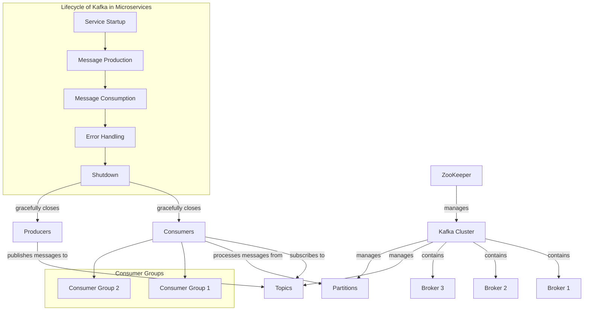

# Java Full Stack Interview Questions & Answers

## Cheat Sheets

### Table of Contents

<details open>
<summary>
Hide/Show table of contents
</summary>
    
| No. | Cheat Sheets |
|---- | ---------|
|1 | [**Cheat-Sheet-Docker**](cheat-sheet/Cheat-Sheet-Docker.md)|
|2 | [**Cheat-Sheet-Kafka**](cheat-sheet/Cheat-Sheet-Kafka.md)|
|3 | [**Cheat-Sheet-Kubernetes**](cheat-sheet/Cheat-Sheet-Kubernetes.md)|
|4 | [**Cheat-Sheet-Linux**](cheat-sheet/Cheat-Sheet-Linux.md)|
|5 | [**Cheat-Sheet-Java8**](cheat-sheet/Cheat-Sheet-Java8.md)|
|6 | [**Cheat-Sheet-MongoDB**](cheat-sheet/Cheat-Sheet-MongoDB.md)|

</details>

## Interview Questions & Answers - Java Script, Angular & React

### Table of Contents

<details open>
<summary>
Hide/Show table of contents
</summary>
 
| No. | Topics |
|---- | ---------|
|1 | [**Q&A-JavaScript**](conceptsI/FAQ-JavaScript.md)|
|2 | [**Q&A-Angular**](conceptsI/FAQ-Angular.md)|
|3 | [**Q&A-React**](conceptsI/FAQ-React.md)|
|5 | [**Q&A-React-Advanced**](conceptsI/FAQ-React-Advanced.md)|
|6 | [**Q&A-React**](conceptsI/Q&A-React.md)|
</details>

## Interview Questions & Answers - Java & J2EE Technologies

### Table of Contents

<details open>
<summary>
Hide/Show table of contents
</summary>
 
| No. | Topics |
|---- | ---------|
|1 | [**Q&A-Design-Patterns**](FAQ-Design-Patterns.md)|
|2 | [**Java Collection Framework**](Java-Collection-Framework.md)|
|3 | [**Java Thread & Concurrency**](Java-Thread-Concurrency.md)|
|4 | [**Java File I/O**](FileIOcompleteReference.md)|
|5 | [**End-to-End CICD Pipeline Implementation**](End-to-End-CICD-Pipeline-Implementation.md)|
|6 | [**Java Basic Differences & Comparisions**](java-basic-differences-and-comparisions.md)|


## Java Programing Exercises
* [java-basic-exercises-001-Basic-1](exercisesI/java-basic-exercises-001-Basic-1.md)
* [java-basic-exercises-002-Basic-2](exercisesI/java-basic-exercises-002-Basic-2.md)
* [java-basic-exercises-003-Recursive](exercisesI/java-basic-exercises-003-Recursive.md)
* [java-basic-exercises-004-Exception](exercisesI/java-basic-exercises-004-Exception.md)
* [java-basic-exercises-005-Array](exercisesI/java-basic-exercises-005-Array.md)
* [java-basic-exercises-006-Inheritance](exercisesI/java-basic-exercises-006-Inheritance.md)
* [java-basic-exercises-007-Abstract](exercisesI/java-basic-exercises-007-Abstract.md)
* [java-basic-exercises-008-Thread](exercisesI/java-basic-exercises-008-Thread.md)
* [java-basic-exercises-009-Multithreading](exercisesI/java-basic-exercises-009-Multithreading.md)
* [java-basic-exercises-010-Generic](exercisesI/java-basic-exercises-010-Generic.md)
* [java-basic-exercises-011-OOPs](exercisesI/java-basic-exercises-011-OOPs.md)
* [java-basic-exercises-012-Interface](exercisesI/java-basic-exercises-012-Interface.md)
* [java-basic-exercises-013-Encapsulation](exercisesI/java-basic-exercises-013-Encapsulation.md)
* [java-basic-exercises-014-Polymorphism](exercisesI/java-basic-exercises-014-Polymorphism.md)
* [java-basic-exercises-015-String](exercisesI/java-basic-exercises-015-String.md)
* [java-basic-exercises-016-Lambda](exercisesI/java-basic-exercises-016-Lambda.md)
* [java-basic-exercises-017-Stream](exercisesI/java-basic-exercises-017-Stream.md)
* [java-basic-exercises-018-Method](exercisesI/java-basic-exercises-018-Method.md)
* [java-basic-exercises-019-Numbers](exercisesI/java-basic-exercises-019-Numbers.md)
* [java-basic-exercises-020-Collection](exercisesI/java-basic-exercises-020-Collection.md)
  * [java-basic-exercises-020-collection-arraylist](exercisesI/java-basic-exercises-020-collection-arraylist.md)
  * [java-basic-exercises-020-collection-hashmap](exercisesI/java-basic-exercises-020-collection-hashmap.md)
  * [java-basic-exercises-020-collection-hashset](exercisesI/java-basic-exercises-020-collection-hashset.md)
  * [java-basic-exercises-020-collection-linkedlist](exercisesI/java-basic-exercises-020-collection-linkedlist.md)
  * [java-basic-exercises-020-collection-priorityqueue](exercisesI/java-basic-exercises-020-collection-priorityqueue.md)
  * [java-basic-exercises-020-collection-treemap](exercisesI/java-basic-exercises-020-collection-treemap.md)
  * [java-basic-exercises-020-collection-treeset](exercisesI/java-basic-exercises-020-collection-treeset.md)
* [java-basic-exercises-021-Sorting](exercisesI/java-basic-exercises-021-Sorting.md)
* [java-basic-exercises-022-Search](exercisesI/java-basic-exercises-022-Search.md)
* [java-basic-exercises-023-Unit-Test](exercisesI/java-basic-exercises-023-Unit-Test.md)
## Java Programing Question Answer
* [java-programming-question-answer-1](exercisesII/java-programming-question-answer-1.md)
* [java-programming-question-answer-2](exercisesII/java-programming-question-answer-2.md)
* [java-programming-question-answer-3-emp-mgmt](exercisesII/java-programming-question-answer-3-emp-mgmt.md)
* [java-programming-question-answer-4-java-8](exercisesII/java-programming-question-answer-4-java-8.md)
* [java-programming-question-answer-5-java-8](exercisesII/java-programming-question-answer-5-java-8.md)
* [java-programming-question-answer-consolidated](exercisesII/java-programming-question-answer-consolidated.md)

</details>
Here is an example of security configurations in Angular:

1. To implement security in Angular, you can use Angular Route Guards to protect routes based on user authentication and authorization.

2. Create a service to authenticate users using JWT tokens or OAuth.

3. Implement guards such as CanActivate, CanActivateChild, CanDeactivate, and Resolve to control access to specific routes.

4. Use HTTP Interceptors to add authorization headers or handle token expiration.

5. Implement user roles and permissions to restrict access to certain features or data.

6. Store sensitive data securely using Angular’s Secure Storage API or encrypting data before sending it over HTTP requests.

7. Always validate user input on the client-side and server-side to prevent XSS and CSRF attacks.

8. Use Content Security Policy (CSP) to prevent malicious scripts from running in your Angular application.

9. Implement Cross-Origin Resource Sharing (CORS) to restrict access to your API from unauthorized domains.

10. Keep Angular dependencies and packages updated to prevent security vulnerabilities.

11. Enable HTTPS to encrypt data transmitted between the client and server.

12. Regularly perform security audits and code reviews to identify and fix security issues in your Angular application.

The 12 rules of microservices, as defined by Sam Newman in his book "Building Microservices," are:

1. Model around business domain concepts
2. Design for failure
3. Decentralize all the things
4. Embrace shared-nothing architecture
5. Automate everything
6. Enable easy and confident changes
7. Architecture evolves over time
8. Build a culture of automation
9. Design for operability
10. Monitor everything
11. Log everything
12. Secure everything

These rules guide the development and deployment of microservices architectures, emphasizing principles such as scalability, resilience, and agility.


One way to secure user requests in an Angular and Spring Boot application is by implementing authentication and authorization mechanisms.

Here are a few steps you can take to secure user requests:

1. Implement JWT (JSON Web Token) authentication: You can use JWT to securely authenticate users in your application. When a user logs in, they will receive a JWT token which needs to be passed with each request to authorize the user.

2. Use Spring Security to secure the backend: Spring Security provides authentication and authorization features to secure your Spring Boot application. You can define roles and permissions for users and restrict access to certain endpoints based on these roles.

3. Use HTTPS to encrypt data: Ensure that your application is using HTTPS to encrypt communication between the client and the server. This will prevent data from being intercepted and tampered with.

4. Secure your API endpoints: Make sure to use proper authentication and authorization mechanisms to secure your API endpoints. You can use Spring Security to add security configurations to specific endpoints.

5. Handle server-side validation: Always validate user input on the server-side to prevent any unauthorized access or data manipulation.

If a user tries to change URL properties using the network tab in the browser, your backend should still be able to validate the request and deny access if the user is not authorized to access the resource. Make sure to implement proper error handling and validation checks in your backend to prevent any unauthorized access.

Overall, it's important to implement a combination of front-end and back-end security measures to secure user requests in your Angular and Spring Boot application.


Creating a complete Spring Boot and Angular application that embodies the 12 rules of microservices as defined by Sam Newman is a large undertaking. Below is an outline and a simplified example that touches on these principles, but please note that providing a full codebase would be too extensive for this format. However, I can guide you through a basic structure and essential code snippets.

### Project Structure

1. **Backend (Spring Boot)**
   - **Models**: Define your domain models.
   - **Controllers**: Handle incoming requests.
   - **Services**: Business logic layer.
   - **Repositories**: Data access layer.
   - **Configuration**: Set up security, monitoring, etc.

2. **Frontend (Angular)**
   - **Components**: UI elements.
   - **Services**: HTTP requests to the backend.
   - **Routing**: Navigation between views.

### Example Code

#### Backend: Spring Boot

**1. pom.xml (Dependencies)**

```xml
<dependencies>
    <dependency>
        <groupId>org.springframework.boot</groupId>
        <artifactId>spring-boot-starter-web</artifactId>
    </dependency>
    <dependency>
        <groupId>org.springframework.boot</groupId>
        <artifactId>spring-boot-starter-data-jpa</artifactId>
    </dependency>
    <dependency>
        <groupId>org.springframework.boot</groupId>
        <artifactId>spring-boot-starter-security</artifactId>
    </dependency>
    <dependency>
        <groupId>org.springframework.boot</groupId>
        <artifactId>spring-boot-starter-actuator</artifactId>
    </dependency>
    <dependency>
        <groupId>org.springframework.boot</groupId>
        <artifactId>spring-boot-starter-logging</artifactId>
    </dependency>
</dependencies>
```

**2. Domain Model**

```java
@Entity
public class Product {
    @Id
    @GeneratedValue(strategy = GenerationType.IDENTITY)
    private Long id;
    private String name;
    private Double price;

    // Getters and Setters
}
```

**3. Repository**

```java
public interface ProductRepository extends JpaRepository<Product, Long> {
}
```

**4. Service**

```java
@Service
public class ProductService {
    @Autowired
    private ProductRepository repository;

    public List<Product> getAllProducts() {
        return repository.findAll();
    }

    public Product addProduct(Product product) {
        return repository.save(product);
    }
}
```

**5. Controller**

```java
@RestController
@RequestMapping("/api/products")
public class ProductController {
    @Autowired
    private ProductService productService;

    @GetMapping
    public List<Product> getProducts() {
        return productService.getAllProducts();
    }

    @PostMapping
    public Product createProduct(@RequestBody Product product) {
        return productService.addProduct(product);
    }
}
```

**6. Security Configuration**

```java
@Configuration
@EnableWebSecurity
public class SecurityConfig extends WebSecurityConfigurerAdapter {
    @Override
    protected void configure(HttpSecurity http) throws Exception {
        http.csrf().disable()
            .authorizeRequests()
            .anyRequest().permitAll();
    }
}
```

**7. Monitoring Configuration (Actuator)**

```properties
management.endpoints.web.exposure.include=*
management.endpoint.health.show-details=always
```

#### Frontend: Angular

**1. Angular Service**

```typescript
import { Injectable } from '@angular/core';
import { HttpClient } from '@angular/common/http';
import { Observable } from 'rxjs';
import { Product } from './product.model';

@Injectable({
  providedIn: 'root'
})
export class ProductService {
  private apiUrl = 'http://localhost:8080/api/products';

  constructor(private http: HttpClient) { }

  getProducts(): Observable<Product[]> {
    return this.http.get<Product[]>(this.apiUrl);
  }

  addProduct(product: Product): Observable<Product> {
    return this.http.post<Product>(this.apiUrl, product);
  }
}
```

**2. Angular Component**

```typescript
import { Component, OnInit } from '@angular/core';
import { ProductService } from './product.service';
import { Product } from './product.model';

@Component({
  selector: 'app-product-list',
  templateUrl: './product-list.component.html'
})
export class ProductListComponent implements OnInit {
  products: Product[] = [];

  constructor(private productService: ProductService) {}

  ngOnInit() {
    this.productService.getProducts().subscribe(data => {
      this.products = data;
    });
  }
}
```

**3. Product Model**

```typescript
export interface Product {
  id: number;
  name: string;
  price: number;
}
```

**4. Angular Routing**

```typescript
import { NgModule } from '@angular/core';
import { RouterModule, Routes } from '@angular/router';
import { ProductListComponent } from './product-list/product-list.component';

const routes: Routes = [
  { path: 'products', component: ProductListComponent },
  { path: '', redirectTo: '/products', pathMatch: 'full' }
];

@NgModule({
  imports: [RouterModule.forRoot(routes)],
  exports: [RouterModule]
})
export class AppRoutingModule { }
```

### Implementation of Principles

1. **Model around business domain concepts**: Use domain models like `Product`.
2. **Design for failure**: Use circuit breakers (e.g., Hystrix) in a real scenario.
3. **Decentralize all the things**: Separate services (like product and order services).
4. **Embrace shared-nothing architecture**: Each service has its own database.
5. **Automate everything**: CI/CD pipelines for deployment.
6. **Enable easy and confident changes**: Feature flags.
7. **Architecture evolves over time**: Microservices can evolve independently.
8. **Build a culture of automation**: Automated tests and deployment.
9. **Design for operability**: Use Spring Boot Actuator.
10. **Monitor everything**: Integrate with tools like Prometheus or Grafana.
11. **Log everything**: Use centralized logging (e.g., ELK stack).
12. **Secure everything**: Implement security with Spring Security.

### Conclusion

This example provides a basic framework that embodies the principles of microservices. For a full implementation, consider using Docker for containerization, Kubernetes for orchestration, and additional monitoring and logging frameworks. Always follow best practices for security, testing, and code quality.


To prevent unauthorized actions like debiting an amount from a bank account through URL manipulation in a banking application, it's essential to implement robust security mechanisms both on the Angular frontend and the Spring Boot microservices backend. Here are some strategies and best practices to consider:

### 1. **Authentication and Authorization**

#### **Authentication**
Ensure that users are properly authenticated. Use methods like:

- **JWT (JSON Web Tokens)**: Upon successful login, issue a JWT that includes user details and roles. This token should be sent with each request in the Authorization header.

#### **Authorization**
Implement role-based access control (RBAC):

- **Claims-Based Authorization**: Each user role should have specific permissions (e.g., only allow certain roles to perform debit transactions).
- **Service-Side Validation**: Always check user permissions on the server side before processing any transaction.

### 2. **Input Validation and Business Logic Checks**

- **Server-Side Validation**: Always validate inputs on the server side. Do not rely solely on client-side validation.
- **Business Rules Enforcement**: Implement checks in your business logic to ensure that only valid operations are performed, e.g., checking the account balance before debiting.

### 3. **Use of HTTPS**

Ensure all communications between the client and server are encrypted using HTTPS to prevent eavesdropping and man-in-the-middle attacks.

### 4. **Secure API Endpoints**

- **Rate Limiting**: Limit the number of requests a user can make to sensitive endpoints (like debit).
- **CSRF Protection**: Implement Cross-Site Request Forgery (CSRF) protection mechanisms. This typically involves using anti-CSRF tokens.
- **CORS Configuration**: Properly configure Cross-Origin Resource Sharing (CORS) to restrict which origins can access your API.

### 5. **Logging and Monitoring**

- **Audit Logging**: Log all transactions with user IDs, timestamps, and operation details. Monitor these logs for any suspicious activity.
- **Alerting**: Set up alerts for unusual patterns, such as multiple debits from a single account in a short timeframe.

### 6. **Example Implementation in Spring Boot**

#### **Security Configuration**

```java
@Configuration
@EnableWebSecurity
public class SecurityConfig extends WebSecurityConfigurerAdapter {
    @Override
    protected void configure(HttpSecurity http) throws Exception {
        http.csrf().csrfTokenRepository(CookieCsrfTokenRepository.withHttpOnlyFalse())
            .and()
            .authorizeRequests()
            .antMatchers("/api/debit").hasRole("USER") // Only allow users with USER role
            .anyRequest().authenticated()
            .and()
            .oauth2ResourceServer()
            .jwt(); // Configure JWT for authentication
    }
}
```

#### **Service Logic**

```java
@Service
public class AccountService {
    @Autowired
    private AccountRepository accountRepository;

    public void debit(Long accountId, Double amount, Long userId) {
        Account account = accountRepository.findById(accountId)
            .orElseThrow(() -> new ResourceNotFoundException("Account not found"));

        // Validate if user is authorized to access this account
        if (!account.getUserId().equals(userId)) {
            throw new UnauthorizedAccessException("You are not authorized to debit this account.");
        }

        // Check balance
        if (account.getBalance() < amount) {
            throw new InsufficientFundsException("Insufficient funds.");
        }

        account.setBalance(account.getBalance() - amount);
        accountRepository.save(account);
    }
}
```

### 7. **Frontend Implementation in Angular**

#### **Service for API Calls**

```typescript
@Injectable({
  providedIn: 'root'
})
export class AccountService {
  constructor(private http: HttpClient) {}

  debitAccount(accountId: number, amount: number): Observable<any> {
    const url = `https://api.example.com/accounts/${accountId}/debit`;
    return this.http.post(url, { amount }, { headers: { Authorization: `Bearer ${token}` } });
  }
}
```

#### **Guard for Protected Routes**

```typescript
@Injectable({
  providedIn: 'root'
})
export class AuthGuard implements CanActivate {
  constructor(private authService: AuthService, private router: Router) {}

  canActivate(): boolean {
    if (this.authService.isLoggedIn()) {
      return true;
    }
    this.router.navigate(['/login']);
    return false;
  }
}
```

### Conclusion

To effectively prevent fraud in a banking application:

- Implement strong authentication and authorization.
- Perform thorough server-side validation.
- Use HTTPS for secure communication.
- Monitor and log transactions to detect anomalies.

These measures combined form a robust security posture that significantly mitigates the risk of unauthorized actions.


To prevent unauthorized actions like debiting an amount from a bank account through URL manipulation in a banking application, it's essential to implement robust security mechanisms both on the Angular frontend and the Spring Boot microservices backend. Here are some strategies and best practices to consider:

### 1. **Authentication and Authorization**

#### **Authentication**
Ensure that users are properly authenticated. Use methods like:

- **JWT (JSON Web Tokens)**: Upon successful login, issue a JWT that includes user details and roles. This token should be sent with each request in the Authorization header.

#### **Authorization**
Implement role-based access control (RBAC):

- **Claims-Based Authorization**: Each user role should have specific permissions (e.g., only allow certain roles to perform debit transactions).
- **Service-Side Validation**: Always check user permissions on the server side before processing any transaction.

### 2. **Input Validation and Business Logic Checks**

- **Server-Side Validation**: Always validate inputs on the server side. Do not rely solely on client-side validation.
- **Business Rules Enforcement**: Implement checks in your business logic to ensure that only valid operations are performed, e.g., checking the account balance before debiting.

### 3. **Use of HTTPS**

Ensure all communications between the client and server are encrypted using HTTPS to prevent eavesdropping and man-in-the-middle attacks.

### 4. **Secure API Endpoints**

- **Rate Limiting**: Limit the number of requests a user can make to sensitive endpoints (like debit).
- **CSRF Protection**: Implement Cross-Site Request Forgery (CSRF) protection mechanisms. This typically involves using anti-CSRF tokens.
- **CORS Configuration**: Properly configure Cross-Origin Resource Sharing (CORS) to restrict which origins can access your API.

### 5. **Logging and Monitoring**

- **Audit Logging**: Log all transactions with user IDs, timestamps, and operation details. Monitor these logs for any suspicious activity.
- **Alerting**: Set up alerts for unusual patterns, such as multiple debits from a single account in a short timeframe.

### 6. **Example Implementation in Spring Boot**

#### **Security Configuration**

```java
@Configuration
@EnableWebSecurity
public class SecurityConfig extends WebSecurityConfigurerAdapter {
    @Override
    protected void configure(HttpSecurity http) throws Exception {
        http.csrf().csrfTokenRepository(CookieCsrfTokenRepository.withHttpOnlyFalse())
            .and()
            .authorizeRequests()
            .antMatchers("/api/debit").hasRole("USER") // Only allow users with USER role
            .anyRequest().authenticated()
            .and()
            .oauth2ResourceServer()
            .jwt(); // Configure JWT for authentication
    }
}
```

#### **Service Logic**

```java
@Service
public class AccountService {
    @Autowired
    private AccountRepository accountRepository;

    public void debit(Long accountId, Double amount, Long userId) {
        Account account = accountRepository.findById(accountId)
            .orElseThrow(() -> new ResourceNotFoundException("Account not found"));

        // Validate if user is authorized to access this account
        if (!account.getUserId().equals(userId)) {
            throw new UnauthorizedAccessException("You are not authorized to debit this account.");
        }

        // Check balance
        if (account.getBalance() < amount) {
            throw new InsufficientFundsException("Insufficient funds.");
        }

        account.setBalance(account.getBalance() - amount);
        accountRepository.save(account);
    }
}
```

### 7. **Frontend Implementation in Angular**

#### **Service for API Calls**

```typescript
@Injectable({
  providedIn: 'root'
})
export class AccountService {
  constructor(private http: HttpClient) {}

  debitAccount(accountId: number, amount: number): Observable<any> {
    const url = `https://api.example.com/accounts/${accountId}/debit`;
    return this.http.post(url, { amount }, { headers: { Authorization: `Bearer ${token}` } });
  }
}
```

#### **Guard for Protected Routes**

```typescript
@Injectable({
  providedIn: 'root'
})
export class AuthGuard implements CanActivate {
  constructor(private authService: AuthService, private router: Router) {}

  canActivate(): boolean {
    if (this.authService.isLoggedIn()) {
      return true;
    }
    this.router.navigate(['/login']);
    return false;
  }
}
```

### Conclusion

To effectively prevent fraud in a banking application:

- Implement strong authentication and authorization.
- Perform thorough server-side validation.
- Use HTTPS for secure communication.
- Monitor and log transactions to detect anomalies.

These measures combined form a robust security posture that significantly mitigates the risk of unauthorized actions.


In a microservices architecture, especially when implementing the Saga pattern for orchestrating long-running transactions across multiple services, achieving asynchronous communication and handling failures or compensations is crucial. Here’s a detailed overview of how to achieve this:

### 1. **Asynchronous Communication Between Services**

#### **Message Brokers**
Use message brokers (like RabbitMQ, Kafka, or AWS SQS) for asynchronous communication. This allows services to send and receive messages without blocking.

- **Producer-Consumer Model**: One service can produce a message that is sent to a queue, and another service can consume that message when it's ready.

#### **Event-Driven Architecture**
Implement an event-driven architecture where services publish events and subscribe to them.

- **Event Sourcing**: Each change in state is captured as an event, allowing services to react to changes asynchronously.

### 2. **Implementing Saga Orchestration**

#### **Choreography vs. Orchestration**

- **Choreography**: Each service produces and listens to events. It is more decentralized and can lead to less coupling but can become complex in larger systems.
  
- **Orchestration**: A central orchestrator service manages the saga, making it easier to control the flow of transactions but introducing a single point of failure.

#### **Example of Saga Orchestration**
1. **Start Transaction**: The orchestrator service starts the transaction and sends a message to the first service.
2. **Process Steps**: Each service processes its part of the transaction and publishes an event to indicate success or failure.
3. **Compensation Logic**: If any service fails, the orchestrator invokes compensation actions to undo previous actions.

### 3. **Handling Success and Failure Transactions**

#### **Success Handling**
When a service successfully completes its action, it should emit an event indicating success. The orchestrator can then proceed to the next step.

#### **Failure Handling**
If a service fails, it should emit a failure event. The orchestrator can then trigger compensation transactions to roll back previous actions.

### 4. **Compensation Transactions**
Compensation involves invoking specific actions that revert the changes made by previous services in the saga.

#### **Compensation Example**
- If a service debits an account and later fails to create an order, a compensation transaction should credit the account back.

### 5. **Implementation Example**

#### **Using Spring Boot and Kafka**

1. **Producer Service (e.g., Account Service)**

```java
@Service
public class AccountService {
    @Autowired
    private KafkaTemplate<String, String> kafkaTemplate;

    public void debitAccount(Long accountId, Double amount) {
        // Logic to debit the account
        kafkaTemplate.send("account-debit-topic", "Account debited: " + accountId);
    }
}
```

2. **Consumer Service (e.g., Order Service)**

```java
@Service
public class OrderService {
    @KafkaListener(topics = "account-debit-topic", groupId = "order-group")
    public void listen(String message) {
        // Logic to process order
        // If order processing fails, emit a compensation event
    }
}
```

3. **Orchestrator Service**

```java
@Service
public class SagaOrchestrator {
    public void initiateSaga() {
        // Send initial message to debit account
        // Listen for success or failure messages from the services
        // Handle compensation if necessary
    }
}
```

### 6. **Failure Recovery Strategies**

#### **Retry Mechanism**
Implement a retry mechanism for transient failures before triggering compensation.

#### **Dead Letter Queue (DLQ)**
Use DLQs for messages that cannot be processed after a certain number of retries, allowing for manual inspection and reprocessing later.

### Conclusion

By leveraging asynchronous communication and the Saga pattern, you can effectively manage transactions across multiple microservices. This approach not only improves scalability and resilience but also enables you to handle failures gracefully through compensation strategies. Implementing robust logging and monitoring will further enhance your ability to diagnose and respond to issues in real time.


To achieve asynchronous communication and implement the Saga pattern using **Spring WebClient**, you'll be able to handle interactions between microservices effectively. Here’s how to structure it, focusing on asynchronous communication, handling success and failure transactions, and managing compensation.

### 1. **Using WebClient for Asynchronous Communication**

**Spring WebClient** is a non-blocking, reactive client for making HTTP requests. It is part of the Spring WebFlux module and is ideal for microservices communication.

#### **Example Setup**

1. **Add Dependencies** (in `pom.xml`):

```xml
<dependency>
    <groupId>org.springframework.boot</groupId>
    <artifactId>spring-boot-starter-webflux</artifactId>
</dependency>
```

2. **WebClient Configuration**:

```java
@Configuration
public class WebClientConfig {
    @Bean
    public WebClient.Builder webClientBuilder() {
        return WebClient.builder();
    }
}
```

### 2. **Making Asynchronous Calls with WebClient**

You can use `WebClient` to call other microservices asynchronously.

#### **Example of a Debit Service**

```java
@Service
public class AccountService {
    private final WebClient webClient;

    @Autowired
    public AccountService(WebClient.Builder webClientBuilder) {
        this.webClient = webClientBuilder.baseUrl("http://account-service").build();
    }

    public Mono<String> debitAccount(Long accountId, Double amount) {
        return webClient.post()
                .uri("/api/accounts/debit")
                .bodyValue(new DebitRequest(accountId, amount))
                .retrieve()
                .bodyToMono(String.class);
    }
}
```

### 3. **Saga Orchestrator**

The orchestrator will manage the transaction flow and compensate if necessary.

```java
@Service
public class SagaOrchestrator {
    private final AccountService accountService;
    private final OrderService orderService; // Assume another service

    @Autowired
    public SagaOrchestrator(AccountService accountService, OrderService orderService) {
        this.accountService = accountService;
        this.orderService = orderService;
    }

    public Mono<Void> initiateSaga(Long accountId, Double amount) {
        return accountService.debitAccount(accountId, amount)
            .flatMap(debitResponse -> {
                // Process the order if debit was successful
                return orderService.createOrder()
                    .doOnSuccess(orderResponse -> {
                        // Handle successful order creation
                    })
                    .onErrorResume(e -> {
                        // Handle compensation
                        return compensateDebit(accountId, amount);
                    });
            })
            .then();
    }

    private Mono<Void> compensateDebit(Long accountId, Double amount) {
        // Call the compensation method to credit the account back
        return accountService.creditAccount(accountId, amount);
    }
}
```

### 4. **Handling Success and Failure**

- **Success Handling**: Each service should emit a response that indicates success. The orchestrator can then proceed to the next step.
  
- **Failure Handling**: Use `onErrorResume` to manage failures. If a downstream service fails, invoke compensation logic.

### 5. **Compensation Logic**

In the `compensateDebit` method, implement the logic to reverse previous transactions:

```java
public Mono<Void> creditAccount(Long accountId, Double amount) {
    return webClient.post()
            .uri("/api/accounts/credit")
            .bodyValue(new CreditRequest(accountId, amount))
            .retrieve()
            .bodyToMono(Void.class);
}
```

### 6. **Logging and Monitoring**

Implement logging and monitoring to track the saga's state and any failures. This is critical for diagnosing issues and ensuring accountability in financial transactions.

### 7. **Conclusion**

Using Spring WebClient for asynchronous communication between microservices facilitates a reactive and non-blocking approach. The Saga pattern helps manage complex transactions by coordinating multiple services while providing mechanisms for handling failures and compensations. This results in a robust architecture capable of scaling and maintaining reliability across microservices.


`RestTemplate` and `WebClient` are both used for making HTTP requests in Spring applications, but they differ significantly in their design, capabilities, and use cases. Here are the key differences:

### 1. **Blocking vs. Non-Blocking**

- **RestTemplate**: 
  - **Blocking**: It operates in a synchronous manner. When you make a request using `RestTemplate`, the thread that initiated the request is blocked until the response is received. This can lead to inefficiencies in applications, especially under high load.
  
- **WebClient**: 
  - **Non-Blocking**: It is part of the Spring WebFlux framework and operates asynchronously. This allows it to handle multiple requests in a non-blocking way, making it more suitable for applications that require high concurrency and scalability.

### 2. **Programming Model**

- **RestTemplate**:
  - Uses a traditional imperative programming model. You write code that runs sequentially, which is straightforward but can lead to blocking issues.
  
- **WebClient**:
  - Supports a reactive programming model. It returns `Mono` and `Flux` types from Project Reactor, allowing you to compose asynchronous operations and manage backpressure effectively.

### 3. **Features and Capabilities**

- **RestTemplate**:
  - Provides a rich set of synchronous methods for various HTTP operations (GET, POST, PUT, DELETE).
  - Simple to use for quick integrations where blocking behavior is acceptable.
  
- **WebClient**:
  - Offers a more modern API, supporting both synchronous and asynchronous calls. It can handle streaming of responses and supports reactive types.
  - Provides advanced features like request/response body handling, headers manipulation, error handling, and support for multipart requests.
  - Supports WebSocket connections and Server-Sent Events (SSE).

### 4. **Error Handling**

- **RestTemplate**:
  - Error handling is simpler, primarily through exception handling (e.g., `RestClientException`).

- **WebClient**:
  - Offers a more flexible error handling mechanism with the ability to handle errors in a reactive way using methods like `onStatus` and `onErrorResume`.

### 5. **Configuration and Customization**

- **RestTemplate**:
  - Configured using `@Bean` methods or through `RestTemplateBuilder`. It's straightforward but limited compared to WebClient.

- **WebClient**:
  - Highly customizable with support for various codecs, filters, and customizations in the request/response pipeline.

### 6. **Use Cases**

- **RestTemplate**:
  - Best suited for simpler applications or legacy systems where synchronous calls are acceptable and the overhead of reactive programming is unnecessary.

- **WebClient**:
  - Ideal for applications that require high throughput, real-time processing, or need to integrate with reactive streams. It’s well-suited for microservices architectures and modern applications.

### 7. **Example Usage**

**RestTemplate Example:**

```java
RestTemplate restTemplate = new RestTemplate();
String result = restTemplate.getForObject("http://api.example.com/resource", String.class);
```

**WebClient Example:**

```java
WebClient webClient = WebClient.create("http://api.example.com");
Mono<String> result = webClient.get()
    .uri("/resource")
    .retrieve()
    .bodyToMono(String.class);
```

### Conclusion

In summary, `RestTemplate` is a synchronous, blocking client suited for simpler use cases, while `WebClient` is a modern, non-blocking client that supports reactive programming, making it suitable for high-concurrency applications. When building new applications, especially with a microservices architecture, `WebClient` is generally recommended for its flexibility and performance benefits.


In a microservices architecture where you need to orchestrate calls to multiple services in a specific sequence, using `WebClient` with reactive programming can help manage asynchronous calls while ensuring the correct execution order. You can achieve this by chaining the calls and properly handling the responses.

Here’s how to orchestrate a sequence of service calls using `WebClient`, ensuring that each service is called only after the previous one completes successfully.

### Step-by-Step Implementation

1. **Define the Services**
   Each service should have a corresponding client method to make the necessary HTTP calls.

2. **Use Chaining with `Mono` or `Flux`**
   You can chain the calls using `flatMap` or `map` to ensure that the next service call waits for the completion of the previous one.

### Example Implementation

Let's say you have three services: **Account Service**, **Order Service**, and **Notification Service**. Here’s how to orchestrate calls to these services using `WebClient`.

#### 1. **WebClient Configuration**

```java
@Configuration
public class WebClientConfig {
    @Bean
    public WebClient.Builder webClientBuilder() {
        return WebClient.builder();
    }
}
```

#### 2. **Service Classes**

**Account Service Client**

```java
@Service
public class AccountService {
    private final WebClient webClient;

    @Autowired
    public AccountService(WebClient.Builder webClientBuilder) {
        this.webClient = webClientBuilder.baseUrl("http://account-service").build();
    }

    public Mono<AccountResponse> debitAccount(Long accountId, Double amount) {
        return webClient.post()
                .uri("/api/accounts/debit")
                .bodyValue(new DebitRequest(accountId, amount))
                .retrieve()
                .bodyToMono(AccountResponse.class);
    }
}
```

**Order Service Client**

```java
@Service
public class OrderService {
    private final WebClient webClient;

    @Autowired
    public OrderService(WebClient.Builder webClientBuilder) {
        this.webClient = webClientBuilder.baseUrl("http://order-service").build();
    }

    public Mono<OrderResponse> createOrder(OrderRequest orderRequest) {
        return webClient.post()
                .uri("/api/orders")
                .bodyValue(orderRequest)
                .retrieve()
                .bodyToMono(OrderResponse.class);
    }
}
```

**Notification Service Client**

```java
@Service
public class NotificationService {
    private final WebClient webClient;

    @Autowired
    public NotificationService(WebClient.Builder webClientBuilder) {
        this.webClient = webClientBuilder.baseUrl("http://notification-service").build();
    }

    public Mono<Void> sendNotification(NotificationRequest notificationRequest) {
        return webClient.post()
                .uri("/api/notifications")
                .bodyValue(notificationRequest)
                .retrieve()
                .bodyToMono(Void.class);
    }
}
```

#### 3. **Orchestrator Service**

The orchestrator will manage the flow of these calls, ensuring that they execute in the correct order.

```java
@Service
public class SagaOrchestrator {
    private final AccountService accountService;
    private final OrderService orderService;
    private final NotificationService notificationService;

    @Autowired
    public SagaOrchestrator(AccountService accountService, OrderService orderService, NotificationService notificationService) {
        this.accountService = accountService;
        this.orderService = orderService;
        this.notificationService = notificationService;
    }

    public Mono<Void> processTransaction(Long accountId, Double amount, OrderRequest orderRequest, NotificationRequest notificationRequest) {
        return accountService.debitAccount(accountId, amount)
            .flatMap(accountResponse -> {
                // Proceed to create an order only if debit was successful
                return orderService.createOrder(orderRequest)
                    .flatMap(orderResponse -> {
                        // Send notification after order creation
                        return notificationService.sendNotification(notificationRequest);
                    });
            })
            .then(); // Complete the Mono
    }
}
```

### Handling Errors

To manage errors effectively, you can use `onErrorResume` or `doOnError` to provide compensation or handle failures gracefully.

```java
public Mono<Void> processTransaction(Long accountId, Double amount, OrderRequest orderRequest, NotificationRequest notificationRequest) {
    return accountService.debitAccount(accountId, amount)
        .flatMap(accountResponse -> {
            return orderService.createOrder(orderRequest)
                .flatMap(orderResponse -> {
                    return notificationService.sendNotification(notificationRequest);
                })
                .doOnError(e -> {
                    // Handle order creation failure (e.g., compensate debit)
                    compensateDebit(accountId, amount).subscribe();
                });
        })
        .then();
}

private Mono<Void> compensateDebit(Long accountId, Double amount) {
    // Logic to credit back the account
    return accountService.creditAccount(accountId, amount);
}
```

### Conclusion

Using `WebClient` with reactive programming allows you to manage the sequence of service calls effectively. By chaining the calls with `flatMap`, you ensure that each service is called only after the previous one has successfully completed. This approach not only maintains the order of operations but also leverages the non-blocking nature of reactive programming for better scalability and performance.

Preventing duplicate messages in Kafka involves a combination of configuration, application design, and careful handling of message processing. Here are several strategies to consider:

1. **Idempotent Producers**:
   - Enable idempotence by setting `enable.idempotence=true` in your producer configuration. This ensures that the same message sent multiple times will only be written once to the topic.

2. **Unique Message Keys**:
   - Use a unique key for each message. Kafka guarantees that messages with the same key are written to the same partition and will be processed in order, which helps in identifying and deduplicating messages.

3. **Transaction Support**:
   - Use Kafka's transactional support by configuring your producer to use transactions (`transactional.id`). This ensures that a batch of messages is either fully committed or fully rolled back, preventing partial writes.

4. **Consumer Deduplication Logic**:
   - Implement deduplication logic in your consumers. Maintain a cache or database to track processed message IDs, allowing your application to ignore duplicates.

5. **Message Content Hashing**:
   - Include a unique identifier in the message payload (like a UUID) and use it to check for duplicates before processing.

6. **Offset Management**:
   - Properly manage offsets in your consumers. By ensuring that offsets are committed only after processing the message successfully, you can avoid reprocessing the same messages in case of failures.

7. **Configure Retention Policies**:
   - Set appropriate retention policies to limit how long messages are kept in Kafka. This can help with managing duplicates but doesn't eliminate them.

8. **Use of External Systems**:
   - If applicable, leverage external systems (like databases) to track and manage message states, helping to ensure that only new messages are processed.

By combining these strategies, you can significantly reduce the likelihood of processing duplicate messages in your Kafka application.

Idempotence is a key concept in both Kafka and microservice architecture that refers to the property of an operation whereby performing it multiple times has the same effect as performing it once. This is crucial for ensuring consistency, especially in distributed systems where network failures or retries can occur.

### Idempotence in Kafka

1. **Producer Idempotence**:
   - In Kafka, enabling idempotent producers (via `enable.idempotence=true`) ensures that messages are delivered exactly once to a topic partition, even if the producer retries sending the same message due to failures or timeouts. Each message is assigned a unique sequence number, and Kafka tracks these numbers to prevent duplicates.

2. **Benefits**:
   - **Consistency**: Ensures that the same message is not processed multiple times, preserving data integrity.
   - **Simplicity**: Reduces the need for complex deduplication logic on the consumer side.

### Idempotence in Microservice Architecture

1. **Idempotent Operations**:
   - In a microservice context, idempotent operations are those that can be safely retried without changing the result beyond the initial application. For example, updating a resource to a specific value is idempotent, whereas incrementing a value is not.

2. **Benefits**:
   - **Reliability**: Allows services to handle retries and failures gracefully, improving system robustness.
   - **Simplified Error Handling**: Reduces the complexity of managing state and ensuring consistency across services.

3. **Implementation**:
   - Use unique identifiers (e.g., request IDs) to track requests and avoid processing the same request multiple times.
   - Design endpoints and operations to be idempotent wherever possible, particularly for critical operations like payment processing or resource creation.

### Conclusion

In both Kafka and microservice architectures, idempotence is vital for maintaining data consistency, simplifying error handling, and improving the overall reliability of the system. By designing producers and service operations to be idempotent, developers can mitigate the effects of retries and failures inherent in distributed systems.

Idempotence is a key concept in both Kafka and microservice architecture that refers to the property of an operation whereby performing it multiple times has the same effect as performing it once. This is crucial for ensuring consistency, especially in distributed systems where network failures or retries can occur.

### Idempotence in Kafka

1. **Producer Idempotence**:
   - In Kafka, enabling idempotent producers (via `enable.idempotence=true`) ensures that messages are delivered exactly once to a topic partition, even if the producer retries sending the same message due to failures or timeouts. Each message is assigned a unique sequence number, and Kafka tracks these numbers to prevent duplicates.

2. **Benefits**:
   - **Consistency**: Ensures that the same message is not processed multiple times, preserving data integrity.
   - **Simplicity**: Reduces the need for complex deduplication logic on the consumer side.

### Idempotence in Microservice Architecture

1. **Idempotent Operations**:
   - In a microservice context, idempotent operations are those that can be safely retried without changing the result beyond the initial application. For example, updating a resource to a specific value is idempotent, whereas incrementing a value is not.

2. **Benefits**:
   - **Reliability**: Allows services to handle retries and failures gracefully, improving system robustness.
   - **Simplified Error Handling**: Reduces the complexity of managing state and ensuring consistency across services.

3. **Implementation**:
   - Use unique identifiers (e.g., request IDs) to track requests and avoid processing the same request multiple times.
   - Design endpoints and operations to be idempotent wherever possible, particularly for critical operations like payment processing or resource creation.

### Conclusion

In both Kafka and microservice architectures, idempotence is vital for maintaining data consistency, simplifying error handling, and improving the overall reliability of the system. By designing producers and service operations to be idempotent, developers can mitigate the effects of retries and failures inherent in distributed systems.


Default methods in Java 8 interfaces allow you to add new methods to interfaces without breaking existing implementations. Here are the key uses and benefits of default methods:

### 1. **Backward Compatibility**:
   - Default methods enable you to extend interfaces without forcing all implementing classes to provide an implementation for the new method. This is particularly useful when updating libraries or APIs.

### 2. **Code Reusability**:
   - Default methods can contain a body, allowing you to provide a common implementation that can be reused by multiple classes. This reduces code duplication.

### 3. **Multiple Inheritance of Behavior**:
   - With default methods, a class can inherit behavior from multiple interfaces, providing a way to mix-in functionality without the complications of multiple inheritance.

### 4. **Improved Interface Design**:
   - Default methods allow you to evolve interfaces over time, adding new functionality while maintaining a clean design and adhering to the principle of interface segregation.

### 5. **Providing Helper Methods**:
   - You can implement utility methods that may be useful to all implementers of the interface, reducing the need for utility classes.

### Example

Here's a simple example of a default method in an interface:

```java
interface Vehicle {
    void start();

    default void stop() {
        System.out.println("Vehicle stopping...");
    }
}

class Car implements Vehicle {
    public void start() {
        System.out.println("Car starting...");
    }

    // No need to implement stop(), it can use the default method
}

public class Main {
    public static void main(String[] args) {
        Vehicle myCar = new Car();
        myCar.start(); // Output: Car starting...
        myCar.stop();  // Output: Vehicle stopping...
    }
}
```

### Conclusion

Default methods enhance the flexibility of interface design in Java, allowing for easier maintenance and evolution of codebases while maintaining compatibility with existing implementations. They strike a balance between the purity of interfaces and the practical needs of software development.


It seems there might be some confusion in your question regarding the term "default method." However, I assume you're asking about the purpose of default methods in interfaces in Java 8, especially in the context of already existing methods in interfaces. Here's a clearer breakdown:

### Purpose of Default Methods

1. **Extending Interfaces Without Breaking Changes**:
   - Default methods allow you to add new methods to an interface without requiring all existing implementing classes to implement these new methods. This helps maintain backward compatibility.

2. **Providing Default Implementations**:
   - You can provide a common implementation for methods that can be shared across multiple classes. This reduces code duplication and centralizes behavior.

3. **Mixins and Multiple Inheritance of Behavior**:
   - Default methods allow a class to inherit implementations from multiple interfaces, enabling a form of multiple inheritance of behavior while avoiding the complexity and ambiguity of traditional multiple inheritance.

4. **Simplifying API Evolution**:
   - They facilitate the evolution of APIs. You can enhance an interface with new functionality while keeping the existing implementations valid.

5. **Encouraging Interface Segregation**:
   - Default methods can help implement more granular interfaces while still allowing for shared functionality, aligning with the Interface Segregation Principle.

### Example Scenario

Consider you have an interface that represents a `Shape`:

```java
interface Shape {
    double area();
    
    // Default method to provide a common implementation
    default void printShape() {
        System.out.println("Shape with area: " + area());
    }
}
```

If you later want to add a method like `printShape`, default methods allow you to do this without forcing all existing implementations (e.g., `Circle`, `Square`) to implement it. They can simply inherit the default behavior.

### Conclusion

Default methods enhance the flexibility of Java interfaces, allowing developers to evolve their code without breaking existing functionality. They provide a practical way to implement shared behavior and encourage better design principles in large codebases.


Sure! Let’s break down the purpose and use of default methods in functional interfaces, especially when there are multiple default methods.

### Purpose of Default Methods in Functional Interfaces

1. **Backward Compatibility**:
   - When you add a new method to an interface, existing implementations would break unless that method has a default implementation. Default methods allow you to evolve interfaces without forcing all implementers to modify their code.

2. **Adding Functionality**:
   - Default methods allow interfaces to provide common behavior that can be reused across multiple classes. This is especially useful when you want to add new functionalities to an interface without breaking existing implementations.

3. **Mixing Implementations**:
   - In scenarios where you might want to share behavior across different classes, default methods let you define that behavior in the interface itself. This is particularly useful for defining default behavior for new methods.

4. **Reducing Boilerplate Code**:
   - If several classes share the same method implementation, using a default method avoids the need to duplicate that code in each implementing class.

### Use Cases for Multiple Default Methods

1. **Shared Behavior**:
   - If you have several methods that many classes should implement with the same logic, you can provide those methods as default implementations in the interface. This way, classes can either use the default behavior or override it if they need custom logic.

2. **Mixing Interfaces**:
   - You can define multiple default methods in an interface that can be combined with other interfaces. This allows classes to implement multiple interfaces with shared functionality without the need for an abstract class.

3. **Enhanced Functional Interfaces**:
   - Even if an interface is primarily functional (with a single abstract method), adding default methods allows you to provide additional utility methods that can enhance usability. For example, a `Predicate` interface could have default methods for combining predicates (like `and` and `or`).

### Example

Here’s a simple example to illustrate:

```java
@FunctionalInterface
interface MyFunctionalInterface {
    void doSomething();

    default void defaultMethod1() {
        System.out.println("Default Method 1");
    }

    default void defaultMethod2() {
        System.out.println("Default Method 2");
    }
}

class MyClass implements MyFunctionalInterface {
    @Override
    public void doSomething() {
        System.out.println("Doing something!");
    }
}

public class Main {
    public static void main(String[] args) {
        MyClass myClass = new MyClass();
        myClass.doSomething(); // Calls the implemented method
        myClass.defaultMethod1(); // Calls the default method
        myClass.defaultMethod2(); // Calls another default method
    }
}
```

In this example, `MyFunctionalInterface` has two default methods. `MyClass` implements the functional method but can also use the default methods directly, reducing the need for boilerplate code.

### Summary

Default methods in functional interfaces provide flexibility, allow for shared behavior, support backward compatibility, and reduce code duplication. They enable you to extend interfaces in a way that is both powerful and safe, making them a useful feature in modern Java development.


Sure! Let’s compare interfaces, abstract classes, and functional interfaces with default methods, highlighting their characteristics, use cases, and differences.

### Interfaces vs. Abstract Classes

| Feature                       | Interface                                     | Abstract Class                                |
|-------------------------------|-----------------------------------------------|-----------------------------------------------|
| **Inheritance**               | Multiple inheritance (a class can implement multiple interfaces). | Single inheritance (a class can extend only one abstract class). |
| **Method Definitions**        | Can have only abstract methods (prior to Java 8), and can include default and static methods (from Java 8). | Can have both abstract methods (without implementation) and concrete methods (with implementation). |
| **Constructor**               | Cannot have constructors (no state).          | Can have constructors (can maintain state).  |
| **Fields**                    | Can only have static final fields (constants). | Can have instance variables (can maintain state). |
| **Accessibility Modifiers**   | All methods are implicitly public (unless marked private or static). | Can have various access modifiers (public, protected, private). |
| **Use Case**                  | Used to define a contract for classes, especially for multiple inheritance of type. | Used when a common base class functionality is needed and when sharing state is required. |

### Functional Interfaces

- A **functional interface** is a special type of interface that contains exactly one abstract method, allowing it to be used as the target for a lambda expression or method reference. 
- Functional interfaces can also have default and static methods, which provide additional utility without adding additional abstract methods.

### Default Methods in Functional Interfaces

| Feature                       | Functional Interface with Default Methods             |
|-------------------------------|------------------------------------------------------|
| **Single Abstract Method**    | Must have exactly one abstract method (e.g., `Runnable`, `Comparator`). |
| **Default Methods**           | Can have multiple default methods, allowing shared behavior without breaking existing implementations. |
| **Compatibility**             | Supports backward compatibility when new methods are added. |
| **Combination**               | Can mix with other functional interfaces, enabling more flexible design patterns (like combining predicates). |

### Comparison Summary

1. **Purpose**:
   - **Interfaces**: Define a contract for behavior without any implementation.
   - **Abstract Classes**: Provide a common base with shared code and state.
   - **Functional Interfaces**: Allow for single-method behavior that can be implemented with lambdas, but can also provide default behavior.

2. **Inheritance**:
   - **Interfaces** allow multiple inheritance, which means a class can implement multiple interfaces.
   - **Abstract Classes** enforce a single inheritance model but allow for shared behavior and state.
   - **Functional Interfaces** are a subset of interfaces that focus on providing a single behavior.

3. **Implementation Flexibility**:
   - **Default Methods** in functional interfaces allow adding new methods without breaking existing code, making interfaces more flexible.
   - Abstract classes can include multiple concrete methods but cannot be used to implement multiple behaviors due to their single inheritance.

4. **State Management**:
   - **Abstract Classes** can maintain state through instance variables, whereas interfaces (including functional interfaces) cannot.

### Example

Here’s a brief code example to illustrate these concepts:

```java
// Abstract Class Example
abstract class Animal {
    abstract void makeSound(); // Abstract method

    void sleep() { // Concrete method
        System.out.println("Sleeping...");
    }
}

// Interface Example
interface Eater {
    void eat(); // Abstract method

    default void eatDefault() { // Default method
        System.out.println("Eating...");
    }
}

// Functional Interface Example
@FunctionalInterface
interface Action {
    void perform(); // Single abstract method

    default void performDefault() { // Default method
        System.out.println("Performing default action...");
    }
}

// Implementing Classes
class Dog extends Animal implements Eater {
    @Override
    void makeSound() {
        System.out.println("Bark!");
    }

    @Override
    public void eat() {
        System.out.println("Dog is eating.");
    }
}

public class Main {
    public static void main(String[] args) {
        Dog dog = new Dog();
        dog.makeSound(); // "Bark!"
        dog.sleep();     // "Sleeping..."
        dog.eat();       // "Dog is eating."
        dog.eatDefault(); // "Eating..."

        Action action = () -> System.out.println("Action performed!");
        action.perform(); // "Action performed!"
        action.performDefault(); // "Performing default action..."
    }
}
```

### Conclusion

In summary, interfaces, abstract classes, and functional interfaces with default methods serve different purposes in Java:

- **Interfaces**: Define behavior without implementation, allowing for multiple inheritance.
- **Abstract Classes**: Provide shared behavior and state with a single inheritance model.
- **Functional Interfaces**: Simplify the use of lambda expressions and allow for default methods to enhance functionality without breaking existing implementations. 

Choosing between them depends on the specific requirements of your design and the behavior you want to model.

In Java 8, the introduction of default and static methods in interfaces provided several important capabilities that enhanced the design and functionality of interfaces. Here’s an overview of the purposes and uses of these features:

### Default Methods

**Purpose**:
1. **Backward Compatibility**: Default methods allow you to add new methods to existing interfaces without breaking the classes that already implement those interfaces. This is crucial for maintaining legacy code while evolving the interface.

2. **Code Reusability**: You can provide a common implementation for methods that multiple implementing classes can use, reducing code duplication.

3. **Enhancing Functionality**: Default methods allow interfaces to define some behavior, making them more powerful. This enables you to create more expressive APIs that provide default behaviors.

4. **Multiple Inheritance**: Default methods enable interfaces to provide implementations that can be shared across different classes, which can be particularly useful in scenarios where multiple interfaces are involved.

**Use Cases**:
- Adding utility methods to interfaces.
- Providing default implementations for methods that may not be relevant to all implementing classes.
- Facilitating mixin-style inheritance where multiple behaviors can be combined.

**Example**:
```java
interface MyInterface {
    void abstractMethod();

    default void defaultMethod() {
        System.out.println("This is a default method.");
    }
}

class MyClass implements MyInterface {
    @Override
    public void abstractMethod() {
        System.out.println("Implementing abstract method.");
    }
}

// Usage
MyClass obj = new MyClass();
obj.abstractMethod(); // Output: Implementing abstract method.
obj.defaultMethod();  // Output: This is a default method.
```

### Static Methods

**Purpose**:
1. **Utility Functions**: Static methods in interfaces can be used to define utility functions related to the interface, similar to static methods in classes. They can provide helper methods that are relevant to the interface's functionality.

2. **Encapsulation of Related Logic**: Static methods help encapsulate logic related to the interface, making it easier to understand the interface's purpose and behavior without requiring an instance of a class.

3. **Improved API Design**: By allowing static methods, interfaces can serve as a more complete API, offering both instance and static methods that can be used independently.

**Use Cases**:
- Providing factory methods for creating instances of classes implementing the interface.
- Implementing static utility methods that operate on the interface's type.

**Example**:
```java
interface MathOperations {
    static int add(int a, int b) {
        return a + b;
    }

    static int multiply(int a, int b) {
        return a * b;
    }
}

// Usage
int sum = MathOperations.add(5, 10);      // Output: 15
int product = MathOperations.multiply(5, 10); // Output: 50
```

### Summary

In summary, the introduction of default and static methods in Java 8 interfaces serves several key purposes:

- **Default Methods** enhance interfaces by providing a way to evolve them without breaking existing implementations and allow for shared behavior across classes.
- **Static Methods** offer utility functions that can be associated with the interface, improving the overall design and usability of APIs.

These features enable more flexible and maintainable code, allowing developers to create rich, expressive interfaces that can adapt over time.


In Java, functional interfaces are interfaces with exactly one abstract method, and they are used extensively with lambda expressions and method references. However, starting from Java 8, interfaces can also contain default methods. These default methods provide a way to add new methods to interfaces without breaking existing implementations.

### Purpose of Default Methods:

1. **Backward Compatibility**:
   - Default methods allow you to add new methods to an interface without breaking existing classes that implement that interface. This is crucial for maintaining backward compatibility in evolving APIs.

2. **Code Reusability**:
   - They enable the sharing of common behavior across multiple classes that implement the same interface. You can provide a default implementation in the interface itself, reducing code duplication.

3. **Enhanced Flexibility**:
   - Default methods allow you to define methods in interfaces that have a default implementation, which can be overridden by implementing classes if needed. This adds flexibility to your design.

### Syntax of Default Methods:

A default method is defined in an interface using the `default` keyword followed by the method definition. Here’s the syntax:

```java
public interface MyInterface {
    // Abstract method (to be implemented by implementing classes)
    void abstractMethod();

    // Default method (with a default implementation)
    default void defaultMethod() {
        System.out.println("This is a default method.");
    }
}
```

### Example Usage:

Here’s a practical example demonstrating the use of default methods in functional interfaces:

```java
@FunctionalInterface
interface Greeting {
    // Abstract method
    void greet(String name);

    // Default method
    default void greetWithHello(String name) {
        System.out.println("Hello, " + name);
    }

    // Static method
    static void greetFormally(String title, String name) {
        System.out.println("Good day, " + title + " " + name);
    }
}

public class Main {
    public static void main(String[] args) {
        // Lambda expression to implement the abstract method
        Greeting greeting = name -> System.out.println("Hi, " + name);

        // Using the abstract method
        greeting.greet("John");

        // Using the default method
        greeting.greetWithHello("John");

        // Using the static method (no need to implement the interface)
        Greeting.greetFormally("Dr.", "Smith");
    }
}
```

### Explanation of Example:

1. **Functional Interface**:
   - `Greeting` is a functional interface with one abstract method `greet`, a default method `greetWithHello`, and a static method `greetFormally`.

2. **Lambda Expression**:
   - The lambda expression `name -> System.out.println("Hi, " + name)` implements the abstract method `greet`.

3. **Default Method**:
   - The default method `greetWithHello` provides a default implementation that prints a greeting message. This method can be called on an instance of `Greeting` without needing to override it.

4. **Static Method**:
   - The static method `greetFormally` is called on the interface itself and doesn’t require an instance of `Greeting`.

### Key Points:

- **Default Methods in Functional Interfaces**: Even though `FunctionalInterface` has a single abstract method, it can still include default methods. This allows you to extend the functionality of interfaces while keeping the interface's core functional contract.
  
- **Method Overriding**: Implementing classes can override default methods if they need a different implementation. If they don’t override it, the default implementation is used.

- **Default and Static Methods**: Default methods are instance methods that provide default behavior, whereas static methods belong to the interface itself and are not tied to any specific instance.

### Summary:

Default methods enhance the flexibility of Java interfaces, allowing you to evolve APIs and share common behavior without breaking existing code. They are particularly useful in functional interfaces to provide additional utility methods while maintaining compatibility with existing implementations.

The thread life cycle in Java consists of several states that a thread can be in during its execution. Here’s a breakdown of the states, along with an example code that illustrates these concepts, including the use of `yield()` and `join()` methods.

### Thread Life Cycle States
1. **New**: A thread is created but not yet started.
2. **Runnable**: The thread is ready to run and is waiting for CPU time.
3. **Blocked**: The thread is blocked waiting for a monitor lock to enter a synchronized block/method.
4. **Waiting**: The thread is waiting indefinitely for another thread to perform a particular action (like calling `join()`).
5. **Timed Waiting**: The thread is waiting for another thread to perform an action for a specified waiting time (like using `sleep()` or `wait()`).
6. **Terminated**: The thread has completed its execution.

### Example Code
Here's a simple example demonstrating thread life cycle, along with the use of `yield()` and `join()`:

```java
public class ThreadLifeCycleExample {

    public static void main(String[] args) {
        // Creating a new thread
        Thread thread1 = new Thread(new Task("Thread 1"));
        Thread thread2 = new Thread(new Task("Thread 2"));

        // Starting threads
        thread1.start();
        thread2.start();

        try {
            // Wait for thread1 to complete
            thread1.join();
            // This line will only execute after thread1 has completed
            System.out.println("Thread 1 has finished execution.");
        } catch (InterruptedException e) {
            e.printStackTrace();
        }

        // Demonstrate yield
        for (int i = 0; i < 5; i++) {
            System.out.println("Main Thread executing: " + i);
            // Suggesting to the thread scheduler that other threads can run
            Thread.yield();
        }

        try {
            // Wait for thread2 to complete
            thread2.join();
            System.out.println("Thread 2 has finished execution.");
        } catch (InterruptedException e) {
            e.printStackTrace();
        }
    }

    static class Task implements Runnable {
        private String name;

        public Task(String name) {
            this.name = name;
        }

        @Override
        public void run() {
            for (int i = 0; i < 5; i++) {
                System.out.println(name + " executing: " + i);
                // Simulating some work
                try {
                    Thread.sleep(100);
                } catch (InterruptedException e) {
                    e.printStackTrace();
                }
            }
        }
    }
}
```

### Explanation of the Code

1. **Creating Threads**:
   - Two threads (`thread1` and `thread2`) are created using the `Task` class that implements `Runnable`.

2. **Starting Threads**:
   - The threads are started using the `start()` method, which moves them from the **New** state to the **Runnable** state.

3. **Using `join()`**:
   - `thread1.join()` is called, making the main thread wait until `thread1` completes its execution. This is an example of the **Waiting** state. After `thread1` completes, the main thread resumes and prints a message.

4. **Using `yield()`**:
   - In the main thread, `Thread.yield()` is called within a loop. This method hints to the thread scheduler that the current thread is willing to yield its current use of the CPU. This allows other threads to run, which helps with better CPU utilization.

5. **Waiting for the Second Thread**:
   - Finally, the main thread waits for `thread2` to complete using `thread2.join()`.

### Summary of `yield()` and `join()`
- **`yield()`**: Used to suggest to the thread scheduler that the current thread is willing to pause its execution and allow other threads to run. It does not guarantee that it will relinquish the CPU immediately or at all.
- **`join()`**: Used to wait for a thread to finish its execution. The calling thread will pause until the thread on which `join()` is called completes.

This example illustrates the thread life cycle, as well as the purposes of `yield()` and `join()`, providing a clear understanding of how threads operate in Java.

In Java, exception handling is a powerful mechanism to manage runtime errors, allowing the normal flow of program execution to continue. Here’s an overview of exception handling, including checked and unchecked exceptions, as well as `final`, `finally`, `finalize`, and garbage collection.

### Exception Handling

#### 1. Types of Exceptions
- **Checked Exceptions**: These are exceptions that are checked at compile time. The programmer is required to handle these exceptions using `try-catch` blocks or by declaring them with a `throws` clause. Examples include `IOException`, `SQLException`, etc.

- **Unchecked Exceptions**: These are exceptions that are not checked at compile time, usually derived from `RuntimeException`. They can occur during the program execution, and handling them is optional. Examples include `NullPointerException`, `ArrayIndexOutOfBoundsException`, etc.

#### Example Code for Exception Handling

```java
public class ExceptionHandlingExample {

    public static void main(String[] args) {
        try {
            int result = divide(10, 0); // This will throw an exception
            System.out.println("Result: " + result);
        } catch (ArithmeticException e) {
            System.out.println("Caught an unchecked exception: " + e.getMessage());
        } finally {
            System.out.println("Finally block executed.");
        }

        try {
            readFile("non_existent_file.txt"); // This will throw a checked exception
        } catch (IOException e) {
            System.out.println("Caught a checked exception: " + e.getMessage());
        }
    }

    static int divide(int a, int b) {
        return a / b; // May throw ArithmeticException
    }

    static void readFile(String fileName) throws IOException {
        throw new IOException("File not found: " + fileName); // Throws a checked exception
    }
}
```

### Final, Finally, and Finalize

#### 2. Final
- The `final` keyword can be used with variables, methods, and classes.
  - **Final Variables**: Once assigned, the value cannot be changed.
  - **Final Methods**: Cannot be overridden by subclasses.
  - **Final Classes**: Cannot be subclassed.

#### 3. Finally
- The `finally` block follows a `try` block and is used to execute important code such as resource cleanup, regardless of whether an exception was thrown or caught. It always executes after the `try` block.

#### 4. Finalize
- The `finalize()` method is called by the garbage collector on an object when it determines that there are no more references to the object. It’s used for cleanup operations before the object is removed from memory. However, relying on `finalize()` is discouraged in favor of explicit resource management (like using `try-with-resources`).

### Garbage Collection and Memory Management

#### 5. Garbage Collection
- Garbage collection (GC) is the process of automatically identifying and disposing of objects that are no longer in use in order to reclaim memory. This helps prevent memory leaks.

- Java uses several garbage collection algorithms, including:
  - **Mark-and-Sweep**: Marks reachable objects and sweeps away unreferenced objects.
  - **Generational GC**: Divides objects into generations (young, old) to optimize memory allocation and collection.

#### Example Code for Finalize

```java
class Example {
    @Override
    protected void finalize() throws Throwable {
        try {
            System.out.println("Finalize method called.");
            // Cleanup resources, if necessary
        } finally {
            super.finalize();
        }
    }
}

public class FinalizeExample {
    public static void main(String[] args) {
        Example obj = new Example();
        obj = null; // Remove reference to the object

        // Requesting Garbage Collector
        System.gc(); // Suggests to JVM to run garbage collection
        System.out.println("Garbage collection requested.");
    }
}
```

### Summary
- **Exception Handling**: Manage errors using `try-catch`, with checked and unchecked exceptions.
- **Final**: Used for variables, methods, and classes to restrict modification.
- **Finally**: Executes after `try-catch`, ensuring cleanup code runs.
- **Finalize**: A method called by the garbage collector for cleanup before object destruction.
- **Garbage Collection**: Automatic memory management in Java, reclaiming memory from unreferenced objects.

By understanding these concepts, you can write robust, memory-efficient Java applications while effectively managing exceptions.

Object-Oriented Programming (OOP) is a programming paradigm based on the concept of "objects," which can contain data and methods. Java is a fully object-oriented language, and its OOP principles facilitate modular and reusable code. Here’s an in-depth look at the core concepts of OOP:

### 1. Classes and Objects

- **Class**: A blueprint for creating objects. It defines properties (attributes) and behaviors (methods). For example:

    ```java
    public class Car {
        String color;
        String model;

        void drive() {
            System.out.println("The car is driving.");
        }
    }
    ```

- **Object**: An instance of a class. It represents a specific entity with state and behavior.

    ```java
    public class Main {
        public static void main(String[] args) {
            Car myCar = new Car(); // Creating an object of Car
            myCar.color = "Red";
            myCar.model = "Toyota";
            myCar.drive(); // Calling a method
        }
    }
    ```

### 2. Encapsulation

Encapsulation is the principle of bundling data (attributes) and methods that operate on the data within a single unit (class) and restricting access to some of the object's components. This is typically achieved using access modifiers:

- **Private**: Accessible only within the class.
- **Public**: Accessible from any other class.
- **Protected**: Accessible within the same package and subclasses.
- **Default**: Accessible only within the same package.

#### Example:

```java
public class BankAccount {
    private double balance;

    public void deposit(double amount) {
        if (amount > 0) {
            balance += amount;
        }
    }

    public double getBalance() {
        return balance;
    }
}
```

### 3. Inheritance

Inheritance is a mechanism that allows one class to inherit the properties and methods of another class. This promotes code reuse and establishes a hierarchy between classes.

- **Superclass (Parent class)**: The class whose properties and methods are inherited.
- **Subclass (Child class)**: The class that inherits from the superclass.

#### Example:

```java
public class Vehicle {
    void start() {
        System.out.println("Vehicle started.");
    }
}

public class Car extends Vehicle {
    void honk() {
        System.out.println("Car honks.");
    }
}

public class Main {
    public static void main(String[] args) {
        Car myCar = new Car();
        myCar.start(); // Inherited method
        myCar.honk();  // Car's own method
    }
}
```

### 4. Polymorphism

Polymorphism allows methods to do different things based on the object that it is acting upon. It is mainly achieved through method overloading and method overriding.

- **Method Overloading**: Same method name with different parameters within the same class.

    ```java
    public class MathOperations {
        int add(int a, int b) {
            return a + b;
        }

        double add(double a, double b) {
            return a + b;
        }
    }
    ```

- **Method Overriding**: Subclass provides a specific implementation of a method already defined in its superclass.

    ```java
    public class Animal {
        void sound() {
            System.out.println("Animal makes a sound.");
        }
    }

    public class Dog extends Animal {
        @Override
        void sound() {
            System.out.println("Dog barks.");
        }
    }

    public class Main {
        public static void main(String[] args) {
            Animal myDog = new Dog();
            myDog.sound(); // Output: Dog barks.
        }
    }
    ```

### 5. Abstraction

Abstraction is the concept of hiding complex implementation details and showing only the essential features of an object. This can be achieved using abstract classes and interfaces.

- **Abstract Class**: A class that cannot be instantiated and may contain abstract methods (methods without a body) and concrete methods.

    ```java
    abstract class Shape {
        abstract void draw(); // Abstract method
    }

    class Circle extends Shape {
        void draw() {
            System.out.println("Drawing a circle.");
        }
    }
    ```

- **Interface**: A reference type that can contain only constants, method signatures, default methods, static methods, and nested types. Interfaces cannot contain instance fields.

    ```java
    interface Drawable {
        void draw(); // Abstract method
    }

    class Rectangle implements Drawable {
        public void draw() {
            System.out.println("Drawing a rectangle.");
        }
    }
    ```

### Summary of OOP Concepts

- **Classes and Objects**: The foundation of OOP, where classes are blueprints for objects.
- **Encapsulation**: Bundles data and methods, restricting access to internal states.
- **Inheritance**: Enables classes to inherit properties and behaviors from other classes.
- **Polymorphism**: Allows methods to perform different functions based on the object context.
- **Abstraction**: Hides complex implementations and exposes only essential features.

These principles enable developers to build modular, maintainable, and scalable applications in Java. Understanding these concepts is crucial for effective programming and design in an object-oriented language.

### Why Use Functional Style Instead of OOP?

Functional programming (FP) and Object-Oriented Programming (OOP) are two distinct paradigms, each with its strengths. Here are reasons why functional style can be preferred:

1. **Simplicity and Clarity**: Functional programming focuses on pure functions and immutability, which can lead to simpler and more predictable code. Functions that don’t have side effects make it easier to understand program flow.

2. **Higher-Order Functions**: FP allows functions to be passed as parameters, returned from other functions, or stored in data structures, enabling powerful abstractions and code reuse.

3. **Conciseness**: Functional programming constructs like lambda expressions and streams can result in less boilerplate code. This can make code cleaner and easier to read.

4. **Parallelism**: FP constructs often lend themselves to parallel execution more naturally. For example, stream operations can be easily parallelized without changing the logic.

5. **Ease of Testing**: Pure functions (functions without side effects) are easier to test and reason about compared to methods in OOP that might rely on shared mutable state.

### Thread and Concurrency in Java

#### 1. Threads in Java

- **Thread**: A thread is a lightweight process. Java allows concurrent execution of two or more threads for maximum utilization of CPU.

#### 2. Types of Threads

- **User Threads**: These are threads that are created by the application (e.g., the main thread or any thread created by the user). They have higher priority and will keep running until they complete their execution.

    ```java
    public class UserThreadExample extends Thread {
        public void run() {
            System.out.println("User thread is running.");
        }

        public static void main(String[] args) {
            UserThreadExample thread = new UserThreadExample();
            thread.start();
        }
    }
    ```

- **Daemon Threads**: These are service providers for user threads. They run in the background to perform tasks such as garbage collection. Daemon threads do not prevent the JVM from exiting when the program finishes. They are created using the `setDaemon(true)` method.

    ```java
    public class DaemonThreadExample extends Thread {
        public void run() {
            while (true) {
                System.out.println("Daemon thread is running.");
                try {
                    Thread.sleep(1000);
                } catch (InterruptedException e) {
                    break;
                }
            }
        }

        public static void main(String[] args) {
            DaemonThreadExample thread = new DaemonThreadExample();
            thread.setDaemon(true);
            thread.start();
            // Main thread sleeps for a while
            try {
                Thread.sleep(5000);
            } catch (InterruptedException e) {
                e.printStackTrace();
            }
        }
    }
    ```

- **Worker Threads**: These are typically used in thread pools where a task is submitted for execution. They handle the execution of runnable tasks in a background manner.

#### 3. Thread Lifecycle

1. **New**: A thread is created but not yet started.
2. **Runnable**: A thread that is ready to run or is currently running.
3. **Blocked**: A thread waiting for a monitor lock to enter a synchronized block/method.
4. **Waiting**: A thread waiting indefinitely for another thread to perform a specific action.
5. **Timed Waiting**: A thread waiting for another thread to perform an action for a specified period.
6. **Terminated**: A thread that has completed execution.

### New Methods in Concurrency and Collections

#### Concurrency

1. **`CompletableFuture`**:
   - Introduced in Java 8, `CompletableFuture` provides a powerful mechanism for asynchronous programming, allowing you to write non-blocking code easily.

   **Example**:

   ```java
   import java.util.concurrent.CompletableFuture;

   public class CompletableFutureExample {
       public static void main(String[] args) {
           CompletableFuture<String> future = CompletableFuture.supplyAsync(() -> {
               // Simulate a long-running task
               try { Thread.sleep(2000); } catch (InterruptedException e) { }
               return "Hello, CompletableFuture!";
           });

           future.thenAccept(result -> System.out.println(result)); // Callback
           System.out.println("Doing other tasks...");
       }
   }
   ```

2. **`ForkJoinPool`**:
   - A special type of thread pool designed to take advantage of multi-core processors by dividing tasks into smaller sub-tasks.

   **Example**:

   ```java
   import java.util.concurrent.RecursiveTask;
   import java.util.concurrent.ForkJoinPool;

   public class ForkJoinExample extends RecursiveTask<Integer> {
       private int start, end;

       public ForkJoinExample(int start, int end) {
           this.start = start;
           this.end = end;
       }

       @Override
       protected Integer compute() {
           if (end - start <= 10) {
               return calculateSum();
           }
           int mid = (start + end) / 2;
           ForkJoinExample leftTask = new ForkJoinExample(start, mid);
           ForkJoinExample rightTask = new ForkJoinExample(mid, end);
           leftTask.fork(); // Asynchronously execute the left task
           return rightTask.compute() + leftTask.join(); // Compute right task and join left
       }

       private Integer calculateSum() {
           int sum = 0;
           for (int i = start; i < end; i++) {
               sum += i;
           }
           return sum;
       }

       public static void main(String[] args) {
           ForkJoinPool pool = new ForkJoinPool();
           ForkJoinExample task = new ForkJoinExample(1, 100);
           int result = pool.invoke(task);
           System.out.println("Total Sum: " + result);
       }
   }
   ```

#### Collections

1. **`forEach()`**:
   - A method to iterate over elements in a collection.

   **Example**:

   ```java
   import java.util.Arrays;
   import java.util.List;

   public class ForEachExample {
       public static void main(String[] args) {
           List<String> list = Arrays.asList("A", "B", "C");
           list.forEach(item -> System.out.println(item));
       }
   }
   ```

2. **`removeIf()`**:
   - Removes all elements that match the given predicate.

   **Example**:

   ```java
   import java.util.ArrayList;
   import java.util.List;

   public class RemoveIfExample {
       public static void main(String[] args) {
           List<Integer> numbers = new ArrayList<>(List.of(1, 2, 3, 4, 5));
           numbers.removeIf(n -> n % 2 == 0); // Remove even numbers
           System.out.println(numbers); // Output: [1, 3, 5]
       }
   }
   ```

3. **`replaceAll()`**:
   - Replaces each element of the collection with the result of applying a given operator.

   **Example**:

   ```java
   import java.util.ArrayList;
   import java.util.List;

   public class ReplaceAllExample {
       public static void main(String[] args) {
           List<String> list = new ArrayList<>(List.of("apple", "banana", "cherry"));
           list.replaceAll(String::toUpperCase);
           System.out.println(list); // Output: [APPLE, BANANA, CHERRY]
       }
   }
   ```

4. **`computeIfAbsent()`**:
   - Computes a value for the specified key if it is not already associated with a value.

   **Example**:

   ```java
   import java.util.HashMap;
   import java.util.Map;

   public class ComputeIfAbsentExample {
       public static void main(String[] args) {
           Map<String, Integer> map = new HashMap<>();
           map.put("A", 1);
           map.put("B", 2);

           map.computeIfAbsent("C", k -> 3);
           System.out.println(map); // Output: {A=1, B=2, C=3}
       }
   }
   ```

### Conclusion

Using functional programming constructs such as lambdas and streams can simplify code and enhance performance, particularly with asynchronous and parallel processing capabilities introduced in Java 8. The new methods in concurrency and collections empower developers to write more concise, efficient, and readable code, making Java a robust choice for modern application development. Understanding these concepts helps you leverage the full power of Java in building scalable and maintainable applications.

In Java, you can achieve parallel and sequential processing using streams from the Stream API introduced in Java 8. This allows you to handle collections of data in a more functional style, either processing them sequentially or in parallel. Here’s how you can do both with example code.

### Sequential Processing

Sequential processing is done in a single thread. The elements of the stream are processed one after the other.

#### Example of Sequential Processing

```java
import java.util.Arrays;
import java.util.List;

public class SequentialProcessingExample {
    public static void main(String[] args) {
        List<Integer> numbers = Arrays.asList(1, 2, 3, 4, 5);

        // Sequential stream processing
        int sum = numbers.stream()
                         .map(n -> n * n) // Square each number
                         .reduce(0, Integer::sum); // Sum the squares

        System.out.println("Sum of squares (sequential): " + sum);
    }
}
```

### Parallel Processing

Parallel processing allows the stream to utilize multiple threads, processing elements concurrently. This can significantly speed up processing for large data sets.

#### Example of Parallel Processing

```java
import java.util.Arrays;
import java.util.List;

public class ParallelProcessingExample {
    public static void main(String[] args) {
        List<Integer> numbers = Arrays.asList(1, 2, 3, 4, 5);

        // Parallel stream processing
        int sum = numbers.parallelStream()
                         .map(n -> n * n) // Square each number
                         .reduce(0, Integer::sum); // Sum the squares

        System.out.println("Sum of squares (parallel): " + sum);
    }
}
```

### Explanation

1. **Sequential Processing**:
   - In the sequential example, we create a stream from the list of integers, square each number using the `map` function, and then sum the squared values with `reduce`. This is done in a single thread.

2. **Parallel Processing**:
   - In the parallel example, we use `parallelStream()` instead of `stream()`. This allows the Java runtime to split the stream into multiple parts, processing each part in a different thread. The `map` and `reduce` operations are applied concurrently.

### Performance Considerations

- **Overhead**: Parallel processing introduces overhead due to thread management. For small data sets, sequential processing might be faster.
- **Thread Safety**: Ensure that the operations in the stream are stateless and side-effect-free to avoid concurrency issues.
- **Data Size**: Parallel processing shines when dealing with large collections. For smaller collections, sequential processing is often more efficient.

### Conclusion

Using streams for parallel and sequential processing in Java allows for more readable and maintainable code while leveraging modern multi-core architectures. Depending on the size of your data and the complexity of the operations, you can choose the appropriate processing style to optimize performance.

In Spring Boot and Java, managing thread concurrency and parallel processing can significantly improve application performance and responsiveness, especially for web applications handling multiple requests simultaneously. Below are key concepts and examples to illustrate how to achieve this in a Spring Boot application.

### 1. Thread Concurrency in Spring Boot

Spring Boot provides various ways to manage concurrency, including using `@Async`, thread pools, and the `ExecutorService`. 

#### Using `@Async`

You can use the `@Async` annotation to run methods asynchronously. This allows your application to handle long-running tasks without blocking the main thread.

**Example**:

1. **Enable Async Support**:
   First, you need to enable async processing in your Spring Boot application by adding the `@EnableAsync` annotation.

   ```java
   import org.springframework.boot.SpringApplication;
   import org.springframework.boot.autoconfigure.SpringBootApplication;
   import org.springframework.scheduling.annotation.EnableAsync;

   @SpringBootApplication
   @EnableAsync
   public class AsyncApplication {
       public static void main(String[] args) {
           SpringApplication.run(AsyncApplication.class, args);
       }
   }
   ```

2. **Create an Async Service**:

   ```java
   import org.springframework.scheduling.annotation.Async;
   import org.springframework.stereotype.Service;

   @Service
   public class AsyncService {
       @Async
       public void executeTask() {
           try {
               // Simulate a long-running task
               Thread.sleep(5000);
               System.out.println("Task executed asynchronously.");
           } catch (InterruptedException e) {
               Thread.currentThread().interrupt();
           }
       }
   }
   ```

3. **Call the Async Method**:

   ```java
   import org.springframework.beans.factory.annotation.Autowired;
   import org.springframework.web.bind.annotation.GetMapping;
   import org.springframework.web.bind.annotation.RestController;

   @RestController
   public class AsyncController {

       @Autowired
       private AsyncService asyncService;

       @GetMapping("/start-task")
       public String startTask() {
           asyncService.executeTask();
           return "Task started!";
       }
   }
   ```

### 2. Parallel Processing with ExecutorService

For more control over thread management, you can use the `ExecutorService` to execute tasks in parallel.

#### Example Using ExecutorService

1. **Create a Service**:

   ```java
   import org.springframework.stereotype.Service;

   import java.util.concurrent.ExecutorService;
   import java.util.concurrent.Executors;

   @Service
   public class ExecutorServiceExample {
       private final ExecutorService executorService = Executors.newFixedThreadPool(5);

       public void executeTasks() {
           for (int i = 1; i <= 10; i++) {
               final int taskId = i;
               executorService.submit(() -> {
                   try {
                       Thread.sleep(2000); // Simulate task
                       System.out.println("Task " + taskId + " executed by " + Thread.currentThread().getName());
                   } catch (InterruptedException e) {
                       Thread.currentThread().interrupt();
                   }
               });
           }
       }
   }
   ```

2. **Create a Controller**:

   ```java
   import org.springframework.beans.factory.annotation.Autowired;
   import org.springframework.web.bind.annotation.GetMapping;
   import org.springframework.web.bind.annotation.RestController;

   @RestController
   public class ExecutorServiceController {

       @Autowired
       private ExecutorServiceExample executorServiceExample;

       @GetMapping("/execute-tasks")
       public String executeTasks() {
           executorServiceExample.executeTasks();
           return "Tasks are being executed!";
       }
   }
   ```

### 3. Parallel Processing Using Spring Batch

If you need to process large amounts of data, you might consider using Spring Batch, which allows parallel processing of tasks.

#### Example Using Spring Batch

1. **Add Dependencies**: Include Spring Batch dependencies in your `pom.xml`.

   ```xml
   <dependency>
       <groupId>org.springframework.boot</groupId>
       <artifactId>spring-boot-starter-batch</artifactId>
   </dependency>
   ```

2. **Create a Batch Job**:

   ```java
   import org.springframework.batch.core.Job;
   import org.springframework.batch.core.Step;
   import org.springframework.batch.core.configuration.annotation.EnableBatchProcessing;
   import org.springframework.batch.core.configuration.annotation.JobBuilderFactory;
   import org.springframework.batch.core.configuration.annotation.StepBuilderFactory;
   import org.springframework.batch.item.ItemProcessor;
   import org.springframework.batch.item.ItemWriter;
   import org.springframework.batch.item.support.ListItemReader;
   import org.springframework.context.annotation.Bean;
   import org.springframework.context.annotation.Configuration;

   import java.util.Arrays;
   import java.util.List;

   @Configuration
   @EnableBatchProcessing
   public class BatchConfig {

       @Bean
       public Job job(JobBuilderFactory jobBuilderFactory, StepBuilderFactory stepBuilderFactory) {
           return jobBuilderFactory.get("myJob")
                   .start(step(stepBuilderFactory))
                   .build();
       }

       @Bean
       public Step step(StepBuilderFactory stepBuilderFactory) {
           return stepBuilderFactory.get("myStep")
                   .<String, String>chunk(5) // Process 5 items at a time
                   .reader(reader())
                   .processor(processor())
                   .writer(writer())
                   .build();
       }

       @Bean
       public ListItemReader<String> reader() {
           List<String> data = Arrays.asList("item1", "item2", "item3", "item4", "item5");
           return new ListItemReader<>(data);
       }

       @Bean
       public ItemProcessor<String, String> processor() {
           return item -> {
               System.out.println("Processing: " + item);
               return item.toUpperCase(); // Transform the item
           };
       }

       @Bean
       public ItemWriter<String> writer() {
           return items -> items.forEach(item -> System.out.println("Writing: " + item));
       }
   }
   ```

### Conclusion

Spring Boot provides various ways to handle thread concurrency and parallel processing, from simple asynchronous method execution to using the `ExecutorService` and Spring Batch for more complex tasks. Depending on your application's needs, you can choose the appropriate method to improve performance and responsiveness, ensuring a better user experience.

In Spring Boot, you can use synchronous and asynchronous processing to handle tasks efficiently. Understanding when to use each can significantly impact your application's performance and responsiveness. Here’s how to implement both and improve performance in your Spring Boot application.

### Synchronous Processing

Synchronous processing occurs when tasks are executed sequentially. The caller waits for a task to complete before moving on to the next line of code. This can be simple but may lead to delays, especially if a task is long-running.

#### Example of Synchronous Processing

```java
import org.springframework.web.bind.annotation.GetMapping;
import org.springframework.web.bind.annotation.RestController;

@RestController
public class SyncController {

    @GetMapping("/sync-task")
    public String syncTask() {
        // Simulate a long-running task
        try {
            Thread.sleep(5000); // 5 seconds
        } catch (InterruptedException e) {
            Thread.currentThread().interrupt();
        }
        return "Synchronous Task Completed!";
    }
}
```

### Asynchronous Processing

Asynchronous processing allows tasks to run in the background, freeing up the main thread to handle other requests. This can significantly improve the responsiveness of your application, especially when dealing with long-running tasks.

#### Enabling Asynchronous Processing

1. **Enable Async Support**:
   You need to enable asynchronous processing in your Spring Boot application using the `@EnableAsync` annotation.

   ```java
   import org.springframework.boot.SpringApplication;
   import org.springframework.boot.autoconfigure.SpringBootApplication;
   import org.springframework.scheduling.annotation.EnableAsync;

   @SpringBootApplication
   @EnableAsync
   public class AsyncApplication {
       public static void main(String[] args) {
           SpringApplication.run(AsyncApplication.class, args);
       }
   }
   ```

2. **Creating an Async Service**:

   ```java
   import org.springframework.scheduling.annotation.Async;
   import org.springframework.stereotype.Service;

   @Service
   public class AsyncService {
       @Async
       public void executeAsyncTask() {
           try {
               // Simulate a long-running task
               Thread.sleep(5000); // 5 seconds
           } catch (InterruptedException e) {
               Thread.currentThread().interrupt();
           }
           System.out.println("Asynchronous Task Completed!");
       }
   }
   ```

3. **Calling the Async Method**:

   ```java
   import org.springframework.beans.factory.annotation.Autowired;
   import org.springframework.web.bind.annotation.GetMapping;
   import org.springframework.web.bind.annotation.RestController;

   @RestController
   public class AsyncController {

       @Autowired
       private AsyncService asyncService;

       @GetMapping("/async-task")
       public String asyncTask() {
           asyncService.executeAsyncTask();
           return "Asynchronous Task Started!";
       }
   }
   ```

### Performance Improvement Strategies

1. **Use Asynchronous Processing**:
   As shown in the examples above, using asynchronous methods can improve responsiveness. This allows the server to handle other requests while waiting for long-running tasks to complete.

2. **Thread Pool Configuration**:
   Configure the thread pool size for asynchronous processing to optimize resource usage. You can customize the executor settings by defining a bean.

   ```java
   import org.springframework.context.annotation.Bean;
   import org.springframework.context.annotation.Configuration;
   import org.springframework.scheduling.annotation.EnableAsync;
   import org.springframework.scheduling.concurrent.ThreadPoolTaskExecutor;

   import java.util.concurrent.Executor;

   @Configuration
   @EnableAsync
   public class AsyncConfig {

       @Bean(name = "taskExecutor")
       public Executor taskExecutor() {
           ThreadPoolTaskExecutor executor = new ThreadPoolTaskExecutor();
           executor.setCorePoolSize(5);
           executor.setMaxPoolSize(10);
           executor.setQueueCapacity(100);
           executor.initialize();
           return executor;
       }
   }
   ```

3. **Use Non-blocking I/O**:
   For I/O operations, consider using non-blocking libraries (like WebFlux) to enhance performance. This can be particularly beneficial for applications that perform a lot of network calls.

4. **Batch Processing**:
   For tasks that can be batched (like database inserts), using batch processing can reduce overhead and improve performance.

5. **Caching**:
   Implement caching (using Spring Cache or similar mechanisms) for frequently accessed data to reduce the load on databases and improve response times.

6. **Profiling and Monitoring**:
   Use profiling tools (like Spring Actuator) to monitor performance bottlenecks and optimize them accordingly.

### Conclusion

By effectively leveraging synchronous and asynchronous processing in Spring Boot, you can enhance the performance and responsiveness of your applications. Asynchronous methods free up resources for handling multiple requests concurrently, while proper configuration and optimization strategies can lead to significant performance gains. Consider your specific application needs when choosing between synchronous and asynchronous approaches to ensure optimal performance.

In microservices architecture, managing transactions and ensuring data consistency across distributed systems can be challenging. Concepts like the Saga pattern, CQRS (Command Query Responsibility Segregation), event-driven architecture, two-phase commit, and event sourcing help address these challenges. Here’s a detailed look at these patterns and how to implement transaction management and security in Spring Boot microservices.

### 1. Saga Pattern

**Definition**: The Saga pattern manages distributed transactions by breaking them into smaller, manageable transactions (or steps) that can be executed independently. Each step is a local transaction that updates data within a single microservice.

**Types**:
- **Choreography**: Each service publishes events when it completes a transaction. Other services listen for these events and execute their transactions accordingly.
- **Orchestration**: A central coordinator service manages the saga by calling the local transactions in the required order and handling failures.

**Example**: If a user places an order, the Saga might consist of steps like:
1. Reserve items (Service A).
2. Charge payment (Service B).
3. Send confirmation (Service C).

**Use Case**: Sagas are useful for managing long-running business processes across multiple microservices without relying on a single, monolithic transaction.

### 2. CQRS (Command Query Responsibility Segregation)

**Definition**: CQRS separates the data modification (command) operations from data retrieval (query) operations, allowing for optimized and scalable solutions.

**Use Case**:
- **Commands**: Handle changes to data (create, update, delete).
- **Queries**: Retrieve data, which can be optimized independently from commands.

**Benefits**:
- Improved performance, scalability, and security.
- Allows for different models for reads and writes.

### 3. Event-Driven Architecture

**Definition**: In an event-driven architecture, services communicate by emitting and consuming events. This decouples services and allows for asynchronous communication.

**Example**: After a user registers, the User Service emits a `UserRegistered` event that other services can consume to perform additional actions (e.g., sending a welcome email).

**Benefits**:
- Loose coupling of services.
- Enhanced scalability and flexibility.

### 4. Two-Phase Commit (2PC)

**Definition**: 2PC is a distributed algorithm that ensures all participating services in a transaction either commit or roll back changes, thus maintaining consistency.

**Phases**:
1. **Prepare Phase**: Each participant votes on whether they can commit.
2. **Commit Phase**: If all participants vote yes, the coordinator instructs all to commit. If any vote no, all participants roll back.

**Drawback**: 2PC can lead to blocking issues and is not well-suited for highly available systems due to its synchronous nature.

### 5. Event Sourcing

**Definition**: In event sourcing, state changes are stored as a sequence of events rather than storing the current state. This allows for complete historical tracking of changes.

**Example**: Instead of storing just the final state of an order, you store events like `OrderCreated`, `OrderConfirmed`, and `OrderShipped`.

**Benefits**:
- Complete audit trail.
- Ability to rebuild state by replaying events.

### 6. Transaction Management in Spring Boot Microservices

**Approaches**:
1. **Local Transactions**: Each microservice manages its own local transaction. Use Sagas for distributed transactions.
2. **Choreography**: Use event-driven architecture to handle transactions asynchronously.
3. **Orchestration**: Use a centralized service to manage complex transactions across services.

**Implementation Example**: Using a Saga with Spring Boot.

1. **Define Events**:

```java
public class OrderCreatedEvent {
    private String orderId;
    private String userId;
    // Getters and Setters
}
```

2. **Service to Publish Events**:

```java
import org.springframework.kafka.core.KafkaTemplate;
import org.springframework.stereotype.Service;

@Service
public class OrderService {
    private final KafkaTemplate<String, OrderCreatedEvent> kafkaTemplate;

    public OrderService(KafkaTemplate<String, OrderCreatedEvent> kafkaTemplate) {
        this.kafkaTemplate = kafkaTemplate;
    }

    public void createOrder(String userId) {
        // Logic to create an order
        OrderCreatedEvent event = new OrderCreatedEvent();
        // Set properties
        kafkaTemplate.send("order-topic", event);
    }
}
```

3. **Service to Consume Events**:

```java
import org.springframework.kafka.annotation.KafkaListener;
import org.springframework.stereotype.Service;

@Service
public class NotificationService {
    
    @KafkaListener(topics = "order-topic", groupId = "notification")
    public void handleOrderCreated(OrderCreatedEvent event) {
        // Logic to send notification
    }
}
```

### 7. Security in Spring Boot Microservices

**Key Aspects**:
1. **Authentication and Authorization**: Use Spring Security with JWT (JSON Web Tokens) or OAuth2 for secure access control.
2. **API Gateway**: Use an API Gateway to centralize authentication, routing, and rate limiting.
3. **Secure Communication**: Use HTTPS for secure communication between services.
4. **Input Validation**: Always validate and sanitize inputs to prevent attacks like SQL injection.

**Example of JWT Authentication**:

1. **Add Dependencies**:
   ```xml
   <dependency>
       <groupId>io.jsonwebtoken</groupId>
       <artifactId>jjwt</artifactId>
       <version>0.9.1</version>
   </dependency>
   ```

2. **Generate JWT Token**:

```java
import io.jsonwebtoken.Claims;
import io.jsonwebtoken.Jwts;
import io.jsonwebtoken.SignatureAlgorithm;
import org.springframework.stereotype.Service;

import java.util.Date;

@Service
public class JwtService {
    private final String SECRET_KEY = "your_secret_key";

    public String generateToken(String username) {
        return Jwts.builder()
                .setSubject(username)
                .setExpiration(new Date(System.currentTimeMillis() + 1000 * 60 * 60 * 10)) // 10 hours
                .signWith(SignatureAlgorithm.HS256, SECRET_KEY)
                .compact();
    }
}
```

3. **Secure Endpoints**:

```java
import org.springframework.security.config.annotation.web.builders.HttpSecurity;
import org.springframework.security.config.annotation.web.configuration.EnableWebSecurity;
import org.springframework.security.config.annotation.web.configuration.WebSecurityConfigurerAdapter;

@EnableWebSecurity
public class SecurityConfig extends WebSecurityConfigurerAdapter {
    @Override
    protected void configure(HttpSecurity http) throws Exception {
        http.csrf().disable()
            .authorizeRequests()
            .antMatchers("/public/**").permitAll()
            .anyRequest().authenticated();
    }
}
```

### Conclusion

In Spring Boot microservices, employing patterns like Saga, CQRS, event-driven architecture, and event sourcing, along with robust transaction management and security practices, can significantly enhance the performance and reliability of your applications. Understanding these concepts allows for better design choices in distributed systems, ensuring data consistency, scalability, and secure communication among services.

Preventing multiple requests and managing service load in a Spring Boot microservices architecture involves several strategies to ensure that your services remain responsive and efficient under heavy traffic. Here are some techniques and best practices to consider:

### 1. Rate Limiting

**Definition**: Rate limiting controls the number of requests a client can make to a service within a specified time period.

**Implementation**:
- **Using Spring Cloud Gateway**: You can implement rate limiting at the API Gateway level.

```yaml
spring:
  cloud:
    gateway:
      routes:
        - id: rate_limit_route
          uri: http://your_service_url
          predicates:
            - Path=/api/your-endpoint
          filters:
            - RequestRateLimiter=1,2 # 1 request per 2 seconds
```

- **Using Bucket4j**: You can also implement rate limiting within your service.

```java
import net.jodah.failsafe.Failsafe;
import net.jodah.failsafe.RateLimiter;

@Service
public class YourService {
    private final RateLimiter rateLimiter = RateLimiter.of("myRateLimiter", RateLimitConfig.custom().limit(1).timeout(Duration.ofSeconds(1)).build());

    public void yourMethod() {
        Failsafe.with(rateLimiter).run(() -> {
            // Your service logic
        });
    }
}
```

### 2. Circuit Breaker Pattern

**Definition**: The circuit breaker pattern prevents a service from trying to execute an operation that's likely to fail, allowing the system to recover.

**Implementation**:
- **Using Resilience4j**:

```java
import io.github.resilience4j.circuitbreaker.annotation.CircuitBreaker;
import org.springframework.stereotype.Service;

@Service
public class YourService {

    @CircuitBreaker
    public String yourMethod() {
        // Your service logic
        return "Success";
    }
}
```

### 3. Load Balancing

**Definition**: Load balancing distributes incoming requests across multiple instances of a service to prevent overload on a single instance.

**Implementation**:
- **Using Spring Cloud Netflix Ribbon** (for client-side load balancing):

```yaml
ribbon:
  eureka:
    enabled: true
```

- **Using Spring Cloud LoadBalancer** (for server-side load balancing):

```java
@Bean
public LoadBalancerClientFactory loadBalancerClientFactory() {
    return new LoadBalancerClientFactory();
}
```

### 4. Caching

**Definition**: Caching frequently accessed data reduces the load on the backend services.

**Implementation**:
- **Using Spring Cache**:

```java
import org.springframework.cache.annotation.Cacheable;
import org.springframework.stereotype.Service;

@Service
public class YourService {

    @Cacheable("yourCache")
    public String getData(String param) {
        // Your expensive logic
        return "Expensive Data";
    }
}
```

### 5. Asynchronous Processing

**Definition**: Asynchronous processing allows requests to be handled in the background, freeing up resources.

**Implementation**:
- **Using `@Async`**:

```java
import org.springframework.scheduling.annotation.Async;
import org.springframework.stereotype.Service;

@Service
public class YourService {

    @Async
    public void yourAsyncMethod() {
        // Your long-running task
    }
}
```

### 6. Bulkheads

**Definition**: Bulkheads isolate different parts of a system to prevent a failure in one area from impacting others.

**Implementation**:
- **Using Resilience4j**:

```java
import io.github.resilience4j.bulkhead.annotation.Bulkhead;

@Service
public class YourService {

    @Bulkhead(name = "bulkhead1", fallbackMethod = "fallbackMethod")
    public String yourMethod() {
        // Your service logic
    }

    public String fallbackMethod(Throwable t) {
        return "Fallback response";
    }
}
```

### 7. Message Queues

**Definition**: Offload tasks to a message queue to decouple services and manage load.

**Implementation**:
- **Using RabbitMQ or Kafka** to handle incoming requests asynchronously:

```java
import org.springframework.amqp.rabbit.core.RabbitTemplate;
import org.springframework.stereotype.Service;

@Service
public class YourService {

    private final RabbitTemplate rabbitTemplate;

    public YourService(RabbitTemplate rabbitTemplate) {
        this.rabbitTemplate = rabbitTemplate;
    }

    public void sendMessage(String message) {
        rabbitTemplate.convertAndSend("yourQueue", message);
    }
}
```

### 8. Health Checks and Monitoring

**Definition**: Regular health checks and monitoring help you identify issues before they escalate.

**Implementation**:
- **Using Spring Boot Actuator** to expose endpoints for health checks:

```yaml
management:
  endpoints:
    web:
      exposure:
        include: health,info
```

### Conclusion

By implementing these strategies, you can effectively manage multiple requests and service load in your Spring Boot microservices. Techniques like rate limiting, circuit breakers, load balancing, and asynchronous processing not only enhance the resilience of your application but also improve the overall user experience. Regular monitoring and health checks further ensure that your services remain responsive under varying loads.

Managing error handling, health checks, tracing, performance monitoring, and memory leaks is crucial for building secure and robust applications. Additionally, preventing unauthorized attacks, especially in sensitive areas like banking transactions, requires implementing various security measures. Here’s a comprehensive approach to these topics.

### 1. Error Handling and Health Checks

**Error Handling**:
- Implement global exception handling in your Spring Boot application using `@ControllerAdvice`.

```java
import org.springframework.http.HttpStatus;
import org.springframework.web.bind.annotation.ControllerAdvice;
import org.springframework.web.bind.annotation.ExceptionHandler;
import org.springframework.web.bind.annotation.ResponseStatus;

@ControllerAdvice
public class GlobalExceptionHandler {
    
    @ExceptionHandler(Exception.class)
    @ResponseStatus(HttpStatus.INTERNAL_SERVER_ERROR)
    public String handleAllExceptions(Exception ex) {
        // Log the exception
        return "An error occurred: " + ex.getMessage();
    }
}
```

**Health Checks**:
- Use Spring Boot Actuator to expose health endpoints.

```yaml
management:
  endpoints:
    web:
      exposure:
        include: health,info
```

### 2. Tracing and Performance Monitoring

**Tracing**:
- Use Spring Cloud Sleuth to add tracing to your application, which integrates with distributed tracing systems like Zipkin.

```xml
<dependency>
    <groupId>org.springframework.cloud</groupId>
    <artifactId>spring-cloud-starter-sleuth</artifactId>
</dependency>
```

**Performance Monitoring**:
- Use tools like Prometheus and Grafana to monitor application performance.
- Integrate with Application Performance Management (APM) tools such as New Relic or Dynatrace for deeper insights.

### 3. Preventing Memory Leaks

**Best Practices**:
- **Monitor Resources**: Use profiling tools (e.g., VisualVM, JProfiler) to monitor memory usage and identify leaks.
- **Avoid Long-lived References**: Use weak references where applicable to avoid keeping objects in memory longer than necessary.
- **Clean Up Resources**: Ensure that resources like database connections, file handles, etc., are properly closed after use.

### 4. Preventing Unauthorized Attacks

**Authentication and Authorization**:
- Implement JWT or OAuth2 for securing endpoints and ensuring that only authorized users can access sensitive operations.

**Input Validation**:
- Always validate and sanitize user inputs to prevent attacks like SQL injection and XSS.

**CSRF Protection**:
- Enable CSRF protection in Spring Security for state-changing requests.

### 5. Valid and Invalid User Modification

In the context of banking transactions (debit/credit), users might manipulate requests using tools like Postman or browser developer tools. Here’s how to manage this:

**Example Scenario**:
- A valid user might try to change the amount or account number in the request payload.

**Prevention Strategies**:

1. **Server-Side Validation**:
   - Always validate transaction requests on the server-side. Check if the user has permission to perform the transaction and validate the data provided.

```java
public void debitAccount(String accountId, BigDecimal amount) {
    // Validate if the user has sufficient balance
    if (userBalance < amount) {
        throw new InsufficientFundsException("Not enough funds.");
    }
}
```

2. **Use HTTPS**:
   - Ensure all communications are done over HTTPS to prevent man-in-the-middle attacks.

3. **Digital Signatures**:
   - Use digital signatures for sensitive operations. The server can verify the integrity and authenticity of the request.

4. **Logging and Auditing**:
   - Log all transactions with user IDs, timestamps, and amounts. This can help trace back unauthorized activities.

5. **Rate Limiting**:
   - Implement rate limiting to prevent brute-force attempts or abuse of the API.

### 6. Example: Secure Debit/Credit Transaction Endpoint

```java
import org.springframework.web.bind.annotation.*;

@RestController
@RequestMapping("/api/banking")
public class BankingController {

    @PostMapping("/debit")
    public ResponseEntity<String> debit(@RequestBody DebitRequest request) {
        // Validate user and request
        validateDebitRequest(request);
        
        // Perform transaction
        accountService.debitAccount(request.getAccountId(), request.getAmount());
        return ResponseEntity.ok("Transaction successful");
    }

    private void validateDebitRequest(DebitRequest request) {
        // Check user authentication and account validity
        if (!isUserAuthorized(request.getUserId())) {
            throw new UnauthorizedException("User not authorized");
        }
        
        // Additional validations
        if (request.getAmount().compareTo(BigDecimal.ZERO) <= 0) {
            throw new InvalidRequestException("Amount must be greater than zero");
        }
    }
}
```

### Conclusion

To build a secure and efficient Spring Boot application, focus on error handling, health checks, tracing, performance monitoring, and preventing memory leaks. Implement strong security measures, including proper authentication and authorization, to protect sensitive operations like banking transactions. By validating requests server-side and logging transactions, you can help mitigate unauthorized modifications and ensure the integrity of your application.

Here's a concise cheat sheet for best practices to prevent memory leaks in Java (Spring Boot), Kafka, Angular, and React. These practices can help maintain optimal performance and resource management in your applications.

---

### **Java (Spring Boot) Memory Leak Prevention**

1. **Use Weak References**:
   - Utilize `WeakReference` for cache or listeners that do not need to prevent garbage collection.

2. **Properly Close Resources**:
   - Always close resources like `Connections`, `Streams`, and `ResultSets` in `finally` blocks or use try-with-resources.

3. **Monitor Memory Usage**:
   - Use tools like VisualVM, JProfiler, or YourKit to monitor memory usage and detect leaks.

4. **Avoid Static References**:
   - Limit the use of static fields to avoid holding references that prevent garbage collection.

5. **Manage Thread Pools**:
   - Properly configure and manage thread pools; avoid creating too many threads.

6. **Spring Beans Lifecycle**:
   - Use `@PreDestroy` for cleanup in beans that require resource management.

---

### **Kafka Memory Leak Prevention**

1. **Properly Configure Consumer and Producer**:
   - Set appropriate buffer sizes and timeout values to avoid unnecessary memory retention.

2. **Avoid Long-Running Consumers**:
   - Implement timeout mechanisms for consumers to prevent them from running indefinitely.

3. **Limit Message Size**:
   - Set maximum message size in the producer and broker configuration to avoid excessive memory usage.

4. **Monitor Consumer Lag**:
   - Regularly monitor consumer lag using Kafka’s monitoring tools to ensure consumers are processing messages promptly.

5. **Graceful Shutdown**:
   - Ensure that producers and consumers are gracefully shut down to free up resources.

---

### **Angular Memory Leak Prevention**

1. **Unsubscribe from Observables**:
   - Use `ngOnDestroy()` to unsubscribe from Observables and avoid retaining references.

2. **Use Async Pipe**:
   - Utilize the Async Pipe in templates to manage subscriptions automatically.

3. **Detach Event Listeners**:
   - Clean up event listeners in `ngOnDestroy()` to prevent memory leaks.

4. **Avoid Global State Management**:
   - Limit the use of global variables or services that retain state unnecessarily.

5. **Track Component Lifecycles**:
   - Implement `OnInit` and `OnDestroy` to manage component lifecycle events properly.

---

### **React Memory Leak Prevention**

1. **Cleanup in `useEffect`**:
   - Always return a cleanup function in `useEffect` to remove subscriptions or event listeners.

   ```javascript
   useEffect(() => {
       const subscription = someService.subscribe();
       return () => {
           subscription.unsubscribe();
       };
   }, []);
   ```

2. **Use Functional Components**:
   - Prefer functional components and hooks over class components to reduce complexity and improve memory management.

3. **Avoid Unnecessary Renders**:
   - Use `React.memo` and `PureComponent` to prevent unnecessary re-renders.

4. **Limit State Management**:
   - Minimize state held in components to what is necessary for rendering.

5. **Avoid Storing Large Data in State**:
   - Store only necessary data in component state; consider using context or external state management libraries for larger data.

---

### **General Best Practices**

- **Memory Profiling**: Regularly profile your applications using memory analysis tools (e.g., Heap Dump Analysis) to identify and fix leaks.
- **Regular Testing**: Implement load and stress testing to understand memory behavior under different loads.
- **Automated Monitoring**: Set up automated monitoring and alerts for unusual memory usage patterns.

---

This cheat sheet covers essential practices for preventing memory leaks across different technologies. By adhering to these guidelines, you can help ensure your applications remain efficient and responsive.


Using **localStorage** in web applications comes with both benefits and potential drawbacks. Here’s a summary of both aspects:

### Benefits of localStorage

1. **Persistence**:
   - Data stored in localStorage persists even after the user closes the browser or refreshes the page. This makes it useful for saving user preferences, application state, or session data.

2. **Simplicity**:
   - The API is straightforward to use, allowing easy read and write operations. It's essentially key-value storage, which makes it intuitive for developers.

3. **No Network Overhead**:
   - Data is stored on the client side, eliminating the need for server calls, which can enhance performance and reduce latency for data retrieval.

4. **Storage Size**:
   - localStorage typically offers around 5-10 MB of storage per origin, which is significantly more than cookies (usually limited to around 4 KB).

5. **Accessibility**:
   - Data stored in localStorage can be accessed by any script on the same domain, making it versatile for various applications.

6. **Event Support**:
   - localStorage supports the `storage` event, which can be used to react to changes in data across different tabs or windows.

### Drawbacks of localStorage

1. **Security Risks**:
   - Data in localStorage is vulnerable to XSS (Cross-Site Scripting) attacks. If an attacker can inject JavaScript into your application, they can access localStorage and potentially steal sensitive data.

2. **Synchronous API**:
   - localStorage operations are synchronous, which can block the main thread, potentially leading to performance issues, especially with large data sets.

3. **Limited Capacity**:
   - Although localStorage provides more storage than cookies, it still has limits (typically around 5-10 MB), which may not be sufficient for larger applications or data sets.

4. **No Expiration**:
   - Data in localStorage does not expire automatically, which can lead to outdated data if not managed properly. Developers need to implement their own logic to clean up old data.

5. **No Cross-Domain Access**:
   - localStorage is scoped to the origin, meaning it cannot be shared between different domains or even subdomains.

6. **Data Type Limitations**:
   - localStorage stores data as strings. Developers must handle serialization and deserialization (e.g., converting objects to JSON strings and back).

### Conclusion

While localStorage can be a useful tool for managing client-side data, it’s important to consider its limitations and security implications. It is best suited for non-sensitive data that can benefit from persistence across sessions. For sensitive information, consider using more secure alternatives or methods for handling state and storage.

Serialization and deserialization in Java are mechanisms used to convert an object into a byte stream and vice versa. This process is essential for saving the state of an object to a file or transmitting it over a network.

### What is Serialization?

**Serialization** is the process of converting an object into a byte stream. This byte stream can then be saved to a file, sent over a network, or stored in a database. When an object is serialized, its state is preserved so that it can be reconstructed later.

### What is Deserialization?

**Deserialization** is the reverse process, where a byte stream is converted back into a copy of the original object. This allows you to reconstruct the object with its previous state.

### How Serialization Works in Java

1. **Serializable Interface**:
   - To make a class serializable, it must implement the `java.io.Serializable` interface. This is a marker interface, meaning it does not contain any methods.

   ```java
   import java.io.Serializable;

   public class Employee implements Serializable {
       private static final long serialVersionUID = 1L; // Optional but recommended
       private String name;
       private int age;

       // Constructor, getters, and setters
   }
   ```

2. **serialVersionUID**:
   - This is a unique identifier for each class. It's used during deserialization to verify that the sender and receiver of a serialized object maintain compatibility with respect to the serialized class. If no `serialVersionUID` is defined, the default is calculated based on various aspects of the class, which can lead to issues if the class structure changes.

3. **Serialization Process**:
   - You can serialize an object using `ObjectOutputStream`:

   ```java
   import java.io.FileOutputStream;
   import java.io.ObjectOutputStream;

   public class SerializeExample {
       public static void main(String[] args) {
           Employee emp = new Employee("Alice", 30);

           try (FileOutputStream fileOut = new FileOutputStream("employee.ser");
                ObjectOutputStream out = new ObjectOutputStream(fileOut)) {
               out.writeObject(emp);
           } catch (Exception e) {
               e.printStackTrace();
           }
       }
   }
   ```

4. **Deserialization Process**:
   - You can deserialize an object using `ObjectInputStream`:

   ```java
   import java.io.FileInputStream;
   import java.io.ObjectInputStream;

   public class DeserializeExample {
       public static void main(String[] args) {
           Employee emp = null;

           try (FileInputStream fileIn = new FileInputStream("employee.ser");
                ObjectInputStream in = new ObjectInputStream(fileIn)) {
               emp = (Employee) in.readObject();
           } catch (Exception e) {
               e.printStackTrace();
           }

           System.out.println("Name: " + emp.getName() + ", Age: " + emp.getAge());
       }
   }
   ```

### Key Points

- **Transient Fields**: If you have fields in your class that you do not want to serialize (e.g., sensitive information), you can mark them as `transient`. These fields will not be included in the serialized representation.

   ```java
   private transient String password; // This field will not be serialized
   ```

- **Performance**: Serialization can introduce performance overhead. It is recommended to use it judiciously, especially for large objects or frequent operations.

- **Versioning**: If a class structure changes (e.g., fields are added or removed), managing the `serialVersionUID` correctly is crucial to ensure compatibility during serialization and deserialization.

### Conclusion

Serialization and deserialization in Java provide a convenient way to persist object states and transmit objects across different layers or systems. Understanding how to implement and manage these processes is essential for effective Java programming, especially in distributed applications.

Here are some frequently asked questions (FAQs) about Hibernate, a popular Object-Relational Mapping (ORM) framework for Java:

### 1. **What is Hibernate?**
   - Hibernate is an ORM framework for Java that facilitates the mapping of Java objects to database tables, allowing developers to interact with databases using Java objects rather than SQL queries.

### 2. **What are the advantages of using Hibernate?**
   - **Simplified Data Access**: Reduces boilerplate code for database operations.
   - **Database Independence**: Supports multiple databases, allowing easy switching without significant code changes.
   - **Caching**: Provides first-level and second-level caching to improve performance.
   - **Automatic Table Creation**: Can automatically generate database schemas based on Java class definitions.
   - **Support for Complex Queries**: Supports HQL (Hibernate Query Language) and Criteria API for querying.

### 3. **What is the difference between Hibernate and JPA?**
   - **Hibernate**: An implementation of the ORM specification, it provides its own features beyond the JPA specification.
   - **JPA (Java Persistence API)**: A specification that defines a set of rules for ORM, which can be implemented by various frameworks, including Hibernate.

### 4. **What is the Hibernate Session?**
   - A `Session` is a single-threaded, short-lived object used to interact with the database. It is the main interface for performing CRUD operations.

### 5. **What is the difference between `get()` and `load()` methods in Hibernate?**
   - `get()`: Returns `null` if the requested entity is not found.
   - `load()`: Throws an exception if the entity is not found and returns a proxy if the entity is not initialized.

### 6. **What is Hibernate Mapping?**
   - Hibernate mapping defines how Java objects (entities) relate to database tables. Mapping can be done using XML configuration files or Java annotations.

### 7. **What is a Hibernate Configuration file?**
   - The `hibernate.cfg.xml` file contains configuration settings for the Hibernate framework, such as database connection details and mapping files.

### 8. **What is HQL?**
   - Hibernate Query Language (HQL) is an object-oriented query language similar to SQL but operates on the entity objects rather than directly on database tables.

### 9. **What is the role of the `EntityManager` in Hibernate?**
   - `EntityManager` is part of the JPA specification and manages the persistence context. It allows you to perform CRUD operations, query the database, and manage the lifecycle of entities.

### 10. **What is the significance of `@Transactional` in Spring with Hibernate?**
   - The `@Transactional` annotation manages transactions. It ensures that a series of operations are executed within a transaction context, allowing for rollback in case of an error.

### 11. **What are the different fetching strategies in Hibernate?**
   - **Eager Fetching**: Loads associated entities immediately with the parent entity.
   - **Lazy Fetching**: Loads associated entities on demand, i.e., when accessed for the first time.

### 12. **How does caching work in Hibernate?**
   - **First-Level Cache**: Session-scoped, automatically enabled and used for caching entities during the session.
   - **Second-Level Cache**: SessionFactory-scoped, optional, and can be configured to use various caching providers (e.g., Ehcache, Infinispan).

### 13. **What is a Hibernate Filter?**
   - Filters allow you to define conditions that modify the result set of queries dynamically, enabling more flexible data retrieval.

### 14. **How do you handle concurrency in Hibernate?**
   - Concurrency can be managed using optimistic locking (versioning) and pessimistic locking (database-level locks) strategies.

### 15. **What are the different states of an entity in Hibernate?**
   - **Transient**: The entity is not associated with a session.
   - **Persistent**: The entity is associated with a session and tracked by Hibernate.
   - **Detached**: The entity was persistent but is no longer associated with the session.
   - **Removed**: The entity is marked for deletion.

### Conclusion

These FAQs cover the fundamental concepts and functionalities of Hibernate, helping developers understand how to effectively use this powerful ORM framework in their Java applications. If you have more specific questions or need further clarification on any topic, feel free to ask!


### First-Level and Second-Level Cache in Hibernate

#### First-Level Cache

- **Definition**: The first-level cache is associated with the `Session` object in Hibernate. It is also known as the session cache.
- **Scope**: It is session-scoped, meaning it is only available during the lifecycle of a single `Session` instance.
- **Behavior**:
  - When an entity is retrieved from the database, it is stored in the first-level cache.
  - If the same entity is requested again within the same session, Hibernate will return it from the cache instead of querying the database.
  - The first-level cache is enabled by default and cannot be turned off.
- **Eviction**: The cache is cleared when the session is closed or when the `clear()` method is called.

#### Second-Level Cache

- **Definition**: The second-level cache is a session factory-scoped cache that can be shared among multiple sessions.
- **Scope**: It is enabled at the session factory level and can be used across different sessions.
- **Behavior**:
  - It stores entities, collections, and query results.
  - The second-level cache allows Hibernate to avoid hitting the database for entities that are frequently accessed.
- **Configuration**: It is optional and requires configuration in the Hibernate settings. You can use various caching providers (e.g., Ehcache, Infinispan).
- **Eviction**: The second-level cache can be configured with policies for eviction, expiration, and concurrency.

### Performance Comparison

- **First-Level Cache**:
  - Fast for queries within a single session since it avoids database hits.
  - Limited to the session's lifecycle, making it less effective for long-term caching.

- **Second-Level Cache**:
  - More effective for applications with many concurrent sessions that need to share cached data.
  - Requires additional configuration and overhead but can significantly reduce database load and improve performance for frequently accessed data.

**Which One is Better?**
- The better cache depends on the use case:
  - **Use First-Level Cache** for fast access within a session without needing any additional configuration.
  - **Use Second-Level Cache** for improved performance across multiple sessions, especially in read-heavy applications. It reduces the number of database queries but requires careful configuration and tuning.

### Types of Joins in Hibernate

Hibernate supports several types of joins for querying relationships between entities:

1. **Inner Join**:
   - Returns records that have matching values in both tables (or entities).
   - Example:
     ```java
     Query query = session.createQuery("FROM Employee e INNER JOIN e.department d");
     ```

2. **Outer Join**:
   - **Left Outer Join**: Returns all records from the left table and matched records from the right table. If there is no match, the result is `NULL` from the right side.
     ```java
     Query query = session.createQuery("FROM Employee e LEFT JOIN e.department d");
     ```
   - **Right Outer Join**: Returns all records from the right table and matched records from the left table. If there is no match, the result is `NULL` from the left side.
     ```java
     Query query = session.createQuery("FROM Employee e RIGHT JOIN e.department d");
     ```
   - **Full Outer Join**: Returns records when there is a match in either left or right table records. Not commonly used in Hibernate queries directly but can be achieved using HQL.
     ```java
     // Not directly supported in HQL; use a native SQL query instead.
     ```

3. **Cross Join**:
   - Returns the Cartesian product of both tables. Every row in the first table is combined with every row in the second table.
   - Example:
     ```java
     Query query = session.createQuery("FROM Employee e CROSS JOIN e.department d");
     ```

4. **Fetch Join**:
   - A special type of join that retrieves associated collections eagerly, reducing the number of queries.
   - Example:
     ```java
     Query query = session.createQuery("SELECT e FROM Employee e JOIN FETCH e.department");
     ```

### Conclusion

Understanding both caching mechanisms and join types in Hibernate is crucial for optimizing performance and effectively managing data relationships in your applications. The choice between first-level and second-level caches should be based on your specific use case and performance needs, while the appropriate join type can help accurately query related data. If you have more questions or need examples, feel free to ask!

Concurrency in Java refers to the ability to execute multiple threads simultaneously, allowing for more efficient use of resources and better performance in multi-core processors. The Executor framework is a part of the Java Concurrency API that simplifies the management of threads and tasks. Let’s explore these concepts in depth.

### Concurrency in Java

1. **Definition**:
   - Concurrency is the execution of multiple instruction sequences at the same time. In Java, this is typically achieved through threads.

2. **Threads**:
   - A thread is a lightweight process that can run independently. Java provides built-in support for multithreading using the `Thread` class and `Runnable` interface.

3. **Benefits of Concurrency**:
   - **Improved Performance**: Better resource utilization, especially in multi-core systems.
   - **Responsiveness**: UI applications can remain responsive while performing background tasks.
   - **Scalability**: Applications can handle more tasks concurrently.

4. **Challenges of Concurrency**:
   - **Race Conditions**: When two or more threads access shared resources concurrently and try to change them, leading to inconsistent results.
   - **Deadlock**: A situation where two or more threads are blocked forever, waiting for each other to release resources.
   - **Thread Safety**: Ensuring that shared data is accessed by only one thread at a time to prevent inconsistency.

### Executor Framework

The Executor framework provides a high-level API for managing threads and executing asynchronous tasks. It decouples task submission from the mechanics of how each task will be run.

#### Key Components of the Executor Framework

1. **Executor Interface**:
   - The simplest interface that defines a single method, `execute(Runnable command)`, for running a task.

2. **ExecutorService Interface**:
   - Extends `Executor` and provides methods for managing the lifecycle of the executor and for submitting tasks that return results. Key methods include:
     - `submit(Callable<T> task)`: Submits a task for execution and returns a Future representing the task's result.
     - `invokeAll(Collection<? extends Callable<T>> tasks)`: Executes a collection of tasks and returns a list of Future objects.
     - `shutdown()`: Initiates an orderly shutdown of the executor, rejecting new tasks and completing currently executing tasks.

3. **ThreadPoolExecutor Class**:
   - A concrete implementation of `ExecutorService` that manages a pool of threads. It allows you to configure parameters such as:
     - Core pool size: Minimum number of threads to keep in the pool.
     - Maximum pool size: Maximum number of threads allowed in the pool.
     - Keep-alive time: Time for which excess idle threads are kept alive.

4. **ScheduledExecutorService Interface**:
   - Extends `ExecutorService` for scheduling tasks to run after a given delay or to execute periodically.

5. **Future Interface**:
   - Represents the result of an asynchronous computation. It provides methods to check if the task is complete, to retrieve the result, or to cancel the task.

#### Example of Executor Framework

Here’s a simple example demonstrating the use of the Executor framework:

```java
import java.util.concurrent.ExecutorService;
import java.util.concurrent.Executors;
import java.util.concurrent.TimeUnit;

public class ExecutorExample {
    public static void main(String[] args) {
        // Create a thread pool with 3 threads
        ExecutorService executorService = Executors.newFixedThreadPool(3);

        // Submit 5 tasks
        for (int i = 0; i < 5; i++) {
            final int taskId = i;
            executorService.submit(() -> {
                System.out.println("Task " + taskId + " is running in thread " + Thread.currentThread().getName());
                try {
                    TimeUnit.SECONDS.sleep(1); // Simulate work
                } catch (InterruptedException e) {
                    Thread.currentThread().interrupt();
                }
            });
        }

        // Shutdown the executor
        executorService.shutdown();
        try {
            // Wait for all tasks to finish
            if (!executorService.awaitTermination(5, TimeUnit.SECONDS)) {
                executorService.shutdownNow();
            }
        } catch (InterruptedException e) {
            executorService.shutdownNow();
        }
    }
}
```

### Best Practices for Concurrency

1. **Use the Executor Framework**: Instead of manually creating and managing threads, use the Executor framework to simplify thread management.

2. **Avoid Shared Mutable State**: Minimize shared state among threads. Use immutable objects or thread-local variables where possible.

3. **Synchronization**: Use synchronization mechanisms (like `synchronized` blocks or `Lock` classes) to protect shared resources when necessary.

4. **Use Concurrency Utilities**: Java provides many utility classes in `java.util.concurrent` (like `CountDownLatch`, `Semaphore`, `CyclicBarrier`, etc.) to help manage concurrency.

5. **Monitor and Profile**: Regularly monitor the performance of concurrent applications to detect bottlenecks or thread contention issues.

### Conclusion

Concurrency and the Executor framework in Java provide powerful tools for building responsive and scalable applications. Understanding how to effectively manage threads and tasks is essential for leveraging the full potential of modern multi-core processors. By following best practices, developers can avoid common pitfalls and create efficient concurrent applications. If you have more questions or need specific examples, feel free to ask!

### Race Conditions

**Definition**: A race condition occurs when two or more threads access shared resources (like variables or objects) simultaneously and at least one of the threads modifies that resource. This can lead to inconsistent or unexpected results, depending on the timing of the thread execution.

**Example**:
Imagine two threads trying to increment a shared counter:

```java
public class RaceConditionExample {
    private static int counter = 0;

    public static void main(String[] args) {
        Thread thread1 = new Thread(() -> {
            for (int i = 0; i < 1000; i++) {
                counter++;
            }
        });

        Thread thread2 = new Thread(() -> {
            for (int i = 0; i < 1000; i++) {
                counter++;
            }
        });

        thread1.start();
        thread2.start();

        try {
            thread1.join();
            thread2.join();
        } catch (InterruptedException e) {
            e.printStackTrace();
        }

        System.out.println("Final counter value: " + counter); // May not be 2000
    }
}
```

**Prevention**:
To prevent race conditions, you can use synchronization mechanisms like:

1. **Synchronized Methods/Blocks**:
   ```java
   public synchronized void increment() {
       counter++;
   }
   ```

2. **Locks**:
   Using explicit locking via the `Lock` interface.
   ```java
   Lock lock = new ReentrantLock();
   lock.lock();
   try {
       counter++;
   } finally {
       lock.unlock();
   }
   ```

### Deadlock

**Definition**: A deadlock occurs when two or more threads are blocked forever, each waiting for the other to release a resource. This situation leads to a standstill where none of the threads can proceed.

**Example**:
Consider two threads that hold locks on two resources and try to acquire the locks in reverse order:

```java
public class DeadlockExample {
    private static final Object lock1 = new Object();
    private static final Object lock2 = new Object();

    public static void main(String[] args) {
        Thread thread1 = new Thread(() -> {
            synchronized (lock1) {
                try {
                    Thread.sleep(100);
                } catch (InterruptedException e) {}
                synchronized (lock2) {
                    // Do something
                }
            }
        });

        Thread thread2 = new Thread(() -> {
            synchronized (lock2) {
                try {
                    Thread.sleep(100);
                } catch (InterruptedException e) {}
                synchronized (lock1) {
                    // Do something
                }
            }
        });

        thread1.start();
        thread2.start();
    }
}
```

**Prevention**:
To prevent deadlocks, you can:

1. **Avoid Nested Locks**: Try to minimize locking and avoid acquiring multiple locks at once.
2. **Lock Ordering**: Always acquire locks in a consistent global order to prevent circular wait conditions.
3. **Use Timeout**: Implement timeouts when trying to acquire locks, allowing threads to back off if they cannot acquire the lock within a specified time.

### Diamond Problem in Inheritance

**Definition**: The diamond problem occurs in multiple inheritance scenarios where a class inherits from two classes that have a common ancestor. This creates ambiguity in the method resolution order, as the derived class might inherit methods from two different parent classes that both implement the same method.

**Example**:
```java
class A {
    void display() {
        System.out.println("Class A");
    }
}

class B extends A {
    void display() {
        System.out.println("Class B");
    }
}

class C extends A {
    void display() {
        System.out.println("Class C");
    }
}

class D extends B, C { // This will not compile in Java
    // Ambiguity in display() method
}
```

**Prevention**:
Java does not support multiple inheritance with classes to avoid the diamond problem. Instead, you can use interfaces:

1. **Use Interfaces**: In Java, a class can implement multiple interfaces. If the interfaces contain the same method, the class must provide its own implementation.

```java
interface X {
    default void display() {
        System.out.println("Interface X");
    }
}

interface Y {
    default void display() {
        System.out.println("Interface Y");
    }
}

class Z implements X, Y {
    @Override
    public void display() {
        X.super.display(); // Calls display from interface X
        Y.super.display(); // Calls display from interface Y
    }
}
```

2. **Explicit Method Implementation**: By providing your own implementation, you avoid ambiguity.

### Conclusion

Understanding race conditions, deadlocks, and the diamond problem is crucial for writing safe and effective concurrent Java applications. Using synchronization techniques, adhering to good design principles, and leveraging Java's object-oriented features like interfaces can help mitigate these issues effectively. If you have more questions or need further examples, feel free to ask!

### Default Methods and Static Methods in Functional Interfaces

#### Functional Interfaces

A functional interface in Java is an interface that contains exactly one abstract method. They can have multiple default or static methods. Functional interfaces are key to using lambda expressions and method references, allowing for more concise and readable code.

#### Default Methods

**Definition**: Default methods are methods defined in an interface that have a body. They are declared using the `default` keyword.

**Benefits**:
1. **Backward Compatibility**: Default methods allow you to add new methods to interfaces without breaking existing implementations. This is especially useful in evolving APIs.
2. **Code Reusability**: Multiple implementations of an interface can share common functionality by utilizing default methods, reducing code duplication.
3. **Flexible Extensibility**: Implementing classes can either use the default implementation or override it, providing flexibility.

**Example**:
```java
@FunctionalInterface
interface MyFunctionalInterface {
    void abstractMethod();

    default void defaultMethod() {
        System.out.println("Default method implementation");
    }
}
```

#### Static Methods

**Definition**: Static methods in interfaces are methods that belong to the interface itself rather than instances of the implementing classes. They are defined using the `static` keyword.

**Benefits**:
1. **Utility Functions**: Static methods can provide utility or helper methods related to the interface, making them easier to use without requiring an instance of the interface.
2. **Encapsulation of Logic**: They allow you to encapsulate logic that is closely related to the interface, which can improve code organization.

**Example**:
```java
interface MyUtilityInterface {
    static void utilityMethod() {
        System.out.println("Utility method in interface");
    }
}
```

### Differences from Traditional Interfaces

1. **Abstract Methods**: Traditional interfaces can only contain abstract methods (methods without a body). Functional interfaces can have one abstract method, but also include default and static methods.
   
2. **Implementation**: In traditional interfaces, all methods must be implemented in the implementing class. In functional interfaces, the implementing class must implement only the single abstract method, while it can inherit default methods.

3. **Lambda Expressions**: Functional interfaces can be implemented using lambda expressions, making code more concise. Traditional interfaces cannot be used this way.

### Why Use Functional Interfaces?

Even with the availability of default methods and static methods, functional interfaces serve a unique purpose:

1. **Single Abstract Method**: They explicitly define a contract for a single operation, making them ideal for representing actions or behaviors (e.g., `Runnable`, `Callable`).
  
2. **Lambda Expressions**: They allow for concise syntax and readability, enabling you to use lambda expressions that make code easier to understand and maintain.

3. **Higher-Order Functions**: They enable functional programming paradigms in Java, allowing functions to be passed as arguments, returned from other functions, and stored in variables.

4. **Stream API and Collections**: Many functional interfaces are used throughout the Stream API, enhancing data manipulation and processing capabilities.

### Conclusion

Default methods and static methods in functional interfaces provide flexibility, code reusability, and maintainability while still enabling the use of lambda expressions and functional programming concepts. Functional interfaces remain crucial in Java for expressing single behavior contracts, which traditional interfaces do not inherently provide. This is why they are vital for modern Java programming, especially in the context of the Stream API and lambda expressions. If you have more questions or need further clarification, feel free to ask!

### Functional Interface vs. Abstract Class

#### Functional Interface

1. **Definition**: A functional interface is an interface that has exactly one abstract method. It can have multiple default and static methods.
  
2. **Purpose**: Functional interfaces are primarily used for lambda expressions and method references, enabling functional programming in Java.

3. **Example**:
   ```java
   @FunctionalInterface
   interface MyFunctionalInterface {
       void singleAbstractMethod(); // Abstract method
       
       default void defaultMethod() {
           System.out.println("Default method");
       }
       
       static void staticMethod() {
           System.out.println("Static method");
       }
   }
   ```

4. **Key Features**:
   - Can be implemented using lambda expressions.
   - Supports functional programming concepts.
   - Provides backward compatibility through default methods.

#### Abstract Class

1. **Definition**: An abstract class is a class that cannot be instantiated on its own and can contain abstract methods (without bodies) as well as concrete methods (with bodies).

2. **Purpose**: Abstract classes are used to provide a common base for subclasses, allowing code reuse and defining a template for derived classes.

3. **Example**:
   ```java
   abstract class MyAbstractClass {
       abstract void abstractMethod(); // Abstract method

       void concreteMethod() {
           System.out.println("Concrete method");
       }
   }
   ```

4. **Key Features**:
   - Can contain state (instance variables).
   - Can have constructors.
   - Allows multiple abstract methods.
   - Cannot be instantiated directly; must be extended by a subclass.

### Lambda Expressions vs. Anonymous Classes

#### Lambda Expressions

1. **Definition**: A lambda expression is a concise way to represent an instance of a functional interface using an expression. It provides a clear and readable syntax for implementing single-method interfaces.

2. **Syntax**: The basic syntax is `(parameters) -> expression` or `(parameters) -> { statements; }`.

3. **Example**:
   ```java
   MyFunctionalInterface myLambda = () -> System.out.println("Lambda implementation");
   myLambda.singleAbstractMethod(); // Outputs: Lambda implementation
   ```

4. **Benefits**:
   - More concise and readable than anonymous classes.
   - Reduces boilerplate code.
   - Enables functional programming styles.

#### Anonymous Classes

1. **Definition**: An anonymous class is a local class without a name that can be used to instantiate a class or interface, often for one-time use.

2. **Syntax**: Created by instantiating a class or interface directly at the point of use.

3. **Example**:
   ```java
   MyFunctionalInterface myAnonymousClass = new MyFunctionalInterface() {
       @Override
       public void singleAbstractMethod() {
           System.out.println("Anonymous class implementation");
       }
   };
   myAnonymousClass.singleAbstractMethod(); // Outputs: Anonymous class implementation
   ```

4. **Drawbacks**:
   - More verbose than lambda expressions.
   - Requires additional boilerplate code (e.g., method bodies).
   - Cannot access variables defined outside the class unless they are final or effectively final.

### Key Differences

1. **Conciseness**: 
   - Lambda expressions are more concise and easier to read compared to anonymous classes.

2. **Performance**: 
   - Lambda expressions can be more efficient because they can leverage invokedynamic, which reduces the overhead of creating class instances.

3. **Use Case**:
   - Use lambda expressions when implementing functional interfaces.
   - Use anonymous classes when you need to implement more than one method or require additional features such as constructors.

### Conclusion

Understanding the differences between functional interfaces and abstract classes, as well as lambda expressions and anonymous classes, is crucial for effective Java programming. Functional interfaces enable a functional programming style, while abstract classes provide a foundation for code reuse. Lambdas simplify the implementation of single-method interfaces, making code cleaner and more maintainable. If you have further questions or need more examples, feel free to ask!

### Difference Between Interface and Functional Interface

**1. Definition:**
   - **Interface**: A contract that can have multiple abstract methods. It can also contain default and static methods.
   - **Functional Interface**: A specific type of interface that has exactly one abstract method, allowing it to be implemented using a lambda expression or method reference.

**2. Purpose:**
   - **Interface**: Used to define a contract for classes to implement, promoting abstraction and multiple inheritance.
   - **Functional Interface**: Primarily used for functional programming paradigms, allowing for cleaner and more concise code.

**3. Abstract Methods:**
   - **Interface**: Can have multiple abstract methods.
   - **Functional Interface**: Must have exactly one abstract method.

**4. Default and Static Methods:**
   - Both interfaces and functional interfaces can have default and static methods.

### Benefits of Default and Static Methods

1. **Backward Compatibility**: Default methods allow you to add new methods to interfaces without breaking existing implementations.
   
2. **Code Reusability**: Default methods can provide shared functionality among multiple implementing classes, reducing code duplication.

3. **Utility Methods**: Static methods allow you to define utility functions related to the interface that can be called without needing an instance of the implementing class.

### Example Program

Here’s a program that demonstrates the differences between a regular interface and a functional interface, along with the use of default and static methods.

```java
// Regular interface with multiple abstract methods
interface RegularInterface {
    void method1();
    void method2();

    default void defaultMethod() {
        System.out.println("Default method in RegularInterface");
    }

    static void staticMethod() {
        System.out.println("Static method in RegularInterface");
    }
}

// Functional interface with a single abstract method
@FunctionalInterface
interface FunctionalInterface {
    void singleAbstractMethod(); // Single abstract method

    default void defaultMethod() {
        System.out.println("Default method in FunctionalInterface");
    }

    static void staticMethod() {
        System.out.println("Static method in FunctionalInterface");
    }
}

public class InterfaceExample {
    public static void main(String[] args) {
        // Implementation of RegularInterface using an anonymous class
        RegularInterface regular = new RegularInterface() {
            @Override
            public void method1() {
                System.out.println("Method1 implementation");
            }

            @Override
            public void method2() {
                System.out.println("Method2 implementation");
            }
        };

        regular.method1(); // Outputs: Method1 implementation
        regular.method2(); // Outputs: Method2 implementation
        regular.defaultMethod(); // Outputs: Default method in RegularInterface
        RegularInterface.staticMethod(); // Outputs: Static method in RegularInterface

        // Implementation of FunctionalInterface using a lambda expression
        FunctionalInterface functional = () -> System.out.println("Lambda implementation of singleAbstractMethod");

        functional.singleAbstractMethod(); // Outputs: Lambda implementation of singleAbstractMethod
        functional.defaultMethod(); // Outputs: Default method in FunctionalInterface
        FunctionalInterface.staticMethod(); // Outputs: Static method in FunctionalInterface
    }
}
```

### Explanation of the Example

1. **Regular Interface**:
   - Contains two abstract methods (`method1` and `method2`).
   - Has a default method and a static method.
   - Implemented using an anonymous class.

2. **Functional Interface**:
   - Contains one abstract method (`singleAbstractMethod`).
   - Has a default method and a static method.
   - Implemented using a lambda expression, showcasing the concise syntax available for functional interfaces.

3. **Output**:
   - The program demonstrates the use of both types of interfaces, showing how default and static methods can be utilized. 

### Conclusion

While both regular and functional interfaces serve to define contracts for classes, functional interfaces specifically enable a functional programming approach in Java, allowing for cleaner and more maintainable code. Default and static methods enhance the flexibility and reusability of interfaces, making them more powerful in modern Java development. If you have further questions or need more examples, feel free to ask!

Certainly! Let's break down the various concepts you've mentioned related to threads, concurrency, memory management, exceptions, and the features introduced in recent Java versions.

### Thread Lifecycle

The thread lifecycle in Java consists of several states:

1. **New**: A thread is created but not yet started.
2. **Runnable**: A thread is ready to run but waiting for CPU time.
3. **Blocked**: A thread is blocked waiting for a monitor lock.
4. **Waiting**: A thread is waiting indefinitely for another thread to perform a particular action.
5. **Timed Waiting**: A thread is waiting for another thread to perform an action for a specified period.
6. **Terminated**: A thread has completed execution.

**Example**:
```java
class ThreadLifecycleExample extends Thread {
    public void run() {
        System.out.println("Thread is running");
    }

    public static void main(String[] args) {
        ThreadLifecycleExample thread = new ThreadLifecycleExample(); // New state
        thread.start(); // Runnable state
        // After this point, it may enter running or blocked states based on CPU scheduling.
    }
}
```

### Difference Between `wait()`, `sleep()`, `yield()`, and `join()`

- **`wait()`**: Used in synchronized contexts. It makes the current thread wait until another thread invokes `notify()` or `notifyAll()` on the same object. It releases the lock.
  
- **`sleep(long millis)`**: Causes the current thread to sleep for a specified time without releasing locks. It can throw `InterruptedException`.
  
- **`yield()`**: Hints to the scheduler that the current thread is willing to yield its current use of the CPU. The thread moves to the runnable state but doesn’t guarantee immediate execution.
  
- **`join()`**: Waits for the thread to die. When one thread calls `join()` on another, it blocks until the other thread finishes execution.

### Locks and Concurrency Utilities

- **Lock**: An interface that provides more extensive locking operations than can be obtained using synchronized methods and statements.

- **Semaphore**: A counting semaphore that maintains a set of permits. Threads can acquire permits before proceeding and release them when done.
  
- **ReentrantLock**: A lock that can be acquired multiple times by the same thread. It also allows for timed, interruptible, and fair locking.
  
- **CountDownLatch**: A synchronization aid that allows one or more threads to wait until a set of operations being performed in other threads completes.
  
- **Monitor**: An object that allows threads to have mutual exclusive access to an object's methods and fields.

- **Future**: Represents the result of an asynchronous computation. It provides methods to check if the computation is complete and to retrieve the result.
  
- **Runnable**: A functional interface representing a task that can be run. It does not return a result.
  
- **Callable**: Similar to `Runnable`, but it can return a result and throw a checked exception.

### Memory Management

- **Stack Memory**: Stores local variables and function call information. Memory is managed in a last-in-first-out manner.
  
- **Heap Memory**: Used for dynamic memory allocation. Objects are stored here and can be accessed via references.

- **Object Pool**: A design pattern that manages a set of reusable objects, reducing the overhead of object creation.

- **Memory Pool**: A specific area of memory allocated for a particular type of object or data structure.

### Exception Handling in Java

- **Checked Exceptions**: Exceptions that are checked at compile-time. The programmer is required to handle them (e.g., `IOException`, `SQLException`).
  
- **Unchecked Exceptions**: Exceptions that are not checked at compile-time. They are subclasses of `RuntimeException` (e.g., `NullPointerException`, `IndexOutOfBoundsException`).

### Newly Introduced Features in Java Collections and Concurrency

1. **Java 8 Streams**: A new abstraction that allows functional-style operations on sequences of elements, including methods like `filter()`, `map()`, and `reduce()`.

2. **Optional Class**: Helps in avoiding `NullPointerException` by encapsulating optional values.

3. **CompletableFuture**: Provides a way to write asynchronous code that is easier to manage than traditional threading.

4. **Concurrent Collections**: New concurrent collection classes like `ConcurrentHashMap` with improved performance and thread safety.

### Example of Thread and Concurrency Concepts

```java
import java.util.concurrent.*;

public class ConcurrencyExample {
    public static void main(String[] args) {
        ExecutorService executor = Executors.newFixedThreadPool(2);

        // Callable example
        Callable<String> task = () -> {
            Thread.sleep(1000);
            return "Task completed";
        };

        Future<String> future = executor.submit(task);

        try {
            // Using Future to retrieve the result
            System.out.println(future.get()); // Will wait if the task is not finished
        } catch (InterruptedException | ExecutionException e) {
            e.printStackTrace();
        }

        executor.shutdown();
    }
}
```

### Conclusion

Understanding the thread lifecycle, concurrency utilities, exception handling, and memory management is crucial for effective Java programming. With the introduction of new features, Java provides robust tools for managing concurrency and handling collections, improving performance and code maintainability. If you have more questions or need specific examples, feel free to ask!

In Java, memory management and garbage collection (GC) are crucial aspects of application performance and stability. Here’s a breakdown of the memory pools, garbage collection algorithms, and techniques to prevent memory leaks, specifically in Java and J2EE applications.

### Memory Pools in Java

Java memory is divided into several regions:

1. **Heap Memory**: The area of memory where Java objects are stored. It is divided into:
   - **Young Generation**: Where new objects are allocated. It includes:
     - **Eden Space**: Where most objects are created.
     - **Survivor Space**: Objects that survive the first GC cycle are moved here.
   - **Old Generation (Tenured Generation)**: Contains long-lived objects that have survived multiple GC cycles.

2. **Stack Memory**: Used for storing local variables and method call information. Each thread has its own stack.

3. **Metaspace (Java 8 and later)**: Replaces the Permanent Generation (PermGen) in Java 7. It stores class metadata and is allocated from native memory.

4. **Native Memory**: Memory allocated by native code, often through JNI (Java Native Interface).

### Garbage Collection Algorithms

Java uses several garbage collection algorithms, which can be broadly categorized into:

1. **Serial Garbage Collector**: 
   - Uses a single thread for garbage collection.
   - Best for small applications with low memory requirements.

2. **Parallel Garbage Collector (Throughput Collector)**:
   - Uses multiple threads for minor collections.
   - Aimed at maximizing throughput for multi-threaded applications.

3. **Concurrent Mark-Sweep (CMS) Collector**:
   - Performs most of its work concurrently with the application threads.
   - Aimed at minimizing pause times.

4. **G1 (Garbage First) Collector**:
   - Divides the heap into regions and prioritizes collection of regions with the most garbage.
   - Suitable for large heap sizes and applications requiring predictable pause times.

5. **Z Garbage Collector (ZGC)** and **Shenandoah**:
   - Low-latency garbage collectors designed for large heaps, providing short pause times.

### Memory Leak Prevention

Memory leaks can occur when objects are no longer needed but still referenced, preventing them from being garbage collected. Here are some strategies to prevent memory leaks in Java and J2EE applications:

1. **Weak References**: Use `WeakReference` or `SoftReference` for objects that can be collected by the GC when memory is low.

2. **Remove References**: Explicitly set references to `null` when they are no longer needed.

3. **Avoid Static References**: Be cautious with static collections that hold onto objects for the entire application lifecycle.

4. **Use Thread Local Carefully**: Thread-local variables can lead to memory leaks if not cleaned up after use.

5. **Close Resources**: Always close resources like `ResultSet`, `Connection`, and `Streams` in a `finally` block or use try-with-resources.

6. **Profiling and Monitoring**: Use profiling tools like VisualVM, JProfiler, or Eclipse Memory Analyzer (MAT) to detect memory leaks.

### Fullstack Application Considerations

For fullstack applications, particularly those using J2EE frameworks, the following additional considerations apply:

1. **Managed Beans**: In frameworks like Spring, ensure that beans are appropriately scoped (e.g., singleton vs. prototype) to avoid holding references longer than necessary.

2. **Caching**: Implement caching strategies carefully. Use cache eviction policies to prevent holding onto stale data.

3. **Application Server Tuning**: Configure application servers (like Tomcat, JBoss, etc.) to optimize memory usage based on your application’s needs.

4. **Session Management**: Use session management strategies effectively. Avoid storing large objects in session scopes.

5. **Connection Pools**: Use connection pooling to manage database connections efficiently, and release connections when they are no longer needed.

### Conclusion

Understanding memory pools, garbage collection algorithms, and effective memory leak prevention techniques is essential for developing robust Java and J2EE applications. By implementing best practices for memory management and monitoring, you can improve application performance and stability. If you have further questions or need more detailed explanations on specific areas, feel free to ask!

In Java, particularly in the context of Spring and other dependency injection frameworks, the **Singleton** and **Prototype** scopes define how beans (or objects) are created and managed. Here’s a detailed comparison of the two:

### Singleton Scope

1. **Definition**: A singleton bean is instantiated once per Spring IoC (Inversion of Control) container. All requests for that bean will return the same instance.

2. **Lifetime**: The singleton instance is created at the time of container initialization and remains in memory until the container is destroyed.

3. **Usage**: Suitable for stateless beans or beans that need to maintain shared state. It ensures that all clients share the same instance, which can help save resources.

4. **Example**:
   ```java
   import org.springframework.stereotype.Component;

   @Component
   public class SingletonBean {
       public SingletonBean() {
           System.out.println("SingletonBean instance created");
       }

       public void doSomething() {
           System.out.println("Doing something in SingletonBean");
       }
   }
   ```

5. **Benefits**:
   - Reduces memory footprint by reusing the same instance.
   - Easier to manage shared resources.

### Prototype Scope

1. **Definition**: A prototype bean is instantiated each time it is requested from the container. A new instance is created for every request.

2. **Lifetime**: The prototype instance is created each time it is requested, and Spring does not manage its complete lifecycle after creation. The developer is responsible for managing the object’s lifecycle.

3. **Usage**: Suitable for stateful beans or beans that need to maintain a unique state across different usages. Each consumer gets a fresh instance.

4. **Example**:
   ```java
   import org.springframework.context.annotation.Scope;
   import org.springframework.stereotype.Component;

   @Component
   @Scope("prototype")
   public class PrototypeBean {
       public PrototypeBean() {
           System.out.println("PrototypeBean instance created");
       }

       public void doSomething() {
           System.out.println("Doing something in PrototypeBean");
       }
   }
   ```

5. **Benefits**:
   - Ensures that each consumer gets a new instance, preserving unique states.
   - Useful for scenarios where beans are not thread-safe.

### Key Differences

| Feature        | Singleton                               | Prototype                             |
|----------------|-----------------------------------------|---------------------------------------|
| **Instance**   | One instance per container              | New instance for each request         |
| **Lifecycle**  | Managed by the Spring container        | Not managed after creation            |
| **Memory Use** | Lower memory usage                      | Higher memory usage for multiple instances |
| **State**      | Shared state among consumers            | Unique state for each consumer        |
| **Thread Safety** | Generally thread-safe if stateless   | Requires careful handling for stateful beans |

### Conclusion

The choice between singleton and prototype scopes depends on the specific requirements of your application. Use singleton when you want to share a single instance across the application, and use prototype when you need new instances to maintain unique states. If you have further questions or need examples in a specific context, feel free to ask!

### Dependency Injection in Spring and Spring Boot

**Dependency Injection (DI)** is a design pattern used to implement IoC (Inversion of Control), allowing for the creation of loosely coupled applications. In Spring and Spring Boot, DI enables you to inject the dependencies of a class rather than creating them directly within the class.

#### Key Concepts of Dependency Injection:

1. **Inversion of Control**: The control of object creation and dependency resolution is inverted from the traditional way (where a class is responsible for instantiating its dependencies).

2. **Types of Dependency Injection**:
   - **Constructor Injection**: Dependencies are provided through the class constructor.
   - **Setter Injection**: Dependencies are provided through setter methods.
   - **Field Injection**: Dependencies are injected directly into fields (less preferred due to testability concerns).

### Example of Dependency Injection

```java
import org.springframework.beans.factory.annotation.Autowired;
import org.springframework.stereotype.Component;

@Component
class ServiceA {
    public void execute() {
        System.out.println("ServiceA executed");
    }
}

@Component
class ServiceB {
    private final ServiceA serviceA;

    // Constructor Injection
    @Autowired
    public ServiceB(ServiceA serviceA) {
        this.serviceA = serviceA;
    }

    public void perform() {
        serviceA.execute();
        System.out.println("ServiceB performed");
    }
}
```

### Autowiring in Spring

**Autowiring** is a feature in Spring that allows you to automatically inject dependencies into your beans without specifying the bean explicitly. This can be done by using the `@Autowired` annotation.

#### Autowiring Modes:
1. **By Type**: The container looks for a matching bean type.
2. **By Name**: The container looks for a bean with the same name as the property.
3. **By Constructor**: Autowires a constructor that matches the parameters' types.

### Example of Autowiring

```java
import org.springframework.beans.factory.annotation.Autowired;
import org.springframework.stereotype.Component;

@Component
class ServiceA {
    public void execute() {
        System.out.println("ServiceA executed");
    }
}

@Component
class ServiceB {
    @Autowired // Field Injection
    private ServiceA serviceA;

    public void perform() {
        serviceA.execute();
        System.out.println("ServiceB performed");
    }
}
```

### Aspect-Oriented Programming (AOP) in Spring

AOP is a programming paradigm that allows separation of cross-cutting concerns (like logging, transaction management, etc.) from the business logic. Spring AOP provides a way to create reusable aspects.

#### Key Concepts of AOP:

1. **Aspect**: A module that contains advice and pointcuts. It defines what code should be executed and when.
2. **Advice**: The action taken by an aspect at a particular join point. Types of advice include:
   - **Before**: Executed before the join point.
   - **After**: Executed after the join point.
   - **Around**: Wraps the join point, allowing pre- and post-processing.

3. **Pointcut**: An expression that defines a set of join points. It specifies where advice should be applied.

4. **Join Point**: A point during the execution of a program, such as method execution.

### Example of AOP

1. **Define an Aspect**:

```java
import org.aspectj.lang.annotation.Aspect;
import org.aspectj.lang.annotation.Before;
import org.springframework.stereotype.Component;

@Aspect
@Component
class LoggingAspect {

    @Before("execution(* ServiceB.perform(..))")
    public void logBefore() {
        System.out.println("Executing perform method in ServiceB");
    }
}
```

2. **Service Classes**:

```java
import org.springframework.beans.factory.annotation.Autowired;
import org.springframework.stereotype.Component;

@Component
class ServiceA {
    public void execute() {
        System.out.println("ServiceA executed");
    }
}

@Component
class ServiceB {
    @Autowired
    private ServiceA serviceA;

    public void perform() {
        serviceA.execute();
        System.out.println("ServiceB performed");
    }
}
```

3. **Application Class**:

```java
import org.springframework.boot.CommandLineRunner;
import org.springframework.boot.SpringApplication;
import org.springframework.boot.autoconfigure.SpringBootApplication;
import org.springframework.context.annotation.Bean;

@SpringBootApplication
public class AopExampleApplication {

    public static void main(String[] args) {
        SpringApplication.run(AopExampleApplication.class, args);
    }

    @Bean
    CommandLineRunner run(ServiceB serviceB) {
        return args -> {
            serviceB.perform(); // This will trigger the logging aspect
        };
    }
}
```

### Conclusion

- **Dependency Injection** allows for better separation of concerns and testability.
- **Autowiring** simplifies the dependency management in Spring.
- **AOP** provides a powerful way to handle cross-cutting concerns, making your code cleaner and easier to maintain.

If you have any more questions or need further clarifications, feel free to ask!

### Cross-Cutting Concerns

**Cross-Cutting Concerns** refer to aspects of a program that affect multiple parts of the application and are often difficult to modularize using traditional object-oriented programming techniques. Common examples include:

1. **Logging**: Recording information about application behavior and errors.
2. **Security**: Handling authentication and authorization.
3. **Transaction Management**: Ensuring data consistency during operations that modify the database.
4. **Performance Monitoring**: Tracking metrics to assess application performance.

These concerns often lead to code that is scattered across various modules, making it hard to maintain and understand.

### Implementing Cross-Cutting Concerns in Spring Boot

Spring Boot provides several features to implement cross-cutting concerns, primarily through **Aspect-Oriented Programming (AOP)**. Here’s how you can implement AOP to handle cross-cutting concerns in a Spring Boot application.

#### Step-by-Step Implementation of AOP in Spring Boot

1. **Add Dependencies**:
   Ensure that you have the necessary dependencies in your `pom.xml` for Spring AOP. If you're using Spring Boot Starter, it often comes with AOP support.

   ```xml
   <dependency>
       <groupId>org.springframework.boot</groupId>
       <artifactId>spring-boot-starter-aop</artifactId>
   </dependency>
   ```

2. **Define an Aspect**:
   Create an aspect class where you can define the cross-cutting concerns.

   ```java
   import org.aspectj.lang.annotation.Aspect;
   import org.aspectj.lang.annotation.Before;
   import org.aspectj.lang.annotation.After;
   import org.springframework.stereotype.Component;

   @Aspect
   @Component
   public class LoggingAspect {

       @Before("execution(* com.example.service.*.*(..))")
       public void logBeforeMethod() {
           System.out.println("Executing method before logging");
       }

       @After("execution(* com.example.service.*.*(..))")
       public void logAfterMethod() {
           System.out.println("Executing method after logging");
       }
   }
   ```

   In this example:
   - `@Aspect` indicates that the class is an aspect.
   - `@Before` and `@After` are types of advice that define actions to be taken before and after the execution of specified methods.

3. **Pointcut Expressions**:
   The `execution(* com.example.service.*.*(..))` expression specifies the join points (methods) where the advice will be applied:
   - `*`: Any return type.
   - `com.example.service.*`: Any class in the `service` package.
   - `*.*(..)`: Any method with any parameters.

4. **Service Class Example**:
   Here’s an example service class where the aspect will be applied.

   ```java
   import org.springframework.stereotype.Service;

   @Service
   public class UserService {

       public void createUser() {
           System.out.println("User created");
       }

       public void deleteUser() {
           System.out.println("User deleted");
       }
   }
   ```

5. **Application Class**:
   The main application class to run your Spring Boot application.

   ```java
   import org.springframework.boot.CommandLineRunner;
   import org.springframework.boot.SpringApplication;
   import org.springframework.boot.autoconfigure.SpringBootApplication;
   import org.springframework.context.annotation.Bean;

   @SpringBootApplication
   public class AopExampleApplication {

       public static void main(String[] args) {
           SpringApplication.run(AopExampleApplication.class, args);
       }

       @Bean
       CommandLineRunner run(UserService userService) {
           return args -> {
               userService.createUser();
               userService.deleteUser();
           };
       }
   }
   ```

### Conclusion

By using AOP in Spring Boot, you can effectively manage cross-cutting concerns like logging, security, and transaction management in a modular way. This approach keeps your business logic clean and separates concerns, improving code maintainability and readability.

If you have further questions or specific examples you'd like to explore, feel free to ask!

### Types of Class Loaders in Java

Java uses a hierarchical class loading mechanism to load classes into the Java Virtual Machine (JVM). Here are the main types of class loaders:

1. **Bootstrap Class Loader**:
   - The parent of all class loaders.
   - Loads the core Java classes from the Java Runtime Environment (JRE) (e.g., `java.lang`, `java.util`).
   - Implemented in native code and not written in Java.

2. **Extension Class Loader**:
   - Loads classes from the Java extension directory (`jre/lib/ext`).
   - Responsible for loading classes that are part of the Java standard library extensions.

3. **System/Application Class Loader**:
   - Loads classes from the classpath (the directories and JAR files specified in the `CLASSPATH` environment variable).
   - It is the default class loader for applications and user-defined classes.

4. **Custom Class Loaders**:
   - You can create your own class loaders by extending the `java.lang.ClassLoader` class.
   - Useful for loading classes from non-standard sources (e.g., network locations, encrypted files).

### Example of Custom Class Loader

```java
public class CustomClassLoader extends ClassLoader {
    @Override
    protected Class<?> findClass(String name) throws ClassNotFoundException {
        // Load class from custom source, e.g., a file
        byte[] b = ...; // read class file into byte array
        return defineClass(name, b, 0, b.length);
    }
}
```

### Accessing Private Members Using Reflection API

Java's Reflection API allows you to inspect classes, methods, and fields at runtime, including accessing private members. Here’s how to do it:

1. **Get the Class Object**: Use `Class.forName()` or the `.getClass()` method.

2. **Access the Field or Method**: Use the `getDeclaredField()` or `getDeclaredMethod()` methods to retrieve private members.

3. **Make the Member Accessible**: Call `setAccessible(true)` on the field or method.

4. **Get or Set Values**: Use `get()` or `set()` for fields, and `invoke()` for methods.

### Example Code

```java
import java.lang.reflect.Field;
import java.lang.reflect.Method;

class MyClass {
    private String secret = "Hidden Secret";

    private void displaySecret() {
        System.out.println(secret);
    }
}

public class ReflectionExample {
    public static void main(String[] args) throws Exception {
        // Create an instance of MyClass
        MyClass myObject = new MyClass();

        // Accessing private field
        Field secretField = MyClass.class.getDeclaredField("secret");
        secretField.setAccessible(true); // Make it accessible
        String secretValue = (String) secretField.get(myObject);
        System.out.println("Private Field Value: " + secretValue);

        // Accessing private method
        Method displayMethod = MyClass.class.getDeclaredMethod("displaySecret");
        displayMethod.setAccessible(true); // Make it accessible
        displayMethod.invoke(myObject); // Invoke the private method
    }
}
```

### Conclusion

- Java class loaders are responsible for loading classes into memory, and they follow a hierarchical structure.
- The Reflection API provides powerful capabilities to access and manipulate private members of a class, enhancing flexibility at the cost of performance and type safety.

If you have further questions or need additional details, feel free to ask!

### What is Immutability?

**Immutability** refers to the property of an object whose state cannot be modified after it is created. Immutable objects are particularly useful in multi-threaded applications, as they can be shared between threads without the risk of being changed, which helps avoid issues like race conditions.

### Benefits of Immutability

1. **Thread Safety**: Immutable objects are inherently thread-safe as their state cannot be changed.
2. **Simplicity**: Easier to reason about since their state does not change over time.
3. **Caching**: Immutable objects can be cached and reused, reducing memory overhead.
4. **Safe Publishing**: They can be safely shared between multiple threads without synchronization.

### Creating an Immutable Class in Java

To create an immutable class in Java, follow these guidelines:

1. **Declare the class as `final`**: This prevents subclasses from altering its behavior.
2. **Make all fields `private` and `final`**: This ensures that fields cannot be modified after construction.
3. **Do not provide setter methods**: This prevents any field from being changed after the object is created.
4. **Initialize all fields via the constructor**: This allows all fields to be set at the time of object creation.
5. **Return copies of mutable objects**: If your class holds references to mutable objects, return copies instead of the original objects to prevent external modification.

### Example of an Immutable Class

Here’s how you can implement an immutable class in Java:

```java
import java.util.Date;

public final class ImmutablePerson {
    private final String name;
    private final int age;
    private final Date birthDate; // Mutable field

    // Constructor
    public ImmutablePerson(String name, int age, Date birthDate) {
        this.name = name;
        this.age = age;
        // Create a defensive copy to maintain immutability
        this.birthDate = new Date(birthDate.getTime());
    }

    // Getter methods
    public String getName() {
        return name;
    }

    public int getAge() {
        return age;
    }

    public Date getBirthDate() {
        // Return a defensive copy
        return new Date(birthDate.getTime());
    }
}
```

### Usage Example

```java
public class Main {
    public static void main(String[] args) {
        Date birthDate = new Date();
        ImmutablePerson person = new ImmutablePerson("Alice", 30, birthDate);

        System.out.println("Name: " + person.getName());
        System.out.println("Age: " + person.getAge());
        System.out.println("Birth Date: " + person.getBirthDate());

        // Attempting to modify the birthDate
        birthDate.setTime(0); // This will not affect the ImmutablePerson instance
        System.out.println("Original Birth Date after modification: " + person.getBirthDate());
    }
}
```

### Conclusion

Immutability is a powerful concept in programming that enhances safety and simplicity. By following the guidelines to create immutable classes, you can ensure that your objects remain consistent and thread-safe. If you have further questions or need more examples, feel free to ask!

### Scope in Spring Boot

In Spring, the scope of a bean defines its lifecycle and visibility in the application context. Spring supports several scopes for beans, with the most common being:

1. **Singleton**: A single instance per Spring IoC container (default).
2. **Prototype**: A new instance each time the bean is requested.
3. **Request**: A new instance for each HTTP request (only in a web application context).
4. **Session**: A new instance for each HTTP session (only in a web application context).
5. **Global Session**: A new instance for each global HTTP session (rarely used).

### How It Works

- **Singleton**: When the application starts, Spring creates the bean and holds it in memory. All requests for that bean return the same instance.
- **Prototype**: Each time the bean is requested, Spring creates a new instance and returns it.
- **Request and Session**: These scopes are only applicable in web applications. Spring creates and manages the lifecycle based on HTTP requests and sessions.

### Configuring Bean Scopes in Spring Boot

You can configure bean scopes using annotations or XML configuration. Here’s how to do it using annotations.

#### Example Code

1. **Singleton Scope (default)**:

```java
import org.springframework.stereotype.Component;

@Component
public class SingletonBean {
    public SingletonBean() {
        System.out.println("SingletonBean instance created");
    }

    public void displayMessage() {
        System.out.println("Hello from SingletonBean");
    }
}
```

2. **Prototype Scope**:

```java
import org.springframework.context.annotation.Scope;
import org.springframework.stereotype.Component;

@Component
@Scope("prototype")
public class PrototypeBean {
    public PrototypeBean() {
        System.out.println("PrototypeBean instance created");
    }

    public void displayMessage() {
        System.out.println("Hello from PrototypeBean");
    }
}
```

3. **Request Scope**:

```java
import org.springframework.context.annotation.Scope;
import org.springframework.stereotype.Component;

import javax.servlet.http.HttpServletRequest;

@Component
@Scope("request")
public class RequestScopedBean {
    public RequestScopedBean() {
        System.out.println("RequestScopedBean instance created");
    }

    public void displayMessage() {
        System.out.println("Hello from RequestScopedBean");
    }
}
```

4. **Session Scope**:

```java
import org.springframework.context.annotation.Scope;
import org.springframework.stereotype.Component;

@Component
@Scope("session")
public class SessionScopedBean {
    public SessionScopedBean() {
        System.out.println("SessionScopedBean instance created");
    }

    public void displayMessage() {
        System.out.println("Hello from SessionScopedBean");
    }
}
```

### Main Application Class

Here’s how you can use these beans in your Spring Boot application:

```java
import org.springframework.boot.CommandLineRunner;
import org.springframework.boot.SpringApplication;
import org.springframework.boot.autoconfigure.SpringBootApplication;
import org.springframework.context.ApplicationContext;
import org.springframework.context.annotation.Bean;

@SpringBootApplication
public class ScopeExampleApplication {

    public static void main(String[] args) {
        SpringApplication.run(ScopeExampleApplication.class, args);
    }

    @Bean
    CommandLineRunner run(ApplicationContext context) {
        return args -> {
            // Singleton
            SingletonBean singletonBean1 = context.getBean(SingletonBean.class);
            SingletonBean singletonBean2 = context.getBean(SingletonBean.class);
            singletonBean1.displayMessage();
            System.out.println("Are both singleton beans same? " + (singletonBean1 == singletonBean2));

            // Prototype
            PrototypeBean prototypeBean1 = context.getBean(PrototypeBean.class);
            PrototypeBean prototypeBean2 = context.getBean(PrototypeBean.class);
            prototypeBean1.displayMessage();
            System.out.println("Are both prototype beans same? " + (prototypeBean1 == prototypeBean2));

            // Request and Session scoped beans can be tested in a web context
        };
    }
}
```

### Conclusion

Spring Boot provides flexible bean scope management that allows you to control the lifecycle of your beans effectively. By using the appropriate scopes, you can optimize resource usage and manage state as required by your application. If you have any questions or need further details, feel free to ask!

### SQL vs. NoSQL: Key Differences

**SQL (Structured Query Language)** and **NoSQL (Not Only SQL)** are two different paradigms for managing and querying data. Here’s a comparison of the two:

| Feature                     | SQL                                    | NoSQL                                 |
|-----------------------------|----------------------------------------|---------------------------------------|
| **Data Model**              | Relational (tables, rows, columns)    | Non-relational (key-value, document, graph, column-family) |
| **Schema**                  | Fixed schema (predefined structure)   | Dynamic schema (flexible, schema-less) |
| **Query Language**          | Uses SQL for queries                   | Various query languages (e.g., MongoDB uses its own query language) |
| **Transactions**            | Supports ACID transactions             | Generally supports BASE (Basically Available, Soft state, Eventually consistent) |
| **Scalability**             | Vertical scaling (adding more power to a single server) | Horizontal scaling (adding more servers) |
| **Data Integrity**          | Strong data integrity with constraints | Eventual consistency, may sacrifice some integrity for performance |
| **Use Cases**               | Complex queries, structured data (e.g., banking, inventory) | Large volumes of unstructured data, real-time web apps, big data (e.g., social networks, IoT) |
| **Examples**                | MySQL, PostgreSQL, Oracle, SQL Server | MongoDB, Cassandra, Redis, Couchbase |

### Detailed Explanation

1. **Data Model**:
   - **SQL**: Data is organized in tables with rows and columns. Relationships are established through foreign keys.
   - **NoSQL**: Data can be stored in various formats such as documents (e.g., JSON), key-value pairs, wide-column stores, or graphs.

2. **Schema**:
   - **SQL**: Requires a fixed schema defined before data can be inserted. Changes to the schema can be complex and require downtime.
   - **NoSQL**: Often schema-less or supports dynamic schemas, allowing you to store data without a predefined structure.

3. **Query Language**:
   - **SQL**: Uses a standard language (SQL) for querying. Supports complex queries involving joins, subqueries, and aggregations.
   - **NoSQL**: Uses various query languages tailored to the data model. May lack support for complex queries.

4. **Transactions**:
   - **SQL**: Strong support for ACID (Atomicity, Consistency, Isolation, Durability) transactions, ensuring reliable processing of transactions.
   - **NoSQL**: Focuses on BASE properties, allowing for more flexible transactions but with potential eventual consistency.

5. **Scalability**:
   - **SQL**: Primarily scales vertically, meaning you need to enhance the existing hardware to improve performance.
   - **NoSQL**: Designed for horizontal scaling, allowing you to add more servers to handle increased loads efficiently.

6. **Data Integrity**:
   - **SQL**: Enforces data integrity through constraints and relationships, ensuring that the data remains accurate and reliable.
   - **NoSQL**: May compromise on data integrity for availability and performance, leading to eventual consistency.

7. **Use Cases**:
   - **SQL**: Best suited for applications requiring complex queries and transactions, such as financial systems and ERP.
   - **NoSQL**: Ideal for handling large volumes of unstructured or semi-structured data, such as social media, big data analytics, and real-time web applications.

### Conclusion

The choice between SQL and NoSQL depends on the specific needs of your application, including data structure, scalability, and consistency requirements. SQL databases are robust for transactional applications, while NoSQL databases excel in handling large amounts of unstructured data and scalability.

If you have any further questions or need more specific examples, feel free to ask!

Design patterns are typical solutions to common problems in software design. They are divided into three main categories: Creational, Structural, and Behavioral patterns. Here’s a detailed explanation of each category, along with coding examples in Java.

### Creational Design Patterns

Creational patterns deal with object creation mechanisms. They simplify the process of creating objects while hiding the creation logic.

#### 1. Singleton Pattern

**Intent**: Ensure a class has only one instance and provide a global point of access to it.

**Example**:

```java
public class Singleton {
    private static Singleton instance;

    private Singleton() {}

    public static Singleton getInstance() {
        if (instance == null) {
            instance = new Singleton();
        }
        return instance;
    }
}
```

#### 2. Factory Method Pattern

**Intent**: Define an interface for creating an object but let subclasses alter the type of objects that will be created.

**Example**:

```java
interface Shape {
    void draw();
}

class Circle implements Shape {
    public void draw() {
        System.out.println("Drawing a Circle");
    }
}

class Rectangle implements Shape {
    public void draw() {
        System.out.println("Drawing a Rectangle");
    }
}

abstract class ShapeFactory {
    abstract Shape createShape();
}

class CircleFactory extends ShapeFactory {
    Shape createShape() {
        return new Circle();
    }
}

class RectangleFactory extends ShapeFactory {
    Shape createShape() {
        return new Rectangle();
    }
}
```

#### 3. Abstract Factory Pattern

**Intent**: Provide an interface for creating families of related or dependent objects without specifying their concrete classes.

**Example**:

```java
interface Color {
    void fill();
}

class Red implements Color {
    public void fill() {
        System.out.println("Filling with Red color");
    }
}

class Blue implements Color {
    public void fill() {
        System.out.println("Filling with Blue color");
    }
}

interface ShapeFactory {
    Shape createShape();
    Color createColor();
}

class ShapeColorFactory implements ShapeFactory {
    public Shape createShape() {
        return new Circle();
    }

    public Color createColor() {
        return new Red();
    }
}
```

### Structural Design Patterns

Structural patterns focus on how classes and objects are composed to form larger structures.

#### 1. Adapter Pattern

**Intent**: Allow incompatible interfaces to work together.

**Example**:

```java
interface Voltage {
    int getVoltage();
}

class AC220 implements Voltage {
    public int getVoltage() {
        return 220;
    }
}

class Adapter implements Voltage {
    private Voltage voltage;

    public Adapter(Voltage voltage) {
        this.voltage = voltage;
    }

    public int getVoltage() {
        return voltage.getVoltage() / 2; // Convert voltage
    }
}
```

#### 2. Decorator Pattern

**Intent**: Add new functionalities to an object dynamically.

**Example**:

```java
interface Coffee {
    double cost();
}

class SimpleCoffee implements Coffee {
    public double cost() {
        return 5.0;
    }
}

class MilkDecorator implements Coffee {
    private Coffee coffee;

    public MilkDecorator(Coffee coffee) {
        this.coffee = coffee;
    }

    public double cost() {
        return coffee.cost() + 1.5; // Add milk cost
    }
}
```

#### 3. Composite Pattern

**Intent**: Allow you to compose objects into tree structures to represent part-whole hierarchies.

**Example**:

```java
import java.util.ArrayList;
import java.util.List;

interface Component {
    void operation();
}

class Leaf implements Component {
    public void operation() {
        System.out.println("Leaf operation");
    }
}

class Composite implements Component {
    private List<Component> children = new ArrayList<>();

    public void add(Component component) {
        children.add(component);
    }

    public void operation() {
        for (Component child : children) {
            child.operation();
        }
    }
}
```

### Behavioral Design Patterns

Behavioral patterns focus on communication between objects.

#### 1. Strategy Pattern

**Intent**: Define a family of algorithms, encapsulate each one, and make them interchangeable.

**Example**:

```java
interface Strategy {
    int execute(int a, int b);
}

class AddStrategy implements Strategy {
    public int execute(int a, int b) {
        return a + b;
    }
}

class SubtractStrategy implements Strategy {
    public int execute(int a, int b) {
        return a - b;
    }
}

class Context {
    private Strategy strategy;

    public void setStrategy(Strategy strategy) {
        this.strategy = strategy;
    }

    public int executeStrategy(int a, int b) {
        return strategy.execute(a, b);
    }
}
```

#### 2. Observer Pattern

**Intent**: Define a one-to-many dependency between objects so that when one object changes state, all its dependents are notified.

**Example**:

```java
import java.util.ArrayList;
import java.util.List;

interface Observer {
    void update(String message);
}

class ConcreteObserver implements Observer {
    public void update(String message) {
        System.out.println("Received update: " + message);
    }
}

class Subject {
    private List<Observer> observers = new ArrayList<>();

    public void attach(Observer observer) {
        observers.add(observer);
    }

    public void notifyObservers(String message) {
        for (Observer observer : observers) {
            observer.update(message);
        }
    }
}
```

#### 3. Command Pattern

**Intent**: Encapsulate a request as an object, thereby allowing for parameterization of clients with queues, requests, and operations.

**Example**:

```java
interface Command {
    void execute();
}

class Light {
    public void turnOn() {
        System.out.println("Light is ON");
    }

    public void turnOff() {
        System.out.println("Light is OFF");
    }
}

class LightOnCommand implements Command {
    private Light light;

    public LightOnCommand(Light light) {
        this.light = light;
    }

    public void execute() {
        light.turnOn();
    }
}

class LightOffCommand implements Command {
    private Light light;

    public LightOffCommand(Light light) {
        this.light = light;
    }

    public void execute() {
        light.turnOff();
    }
}
```

### Conclusion

Design patterns are crucial for creating scalable and maintainable software. By understanding and implementing these patterns, developers can solve common problems effectively. If you have more specific questions or need further examples, feel free to ask!

Creating a robust Spring Boot microservices architecture involves addressing several important aspects: error handling, monitoring, scaling, performance improvement, load balancing, security, inter-service communication, instance management, deployment, containerization, secrets management, externalization, tracing, and logging. Below is a comprehensive overview of these topics with code snippets and examples.

### 1. Error Handling

**Global Exception Handling**: Use `@ControllerAdvice` to handle exceptions globally.

```java
import org.springframework.http.HttpStatus;
import org.springframework.http.ResponseEntity;
import org.springframework.web.bind.annotation.ControllerAdvice;
import org.springframework.web.bind.annotation.ExceptionHandler;

@ControllerAdvice
public class GlobalExceptionHandler {
    @ExceptionHandler(Exception.class)
    public ResponseEntity<String> handleException(Exception ex) {
        return new ResponseEntity<>(ex.getMessage(), HttpStatus.INTERNAL_SERVER_ERROR);
    }
}
```

### 2. Monitoring

**Spring Boot Actuator**: Provides production-ready features to monitor and manage your application.

**Add Dependency**:
```xml
<dependency>
    <groupId>org.springframework.boot</groupId>
    <artifactId>spring-boot-starter-actuator</artifactId>
</dependency>
```

**Configuration**:
```properties
management.endpoints.web.exposure.include=*
```

### 3. Scaling

**Horizontal Scaling**: Use Kubernetes or Docker Swarm for orchestrating multiple instances of microservices.

**Example Kubernetes Deployment**:
```yaml
apiVersion: apps/v1
kind: Deployment
metadata:
  name: my-service
spec:
  replicas: 3
  selector:
    matchLabels:
      app: my-service
  template:
    metadata:
      labels:
        app: my-service
    spec:
      containers:
      - name: my-service
        image: my-service-image:latest
        ports:
        - containerPort: 8080
```

### 4. Improving Performance

**Caching**: Use Spring Cache to improve performance.

**Add Dependency**:
```xml
<dependency>
    <groupId>org.springframework.boot</groupId>
    <artifactId>spring-boot-starter-cache</artifactId>
</dependency>
```

**Configuration**:
```java
import org.springframework.cache.annotation.EnableCaching;
import org.springframework.context.annotation.Configuration;

@Configuration
@EnableCaching
public class CacheConfig {
}
```

**Usage**:
```java
import org.springframework.cache.annotation.Cacheable;
import org.springframework.stereotype.Service;

@Service
public class MyService {
    @Cacheable("myCache")
    public String getData(String param) {
        // Simulate slow method
        return "Data for " + param;
    }
}
```

### 5. Load Balancing

**Spring Cloud Load Balancer**: Use for client-side load balancing.

**Add Dependency**:
```xml
<dependency>
    <groupId>org.springframework.cloud</groupId>
    <artifactId>spring-cloud-starter-loadbalancer</artifactId>
</dependency>
```

**Usage**:
```java
import org.springframework.cloud.loadbalancer.annotation.LoadBalancerClient;
import org.springframework.web.client.RestTemplate;

@LoadBalancerClient(name = "my-service")
public class MyClient {
    private final RestTemplate restTemplate;

    public MyClient(RestTemplate restTemplate) {
        this.restTemplate = restTemplate;
    }

    public String callService() {
        return restTemplate.getForObject("http://my-service/data", String.class);
    }
}
```

### 6. Security

**Spring Security**: Use for securing microservices.

**Add Dependency**:
```xml
<dependency>
    <groupId>org.springframework.boot</groupId>
    <artifactId>spring-boot-starter-security</artifactId>
</dependency>
```

**Basic Security Configuration**:
```java
import org.springframework.context.annotation.Configuration;
import org.springframework.security.config.annotation.web.builders.HttpSecurity;
import org.springframework.security.config.annotation.web.configuration.EnableWebSecurity;
import org.springframework.security.config.annotation.web.configuration.WebSecurityConfigurerAdapter;

@Configuration
@EnableWebSecurity
public class SecurityConfig extends WebSecurityConfigurerAdapter {
    @Override
    protected void configure(HttpSecurity http) throws Exception {
        http.authorizeRequests()
            .antMatchers("/public/**").permitAll()
            .anyRequest().authenticated()
            .and().httpBasic();
    }
}
```

### 7. Inter-Service Communication

**REST Communication**: Use `RestTemplate` or `WebClient`.

**Example using RestTemplate**:
```java
import org.springframework.stereotype.Service;
import org.springframework.web.client.RestTemplate;

@Service
public class ExternalService {
    private final RestTemplate restTemplate;

    public ExternalService(RestTemplate restTemplate) {
        this.restTemplate = restTemplate;
    }

    public String getDataFromService() {
        return restTemplate.getForObject("http://other-service/data", String.class);
    }
}
```

### 8. Instance Management

**Service Discovery**: Use Eureka for service registration and discovery.

**Add Dependencies**:
```xml
<dependency>
    <groupId>org.springframework.cloud</groupId>
    <artifactId>spring-cloud-starter-netflix-eureka-client</artifactId>
</dependency>
```

**Configuration**:
```properties
eureka.client.serviceUrl.defaultZone=http://localhost:8761/eureka/
spring.application.name=my-service
```

### 9. Deployment and Containerization

**Dockerfile Example**:
```dockerfile
FROM openjdk:11-jre-slim
VOLUME /tmp
COPY target/my-service.jar my-service.jar
ENTRYPOINT ["java", "-jar", "/my-service.jar"]
```

**Build and Run**:
```bash
docker build -t my-service .
docker run -p 8080:8080 my-service
```

### 10. Secrets and Configurations Externalization

**Spring Cloud Config**: Use to manage configurations.

**Add Dependency**:
```xml
<dependency>
    <groupId>org.springframework.cloud</groupId>
    <artifactId>spring-cloud-starter-config</artifactId>
</dependency>
```

**Configuration**:
```properties
spring.application.name=my-service
spring.cloud.config.uri=http://localhost:8888
```

### 11. Tracing and Logging

**Spring Cloud Sleuth**: For distributed tracing.

**Add Dependency**:
```xml
<dependency>
    <groupId>org.springframework.cloud</groupId>
    <artifactId>spring-cloud-starter-sleuth</artifactId>
</dependency>
```

**Logging Configuration**:
```properties
logging.level.root=INFO
logging.level.org.springframework=DEBUG
```

### Conclusion

Building a microservices architecture in Spring Boot involves various considerations, from error handling to security and monitoring. By implementing these strategies and using the provided code snippets, you can create a robust, scalable, and maintainable system. If you need further details or specific examples on any topic, feel free to ask!

Feign is a declarative web service client developed by Netflix and is often used in Spring Cloud applications to simplify the process of making HTTP requests to other services. Here are some key uses and benefits of using Feign clients:

### Uses of Feign Client

1. **Declarative REST Client**: 
   - Feign allows you to create a REST client by defining a simple Java interface, making your code cleaner and more readable. You don’t have to deal with the boilerplate code for making HTTP calls.

2. **Integration with Spring Cloud**: 
   - Feign integrates seamlessly with Spring Cloud, allowing you to use service discovery with Netflix Eureka and load balancing with Spring Cloud LoadBalancer.

3. **Built-in Support for Encoding/Decoding**: 
   - Feign supports various encoders and decoders, so you can easily work with JSON, XML, or other formats without writing additional code.

4. **Hystrix Integration**: 
   - Feign can be used with Hystrix to add fault tolerance to your service calls, providing circuit breaker functionality to handle failures gracefully.

5. **Customizable**: 
   - You can customize Feign clients with interceptors for logging, authentication, and modifying requests and responses.

### Example of Using Feign Client

1. **Add Dependencies**: 
   Include the Feign dependencies in your `pom.xml`.

```xml
<dependency>
    <groupId>org.springframework.cloud</groupId>
    <artifactId>spring-cloud-starter-openfeign</artifactId>
</dependency>
```

2. **Enable Feign Clients**:
   Enable Feign clients in your main application class.

```java
import org.springframework.boot.SpringApplication;
import org.springframework.boot.autoconfigure.SpringBootApplication;
import org.springframework.cloud.openfeign.EnableFeignClients;

@SpringBootApplication
@EnableFeignClients
public class MyApplication {
    public static void main(String[] args) {
        SpringApplication.run(MyApplication.class, args);
    }
}
```

3. **Define a Feign Client**:
   Create an interface annotated with `@FeignClient`.

```java
import org.springframework.cloud.openfeign.FeignClient;
import org.springframework.web.bind.annotation.GetMapping;

@FeignClient(name = "external-service", url = "http://api.external-service.com")
public interface ExternalServiceClient {
    
    @GetMapping("/data")
    String getData();
}
```

4. **Use the Feign Client**:
   Inject and use the Feign client in your service.

```java
import org.springframework.beans.factory.annotation.Autowired;
import org.springframework.stereotype.Service;

@Service
public class MyService {
    
    @Autowired
    private ExternalServiceClient externalServiceClient;

    public String fetchData() {
        return externalServiceClient.getData();
    }
}
```

### Benefits of Using Feign Client

- **Reduced Boilerplate Code**: It minimizes the amount of code required to make HTTP requests.
- **Better Readability**: The interface approach makes it easier to understand the API interactions.
- **Support for Load Balancing**: Works seamlessly with service discovery and load balancing tools in Spring Cloud.
- **Error Handling**: You can handle errors and responses in a centralized manner.

### Conclusion

Feign clients simplify the process of creating RESTful services by allowing developers to define a declarative interface for HTTP requests. This not only improves code readability but also integrates well with other Spring Cloud features, making it a powerful tool for microservices architecture. If you have further questions or need additional examples, feel free to ask!

Circuit Breaker, Feign, and Retry patterns are important concepts in microservices architecture, especially for handling communication between services. Here's a breakdown of each pattern, their differences, and potential use cases:

### 1. Circuit Breaker Pattern

**Definition**: The Circuit Breaker pattern is used to prevent an application from repeatedly trying to execute an operation that's likely to fail, such as a call to an external service. It acts like an electrical circuit breaker that opens when there's a failure, preventing further requests until the service is deemed healthy again.

**How it Works**:
- **Closed State**: Normal operation; requests are allowed through.
- **Open State**: After a certain number of failures, the circuit breaker trips, and subsequent requests fail immediately.
- **Half-Open State**: After a timeout, it allows a limited number of requests to check if the service is healthy again.

**Use Case**: Useful in distributed systems where external service calls may fail due to network issues or service outages.

**Libraries**: Spring Cloud Circuit Breaker, Resilience4j, Netflix Hystrix.

### 2. Feign Client

**Definition**: Feign is a declarative web service client that simplifies HTTP requests in microservices. It allows you to define an interface for your external service, and Feign handles the implementation under the hood.

**How it Works**:
- You define a Java interface annotated with `@FeignClient`.
- When you call a method from this interface, Feign automatically makes the HTTP call to the specified service.

**Use Case**: Simplifies API calls in microservices, integrates seamlessly with service discovery, and can be combined with circuit breakers for fault tolerance.

**Example**:
```java
@FeignClient(name = "external-service")
public interface ExternalServiceClient {
    @GetMapping("/data")
    String getData();
}
```

### 3. Retry Pattern

**Definition**: The Retry pattern automatically retries a failed operation a specified number of times before giving up. This is useful for transient failures that may resolve themselves on subsequent attempts.

**How it Works**:
- When an operation fails, it waits for a specified duration and retries the operation.
- You can configure the number of retries and the backoff strategy (e.g., fixed, exponential).

**Use Case**: Ideal for handling temporary issues such as network glitches or brief service outages.

**Example**:
```java
import org.springframework.retry.annotation.Backoff;
import org.springframework.retry.annotation.EnableRetry;
import org.springframework.retry.annotation.Retryable;
import org.springframework.stereotype.Service;

@Service
@EnableRetry
public class MyService {

    @Retryable(value = { RuntimeException.class }, maxAttempts = 5, backoff = @Backoff(delay = 2000))
    public String fetchData() {
        // Code that may fail
    }
}
```

### Differences

| Feature                | Circuit Breaker                      | Feign Client                        | Retry Pattern                        |
|------------------------|--------------------------------------|-------------------------------------|--------------------------------------|
| Purpose                | Prevents repeated calls to a failing service | Simplifies HTTP calls to external services | Automatically retries failed operations |
| State Management       | Has states (Closed, Open, Half-Open) | No state management                 | No state management                   |
| Application Scope      | Usually used with external service calls | Used to define external service interfaces | Used to handle transient failures    |
| Failure Handling       | Triggers failure fast after a threshold | Depends on the underlying HTTP client behavior | Retries based on defined policies    |
| Usage Example          | Network call failures                | Simplifying service API calls       | Handling temporary service downtimes |

### When to Use Each Pattern

- **Use Circuit Breaker** when:
  - You expect that an external service might fail consistently for a period.
  - You want to avoid overwhelming a service that is down.

- **Use Feign Client** when:
  - You want to simplify your code for making HTTP calls to external services.
  - You prefer declarative programming style for REST API interaction.

- **Use Retry Pattern** when:
  - You want to handle transient errors and expect some calls may succeed if retried.
  - You have a low tolerance for failures in communication.

### Conclusion

These patterns can be used independently or in conjunction with each other to enhance the resilience and reliability of microservices communication. For example, you might use Feign for making service calls, the Retry pattern to handle transient failures, and a Circuit Breaker to prevent overwhelming a service that's experiencing ongoing issues. Combining these patterns can lead to more robust applications. If you have more specific questions or need examples, feel free to ask!

Preventing service failover and ensuring high availability in microservices architecture is crucial for maintaining a robust system. Here are several strategies and best practices to achieve this, along with methods to detect server crashes and failures.

### 1. **Load Balancing**

- **Description**: Distribute incoming traffic across multiple instances of a service to prevent any single instance from becoming a bottleneck.
- **Tools**: Use load balancers like Nginx, HAProxy, or cloud-based solutions like AWS ELB (Elastic Load Balancing).

### 2. **Redundancy**

- **Description**: Deploy multiple instances of your services across different servers or availability zones. If one instance fails, others can take over.
- **Implementation**: Use Kubernetes or Docker Swarm to manage multiple replicas of your services.

### 3. **Circuit Breaker Pattern**

- **Description**: Implement circuit breakers to prevent your application from making calls to a service that is likely to fail, allowing it to recover without overwhelming the service.
- **Tools**: Use libraries like Resilience4j or Hystrix.

### 4. **Health Checks and Monitoring**

- **Description**: Regularly check the health of your services. If a service becomes unhealthy, take it out of rotation.
- **Implementation**: Use Spring Boot Actuator for health checks, or configure health checks in your load balancer.

### 5. **Automatic Restarts**

- **Description**: Configure your infrastructure to automatically restart services that fail or crash.
- **Tools**: Use orchestration tools like Kubernetes, which can automatically restart failed pods.

### 6. **Graceful Shutdown**

- **Description**: Ensure your services can handle shutdown signals gracefully, completing in-flight requests before shutting down.
- **Implementation**: Use `@PreDestroy` in Spring to clean up resources and finish ongoing requests.

### 7. **Service Discovery**

- **Description**: Use service discovery mechanisms to manage service instances dynamically, enabling clients to find available services.
- **Tools**: Use Netflix Eureka or Consul for service discovery.

### 8. **Caching**

- **Description**: Implement caching for frequently accessed data to reduce load on services and maintain availability during service disruptions.
- **Tools**: Use Redis or Hazelcast for caching.

### 9. **Rate Limiting and Throttling**

- **Description**: Prevent services from being overwhelmed by limiting the number of requests they can handle in a given timeframe.
- **Implementation**: Use tools like Spring Cloud Gateway or API Gateways like Kong.

### 10. **Backup and Recovery Plans**

- **Description**: Regularly back up your data and have a recovery plan in place in case of data loss due to service failure.
- **Implementation**: Use cloud provider backup solutions or database snapshots.

### Detecting Server Failures

1. **Health Monitoring Tools**: 
   - Use tools like Prometheus and Grafana to monitor service health and performance metrics.
   - Set up alerts to notify you when services become unavailable.

2. **Logging**:
   - Implement centralized logging (e.g., using ELK stack - Elasticsearch, Logstash, Kibana) to monitor application logs for errors or exceptions that indicate failures.

3. **Application Performance Management (APM)**:
   - Use APM tools like New Relic or Dynatrace to monitor application performance and automatically detect anomalies.

4. **External Monitoring Services**:
   - Use services like Pingdom or UptimeRobot to check if your services are reachable from the internet and alert you in case of downtime.

### Responding to Failures

- **Alerting**: Set up alerts to notify developers or operations teams when a service is down.
- **Automated Recovery**: Use orchestration tools to automatically restart services when they fail.
- **Manual Intervention**: Have a playbook ready for manual intervention if automatic recovery fails.

### Conclusion

By implementing redundancy, load balancing, health checks, and automated recovery mechanisms, you can significantly reduce the risk of service failover. Monitoring tools will help you detect failures quickly, allowing you to respond promptly and maintain the availability of your services. If you need more details on any specific strategy, feel free to ask!

### Circuit Breaker Pattern

**How It Works**:
The Circuit Breaker pattern is designed to prevent an application from continuously attempting to execute operations that are likely to fail. It monitors the responses from external service calls and changes its state based on the success or failure of these calls.

#### States of Circuit Breaker:
1. **Closed**: 
   - In this state, the circuit breaker allows all requests to go through. If a certain threshold of failures is reached (e.g., 5 failures), the circuit breaker transitions to the Open state.

2. **Open**: 
   - When the circuit is open, all requests are immediately failed without being sent to the service. This state prevents overwhelming the service that is experiencing issues. After a specified timeout period, the circuit breaker transitions to the Half-Open state.

3. **Half-Open**: 
   - In this state, the circuit breaker allows a limited number of requests to pass through. If these requests succeed, the circuit breaker resets back to Closed. If they fail, it returns to Open.

#### Example Implementation (using Resilience4j):

```java
import io.github.resilience4j.circuitbreaker.annotation.CircuitBreaker;
import org.springframework.stereotype.Service;

@Service
public class MyService {

    @CircuitBreaker
    public String fetchData() {
        // Call to an external service
        return externalServiceClient.getData();
    }
}
```

### Retry Pattern

**How It Works**:
The Retry pattern is used to automatically retry an operation that has failed due to a transient issue (like a temporary network failure).

#### Key Characteristics:
- **Maximum Attempts**: Defines how many times to retry the operation.
- **Backoff Strategy**: Determines how long to wait between retries (fixed or exponential backoff).

#### Example Implementation (using Spring Retry):

```java
import org.springframework.retry.annotation.Backoff;
import org.springframework.retry.annotation.EnableRetry;
import org.springframework.retry.annotation.Retryable;
import org.springframework.stereotype.Service;

@Service
@EnableRetry
public class MyService {

    @Retryable(value = { RuntimeException.class }, maxAttempts = 3, backoff = @Backoff(delay = 2000))
    public String fetchData() {
        // Code that may fail
        return externalServiceClient.getData();
    }
}
```

### Preventing Abuse from Unknown Users

When unknown or unauthorized users hit your service multiple times, it can lead to abuse such as denial of service attacks. Here are several strategies to mitigate this:

1. **Rate Limiting**:
   - Limit the number of requests a user can make to your service within a certain timeframe.
   - Implement this using API gateways (e.g., Spring Cloud Gateway, Kong) or within your application.

   **Example**:
   ```java
   @RateLimiter(name = "serviceName", fallbackMethod = "fallbackMethod")
   public String fetchData() {
       // Your logic
   }
   ```

2. **Authentication and Authorization**:
   - Implement security measures to authenticate users before they can access your service.
   - Use OAuth2, JWT, or other authentication mechanisms to ensure that only authorized users can make requests.

3. **IP Whitelisting/Blacklisting**:
   - Allow or deny access based on user IP addresses. This can help block known malicious actors.

4. **Captchas**:
   - Implement captchas for operations that may be vulnerable to abuse (e.g., login attempts or forms).

5. **Logging and Monitoring**:
   - Log requests and monitor patterns. If you detect unusual activity from an IP or user, you can take action (e.g., block them).

6. **Throttling**:
   - Implement throttling to slow down responses after a certain number of requests.

### Conclusion

By using the Circuit Breaker and Retry patterns, you can enhance the resilience of your application against transient failures and external service outages. Simultaneously, implementing security measures like rate limiting, authentication, and monitoring will help protect your services from abuse by unknown users. If you have further questions or need code examples, feel free to ask!

Blacklisting IP addresses is a common method for preventing unwanted traffic from specific users or locations. Here are various ways to implement IP blacklisting in a Spring Boot application:

### 1. **Using Spring Security**

If you are using Spring Security, you can create a filter to check the incoming requests against a blacklist of IP addresses.

#### Step-by-Step Implementation:

1. **Create an IP Blacklist Filter**:

```java
import org.springframework.security.core.context.SecurityContextHolder;
import org.springframework.security.web.authentication.SimpleUrlAuthenticationSuccessHandler;
import org.springframework.web.filter.OncePerRequestFilter;

import javax.servlet.FilterChain;
import javax.servlet.ServletException;
import javax.servlet.http.HttpServletRequest;
import javax.servlet.http.HttpServletResponse;
import java.io.IOException;
import java.util.HashSet;
import java.util.Set;

public class IpBlacklistFilter extends OncePerRequestFilter {

    private Set<String> blacklistedIps = new HashSet<>();

    public IpBlacklistFilter() {
        // Add blacklisted IPs
        blacklistedIps.add("192.168.1.100");
        blacklistedIps.add("203.0.113.5");
    }

    @Override
    protected void doFilterInternal(HttpServletRequest request, HttpServletResponse response, FilterChain filterChain)
            throws ServletException, IOException {
        String clientIp = request.getRemoteAddr();

        if (blacklistedIps.contains(clientIp)) {
            response.sendError(HttpServletResponse.SC_FORBIDDEN, "Access denied");
            return;
        }

        filterChain.doFilter(request, response);
    }
}
```

2. **Register the Filter**:

In your Spring Security configuration, register the filter.

```java
import org.springframework.context.annotation.Bean;
import org.springframework.context.annotation.Configuration;
import org.springframework.security.config.annotation.web.builders.HttpSecurity;
import org.springframework.security.config.annotation.web.configuration.EnableWebSecurity;
import org.springframework.security.config.annotation.web.configuration.WebSecurityConfigurerAdapter;

@Configuration
@EnableWebSecurity
public class SecurityConfig extends WebSecurityConfigurerAdapter {

    @Override
    protected void configure(HttpSecurity http) throws Exception {
        http.addFilterBefore(ipBlacklistFilter(), SimpleUrlAuthenticationSuccessHandler.class)
            .authorizeRequests()
            .anyRequest().authenticated();
    }

    @Bean
    public IpBlacklistFilter ipBlacklistFilter() {
        return new IpBlacklistFilter();
    }
}
```

### 2. **Using a Custom Controller Advice**

If you prefer a more centralized approach, you can create a `@ControllerAdvice` to intercept requests.

```java
import org.springframework.web.bind.annotation.ControllerAdvice;
import org.springframework.web.bind.annotation.ExceptionHandler;
import org.springframework.web.bind.annotation.ResponseStatus;
import org.springframework.web.servlet.mvc.method.annotation.ResponseEntityExceptionHandler;

import javax.servlet.http.HttpServletRequest;

@ControllerAdvice
public class GlobalExceptionHandler extends ResponseEntityExceptionHandler {

    @ExceptionHandler(AccessDeniedException.class)
    @ResponseStatus(HttpStatus.FORBIDDEN)
    public void handleAccessDenied(HttpServletRequest request) {
        // Log the attempt and respond with a forbidden status
    }
}
```

### 3. **Using API Gateway**

If your application is part of a microservices architecture, you can implement IP blacklisting at the API gateway level (e.g., using Spring Cloud Gateway, Kong, or NGINX).

#### Example with Spring Cloud Gateway:

```yaml
spring:
  cloud:
    gateway:
      routes:
        - id: block_ip_route
          uri: http://your-service-url
          filters:
            - name: RequestRateLimiter
              args:
                redis-rate-limiter.replenishRate: 10
                redis-rate-limiter.burstCapacity: 20
```

### 4. **Blocking at Web Server Level**

If you're using a web server like Nginx or Apache, you can block IP addresses directly in their configuration files.

#### Nginx Example:

```nginx
http {
    deny 192.168.1.100;
    deny 203.0.113.5;
    allow all;
}
```

### Conclusion

Implementing IP blacklisting can significantly enhance the security of your application. You can achieve this in various ways, including application-level filters, API gateways, or directly in your web server configuration. Choose the method that best fits your architecture and security needs. If you have any further questions or need more detailed examples, feel free to ask!

Certainly! The **DENSE_RANK()** function is often used in SQL to assign a rank to rows within a partition of a result set. Unlike **RANK()**, which can skip ranks if there are ties, **DENSE_RANK()** assigns consecutive ranks. This can be useful in scenarios involving employees and departments.

### Scenario

Suppose you have two tables: `Employees` and `Departments`.

#### Employees Table

| EmployeeID | Name     | Salary | DepartmentID |
|------------|----------|--------|--------------|
| 1          | Alice    | 60000  | 1            |
| 2          | Bob      | 50000  | 1            |
| 3          | Charlie  | 70000  | 2            |
| 4          | David    | 50000  | 2            |
| 5          | Eva      | 80000  | 2            |
| 6          | Frank    | 90000  | 3            |

#### Departments Table

| DepartmentID | DepartmentName |
|--------------|-----------------|
| 1            | HR              |
| 2            | IT              |
| 3            | Finance         |

### Example Query: DENSE_RANK to Rank Employees by Salary within Departments

You can use **DENSE_RANK()** to assign ranks to employees based on their salary within each department.

```sql
SELECT 
    e.EmployeeID,
    e.Name,
    e.Salary,
    d.DepartmentName,
    DENSE_RANK() OVER (PARTITION BY e.DepartmentID ORDER BY e.Salary DESC) AS SalaryRank
FROM 
    Employees e
JOIN 
    Departments d ON e.DepartmentID = d.DepartmentID
ORDER BY 
    d.DepartmentName, SalaryRank;
```

### Result

| EmployeeID | Name    | Salary | DepartmentName | SalaryRank |
|------------|---------|--------|-----------------|------------|
| 1          | Alice   | 60000  | HR              | 1          |
| 2          | Bob     | 50000  | HR              | 2          |
| 3          | Charlie | 70000  | IT              | 1          |
| 5          | Eva     | 80000  | IT              | 2          |
| 4          | David   | 50000  | IT              | 3          |
| 6          | Frank   | 90000  | Finance         | 1          |

### Explanation

- **PARTITION BY**: This clause divides the result set into partitions (in this case, by `DepartmentID`). The rank is calculated within each partition.
- **ORDER BY**: This clause specifies how to rank the rows (in this case, by `Salary` in descending order).
- **DENSE_RANK()**: Assigns ranks without gaps. For example, if two employees in the IT department have the same salary, they will receive the same rank, and the next distinct salary will get the next consecutive rank.

### Questions Related to Employees and Departments

1. **Find the top 3 highest-paid employees in each department.**
   - You can modify the above query to filter the top 3 employees by adding a `WHERE` clause or using a CTE (Common Table Expression).

2. **List employees who are tied for the highest salary in their department.**
   - You can filter the result of the `DENSE_RANK()` query to show only employees with a rank of 1.

3. **Count how many employees fall into each salary rank within each department.**
   - You can group the results by `SalaryRank` to achieve this.

4. **Identify departments with no employees.**
   - Use a LEFT JOIN between `Departments` and `Employees` and filter for NULL values in the `Employees` table.

5. **List the average salary of employees by department, along with the department name.**
   - This can be done using the `AVG()` function in a `GROUP BY` query.

Certainly! Let's dive into how to find the second highest salary in each department using **DENSE_RANK()**, along with answers to the related questions.

### 1. **Finding the Second Highest Salary in Each Department**

To find the second highest salary in each department, you can use the following SQL query:

```sql
SELECT 
    e.EmployeeID,
    e.Name,
    e.Salary,
    d.DepartmentName,
    DENSE_RANK() OVER (PARTITION BY e.DepartmentID ORDER BY e.Salary DESC) AS SalaryRank
FROM 
    Employees e
JOIN 
    Departments d ON e.DepartmentID = d.DepartmentID
WHERE 
    DENSE_RANK() OVER (PARTITION BY e.DepartmentID ORDER BY e.Salary DESC) = 2
ORDER BY 
    d.DepartmentName;
```

### Result

Assuming the given employees and departments, the result for the second highest salary would be:

| EmployeeID | Name  | Salary | DepartmentName |
|------------|-------|--------|-----------------|
| 1          | Alice | 60000  | HR              |
| 4          | David | 50000  | IT              |

### Explanation

- **DENSE_RANK()**: Assigns ranks based on salary within each department.
- The `WHERE` clause filters the results to only include employees with a rank of 2, which corresponds to the second highest salary in their department.

---

### 2. **Answers to Related Questions**

1. **Find the top 3 highest-paid employees in each department.**
   ```sql
   SELECT 
       e.EmployeeID,
       e.Name,
       e.Salary,
       d.DepartmentName,
       DENSE_RANK() OVER (PARTITION BY e.DepartmentID ORDER BY e.Salary DESC) AS SalaryRank
   FROM 
       Employees e
   JOIN 
       Departments d ON e.DepartmentID = d.DepartmentID
   WHERE 
       DENSE_RANK() OVER (PARTITION BY e.DepartmentID ORDER BY e.Salary DESC) <= 3
   ORDER BY 
       d.DepartmentName, SalaryRank;
   ```

2. **List employees who are tied for the highest salary in their department.**
   ```sql
   SELECT 
       e.EmployeeID,
       e.Name,
       e.Salary,
       d.DepartmentName,
       DENSE_RANK() OVER (PARTITION BY e.DepartmentID ORDER BY e.Salary DESC) AS SalaryRank
   FROM 
       Employees e
   JOIN 
       Departments d ON e.DepartmentID = d.DepartmentID
   WHERE 
       DENSE_RANK() OVER (PARTITION BY e.DepartmentID ORDER BY e.Salary DESC) = 1;
   ```

3. **Count how many employees fall into each salary rank within each department.**
   ```sql
   SELECT 
       d.DepartmentName,
       r.SalaryRank,
       COUNT(*) AS EmployeeCount
   FROM (
       SELECT 
           e.EmployeeID,
           e.Name,
           e.Salary,
           e.DepartmentID,
           DENSE_RANK() OVER (PARTITION BY e.DepartmentID ORDER BY e.Salary DESC) AS SalaryRank
       FROM 
           Employees e
   ) r
   JOIN Departments d ON r.DepartmentID = d.DepartmentID
   GROUP BY 
       d.DepartmentName, r.SalaryRank
   ORDER BY 
       d.DepartmentName, r.SalaryRank;
   ```

4. **Identify departments with no employees.**
   ```sql
   SELECT 
       d.DepartmentID,
       d.DepartmentName
   FROM 
       Departments d
   LEFT JOIN 
       Employees e ON d.DepartmentID = e.DepartmentID
   WHERE 
       e.EmployeeID IS NULL;
   ```

5. **List the average salary of employees by department, along with the department name.**
   ```sql
   SELECT 
       d.DepartmentName,
       AVG(e.Salary) AS AverageSalary
   FROM 
       Departments d
   LEFT JOIN 
       Employees e ON d.DepartmentID = e.DepartmentID
   GROUP BY 
       d.DepartmentName;
   ```

### Conclusion

These queries utilize the **DENSE_RANK()** function to efficiently rank employee salaries within departments, allowing you to extract various insights regarding employee compensation. 

The SQL function `DENSE_RANK()` is used to assign a rank to each row within a partition of a result set. Here's a breakdown of the expression you provided:

- **DENSE_RANK()**: This function assigns a unique rank to each distinct value in the specified column(s). Unlike the standard `RANK()`, if there are ties (i.e., two rows have the same value), `DENSE_RANK()` will assign them the same rank but will not skip subsequent ranks. For example, if two rows are tied for rank 1, the next rank will be 2.

- **OVER**: This clause specifies how the ranking is to be applied. It defines the partitioning and ordering of the data.

- **PARTITION BY e.DepartmentID**: This means that the ranking will be reset for each distinct value of `DepartmentID`. In other words, each department's employees will be ranked separately.

- **ORDER BY e.Salary DESC**: This specifies the order in which the ranks will be assigned. In this case, employees will be ranked based on their salary in descending order (highest salary gets the lowest rank number).

Putting it all together, `DENSE_RANK() OVER (PARTITION BY e.DepartmentID ORDER BY e.Salary DESC) AS SalaryRank` will generate a ranking for employees within each department based on their salaries. Employees with the same salary in a department will receive the same rank, and the ranking will be continuous without gaps. 

For example, if you have three employees in a department with salaries of $100,000, $100,000, and $90,000, the ranks assigned would be:
- $100,000 -> Rank 1
- $100,000 -> Rank 1
- $90,000  -> Rank 2

This allows you to easily identify salary standings within each department.
Using **DENSE_RANK()** allows you to analyze employee salaries in a structured way. You can derive insights related to compensation, performance, and departmental distributions effectively. If you have more specific questions or need further clarification, feel free to ask!

`CompletableFuture` in Java provides a wide range of methods to work with asynchronous programming. Here’s an overview of some of the key methods you can use:

### Key Methods of `CompletableFuture`

1. **Creation Methods:**
   - `CompletableFuture.completedFuture(T value)`: Returns a new `CompletableFuture` that is already completed with the given value.
   - `CompletableFuture.supplyAsync(Supplier<U> supplier)`: Returns a `CompletableFuture` that is completed asynchronously by a task running in a different thread.
   - `CompletableFuture.runAsync(Runnable runnable)`: Returns a `CompletableFuture` that is completed asynchronously when the given Runnable is finished.

2. **Combining Futures:**
   - `thenApply(Function<? super T,? extends U> fn)`: Transforms the result of the `CompletableFuture` when it completes.
   - `thenAccept(Consumer<? super T> action)`: Executes a given action when the `CompletableFuture` completes.
   - `thenRun(Runnable action)`: Executes a Runnable when the `CompletableFuture` completes, ignoring its result.
   - `thenCombine(CompletionStage<? extends U> other, BiFunction<? super T,? super U,? extends R> fn)`: Combines the results of this and another `CompletionStage`.
   - `thenCompose(Function<? super T,? extends CompletionStage<U>> fn)`: Chains another asynchronous computation after the current one completes.

3. **Error Handling:**
   - `exceptionally(Function<Throwable, ? extends T> fn)`: Provides a way to handle exceptions that occur during the execution of the `CompletableFuture`.
   - `handle(BiFunction<? super T, Throwable, ? extends U> fn)`: Allows you to process both the result and any exception that may have occurred.

4. **Waiting for Completion:**
   - `join()`: Waits for the computation to complete and retrieves its result, throwing an unchecked exception if it completed exceptionally.
   - `get()`: Waits for the computation to complete and retrieves its result, throwing checked exceptions.
   - `get(long timeout, TimeUnit unit)`: Waits for the computation to complete within the specified timeout.

5. **Completion Methods:**
   - `complete(T value)`: Manually completes the `CompletableFuture` with the given value.
   - `completeExceptionally(Throwable ex)`: Manually completes the `CompletableFuture` with an exception.

6. **Utility Methods:**
   - `allOf(CompletableFuture<?>... cfs)`: Returns a new `CompletableFuture` that is completed when all the given `CompletableFutures` complete.
   - `anyOf(CompletableFuture<?>... cfs)`: Returns a new `CompletableFuture` that is completed when any of the given `CompletableFutures` complete.

### Example Usage

Here’s a simple example demonstrating some of these methods:

```java
import java.util.concurrent.CompletableFuture;
import java.util.concurrent.ExecutionException;

public class CompletableFutureExample {
    public static void main(String[] args) {
        CompletableFuture<String> future = CompletableFuture.supplyAsync(() -> {
            // Simulate a long-running task
            try {
                Thread.sleep(2000);
            } catch (InterruptedException e) {
                throw new RuntimeException(e);
            }
            return "Result";
        });

        future.thenApply(result -> "Processed: " + result)
              .thenAccept(System.out::println)
              .exceptionally(ex -> {
                  System.err.println("Error: " + ex.getMessage());
                  return null;
              });

        // Wait for completion to show output
        try {
            future.join(); // or future.get() for checked exceptions
        } catch (Exception e) {
            e.printStackTrace();
        }
    }
}
```

### Summary

`CompletableFuture` offers a powerful way to handle asynchronous programming in Java, allowing for flexible composition, error handling, and completion control. Using these methods, you can build complex asynchronous workflows easily.

In Spring Boot, you can use `CompletableFuture` for asynchronous operations to improve the performance of your application by allowing non-blocking execution. Here's a simple example of how to implement this.

### Step 1: Add Dependencies

Make sure you have the following dependency in your `pom.xml` if you’re using Maven:

```xml
<dependency>
    <groupId>org.springframework.boot</groupId>
    <artifactId>spring-boot-starter</artifactId>
</dependency>
```

### Step 2: Enable Asynchronous Processing

Enable asynchronous processing in your Spring Boot application by adding the `@EnableAsync` annotation to your main application class:

```java
import org.springframework.boot.SpringApplication;
import org.springframework.boot.autoconfigure.SpringBootApplication;
import org.springframework.scheduling.annotation.EnableAsync;

@SpringBootApplication
@EnableAsync
public class YourApplication {
    public static void main(String[] args) {
        SpringApplication.run(YourApplication.class, args);
    }
}
```

### Step 3: Create an Asynchronous Service

Create a service that uses `CompletableFuture` to execute an operation asynchronously:

```java
import org.springframework.scheduling.annotation.Async;
import org.springframework.stereotype.Service;

import java.util.concurrent.CompletableFuture;
import java.util.concurrent.TimeUnit;

@Service
public class AsyncService {

    @Async
    public CompletableFuture<String> performAsyncOperation() {
        try {
            // Simulate a long-running task
            TimeUnit.SECONDS.sleep(5);
        } catch (InterruptedException e) {
            Thread.currentThread().interrupt();
        }
        return CompletableFuture.completedFuture("Operation Completed");
    }
}
```

### Step 4: Use the Asynchronous Service in a Controller

You can then use this service in a controller to trigger the asynchronous operation:

```java
import org.springframework.beans.factory.annotation.Autowired;
import org.springframework.web.bind.annotation.GetMapping;
import org.springframework.web.bind.annotation.RestController;

import java.util.concurrent.CompletableFuture;

@RestController
public class AsyncController {

    @Autowired
    private AsyncService asyncService;

    @GetMapping("/async")
    public CompletableFuture<String> asyncEndpoint() {
        return asyncService.performAsyncOperation();
    }
}
```

### Step 5: Testing the Asynchronous Endpoint

You can test the asynchronous endpoint by making a GET request to `/async`. It will return a `CompletableFuture` that completes after the simulated delay. The request won’t block while waiting for the operation to complete.

### Note on Error Handling

When working with `CompletableFuture`, you can handle exceptions using methods like `handle`, `exceptionally`, or `whenComplete`. For example:

```java
public CompletableFuture<String> performAsyncOperation() {
    return CompletableFuture.supplyAsync(() -> {
        try {
            TimeUnit.SECONDS.sleep(5);
            return "Operation Completed";
        } catch (InterruptedException e) {
            throw new RuntimeException("Operation interrupted", e);
        }
    }).exceptionally(ex -> "Failed: " + ex.getMessage());
}
```

### Summary

Using `CompletableFuture` with Spring Boot’s `@Async` annotation allows you to easily create non-blocking asynchronous operations, improving the responsiveness of your applications. Make sure to handle exceptions appropriately to maintain robust error management in your asynchronous code.

**Test-Driven Development (TDD)** is a software development approach where tests are written before the actual code. It follows a simple cycle known as **Red-Green-Refactor**:

1. **Red**: Write a test for a new feature or piece of functionality. This test will fail because the functionality hasn't been implemented yet.
2. **Green**: Write the minimum amount of code necessary to pass the test. This means implementing just enough functionality to make the test succeed.
3. **Refactor**: Clean up the code while ensuring that the tests still pass. This step improves code quality without changing its behavior.

### Benefits of TDD

- **Improved Code Quality**: Encourages simple design and better organization.
- **Fewer Bugs**: Tests catch issues early in the development process.
- **Documentation**: Tests serve as a form of documentation for how the code is supposed to work.
- **Confidence to Refactor**: Since tests are in place, developers can refactor code with confidence that existing functionality won't break.

### Implementing TDD

Here’s a step-by-step guide on how to implement TDD in a project:

1. **Set Up Your Testing Framework**: Choose a testing framework suitable for your programming language. For Java, popular choices include JUnit and TestNG. In Spring Boot, JUnit is typically used.

2. **Write Your First Test**: Identify a small piece of functionality you want to implement. Write a test for it.

   ```java
   import static org.junit.jupiter.api.Assertions.assertEquals;
   import org.junit.jupiter.api.Test;

   public class CalculatorTest {

       @Test
       void addTest() {
           Calculator calculator = new Calculator();
           assertEquals(5, calculator.add(2, 3));
       }
   }
   ```

3. **Run the Test**: At this point, the test should fail because the `Calculator` class and the `add` method do not exist yet.

4. **Implement the Minimum Code**: Write just enough code to make the test pass.

   ```java
   public class Calculator {
       public int add(int a, int b) {
           return a + b;
       }
   }
   ```

5. **Run the Test Again**: This time, the test should pass.

6. **Refactor the Code**: If necessary, clean up the code to improve its design while keeping the test passing.

7. **Repeat**: Continue this cycle for the next piece of functionality. Write a failing test, implement the code, and refactor.

### Example of TDD Workflow

Let’s say you want to add a method to subtract two numbers.

1. **Write a Test**:

   ```java
   @Test
   void subtractTest() {
       Calculator calculator = new Calculator();
       assertEquals(1, calculator.subtract(3, 2));
   }
   ```

2. **Run the Test**: It fails because the `subtract` method does not exist.

3. **Implement the Method**:

   ```java
   public int subtract(int a, int b) {
       return a - b;
   }
   ```

4. **Run the Test Again**: The test should now pass.

5. **Refactor if Necessary**.

### Best Practices

- **Keep Tests Small**: Focus on one piece of functionality at a time.
- **Write Clear Tests**: Make sure your tests clearly express what they are testing.
- **Use Mocks Where Necessary**: For dependencies, consider using mocks to isolate the code being tested.
- **Run Tests Frequently**: Integrate tests into your build process to catch issues early.

### Summary

TDD is a powerful methodology that can lead to better-designed, higher-quality software. By writing tests first and following the Red-Green-Refactor cycle, developers can ensure their code meets requirements while maintaining flexibility to adapt to changes.

Testing and logging are crucial aspects of microservice development to ensure reliability, maintainability, and observability. Here’s a guide on how to effectively test and log your microservice application.

### Testing Microservices

1. **Unit Testing**:
   - **Purpose**: Test individual components or methods in isolation.
   - **Frameworks**: Use frameworks like JUnit (Java), NUnit (.NET), or Jest (JavaScript).
   - **Mocking**: Use libraries like Mockito (Java) or Moq (.NET) to mock dependencies.

   **Example**:
   ```java
   @Test
   public void testAdd() {
       Calculator calculator = new Calculator();
       assertEquals(5, calculator.add(2, 3));
   }
   ```

2. **Integration Testing**:
   - **Purpose**: Test the interaction between components or external services (like databases, message queues).
   - **Frameworks**: Use Spring Test (Java) or Testcontainers for containerized integration tests.
   - **Database**: Use in-memory databases like H2 for testing purposes.

   **Example**:
   ```java
   @SpringBootTest
   public class UserServiceIntegrationTest {
       @Autowired
       private UserService userService;

       @Test
       public void testCreateUser() {
           User user = new User("test@example.com");
           User createdUser = userService.createUser(user);
           assertNotNull(createdUser.getId());
       }
   }
   ```

3. **End-to-End Testing**:
   - **Purpose**: Test the entire flow of the application from the user's perspective.
   - **Tools**: Use tools like Postman, Cypress, or Selenium for UI testing.
   - **API Testing**: Tools like REST Assured (Java) or Supertest (Node.js) can help test RESTful APIs.

   **Example**:
   ```java
   @Test
   public void testUserApi() {
       given()
           .contentType(ContentType.JSON)
           .body("{\"email\":\"test@example.com\"}")
       .when()
           .post("/api/users")
       .then()
           .statusCode(201);
   }
   ```

4. **Performance Testing**:
   - **Purpose**: Assess how the application performs under load.
   - **Tools**: Use tools like JMeter or Gatling.

### Logging Microservices

1. **Choose a Logging Framework**:
   - Use frameworks like SLF4J with Logback or Log4j for Java, or Serilog for .NET.

2. **Log Levels**:
   - Utilize different log levels (DEBUG, INFO, WARN, ERROR) to categorize messages. This helps in filtering logs based on importance.

   **Example**:
   ```java
   private static final Logger logger = LoggerFactory.getLogger(YourService.class);

   public void process() {
       logger.info("Processing started");
       try {
           // Process logic
       } catch (Exception e) {
           logger.error("An error occurred: {}", e.getMessage());
       }
   }
   ```

3. **Structured Logging**:
   - Use structured logging to log data in a format that is easy to query (e.g., JSON). This can be helpful for log analysis tools.

   **Example**:
   ```java
   logger.info("User created", 
                Map.of("userId", user.getId(), "email", user.getEmail()));
   ```

4. **Centralized Logging**:
   - Consider using centralized logging solutions like ELK Stack (Elasticsearch, Logstash, Kibana) or Graylog. These tools can aggregate logs from multiple microservices, making it easier to monitor and analyze.

5. **Log Correlation**:
   - Implement correlation IDs to trace requests across microservices. Generate a unique ID for each request and log it with every log message related to that request.

   **Example**:
   ```java
   String correlationId = UUID.randomUUID().toString();
   logger.info("Correlation ID: {}", correlationId);
   ```

### Summary

To effectively test and log your microservice applications:

- **Testing**: Use a combination of unit, integration, end-to-end, and performance tests with appropriate frameworks and tools.
- **Logging**: Implement a robust logging strategy using suitable frameworks, log levels, structured logging, and centralized logging solutions to ensure observability and easier debugging.

By following these best practices, you can enhance the reliability and maintainability of your microservice architecture.

The choice of testing frameworks depends on your technology stack, team expertise, and specific testing needs. Here’s an overview of popular testing frameworks across different languages and their suitability for various testing types:

### Java

1. **JUnit**
   - **Type**: Unit Testing
   - **Description**: The most widely used framework for unit testing in Java applications. It’s simple to use and integrates well with build tools like Maven and Gradle.
   - **Feasibility**: High. It’s the standard for Java unit tests.

2. **Mockito**
   - **Type**: Mocking Framework
   - **Description**: Works with JUnit to create mock objects for unit testing, enabling isolated tests.
   - **Feasibility**: High. Essential for testing components that interact with dependencies.

3. **Spring Test**
   - **Type**: Integration Testing
   - **Description**: Provides testing support for Spring applications, allowing for testing with the Spring context.
   - **Feasibility**: High if using Spring Boot.

4. **RestAssured**
   - **Type**: API Testing
   - **Description**: A powerful library for testing REST APIs in Java.
   - **Feasibility**: High for RESTful services.

### JavaScript

1. **Jest**
   - **Type**: Unit and Integration Testing
   - **Description**: A popular testing framework for JavaScript applications, especially React. It’s easy to set up and includes built-in mocking.
   - **Feasibility**: High for modern JavaScript applications.

2. **Mocha**
   - **Type**: Unit and Integration Testing
   - **Description**: A flexible framework for running JavaScript tests in Node.js and in the browser.
   - **Feasibility**: Moderate. Requires additional libraries for assertions and mocking.

3. **Supertest**
   - **Type**: API Testing
   - **Description**: A library for testing HTTP servers in Node.js, often used with Express.
   - **Feasibility**: High for Node.js applications.

### .NET

1. **NUnit**
   - **Type**: Unit Testing
   - **Description**: A popular testing framework for .NET applications that provides a range of assertions and features.
   - **Feasibility**: High. Standard for unit tests in .NET.

2. **xUnit**
   - **Type**: Unit Testing
   - **Description**: Another popular framework for .NET that is designed to be extensible and lightweight.
   - **Feasibility**: High, especially in newer projects.

3. **Moq**
   - **Type**: Mocking Framework
   - **Description**: A mocking library for .NET that works seamlessly with NUnit and xUnit.
   - **Feasibility**: High. Essential for isolating tests.

4. **FluentAssertions**
   - **Type**: Assertion Library
   - **Description**: Provides a more readable syntax for assertions in .NET tests.
   - **Feasibility**: High. Enhances test readability.

### Python

1. **unittest**
   - **Type**: Unit Testing
   - **Description**: The built-in testing framework for Python, suitable for unit testing.
   - **Feasibility**: High. Standard for Python applications.

2. **pytest**
   - **Type**: Unit and Integration Testing
   - **Description**: A powerful framework with a simple syntax, suitable for both simple and complex tests.
   - **Feasibility**: Very High. Highly recommended for Python projects.

3. **requests-mock**
   - **Type**: API Testing
   - **Description**: A library to mock HTTP requests for testing APIs.
   - **Feasibility**: High for RESTful services.

### Choosing the Right Framework

1. **Consider Your Tech Stack**: Choose a framework that aligns with your programming language and framework (e.g., Spring, Express, Django).

2. **Team Familiarity**: If your team is already familiar with a particular framework, it can reduce the learning curve.

3. **Project Requirements**: Assess your project’s needs for unit, integration, and end-to-end testing.

4. **Community and Support**: Look for frameworks with strong community support, active maintenance, and good documentation.

### Summary

- **JUnit and Mockito** for Java.
- **Jest** for JavaScript.
- **NUnit or xUnit** for .NET.
- **pytest** for Python.

Each of these frameworks has high feasibility within its ecosystem, making them excellent choices for implementing testing in microservices.

Maintaining code quality in Java microservices, as well as Angular and React applications, is essential for ensuring reliability, maintainability, and scalability. Here are several strategies and best practices for each technology stack:

### For Java Microservices

1. **Code Reviews**:
   - Implement peer reviews to catch issues early and share knowledge.
   - Use tools like GitHub or GitLab for collaborative code reviews.

2. **Static Code Analysis**:
   - Use tools like SonarQube, Checkstyle, or PMD to analyze code quality, enforce coding standards, and detect bugs.
   - Integrate static analysis tools into your CI/CD pipeline.

3. **Automated Testing**:
   - Write unit tests with JUnit and Mockito.
   - Implement integration tests using Spring Test or Testcontainers.
   - Use tools like RestAssured for API testing.

4. **Consistent Coding Standards**:
   - Establish coding standards and conventions (e.g., naming conventions, formatting).
   - Use tools like Checkstyle to enforce these standards.

5. **Refactoring**:
   - Regularly refactor code to improve readability and maintainability.
   - Address technical debt as part of your development process.

6. **Documentation**:
   - Maintain clear documentation for APIs and services using Swagger/OpenAPI.
   - Use Javadoc for inline documentation of methods and classes.

7. **Monitoring and Logging**:
   - Implement logging using SLF4J and Logback.
   - Use centralized logging solutions (e.g., ELK stack) to monitor application health.

### For Angular Applications

1. **Code Reviews**:
   - Conduct regular code reviews with a focus on adherence to best practices and performance.

2. **Linting**:
   - Use tools like ESLint to enforce coding standards and catch common issues early in the development process.

3. **Automated Testing**:
   - Write unit tests using Jasmine and Karma.
   - Implement end-to-end tests with Protractor or Cypress.

4. **Consistent Component Structure**:
   - Follow a consistent structure for components, services, and modules to improve readability and maintainability.

5. **Performance Optimization**:
   - Use Angular's built-in tools for optimizing performance, like lazy loading and change detection strategies.
   - Analyze performance with tools like Lighthouse.

6. **Documentation**:
   - Use tools like Compodoc to generate documentation for your Angular application.

7. **Version Control**:
   - Use Git and follow a branching strategy (like Git Flow) to manage changes and maintain code quality.

### For React Applications

1. **Code Reviews**:
   - Encourage code reviews to ensure adherence to best practices and design patterns.

2. **Linting and Formatting**:
   - Use ESLint and Prettier to enforce coding styles and catch errors early.
   - Set up linting as a pre-commit hook to ensure consistent quality.

3. **Automated Testing**:
   - Write unit tests using Jest and React Testing Library.
   - Implement end-to-end tests with Cypress or Puppeteer.

4. **Component Design**:
   - Follow best practices for component design (e.g., functional components, hooks) to enhance reusability and readability.
   - Use TypeScript for type safety, improving maintainability.

5. **Performance Monitoring**:
   - Monitor performance using tools like React Profiler and Lighthouse.
   - Optimize performance by memoizing components with React.memo and using lazy loading.

6. **Documentation**:
   - Use Storybook for documenting components in isolation.
   - Maintain README files and usage documentation.

7. **Version Control**:
   - Use Git for version control and follow a consistent branching strategy.

### General Best Practices

1. **CI/CD Integration**:
   - Integrate Continuous Integration/Continuous Deployment (CI/CD) to automate testing and deployments, ensuring code quality at every stage.

2. **Technical Debt Management**:
   - Regularly assess and prioritize addressing technical debt to maintain code quality over time.

3. **Code Quality Metrics**:
   - Define and monitor key metrics such as code coverage, cyclomatic complexity, and code smells.

4. **Continuous Learning**:
   - Encourage team members to stay updated on best practices, new tools, and frameworks through workshops, meetups, or online courses.

### Summary

Maintaining code quality requires a combination of practices tailored to each technology stack. Focus on code reviews, automated testing, linting, performance optimization, and documentation to ensure high-quality code in Java microservices, Angular, and React applications. Integrating these practices into your development workflow will significantly enhance your code's reliability and maintainability.

`checkstyle.xml` is a configuration file used by Checkstyle, a static code analysis tool for Java. Checkstyle helps developers adhere to coding standards and best practices by checking Java source code for style violations and other issues. Here’s a breakdown of its uses and benefits:

### Uses of `checkstyle.xml`

1. **Define Coding Standards**:
   - The `checkstyle.xml` file allows you to specify the coding conventions and rules that your team wants to enforce in the codebase (e.g., naming conventions, indentation, line length).

2. **Automate Code Quality Checks**:
   - By integrating Checkstyle with build tools like Maven or Gradle, you can automatically run code quality checks during the build process, ensuring that all code adheres to the specified standards.

3. **Customizable Rules**:
   - You can customize which checks to enable or disable in your `checkstyle.xml` file, tailoring it to your project’s specific needs. This includes both built-in rules and custom rules.

4. **Consistent Codebase**:
   - Using Checkstyle helps maintain a consistent code style across the team, making the code more readable and maintainable.

5. **Integration with IDEs**:
   - Many IDEs, such as IntelliJ IDEA and Eclipse, support Checkstyle, allowing you to run checks directly from the development environment and receive immediate feedback on style violations.

### Example of `checkstyle.xml`

Here’s a simple example of what a `checkstyle.xml` file might look like:

```xml
<?xml version="1.0"?>
<!DOCTYPE module PUBLIC "-//Checkstyle//DTD Checkstyle 1.3//EN"
        "https://checkstyle.sourceforge.io/dtds/checkstyle-1.3.dtd">

<module name="Checker">
    <module name="TreeWalker">
        <module name="WhitespaceAround">
            <property name="tokens" value="ASSIGN, PLUS, MINUS, STAR, SLASH, BANG, EQUAL" />
        </module>
        <module name="Indentation">
            <property name="tabWidth" value="4"/>
            <property name="option" value="space"/>
        </module>
        <module name="JavadocType">
            <property name="scope" value="public"/>
        </module>
        <module name="MagicNumber">
            <property name="ignoreNumbers" value="0, 1, 2"/>
        </module>
        <module name="LineLength">
            <property name="max" value="120"/>
        </module>
    </module>
</module>
```

### Key Components of the File

- **Modules**: Each `<module>` element represents a specific rule or set of rules to check against.
- **Properties**: Each module can have properties that configure its behavior, such as which tokens to check or specific values to ignore.

### Benefits of Using `checkstyle.xml`

1. **Improved Code Quality**: Helps catch common coding issues early in the development process.
2. **Enhanced Readability**: Enforces a consistent style, making the code easier to read and understand.
3. **Easier Code Reviews**: Standardized coding practices can reduce the friction in code reviews.
4. **Onboarding New Developers**: Clear coding standards help new team members quickly adapt to the codebase.

### Summary

The `checkstyle.xml` file is a crucial part of maintaining coding standards in Java projects. By defining the rules and configurations for Checkstyle, it helps automate code quality checks, enforce consistency, and improve overall code quality across the development team.

Creating a comprehensive `checkstyle.xml` file for a Java microservice application involves defining a set of rules that cover various aspects of coding standards, best practices, and style guidelines. Below is an example of a complete `checkstyle.xml` configuration that you can use as a starting point. You can customize it further based on your team's preferences.

### Example `checkstyle.xml`

```xml
<?xml version="1.0"?>
<!DOCTYPE module PUBLIC "-//Checkstyle//DTD Checkstyle 1.3//EN"
        "https://checkstyle.sourceforge.io/dtds/checkstyle-1.3.dtd">

<module name="Checker">
    <module name="TreeWalker">
        <!-- Enforce Javadoc comments for classes and methods -->
        <module name="JavadocType">
            <property name="scope" value="public"/>
        </module>
        <module name="JavadocMethod">
            <property name="scope" value="public"/>
        </module>
        
        <!-- Indentation settings -->
        <module name="Indentation">
            <property name="tabWidth" value="4"/>
            <property name="option" value="space"/>
        </module>

        <!-- Whitespace settings -->
        <module name="WhitespaceAround">
            <property name="tokens" value="ASSIGN, PLUS, MINUS, STAR, SLASH, BANG, EQUAL"/>
        </module>

        <!-- Check for line length -->
        <module name="LineLength">
            <property name="max" value="120"/>
        </module>

        <!-- Enforce naming conventions -->
        <module name="NamingConvention">
            <property name="format" value="^[A-Z][a-zA-Z0-9]*$"/> <!-- Class names -->
            <property name="format" value="^[a-z][a-zA-Z0-9]*$"/> <!-- Method and variable names -->
        </module>

        <!-- Check for magic numbers -->
        <module name="MagicNumber">
            <property name="ignoreNumbers" value="0, 1, 2, 100"/>
        </module>

        <!-- Enforce the use of final for constants -->
        <module name="FinalLocalVariable">
            <property name="ignoreParameters" value="true"/>
        </module>

        <!-- Enforce proper logging practices -->
        <module name="LoggerDeclarationLocation">
            <property name="loggers" value=".*Logger"/>
        </module>

        <!-- Avoid empty catch blocks -->
        <module name="EmptyCatchBlock"/>

        <!-- Avoid unused imports -->
        <module name="UnusedImports"/>

        <!-- Ensure that 'equals' and 'hashCode' methods are overridden together -->
        <module name="EqualsHashCode"/>
    </module>
</module>
```

### Explanation of Key Rules

1. **Javadoc Rules**:
   - Enforces Javadoc comments for public classes and methods, promoting documentation.

2. **Indentation**:
   - Uses spaces with a tab width of 4 for consistent indentation.

3. **Whitespace Around Operators**:
   - Ensures proper whitespace around operators for readability.

4. **Line Length**:
   - Limits lines to a maximum of 120 characters, promoting readability.

5. **Naming Conventions**:
   - Enforces naming conventions for classes (PascalCase) and methods/variables (camelCase).

6. **Magic Numbers**:
   - Flags any hard-coded numbers except for common values (like 0, 1, etc.) to avoid unclear code.

7. **Final Local Variables**:
   - Encourages the use of `final` for local variables to indicate immutability.

8. **Logger Declaration**:
   - Ensures that loggers are declared properly in the code.

9. **Empty Catch Blocks**:
   - Flags empty catch blocks to ensure that exceptions are handled appropriately.

10. **Unused Imports**:
    - Flags any unused imports to keep the code clean.

11. **Equals and HashCode**:
    - Ensures that both `equals` and `hashCode` methods are overridden together in classes where applicable.

### Customization

You can customize this configuration based on your project's specific needs, such as:

- Adjusting the maximum line length.
- Adding or removing specific rules based on your team's coding standards.
- Including additional rules for specific frameworks (like Spring Boot).

### Integration

To integrate Checkstyle with your project:

1. **Maven**: Add the Checkstyle plugin to your `pom.xml`:

   ```xml
   <build>
       <plugins>
           <plugin>
               <groupId>org.apache.maven.plugins</groupId>
               <artifactId>maven-checkstyle-plugin</artifactId>
               <version>3.1.2</version>
               <configuration>
                   <configLocation>checkstyle.xml</configLocation>
                   <failOnViolation>true</failOnViolation>
               </configuration>
           </plugin>
       </plugins>
   </build>
   ```

2. **Gradle**: Add the Checkstyle plugin to your `build.gradle`:

   ```groovy
   plugins {
       id 'checkstyle'
   }

   checkstyle {
       configFile = file('checkstyle.xml')
   }
   ```

### Conclusion

Using a well-defined `checkstyle.xml` file can significantly enhance the code quality of your Java microservices. It promotes consistency, readability, and maintainability across your codebase, making it easier for developers to collaborate and manage the project.

Snapshots in MongoDB refer to a feature that allows you to capture the state of your database at a specific point in time. This can be particularly useful for backups, data recovery, and analytical purposes. Here's an overview of how snapshots work in MongoDB and the methods available for managing them.

### Understanding Snapshots in MongoDB

1. **Replica Sets and Snapshots**:
   - In a replica set, MongoDB maintains a primary node and one or more secondary nodes. You can create a snapshot of the data by taking a backup from the primary or secondary nodes.
   - Secondary nodes can be used to take backups without impacting the performance of the primary node.

2. **Point-in-Time Snapshots**:
   - Point-in-time snapshots allow you to restore the database to a specific moment, which is useful for recovering from accidental data deletions or corruptions.

3. **WiredTiger Storage Engine**:
   - MongoDB uses the WiredTiger storage engine, which provides a snapshot feature for operations that can take advantage of snapshot isolation, ensuring that readers see a consistent view of the data.

### Methods for Creating Snapshots

1. **Using MongoDB Backup Tools**:
   - **mongodump**: A command-line utility that creates a binary export of the contents of a MongoDB database. It can be used to create snapshots of your database.
   - **mongorestore**: Used to restore data from a `mongodump` snapshot.

   **Example**:
   ```bash
   mongodump --db yourDatabaseName --out /path/to/backup
   ```

2. **Filesystem Snapshots**:
   - If your MongoDB instance is hosted on a filesystem that supports snapshots (like LVM, ZFS, or cloud-based services), you can use those capabilities to create filesystem snapshots. This method requires that the MongoDB server is stopped or that you use a method to ensure that all writes are flushed.

3. **Cloud Backups**:
   - If you’re using a managed MongoDB service (like MongoDB Atlas), these platforms often provide built-in backup and snapshot features, allowing you to schedule and manage snapshots easily without manual intervention.

4. **Continuous Backups**:
   - Continuous backups can be set up using MongoDB’s Cloud Backup or third-party solutions. This allows you to continuously back up your data, providing a more granular recovery option.

### Restoring from Snapshots

- You can restore a database using `mongorestore` with the path where the `mongodump` snapshots were saved.

  **Example**:
  ```bash
  mongorestore /path/to/backup/yourDatabaseName
  ```

### Considerations

- **Impact on Performance**: Taking snapshots can impact database performance, especially if using `mongodump` on a live system. Consider scheduling backups during off-peak hours.
- **Consistency**: Ensure that the snapshots are taken from a consistent state to avoid partial or corrupted data.
- **Storage Requirements**: Regular snapshots will require storage space, so monitor your storage usage to avoid running out of space.

### Summary

Snapshots in MongoDB provide a reliable way to back up and restore data. You can create snapshots using tools like `mongodump`, leverage filesystem snapshot capabilities, or use managed services for automated backups. Understanding how to effectively manage snapshots is essential for maintaining data integrity and availability in your MongoDB deployments.

Hotspots in MongoDB refer to situations where a small subset of data is accessed or modified disproportionately compared to the rest of the data. This can lead to performance issues, as specific nodes or shards may become overloaded, resulting in slow query response times, increased latency, or even downtime. Here’s a detailed look at hotspots, their causes, and strategies to mitigate them.

### Causes of Hotspots

1. **Poor Sharding Strategy**:
   - When data is not evenly distributed across shards, certain shards may receive a higher volume of requests. This often occurs if the shard key is not chosen carefully.
   - For example, using a sequential or monotonically increasing shard key can lead to a situation where all writes go to a single shard.

2. **Frequent Updates**:
   - Frequent updates to the same document or collection can create hotspots. If many clients are trying to update the same document simultaneously, it can lead to contention and delays.

3. **High Read or Write Concentration**:
   - If certain documents are read or written to much more often than others (e.g., a popular product or user account), this can lead to hotspots on those specific documents.

4. **Lack of Indexing**:
   - Not having appropriate indexes can cause MongoDB to perform full collection scans, leading to slower queries and increased load on specific shards.

### Identifying Hotspots

1. **Monitoring Tools**:
   - Use MongoDB's built-in monitoring tools, such as **MongoDB Atlas**, or third-party monitoring solutions to track performance metrics and identify slow queries or overloaded shards.

2. **Profiler**:
   - Enable the MongoDB profiler to analyze query performance and identify queries that are taking longer than expected.

3. **Logs**:
   - Analyze MongoDB logs for slow operations or errors that may indicate contention issues.

### Mitigating Hotspots

1. **Choosing an Appropriate Shard Key**:
   - Select a shard key that distributes data evenly across shards. Avoid sequential keys; instead, consider using compound keys or hashed keys that help distribute writes more evenly.

2. **Implementing Write-Through Caching**:
   - Use caching layers (like Redis or Memcached) to reduce the load on MongoDB for frequently accessed data, which can alleviate some hotspot effects.

3. **Scaling Vertically and Horizontally**:
   - Consider adding more shards (horizontal scaling) or upgrading existing hardware (vertical scaling) to distribute load better.

4. **Document Design**:
   - Design documents to minimize the likelihood of contention. For instance, instead of having a single document that tracks counters, consider distributing counters across multiple documents.

5. **Load Balancing**:
   - Implement application-level load balancing to spread out read and write operations across different instances or shards.

6. **Using Transactions**:
   - If applicable, consider using transactions to manage concurrent operations on multiple documents more efficiently, though be mindful of their impact on performance.

7. **Data Partitioning**:
   - For large datasets, consider partitioning data logically to minimize contention on frequently accessed records.

### Summary

Hotspots in MongoDB can significantly affect application performance and user experience. Understanding their causes, identifying hotspots through monitoring, and implementing strategies such as appropriate sharding, caching, and efficient document design can help mitigate these issues. By proactively managing hotspots, you can maintain optimal performance and scalability in your MongoDB applications.

Sharding in MongoDB is a method of distributing data across multiple servers to ensure horizontal scalability and high availability. This process allows for the handling of large datasets and high throughput operations. Here’s a detailed overview of sharding, including its steps and processes.

### What is Sharding?

Sharding divides data into smaller, more manageable pieces, called shards, which are distributed across a cluster of machines. Each shard is a separate database, and together they form a larger database. This architecture helps balance the load, improves query performance, and enhances fault tolerance.

### Steps to Implement Sharding in MongoDB

1. **Design Your Data Model**:
   - Identify the data that will be sharded.
   - Choose a shard key that will effectively distribute data across shards. Good shard keys have high cardinality and avoid hotspots.

2. **Set Up a Sharded Cluster**:
   A sharded cluster consists of several components:
   - **Config Servers**: Store metadata and configuration settings for the cluster. A replica set is typically used for redundancy.
   - **Shard Servers**: Actual data servers where the data is stored. These can also be configured as replica sets for redundancy.
   - **Mongos**: The routing service that directs client requests to the appropriate shard.

3. **Start the Config Servers**:
   - Start your config servers, which manage the metadata for the sharded cluster.
   ```bash
   mongod --configsvr --replSet configReplSet --port 27019 --dbpath /data/configdb
   ```

4. **Initiate the Config Server Replica Set**:
   - Connect to one of the config servers and initiate the replica set.
   ```javascript
   rs.initiate({
      _id: "configReplSet",
      members: [
         { _id: 0, host: "localhost:27019" },
         // Add other members here
      ]
   });
   ```

5. **Start Shard Servers**:
   - Start each shard server (which can also be configured as replica sets).
   ```bash
   mongod --shard --replSet shardReplSet1 --port 27018 --dbpath /data/shard1
   ```

6. **Initiate the Shard Replica Sets**:
   - Connect to each shard server and initiate their replica sets.
   ```javascript
   rs.initiate({
      _id: "shardReplSet1",
      members: [
         { _id: 0, host: "localhost:27018" },
         // Add other members here
      ]
   });
   ```

7. **Start the Mongos Router**:
   - Start the `mongos` process, which routes client requests to the appropriate shards.
   ```bash
   mongos --configdb configReplSet/localhost:27019
   ```

8. **Connect to the Mongos**:
   - Use the `mongos` instance to interact with your sharded cluster.

9. **Enable Sharding for a Database**:
   - Connect to `mongos` and enable sharding for your database.
   ```javascript
   use admin;
   sh.enableSharding("myDatabase");
   ```

10. **Shard Collections**:
    - Choose a collection to shard and specify the shard key.
    ```javascript
    sh.shardCollection("myDatabase.myCollection", { shardKey: 1 });
    ```

11. **Monitor and Manage the Cluster**:
    - Regularly monitor the performance and status of your sharded cluster using MongoDB tools and commands (like `sh.status()`, `db.currentOp()`, etc.).

### Best Practices for Sharding

- **Choosing the Right Shard Key**: Select a shard key that evenly distributes data and queries across shards to avoid hotspots.
- **Balancing the Cluster**: Regularly check and balance the data distribution among shards using the `sh.rebalance()` command if necessary.
- **Scaling**: Plan for future growth by considering how easily you can add more shards to the cluster.
- **Testing**: Before deploying to production, thoroughly test the sharding implementation in a development or staging environment.

### Summary

Sharding is an effective strategy for managing large datasets and high-throughput applications in MongoDB. By following these steps to set up a sharded cluster and adhering to best practices, you can ensure efficient data management, high availability, and optimal performance.


To disable a specific service route in a Spring Boot microservice while using AWS API Gateway, you can use various strategies to prevent access to certain endpoints. Here are some approaches you can consider:

### 1. **Controller Method Response**

You can define the route in your controller but ensure it returns an error response without executing any business logic.

#### Example:

```java
@RestController
@RequestMapping("/items")
public class ItemController {

    @GetMapping
    public List<Item> getItems() {
        // Implementation
        return new ArrayList<>();
    }

    @PostMapping
    public Item createItem(@RequestBody Item item) {
        // Implementation
        return item;
    }

    @DeleteMapping("/{id}")
    public ResponseEntity<String> deleteItem(@PathVariable Long id) {
        return ResponseEntity.status(HttpStatus.FORBIDDEN)
                             .body("DELETE method is not allowed.");
    }
}
```

### 2. **Using a Filter**

You can create a filter to intercept requests and block access based on specific criteria (e.g., path).

#### Example:

```java
import org.springframework.stereotype.Component;
import javax.servlet.Filter;
import javax.servlet.FilterChain;
import javax.servlet.FilterConfig;
import javax.servlet.ServletException;
import javax.servlet.ServletRequest;
import javax.servlet.ServletResponse;
import javax.servlet.http.HttpServletRequest;
import javax.servlet.http.HttpServletResponse;
import java.io.IOException;

@Component
public class PathBlacklistFilter implements Filter {

    @Override
    public void doFilter(ServletRequest request, ServletResponse response, FilterChain chain)
            throws IOException, ServletException {
        HttpServletRequest httpRequest = (HttpServletRequest) request;
        HttpServletResponse httpResponse = (HttpServletResponse) response;

        String requestUri = httpRequest.getRequestURI();

        // Check if the request URI is blacklisted
        if (isBlacklisted(requestUri)) {
            httpResponse.sendError(HttpServletResponse.SC_FORBIDDEN, "Access to this route is disabled.");
            return;
        }

        chain.doFilter(request, response);
    }

    private boolean isBlacklisted(String uri) {
        // Define blacklisted paths
        return "/items/delete".equals(uri);
    }

    @Override
    public void init(FilterConfig filterConfig) throws ServletException {}

    @Override
    public void destroy() {}
}
```

### 3. **Using Spring Security**

If your application uses Spring Security, you can configure security rules to block specific endpoints.

#### Example:

In your security configuration:

```java
import org.springframework.context.annotation.Configuration;
import org.springframework.security.config.annotation.web.builders.HttpSecurity;
import org.springframework.security.config.annotation.web.configuration.EnableWebSecurity;
import org.springframework.security.config.annotation.web.configuration.WebSecurityConfigurerAdapter;

@Configuration
@EnableWebSecurity
public class SecurityConfig extends WebSecurityConfigurerAdapter {

    @Override
    protected void configure(HttpSecurity http) throws Exception {
        http
            .authorizeRequests()
            .antMatchers("/items/delete").denyAll()  // Block access to the DELETE endpoint
            .anyRequest().permitAll()                 // Allow other requests
            .and()
            .csrf().disable();                        // Disable CSRF if not needed
    }
}
```

### Summary

- **Define the route but return an error response** to indicate it's disabled.
- **Implement a filter** to check for blacklisted paths and block access.
- **Use Spring Security** to configure security rules that deny access to specific endpoints.

These approaches allow you to effectively disable specific routes in your Spring Boot microservice, ensuring that they cannot be accessed while still being defined in your code.

Sure! Let's break down the concepts of **state**, **props**, **hooks**, and **refs** in React:

### 1. State

**State** is a built-in object that allows components to manage their own data. It can change over time, and when it does, the component re-renders.

- **Usage**:
  - In class components, state is initialized in the constructor.
  - In functional components, you can use the `useState` hook.

**Example**:

```jsx
// Class Component
class Counter extends React.Component {
  constructor(props) {
    super(props);
    this.state = { count: 0 };
  }

  increment = () => {
    this.setState({ count: this.state.count + 1 });
  };

  render() {
    return (
      <div>
        <p>Count: {this.state.count}</p>
        <button onClick={this.increment}>Increment</button>
      </div>
    );
  }
}

// Functional Component
const Counter = () => {
  const [count, setCount] = useState(0);

  const increment = () => setCount(count + 1);

  return (
    <div>
      <p>Count: {count}</p>
      <button onClick={increment}>Increment</button>
    </div>
  );
};
```

### 2. Props

**Props** (short for properties) are used to pass data from parent to child components. They are read-only and cannot be modified by the child component.

- **Usage**: Props are passed to components like HTML attributes.

**Example**:

```jsx
const Greeting = (props) => {
  return <h1>Hello, {props.name}!</h1>;
};

const App = () => {
  return <Greeting name="Alice" />;
};
```

### 3. Hooks

**Hooks** are special functions that let you use React features in functional components. The most commonly used hooks are `useState`, `useEffect`, and `useContext`.

- **useState**: Manages state in functional components.
- **useEffect**: Handles side effects (like data fetching, subscriptions, etc.).

**Example**:

```jsx
import { useState, useEffect } from 'react';

const Timer = () => {
  const [count, setCount] = useState(0);

  useEffect(() => {
    const timer = setInterval(() => setCount((c) => c + 1), 1000);
    return () => clearInterval(timer); // Cleanup on unmount
  }, []);

  return <div>Count: {count}</div>;
};
```

### 4. Refs

**Refs** (references) are used to access and interact with DOM elements or React components directly. They provide a way to bypass the usual data flow and manipulate elements directly.

- **Usage**: You create a ref using `useRef` in functional components or `React.createRef` in class components.

**Example**:

```jsx
import { useRef } from 'react';

const FocusInput = () => {
  const inputRef = useRef(null);

  const focusInput = () => {
    inputRef.current.focus(); // Focus the input field
  };

  return (
    <div>
      <input ref={inputRef} type="text" />
      <button onClick={focusInput}>Focus Input</button>
    </div>
  );
};
```

### Summary

- **State**: Local data that can change and triggers re-renders.
- **Props**: Read-only data passed from parent to child components.
- **Hooks**: Functions for managing state and lifecycle in functional components.
- **Refs**: Direct references to DOM elements or React components for imperative actions.

These concepts form the backbone of React's component architecture and enable developers to build dynamic, interactive user interfaces. If you have specific questions or need more examples, just let me know!

In React, components are the building blocks of the UI. They can be classified into different types and have various characteristics. Here’s a breakdown of the main components of React:

### 1. Types of Components

#### a. Functional Components
- **Definition**: These are JavaScript functions that return JSX. They can accept props and utilize hooks for managing state and lifecycle events.
- **Example**:

  ```jsx
  const MyComponent = (props) => {
    return <div>Hello, {props.name}!</div>;
  };
  ```

#### b. Class Components
- **Definition**: These are ES6 classes that extend `React.Component`. They have lifecycle methods and manage their own state.
- **Example**:

  ```jsx
  class MyComponent extends React.Component {
    render() {
      return <div>Hello, {this.props.name}!</div>;
    }
  }
  ```

### 2. Props
- **Definition**: Props (short for properties) are the mechanism for passing data from parent components to child components.
- **Usage**: They are read-only and cannot be modified by the child.

### 3. State
- **Definition**: State is a local data storage that a component can manage. When state changes, the component re-renders.
- **Usage**: Typically managed with the `useState` hook in functional components or `this.setState()` in class components.

### 4. Lifecycle Methods (Class Components)
- **Definition**: Special methods that allow you to run code at specific points in a component’s life (e.g., mounting, updating, unmounting).
- **Common Methods**:
  - `componentDidMount()`: Runs after the component is mounted.
  - `componentDidUpdate()`: Runs after updates.
  - `componentWillUnmount()`: Runs before the component unmounts.

### 5. Hooks (Functional Components)
- **Definition**: Functions that allow you to "hook into" React state and lifecycle features from functional components.
- **Common Hooks**:
  - `useState()`: Manages state.
  - `useEffect()`: Manages side effects like data fetching.
  - `useContext()`: Accesses context values.

### 6. Context API
- **Definition**: A way to share values between components without explicitly passing props through every level of the tree.
- **Usage**: Useful for global state management (e.g., themes, user authentication).

### 7. Refs
- **Definition**: A way to access and interact with DOM nodes or React elements directly.
- **Usage**: Created using `useRef` in functional components or `React.createRef` in class components.

### 8. Higher-Order Components (HOCs)
- **Definition**: A function that takes a component and returns a new component, often used for code reuse.
- **Usage**: Useful for sharing common functionality between components.

### 9. Render Props
- **Definition**: A technique for sharing code between components using a prop that is a function.
- **Usage**: Allows components to dynamically render content based on the logic of the parent component.

### 10. Portals
- **Definition**: A way to render children into a DOM node that exists outside the parent component’s hierarchy.
- **Usage**: Useful for modals or tooltips that need to break out of the normal flow.

### Summary
- React components can be functional or class-based, and they utilize props and state to manage data.
- Lifecycle methods and hooks enable management of component behavior and side effects.
- Context, refs, HOCs, render props, and portals provide additional ways to manage state and UI rendering in React applications.

If you have any specific questions or need further clarification on any of these components, feel free to ask!

In React, you can optimize components and manage code splitting using features like `React.memo`, `React.lazy`, and `React.Suspense`. Here's how to use these features and how to pass props from child components to parent components.

### 1. React.memo

`React.memo` is a higher-order component that memoizes a functional component, preventing unnecessary re-renders when the props haven't changed.

**Example**:

```jsx
const ChildComponent = React.memo(({ data }) => {
  console.log("Child rendered");
  return <div>{data}</div>;
});

const ParentComponent = () => {
  const [count, setCount] = useState(0);

  return (
    <div>
      <ChildComponent data="Hello, World!" />
      <button onClick={() => setCount(count + 1)}>Increment</button>
      <p>Count: {count}</p>
    </div>
  );
};
```

### 2. React.lazy and React.Suspense

`React.lazy` is used for code splitting, allowing you to dynamically import components only when they are needed. `React.Suspense` is used to handle the loading state.

**Example**:

```jsx
const LazyComponent = React.lazy(() => import('./LazyComponent'));

const ParentComponent = () => {
  return (
    <div>
      <React.Suspense fallback={<div>Loading...</div>}>
        <LazyComponent />
      </React.Suspense>
    </div>
  );
};
```

### 3. Passing Props from Child to Parent

To pass data from a child component to a parent component, you typically do this via a callback function passed as a prop. The child component calls this function with the data when an event occurs.

**Example**:

```jsx
const ChildComponent = ({ onSendData }) => {
  const sendData = () => {
    onSendData("Data from Child");
  };

  return <button onClick={sendData}>Send Data to Parent</button>;
};

const ParentComponent = () => {
  const handleData = (data) => {
    console.log("Received:", data);
  };

  return (
    <div>
      <ChildComponent onSendData={handleData} />
    </div>
  );
};
```

### Summary

- **React.memo**: Optimizes functional components by preventing re-renders when props don’t change.
- **React.lazy** and **React.Suspense**: Allow for code splitting, loading components only when necessary.
- **Passing Props from Child to Parent**: Use callback functions passed as props to communicate from child to parent.

If you have more specific scenarios or questions, feel free to ask!

Certainly! Let's delve into the different types of components in React, including functional and class components, pure components, and more.

### 1. Functional Components

**Definition**: Functional components are simple JavaScript functions that return JSX. They are stateless by default but can manage state and side effects using hooks.

**Characteristics**:
- Lightweight and easier to read.
- Use hooks (`useState`, `useEffect`, etc.) for state and lifecycle management.
- Ideal for components that don’t need lifecycle methods.

**Example**:

```jsx
const FunctionalComponent = ({ message }) => {
  return <h1>{message}</h1>;
};
```

### 2. Class Components

**Definition**: Class components are ES6 classes that extend `React.Component`. They can hold and manage local state and utilize lifecycle methods.

**Characteristics**:
- More verbose than functional components.
- Can manage their own state and handle complex logic.
- Lifecycle methods (e.g., `componentDidMount`, `componentDidUpdate`) are available.

**Example**:

```jsx
class ClassComponent extends React.Component {
  constructor(props) {
    super(props);
    this.state = { count: 0 };
  }

  render() {
    return <h1>{this.state.count}</h1>;
  }
}
```

### 3. Pure Components

**Definition**: Pure components are a type of component that only re-renders when their props or state change. They implement a shallow comparison of props and state to determine if a re-render is necessary.

**Characteristics**:
- Can be either class or functional components.
- Helps optimize performance by avoiding unnecessary re-renders.
- Use `React.PureComponent` for class components or `React.memo` for functional components.

**Example**:

```jsx
// Pure Class Component
class PureComponentExample extends React.PureComponent {
  render() {
    return <h1>{this.props.data}</h1>;
  }
}

// Pure Functional Component
const PureFunctionalComponent = React.memo(({ data }) => {
  return <h1>{data}</h1>;
});
```

### 4. Types of Components

#### a. State Components
- Components that maintain their own state, usually class components but can also be functional components using hooks.

#### b. Presentational Components
- Components focused on how things look. They usually receive data via props and don't manage their own state.

#### c. Container Components
- Components that handle logic and state management. They often pass data to presentational components.

#### d. Higher-Order Components (HOCs)
- A pattern where a function takes a component and returns a new component, used for code reuse and enhancing components.

#### e. Render Props
- A technique for sharing code between components using a prop that is a function. This allows for dynamic rendering based on the parent component’s logic.

#### f. Error Boundaries
- Class components that implement `componentDidCatch` to handle JavaScript errors in their child component tree.

### Summary

- **Functional Components**: Simpler, stateless by default, can use hooks.
- **Class Components**: More complex, can hold state and use lifecycle methods.
- **Pure Components**: Optimize performance with shallow prop/state comparison.
- **Types of Components**: Include state, presentational, container, HOCs, render props, and error boundaries.

These various types and features allow for flexible component design in React, making it easier to manage complex UIs efficiently. If you have any more questions or need examples for specific types, feel free to ask!

Sure! Let’s break down each of these concepts, starting with the concurrency executor framework, then moving on to threads, functional interfaces, default methods, and the differences between `HashMap` and `ConcurrentHashMap`.

### 1. Concurrency Executor Framework

The **Java Concurrency Executor Framework** provides a high-level API for managing and controlling threads. It simplifies the process of thread management and allows for better resource management.

- **Key Components**:
  - **Executor**: An interface for executing tasks asynchronously.
  - **ExecutorService**: A subinterface of `Executor` that provides methods to manage the lifecycle of the threads.
  - **ScheduledExecutorService**: Extends `ExecutorService` to support scheduling tasks.

- **Usage**: Instead of manually creating and managing threads, you can use `Executors` to create thread pools and submit tasks for execution.

**Example**:

```java
ExecutorService executor = Executors.newFixedThreadPool(5);
executor.submit(() -> {
    // Task to run in a separate thread
});
executor.shutdown();
```

### 2. Threads

A **Thread** is a lightweight process. Java allows the creation of threads to perform tasks concurrently, making use of multiple CPU cores.

- **Creating Threads**:
  - By extending the `Thread` class.
  - By implementing the `Runnable` interface.

**Example**:

```java
// Extending Thread
class MyThread extends Thread {
    public void run() {
        System.out.println("Thread running");
    }
}

// Implementing Runnable
class MyRunnable implements Runnable {
    public void run() {
        System.out.println("Runnable running");
    }
}
```

### 3. Functional Interface

A **Functional Interface** is an interface that has exactly one abstract method. They can have multiple default or static methods. Functional interfaces are used primarily in the context of lambda expressions.

- **Examples**: `Runnable`, `Callable`, `Comparator`, etc.

**Example**:

```java
@FunctionalInterface
interface MyFunctionalInterface {
    void doSomething();
    
    default void defaultMethod() {
        System.out.println("Default Method");
    }
}
```

### 4. Default Method

A **Default Method** is a method defined in an interface with a default implementation. This allows interfaces to evolve without breaking existing implementations.

- **Usage**: Useful for adding new functionality to interfaces while maintaining backward compatibility.

**Example**:

```java
interface MyInterface {
    void existingMethod();
    
    default void newMethod() {
        System.out.println("New default method");
    }
}
```

### 5. HashMap vs. ConcurrentHashMap

- **HashMap**:
  - Not thread-safe; multiple threads accessing it can lead to data inconsistencies.
  - Allows one null key and multiple null values.
  - Better performance in single-threaded environments.

- **ConcurrentHashMap**:
  - Designed for concurrent access; multiple threads can read and write without locking the entire map.
  - Segments the data for better performance under concurrent conditions.
  - Does not allow null keys or values.

**Example**:

```java
Map<String, String> hashMap = new HashMap<>();
Map<String, String> concurrentHashMap = new ConcurrentHashMap<>();
```

### Summary

- **Concurrency Executor Framework**: Simplifies thread management and resource handling.
- **Threads**: Allow concurrent execution of tasks.
- **Functional Interfaces**: Enable the use of lambda expressions.
- **Default Methods**: Allow interfaces to evolve without breaking existing code.
- **HashMap vs. ConcurrentHashMap**: Choose based on thread safety and performance needs.

These concepts form a fundamental part of concurrent programming and interface design in Java. If you have any specific questions or need more details on any topic, feel free to ask!

In Java, **stereotype annotations** are a type of annotation used in the context of the Spring Framework (and other Java frameworks) to indicate the role or responsibility of a class. They help in classifying and managing components in a Spring application.

### Common Stereotype Annotations in Spring

1. **@Component**
   - Indicates that a class is a Spring-managed component. It's a generic stereotype that can be used for any Spring-managed bean.
   - **Example**:
     ```java
     @Component
     public class MyService {
         // Business logic
     }
     ```

2. **@Service**
   - A specialization of `@Component` used for service-layer components. It indicates that the class holds business logic.
   - **Example**:
     ```java
     @Service
     public class UserService {
         // Business logic related to users
     }
     ```

3. **@Repository**
   - A specialization of `@Component` used for data access components, typically used in the persistence layer. It indicates that the class is responsible for data handling and interacting with a database.
   - **Example**:
     ```java
     @Repository
     public class UserRepository {
         // Data access methods
     }
     ```

4. **@Controller**
   - A specialization of `@Component` used in the presentation layer for web applications. It indicates that the class is a Spring MVC controller responsible for handling HTTP requests.
   - **Example**:
     ```java
     @Controller
     public class UserController {
         // Request handling methods
     }
     ```

### Benefits of Using Stereotype Annotations

- **Clarity**: They provide clear semantics about the role of a class in the application architecture.
- **Automatic Component Scanning**: Spring can automatically detect and register these components during classpath scanning, reducing configuration overhead.
- **Separation of Concerns**: By categorizing classes, developers can better organize their codebase according to responsibilities.

### Summary

Stereotype annotations in Spring (like `@Component`, `@Service`, `@Repository`, and `@Controller`) are essential for managing and organizing the different layers of an application. They help in automatically detecting and registering beans, thus simplifying the configuration and improving the maintainability of the codebase.

If you have more specific questions about these annotations or their usage, feel free to ask!

Let’s explore the concepts of **fail-fast** and **fail-safe** iterators, the internal representation of `HashSet`, differences between `HashMap` and `ConcurrentHashMap`, cloning in Java, and how to break the singleton pattern.

### 1. Fail-Fast vs. Fail-Safe

#### Fail-Fast
- **Definition**: Fail-fast iterators immediately throw a `ConcurrentModificationException` if the collection is modified while iterating (except through the iterator itself).
- **Example**: `ArrayList`, `HashMap`, and other non-concurrent collections exhibit fail-fast behavior.

**Example**:
```java
List<String> list = new ArrayList<>();
list.add("A");
for (String item : list) {
    list.add("B"); // This will throw ConcurrentModificationException
}
```

#### Fail-Safe
- **Definition**: Fail-safe iterators do not throw exceptions when the collection is modified during iteration. Instead, they may reflect the state of the collection at the time the iterator was created, allowing safe iteration.
- **Example**: `CopyOnWriteArrayList` and `ConcurrentHashMap` use fail-safe iterators.

**Example**:
```java
CopyOnWriteArrayList<String> list = new CopyOnWriteArrayList<>();
list.add("A");
for (String item : list) {
    list.add("B"); // This will not throw an exception
}
```

### 2. Internal Representation of `HashSet`

- **Internal Structure**: `HashSet` is backed by a `HashMap`. Each element in the `HashSet` is stored as a key in the `HashMap`, with a constant dummy value (usually `Boolean.TRUE`).
- **Usage**: It utilizes hashing to provide constant-time performance for basic operations (add, remove, contains).

**Example**:
```java
Set<String> set = new HashSet<>();
set.add("A"); // Internally uses HashMap.put("A", Boolean.TRUE);
```

### 3. HashMap vs. ConcurrentHashMap

#### HashMap
- **Thread Safety**: Not thread-safe; must be synchronized externally if accessed by multiple threads.
- **Performance**: Higher performance in single-threaded scenarios.
- **Null Keys/Values**: Allows one null key and multiple null values.

#### ConcurrentHashMap
- **Thread Safety**: Thread-safe; allows concurrent read and write operations.
- **Segmentation**: Divides the map into segments to reduce contention and allow concurrent access.
- **Null Keys/Values**: Does not allow null keys or values.

**Example**:
```java
Map<String, String> hashMap = new HashMap<>();
Map<String, String> concurrentMap = new ConcurrentHashMap<>();
```

### 4. Cloning in Java

- **Shallow Cloning**: The `clone()` method creates a new object, but the fields of the new object still point to the same objects as the original. This is the default behavior of the `Object` class.
  
  **Example**:
  ```java
  class MyClass implements Cloneable {
      int[] arr;

      public Object clone() throws CloneNotSupportedException {
          return super.clone(); // Shallow copy
      }
  }
  ```

- **Deep Cloning**: You manually create a new instance and copy the values of the fields, ensuring that nested objects are also cloned.

**Example**:
```java
class MyClass implements Cloneable {
    int[] arr;

    public Object clone() throws CloneNotSupportedException {
        MyClass cloned = (MyClass) super.clone();
        cloned.arr = arr.clone(); // Deep copy of the array
        return cloned;
    }
}
```

Cloning in Java refers to the process of creating a duplicate of an object. It involves creating a new instance of a class and copying the values of the fields from the original object to the new object. There are two main types of cloning:

### 1. Shallow Cloning

Shallow cloning creates a new object but does not recursively copy the objects that the original object references. Instead, it copies the references, meaning that both the original and the cloned object will reference the same nested objects.

- **How to Implement**: Use the `clone()` method from the `Object` class, which should be overridden in your class.
- **Example**:

```java
class MyClass implements Cloneable {
    int[] arr;

    public MyClass(int[] arr) {
        this.arr = arr;
    }

    @Override
    protected Object clone() throws CloneNotSupportedException {
        return super.clone(); // Shallow copy
    }
}

// Usage
MyClass original = new MyClass(new int[]{1, 2, 3});
MyClass cloned = (MyClass) original.clone();
cloned.arr[0] = 10; // Changes the original as well
```

### 2. Deep Cloning

Deep cloning creates a new object and also recursively copies all objects that the original object references. This means that the cloned object will have its own copies of the nested objects, ensuring that changes to the cloned object do not affect the original.

- **How to Implement**: You need to manually copy the nested objects when overriding the `clone()` method.
- **Example**:

```java
class MyClass implements Cloneable {
    int[] arr;

    public MyClass(int[] arr) {
        this.arr = arr;
    }

    @Override
    protected Object clone() throws CloneNotSupportedException {
        MyClass cloned = (MyClass) super.clone();
        cloned.arr = arr.clone(); // Deep copy of the array
        return cloned;
    }
}

// Usage
MyClass original = new MyClass(new int[]{1, 2, 3});
MyClass cloned = (MyClass) original.clone();
cloned.arr[0] = 10; // Does not change the original
```

### Summary

- **Cloning**: The process of creating an exact copy of an object.
- **Shallow Cloning**: Copies the object but shares references to nested objects.
- **Deep Cloning**: Copies the object and also creates new copies of nested objects.

Cloning is useful in various scenarios, such as when you want to maintain the original object while modifying its duplicate. If you have more specific questions about cloning or related concepts, feel free to ask!

### 5. Breaking the Singleton Pattern

The singleton pattern restricts a class to a single instance. However, there are several ways to break it:

#### 1. Reflection
By using reflection, you can create a new instance even if the constructor is private.

**Example**:
```java
Constructor<Singleton> constructor = Singleton.class.getDeclaredConstructor();
constructor.setAccessible(true);
Singleton singletonInstance = constructor.newInstance(); // Breaks singleton
```

#### 2. Serialization
If a singleton class implements `Serializable`, it can be deserialized into a new instance.

**Example**:
```java
ObjectOutputStream out = new ObjectOutputStream(new FileOutputStream("singleton.ser"));
out.writeObject(singletonInstance);
out.close();

// Deserialize
ObjectInputStream in = new ObjectInputStream(new FileInputStream("singleton.ser"));
Singleton newSingletonInstance = (Singleton) in.readObject(); // Breaks singleton
```

#### 3. Multiple Threads
If the singleton is not implemented with proper synchronization, multiple threads can create multiple instances.

**Example**:
```java
public class Singleton {
    private static Singleton instance;

    public static Singleton getInstance() {
        if (instance == null) {
            instance = new Singleton(); // Not thread-safe
        }
        return instance;
    }
}
```

### Summary

- **Fail-Fast vs. Fail-Safe**: Fail-fast iterators throw exceptions on concurrent modification, while fail-safe iterators handle modifications gracefully.
- **HashSet**: Internally backed by a `HashMap`.
- **HashMap vs. ConcurrentHashMap**: Differences in thread safety, performance, and null handling.
- **Cloning**: Shallow vs. deep cloning using the `clone()` method.
- **Breaking Singleton Pattern**: Using reflection, serialization, or improper synchronization.

If you have more questions or need further elaboration on any of these topics, feel free to ask!

The **Circuit Breaker Pattern** is a design pattern used in microservices architecture to prevent cascading failures when a service fails. It acts like an electrical circuit breaker, stopping the flow of requests to a failing service to allow it time to recover, while allowing other services to continue functioning.

### Scenario with Three Microservices

Let’s assume we have three microservices:

1. **Service A**: Calls Service B.
2. **Service B**: Calls Service C.
3. **Service C**: The service that might fail.

### Applying the Circuit Breaker Pattern

In this scenario, you can use the Circuit Breaker Pattern primarily in Service A and Service B, where they interact with Service C. Here’s how you can implement it:

1. **In Service B (Calling Service C)**:
   - Implement a circuit breaker that wraps the call to Service C. 
   - If Service C fails (e.g., due to timeout, exceptions, etc.), the circuit breaker will trip and prevent further calls to Service C for a specified timeout period.
   - During this period, Service B can return a fallback response, which may be a default value, an error message, or cached data.

2. **In Service A (Calling Service B)**:
   - Similarly, you can implement a circuit breaker for calls from Service A to Service B. 
   - If Service B is unable to respond (perhaps because it is waiting for Service C and is in a failed state), Service A can also return a fallback response.

### Benefits of the Circuit Breaker Pattern

- **Prevents Cascading Failures**: By stopping requests to a failing service, you prevent the other services from also failing due to overload or timeouts.
- **Improves System Stability**: Allows systems to remain operational even when one or more services are experiencing issues.
- **Graceful Degradation**: Provides fallback mechanisms, so users receive some form of response even when parts of the system are down.

### Example Flow

1. **Service A** calls **Service B**.
2. **Service B** attempts to call **Service C**:
   - If Service C is healthy, everything proceeds normally.
   - If Service C fails, the circuit breaker trips.
3. **Service B** returns a fallback response to **Service A** instead of attempting further calls to Service C.
4. **Service A** receives the fallback response, ensuring that the user experience is maintained even in the face of failure.

### Conclusion

You can implement the Circuit Breaker Pattern in both Service B and Service A to handle failures gracefully when Service C is down. This approach enhances the resilience and stability of the microservices architecture, allowing the system to recover and continue functioning even when individual components fail. 

If you have more questions about the Circuit Breaker Pattern or related concepts, feel free to ask!

Cloning in Java refers to the process of creating a duplicate of an object. It involves creating a new instance of a class and copying the values of the fields from the original object to the new object. There are two main types of cloning:

### 1. Shallow Cloning

Shallow cloning creates a new object but does not recursively copy the objects that the original object references. Instead, it copies the references, meaning that both the original and the cloned object will reference the same nested objects.

- **How to Implement**: Use the `clone()` method from the `Object` class, which should be overridden in your class.
- **Example**:

```java
class MyClass implements Cloneable {
    int[] arr;

    public MyClass(int[] arr) {
        this.arr = arr;
    }

    @Override
    protected Object clone() throws CloneNotSupportedException {
        return super.clone(); // Shallow copy
    }
}

// Usage
MyClass original = new MyClass(new int[]{1, 2, 3});
MyClass cloned = (MyClass) original.clone();
cloned.arr[0] = 10; // Changes the original as well
```

### 2. Deep Cloning

Deep cloning creates a new object and also recursively copies all objects that the original object references. This means that the cloned object will have its own copies of the nested objects, ensuring that changes to the cloned object do not affect the original.

- **How to Implement**: You need to manually copy the nested objects when overriding the `clone()` method.
- **Example**:

```java
class MyClass implements Cloneable {
    int[] arr;

    public MyClass(int[] arr) {
        this.arr = arr;
    }

    @Override
    protected Object clone() throws CloneNotSupportedException {
        MyClass cloned = (MyClass) super.clone();
        cloned.arr = arr.clone(); // Deep copy of the array
        return cloned;
    }
}

// Usage
MyClass original = new MyClass(new int[]{1, 2, 3});
MyClass cloned = (MyClass) original.clone();
cloned.arr[0] = 10; // Does not change the original
```

### Summary

- **Cloning**: The process of creating an exact copy of an object.
- **Shallow Cloning**: Copies the object but shares references to nested objects.
- **Deep Cloning**: Copies the object and also creates new copies of nested objects.

Cloning is useful in various scenarios, such as when you want to maintain the original object while modifying its duplicate. If you have more specific questions about cloning or related concepts, feel free to ask!

Let’s explore the concepts of **fail-fast** and **fail-safe** iterators, the internal representation of `HashSet`, differences between `HashMap` and `ConcurrentHashMap`, cloning in Java, and how to break the singleton pattern.

### 1. Fail-Fast vs. Fail-Safe

#### Fail-Fast
- **Definition**: Fail-fast iterators immediately throw a `ConcurrentModificationException` if the collection is modified while iterating (except through the iterator itself).
- **Example**: `ArrayList`, `HashMap`, and other non-concurrent collections exhibit fail-fast behavior.

**Example**:
```java
List<String> list = new ArrayList<>();
list.add("A");
for (String item : list) {
    list.add("B"); // This will throw ConcurrentModificationException
}
```

#### Fail-Safe
- **Definition**: Fail-safe iterators do not throw exceptions when the collection is modified during iteration. Instead, they may reflect the state of the collection at the time the iterator was created, allowing safe iteration.
- **Example**: `CopyOnWriteArrayList` and `ConcurrentHashMap` use fail-safe iterators.

**Example**:
```java
CopyOnWriteArrayList<String> list = new CopyOnWriteArrayList<>();
list.add("A");
for (String item : list) {
    list.add("B"); // This will not throw an exception
}
```

### 2. Internal Representation of `HashSet`

- **Internal Structure**: `HashSet` is backed by a `HashMap`. Each element in the `HashSet` is stored as a key in the `HashMap`, with a constant dummy value (usually `Boolean.TRUE`).
- **Usage**: It utilizes hashing to provide constant-time performance for basic operations (add, remove, contains).

**Example**:
```java
Set<String> set = new HashSet<>();
set.add("A"); // Internally uses HashMap.put("A", Boolean.TRUE);
```

### 3. HashMap vs. ConcurrentHashMap

#### HashMap
- **Thread Safety**: Not thread-safe; must be synchronized externally if accessed by multiple threads.
- **Performance**: Higher performance in single-threaded scenarios.
- **Null Keys/Values**: Allows one null key and multiple null values.

#### ConcurrentHashMap
- **Thread Safety**: Thread-safe; allows concurrent read and write operations.
- **Segmentation**: Divides the map into segments to reduce contention and allow concurrent access.
- **Null Keys/Values**: Does not allow null keys or values.

**Example**:
```java
Map<String, String> hashMap = new HashMap<>();
Map<String, String> concurrentMap = new ConcurrentHashMap<>();
```

### 4. Cloning in Java

- **Shallow Cloning**: The `clone()` method creates a new object, but the fields of the new object still point to the same objects as the original. This is the default behavior of the `Object` class.
  
  **Example**:
  ```java
  class MyClass implements Cloneable {
      int[] arr;

      public Object clone() throws CloneNotSupportedException {
          return super.clone(); // Shallow copy
      }
  }
  ```

- **Deep Cloning**: You manually create a new instance and copy the values of the fields, ensuring that nested objects are also cloned.

**Example**:
```java
class MyClass implements Cloneable {
    int[] arr;

    public Object clone() throws CloneNotSupportedException {
        MyClass cloned = (MyClass) super.clone();
        cloned.arr = arr.clone(); // Deep copy of the array
        return cloned;
    }
}
```

### 5. Breaking the Singleton Pattern

The singleton pattern restricts a class to a single instance. However, there are several ways to break it:

#### 1. Reflection
By using reflection, you can create a new instance even if the constructor is private.

**Example**:
```java
Constructor<Singleton> constructor = Singleton.class.getDeclaredConstructor();
constructor.setAccessible(true);
Singleton singletonInstance = constructor.newInstance(); // Breaks singleton
```

#### 2. Serialization
If a singleton class implements `Serializable`, it can be deserialized into a new instance.

**Example**:
```java
ObjectOutputStream out = new ObjectOutputStream(new FileOutputStream("singleton.ser"));
out.writeObject(singletonInstance);
out.close();

// Deserialize
ObjectInputStream in = new ObjectInputStream(new FileInputStream("singleton.ser"));
Singleton newSingletonInstance = (Singleton) in.readObject(); // Breaks singleton
```

#### 3. Multiple Threads
If the singleton is not implemented with proper synchronization, multiple threads can create multiple instances.

**Example**:
```java
public class Singleton {
    private static Singleton instance;

    public static Singleton getInstance() {
        if (instance == null) {
            instance = new Singleton(); // Not thread-safe
        }
        return instance;
    }
}
```

### Summary

- **Fail-Fast vs. Fail-Safe**: Fail-fast iterators throw exceptions on concurrent modification, while fail-safe iterators handle modifications gracefully.
- **HashSet**: Internally backed by a `HashMap`.
- **HashMap vs. ConcurrentHashMap**: Differences in thread safety, performance, and null handling.
- **Cloning**: Shallow vs. deep cloning using the `clone()` method.
- **Breaking Singleton Pattern**: Using reflection, serialization, or improper synchronization.

If you have more questions or need further elaboration on any of these topics, feel free to ask!

Let's explore the internal representation of `HashSet`, `HashMap`, and `ConcurrentHashMap` in Java.

### 1. HashSet

**Internal Representation**:
- A `HashSet` is internally backed by a `HashMap`.
- Each element in the `HashSet` is stored as a key in the `HashMap`, with a constant dummy value (usually `Boolean.TRUE`).

**Key Points**:
- It does not allow duplicate elements; if you try to add a duplicate, it won't be stored again.
- The underlying `HashMap` uses a hash table, which provides average constant-time complexity (O(1)) for basic operations like add, remove, and contains.
  
**Example**:
```java
Set<String> set = new HashSet<>();
set.add("A"); // Internally calls map.put("A", Boolean.TRUE);
```

### 2. HashMap

**Internal Representation**:
- A `HashMap` consists of an array of buckets. Each bucket can hold a linked list or a tree (for buckets with many entries).
- The key's hash code determines which bucket it goes into.

**Key Points**:
- When a key-value pair is added, the hash code of the key is computed to find the appropriate bucket.
- If two keys hash to the same bucket (collision), the entries are stored in a linked list or tree.
- The capacity and load factor of the hash table determine when to resize (rehash) the map.

**Example**:
```java
Map<String, String> map = new HashMap<>();
map.put("A", "1"); // Adds entry to the appropriate bucket based on hash
```

### 3. ConcurrentHashMap

**Internal Representation**:
- A `ConcurrentHashMap` is designed for concurrent access. It uses a segmented approach (in earlier versions) or a finer-grained locking mechanism in newer implementations.
- The map is divided into segments (or buckets), each of which can be accessed and modified independently by multiple threads.

**Key Points**:
- In Java 8 and later, `ConcurrentHashMap` uses a combination of linked lists and trees (for buckets with high contention).
- It allows concurrent read and write operations without locking the entire map.
- Operations like `put` and `get` use lock-free techniques (using atomic operations), which enhances performance under concurrent conditions.

**Example**:
```java
Map<String, String> concurrentMap = new ConcurrentHashMap<>();
concurrentMap.put("A", "1"); // Thread-safe put operation
```

### Summary

- **HashSet**: Internally backed by a `HashMap`, using keys to store unique elements.
- **HashMap**: Utilizes an array of buckets to store key-value pairs, handling collisions via linked lists or trees.
- **ConcurrentHashMap**: Designed for concurrent access, using segments or fine-grained locking to allow safe multi-threaded operations.

These internal representations allow these data structures to efficiently manage data and maintain performance under various conditions. If you have further questions or need more details on any specific aspect, feel free to ask!

In the Java `Executor` framework, the `submit` and `execute` methods are used to manage the execution of tasks. While both methods are part of the `ExecutorService` interface, they serve different purposes and have different return types. Here’s a breakdown of each:

### 1. `execute` Method

- **Purpose**: The `execute` method is used to run a `Runnable` task.
- **Return Type**: This method does not return any result. It has a `void` return type.
- **Use Case**: It is typically used when you do not need any feedback from the task execution (i.e., you don’t care about the result of the task).
- **Example**:

```java
ExecutorService executorService = Executors.newFixedThreadPool(2);
executorService.execute(() -> {
    System.out.println("Executing a task...");
});
executorService.shutdown();
```

### 2. `submit` Method

- **Purpose**: The `submit` method is used to submit a `Callable` or `Runnable` task for execution.
- **Return Type**: 
  - If you submit a `Runnable`, it returns a `Future<?>`.
  - If you submit a `Callable<V>`, it returns a `Future<V>`, which can be used to retrieve the result of the computation.
- **Use Case**: It is useful when you need to obtain a result from the task or check if the task completed successfully.
- **Example**:

```java
ExecutorService executorService = Executors.newFixedThreadPool(2);
Future<Integer> futureResult = executorService.submit(() -> {
    // Some computation
    return 42;
});

try {
    // Get the result of the computation
    Integer result = futureResult.get(); // This will block until the result is available
    System.out.println("Result: " + result);
} catch (InterruptedException | ExecutionException e) {
    e.printStackTrace();
} finally {
    executorService.shutdown();
}
```

### Key Differences

| Feature                | `execute`                   | `submit`                      |
|------------------------|-----------------------------|-------------------------------|
| Type of Task           | `Runnable`                  | `Runnable` or `Callable<V>`   |
| Return Type            | `void`                      | `Future<?>` or `Future<V>`    |
| Result Retrieval        | Not possible                | Possible via `Future.get()`   |
| Exception Handling      | Exceptions thrown directly  | Exceptions captured in `Future` |

### Summary

- **`execute`**: Use this method when you want to run a task that doesn't return a result and you're not concerned with exceptions beyond the task failing.
- **`submit`**: Use this method when you need a result from the task or want to handle exceptions in a more controlled way through the returned `Future`.

If you have further questions or need clarification on any specific aspect, feel free to ask!

In Java, the Garbage Collector (GC) is responsible for automatic memory management, reclaiming memory used by objects that are no longer needed. Different garbage collection algorithms have different performance characteristics and trade-offs. Here’s an in-depth look at **Serial GC**, **Parallel GC**, **G1 GC**, and **ZGC**, along with examples of their use.

### 1. Serial GC

**Overview**:
- **Type**: Single-threaded garbage collector.
- **Description**: The Serial Garbage Collector is designed for applications with small datasets and low memory footprint. It uses a single thread for both minor and major garbage collections, which makes it simple but can lead to long pause times.

**When to Use**:
- Suitable for small applications or those with limited resources.
- Ideal for single-threaded applications.

**Example Configuration**:
```bash
java -XX:+UseSerialGC -jar yourapp.jar
```

**Pros**:
- Simple implementation.
- Low overhead in terms of CPU usage.

**Cons**:
- Can lead to long pause times, especially with larger heaps.
- Not suitable for multi-threaded applications due to single-threaded nature.

### 2. Parallel GC

**Overview**:
- **Type**: Multi-threaded garbage collector.
- **Description**: The Parallel Garbage Collector (also known as the throughput collector) uses multiple threads to perform both minor and major collections. It aims to maximize throughput by utilizing available CPU resources effectively.

**When to Use**:
- Suitable for applications that require high throughput and can tolerate some pause time.
- Good for server-side applications with multi-threaded workloads.

**Example Configuration**:
```bash
java -XX:+UseParallelGC -jar yourapp.jar
```

**Pros**:
- Reduced pause times due to multi-threading.
- Better performance for CPU-bound applications.

**Cons**:
- May lead to longer GC pauses compared to other collectors for large heaps.

### 3. G1 GC (Garbage-First Garbage Collector)

**Overview**:
- **Type**: Incremental garbage collector.
- **Description**: The G1 Garbage Collector is designed for applications with large heaps (greater than 4GB). It divides the heap into regions and collects garbage incrementally. G1 aims to minimize pause times by prioritizing the collection of regions with the most garbage.

**When to Use**:
- Suitable for applications requiring predictable pause times.
- Good for applications with large heaps and multi-threaded workloads.

**Example Configuration**:
```bash
java -XX:+UseG1GC -jar yourapp.jar
```

**Pros**:
- Predictable pause times.
- Efficient with large heaps by prioritizing garbage collection.

**Cons**:
- Can be more complex and slower than simpler collectors in some scenarios.
- More overhead due to region management.

### 4. ZGC (Z Garbage Collector)

**Overview**:
- **Type**: Low-latency garbage collector.
- **Description**: ZGC is a scalable, low-latency garbage collector designed for applications requiring short pause times (usually in the range of milliseconds). It performs most of its work concurrently, minimizing the impact on application performance.

**When to Use**:
- Suitable for applications requiring low latency, such as real-time applications.
- Good for large heaps (up to several terabytes).

**Example Configuration**:
```bash
java -XX:+UseZGC -jar yourapp.jar
```

**Pros**:
- Extremely low pause times.
- Can handle very large heaps.

**Cons**:
- Relatively new, so there might be less community knowledge and experience.
- May not be as mature as other collectors in terms of stability.

### Summary

| GC Type       | Threads        | Best For                         | Characteristics                        |
|---------------|----------------|----------------------------------|----------------------------------------|
| **Serial GC** | Single-threaded | Small applications                | Simple, long pauses                    |
| **Parallel GC** | Multi-threaded | High throughput applications      | Shorter pauses, more CPU usage        |
| **G1 GC**     | Multi-threaded | Large heaps, predictable pauses   | Incremental, region-based              |
| **ZGC**       | Concurrent      | Low-latency applications          | Very low pauses, handles large heaps   |

### Conclusion

Choosing the right garbage collector depends on your application requirements, including memory size, throughput needs, and acceptable pause times. Each garbage collector has its strengths and weaknesses, so it's essential to test and profile your application under realistic loads to find the best fit. If you have further questions or need more specific examples, feel free to ask!

Sure! Let's dive into **Apache Kafka** and **Apache ZooKeeper**, and explore the key concepts related to Kafka, including brokers, partitions, offsets, consumers, producers, consumer groups, replication factors, and topics.

### 1. Apache Kafka Overview

Apache Kafka is a distributed streaming platform designed for high-throughput, fault-tolerant data processing. It enables the building of real-time data pipelines and streaming applications. Kafka is designed to handle a large volume of data and allows you to publish and subscribe to streams of records.

### 2. Apache ZooKeeper

**Overview**: 
ZooKeeper is a centralized service for maintaining configuration information, naming, providing distributed synchronization, and providing group services. In the context of Kafka, ZooKeeper is used for:

- Managing the Kafka brokers.
- Keeping track of topics and their partitions.
- Managing configurations.
- Electing a leader for partitions.

**Note**: As of Kafka 2.8.0, Kafka can operate without ZooKeeper using KRaft mode (Kafka Raft), but ZooKeeper is still widely used in many existing deployments.

### Key Concepts in Kafka

#### 1. Kafka Broker

- **Definition**: A Kafka broker is a server that stores data and serves client requests. A Kafka cluster is made up of multiple brokers to distribute load and ensure fault tolerance.
- **Example**: If you have a Kafka cluster with three brokers (`broker1`, `broker2`, and `broker3`), each broker can handle messages and maintain its own partition of the topics.

#### 2. Partition

- **Definition**: Each topic in Kafka is divided into partitions, which are ordered, immutable sequences of records. Each partition is a log that retains the order of messages.
- **Example**: If you have a topic called `orders` with three partitions, each partition will receive a subset of the messages sent to that topic:
  - Partition 0: `order1`, `order4`, `order7`
  - Partition 1: `order2`, `order5`, `order8`
  - Partition 2: `order3`, `order6`, `order9`

#### 3. Offset

- **Definition**: An offset is a unique identifier for each record within a partition. It denotes the position of a record in a partition and is used to track the consumer's progress.
- **Example**: If `order1` is the first message in Partition 0, it will have an offset of `0`. The next message, `order4`, will have an offset of `1`, and so on.

#### 4. Consumer

- **Definition**: A consumer is an application that reads messages from Kafka topics. Consumers can subscribe to one or more topics and process the records.
- **Example**: A web application that processes user orders can act as a consumer of the `orders` topic, reading and handling messages as they arrive.

#### 5. Producer

- **Definition**: A producer is an application that publishes messages to Kafka topics. Producers send data to the brokers, which store the data in the appropriate partitions.
- **Example**: An e-commerce application can act as a producer, sending order details to the `orders` topic whenever a customer makes a purchase.

#### 6. Consumer Group

- **Definition**: A consumer group is a group of consumers that work together to consume messages from a set of topics. Each consumer in a group reads from a different partition to balance the load.
- **Example**: If you have a consumer group called `orderProcessors` with three consumers, each can read from different partitions of the `orders` topic, allowing parallel processing of messages.

#### 7. Kafka Server (Broker)

- **Definition**: Kafka server refers to the Kafka brokers that manage the storage and transmission of data. Each broker can handle a portion of the partitions and can serve consumer and producer requests.
- **Example**: In a three-broker Kafka cluster, each broker is responsible for some partitions of various topics and communicates with ZooKeeper for cluster management.

#### 8. Replication Factor

- **Definition**: The replication factor determines how many copies of each partition are maintained across the Kafka cluster. A higher replication factor provides better fault tolerance.
- **Example**: If the `orders` topic has a replication factor of 3, each partition of that topic will be stored on three different brokers. This way, if one broker fails, the data can still be accessed from the other brokers.

#### 9. Topic

- **Definition**: A topic is a category or feed name to which records are published. Topics are split into partitions, and they are the primary way to organize messages in Kafka.
- **Example**: You might have multiple topics in your Kafka cluster, such as `orders`, `inventory`, and `shipping`, each serving different purposes and data streams.

### Example Workflow

Let’s illustrate these concepts with a practical example:

1. **Producers** send messages to the `orders` topic when a customer places an order.
   ```java
   Producer<String, String> producer = new KafkaProducer<>(props);
   producer.send(new ProducerRecord<>("orders", "orderId", "orderDetails"));
   ```

2. The **Kafka Broker** receives these messages and stores them in partitions based on the topic's configuration.

3. Each message is assigned an **offset** starting from 0 for each partition.

4. **Consumers** in the `orderProcessors` group read from the `orders` topic.
   ```java
   Consumer<String, String> consumer = new KafkaConsumer<>(props);
   consumer.subscribe(Arrays.asList("orders"));
   while (true) {
       ConsumerRecords<String, String> records = consumer.poll(Duration.ofMillis(100));
       for (ConsumerRecord<String, String> record : records) {
           System.out.printf("Consumed message with offset %d: %s%n", record.offset(), record.value());
       }
   }
   ```

5. If there are three partitions for `orders`, the three consumers can read from these partitions concurrently, allowing for efficient processing.

6. The **replication factor** ensures that each partition is stored on multiple brokers, providing resilience against broker failures.

### Conclusion

Apache Kafka, together with ZooKeeper, provides a robust system for handling real-time data streams. By understanding concepts like brokers, partitions, offsets, consumers, producers, consumer groups, replication factors, and topics, you can effectively design and implement streaming applications that are scalable and fault-tolerant.

If you have further questions or need clarification on any specific aspect, feel free to ask!

Creating an event-driven and distributed microservices architecture using Kafka involves several key steps. Below, I’ll outline a high-level approach, along with an example to illustrate the concepts.

### Overview of Event-Driven Microservices with Kafka

1. **Microservices Design**: Each microservice should be designed to handle specific business capabilities. They communicate asynchronously using Kafka as the message broker.

2. **Kafka Topics**: Define topics for different events or data streams. Each microservice will publish to and consume from these topics.

3. **Producers and Consumers**: Implement producers to send messages to Kafka topics and consumers to read messages from these topics.

4. **Schema Management**: Use schema registries to manage message formats, ensuring compatibility between producers and consumers.

5. **Error Handling and Retrying**: Implement mechanisms to handle failures, such as message retries and dead-letter queues.

### Example Scenario

Let’s consider a simple e-commerce system with the following microservices:
- **Order Service**: Handles order placements.
- **Inventory Service**: Manages inventory levels.
- **Shipping Service**: Handles shipping logistics.

### Step-by-Step Implementation

#### 1. Setting Up Kafka

1. **Install Kafka**: Set up a Kafka cluster. You can use Docker for a quick setup:
   ```bash
   docker run -d --name zookeeper -p 2181:2181 wurstmeister/zookeeper
   docker run -d --name kafka --link zookeeper -p 9092:9092 wurstmeister/kafka
   ```

2. **Create Topics**:
   ```bash
   kafka-topics.sh --create --topic orders --bootstrap-server localhost:9092 --partitions 3 --replication-factor 1
   kafka-topics.sh --create --topic inventory --bootstrap-server localhost:9092 --partitions 3 --replication-factor 1
   kafka-topics.sh --create --topic shipping --bootstrap-server localhost:9092 --partitions 3 --replication-factor 1
   ```

#### 2. Implementing Producers

**Order Service**: This service publishes an order event to the `orders` topic.
```java
public class OrderService {
    private final Producer<String, Order> producer;

    public OrderService(Producer<String, Order> producer) {
        this.producer = producer;
    }

    public void placeOrder(Order order) {
        // Publish order event
        producer.send(new ProducerRecord<>("orders", order.getId(), order));
    }
}
```

#### 3. Implementing Consumers

**Inventory Service**: This service consumes order events and updates the inventory.
```java
public class InventoryService {
    private final Consumer<String, Order> consumer;

    public InventoryService(Consumer<String, Order> consumer) {
        this.consumer = consumer;
    }

    public void startConsuming() {
        consumer.subscribe(Collections.singletonList("orders"));
        while (true) {
            ConsumerRecords<String, Order> records = consumer.poll(Duration.ofMillis(100));
            for (ConsumerRecord<String, Order> record : records) {
                // Update inventory based on the order
                updateInventory(record.value());
            }
        }
    }
}
```

**Shipping Service**: This service consumes inventory update events to process shipments.
```java
public class ShippingService {
    private final Consumer<String, InventoryUpdate> consumer;

    public ShippingService(Consumer<String, InventoryUpdate> consumer) {
        this.consumer = consumer;
    }

    public void startConsuming() {
        consumer.subscribe(Collections.singletonList("inventory"));
        while (true) {
            ConsumerRecords<String, InventoryUpdate> records = consumer.poll(Duration.ofMillis(100));
            for (ConsumerRecord<String, InventoryUpdate> record : records) {
                // Handle shipping based on inventory updates
                handleShipping(record.value());
            }
        }
    }
}
```

#### 4. Error Handling and Retries

Implement error handling in your consumers. For example, if updating the inventory fails, you might want to retry or log the error.

#### 5. Monitoring and Schema Management

1. **Monitoring**: Use tools like Kafka Manager or Prometheus to monitor your Kafka cluster and the health of your microservices.

2. **Schema Registry**: Use a schema registry (like Confluent Schema Registry) to manage message formats, ensuring that producers and consumers can communicate effectively.

### Conclusion

By using Kafka, you can effectively implement an event-driven architecture that allows microservices to communicate asynchronously. Each microservice operates independently, allowing for scalability and resilience. 

You can extend this architecture by adding more services, implementing additional features like retries, and ensuring fault tolerance.

If you have further questions or want to dive deeper into any aspect, feel free to ask!

Here are some common Kafka programming interview questions, along with explanations and examples to help you prepare:

### 1. What is Kafka, and how does it work?

**Explanation**: 
Kafka is a distributed streaming platform designed for high-throughput, fault-tolerant data processing. It operates as a publish-subscribe system where producers send messages to topics, and consumers read from these topics.

### 2. Explain the concept of topics and partitions in Kafka.

**Example**: 
A topic is a category or feed name to which records are published. Each topic can be divided into multiple partitions, allowing for parallel processing and scalability.

**Interview Question**:
- **Q**: How do you ensure that messages within a partition are processed in order?
- **A**: Messages within a partition are always processed in the order they are received, as Kafka guarantees ordering at the partition level. To maintain order, you should produce related messages to the same partition.

### 3. What is the role of a producer and a consumer in Kafka?

**Explanation**:
- **Producer**: Sends messages to Kafka topics.
- **Consumer**: Reads messages from Kafka topics.

**Example Code for Producer**:
```java
Producer<String, String> producer = new KafkaProducer<>(props);
producer.send(new ProducerRecord<>("topicName", "key", "value"));
```

**Example Code for Consumer**:
```java
Consumer<String, String> consumer = new KafkaConsumer<>(props);
consumer.subscribe(Collections.singletonList("topicName"));
while (true) {
    ConsumerRecords<String, String> records = consumer.poll(Duration.ofMillis(100));
    for (ConsumerRecord<String, String> record : records) {
        System.out.printf("Consumed message: %s%n", record.value());
    }
}
```

### 4. What is an offset in Kafka?

**Explanation**: 
An offset is a unique identifier for each message within a partition. It represents the position of the message in the partition.

**Interview Question**:
- **Q**: How do you handle message acknowledgment in Kafka?
- **A**: Kafka consumers can manually commit offsets to acknowledge that they have processed messages. This allows for control over which messages are considered processed.

### 5. What is the difference between Kafka and traditional message brokers?

**Explanation**:
Kafka is designed for high throughput and scalability, often used for streaming data. Traditional message brokers might focus on simple message queuing without the same performance characteristics.

**Interview Question**:
- **Q**: Can you explain the advantages of using Kafka over traditional message brokers?
- **A**: Kafka provides high throughput, fault tolerance, durability, scalability, and support for both real-time and batch processing.

### 6. What is a consumer group, and why is it important?

**Explanation**: 
A consumer group is a group of consumers that work together to consume messages from one or more topics. Each consumer in the group reads from a different partition, allowing for load balancing.

**Interview Question**:
- **Q**: How do consumer groups help in scaling Kafka consumers?
- **A**: By distributing partitions among multiple consumers in a group, Kafka allows for parallel processing of messages, improving throughput and efficiency.

### 7. Explain the replication factor in Kafka.

**Explanation**: 
The replication factor determines how many copies of each partition are maintained across the Kafka cluster. A higher replication factor increases fault tolerance.

**Interview Question**:
- **Q**: What happens if a broker fails?
- **A**: If a broker fails, the replicas of its partitions on other brokers can take over, ensuring no data loss as long as the replication factor is maintained.

### 8. How do you handle message serialization in Kafka?

**Explanation**: 
Kafka messages need to be serialized before sending and deserialized upon receiving. Common serialization formats include JSON, Avro, and Protobuf.

**Example Code**:
Using JSON serialization:
```java
ObjectMapper mapper = new ObjectMapper();
String jsonValue = mapper.writeValueAsString(yourObject);
producer.send(new ProducerRecord<>("topicName", "key", jsonValue));
```

### 9. What are some strategies for error handling in Kafka consumers?

**Explanation**: 
Error handling can involve logging errors, retrying message processing, and using dead-letter queues for unprocessable messages.

**Interview Question**:
- **Q**: How would you implement a retry mechanism for failed messages?
- **A**: You can implement a retry mechanism by keeping track of the number of attempts in a separate counter and reprocessing the message if it fails, up to a maximum limit.

### 10. How do you monitor and manage Kafka clusters?

**Explanation**: 
Monitoring Kafka involves using tools like Kafka Manager, Prometheus, or Grafana to track metrics like consumer lag, throughput, and broker health.

**Interview Question**:
- **Q**: What metrics would you consider important for monitoring a Kafka cluster?
- **A**: Key metrics include producer and consumer throughput, consumer lag, partition distribution, broker health, and error rates.

### Conclusion

These questions and examples cover fundamental concepts of Kafka and can help you prepare for a Kafka-related programming interview. Understanding these concepts deeply and being able to discuss them clearly will demonstrate your knowledge and proficiency in using Kafka for event-driven architectures. If you have more specific topics or questions, feel free to ask!

Let's clarify the concepts of **feed**, **consumer lag**, **broker**, and **master node** in the context of distributed messaging systems like Kafka.

### 1. Feed

**Definition**: 
In the context of Kafka, a "feed" typically refers to a stream of messages or data that is continuously produced and consumed. It can represent a topic in Kafka that holds the sequence of records generated by producers.

**Example**: 
If you have a topic named `user-activity`, the feed would consist of all the messages related to user actions (like logins, clicks, etc.) that are published to this topic over time.

### 2. Consumer Lag

**Definition**: 
Consumer lag refers to the difference between the latest message offset produced to a topic partition and the offset of the last message that a consumer group has processed. In other words, it indicates how far behind a consumer is from the latest messages.

**Example**: 
If the latest offset for a partition is `100`, and a consumer in that partition has processed messages up to offset `90`, the consumer lag would be `10`. High consumer lag can indicate that the consumer is unable to keep up with the rate of message production.

**Importance**: 
Monitoring consumer lag is crucial for ensuring that consumers are processing messages in a timely manner. If lag is consistently high, it may signal performance issues or the need for scaling consumers.

### 3. Broker

**Definition**: 
A broker in Kafka is a server that stores data and serves client requests. It is responsible for receiving, storing, and forwarding messages to consumers. A Kafka cluster consists of multiple brokers, allowing for distributed load and fault tolerance.

**Example**: 
In a Kafka cluster with three brokers (`broker1`, `broker2`, and `broker3`), each broker stores a portion of the data (partitions of topics) and handles requests from producers and consumers.

### 4. Master Node

**Definition**: 
In a broader distributed systems context, a master node typically refers to a node that coordinates activities and manages state across a cluster. In Kafka, however, the concept of a "master node" is not explicitly defined as it is in some other systems (like Hadoop or certain databases).

**In Kafka**:
- **Leader Broker**: In Kafka, each partition of a topic has a designated leader broker that handles all reads and writes for that partition. The leader is responsible for managing the partition's data and coordinating replication to follower brokers.
- **ZooKeeper**: Kafka uses ZooKeeper for managing the metadata and leader election among brokers. However, with newer versions (KRaft mode), Kafka can operate without ZooKeeper.

**Example**: 
When a producer sends a message to a partition, the request is directed to the leader broker of that partition. The follower brokers replicate the data but do not handle client requests directly.

### Summary

- **Feed**: A stream of messages in a Kafka topic.
- **Consumer Lag**: The difference between the latest produced message and the last processed message by a consumer, indicating processing delays.
- **Broker**: A server in Kafka that stores and serves messages, part of a Kafka cluster.
- **Master Node**: Not explicitly defined in Kafka; instead, it uses a leader-follower model for partitions, with ZooKeeper or KRaft managing metadata and coordination.

If you have more questions or need further details on any of these concepts, feel free to ask!

In Kafka, brokers are crucial components of the architecture, and they can be categorized based on their roles and responsibilities. Here's an overview of the different types of brokers and their internal roles:

### Types of Brokers in Kafka

1. **Leader Broker**
2. **Follower Broker**
3. **Controller Broker**

### 1. Leader Broker

**Definition**: 
The leader broker is responsible for all reads and writes for a particular partition. Each partition has one leader and may have multiple followers.

**Internal Role**:
- **Handling Requests**: The leader processes all requests from producers and consumers for the partition it leads.
- **Data Storage**: It stores the actual log of records for its partitions and ensures that data is correctly written and replicated.
- **Coordinating Replication**: It coordinates the replication of data to follower brokers, ensuring that they remain in sync.

**Example**: 
If you have a topic with three partitions (`p0`, `p1`, `p2`), one of the brokers will be elected as the leader for each partition. For instance:
- `p0` leader: `Broker 1`
- `p1` leader: `Broker 2`
- `p2` leader: `Broker 3`

### 2. Follower Broker

**Definition**: 
Follower brokers replicate the data from the leader broker for a partition. They do not handle client requests directly.

**Internal Role**:
- **Data Replication**: Followers replicate the log data from the leader broker. They receive messages from the leader and append them to their own log.
- **Maintaining Readiness**: They periodically check in with the leader to ensure they are caught up and ready to take over if the leader fails.
- **Failover Support**: If a leader broker fails, one of the followers can be elected as the new leader to maintain availability and data integrity.

**Example**: 
For the same topic with three partitions:
- `p0` might have `Broker 2` and `Broker 3` as followers of `Broker 1`.
- If `Broker 1` fails, one of the followers (e.g., `Broker 2`) will become the new leader for `p0`.

### 3. Controller Broker

**Definition**: 
The controller broker is responsible for managing the state of the Kafka cluster. It is usually one of the brokers but has special responsibilities.

**Internal Role**:
- **Leader Election**: The controller handles the leader election process for partitions. When a leader broker goes down, the controller will select a new leader from the available followers.
- **Cluster Management**: It keeps track of the brokers in the cluster, topics, partitions, and their states.
- **Metadata Management**: The controller is responsible for updating the metadata about the cluster and ensuring consistency.

**Example**: 
If `Broker 1` is the controller and it detects that `Broker 2` has failed, it will initiate the leader election process for the partitions that `Broker 2` was leading.

### Summary of Roles

| Broker Type      | Responsibilities |
|------------------|------------------|
| **Leader Broker** | Handles all read/write requests for its partition, coordinates data replication to followers. |
| **Follower Broker** | Replicates data from the leader, maintains readiness for leader failover. |
| **Controller Broker** | Manages cluster state, handles leader election, updates metadata. |

### Conclusion

Understanding the roles of different types of brokers in Kafka is crucial for designing robust, scalable, and fault-tolerant streaming applications. Each broker type plays a specific role that contributes to the overall reliability and performance of the Kafka ecosystem. If you have more questions or need further clarification on any aspect, feel free to ask!

Here’s a Mermaid diagram representing the internal structure of Kafka in microservices, including the Kafka cluster components and the lifecycle of Kafka in a microservice context.



### Explanation of the Diagram:

- **Kafka Cluster**: Contains multiple brokers that manage topics and partitions.
- **Producers**: Services that publish messages to the topics managed by the brokers.
- **Consumers**: Services that subscribe to topics, process messages, and can belong to consumer groups for load balancing.
- **ZooKeeper**: Manages broker metadata and leader election (not needed in KRaft mode).
- **Lifecycle Steps**:
  - **Service Startup**: Initializes producers and consumers.
  - **Message Production**: Producers send messages to the topics.
  - **Message Consumption**: Consumers read and process the messages.
  - **Error Handling**: Implement strategies like retries and dead-letter queues.
  - **Shutdown**: Ensures graceful closure of producers and consumers.

This diagram provides a clear visualization of how Kafka operates within a microservices architecture, highlighting the components and lifecycle steps. If you need any modifications or further explanations, let me know!

Creating a complete Kafka-based microservice involves several steps, including setting up the Kafka environment, implementing producer and consumer services, and managing the internal structure and lifecycle. Below is an overview of the internal structure, the lifecycle of Kafka in a microservice context, and a simple example program.

### Internal Structure of Kafka in Microservices

1. **Kafka Cluster**: Composed of multiple brokers that manage topics and partitions.
2. **Producers**: Services that publish messages to Kafka topics.
3. **Consumers**: Services that subscribe to topics and process messages.
4. **Consumer Groups**: Allow multiple consumers to work together to consume messages from a topic.
5. **ZooKeeper (if used)**: Manages broker metadata and leader election (not needed in KRaft mode).

### Lifecycle of Kafka in Microservices

1. **Service Startup**: The microservice starts and initializes its Kafka producer or consumer.
2. **Message Production**: Producers send messages to Kafka topics.
3. **Message Consumption**: Consumers read messages from Kafka topics, process them, and can send results back to Kafka or other services.
4. **Error Handling**: Implement retries, logging, or dead-letter queues for failed messages.
5. **Shutdown**: Gracefully close producers and consumers to ensure all messages are processed or committed.

### Example Program

Here's a simple Java-based example using Spring Boot to create a producer and a consumer.

#### Step 1: Setup Maven Dependencies

In your `pom.xml`, include the following dependencies:

```xml
<dependencies>
    <dependency>
        <groupId>org.springframework.boot</groupId>
        <artifactId>spring-boot-starter</artifactId>
    </dependency>
    <dependency>
        <groupId>org.springframework.kafka</groupId>
        <artifactId>spring-kafka</artifactId>
    </dependency>
    <dependency>
        <groupId>org.springframework.boot</groupId>
        <artifactId>spring-boot-starter-web</artifactId>
    </dependency>
</dependencies>
```

#### Step 2: Configuration

Create a configuration class to set up Kafka properties.

```java
import org.springframework.context.annotation.Bean;
import org.springframework.context.annotation.Configuration;
import org.springframework.kafka.annotation.EnableKafka;
import org.springframework.kafka.core.ConsumerFactory;
import org.springframework.kafka.core.DefaultKafkaConsumerFactory;
import org.springframework.kafka.core.DefaultKafkaProducerFactory;
import org.springframework.kafka.core.ProducerFactory;
import org.springframework.kafka.listener.ConcurrentMessageListenerContainer;
import org.springframework.kafka.listener.config.ContainerProperties;

import java.util.HashMap;
import java.util.Map;

@EnableKafka
@Configuration
public class KafkaConfig {

    private final String bootstrapServers = "localhost:9092";

    @Bean
    public ProducerFactory<String, String> producerFactory() {
        Map<String, Object> configProps = new HashMap<>();
        configProps.put("bootstrap.servers", bootstrapServers);
        configProps.put("key.serializer", "org.apache.kafka.common.serialization.StringSerializer");
        configProps.put("value.serializer", "org.apache.kafka.common.serialization.StringSerializer");
        return new DefaultKafkaProducerFactory<>(configProps);
    }

    @Bean
    public ConsumerFactory<String, String> consumerFactory() {
        Map<String, Object> configProps = new HashMap<>();
        configProps.put("bootstrap.servers", bootstrapServers);
        configProps.put("group.id", "my-group");
        configProps.put("key.deserializer", "org.apache.kafka.common.serialization.StringDeserializer");
        configProps.put("value.deserializer", "org.apache.kafka.common.serialization.StringDeserializer");
        return new DefaultKafkaConsumerFactory<>(configProps);
    }

    @Bean
    public ConcurrentMessageListenerContainer<String, String> kafkaListenerContainer() {
        ContainerProperties containerProps = new ContainerProperties("my-topic");
        containerProps.setMessageListener(new MyMessageListener());
        return new ConcurrentMessageListenerContainer<>(consumerFactory(), containerProps);
    }
}
```

#### Step 3: Producer Service

Create a service for producing messages to Kafka.

```java
import org.springframework.beans.factory.annotation.Autowired;
import org.springframework.kafka.core.KafkaTemplate;
import org.springframework.stereotype.Service;

@Service
public class ProducerService {

    private final KafkaTemplate<String, String> kafkaTemplate;

    @Autowired
    public ProducerService(KafkaTemplate<String, String> kafkaTemplate) {
        this.kafkaTemplate = kafkaTemplate;
    }

    public void sendMessage(String message) {
        kafkaTemplate.send("my-topic", message);
    }
}
```

#### Step 4: Consumer Service

Create a message listener to consume messages.

```java
import org.springframework.kafka.annotation.KafkaListener;
import org.springframework.stereotype.Component;

@Component
public class MyMessageListener {

    @KafkaListener(topics = "my-topic", groupId = "my-group")
    public void listen(String message) {
        System.out.printf("Consumed message: %s%n", message);
    }
}
```

#### Step 5: REST Controller (Optional)

Create a REST controller to send messages through HTTP requests.

```java
import org.springframework.beans.factory.annotation.Autowired;
import org.springframework.web.bind.annotation.*;

@RestController
@RequestMapping("/api")
public class KafkaController {

    private final ProducerService producerService;

    @Autowired
    public KafkaController(ProducerService producerService) {
        this.producerService = producerService;
    }

    @PostMapping("/send")
    public String sendMessage(@RequestBody String message) {
        producerService.sendMessage(message);
        return "Message sent to Kafka";
    }
}
```

#### Step 6: Application Entry Point

Create the main application class.

```java
import org.springframework.boot.SpringApplication;
import org.springframework.boot.autoconfigure.SpringBootApplication;

@SpringBootApplication
public class KafkaMicroserviceApplication {
    public static void main(String[] args) {
        SpringApplication.run(KafkaMicroserviceApplication.class, args);
    }
}
```

### Running the Application

1. Start your Kafka broker.
2. Create the topic `my-topic`:
   ```bash
   kafka-topics.sh --create --topic my-topic --bootstrap-server localhost:9092 --partitions 1 --replication-factor 1
   ```
3. Run your Spring Boot application.
4. Use a tool like Postman or curl to send POST requests to `http://localhost:8080/api/send` with a message in the body.

### Conclusion

This example demonstrates the internal structure and lifecycle of Kafka in a microservices architecture. The producer sends messages to Kafka, while the consumer listens for those messages. You can expand this basic structure to include error handling, retries, and more sophisticated message processing as needed.

If you have more specific questions or need further examples, feel free to ask!

In Java, the concepts of regular interfaces and functional interfaces are important, especially with the introduction of lambda expressions in Java 8.

### Regular Interface
A regular interface can have multiple abstract methods, default methods, and static methods. It is a blueprint for classes that can be implemented by any class.

**Syntax of Regular Interface:**
```java
interface RegularInterface {
    void method1(); // Abstract method
    void method2(); // Abstract method

    default void defaultMethod() { // Default method
        System.out.println("This is a default method.");
    }

    static void staticMethod() { // Static method
        System.out.println("This is a static method.");
    }
}
```

**Implementation of Regular Interface:**
```java
class RegularInterfaceImpl implements RegularInterface {
    @Override
    public void method1() {
        System.out.println("Method1 implementation.");
    }

    @Override
    public void method2() {
        System.out.println("Method2 implementation.");
    }
}
```

### Functional Interface
A functional interface is an interface that contains exactly one abstract method. They can have multiple default or static methods but only one abstract method. Functional interfaces are the basis for lambda expressions in Java.

**Syntax of Functional Interface:**
```java
@FunctionalInterface
interface FunctionalInterface {
    void singleAbstractMethod(); // Single abstract method

    default void defaultMethod() { // Default method
        System.out.println("This is a default method in functional interface.");
    }

    static void staticMethod() { // Static method
        System.out.println("This is a static method in functional interface.");
    }
}
```

**Using Functional Interface with Lambda Expression:**
```java
public class Main {
    public static void main(String[] args) {
        // Using lambda expression
        FunctionalInterface functional = () -> {
            System.out.println("Implementation of the single abstract method using a lambda expression.");
        };

        functional.singleAbstractMethod(); // Call the method
        functional.defaultMethod(); // Call default method
        FunctionalInterface.staticMethod(); // Call static method
    }
}
```

### Key Differences
1. **Number of Abstract Methods**:
   - **Regular Interface**: Can have multiple abstract methods.
   - **Functional Interface**: Must have exactly one abstract method.

2. **Usage**:
   - **Regular Interface**: Used for general-purpose interfaces that require multiple method implementations.
   - **Functional Interface**: Primarily used in functional programming (with lambdas) and can be passed as arguments to methods.

3. **Annotation**:
   - **Functional Interface**: Should be annotated with `@FunctionalInterface` (this is not mandatory, but it helps to communicate intent and ensure correctness).

### Conclusion
Understanding the differences between regular and functional interfaces is essential for effective Java programming, especially when working with lambda expressions and functional programming concepts introduced in Java 8.

The introduction of functional interfaces in Java 8, along with default and static methods, was a key part of enhancing Java's support for functional programming. Here’s a deeper look at the reasons and distinctions:

### 1. **Purpose of Default and Static Methods**

- **Default Methods**: 
  - Both regular and functional interfaces can have default methods. This feature allows you to add new methods to interfaces without breaking existing implementations. This is particularly useful when you want to enhance an interface with additional functionality while maintaining backward compatibility.
  
- **Static Methods**: 
  - Static methods in interfaces allow you to define utility methods that can be called on the interface itself, rather than on instances of classes that implement the interface. This is useful for providing helper functions related to the interface.

### 2. **Why Functional Interfaces?**

- **Single Abstract Method**: 
  - The primary purpose of a functional interface is to allow for a target type for lambda expressions. When you define a functional interface, it signals to developers and the compiler that the interface is intended to be used in a functional style.

- **Concise Code**: 
  - With functional interfaces, you can write more concise and readable code using lambda expressions, which allow you to create instances of functional interfaces in a much simpler way compared to creating anonymous classes.

### 3. **Examples of Existing Functional Interfaces**

- Interfaces like `Runnable` and `Callable` were already functional interfaces before Java 8. They had exactly one abstract method:
  - `Runnable` has `void run()`.
  - `Callable` has `V call()`.

### 4. **Enhanced Functional Programming Support**

The introduction of functional interfaces in Java 8 led to:

- **Streams API**: 
  - Functional interfaces are heavily used in the Streams API, allowing for operations like filtering, mapping, and reducing collections in a functional manner.

- **Method References**: 
  - You can use method references in conjunction with functional interfaces, providing another way to simplify code.

### 5. **Why Introduce New Functional Interfaces?**

While `Runnable` and `Callable` were already functional interfaces, Java 8 introduced additional functional interfaces (like `Consumer`, `Supplier`, `Function`, and `Predicate`) to provide a standardized set of common functional programming patterns. This allows developers to:

- Use consistent functional programming paradigms across different scenarios.
- Write cleaner and more expressive code with built-in functional interfaces tailored for specific use cases.

### Conclusion

In summary, while default and static methods in regular interfaces are useful for providing shared functionality, functional interfaces specifically facilitate functional programming in Java. They allow for cleaner, more expressive code through the use of lambda expressions, enabling developers to write code that is both concise and easy to understand. The introduction of new functional interfaces in Java 8 enhanced the language's capabilities and aligned it more closely with functional programming principles.

In a microservices architecture, a circuit breaker pattern helps to handle failures gracefully and maintain system stability. Here's an example involving three microservices: A, B, and C.

### Scenario

- **Microservice A**: Calls Microservice B.
- **Microservice B**: Calls Microservice C.
- **Microservice C**: Performs a specific task, such as retrieving data from a database.

### Circuit Breaker Pattern Explanation

1. **Normal Operation**: When all services are running fine, A calls B, and B calls C, and everything works as expected.

2. **Failure**: If C experiences a failure (e.g., due to a timeout or an exception), it will not respond to B in a timely manner.

3. **Circuit Breaker Activation**:
   - After a certain number of failures in a defined time period, the circuit breaker in B "trips," causing it to return an error response immediately without attempting to call C.
   - This prevents B from constantly trying to call C, allowing C time to recover.

4. **Fallback Mechanism**: During the tripped state, B can return a default response or cached data to A, improving user experience.

5. **Recovery**: After a timeout period, the circuit breaker transitions to a "half-open" state, allowing a limited number of requests to pass through to C. If these requests succeed, the circuit breaker resets to "closed." If they fail, it remains "open."

### Example Implementation

Here's a simplified implementation using pseudocode to illustrate the concept:

#### Microservice A
```java
public class ServiceA {
    private ServiceB serviceB;

    public void performAction() {
        try {
            serviceB.callServiceB();
        } catch (Exception e) {
            // Handle fallback or error response
            System.out.println("Service B is currently unavailable. Please try again later.");
        }
    }
}
```

#### Microservice B with Circuit Breaker
```java
public class ServiceB {
    private ServiceC serviceC;
    private CircuitBreaker circuitBreaker;

    public ServiceB() {
        circuitBreaker = new CircuitBreaker(); // Initialize circuit breaker
    }

    public void callServiceB() {
        if (circuitBreaker.isOpen()) {
            // Return fallback response
            System.out.println("Returning fallback response from Service B.");
            return;
        }

        try {
            serviceC.callServiceC(); // Call to Service C
        } catch (Exception e) {
            circuitBreaker.recordFailure(); // Record the failure
            throw new RuntimeException("Failed to call Service C.");
        }
    }
}
```

#### Circuit Breaker Implementation
```java
public class CircuitBreaker {
    private boolean open = false;
    private int failureCount = 0;
    private long lastFailureTime = 0;
    private final int THRESHOLD = 3; // Number of failures to trip
    private final long TIMEOUT = 5000; // Timeout in milliseconds

    public boolean isOpen() {
        if (open) {
            // Check if timeout has expired
            if (System.currentTimeMillis() - lastFailureTime > TIMEOUT) {
                open = false; // Reset to half-open state
            }
        }
        return open;
    }

    public void recordFailure() {
        failureCount++;
        lastFailureTime = System.currentTimeMillis();
        if (failureCount >= THRESHOLD) {
            open = true; // Trip the circuit breaker
        }
    }
}
```

#### Microservice C
```java
public class ServiceC {
    public void callServiceC() {
        // Simulate processing
        if (Math.random() < 0.5) { // Randomly simulate failure
            throw new RuntimeException("Service C failure.");
        }
        System.out.println("Service C executed successfully.");
    }
}
```

### Summary

In this example, when Microservice A calls Microservice B, if B encounters repeated failures while calling C, it will trip the circuit breaker, preventing further attempts to call C until it's determined that C has recovered. This pattern enhances resilience and stability in a microservices architecture, ensuring that a failure in one service does not cascade and affect the entire system.

The **threshold** in a circuit breaker pattern is a critical parameter that determines when the circuit breaker should trip from a "closed" state to an "open" state. Here’s a breakdown of its purpose:

### Purpose of Threshold

1. **Failure Detection**:
   - The threshold defines the number of failures (e.g., exceptions or timeouts) that must occur within a specified time frame before the circuit breaker considers the service to be unhealthy. 

2. **Preventing Overload**:
   - By setting a threshold, you prevent the system from continuously trying to call a service that is already failing. This helps reduce the load on the failing service, allowing it time to recover without being overwhelmed by requests.

3. **Stability**:
   - A well-chosen threshold helps stabilize the overall system. If the threshold is too low, the circuit breaker may trip unnecessarily, leading to frequent interruptions in service. If it's too high, the system may continue to send requests to a failing service, potentially causing cascading failures.

4. **Configurable Resilience**:
   - The threshold can often be adjusted based on the application's requirements and the expected load on services. This allows teams to fine-tune how sensitive the circuit breaker is to failures.

### Example in Context

In the earlier example, if the threshold is set to 3, it means that if Microservice B encounters 3 consecutive failures when calling Microservice C within a specific time period, the circuit breaker will trip and enter the "open" state. During this state, requests to Microservice C will be blocked, and a fallback response can be provided instead.

### Summary

The threshold plays a vital role in ensuring the effectiveness of the circuit breaker pattern, allowing systems to balance resilience against failures and maintaining service availability.


In Java, iterators are part of the Java Collections Framework and are used to traverse collections such as lists, sets, and maps. There are several types of iterators in Java, each with its specific use cases and characteristics.

### 1. **Iterator**
- **Definition**: The most basic iterator interface in Java, defined in `java.util.Iterator`.
- **Methods**:
  - `boolean hasNext()`: Returns `true` if there are more elements to iterate.
  - `E next()`: Returns the next element in the iteration.
  - `void remove()`: Removes the last element returned by the iterator (optional operation).
- **Use Cases**: General-purpose iteration over any collection that implements the `Collection` interface (like `ArrayList`, `HashSet`, etc.).
- **Differences**: Does not support concurrent modifications directly and throws `ConcurrentModificationException` if the collection is modified while iterating.

### 2. **ListIterator**
- **Definition**: An extension of `Iterator` specifically for lists, defined in `java.util.ListIterator`.
- **Methods**:
  - All `Iterator` methods.
  - `boolean hasPrevious()`: Returns `true` if there is a previous element.
  - `E previous()`: Returns the previous element.
  - `int nextIndex()`: Returns the index of the element that would be returned by a subsequent call to `next()`.
  - `int previousIndex()`: Returns the index of the element that would be returned by a subsequent call to `previous()`.
  - `void set(E e)`: Replaces the last element returned by `next()` or `previous()` with the specified element.
  - `void add(E e)`: Inserts the specified element into the list.
- **Use Cases**: Useful for bidirectional traversal of lists (like `ArrayList` or `LinkedList`).
- **Differences**: Supports additional functionality for navigating both forwards and backwards.

### 3. **Enumeration**
- **Definition**: An older interface, part of the `java.util` package, primarily used with legacy collections (e.g., `Vector` and `Hashtable`).
- **Methods**:
  - `boolean hasMoreElements()`: Returns `true` if there are more elements.
  - `E nextElement()`: Returns the next element.
- **Use Cases**: Used mainly with legacy collections, and not recommended for new implementations.
- **Differences**: Simpler than `Iterator`, does not support the `remove()` operation.

### 4. **Spliterator**
- **Definition**: Introduced in Java 8, the `Spliterator` interface is designed for traversing and partitioning sequences of elements. It is defined in `java.util.Spliterator`.
- **Methods**:
  - `boolean tryAdvance(Consumer<? super T> action)`: Performs the given action on the next element if present and returns `true`.
  - `Spliterator<T> trySplit()`: Attempts to split the spliterator into two parts.
  - `long estimateSize()`: Returns an estimate of the number of elements that can be traversed.
  - `int characteristics()`: Returns a set of characteristics of this spliterator.
- **Use Cases**: Useful for parallel processing and bulk operations, as it allows splitting data for concurrent processing.
- **Differences**: Provides more advanced capabilities than `Iterator`, especially for parallelism and processing large data sets.

### 5. **Stream Iterator**
- **Definition**: Part of the Stream API introduced in Java 8, which provides a high-level abstraction for processing sequences of elements.
- **Methods**: Uses methods like `filter()`, `map()`, `reduce()`, and others to process data.
- **Use Cases**: Ideal for functional-style operations on collections, supporting parallel and sequential execution.
- **Differences**: Not a traditional iterator, but rather a pipeline for data manipulation, emphasizing immutability and functional programming.

### Summary of Differences

| Iterator Type  | Bidirectional | Remove Support | Legacy Support | Parallel Processing |
|----------------|---------------|----------------|----------------|---------------------|
| **Iterator**    | No            | Yes            | No             | No                  |
| **ListIterator**| Yes           | Yes            | No             | No                  |
| **Enumeration** | No            | No             | Yes            | No                  |
| **Spliterator** | Yes (in a way)| Yes            | No             | Yes                 |
| **Stream**      | No            | No             | No             | Yes                 |

### Conclusion

Java provides several types of iterators to accommodate various collection types and processing needs. Understanding these iterators, their uses, and differences can help you choose the right one based on the requirements of your application.

### DescendingIterator in Java

**`DescendingIterator`** is an interface that is part of the `java.util` package and is specifically used to traverse elements in a collection in reverse order. It is primarily associated with the `Deque` interface, which represents a double-ended queue.

#### Key Characteristics

- **Interface**: `DescendingIterator` is part of the `Deque` interface but is not a standalone interface. It is typically used through the `iterator()` method of a `Deque`.
- **Usage**: Allows iteration through the elements of a deque in the reverse order of their natural ordering.

#### Methods

The `DescendingIterator` interface extends the standard `Iterator` interface and includes the following methods:

1. **`boolean hasNext()`**: Returns `true` if there are more elements to iterate over in the reverse direction.
2. **`E next()`**: Returns the next element in the iteration in reverse order.
3. **`void remove()`**: Removes the last element returned by the iterator (optional operation).

#### Example Usage

Here's an example demonstrating how to use `DescendingIterator` with a `Deque`:

```java
import java.util.ArrayDeque;
import java.util.Deque;
import java.util.Iterator;

public class DescendingIteratorExample {
    public static void main(String[] args) {
        // Create a Deque
        Deque<String> deque = new ArrayDeque<>();
        deque.add("One");
        deque.add("Two");
        deque.add("Three");

        // Get the descending iterator
        Iterator<String> descendingIterator = deque.descendingIterator();

        // Iterate in reverse order
        while (descendingIterator.hasNext()) {
            System.out.println(descendingIterator.next());
        }
    }
}
```

#### Output
```
Three
Two
One
```

### Differences from Other Iterators

- **Direction**: The primary difference is that `DescendingIterator` allows for traversal in reverse order, while standard iterators only allow forward traversal.
- **Use Case**: It is useful when you need to process elements from the end of a collection to the beginning, particularly in double-ended queues (deques).

### Conclusion

`DescendingIterator` is a convenient way to iterate through collections in reverse order, enhancing the flexibility of data processing in Java, especially when dealing with deques. It simplifies scenarios where you need to access elements starting from the last to the first.

Yes, in addition to the iterators already discussed, there are a few more specialized iterators and related interfaces in Java. Here are some notable ones:

### 1. **ListIterator**
- **Description**: Extends the `Iterator` interface and is specifically designed for iterating over `List` collections (like `ArrayList` and `LinkedList`).
- **Features**:
  - Allows bidirectional traversal (both forwards and backwards).
  - Supports operations like adding and replacing elements.
- **Example**:
  ```java
  List<String> list = new ArrayList<>();
  list.add("One");
  list.add("Two");
  list.add("Three");

  ListIterator<String> listIterator = list.listIterator();
  while (listIterator.hasNext()) {
      System.out.println(listIterator.next());
  }
  ```

### 2. **Iterator of a Stream**
- **Description**: Java 8 introduced the Stream API, which provides a way to process sequences of elements. Streams have an underlying iterator mechanism.
- **Features**:
  - Supports functional-style operations like `map`, `filter`, and `reduce`.
  - Can be processed in parallel.
- **Example**:
  ```java
  List<String> list = Arrays.asList("One", "Two", "Three");
  Stream<String> stream = list.stream();
  stream.forEach(System.out::println);
  ```

### 3. **Spliterator**
- **Description**: A more advanced iterator introduced in Java 8 that can be used for parallel processing. It allows for traversing and partitioning sequences.
- **Features**:
  - Can split the elements into smaller parts for parallel processing.
  - Provides characteristics like size estimation and sequential or parallel mode.
- **Example**:
  ```java
  List<String> list = Arrays.asList("One", "Two", "Three");
  Spliterator<String> spliterator = list.spliterator();
  spliterator.forEachRemaining(System.out::println);
  ```

### 4. **Enumeration**
- **Description**: An older interface primarily used with legacy collections (like `Vector` and `Hashtable`).
- **Features**:
  - Provides a simple way to iterate through elements.
  - Does not support removal of elements.
- **Example**:
  ```java
  Vector<String> vector = new Vector<>();
  vector.add("One");
  vector.add("Two");

  Enumeration<String> enumeration = vector.elements();
  while (enumeration.hasMoreElements()) {
      System.out.println(enumeration.nextElement());
  }
  ```

### Summary of Iterators

| Iterator Type      | Description                                          | Bidirectional | Removal Support | Parallel Processing |
|--------------------|------------------------------------------------------|---------------|-----------------|---------------------|
| **Iterator**        | Basic iterator for collections                        | No            | Yes             | No                  |
| **ListIterator**    | Iterator for lists with bidirectional support        | Yes           | Yes             | No                  |
| **DescendingIterator** | Iterator for deque in reverse order               | Yes           | Yes             | No                  |
| **Stream Iterator** | Iterator as part of Stream API for functional processing | No            | No              | Yes                 |
| **Spliterator**     | Advanced iterator for parallel processing             | Yes (in a way)| Yes             | Yes                 |
| **Enumeration**     | Legacy iterator for legacy collections                | No            | No              | No                  |

### Conclusion

In addition to the previously discussed iterators, Java provides several specialized iterators and mechanisms that cater to different needs and data structures. Understanding these iterators helps in selecting the right one based on the specific requirements of your application.


### Implementing CORS Policy in Microservice Architecture

**CORS (Cross-Origin Resource Sharing)** is a security feature that allows or restricts resources on a web page to be requested from a different domain than the one that served the web page. In a microservice architecture, where different services may be hosted on different domains or ports, implementing a CORS policy is crucial for allowing front-end applications to interact with back-end services.

#### Purpose of CORS Policy

1. **Security**: CORS is designed to prevent unauthorized access to resources by enforcing same-origin policies.
2. **Flexibility**: It allows controlled access to resources, enabling interaction between different domains when necessary.
3. **Interoperability**: Helps in building applications that leverage services from different origins, facilitating a more modular architecture.

### Ways to Implement CORS Policy

1. **Server-Side Configuration**:
   - Each microservice can handle CORS at the server level by configuring appropriate headers in the HTTP response.

   **Example in Spring Boot**:
   ```java
   import org.springframework.context.annotation.Bean;
   import org.springframework.context.annotation.Configuration;
   import org.springframework.web.servlet.config.annotation.CorsRegistry;
   import org.springframework.web.servlet.config.annotation.WebMvcConfigurer;

   @Configuration
   public class WebConfig implements WebMvcConfigurer {
       @Override
       public void addCorsMappings(CorsRegistry registry) {
           registry.addMapping("/**")
                   .allowedOrigins("http://example.com") // Specify allowed origins
                   .allowedMethods("GET", "POST", "PUT", "DELETE", "OPTIONS")
                   .allowedHeaders("*");
       }
   }
   ```

   **Example in Express.js**:
   ```javascript
   const express = require('express');
   const cors = require('cors');
   const app = express();

   app.use(cors({
       origin: 'http://example.com', // Specify allowed origin
       methods: ['GET', 'POST'],
       allowedHeaders: ['Content-Type']
   }));
   ```

2. **API Gateway**:
   - If your architecture uses an API gateway (e.g., Nginx, Kong, or API Gateway in AWS), you can implement CORS at the gateway level. This centralizes CORS management for all microservices.

   **Example with Nginx**:
   ```nginx
   server {
       location / {
           add_header 'Access-Control-Allow-Origin' 'http://example.com';
           add_header 'Access-Control-Allow-Methods' 'GET, POST, OPTIONS';
           add_header 'Access-Control-Allow-Headers' 'Content-Type';
       }
   }
   ```

3. **Using Middleware**:
   - In frameworks like Express.js, you can use middleware to handle CORS globally for all routes.

   **Example in Express.js with Middleware**:
   ```javascript
   app.use((req, res, next) => {
       res.header("Access-Control-Allow-Origin", "http://example.com");
       res.header("Access-Control-Allow-Headers", "Origin, X-Requested-With, Content-Type, Accept");
       next();
   });
   ```

4. **Client-Side Handling**:
   - While CORS is primarily managed on the server, you can also implement logic on the client side to handle cases where CORS issues arise (e.g., providing feedback to users when access is denied).

### Preventing CORS Issues

1. **Whitelist Origins**:
   - Only allow specific origins that are trusted and necessary. Avoid using wildcard (`*`) to prevent all domains from accessing your services.

2. **Restrict HTTP Methods**:
   - Limit allowed HTTP methods to only those necessary for your application (e.g., only `GET` and `POST`).

3. **Implement Preflight Requests**:
   - Understand and configure preflight requests, which are sent by browsers to check permissions before making actual requests. Ensure your server handles `OPTIONS` requests appropriately.

4. **Secure Endpoints**:
   - Use authentication mechanisms (e.g., JWT, OAuth) to secure sensitive endpoints, ensuring that only authorized requests can access them.

5. **Monitor and Log CORS Errors**:
   - Implement logging to monitor CORS-related errors, helping to diagnose and mitigate issues as they arise.

### Conclusion

Implementing a CORS policy in a microservice architecture is essential for security and interoperability. By managing CORS at the server level, through an API gateway, or using middleware, you can effectively control cross-origin requests. Additionally, by following best practices and implementing security measures, you can prevent CORS-related issues, ensuring that your services remain secure and accessible as needed.


