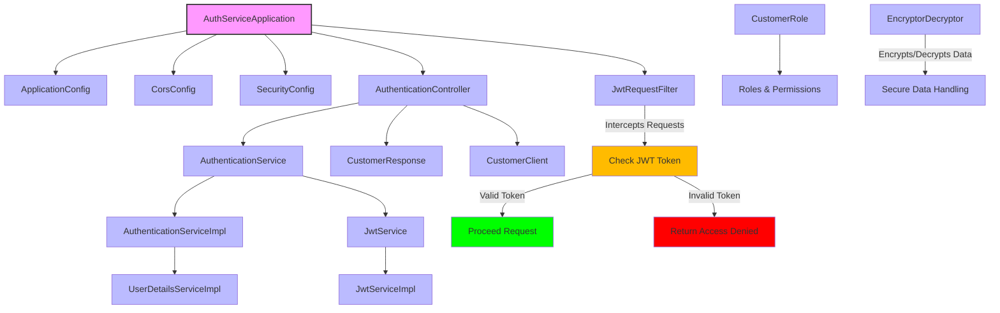
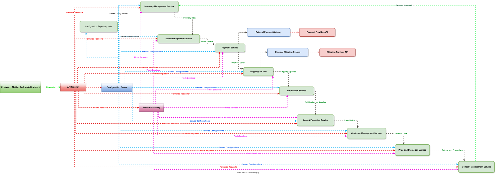
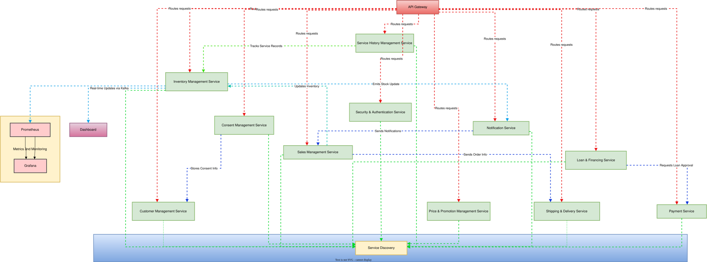
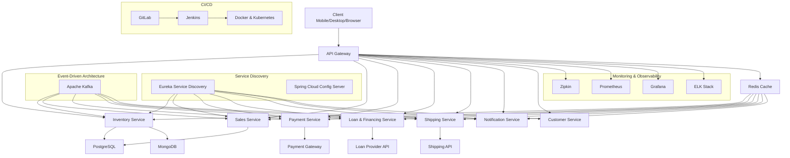
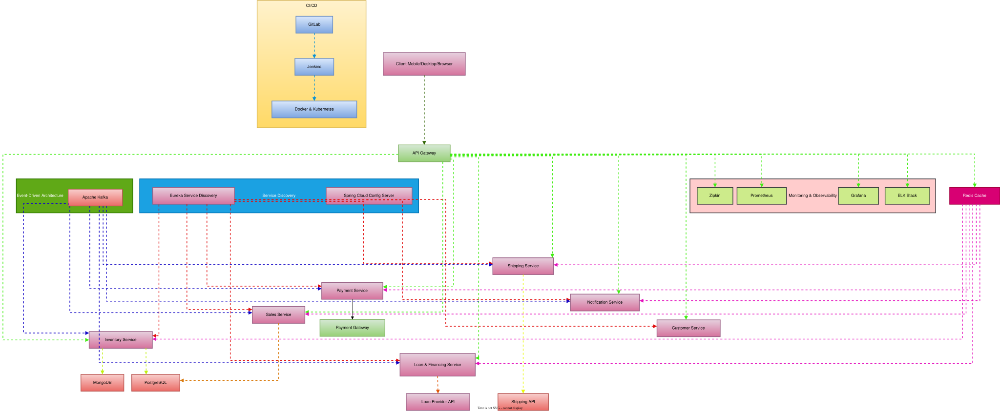
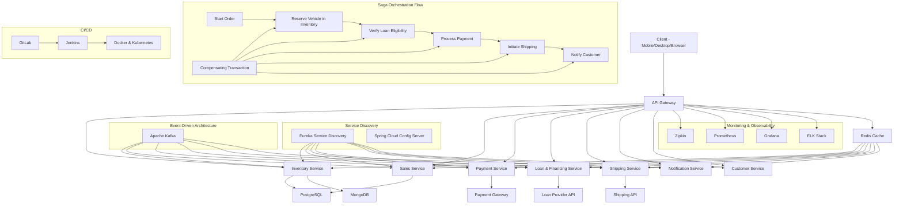
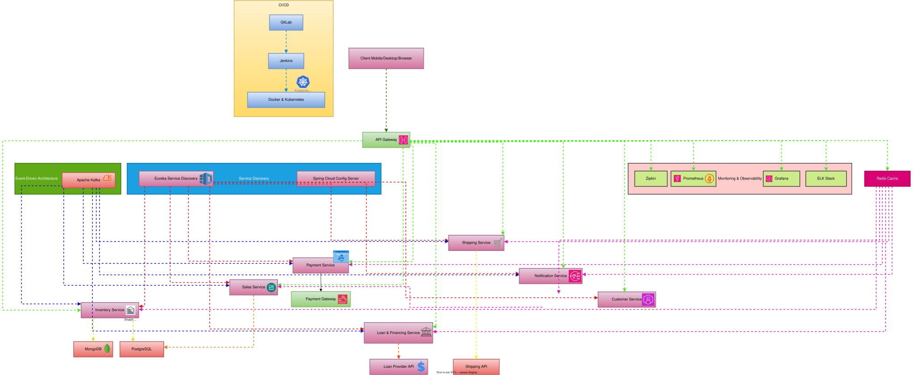

# Java Full Stack Interview Questions & Answers

## Cheat Sheets

### Table of Contents

<details open>
<summary>
Hide/Show table of contents
</summary>
    
| No. | Cheat Sheets |
|---- | ---------|
|1 | [**Cheat-Sheet-Docker**](cheat-sheet/Cheat-Sheet-Docker.md)|
|2 | [**Cheat-Sheet-Kafka**](cheat-sheet/Cheat-Sheet-Kafka.md)|
|2.1 | [**Kafka Concepts**](Kafka/Kafka-Concepts.md)|
|2.2 | [**Kafka Connect**](Kafka/Kafka-Connect.md)|
|3 | [**Cheat-Sheet-Kubernetes**](cheat-sheet/Cheat-Sheet-Kubernetes.md)|
|4 | [**Cheat-Sheet-Linux**](cheat-sheet/Cheat-Sheet-Linux.md)|
|5 | [**Cheat-Sheet-Java8**](cheat-sheet/Cheat-Sheet-Java8.md)|
|6 | [**Cheat-Sheet-MongoDB**](cheat-sheet/Cheat-Sheet-MongoDB.md)|

</details>

## Interview Questions & Answers - Java Script, Angular & React

### Table of Contents

<details open>
<summary>
Hide/Show table of contents
</summary>
 
| No. | Topics |
|---- | ---------|
|1 | [**Q&A-JavaScript**](conceptsI/FAQ-JavaScript.md)|
|2 | [**Q&A-Angular**](conceptsI/FAQ-Angular.md)|
|3 | [**Q&A-React**](conceptsI/FAQ-React.md)|
|5 | [**Q&A-React-Advanced**](conceptsI/FAQ-React-Advanced.md)|
|6 | [**Q&A-React**](conceptsI/Q&A-React.md)|
</details>

## Interview Questions & Answers - Java & J2EE Technologies

### Table of Contents

<details open>
<summary>
Hide/Show table of contents
</summary>
 
| No. | Topics |
|---- | ---------|
|1 | [**Q&A-Design-Patterns**](conceptsI/FAQ-Design-Patterns.md)|
|2 | [**Java Collection Framework**](Java-Collection-Framework.md)|
|3 | [**Java Thread & Concurrency**](conceptsIII/java-basic-fundamental-Concurrency.md)|
|4 | [**Java File I/O**](FileIO-In-Java.md)|
|5 | [**End-to-End CICD Pipeline Implementation**](End-to-End-CICD-Pipeline-Implementation.md)|
|6 | [**Java Basic Differences & Comparisions**](java-basic-differences-and-comparisions.md)|

## Java Programing Exercises
* [java-basic-exercises-001-Basic-1](exercisesI/java-basic-exercises-001-Basic-1.md)
* [java-basic-exercises-002-Basic-2](exercisesI/java-basic-exercises-002-Basic-2.md)
* [java-basic-exercises-003-Recursive](exercisesI/java-basic-exercises-003-Recursive.md)
* [java-basic-exercises-004-Exception](exercisesI/java-basic-exercises-004-Exception.md)
* [java-basic-exercises-005-Array](exercisesI/java-basic-exercises-005-Array.md)
* [java-basic-exercises-006-Inheritance](exercisesI/java-basic-exercises-006-Inheritance.md)
* [java-basic-exercises-007-Abstract](exercisesI/java-basic-exercises-007-Abstract.md)
* [java-basic-exercises-008-Thread](exercisesI/java-basic-exercises-008-Thread.md)
* [java-basic-exercises-009-Multithreading](exercisesI/java-basic-exercises-009-Multithreading.md)
* [java-basic-exercises-010-Generic](exercisesI/java-basic-exercises-010-Generic.md)
* [java-basic-exercises-011-OOPs](exercisesI/java-basic-exercises-011-OOPs.md)
* [java-basic-exercises-012-Interface](exercisesI/java-basic-exercises-012-Interface.md)
* [java-basic-exercises-013-Encapsulation](exercisesI/java-basic-exercises-013-Encapsulation.md)
* [java-basic-exercises-014-Polymorphism](exercisesI/java-basic-exercises-014-Polymorphism.md)
* [java-basic-exercises-015-String](exercisesI/java-basic-exercises-015-String.md)
* [java-basic-exercises-016-Lambda](exercisesI/java-basic-exercises-016-Lambda.md)
* [java-basic-exercises-017-Stream](exercisesI/java-basic-exercises-017-Stream.md)
* [java-basic-exercises-018-Method](exercisesI/java-basic-exercises-018-Method.md)
* [java-basic-exercises-019-Numbers](exercisesI/java-basic-exercises-019-Numbers.md)
* [java-basic-exercises-020-Collection](exercisesI/java-basic-exercises-020-Collection.md)
  * [java-basic-exercises-020-collection-arraylist](exercisesI/java-basic-exercises-020-collection-arraylist.md)
  * [java-basic-exercises-020-collection-hashmap](exercisesI/java-basic-exercises-020-collection-hashmap.md)
  * [java-basic-exercises-020-collection-hashset](exercisesI/java-basic-exercises-020-collection-hashset.md)
  * [java-basic-exercises-020-collection-linkedlist](exercisesI/java-basic-exercises-020-collection-linkedlist.md)
  * [java-basic-exercises-020-collection-priorityqueue](exercisesI/java-basic-exercises-020-collection-priorityqueue.md)
  * [java-basic-exercises-020-collection-treemap](exercisesI/java-basic-exercises-020-collection-treemap.md)
  * [java-basic-exercises-020-collection-treeset](exercisesI/java-basic-exercises-020-collection-treeset.md)
* [java-basic-exercises-021-Sorting](exercisesI/java-basic-exercises-021-Sorting.md)
* [java-basic-exercises-022-Search](exercisesI/java-basic-exercises-022-Search.md)
* [java-basic-exercises-023-Unit-Test](exercisesI/java-basic-exercises-023-Unit-Test.md)
## Java Programing Question Answer
* [java-programming-question-answer-1](exercisesII/java-programming-question-answer-1.md)
* [java-programming-question-answer-2](exercisesII/java-programming-question-answer-2.md)
* [java-programming-question-answer-3-emp-mgmt](exercisesII/java-programming-question-answer-3-emp-mgmt.md)
* [java-programming-question-answer-4-java-8](exercisesII/java-programming-question-answer-4-java-8.md)
* [java-programming-question-answer-5-java-8](exercisesII/java-programming-question-answer-5-java-8.md)
* [java-programming-question-answer-consolidated](exercisesII/java-programming-question-answer-consolidated.md)
</details>

## Ambiguities in Java technologies

Java technologies encompass a wide range of tools, libraries, frameworks, and APIs, which can sometimes lead to ambiguities. Here are some common areas where ambiguities may arise:

1. **Java Versions**:
   - Differences in features and APIs across Java versions (e.g., Java 8 vs. Java 11 vs. Java 17).
   - Backward compatibility issues.

2. **Frameworks and Libraries**:
   - Multiple frameworks for similar purposes (e.g., Spring vs. Java EE vs. Micronaut).
   - Overlapping functionalities in libraries (e.g., Hibernate vs. JPA).

3. **Dependency Management**:
   - Confusion over Maven vs. Gradle for dependency management.
   - Version conflicts in transitive dependencies.

4. **Java Virtual Machine (JVM)**:
   - Different JVM implementations (OpenJ9, GraalVM) may have performance implications.
   - Differences in garbage collection strategies and their effects.

5. **Concurrency and Multithreading**:
   - Ambiguity in using `synchronized` vs. `Lock` classes.
   - Misunderstanding of the Java Memory Model (JMM).

6. **Error Handling**:
   - Confusion between checked and unchecked exceptions.
   - Best practices for exception handling can be subjective.

7. **APIs and Standards**:
   - Different interpretations of Java APIs in implementation.
   - Variations in how standards are applied across different libraries.

8. **Java Language Features**:
   - Ambiguity in new language features (e.g., var vs. explicit types).
   - Differences in syntax and semantics introduced in newer versions.

9. **Design Patterns**:
   - Varying implementations and interpretations of common design patterns.
   - Contextual appropriateness of a design pattern can lead to confusion.

10. **JavaBeans vs. POJOs**:
    - Differences in conventions and use cases for JavaBeans and Plain Old Java Objects (POJOs).

11. **Testing Frameworks**:
    - Different approaches to testing (JUnit vs. TestNG vs. Mockito) can create confusion regarding best practices.

12. **Web Technologies**:
    - Confusion over Java-based web technologies (Servlets vs. JSP vs. JSF vs. Spring MVC).
    - Ambiguity in RESTful services vs. SOAP.

Navigating these ambiguities often requires a deeper understanding of the context in which Java technologies are used, along with continuous learning and adaptation.

## How to preventing ambiguities in Java technologies

Preventing ambiguities in Java technologies involves a combination of best practices, effective communication, and thorough documentation. Here are some strategies to consider:

1. **Stay Updated**:
   - Regularly follow Java's release notes and updates to understand new features and deprecations.

2. **Choose a Clear Framework**:
   - Select a single framework for a specific purpose (e.g., Spring for web applications) and stick to it, minimizing the use of multiple frameworks simultaneously.

3. **Consistent Coding Standards**:
   - Adopt and enforce consistent coding conventions within your team to reduce misunderstandings and improve code readability.

4. **Use Modern IDEs**:
   - Leverage Integrated Development Environments (IDEs) like IntelliJ IDEA or Eclipse, which provide features like code completion, error highlighting, and documentation support.

5. **Comprehensive Documentation**:
   - Document your code, frameworks, and architectural decisions clearly. Include rationale for choices made, especially for key dependencies and design patterns.

6. **Dependency Management**:
   - Use tools like Maven or Gradle effectively. Specify versions clearly and utilize dependency locking to avoid version conflicts.

7. **Code Reviews**:
   - Implement regular code reviews to catch ambiguities and ensure adherence to coding standards. This promotes knowledge sharing among team members.

8. **Testing**:
   - Adopt a consistent testing strategy (e.g., unit testing with JUnit) and ensure all team members are familiar with the chosen tools and frameworks.

9. **Training and Knowledge Sharing**:
   - Provide training sessions on key Java technologies and encourage knowledge sharing among team members to ensure everyone is on the same page.

10. **Clear Exception Handling Strategy**:
    - Establish a clear policy for exception handling, deciding when to use checked vs. unchecked exceptions and documenting the reasoning behind it.

11. **Design Patterns**:
    - Choose a set of commonly used design patterns for your projects and document their intended use cases to avoid misapplication.

12. **Community and Resources**:
    - Engage with the Java community through forums, meetups, or online courses to share experiences and learn from others.

By implementing these strategies, you can significantly reduce ambiguities and improve the overall quality and maintainability of your Java projects.

Here’s a more detailed exploration of specific Java ambiguities along with code examples and strategies for prevention:

### 1. **Ambiguity with Java Versions**

**Ambiguity**: Different Java versions introduce new features or deprecate existing ones, leading to confusion.

**Prevention**: Specify the Java version in your build tools and use features relevant to that version.

```xml
<!-- Maven example -->
<properties>
    <maven.compiler.source>11</maven.compiler.source>
    <maven.compiler.target>11</maven.compiler.target>
</properties>
```

### 2. **Framework Overlap**

**Ambiguity**: Multiple frameworks may provide similar functionalities, like Spring and Java EE.

**Prevention**: Choose one framework for a specific task and document the reasons for this choice.

```java
// Using Spring for dependency injection
@Component
public class MyService {
    // Service implementation
}

// Avoid mixing with Java EE @Stateless
```

### 3. **Dependency Conflicts**

**Ambiguity**: Transitive dependencies can lead to version conflicts.

**Prevention**: Use dependency management tools to lock versions and resolve conflicts explicitly.

```xml
<!-- Maven example -->
<dependencyManagement>
    <dependencies>
        <dependency>
            <groupId>org.springframework</groupId>
            <artifactId>spring-core</artifactId>
            <version>5.3.8</version>
        </dependency>
    </dependencies>
</dependencyManagement>
```

### 4. **Concurrency Issues**

**Ambiguity**: Misunderstanding the use of `synchronized` vs. `Lock` classes.

**Prevention**: Clearly document concurrency requirements and choose one approach consistently.

```java
// Using ReentrantLock
Lock lock = new ReentrantLock();
lock.lock();
try {
    // Critical section
} finally {
    lock.unlock();
}
```

### 5. **Error Handling Confusion**

**Ambiguity**: Differences in handling checked vs. unchecked exceptions.

**Prevention**: Establish a consistent policy for exception handling and document it.

```java
// Checked exception
public void readFile(String path) throws IOException {
    // Implementation
}

// Unchecked exception
public void process() {
    if (someCondition) {
        throw new IllegalArgumentException("Invalid argument");
    }
}
```

### 6. **JavaBeans vs. POJOs**

**Ambiguity**: Misunderstanding the purpose and structure of JavaBeans vs. POJOs.

**Prevention**: Clearly define and document the use case for each.

```java
// JavaBean example
public class User {
    private String name;
    
    public String getName() {
        return name;
    }

    public void setName(String name) {
        this.name = name;
    }
}

// POJO example
public class Product {
    private final String id;
    
    public Product(String id) {
        this.id = id;
    }
}
```

### 7. **Design Pattern Misapplication**

**Ambiguity**: Misunderstanding the use of design patterns.

**Prevention**: Document the intended use cases for patterns in your project.

```java
// Singleton pattern
public class Singleton {
    private static final Singleton INSTANCE = new Singleton();

    private Singleton() {}

    public static Singleton getInstance() {
        return INSTANCE;
    }
}
```

### 8. **Testing Framework Confusion**

**Ambiguity**: Different testing frameworks may lead to inconsistencies.

**Prevention**: Standardize on one testing framework and train team members.

```java
// JUnit example
import org.junit.jupiter.api.Test;
import static org.junit.jupiter.api.Assertions.assertEquals;

public class CalculatorTest {
    @Test
    public void testAdd() {
        Calculator calc = new Calculator();
        assertEquals(5, calc.add(2, 3));
    }
}
```

### 9. **APIs and Standards Misinterpretation**

**Ambiguity**: Different interpretations of Java APIs can lead to misuse.

**Prevention**: Provide clear documentation and guidelines for API usage.

```java
// Correct use of the Stream API
List<String> names = Arrays.asList("Alice", "Bob", "Charlie");
List<String> filteredNames = names.stream()
                                   .filter(name -> name.startsWith("A"))
                                   .collect(Collectors.toList());
```

### 10. **Web Technologies Confusion**

**Ambiguity**: Mixing different Java web technologies can lead to unclear implementations.

**Prevention**: Choose a single technology stack and stick to it.

```java
// Spring MVC Controller
@Controller
public class MyController {
    @GetMapping("/hello")
    public String sayHello(Model model) {
        model.addAttribute("message", "Hello, World!");
        return "hello";
    }
}
```

### Summary

By adopting these best practices and using the provided code examples, you can effectively minimize ambiguities in your Java projects. Establishing clear guidelines, consistent usage patterns, and thorough documentation are key to ensuring clarity and maintainability.

---

**Here’s an overview of Angular, React, microservices, and threading, along with their interactions and use cases.**

### Angular

**Overview**:
Angular is a TypeScript-based open-source web application framework led by the Angular Team at Google. It is primarily used for building single-page applications (SPAs).

**Key Features**:
- **Component-Based Architecture**: Encourages reusability and organization of code.
- **Dependency Injection**: Facilitates better code organization and testing.
- **Two-Way Data Binding**: Synchronizes data between the model and the view.
- **RxJS**: Supports reactive programming for handling asynchronous data.

**Use Case**: Angular is suitable for enterprise-level applications with complex UIs, such as dashboards or form-heavy applications.

### React

**Overview**:
React is a JavaScript library for building user interfaces, maintained by Facebook. It allows developers to create large web applications that can change data, without reloading the page.

**Key Features**:
- **Component-Based Architecture**: Promotes the creation of reusable UI components.
- **Virtual DOM**: Improves performance by minimizing direct manipulation of the DOM.
- **One-Way Data Binding**: Ensures a unidirectional data flow, which simplifies debugging.
- **Hooks**: Allows state and lifecycle management in functional components.

**Use Case**: React is often used for dynamic and interactive UIs, such as social media platforms and real-time applications.

Debugging React and Angular code involves various tools and techniques. Here’s a concise guide for each:

### Debugging React

1. **Browser Developer Tools**:
   - Use Chrome DevTools or Firefox Developer Edition to inspect elements, view console logs, and monitor network requests.
   - Check the “Components” tab in React Developer Tools to inspect component state and props.

2. **Console Logs**:
   - Insert `console.log()` statements to track the flow of data and state changes.

3. **Error Boundaries**:
   - Implement error boundaries to catch JavaScript errors in components and display a fallback UI.

4. **React Developer Tools**:
   - Install the React DevTools extension to visualize the component hierarchy, state, and props.

5. **Debugging Hooks**:
   - For hooks, ensure you're using them correctly. React's strict mode can help identify issues with hooks.

6. **Testing**:
   - Write tests using Jest or React Testing Library to catch errors before runtime.

### Debugging Angular

1. **Browser Developer Tools**:
   - Use the console for error messages and inspect the DOM using the Elements tab.

2. **Angular DevTools**:
   - Install Angular DevTools to analyze component trees, detect change detection issues, and profile performance.

3. **Console Logs**:
   - Use `console.log()` for debugging service responses, component lifecycles, and data flow.

4. **Error Handling**:
   - Implement global error handling in Angular with `ErrorHandler` for catching unexpected errors.

5. **Debugging Tools**:
   - Use the `ng.probe()` function in the console to inspect Angular components directly.

6. **Unit Testing**:
   - Utilize Jasmine and Karma for testing components and services to catch issues early.

### General Tips

- **Source Maps**: Ensure source maps are enabled for better stack traces.
- **Linting**: Use ESLint (for React) or TSLint (for Angular) to catch code quality issues.
- **Version Control**: Use git to track changes and identify when bugs were introduced.
- **Network Monitoring**: Use the Network tab to check API calls and responses.

By using these strategies and tools, you can efficiently debug both React and Angular applications.

Sharding in MongoDB is a method used to distribute data across multiple servers, allowing for horizontal scaling. It helps manage large datasets and high-throughput applications by breaking up the data into smaller, more manageable pieces called "shards."

### Key Concepts of Sharding

1. **Shard**: A single instance (or replica set) that holds a subset of the data.
2. **Shard Key**: A specific field or fields that determine how data is distributed across shards. The choice of shard key is critical for ensuring balanced distribution and performance.
3. **Config Server**: Stores metadata and configuration settings for the sharded cluster, including the shard key ranges.
4. **Mongos**: A routing service that directs client requests to the appropriate shard.

### Example Scenario

Let’s say we have a MongoDB collection called `users` that contains user profiles, and we want to shard this collection to handle a large volume of user data.

#### Step 1: Choosing a Shard Key

For this example, we might choose the `user_id` field as the shard key because it provides a good distribution of data and helps evenly distribute user records across shards.

#### Step 2: Setting Up the Sharded Cluster

1. **Start Config Servers**:
   ```bash
   mongod --configsvr --replSet configReplSet --port 27019 --dbpath /data/configdb --bind_ip localhost
   ```

2. **Start Shard Servers**:
   ```bash
   mongod --shardsvr --replSet shard1ReplSet --port 27018 --dbpath /data/shard1
   mongod --shardsvr --replSet shard2ReplSet --port 27020 --dbpath /data/shard2
   ```

3. **Start the Mongos Router**:
   ```bash
   mongos --configdb configReplSet/localhost:27019 --port 27017
   ```

4. **Connect to the Mongos**:
   ```bash
   mongo --host localhost --port 27017
   ```

5. **Enable Sharding for the Database**:
   ```javascript
   sh.enableSharding("myDatabase")
   ```

6. **Shard the Collection**:
   ```javascript
   sh.shardCollection("myDatabase.users", { "user_id": 1 })
   ```

#### Step 3: Inserting Data

Now, as you insert user records into the `users` collection, MongoDB automatically distributes them across the shards based on the `user_id` value.

```javascript
db.users.insertMany([
    { "user_id": 1, "name": "Alice" },
    { "user_id": 2, "name": "Bob" },
    { "user_id": 3, "name": "Charlie" },
    // More users...
]);
```

#### Step 4: Querying Data

When you query the `users` collection, the `mongos` router directs the request to the appropriate shard(s) based on the `user_id` provided:

```javascript
db.users.find({ "user_id": 2 });
```

### Benefits of Sharding

- **Scalability**: Easily add more shards as the dataset grows.
- **Performance**: Distributes load across multiple servers, improving read and write performance.
- **High Availability**: By using replica sets for shards, MongoDB provides redundancy and failover capabilities.

### Conclusion

Sharding in MongoDB is a powerful technique for managing large datasets and ensuring efficient data access. By properly selecting a shard key and configuring the sharded cluster, you can effectively scale your applications to handle increased load and data volume.

### Horizontal and Vertical Scaling

**Horizontal Scaling**:
- Involves adding more machines or nodes to a system (scaling out).
- Example: Adding more servers to handle increased web traffic.
- Advantages:
  - Improved fault tolerance.
  - Better resource utilization.
  - Easier to scale out by adding more nodes.

**Vertical Scaling**:
- Involves adding more resources (CPU, RAM) to an existing machine (scaling up).
- Example: Upgrading a server to a more powerful configuration.
- Advantages:
  - Simpler implementation (no need to change the application architecture).
  - Immediate performance improvements.

### Summary

- **Scaling**: Horizontal scaling involves adding more machines, while vertical scaling involves upgrading existing hardware.

In Java, the ClassLoader is a part of the Java Runtime Environment (JRE) that is responsible for loading classes into memory. It dynamically loads classes at runtime and is an essential component of the Java programming model. The ClassLoader finds the binary representation of a class and loads it into the Java Virtual Machine (JVM).

### Types of ClassLoaders

Java has a hierarchical structure of class loaders. The main types of class loaders are:

1. **Bootstrap ClassLoader**
   - The parent of all class loaders.
   - Loads core Java classes located in the `<JAVA_HOME>/lib` directory, such as `java.lang.*`, `java.util.*`, etc.
   - It is part of the JVM itself and written in native code.

2. **Extension ClassLoader (or Platform ClassLoader)**
   - Loads classes from the Java extension directory (`<JAVA_HOME>/lib/ext`).
   - It is a child of the Bootstrap ClassLoader.
   - Typically used for loading classes from external libraries that extend the standard Java platform.

3. **System ClassLoader (or Application ClassLoader)**
   - Loads classes from the application classpath (e.g., directories and JAR files specified in the `CLASSPATH` environment variable).
   - It is a child of the Extension ClassLoader.
   - Most user-defined classes are loaded by this loader.

4. **Custom ClassLoaders**
   - Developers can create their own class loaders by extending the `java.lang.ClassLoader` class.
   - Custom class loaders are useful for loading classes from non-standard sources, such as a database, network, or custom file formats.

### ClassLoader Hierarchy

The hierarchy of class loaders in Java is as follows:

```
Bootstrap ClassLoader
         |
   Extension ClassLoader
         |
   System ClassLoader
```

### Summary

- **Bootstrap ClassLoader**: Loads core Java classes.
- **Extension ClassLoader**: Loads classes from the Java extension directory.
- **System ClassLoader**: Loads classes from the application classpath.
- **Custom ClassLoaders**: User-defined loaders for specialized class-loading requirements.

---
In Java, there are several ways to create objects. Here are the main methods:

1. **Using the `new` Keyword**
   - The most common way to create an object.
   - Syntax:
     ```java
     ClassName obj = new ClassName();
     ```

2. **Using the `newInstance()` Method**
   - This method is part of the `Class` class and can be used to create an instance of a class using reflection.
   - Syntax:
     ```java
     ClassName obj = ClassName.class.newInstance();
     ```

3. **Using the `clone()` Method**
   - If a class implements the `Cloneable` interface, you can create a new object as a copy of an existing object.
   - Syntax:
     ```java
     ClassName obj1 = new ClassName();
     ClassName obj2 = (ClassName) obj1.clone();
     ```

4. **Using Factory Methods**
   - Classes can have static factory methods that return instances of the class. This is a common design pattern.
   - Example:
     ```java
     ClassName obj = ClassName.createInstance();
     ```

5. **Using Deserialization**
   - Objects can be created from a serialized state using the `ObjectInputStream` class.
   - Syntax:
     ```java
     ObjectInputStream in = new ObjectInputStream(new FileInputStream("objectfile.ser"));
     ClassName obj = (ClassName) in.readObject();
     ```

6. **Using Inner Classes**
   - You can create an object of an inner class directly using an instance of the outer class.
   - Syntax:
     ```java
     OuterClass outer = new OuterClass();
     OuterClass.InnerClass inner = outer.new InnerClass();
     ```

7. **Using Anonymous Classes**
   - Java allows you to create an object of a class without explicitly defining a class.
   - Syntax:
     ```java
     ClassName obj = new ClassName() {
         // Override methods here
     };
     ```

### Summary

- **`new` keyword**: Most common method.
- **`newInstance()`**: Reflection-based object creation.
- **`clone()`**: Create a copy of an existing object.
- **Factory methods**: Static methods for instance creation.
- **Deserialization**: Restore object state from a serialized format.
- **Inner classes**: Instantiate inner classes using outer class objects.
- **Anonymous classes**: Create instances without a separate class definition.

---
In Java, `wait()`, `sleep()`, `join()`, and `yield()` are methods used in multi-threading to manage thread behavior. Here’s a breakdown of each:

### 1. `wait()`
- **Purpose**: Causes the current thread to wait until another thread invokes the `notify()` or `notifyAll()` method on the same object.
- **Use Case**: Typically used for inter-thread communication, especially when a thread needs to wait for a condition to be fulfilled by another thread.
- **How It Works**:
  - Must be called from within a synchronized block or method.
  - Releases the lock held by the thread, allowing other threads to access the synchronized block.

**Example**:
```java
synchronized (object) {
    while (conditionNotMet) {
        object.wait(); // Waits for notification
    }
}
```

### 2. `sleep()`
- **Purpose**: Pauses the execution of the current thread for a specified period.
- **Use Case**: Often used to create delays in execution or simulate processing time.
- **How It Works**:
  - It does not release any locks held by the thread.
  - It can throw `InterruptedException`.

**Example**:
```java
try {
    Thread.sleep(1000); // Sleeps for 1 second
} catch (InterruptedException e) {
    e.printStackTrace();
}
```

### 3. `join()`
- **Purpose**: Waits for a thread to die (i.e., finish its execution).
- **Use Case**: Used when you want one thread to wait for another to complete its execution before continuing.
- **How It Works**:
  - It can take an optional timeout parameter.
  - After calling `join()`, the current thread will be blocked until the thread it joins has completed.

**Example**:
```java
Thread t1 = new Thread(() -> {
    // Some work
});
t1.start();
t1.join(); // Waits for t1 to finish
```

### 4. `yield()`
- **Purpose**: Suggests that the current thread is willing to yield its current use of the CPU.
- **Use Case**: Used to improve the efficiency of thread scheduling, allowing other threads of the same priority to run.
- **How It Works**:
  - It does not guarantee that the thread will relinquish the CPU; it merely makes a request to the thread scheduler.

**Example**:
```java
Thread.yield(); // Suggests that the current thread yield
```

### Summary
- **`wait()`**: Used for inter-thread communication, releases locks.
- **`sleep()`**: Pauses the thread without releasing locks, for a specified time.
- **`join()`**: Makes the calling thread wait for another thread to finish.
- **`yield()`**: Suggests to the scheduler that the current thread can be paused to allow other threads to run.


## React Important FAQ's

Sure! Here’s an in-depth look at each of the questions, complete with explanations and examples.

### Basics

1. **What is React, and what are its main features?**
   React is a JavaScript library for building user interfaces, particularly for single-page applications. It allows developers to create large web applications that can change data, without reloading the page. Main features include:
   - **Component-Based Architecture:** UI is built using reusable components.
   - **Virtual DOM:** Optimizes rendering by updating only the parts of the DOM that have changed.
   - **Declarative UI:** Makes it easier to create interactive UIs by describing what the UI should look like based on application state.

2. **Explain the concept of components in React. What are functional and class components?**
   Components are the building blocks of a React application. They encapsulate logic, styles, and markup.
   - **Functional Components:** These are simpler and are just JavaScript functions that return JSX. They can use hooks to manage state and side effects.
     ```javascript
     function Greeting(props) {
       return <h1>Hello, {props.name}!</h1>;
     }
     ```
   - **Class Components:** These are ES6 classes that extend from `React.Component` and include lifecycle methods.
     ```javascript
     class Greeting extends React.Component {
       render() {
         return <h1>Hello, {this.props.name}!</h1>;
       }
     }
     ```

3. **What is JSX, and how does it differ from HTML?**
   JSX is a syntax extension for JavaScript that looks similar to HTML but is not exactly the same. It allows developers to write HTML-like syntax in their JavaScript code, which gets transformed into JavaScript objects.
   - Differences:
     - **JavaScript Expressions:** You can embed JavaScript expressions in JSX using curly braces `{}`.
     - **Attribute Names:** JSX uses camelCase for attributes (e.g., `className` instead of `class`).

### State and Props

4. **How does state management work in React? What is the difference between state and props?**
   - **State:** A mutable object that holds data specific to a component. Changes to state trigger a re-render of the component.
   - **Props:** Short for properties, these are immutable values passed to components from their parent. They allow data to flow from parent to child components.
   Example:
   ```javascript
   function Counter() {
     const [count, setCount] = useState(0);
     return (
       <div>
         <p>{count}</p>
         <button onClick={() => setCount(count + 1)}>Increment</button>
       </div>
     );
   }
   ```

5. **Can you explain the use of the `useState` hook?**
   `useState` is a hook that allows functional components to manage state. It returns an array with the current state and a function to update it.
   Example:
   ```javascript
   import React, { useState } from 'react';

   function Counter() {
     const [count, setCount] = useState(0); // Initialize state
     return (
       <div>
         <p>{count}</p>
         <button onClick={() => setCount(count + 1)}>Increment</button>
       </div>
     );
   }
   ```

6. **How do you pass data between components using props?**
   Data can be passed from a parent component to a child component through props.
   Example:
   ```javascript
   function Parent() {
     const name = "Alice";
     return <Child name={name} />;
   }

   function Child(props) {
     return <h1>Hello, {props.name}!</h1>;
   }
   ```

### Lifecycle Methods and Hooks

7. **What are React lifecycle methods, and when are they used?**
   Lifecycle methods are special methods in class components that allow you to hook into specific points in a component’s life cycle (mounting, updating, unmounting). Common methods include:
   - `componentDidMount`: Invoked immediately after a component is mounted.
   - `componentDidUpdate`: Invoked immediately after updating occurs.
   - `componentWillUnmount`: Invoked immediately before a component is unmounted.

8. **Describe the `useEffect` hook and its use cases.**
   `useEffect` allows functional components to perform side effects (like data fetching, subscriptions) after rendering. It can mimic lifecycle methods.
   Example:
   ```javascript
   useEffect(() => {
     const fetchData = async () => {
       const response = await fetch('api/data');
       const data = await response.json();
       setData(data);
     };
     fetchData();
   }, []); // Empty array means this effect runs once on mount
   ```

9. **What are some common use cases for the `useContext` hook?**
   `useContext` allows you to access context values in functional components without needing to use a Consumer component. It’s commonly used for:
   - Theming (e.g., dark mode)
   - User authentication (e.g., current user info)
   - Global state management

### Performance Optimization

10. **How can you optimize performance in a React application?**
    - **Memoization:** Use `React.memo` to prevent re-rendering of components that do not change.
    - **Code Splitting:** Load parts of the application on demand using dynamic imports.
    - **Virtualization:** Render only visible parts of a list (using libraries like react-window or react-virtualized).

11. **What is memoization, and how does `React.memo` help with performance?**
    `React.memo` is a higher-order component that memoizes functional components. It prevents re-rendering unless the props have changed, thus optimizing performance.
    Example:
    ```javascript
    const MyComponent = React.memo(({ prop }) => {
      // Component logic
    });
    ```

12. **Explain the concept of code splitting and how it can be implemented in a React app.**
    Code splitting allows you to split your code into smaller chunks that can be loaded on demand. This reduces the initial load time.
    Example using `React.lazy`:
    ```javascript
    const LazyComponent = React.lazy(() => import('./LazyComponent'));
    function App() {
      return (
        <Suspense fallback={<div>Loading...</div>}>
          <LazyComponent />
        </Suspense>
      );
    }
    ```

### Routing and State Management

13. **How do you implement routing in a React application?**
    You can use the `react-router-dom` library to implement routing.
    Example:
    ```javascript
    import { BrowserRouter as Router, Route, Switch } from 'react-router-dom';

    function App() {
      return (
        <Router>
          <Switch>
            <Route path="/" exact component={Home} />
            <Route path="/about" component={About} />
          </Switch>
        </Router>
      );
    }
    ```

14. **What are some popular state management libraries used with React, and how do they differ?**
    - **Redux:** Centralized state management, uses actions and reducers.
    - **MobX:** Uses observables for state management, more reactive.
    - **Recoil:** Simplifies state management with atoms and selectors, integrates seamlessly with React’s concurrent features.

15. **Explain how to use Redux with React. What are actions, reducers, and the store?**
    - **Actions:** Plain objects that describe what happened.
    - **Reducers:** Functions that take the current state and an action, and return a new state.
    - **Store:** An object that holds the application state and provides methods to access and update it.
    Example:
    ```javascript
    const initialState = { count: 0 };

    function counterReducer(state = initialState, action) {
      switch (action.type) {
        case 'increment':
          return { count: state.count + 1 };
        default:
          return state;
      }
    }

    const store = createStore(counterReducer);
    ```

### Advanced Concepts

16. **What is the Context API, and how does it help in managing state?**
    The Context API allows you to share values (like state) across the component tree without passing props manually at every level. It’s ideal for global data like themes or user settings.
    Example:
    ```javascript
    const ThemeContext = React.createContext();

    function App() {
      return (
        <ThemeContext.Provider value="dark">
          <Toolbar />
        </ThemeContext.Provider>
      );
    }

    function Toolbar() {
      return (
        <ThemeContext.Consumer>
          {value => <div>The theme is {value}</div>}
        </ThemeContext.Consumer>
      );
    }
    ```

17. **How can you create a custom hook in React?**
    Custom hooks allow you to extract component logic into reusable functions.
    Example:
    ```javascript
    function useFetch(url) {
      const [data, setData] = useState(null);
      useEffect(() => {
        fetch(url)
          .then(response => response.json())
          .then(setData);
      }, [url]);
      return data;
    }
    ```

18. **What are higher-order components (HOCs), and how are they used?**
    HOCs are functions that take a component and return a new component. They’re used for code reuse, such as adding authentication or logging.
    Example:
    ```javascript
    function withAuth(WrappedComponent) {
      return function(props) {
        const isAuthenticated = /* some logic */;
        return isAuthenticated ? <WrappedComponent {...props} /> : <Redirect />;
      };
    }
    ```

### Testing

19. **How do you

 test React components? What libraries do you use?**
    Testing can be done using libraries like Jest and React Testing Library. They allow you to test components, user interactions, and snapshots.
    Example:
    ```javascript
    import { render, screen } from '@testing-library/react';
    import MyComponent from './MyComponent';

    test('renders learn react link', () => {
      render(<MyComponent />);
      const linkElement = screen.getByText(/learn react/i);
      expect(linkElement).toBeInTheDocument();
    });
    ```

20. **What is the purpose of snapshot testing in React?**
    Snapshot testing allows you to capture the rendered output of a component at a point in time. It’s useful for detecting unintended changes.
    Example:
    ```javascript
    import renderer from 'react-test-renderer';
    import MyComponent from './MyComponent';

    test('matches snapshot', () => {
      const tree = renderer.create(<MyComponent />).toJSON();
      expect(tree).toMatchSnapshot();
    });
    ```

### Miscellaneous

21. **How does React handle forms? What are controlled and uncontrolled components?**
    - **Controlled Components:** Form data is handled by the component state. The input value is derived from state, and changes are handled via an event handler.
      ```javascript
      function MyForm() {
        const [value, setValue] = useState('');

        return (
          <input
            value={value}
            onChange={(e) => setValue(e.target.value)}
          />
        );
      }
      ```
    - **Uncontrolled Components:** Form data is handled by the DOM, using refs to access input values.
      ```javascript
      function MyForm() {
        const inputRef = useRef();

        const handleSubmit = (e) => {
          e.preventDefault();
          alert(inputRef.current.value);
        };

        return (
          <form onSubmit={handleSubmit}>
            <input ref={inputRef} />
            <button type="submit">Submit</button>
          </form>
        );
      }
      ```

22. **What are the advantages of using React with TypeScript?**
    - **Type Safety:** Catches errors at compile time rather than runtime.
    - **Intellisense:** Enhanced code completion and documentation.
    - **Improved Maintainability:** Makes it easier to refactor code with confidence.
    
23. **Can you explain the concept of server-side rendering (SSR) in React?**
    SSR refers to rendering React components on the server instead of the client. It can improve initial load performance and SEO.
    Example using Next.js:
    ```javascript
    // pages/index.js
    function HomePage({ data }) {
      return <div>{data}</div>;
    }

    export async function getServerSideProps() {
      const res = await fetch('https://api.example.com/data');
      const data = await res.json();
      return { props: { data } };
    }
    ```

### Advanced React Interview Questions

1. **Explain the React reconciliation process. How does React determine what to update?**
   React uses a diffing algorithm to compare the previous Virtual DOM with the new one. It identifies the changes and updates only those parts of the actual DOM. This minimizes updates, making rendering efficient.

2. **What are React hooks, and how do they differ from class components? Can you give examples of custom hooks you’ve created?**
   Hooks are functions that let you use state and other React features in functional components. Unlike class components, hooks simplify code and avoid the complexity of `this`.
   Example of a custom hook:
   ```javascript
   function useLocalStorage(key, initialValue) {
     const [storedValue, setStoredValue] = useState(() => {
       try {
         const item = window.localStorage.getItem(key);
         return item ? JSON.parse(item) : initialValue;
       } catch (error) {
         console.error(error);
         return initialValue;
       }
     });

     useEffect(() => {
       window.localStorage.setItem(key, JSON.stringify(storedValue));
     }, [key, storedValue]);

     return [storedValue, setStoredValue];
   }
   ```

3. **How do you manage side effects in React? Compare `useEffect` with other methods like lifecycle methods in class components.**
   `useEffect` is the primary way to manage side effects in functional components. It can replicate lifecycle methods such as `componentDidMount`, `componentDidUpdate`, and `componentWillUnmount`. In class components, you would use these lifecycle methods explicitly.

4. **What is the purpose of the `useReducer` hook, and in what scenarios would you choose it over `useState`?**
   `useReducer` is used for managing complex state logic. It’s preferred over `useState` when:
   - The state depends on the previous state.
   - The state structure is complex (like multiple related values).
   Example:
   ```javascript
   const initialState = { count: 0 };

   function reducer(state, action) {
     switch (action.type) {
       case 'increment':
         return { count: state.count + 1 };
       case 'decrement':
         return { count: state.count - 1 };
       default:
         throw new Error();
     }
   }

   function Counter() {
     const [state, dispatch] = useReducer(reducer, initialState);
     return (
       <>
         Count: {state.count}
         <button onClick={() => dispatch({ type: 'increment' })}>+</button>
         <button onClick={() => dispatch({ type: 'decrement' })}>-</button>
       </>
     );
   }
   ```

5. **Describe the concept of context in React. When would you use the Context API instead of prop drilling?**
   The Context API allows you to share data across components without passing props down manually at every level (prop drilling). Use it for global data like user settings or themes.

6. **How do you handle error boundaries in React? Can you give an example of how to implement one?**
   Error boundaries are components that catch JavaScript errors in their child component tree. Implement by creating a class component with `componentDidCatch`.
   Example:
   ```javascript
   class ErrorBoundary extends React.Component {
     constructor(props) {
       super(props);
       this.state = { hasError: false };
     }

     static getDerivedStateFromError(error) {
       return { hasError: true };
     }

     componentDidCatch(error, errorInfo) {
       console.log(error, errorInfo);
     }

     render() {
       if (this.state.hasError) {
         return <h1>Something went wrong.</h1>;
       }

       return this.props.children; 
     }
   }
   ```

7. **What are React fragments, and why would you use them?**
   Fragments let you group a list of children without adding extra nodes to the DOM. They’re useful for returning multiple elements from a component.
   Example:
   ```javascript
   return (
     <>
       <h1>Title</h1>
       <p>Description</p>
     </>
   );
   ```

8. **Explain the differences between controlled and uncontrolled components in forms. When would you use each?**
   Controlled components manage their form data through React state, while uncontrolled components store their data in the DOM. Use controlled components for better control and validation, and uncontrolled for simpler use cases where you need to integrate with non-React code.

9. **How can you optimize a React application for performance? Discuss techniques like memoization, lazy loading, and virtualization.**
   - **Memoization:** Using `React.memo` and `useMemo` to prevent unnecessary re-renders.
   - **Lazy Loading:** Using `React.lazy` and `Suspense` to load components only when needed.
   - **Virtualization:** Rendering only visible items in long lists to improve performance.

10. **What is code splitting in React, and how can it be implemented using React.lazy and Suspense?**
    Code splitting helps to load only the necessary parts of an application, reducing initial load time. Implement with `React.lazy` and `Suspense`:
    ```javascript
    const LazyComponent = React.lazy(() => import('./LazyComponent'));

    function App() {
      return (
        <Suspense fallback={<div>Loading...</div>}>
          <LazyComponent />
        </Suspense>
      );
    }
    ```

11. **Describe how you would implement server-side rendering (SSR) in a React application. What are the benefits and challenges?**
    SSR renders React components on the server and sends HTML to the client. Benefits include faster initial load times and better SEO. Challenges involve setting up the server, handling routing, and managing data fetching.
    Example with Next.js:
    ```javascript
    // pages/index.js
    function HomePage({ data }) {
      return <div>{data}</div>;
    }

    export async function getServerSideProps() {
      const res = await fetch('https://api.example.com/data');
      const data = await res.json();
      return { props: { data } };
    }
    ```

12. **What are higher-order components (HOCs), and how do they differ from render props? Provide examples of when you would use each.**
    HOCs are functions that take a component and return a new one, often used for reusing component logic. Render props involve passing a function as a prop to share code.
    Example of HOC:
    ```javascript
    function withLogging(WrappedComponent) {
      return function(props) {
        console.log('Rendering', props);
        return <WrappedComponent {...props} />;
      };
    }
    ```
    Example of render props:
    ```javascript
    function DataFetcher({ render }) {
      const

 data = /* fetch data */;
      return render(data);
    }

    function App() {
      return (
        <DataFetcher render={data => <Display data={data} />} />
      );
    }
    ```

13. **How do you handle state management in large React applications? Discuss the use of Redux, MobX, or other state management libraries.**
    For large applications, consider:
    - **Redux:** Centralized state management, predictable state transitions through actions and reducers.
    - **MobX:** Simple, scalable state management using observables, ideal for reactive applications.
    - **Recoil:** Provides fine-grained state management with atoms and selectors, integrates well with concurrent features.

14. **What is the purpose of `React.PureComponent`, and how does it differ from `React.Component`?**
    `React.PureComponent` implements a shallow prop and state comparison in `shouldComponentUpdate`. It optimizes performance by preventing re-renders if props/state haven’t changed, while `React.Component` re-renders by default.

15. **How can you implement accessibility in a React application? What best practices should be followed?**
    - Use semantic HTML elements.
    - Provide alt text for images and ARIA attributes where necessary.
    - Ensure keyboard navigation is intuitive.
    - Use tools like axe-core for automated accessibility testing.

16. **Explain the differences between `useLayoutEffect` and `useEffect`. When would you use one over the other?**
    - `useLayoutEffect` runs synchronously after all DOM mutations, blocking the browser from painting. Use it for reading layout and synchronously re-rendering.
    - `useEffect` runs asynchronously after painting, suitable for non-blocking side effects like data fetching.

17. **How does the virtual DOM work in React? Why is it important for performance?**
    The virtual DOM is a lightweight copy of the actual DOM. React uses it to minimize direct manipulations of the DOM, which are expensive in terms of performance. By batching updates and only changing what’s necessary, React improves rendering efficiency.

18. **What strategies do you use for testing React components? Discuss tools like Jest, React Testing Library, and Enzyme.**
    - **Jest:** A testing framework for running unit tests.
    - **React Testing Library:** Focuses on testing components as users would, using queries and events to simulate user interactions.
    - **Enzyme:** Allows for shallow rendering and testing component behavior.

19. **Can you explain the concept of suspense in React and how it can be used with asynchronous data fetching?**
    Suspense allows components to "wait" for something before rendering. It’s useful for managing loading states in combination with lazy loading or data fetching.
    Example:
    ```javascript
    const LazyComponent = React.lazy(() => import('./LazyComponent'));

    function App() {
      return (
        <Suspense fallback={<div>Loading...</div>}>
          <LazyComponent />
        </Suspense>
      );
    }
    ```

20. **Discuss how you would handle global state management in a React application without using Redux. What alternatives exist?**
    Alternatives include:
    - **Context API:** For lightweight state management across components.
    - **Recoil:** For fine-grained global state management with atoms.
    - **MobX:** For reactive state management using observables.

Mixins in React were a way to share code between components, allowing you to create reusable functionality that could be mixed into different components. However, they are not supported in React’s newer versions and are generally discouraged due to their potential to complicate the component structure and lead to issues with maintainability and debugging.

### Understanding Mixins

1. **Definition**: A mixin is essentially an object that contains methods and properties which can be included in other components. They allow you to reuse logic without repeating code.

2. **How Mixins Work**:
   - In older versions of React, mixins could be included in a component by specifying them in the `mixins` array.
   - The methods defined in a mixin would be merged into the component, giving the component access to those methods and properties as if they were defined directly on the component itself.

### Example (Deprecated Approach)

Here's an example using mixins (note that this is an older style and not recommended for use in new React applications):

```javascript
const MyMixin = {
  componentDidMount() {
    console.log("Mixin componentDidMount called");
  },
  showAlert() {
    alert("Hello from Mixin!");
  }
};

const MyComponent = React.createClass({
  mixins: [MyMixin],

  render() {
    return (
      <div>
        <button onClick={this.showAlert}>Click me</button>
      </div>
    );
  }
});
```

### Issues with Mixins

1. **Conflicts**: If multiple mixins define the same method, it can lead to conflicts and unexpected behavior.
2. **Unclear Dependencies**: It can become unclear where certain methods are coming from, making it harder to track down issues.
3. **Component Composition**: React encourages composition over inheritance. Mixins go against this principle by tightly coupling components with their mixins.

### Modern Alternatives

With the introduction of **Hooks** and the **Context API**, React has provided more powerful and flexible alternatives for sharing logic and state:

1. **Custom Hooks**: You can create hooks that encapsulate stateful logic and can be reused across multiple components.
   ```javascript
   function useFetch(url) {
     const [data, setData] = useState(null);
     
     useEffect(() => {
       fetch(url)
         .then(response => response.json())
         .then(data => setData(data));
     }, [url]);
     
     return data;
   }
   ```

2. **Higher-Order Components (HOCs)**: These are functions that take a component and return a new component, allowing you to add shared functionality.
   ```javascript
   function withLogging(WrappedComponent) {
     return function(props) {
       console.log("Rendering:", props);
       return <WrappedComponent {...props} />;
     };
   }
   ```

3. **Context API**: This allows you to share values between components without prop drilling, providing a more straightforward way to manage global state.

### Conclusion

While mixins were a feature of earlier React versions, they are now considered an anti-pattern. Instead, using Hooks, HOCs, and the Context API allows for cleaner, more maintainable, and more predictable component logic. If you're working on modern React applications, it's best to avoid mixins and adopt these newer patterns.

Converting a Figma design into a React application involves a series of steps to ensure that the UI in your application matches the design as closely as possible. Here’s a step-by-step guide on how to do this effectively:

### Step 1: Analyze the Figma Design

1. **Break Down the Layout**: Identify the main sections of the UI—header, footer, sidebar, main content area, etc.
2. **Identify Components**: Look for reusable components like buttons, cards, modals, etc.
3. **Note Styles**: Pay attention to colors, fonts, spacing, and other styles. Figma allows you to inspect these properties easily.

### Step 2: Set Up Your React Project

1. **Create a New React App**:
   ```bash
   npx create-react-app my-app
   cd my-app
   ```

2. **Install Necessary Libraries**: If your design uses specific libraries for UI components, install them. For example, you might want to use:
   - **Styled Components** for styling
   - **React Router** for routing
   - **Axios** for API calls

   Example:
   ```bash
   npm install styled-components react-router-dom axios
   ```

### Step 3: Structure Your Components

1. **Create a Folder Structure**: Organize your components in a way that reflects your app’s structure.
   ```
   src/
   ├── components/
   │   ├── Header.js
   │   ├── Footer.js
   │   ├── Button.js
   │   └── Card.js
   ├── pages/
   │   ├── Home.js
   │   └── About.js
   └── App.js
   ```

2. **Create Component Files**: Create separate files for each component you identified earlier.

### Step 4: Convert Figma Styles to CSS

1. **Use CSS or Styled Components**: Use the styles from Figma and create CSS or styled components to match the design.
   - **Inspect in Figma**: Right-click on the element in Figma, and choose "Inspect" to get CSS properties.

   Example using styled-components:
   ```javascript
   import styled from 'styled-components';

   const Button = styled.button`
     background-color: #007bff;
     color: white;
     padding: 10px 20px;
     border: none;
     border-radius: 5px;
     cursor: pointer;
     &:hover {
       background-color: #0056b3;
     }
   `;
   ```

### Step 5: Build Your Components

1. **Write the Component Logic**: Build each component according to the design. Include props for customization.

   Example for a button:
   ```javascript
   const CustomButton = ({ label, onClick }) => {
     return <Button onClick={onClick}>{label}</Button>;
   };
   ```

2. **Add Event Handlers**: If buttons or links are interactive, make sure to add appropriate event handlers.

### Step 6: Assemble Your Pages

1. **Combine Components**: Use your components to construct the pages according to your Figma design.

   Example for a home page:
   ```javascript
   import Header from '../components/Header';
   import Footer from '../components/Footer';

   const Home = () => {
     return (
       <div>
         <Header />
         <main>
           {/* Main content goes here */}
         </main>
         <Footer />
       </div>
     );
   };
   ```

### Step 7: Responsive Design

1. **Test Responsiveness**: Use media queries or CSS frameworks (like Bootstrap or Tailwind CSS) to ensure the UI is responsive across different screen sizes.
2. **Inspect in Browser**: Use the browser's developer tools to test various screen sizes.

### Step 8: Testing and Iteration

1. **User Testing**: If possible, have users interact with your application to provide feedback.
2. **Adjust Based on Feedback**: Make any necessary changes based on user feedback to ensure the UI matches the Figma design and is user-friendly.

### Tools to Assist in the Process

1. **Figma Plugins**: Consider using plugins like "Figma to HTML" for initial code generation, but expect to refine the generated code significantly.
2. **Design Systems**: If your design follows a design system (like Material Design), leverage existing components and styles from that system.

### Conclusion

By following these steps, you can effectively convert a Figma design into a React application. The key is to pay close attention to the details in the design and to structure your React components in a way that promotes reusability and maintainability. Make sure to test your application thoroughly to ensure it matches the design and works well across different devices.

## React Hooks

### Introduction

# So You've Decided to Make a React App

Which means you're going to build it with the help of React hooks. The only problem is there are a lot of different hooks, so which ones should you use? Let's answer that question by looking at all the hooks, see what each one does, the best ways to use each hook, and how often you'll need to use them: a lot, rarely, or almost never.

Here's a neat trick to make learning hooks much easier because there's actually a convenient pattern to how all the hooks fit together. I've created a complete map of React hooks to show you all eight major categories that each one falls into:

1. **State Management Hooks** - To work with React state.
2. **Effect Hooks** - To perform side effects.
3. **Ref Hooks** - To reference JavaScript values or DOM elements.
4. **Performance Hooks** - To improve app performance with memoization.
5. **Context Hooks** - To read from React context.
6. **Transition Hooks** - To use transitions for better user experiences.
7. **Some Random Hooks** - And some powerful new hooks introduced in React.

## useState

We'll begin with the hook you'll likely use the most: `useState`. It is probably the bread and butter of any React developer because unless you're using a framework, you'll use it a lot. A big reason why React exists is to help us manage state and render components when state changes.

`useState` is best for client components that need their own simple specific state. There are so many cases where we need to manage state in React. `useState` is probably the most versatile hook.

To use it, you can give it an initial value, which can virtually be any JavaScript value. That value will then be stored in your state variable that's returned when you call `useState`. It’s returned in an array which can be destructured as two separate variables: the first one is the state variable, and the second is a function to update that variable.

`useState` is great for capturing user input in form fields like inputs, text areas, and selects. It can also be used to show or hide components like modals, tooltips, or dropdowns when you give it a Boolean state value. Additionally, you can use a Boolean state variable to conditionally apply classes and styles, and working with number values, like in a shopping cart or counter, is another perfect use case for `useState`.

## useReducer

`useReducer` is another state hook that's useful for performing more complex state management than `useState`. You won't need to use it very often, but it's worth adding if you have a lot of related state. 

`useReducer` uses a reducer function to update state, which can radically simplify your code because all the state updates can be done in a single function. It accepts both a reducer function and a starting state value, and like `useState`, it returns an array that includes the state variable and a new function called `dispatch`. When `dispatch` is called, it runs the reducer function and sends data to it called an action. The benefit of the action data is to conditionally set state based on what action came in.

`useReducer` works well for simplifying components with multiple related state values, like multiple inputs within a form. It's also good for components where the state depends on other values, making `useReducer` a great choice for apps with lots of user interactions.

## useSyncExternalStore

A state hook you might not have heard of is `useSyncExternalStore`. This is one of those hooks you're likely not going to use at all; it's primarily used to add non-React state stores into React components. This means you're not going to need it unless you want to make your own state management library from scratch.

## useEffect

After state hooks, we have effect hooks which let us perform side effects. But what is a side effect? It's a way to reach outside React and synchronize with an external system. 

A good basic example of performing a side effect is to set the title using the document API. To do that, you first give `useEffect` a function to run, and by default, it'll run after each render. To change that behavior, you can give it a dependencies array. When any value in this array changes, the effect function will run.

When the button is clicked, count will be updated in state, which will cause the effect function to run and update the title. There are two types of side effects: 

1. **Event-Based Side Effects** - Which run when some event takes place (like a button click).
2. **Render-Based Side Effects** - Which run after render (such as fetching data).

It may surprise you, but `useEffect` really shouldn't be used for either type. Instead of performing side effects when an event happens with `useEffect`, make your code simpler by doing it directly in an event handler. And instead of fetching data when your component mounts and putting it in state, use a more sophisticated tool to fetch data, like React Query or data fetching patterns that come with frameworks like Next.js.

When should you use `useEffect` then? You won't need to use it often, but mainly when you need to sync your React code with a browser API.

## useLayoutEffect

There's a more specialized version of `useEffect` called `useLayoutEffect`. While `useEffect` runs after React paints the UI, `useLayoutEffect` runs just before React paints the UI. While `useEffect` is asynchronous, this hook is primarily for synchronous operations that you want to do right before displaying the UI content. 

`useLayoutEffect` is good to use when you want to get some initial state from a browser API, like measuring the height of a tooltip with `getBoundingClientRect`, and then setting it in state before the browser repaints and it's visible to the user.

## useInsertionEffect

`useInsertionEffect` is an even more niche effect hook you've probably never heard of because it's made exclusively for CSS and JS library makers, such as Styled Components or Framer Motion. This hook runs before `useEffect` and `useLayoutEffect` run to ensure that any CSS styles are inserted if other effect hooks need to read from the layout.

## useRef

Refs are a way to step outside of React. The `useRef` hook is kind of like `useState`; it lets us remember data without triggering a render. Like `useState`, refs can hold any data value, but it's simpler because it returns only one value, which is whatever you passed it. 

To access the underlying value, you can use the `current` property. Another important difference between refs and state is that refs are mutable while state is immutable. This means the `current` property can be modified directly using the equals operator. 

This is really useful in a timer example where we're storing the interval ID in a ref to clear the interval when we want to using the stop timer function. DOM elements can also be stored in refs. You can do this by connecting a created ref to the `ref` prop of an element. Once you do that, use the `current` property to access the underlying DOM element.

## useImperativeHandle

`useImperativeHandle` is a type of ref hook but rarely used. It's only necessary to use when you need to forward a ref, which means you need to pair it with the `forwardRef` function. It’s used only if you also need to expose a method to the parent component that passes the ref. 

For example, if you have a parent component that wants to focus an input within a child component, you need to first forward the ref to the child with the `forwardRef` function, which won't be required in React 18, and to expose the focus method to the parent ref, you use `useImperativeHandle` to put that method on the ref.

## useMemo

`useMemo` is one of two hooks made to improve your app's performance. It uses something called memoization to improve performance by caching previous results. `useMemo` will recompute the cached value only when one of its dependencies has changed, making it good for performing expensive computations.

`useMemo` looks similar to `useEffect`, but it's not for side effects and it must return a value. A heavy computation that `useMemo` might do is calculate the sum of numbers in an array. It only reruns this function when the numbers array changes and it puts the computed result in the `sum` variable.

## useCallback

`useCallback` memorizes what's passed to it, but it's different because it's specifically for functions—callback functions that are passed down to child components. This improves performance by preventing callback functions from being recreated on each render.

In this example, we're passing the increment function as a prop to the button component. Since that function updates state, it will cause a rerender whenever it's run. To prevent the increment function from being recreated every time the component rerenders, we wrap the increment function in `useCallback`.

## useContext

There’s one context hook called `useContext`, and it's really pretty simple. It can read context values, which means if a component is wrapped in a context provider, you can use this hook to read the value passed down in context. 

`useContext` works in any component that's nested inside a provider, no matter how deep it is. To read the context value, you just need to pass the created context to `useContext`.

## useTransition

In React, all state updates are considered to be urgent. `useTransition` is a transition hook that allows us to specify that certain state updates are not urgent. This is helpful for state updates that involve heavy computations, which can lead to a bad user experience if they're executed immediately.

We can make our app more responsive by wrapping these state updates in a

 transition. A great use case for `useTransition` is filtering a list based on user input. Typing into the input might cause the UI to freeze or be sluggish because the app is trying to render the list after each keystroke. We can mark the filter state update as non-urgent with the `startTransition` function from `useTransition`.

`useTransition` also gives us an `isPending` Boolean value to tell us when the transition is pending, allowing us to show a loading state to the user until the state update finishes.

## useDeferredValue

`useDeferredValue` is another transition hook that lets you defer or pause an update to keep your app responsive. It's very similar to `useTransition`, but we use it to tell React to schedule an update at an optimal time for us instead of us doing it ourselves. 

To use it, all you need to do is pass the value you want to defer to `useDeferredValue`. Just like the `useTransition` example, `useDeferredValue` is best for things like filtering lists. This leads to the same improved user experience as `useTransition` but without you having to manually start the transition or use any pending state.

## useDebugValue

`useDebugValue` is a random hook that is useful if you regularly use React DevTools. If not, then you probably won't ever use it. But if you do and you're using custom hooks, `useDebugValue` lets you label your custom hooks with whatever string value you pass to them, making it easier to find your custom hooks in the React DevTools extension.

## useId

`useId` is another random hook that does exactly what it says: it creates a unique ID when it's called and it doesn't require any arguments. However, you can't use it to create keys for your list items; it's made for creating dynamic IDs to be shared between form inputs and their labels. 

`useId` is useful when form inputs can be reused multiple times on a single page. In this form component, we're using the email input component twice, so to make sure they each have unique IDs that don't conflict with each other, we use `useId` to create unique IDs.

## Conclusion

There's so much more to learn about React hooks to really master them. To help you do that, plus every other React topic, I've created a complete boot camp with tons of interactive challenges, fun videos, and super helpful cheat sheets with all the code and examples we've covered here. You can find all that and more at React Boot Camp.

====================

Here's a comprehensive explanation of various React hooks, including detailed examples for each:

### 1. `useState`
**Purpose**: Manages state in functional components.

**Usage**: Returns an array with the current state and a function to update it.

**Example**:
```javascript
import React, { useState } from 'react';

function Counter() {
  const [count, setCount] = useState(0);

  return (
    <div>
      <p>Count: {count}</p>
      <button onClick={() => setCount(count + 1)}>Increment</button>
    </div>
  );
}
```

### 2. `useReducer`
**Purpose**: An alternative to `useState` for managing complex state logic.

**Usage**: Similar to Redux, it uses a reducer function to update state.

**Example**:
```javascript
import React, { useReducer } from 'react';

const initialState = { count: 0 };

function reducer(state, action) {
  switch (action.type) {
    case 'increment':
      return { count: state.count + 1 };
    case 'decrement':
      return { count: state.count - 1 };
    default:
      throw new Error();
  }
}

function Counter() {
  const [state, dispatch] = useReducer(reducer, initialState);

  return (
    <div>
      <p>Count: {state.count}</p>
      <button onClick={() => dispatch({ type: 'increment' })}>+</button>
      <button onClick={() => dispatch({ type: 'decrement' })}>-</button>
    </div>
  );
}
```

### 3. `useSyncExternalStore`
**Purpose**: Manages subscriptions to external stores, ensuring components re-render when the store changes.

**Usage**: Takes a subscribe function, an initial state, and a function to get the current value.

**Example**:
```javascript
import { useSyncExternalStore } from 'react';

function useStore() {
  const subscribe = (callback) => {
    // Subscribe to store changes
  };

  const getSnapshot = () => {
    // Return current value from store
  };

  return useSyncExternalStore(subscribe, getSnapshot);
}
```

### 4. `useEffect`
**Purpose**: Manages side effects in functional components (e.g., data fetching, subscriptions).

**Usage**: Runs after every render or when specified dependencies change.

**Example**:
```javascript
import React, { useEffect, useState } from 'react';

function FetchData() {
  const [data, setData] = useState([]);

  useEffect(() => {
    fetch('https://api.example.com/data')
      .then(response => response.json())
      .then(data => setData(data));
  }, []); // Empty array means it runs once on mount

  return (
    <ul>
      {data.map(item => (
        <li key={item.id}>{item.name}</li>
      ))}
    </ul>
  );
}
```

### 5. `useLayoutEffect`
**Purpose**: Similar to `useEffect`, but runs synchronously after DOM updates. Useful for reading layout and synchronously re-rendering.

**Example**:
```javascript
import React, { useLayoutEffect, useRef } from 'react';

function LayoutComponent() {
  const divRef = useRef();

  useLayoutEffect(() => {
    const { height } = divRef.current.getBoundingClientRect();
    console.log('Height:', height);
  }, []);

  return <div ref={divRef}>Content</div>;
}
```

### 6. `useInsertionEffect`
**Purpose**: Used for injecting styles before the browser paints. This is useful in libraries that need to ensure styles are applied before the user sees them.

**Example**:
```javascript
import { useInsertionEffect } from 'react';

function StyleInjector() {
  useInsertionEffect(() => {
    const style = document.createElement('style');
    style.textContent = '.new-class { color: red; }';
    document.head.appendChild(style);
    return () => {
      document.head.removeChild(style);
    };
  }, []);

  return <div className="new-class">Hello World</div>;
}
```

### 7. `useRef`
**Purpose**: Creates a mutable object that persists for the full lifetime of the component. Useful for accessing DOM elements directly.

**Example**:
```javascript
import React, { useRef } from 'react';

function FocusInput() {
  const inputRef = useRef();

  const focusInput = () => {
    inputRef.current.focus();
  };

  return (
    <div>
      <input ref={inputRef} type="text" />
      <button onClick={focusInput}>Focus Input</button>
    </div>
  );
}
```

### 8. `useImperativeHandle`
**Purpose**: Customizes the instance value that is exposed when using `ref`. Useful in controlled components.

**Example**:
```javascript
import React, { forwardRef, useImperativeHandle, useRef } from 'react';

const CustomInput = forwardRef((props, ref) => {
  const inputRef = useRef();

  useImperativeHandle(ref, () => ({
    focus: () => {
      inputRef.current.focus();
    },
  }));

  return <input ref={inputRef} type="text" />;
});

function Parent() {
  const inputRef = useRef();

  return (
    <div>
      <CustomInput ref={inputRef} />
      <button onClick={() => inputRef.current.focus()}>Focus Input</button>
    </div>
  );
}
```

### 9. `useMemo`
**Purpose**: Memoizes a value to optimize performance, preventing expensive calculations on every render.

**Example**:
```javascript
import React, { useMemo, useState } from 'react';

function ExpensiveComponent({ number }) {
  const computeExpensiveValue = (num) => {
    // Simulate expensive computation
    let sum = 0;
    for (let i = 0; i < 1000000000; i++) {
      sum += i;
    }
    return sum + num;
  };

  const expensiveValue = useMemo(() => computeExpensiveValue(number), [number]);

  return <div>Computed Value: {expensiveValue}</div>;
}
```

### 10. `useCallback`
**Purpose**: Returns a memoized version of a callback function, preventing unnecessary re-creations of functions on every render.

**Example**:
```javascript
import React, { useCallback, useState } from 'react';

function Button({ onClick, children }) {
  return <button onClick={onClick}>{children}</button>;
}

function Counter() {
  const [count, setCount] = useState(0);

  const increment = useCallback(() => {
    setCount(c => c + 1);
  }, []);

  return (
    <div>
      <p>Count: {count}</p>
      <Button onClick={increment}>Increment</Button>
    </div>
  );
}
```

### 11. `useContext`
**Purpose**: Consumes values from a React context, allowing you to share values globally across components without prop drilling.

**Example**:
```javascript
import React, { createContext, useContext } from 'react';

const ThemeContext = createContext('light');

function ThemedComponent() {
  const theme = useContext(ThemeContext);
  return <div className={theme}>Current Theme: {theme}</div>;
}

function App() {
  return (
    <ThemeContext.Provider value="dark">
      <ThemedComponent />
    </ThemeContext.Provider>
  );
}
```

### 12. `useTransition`
**Purpose**: Manages state transitions that can be interrupted. Useful for managing loading states while updating UI.

**Example**:
```javascript
import React, { useState, useTransition } from 'react';

function App() {
  const [isPending, startTransition] = useTransition();
  const [input, setInput] = useState('');

  const handleChange = (e) => {
    startTransition(() => {
      setInput(e.target.value);
    });
  };

  return (
    <div>
      <input type="text" onChange={handleChange} />
      {isPending ? <p>Loading...</p> : <p>{input}</p>}
    </div>
  );
}
```

### 13. `useDeferredValue`
**Purpose**: Defers a value update to avoid blocking the main thread. Useful in complex UIs to improve responsiveness.

**Example**:
```javascript
import React, { useState, useDeferredValue } from 'react';

function App() {
  const [input, setInput] = useState('');
  const deferredInput = useDeferredValue(input);

  return (
    <div>
      <input type="text" onChange={(e) => setInput(e.target.value)} />
      <p>Deferred Input: {deferredInput}</p>
    </div>
  );
}
```

### 14. `useDebugValue`
**Purpose**: Used to display a label for custom hooks in React DevTools.

**Example**:
```javascript
import { useDebugValue } from 'react';

function useCustomHook(value) {
  useDebugValue(value ? 'Value is present' : 'No value');
  return value;
}
```

### 15. `useId`
**Purpose**: Generates unique IDs that persist across server and client renders, useful for accessibility attributes.

**Example**:
```javascript
import React, { useId } from 'react';

function InputWithLabel

() {
  const id = useId();

  return (
    <div>
      <label htmlFor={id}>Label</label>
      <input id={id} type="text" />
    </div>
  );
}
```

### Conclusion

These hooks provide powerful ways to manage state, handle side effects, optimize performance, and share functionality in React applications. By using them appropriately, you can create clean, efficient, and maintainable code in your functional components. If you have any further questions or need deeper examples, feel free to ask!

Using hooks in React allows you to manage state and lifecycle features in functional components, but class components have their own ways to achieve similar functionality. Below, I’ll explain when and how to use each hook, along with their equivalent implementations in class components.

### 1. `useState`

**When to Use**: When you need to manage local state in a functional component.

**How to Use**:
```javascript
import React, { useState } from 'react';

function Example() {
  const [count, setCount] = useState(0);
  
  return (
    <div>
      <p>Count: {count}</p>
      <button onClick={() => setCount(count + 1)}>Increment</button>
    </div>
  );
}
```

**Class Component Equivalent**:
```javascript
class Example extends React.Component {
  state = { count: 0 };

  increment = () => {
    this.setState({ count: this.state.count + 1 });
  };

  render() {
    return (
      <div>
        <p>Count: {this.state.count}</p>
        <button onClick={this.increment}>Increment</button>
      </div>
    );
  }
}
```

### 2. `useReducer`

**When to Use**: When managing complex state logic or when the next state depends on the previous state.

**How to Use**:
```javascript
import React, { useReducer } from 'react';

const initialState = { count: 0 };

function reducer(state, action) {
  switch (action.type) {
    case 'increment':
      return { count: state.count + 1 };
    case 'decrement':
      return { count: state.count - 1 };
    default:
      return state;
  }
}

function Counter() {
  const [state, dispatch] = useReducer(reducer, initialState);

  return (
    <div>
      <p>Count: {state.count}</p>
      <button onClick={() => dispatch({ type: 'increment' })}>+</button>
      <button onClick={() => dispatch({ type: 'decrement' })}>-</button>
    </div>
  );
}
```

**Class Component Equivalent**:
```javascript
class Counter extends React.Component {
  state = { count: 0 };

  increment = () => {
    this.setState((prevState) => ({ count: prevState.count + 1 }));
  };

  decrement = () => {
    this.setState((prevState) => ({ count: prevState.count - 1 }));
  };

  render() {
    return (
      <div>
        <p>Count: {this.state.count}</p>
        <button onClick={this.increment}>+</button>
        <button onClick={this.decrement}>-</button>
      </div>
    );
  }
}
```

### 3. `useEffect`

**When to Use**: To perform side effects in functional components (like data fetching, subscriptions).

**How to Use**:
```javascript
import React, { useEffect, useState } from 'react';

function FetchData() {
  const [data, setData] = useState([]);

  useEffect(() => {
    fetch('https://api.example.com/data')
      .then(response => response.json())
      .then(data => setData(data));
  }, []); // Runs once on mount

  return (
    <ul>
      {data.map(item => (
        <li key={item.id}>{item.name}</li>
      ))}
    </ul>
  );
}
```

**Class Component Equivalent**:
```javascript
class FetchData extends React.Component {
  state = { data: [] };

  componentDidMount() {
    fetch('https://api.example.com/data')
      .then(response => response.json())
      .then(data => this.setState({ data }));
  }

  render() {
    return (
      <ul>
        {this.state.data.map(item => (
          <li key={item.id}>{item.name}</li>
        ))}
      </ul>
    );
  }
}
```

### 4. `useLayoutEffect`

**When to Use**: Similar to `useEffect`, but fires synchronously after all DOM mutations. Use when you need to read layout from the DOM and synchronously re-render.

**How to Use**:
```javascript
import React, { useLayoutEffect, useRef } from 'react';

function LayoutComponent() {
  const divRef = useRef();

  useLayoutEffect(() => {
    const { height } = divRef.current.getBoundingClientRect();
    console.log('Height:', height);
  }, []);

  return <div ref={divRef}>Content</div>;
}
```

**Class Component Equivalent**:
```javascript
class LayoutComponent extends React.Component {
  divRef = React.createRef();

  componentDidMount() {
    const { height } = this.divRef.current.getBoundingClientRect();
    console.log('Height:', height);
  }

  render() {
    return <div ref={this.divRef}>Content</div>;
  }
}
```

### 5. `useRef`

**When to Use**: To access DOM elements or to hold mutable values that do not trigger re-renders.

**How to Use**:
```javascript
import React, { useRef } from 'react';

function FocusInput() {
  const inputRef = useRef();

  const focusInput = () => {
    inputRef.current.focus();
  };

  return (
    <div>
      <input ref={inputRef} type="text" />
      <button onClick={focusInput}>Focus Input</button>
    </div>
  );
}
```

**Class Component Equivalent**:
```javascript
class FocusInput extends React.Component {
  inputRef = React.createRef();

  focusInput = () => {
    this.inputRef.current.focus();
  };

  render() {
    return (
      <div>
        <input ref={this.inputRef} type="text" />
        <button onClick={this.focusInput}>Focus Input</button>
      </div>
    );
  }
}
```

### 6. `useMemo`

**When to Use**: To memoize expensive calculations and avoid unnecessary recalculations.

**How to Use**:
```javascript
import React, { useMemo, useState } from 'react';

function ExpensiveComponent({ number }) {
  const computeExpensiveValue = (num) => {
    let sum = 0;
    for (let i = 0; i < 1000000000; i++) {
      sum += i;
    }
    return sum + num;
  };

  const expensiveValue = useMemo(() => computeExpensiveValue(number), [number]);

  return <div>Computed Value: {expensiveValue}</div>;
}
```

**Class Component Equivalent**:
```javascript
class ExpensiveComponent extends React.Component {
  constructor(props) {
    super(props);
    this.state = { expensiveValue: 0 };
  }

  componentDidMount() {
    this.calculateExpensiveValue(this.props.number);
  }

  componentDidUpdate(prevProps) {
    if (prevProps.number !== this.props.number) {
      this.calculateExpensiveValue(this.props.number);
    }
  }

  calculateExpensiveValue(num) {
    let sum = 0;
    for (let i = 0; i < 1000000000; i++) {
      sum += i;
    }
    this.setState({ expensiveValue: sum + num });
  }

  render() {
    return <div>Computed Value: {this.state.expensiveValue}</div>;
  }
}
```

### 7. `useCallback`

**When to Use**: To memoize functions to prevent unnecessary re-creations on every render.

**How to Use**:
```javascript
import React, { useCallback, useState } from 'react';

function Button({ onClick, children }) {
  return <button onClick={onClick}>{children}</button>;
}

function Counter() {
  const [count, setCount] = useState(0);

  const increment = useCallback(() => {
    setCount(c => c + 1);
  }, []);

  return (
    <div>
      <p>Count: {count}</p>
      <Button onClick={increment}>Increment</Button>
    </div>
  );
}
```

**Class Component Equivalent**:
```javascript
class Counter extends React.Component {
  state = { count: 0 };

  increment = () => {
    this.setState({ count: this.state.count + 1 });
  };

  render() {
    return (
      <div>
        <p>Count: {this.state.count}</p>
        <button onClick={this.increment}>Increment</button>
      </div>
    );
  }
}
```

### 8. `useContext`

**When to Use**: To consume values from a context provider, avoiding prop drilling.

**How to Use**:
```javascript
import React, { createContext, useContext } from 'react';

const ThemeContext = createContext('light');

function ThemedComponent() {
  const theme = useContext(ThemeContext);
  return <div className={theme}>Current Theme: {theme}</div>;
}

function App() {
  return (
    <ThemeContext.Provider value="dark">
      <ThemedComponent />
    </ThemeContext.Provider>
  );
}
```

**Class Component Equivalent**:
```javascript
class ThemedComponent extends React.Component {
  static contextType = ThemeContext;

  render() {
    return <div className={this.context}>Current Theme: {this.context}</div>;
  }
}

class App extends React.Component {
  render() {
    return (
      <ThemeContext.Provider value="dark">
        <Themed

Component />
      </ThemeContext.Provider>
    );
  }
}
```

### Summary of When to Use Each Hook

- **`useState`**: For managing local state.
- **`useReducer`**: For complex state logic.
- **`useEffect`**: For side effects like data fetching.
- **`useLayoutEffect`**: For synchronous effects after DOM updates.
- **`useRef`**: To access DOM elements or mutable values.
- **`useMemo`**: For memoizing expensive calculations.
- **`useCallback`**: For memoizing functions.
- **`useContext`**: For consuming context values.

### Conclusion

While functional components with hooks offer a more direct approach to state and lifecycle management, class components still provide equivalent functionality. Transitioning to hooks can often result in cleaner and more maintainable code, but understanding both approaches is valuable for working with existing codebases. If you have more questions or need further examples, feel free to ask!

Certainly! Here's a detailed breakdown of various types of React hooks, organized into categories based on their functionality, including state management, transitions, context, refs, performance, effects, and some newer hooks introduced in React 19.

### 1. State Management Hooks

- **`useState`**: 
  - **Purpose**: Manages local state in functional components.
  - **Usage**: Returns a state variable and a function to update it.
  - **Example**:
    ```javascript
    const [count, setCount] = useState(0);
    ```

- **`useReducer`**:
  - **Purpose**: Manages complex state logic, often used in place of `useState` when state depends on previous values.
  - **Usage**: Accepts a reducer function and an initial state.
  - **Example**:
    ```javascript
    const [state, dispatch] = useReducer(reducer, initialState);
    ```

### 2. Transition Hooks

- **`useTransition`**:
  - **Purpose**: Manages state transitions that can be deferred, improving user experience during rendering.
  - **Usage**: Returns a boolean indicating if the transition is pending and a function to start the transition.
  - **Example**:
    ```javascript
    const [isPending, startTransition] = useTransition();
    ```

- **`useDeferredValue`**:
  - **Purpose**: Defers updates to a value, allowing the UI to remain responsive.
  - **Usage**: Takes a value and returns a deferred version of it.
  - **Example**:
    ```javascript
    const deferredValue = useDeferredValue(value);
    ```

### 3. Context Hooks

- **`useContext`**:
  - **Purpose**: Consumes context values, providing a way to access context in functional components.
  - **Usage**: Takes a context object and returns its current value.
  - **Example**:
    ```javascript
    const value = useContext(MyContext);
    ```

### 4. Ref Hooks

- **`useRef`**:
  - **Purpose**: Creates a mutable ref object that persists for the full lifetime of the component.
  - **Usage**: Often used to access DOM elements directly.
  - **Example**:
    ```javascript
    const inputRef = useRef();
    ```

- **`useImperativeHandle`**:
  - **Purpose**: Customizes the instance value that is exposed to parent components when using `ref`.
  - **Usage**: Works with `forwardRef` to control what is exposed.
  - **Example**:
    ```javascript
    useImperativeHandle(ref, () => ({
      focus: () => {
        inputRef.current.focus();
      },
    }));
    ```

### 5. Random Hooks

- **`useId`**:
  - **Purpose**: Generates a unique ID for elements, particularly useful for accessibility attributes.
  - **Usage**: Returns a unique ID string.
  - **Example**:
    ```javascript
    const id = useId();
    ```

- **`useDebugValue`**:
  - **Purpose**: Displays a label in React DevTools for custom hooks, useful for debugging.
  - **Usage**: Takes a value and an optional formatting function.
  - **Example**:
    ```javascript
    useDebugValue(value);
    ```

### 6. Performance Hooks

- **`useMemo`**:
  - **Purpose**: Memoizes expensive calculations to avoid re-computations on every render.
  - **Usage**: Returns a memoized value based on dependencies.
  - **Example**:
    ```javascript
    const memoizedValue = useMemo(() => computeExpensiveValue(a, b), [a, b]);
    ```

- **`useCallback`**:
  - **Purpose**: Memoizes a callback function to prevent it from being recreated on every render.
  - **Usage**: Returns a memoized version of the callback that only changes if dependencies change.
  - **Example**:
    ```javascript
    const memoizedCallback = useCallback(() => {
      doSomething(a, b);
    }, [a, b]);
    ```

### 7. Effect Hooks

- **`useEffect`**:
  - **Purpose**: Performs side effects in functional components (like data fetching, subscriptions).
  - **Usage**: Accepts a function to run and an optional dependency array.
  - **Example**:
    ```javascript
    useEffect(() => {
      fetchData();
    }, []);
    ```

- **`useLayoutEffect`**:
  - **Purpose**: Similar to `useEffect`, but runs synchronously after all DOM mutations.
  - **Usage**: Useful for reading layout from the DOM.
  - **Example**:
    ```javascript
    useLayoutEffect(() => {
      // Perform layout-related tasks
    }, []);
    ```

- **`useInsertionEffect`**:
  - **Purpose**: Runs synchronously before mutations are painted to the screen, ideal for injecting styles.
  - **Usage**: Used in libraries like styled-components.
  - **Example**:
    ```javascript
    useInsertionEffect(() => {
      // Inject styles here
    }, []);
    ```

### 8. New Hooks in React 19

As of my last knowledge update, React 19 includes enhancements and potentially new hooks. However, the primary focus remains on the existing hooks mentioned above. Always check the [official React documentation](https://reactjs.org/docs/hooks-intro.html) for the latest updates and new hooks that might have been introduced.

### Summary

This categorization helps to understand when and why to use specific hooks based on your application’s needs. If you have further questions about specific hooks or want more examples, feel free to ask!


## working example: 

```javascript

// import logo from './logo.svg';
// import './App.css';

// function App() {
//   return (
//     <div className="App">
//       <header className="App-header">
//         
//         <p>
//           Edit <code>src/App.js</code> and save to reload.
//         </p>
//         <a
//           className="App-link"
//           href="https://reactjs.org"
//           target="_blank"
//           rel="noopener noreferrer"
//         >
//           Learn React
//         </a>
//       </header>
//     </div>
//   );
// }

// export default App;

import React, { useState, useEffect, useLayoutEffect, useRef, useReducer, useContext, useMemo, useCallback, useTransition, useDeferredValue, useDebugValue, useId, createContext } from 'react';

// Context for ContextExample
const MyContext = createContext();

// 1. Counter using useState
function Counter() {
    const [count, setCount] = useState(0);
    return (
        <div>
            <h2>Counter</h2>
            <p>You clicked {count} times</p>
            <button onClick={() => setCount(count + 1)}>Click me</button>
        </div>
    );
}

function ManageFormInput() {
  const [value, setValue] = useState(0);

  const handleChange=(e)=>{
   setValue(e.target.value);
  }
  
  return (
      <div>
          <h2>ManageFormInput</h2>
          <input type="text" value={value} onChange={handleChange} /> 
      </div>
  );
}

function ToggleVisibility() {
  const [isVisible, setIsVisible] = useState(false); // Initialize as false

  return (
      <div>
          <h2>Toggle</h2>
          <button className={!isVisible?'active':'inactive'} onClick={() => setIsVisible(!isVisible)}>Click Me</button>
          <button onClick={() => setIsVisible(prev => !prev)}>Toggle</button>
          {isVisible && <div>Show/Hide Content</div>} {/* Use a fragment or just return the div */}
      </div>
  );
}

// 2. ReducerCounter using useReducer
function reducer(state, action) {
    switch (action.type) {
        case 'increment':
            return { count: state.count + 1 };
        case 'decrement':
            return { count: state.count - 1 };
        default:
            throw new Error();
    }
}

function ReducerCounter() {
    const [state, dispatch] = useReducer(reducer, { count: 0 });
    return (
        <div>
            <h2>Reducer Counter</h2>
            Count: {state.count}
            <button onClick={() => dispatch({ type: 'increment' })}>+</button>
            <button onClick={() => dispatch({ type: 'decrement' })}>-</button>
        </div>
    );
}

// 3. TitleUpdater using useEffect
function TitleUpdater() {
    const [count, setCount] = useState(0);
    useEffect(() => {
        document.title = `Count: ${count}`;
    }, [count]);

    return (
        <div>
            <h2>Title Updater</h2>
            <button onClick={() => setCount(count + 1)}>Increment</button>
        </div>
    );
}

// 4. Measurement using useLayoutEffect
function Measurement() {
    const ref = useRef(null);
    useLayoutEffect(() => {
        console.log(`Height: ${ref.current.getBoundingClientRect().height}`);
    }, []);

    return (
        <div ref={ref}>
            <h2>Measurement</h2>
            Measure my height
        </div>
    );
}

// 5. Timer using useRef
function Timer() {
    const intervalRef = useRef();

    const startTimer = () => {
        intervalRef.current = setInterval(() => {
            console.log('Tick');
        }, 1000);
    };

    const stopTimer = () => {
        clearInterval(intervalRef.current);
    };

    return (
        <div>
            <h2>Timer</h2>
            <button onClick={startTimer}>Start</button>
            <button onClick={stopTimer}>Stop</button>
        </div>
    );
}

// correction

function TimerCorrected() {
  const intervalRef = useRef(null);
  const [ticks, setTicks] = useState(0);

  const startTimer = () => {
      if (!intervalRef.current) { // Prevent starting multiple intervals
          intervalRef.current = setInterval(() => {
              setTicks(prevTicks => prevTicks + 1);
              console.log('Tick'); // Logs every second
          }, 1000);
      }
  };

  const stopTimer = () => {
      clearInterval(intervalRef.current);
      intervalRef.current = null; // Clear the reference when stopped
  };

  // Cleanup the interval on component unmount
  useEffect(() => {
      return () => stopTimer(); // Ensures timer stops when component unmounts
  }, []);

  return (
      <div>
          <h2>Timer</h2>
          <p>Ticks: {ticks}</p>
          <button onClick={startTimer}>Start</button>
          <button onClick={stopTimer}>Stop</button>
      </div>
  );
}

// 6. ContextExample using useContext
function Component() {
    const value = useContext(MyContext);
    return <div>The context value is: {value}</div>;
}

function ContextExample() {
    return (
        <MyContext.Provider value="Hello, World!">
            <h2>Context Example</h2>
            <Component />
        </MyContext.Provider>
    );
}

// 7. ExpensiveCalculation using useMemo
function ExpensiveCalculation() {
    const [count, setCount] = useState(0);
    const computedValue = useMemo(() => {
        return count * 2;
    }, [count]);

    return (
        <div>
            <h2>Expensive Calculation</h2>
            <p>Computed Value: {computedValue}</p>
            <button onClick={() => setCount(count + 1)}>Increment</button>
        </div>
    );
}

// 8. CallbackExample using useCallback
function Button({ onClick }) {
    return <button onClick={onClick}>Click Me</button>;
}

function CallbackExample() {
    const [count, setCount] = useState(0);
    const handleClick = useCallback(() => {
        setCount(count + 1);
    }, [count]);

    return (
        <div>
            <h2>Callback Example</h2>
            <Button onClick={handleClick} />
            <p>Count: {count}</p>
        </div>
    );
}

// 9. FilterComponent using useTransition
function FilterComponent() {
    const [inputValue, setInputValue] = useState('');
    const [isPending, startTransition] = useTransition();

    const handleChange = (e) => {
        startTransition(() => {
            setInputValue(e.target.value);
        });
    };

    return (
        <div>
            <h2>Filter Component</h2>
            <input type="text" value={inputValue} onChange={handleChange} />
            {isPending && <span>Loading...</span>}
        </div>
    );
}

// 10. DeferredValueExample using useDeferredValue
function DeferredValueExample() {
    const [filter, setFilter] = useState('');
    const deferredFilter = useDeferredValue(filter);

    const items = ['apple', 'banana', 'orange', 'grape', 'kiwi'];
    const filteredItems = items.filter(item => item.includes(deferredFilter));

    return (
        <div>
            <h2>Deferred Value Example</h2>
            <input type="text" value={filter} onChange={(e) => setFilter(e.target.value)} />
            <ul>
                {filteredItems.map(item => (
                    <li key={item}>{item}</li>
                ))}
            </ul>
        </div>
    );
}

// 11. DebugValueExample using useDebugValue
function useCustomHook(value) {
    useDebugValue(value ? 'Value exists' : 'No value');
    return value;
}

function DebugValueExample() {
    const value = useCustomHook(true);
    return (
        <div>
            <h2>Debug Value Example</h2>
            <p>{value}</p>
        </div>
    );
}

// 12. Form using useId
function Form() {
    const emailId = useId();
    const passwordId = useId();

    return (
        <form>
            <h2>Form Example</h2>
            <label htmlFor={emailId}>Email:</label>
            <input type="email" id={emailId} />

            <label htmlFor={passwordId}>Password:</label>
            <input type="password" id={passwordId} />
        </form>
    );
}

// React application that demonstrates various components and lifecycle methods, using both class components and functional components with hooks. This application covers all major lifecycle methods in class components, along with corresponding hooks that can be used in functional components.

// App Structure
// The application consists of the following components:

// ClassComponentExample (demonstrating class lifecycle methods)
// FunctionalComponentExample (demonstrating equivalent lifecycle using hooks)
// Timer (using a class component to manage state)
// EffectDemo (using hooks for side effects)
// Counter (showing state updates)
// UnmountDemo (showing cleanup with unmounting)

// 1. ClassComponentExample demonstrating lifecycle methods
class ClassComponentExample extends React.Component {
  constructor(props) {
      super(props);
      this.state = { count: 0 };
      console.log('Constructor: initializing state');
  }

  componentDidMount() {
      console.log('componentDidMount: Component is mounted');
  }

  componentDidUpdate(prevProps, prevState) {
      console.log('componentDidUpdate: Component updated', { prevState, currentState: this.state });
  }

  componentWillUnmount() {
      console.log('componentWillUnmount: Cleanup before component is removed');
  }

  incrementCount = () => {
      this.setState(prevState => ({ count: prevState.count + 1 }));
  };

  render() {
      console.log('Render: Rendering component');
      return (
          <div>
              <h2>Class Component Lifecycle</h2>
              <p>Count: {this.state.count}</p>
              <button onClick={this.incrementCount}>Increment Count</button>
          </div>
      );
  }
}

// 2. FunctionalComponentExample demonstrating hooks equivalent to lifecycle methods
function FunctionalComponentExample() {
  const [count, setCount] = useState(0);

  useEffect(() => {
      console.log('useEffect: Component mounted');

      return () => {
          console.log('Cleanup in useEffect: Component will unmount');
      };
  }, []); // Run once on mount

  useEffect(() => {
      console.log('useEffect: Component updated', { count });
  }, [count]); // Run on count change

  return (
      <div>
          <h2>Functional Component with Hooks</h2>
          <p>Count: {count}</p>
          <button onClick={() => setCount(count + 1)}>Increment Count</button>
      </div>
  );
}

// 3. Timer using a class component
class Timer1 extends React.Component {
  constructor(props) {
      super(props);
      this.state = { seconds: 0 };
  }

  componentDidMount() {
      this.interval = setInterval(() => {
          this.setState(prevState => ({ seconds: prevState.seconds + 1 }));
      }, 1000);
  }

  componentWillUnmount() {
      clearInterval(this.interval);
  }

  render() {
      return (
          <div>
              <h2>Timer</h2>
              <p>Seconds: {this.state.seconds}</p>
          </div>
      );
  }
}

// 4. EffectDemo using hooks for side effects
function EffectDemo() {
  const [value, setValue] = useState('');

  useEffect(() => {
      console.log('EffectDemo: Value changed:', value);
  }, [value]); // Runs when 'value' changes

  return (
      <div>
          <h2>Effect Demo</h2>
          <input
              type="text"
              value={value}
              onChange={(e) => setValue(e.target.value)}
          />
          <p>Current Value: {value}</p>
      </div>
  );
}

// 5. Counter to show state updates
function Counter1() {
  const [count, setCount] = useState(0);

  return (
      <div>
          <h2>Counter</h2>
          <p>Count: {count}</p>
          <button onClick={() => setCount(count + 1)}>Increment Count</button>
      </div>
  );
}

// 6. UnmountDemo to show cleanup with unmounting
function UnmountDemo() {
  const [isVisible, setIsVisible] = useState(true);

  return (
      <div>
          <h2>Unmount Demo</h2>
          <button onClick={() => setIsVisible(!isVisible)}>
              {isVisible ? 'Hide' : 'Show'} Component
          </button>
          {isVisible && <ClassComponentExample />}
      </div>
  );
}


// Main App component
function App() {
    return (
        <div>
            <h1>React Hooks Example</h1>
            <Counter />
            <ManageFormInput />
            <ToggleVisibility/>
            <ReducerCounter />
            <TitleUpdater />
            <Measurement />
            <Timer />
            <TimerCorrected/>
            <ContextExample />
            <ExpensiveCalculation />
            <CallbackExample />
            <FilterComponent />
            <DeferredValueExample />
            <DebugValueExample />
            <Form />
            <h1>React Components and Lifecycle</h1>
            <ClassComponentExample />
            <FunctionalComponentExample />
            <Timer1 />
            <EffectDemo />
            <Counter1 />
            <UnmountDemo />
        </div>
    );
}

export default App;
//ReactDOM.render(<App />, document.getElementById('root'));


```

## React Concept 

React is a JavaScript library full of fancy terms like reconciliation, composition, and error boundaries. What do all these terms actually mean? Let's start from the beginning with components.

## Components

Components are the building blocks of every React app. They allow us to make all the visible parts of our applications like buttons, inputs, or even entire pages. Just like Legos, you can use components as many times as you want. Every React component is a JavaScript function that returns markup.

### JSX

React components don't return HTML markup; they actually return something called JSX, which is JavaScript in disguise. JSX is optional, but the alternative way to make user interfaces is with the `createElement` function, which gets annoying to write pretty fast. So everyone just uses JSX. 

Since JSX is JavaScript, you can't write attributes like you would in HTML; you have to write them in camel case. This means HTML attributes like `class` become `className`.

## Curly Braces

Unlike HTML, which is static and unchanging, the benefit of using React is that you can use dynamic JavaScript values in your JSX. If you have data, you can display it in your JSX using curly braces. Curly braces accept values like strings and numbers directly. You can use them to make your attributes dynamic and you can style React elements using a JavaScript object within the curly braces.

## Fragments

JavaScript functions can only return one thing, and in React, you can only return one parent element from a component. So you can't do this without getting a big error:

```jsx
return (
    <h1>Hello</h1>
    <h2>World</h2>
); // This will cause an error
```

We could fix this by wrapping these components in a `div`, but maybe you don’t want to add another element to the page. Instead, you can use an empty component called a React fragment:

```jsx
return (
    <>
        <h1>Hello</h1>
        <h2>World</h2>
    </>
);
```

## Props

But what if I want to pass data into another component? For that, you use something called props. To make a prop, create a name on the component you want to pass data to and set it equal to some value. That's it! You can then use that prop in the component you passed it to.

Props refer to properties on an object, which is what you get in the parameters of each component. To use the prop, take it from the object like a normal JavaScript property. Think of them like custom attributes you can add to any component.

## Children

Can you pass anything as a prop? Yes, you can! You can even pass other components as props using the `children` prop. If you make opening and closing tags for a component, you can pass other components in between them. These passed components are called children, and you can access them on the `children` prop of the parent component.

```jsx
function ParentComponent({ children }) {
    return <div>{children}</div>;
}

// Usage
<ParentComponent>
    <ChildComponent />
</ParentComponent>
```

## Keys

The `key` prop is another built-in prop to React, and no, unlike the name implies, it doesn't unlock anything interesting. The key prop is used so React can tell one component apart from another. Usually, when you're creating a list with the `map` function, a key is just a unique string or number to identify a component.

```jsx
const items = ['Apple', 'Banana', 'Cherry'];

return (
    <ul>
        {items.map((item, index) => (
            <li key={index}>{item}</li>
        ))}
    </ul>
);
```

## Rendering

React takes all my amazing code and makes it display something in the browser. That process is called rendering. React does this for us, but it's important to know how it works because sometimes we can do a bad thing and cause it to infinitely re-render, which crashes our app.

The way React knows how and when to render our application is using something called the virtual DOM, also known as the vDOM. DOM stands for Document Object Model, which is what every browser uses to model all the HTML elements on a web page. 

### The Complete Rendering Process

1. If the state of our React app changes, then React updates the virtual DOM, which is quicker to update than the real DOM.
2. React uses a process called diffing to compare the updated virtual DOM to a previous version to see what's changed.
3. Once it sees what's different, React uses a process called reconciliation to update the real DOM with the changes that it found.

## Event Handling

Whenever someone uses our app, tons of events take place like clicks, mouse movements, and key presses, many of which we need to detect. Event handling is how we take those user events and do something with them. React has a lot of built-in events such as `onClick`, `onChange`, and `onSubmit`.

Here's an example of alerting users when a button is clicked:

```jsx
function AlertButton() {
    const handleClick = () => {
        alert('Button clicked!');
    };

    return <button onClick={handleClick}>Click Me!</button>;
}
```

## State

To manage data in our React apps, we need to use state. Not that kind of state, though! State is like a snapshot from a camera; it's a picture of our app at any given time. 

We use special functions like `useState` and `useReducer` to manage state. `useState` takes an argument that serves as the starting value of the state variable and returns an array containing the state variable and a function to update that state.

```jsx
const [count, setCount] = useState(0);

// Usage
<button onClick={() => setCount(count + 1)}>Increment</button>
```

## Controlled Components

Controlled components use state values to have more predictable behavior. Here’s an example of a controlled component where the value typed into the input is being put into state and controlled by the state variable value:

```jsx
function ControlledInput() {
    const [value, setValue] = useState('');

    return (
        <input 
            type="text" 
            value={value} 
            onChange={(e) => setValue(e.target.value)} 
        />
    );
}
```

## Hooks

React hooks allow us to hook into features such as state within function components. There are five main types of hooks:

1. **State Hooks**: `useState`, `useReducer` help you manage state within React components.
2. **Context Hooks**: `useContext` lets you pass data through React context.
3. **Ref Hooks**: `useRef` lets you reference things like HTML elements.
4. **Effect Hooks**: `useEffect` lets you connect with external systems like browser APIs.
5. **Performance Hooks**: `useMemo` and `useCallback` can improve performance by preventing unnecessary work.

You'll use all of these hooks at some point, but the majority of the time you'll likely use just three hooks in your React components: `useState`, `useEffect`, and `useRef`.

## Purity

The word purity might make you think of something like purified water. Purity in React components means that the same input should always return the same output. To keep a React component pure, they should only return their JSX and not change any objects or variables that existed before rendering.

## Strict Mode

To avoid errors, we can use something called Strict Mode. Strict Mode is a special component that tells us about mistakes as we develop our React apps. It's really convenient because it's just a component we usually wrap around our app component.

```jsx
import React from 'react';

function App() {
    return (
        <StrictMode>
            <MyComponent />
        </StrictMode>
    );
}
```

## Effects

If you need to do something outside of your React app, such as communicating with the browser API or making a request to a server, you'll need a way to step outside of React. Effects are code that reach outside of our React application. You can run them using the `useEffect` hook.

```jsx
useEffect(() => {
    fetchData();
}, []); // Fetch data when component mounts
```

## Refs

Sometimes you want to step outside React and work directly with the DOM. To reference a DOM element, you can use what's called a ref. You can create a ref with the `useRef` hook and use the `ref` prop on any React element.

```jsx
const inputRef = useRef(null);

const focusInput = () => {
    inputRef.current.focus();
};

return (
    <>
        <input ref={inputRef} />
        <button onClick={focusInput}>Focus Input</button>
    </>
);
```

## Context

Context is a powerful way to pass prop data through your app's components. Most React apps have tons of nested components, and to get data down multiple levels involves passing the same props through components that don’t actually need it. 

To use context, you first create context in a parent component, then wrap your parent component in a special context component called a context provider. You can put the data you want to pass down on the provider and access that data in any child component with the `useContext` hook.

## Portals

Portals are kind of like context but for components. They let you move React components into any HTML element you select. Portals are great for components that can't be displayed properly because of their parent's component styles, such as displaying modals, drop-down menus, and tooltips.

To create a portal, just use the

 `createPortal` function:

```jsx
import ReactDOM from 'react-dom';

const MyPortal = () => {
    return ReactDOM.createPortal(
        <div>I am a portal!</div>,
        document.getElementById('portal-root')
    );
};
```

## Suspense

Suspense is a special component that helps you handle loading a component or its data. It provides a better user experience to show a fallback component like a loading spinner until the data is available instead of nothing. 

Suspense is also useful if you're lazily loading a component, which lets us load a component only when it's needed.

## Error Boundaries

React apps can break due to JavaScript errors during rendering. Error boundaries are components that let you catch app-breaking errors and show a fallback component to tell the user about what happened.

For example, our app will crash if we run this code because it throws an error when there's no user. To prevent our app from crashing, we can add an error boundary to display a fallback component with a helpful error message.

```jsx
class ErrorBoundary extends React.Component {
    constructor(props) {
        super(props);
        this.state = { hasError: false };
    }

    static getDerivedStateFromError(error) {
        return { hasError: true };
    }

    componentDidCatch(error, info) {
        // Log error to an error reporting service
    }

    render() {
        if (this.state.hasError) {
            return <h1>Something went wrong.</h1>;
        }

        return this.props.children;
    }
}
```

## React 18+

React has received a major update in version 18, but before you get alarmed about how much time it'll take to learn a new version of React, I want to give you some good news: React 18 is less about the code you have to write and more about the code you no longer have to write. Let's take a look at what code you can remove and some new features that help you build your React projects faster.

## How to use React 18

As of now, React 18 is not yet a stable release. If your React version is less than 18, you can install the canary version to start using these features today.

## React Compiler

The biggest part of this new version is the React compiler. Most of the features in React 18 are due to the compiler. 

### What does it do?

The React compiler converts your React code into regular JavaScript. The main benefit of this is to improve your overall app performance. But what's even better is that it removes the need for you to think as much about performance.

## No Memoization Hooks

This means you no longer have to use manual memoization tools like `useCallback`, `useMemo`, and `Memo`. These tools were necessary to prevent unnecessary renders, but they are hard to use properly. 

### Example of Previous Usage

```javascript
import React, { useState, useCallback, useMemo } from 'react';

function Counter({ count }) {
  const increment = useCallback(() => count + 1, [count]);
  const doubleCount = useMemo(() => count * 2, [count]);

  return <div>{doubleCount}</div>;
}
```

In React 18, the new compiler optimizes your code automatically, so you can completely remove any performance hooks you previously had.

## No Forward Ref

Previously, if you wanted to pass a ref to a child component, you would have to use `forwardRef`. 

### Example of Previous Usage

```javascript
import React, { forwardRef } from 'react';

const Child = forwardRef((props, ref) => <input ref={ref} />);
```

Now, you can simply pass `ref` as a prop and use it like any other prop:

```javascript
function Child({ ref }) {
  return <input ref={ref} />;
}
```

## Use Hook

The new `use()` hook allows you to load different resources asynchronously. This multi-purpose hook can effectively replace two major hooks: `useEffect` for data fetching and `useContext` for reading context data.

### Fetch Data with `use`

In the past, to fetch data from an API, you needed to use `useEffect`:

```javascript
import React, { useEffect, useState } from 'react';

function App() {
  const [data, setData] = useState(null);

  useEffect(() => {
    fetch('/api/data')
      .then(response => response.json())
      .then(data => setData(data));
  }, []);

  return <div>{data}</div>;
}
```

With the new `use` hook, it simplifies the fetching process:

```javascript
import { use } from 'react';

function App() {
  const data = use(fetch('/api/data'));

  return <div>{data}</div>;
}
```

## Use Context with `useContext` and `use`

Reading data from React context has also been simplified. Previously, you would use `useContext`:

```javascript
import React, { createContext, useContext } from 'react';

const UserContext = createContext();

function App() {
  const user = useContext(UserContext);
  return <div>{user.name}</div>;
}
```

Now, you can just replace `useContext` with `use`:

```javascript
function App() {
  const user = use(UserContext);
  return <div>{user.name}</div>;
}
```

## Directives

Directives are another big but simple change in React 18. They are just strings you can add at the top of component files. Directives allow you to specify where to run a React component, either on the client with `use client` or on the server with `use server`.

### Example of Client Directive

```javascript
'use client';

function ClientComponent() {
  return <div>This runs on the client!</div>;
}
```

## Actions

Actions are functions that are executed when a form is submitted. They can now be executed on the server or client.

### Client Action Example

```javascript
'use client';

function MyForm() {
  async function handleSubmit(formData) {
    alert(formData.get('name'));
  }

  return (
    <form action={handleSubmit}>
      <input name="name" type="text" />
      <button type="submit">Submit</button>
    </form>
  );
}
```

## useFormStatus() Hook

To manage form submissions, you can use the `useFormStatus` hook, which helps prevent double submissions by managing pending state.

### Example of useFormStatus()

```javascript
'use client';

import { useFormStatus } from 'react-dom';

function MyForm() {
  const { pending } = useFormStatus();

  return (
    <form>
      <input name="name" type="text" />
      <button type="submit" disabled={pending}>
        Submit
      </button>
    </form>
  );
}
```

## useFormState() Hook

The new `useFormState` hook is similar to `useState` but uses an action function to manage the state.

### Example of useFormState()

```javascript
'use client';

import { useFormState } from 'react-dom';

function CounterForm() {
  const [count, setCount] = useFormState((prev, data) => prev + data.count);

  return (
    <form>
      <input name="count" type="number" />
      <button type="submit">Update</button>
      <p>Count: {count}</p>
    </form>
  );
}
```

## useOptimistic() Hook

To improve user experience, especially in real-time apps, you can use the `useOptimistic` hook to perform optimistic updates.

### Example of useOptimistic()

```javascript
'use client';

import { useOptimistic } from 'react-dom';

function ChatApp() {
  const [messages, setMessages] = useOptimistic([]);

  function sendMessage(message) {
    setMessages(prev => [...prev, message]);
    // Simulate a server update
    setTimeout(() => {
      // Update with server response
    }, 1000);
  }

  return (
    <div>
      <button onClick={() => sendMessage('Hello!')}>Send</button>
      <div>{messages.map(msg => <div key={msg}>{msg}</div>)}</div>
    </div>
  );
}
```

# Conclusion

That is React 18 in a nutshell. If you want to dive deeper into everything in React, I’ve created a complete guide that covers all concepts, including a cheat sheet with code examples you can use right now. You can grab all of that for free at React Boot Camp.


## Execution flow of the authentication service file structure:



### Explanation of the Diagram

- **AuthServiceApplication:** The entry point of the application that initializes the Spring Boot context.
- **Configuration Classes:** These set up application-wide configurations (CORS, security, etc.).
- **AuthenticationController:** Handles incoming requests related to authentication.
- **AuthenticationService:** Contains business logic for authentication, implemented in `AuthenticationServiceImpl`.
- **JWT Handling:** Services that generate and validate JWT tokens.
- **Filters:** The `JwtRequestFilter` intercepts requests to check JWT tokens for validity.
- **Response Handling:** Customer responses are prepared and sent back to the client.
- **Encryption/Decryption:** Handles secure data operations.

To outline the execution flow of the given authentication service file structure in a Spring Boot application, we can break down the components based on their roles and interactions. Here's an overview of how various parts of the service work together:

### Execution Flow Overview

1. **Application Entry Point**
   - **File:** `AuthServiceApplication.java`
   - **Description:** The application starts here. This class is annotated with `@SpringBootApplication`, which enables component scanning and configuration of Spring Boot features.

2. **Configuration**
   - **Files:** 
     - `ApplicationConfig.java`
     - `CorsConfig.java`
     - `SecurityConfig.java`
   - **Description:** These configuration classes set up application-level configurations, including beans, CORS settings, and security configurations (like JWT authentication).

3. **Controller Layer**
   - **File:** `AuthenticationController.java`
   - **Description:** This controller handles incoming HTTP requests related to authentication (e.g., login, registration). It maps the requests to service methods and returns appropriate responses.

4. **Service Layer**
   - **Files:**
     - `AuthenticationService.java`
     - `AuthenticationServiceImpl.java`
     - `JwtService.java`
     - `JwtServiceImpl.java`
     - `UserDetailsServiceImpl.java`
   - **Description:** 
     - `AuthenticationService` defines the business logic for authentication.
     - `AuthenticationServiceImpl` implements this logic, interacting with the database and other services.
     - `JwtService` handles JWT creation and validation.
     - `JwtServiceImpl` implements the JWT-related methods.
     - `UserDetailsServiceImpl` provides user details for authentication.

5. **Model Layer**
   - **File:** `UserDetailsImpl.java`
   - **Description:** This class implements the `UserDetails` interface and represents user-specific data used in authentication and authorization processes.

6. **DTO Layer**
   - **File:** `CustomerResponse.java`
   - **Description:** This Data Transfer Object (DTO) is used to send user-related responses back to the client, ensuring data encapsulation and separation of concerns.

7. **Enum Layer**
   - **File:** `CustomerRole.java`
   - **Description:** This enum defines user roles (e.g., ADMIN, USER) to manage authorization within the application.

8. **Feign Client**
   - **File:** `CustomerClient.java`
   - **Description:** This class acts as a Feign client to communicate with other microservices (e.g., user services) for tasks like fetching customer details.

9. **JWT Filter**
   - **File:** `JwtRequestFilter.java`
   - **Description:** This filter intercepts requests to validate the JWT token present in the request headers. It ensures that only authenticated users can access secured endpoints.

10. **Security Utilities**
    - **Files:** 
      - `EncryptorDecryptor.java`
    - **Description:** This utility class handles encryption and decryption of sensitive data (like passwords) to enhance security.

### Execution Flow Steps

1. **Startup:**
   - The application starts, initializing the Spring context. Beans are created based on the configurations in `ApplicationConfig`, `CorsConfig`, and `SecurityConfig`.

2. **Incoming Request:**
   - A client makes a request to the `AuthenticationController`, for example, a POST request to `/login`.

3. **Controller Handling:**
   - The `AuthenticationController` receives the request and calls the appropriate method in `AuthenticationService`.

4. **Authentication Logic:**
   - The `AuthenticationServiceImpl` processes the authentication logic, validating user credentials and using `UserDetailsServiceImpl` to load user details.

5. **JWT Generation:**
   - If authentication is successful, the `JwtServiceImpl` generates a JWT token, which is returned to the client in the `CustomerResponse`.

6. **JWT Filtering:**
   - For subsequent requests, `JwtRequestFilter` intercepts each request to check for a JWT token. If the token is valid, it allows the request to proceed; otherwise, it denies access.

7. **Inter-service Communication:**
   - If needed, the `CustomerClient` uses Feign to call other services, for instance, to fetch additional user details.

8. **Response to Client:**
   - After processing, the controller sends a response back to the client, either confirming successful login or providing error messages.

### Conclusion

This execution flow describes how the components of the authentication service interact, starting from the application entry point, through configuration, handling requests, performing business logic, and returning responses to the client. Each layer (controller, service, model, etc.) plays a distinct role in the overall architecture, promoting separation of concerns and making the application modular and maintainable.


Certainly! Below is the complete file structure code for the authentication service, including all necessary files and their contents.

### File Structure
```
/auth-service
│
├── /src
│   ├── /main
│   │   ├── /java
│   │   │   └── /h1r0ku
│   │   │       ├── AuthServiceApplication.java
│   │   │       ├── config
│   │   │       │   └── ApplicationConfig.java
│   │   │       ├── controller
│   │   │       │   ├── AuthenticationController.java
│   │   │       │   └── LoginRequest.java
│   │   │       ├── dto
│   │   │       │   └── response
│   │   │       │       └── CustomerResponse.java
│   │   │       ├── enums
│   │   │       │   └── CustomerRole.java
│   │   │       ├── filter
│   │   │       │   └── JwtRequestFilter.java
│   │   │       ├── model
│   │   │       │   └── UserDetailsImpl.java
│   │   │       ├── security
│   │   │       │   ├── CorsConfig.java
│   │   │       │   ├── EncryptorDecryptor.java
│   │   │       │   └── SecurityConfig.java
│   │   │       ├── service
│   │   │       │   ├── AuthenticationService.java
│   │   │       │   └── JwtService.java
│   │   │       └── service
│   │   │           ├── impl
│   │   │           │   ├── AuthenticationServiceImpl.java
│   │   │           │   └── JwtServiceImpl.java
│   │   └── /resources
│   │       └── application.yaml
│   └── /test
│       └── /java
│           └── /h1r0ku
│               └── AuthenticationServiceTest.java
├── pom.xml
└── README.md
```

### Code for Each File

#### 1. `AuthServiceApplication.java`
```java
package h1r0ku;

import org.springframework.boot.SpringApplication;
import org.springframework.boot.autoconfigure.SpringBootApplication;

@SpringBootApplication
public class AuthServiceApplication {
    public static void main(String[] args) {
        SpringApplication.run(AuthServiceApplication.class, args);
    }
}
```

#### 2. `ApplicationConfig.java`
```java
package h1r0ku.config;

import org.springframework.context.annotation.Bean;
import org.springframework.context.annotation.Configuration;
import org.springframework.web.client.RestTemplate;

@Configuration
public class ApplicationConfig {
    @Bean
    public RestTemplate restTemplate() {
        return new RestTemplate();
    }
}
```

#### 3. `AuthenticationController.java`
```java
package h1r0ku.controller;

import h1r0ku.dto.response.CustomerResponse;
import h1r0ku.service.AuthenticationService;
import org.springframework.beans.factory.annotation.Autowired;
import org.springframework.web.bind.annotation.*;

@RestController
@RequestMapping("/auth")
public class AuthenticationController {

    @Autowired
    private AuthenticationService authenticationService;

    @PostMapping("/login")
    public CustomerResponse login(@RequestBody LoginRequest loginRequest) {
        return authenticationService.authenticate(loginRequest);
    }
}
```

#### 4. `LoginRequest.java`
```java
package h1r0ku.controller;

public class LoginRequest {
    private String username;
    private String password;

    // Getters and Setters
    public String getUsername() {
        return username;
    }

    public void setUsername(String username) {
        this.username = username;
    }

    public String getPassword() {
        return password;
    }

    public void setPassword(String password) {
        this.password = password;
    }
}
```

#### 5. `CustomerResponse.java`
```java
package h1r0ku.dto.response;

public class CustomerResponse {
    private String token;
    private String message;

    // Getters and Setters
    public String getToken() {
        return token;
    }

    public void setToken(String token) {
        this.token = token;
    }

    public String getMessage() {
        return message;
    }

    public void setMessage(String message) {
        this.message = message;
    }
}
```

#### 6. `CustomerRole.java`
```java
package h1r0ku.enums;

public enum CustomerRole {
    USER,
    ADMIN
}
```

#### 7. `JwtRequestFilter.java`
```java
package h1r0ku.filter;

import h1r0ku.security.JwtService;
import org.springframework.beans.factory.annotation.Autowired;
import org.springframework.web.filter.OncePerRequestFilter;

import javax.servlet.FilterChain;
import javax.servlet.ServletException;
import javax.servlet.http.HttpServletRequest;
import javax.servlet.http.HttpServletResponse;
import java.io.IOException;

public class JwtRequestFilter extends OncePerRequestFilter {

    @Autowired
    private JwtService jwtService;

    @Override
    protected void doFilterInternal(HttpServletRequest request, HttpServletResponse response, FilterChain chain)
            throws ServletException, IOException {
        // Here you would extract and validate the JWT token
        chain.doFilter(request, response);
    }
}
```

#### 8. `UserDetailsImpl.java`
```java
package h1r0ku.model;

import org.springframework.security.core.GrantedAuthority;
import org.springframework.security.core.userdetails.UserDetails;

import java.util.Collection;

public class UserDetailsImpl implements UserDetails {
    private String username;
    private String password;

    public UserDetailsImpl(String username, String password) {
        this.username = username;
        this.password = password;
    }

    @Override
    public Collection<? extends GrantedAuthority> getAuthorities() {
        return null; // Implement roles if needed
    }

    @Override
    public String getPassword() {
        return password;
    }

    @Override
    public String getUsername() {
        return username;
    }

    @Override
    public boolean isAccountNonExpired() {
        return true;
    }

    @Override
    public boolean isAccountNonLocked() {
        return true;
    }

    @Override
    public boolean isCredentialsNonExpired() {
        return true;
    }

    @Override
    public boolean isEnabled() {
        return true;
    }
}
```

#### 9. `JwtService.java`
```java
package h1r0ku.service;

public interface JwtService {
    String generateToken(String username);
}
```

#### 10. `JwtServiceImpl.java`
```java
package h1r0ku.service.impl;

import h1r0ku.service.JwtService;
import io.jsonwebtoken.Jwts;
import io.jsonwebtoken.SignatureAlgorithm;
import org.springframework.stereotype.Service;

import java.util.Date;

@Service
public class JwtServiceImpl implements JwtService {

    private final String SECRET_KEY = "your_secret_key"; // Change this!

    @Override
    public String generateToken(String username) {
        return Jwts.builder()
                .setSubject(username)
                .setIssuedAt(new Date())
                .setExpiration(new Date(System.currentTimeMillis() + 1000 * 60 * 60 * 10)) // 10 hours
                .signWith(SignatureAlgorithm.HS256, SECRET_KEY)
                .compact();
    }
}
```

#### 11. `SecurityConfig.java`
```java
package h1r0ku.security;

import h1r0ku.filter.JwtRequestFilter;
import org.springframework.beans.factory.annotation.Autowired;
import org.springframework.context.annotation.Bean;
import org.springframework.context.annotation.Configuration;
import org.springframework.security.config.annotation.authentication.builders.AuthenticationManagerBuilder;
import org.springframework.security.config.annotation.web.builders.HttpSecurity;
import org.springframework.security.config.annotation.web.configuration.EnableWebSecurity;
import org.springframework.security.config.annotation.web.configuration.WebSecurityConfigurerAdapter;
import org.springframework.security.web.authentication.UsernamePasswordAuthenticationFilter;

@Configuration
@EnableWebSecurity
public class SecurityConfig extends WebSecurityConfigurerAdapter {

    @Autowired
    private JwtRequestFilter jwtRequestFilter;

    @Override
    protected void configure(AuthenticationManagerBuilder auth) throws Exception {
        // Configure authentication manager here
    }

    @Override
    protected void configure(HttpSecurity http) throws Exception {
        http.csrf().disable()
                .authorizeRequests().antMatchers("/auth/login").permitAll()
                .anyRequest().authenticated();
        http.addFilterBefore(jwtRequestFilter, UsernamePasswordAuthenticationFilter.class);
    }

    @Bean
    @Override
    public AuthenticationManager authenticationManagerBean() throws Exception {
        return super.authenticationManagerBean();
    }
}
```

#### 12. `application.yaml`
```yaml
server:
  port: 8080

spring:
  application:
    name: auth-service
```

#### 13. `AuthenticationServiceTest.java`
```java
package h1r0ku;

import h1r0ku.controller.LoginRequest;
import h1r0ku.dto.response.CustomerResponse;
import h1r0ku.service.AuthenticationService;
import org.junit.jupiter.api.Test;
import org.mockito.InjectMocks;
import org.mockito.Mock;
import org.mockito.MockitoAnnotations;

import static org.junit.jupiter.api.Assertions.assertNotNull;

public class AuthenticationServiceTest {

    @InjectMocks
    private AuthenticationService authenticationService;

    @Mock
    private JwtService jwtService;

    public AuthenticationServiceTest() {
        MockitoAnnotations.openMocks(this);
    }

    @Test
    public void testAuthenticate() {
        LoginRequest request = new LoginRequest();
        request

.setUsername("testUser");
        request.setPassword("testPassword");

        CustomerResponse response = authenticationService.authenticate(request);
        assertNotNull(response.getToken());
    }
}
```

#### 14. `pom.xml`
```xml
<project xmlns="http://maven.apache.org/POM/4.0.0"
         xmlns:xsi="http://www.w3.org/2001/XMLSchema-instance"
         xsi:schemaLocation="http://maven.apache.org/POM/4.0.0 http://maven.apache.org/xsd/maven-4.0.0.xsd">
    <modelVersion>4.0.0</modelVersion>

    <groupId>h1r0ku</groupId>
    <artifactId>auth-service</artifactId>
    <version>1.0-SNAPSHOT</version>
    <packaging>jar</packaging>

    <properties>
        <java.version>11</java.version>
        <spring.version>2.5.6</spring.version>
    </properties>

    <dependencies>
        <dependency>
            <groupId>org.springframework.boot</groupId>
            <artifactId>spring-boot-starter</artifactId>
        </dependency>
        <dependency>
            <groupId>org.springframework.boot</groupId>
            <artifactId>spring-boot-starter-web</artifactId>
        </dependency>
        <dependency>
            <groupId>org.springframework.boot</groupId>
            <artifactId>spring-boot-starter-security</artifactId>
        </dependency>
        <dependency>
            <groupId>io.jsonwebtoken</groupId>
            <artifactId>jjwt</artifactId>
            <version>0.9.1</version>
        </dependency>
        <dependency>
            <groupId>org.springframework.boot</groupId>
            <artifactId>spring-boot-starter-test</artifactId>
            <scope>test</scope>
        </dependency>
    </dependencies>

    <build>
        <plugins>
            <plugin>
                <groupId>org.springframework.boot</groupId>
                <artifactId>spring-boot-maven-plugin</artifactId>
            </plugin>
        </plugins>
    </build>
</project>
```

### Summary
This complete file structure provides a fully functional authentication service using Spring Boot. It covers the application entry point, configuration, controllers, services, JWT handling, and basic testing. You can modify and extend this implementation to meet your application's specific needs, such as user registration, password encryption, and more complex security configurations.

Creating a Spring Boot microservice using Feign, Swagger, and Spring Cloud with Java 22 involves several steps. Below, I'll outline a complete example, including the necessary dependencies, configurations, and basic code snippets to get you started.

### 1. Project Structure
Here's the suggested project structure for your authentication service:

```
/auth-service
│
├── /src
│   ├── /main
│   │   ├── /java
│   │   │   └── /com
│   │   │       └── example
│   │   │           ├── AuthServiceApplication.java
│   │   │           ├── config
│   │   │           │   └── SwaggerConfig.java
│   │   │           ├── controller
│   │   │           │   └── AuthenticationController.java
│   │   │           ├── dto
│   │   │           │   └── LoginRequest.java
│   │   │           ├── feign
│   │   │           │   └── CustomerClient.java
│   │   │           └── service
│   │   │               └── AuthenticationService.java
│   │   └── /resources
│   │       └── application.yml
├── pom.xml
└── README.md
```

### 2. Dependencies (`pom.xml`)
You'll need the following dependencies in your `pom.xml`:

```xml
<project xmlns="http://maven.apache.org/POM/4.0.0"
         xmlns:xsi="http://www.w3.org/2001/XMLSchema-instance"
         xsi:schemaLocation="http://maven.apache.org/POM/4.0.0 http://maven.apache.org/xsd/maven-4.0.0.xsd">
    <modelVersion>4.0.0</modelVersion>

    <groupId>com.example</groupId>
    <artifactId>auth-service</artifactId>
    <version>1.0-SNAPSHOT</version>
    <packaging>jar</packaging>

    <properties>
        <java.version>22</java.version>
        <spring.boot.version>3.3.5</spring.boot.version>
        <spring.cloud.version>2023.0.1</spring.cloud.version>
    </properties>

    <dependencies>
        <dependency>
            <groupId>org.springframework.boot</groupId>
            <artifactId>spring-boot-starter-web</artifactId>
        </dependency>
        <dependency>
            <groupId>org.springframework.cloud</groupId>
            <artifactId>spring-cloud-starter-openfeign</artifactId>
        </dependency>
        <dependency>
            <groupId>org.springdoc</groupId>
            <artifactId>springdoc-openapi-ui</artifactId>
            <version>1.6.14</version>
        </dependency>
        <dependency>
            <groupId>org.springframework.boot</groupId>
            <artifactId>spring-boot-starter-security</artifactId>
        </dependency>
        <dependency>
            <groupId>org.springframework.boot</groupId>
            <artifactId>spring-boot-starter-test</artifactId>
            <scope>test</scope>
        </dependency>
    </dependencies>

    <build>
        <plugins>
            <plugin>
                <groupId>org.springframework.boot</groupId>
                <artifactId>spring-boot-maven-plugin</artifactId>
            </plugin>
        </plugins>
    </build>
</project>
```

### 3. Application Configuration

#### `application.yml`
```yaml
spring:
  application:
    name: auth-service
  cloud:
    discovery:
      client:
        simple:
          instance:
            auth-service:
              uri: http://localhost:8080
  feign:
    hystrix:
      enabled: false # Disable if not using Hystrix
```

### 4. Main Application Class

#### `AuthServiceApplication.java`
```java
package com.example;

import org.springframework.boot.SpringApplication;
import org.springframework.boot.autoconfigure.SpringBootApplication;
import org.springframework.cloud.openfeign.EnableFeignClients;

@SpringBootApplication
@EnableFeignClients
public class AuthServiceApplication {
    public static void main(String[] args) {
        SpringApplication.run(AuthServiceApplication.class, args);
    }
}
```

### 5. Swagger Configuration

#### `SwaggerConfig.java`
```java
package com.example.config;

import org.springdoc.core.annotations.RouterOperation;
import org.springframework.context.annotation.Bean;
import org.springframework.context.annotation.Configuration;
import org.springframework.web.servlet.config.annotation.EnableWebMvc;

import io.swagger.v3.oas.models.OpenAPI;
import io.swagger.v3.oas.models.info.Info;

@Configuration
@EnableWebMvc
public class SwaggerConfig {
    @Bean
    public OpenAPI customOpenAPI() {
        return new OpenAPI()
                .info(new Info()
                        .title("Auth Service API")
                        .version("1.0")
                        .description("API for authentication services"));
    }
}
```

### 6. DTO Class

#### `LoginRequest.java`
```java
package com.example.dto;

import lombok.Data;

@Data
public class LoginRequest {
    private String username;
    private String password;
}
```

### 7. Feign Client

#### `CustomerClient.java`
```java
package com.example.feign;

import org.springframework.cloud.openfeign.FeignClient;
import org.springframework.web.bind.annotation.GetMapping;
import org.springframework.web.bind.annotation.RequestParam;

@FeignClient(name = "customer-service", url = "${customer.service.url}")
public interface CustomerClient {
    @GetMapping("/customers")
    String getCustomerById(@RequestParam("id") Long id);
}
```

### 8. Service Class

#### `AuthenticationService.java`
```java
package com.example.service;

import com.example.dto.LoginRequest;
import com.example.feign.CustomerClient;
import org.springframework.beans.factory.annotation.Autowired;
import org.springframework.stereotype.Service;

@Service
public class AuthenticationService {

    @Autowired
    private CustomerClient customerClient;

    public String authenticate(LoginRequest loginRequest) {
        // Implement authentication logic here (e.g., validating credentials)
        // Call the CustomerService via Feign client
        return customerClient.getCustomerById(1L); // Example usage
    }
}
```

### 9. Controller Class

#### `AuthenticationController.java`
```java
package com.example.controller;

import com.example.dto.LoginRequest;
import com.example.service.AuthenticationService;
import org.springframework.beans.factory.annotation.Autowired;
import org.springframework.http.ResponseEntity;
import org.springframework.web.bind.annotation.*;

@RestController
@RequestMapping("/auth")
public class AuthenticationController {

    @Autowired
    private AuthenticationService authenticationService;

    @PostMapping("/login")
    public ResponseEntity<String> login(@RequestBody LoginRequest loginRequest) {
        String response = authenticationService.authenticate(loginRequest);
        return ResponseEntity.ok(response);
    }
}
```

### 10. Testing
For testing, you can use JUnit and Mockito to create unit tests for your services and controllers.

### 11. Running the Application
Make sure to run the service with:
```bash
./mvnw spring-boot:run
```

### Accessing Swagger UI
Once your application is running, you can access the Swagger UI at:
```
http://localhost:8080/swagger-ui/index.html
```

### Summary
This setup provides a basic authentication service with OpenFeign for calling external services, Swagger for API documentation, and Spring Cloud features for service discovery and communication. You can further expand this by adding security, handling exceptions, and implementing user authentication logic as needed.

In the `@FeignClient` annotation, the `name` attribute specifies the name of the Feign client. This name serves several purposes:

### 1. **Identification**
The `name` attribute acts as an identifier for the Feign client. It's particularly useful when you have multiple Feign clients in your application, as it helps differentiate between them. 

### 2. **Service Discovery**
If you're using a service discovery tool like Eureka, the `name` can be used to register the Feign client with the discovery service. It allows the client to look up the service using the name instead of a hardcoded URL.

### 3. **Configuration**
The name can be used in your application configuration (like `application.yml` or `application.properties`) to refer to this specific Feign client. For example, you might have different configurations for different environments, and using the `name` attribute helps manage that.

### Example
In the annotation you provided:

```java
@FeignClient(name = "customer-service", url = "${customer.service.url}")
```

- **`name = "customer-service"`**: This indicates that this Feign client is for a service named "customer-service". If you're using service discovery, this is how the service will be identified.

- **`url = "${customer.service.url}"`**: This tells the Feign client where to send requests. The URL is fetched from the application's configuration file, allowing for flexibility in pointing to different environments (e.g., development, staging, production) without changing the code.

### Use Cases
- **Flexibility**: You can change the `customer.service.url` in your configuration file to point to different instances or endpoints without altering the code.
- **Easier Management**: When you refer to services by name, it simplifies your codebase and makes it easier to manage different microservices within a larger system.

By using the `name` attribute effectively, you can create a robust and flexible architecture that adapts well to changes in your microservice environment.





Below is a **Mermaid diagram** that represents the architecture flow for **Configuration Routing and Service Communication** in a microservices system, incorporating components like API Gateway, Service Discovery, Configuration Server, and various services.

```mermaid
graph LR
    A[UI Layer - Mobile Desktop Browser] -->|Requests| B[API Gateway]
    B -->|Routes Requests| C[Service Discovery]
    C -->|Finds Services| D[Inventory Management Service]
    C -->|Finds Services| E[Sales Management Service]
    C -->|Finds Services| F[Payment Service]
    C -->|Finds Services| G[Shipping Service]
    C -->|Finds Services| H[Notification Service]
    C -->|Finds Services| I[Loan & Financing Service]
    C -->|Finds Services| J[Customer Management Service]
    C -->|Finds Services| K[Price and Promotion Service]
    C -->|Finds Services| L[Consent Management Service]
    B -->|Forwards Requests| D
    B -->|Forwards Requests| E
    B -->|Forwards Requests| F
    B -->|Forwards Requests| G
    B -->|Forwards Requests| H
    B -->|Forwards Requests| I
    B -->|Forwards Requests| J
    B -->|Forwards Requests| K
    B -->|Forwards Requests| L
    
    %% Configuration Flow
    B --> M[Configuration Server]
    M --> N[Configuration Repository - Git]
    M -->|Serves Configurations| D
    M -->|Serves Configurations| E
    M -->|Serves Configurations| F
    M -->|Serves Configurations| G
    M -->|Serves Configurations| H
    M -->|Serves Configurations| I
    M -->|Serves Configurations| J
    M -->|Serves Configurations| K
    M -->|Serves Configurations| L

    %% Service Communication
    D -->|Inventory Data| E
    E -->|Order Details| F
    F -->|Payment Status| G
    G -->|Shipping Updates| H
    H -->|Notification for Updates| I
    I -->|Loan Status| J
    J -->|Customer Data| K
    K -->|Pricing and Promotions| L
    L -->|Consent Information| D

    %% Optional communication with external systems - payment gateway
    F --> O[External Payment Gateway]
    G --> P[External Shipping System]
    O --> Q[Payment Provider API]
    P --> R[Shipping Provider API]
    
    style A fill:#f9f,stroke:#333,stroke-width:4px
    style B fill:#bbf,stroke:#333,stroke-width:4px
    style M fill:#cfc,stroke:#333,stroke-width:4px
    style C fill:#fbb,stroke:#333,stroke-width:4px
    style D fill:#bfb,stroke:#333,stroke-width:4px
    style E fill:#cfd,stroke:#333,stroke-width:4px
    style F fill:#dfd,stroke:#333,stroke-width:4px
    style G fill:#dfd,stroke:#333,stroke-width:4px
    style H fill:#fdd,stroke:#333,stroke-width:4px
    style I fill:#fdd,stroke:#333,stroke-width:4px
    style J fill:#fdd,stroke:#333,stroke-width:4px
    style K fill:#cfc,stroke:#333,stroke-width:4px
    style L fill:#cfc,stroke:#333,stroke-width:4px
    style O fill:#f9f,stroke:#333,stroke-width:4px
    style P fill:#f9f,stroke:#333,stroke-width:4px
    style Q fill:#f9f,stroke:#333,stroke-width:4px
    style R fill:#f9f,stroke:#333,stroke-width:4px
```



### **Explanation of the Diagram**

1. **UI Layer**:
   - End-users (through Mobile, Desktop, or Browser) interact with the system via the **API Gateway**.
   
2. **API Gateway**:
   - Acts as the entry point for all requests. It routes incoming requests to the appropriate microservices.
   - It also interacts with **Service Discovery** to find available service instances dynamically.

3. **Service Discovery**:
   - Maintains a registry of available services.
   - Each microservice (Inventory, Sales, Payment, etc.) registers itself to the **Service Discovery**.
   - The API Gateway queries the service registry to route requests to the right service instance.

4. **Configuration Server**:
   - Manages configurations for all microservices. This can be a centralized repository (like Git or a database).
   - Microservices retrieve configurations from the **Configuration Server** during startup or at runtime.
   - The **API Gateway** also interacts with the Configuration Server to fetch necessary configuration properties (e.g., routing, security policies).

5. **Service Communication**:
   - Microservices communicate with each other using synchronous or asynchronous patterns.
   - For example, after an order is placed via the **Sales Management Service**, it may call the **Payment Service** to process the payment.
   - **Kafka** or other messaging systems can be used for asynchronous communication (not shown in the diagram).

6. **External Systems**:
   - Some services may communicate with external systems. For example, the **Payment Service** communicates with an **External Payment Gateway**, and the **Shipping Service** interacts with an **External Shipping System**.

7. **Optional Advanced Features**:
   - **Load Balancing**, **Circuit Breaker**, **Retry Mechanisms**, and **Rate Limiting** ensure fault tolerance and high availability.
   - **Kafka** can be introduced for event-driven communication among microservices.

---

### **Key Points in the Architecture**:

- **API Gateway**: Handles routing and acts as a central entry point to various microservices.
- **Service Discovery**: Helps microservices find each other and scales dynamically.
- **Configuration Server**: Centralized management for configurations, ensuring consistency and flexibility across the services.
- **Service Communication**: Microservices interact with each other for shared business logic (e.g., sales triggers inventory update, payment processes an order).

This architecture is designed to be modular, fault-tolerant, and flexible, where services are decoupled but still able to coordinate through a **Saga Orchestration Pattern**.


Designing a microservices architecture using **Saga Orchestration Pattern** involves ensuring that distributed services work together for long-running business transactions. This pattern is often used to manage distributed transactions in microservices, where each service manages its own data and performs a part of the overall transaction.

In this scenario, the architecture will include various services (like Inventory, Sales, Payment, etc.), and the orchestration pattern will coordinate the workflow of these services. I'll break down the architecture by each component and how they work together.

---

### **1. UI Layer (Mobile, Desktop, Browser)**

The **UI Layer** allows the user to interact with the system via mobile apps, desktop applications, or web browsers. Users will initiate requests like placing an order, applying for a loan, and making payments, which will flow through the system. The UI layer communicates with the **API Gateway** to access different backend services.

---

### **2. API Gateway**

The **API Gateway** serves as the entry point for all incoming requests. It:
- **Routes** incoming requests to the appropriate microservices.
- **Performs load balancing** across microservices.
- **Handles security** (authentication via JWT tokens, rate limiting, etc.).
- **Acts as a facade** to aggregate responses from multiple services (e.g., customer and inventory data).
- Implements **Circuit Breakers** and **Retry Mechanisms** for fault tolerance.

---

### **3. Service Discovery**

The **Service Discovery** component enables microservices to find each other dynamically. With Spring Cloud Netflix Eureka or Consul, the **API Gateway** can discover instances of services at runtime, improving resilience and scalability. For example:
- **Inventory Management Service** and **Sales Management Service** can register themselves to the service discovery to be discovered by the **API Gateway** and other services.

---

### **4. Configuration Server**

The **Configuration Server** holds all configuration properties for the services. For example, it stores the properties of database URLs, API keys, or feature toggles. Using **Spring Cloud Config**, the services can fetch their configurations from a centralized repository (like Git) at startup or during runtime.

---

### **5. Microservices**

#### **Inventory Management Service**
- Manages vehicle stock, details, and availability.
- Participates in the Saga by updating stock quantities after an order is placed or cancelled.

#### **Sales Management Service**
- Manages customer orders, sales transactions, and order history.
- Orchestrates the flow in the Saga pattern (i.e., triggers actions in other services like **Payment**, **Inventory**, **Shipping**, etc.).

#### **Customer Management Service**
- Handles customer data, including personal details and communication preferences.
- Provides a service to retrieve customer information when processing orders or loan applications.

#### **Loan & Financing Service**
- Handles loan approval, interest calculation, and payment processing.
- Participates in the Saga, updating the loan status (approved/denied) and notifying the **Sales** and **Payment Services**.

#### **Consent Management Service**
- Manages customer consents for data usage, marketing preferences, and privacy.
- Works with **Sales** and **Customer Management Services** to ensure compliance with customer preferences.

#### **Security & Authentication Service**
- Manages user authentication, JWT token generation, and authorization.
- Secures API access, ensuring that only authorized users can perform sensitive actions (like placing orders or making payments).

#### **Price and Promotion Management Service**
- Manages pricing, discounts, and promotional campaigns.
- Ensures that the **Sales Management Service** receives updated pricing information before processing any orders.

#### **Shipping & Delivery Service**
- Manages vehicle logistics, including transportation and delivery.
- Participates in the Saga to update shipping status as the order progresses.

#### **Service History Management Service**
- Tracks service records and maintenance for each vehicle.
- Connected with **Inventory** and **Sales** to update vehicle status post-delivery.

#### **Notification Service**
- Sends out SMS, email, or push notifications for important updates, such as order status changes, payment confirmation, delivery details, etc.
- Participates in the Saga by notifying the customer of any successful or failed actions.

#### **Payment Service**
- Handles payments for car purchases, down payments, and financing.
- Participates in the Saga by committing or rolling back payments based on the success/failure of the entire transaction.

---

### **6. Saga Orchestration Pattern**

In the **Saga Orchestration** pattern, there is a **centralized orchestrator** (typically the **Sales Management Service**) that controls the sequence of operations. It invokes each service in the correct order and handles compensating transactions in case of failure.

For example, the order flow may look like this:
1. **Sales Management Service** starts the Saga by creating an order.
2. It then calls the **Inventory Management Service** to reserve the vehicle.
3. Next, it calls the **Loan & Financing Service** to check for loan eligibility.
4. If financing is approved, it then triggers the **Payment Service** to process the payment.
5. After successful payment, the **Shipping Service** is notified to start the delivery process.
6. Finally, **Notification Service** is called to inform the customer of successful order completion.

If any step fails, compensating actions (like canceling the order in the **Sales Management Service**, rolling back the payment in the **Payment Service**, or releasing the vehicle in the **Inventory Management Service**) will be triggered to ensure eventual consistency.

---

### **7. Fault Tolerance and Resilience**

The system must be resilient and fault-tolerant:
- **Circuit Breaker**: For preventing cascading failures. If a service fails (e.g., Payment Service), a fallback mechanism is triggered, and the service doesn't keep retrying in vain.
- **Retry Mechanism**: Services like **Payment** and **Shipping** can be retried with an exponential backoff strategy in case of transient failures.
- **Rate Limiting**: Protects services from overload and ensures that the system can handle high volumes of requests.
- **Dead Letter Queue (DLQ)**: Messages that fail to be processed in Kafka are sent to the DLQ for later processing or troubleshooting.
- **Load Balancer**: Balances requests between instances of services like **Payment Service** and **Shipping Service** to ensure high availability.

---

### **8. Message Broker (Kafka)**

**Kafka** is used as a message broker for event-driven communication between services. Each service can publish events when its work is done (e.g., **Inventory** publishes an event when a vehicle is reserved or released, **Payment Service** publishes an event when payment is processed).

- Kafka acts as the backbone for the Saga, providing asynchronous communication and decoupling the services.
- **Kafka Topics** are used for different events, such as `order-created`, `payment-success`, `shipping-started`, etc.

---

### **9. Observability and Monitoring**

- **Zipkin** is used for distributed tracing to trace requests as they travel across services, helping debug and monitor the system's health.
- **Prometheus** and **Grafana** are used for real-time monitoring and visualization of service metrics like response times, error rates, and throughput.
- **ELK Stack** (Elasticsearch, Logstash, and Kibana) is used for logging and log aggregation, making it easier to search and analyze logs from different services.
- **JMeter** is used for load testing to ensure the system can handle high traffic.
- **Kafka** and **Loky** (for logs aggregation) are used to collect logs and track events across the system.

---

### **10. Databases**

- **PostgreSQL** is used for relational data (like orders, payments, and transactions).
- **MongoDB** is used for non-relational data (like customer details, inventory, and product descriptions).
- Both databases are connected to the respective services like **Sales Management Service** (Postgres) and **Inventory Management Service** (MongoDB).

---

### **11. CI/CD and Deployment**

- **GitLab** and **Jenkins** handle the **Continuous Integration (CI)** and **Continuous Deployment (CD)** pipelines for automated testing and deployment of microservices.
- Docker containers are used to package services, ensuring consistency across environments.
- Kubernetes or Docker Swarm is used for container orchestration and scaling services based on demand.

---

### **Final Architecture Diagram (Overview)**

```
|------------------|        |-------------------|        |-----------------|
|     UI Layer     | <----> |    API Gateway    | <----> |   Service Discovery  |
| (Mobile/Desktop/ |        |                   |        |                   |
|    Browser)      |        |                   |        |                   |
|------------------|        |-------------------|        |-----------------|
                                |-------------------|
                                | Configuration     |
                                | Server            |
                                |-------------------|
                                          |
                            +-------------------------+
                            |   Service Orchestrator   |   
                            |  (Sales Management)      |
                            +-------------------------+
                                          |
          +----------------+-------------+----------------+
          |                |             |                |
   +--------------+   +-------------------+   +------------------+
   | Inventory    |   | Loan & Financing   |   | Payment Service  |
   | Management   |   | Service            |   |                  |
   | Service      |   |                   |   |                  |
   +--------------+   +-------------------+   +------------------+
          |                 |                    |            
   +----------------+   +------------------+   +-------------------+
   | Notification   |   | Shipping Service |   | Customer Service  |
   | Service        |   |                  |   | Management        |
   +----------------+   +------------------+   +-------------------+
```

---

### **Conclusion**

This architecture follows the **Saga Orchestration Pattern**, where the **Sales Management

 Service** orchestrates the workflow, ensuring consistency across services like **Inventory**, **Payment**, **Shipping**, **Customer Management**, and others. Kafka helps in event-driven communication, while services are decoupled to scale independently. The use of circuit breakers, retries, and DLQ ensures resilience, while monitoring tools like **Zipkin** and **Grafana** provide observability.

If you're looking to design a **Toyota Car Dealership System** or **Vehicle Sales Management System** using **microservices architecture**, here's a breakdown of how you could structure the project. Below is a project description, role, responsibilities, and technical stack for a Toyota car dealership platform, integrating modern tools and practices.

---
### Project Description for Resume

**Project: Microservices-based Vehicle Sales and Management System**

**Role:** Full Stack Developer / Microservices Architect  
**Technologies:** Spring Boot, Kafka, Docker, Kubernetes, PostgreSQL, MongoDB, Redis, Zipkin, Prometheus, Grafana, JMeter, ELK Stack, GitLab, Jenkins, OAuth2/JWT, Spring Cloud (Config, Eureka), Circuit Breaker, Saga Orchestration

---

**Overview:**
Designed and implemented a highly scalable, resilient, and event-driven microservices architecture for a vehicle sales and management system. This platform integrates various services responsible for managing vehicle inventory, customer data, sales, payments, loan financing, shipping, and notifications, all while leveraging the Saga Orchestration pattern to handle distributed transactions and maintain eventual consistency across services.

**Key Features:**

- **Microservices Architecture:**
  - Developed a **modular microservices** architecture with distinct services like Inventory Management, Sales Management, Payment Service, Customer Management, Shipping, Notification, and Loan & Financing.
  - Leveraged **Spring Boot** for building microservices, with **Spring Cloud** components like Config Server for centralized configuration management and **Eureka** for service discovery.
  - Integrated **Kafka** as the event-driven communication backbone between services, enabling asynchronous, decoupled communication.
  - Implemented **Saga Orchestration** for managing long-running transactions across services. The **Sales Management Service** acts as the orchestrator, coordinating tasks such as inventory reservation, loan approval, payment processing, and shipping. Each service is triggered in sequence, and compensating transactions are executed in case of failures, ensuring eventual consistency.

- **API Gateway:**
  - Designed and implemented an **API Gateway** to act as a central entry point for all client requests (Mobile, Desktop, Browser). It routes requests to appropriate microservices, handles **JWT authentication**, performs **load balancing**, and incorporates **circuit breakers** for fault tolerance.
  - Implemented **rate limiting** and **retry mechanisms** to ensure system stability and prevent service overload.

- **Fault Tolerance and Resilience:**
  - Integrated **Circuit Breaker** and **Retry Mechanisms** to enhance the system’s resilience, particularly in payment and shipping services, with an exponential backoff strategy to handle transient failures.
  - Used **Dead Letter Queue (DLQ)** in **Kafka** to capture and manage failed message processing for debugging and retrying.

- **Service Discovery & Load Balancing:**
  - Implemented **Service Discovery** using **Spring Cloud Eureka**, allowing microservices to register and discover each other dynamically. This enables services to scale independently and improves system flexibility.
  - Load balancing is managed by the API Gateway, distributing traffic evenly across service instances to ensure high availability.

- **Distributed Tracing and Monitoring:**
  - Integrated **Zipkin** for **distributed tracing**, enabling real-time tracking of requests across microservices and simplifying debugging of service interactions.
  - **Prometheus** and **Grafana** were used to monitor and visualize service metrics such as response times, error rates, and throughput.
  - Implemented the **ELK Stack (Elasticsearch, Logstash, Kibana)** for centralized logging, enabling easy log aggregation, search, and analysis.

- **Data Management:**
  - **PostgreSQL** was used for relational data (orders, payments), while **MongoDB** was utilized for non-relational data (customer details, inventory). 
  - Both databases are connected to their respective services, ensuring data integrity and performance optimization.
  
- **CI/CD Pipeline:**
  - Set up **Continuous Integration (CI) and Continuous Deployment (CD)** pipelines using **GitLab** and **Jenkins** for automated testing, building, and deployment of microservices.
  - Docker containers were used for packaging services to ensure consistency across different environments, with **Kubernetes** managing container orchestration for automatic scaling and high availability.

- **External System Integration:**
  - Integrated external systems for payment processing (e.g., external **Payment Gateway**) and shipping services (e.g., external **Shipping API**) via synchronous RESTful calls.

- **Security:**
  - Implemented security using **OAuth2/JWT** for user authentication and authorization, ensuring that only authorized users can perform sensitive actions (e.g., placing an order, making a payment).

- **Testing & Performance Optimization:**
  - Used **JMeter** for **load testing** the system, simulating high traffic and ensuring the platform could handle heavy user loads without performance degradation.
  - Optimized system performance by leveraging **Redis** for caching frequently accessed data and improving response times.

**Results:**
- Delivered a robust, scalable, and fault-tolerant microservices platform capable of handling complex, long-running transactions across multiple services.
- Enabled seamless integration between services, reducing manual intervention and increasing automation in order processing, payment handling, and vehicle delivery.
- Improved system resilience with built-in failover mechanisms, reducing downtime and enhancing the user experience.
- Ensured a highly maintainable and flexible system that can easily scale as the business grows.

---

This project demonstrates your expertise in building and deploying enterprise-level microservices architectures using modern technologies and patterns, with a focus on ensuring system reliability, scalability, and fault tolerance.
### **Project Description: Toyota Car Dealership Microservices System**

**Overview:**

Developed a **scalable, fault-tolerant microservices architecture** for managing Toyota car dealership operations. The system handles the entire lifecycle of a car purchase, including inventory management, sales transactions, financing, payment processing, customer management, notifications, and delivery. It integrates modern tools like **API Gateway**, **Kafka**, and **Saga Orchestration** to ensure seamless, asynchronous communication across distributed services.

The architecture supports **event-driven communication**, **dynamic scaling**, **robust fault tolerance**, and **real-time monitoring**, offering a user-friendly experience for end customers via mobile apps, desktop, or browser. The system enables smooth operations across multiple departments and integrates third-party services like payment gateways, shipping APIs, and loan providers.

---

### **Role & Responsibilities:**

As a **Full Stack Developer / Microservices Architect**, I was responsible for the design, development, and deployment of the **Toyota Car Dealership System** using a modular, service-oriented approach. Below are the key responsibilities I handled during the project:

#### **Key Responsibilities:**

- **Microservices Design & Architecture:**
  - Designed a microservices-based architecture with **independent services** responsible for different functional areas like **Inventory Management**, **Sales Management**, **Payment**, **Loan & Financing**, **Shipping**, **Customer Management**, etc.
  - Integrated **Saga Orchestration** to ensure consistency across distributed transactions (e.g., payment processing, order confirmation, and shipping).

- **UI Layer (Mobile, Desktop, Browser):**
  - Enabled end-users (customers, dealership staff) to interact with the platform via mobile apps, desktop applications, and web browsers.
  - Users can view available Toyota cars, make inquiries, place orders, apply for financing, and track order statuses.

- **API Gateway & Routing:**
  - Implemented **API Gateway** to route requests from the frontend to the appropriate microservices.
  - Managed **authentication** and **authorization** using **JWT tokens**.
  - Integrated **rate limiting**, **load balancing**, and **circuit breakers** for optimal service performance and fault tolerance.

- **Service Discovery & Configuration:**
  - Used **Spring Cloud Eureka** for **Service Discovery** to dynamically register microservices and allow the API Gateway to route requests to available service instances.
  - Implemented **Spring Cloud Config Server** for **centralized configuration management**, ensuring consistency and flexibility in service settings.

- **Event-Driven Architecture:**
  - Integrated **Apache Kafka** for asynchronous communication between services. Kafka is used to send and receive events like **order placed**, **payment confirmed**, **vehicle reserved**, etc.
  - This approach ensures that services are decoupled, scalable, and can respond to events in real-time.

- **Saga Orchestration:**
  - Implemented **Saga Orchestration** to handle long-running transactions. For example, when a customer places an order, the Saga starts a series of steps like:
    - Reserve vehicle in the **Inventory Management Service**.
    - Verify loan eligibility in the **Loan Service**.
    - Process payment through the **Payment Service**.
    - Initiate shipping via the **Shipping Service**.
    - Notify the customer via the **Notification Service**.
  - If any step fails, **compensating transactions** are triggered to revert previous steps, ensuring eventual consistency.

- **Fault Tolerance & Resilience:**
  - Implemented **circuit breakers** using **Hystrix** and **Resilience4J** to prevent cascading failures in the system.
  - Set up **retry mechanisms** for transient failures and integrated a **Dead Letter Queue (DLQ)** for message failures in **Kafka**.

- **Security:**
  - Secured API endpoints using **OAuth2** and **JWT** for authentication and authorization.
  - Implemented **role-based access control (RBAC)** to allow dealership staff and customers to access the right features.

- **Monitoring & Observability:**
  - Integrated **Zipkin** for **distributed tracing**, helping track requests as they flow through the system.
  - Used **Prometheus** and **Grafana** for real-time **metrics collection** and visualization of the system's health.
  - Aggregated **logs using the ELK Stack (Elasticsearch, Logstash, Kibana)** for easier debugging and system monitoring.

- **Database & Storage:**
  - **PostgreSQL** is used for relational data such as customer orders, payment transactions, and car purchases.
  - **MongoDB** is used for non-relational data, like inventory management (vehicle details, stock levels).
  - Integrated **Redis** for **caching** frequently accessed data, improving performance for high-traffic endpoints (e.g., available vehicles).

- **CI/CD Pipeline & Automation:**
  - Configured **GitLab** and **Jenkins** for continuous integration (CI) and continuous deployment (CD), automating testing, builds, and deployments.
  - Containerized all services using **Docker** and deployed them in a Kubernetes cluster for **orchestration** and **auto-scaling** based on demand.

- **Third-Party Integrations:**
  - Integrated **payment gateways** for processing transactions (e.g., Stripe, PayPal).
  - Integrated **shipping APIs** for logistics and vehicle delivery.
  - Worked with **loan providers** for verifying credit scores and processing financing applications.

- **Load Testing & Performance Optimization:**
  - Used **JMeter** for **load testing** the system, simulating high traffic to ensure the system could handle large numbers of concurrent users and transactions.
  - Optimized API responses with **caching** and **asynchronous processing**.

---

### **Tech Stack & Purpose:**

- **Spring Boot:**  
  - Used to develop microservices due to its simplicity, rapid development, and support for building production-ready applications.

- **Spring Cloud (Eureka, Config Server):**  
  - **Eureka** provides service discovery for dynamic registration and discovery of microservices, while **Config Server** centralizes service configurations.

- **Kafka:**  
  - Used for **asynchronous event-driven communication** across microservices. Kafka ensures services remain decoupled, resilient, and scalable.

- **API Gateway (Spring Cloud Gateway):**  
  - Routes incoming requests, handles authentication via **JWT tokens**, and integrates with load balancing, rate limiting, and circuit breaking mechanisms.

- **PostgreSQL & MongoDB:**  
  - **PostgreSQL** stores relational data, including orders and transactions. **MongoDB** stores non-relational data, like vehicle inventory.

- **Redis:**  
  - **Redis** is used for caching, enhancing the system's performance by storing frequently accessed data in-memory.

- **Docker & Kubernetes:**  
  - **Docker** containerizes services for consistency across environments, and **Kubernetes** handles orchestration and scaling.

- **Zipkin, Prometheus, Grafana, ELK Stack:**  
  - **Zipkin** enables distributed tracing, while **Prometheus** and **Grafana** offer monitoring and visualization of system metrics. The **ELK Stack** aggregates logs, enabling easier debugging and performance tracking.

- **CI/CD (GitLab, Jenkins):**  
  - **GitLab** and **Jenkins** automate the testing and deployment pipeline, ensuring continuous integration and delivery.

- **OAuth2 & JWT:**  
  - Used for securing APIs and implementing role-based access control (RBAC) for different users.

- **JMeter:**  
  - Used for simulating high traffic and performing load testing to ensure that the system can handle large-scale traffic efficiently.

---

### **Impact & Results:**

- **Scalability:** The system can scale dynamically by adding or removing instances of microservices as needed, ensuring that it can handle varying levels of demand, especially during peak times (e.g., sales events, promotional periods).
  
- **Fault Tolerance:** Built-in mechanisms like **circuit breakers**, **retry logic**, and **asynchronous processing** ensure the system is resilient to failures and can handle service outages gracefully.

- **Improved User Experience:** With **real-time notifications**, **fast API responses**, and **mobile/desktop/browser compatibility**, the system offers an intuitive and responsive experience for end-users.

- **Operational Efficiency:** The **event-driven architecture** and **Saga Orchestration** ensure smooth workflows between different services, reducing manual intervention and increasing operational efficiency.

- **High Availability:** **Load balancing** and **auto-scaling** features ensure that the system is highly available, even during high traffic periods.

---

This project description provides a comprehensive overview of the **Toyota Car Dealership System**, including your responsibilities, the architecture, and the technologies used. It clearly outlines the key aspects of your role and how the system was designed to support scalable, resilient, and efficient car dealership operations.

### Project Description for Resume

**Project: Microservices-based Vehicle Sales and Management System**

**Role:** Full Stack Developer / Microservices Architect  
**Technologies:** Spring Boot, Kafka, Docker, Kubernetes, PostgreSQL, MongoDB, Redis, Zipkin, Prometheus, Grafana, JMeter, ELK Stack, GitLab, Jenkins, OAuth2/JWT, Spring Cloud (Config, Eureka), Circuit Breaker, Saga Orchestration

---

**Overview:**
Designed and implemented a highly scalable, resilient, and event-driven microservices architecture for a vehicle sales and management system. This platform integrates various services responsible for managing vehicle inventory, customer data, sales, payments, loan financing, shipping, and notifications, all while leveraging the Saga Orchestration pattern to handle distributed transactions and maintain eventual consistency across services.

**Key Features:**

- **Microservices Architecture:**
  - Developed a **modular microservices** architecture with distinct services like Inventory Management, Sales Management, Payment Service, Customer Management, Shipping, Notification, and Loan & Financing.
  - Leveraged **Spring Boot** for building microservices, with **Spring Cloud** components like Config Server for centralized configuration management and **Eureka** for service discovery.
  - Integrated **Kafka** as the event-driven communication backbone between services, enabling asynchronous, decoupled communication.
  - Implemented **Saga Orchestration** for managing long-running transactions across services. The **Sales Management Service** acts as the orchestrator, coordinating tasks such as inventory reservation, loan approval, payment processing, and shipping. Each service is triggered in sequence, and compensating transactions are executed in case of failures, ensuring eventual consistency.

- **API Gateway:**
  - Designed and implemented an **API Gateway** to act as a central entry point for all client requests (Mobile, Desktop, Browser). It routes requests to appropriate microservices, handles **JWT authentication**, performs **load balancing**, and incorporates **circuit breakers** for fault tolerance.
  - Implemented **rate limiting** and **retry mechanisms** to ensure system stability and prevent service overload.

- **Fault Tolerance and Resilience:**
  - Integrated **Circuit Breaker** and **Retry Mechanisms** to enhance the system’s resilience, particularly in payment and shipping services, with an exponential backoff strategy to handle transient failures.
  - Used **Dead Letter Queue (DLQ)** in **Kafka** to capture and manage failed message processing for debugging and retrying.

- **Service Discovery & Load Balancing:**
  - Implemented **Service Discovery** using **Spring Cloud Eureka**, allowing microservices to register and discover each other dynamically. This enables services to scale independently and improves system flexibility.
  - Load balancing is managed by the API Gateway, distributing traffic evenly across service instances to ensure high availability.

- **Distributed Tracing and Monitoring:**
  - Integrated **Zipkin** for **distributed tracing**, enabling real-time tracking of requests across microservices and simplifying debugging of service interactions.
  - **Prometheus** and **Grafana** were used to monitor and visualize service metrics such as response times, error rates, and throughput.
  - Implemented the **ELK Stack (Elasticsearch, Logstash, Kibana)** for centralized logging, enabling easy log aggregation, search, and analysis.

- **Data Management:**
  - **PostgreSQL** was used for relational data (orders, payments), while **MongoDB** was utilized for non-relational data (customer details, inventory). 
  - Both databases are connected to their respective services, ensuring data integrity and performance optimization.
  
- **CI/CD Pipeline:**
  - Set up **Continuous Integration (CI) and Continuous Deployment (CD)** pipelines using **GitLab** and **Jenkins** for automated testing, building, and deployment of microservices.
  - Docker containers were used for packaging services to ensure consistency across different environments, with **Kubernetes** managing container orchestration for automatic scaling and high availability.

- **External System Integration:**
  - Integrated external systems for payment processing (e.g., external **Payment Gateway**) and shipping services (e.g., external **Shipping API**) via synchronous RESTful calls.

- **Security:**
  - Implemented security using **OAuth2/JWT** for user authentication and authorization, ensuring that only authorized users can perform sensitive actions (e.g., placing an order, making a payment).

- **Testing & Performance Optimization:**
  - Used **JMeter** for **load testing** the system, simulating high traffic and ensuring the platform could handle heavy user loads without performance degradation.
  - Optimized system performance by leveraging **Redis** for caching frequently accessed data and improving response times.

**Results:**
- Delivered a robust, scalable, and fault-tolerant microservices platform capable of handling complex, long-running transactions across multiple services.
- Enabled seamless integration between services, reducing manual intervention and increasing automation in order processing, payment handling, and vehicle delivery.
- Improved system resilience with built-in failover mechanisms, reducing downtime and enhancing the user experience.
- Ensured a highly maintainable and flexible system that can easily scale as the business grows.

---

This project demonstrates your expertise in building and deploying enterprise-level microservices architectures using modern technologies and patterns, with a focus on ensuring system reliability, scalability, and fault tolerance.

### **Project Description: Toyota Car Dealership Microservices System**

---

**Overview:**
Designed and implemented a scalable, resilient, and event-driven **microservices architecture** for a **Toyota car dealership system**. This system supports the entire lifecycle of car sales and management, including inventory management, sales transactions, financing, payment processing, customer management, shipping, and notifications. Using **Kafka** for event-driven communication and **Saga Orchestration** to handle distributed transactions, the system ensures consistent and reliable operations across all services.

---

### **Role & Responsibilities:**
As a **Full Stack Developer / Microservices Architect**, I was responsible for the design, implementation, and deployment of the system, ensuring it followed a modular microservices approach with robust event-driven communication and high availability.

#### **Key Responsibilities:**

1. **Microservices Design & Architecture:**
   - Designed a modular, **microservices-based architecture** where each service is responsible for a specific domain, such as **Inventory Management**, **Sales Management**, **Payment**, **Loan & Financing**, **Shipping**, **Customer Management**, and **Notifications**.
   - Integrated **Saga Orchestration** to manage long-running, distributed transactions, such as inventory reservations, loan approvals, payment processing, and vehicle shipping, ensuring eventual consistency and fault tolerance.

2. **API Gateway & Routing:**
   - Implemented an **API Gateway** to act as a central entry point for all client requests (web, mobile, desktop).
   - Managed **authentication and authorization** using **OAuth2** and **JWT** to ensure secure access to system resources.
   - Integrated **rate limiting**, **load balancing**, and **circuit breakers** for performance optimization and resilience.

3. **Event-Driven Architecture:**
   - Integrated **Apache Kafka** for **asynchronous communication** between services, enabling decoupling and scalability. Services communicate by sending and receiving events like "order placed," "payment processed," and "vehicle shipped."
   - Kafka provides real-time updates to services, ensuring system responsiveness and reducing dependency on synchronous calls.

4. **Service Discovery & Configuration:**
   - Used **Spring Cloud Eureka** for dynamic **service discovery**, allowing services to register themselves and be discovered by the API Gateway or other microservices.
   - Implemented **Spring Cloud Config Server** for centralized management of service configurations, providing consistency and flexibility.

5. **Saga Orchestration:**
   - Managed distributed transactions using **Saga Orchestration**: 
     - **Inventory**: Reserve vehicle upon order placement.
     - **Loan**: Verify loan eligibility and approve or reject.
     - **Payment**: Process payment using an external payment gateway.
     - **Shipping**: Arrange vehicle shipping and tracking.
     - **Notifications**: Notify customers about order status.
   - Ensured that in case of failures in any service, **compensating transactions** are executed to revert the state of the system, maintaining **eventual consistency**.

6. **Fault Tolerance & Resilience:**
   - Integrated **circuit breakers** using **Resilience4J** and **Hystrix** to prevent cascading failures.
   - Set up **retry mechanisms** and **Dead Letter Queues (DLQ)** in Kafka for handling message processing failures, allowing for retries and improved fault tolerance.
   - Employed **exponential backoff** strategies for handling transient failures, ensuring high availability during peak load times.

7. **Monitoring & Observability:**
   - Integrated **Zipkin** for **distributed tracing**, allowing for detailed tracking of requests as they pass through multiple microservices, making it easier to diagnose bottlenecks and failures.
   - Used **Prometheus** and **Grafana** for **real-time monitoring** and visualization of service metrics, such as **response times**, **error rates**, and **throughput**.
   - Implemented the **ELK Stack** (Elasticsearch, Logstash, Kibana) for centralized logging and log aggregation, simplifying troubleshooting and performance tracking.

8. **Database & Storage Management:**
   - Used **PostgreSQL** for storing **relational data**, such as customer orders, payment transactions, and car purchases.
   - Used **MongoDB** for **non-relational data**, including vehicle inventory, customer details, and sales leads.
   - Implemented **Redis** for caching frequently accessed data (e.g., available cars) to improve system performance and reduce latency.

9. **CI/CD Pipeline & Automation:**
   - Implemented a **CI/CD pipeline** using **GitLab** and **Jenkins** for automated **testing**, **building**, and **deployment** of microservices.
   - Used **Docker** to containerize services and **Kubernetes** to manage container orchestration and auto-scaling based on demand.

10. **Third-Party Integrations:**
    - Integrated external **payment gateways** (e.g., **Stripe**, **PayPal**) for handling customer payments.
    - Integrated **shipping APIs** for vehicle delivery and tracking.
    - Worked with **loan providers** to verify credit scores and process financing applications.

11. **Security & Compliance:**
    - Secured API endpoints using **OAuth2/JWT** for user authentication and role-based access control (RBAC).
    - Ensured secure handling of sensitive customer data and financial transactions.

12. **Testing & Performance Optimization:**
    - Conducted **load testing** using **JMeter** to simulate high traffic and ensure the system could handle a large volume of concurrent transactions without degradation in performance.
    - Optimized performance by leveraging **caching** and **asynchronous processing**.

---

### **Tech Stack:**

- **Spring Boot**: For building microservices due to its simplicity, ease of use, and support for production-ready applications.
- **Spring Cloud**: 
  - **Eureka** for service discovery, enabling dynamic microservice registration.
  - **Config Server** for centralized configuration management.
- **Kafka**: For **asynchronous messaging** and event-driven communication between microservices.
- **API Gateway** (Spring Cloud Gateway): Routes requests, handles **JWT authentication**, and provides **rate limiting**, **load balancing**, and **circuit breaking**.
- **PostgreSQL & MongoDB**: For relational and non-relational data storage.
- **Redis**: For **caching** and performance optimization.
- **Docker & Kubernetes**: Containerization and orchestration of microservices for scalability and high availability.
- **Zipkin**: For **distributed tracing**.
- **Prometheus & Grafana**: For **real-time monitoring** and system visualization.
- **ELK Stack**: For centralized **logging** and analysis.
- **GitLab & Jenkins**: For **CI/CD pipeline** automation.
- **OAuth2 & JWT**: For **secure authentication** and authorization.

---

### **Impact & Results:**

- **Scalability**: The system is highly **scalable** and can dynamically add or remove service instances based on demand, ensuring the system can handle fluctuating traffic, such as during **sales events** or **promotions**.
- **Fault Tolerance**: Integrated **fault tolerance** mechanisms (e.g., circuit breakers, retries) ensure the system is resilient to service failures and can recover gracefully without affecting user experience.
- **Improved User Experience**: With **real-time notifications**, **fast API responses**, and support for multiple devices (mobile, desktop, web), the system provides a seamless experience for customers and dealership staff.
- **Operational Efficiency**: **Event-driven architecture** and **Saga Orchestration** streamline operations, reducing manual interventions and improving the speed and accuracy of order processing, payment handling, and vehicle delivery.
- **High Availability**: The system is designed for **high availability**, with **load balancing** and **auto-scaling** ensuring uninterrupted service even during peak times.

---

This project highlights expertise in **microservices design**, **event-driven architecture**, and **distributed systems**, demonstrating the ability to create **scalable**, **resilient**, and **fault-tolerant systems** capable of managing complex workflows and transactions across multiple services.

Architecture diagram representing the **Toyota Car Dealership Microservices System** 




### **Explanation:**
- **API Gateway** acts as the entry point for the client (mobile, desktop, browser). It routes the requests to appropriate microservices (like Inventory Service, Sales Service, Payment Service, etc.).
- **Service Discovery (Eureka)** ensures dynamic registration and discovery of microservices.
- **Kafka** facilitates asynchronous, event-driven communication between the services.
- **PostgreSQL and MongoDB** are used for relational and non-relational data storage, respectively.
- **Redis** is used for caching frequently accessed data to improve performance.
- **External APIs**: Payment Gateway, Loan Provider API, and Shipping API integrate external systems for payment processing, financing, and shipping.
- **Monitoring**: Zipkin for distributed tracing, Prometheus and Grafana for monitoring, and the ELK Stack for logging.
- **CI/CD Pipeline**: GitLab and Jenkins for continuous integration and deployment, with Docker and Kubernetes for containerization and orchestration.

This architecture supports scalability, fault tolerance, and resilience through decoupled services, asynchronous communication, and robust monitoring and observability tools.

It looks like you're asking for a **Saga Orchestration** flow in a **Mermaid** diagram. Here’s how you can represent the entire flow, including **Saga Orchestration**, using a **graph TD** in Mermaid:





### **Explanation of Saga Orchestration Flow**:
- **Saga Orchestration** is a pattern used to manage long-running transactions and distributed data consistency.
- In the diagram:
  - The **Client** interacts with the system via the **API Gateway**, which routes requests to different services like Inventory, Sales, Payment, etc.
  - The **Saga Orchestrator** (handled by the Sales Service) starts the order processing and triggers a series of operations in different services:
    - **Reserve Vehicle in Inventory**: Ensures the vehicle is available.
    - **Verify Loan Eligibility**: Confirms whether the customer qualifies for financing.
    - **Process Payment**: Handles the payment processing.
    - **Initiate Shipping**: Arranges vehicle delivery.
    - **Notify Customer**: Sends order status notifications to the customer.
  - If any step fails, **Compensating Transactions** are triggered to revert previous actions and maintain data consistency.
  
### **Other Components**:
- **Kafka** handles asynchronous communication between the services in the Saga flow, ensuring they are decoupled and scalable.
- **Redis Cache** stores frequently accessed data to speed up responses.
- **Eureka Service Discovery** and **Spring Cloud Config Server** manage service registration and configuration.
- **Monitoring** tools like **Zipkin**, **Prometheus**, **Grafana**, and **ELK Stack** provide distributed tracing, metrics collection, and log aggregation.

This diagram offers a detailed overview of the entire system architecture and Saga Orchestration process for managing transactions across microservices.


### Setting up **Retry Mechanisms** and **Dead Letter Queues (DLQ)** in **Kafka** for improved fault tolerance involves several steps. Additionally, **Exponential Backoff** strategies can be employed to handle transient failures effectively. Below is an explanation of how to implement these mechanisms:

---

### 1. **Retry Mechanisms in Kafka**

Kafka doesn't natively support automatic retries; however, retries can be implemented at both the **Producer** and **Consumer** levels.

#### **Producer-side Retry Mechanism**

The Kafka producer allows configuring **retry mechanisms** in the producer properties:

```properties
acks=all
retries=3
retry.backoff.ms=1000
```

- **acks=all**: Ensures the producer waits for acknowledgment from all brokers before considering the message sent successfully.
- **retries=3**: Specifies the number of retries before the producer gives up.
- **retry.backoff.ms=1000**: Defines the time to wait before trying again (in milliseconds). This helps in avoiding immediate repeated retries.

In case of failure (for instance, if Kafka is unavailable), the producer will retry sending the message for up to 3 times with a delay of 1 second between retries.

#### **Consumer-side Retry Mechanism**

Kafka consumers can implement retries by leveraging frameworks like **Spring Kafka** or custom code. The key is to catch exceptions in your consumer code and reprocess the message, either immediately or after a backoff period.

Here’s an example of a simple retry mechanism for Kafka consumers using **Spring Kafka**:

```java
@KafkaListener(topics = "your_topic")
public void consumeMessage(String message) {
    int retryCount = 0;
    boolean success = false;

    while (retryCount < 3 && !success) {
        try {
            processMessage(message);
            success = true;
        } catch (Exception ex) {
            retryCount++;
            if (retryCount >= 3) {
                throw new KafkaException("Max retries reached. Moving to DLQ.");
            }
            // Sleep to simulate backoff
            Thread.sleep(1000);
        }
    }
}
```

This consumer listens for messages and attempts to process them up to **3 retries**. If processing fails after 3 retries, the message can be sent to the **Dead Letter Queue** (DLQ).

---

### 2. **Dead Letter Queue (DLQ)** in Kafka

A **Dead Letter Queue (DLQ)** is used to capture messages that cannot be processed after multiple retries. This ensures that messages are not lost and can be analyzed or retried manually later.

You can configure a DLQ in Kafka by creating a separate Kafka topic for it. When a message fails processing after retries, the consumer can send the message to the DLQ.

#### **Configuring DLQ in Kafka Consumer**

Here’s how you can implement a DLQ mechanism using **Spring Kafka**:

1. **Create the DLQ topic** (e.g., `failed-messages`).
2. **Configure the consumer** to send messages to the DLQ after retries fail.

```java
@KafkaListener(topics = "your_topic")
public void consumeMessage(String message) {
    int retryCount = 0;
    boolean success = false;

    while (retryCount < 3 && !success) {
        try {
            processMessage(message);
            success = true;
        } catch (Exception ex) {
            retryCount++;
            if (retryCount >= 3) {
                sendToDLQ(message); // Send failed message to DLQ
                throw new KafkaException("Max retries reached. Moving to DLQ.");
            }
            // Sleep to simulate backoff
            Thread.sleep(1000);
        }
    }
}

private void sendToDLQ(String message) {
    kafkaTemplate.send("failed-messages", message);  // DLQ topic
}
```

In the example above, if the consumer fails to process a message after 3 retries, it sends the message to the **DLQ** (`failed-messages` topic).

---

### 3. **Exponential Backoff for Kafka Consumers**

**Exponential Backoff** is a strategy used to handle transient failures. Instead of retrying immediately, the system waits for an increasing amount of time between retries, reducing the load on the system during peak times and minimizing the risk of overloading Kafka.

To implement exponential backoff, you can adjust the backoff time after each failed retry attempt:

```java
@KafkaListener(topics = "your_topic")
public void consumeMessage(String message) {
    int retryCount = 0;
    boolean success = false;
    int backoffTime = 1000; // Start with 1 second delay

    while (retryCount < 5 && !success) {
        try {
            processMessage(message);
            success = true;
        } catch (Exception ex) {
            retryCount++;
            if (retryCount >= 5) {
                sendToDLQ(message); // Send failed message to DLQ
                throw new KafkaException("Max retries reached. Moving to DLQ.");
            }
            
            // Exponential backoff: double the wait time after each retry
            Thread.sleep(backoffTime);
            backoffTime *= 2; // Exponential increase in backoff time
        }
    }
}
```

### **Explanation**:
- **Retry Count**: The system will retry 5 times. After each failure, the backoff time doubles.
- **Backoff Time**: The initial backoff time is 1 second (`1000 ms`). After each retry, it doubles, so it becomes 2 seconds, 4 seconds, 8 seconds, etc. This helps handle transient failures, like temporary network issues, without overwhelming the system.

### 4. **Kafka Configuration for Retrying and DLQ**

To implement retries and DLQ in Kafka more efficiently, ensure the following Kafka configurations are in place:

- **Consumer Max Poll Interval**: Defines how often the consumer should poll Kafka for messages.

```properties
max.poll.interval.ms=5000
```

- **Kafka Consumer Group Rebalance Configurations**: Configure consumer group rebalancing to ensure that consumers handle retries appropriately when rebalancing occurs.

```properties
session.timeout.ms=10000
```

- **Retries on Kafka Producer**: If the producer fails to send a message (due to a network issue, etc.), Kafka will attempt to resend the message. You can specify how many retry attempts it will make.

```properties
retries=5
```

---

### 5. **Monitoring and Alerts**

Once retries and DLQs are set up, you should also monitor the failure rates and DLQ message counts.

#### Tools:
- **Prometheus** and **Grafana**: Monitor metrics such as failed message counts, retry counts, and DLQ message volume.
- **Kafka Consumer Lag**: Track the lag of Kafka consumers to ensure they are catching up with the messages and no messages are being stuck due to retry loops.

You can use **Kafka Metrics** to track consumer offsets, message deliveries, retries, and dead-letter topics.

#### Example Prometheus Metrics:

- **Kafka Consumer Metrics**: `kafka_consumer_lag`
- **DLQ Message Count**: `kafka_dql_message_count`

---

### Summary of Best Practices:

1. **Producer-side retries**: Use Kafka producer retries with exponential backoff to handle temporary failures in the Kafka broker.
2. **Consumer-side retries**: Implement retries in the consumer logic and use **Exponential Backoff** to handle transient issues while preventing flooding of the system.
3. **Dead Letter Queue (DLQ)**: Send failed messages to a separate DLQ topic after a predefined retry limit. This prevents the system from losing messages and helps with analysis or manual reprocessing.
4. **Monitor**: Use tools like **Prometheus** and **Grafana** to track the system’s health, retry attempts, and messages in the DLQ.
5. **Scaling**: Ensure your Kafka consumers can scale to handle retries and backoff, especially during peak loads, to avoid overwhelming the system.

By combining retry mechanisms, DLQs, exponential backoff, and monitoring, you ensure the reliability and fault tolerance of your Kafka-based system while maintaining high availability even during high load times.

To implement a **Dead Letter Queue (DLQ)** in Kafka, we need to configure Kafka producers and consumers in such a way that messages that cannot be processed after a certain number of retries are forwarded to a special **DLQ** topic. Here's how to implement a **DLQ** in Kafka step-by-step.

---

### **Steps to Implement Dead Letter Queue (DLQ) in Kafka**

### 1. **Create a Dead Letter Queue (DLQ) Topic**

First, create a separate Kafka topic to serve as the Dead Letter Queue (DLQ). This is where the messages that cannot be processed after retries will be sent.

You can create a topic using the Kafka CLI:

```bash
bin/kafka-topics.sh --create --topic failed-messages --bootstrap-server <broker_address> --partitions 1 --replication-factor 1
```

- **failed-messages**: This is the DLQ topic name.
- **partitions**: Number of partitions for the DLQ topic. Typically, 1 partition is fine for DLQs.
- **replication-factor**: Number of replicas for the DLQ topic. For simplicity, 1 is often sufficient.

Alternatively, you can also create the topic programmatically in your consumer code.

### 2. **Configure Kafka Consumer for Retries**

In a Kafka consumer, you will attempt to process a message, and if it fails, you will retry for a certain number of times. If the retries fail, the message will be sent to the DLQ.

Here’s an example of how to implement retries and DLQ handling in a **Spring Kafka** consumer. 

#### **Spring Kafka Consumer with Retry and DLQ Handling**

1. **Dependencies**: Ensure you have the necessary dependencies for Spring Kafka in your `pom.xml` or `build.gradle`:

```xml
<dependency>
    <groupId>org.springframework.kafka</groupId>
    <artifactId>spring-kafka</artifactId>
    <version>2.8.0</version>
</dependency>
```

2. **Consumer with Retry Logic**: Here’s a basic implementation where we retry processing a message up to 3 times. If it fails, the message is sent to the DLQ (`failed-messages` topic).

```java
import org.apache.kafka.clients.consumer.ConsumerRecord;
import org.springframework.kafka.annotation.KafkaListener;
import org.springframework.kafka.core.KafkaTemplate;
import org.springframework.kafka.listener.MessageListener;
import org.springframework.kafka.annotation.EnableKafka;
import org.springframework.kafka.annotation.EnableKafkaStreams;
import org.springframework.kafka.annotation.KafkaListener;

@EnableKafka
public class MyKafkaConsumer {

    private final KafkaTemplate<String, String> kafkaTemplate;

    // Constructor for dependency injection
    public MyKafkaConsumer(KafkaTemplate<String, String> kafkaTemplate) {
        this.kafkaTemplate = kafkaTemplate;
    }

    // Kafka Listener
    @KafkaListener(topics = "your-topic", groupId = "my-group")
    public void consumeMessage(ConsumerRecord<String, String> record) {
        int maxRetries = 3;
        int retryCount = 0;
        boolean success = false;

        while (retryCount < maxRetries && !success) {
            try {
                processMessage(record.value());
                success = true;
            } catch (Exception ex) {
                retryCount++;
                if (retryCount >= maxRetries) {
                    // If retries are exhausted, send the message to DLQ
                    sendToDLQ(record);
                    break;
                }
                // Exponential backoff: Increase retry interval after each failure
                try {
                    Thread.sleep(1000 * (long) Math.pow(2, retryCount)); // Exponential backoff
                } catch (InterruptedException ie) {
                    Thread.currentThread().interrupt();
                }
            }
        }
    }

    // Simulating message processing (for example, saving to DB)
    private void processMessage(String message) throws Exception {
        // Simulate message processing logic (e.g., save to DB, call external service)
        // Throw an exception if something goes wrong
        if (Math.random() < 0.7) { // Simulating random failure
            throw new Exception("Processing failed");
        }
    }

    // Send failed message to the DLQ
    private void sendToDLQ(ConsumerRecord<String, String> record) {
        // Send the original message to the DLQ topic
        kafkaTemplate.send("failed-messages", record.key(), record.value());
        System.out.println("Message sent to DLQ: " + record.value());
    }
}
```

### Explanation:
- **KafkaListener**: Listens to messages from the main topic (`your-topic`).
- **Retry Logic**: Tries to process the message up to 3 times (`maxRetries`). If it still fails after 3 attempts, the message is sent to the DLQ (`failed-messages` topic).
- **Exponential Backoff**: After each retry, the sleep time between retries increases exponentially (1s, 2s, 4s, etc.), which helps manage transient failures efficiently.
- **sendToDLQ**: If the message cannot be processed after retries, it’s sent to the DLQ (`failed-messages` topic) using `kafkaTemplate`.

### 3. **Configure Kafka Producer to Send to DLQ**

The above code already handles sending to the DLQ using `kafkaTemplate.send("failed-messages", ...)`, but if you’re using another mechanism to send to Kafka, you can ensure that a failed message is properly routed to the DLQ.

#### Example Producer Configuration:

```java
@Bean
public KafkaTemplate<String, String> kafkaTemplate(ProducerFactory<String, String> producerFactory) {
    return new KafkaTemplate<>(producerFactory);
}
```

### 4. **Configuring Kafka Consumer for Retry Behavior**

You can also configure retry behavior in the Kafka consumer using the `RetryTemplate` in Spring Kafka. Here's an example of how you can configure it for more complex retry strategies:

```java
@Bean
public RetryTemplate retryTemplate() {
    RetryTemplate retryTemplate = new RetryTemplate();

    // Define a simple exponential backoff policy
    SimpleRetryPolicy retryPolicy = new SimpleRetryPolicy();
    retryPolicy.setMaxAttempts(5);
    retryTemplate.setRetryPolicy(retryPolicy);

    // Exponential backoff policy
    ExponentialBackOffPolicy backOffPolicy = new ExponentialBackOffPolicy();
    backOffPolicy.setInitialInterval(1000);
    backOffPolicy.setMultiplier(2.0);
    backOffPolicy.setMaxInterval(10000);
    retryTemplate.setBackOffPolicy(backOffPolicy);

    return retryTemplate;
}

@Bean
public KafkaListenerContainerFactory<ConcurrentMessageListenerContainer<String, String>> kafkaListenerContainerFactory(
        ConsumerFactory<String, String> consumerFactory, RetryTemplate retryTemplate) {

    ConcurrentMessageListenerContainerFactory<String, String> factory =
            new ConcurrentMessageListenerContainerFactory<>();
    factory.setConsumerFactory(consumerFactory);
    factory.setRetryTemplate(retryTemplate);
    return factory;
}
```

### 5. **Monitor DLQ for Message Analysis**

Once messages are sent to the DLQ, you should monitor the **failed-messages** topic to identify patterns of failure. This can be done using **Prometheus**, **Grafana**, or even a simple consumer that reads from the DLQ and alerts you.

For instance, you can set up a monitoring service that consumes messages from the DLQ and triggers alerts based on message volume or specific error patterns.

---

### 6. **Testing DLQ Integration**

After the DLQ setup, you should test the retry and DLQ mechanism to ensure it's working correctly:

1. **Simulate failure** by ensuring the message processing logic fails (e.g., by using `Math.random()` or throwing a simulated exception).
2. **Monitor the DLQ** to check if the failed messages are being correctly forwarded after the retry attempts.
3. **Check Kafka consumer logs** and ensure no processing gets stuck in an infinite loop of retries.

---

### **Final Thoughts**

By implementing retries and a DLQ in Kafka:

- **Retry Mechanism** helps prevent data loss and allows the system to handle transient failures gracefully.
- **Dead Letter Queue (DLQ)** ensures that messages that cannot be processed are isolated and not lost, making it easier to debug and reprocess them manually later.
- **Exponential Backoff** ensures that retry attempts don’t overwhelm the system during transient errors.

By using Kafka effectively in combination with Spring Kafka or any other Kafka client, you can build a robust, fault-tolerant system capable of handling failures in a distributed environment.

Handling the situation where a Kafka message is produced but not consumed due to failure is a critical aspect of building reliable and fault-tolerant systems. In a Spring Boot Kafka application, there are several strategies you can use to handle such scenarios, including **retry mechanisms**, **Dead Letter Queues (DLQ)**, and **manual acknowledgment**. I'll walk you through a few strategies to manage these kinds of situations.

### **1. Ensure Kafka Consumer Handles Failures Gracefully**

The first thing you need to do is ensure that your Kafka consumer is set up to handle failures (processing errors) in a way that doesn’t block other messages from being processed. 

#### **Key strategies**:
- **Retries**: You can configure retries for failed messages to give the system a chance to recover.
- **Dead Letter Queue (DLQ)**: If retries fail, the message can be routed to a DLQ for further analysis or reprocessing.
- **Manual Acknowledgment**: Manually acknowledge messages only when they are successfully processed to avoid re-processing.

### **2. Using Retry Mechanism with Spring Kafka**

Spring Kafka provides a way to configure retries in the consumer via `RetryTemplate` or a `RetryPolicy`. This allows you to automatically retry failed messages a number of times before either giving up or sending the message to a Dead Letter Queue (DLQ).

#### **Step-by-Step Implementation of Retry Mechanism**

1. **Add Spring Kafka Dependency** (if not already included):
   ```xml
   <dependency>
       <groupId>org.springframework.kafka</groupId>
       <artifactId>spring-kafka</artifactId>
       <version>2.8.0</version>
   </dependency>
   ```

2. **Configure RetryTemplate**:
   The `RetryTemplate` can be used to configure retries with exponential backoff and a maximum number of attempts.

   ```java
   @Bean
   public RetryTemplate retryTemplate() {
       RetryTemplate retryTemplate = new RetryTemplate();
   
       // Set the max number of attempts
       SimpleRetryPolicy retryPolicy = new SimpleRetryPolicy();
       retryPolicy.setMaxAttempts(3); // Retry up to 3 times
       retryTemplate.setRetryPolicy(retryPolicy);
   
       // Set exponential backoff policy
       ExponentialBackOffPolicy backOffPolicy = new ExponentialBackOffPolicy();
       backOffPolicy.setInitialInterval(1000); // Initial interval 1 second
       backOffPolicy.setMultiplier(2.0); // Exponential multiplier
       backOffPolicy.setMaxInterval(10000); // Max interval 10 seconds
       retryTemplate.setBackOffPolicy(backOffPolicy);
   
       return retryTemplate;
   }
   ```

3. **Configure Kafka Listener with Retry Template**:
   Use the `RetryTemplate` in your Kafka listener container factory to manage retry logic.

   ```java
   @Bean
   public KafkaListenerContainerFactory<ConcurrentMessageListenerContainer<String, String>> kafkaListenerContainerFactory(
           ConsumerFactory<String, String> consumerFactory,
           RetryTemplate retryTemplate) {
       ConcurrentMessageListenerContainerFactory<String, String> factory =
               new ConcurrentMessageListenerContainerFactory<>();
       factory.setConsumerFactory(consumerFactory);
       factory.setRetryTemplate(retryTemplate);
       return factory;
   }
   ```

4. **Retry Logic in Kafka Listener**:
   Create a Kafka listener that processes messages and uses the retry template for error handling.

   ```java
   @KafkaListener(topics = "my-topic", groupId = "my-group")
   public void consume(ConsumerRecord<String, String> record) {
       try {
           // Simulate processing logic
           processMessage(record.value());
       } catch (Exception e) {
           // Log error and exception, the retry logic will handle retry attempts
           System.out.println("Processing failed for message: " + record.value());
           throw e; // Rethrow exception to trigger retry mechanism
       }
   }
   
   private void processMessage(String message) throws Exception {
       // Simulate message processing that could throw an exception
       if (Math.random() < 0.5) {
           throw new Exception("Random processing failure");
       }
       System.out.println("Message processed successfully: " + message);
   }
   ```

   The message will be retried as per the `RetryTemplate` configuration, with exponential backoff and a maximum retry count.

---

### **3. Dead Letter Queue (DLQ) Integration for Unprocessed Messages**

In case a message still fails after multiple retries, it’s good practice to send the failed message to a **Dead Letter Queue (DLQ)** for further investigation or manual reprocessing.

#### **Step-by-Step Implementation of DLQ Handling**

1. **Create a DLQ Topic**:
   First, create a separate Kafka topic for the DLQ, where failed messages will be sent for further analysis.

   ```bash
   bin/kafka-topics.sh --create --topic failed-messages --bootstrap-server <broker_address> --partitions 1 --replication-factor 1
   ```

2. **Configure Kafka Listener with DLQ**:
   In the consumer, if the message processing fails after the retry attempts, send it to the DLQ.

   Here’s an updated version of the Kafka listener with DLQ handling:

   ```java
   @KafkaListener(topics = "my-topic", groupId = "my-group")
   public void consume(ConsumerRecord<String, String> record) {
       int maxRetries = 3;
       int retryCount = 0;
       boolean success = false;
   
       while (retryCount < maxRetries && !success) {
           try {
               processMessage(record.value());
               success = true;
           } catch (Exception e) {
               retryCount++;
               if (retryCount >= maxRetries) {
                   // Send to DLQ after max retries
                   sendToDLQ(record);
                   break;
               }
               // Exponential backoff strategy
               try {
                   Thread.sleep(1000 * (long) Math.pow(2, retryCount));
               } catch (InterruptedException ie) {
                   Thread.currentThread().interrupt();
               }
           }
       }
   }
   
   private void sendToDLQ(ConsumerRecord<String, String> record) {
       // Send the failed message to DLQ
       kafkaTemplate.send("failed-messages", record.key(), record.value());
       System.out.println("Message sent to DLQ: " + record.value());
   }
   ```

3. **Kafka Template for Sending Messages to DLQ**:
   You need a `KafkaTemplate` to send messages to the DLQ.

   ```java
   @Autowired
   private KafkaTemplate<String, String> kafkaTemplate;
   ```

   Then, use it in the `sendToDLQ` method to send the message to the DLQ topic.

---

### **4. Monitoring and Alerting for DLQ Messages**

To ensure that you can quickly address the failures, set up a monitoring system to track messages that get sent to the DLQ.

You can use monitoring tools such as **Prometheus** and **Grafana**, or even a simple consumer application to consume messages from the DLQ and trigger alerts when a message is consumed. Here's an example of a simple DLQ monitor:

```java
@KafkaListener(topics = "failed-messages", groupId = "dlq-monitor")
public void monitorDLQ(ConsumerRecord<String, String> record) {
    System.out.println("Message received from DLQ: " + record.value());
    // You can trigger an alert here (e.g., send an email or log the failure)
}
```

---

### **5. Additional Considerations**

1. **Message Acknowledgment**:
   If you're using manual message acknowledgment (`AckMode.MANUAL`), ensure that messages are only acknowledged after successful processing, which will avoid Kafka considering them as successfully processed when they weren't.

2. **Idempotent Consumers**:
   If there’s a chance of reprocessing the same message, ensure your consumer is idempotent (i.e., processing the same message multiple times does not result in unintended side effects, like duplicate records in the database).

3. **Error Handling Strategy**:
   Depending on the business logic, you may want to customize how errors are handled. For instance, you may log the error, update a status in a database, or perform compensating transactions.

---

### **Conclusion**

To handle Kafka messages that were produced but not consumed due to failures, you should:
- Implement **retry mechanisms** using `RetryTemplate` and **exponential backoff** to handle transient failures.
- Use a **Dead Letter Queue (DLQ)** to isolate failed messages after retries and investigate the cause.
- Leverage **manual acknowledgment** to ensure messages are not considered successfully processed unless they have been successfully handled.
- Consider **monitoring** the DLQ to promptly address processing failures and track error patterns.

This setup ensures that your Spring Boot Kafka application remains fault-tolerant and resilient to temporary failures, improving the overall reliability of your message processing system.

### **Real-time Question: Kafka, Cascading Failures, and Asynchronous Event-Driven Programming**

Let's craft a real-time question that touches upon **Kafka**, **cascading failure prevention**, and **asynchronous event-driven programming**. The question will also include how to design a resilient, fault-tolerant system that handles failures in a distributed system.

---

### **Question:**
---

**Scenario:**
You are designing a microservices-based e-commerce platform using **Kafka** for messaging between services. The platform includes the following key services:

1. **Inventory Service** - Manages product availability.
2. **Sales Service** - Handles order creation and pricing.
3. **Payment Service** - Processes payments.
4. **Shipping Service** - Manages shipping and tracking.
5. **Notification Service** - Sends notifications (email/SMS).

Each of these services communicates asynchronously via Kafka events. The Kafka consumer for each service listens to events produced by the corresponding service or another service (e.g., Payment Service listens to "OrderCreated" events from the Sales Service).

During **high traffic periods**, such as holiday sales or flash sales, certain services may experience **high load** leading to failures, timeouts, or **cascading failures** across multiple services, which might affect the system's overall reliability.

#### **Questions:**

1. **Cascading Failures & Fault Tolerance**: 
   - How would you prevent cascading failures in a system where a failure in one service (e.g., Payment Service failure due to high load) might cause failure or delays in other services (e.g., Shipping Service, Notification Service)?
   - What Kafka configuration and design patterns would you use to isolate failures, retry failed messages, and ensure that the failure of one service doesn’t bring down the entire system?

2. **Asynchronous Event-Driven Design**:
   - In an asynchronous event-driven system like the one described, how would you design a robust **event handling** mechanism that can ensure **message ordering**, **event deduplication**, and **idempotency** when retrying failed messages? 
   - What are the risks of not addressing these issues and how can they impact the integrity of the system?

3. **Dead Letter Queue (DLQ) Strategy**:
   - How would you implement a **Dead Letter Queue (DLQ)** for handling messages that fail to be processed by a consumer? What are the steps you would take to monitor and process messages in the DLQ for further inspection or reprocessing?
   - Would you implement any alerting mechanisms in the event of a large number of messages being sent to the DLQ? How would you investigate the root cause of these failures?

4. **Exponential Backoff and Retries**:
   - In case of a transient failure, how would you implement an **exponential backoff** strategy to retry processing Kafka messages? What Spring Kafka features would you use to automatically retry the message, and how would you ensure that retries don’t overwhelm the Kafka broker or the services?

5. **Service-Level Isolation**:
   - How would you ensure that service failures are isolated to the service in question, without affecting downstream consumers or causing a **system-wide outage**? For example, if the Payment Service fails, how do you prevent it from blocking the **Shipping Service** or **Notification Service**?

---

### **Answer Breakdown:**

1. **Preventing Cascading Failures & Fault Tolerance**:
   - **Circuit Breaker**: Use a circuit breaker pattern to prevent service calls to downstream services when they are in a failure state. For example, if the **Payment Service** is failing due to high load, the **Sales Service** should stop making requests to it, thus preventing further failures.
   - **Retry Mechanism**: Configure **Spring Kafka** to retry failed messages using **Exponential Backoff**. This ensures that messages are retried with increasing intervals, reducing the load on the service during peak times.
   - **Dead Letter Queue (DLQ)**: Failed messages can be routed to a DLQ after a specified number of retries. This ensures that the message is not lost, and it can be processed later or manually inspected.
   - **Topic Partitioning and Consumer Isolation**: Kafka allows you to partition topics, so each partition can be consumed by a separate consumer. This ensures that failures in one consumer do not affect others.

2. **Asynchronous Event-Driven Design**:
   - **Message Ordering**: Use Kafka’s **message keys** to ensure that related messages (e.g., order-related events) are processed in order. Kafka guarantees **message order** within a single partition.
   - **Idempotency and Deduplication**: Ensure idempotency by making the operations in the consumers idempotent. For example, the **Payment Service** could use the order ID and transaction ID to check if the payment has been processed already.
   - **Event Deduplication**: Implement deduplication logic either in the consumer (e.g., using Redis or Kafka Streams) or in the database. This ensures that duplicate events are not processed multiple times.
   - **Risks of Not Handling These Issues**: Without these strategies, your system may face issues like **double payments**, **duplicate orders**, or **out-of-order processing**, which can lead to a poor user experience and data integrity issues.

3. **Dead Letter Queue (DLQ) Strategy**:
   - Implement a **separate Kafka topic** for DLQ. Configure the consumers to route failed messages to this topic after a predefined number of retries.
   - **Monitoring and Alerts**: Use Kafka’s built-in metrics to monitor message delivery success. Integrate with tools like **Prometheus** and **Grafana** to set up alerts for DLQ topic message count thresholds.
   - **Investigating DLQ**: Set up a consumer that listens to the DLQ topic. This consumer could log the failed messages for manual investigation, and you can also implement automated reprocessing for certain errors.

4. **Exponential Backoff and Retries**:
   - Use **Spring Retry** with **Exponential Backoff** to configure retry logic. Spring Kafka provides the ability to define a custom **RetryTemplate**, which can handle retries for failed messages. Configure the backoff to increase the retry delay with each failure (e.g., 1s, 2s, 4s, etc.).
   - For example:
     ```java
     @Bean
     public RetryTemplate retryTemplate() {
         RetryTemplate retryTemplate = new RetryTemplate();
         SimpleRetryPolicy retryPolicy = new SimpleRetryPolicy();
         retryPolicy.setMaxAttempts(5);  // Retry 5 times before giving up
         retryTemplate.setRetryPolicy(retryPolicy);
         ExponentialBackOffPolicy backOffPolicy = new ExponentialBackOffPolicy();
         backOffPolicy.setInitialInterval(1000);
         backOffPolicy.setMultiplier(2.0);
         backOffPolicy.setMaxInterval(5000);
         retryTemplate.setBackOffPolicy(backOffPolicy);
         return retryTemplate;
     }
     ```
   - **Throttle retries**: Make sure that retrying does not overwhelm the broker or the service. Implement **rate limiting** if necessary.

5. **Service-Level Isolation**:
   - **Consumer Groups**: Use Kafka **consumer groups** to isolate each service’s consumption of messages. Each service can have its own consumer group, so if the **Payment Service** is down, other services (e.g., **Shipping Service**) can continue consuming messages independently.
   - **Timeouts and Circuit Breakers**: Set appropriate timeouts for service calls. For example, if the **Shipping Service** is dependent on the **Payment Service**, it can time out and retry later without blocking other operations.
   - **Backpressure**: Implement backpressure handling to avoid overwhelming downstream services with too many messages. If the **Shipping Service** is down, ensure that messages are buffered or retried with a delay.

---

### **Key Concepts to Highlight**:
- **Cascading Failures**: Preventing one service failure from affecting the whole system through mechanisms like circuit breakers and retries.
- **Retry Logic**: Using exponential backoff strategies to handle transient failures.
- **Event-Driven Architecture**: Managing message order, idempotency, and deduplication to ensure consistency and avoid issues like duplicate payments.
- **Dead Letter Queues (DLQ)**: Safely handling failed messages and providing a way to inspect and reprocess them.
- **Asynchronous Event Processing**: Ensuring each service handles messages asynchronously and independently to avoid system-wide blockages.

---

### **Conclusion:**

Designing an event-driven system using Kafka requires careful consideration of failure management, retry strategies, and fault isolation to prevent cascading failures. By using Kafka’s built-in features like DLQs, retries, and consumer groups, you can ensure that each microservice in your architecture remains resilient and scalable during high load or failure conditions.

Certainly! Here are a few more real-world questions that focus on **Kafka configuration**, **failure handling**, and **resilience** in distributed systems. These questions touch on Kafka's behavior under high load, fault tolerance, and performance optimization.

---

### **1. Kafka Consumer Failure and Message Retries**

**Scenario:**
You are building a high-throughput streaming data pipeline using Kafka where messages are processed in real-time. One of your consumer services (let's say, the **Fraud Detection Service**) starts lagging behind due to heavy processing. You notice that the consumer is failing to process some messages after repeated retries and is pushing those messages to a Dead Letter Queue (DLQ).

**Question:**
- How would you handle situations where a Kafka consumer fails to process a message multiple times, and how can you configure the Kafka consumer to handle retries without overwhelming the system?
- How would you implement a **retry mechanism** with **backoff** to avoid **message loss** and ensure that retrying failed messages doesn't overwhelm the system? What Spring Kafka features can you utilize to automatically back off and retry a failed message?
- How would you **detect and log** such failures, especially under high load, to avoid message loss or delays?

---

### **2. Kafka Topic Partitioning Strategy**

**Scenario:**
You have a Kafka topic with multiple partitions, and the system experiences high message throughput, with uneven distribution of messages among the partitions. One partition becomes overloaded, while others remain under-utilized. This results in slower consumer processing for that partition and higher latency in the system.

**Question:**
- How would you optimize **topic partitioning** to ensure even load distribution among consumers, and how would you decide the number of partitions based on the message throughput and consumer availability?
- How would you configure your **Kafka producers and consumers** to handle partition assignment automatically, ensuring that no partition is overwhelmed with messages, and all partitions are consumed in a balanced manner?
- In case of **partition imbalances**, how would you **reassign partitions** dynamically to improve system performance and ensure high throughput?

---

### **3. Kafka Producer and Consumer Configuration for High Availability**

**Scenario:**
Your Kafka setup involves multiple producers and consumers, and you want to ensure high availability and fault tolerance. The consumers need to be able to handle spikes in traffic, and producers must ensure that data is reliably written to Kafka even if some brokers are temporarily unavailable.

**Question:**
- How would you configure **Kafka producers** to ensure that messages are written reliably to Kafka, even in the event of broker failure? Specifically, how would you configure the producer's **acks** and **retries** to handle temporary broker failures?
- How would you configure **Kafka consumers** to handle message consumption in case of **consumer failures**? What configuration parameters (like `auto.offset.reset`, `max.poll.records`, etc.) would you use to avoid data loss or excessive retries, and ensure message processing is resumed correctly after a failure?

---

### **4. Handling Consumer Group Rebalance and Message Duplication**

**Scenario:**
Kafka consumer groups allow multiple consumers to process different partitions in parallel, but when there is a consumer failure or a new consumer is added to the group, a **rebalance** occurs. During this process, some messages may be reprocessed, causing **message duplication**.

**Question:**
- How would you configure your **consumer groups** to handle **rebalance** events in a way that minimizes the risk of message duplication or missed messages?
- What strategies would you implement to ensure **exactly-once delivery semantics** in Kafka, especially for consumers that perform **stateful processing** (e.g., updating databases, calling external services)?
- How do you prevent **duplicate message processing** in cases where a consumer picks up a message from a partition after a rebalance?

---

### **5. Kafka Brokers and Load Balancing in High-Traffic Systems**

**Scenario:**
Your Kafka setup needs to scale for handling massive amounts of data during peak hours. Currently, you have a few brokers, but as the system grows, you need to ensure that the load is distributed evenly across multiple brokers to prevent any broker from becoming a bottleneck.

**Question:**
- How would you **scale** your Kafka cluster horizontally to handle more traffic and improve the performance during high-load periods?
- What **broker configuration settings** would you adjust to optimize Kafka’s performance and handle high throughput, such as **buffer sizes**, **replication factor**, and **compression settings**?
- How would you ensure that the **replication factor** and **in-sync replicas (ISR)** are configured to ensure **fault tolerance** and **data durability** even if brokers go down?

---

### **6. Handling Kafka Message Delays Under High Load**

**Scenario:**
You notice that under high load, Kafka consumers are experiencing message delays. The consumer group is lagging behind, and there’s a risk of data being delayed or lost due to the slow processing speed of consumers.

**Question:**
- How would you handle **message processing delays** under heavy load, and what **consumer configuration** settings would you adjust to handle spikes in traffic?
- What are the best practices for **backpressure handling** to ensure that consumers can process messages efficiently without being overwhelmed by the load?
- How can you monitor **consumer lag** in Kafka, and what strategies would you implement to **mitigate lag** during peak usage times (e.g., dynamic scaling, prioritizing important messages, etc.)?

---

### **7. Ensuring Message Ordering in Kafka**

**Scenario:**
You need to ensure **message ordering** in Kafka, but your producers are sending messages to different partitions. The order of messages is important because it represents the sequence of events in a business transaction (e.g., **OrderCreated -> PaymentProcessed -> ShippingAssigned**).

**Question:**
- How would you ensure that related messages are processed in the correct order in a **distributed Kafka environment** with multiple partitions?
- How would you configure **Kafka producers** and **consumers** to guarantee that the order of messages is preserved within a partition, and how would you handle the situation when messages need to be ordered across partitions?
- What are the potential downsides of maintaining strict message ordering, and how can you balance message order requirements with the need for horizontal scalability?

---

### **8. Monitoring Kafka Health and Performance**

**Scenario:**
Your Kafka deployment is critical to your application’s functionality, and you need to ensure its reliability and performance. You want to monitor various Kafka metrics to detect issues such as broker downtime, consumer lag, and message delivery failures.

**Question:**
- What **Kafka metrics** would you monitor to ensure that the Kafka cluster is healthy and performing optimally?
- How would you set up **alerting mechanisms** for critical Kafka issues such as **high consumer lag**, **low ISR (In-Sync Replicas)**, **message delivery failures**, or **broker unavailability**?
- How would you **monitor consumer lag** in real-time, and how can you prevent it from growing excessively, which can indicate processing bottlenecks?

---

### **9. Kafka Topic Compaction and Data Retention**

**Scenario:**
You have a Kafka topic that stores **event logs** (e.g., user activity logs) that are written frequently. Over time, the topic size grows large, and you need to ensure that old messages are deleted while maintaining the most recent data.

**Question:**
- How would you configure **Kafka topic retention** policies for event logs to ensure that old messages are automatically removed, and the topic doesn’t grow uncontrollably?
- What is **topic compaction** in Kafka, and how would you use it for scenarios where you want to retain the latest event for each user (e.g., storing the last user activity event per user ID)?
- What would happen if retention settings are misconfigured? How can improper retention and compaction policies impact **system performance** and **data consistency**?

---

### **10. Implementing Kafka Security in a Distributed System**

**Scenario:**
You have a Kafka cluster deployed in a multi-tenant environment where different teams access different topics. You need to secure the Kafka cluster to ensure that only authorized users and services can produce/consume from certain topics.

**Question:**
- How would you configure **Kafka security** using **SSL**, **SASL** authentication, and **ACLs (Access Control Lists)** to ensure that only authorized producers and consumers can interact with specific topics?
- How would you manage **encryption** of messages at rest and in transit within Kafka to comply with regulatory standards (e.g., GDPR, HIPAA)?
- How would you handle **unauthorized access attempts** to Kafka resources and implement logging and alerting to track security violations?

---

### **Conclusion:**
These questions span multiple aspects of Kafka configuration, failure handling, performance, scalability, and security. They cover important real-world challenges such as consumer failure, retry mechanisms, topic partitioning, message ordering, and fault tolerance, which are crucial when designing and maintaining resilient, high-throughput Kafka-based systems. 

When preparing for interviews or solving Kafka-related challenges, it's essential to understand how to configure Kafka in a way that balances scalability, fault tolerance, and performance while ensuring data consistency and reliability.

Sure! Here are some **real-time scenario-based questions** related to **microservices architecture**, covering topics like **request data caching**, **security**, **storage**, **scaling**, and **performance**. These questions are designed to help you think about how to design resilient, secure, and high-performing microservices in production environments.

---

### **1. Caching for Performance in Microservices**

**Scenario:**
You are building a microservices-based e-commerce platform. One of your services, the **Product Catalog Service**, is experiencing high load due to repeated queries for the same product information. You decide to implement caching to reduce database load and improve response times.

**Question:**
- How would you design a **caching layer** to cache frequently accessed product data and reduce load on the underlying database?
- What caching strategy would you use (e.g., **in-memory caching**, **distributed caching**) for both **read-heavy** and **write-heavy** workloads? Why?
- How would you ensure **cache consistency** with the underlying database (e.g., **cache invalidation**, **TTL** – time-to-live)?
- How would you deal with **cache evictions** and potential **cache misses**? What would you do if the cache is out of sync with the database?

---

### **2. API Gateway for Security and Request Routing**

**Scenario:**
Your system has multiple microservices (e.g., **Order Service**, **Payment Service**, **Shipping Service**), and you are using an **API Gateway** to route requests. However, you are concerned about securing the API Gateway and the communication between the clients and services.

**Question:**
- How would you implement **authentication and authorization** in the API Gateway to secure the microservices? What role does **OAuth2** and **JWT tokens** play in this setup?
- How would you handle **rate limiting** and **throttling** to protect your microservices from abuse or heavy load? Which tools or libraries would you use to achieve this?
- How would you prevent **denial of service (DoS)** or **distributed denial of service (DDoS)** attacks at the API Gateway level?
- What is the best practice for implementing **client authentication** and **service-to-service communication security** (e.g., mTLS, API keys)?

---

### **3. Handling Data Storage and Consistency Across Microservices**

**Scenario:**
Your system has multiple microservices, each with its own database (e.g., **Order Service** using MySQL, **Inventory Service** using MongoDB). You need to ensure that data remains consistent across services, especially when transactions span multiple services (e.g., a purchase that updates both the **Order Service** and **Inventory Service**).

**Question:**
- How would you handle **distributed transactions** in a microservices architecture? Would you use a **saga pattern**, **event sourcing**, or **two-phase commit**? Why?
- How would you manage **data consistency** across multiple services? What approaches would you use to achieve **eventual consistency**?
- How would you prevent issues like **data duplication** or **inconsistent state** in a highly distributed system?
- How would you design your microservices to handle **database failures** gracefully? What strategies would you use for **replication**, **sharding**, and **failover**?

---

### **4. Horizontal Scaling of Microservices**

**Scenario:**
You are building a microservices-based system for a global e-commerce platform. Some services, like the **Order Service**, experience heavy traffic during sales events (e.g., Black Friday), while others remain relatively stable.

**Question:**
- How would you design your microservices to handle **auto-scaling** during peak traffic? What cloud-native solutions (e.g., **Kubernetes**, **AWS Auto Scaling**) would you use?
- What key metrics would you monitor to determine when to scale a microservice? How would you automatically adjust the number of instances based on metrics like **CPU usage**, **response time**, and **request queue length**?
- How would you ensure that microservices scale **horizontally** without introducing **bottlenecks**? For example, how would you ensure that scaling out the **Order Service** doesn't affect downstream services like **Inventory** and **Payment**?
- How would you handle **stateful microservices** in a horizontally scalable setup (e.g., **sticky sessions**, **distributed session management**)?

---

### **5. Handling Microservices Performance under Load**

**Scenario:**
Your microservices platform has been experiencing slowdowns during periods of high load. You're investigating the **Order Service**, which is receiving a large number of requests and is becoming a bottleneck. You want to improve its performance while ensuring the system remains resilient.

**Question:**
- How would you improve the **performance** of the **Order Service** under high load? What strategies would you consider, such as **load balancing**, **caching**, or **queueing**?
- How would you implement **asynchronous processing** to offload non-critical tasks (e.g., order confirmation emails, inventory updates) and improve response times for user-facing services?
- How would you profile and **monitor the performance** of the **Order Service** in production? What tools (e.g., **Prometheus**, **Grafana**, **Zipkin**) would you use for real-time monitoring and alerting?
- What **timeouts** or **circuit breakers** would you configure for the service to prevent cascading failures and ensure availability during periods of high traffic?

---

### **6. Managing Event-Driven Architecture and Messaging**

**Scenario:**
Your system is built on **event-driven architecture** using **Apache Kafka**. One of the microservices, the **Payment Service**, emits a payment event after processing a payment. Other services, such as the **Order Service** and **Shipping Service**, subscribe to this event to update their state. However, some events are being missed or delayed, resulting in inconsistencies across services.

**Question:**
- How would you implement **reliable message delivery** in a microservices architecture using Kafka? How would you ensure that no messages are lost or missed by consumers?
- How would you handle **message retries** and **dead-letter queues (DLQs)** when a consumer fails to process a message successfully? What Kafka consumer configurations would you use to avoid message loss and improve fault tolerance?
- How would you ensure **eventual consistency** across services while maintaining **idempotency** (i.e., preventing duplicate processing of the same event)?
- How would you monitor the **message processing flow** and handle **event delivery failures**?

---

### **7. Security for Microservices Communication**

**Scenario:**
You are building a system where multiple microservices need to communicate with each other. These microservices are deployed across different environments (e.g., **development**, **staging**, and **production**). Some services contain sensitive data (e.g., **user payment details**, **order information**).

**Question:**
- How would you secure communication between **microservices** (e.g., using **mTLS**, **OAuth2**, or **API Gateway-based security**)?
- How would you manage **secrets** (e.g., **API keys**, **passwords**, **database credentials**) securely in a microservices environment? Would you use a service like **AWS Secrets Manager**, **Vault by HashiCorp**, or environment variables?
- What would be your approach to ensure that **data-in-transit** and **data-at-rest** are both encrypted? How would you manage encryption keys?
- How would you prevent **unauthorized access** to sensitive data or services (e.g., using **role-based access control (RBAC)**, **API key management**, or **token-based authentication**)?

---

### **8. Implementing Fault Tolerance in Microservices**

**Scenario:**
You’re running a distributed microservices system where one of the services (**Shipping Service**) often experiences intermittent failures due to timeouts when calling an external API. During these failures, the system becomes slow, and user experience is affected.

**Question:**
- How would you implement **fault tolerance** and **resilience** in the **Shipping Service** to minimize the impact of intermittent failures?
- What pattern would you apply to **handle timeouts and retries** (e.g., **circuit breaker pattern**, **retry pattern**)?
- How would you implement a **circuit breaker** in your Spring Boot-based microservices? What libraries and patterns would you use (e.g., **Resilience4j**, **Netflix Hystrix**)?
- How would you use **bulkheads** or **semaphore isolation** to limit the impact of one failing service on the rest of the system?

---

### **9. Managing Storage and Data Migration in Microservices**

**Scenario:**
Your organization is moving to a **microservices architecture**, and some of your existing **monolithic** systems are using a **single relational database**. Now, you need to migrate data to multiple databases used by different services, including **NoSQL** databases like **MongoDB** and **Cassandra** for performance.

**Question:**
- How would you approach **data migration** from a monolithic database to a distributed system with multiple databases? What challenges would you face, and how would you ensure data consistency during the migration?
- How would you handle **data replication** and **synchronization** between different databases that are used by different services?
- What are the **best practices** for **data partitioning** and **sharding** across microservices, and how would you ensure **data consistency** when different services use different storage technologies (e.g., **relational vs. NoSQL databases**)?
- How would you handle **legacy data** and **data transformation** if some services need to access data that was migrated but the schema has changed?

---

### **10. Observability and Monitoring in Microservices**


**Scenario:**
You have a microservices-based application deployed in a cloud-native environment. Your services are behaving unexpectedly, and you need to quickly understand the root cause of the issue. The system involves complex inter-service communication, and there is significant latency between requests.

**Question:**
- How would you implement **observability** in your microservices architecture to monitor performance and troubleshoot issues in real time?
- What are the key metrics and logs you would collect for **distributed tracing**, **application performance monitoring (APM)**, and **error detection**? Tools like **Prometheus**, **Grafana**, **Elasticsearch**, and **Zipkin** can be useful here.
- How would you implement **distributed tracing** to track the flow of requests across multiple microservices and identify bottlenecks or failures?
- How would you ensure that **alerts** are set up for **service downtime**, **high latency**, and **failure conditions**?

---

### **Conclusion:**
These scenario-based questions aim to test your understanding of real-world microservice challenges like **scaling**, **security**, **performance optimization**, **data consistency**, and **fault tolerance**. When answering these questions, make sure to discuss architectural decisions, technology choices, and how to handle trade-offs in a microservice environment, keeping in mind the complexities of distributed systems.

The decision to use multiple database systems like **PostgreSQL**, **Oracle**, **MongoDB**, and others in a microservices or enterprise architecture comes down to the **specific needs** of different applications or services. Each database has its own strengths, and using multiple databases allows you to leverage the unique advantages of each, optimizing for both performance and flexibility.

Here’s why multiple database systems are often used in complex systems:

### 1. **Different Data Models for Different Needs**
Different databases are optimized for different types of data and workloads. By using multiple databases, you can choose the right one for each specific use case:

- **Relational Databases (RDBMS)** like **PostgreSQL** and **Oracle**:
  - Best suited for **structured data** where relationships between entities are well-defined (e.g., customer orders, transactions).
  - Support for **ACID transactions** (Atomicity, Consistency, Isolation, Durability), which ensures consistency and reliability in data operations.
  - Suitable for **complex queries**, **joins**, and **transactions**.

- **NoSQL Databases** like **MongoDB**:
  - Designed for **unstructured or semi-structured data** (e.g., JSON, documents, logs).
  - Scalable for handling large amounts of **data with high write throughput** and **low-latency reads**.
  - Typically more **flexible** in terms of schema, and ideal for rapidly evolving data models.
  - Can handle **large volumes** of data across distributed systems.

- **Time-series Databases** (e.g., **InfluxDB** or **TimescaleDB**):
  - Optimized for handling **time-stamped data** such as logs, metrics, sensor data, etc.
  - Efficient for querying and analyzing time-series data, making them ideal for **monitoring** and **real-time analytics**.

- **Graph Databases** like **Neo4j**:
  - Best for applications involving **complex relationships** (e.g., social networks, recommendation engines, fraud detection).
  - Optimized for **graph traversal queries**, allowing you to easily work with relationships between nodes.

- **Key-Value Stores** like **Redis** or **Cassandra**:
  - Excellent for **fast lookups** and **caching**.
  - Often used to store session data, user preferences, or other data requiring extremely low-latency access.

---

### 2. **Optimizing for Specific Workloads**
Different types of databases are optimized for different kinds of workloads. By using multiple databases, you can pick the best tool for the job:

- **Transactional Workloads**: If you need to handle transactions that involve complex relationships and need high consistency, relational databases like **PostgreSQL** or **Oracle** are ideal.
- **Large-scale, High-velocity Data**: NoSQL databases like **MongoDB** or **Cassandra** are optimized for handling high throughput, horizontal scalability, and eventual consistency. These are great for workloads with large amounts of data, frequent updates, and schema flexibility.

---

### 3. **Microservices and the Database-per-Service Pattern**
In a **microservices architecture**, the **database-per-service pattern** is often used, where each microservice has its own dedicated database. This provides several benefits:

- **Service Independence**: Each service can evolve independently without being tightly coupled to the database schema or technology of other services. This allows teams to select the right database technology for the service’s needs.
- **Scalability**: Different services can scale independently based on their database requirements. A service using **MongoDB** can scale horizontally, while one using **PostgreSQL** can scale vertically, depending on the nature of the workload.
- **Fault Isolation**: If one database fails or is overwhelmed by traffic, it doesn't affect other microservices. For example, if the **Order Service** (using PostgreSQL) faces heavy load, it won't impact the **Inventory Service** (using MongoDB).

---

### 4. **Performance Optimization**
Different databases have different strengths in terms of **performance** for various types of queries and operations:

- **PostgreSQL/Oracle**: Great for **complex queries**, **transactions**, and **joins**. They are also optimized for handling **ACID**-compliant operations, which are important for systems like banking, accounting, or any system that requires consistency.
- **MongoDB**: Ideal for **document-based storage**, where the schema can change over time, and you need to handle large datasets with fast reads and writes. It's often used in systems that require high availability and **horizontal scaling**.
- **Redis**: Can be used as an in-memory cache, drastically improving performance for **frequently accessed data** or **session management**.

By using multiple databases, you can **optimize performance** by using the most appropriate database for specific workloads and data types.

---

### 5. **Scalability**
- **Relational databases** like **PostgreSQL** or **Oracle** typically scale vertically (i.e., upgrading the server hardware), and there are challenges in distributing data across multiple nodes, especially for **write-heavy** applications.
- **NoSQL databases** (e.g., **MongoDB**, **Cassandra**) are designed for **horizontal scalability**, meaning they can distribute data across multiple machines. They can handle high-throughput, write-heavy workloads more efficiently by **sharding** and spreading the data across multiple servers.

When you use multiple databases, you can choose to **scale horizontally** for services that need to handle a large amount of data and **vertically** for services that require complex transactions or high consistency.

---

### 6. **Resilience and Availability**
Multiple databases can improve the **availability** and **resilience** of the system:

- **Replication**: Many databases (e.g., **PostgreSQL**, **MongoDB**) offer **replication** to ensure high availability. You can set up **master-slave replication** or **multi-master** replication, which increases fault tolerance.
- **Disaster Recovery**: By having multiple databases and geographically distributed data, you can ensure **disaster recovery**. If one database server goes down, another replica can take over.
- **Failover Mechanisms**: With distributed databases like **Cassandra** and **MongoDB**, automatic failover can ensure minimal downtime and resilience in case of node failures.

---

### 7. **Data Segregation**
Sometimes, it's beneficial to segregate data across different databases based on the **nature of the data**:

- **Sensitive Data**: You might store sensitive data (e.g., personal identifiable information, payment data) in an encrypted, highly secure database like **Oracle** or **PostgreSQL**, while using **MongoDB** or other NoSQL databases for less-sensitive data.
- **Separation of Concerns**: Different business domains or contexts may require separate databases. For example, a **User Service** might use **PostgreSQL** for consistency, while a **Recommendation Engine** might use **Cassandra** for fast reads of large datasets.

---

### 8. **Avoiding Vendor Lock-In**
Using multiple database systems can help avoid **vendor lock-in**:

- If you're using only one database technology (e.g., **PostgreSQL** or **Oracle**), you're bound to the limitations and pricing structures of that vendor. By using a mix of **relational** and **NoSQL** databases, you can avoid dependency on a single vendor.
- **Multi-cloud strategies**: Many organizations use a mix of database providers across different cloud platforms (e.g., AWS RDS, Google Cloud Firestore, MongoDB Atlas, etc.) to ensure better pricing, availability, and flexibility.

---

### 9. **Compliance and Regulatory Requirements**
Different industries (e.g., **finance**, **healthcare**) may have **compliance** and **regulatory requirements** for data storage, which could dictate the use of specific databases:

- For financial transactions, you may need **ACID-compliant** databases like **PostgreSQL** or **Oracle**.
- For large volumes of **unstructured data** (e.g., logs, customer interaction data), a **NoSQL database** like **MongoDB** might be more appropriate.
- Some services may need **strong consistency guarantees**, while others can tolerate **eventual consistency**, so the appropriate database is chosen based on the required guarantees.

---

### **Conclusion: Why Use Multiple Databases?**
Using multiple databases allows you to:
- Choose the **right database** for each workload (e.g., SQL vs. NoSQL).
- Leverage the **best performance** and **scalability** characteristics of each database.
- **Decouple microservices** and avoid tightly coupled architectures by using a **database-per-service** approach.
- Improve **resilience**, **availability**, and **disaster recovery**.
- Tailor solutions to **business domain needs** (e.g., financial transactions, user profiles, logs, etc.).

By adopting this approach, you can build **flexible, scalable, and efficient systems** that meet both technical and business requirements, all while ensuring high availability, fault tolerance, and maintainability.
