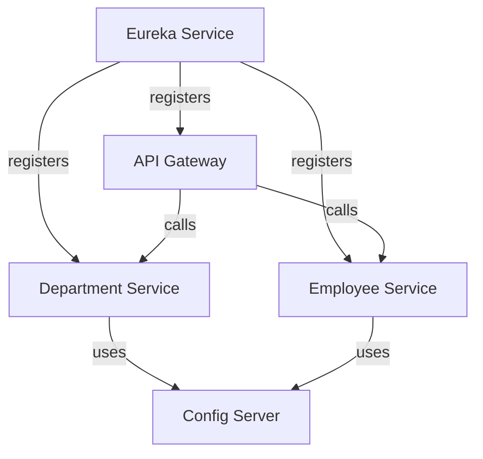

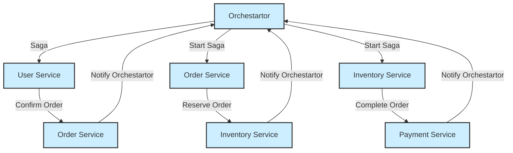

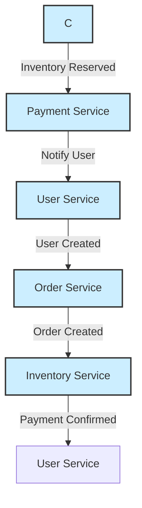
Saga design pattern is a way to manage data consistency across microservices in distributed transaction scenarios.  Saga is a sequence of transactions that updates each service and publishes a message or event to trigger the next transaction step. If a step fails, the saga executes compensating transactions that counteract the preceding transaction.

The term saga refers to Long Lived Transactions (LLT) and abbreviated as Segregated Access of Global Atomicity.

Saga pattern is a failure management pattern that helps establish consistency in distributed applications, and coordinates transactions between multiple microservices to maintain data consistency. Microservice publishes an event for every transaction, and the next transaction is initiated based on the event's outcome. It can take two different paths, depending on the success or failure of the transactions.

Transaction is a single unit of logic or work, sometimes made up of multiple operations. Within a transaction, an event is a state change that occurs to an entity, and a command encapsulates all information needed to perform an action or trigger a later event.  Transactions must be atomic, consistent, isolated, and durable (ACID). Transactions within a single service are ACID, but cross-service data consistency requires a cross-service transaction management strategy.

** Type of SAGA – Choreography and Orchestration **
There are two common saga implementation approaches, choreography and orchestration. Each approach has its own set of challenges and technologies to coordinate the workflow.
1. Choreography - Choreography is a way to coordinate sagas where participants exchange events without a centralized point of control. With choreography, each microservices run its own local transaction and publishes events to message broker system and that trigger local transactions in other microservices.
 
2. Orchestration is a way to coordinate sagas where a centralized controller tells the saga participants what local transactions to execute. The saga orchestrator handles all the transactions and tells the participants which operation to perform based on events. The orchestrator executes saga requests, stores and interprets the states of each task, and handles failure recovery with compensating transactions. This centralized controller microservice, orchestrate the saga workflow and invoke to execute local microservices transactions in sequentially. The orchestrator microservices execute saga transaction and manage them in centralized way and if one of the steps is failed, then executes rollback steps with compensating transactions.

** Two Phase Commit Or 2PC or 2 Phase Commit **
The 2PC could be alternative to SAGA pattern. The Two-Phase Commit protocol (2PC) is a widely used pattern to implement distributed transactions in microservices. In a two-phase commit protocol, there is a coordinator component that is responsible for controlling the transaction and contains the logic to manage the transaction. The other component is the participating nodes (e.g., the microservices) that run their local transactions. As the name indicates, the two-phase commit protocol runs a distributed transaction in two phases:
1. Prepare Phase – The coordinator asks the participating nodes whether they are ready to commit the transaction. The participants returned with a yes or no.
2. Commit Phase – If all the participating nodes respond affirmatively in phase 1, the coordinator asks all of them to commit. If at least one node returns negative, the coordinator asks all participants to roll back their local transactions.

#### Introduction to Saga Design Pattern
- Definition and purpose
- Importance in microservices architecture
- Managing data consistency across distributed transactions

#### Real-World Examples of Saga Design Pattern
- E-commerce order processing
  - Steps: Order creation, inventory update, payment processing, shipment
- Travel booking systems
  - Steps: Flight booking, hotel reservation, car rental
- Banking systems
  - Steps: Fund transfer, notification services, account updates

#### Types of Saga Approaches: Choreography
- Explanation of choreography
- Event-driven communication between services
- Advantages and challenges of choreography

#### Types of Saga Approaches: Orchestration
- Explanation of orchestration
- Centralized control by the orchestrator
- Benefits and potential drawbacks of orchestration

#### Saga vs. Two-Phase Commit (2PC) Design Pattern
- Overview of 2PC
- Comparison of transaction management strategies
- Situations where each pattern is preferable

#### Differences Between Saga and 2PC Patterns
- Consistency models: strong vs. eventual consistency
- Flow of operations: single commit vs. sequential execution
- Handling failures and compensating actions

#### Usage of Saga Design Pattern
- Common use cases in microservices
- Integration with event-driven architectures
- Considerations for implementation

#### Advantages of Saga Design Pattern
- Effective management of distributed transactions
- Loosely coupled and message-driven systems
- Flexibility in handling failures and compensating transactions

#saga #choreography #orchestrator

** Difference between SAGA design pattern and 2PC design pattern **
2PC works as a single commit and aims to perform ACID transactions on distributed systems. It is used wherever strong consistency is important. On the other hand, SAGA works sequentially, not as a single commit. Each operation gets committed before the subsequent one, and this makes the data eventually consistent.

** Advantages of this Design Pattern **
1. Best way to handle distributed transactions across the microservices.
2.  Makes transaction management in a loosely coupled, message-driven.

microservice/
|-- department-service/
|   |-- src/main/java/com/example/orders/
|   |-- src/main/resources/application.yml
|   |-- Dockerfile
|   |-- pom.xml
|-- employee-service/
|   |-- src/main/java/com/example/payments/
|   |-- src/main/resources/application.yml
|   |-- Dockerfile
|   |-- pom.xml
|-- eureka-service/
|   |-- src/main/java/com/example/inventory/
|   |-- src/main/resources/application.yml
|   |-- Dockerfile
|   |-- pom.xml
|-- api-gateway/
|   |-- src/main/java/com/example/gateway/
|   |-- src/main/resources/application.yml
|   |-- Dockerfile
|   |-- pom.xml
|-- config-server/
|   |-- src/main/java/com/example/config/
|   |-- src/main/resources/application.yml
|   |-- Dockerfile
|   |-- pom.xml
|-- docker-compose.yml
|-- k8s/
|   |-- deployment.yaml
|   |-- service.yaml

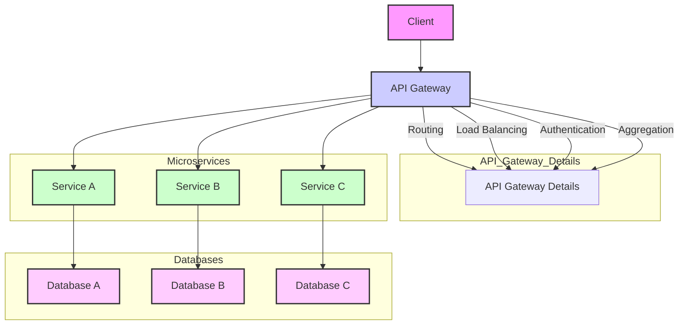

#### **Description of Diagram:**

1. **Client**: Initiates requests to the API Gateway.
2. **API Gateway**: Receives requests from the client and routes them to the appropriate microservices based on the request path and method. It may also handle authentication, rate limiting, caching, and aggregation of responses from multiple services.
3. **Microservices (Service A, B, C)**: Perform specific business functions and interact with their respective databases. Each microservice is responsible for its own logic and data management.
4. **Databases**: Store data specific to each microservice. Each microservice can have its own database schema or even use different database technologies as needed.

### **Additional Considerations:**

- **Service Registry**: A tool like Eureka or Consul that helps the API Gateway locate and communicate with microservice instances.
- **Authentication Service**: Can be integrated with the API Gateway for centralized authentication or can be a separate microservice.
- **Logging & Monitoring**: Tools like ELK Stack (Elasticsearch, Logstash, Kibana) or Prometheus/Grafana for logging and monitoring.

### **Diagram**

Here’s a simple Mermaid diagram illustrating a SAGA pattern with orchestration:

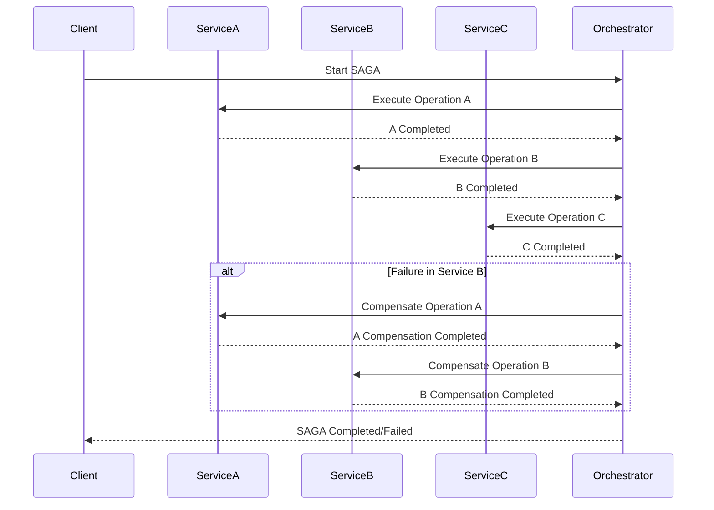

In this diagram:
- **Client** starts the SAGA via the **Orchestrator**.
- The **Orchestrator** invokes operations in **ServiceA**, **ServiceB**, and **ServiceC**.
- If an operation fails, compensating operations are triggered to maintain consistency.

### **1. SAGA Choreography**

In **Choreography**, each service involved in the SAGA knows about the next service and is responsible for calling it. There is no central coordinator; each service informs the next service in the process.

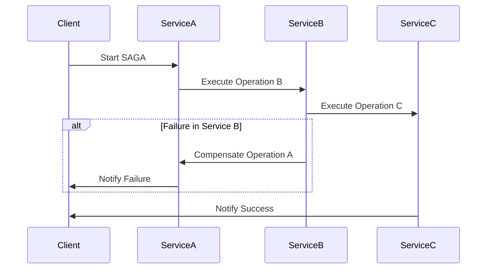

**Explanation**:
- **Client** starts the SAGA by calling **ServiceA**.
- **ServiceA** then calls **ServiceB**, and **ServiceB** calls **ServiceC**.
- If a failure occurs in **ServiceB**, it triggers compensations in **ServiceA**.
- **ServiceC** sends a success notification back to the **Client** if all operations succeed.

### **2. SAGA Orchestration**

In **Orchestration**, a central coordinator (the orchestrator) manages the SAGA process, invoking each service in the correct order and handling compensations if necessary.

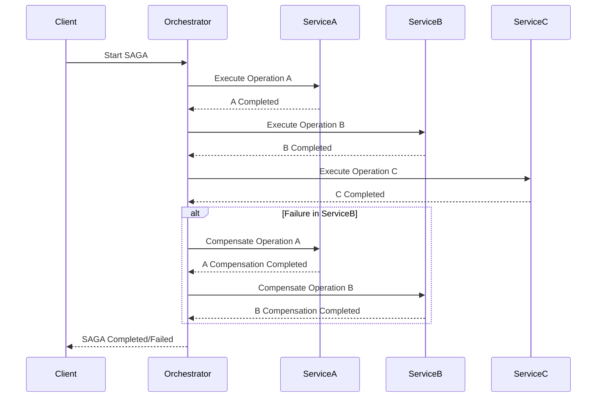

**Explanation**:
- **Client** starts the SAGA through the **Orchestrator**.
- The **Orchestrator** invokes **ServiceA**, **ServiceB**, and **ServiceC** in sequence.
- If a failure occurs in **ServiceB**, the **Orchestrator** handles compensations by calling **ServiceA** and **ServiceB** to undo changes.
- The **Orchestrator** then sends a success or failure notification back to the **Client**.

### **1. SAGA Choreography Flow Diagram**

In the **Choreography** approach, each service communicates directly with the next service and manages its own state and compensations.

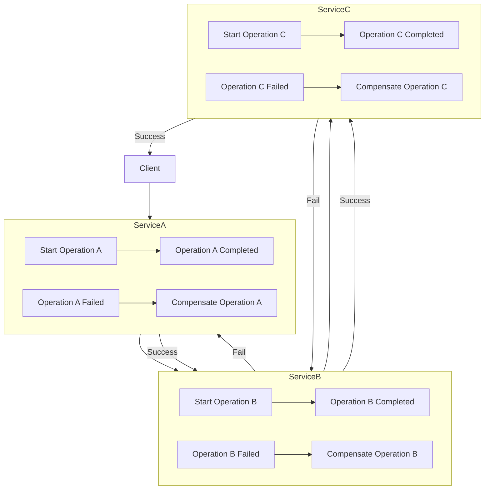

**Explanation**:
- The **Client** starts the SAGA by calling **ServiceA**.
- **ServiceA** performs its operation and, upon success, calls **ServiceB**.
- **ServiceB** performs its operation and, upon success, calls **ServiceC**.
- If any service fails, it triggers compensations in the previous services in the sequence.
- If **ServiceC** succeeds, it notifies the **Client** of the successful completion.

### **2. SAGA Orchestration Flow Diagram**

In the **Orchestration** approach, a central **Orchestrator** manages the sequence of service calls and compensations.

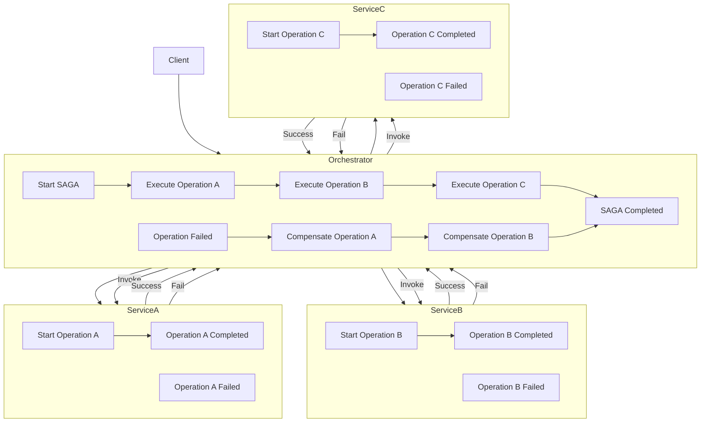

**Explanation**:
- The **Client** starts the SAGA via the **Orchestrator**.
- The **Orchestrator** manages the sequence of service calls to **ServiceA**, **ServiceB**, and **ServiceC**.
- If any service fails, the **Orchestrator** triggers compensations in the previous services.
- **ServiceA**, **ServiceB**, and **ServiceC** report their status back to the **Orchestrator**.
- The **Orchestrator** completes the SAGA and informs the **Client** of the result.

Creating a Spring Boot microservices architecture with Saga orchestration, choreography, and event-driven design can be complex but very rewarding. Below are Mermaid diagrams and explanations for each approach.

### 1. Saga Orchestration

In Saga orchestration, a central orchestrator (like a dedicated service) coordinates the various steps involved in a distributed transaction.

#### Diagram

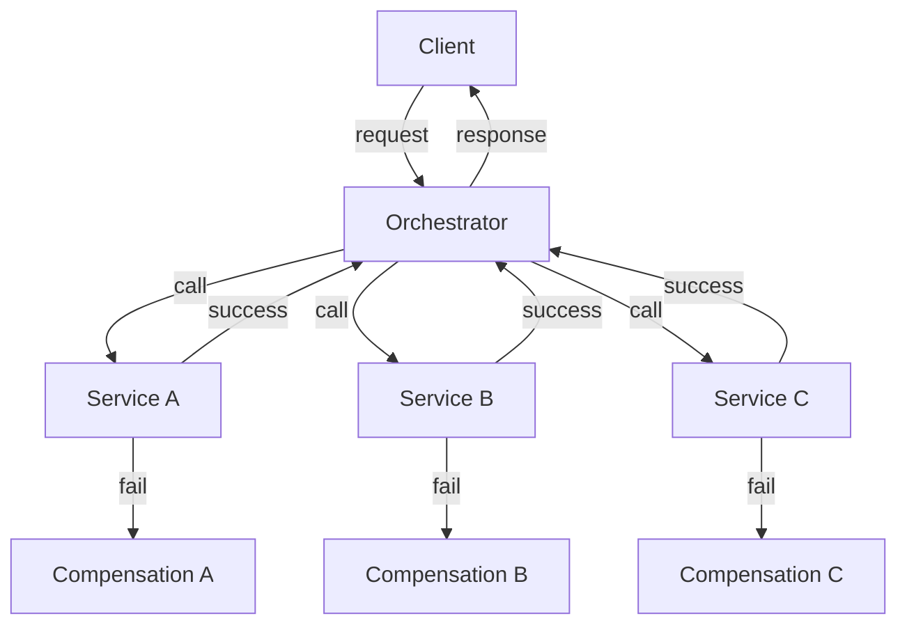

### 2. Saga Choreography

In Saga choreography, each service publishes events and listens for events from other services to proceed with the next step, leading to a more decentralized approach.

#### Diagram

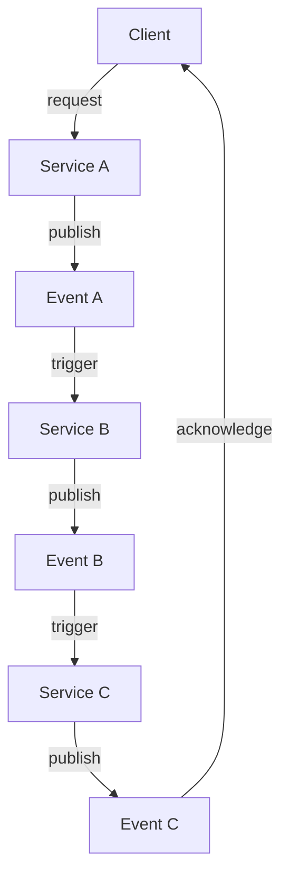

### 3. Event-Driven Architecture

In an event-driven architecture, services communicate via events, decoupling them and allowing for asynchronous processing.

#### Diagram

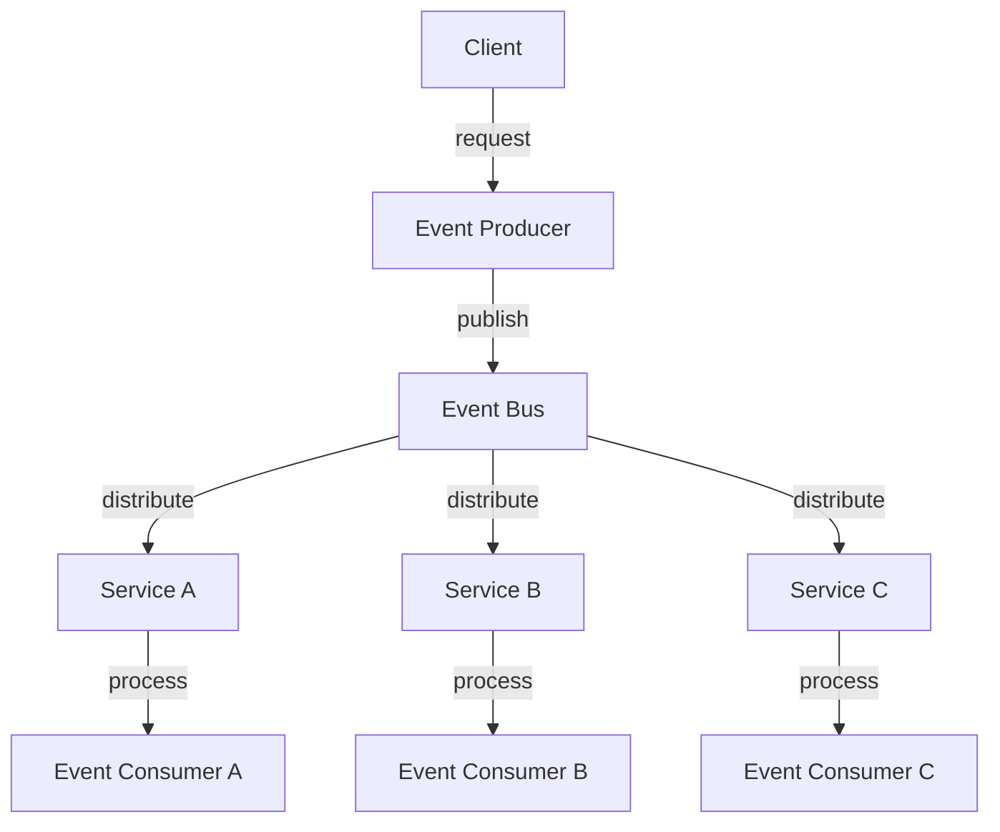

### Explanation of Components

#### Saga Orchestration
- **Orchestrator:** Central service managing the transaction flow. It calls each service in sequence and manages success and failure scenarios.
- **Compensation:** If any service fails, the orchestrator calls compensation methods on the previous services to undo their actions.

#### Saga Choreography
- **Services:** Each service communicates by publishing events. When an event is received, the service can react accordingly.
- **Event Triggering:** Services respond to the events they are interested in, leading to a more fluid and scalable process.

#### Event-Driven Architecture
- **Event Producer:** The service that produces an event after completing its process.
- **Event Bus:** Middleware like RabbitMQ or Kafka that distributes events to interested consumers.
- **Event Consumer:** Services that listen for events and process them asynchronously.

### Implementation

To implement these patterns in Spring Boot, consider the following steps:

1. **Dependencies:** Include necessary dependencies in your `pom.xml` for Spring Cloud, Spring Web, Spring Data, etc.

2. **Orchestrator Example:**
   - Create a dedicated orchestrator service that handles API requests and coordinates the saga.

3. **Choreography Example:**
   - Implement event publishing in each service using Spring's `ApplicationEventPublisher`.
   - Create event listeners in other services that respond to these events.

4. **Event-Driven Example:**
   - Use an event bus (like Kafka or RabbitMQ) to publish and subscribe to events.
   - Implement producers and consumers in your services to handle events.

### Conclusion

This overview provides a foundational understanding of implementing Saga orchestration, choreography, and event-driven architectures in Spring Boot microservices. You can adjust these patterns based on your specific requirements and system design. If you need more detailed code examples or further assistance, feel free to ask!

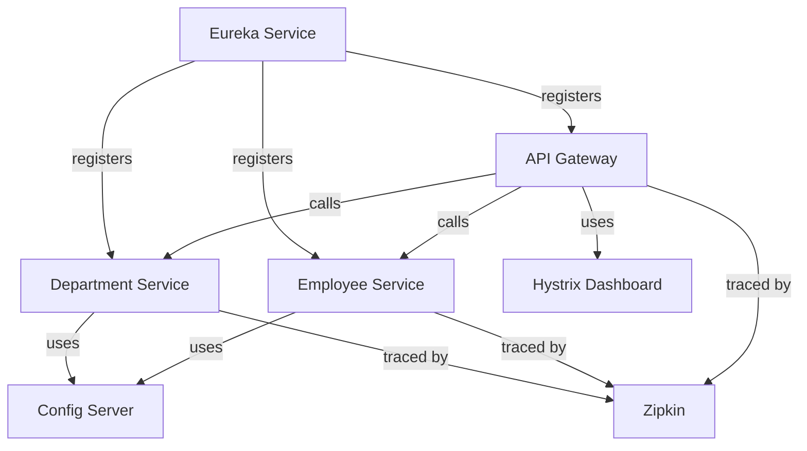
