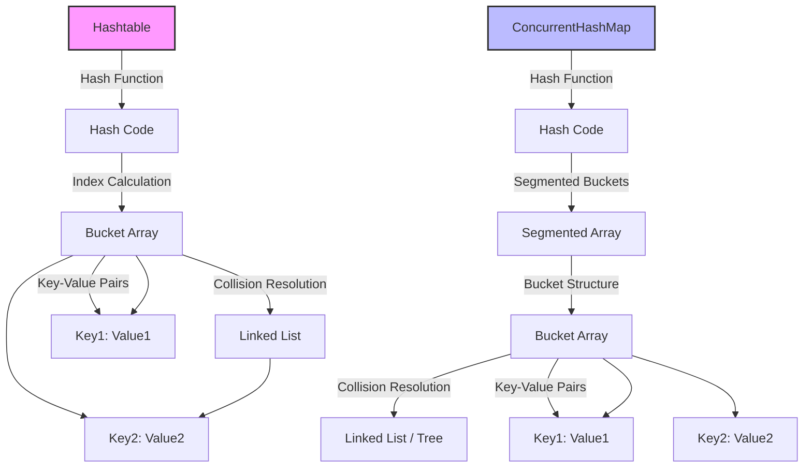
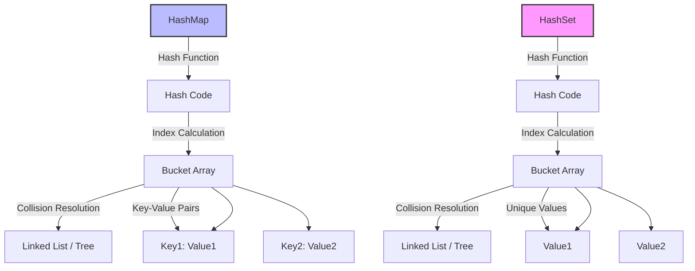

Here’s a detailed overview of `Hashtable`, `ConcurrentHashMap`, and hashing itself, along with a Mermaid diagram to visualize their structures.

### Internal Representation

#### 1. Hashtable

- **Array of Buckets**: Similar to `HashMap`, a `Hashtable` consists of an array of buckets.
- **Entry Class**: Each bucket contains entries, typically stored in a linked list. Each entry consists of:
  - The hash code of the key.
  - The key itself.
  - The value associated with the key.
  - A reference to the next entry (for collision resolution).
  
- **Synchronized**: All operations are synchronized, making it thread-safe but potentially slower in high contention scenarios.

#### 2. ConcurrentHashMap

- **Segmented Structure**: A `ConcurrentHashMap` divides its internal structure into segments (or buckets), allowing concurrent access.
- **Entry Class**: Each segment contains its own array of buckets. Each bucket can store:
  - The hash of the key.
  - The key itself.
  - The value associated with the key.
  - A reference to the next node (for collisions).
  
- **Locking Mechanism**: It uses a fine-grained locking mechanism, where only a specific segment is locked during write operations, allowing other segments to remain accessible for reads or writes.

### What is Hashing?

**Hashing** is the process of converting input (like a key) into a fixed-size string of bytes. The output, known as a hash code, is typically an integer that represents the original input in a compact form. Hashing has several key characteristics:

- **Efficiency**: Hashing allows for fast data retrieval. Instead of searching through a collection, a hash function can directly compute the index where the data should be stored or retrieved.
  
- **Collision Handling**: Since multiple keys can generate the same hash code (a collision), data structures like `Hashtable` and `ConcurrentHashMap` implement methods to handle these collisions, such as chaining (linked lists) or open addressing.
  
- **Deterministic**: The same input will always produce the same hash code.

### Mermaid Diagram

Here's a diagram that illustrates the internal structure of `Hashtable` and `ConcurrentHashMap` with respect to hashing.

```mermaid
graph TD
    A[Hashtable] --> B[Array of Buckets]
    
    B -->|Index| C[Bucket 0]
    C -->|Hash| D[Node1]
    C -->|Hash| E[Node2]

    B -->|Index| F[Bucket 1]
    F -->|Hash| G[Node3]

    B -->|Index| H[Bucket 2]
    H -->|Hash| I[Node4]
    H -->|Next| J[Node5]  - Collision resolution via linked list

    K[ConcurrentHashMap] -->|Hash Function| L[Hash Code]
    L -->|Segmented Buckets| M[Segmented Array]
    M -->|Bucket Structure| N[Bucket Array]
    N -->|Collision Resolution| O[Linked List / Tree]
    N -->|Key-Value Pairs| P[Key1: Value1]
    N --> P
    N --> Q[Key2: Value2]

    subgraph Bucket Structure
        direction TB
        D[Node1] -->|Key| R[Key1]
        D -->|Value| S[Value1]
        E[Node2] -->|Key| T[Key2]
        E -->|Value| U[Value2]
        G[Node3] -->|Key| V[Key3]
        G -->|Value| W[Value3]
        I[Node4] -->|Key| X[Key4]
        I -->|Value| Y[Value4]
        J[Node5] -->|Key| Z[Key5]
        J -->|Value| AA[Value5]
    end

    style A fill:#bbf,stroke:#333,stroke-width:2px
    style K fill:#f9f,stroke:#333,stroke-width:2px
```

### Explanation of the Diagram

1. **Hashtable**:
   - Similar to `HashMap`, `Hashtable` uses an array of buckets to store entries.
   - Each entry is linked in case of collisions, and synchronization ensures thread safety.

2. **ConcurrentHashMap**:
   - The `ConcurrentHashMap` uses segmented buckets, allowing multiple threads to access different segments simultaneously without interference.
   - It also uses a structure similar to `Hashtable` for handling collisions.

### Summary

- **Hashing** is a critical mechanism that enables fast data retrieval by converting keys into hash codes, which dictate their storage locations.
- Both `Hashtable` and `ConcurrentHashMap` leverage this concept but differ in their synchronization and collision resolution methods, with `ConcurrentHashMap` designed for better concurrency in multi-threaded environments.

Hashing in a `Hashtable` and the concept of buckets in a `ConcurrentHashMap` are fundamental to how these data structures manage their data. Here’s an overview of each:

### Hashing in `Hashtable`

1. **Hash Function**: When you add a key-value pair to a `Hashtable`, the key is processed by a hash function, which generates an integer hash code. This hash code is typically derived from the key's `hashCode()` method.

2. **Index Calculation**: The hash code is then converted into an index for the internal array (buckets) by applying a modulus operation with the array length. This determines where the key-value pair will be stored.

3. **Collision Resolution**: If two keys hash to the same index (collision), `Hashtable` uses a simple approach:
   - It creates a linked list at that index (bucket) to store all key-value pairs that hash to the same index.
   - When searching, it traverses the linked list at that index to find the key.

4. **Synchronization**: `Hashtable` is synchronized, meaning that all operations are thread-safe, which can lead to performance overhead in multi-threaded environments.

### Buckets in `ConcurrentHashMap`

1. **Segmented Locking**: A `ConcurrentHashMap` divides its internal structure into segments (or buckets), allowing concurrent access. This means that multiple threads can read and write to different segments simultaneously without locking the entire map.

2. **Hashing Process**: Similar to `Hashtable`, keys are hashed to determine their bucket index. However, instead of a single array, the map is divided into segments (often using a fixed number of buckets).

3. **Buckets**: Each segment contains its own array of buckets (which can be linked lists or trees, depending on the implementation):
   - When a collision occurs, `ConcurrentHashMap` uses a linked list or a balanced tree (for large bucket sizes) to manage entries efficiently.
   - This allows for faster retrieval and modification, especially under high contention.

4. **Locking Mechanism**: 
   - In a `ConcurrentHashMap`, only a segment is locked when a write operation occurs, allowing other segments to remain accessible for reads or writes. This fine-grained locking improves performance compared to `Hashtable`.
   - Read operations do not require locks and can proceed concurrently, which enhances throughput.

### Summary

- **`Hashtable`**: Uses a simple array with linked lists for collision resolution and is synchronized, making it less efficient under high contention.
- **`ConcurrentHashMap`**: Employs segmented locking with buckets, allowing concurrent reads and writes across segments, which significantly improves performance in multi-threaded environments.

Both structures use hashing to manage keys efficiently, but `ConcurrentHashMap` is designed for higher concurrency and better performance in multi-threaded applications.

Sure! Here’s a Mermaid diagram that illustrates the concepts of hashing in a `Hashtable` and the bucket structure in a `ConcurrentHashMap`.

### Mermaid Diagram



### Explanation

1. **Hashtable**:
   - **Hash Function**: When a key-value pair is added, the key is processed by a hash function to generate a hash code.
   - **Index Calculation**: The hash code is then converted into an index for the bucket array.
   - **Bucket Array**: This is the array that holds the entries.
   - **Collision Resolution**: If two keys hash to the same index, a linked list is used at that index to store multiple entries.
   - **Key-Value Pairs**: Each bucket may contain multiple key-value pairs if collisions occur.

2. **ConcurrentHashMap**:
   - **Hash Function**: Similar to `Hashtable`, the key is hashed to produce a hash code.
   - **Segmented Buckets**: Instead of a single array, the `ConcurrentHashMap` uses a segmented structure to allow concurrent access.
   - **Bucket Structure**: Each segment contains its own bucket array for managing entries.
   - **Collision Resolution**: Within each bucket, collisions are resolved using either linked lists or trees (for large sizes), providing efficient retrieval.
   - **Key-Value Pairs**: Just like in `Hashtable`, buckets store key-value pairs.

### Summary

- The diagram visually represents how both data structures handle hashing and storage of key-value pairs, with emphasis on the differences in their collision resolution and concurrent access mechanisms. 
- `Hashtable` uses a straightforward approach with linked lists for collisions, while `ConcurrentHashMap` optimizes for concurrency and performance with segmented locking and improved collision handling using trees or linked lists.

Here’s a Mermaid diagram that illustrates the concepts of `HashMap` and `HashSet`, highlighting how they manage data using hashing.

### Mermaid Diagram



### Explanation

1. **HashMap**:
   - **Hash Function**: When a key-value pair is added, the key is processed by a hash function to generate a hash code.
   - **Index Calculation**: The hash code is converted into an index for the internal bucket array.
   - **Bucket Array**: This array holds the entries in the `HashMap`.
   - **Collision Resolution**: If two keys hash to the same index, a linked list or tree is used to manage multiple entries at that index.
   - **Key-Value Pairs**: Each entry in the `HashMap` consists of a key and its corresponding value.

2. **HashSet**:
   - **Hash Function**: Similar to `HashMap`, the object is processed by a hash function to generate a hash code.
   - **Index Calculation**: The hash code determines the index in the bucket array.
   - **Bucket Array**: This array stores unique values.
   - **Collision Resolution**: Like `HashMap`, if collisions occur, a linked list or tree is used to manage values.
   - **Unique Values**: The `HashSet` only stores unique elements, so it contains no duplicates.

### Summary

- **`HashMap`**: A collection that stores key-value pairs, where each key is unique, and each key maps to a value. It uses hashing to optimize retrieval and manages collisions using linked lists or trees.
  
- **`HashSet`**: A collection that stores unique values (no duplicates) and does not associate values with keys. It also uses hashing and manages collisions similarly to `HashMap`.

This diagram helps illustrate the structural similarities and differences between `HashMap` and `HashSet`, particularly in how they use hashing and handle collisions.
