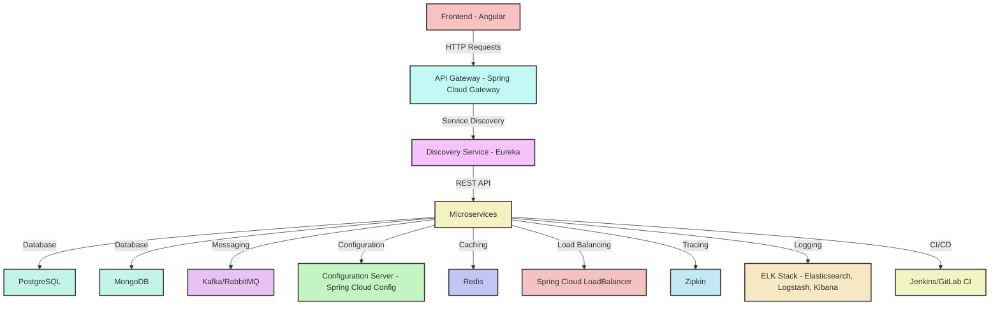
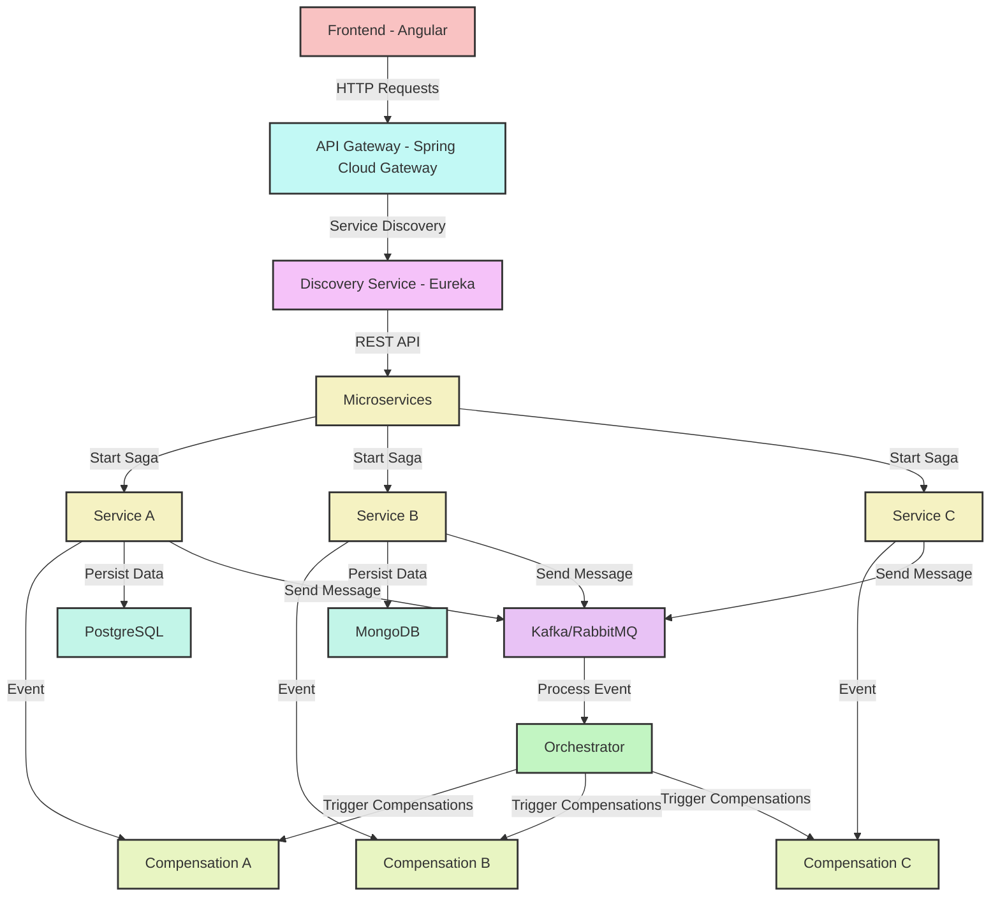

```mermaid

graph TD
    A[Frontend - Angular] -->|HTTP Requests| B[API Gateway - Spring Cloud Gateway]
    B -->|Service Discovery| C[Discovery Service - Eureka]
    C -->|REST API| D[Microservices]
    D -->|Database| E[PostgreSQL]
    D -->|Database| F[MongoDB]
    D -->|Messaging| G[Kafka/RabbitMQ]
    D -->|Configuration| H[Configuration Server - Spring Cloud Config]
    D -->|Caching| I[Redis]
    D -->|Load Balancing| J[Spring Cloud LoadBalancer]
    D -->|Tracing| K[Zipkin]
    D -->|Logging| L[ELK Stack - Elasticsearch, Logstash, Kibana]
    D -->|CI/CD| M[Jenkins/GitLab CI]
    
    %% Define styles for nodes
    classDef frontend fill:#f9c2c2,stroke:#333,stroke-width:2px;
    classDef apiGateway fill:#c2f9f5,stroke:#333,stroke-width:2px;
    classDef discovery fill:#f5c2f9,stroke:#333,stroke-width:2px;
    classDef microservices fill:#f5f2c2,stroke:#333,stroke-width:2px;
    classDef db fill:#c2f5e8,stroke:#333,stroke-width:2px;
    classDef messaging fill:#e8c2f5,stroke:#333,stroke-width:2px;
    classDef config fill:#c2f5c2,stroke:#333,stroke-width:2px;
    classDef caching fill:#c2c5f5,stroke:#333,stroke-width:2px;
    classDef loadBalancing fill:#f5c2c2,stroke:#333,stroke-width:2px;
    classDef tracing fill:#c2e8f5,stroke:#333,stroke-width:2px;
    classDef logging fill:#f5e8c2,stroke:#333,stroke-width:2px;
    classDef ciCd fill:#f2f5c2,stroke:#333,stroke-width:2px;

    class A frontend;
    class B apiGateway;
    class C discovery;
    class D microservices;
    class E db;
    class F db;
    class G messaging;
    class H config;
    class I caching;
    class J loadBalancing;
    class K tracing;
    class L logging;
    class M ciCd;
```

```mermaid

graph TD
    A[Frontend - Angular] -->|HTTP Requests| B[API Gateway - Spring Cloud Gateway]
    B -->|Service Discovery| C[Discovery Service - Eureka]
    C -->|REST API| D[Microservices]
    
    D -->|Start Saga| E[Service A]
    D -->|Start Saga| F[Service B]
    D -->|Start Saga| G[Service C]
    
    E -->|Event| H[Compensation A]
    F -->|Event| I[Compensation B]
    G -->|Event| J[Compensation C]

    E -->|Persist Data| K[PostgreSQL]
    F -->|Persist Data| L[MongoDB]
    
    E -->|Send Message| M[Kafka/RabbitMQ]
    F -->|Send Message| M
    G -->|Send Message| M

    M -->|Process Event| N[Orchestrator]
    N -->|Trigger Compensations| H
    N -->|Trigger Compensations| I
    N -->|Trigger Compensations| J
    
    %% Define styles for nodes
    classDef frontend fill:#f9c2c2,stroke:#333,stroke-width:2px;
    classDef apiGateway fill:#c2f9f5,stroke:#333,stroke-width:2px;
    classDef discovery fill:#f5c2f9,stroke:#333,stroke-width:2px;
    classDef microservices fill:#f5f2c2,stroke:#333,stroke-width:2px;
    classDef compensation fill:#e8f5c2,stroke:#333,stroke-width:2px;
    classDef db fill:#c2f5e8,stroke:#333,stroke-width:2px;
    classDef messaging fill:#e8c2f5,stroke:#333,stroke-width:2px;
    classDef orchestrator fill:#c2f5c2,stroke:#333,stroke-width:2px;

    class A frontend;
    class B apiGateway;
    class C discovery;
    class D microservices;
    class E microservices;
    class F microservices;
    class G microservices;
    class H compensation;
    class I compensation;
    class J compensation;
    class K db;
    class L db;
    class M messaging;
    class N orchestrator;
```
