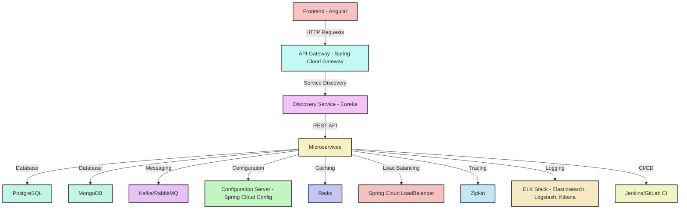
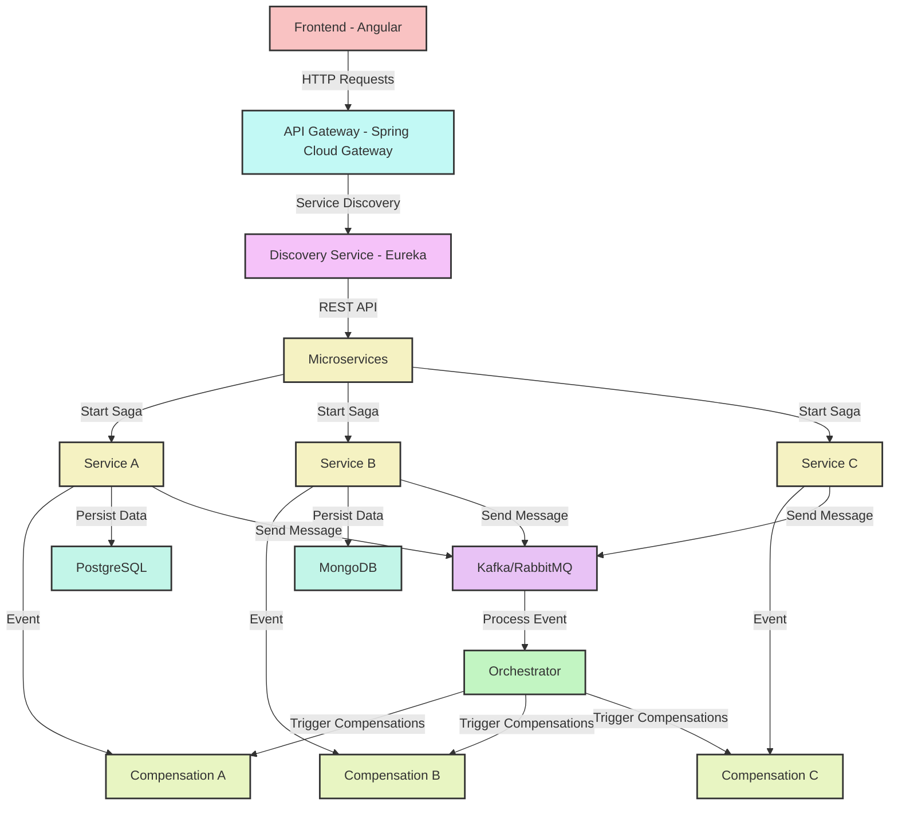
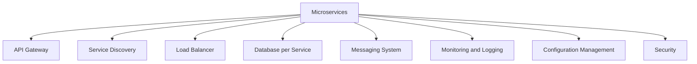

A microservices architecture typically comprises several core components that work together to create a robust, scalable, and maintainable application. Here are nine essential components commonly found in microservice applications:

### 1. **Microservices**
   - Individual, independent services that perform specific business functions. Each microservice is self-contained and can be developed, deployed, and scaled independently.

### 2. **API Gateway**
   - Acts as a single entry point for clients to interact with multiple microservices. It handles request routing, composition, and protocol translation, and often includes features like authentication, logging, and monitoring.

### 3. **Service Discovery**
   - A mechanism that allows microservices to find and communicate with each other. This can be done through client-side discovery (where clients query a service registry) or server-side discovery (where the API gateway handles routing).

### 4. **Load Balancer**
   - Distributes incoming traffic across multiple instances of microservices to ensure optimal resource utilization and improve responsiveness. It can be implemented at both the API gateway level and at the service level.

### 5. **Database per Service**
   - Each microservice has its own database or data store, which allows for data encapsulation and independent scaling. This can lead to increased complexity in data management but supports autonomy.

### 6. **Messaging System**
   - Facilitates asynchronous communication between microservices. Messaging systems (like RabbitMQ, Kafka, or AWS SNS) enable services to send messages or events, allowing for decoupled interactions and improved resilience.

### 7. **Monitoring and Logging**
   - Tools and frameworks for tracking the health and performance of microservices. This includes centralized logging, performance monitoring, and alerting systems to ensure the application runs smoothly.

### 8. **Configuration Management**
   - Manages application configurations for different environments (development, testing, production). Centralized configuration services (like Spring Cloud Config) help manage and distribute configuration properties.

### 9. **Security**
   - Encompasses various strategies to secure the microservices architecture, including authentication (e.g., OAuth, JWT) and authorization, as well as ensuring secure communication (e.g., HTTPS).

### Conclusion
These components work together to create a microservices ecosystem that enhances scalability, flexibility, and maintainability. By following best practices in each area, teams can build resilient applications that adapt to changing business needs.

Here's a Mermaid diagram representing the core components of a microservices application:



### Explanation of the Diagram:

- **Microservices**: The central component, representing the individual services.
- **API Gateway**: The entry point for client requests, routing them to appropriate microservices.
- **Service Discovery**: Helps microservices find each other.
- **Load Balancer**: Distributes requests among service instances.
- **Database per Service**: Each microservice has its own data store.
- **Messaging System**: Enables asynchronous communication between services.
- **Monitoring and Logging**: Tracks the health and performance of services.
- **Configuration Management**: Manages configuration settings for different environments.
- **Security**: Ensures secure communication and access control.

You can render this diagram using a Markdown viewer that supports Mermaid syntax.

Certainly! Let's explore a basic microservices architecture in code. This will give you a clearer idea of how these components might be structured and interact in a typical microservices application.

### Microservices Codebase Structure

Here's an example of how you might structure the codebase for a microservices application:

```
/microservices-app
│
├── api-gateway
│   ├── src
│   │   ├── index.js
│   │   ├── routes.js
│   │   ├── middleware
│   │   │   └── auth.js
│   └── package.json
│
├── user-service
│   ├── src
│   │   ├── index.js
│   │   ├── models
│   │   │   └── user.js
│   │   ├── routes
│   │   │   └── userRoutes.js
│   │   └── controllers
│   │       └── userController.js
│   └── package.json
│
├── product-service
│   ├── src
│   │   ├── index.js
│   │   ├── models
│   │   │   └── product.js
│   │   ├── routes
│   │   │   └── productRoutes.js
│   │   └── controllers
│   │       └── productController.js
│   └── package.json
│
├── messaging-system
│   ├── src
│   │   ├── index.js
│   │   ├── publisher.js
│   │   └── subscriber.js
│   └── package.json
│
└── docker-compose.yml
```

### Component Breakdown

1. **API Gateway**: Acts as the entry point for all client requests.
   - **`index.js`**: Sets up the Express server and middleware.
   - **`routes.js`**: Defines routes that forward requests to respective services.
   - **Middleware**: Handles authentication and logging.

   ```javascript
   // api-gateway/src/index.js
   const express = require('express');
   const routes = require('./routes');
   const app = express();

   app.use(express.json());
   app.use('/api', routes);

   const PORT = process.env.PORT || 3000;
   app.listen(PORT, () => {
       console.log(`API Gateway running on port ${PORT}`);
   });
   ```

2. **User Service**: Manages user data and operations.
   - **`index.js`**: Sets up the Express server for the user service.
   - **Models**: Defines user schema (using Mongoose, for example).
   - **Routes and Controllers**: Handle user-related requests.

   ```javascript
   // user-service/src/index.js
   const express = require('express');
   const userRoutes = require('./routes/userRoutes');
   const mongoose = require('mongoose');

   const app = express();
   app.use(express.json());
   app.use('/users', userRoutes);

   mongoose.connect('mongodb://localhost/userdb', { useNewUrlParser: true, useUnifiedTopology: true });

   const PORT = process.env.PORT || 4000;
   app.listen(PORT, () => {
       console.log(`User Service running on port ${PORT}`);
   });
   ```

3. **Product Service**: Similar to the user service but handles products.
   - Similar structure as the user service but focused on product management.

4. **Messaging System**: Facilitates asynchronous communication.
   - **`index.js`**: Initializes the messaging client (e.g., RabbitMQ, Kafka).
   - **Publisher and Subscriber**: Handle sending and receiving messages.

   ```javascript
   // messaging-system/src/publisher.js
   const amqp = require('amqplib');

   async function publishMessage(msg) {
       const connection = await amqp.connect('amqp://localhost');
       const channel = await connection.createChannel();
       const queue = 'messages';

       await channel.assertQueue(queue);
       channel.sendToQueue(queue, Buffer.from(msg));
       console.log("Message sent:", msg);

       setTimeout(() => {
           connection.close();
       }, 500);
   }

   publishMessage('Hello from User Service!');
   ```

5. **Docker Compose**: Manages the application stack and services.

   ```yaml
   # docker-compose.yml
   version: '3.8'
   services:
     api-gateway:
       build: ./api-gateway
       ports:
         - "3000:3000"
     user-service:
       build: ./user-service
       ports:
         - "4000:4000"
       environment:
         - DB_URL=mongodb://mongo:27017/userdb
     product-service:
       build: ./product-service
       ports:
         - "5000:5000"
     mongo:
       image: mongo
       ports:
         - "27017:27017"
     messaging-system:
       build: ./messaging-system
   ```

### Explanation of Interactions

- **API Gateway**: Clients send requests to the API Gateway, which routes them to the appropriate microservice (e.g., user-service or product-service).
- **Service Discovery**: In a more complex setup, a service discovery tool (like Consul or Eureka) could help services locate each other.
- **Load Balancer**: You could integrate a load balancer (e.g., NGINX) to manage traffic to the API Gateway or individual services.
- **Messaging System**: Microservices can communicate via messages for events (e.g., user creation) through the messaging system, allowing for asynchronous processing.
- **Monitoring and Logging**: Each service can implement logging (e.g., using Winston or Morgan) and monitoring tools (e.g., Prometheus, Grafana) to track performance.

### Conclusion

This codebase structure gives a practical overview of how you can implement a microservices architecture. Each service is decoupled, allowing for independent development, deployment, and scaling. By using containers with Docker, you can easily manage service dependencies and orchestrate them efficiently.

Sure! Let's create a basic microservices architecture using Spring Boot. This example will include a user service, a product service, an API gateway, and a messaging system using RabbitMQ.

### Project Structure

Here's an example of how you might structure your Spring Boot microservices application:

```
/microservices-app
│
├── api-gateway
│   ├── src
│   │   ├── main
│   │   │   ├── java
│   │   │   │   └── com
│   │   │   │       └── example
│   │   │   │           └── apigateway
│   │   │   │               ├── ApiGatewayApplication.java
│   │   │   │               └── GatewayConfig.java
│   │   │   └── resources
│   │   │       └── application.yml
│   └── pom.xml
│
├── user-service
│   ├── src
│   │   ├── main
│   │   │   ├── java
│   │   │   │   └── com
│   │   │   │       └── example
│   │   │   │           └── userservice
│   │   │   │               ├── UserServiceApplication.java
│   │   │   │               ├── controller
│   │   │   │               │   └── UserController.java
│   │   │   │               └── model
│   │   │   │                   └── User.java
│   │   │   └── resources
│   │   │       └── application.yml
│   └── pom.xml
│
├── product-service
│   ├── src
│   │   ├── main
│   │   │   ├── java
│   │   │   │   └── com
│   │   │   │       └── example
│   │   │   │           └── productservice
│   │   │   │               ├── ProductServiceApplication.java
│   │   │   │               ├── controller
│   │   │   │               │   └── ProductController.java
│   │   │   │               └── model
│   │   │   │                   └── Product.java
│   │   │   └── resources
│   │   │       └── application.yml
│   └── pom.xml
│
├── messaging-system
│   ├── src
│   │   ├── main
│   │   │   ├── java
│   │   │   │   └── com
│   │   │   │       └── example
│   │   │   │           └── messaging
│   │   │   │               ├── MessagingApplication.java
│   │   │   │               ├── publisher
│   │   │   │               │   └── MessagePublisher.java
│   │   │   │               └── subscriber
│   │   │   │                   └── MessageListener.java
│   │   │   └── resources
│   │   │       └── application.yml
│   └── pom.xml
│
└── docker-compose.yml
```

### Example Code

#### 1. **User Service**

**`UserServiceApplication.java`**

```java
package com.example.userservice;

import org.springframework.boot.SpringApplication;
import org.springframework.boot.autoconfigure.SpringBootApplication;

@SpringBootApplication
public class UserServiceApplication {
    public static void main(String[] args) {
        SpringApplication.run(UserServiceApplication.class, args);
    }
}
```

**`User.java`**

```java
package com.example.userservice.model;

public class User {
    private String id;
    private String name;
    private String email;

    // Getters and Setters
}
```

**`UserController.java`**

```java
package com.example.userservice.controller;

import org.springframework.web.bind.annotation.*;

@RestController
@RequestMapping("/users")
public class UserController {

    @GetMapping("/{id}")
    public User getUser(@PathVariable String id) {
        // Dummy user for demonstration
        return new User(id, "John Doe", "john.doe@example.com");
    }
}
```

**`application.yml`**

```yaml
server:
  port: 8081
```

#### 2. **Product Service**

**`ProductServiceApplication.java`**

```java
package com.example.productservice;

import org.springframework.boot.SpringApplication;
import org.springframework.boot.autoconfigure.SpringBootApplication;

@SpringBootApplication
public class ProductServiceApplication {
    public static void main(String[] args) {
        SpringApplication.run(ProductServiceApplication.class, args);
    }
}
```

**`Product.java`**

```java
package com.example.productservice.model;

public class Product {
    private String id;
    private String name;
    private double price;

    // Getters and Setters
}
```

**`ProductController.java`**

```java
package com.example.productservice.controller;

import org.springframework.web.bind.annotation.*;

@RestController
@RequestMapping("/products")
public class ProductController {

    @GetMapping("/{id}")
    public Product getProduct(@PathVariable String id) {
        // Dummy product for demonstration
        return new Product(id, "Sample Product", 29.99);
    }
}
```

**`application.yml`**

```yaml
server:
  port: 8082
```

#### 3. **API Gateway**

**`ApiGatewayApplication.java`**

```java
package com.example.apigateway;

import org.springframework.boot.SpringApplication;
import org.springframework.boot.autoconfigure.SpringBootApplication;

@SpringBootApplication
public class ApiGatewayApplication {
    public static void main(String[] args) {
        SpringApplication.run(ApiGatewayApplication.class, args);
    }
}
```

**`GatewayConfig.java`**

```java
package com.example.apigateway;

import org.springframework.cloud.gateway.route.RouteLocator;
import org.springframework.cloud.gateway.builder.RouteLocatorBuilder;
import org.springframework.context.annotation.Bean;
import org.springframework.context.annotation.Configuration;

@Configuration
public class GatewayConfig {

    @Bean
    public RouteLocator customRoutes(RouteLocatorBuilder builder) {
        return builder.routes()
            .route("user-service", r -> r.path("/users/**")
                .uri("http://localhost:8081"))
            .route("product-service", r -> r.path("/products/**")
                .uri("http://localhost:8082"))
            .build();
    }
}
```

**`application.yml`**

```yaml
spring:
  cloud:
    gateway:
      routes:
        - id: user-service
          uri: http://localhost:8081
          predicates:
            - Path=/users/**
        - id: product-service
          uri: http://localhost:8082
          predicates:
            - Path=/products/**
```

#### 4. **Messaging System**

**`MessagingApplication.java`**

```java
package com.example.messaging;

import org.springframework.boot.SpringApplication;
import org.springframework.boot.autoconfigure.SpringBootApplication;

@SpringBootApplication
public class MessagingApplication {
    public static void main(String[] args) {
        SpringApplication.run(MessagingApplication.class, args);
    }
}
```

**`MessagePublisher.java`**

```java
package com.example.messaging.publisher;

import org.springframework.amqp.rabbit.core.RabbitTemplate;
import org.springframework.beans.factory.annotation.Autowired;
import org.springframework.stereotype.Service;

@Service
public class MessagePublisher {

    @Autowired
    private RabbitTemplate rabbitTemplate;

    public void sendMessage(String message) {
        rabbitTemplate.convertAndSend("myQueue", message);
    }
}
```

**`MessageListener.java`**

```java
package com.example.messaging.subscriber;

import org.springframework.amqp.rabbit.annotation.RabbitListener;
import org.springframework.stereotype.Component;

@Component
public class MessageListener {

    @RabbitListener(queues = "myQueue")
    public void receiveMessage(String message) {
        System.out.println("Received message: " + message);
    }
}
```

**`application.yml`**

```yaml
spring:
  rabbitmq:
    host: localhost
```

### 5. **Docker Compose**

**`docker-compose.yml`**

```yaml
version: '3.8'

services:
  api-gateway:
    build: ./api-gateway
    ports:
      - "8080:8080"
  
  user-service:
    build: ./user-service
    ports:
      - "8081:8081"
  
  product-service:
    build: ./product-service
    ports:
      - "8082:8082"

  rabbitmq:
    image: rabbitmq:management
    ports:
      - "5672:5672"
      - "15672:15672"  # RabbitMQ Management UI
```

### Explanation of Components

1. **User Service**: 
   - Handles user data, with a simple REST endpoint to retrieve user information.

2. **Product Service**: 
   - Similar to the user service but focused on product data.

3. **API Gateway**: 
   - Routes requests from clients to the appropriate microservice (user-service or product-service). It abstracts the underlying services from the client.

4. **Messaging System**: 
   - Uses RabbitMQ for asynchronous communication. The `MessagePublisher` sends messages to a queue, while `MessageListener` listens for messages.

5. **Docker Compose**: 
   - Defines the services, including the API gateway, user service, product service, and RabbitMQ. This

 makes it easy to start all services together.

### Running the Application

1. Make sure you have Docker installed.
2. Navigate to the root directory of your microservices application.
3. Build and run the services using Docker Compose:

   ```bash
   docker-compose up --build
   ```

4. Access the services through the API Gateway:
   - User Service: `http://localhost:8080/users/{id}`
   - Product Service: `http://localhost:8080/products/{id}`

### Conclusion

This Spring Boot example provides a basic overview of how to implement a microservices architecture. Each service is self-contained, allowing for independent development and scaling. The API Gateway provides a unified entry point, while RabbitMQ facilitates communication between services. This structure is scalable and maintainable, following best practices for microservices development.
