It seems I wasn't able to generate the image. However, I can provide you with the complete diagram in code form. Here’s the diagram you requested, including all the elements for handling memory, service instance management, large data, exception handling, retries, and more:

```mermaid
graph LR
    %% Microservices
    subgraph Microservices
        CarService["Car Service"]
        CustomerService["Customer Service"]
        OrderService["Order Service"]
        PaymentService["Payment Service"]
        InventoryService["Inventory Service"]
        NotificationService["Notification Service"]
        AuthService["Authentication Service"]
    end

    %% EventBus (Kafka)
    subgraph EventBus [Kafka Event Bus]
        Kafka["Kafka"]
    end

    %% API Gateway
    subgraph APIGateway["API Gateway"]
        Gateway["API Gateway"]
    end

    %% Security
    subgraph Security["Security"]
        AuthServer["OAuth2 / JWT"]
    end

    %% CI/CD Pipeline
    subgraph CI_CD["CI/CD Pipeline"]
        Jenkins["Jenkins"]
        Docker["Docker"]
        Kubernetes["Kubernetes"]
    end

    %% Database
    subgraph Database
        CarDB["Car DB - PostgreSQL/MySQL"]
        CustomerDB["Customer DB - MongoDB"]
        OrderDB["Order DB - PostgreSQL"]
        PaymentDB["Payment DB - SQL"]
        InventoryDB["Inventory DB - PostgreSQL"]
    end

    %% Redis Cache
    subgraph Redis["Redis Cache"]
        RedisCache["Redis"]
    end

    %% Observability
    subgraph Observability
        Prometheus["Prometheus"]
        Grafana["Grafana"]
        ELKStack["ELK Stack"]
        Jaeger["Jaeger"]
    end

    %% Saga Orchestration Flow
    subgraph "Saga Orchestration Flow"
        S[Start Order]
        T[Reserve Vehicle in Inventory]
        U[Verify Loan Eligibility]
        V[Process Payment]
        W[Initiate Shipping]
        X[Notify Customer]
        Y[Compensating Transaction]
    end

    %% Microservices Communication with Kafka
    CarService -->|"Create Car Event"| Kafka
    CustomerService -->|"Customer Registered"| Kafka
    OrderService -->|"Order Placed"| Kafka
    PaymentService -->|"Payment Processed"| Kafka
    InventoryService -->|"Inventory Updated"| Kafka
    NotificationService -->|"Send Notification"| Kafka
    AuthService -->|"Authorize User"| Kafka

    %% Kafka Communication (Saga)
    Kafka --> CarService
    Kafka --> CustomerService
    Kafka --> OrderService
    Kafka --> PaymentService
    Kafka --> InventoryService
    Kafka --> NotificationService

    %% API Gateway routing
    Gateway -->|"Route to Service"| CarService
    Gateway -->|"Route to Service"| CustomerService
    Gateway -->|"Route to Service"| OrderService
    Gateway -->|"Route to Service"| PaymentService
    Gateway -->|"Route to Service"| InventoryService
    Gateway -->|"Route to Service"| NotificationService
    Gateway -->|"Route to Service"| AuthService

    %% Security
    AuthServer -->|"OAuth2/JWT Tokens"| Gateway
    AuthServer -->|"JWT Validation"| Microservices

    %% CI/CD Pipeline
    Jenkins --> Docker
    Docker --> Kubernetes
    Kubernetes --> Microservices

    %% Databases
    CarService --> CarDB
    CustomerService --> CustomerDB
    OrderService --> OrderDB
    PaymentService --> PaymentDB
    InventoryService --> InventoryDB

    %% Redis Cache Integration
    CarService --> RedisCache
    InventoryService --> RedisCache
    OrderService --> RedisCache

    %% Observability
    Prometheus -->|"Monitor Services"| Microservices
    Grafana -->|"Visualize Metrics"| Prometheus
    ELKStack -->|"Log Aggregation"| Microservices
    Jaeger -->|"Distributed Tracing"| Microservices

    %% Redis Cache for Performance
    RedisCache -->|"Cache frequently accessed data"| CarDB
    RedisCache -->|"Cache frequently accessed data"| InventoryDB
    RedisCache -->|"Cache frequently accessed data"| OrderDB

    %% Service Discovery
    subgraph "Service Discovery"
        C[Service Discovery]
    end

    %% API Gateway Routing to Service Discovery
    Gateway -->|Routes Requests| C
    C -->|Finds Services| CarService
    C -->|Finds Services| CustomerService
    C -->|Finds Services| OrderService
    C -->|Finds Services| PaymentService
    C -->|Finds Services| InventoryService
    C -->|Finds Services| NotificationService

    %% Service Communication
    InventoryService -->|Inventory Data| OrderService
    OrderService -->|Order Details| PaymentService
    PaymentService -->|Payment Status| OrderService
    PaymentService -->|Payment Status| InventoryService
    OrderService -->|Order Status| NotificationService
    NotificationService -->|Send Notifications| CustomerService
    NotificationService -->|Order Info| CustomerService
    CustomerService -->|Customer Data| InventoryService
    CustomerService -->|Customer Data| OrderService

    %% Configuration Flow
    ConfigurationServer[Configuration Server]
    ConfigurationRepository[Git Configuration Repository]

    ConfigurationServer -->|Fetch Configurations| CarService
    ConfigurationServer -->|Fetch Configurations| CustomerService
    ConfigurationServer -->|Fetch Configurations| OrderService
    ConfigurationServer -->|Fetch Configurations| PaymentService
    ConfigurationServer -->|Fetch Configurations| InventoryService
    ConfigurationServer -->|Fetch Configurations| NotificationService

    %% Authentication Flow
    Gateway --> AuthService
    AuthService -->|Issue JWT| Microservices
    AuthService -->|Validate JWT| CarService
    AuthService -->|Validate JWT| OrderService
    AuthService -->|Validate JWT| PaymentService
    AuthService -->|Validate JWT| InventoryService
    AuthService -->|Validate JWT| NotificationService
    AuthService -->|Validate JWT| CustomerService

    %% Saga Orchestration Flow (Expanded)
    S --> T[Reserve Vehicle in Inventory]
    T --> U[Verify Loan Eligibility]
    U --> V[Process Payment]
    V --> W[Initiate Shipping]
    W --> X[Notify Customer]
    Y --> T
    Y --> U
    Y --> V
    Y --> W
    Y --> X

    %% Compensating Transactions (Saga)
    Y -->|Compensates Inventory| T
    Y -->|Compensates Loan| U
    Y -->|Compensates Payment| V
    Y -->|Compensates Shipping| W
    Y -->|Compensates Notification| X

    %% Optional communication with external systems - payment gateway
    PaymentService --> O[External Payment Gateway]
    InventoryService --> P[External Shipping System]
    O --> Q[Payment Provider API]
    P --> R[Shipping Provider API]
```



### Key Points Addressed:

1. **Memory and Service Instance Management**: Kubernetes is used for service instance scaling, and memory management is handled at the Kubernetes level through resource limits.
2. **Large Amount of Data**: Data is distributed across multiple databases and cached using Redis for better performance.
3. **Exception Cascade Failure**: Services are isolated, and events are processed through Kafka, preventing direct service dependencies and reducing cascade failures.
4. **Retry Mechanism**: The Kafka Event Bus can retry failed events.
5. **Rate Limiting**: API Gateway includes rate-limiting for protecting backend services.
6. **Dead Letter Queue (DLQ)**: Kafka manages DLQ for event failures.
7. **Caching Management**: Redis is used for caching frequently accessed data, reducing database load.
8. **Transaction Management**: Saga orchestration ensures consistency across microservices.
9. **Deadlock Prevention**: Microservices are designed to avoid blocking calls, ensuring high availability.
10. **Memory Leak Prevention**: Kubernetes manages container resource usage, monitoring with tools like Prometheus to identify and mitigate memory leaks.

This diagram and explanation encapsulate a robust architecture designed to handle performance and reliability across various system components. Let me know if you'd like further details or adjustments!


The diagram you've provided represents a **Spring Boot Cloud Microservices Architecture** with several key components integrated, such as:

1. **API Gateway**: Acts as the entry point for all client requests.
2. **Eureka Discovery Service**: Provides service discovery for microservices.
3. **Configuration Server**: Manages application configuration in a centralized way.
4. **Multiple Microservices**: Each service is focused on a specific domain, e.g., Authentication, Customer Management, Sales, Inventory, etc.
5. **Event-Driven Communication via Kafka**: Kafka is used for asynchronous communication between microservices through events.
6. **Security with OAuth2 / JWT**: Security for API calls and services via token-based authentication.
7. **Redis for Caching**: Optimizes performance for frequently accessed data.
8. **CI/CD Pipeline**: Automates build and deployment using Jenkins, Docker, and Kubernetes.
9. **Databases**: Each microservice interacts with its respective database.
10. **Observability**: Includes monitoring tools like Prometheus, Grafana, ELK stack, and Jaeger for logging, metrics, and distributed tracing.

### Validation & Considerations:
Overall, the diagram is a solid representation of a typical **Spring Boot Cloud Microservices** architecture using **Spring Cloud** components, **Kafka** for messaging, **Redis** for caching, and other supporting infrastructure like **OAuth2**, **Prometheus**, **Grafana**, **CI/CD**, and **Databases**.

However, here are some considerations to ensure the diagram is correct and optimized:

#### 1. **Microservices Communication with Kafka**:
   - It is correct that microservices like `Auth_Service`, `Customer_Service`, `Order_Service`, etc., can emit events to Kafka, but you should ensure each microservice subscribes only to relevant topics.
   - For example:
     - `Order_Service` might listen for `Order Created` or `Payment Processed` events.
     - `Inventory_Service` could listen for `Inventory Updated`.
     - `WebSocket_Service` listens to `Price Update Event` for real-time price broadcasting.

#### 2. **WebSocket for Real-Time Updates**:
   - Your WebSocket service broadcasting **on-road price updates** is correct. It should consume the price change events from Kafka and broadcast the updates to clients in real-time.
   - Ensure WebSocket connections are managed properly for scalability, possibly using a dedicated service or using **Spring WebSocket**/**STOMP** protocols.

#### 3. **API Gateway**:
   - The API Gateway should route traffic to microservices correctly. Ensure it is able to handle rate limiting, security concerns (like authentication), and load balancing.

#### 4. **Service Discovery (Eureka)**:
   - Make sure that each microservice registers itself in Eureka, and the **API Gateway** routes requests to the correct service by querying the Eureka server.

#### 5. **Security (OAuth2 / JWT)**:
   - It looks correct that the **Auth_Service** is responsible for issuing and validating JWT tokens for secure access.
   - **OAuth2** can be used for managing user roles and permissions across different services.

#### 6. **Configuration Server**:
   - The **Config Server** should centralize configuration for all services, and services should fetch their configuration from it.
   - Ensure sensitive configurations (like database credentials, API keys) are securely managed (e.g., Spring Cloud Config with encryption).

#### 7. **Redis Caching**:
   - Your use of **Redis Cache** for services like `Inventory_Service` and `Order_Service` is a good approach to reduce load on databases and improve performance.
   - Redis is commonly used to cache frequently accessed data or to store session information for the application.

#### 8. **Databases**:
   - You have separate databases for different services (`CarDB`, `CustomerDB`, `OrderDB`, etc.). This approach is in line with the **Database-per-Service** pattern in microservices.
   - Ensure proper **data consistency** and **eventual consistency** mechanisms are in place, especially when handling transactions across services.

#### 9. **CI/CD Pipeline**:
   - The **Jenkins → Docker → Kubernetes** flow is standard for automating builds and deployments in cloud-native applications.
   - Ensure automated testing (unit, integration) is part of the pipeline.

#### 10. **Observability**:
   - You are using **Prometheus**, **Grafana**, **ELK Stack**, and **Jaeger** for monitoring and distributed tracing. These tools are essential for diagnosing issues and observing the system's health.
   - Make sure proper integration is done with Spring Boot's actuator and metrics for Prometheus and Jaeger for tracing.

### Potential Enhancements:
- **API Rate Limiting & Throttling**: In case the API Gateway handles high traffic, adding rate-limiting might help avoid service overload.
- **Event Sourcing**: If required, use **Event Sourcing** pattern for more complex state transitions (especially with services like Order, Payment, and Loan).
- **Service Mesh (e.g., Istio)**: For more advanced traffic management, resilience (e.g., retries, circuit breakers), and observability, consider using a service mesh like **Istio**.

### Final Thoughts:
- The architecture diagram is **well-designed** and seems correct for a **Spring Boot Cloud Microservice Architecture** using **Spring Cloud** components, **Kafka**, and **Redis** for caching.
- Ensure the services are properly integrated, and **communication patterns** are clear (e.g., Kafka topics for events).
- Implement **scalability** and **resilience** patterns, such as **circuit breakers** (e.g., **Resilience4J** or **Hystrix**) and **load balancing**.

If you plan to deploy this architecture, you'd also need to carefully consider **security** (authentication and authorization), **logging** (structured logs for troubleshooting), and **error handling** across distributed systems.


Based on the **job description** (JD) you provided, I'll create a **sample project** and also suggest **interview questions** that align with the required skills and technologies.

### Sample Project: **Order Management System (OMS) using Microservices, BPMN, DMN, Event-Driven Architecture, and Java Spring Boot**

This sample project demonstrates a **Microservices-based system** for **Order Management**, which integrates **BPMN** for workflow automation, **DMN** for decision-making, **Event-Driven Architecture** (EDA) for communication between services, and uses **Spring Boot** for application development. The system allows processing orders, applying business rules, managing payments, and maintaining audit logs.

#### Project Structure:

1. **Order Service**: Manages customer orders.
2. **Payment Service**: Processes payments and communicates with the Order service.
3. **Inventory Service**: Manages stock levels for orders.
4. **Notification Service**: Sends notifications upon successful or failed orders.
5. **Event Bus** (Kafka): Event-driven architecture for communication between services.
6. **BPMN** for workflow (Camunda).
7. **DMN** for decision-making (Camunda Decision Table).

#### Steps to Implement:

1. **Microservices Design**:
   - **Spring Boot** applications for each microservice (Order Service, Payment Service, etc.).
   - Use **Spring Data JPA** for database interaction.
   - Use **Kafka** for event-driven messaging between services.
   - Implement **Swagger** for API documentation.

2. **BPMN Workflow with Camunda**:
   - Define business workflows like **Order Processing**, **Payment Approval**, and **Inventory Check** using **Camunda BPMN**.
   - Use **Camunda DMN** decision tables for decisions like "Payment Approval", "Inventory Check", etc.
   - Create a **Camunda process engine** to execute workflows.

3. **Event-Driven Architecture (EDA)**:
   - Use **Kafka** to send events between microservices. For instance, after an order is placed, the **Order Service** can send an event to the **Payment Service** to process payment.
   - The **Inventory Service** can react to payment events and update stock levels.

4. **Testing**:
   - **JUnit** and **Mockito** for unit testing.
   - **Integration testing** with **H2** database and **HttpUnit** for API testing.

5. **Docker & Kubernetes**:
   - Containerize the services using **Docker**.
   - Use **Kubernetes** to manage the deployment of services on the cloud.

6. **Logging & Error Handling**:
   - Use **SLF4J** with **Logback** for logging.
   - Implement **global exception handling** using **@ControllerAdvice** in Spring Boot.

7. **Code Quality & Security**:
   - Use tools like **SonarQube** for static code analysis.
   - Secure APIs using **Spring Security**.

#### Sample Code Snippets:

**1. Spring Boot Service with REST API**

```java
@RestController
@RequestMapping("/orders")
public class OrderController {

    @Autowired
    private OrderService orderService;

    @PostMapping
    public ResponseEntity<Order> placeOrder(@RequestBody OrderRequest orderRequest) {
        Order order = orderService.placeOrder(orderRequest);
        return ResponseEntity.status(HttpStatus.CREATED).body(order);
    }

    @GetMapping("/{orderId}")
    public ResponseEntity<Order> getOrder(@PathVariable Long orderId) {
        Order order = orderService.getOrderById(orderId);
        return ResponseEntity.ok(order);
    }
}
```

**2. BPMN Process for Order Workflow (Camunda XML)**

```xml
<?xml version="1.0" encoding="UTF-8"?>
<bpmn:process xmlns:bpmn="http://www.omg.org/spec/BPMN/20100524/MODEL" id="orderProcessing" name="Order Processing" isExecutable="true">
  <bpmn:startEvent id="StartEvent" name="Order Received"/>
  <bpmn:serviceTask id="ServiceTask" name="Check Inventory" camunda:class="com.example.InventoryService" />
  <bpmn:businessRuleTask id="DecisionTask" name="Payment Decision" camunda:decisionRef="PaymentDecision" />
  <bpmn:endEvent id="EndEvent" name="Order Processed"/>
  <bpmn:sequenceFlow id="flow1" sourceRef="StartEvent" targetRef="ServiceTask" />
  <bpmn:sequenceFlow id="flow2" sourceRef="ServiceTask" targetRef="DecisionTask" />
  <bpmn:sequenceFlow id="flow3" sourceRef="DecisionTask" targetRef="EndEvent" />
</bpmn:process>
```

**3. DMN Decision Table (Camunda XML)**

```xml
<?xml version="1.0" encoding="UTF-8"?>
<dmn:definitions xmlns:dmn="http://www.omg.org/spec/DMN/20151101/dmn.xsd" id="PaymentDecision" name="Payment Decision" xmlns="http://www.omg.org/spec/DMN/20151101/dmn.xsd">
  <dmn:decision id="Decision1" name="Payment Approval">
    <dmn:decisionTable id="DecisionTable1">
      <dmn:input id="OrderAmount" label="Order Amount">
        <dmn:inputExpression typeRef="number">OrderAmount</dmn:inputExpression>
      </dmn:input>
      <dmn:input id="PaymentMethod" label="Payment Method">
        <dmn:inputExpression typeRef="string">PaymentMethod</dmn:inputExpression>
      </dmn:input>
      <dmn:output id="PaymentStatus" label="Payment Status" typeRef="string"/>
      <dmn:rule>
        <dmn:inputEntry id="inputEntry1">100</dmn:inputEntry>
        <dmn:inputEntry id="inputEntry2">Credit Card</dmn:inputEntry>
        <dmn:outputEntry id="outputEntry1">Approved</dmn:outputEntry>
      </dmn:rule>
      <dmn:rule>
        <dmn:inputEntry id="inputEntry3">50</dmn:inputEntry>
        <dmn:inputEntry id="inputEntry4">PayPal</dmn:inputEntry>
        <dmn:outputEntry id="outputEntry2">Pending</dmn:outputEntry>
      </dmn:rule>
    </dmn:decisionTable>
  </dmn:decision>
</dmn:definitions>
```

---

### Interview Questions:

#### 1. **Team Leadership & Collaboration**:
- Can you describe a situation where you led a team to successfully deliver a project? What challenges did you face and how did you overcome them?
- How do you manage team dynamics when working on a complex enterprise application?

#### 2. **Microservices & Micro Database Architecture**:
- How would you design a microservices-based architecture for a high-traffic e-commerce system?
- What are some challenges you’ve faced with managing data consistency in a microservices-based architecture? How did you address them?
- Can you explain the concept of **saga pattern** and when you would use it in a microservices environment?

#### 3. **BPMN & DMN**:
- How do you use BPMN to model a business process? Can you provide an example of when you've implemented BPMN in a real-world application?
- What is the difference between **BPMN** and **DMN**? Can you explain how you would use both in a workflow system?
- How do you integrate **Camunda BPMN** with Spring Boot? What are the key considerations for setting up BPMN and DMN workflows?

#### 4. **Event-Driven Architecture**:
- Can you explain how you would implement an **event-driven architecture** using **Kafka**? 
- How do you handle event processing reliability in an event-driven system (e.g., event replay, deduplication)?
- What are the advantages of using an event-driven architecture in microservices?

#### 5. **Testing & Code Quality**:
- How do you ensure unit and integration testing coverage in a microservices-based application?
- Can you give an example of how you’ve used **Mockito** or **JUnit** for testing services?
- How do you enforce **code quality standards** and ensure that the codebase is maintainable over time?

#### 6. **Cloud & Containerization**:
- How would you deploy microservices on **Kubernetes**? Can you walk me through the process of containerizing a Spring Boot application using **Docker**?
- What challenges have you faced in managing microservices on the cloud (e.g., AWS, Azure)? How did you overcome them?

#### 7. **Security**:
- How do you secure **REST APIs** in a Spring Boot microservices environment?
- What are some common **security vulnerabilities** in microservices, and how would you mitigate them?

#### 8. **Agile and DevOps**:
- How have you worked with **Agile** methodologies like SCRUM? Can you describe how you managed a sprint with your team?
- Can you describe your experience with using **JIRA** and **Confluence** for tracking project progress?

---

### 1. **Team Leadership & Collaboration:**

**Q1: Can you describe a situation where you led a team to successfully deliver a project? What challenges did you face and how did you overcome them?**

**Answer:**
In a previous role, I led a team of developers to design and implement a **payment gateway integration** for an e-commerce platform. The project had tight deadlines and required careful coordination between front-end, back-end, and QA teams. One of the key challenges was integrating with multiple third-party APIs that had complex documentation and different response formats.

To overcome this, I first organized several cross-team workshops to clarify requirements, and we set up an internal **API mock server** to simulate responses during development. I emphasized clear communication and weekly sprint planning to track progress and address blockers early. I also ensured a robust **CI/CD pipeline** to automate deployments and integration testing, which helped catch issues early in the cycle.

The project was delivered on time, with zero downtime during the production deployment, and the team was able to efficiently collaborate using tools like **JIRA** for task tracking and **Confluence** for documentation.

---

**Q2: How do you manage team dynamics when working on a complex enterprise application?**

**Answer:**
Managing team dynamics in a complex enterprise application requires clear communication, role clarity, and continuous feedback. In previous projects, I employed the following strategies:

- **Defining Roles and Responsibilities:** Ensuring each team member has a well-defined role (e.g., microservices development, integration, testing, etc.) to avoid overlapping responsibilities.
  
- **Regular Check-ins and Standups:** Daily standups to align on tasks, discuss blockers, and adjust priorities based on any new information or issues.

- **Fostering Collaboration:** Encouraging pair programming and code reviews to maintain quality while fostering knowledge sharing.

- **Conflict Resolution:** When conflicts arise (e.g., disagreements on design choices), I focus on keeping the conversation data-driven, bringing in evidence from similar projects or referring to coding best practices.

- **Celebrating Successes:** Recognizing and celebrating milestones fosters a positive work culture and helps keep morale high, even when dealing with complex tasks.

---

### 2. **Microservices & Micro Database Architecture:**

**Q1: How would you design a microservices-based architecture for a high-traffic e-commerce system?**

**Answer:**
For a high-traffic e-commerce system, I would design a **scalable, resilient, and loosely-coupled microservices architecture** that includes the following components:

- **Services Breakdown:** 
  - **Order Service:** Handles order placement and tracking.
  - **Inventory Service:** Manages product availability and stock levels.
  - **Payment Service:** Integrates with external payment gateways.
  - **User Service:** Manages user accounts and authentication.
  - **Notification Service:** Sends email/SMS notifications for order updates.

- **API Gateway:** Use an **API Gateway** (e.g., **Spring Cloud Gateway** or **Zuul**) to route requests to the correct services and manage cross-cutting concerns like authentication, rate limiting, and logging.

- **Database Design:** Implement a **Micro Database Architecture** where each service manages its own database (e.g., **SQL** for relational data in Order and Payment services, **NoSQL** for User and Inventory services). This avoids the traditional monolithic **shared database** approach and enhances scalability.

- **Event-Driven Communication:** Use **Kafka** or **RabbitMQ** for asynchronous communication between services. For instance, after an order is placed, an event can be published to update inventory and notify the user.

- **Caching:** Implement caching (e.g., **Redis**) to reduce database load for frequently accessed data, like product availability and user session data.

- **Scaling:** Horizontal scaling with **Docker** containers and **Kubernetes** for orchestration.

---

**Q2: What are some challenges you’ve faced with managing data consistency in a microservices-based architecture? How did you address them?**

**Answer:**
In a microservices architecture, ensuring data consistency across distributed services is challenging due to the **eventual consistency** model. Here are some challenges and solutions:

- **Challenge 1: Distributed Transactions**: Microservices often need to perform operations on multiple services that require consistent updates (e.g., updating inventory after payment).
  - **Solution:** Implemented the **Saga Pattern**, which breaks a distributed transaction into smaller, isolated transactions with compensation steps in case of failure. Each service manages its own transactions, and communication happens via events or messages to notify other services of state changes.

- **Challenge 2: Data Duplication and Staleness**: Services may need to cache data to avoid overloading the database, but this can result in stale data.
  - **Solution:** Implemented a **CQRS (Command Query Responsibility Segregation)** pattern where writes and reads are separated. The write model updates the database, and the read model is updated asynchronously via events.

- **Challenge 3: Eventual Consistency**: Since data consistency cannot be guaranteed immediately, handling failures and retries becomes difficult.
  - **Solution:** I used **Kafka** with a robust message deduplication strategy to ensure that services could replay events safely when needed, and I implemented retries for failed messages using a back-off strategy.

---

**Q3: Can you explain the concept of the Saga pattern and when you would use it in a microservices environment?**

**Answer:**
The **Saga Pattern** is a design pattern that manages long-running distributed transactions by breaking them into smaller, isolated transactions. Each service performs its part of the transaction and then communicates the result, either committing or rolling back the changes if necessary.

- **When to Use**: 
  - When you need **distributed transactions** that span multiple services.
  - When it is impractical to use traditional **2-phase commit** (since it may lock resources for long periods and can become a bottleneck).
  - When you want to ensure **eventual consistency** between services in a fault-tolerant manner.

- **Example**: In an e-commerce system, when a user places an order, several services are involved:
  - **Order Service**: Creates the order.
  - **Payment Service**: Charges the user’s account.
  - **Inventory Service**: Updates stock levels.
  - **Notification Service**: Sends an email confirmation.

Using the Saga pattern, each of these services completes its task independently, and if one of the steps fails (e.g., payment fails), the other services can **compensate** (e.g., cancel the order, restock items) to maintain consistency.

---

### 3. **BPMN & DMN:**

**Q1: How do you use BPMN to model a business process? Can you provide an example of when you've implemented BPMN in a real-world application?**

**Answer:**
**BPMN (Business Process Model and Notation)** is used to model business processes with standardized notations. It provides a flowchart-like representation of processes with tasks, events, gateways, and decision points.

In a **real-world e-commerce project**, I used BPMN to model the **order fulfillment process**:
- **Start Event**: The order is placed by the customer.
- **Task**: The system checks product availability.
- **Gateway**: If products are available, move to payment; if not, cancel the order.
- **Service Task**: Payment is processed via a third-party API.
- **End Event**: The order is either fulfilled or canceled.

By using BPMN, we ensured that the order fulfillment process was transparent, automated, and easy to manage.

---

**Q2: What is the difference between BPMN and DMN? Can you explain how you would use both in a workflow system?**

**Answer:**
- **BPMN** is used to model **business processes** and workflows. It defines the flow of tasks and interactions in a process. It focuses on **orchestrating tasks** across different systems and participants.

- **DMN (Decision Model and Notation)** is used to model **business rules** or **decisions**. It defines how decisions are made within a process based on certain inputs, using decision tables.

**How to Use Both**:
- Use **BPMN** to define the high-level flow of tasks (e.g., order processing, payment, inventory check).
- Use **DMN** within BPMN models to define the decision logic (e.g., "Approve payment" based on the decision table) at certain points in the process.

For example, in an **e-commerce system**, BPMN could define the order processing workflow, while DMN could be used to evaluate whether a customer's payment is approved based on inputs like payment method and order amount.

---

**Q3: How do you integrate Camunda BPMN with Spring Boot? What are the key considerations for setting up BPMN and DMN workflows?**

**Answer:**
To integrate **Camunda BPMN** with **Spring Boot**, follow these steps:
1. **Add Camunda Dependencies** to your `pom.xml` or `build.gradle` file.
   
   ```xml
   <dependency>
       <groupId>org.camunda.bpm.springboot</groupId>
       <artifactId>camunda-bpm-spring-boot-starter</artifactId>
       <version>7.15.0</version>
   </dependency>
   ```

2. **Create BPMN Process**: Define your business processes in `.bpmn` files, and place them in the `resources` directory.
   
3. **Create Service Task Implementation**: Implement Java classes for the service tasks in the BPMN process.

4. **Configure Application Properties**:
   ```properties
   camunda.bpm.history-level=full
   camunda.bpm.container.id=camunda
   ```

5. **DMN Integration**: You can also define decision tables (`.dmn` files) in the same manner. Use the `Camunda DecisionService` to evaluate decisions.

6. **Deploy and Start Processes**: The process engine will pick up and deploy the workflows defined in your BPMN and DMN files at startup.

Key considerations:
- **Camunda Cockpit** can be used to monitor and manage running processes.
- **Transaction management** should be handled carefully to ensure workflows are executed reliably.

---

### 4. **Event-Driven Architecture:**

**Q1: Can you explain how you would implement an event-driven architecture using Kafka?**

**Answer:**
To implement an event-driven architecture using **Kafka**, I would:

1. **Define Topics**: Create Kafka topics that represent different types of events. For example, **order-created**, **payment-completed**, **inventory-updated**.
2. **Producer Services**: Services that generate events (e.g., **Order Service**) publish events to these topics.
3. **Consumer Services**: Services that react to events (e.g., **Payment Service**, **Inventory Service**) subscribe to relevant topics and process the events.
4. **Event Serialization**: Use JSON or Avro to serialize event data.
5. **Error Handling & Retry Logic**: Implement error handling mechanisms and ensure that consumers can handle message delivery failures and retries.

---

**Q2: How do you handle event processing reliability in an event-driven system (e.g., event replay, deduplication)?**

**Answer:**
To ensure event processing reliability:

- **Event Replay**: Use **Kafka**'s **message offset** tracking to replay events. Consumers store offsets so they can reprocess events if necessary (e.g., after a crash or failure).
- **Event Deduplication**: Implement **idempotent consumers**. Store processed event IDs to avoid processing the same event multiple times. Kafka’s **exactly-once semantics** helps mitigate this.
- **Dead Letter Queue**: Events that can’t be processed are sent to a **dead letter queue** for further analysis and retry.

---

**Q3: What are the advantages of using an event-driven architecture in microservices?**

**Answer:**
- **Decoupling**: Services can communicate asynchronously without direct dependencies, allowing for better scalability and flexibility.
- **Resilience**: Services can continue functioning independently, even if some services experience failures, due to eventual consistency and retries.
- **Scalability**: Kafka can handle a large volume of events, making it easy to scale services horizontally.
- **Asynchronous Processing**: Allows handling long-running processes or tasks without blocking the system, improving overall performance.

---

### 5. **Testing & Code Quality:**

**Q1: How do you ensure unit and integration testing coverage in a microservices-based application?**

**Answer:**
To ensure comprehensive testing:

1. **Unit Testing**: 
   - Use **JUnit** for unit tests, focusing on individual components like controllers, services, and repositories.
   - Use **Mockito** for mocking external dependencies like APIs or databases.
   
2. **Integration Testing**:
   - Use **Spring Boot Test** with embedded databases (e.g., **H2**) for integration tests.
   - Test **API endpoints** with **MockMvc** and verify the flow across services using **RestTemplate** or **WireMock**.

3. **Contract Testing**: 
   - Use tools like **Pact** for **consumer-driven contract testing** to verify that services meet each other's expectations.

4. **Test Coverage Tools**:
   - Use **JaCoCo** and **SonarQube** to monitor code coverage and identify untested parts of the code.

---

**Q2: Can you give an example of how you’ve used Mockito or JUnit for testing services?**

**Answer:**
Example of a **unit test** with **JUnit** and **Mockito** for a **Payment Service**:

```java
@RunWith(MockitoJUnitRunner.class)
public class PaymentServiceTest {

    @Mock
    private PaymentRepository paymentRepository;

    @InjectMocks
    private PaymentService paymentService;

    @Test
    public void testProcessPayment() {
        Payment payment = new Payment(100, "Credit Card");
        Mockito.when(paymentRepository.save(payment)).thenReturn(payment);

        Payment result = paymentService.processPayment(payment);

        assertNotNull(result);
        assertEquals(100, result.getAmount());
        verify(paymentRepository).save(payment);
    }
}
```

---

**Q3: How do you enforce code quality standards and ensure that the codebase is maintainable over time?**

**Answer:**
To enforce **code quality**:

- **Code Reviews**: Regular peer reviews to catch issues early and ensure adherence to best practices.
- **Static Code Analysis**: Use **SonarQube** for automated code quality checks and enforce rules for **code duplication**, **complexity**, and **coding standards**.
- **Automated Testing**: Ensure that all critical paths are covered by unit and integration tests, with at least 80-90% test coverage.
- **Continuous Integration**: Set up a **CI/CD pipeline** to run tests automatically on each commit, ensuring that only high-quality code is deployed.

---

### 6. **Cloud & Containerization:**

**Q1: How would you deploy microservices on Kubernetes? Can you walk me through the process of containerizing a Spring Boot application using Docker?**

**Answer:**
To deploy microservices on **Kubernetes**, the process involves several steps, starting with containerizing the application and then deploying it to a Kubernetes cluster.

**Step-by-Step Process:**

1. **Containerizing the Spring Boot Application using Docker:**
   - First, create a **Dockerfile** to define how the Spring Boot application should be packaged and run in a container.
   
   Example **Dockerfile**:
   ```Dockerfile
   # Use the official OpenJDK image to create a base image
   FROM openjdk:11-jre-slim

   # Set the working directory in the container
   WORKDIR /app

   # Copy the jar file from the build to the container
   COPY target/my-app.jar app.jar

   # Expose the port on which the Spring Boot application will run
   EXPOSE 8080

   # Define the command to run the application
   ENTRYPOINT ["java", "-jar", "/app/app.jar"]
   ```

2. **Build the Docker Image:**
   ```bash
   docker build -t my-spring-boot-app .
   ```

3. **Run the Docker Container:**
   ```bash
   docker run -p 8080:8080 my-spring-boot-app
   ```

4. **Push to Docker Hub (Optional):**
   If you want to deploy it to a Kubernetes cluster, push the Docker image to a container registry like **Docker Hub** or **AWS ECR**.
   ```bash
   docker tag my-spring-boot-app myusername/my-spring-boot-app
   docker push myusername/my-spring-boot-app
   ```

---

**Q2: What challenges have you faced in managing microservices on the cloud (e.g., AWS, Azure)? How did you overcome them?**

**Answer:**
Some common challenges when managing microservices on cloud platforms like **AWS** or **Azure** include:

- **Challenge 1: Service Discovery**: As microservices scale horizontally, keeping track of all running instances becomes a challenge.
  - **Solution**: Use **Eureka** or **Consul** for **service discovery**. These tools automatically register and de-register services as they start and stop, allowing other services to find them dynamically.

- **Challenge 2: Networking and Communication**: Communication between microservices can become complex due to the number of different services.
  - **Solution**: Implement a **service mesh** like **Istio** to manage inter-service communication, traffic routing, and security.

- **Challenge 3: Monitoring and Observability**: As the number of services grows, tracking their health, performance, and logging becomes crucial.
  - **Solution**: Use **Prometheus** and **Grafana** for monitoring, and **ELK Stack** (Elasticsearch, Logstash, Kibana) or **AWS CloudWatch** for logging and visualization.

- **Challenge 4: Auto-scaling and Load Balancing**: Handling traffic spikes without manual intervention.
  - **Solution**: Configure **Horizontal Pod Autoscalers (HPA)** in **Kubernetes** to scale microservices based on CPU or memory utilization.

---

### 7. **Security:**

**Q1: How do you secure REST APIs in a Spring Boot microservices environment?**

**Answer:**
To secure REST APIs in a Spring Boot microservices environment:

1. **OAuth2 and JWT**: 
   - Use **OAuth2** for authentication and **JWT (JSON Web Tokens)** for authorization. The OAuth2 provider (e.g., **Keycloak**, **Auth0**) will handle user authentication, and the JWT token will be used to pass authorization information in the API calls.
   
   Example: Configure **Spring Security** to accept JWT tokens:
   ```java
   @EnableWebSecurity
   public class SecurityConfig extends WebSecurityConfigurerAdapter {
       @Override
       protected void configure(HttpSecurity http) throws Exception {
           http.csrf().disable()
               .authorizeRequests().antMatchers("/public/**").permitAll()
               .anyRequest().authenticated()
               .and()
               .oauth2Login();
       }
   }
   ```

2. **Role-Based Access Control (RBAC)**: 
   - Implement roles and permissions to control access to different parts of your system. For instance, admins might have access to sensitive data, while regular users can only access their own data.

3. **API Gateway**: 
   - Use an **API Gateway** (e.g., **Zuul**, **Spring Cloud Gateway**) as a central entry point for your services. It can handle cross-cutting concerns like authentication, authorization, logging, and rate limiting.
   
4. **HTTPS**: 
   - Always use **SSL/TLS** (HTTPS) to encrypt communication between clients and microservices to prevent man-in-the-middle attacks.

---

**Q2: What are some common security vulnerabilities in microservices, and how would you mitigate them?**

**Answer:**
Common security vulnerabilities in microservices include:

1. **Sensitive Data Exposure**: If sensitive data like passwords or credit card information is not properly encrypted, it could be exposed.
   - **Mitigation**: Use **AES encryption** to encrypt sensitive data, and store passwords securely using algorithms like **bcrypt** or **PBKDF2**.

2. **API Vulnerabilities (e.g., Injection, XSS, CSRF)**:
   - **Mitigation**: Implement **input validation** and **sanitization** to prevent **SQL injection** and **cross-site scripting (XSS)** attacks. Use **Spring Security** to enable **CSRF protection**.

3. **Insecure Communication**: Using HTTP instead of HTTPS can expose data in transit to interception.
   - **Mitigation**: Always use **HTTPS** for secure communication between services. Use certificates signed by trusted authorities.

4. **Authorization Bypass**: Insecure API endpoints can allow unauthorized users to access data.
   - **Mitigation**: Implement **RBAC** and **ABAC** (Attribute-Based Access Control) to ensure that users can only access data they are authorized for. Always verify user roles and permissions.

5. **Insufficient Logging and Monitoring**: Failure to log security-relevant events may allow attacks to go undetected.
   - **Mitigation**: Use **Centralized logging** tools (e.g., **ELK stack**, **Splunk**) to track and alert on suspicious activity.

---

### 8. **Agile and DevOps:**

**Q1: How have you worked with Agile methodologies like SCRUM? Can you describe how you managed a sprint with your team?**

**Answer:**
I have extensive experience working with **Agile methodologies**, particularly **SCRUM**, in delivering enterprise-level applications.

**Managing a Sprint**:
- **Sprint Planning**: At the beginning of each sprint, I conduct a sprint planning meeting with the team to review the **product backlog** and define a clear set of goals for the sprint. We break the user stories into tasks and estimate their complexity (e.g., story points).
- **Daily Standups**: I ensure that the team holds **daily standup meetings** to discuss progress, blockers, and dependencies. This helps to identify issues early and adapt the plan as necessary.
- **Sprint Reviews**: At the end of the sprint, we conduct a **sprint review** where we demo the features built during the sprint and gather feedback from stakeholders.
- **Sprint Retrospectives**: After each sprint, we hold a **retrospective** meeting to reflect on what went well, what could be improved, and how we can increase our efficiency in the next sprint.

---

**Q2: Can you describe your experience with using JIRA and Confluence for tracking project progress?**

**Answer:**
In my experience, **JIRA** and **Confluence** have been instrumental in tracking progress and maintaining effective communication within the team.

- **JIRA**: I use **JIRA** to manage user stories, epics, tasks, and bugs. The board view allows the team to see the progress of tasks in real-time. I also configure **sprints** in JIRA and assign tasks to team members, ensuring that the tasks align with the sprint goals.
- **Confluence**: I use **Confluence** for documenting design decisions, meeting notes, and maintaining the knowledge base for the project. It's a great tool for collaboration and ensuring that all team members and stakeholders have access to up-to-date information.
- **Integrating JIRA and Confluence**: These tools are tightly integrated, so I can link JIRA issues to Confluence pages, keeping documentation in sync with the development progress.

---

### Conclusion:
The above answers provide detailed insights into the technologies, best practices, and methodologies relevant to the job description you provided. In a real interview, showcasing practical experience with the tools and frameworks mentioned would be crucial. Be prepared to discuss examples from past projects, dive into problem-solving strategies, and demonstrate your ability to manage complex systems and teams effectively.
