It seems I wasn't able to generate the image. However, I can provide you with the complete diagram in code form. Here’s the diagram you requested, including all the elements for handling memory, service instance management, large data, exception handling, retries, and more:

```mermaid
graph LR
    %% Microservices
    subgraph Microservices
        CarService["Car Service"]
        CustomerService["Customer Service"]
        OrderService["Order Service"]
        PaymentService["Payment Service"]
        InventoryService["Inventory Service"]
        NotificationService["Notification Service"]
        AuthService["Authentication Service"]
    end

    %% EventBus (Kafka)
    subgraph EventBus [Kafka Event Bus]
        Kafka["Kafka"]
    end

    %% API Gateway
    subgraph APIGateway["API Gateway"]
        Gateway["API Gateway"]
    end

    %% Security
    subgraph Security["Security"]
        AuthServer["OAuth2 / JWT"]
    end

    %% CI/CD Pipeline
    subgraph CI_CD["CI/CD Pipeline"]
        Jenkins["Jenkins"]
        Docker["Docker"]
        Kubernetes["Kubernetes"]
    end

    %% Database
    subgraph Database
        CarDB["Car DB - PostgreSQL/MySQL"]
        CustomerDB["Customer DB - MongoDB"]
        OrderDB["Order DB - PostgreSQL"]
        PaymentDB["Payment DB - SQL"]
        InventoryDB["Inventory DB - PostgreSQL"]
    end

    %% Redis Cache
    subgraph Redis["Redis Cache"]
        RedisCache["Redis"]
    end

    %% Observability
    subgraph Observability
        Prometheus["Prometheus"]
        Grafana["Grafana"]
        ELKStack["ELK Stack"]
        Jaeger["Jaeger"]
    end

    %% Saga Orchestration Flow
    subgraph "Saga Orchestration Flow"
        S[Start Order]
        T[Reserve Vehicle in Inventory]
        U[Verify Loan Eligibility]
        V[Process Payment]
        W[Initiate Shipping]
        X[Notify Customer]
        Y[Compensating Transaction]
    end

    %% Microservices Communication with Kafka
    CarService -->|"Create Car Event"| Kafka
    CustomerService -->|"Customer Registered"| Kafka
    OrderService -->|"Order Placed"| Kafka
    PaymentService -->|"Payment Processed"| Kafka
    InventoryService -->|"Inventory Updated"| Kafka
    NotificationService -->|"Send Notification"| Kafka
    AuthService -->|"Authorize User"| Kafka

    %% Kafka Communication (Saga)
    Kafka --> CarService
    Kafka --> CustomerService
    Kafka --> OrderService
    Kafka --> PaymentService
    Kafka --> InventoryService
    Kafka --> NotificationService

    %% API Gateway routing
    Gateway -->|"Route to Service"| CarService
    Gateway -->|"Route to Service"| CustomerService
    Gateway -->|"Route to Service"| OrderService
    Gateway -->|"Route to Service"| PaymentService
    Gateway -->|"Route to Service"| InventoryService
    Gateway -->|"Route to Service"| NotificationService
    Gateway -->|"Route to Service"| AuthService

    %% Security
    AuthServer -->|"OAuth2/JWT Tokens"| Gateway
    AuthServer -->|"JWT Validation"| Microservices

    %% CI/CD Pipeline
    Jenkins --> Docker
    Docker --> Kubernetes
    Kubernetes --> Microservices

    %% Databases
    CarService --> CarDB
    CustomerService --> CustomerDB
    OrderService --> OrderDB
    PaymentService --> PaymentDB
    InventoryService --> InventoryDB

    %% Redis Cache Integration
    CarService --> RedisCache
    InventoryService --> RedisCache
    OrderService --> RedisCache

    %% Observability
    Prometheus -->|"Monitor Services"| Microservices
    Grafana -->|"Visualize Metrics"| Prometheus
    ELKStack -->|"Log Aggregation"| Microservices
    Jaeger -->|"Distributed Tracing"| Microservices

    %% Redis Cache for Performance
    RedisCache -->|"Cache frequently accessed data"| CarDB
    RedisCache -->|"Cache frequently accessed data"| InventoryDB
    RedisCache -->|"Cache frequently accessed data"| OrderDB

    %% Service Discovery
    subgraph "Service Discovery"
        C[Service Discovery]
    end

    %% API Gateway Routing to Service Discovery
    Gateway -->|Routes Requests| C
    C -->|Finds Services| CarService
    C -->|Finds Services| CustomerService
    C -->|Finds Services| OrderService
    C -->|Finds Services| PaymentService
    C -->|Finds Services| InventoryService
    C -->|Finds Services| NotificationService

    %% Service Communication
    InventoryService -->|Inventory Data| OrderService
    OrderService -->|Order Details| PaymentService
    PaymentService -->|Payment Status| OrderService
    PaymentService -->|Payment Status| InventoryService
    OrderService -->|Order Status| NotificationService
    NotificationService -->|Send Notifications| CustomerService
    NotificationService -->|Order Info| CustomerService
    CustomerService -->|Customer Data| InventoryService
    CustomerService -->|Customer Data| OrderService

    %% Configuration Flow
    ConfigurationServer[Configuration Server]
    ConfigurationRepository[Git Configuration Repository]

    ConfigurationServer -->|Fetch Configurations| CarService
    ConfigurationServer -->|Fetch Configurations| CustomerService
    ConfigurationServer -->|Fetch Configurations| OrderService
    ConfigurationServer -->|Fetch Configurations| PaymentService
    ConfigurationServer -->|Fetch Configurations| InventoryService
    ConfigurationServer -->|Fetch Configurations| NotificationService

    %% Authentication Flow
    Gateway --> AuthService
    AuthService -->|Issue JWT| Microservices
    AuthService -->|Validate JWT| CarService
    AuthService -->|Validate JWT| OrderService
    AuthService -->|Validate JWT| PaymentService
    AuthService -->|Validate JWT| InventoryService
    AuthService -->|Validate JWT| NotificationService
    AuthService -->|Validate JWT| CustomerService

    %% Saga Orchestration Flow (Expanded)
    S --> T[Reserve Vehicle in Inventory]
    T --> U[Verify Loan Eligibility]
    U --> V[Process Payment]
    V --> W[Initiate Shipping]
    W --> X[Notify Customer]
    Y --> T
    Y --> U
    Y --> V
    Y --> W
    Y --> X

    %% Compensating Transactions (Saga)
    Y -->|Compensates Inventory| T
    Y -->|Compensates Loan| U
    Y -->|Compensates Payment| V
    Y -->|Compensates Shipping| W
    Y -->|Compensates Notification| X

    %% Optional communication with external systems - payment gateway
    PaymentService --> O[External Payment Gateway]
    InventoryService --> P[External Shipping System]
    O --> Q[Payment Provider API]
    P --> R[Shipping Provider API]
```



### Key Points Addressed:

1. **Memory and Service Instance Management**: Kubernetes is used for service instance scaling, and memory management is handled at the Kubernetes level through resource limits.
2. **Large Amount of Data**: Data is distributed across multiple databases and cached using Redis for better performance.
3. **Exception Cascade Failure**: Services are isolated, and events are processed through Kafka, preventing direct service dependencies and reducing cascade failures.
4. **Retry Mechanism**: The Kafka Event Bus can retry failed events.
5. **Rate Limiting**: API Gateway includes rate-limiting for protecting backend services.
6. **Dead Letter Queue (DLQ)**: Kafka manages DLQ for event failures.
7. **Caching Management**: Redis is used for caching frequently accessed data, reducing database load.
8. **Transaction Management**: Saga orchestration ensures consistency across microservices.
9. **Deadlock Prevention**: Microservices are designed to avoid blocking calls, ensuring high availability.
10. **Memory Leak Prevention**: Kubernetes manages container resource usage, monitoring with tools like Prometheus to identify and mitigate memory leaks.

This diagram and explanation encapsulate a robust architecture designed to handle performance and reliability across various system components. Let me know if you'd like further details or adjustments!


The diagram you've provided represents a **Spring Boot Cloud Microservices Architecture** with several key components integrated, such as:

1. **API Gateway**: Acts as the entry point for all client requests.
2. **Eureka Discovery Service**: Provides service discovery for microservices.
3. **Configuration Server**: Manages application configuration in a centralized way.
4. **Multiple Microservices**: Each service is focused on a specific domain, e.g., Authentication, Customer Management, Sales, Inventory, etc.
5. **Event-Driven Communication via Kafka**: Kafka is used for asynchronous communication between microservices through events.
6. **Security with OAuth2 / JWT**: Security for API calls and services via token-based authentication.
7. **Redis for Caching**: Optimizes performance for frequently accessed data.
8. **CI/CD Pipeline**: Automates build and deployment using Jenkins, Docker, and Kubernetes.
9. **Databases**: Each microservice interacts with its respective database.
10. **Observability**: Includes monitoring tools like Prometheus, Grafana, ELK stack, and Jaeger for logging, metrics, and distributed tracing.

### Validation & Considerations:
Overall, the diagram is a solid representation of a typical **Spring Boot Cloud Microservices** architecture using **Spring Cloud** components, **Kafka** for messaging, **Redis** for caching, and other supporting infrastructure like **OAuth2**, **Prometheus**, **Grafana**, **CI/CD**, and **Databases**.

However, here are some considerations to ensure the diagram is correct and optimized:

#### 1. **Microservices Communication with Kafka**:
   - It is correct that microservices like `Auth_Service`, `Customer_Service`, `Order_Service`, etc., can emit events to Kafka, but you should ensure each microservice subscribes only to relevant topics.
   - For example:
     - `Order_Service` might listen for `Order Created` or `Payment Processed` events.
     - `Inventory_Service` could listen for `Inventory Updated`.
     - `WebSocket_Service` listens to `Price Update Event` for real-time price broadcasting.

#### 2. **WebSocket for Real-Time Updates**:
   - Your WebSocket service broadcasting **on-road price updates** is correct. It should consume the price change events from Kafka and broadcast the updates to clients in real-time.
   - Ensure WebSocket connections are managed properly for scalability, possibly using a dedicated service or using **Spring WebSocket**/**STOMP** protocols.

#### 3. **API Gateway**:
   - The API Gateway should route traffic to microservices correctly. Ensure it is able to handle rate limiting, security concerns (like authentication), and load balancing.

#### 4. **Service Discovery (Eureka)**:
   - Make sure that each microservice registers itself in Eureka, and the **API Gateway** routes requests to the correct service by querying the Eureka server.

#### 5. **Security (OAuth2 / JWT)**:
   - It looks correct that the **Auth_Service** is responsible for issuing and validating JWT tokens for secure access.
   - **OAuth2** can be used for managing user roles and permissions across different services.

#### 6. **Configuration Server**:
   - The **Config Server** should centralize configuration for all services, and services should fetch their configuration from it.
   - Ensure sensitive configurations (like database credentials, API keys) are securely managed (e.g., Spring Cloud Config with encryption).

#### 7. **Redis Caching**:
   - Your use of **Redis Cache** for services like `Inventory_Service` and `Order_Service` is a good approach to reduce load on databases and improve performance.
   - Redis is commonly used to cache frequently accessed data or to store session information for the application.

#### 8. **Databases**:
   - You have separate databases for different services (`CarDB`, `CustomerDB`, `OrderDB`, etc.). This approach is in line with the **Database-per-Service** pattern in microservices.
   - Ensure proper **data consistency** and **eventual consistency** mechanisms are in place, especially when handling transactions across services.

#### 9. **CI/CD Pipeline**:
   - The **Jenkins → Docker → Kubernetes** flow is standard for automating builds and deployments in cloud-native applications.
   - Ensure automated testing (unit, integration) is part of the pipeline.

#### 10. **Observability**:
   - You are using **Prometheus**, **Grafana**, **ELK Stack**, and **Jaeger** for monitoring and distributed tracing. These tools are essential for diagnosing issues and observing the system's health.
   - Make sure proper integration is done with Spring Boot's actuator and metrics for Prometheus and Jaeger for tracing.

### Potential Enhancements:
- **API Rate Limiting & Throttling**: In case the API Gateway handles high traffic, adding rate-limiting might help avoid service overload.
- **Event Sourcing**: If required, use **Event Sourcing** pattern for more complex state transitions (especially with services like Order, Payment, and Loan).
- **Service Mesh (e.g., Istio)**: For more advanced traffic management, resilience (e.g., retries, circuit breakers), and observability, consider using a service mesh like **Istio**.

### Final Thoughts:
- The architecture diagram is **well-designed** and seems correct for a **Spring Boot Cloud Microservice Architecture** using **Spring Cloud** components, **Kafka**, and **Redis** for caching.
- Ensure the services are properly integrated, and **communication patterns** are clear (e.g., Kafka topics for events).
- Implement **scalability** and **resilience** patterns, such as **circuit breakers** (e.g., **Resilience4J** or **Hystrix**) and **load balancing**.

If you plan to deploy this architecture, you'd also need to carefully consider **security** (authentication and authorization), **logging** (structured logs for troubleshooting), and **error handling** across distributed systems.

---

### Experience with Workflow Development Using BPMN and DMN

**Workflow development** is a critical aspect of automating and optimizing business processes in many organizations. **Business Process Model and Notation (BPMN)** and **Decision Model and Notation (DMN)** are two popular standards used in process modeling, offering a clear, standardized way to define workflows and decision logic. Together, BPMN and DMN provide a comprehensive framework for modeling and automating business processes, improving collaboration between business stakeholders and developers, and ensuring the processes are efficient, transparent, and maintainable.

#### **BPMN (Business Process Model and Notation)**

**BPMN** is a graphical notation for specifying business processes in a workflow. It is widely used for creating **flowcharts** that describe the steps involved in a process, focusing on how different tasks, events, and interactions fit together in an overall workflow. BPMN is ideal for modeling processes from a high-level business perspective down to low-level technical details.

##### **Key Elements of BPMN**:
1. **Activities**: Tasks or processes that need to be performed. Represented as rounded rectangles.
   - **Task**: A single atomic activity.
   - **Subprocess**: A compound activity that can be broken down into further activities.
   
2. **Events**: Events represent triggers that start, end, or affect the flow of a process.
   - **Start Event**: Marks the beginning of a process.
   - **Intermediate Event**: An event that occurs during process execution.
   - **End Event**: Marks the end of a process or subprocess.

3. **Gateways**: Used to control the flow of the process based on conditions.
   - **Exclusive Gateway** (XOR): Only one path can be taken.
   - **Parallel Gateway** (AND): All paths are taken concurrently.
   - **Inclusive Gateway** (OR): One or more paths can be taken.

4. **Flows**: Represent the directional connection between elements.
   - **Sequence Flow**: Indicates the order of activities.
   - **Message Flow**: Indicates communication between different pools (e.g., different systems, departments).
   
5. **Pools and Lanes**: Represent different participants in a process, such as organizations, departments, or systems. Pools are the overall boundaries of processes, and lanes are subdivisions of pools that represent individual participants or roles.

##### **Typical Use Cases of BPMN**:
- **End-to-End Business Process Mapping**: BPMN is often used for mapping entire business processes, such as order processing, supply chain management, or customer service workflows. By defining workflows with BPMN, businesses can ensure that all steps are well-understood and optimized.
  
- **Automating Processes**: BPMN diagrams are the foundation for automating workflows in Business Process Management Systems (BPMS) or through **workflow engines**. The visual nature of BPMN allows for easy communication between business analysts and developers.

- **Business Process Optimization**: BPMN models are useful for identifying inefficiencies or bottlenecks in existing workflows. For example, the diagram may reveal unnecessary steps, excessive manual intervention, or points where processes could be automated.

#### **DMN (Decision Model and Notation)**

While BPMN focuses on the sequence and flow of business activities, **DMN** is a notation standard used to model **business decisions**. DMN provides a formal, standardized way to capture decision logic within business processes, often in the form of decision tables or decision models. It complements BPMN by defining **decisions** that influence the flow of a BPMN process.

##### **Key Components of DMN**:
1. **Decision**: The central element in a DMN model. A decision represents a specific choice or outcome within a process, typically based on a set of rules or conditions.
  
2. **Input Data**: The information or data used to make the decision. Inputs can come from data sources, variables, or outcomes from previous steps in a BPMN model.

3. **Business Knowledge Model**: This is the knowledge or logic that governs the decision-making process. It can be captured in **Decision Tables**, **Decision Requirements Diagrams (DRDs)**, or **Knowledge Models**.

4. **Decision Table**: A tabular representation of decision logic, where rules are listed along with their possible outcomes based on specific inputs. It makes complex decision logic easy to understand and maintain.

5. **Decision Requirements Diagram (DRD)**: A graphical representation of the decision-making process that shows how different decisions, data, and knowledge models relate to each other.

##### **Typical Use Cases of DMN**:
- **Business Rule Implementation**: DMN is ideal for representing business rules in a structured way. For example, a loan approval process might involve complex decisions like whether a customer qualifies based on credit score, income, and debt-to-income ratio. These rules can be captured in a decision table.

- **Supporting BPMN Workflows**: In workflows modeled using BPMN, decisions defined by DMN can control how tasks are executed. For instance, a BPMN workflow could invoke a decision model to determine if a customer qualifies for a discount, affecting subsequent activities in the process.

- **Automation of Decision-Making**: Once modeled in DMN, decisions can be automated using decision engines. This ensures consistency and reduces the risk of errors that might occur from human decision-making.

### **Integrating BPMN and DMN for Workflow Automation**

The real power of BPMN and DMN comes when they are used together in an integrated workflow development environment. Here's how they work together:

1. **BPMN defines the flow** of tasks, events, and activities in a process. 
2. **DMN models the decisions** that affect the flow of the process, based on input data and business rules.
3. **BPMN triggers DMN decisions** at appropriate points in the workflow. For example, before proceeding to the next step, the system might need to check whether the customer qualifies for a loan, which would be governed by a decision model in DMN.
4. **Automated Execution**: Both BPMN workflows and DMN decision tables can be executed in an automated process engine, reducing manual intervention and ensuring decisions and processes are carried out consistently and according to business rules.

### **Tools and Platforms for BPMN and DMN Development**

Several tools and platforms support BPMN and DMN workflow development, including:
- **Camunda**: A popular open-source platform that provides powerful BPMN, DMN, and CMMN (Case Management Model and Notation) capabilities for modeling, automating, and managing workflows and decisions.
- **Bizagi**: A business process management tool that supports BPMN modeling, and can integrate with decision models using DMN.
- **Signavio**: A cloud-based BPMN modeling tool that supports collaborative business process design and integrates decision models via DMN.
- **Flowable**: An open-source BPMN engine that supports decision tables and DMN for managing complex workflows and decision-making logic.

### **Real-World Example: Loan Approval Process**

- **BPMN**: Model the entire loan approval process, with tasks such as **Collect Customer Information**, **Verify Credit History**, **Evaluate Loan Application**, and **Notify Customer**. These tasks are connected through a series of gateways and events.
  
- **DMN**: Model the decision logic for evaluating the loan application, such as whether the applicant’s credit score meets the minimum requirement, if the debt-to-income ratio is acceptable, and if the loan amount is within policy limits. These decisions are captured in decision tables, ensuring consistent logic application.

By combining BPMN for workflow management and DMN for decision-making, businesses can automate complex processes while maintaining clarity and consistency in decision logic, leading to more efficient, error-free, and scalable systems.

### **Conclusion**

Experience with **BPMN** and **DMN** enables the development of highly structured and automated workflows that manage both the flow of activities and the underlying decisions driving those activities. By using BPMN for process modeling and DMN for decision modeling, businesses can ensure their workflows are both transparent and flexible, ultimately improving efficiency, reducing errors, and enabling seamless process automation.

---

### Concept: Workflow Development Using BPMN and DMN with Event-Driven Microservices & Micro Database Architecture

#### 1. **Overview of BPMN & DMN in Event-Driven Microservices**
- **BPMN (Business Process Model and Notation)** is used for modeling business processes. It provides a visual way to represent the steps and flow of a business process, focusing on tasks, events, and gateways.
- **DMN (Decision Model and Notation)** is used for modeling business decisions. It allows you to model decision logic and rules to be applied to data during a business process.
- **Event-driven architecture (EDA)** is based on the production, detection, and reaction to events. In microservices, each service can emit and respond to events asynchronously.
- **Microservices & Micro Database Architecture** refers to decomposing the application into small, independently deployable services. Each microservice has its own database (micro-database architecture), ensuring that data is not shared across services.

In this setup:
- **BPMN** is used to model and manage workflows.
- **DMN** helps in making decisions within the workflow.
- **Event-driven architecture** ensures communication between microservices through asynchronous events, with each microservice handling specific parts of the workflow.
- Each service can have its own database, ensuring data isolation and autonomy.

### Workflow Example

#### Scenario:
Let's imagine an order processing system where:
1. **Order service** receives an order.
2. **Payment service** processes the payment.
3. **Inventory service** checks the stock.
4. **Shipping service** ships the order.

We will model the workflow of this order processing system using **BPMN** and **DMN**.

### Components:
1. **BPMN Process**: Models the sequence of tasks and events in the order process.
2. **DMN Decision Table**: Defines the business logic for decision making, such as whether payment has been successfully processed.
3. **Event-Driven Microservices**: Microservices that handle the tasks asynchronously and communicate through events.
4. **Micro Databases**: Each service has its own database to handle its data.

---

### 2. **Detailed Design**

#### **BPMN Workflow Design**

We will use a BPMN diagram to define the flow:

1. **Start Event**: Initiates the workflow when an order is received.
2. **Task 1**: Validate order data.
3. **Task 2**: Process payment using a decision table.
4. **Task 3**: Check inventory stock.
5. **Task 4**: Ship the order.
6. **End Event**: Workflow completed.

**BPMN Example (Textual Representation)**:

- **Start** → **Validate Order** → **Process Payment** → **Check Inventory** → **Ship Order** → **End**

---

#### **DMN Decision Table**

The **DMN** will handle the decision-making logic for payment processing:

**Decision Table for Payment Processing**:

| Condition              | Payment Status | Result     |
|------------------------|----------------|------------|
| `Amount > 100`         | `Success`      | `Approved` |
| `Amount <= 100`        | `Failure`      | `Rejected` |
| `PaymentMethod = "Credit Card"` | `Success`      | `Approved` |
| `PaymentMethod = "PayPal"`    | `Failure`      | `Rejected` |

The above table checks if the payment is valid based on the amount and payment method.

---

### 3. **Microservices Design**

- **Order Service**: Responsible for initiating the workflow when an order is received.
- **Payment Service**: Responsible for handling payment processing.
- **Inventory Service**: Responsible for checking inventory.
- **Shipping Service**: Responsible for shipping the order.

Each service communicates via events such as `order_received`, `payment_processed`, `inventory_checked`, and `order_shipped`.

#### Example Microservice Architecture:

- **Order Microservice**: 
  - Receives incoming order requests.
  - Emits `order_received` event.
  
- **Payment Microservice**: 
  - Listens for the `order_received` event.
  - Processes payment and emits `payment_processed` event.

- **Inventory Microservice**: 
  - Listens for the `payment_processed` event.
  - Checks inventory and emits `inventory_checked` event.

- **Shipping Microservice**: 
  - Listens for the `inventory_checked` event.
  - Ships the order and emits `order_shipped` event.

---

### 4. **Code Implementation**

Here is a simplified example of **Event-Driven Microservices** and **BPMN/DMN Workflow** using **Spring Boot**, **Camunda (for BPMN)**, and **Event-Driven Messaging (Kafka)**. We'll focus on one microservice (Order Service) to demonstrate the pattern.

#### 4.1 **Order Service (Spring Boot)**

**pom.xml (Maven Dependencies)**:
```xml
<dependencies>
    <dependency>
        <groupId>org.camunda.bpm.springboot</groupId>
        <artifactId>camunda-bpm-spring-boot-starter</artifactId>
        <version>7.15.0</version>
    </dependency>
    <dependency>
        <groupId>org.springframework.kafka</groupId>
        <artifactId>spring-kafka</artifactId>
        <version>2.8.0</version>
    </dependency>
    <!-- Other dependencies -->
</dependencies>
```

**OrderService.java**:
```java
@RestController
@RequestMapping("/orders")
public class OrderService {

    private final KafkaTemplate<String, String> kafkaTemplate;
    private final RuntimeService runtimeService;

    public OrderService(KafkaTemplate<String, String> kafkaTemplate, RuntimeService runtimeService) {
        this.kafkaTemplate = kafkaTemplate;
        this.runtimeService = runtimeService;
    }

    // API to receive order
    @PostMapping("/create")
    public ResponseEntity<String> createOrder(@RequestBody Order order) {
        // Initiate BPMN process
        Map<String, Object> variables = new HashMap<>();
        variables.put("orderId", order.getId());
        runtimeService.startProcessInstanceByKey("orderProcess", variables);

        // Publish order_received event
        kafkaTemplate.send("order_topic", "order_received:" + order.getId());

        return ResponseEntity.ok("Order Created and Workflow Started");
    }
}
```

**Order.java (Model)**:
```java
public class Order {
    private String id;
    private double amount;
    private String paymentMethod;
    // Getters and Setters
}
```

#### 4.2 **Payment Service (Spring Boot)**

**PaymentService.java**:
```java
@Component
public class PaymentService implements ApplicationListener<PaymentEvent> {

    @KafkaListener(topics = "order_topic", groupId = "payment_group")
    public void processPayment(String message) {
        if (message.contains("order_received")) {
            // Parse order details
            // Call DMN for payment decision

            // Assuming payment is approved based on the decision table
            String paymentStatus = "approved"; 

            // Emit payment_processed event
            kafkaTemplate.send("payment_topic", "payment_processed:" + paymentStatus);
        }
    }
}
```

#### 4.3 **Camunda BPMN Process Configuration (Spring Boot)**

**bpmn/order-process.bpmn**:
```xml
<?xml version="1.0" encoding="UTF-8" ?>
<bpmn2:definitions xmlns:xsi="http://www.w3.org/2001/XMLSchema-instance"
                   xmlns:bpmn2="http://www.omg.org/spec/BPMN/20100524/MODEL"
                   xsi:schemaLocation="http://www.omg.org/spec/BPMN/20100524/MODEL BPMN20.xsd">
    <bpmn2:process id="orderProcess" name="Order Process">
        <bpmn2:startEvent id="StartEvent_1" name="Start"/>
        <bpmn2:task id="Task_1" name="Validate Order"/>
        <bpmn2:serviceTask id="Task_2" name="Process Payment" camunda:class="com.example.PaymentService"/>
        <bpmn2:endEvent id="EndEvent_1" name="End"/>
    </bpmn2:process>
</bpmn2:definitions>
```

---

### 5. **Event-Driven Communication (Kafka)**

Kafka is used as the message broker to pass events between the microservices. Each microservice listens for events such as `order_received`, `payment_processed`, and so on.

---

### 6. **Conclusion**

- **BPMN** models the sequence of tasks in a business process and handles orchestration between microservices.
- **DMN** is used for decision-making, such as validating payment.
- **Event-driven microservices** ensure loose coupling and scalability, where each service listens to and reacts to events.
- **Micro-database architecture** allows each service to manage its data independently, ensuring high autonomy.

This approach enables a highly scalable, resilient, and maintainable workflow system based on BPMN, DMN, and event-driven architecture.

---

Below is a complete example of how to set up a microservice-based system using **API Gateway**, **Discovery Service**, **Config Server**, **Event-driven Architecture**, **BPMN**, and **DMN Decision Table** in a Spring Boot application.

The components in the system will be:

1. **API Gateway**: To route requests to appropriate microservices.
2. **Discovery Service**: To manage service registration and discovery using Eureka.
3. **Config Server**: To externalize configuration and manage it across all services.
4. **Event-Driven Microservices**: Microservices communicating asynchronously using events (with Kafka or RabbitMQ).
5. **BPMN**: Orchestrating workflows (business processes).
6. **DMN**: For decision-making logic based on data.
   
This system assumes the use of **Spring Cloud** (for the gateway, discovery, and config server), **Kafka** (for event-driven communication), and **Camunda BPM** (for BPMN and DMN). 

---

### Project Structure

1. **API Gateway (Spring Cloud Gateway)**
2. **Discovery Service (Spring Cloud Eureka)**
3. **Config Server (Spring Cloud Config)**
4. **Order Service** (Microservice with BPMN & DMN)
5. **Payment Service** (Microservice for processing payments)
6. **Kafka** (As the event-driven messaging system)
7. **Camunda** (For BPMN and DMN)

---

### 1. **API Gateway (Spring Cloud Gateway)**

The **API Gateway** is responsible for routing requests to the appropriate microservice.

**pom.xml** (API Gateway)
```xml
<dependency>
    <groupId>org.springframework.cloud</groupId>
    <artifactId>spring-cloud-starter-gateway</artifactId>
</dependency>
<dependency>
    <groupId>org.springframework.cloud</groupId>
    <artifactId>spring-cloud-starter-eureka</artifactId>
</dependency>
```

**application.yml** (API Gateway configuration)
```yaml
spring:
  cloud:
    gateway:
      routes:
        - id: order-service
          uri: lb://ORDER-SERVICE
          predicates:
            - Path=/orders/**
        - id: payment-service
          uri: lb://PAYMENT-SERVICE
          predicates:
            - Path=/payments/**
    discovery:
      client:
        serviceUrl:
          defaultZone: http://localhost:8761/eureka
```

---

### 2. **Discovery Service (Spring Cloud Eureka)**

Eureka service registers microservices so they can be discovered by the API Gateway and other services.

**pom.xml** (Discovery Service)
```xml
<dependency>
    <groupId>org.springframework.cloud</groupId>
    <artifactId>spring-cloud-starter-eureka-server</artifactId>
</dependency>
```

**application.yml** (Discovery Service configuration)
```yaml
server:
  port: 8761
spring:
  application:
    name: discovery-service
eureka:
  client:
    register-with-eureka: false
    fetch-registry: false
  server:
    enable-self-preservation: false
```

**Main Application Class (Discovery Service)**

```java
@SpringBootApplication
@EnableEurekaServer
public class DiscoveryServiceApplication {
    public static void main(String[] args) {
        SpringApplication.run(DiscoveryServiceApplication.class, args);
    }
}
```

---

### 3. **Config Server (Spring Cloud Config)**

The **Config Server** externalizes configurations for all services.

**pom.xml** (Config Server)
```xml
<dependency>
    <groupId>org.springframework.cloud</groupId>
    <artifactId>spring-cloud-config-server</artifactId>
</dependency>
<dependency>
    <groupId>org.springframework.cloud</groupId>
    <artifactId>spring-cloud-starter-eureka</artifactId>
</dependency>
```

**application.yml** (Config Server configuration)
```yaml
server:
  port: 8888
spring:
  cloud:
    config:
      server:
        git:
          uri: https://github.com/your-repo/config-repo
          clone-on-start: true
  application:
    name: config-server
eureka:
  client:
    serviceUrl:
      defaultZone: http://localhost:8761/eureka
```

**Main Application Class (Config Server)**

```java
@SpringBootApplication
@EnableConfigServer
public class ConfigServerApplication {
    public static void main(String[] args) {
        SpringApplication.run(ConfigServerApplication.class, args);
    }
}
```

---

### 4. **Order Service (Event-driven with BPMN and DMN)**

The **Order Service** will initiate the workflow using **BPMN** and use **DMN** for decision-making.

**pom.xml** (Order Service)
```xml
<dependency>
    <groupId>org.camunda.bpm.springboot</groupId>
    <artifactId>camunda-bpm-spring-boot-starter</artifactId>
    <version>7.15.0</version>
</dependency>
<dependency>
    <groupId>org.springframework.kafka</groupId>
    <artifactId>spring-kafka</artifactId>
    <version>2.8.0</version>
</dependency>
```

**application.yml** (Order Service)
```yaml
spring:
  application:
    name: order-service
  kafka:
    bootstrap-servers: localhost:9092
  cloud:
    discovery:
      enabled: true
    config:
      uri: http://localhost:8888
```

**OrderService.java** (Order Service)
```java
@RestController
@RequestMapping("/orders")
public class OrderService {

    private final RuntimeService runtimeService;
    private final KafkaTemplate<String, String> kafkaTemplate;

    public OrderService(RuntimeService runtimeService, KafkaTemplate<String, String> kafkaTemplate) {
        this.runtimeService = runtimeService;
        this.kafkaTemplate = kafkaTemplate;
    }

    @PostMapping("/create")
    public ResponseEntity<String> createOrder(@RequestBody Order order) {
        // Initiate BPMN process
        Map<String, Object> variables = new HashMap<>();
        variables.put("orderId", order.getId());
        runtimeService.startProcessInstanceByKey("orderProcess", variables);

        // Emit 'order_received' event
        kafkaTemplate.send("order_topic", "order_received:" + order.getId());

        return ResponseEntity.ok("Order Created and Workflow Started");
    }
}
```

**Order.java** (Order model)
```java
public class Order {
    private String id;
    private double amount;
    private String paymentMethod;
    // Getters and Setters
}
```

**BPMN Process (`order-process.bpmn`)**

```xml
<?xml version="1.0" encoding="UTF-8" ?>
<bpmn2:definitions xmlns:xsi="http://www.w3.org/2001/XMLSchema-instance"
                   xmlns:bpmn2="http://www.omg.org/spec/BPMN/20100524/MODEL"
                   xsi:schemaLocation="http://www.omg.org/spec/BPMN/20100524/MODEL BPMN20.xsd">
    <bpmn2:process id="orderProcess" name="Order Process">
        <bpmn2:startEvent id="StartEvent_1" name="Start"/>
        <bpmn2:task id="Task_1" name="Validate Order"/>
        <bpmn2:serviceTask id="Task_2" name="Process Payment" camunda:class="com.example.PaymentService"/>
        <bpmn2:endEvent id="EndEvent_1" name="End"/>
    </bpmn2:process>
</bpmn2:definitions>
```

**DMN Decision Table (`payment-decision.dmn`)**

```xml
<?xml version="1.0" encoding="UTF-8"?>
<dmn:definitions xmlns:dmn="http://www.omg.org/spec/DMN/20191111/MODEL"
                 xmlns:xsi="http://www.w3.org/2001/XMLSchema-instance"
                 xsi:schemaLocation="http://www.omg.org/spec/DMN/20191111/MODEL DMN11.xsd">
    <dmn:decision id="paymentDecision" name="Payment Decision">
        <dmn:decisionTable>
            <dmn:input id="input1" label="Amount">
                <dmn:inputExpression typeRef="number">Amount</dmn:inputExpression>
            </dmn:input>
            <dmn:output id="output1" label="Payment Status" typeRef="string"/>
            <dmn:rule>
                <dmn:inputEntry><dmn:text>Amount &gt; 100</dmn:text></dmn:inputEntry>
                <dmn:outputEntry><dmn:text>Approved</dmn:text></dmn:outputEntry>
            </dmn:rule>
        </dmn:decisionTable>
    </dmn:decision>
</dmn:definitions>
```

---

### 5. **Payment Service (Event-Driven)**

**PaymentService.java** (Payment service listens to events)
```java
@Component
public class PaymentService implements ApplicationListener<PaymentEvent> {

    @KafkaListener(topics = "order_topic", groupId = "payment_group")
    public void processPayment(String message) {
        if (message.contains("order_received")) {
            // Logic to process the payment and make decisions via DMN
            String paymentStatus = "Approved";  // Use DMN decision here

            // Emit 'payment_processed' event
            kafkaTemplate.send("payment_topic", "payment_processed:" + paymentStatus);
        }
    }
}
```

---

###

 6. **Kafka Configuration**

For Kafka messaging:

**application.yml** (Kafka configuration in `order-service`, `payment-service` etc.)
```yaml
spring:
  kafka:
    bootstrap-servers: localhost:9092
    consumer:
      group-id: order-group
      auto-offset-reset: earliest
    producer:
      acks: all
```

---

### 7. **Running the System**

- **Run Eureka** (Discovery Service) first.
- **Run Config Server** to serve configuration.
- **Run Order Service** (uses Camunda BPMN and DMN).
- **Run Payment Service**.
- **Run API Gateway** to route requests to the microservices.

---

### Conclusion

This example sets up a **microservice architecture** using **Spring Cloud** (API Gateway, Eureka, Config Server) and implements **event-driven communication** using **Kafka**. The business process is orchestrated using **BPMN** and decisions are modeled with **DMN**. The system provides the core structure for a robust, event-driven, and configurable enterprise application.

---

Let's create a **Spring Boot microservices** architecture with **Camunda BPMN** and **DMN** integrated with **Kafka** for event-driven communication, all running in **Docker** containers.

We'll cover the following:

1. **Spring Boot Microservices** for BPMN and DMN.
2. **Kafka Integration** for event-driven communication.
3. **Docker Setup** for containerizing the services.
4. **Camunda BPMN** for workflow orchestration.
5. **Camunda DMN** for decision-making.

---

### 1. **Project Overview**

We will create the following components:

- **Order Service**: Handles order creation and invokes a BPMN process for workflow management.
- **Payment Service**: Listens for order events, processes payment and decides based on a DMN decision table.
- **Kafka**: Message broker for communication between services.
- **Camunda BPMN**: Manages workflows and decisions using BPMN and DMN.

---

### 2. **Dependencies**

In each **Spring Boot** service (`order-service` and `payment-service`), you will need the following dependencies.

**pom.xml** for both services:

```xml
<dependencies>
    <!-- Spring Boot and Web dependencies -->
    <dependency>
        <groupId>org.springframework.boot</groupId>
        <artifactId>spring-boot-starter-web</artifactId>
    </dependency>
    <dependency>
        <groupId>org.springframework.boot</groupId>
        <artifactId>spring-boot-starter-actuator</artifactId>
    </dependency>

    <!-- Camunda BPMN -->
    <dependency>
        <groupId>org.camunda.bpm.springboot</groupId>
        <artifactId>camunda-bpm-spring-boot-starter</artifactId>
        <version>7.15.0</version>
    </dependency>

    <!-- Kafka dependencies -->
    <dependency>
        <groupId>org.springframework.kafka</groupId>
        <artifactId>spring-kafka</artifactId>
        <version>2.8.0</version>
    </dependency>

    <!-- Spring Boot starter for Kafka integration -->
    <dependency>
        <groupId>org.springframework.kafka</groupId>
        <artifactId>spring-kafka-test</artifactId>
        <scope>test</scope>
    </dependency>

    <!-- Spring Cloud Config, Eureka (Optional if you're using these services) -->
    <dependency>
        <groupId>org.springframework.cloud</groupId>
        <artifactId>spring-cloud-starter-config</artifactId>
    </dependency>
    <dependency>
        <groupId>org.springframework.cloud</groupId>
        <artifactId>spring-cloud-starter-eureka</artifactId>
    </dependency>

    <!-- Docker Support -->
    <dependency>
        <groupId>org.springframework.boot</groupId>
        <artifactId>spring-boot-starter</artifactId>
    </dependency>
</dependencies>
```

---

### 3. **Order Service**

The **Order Service** will start a BPMN process upon receiving an order request and send an event via Kafka to notify the **Payment Service**.

#### Order Service Configuration:

**application.yml**
```yaml
spring:
  application:
    name: order-service
  kafka:
    bootstrap-servers: localhost:9092
  camunda:
    bpm:
      database:
        type: h2
      job-execution:
        enabled: true
    engine:
      name: camunda
  cloud:
    discovery:
      enabled: true
  kafka:
    consumer:
      group-id: order-group
```

#### Order Service Code:

**OrderService.java**
```java
import org.camunda.bpm.engine.RuntimeService;
import org.springframework.kafka.core.KafkaTemplate;
import org.springframework.web.bind.annotation.*;

@RestController
@RequestMapping("/orders")
public class OrderService {

    private final RuntimeService runtimeService;
    private final KafkaTemplate<String, String> kafkaTemplate;

    public OrderService(RuntimeService runtimeService, KafkaTemplate<String, String> kafkaTemplate) {
        this.runtimeService = runtimeService;
        this.kafkaTemplate = kafkaTemplate;
    }

    @PostMapping("/create")
    public String createOrder(@RequestBody Order order) {
        // Start BPMN process
        Map<String, Object> variables = new HashMap<>();
        variables.put("orderId", order.getId());
        runtimeService.startProcessInstanceByKey("order-process", variables);

        // Send event to Kafka
        kafkaTemplate.send("order-topic", "order-received:" + order.getId());

        return "Order created and process started.";
    }
}
```

**Order.java**
```java
public class Order {
    private String id;
    private double amount;
    private String paymentMethod;

    // Getters and Setters
}
```

#### BPMN Process (`order-process.bpmn`):

```xml
<?xml version="1.0" encoding="UTF-8"?>
<bpmn2:definitions xmlns:xsi="http://www.w3.org/2001/XMLSchema-instance"
                   xmlns:bpmn2="http://www.omg.org/spec/BPMN/20100524/MODEL"
                   xsi:schemaLocation="http://www.omg.org/spec/BPMN/20100524/MODEL BPMN20.xsd">
    <bpmn2:process id="order-process" name="Order Process">
        <bpmn2:startEvent id="StartEvent_1" name="Order Received"/>
        <bpmn2:serviceTask id="PaymentServiceTask" name="Process Payment" camunda:class="com.example.PaymentService"/>
        <bpmn2:endEvent id="EndEvent_1" name="Order Processed"/>
    </bpmn2:process>
</bpmn2:definitions>
```

---

### 4. **Payment Service**

The **Payment Service** will listen to Kafka events and process the payment based on a **DMN** decision table.

#### Payment Service Configuration:

**application.yml**
```yaml
spring:
  application:
    name: payment-service
  kafka:
    bootstrap-servers: localhost:9092
    consumer:
      group-id: payment-group
  camunda:
    bpm:
      database:
        type: h2
    engine:
      name: camunda
```

#### Payment Service Code:

**PaymentService.java**

```java
import org.springframework.kafka.annotation.KafkaListener;
import org.springframework.kafka.core.KafkaTemplate;
import org.springframework.stereotype.Component;

@Component
public class PaymentService {

    private final KafkaTemplate<String, String> kafkaTemplate;

    public PaymentService(KafkaTemplate<String, String> kafkaTemplate) {
        this.kafkaTemplate = kafkaTemplate;
    }

    @KafkaListener(topics = "order-topic", groupId = "payment-group")
    public void processPayment(String message) {
        if (message.contains("order-received")) {
            // Extract order ID and process the payment
            String orderId = message.split(":")[1];
            
            // Make payment decision using DMN
            String paymentStatus = makePaymentDecision(orderId);
            
            // Send processed payment status to another Kafka topic
            kafkaTemplate.send("payment-topic", "payment-processed:" + paymentStatus);
        }
    }

    private String makePaymentDecision(String orderId) {
        // Here, you would integrate the DMN decision table
        // For simplicity, let's just approve all payments over 100
        return "Approved";
    }
}
```

#### DMN Decision Table (`payment-decision.dmn`):

```xml
<?xml version="1.0" encoding="UTF-8"?>
<dmn:definitions xmlns:dmn="http://www.omg.org/spec/DMN/20191111/MODEL"
                 xmlns:xsi="http://www.w3.org/2001/XMLSchema-instance"
                 xsi:schemaLocation="http://www.omg.org/spec/DMN/20191111/MODEL DMN11.xsd">
    <dmn:decision id="paymentDecision" name="Payment Decision">
        <dmn:decisionTable>
            <dmn:input id="input1" label="Order Amount">
                <dmn:inputExpression typeRef="number">orderAmount</dmn:inputExpression>
            </dmn:input>
            <dmn:output id="output1" label="Payment Status" typeRef="string"/>
            <dmn:rule>
                <dmn:inputEntry><dmn:text>orderAmount &gt; 100</dmn:text></dmn:inputEntry>
                <dmn:outputEntry><dmn:text>Approved</dmn:text></dmn:outputEntry>
            </dmn:rule>
        </dmn:decisionTable>
    </dmn:decision>
</dmn:definitions>
```

---

### 5. **Kafka Configuration**

**application.yml** (Kafka configuration for both services):

```yaml
spring:
  kafka:
    bootstrap-servers: localhost:9092
    consumer:
      group-id: payment-group
    producer:
      acks: all
```

---

### 6. **Docker Configuration**

#### Dockerfile for **Order Service**:

**Dockerfile**
```dockerfile
FROM openjdk:11-jdk-slim
VOLUME /tmp
COPY target/order-service.jar order-service.jar
ENTRYPOINT ["java", "-jar", "order-service.jar"]
```

#### Dockerfile for **Payment Service**:

**Dockerfile**
```dockerfile
FROM openjdk:11-jdk-slim
VOLUME /tmp
COPY target/payment-service.jar payment-service.jar
ENTRYPOINT ["java", "-jar", "payment-service.jar"]
```

#### Docker Compose to Run Services and Kafka

**docker-compose.yml**
```yaml
version: '3'
services:
  kafka:
    image: wurstmeister

/kafka:latest
    environment:
      KAFKA_ADVERTISED_LISTENERS: INSIDE_KAFKA:9093
      KAFKA_LISTENER_SECURITY_PROTOCOL: PLAINTEXT
      KAFKA_LISTENER_PORT: 9093
      KAFKA_LISTENERS: INSIDE_KAFKA:9093
      KAFKA_ZOOKEEPER_CONNECT: zookeeper:2181
    ports:
      - "9093:9093"
    depends_on:
      - zookeeper
  zookeeper:
    image: wurstmeister/zookeeper:latest
    ports:
      - "2181:2181"
  order-service:
    build: ./order-service
    ports:
      - "8081:8081"
  payment-service:
    build: ./payment-service
    ports:
      - "8082:8082"
```

---

### 7. **Conclusion**

In this architecture:

- **Camunda BPMN** handles workflow logic for **Order Service**.
- **DMN** is used to make decisions in **Payment Service**.
- **Kafka** ensures **event-driven** communication between services.
- **Docker** containers isolate each service and Kafka.

To run the system, simply build the services and run them in Docker:

```bash
docker-compose up --build
```

This will start the **Order Service**, **Payment Service**, **Kafka**, and **Zookeeper** in containers. You can then test the workflow by creating orders and processing payments.

---

### How Camunda BPMN Handles Workflow Logic

**Camunda BPMN (Business Process Model and Notation)** is used to design and automate workflows and business processes. BPMN provides a standardized way to represent business processes with flowcharts, which makes it easier to understand and manage processes across organizations. In the context of **Camunda**, BPMN can be used to model business workflows that can be executed, monitored, and managed in an automated way.

Here’s how Camunda BPMN handles workflow logic:

#### 1. **Process Modeling**:

In BPMN, you model processes using various elements like:
- **Start Events**: Indicate the beginning of a process.
- **Tasks**: Represent work that needs to be done (can be automated, manual, or user tasks).
- **Gateways**: Represent decision points in the workflow (e.g., whether to go down one path or another).
- **End Events**: Represent the end of the process.
- **Service Tasks**: Represent automated steps (often calling a service or executing a script).
- **Intermediate Events**: Represent events occurring during the process, such as messages, timers, or errors.

These BPMN elements are connected with **flows** (arrows), which dictate the sequence of execution within the workflow.

#### 2. **Execution of Workflows**:

- **Starting a Process**: When a process is triggered (e.g., a new order is placed in an e-commerce system), Camunda starts the process instance based on the BPMN model.
  
  Example: In the **Order Service**, when an order is placed, the `Order Process` BPMN model is initiated. The process instance is created, and the defined tasks, events, and flows begin executing.

- **Tasks and Activities**: Tasks in BPMN can be user tasks, service tasks, or automated tasks.
  - **User Tasks**: Require human intervention (e.g., an approval step).
  - **Service Tasks**: Call external systems or services for automation (e.g., checking inventory, sending emails, making API calls).
  - **Script Tasks**: Execute custom code, for example, calling a function in your system.

- **Service Task Example**: When an order is placed, the **Payment Service** may be invoked as part of the process. This service is defined as a service task in the BPMN diagram, where Camunda calls a defined service (e.g., an HTTP service) or triggers another microservice.

- **Gateways and Decision Points**: Gateways in BPMN represent decision points in the process, such as choosing between multiple paths based on some condition. These can be either:
  - **Exclusive Gateways (XOR)**: Only one of the branches is executed.
  - **Parallel Gateways (AND)**: Multiple branches are executed in parallel.

  Example: After receiving an order, you might check if the payment is successful (decision point). If the payment fails, the process might go to an error handling task.

- **End Events**: Once the process reaches an **end event**, it means that the workflow is completed, and the process instance is terminated.

#### 3. **State Management**:

- **Process Variables**: As the workflow progresses, **variables** (data points) are passed between tasks. These variables are crucial in managing state across the process instance. For instance, the **order ID** or **payment status** could be process variables.

  Example: If an order is placed, the order ID and amount might be stored as variables in the BPMN process. These variables are updated and passed from one task to the next (e.g., from order creation to payment processing).

- **Process Instance**: Each process (like an order) corresponds to a **process instance**. This instance is managed and tracked by the Camunda engine. You can query the process instance to get its status, variables, and other runtime data.

### How DMN is Used to Make Decisions

**DMN (Decision Model and Notation)** is a standard for modeling decisions, separate from the workflow logic. DMN allows businesses to represent their decision-making processes in a decision table format. These decision tables are designed to automate decision logic based on input conditions.

In Camunda, **DMN** is used to define rules and decisions that can be invoked at runtime, either as part of a BPMN process or independently.

Here’s how DMN is used to make decisions in a workflow:

#### 1. **Decision Tables**:

A **DMN Decision Table** is essentially a table that defines business rules. It contains:
- **Inputs**: The data that the decision is based on (e.g., `orderAmount`, `customerType`, `productCategory`).
- **Outputs**: The result or decision that is returned (e.g., `paymentStatus`, `discountRate`).
- **Rules**: The conditions under which different outputs are returned.

For example, a **payment decision table** could determine whether an order is approved based on the order amount and payment method. 

**Example DMN Decision Table** (`payment-decision.dmn`):

| Input 1: Order Amount | Input 2: Payment Method | Output: Payment Status |
|-----------------------|--------------------------|------------------------|
| > 100                 | Credit Card              | Approved               |
| <= 100                | Credit Card              | Approved               |
| <= 100                | PayPal                   | Pending                |
| > 100                 | PayPal                   | Denied                 |

#### 2. **Integration with BPMN**:

In a BPMN process, **Camunda** can call a DMN decision table at a certain step to make decisions based on the process context. This is typically done with a **Business Rule Task** or **Service Task** that invokes the decision table.

- **Business Rule Task**: This task allows the BPMN process to call a **DMN decision table**. For instance, after an order is received, a business rule task might be used to check the **payment status** based on the order amount and payment method.

- **Camunda Engine**: When the BPMN process reaches the business rule task, the Camunda engine will:
  - **Retrieve the relevant process variables** (e.g., `orderAmount`, `paymentMethod`).
  - **Invoke the DMN decision table** with the input variables.
  - **Return the result** (e.g., `Approved`, `Pending`, or `Denied`), which will be used to determine the next step in the BPMN process.

Example of BPMN that calls DMN decision:

```xml
<bpmn2:process id="order-process" name="Order Process">
  <bpmn2:startEvent id="StartEvent_1" name="Order Received"/>
  <bpmn2:serviceTask id="PaymentDecisionTask" name="Check Payment" camunda:class="org.camunda.bpm.engine.impl.bpmn.behavior.DecisionTaskActivityBehavior">
    <bpmn2:extensionElements>
      <camunda:inputOutput>
        <camunda:inputParameter name="orderAmount">orderAmount</camunda:inputParameter>
        <camunda:inputParameter name="paymentMethod">paymentMethod</camunda:inputParameter>
        <camunda:outputParameter name="paymentStatus" />
      </camunda:inputOutput>
    </bpmn2:extensionElements>
  </bpmn2:serviceTask>
  <bpmn2:endEvent id="EndEvent_1" name="Order Processed"/>
</bpmn2:process>
```

In this example, the **service task** calls the DMN decision table with `orderAmount` and `paymentMethod` as inputs, and the output is `paymentStatus`.

#### 3. **Runtime Decision Execution**:

When the BPMN process is executed, the decision logic in the DMN table is applied dynamically based on the input variables.

For example:
- If the order amount is **greater than 100** and the payment method is **Credit Card**, the payment is **Approved** according to the DMN rules.
- If the payment method is **PayPal**, even for amounts less than 100, the status might be **Pending**.

Camunda will invoke the DMN engine to compute the decision, and the result (`paymentStatus`) will influence the workflow's subsequent steps, such as whether the order continues to processing or is halted.

### Conclusion

**Camunda BPMN** and **DMN** work together to manage both the flow and the decision logic within a business process.

- **BPMN** is used to design and orchestrate the flow of tasks, events, and gateways in a business process.
- **DMN** is used to make complex decisions (often based on rules) that impact the business process flow.

The power of using **Camunda BPMN** and **DMN** together lies in the ability to separate decision-making logic from process orchestration, allowing businesses to:
1. Keep their workflows organized and maintainable.
2. Change decision logic without needing to modify the entire process.
3. Automate complex decisions and workflows with clear separation of concerns.

---

Below is the diagram that represents a **BPMN process** that includes a **DMN decision**.

### Scenario:
The process follows an order payment flow:
1. **Order Received** (Start Event)
2. **Check Payment Status** (Business Rule Task, which calls the DMN decision table)
3. **Process Payment** (Service Task based on decision)
4. **End** (End Event)

The decision table makes a decision on whether the payment should be approved, pending, or denied based on the order amount and payment method.

### BPMN Diagram:

```mermaid
  %% Mermaid BPMN Diagram: Order Payment Process with DMN Decision

  graph TB
    %% Start Event
    A[Order Received] --> B[Check Payment Status]
    B -->|Payment Approved| C[Process Payment]
    B -->|Payment Pending| D[Handle Pending Payment]
    B -->|Payment Denied| E[Handle Payment Denial]

    %% End Events
    C --> F[Order Processed]
    D --> F[Order Processed]
    E --> F[Order Processed]

    %% Adding DMN decision example
    classDef decision fill:#f9f,stroke:#333,stroke-width:2px;
    class B decision;
    
    %% Decision Table logic: Simulating DMN Decision Logic
    subgraph DMN[Decision Table: Payment Status Decision]
      direction TB
      G[Order Amount > 100 & Payment Method = Credit Card] -->|Approved| B
      H[Order Amount <= 100 & Payment Method = Credit Card] -->|Approved| B
      I[Order Amount <= 100 & Payment Method = PayPal] -->|Pending| B
      J[Order Amount > 100 & Payment Method = PayPal] -->|Denied| B
    end
    
    %% Styling
    class A, F fill:#bbf,stroke:#333,stroke-width:2px;
    class C, D, E fill:#ccf,stroke:#333,stroke-width:2px;
```

### Explanation:
1. **Order Received**: This is the **Start Event** where the order is placed and triggers the workflow.
2. **Check Payment Status**: This **Business Rule Task** invokes a DMN decision table, where the payment status (`Approved`, `Pending`, `Denied`) is determined based on the input variables like `orderAmount` and `paymentMethod`.
3. **Process Payment**, **Handle Pending Payment**, **Handle Payment Denial**: These are the different tasks based on the decision outcome.
4. **Order Processed**: This is the **End Event** where the process completes.

The **Decision Table** in the subgraph represents the rules that are evaluated based on the inputs:
- If the order amount is greater than 100 and the payment method is Credit Card, the result is **Approved**.
- If the order amount is less than or equal to 100 and the payment method is PayPal, the result is **Pending**.
- If the order amount is greater than 100 and the payment method is PayPal, the result is **Denied**.

---

### Sample Project: **Order Management System (OMS) using Microservices, BPMN, DMN, Event-Driven Architecture, and Java Spring Boot**

This sample project demonstrates a **Microservices-based system** for **Order Management**, which integrates **BPMN** for workflow automation, **DMN** for decision-making, **Event-Driven Architecture** (EDA) for communication between services, and uses **Spring Boot** for application development. The system allows processing orders, applying business rules, managing payments, and maintaining audit logs.

#### Project Structure:

1. **Order Service**: Manages customer orders.
2. **Payment Service**: Processes payments and communicates with the Order service.
3. **Inventory Service**: Manages stock levels for orders.
4. **Notification Service**: Sends notifications upon successful or failed orders.
5. **Event Bus** (Kafka): Event-driven architecture for communication between services.
6. **BPMN** for workflow (Camunda).
7. **DMN** for decision-making (Camunda Decision Table).

#### Steps to Implement:

1. **Microservices Design**:
   - **Spring Boot** applications for each microservice (Order Service, Payment Service, etc.).
   - Use **Spring Data JPA** for database interaction.
   - Use **Kafka** for event-driven messaging between services.
   - Implement **Swagger** for API documentation.

2. **BPMN Workflow with Camunda**:
   - Define business workflows like **Order Processing**, **Payment Approval**, and **Inventory Check** using **Camunda BPMN**.
   - Use **Camunda DMN** decision tables for decisions like "Payment Approval", "Inventory Check", etc.
   - Create a **Camunda process engine** to execute workflows.

3. **Event-Driven Architecture (EDA)**:
   - Use **Kafka** to send events between microservices. For instance, after an order is placed, the **Order Service** can send an event to the **Payment Service** to process payment.
   - The **Inventory Service** can react to payment events and update stock levels.

4. **Testing**:
   - **JUnit** and **Mockito** for unit testing.
   - **Integration testing** with **H2** database and **HttpUnit** for API testing.

5. **Docker & Kubernetes**:
   - Containerize the services using **Docker**.
   - Use **Kubernetes** to manage the deployment of services on the cloud.

6. **Logging & Error Handling**:
   - Use **SLF4J** with **Logback** for logging.
   - Implement **global exception handling** using **@ControllerAdvice** in Spring Boot.

7. **Code Quality & Security**:
   - Use tools like **SonarQube** for static code analysis.
   - Secure APIs using **Spring Security**.

#### Sample Code Snippets:

**1. Spring Boot Service with REST API**

```java
@RestController
@RequestMapping("/orders")
public class OrderController {

    @Autowired
    private OrderService orderService;

    @PostMapping
    public ResponseEntity<Order> placeOrder(@RequestBody OrderRequest orderRequest) {
        Order order = orderService.placeOrder(orderRequest);
        return ResponseEntity.status(HttpStatus.CREATED).body(order);
    }

    @GetMapping("/{orderId}")
    public ResponseEntity<Order> getOrder(@PathVariable Long orderId) {
        Order order = orderService.getOrderById(orderId);
        return ResponseEntity.ok(order);
    }
}
```

**2. BPMN Process for Order Workflow (Camunda XML)**

```xml
<?xml version="1.0" encoding="UTF-8"?>
<bpmn:process xmlns:bpmn="http://www.omg.org/spec/BPMN/20100524/MODEL" id="orderProcessing" name="Order Processing" isExecutable="true">
  <bpmn:startEvent id="StartEvent" name="Order Received"/>
  <bpmn:serviceTask id="ServiceTask" name="Check Inventory" camunda:class="com.example.InventoryService" />
  <bpmn:businessRuleTask id="DecisionTask" name="Payment Decision" camunda:decisionRef="PaymentDecision" />
  <bpmn:endEvent id="EndEvent" name="Order Processed"/>
  <bpmn:sequenceFlow id="flow1" sourceRef="StartEvent" targetRef="ServiceTask" />
  <bpmn:sequenceFlow id="flow2" sourceRef="ServiceTask" targetRef="DecisionTask" />
  <bpmn:sequenceFlow id="flow3" sourceRef="DecisionTask" targetRef="EndEvent" />
</bpmn:process>
```

**3. DMN Decision Table (Camunda XML)**

```xml
<?xml version="1.0" encoding="UTF-8"?>
<dmn:definitions xmlns:dmn="http://www.omg.org/spec/DMN/20151101/dmn.xsd" id="PaymentDecision" name="Payment Decision" xmlns="http://www.omg.org/spec/DMN/20151101/dmn.xsd">
  <dmn:decision id="Decision1" name="Payment Approval">
    <dmn:decisionTable id="DecisionTable1">
      <dmn:input id="OrderAmount" label="Order Amount">
        <dmn:inputExpression typeRef="number">OrderAmount</dmn:inputExpression>
      </dmn:input>
      <dmn:input id="PaymentMethod" label="Payment Method">
        <dmn:inputExpression typeRef="string">PaymentMethod</dmn:inputExpression>
      </dmn:input>
      <dmn:output id="PaymentStatus" label="Payment Status" typeRef="string"/>
      <dmn:rule>
        <dmn:inputEntry id="inputEntry1">100</dmn:inputEntry>
        <dmn:inputEntry id="inputEntry2">Credit Card</dmn:inputEntry>
        <dmn:outputEntry id="outputEntry1">Approved</dmn:outputEntry>
      </dmn:rule>
      <dmn:rule>
        <dmn:inputEntry id="inputEntry3">50</dmn:inputEntry>
        <dmn:inputEntry id="inputEntry4">PayPal</dmn:inputEntry>
        <dmn:outputEntry id="outputEntry2">Pending</dmn:outputEntry>
      </dmn:rule>
    </dmn:decisionTable>
  </dmn:decision>
</dmn:definitions>
```

---

### Interview Questions:

#### 1. **Team Leadership & Collaboration**:
- Can you describe a situation where you led a team to successfully deliver a project? What challenges did you face and how did you overcome them?
- How do you manage team dynamics when working on a complex enterprise application?

#### 2. **Microservices & Micro Database Architecture**:
- How would you design a microservices-based architecture for a high-traffic e-commerce system?
- What are some challenges you’ve faced with managing data consistency in a microservices-based architecture? How did you address them?
- Can you explain the concept of **saga pattern** and when you would use it in a microservices environment?

#### 3. **BPMN & DMN**:
- How do you use BPMN to model a business process? Can you provide an example of when you've implemented BPMN in a real-world application?
- What is the difference between **BPMN** and **DMN**? Can you explain how you would use both in a workflow system?
- How do you integrate **Camunda BPMN** with Spring Boot? What are the key considerations for setting up BPMN and DMN workflows?

#### 4. **Event-Driven Architecture**:
- Can you explain how you would implement an **event-driven architecture** using **Kafka**? 
- How do you handle event processing reliability in an event-driven system (e.g., event replay, deduplication)?
- What are the advantages of using an event-driven architecture in microservices?

#### 5. **Testing & Code Quality**:
- How do you ensure unit and integration testing coverage in a microservices-based application?
- Can you give an example of how you’ve used **Mockito** or **JUnit** for testing services?
- How do you enforce **code quality standards** and ensure that the codebase is maintainable over time?

#### 6. **Cloud & Containerization**:
- How would you deploy microservices on **Kubernetes**? Can you walk me through the process of containerizing a Spring Boot application using **Docker**?
- What challenges have you faced in managing microservices on the cloud (e.g., AWS, Azure)? How did you overcome them?

#### 7. **Security**:
- How do you secure **REST APIs** in a Spring Boot microservices environment?
- What are some common **security vulnerabilities** in microservices, and how would you mitigate them?

#### 8. **Agile and DevOps**:
- How have you worked with **Agile** methodologies like SCRUM? Can you describe how you managed a sprint with your team?
- Can you describe your experience with using **JIRA** and **Confluence** for tracking project progress?

---

### 1. **Team Leadership & Collaboration:**

**Q1: Can you describe a situation where you led a team to successfully deliver a project? What challenges did you face and how did you overcome them?**

**Answer:**
In a previous role, I led a team of developers to design and implement a **payment gateway integration** for an e-commerce platform. The project had tight deadlines and required careful coordination between front-end, back-end, and QA teams. One of the key challenges was integrating with multiple third-party APIs that had complex documentation and different response formats.

To overcome this, I first organized several cross-team workshops to clarify requirements, and we set up an internal **API mock server** to simulate responses during development. I emphasized clear communication and weekly sprint planning to track progress and address blockers early. I also ensured a robust **CI/CD pipeline** to automate deployments and integration testing, which helped catch issues early in the cycle.

The project was delivered on time, with zero downtime during the production deployment, and the team was able to efficiently collaborate using tools like **JIRA** for task tracking and **Confluence** for documentation.

---

**Q2: How do you manage team dynamics when working on a complex enterprise application?**

**Answer:**
Managing team dynamics in a complex enterprise application requires clear communication, role clarity, and continuous feedback. In previous projects, I employed the following strategies:

- **Defining Roles and Responsibilities:** Ensuring each team member has a well-defined role (e.g., microservices development, integration, testing, etc.) to avoid overlapping responsibilities.
  
- **Regular Check-ins and Standups:** Daily standups to align on tasks, discuss blockers, and adjust priorities based on any new information or issues.

- **Fostering Collaboration:** Encouraging pair programming and code reviews to maintain quality while fostering knowledge sharing.

- **Conflict Resolution:** When conflicts arise (e.g., disagreements on design choices), I focus on keeping the conversation data-driven, bringing in evidence from similar projects or referring to coding best practices.

- **Celebrating Successes:** Recognizing and celebrating milestones fosters a positive work culture and helps keep morale high, even when dealing with complex tasks.

---

### 2. **Microservices & Micro Database Architecture:**

**Q1: How would you design a microservices-based architecture for a high-traffic e-commerce system?**

**Answer:**
For a high-traffic e-commerce system, I would design a **scalable, resilient, and loosely-coupled microservices architecture** that includes the following components:

- **Services Breakdown:** 
  - **Order Service:** Handles order placement and tracking.
  - **Inventory Service:** Manages product availability and stock levels.
  - **Payment Service:** Integrates with external payment gateways.
  - **User Service:** Manages user accounts and authentication.
  - **Notification Service:** Sends email/SMS notifications for order updates.

- **API Gateway:** Use an **API Gateway** (e.g., **Spring Cloud Gateway** or **Zuul**) to route requests to the correct services and manage cross-cutting concerns like authentication, rate limiting, and logging.

- **Database Design:** Implement a **Micro Database Architecture** where each service manages its own database (e.g., **SQL** for relational data in Order and Payment services, **NoSQL** for User and Inventory services). This avoids the traditional monolithic **shared database** approach and enhances scalability.

- **Event-Driven Communication:** Use **Kafka** or **RabbitMQ** for asynchronous communication between services. For instance, after an order is placed, an event can be published to update inventory and notify the user.

- **Caching:** Implement caching (e.g., **Redis**) to reduce database load for frequently accessed data, like product availability and user session data.

- **Scaling:** Horizontal scaling with **Docker** containers and **Kubernetes** for orchestration.

---

**Q2: What are some challenges you’ve faced with managing data consistency in a microservices-based architecture? How did you address them?**

**Answer:**
In a microservices architecture, ensuring data consistency across distributed services is challenging due to the **eventual consistency** model. Here are some challenges and solutions:

- **Challenge 1: Distributed Transactions**: Microservices often need to perform operations on multiple services that require consistent updates (e.g., updating inventory after payment).
  - **Solution:** Implemented the **Saga Pattern**, which breaks a distributed transaction into smaller, isolated transactions with compensation steps in case of failure. Each service manages its own transactions, and communication happens via events or messages to notify other services of state changes.

- **Challenge 2: Data Duplication and Staleness**: Services may need to cache data to avoid overloading the database, but this can result in stale data.
  - **Solution:** Implemented a **CQRS (Command Query Responsibility Segregation)** pattern where writes and reads are separated. The write model updates the database, and the read model is updated asynchronously via events.

- **Challenge 3: Eventual Consistency**: Since data consistency cannot be guaranteed immediately, handling failures and retries becomes difficult.
  - **Solution:** I used **Kafka** with a robust message deduplication strategy to ensure that services could replay events safely when needed, and I implemented retries for failed messages using a back-off strategy.

---

**Q3: Can you explain the concept of the Saga pattern and when you would use it in a microservices environment?**

**Answer:**
The **Saga Pattern** is a design pattern that manages long-running distributed transactions by breaking them into smaller, isolated transactions. Each service performs its part of the transaction and then communicates the result, either committing or rolling back the changes if necessary.

- **When to Use**: 
  - When you need **distributed transactions** that span multiple services.
  - When it is impractical to use traditional **2-phase commit** (since it may lock resources for long periods and can become a bottleneck).
  - When you want to ensure **eventual consistency** between services in a fault-tolerant manner.

- **Example**: In an e-commerce system, when a user places an order, several services are involved:
  - **Order Service**: Creates the order.
  - **Payment Service**: Charges the user’s account.
  - **Inventory Service**: Updates stock levels.
  - **Notification Service**: Sends an email confirmation.

Using the Saga pattern, each of these services completes its task independently, and if one of the steps fails (e.g., payment fails), the other services can **compensate** (e.g., cancel the order, restock items) to maintain consistency.


The scenario you've described refers to when to use the **Saga Pattern** in a microservices architecture. Here's a more detailed explanation of **when and why** to use it, particularly in the context of distributed transactions, eventual consistency, and fault tolerance:

---

### **When to Use the Saga Pattern:**

1. **When You Need Distributed Transactions That Span Multiple Services:**
   - In microservices, each service typically manages its own database and business logic, making it difficult to ensure that a series of operations across different services are performed atomically. This is especially true when the services are independent and do not share a database.
   - **Saga Pattern** helps solve this problem by breaking down a large, distributed transaction into a sequence of smaller, isolated transactions (one per service), each of which can be committed or rolled back independently.
   - Each individual service performs its local transaction, and if any step fails, compensating transactions (undoing previous steps) are triggered to ensure consistency.

   **Example:** 
   - Imagine an e-commerce system where a user makes a purchase. This process involves several services: **Inventory Service** (to deduct product stock), **Order Service** (to create the order), and **Payment Service** (to process payment). If one service fails, the saga ensures compensating actions (e.g., refunding the payment, restocking the inventory) are executed to maintain consistency.

---

2. **When It Is Impractical to Use Traditional 2-Phase Commit (2PC):**
   - **2-Phase Commit** (2PC) is a protocol used to ensure atomicity in distributed systems. However, 2PC can introduce significant performance bottlenecks, as it requires locking resources for an extended period during the commit phase. This can reduce throughput, create single points of failure, and result in poor scalability.
   - In scenarios where you have **high throughput**, **high latency**, or when resources need to remain available (i.e., not locked for too long), 2PC can be impractical and inefficient.
   - The **Saga Pattern** offers an alternative that allows each microservice to work independently and asynchronously. Instead of locking resources, the saga performs individual transactions and ensures consistency by using compensation actions when necessary.

   **Example:**
   - In a **high-volume e-commerce platform**, where millions of orders may be processed simultaneously, using 2PC to lock inventory or payment data would be a performance bottleneck. The Saga Pattern allows for better scalability and fault tolerance by decoupling services and enabling independent transactions.

---

3. **When You Want to Ensure Eventual Consistency Between Services in a Fault-Tolerant Manner:**
   - In distributed systems, achieving strong consistency across multiple services at all times can be difficult, especially in the face of network partitions or service failures. **Eventual consistency** means that the system will converge to a consistent state over time, but it might temporarily be in an inconsistent state due to delays or failures.
   - **Saga Pattern** is particularly useful when eventual consistency is acceptable and fault tolerance is required. It allows the system to continue operating even when some transactions fail by using compensation mechanisms.
   - If a service fails during a part of the transaction, the saga ensures that compensating actions (like refunds or reversion of changes) will occur once the failure is detected, allowing the system to eventually reconcile and achieve consistency without the need for locking resources or waiting for all services to be in sync at all times.

   **Example:** 
   - In a **banking application** where a money transfer involves multiple services (e.g., Account Service, Payment Service, Notification Service), the Saga Pattern ensures that if one service fails (e.g., payment processing), a compensating action (like reversing the transaction) is triggered. Over time, the system will become consistent, even if failures occur.

---

### **Why the Saga Pattern Is Ideal for These Scenarios:**

1. **Asynchronous and Non-blocking:**  
   Each service handles its part of the transaction asynchronously, without waiting for the others. This eliminates the need to lock resources, leading to better scalability and responsiveness.

2. **Fault Tolerance and Compensation:**  
   In case of failures, compensating transactions can be triggered to undo any partial work done by previously successful services. This ensures that the system remains in a consistent state, even if some operations fail.

3. **Decoupling Services:**  
   The saga pattern allows services to operate independently, without needing to coordinate or share a single transactional context. This independence is crucial for maintaining loosely coupled, resilient microservices.

4. **Scalability:**  
   Since each service operates independently and performs its own local transaction, there is no bottleneck like the one introduced by 2PC. This allows the system to scale more effectively as each service can be optimized and scaled independently based on demand.

---

### **Summary:**
The **Saga Pattern** is useful in situations where you need to:
- Coordinate multiple services in a distributed transaction (e.g., microservices ecosystem).
- Avoid the use of **2-phase commit** due to its limitations (locking resources, scalability issues).
- Ensure **eventual consistency** and fault tolerance, especially in systems where some failures are expected, but data consistency must still be maintained over time.

By using the saga pattern, you can ensure that your distributed transactions are handled efficiently, resiliently, and in a way that allows your microservices to scale and evolve independently.

---

### 3. **BPMN & DMN:**

**Q1: How do you use BPMN to model a business process? Can you provide an example of when you've implemented BPMN in a real-world application?**

**Answer:**
**BPMN (Business Process Model and Notation)** is used to model business processes with standardized notations. It provides a flowchart-like representation of processes with tasks, events, gateways, and decision points.

In a **real-world e-commerce project**, I used BPMN to model the **order fulfillment process**:
- **Start Event**: The order is placed by the customer.
- **Task**: The system checks product availability.
- **Gateway**: If products are available, move to payment; if not, cancel the order.
- **Service Task**: Payment is processed via a third-party API.
- **End Event**: The order is either fulfilled or canceled.

By using BPMN, we ensured that the order fulfillment process was transparent, automated, and easy to manage.

---

**Q2: What is the difference between BPMN and DMN? Can you explain how you would use both in a workflow system?**

**Answer:**
- **BPMN** is used to model **business processes** and workflows. It defines the flow of tasks and interactions in a process. It focuses on **orchestrating tasks** across different systems and participants.

- **DMN (Decision Model and Notation)** is used to model **business rules** or **decisions**. It defines how decisions are made within a process based on certain inputs, using decision tables.

**How to Use Both**:
- Use **BPMN** to define the high-level flow of tasks (e.g., order processing, payment, inventory check).
- Use **DMN** within BPMN models to define the decision logic (e.g., "Approve payment" based on the decision table) at certain points in the process.

For example, in an **e-commerce system**, BPMN could define the order processing workflow, while DMN could be used to evaluate whether a customer's payment is approved based on inputs like payment method and order amount.

---

**Q3: How do you integrate Camunda BPMN with Spring Boot? What are the key considerations for setting up BPMN and DMN workflows?**

**Answer:**
To integrate **Camunda BPMN** with **Spring Boot**, follow these steps:
1. **Add Camunda Dependencies** to your `pom.xml` or `build.gradle` file.
   
   ```xml
   <dependency>
       <groupId>org.camunda.bpm.springboot</groupId>
       <artifactId>camunda-bpm-spring-boot-starter</artifactId>
       <version>7.15.0</version>
   </dependency>
   ```

2. **Create BPMN Process**: Define your business processes in `.bpmn` files, and place them in the `resources` directory.
   
3. **Create Service Task Implementation**: Implement Java classes for the service tasks in the BPMN process.

4. **Configure Application Properties**:
   ```properties
   camunda.bpm.history-level=full
   camunda.bpm.container.id=camunda
   ```

5. **DMN Integration**: You can also define decision tables (`.dmn` files) in the same manner. Use the `Camunda DecisionService` to evaluate decisions.

6. **Deploy and Start Processes**: The process engine will pick up and deploy the workflows defined in your BPMN and DMN files at startup.

Key considerations:
- **Camunda Cockpit** can be used to monitor and manage running processes.
- **Transaction management** should be handled carefully to ensure workflows are executed reliably.

---

### 4. **Event-Driven Architecture:**

**Q1: Can you explain how you would implement an event-driven architecture using Kafka?**

**Answer:**
To implement an event-driven architecture using **Kafka**, I would:

1. **Define Topics**: Create Kafka topics that represent different types of events. For example, **order-created**, **payment-completed**, **inventory-updated**.
2. **Producer Services**: Services that generate events (e.g., **Order Service**) publish events to these topics.
3. **Consumer Services**: Services that react to events (e.g., **Payment Service**, **Inventory Service**) subscribe to relevant topics and process the events.
4. **Event Serialization**: Use JSON or Avro to serialize event data.
5. **Error Handling & Retry Logic**: Implement error handling mechanisms and ensure that consumers can handle message delivery failures and retries.

---

**Q2: How do you handle event processing reliability in an event-driven system (e.g., event replay, deduplication)?**

**Answer:**
To ensure event processing reliability:

- **Event Replay**: Use **Kafka**'s **message offset** tracking to replay events. Consumers store offsets so they can reprocess events if necessary (e.g., after a crash or failure).
- **Event Deduplication**: Implement **idempotent consumers**. Store processed event IDs to avoid processing the same event multiple times. Kafka’s **exactly-once semantics** helps mitigate this.
- **Dead Letter Queue**: Events that can’t be processed are sent to a **dead letter queue** for further analysis and retry.

---

**Q3: What are the advantages of using an event-driven architecture in microservices?**

**Answer:**
- **Decoupling**: Services can communicate asynchronously without direct dependencies, allowing for better scalability and flexibility.
- **Resilience**: Services can continue functioning independently, even if some services experience failures, due to eventual consistency and retries.
- **Scalability**: Kafka can handle a large volume of events, making it easy to scale services horizontally.
- **Asynchronous Processing**: Allows handling long-running processes or tasks without blocking the system, improving overall performance.

---

### 5. **Testing & Code Quality:**

**Q1: How do you ensure unit and integration testing coverage in a microservices-based application?**

**Answer:**
To ensure comprehensive testing:

1. **Unit Testing**: 
   - Use **JUnit** for unit tests, focusing on individual components like controllers, services, and repositories.
   - Use **Mockito** for mocking external dependencies like APIs or databases.
   
2. **Integration Testing**:
   - Use **Spring Boot Test** with embedded databases (e.g., **H2**) for integration tests.
   - Test **API endpoints** with **MockMvc** and verify the flow across services using **RestTemplate** or **WireMock**.

3. **Contract Testing**: 
   - Use tools like **Pact** for **consumer-driven contract testing** to verify that services meet each other's expectations.

4. **Test Coverage Tools**:
   - Use **JaCoCo** and **SonarQube** to monitor code coverage and identify untested parts of the code.

---

**Q2: Can you give an example of how you’ve used Mockito or JUnit for testing services?**

**Answer:**
Example of a **unit test** with **JUnit** and **Mockito** for a **Payment Service**:

```java
@RunWith(MockitoJUnitRunner.class)
public class PaymentServiceTest {

    @Mock
    private PaymentRepository paymentRepository;

    @InjectMocks
    private PaymentService paymentService;

    @Test
    public void testProcessPayment() {
        Payment payment = new Payment(100, "Credit Card");
        Mockito.when(paymentRepository.save(payment)).thenReturn(payment);

        Payment result = paymentService.processPayment(payment);

        assertNotNull(result);
        assertEquals(100, result.getAmount());
        verify(paymentRepository).save(payment);
    }
}
```

---

**Q3: How do you enforce code quality standards and ensure that the codebase is maintainable over time?**

**Answer:**
To enforce **code quality**:

- **Code Reviews**: Regular peer reviews to catch issues early and ensure adherence to best practices.
- **Static Code Analysis**: Use **SonarQube** for automated code quality checks and enforce rules for **code duplication**, **complexity**, and **coding standards**.
- **Automated Testing**: Ensure that all critical paths are covered by unit and integration tests, with at least 80-90% test coverage.
- **Continuous Integration**: Set up a **CI/CD pipeline** to run tests automatically on each commit, ensuring that only high-quality code is deployed.

---

### 6. **Cloud & Containerization:**

**Q1: How would you deploy microservices on Kubernetes? Can you walk me through the process of containerizing a Spring Boot application using Docker?**

**Answer:**
To deploy microservices on **Kubernetes**, the process involves several steps, starting with containerizing the application and then deploying it to a Kubernetes cluster.

**Step-by-Step Process:**

1. **Containerizing the Spring Boot Application using Docker:**
   - First, create a **Dockerfile** to define how the Spring Boot application should be packaged and run in a container.
   
   Example **Dockerfile**:
   ```Dockerfile
   # Use the official OpenJDK image to create a base image
   FROM openjdk:11-jre-slim

   # Set the working directory in the container
   WORKDIR /app

   # Copy the jar file from the build to the container
   COPY target/my-app.jar app.jar

   # Expose the port on which the Spring Boot application will run
   EXPOSE 8080

   # Define the command to run the application
   ENTRYPOINT ["java", "-jar", "/app/app.jar"]
   ```

2. **Build the Docker Image:**
   ```bash
   docker build -t my-spring-boot-app .
   ```

3. **Run the Docker Container:**
   ```bash
   docker run -p 8080:8080 my-spring-boot-app
   ```

4. **Push to Docker Hub (Optional):**
   If you want to deploy it to a Kubernetes cluster, push the Docker image to a container registry like **Docker Hub** or **AWS ECR**.
   ```bash
   docker tag my-spring-boot-app myusername/my-spring-boot-app
   docker push myusername/my-spring-boot-app
   ```

---

**Q2: What challenges have you faced in managing microservices on the cloud (e.g., AWS, Azure)? How did you overcome them?**

**Answer:**
Some common challenges when managing microservices on cloud platforms like **AWS** or **Azure** include:

- **Challenge 1: Service Discovery**: As microservices scale horizontally, keeping track of all running instances becomes a challenge.
  - **Solution**: Use **Eureka** or **Consul** for **service discovery**. These tools automatically register and de-register services as they start and stop, allowing other services to find them dynamically.

- **Challenge 2: Networking and Communication**: Communication between microservices can become complex due to the number of different services.
  - **Solution**: Implement a **service mesh** like **Istio** to manage inter-service communication, traffic routing, and security.

- **Challenge 3: Monitoring and Observability**: As the number of services grows, tracking their health, performance, and logging becomes crucial.
  - **Solution**: Use **Prometheus** and **Grafana** for monitoring, and **ELK Stack** (Elasticsearch, Logstash, Kibana) or **AWS CloudWatch** for logging and visualization.

- **Challenge 4: Auto-scaling and Load Balancing**: Handling traffic spikes without manual intervention.
  - **Solution**: Configure **Horizontal Pod Autoscalers (HPA)** in **Kubernetes** to scale microservices based on CPU or memory utilization.

---

### 7. **Security:**

**Q1: How do you secure REST APIs in a Spring Boot microservices environment?**

**Answer:**
To secure REST APIs in a Spring Boot microservices environment:

1. **OAuth2 and JWT**: 
   - Use **OAuth2** for authentication and **JWT (JSON Web Tokens)** for authorization. The OAuth2 provider (e.g., **Keycloak**, **Auth0**) will handle user authentication, and the JWT token will be used to pass authorization information in the API calls.
   
   Example: Configure **Spring Security** to accept JWT tokens:
   ```java
   @EnableWebSecurity
   public class SecurityConfig extends WebSecurityConfigurerAdapter {
       @Override
       protected void configure(HttpSecurity http) throws Exception {
           http.csrf().disable()
               .authorizeRequests().antMatchers("/public/**").permitAll()
               .anyRequest().authenticated()
               .and()
               .oauth2Login();
       }
   }
   ```

2. **Role-Based Access Control (RBAC)**: 
   - Implement roles and permissions to control access to different parts of your system. For instance, admins might have access to sensitive data, while regular users can only access their own data.

3. **API Gateway**: 
   - Use an **API Gateway** (e.g., **Zuul**, **Spring Cloud Gateway**) as a central entry point for your services. It can handle cross-cutting concerns like authentication, authorization, logging, and rate limiting.
   
4. **HTTPS**: 
   - Always use **SSL/TLS** (HTTPS) to encrypt communication between clients and microservices to prevent man-in-the-middle attacks.

---

**Q2: What are some common security vulnerabilities in microservices, and how would you mitigate them?**

**Answer:**
Common security vulnerabilities in microservices include:

1. **Sensitive Data Exposure**: If sensitive data like passwords or credit card information is not properly encrypted, it could be exposed.
   - **Mitigation**: Use **AES encryption** to encrypt sensitive data, and store passwords securely using algorithms like **bcrypt** or **PBKDF2**.

2. **API Vulnerabilities (e.g., Injection, XSS, CSRF)**:
   - **Mitigation**: Implement **input validation** and **sanitization** to prevent **SQL injection** and **cross-site scripting (XSS)** attacks. Use **Spring Security** to enable **CSRF protection**.

3. **Insecure Communication**: Using HTTP instead of HTTPS can expose data in transit to interception.
   - **Mitigation**: Always use **HTTPS** for secure communication between services. Use certificates signed by trusted authorities.

4. **Authorization Bypass**: Insecure API endpoints can allow unauthorized users to access data.
   - **Mitigation**: Implement **RBAC** and **ABAC** (Attribute-Based Access Control) to ensure that users can only access data they are authorized for. Always verify user roles and permissions.

5. **Insufficient Logging and Monitoring**: Failure to log security-relevant events may allow attacks to go undetected.
   - **Mitigation**: Use **Centralized logging** tools (e.g., **ELK stack**, **Splunk**) to track and alert on suspicious activity.

---

### 8. **Agile and DevOps:**

**Q1: How have you worked with Agile methodologies like SCRUM? Can you describe how you managed a sprint with your team?**

**Answer:**
I have extensive experience working with **Agile methodologies**, particularly **SCRUM**, in delivering enterprise-level applications.

**Managing a Sprint**:
- **Sprint Planning**: At the beginning of each sprint, I conduct a sprint planning meeting with the team to review the **product backlog** and define a clear set of goals for the sprint. We break the user stories into tasks and estimate their complexity (e.g., story points).
- **Daily Standups**: I ensure that the team holds **daily standup meetings** to discuss progress, blockers, and dependencies. This helps to identify issues early and adapt the plan as necessary.
- **Sprint Reviews**: At the end of the sprint, we conduct a **sprint review** where we demo the features built during the sprint and gather feedback from stakeholders.
- **Sprint Retrospectives**: After each sprint, we hold a **retrospective** meeting to reflect on what went well, what could be improved, and how we can increase our efficiency in the next sprint.

---

**Q2: Can you describe your experience with using JIRA and Confluence for tracking project progress?**

**Answer:**
In my experience, **JIRA** and **Confluence** have been instrumental in tracking progress and maintaining effective communication within the team.

- **JIRA**: I use **JIRA** to manage user stories, epics, tasks, and bugs. The board view allows the team to see the progress of tasks in real-time. I also configure **sprints** in JIRA and assign tasks to team members, ensuring that the tasks align with the sprint goals.
- **Confluence**: I use **Confluence** for documenting design decisions, meeting notes, and maintaining the knowledge base for the project. It's a great tool for collaboration and ensuring that all team members and stakeholders have access to up-to-date information.
- **Integrating JIRA and Confluence**: These tools are tightly integrated, so I can link JIRA issues to Confluence pages, keeping documentation in sync with the development progress.

---

### Conclusion:
The above answers provide detailed insights into the technologies, best practices, and methodologies relevant to the job description you provided. In a real interview, showcasing practical experience with the tools and frameworks mentioned would be crucial. Be prepared to discuss examples from past projects, dive into problem-solving strategies, and demonstrate your ability to manage complex systems and teams effectively.

---
### Retry and Rate Limiting in Microservice Architecture: Focusing on Saga and Event-Driven Architectures

In microservices architectures, **retry** and **rate limiting** are essential mechanisms that help ensure the reliability, stability, and fault tolerance of the system, especially when distributed transactions or asynchronous communication patterns (like Saga and Event-Driven Architecture) are in use.

Let’s look at how **retry** and **rate limiting** are applied and work within these two architectures:

---

### **1. Retry in Microservice Architecture:**

**Retry** is the process of automatically trying a failed operation again, typically with some delay or in a controlled manner. In microservices, failures can happen due to network issues, temporary service unavailability, or resource contention. 

**Retry Logic** helps ensure that these temporary failures do not lead to permanent errors and that operations can eventually succeed when the underlying issue is resolved.

---

#### **Retry in Saga Pattern:**

In **Saga**, a distributed transaction is broken down into a series of smaller transactions (one per service). If one service fails during its execution, a compensating action is typically triggered. However, it's often helpful to **retry** a failed step in the saga before triggering compensating actions, especially for transient errors.

- **When to Retry:** 
  - In cases of transient failures like network issues, timeouts, or temporary unavailability of external systems (e.g., third-party payment gateways, databases).
  - In event-driven sagas, where the retry might involve resending a message to the next service in the sequence, retrying an external API call, or reattempting database operations.

- **How Retry Works in Saga:**
  - **Retries in Long-Running Sagas:** For long-running sagas (e.g., a multi-step e-commerce checkout process), a failed service may need to retry operations based on configurable time intervals (exponential backoff, for example).
  - **Event-Driven Retry:** When a saga step fails, an event (e.g., `OrderFailedEvent`) may be emitted, and the service can listen for it and retry. If the service remains unavailable, retrying could continue until a maximum retry count is reached, or a manual intervention (like a human decision or alert) is triggered.

  **Example of Retry Logic in Saga:**
  - In an e-commerce checkout process, imagine the **Payment Service** fails temporarily. Instead of immediately invoking compensating actions (e.g., canceling the order), the system retries the payment processing for a few minutes or hours before initiating the compensating transaction of rolling back inventory or canceling the order.

  **Implementation Notes:**
  - **Exponential Backoff:** To avoid overwhelming the service and to allow time for the issue to resolve, retries can use exponential backoff.
  - **Circuit Breaker Pattern:** Retry should be combined with a circuit breaker, which can stop retries after a certain threshold and prevent the system from continually retrying and overwhelming the system with failed requests.

---

#### **Retry in Event-Driven Architecture:**

In an **Event-Driven Architecture (EDA)**, microservices communicate with each other by producing and consuming events (e.g., using Kafka, RabbitMQ, or other message brokers). Events can sometimes fail due to various reasons like network issues, broker unavailability, or service downtime. 

- **When to Retry in Event-Driven Systems:**
  - If an event cannot be processed by a consumer service (due to temporary failures), the event can be retried.
  - In event-driven systems, retrying an event processing typically involves re-consuming the event from the event queue.

- **How Retry Works in Event-Driven Architecture:**
  - When an event consumer fails to process an event, the event can be put back into the queue for a retry (sometimes with a delay, using backoff strategies).
  - **Dead-letter queues (DLQ)** are often used for handling events that cannot be processed after a certain number of retries. This ensures that the system can prevent infinite retry loops and allows the application to manually address the issue.
  
  **Example:**
  - In an event-driven system, a **Payment Service** might listen for an `OrderPlaced` event. If the service fails to process the payment due to temporary downtime, the event can be retried. If the retry fails a certain number of times, the event can be moved to a dead-letter queue for later investigation.

  **Implementation Notes:**
  - **Message Queues:** Use message queues like Kafka, RabbitMQ, or AWS SQS, which support automatic retries and delayed retries in case of failure.
  - **Exponential Backoff for Retries:** For retries, exponential backoff or randomized delays can help prevent retry storms and service overloads.
  - **Dead-Letter Queues (DLQ):** Events that fail multiple retries are sent to a DLQ, where manual intervention or logging can take place.

---

### **2. Rate Limiting in Microservice Architecture:**

**Rate limiting** is a technique used to control the rate at which requests are made to a service, ensuring that the system doesn't become overwhelmed with too many requests in a short time. In microservices, rate limiting helps protect the backend services, databases, and external APIs from excessive load, ensuring fair distribution of resources and preventing service degradation.

---

#### **Rate Limiting in Saga Pattern:**

Rate limiting can be particularly useful in **Saga** because:

- Sagas often involve multiple service calls across different systems. Without rate limiting, some services might get overwhelmed by a flood of requests, particularly if the previous step in the saga fails and retries cause a spike in traffic.
- In event-driven sagas, rate limiting helps control the number of events processed by each service to ensure smooth operation without hitting rate limits of external systems.

- **How Rate Limiting Works in Saga:**
  - **External Services Rate Limiting:** If the saga involves external systems like payment gateways or inventory services, rate limiting can ensure that you don't send too many requests to those systems at once.
  - **Internal Rate Limiting:** Within a microservices ecosystem, rate limiting can be applied to prevent service overload from an influx of requests caused by retries, especially in long-running sagas where there may be retries on failed steps.

  **Example:**
  - In a **loan approval saga**, if the **Credit Rating Service** is used to verify the user's credit score, applying rate limiting ensures that you don’t bombard the credit rating service with retries or a high volume of requests during peak times.

  **Implementation Notes:**
  - **API Gateway for Rate Limiting:** Rate limiting can be enforced at the **API Gateway** level, ensuring that services do not receive more requests than they can handle.
  - **Token Bucket or Leaky Bucket Algorithms:** Use algorithms like **Token Bucket** or **Leaky Bucket** for distributed rate limiting.

---

#### **Rate Limiting in Event-Driven Architecture:**

In **Event-Driven Architecture**, services may produce or consume a large volume of events. Rate limiting is crucial to avoid bottlenecks or overloading services, especially when dealing with event replay or retries.

- **When Rate Limiting is Needed in Event-Driven Architecture:**
  - When multiple services are consuming events at high throughput, rate limiting ensures that no single service gets overwhelmed.
  - In cases where event producers (e.g., order creation or payment events) can flood the event bus, rate limiting prevents the consumers from processing too many events in a short period.

- **How Rate Limiting Works in Event-Driven Architecture:**
  - **Event Consumer Rate Limiting:** Services that consume events can be rate-limited to control the number of events they process per time unit. This prevents them from being overwhelmed by too many messages, especially when events are retried or reprocessed.
  - **Event Producer Rate Limiting:** If multiple producers are generating events (e.g., many users placing orders), rate limiting ensures that too many events are not sent to the event broker, which could overload it.

  **Example:**
  - If multiple users are placing orders at once, an **Order Service** might flood the event stream with `OrderPlaced` events. Using rate limiting ensures that events are processed at a steady rate by the downstream services (Inventory, Payment, etc.).

  **Implementation Notes:**
  - **Kafka Rate Limiting:** Use Kafka's partitioning and message batching features to rate-limit consumer applications by controlling how many events they pull from the broker in a given period.
  - **Event Throttling:** Some systems implement event throttling, where the rate at which events are processed is controlled to maintain service stability.

---

### **Conclusion:**

- **Retry Mechanisms** help ensure that transient failures do not cause permanent errors in microservices. When used in **Saga** and **Event-Driven** architectures, retry mechanisms help services recover from temporary failures, ensuring the reliability of distributed transactions.
- **Rate Limiting** is vital to control the load on services and external dependencies. When used within **Saga** and **Event-Driven Architectures**, rate limiting ensures that services are not overwhelmed, and helps maintain a steady flow of operations, even during retries or high volumes of events.

By combining **retry**, **rate limiting**, and **fault tolerance** mechanisms, you can build highly resilient microservices that can handle failures gracefully and scale efficiently.

In microservices architecture, particularly when dealing with **Saga Pattern**, **Event-Driven Architecture (EDA)**, and related components (like **retry** and **rate limiting**), you would typically use a set of **configuration properties** to manage and customize behavior. These properties can be set in various configuration files like `application.properties` or `application.yml` (for Spring Boot applications), environment variables, or external configuration management tools like **Spring Cloud Config**, **Kubernetes ConfigMaps**, or **HashiCorp Consul**.

Below are the **properties** and **configuration settings** for handling aspects like **retry mechanisms**, **rate limiting**, **event-driven systems**, and **distributed transactions** in your microservice architecture.

---

### **1. Retry Mechanism Configuration**

For implementing retry mechanisms in a **microservices** architecture (like in **Saga** or **Event-Driven** systems), Spring Boot applications commonly use Spring's **Spring Retry** or a custom retry configuration. You may also use a library like **Resilience4j** for more complex retry strategies.

#### **Spring Retry Configuration (application.properties / application.yml):**

```properties
# Retry properties for services
spring.retry.enabled=true
spring.retry.max-attempts=5          # Maximum retry attempts
spring.retry.backoff.multiplier=2.0   # Exponential backoff multiplier
spring.retry.backoff.initial-interval=1000  # Initial interval (milliseconds)
spring.retry.backoff.max-interval=5000    # Maximum interval between retries (milliseconds)
spring.retry.stateful=false            # Whether retry state is persisted
```

- `spring.retry.max-attempts`: Defines how many times a failed operation should be retried before giving up.
- `spring.retry.backoff.*`: Specifies the backoff strategy, including the multiplier and initial delay, for retries.

#### **Resilience4j Configuration:**

If you're using **Resilience4j**, which is a more powerful library for fault tolerance and retry handling, you might use these properties:

```properties
# Resilience4j Retry Configuration
resilience4j.retry.instances.default.maxAttempts=5
resilience4j.retry.instances.default.waitDuration=1000ms  # Initial wait time
resilience4j.retry.instances.default.backoffMultiplier=2.0  # Exponential backoff multiplier
resilience4j.retry.instances.default.ignoreExceptions=java.net.SocketTimeoutException,java.io.IOException  # Ignore specific exceptions
```

- `maxAttempts`: The maximum number of retry attempts.
- `waitDuration`: The initial wait time between retries.
- `backoffMultiplier`: How much the wait time should increase for each subsequent retry.
- `ignoreExceptions`: List of exceptions that should not trigger retries.

---

### **2. Rate Limiting Configuration**

Rate limiting can be achieved by using external tools such as **API Gateways (e.g., Spring Cloud Gateway, Zuul, Kong)** or within your microservices using libraries like **Resilience4j** or **Bucket4j**.

#### **API Gateway Rate Limiting (Spring Cloud Gateway Example):**

```properties
# API Gateway rate limiting configuration
spring.cloud.gateway.filter.request-rate-limiter.density=2    # Max requests per second
spring.cloud.gateway.filter.request-rate-limiter.time-window=1  # Time window in seconds
spring.cloud.gateway.filter.request-rate-limiter.limit=10       # Max requests per time window
spring.cloud.gateway.filter.request-rate-limiter.replenish-rate=2 # Requests replenished per second
```

- `density`: Defines the rate at which the requests can be sent (requests per second).
- `time-window`: The period in which rate limiting is applied (usually in seconds).
- `limit`: The total number of requests allowed per time window.
- `replenish-rate`: Defines how many new requests are allowed to be processed per second.

#### **Resilience4j Rate Limiter (application.properties):**

```properties
# Resilience4j Rate Limiter configuration
resilience4j.ratelimiter.instances.default.limitForPeriod=10
resilience4j.ratelimiter.instances.default.limitRefreshPeriod=1s
resilience4j.ratelimiter.instances.default.timeoutDuration=500ms
```

- `limitForPeriod`: The number of allowed requests within a given period.
- `limitRefreshPeriod`: How often the allowed limit is refreshed (e.g., every second).
- `timeoutDuration`: Timeout duration if the rate limit is exceeded.

---

### **3. Event-Driven System (Message Queue) Configuration**

When using a message broker like **Kafka**, **RabbitMQ**, or **AWS SQS** in an Event-Driven Architecture, you’ll need configuration properties for event publishing and consuming.

#### **Kafka Configuration (application.properties):**

```properties
# Kafka Consumer Configuration
spring.kafka.consumer.bootstrap-servers=localhost:9092
spring.kafka.consumer.group-id=my-consumer-group
spring.kafka.consumer.auto-offset-reset=earliest   # When to start reading messages from Kafka (earliest/latest)
spring.kafka.consumer.enable-auto-commit=false   # Disable auto-commit to manage message processing manually

# Kafka Producer Configuration
spring.kafka.producer.bootstrap-servers=localhost:9092
spring.kafka.producer.key-serializer=org.apache.kafka.common.serialization.StringSerializer
spring.kafka.producer.value-serializer=org.apache.kafka.common.serialization.StringSerializer
```

- `spring.kafka.consumer.bootstrap-servers`: The Kafka broker addresses for the consumer.
- `spring.kafka.consumer.group-id`: The consumer group ID, allowing different services to share the same message queue.
- `spring.kafka.consumer.auto-offset-reset`: Defines where to start reading the message (either `earliest` or `latest`).
- `spring.kafka.producer.*`: Configuration for the Kafka producer, including serializers for the message key and value.

#### **Retry on Kafka Consumption:**

```properties
# Kafka Consumer Retry Logic (Spring Kafka)
spring.kafka.listener.concurrency=3           # Number of consumers for the same topic partition
spring.kafka.listener.poll-timeout=3000ms      # Max time the consumer will wait for messages
spring.kafka.listener.retry.enabled=true       # Enable retry
spring.kafka.listener.retry.max-attempts=3    # Max retry attempts
spring.kafka.listener.retry.backoff=2000ms    # Delay between retries
```

- `spring.kafka.listener.retry.enabled`: Enable retry logic on message consumption failures.
- `spring.kafka.listener.retry.max-attempts`: Number of retry attempts before a message is discarded or sent to a dead-letter queue.
- `spring.kafka.listener.retry.backoff`: Delay between retries to prevent overwhelming the system.

---

### **4. Distributed Transactions and Saga Configuration**

In the **Saga Pattern**, managing distributed transactions involves different services that may need to coordinate to either complete or compensate actions. You can use transaction coordination or outbox patterns to manage these transactions effectively.

#### **Transaction Management (application.properties):**

```properties
# Spring Cloud Transaction Management for Saga Pattern
spring.transaction.default-timeout=30000        # Default timeout for transactions
spring.transaction.isolation-level=REPEATABLE_READ # Transaction isolation level
spring.cloud.saga.enabled=true                  # Enable Spring Cloud Saga support
```

- `spring.transaction.default-timeout`: Defines the default transaction timeout.
- `spring.transaction.isolation-level`: The level of isolation for database transactions.
- `spring.cloud.saga.enabled`: Enables the Spring Cloud Saga features for managing distributed transactions.

#### **Outbox Pattern for Saga with Event-Driven Architecture (application.yml):**

```yaml
spring:
  jpa:
    hibernate:
      ddl-auto: update
    properties:
      hibernate:
        dialect: org.hibernate.dialect.PostgreSQLDialect

# Enable outbox pattern to track state of Saga transactions
spring.outbox.enabled=true
spring.outbox.retry-policy.max-retries=5
spring.outbox.retry-policy.initial-interval=2000ms  # Interval between retries
spring.outbox.retry-policy.backoff-multiplier=2.0  # Exponential backoff multiplier
```

- `spring.outbox.enabled`: Enables the outbox pattern, where messages that need to be sent during a transaction are saved in the database for reliable processing.
- `spring.outbox.retry-policy.*`: Configuration for retrying event processing, similar to retry mechanisms mentioned earlier.

---

### **5. Logging and Error Handling**

To ensure that retries, rate-limiting, and events are tracked effectively, appropriate logging and error handling properties are also crucial.

#### **Logging Configuration (application.properties):**

```properties
# Enable logging for retry and rate limiting processes
logging.level.org.springframework.retry=DEBUG
logging.level.io.github.resilience4j.retry=DEBUG
logging.level.org.apache.kafka=INFO
logging.level.com.myapp.saga=TRACE
```

- `logging.level.org.springframework.retry`: Log retry attempts, success, or failure.
- `logging.level.io.github.resilience4j.retry`: Log retry details from Resilience4j library.
- `logging.level.com.myapp.saga`: Log saga transactions and compensating actions in detail.

---

### Conclusion

The **properties** mentioned above allow fine-grained control over **retry mechanisms**, **rate limiting**, **event-driven architecture**, and **distributed transactions** in a microservices architecture. These configurations allow developers to:

- Fine-tune retry behavior and rate limits.
- Ensure reliable event consumption and production.
- Manage distributed transactions with patterns like **Saga**.
- Maintain resilience with configurable timeouts, backoff strategies, and error handling.

These properties are typically defined in the **`application.properties`** or **`application.yml`** configuration files in a Spring Boot microservices architecture, though the specific configuration file might differ based on your environment (Docker, Kubernetes, etc.). Always ensure that retry and rate limiting are appropriately set to avoid overwhelming your services while keeping fault tolerance in mind.

----
In a **microservices architecture**, Kafka plays a crucial role in enabling **event-driven communication** between different services, facilitating **asynchronous message processing**, and supporting **scalability** and **fault tolerance**. Kafka can help decouple services, ensuring they don't directly depend on each other, thus promoting **loose coupling**.

Let’s break down how **Kafka** works in a microservices architecture, how you can **load balance** services in an **event-driven architecture**, and how to handle **transactions** and **prevent cascading failures**.

### **1. How Kafka Works in Microservices Architecture**

Kafka is a distributed streaming platform that acts as a **message broker**. It is highly scalable, fault-tolerant, and provides low-latency message transmission. Kafka works by producing, storing, and consuming messages via **topics**, where each service can either publish messages (producers) or listen for events (consumers). Kafka supports **event-driven** communication between decoupled microservices, ensuring they can act on events asynchronously.

#### Kafka Architecture Components:
- **Producer**: The service that publishes (produces) messages to a Kafka **topic**.
- **Consumer**: The service that consumes (reads) messages from a Kafka topic.
- **Broker**: Kafka’s server, responsible for storing messages in topics and managing consumer/producer interactions.
- **Topic**: A named stream of messages to which producers publish events, and consumers subscribe.
- **Partition**: Kafka topics are split into multiple partitions for **parallelism** and **scalability**.

#### **Kafka Flow in Microservices Architecture**:
1. **Event Publishing**: A service (producer) sends an event to a Kafka topic.
2. **Message Storage**: Kafka stores the event in the topic. Each topic is divided into multiple **partitions** to allow parallel consumption.
3. **Event Consumption**: Another service (consumer) subscribes to the Kafka topic and processes the event asynchronously.
4. **Acknowledgment**: Once the consumer successfully processes the event, it acknowledges the message. Kafka tracks which messages have been consumed through **offsets**.

---

### **2. Load Balancing in Event-Driven Architecture Using Kafka**

In event-driven microservices, **load balancing** can be achieved in the following ways:

#### **Kafka Partitions for Load Balancing**:
- Kafka topics are **partitioned** to distribute the workload across multiple consumers.
- When a topic has multiple partitions, Kafka ensures that **each partition is consumed by one consumer** at a time in a consumer group. Kafka's consumer group mechanism allows **multiple consumers** to process messages from a single topic **in parallel**. This enables **load balancing** of the message consumption across available consumers.

#### **Kafka Consumer Groups**:
- A **consumer group** is a set of consumers that work together to consume messages from the same Kafka topic.
- Each consumer in a group processes a subset of the partitions for a given topic. If there are more consumers than partitions, some consumers will be idle. If there are more partitions than consumers, Kafka will automatically distribute them across available consumers.
- **Auto-scaling**: Kafka makes it easy to scale the number of consumers based on the load. If the service needs to process more messages, you can increase the number of consumers in the consumer group, and Kafka will distribute the partitions accordingly.
- **Balanced Processing**: Each consumer in a group receives a **subset of partitions**, allowing horizontal scaling, load balancing, and parallel processing of events.

#### **Example**:
Consider a service `OrderService` that emits an event `orderCreated` to a Kafka topic `orders`. A `PaymentService` and a `ShippingService` subscribe to the same topic, consuming the `orderCreated` event asynchronously. If the event processing load increases, you can add more consumers to each service's consumer group, which will balance the workload by dividing partitions between them.

---

### **3. Handling Transactions in Kafka to Prevent Cascading Failures**

In a distributed architecture, managing **transactions** (especially across multiple services) is critical. Kafka provides tools to manage **distributed transactions** through a combination of **message-driven** strategies and patterns like **Saga** and **Idempotent Consumers**.

#### **Kafka and Transactions:**
Kafka does not provide native support for distributed transactions in the way relational databases do. However, you can build transactional guarantees using the following patterns:

1. **Exactly Once Semantics (EOS)**:
   Kafka provides **exactly-once delivery semantics** to ensure that messages are neither lost nor duplicated during processing, even in the face of consumer or producer failures. You can enable EOS for Kafka producers and consumers by setting the appropriate configurations.

   - **Producer Configuration**:
     ```properties
     spring.kafka.producer.transaction-id-prefix=orderTxn
     spring.kafka.producer.enable-idempotence=true
     spring.kafka.producer.acks=all
     ```

     - `transaction-id-prefix`: A unique transaction ID for the producer to ensure transactional consistency.
     - `enable-idempotence`: Ensures that the messages are produced without duplication.
     - `acks=all`: Ensures that the producer waits for acknowledgment from all Kafka brokers before sending the message to ensure consistency.

   - **Consumer Configuration**: Consumers can be configured to commit offsets only after a message has been successfully processed to avoid duplicate processing.

2. **Transactional Outbox Pattern**:
   - In **Saga Pattern**, transactions can span multiple microservices. Kafka can ensure message delivery even when a service crashes. A **Transactional Outbox** can be used where events are stored in a local database as part of a transaction and then asynchronously published to Kafka. This guarantees that no message is lost in case of failures.

   Example:
   1. **OrderService** creates a new order and writes an `OrderCreatedEvent` to a local database.
   2. The `OrderCreatedEvent` is also sent to Kafka in a **separate transaction** from the main business logic, ensuring that the event will not be lost even if the `OrderService` crashes.

3. **Saga Pattern** for Managing Distributed Transactions:
   - In the **Saga** pattern, long-running transactions are split into smaller, independent steps, each managed by a different service. After each step, a corresponding event is sent to Kafka to trigger the next step.
   - Each service is responsible for handling failures and compensating actions. If an error occurs, a compensating action is triggered for the previous services in the saga.
   
   Example in Saga:
   - **Step 1**: `OrderService` processes the order, publishes an `OrderCreatedEvent`.
   - **Step 2**: `PaymentService` listens to the event, processes payment, and publishes a `PaymentProcessedEvent`.
   - **Step 3**: If payment fails, a compensating transaction can trigger the cancellation of the order by `OrderService`.

   If any part of the process fails (e.g., `PaymentService` fails), you can trigger a compensating transaction to roll back previous steps (e.g., cancel the order).

4. **Dead Letter Queue (DLQ)**:
   Kafka supports **Dead Letter Queues** to handle failed message processing. When a consumer fails to process a message (e.g., due to a system crash or an unprocessable message), it can be sent to a **DLQ** for later analysis or reprocessing.

   Example:
   - If a message cannot be processed after several retries, it is sent to a **Dead Letter Queue (DLQ)** for manual intervention or later reprocessing.

---

### **4. Preventing Cascading Failures in Kafka-based Microservices**

Cascading failures in microservices can occur when one service failure triggers a chain of failures in other services. Kafka can help prevent cascading failures by decoupling services and providing **asynchronous messaging**. However, handling cascading failures still requires careful design:

#### **Fault Tolerance Techniques**:

1. **Idempotency**:
   - Ensure that the consumers can process the same message multiple times without any adverse effect (idempotency). This can be achieved by using unique **message IDs** or **event IDs** and storing the state of processed events.

   Example: `PaymentService` can use the `orderId` to check if the order has already been processed.

2. **Retry Mechanisms**:
   - Kafka allows you to set retry policies on message consumption. If a consumer fails to process a message, it can retry the operation a set number of times before it either discards the message or moves it to a **dead letter queue**.
   
   Example:
   - Use **Kafka Consumer Groups** with configurable retries to ensure that each message is reprocessed in case of failure.

3. **Circuit Breaker Pattern**:
   - The **Circuit Breaker** pattern helps prevent cascading failures by detecting and handling failures quickly. You can implement a circuit breaker in the Kafka consumers (using libraries like **Resilience4j** or **Hystrix**) to stop trying to call a failing service until it is healthy again.

4. **Timeouts and Backoff**:
   - Set **timeouts** for service calls to avoid waiting indefinitely for a response. You can also apply **exponential backoff** to slow down retries if the failure is temporary.

---

### **Conclusion**

In summary, **Kafka** serves as the backbone of an **event-driven architecture** in a microservices environment, enabling services to communicate asynchronously via events. **Load balancing** is handled by partitioning topics and using consumer groups to distribute message consumption. 

For **transactions**, the **Saga pattern** and **exactly-once semantics (EOS)** in Kafka ensure that events are processed reliably and in the correct order. **Dead Letter Queues** and **compensating transactions** prevent cascading failures by handling failures gracefully.

By implementing the strategies above, you can ensure **resilience**, **scalability**, and **fault tolerance** in your Kafka-based microservices architecture, allowing it to handle load spikes and prevent cascading failures in an efficient manner.

---
To build a robust microservices architecture using Kafka, with **Azure**, **AWS**, **Jenkins**, **monitoring**, **health checks**, and **tracing**, you'll need a combination of tools, cloud services, and best practices to ensure scalability, reliability, and traceability. Below is an overview of useful properties, deployment steps, and configuration options for setting up a resilient environment with Azure, AWS, Jenkins, and monitoring tools.

### 1. **Useful Kafka Properties for Microservices**
Kafka offers various configuration properties that are essential for ensuring reliable communication, fault tolerance, and scaling in a distributed microservices environment.

#### **Producer Configuration**:
- **acks**: Controls the acknowledgment of the producer to ensure data durability.
  ```properties
  spring.kafka.producer.acks=all  # Ensures message is replicated across all brokers
  spring.kafka.producer.retries=3  # Number of retries before failure
  spring.kafka.producer.batch.size=16384  # Adjust based on message size
  spring.kafka.producer.buffer.memory=33554432  # Memory buffer size
  spring.kafka.producer.linger.ms=100  # Time to buffer data before sending to brokers
  ```

#### **Consumer Configuration**:
- **auto.offset.reset**: Determines the offset behavior when no previous offset exists.
  ```properties
  spring.kafka.consumer.auto-offset-reset=earliest  # Start reading from the earliest message
  spring.kafka.consumer.enable-auto-commit=false  # Manage commit manually to handle message processing reliably
  spring.kafka.consumer.group-id=my-consumer-group  # Consumer group for load balancing
  spring.kafka.consumer.max-poll-records=100  # Max records to fetch per poll
  spring.kafka.consumer.session.timeout.ms=15000  # Timeout for consumer session
  ```

#### **Common Properties**:
- **bootstrap.servers**: List of Kafka broker addresses.
  ```properties
  spring.kafka.bootstrap-servers=kafka-broker1:9092,kafka-broker2:9092
  ```
- **key.serializer/value.serializer**: Serializer for messages.
  ```properties
  spring.kafka.producer.key-serializer=org.apache.kafka.common.serialization.StringSerializer
  spring.kafka.producer.value-serializer=org.apache.kafka.common.serialization.StringSerializer
  spring.kafka.consumer.key-deserializer=org.apache.kafka.common.serialization.StringDeserializer
  spring.kafka.consumer.value-deserializer=org.apache.kafka.common.serialization.StringDeserializer
  ```

---

### 2. **Setting Up Cloud Deployment with AWS and Azure**

**AWS** and **Azure** are both robust cloud platforms for deploying microservices with Kafka. The deployment steps are largely the same, but the services used may differ based on the cloud platform.

#### **AWS Deployment Steps**:
1. **Provision AWS Services**:
   - **ECS/Fargate** for containerized microservices.
   - **EC2 Instances** for Kafka Brokers (or use **Amazon MSK** for managed Kafka).
   - **RDS** for databases (PostgreSQL, MySQL, etc.).
   - **S3** for storing logs and backups.
   - **CloudWatch** for monitoring and logs.
   - **IAM** for roles and permissions management.

2. **Set Up Kafka (if self-hosted)**:
   - Launch EC2 instances for Kafka brokers.
   - Install Kafka and configure it to run as a cluster on EC2.
   - Open necessary ports (e.g., 9092) in **Security Groups**.
   - Use **Amazon MSK (Managed Kafka Service)** if you want a fully managed Kafka environment.

3. **Deploy Microservices on ECS**:
   - Use **Amazon ECS/Fargate** to deploy microservices in containers.
   - Use **ECR** for storing Docker images.
   - Configure auto-scaling and load balancing.

4. **Integrate Kafka with Microservices**:
   - Use **Spring Boot** with Kafka to connect microservices to Kafka topics.
   - Each service should use **Kafka Consumer** and **Producer** as outlined in the properties section.

5. **Set Up Monitoring**:
   - **CloudWatch**: Set up CloudWatch to monitor application logs and metrics. Integrate Kafka metrics with CloudWatch using **Kafka Exporter** or **JMX Exporter**.
   - **AWS X-Ray** for tracing requests through microservices.

6. **Continuous Deployment with Jenkins**:
   - Use **Jenkins** to automate deployment pipelines to AWS.
   - Set up **Jenkins Pipelines** for Docker builds and ECS deployments.

#### **Azure Deployment Steps**:
1. **Provision Azure Services**:
   - **Azure Kubernetes Service (AKS)** for container orchestration.
   - **Azure Event Hubs** for managed Kafka (alternative to AWS MSK).
   - **Azure SQL Database** for data storage.
   - **Azure Monitor** and **Application Insights** for monitoring and logging.

2. **Set Up Kafka on Azure**:
   - Use **Azure Event Hubs** as a managed Kafka solution. Event Hubs supports Kafka APIs, and you can connect your Kafka producers/consumers to Event Hubs seamlessly.
   - If using self-hosted Kafka, deploy Kafka on **Azure VMs** or **AKS**.

3. **Deploy Microservices on AKS**:
   - Package microservices into Docker containers and deploy them on **AKS**.
   - Use **Azure Container Registry (ACR)** for storing Docker images.
   - Set up load balancing with **Azure Load Balancer** or **Ingress Controllers**.

4. **Integrate Kafka with Microservices**:
   - Use the same configuration properties (as in AWS) to connect your Spring Boot applications to Kafka (or Azure Event Hubs).

5. **Set Up Monitoring**:
   - **Azure Monitor**: Use **Azure Monitor** for collecting logs and metrics.
   - **Application Insights**: Use it to monitor the health and performance of your microservices.
   - For Kafka monitoring, consider using **Azure Monitor for containers** to gather container metrics.

6. **Continuous Deployment with Jenkins**:
   - Set up **Jenkins Pipelines** to automate the build and deployment process for microservices.
   - Use **Azure CLI** or **Azure DevOps** for Azure-specific integration.

---

### 3. **Jenkins for CI/CD Pipeline** (AWS and Azure Deployment)

#### **Jenkins Setup**:
1. **Install Jenkins**: 
   - Install Jenkins on an EC2 instance (AWS) or a VM in Azure.
   
2. **Pipeline Configuration**:
   - Create a **Jenkinsfile** for your microservices that defines stages like build, test, and deploy.
   - Use **Docker** to build container images for microservices.
   - Push Docker images to **ECR (AWS)** or **ACR (Azure)**.

3. **AWS Deployment**:
   - Configure Jenkins to deploy Docker containers to **Amazon ECS**.
   - Use **AWS CLI** or **Terraform** for infrastructure provisioning and deployment.

4. **Azure Deployment**:
   - Configure Jenkins to deploy Docker containers to **Azure AKS**.
   - Use **Azure CLI** or **Terraform** for provisioning AKS clusters.

5. **Automated Testing**:
   - Integrate **JUnit**, **Mockito**, and **Selenium** tests to Jenkins pipelines.
   - Automatically run unit tests, integration tests, and end-to-end tests during each build.

---

### 4. **Monitoring, Health Checks, and Tracing**

#### **Monitoring**:
1. **CloudWatch (AWS)**:
   - Integrate **CloudWatch** with your services to monitor performance metrics (CPU, memory, request counts).
   - Set up **CloudWatch Logs** for logging service activity.

2. **Azure Monitor**:
   - **Azure Monitor** provides rich monitoring capabilities for AKS, Event Hubs, and microservices.
   - Use **Application Insights** to monitor real-time application performance and detect anomalies.

3. **Kafka Monitoring**:
   - Use **Kafka Exporter** or **JMX Exporter** for gathering metrics from Kafka and pushing them to **Prometheus** or **CloudWatch** for monitoring.
   - Set up **Grafana** dashboards for visualizing Kafka-related metrics (e.g., consumer lag, topic partition sizes, throughput).

#### **Health Checks**:
1. **Microservice Health Checks**:
   - Implement Spring Boot Actuator endpoints for **health**, **metrics**, and **info** endpoints.
   - Example of health check in Spring Boot:
     ```properties
     management.endpoints.web.exposure.include=health,info
     management.endpoint.health.show-details=always
     ```
   - These endpoints can be used to check the status of microservices.

2. **Kafka Broker Health**:
   - Monitor the health of Kafka brokers using **Kafka Manager**, **Confluent Control Center**, or cloud-native tools.
   - Use **Prometheus** with **Grafana** to visualize Kafka health metrics.

3. **Load Balancer Health Checks**:
   - Set up health checks in **AWS ELB** or **Azure Load Balancer** to monitor the availability of services behind the load balancer.

#### **Tracing**:
1. **AWS X-Ray**:
   - Use **AWS X-Ray** to trace requests across microservices and Kafka.
   - Enable tracing in Spring Boot:
     ```properties
     aws.xray.enabled=true
     ```

2. **OpenTelemetry**:
   - Use **OpenTelemetry** with Spring Boot for tracing across distributed systems.
   - Integrate with tracing backends like **Jaeger** or **Zipkin** for visualizing traces and bottlenecks.

---

### 5. **Prevent Cascading Failures**

- **Circuit Breaker**: Use **Resilience4j** or **Hystrix** to implement circuit breakers, preventing cascading failures

 in case of downstream service failures.
- **Retries**: Implement retry logic using exponential backoff to handle transient failures in Kafka or microservices.
- **Kafka Dead-letter Queue (DLQ)**: Configure a DLQ for unprocessed messages to ensure failed messages are not lost.

### 6. **Final Words**
Combining **Kafka**, **AWS**, **Azure**, **Jenkins**, and monitoring solutions like **CloudWatch**, **Prometheus**, and **Azure Monitor** offers a scalable, resilient architecture for microservices. By following best practices like health checks, tracing, and event-driven design, you'll be able to ensure your system is reliable and can scale efficiently across multiple cloud platforms.

---

Building and maintaining a complex microservices architecture with **API Gateway**, **Discovery Service**, **Config Server**, **Circuit Breaker**, **Retry**, **Rate Limiter**, **Bulkhead**, **Event-driven Architecture** using **Kafka**, **Caching (Redis)**, **Databases**, and implementing **Saga Pattern** with **Two-Phase Commit** can come with a host of real-world challenges and potential failures. Below are the **common failures and challenges** you might encounter in such an environment, along with suggestions on how to mitigate them.

---

### 1. **Microservices Failures and Challenges**

#### **1.1 Service Discovery Issues**
- **Problem**: Service instances fail to register with the **Discovery Service** (e.g., **Eureka** or **Consul**) or fail to be discovered when making API calls.
  - **Cause**: Network issues, improper registration timeouts, or misconfigured health checks in the service.
  - **Solution**:
    - Implement **retry logic** and **circuit breakers** for discovery-related failures.
    - Use **health checks** to ensure services are correctly registered and discoverable.
    - Use a **static IP** or **VIP** if dynamic discovery is not reliable for critical services.

#### **1.2 Configuration Management Issues (Config Server)**
- **Problem**: Services fail to load configurations from the **Config Server** (e.g., **Spring Cloud Config Server**).
  - **Cause**: Misconfiguration of **Spring Cloud Config** or issues in the **Git repository** or **local filesystem**.
  - **Solution**:
    - Use **retry logic** for fetching configurations.
    - Implement **circuit breakers** and fallbacks for configuration failures.
    - **Centralized configuration management** for ease of updates and consistency.

#### **1.3 Communication Failures Between Services**
- **Problem**: Services fail to communicate with each other (e.g., via **REST API**, **gRPC**, or messaging queues).
  - **Cause**: Network latency, incorrect API paths, or misconfigured **API Gateway**.
  - **Solution**:
    - Use **API Gateway** with **timeouts** and **circuit breakers** to handle intermittent failures.
    - **Load balancing** and **retry policies** should be in place for resilience.
    - **Service Mesh** (e.g., **Istio**) for advanced routing, retries, and monitoring.

---

### 2. **Challenges with API Gateway, Circuit Breakers, and Rate Limiting**

#### **2.1 API Gateway Failures**
- **Problem**: **API Gateway** becomes a bottleneck or fails, impacting multiple services behind it.
  - **Cause**: High traffic volume, misconfigurations in routing, or resource exhaustion.
  - **Solution**:
    - Implement **load balancing** and **rate limiting** in the API Gateway.
    - Use **circuit breakers** in the API Gateway to avoid cascading failures.
    - Monitor the **API Gateway’s health** and **logs** for early detection of issues.

#### **2.2 Circuit Breaker Misconfigurations**
- **Problem**: Incorrect **circuit breaker** configurations leading to premature trips or failure to trip when required.
  - **Cause**: Incorrect thresholds for failures or response times.
  - **Solution**:
    - **Adjust thresholds** for failure rate and response times based on real-world metrics.
    - Implement **timeouts** and **fallback methods** to handle failure gracefully.
    - **Monitor** the status of circuit breakers and implement alerts for failures.

#### **2.3 Rate Limiting Bottlenecks**
- **Problem**: **Rate Limiter** may block legitimate traffic if limits are too aggressive or misconfigured.
  - **Cause**: Overly strict rate limiting or misconfigured burst capacities.
  - **Solution**:
    - Configure rate limits with realistic values based on traffic analysis.
    - Implement **dynamic rate limiting** that adjusts based on system load.
    - Use **bucket algorithms** or **leaky bucket** for fair rate limiting.

#### **2.4 Bulkhead Pattern Failures**
- **Problem**: Failure in one service leads to cascading failures due to lack of isolation in resource usage (e.g., thread pools, database connections).
  - **Cause**: No isolation between service components.
  - **Solution**:
    - Use **Bulkhead pattern** to isolate resource usage by different services.
    - **Limit resources** (e.g., thread pools, database connections) for each service to avoid overloading.
    - Implement **timeouts** and **failover mechanisms** for each isolated bulkhead.

---

### 3. **Challenges with Event-Driven Architecture Using Kafka**

#### **3.1 Kafka Consumer Failures**
- **Problem**: **Kafka consumers** fail to process messages due to incorrect consumer configurations or Kafka issues.
  - **Cause**: Consumer group misconfigurations, message processing delays, or Kafka broker failures.
  - **Solution**:
    - Ensure **Kafka consumers** are correctly configured with **group IDs** and **offsets**.
    - Implement **message replay** in case of consumer failure using Kafka's **compacted topics** or **DLQ (Dead Letter Queue)**.
    - **Monitor Kafka consumer lag** and alert if consumers are falling behind.

#### **3.2 Event Duplication**
- **Problem**: Messages are processed more than once (i.e., **duplicate events**) because of consumer failures or retries.
  - **Cause**: Kafka guarantees **at-least-once** delivery, which can lead to duplication in case of failures.
  - **Solution**:
    - Implement **idempotent processing** in your services to ensure repeated processing of the same message has no side effects.
    - Use **message deduplication** strategies by including unique IDs in event payloads.
    - Enable **Kafka Exactly Once Semantics (EOS)** for processing events exactly once.

#### **3.3 Event Ordering Issues**
- **Problem**: Kafka events are processed out of order, breaking business logic in the microservices.
  - **Cause**: Kafka partitioning and message key design issues.
  - **Solution**:
    - Ensure events are partitioned correctly by **keying events** based on an important attribute (e.g., **customer ID**).
    - Use **Kafka Streams** or **Kafka Consumer Group** with careful ordering logic if needed.

---

### 4. **Challenges with Saga Pattern and Two-Phase Commit**

#### **4.1 Complexity in Saga Pattern**
- **Problem**: Implementing the **Saga pattern** can lead to **complexity** in managing multiple service calls, compensation logic, and data consistency.
  - **Cause**: Complex transaction flows across distributed systems.
  - **Solution**:
    - Break down the Saga into **smaller, manageable subtransactions** and ensure each service can **compensate** if a part of the process fails.
    - Use **event-driven** mechanisms (via Kafka) to **trigger compensations** and track the status of the Saga.
    - Consider using tools like **Axon Framework** or **Camunda BPMN** to manage Saga workflows more effectively.

#### **4.2 Handling Failures in Saga and Two-Phase Commit**
- **Problem**: Failures during Saga execution or **Two-Phase Commit** lead to inconsistent data and distributed deadlocks.
  - **Cause**: Transactional state is not consistently propagated across services.
  - **Solution**:
    - Implement **compensating transactions** for every service involved in a saga. For instance, if the service A succeeds and service B fails, service A should rollback the changes.
    - For **Two-Phase Commit**: Ensure that the **coordinator** service properly manages the **commit or rollback** decisions across all services involved in the transaction.
    - Use **Kafka** or **Event Sourcing** to keep track of the transactional state and ensure eventual consistency.

---

### 5. **Challenges with Caching (Redis)**

#### **5.1 Cache Invalidation Issues**
- **Problem**: Outdated or stale data is served from the cache.
  - **Cause**: Cache invalidation strategy is not well defined.
  - **Solution**:
    - Implement cache eviction policies such as **time-to-live (TTL)** or **write-through** caching.
    - Use **cache-aside** pattern, where services manage the cache themselves (read from cache, update on write).
    - Implement **cache versioning** to avoid serving stale data.

#### **5.2 Cache Overload**
- **Problem**: Redis or other caches become overloaded or experience slowdowns due to excessive load.
  - **Cause**: Overuse of cache, insufficient memory, or cache not scaling correctly.
  - **Solution**:
    - Implement **rate limiting** to avoid cache thundering herd problem.
    - Use **Redis sharding** and **replication** for horizontal scaling.
    - Monitor **cache hit/miss rates** and set thresholds to optimize cache usage.

---

### 6. **Overall Challenges:**

#### **6.1 Network Latency**
- **Problem**: Latency between services can affect the overall performance and reliability.
  - **Solution**:
    - Implement **caching** and **message deduplication** to reduce redundant network calls.
    - Use **gRPC** or **Thrift** for faster, low-latency communication instead of traditional HTTP APIs.

#### **6.2 Monitoring & Tracing**
- **Problem**: Lack of comprehensive monitoring leads to difficulty in identifying the root cause of failures.
  - **Solution**:
    - Use centralized logging systems like **ELK Stack** (Elasticsearch, Logstash, Kibana) or **Prometheus** with **Grafana** for real-time monitoring.
    - Implement **distributed tracing**

 (e.g., **OpenTelemetry**, **Zipkin**, **Jaeger**) to track service calls across different microservices.

---

In conclusion, when working with a complex microservice architecture, it's critical to have a combination of **resilience patterns** (circuit breaker, retries, bulkhead), **event-driven systems** (Kafka), **distributed transactions** (Saga, Two-Phase Commit), and **monitoring** tools to handle failures gracefully. Implementing the right **architectural patterns** and **best practices** ensures that your system can handle failures while maintaining data consistency and high availability.

Creating an Event-Driven Microservices architecture with BPMN (Business Process Model and Notation) and DMN (Decision Model and Notation) workflows using **Spring Boot**, **Camunda**, and **Kafka** involves several components interacting with each other. Below is a simplified example demonstrating how you can use **Spring Boot**, **Camunda**, and **Kafka** to build a complete workflow.

### Key Components:
1. **Spring Boot Microservices**: Each microservice is responsible for a specific business domain (e.g., Payment Service, Inventory Service, etc.).
2. **Kafka**: Used for event-driven messaging between microservices.
3. **Camunda**: BPMN engine for handling the orchestration and process workflows, with DMN for decision-making logic.
4. **Spring Boot with Camunda**: Integrates Camunda BPMN engine into Spring Boot.
5. **Kafka Consumers/Producers**: The microservices send events via Kafka and listen to events from Kafka to trigger processes or workflows.

### 1. **Create the Spring Boot Application**
We will create a Spring Boot application that integrates Camunda for BPMN/DMN workflows, Kafka for event messaging, and several microservices for orchestration.

#### Project Structure:
```
- springboot-camunda-kafka/
  - src/
    - main/
      - java/
        - com.example/
          - eventdriven/
            - Application.java
            - bpm/
              - PaymentProcess.java
              - OrderService.java
            - event/
              - KafkaListener.java
              - EventPublisher.java
            - config/
              - CamundaConfig.java
            - model/
              - Order.java
              - Payment.java
            - repository/
              - OrderRepository.java
              - PaymentRepository.java
  - resources/
    - application.properties
    - process/
      - payment-process.bpmn
      - payment-decision.dmn
    - application.yml
```

### 2. **Dependencies in `pom.xml`**:

Add dependencies for **Spring Boot**, **Camunda**, **Kafka**, and related components.

```xml
<dependencies>
    <!-- Spring Boot Starter Web -->
    <dependency>
        <groupId>org.springframework.boot</groupId>
        <artifactId>spring-boot-starter-web</artifactId>
    </dependency>

    <!-- Spring Boot Starter for Kafka -->
    <dependency>
        <groupId>org.springframework.kafka</groupId>
        <artifactId>spring-kafka</artifactId>
    </dependency>

    <!-- Camunda BPMN and DMN -->
    <dependency>
        <groupId>org.camunda.bpm</groupId>
        <artifactId>camunda-bpm-spring-boot-starter</artifactId>
        <version>7.16.0</version>
    </dependency>

    <!-- Spring Boot Starter for Data JPA -->
    <dependency>
        <groupId>org.springframework.boot</groupId>
        <artifactId>spring-boot-starter-data-jpa</artifactId>
    </dependency>

    <!-- Spring Boot Starter for Thymeleaf (Optional for Web App) -->
    <dependency>
        <groupId>org.springframework.boot</groupId>
        <artifactId>spring-boot-starter-thymeleaf</artifactId>
    </dependency>

    <!-- H2 Database (For example purposes, replace with MySQL/PostgreSQL) -->
    <dependency>
        <groupId>com.h2database</groupId>
        <artifactId>h2</artifactId>
        <scope>runtime</scope>
    </dependency>

    <!-- Camunda BPMN and DMN -->
    <dependency>
        <groupId>org.camunda.bpm</groupId>
        <artifactId>camunda-engine</artifactId>
        <version>7.16.0</version>
    </dependency>

    <!-- Kafka Producer and Consumer -->
    <dependency>
        <groupId>org.springframework.kafka</groupId>
        <artifactId>spring-kafka</artifactId>
    </dependency>

</dependencies>
```

### 3. **Configure `application.properties`**:

This file configures the necessary settings for Kafka, Camunda, and database.

```properties
# Camunda Configuration
spring.camunda.bpm.enabled=true
spring.camunda.bpm.history-level=full

# Kafka Configuration
spring.kafka.bootstrap-servers=localhost:9092
spring.kafka.consumer.group-id=my-group
spring.kafka.listener.concurrency=3

# Database configuration (use your preferred DB)
spring.datasource.url=jdbc:h2:mem:testdb
spring.datasource.driverClassName=org.h2.Driver
spring.datasource.username=sa
spring.datasource.password=password
spring.jpa.database-platform=org.hibernate.dialect.H2Dialect
```

### 4. **Define the BPMN Process (`payment-process.bpmn`)**:

This BPMN file defines the workflow for the payment process. This workflow involves an **Order Processing** task, a **Payment Processing** task, and a **Finalization** task.

```xml
<?xml version="1.0" encoding="UTF-8"?>
<bpmn:definitions xmlns:bpmn="http://www.omg.org/spec/BPMN/20100524/MODEL"
                  xmlns:bpmndi="http://www.omg.org/spec/BPMN/20100524/DI"
                  xmlns:di="http://www.omg.org/spec/DD/20100524/DI"
                  xmlns:camunda="http://camunda.org/schema/1.0/bpmn"
                  id="Definitions_1" targetNamespace="http://bpmn.io/schema/bpmn">

  <bpmn:process id="paymentProcess" isExecutable="true">
    <bpmn:startEvent id="StartEvent_1">
      <bpmn:outgoing>Flow_1</bpmn:outgoing>
    </bpmn:startEvent>
    <bpmn:task id="Task_1" name="Order Processing">
      <bpmn:incoming>Flow_1</bpmn:incoming>
      <bpmn:outgoing>Flow_2</bpmn:outgoing>
    </bpmn:task>
    <bpmn:task id="Task_2" name="Payment Processing">
      <bpmn:incoming>Flow_2</bpmn:incoming>
      <bpmn:outgoing>Flow_3</bpmn:outgoing>
    </bpmn:task>
    <bpmn:endEvent id="EndEvent_1">
      <bpmn:incoming>Flow_3</bpmn:incoming>
    </bpmn:endEvent>
    <bpmn:sequenceFlow id="Flow_1" sourceRef="StartEvent_1" targetRef="Task_1"/>
    <bpmn:sequenceFlow id="Flow_2" sourceRef="Task_1" targetRef="Task_2"/>
    <bpmn:sequenceFlow id="Flow_3" sourceRef="Task_2" targetRef="EndEvent_1"/>
  </bpmn:process>
</bpmn:definitions>
```

### 5. **Define the DMN Decision (`payment-decision.dmn`)**:

This file defines a decision table for evaluating whether a payment is approved based on some business rules.

```xml
<?xml version="1.0" encoding="UTF-8"?>
<dmn:definitions xmlns:dmn="http://www.omg.org/spec/DMN/20191111/dmn.xsd"
                 xmlns:camunda="http://camunda.org/schema/1.0/dmn"
                 id="Definitions_1" name="Payment Decision" namespace="http://camunda.org/schema/1.0/dmn">

  <dmn:decision id="PaymentApproval" name="Payment Approval">
    <dmn:decisionTable id="PaymentDecisionTable" camunda:outputType="Boolean">
      <dmn:input id="AmountInput" label="Amount">
        <dmn:inputExpression typeRef="string">Amount</dmn:inputExpression>
      </dmn:input>
      <dmn:output id="ApprovalOutput" label="Approval" typeRef="boolean"/>

      <dmn:rule id="Rule_1">
        <dmn:inputEntry id="InputEntry_1">
          <dmn:text>100</dmn:text>
        </dmn:inputEntry>
        <dmn:outputEntry id="OutputEntry_1">
          <dmn:text>true</dmn:text>
        </dmn:outputEntry>
      </dmn:rule>
      <dmn:rule id="Rule_2">
        <dmn:inputEntry id="InputEntry_2">
          <dmn:text>200</dmn:text>
        </dmn:inputEntry>
        <dmn:outputEntry id="OutputEntry_2">
          <dmn:text>false</dmn:text>
        </dmn:outputEntry>
      </dmn:rule>
    </dmn:decisionTable>
  </dmn:decision>
</dmn:definitions>
```

### 6. **Create the Kafka Producer (`EventPublisher.java`)**:

This service will publish events to Kafka, such as when an order is placed or when payment processing begins.

```java
@Service
public class EventPublisher {

    private final KafkaTemplate<String, String> kafkaTemplate;

    @Autowired
    public EventPublisher(KafkaTemplate<String, String> kafkaTemplate) {
        this.kafkaTemplate = kafkaTemplate;
    }

    public void sendOrderPlacedEvent(Order order) {
        kafkaTemplate.send("order-placed", order.toString());
    }

    public void sendPaymentProcessedEvent(Payment payment) {
        kafkaTemplate.send("payment-processed", payment.toString());
    }
}
```

### 7. **Kafka Consumer (`KafkaListener.java`)**

:

This service listens to Kafka events, triggering the appropriate workflows or actions.

```java
@Service
public class KafkaListener {

    @Autowired
    private RuntimeService runtimeService;

    @KafkaListener(topics = "order-placed", groupId = "my-group")
    public void handleOrderPlacedEvent(String orderData) {
        // Trigger the BPMN process when an order is placed
        runtimeService.startProcessInstanceByKey("paymentProcess");
    }

    @KafkaListener(topics = "payment-processed", groupId = "my-group")
    public void handlePaymentProcessedEvent(String paymentData) {
        // Handle payment processed event
        // Update the order or trigger the next step
    }
}
```

### 8. **Starting the Spring Boot Application (`Application.java`)**:

```java
@SpringBootApplication
@EnableJpaRepositories
public class Application {

    public static void main(String[] args) {
        SpringApplication.run(Application.class, args);
    }
}
```

### 9. **Run Kafka & Camunda**:

1. **Run Kafka**:
   - You can run Kafka locally via Docker or use an existing Kafka broker.
   - If using Docker:
     ```bash
     docker-compose -f kafka-docker-compose.yml up
     ```

2. **Run Camunda**:
   - Camunda will run on `localhost:8080`. If you have set up the Camunda Engine correctly, it will automatically deploy the BPMN and DMN files.

### 10. **Test the Flow**:
- When a new **Order** event is published to Kafka (e.g., via `EventPublisher`), the `KafkaListener` triggers the BPMN process in **Camunda**.
- The **Payment Process** will run, involving a decision based on the **DMN** file.
- Each step in the process can also interact with different services like **Payment Service** and **Order Service** through further Kafka events.

---

### Conclusion:
This setup demonstrates how to integrate **Camunda BPMN/DMN** with **Spring Boot** and **Kafka** for an **event-driven microservices** architecture. The BPMN engine orchestrates workflows (like payment processing) triggered by Kafka events.

---

In a microservices architecture, implementing **circuit breakers**, **retry mechanisms**, **rate limiters**, **dead-letter queues (DLQs)**, and **transaction management** for Kafka messages is crucial for ensuring reliability, fault tolerance, and scalability. Let's break down the implementation of these patterns using **Spring Boot**, **Resilience4j**, and **Spring Kafka**.

Here’s an example of how you can implement these patterns:

---

### 1. **Circuit Breaker, Retry, and Rate Limiter using Resilience4j**

**Resilience4j** is a lightweight fault tolerance library for Java that provides features like circuit breakers, retries, rate limiters, and bulkheads. Below is an example of how to use these features in a Spring Boot microservice.

#### Add Dependencies to `pom.xml`

```xml
<dependencies>
    <!-- Spring Boot Starter for Web -->
    <dependency>
        <groupId>org.springframework.boot</groupId>
        <artifactId>spring-boot-starter-web</artifactId>
    </dependency>

    <!-- Spring Boot Starter for Kafka -->
    <dependency>
        <groupId>org.springframework.kafka</groupId>
        <artifactId>spring-kafka</artifactId>
    </dependency>

    <!-- Resilience4j for Circuit Breaker, Retry, Rate Limiter -->
    <dependency>
        <groupId>io.github.resilience4j</groupId>
        <artifactId>resilience4j-spring-boot2</artifactId>
        <version>1.7.0</version>
    </dependency>

    <!-- Spring Boot Starter for Kafka -->
    <dependency>
        <groupId>org.springframework.kafka</groupId>
        <artifactId>spring-kafka</artifactId>
    </dependency>
</dependencies>
```

#### Configuration for Resilience4j

In `application.yml` or `application.properties`, configure the circuit breaker, retry, and rate limiter.

```yaml
resilience4j.circuitbreaker:
  instances:
    myServiceCircuitBreaker:
      registerHealthIndicator: true
      failureRateThreshold: 50
      slidingWindowSize: 10
      permittedNumberOfCallsInHalfOpenState: 5
      waitDurationInOpenState: 10000ms
      automaticTransitionFromOpenToHalfOpenEnabled: true

resilience4j.retry:
  instances:
    myServiceRetry:
      maxAttempts: 3
      waitDuration: 500ms
      exponentialBackoff:
        multiplier: 1.5
        maxWaitDuration: 5s

resilience4j.ratelimiter:
  instances:
    myServiceRateLimiter:
      limitForPeriod: 5
      limitRefreshPeriod: 1s
      timeoutDuration: 500ms
```

- **Circuit Breaker**: If a service fails more than 50% of the time, it enters an open state, blocking calls until it recovers.
- **Retry**: If a call fails, it will be retried up to 3 times with an exponential backoff.
- **Rate Limiter**: Limits requests to 5 per second to avoid overloading the service.

#### Using Circuit Breaker, Retry, and Rate Limiter in a Service

```java
import io.github.resilience4j.circuitbreaker.annotation.CircuitBreaker;
import io.github.resilience4j.retry.annotation.Retry;
import io.github.resilience4j.ratelimiter.annotation.RateLimiter;
import org.springframework.stereotype.Service;

@Service
public class MyService {

    // Circuit Breaker Example
    @CircuitBreaker(name = "myServiceCircuitBreaker", fallbackMethod = "fallbackMethod")
    public String someBusinessMethod() {
        // Business logic that might fail
        throw new RuntimeException("Service failure!");
    }

    // Retry Example
    @Retry(name = "myServiceRetry", fallbackMethod = "retryFallback")
    public String anotherBusinessMethod() {
        // Business logic that needs retry
        throw new RuntimeException("Temporary failure!");
    }

    // Rate Limiter Example
    @RateLimiter(name = "myServiceRateLimiter")
    public String rateLimitedMethod() {
        // Method that is rate-limited
        return "Request Success";
    }

    // Fallback Methods
    public String fallbackMethod(Exception e) {
        return "Service is unavailable, please try again later.";
    }

    public String retryFallback(Exception e) {
        return "Service retry failed, please try again later.";
    }
}
```

---

### 2. **Dead Letter Queue (DLQ) for Kafka**

A **Dead Letter Queue (DLQ)** is a special Kafka topic where messages that cannot be processed (due to errors) are sent for later analysis or reprocessing.

#### Kafka Consumer Configuration with DLQ

Add the DLQ topic configuration to your `application.yml`:

```yaml
spring.kafka.consumer:
  bootstrap-servers: localhost:9092
  group-id: my-consumer-group
  auto-offset-reset: earliest

spring.kafka.listener:
  missing-topics-fatal: false

# Dead Letter Queue Configuration
spring.kafka.listener.dead-letter-publisher.enabled: true
spring.kafka.listener.dead-letter-publisher.topic-name: my-dead-letter-topic
```

#### Kafka Listener with DLQ

Here's how you can implement a Kafka listener with a dead-letter queue for failed messages:

```java
import org.apache.kafka.clients.consumer.ConsumerRecord;
import org.springframework.kafka.annotation.EnableKafka;
import org.springframework.kafka.annotation.KafkaListener;
import org.springframework.kafka.core.KafkaTemplate;
import org.springframework.kafka.listener.MessageListener;
import org.springframework.kafka.listener.MessageListenerContainer;
import org.springframework.kafka.listener.config.BeanFactoryMessageListenerContainer;
import org.springframework.kafka.listener.config.MessageListenerContainerConfig;

@Service
@EnableKafka
public class KafkaConsumerService {

    private final KafkaTemplate<String, String> kafkaTemplate;

    @Autowired
    public KafkaConsumerService(KafkaTemplate<String, String> kafkaTemplate) {
        this.kafkaTemplate = kafkaTemplate;
    }

    @KafkaListener(topics = "my-topic", groupId = "my-consumer-group")
    public void listen(ConsumerRecord<String, String> record) {
        try {
            // Business Logic
            processMessage(record);
        } catch (Exception e) {
            // Send to Dead Letter Queue
            sendToDeadLetterQueue(record);
        }
    }

    private void processMessage(ConsumerRecord<String, String> record) {
        // Simulating a failure
        throw new RuntimeException("Message processing failed!");
    }

    private void sendToDeadLetterQueue(ConsumerRecord<String, String> record) {
        kafkaTemplate.send("my-dead-letter-topic", record.value());
    }
}
```

In this example:
- If a message processing fails, it's sent to the **Dead Letter Queue** (a different Kafka topic).
- The Kafka consumer will try to process messages from `my-topic`, and if it fails, it will forward them to `my-dead-letter-topic`.

---

### 3. **Kafka Transaction Management**

In Kafka, transaction management ensures that a set of Kafka operations is executed atomically. This is useful for ensuring that both the consumer and producer operations are either fully successful or rolled back in case of failure.

#### Kafka Producer with Transactions

```java
import org.apache.kafka.clients.producer.ProducerConfig;
import org.apache.kafka.common.serialization.StringSerializer;
import org.springframework.kafka.core.KafkaTemplate;
import org.springframework.kafka.transaction.KafkaTransactionManager;
import org.springframework.transaction.annotation.EnableTransactionManagement;
import org.springframework.transaction.annotation.Transactional;
import org.springframework.kafka.annotation.EnableKafka;

@EnableTransactionManagement
@EnableKafka
@Service
public class KafkaProducerService {

    private final KafkaTemplate<String, String> kafkaTemplate;

    @Autowired
    public KafkaProducerService(KafkaTemplate<String, String> kafkaTemplate) {
        this.kafkaTemplate = kafkaTemplate;
    }

    @Transactional
    public void sendMessage(String message) {
        kafkaTemplate.send("my-topic", message);
        // You can add more Kafka operations here that will be part of the transaction.
    }
}
```

#### Kafka Transaction Configuration

In `application.yml`, configure Kafka to support transactions.

```yaml
spring.kafka.producer.transaction-id-prefix: tx-
spring.kafka.producer.key-serializer: org.apache.kafka.common.serialization.StringSerializer
spring.kafka.producer.value-serializer: org.apache.kafka.common.serialization.StringSerializer
```

- **Transactional Producer**: The `@Transactional` annotation ensures that all Kafka operations within a transaction are either committed or rolled back.
- **KafkaTransactionManager**: Spring Kafka's `KafkaTransactionManager` manages the transactions, allowing you to work with Kafka in a transactional context.

---

### 4. **Combining Everything in a Spring Boot Application**

Here’s an overview of how the components are integrated:

```java
@SpringBootApplication
@EnableKafka
public class MicroserviceApplication {

    public static void main(String[] args) {
        SpringApplication.run(MicroserviceApplication.class, args);
    }
}
```

In this example:
- **Circuit Breaker**: Protects the business logic and handles failures gracefully.
- **Retry**: Retries failed operations with exponential backoff.
- **Rate Limiter**: Limits the number of requests handled by the service.
- **Kafka DLQ**: Any message that cannot be processed is sent to a dead-letter queue.
- **Kafka Transactions**: Ensures that the consumer-producer operations are atomic, preventing partial updates in case of failure.

---

### Conclusion

By using **Resilience4j** for fault tolerance patterns (Circuit Breaker, Retry, Rate Limiter), **Kafka** for message-driven communication, and **Dead Letter Queues (DLQ)** for error handling, you can create highly resilient and fault-tolerant microservices. Kafka's transaction management further enhances the reliability of distributed messaging between services. This architecture can handle transient faults, traffic spikes, and system failures gracefully.


In Kafka, transaction management allows you to produce messages in a transactional context, ensuring that a set of operations is either fully successful or fully rolled back. This can be useful when you want to ensure that messages are sent in an atomic manner across multiple topics or partitions.

Here's how to implement **Kafka Producer Transactions** using Spring Kafka and the `beginTransaction()`, `commitTransaction()`, and `abortTransaction()` methods in a producer:

### Step 1: Configure Kafka Producer for Transactions

In your `application.yml` or `application.properties`, you need to enable Kafka transactions by setting a `transaction-id-prefix`. This ensures that Kafka will handle transactions for your producer.

```yaml
spring.kafka.producer:
  transaction-id-prefix: tx-
  key-serializer: org.apache.kafka.common.serialization.StringSerializer
  value-serializer: org.apache.kafka.common.serialization.StringSerializer
```

- `transaction-id-prefix`: This is a prefix used to identify transactions. Kafka will use this prefix to track transactional messages.
- `key-serializer` and `value-serializer`: These are the serializers used for message keys and values.

### Step 2: Create Kafka Producer Service with Transaction Management

You can use `KafkaTemplate` to send messages and manage transactions. The producer needs to begin a transaction, commit it if everything is successful, or abort it if there is a failure.

Here's an example of a Kafka producer service that uses transactions:

#### Kafka Producer with Transaction Management

```java
import org.apache.kafka.clients.producer.KafkaProducer;
import org.apache.kafka.clients.producer.ProducerConfig;
import org.apache.kafka.common.serialization.StringSerializer;
import org.springframework.kafka.core.KafkaTemplate;
import org.springframework.kafka.transaction.KafkaTransactionManager;
import org.springframework.kafka.annotation.EnableKafka;
import org.springframework.stereotype.Service;
import org.springframework.transaction.annotation.EnableTransactionManagement;
import org.springframework.transaction.annotation.Transactional;

@Service
@EnableTransactionManagement
@EnableKafka
public class KafkaTransactionalProducer {

    private final KafkaTemplate<String, String> kafkaTemplate;

    public KafkaTransactionalProducer(KafkaTemplate<String, String> kafkaTemplate) {
        this.kafkaTemplate = kafkaTemplate;
    }

    @Transactional
    public void sendMessages(String topic, String message1, String message2) {
        try {
            // Start the transaction
            kafkaTemplate.executeInTransaction(operations -> {
                // Send the first message
                operations.send(topic, "key1", message1);

                // Send the second message
                operations.send(topic, "key2", message2);

                // If you want to commit here explicitly, you can call commitTransaction, but it's handled by @Transactional
                return null;
            });
        } catch (Exception e) {
            // Kafka automatically aborts the transaction on exception
            // No need to explicitly call abortTransaction, since it's managed by @Transactional
            throw new RuntimeException("Transaction failed. All messages will be rolled back.");
        }
    }
}
```

#### Explanation:

1. **Transactional Producer**: The method `sendMessages` is marked with `@Transactional` to ensure that all Kafka message sends within this method are part of the same transaction.
2. **executeInTransaction**: This method is used to execute the send operations within a transaction. If the transaction completes successfully, the messages are committed. If an exception is thrown, the transaction is aborted, and no messages are sent to Kafka.
3. **Automatic Transaction Management**: Spring Kafka's `@Transactional` annotation automatically handles the beginning, committing, and rolling back of transactions. If any exception occurs inside the transactional method, Kafka will automatically roll back the transaction.

### Step 3: Kafka Producer Transaction Configuration

In `application.yml`, make sure to configure the Kafka producer for transactions:

```yaml
spring.kafka.producer:
  bootstrap-servers: localhost:9092
  transaction-id-prefix: tx-  # Enables Kafka transactions
  key-serializer: org.apache.kafka.common.serialization.StringSerializer
  value-serializer: org.apache.kafka.common.serialization.StringSerializer
```

### Step 4: Kafka Consumer (Optional)

You can consume the messages from the Kafka topic as usual using a regular consumer. If the producer's transaction fails, no messages will be consumed from the transaction, as Kafka guarantees atomicity within transactions.

#### Kafka Consumer:

```java
import org.springframework.kafka.annotation.KafkaListener;
import org.springframework.stereotype.Service;

@Service
public class KafkaConsumerService {

    @KafkaListener(topics = "my-topic", groupId = "my-consumer-group")
    public void listen(String message) {
        System.out.println("Consumed message: " + message);
    }
}
```

### Step 5: Sending Messages in a Transaction

Finally, call the `sendMessages()` method from your service:

```java
import org.springframework.beans.factory.annotation.Autowired;
import org.springframework.web.bind.annotation.GetMapping;
import org.springframework.web.bind.annotation.RestController;

@RestController
public class KafkaController {

    @Autowired
    private KafkaTransactionalProducer producer;

    @GetMapping("/send")
    public String sendMessage() {
        producer.sendMessages("my-topic", "Message 1", "Message 2");
        return "Messages sent in transaction!";
    }
}
```

### How Kafka Transactions Work:

- **Begin Transaction**: The `executeInTransaction()` method in `KafkaTemplate` starts a transaction, ensuring that messages sent during the transaction are bundled together.
- **Commit Transaction**: If the transaction completes successfully (no exceptions), the transaction is committed automatically.
- **Rollback Transaction**: If an exception is thrown at any point during the message sending process, the transaction is rolled back, and no messages are sent to Kafka.
- **Atomicity**: Kafka guarantees that either all the messages sent in the transaction are committed, or none of them are, ensuring atomicity.

### Additional Notes:

- **Transaction Timeout**: You can set a timeout for the Kafka transaction by configuring `acks=all` in `producer` settings to ensure that all brokers involved in the transaction have acknowledged the messages before the transaction is considered complete.
- **Error Handling**: If any exception occurs in the transactional method, Kafka automatically rolls back the transaction, ensuring no partial writes.
- **Kafka Topics**: Messages sent as part of a transaction must all be in the same Kafka producer instance or within the same transaction context.

---

### Conclusion

Using **Kafka Transactions** in combination with Spring Kafka ensures that a group of messages sent to Kafka topics will be processed atomically. This is particularly useful when you want to guarantee that either all messages in a set of operations are committed or none are. By leveraging Spring's `@Transactional` annotation and `executeInTransaction()`, we can manage Kafka transactions smoothly, handling the complexities of commit and rollback automatically.

---
In Kafka, **Producer Transactions** allow you to send messages in a way that ensures atomicity across multiple Kafka topics or partitions. This means that you can send a set of messages as part of a single unit of work, and if anything goes wrong, none of the messages are published. Spring Kafka provides a high-level abstraction for Kafka transactions.

In Kafka, the methods `beginTransaction()`, `commitTransaction()`, and `abortTransaction()` are used to explicitly manage the transaction lifecycle for a producer. You can use these methods to control when messages are sent, committed, or rolled back.

### Key Kafka Transaction Methods:

- **`beginTransaction()`**: Starts a new transaction. All messages sent after this method is called will be part of the transaction.
- **`commitTransaction()`**: Commits the transaction, which means all the messages sent as part of this transaction will be written to Kafka.
- **`abortTransaction()`**: Aborts the transaction, effectively discarding all the messages sent during the transaction, ensuring that no partial messages are written.

Below is a complete example of how you can use these methods in Spring Kafka to manage Kafka producer transactions.

### Step 1: Add Dependencies to `pom.xml`

Make sure you have the necessary dependencies in your `pom.xml` file for Spring Kafka and Kafka Client.

```xml
<dependencies>
    <!-- Spring Kafka Dependency -->
    <dependency>
        <groupId>org.springframework.kafka</groupId>
        <artifactId>spring-kafka</artifactId>
        <version>2.8.0</version> <!-- Use the latest version -->
    </dependency>

    <!-- Kafka Client Dependency -->
    <dependency>
        <groupId>org.apache.kafka</groupId>
        <artifactId>kafka-clients</artifactId>
        <version>3.0.0</version> <!-- Use the latest version -->
    </dependency>
</dependencies>
```

### Step 2: Configure Kafka Producer for Transactions

In the `application.yml` (or `application.properties`), you need to enable transactions for Kafka producers. The key setting here is `transaction-id-prefix`, which marks the producer as transactional.

```yaml
spring:
  kafka:
    producer:
      bootstrap-servers: localhost:9092
      key-serializer: org.apache.kafka.common.serialization.StringSerializer
      value-serializer: org.apache.kafka.common.serialization.StringSerializer
      transaction-id-prefix: tx-
```

The `transaction-id-prefix` ensures that the producer is used in a transactional context.

### Step 3: Kafka Producer with Transaction Management

Now you can create a **Kafka Producer** that uses `beginTransaction()`, `commitTransaction()`, and `abortTransaction()` to manage transactions manually. 

Here’s how you can do it:

#### Kafka Producer Service

```java
import org.apache.kafka.clients.producer.KafkaProducer;
import org.apache.kafka.clients.producer.ProducerConfig;
import org.apache.kafka.clients.producer.ProducerRecord;
import org.apache.kafka.common.serialization.StringSerializer;
import org.springframework.kafka.core.KafkaTemplate;
import org.springframework.kafka.core.ProducerFactory;
import org.springframework.kafka.transaction.KafkaTransactionManager;
import org.springframework.stereotype.Service;
import org.springframework.transaction.annotation.Transactional;

import org.apache.kafka.clients.producer.Producer;
import org.apache.kafka.clients.producer.ProducerRecord;
import org.apache.kafka.clients.producer.KafkaProducer;

@Service
public class KafkaTransactionalProducer {

    private final KafkaTemplate<String, String> kafkaTemplate;

    public KafkaTransactionalProducer(KafkaTemplate<String, String> kafkaTemplate) {
        this.kafkaTemplate = kafkaTemplate;
    }

    public void sendMessageInTransaction(String topic, String key, String message1, String message2) {
        // Create a Kafka Producer instance directly to manage transactions
        Producer<String, String> producer = new KafkaProducer<>(getProducerConfig());

        try {
            // Begin the transaction
            producer.beginTransaction();

            // Send first message
            producer.send(new ProducerRecord<>(topic, key, message1));
            
            // Send second message
            producer.send(new ProducerRecord<>(topic, key, message2));

            // If everything is fine, commit the transaction
            producer.commitTransaction();
            System.out.println("Transaction committed successfully!");
        } catch (Exception e) {
            // If something goes wrong, abort the transaction
            producer.abortTransaction();
            System.out.println("Transaction aborted due to error: " + e.getMessage());
        } finally {
            producer.close();
        }
    }

    private Properties getProducerConfig() {
        Properties props = new Properties();
        props.put(ProducerConfig.BOOTSTRAP_SERVERS_CONFIG, "localhost:9092");
        props.put(ProducerConfig.KEY_SERIALIZER_CLASS_CONFIG, StringSerializer.class.getName());
        props.put(ProducerConfig.VALUE_SERIALIZER_CLASS_CONFIG, StringSerializer.class.getName());
        props.put(ProducerConfig.ACKS_CONFIG, "all");
        props.put(ProducerConfig.TRANSACTIONAL_ID_CONFIG, "tx-");
        return props;
    }
}
```

### Step 4: Explanation

1. **KafkaProducer**: We create an instance of the `KafkaProducer` directly in this case to control the transaction lifecycle. The producer is configured with the necessary properties, including the `transactional.id` configuration which marks it as a transactional producer.

2. **beginTransaction()**: This method starts a new transaction. Any subsequent messages sent by the producer are part of this transaction.

3. **send()**: The producer sends messages to Kafka. These messages are part of the ongoing transaction.

4. **commitTransaction()**: After sending all the required messages, we call `commitTransaction()` to commit the transaction. This ensures that all the messages are written to Kafka. If the transaction is committed successfully, the messages are persisted in the Kafka topic.

5. **abortTransaction()**: If an exception occurs during message sending, `abortTransaction()` is called to roll back the transaction. This ensures that no partial messages are committed to Kafka. All messages sent before this call are discarded.

6. **Producer Configuration**: We provide necessary configurations for the Kafka producer like the Kafka broker address, serializers, and the transactional ID prefix (`transactional.id`), which is crucial for Kafka transaction handling.

### Step 5: Call the Transactional Producer

To trigger the transactional message sending, you can call the `sendMessageInTransaction` method from your controller or another service.

#### Example Controller

```java
import org.springframework.beans.factory.annotation.Autowired;
import org.springframework.web.bind.annotation.GetMapping;
import org.springframework.web.bind.annotation.RestController;

@RestController
public class KafkaController {

    @Autowired
    private KafkaTransactionalProducer producer;

    @GetMapping("/sendTransaction")
    public String sendTransactionalMessage() {
        producer.sendMessageInTransaction("my-topic", "key1", "Message 1", "Message 2");
        return "Transactional Messages Sent!";
    }
}
```

### Step 6: Kafka Consumer

The consumer will just read the messages normally. If the producer transaction is aborted, the consumer will not consume any messages from that transaction since the messages are discarded.

#### Kafka Consumer

```java
import org.springframework.kafka.annotation.KafkaListener;
import org.springframework.stereotype.Service;

@Service
public class KafkaConsumer {

    @KafkaListener(topics = "my-topic", groupId = "consumer-group")
    public void listen(String message) {
        System.out.println("Consumed: " + message);
    }
}
```

### Step 7: Run and Test

1. Start your Kafka server and create the required topics (`my-topic` in this case).
2. Run the Spring Boot application.
3. Use your browser or Postman to access the endpoint (`/sendTransaction`) to trigger the message sending in a transactional context.

### Summary of Kafka Transaction Lifecycle:
- **Begin Transaction (`beginTransaction()`)**: Marks the start of the transaction.
- **Send Messages (`send()`)**: Messages are sent but not committed to Kafka yet.
- **Commit Transaction (`commitTransaction()`)**: If everything is successful, commit the transaction and all messages will be persisted in Kafka.
- **Abort Transaction (`abortTransaction()`)**: If an error occurs, abort the transaction and all messages sent so far will be discarded.

### Conclusion:

Kafka transactions in Spring Kafka ensure that a group of messages is sent atomically. By using `beginTransaction()`, `commitTransaction()`, and `abortTransaction()`, you can control the transaction flow and ensure message consistency, making it highly useful in use cases where you need to ensure that a series of events is either fully processed or not at all. This pattern is particularly beneficial in event-driven architectures and microservices that need reliable, consistent messaging.

---
Kafka **Transaction Management** and **Cascading Failure Prevention** are critical concepts in microservice architectures, especially when it comes to ensuring data consistency and handling failures gracefully. Additionally, **Compensating Transactions** in a **Saga Pattern** provide a mechanism for rolling back changes in case of failure in distributed systems.

Let’s break down each of these concepts, focusing on Kafka Transaction Management methods, cascading failure handling, and compensating transactions in a Saga pattern.

### 1. **Kafka Transaction Management Methods**

Kafka producer transactions allow you to send messages to multiple partitions or topics as a single atomic operation. This ensures that all messages are either committed or discarded as a single unit of work.

#### Key Kafka Transaction Methods:

1. **`beginTransaction()`**
   - Starts a new transaction in the Kafka producer.
   - Any subsequent messages sent to Kafka are part of this transaction.
   
2. **`commitTransaction()`**
   - Commits the transaction, meaning all the messages sent during the transaction will be successfully written to Kafka.
   
3. **`abortTransaction()`**
   - Aborts the transaction, meaning all the messages sent during the transaction will be discarded and not written to Kafka.

These methods are essential for **exactly-once semantics (EOS)** in Kafka, ensuring that a group of messages is sent atomically.

### Example Kafka Producer with Transactions:

```java
import org.apache.kafka.clients.producer.KafkaProducer;
import org.apache.kafka.clients.producer.ProducerRecord;
import org.apache.kafka.common.serialization.StringSerializer;

import java.util.Properties;

public class KafkaTransactionalProducer {

    private static final String BROKER = "localhost:9092";
    private static final String TOPIC = "transaction-topic";

    public static void main(String[] args) {
        // Kafka producer configuration for transactions
        Properties props = new Properties();
        props.put("bootstrap.servers", BROKER);
        props.put("key.serializer", StringSerializer.class.getName());
        props.put("value.serializer", StringSerializer.class.getName());
        props.put("acks", "all");
        props.put("transactional.id", "txn-1"); // Unique transactional ID for this producer

        KafkaProducer<String, String> producer = new KafkaProducer<>(props);

        try {
            // Begin transaction
            producer.beginTransaction();

            // Send multiple messages
            producer.send(new ProducerRecord<>(TOPIC, "key1", "message1"));
            producer.send(new ProducerRecord<>(TOPIC, "key2", "message2"));

            // Commit the transaction if successful
            producer.commitTransaction();
            System.out.println("Transaction committed successfully!");
        } catch (Exception e) {
            // Abort transaction if any error occurs
            producer.abortTransaction();
            System.out.println("Transaction aborted due to error: " + e.getMessage());
        } finally {
            producer.close();
        }
    }
}
```

### 2. **Cascading Failure Prevention**

Cascading failures occur when a failure in one service causes failures in other dependent services, resulting in a chain of errors across the system. To prevent cascading failures in microservices using Kafka, we implement mechanisms such as:

- **Circuit Breaker**: A pattern that prevents a system from making calls to a service that is likely to fail. It can "trip" after repeated failures, and upon recovery, it allows calls again.
  
- **Retry Mechanism**: Automatically retrying failed operations after a certain delay, often used when transient failures are expected.
  
- **Rate Limiting**: Restricting the rate at which requests are made to avoid overwhelming the service, especially during peak loads.
  
- **Dead Letter Queue (DLQ)**: Messages that fail processing after a certain number of retries are moved to a dead-letter queue for later analysis or manual intervention.

#### Example of Circuit Breaker using Spring Cloud

```java
import org.springframework.stereotype.Service;
import org.springframework.web.client.RestTemplate;
import io.github.resilience4j.circuitbreaker.annotation.CircuitBreaker;

@Service
public class MyService {

    private final RestTemplate restTemplate;

    public MyService(RestTemplate restTemplate) {
        this.restTemplate = restTemplate;
    }

    @CircuitBreaker(name = "backendA", fallbackMethod = "fallback")
    public String callExternalService() {
        return restTemplate.getForObject("http://external-service/api/data", String.class);
    }

    public String fallback(Exception e) {
        return "Service is down, please try again later.";
    }
}
```

#### Example of Dead Letter Queue (DLQ)

To configure a DLQ for failed Kafka messages, you can create a **Dead Letter Topic** to capture the failed messages:

```yaml
spring:
  kafka:
    listener:
      error-handler: org.springframework.kafka.listener.DefaultErrorHandler
    consumer:
      group-id: my-consumer-group
      auto-offset-reset: earliest
      enable-auto-commit: false
    producer:
      bootstrap-servers: localhost:9092
      key-serializer: org.apache.kafka.common.serialization.StringSerializer
      value-serializer: org.apache.kafka.common.serialization.StringSerializer
      retries: 3
      acks: all
```

### 3. **Saga Pattern and Compensating Transactions**

In a **Saga Pattern**, a series of distributed transactions are coordinated across multiple microservices, and each service is responsible for performing one local transaction. If a service fails, **compensating transactions** are triggered to undo the work done by the previous successful transactions. 

The Saga pattern can be implemented in two ways:
1. **Choreography-based Saga**: Each service involved in the saga communicates directly with others, and compensating transactions are triggered by the service that detects failure.
2. **Orchestration-based Saga**: A central orchestrator (like Camunda or another workflow engine) manages the entire saga, controlling the sequence and compensating actions.

#### Choreography-based Saga Example

1. **Service 1** (Order Creation) sends an event (e.g., `orderCreated`) to Kafka.
2. **Service 2** (Payment Service) listens for this event, processes the payment, and sends an event (e.g., `paymentCompleted`) to Kafka.
3. If **Service 2** fails, a compensating action is triggered to cancel the order in **Service 1**.

Here’s a simplified code example that uses Kafka for event-driven communication in a Saga pattern.

```java
// Service 1: Order Service
@Service
public class OrderService {

    private final KafkaTemplate<String, String> kafkaTemplate;

    public OrderService(KafkaTemplate<String, String> kafkaTemplate) {
        this.kafkaTemplate = kafkaTemplate;
    }

    public void createOrder(Order order) {
        // Save order to database
        // Send event to payment service
        kafkaTemplate.send("payment-topic", "orderCreated", "Order ID: " + order.getId());
    }

    // Compensating transaction to cancel order if payment fails
    public void cancelOrder(Order order) {
        // Cancel the order in DB
        System.out.println("Order " + order.getId() + " has been cancelled.");
    }
}

// Service 2: Payment Service
@Service
public class PaymentService {

    private final KafkaTemplate<String, String> kafkaTemplate;

    public PaymentService(KafkaTemplate<String, String> kafkaTemplate) {
        this.kafkaTemplate = kafkaTemplate;
    }

    // Listen to the "orderCreated" event from Order Service
    @KafkaListener(topics = "payment-topic", groupId = "payment-group")
    public void processPayment(String orderId) {
        try {
            // Process payment logic
            // If success, send payment completed event
            kafkaTemplate.send("payment-topic", "paymentCompleted", orderId);
        } catch (Exception e) {
            // If payment fails, trigger compensating transaction
            System.out.println("Payment failed for order: " + orderId);
            kafkaTemplate.send("payment-topic", "paymentFailed", orderId);
        }
    }
}

// Compensation handling in Order Service when payment fails
@KafkaListener(topics = "payment-topic", groupId = "payment-group")
public void handlePaymentFailure(String orderId) {
    if ("paymentFailed".equals(orderId)) {
        // Trigger compensation action to cancel the order
        cancelOrder(orderId);
    }
}
```

### 4. **Compensating Transactions Handling in Kafka**

In a distributed system like microservices, compensating transactions are crucial when a step in a saga fails. In Kafka, compensating transactions can be done by sending a compensating event or triggering a rollback for a previous action. For example, if a payment fails, we can trigger a compensating action to cancel the order or refund the payment.

#### Example of Compensating Transaction with Kafka:

```java
// Service 1: Order Service
public void cancelOrderIfPaymentFailed(String orderId) {
    // Assume we have a method to mark the order as cancelled
    // Log the compensating transaction to Kafka for auditing or tracking
    kafkaTemplate.send("compensation-topic", "cancelOrder", orderId);
}

// Service 2: Payment Service
public void processPayment(String orderId) {
    try {
        // Payment processing logic
        // On failure, send a compensation event
        kafkaTemplate.send("compensation-topic", "paymentFailed", orderId);
    } catch (Exception e) {
        // Compensate the order
        cancelOrderIfPaymentFailed(orderId);
    }
}

// Compensating action (roll back payment and notify order service)
@KafkaListener(topics = "compensation-topic", groupId = "compensation-group")
public void handleCompensation(String event) {
    if ("paymentFailed".equals(event)) {
        // Trigger order compensation (rollback)
        orderService.cancelOrder(event);
    }
}
```

### 5. **Kafka Transaction Management for Saga**

Kafka transaction management can be used within the Saga pattern to ensure that events are published atomically. For example, after successfully processing an order, a service can begin a Kafka transaction, publish events to Kafka, and commit the transaction. If any event publishing fails, the transaction is aborted to maintain consistency.

### Conclusion

To summarize:

- **Kafka Transaction Management** ensures atomicity when producing messages across multiple topics or partitions.
- **Cascading Failure Prevention** can be achieved using patterns like **Circuit Breaker**, **Retry**, **Rate Limiting**, and **Dead Letter Queues**.
- **Saga Pattern** is a powerful tool for managing long-running transactions across multiple microservices, using compensating transactions to handle failures gracefully.
- **Compensating Transactions** ensure that distributed systems maintain consistency and recover gracefully in the event of failure.

By combining these mechanisms—along with Kafka’s support for exactly-once semantics and reliable event-driven communication—you can build robust, fault-tolerant microservices that can handle complex business workflows and failures in a distributed system.
