# Design Patterns
JavaScript(Vanilla/ES6/TypeScript) and Java  (GoF) design patterns

A design pattern is a general repeatable/reusable solution to a commonly occurring problem with a given context in software design. It can be treated as a description or template for how to solve a problem that can be used in many different situations.

## Creational

- Singleton
- Factory Method/Factory
- Abstract Factory
- Builder
- Prototype
- Object Pool
## Structural

- Adapter
- Bridge
- Composite
- Decorator
- Flyweight
- Proxy
- Facade

## Behavioral

- Chain of Responsibility
- Command
- Interpreter
- Iterator
- Mediator
- Memento
- Observer
- State
- Strategy
- Template Method
- Visitor
- Null Object

## Backend communication design patterns
1. Request response
2. push
3. short polling
4. long polling
5. Server Sent Events
6. Publish Subscribe(Pub/Sub)
7. Multiplexing and Demultiplexing
8. Stateful and Stateless
9. Sidecart pattern


Sure! Here's a comprehensive overview of various design patterns with example code in Java, covering creational, structural, and behavioral patterns, as well as backend communication design patterns.

## **Creational Design Patterns**

### **1. Singleton**
Ensures a class has only one instance and provides a global point of access to it.

**Example:**

```java
public class Singleton {
    private static Singleton instance;

    private Singleton() {
        // private constructor to prevent instantiation
    }

    public static synchronized Singleton getInstance() {
        if (instance == null) {
            instance = new Singleton();
        }
        return instance;
    }
}
```

**Code Example:**

```java
public class Singleton {
    private static Singleton instance;

    private Singleton() { }

    public static Singleton getInstance() {
        if (instance == null) {
            instance = new Singleton();
        }
        return instance;
    }
}

// Usage
public class Main {
    public static void main(String[] args) {
        Singleton singleton1 = Singleton.getInstance();
        Singleton singleton2 = Singleton.getInstance();
        System.out.println(singleton1 == singleton2);  // Output: true
    }
}
```

**Mermaid Diagram:**

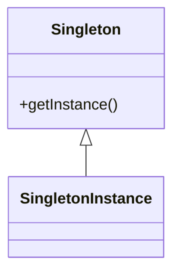
# Java Singleton Design Pattern- Commonly asked Interview Questions

Greetings everyone! Today, we’re exploring common interview questions concerning the Java Singleton design pattern, providing clear explanations alongside straightforward examples. These resources are specifically designed to aid individuals preparing for interviews. Whether you’re navigating technical interviews or seeking to enhance your understanding, this series aims to be a valuable asset in your journey toward success.

## 1. What is singleton class?
The Singleton design pattern, classified under Creational Design Patterns, ensures that only one instance of a class exists within the JVM and offers a singular access point for any other code to interact with it.

## 2. Where can we apply or use the singleton concept in real time?

Database Connection Pooling: Efficiently manage connections in multi-threaded environments for optimal database access.

Logger Objects: Ensure uniform logging across the application for debugging and monitoring purposes.

Configuration Management: Load configuration settings once from a file or database for easy access throughout the application.

Caching Mechanisms: Enhance performance by caching frequently accessed data, reducing the need for repeated computations or queries.

Thread Pooling: Effectively manage a pool of worker threads to handle concurrent task execution efficiently.

Hardware Interface Classes: Maintain single connections to hardware devices, preventing conflicts and resource wastage.

Global State Management: Centrally manage and update global state data, ensuring consistency and accessibility across the application.

## 3. What are the basic requirements for making class as a Singleton ?

Implementing the Singleton pattern involves several approaches, all sharing common concepts:

- A private constructor prevents external instantiation of the class.

- A private static variable holds the sole instance of the class.

- A public static method provides global access to retrieve the instance, serving as the entry point for external classes to obtain the singleton instance.

## 4. Give some examples of singleton design pattern used in Java JDK.

- java.awt.Desktop
- java.lang.System
- java.lang.Runtime
- java.util.logging.Logger
- java.security.Security

## 5. What is Eager initialization in Singleton ?

This approach involves creating an instance of a class well in advance of its immediate need, often during system startup.

In eager initialization for a singleton pattern, the instance is generated regardless of whether any other class requests it. Typically, this is achieved using a static variable, initialized during application startup.
```java
public class Singleton {

 private Singleton() {

 }

 private static final Singleton instance = new Singleton();

 public static Singleton getInstance() {
  return instance;
 }

}
```
## 6. What is Static Block Initialization Singleton?

The static block initialization method provides another approach to implement Singletons in Java. Similar to eager initialization, this method initializes the instance early, but it offers better exception handling features
```java
public class Singleton {

 private Singleton() {

 }

 private static Singleton instance;

 static {
  try {

   instance = new Singleton();

  } catch (Exception e) {
   throw new RuntimeException("Failed to create singleton instance");
  }
 }

 public static Singleton getInstance() {
  return instance;
 }

}
```
## 7. What is lazy initialization in Singleton ?

Lazy initialization means that we only create the single instance of a class when we actually need it for the first time. We don’t make it beforehand. This is useful when creating that instance takes a lot of time or needs special resources that we only want to use when necessary.
```java
public class Singleton {

 private Singleton() {

 }

 private static Singleton instance;

 public static Singleton getInstance() {
  if (instance == null) {
   return instance = new Singleton();
  }

  return instance;
 }

}
```
## 8. How to achieve the thread safety in Singleton?

To implement a Thread-Safe Singleton, the straightforward approach involves synchronizing the global access method. This ensures that multiple threads cannot create more than one instance by acquiring a lock before entering the getInstance() method.

```java
public class Singleton {

 private Singleton() {

 }

 private static Singleton instance;

 public synchronized static Singleton getInstance() {
  if (instance == null) {
   return instance = new Singleton();
  }

  return instance;
 }

}
```
## 9. What is double-checked locking in Singleton?

Considering the above code (Question no 8) Synchronizing the entire method can lead to performance degradation. Acquiring and releasing the lock with every call to getInstance() seems unnecessary. Initially, only a few calls need synchronization. For instance, if 5 threads attempt to call getInstance(), synchronization is only required for these threads. After the first object creation, subsequent threads receive the same object due to the null check in the if condition. Hence, optimization can be achieved using the double-checked locking principle, where a synchronized block is employed within the if condition, as illustrated below:

```java
public class Singleton {

 private Singleton() {

 }

 private static Singleton instance;

 public static Singleton getInstance() {

  if (instance == null) {

   synchronized (Singleton.class) {

    if (instance == null) {

     instance = new Singleton();

    }
   }

  }

  return instance;
 }

}
```
## 10. Explain Bill Pugh Singleton Implementation.

A Bill Pugh Singleton relies on the “initialization on demand holder” idiom, which employs inner classes and avoids synchronization constructs. It utilizes static blocks in a distinct manner and advocates for the usage of static inner classes.
```java
public class Singleton {

 private Singleton() {

 }

 private static class InnerSingleton {

  private static Singleton single = new Singleton();

 }

 public static Singleton getInstance() {
  return InnerSingleton.single;
 }

}
```
## 11. How to implement singleton using Enums?

In Java, you can implement the Singleton design pattern using enums. Enums in Java are inherently singletons because they can only have one instance per enumeration value. Here’s how you can implement a Singleton using enums
```java
public enum SingletonEnum {

 Instance;

 public void doSomething() {
  // Add your code here
 }

}
```
## 12. What are the different manners in which the Singleton Design pattern might encounter failure?

- Reflection
- Serialization and deserialization
- Cloning

The Singleton Design Pattern ensures that a class has only one instance and provides a global point of access to it. However, there are several common issues and pitfalls that can lead to failure or undesirable behavior when implementing the Singleton Pattern. Here are some of the key problems:

### 1. **Thread Safety Issues**
   - **Problem:** In a multithreaded environment, if the Singleton instance is not created in a thread-safe manner, multiple threads might end up creating multiple instances.
   - **Example:** Without proper synchronization, multiple threads may simultaneously enter the `getInstance()` method, leading to the creation of multiple instances.

   - **Solution:** Use synchronization mechanisms such as `synchronized` blocks or methods, or more modern approaches like the Double-Checked Locking pattern or using `volatile` variables.

   ```java
   public class Singleton {
       private static volatile Singleton instance;

       private Singleton() { }

       public static Singleton getInstance() {
           if (instance == null) {
               synchronized (Singleton.class) {
                   if (instance == null) {
                       instance = new Singleton();
                   }
               }
           }
           return instance;
       }
   }
   ```

### 2. **Serialization Issues**
   - **Problem:** If the Singleton class implements `Serializable` and is deserialized, it may create a new instance instead of returning the existing one.
   - **Solution:** Implement the `readResolve()` method to ensure that deserialization returns the same instance.

   ```java
   public class Singleton implements Serializable {
       private static final long serialVersionUID = 1L;
       private static Singleton instance;

       private Singleton() { }

       public static Singleton getInstance() {
           if (instance == null) {
               synchronized (Singleton.class) {
                   if (instance == null) {
                       instance = new Singleton();
                   }
               }
           }
           return instance;
       }

       private Object readResolve() {
           return getInstance();
       }
   }
   ```

### 3. **Reflection Issues**
   - **Problem:** Reflection can be used to bypass the Singleton restriction by invoking private constructors directly.
   - **Solution:** Throw an exception from the private constructor if an instance already exists.

   ```java
   public class Singleton {
       private static Singleton instance;

       private Singleton() {
           if (instance != null) {
               throw new RuntimeException("Use getInstance() method to get the single instance of this class.");
           }
       }

       public static Singleton getInstance() {
           if (instance == null) {
               synchronized (Singleton.class) {
                   if (instance == null) {
                       instance = new Singleton();
                   }
               }
           }
           return instance;
       }
   }
   ```

### 4. **Lazy Initialization Issues**
   - **Problem:** If lazy initialization is used (creating the instance when it is first needed), it may lead to performance issues or concurrency problems if not handled properly.
   - **Solution:** Consider using eager initialization or other thread-safe techniques.

   ```java
   public class Singleton {
       private static final Singleton instance = new Singleton();

       private Singleton() { }

       public static Singleton getInstance() {
           return instance;
       }
   }
   ```

### 5. **Dependency Injection Issues**
   - **Problem:** If a Singleton class has dependencies, it might be challenging to manage these dependencies, especially in complex systems or testing environments.
   - **Solution:** Use Dependency Injection frameworks or design patterns that allow more flexible management of dependencies.

### 6. **ClassLoader Issues**
   - **Problem:** In complex applications involving multiple ClassLoaders (e.g., in web applications), each ClassLoader may create its own instance of the Singleton.
   - **Solution:** Ensure that the Singleton class is loaded by a single ClassLoader, or handle ClassLoader-related issues carefully.

### 7. **Static Inner Class Singleton**
   - **Problem:** While this is generally a robust solution for the Singleton pattern, it may still face issues if the static inner class approach is not understood or applied correctly.
   - **Solution:** Use the static inner class approach to ensure thread safety and lazy initialization.

   ```java
   public class Singleton {
       private Singleton() { }

       private static class SingletonHelper {
           private static final Singleton INSTANCE = new Singleton();
       }

       public static Singleton getInstance() {
           return SingletonHelper.INSTANCE;
       }
   }
   ```

### Summary

- **Thread Safety:** Use proper synchronization.
- **Serialization:** Implement `readResolve()`.
- **Reflection:** Guard against reflection.
- **Lazy Initialization:** Handle carefully to avoid concurrency issues.
- **Dependency Injection:** Manage dependencies effectively.
- **ClassLoader Issues:** Ensure correct class loading.
- **Static Inner Class:** Use to ensure lazy initialization and thread safety.

Understanding and addressing these issues will help you avoid common pitfalls and ensure that the Singleton pattern works as intended in your application.
## 13. Explain How reflection breaks the singleton design pattern with an example.

The Reflection API in Java enables the modification of a class’s runtime behaviour. Despite declaring the constructor as private in the Singleton implementations mentioned above, Reflection allows access to private constructors, thereby enabling the breaking of the singleton property of a class.
```java
public class Singleton {

 private Singleton() {

 }

 private static final Singleton instance = new Singleton();

 public static Singleton getInstance() {
  return instance;
 }

}
public class Test {

 public static void main(String[] args) {

  Singleton s1 = Singleton.getInstance();
  Singleton s2 = null;

  Constructor[] constructors = Singleton.class.getDeclaredConstructors();

  for (Constructor c : constructors) {

   c.setAccessible(true);
   try {
    s2 = (Singleton) c.newInstance();

    break;

   } catch (InstantiationException e) {
    // TODO Auto-generated catch block
    e.printStackTrace();
   } catch (IllegalAccessException e) {
    // TODO Auto-generated catch block
    e.printStackTrace();
   } catch (IllegalArgumentException e) {
    // TODO Auto-generated catch block
    e.printStackTrace();
   } catch (InvocationTargetException e) {
    // TODO Auto-generated catch block
    e.printStackTrace();
   }
  }

  System.out.println("Hascode for S1 " + s1.hashCode());
  System.out.println("Hascode for S2 " + s2.hashCode());

 }

}
```

The output reveals that the two instances possess distinct hash codes, thereby undermining the Singleton pattern. To safeguard Singleton against reflection, a straightforward approach is to introduce an exception in the private constructor. This way, any attempt by reflection to access the private constructor will result in an error.

```java
public class Singleton {

 private Singleton() {

  if (Singleton.instance != null) {

   throw new InstantiationError("Object creation is not allowed");
  }

 }

 private static final Singleton instance = new Singleton();

 public static Singleton getInstance() {
  return instance;
 }

}
```

Another solution to safeguard Singleton against Reflection is by utilizing Enums (as mentioned in the previous question). Enums possess constructors that cannot be accessed via Reflection. The JVM internally manages the creation and invocation of enum constructors.

## 14. How Serialization and Deserialization impact the singleton design pattern and how to overcome the issue?

When a Singleton class implements the Serializable interface, it allows the object’s state to be saved and retrieved later using Deserialization. However, a challenge arises during Deserialization: a new instance of the class is created, thereby violating the Singleton pattern.

```java
public class Singleton {

 private Singleton() {

 }

 private static final Singleton instance = new Singleton();

 public static Singleton getInstance() {
  return instance;
 }

}


public class SingletonTest {

 public static void main(String[] args) {

  Singleton s1 = Singleton.getInstance();

  Singleton s2 = null;

  File file = new File("Test.txt");

  try {

   FileOutputStream fos = new FileOutputStream(file);
   ObjectOutputStream os = new ObjectOutputStream(fos);
   os.writeObject(s1);

   fos.close();
   os.close();

  } catch (Exception e) {
   e.printStackTrace();
  }

  try {

   FileInputStream fis = new FileInputStream(file);
   ObjectInputStream ois = new ObjectInputStream(fis);
   s2 = (Singleton) ois.readObject();
   fis.close();
   ois.close();

  } catch (Exception e) {
   e.printStackTrace();
  }

  System.out.println("Hashcode for S1 " + s1.hashCode());
  System.out.println("Hashcode for S2 " + s2.hashCode());

 }

}
```
## 15. How Cloning impacts the singleton design pattern and how to overcome the issue?

Cloning is used to create duplicate objects, essentially creating a copy of the original object. However, if we clone an instance of our Singleton class, a new instance will be created, consequently violating the Singleton pattern.
```java
public class Singleton implements Cloneable {

 private Singleton() {

 }

 private static final Singleton instance = new Singleton();

 public static Singleton getInstance() {
  return instance;
 }

 @Override
 protected Object clone() throws CloneNotSupportedException {

  return super.clone();
 }

}
public class SingletonTest {

 public static void main(String[] args) {

  Singleton s1 = Singleton.getInstance();
  Singleton s2 = null;
  try {
   s2 = (Singleton) s1.clone();

  } catch (CloneNotSupportedException e) {
   // TODO Auto-generated catch block
   e.printStackTrace();
  }

  System.out.println("Hashcode for S1 " + s1.hashCode());
  System.out.println("Hashcode for S2 " + s2.hashCode());

 }

}
```

As evident from the differing hashcodes of both instances, our Singleton pattern is compromised. To address this issue, we can override the clone method in our Singleton class. This overridden method can either return the same instance or throw a CloneNotSupportedException.
```java
public class Singleton implements Cloneable {
 private Singleton() {
 }
 private static final Singleton instance = new Singleton();
 public static Singleton getInstance() {
  return instance;
 }
 @Override
 protected Object clone() throws CloneNotSupportedException {
  return instance;
 }
}
```

### **2. Factory Method**
Defines an interface for creating an object but lets subclasses alter the type of objects that will be created.

**Example:**

```java
// Product
interface Product {
    void use();
}

// Concrete Product
class ConcreteProductA implements Product {
    public void use() {
        System.out.println("Using Product A");
    }
}

class ConcreteProductB implements Product {
    public void use() {
        System.out.println("Using Product B");
    }
}

// Creator
abstract class Creator {
    public abstract Product factoryMethod();
    
    public void someOperation() {
        Product product = factoryMethod();
        product.use();
    }
}

// Concrete Creator
class ConcreteCreatorA extends Creator {
    public Product factoryMethod() {
        return new ConcreteProductA();
    }
}

class ConcreteCreatorB extends Creator {
    public Product factoryMethod() {
        return new ConcreteProductB();
    }
}
```
**Code Example:**

```java
abstract class Animal {
    public abstract String speak();
}

class Dog extends Animal {
    public String speak() {
        return "Woof!";
    }
}

class Cat extends Animal {
    public String speak() {
        return "Meow!";
    }
}

class AnimalFactory {
    public static Animal createAnimal(String type) {
        switch (type.toLowerCase()) {
            case "dog":
                return new Dog();
            case "cat":
                return new Cat();
            default:
                throw new IllegalArgumentException("Unknown animal type");
        }
    }
}

// Usage
public class Main {
    public static void main(String[] args) {
        Animal animal = AnimalFactory.createAnimal("dog");
        System.out.println(animal.speak());  // Output: Woof!
    }
}
```

**Mermaid Diagram:**

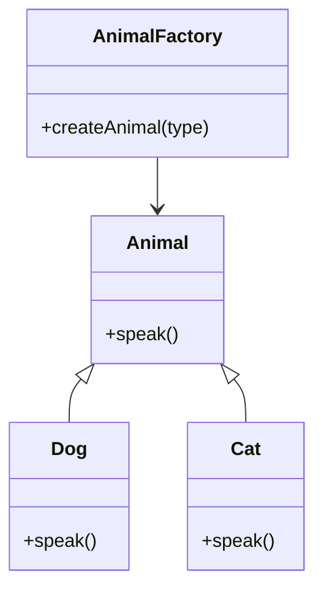
### **3. Abstract Factory**
Provides an interface for creating families of related or dependent objects without specifying their concrete classes.

**Example:**

```java
// Abstract Factory
interface AbstractFactory {
    Product createProduct();
}

// Concrete Factories
class ConcreteFactory1 implements AbstractFactory {
    public Product createProduct() {
        return new Product1();
    }
}

class ConcreteFactory2 implements AbstractFactory {
    public Product createProduct() {
        return new Product2();
    }
}

// Abstract Product
interface Product {
    void use();
}

// Concrete Products
class Product1 implements Product {
    public void use() {
        System.out.println("Using Product1");
    }
}

class Product2 implements Product {
    public void use() {
        System.out.println("Using Product2");
    }
}
```
Provides an interface for creating families of related or dependent objects without specifying their concrete classes.

**Code Example:**

```java
interface Animal {
    String speak();
}

class Dog implements Animal {
    public String speak() {
        return "Woof!";
    }
}

class Cat implements Animal {
    public String speak() {
        return "Meow!";
    }
}

interface AnimalFactory {
    Animal createDog();
    Animal createCat();
}

class ConcreteAnimalFactory implements AnimalFactory {
    public Animal createDog() {
        return new Dog();
    }
    
    public Animal createCat() {
        return new Cat();
    }
}

// Usage
public class Main {
    public static void main(String[] args) {
        AnimalFactory factory = new ConcreteAnimalFactory();
        Animal dog = factory.createDog();
        Animal cat = factory.createCat();
        System.out.println(dog.speak());  // Output: Woof!
        System.out.println(cat.speak());  // Output: Meow!
    }
}
```

**Mermaid Diagram:**

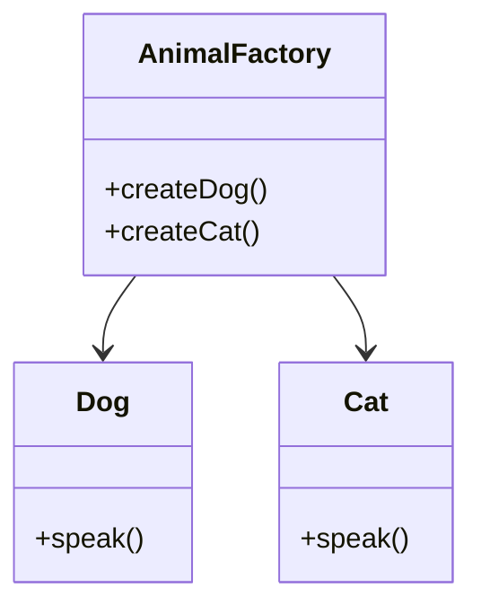
### **4. Builder**
Separates the construction of a complex object from its representation so that the same construction process can create different representations.

**Example:**

```java
// Product
class Product {
    private String partA;
    private String partB;
    
    public void setPartA(String partA) {
        this.partA = partA;
    }
    
    public void setPartB(String partB) {
        this.partB = partB;
    }
    
    @Override
    public String toString() {
        return "Product with partA: " + partA + " and partB: " + partB;
    }
}

// Builder
abstract class Builder {
    protected Product product = new Product();
    
    public abstract void buildPartA();
    public abstract void buildPartB();
    
    public Product getResult() {
        return product;
    }
}

// Concrete Builder
class ConcreteBuilder extends Builder {
    public void buildPartA() {
        product.setPartA("Part A");
    }
    
    public void buildPartB() {
        product.setPartB("Part B");
    }
}

// Director
class Director {
    private Builder builder;
    
    public Director(Builder builder) {
        this.builder = builder;
    }
    
    public void construct() {
        builder.buildPartA();
        builder.buildPartB();
    }
}
```
Separates the construction of a complex object from its representation.

**Code Example:**

```java
class Car {
    private String make;
    private String model;
    private int year;

    public static class Builder {
        private String make;
        private String model;
        private int year;

        public Builder setMake(String make) {
            this.make = make;
            return this;
        }

        public Builder setModel(String model) {
            this.model = model;
            return this;
        }

        public Builder setYear(int year) {
            this.year = year;
            return this;
        }

        public Car build() {
            Car car = new Car();
            car.make = this.make;
            car.model = this.model;
            car.year = this.year;
            return car;
        }
    }

    @Override
    public String toString() {
        return year + " " + make + " " + model;
    }
}

// Usage
public class Main {
    public static void main(String[] args) {
        Car car = new Car.Builder()
                .setMake("Toyota")
                .setModel("Corolla")
                .setYear(2022)
                .build();

        System.out.println(car);  // Output: 2022 Toyota Corolla
    }
}
```

**Mermaid Diagram:**

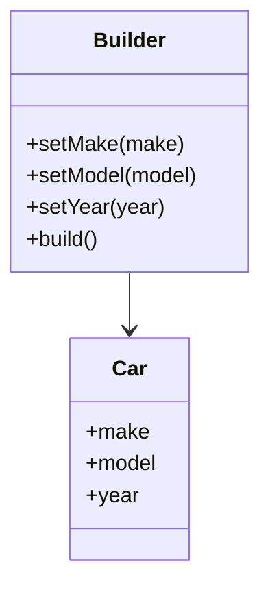
### **5. Prototype**
Creates new objects by copying an existing object, known as the prototype.

**Example:**

```java
// Prototype
abstract class Prototype implements Cloneable {
    public abstract Prototype clone();
}

// Concrete Prototype
class ConcretePrototype extends Prototype {
    private String property;
    
    public ConcretePrototype(String property) {
        this.property = property;
    }
    
    public String getProperty() {
        return property;
    }
    
    public void setProperty(String property) {
        this.property = property;
    }
    
    @Override
    public ConcretePrototype clone() {
        try {
            return (ConcretePrototype) super.clone();
        } catch (CloneNotSupportedException e) {
            throw new RuntimeException(e);
        }
    }
}
```
Creates new objects by copying an existing object.

**Code Example:**

```java
import java.util.HashMap;
import java.util.Map;

abstract class Prototype {
    public abstract Prototype clone();
}

class ConcretePrototype extends Prototype {
    private String name;

    public ConcretePrototype(String name) {
        this.name = name;
    }

    @Override
    public Prototype clone() {
        return new ConcretePrototype(name);
    }

    public String getName() {
        return name;
    }
}

// Usage
public class Main {
    public static void main(String[] args) {
        ConcretePrototype prototype = new ConcretePrototype("Original");
        ConcretePrototype clone = (ConcretePrototype) prototype.clone();
        System.out.println(clone.getName());  // Output: Original
    }
}
```

**Mermaid Diagram:**

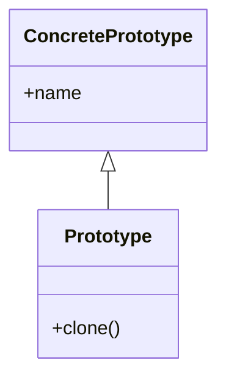

### 6. Object Pool Pattern

The Object Pool Pattern is used to manage a set of reusable objects instead of creating and destroying them on demand. This is useful when the cost of creating and destroying objects is high.

**Code Example:**

```java
import java.util.ArrayList;
import java.util.List;

class Connection {
    public void connect() {
        System.out.println("Connected to database.");
    }
}

class ConnectionPool {
    private List<Connection> availableConnections = new ArrayList<>();
    private List<Connection> usedConnections = new ArrayList<>();
    private static final int MAX_POOL_SIZE = 5;

    public Connection getConnection() {
        if (availableConnections.isEmpty() && usedConnections.size() < MAX_POOL_SIZE) {
            Connection connection = new Connection();
            usedConnections.add(connection);
            return connection;
        } else if (!availableConnections.isEmpty()) {
            Connection connection = availableConnections.remove(availableConnections.size() - 1);
            usedConnections.add(connection);
            return connection;
        }
        return null; // No available connections
    }

    public void releaseConnection(Connection connection) {
        usedConnections.remove(connection);
        availableConnections.add(connection);
    }
}

// Usage
public class Main {
    public static void main(String[] args) {
        ConnectionPool pool = new ConnectionPool();
        
        Connection conn1 = pool.getConnection();
        conn1.connect(); // Output: Connected to database.

        pool.releaseConnection(conn1);
        
        Connection conn2 = pool.getConnection();
        conn2.connect(); // Output: Connected to database.
    }
}
```

**Mermaid Diagram:**

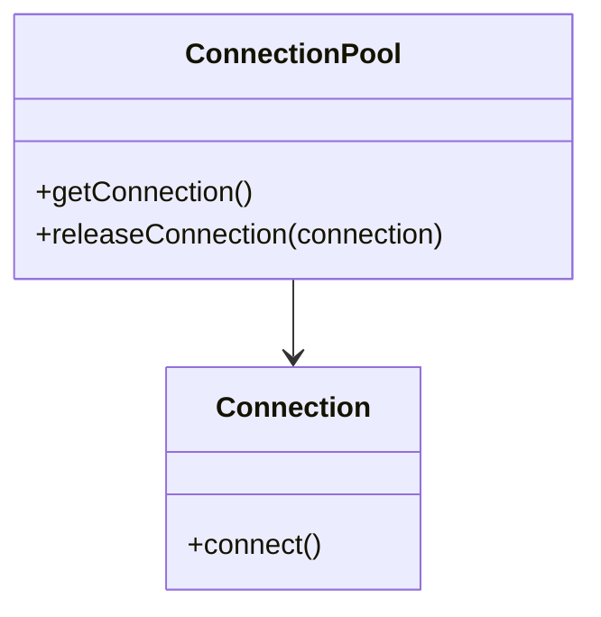

---
## **Structural Design Patterns**

### **1. Adapter**
Allows incompatible interfaces to work together.

**Example:**

```java
// Target
interface Target {
    void request();
}

// Adaptee
class Adaptee {
    public void specificRequest() {
        System.out.println("Specific request");
    }
}

// Adapter
class Adapter implements Target {
    private Adaptee adaptee;
    
    public Adapter(Adaptee adaptee) {
        this.adaptee = adaptee;
    }
    
    public void request() {
        adaptee.specificRequest();
    }
}
```
Allows incompatible interfaces to work together.

**Code Example:**

```java
class EuropeanSocket {
    public String connect() {
        return "Connected to European socket";
    }
}

class AmericanSocket {
    public String connect() {
        return "Connected to American socket";
    }
}

class SocketAdapter {
    private AmericanSocket americanSocket;

    public SocketAdapter(AmericanSocket americanSocket) {
        this.americanSocket = americanSocket;
    }

    public String connect() {
        return americanSocket.connect().replace("American", "European");
    }
}

// Usage
public class Main {
    public static void main(String[] args) {
        AmericanSocket americanSocket = new AmericanSocket();
        SocketAdapter adapter = new SocketAdapter(americanSocket);
        System.out.println(adapter.connect());  // Output: Connected to European socket
    }
}
```

**Mermaid Diagram:**

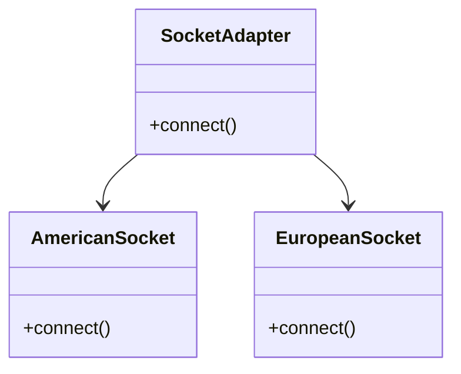
### **2. Bridge**
Decouples an abstraction from its implementation so that the two can vary independently.

**Example:**

```java
// Abstraction
abstract class Abstraction {
    protected Implementor implementor;
    
    public Abstraction(Implementor implementor) {
        this.implementor = implementor;
    }
    
    public abstract void operation();
}

// Implementor
interface Implementor {
    void operationImpl();
}

// Concrete Implementor
class ConcreteImplementorA implements Implementor {
    public void operationImpl() {
        System.out.println("Concrete Implementor A");
    }
}

// Refined Abstraction
class RefinedAbstraction extends Abstraction {
    public RefinedAbstraction(Implementor implementor) {
        super(implementor);
    }
    
    public void operation() {
        implementor.operationImpl();
    }
}
```
Decouples an abstraction from its implementation.

**Code Example:**

```java
abstract class RemoteControl {
    protected Device device;

    public RemoteControl(Device device) {
        this.device = device;
    }

    public abstract void togglePower();
}

class TV implements Device {
    public void power() {
        System.out.println("TV power toggled");
    }
}

class Radio implements Device {
    public void power() {
        System.out.println("Radio power toggled");
    }
}

class ConcreteRemoteControl extends RemoteControl {
    public ConcreteRemoteControl(Device device) {
        super(device);
    }

    public void togglePower() {
        device.power();
    }
}

// Usage
public class Main {
    public static void main(String[] args) {
        Device tv = new TV();
        RemoteControl remote = new ConcreteRemoteControl(tv);
        remote.togglePower();  // Output: TV power toggled
    }
}
```

**Mermaid Diagram:**

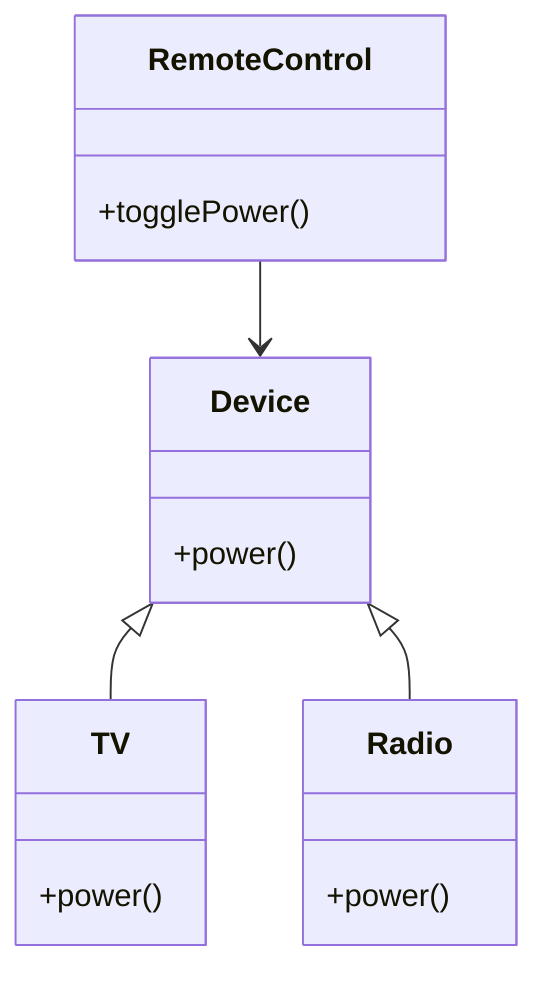
### **3. Composite**
Allows you to compose objects into tree structures to represent part-whole hierarchies.

**Example:**

```java
// Component
interface Component {
    void operation();
}

// Leaf
class Leaf implements Component {
    public void operation() {
        System.out.println("Leaf operation");
    }
}

// Composite
class Composite implements Component {
    private List<Component> children = new ArrayList<>();
    
    public void add(Component component) {
        children.add(component);
    }
    
    public void operation() {
        for (Component component : children) {
            component.operation();
        }
    }
}
```
Allows you to compose objects into tree structures.

**Code Example:**

```java
import java.util.ArrayList;
import java.util.List;

abstract class Component {
    public abstract String operation();
}

class Leaf extends Component {
    public String operation() {
        return "Leaf";
    }
}

class Composite extends Component {
    private List<Component> children = new ArrayList<>();

    public void add(Component component) {
        children.add(component);
    }

    public String operation() {
        StringBuilder result = new StringBuilder();
        for (Component child : children) {
            result.append(child.operation()).append(" ");
        }
        return result.toString().trim();
    }
}

// Usage
public class Main {
    public static void main(String[] args) {
        Composite composite = new Composite();
        composite.add(new Leaf());
        composite.add(new Leaf());


        System.out.println(composite.operation());  // Output: Leaf Leaf
    }
}
```

**Mermaid Diagram:**

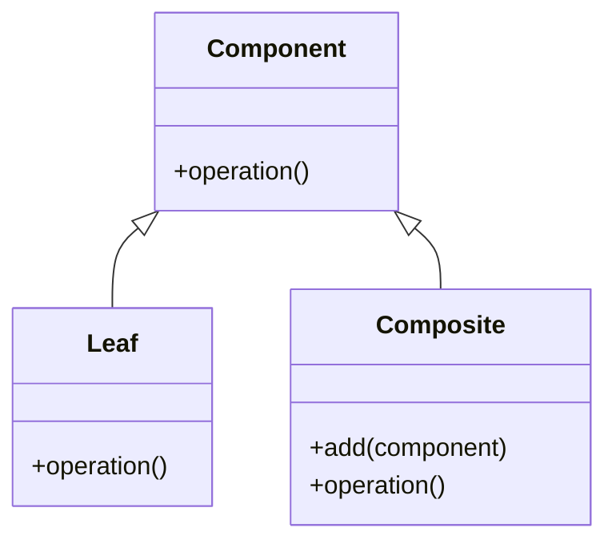
### **4. Decorator**
Adds additional responsibilities to an object dynamically.

**Example:**

```java
// Component
interface Component {
    void operation();
}

// Concrete Component
class ConcreteComponent implements Component {
    public void operation() {
        System.out.println("ConcreteComponent operation");
    }
}

// Decorator
abstract class Decorator implements Component {
    protected Component component;
    
    public Decorator(Component component) {
        this.component = component;
    }
    
    public void operation() {
        component.operation();
    }
}

// Concrete Decorator
class ConcreteDecorator extends Decorator {
    public ConcreteDecorator(Component component) {
        super(component);
    }
    
    public void operation() {
        super.operation();
        addedBehavior();
    }
    
    private void addedBehavior() {
        System.out.println("Added behavior");
    }
}
```
Adds behavior to individual objects without affecting the behavior of other objects.

**Code Example:**

```java
abstract class Coffee {
    public abstract double cost();
}

class BasicCoffee extends Coffee {
    public double cost() {
        return 5.0;
    }
}

abstract class CoffeeDecorator extends Coffee {
    protected Coffee coffee;

    public CoffeeDecorator(Coffee coffee) {
        this.coffee = coffee;
    }
}

class MilkDecorator extends CoffeeDecorator {
    public MilkDecorator(Coffee coffee) {
        super(coffee);
    }

    public double cost() {
        return coffee.cost() + 1.0;
    }
}

// Usage
public class Main {
    public static void main(String[] args) {
        Coffee coffee = new BasicCoffee();
        Coffee milkCoffee = new MilkDecorator(coffee);

        System.out.println(coffee.cost());      // Output: 5.0
        System.out.println(milkCoffee.cost());  // Output: 6.0
    }
}
```

**Mermaid Diagram:**

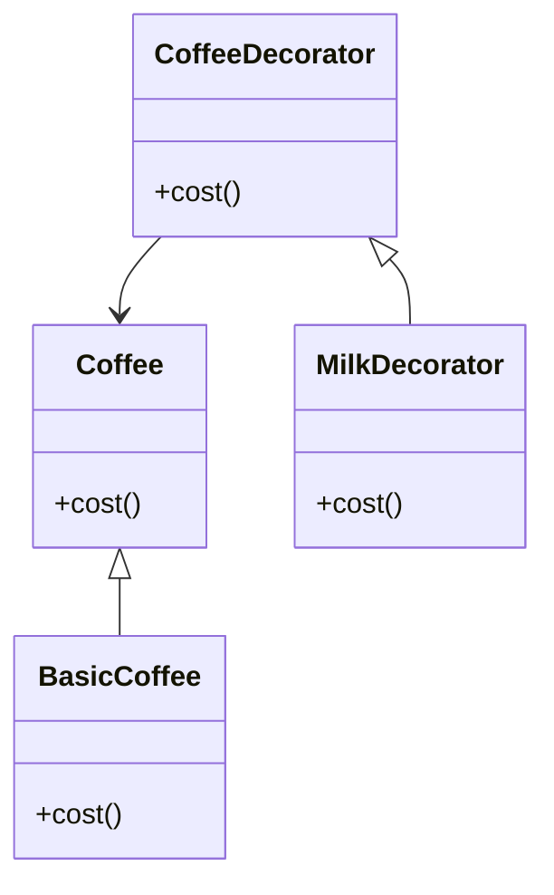
### **5. Flyweight**
Reduces the cost of creating and manipulating a large number of similar objects.

**Example:**

```java
// Flyweight
interface Flyweight {
    void operation();
}

// Concrete Flyweight
class ConcreteFlyweight implements Flyweight {
    private String intrinsicState;
    
    public ConcreteFlyweight(String state) {
        this.intrinsicState = state;
    }
    
    public void operation() {
        System.out.println("ConcreteFlyweight operation with state " + intrinsicState);
    }
}

// Flyweight Factory
class FlyweightFactory {
    private Map<String, Flyweight> flyweights = new HashMap<>();
    
    public Flyweight getFlyweight(String state) {
        if (!flyweights.containsKey(state)) {
            flyweights.put(state, new ConcreteFlyweight(state));
        }
        return flyweights.get(state);
    }
}
```
The Flyweight Pattern is used to minimize memory usage by sharing objects that are similar in nature. It is particularly useful when dealing with a large number of similar objects.

**Code Example:**

```java
import java.util.HashMap;

interface Shape {
    void draw();
}

class Circle implements Shape {
    private String color;

    public Circle(String color) {
        this.color = color;
    }

    @Override
    public void draw() {
        System.out.println("Circle of color: " + color);
    }
}

class ShapeFactory {
    private HashMap<String, Shape> shapes = new HashMap<>();

    public Shape getCircle(String color) {
        if (!shapes.containsKey(color)) {
            shapes.put(color, new Circle(color));
        }
        return shapes.get(color);
    }
}

// Usage
public class Main {
    public static void main(String[] args) {
        ShapeFactory shapeFactory = new ShapeFactory();

        Shape redCircle = shapeFactory.getCircle("Red");
        Shape greenCircle = shapeFactory.getCircle("Green");
        Shape anotherRedCircle = shapeFactory.getCircle("Red");

        redCircle.draw();  // Output: Circle of color: Red
        greenCircle.draw(); // Output: Circle of color: Green
        System.out.println(redCircle == anotherRedCircle);  // Output: true
    }
}
```

**Mermaid Diagram:**

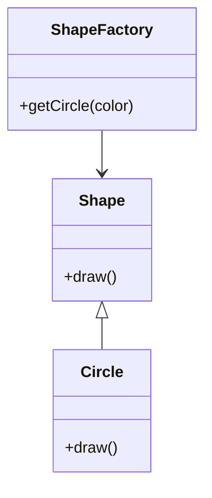
### **6. Proxy**
Provides a surrogate or placeholder for another object to control access to it.

**Example:**

```java
// Subject
interface Subject {
    void request();
}

// RealSubject
class RealSubject implements Subject {
    public void request() {
        System.out.println("RealSubject request");
    }
}

// Proxy
class Proxy implements Subject {
    private RealSubject realSubject;
    
    public void request() {
        if (realSubject == null) {
            realSubject = new RealSubject();
        }
        realSubject.request();
    }
}
```
The Proxy Pattern provides a surrogate or placeholder for another object to control access to it.

**Code Example:**

```java
interface Image {
    void display();
}

class RealImage implements Image {
    private String filename;

    public RealImage(String filename) {
        this.filename = filename;
        loadImageFromDisk();
    }

    private void loadImageFromDisk() {
        System.out.println("Loading " + filename);
    }

    @Override
    public void display() {
        System.out.println("Displaying " + filename);
    }
}

class ProxyImage implements Image {
    private RealImage realImage;
    private String filename;

    public ProxyImage(String filename) {
        this.filename = filename;
    }

    @Override
    public void display() {
        if (realImage == null) {
            realImage = new RealImage(filename);
        }
        realImage.display();
    }
}

// Usage
public class Main {
    public static void main(String[] args) {
        Image image = new ProxyImage("photo.jpg");
        image.display(); // Output: Loading photo.jpg
                         //         Displaying photo.jpg
    }
}
```

**Mermaid Diagram:**

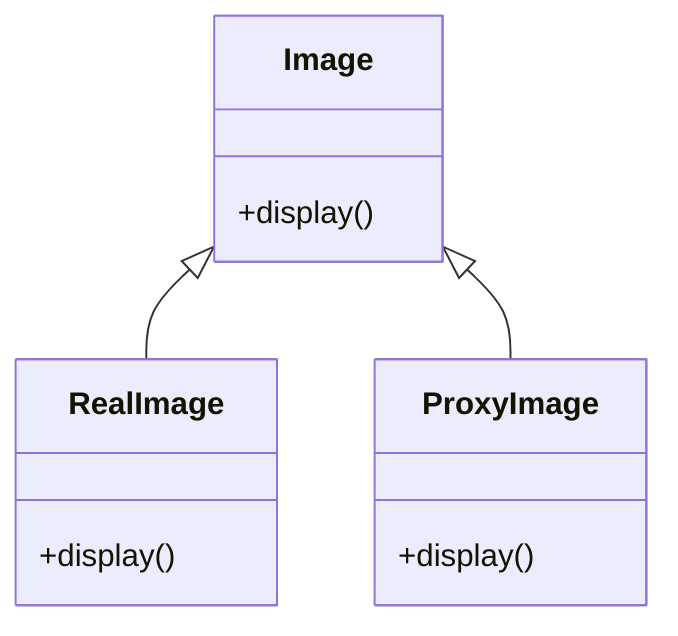

### **7. Facade**
Provides a simplified interface to a complex subsystem.

**Example:**

```java
// Subsystem classes
class Subsystem1 {
    public void operation1() {
        System.out.println("Subsystem1 operation1");
    }
}

class Subsystem2 {
    public void operation2() {
        System.out.println("Subsystem2 operation2");
    }
}

// Facade
class Facade {
    private Subsystem1 subsystem1 = new Subsystem1();
    private Subsystem2 subsystem2 = new Subsystem2();
    
    public void simplifiedOperation() {
        subsystem1.operation1();
        subsystem2.operation2();
    }
}
```
Provides a simplified interface to a complex subsystem.

**Code Example:**

```java
class Subsystem1 {
    public String operation1() {
        return "Subsystem1: Ready!\n";
    }
}

class Subsystem2 {
    public String operation2() {
        return "Subsystem2: Get ready!\n";
    }
}

class Facade {
    private Subsystem1 subsystem1;
    private Subsystem2 subsystem2;

    public Facade() {
        subsystem1 = new Subsystem1();
        subsystem2 = new Subsystem2();
    }

    public String operation() {
        return subsystem1.operation1() + subsystem2.operation2();
    }
}

// Usage
public class Main {
    public static void main(String[] args) {
        Facade facade = new Facade();
        System.out.println(facade.operation());
    }
}
```

**Mermaid Diagram:**

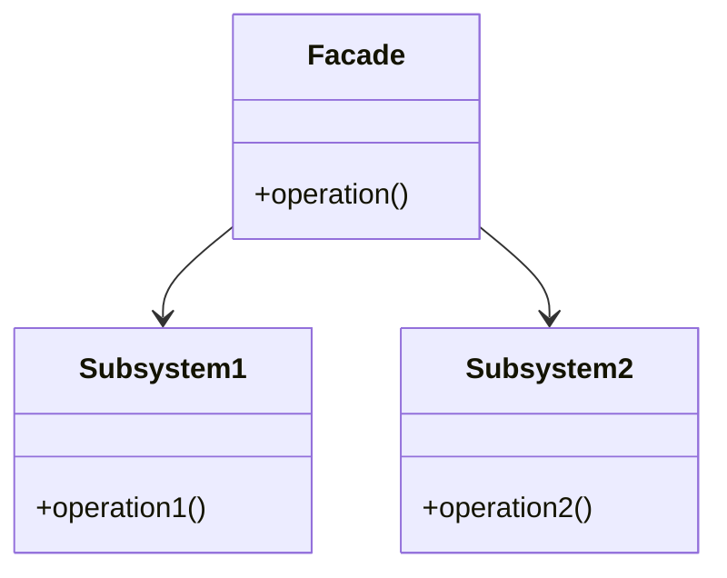
## **Behavioral Design Patterns**

### **1. Chain of Responsibility**
Passes a request along a chain of handlers, where each handler decides whether to process the request or pass it along the chain.

**Example:**

```java
// Handler
abstract class Handler {
    protected Handler successor;
    
    public void setSuccessor(Handler successor) {
        this.successor = successor;
    }
    
    public abstract void handleRequest(int request);
}

// Concrete Handler
class ConcreteHandlerA extends Handler {
    public void handleRequest(int request)

 {
        if (request < 10) {
            System.out.println("Handler A handled request " + request);
        } else if (successor != null) {
            successor.handleRequest(request);
        }
    }
}

class ConcreteHandlerB extends Handler {
    public void handleRequest(int request) {
        if (request >= 10 && request < 20) {
            System.out.println("Handler B handled request " + request);
        } else if (successor != null) {
            successor.handleRequest(request);
        }
    }
}
```
Allows multiple objects to handle a request without the sender needing to know which object will handle it.

**Code Example:**

```java
abstract class Handler {
    private Handler nextHandler;

    public void setNext(Handler handler) {
        this.nextHandler = handler;
    }

    public void handle(String request) {
        if (canHandle(request)) {
            handleRequest(request);
        } else if (nextHandler != null) {
            nextHandler.handle(request);
        }
    }

    protected abstract boolean canHandle(String request);
    protected abstract void handleRequest(String request);
}

class ConcreteHandlerA extends Handler {
    protected boolean canHandle(String request) {
        return "A".equals(request);
    }

    protected void handleRequest(String request) {
        System.out.println("Handler A handled request A");
    }
}

class ConcreteHandlerB extends Handler {
    protected boolean canHandle(String request) {
        return "B".equals(request);
    }

    protected void handleRequest(String request) {
        System.out.println("Handler B handled request B");
    }
}

// Usage
public class Main {
    public static void main(String[] args) {
        Handler handlerA = new ConcreteHandlerA();
        Handler handlerB = new ConcreteHandlerB();

        handlerA.setNext(handlerB);

        handlerA.handle("A");  // Output: Handler A handled request A
        handlerA.handle("B");  // Output: Handler B handled request B
    }
}
```

**Mermaid Diagram:**

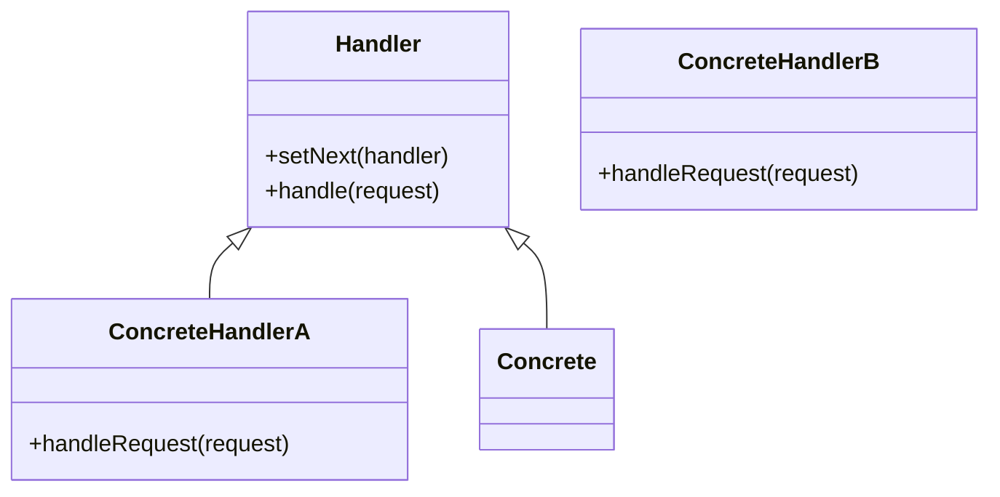
### **2. Command**
Encapsulates a request as an object, thereby allowing for parameterization of clients with queues, requests, and operations.

**Example:**

```java
// Command
interface Command {
    void execute();
}

// Concrete Command
class LightOnCommand implements Command {
    private Light light;
    
    public LightOnCommand(Light light) {
        this.light = light;
    }
    
    public void execute() {
        light.turnOn();
    }
}

// Receiver
class Light {
    public void turnOn() {
        System.out.println("Light is on");
    }
}

// Invoker
class RemoteControl {
    private Command command;
    
    public void setCommand(Command command) {
        this.command = command;
    }
    
    public void pressButton() {
        command.execute();
    }
}
```
Encapsulates a request as an object, allowing for parameterization of clients with queues and requests.

**Code Example:**

```java
interface Command {
    void execute();
}

class Light {
    public void turnOn() {
        System.out.println("Light is ON");
    }
}

class LightOnCommand implements Command {
    private Light light;

    public LightOnCommand(Light light) {
        this.light = light;
    }

    public void execute() {
        light.turnOn();
    }
}

class RemoteControl {
    private Command command;

    public RemoteControl(Command command) {
        this.command = command;
    }

    public void pressButton() {
        command.execute();
    }
}

// Usage
public class Main {
    public static void main(String[] args) {
        Light light = new Light();
        Command lightOn = new LightOnCommand(light);
        RemoteControl remote = new RemoteControl(lightOn);

        remote.pressButton();  // Output: Light is ON
    }
}
```

**Mermaid Diagram:**

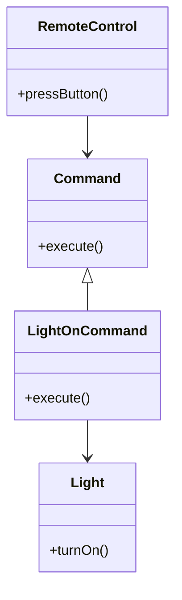
### **3. Interpreter**
Defines a grammar for interpreting sentences in a language and provides an interpreter to interpret the sentences.

**Example:**

```java
// Abstract Expression
interface Expression {
    boolean interpret(String context);
}

// Terminal Expression
class TerminalExpression implements Expression {
    private String data;
    
    public TerminalExpression(String data) {
        this.data = data;
    }
    
    public boolean interpret(String context) {
        return context.contains(data);
    }
}

// Context
class Context {
    private Expression expression;
    
    public Context(Expression expression) {
        this.expression = expression;
    }
    
    public boolean interpret(String context) {
        return expression.interpret(context);
    }
}
```
The Interpreter Pattern is used to define a grammar for a language and provides an interpreter to evaluate sentences in that language.

**Code Example:**

```java
import java.util.HashMap;

interface Expression {
    int interpret(HashMap<String, Integer> context);
}

class Number implements Expression {
    private int number;

    public Number(int number) {
        this.number = number;
    }

    @Override
    public int interpret(HashMap<String, Integer> context) {
        return number;
    }
}

class Plus implements Expression {
    private Expression left;
    private Expression right;

    public Plus(Expression left, Expression right) {
        this.left = left;
        this.right = right;
    }

    @Override
    public int interpret(HashMap<String, Integer> context) {
        return left.interpret(context) + right.interpret(context);
    }
}

// Usage
public class Main {
    public static void main(String[] args) {
        Expression expression = new Plus(new Number(5), new Number(3));
        HashMap<String, Integer> context = new HashMap<>();
        System.out.println("Result: " + expression.interpret(context));  // Output: Result: 8
    }
}
```

**Mermaid Diagram:**

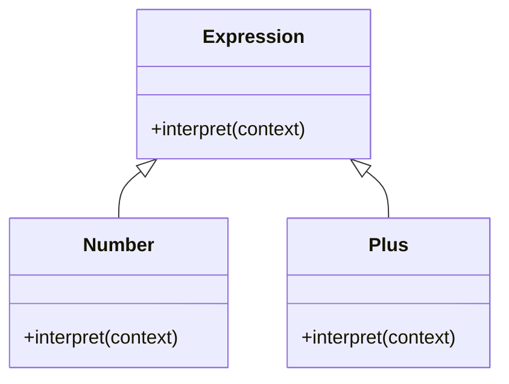

### **4. Iterator**
Provides a way to access the elements of an aggregate object sequentially without exposing its underlying representation.

**Example:**

```java
// Iterator
interface Iterator {
    boolean hasNext();
    Object next();
}

// Aggregate
interface IterableCollection {
    Iterator createIterator();
}

// Concrete Iterator
class ConcreteIterator implements Iterator {
    private List<Object> items;
    private int position = 0;
    
    public ConcreteIterator(List<Object> items) {
        this.items = items;
    }
    
    public boolean hasNext() {
        return position < items.size();
    }
    
    public Object next() {
        return items.get(position++);
    }
}

// Concrete Aggregate
class ConcreteCollection implements IterableCollection {
    private List<Object> items = new ArrayList<>();
    
    public void addItem(Object item) {
        items.add(item);
    }
    
    public Iterator createIterator() {
        return new ConcreteIterator(items);
    }
}
```
Provides a way to access the elements of an aggregate object sequentially without exposing its underlying representation.

**Code Example:**

```java
import java.util.ArrayList;
import java.util.Iterator;
import java.util.List;

class IterableCollection {
    private List<String> items = new ArrayList<>();

    public void add(String item) {
        items.add(item);
    }

    public Iterator<String> iterator() {
        return items.iterator();
    }
}

// Usage
public class Main {
    public static void main(String[] args) {
        IterableCollection collection = new IterableCollection();
        collection.add("Item 1");
        collection.add("Item 2");

        for (String item : collection) {
            System.out.println(item);  // Output: Item 1, Item 2
        }
    }
}
```

**Mermaid Diagram:**

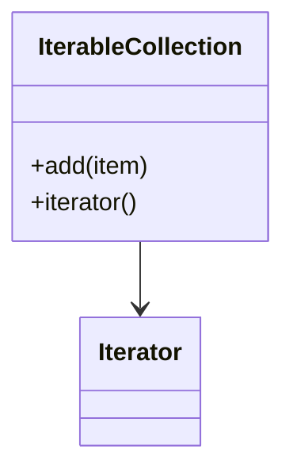
### **5. Mediator**
Defines an object that encapsulates how a set of objects interact and promotes loose coupling.

**Example:**

```java
// Mediator
interface Mediator {
    void send(String message, Colleague colleague);
}

// Concrete Mediator
class ConcreteMediator implements Mediator {
    private ConcreteColleague1 colleague1;
    private ConcreteColleague2 colleague2;
    
    public void setColleague1(ConcreteColleague1 colleague1) {
        this.colleague1 = colleague1;
    }
    
    public void setColleague2(ConcreteColleague2 colleague2) {
        this.colleague2 = colleague2;
    }
    
    public void send(String message, Colleague colleague) {
        if (colleague == colleague1) {
            colleague2.receive(message);
        } else {
            colleague1.receive(message);
        }
    }
}

// Colleague
abstract class Colleague {
    protected Mediator mediator;
    
    public Colleague(Mediator mediator) {
        this.mediator = mediator;
    }
    
    public abstract void receive(String message);
}

// Concrete Colleagues
class ConcreteColleague1 extends Colleague {
    public ConcreteColleague1(Mediator mediator) {
        super(mediator);
    }
    
    public void receive(String message) {
        System.out.println("Colleague1 received: " + message);
    }
}

class ConcreteColleague2 extends Colleague {
    public ConcreteColleague2(Mediator mediator) {
        super(mediator);
    }
    
    public void receive(String message) {
        System.out.println("Colleague2 received: " + message);
    }
}
```
The Mediator Pattern defines an object that encapsulates how a set of objects interact. It promotes loose coupling by preventing objects from referring to each other explicitly.

**Code Example:**

```java
import java.util.ArrayList;
import java.util.List;

class ChatRoom {
    public static void showMessage(User user, String message) {
        System.out.println(user.getName() + ": " + message);
    }
}

class User {
    private String name;

    public User(String name) {
        this.name = name;
    }

    public String getName() {
        return name;
    }

    public void sendMessage(String message) {
        ChatRoom.showMessage(this, message);
    }
}

// Usage
public class Main {
    public static void main(String[] args) {
        User user1 = new User("Alice");
        User user2 = new User("Bob");

        user1.sendMessage("Hi Bob!"); // Output: Alice: Hi Bob!
        user2.sendMessage("Hello Alice!"); // Output: Bob: Hello Alice!
    }
}
```

**Mermaid Diagram:**

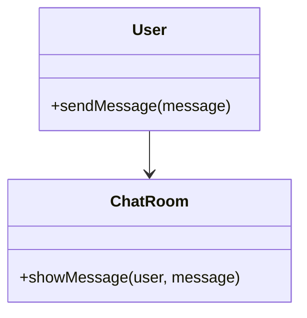
### **6. Memento**
Captures and restores an object's internal state without violating encapsulation.

**Example:**

```java
// Memento
class Memento {
    private String state;
    
    public Memento(String state) {
        this.state = state;
    }
    
    public String getState() {
        return state;
    }
}

// Originator
class Originator {
    private String state;
    
    public void setState(String state) {
        this.state = state;
    }
    
    public String getState() {
        return state;
    }
    
    public Memento saveStateToMemento() {
        return new Memento(state);
    }
    
    public void getStateFromMemento(Memento memento) {
        state = memento.getState();
    }
}

// Caretaker
class Caretaker {
    private Memento memento;
    
    public void saveMemento(Memento memento) {
        this.memento = memento;
    }
    
    public Memento getMemento() {
        return memento;
    }
}
```
The Memento Pattern allows an object to capture its internal state so that it can be restored later without violating encapsulation.

**Code Example:**

```java
class Memento {
    private String state;

    public Memento(String state) {
        this.state = state;
    }

    public String getState() {
        return state;
    }
}

class Originator {
    private String state;

    public void setState(String state) {
        this.state = state;
    }

    public String getState() {
        return state;
    }

    public Memento saveStateToMemento() {
        return new Memento(state);
    }

    public void getStateFromMemento(Memento memento) {
        state = memento.getState();
    }
}

// Usage
public class Main {
    public static void main(String[] args) {
        Originator originator = new Originator();
        originator.setState("State #1");
        Memento memento = originator.saveStateToMemento();

        originator.setState("State #2");
        System.out.println("Current State: " + originator.getState()); // Output: State #2

        originator.getStateFromMemento(memento);
        System.out.println("Restored State: " + originator.getState()); // Output: State #1
    }
}
```

**Mermaid Diagram:**

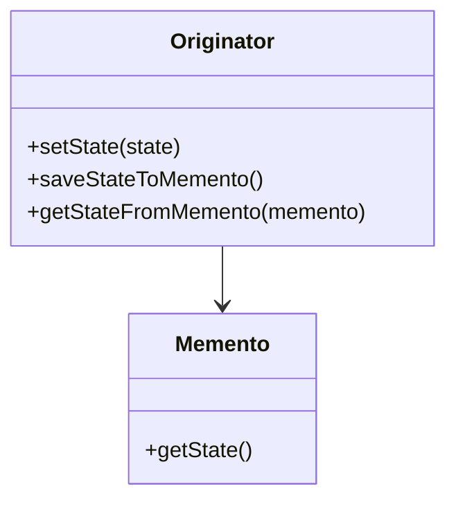
### **7. Observer**
Defines a dependency between objects so that when one object changes state, all its dependents are notified and updated automatically.

**Example:**

```java
// Observer
interface Observer {
    void update(String message);
}

// Subject
interface Subject {
    void addObserver(Observer observer);
    void removeObserver(Observer observer);
    void notifyObservers();
}

// Concrete Subject
class ConcreteSubject implements Subject {
    private List<Observer> observers = new ArrayList<>();
    private String state;
    
    public void setState(String state) {
        this.state = state;
        notifyObservers();
    }
    
    public String getState() {
        return state;
    }
    
    public void addObserver(Observer observer) {
        observers.add(observer);
    }
    
    public void removeObserver(Observer observer) {
        observers.remove(observer);
    }
    
    public void notifyObservers() {
        for (Observer observer : observers) {
            observer.update(state);
        }
    }
}

// Concrete Observer
class ConcreteObserver implements Observer {
    private String name;
    
    public ConcreteObserver(String name) {
        this.name = name;
    }
    
    public void update(String message) {
        System.out.println(name + " received update: " + message);
    }
}
```
Defines a one-to-many dependency between objects so that when one object changes state, all its dependents are notified.

**Code Example:**

```java
import java.util.ArrayList;
import java.util.List;

interface Observer {
    void update();
}

class Subject {
    private List<Observer> observers = new ArrayList<>();

    public void attach(Observer observer) {
        observers.add(observer);
    }

    public void notifyObservers() {
        for (Observer observer : observers) {
            observer.update();
        }
    }
}

class ConcreteObserver implements Observer {
    public void update() {
        System.out.println("Observer updated!");
    }
}

// Usage
public class Main {
    public static void main(String[] args) {
        Subject subject = new Subject();
        ConcreteObserver observer1 = new ConcreteObserver();
        ConcreteObserver observer2 = new ConcreteObserver();

        subject.attach(observer1);
        subject.attach(observer2);
        subject.notifyObservers();  // Output: Observer updated! (twice)
    }
}
```

**Mermaid Diagram:**

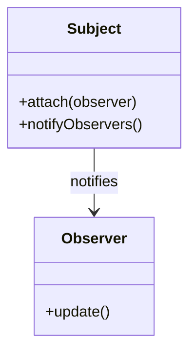
### **8. State**
Allows an object to alter its behavior when its internal state changes.

**Example:**

```java
// State
interface State {
    void handleRequest();
}

// Concrete States
class ConcreteStateA implements State {
    public void handleRequest() {
        System.out.println("Handling request in State A");
    }
}

class ConcreteStateB implements State {
    public void handleRequest() {
        System.out.println("Handling request in State B");
    }
}

// Context
class Context {
    private State state;
    
    public void setState(State state) {
        this.state = state;
    }
    
    public void request() {
        state.handleRequest();
    }
}
```
The State Pattern allows an object to alter its behavior when its internal state changes. It appears as if the object has changed its class.

**Code Example:**

```java
interface State {
    void doAction(Context context);
}

class StartState implements State {
    public void doAction(Context context) {
        System.out.println("Player is in start state");
        context.setState(this);
    }

    public String toString() {
        return "Start State";
    }
}

class StopState implements State {
    public void doAction(Context context) {
        System.out.println("Player is in stop state");
        context.setState(this);
    }

    public String toString() {
        return "Stop State";
    }
}

class Context {
    private State state;

    public void setState(State state) {
        this.state = state;
    }

    public State getState() {
        return state;
    }
}

// Usage
public class Main {
    public static void main(String[] args) {
        Context context = new Context();

        StartState startState = new StartState();
        startState.doAction(context);

        System.out.println(context.getState()); // Output: Start State

        StopState stopState = new StopState();
        stopState.doAction(context);

        System.out.println(context.getState()); // Output: Stop State
    }
}
```

**Mermaid Diagram:**

```mermaid
classDiagram
    class State {
        +doAction(context)
    }
    class StartState {
        +doAction(context)
    }
    class StopState {
        +doAction(context)
    }
    class Context {
        +setState(state)
        +getState()
    }
    Context --> State
    State <|-- StartState
    State <|-- StopState
```
### **9. Strategy**
Defines a family of algorithms, encapsulates each one, and makes them interchangeable.

**Example:**

```java
// Strategy
interface Strategy {
    void execute();
}

// Concrete Strategies
class ConcreteStrategyA implements Strategy {
    public void execute() {
        System.out.println("Executing Strategy A");
    }
}

class ConcreteStrategyB implements Strategy {
    public void execute() {
        System.out.println("Executing Strategy B");
    }
}

// Context
class Context {
    private Strategy strategy;
    
    public void setStrategy(Strategy strategy) {
        this.strategy = strategy;
    }
    
    public void executeStrategy() {
        strategy.execute();
    }
}
```
Defines a family of algorithms, encapsulates each one, and makes them interchangeable.

**Code Example:**

```java
interface Strategy {
    String execute();
}

class ConcreteStrategyA implements Strategy {
    public String execute() {
        return "Strategy A";
    }
}

class ConcreteStrategyB implements Strategy {
    public String execute() {
        return "Strategy B";
    }
}

class Context {
    private Strategy strategy;

    public Context(Strategy strategy) {
        this.strategy = strategy;
    }

    public String doSomeLogic() {
        return strategy.execute();
    }
}

// Usage
public class Main {
    public static void main(String[] args) {
        Context context = new Context(new ConcreteStrategyA());
        System.out.println(context.doSomeLogic());  // Output: Strategy A
    }
}
```

**Mermaid Diagram:**

```mermaid
classDiagram
    class Strategy {
        +execute()
    }
    class ConcreteStrategyA {
        +execute()
    }
    class ConcreteStrategyB {
        +execute()
    }
    class Context {
        +doSomeLogic()
    }
    Context --> Strategy
    Strategy <|-- ConcreteStrategyA
    Strategy <|-- ConcreteStrategyB
```
### **10. Template Method**
Defines the skeleton of an algorithm in the superclass but lets subclasses redefine certain steps of the algorithm without changing its structure.

**Example:**

```java
// Abstract Class
abstract class AbstractClass {
    public final void templateMethod() {
        step1();
        step2();
        step3();
    }
    
    protected abstract void step1();
    protected abstract void step2();
    
    private void step3() {
        System.out.println("Step 3");
    }
}

// Concrete Class
class ConcreteClass extends AbstractClass {
    protected void step1() {
        System.out.println("ConcreteClass step1");
    }
    
    protected void step2() {
        System.out.println("ConcreteClass step2");
    }
}
```

The Template Method Pattern defines the skeleton of an algorithm in a method, deferring some steps to subclasses. It lets subclasses redefine certain steps of an algorithm without changing the

 algorithm's structure.

**Code Example:**

```java
abstract class Game {
    abstract void initialize();
    abstract void startPlay();
    abstract void endPlay();

    // Template method
    public final void play() {
        initialize();
        startPlay();
        endPlay();
    }
}

class Cricket extends Game {
    void initialize() {
        System.out.println("Cricket Game Initialized!");
    }

    void startPlay() {
        System.out.println("Cricket Game Started!");
    }

    void endPlay() {
        System.out.println("Cricket Game Finished!");
    }
}

class Football extends Game {
    void initialize() {
        System.out.println("Football Game Initialized!");
    }

    void startPlay() {
        System.out.println("Football Game Started!");
    }

    void endPlay() {
        System.out.println("Football Game Finished!");
    }
}

// Usage
public class Main {
    public static void main(String[] args) {
        Game cricket = new Cricket();
        cricket.play();
        
        Game football = new Football();
        football.play();
    }
}
```

**Mermaid Diagram:**

```mermaid
classDiagram
    class Game {
        +initialize()
        +startPlay()
        +endPlay()
        +play()
    }
    class Cricket {
        +initialize()
        +startPlay()
        +endPlay()
    }
    class Football {
        +initialize()
        +startPlay()
        +endPlay()
    }
    Game <|-- Cricket
    Game <|-- Football
```
### **11. Visitor**
Defines a new operation to a group of objects without changing the classes of the elements on which it operates.

**Example:**

```java
// Visitor
interface Visitor {
    void visit(ElementA elementA);
    void visit(ElementB elementB);
}

// Concrete Visitors
class ConcreteVisitor1 implements Visitor {
    public void visit(ElementA elementA) {
        System.out.println("ConcreteVisitor1 visiting ElementA");
    }
    
    public void visit(ElementB elementB) {
        System.out.println("ConcreteVisitor1 visiting ElementB");
    }
}

class ConcreteVisitor2 implements Visitor {
    public void visit(ElementA elementA) {
        System.out.println("ConcreteVisitor2 visiting ElementA");
    }
    
    public void visit(ElementB elementB) {
        System.out.println("ConcreteVisitor2 visiting ElementB");
    }
}

// Element
interface Element {
   

 void accept(Visitor visitor);
}

// Concrete Elements
class ElementA implements Element {
    public void accept(Visitor visitor) {
        visitor.visit(this);
    }
}

class ElementB implements Element {
    public void accept(Visitor visitor) {
        visitor.visit(this);
    }
}
```
The Visitor Pattern allows adding new operations to existing object structures without modifying them. It represents an operation to be performed on elements of an object structure.

**Code Example:**

```java
interface Visitor {
    void visit(Book book);
    void visit(Fruit fruit);
}

class Book {
    void accept(Visitor visitor) {
        visitor.visit(this);
    }
}

class Fruit {
    void accept(Visitor visitor) {
        visitor.visit(this);
    }
}

class ShoppingCartVisitor implements Visitor {
    public void visit(Book book) {
        System.out.println("Book added to cart.");
    }

    public void visit(Fruit fruit) {
        System.out.println("Fruit added to cart.");
    }
}

// Usage
public class Main {
    public static void main(String[] args) {
        Book book = new Book();
        Fruit fruit = new Fruit();

        ShoppingCartVisitor visitor = new ShoppingCartVisitor();
        book.accept(visitor);  // Output: Book added to cart.
        fruit.accept(visitor);  // Output: Fruit added to cart.
    }
}
```

**Mermaid Diagram:**

```mermaid
classDiagram
    class Visitor {
        +visit(book)
        +visit(fruit)
    }
    class Book {
        +accept(visitor)
    }
    class Fruit {
        +accept(visitor)
    }
    class ShoppingCartVisitor {
        +visit(book)
        +visit(fruit)
    }
    Book --> Visitor
    Fruit --> Visitor
    ShoppingCartVisitor --> Visitor
```
### 12. Null Object Pattern

The Null Object Pattern uses a special object with defined behavior to represent a null reference. This avoids null checks and makes the code cleaner.

**Code Example:**

```java
abstract class AbstractCustomer {
    protected String name;

    public abstract String getName();
    public abstract boolean isNil();
}

class RealCustomer extends AbstractCustomer {
    public RealCustomer(String name) {
        this.name = name;
    }

    @Override
    public String getName() {
        return name;
    }

    @Override
    public boolean isNil() {
        return false;
    }
}

class NullCustomer extends AbstractCustomer {
    @Override
    public String getName() {
        return "Not Available";
    }

    @Override
    public boolean isNil() {
        return true;
    }
}

class CustomerFactory {
    public static final String[] names = { "Alice", "Bob", "Charlie" };

    public static AbstractCustomer getCustomer(String name) {
        for (String n : names) {
            if (n.equalsIgnoreCase(name)) {
                return new RealCustomer(name);
            }
        }
        return new NullCustomer();
    }
}

// Usage
public class Main {
    public static void main(String[] args) {
        AbstractCustomer customer1 = CustomerFactory.getCustomer("Alice");
        AbstractCustomer customer2 = CustomerFactory.getCustomer("Dave");

        System.out.println(customer1.getName()); // Output: Alice
        System.out.println(customer2.getName()); // Output: Not Available
    }
}
```

**Mermaid Diagram:**

```mermaid
classDiagram
    class AbstractCustomer {
        +getName()
        +isNil()
    }
    class RealCustomer {
        +getName()
        +isNil()
    }
    class NullCustomer {
        +getName()
        +isNil()
    }
    class CustomerFactory {
        +getCustomer(name)
    }
    AbstractCustomer <|-- RealCustomer
    AbstractCustomer <|-- NullCustomer
```

---
## **Backend Communication Design Patterns**

### **1. Request Response**
A pattern where a client sends a request to a server and waits for a response.

**Example:**

```java
// Client
public class Client {
    public static void main(String[] args) {
        try (Socket socket = new Socket("localhost", 8080);
             PrintWriter out = new PrintWriter(socket.getOutputStream(), true);
             BufferedReader in = new BufferedReader(new InputStreamReader(socket.getInputStream()))) {

            out.println("Hello Server");
            String response = in.readLine();
            System.out.println("Server response: " + response);
        } catch (IOException e) {
            e.printStackTrace();
        }
    }
}
```

### **2. Push**
The server sends updates to the client whenever new data is available.

**Example:**

```java
// Server (using WebSocket for push communication)
@ServerEndpoint("/push")
public class PushServer {
    @OnMessage
    public void onMessage(Session session, String message) {
        // Send a message to the client
        session.getAsyncRemote().sendText("Server response to: " + message);
    }
}

// Client (using WebSocket)
WebSocket ws = new WebSocket("ws://localhost:8080/push");
ws.onmessage = function(event) {
    console.log("Received message: " + event.data);
};
ws.send("Hello Server");
```

### **3. Short Polling**
The client repeatedly polls the server at regular intervals to check for new data.

**Example:**

```java
// Client
public class ShortPollingClient {
    public static void main(String[] args) {
        while (true) {
            try {
                URL url = new URL("http://localhost:8080/check");
                HttpURLConnection conn = (HttpURLConnection) url.openConnection();
                conn.setRequestMethod("GET");
                
                BufferedReader in = new BufferedReader(new InputStreamReader(conn.getInputStream()));
                String response = in.readLine();
                System.out.println("Server response: " + response);
                in.close();
                
                Thread.sleep(5000); // wait for 5 seconds
            } catch (IOException | InterruptedException e) {
                e.printStackTrace();
            }
        }
    }
}
```

### **4. Long Polling**
A client requests information from the server and keeps the connection open until the server has new information.

**Example:**

```java
// Server (using Servlet)
@WebServlet("/longpolling")
public class LongPollingServlet extends HttpServlet {
    protected void doGet(HttpServletRequest request, HttpServletResponse response) throws IOException {
        // Simulate long wait for new data
        try {
            Thread.sleep(10000); // wait for 10 seconds
        } catch (InterruptedException e) {
            e.printStackTrace();
        }
        
        response.getWriter().write("New data available");
    }
}

// Client
public class LongPollingClient {
    public static void main(String[] args) {
        while (true) {
            try {
                URL url = new URL("http://localhost:8080/longpolling");
                HttpURLConnection conn = (HttpURLConnection) url.openConnection();
                conn.setRequestMethod("GET");
                
                BufferedReader in = new BufferedReader(new InputStreamReader(conn.getInputStream()));
                String response = in.readLine();
                System.out.println("Server response: " + response);
                in.close();
                
            } catch (IOException e) {
                e.printStackTrace();
            }
        }
    }
}
```

### **5. Server-Sent Events (SSE)**
A server pushes updates to the client over a single, long-lived HTTP connection.

**Example:**

```java
// Server (using SSE)
@ServerEndpoint("/events")
public class SSEServer {
    @OnOpen
    public void onOpen(Session session) {
        // Send periodic updates
        new Thread(() -> {
            try {
                while (true) {
                    session.getBasicRemote().sendText("Update at " + new Date());
                    Thread.sleep(5000); // wait for 5 seconds
                }
            } catch (IOException | InterruptedException e) {
                e.printStackTrace();
            }
        }).start();
    }
}

// Client (JavaScript example)
const eventSource = new EventSource("http://localhost:8080/events");
eventSource.onmessage = function(event) {
    console.log("Received event: " + event.data);
};
```

### **6. Publish-Subscribe (Pub/Sub)**
A messaging pattern where publishers send messages to a topic, and subscribers receive messages from that topic.

**Example:**

```java
// Publisher
public class Publisher {
    private MessageBroker broker;
    
    public Publisher(MessageBroker broker) {
        this.broker = broker;
    }
    
    public void publish(String message) {
        broker.publish(message);
    }
}

// Subscriber
public class Subscriber {
    private MessageBroker broker;
    
    public Subscriber(MessageBroker broker) {
        this.broker = broker;
        broker.subscribe(this::receiveMessage);
    }
    
    public void receiveMessage(String message) {
        System.out.println("Received message: " + message);
    }
}

// MessageBroker
public class MessageBroker {
    private List<Consumer<String>> subscribers = new ArrayList<>();
    
    public void subscribe(Consumer<String> subscriber) {
        subscribers.add(subscriber);
    }
    
    public void publish(String message) {
        for (Consumer<String> subscriber : subscribers) {
            subscriber.accept(message);
        }
    }
}
```

### **7. Multiplexing and Demultiplexing**
A technique for sending multiple signals or data streams over a single channel and then separating them at the receiving end.

**Example:**

```java
// Multiplexer
class Multiplexer {
    private List<Channel> channels = new ArrayList<>();
    
    public void addChannel(Channel channel) {
        channels.add(channel);
    }
    
    public void send(String message) {
        for (Channel channel : channels) {
            channel.send(message);
        }
    }
}

// Channel
interface Channel {
    void send(String message);
}

// Demultiplexer (receiving end)
class Demultiplexer {
    public void receive(String message) {
        System.out.println("Received message: " + message);
    }
}
```

### **8. Stateful and Stateless**
- **Stateful**: Maintains the state of interactions between client and server.
- **Stateless**: Each request from a client to a server must contain all the information the server needs to fulfill that request.

**Example:**

```java
// Stateless Example
// StatelessServlet
@WebServlet("/stateless")
public class StatelessServlet extends HttpServlet {
    protected void doGet(HttpServletRequest request, HttpServletResponse response) throws IOException {
        response.getWriter().write("Stateless response");
    }
}

// Stateful Example
// StatefulServlet
@WebServlet("/stateful")
public class StatefulServlet extends HttpServlet {
    private Map<String, String> state = new HashMap<>();
    
    protected void doGet(HttpServletRequest request, HttpServletResponse response) throws IOException {
        String id = request.getParameter("id");
        String value = state.getOrDefault(id, "Default value");
        response.getWriter().write("Stateful response: " + value);
    }
    
    protected void doPost(HttpServletRequest request, HttpServletResponse response) throws IOException {
        String id = request.getParameter("id");
        String value = request.getParameter("value");
        state.put(id, value);
        response.getWriter().write("State updated");
    }
}
```

### **9. Sidecar Pattern**
A pattern where a secondary service (sidecar) runs alongside the primary service to provide auxiliary capabilities.

**Example:**

```java
// Main Application
public class MainApp {
    public static void main(String[] args) {
        // Start primary service
        System.out.println("Primary service running");
        
        // Start sidecar service (e.g., monitoring)
        new SidecarService().start();
    }
}

// Sidecar Service
class SidecarService {
    public void start() {
        System.out.println("Sidecar service running");
    }
}
```

These examples should give you a solid understanding of various design patterns and backend communication techniques, including their implementation in Java.
