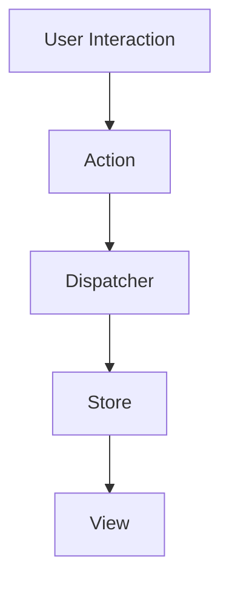
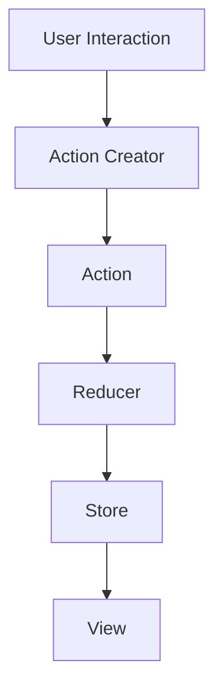
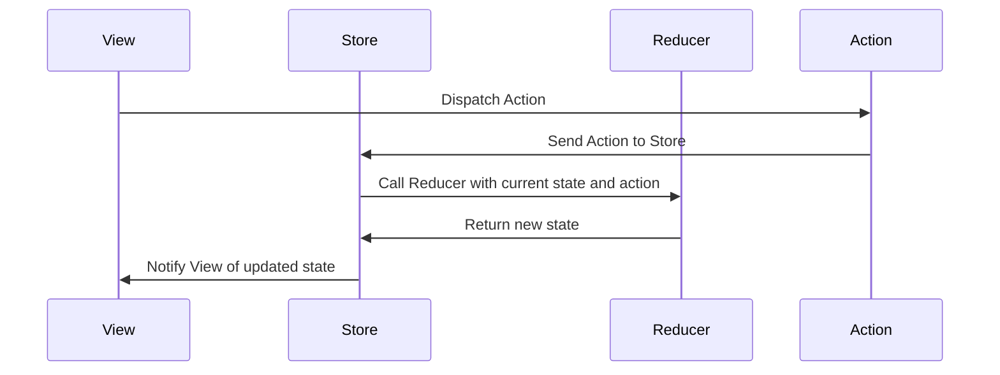

# React Interview Questions & Answers

### Table of Contents

<details open>
<summary>
Hide/Show table of contents
</summary>

| No. | Questions                                                                                                                                                                                                                        |
| --- | -------------------------------------------------------------------------------------------------------------------------------------------------------------------------------------------------------------------------------- |
|     | **Core React**                                                                                                                                                                                                                   |
| 1   | [What is React?](#what-is-react)                                                                                                                                                                                                 |
| 2   | [What is the history behind React evolution?](#What-is-the-history-behind-React-evolution)                                                                                                                                       |
| 3   | [What are the major features of React?](#what-are-the-major-features-of-react)                                                                                                                                                   |
| 4   | [What is JSX?](#what-is-jsx)                                                                                                                                                                                                     |
| 5   | [What is the difference between Element and Component?](#what-is-the-difference-between-element-and-component)                                                                                                                   |
| 6   | [How to create components in React?](#how-to-create-components-in-react)                                                                                                                                                         |
| 7   | [When to use a Class Component over a Function Component?](#when-to-use-a-class-component-over-a-function-component)                                                                                                             |
| 8   | [What are Pure Components?](#what-are-pure-components)                                                                                                                                                                           |
| 21  | [What are controlled components?](#what-are-controlled-components)                                                                                                                                                               |
| 22  | [What are uncontrolled components?](#what-are-uncontrolled-components)                                                                                                                                                           |
| 34  | [What are stateless components?](#what-are-stateless-components)                                                                                                                                                                 |
| 35  | [What are stateful components?](#what-are-stateful-components)                                                                                                                                                                   |
| 25  | [What are Higher-Order components?](#what-are-higher-order-components)|
| 48  | [How do you memoize a component?](#how-do-you-memoize-a-component) |
| 52  | [What is a switching component?](#what-is-a-switching-component)                                                                                                                                                                 |
| 9   | [What is state in React?](#what-is-state-in-react)                                                                                                                                                                               |
| 10  | [What are props in React?](#what-are-props-in-react)                                                                                                                                                                             |
| 11  | [What is the difference between state and props?](#what-is-the-difference-between-state-and-props)                                                                                                                               |
| 12  | [What is the difference between HTML and React event handling?](#what-is-the-difference-between-html-and-react-event-handling)                                                                                                   |
| 13  | [What are synthetic events in React?](#what-are-synthetic-events-in-react)                                                                                                                                                       |
| 14  | [What are inline conditional expressions?](#what-are-inline-conditional-expressions)                                                                                                                                             |
| 15  | [What is "key" prop and what is the benefit of using it in arrays of elements?](#what-is-key-prop-and-what-is-the-benefit-of-using-it-in-arrays-of-elements)                                                                     |
| 16  | [What is Virtual DOM?](#what-is-virtual-dom)                                                                                                                                                                                     |
| 17  | [How Virtual DOM works?](#how-virtual-dom-works)                                                                                                                                                                                 |
| 18  | [What is the difference between Shadow DOM and Virtual DOM?](#what-is-the-difference-between-shadow-dom-and-virtual-dom)                                                                                                         |
| 19  | [What is React Fiber?](#what-is-react-fiber)                                                                                                                                                                                     |
| 20  | [What is the main goal of React Fiber?](#what-is-the-main-goal-of-react-fiber)                                                                                                                                                   |
| 23  | [What is the difference between createElement and cloneElement?](#what-is-the-difference-between-createelement-and-cloneelement)                                                                                                 |
| 24  | [What is Lifting State Up in React?](#what-is-lifting-state-up-in-react)                                                                                                                                                         |
| 26  | [What is children prop?](#what-is-children-prop)                                                                                                                                                                                 |
| 27  | [How to write comments in React?](#how-to-write-comments-in-react)                                                                                                                                                               |
| 28  | [What is reconciliation?](#what-is-reconciliation)                                                                                                                                                                               |
| 29  | [Does the lazy function support named exports?](#does-the-lazy-function-support-named-exports)                                                                                                                                   |
| 30  | [Why React uses className over class attribute?](#why-react-uses-classname-over-class-attribute)                                                                                                                                 |
| 31  | [What are fragments?](#what-are-fragments)                                                                                                                                                                                       |
| 32  | [Why fragments are better than container divs?](#why-fragments-are-better-than-container-divs)                                                                                                                                   |
| 33  | [What are portals in React?](#what-are-portals-in-react)                                                                                                                                                                         |
| 36  | [How to apply validation on props in React?](#how-to-apply-validation-on-props-in-react)                                                                                                                                         |
| 37  | [What are the advantages of React?](#what-are-the-advantages-of-react)                                                                                                                                                           |
| 38  | [What are the limitations of React?](#what-are-the-limitations-of-react)                                                                                                                                                         |
| 39  | [What are the recommended ways for static type checking?](#what-are-the-recommended-ways-for-static-type-checking)                                                                                                               |
| 40  | [What is the use of react-dom package?](#what-is-the-use-of-react-dom-package)                                                                                                                                                   |
| 41  | [What is ReactDOMServer?](#what-is-reactdomserver)                                                                                                                                                                               |
| 42  | [How to use InnerHtml in React?](#how-to-use-innerhtml-in-react)                                                                                                                                                                 |
| 43  | [How to use styles in React?](#how-to-use-styles-in-react)                                                                                                                                                                       |
| 44  | [How events are different in React?](#how-events-are-different-in-react)                                                                                                                                                         |
| 45  | [What is the impact of indexes as keys?](#what-is-the-impact-of-indexes-as-keys)                                                                                                                                                 |
| 46  | [How do you conditionally render components?](#how-do-you-conditionally-render-components)                                                                                                                                       |
| 47  | [Why we need to be careful when spreading props on DOM elements??](#why-we-need-to-be-careful-when-spreading-props-on-dom-elements)                                                                                              |
| 49  | [How you implement Server-Side Rendering or SSR?](#how-you-implement-server-side-rendering-or-ssr)                                                                                                                               |
| 50  | [How to enable production mode in React?](#how-to-enable-production-mode-in-react)                                                                                                                                               |
| 51  | [Do Hooks replace render props and higher order components?](#do-hooks-replace-render-props-and-higher-order-components)                                                                                                         |
| 53  | [What are React Mixins?](#what-are-react-mixins)                                                                                                                                                                                 |
| 54  | [What are the Pointer Events supported in React?](#what-are-the-pointer-events-supported-in-react)                                                                                                                               |
| 55  | [Why should component names start with capital letter?](#why-should-component-names-start-with-capital-letter)                                                                                                                   |
| 56  | [Are custom DOM attributes supported in React v16?](#are-custom-dom-attributes-supported-in-react-v16)                                                                                                                           |
| 57  | [How to loop inside JSX?](#how-to-loop-inside-jsx)                                                                                                                                                                               |
| 58  | [How do you access props in attribute quotes?](#how-do-you-access-props-in-attribute-quotes)                                                                                                                                     |
| 59  | [What is React PropType array with shape?](#what-is-react-proptype-array-with-shape)                                                                                                                                             |
| 60  | [How to conditionally apply class attributes?](#how-to-conditionally-apply-class-attributes)                                                                                                                                     |
| 61  | [What is the difference between React and ReactDOM?](#what-is-the-difference-between-react-and-reactdom)                                                                                                                         |
| 62  | [Why ReactDOM is separated from React?](#why-reactdom-is-separated-from-react)                                                                                                                                                   |
| 63  | [How to use React label element?](#how-to-use-react-label-element)                                                                                                                                                               |
| 64  | [How to combine multiple inline style objects?](#how-to-combine-multiple-inline-style-objects)                                                                                                                                   |
| 65  | [How to re-render the view when the browser is resized?](#how-to-re-render-the-view-when-the-browser-is-resized)                                                                                                                 |
| 66  | [How to pretty print JSON with React?](#how-to-pretty-print-json-with-react)                                                                                                                                                     |
| 67  | [Why you can't update props in React?](#why-you-cant-update-props-in-react)                                                                                                                                                      |
| 68  | [How to focus an input element on page load?](#how-to-focus-an-input-element-on-page-load)                                                                                                                                       |
| 69  | [How can we find the version of React at runtime in the browser?](#how-can-we-find-the-version-of-react-at-runtime-in-the-browser)                                                                                               |
| 70  | [How to add Google Analytics for react-router?](#how-to-add-google-analytics-for-react-router)                                                                                                                                   |
| 71  | [How do you apply vendor prefixes to inline styles in React?](#how-do-you-apply-vendor-prefixes-to-inline-styles-in-react)                                                                                                       |
| 72  | [How to import and export components using react and ES6?](#how-to-import-and-export-components-using-react-and-es6)                                                                                                             |
| 73  | [What are the exceptions on React component naming?](#what-are-the-exceptions-on-react-component-naming)                                                                                                                         |
| 74  | [Is it possible to use async/await in plain React?](#is-it-possible-to-use-asyncawait-in-plain-react)                                                                                                                            |
| 75  | [What are the common folder structures for React?](#what-are-the-common-folder-structures-for-react)                                                                                                                             |
| 76  | [What are the popular packages for animation?](#what-are-the-popular-packages-for-animation)                                                                                                                                     |
| 77  | [What is the benefit of styles modules?](#what-is-the-benefit-of-styles-modules)                                                                                                                                                 |
| 78  | [What are the popular React-specific linters?](#what-are-the-popular-react-specific-linters)                                                                                                                                     |
|     | **React Router**                                                                                                                                                                                                                 |
| 79  | [What is React Router?](#what-is-react-router)                                                                                                                                                                                   |
| 80  | [How React Router is different from history library?](#how-react-router-is-different-from-history-library)                                                                                                                       |
| 81  | [What are the \<Router> components of React Router v6?](#what-are-the-router-components-of-react-router-v6)                                                                                                                      |
| 82  | [What is the purpose of push and replace methods of history?](#what-is-the-purpose-of-push-and-replace-methods-of-history)                                                                                                       |
| 83  | [How do you programmatically navigate using React router v4?](#how-do-you-programmatically-navigate-using-react-router-v4)                                                                                                       |
| 84  | [How to get query parameters in React Router v4](#how-to-get-query-parameters-in-react-router-v4)                                                                                                                                |
| 85  | [Why you get "Router may have only one child element" warning?](#why-you-get-router-may-have-only-one-child-element-warning)                                                                                                     |
| 86  | [How to pass params to history.push method in React Router v4?](#how-to-pass-params-to-historypush-method-in-react-router-v4)                                                                                                    |
| 87  | [How to implement default or NotFound page?](#how-to-implement-default-or-notfound-page)                                                                                                                                         |
| 88  | [How to get history on React Router v4?](#how-to-get-history-on-react-router-v4)                                                                                                                                                 |
| 89  | [How to perform automatic redirect after login?](#how-to-perform-automatic-redirect-after-login)                                                                                                                                 |
|     | **React Internationalization**                                                                                                                                                                                                   |
| 90  | [What is React Intl?](#what-is-react-intl)                                                                                                                                                                                       |
| 91  | [What are the main features of React Intl?](#what-are-the-main-features-of-react-intl)                                                                                                                                           |
| 92  | [What are the two ways of formatting in React Intl?](#what-are-the-two-ways-of-formatting-in-react-intl)                                                                                                                         |
| 93  | [How to use FormattedMessage as placeholder using React Intl?](#how-to-use-formattedmessage-as-placeholder-using-react-intl)                                                                                                     |
| 94  | [How to access current locale with React Intl](#how-to-access-current-locale-with-react-intl)                                                                                                                                    |
| 95  | [How to format date using React Intl?](#how-to-format-date-using-react-intl)                                                                                                                                                     |
|     | **React Testing**                                                                                                                                                                                                                |
| 96  | [What is Shallow Renderer in React testing?](#what-is-shallow-renderer-in-react-testing)                                                                                                                                         |
| 97  | [What is TestRenderer package in React?](#what-is-testrenderer-package-in-react)                                                                                                                                                 |
| 98  | [What is the purpose of ReactTestUtils package?](#what-is-the-purpose-of-reacttestutils-package)                                                                                                                                 |
| 99  | [What is Jest?](#what-is-jest)                                                                                                                                                                                                   |
| 100 | [What are the advantages of Jest over Jasmine?](#what-are-the-advantages-of-jest-over-jasmine)                                                                                                                                   |
| 101 | [Give a simple example of Jest test case](#give-a-simple-example-of-jest-test-case)                                                                                                                                              |
|     | **React Redux**                                                                                                                                                                                                                  |
| 102 | [What is Flux?](#what-is-flux)                                                                                                                                                                                                   |
| 103 | [What is Redux?](#what-is-redux)                                                                                                                                                                                                 |
| 104 | [What are the core principles of Redux?](#what-are-the-core-principles-of-redux)                                                                                                                                                 |
| 105 | [What are the downsides of Redux compared to Flux?](#what-are-the-downsides-of-redux-compared-to-flux)                                                                                                                           |
| 106 | [What is the difference between mapStateToProps() and mapDispatchToProps()?](#what-is-the-difference-between-mapstatetoprops-and-mapdispatchtoprops)                                                                             |
| 107 | [Can I dispatch an action in reducer?](#can-i-dispatch-an-action-in-reducer)                                                                                                                                                     |
| 108 | [How to access Redux store outside a component?](#how-to-access-redux-store-outside-a-component)                                                                                                                                 |
| 109 | [What are the drawbacks of MVW pattern](#what-are-the-drawbacks-of-mvw-pattern)                                                                                                                                                  |
| 110 | [Are there any similarities between Redux and RxJS?](#are-there-any-similarities-between-redux-and-rxjs)                                                                                                                         |
| 111 | [How to reset state in Redux?](#how-to-reset-state-in-redux)                                                                                                                                                                     |
| 112 | [What is the difference between React context and React Redux?](#what-is-the-difference-between-react-context-and-react-redux)                                                                                                   |
| 113 | [Why are Redux state functions called reducers?](#why-are-redux-state-functions-called-reducers)                                                                                                                                 |
| 114 | [How to make AJAX request in Redux?](#how-to-make-ajax-request-in-redux)                                                                                                                                                         |
| 115 | [Should I keep all component's state in Redux store?](#should-i-keep-all-components-state-in-redux-store)                                                                                                                        |
| 116 | [What is the proper way to access Redux store?](#what-is-the-proper-way-to-access-redux-store)                                                                                                                                   |
| 117 | [What is the difference between component and container in React Redux?](#what-is-the-difference-between-component-and-container-in-react-redux)                                                                                 |
| 118 | [What is the purpose of the constants in Redux? ](#what-is-the-purpose-of-the-constants-in-redux)                                                                                                                                |
| 119 | [What are the different ways to write mapDispatchToProps()?](#what-are-the-different-ways-to-write-mapdispatchtoprops)                                                                                                           |
| 120 | [What is the use of the ownProps parameter in mapStateToProps() and mapDispatchToProps()?](#what-is-the-use-of-the-ownprops-parameter-in-mapstatetoprops-and-mapdispatchtoprops)                                                 |
| 121 | [How to structure Redux top level directories?](#how-to-structure-redux-top-level-directories)                                                                                                                                   |
| 122 | [What is redux-saga?](#what-is-redux-saga)                                                                                                                                                                                       |
| 123 | [What is the mental model of redux-saga?](#what-is-the-mental-model-of-redux-saga)                                                                                                                                               |
| 124 | [What are the differences between call and put in redux-saga](#what-are-the-differences-between-call-and-put-in-redux-saga)                                                                                                      |
| 125 | [What is Redux Thunk?](#what-is-redux-thunk)                                                                                                                                                                                     |
| 126 | [What are the differences between redux-saga and redux-thunk](#what-are-the-differences-between-redux-saga-and-redux-thunk)                                                                                                      |
| 127 | [What is Redux DevTools?](#what-is-redux-devtools)                                                                                                                                                                               |
| 128 | [What are the features of Redux DevTools?](#what-are-the-features-of-redux-devtools)                                                                                                                                             |
| 129 | [What are Redux selectors and Why use them?](#what-are-redux-selectors-and-why-use-them)                                                                                                                                         |
| 130 | [What is Redux Form?](#what-is-redux-form)                                                                                                                                                                                       |
| 131 | [What are the main features of Redux Form?](#what-are-the-main-features-of-redux-form)                                                                                                                                           |
| 132 | [How to add multiple middlewares to Redux?](#how-to-add-multiple-middlewares-to-redux)                                                                                                                                           |
| 133 | [How to set initial state in Redux?](#how-to-set-initial-state-in-redux)                                                                                                                                                         |
| 134 | [How Relay is different from Redux?](#how-relay-is-different-from-redux)                                                                                                                                                         |
| 135 | [What is an action in Redux?](#what-is-an-action-in-redux)                                                                                                                                                                       |
|     | **React Native**                                                                                                                                                                                                                 |
| 136 | [What is the difference between React Native and React?](#what-is-the-difference-between-react-native-and-react)                                                                                                                 |
| 137 | [How to test React Native apps?](#how-to-test-react-native-apps)                                                                                                                                                                 |
| 138 | [How to do logging in React Native?](#how-to-do-logging-in-react-native)                                                                                                                                                         |
| 139 | [How to debug your React Native?](#how-to-debug-your-react-native)                                                                                                                                                               |
|     | **React supported libraries and Integration**                                                                                                                                                                                    |
| 140 | [What is reselect and how it works?](#what-is-reselect-and-how-it-works)                                                                                                                                                         |
| 141 | [What is Flow?](#what-is-flow)                                                                                                                                                                                                   |
| 142 | [What is the difference between Flow and PropTypes?](#what-is-the-difference-between-flow-and-proptypes)                                                                                                                         |
| 143 | [How to use font-awesome icons in React?](#how-to-use-font-awesome-icons-in-react)                                                                                                                                               |
| 144 | [What is React Dev Tools?](#what-is-react-dev-tools)                                                                                                                                                                             |
| 145 | [Why is DevTools not loading in Chrome for local files?](#why-is-devtools-not-loading-in-chrome-for-local-files)                                                                                                                 |
| 146 | [How to use Polymer in React?](#how-to-use-polymer-in-react)                                                                                                                                                                     |
| 147 | [What are the advantages of React over Vue.js?](#what-are-the-advantages-of-react-over-vuejs)                                                                                                                                    |
| 148 | [What is the difference between React and Angular?](#what-is-the-difference-between-react-and-angular)                                                                                                                           |
| 149 | [Why React tab is not showing up in DevTools?](#why-react-tab-is-not-showing-up-in-devtools)                                                                                                                                     |
| 150 | [What are styled components?](#what-are-styled-components)                                                                                                                                                                       |
| 151 | [Give an example of Styled Components?](#give-an-example-of-styled-components)                                                                                                                                                   |
| 152 | [What is Relay?](#what-is-relay)                                                                                                                                                                                                 |
|     | **Miscellaneous**                                                                                                                                                                                                                |
| 153 | [What are the main features of reselect library?](#what-are-the-main-features-of-reselect-library)                                                                                                                               |
| 154 | [Give an example of reselect usage?](#give-an-example-of-reselect-usage)                                                                                                                                                         |
| 155 | [Can Redux only be used with React?](#can-redux-only-be-used-with-react)                                                                                                                                                         |
| 156 | [Do you need to have a particular build tool to use Redux?](#do-you-need-to-have-a-particular-build-tool-to-use-redux)                                                                                                           |
| 157 | [How Redux Form initialValues get updated from state?](#how-redux-form-initialvalues-get-updated-from-state)                                                                                                                     |
| 158 | [How React PropTypes allow different type for one prop?](#how-react-proptypes-allow-different-types-for-one-prop)                                                                                                                |
| 159 | [Can I import an SVG file as react component?](#can-i-import-an-svg-file-as-react-component)                                                                                                                                     |
| 160 | [What is render hijacking in React?](#what-is-render-hijacking-in-react)                                                                                                                                                         |
| 161 | [How to pass numbers to React component?](#how-to-pass-numbers-to-react-component)                                                                                                                                               |
| 162 | [Do I need to keep all my state into Redux? Should I ever use react internal state?](#do-i-need-to-keep-all-my-state-into-redux-should-i-ever-use-react-internal-state)                                                          |
| 163 | [What is the purpose of registerServiceWorker in React?](#what-is-the-purpose-of-registerserviceworker-in-react)                                                                                                                 |
| 164 | [What is React memo function?](#what-is-react-memo-function)                                                                                                                                                                     |
| 165 | [What is React lazy function?](#what-is-react-lazy-function)                                                                                                                                                                     |
| 166 | [How to prevent unnecessary updates using setState?](#how-to-prevent-unnecessary-updates-using-setstate)                                                                                                                         |
| 167 | [How do you render Array, Strings and Numbers in React 16 Version?](#how-do-you-render-array-strings-and-numbers-in-react-16-version)                                                                                            |
| 168 | [What are hooks?](#what-are-hooks)                                                                                                                                                                                               |
| 169 | [What rules need to be followed for hooks?](#what-rules-need-to-be-followed-for-hooks)                                                                                                                                           |
| 170 | [How to ensure hooks followed the rules in your project?](#how-to-ensure-hooks-followed-the-rules-in-your-project)                                                                                                               |
| 171 | [What are the differences between Flux and Redux?](#what-are-the-differences-between-flux-and-redux)                                                                                                                             |
| 172 | [What are the benefits of React Router V4?](#what-are-the-benefits-of-react-router-v4)                                                                                                                                           |
| 173 | [Can you describe about componentDidCatch lifecycle method signature?](#can-you-describe-about-componentdidcatch-lifecycle-method-signature)                                                                                     |
| 174 | [In which scenarios do error boundaries not catch errors?](#in-which-scenarios-do-error-boundaries-not-catch-errors)                                                                                                             |
| 175 | [What is the behavior of uncaught errors in react 16?](#what-is-the-behavior-of-uncaught-errors-in-react-16)                                                                                                                     |
| 176 | [What is the proper placement for error boundaries?](#what-is-the-proper-placement-for-error-boundaries)                                                                                                                         |
| 177 | [What is the benefit of component stack trace from error boundary?](#what-is-the-benefit-of-component-stack-trace-from-error-boundary)                                                                                           |
| 178 | [What are default props?](#what-are-default-props)                                                                                                                                                                               |
| 179 | [What is the purpose of displayName class property?](#what-is-the-purpose-of-displayname-class-property)                                                                                                                         |
| 180 | [What is the browser support for react applications?](#what-is-the-browser-support-for-react-applications)                                                                                                                       |
| 181 | [What is code-splitting?](#what-is-code-splitting)                                                                                                                                                                               |
| 182 | [What are Keyed Fragments?](#what-are-keyed-fragments)                                                                                                                                                                           |
| 183 | [Does React support all HTML attributes?](#does-react-support-all-html-attributes)                                                                                                                                               |
| 184 | [When component props defaults to true?](#when-component-props-defaults-to-true)                                                                                                                                                 |
| 185 | [What is NextJS and major features of it?](#what-is-nextjs-and-major-features-of-it)                                                                                                                                             |
| 186 | [How do you pass an event handler to a component?](#how-do-you-pass-an-event-handler-to-a-component)                                                                                                                             |
| 187 | [How to prevent a function from being called multiple times?](#how-to-prevent-a-function-from-being-called-multiple-times)                                                                                                       |
| 188 | [How JSX prevents Injection Attacks?](#how-jsx-prevents-injection-attacks)                                                                                                                                                       |
| 189 | [How do you update rendered elements?](#how-do-you-update-rendered-elements)                                                                                                                                                     |
| 190 | [How do you say that props are read only?](#how-do-you-say-that-props-are-read-only)                                                                                                                                             |
| 191 | [What are the conditions to safely use the index as a key?](#what-are-the-conditions-to-safely-use-the-index-as-a-key)                                                                                                           |
| 192 | [Is it keys should be globally unique?](#is-it-keys-should-be-globally-unique)                                                                                                                                                   |
| 193 | [What is the popular choice for form handling?](#what-is-the-popular-choice-for-form-handling)                                                                                                                                   |
| 194 | [What are the advantages of formik over redux form library?](#what-are-the-advantages-of-formik-over-redux-form-library)                                                                                                         |
| 195 | [Why do you not required to use inheritance?](#why-do-you-not-required-to-use-inheritance)                                                                                                                                       |
| 196 | [Can I use web components in react application?](#can-i-use-web-components-in-react-application)                                                                                                                                 |
| 197 | [What is dynamic import?](#what-is-dynamic-import)                                                                                                                                                                               |
| 198 | [What are loadable components?](#what-are-loadable-components)                                                                                                                                                                   |
| 199 | [What is suspense component?](#what-is-suspense-component)                                                                                                                                                                       |
| 200 | [What is route based code splitting?](#what-is-route-based-code-splitting)                                                                                                                                                       |
| 201 | [What is the purpose of default value in context?](#what-is-the-purpose-of-default-value-in-context)                                                                                                                             |
| 202 | [What is diffing algorithm?](#what-is-diffing-algorithm)                                                                                                                                                                         |
| 203 | [What are the rules covered by diffing algorithm?](#what-are-the-rules-covered-by-diffing-algorithm)                                                                                                                             |
| 204 | [When do you need to use refs?](#when-do-you-need-to-use-refs)                                                                                                                                                                   |
| 205 | [Is it prop must be named as render for render props?](#is-it-prop-must-be-named-as-render-for-render-props)                                                                                                                     |
| 206 | [What are the problems of using render props with pure components?](#what-are-the-problems-of-using-render-props-with-pure-components)                                                                                           |
| 207 | [What is windowing technique?](#what-is-windowing-technique)                                                                                                                                                                     |
| 208 | [How do you print falsy values in JSX?](#how-do-you-print-falsy-values-in-jsx)                                                                                                                                                   |
| 209 | [What is the typical use case of portals?](#what-is-the-typical-use-case-of-portals)                                                                                                                                             |
| 210 | [How do you set default value for uncontrolled component?](#how-do-you-set-default-value-for-uncontrolled-component)                                                                                                             |
| 211 | [What is your favorite React stack?](#what-is-your-favorite-react-stack)                                                                                                                                                         |
| 212 | [What is the difference between Real DOM and Virtual DOM?](#what-is-the-difference-between-real-dom-and-virtual-dom)                                                                                                             |
| 213 | [How to add Bootstrap to a react application?](#how-to-add-bootstrap-to-a-react-application)                                                                                                                                     |
| 214 | [Can you list down top websites or applications using react as front end framework?](#can-you-list-down-top-websites-or-applications-using-react-as-front-end-framework)                                                         |
| 215 | [Is it recommended to use CSS In JS technique in React?](#is-it-recommended-to-use-css-in-js-technique-in-react)                                                                                                                 |
| 216 | [Do I need to rewrite all my class components with hooks?](#do-i-need-to-rewrite-all-my-class-components-with-hooks)                                                                                                             |
| 217 | [How to fetch data with React Hooks?](#how-to-fetch-data-with-react-hooks)                                                                                                                                                       |
| 218 | [Is Hooks cover all use cases for classes?](#is-hooks-cover-all-use-cases-for-classes)                                                                                                                                           |
| 219 | [What is the stable release for hooks support?](#what-is-the-stable-release-for-hooks-support)                                                                                                                                   |
| 220 | [Why do we use array destructuring (square brackets notation) in useState?](#why-do-we-use-array-destructuring-square-brackets-notation-in-usestate)                                                                             |
| 221 | [What are the sources used for introducing hooks?](#what-are-the-sources-used-for-introducing-hooks)                                                                                                                             |
| 222 | [How do you access imperative API of web components?](#how-do-you-access-imperative-api-of-web-components)                                                                                                                       |
| 223 | [What is formik?](#what-is-formik)                                                                                                                                                                                               |
| 224 | [What are typical middleware choices for handling asynchronous calls in Redux?](#what-are-typical-middleware-choices-for-handling-asynchronous-calls-in-redux)                                                                   |
| 225 | [Do browsers understand JSX code?](#do-browsers-understand-jsx-code)                                                                                                                                                             |
| 226 | [Describe about data flow in react?](#describe-about-data-flow-in-react)                                                                                                                                                         |
| 227 | [What is MobX?](#what-is-mobx)                                                                                                                                                                                                   |
| 228 | [What are the differences between Redux and MobX?](#what-are-the-differences-between-redux-and-mobx)                                                                                                                             |
| 229 | [Should I learn ES6 before learning ReactJS?](#should-i-learn-es6-before-learning-reactjs)                                                                                                                                       |
| 230 | [What is Concurrent Rendering?](#what-is-concurrent-rendering)                                                                                                                                                                   |
| 231 | [What is the difference between async mode and concurrent mode?](#what-is-the-difference-between-async-mode-and-concurrent-mode)                                                                                                 |
| 232 | [Can I use javascript urls in react16.9?](#can-i-use-javascript-urls-in-react169)                                                                                                                                                |
| 233 | [What is the purpose of eslint plugin for hooks?](#what-is-the-purpose-of-eslint-plugin-for-hooks)                                                                                                                               |
| 234 | [What is the difference between Imperative and Declarative in React?](#what-is-the-difference-between-imperative-and-declarative-in-react)                                                                                       |
| 235 | [What are the benefits of using typescript with reactjs?](#what-are-the-benefits-of-using-typescript-with-reactjs)                                                                                                               |
| 236 | [How do you make sure that user remains authenticated on page refresh while using Context API State Management?](#how-do-you-make-sure-that-user-remains-authenticated-on-page-refresh-while-using-context-api-state-management) |
| 237 | [What are the benefits of new JSX transform?](#what-are-the-benefits-of-new-jsx-transform)                                                                                                                                       |
| 238 | [How is the new JSX transform different from old transform?](#how-is-the-new-jsx-transform-different-from-old-transform)                                                                                                         |
| 239 | [What are React Server components?](#what-are-react-server-components)                                                                                                                                                           |
| 240 | [What is prop drilling?](#what-is-prop-drilling)                                                                                                                                                                                 |
| 241 | [What is the difference between useState and useRef hook?](#what-is-the-difference-between-usestate-and-useref-hook)                                                                                                             |
| 242 | [What is a wrapper component ](#what-is-a-wrapper-component)                                                                                                                                                                     |
| 243 | [What are the differences between useEffect and useLayoutEffect hooks](#what-are-the-differences-between-useEffect-and-useLayoutEffect-hooks)                                                                                    |
| 244 | [What are the differences between Functional and Class Components ](#what-are-the-differences-between-functional-and-class-components)                                                                                           |
| 245 | [What is strict mode in React?](#what-is-strict-mode-in-react)                                                                                                                                                                   |
| 246 | [What is the benefit of strict mode?](#what-is-the-benefit-of-strict-mode)                                                                                                                                                       |
| 247 | [Why does strict mode render twice in React?](#why-does-strict-mode-render-twice-in-react)                                                                                                                                       |
| 248 | [What are the rules of JSX?](#what-are-the-rules-of-JSX)                                                                                                                                                                         |
| 249 | [What is the reason behind multiple JSX tags to be wrapped?](#what-is-the-reason-behind-multiple-JSX-tags-to-be-wrapped)                                                                                                         |
| 250 | [How do you prevent mutating array variables?](#how-do-you-prevent-mutating-array-variables)                                                                                                                                     |
| 251 | [What are capture phase events?](#what-are-capture-phase-events)                                                                                                                                                                 |
| 252 | [How does React updates screen in an application?](#how-does-react-updates-screen-in-an-application)                                                                                                                             |
| 253 | [How does React batch multiple state updates?](#how-does-react-batch-multiple-state-updates)                                                                                                                                     |
| 254 | [Is it possible to prevent automatic batching?](#is-it-possible-to-prevent-automatic-batching)                                                                                                                                   |
| 255 | [What is React hydration?](#what-is-react-hydration)                                                                                                                                                                             |
| 256 | [How do you update objects inside state?](#how-do-you-update-objects-inside-state)                                                                                                                                               |
| 257 | [How do you update nested objects inside state?](#How-do-you-update-nested-objects-inside-state)                                                                                                                                 |
| 258 | [How do you update arrays inside state?](#how-do-you-update-arrays-inside-state)                                                                                                                                                 |
| 259 | [How do you use immer library for state updates?](#how-do-you-use-immer-library-for-state-updates)                                                                                                                               |
| 260 | [What are the benefits of preventing the direct state mutations?](#what-are-the-benefits-of-preventing-the-direct-state-mutations)                                                                                               |
| 261 | [What are the preferred and non-preferred array operations for updating the state?](#what-are-the-preferred-and-non-preferred-array-operations-for-updating-the-state)                                                           |
| 262 | [What will happen by defining nested function components?](#what-will-happen-by-defining-nested-function-components)                                                                                                             |
| 263 | [Can I use keys for non-list items?](#can-i-use-keys-for-non-list-items)                                                                                                                                                         |
| 264 | [What are the guidelines to be followed for writing reducers?](#what-are-the-guidelines-to-be-followed-for-writing-reducers)                                                                                                     |
| 265 | [What is useReducer hook? Can you describe its usage?](#what-is-use-reducer-hook-Can-you-describe-its-usage)                                                                                                                     |
| 266 | [How do you compare useState and useReducer?](#how-do-you-compare-use-state-and-use-reducer)                                                                                                                                     |
| 267 | [How does context works using useContext hook?](#how-does-context-works-using-use-context-hook)                                                                                                                                  |
| 268 | [What are the use cases of useContext hook?](#what-are-the-use-cases-of-use-context-hook)                                                                                                                                        |
| 269 | [When to use client and server components?](#when-to-use-client-and-server-components)                                                                                                                                        |
| 270 | [What are the differences between page router and app router in nextjs?](#what-are-the-differences-between-page-router-and-app-router-in-nextjs)                                                                                                                                        |
</details>

### Table of Contents

<details open>
<summary>
Hide/Show table of contents
</summary>

| No. | Questions                                                                                                                                                                                  |
| --- | ------------------------------------------------------------------------------------------------------------------------------------------------------------------------------------------ |
|     | **Old Q&A**                                                                                                                                                                                |
| 1   | [Why should we not update the state directly?](#why-should-we-not-update-the-state-directly)                                                                                               |
| 2   | [What is the purpose of callback function as an argument of setState()?](#what-is-the-purpose-of-callback-function-as-an-argument-of-setstate)                                             |
| 3   | [How to bind methods or event handlers in JSX callbacks?](#how-to-bind-methods-or-event-handlers-in-jsx-callbacks)                                                                         |
| 4   | [How to pass a parameter to an event handler or callback?](#how-to-pass-a-parameter-to-an-event-handler-or-callback)                                                                       |
| 5   | [What is the use of refs?](#what-is-the-use-of-refs)                                                                                                                                       |
| 6   | [How to create refs?](#how-to-create-refs)                                                                                                                                                 |
| 7   | [What are forward refs?](#what-are-forward-refs)                                                                                                                                           |
| 8   | [Which is preferred option with in callback refs and findDOMNode()?](#which-is-preferred-option-with-in-callback-refs-and-finddomnode)                                                     |
| 9   | [Why are String Refs legacy?](#why-are-string-refs-legacy)                                                                                                                                 |
| 10  | [What are the different phases of component lifecycle?](#what-are-the-different-phases-of-component-lifecycle)                                                                             |
| 11  | [What are the lifecycle methods of React?](#what-are-the-lifecycle-methods-of-react)                                                                                                       |
| 12  | [How to create props proxy for HOC component?](#how-to-create-props-proxy-for-hoc-component)                                                                                               |
| 13  | [What is context?](#what-is-context)                                                                                                                                                       |
| 14  | [What is the purpose of using super constructor with props argument?](#what-is-the-purpose-of-using-super-constructor-with-props-argument)                                                 |
| 15  | [How to set state with a dynamic key name?](#how-to-set-state-with-a-dynamic-key-name)                                                                                                     |
| 16  | [What would be the common mistake of function being called every time the component renders?](#what-would-be-the-common-mistake-of-function-being-called-every-time-the-component-renders) |
| 17  | [What are error boundaries in React v16](#what-are-error-boundaries-in-react-v16)                                                                                                          |
| 18  | [How are error boundaries handled in React v15?](#how-are-error-boundaries-handled-in-react-v15)                                                                                           |
| 19  | [What is the purpose of render method of react-dom?](#what-is-the-purpose-of-render-method-of-react-dom)                                                                                   |
| 20  | [What will happen if you use setState in constructor?](#what-will-happen-if-you-use-setstate-in-constructor)                                                                               |
| 21  | [Is it good to use setState() in componentWillMount() method?](#is-it-good-to-use-setstate-in-componentwillmount-method)                                                                   |
| 22  | [What will happen if you use props in initial state?](#what-will-happen-if-you-use-props-in-initial-state)                                                                                 |
| 23  | [How you use decorators in React?](#how-you-use-decorators-in-react)                                                                                                                       |
| 24  | [What is CRA and its benefits?](#what-is-cra-and-its-benefits)                                                                                                                             |
| 25  | [What is the lifecycle methods order in mounting?](#what-is-the-lifecycle-methods-order-in-mounting)                                                                                       |
| 26  | [What are the lifecycle methods going to be deprecated in React v16?](#what-are-the-lifecycle-methods-going-to-be-deprecated-in-react-v16)                                                 |
| 27  | [What is the purpose of getDerivedStateFromProps() lifecycle method?](#what-is-the-purpose-of-getderivedstatefromprops-lifecycle-method)                                                   |
| 28  | [What is the purpose of getSnapshotBeforeUpdate() lifecycle method?](#what-is-the-purpose-of-getsnapshotbeforeupdate-lifecycle-method)                                                     |
| 29  | [What is the recommended way for naming components?](#what-is-the-recommended-way-for-naming-components)                                                                                   |
| 30  | [What is the recommended ordering of methods in component class?](#what-is-the-recommended-ordering-of-methods-in-component-class)                                                         |
| 31  | [Why we need to pass a function to setState()?](#why-we-need-to-pass-a-function-to-setstate)                                                                                               |
| 32  | [Why is isMounted() an anti-pattern and what is the proper solution?](#why-is-ismounted-an-anti-pattern-and-what-is-the-proper-solution)                                                   |
| 33  | [What is the difference between constructor and getInitialState?](#what-is-the-difference-between-constructor-and-getinitialstate)                                                         |
| 34  | [Can you force a component to re-render without calling setState?](#can-you-force-a-component-to-re-render-without-calling-setstate)                                                       |
| 35  | [What is the difference between super() and super(props) in React using ES6 classes?](#what-is-the-difference-between-super-and-superprops-in-react-using-es6-classes)                     |
| 36  | [What is the difference between setState and replaceState methods?](#what-is-the-difference-between-setstate-and-replacestate-methods)                                                     |
| 37  | [How to listen to state changes?](#how-to-listen-to-state-changes)                                                                                                                         |
| 38  | [What is the recommended approach of removing an array element in react state?](#what-is-the-recommended-approach-of-removing-an-array-element-in-react-state)                             |
| 39  | [Is it possible to use React without rendering HTML?](#is-it-possible-to-use-react-without-rendering-html)                                                                                 |
| 40  | [What are the possible ways of updating objects in state?](#what-are-the-possible-ways-of-updating-objects-in-state)                                                                       |
| 41  | [What are the approaches to include polyfills in your create-react-app?](#what-are-the-approaches-to-include-polyfills-in-your-create-react-app)                                           |
| 42  | [How to use https instead of http in create-react-app?](#how-to-use-https-instead-of-http-in-create-react-app)                                                                             |
| 43  | [How to avoid using relative path imports in create-react-app?](#how-to-avoid-using-relative-path-imports-in-create-react-app)                                                             |
| 44  | [How to update a component every second?](#how-to-update-a-component-every-second)                                                                                                         |
| 45  | [Why is a component constructor called only once?](#why-is-a-component-constructor-called-only-once)                                                                                       |
| 46  | [How to define constants in React?](#how-to-define-constants-in-react)                                                                                                                     |
| 47  | [How to programmatically trigger click event in React?](#how-to-programmatically-trigger-click-event-in-react)                                                                             |
| 48  | [How to make AJAX call and In which component lifecycle methods should I make an AJAX call?](#how-to-make-ajax-call-and-in-which-component-lifecycle-methods-should-i-make-an-ajax-call)   |
| 49  | [What are render props?](#what-are-render-props)                                                                                                                                           |
| 50  | [How to dispatch an action on load?](#how-to-dispatch-an-action-on-load)                                                                                                                   |
| 51  | [How to use connect from React Redux?](#how-to-use-connect-from-react-redux)                                                                                                               |
| 52  | [Whats the purpose of at symbol in the redux connect decorator?](#whats-the-purpose-of-at-symbol-in-the-redux-connect-decorator)                                                           |
| 53  | [How to use TypeScript in create-react-app application?](#how-to-use-typescript-in-create-react-app-application)                                                                           |
| 54  | [Does the statics object work with ES6 classes in React?](#does-the-statics-object-work-with-es6-classes-in-react)                                                                         |
| 55  | [Why are inline ref callbacks or functions not recommended?](#why-are-inline-ref-callbacks-or-functions-not-recommended)                                                                   |
| 56  | [What are HOC factory implementations?](#what-are-hoc-factory-implementations)                                                                                                             |
| 57  | [How to use class field declarations syntax in React classes?](#how-to-use-class-field-declarations-syntax-in-react-classes)                                                               |
| 58  | [Why do you not need error boundaries for event handlers?](#why-do-you-not-need-error-boundaries-for-event-handlers)                                                                       |
| 59  | [What is the difference between try catch block and error boundaries?](#what-is-the-difference-between-try-catch-block-and-error-boundaries)                                               |
| 60  | [What is the required method to be defined for a class component?](#what-is-the-required-method-to-be-defined-for-a-class-component)                                                       |
| 61  | [What are the possible return types of render method?](#what-are-the-possible-return-types-of-render-method)                                                                               |
| 62  | [What is the main purpose of constructor?](#what-is-the-main-purpose-of-constructor)                                                                                                       |
| 63  | [Is it mandatory to define constructor for React component?](#is-it-mandatory-to-define-constructor-for-react-component)                                                                   |
| 64  | [Why should not call setState in componentWillUnmount?](#why-should-not-call-setstate-in-componentwillunmount)                                                                             |
| 65  | [What is the purpose of getDerivedStateFromError?](#what-is-the-purpose-of-getderivedstatefromerror)                                                                                       |
| 66  | [What is the methods order when component re-rendered?](#what-is-the-methods-order-when-component-re-rendered)                                                                             |
| 67  | [What are the methods invoked during error handling?](#what-are-the-methods-invoked-during-error-handling)                                                                                 |
| 68  | [What is the purpose of unmountComponentAtNode method?](#what-is-the-purpose-of-unmountcomponentatnode-method)                                                                             |
| 69  | [What are the limitations with HOCs?](#what-are-the-limitations-with-hocs)                                                                                                                 |
| 70  | [How to debug forwardRefs in DevTools?](#how-to-debug-forwardrefs-in-devtools)                                                                                                             |
| 71  | [Is it good to use arrow functions in render methods?](#is-it-good-to-use-arrow-functions-in-render-methods)                                                                               |
| 72  | [How do you say that state updates are merged?](#how-do-you-say-that-state-updates-are-merged)                                                                                             |
| 73  | [How do you pass arguments to an event handler?](#how-do-you-pass-arguments-to-an-event-handler)                                                                                           |
| 74  | [How to prevent component from rendering?](#how-to-prevent-component-from-rendering)                                                                                                       |
| 75  | [Give an example on How to use context?](#give-an-example-on-how-to-use-context)                                                                                                           |
| 76  | [How do you use contextType?](#how-do-you-use-contexttype)                                                                                                                                 |
| 77  | [What is a consumer?](#what-is-a-consumer)                                                                                                                                                 |
| 78  | [How do you solve performance corner cases while using context?](#how-do-you-solve-performance-corner-cases-while-using-context)                                                           |
| 79  | [What is the purpose of forward ref in HOCs?](#what-is-the-purpose-of-forward-ref-in-hocs)                                                                                                 |
| 80  | [Is it ref argument available for all functions or class components?](#is-it-ref-argument-available-for-all-functions-or-class-components)                                                 |
| 81  | [Why do you need additional care for component libraries while using forward refs?](#why-do-you-need-additional-care-for-component-libraries-while-using-forward-refs)                     |
| 82  | [How to create react class components without ES6?](#how-to-create-react-class-components-without-es6)                                                                                     |
| 83  | [Is it possible to use react without JSX?](#is-it-possible-to-use-react-without-jsx)                                                                                                       |
| 84  | [How do you create HOC using render props?](#how-do-you-create-hoc-using-render-props)                                                                                                     |
| 85  | [What is react scripts?](#what-is-react-scripts)                                                                                                                                           |
| 86  | [What are the features of create react app?](#what-are-the-features-of-create-react-app)                                                                                                   |
| 87  | [What is the purpose of renderToNodeStream method?](#what-is-the-purpose-of-rendertonodestream-method)                                                                                     |
| 88  | [How do you get redux scaffolding using create-react-app?](#how-do-you-get-redux-scaffolding-using-create-react-app)                                                                       |
| 89  | [What is state mutation and how to prevent it?](#what-is-state-mutation-and-how-to-prevent-it)                                                                                             |

</details>

### Table of Contents

<details open>
<summary>
Hide/Show table of contents
</summary>

1. [**Programming Concepts in React**](#programming-concepts-in-react)
   - [1. `let`, `var`, and `const` (Variable Declarations)](#let-var-and-const-variable-declarations)
   - [2. `async` / `await` (Asynchronous Programming)](#async-await-asynchronous-programming)
   - [3. `Promise` (Handling Asynchronous Operations)](#promise-handling-asynchronous-operations)
   - [4. `Observable` (Reactive Programming)](#observable-reactive-programming)
   - [5. `SyntheticEvent` (React's Event System)](#syntheticevent-reacts-event-system)
   - [6. `evict` (Cache Eviction in React/React Query)](#evict-cache-eviction-in-reactreact-query)
   - [7. `useEffect` (Side Effects)](#useeffect-side-effects)
   - [8. `useCallback` and `useMemo` (Performance Optimization)](#usecallback-and-usememo-performance-optimization)
   - [9. `setState` (State Management in Class Components)](#setstate-state-management-in-class-components)
   - [10. `event.preventDefault()` (Prevent Default Action)](#eventpreventdefault-prevent-default-action)
   - [11. `ref` in React (References)](#ref-in-react-references)
   - [12. `key` in React (List Rendering Key)](#key-in-react-list-rendering-key)
   - [13. Differences Between `ref` and `key`](#differences-between-ref-and-key)

2 [**Types of React Components**](#types-of-react-components)
   - [Functional Components](#functional-components)
   - [Class Components](#class-components)
   - [Pure Components](#pure-components)
   - [Higher-Order Components (HOC)](#higher-order-components-hoc)
   - [Controlled Components](#controlled-components)
   - [Uncontrolled Components](#uncontrolled-components)
   - [Stateful Components](#stateful-components)
   - [Stateless Components](#stateless-components)
   - [Lifecycle Methods in Class Components](#lifecycle-methods-in-class-components)
   - [Error Handling Lifecycle Methods](#error-handling-lifecycle-methods)

3. [**React Fiber and Virtual DOM**](#react-fiber-and-virtual-dom)
   - [DOM, Virtual DOM, Diffing, Reconciliation, and Fiber in React](#dom-virtual-dom-diffing-reconciliation-and-fiber-in-react)
   - [How React Fiber Works in Practice](#how-react-fiber-works-in-practice)
     
4. **React Hooks Overview**
   - [useState](#usestate)
   - [useReducer](#usereducer)
   - [useSyncExternalStore](#usesyncexternalstore)
   - [useEffect](#useeffect)
   - [useLayoutEffect](#uselayouteffect)
   - [useInsertionEffect](#useinsertioneffect)
   - [useRef](#useref)
   - [useImperativeHandle](#useimperativehandle)
   - [useMemo](#usememo)
   - [useCallback](#usecallback)
   - [useContext](#usecontext)
   - [useTransition](#usetransition)
   - [useDeferredValue](#usedeferredvalue)
   - [useDebugValue](#usedebugvalue)
   - [useId](#useid)

5. **Advanced React Concepts**
   - [Async Server Components](#async-server-components)
   - [Directives & Server Actions](#directives-server-actions)
   - [Data Fetching](#data-fetching)
   - [Authentication](#authentication)
   - [Strict Mode](#strict-mode)

6. **Navigation Links**:

- [useState](#usestate)
- [useReducer](#usereducer)
- [useSyncExternalStore](#usesyncexternalstore)
- [useEffect](#useeffect)
- [useLayoutEffect](#uselayouteffect)
- [useInsertionEffect](#useinsertioneffect)
- [useRef](#useref)
- [useImperativeHandle](#useimperativehandle)
- [useMemo](#usememo)
- [useCallback](#usecallback)
- [useContext](#usecontext)
- [useTransition](#usetransition)
- [useDeferredValue](#usedeferredvalue)
- [useDebugValue](#usedebugvalue)
- [useId](#useid)

7. **Advanced React Concepts:**

- [Async Server Components](#async-server-components)
- [Directives & Server Actions](#directives-server-actions)
- [Data Fetching](#data-fetching)
- [Authentication](#authentication)
- [Strict Mode](#strict-mode)

8. [**Upgrading from React 16 to React 19**](#upgrading-from-react-16-to-react-19)
   - [Key Changes and Features from React 16 to React 19](#key-changes-and-features-from-react-16-to-react-19)
   - [Summary of Major Features Across Versions](#summary-of-major-features-across-versions)
   - [Summary of Key Features in React 16](#summary-of-key-features-in-react-16)
   - [React Hooks](#react-hooks)
   - [Expected Hook Enhancements in React 19](#expected-hook-enhancements-in-react-19)

9. [**Protecting and Securing a React Application**](#protecting-and-securing-a-react-application)
   - [Error Handling and Logs](#error-handling-and-logs)

</details>

## Core React

1.  ### What is React?

    React (aka React.js or ReactJS) is an **open-source front-end JavaScript library** that is used for building composable user interfaces, especially for single-page applications. It is used for handling view layer for web and mobile apps based on components in a declarative approach.

    React was created by [Jordan Walke](https://github.com/jordwalke), a software engineer working for Facebook. React was first deployed on Facebook's News Feed in 2011 and on Instagram in 2012.

    **[⬆ Back to Top](#table-of-contents)**

2.  ### What is the history behind React evolution?

    The history of ReactJS started in 2010 with the creation of **XHP**. XHP is a PHP extension which improved the syntax of the language such that XML document fragments become valid PHP expressions and the primary purpose was used to create custom and reusable HTML elements.

    The main principle of this extension was to make front-end code easier to understand and to help avoid cross-site scripting attacks. The project was successful to prevent the malicious content submitted by the scrubbing user.

    But there was a different problem with XHP in which dynamic web applications require many roundtrips to the server, and XHP did not solve this problem. Also, the whole UI was re-rendered for small change in the application. Later, the initial prototype of React is created with the name **FaxJ** by Jordan inspired from XHP. Finally after sometime React has been introduced as a new library into JavaScript world.

    **Note:** JSX comes from the idea of XHP

    **[⬆ Back to Top](#table-of-contents)**

3.  ### What are the major features of React?

    The major features of React are:

    - Uses **JSX** syntax, a syntax extension of JS that allows developers to write HTML in their JS code.
    - It uses **Virtual DOM** instead of Real DOM considering that Real DOM manipulations are expensive.
    - Supports **server-side rendering** which is useful for Search Engine Optimizations(SEO).
    - Follows **Unidirectional or one-way** data flow or data binding.
    - Uses **reusable/composable** UI components to develop the view.

    **[⬆ Back to Top](#table-of-contents)**

4.  ### What is JSX?

    _JSX_ stands for _JavaScript XML_ and it is an XML-like syntax extension to ECMAScript. Basically it just provides the syntactic sugar for the `React.createElement(type, props, ...children)` function, giving us expressiveness of JavaScript along with HTML like template syntax.

    In the example below, the text inside `<h1>` tag is returned as JavaScript function to the render function.

    ```jsx harmony
    export default function App() {
      return <h1 className="greeting">{"Hello, this is a JSX Code!"}</h1>;
    }
    ```

    If you don't use JSX syntax then the respective JavaScript code should be written as below,

    ```javascript
    import { createElement } from "react";

    export default function App() {
      return createElement(
        "h1",
        { className: "greeting" },
        "Hello, this is a JSX Code!"
      );
    }
    ```

     <details><summary><b>See Class</b></summary>
     <p>

    ```jsx harmony
    class App extends React.Component {
      render() {
        return <h1 className="greeting">{"Hello, this is a JSX Code!"}</h1>;
      }
    }
    ```

     </p>
     </details>

    **Note:** JSX is stricter than HTML

    **[⬆ Back to Top](#table-of-contents)**

ECMAScript is a scripting language specification that serves as the foundation for JavaScript. It defines the core features and functionalities of the language, ensuring consistency across different implementations. Here’s a detailed overview of ECMAScript, its versions, features, and importance.

### What is ECMAScript?

- **Standardization**: ECMAScript is standardized by ECMA International. The specification is formally known as ECMA-262.
- **Language Features**: It includes the syntax, types, statements, keywords, built-in objects, and methods for the language.

### Versions of ECMAScript

ECMAScript has gone through several versions since its first edition. Some of the notable versions include:

1. **ECMAScript 1 (1997)**: The first edition, establishing the basic syntax and features.
2. **ECMAScript 2 (1998)**: Minor editorial changes and updates.
3. **ECMAScript 3 (1999)**: Introduced regular expressions, better string handling, try/catch exception handling, and more.
4. **ECMAScript 4**: This version was never released due to disagreements in the community about its complexity and features.
5. **ECMAScript 5 (2009)**: Introduced `strict mode`, `JSON` support, and new methods for arrays and objects. This version brought significant improvements in JavaScript development.
6. **ECMAScript 6 (2015)**: Also known as ES6 or ES2015, it introduced many important features, including:
   - **Arrow Functions**
   - **Classes**
   - **Modules**
   - **Template Literals**
   - **Destructuring Assignment**
   - **Promises**
   - **let and const**
   - **Spread and Rest Operators**
   - **Generators**
7. **Subsequent Versions (ES7, ES8, etc.)**: ECMAScript has continued to evolve with annual releases, introducing features like:
   - **ES7 (2016)**: `Array.prototype.includes` and `Exponentiation operator (**)`
   - **ES8 (2017)**: `async/await`, `Object.values()`, and `Object.entries()`
   - **ES9 (2018)**: Rest/Spread properties, Asynchronous Iteration
   - **ES10 (2019)**: `Array.prototype.flat()`, `Array.prototype.flatMap()`, `Optional catch binding`
   - **ES11 (2020)**: `Nullish coalescing operator (??)`, `Optional chaining (?.)`
   - **ES12 (2021)**: `WeakRefs`, `Logical assignment operators (&&=, ||=, ??=)`
   - **ES13 (2022)**: `Top-level await`, `WeakRefs`, and more.

### Key Features Introduced in ECMAScript

1. **Arrow Functions**:
   - Shorter syntax for function expressions.
   ```javascript
   const add = (a, b) => a + b;
   ```

2. **Classes**:
   - Syntactical sugar over JavaScript’s existing prototype-based inheritance.
   ```javascript
   class Animal {
       constructor(name) {
           this.name = name;
       }
       speak() {
           console.log(`${this.name} makes a noise.`);
       }
   }
   ```

3. **Modules**:
   - Native support for module imports and exports.
   ```javascript
   // module.js
   export const name = 'Module';

   // main.js
   import { name } from './module.js';
   ```

4. **Template Literals**:
   - Enhanced string literals for multi-line strings and string interpolation.
   ```javascript
   const name = 'John';
   const greeting = `Hello, ${name}!`;
   ```

5. **Promises**:
   - Native support for asynchronous programming.
   ```javascript
   const fetchData = () => {
       return new Promise((resolve, reject) => {
           // Async operation
           resolve('Data received');
       });
   };
   ```

6. **Destructuring Assignment**:
   - Extracting values from arrays or properties from objects into distinct variables.
   ```javascript
   const arr = [1, 2, 3];
   const [first, second] = arr;

   const obj = { a: 1, b: 2 };
   const { a, b } = obj;
   ```

7. **Spread and Rest Operators**:
   - Spread operator allows expanding iterables into elements.
   - Rest operator collects multiple elements into an array.
   ```javascript
   const arr1 = [1, 2];
   const arr2 = [...arr1, 3, 4];

   const sum = (...args) => args.reduce((a, b) => a + b);
   ```

### Importance of ECMAScript

- **Standardization**: Ensures consistent behavior across different JavaScript engines (like V8, SpiderMonkey, etc.).
- **Community and Ecosystem**: Continuous evolution based on community feedback leads to a rich ecosystem of libraries and frameworks.
- **Modern Development**: Features introduced in recent versions enable developers to write cleaner, more efficient, and maintainable code.

### Conclusion

ECMAScript plays a crucial role in the development of modern web applications. Understanding its versions, features, and best practices allows developers to leverage JavaScript’s full potential and build robust applications.

 **[⬆ Back to Top](#table-of-contents)**
 
5.  ### What is the difference between Element and Component?

    An _Element_ is a plain object describing what you want to appear on the screen in terms of the DOM nodes or other components. _Elements_ can contain other _Elements_ in their props. Creating a React element is cheap. Once an element is created, it cannot be mutated.

    The JavaScript representation(Without JSX) of React Element would be as follows:

    ```javascript
    const element = React.createElement("div", { id: "login-btn" }, "Login");
    ```

    and this element can be simiplified using JSX

    ```html
    <div id="login-btn">Login</div>
    ```

    The above `React.createElement()` function returns an object as below:

    ```javascript
    {
      type: 'div',
      props: {
        children: 'Login',
        id: 'login-btn'
      }
    }
    ```

    Finally, this element renders to the DOM using `ReactDOM.render()`.

    Whereas a **component** can be declared in several different ways. It can be a class with a `render()` method or it can be defined as a function. In either case, it takes props as an input, and returns a JSX tree as the output:

    ```javascript
    const Button = ({ handleLogin }) => (
      <div id={"login-btn"} onClick={handleLogin}>
        Login
      </div>
    );
    ```

    Then JSX gets transpiled to a `React.createElement()` function tree:

    ```javascript
    const Button = ({ handleLogin }) =>
      React.createElement(
        "div",
        { id: "login-btn", onClick: handleLogin },
        "Login"
      );
    ```

    **[⬆ Back to Top](#table-of-contents)**

6.  ### How to create components in React?

    Components are the building blocks of creating User Interfaces(UI) in React. There are two possible ways to create a component.

    1. **Function Components:** This is the simplest way to create a component. Those are pure JavaScript functions that accept props object as the one and only one parameter and return React elements to render the output:

       ```jsx harmony
       function Greeting({ message }) {
         return <h1>{`Hello, ${message}`}</h1>;
       }
       ```

    2. **Class Components:** You can also use ES6 class to define a component. The above function component can be written as a class component:

       ```jsx harmony
       class Greeting extends React.Component {
         render() {
           return <h1>{`Hello, ${this.props.message}`}</h1>;
         }
       }
       ```

    **[⬆ Back to Top](#table-of-contents)**

7.  ### When to use a Class Component over a Function Component?

    After the addition of Hooks(i.e. React 16.8 onwards) it is always recommended to use Function components over Class components in React. Because you could use state, lifecycle methods and other features that were only available in class component present in function component too.

    But even there are two reasons to use Class components over Function components.

    1. If you need a React functionality whose Function component equivalent is not present yet, like Error Boundaries.
    2. In older versions, If the component needs _state or lifecycle methods_ then you need to use class component.

    So the summary to this question is as follows:

    **Use Function Components:**

    - If you don't need state or lifecycle methods, and your component is purely presentational.
    - For simplicity, readability, and modern code practices, especially with the use of React Hooks for state and side effects.

    **Use Class Components:**

    - If you need to manage state or use lifecycle methods.
    - In scenarios where backward compatibility or integration with older code is necessary.

    **Note:** You can also use reusable [react error boundary](https://github.com/bvaughn/react-error-boundary) third-party component without writing any class. i.e, No need to use class components for Error boundaries.

    The usage of Error boundaries from the above library is quite straight forward.

    > **_Note when using react-error-boundary:_** ErrorBoundary is a client component. You can only pass props to it that are serializable or use it in files that have a `"use client";` directive.

    ```jsx
    "use client";

    import { ErrorBoundary } from "react-error-boundary";

    <ErrorBoundary fallback={<div>Something went wrong</div>}>
      <ExampleApplication />
    </ErrorBoundary>;
    ```

    **[⬆ Back to Top](#table-of-contents)**

8.  ### What are Pure Components?

    Pure components are the components which render the same output for the same state and props. In function components, you can achieve these pure components through memoized `React.memo()` API wrapping around the component. This API prevents unnecessary re-renders by comparing the previous props and new props using shallow comparison. So it will be helpful for performance optimizations.

    But at the same time, it won't compare the previous state with the current state because function component itself prevents the unnecessary rendering by default when you set the same state again.

    The syntactic representation of memoized components looks like below,

    ```jsx
    const MemoizedComponent = memo(SomeComponent, arePropsEqual?);
    ```

    Below is the example of how child component(i.e., EmployeeProfile) prevents re-renders for the same props passed by parent component(i.e.,EmployeeRegForm).

    ```jsx
    import { memo, useState } from "react";

    const EmployeeProfile = memo(function EmployeeProfile({ name, email }) {
      return (
        <>
          <p>Name:{name}</p>
          <p>Email: {email}</p>
        </>
      );
    });
    export default function EmployeeRegForm() {
      const [name, setName] = useState("");
      const [email, setEmail] = useState("");
      return (
        <>
          <label>
            Name:{" "}
            <input value={name} onChange={(e) => setName(e.target.value)} />
          </label>
          <label>
            Email:{" "}
            <input value={email} onChange={(e) => setEmail(e.target.value)} />
          </label>
          <hr />
          <EmployeeProfile name={name} />
        </>
      );
    }
    ```

    In the above code, the email prop has not been passed to child component. So there won't be any re-renders for email prop change.

    In class components, the components extending _`React.PureComponent`_ instead of _`React.Component`_ become the pure components. When props or state changes, _PureComponent_ will do a shallow comparison on both props and state by invoking `shouldComponentUpdate()` lifecycle method.

    **Note:** `React.memo()` is a higher-order component.

    **[⬆ Back to Top](#table-of-contents)**

9.  ### What is state in React?

    _State_ of a component is an object that holds some information that may change over the lifetime of the component. The important point is whenever the state object changes, the component re-renders. It is always recommended to make our state as simple as possible and minimize the number of stateful components.

    

    Let's take an example of **User** component with `message` state. Here, **useState** hook has been used to add state to the User component and it returns an array with current state and function to update it.

    ```jsx harmony
    import { useState } from "react";

    function User() {
      const [message, setMessage] = useState("Welcome to React world");

      return (
        <div>
          <h1>{message}</h1>
        </div>
      );
    }
    ```

    Whenever React calls your component or access `useState` hook, it gives you a snapshot of the state for that particular render.

    <details><summary><b>See Class</b></summary>
    <p>

    ```jsx harmony
    import React from "react";
    class User extends React.Component {
      constructor(props) {
        super(props);

        this.state = {
          message: "Welcome to React world",
        };
      }

      render() {
        return (
          <div>
            <h1>{this.state.message}</h1>
          </div>
        );
      }
    }
    ```

    </p>
    </details>

    State is similar to props, but it is private and fully controlled by the component ,i.e., it is not accessible to any other component till the owner component decides to pass it.

    **[⬆ Back to Top](#table-of-contents)**

10. ### What are props in React?

    _Props_ are inputs to components. They are single values or objects containing a set of values that are passed to components on creation similar to HTML-tag attributes. Here, the data is passed down from a parent component to a child component.

    The primary purpose of props in React is to provide following component functionality:

    1. Pass custom data to your component.
    2. Trigger state changes.
    3. Use via `this.props.reactProp` inside component's `render()` method.

    For example, let us create an element with `reactProp` property:

    ```jsx harmony
    <Element reactProp={"1"} />
    ```

    This `reactProp` (or whatever you came up with) attribute name then becomes a property attached to React's native props object which originally already exists on all components created using React library.

    ```jsx harmony
    props.reactProp;
    ```

    For example, the usage of props in function component looks like below:

    ```jsx
    import React from "react";
    import ReactDOM from "react-dom";

    const ChildComponent = (props) => {
      return (
        <div>
          <p>{props.name}</p>
          <p>{props.age}</p>
          <p>{props.gender}</p>
        </div>
      );
    };

    const ParentComponent = () => {
      return (
        <div>
          <ChildComponent name="John" age="30" gender="male" />
          <ChildComponent name="Mary" age="25" geneder="female" />
        </div>
      );
    };
    ```

The properties from props object can be accessed directly using destructing feature from ES6 (ECMAScript 2015). It is also possible to fallback to default value when the prop value is not specified. The above child component can be simplified like below.

```jsx harmony
const ChildComponent = ({ name, age, gender = "male" }) => {
  return (
    <div>
      <p>{name}</p>
      <p>{age}</p>
      <p>{gender}</p>
    </div>
  );
};
```

**Note:** The default value won't be used if you pass `null` or `0` value. i.e, default value is only used if the prop value is missed or `undefined` value has been passed.

  <details><summary><b>See Class</b></summary>
     The Props accessed in Class Based Component as below

```jsx
import React from "react";
import ReactDOM from "react-dom";

class ChildComponent extends React.Component {
  render() {
    return (
      <div>
        <p>{this.props.name}</p>
        <p>{this.props.age}</p>
        <p>{this.props.gender}</p>
      </div>
    );
  }
}

class ParentComponent extends React.Component {
  render() {
    return (
      <div>
        <ChildComponent name="John" age="30" gender="male" />
        <ChildComponent name="Mary" age="25" gender="female" />
      </div>
    );
  }
}
```

  </details>

**[⬆ Back to Top](#table-of-contents)**

11. ### What is the difference between state and props?

    In React, both `state` and `props` are plain JavaScript objects and used to manage the data of a component, but they are used in different ways and have different characteristics.

    The `state` entity is managed by the component itself and can be updated using the setter(`setState()` for class components) function. Unlike props, state can be modified by the component and is used to manage the internal state of the component. i.e, state acts as a component's memory. Moreover, changes in the state trigger a re-render of the component and its children. The components cannot become reusable with the usage of state alone.

    On the otherhand, `props` (short for "properties") are passed to a component by its parent component and are `read-only`, meaning that they cannot be modified by the own component itself. i.e, props acts as arguments for a function. Also, props can be used to configure the behavior of a component and to pass data between components. The components become reusable with the usage of props.

    **[⬆ Back to Top](#table-of-contents)**

12. ### What is the difference between HTML and React event handling?

    Below are some of the main differences between HTML and React event handling,

    1. In HTML, the event name usually represents in _lowercase_ as a convention:

       ```html
       <button onclick="activateLasers()"></button>
       ```

       Whereas in React it follows _camelCase_ convention:

       ```jsx harmony
       <button onClick={activateLasers}>
       ```

    2. In HTML, you can return `false` to prevent default behavior:

       ```html
       <a
         href="#"
         onclick='console.log("The link was clicked."); return false;'
       />
       ```

       Whereas in React you must call `preventDefault()` explicitly:

       ```javascript
       function handleClick(event) {
         event.preventDefault();
         console.log("The link was clicked.");
       }
       ```

    3. In HTML, you need to invoke the function by appending `()`
       Whereas in react you should not append `()` with the function name. (refer "activateLasers" function in the first point for example)

    **[⬆ Back to Top](#table-of-contents)**

13. ### What are synthetic events in React?

    `SyntheticEvent` is a cross-browser wrapper around the browser's native event. Its API is same as the browser's native event, including `stopPropagation()` and `preventDefault()`, except the events work identically across all browsers. The native events can be accessed directly from synthetic events using `nativeEvent` attribute.

    Let's take an example of BookStore title search component with the ability to get all native event properties

    ```js
    function BookStore() {
      function handleTitleChange(e) {
        console.log("The new title is:", e.target.value);
        // 'e' represents synthetic event
        const nativeEvent = e.nativeEvent;
        console.log(nativeEvent);
        e.stopPropagation();
        e.preventDefault();
      }

      return <input name="title" onChange={handleTitleChange} />;
    }
    ```

    **[⬆ Back to Top](#table-of-contents)**

14. ### What are inline conditional expressions?

    You can use either _if statements_ or _ternary expressions_ which are available from JS to conditionally render expressions. Apart from these approaches, you can also embed any expressions in JSX by wrapping them in curly braces and then followed by JS logical operator `&&`.

    ```jsx harmony
    <h1>Hello!</h1>;
    {
      messages.length > 0 && !isLogin ? (
        <h2>You have {messages.length} unread messages.</h2>
      ) : (
        <h2>You don't have unread messages.</h2>
      );
    }
    ```

    **[⬆ Back to Top](#table-of-contents)**

15. ### What is "key" prop and what is the benefit of using it in arrays of elements?

    A `key` is a special attribute you **should** include when mapping over arrays to render data. _Key_ prop helps React identify which items have changed, are added, or are removed.

    Keys should be unique among its siblings. Most often we use ID from our data as _key_:

    ```jsx harmony
    const todoItems = todos.map((todo) => <li key={todo.id}>{todo.text}</li>);
    ```

    When you don't have stable IDs for rendered items, you may use the item _index_ as a _key_ as a last resort:

    ```jsx harmony
    const todoItems = todos.map((todo, index) => (
      <li key={index}>{todo.text}</li>
    ));
    ```

    **Note:**

    1. Using _indexes_ for _keys_ is **not recommended** if the order of items may change. This can negatively impact performance and may cause issues with component state.
    2. If you extract list item as separate component then apply _keys_ on list component instead of `li` tag.
    3. There will be a warning message in the console if the `key` prop is not present on list items.
    4. The key attribute accepts either string or number and internally convert it as string type.
    5. Don't generate the key on the fly something like `key={Math.random()}`. Because the keys will never match up between re-renders and DOM created everytime.

    **[⬆ Back to Top](#table-of-contents)**

16. ### What is Virtual DOM?

    The _Virtual DOM_ (VDOM) is an in-memory representation of _Real DOM_. The representation of a UI is kept in memory and synced with the "real" DOM. It's a step that happens between the render function being called and the displaying of elements on the screen. This entire process is called _reconciliation_.

    **[⬆ Back to Top](#table-of-contents)**

17. ### How Virtual DOM works?

    The _Virtual DOM_ works in three simple steps.

    1. Whenever any underlying data changes, the entire UI is re-rendered in Virtual DOM representation.

       

    2. Then the difference between the previous DOM representation and the new one is calculated.

       

    3. Once the calculations are done, the real DOM will be updated with only the things that have actually changed.

       

    **[⬆ Back to Top](#table-of-contents)**

18. ### What is the difference between Shadow DOM and Virtual DOM?

    The _Shadow DOM_ is a browser technology designed primarily for scoping variables and CSS in _web components_. The _Virtual DOM_ is a concept implemented by libraries in JavaScript on top of browser APIs.

    **[⬆ Back to Top](#table-of-contents)**

19. ### What is React Fiber?

    Fiber is the new _reconciliation_ engine or reimplementation of core algorithm in React v16. The goal of React Fiber is to increase its suitability for areas like animation, layout, gestures, ability to pause, abort, or reuse work and assign priority to different types of updates; and new concurrency primitives.

    **[⬆ Back to Top](#table-of-contents)**

20. ### What is the main goal of React Fiber?

    The goal of _React Fiber_ is to increase its suitability for areas like animation, layout, and gestures. Its headline feature is **incremental rendering**: the ability to split rendering work into chunks and spread it out over multiple frames.

    _from documentation_

    Its main goals are:

    1. Ability to split interruptible work in chunks.
    2. Ability to prioritize, rebase and reuse work in progress.
    3. Ability to yield back and forth between parents and children to support layout in React.
    4. Ability to return multiple elements from render().
    5. Better support for error boundaries.

    **[⬆ Back to Top](#table-of-contents)**

21. ### What are controlled components?

    A component that controls the input elements within the forms on subsequent user input is called **Controlled Component**, i.e, every state mutation will have an associated handler function. That means, the displayed data is always in sync with the state of the component.

    The controlled components will be implemented using the below steps,

    1. Initialize the state using use state hooks in function components or inside constructor for class components.
    2. Set the value of the form element to the respective state variable.
    3. Create an event handler to handle the user input changes through useState updater function or setState from class component.
    4. Attach the above event handler to form elements change or click events

    For example, the name input field updates the user name using `handleChange` event handler as below,

    ```javascript
    import React, { useState } from "react";

    function UserProfile() {
      const [username, setUsername] = useState("");

      const handleChange = (e) => {
        setUsername(e.target.value);
      };

      return (
        <form>
          <label>
            Name:
            <input type="text" value={username} onChange={handleChange} />
          </label>
        </form>
      );
    }
    ```

    **[⬆ Back to Top](#table-of-contents)**

22. ### What are uncontrolled components?

    The **Uncontrolled Components** are the ones that store their own state internally, and you query the DOM using a ref to find its current value when you need it. This is a bit more like traditional HTML.

    The uncontrolled components will be implemented using the below steps,

    1. Create a ref using useRef react hook in function component or `React.createRef()` in class based component.
    2. Attach this ref to the form element.
    3. The form element value can be accessed directly through `ref` in event handlers or `componentDidMount` for class components

    In the below UserProfile component, the `username` input is accessed using ref.

    ```jsx harmony
    import React, { useRef } from "react";

    function UserProfile() {
      const usernameRef = useRef(null);

      const handleSubmit = (event) => {
        event.preventDefault();
        console.log("The submitted username is: " + usernameRef.current.value);
      };

      return (
        <form onSubmit={handleSubmit}>
          <label>
            Username:
            <input type="text" ref={usernameRef} />
          </label>
          <button type="submit">Submit</button>
        </form>
      );
    }
    ```

    In most cases, it's recommend to use controlled components to implement forms. In a controlled component, form data is handled by a React component. The alternative is uncontrolled components, where form data is handled by the DOM itself.

    <details><summary><b>See Class</b></summary>
    <p>

    ```jsx harmony
    class UserProfile extends React.Component {
      constructor(props) {
        super(props);
        this.handleSubmit = this.handleSubmit.bind(this);
        this.input = React.createRef();
      }

      handleSubmit(event) {
        alert("A name was submitted: " + this.input.current.value);
        event.preventDefault();
      }

      render() {
        return (
          <form onSubmit={this.handleSubmit}>
            <label>
              {"Name:"}
              <input type="text" ref={this.input} />
            </label>
            <input type="submit" value="Submit" />
          </form>
        );
      }
    }
    ```

    </p>
    </details>

    **[⬆ Back to Top](#table-of-contents)**

23. ### What is the difference between createElement and cloneElement?

    JSX elements will be transpiled to `React.createElement()` functions to create React elements which are going to be used for the object representation of UI. Whereas `cloneElement` is used to clone an element and pass it new props.

    **[⬆ Back to Top](#table-of-contents)**

24. ### What is Lifting State Up in React?

    When several components need to share the same changing data then it is recommended to _lift the shared state up_ to their closest common ancestor. That means if two child components share the same data from its parent, then move the state to parent instead of maintaining local state in both of the child components.

    **[⬆ Back to Top](#table-of-contents)**

25. ### What are Higher-Order Components?

    A _higher-order component_ (_HOC_) is a function that takes a component and returns a new component. Basically, it's a pattern that is derived from React's compositional nature.

    We call them **pure components** because they can accept any dynamically provided child component but they won't modify or copy any behavior from their input components.

    ```javascript
    const EnhancedComponent = higherOrderComponent(WrappedComponent);
    ```

    HOC can be used for many use cases:

    1. Code reuse, logic and bootstrap abstraction.
    2. Render hijacking.
    3. State abstraction and manipulation.
    4. Props manipulation.

    **[⬆ Back to Top](#table-of-contents)**

26. ### What is children prop?

    _Children_ is a prop that allows you to pass components as data to other components, just like any other prop you use. Component tree put between component's opening and closing tag will be passed to that component as `children` prop.

    A simple usage of children prop looks as below,

    ```jsx harmony
    function MyDiv({ children }){
        return (
          <div>
            {children}
          </div>;
        );
    }

    export default function Greeting() {
      return (
        <MyDiv>
          <span>{"Hello"}</span>
          <span>{"World"}</span>
        </MyDiv>
      );
    }
    ```

    <details><summary><b>See Class</b></summary>
    <p>

    ```jsx harmony
    const MyDiv = React.createClass({
      render: function () {
        return <div>{this.props.children}</div>;
      },
    });

    ReactDOM.render(
      <MyDiv>
        <span>{"Hello"}</span>
        <span>{"World"}</span>
      </MyDiv>,
      node
    );
    ```

    </p>
    </details>

    **Note:** There are several methods available in the legacy React API to work with this prop. These include `React.Children.map`, `React.Children.forEach`, `React.Children.count`, `React.Children.only`, `React.Children.toArray`.

    **[⬆ Back to Top](#table-of-contents)**

27. ### How to write comments in React?

    The comments in React/JSX are similar to JavaScript Multiline comments but are wrapped in curly braces.

    **Single-line comments:**

    ```jsx harmony
    <div>
      {/* Single-line comments(In vanilla JavaScript, the single-line comments are represented by double slash(//)) */}
      {`Welcome ${user}, let's play React`}
    </div>
    ```

    **Multi-line comments:**

    ```jsx harmony
    <div>
      {/* Multi-line comments for more than
       one line */}
      {`Welcome ${user}, let's play React`}
    </div>
    ```

    **[⬆ Back to Top](#table-of-contents)**

28. ### What is reconciliation?

    `Reconciliation` is the process through which React updates the Browser DOM and makes React work faster. React use a `diffing algorithm` so that component updates are predictable and faster. React would first calculate the difference between the `real DOM` and the copy of DOM `(Virtual DOM)` when there's an update of components.
    React stores a copy of Browser DOM which is called `Virtual DOM`. When we make changes or add data, React creates a new Virtual DOM and compares it with the previous one. This comparison is done by `Diffing Algorithm`.
    Now React compares the Virtual DOM with Real DOM. It finds out the changed nodes and updates only the changed nodes in Real DOM leaving the rest nodes as it is. This process is called _Reconciliation_.

    **[⬆ Back to Top](#table-of-contents)**

29. ### Does the lazy function support named exports?

    No, currently `React.lazy` function supports default exports only. If you would like to import modules which are named exports, you can create an intermediate module that reexports it as the default. It also ensures that tree shaking keeps working and don’t pull unused components.
    Let's take a component file which exports multiple named components,

    ```javascript
    // MoreComponents.js
    export const SomeComponent = /* ... */;
    export const UnusedComponent = /* ... */;
    ```

    and reexport `MoreComponents.js` components in an intermediate file `IntermediateComponent.js`

    ```javascript
    // IntermediateComponent.js
    export { SomeComponent as default } from "./MoreComponents.js";
    ```

    Now you can import the module using lazy function as below,

    ```javascript
    import React, { lazy } from "react";
    const SomeComponent = lazy(() => import("./IntermediateComponent.js"));
    ```

    **[⬆ Back to Top](#table-of-contents)**

30. ### Why React uses `className` over `class` attribute?

    The attribute names written in JSX turned into keys of JavaScript objects and the JavaScript names cannot contain dashes or reversed words, it is recommended to use camelCase wherever applicable in JSX code. The attribute `class` is a keyword in JavaScript, and JSX is an extension of JavaScript. That's the principle reason why React uses `className` instead of `class`. Pass a string as the `className` prop.

    ```jsx harmony
    render() {
      return <span className="menu navigation-menu">{'Menu'}</span>
    }
    ```

    **[⬆ Back to Top](#table-of-contents)**

31. ### What are fragments?

    It's a common pattern or practice in React for a component to return multiple elements. _Fragments_ let you group a list of children without adding extra nodes to the DOM.
    You need to use either `<Fragment>` or a shorter syntax having empty tag (`<></>`).

    Below is the example of how to use fragment inside _Story_ component.

    ```jsx harmony
    function Story({ title, description, date }) {
      return (
        <Fragment>
          <h2>{title}</h2>
          <p>{description}</p>
          <p>{date}</p>
        </Fragment>
      );
    }
    ```

    It is also possible to render list of fragments inside a loop with the mandatory **key** attribute supplied.

    ```jsx harmony
    function StoryBook() {
      return stories.map((story) => (
        <Fragment key={story.id}>
          <h2>{story.title}</h2>
          <p>{story.description}</p>
          <p>{story.date}</p>
        </Fragment>
      ));
    }
    ```

    Usually, you don't need to use `<Fragment>` until there is a need of _key_ attribute. The usage of shorter syntax looks like below.

    ```jsx harmony
    function Story({ title, description, date }) {
      return (
        <>
          <h2>{title}</h2>
          <p>{description}</p>
          <p>{date}</p>
        </>
      );
    }
    ```

    **[⬆ Back to Top](#table-of-contents)**

32. ### Why fragments are better than container divs?

    Below are the list of reasons to prefer fragments over container DOM elements,

    1. Fragments are a bit faster and use less memory by not creating an extra DOM node. This only has a real benefit on very large and deep trees.
    2. Some CSS mechanisms like _Flexbox_ and _CSS Grid_ have a special parent-child relationships, and adding divs in the middle makes it hard to keep the desired layout.
    3. The DOM Inspector is less cluttered.

    **[⬆ Back to Top](#table-of-contents)**

33. ### What are portals in React?

    _Portal_ is a recommended way to render children into a DOM node that exists outside the DOM hierarchy of the parent component. When using
    CSS transform in a component, its descendant elements should not use fixed positioning, otherwise the layout will blow up.

    ```javascript
    ReactDOM.createPortal(child, container);
    ```

    The first argument is any render-able React child, such as an element, string, or fragment. The second argument is a DOM element.

    **[⬆ Back to Top](#table-of-contents)**

34. ### What are stateless components?

    If the behaviour of a component is independent of its state then it can be a stateless component. You can use either a function or a class for creating stateless components. But unless you need to use a lifecycle hook in your components, you should go for function components. There are a lot of benefits if you decide to use function components here; they are easy to write, understand, and test, a little faster, and you can avoid the `this` keyword altogether.

    **[⬆ Back to Top](#table-of-contents)**

35. ### What are stateful components?

    If the behaviour of a component is dependent on the _state_ of the component then it can be termed as stateful component. These _stateful components_ are either function components with hooks or _class components_.

    Let's take an example of function stateful component which update the state based on click event,

    ```javascript
    import React, {useState} from 'react';

    const App = (props) => {
    const [count, setCount] = useState(0);
    handleIncrement() {
      setCount(count+1);
    }

    return (
      <>
        <button onClick={handleIncrement}>Increment</button>
        <span>Counter: {count}</span>
      </>
      )
    }
    ```

    <details><summary><b>See Class</b></summary>
    <p>
    The equivalent class stateful component with a state that gets initialized in the `constructor`.

    ```jsx harmony
    class App extends Component {
      constructor(props) {
        super(props);
        this.state = { count: 0 };
      }

      handleIncrement() {
        setState({ count: this.state.count + 1 });
      }

      render() {
        <>
          <button onClick={() => this.handleIncrement}>Increment</button>
          <span>Count: {count}</span>
        </>;
      }
    }
    ```

    </p>
    </details>

    **[⬆ Back to Top](#table-of-contents)**

36. ### How to apply validation on props in React?

    When the application is running in _development mode_, React will automatically check all props that we set on components to make sure they have _correct type_. If the type is incorrect, React will generate warning messages in the console. It's disabled in _production mode_ due to performance impact. The mandatory props are defined with `isRequired`.

    The set of predefined prop types:

    1. `PropTypes.number`
    2. `PropTypes.string`
    3. `PropTypes.array`
    4. `PropTypes.object`
    5. `PropTypes.func`
    6. `PropTypes.node`
    7. `PropTypes.element`
    8. `PropTypes.bool`
    9. `PropTypes.symbol`
    10. `PropTypes.any`

    We can define `propTypes` for `User` component as below:

    ```jsx harmony
    import React from "react";
    import PropTypes from "prop-types";

    class User extends React.Component {
      static propTypes = {
        name: PropTypes.string.isRequired,
        age: PropTypes.number.isRequired,
      };

      render() {
        return (
          <>
            <h1>{`Welcome, ${this.props.name}`}</h1>
            <h2>{`Age, ${this.props.age}`}</h2>
          </>
        );
      }
    }
    ```

    **Note:** In React v15.5 _PropTypes_ were moved from `React.PropTypes` to `prop-types` library.

    _The Equivalent Functional Component_

    ```jsx harmony
    import React from "react";
    import PropTypes from "prop-types";

    function User({ name, age }) {
      return (
        <>
          <h1>{`Welcome, ${name}`}</h1>
          <h2>{`Age, ${age}`}</h2>
        </>
      );
    }

    User.propTypes = {
      name: PropTypes.string.isRequired,
      age: PropTypes.number.isRequired,
    };
    ```

    **[⬆ Back to Top](#table-of-contents)**

37. ### What are the advantages of React?

    Below are the list of main advantages of React,

    1. Increases the application's performance with _Virtual DOM_.
    2. JSX makes code easy to read and write.
    3. It renders both on client and server side (_SSR_).
    4. Easy to integrate with frameworks (Angular, Backbone) since it is only a view library.
    5. Easy to write unit and integration tests with tools such as Jest.

    **[⬆ Back to Top](#table-of-contents)**

38. ### What are the limitations of React?

    Apart from the advantages, there are few limitations of React too,

    1. React is just a view library, not a full framework.
    2. There is a learning curve for beginners who are new to web development.
    3. Integrating React into a traditional MVC framework requires some additional configuration.
    4. The code complexity increases with inline templating and JSX.
    5. Too many smaller components leading to over engineering or boilerplate.

    **[⬆ Back to Top](#table-of-contents)**

39. ### What are the recommended ways for static type checking?

    Normally we use _PropTypes library_ (`React.PropTypes` moved to a `prop-types` package since React v15.5) for _type checking_ in the React applications. For large code bases, it is recommended to use _static type checkers_ such as Flow or TypeScript, that perform type checking at compile time and provide auto-completion features.

    **[⬆ Back to Top](#table-of-contents)**

40. ### What is the use of `react-dom` package?

    The `react-dom` package provides _DOM-specific methods_ that can be used at the top level of your app. Most of the components are not required to use this module. Some of the methods of this package are:

    1. `render()`
    2. `hydrate()`
    3. `unmountComponentAtNode()`
    4. `findDOMNode()`
    5. `createPortal()`

    **[⬆ Back to Top](#table-of-contents)**

41. ### What is ReactDOMServer?

    The `ReactDOMServer` object enables you to render components to static markup (typically used on node server). This object is mainly used for _server-side rendering_ (SSR). The following methods can be used in both the server and browser environments:

    1. `renderToString()`
    2. `renderToStaticMarkup()`

    For example, you generally run a Node-based web server like Express, Hapi, or Koa, and you call `renderToString` to render your root component to a string, which you then send as response.

    ```javascript
    // using Express
    import { renderToString } from "react-dom/server";
    import MyPage from "./MyPage";

    app.get("/", (req, res) => {
      res.write(
        "<!DOCTYPE html><html><head><title>My Page</title></head><body>"
      );
      res.write('<div id="content">');
      res.write(renderToString(<MyPage />));
      res.write("</div></body></html>");
      res.end();
    });
    ```

    **[⬆ Back to Top](#table-of-contents)**

42. ### How to use innerHTML in React?

    The `dangerouslySetInnerHTML` attribute is React's replacement for using `innerHTML` in the browser DOM. Just like `innerHTML`, it is risky to use this attribute considering cross-site scripting (XSS) attacks. You just need to pass a `__html` object as key and HTML text as value.

    In this example MyComponent uses `dangerouslySetInnerHTML` attribute for setting HTML markup:

    ```jsx harmony
    function createMarkup() {
      return { __html: "First &middot; Second" };
    }

    function MyComponent() {
      return <div dangerouslySetInnerHTML={createMarkup()} />;
    }
    ```

    **[⬆ Back to Top](#table-of-contents)**

43. ### How to use styles in React?

    The `style` attribute accepts a JavaScript object with camelCased properties rather than a CSS string. This is consistent with the DOM style JavaScript property, is more efficient, and prevents XSS security holes.

    ```jsx harmony
    const divStyle = {
      color: "blue",
      backgroundImage: "url(" + imgUrl + ")",
    };

    function HelloWorldComponent() {
      return <div style={divStyle}>Hello World!</div>;
    }
    ```

    Style keys are camelCased in order to be consistent with accessing the properties on DOM nodes in JavaScript (e.g. `node.style.backgroundImage`).

    **[⬆ Back to Top](#table-of-contents)**

44. ### How events are different in React?

    Handling events in React elements has some syntactic differences:

    1. React event handlers are named using camelCase, rather than lowercase.
    2. With JSX you pass a function as the event handler, rather than a string.

    **[⬆ Back to Top](#table-of-contents)**

45. ### What is the impact of indexes as keys?

    Keys should be stable, predictable, and unique so that React can keep track of elements.

    In the below code snippet each element's key will be based on ordering, rather than tied to the data that is being represented. This limits the optimizations that React can do and creates confusing bugs in the application.

    ```jsx harmony
    {
      todos.map((todo, index) => <Todo {...todo} key={index} />);
    }
    ```

    If you use element data for unique key, assuming `todo.id` is unique to this list and stable, React would be able to reorder elements without needing to reevaluate them as much.

    ```jsx harmony
    {
      todos.map((todo) => <Todo {...todo} key={todo.id} />);
    }
    ```

    **Note:** If you don't specify `key` prop at all, React will use index as a key's value while iterating over an array of data.

    **[⬆ Back to Top](#table-of-contents)**

46. ### How do you conditionally render components?

    In some cases you want to render different components depending on some state. JSX does not render `false` or `undefined`, so you can use conditional _short-circuiting_ to render a given part of your component only if a certain condition is true.

    ```jsx harmony
    const MyComponent = ({ name, address }) => (
      <div>
        <h2>{name}</h2>
        {address && <p>{address}</p>}
      </div>
    );
    ```

    If you need an `if-else` condition then use _ternary operator_.

    ```jsx harmony
    const MyComponent = ({ name, address }) => (
      <div>
        <h2>{name}</h2>
        {address ? <p>{address}</p> : <p>{"Address is not available"}</p>}
      </div>
    );
    ```

    **[⬆ Back to Top](#table-of-contents)**

47. ### Why we need to be careful when spreading props on DOM elements?

    When we _spread props_ we run into the risk of adding unknown HTML attributes, which is a bad practice. Instead we can use prop destructuring with `...rest` operator, so it will add only required props.

    For example,

    ```jsx harmony
    const ComponentA = () => (
      <ComponentB isDisplay={true} className={"componentStyle"} />
    );

    const ComponentB = ({ isDisplay, ...domProps }) => (
      <div {...domProps}>{"ComponentB"}</div>
    );
    ```

    **[⬆ Back to Top](#table-of-contents)**

48. ### How do you memoize a component?

    There are memoize libraries available which can be used on function components.

    For example `moize` library can memoize the component in another component.

    ```jsx harmony
    import moize from "moize";
    import Component from "./components/Component"; // this module exports a non-memoized component

    const MemoizedFoo = moize.react(Component);

    const Consumer = () => {
      <div>
        {"I will memoize the following entry:"}
        <MemoizedFoo />
      </div>;
    };
    ```

    **Update:** Since React v16.6.0, we have a `React.memo`. It provides a higher order component which memoizes component unless the props change. To use it, simply wrap the component using React.memo before you use it.

    ```js
    const MemoComponent = React.memo(function MemoComponent(props) {
      /* render using props */
    });
    OR;
    export default React.memo(MyFunctionComponent);
    ```

    **[⬆ Back to Top](#table-of-contents)**

49. ### How you implement Server Side Rendering or SSR?

    React is already equipped to handle rendering on Node servers. A special version of the DOM renderer is available, which follows the same pattern as on the client side.

    ```jsx harmony
    import ReactDOMServer from "react-dom/server";
    import App from "./App";

    ReactDOMServer.renderToString(<App />);
    ```

    This method will output the regular HTML as a string, which can be then placed inside a page body as part of the server response. On the client side, React detects the pre-rendered content and seamlessly picks up where it left off.

    **[⬆ Back to Top](#table-of-contents)**

50. ### How to enable production mode in React?

    You should use Webpack's `DefinePlugin` method to set `NODE_ENV` to `production`, by which it strip out things like propType validation and extra warnings. Apart from this, if you minify the code, for example, Uglify's dead-code elimination to strip out development only code and comments, it will drastically reduce the size of your bundle.

    **[⬆ Back to Top](#table-of-contents)**

51. ### Do Hooks replace render props and higher order components?

    Both render props and higher-order components render only a single child but in most of the cases Hooks are a simpler way to serve this by reducing nesting in your tree.

    **[⬆ Back to Top](#table-of-contents)**

52. ### What is a switching component?

    A _switching component_ is a component that renders one of many components. We need to use object to map prop values to components.

    For example, a switching component to display different pages based on `page` prop:

    ```jsx harmony
    import HomePage from "./HomePage";
    import AboutPage from "./AboutPage";
    import ServicesPage from "./ServicesPage";
    import ContactPage from "./ContactPage";

    const PAGES = {
      home: HomePage,
      about: AboutPage,
      services: ServicesPage,
      contact: ContactPage,
    };

    const Page = (props) => {
      const Handler = PAGES[props.page] || ContactPage;

      return <Handler {...props} />;
    };

    // The keys of the PAGES object can be used in the prop types to catch dev-time errors.
    Page.propTypes = {
      page: PropTypes.oneOf(Object.keys(PAGES)).isRequired,
    };
    ```

    **[⬆ Back to Top](#table-of-contents)**

53. ### What are React Mixins?

    _Mixins_ are a way to totally separate components to have a common functionality. Mixins **should not be used** and can be replaced with _higher-order components_ or _decorators_.

    One of the most commonly used mixins is `PureRenderMixin`. You might be using it in some components to prevent unnecessary re-renders when the props and state are shallowly equal to the previous props and state:

    ```javascript
    const PureRenderMixin = require("react-addons-pure-render-mixin");

    const Button = React.createClass({
      mixins: [PureRenderMixin],
      // ...
    });
    ```

     <!-- TODO: mixins are deprecated -->

    **[⬆ Back to Top](#table-of-contents)**

54. ### What are the Pointer Events supported in React?

    _Pointer Events_ provide a unified way of handling all input events. In the old days we had a mouse and respective event listeners to handle them but nowadays we have many devices which don't correlate to having a mouse, like phones with touch surface or pens. We need to remember that these events will only work in browsers that support the _Pointer Events_ specification.

    The following event types are now available in _React DOM_:

    1. `onPointerDown`
    2. `onPointerMove`
    3. `onPointerUp`
    4. `onPointerCancel`
    5. `onGotPointerCapture`
    6. `onLostPointerCapture`
    7. `onPointerEnter`
    8. `onPointerLeave`
    9. `onPointerOver`
    10. `onPointerOut`

    **[⬆ Back to Top](#table-of-contents)**

55. ### Why should component names start with capital letter?

    If you are rendering your component using JSX, the name of that component has to begin with a capital letter otherwise React will throw an error as an unrecognized tag. This convention is because only HTML elements and SVG tags can begin with a lowercase letter.

    ```jsx harmony
    function SomeComponent {
      // Code goes here
    }
    ```

    You can define function component whose name starts with lowercase letter, but when it's imported it should have a capital letter. Here lowercase is fine:

    ```jsx harmony
    function myComponent {
      render() {
        return <div />;
      }
    }

    export default myComponent;
    ```

    While when imported in another file it should start with capital letter:

    ```jsx harmony
    import MyComponent from "./myComponent";
    ```

    **[⬆ Back to Top](#table-of-contents)**

56. ### Are custom DOM attributes supported in React v16?

    Yes. In the past, React used to ignore unknown DOM attributes. If you wrote JSX with an attribute that React doesn't recognize, React would just skip it.

    For example, let's take a look at the below attribute:

    ```jsx harmony
    <div mycustomattribute={"something"} />
    ```

    Would render an empty div to the DOM with React v15:

    ```html
    <div />
    ```

    In React v16 any unknown attributes will end up in the DOM:

    ```html
    <div mycustomattribute="something" />
    ```

    This is useful for supplying browser-specific non-standard attributes, trying new DOM APIs, and integrating with opinionated third-party libraries.

    **[⬆ Back to Top](#table-of-contents)**

57. ### How to loop inside JSX?

    You can simply use `Array.prototype.map` with ES6 _arrow function_ syntax.

    For example, the `items` array of objects is mapped into an array of components:

    ```jsx harmony
    <tbody>
      {items.map((item) => (
        <SomeComponent key={item.id} name={item.name} />
      ))}
    </tbody>
    ```

    But you can't iterate using `for` loop:

    ```jsx harmony
    <tbody>
      for (let i = 0; i < items.length; i++) {
        <SomeComponent key={items[i].id} name={items[i].name} />
      }
    </tbody>
    ```

    This is because JSX tags are transpiled into _function calls_, and you can't use statements inside expressions. This may change thanks to `do` expressions which are _stage 1 proposal_.

    **[⬆ Back to Top](#table-of-contents)**

58. ### How do you access props in attribute quotes?

    React (or JSX) doesn't support variable interpolation inside an attribute value. The below representation won't work:

    ```jsx harmony
    
    ```

    But you can put any JS expression inside curly braces as the entire attribute value. So the below expression works:

    ```jsx harmony
    
    ```

    Using _template strings_ will also work:

    ```jsx harmony
    
    ```

    **[⬆ Back to Top](#table-of-contents)**

59. ### What is React proptype array with shape?

    If you want to pass an array of objects to a component with a particular shape then use `React.PropTypes.shape()` as an argument to `React.PropTypes.arrayOf()`.

    ```javascript
    ReactComponent.propTypes = {
      arrayWithShape: React.PropTypes.arrayOf(
        React.PropTypes.shape({
          color: React.PropTypes.string.isRequired,
          fontSize: React.PropTypes.number.isRequired,
        })
      ).isRequired,
    };
    ```

    **[⬆ Back to Top](#table-of-contents)**

60. ### How to conditionally apply class attributes?

    You shouldn't use curly braces inside quotes because it is going to be evaluated as a string.

    ```jsx harmony
    <div className="btn-panel {this.props.visible ? 'show' : 'hidden'}">
    ```

    Instead you need to move curly braces outside (don't forget to include spaces between class names):

    ```jsx harmony
    <div className={'btn-panel ' + (this.props.visible ? 'show' : 'hidden')}>
    ```

    _Template strings_ will also work:

    ```jsx harmony
    <div className={`btn-panel ${this.props.visible ? 'show' : 'hidden'}`}>
    ```

    **[⬆ Back to Top](#table-of-contents)**

61. ### What is the difference between React and ReactDOM?

    The `react` package contains `React.createElement()`, `React.Component`, `React.Children`, and other helpers related to elements and component classes. You can think of these as the isomorphic or universal helpers that you need to build components. The `react-dom` package contains `ReactDOM.render()`, and in `react-dom/server` we have _server-side rendering_ support with `ReactDOMServer.renderToString()` and `ReactDOMServer.renderToStaticMarkup()`.

    **[⬆ Back to Top](#table-of-contents)**

62. ### Why ReactDOM is separated from React?

    The React team worked on extracting all DOM-related features into a separate library called _ReactDOM_. React v0.14 is the first release in which the libraries are split. By looking at some of the packages, `react-native`, `react-art`, `react-canvas`, and `react-three`, it has become clear that the beauty and essence of React has nothing to do with browsers or the DOM.

    To build more environments that React can render to, React team planned to split the main React package into two: `react` and `react-dom`. This paves the way to writing components that can be shared between the web version of React and React Native.

    **[⬆ Back to Top](#table-of-contents)**

63. ### How to use React label element?

    If you try to render a `<label>` element bound to a text input using the standard `for` attribute, then it produces HTML missing that attribute and prints a warning to the console.

    ```jsx harmony
    <label for={'user'}>{'User'}</label>
    <input type={'text'} id={'user'} />
    ```

    Since `for` is a reserved keyword in JavaScript, use `htmlFor` instead.

    ```jsx harmony
    <label htmlFor={'user'}>{'User'}</label>
    <input type={'text'} id={'user'} />
    ```

    **[⬆ Back to Top](#table-of-contents)**

64. ### How to combine multiple inline style objects?

    You can use _spread operator_ in regular React:

    ```jsx harmony
    <button style={{ ...styles.panel.button, ...styles.panel.submitButton }}>
      {"Submit"}
    </button>
    ```

    If you're using React Native then you can use the array notation:

    ```jsx harmony
    <button style={[styles.panel.button, styles.panel.submitButton]}>
      {"Submit"}
    </button>
    ```

    **[⬆ Back to Top](#table-of-contents)**

65. ### How to re-render the view when the browser is resized?

    You can use the `useState` hook to manage the width and height state variables, and the `useEffect` hook to add and remove the `resize` event listener. The `[]` dependency array passed to useEffect ensures that the effect only runs once (on mount) and not on every re-render.

    ```javascript
    import React, { useState, useEffect } from "react";
    function WindowDimensions() {
      const [dimensions, setDimensions] = useState({
        width: window.innerWidth,
        height: window.innerHeight,
      });

      useEffect(() => {
        function handleResize() {
          setDimensions({
            width: window.innerWidth,
            height: window.innerHeight,
          });
        }
        window.addEventListener("resize", handleResize);
        return () => window.removeEventListener("resize", handleResize);
      }, []);

      return (
        <span>
          {dimensions.width} x {dimensions.height}
        </span>
      );
    }
    ```

    <details>
    <summary><h4>Using Class Component</h4></summary>

    You can listen to the `resize` event in `componentDidMount()` and then update the dimensions (`width` and `height`). You should remove the listener in `componentWillUnmount()` method.

    ```javascript
    class WindowDimensions extends React.Component {
      constructor(props) {
        super(props);
        this.updateDimensions = this.updateDimensions.bind(this);
      }

      componentWillMount() {
        this.updateDimensions();
      }

      componentDidMount() {
        window.addEventListener("resize", this.updateDimensions);
      }

      componentWillUnmount() {
        window.removeEventListener("resize", this.updateDimensions);
      }

      updateDimensions() {
        this.setState({
          width: window.innerWidth,
          height: window.innerHeight,
        });
      }

      render() {
        return (
          <span>
            {this.state.width} x {this.state.height}
          </span>
        );
      }
    }
    ```

    </details>

**[⬆ Back to Top](#table-of-contents)**

66. ### How to pretty print JSON with React?

    We can use `<pre>` tag so that the formatting of the `JSON.stringify()` is retained:

    ```jsx harmony
    const data = { name: "John", age: 42 };

    function User {
        return <pre>{JSON.stringify(data, null, 2)}</pre>;
    }

    const container = createRoot(document.getElementById("container"));

    container.render(<User />);
    ```

      <details><summary><b>See Class</b></summary>
      <p>

    ```jsx harmony
    const data = { name: "John", age: 42 };

    class User extends React.Component {
      render() {
        return <pre>{JSON.stringify(data, null, 2)}</pre>;
      }
    }

    React.render(<User />, document.getElementById("container"));
    ```

      </p>
      </details>

**[⬆ Back to Top](#table-of-contents)**

67. ### Why you can't update props in React?

    The React philosophy is that props should be _immutable_(read only) and _top-down_. This means that a parent can send any prop values to a child, but the child can't modify received props.

**[⬆ Back to Top](#table-of-contents)**

68. ### How to focus an input element on page load?

    You need to use `useEffect` hook to set focus on input field during page load time for functional component.

    ```jsx harmony
    import React, { useEffect, useRef } from "react";

    const App = () => {
      const inputElRef = useRef(null);

      useEffect(() => {
        inputElRef.current.focus();
      }, []);

      return (
        <div>
          <input defaultValue={"Won't focus"} />
          <input ref={inputElRef} defaultValue={"Will focus"} />
        </div>
      );
    };

    ReactDOM.render(<App />, document.getElementById("app"));
    ```

      <details><summary><b>See Class</b></summary>
      <p>
      You can do it by creating _ref_ for `input` element and using it in `componentDidMount()`:

    ```jsx harmony
    class App extends React.Component {
      componentDidMount() {
        this.nameInput.focus();
      }

      render() {
        return (
          <div>
            <input defaultValue={"Won't focus"} />
            <input
              ref={(input) => (this.nameInput = input)}
              defaultValue={"Will focus"}
            />
          </div>
        );
      }
    }

    ReactDOM.render(<App />, document.getElementById("app"));
    ```

      </p>
      </details>

**[⬆ Back to Top](#table-of-contents)**

69. ### How can we find the version of React at runtime in the browser?

    You can use `React.version` to get the version.

    ```jsx harmony
    const REACT_VERSION = React.version;

    ReactDOM.render(
      <div>{`React version: ${REACT_VERSION}`}</div>,
      document.getElementById("app")
    );
    ```

**[⬆ Back to Top](#table-of-contents)**

70. ### How to add Google Analytics for React Router?

    Add a listener on the `history` object to record each page view:

    ```javascript
    history.listen(function (location) {
      window.ga("set", "page", location.pathname + location.search);
      window.ga("send", "pageview", location.pathname + location.search);
    });
    ```

**[⬆ Back to Top](#table-of-contents)**

71. ### How do you apply vendor prefixes to inline styles in React?

    React _does not_ apply _vendor prefixes_ automatically. You need to add vendor prefixes manually.

    ```jsx harmony
    <div
      style={{
        transform: "rotate(90deg)",
        WebkitTransform: "rotate(90deg)", // note the capital 'W' here
        msTransform: "rotate(90deg)", // 'ms' is the only lowercase vendor prefix
      }}
    />
    ```

**[⬆ Back to Top](#table-of-contents)**

72. ### How to import and export components using React and ES6?

    You should use default for exporting the components

    ```jsx harmony
    import User from "user";

    export default function MyProfile {
        return <User type="customer">//...</User>;
    }
    ```

    <details><summary><b>See Class</b></summary>
    <p>
     ```jsx harmony
     import React from "react";
     import User from "user";

    export default class MyProfile extends React.Component {
    render() {
    return <User type="customer">//...</User>;
    }
    }

    ```
    </p>
    </details>

    With the export specifier, the MyProfile is going to be the member and exported to this module and the same can be imported without mentioning the name in other components.
    ```

**[⬆ Back to Top](#table-of-contents)**

73. ### What are the exceptions on React component naming?

    The component names should start with an uppercase letter but there are few exceptions to this convention. The lowercase tag names with a dot (property accessors) are still considered as valid component names.
    For example, the below tag can be compiled to a valid component,

    ```jsx harmony
         render() {
              return (
                <obj.component/> // `React.createElement(obj.component)`
              )
        }
    ```

    **[⬆ Back to Top](#table-of-contents)**

74. ### Is it possible to use async/await in plain React?

    If you want to use `async`/`await` in React, you will need _Babel_ and [transform-async-to-generator](https://babeljs.io/docs/en/babel-plugin-transform-async-to-generator) plugin. React Native ships with Babel and a set of transforms.

**[⬆ Back to Top](#table-of-contents)**

75. ### What are the common folder structures for React?

    There are two common practices for React project file structure.

    1.  **Grouping by features or routes:**

        One common way to structure projects is locate CSS, JS, and tests together, grouped by feature or route.

        ```
        common/
        ├─ Avatar.js
        ├─ Avatar.css
        ├─ APIUtils.js
        └─ APIUtils.test.js
        feed/
        ├─ index.js
        ├─ Feed.js
        ├─ Feed.css
        ├─ FeedStory.js
        ├─ FeedStory.test.js
        └─ FeedAPI.js
        profile/
        ├─ index.js
        ├─ Profile.js
        ├─ ProfileHeader.js
        ├─ ProfileHeader.css
        └─ ProfileAPI.js
        ```

    2.  **Grouping by file type:**

        Another popular way to structure projects is to group similar files together.

        ```
        api/
        ├─ APIUtils.js
        ├─ APIUtils.test.js
        ├─ ProfileAPI.js
        └─ UserAPI.js
        components/
        ├─ Avatar.js
        ├─ Avatar.css
        ├─ Feed.js
        ├─ Feed.css
        ├─ FeedStory.js
        ├─ FeedStory.test.js
        ├─ Profile.js
        ├─ ProfileHeader.js
        └─ ProfileHeader.css
        ```

**[⬆ Back to Top](#table-of-contents)**

76. ### What are the popular packages for animation?

    _React Transition Group_ and _React Motion_ are popular animation packages in React ecosystem.

**[⬆ Back to Top](#table-of-contents)**

77. ### What is the benefit of styles modules?

    It is recommended to avoid hard coding style values in components. Any values that are likely to be used across different UI components should be extracted into their own modules.

    For example, these styles could be extracted into a separate component:

    ```javascript
    export const colors = {
      white,
      black,
      blue,
    };

    export const space = [0, 8, 16, 32, 64];
    ```

    And then imported individually in other components:

    ```javascript
    import { space, colors } from "./styles";
    ```

**[⬆ Back to Top](#table-of-contents)**

78. ### What are the popular React-specific linters?

    ESLint is a popular JavaScript linter. There are plugins available that analyse specific code styles. One of the most common for React is an npm package called `eslint-plugin-react`. By default, it will check a number of best practices, with rules checking things from keys in iterators to a complete set of prop types.

    Another popular plugin is `eslint-plugin-jsx-a11y`, which will help fix common issues with accessibility. As JSX offers slightly different syntax to regular HTML, issues with `alt` text and `tabindex`, for example, will not be picked up by regular plugins.

**[⬆ Back to Top](#table-of-contents)**

## React Router

**[⬆ Back to Top](#table-of-contents)**

79. ### What is React Router?

    React Router is a powerful routing library built on top of React that helps you add new screens and flows to your application incredibly quickly, all while keeping the URL in sync with what's being displayed on the page.

**[⬆ Back to Top](#table-of-contents)**

80. ### How React Router is different from history library?

    React Router is a wrapper around the `history` library which handles interaction with the browser's `window.history` with its browser and hash histories. It also provides memory history which is useful for environments that don't have global history, such as mobile app development (React Native) and unit testing with Node.

**[⬆ Back to Top](#table-of-contents)**

81. ### What are the `<Router>` components of React Router v6?

    React Router v6 provides below 4 `<Router>` components:

    1.  `<BrowserRouter>`:Uses the HTML5 history API for standard web apps.
    2.  `<HashRouter>`:Uses hash-based routing for static servers.
    3.  `<MemoryRouter>`:Uses in-memory routing for testing and non-browser environments.
    4.  `<StaticRouter>`:Provides static routing for server-side rendering (SSR).

    The above components will create _browser_, _hash_, _memory_ and _static_ history instances. React Router v6 makes the properties and methods of the `history` instance associated with your router available through the context in the `router` object.

**[⬆ Back to Top](#table-of-contents)**

82. ### What is the purpose of `push()` and `replace()` methods of `history`?

    A history instance has two methods for navigation purpose.

    1.  `push()`
    2.  `replace()`

    If you think of the history as an array of visited locations, `push()` will add a new location to the array and `replace()` will replace the current location in the array with the new one.

**[⬆ Back to Top](#table-of-contents)**

83. ### How do you programmatically navigate using React Router v4?

    There are three different ways to achieve programmatic routing/navigation within components.

    1.  **Using the `withRouter()` higher-order function:**

        The `withRouter()` higher-order function will inject the history object as a prop of the component. This object provides `push()` and `replace()` methods to avoid the usage of context.

        ```jsx harmony
        import { withRouter } from "react-router-dom"; // this also works with 'react-router-native'

        const Button = withRouter(({ history }) => (
          <button
            type="button"
            onClick={() => {
              history.push("/new-location");
            }}
          >
            {"Click Me!"}
          </button>
        ));
        ```

    2.  **Using `<Route>` component and render props pattern:**

        The `<Route>` component passes the same props as `withRouter()`, so you will be able to access the history methods through the history prop.

        ```jsx harmony
        import { Route } from "react-router-dom";

        const Button = () => (
          <Route
            render={({ history }) => (
              <button
                type="button"
                onClick={() => {
                  history.push("/new-location");
                }}
              >
                {"Click Me!"}
              </button>
            )}
          />
        );
        ```

    3.  **Using context:**

        This option is not recommended and treated as unstable API.

        ```jsx harmony
        const Button = (props, context) => (
          <button
            type="button"
            onClick={() => {
              context.history.push("/new-location");
            }}
          >
            {"Click Me!"}
          </button>
        );

        Button.contextTypes = {
          history: React.PropTypes.shape({
            push: React.PropTypes.func.isRequired,
          }),
        };
        ```

**[⬆ Back to Top](#table-of-contents)**

84. ### How to get query parameters in React Router v4?

    The ability to parse query strings was taken out of React Router v4 because there have been user requests over the years to support different implementation. So the decision has been given to users to choose the implementation they like. The recommended approach is to use query strings library.

    ```javascript
    const queryString = require("query-string");
    const parsed = queryString.parse(props.location.search);
    ```

    You can also use `URLSearchParams` if you want something native:

    ```javascript
    const params = new URLSearchParams(props.location.search);
    const foo = params.get("name");
    ```

    You should use a _polyfill_ for IE11.

**[⬆ Back to Top](#table-of-contents)**

85. ### Why you get "Router may have only one child element" warning?

    You have to wrap your Route's in a `<Switch>` block because `<Switch>` is unique in that it renders a route exclusively.

    At first you need to add `Switch` to your imports:

    ```javascript
    import { Switch, Router, Route } from "react-router";
    ```

    Then define the routes within `<Switch>` block:

    ```jsx harmony
    <Router>
      <Switch>
        <Route {/* ... */} />
        <Route {/* ... */} />
      </Switch>
    </Router>
    ```

**[⬆ Back to Top](#table-of-contents)**

86. ### How to pass params to `history.push` method in React Router v4?

    While navigating you can pass props to the `history` object:

    ```javascript
    this.props.history.push({
      pathname: "/template",
      search: "?name=sudheer",
      state: { detail: response.data },
    });
    ```

    The `search` property is used to pass query params in `push()` method.

**[⬆ Back to Top](#table-of-contents)**

87. ### How to implement _default_ or _NotFound_ page?

    A `<Switch>` renders the first child `<Route>` that matches. A `<Route>` with no path always matches. So you just need to simply drop path attribute as below

    ```jsx harmony
    <Switch>
      <Route exact path="/" component={Home} />
      <Route path="/user" component={User} />
      <Route component={NotFound} />
    </Switch>
    ```

**[⬆ Back to Top](#table-of-contents)**

88. ### How to get history on React Router v4?

    Below are the list of steps to get history object on React Router v4,

    1.  Create a module that exports a `history` object and import this module across the project.

        For example, create `history.js` file:

        ```javascript
        import { createBrowserHistory } from "history";

        export default createBrowserHistory({
          /* pass a configuration object here if needed */
        });
        ```

    2.  You should use the `<Router>` component instead of built-in routers. Import the above `history.js` inside `index.js` file:

        ```jsx harmony
        import { Router } from "react-router-dom";
        import history from "./history";
        import App from "./App";

        ReactDOM.render(
          <Router history={history}>
            <App />
          </Router>,
          holder
        );
        ```

    3.  You can also use push method of `history` object similar to built-in history object:

        ```javascript
        // some-other-file.js
        import history from "./history";

        history.push("/go-here");
        ```

**[⬆ Back to Top](#table-of-contents)**

89. ### How to perform automatic redirect after login?

    The `react-router` package provides `<Redirect>` component in React Router. Rendering a `<Redirect>` will navigate to a new location. Like server-side redirects, the new location will override the current location in the history stack.

    ```javascript
    import { Redirect } from "react-router";

    export default function Login {
        if (this.state.isLoggedIn === true) {
          return <Redirect to="/your/redirect/page" />;
        } else {
          return <div>{"Login Please"}</div>;
        }
    }
    ```

      <details><summary><b>See Class</b></summary>
      <p>

    ```jsx
    import React, { Component } from "react";
    import { Redirect } from "react-router";

    export default class LoginComponent extends Component {
      render() {
        if (this.state.isLoggedIn === true) {
          return <Redirect to="/your/redirect/page" />;
        } else {
          return <div>{"Login Please"}</div>;
        }
      }
    }
    ```

       </p>
       </details>

**[⬆ Back to Top](#table-of-contents)**

## React Internationalization

90. ### What is React Intl?

    The _React Intl_ library makes internationalization in React straightforward, with off-the-shelf components and an API that can handle everything from formatting strings, dates, and numbers, to pluralization. React Intl is part of _FormatJS_ which provides bindings to React via its components and API.

**[⬆ Back to Top](#table-of-contents)**

91. ### What are the main features of React Intl?

    Below are the main features of React Intl,

    1.  Display numbers with separators.
    2.  Display dates and times correctly.
    3.  Display dates relative to "now".
    4.  Pluralize labels in strings.
    5.  Support for 150+ languages.
    6.  Runs in the browser and Node.
    7.  Built on standards.

**[⬆ Back to Top](#table-of-contents)**

92. ### What are the two ways of formatting in React Intl?

    The library provides two ways to format strings, numbers, and dates:

    1.  **Using react components:**

        ```jsx harmony
        <FormattedMessage
          id={"account"}
          defaultMessage={"The amount is less than minimum balance."}
        />
        ```

    2.  **Using an API:**

        ```javascript
        const messages = defineMessages({
          accountMessage: {
            id: "account",
            defaultMessage: "The amount is less than minimum balance.",
          },
        });

        formatMessage(messages.accountMessage);
        ```

**[⬆ Back to Top](#table-of-contents)**

93. ### How to use `<FormattedMessage>` as placeholder using React Intl?

    The `<Formatted... />` components from `react-intl` return elements, not plain text, so they can't be used for placeholders, alt text, etc. In that case, you should use lower level API `formatMessage()`. You can inject the `intl` object into your component using `injectIntl()` higher-order component and then format the message using `formatMessage()` available on that object.

    ```jsx harmony
    import React from "react";
    import { injectIntl, intlShape } from "react-intl";

    const MyComponent = ({ intl }) => {
      const placeholder = intl.formatMessage({ id: "messageId" });
      return <input placeholder={placeholder} />;
    };

    MyComponent.propTypes = {
      intl: intlShape.isRequired,
    };

    export default injectIntl(MyComponent);
    ```

**[⬆ Back to Top](#table-of-contents)**

94. ### How to access current locale with React Intl?

    You can get the current locale in any component of your application using `injectIntl()`:

    ```jsx harmony
    import { injectIntl, intlShape } from "react-intl";

    const MyComponent = ({ intl }) => (
      <div>{`The current locale is ${intl.locale}`}</div>
    );

    MyComponent.propTypes = {
      intl: intlShape.isRequired,
    };

    export default injectIntl(MyComponent);
    ```

**[⬆ Back to Top](#table-of-contents)**

95. ### How to format date using React Intl?

     The `injectIntl()` higher-order component will give you access to the `formatDate()` method via the props in your component. The method is used internally by instances of `FormattedDate` and it returns the string representation of the formatted date.

     ```jsx harmony
     import { injectIntl, intlShape } from "react-intl";

     const stringDate = this.props.intl.formatDate(date, {
       year: "numeric",
       month: "numeric",
       day: "numeric",
     });

     const MyComponent = ({ intl }) => (
       <div>{`The formatted date is ${stringDate}`}</div>
     );

     MyComponent.propTypes = {
       intl: intlShape.isRequired,
     };

     export default injectIntl(MyComponent);
     ```

    **[⬆ Back to Top](#table-of-contents)**

## React Testing

96. ### What is Shallow Renderer in React testing?

    _Shallow rendering_ is useful for writing unit test cases in React. It lets you render a component _one level deep_ and assert facts about what its render method returns, without worrying about the behavior of child components, which are not instantiated or rendered.

    For example, if you have the following component:

    ```javascript
    function MyComponent() {
      return (
        <div>
          <span className={"heading"}>{"Title"}</span>
          <span className={"description"}>{"Description"}</span>
        </div>
      );
    }
    ```

    Then you can assert as follows:

    ```jsx harmony
    import ShallowRenderer from "react-test-renderer/shallow";

    // in your test
    const renderer = new ShallowRenderer();
    renderer.render(<MyComponent />);

    const result = renderer.getRenderOutput();

    expect(result.type).toBe("div");
    expect(result.props.children).toEqual([
      <span className={"heading"}>{"Title"}</span>,
      <span className={"description"}>{"Description"}</span>,
    ]);
    ```

**[⬆ Back to Top](#table-of-contents)**

97. ### What is `TestRenderer` package in React?

    This package provides a renderer that can be used to render components to pure JavaScript objects, without depending on the DOM or a native mobile environment. This package makes it easy to grab a snapshot of the platform view hierarchy (similar to a DOM tree) rendered by a ReactDOM or React Native without using a browser or `jsdom`.

    ```jsx harmony
    import TestRenderer from "react-test-renderer";

    const Link = ({ page, children }) => <a href={page}>{children}</a>;

    const testRenderer = TestRenderer.create(
      <Link page={"https://www.facebook.com/"}>{"Facebook"}</Link>
    );

    console.log(testRenderer.toJSON());
    // {
    //   type: 'a',
    //   props: { href: 'https://www.facebook.com/' },
    //   children: [ 'Facebook' ]
    // }
    ```

**[⬆ Back to Top](#table-of-contents)**

98. ### What is the purpose of ReactTestUtils package?

    _ReactTestUtils_ are provided in the `with-addons` package and allow you to perform actions against a simulated DOM for the purpose of unit testing.

**[⬆ Back to Top](#table-of-contents)**

99. ### What is Jest?

    _Jest_ is a JavaScript unit testing framework created by Facebook based on Jasmine and provides automated mock creation and a `jsdom` environment. It's often used for testing components.

**[⬆ Back to Top](#table-of-contents)**

100. ### What are the advantages of Jest over Jasmine?

     There are couple of advantages compared to Jasmine:

     - Automatically finds tests to execute in your source code.
     - Automatically mocks dependencies when running your tests.
     - Allows you to test asynchronous code synchronously.
     - Runs your tests with a fake DOM implementation (via `jsdom`) so that your tests can be run on the command line.
     - Runs tests in parallel processes so that they finish sooner.

**[⬆ Back to Top](#table-of-contents)**

101. ### Give a simple example of Jest test case

     Let's write a test for a function that adds two numbers in `sum.js` file:

     ```javascript
     const sum = (a, b) => a + b;

     export default sum;
     ```

     Create a file named `sum.test.js` which contains actual test:

     ```javascript
     import sum from "./sum";

     test("adds 1 + 2 to equal 3", () => {
       expect(sum(1, 2)).toBe(3);
     });
     ```

     And then add the following section to your `package.json`:

     ```json
     {
       "scripts": {
         "test": "jest"
       }
     }
     ```

     Finally, run `yarn test` or `npm test` and Jest will print a result:

     ```console
     $ yarn test
     PASS ./sum.test.js
     ✓ adds 1 + 2 to equal 3 (2ms)
     ```

## React Redux

**[⬆ Back to Top](#table-of-contents)**

102. ### What is flux?

     _Flux_ is an _application design paradigm_ used as a replacement for the more traditional MVC pattern. It is not a framework or a library but a new kind of architecture that complements React and the concept of Unidirectional Data Flow. Facebook uses this pattern internally when working with React.

     The workflow between dispatcher, stores and views components with distinct inputs and outputs as follows:

     

**[⬆ Back to Top](#table-of-contents)**

103. ### What is Redux?

     _Redux_ is a predictable state container for JavaScript apps based on the _Flux design pattern_. Redux can be used together with React, or with any other view library. It is tiny (about 2kB) and has no dependencies.

**[⬆ Back to Top](#table-of-contents)**

104. ### What are the core principles of Redux?

     Redux follows three fundamental principles:

     1. **Single source of truth:** The state of your whole application is stored in an object tree within a single store. The single state tree makes it easier to keep track of changes over time and debug or inspect the application.
     2. **State is read-only:** The only way to change the state is to emit an action, an object describing what happened. This ensures that neither the views nor the network callbacks will ever write directly to the state.
     3. **Changes are made with pure functions:** To specify how the state tree is transformed by actions, you write reducers. Reducers are just pure functions that take the previous state and an action as parameters, and return the next state.

**[⬆ Back to Top](#table-of-contents)**

105. ### What are the downsides of Redux compared to Flux?

     Instead of saying downsides we can say that there are few compromises of using Redux over Flux. Those are as follows:

     1. **You will need to learn to avoid mutations:** Flux is un-opinionated about mutating data, but Redux doesn't like mutations and many packages complementary to Redux assume you never mutate the state. You can enforce this with dev-only packages like `redux-immutable-state-invariant`, Immutable.js, or instructing your team to write non-mutating code.
     2. **You're going to have to carefully pick your packages:** While Flux explicitly doesn't try to solve problems such as undo/redo, persistence, or forms, Redux has extension points such as middleware and store enhancers, and it has spawned a rich ecosystem.
     3. **There is no nice Flow integration yet:** Flux currently lets you do very impressive static type checks which Redux doesn't support yet.

**[⬆ Back to Top](#table-of-contents)**

106. ### What is the difference between `mapStateToProps()` and `mapDispatchToProps()`?

     `mapStateToProps()` is a utility which helps your component get updated state (which is updated by some other components):

     ```javascript
     const mapStateToProps = (state) => {
       return {
         todos: getVisibleTodos(state.todos, state.visibilityFilter),
       };
     };
     ```

     `mapDispatchToProps()` is a utility which will help your component to fire an action event (dispatching action which may cause change of application state):

     ```javascript
     const mapDispatchToProps = (dispatch) => {
       return {
         onTodoClick: (id) => {
           dispatch(toggleTodo(id));
         },
       };
     };
     ```

     It is recommended to always use the “object shorthand” form for the `mapDispatchToProps`.

     Redux wraps it in another function that looks like (…args) => dispatch(onTodoClick(…args)), and pass that wrapper function as a prop to your component.

     ```javascript
     const mapDispatchToProps = {
       onTodoClick,
     };
     ```

**[⬆ Back to Top](#table-of-contents)**

107. ### Can I dispatch an action in reducer?

     Dispatching an action within a reducer is an **anti-pattern**. Your reducer should be _without side effects_, simply digesting the action payload and returning a new state object. Adding listeners and dispatching actions within the reducer can lead to chained actions and other side effects.

**[⬆ Back to Top](#table-of-contents)**

108. ### How to access Redux store outside a component?

     You just need to export the store from the module where it created with `createStore()`. Also, it shouldn't pollute the global window object.

     ```javascript
     store = createStore(myReducer);

     export default store;
     ```

**[⬆ Back to Top](#table-of-contents)**

109. ### What are the drawbacks of MVW pattern?

     1. DOM manipulation is very expensive which causes applications to behave slow and inefficient.
     2. Due to circular dependencies, a complicated model was created around models and views.
     3. Lot of data changes happens for collaborative applications(like Google Docs).
     4. No way to do undo (travel back in time) easily without adding so much extra code.

**[⬆ Back to Top](#table-of-contents)**

110. ### Are there any similarities between Redux and RxJS?

     These libraries are very different for very different purposes, but there are some vague similarities.

     Redux is a tool for managing state throughout the application. It is usually used as an architecture for UIs. Think of it as an alternative to (half of) Angular. RxJS is a reactive programming library. It is usually used as a tool to accomplish asynchronous tasks in JavaScript. Think of it as an alternative to Promises. Redux uses the Reactive paradigm because the Store is reactive. The Store observes actions from a distance, and changes itself. RxJS also uses the Reactive paradigm, but instead of being an architecture, it gives you basic building blocks, Observables, to accomplish this pattern.

**[⬆ Back to Top](#table-of-contents)**

111. ### How to reset state in Redux?

     You need to write a _root reducer_ in your application which delegate handling the action to the reducer generated by `combineReducers()`.

     For example, let us take `rootReducer()` to return the initial state after `USER_LOGOUT` action. As we know, reducers are supposed to return the initial state when they are called with `undefined` as the first argument, no matter the action.

     ```javascript
     const appReducer = combineReducers({
       /* your app's top-level reducers */
     });

     const rootReducer = (state, action) => {
       if (action.type === "USER_LOGOUT") {
         state = undefined;
       }

       return appReducer(state, action);
     };
     ```

     In case of using `redux-persist`, you may also need to clean your storage. `redux-persist` keeps a copy of your state in a storage engine. First, you need to import the appropriate storage engine and then, to parse the state before setting it to undefined and clean each storage state key.

     ```javascript
     const appReducer = combineReducers({
       /* your app's top-level reducers */
     });

     const rootReducer = (state, action) => {
       if (action.type === "USER_LOGOUT") {
         Object.keys(state).forEach((key) => {
           storage.removeItem(`persist:${key}`);
         });

         state = undefined;
       }

       return appReducer(state, action);
     };
     ```

**[⬆ Back to Top](#table-of-contents)**

112. ### What is the difference between React context and React Redux?

     You can use **Context** in your application directly and is going to be great for passing down data to deeply nested components which what it was designed for.

     Whereas **Redux** is much more powerful and provides a large number of features that the Context API doesn't provide. Also, React Redux uses context internally but it doesn't expose this fact in the public API.

**[⬆ Back to Top](#table-of-contents)**

113. ### Why are Redux state functions called reducers?

     Reducers always return the accumulation of the state (based on all previous and current actions). Therefore, they act as a reducer of state. Each time a Redux reducer is called, the state and action are passed as parameters. This state is then reduced (or accumulated) based on the action, and then the next state is returned. You could _reduce_ a collection of actions and an initial state (of the store) on which to perform these actions to get the resulting final state.

**[⬆ Back to Top](#table-of-contents)**

114. ### How to make AJAX request in Redux?

     You can use `redux-thunk` middleware which allows you to define async actions.

     Let's take an example of fetching specific account as an AJAX call using _fetch API_:

     ```javascript
     export function fetchAccount(id) {
       return (dispatch) => {
         dispatch(setLoadingAccountState()); // Show a loading spinner
         fetch(`/account/${id}`, (response) => {
           dispatch(doneFetchingAccount()); // Hide loading spinner
           if (response.status === 200) {
             dispatch(setAccount(response.json)); // Use a normal function to set the received state
           } else {
             dispatch(someError);
           }
         });
       };
     }

     function setAccount(data) {
       return { type: "SET_Account", data: data };
     }
     ```

**[⬆ Back to Top](#table-of-contents)**

115. ### Should I keep all component's state in Redux store?

     Keep your data in the Redux store, and the UI related state internally in the component.

**[⬆ Back to Top](#table-of-contents)**

116. ### What is the proper way to access Redux store?

     The best way to access your store in a component is to use the `connect()` function, that creates a new component that wraps around your existing one. This pattern is called _Higher-Order Components_, and is generally the preferred way of extending a component's functionality in React. This allows you to map state and action creators to your component, and have them passed in automatically as your store updates.

     Let's take an example of `<FilterLink>` component using connect:

     ```javascript
     import { connect } from "react-redux";
     import { setVisibilityFilter } from "../actions";
     import Link from "../components/Link";

     const mapStateToProps = (state, ownProps) => ({
       active: ownProps.filter === state.visibilityFilter,
     });

     const mapDispatchToProps = (dispatch, ownProps) => ({
       onClick: () => dispatch(setVisibilityFilter(ownProps.filter)),
     });

     const FilterLink = connect(mapStateToProps, mapDispatchToProps)(Link);

     export default FilterLink;
     ```

     Due to it having quite a few performance optimizations and generally being less likely to cause bugs, the Redux developers almost always recommend using `connect()` over accessing the store directly (using context API).

     ```javascript
     function MyComponent {
       someMethod() {
         doSomethingWith(this.context.store);
       }
     }
     ```

**[⬆ Back to Top](#table-of-contents)**

117. ### What is the difference between component and container in React Redux?

     **Component** is a class or function component that describes the presentational part of your application.

     **Container** is an informal term for a component that is connected to a Redux store. Containers _subscribe_ to Redux state updates and _dispatch_ actions, and they usually don't render DOM elements; they delegate rendering to presentational child components.

**[⬆ Back to Top](#table-of-contents)**

118. ### What is the purpose of the constants in Redux?

     Constants allows you to easily find all usages of that specific functionality across the project when you use an IDE. It also prevents you from introducing silly bugs caused by typos – in which case, you will get a `ReferenceError` immediately.

     Normally we will save them in a single file (`constants.js` or `actionTypes.js`).

     ```javascript
     export const ADD_TODO = "ADD_TODO";
     export const DELETE_TODO = "DELETE_TODO";
     export const EDIT_TODO = "EDIT_TODO";
     export const COMPLETE_TODO = "COMPLETE_TODO";
     export const COMPLETE_ALL = "COMPLETE_ALL";
     export const CLEAR_COMPLETED = "CLEAR_COMPLETED";
     ```

     In Redux, you use them in two places:

     1. **During action creation:**

        Let's take `actions.js`:

        ```javascript
        import { ADD_TODO } from "./actionTypes";

        export function addTodo(text) {
          return { type: ADD_TODO, text };
        }
        ```

     2. **In reducers:**

        Let's create `reducer.js`:

        ```javascript
        import { ADD_TODO } from "./actionTypes";

        export default (state = [], action) => {
          switch (action.type) {
            case ADD_TODO:
              return [
                ...state,
                {
                  text: action.text,
                  completed: false,
                },
              ];
            default:
              return state;
          }
        };
        ```

**[⬆ Back to Top](#table-of-contents)**

119. ### What are the different ways to write `mapDispatchToProps()`?

     There are a few ways of binding _action creators_ to `dispatch()` in `mapDispatchToProps()`.

     Below are the possible options:

     ```javascript
     const mapDispatchToProps = (dispatch) => ({
       action: () => dispatch(action()),
     });
     ```

     ```javascript
     const mapDispatchToProps = (dispatch) => ({
       action: bindActionCreators(action, dispatch),
     });
     ```

     ```javascript
     const mapDispatchToProps = { action };
     ```

     The third option is just a shorthand for the first one.

**[⬆ Back to Top](#table-of-contents)**

120. ### What is the use of the `ownProps` parameter in `mapStateToProps()` and `mapDispatchToProps()`?

     If the `ownProps` parameter is specified, React Redux will pass the props that were passed to the component into your _connect_ functions. So, if you use a connected component:

     ```jsx harmony
     import ConnectedComponent from "./containers/ConnectedComponent";

     <ConnectedComponent user={"john"} />;
     ```

     The `ownProps` inside your `mapStateToProps()` and `mapDispatchToProps()` functions will be an object:

     ```javascript
     {
       user: "john";
     }
     ```

     You can use this object to decide what to return from those functions.

**[⬆ Back to Top](#table-of-contents)**

121. ### How to structure Redux top level directories?

     Most of the applications has several top-level directories as below:

     1. **Components**: Used for _dumb_ components unaware of Redux.
     2. **Containers**: Used for _smart_ components connected to Redux.
     3. **Actions**: Used for all action creators, where file names correspond to part of the app.
     4. **Reducers**: Used for all reducers, where files name correspond to state key.
     5. **Store**: Used for store initialization.

     This structure works well for small and medium size apps.

**[⬆ Back to Top](#table-of-contents)**

122. ### What is redux-saga?

     `redux-saga` is a library that aims to make side effects (asynchronous things like data fetching and impure things like accessing the browser cache) in React/Redux applications easier and better.

     It is available in NPM:

     ```console
     $ npm install --save redux-saga
     ```

**[⬆ Back to Top](#table-of-contents)**

123. ### What is the mental model of redux-saga?

     _Saga_ is like a separate thread in your application, that's solely responsible for side effects. `redux-saga` is a redux _middleware_, which means this thread can be started, paused and cancelled from the main application with normal Redux actions, it has access to the full Redux application state and it can dispatch Redux actions as well.

**[⬆ Back to Top](#table-of-contents)**

124. ### What are the differences between `call()` and `put()` in redux-saga?

     Both `call()` and `put()` are effect creator functions. `call()` function is used to create effect description, which instructs middleware to call the promise. `put()` function creates an effect, which instructs middleware to dispatch an action to the store.

     Let's take example of how these effects work for fetching particular user data.

     ```javascript
     function* fetchUserSaga(action) {
       // `call` function accepts rest arguments, which will be passed to `api.fetchUser` function.
       // Instructing middleware to call promise, it resolved value will be assigned to `userData` variable
       const userData = yield call(api.fetchUser, action.userId);

       // Instructing middleware to dispatch corresponding action.
       yield put({
         type: "FETCH_USER_SUCCESS",
         userData,
       });
     }
     ```

**[⬆ Back to Top](#table-of-contents)**

125. ### What is Redux Thunk?

     _Redux Thunk_ middleware allows you to write action creators that return a function instead of an action. The thunk can be used to delay the dispatch of an action, or to dispatch only if a certain condition is met. The inner function receives the store methods `dispatch()` and `getState()` as parameters.

**[⬆ Back to Top](#table-of-contents)**

126. ### What are the differences between `redux-saga` and `redux-thunk`?

     Both _Redux Thunk_ and _Redux Saga_ take care of dealing with side effects. In most of the scenarios, Thunk uses _Promises_ to deal with them, whereas Saga uses _Generators_. Thunk is simple to use and Promises are familiar to many developers, Sagas/Generators are more powerful but you will need to learn them. But both middleware can coexist, so you can start with Thunks and introduce Sagas when/if you need them.

**[⬆ Back to Top](#table-of-contents)**

127. ### What is Redux DevTools?

     _Redux DevTools_ is a live-editing time travel environment for Redux with hot reloading, action replay, and customizable UI. If you don't want to bother with installing Redux DevTools and integrating it into your project, consider using Redux DevTools Extension for Chrome and Firefox.

**[⬆ Back to Top](#table-of-contents)**

128. ### What are the features of Redux DevTools?

     Some of the main features of Redux DevTools are below,

     1. Lets you inspect every state and action payload.
     2. Lets you go back in time by _cancelling_ actions.
     3. If you change the reducer code, each _staged_ action will be re-evaluated.
     4. If the reducers throw, you will see during which action this happened, and what the error was.
     5. With `persistState()` store enhancer, you can persist debug sessions across page reloads.

**[⬆ Back to Top](#table-of-contents)**

129. ### What are Redux selectors and why use them?

     _Selectors_ are functions that take Redux state as an argument and return some data to pass to the component.

     For example, to get user details from the state:

     ```javascript
     const getUserData = (state) => state.user.data;
     ```

     These selectors have two main benefits,

     1. The selector can compute derived data, allowing Redux to store the minimal possible state
     2. The selector is not recomputed unless one of its arguments changes

**[⬆ Back to Top](#table-of-contents)**

130. ### What is Redux Form?

     _Redux Form_ works with React and Redux to enable a form in React to use Redux to store all of its state. Redux Form can be used with raw HTML5 inputs, but it also works very well with common UI frameworks like Material UI, React Widgets and React Bootstrap.

**[⬆ Back to Top](#table-of-contents)**

131. ### What are the main features of Redux Form?

     Some of the main features of Redux Form are:

     1. Field values persistence via Redux store.
     2. Validation (sync/async) and submission.
     3. Formatting, parsing and normalization of field values.

**[⬆ Back to Top](#table-of-contents)**

132. ### How to add multiple middlewares to Redux?

     You can use `applyMiddleware()`.

     For example, you can add `redux-thunk` and `logger` passing them as arguments to `applyMiddleware()`:

     ```javascript
     import { createStore, applyMiddleware } from "redux";
     const createStoreWithMiddleware = applyMiddleware(
       ReduxThunk,
       logger
     )(createStore);
     ```

**[⬆ Back to Top](#table-of-contents)**

133. ### How to set initial state in Redux?

     You need to pass initial state as second argument to createStore:

     ```javascript
     const rootReducer = combineReducers({
       todos: todos,
       visibilityFilter: visibilityFilter,
     });

     const initialState = {
       todos: [{ id: 123, name: "example", completed: false }],
     };

     const store = createStore(rootReducer, initialState);
     ```

**[⬆ Back to Top](#table-of-contents)**

134. ### How Relay is different from Redux?

     Relay is similar to Redux in that they both use a single store. The main difference is that relay only manages state originated from the server, and all access to the state is used via _GraphQL_ queries (for reading data) and mutations (for changing data). Relay caches the data for you and optimizes data fetching for you, by fetching only changed data and nothing more.

135. ### What is an action in Redux?

     _Actions_ are plain JavaScript objects or payloads of information that send data from your application to your store. They are the only source of information for the store. Actions must have a type property that indicates the type of action being performed.

     For example, let's take an action which represents adding a new todo item:

     ```
     {
       type: ADD_TODO,
       text: 'Add todo item'
     }
     ```

**[⬆ Back to Top](#table-of-contents)**

## React Native

**[⬆ Back to Top](#table-of-contents)**

136. ### What is the difference between React Native and React?

     **React** is a JavaScript library, supporting both front end web and being run on the server, for building user interfaces and web applications.

     **React Native** is a mobile framework that compiles to native app components, allowing you to build native mobile applications (iOS, Android, and Windows) in JavaScript that allows you to use React to build your components, and implements React under the hood.

**[⬆ Back to Top](#table-of-contents)**

137. ### How to test React Native apps?

     React Native can be tested only in mobile simulators like iOS and Android. You can run the app in your mobile using expo app (https://expo.io) Where it syncs using QR code, your mobile and computer should be in same wireless network.

**[⬆ Back to Top](#table-of-contents)**

138. ### How to do logging in React Native?

     You can use `console.log`, `console.warn`, etc. As of React Native v0.29 you can simply run the following to see logs in the console:

     ```
     $ react-native log-ios
     $ react-native log-android
     ```

**[⬆ Back to Top](#table-of-contents)**

139. ### How to debug your React Native?

     Follow the below steps to debug React Native app:

     1. Run your application in the iOS simulator.
     2. Press `Command + D` and a webpage should open up at `http://localhost:8081/debugger-ui`.
     3. Enable _Pause On Caught Exceptions_ for a better debugging experience.
     4. Press `Command + Option + I` to open the Chrome Developer tools, or open it via `View` -> `Developer` -> `Developer Tools`.
     5. You should now be able to debug as you normally would.

## React supported libraries & Integration

**[⬆ Back to Top](#table-of-contents)**

140. ### What is reselect and how it works?

     _Reselect_ is a **selector library** (for Redux) which uses _memoization_ concept. It was originally written to compute derived data from Redux-like applications state, but it can't be tied to any architecture or library.

     Reselect keeps a copy of the last inputs/outputs of the last call, and recomputes the result only if one of the inputs changes. If the same inputs are provided twice in a row, Reselect returns the cached output. It's memoization and cache are fully customizable.

**[⬆ Back to Top](#table-of-contents)**

141. ### What is Flow?

     _Flow_ is a _static type checker_ designed to find type errors in JavaScript. Flow types can express much more fine-grained distinctions than traditional type systems. For example, Flow helps you catch errors involving `null`, unlike most type systems.

**[⬆ Back to Top](#table-of-contents)**

142. ### What is the difference between Flow and PropTypes?

     Flow is a _static analysis tool_ (static checker) which uses a superset of the language, allowing you to add type annotations to all of your code and catch an entire class of bugs at compile time.

     PropTypes is a _basic type checker_ (runtime checker) which has been patched onto React. It can't check anything other than the types of the props being passed to a given component. If you want more flexible typechecking for your entire project Flow/TypeScript are appropriate choices.

**[⬆ Back to Top](#table-of-contents)**

143. ### How to use Font Awesome icons in React?

     The below steps followed to include Font Awesome in React:

     1. Install `font-awesome`:

        ```console
        $ npm install --save font-awesome
        ```

     2. Import `font-awesome` in your `index.js` file:

        ```javascript
        import "font-awesome/css/font-awesome.min.css";
        ```

     3. Add Font Awesome classes in `className`:

        ```javascript
        function MyComponent {
          return <div><i className={'fa fa-spinner'} /></div>
        }
        ```

**[⬆ Back to Top](#table-of-contents)**

144. ### What is React Dev Tools?

     _React Developer Tools_ let you inspect the component hierarchy, including component props and state. It exists both as a browser extension (for Chrome and Firefox), and as a standalone app (works with other environments including Safari, IE, and React Native).

     The official extensions available for different browsers or environments.

     1. **Chrome extension**
     2. **Firefox extension**
     3. **Standalone app** (Safari, React Native, etc)

**[⬆ Back to Top](#table-of-contents)**

145. ### Why is DevTools not loading in Chrome for local files?

     If you opened a local HTML file in your browser (`file://...`) then you must first open _Chrome Extensions_ and check `Allow access to file URLs`.

**[⬆ Back to Top](#table-of-contents)**

146. ### How to use Polymer in React?

     You need to follow below steps to use Polymer in React,

     1. Create a Polymer element:

        ```jsx harmony
        <link
          rel="import"
          href="../../bower_components/polymer/polymer.html"
        />;
        Polymer({
          is: "calendar-element",
          ready: function () {
            this.textContent = "I am a calendar";
          },
        });
        ```

     2. Create the Polymer component HTML tag by importing it in a HTML document, e.g. import it in the `index.html` of your React application:

        ```html
        <link
          rel="import"
          href="./src/polymer-components/calendar-element.html"
        />
        ```

     3. Use that element in the JSX file:

        ```javascript
        export default function MyComponent {
          return <calendar-element />;
        }
        ```

**[⬆ Back to Top](#table-of-contents)**

147. ### What are the advantages of React over Vue.js?

     React has the following advantages over Vue.js:

     1. Gives more flexibility in large apps developing.
     2. Easier to test.
     3. Suitable for mobile apps creating.
     4. More information and solutions available.

**Note:** The above list of advantages are purely opinionated and it vary based on the professional experience. But they are helpful as base parameters.

**[⬆ Back to Top](#table-of-contents)**

148. ### What is the difference between React and Angular?

     Let's see the difference between React and Angular in a table format.

     | React                                                                                       | Angular                                                                                                                            |
     | ------------------------------------------------------------------------------------------- | ---------------------------------------------------------------------------------------------------------------------------------- |
     | React is a library and has only the View layer                                              | Angular is a framework and has complete MVC functionality                                                                          |
     | React handles rendering on the server side                                                  | AngularJS renders only on the client side but Angular 2 and above renders on the server side                                       |
     | React uses JSX that looks like HTML in JS which can be confusing                            | Angular follows the template approach for HTML, which makes code shorter and easy to understand                                    |
     | React Native, which is a React type to build mobile applications are faster and more stable | Ionic, Angular's mobile native app is relatively less stable and slower                                                            |
     | In React, data flows only in one way and hence debugging is easy                            | In Angular, data flows both way i.e it has two-way data binding between children and parent and hence debugging is often difficult |

**Note:** The above list of differences are purely opinionated and it vary based on the professional experience. But they are helpful as base parameters.

**[⬆ Back to Top](#table-of-contents)**

149. ### Why React tab is not showing up in DevTools?

     When the page loads, _React DevTools_ sets a global named `__REACT_DEVTOOLS_GLOBAL_HOOK__`, then React communicates with that hook during initialization. If the website is not using React or if React fails to communicate with DevTools then it won't show up the tab.

**[⬆ Back to Top](#table-of-contents)**

150. ### What are Styled Components?

     `styled-components` is a JavaScript library for styling React applications. It removes the mapping between styles and components, and lets you write actual CSS augmented with JavaScript.

**[⬆ Back to Top](#table-of-contents)**

151. ### Give an example of Styled Components?

     Lets create `<Title>` and `<Wrapper>` components with specific styles for each.

     ```javascript
     import React from "react";
     import styled from "styled-components";

     // Create a <Title> component that renders an <h1> which is centered, red and sized at 1.5em
     const Title = styled.h1`
       font-size: 1.5em;
       text-align: center;
       color: palevioletred;
     `;

     // Create a <Wrapper> component that renders a <section> with some padding and a papayawhip background
     const Wrapper = styled.section`
       padding: 4em;
       background: papayawhip;
     `;
     ```

     These two variables, `Title` and `Wrapper`, are now components that you can render just like any other react component.

     ```jsx harmony
     <Wrapper>
       <Title>{"Lets start first styled component!"}</Title>
     </Wrapper>
     ```

**[⬆ Back to Top](#table-of-contents)**

152. ### What is Relay?

     Relay is a JavaScript framework for providing a data layer and client-server communication to web applications using the React view layer.

**[⬆ Back to Top](#table-of-contents)**

## Miscellaneous

153. ### What are the main features of Reselect library?

     Let's see the main features of Reselect library,

     1. Selectors can compute derived data, allowing Redux to store the minimal possible state.
     2. Selectors are efficient. A selector is not recomputed unless one of its arguments changes.
     3. Selectors are composable. They can be used as input to other selectors.

154. #### Give an example of Reselect usage?

     Let's take calculations and different amounts of a shipment order with the simplified usage of Reselect:

     ```javascript
     import { createSelector } from "reselect";

     const shopItemsSelector = (state) => state.shop.items;
     const taxPercentSelector = (state) => state.shop.taxPercent;

     const subtotalSelector = createSelector(shopItemsSelector, (items) =>
       items.reduce((acc, item) => acc + item.value, 0)
     );

     const taxSelector = createSelector(
       subtotalSelector,
       taxPercentSelector,
       (subtotal, taxPercent) => subtotal * (taxPercent / 100)
     );

     export const totalSelector = createSelector(
       subtotalSelector,
       taxSelector,
       (subtotal, tax) => ({ total: subtotal + tax })
     );

     let exampleState = {
       shop: {
         taxPercent: 8,
         items: [
           { name: "apple", value: 1.2 },
           { name: "orange", value: 0.95 },
         ],
       },
     };

     console.log(subtotalSelector(exampleState)); // 2.15
     console.log(taxSelector(exampleState)); // 0.172
     console.log(totalSelector(exampleState)); // { total: 2.322 }
     ```

**[⬆ Back to Top](#table-of-contents)**

155. ### Can Redux only be used with React?

     Redux can be used as a data store for any UI layer. The most common usage is with React and React Native, but there are bindings available for Angular, Angular 2, Vue, Mithril, and more. Redux simply provides a subscription mechanism which can be used by any other code.

**[⬆ Back to Top](#table-of-contents)**

156. ### Do you need to have a particular build tool to use Redux?

     Redux is originally written in ES6 and transpiled for production into ES5 with Webpack and Babel. You should be able to use it regardless of your JavaScript build process. Redux also offers a UMD build that can be used directly without any build process at all.

**[⬆ Back to Top](#table-of-contents)**

157. ### How Redux Form `initialValues` get updated from state?

     You need to add `enableReinitialize : true` setting.

     ```javascript
     const InitializeFromStateForm = reduxForm({
       form: "initializeFromState",
       enableReinitialize: true,
     })(UserEdit);
     ```

     If your `initialValues` prop gets updated, your form will update too.

**[⬆ Back to Top](#table-of-contents)**

158. ### How React PropTypes allow different types for one prop?

     You can use `oneOfType()` method of `PropTypes`.

     For example, the height property can be defined with either `string` or `number` type as below:

     ```javascript
     Component.propTypes = {
       size: PropTypes.oneOfType([PropTypes.string, PropTypes.number]),
     };
     ```

**[⬆ Back to Top](#table-of-contents)**

159. ### Can I import an SVG file as react component?

     You can import SVG directly as component instead of loading it as a file. This feature is available with `react-scripts@2.0.0` and higher.

     ```jsx harmony
     import { ReactComponent as Logo } from "./logo.svg";

     const App = () => (
       <div>
         {/* Logo is an actual react component */}
         <Logo />
       </div>
     );
     ```

     **Note**: Don't forget about the curly braces in the import.

**[⬆ Back to Top](#table-of-contents)**

160. ### What is render hijacking in react?

     The concept of render hijacking is the ability to control what a component will output from another component. It means that you decorate your component by wrapping it into a Higher-Order component. By wrapping, you can inject additional props or make other changes, which can cause changing logic of rendering. It does not actually enable hijacking, but by using HOC you make your component behave differently.

**[⬆ Back to Top](#table-of-contents)**

161. ### How to pass numbers to React component?

     We can pass `numbers` as `props` to React component using curly braces `{}` where as `strings` in double quotes `""` or single quotes `''`

     ```jsx
     import React from "react";

     const ChildComponent = ({ name, age }) => {
       return (
         <>
           My Name is {name} and Age is {age}
         </>
       );
     };

     const ParentComponent = () => {
       return (
         <>
           <ChildComponent name="Chetan" age={30} />
         </>
       );
     };

     export default ParentComponent;
     ```

**[⬆ Back to Top](#table-of-contents)**

162. ### Do I need to keep all my state into Redux? Should I ever use react internal state?

     It is up to the developer's decision, i.e., it is developer's job to determine what kinds of state make up your application, and where each piece of state should live. Some users prefer to keep every single piece of data in Redux, to maintain a fully serializable and controlled version of their application at all times. Others prefer to keep non-critical or UI state, such as “is this dropdown currently open”, inside a component's internal state.

     Below are the rules of thumb to determine what kind of data should be put into Redux

     1. Do other parts of the application care about this data?
     2. Do you need to be able to create further derived data based on this original data?
     3. Is the same data being used to drive multiple components?
     4. Is there value to you in being able to restore this state to a given point in time (ie, time travel debugging)?
     5. Do you want to cache the data (i.e, use what's in state if it's already there instead of re-requesting it)?

**[⬆ Back to Top](#table-of-contents)**

163. ### What is the purpose of registerServiceWorker in React?

     React creates a service worker for you without any configuration by default. The service worker is a web API that helps you cache your assets and other files so that when the user is offline or on a slow network, he/she can still see results on the screen, as such, it helps you build a better user experience, that's what you should know about service worker for now. It's all about adding offline capabilities to your site.

     ```jsx
     import React from "react";
     import ReactDOM from "react-dom";
     import App from "./App";
     import registerServiceWorker from "./registerServiceWorker";

     ReactDOM.render(<App />, document.getElementById("root"));
     registerServiceWorker();
     ```

**[⬆ Back to Top](#table-of-contents)**

164. ### What is React memo function?

     Class components can be restricted from re-rendering when their input props are the same using **PureComponent or shouldComponentUpdate**. Now you can do the same with function components by wrapping them in **React.memo**.

     ```jsx
     const MyComponent = React.memo(function MyComponent(props) {
       /* only rerenders if props change */
     });
     ```

**[⬆ Back to Top](#table-of-contents)**

165. ### What is React lazy function?

     The `React.lazy` function lets you render a dynamic import as a regular component. It will automatically load the bundle containing the `OtherComponent` when the component gets rendered. This must return a Promise which resolves to a module with a default export containing a React component.

     ```jsx
     const OtherComponent = React.lazy(() => import("./OtherComponent"));

     function MyComponent() {
       return (
         <div>
           <OtherComponent />
         </div>
       );
     }
     ```

     **Note:**
     `React.lazy` and `Suspense` is not yet available for server-side rendering. If you want to do code-splitting in a server rendered app, we still recommend React Loadable.

**[⬆ Back to Top](#table-of-contents)**

166. ### How to prevent unnecessary updates using setState?

     You can compare the current value of the state with an existing state value and decide whether to rerender the page or not. If the values are the same then you need to return **null** to stop re-rendering otherwise return the latest state value.

     For example, the user profile information is conditionally rendered as follows,

     ```jsx
     getUserProfile = (user) => {
       const latestAddress = user.address;
       this.setState((state) => {
         if (state.address === latestAddress) {
           return null;
         } else {
           return { title: latestAddress };
         }
       });
     };
     ```

**[⬆ Back to Top](#table-of-contents)**

167. ### How do you render Array, Strings and Numbers in React 16 Version?

     **Arrays**: Unlike older releases, you don't need to make sure **render** method return a single element in React16. You are able to return multiple sibling elements without a wrapping element by returning an array.

     For example, let us take the below list of developers,

     ```jsx
     const ReactJSDevs = () => {
       return [
         <li key="1">John</li>,
         <li key="2">Jackie</li>,
         <li key="3">Jordan</li>,
       ];
     };
     ```

     You can also merge this array of items in another array component.

     ```jsx
     const JSDevs = () => {
       return (
         <ul>
           <li>Brad</li>
           <li>Brodge</li>
           <ReactJSDevs />
           <li>Brandon</li>
         </ul>
       );
     };
     ```

     **Strings and Numbers:** You can also return string and number type from the render method.

     ```jsx
     render() {
      return 'Welcome to ReactJS questions';
     }
     // Number
     render() {
      return 2018;
     }
     ```

**[⬆ Back to Top](#table-of-contents)**

168. ### What are hooks?

     Hooks is a special JavaScript function that allows you use state and other React features without writing a class. This pattern has been introduced as a new feature in React 16.8 and helped to isolate the stateful logic from the components.

     Let's see an example of useState hook:

     ```jsx
     import { useState } from "react";

     function Example() {
       // Declare a new state variable, which we'll call "count"
       const [count, setCount] = useState(0);

       return (
         <>
           <p>You clicked {count} times</p>
           <button onClick={() => setCount(count + 1)}>Click me</button>
         </>
       );
     }
     ```

     **Note:** Hooks can be used inside an existing function component without rewriting the component.

**[⬆ Back to Top](#table-of-contents)**

169. ### What rules need to be followed for hooks?

     You need to follow two rules in order to use hooks,

     1. **Call Hooks only at the top level of your react functions:** You should always use hooks at the top level of react function before any early returns. i.e, You shouldn’t call Hooks inside loops, conditions, or nested functions. This will ensure that Hooks are called in the same order each time a component renders and it preserves the state of Hooks between multiple re-renders due to useState and useEffect calls.
     2. **Call Hooks from React Functions only:** You shouldn’t call Hooks from regular JavaScript functions or class components. Instead, you should call them from either function components or custom hooks.

**[⬆ Back to Top](#table-of-contents)**

170. ### How to ensure hooks followed the rules in your project?

     React team released an ESLint plugin called **eslint-plugin-react-hooks** that enforces Hook's two rules. It is part of Hooks API. You can add this plugin to your project using the below command,

     ```javascript
     npm install eslint-plugin-react-hooks --save-dev
     ```

     And apply the below config in your ESLint config file,

     ```javascript
     // Your ESLint configuration
     {
       "plugins": [
         // ...
         "react-hooks"
       ],
       "rules": {
         // ...
         "react-hooks/rules-of-hooks": "error"
       }
     }
     ```

     The recommended `eslint-config-react-app` preset already includes the hooks rules of this plugin.
     For example, the linter enforce proper naming convention for hooks. If you rename your custom hooks which as prefix "use" to something else then linter won't allow you to call built-in hooks such as useState, useEffect etc inside of your custom hook anymore.

     **Note:** This plugin is intended to use in Create React App by default.

**[⬆ Back to Top](#table-of-contents)**

171. ### What are the differences between Flux and Redux?

     Below are the major differences between Flux and Redux

     | Flux                                           | Redux                                      |
     | ---------------------------------------------- | ------------------------------------------ |
     | State is mutable                               | State is immutable                         |
     | The Store contains both state and change logic | The Store and change logic are separate    |
     | There are multiple stores exist                | There is only one store exist              |
     | All the stores are disconnected and flat       | Single store with hierarchical reducers    |
     | It has a singleton dispatcher                  | There is no concept of dispatcher          |
     | React components subscribe to the store        | Container components uses connect function |

**[⬆ Back to Top](#table-of-contents)**

172. ### What are the benefits of React Router V4?

     Below are the main benefits of React Router V4 module,

     1. In React Router v4(version 4), the API is completely about components. A router can be visualized as a single component(`<BrowserRouter>`) which wraps specific child router components(`<Route>`).
     2. You don't need to manually set history. The router module will take care history by wrapping routes with `<BrowserRouter>` component.
     3. The application size is reduced by adding only the specific router module(Web, core, or native)

**[⬆ Back to Top](#table-of-contents)**

173. ### Can you describe about componentDidCatch lifecycle method signature?

     The **componentDidCatch** lifecycle method is invoked after an error has been thrown by a descendant component. The method receives two parameters,

     1. error: - The error object which was thrown
     2. info: - An object with a componentStack key contains the information about which component threw the error.

     The method structure would be as follows

     ```javascript
     componentDidCatch(error, info);
     ```

**[⬆ Back to Top](#table-of-contents)**

174. ### In which scenarios do error boundaries not catch errors?

     Below are the cases in which error boundaries don't work,

     1. Inside Event handlers
     2. Asynchronous code using **setTimeout or requestAnimationFrame** callbacks
     3. During Server side rendering
     4. When errors thrown in the error boundary code itself

**[⬆ Back to Top](#table-of-contents)**

175. ### What is the behavior of uncaught errors in react 16?
     In React 16, errors that were not caught by any error boundary will result in unmounting of the whole React component tree. The reason behind this decision is that it is worse to leave corrupted UI in place than to completely remove it. For example, it is worse for a payments app to display a wrong amount than to render nothing.

**[⬆ Back to Top](#table-of-contents)**

176. ### What is the proper placement for error boundaries?
     The granularity of error boundaries usage is up to the developer based on project needs. You can follow either of these approaches,
     1. You can wrap top-level route components to display a generic error message for the entire application.
     2. You can also wrap individual components in an error boundary to protect them from crashing the rest of the application.

**[⬆ Back to Top](#table-of-contents)**

177. ### What is the benefit of component stack trace from error boundary?

     Apart from error messages and javascript stack, React16 will display the component stack trace with file names and line numbers using error boundary concept.

     For example, BuggyCounter component displays the component stack trace as below,

     

**[⬆ Back to Top](#table-of-contents)**

178. ### What are default props?

     The _defaultProps_ can be defined as a property on the component to set the default values for the props. These default props are used when props not supplied(i.e., undefined props), but not for `null` or `0` as props. That means, If you provide null value then it remains null value. It's the same behavior with 0 as well.

     For example, let us create color default prop for the button component,

     ```javascript
     function MyButton {
       // ...
     }

     MyButton.defaultProps = {
       color: "red",
     };
     ```

     If `props.color` is not provided then it will set the default value to 'red'. i.e, Whenever you try to access the color prop it uses the default value

     ```javascript
     function MyButton() {
       return <MyButton />; // props.color will contain red value
     }
     ```

**[⬆ Back to Top](#table-of-contents)**

179. ### What is the purpose of displayName class property?

     The displayName string is used in debugging messages. Usually, you don’t need to set it explicitly because it’s inferred from the name of the function or class that defines the component. You might want to set it explicitly if you want to display a different name for debugging purposes or when you create a higher-order component.

     For example, To ease debugging, choose a display name that communicates that it’s the result of a withSubscription HOC.

     ```javascript
     function withSubscription(WrappedComponent) {
       class WithSubscription extends React.Component {
         /* ... */
       }
       WithSubscription.displayName = `WithSubscription(${getDisplayName(
         WrappedComponent
       )})`;
       return WithSubscription;
     }
     function getDisplayName(WrappedComponent) {
       return (
         WrappedComponent.displayName || WrappedComponent.name || "Component"
       );
     }
     ```

**[⬆ Back to Top](#table-of-contents)**

180. ### What is the browser support for react applications?
     React supports all popular browsers, including Internet Explorer 9 and above, although some polyfills are required for older browsers such as IE 9 and IE 10. If you use **es5-shim and es5-sham** polyfill then it even support old browsers that doesn't support ES5 methods.

**[⬆ Back to Top](#table-of-contents)**

181. ### What is code-splitting?

     Code-Splitting is a feature supported by bundlers like Webpack and Browserify which can create multiple bundles that can be dynamically loaded at runtime. The react project supports code splitting via dynamic import() feature.

     For example, in the below code snippets, it will make moduleA.js and all its unique dependencies as a separate chunk that only loads after the user clicks the 'Load' button.

     **moduleA.js**

     ```javascript
     const moduleA = "Hello";

     export { moduleA };
     ```

     **App.js**

     ```javascript
     export default function App {
       function handleClick() {
         import("./moduleA")
           .then(({ moduleA }) => {
             // Use moduleA
           })
           .catch((err) => {
             // Handle failure
           });
       };

      return (
        <div>
          <button onClick={this.handleClick}>Load</button>
        </div>
      );
     }
     ```

  <details><summary><b>See Class</b></summary>
    <p>

  ```javascript
    import React, { Component } from "react";

     class App extends Component {
       handleClick = () => {
         import("./moduleA")
           .then(({ moduleA }) => {
             // Use moduleA
           })
           .catch((err) => {
             // Handle failure
           });
       };

       render() {
         return (
           <div>
             <button onClick={this.handleClick}>Load</button>
           </div>
         );
       }
     }

     export default App;
  ```

  </p>
</details>

**[⬆ Back to Top](#table-of-contents)**

182. ### What are Keyed Fragments?

     The Fragments declared with the explicit <React.Fragment> syntax may have keys. The general use case is mapping a collection to an array of fragments as below,

     ```javascript
     function Glossary(props) {
       return (
         <dl>
           {props.items.map((item) => (
             // Without the `key`, React will fire a key warning
             <React.Fragment key={item.id}>
               <dt>{item.term}</dt>
               <dd>{item.description}</dd>
             </React.Fragment>
           ))}
         </dl>
       );
     }
     ```

     **Note:** key is the only attribute that can be passed to Fragment. In the future, there might be a support for additional attributes, such as event handlers.

**[⬆ Back to Top](#table-of-contents)**

183. ### Does React support all HTML attributes?

     As of React 16, both standard or custom DOM attributes are fully supported. Since React components often take both custom and DOM-related props, React uses the camelCase convention just like the DOM APIs.

     Let us take few props with respect to standard HTML attributes,

     ```javascript
     <div tabIndex="-1" />      // Just like node.tabIndex DOM API
     <div className="Button" /> // Just like node.className DOM API
     <input readOnly={true} />  // Just like node.readOnly DOM API
     ```

     These props work similarly to the corresponding HTML attributes, with the exception of the special cases. It also support all SVG attributes.

**[⬆ Back to Top](#table-of-contents)**

184. ### When component props defaults to true?

     If you pass no value for a prop, it defaults to true. This behavior is available so that it matches the behavior of HTML.

     For example, below expressions are equivalent,

     ```javascript
     <MyInput autocomplete />

     <MyInput autocomplete={true} />
     ```

     **Note:** It is not recommended to use this approach because it can be confused with the ES6 object shorthand (example, `{name}` which is short for `{name: name}`)

**[⬆ Back to Top](#table-of-contents)**

185. ### What is NextJS and major features of it?

     Next.js is a popular and lightweight framework for static and server‑rendered applications built with React. It also provides styling and routing solutions. Below are the major features provided by NextJS,

     1. Server-rendered by default
     2. Automatic code splitting for faster page loads
     3. Simple client-side routing (page based)
     4. Webpack-based dev environment which supports (HMR)
     5. Able to implement with Express or any other Node.js HTTP server
     6. Customizable with your own Babel and Webpack configurations

**[⬆ Back to Top](#table-of-contents)**

186. ### How do you pass an event handler to a component?

     You can pass event handlers and other functions as props to child components. The functions can be passed to child component as below,

     ```jsx
     function Button({ onClick }) {
       return <button onClick={onClick}>Download</button>;
     }

     export default function downloadExcel() {
       function handleClick() {
         alert("Downloaded");
       }

       return <Button onClick={handleClick}></Button>;
     }
     ```

**[⬆ Back to Top](#table-of-contents)**

187. ### How to prevent a function from being called multiple times?

     If you use an event handler such as **onClick or onScroll** and want to prevent the callback from being fired too quickly, then you can limit the rate at which callback is executed. This can be achieved in the below possible ways,

     1. **Throttling:** Changes based on a time based frequency. For example, it can be used using \_.throttle lodash function
     2. **Debouncing:** Publish changes after a period of inactivity. For example, it can be used using \_.debounce lodash function
     3. **RequestAnimationFrame throttling:** Changes based on requestAnimationFrame. For example, it can be used using raf-schd lodash function

**[⬆ Back to Top](#table-of-contents)**

188. ### How JSX prevents Injection Attacks?

     React DOM escapes any values embedded in JSX before rendering them. Thus it ensures that you can never inject anything that’s not explicitly written in your application. Everything is converted to a string before being rendered.

     For example, you can embed user input as below,

     ```javascript
     const name = response.potentiallyMaliciousInput;
     const element = <h1>{name}</h1>;
     ```

     This way you can prevent XSS(Cross-site-scripting) attacks in the application.

**[⬆ Back to Top](#table-of-contents)**

189. ### How do you update rendered elements?

     You can update UI(represented by rendered element) by passing the newly created element to ReactDOM's render method.

     For example, lets take a ticking clock example, where it updates the time by calling render method multiple times,

     ```javascript
     function tick() {
       const element = (
         <div>
           <h1>Hello, world!</h1>
           <h2>It is {new Date().toLocaleTimeString()}.</h2>
         </div>
       );
       ReactDOM.render(element, document.getElementById("root"));
     }

     setInterval(tick, 1000);
     ```

**[⬆ Back to Top](#table-of-contents)**

190. ### How do you say that props are readonly?

     When you declare a component as a function or a class, it must never modify its own props.

     Let us take a below capital function,

     ```javascript
     function capital(amount, interest) {
       return amount + interest;
     }
     ```

     The above function is called “pure” because it does not attempt to change their inputs, and always return the same result for the same inputs. Hence, React has a single rule saying "All React components must act like pure functions with respect to their props."

**[⬆ Back to Top](#table-of-contents)**

191. ### What are the conditions to safely use the index as a key?

     There are three conditions to make sure, it is safe use the index as a key.

     1. The list and items are static– they are not computed and do not change
     2. The items in the list have no ids
     3. The list is never reordered or filtered.

**[⬆ Back to Top](#table-of-contents)**

192. ### Should keys be globally unique?

     The keys used within arrays should be unique among their siblings but they don’t need to be globally unique. i.e, You can use the same keys with two different arrays.

     For example, the below `Book` component uses two arrays with different arrays,

     ```javascript
     function Book(props) {
       const index = (
         <ul>
           {props.pages.map((page) => (
             <li key={page.id}>{page.title}</li>
           ))}
         </ul>
       );
       const content = props.pages.map((page) => (
         <div key={page.id}>
           <h3>{page.title}</h3>
           <p>{page.content}</p>
           <p>{page.pageNumber}</p>
         </div>
       ));
       return (
         <div>
           {index}
           <hr />
           {content}
         </div>
       );
     }
     ```

**[⬆ Back to Top](#table-of-contents)**

193. ### What is the popular choice for form handling?

     `Formik` is a form library for react which provides solutions such as validation, keeping track of the visited fields, and handling form submission.

     In detail, You can categorize them as follows,

     1. Getting values in and out of form state
     2. Validation and error messages
     3. Handling form submission

     It is used to create a scalable, performant, form helper with a minimal API to solve annoying stuff.

**[⬆ Back to Top](#table-of-contents)**

194. ### What are the advantages of formik over redux form library?

     Below are the main reasons to recommend formik over redux form library,

     1. The form state is inherently short-term and local, so tracking it in Redux (or any kind of Flux library) is unnecessary.
     2. Redux-Form calls your entire top-level Redux reducer multiple times ON EVERY SINGLE KEYSTROKE. This way it increases input latency for large apps.
     3. Redux-Form is 22.5 kB minified gzipped whereas Formik is 12.7 kB

**[⬆ Back to Top](#table-of-contents)**

195. ### Why are you not required to use inheritance?
     In React, it is recommended to use composition over inheritance to reuse code between components. Both Props and composition give you all the flexibility you need to customize a component’s look and behavior explicitly and safely.
     Whereas, If you want to reuse non-UI functionality between components, it is suggested to extract it into a separate JavaScript module. Later components import it and use that function, object, or class, without extending it.

**[⬆ Back to Top](#table-of-contents)**

196. ### Can I use web components in react application?

     Yes, you can use web components in a react application. Even though many developers won't use this combination, it may require especially if you are using third-party UI components that are written using Web Components.

     For example, let us use `Vaadin` date picker web component as below,

     ```javascript
     import "./App.css";
     import "@vaadin/vaadin-date-picker";
     export default function App() {
       return (
         <div className="App">
           <vaadin-date-picker label="When were you born?"></vaadin-date-picker>
         </div>
       );
     }
     ```

**[⬆ Back to Top](#table-of-contents)**

197. ### What is dynamic import?

     You can achieve code-splitting in your app using dynamic import.

     Let's take an example of addition,

     1. **Normal Import**

     ```javascript
     import { add } from "./math";
     console.log(add(10, 20));
     ```

     2. **Dynamic Import**

     ```javascript
     import("./math").then((math) => {
       console.log(math.add(10, 20));
     });
     ```

**[⬆ Back to Top](#table-of-contents)**

198. ### What are loadable components?

     With the release of React 18, React.lazy and Suspense are now available for server-side rendering. However, prior to React 18, it was recommended to use Loadable Components for code-splitting in a server-side rendered app because React.lazy and Suspense were not available for server-side rendering. Loadable Components lets you render a dynamic import as a regular component. For example, you can use Loadable Components to load the OtherComponent in a separate bundle like this:

     ```javascript
     import loadable from "@loadable/component";

     const OtherComponent = loadable(() => import("./OtherComponent"));

     function MyComponent() {
       return (
         <div>
           <OtherComponent />
         </div>
       );
     }
     ```

     Now OtherComponent will be loaded in a separated bundle
     Loadable Components provides additional benefits beyond just code-splitting, such as automatic code reloading, error handling, and preloading. By using Loadable Components, you can ensure that your application loads quickly and efficiently, providing a better user experience for your users.

**[⬆ Back to Top](#table-of-contents)**

199. ### What is suspense component?

     If the module containing the dynamic import is not yet loaded by the time parent component renders, you must show some fallback content while you’re waiting for it to load using a loading indicator. This can be done using **Suspense** component.

     For example, the below code uses suspense component,

     ```javascript
     const OtherComponent = React.lazy(() => import("./OtherComponent"));

     function MyComponent() {
       return (
         <div>
           <Suspense fallback={<div>Loading...</div>}>
             <OtherComponent />
           </Suspense>
         </div>
       );
     }
     ```

     As mentioned in the above code, Suspense is wrapped above the lazy component.

**[⬆ Back to Top](#table-of-contents)**

200. ### What is route based code splitting?

     One of the best place to do code splitting is with routes. The entire page is going to re-render at once so users are unlikely to interact with other elements in the page at the same time. Due to this, the user experience won't be disturbed.

     Let us take an example of route based website using libraries like React Router with React.lazy,

     ```javascript
     import { BrowserRouter as Router, Route, Switch } from "react-router-dom";
     import React, { Suspense, lazy } from "react";

     const Home = lazy(() => import("./routes/Home"));
     const About = lazy(() => import("./routes/About"));

     const App = () => (
       <Router>
         <Suspense fallback={<div>Loading...</div>}>
           <Switch>
             <Route exact path="/" component={Home} />
             <Route path="/about" component={About} />
           </Switch>
         </Suspense>
       </Router>
     );
     ```

     In the above code, the code splitting will happen at each route level.

**[⬆ Back to Top](#table-of-contents)**

201. ### What is the purpose of default value in context?

     The defaultValue argument is only used when a component does not have a matching Provider above it in the tree. This can be helpful for testing components in isolation without wrapping them.

     Below code snippet provides default theme value as Luna.

     ```javascript
     const MyContext = React.createContext(defaultValue);
     ```

**[⬆ Back to Top](#table-of-contents)**

202. ### What is diffing algorithm?

     React needs to use algorithms to find out how to efficiently update the UI to match the most recent tree. The diffing algorithms is generating the minimum number of operations to transform one tree into another. However, the algorithms have a complexity in the order of O(n³) where n is the number of elements in the tree.

     In this case, displaying 1000 elements would require in the order of one billion comparisons. This is far too expensive. Instead, React implements a heuristic O(n) algorithm based on two assumptions:

     1. Two elements of different types will produce different trees.
     2. The developer can hint at which child elements may be stable across different renders with a key prop.

**[⬆ Back to Top](#table-of-contents)**

203. ### What are the rules covered by diffing algorithm?

     When diffing two trees, React first compares the two root elements. The behavior is different depending on the types of the root elements. It covers the below rules during reconciliation algorithm,

     1. **Elements Of Different Types:**
        Whenever the root elements have different types, React will tear down the old tree and build the new tree from scratch. For example, elements <a> to , or from <Article> to <Comment> of different types lead a full rebuild.
     2. **DOM Elements Of The Same Type:**
        When comparing two React DOM elements of the same type, React looks at the attributes of both, keeps the same underlying DOM node, and only updates the changed attributes. Lets take an example with same DOM elements except className attribute,

        ```javascript
        <div className="show" title="ReactJS" />

        <div className="hide" title="ReactJS" />
        ```

     3. **Component Elements Of The Same Type:**
        When a component updates, the instance stays the same, so that state is maintained across renders. React updates the props of the underlying component instance to match the new element, and calls componentWillReceiveProps() and componentWillUpdate() on the underlying instance. After that, the render() method is called and the diff algorithm recurses on the previous result and the new result.
     4. **Recursing On Children:**
        when recursing on the children of a DOM node, React just iterates over both lists of children at the same time and generates a mutation whenever there’s a difference. For example, when adding an element at the end of the children, converting between these two trees works well.

        ```javascript
        <ul>
          <li>first</li>
          <li>second</li>
        </ul>

        <ul>
          <li>first</li>
          <li>second</li>
          <li>third</li>
        </ul>

        ```

     5. **Handling keys:**
        React supports a key attribute. When children have keys, React uses the key to match children in the original tree with children in the subsequent tree. For example, adding a key can make the tree conversion efficient,

     ```javascript
     <ul>
       <li key="2015">Duke</li>
       <li key="2016">Villanova</li>
     </ul>

     <ul>
       <li key="2014">Connecticut</li>
       <li key="2015">Duke</li>
       <li key="2016">Villanova</li>
     </ul>
     ```

**[⬆ Back to Top](#table-of-contents)**

204. ### When do you need to use refs?

     There are few use cases to go for refs,

     1. Managing focus, text selection, or media playback.
     2. Triggering imperative animations.
     3. Integrating with third-party DOM libraries.

**[⬆ Back to Top](#table-of-contents)**

205. ### Must prop be named as render for render props?

     Even though the pattern named render props, you don’t have to use a prop named render to use this pattern. i.e, Any prop that is a function that a component uses to know what to render is technically a “render prop”. Lets take an example with the children prop for render props,

     ```javascript
     <Mouse
       children={(mouse) => (
         <p>
           The mouse position is {mouse.x}, {mouse.y}
         </p>
       )}
     />
     ```

     Actually children prop doesn’t need to be named in the list of “attributes” in JSX element. Instead, you can keep it directly inside element,

     ```javascript
     <Mouse>
       {(mouse) => (
         <p>
           The mouse position is {mouse.x}, {mouse.y}
         </p>
       )}
     </Mouse>
     ```

     While using this above technique(without any name), explicitly state that children should be a function in your propTypes.

     ```javascript
     Mouse.propTypes = {
       children: PropTypes.func.isRequired,
     };
     ```

**[⬆ Back to Top](#table-of-contents)**

206. ### What are the problems of using render props with pure components?
     If you create a function inside a render method, it negates the purpose of pure component. Because the shallow prop comparison will always return false for new props, and each render in this case will generate a new value for the render prop. You can solve this issue by defining the render function as instance method.

**[⬆ Back to Top](#table-of-contents)**

207. ### What is windowing technique?
     Windowing is a technique that only renders a small subset of your rows at any given time, and can dramatically reduce the time it takes to re-render the components as well as the number of DOM nodes created. If your application renders long lists of data then this technique is recommended. Both react-window and react-virtualized are popular windowing libraries which provides several reusable components for displaying lists, grids, and tabular data.

**[⬆ Back to Top](#table-of-contents)**

208. ### How do you print falsy values in JSX?

     The falsy values such as false, null, undefined, and true are valid children but they don't render anything. If you still want to display them then you need to convert it to string. Let's take an example on how to convert to a string,

     ```javascript
     <div>My JavaScript variable is {String(myVariable)}.</div>
     ```

**[⬆ Back to Top](#table-of-contents)**

209. ### What is the typical use case of portals?

     React portals are very useful when a parent component has overflow: hidden or has properties that affect the stacking context (e.g. z-index, position, opacity) and you need to visually “break out” of its container.

     For example, dialogs, global message notifications, hovercards, and tooltips.

**[⬆ Back to Top](#table-of-contents)**

210. ### How do you set default value for uncontrolled component?

     In React, the value attribute on form elements will override the value in the DOM. With an uncontrolled component, you might want React to specify the initial value, but leave subsequent updates uncontrolled. To handle this case, you can specify a **defaultValue** attribute instead of **value**.

     ```javascript
     render() {
       return (
         <form onSubmit={this.handleSubmit}>
           <label>
             User Name:
             <input
               defaultValue="John"
               type="text"
               ref={this.input} />
           </label>
           <input type="submit" value="Submit" />
         </form>
       );
     }
     ```

     The same applies for `select` and `textArea` inputs. But you need to use **defaultChecked** for `checkbox` and `radio` inputs.

**[⬆ Back to Top](#table-of-contents)**

211. ### What is your favorite React stack?
     Even though the tech stack varies from developer to developer, the most popular stack is used in react boilerplate project code. It mainly uses Redux and redux-saga for state management and asynchronous side-effects, react-router for routing purpose, styled-components for styling react components, axios for invoking REST api, and other supported stack such as webpack, reselect, ESNext, Babel.
     You can clone the project https://github.com/react-boilerplate/react-boilerplate and start working on any new react project.

**[⬆ Back to Top](#table-of-contents)**

212. ### What is the difference between Real DOM and Virtual DOM?

     Below are the main differences between Real DOM and Virtual DOM,

     | Real DOM                             | Virtual DOM                          |
     | ------------------------------------ | ------------------------------------ |
     | Updates are slow                     | Updates are fast                     |
     | DOM manipulation is very expensive.  | DOM manipulation is very easy        |
     | You can update HTML directly.        | You Can’t directly update HTML       |
     | It causes too much of memory wastage | There is no memory wastage           |
     | Creates a new DOM if element updates | It updates the JSX if element update |

**[⬆ Back to Top](#table-of-contents)**

213. ### How to add Bootstrap to a react application?

     Bootstrap can be added to your React app in a three possible ways,

     1. Using the Bootstrap CDN:
        This is the easiest way to add bootstrap. Add both bootstrap CSS and JS resources in a head tag.
     2. Bootstrap as Dependency:
        If you are using a build tool or a module bundler such as Webpack, then this is the preferred option for adding Bootstrap to your React application
        ```javascript
        npm install bootstrap
        ```
     3. React Bootstrap Package:
        In this case, you can add Bootstrap to our React app is by using a package that has rebuilt Bootstrap components to work particularly as React components. Below packages are popular in this category,
        1. react-bootstrap
        2. reactstrap

**[⬆ Back to Top](#table-of-contents)**

214. ### Can you list down top websites or applications using react as front end framework?

     Below are the `top 10 websites` using React as their front-end framework,

     1. Facebook
     2. Uber
     3. Instagram
     4. WhatsApp
     5. Khan Academy
     6. Airbnb
     7. Dropbox
     8. Flipboard
     9. Netflix
     10. PayPal

**[⬆ Back to Top](#table-of-contents)**

215. ### Is it recommended to use CSS In JS technique in React?
     React does not have any opinion about how styles are defined but if you are a beginner then good starting point is to define your styles in a separate \*.css file as usual and refer to them using className. This functionality is not part of React but came from third-party libraries. But If you want to try a different approach(CSS-In-JS) then styled-components library is a good option.

**[⬆ Back to Top](#table-of-contents)**

216. ### Do I need to rewrite all my class components with hooks?
     No. But you can try Hooks in a few components(or new components) without rewriting any existing code. Because there are no plans to remove classes in ReactJS.

**[⬆ Back to Top](#table-of-contents)**

217. ### How to fetch data with React Hooks?

     The effect hook called `useEffect` can be used to fetch data from an API and to set the data in the local state of the component with the useState hook’s update function.

     Here is an example of fetching a list of react articles from an API using fetch.

     ```javascript
     import React from "react";

     function App() {
       const [data, setData] = React.useState({ hits: [] });

       React.useEffect(() => {
         fetch("http://hn.algolia.com/api/v1/search?query=react")
           .then((response) => response.json())
           .then((data) => setData(data));
       }, []);

       return (
         <ul>
           {data.hits.map((item) => (
             <li key={item.objectID}>
               <a href={item.url}>{item.title}</a>
             </li>
           ))}
         </ul>
       );
     }

     export default App;
     ```

     A popular way to simplify this is by using the library axios.

     We provided an empty array as second argument to the useEffect hook to avoid activating it on component updates. This way, it only fetches on component mount.

**[⬆ Back to Top](#table-of-contents)**

218. ### Is Hooks cover all use cases for classes?
     Hooks doesn't cover all use cases of classes but there is a plan to add them soon. Currently there are no Hook equivalents to the uncommon **getSnapshotBeforeUpdate** and **componentDidCatch** lifecycles yet.

**[⬆ Back to Top](#table-of-contents)**

219. ### What is the stable release for hooks support?

     React includes a stable implementation of React Hooks in 16.8 release for below packages

     1. React DOM
     2. React DOM Server
     3. React Test Renderer
     4. React Shallow Renderer

**[⬆ Back to Top](#table-of-contents)**

220. ### Why do we use array destructuring (square brackets notation) in `useState`?

     When we declare a state variable with `useState`, it returns a pair — an array with two items. The first item is the current value, and the second is a function that updates the value. Using [0] and [1] to access them is a bit confusing because they have a specific meaning. This is why we use array destructuring instead.

     For example, the array index access would look as follows:

     ```javascript
     var userStateVariable = useState("userProfile"); // Returns an array pair
     var user = userStateVariable[0]; // Access first item
     var setUser = userStateVariable[1]; // Access second item
     ```

     Whereas with array destructuring the variables can be accessed as follows:

     ```javascript
     const [user, setUser] = useState("userProfile");
     ```

     **[⬆ Back to Top](#table-of-contents)**

221. ### What are the sources used for introducing hooks?

     Hooks got the ideas from several different sources. Below are some of them,

     1. Previous experiments with functional APIs in the react-future repository
     2. Community experiments with render prop APIs such as Reactions Component
     3. State variables and state cells in DisplayScript.
     4. Subscriptions in Rx.
     5. Reducer components in ReasonReact.

**[⬆ Back to Top](#table-of-contents)**

222. ### How do you access imperative API of web components?
     Web Components often expose an imperative API to implement its functions. You will need to use a **ref** to interact with the DOM node directly if you want to access imperative API of a web component. But if you are using third-party Web Components, the best solution is to write a React component that behaves as a **wrapper** for your Web Component.

**[⬆ Back to Top](#table-of-contents)**

223. ### What is formik?

     Formik is a small react form library that helps you with the three major problems,

     1. Getting values in and out of form state
     2. Validation and error messages
     3. Handling form submission

**[⬆ Back to Top](#table-of-contents)**

224. ### What are typical middleware choices for handling asynchronous calls in Redux?
     Some of the popular middleware choices for handling asynchronous calls in Redux eco system are `Redux Thunk, Redux Promise, Redux Saga`.

**[⬆ Back to Top](#table-of-contents)**

225. ### Do browsers understand JSX code?
     No, browsers can't understand JSX code. You need a transpiler to convert your JSX to regular Javascript that browsers can understand. The most widely used transpiler right now is Babel.

**[⬆ Back to Top](#table-of-contents)**

226. ### Describe about data flow in react?
     React implements one-way reactive data flow using props which reduce boilerplate and is easier to understand than traditional two-way data binding.

**[⬆ Back to Top](#table-of-contents)**

227. ### What is MobX?
     MobX is a simple, scalable and battle tested state management solution for applying functional reactive programming (TFRP). For ReactJS application, you need to install below packages,
     ```bash
     npm install mobx --save
     npm install mobx-react --save
     ```

**[⬆ Back to Top](#table-of-contents)**

228. ### What are the differences between Redux and MobX?

     Below are the main differences between Redux and MobX,

     | Topic         | Redux                                                         | MobX                                                                   |
     | ------------- | ------------------------------------------------------------- | ---------------------------------------------------------------------- |
     | Definition    | It is a javascript library for managing the application state | It is a library for reactively managing the state of your applications |
     | Programming   | It is mainly written in ES6                                   | It is written in JavaScript(ES5)                                       |
     | Data Store    | There is only one large store exist for data storage          | There is more than one store for storage                               |
     | Usage         | Mainly used for large and complex applications                | Used for simple applications                                           |
     | Performance   | Need to be improved                                           | Provides better performance                                            |
     | How it stores | Uses JS Object to store                                       | Uses observable to store the data                                      |

**[⬆ Back to Top](#table-of-contents)**

229. ### Should I learn ES6 before learning ReactJS?

     No, you don’t have to learn es2015/es6 to learn react. But you may find many resources or React ecosystem uses ES6 extensively. Let's see some of the frequently used ES6 features,

     1. **Destructuring:** To get props and use them in a component

        ```javascript
        // in es 5
        var someData = this.props.someData;
        var dispatch = this.props.dispatch;

        // in es6
        const { someData, dispatch } = this.props;
        ```

     2. **Spread operator:** Helps in passing props down into a component

        ```javascript
        // in es 5
        <SomeComponent someData={this.props.someData} dispatch={this.props.dispatch} />

        // in es6
        <SomeComponent {...this.props} />
        ```

     3. **Arrow functions:** Makes compact syntax
        ```javascript
        // es 5
        var users = usersList.map(function (user) {
          return <li>{user.name}</li>;
        });
        // es 6
        const users = usersList.map((user) => <li>{user.name}</li>);
        ```

**[⬆ Back to Top](#table-of-contents)**

230. ### What is Concurrent Rendering?

     The Concurrent rendering makes React apps to be more responsive by rendering component trees without blocking the main UI thread. It allows React to interrupt a long-running render to handle a high-priority event. i.e, When you enabled concurrent Mode, React will keep an eye on other tasks that need to be done, and if there's something with a higher priority it will pause what it is currently rendering and let the other task finish first. You can enable this in two ways,

     ```javascript
     // 1. Part of an app by wrapping with ConcurrentMode
     <React.unstable_ConcurrentMode>
       <Something />
     </React.unstable_ConcurrentMode>;

     // 2. Whole app using createRoot
     ReactDOM.unstable_createRoot(domNode).render(<App />);
     ```

**[⬆ Back to Top](#table-of-contents)**

231. ### What is the difference between async mode and concurrent mode?
     Both refers the same thing. Previously concurrent Mode being referred to as "Async Mode" by React team. The name has been changed to highlight React’s ability to perform work on different priority levels. So it avoids the confusion from other approaches to Async Rendering.

**[⬆ Back to Top](#table-of-contents)**

232. ### Can I use javascript urls in react16.9?

     Yes, you can use javascript: URLs but it will log a warning in the console. Because URLs starting with javascript: are dangerous by including unsanitized output in a tag like `<a href>` and create a security hole.

     ```javascript
     const companyProfile = {
       website: "javascript: alert('Your website is hacked')",
     };
     // It will log a warning
     <a href={companyProfile.website}>More details</a>;
     ```

     Remember that the future versions will throw an error for javascript URLs.

**[⬆ Back to Top](#table-of-contents)**

233. ### What is the purpose of eslint plugin for hooks?

     The ESLint plugin enforces rules of Hooks to avoid bugs. It assumes that any function starting with ”use” and a capital letter right after it is a Hook. In particular, the rule enforces that,

     1. Calls to Hooks are either inside a PascalCase function (assumed to be a component) or another useSomething function (assumed to be a custom Hook).
     2. Hooks are called in the same order on every render.

**[⬆ Back to Top](#table-of-contents)**

234. ### What is the difference between Imperative and Declarative in React?

     Imagine a simple UI component, such as a "Like" button. When you tap it, it turns blue if it was previously grey, and grey if it was previously blue.

     The imperative way of doing this would be:

     ```javascript
     if (user.likes()) {
       if (hasBlue()) {
         removeBlue();
         addGrey();
       } else {
         removeGrey();
         addBlue();
       }
     }
     ```

     Basically, you have to check what is currently on the screen and handle all the changes necessary to redraw it with the current state, including undoing the changes from the previous state. You can imagine how complex this could be in a real-world scenario.

     In contrast, the declarative approach would be:

     ```javascript
     if (this.state.liked) {
       return <blueLike />;
     } else {
       return <greyLike />;
     }
     ```

     Because the declarative approach separates concerns, this part of it only needs to handle how the UI should look in a specific state, and is therefore much simpler to understand.

**[⬆ Back to Top](#table-of-contents)**

235. ### What are the benefits of using TypeScript with ReactJS?

     Below are some of the benefits of using TypeScript with ReactJS,

     1. It is possible to use latest JavaScript features
     2. Use of interfaces for complex type definitions
     3. IDEs such as VS Code was made for TypeScript
     4. Avoid bugs with the ease of readability and Validation

     **[⬆ Back to Top](#table-of-contents)**

236. ### How do you make sure that user remains authenticated on page refresh while using Context API State Management?

     When a user logs in and reload, to persist the state generally we add the load user action in the useEffect hooks in the main App.js. While using Redux, loadUser action can be easily accessed.

     **App.js**

     ```js
     import { loadUser } from "../actions/auth";
     store.dispatch(loadUser());
     ```

     - But while using **Context API**, to access context in App.js, wrap the AuthState in index.js so that App.js can access the auth context. Now whenever the page reloads, no matter what route you are on, the user will be authenticated as **loadUser** action will be triggered on each re-render.

     **index.js**

     ```js
     import React from "react";
     import ReactDOM from "react-dom";
     import App from "./App";
     import AuthState from "./context/auth/AuthState";

     ReactDOM.render(
       <React.StrictMode>
         <AuthState>
           <App />
         </AuthState>
       </React.StrictMode>,
       document.getElementById("root")
     );
     ```

     **App.js**

     ```js
     const authContext = useContext(AuthContext);

     const { loadUser } = authContext;

     useEffect(() => {
       loadUser();
     }, []);
     ```

     **loadUser**

     ```js
     const loadUser = async () => {
       const token = sessionStorage.getItem("token");

       if (!token) {
         dispatch({
           type: ERROR,
         });
       }
       setAuthToken(token);

       try {
         const res = await axios("/api/auth");

         dispatch({
           type: USER_LOADED,
           payload: res.data.data,
         });
       } catch (err) {
         console.error(err);
       }
     };
     ```

**[⬆ Back to Top](#table-of-contents)**

237. ### What are the benefits of new JSX transform?

     There are three major benefits of new JSX transform,

     1. It is possible to use JSX without importing React packages
     2. The compiled output might improve the bundle size in a small amount
     3. The future improvements provides the flexibility to reduce the number of concepts to learn React.

**[⬆ Back to Top](#table-of-contents)**

238. ### How is the new JSX transform different from old transform??

     The new JSX transform doesn’t require React to be in scope. i.e, You don't need to import React package for simple scenarios.

     Let's take an example to look at the main differences between the old and the new transform,

     **Old Transform:**

     ```js
     import React from "react";

     function App() {
       return <h1>Good morning!!</h1>;
     }
     ```

     Now JSX transform convert the above code into regular JavaScript as below,

     ```js
     import React from "react";

     function App() {
       return React.createElement("h1", null, "Good morning!!");
     }
     ```

     **New Transform:**

     The new JSX transform doesn't require any React imports

     ```js
     function App() {
       return <h1>Good morning!!</h1>;
     }
     ```

     Under the hood JSX transform compiles to below code

     ```js
     import { jsx as _jsx } from "react/jsx-runtime";

     function App() {
       return _jsx("h1", { children: "Good morning!!" });
     }
     ```

     **Note:** You still need to import React to use Hooks.

**[⬆ Back to Top](#table-of-contents)**

239. ### What are React Server components?

     React Server Component is a way to write React component that gets rendered in the server-side with the purpose of improving React app performance. These components allow us to load components from the backend.

     **Note:** React Server Components is still under development and not recommended for production yet.

**[⬆ Back to Top](#table-of-contents)**

240. ### What is prop drilling?
     Prop Drilling is the process by which you pass data from one component of the React Component tree to another by going through other components that do not need the data but only help in passing it around.

**[⬆ Back to Top](#table-of-contents)**

241. ### What is the difference between useState and useRef hook?
     1. useState causes components to re-render after state updates whereas useRef doesn’t cause a component to re-render when the value or state changes.
        Essentially, useRef is like a “box” that can hold a mutable value in its (.current) property.
     2. useState allows us to update the state inside components. While useRef allows referencing DOM elements.

**[⬆ Back to Top](#table-of-contents)**

242. ### What is a wrapper component?

     A wrapper in React is a component that wraps or surrounds another component or group of components. It can be used for a variety of purposes such as adding additional functionality, styling, or layout to the wrapped components.

     For example, consider a simple component that displays a message:

     ```javascript
     const Message = ({ text }) => {
       return <p>{text}</p>;
     };
     ```

     We can create a wrapper component that will add a border to the message component:

     ```javascript
     const MessageWrapper = (props) => {
       return (
         <div style={{ border: "1px solid black" }}>
           <Message {...props} />
         </div>
       );
     };
     ```

     Now we can use the MessageWrapper component instead of the Message component and the message will be displayed with a border:

     ```javascript
     <MessageWrapper text="Hello World" />
     ```

     Wrapper component can also accept its own props and pass them down to the wrapped component, for example, we can create a wrapper component that will add a title to the message component:

     ```javascript
     const MessageWrapperWithTitle = ({ title, ...props }) => {
       return (
         <div>
           <h3>{title}</h3>
           <Message {...props} />
         </div>
       );
     };
     ```

     Now we can use the MessageWrapperWithTitle component and pass title props:

     ```javascript
     <MessageWrapperWithTitle title="My Message" text="Hello World" />
     ```

     This way, the wrapper component can add additional functionality, styling, or layout to the wrapped component while keeping the wrapped component simple and reusable.

**[⬆ Back to Top](#table-of-contents)**

243. ### What are the differences between useEffect and useLayoutEffect hooks?

     useEffect and useLayoutEffect are both React hooks that can be used to synchronize a component with an external system, such as a browser API or a third-party library. However, there are some key differences between the two:

     - Timing: useEffect runs after the browser has finished painting, while useLayoutEffect runs synchronously before the browser paints. This means that useLayoutEffect can be used to measure and update layout in a way that feels more synchronous to the user.

     - Browser Paint: useEffect allows browser to paint the changes before running the effect, hence it may cause some visual flicker. useLayoutEffect synchronously runs the effect before browser paints and hence it will avoid visual flicker.

     - Execution Order: The order in which multiple useEffect hooks are executed is determined by React and may not be predictable. However, the order in which multiple useLayoutEffect hooks are executed is determined by the order in which they were called.

     - Error handling: useEffect has a built-in mechanism for handling errors that occur during the execution of the effect, so that it does not crash the entire application. useLayoutEffect does not have this mechanism, and errors that occur during the execution of the effect will crash the entire application.

     In general, it's recommended to use useEffect as much as possible, because it is more performant and less prone to errors. useLayoutEffect should only be used when you need to measure or update layout, and you can't achieve the same result using useEffect.

**[⬆ Back to Top](#table-of-contents)**

244. ### What are the differences between Functional and Class Components?

     There are two different ways to create components in ReactJS. The main differences are listed down as below,

     ## 1. Syntax:

     The class components uses ES6 classes to create the components. It uses `render` function to display the HTML content in the webpage.

     The syntax for class component looks like as below.

     ```js
     class App extends React.Component {
       render() {
         return <h1>This is a class component</h1>;
       }
     }
     ```

     **Note:** The **Pascal Case** is the recommended approach to provide naming to a component.

     Functional component has been improved over the years with some added features like Hooks. Here is a syntax for functional component.

     ```js
     function App() {
       return (
         <div className="App">
           <h1>Hello, I'm a function component</h1>
         </div>
       );
     }
     ```

     ## 2. State:

     State contains information or data about a component which may change over time.

     In class component, you can update the state when a user interacts with it or server updates the data using the `setState()` method. The initial state is going to be assigned in the `Constructor()` method using the `this.state` object and it is possible to assign different data types such as string, boolean, numbers, etc.

     **A simple example showing how we use the setState() and constructor():**

     ```js
     class App extends Component {
       constructor() {
         super();
         this.state = {
           message: "This is a class component",
         };
       }
       updateMessage() {
         this.setState({
           message: "Updating the class component",
         });
       }
       render() {
         return (
           <>
             <h1>{this.state.message}</h1>
             <button
               onClick={() => {
                 this.updateMessage();
               }}>
               Click!!
             </button>
           </>
         );
       }
     }

     ```

     You didn't use state in functional components because it was only supported in class components. But over the years hooks have been implemented in functional components which enables to use state too.

     The `useState()` hook can used to implement state in functional components. It returns an array with two items: the first item is current state and the next one is a function (setState) that updates the value of the current state.

     Let's see an example to demonstrate the state in functional components,

     ```js
     function App() {
       const [message, setMessage] = useState("This is a functional component");
       const updateMessage = () => {
         setMessage("Updating the functional component");
       };
       return (
         <div className="App">
           <h1>{message} </h1>
           <button onClick={updateMessage}>Click me!!</button>
         </div>
       );
     }
     ```

     ## 3. Props:

     Props are referred to as "properties". The props are passed into React component just like arguments passed to a function. In other words, they are similar to HTML attributes.

     The props are accessible in child class component using `this.props` as shown in below example,

     ```js
     class Child extends React.Component {
       render() {
         return (
           <h1>
             {" "}
             This is a functional component and component name is {
               this.props.name
             }{" "}
           </h1>
         );
       }
     }

     class Parent extends React.Component {
       render() {
         return (
           <div className="Parent">
             <Child name="First child component" />
             <Child name="Second child component" />
           </div>
         );
       }
     }
     ```

     Props in functional components are similar to that of the class components but the difference is the absence of 'this' keyword.

     ```js
     function Child(props) {
       return (
         <h1>
           This is a child component and the component name is{props.name}
         </h1>
       );
     }

     function Parent() {
       return (
         <div className="Parent">
           <Child name="First child component" />
           <Child name="Second child component" />
         </div>
       );
     }
     ```

**[⬆ Back to Top](#table-of-contents)**

245. ### What is strict mode in React?

     `React.StrictMode` is a useful component for highlighting potential problems in an application. Just like `<Fragment>`, `<StrictMode>` does not render any extra DOM elements. It activates additional checks and warnings for its descendants. These checks apply for _development mode_ only.

     ```jsx harmony
     import { StrictMode } from "react";

     function App() {
       return (
         <div>
           <Header />
           <StrictMode>
             <div>
               <ComponentOne />
               <ComponentTwo />
             </div>
           </StrictMode>
           <Header />
         </div>
       );
     }
     ```

     In the example above, the _strict mode_ checks apply to `<ComponentOne>` and `<ComponentTwo>` components only. i.e., Part of the application only.

     **Note:** Frameworks such as NextJS has this flag enabled by default.

     **[⬆ Back to Top](#table-of-contents)**

246. ### What is the benefit of strict mode?

     The <StrictMode> will be helpful in the below cases,

     1. To find the bugs caused by impure rendering where the components will re-render twice.
     2. To find the bugs caused by missing cleanup of effects where the components will re-run effects one more extra time.
     3. Identifying components with **unsafe lifecycle methods**.
     4. Warning about **legacy string ref** API usage.
     5. Detecting unexpected **side effects**.
     6. Detecting **legacy context** API.
     7. Warning about deprecated **findDOMNode** usage

**[⬆ Back to Top](#table-of-contents)**

247. ### Why does strict mode render twice in React?

     StrictMode renders components twice in development mode(not production) in order to detect any problems with your code and warn you about those problems. This is used to detect accidental side effects in the render phase. If you used `create-react-app` development tool then it automatically enables StrictMode by default.

     ```js
     const root = createRoot(document.getElementById("root"));
     root.render(
       <StrictMode>
         <App />
       </StrictMode>
     );
     ```

     If you want to disable this behavior then you can simply remove `strict` mode.

     ```js
     const root = createRoot(document.getElementById("root"));
     root.render(<App />);
     ```

     To detect side effects the following functions are invoked twice:

     1. Function component bodies, excluding the code inside event handlers.
     2. Functions passed to `useState`, `useMemo`, or `useReducer` (any other Hook)
     3. Class component's `constructor`, `render`, and `shouldComponentUpdate` methods
     4. Class component static `getDerivedStateFromProps` method
     5. State updater functions

**[⬆ Back to Top](#table-of-contents)**

248. ### What are the rules of JSX?

     The below 3 rules needs to be followed while using JSX in a react application.

     1. **Return a single root element**:
        If you are returning multiple elements from a component, wrap them in a single parent element. Otherwise you will receive the below error in your browser console.

        `html Adjacent JSX elements must be wrapped in an enclosing tag.`

     2. **All the tags needs to be closed:**
        Unlike HTML, all tags needs to closed explicitly with in JSX. This rule applies for self-closing tags(like hr, br and img tags) as well.
     3. **Use camelCase naming:**
        It is suggested to use camelCase naming for attributes in JSX. For example, the common attributes of HTML elements such as `class`, `tabindex` will be used as `className` and `tabIndex`.  
        **Note:** There is an exception for `aria-*` and `data-*` attributes which should be lower cased all the time.

**[⬆ Back to Top](#table-of-contents)**

249.  ### What is the reason behind multiple JSX tags to be wrapped?

      Behind the scenes, JSX is transformed into plain javascript objects. It is not possible to return two or more objects from a function without wrapping into an array. This is the reason you can't simply return two or more JSX tags from a function without
      wrapping them into a single parent tag or a Fragment.

**[⬆ Back to Top](#table-of-contents)**

250.  ### How do you prevent mutating array variables?

      The preexisting variables outside of the function scope including state, props and context leads to a mutation and they result in unpredictable bugs during the rendering stage. The below points should be taken care while working with arrays variables.

      1. You need to take copy of the original array and perform array operations on it for the rendering purpose. This is called local mutation.
      2. Avoid triggering mutation methods such as push, pop, sort and reverse methods on original array. It is safe to use filter, map and slice method because they create a new array.

**[⬆ Back to Top](#table-of-contents)**

251. ### What are capture phase events?

     The `onClickCapture` React event is helpful to catch all the events of child elements irrespective of event propagation logic or even if the events propagation stopped. This is useful if you need to log every click events for analytics purpose.

     For example, the below code triggers the click event of parent first followed by second level child eventhough leaf child button elements stops the propagation.

     ```jsx
     <div onClickCapture={() => alert("parent")}>
       <div onClickCapture={() => alert("child")}>
         <button onClick={(e) => e.stopPropagation()} />
         <button onClick={(e) => e.stopPropagation()} />
       </div>
     </div>
     ```

     The event propagation for the above code snippet happens in the following order:

     1. It travels downwards in the DOM tree by calling all `onClickCapture` event handlers.
     2. It executes `onClick` event handler on the target element.
     3. It travels upwards in the DOM tree by call all `onClick` event handlers above to it.

252. ### How does React updates screen in an application?

     React updates UI in three steps,

     1. **Triggering or initiating a render:** The component is going to triggered for render in two ways.

        1. **Initial render:** When the app starts, you can trigger the initial render by calling `creatRoot` with the target DOM node followed by invoking component's `render` method. For example, the following code snippet renders `App` component on root DOM node.

        ```jsx
        import { createRoot } from "react-dom/client";

        const root = createRoot(document.getElementById("root"));
        root.render(<App />);
        ```

        2. **Re-render when the state updated:** When you update the component state using the state setter function, the componen't state automatically queues for a render.

     2. **Rendering components:** After triggering a render, React will call your components to display them on the screen. React will call the root component for initial render and call the function component whose state update triggered the render. This is a recursive process for all nested components of the target component.

     3. **Commit changes to DOM:** After calling components, React will modify the DOM for initial render using `appendChild()` DOM API and apply minimal necessary DOM updates for re-renders based on differences between rerenders.

**[⬆ Back to Top](#table-of-contents)**

253.  ### How does React batch multiple state updates?

      React prevents component from re-rendering for each and every state update by grouping multiple state updates within an event handler. This strategy improves the application performance and this process known as **batching**. The older version of React only supported batching for browser events whereas React18 supported for asynchronous actions, timeouts and intervals along with native events. This improved version of batching is called **automatic batching**.

      Let's demonstrate this automatic batching feature with a below example.

      ```jsx
      import { useState } from "react";

      export default function BatchingState() {
        const [count, setCount] = useState(0);
        const [message, setMessage] = useState("batching");

        console.log("Application Rendered");

        const handleUsers = () => {
          fetch("https://jsonplaceholder.typicode.com/users/1").then(() => {
            // Automatic Batching re-render only once
            setCount(count + 1);
            setMessage("users fetched");
          });
        };

        return (
          <>
            <h1>{count}</h1>
            <button onClick={handleAsyncFetch}>Click Me!</button>
          </>
        );
      }
      ```

      The preceding code updated two state variables with in an event handler. However, React will perform automatic batching feature and the component will be re-rendered only once for better performance.

**[⬆ Back to Top](#table-of-contents)**

254.  ### Is it possible to prevent automatic batching?

      Yes, it is possible to prevent automatic batching default behavior. There might be cases where you need to re-render your component after each state update or updating one state depends on another state variable. Considering this situation, React introduced `flushSync` method from `react-dom` API for the usecases where you need to flush state updates to DOM immediately.

      The usage of `flushSync` method within an `onClick` event handler will be looking like as below,

      ```jsx
      import { flushSync } from "react-dom";

      const handleClick = () => {
        flushSync(() => {
          setClicked(!clicked); //Component will create a re-render here
        });

        setCount(count + 1); // Component will create a re-render again here
      };
      ```

      In the above click handler, React will update DOM at first using flushSync and second time updates DOM because of the counter setter function by avoiding automatic batching.

**[⬆ Back to Top](#table-of-contents)**

255.  ### What is React hydration?

      React hydration is used to add client-side JavaScript interactivity to pre-rendered static HTML generated by the server. It is used only for server-side rendering(SSR) to enhance the initial rendering time and make it SEO friendly application. This hydration acts as a bridge to reduce the gap between server side and client-side rendering.

      After the page loaded with generated static HTML, React will add application state and interactivity by attaching all event handlers for the respective elements. Let's demonstrate this with an example.

      Consider that React DOM API(using `renderToString`) generated HTML for `<App>` component which contains `<button>` element to increment the counter.

      ```jsx
      import {useState} from 'react';
      import { renderToString } from 'react-dom/server';

      export default function App() {
        const [count, setCount] = React.useState(0);

        return (
          <h1>Counter</h1>
          <button onClick={() => setCount(prevCount => prevCount + 1)}>
            {count} times
          </button>
          );
      }

      const html = renderToString(<App />);
      ```

      The above code generates the below HTML with a header text and button component without any interactivity.

      ```html
      <h1>Counter</h1>
      <button>
        <!-- -->0<!-- -->
        times
      </button>
      ```

      At this stage `hydrateRoot` API can be used to perform hydration by attaching `onClick` event handler.

      ```jsx
      import { hydrateRoot } from "react-dom/client";
      import App from "./App.js";

      hydrateRoot(document.getElementById("root"), <App />);
      ```

      After this step, you are able to run React application on server-side and hydrating the javascript bundle on client-side for smooth user experience and SEO purposes.

**[⬆ Back to Top](#table-of-contents)**

256.  ### How do you update objects inside state?

      You cannot update the objects which exists in the state directly. Instead, you should create a fresh new object (or copy from the existing object) and update the latest state using the newly created object. Eventhough JavaScript objects are mutable, you need to treat objects inside state as read-only while updating the state.

      Let's see this comparison with an example. The issue with regular object mutation approach can be described by updating the user details fields of `Profile` component. The properties of `Profile` component such as firstName, lastName and age details mutated in an event handler as shown below.

      ```jsx
      import { useState } from "react";

      export default function Profile() {
        const [user, setUser] = useState({
          firstName: "John",
          lastName: "Abraham",
          age: 30,
        });

        function handleFirstNameChange(e) {
          user.firstName = e.target.value;
        }

        function handleLastNameChange(e) {
          user.lastName = e.target.value;
        }

        function handleAgeChange(e) {
          user.age = e.target.value;
        }

        return (
          <>
            <label>
              First name:
              <input value={user.firstName} onChange={handleFirstNameChange} />
            </label>
            <label>
              Last name:
              <input value={user.lastName} onChange={handleLastNameChange} />
            </label>
            <label>
              Age:
              <input value={user.age} onChange={handleAgeChange} />
            </label>
            <p>
              Profile:
              {person.firstName} {person.lastName} ({person.age})
            </p>
          </>
        );
      }
      ```

      Once you run the application with above user profile component, you can observe that user profile details won't be update upon entering the input fields.
      This issue can be fixed by creating a new copy of object which includes existing properties through spread syntax(...obj) and add changed values in a single event handler itself as shown below.

      ```jsx
      handleProfileChange(e) {
        setUser({
        ...user,
          [e.target.name]: e.target.value
        });
      }
      ```

      The above event handler is concise instead of maintaining separate event handler for each field. Now, UI displays the updated field values as expected without an issue.

**[⬆ Back to Top](#table-of-contents)**

257.  ### How do you update nested objects inside state?

      You cannot simply use spread syntax for all kinds of objects inside state. Because spread syntax is shallow and it copies properties for one level deep only. If the object has nested object structure, UI doesn't work as expected with regular JavaScript nested property mutation. Let's demonstrate this behavior with an example of User object which has address nested object inside of it.

      ```jsx
      const user = {
        name: "John",
        age: 32,
        address: {
          country: "Singapore",
          postalCode: 440004,
        },
      };
      ```

      If you try to update the country nested field in a regular javascript fashion(as shown below) then user profile screen won't be updated with latest value.

      ```js
      user.address.country = "Germany";
      ```

      This issue can be fixed by flattening all the fields into a top-level object or create a new object for each nested object and point it to it's parent object. In this example, first you need to create copy of address object and update it with the latest value. Later, the address object should be linked to parent user object something like below.

      ```js
      setUser({
        ...user,
        address: {
          ...user.address,
          country: "Germany",
        },
      });
      ```

      This approach is bit verbose and not easy for deep hierarchical state updates. But this workaround can be used for few levels of nested objects without much hassle.

**[⬆ Back to Top](#table-of-contents)**

258.  ### How do you update arrays inside state?

      Eventhough arrays in JavaScript are mutable in nature, you need to treat them as immutable while storing them in a state. That means, similar to objects, the arrays cannot be updated directly inside state. Instead, you need to create a copy of the existing array and then set the state to use newly copied array.

      To ensure that arrays are not mutated, the mutation operations like direct direct assignment(arr[1]='one'), push, pop, shift, unshift, splice etc methods should be avoided on original array. Instead, you can create a copy of existing array with help of array operations such as filter, map, slice, spread syntax etc.

      For example, the below push operation doesn't add the new todo to the total todo's list in an event handler.

      ```jsx
      onClick = {
        todos.push({
          id: id+1,
          name: name
        })
      }
      ```

      This issue is fixed by replacing push operation with spread syntax where it will create a new array and the UI updated with new todo.

      ```jsx
      onClick = {
        [
          ...todos,
          { id: id+1, name: name }
        ]
      }
      ```

**[⬆ Back to Top](#table-of-contents)**

259.  ### How do you use immer library for state updates?

      Immer library enforces the immutability of state based on **copy-on-write** mechanism. It uses JavaScript proxy to keep track of updates to immutable states. Immer has 3 main states as below,

      1. **Current state:** It refers to actual state
      2. **Draft state:** All new changes will be applied to this state. In this state, draft is just a proxy of the current state.
      3. **Next state:** It is formed after all mutations applied to the draft state

      Immer can be used by following below instructions,

      1. Install the dependency using `npm install use-immer` command
      2. Replace `useState` hook with `useImmer` hook by importing at the top
      3. The setter function of `useImmer` hook can be used to update the state.

      For example, the mutation syntax of immer library simplifies the nested address object of user state as follows,

      ```jsx
      import { useImmer } from "use-immer";
      const [user, setUser] = useImmer({
        name: "John",
        age: 32,
        address: {
          country: "Singapore",
          postalCode: 440004,
        },
      });

      //Update user details upon any event
      setUser((draft) => {
        draft.address.country = "Germany";
      });
      ```

      The preceding code enables you to update nested objects with a conceise mutation syntax.

**[⬆ Back to Top](#table-of-contents)**

260.  ### What are the benefits of preventing the direct state mutations?

**[⬆ Back to Top](#table-of-contents)**

261.  ### What are the preferred and non-preferred array operations for updating the state?

      The below table represent preferred and non-preferred array operations for updating the component state.

      | Action    | Preferred            | Non-preferred              |
      | --------- | -------------------- | -------------------------- |
      | Adding    | concat, [...arr]     | push, unshift              |
      | Removing  | filter, slice        | pop, shift, splice         |
      | Replacing | map                  | splice, arr[i] = someValue |
      | sorting   | copying to new array | reverse, sort              |

      If you use Immer library then you can able to use all array methods without any problem.

**[⬆ Back to Top](#table-of-contents)**

262. ### What will happen by defining nested function components?

Technically it is possible to write nested function components but it is not suggested to write nested function definitions. Because it leads to unexpected bugs and performance issues.

**[⬆ Back to Top](#table-of-contents)**

263. ### Can I use keys for non-list items?

     Keys are primarily used for rendering list items but they are not just for list items. You can also use them React to distinguish components. By default, React uses order of the components in

**[⬆ Back to Top](#table-of-contents)**

264. ### What are the guidelines to be followed for writing reducers?

     There are two guidelines to be taken care while writing reducers in your code.

     1. Reducers must be pure without mutating the state. That means, same input always returns the same output. These reducers run during rendering time similar to state updater functions. So these functions should not send any requests, schedule time outs and any other side effects.

     2. Each action should describe a single user interaction eventhough there are multiple changes applied to data. For example, if you "reset" registration form which has many user input fields managed by a reducer, it is suggested to send one "reset" action instead of creating separate action for each fields. The proper ordering of actions should reflect the user interactions in the browser and it helps a lot for debugging purpose.

**[⬆ Back to Top](#table-of-contents)**

265. ### What is useReducer hook? Can you describe its usage?

**[⬆ Back to Top](#table-of-contents)**

266. ### How do you compare useState and useReducer?

**[⬆ Back to Top](#table-of-contents)**

267. ### How does context works using useContext hook?

**[⬆ Back to Top](#table-of-contents)**

268. ### What are the use cases of useContext hook?
     Some of the common use cases of useContext are listed below,

     1. **Theme customizations:** The useContext hook can be used to manage and apply custom themes for an application. That means it allows users to personalize the appearance of the application.
     2. **Support localization:** The context hook is helpful to implement localization by providing translated strings to components based on the user's language/locale preference.
     3. **User authentication:** It can be used to manage user authentication or session status and display user specific information with in components.

**[⬆ Back to Top](#table-of-contents)**

269.  ### When to use client and server components?

      You can efficiently build nextjs application if you are aware about which part of the application needs to use client components and which other parts needs to use server components. The common cases of both client and server components are listed below:

        **Client components:**
        1. Whenever your need to add interactivity and event listeners such as onClick(), onChange(), etc to the pages
        2. If you need to use State and Lifecycle Effects like useState(), useReducer(), useEffect() etc.
        3. If there is a requirement to use browser-only APIs.
        4. If you need to implement custom hooks that depend on state, effects, or browser-only APIs.
        5. There are React Class components in the pages.

        **Server components:**
        1. If the component logic is about data fetching.
        2. If you need to access backend resources directly.
        3. When you need to keep sensitive information((access tokens, API keys, etc)	) on the server.
        4. If you want reduce client-side JavaScript and placing large dependencies on the server.


**[⬆ Back to Top](#table-of-contents)**

270. ### What are the differences between page router and app router in nextjs?

**[⬆ Back to Top](#table-of-contents)**

## Old Q&A

1. ### Why should we not update the state directly?

   If you try to update the state directly then it won't re-render the component.

   ```javascript
   //Wrong
   this.state.message = "Hello world";
   ```

   Instead use `setState()` method. It schedules an update to a component's state object. When state changes, the component responds by re-rendering.

   ```javascript
   //Correct
   this.setState({ message: "Hello World" });
   ```

   **Note:** You can directly assign to the state object either in _constructor_ or using latest javascript's class field declaration syntax.

   **[⬆ Back to Top](#table-of-contents)**

2. ### What is the purpose of callback function as an argument of `setState()`?

   The callback function is invoked when setState finished and the component gets rendered. Since `setState()` is **asynchronous** the callback function is used for any post action.

   **Note:** It is recommended to use lifecycle method rather than this callback function.

   ```javascript
   setState({ name: "John" }, () =>
     console.log("The name has updated and component re-rendered")
   );
   ```

   **[⬆ Back to Top](#table-of-contents)**

3. ### How to bind methods or event handlers in JSX callbacks?

   There are 3 possible ways to achieve this in class components:

   1. **Binding in Constructor:** In JavaScript classes, the methods are not bound by default. The same rule applies for React event handlers defined as class methods. Normally we bind them in constructor.

      ```javascript
      class User extends Component {
        constructor(props) {
          super(props);
          this.handleClick = this.handleClick.bind(this);
        }
        handleClick() {
          console.log("SingOut triggered");
        }
        render() {
          return <button onClick={this.handleClick}>SingOut</button>;
        }
      }
      ```

   2. **Public class fields syntax:** If you don't like to use bind approach then _public class fields syntax_ can be used to correctly bind callbacks. The Create React App enables this syntax by default.

      ```jsx harmony
      handleClick = () => {
        console.log("SingOut triggered", this);
      };
      ```

      ```jsx harmony
      <button onClick={this.handleClick}>SingOut</button>
      ```

   3. **Arrow functions in callbacks:** It is possible to use _arrow functions_ directly in the callbacks.

      ```jsx harmony
      handleClick() {
          console.log('SingOut triggered');
      }
      render() {
          return <button onClick={() => this.handleClick()}>SignOut</button>;
      }
      ```

   **Note:** If the callback is passed as prop to child components, those components might do an extra re-rendering. In those cases, it is preferred to go with `.bind()` or _public class fields syntax_ approach considering performance.

   **[⬆ Back to Top](#table-of-contents)**

4. ### How to pass a parameter to an event handler or callback?

   You can use an _arrow function_ to wrap around an _event handler_ and pass parameters:

   ```jsx harmony
   <button onClick={() => this.handleClick(id)} />
   ```

   This is an equivalent to calling `.bind`:

   ```jsx harmony
   <button onClick={this.handleClick.bind(this, id)} />
   ```

   Apart from these two approaches, you can also pass arguments to a function which is defined as arrow function

   ```jsx harmony
   <button onClick={this.handleClick(id)} />;
   handleClick = (id) => () => {
     console.log("Hello, your ticket number is", id);
   };
   ```

   **[⬆ Back to Top](#table-of-contents)**

5. ### What is the use of refs?

   The _ref_ is used to return a reference to the element. They _should be avoided_ in most cases, however, they can be useful when you need a direct access to the DOM element or an instance of a component.

   **[⬆ Back to Top](#table-of-contents)**

6. ### How to create refs?

   There are two approaches

   1. This is a recently added approach. _Refs_ are created using `React.createRef()` method and attached to React elements via the `ref` attribute. In order to use _refs_ throughout the component, just assign the _ref_ to the instance property within constructor.

      ```jsx harmony
      class MyComponent extends React.Component {
        constructor(props) {
          super(props);
          this.myRef = React.createRef();
        }
        render() {
          return <div ref={this.myRef} />;
        }
      }
      ```

   2. You can also use ref callbacks approach regardless of React version. For example, the search bar component's input element is accessed as follows,
      ```jsx harmony
      class SearchBar extends Component {
        constructor(props) {
          super(props);
          this.txtSearch = null;
          this.state = { term: "" };
          this.setInputSearchRef = (e) => {
            this.txtSearch = e;
          };
        }
        onInputChange(event) {
          this.setState({ term: this.txtSearch.value });
        }
        render() {
          return (
            <input
              value={this.state.term}
              onChange={this.onInputChange.bind(this)}
              ref={this.setInputSearchRef}
            />
          );
        }
      }
      ```

   You can also use _refs_ in function components using **closures**.
   **Note**: You can also use inline ref callbacks even though it is not a recommended approach.

   **[⬆ Back to Top](#table-of-contents)**

7. ### What are forward refs?

   _Ref forwarding_ is a feature that lets some components take a _ref_ they receive, and pass it further down to a child.

   ```jsx harmony
   const ButtonElement = React.forwardRef((props, ref) => (
     <button ref={ref} className="CustomButton">
       {props.children}
     </button>
   ));

   // Create ref to the DOM button:
   const ref = React.createRef();
   <ButtonElement ref={ref}>{"Forward Ref"}</ButtonElement>;
   ```

   **[⬆ Back to Top](#table-of-contents)**

8. ### Which is preferred option with in callback refs and findDOMNode()?

   It is preferred to use _callback refs_ over `findDOMNode()` API. Because `findDOMNode()` prevents certain improvements in React in the future.

   The **legacy** approach of using `findDOMNode`:

   ```javascript
   class MyComponent extends Component {
     componentDidMount() {
       findDOMNode(this).scrollIntoView();
     }

     render() {
       return <div />;
     }
   }
   ```

   The recommended approach is:

   ```javascript
   class MyComponent extends Component {
     constructor(props) {
       super(props);
       this.node = createRef();
     }
     componentDidMount() {
       this.node.current.scrollIntoView();
     }

     render() {
       return <div ref={this.node} />;
     }
   }
   ```

   **[⬆ Back to Top](#table-of-contents)**

9. ### Why are String Refs legacy?

   If you worked with React before, you might be familiar with an older API where the `ref` attribute is a string, like `ref={'textInput'}`, and the DOM node is accessed as `this.refs.textInput`. We advise against it because _string refs have below issues_, and are considered legacy. String refs were **removed in React v16**.

   1. They _force React to keep track of currently executing component_. This is problematic because it makes react module stateful, and thus causes weird errors when react module is duplicated in the bundle.
   2. They are _not composable_ — if a library puts a ref on the passed child, the user can't put another ref on it. Callback refs are perfectly composable.
   3. They _don't work with static analysis_ like Flow. Flow can't guess the magic that framework does to make the string ref appear on `this.refs`, as well as its type (which could be different). Callback refs are friendlier to static analysis.
   4. It doesn't work as most people would expect with the "render callback" pattern (e.g. <DataGrid renderRow={this.renderRow} />)

      ```jsx harmony
      class MyComponent extends Component {
        renderRow = (index) => {
          // This won't work. Ref will get attached to DataTable rather than MyComponent:
          return <input ref={"input-" + index} />;

          // This would work though! Callback refs are awesome.
          return <input ref={(input) => (this["input-" + index] = input)} />;
        };

        render() {
          return (
            <DataTable data={this.props.data} renderRow={this.renderRow} />
          );
        }
      }
      ```

   **[⬆ Back to Top](#table-of-contents)**

10. ### What are the different phases of component lifecycle?

    The component lifecycle has three distinct lifecycle phases:

    1. **Mounting:** The component is ready to mount in the browser DOM. This phase covers initialization from `constructor()`, `getDerivedStateFromProps()`, `render()`, and `componentDidMount()` lifecycle methods.

    2. **Updating:** In this phase, the component gets updated in two ways, sending the new props and updating the state either from `setState()` or `forceUpdate()`. This phase covers `getDerivedStateFromProps()`, `shouldComponentUpdate()`, `render()`, `getSnapshotBeforeUpdate()` and `componentDidUpdate()` lifecycle methods.

    3. **Unmounting:** In this last phase, the component is not needed and gets unmounted from the browser DOM. This phase includes `componentWillUnmount()` lifecycle method.

    It's worth mentioning that React internally has a concept of phases when applying changes to the DOM. They are separated as follows

    1. **Render** The component will render without any side effects. This applies to Pure components and in this phase, React can pause, abort, or restart the render.

    2. **Pre-commit** Before the component actually applies the changes to the DOM, there is a moment that allows React to read from the DOM through the `getSnapshotBeforeUpdate()`.

    3. **Commit** React works with the DOM and executes the final lifecycles respectively `componentDidMount()` for mounting, `componentDidUpdate()` for updating, and `componentWillUnmount()` for unmounting.

    React 16.3+ Phases (or an [interactive version](http://projects.wojtekmaj.pl/react-lifecycle-methods-diagram/))

    

    Before React 16.3

    

    **[⬆ Back to Top](#table-of-contents)**

11. ### What are the lifecycle methods of React?

    Before React 16.3

    - **componentWillMount:** Executed before rendering and is used for App level configuration in your root component.
    - **componentDidMount:** Executed after first rendering and here all AJAX requests, DOM or state updates, and set up event listeners should occur.
    - **componentWillReceiveProps:** Executed when particular prop updates to trigger state transitions.
    - **shouldComponentUpdate:** Determines if the component will be updated or not. By default it returns `true`. If you are sure that the component doesn't need to render after state or props are updated, you can return false value. It is a great place to improve performance as it allows you to prevent a re-render if component receives new prop.
    - **componentWillUpdate:** Executed before re-rendering the component when there are props & state changes confirmed by `shouldComponentUpdate()` which returns true.
    - **componentDidUpdate:** Mostly it is used to update the DOM in response to prop or state changes.
    - **componentWillUnmount:** It will be used to cancel any outgoing network requests, or remove all event listeners associated with the component.

    React 16.3+

    - **getDerivedStateFromProps:** Invoked right before calling `render()` and is invoked on _every_ render. This exists for rare use cases where you need a derived state. Worth reading [if you need derived state](https://reactjs.org/blog/2018/06/07/you-probably-dont-need-derived-state.html).
    - **componentDidMount:** Executed after first rendering and where all AJAX requests, DOM or state updates, and set up event listeners should occur.
    - **shouldComponentUpdate:** Determines if the component will be updated or not. By default, it returns `true`. If you are sure that the component doesn't need to render after the state or props are updated, you can return a false value. It is a great place to improve performance as it allows you to prevent a re-render if component receives a new prop.
    - **getSnapshotBeforeUpdate:** Executed right before rendered output is committed to the DOM. Any value returned by this will be passed into `componentDidUpdate()`. This is useful to capture information from the DOM i.e. scroll position.
    - **componentDidUpdate:** Mostly it is used to update the DOM in response to prop or state changes. This will not fire if `shouldComponentUpdate()` returns `false`.
    - **componentWillUnmount** It will be used to cancel any outgoing network requests, or remove all event listeners associated with the component.

    **[⬆ Back to Top](#table-of-contents)**

12. ### How to create props proxy for HOC component?

    You can add/edit props passed to the component using _props proxy_ pattern like this:

    ```jsx harmony
    function HOC(WrappedComponent) {
      return class Test extends Component {
        render() {
          const newProps = {
            title: "New Header",
            footer: false,
            showFeatureX: false,
            showFeatureY: true,
          };

          return <WrappedComponent {...this.props} {...newProps} />;
        }
      };
    }
    ```

    **[⬆ Back to Top](#table-of-contents)**

13. ### What is context?

    _Context_ provides a way to pass data through the component tree without having to pass props down manually at every level.

    For example, authenticated users, locale preferences, UI themes need to be accessed in the application by many components.

    ```javascript
    const { Provider, Consumer } = React.createContext(defaultValue);
    ```

    **[⬆ Back to Top](#table-of-contents)**

14. ### What is the purpose of using super constructor with props argument?

    A child class constructor cannot make use of `this` reference until the `super()` method has been called. The same applies to ES6 sub-classes as well. The main reason for passing props parameter to `super()` call is to access `this.props` in your child constructors.

    **Passing props:**

    ```javascript
    class MyComponent extends React.Component {
      constructor(props) {
        super(props);

        console.log(this.props); // prints { name: 'John', age: 42 }
      }
    }
    ```

    **Not passing props:**

    ```javascript
    class MyComponent extends React.Component {
      constructor(props) {
        super();

        console.log(this.props); // prints undefined

        // but props parameter is still available
        console.log(props); // prints { name: 'John', age: 42 }
      }

      render() {
        // no difference outside constructor
        console.log(this.props); // prints { name: 'John', age: 42 }
      }
    }
    ```

    The above code snippets reveals that `this.props` is different only within the constructor. It would be the same outside the constructor.

    **[⬆ Back to Top](#table-of-contents)**

15. ### How to set state with a dynamic key name?

    If you are using ES6 or the Babel transpiler to transform your JSX code then you can accomplish this with _computed property names_.

    ```javascript
    handleInputChange(event) {
      this.setState({ [event.target.id]: event.target.value })
    }
    ```

    **[⬆ Back to Top](#table-of-contents)**

16. ### What would be the common mistake of function being called every time the component renders?

    You need to make sure that function is not being called while passing the function as a parameter.

    ```jsx harmony
    render() {
      // Wrong: handleClick is called instead of passed as a reference!
      return <button onClick={this.handleClick()}>{'Click Me'}</button>
    }
    ```

    Instead, pass the function itself without parenthesis:

    ```jsx harmony
    render() {
      // Correct: handleClick is passed as a reference!
      return <button onClick={this.handleClick}>{'Click Me'}</button>
    }
    ```

    **[⬆ Back to Top](#table-of-contents)**

17. ### What are error boundaries in React v16?

    _Error boundaries_ are components that catch JavaScript errors anywhere in their child component tree, log those errors, and display a fallback UI instead of the component tree that crashed.

    A class component becomes an error boundary if it defines a new lifecycle method called `componentDidCatch(error, info)` or `static getDerivedStateFromError() `:

    ```jsx harmony
    class ErrorBoundary extends React.Component {
      constructor(props) {
        super(props);
        this.state = { hasError: false };
      }

      componentDidCatch(error, info) {
        // You can also log the error to an error reporting service
        logErrorToMyService(error, info);
      }

      static getDerivedStateFromError(error) {
        // Update state so the next render will show the fallback UI.
        return { hasError: true };
      }

      render() {
        if (this.state.hasError) {
          // You can render any custom fallback UI
          return <h1>{"Something went wrong."}</h1>;
        }
        return this.props.children;
      }
    }
    ```

    After that use it as a regular component:

    ```jsx harmony
    <ErrorBoundary>
      <MyWidget />
    </ErrorBoundary>
    ```

    **[⬆ Back to Top](#table-of-contents)**

18. ### How are error boundaries handled in React v15?

    React v15 provided very basic support for _error boundaries_ using `unstable_handleError` method. It has been renamed to `componentDidCatch` in React v16.

    **[⬆ Back to Top](#table-of-contents)**

19. ### What is the purpose of render method of `react-dom`?

    This method is used to render a React element into the DOM in the supplied container and return a reference to the component. If the React element was previously rendered into container, it will perform an update on it and only mutate the DOM as necessary to reflect the latest changes.

    ```
    ReactDOM.render(element, container, [callback])
    ```

    If the optional callback is provided, it will be executed after the component is rendered or updated.

    **[⬆ Back to Top](#table-of-contents)**

20. ### What will happen if you use `setState()` in constructor?

    When you use `setState()`, then apart from assigning to the object state React also re-renders the component and all its children. You would get error like this: _Can only update a mounted or mounting component._ So we need to use `this.state` to initialize variables inside constructor.

    **[⬆ Back to Top](#table-of-contents)**

21. ### Is it good to use `setState()` in `componentWillMount()` method?

    Yes, it is safe to use `setState()` inside `componentWillMount()` method. But at the same it is recommended to avoid async initialization in `componentWillMount()` lifecycle method. `componentWillMount()` is invoked immediately before mounting occurs. It is called before `render()`, therefore setting state in this method will not trigger a re-render. Avoid introducing any side-effects or subscriptions in this method. We need to make sure async calls for component initialization happened in `componentDidMount()` instead of `componentWillMount()`.

    ```jsx harmony
    componentDidMount() {
      axios.get(`api/todos`)
        .then((result) => {
          this.setState({
            messages: [...result.data]
          })
        })
    }
    ```

    **[⬆ Back to Top](#table-of-contents)**

22. ### What will happen if you use props in initial state?

    If the props on the component are changed without the component being refreshed, the new prop value will never be displayed because the constructor function will never update the current state of the component. The initialization of state from props only runs when the component is first created.

    The below component won't display the updated input value:

    ```jsx harmony
    class MyComponent extends React.Component {
      constructor(props) {
        super(props);

        this.state = {
          records: [],
          inputValue: this.props.inputValue,
        };
      }

      render() {
        return <div>{this.state.inputValue}</div>;
      }
    }
    ```

    Using props inside render method will update the value:

    ```jsx harmony
    class MyComponent extends React.Component {
      constructor(props) {
        super(props);

        this.state = {
          record: [],
        };
      }

      render() {
        return <div>{this.props.inputValue}</div>;
      }
    }
    ```

    **[⬆ Back to Top](#table-of-contents)**

23. ### How you use decorators in React?

    You can _decorate_ your _class_ components, which is the same as passing the component into a function. **Decorators** are flexible and readable way of modifying component functionality.

    ```jsx harmony
    @setTitle("Profile")
    class Profile extends React.Component {
      //....
    }

    /*
      title is a string that will be set as a document title
      WrappedComponent is what our decorator will receive when
      put directly above a component class as seen in the example above
    */
    const setTitle = (title) => (WrappedComponent) => {
      return class extends React.Component {
        componentDidMount() {
          document.title = title;
        }

        render() {
          return <WrappedComponent {...this.props} />;
        }
      };
    };
    ```

    **Note:** Decorators are a feature that didn't make it into ES7, but are currently a _stage 2 proposal_.

    **[⬆ Back to Top](#table-of-contents)**

24. ### What is CRA and its benefits?

    The `create-react-app` CLI tool allows you to quickly create & run React applications with no configuration step.

    Let's create Todo App using _CRA_:

    ```console
    # Installation
    $ npm install -g create-react-app

    # Create new project
    $ create-react-app todo-app
    $ cd todo-app

    # Build, test and run
    $ npm run build
    $ npm run test
    $ npm start
    ```

    It includes everything we need to build a React app:

    1. React, JSX, ES6, and Flow syntax support.
    2. Language extras beyond ES6 like the object spread operator.
    3. Autoprefixed CSS, so you don’t need -webkit- or other prefixes.
    4. A fast interactive unit test runner with built-in support for coverage reporting.
    5. A live development server that warns about common mistakes.
    6. A build script to bundle JS, CSS, and images for production, with hashes and sourcemaps.

    **[⬆ Back to Top](#table-of-contents)**

25. ### What is the lifecycle methods order in mounting?

    The lifecycle methods are called in the following order when an instance of a component is being created and inserted into the DOM.

    1. `constructor()`
    2. `static getDerivedStateFromProps()`
    3. `render()`
    4. `componentDidMount()`

    **[⬆ Back to Top](#table-of-contents)**

26. ### What are the lifecycle methods going to be deprecated in React v16?

    The following lifecycle methods going to be unsafe coding practices and will be more problematic with async rendering.

    1. `componentWillMount()`
    2. `componentWillReceiveProps()`
    3. `componentWillUpdate()`

    Starting with React v16.3 these methods are aliased with `UNSAFE_` prefix, and the unprefixed version will be removed in React v17.

    **[⬆ Back to Top](#table-of-contents)**

27. ### What is the purpose of `getDerivedStateFromProps()` lifecycle method?

    The new static `getDerivedStateFromProps()` lifecycle method is invoked after a component is instantiated as well as before it is re-rendered. It can return an object to update state, or `null` to indicate that the new props do not require any state updates.

    ```javascript
    class MyComponent extends React.Component {
      static getDerivedStateFromProps(props, state) {
        // ...
      }
    }
    ```

    This lifecycle method along with `componentDidUpdate()` covers all the use cases of `componentWillReceiveProps()`.

    **[⬆ Back to Top](#table-of-contents)**

28. ### What is the purpose of `getSnapshotBeforeUpdate()` lifecycle method?

    The new `getSnapshotBeforeUpdate()` lifecycle method is called right before DOM updates. The return value from this method will be passed as the third parameter to `componentDidUpdate()`.

    ```javascript
    class MyComponent extends React.Component {
      getSnapshotBeforeUpdate(prevProps, prevState) {
        // ...
      }
    }
    ```

    This lifecycle method along with `componentDidUpdate()` covers all the use cases of `componentWillUpdate()`.

    **[⬆ Back to Top](#table-of-contents)**

29. ### What is the recommended way for naming components?

    It is recommended to name the component by reference instead of using `displayName`.

    Using `displayName` for naming component:

    ```javascript
    export default React.createClass({
      displayName: "TodoApp",
      // ...
    });
    ```

    The **recommended** approach:

    ```javascript
    export default class TodoApp extends React.Component {
      // ...
    }
    ```

    also

    ```javascript
    const TodoApp = () => {
      //...
    };
    export default TodoApp;
    ```

    **[⬆ Back to Top](#table-of-contents)**

30. ### What is the recommended ordering of methods in component class?

    _Recommended_ ordering of methods from _mounting_ to _render stage_:

    1. `static` methods
    2. `constructor()`
    3. `getChildContext()`
    4. `componentWillMount()`
    5. `componentDidMount()`
    6. `componentWillReceiveProps()`
    7. `shouldComponentUpdate()`
    8. `componentWillUpdate()`
    9. `componentDidUpdate()`
    10. `componentWillUnmount()`
    11. click handlers or event handlers like `onClickSubmit()` or `onChangeDescription()`
    12. getter methods for render like `getSelectReason()` or `getFooterContent()`
    13. optional render methods like `renderNavigation()` or `renderProfilePicture()`
    14. `render()`

    **[⬆ Back to Top](#table-of-contents)**

31. ### Why we need to pass a function to setState()?

    The reason behind for this is that `setState()` is an asynchronous operation. React batches state changes for performance reasons, so the state may not change immediately after `setState()` is called. That means you should not rely on the current state when calling `setState()` since you can't be sure what that state will be. The solution is to pass a function to `setState()`, with the previous state as an argument. By doing this you can avoid issues with the user getting the old state value on access due to the asynchronous nature of `setState()`.

    Let's say the initial count value is zero. After three consecutive increment operations, the value is going to be incremented only by one.

    ```javascript
    // assuming this.state.count === 0
    this.setState({ count: this.state.count + 1 });
    this.setState({ count: this.state.count + 1 });
    this.setState({ count: this.state.count + 1 });
    // this.state.count === 1, not 3
    ```

    If we pass a function to `setState()`, the count gets incremented correctly.

    ```javascript
    this.setState((prevState, props) => ({
      count: prevState.count + props.increment,
    }));
    // this.state.count === 3 as expected
    ```

    **(OR)**

    ### Why function is preferred over object for `setState()`?

    React may batch multiple `setState()` calls into a single update for performance. Because `this.props` and `this.state` may be updated asynchronously, you should not rely on their values for calculating the next state.

    This counter example will fail to update as expected:

    ```javascript
    // Wrong
    this.setState({
      counter: this.state.counter + this.props.increment,
    });
    ```

    The preferred approach is to call `setState()` with function rather than object. That function will receive the previous state as the first argument, and the props at the time the update is applied as the second argument.

    ```javascript
    // Correct
    this.setState((prevState, props) => ({
      counter: prevState.counter + props.increment,
    }));
    ```

    **[⬆ Back to Top](#table-of-contents)**

32. ### Why is `isMounted()` an anti-pattern and what is the proper solution?

    The primary use case for `isMounted()` is to avoid calling `setState()` after a component has been unmounted, because it will emit a warning.

    ```javascript
    if (this.isMounted()) {
      this.setState({...})
    }
    ```

    Checking `isMounted()` before calling `setState()` does eliminate the warning, but it also defeats the purpose of the warning. Using `isMounted()` is a code smell because the only reason you would check is because you think you might be holding a reference after the component has unmounted.

    An optimal solution would be to find places where `setState()` might be called after a component has unmounted, and fix them. Such situations most commonly occur due to callbacks, when a component is waiting for some data and gets unmounted before the data arrives. Ideally, any callbacks should be canceled in `componentWillUnmount()`, prior to unmounting.

    **[⬆ Back to Top](#table-of-contents)**

33. ### What is the difference between constructor and getInitialState?

    You should initialize state in the constructor when using ES6 classes, and `getInitialState()` method when using `React.createClass()`.

    **Using ES6 classes:**

    ```javascript
    class MyComponent extends React.Component {
      constructor(props) {
        super(props);
        this.state = {
          /* initial state */
        };
      }
    }
    ```

    **Using `React.createClass()`:**

    ```javascript
    const MyComponent = React.createClass({
      getInitialState() {
        return {
          /* initial state */
        };
      },
    });
    ```

    **Note:** `React.createClass()` is deprecated and removed in React v16. Use plain JavaScript classes instead.

    **[⬆ Back to Top](#table-of-contents)**

34. ### Can you force a component to re-render without calling setState?

    By default, when your component's state or props change, your component will re-render. If your `render()` method depends on some other data, you can tell React that the component needs re-rendering by calling `forceUpdate()`.

    ```javascript
    component.forceUpdate(callback);
    ```

    It is recommended to avoid all uses of `forceUpdate()` and only read from `this.props` and `this.state` in `render()`.

    **[⬆ Back to Top](#table-of-contents)**

35. ### What is the difference between `super()` and `super(props)` in React using ES6 classes?

    When you want to access `this.props` in `constructor()` then you should pass props to `super()` method.

    **Using `super(props)`:**

    ```javascript
    class MyComponent extends React.Component {
      constructor(props) {
        super(props);
        console.log(this.props); // { name: 'John', ... }
      }
    }
    ```

    **Using `super()`:**

    ```javascript
    class MyComponent extends React.Component {
      constructor(props) {
        super();
        console.log(this.props); // undefined
      }
    }
    ```

    Outside `constructor()` both will display same value for `this.props`.

    **[⬆ Back to Top](#table-of-contents)**

36. ### What is the difference between `setState()` and `replaceState()` methods?

    When you use `setState()` the current and previous states are merged. `replaceState()` throws out the current state, and replaces it with only what you provide. Usually `setState()` is used unless you really need to remove all previous keys for some reason. You can also set state to `false`/`null` in `setState()` instead of using `replaceState()`.

**[⬆ Back to Top](#table-of-contents)**

37. ### How to listen to state changes?

    The `componentDidUpdate` lifecycle method will be called when state changes. You can compare provided state and props values with current state and props to determine if something meaningful changed.

    ```
    componentDidUpdate(object prevProps, object prevState)
    ```

    **Note:** The previous releases of ReactJS also uses `componentWillUpdate(object nextProps, object nextState)` for state changes. It has been deprecated in latest releases.

**[⬆ Back to Top](#table-of-contents)**

38. ### What is the recommended approach of removing an array element in React state?

    The better approach is to use `Array.prototype.filter()` method.

    For example, let's create a `removeItem()` method for updating the state.

    ```javascript
    removeItem(index) {
      this.setState({
        data: this.state.data.filter((item, i) => i !== index)
      })
    }
    ```

**[⬆ Back to Top](#table-of-contents)**

39. ### Is it possible to use React without rendering HTML?

    It is possible. Below are the possible options:

    ```jsx harmony
    render() {
      return false
    }
    ```

    ```jsx harmony
    render() {
      return true
    }
    ```

    ```jsx harmony
    render() {
      return null
    }
    ```

    React version >=16.0.0:

    ```jsx harmony
    render() {
      return []
    }
    ```

    ```jsx harmony
    render() {
      return ""
    }
    ```

    React version >=16.2.0:

    ```jsx harmony
    render() {
      return <React.Fragment></React.Fragment>
    }
    ```

    ```jsx harmony
    render() {
      return <></>
    }
    ```

    React version >=18.0.0:

    ```jsx harmony
    render() {
      return undefined
    }
    ```

**[⬆ Back to Top](#table-of-contents)**

40. ### What are the possible ways of updating objects in state?

    1.  **Calling `setState()` with an object to merge with state:**

        - Using `Object.assign()` to create a copy of the object:

          ```javascript
          const user = Object.assign({}, this.state.user, { age: 42 });
          this.setState({ user });
          ```

        - Using _spread operator_:

          ```javascript
          const user = { ...this.state.user, age: 42 };
          this.setState({ user });
          ```

    2.  **Calling `setState()` with a function:**

        ```javascript
        this.setState((prevState) => ({
          user: {
            ...prevState.user,
            age: 42,
          },
        }));
        ```

**[⬆ Back to Top](#table-of-contents)**

41. ### What are the approaches to include polyfills in your `create-react-app`?

    There are approaches to include polyfills in create-react-app,

    1.  **Manual import from `core-js`:**

        Create a file called (something like) `polyfills.js` and import it into root `index.js` file. Run `npm install core-js` or `yarn add core-js` and import your specific required features.

        ```javascript
        import "core-js/fn/array/find";
        import "core-js/fn/array/includes";
        import "core-js/fn/number/is-nan";
        ```

    2.  **Using Polyfill service:**

        Use the polyfill.io CDN to retrieve custom, browser-specific polyfills by adding this line to `index.html`:

        ```html
        <script src="https://cdn.polyfill.io/v2/polyfill.min.js?features=default,Array.prototype.includes"></script>
        ```

        In the above script we had to explicitly request the `Array.prototype.includes` feature as it is not included in the default feature set.

**[⬆ Back to Top](#table-of-contents)**

42. ### How to use https instead of http in create-react-app?

    You just need to use `HTTPS=true` configuration. You can edit your `package.json` scripts section:

    ```json
    "scripts": {
      "start": "set HTTPS=true && react-scripts start"
    }
    ```

    or just run `set HTTPS=true && npm start`

**[⬆ Back to Top](#table-of-contents)**

43. ### How to avoid using relative path imports in create-react-app?

    Create a file called `.env` in the project root and write the import path:

    ```
    NODE_PATH=src/app
    ```

    After that restart the development server. Now you should be able to import anything inside `src/app` without relative paths.

**[⬆ Back to Top](#table-of-contents)**

44. ### How to update a component every second?

    You need to use `setInterval()` to trigger the change, but you also need to clear the timer when the component unmounts to prevent errors and memory leaks.

    ```javascript
    componentDidMount() {
      this.interval = setInterval(() => this.setState({ time: Date.now() }), 1000)
    }

    componentWillUnmount() {
      clearInterval(this.interval)
    }
    ```

**[⬆ Back to Top](#table-of-contents)**

45. ### Why is a component constructor called only once?

    React's _reconciliation_ algorithm assumes that without any information to the contrary, if a custom component appears in the same place on subsequent renders, it's the same component as before, so reuses the previous instance rather than creating a new one.

**[⬆ Back to Top](#table-of-contents)**

46. ### How to define constants in React?

    You can use ES7 `static` field to define constant.

    ```javascript
    class MyComponent extends React.Component {
      static DEFAULT_PAGINATION = 10;
    }
    ```

**[⬆ Back to Top](#table-of-contents)**

47. ### How to programmatically trigger click event in React?

    You could use the ref prop to acquire a reference to the underlying `HTMLInputElement` object through a callback, store the reference as a class property, then use that reference to later trigger a click from your event handlers using the `HTMLElement.click` method.

    This can be done in two steps:

    1.  Create ref in render method:

        ```jsx harmony
        <input ref={(input) => (this.inputElement = input)} />
        ```

    2.  Apply click event in your event handler:

        ```javascript
        this.inputElement.click();
        ```

**[⬆ Back to Top](#table-of-contents)**

48. ### How to make AJAX call and in which component lifecycle methods should I make an AJAX call?

    You can use AJAX libraries such as Axios, jQuery AJAX, and the browser built-in `fetch`. You should fetch data in the `componentDidMount()` lifecycle method. This is so you can use `setState()` to update your component when the data is retrieved.

    For example, the employees list fetched from API and set local state:

    ```jsx harmony
    class MyComponent extends React.Component {
      constructor(props) {
        super(props);
        this.state = {
          employees: [],
          error: null,
        };
      }

      componentDidMount() {
        fetch("https://api.example.com/items")
          .then((res) => res.json())
          .then(
            (result) => {
              this.setState({
                employees: result.employees,
              });
            },
            (error) => {
              this.setState({ error });
            }
          );
      }

      render() {
        const { error, employees } = this.state;
        if (error) {
          return <div>Error: {error.message}</div>;
        } else {
          return (
            <ul>
              {employees.map((employee) => (
                <li key={employee.name}>
                  {employee.name}-{employee.experience}
                </li>
              ))}
            </ul>
          );
        }
      }
    }
    ```

**[⬆ Back to Top](#table-of-contents)**

49. ### What are render props?

    **Render Props** is a simple technique for sharing code between components using a prop whose value is a function. The below component uses render prop which returns a React element.

    ```jsx harmony
    <DataProvider render={(data) => <h1>{`Hello ${data.target}`}</h1>} />
    ```

    Libraries such as React Router and DownShift are using this pattern.

**[⬆ Back to Top](#table-of-contents)**

50. ### How to dispatch an action on load?

    You can dispatch an action in `componentDidMount()` method and in `render()` method you can verify the data.

    ```javascript
    class App extends Component {
      componentDidMount() {
        this.props.fetchData();
      }

      render() {
        return this.props.isLoaded ? (
          <div>{"Loaded"}</div>
        ) : (
          <div>{"Not Loaded"}</div>
        );
      }
    }

    const mapStateToProps = (state) => ({
      isLoaded: state.isLoaded,
    });

    const mapDispatchToProps = { fetchData };

    export default connect(mapStateToProps, mapDispatchToProps)(App);
    ```

**[⬆ Back to Top](#table-of-contents)**

51. ### How to use `connect()` from React Redux?

    You need to follow two steps to use your store in your container:

    1.  **Use `mapStateToProps()`:** It maps the state variables from your store to the props that you specify.
    2.  **Connect the above props to your container:** The object returned by the `mapStateToProps` function is connected to the container. You can import `connect()` from `react-redux`.

        ```jsx harmony
        import React from "react";
        import { connect } from "react-redux";

        class App extends React.Component {
          render() {
            return <div>{this.props.containerData}</div>;
          }
        }

        function mapStateToProps(state) {
          return { containerData: state.data };
        }

        export default connect(mapStateToProps)(App);
        ```

**[⬆ Back to Top](#table-of-contents)**

52. ### Whats the purpose of `at` symbol in the Redux connect decorator?

    The **@** symbol is in fact a JavaScript expression used to signify decorators. _Decorators_ make it possible to annotate and modify classes and properties at design time.

    Let's take an example setting up Redux without and with a decorator.

    - **Without decorator:**

      ```javascript
      import React from "react";
      import * as actionCreators from "./actionCreators";
      import { bindActionCreators } from "redux";
      import { connect } from "react-redux";

      function mapStateToProps(state) {
        return { todos: state.todos };
      }

      function mapDispatchToProps(dispatch) {
        return { actions: bindActionCreators(actionCreators, dispatch) };
      }

      class MyApp extends React.Component {
        // ...define your main app here
      }

      export default connect(mapStateToProps, mapDispatchToProps)(MyApp);
      ```

    - **With decorator:**

      ```javascript
      import React from "react";
      import * as actionCreators from "./actionCreators";
      import { bindActionCreators } from "redux";
      import { connect } from "react-redux";

      function mapStateToProps(state) {
        return { todos: state.todos };
      }

      function mapDispatchToProps(dispatch) {
        return { actions: bindActionCreators(actionCreators, dispatch) };
      }

      @connect(mapStateToProps, mapDispatchToProps)
      export default class MyApp extends React.Component {
        // ...define your main app here
      }
      ```

    The above examples are almost similar except the usage of decorator. The decorator syntax isn't built into any JavaScript runtimes yet, and is still experimental and subject to change. You can use babel for the decorators support.

**[⬆ Back to Top](#table-of-contents)**

53. ### How to use TypeScript in `create-react-app` application?

        Starting from react-scripts@3.3.0+ releases onwards, you can now optionally start a new app from a template by appending `--template [template-name]` to the creation command. If you don't select a template, it will create your project with base template. Remember that templates are always named in the format `cra-template-[template-name]`, here you only need to fill the `[template-name]` section.

        The typeScript can be used in your project by appending `--template typescript` to the creation command.

         ```bash
         npx create-react-app my-app --template typescript
         ```

        But if you are using React Scripting between react-scripts@2.1.0 and react-scripts@3.2.x , there is a built-in support for TypeScript. i.e, `create-react-app` now supports TypeScript natively. You can just pass `--typescript` option as below

         ```bash
         npx create-react-app my-app --typescript

         # or

         yarn create react-app my-app --typescript
         ```

         Whereas for lower versions of react scripts, just supply `--scripts-version` option as `react-scripts-ts` while you create a new project. `react-scripts-ts` is a set of adjustments to take the standard `create-react-app` project pipeline and bring TypeScript into the mix.

         Now the project layout should look like the following:

         ```
         my-app/
         ├─ .gitignore
         ├─ images.d.ts
         ├─ node_modules/
         ├─ public/
         ├─ src/
         │  └─ ...
         ├─ package.json
         ├─ tsconfig.json
         ├─ tsconfig.prod.json
         ├─ tsconfig.test.json
         └─ tslint.json
         ```

    **[⬆ Back to Top](#table-of-contents)**

54. ### Does the statics object work with ES6 classes in React?

    No, `statics` only works with `React.createClass()`:

    ```javascript
    someComponent = React.createClass({
      statics: {
        someMethod: function () {
          // ..
        },
      },
    });
    ```

    But you can write statics inside ES6+ classes as below,

    ```javascript
    class Component extends React.Component {
      static propTypes = {
        // ...
      };

      static someMethod() {
        // ...
      }
    }
    ```

    or writing them outside class as below,

    ```javascript
    class Component extends React.Component {
       ....
    }

    Component.propTypes = {...}
    Component.someMethod = function(){....}
    ```

**[⬆ Back to Top](#table-of-contents)**

55. ### Why are inline ref callbacks or functions not recommended?

    If the ref callback is defined as an inline function, it will get called twice during updates, first with null and then again with the DOM element. This is because a new instance of the function is created with each render, so React needs to clear the old ref and set up the new one.

    ```jsx
    class UserForm extends Component {
      handleSubmit = () => {
        console.log("Input Value is: ", this.input.value);
      };

      render() {
        return (
          <form onSubmit={this.handleSubmit}>
            <input type="text" ref={(input) => (this.input = input)} /> //
            Access DOM input in handle submit
            <button type="submit">Submit</button>
          </form>
        );
      }
    }
    ```

    But our expectation is for the ref callback to get called once, when the component mounts. One quick fix is to use the ES7 class property syntax to define the function

    ```jsx
    class UserForm extends Component {
      handleSubmit = () => {
        console.log("Input Value is: ", this.input.value);
      };

      setSearchInput = (input) => {
        this.input = input;
      };

      render() {
        return (
          <form onSubmit={this.handleSubmit}>
            <input type="text" ref={this.setSearchInput} /> // Access DOM input
            in handle submit
            <button type="submit">Submit</button>
          </form>
        );
      }
    }
    ```

**[⬆ Back to Top](#table-of-contents)**

56. ### What are HOC factory implementations?

    There are two main ways of implementing HOCs in React.

    1.  Props Proxy (PP) and
    2.  Inheritance Inversion (II).

    But they follow different approaches for manipulating the _WrappedComponent_.

    **Props Proxy**

    In this approach, the render method of the HOC returns a React Element of the type of the WrappedComponent. We also pass through the props that the HOC receives, hence the name **Props Proxy**.

    ```jsx
    function ppHOC(WrappedComponent) {
      return class PP extends React.Component {
        render() {
          return <WrappedComponent {...this.props} />;
        }
      };
    }
    ```

    **Inheritance Inversion**

    In this approach, the returned HOC class (Enhancer) extends the WrappedComponent. It is called Inheritance Inversion because instead of the WrappedComponent extending some Enhancer class, it is passively extended by the Enhancer. In this way the relationship between them seems **inverse**.

    ```jsx
    function iiHOC(WrappedComponent) {
      return class Enhancer extends WrappedComponent {
        render() {
          return super.render();
        }
      };
    }
    ```

**[⬆ Back to Top](#table-of-contents)**

57. ### How to use class field declarations syntax in React classes?

    React Class Components can be made much more concise using the class field declarations. You can initialize the local state without using the constructor and declare class methods by using arrow functions without the extra need to bind them.

    Let's take a counter example to demonstrate class field declarations for state without using constructor and methods without binding,

    ```jsx
    class Counter extends Component {
      state = { value: 0 };

      handleIncrement = () => {
        this.setState((prevState) => ({
          value: prevState.value + 1,
        }));
      };

      handleDecrement = () => {
        this.setState((prevState) => ({
          value: prevState.value - 1,
        }));
      };

      render() {
        return (
          <div>
            {this.state.value}

            <button onClick={this.handleIncrement}>+</button>
            <button onClick={this.handleDecrement}>-</button>
          </div>
        );
      }
    }
    ```

**[⬆ Back to Top](#table-of-contents)**

58. ### Why do you not need error boundaries for event handlers?

    Error boundaries do not catch errors inside event handlers.

    React doesn’t need error boundaries to recover from errors in event handlers. Unlike the render method and lifecycle methods, the event handlers don’t happen during rendering. So if they throw, React still knows what to display on the screen.

    If you need to catch an error inside an event handler, use the regular JavaScript try / catch statement:

    ```javascript
    class MyComponent extends React.Component {
      constructor(props) {
        super(props);
        this.state = { error: null };
        this.handleClick = this.handleClick.bind(this);
      }

      handleClick() {
        try {
          // Do something that could throw
        } catch (error) {
          this.setState({ error });
        }
      }

      render() {
        if (this.state.error) {
          return <h1>Caught an error.</h1>;
        }
        return <button onClick={this.handleClick}>Click Me</button>;
      }
    }
    ```

    Note that the above example is demonstrating regular JavaScript behavior and doesn’t use error boundaries.

**[⬆ Back to Top](#table-of-contents)**

59. ### What is the difference between try catch block and error boundaries?

    Try catch block works with imperative code whereas error boundaries are meant for declarative code to render on the screen.

    For example, the try catch block used for below imperative code

    ```javascript
    try {
      showButton();
    } catch (error) {
      // ...
    }
    ```

    Whereas error boundaries wrap declarative code as below,

    ```javascript
    <ErrorBoundary>
      <MyComponent />
    </ErrorBoundary>
    ```

    So if an error occurs in a **componentDidUpdate** method caused by a **setState** somewhere deep in the tree, it will still correctly propagate to the closest error boundary.

**[⬆ Back to Top](#table-of-contents)**

60. ### What is the required method to be defined for a class component?
    The `render()` method is the only required method in a class component. i.e, All methods other than render method are optional for a class component.

**[⬆ Back to Top](#table-of-contents)**

61. ### What are the possible return types of render method?

    Below are the list of following types used and return from render method,

    1.  **React elements:** Elements that instruct React to render a DOM node. It includes html elements such as `<div/>` and user defined elements.
    2.  **Arrays and fragments:** Return multiple elements to render as Arrays and Fragments to wrap multiple elements
    3.  **Portals:** Render children into a different DOM subtree.
    4.  **String and numbers:** Render both Strings and Numbers as text nodes in the DOM
    5.  **Booleans or null:** Doesn't render anything but these types are used to conditionally render content.

**[⬆ Back to Top](#table-of-contents)**

62. ### What is the main purpose of constructor?

    The constructor is mainly used for two purposes,

    1.  To initialize local state by assigning object to this.state
    2.  For binding event handler methods to the instance
        For example, the below code covers both the above cases,

    ```javascript
    constructor(props) {
      super(props);
      // Don't call this.setState() here!
      this.state = { counter: 0 };
      this.handleClick = this.handleClick.bind(this);
    }
    ```

**[⬆ Back to Top](#table-of-contents)**

63. ### Is it mandatory to define constructor for React component?
    No, it is not mandatory. i.e, If you don’t initialize state and you don’t bind methods, you don’t need to implement a constructor for your React component.

**[⬆ Back to Top](#table-of-contents)**

64. ### Why should not call setState in componentWillUnmount?
    You should not call `setState()` in `componentWillUnmount()` because once a component instance is unmounted, it will never be mounted again.

**[⬆ Back to Top](#table-of-contents)**

65. ### What is the purpose of getDerivedStateFromError?

    This lifecycle method is invoked after an error has been thrown by a descendant component. It receives the error that was thrown as a parameter and should return a value to update state.

    The signature of the lifecycle method is as follows,

    ```javascript
    static getDerivedStateFromError(error)
    ```

    Let us take error boundary use case with the above lifecycle method for demonstration purpose,

    ```javascript
    class ErrorBoundary extends React.Component {
      constructor(props) {
        super(props);
        this.state = { hasError: false };
      }

      static getDerivedStateFromError(error) {
        // Update state so the next render will show the fallback UI.
        return { hasError: true };
      }

      render() {
        if (this.state.hasError) {
          // You can render any custom fallback UI
          return <h1>Something went wrong.</h1>;
        }

        return this.props.children;
      }
    }
    ```

**[⬆ Back to Top](#table-of-contents)**

66. ### What is the methods order when component re-rendered?

    An update can be caused by changes to props or state. The below methods are called in the following order when a component is being re-rendered.

    1.  static getDerivedStateFromProps()
    2.  shouldComponentUpdate()
    3.  render()
    4.  getSnapshotBeforeUpdate()
    5.  componentDidUpdate()

**[⬆ Back to Top](#table-of-contents)**

67. ### What are the methods invoked during error handling?

    Below methods are called when there is an error during rendering, in a lifecycle method, or in the constructor of any child component.

    1.  static getDerivedStateFromError()
    2.  componentDidCatch()

**[⬆ Back to Top](#table-of-contents)**

68. ### What is the purpose of unmountComponentAtNode method?

    This method is available from react-dom package and it removes a mounted React component from the DOM and clean up its event handlers and state. If no component was mounted in the container, calling this function does nothing. Returns true if a component was unmounted and false if there was no component to unmount.

    The method signature would be as follows,

    ```javascript
    ReactDOM.unmountComponentAtNode(container);
    ```

**[⬆ Back to Top](#table-of-contents)**

69. ### What are the limitations with HOCs?

    Higher-order components come with a few caveats apart from its benefits. Below are the few listed in an order,

    1.  **Don’t use HOCs inside the render method:**
        It is not recommended to apply a HOC to a component within the render method of a component.

        ```javascript
        render() {
          // A new version of EnhancedComponent is created on every render
          // EnhancedComponent1 !== EnhancedComponent2
          const EnhancedComponent = enhance(MyComponent);
          // That causes the entire subtree to unmount/remount each time!
          return <EnhancedComponent />;
        }
        ```

        The above code impacts on performance by remounting a component that causes the state of that component and all of its children to be lost. Instead, apply HOCs outside the component definition so that the resulting component is created only once.

    2.  **Static methods must be copied over:**
        When you apply a HOC to a component the new component does not have any of the static methods of the original component

        ```javascript
        // Define a static method
        WrappedComponent.staticMethod = function () {
          /*...*/
        };
        // Now apply a HOC
        const EnhancedComponent = enhance(WrappedComponent);

        // The enhanced component has no static method
        typeof EnhancedComponent.staticMethod === "undefined"; // true
        ```

        You can overcome this by copying the methods onto the container before returning it,

        ```javascript
        function enhance(WrappedComponent) {
          class Enhance extends React.Component {
            /*...*/
          }
          // Must know exactly which method(s) to copy :(
          Enhance.staticMethod = WrappedComponent.staticMethod;
          return Enhance;
        }
        ```

    3.  **Refs aren’t passed through:**
        For HOCs you need to pass through all props to the wrapped component but this does not work for refs. This is because ref is not really a prop similar to key. In this case you need to use the React.forwardRef API

**[⬆ Back to Top](#table-of-contents)**

70. ### How to debug forwardRefs in DevTools?

    **React.forwardRef** accepts a render function as parameter and DevTools uses this function to determine what to display for the ref forwarding component.

    For example, If you don't name the render function or not using displayName property then it will appear as ”ForwardRef” in the DevTools,

    ```javascript
    const WrappedComponent = React.forwardRef((props, ref) => {
      return <LogProps {...props} forwardedRef={ref} />;
    });
    ```

    But If you name the render function then it will appear as **”ForwardRef(myFunction)”**

    ```javascript
    const WrappedComponent = React.forwardRef(function myFunction(props, ref) {
      return <LogProps {...props} forwardedRef={ref} />;
    });
    ```

    As an alternative, You can also set displayName property for forwardRef function,

    ```javascript
    function logProps(Component) {
      class LogProps extends React.Component {
        // ...
      }

      function forwardRef(props, ref) {
        return <LogProps {...props} forwardedRef={ref} />;
      }

      // Give this component a more helpful display name in DevTools.
      // e.g. "ForwardRef(logProps(MyComponent))"
      const name = Component.displayName || Component.name;
      forwardRef.displayName = `logProps(${name})`;

      return React.forwardRef(forwardRef);
    }
    ```

**[⬆ Back to Top](#table-of-contents)**

71. ### Is it good to use arrow functions in render methods?

    Yes, You can use. It is often the easiest way to pass parameters to callback functions. But you need to optimize the performance while using it.

    ```javascript
    class Foo extends Component {
      handleClick() {
        console.log("Click happened");
      }
      render() {
        return <button onClick={() => this.handleClick()}>Click Me</button>;
      }
    }
    ```

    **Note:** Using an arrow function in render method creates a new function each time the component renders, which may have performance implications

**[⬆ Back to Top](#table-of-contents)**

72. ### How do you say that state updates are merged?

    When you call setState() in the component, React merges the object you provide into the current state.

    For example, let us take a facebook user with posts and comments details as state variables,

    ```javascript
      constructor(props) {
        super(props);
        this.state = {
          posts: [],
          comments: []
        };
      }
    ```

    Now you can update them independently with separate `setState()` calls as below,

    ```javascript
     componentDidMount() {
        fetchPosts().then(response => {
          this.setState({
            posts: response.posts
          });
        });

        fetchComments().then(response => {
          this.setState({
            comments: response.comments
          });
        });
      }
    ```

    As mentioned in the above code snippets, `this.setState({comments})` updates only comments variable without modifying or replacing `posts` variable.

**[⬆ Back to Top](#table-of-contents)**

73. ### How do you pass arguments to an event handler?

    During iterations or loops, it is common to pass an extra parameter to an event handler. This can be achieved through arrow functions or bind method.

    Let us take an example of user details updated in a grid,

    ```javascript
    <button onClick={(e) => this.updateUser(userId, e)}>Update User details</button>
    <button onClick={this.updateUser.bind(this, userId)}>Update User details</button>
    ```

    In the both approaches, the synthetic argument `e` is passed as a second argument. You need to pass it explicitly for arrow functions and it will be passed automatically for `bind` method.

**[⬆ Back to Top](#table-of-contents)**

74. ### How to prevent component from rendering?

    You can prevent component from rendering by returning null based on specific condition. This way it can conditionally render component.

    ```javascript
    function Greeting(props) {
      if (!props.loggedIn) {
        return null;
      }

      return <div className="greeting">welcome, {props.name}</div>;
    }
    ```

    ```javascript
    class User extends React.Component {
      constructor(props) {
        super(props);
        this.state = {loggedIn: false, name: 'John'};
      }

      render() {
       return (
           <div>
             //Prevent component render if it is not loggedIn
             <Greeting loggedIn={this.state.loggedIn} />
             <UserDetails name={this.state.name}>
           </div>
       );
      }
    ```

    In the above example, the `greeting` component skips its rendering section by applying condition and returning null value.

**[⬆ Back to Top](#table-of-contents)**

75. ### Give an example on How to use context?

    **Context** is designed to share data that can be considered **global** for a tree of React components.

    For example, in the code below lets manually thread through a “theme” prop in order to style the Button component.

    ```javascript
    //Lets create a context with a default theme value "luna"
    const ThemeContext = React.createContext("luna");
    // Create App component where it uses provider to pass theme value in the tree
    class App extends React.Component {
      render() {
        return (
          <ThemeContext.Provider value="nova">
            <Toolbar />
          </ThemeContext.Provider>
        );
      }
    }
    // A middle component where you don't need to pass theme prop anymore
    function Toolbar(props) {
      return (
        <div>
          <ThemedButton />
        </div>
      );
    }
    // Lets read theme value in the button component to use
    class ThemedButton extends React.Component {
      static contextType = ThemeContext;
      render() {
        return <Button theme={this.context} />;
      }
    }
    ```

**[⬆ Back to Top](#table-of-contents)**

76. ### How do you use contextType?

    ContextType is used to consume the context object. The contextType property can be used in two ways,

    1.  **contextType as property of class:**
        The contextType property on a class can be assigned a Context object created by React.createContext(). After that, you can consume the nearest current value of that Context type using this.context in any of the lifecycle methods and render function.

        Lets assign contextType property on MyClass as below,

        ```javascript
        class MyClass extends React.Component {
          componentDidMount() {
            let value = this.context;
            /* perform a side-effect at mount using the value of MyContext */
          }
          componentDidUpdate() {
            let value = this.context;
            /* ... */
          }
          componentWillUnmount() {
            let value = this.context;
            /* ... */
          }
          render() {
            let value = this.context;
            /* render something based on the value of MyContext */
          }
        }
        MyClass.contextType = MyContext;
        ```

    2.  **Static field**
        You can use a static class field to initialize your contextType using public class field syntax.

        ```javascript
        class MyClass extends React.Component {
          static contextType = MyContext;
          render() {
            let value = this.context;
            /* render something based on the value */
          }
        }
        ```

**[⬆ Back to Top](#table-of-contents)**

77. ### What is a consumer?

    A Consumer is a React component that subscribes to context changes. It requires a function as a child which receives current context value as argument and returns a react node. The value argument passed to the function will be equal to the value prop of the closest Provider for this context above in the tree.

    Lets take a simple example,

    ```javascript
    <MyContext.Consumer>
      {value => /* render something based on the context value */}
    </MyContext.Consumer>
    ```

**[⬆ Back to Top](#table-of-contents)**

78. ### How do you solve performance corner cases while using context?

    The context uses reference identity to determine when to re-render, there are some gotchas that could trigger unintentional renders in consumers when a provider’s parent re-renders.

    For example, the code below will re-render all consumers every time the Provider re-renders because a new object is always created for value.

    ```javascript
    class App extends React.Component {
      render() {
        return (
          <Provider value={{ something: "something" }}>
            <Toolbar />
          </Provider>
        );
      }
    }
    ```

    This can be solved by lifting up the value to parent state,

    ```javascript
    class App extends React.Component {
      constructor(props) {
        super(props);
        this.state = {
          value: { something: "something" },
        };
      }

      render() {
        return (
          <Provider value={this.state.value}>
            <Toolbar />
          </Provider>
        );
      }
    }
    ```

**[⬆ Back to Top](#table-of-contents)**

79. ### What is the purpose of forward ref in HOCs?

    Refs will not get passed through because ref is not a prop. It is handled differently by React just like **key**. If you add a ref to a HOC, the ref will refer to the outermost container component, not the wrapped component. In this case, you can use Forward Ref API. For example, we can explicitly forward refs to the inner FancyButton component using the React.forwardRef API.

    The below HOC logs all props,

    ```javascript
    function logProps(Component) {
      class LogProps extends React.Component {
        componentDidUpdate(prevProps) {
          console.log("old props:", prevProps);
          console.log("new props:", this.props);
        }

        render() {
          const { forwardedRef, ...rest } = this.props;

          // Assign the custom prop "forwardedRef" as a ref
          return <Component ref={forwardedRef} {...rest} />;
        }
      }

      return React.forwardRef((props, ref) => {
        return <LogProps {...props} forwardedRef={ref} />;
      });
    }
    ```

    Let's use this HOC to log all props that get passed to our “fancy button” component,

    ```javascript
    class FancyButton extends React.Component {
      focus() {
        // ...
      }

      // ...
    }
    export default logProps(FancyButton);
    ```

    Now let's create a ref and pass it to FancyButton component. In this case, you can set focus to button element.

    ```javascript
    import FancyButton from "./FancyButton";

    const ref = React.createRef();
    ref.current.focus();
    <FancyButton label="Click Me" handleClick={handleClick} ref={ref} />;
    ```

**[⬆ Back to Top](#table-of-contents)**

80. ### Is ref argument available for all functions or class components?
    Regular function or class components don’t receive the ref argument, and ref is not available in props either. The second ref argument only exists when you define a component with React.forwardRef call.

**[⬆ Back to Top](#table-of-contents)**

81. ### Why do you need additional care for component libraries while using forward refs?
    When you start using forwardRef in a component library, you should treat it as a breaking change and release a new major version of your library. This is because your library likely has a different behavior such as what refs get assigned to, and what types are exported. These changes can break apps and other libraries that depend on the old behavior.

**[⬆ Back to Top](#table-of-contents)**

82. ### How to create react class components without ES6?

    If you don’t use ES6 then you may need to use the create-react-class module instead. For default props, you need to define getDefaultProps() as a function on the passed object. Whereas for initial state, you have to provide a separate getInitialState method that returns the initial state.

    ```javascript
    var Greeting = createReactClass({
      getDefaultProps: function () {
        return {
          name: "Jhohn",
        };
      },
      getInitialState: function () {
        return { message: this.props.message };
      },
      handleClick: function () {
        console.log(this.state.message);
      },
      render: function () {
        return <h1>Hello, {this.props.name}</h1>;
      },
    });
    ```

    **Note:** If you use createReactClass then auto binding is available for all methods. i.e, You don't need to use `.bind(this)` with in constructor for event handlers.

**[⬆ Back to Top](#table-of-contents)**

83. ### Is it possible to use react without JSX?

    Yes, JSX is not mandatory for using React. Actually it is convenient when you don’t want to set up compilation in your build environment. Each JSX element is just syntactic sugar for calling `React.createElement(component, props, ...children)`.

    For example, let us take a greeting example with JSX,

    ```javascript
    class Greeting extends React.Component {
      render() {
        return <div>Hello {this.props.message}</div>;
      }
    }

    ReactDOM.render(
      <Greeting message="World" />,
      document.getElementById("root")
    );
    ```

    You can write the same code without JSX as below,

    ```javascript
    class Greeting extends React.Component {
      render() {
        return React.createElement("div", null, `Hello ${this.props.message}`);
      }
    }

    ReactDOM.render(
      React.createElement(Greeting, { message: "World" }, null),
      document.getElementById("root")
    );
    ```

**[⬆ Back to Top](#table-of-contents)**

84. ### How do you create HOC using render props?

    You can implement most higher-order components (HOC) using a regular component with a render prop. For example, if you would prefer to have a withMouse HOC instead of a <Mouse> component, you could easily create one using a regular <Mouse> with a render prop.

    ```javascript
    function withMouse(Component) {
      return class extends React.Component {
        render() {
          return (
            <Mouse
              render={(mouse) => <Component {...this.props} mouse={mouse} />}
            />
          );
        }
      };
    }
    ```

    This way render props gives the flexibility of using either pattern.

**[⬆ Back to Top](#table-of-contents)**

85. ### What is react scripts?
    The `react-scripts` package is a set of scripts from the create-react-app starter pack which helps you kick off projects without configuring. The `react-scripts start` command sets up the development environment and starts a server, as well as hot module reloading.

**[⬆ Back to Top](#table-of-contents)**

86. ### What are the features of create react app?

    Below are the list of some of the features provided by create react app.

    1.  React, JSX, ES6, Typescript and Flow syntax support.
    2.  Autoprefixed CSS
    3.  CSS Reset/Normalize
    4.  A live development server
    5.  A fast interactive unit test runner with built-in support for coverage reporting
    6.  A build script to bundle JS, CSS, and images for production, with hashes and sourcemaps
    7.  An offline-first service worker and a web app manifest, meeting all the Progressive Web App criteria.

**[⬆ Back to Top](#table-of-contents)**

87. ### What is the purpose of renderToNodeStream method?
    The `ReactDOMServer#renderToNodeStream` method is used to generate HTML on the server and send the markup down on the initial request for faster page loads. It also helps search engines to crawl your pages easily for SEO purposes.
    **Note:** Remember this method is not available in the browser but only server.

**[⬆ Back to Top](#table-of-contents)**

88. ### How do you get redux scaffolding using create-react-app?
    Redux team has provided official redux+js or redux+typescript templates for create-react-app project. The generated project setup includes,
    1.  Redux Toolkit and React-Redux dependencies
    2.  Create and configure Redux store
    3.  React-Redux `<Provider>` passing the store to React components
    4.  Small "counter" example to demo how to add redux logic and React-Redux hooks API to interact with the store from components
        The below commands need to be executed along with template option as below,
    5.  **Javascript template:**
    ```js
    npx create-react-app my-app --template redux
    ```
    2.  **Typescript template:**
    ```js
    npx create-react-app my-app --template redux-typescript
    ```

**[⬆ Back to Top](#table-of-contents)**

89. ### What is state mutation and how to prevent it?

    `State mutation` happens when you try to update the state of a component without actually using `setState` function. This can happen when you are trying to do some computations using a state variable and unknowingly save the result in the same state variable. This is the main reason why it is advised to return new instances of state variables from the reducers by using Object.assign({}, ...) or spread syntax.

    This can cause unknown issues in the UI as the value of the state variable got updated without telling React to check what all components were being affected from this update and it can cause UI bugs.

    Ex:

    ```javascript
    class A extends React.component {
      constructor(props) {
        super(props);
        this.state = {
          loading: false
        }
     }

    componentDidMount() {
      let { loading } = this.state;
      loading = (() => true)(); // Trying to perform an operation and directly saving in a state variable
    }

    ```

    **How to prevent it:** Make sure your state variables are immutable by either enforcing immutability by using plugins like Immutable.js, always using `setState` to make updates, and returning new instances in reducers when sending updated state values.

**[⬆ Back to Top](#table-of-contents)**

## Disclaimer

The questions provided in this repository are the summary of frequently asked questions across numerous companies. We cannot guarantee that these questions will actually be asked during your interview process, nor should you focus on memorizing all of them. The primary purpose is for you to get a sense of what some companies might ask — do not get discouraged if you don't know the answer to all of them ⁠— that is ok!

Good luck with your interview 😊

---

Certainly! Here's a table summarizing common React hooks and their uses, including examples for each:

| **Hook**            | **Description**                                      | **Example Usage**                                                                                              |
|---------------------|------------------------------------------------------|--------------------------------------------------------------------------------------------------------------|
| **`useState`**      | Manages state in functional components.              | ```jsx<br>import React, { useState } from 'react';<br>const Counter = () => {<br>  const [count, setCount] = useState(0);<br>  return (<br>    <div><br>      <p>Count: {count}</p><br>      <button onClick={() => setCount(count + 1)}>Increment</button><br>    </div><br>  );<br>};<br>export default Counter;<br>``` |
| **`useEffect`**     | Handles side effects in functional components.       | ```jsx<br>import React, { useEffect, useState } from 'react';<br>const Example = () => {<br>  const [data, setData] = useState(null);<br>  useEffect(() => {<br>    fetch('https://api.example.com/data')<br>      .then(response => response.json())<br>      .then(data => setData(data));<br>  }, []);<br>  return (<br>    <div>{data ? <p>{data.someProperty}</p> : <p>Loading...</p>}</div><br>  );<br>};<br>export default Example;<br>``` |
| **`useContext`**    | Accesses context values provided by a Context Provider. | ```jsx<br>import React, { createContext, useContext } from 'react';<br>const MyContext = createContext();<br>const Component = () => {<br>  const value = useContext(MyContext);<br>  return <p>{value}</p>;<br>};<br>const App = () => {<br>  return (<br>    <MyContext.Provider value="Hello, world!"><br>      <Component /><br>    </MyContext.Provider><br>  );<br>};<br>export default App;<br>``` |
| **`useReducer`**    | Manages state with a reducer function, useful for complex state logic. | ```jsx<br>import React, { useReducer } from 'react';<br>const reducer = (state, action) => {<br>  switch (action.type) {<br>    case 'increment':<br>      return { count: state.count + 1 };<br>    case 'decrement':<br>      return { count: state.count - 1 };<br>    default:<br>      throw new Error();<br>  }<br>};<br>const Counter = () => {<br>  const [state, dispatch] = useReducer(reducer, { count: 0 });<br>  return (<br>    <div><br>      <p>Count: {state.count}</p><br>      <button onClick={() => dispatch({ type: 'increment' })}>Increment</button><br>      <button onClick={() => dispatch({ type: 'decrement' })}>Decrement</button><br>    </div><br>  );<br>};<br>export default Counter;<br>``` |
| **`useMemo`**       | Memoizes expensive calculations to optimize performance. | ```jsx<br>import React, { useMemo, useState } from 'react';<br>const ExpensiveComponent = ({ number }) => {<br>  const calculateFactorial = (num) => {<br>    if (num <= 0) return 1;<br>    return num * calculateFactorial(num - 1);<br>  };<br>  const factorial = useMemo(() => calculateFactorial(number), [number]);<br>  return <p>Factorial: {factorial}</p>;<br>};<br>const App = () => {<br>  const [number, setNumber] = useState(1);<br>  return (<br>    <div><br>      <input type="number" value={number} onChange={(e) => setNumber(Number(e.target.value))} /><br>      <ExpensiveComponent number={number} /><br>    </div><br>  );<br>};<br>export default App;<br>``` |
| **`useCallback`**   | Memoizes callback functions to prevent unnecessary re-renders. | ```jsx<br>import React, { useCallback, useState } from 'react';<br>const Button = ({ onClick }) => (<br>  <button onClick={onClick}>Click me</button><br>);<br>const App = () => {<br>  const [count, setCount] = useState(0);<br>  const handleClick = useCallback(() => {<br>    setCount(count + 1);<br>  }, [count]);<br>  return (<br>    <div><br>      <p>Count: {count}</p><br>      <Button onClick={handleClick} /><br>    </div><br>  );<br>};<br>export default App;<br>``` |
| **`useRef`**        | Provides a way to persist values across renders without causing a re-render. | ```jsx<br>import React, { useRef } from 'react';<br>const FocusInput = () => {<br>  const inputRef = useRef(null);<br>  const focusInput = () => {<br>    inputRef.current.focus();<br>  };<br>  return (<br>    <div><br>      <input ref={inputRef} type="text" /><br>      <button onClick={focusInput}>Focus Input</button><br>    </div><br>  );<br>};<br>export default FocusInput;<br>``` |
| **`useLayoutEffect`** | Similar to `useEffect`, but fires synchronously after all DOM mutations. | ```jsx<br>import React, { useLayoutEffect, useRef, useState } from 'react';<br>const LayoutEffectExample = () => {<br>  const [size, setSize] = useState(0);<br>  const divRef = useRef(null);<br>  useLayoutEffect(() => {<br>    setSize(divRef.current.getBoundingClientRect().width);<br>  });<br>  return (<br>    <div ref={divRef} style={{ width: '100px', height: '100px', backgroundColor: 'lightblue' }}><br>      <p>Width: {size}px</p><br>    </div><br>  );<br>};<br>export default LayoutEffectExample;<br>``` |
| **`useImperativeHandle`** | Customizes the instance value exposed when using `ref` with `forwardRef`. | ```jsx<br>import React, { forwardRef, useImperativeHandle, useRef, useState } from 'react';<br>const FancyInput = forwardRef((props, ref) => {<br>  const inputRef = useRef();<br>  useImperativeHandle(ref, () => ({<br>    focus: () => {<br>      inputRef.current.focus();<br>    },<br>  }));<br>  return <input ref={inputRef} {...props} />;<br>});<br>const App = () => {<br>  const inputRef = useRef();<br>  return (<br>    <div><br>      <FancyInput ref={inputRef} /><br>      <button onClick={() => inputRef.current.focus()}>Focus Input</button><br>    </div><br>  );<br>};<br>export default App;<br>``` |

This table covers some of the most commonly used React hooks, their primary purposes, and examples of how they might be used in a React application.

React lifecycle management refers to the series of methods and hooks that manage a component's lifecycle, from creation through updates to unmounting. React components go through several phases, and different lifecycle methods or hooks are available depending on whether you're using class components or functional components.

### Class Component Lifecycle

Class components use a series of lifecycle methods that you can override to run code at specific points in the component's lifecycle. Here's an overview of these methods:

| **Lifecycle Phase** | **Method**               | **Description**                                                                                      | **Example Usage**                                                                                                                                                                 |
|---------------------|--------------------------|------------------------------------------------------------------------------------------------------|-----------------------------------------------------------------------------------------------------------------------------------------------------------------------------------|
| **Mounting**        | `constructor`            | Initializes state and binds methods.                                                                 | ```jsx<br>class MyComponent extends React.Component {<br>  constructor(props) {<br>    super(props);<br>    this.state = { count: 0 };<br>  }<br>}```                        |
|                     | `static getDerivedStateFromProps` | Updates state based on props before render.                                                        | ```jsx<br>class MyComponent extends React.Component {<br>  static getDerivedStateFromProps(nextProps, prevState) {<br>    // Update state based on props<br>    return null;<br>  }<br>}```                |
|                     | `render`                 | Returns the JSX to render the component.                                                             | ```jsx<br>render() {<br>  return <div>{this.state.count}</div>;<br>}```                                                                                             |
|                     | `componentDidMount`      | Runs after the component has been mounted in the DOM. Used for side effects like data fetching.       | ```jsx<br>componentDidMount() {<br>  fetch('/api/data').then(response => response.json()).then(data => this.setState({ data }));<br>}``` |
| **Updating**        | `static getDerivedStateFromProps` | Same as during mounting.                                                                 | ```jsx<br>static getDerivedStateFromProps(nextProps, prevState) {<br>  // Update state based on props<br>  return null;<br>}```              |
|                     | `shouldComponentUpdate`  | Determines whether the component should re-render.                                                    | ```jsx<br>shouldComponentUpdate(nextProps, nextState) {<br>  return nextProps.someValue !== this.props.someValue;<br>}```      |
|                     | `render`                 | Same as during mounting.                                                                 | ```jsx<br>render() {<br>  return <div>{this.state.count}</div>;<br>}```                                                                                             |
|                     | `getSnapshotBeforeUpdate` | Captures information (like scroll position) before changes are applied to the DOM.                   | ```jsx<br>getSnapshotBeforeUpdate(prevProps, prevState) {<br>  return this.divRef.scrollHeight;<br>}```                 |
|                     | `componentDidUpdate`     | Runs after the component has been updated. Useful for reacting to prop or state changes.             | ```jsx<br>componentDidUpdate(prevProps, prevState) {<br>  if (this.props.value !== prevProps.value) {<br>    // React to prop change<br>  }<br>}```   |
| **Unmounting**      | `componentWillUnmount`   | Runs before the component is removed from the DOM. Used for cleanup like cancelling network requests. | ```jsx<br>componentWillUnmount() {<br>  clearInterval(this.intervalId);<br>}```                                                                                   |

### Functional Component Lifecycle with Hooks

Functional components manage lifecycle events using React Hooks. Here’s how you can achieve similar lifecycle management with hooks:

| **Lifecycle Phase** | **Hook**                 | **Description**                                                                                      | **Example Usage**                                                                                                                                            |
|---------------------|--------------------------|------------------------------------------------------------------------------------------------------|--------------------------------------------------------------------------------------------------------------------------------------------------------------|
| **Mounting**        | `useEffect` (empty deps) | Runs after the component mounts. Equivalent to `componentDidMount`.                                | ```jsx<br>useEffect(() => {<br>  fetch('/api/data').then(response => response.json()).then(data => setData(data));<br>}, []);<br>```  |
| **Updating**        | `useEffect` (with deps)  | Runs when specified dependencies change. Equivalent to `componentDidUpdate`.                         | ```jsx<br>useEffect(() => {<br>  console.log('Value changed:', value);<br>}, [value]);<br>```                                                               |
| **Unmounting**      | `useEffect` (cleanup)    | Returns a cleanup function to run before the component unmounts. Equivalent to `componentWillUnmount`. | ```jsx<br>useEffect(() => {<br>  const intervalId = setInterval(() => {<br>    console.log('Tick');<br>  }, 1000);<br>  return () => clearInterval(intervalId);<br>}, []);<br>``` |

### Key Points

- **Class Components**: Use lifecycle methods for managing component behavior across its lifecycle phases.
- **Functional Components**: Use hooks like `useEffect` to manage side effects and lifecycle behavior.

By leveraging these methods and hooks, you can efficiently manage the lifecycle of your React components, ensuring they behave correctly at every stage of their existence.

In React, lifecycle hooks (also known as lifecycle methods) are used to run code at specific points in a component’s lifecycle. These hooks are used to perform actions such as fetching data, updating the UI, and cleaning up resources. Lifecycle hooks differ between class components and functional components. Here’s a detailed overview of lifecycle hooks for both types of components.

### Class Component Lifecycle Methods

Class components have a series of lifecycle methods that are invoked at different stages of a component’s lifecycle:

| **Lifecycle Phase** | **Method**                | **Description**                                                                                      | **Example Usage**                                                                                                                                                                 |
|---------------------|---------------------------|------------------------------------------------------------------------------------------------------|-----------------------------------------------------------------------------------------------------------------------------------------------------------------------------------|
| **Mounting**        | `constructor`             | Initializes state and binds methods.                                                                 | ```jsx<br>class MyComponent extends React.Component {<br>  constructor(props) {<br>    super(props);<br>    this.state = { count: 0 };<br>  }<br>}```                        |
|                     | `static getDerivedStateFromProps` | Updates state based on props before render.                                                        | ```jsx<br>class MyComponent extends React.Component {<br>  static getDerivedStateFromProps(nextProps, prevState) {<br>    // Update state based on props<br>    return null;<br>  }<br>}```                |
|                     | `render`                  | Returns the JSX to render the component.                                                             | ```jsx<br>render() {<br>  return <div>{this.state.count}</div>;<br>}```                                                                                             |
|                     | `componentDidMount`       | Runs after the component has been mounted in the DOM. Used for side effects like data fetching.       | ```jsx<br>componentDidMount() {<br>  fetch('/api/data').then(response => response.json()).then(data => this.setState({ data }));<br>}``` |
| **Updating**        | `static getDerivedStateFromProps` | Same as during mounting.                                                                 | ```jsx<br>static getDerivedStateFromProps(nextProps, prevState) {<br>  // Update state based on props<br>  return null;<br>}```              |
|                     | `shouldComponentUpdate`   | Determines whether the component should re-render.                                                    | ```jsx<br>shouldComponentUpdate(nextProps, nextState) {<br>  return nextProps.someValue !== this.props.someValue;<br>}```      |
|                     | `render`                  | Same as during mounting.                                                                 | ```jsx<br>render() {<br>  return <div>{this.state.count}</div>;<br>}```                                                                                             |
|                     | `getSnapshotBeforeUpdate` | Captures information (like scroll position) before changes are applied to the DOM.                   | ```jsx<br>getSnapshotBeforeUpdate(prevProps, prevState) {<br>  return this.divRef.scrollHeight;<br>}```                 |
|                     | `componentDidUpdate`      | Runs after the component has been updated. Useful for reacting to prop or state changes.             | ```jsx<br>componentDidUpdate(prevProps, prevState) {<br>  if (this.props.value !== prevProps.value) {<br>    // React to prop change<br>  }<br>}```   |
| **Unmounting**      | `componentWillUnmount`    | Runs before the component is removed from the DOM. Used for cleanup like cancelling network requests. | ```jsx<br>componentWillUnmount() {<br>  clearInterval(this.intervalId);<br>}```                                                                                   |

### Functional Component Lifecycle Hooks

Functional components use hooks to manage side effects and mimic lifecycle behavior. The primary hook for managing lifecycle events is `useEffect`.

| **Hook**            | **Description**                                                                                      | **Example Usage**                                                                                                                                            |
|---------------------|------------------------------------------------------------------------------------------------------|--------------------------------------------------------------------------------------------------------------------------------------------------------------|
| **`useEffect`**     | Handles side effects in functional components. You can specify dependencies to control when the effect runs. | ```jsx<br>import React, { useEffect, useState } from 'react';<br>const Example = () => {<br>  const [data, setData] = useState(null);<br>  useEffect(() => {<br>    fetch('/api/data')<br>      .then(response => response.json())<br>      .then(data => setData(data));<br>  }, []);<br>  return (<br>    <div>{data ? <p>{data.someProperty}</p> : <p>Loading...</p>}</div><br>  );<br>};<br>export default Example;<br>``` |
| **`useLayoutEffect`** | Similar to `useEffect`, but runs synchronously after all DOM mutations. Useful for measurements. | ```jsx<br>import React, { useLayoutEffect, useRef, useState } from 'react';<br>const LayoutEffectExample = () => {<br>  const [size, setSize] = useState(0);<br>  const divRef = useRef(null);<br>  useLayoutEffect(() => {<br>    setSize(divRef.current.getBoundingClientRect().width);<br>  });<br>  return (<br>    <div ref={divRef} style={{ width: '100px', height: '100px', backgroundColor: 'lightblue' }}><br>      <p>Width: {size}px</p><br>    </div><br>  );<br>};<br>export default LayoutEffectExample;<br>``` |
| **`useImperativeHandle`** | Customizes the instance value exposed when using `ref` with `forwardRef`. | ```jsx<br>import React, { forwardRef, useImperativeHandle, useRef } from 'react';<br>const FancyInput = forwardRef((props, ref) => {<br>  const inputRef = useRef();<br>  useImperativeHandle(ref, () => ({<br>    focus: () => {<br>      inputRef.current.focus();<br>    },<br>  }));<br>  return <input ref={inputRef} {...props} />;<br>});<br>const App = () => {<br>  const inputRef = useRef();<br>  return (<br>    <div><br>      <FancyInput ref={inputRef} /><br>      <button onClick={() => inputRef.current.focus()}>Focus Input</button><br>    </div><br>  );<br>};<br>export default App;<br>``` |

### Summary

- **Class Components**: Use specific lifecycle methods to handle different stages in the component lifecycle.
- **Functional Components**: Use hooks like `useEffect`, `useLayoutEffect`, and `useImperativeHandle` to handle side effects and lifecycle-like behavior.

By using these lifecycle methods and hooks, you can effectively manage the state, side effects, and interactions of your React components throughout their lifecycle.

When interviewing for an experienced React position, you're likely to encounter questions that test your deep understanding of React's core concepts, practical experience, and problem-solving skills. Below are some common questions and comprehensive answers to help you prepare for an experienced-level React interview.

### 1. **What are the key differences between `useEffect` and `useLayoutEffect`?**

**Answer:**
`useEffect` and `useLayoutEffect` are both hooks used for handling side effects in functional components, but they differ in timing and use cases:

- **`useEffect`**:
  - Runs asynchronously after the DOM has been painted.
  - Suitable for operations that don’t require DOM measurements or updates, such as data fetching, subscriptions, or manually changing the DOM after rendering.
  - Example:
    ```jsx
    useEffect(() => {
      fetchData();
    }, []);
    ```

- **`useLayoutEffect`**:
  - Runs synchronously immediately after the DOM mutations but before the browser has painted the updates.
  - Suitable for measuring layout or synchronously updating the DOM (e.g., scrolling to a position or calculating element dimensions).
  - Example:
    ```jsx
    useLayoutEffect(() => {
      const height = ref.current.getBoundingClientRect().height;
      console.log(height);
    }, []);
    ```

### 2. **Explain how React’s reconciliation algorithm works.**

**Answer:**
React’s reconciliation algorithm is responsible for efficiently updating the DOM. The key aspects of this algorithm are:

- **Virtual DOM**: React creates a virtual DOM (a lightweight copy of the real DOM) to optimize updates. When the state of a component changes, React first updates the virtual DOM.

- **Diffing Algorithm**: React uses a diffing algorithm to compare the virtual DOM with the previous version to identify changes. It performs a shallow comparison of component trees and updates only the parts that have changed.

- **Key Prop**: To efficiently manage lists, React uses keys to identify which items have changed, been added, or been removed. This helps in reordering and updating list items without affecting other parts of the DOM.

### 3. **What is the purpose of `React.memo` and how does it work?**

**Answer:**
`React.memo` is a higher-order component used to memoize functional components, preventing unnecessary re-renders if the props have not changed.

- **Purpose**: Optimize performance by avoiding re-renders for components with unchanged props.

- **How it Works**: React.memo performs a shallow comparison of the previous and current props. If the props are equal, the component is not re-rendered.

- **Example**:
  ```jsx
  const MyComponent = React.memo(({ value }) => {
    return <div>{value}</div>;
  });
  ```

### 4. **How does `useReducer` compare to `useState`, and when would you use it?**

**Answer:**
`useReducer` and `useState` are both hooks for managing state in functional components, but they are used in different scenarios:

- **`useState`**:
  - Best for managing simple state or local state in components.
  - Provides a state variable and a function to update it.
  - Example:
    ```jsx
    const [count, setCount] = useState(0);
    ```

- **`useReducer`**:
  - Best for managing complex state logic, especially when state updates depend on previous state values or involve multiple sub-values.
  - Uses a reducer function (similar to Redux) to manage state transitions.
  - Example:
    ```jsx
    const initialState = { count: 0 };
    function reducer(state, action) {
      switch (action.type) {
        case 'increment':
          return { count: state.count + 1 };
        case 'decrement':
          return { count: state.count - 1 };
        default:
          throw new Error();
      }
    }
    const [state, dispatch] = useReducer(reducer, initialState);
    ```

### 5. **What is the purpose of `React.forwardRef` and how is it used?**

**Answer:**
`React.forwardRef` is used to forward refs from parent components to child components. It allows you to pass a ref through a component to access a DOM element or another component instance.

- **Purpose**: Useful for accessing or interacting with a child’s DOM element or instance from a parent component.

- **Usage**:
  ```jsx
  const FancyButton = React.forwardRef((props, ref) => (
    <button ref={ref} className="fancy-button">
      {props.children}
    </button>
  ));
  
  // Parent component
  const App = () => {
    const buttonRef = useRef(null);
    return (
      <div>
        <FancyButton ref={buttonRef}>Click me</FancyButton>
      </div>
    );
  };
  ```

### 6. **How do you handle errors in React?**

**Answer:**
Handling errors in React can be done using Error Boundaries and the `useErrorBoundary` hook from libraries like `react-error-boundary`.

- **Error Boundaries**: Components that catch JavaScript errors anywhere in their child component tree, log those errors, and display a fallback UI instead of crashing the whole app.

- **Usage**:
  ```jsx
  class ErrorBoundary extends React.Component {
    constructor(props) {
      super(props);
      this.state = { hasError: false };
    }

    static getDerivedStateFromError() {
      return { hasError: true };
    }

    componentDidCatch(error, info) {
      console.error("Error caught in boundary:", error, info);
    }

    render() {
      if (this.state.hasError) {
        return <h1>Something went wrong.</h1>;
      }

      return this.props.children; 
    }
  }
  ```

### 7. **Explain how React’s Context API works and provide an example.**

**Answer:**
React’s Context API is used for passing data through the component tree without having to pass props down manually at every level. It’s ideal for global data like themes, user information, or settings.

- **Context Creation**:
  ```jsx
  const MyContext = React.createContext(defaultValue);
  ```

- **Provider Component**: Wraps the part of the app that needs access to the context.
  ```jsx
  const MyProvider = ({ children }) => {
    const [state, setState] = useState(initialState);
    return (
      <MyContext.Provider value={{ state, setState }}>
        {children}
      </MyContext.Provider>
    );
  };
  ```

- **Consumer Component**: Accesses context values.
  ```jsx
  const MyComponent = () => {
    const { state, setState } = useContext(MyContext);
    return <div>{state.someValue}</div>;
  };
  ```

### 8. **What are React Suspense and Concurrent Mode, and how do they improve performance?**

**Answer:**
- **React Suspense**: Allows components to "suspend" rendering while waiting for asynchronous data (e.g., lazy-loaded components) to be available. It provides a way to handle loading states declaratively.

  - **Example**:
    ```jsx
    const LazyComponent = React.lazy(() => import('./LazyComponent'));

    function App() {
      return (
        <React.Suspense fallback={<div>Loading...</div>}>
          <LazyComponent />
        </React.Suspense>
      );
    }
    ```

- **Concurrent Mode**: Enables React to interrupt and pause work on rendering to keep the UI responsive. It introduces features like concurrent rendering and automatic batching.

  - **Benefits**:
    - **Improved User Experience**: Ensures that the application remains responsive by prioritizing urgent updates.
    - **Efficient Rendering**: Allows React to render updates in the background and switch to higher-priority tasks.

### 9. **How would you optimize a React application for performance?**

**Answer:**
To optimize a React application, consider the following strategies:

- **Code Splitting**: Use dynamic `import()` to load components only when needed. Libraries like `React.lazy` and `React.Suspense` help with this.
- **Memoization**: Use `React.memo` to prevent unnecessary re-renders of functional components. Use `useCallback` and `useMemo` to memoize functions and values.
- **Virtualization**: Use libraries like `react-window` or `react-virtualized` to render only the visible portion of a large list or table.
- **Avoid Inline Functions**: Define functions outside the render method or use `useCallback` to avoid creating new function instances on each render.
- **Optimize Context Usage**: Be cautious with context as frequent updates can trigger re-renders in all consuming components. Consider splitting context if necessary.
- **Efficient Reconciliation**: Use keys properly in lists and avoid changing object/array references if they are used as dependencies in hooks.

### 10. **Explain the concept of Higher-Order Components (HOCs) and provide an example.**

**Answer:**
Higher-Order Components (HOCs) are functions that take a component and return a new component with enhanced functionality. HOCs are used for reusing component logic.

- **Purpose**: To abstract and reuse logic that can be shared across multiple components.
- **Example**:
```jsx
  const withLogging = (WrappedComponent) => {
    return class extends React.Component {
      componentDidMount() {
        console.log('Component mounted:', WrappedComponent.name);
      }

      render() {
        return <WrappedComponent {...this.props} />;
      }
    };
  };
  const MyComponent = (props) => <div>{props.message}</div>;
  const MyComponentWithLogging = withLogging(MyComponent);
```
These questions and answers cover a range of advanced React topics that are relevant for experienced developers. Preparing with these examples will help you demonstrate a deep understanding of React’s capabilities and best practices in your interview.


Creating a well-structured React application involves organizing your files and directories in a way that enhances maintainability, scalability, and collaboration. Below is a comprehensive directory structure for a typical React application:

### Complete Directory Structure

```
my-react-app/
├── public/
│   ├── index.html            # Main HTML file
│   ├── favicon.ico           # Favicon
│   ├── manifest.json         # Web app manifest
│   └── assets/               # Static assets (images, fonts, etc.)
│       ├── images/
│       └── fonts/
├── src/
│   ├── assets/               # Global assets (images, fonts, etc.)
│   ├── components/           # Reusable components
│   │   ├── Button.js         # Example component
│   │   └── Header.js         # Example component
│   ├── containers/           # Container components (smart components)
│   │   ├── App.js            # Main application component
│   │   └── Dashboard.js      # Example container component
│   ├── context/              # Context API files
│   │   ├── AuthContext.js    # Example context for authentication
│   ├── hooks/                # Custom hooks
│   │   └── useAuth.js        # Example custom hook
│   ├── pages/                # Page components for routing
│   │   ├── Home.js           # Home page component
│   │   └── About.js          # About page component
│   ├── services/             # API service files
│   │   ├── api.js            # Example API service
│   ├── styles/               # Global styles and theme
│   │   ├── index.css         # Global styles
│   ├── utils/                # Utility functions
│   │   ├── helpers.js        # Helper functions
│   ├── App.js                # Main App component
│   ├── index.js              # Entry point for React
│   ├── reportWebVitals.js    # For measuring performance
│   └── setupTests.js         # Setup for testing
├── .env                      # Environment variables
├── .gitignore                # Git ignore file
├── package.json              # Project metadata and dependencies
└── README.md                 # Project documentation
```

### Explanation of Structure

1. **public/**: Contains static files that will be served directly. This includes the `index.html` file, favicons, and any other static assets.

2. **src/**: This is where most of your application code resides.

   - **assets/**: Contains global assets like images and fonts that can be used throughout the application.

   - **components/**: Holds reusable functional components that can be imported and used in other parts of the application.

   - **containers/**: Contains container components (smart components) that manage state and pass props to child components.

   - **context/**: If using React's Context API, this directory holds context files.

   - **hooks/**: Contains custom hooks that encapsulate logic for reusability.

   - **pages/**: Holds components that represent different pages in your application, useful for routing.

   - **services/**: Contains API services that handle HTTP requests to a backend or external API.

   - **styles/**: For global CSS styles and theming, including variables and mixins if you're using a CSS pre-processor.

   - **utils/**: Utility functions that are used across the application.

   - **App.js**: The main application component where routes and other high-level components are defined.

   - **index.js**: The entry point for the React application. This is where ReactDOM renders the App component.

   - **reportWebVitals.js**: For measuring and reporting web performance metrics.

   - **setupTests.js**: Configuration for testing utilities (like Jest).

3. **.env**: Used for environment variables, keeping sensitive information out of your codebase.

4. **.gitignore**: Specifies files and directories that should be ignored by Git.

5. **package.json**: Contains metadata about your project, including dependencies and scripts.

6. **README.md**: Documentation for your project, explaining how to set it up and run it.

### Tips for Organizing Your React Application

- **Keep Components Small**: Each component should ideally do one thing. This makes them easier to manage and test.

- **Use Descriptive Names**: Name your files and components based on their functionality to make navigation intuitive.

- **Group Related Files**: If a component has styles, tests, and possibly subcomponents, consider placing all related files in a single directory.

- **Maintain Consistency**: Establish a naming convention and stick to it throughout your project.

This structure is a starting point and can be adapted based on the specific needs of your project. As your application grows, you may find the need to further break down components, introduce state management solutions like Redux, or integrate additional features like code splitting.

Creating a complete application that implements all the security measures discussed for both React and Angular would be quite extensive. However, I can provide a simplified example for each framework, illustrating the key security features mentioned. 

### React Application Example

Here's a basic React application that demonstrates some of the security features:

#### Project Setup

1. **Create a React App:**
   ```bash
   npx create-react-app secure-react-app
   cd secure-react-app
   ```

2. **Install Axios:**
   ```bash
   npm install axios
   ```

#### Code Structure

- **`src` Directory:**
  - `App.js`
  - `AuthService.js`
  - `.env`

#### Example Code

**`.env`**
```bash
REACT_APP_API_URL=http://localhost:5000/api
REACT_APP_API_KEY=your_api_key_here
```

**`AuthService.js`**
```javascript
import axios from 'axios';

const API_URL = process.env.REACT_APP_API_URL;

const login = async (credentials) => {
    const response = await axios.post(`${API_URL}/login`, credentials);
    localStorage.setItem('token', response.data.token);
};

const isAuthenticated = () => {
    return !!localStorage.getItem('token');
};

export default { login, isAuthenticated };
```

**`PrivateRoute.js`**
```javascript
import React from 'react';
import { Route, Redirect } from 'react-router-dom';
import AuthService from './AuthService';

const PrivateRoute = ({ component: Component, ...rest }) => {
    return (
        <Route
            {...rest}
            render={props => 
                AuthService.isAuthenticated() ? (
                    <Component {...props} />
                ) : (
                    <Redirect to="/login" />
                )
            }
        />
    );
};

export default PrivateRoute;
```

**`App.js`**
```javascript
import React from 'react';
import { BrowserRouter as Router, Route, Switch } from 'react-router-dom';
import PrivateRoute from './PrivateRoute';
import Login from './Login'; // Create a simple Login component
import Dashboard from './Dashboard'; // Create a simple Dashboard component

const App = () => {
    return (
        <Router>
            <Switch>
                <Route path="/login" component={Login} />
                <PrivateRoute path="/dashboard" component={Dashboard} />
            </Switch>
        </Router>
    );
};

export default App;
```

### Angular Application Example

Here’s a basic Angular application that implements similar security measures.

#### Project Setup

1. **Create a new Angular App:**
   ```bash
   ng new secure-angular-app
   cd secure-angular-app
   ```

2. **Install HttpClientModule:**
   This is included in Angular by default.

#### Code Structure

- **`src/app` Directory:**
  - `auth.service.ts`
  - `auth.guard.ts`
  - `app.module.ts`
  - `app-routing.module.ts`
  - `login.component.ts`
  - `dashboard.component.ts`

#### Example Code

**`auth.service.ts`**
```typescript
import { Injectable } from '@angular/core';
import { HttpClient } from '@angular/common/http';
import { Router } from '@angular/router';

@Injectable({
  providedIn: 'root'
})
export class AuthService {
  private API_URL = 'http://localhost:5000/api';

  constructor(private http: HttpClient, private router: Router) {}

  login(credentials) {
    return this.http.post(`${this.API_URL}/login`, credentials).toPromise()
      .then((response: any) => {
        localStorage.setItem('token', response.token);
        this.router.navigate(['/dashboard']);
      });
  }

  isAuthenticated() {
    return !!localStorage.getItem('token');
  }
}
```

**`auth.guard.ts`**
```typescript
import { Injectable } from '@angular/core';
import { CanActivate, Router } from '@angular/router';
import { AuthService } from './auth.service';

@Injectable({
  providedIn: 'root'
})
export class AuthGuard implements CanActivate {
  constructor(private authService: AuthService, private router: Router) {}

  canActivate(): boolean {
    if (this.authService.isAuthenticated()) {
      return true;
    }
    this.router.navigate(['/login']);
    return false;
  }
}
```

**`app-routing.module.ts`**
```typescript
import { NgModule } from '@angular/core';
import { RouterModule, Routes } from '@angular/router';
import { LoginComponent } from './login.component';
import { DashboardComponent } from './dashboard.component';
import { AuthGuard } from './auth.guard';

const routes: Routes = [
  { path: 'login', component: LoginComponent },
  { path: 'dashboard', component: DashboardComponent, canActivate: [AuthGuard] },
  { path: '', redirectTo: '/login', pathMatch: 'full' }
];

@NgModule({
  imports: [RouterModule.forRoot(routes)],
  exports: [RouterModule]
})
export class AppRoutingModule { }
```

**`app.module.ts`**
```typescript
import { BrowserModule } from '@angular/platform-browser';
import { NgModule } from '@angular/core';
import { HttpClientModule } from '@angular/common/http';
import { AppRoutingModule } from './app-routing.module';
import { AppComponent } from './app.component';
import { LoginComponent } from './login.component';
import { DashboardComponent } from './dashboard.component';

@NgModule({
  declarations: [
    AppComponent,
    LoginComponent,
    DashboardComponent
  ],
  imports: [
    BrowserModule,
    AppRoutingModule,
    HttpClientModule
  ],
  providers: [],
  bootstrap: [AppComponent]
})
export class AppModule { }
```

### Final Notes

1. **Backend Implementation:** 
   The above applications expect a backend API that provides login functionality and handles JWT token generation. You can implement a simple Node.js/Express backend to test the applications.

2. **Secure Your API:**
   Ensure your backend API is secured with proper CORS settings and validation for sensitive data.

3. **Further Enhancements:**
   - Add input validation and error handling.
   - Implement CSRF protection on the backend.
   - Set up a Content Security Policy.

### Running the Applications

- **For React:**
   ```bash
   npm start
   ```

- **For Angular:**
   ```bash
   ng serve
   ```

With this setup, you have a basic understanding and implementation of security best practices for both React and Angular applications. You can expand upon this foundation to build a more complex and secure application tailored to your needs.

Securing React and Angular applications involves multiple strategies that focus on different layers of the application, from code practices to server-side configurations. Below are key methods for securing both types of applications, complete with code snippets and examples where applicable.

### Securing React Applications

1. **Environment Variables:**
   Use environment variables to store sensitive information (e.g., API keys).

   ```bash
   // .env
   REACT_APP_API_KEY=your_api_key_here
   ```

   ```javascript
   // Accessing in code
   const apiKey = process.env.REACT_APP_API_KEY;
   ```

2. **Secure Routing:**
   Use React Router to manage protected routes and redirect unauthorized users.

   ```javascript
   import { Route, Redirect } from 'react-router-dom';

   const PrivateRoute = ({ component: Component, ...rest }) => {
       const isAuthenticated = /* logic to check authentication */;
       return (
           <Route
               {...rest}
               render={props =>
                   isAuthenticated ? (
                       <Component {...props} />
                   ) : (
                       <Redirect to="/login" />
                   )
               }
           />
       );
   };
   ```

3. **Input Validation and Sanitization:**
   Always validate and sanitize user inputs to prevent XSS and injection attacks.

   ```javascript
   const sanitizeInput = (input) => {
       const element = document.createElement('div');
       element.innerText = input; // Prevents XSS
       return element.innerHTML;
   };
   ```

4. **CORS and CSRF Protection:**
   Ensure proper CORS configuration on your backend and implement CSRF tokens for state-changing requests.

   ```javascript
   // Example with Axios for CSRF
   import axios from 'axios';

   axios.defaults.withCredentials = true;
   axios.defaults.headers.common['X-CSRF-Token'] = csrfToken; // Set your CSRF token
   ```

5. **Content Security Policy (CSP):**
   Use CSP headers to mitigate XSS risks.

   ```javascript
   // Example header in server configuration
   Content-Security-Policy: default-src 'self'; script-src 'self' https://apis.google.com;
   ```

6. **JWT Authentication:**
   Use JSON Web Tokens (JWT) for user authentication and authorization.

   ```javascript
   const login = async (credentials) => {
       const response = await axios.post('/api/login', credentials);
       const { token } = response.data;
       localStorage.setItem('token', token);
   };
   ```

### Securing Angular Applications

1. **Environment Variables:**
   Similar to React, use environment files for sensitive data.

   ```typescript
   // environment.ts
   export const environment = {
       production: false,
       apiKey: 'your_api_key_here'
   };
   ```

   ```typescript
   // Accessing in code
   import { environment } from '../environments/environment';
   const apiKey = environment.apiKey;
   ```

2. **Route Guards:**
   Implement route guards to protect routes based on user roles and authentication.

   ```typescript
   import { Injectable } from '@angular/core';
   import { CanActivate, Router } from '@angular/router';
   import { AuthService } from './auth.service';

   @Injectable({
       providedIn: 'root'
   })
   export class AuthGuard implements CanActivate {
       constructor(private authService: AuthService, private router: Router) {}

       canActivate(): boolean {
           if (this.authService.isAuthenticated()) {
               return true;
           }
           this.router.navigate(['/login']);
           return false;
       }
   }
   ```

3. **Input Validation:**
   Validate forms using Angular's reactive forms and template-driven forms.

   ```typescript
   this.myForm = this.fb.group({
       username: ['', Validators.required],
       password: ['', [Validators.required, Validators.minLength(6)]]
   });
   ```

4. **HTTP Interceptors:**
   Use interceptors to add security headers like JWT tokens to requests.

   ```typescript
   import { Injectable } from '@angular/core';
   import { HttpInterceptor, HttpRequest, HttpHandler, HttpEvent } from '@angular/common/http';
   import { Observable } from 'rxjs';

   @Injectable()
   export class AuthInterceptor implements HttpInterceptor {
       intercept(req: HttpRequest<any>, next: HttpHandler): Observable<HttpEvent<any>> {
           const token = localStorage.getItem('token');
           if (token) {
               req = req.clone({
                   setHeaders: {
                       Authorization: `Bearer ${token}`
                   }
               });
           }
           return next.handle(req);
       }
   }
   ```

5. **CORS and CSRF Protection:**
   Ensure CORS is correctly set up on your backend and utilize CSRF tokens.

   ```typescript
   // Example Angular service
   import { HttpClient } from '@angular/common/http';

   constructor(private http: HttpClient) {}

   postData(data) {
       return this.http.post('/api/data', data, { withCredentials: true });
   }
   ```

6. **Content Security Policy (CSP):**
   Implement CSP headers in your server configuration as well.

7. **Use Angular Security Features:**
   Angular provides built-in sanitization and escaping features.

   ```typescript
   import { DomSanitizer } from '@angular/platform-browser';

   constructor(private sanitizer: DomSanitizer) {}

   getSafeUrl(url: string) {
       return this.sanitizer.bypassSecurityTrustUrl(url);
   }
   ```

### Additional Security Measures

1. **Regular Security Audits:**
   Regularly perform security audits using tools like npm audit or third-party services.

2. **Dependency Management:**
   Keep your dependencies updated and monitor them for vulnerabilities.

3. **Error Handling:**
   Ensure proper error handling and do not expose sensitive information in error messages.

4. **Logging and Monitoring:**
   Implement logging and monitoring to detect suspicious activities.

5. **Use HTTPS:**
   Always use HTTPS to encrypt data in transit.

### Conclusion

By implementing these strategies, you can enhance the security of your React and Angular applications significantly. Always stay updated with the latest security best practices and adapt your application accordingly. Regularly review your code and infrastructure to ensure compliance with security standards.

Creating a complete React application that covers all those questions would be quite an extensive project! However, I can provide a simplified version that demonstrates a structure to answer those questions using a React app. Below is a basic example with a focus on key components, including a collapsible table of contents, question components, and answer components.

### React Application Structure

1. **Create a new React app:**
   ```bash
   npx create-react-app react-qa
   cd react-qa
   ```

2. **Install dependencies:**
   You might want to install `react-router-dom` for navigation (optional).
   ```bash
   npm install react-router-dom
   ```

3. **App Structure:**
   Here’s a basic folder structure:
   ```
   src/
   ├── components/
   │   ├── TableOfContents.js
   │   ├── Question.js
   │   ├── Answer.js
   ├── App.js
   ├── index.js
   └── data.js
   ```

4. **Data File (data.js):**
   Create a file for the questions and answers:
   ```javascript
   // src/data.js
   export const qaData = [
       { id: 1, question: "What is React?", answer: "React is a JavaScript library for building user interfaces." },
       { id: 2, question: "What is JSX?", answer: "JSX is a syntax extension for JavaScript that looks similar to XML." },
       // Add more Q&A here...
   ];
   ```

5. **TableOfContents Component (TableOfContents.js):**
   This component will display the questions and allow users to click to view answers.
   ```javascript
   // src/components/TableOfContents.js
   import React from 'react';
   import { qaData } from '../data';
   import { Link } from 'react-router-dom';

   const TableOfContents = () => {
       return (
           <div>
               <h2>Table of Contents</h2>
               <ul>
                   {qaData.map(item => (
                       <li key={item.id}>
                           <Link to={`/question/${item.id}`}>{item.question}</Link>
                       </li>
                   ))}
               </ul>
           </div>
       );
   };

   export default TableOfContents;
   ```

6. **Question Component (Question.js):**
   This component will display a question and the corresponding answer.
   ```javascript
   // src/components/Question.js
   import React from 'react';
   import { useParams } from 'react-router-dom';
   import { qaData } from '../data';

   const Question = () => {
       const { id } = useParams();
       const questionData = qaData.find(item => item.id === parseInt(id));

       if (!questionData) return <div>Question not found</div>;

       return (
           <div>
               <h3>{questionData.question}</h3>
               <p>{questionData.answer}</p>
           </div>
       );
   };

   export default Question;
   ```

7. **App Component (App.js):**
   Set up the router and main application layout.
   ```javascript
   // src/App.js
   import React from 'react';
   import { BrowserRouter as Router, Route, Switch } from 'react-router-dom';
   import TableOfContents from './components/TableOfContents';
   import Question from './components/Question';

   const App = () => {
       return (
           <Router>
               <div>
                   <h1>React Q&A</h1>
                   <TableOfContents />
                   <Switch>
                       <Route path="/question/:id" component={Question} />
                   </Switch>
               </div>
           </Router>
       );
   };

   export default App;
   ```

8. **Run the Application:**
   Now, you can start your application.
   ```bash
   npm start
   ```

### Additional Features
- **Hide/Show Table of Contents:** You can add state in `App.js` to manage the visibility of the Table of Contents.
- **Styling:** Add CSS to style your components for better visuals.
- **More Q&A:** Populate `data.js` with all the questions and answers.

This setup provides a framework for a React application that can serve as a Q&A platform. You can expand it by adding more features like search, filtering, or user authentication as needed!


**Hoisting** in JavaScript is a behavior in which variable and function declarations are moved ("hoisted") to the top of their containing scope during the compilation phase. This means that you can use variables and functions before they are declared in the code. However, only the declarations are hoisted, not the initializations.

### How Hoisting Works

1. **Variable Hoisting**: When a variable is declared with `var`, its declaration is hoisted to the top of the function or global scope. However, its initialization remains in the original location.

   **Example**:

   ```javascript
   console.log(myVar); // undefined
   var myVar = 5;
   console.log(myVar); // 5
   ```

   In this example, `myVar` is hoisted to the top, so when you first log it, it returns `undefined`. The assignment happens afterward.

2. **Function Hoisting**: Function declarations are hoisted entirely, meaning you can call a function before it is defined.

   **Example**:

   ```javascript
   greet(); // "Hello!"

   function greet() {
       console.log("Hello!");
   }
   ```

   Here, the entire function declaration is hoisted, so you can call `greet()` before it appears in the code.

### Important Notes

- **`let` and `const`**: Variables declared with `let` and `const` are also hoisted, but they cannot be accessed before their declaration due to the **temporal dead zone**. This means that if you try to access them before declaration, you will get a `ReferenceError`.

  **Example**:

  ```javascript
  console.log(myLet); // ReferenceError: Cannot access 'myLet' before initialization
  let myLet = 10;
  ```

- **Function Expressions**: If you declare a function as a variable (function expression), it is not hoisted in the same way as a function declaration.

  **Example**:

  ```javascript
  console.log(myFunc); // undefined
  myFunc(); // TypeError: myFunc is not a function

  var myFunc = function() {
      console.log("Hi!");
  };
  ```

  In this case, `myFunc` is hoisted as a variable, so the log returns `undefined`, and calling it results in an error because the function itself is not yet defined.

### Summary

- **Hoisting** allows variables and functions to be used before they are declared.
- Only declarations are hoisted, not initializations.
- `var` declarations are hoisted and initialized with `undefined`.
- `let` and `const` are hoisted but remain uninitialized in the temporal dead zone until their definition.
- Function declarations are hoisted entirely, while function expressions behave like variables in terms of hoisting.

Understanding hoisting is crucial for avoiding bugs and writing predictable JavaScript code!

In JavaScript, `==` and `===` are both comparison operators used to compare values, but they behave differently in terms of type coercion. Here’s a detailed explanation of each:

### 1. Equality Operator (`==`)

- **Type Coercion**: The `==` operator performs type coercion when comparing two values. This means that if the values being compared are of different types, JavaScript will attempt to convert one or both values to a common type before making the comparison.
  
**Example**:

```javascript
console.log(5 == '5'); // true, because '5' is coerced to a number
console.log(null == undefined); // true, these are considered equal
console.log(0 == false); // true, 0 is coerced to false
```

### 2. Strict Equality Operator (`===`)

- **No Type Coercion**: The `===` operator checks for both value and type equality without performing any type conversion. If the values are of different types, it returns `false`.

**Example**:

```javascript
console.log(5 === '5'); // false, because the types are different (number vs string)
console.log(null === undefined); // false, because they are different types
console.log(0 === false); // false, because 0 is a number and false is a boolean
console.log(5 === 5); // true, both value and type are the same
```

### Summary of Differences

| Operator | Type Coercion | Example                | Result |
|----------|----------------|------------------------|--------|
| `==`     | Yes            | `5 == '5'`            | true   |
| `===`    | No             | `5 === '5'`           | false  |
|          |                | `null == undefined`    | true   |
|          |                | `null === undefined`   | false  |
|          |                | `0 == false`          | true   |
|          |                | `0 === false`         | false  |

### Best Practice

- It is generally recommended to use `===` (strict equality) to avoid unexpected results due to type coercion. This leads to more predictable and maintainable code.

By understanding the differences between `==` and `===`, you can avoid common pitfalls and write cleaner, more reliable JavaScript code.

In JavaScript, `var`, `let`, and `const` are keywords used to declare variables. They have different scopes, hoisting behaviors, and mutability characteristics. Here's a breakdown of each:

### 1. `var`

- **Scope**: `var` has function scope or global scope if declared outside a function. It does not have block scope.
- **Hoisting**: Declarations are hoisted to the top of their containing function or global context, but initializations are not hoisted.
- **Re-declaration**: You can re-declare the same variable within the same scope without any error.

**Example**:

```javascript
function example() {
    console.log(x); // undefined (hoisted)
    var x = 5;
    console.log(x); // 5
}

example();
```

### 2. `let`

- **Scope**: `let` has block scope, meaning it is limited to the block in which it is defined (like within `{}`).
- **Hoisting**: Declarations are hoisted but are not initialized, leading to a temporal dead zone until the declaration is encountered.
- **Re-declaration**: You cannot re-declare a variable with `let` in the same scope.

**Example**:

```javascript
function example() {
    // console.log(y); // ReferenceError: Cannot access 'y' before initialization
    let y = 10;
    console.log(y); // 10
}

example();
```

### 3. `const`

- **Scope**: `const` has block scope, similar to `let`.
- **Hoisting**: Like `let`, declarations are hoisted but not initialized, resulting in a temporal dead zone.
- **Re-declaration**: You cannot re-declare a variable with `const` in the same scope.
- **Mutability**: Variables declared with `const` cannot be reassigned. However, if the variable holds an object or array, the contents can be mutated.

**Example**:

```javascript
function example() {
    const z = 15;
    console.log(z); // 15
    // z = 20; // TypeError: Assignment to constant variable.
    
    const obj = { name: 'John' };
    obj.name = 'Jane'; // This is allowed
    console.log(obj.name); // Jane
}

example();
```

### Summary of Differences

| Feature          | `var`                       | `let`                       | `const`                     |
|------------------|-----------------------------|-----------------------------|-----------------------------|
| **Scope**        | Function or global scope    | Block scope                 | Block scope                 |
| **Hoisting**     | Yes (initialized to `undefined`) | Yes (temporal dead zone)  | Yes (temporal dead zone)    |
| **Re-declaration** | Allowed                   | Not allowed                 | Not allowed                 |
| **Mutability**   | Can be reassigned           | Can be reassigned           | Cannot be reassigned        |

### Best Practices

- **Use `let` and `const`**: In modern JavaScript development, it's recommended to use `let` and `const` over `var` to avoid issues with scope and hoisting.
- **Use `const` by default**: Use `const` for variables that won't change, and switch to `let` when you need to reassign a variable. This helps to make your code clearer and more predictable. 

Understanding these differences is crucial for writing clean, maintainable, and error-free JavaScript code!

In the context of JavaScript and particularly within Node.js and frameworks like React, the term **emit** typically refers to the action of triggering or broadcasting an event. This concept is often associated with the **EventEmitter** class in Node.js or event handling in client-side JavaScript. Here's a breakdown of what it means to emit events:

### 1. EventEmitter in Node.js

- **What is EventEmitter?**: The `EventEmitter` class is part of the Node.js standard library. It allows you to create and handle custom events in your application.
- **Emitting Events**: When you "emit" an event, you are signaling that something has happened in your application. Other parts of the application can listen for these events and respond accordingly.

**Basic Example**:

```javascript
const EventEmitter = require('events');
const myEmitter = new EventEmitter();

// Listener for the 'event' event
myEmitter.on('event', () => {
    console.log('An event occurred!');
});

// Emit the 'event' event
myEmitter.emit('event'); // Output: An event occurred!
```

In this example, when `myEmitter.emit('event')` is called, it triggers the associated listener, logging the message to the console.

### 2. Emitting Events in Frontend Frameworks (e.g., React)

In the context of frontend frameworks, especially when dealing with components, you might use event handling to communicate between components. For example, in React, you might define custom events and emit them to notify parent components about changes or actions.

**React Example**:

```javascript
import React from 'react';

const ChildComponent = ({ onButtonClick }) => {
    return <button onClick={onButtonClick}>Click Me</button>;
};

const ParentComponent = () => {
    const handleChildClick = () => {
        console.log('Child button was clicked!');
    };

    return <ChildComponent onButtonClick={handleChildClick} />;
};
```

Here, the `ParentComponent` passes a callback (`handleChildClick`) to the `ChildComponent`. When the button is clicked, it effectively "emits" an event that the parent can respond to.

### Summary

- **Emit** refers to triggering an event in both Node.js and frontend frameworks.
- In Node.js, it's primarily about using the `EventEmitter` class to handle custom events.
- In frameworks like React, it involves calling functions that notify parent components of changes or actions.

Understanding how to use emit in your applications allows for better event-driven programming, leading to more modular and responsive code.

In JavaScript, especially when working with events in the browser, `preventDefault` and `stopPropagation` are two important methods that help manage event behavior. Here's a detailed explanation of each:

### 1. `preventDefault`

- **Purpose**: This method is used to prevent the default action of an event from occurring. For example, when a form is submitted, the default behavior is to refresh the page. Calling `preventDefault` stops that behavior.
  
**Common Use Cases**:
- Preventing form submission when validation fails.
- Preventing links from navigating to another page.
- Stopping other default behaviors associated with certain elements.

**Example**:

```javascript
document.querySelector('form').addEventListener('submit', function(event) {
    event.preventDefault(); // Prevents the form from submitting
    console.log('Form submission prevented.');
});
```

In this example, when the form is submitted, `preventDefault` stops the form from actually submitting, allowing you to handle the submission with JavaScript instead.

### 2. `stopPropagation`

- **Purpose**: This method is used to stop an event from bubbling up the DOM tree. When an event occurs, it can trigger not just the target element's event handlers but also those of its parent elements. Calling `stopPropagation` prevents this bubbling.
  
**Common Use Cases**:
- Preventing parent event handlers from being executed when an event occurs on a child element.
- Managing complex event interactions in nested elements.

**Example**:

```javascript
document.querySelector('.child').addEventListener('click', function(event) {
    event.stopPropagation(); // Prevents the event from bubbling up to parent elements
    console.log('Child clicked.');
});

document.querySelector('.parent').addEventListener('click', function() {
    console.log('Parent clicked.');
});
```

In this example, when the child element is clicked, `stopPropagation` prevents the click event from bubbling up to the parent element. Thus, only the child's click handler executes.

### Combined Use

You can use both methods together to control both the default action and event propagation.

**Example**:

```javascript
document.querySelector('a').addEventListener('click', function(event) {
    event.preventDefault();  // Prevent the default link navigation
    event.stopPropagation();  // Stop the click event from bubbling up
    console.log('Link clicked, but navigation prevented.');
});

document.body.addEventListener('click', function() {
    console.log('Body clicked.');
});
```

In this case, when the link is clicked:
- The default navigation is prevented (`preventDefault`).
- The click event does not bubble up to the body (`stopPropagation`), so the body click handler does not execute.

### Summary

- **`preventDefault()`**: Stops the default action of an event (e.g., preventing form submission or link navigation).
- **`stopPropagation()`**: Prevents an event from bubbling up to parent elements, allowing for more controlled event handling in nested structures.

Understanding and using these methods effectively can help you manage user interactions and events in your web applications more precisely!

In React, you can use transitions to animate components when they enter or leave the DOM. There are several ways to achieve this, including using CSS transitions, the `react-transition-group` library, or the `framer-motion` library for more complex animations. Here’s a breakdown of how to use these methods:

### 1. CSS Transitions

You can use CSS transitions with React components by adding classes to control the transition effects.

**Example**:

```javascript
import React, { useState } from 'react';
import './styles.css'; // Assume you have styles defined here

const FadeInOutComponent = () => {
    const [visible, setVisible] = useState(false);

    const toggleVisibility = () => {
        setVisible(!visible);
    };

    return (
        <div>
            <button onClick={toggleVisibility}>
                Toggle Visibility
            </button>
            <div className={`box ${visible ? 'fade-in' : 'fade-out'}`}>
                I will fade in and out!
            </div>
        </div>
    );
};

export default FadeInOutComponent;
```

**CSS (styles.css)**:

```css
.box {
    transition: opacity 0.5s ease;
    opacity: 0;
}

.fade-in {
    opacity: 1;
}

.fade-out {
    opacity: 0;
}
```

In this example, clicking the button toggles the visibility of the `div`, applying the appropriate CSS classes to handle the fade-in and fade-out transitions.

### 2. Using `react-transition-group`

The `react-transition-group` library provides a way to manage transitions and animations in React more declaratively.

**Installation**:

```bash
npm install react-transition-group
```

**Example**:

```javascript
import React, { useState } from 'react';
import { CSSTransition } from 'react-transition-group';
import './styles.css'; // Include your CSS for transitions

const TransitionExample = () => {
    const [show, setShow] = useState(false);

    return (
        <div>
            <button onClick={() => setShow(!show)}>
                Toggle
            </button>
            <CSSTransition
                in={show}
                timeout={300}
                classNames="fade"
                unmountOnExit
            >
                <div className="box">I will fade in and out!</div>
            </CSSTransition>
        </div>
    );
};

export default TransitionExample;
```

**CSS (styles.css)**:

```css
.fade-enter {
    opacity: 0;
}
.fade-enter-active {
    opacity: 1;
    transition: opacity 300ms;
}
.fade-exit {
    opacity: 1;
}
.fade-exit-active {
    opacity: 0;
    transition: opacity 300ms;
}
```

In this example, `CSSTransition` manages the lifecycle of the component with the defined classes. The `unmountOnExit` prop ensures that the component is removed from the DOM when it is not visible.

### 3. Using `framer-motion`

For more complex animations, you might consider using `framer-motion`, a powerful animation library.

**Installation**:

```bash
npm install framer-motion
```

**Example**:

```javascript
import React, { useState } from 'react';
import { motion } from 'framer-motion';

const MotionExample = () => {
    const [isVisible, setIsVisible] = useState(false);

    return (
        <div>
            <button onClick={() => setIsVisible(!isVisible)}>
                Toggle
            </button>
            {isVisible && (
                <motion.div
                    initial={{ opacity: 0 }}
                    animate={{ opacity: 1 }}
                    exit={{ opacity: 0 }}
                    transition={{ duration: 0.5 }}
                    className="box"
                >
                    I will fade in and out!
                </motion.div>
            )}
        </div>
    );
};

export default MotionExample;
```

In this example, the `motion.div` component from `framer-motion` handles the animations with simple properties. The `initial`, `animate`, and `exit` props define the animations for entering and leaving.

### Summary

- **CSS Transitions**: Use CSS classes to create simple animations for entering and leaving.
- **`react-transition-group`**: A library for managing transitions in a declarative way, allowing you to define enter/exit animations using CSS.
- **`framer-motion`**: A powerful library for more complex animations and transitions, allowing you to animate components with ease.

Using transitions effectively can greatly enhance the user experience in your React applications!

Handling large amounts of data in a React application can be challenging, but there are several strategies and best practices you can employ to ensure efficient rendering, state management, and user experience. Here are some key approaches:

### 1. Pagination

**Concept**: Break the data into smaller chunks or pages. Only a subset of data is rendered at any given time, which can significantly improve performance.

**Example**:

```javascript
import React, { useState } from 'react';

const PaginatedList = ({ data }) => {
    const [currentPage, setCurrentPage] = useState(1);
    const itemsPerPage = 10;

    const indexOfLastItem = currentPage * itemsPerPage;
    const indexOfFirstItem = indexOfLastItem - itemsPerPage;
    const currentItems = data.slice(indexOfFirstItem, indexOfLastItem);

    const handleClick = (page) => {
        setCurrentPage(page);
    };

    const totalPages = Math.ceil(data.length / itemsPerPage);

    return (
        <div>
            <ul>
                {currentItems.map(item => (
                    <li key={item.id}>{item.name}</li>
                ))}
            </ul>
            <div>
                {Array.from({ length: totalPages }, (_, index) => (
                    <button key={index} onClick={() => handleClick(index + 1)}>
                        {index + 1}
                    </button>
                ))}
            </div>
        </div>
    );
};

export default PaginatedList;
```

### 2. Infinite Scrolling

**Concept**: Load more data as the user scrolls down. This method is great for improving user experience by keeping the interface responsive.

**Example**:

```javascript
import React, { useEffect, useState } from 'react';

const InfiniteScroll = ({ fetchData }) => {
    const [items, setItems] = useState([]);
    const [loading, setLoading] = useState(false);
    const [hasMore, setHasMore] = useState(true);

    const loadMore = () => {
        if (loading || !hasMore) return;
        setLoading(true);
        
        fetchData().then(newItems => {
            if (newItems.length === 0) setHasMore(false);
            setItems(prev => [...prev, ...newItems]);
            setLoading(false);
        });
    };

    useEffect(() => {
        window.addEventListener('scroll', () => {
            if (window.innerHeight + window.scrollY >= document.body.offsetHeight) {
                loadMore();
            }
        });

        return () => {
            window.removeEventListener('scroll', loadMore);
        };
    }, [loading, hasMore]);

    return (
        <div>
            <ul>
                {items.map(item => (
                    <li key={item.id}>{item.name}</li>
                ))}
            </ul>
            {loading && <p>Loading...</p>}
        </div>
    );
};

export default InfiniteScroll;
```

### 3. Virtualization

**Concept**: Render only the visible items in the viewport to reduce the number of DOM elements. Libraries like `react-window` and `react-virtualized` can help with this.

**Example with `react-window`**:

```javascript
import React from 'react';
import { FixedSizeList as List } from 'react-window';

const VirtualizedList = ({ data }) => (
    <List
        height={400}
        itemCount={data.length}
        itemSize={35}
        width={300}
    >
        {({ index, style }) => (
            <div style={style}>
                {data[index].name}
            </div>
        )}
    </List>
);

export default VirtualizedList;
```

### 4. Efficient State Management

- **Use Context API or Libraries**: For managing state across your application, consider using React Context API, Redux, or Zustand. This can help in managing large datasets efficiently without unnecessary re-renders.
  
- **Memoization**: Use `React.memo`, `useMemo`, and `useCallback` to prevent unnecessary renders and optimize performance.

**Example with `useMemo`**:

```javascript
import React, { useMemo } from 'react';

const DataList = ({ data }) => {
    const processedData = useMemo(() => {
        return data.map(item => ({ ...item, processed: true }));
    }, [data]);

    return (
        <ul>
            {processedData.map(item => (
                <li key={item.id}>{item.name}</li>
            ))}
        </ul>
    );
};
```

### 5. Server-Side Rendering (SSR)

If you're dealing with very large datasets, consider server-side rendering to offload some processing from the client to the server. Frameworks like Next.js can help with this.

### 6. Optimize Network Requests

- **Batch Requests**: Combine multiple API requests into a single request to reduce loading times.
- **Caching**: Implement caching strategies using libraries like React Query or SWR to minimize the need to fetch data repeatedly.

### Summary

Handling large amounts of data in React requires a combination of techniques to ensure performance and a good user experience. Consider using pagination, infinite scrolling, virtualization, efficient state management, server-side rendering, and optimizing network requests to manage your data effectively. These strategies will help you create responsive and performant applications.

Securing a React application involves multiple layers of security measures to protect against various threats, including unauthorized access, data breaches, and code vulnerabilities. Here are several best practices to secure your React application:

### 1. **Use HTTPS**

- **Secure Communication**: Always serve your application over HTTPS to encrypt data in transit and protect against man-in-the-middle attacks.

### 2. **Authentication and Authorization**

- **Use Secure Authentication**: Implement secure authentication mechanisms. Use libraries like Firebase Auth, Auth0, or implement OAuth2 flows to manage user authentication.
- **Role-Based Access Control (RBAC)**: Ensure that users have access only to the resources they are authorized to access.

### 3. **State Management Security**

- **Avoid Storing Sensitive Information**: Do not store sensitive information (like tokens) in local storage or session storage. Instead, use memory or secure HTTP-only cookies to store session tokens.
  
### 4. **Cross-Site Scripting (XSS) Protection**

- **Escape User Input**: Always sanitize and validate user input to prevent XSS attacks.
- **Use Libraries**: Libraries like DOMPurify can help sanitize HTML to prevent XSS vulnerabilities.

**Example**:

```javascript
import DOMPurify from 'dompurify';

const safeHTML = DOMPurify.sanitize(userInput);
```

### 5. **Cross-Origin Resource Sharing (CORS)**

- **Configure CORS Properly**: Make sure your server only allows trusted domains to access your API. This helps prevent unauthorized requests from other origins.

### 6. **Content Security Policy (CSP)**

- **Implement CSP**: Use Content Security Policy headers to restrict the sources from which resources can be loaded. This helps mitigate XSS attacks.

**Example of CSP Header**:

```http
Content-Security-Policy: default-src 'self'; img-src https://*.example.com; script-src 'self' 'unsafe-inline';
```

### 7. **Rate Limiting and Throttling**

- **Implement Rate Limiting**: Protect your API endpoints from abuse by implementing rate limiting on the server-side to restrict the number of requests from a single client.

### 8. **Error Handling**

- **Do Not Expose Sensitive Information**: Be careful with error messages. Avoid revealing sensitive information about your application structure or the technology stack in error responses.

### 9. **Code Security**

- **Linting and Code Reviews**: Use tools like ESLint to catch potential vulnerabilities in your code. Conduct regular code reviews to identify security issues.
- **Dependency Management**: Regularly update dependencies and use tools like npm audit to check for vulnerabilities in third-party libraries.

### 10. **Environment Variables**

- **Keep Secrets Safe**: Use environment variables for sensitive information (API keys, secrets) and never hard-code them in your source code.

**Example** (Using `.env` file):

```plaintext
REACT_APP_API_KEY=your_api_key_here
```

### 11. **Secure Your APIs**

- **Use HTTPS for APIs**: Ensure your API endpoints are served over HTTPS.
- **Validate Input on the Server**: Always validate and sanitize input on the server side to prevent injection attacks.

### 12. **Session Management**

- **Use Secure Cookies**: If you store session tokens in cookies, set the `HttpOnly` and `Secure` flags to help mitigate XSS attacks.

### 13. **Monitoring and Logging**

- **Monitor Activity**: Use logging and monitoring tools to track suspicious activity and detect potential breaches early.

### Summary

Securing a React application is a multifaceted effort that requires attention to both client-side and server-side security. By implementing the best practices mentioned above, you can significantly reduce vulnerabilities and protect your application and its users. Regularly review and update your security measures as new threats emerge.

Sessions are a crucial concept in web development, allowing the server to maintain stateful information about users across multiple requests. Here’s a detailed explanation of sessions, how to handle them, and the distinction between stateless and stateful session management.

### What is a Session?

A session represents a temporary, interactive information exchange between a user and a server. It allows the server to remember the user's state as they navigate through different pages or perform various actions. Sessions are typically identified by a unique session ID that is stored on the client side, often in cookies.

### Ways to Handle Sessions

There are several ways to manage sessions in web applications:

1. **Cookies**:
   - Cookies are small pieces of data stored on the client side (in the user's browser). They can be used to store session IDs or other necessary information.
   - Example:
     ```javascript
     document.cookie = "sessionId=abc123; path=/; secure; HttpOnly";
     ```

2. **Server-Side Sessions**:
   - Sessions can be stored on the server side (in memory, database, or file) with a unique session ID sent to the client. The server retrieves session data based on this ID.
   - Common frameworks (e.g., Express in Node.js) provide middleware to handle sessions.

3. **Token-Based Authentication**:
   - In RESTful applications, sessions can be managed using tokens (like JWT - JSON Web Tokens). The server issues a token after authentication, and the client sends this token with each request.
   - This approach allows for stateless session management.

4. **Local Storage / Session Storage**:
   - While not traditional session management, you can use `localStorage` or `sessionStorage` in the browser to maintain state information temporarily.
   - Note: These are less secure for sensitive information compared to cookies or server-side sessions.

### Stateless vs. Stateful Session Management

#### 1. Stateful Session Management

- **Definition**: In stateful session management, the server keeps track of the state across multiple requests. The session state is stored on the server, which allows it to maintain context about the user's session.
- **How It Works**:
  - The server creates a session object upon user login.
  - The session ID is sent to the client as a cookie.
  - Each subsequent request includes the session ID, allowing the server to retrieve the associated session data.
  
- **Pros**:
  - Easier to manage complex user sessions.
  - Allows for more detailed tracking and stateful operations.

- **Cons**:
  - Increases server memory usage.
  - Less scalable, as the server must maintain session state.

**Example**: 
Using Express.js with express-session:

```javascript
const session = require('express-session');
app.use(session({
    secret: 'your_secret',
    resave: false,
    saveUninitialized: true,
    cookie: { secure: true }
}));
```

#### 2. Stateless Session Management

- **Definition**: In stateless session management, the server does not store any session state. Instead, each request from the client contains all the information needed to understand the request context, usually in the form of tokens (e.g., JWT).
- **How It Works**:
  - Upon authentication, the server generates a token (e.g., JWT) and sends it to the client.
  - The client stores this token (e.g., in localStorage or as a cookie) and sends it with each request.
  - The server validates the token but does not maintain any session state.

- **Pros**:
  - More scalable, as no session data is stored on the server.
  - Easier to implement in distributed systems or microservices.

- **Cons**:
  - The payload can become large if too much data is stored in the token.
  - Security risks if tokens are not managed properly (e.g., expiration, signing).

**Example**: Using JWT for stateless session management:

```javascript
const jwt = require('jsonwebtoken');
const token = jwt.sign({ userId: user.id }, 'your_secret', { expiresIn: '1h' });
```

### Summary

- **Sessions** allow servers to maintain state across user interactions.
- You can handle sessions using cookies, server-side storage, token-based authentication, or client-side storage.
- **Stateful session management** keeps session data on the server, while **stateless session management** relies on tokens, requiring no server-side state.
- Each method has its advantages and disadvantages, so the choice depends on your application’s requirements, scalability, and security needs.

Preventing and handling multiple client requests in microservices is crucial for ensuring the reliability, scalability, and performance of your applications. Here are several strategies to manage concurrent requests effectively:

### 1. **Load Balancing**

- **Concept**: Distribute incoming requests evenly across multiple instances of a microservice. This prevents any single instance from being overwhelmed.
- **Implementation**:
  - Use a load balancer (e.g., Nginx, HAProxy, AWS Elastic Load Balancing) to distribute traffic.
  - Set up auto-scaling to add or remove instances based on traffic.

### 2. **Rate Limiting**

- **Concept**: Restrict the number of requests a client can make to a service within a specific time frame. This helps prevent abuse and overloading.
- **Implementation**:
  - Use middleware in your API gateway (e.g., Kong, Apigee) or in the service itself to implement rate limiting.
  
**Example**:
```javascript
const rateLimit = require('express-rate-limit');

const limiter = rateLimit({
    windowMs: 1 * 60 * 1000, // 1 minute
    max: 100 // limit each IP to 100 requests per windowMs
});

app.use(limiter);
```

### 3. **Circuit Breaker Pattern**

- **Concept**: Prevents a service from trying to execute an operation that is likely to fail, reducing the load on a failing service.
- **Implementation**:
  - Use libraries like Hystrix or Resilience4j to implement circuit breakers.

**Example**:
```javascript
const { CircuitBreaker } = require('opossum');

const breaker = new CircuitBreaker(yourFunction);

breaker.fire(arg1, arg2)
    .then(result => console.log(result))
    .catch(err => console.error(err));
```

### 4. **Queueing Requests**

- **Concept**: Use a message broker to queue requests when the service is under heavy load. This decouples the request processing from the service’s immediate capacity.
- **Implementation**:
  - Use message queues like RabbitMQ, Kafka, or AWS SQS to handle incoming requests asynchronously.
  
**Example**:
```javascript
const amqp = require('amqplib');

async function sendMessage(msg) {
    const connection = await amqp.connect('amqp://localhost');
    const channel = await connection.createChannel();
    await channel.assertQueue('requestQueue');
    channel.sendToQueue('requestQueue', Buffer.from(msg));
}
```

### 5. **Optimistic Concurrency Control**

- **Concept**: Allow multiple requests to be processed concurrently, but check for conflicts before committing changes to shared resources.
- **Implementation**:
  - Use versioning or timestamps to validate that the data has not been modified by another request before processing.

**Example**:
```javascript
async function updateResource(id, newData, version) {
    const resource = await getResource(id);
    if (resource.version !== version) {
        throw new Error('Conflict detected');
    }
    // Proceed with update
}
```

### 6. **Caching Responses**

- **Concept**: Cache frequent responses to reduce the load on your services.
- **Implementation**:
  - Use in-memory caching solutions like Redis or Memcached to store and serve cached responses for certain endpoints.

**Example**:
```javascript
const redis = require('redis');
const client = redis.createClient();

app.get('/api/resource', (req, res) => {
    client.get('resourceKey', (err, data) => {
        if (data) {
            return res.send(data);
        }
        // Fetch from database and cache it
    });
});
```

### 7. **Asynchronous Processing**

- **Concept**: Process requests asynchronously where possible to improve responsiveness and reduce wait times.
- **Implementation**:
  - Use asynchronous programming models (Promises, async/await) or background jobs for lengthy operations.

### 8. **Graceful Degradation**

- **Concept**: If a service is under heavy load, gracefully degrade the service by returning partial results or fallback responses instead of failing completely.
- **Implementation**:
  - Implement fallback mechanisms or provide default responses when the service cannot handle the load.

### 9. **Monitoring and Alerts**

- **Concept**: Monitor service performance and request patterns to proactively identify and address issues.
- **Implementation**:
  - Use monitoring tools like Prometheus, Grafana, or ELK stack to track metrics and set up alerts for high latency or error rates.

### Summary

To effectively prevent and handle multiple client requests in microservices, implement a combination of load balancing, rate limiting, circuit breakers, queueing requests, caching, and monitoring. These strategies will help maintain performance, reliability, and user satisfaction while scaling your services to meet demand.

In React, the spread operator (`...`) can be used to collect and pass properties (props) efficiently. The usage of `{...rest}` and `{...props}` serves different purposes, but both rely on the spread operator to simplify code and manage props effectively.

### 1. **Using `{...props}`**

- **Purpose**: `{...props}` is commonly used to pass all received props from one component to another. This allows for easy forwarding of props without explicitly listing each one.

**Example**:

```javascript
const Button = (props) => {
    return (
        <button {...props}>
            {props.children}
        </button>
    );
};

// Usage
<Button onClick={handleClick} style={{ color: 'blue' }}>
    Click Me!
</Button>
```

In this example, the `Button` component takes all the props and spreads them onto the `<button>` element. This means the `onClick` and `style` props are directly applied to the button.

### 2. **Using `{...rest}`**

- **Purpose**: `{...rest}` is often used when you want to separate specific props from others. You can use destructuring to extract certain props and collect the remaining ones into a `rest` object.

**Example**:

```javascript
const Input = ({ label, onChange, ...rest }) => {
    return (
        <div>
            <label>{label}</label>
            <input onChange={onChange} {...rest} />
        </div>
    );
};

// Usage
<Input label="Username" type="text" placeholder="Enter your username" />
```

In this example, the `Input` component destructures `label` and `onChange` from the props, while the rest of the props (like `type` and `placeholder`) are collected into the `rest` object and spread onto the `<input>` element. This allows you to customize the input without explicitly listing all props.

### Summary

- **`{...props}`**: Use when you want to forward all props directly to another component or element without needing to manipulate them.
- **`{...rest}`**: Use when you want to selectively handle certain props while passing the remaining ones to another component or element. This approach provides greater flexibility and cleanliness in your component code.

Both patterns improve code readability and maintainability by reducing redundancy when handling props.

WebSocket is primarily a **communication protocol** that facilitates real-time, bidirectional communication between clients (typically web browsers) and servers. While it can be utilized in both the **UI (client-side)** and the **backend (server-side)**, its role is distinct in each context:

### 1. **WebSocket in the UI (Client-Side)**

- **Purpose**: In the UI, WebSocket is used to create a persistent connection to the server, allowing real-time updates without the need for constant polling.
- **Example Use Cases**:
  - Real-time notifications (e.g., chat applications, live sports updates).
  - Collaborative applications where multiple users can see changes immediately (e.g., Google Docs).
  
**Example**:
```javascript
const socket = new WebSocket('ws://example.com/socket');

socket.onopen = () => {
    console.log('WebSocket connection established');
    socket.send('Hello Server!');
};

socket.onmessage = (event) => {
    console.log('Message from server:', event.data);
};
```

### 2. **WebSocket in the Backend (Server-Side)**

- **Purpose**: On the server side, WebSocket handles incoming connections, manages communication with clients, and processes messages.
- **Example Use Cases**:
  - Broadcasting messages to multiple clients (e.g., chat messages).
  - Handling data streams (e.g., live data feeds).
  
**Example** (Node.js with `ws` library):
```javascript
const WebSocket = require('ws');

const wss = new WebSocket.Server({ port: 8080 });

wss.on('connection', (ws) => {
    console.log('Client connected');

    ws.on('message', (message) => {
        console.log('Received:', message);
        // Echo the message back to the client
        ws.send(`Server received: ${message}`);
    });
});
```

### Summary

- **WebSocket is a protocol** that enables real-time communication and is utilized by both client-side (UI) and server-side (backend) components.
- In the UI, it is used to manage connections and handle messages; in the backend, it listens for connections and processes communication with clients.
- Both sides work together to enable features like real-time updates and interactive applications.

To create a simple CRUD (Create, Read, Update, Delete) application using React for the frontend and Express.js for the backend, follow the steps below.

### Step 1: Set Up the Express Backend

1. **Initialize a new Node.js project**:
   ```bash
   mkdir express-crud
   cd express-crud
   npm init -y
   ```

2. **Install necessary packages**:
   ```bash
   npm install express cors body-parser mongoose
   ```

3. **Create a basic Express server**:
   Create a file named `server.js`:

   ```javascript
   const express = require('express');
   const cors = require('cors');
   const bodyParser = require('body-parser');
   const mongoose = require('mongoose');

   const app = express();
   const PORT = process.env.PORT || 5000;

   // Middleware
   app.use(cors());
   app.use(bodyParser.json());

   // Connect to MongoDB
   mongoose.connect('mongodb://localhost:27017/crud', {
       useNewUrlParser: true,
       useUnifiedTopology: true,
   });

   const ItemSchema = new mongoose.Schema({
       name: String,
   });

   const Item = mongoose.model('Item', ItemSchema);

   // CRUD Operations
   // Create
   app.post('/items', async (req, res) => {
       const newItem = new Item(req.body);
       await newItem.save();
       res.status(201).json(newItem);
   });

   // Read
   app.get('/items', async (req, res) => {
       const items = await Item.find();
       res.json(items);
   });

   // Update
   app.put('/items/:id', async (req, res) => {
       const updatedItem = await Item.findByIdAndUpdate(req.params.id, req.body, { new: true });
       res.json(updatedItem);
   });

   // Delete
   app.delete('/items/:id', async (req, res) => {
       await Item.findByIdAndDelete(req.params.id);
       res.status(204).send();
   });

   app.listen(PORT, () => {
       console.log(`Server is running on http://localhost:${PORT}`);
   });
   ```

4. **Run the Express server**:
   ```bash
   node server.js
   ```

### Step 2: Set Up the React Frontend

1. **Create a new React app**:
   Open another terminal and run:
   ```bash
   npx create-react-app react-crud
   cd react-crud
   ```

2. **Install Axios for HTTP requests**:
   ```bash
   npm install axios
   ```

3. **Create a CRUD component**:
   Open `src/App.js` and replace it with the following code:

   ```javascript
   import React, { useEffect, useState } from 'react';
   import axios from 'axios';

   const App = () => {
       const [items, setItems] = useState([]);
       const [itemName, setItemName] = useState('');
       const [editId, setEditId] = useState(null);

       const fetchItems = async () => {
           const response = await axios.get('http://localhost:5000/items');
           setItems(response.data);
       };

       useEffect(() => {
           fetchItems();
       }, []);

       const handleSubmit = async (e) => {
           e.preventDefault();
           if (editId) {
               await axios.put(`http://localhost:5000/items/${editId}`, { name: itemName });
           } else {
               await axios.post('http://localhost:5000/items', { name: itemName });
           }
           setItemName('');
           setEditId(null);
           fetchItems();
       };

       const handleEdit = (item) => {
           setItemName(item.name);
           setEditId(item._id);
       };

       const handleDelete = async (id) => {
           await axios.delete(`http://localhost:5000/items/${id}`);
           fetchItems();
       };

       return (
           <div>
               <h1>CRUD Application</h1>
               <form onSubmit={handleSubmit}>
                   <input
                       type="text"
                       value={itemName}
                       onChange={(e) => setItemName(e.target.value)}
                       placeholder="Item Name"
                       required
                   />
                   <button type="submit">{editId ? 'Update' : 'Add'}</button>
               </form>
               <ul>
                   {items.map((item) => (
                       <li key={item._id}>
                           {item.name}
                           <button onClick={() => handleEdit(item)}>Edit</button>
                           <button onClick={() => handleDelete(item._id)}>Delete</button>
                       </li>
                   ))}
               </ul>
           </div>
       );
   };

   export default App;
   ```

4. **Run the React application**:
   In the `react-crud` directory, run:
   ```bash
   npm start
   ```

### Summary

- **Express Server**: This handles the CRUD operations using MongoDB for data storage.
- **React Frontend**: The frontend allows users to add, edit, and delete items through a form and displays the current items in a list.

### Database Setup

Make sure you have MongoDB installed and running locally. You can also use services like MongoDB Atlas for cloud-based databases.

### Testing the Application

1. Open your browser and navigate to `http://localhost:3000`.
2. You can add new items, edit existing ones, and delete items from the list.

This simple CRUD application demonstrates the integration between React and Express, showing how to handle data through a RESTful API.

Environment variables are crucial in both React and Angular for managing configuration settings that can change between development, testing, and production environments. Here's how to use them in each framework:

### Environment Variables in React

In React, environment variables are typically defined in a `.env` file at the root of your project. The variables should be prefixed with `REACT_APP_` to be accessible in your application.

#### Step 1: Create a `.env` file

Create a `.env` file in the root of your React project and define your variables:

```
REACT_APP_API_URL=https://api.example.com
REACT_APP_OTHER_VAR=someValue
```

#### Step 2: Accessing Environment Variables

You can access these variables in your components like this:

```javascript
const apiUrl = process.env.REACT_APP_API_URL;

const fetchData = async () => {
    const response = await fetch(`${apiUrl}/data`);
    const data = await response.json();
    console.log(data);
};
```

#### Step 3: Using Environment Variables in Different Environments

- **Development**: You can run your React app normally, and it will use the values defined in your `.env` file.
- **Production**: You may set different environment variables in your hosting provider or use a different `.env` file (like `.env.production`) during the build process.

### Environment Variables in Angular

In Angular, environment variables are managed using the environment files located in the `src/environments` directory.

#### Step 1: Define Environment Variables

Angular typically provides two files: `environment.ts` for development and `environment.prod.ts` for production.

**src/environments/environment.ts**:
```typescript
export const environment = {
    production: false,
    apiUrl: 'https://api.dev.example.com',
};
```

**src/environments/environment.prod.ts**:
```typescript
export const environment = {
    production: true,
    apiUrl: 'https://api.example.com',
};
```

#### Step 2: Accessing Environment Variables

You can import and use these variables in your services or components:

```typescript
import { environment } from '../environments/environment';

const apiUrl = environment.apiUrl;

fetch(`${apiUrl}/data`)
    .then(response => response.json())
    .then(data => console.log(data));
```

### Summary

- **React**:
  - Use a `.env` file with `REACT_APP_` prefix.
  - Access variables via `process.env`.

- **Angular**:
  - Use environment files (`environment.ts` and `environment.prod.ts`).
  - Import the environment object to access the variables.

Using environment variables allows you to manage different configurations for different environments effectively, enhancing the maintainability and security of your applications.


To understand React Flux and Redux flow, here are simple flow diagrams and explanations for each:

### 1. **Flux Flow Diagram**

Flux is a pattern that enforces unidirectional data flow, which makes state management in large React applications more predictable.

#### Flow Steps:
1. **Action**: An action is created by the user interaction or a system event (e.g., clicking a button).
2. **Dispatcher**: The action is sent to the central dispatcher, which broadcasts it to all stores.
3. **Store**: The store updates its state based on the action type received.
4. **View**: The view is re-rendered based on the updated state in the store.
5. **Controller-View (Optional)**: Sometimes, the controller-view is used to react to changes in the store and manage the view logic.

#### Flow Diagram (Flux):

```plaintext
[User Interaction] → [Action] → [Dispatcher] → [Store] → [View]
```

- **Action**: Describes the intention to change something (e.g., a click event).
- **Dispatcher**: Central hub that sends actions to the appropriate store.
- **Store**: Holds the application's state and logic.
- **View**: The React components that render the UI based on the state.

---

### 2. **Redux Flow Diagram**

Redux simplifies Flux by consolidating actions, stores, and dispatchers. The main idea behind Redux is that there is a single store that holds the entire state of the application, making it easier to manage.

#### Flow Steps:
1. **Action**: Similar to Flux, actions describe the intention to update the state.
2. **Action Creator**: Functions that create actions.
3. **Reducer**: A pure function that updates the state in response to actions.
4. **Store**: A single source of truth that holds the entire state of the application.
5. **View**: React components subscribe to state changes from the store and re-render the UI.

#### Flow Diagram (Redux):

```plaintext
[User Interaction] → [Action Creator] → [Action] → [Reducer] → [Store] → [View]
```

- **Action**: Describes the type of change.
- **Action Creator**: A function that creates the action.
- **Reducer**: Takes the current state and an action to return a new state.
- **Store**: Holds the state and allows subscribing and dispatching actions.
- **View**: React components react to state changes and render accordingly.

---

### Key Differences:
- **Dispatcher** in Flux is abstracted away in Redux.
- **Single Store** in Redux vs. **Multiple Stores** in Flux.
- **Reducers** in Redux directly modify the state in response to actions, whereas in Flux, stores manage their own state and handle actions.

Here’s how you can represent the **Flux** and **Redux** flows using **Mermaid diagrams**.

### 1. **Flux Flow Diagram** in Mermaid



### Explanation:
- **A**: User Interaction (e.g., button click).
- **B**: Action (represents an event like a user action).
- **C**: Dispatcher (central hub that sends actions to stores).
- **D**: Store (holds the application's state).
- **E**: View (the React components that display the UI).

---

### 2. **Redux Flow Diagram** in Mermaid



### Explanation:
- **A**: User Interaction (initiates the flow, such as a button click).
- **B**: Action Creator (creates an action).
- **C**: Action (an object that describes the change).
- **D**: Reducer (pure function that updates the state based on the action).
- **E**: Store (holds the entire application state).
- **F**: View (React components that display the UI based on the updated state).

---

You can use the above Mermaid syntax in any supported environment (like Markdown, live editors, or documentation tools) to visualize the flow of **Flux** and **Redux** architectures.,

**Formik** is a popular library in the React ecosystem designed to simplify handling forms and form validation in React applications. It helps address common challenges when working with forms by providing a set of tools and hooks to handle:

1. **Getting values in and out of form state**
2. **Validation and error messages**
3. **Handling form submission**

Let me explain how Formik tackles these problems:

### 1. **Getting Values in and Out of Form State**
Formik provides a centralized state for the form’s values, which makes it easy to access, update, and manage form data. Instead of manually maintaining a state for each input field, Formik keeps track of the entire form's state in one place.

Formik provides:

- **`values`**: Holds the form field values.
- **`handleChange`**: A function that automatically updates the corresponding form field value in the Formik state when the user types into the input field.
- **`handleBlur`**: Used to track when an input field loses focus (e.g., for validation purposes).

### 2. **Validation and Error Messages**
Formik simplifies form validation by providing:

- **`errors`**: An object that contains the validation error messages.
- **`touched`**: An object that tracks which fields the user has interacted with, which is helpful for showing error messages only after a field has been touched.
- **Validation Function**: You can provide a custom validation function for your form, or integrate with popular validation libraries like [Yup](https://github.com/jquense/yup).

Formik supports **synchronous** and **asynchronous** validations and makes it easier to handle error messages associated with individual fields.

### 3. **Handling Form Submission**
Formik helps you handle form submission by providing:

- **`onSubmit`**: A function that will be invoked when the form is submitted, where you can gather all form data and perform an action (like sending it to an API).
- **`isSubmitting`**: A flag to manage the form’s submission state (e.g., disabling the submit button during submission).

### Key Features of Formik:
- **Declarative Form Handling**: You define the form structure, and Formik takes care of the logic.
- **Validation Support**: Formik integrates seamlessly with validation libraries like Yup.
- **Field-Level Validation**: You can define validation at the individual field level.
- **Error Messages**: Formik provides easy-to-use hooks for managing and displaying error messages.
- **Integration with Custom Components**: If you have custom input components, Formik can easily integrate with them using the `Field` component or the `useField` hook.

---

### How to Use Formik

Here’s a simple example to illustrate how Formik works:

```javascript
import React from 'react';
import { Formik, Form, Field, ErrorMessage } from 'formik';
import * as Yup from 'yup';

const MyForm = () => {
  // Validation schema using Yup
  const validationSchema = Yup.object({
    name: Yup.string().required('Name is required'),
    email: Yup.string().email('Invalid email format').required('Email is required'),
  });

  // Submit function
  const handleSubmit = (values) => {
    console.log(values); // Values are the form data
  };

  return (
    <Formik
      initialValues={{ name: '', email: '' }}
      validationSchema={validationSchema}
      onSubmit={handleSubmit}
    >
      {({ isSubmitting }) => (
        <Form>
          <div>
            <label htmlFor="name">Name</label>
            <Field type="text" id="name" name="name" />
            <ErrorMessage name="name" component="div" />
          </div>

          <div>
            <label htmlFor="email">Email</label>
            <Field type="email" id="email" name="email" />
            <ErrorMessage name="email" component="div" />
          </div>

          <button type="submit" disabled={isSubmitting}>
            Submit
          </button>
        </Form>
      )}
    </Formik>
  );
};

export default MyForm;
```

### Explanation:
- **Formik**: The `Formik` component is a wrapper that accepts several props, including:
  - `initialValues`: The initial values for your form fields.
  - `validationSchema`: A Yup validation schema for validating the form fields.
  - `onSubmit`: A function that gets called when the form is submitted.

- **Field**: This is a special Formik component that automatically hooks up the input field with Formik’s state and provides form field value management and validation.
  
- **ErrorMessage**: This component is used to display validation errors for the corresponding field.

- **Form**: The `Form` component is used to wrap your form elements and ensures that Formik manages the form submission logic.

---

### When Should You Use Formik?

- **Complex Forms**: Formik shines when you have complex forms that need to manage a lot of state, validation, or submission logic.
- **Reusable Components**: If you're creating a component library, Formik is very useful because it can handle form inputs in a reusable and easy-to-manage way.
- **Integration with Validation Libraries**: If you need to validate your forms, Formik pairs perfectly with libraries like Yup to make validation seamless.

### Alternatives to Formik:
While Formik is widely used, there are alternatives to consider:
- **React Hook Form**: A lightweight library for managing forms, which uses React hooks. It’s known for being more performant and has a simpler API.
- **Redux Form**: For more complex forms, Redux Form stores the form state in Redux. However, it has some performance overhead, so it's less commonly used today compared to Formik and React Hook Form.
  
### Conclusion
Formik simplifies form handling in React by providing an easy-to-use API for managing form state, handling validation, and submitting data. It integrates well with validation libraries like Yup and helps you build scalable, maintainable forms for your React applications.

Here are the explanations for each of the concepts you mentioned:

---

### 1. **Difference Between Element and Component**

- **Element**: A React element is the simplest building block in React. It is a JavaScript object that describes a DOM node (or another component) and can be rendered to the screen. React elements are immutable and represent the output of a component.
  - Example:
    ```jsx
    const element = <h1>Hello, world!</h1>;
    ```
    The above code creates a React element, which is a virtual representation of an HTML `<h1>` element.

- **Component**: A component is a function or class that accepts inputs (called "props") and returns React elements describing what should appear on the screen. Components are more abstract and reusable compared to elements.
  - Example:
    ```jsx
    function Greeting(props) {
      return <h1>Hello, {props.name}!</h1>;
    }
    ```
    The `Greeting` component generates a React element based on its props.

---

### 2. **How to Create Components in React**

There are two ways to create components in React: **Function components** and **Class components**.

- **Function Component**:
  ```jsx
  function MyComponent() {
    return <div>Hello from Function Component</div>;
  }
  ```

- **Class Component**:
  ```jsx
  class MyComponent extends React.Component {
    render() {
      return <div>Hello from Class Component</div>;
    }
  }
  ```

---

### 3. **When to Use a Class Component Over a Function Component**

In React, **function components** are typically used for components that do not require local state or lifecycle methods. **Class components** were traditionally used when you needed state or lifecycle methods.

However, with the introduction of **React hooks** (such as `useState`, `useEffect`), you can now manage state and side effects in function components, making class components less necessary. 

**Use Class Components** when:
- You need features that existed before hooks, like lifecycle methods (`componentDidMount`, `componentDidUpdate`).
- Your project still uses class-based components.

**Use Function Components** (with hooks) for:
- Simpler, cleaner code.
- Better performance due to less overhead compared to class components.

---

### 4. **What Are Pure Components?**

A **Pure Component** is a component that only re-renders when its props or state change. React's `PureComponent` is a base class that implements `shouldComponentUpdate()` with a shallow prop and state comparison.

**Benefits**:
- Improved performance due to skipping unnecessary re-renders.
- Used for performance optimizations, especially when dealing with complex UI trees.

Example:
```jsx
class MyPureComponent extends React.PureComponent {
  render() {
    return <div>{this.props.value}</div>;
  }
}
```

---

### 5. **What Are Controlled Components?**

A **controlled component** is a form element (such as an `<input>`, `<textarea>`, or `<select>`) whose value is controlled by React state. The value is bound to the component's state, and any changes are handled via state updates.

Example:
```jsx
function MyForm() {
  const [value, setValue] = useState('');

  const handleChange = (e) => {
    setValue(e.target.value);
  };

  return (
    <input type="text" value={value} onChange={handleChange} />
  );
}
```
In this example, the `<input>` value is controlled by the `value` state.

---

### 6. **What Are Uncontrolled Components?**

An **uncontrolled component** is a form element where the value is not controlled by React state but instead handled by the DOM. You use a **ref** to access and interact with the form element directly.

Example:
```jsx
function MyForm() {
  const inputRef = useRef();

  const handleSubmit = (e) => {
    e.preventDefault();
    alert(`Value: ${inputRef.current.value}`);
  };

  return (
    <form onSubmit={handleSubmit}>
      <input ref={inputRef} />
      <button type="submit">Submit</button>
    </form>
  );
}
```
In this example, the input field is uncontrolled, and the value is accessed using `inputRef`.

---

### 7. **What Are Stateless Components?**

A **stateless component** is a component that does not manage or store its own state. It simply receives props and renders UI based on those props.

Stateless components can either be function or class components.

Example (Function Component):
```jsx
function StatelessComponent(props) {
  return <div>{props.message}</div>;
}
```

---

### 8. **What Are Stateful Components?**

A **stateful component** is a component that has internal state. The state is typically used to keep track of values that can change over time and affect the component's behavior or appearance.

Stateful components can be either class components (using `this.state` and `this.setState`) or function components (using hooks like `useState`).

Example (Function Component):
```jsx
function StatefulComponent() {
  const [count, setCount] = useState(0);

  return (
    <div>
      <button onClick={() => setCount(count + 1)}>Increment</button>
      <p>Count: {count}</p>
    </div>
  );
}
```

---

### 9. **What Are Higher-Order Components (HOCs)?**

A **Higher-Order Component** is a function that takes a component and returns a new component with additional props or behavior. HOCs are commonly used for reusing component logic.

Example:
```jsx
function withLogging(Component) {
  return function WrappedComponent(props) {
    console.log('Component rendered with props:', props);
    return <Component {...props} />;
  };
}
```
Here, `withLogging` is a higher-order component that adds logging functionality to any component.

---

### 10. **How Do You Memoize a Component?**

To **memoize** a component means to optimize it so that it doesn't re-render unnecessarily. React provides the `React.memo()` function for memoization of function components.

Example:
```jsx
const MyComponent = React.memo(function MyComponent(props) {
  return <div>{props.value}</div>;
});
```
`React.memo()` will cause `MyComponent` to only re-render if `props.value` changes.

For class components, you can use `PureComponent` as a built-in optimization.

---

### 11. **What Is a Switching Component?**

A **switching component** usually refers to a component that decides between different UI states or components based on certain conditions (like routing, user authentication, or other dynamic factors). This can be achieved using conditional rendering in React.

Example:
```jsx
function AuthSwitch({ isAuthenticated }) {
  return isAuthenticated ? <Dashboard /> : <Login />;
}
```
This component "switches" between rendering either the `Dashboard` or the `Login` component based on whether the user is authenticated.

---

### 12. **What Is State in React?**

**State** in React refers to data that is specific to a component and can change over time. It is used to represent things that change, like form inputs, user interactions, or API responses. When the state changes, React re-renders the component to reflect the new state.

In class components, you define state in the constructor using `this.state`, and in function components, you use the `useState` hook.

Example:
```jsx
// Function Component
function Counter() {
  const [count, setCount] = useState(0);
  
  return (
    <div>
      <p>Count: {count}</p>
      <button onClick={() => setCount(count + 1)}>Increment</button>
    </div>
  );
}
```
In this example, the `count` is part of the component's state and can change when the button is clicked.

**Redux-Saga** and **Redux-Thunk** are both middleware libraries for managing side effects (like asynchronous actions) in Redux, but they work in fundamentally different ways. Here's a breakdown of the differences between **redux-saga** and **redux-thunk**:

### 1. **Conceptual Difference**
- **Redux-Thunk** is a simpler, more lightweight solution that allows you to write action creators that return functions instead of actions. The function can then dispatch actions or perform asynchronous tasks (like making API requests) within the Redux flow.
- **Redux-Saga** is a more powerful and complex solution built around **generators** (a feature in JavaScript). It allows for handling side effects in a more declarative, testable, and manageable way, using ES6 generator functions to "pause" and "resume" the flow of asynchronous code.

### 2. **How They Handle Asynchronous Logic**

- **Redux-Thunk**:
  - A function returned by the action creator gets called by Redux during the dispatching process. Inside the returned function, you can dispatch other actions or perform asynchronous operations like `fetch` or `axios` calls.
  - It's based on the idea of *dispatching* actions manually within the async functions.

  **Example (Redux-Thunk)**:
  ```javascript
  const fetchData = () => {
    return (dispatch) => {
      dispatch({ type: 'FETCH_START' });
      fetch('/api/data')
        .then(response => response.json())
        .then(data => dispatch({ type: 'FETCH_SUCCESS', data }))
        .catch(error => dispatch({ type: 'FETCH_FAILURE', error }));
    };
  };
  ```

- **Redux-Saga**:
  - Redux-Saga uses **generators** and the `yield` keyword to "pause" the saga execution until a certain action is dispatched, an API call completes, or a timer elapses, making the asynchronous flow appear more like synchronous code.
  - It allows for more complex, composed async flows (like sequential, concurrent, or parallel actions) and better error handling through generators.

  **Example (Redux-Saga)**:
  ```javascript
  import { call, put, takeEvery } from 'redux-saga/effects';

  function* fetchData() {
    try {
      const data = yield call(fetch, '/api/data');
      const result = yield data.json();
      yield put({ type: 'FETCH_SUCCESS', data: result });
    } catch (error) {
      yield put({ type: 'FETCH_FAILURE', error });
    }
  }

  function* watchFetchData() {
    yield takeEvery('FETCH_REQUEST', fetchData);
  }
  ```

### 3. **Control Flow and Composition**

- **Redux-Thunk**:
  - **Linear flow**: The function inside the action creator returns a promise or performs the async operation, dispatching actions as it goes.
  - More straightforward for simple async logic but can get harder to manage as complexity increases.

- **Redux-Saga**:
  - **Generator-based flow**: Sagas allow for more complex and sophisticated control flows. They can **pause** and **resume** code execution, handle cancellation, retries, delays, and side effects in a more modular and reusable way.
  - Sagas can also manage tasks concurrently (e.g., multiple API calls), sequentially, or with complex error handling strategies.

### 4. **Error Handling**

- **Redux-Thunk**:
  - Error handling in thunk is done manually via `.catch()` in promises or try/catch blocks if using async/await. If not properly managed, it can become messy.
  
  **Example**:
  ```javascript
  const fetchData = () => {
    return async (dispatch) => {
      try {
        dispatch({ type: 'FETCH_START' });
        const response = await fetch('/api/data');
        const data = await response.json();
        dispatch({ type: 'FETCH_SUCCESS', data });
      } catch (error) {
        dispatch({ type: 'FETCH_FAILURE', error });
      }
    };
  };
  ```

- **Redux-Saga**:
  - **Built-in error handling**: Sagas provide more advanced, declarative error handling using the `try/catch` blocks inside generator functions, which can be used to manage errors more cleanly and react to specific error conditions.

  **Example**:
  ```javascript
  function* fetchData() {
    try {
      const data = yield call(fetch, '/api/data');
      const result = yield data.json();
      yield put({ type: 'FETCH_SUCCESS', data: result });
    } catch (error) {
      yield put({ type: 'FETCH_FAILURE', error });
    }
  }
  ```

### 5. **Testing**

- **Redux-Thunk**:
  - Testing redux-thunk is generally easier since you can directly invoke the action creator, simulate async behavior, and assert the actions dispatched.
  - You often use **mocking** for async calls and test the dispatching sequence.

  **Example**:
  ```javascript
  it('should dispatch FETCH_SUCCESS when fetch is successful', async () => {
    const dispatch = jest.fn();
    const getData = fetchData();
    await getData(dispatch);
    expect(dispatch).toHaveBeenCalledWith({ type: 'FETCH_SUCCESS', data: mockData });
  });
  ```

- **Redux-Saga**:
  - Testing Redux-Saga is more structured and typically involves testing generator functions step-by-step using the `redux-saga-test-plan` or directly using `expect` and `yield` to verify the control flow of the sagas.
  - Since sagas use generators, you can "step through" each `yield` and check for correct behavior without actually dispatching actions.

  **Example**:
  ```javascript
  it('fetches data successfully', () => {
    const generator = fetchData(); // run saga until the first yield
    expect(generator.next().value).toEqual(call(fetch, '/api/data')); // check if fetch is called

    const mockData = { id: 1 };
    expect(generator.next(mockData).value).toEqual(put({ type: 'FETCH_SUCCESS', data: mockData }));
  });
  ```

### 6. **Learning Curve**

- **Redux-Thunk**:
  - **Simple**: Thunk has a very shallow learning curve. It's easy to get started with and doesn't require knowledge of advanced JavaScript concepts like generators or async iterators.
  
- **Redux-Saga**:
  - **Steeper**: Redux-Saga has a steeper learning curve, especially if you're not familiar with JavaScript generators. However, it offers more flexibility and scalability for handling complex side effects.

### 7. **Concurrency and Task Management**

- **Redux-Thunk**:
  - Limited in terms of concurrency or managing multiple asynchronous tasks. You often need to handle it manually (e.g., by using `Promise.all` for multiple concurrent API calls).

- **Redux-Saga**:
  - Excellent support for managing concurrency and parallelism. You can easily manage multiple asynchronous tasks, run them concurrently, cancel them, retry them, and perform other complex control flow operations.

  **Example** (Concurrent tasks):
  ```javascript
  function* fetchData() {
    const [data1, data2] = yield all([
      call(fetch, '/api/data1'),
      call(fetch, '/api/data2')
    ]);
    // Handle the results
  }
  ```

### 8. **Use Cases**

- **Redux-Thunk**:
  - Best suited for **simple to moderate async logic**, like API requests or simple logic around fetching data.
  - It is widely used in many applications due to its simplicity and the direct nature of its approach.

- **Redux-Saga**:
  - Best suited for **complex asynchronous logic**, like:
    - Handling multiple API calls simultaneously.
    - More complex workflows like polling, retries, or background tasks.
    - Handling concurrency or race conditions.
    - More sophisticated error handling strategies.
  - Ideal for projects that require managing multiple side effects or complex async flows.

---

### Summary of Key Differences

| Feature                     | **Redux-Thunk**                                  | **Redux-Saga**                                       |
|-----------------------------|-------------------------------------------------|------------------------------------------------------|
| **Concept**                 | Action creators return functions                | Action creators yield effects via generators         |
| **Async Logic**             | Works with promises or async/await               | Uses generators and effects (e.g., `call`, `put`)    |
| **Error Handling**          | Manual, using try/catch or `.catch()`            | Built-in with `try/catch` inside generators          |
| **Complexity**              | Simpler, easier to learn and use                | More complex, steeper learning curve                 |
| **Concurrency**             | Requires manual management (e.g., `Promise.all`)  | Built-in support for concurrency and parallelism     |
| **Task Management**         | Manual control of async tasks                   | Advanced task management, cancellation, and retries  |
| **Testing**                 | Easier to test directly                        | Test generators step-by-step, more structured       |
| **Use Case**                | Simple async logic (e.g., API calls)            | Complex async logic, concurrency, background tasks  |

### Conclusion:
- **Use Redux-Thunk** for simpler use cases or when you're just starting out with Redux.
- **Use Redux-Saga** when dealing with complex side effects, multiple asynchronous tasks, or complex workflows that require cancellation, retries, or advanced control flow logic.

Both libraries are powerful but serve different needs. If you're building a small-to-medium-sized app with relatively straightforward async logic, Redux-Thunk is likely enough. If you anticipate more complex requirements, Redux-Saga might be the better choice.


### What is Flux?

**Flux** is a pattern for managing the flow of data in an application, primarily used for building client-side applications. It was developed by **Facebook** and is particularly popular in conjunction with React, although it can be used with any UI library or framework. Flux emphasizes a **unidirectional data flow**, meaning that data flows in a single direction, making it easier to understand and manage application state.

---

### Core Principles of Flux

Flux introduces a few key concepts that distinguish it from other state management approaches (like MVC). Here's a breakdown of the main ideas behind Flux:

1. **Unidirectional Data Flow**:
   - The most important principle in Flux is **unidirectional data flow**. This means that the data in a Flux application flows in one direction from actions to stores to the view, and the view can trigger actions to update the state.
   - This approach is different from bidirectional data flow, where components might directly modify each other’s state.

2. **Components of Flux**:
   Flux architecture is centered around four main parts:
   
   - **Actions**: Actions are plain JavaScript objects that represent events or user interactions. Actions are dispatched when something happens in the application, like a button click, a form submission, or an API response.
     - Example:
       ```javascript
       const ADD_ITEM = 'ADD_ITEM';

       function addItem(item) {
         return {
           type: ADD_ITEM,
           payload: item
         };
       }
       ```

   - **Dispatcher**: The dispatcher is a central hub that manages the flow of actions. It receives actions and sends them to the appropriate stores. The dispatcher ensures that actions are processed in a consistent order.
     - The dispatcher is typically a singleton and is responsible for broadcasting the actions to the stores.
   
   - **Stores**: Stores hold the application state and logic. They listen for actions dispatched by the dispatcher and update their state accordingly. Unlike models in traditional MVC, stores manage the state and contain the business logic.
     - When a store’s state changes, it notifies the views (React components) to re-render, keeping the UI in sync with the state.
     - A store can listen to multiple actions and react to them based on the logic defined within.
   
   - **Views**: Views are typically React components that listen to the state changes in the stores and re-render when the state is updated.
     - Views are responsible for presenting data to the user and dispatching actions when the user interacts with the interface.
     - In the Flux pattern, views are passive, meaning they don't directly modify the state but instead interact with the dispatcher and stores via actions.

3. **Unidirectional Flow in Detail**:
   The flow of data in a Flux application looks like this:
   
   ```
   1. Actions → 2. Dispatcher → 3. Stores → 4. Views → 1. Actions (repeat)
   ```

   - **Actions** are triggered by user interaction (e.g., clicking a button).
   - The **Dispatcher** receives the actions and forwards them to the relevant **Stores**.
   - **Stores** update their state and notify **Views** of the change.
   - **Views** re-render based on the new state and may trigger new actions, starting the cycle again.

   This ensures that data flows in a predictable manner, making it easier to debug and maintain applications.

---

### Flux vs. Other State Management Patterns

Flux is sometimes compared to other common patterns like **MVC (Model-View-Controller)**, **MVVM (Model-View-ViewModel)**, and even modern state management libraries like **Redux**. Here's how Flux differs:

- **MVC (Model-View-Controller)**:
  - In MVC, the controller acts as a mediator between the model and the view. In contrast, Flux is a more explicit unidirectional flow with stores acting as the centralized state holder.
  - Flux eliminates the potential for circular or bi-directional dependencies that can arise in MVC systems.

- **Redux**:
  - **Redux** is heavily inspired by Flux and can be seen as a simplified and more flexible implementation of Flux. Redux reduces the complexity of Flux by eliminating the **Dispatcher** and centralizing all the state into a single **store** (while Flux may have multiple stores).
  - In Redux, instead of stores reacting to actions, there are **reducers**, which are pure functions that return the new state based on the action received.

- **MVVM (Model-View-ViewModel)**:
  - MVVM typically involves two-way data binding, where the view is updated when the model changes and vice versa. Flux uses one-way data flow to ensure data consistency and predictability.

---

### Advantages of Flux

1. **Predictable State Management**:
   - With a unidirectional data flow, it's easier to track how and why the state changes. This makes it easier to understand and debug an application.

2. **Centralized Data**:
   - With Flux, the state is managed in stores, so it’s easier to keep track of the application’s state in a centralized way, reducing the complexity of state management across many components.

3. **Separation of Concerns**:
   - The action logic is separated from the UI components, leading to cleaner, more maintainable code. Views are only responsible for displaying data and dispatching actions, while stores handle the logic and state updates.

4. **Decoupling of Components**:
   - The view (React components) doesn't need to know the internal details of how the state is managed or what the business logic is. They just listen for state changes, making components more reusable.

5. **Easier Debugging**:
   - Since all actions are dispatched in a predictable way, you can easily trace the flow of data and the changes in the application’s state, simplifying debugging.

---

### Disadvantages of Flux

1. **Complexity**:
   - Flux introduces a lot of boilerplate code, especially for small projects. If your app doesn’t require complex state management, Flux might feel over-engineered.
   
2. **Too Much Boilerplate**:
   - The need to set up action creators, stores, and the dispatcher for every action can lead to a significant amount of boilerplate code in large applications.

3. **Learning Curve**:
   - For developers unfamiliar with the pattern or with JavaScript in general, Flux can be a bit challenging to grasp, especially when compared to simpler state management solutions.

---

### Flux in the React Ecosystem

Although **Flux** was initially created for React applications, it can be used with other libraries as well. That said, **Redux**, which is based on Flux's principles, has become the dominant state management pattern in the React ecosystem due to its simplicity and popularity.

---

### Flux Example

Here is a very basic example of how Flux works in practice:

- **Action**:
  ```javascript
  const ADD_ITEM = 'ADD_ITEM';

  function addItem(item) {
    return {
      type: ADD_ITEM,
      payload: item
    };
  }
  ```

- **Store**:
  ```javascript
  class ItemStore {
    constructor() {
      this.items = [];
      this.listeners = [];
    }

    getItems() {
      return this.items;
    }

    addChangeListener(listener) {
      this.listeners.push(listener);
    }

    emitChange() {
      this.listeners.forEach(listener => listener());
    }

    handleAction(action) {
      if (action.type === ADD_ITEM) {
        this.items.push(action.payload);
        this.emitChange();
      }
    }
  }

  const itemStore = new ItemStore();
  ```

- **Dispatcher**:
  ```javascript
  class Dispatcher {
    dispatch(action) {
      itemStore.handleAction(action);
    }
  }

  const dispatcher = new Dispatcher();
  ```

- **View**:
  ```javascript
  function render() {
    const items = itemStore.getItems();
    console.log('Rendered items:', items);
  }

  itemStore.addChangeListener(render);
  ```

- **Triggering an Action**:
  ```javascript
  dispatcher.dispatch(addItem('Item 1'));
  ```

In this simple example:
1. An **action** is dispatched (e.g., `addItem`).
2. The **dispatcher** forwards the action to the store.
3. The **store** updates its state and emits a change.
4. The **view** listens for state changes and re-renders when the state updates.

---

### Conclusion

Flux is a powerful pattern for managing state in JavaScript applications, particularly in complex applications with multiple views that need consistent and predictable state management. Its unidirectional flow makes it easier to reason about state changes, but it comes with the trade-off of boilerplate code. While Flux was a significant step forward in managing data flow in React, many developers now use **Redux**, a more simplified and flexible implementation of Flux, for state management in modern applications.

### What is Redux?

**Redux** is a predictable state container for JavaScript applications. It is commonly used with **React** (though it can be used with other libraries or frameworks) to manage the state of an application in a consistent and predictable manner. Redux provides a centralized place to store the state of your app and a clear mechanism for how that state should change in response to actions.

Redux is based on the **Flux** pattern but simplifies many aspects of it, making it more powerful, flexible, and widely adopted in modern JavaScript development.

---

### Key Concepts of Redux

Redux revolves around a few core principles and concepts:

1. **Single Source of Truth**:
   - Redux stores the entire state of your application in a **single store** (often just called the "state tree"). This means that all the data required for your app to function is stored in one centralized location, making it easier to debug, track, and manage the state across the app.

2. **State is Read-Only**:
   - The state in Redux is **immutable**, meaning it can’t be modified directly. Instead, you can only change the state by **dispatching actions**. This makes the application state predictable and easier to track.

3. **Changes are Made with Pure Functions (Reducers)**:
   - To modify the state, Redux uses **reducers**, which are pure functions. A **reducer** takes the current state and an action as arguments and returns a new state. This ensures that state updates are predictable, without any side effects or direct mutations.
   
4. **Unidirectional Data Flow**:
   - Redux follows a **unidirectional data flow**, which makes it easier to understand and manage how data moves through the application. The flow can be described as follows:
     1. **Action** is dispatched (a plain JavaScript object).
     2. The **reducer** receives the action and the current state and returns a new state.
     3. The updated state is stored in the **store**.
     4. The **view** (typically React components) listens to the store and re-renders based on the new state.

---

### Core Components of Redux

Redux consists of three main components: **Store**, **Actions**, and **Reducers**.

#### 1. **Store**
   - The **store** is the object that holds the entire application state. There is typically only one store in a Redux application, although it can have multiple slices of state. The store is responsible for:
     - Storing the state of the application.
     - Handling dispatches of actions and passing those actions to the reducers.
     - Allowing components to subscribe to state changes (via `store.subscribe`).

   Example of creating a store:
   ```javascript
   import { createStore } from 'redux';

   const store = createStore(reducer);
   ```

#### 2. **Actions**
   - **Actions** are plain JavaScript objects that describe "what happened" in the application. Actions must have a `type` property (a string constant that describes the action) and can also include additional data (called `payload`) to provide more context.

   Example of an action:
   ```javascript
   const ADD_ITEM = 'ADD_ITEM';

   function addItem(item) {
     return {
       type: ADD_ITEM,
       payload: item
     };
   }
   ```

   Actions are dispatched to the store, and the store will pass them to the **reducers**.

#### 3. **Reducers**
   - **Reducers** are pure functions that describe how the state should change in response to an action. They take the **current state** and an **action** as arguments, and return a new state. Importantly, reducers should never mutate the current state directly; instead, they should return a new object with the updated state.

   Example of a reducer:
   ```javascript
   const initialState = {
     items: []
   };

   function itemsReducer(state = initialState, action) {
     switch (action.type) {
       case 'ADD_ITEM':
         return {
           ...state,
           items: [...state.items, action.payload]
         };
       default:
         return state;
     }
   }
   ```

   The reducer updates the state based on the action received. In the example above, the reducer handles the `ADD_ITEM` action and adds a new item to the `items` array.

---

### Redux Workflow

Here's a summary of how the **Redux flow** works in practice:

1. **User Interaction**: A user interacts with the UI (for example, clicking a button or submitting a form).
   
2. **Action Dispatch**: The interaction triggers an **action** to be dispatched. The action is a plain object that describes what happened.

3. **Reducer Handling**: The **store** receives the action and sends it to the **reducers**. The reducers update the state in a **pure function** manner, returning a new state object.

4. **State Update**: The **store** updates its state with the new state returned by the reducer.

5. **View Re-render**: Any **React component** that is connected to the Redux store (using `connect` or `useSelector`) automatically re-renders with the updated state.

---

### Example: A Simple Counter Application

Here’s a complete example that shows how to use Redux in a basic counter application.

#### Action:
```javascript
// actionTypes.js
export const INCREMENT = 'INCREMENT';
export const DECREMENT = 'DECREMENT';

// actions.js
import { INCREMENT, DECREMENT } from './actionTypes';

export function increment() {
  return { type: INCREMENT };
}

export function decrement() {
  return { type: DECREMENT };
}
```

#### Reducer:
```javascript
// reducer.js
import { INCREMENT, DECREMENT } from './actionTypes';

const initialState = {
  count: 0
};

function counterReducer(state = initialState, action) {
  switch (action.type) {
    case INCREMENT:
      return { ...state, count: state.count + 1 };
    case DECREMENT:
      return { ...state, count: state.count - 1 };
    default:
      return state;
  }
}

export default counterReducer;
```

#### Store:
```javascript
// store.js
import { createStore } from 'redux';
import counterReducer from './reducer';

const store = createStore(counterReducer);

export default store;
```

#### React Component (View):
```javascript
// Counter.js
import React from 'react';
import { connect } from 'react-redux';
import { increment, decrement } from './actions';

function Counter({ count, increment, decrement }) {
  return (
    <div>
      <p>Count: {count}</p>
      <button onClick={increment}>Increment</button>
      <button onClick={decrement}>Decrement</button>
    </div>
  );
}

// mapStateToProps: Connect Redux state to React props
const mapStateToProps = state => ({
  count: state.count
});

// mapDispatchToProps: Bind actions to props
const mapDispatchToProps = {
  increment,
  decrement
};

export default connect(mapStateToProps, mapDispatchToProps)(Counter);
```

#### Integrating Redux with React:

```javascript
// index.js
import React from 'react';
import ReactDOM from 'react-dom';
import { Provider } from 'react-redux';
import store from './store';
import Counter from './Counter';

ReactDOM.render(
  <Provider store={store}>
    <Counter />
  </Provider>,
  document.getElementById('root')
);
```

---

### Advantages of Redux

1. **Predictable State**: With a single state store and the use of reducers (pure functions), the state transitions in a Redux app are predictable and traceable.

2. **Centralized State Management**: Redux centralizes the state in one store, making it easier to manage and debug, especially in larger applications.

3. **Debugging Tools**: Redux has powerful debugging tools, like **Redux DevTools**, which allow you to inspect actions, view state changes, and even time-travel debug your application.

4. **Testability**: Reducers and action creators are pure functions, making them easy to test. This leads to a more maintainable codebase.

5. **Scalability**: Redux works well for large applications with complex state and many moving parts. It provides a predictable and structured way to manage that complexity.

---

### Disadvantages of Redux

1. **Boilerplate Code**: Redux can introduce a significant amount of boilerplate, such as defining action types, action creators, reducers, and connecting components. This can make simple applications feel unnecessarily complex.

2. **Learning Curve**: For beginners, Redux’s concepts (like actions, reducers, store, and middleware) may take time to fully understand, especially if you're new to functional programming concepts.

3. **Verbosity**: Redux requires writing a lot of repetitive code, even for simple use cases. This is one of the reasons that some developers prefer other state management tools like **Context API** or **Recoil** in smaller projects.

4. **Not Always Necessary**: For small or medium-sized apps, Redux can be overkill. React's built-in **Context API** can often handle simpler state management needs without the need for Redux.

---

### When to Use Redux?

- **Large Applications**: Redux is ideal for large applications with complex state that needs to be shared across many components.
- **Consistency Across Views**: If multiple parts of your app need to access or modify the same state, Redux can provide a centralized store to ensure that the state is consistent.
- **Decoupling UI from State**: Redux helps to keep the UI (React components) separate from the application state, making it easier to maintain and

 scale your app.
- **Collaborative Development**: Redux's predictable state and strict flow makes it easier for teams to collaborate, as they can rely on the same patterns and practices.

In summary, **Redux** provides a powerful and predictable way to manage state in complex JavaScript applications, but it comes with some trade-offs in terms of boilerplate and complexity, especially for smaller applications.

The **React PetClinic** is an example application that demonstrates how to build a modern React-based application while using practices such as **component-based architecture**, **state management**, and **client-server interaction** (typically with RESTful APIs). It's a sample project often used to showcase various React concepts and features. The application is typically used to simulate the management of a veterinary clinic, where users can manage pets, owners, visits, and appointments.

### React PetClinic Example: Overview

The **React PetClinic** example typically consists of:

1. **A list of owners**: Users can view and manage pet owners.
2. **Pet management**: Add, edit, and remove pets for each owner.
3. **Visit management**: Schedule and view visits for pets.
4. **API interaction**: Connects to a backend (often built with **Spring Boot** or another backend framework) to persist data.

Let's break down a typical implementation of React PetClinic with **React**, **React Router**, and **Redux** (for state management). We'll structure the project with components like **OwnerList**, **PetList**, **VisitForm**, etc., while also interacting with an API.

---

### 1. **Set up the React App**

First, you need to create a React app. You can use `create-react-app` to quickly generate a boilerplate:

```bash
npx create-react-app react-petclinic
cd react-petclinic
```

---

### 2. **Install Dependencies**

You will need a few additional dependencies for state management (Redux) and routing:

```bash
npm install react-router-dom redux react-redux axios
```

- **react-router-dom**: For handling routing in the app.
- **redux** and **react-redux**: For state management.
- **axios**: For making API requests to interact with the backend.

---

### 3. **App Structure**

Here’s a basic project structure for the **React PetClinic**:

```
react-petclinic/
├── public/
├── src/
│   ├── actions/
│   ├── components/
│   │   ├── OwnerList.js
│   │   ├── PetList.js
│   │   ├── VisitForm.js
│   ├── reducers/
│   ├── App.js
│   ├── store.js
│   └── api.js
├── package.json
└── README.md
```

---

### 4. **API Interaction (api.js)**

Let's create a basic API utility that will interact with a backend API for the PetClinic. For simplicity, we'll assume there's a REST API like:

- `/api/owners` — Get a list of owners.
- `/api/owners/{ownerId}/pets` — Get pets for a specific owner.
- `/api/owners/{ownerId}/pets/{petId}/visits` — Get visits for a specific pet.

Here’s a simple `api.js`:

```javascript
import axios from 'axios';

const API_URL = 'http://localhost:8080/api'; // Backend URL

export const fetchOwners = async () => {
  const response = await axios.get(`${API_URL}/owners`);
  return response.data;
};

export const fetchPetsByOwnerId = async (ownerId) => {
  const response = await axios.get(`${API_URL}/owners/${ownerId}/pets`);
  return response.data;
};

export const fetchVisitsByPetId = async (ownerId, petId) => {
  const response = await axios.get(`${API_URL}/owners/${ownerId}/pets/${petId}/visits`);
  return response.data;
};
```

---

### 5. **Actions (actions/ownerActions.js)**

Actions define what happens in the app, such as fetching data from an API. For Redux, you’ll create an action to fetch owners and their pets.

```javascript
// actions/ownerActions.js
import { fetchOwners, fetchPetsByOwnerId } from '../api';

export const FETCH_OWNERS = 'FETCH_OWNERS';
export const FETCH_PETS = 'FETCH_PETS';

export const fetchOwnersAction = () => {
  return async (dispatch) => {
    const owners = await fetchOwners();
    dispatch({ type: FETCH_OWNERS, payload: owners });
  };
};

export const fetchPetsAction = (ownerId) => {
  return async (dispatch) => {
    const pets = await fetchPetsByOwnerId(ownerId);
    dispatch({ type: FETCH_PETS, payload: pets });
  };
};
```

---

### 6. **Reducers (reducers/ownerReducer.js)**

Reducers handle how state changes based on the dispatched actions. We'll handle owners and pets here.

```javascript
// reducers/ownerReducer.js
import { FETCH_OWNERS, FETCH_PETS } from '../actions/ownerActions';

const initialState = {
  owners: [],
  pets: [],
};

const ownerReducer = (state = initialState, action) => {
  switch (action.type) {
    case FETCH_OWNERS:
      return { ...state, owners: action.payload };
    case FETCH_PETS:
      return { ...state, pets: action.payload };
    default:
      return state;
  }
};

export default ownerReducer;
```

---

### 7. **Store (store.js)**

The store holds the entire state of your app. You’ll combine the reducers and create a store.

```javascript
// store.js
import { createStore, applyMiddleware } from 'redux';
import { Provider } from 'react-redux';
import thunk from 'redux-thunk';
import ownerReducer from './reducers/ownerReducer';

const store = createStore(ownerReducer, applyMiddleware(thunk));

export default store;
```

---

### 8. **React Components**

Let’s create some basic components to display owners, pets, and visits.

#### OwnerList.js

```javascript
// components/OwnerList.js
import React, { useEffect } from 'react';
import { connect } from 'react-redux';
import { fetchOwnersAction } from '../actions/ownerActions';
import { Link } from 'react-router-dom';

const OwnerList = ({ owners, fetchOwnersAction }) => {
  useEffect(() => {
    fetchOwnersAction();
  }, [fetchOwnersAction]);

  return (
    <div>
      <h1>Pet Clinic - Owners</h1>
      <ul>
        {owners.map((owner) => (
          <li key={owner.id}>
            <Link to={`/owners/${owner.id}`}>{owner.name}</Link>
          </li>
        ))}
      </ul>
    </div>
  );
};

const mapStateToProps = (state) => ({
  owners: state.owners,
});

export default connect(mapStateToProps, { fetchOwnersAction })(OwnerList);
```

#### PetList.js

```javascript
// components/PetList.js
import React, { useEffect } from 'react';
import { connect } from 'react-redux';
import { fetchPetsAction } from '../actions/ownerActions';

const PetList = ({ pets, fetchPetsAction, match }) => {
  const { ownerId } = match.params;

  useEffect(() => {
    fetchPetsAction(ownerId);
  }, [fetchPetsAction, ownerId]);

  return (
    <div>
      <h2>Pets</h2>
      <ul>
        {pets.map((pet) => (
          <li key={pet.id}>{pet.name}</li>
        ))}
      </ul>
    </div>
  );
};

const mapStateToProps = (state) => ({
  pets: state.pets,
});

export default connect(mapStateToProps, { fetchPetsAction })(PetList);
```

#### VisitForm.js

```javascript
// components/VisitForm.js
import React, { useState } from 'react';

const VisitForm = ({ petId }) => {
  const [date, setDate] = useState('');
  const [description, setDescription] = useState('');

  const handleSubmit = (e) => {
    e.preventDefault();
    // Implement API call to create a new visit
  };

  return (
    <div>
      <h3>New Visit</h3>
      <form onSubmit={handleSubmit}>
        <input
          type="date"
          value={date}
          onChange={(e) => setDate(e.target.value)}
        />
        <textarea
          value={description}
          onChange={(e) => setDescription(e.target.value)}
        />
        <button type="submit">Add Visit</button>
      </form>
    </div>
  );
};

export default VisitForm;
```

---

### 9. **Routing (App.js)**

We need to set up routes for the components:

```javascript
// App.js
import React from 'react';
import { BrowserRouter as Router, Route, Switch } from 'react-router-dom';
import { Provider } from 'react-redux';
import store from './store';
import OwnerList from './components/OwnerList';
import PetList from './components/PetList';
import VisitForm from './components/VisitForm';

function App() {
  return (
    <Provider store={store}>
      <Router>
        <Switch>
          <Route path="/" exact component={OwnerList} />
          <Route path="/owners/:ownerId" exact component={PetList} />
          <Route path="/owners/:ownerId/pets/:petId/visits" component={VisitForm} />
        </Switch>
      </Router>
    </Provider>
  );
}

export default App;
```

---

### 10. **Run the Application**

To start the app, you can run:

```bash
npm start
```

Make sure the backend is running and accessible (the PetClinic backend can be set up with a framework like **

Spring Boot** or any other backend solution).

---

### Conclusion

This is a simplified version of the **React PetClinic** app. The actual implementation would include more features like authentication, validation, better error handling, and perhaps some UI frameworks like **Material-UI** or **Bootstrap** to improve the design.

This example covers basic **React** principles, such as state management with **Redux**, routing with **React Router**, and interacting with an API. It's a great starting point to build more advanced applications with React.

To implement **login authentication** in a **React PetClinic** application using **React-Redux**, we’ll break down the steps for setting up authentication and integrating it into the Redux flow.

The goal is to authenticate a user (with username and password), store the authentication state in Redux, and conditionally display different views based on whether the user is logged in or not.

Here’s how you can do that:

---

### 1. **Setup the Backend for Authentication**

For simplicity, assume the backend (e.g., **Spring Boot**, **Node.js**, or any other server-side framework) provides authentication with a username and password through an endpoint, such as:

- **POST /api/login** – Accepts `{username, password}` and returns a JWT token on success.

### 2. **Install Dependencies**

You need `redux`, `react-redux`, `axios`, and some other libraries:

```bash
npm install react-redux redux axios react-router-dom
```

### 3. **App Structure**

We will add the following components and files:

```
src/
├── actions/
│   ├── authActions.js
├── components/
│   ├── LoginForm.js
│   ├── PetList.js
│   ├── OwnerList.js
│   ├── Navbar.js
├── reducers/
│   ├── authReducer.js
│   ├── rootReducer.js
├── store.js
├── api.js
├── App.js
```

---

### 4. **Authentication API (api.js)**

Let’s define an API utility that handles authentication:

```javascript
// src/api.js
import axios from 'axios';

const API_URL = 'http://localhost:8080/api';

export const login = async (username, password) => {
  const response = await axios.post(`${API_URL}/login`, { username, password });
  return response.data; // Assume it returns { token }
};
```

---

### 5. **Redux Actions (actions/authActions.js)**

Define Redux actions for **login**, **logout**, and managing authentication state:

```javascript
// src/actions/authActions.js
import { login } from '../api';

export const LOGIN_SUCCESS = 'LOGIN_SUCCESS';
export const LOGIN_FAILURE = 'LOGIN_FAILURE';
export const LOGOUT = 'LOGOUT';

// Action to handle login
export const loginAction = (username, password) => async (dispatch) => {
  try {
    const data = await login(username, password); // Call the API
    dispatch({
      type: LOGIN_SUCCESS,
      payload: {
        username,
        token: data.token, // Save token in state
      },
    });
  } catch (error) {
    dispatch({
      type: LOGIN_FAILURE,
      payload: 'Invalid credentials', // Handle error
    });
  }
};

// Action to handle logout
export const logoutAction = () => ({
  type: LOGOUT,
});
```

---

### 6. **Redux Reducer (reducers/authReducer.js)**

The **authReducer** will store the authentication state (e.g., whether the user is logged in and the token):

```javascript
// src/reducers/authReducer.js
import { LOGIN_SUCCESS, LOGIN_FAILURE, LOGOUT } from '../actions/authActions';

const initialState = {
  isAuthenticated: false,
  token: null,
  username: null,
  error: null,
};

const authReducer = (state = initialState, action) => {
  switch (action.type) {
    case LOGIN_SUCCESS:
      return {
        ...state,
        isAuthenticated: true,
        username: action.payload.username,
        token: action.payload.token,
        error: null,
      };
    case LOGIN_FAILURE:
      return {
        ...state,
        error: action.payload,
      };
    case LOGOUT:
      return {
        ...state,
        isAuthenticated: false,
        token: null,
        username: null,
        error: null,
      };
    default:
      return state;
  }
};

export default authReducer;
```

---

### 7. **Root Reducer (reducers/rootReducer.js)**

Combine the **authReducer** with other potential reducers:

```javascript
// src/reducers/rootReducer.js
import { combineReducers } from 'redux';
import authReducer from './authReducer';

const rootReducer = combineReducers({
  auth: authReducer,
  // Add other reducers like ownerReducer, petReducer, etc.
});

export default rootReducer;
```

---

### 8. **Create the Redux Store (store.js)**

Create the Redux store and configure it with `redux-thunk` for async actions:

```javascript
// src/store.js
import { createStore, applyMiddleware } from 'redux';
import thunk from 'redux-thunk';
import rootReducer from './reducers/rootReducer';

const store = createStore(rootReducer, applyMiddleware(thunk));

export default store;
```

---

### 9. **Login Form Component (components/LoginForm.js)**

Create a **LoginForm** component where users can enter their credentials to log in.

```javascript
// src/components/LoginForm.js
import React, { useState } from 'react';
import { connect } from 'react-redux';
import { loginAction } from '../actions/authActions';

const LoginForm = ({ loginAction, authError }) => {
  const [username, setUsername] = useState('');
  const [password, setPassword] = useState('');

  const handleSubmit = (e) => {
    e.preventDefault();
    loginAction(username, password); // Dispatch login action
  };

  return (
    <div>
      <h2>Login</h2>
      {authError && <p style={{ color: 'red' }}>{authError}</p>}
      <form onSubmit={handleSubmit}>
        <div>
          <label>Username:</label>
          <input
            type="text"
            value={username}
            onChange={(e) => setUsername(e.target.value)}
            required
          />
        </div>
        <div>
          <label>Password:</label>
          <input
            type="password"
            value={password}
            onChange={(e) => setPassword(e.target.value)}
            required
          />
        </div>
        <button type="submit">Login</button>
      </form>
    </div>
  );
};

const mapStateToProps = (state) => ({
  authError: state.auth.error,
});

export default connect(mapStateToProps, { loginAction })(LoginForm);
```

---

### 10. **Navbar Component (components/Navbar.js)**

Create a **Navbar** component to show either the login button or a logout button depending on the authentication state:

```javascript
// src/components/Navbar.js
import React from 'react';
import { connect } from 'react-redux';
import { logoutAction } from '../actions/authActions';
import { Link } from 'react-router-dom';

const Navbar = ({ isAuthenticated, logoutAction, username }) => {
  return (
    <nav>
      <ul>
        {isAuthenticated ? (
          <>
            <li>Welcome, {username}</li>
            <li>
              <button onClick={logoutAction}>Logout</button>
            </li>
          </>
        ) : (
          <li>
            <Link to="/login">Login</Link>
          </li>
        )}
      </ul>
    </nav>
  );
};

const mapStateToProps = (state) => ({
  isAuthenticated: state.auth.isAuthenticated,
  username: state.auth.username,
});

export default connect(mapStateToProps, { logoutAction })(Navbar);
```

---

### 11. **App Component (App.js)**

Use **React Router** to handle routes for login and other pages, and conditionally render components based on whether the user is logged in:

```javascript
// src/App.js
import React from 'react';
import { BrowserRouter as Router, Route, Switch } from 'react-router-dom';
import { Provider } from 'react-redux';
import store from './store';
import OwnerList from './components/OwnerList'; // PetClinic Component
import PetList from './components/PetList'; // PetClinic Component
import LoginForm from './components/LoginForm'; // LoginForm Component
import Navbar from './components/Navbar'; // Navbar Component

const App = () => (
  <Provider store={store}>
    <Router>
      <Navbar />
      <Switch>
        <Route path="/login" component={LoginForm} />
        <Route path="/owners" component={OwnerList} />
        <Route path="/pets" component={PetList} />
        {/* Add more routes as needed */}
      </Switch>
    </Router>
  </Provider>
);

export default App;
```

---

### 12. **Run the Application**

To run the app, use the following command:

```bash
npm start
```

Ensure your backend authentication service is running and accessible at the appropriate URL (for example, `http://localhost:8080/api/login`).

---

### Summary

- **Login Flow**: Users can log in using the `LoginForm` component, which dispatches a Redux action to authenticate them by calling the API. If authentication is successful, a token is stored in Redux, and the app navigates to protected routes.
- **State Management**: The `authReducer` handles authentication state and stores the user’s login status and token.
- **Conditional Rendering**: The **Navbar** component conditionally renders login/logout buttons based on the authentication status.
- **Redux Flow**: The **Redux store** holds the authentication state, and components interact with it via `connect` to access and update the state.

This structure ensures that user authentication is centralized in Redux, and the app conditionally renders views based on whether the user is authenticated or not.

In React, to implement routing using the `Routes` component from **React Router v6**, you can follow the pattern you provided. Since you're using **React Router v6**, the way routes and components are declared has slightly changed compared to v5.

Here’s an overview of what your routing setup could look like with the **React Router v6** API, and a brief explanation of each route:

### 1. **Install React Router**

If you haven’t already installed **React Router**, you can install it by running:

```bash
npm install react-router-dom@6
```

This installs React Router v6, which is the latest version.

### 2. **Set up Routing with `<Routes>` and `<Route>`**

You can define the routes and map them to the components you want to render. In React Router v6, the `Switch` component has been replaced by `Routes`. The `element` prop on each `<Route>` is used to specify which component should be rendered.

### 3. **Example Routing Setup**

Here is the routing setup you provided, updated for React Router v6:

```jsx
import React from 'react';
import { Routes, Route } from 'react-router-dom';

// Import your components
import WelcomePage from './components/WelcomePage';
import FindOwnersPage from './components/FindOwnersPage';
import NewOwnerPage from './components/NewOwnerPage';
import EditOwnerPage from './components/EditOwnerPage';
import EditPetPage from './components/EditPetPage';
import NewPetPage from './components/NewPetPage';
import VisitsPage from './components/VisitsPage';
import OwnersPage from './components/OwnersPage';
import VetsPage from './components/VetsPage';
import ErrorPage from './components/ErrorPage';
import NotFoundPage from './components/NotFoundPage';

function App() {
  return (
    <div>
      <Routes>
        <Route path="/" element={<WelcomePage />} />
        <Route path="/owners/list" element={<FindOwnersPage />} />
        <Route path="/owners/new" element={<NewOwnerPage />} />
        <Route path="/owners/:ownerId/edit" element={<EditOwnerPage />} />
        <Route path="/owners/:ownerId/pets/:petId/edit" element={<EditPetPage />} />
        <Route path="/owners/:ownerId/pets/new" element={<NewPetPage />} />
        <Route path="/owners/:ownerId/pets/:petId/visits/new" element={<VisitsPage />} />
        <Route path="/owners/:ownerId" element={<OwnersPage />} />
        <Route path="/vets" element={<VetsPage />} />
        <Route path="/error" element={<ErrorPage />} />
        <Route path="*" element={<NotFoundPage />} />
      </Routes>
    </div>
  );
}

export default App;
```

### Explanation:

- **`<Routes>`**: The new container component in React Router v6. It wraps all the `<Route>` components and is used to define the route paths.
- **`<Route>`**: Each `<Route>` maps a specific path to a component. The `element` prop is used to render the component that matches the URL.
  - **`:ownerId` and `:petId`**: These are route parameters. They will be passed as props to the components.
- **Wildcard Route (`path="*"`)**: This is used to catch all routes that don't match any of the other defined routes and will render the `NotFoundPage`.

### 4. **Handling Route Parameters in Components**

For routes that contain dynamic parameters (e.g., `:ownerId`, `:petId`), you can access those parameters using the `useParams` hook provided by **React Router v6**.

For example, in the `EditOwnerPage` component:

```jsx
import React from 'react';
import { useParams } from 'react-router-dom';

const EditOwnerPage = () => {
  const { ownerId } = useParams(); // Access the ownerId route parameter

  return (
    <div>
      <h2>Edit Owner</h2>
      <p>Editing owner with ID: {ownerId}</p>
      {/* Your logic to fetch and edit owner details */}
    </div>
  );
};

export default EditOwnerPage;
```

Similarly, for `EditPetPage`:

```jsx
import React from 'react';
import { useParams } from 'react-router-dom';

const EditPetPage = () => {
  const { ownerId, petId } = useParams(); // Access ownerId and petId parameters

  return (
    <div>
      <h2>Edit Pet</h2>
      <p>Editing pet with ID: {petId} for owner with ID: {ownerId}</p>
      {/* Your logic to fetch and edit pet details */}
    </div>
  );
};

export default EditPetPage;
```

### 5. **Navigation with `<Link>`**

To navigate between the pages, you can use the `Link` component provided by **React Router**:

```jsx
import React from 'react';
import { Link } from 'react-router-dom';

const Navbar = () => {
  return (
    <nav>
      <ul>
        <li><Link to="/">Welcome</Link></li>
        <li><Link to="/owners/list">Find Owners</Link></li>
        <li><Link to="/vets">Vets</Link></li>
        <li><Link to="/error">Error Page</Link></li>
      </ul>
    </nav>
  );
};

export default Navbar;
```

---

### 6. **Error Handling and NotFoundPage**

To handle invalid routes (404 Not Found), you can use the wildcard route (`path="*"`) at the bottom of your `<Routes>` to display a custom **NotFoundPage**.

```jsx
// src/components/NotFoundPage.js
import React from 'react';

const NotFoundPage = () => {
  return (
    <div>
      <h2>404 - Page Not Found</h2>
      <p>The page you are looking for does not exist.</p>
    </div>
  );
};

export default NotFoundPage;
```

---

### 7. **Full Example of `App.js`**

```jsx
import React from 'react';
import { Routes, Route } from 'react-router-dom';

// Import components
import WelcomePage from './components/WelcomePage';
import FindOwnersPage from './components/FindOwnersPage';
import NewOwnerPage from './components/NewOwnerPage';
import EditOwnerPage from './components/EditOwnerPage';
import EditPetPage from './components/EditPetPage';
import NewPetPage from './components/NewPetPage';
import VisitsPage from './components/VisitsPage';
import OwnersPage from './components/OwnersPage';
import VetsPage from './components/VetsPage';
import ErrorPage from './components/ErrorPage';
import NotFoundPage from './components/NotFoundPage';
import Navbar from './components/Navbar';

function App() {
  return (
    <div>
      <Navbar />
      <Routes>
        <Route path="/" element={<WelcomePage />} />
        <Route path="/owners/list" element={<FindOwnersPage />} />
        <Route path="/owners/new" element={<NewOwnerPage />} />
        <Route path="/owners/:ownerId/edit" element={<EditOwnerPage />} />
        <Route path="/owners/:ownerId/pets/:petId/edit" element={<EditPetPage />} />
        <Route path="/owners/:ownerId/pets/new" element={<NewPetPage />} />
        <Route path="/owners/:ownerId/pets/:petId/visits/new" element={<VisitsPage />} />
        <Route path="/owners/:ownerId" element={<OwnersPage />} />
        <Route path="/vets" element={<VetsPage />} />
        <Route path="/error" element={<ErrorPage />} />
        <Route path="*" element={<NotFoundPage />} />
      </Routes>
    </div>
  );
}

export default App;
```

---

### Final Notes:

- **`element` Prop**: React Router v6 uses the `element` prop instead of `component` (which was used in previous versions). The component to be rendered is now passed as an element, such as `<WelcomePage />`.
- **Nested Routes**: If you need to render routes inside other components, you can use **nested routes** by adding more `<Route>` elements inside the components (which wasn't explicitly covered here but can be easily integrated).
- **`useParams` Hook**: Use the `useParams` hook to extract parameters like `:ownerId` or `:petId` from the URL.
- **Wild Card (`*`) Route**: The `*` wildcard route catches any undefined routes, allowing you to display a custom 404 page.

This should give you a full routing solution for your **PetClinic** application using React Router v6!

Here's a table of contents based on the provided ReactJS tutorial structure. I’ve organized it in a way that includes the main topics and provides navigation through different sections:

---

## ReactJS Tutorial Table of Contents

### **1. Introduction to ReactJS**
   - [Introduction](#introduction)
   - [Hello World](#hello-world)
   - [Folder Structure](#folder-structure)

### **2. React Components**
   - [Components](#components)
   - [Functional Components](#functional-components)
   - [Class Components](#class-components)
   - [Hooks Update](#hooks-update)

### **3. JSX and Props**
   - [JSX](#jsx)
   - [Props](#props)
   - [State](#state)
   - [setState](#setstate)
   - [Destructuring Props and State](#destructuring-props-and-state)

### **4. Event Handling in React**
   - [Event Handling](#event-handling)
   - [Binding Event Handlers](#binding-event-handlers)
   - [Methods as Props](#methods-as-props)

### **5. Rendering Techniques**
   - [Conditional Rendering](#conditional-rendering)
   - [List Rendering](#list-rendering)
   - [Lists and Keys](#lists-and-keys)
   - [Index as Key Anti-pattern](#index-as-key-anti-pattern)

### **6. Styling and Forms**
   - [Styling and CSS Basics](#styling-and-css-basics)
   - [Basics of Form Handling](#basics-of-form-handling)

### **7. Component Lifecycle**
   - [Component Lifecycle Methods](#component-lifecycle-methods)
   - [Component Mounting Lifecycle Methods](#component-mounting-lifecycle-methods)
   - [Component Updating Lifecycle Methods](#component-updating-lifecycle-methods)

### **8. Advanced React Concepts**
   - [Fragments](#fragments)
   - [Pure Components](#pure-components)
   - [memo](#memo)
   - [Refs](#refs)
   - [Forwarding Refs](#forwarding-refs)
   - [Portals](#portals)
   - [Error Boundary](#error-boundary)

### **9. Higher Order Components & Render Props**
   - [Higher Order Components (Part 1)](#higher-order-components-part-1)
   - [Higher Order Components (Part 2)](#higher-order-components-part-2)
   - [Render Props (Part 1)](#render-props-part-1)
   - [Render Props (Part 2)](#render-props-part-2)

### **10. Context API**
   - [Context (Part 1)](#context-part-1)
   - [Context (Part 2)](#context-part-2)
   - [Context (Part 3)](#context-part-3)

### **11. HTTP Requests**
   - [HTTP and React](#http-and-react)
   - [HTTP GET Request](#http-get-request)
   - [HTTP POST Request](#http-post-request)

---

## **React Hooks Tutorial**

### **1. Introduction to React Hooks**
   - [Introduction](#hooks-introduction)
   - [useState Hook](#usestate-hook)
   - [useEffect Hook](#useeffect-hook)
   - [useContext Hook](#usecontext-hook)
   - [useReducer Hook](#usereducer-hook)

### **2. Managing State with useState**
   - [useState with Previous State](#usestate-with-previous-state)
   - [useState with Object](#usestate-with-object)
   - [useState with Array](#usestate-with-array)

### **3. useEffect and Lifecycle in Hooks**
   - [useEffect After Render](#useeffect-after-render)
   - [Conditionally Run Effects](#conditionally-run-effects)
   - [Run Effects Only Once](#run-effects-only-once)
   - [useEffect with Cleanup](#useeffect-with-cleanup)

### **4. useReducer and Complex State Management**
   - [useReducer (Simple State & Action)](#usereducer-simple-state-action)
   - [useReducer (Complex State & Action)](#usereducer-complex-state-action)

### **5. useCallback, useMemo, and useRef**
   - [useCallback Hook](#usecallback-hook)
   - [useMemo Hook](#usememo-hook)
   - [useRef Hook](#useref-hook)

### **6. Custom Hooks**
   - [useDocumentTitle Custom Hook](#usedocumenttitle-custom-hook)
   - [useCounter Custom Hook](#usecounter-custom-hook)
   - [useInput Custom Hook](#useinput-custom-hook)

---

## **React Render Tutorial**

### **1. Introduction to Rendering**
   - [Rendering](#rendering)
   - [State Immutability](#state-immutability)
   - [Parent and Child Rendering](#parent-child-rendering)

### **2. Optimizing Rendering**
   - [React Memo](#react-memo)
   - [useMemo and useCallback](#usememo-and-usecallback)
   - [Context and Memo](#context-and-memo)

---

## **React TypeScript Tutorial**

### **1. Getting Started with TypeScript**
   - [Introduction](#typescript-introduction)
   - [Getting Started](#getting-started)
   - [Typing Props](#typing-props)

### **2. Advanced TypeScript in React**
   - [Generic Props](#generic-props)
   - [Restricting Props](#restricting-props)
   - [Class Components with TypeScript](#class-components-with-typescript)

### **3. React TypeScript Custom Hooks**
   - [useState Hook with TypeScript](#usestate-hook-with-typescript)
   - [useReducer Hook with TypeScript](#usereducer-hook-with-typescript)

---

## **React Interview Questions**
   - [Preparation Guide](#preparation-guide)

---

Creating custom hooks in React allows you to reuse stateful logic across components without changing their component structure. Custom hooks are JavaScript functions whose names typically start with "use" (e.g., `useDocumentTitle`, `useCounter`, `useFetch`). They help to encapsulate and share logic between components in a clean and maintainable way.

Here are examples of common custom hooks you can create in React:

---

### 1. **`useDocumentTitle` - Custom Hook to Update Document Title**

This hook updates the document's title dynamically based on the state in your React component. You can use it to set the title of a page or update it based on different states or props.

#### Code Example:
```javascript
import { useEffect } from 'react';

// Custom hook to update the document title
function useDocumentTitle(title) {
  useEffect(() => {
    document.title = title; // Update the document title
  }, [title]); // Only re-run when the title changes
}

export default useDocumentTitle;
```

#### Usage in a Component:
```javascript
import React, { useState } from 'react';
import useDocumentTitle from './useDocumentTitle'; // Import the custom hook

function MyComponent() {
  const [count, setCount] = useState(0);

  // Use custom hook to update the document title
  useDocumentTitle(`Count: ${count}`);

  return (
    <div>
      <p>The count is {count}</p>
      <button onClick={() => setCount(count + 1)}>Increment</button>
    </div>
  );
}

export default MyComponent;
```

---

### 2. **`useCounter` - Custom Hook for Handling Count**

This custom hook abstracts away the logic for managing a counter, which you can use across any component that needs a counter.

#### Code Example:
```javascript
import { useState } from 'react';

// Custom hook to manage counter
function useCounter(initialValue = 0) {
  const [count, setCount] = useState(initialValue);

  const increment = () => setCount(count + 1);
  const decrement = () => setCount(count - 1);
  const reset = () => setCount(initialValue);

  return { count, increment, decrement, reset };
}

export default useCounter;
```

#### Usage in a Component:
```javascript
import React from 'react';
import useCounter from './useCounter';

function CounterComponent() {
  const { count, increment, decrement, reset } = useCounter(10); // Initial count is 10

  return (
    <div>
      <h2>Counter: {count}</h2>
      <button onClick={increment}>Increment</button>
      <button onClick={decrement}>Decrement</button>
      <button onClick={reset}>Reset</button>
    </div>
  );
}

export default CounterComponent;
```

---

### 3. **`useFetch` - Custom Hook for Fetching Data**

This hook makes it easy to fetch data from an API and manage loading, error, and response states.

#### Code Example:
```javascript
import { useState, useEffect } from 'react';

// Custom hook for fetching data
function useFetch(url) {
  const [data, setData] = useState(null);
  const [loading, setLoading] = useState(true);
  const [error, setError] = useState(null);

  useEffect(() => {
    const fetchData = async () => {
      try {
        const response = await fetch(url);
        const result = await response.json();
        setData(result);
      } catch (err) {
        setError(err);
      } finally {
        setLoading(false);
      }
    };

    fetchData();
  }, [url]); // Re-fetch data if the URL changes

  return { data, loading, error };
}

export default useFetch;
```

#### Usage in a Component:
```javascript
import React from 'react';
import useFetch from './useFetch';

function DataFetchingComponent() {
  const { data, loading, error } = useFetch('https://jsonplaceholder.typicode.com/posts');

  if (loading) {
    return <div>Loading...</div>;
  }

  if (error) {
    return <div>Error: {error.message}</div>;
  }

  return (
    <div>
      <h2>Posts</h2>
      <ul>
        {data.map(post => (
          <li key={post.id}>{post.title}</li>
        ))}
      </ul>
    </div>
  );
}

export default DataFetchingComponent;
```

---

### 4. **`useLocalStorage` - Custom Hook for Working with LocalStorage**

This hook abstracts the logic for reading and writing to the browser's `localStorage`.

#### Code Example:
```javascript
import { useState } from 'react';

// Custom hook for localStorage
function useLocalStorage(key, initialValue) {
  // Get from localStorage or use the initial value
  const storedValue = localStorage.getItem(key);
  const [value, setValue] = useState(storedValue ? JSON.parse(storedValue) : initialValue);

  const setStoredValue = (newValue) => {
    setValue(newValue);
    localStorage.setItem(key, JSON.stringify(newValue)); // Save to localStorage
  };

  return [value, setStoredValue];
}

export default useLocalStorage;
```

#### Usage in a Component:
```javascript
import React from 'react';
import useLocalStorage from './useLocalStorage';

function LocalStorageComponent() {
  const [name, setName] = useLocalStorage('name', 'John Doe');

  return (
    <div>
      <h2>Stored Name: {name}</h2>
      <input 
        type="text" 
        value={name} 
        onChange={(e) => setName(e.target.value)} 
        placeholder="Enter your name" 
      />
    </div>
  );
}

export default LocalStorageComponent;
```

---

### 5. **`useWindowWidth` - Custom Hook to Track Window Width**

This hook allows you to track and respond to the window's width dynamically, which is useful for responsive design.

#### Code Example:
```javascript
import { useState, useEffect } from 'react';

// Custom hook to track window width
function useWindowWidth() {
  const [windowWidth, setWindowWidth] = useState(window.innerWidth);

  useEffect(() => {
    const handleResize = () => setWindowWidth(window.innerWidth);

    window.addEventListener('resize', handleResize);

    return () => {
      window.removeEventListener('resize', handleResize);
    };
  }, []);

  return windowWidth;
}

export default useWindowWidth;
```

#### Usage in a Component:
```javascript
import React from 'react';
import useWindowWidth from './useWindowWidth';

function ResponsiveComponent() {
  const windowWidth = useWindowWidth();

  return (
    <div>
      <h2>Window Width: {windowWidth}</h2>
      {windowWidth < 600 ? <p>Small screen detected</p> : <p>Large screen detected</p>}
    </div>
  );
}

export default ResponsiveComponent;
```

---

### Key Points for Creating Custom Hooks:
- **Reusability**: Custom hooks allow you to reuse logic across multiple components.
- **Stateful Logic**: You can manage state inside a custom hook, just like in components.
- **Effect Handling**: Use `useEffect` inside a custom hook for side effects such as fetching data, setting up subscriptions, etc.
- **Abstraction**: Custom hooks can abstract complex logic (e.g., data fetching, form handling) and make components cleaner and more maintainable.

Here’s a structured **Table of Contents with Navigation Links** for your ReactJS tutorial that spans a broad range of topics, covering React basics, advanced hooks, rendering optimizations, and TypeScript integration.

---

## **ReactJS Tutorial Table of Contents**

Here’s the **Table of Contents** with **Navigation Links** for your ReactJS tutorial:

---

## **Table of Contents**

---

### **ReactJS Tutorial**

- [Introduction](#introduction)
- [Hello World](#hello-world)
- [Folder Structure](#folder-structure)
- [Components](#components)
- [Functional Components](#functional-components)
- [Class Components](#class-components)
- [Hooks Update](#hooks-update)
- [JSX](#jsx)
- [Props](#props)
- [State](#state)
- [setState](#setstate)
- [Destructuring Props and State](#destructuring-props-and-state)
- [Event Handling](#event-handling)
- [Binding Event Handlers](#binding-event-handlers)
- [Methods as Props](#methods-as-props)
- [Conditional Rendering](#conditional-rendering)
- [List Rendering](#list-rendering)
- [Lists and Keys](#lists-and-keys)
- [Index as Key Anti-pattern](#index-as-key-anti-pattern)
- [Styling and CSS Basics](#styling-and-css-basics)
- [Basics of Form Handling](#basics-of-form-handling)
- [Component Lifecycle Methods](#component-lifecycle-methods)
- [Component Mounting Lifecycle Methods](#component-mounting-lifecycle-methods)
- [Component Updating Lifecycle Methods](#component-updating-lifecycle-methods)
- [Fragments](#fragments)
- [Pure Components](#pure-components)
- [memo](#memo)
- [Refs](#refs)
- [Refs with Class Components](#refs-with-class-components)
- [Forwarding Refs](#forwarding-refs)
- [Portals](#portals)
- [Error Boundary](#error-boundary)
- [Higher Order Components (Part 1)](#higher-order-components-part-1)
- [Higher Order Components (Part 2)](#higher-order-components-part-2)
- [Higher Order Components (Part 3)](#higher-order-components-part-3)
- [Render Props (Part 1)](#render-props-part-1)
- [Render Props (Part 2)](#render-props-part-2)
- [Context (Part 1)](#context-part-1)
- [Context (Part 2)](#context-part-2)
- [Context (Part 3)](#context-part-3)
- [HTTP and React](#http-and-react)
- [HTTP GET Request](#http-get-request)
- [HTTP Post Request](#http-post-request)

---

### **React Hooks Tutorial**

- [Introduction](#react-hooks-introduction)
- [useState Hook](#usestate-hook)
- [useState with Previous State](#usestate-with-previous-state)
- [useState with Object](#usestate-with-object)
- [useState with Array](#usestate-with-array)
- [useEffect Hook](#useeffect-hook)
- [useEffect After Render](#useeffect-after-render)
- [Conditionally Run Effects](#conditionally-run-effects)
- [Run Effects Only Once](#run-effects-only-once)
- [useEffect with Cleanup](#useeffect-with-cleanup)
- [useEffect with Incorrect Dependency](#useeffect-with-incorrect-dependency)
- [Fetching Data with useEffect (Part 1)](#fetching-data-with-useeffect-part-1)
- [Fetching Data with useEffect (Part 2)](#fetching-data-with-useeffect-part-2)
- [Fetching Data with useEffect (Part 3)](#fetching-data-with-useeffect-part-3)
- [useContext Hook (Part 1)](#usecontext-hook-part-1)
- [useContext Hook (Part 2)](#usecontext-hook-part-2)
- [useContext Hook (Part 3)](#usecontext-hook-part-3)
- [useReducer Hook](#usereducer-hook)
- [useReducer (Simple State & Action)](#usereducer-simple-state-action)
- [useReducer (Complex State & Action)](#usereducer-complex-state-action)
- [Multiple useReducers](#multiple-usereducers)
- [useReducer with useContext](#usereducer-with-usecontext)
- [Fetching Data with useReducer (Part 1)](#fetching-data-with-usereducer-part-1)
- [Fetching Data with useReducer (Part 2)](#fetching-data-with-usereducer-part-2)
- [useState vs useReducer](#usestate-vs-usereducer)
- [useCallback Hook](#usecallback-hook)
- [useMemo Hook](#usememo-hook)
- [useRef Hook (Part 1)](#useref-hook-part-1)
- [useRef Hook (Part 2)](#useref-hook-part-2)
- [Custom Hooks](#custom-hooks)
- [useDocumentTitle Custom Hook](#usedocumenttitle-custom-hook)
- [useCounter Custom Hook](#usecounter-custom-hook)
- [useInput Custom Hook](#useinput-custom-hook)

---

### **React Render Tutorial**

- [Introduction](#react-render-introduction)
- [Rendering](#rendering)
- [useState](#usestate)
- [useReducer](#usereducer)
- [State Immutability](#state-immutability)
- [Parent and Child](#parent-and-child)
- [Same Element Reference](#same-element-reference)
- [React.memo](#react-memo)
- [Questions on Optimization](#questions-on-optimization)
- [Incorrect memo with Children](#incorrect-memo-with-children)
- [Incorrect memo with Impure Component](#incorrect-memo-with-impure-component)
- [Incorrect memo with Props Reference](#incorrect-memo-with-props-reference)
- [useMemo and useCallback](#usememo-and-usecallback)
- [Context](#context)
- [Context and Memo](#context-and-memo)

---

### **React TypeScript Tutorial**

- [Introduction](#react-typescript-introduction)
- [Getting Started](#getting-started)
- [Typing Props](#typing-props)
- [Basic Props](#basic-props)
- [Advanced Props](#advanced-props)
- [Event Props](#event-props)
- [Style Props](#style-props)
- [Prop Types and Tips](#prop-types-and-tips)
- [useState Hook](#usestate-hook-typescript)
- [useState Future Value](#usestate-future-value)
- [useState Type Assertion](#usestate-type-assertion)
- [useReducer Hook](#usereducer-hook-typescript)
- [useReducer Strict Action Types](#usereducer-strict-action-types)
- [useContext Hook](#usecontext-hook-typescript)
- [useContext Future Value](#usecontext-future-value)
- [useRef Hook](#useref-hook-typescript)
- [Class Component](#class-component-typescript)
- [Component Prop](#component-prop-typescript)
- [Generic Props](#generic-props-typescript)
- [Restricting Props](#restricting-props-typescript)
- [Template Literals and Exclude](#template-literals-and-exclude)
- [Wrapping HTML Elements](#wrapping-html-elements-typescript)
- [Extracting a Component's Prop Types](#extracting-component-prop-types)
- [Polymorphic Components](#polymorphic-components-typescript)
- [Wrapping Up](#wrapping-up-typescript)

---

### ReactJS Tutorial Table of Contents

Below is a comprehensive table of contents for learning ReactJS. Each section contains details with navigation and example code to help you understand the concepts in-depth.

---

### **1. Introduction**
- **Overview of ReactJS**  
  React is a JavaScript library used for building user interfaces. It’s primarily used for building single-page applications (SPAs) where you can create dynamic and interactive web apps with ease. React’s component-based architecture simplifies UI development.

---

### **2. Hello World**
- **Setting Up Your First React App**  
  To create a simple "Hello World" app, follow the steps below:
  
  1. **Create a React App**  
     Use `create-react-app` to initialize a new project.
     ```bash
     npx create-react-app hello-world
     cd hello-world
     npm start
     ```

  2. **Edit the `App.js` file**  
     Replace the default content with a simple JSX element:
     ```jsx
     function App() {
       return <h1>Hello, World!</h1>;
     }

     export default App;
     ```

---

### **3. Folder Structure**
- **Understanding the Default React Folder Structure**  
  When you create a React app using `create-react-app`, it generates the following folder structure:
  ```
  public/
    index.html
  src/
    App.js
    index.js
  node_modules/
  package.json
  ```

---

### **4. Components**
- **Creating and Using Components**  
  React apps are built using components, which are reusable pieces of code. There are two main types: **Functional** and **Class** components.

  Example of a **Functional Component**:
  ```jsx
  function Greeting() {
    return <h1>Hello, React!</h1>;
  }
  ```

  Example of a **Class Component**:
  ```jsx
  class Greeting extends React.Component {
    render() {
      return <h1>Hello, React!</h1>;
    }
  }
  ```

---

### **5. Functional Components**
- **Creating Stateless Functional Components**  
  Functional components are simple functions that return JSX.

  ```jsx
  function Hello(props) {
    return <h1>Hello, {props.name}!</h1>;
  }
  ```

---

### **6. Class Components**
- **Creating Class-Based Components**  
  Class components have more features, including lifecycle methods and internal state.

  ```jsx
  class Hello extends React.Component {
    render() {
      return <h1>Hello, {this.props.name}!</h1>;
    }
  }
  ```

---

### **7. Hooks Update**
- **Introduction of Hooks in React**  
  Hooks like `useState` and `useEffect` allow you to manage state and lifecycle methods in functional components.

  Example of `useState` hook:
  ```jsx
  import React, { useState } from 'react';

  function Counter() {
    const [count, setCount] = useState(0);
    return (
      <div>
        <h1>{count}</h1>
        <button onClick={() => setCount(count + 1)}>Increment</button>
      </div>
    );
  }
  ```

---

### **8. JSX**
- **JavaScript XML Syntax**  
  JSX allows you to write HTML structures inside JavaScript. It’s a syntax extension that React uses to describe UI elements.

  Example JSX:
  ```jsx
  const element = <h1>Hello, JSX!</h1>;
  ```

---

### **9. Props**
- **Passing Data via Props**  
  Props allow components to accept data from parent components.

  Example:
  ```jsx
  function Welcome(props) {
    return <h1>Hello, {props.name}!</h1>;
  }

  function App() {
    return <Welcome name="Sara" />;
  }
  ```

---

### **10. State**
- **Managing State in Components**  
  State holds dynamic data that influences the UI. It’s usually updated via `setState` in class components or using `useState` in functional components.

  Example:
  ```jsx
  function Counter() {
    const [count, setCount] = useState(0);
    return (
      <div>
        <p>{count}</p>
        <button onClick={() => setCount(count + 1)}>Increment</button>
      </div>
    );
  }
  ```

---

### **11. setState**
- **Using `setState` in Class Components**  
  The `setState` method updates the component’s state and re-renders it.

  Example:
  ```jsx
  class Counter extends React.Component {
    constructor(props) {
      super(props);
      this.state = { count: 0 };
    }

    increment = () => {
      this.setState({ count: this.state.count + 1 });
    };

    render() {
      return (
        <div>
          <p>{this.state.count}</p>
          <button onClick={this.increment}>Increment</button>
        </div>
      );
    }
  }
  ```

---

### **12. Destructuring Props and State**
- **Simplifying Code with Destructuring**  
  JavaScript destructuring allows you to extract values from objects (like `props` or `state`) more concisely.

  Example:
  ```jsx
  function Welcome({ name }) {
    return <h1>Hello, {name}!</h1>;
  }
  ```

---

### **13. Event Handling**
- **Handling Events in React**  
  React uses synthetic events, which are normalized across browsers. You attach events like `onClick`, `onChange`, etc., to elements.

  Example:
  ```jsx
  function Button() {
    const handleClick = () => alert('Button clicked!');
    return <button onClick={handleClick}>Click me</button>;
  }
  ```

---

### **14. Binding Event Handlers**
- **Binding Methods in Class Components**  
  In class components, you need to bind the event handler to the correct `this` context.

  Example:
  ```jsx
  class Button extends React.Component {
    handleClick() {
      alert('Button clicked!');
    }

    render() {
      return <button onClick={this.handleClick.bind(this)}>Click me</button>;
    }
  }
  ```

---

### **15. Methods as Props**
- **Passing Methods as Props**  
  You can pass functions as props to allow communication between components.

  Example:
  ```jsx
  function Parent() {
    const handleClick = () => alert('Button clicked in Parent!');
    return <Child onClick={handleClick} />;
  }

  function Child({ onClick }) {
    return <button onClick={onClick}>Click me</button>;
  }
  ```

---

### **16. Conditional Rendering**
- **Rendering Elements Conditionally**  
  React allows you to render components or elements based on conditions.

  Example:
  ```jsx
  function UserGreeting() {
    return <h1>Welcome back!</h1>;
  }

  function GuestGreeting() {
    return <h1>Please sign up.</h1>;
  }

  function Greeting({ isLoggedIn }) {
    return isLoggedIn ? <UserGreeting /> : <GuestGreeting />;
  }
  ```

---

### **17. List Rendering**
- **Rendering Lists in React**  
  Use JavaScript’s `map()` to render lists dynamically in React.

  Example:
  ```jsx
  function ItemList({ items }) {
    return (
      <ul>
        {items.map((item, index) => <li key={index}>{item}</li>)}
      </ul>
    );
  }
  ```

---

### **18. Lists and Keys**
- **Using Keys in Lists**  
  Keys help React identify which items have changed, been added, or removed, improving performance.

  Example:
  ```jsx
  function List({ items }) {
    return (
      <ul>
        {items.map((item) => <li key={item.id}>{item.name}</li>)}
      </ul>
    );
  }
  ```

---

### **19. Index as Key Anti-pattern**
- **Avoid Using Index as Key**  
  Using array indices as keys can lead to performance issues during re-renders. Always use a stable and unique identifier.

  Example:
  ```jsx
  // Avoid using index as key
  {items.map((item, index) => <li key={index}>{item}</li>)}
  ```

---

### **20. Styling and CSS Basics**
- **Styling React Components**  
  React supports external CSS files, inline styles, and CSS-in-JS libraries (like styled-components).

  Example:
  ```jsx
  const buttonStyle = { color: 'blue' };

  function Button() {
    return <button style={buttonStyle}>Click me</button>;
  }
  ```

---

### **21. Basics of Form Handling**
- **Controlled vs Uncontrolled Components**  
  Learn how to handle forms in React by managing the form’s state.

  Example:
  ```jsx
  function Form() {
    const [name, setName] = useState('');
    const handleSubmit = (event) => {
      event.preventDefault();
      alert('Form submitted: ' + name);
    };

    return (
      <form onSubmit={handleSubmit}>
        <input
          type="text"
          value={name}
          onChange={(e) => setName(e.target.value)}
        />
        <button type="submit">Submit</button>
      </form>
    );
  }
  ```

---

### **22. Component

 Lifecycle Methods**
- **Lifecycle in Class Components**  
  React class components have lifecycle methods that allow you to hook into specific moments of a component’s existence.

  Example:
  ```jsx
  class Timer extends React.Component {
    componentDidMount() {
      console.log('Component mounted');
    }

    componentWillUnmount() {
      console.log('Component will unmount');
    }

    render() {
      return <h1>Timer</h1>;
    }
  }
  ```

---

### **23. Component Mounting Lifecycle Methods**
- **`componentDidMount` and `componentWillUnmount`**  
  These lifecycle methods are called when the component is first added to or removed from the DOM.

---

### **24. Component Updating Lifecycle Methods**
- **`shouldComponentUpdate` and `componentDidUpdate`**  
  These methods are triggered when a component’s state or props change.

---

### **25. Fragments**
- **Using React Fragments to Group Elements**  
  React fragments allow you to return multiple elements without adding extra nodes to the DOM.

  Example:
  ```jsx
  function List() {
    return (
      <>
        <li>Item 1</li>
        <li>Item 2</li>
      </>
    );
  }
  ```

---

### **26. Pure Components**
- **Optimizing Performance with PureComponent**  
  `React.PureComponent` is a base class that implements a shallow comparison of `props` and `state` to prevent unnecessary re-renders.

---

### **27. memo**
- **Memoizing Components**  
  `React.memo` is a higher-order component used to prevent unnecessary re-renders of functional components when their props haven't changed.

---

### **28. Refs**
- **Using Refs to Access DOM Elements**  
  Refs provide a way to access the DOM directly.

  Example:
  ```jsx
  const inputRef = useRef();

  function FocusInput() {
    const focusInput = () => inputRef.current.focus();
    return <input ref={inputRef} />;
  }
  ```

---

### **29. Refs with Class Components**
- **Using Refs in Class Components**  
  You can create refs using `React.createRef()` in class components.

  Example:
  ```jsx
  class InputFocus extends React.Component {
    constructor(props) {
      super(props);
      this.inputRef = React.createRef();
    }

    render() {
      return <input ref={this.inputRef} />;
    }
  }
  ```

---

### **30. Forwarding Refs**
- **Forwarding Refs with `forwardRef`**  
  Use `React.forwardRef` to forward refs to a child component.

---

### **31. Portals**
- **Rendering Components Outside of DOM Hierarchy**  
  Portals allow you to render components in a different part of the DOM.

---

### **32. Error Boundary**
- **Catching Errors in Components**  
  Implement error boundaries to catch JavaScript errors anywhere in the component tree and display a fallback UI.

---

### **33. Higher Order Components (HOC)**
- **Using HOCs to Enhance Components**  
  Higher Order Components are functions that enhance or modify the behavior of a component.

---

### **34. Render Props**
- **Sharing Logic with Render Props**  
  Render props allow you to share code between components by passing a function that returns JSX.

---

### **35. Context**
- **Using Context API for Global State**  
  The Context API helps you share global state across components without prop drilling.

---

### **36. HTTP and React**
- **Fetching Data with HTTP Requests**  
  Learn how to make HTTP requests with `fetch()` or Axios in React.

---

### **37. HTTP GET Request**
- **Making GET Requests**  
  Fetch data from APIs using HTTP GET requests.

---

### **38. HTTP Post Request**
- **Making POST Requests**  
  Learn how to send data to an API using HTTP POST requests.

---

Sure! Below is a detailed overview of key concepts in ReactJS and React Hooks with explanations and example code for each topic:

---

### **ReactJS Tutorial**

---

### 1. **Introduction**
   **Overview:**
   ReactJS is a powerful JavaScript library for building user interfaces, primarily for single-page applications where you need a fast, interactive user experience.

---

### 2. **Hello World**
   **Overview:**  
   This section demonstrates how to create a basic React app that displays "Hello World" on the screen. It introduces the `ReactDOM.render()` method.

   **Example:**
   ```jsx
   import React from 'react';
   import ReactDOM from 'react-dom';

   function App() {
     return <h1>Hello World!</h1>;
   }

   ReactDOM.render(<App />, document.getElementById('root'));
   ```

---

### 3. **Folder Structure**
   **Overview:**  
   Understanding how a React project is structured. Typically, a project includes:
   - `src/` for source files
   - `public/` for static files
   - `node_modules/` for dependencies

   **Example:**
   ```
   my-app/
     ├── public/
     │   └── index.html
     ├── src/
     │   ├── App.js
     │   └── index.js
     └── package.json
   ```

---

### 4. **Components**
   **Overview:**  
   React components are the building blocks of a React application. They allow you to break down your UI into reusable pieces.

---

### 5. **Functional Components**
   **Overview:**  
   Functional components are simpler, stateless components that are defined as JavaScript functions.

   **Example:**
   ```jsx
   const Greeting = () => <h1>Hello, World!</h1>;
   ```

---

### 6. **Class Components**
   **Overview:**  
   Class components were the original way to define React components. They extend `React.Component` and can have state and lifecycle methods.

   **Example:**
   ```jsx
   class Greeting extends React.Component {
     render() {
       return <h1>Hello, World!</h1>;
     }
   }
   ```

---

### 7. **Hooks Update**
   **Overview:**  
   Hooks were introduced in React 16.8 to allow functional components to use state and other React features (like lifecycle methods).

---

### 8. **JSX**
   **Overview:**  
   JSX is a syntax extension for JavaScript that looks similar to HTML but is used within JavaScript to describe the UI.

   **Example:**
   ```jsx
   const element = <h1>Hello, JSX!</h1>;
   ```

---

### 9. **Props**
   **Overview:**  
   Props (short for properties) are used to pass data from a parent component to a child component.

   **Example:**
   ```jsx
   const Greeting = ({ name }) => <h1>Hello, {name}!</h1>;

   // Usage
   <Greeting name="Alice" />
   ```

---

### 10. **State**
   **Overview:**  
   State allows components to hold and manage their own data that can change over time, causing the component to re-render.

   **Example (Functional Component with useState):**
   ```jsx
   const Counter = () => {
     const [count, setCount] = useState(0);
     return <button onClick={() => setCount(count + 1)}>Count: {count}</button>;
   };
   ```

---

### 11. **setState**
   **Overview:**  
   `setState()` is used in class components to update the state.

   **Example:**
   ```jsx
   class Counter extends React.Component {
     constructor(props) {
       super(props);
       this.state = { count: 0 };
     }

     increment = () => {
       this.setState({ count: this.state.count + 1 });
     };

     render() {
       return <button onClick={this.increment}>Count: {this.state.count}</button>;
     }
   }
   ```

---

### 12. **Destructuring Props and State**
   **Overview:**  
   Destructuring allows for cleaner code by extracting values directly from props or state.

   **Example:**
   ```jsx
   const Greeting = ({ name, age }) => <p>{name} is {age} years old.</p>;

   // Usage
   <Greeting name="Alice" age={25} />
   ```

---

### 13. **Event Handling**
   **Overview:**  
   React uses synthetic events, which wrap the browser's native events to ensure consistent behavior across different browsers.

   **Example:**
   ```jsx
   const Button = () => {
     const handleClick = () => {
       alert('Button clicked!');
     };

     return <button onClick={handleClick}>Click me</button>;
   };
   ```

---

### 14. **Binding Event Handlers**
   **Overview:**  
   In class components, you may need to bind event handlers to ensure that `this` points to the correct instance.

   **Example:**
   ```jsx
   class Counter extends React.Component {
     constructor(props) {
       super(props);
       this.state = { count: 0 };
       this.increment = this.increment.bind(this);
     }

     increment() {
       this.setState({ count: this.state.count + 1 });
     }

     render() {
       return <button onClick={this.increment}>Count: {this.state.count}</button>;
     }
   }
   ```

---

### 15. **Methods as Props**
   **Overview:**  
   You can pass methods as props from a parent component to child components.

   **Example:**
   ```jsx
   const Parent = () => {
     const sayHello = () => alert('Hello!');
     return <Child greet={sayHello} />;
   };

   const Child = ({ greet }) => <button onClick={greet}>Greet</button>;
   ```

---

### 16. **Conditional Rendering**
   **Overview:**  
   Conditional rendering in React allows you to render different UI based on certain conditions.

   **Example:**
   ```jsx
   const Message = ({ isLoggedIn }) => {
     return isLoggedIn ? <h1>Welcome back!</h1> : <h1>Please log in</h1>;
   };
   ```

---

### 17. **List Rendering**
   **Overview:**  
   You can render lists of elements dynamically using JavaScript array methods.

   **Example:**
   ```jsx
   const List = () => {
     const items = ['Apple', 'Banana', 'Cherry'];
     return (
       <ul>
         {items.map(item => <li key={item}>{item}</li>)}
       </ul>
     );
   };
   ```

---

### 18. **Lists and Keys**
   **Overview:**  
   React requires that each list element have a unique "key" prop to optimize rendering performance.

   **Example:**
   ```jsx
   const List = () => {
     const items = ['Apple', 'Banana', 'Cherry'];
     return (
       <ul>
         {items.map((item, index) => <li key={index}>{item}</li>)}
       </ul>
     );
   };
   ```

---

### 19. **Index as Key Anti-pattern**
   **Overview:**  
   Using indexes as keys can lead to issues with component state when the list changes. It's recommended to use unique IDs.

   **Example:**
   ```jsx
   const items = [{ id: 1, name: 'Apple' }, { id: 2, name: 'Banana' }];
   return (
     <ul>
       {items.map(item => <li key={item.id}>{item.name}</li>)}
     </ul>
   );
   ```

---

### 20. **Styling and CSS Basics**
   **Overview:**  
   Styling in React can be done in various ways: through external CSS files, inline styles, or styled-components.

   **Example (Inline Styling):**
   ```jsx
   const style = { color: 'blue' };
   const Greeting = () => <h1 style={style}>Hello, World!</h1>;
   ```

---

### 21. **Basics of Form Handling**
   **Overview:**  
   React provides a way to handle forms through controlled components, where form data is managed in the component's state.

   **Example:**
   ```jsx
   const Form = () => {
     const [input, setInput] = useState('');

     const handleChange = (event) => {
       setInput(event.target.value);
     };

     const handleSubmit = (event) => {
       event.preventDefault();
       alert('Form submitted with: ' + input);
     };

     return (
       <form onSubmit={handleSubmit}>
         <input type="text" value={input} onChange={handleChange} />
         <button type="submit">Submit</button>
       </form>
     );
   };
   ```

---

### **React Hooks Concepts**

---

### 1. **useState Hook**
   **Overview:**  
   `useState` is a hook that allows functional components to manage state.

   **Example:**
   ```jsx
   const Counter = () => {
     const [count, setCount] = useState(0);
     return <button onClick={() => setCount(count + 1)}>Count: {count}</button>;
   };
   ```

---

### 2. **useEffect Hook**
   **Overview:**  
   `useEffect` allows you to run side effects (like data fetching

, subscriptions, or manually changing the DOM) in functional components.

   **Example:**
   ```jsx
   const Timer = () => {
     useEffect(() => {
       const interval = setInterval(() => console.log('Tick'), 1000);
       return () => clearInterval(interval);
     }, []);
     return <h1>Timer</h1>;
   };
   ```

---

Apologies for the oversight! Here’s a continuation and more detailed explanation of key ReactJS concepts, focusing on **React Hooks**, **Rendering**, **Error Handling**, **Higher Order Components (HOCs)**, and **Fetching Data**. I will also cover other remaining topics as requested.

---

### **ReactJS Tutorial (Continued)**

---

### 22. **Component Lifecycle Methods**
   **Overview:**  
   Lifecycle methods are hooks that allow you to run code at specific stages of a component's life in class components. These are methods like `componentDidMount`, `componentDidUpdate`, and `componentWillUnmount`.

   **Example:**
   ```jsx
   class Timer extends React.Component {
     componentDidMount() {
       console.log('Component mounted');
     }

     componentDidUpdate(prevProps, prevState) {
       console.log('Component updated');
     }

     componentWillUnmount() {
       console.log('Component unmounted');
     }

     render() {
       return <h1>Timer</h1>;
     }
   }
   ```

---

### 23. **Component Mounting Lifecycle Methods**
   **Overview:**  
   These are lifecycle methods that run when a component is first created (mounted) in the DOM. `componentDidMount` is the most commonly used.

   **Example:**
   ```jsx
   class App extends React.Component {
     componentDidMount() {
       console.log('App component mounted!');
     }

     render() {
       return <h1>Hello World!</h1>;
     }
   }
   ```

---

### 24. **Component Updating Lifecycle Methods**
   **Overview:**  
   These methods are called when a component is updated (i.e., when state or props change). `componentDidUpdate` is the most commonly used.

   **Example:**
   ```jsx
   class Counter extends React.Component {
     componentDidUpdate(prevProps, prevState) {
       if (this.state.count !== prevState.count) {
         console.log('Count updated!');
       }
     }

     render() {
       return <h1>{this.state.count}</h1>;
     }
   }
   ```

---

### 25. **Component Unmounting Lifecycle Methods**
   **Overview:**  
   `componentWillUnmount` is used when a component is being removed from the DOM. You can use this to clean up tasks such as removing event listeners or canceling network requests.

   **Example:**
   ```jsx
   class Timer extends React.Component {
     componentWillUnmount() {
       console.log('Cleaning up before unmounting');
     }

     render() {
       return <h1>Timer</h1>;
     }
   }
   ```

---

### 26. **Fragments**
   **Overview:**  
   Fragments allow you to group a list of children without adding extra nodes to the DOM.

   **Example:**
   ```jsx
   const Table = () => (
     <>
       <tr><td>Row 1</td></tr>
       <tr><td>Row 2</td></tr>
     </>
   );
   ```

---

### 27. **Pure Components**
   **Overview:**  
   `React.PureComponent` is a base class that implements `shouldComponentUpdate` with a shallow comparison of props and state. It helps optimize performance by preventing unnecessary re-renders.

   **Example:**
   ```jsx
   class MyComponent extends React.PureComponent {
     render() {
       return <h1>{this.props.name}</h1>;
     }
   }
   ```

---

### 28. **memo**
   **Overview:**  
   `React.memo` is a higher-order component (HOC) that helps in memoizing functional components to prevent unnecessary re-renders when props haven't changed.

   **Example:**
   ```jsx
   const Greeting = React.memo(({ name }) => {
     return <h1>Hello, {name}</h1>;
   });
   ```

---

### 29. **Refs**
   **Overview:**  
   Refs are used to access and interact with DOM elements directly. In React, they are often used for form inputs, managing focus, or triggering animations.

   **Example:**
   ```jsx
   class FocusInput extends React.Component {
     constructor(props) {
       super(props);
       this.inputRef = React.createRef();
     }

     focusInput = () => {
       this.inputRef.current.focus();
     };

     render() {
       return (
         <div>
           <input ref={this.inputRef} type="text" />
           <button onClick={this.focusInput}>Focus Input</button>
         </div>
       );
     }
   }
   ```

---

### 30. **Refs with Class Components**
   **Overview:**  
   Refs can be created in class components using `React.createRef()` and can be assigned to DOM elements for direct manipulation.

   **Example:**
   ```jsx
   class MyComponent extends React.Component {
     constructor(props) {
       super(props);
       this.myRef = React.createRef();
     }

     render() {
       return <div ref={this.myRef}>Hello</div>;
     }
   }
   ```

---

### 31. **Forwarding Refs**
   **Overview:**  
   `React.forwardRef` is a higher-order component used to forward refs from parent components to child components.

   **Example:**
   ```jsx
   const ForwardedComponent = React.forwardRef((props, ref) => (
     <input ref={ref} {...props} />
   ));
   ```

---

### 32. **Portals**
   **Overview:**  
   Portals allow you to render children into a DOM node that exists outside the hierarchy of the parent component.

   **Example:**
   ```jsx
   ReactDOM.createPortal(<div>Portal Content</div>, document.getElementById('portal-root'));
   ```

---

### 33. **Error Boundary**
   **Overview:**  
   Error boundaries are components that catch JavaScript errors anywhere in their child component tree, log those errors, and display a fallback UI.

   **Example:**
   ```jsx
   class ErrorBoundary extends React.Component {
     constructor(props) {
       super(props);
       this.state = { hasError: false };
     }

     static getDerivedStateFromError(error) {
       return { hasError: true };
     }

     componentDidCatch(error, info) {
       console.error('Error occurred:', error, info);
     }

     render() {
       if (this.state.hasError) {
         return <h1>Something went wrong.</h1>;
       }

       return this.props.children;
     }
   }
   ```

---

### **React Hooks**

---

### 34. **useState Hook**
   **Overview:**  
   The `useState` hook allows functional components to have state, making them similar to class components.

   **Example:**
   ```jsx
   const Counter = () => {
     const [count, setCount] = useState(0);
     return <button onClick={() => setCount(count + 1)}>Count: {count}</button>;
   };
   ```

---

### 35. **useEffect Hook**
   **Overview:**  
   `useEffect` is used to perform side effects in functional components, such as fetching data, subscriptions, or manually changing the DOM.

   **Example:**
   ```jsx
   useEffect(() => {
     const timer = setInterval(() => console.log('Tick'), 1000);
     return () => clearInterval(timer);  // Cleanup on unmount
   }, []); // Empty dependency array means it runs once when component mounts
   ```

---

### 36. **useContext Hook**
   **Overview:**  
   `useContext` allows functional components to subscribe to React context and access its values.

   **Example:**
   ```jsx
   const ThemeContext = React.createContext('light');

   const ThemedComponent = () => {
     const theme = useContext(ThemeContext);
     return <div className={theme}>Themed Component</div>;
   };
   ```

---

### 37. **useReducer Hook**
   **Overview:**  
   `useReducer` is an alternative to `useState` and is preferable for handling complex state logic that involves multiple sub-values or actions.

   **Example:**
   ```jsx
   const reducer = (state, action) => {
     switch (action.type) {
       case 'increment':
         return { count: state.count + 1 };
       case 'decrement':
         return { count: state.count - 1 };
       default:
         return state;
     }
   };

   const Counter = () => {
     const [state, dispatch] = useReducer(reducer, { count: 0 });

     return (
       <>
         <p>Count: {state.count}</p>
         <button onClick={() => dispatch({ type: 'increment' })}>Increment</button>
         <button onClick={() => dispatch({ type: 'decrement' })}>Decrement</button>
       </>
     );
   };
   ```

---

### 38. **useMemo and useCallback Hooks**
   **Overview:**  
   These hooks are used to optimize performance. `useMemo` memorizes the result of a function, while `useCallback` memorizes the function itself.

   **Example (useMemo):**
   ```jsx
   const expensiveCalculation = (num) => {
     console.log('Running expensive calculation...');
     return num * 2;
   };

   const MemoizedComponent = ({ num }) => {
     const result = useMemo(() => expensiveCalculation(num), [num]);
     return <p>Result: {result}</p>;
   };
   ```

---

### **React TypeScript Tutorial**

---

### 39. **Introduction to React with TypeScript**
   **Overview:**  


   React and TypeScript work together to provide better development experiences, with type checking, auto-completion, and reduced bugs.

   **Example:**
   ```tsx
   interface GreetingProps {
     name: string;
   }

   const Greeting: React.FC<GreetingProps> = ({ name }) => {
     return <h1>Hello, {name}</h1>;
   };
   ```

---

### 40. **Typing Props in TypeScript**
   **Overview:**  
   TypeScript allows you to define the types for props passed to a component, which ensures that the right data is passed and used correctly.

   **Example:**
   ```tsx
   interface ButtonProps {
     label: string;
     onClick: () => void;
   }

   const Button: React.FC<ButtonProps> = ({ label, onClick }) => {
     return <button onClick={onClick}>{label}</button>;
   };
   ```

---
Apologies for the previous incomplete responses. I'll now continue the explanation with more focus on the remaining concepts, such as **Error Boundaries**, **Higher Order Components**, **Rendering optimizations**, **TypeScript with React**, and **HTTP requests** in React, among others. These will include detailed examples to help clarify these advanced concepts.

---

### **ReactJS Tutorial (Continued)**

---

### **Error Boundary**
   **Overview:**
   Error boundaries are React components that catch JavaScript errors in their child components, log those errors, and display a fallback UI instead of crashing the entire component tree.

   **Example:**
   ```jsx
   class ErrorBoundary extends React.Component {
     constructor(props) {
       super(props);
       this.state = { hasError: false };
     }

     static getDerivedStateFromError(error) {
       return { hasError: true };
     }

     componentDidCatch(error, info) {
       console.log("Error occurred:", error);
       console.log("Error details:", info);
     }

     render() {
       if (this.state.hasError) {
         return <h1>Something went wrong!</h1>;
       }
       return this.props.children;
     }
   }

   // Usage:
   <ErrorBoundary>
     <SomeComponent />
   </ErrorBoundary>
   ```

---

### **Higher Order Components (HOCs)**
   **Overview:**
   HOCs are functions that take a component and return a new component with additional props. They are often used for code reuse, such as adding authentication checks or fetching data.

   **Example (Part 1):**
   ```jsx
   function withAuth(WrappedComponent) {
     return function(props) {
       const isAuthenticated = false; // Simulate auth check
       if (!isAuthenticated) {
         return <div>Please log in to access this component.</div>;
       }
       return <WrappedComponent {...props} />;
     };
   }

   const Dashboard = () => <div>Welcome to the Dashboard!</div>;

   const DashboardWithAuth = withAuth(Dashboard);

   // Usage:
   <DashboardWithAuth />
   ```

   **Example (Part 2) - Adding a Timer:**
   ```jsx
   function withTimer(WrappedComponent) {
     return function(props) {
       const [time, setTime] = useState(0);
       useEffect(() => {
         const interval = setInterval(() => {
           setTime((prevTime) => prevTime + 1);
         }, 1000);
         return () => clearInterval(interval);
       }, []);
       
       return <WrappedComponent time={time} {...props} />;
     };
   }

   const TimerDisplay = ({ time }) => <h1>Time: {time}s</h1>;

   const TimerWithTimer = withTimer(TimerDisplay);

   // Usage:
   <TimerWithTimer />
   ```

---

### **Render Props**
   **Overview:**
   Render Props is a pattern where a component shares its state or behavior with another component using a function that returns a React element.

   **Example (Part 1):**
   ```jsx
   class MouseTracker extends React.Component {
     state = { x: 0, y: 0 };

     handleMouseMove = (event) => {
       this.setState({ x: event.clientX, y: event.clientY });
     };

     render() {
       return (
         <div onMouseMove={this.handleMouseMove}>
           {this.props.render(this.state)}
         </div>
       );
     }
   }

   const App = () => (
     <MouseTracker
       render={(mouse) => (
         <h1>The mouse position is ({mouse.x}, {mouse.y})</h1>
       )}
     />
   );
   ```

---

### **React Context**
   **Overview:**
   Context provides a way to share values like themes or user information across the component tree without having to explicitly pass props at every level.

   **Example (Part 1):**
   ```jsx
   const ThemeContext = React.createContext('light');

   const ThemedComponent = () => {
     const theme = useContext(ThemeContext);
     return <div className={theme}>This is a {theme} theme</div>;
   };

   const App = () => (
     <ThemeContext.Provider value="dark">
       <ThemedComponent />
     </ThemeContext.Provider>
   );
   ```

   **Example (Part 2) - Dynamic Context:**
   ```jsx
   const UserContext = React.createContext();

   const UserProfile = () => {
     const user = useContext(UserContext);
     return <div>Hello, {user.name}!</div>;
   };

   const App = () => {
     const user = { name: 'John Doe' };

     return (
       <UserContext.Provider value={user}>
         <UserProfile />
       </UserContext.Provider>
     );
   };
   ```

---

### **HTTP Requests in React**

---

### **HTTP GET Request**
   **Overview:**
   The `fetch` API can be used in React to make HTTP requests, such as fetching data from a remote server. This is commonly done inside the `useEffect` hook to perform the request when the component mounts.

   **Example:**
   ```jsx
   const FetchData = () => {
     const [data, setData] = useState(null);

     useEffect(() => {
       fetch('https://jsonplaceholder.typicode.com/posts')
         .then((response) => response.json())
         .then((data) => setData(data));
     }, []);

     if (!data) return <div>Loading...</div>;

     return (
       <div>
         {data.map((post) => (
           <h3 key={post.id}>{post.title}</h3>
         ))}
       </div>
     );
   };
   ```

---

### **HTTP POST Request**
   **Overview:**
   You can use the `fetch` API to make HTTP POST requests to send data to a server. It’s often used in forms for submitting data.

   **Example:**
   ```jsx
   const SubmitForm = () => {
     const [name, setName] = useState('');

     const handleSubmit = (event) => {
       event.preventDefault();

       fetch('https://jsonplaceholder.typicode.com/posts', {
         method: 'POST',
         headers: {
           'Content-Type': 'application/json',
         },
         body: JSON.stringify({ name }),
       })
         .then((response) => response.json())
         .then((data) => console.log(data));
     };

     return (
       <form onSubmit={handleSubmit}>
         <input
           type="text"
           value={name}
           onChange={(e) => setName(e.target.value)}
           placeholder="Enter your name"
         />
         <button type="submit">Submit</button>
       </form>
     );
   };
   ```

---

### **React Hooks (Continued)**

---

### **useState with Previous State**
   **Overview:**
   `useState` can accept a function to initialize state from the previous state, which is helpful for scenarios involving updates based on the current state.

   **Example:**
   ```jsx
   const Counter = () => {
     const [count, setCount] = useState(0);

     const increment = () => {
       setCount((prevCount) => prevCount + 1);
     };

     return (
       <div>
         <h1>{count}</h1>
         <button onClick={increment}>Increment</button>
       </div>
     );
   };
   ```

---

### **useState with Object and Array**
   **Overview:**
   You can use `useState` with objects and arrays, but when modifying nested properties or array items, be sure to maintain immutability.

   **Example (Object):**
   ```jsx
   const Person = () => {
     const [person, setPerson] = useState({ name: 'John', age: 30 });

     const updateName = () => {
       setPerson((prevPerson) => ({ ...prevPerson, name: 'Jane' }));
     };

     return (
       <div>
         <p>Name: {person.name}, Age: {person.age}</p>
         <button onClick={updateName}>Change Name</button>
       </div>
     );
   };
   ```

   **Example (Array):**
   ```jsx
   const TodoList = () => {
     const [todos, setTodos] = useState(['Learn React', 'Learn Hooks']);

     const addTodo = () => {
       setTodos((prevTodos) => [...prevTodos, 'New Task']);
     };

     return (
       <div>
         <ul>
           {todos.map((todo, index) => (
             <li key={index}>{todo}</li>
           ))}
         </ul>
         <button onClick={addTodo}>Add Todo</button>
       </div>
     );
   };
   ```

---

### **useEffect with Cleanup**
   **Overview:**
   The `useEffect` hook can also handle cleanup logic for when components unmount, such as clearing intervals or removing event listeners.

   **Example:**
   ```jsx
   useEffect(() => {
     const interval = setInterval(() => {
       console.log('Tick');
     }, 1000);

     return () => {
       clearInterval(interval);
     };
   }, []); // Runs once when the component mounts and cleans up when it unmounts
   ```

---

### **React TypeScript**

---

### **Typing Props in TypeScript**
   **Overview:**
   In TypeScript, you can define interfaces or types to type-check props passed to React components.

   **Example:**
   ```tsx
   interface ButtonProps {
     label

: string;
     onClick: () => void;
   }

   const Button: React.FC<ButtonProps> = ({ label, onClick }) => {
     return <button onClick={onClick}>{label}</button>;
   };
   ```

---

It seems like the response is still incomplete. I'll continue to fill in more details from where the previous response left off.

---

### **ReactJS Tutorial (continued)**

---

### **Styling and CSS Basics in React**
   **Overview:**
   Styling in React can be done in several ways, including inline styles, CSS files, and CSS-in-JS solutions like styled-components or Emotion.

   **Inline Styling Example:**
   ```jsx
   const InlineStyleComponent = () => {
     const divStyle = {
       backgroundColor: 'lightblue',
       padding: '20px',
       fontSize: '20px'
     };

     return <div style={divStyle}>This is a styled component!</div>;
   };
   ```

   **Using CSS File Example:**
   ```css
   /* App.css */
   .button {
     background-color: blue;
     color: white;
     padding: 10px;
   }
   ```

   ```jsx
   import './App.css';

   const ButtonComponent = () => {
     return <button className="button">Click Me</button>;
   };
   ```

---

### **Basics of Form Handling**
   **Overview:**
   Handling forms in React involves managing state for inputs, handling submission, and validating the data.

   **Example:**
   ```jsx
   const FormComponent = () => {
     const [name, setName] = useState('');

     const handleChange = (e) => {
       setName(e.target.value);
     };

     const handleSubmit = (e) => {
       e.preventDefault();
       alert(`Submitted name: ${name}`);
     };

     return (
       <form onSubmit={handleSubmit}>
         <input
           type="text"
           value={name}
           onChange={handleChange}
           placeholder="Enter your name"
         />
         <button type="submit">Submit</button>
       </form>
     );
   };
   ```

---

### **Component Lifecycle Methods**
   **Overview:**
   Lifecycle methods are special methods in class components that allow you to run code at specific points in a component's life (e.g., when it mounts, updates, or unmounts).

   **Component Mounting Methods Example:**
   ```jsx
   class MyComponent extends React.Component {
     componentDidMount() {
       console.log('Component mounted!');
     }

     render() {
       return <div>Hello, World!</div>;
     }
   }
   ```

   **Component Updating Methods Example:**
   ```jsx
   class MyComponent extends React.Component {
     shouldComponentUpdate(nextProps, nextState) {
       if (this.state.counter !== nextState.counter) {
         return true; // re-render
       }
       return false; // don't re-render
     }

     componentDidUpdate(prevProps, prevState) {
       console.log('Component updated!');
     }

     render() {
       return <div>Counter: {this.state.counter}</div>;
     }
   }
   ```

---

### **Pure Components**
   **Overview:**
   A Pure Component in React is a component that only re-renders when its props or state change. It performs a shallow comparison of props and state to optimize rendering.

   **Example:**
   ```jsx
   class PureExample extends React.PureComponent {
     render() {
       return <div>{this.props.name}</div>;
     }
   }

   // Usage:
   <PureExample name="John" />
   ```

---

### **React.memo**
   **Overview:**
   `React.memo` is a higher-order component that prevents unnecessary re-renders of a component when its props do not change.

   **Example:**
   ```jsx
   const MyComponent = React.memo(({ name }) => {
     console.log('Rendering...');
     return <div>{name}</div>;
   });

   // Usage:
   <MyComponent name="John" />
   ```

---

### **Refs and Forwarding Refs**
   **Overview:**
   Refs are used to access DOM elements or React components directly. `forwardRef` allows passing refs to child components.

   **Example - Using Refs:**
   ```jsx
   class MyComponent extends React.Component {
     constructor(props) {
       super(props);
       this.inputRef = React.createRef();
     }

     focusInput = () => {
       this.inputRef.current.focus();
     };

     render() {
       return <input ref={this.inputRef} />;
     }
   }

   // Usage:
   <MyComponent />
   ```

   **Example - Forwarding Refs:**
   ```jsx
   const ForwardedInput = React.forwardRef((props, ref) => (
     <input ref={ref} {...props} />
   ));

   const ParentComponent = () => {
     const inputRef = React.createRef();

     return <ForwardedInput ref={inputRef} />;
   };
   ```

---

### **Portals**
   **Overview:**
   React Portals allow you to render children into a DOM node that exists outside the parent component’s DOM hierarchy.

   **Example:**
   ```jsx
   const Modal = ({ children }) => {
     return ReactDOM.createPortal(
       <div className="modal">{children}</div>,
       document.getElementById('portal-root')
     );
   };

   // Usage:
   <Modal>Content in the modal</Modal>
   ```

---

### **Higher-Order Components (HOC)**
   **Overview:**
   Higher-Order Components are functions that take a component and return a new component with additional functionality. They are used for cross-cutting concerns like authorization, logging, or data fetching.

   **Example:**
   ```jsx
   function withLoading(Component) {
     return function WithLoadingComponent({ isLoading, ...props }) {
       if (isLoading) {
         return <div>Loading...</div>;
       }
       return <Component {...props} />;
     };
   }

   const MyComponent = () => <div>Content is here!</div>;

   const MyComponentWithLoading = withLoading(MyComponent);

   // Usage:
   <MyComponentWithLoading isLoading={true} />
   ```

---

### **Render Props (continued)**
   **Overview:**
   The Render Props pattern allows a component to share its state or behavior with another component by passing a function as a prop.

   **Example:**
   ```jsx
   class MouseTracker extends React.Component {
     state = { x: 0, y: 0 };

     handleMouseMove = (event) => {
       this.setState({ x: event.clientX, y: event.clientY });
     };

     render() {
       return (
         <div onMouseMove={this.handleMouseMove}>
           {this.props.render(this.state)}
         </div>
       );
     }
   }

   const App = () => (
     <MouseTracker render={(mouse) => (
       <h1>The mouse position is ({mouse.x}, {mouse.y})</h1>
     )} />
   );
   ```

---

### **Context API (continued)**
   **Overview:**
   The Context API in React is useful for passing props down to deeply nested components without having to pass props through every level manually.

   **Example:**
   ```jsx
   const ThemeContext = React.createContext('light');

   const ThemedComponent = () => {
     const theme = useContext(ThemeContext);
     return <div className={theme}>This is a {theme} theme component!</div>;
   };

   const App = () => (
     <ThemeContext.Provider value="dark">
       <ThemedComponent />
     </ThemeContext.Provider>
   );
   ```

---

### **HTTP and React**
   **Overview:**
   React allows you to fetch data from a server using `fetch`, `axios`, or other libraries. You often do this in the `useEffect` hook.

   **Example:**
   ```jsx
   const FetchDataExample = () => {
     const [data, setData] = useState([]);

     useEffect(() => {
       fetch('https://jsonplaceholder.typicode.com/posts')
         .then(response => response.json())
         .then(data => setData(data));
     }, []);

     return (
       <div>
         <h1>Fetched Posts</h1>
         <ul>
           {data.map(post => (
             <li key={post.id}>{post.title}</li>
           ))}
         </ul>
       </div>
     );
   };
   ```

---

### **Conclusion**
   **Overview:**
   The tutorial covers key React concepts, ranging from the basics like JSX and components to advanced concepts like hooks, context, HOCs, error boundaries, and more. Each of these topics plays a significant role in building dynamic and maintainable React applications.

--- 

### **Next Steps**
   - **Explore Hooks**: Dive deeper into React hooks (`useState`, `useEffect`, etc.) and how they allow you to manage state and side effects in function components.
   - **Context API**: Learn how the context API can simplify state management across deeply nested components.
   - **Optimizations**: Optimize React apps using techniques like memoization (`React.memo`, `useMemo`, `useCallback`) and error boundaries to ensure performance and stability.

---
It seems like my previous attempts were incomplete. Here's the continuation and completion of your request with more detailed explanations for key React concepts, examples, and topics.

---

### **ReactJS Tutorial (continued)**

---

### **HTTP and React**
   **Overview:**
   React applications commonly interact with backend APIs to fetch or send data. You can use the built-in `fetch` API, third-party libraries like Axios, or React hooks (`useEffect`) to handle these side effects.

   **HTTP GET Request Example (using `fetch`):**
   ```jsx
   const FetchPosts = () => {
     const [posts, setPosts] = useState([]);

     useEffect(() => {
       fetch('https://jsonplaceholder.typicode.com/posts')
         .then((response) => response.json())
         .then((data) => setPosts(data));
     }, []);

     return (
       <div>
         <h1>Posts</h1>
         <ul>
           {posts.map((post) => (
             <li key={post.id}>{post.title}</li>
           ))}
         </ul>
       </div>
     );
   };
   ```

   **HTTP POST Request Example (using `fetch`):**
   ```jsx
   const CreatePost = () => {
     const [title, setTitle] = useState('');

     const handleSubmit = (e) => {
       e.preventDefault();
       fetch('https://jsonplaceholder.typicode.com/posts', {
         method: 'POST',
         body: JSON.stringify({ title }),
         headers: {
           'Content-Type': 'application/json',
         },
       })
         .then((response) => response.json())
         .then((data) => console.log('Post created:', data));
     };

     return (
       <form onSubmit={handleSubmit}>
         <input
           type="text"
           value={title}
           onChange={(e) => setTitle(e.target.value)}
           placeholder="Post title"
         />
         <button type="submit">Create Post</button>
       </form>
     );
   };
   ```

---

### **React Hooks Tutorial**

---

### **Introduction to React Hooks**
   **Overview:**
   React introduced hooks in version 16.8 to allow developers to use state and lifecycle features in functional components. They are a fundamental part of React development today.

---

### **useState Hook**
   **Overview:**
   `useState` is used to declare a state variable in functional components. It returns an array with the current state and a function to update it.

   **Example:**
   ```jsx
   const Counter = () => {
     const [count, setCount] = useState(0);

     const increment = () => {
       setCount(count + 1);
     };

     return (
       <div>
         <h1>Counter: {count}</h1>
         <button onClick={increment}>Increment</button>
       </div>
     );
   };
   ```

---

### **useState with Previous State**
   **Overview:**
   When the new state depends on the previous state, you can pass a function to `setState` instead of a direct value.

   **Example:**
   ```jsx
   const Counter = () => {
     const [count, setCount] = useState(0);

     const increment = () => {
       setCount((prevCount) => prevCount + 1); // Using previous state
     };

     return (
       <div>
         <h1>Counter: {count}</h1>
         <button onClick={increment}>Increment</button>
       </div>
     );
   };
   ```

---

### **useEffect Hook**
   **Overview:**
   `useEffect` is used to handle side effects like data fetching, subscriptions, or manually modifying the DOM. It runs after render and can be controlled by a dependency array.

   **Example - Fetching Data:**
   ```jsx
   const Posts = () => {
     const [posts, setPosts] = useState([]);

     useEffect(() => {
       fetch('https://jsonplaceholder.typicode.com/posts')
         .then((response) => response.json())
         .then((data) => setPosts(data));
     }, []); // Empty array means it runs only once (after the first render)

     return (
       <div>
         <h1>Posts</h1>
         <ul>
           {posts.map((post) => (
             <li key={post.id}>{post.title}</li>
           ))}
         </ul>
       </div>
     );
   };
   ```

---

### **useEffect with Cleanup**
   **Overview:**
   You can return a cleanup function from `useEffect` that runs when the component is unmounted or when the dependencies change.

   **Example:**
   ```jsx
   const Timer = () => {
     const [time, setTime] = useState(0);

     useEffect(() => {
       const timer = setInterval(() => {
         setTime((prevTime) => prevTime + 1);
       }, 1000);

       return () => clearInterval(timer); // Cleanup function to clear interval
     }, []);

     return <h1>Time: {time}</h1>;
   };
   ```

---

### **useContext Hook**
   **Overview:**
   The `useContext` hook allows functional components to access the value of a context without needing to wrap components in a `<Consumer>` component.

   **Example:**
   ```jsx
   const ThemeContext = React.createContext('light');

   const ThemedComponent = () => {
     const theme = useContext(ThemeContext); // Access theme from context
     return <div className={theme}>This is a {theme} theme!</div>;
   };

   const App = () => (
     <ThemeContext.Provider value="dark">
       <ThemedComponent />
     </ThemeContext.Provider>
   );
   ```

---

### **useReducer Hook**
   **Overview:**
   `useReducer` is typically used for managing more complex state logic in functional components, especially when the next state depends on the previous one. It is a more advanced alternative to `useState`.

   **Example - Simple Counter:**
   ```jsx
   const initialState = { count: 0 };

   function reducer(state, action) {
     switch (action.type) {
       case 'increment':
         return { count: state.count + 1 };
       case 'decrement':
         return { count: state.count - 1 };
       default:
         return state;
     }
   }

   const Counter = () => {
     const [state, dispatch] = useReducer(reducer, initialState);

     return (
       <div>
         <h1>Counter: {state.count}</h1>
         <button onClick={() => dispatch({ type: 'increment' })}>Increment</button>
         <button onClick={() => dispatch({ type: 'decrement' })}>Decrement</button>
       </div>
     );
   };
   ```

---

### **useCallback Hook**
   **Overview:**
   `useCallback` returns a memoized version of a callback function. It is useful for preventing unnecessary re-creations of functions on each render, which can help optimize performance.

   **Example:**
   ```jsx
   const MyComponent = () => {
     const [count, setCount] = useState(0);

     const increment = useCallback(() => setCount(count + 1), [count]); // Memoized callback

     return <button onClick={increment}>Increment</button>;
   };
   ```

---

### **useMemo Hook**
   **Overview:**
   `useMemo` is used to memoize expensive calculations so that they are only recomputed when necessary. This can improve performance by avoiding unnecessary recalculations on each render.

   **Example:**
   ```jsx
   const ExpensiveComputation = ({ number }) => {
     const compute = useMemo(() => {
       return expensiveCalculation(number); // Only recalculates when 'number' changes
     }, [number]);

     return <div>Result: {compute}</div>;
   };
   ```

---

### **useRef Hook**
   **Overview:**
   `useRef` is used to persist values across renders without causing re-renders. It is often used to access DOM elements or store mutable values.

   **Example - Accessing DOM Element:**
   ```jsx
   const FocusInput = () => {
     const inputRef = useRef(null);

     const handleFocus = () => {
       inputRef.current.focus();
     };

     return (
       <div>
         <input ref={inputRef} />
         <button onClick={handleFocus}>Focus Input</button>
       </div>
     );
   };
   ```

---

### **React TypeScript Tutorial**

---

### **Introduction to React TypeScript**
   **Overview:**
   TypeScript brings static typing to JavaScript, helping prevent runtime errors by checking types at compile time. When combined with React, TypeScript improves development by offering type safety for props, state, and context.

---

### **Typing Props in React**
   **Overview:**
   TypeScript allows you to define the types of props passed to a React component. This ensures that the components only receive the right kind of data.

   **Example - Basic Props Typing:**
   ```tsx
   interface MyComponentProps {
     name: string;
     age: number;
   }

   const MyComponent: React.FC<MyComponentProps> = ({ name, age }) => {
     return <div>{name} is {age} years old.</div>;
   };
   ```

---

### **Typing State and useState Hook**
   **Overview:**
   When using `useState` in TypeScript, you can explicitly define the type of the

 state to make sure it's always the correct type.

   **Example:**
   ```tsx
   const [count, setCount] = useState<number>(0);
   ```

---

### **Typing useReducer**
   **Overview:**
   You can type the `useReducer` hook to provide type safety for complex state management in TypeScript.

   **Example - useReducer with TypeScript:**
   ```tsx
   type Action = { type: 'increment' } | { type: 'decrement' };

   interface State {
     count: number;
   }

   const reducer = (state: State, action: Action): State => {
     switch (action.type) {
       case 'increment':
         return { count: state.count + 1 };
       case 'decrement':
         return { count: state.count - 1 };
       default:
         return state;
     }
   };

   const Counter = () => {
     const [state, dispatch] = useReducer(reducer, { count: 0 });

     return (
       <div>
         <h1>Counter: {state.count}</h1>
         <button onClick={() => dispatch({ type: 'increment' })}>Increment</button>
         <button onClick={() => dispatch({ type: 'decrement' })}>Decrement</button>
       </div>
     );
   };
   ```

---
### **Table of Contents - React Hooks**

1. **[Introduction](#Introduction)**
2. **[useState Hook](#useState-Hook)**
3. **[useState with Previous State](#useState-with-Previous-State)**
4. **[useState with Object](#useState-with-Object)**
5. **[useState with Array](#useState-with-Array)**
6. **[useEffect Hook](#useEffect-Hook)**
7. **[useEffect After Render](#useEffect-After-Render)**
8. **[Conditionally Run Effects](#Conditionally-Run-Effects)**
9. **[Run Effects Only Once](#Run-Effects-Only-Once)**
10. **[useEffect with Cleanup](#useEffect-with-Cleanup)**
11. **[useEffect with Incorrect Dependency](#useEffect-with-Incorrect-Dependency)**
12. **[Fetching Data with useEffect Part 1](#Fetching-Data-with-useEffect-Part-1)**
13. **[Fetching Data with useEffect Part 2](#Fetching-Data-with-useEffect-Part-2)**
14. **[Fetching Data with useEffect Part 3](#Fetching-Data-with-useEffect-Part-3)**
15. **[useContext Hook Part 1](#useContext-Hook-Part-1)**
16. **[useContext Hook Part 2](#useContext-Hook-Part-2)**
17. **[useContext Hook Part 3](#useContext-Hook-Part-3)**
18. **[useReducer Hook](#useReducer-Hook)**
19. **[useReducer (Simple State & Action)](#useReducer-Simple-State-and-Action)**
20. **[useReducer (Complex State & Action)](#useReducer-Complex-State-and-Action)**
21. **[Multiple useReducers](#Multiple-useReducers)**
22. **[useReducer with useContext](#useReducer-with-useContext)**
23. **[Fetching Data with useReducer Part 1](#Fetching-Data-with-useReducer-Part-1)**
24. **[Fetching Data with useReducer Part 2](#Fetching-Data-with-useReducer-Part-2)**
25. **[useState vs useReducer](#useState-vs-useReducer)**
26. **[useCallback Hook](#useCallback-Hook)**
27. **[useMemo Hook](#useMemo-Hook)**
28. **[useRef Hook Part 1](#useRef-Hook-Part-1)**
29. **[useRef Hook Part 2](#useRef-Hook-Part-2)**
30. **[Custom Hooks](#Custom-Hooks)**
31. **[useDocumentTitle Custom Hook](#useDocumentTitle-Custom-Hook)**
32. **[useCounter Custom Hook](#useCounter-Custom-Hook)**
33. **[useInput Custom Hook](#useInput-Custom-Hook)**

---

### **Navigation and Concepts Details**

1. **Introduction**
   - Overview of React Hooks, how they are used in functional components to manage state and lifecycle features previously only available in class components.

2. **useState Hook**
   - The `useState` hook is used to add state to functional components.
   ```javascript
   const [count, setCount] = useState(0);
   ```

3. **useState with Previous State**
   - Using the previous state to update the current state in `useState`.
   ```javascript
   setCount(prevCount => prevCount + 1);
   ```

4. **useState with Object**
   - Managing state with objects using `useState`.
   ```javascript
   const [person, setPerson] = useState({ name: 'John', age: 30 });
   setPerson(prevState => ({ ...prevState, age: prevState.age + 1 }));
   ```

5. **useState with Array**
   - Managing state with arrays using `useState`.
   ```javascript
   const [items, setItems] = useState([]);
   setItems(prevItems => [...prevItems, newItem]);
   ```

6. **useEffect Hook**
   - The `useEffect` hook is used to perform side effects in functional components.
   ```javascript
   useEffect(() => {
     console.log('Component mounted');
   }, []);
   ```

7. **useEffect After Render**
   - Using `useEffect` to run code after the component has rendered.
   ```javascript
   useEffect(() => {
     console.log('After render');
   });
   ```

8. **Conditionally Run Effects**
   - Run effects only when specific conditions are met.
   ```javascript
   useEffect(() => {
     console.log('Effect triggered');
   }, [someCondition]);
   ```

9. **Run Effects Only Once**
   - Using an empty dependency array `[]` to run an effect only once after the initial render.
   ```javascript
   useEffect(() => {
     console.log('Run once');
   }, []);
   ```

10. **useEffect with Cleanup**
    - Clean up side effects (e.g., subscriptions, timers) to avoid memory leaks.
    ```javascript
    useEffect(() => {
      const timer = setInterval(() => console.log('tick'), 1000);
      return () => clearInterval(timer); // Cleanup
    }, []);
    ```

11. **useEffect with Incorrect Dependency**
    - Understanding the consequences of missing or incorrect dependencies in `useEffect`.
    ```javascript
    useEffect(() => {
      console.log('Effect');
    }, [incorrectDependency]);  // Potential issue: missing dependencies.
    ```

12. **Fetching Data with useEffect Part 1**
    - Fetching data inside `useEffect` and managing loading state.
    ```javascript
    useEffect(() => {
      fetch('https://api.example.com/data')
        .then(response => response.json())
        .then(data => setData(data));
    }, []);
    ```

13. **Fetching Data with useEffect Part 2**
    - Handling errors and state updates when fetching data.
    ```javascript
    useEffect(() => {
      fetch('https://api.example.com/data')
        .then(response => response.json())
        .catch(error => setError(error));
    }, []);
    ```

14. **Fetching Data with useEffect Part 3**
    - Using async/await within `useEffect` to fetch data.
    ```javascript
    useEffect(() => {
      const fetchData = async () => {
        const response = await fetch('https://api.example.com/data');
        const data = await response.json();
        setData(data);
      };
      fetchData();
    }, []);
    ```

15. **useContext Hook Part 1**
    - Introduction to `useContext` hook to access context values in functional components.
    ```javascript
    const value = useContext(MyContext);
    ```

16. **useContext Hook Part 2**
    - Combining `useContext` with other hooks like `useState`.
    ```javascript
    const [state, setState] = useState();
    const value = useContext(MyContext);
    ```

17. **useContext Hook Part 3**
    - Managing complex global states with `useContext` and custom providers.

18. **useReducer Hook**
    - Introduction to `useReducer`, an alternative to `useState` for complex state logic.
    ```javascript
    const [state, dispatch] = useReducer(reducer, initialState);
    ```

19. **useReducer (Simple State & Action)**
    - Using `useReducer` with simple actions for managing complex state transitions.
    ```javascript
    function reducer(state, action) {
      switch (action.type) {
        case 'increment':
          return { count: state.count + 1 };
        default:
          return state;
      }
    }
    ```

20. **useReducer (Complex State & Action)**
    - Managing more complex state and actions using `useReducer`.

21. **Multiple useReducers**
    - Using multiple `useReducer` hooks in a component.

22. **useReducer with useContext**
    - Combining `useReducer` with `useContext` to manage global state.

23. **Fetching Data with useReducer Part 1**
    - Fetching data with `useReducer` for managing complex states like loading, error, and data.

24. **Fetching Data with useReducer Part 2**
    - Handling different actions (like fetch success or failure) with `useReducer`.

25. **useState vs useReducer**
    - When to use `useState` versus `useReducer`, and their differences.

26. **useCallback Hook**
    - The `useCallback` hook is used to memoize functions so that they don't get recreated on every render.

27. **useMemo Hook**
    - The `useMemo` hook is used to memoize expensive calculations so that they don’t run on every render.

28. **useRef Hook Part 1**
    - Introduction to the `useRef` hook for accessing DOM elements or preserving values across renders.

29. **useRef Hook Part 2**
    - Using `useRef` to persist values across renders without causing re-renders.

30. **Custom Hooks**
    - How to create custom hooks to encapsulate logic and reuse it across components.

31. **useDocumentTitle Custom Hook**
    - A custom hook for setting the document title based on state or props.
    ```javascript
    function useDocumentTitle(title) {
      useEffect(() => {
        document.title = title;
      }, [title]);
    }
    ```

32. **useCounter Custom Hook**
    - A custom

 hook to manage counter state.
    ```javascript
    function useCounter(initialValue = 0) {
      const [count, setCount] = useState(initialValue);
      const increment = () => setCount(count + 1);
      const decrement = () => setCount(count - 1);
      return { count, increment, decrement };
    }
    ```

33. **useInput Custom Hook**
    - A custom hook to manage input field values and their changes.
    ```javascript
    function useInput(initialValue = '') {
      const [value, setValue] = useState(initialValue);
      const handleChange = (e) => setValue(e.target.value);
      return { value, onChange: handleChange };
    }
    ```

---
### **Table of Contents - React Render**

1. **[Introduction](#Introduction)**
2. **[Rendering](#Rendering)**
3. **[useState](#useState)**
4. **[useReducer](#useReducer)**
5. **[State Immutability](#State-Immutability)**
6. **[Parent and Child](#Parent-and-Child)**
7. **[Same Element Reference](#Same-Element-Reference)**
8. **[React memo](#React-memo)**
9. **[Questions on Optimization](#Questions-on-Optimization)**
10. **[Incorrect memo with children](#Incorrect-memo-with-children)**
11. **[Incorrect memo with Impure Component](#Incorrect-memo-with-Impure-Component)**
12. **[Incorrect memo with props Reference](#Incorrect-memo-with-props-Reference)**
13. **[useMemo and useCallback](#useMemo-and-useCallback)**
14. **[Context](#Context)**
15. **[Context and memo](#Context-and-memo)**

---

### **Navigation and Concepts Details**

1. **Introduction**
   - Overview of rendering concepts in React and how React determines when to render or re-render components, including the role of state, props, and context in triggering renders.

2. **Rendering**
   - Understanding the React rendering process: how React components are rendered and re-rendered when there is a change in state or props.
   ```javascript
   function App() {
     const [count, setCount] = useState(0);
     return <button onClick={() => setCount(count + 1)}>{count}</button>;
   }
   ```
   - When `count` changes, React re-renders the component to reflect the updated value.

3. **useState**
   - `useState` is a React Hook that allows you to add state to a functional component. It triggers re-render when the state changes.
   ```javascript
   const [count, setCount] = useState(0);
   ```

4. **useReducer**
   - `useReducer` is an alternative to `useState` for managing complex state logic in React. It is particularly useful when the state depends on multiple actions.
   ```javascript
   const [state, dispatch] = useReducer(reducer, initialState);
   ```

5. **State Immutability**
   - React state should always be treated as immutable. This means you should not directly modify the state, but instead create a new copy and update it.
   ```javascript
   const [state, setState] = useState({ count: 0 });
   setState({ count: state.count + 1 }); // Correct approach
   ```

6. **Parent and Child**
   - In React, state and props flow from parent components to child components. The parent component controls the state, while the child receives data via props.
   ```javascript
   function Parent() {
     const [count, setCount] = useState(0);
     return <Child count={count} />;
   }

   function Child({ count }) {
     return <h1>{count}</h1>;
   }
   ```

7. **Same Element Reference**
   - React uses a virtual DOM to optimize updates. It compares the current virtual DOM with the previous one and updates only the changed parts of the actual DOM. This reduces unnecessary re-renders.

8. **React memo**
   - `React.memo` is a higher-order component (HOC) that helps prevent unnecessary re-renders of functional components. It memoizes the component and only re-renders it when its props change.
   ```javascript
   const MyComponent = React.memo(function MyComponent(props) {
     return <h1>{props.value}</h1>;
   });
   ```

9. **Questions on Optimization**
   - React's optimization techniques, such as using `React.memo`, `useMemo`, and `useCallback`, can help you minimize unnecessary renders and improve performance. It is important to measure performance and optimize where necessary.

10. **Incorrect memo with children**
    - Memoization in React may not work as expected when the child component receives new props or functions on every render.
    ```javascript
    // Incorrect memo usage when child receives new props/functions
    const Parent = () => {
      const [count, setCount] = useState(0);
      return <Child onClick={() => setCount(count + 1)} />;
    };

    const Child = React.memo(({ onClick }) => {
      console.log('Rendering Child');
      return <button onClick={onClick}>Click</button>;
    });
    ```

11. **Incorrect memo with Impure Component**
    - `React.memo` may not provide the expected optimization for impure components (components that change the props or state independently of their inputs).
    ```javascript
    const ImpureComponent = ({ count }) => {
      count++;
      return <h1>{count}</h1>;
    };
    const MemoizedComponent = React.memo(ImpureComponent); // May not optimize
    ```

12. **Incorrect memo with props Reference**
    - Memoization with `React.memo` does not optimize components when props are new references on every render. This can be mitigated by passing stable references (e.g., using `useCallback` or `useMemo`).
    ```javascript
    const Parent = () => {
      const [count, setCount] = useState(0);
      const handleClick = () => setCount(count + 1);
      return <Child onClick={handleClick} />;
    };
    const MemoizedChild = React.memo(Child); // Will re-render on every change in 'onClick'
    ```

13. **useMemo and useCallback**
    - `useMemo` is used to memoize expensive calculations, and `useCallback` is used to memoize functions. Both help avoid unnecessary recalculations and re-creations on each render.
    ```javascript
    const memoizedValue = useMemo(() => expensiveCalculation(a, b), [a, b]);
    const memoizedCallback = useCallback(() => { doSomething(a, b); }, [a, b]);
    ```

14. **Context**
    - React's Context API allows you to pass values deeply through the component tree without manually passing props to every level. The `useContext` hook makes it easier to consume context within functional components.
    ```javascript
    const ThemeContext = React.createContext();
    const App = () => {
      return (
        <ThemeContext.Provider value="dark">
          <Child />
        </ThemeContext.Provider>
      );
    };

    const Child = () => {
      const theme = useContext(ThemeContext);
      return <h1>{theme}</h1>;
    };
    ```

15. **Context and memo**
    - When using Context and `React.memo`, be mindful that the context value changes can trigger re-renders in all consumers, even if they are wrapped in `React.memo`. You might need to optimize the context provider to prevent unnecessary re-renders.
    ```javascript
    const MemoizedComponent = React.memo(Component);
    const ContextProvider = ({ children }) => {
      const [state, setState] = useState(0);
      return (
        <MyContext.Provider value={state}>
          {children}
        </MyContext.Provider>
      );
    };
    ```

---
### **Table of Contents - React & React TypeScript**

---

### **React - Context and Same Element Reference**
1. **[Context and Same Element Reference](#Context-and-Same-Element-Reference)**

---

### **React TypeScript**
1. **[Introduction](#Introduction)**
2. **[Getting Started](#Getting-Started)**
3. **[Typing Props](#Typing-Props)**
4. **[Basic Props](#Basic-Props)**
5. **[Advanced Props](#Advanced-Props)**
6. **[Event Props](#Event-Props)**
7. **[Style Props](#Style-Props)**
8. **[Prop Types and Tips](#Prop-Types-and-Tips)**
9. **[useState Hook](#useState-Hook)**
10. **[useState Future Value](#useState-Future-Value)**
11. **[useState Type Assertion](#useState-Type-Assertion)**
12. **[useReducer Hook](#useReducer-Hook)**
13. **[useReducer Strict Action Types](#useReducer-Strict-Action-Types)**
14. **[useContext Hook](#useContext-Hook)**
15. **[useContext Future Value](#useContext-Future-Value)**
16. **[useRef Hook](#useRef-Hook)**
17. **[Class Component](#Class-Component)**
18. **[Component Prop](#Component-Prop)**
19. **[Generic Props](#Generic-Props)**
20. **[Restricting Props](#Restricting-Props)**
21. **[Template Literals and Exclude](#Template-Literals-and-Exclude)**
22. **[Wrapping HTML Elements](#Wrapping-HTML-Elements)**
23. **[Extracting a Component's Prop Types](#Extracting-a-Components-Prop-Types)**
24. **[Polymorphic Components](#Polymorphic-Components)**
25. **[Wrapping Up](#Wrapping-Up)**

---

### **Concept Details with Examples**

---

#### **React - Context and Same Element Reference**

**Context and Same Element Reference**
- **Context** in React is used to pass data through the component tree without having to pass props down manually at every level. However, React's Context API does not prevent unnecessary re-renders of child components if the context value changes.
  
  If multiple components are using the same context value, React might still trigger re-renders of components even if they don't depend on changes, due to the Context itself being a reference type.

  **Example:**
  ```javascript
  const MyContext = React.createContext();
  
  const ParentComponent = () => {
    const [value, setValue] = useState(0);
    return (
      <MyContext.Provider value={value}>
        <ChildComponent />
      </MyContext.Provider>
    );
  };

  const ChildComponent = () => {
    const contextValue = useContext(MyContext);
    return <div>{contextValue}</div>;
  };
  ```

---

#### **React TypeScript**

1. **Introduction**
   - Introduction to React with TypeScript, including how TypeScript improves code quality by adding static types and type checking to React components.

2. **Getting Started**
   - Setting up a React project with TypeScript and configuring TypeScript for React. You'll need to install TypeScript and set up your `tsconfig.json` file.

   **Example:**
   ```bash
   npx create-react-app my-app --template typescript
   ```

3. **Typing Props**
   - In TypeScript, you can define types for props using `interface` or `type` to ensure the props passed to components are the correct types.

   **Example:**
   ```typescript
   interface MyComponentProps {
     name: string;
     age: number;
   }

   const MyComponent: React.FC<MyComponentProps> = ({ name, age }) => (
     <div>{name} is {age} years old</div>
   );
   ```

4. **Basic Props**
   - Basic props are passed directly into a component and their types are defined with TypeScript. 

   **Example:**
   ```typescript
   interface ButtonProps {
     label: string;
   }

   const Button: React.FC<ButtonProps> = ({ label }) => {
     return <button>{label}</button>;
   };
   ```

5. **Advanced Props**
   - You can define more complex props such as functions, children, or even objects and arrays with advanced TypeScript types.

   **Example:**
   ```typescript
   interface AdvancedProps {
     onClick: () => void;
     items: string[];
   }

   const ListComponent: React.FC<AdvancedProps> = ({ onClick, items }) => (
     <div>
       <button onClick={onClick}>Click</button>
       <ul>
         {items.map(item => (
           <li key={item}>{item}</li>
         ))}
       </ul>
     </div>
   );
   ```

6. **Event Props**
   - Handling events in TypeScript requires typing the event props correctly.

   **Example:**
   ```typescript
   const Button: React.FC = () => {
     const handleClick = (event: React.MouseEvent<HTMLButtonElement>) => {
       console.log("Button clicked", event);
     };

     return <button onClick={handleClick}>Click Me</button>;
   };
   ```

7. **Style Props**
   - Style props can be passed into components as an object with key-value pairs corresponding to CSS styles.

   **Example:**
   ```typescript
   interface StyleProps {
     color: string;
   }

   const StyledComponent: React.FC<StyleProps> = ({ color }) => (
     <div style={{ color }}>This text is styled!</div>
   );
   ```

8. **Prop Types and Tips**
   - TypeScript can infer types, but you can explicitly declare types to avoid common mistakes, especially when using more complex prop types or conditional rendering.

9. **useState Hook**
   - Using `useState` with TypeScript is straightforward. You can declare the type of the state variable explicitly.

   **Example:**
   ```typescript
   const [count, setCount] = useState<number>(0);
   ```

10. **useState Future Value**
    - `useState` accepts a function as an argument that returns the initial state value based on the previous state.

    **Example:**
    ```typescript
    const [count, setCount] = useState<number>(() => 0);
    ```

11. **useState Type Assertion**
    - You may need to use type assertions in TypeScript to tell TypeScript the expected type when it can't automatically infer the type.

    **Example:**
    ```typescript
    const [value, setValue] = useState<any>(null);
    ```

12. **useReducer Hook**
    - `useReducer` is often preferred for managing more complex state logic. TypeScript helps define the actions and state structure explicitly.

    **Example:**
    ```typescript
    interface State {
      count: number;
    }

    type Action = { type: 'increment' } | { type: 'decrement' };

    const reducer = (state: State, action: Action): State => {
      switch (action.type) {
        case 'increment':
          return { count: state.count + 1 };
        case 'decrement':
          return { count: state.count - 1 };
        default:
          return state;
      }
    };

    const [state, dispatch] = useReducer(reducer, { count: 0 });
    ```

13. **useReducer Strict Action Types**
    - Ensure that all action types are strictly defined, avoiding issues like accidental string literals.

14. **useContext Hook**
    - Using `useContext` in TypeScript requires defining the context value type and correctly typing the `useContext` hook.

    **Example:**
    ```typescript
    const MyContext = React.createContext<string | null>(null);

    const MyComponent: React.FC = () => {
      const contextValue = useContext(MyContext);
      return <div>{contextValue}</div>;
    };
    ```

15. **useContext Future Value**
    - If using a context provider, ensure that you define the correct type for the future context value.

16. **useRef Hook**
    - The `useRef` hook can be used for mutable values and DOM references in TypeScript.

    **Example:**
    ```typescript
    const inputRef = useRef<HTMLInputElement>(null);
    ```

17. **Class Component**
    - Typing class components in TypeScript involves typing the `props` and `state` with the appropriate interfaces.

    **Example:**
    ```typescript
    interface ClassComponentProps {
      name: string;
    }

    interface ClassComponentState {
      count: number;
    }

    class ClassComponent extends React.Component<ClassComponentProps, ClassComponentState> {
      state: ClassComponentState = { count: 0 };

      render() {
        return <div>{this.props.name}</div>;
      }
    }
    ```

18. **Component Prop**
    - In React TypeScript, each component can have a single prop type or an object-based prop that can be strongly typed.

19. **Generic Props**
    - Generics in TypeScript can be used for more reusable components, making it easier to handle prop types dynamically.

    **Example:**
    ```typescript
    function Box<T>({ value }: { value: T }) {
      return <div>{value}</div>;
    }

    <Box value="Hello" />  // string type
   

 <Box value={123} />    // number type
    ```

20. **Restricting Props**
    - Restricting props helps ensure that only specific types are passed to components, improving type safety.

21. **Template Literals and Exclude**
    - TypeScript's advanced types like template literals and `Exclude` help refine types more precisely.

22. **Wrapping HTML Elements**
    - React components can wrap HTML elements, but TypeScript allows you to type them so that props are inherited correctly.

23. **Extracting a Component's Prop Types**
    - Use `React.ComponentProps` to extract the props of a component.

24. **Polymorphic Components**
    - Polymorphic components are components that can accept different types of elements, and TypeScript can help ensure that the correct element type is passed.

25. **Wrapping Up**
    - Final thoughts on using React with TypeScript, including best practices for ensuring type safety and enhancing the developer experience.

---

### **1. `let`, `var`, and `const` (Variable Declarations)**

- **`let`** and **`const`** are modern JavaScript variable declaration keywords, and are heavily used in React development for managing state and references.
- **`var`** is the older ES5 JavaScript syntax for variable declaration, but it is generally avoided in modern JavaScript in favor of `let` and `const`.

  - **`let`**: Used to declare a variable whose value can change over time.
  - **`const`**: Used to declare a variable whose value cannot be reassigned after initialization.

  **In React:**
  - `let` might be used in functions or events to manage mutable data.
  - `const` is used to define **state** variables, **constants**, **props**, or functions (especially when using hooks or declaring functions in JSX).

  ```js
  const [count, setCount] = useState(0);  // `count` is a state variable
  const increment = () => setCount(count + 1);  // Function that updates state
  ```

---

### **2. `async` / `await` (Asynchronous Programming)**

- **`async`**: Declares an asynchronous function.
- **`await`**: Used inside an `async` function to wait for a promise to resolve before continuing execution.

In React, `async/await` is frequently used for **asynchronous operations** like **data fetching** or **API calls**. React itself is not inherently asynchronous, but hooks like `useEffect` often use `async` functions to trigger side effects, such as fetching data.

#### Example of `async/await`:
```js
import { useState, useEffect } from 'react';

function FetchData() {
  const [data, setData] = useState(null);
  const [loading, setLoading] = useState(true);

  useEffect(() => {
    async function fetchData() {
      const response = await fetch('https://api.example.com/data');
      const result = await response.json();
      setData(result);
      setLoading(false);
    }
    
    fetchData();
  }, []);

  if (loading) return <div>Loading...</div>;
  return <div>{JSON.stringify(data)}</div>;
}
```

---

### **3. `Promise` (Handling Asynchronous Operations)**

- **`Promise`**: A JavaScript object representing the eventual completion (or failure) of an asynchronous operation and its resulting value.

In React, `Promises` are used in conjunction with **`async/await`** or with `.then()` to handle asynchronous tasks (such as **data fetching**).

#### Example:
```js
const fetchData = () => {
  fetch('https://api.example.com/data')
    .then(response => response.json())
    .then(data => console.log(data))
    .catch(error => console.error(error));
};
```

- **Handling promises** in `useEffect` can be done using `async` functions or chaining `.then()` for better control over asynchronous behavior.

---

### **4. `Observable` (Reactive Programming)**

While **`Observable`** is not a built-in feature of React, it can be used in React applications through libraries like **RxJS** or **React-Redux-Observable**. An observable represents a stream of data that can be **subscribed to**, and it’s often used in **reactive programming** or managing state that changes over time.

#### Example of using `Observable`:
```js
import { Observable } from 'rxjs';

const observable = new Observable(subscriber => {
  subscriber.next('Hello');
  subscriber.next('World');
  subscriber.complete();
});

observable.subscribe({
  next(x) { console.log(x); },
  complete() { console.log('Done'); }
});
```

In React, observables are less common than using state directly or using libraries like Redux, but they can be useful in more complex, event-driven applications.

---

### **5. `SyntheticEvent` (React's Event System)**

- **`SyntheticEvent`** is React’s normalized version of native browser events. It wraps the native DOM event and provides consistent behavior across different browsers.

React **events** (like `onClick`, `onChange`, `onSubmit`) are instances of **SyntheticEvent**.

#### Example:
```js
function handleClick(event) {
  event.preventDefault();
  console.log(event.target);  // SyntheticEvent is passed here
}

return <button onClick={handleClick}>Click Me</button>;
```

In this example, the `event` parameter is a **SyntheticEvent**, which behaves the same way as the native event but is normalized for cross-browser consistency.

---

### **6. `evict` (Cache Eviction in React/React Query)**

- **`evict`** generally refers to removing or invalidating cached data, especially in the context of libraries like **React Query** or **Apollo Client**.
- While React doesn’t have a built-in **`evict`** function, **cache eviction** is common in libraries dealing with data fetching.

For example, with **React Query**, you might want to evict cached data when a mutation occurs:
```js
import { useQuery, useMutation, useQueryClient } from 'react-query';

const queryClient = useQueryClient();

function MyComponent() {
  const { data } = useQuery('data', fetchData);
  const mutation = useMutation(mutateData, {
    onSuccess: () => {
      queryClient.invalidateQueries('data');  // Evict cached data for 'data'
    },
  });

  return <div>{data}</div>;
}
```

---

### **7. `useEffect` (Side Effects)**

- **`useEffect`** is one of the most powerful hooks in React. It’s used to **perform side effects** (like data fetching, subscriptions, manually changing the DOM, etc.) in function components.

#### Example with `useEffect`:
```js
useEffect(() => {
  console.log('Component has mounted or updated!');
}, [count]); // Only run when `count` changes
```

The **dependency array** (`[count]` in the example) tells React to run the effect when `count` changes.

---

### **8. `useCallback` and `useMemo` (Performance Optimization)**

- **`useCallback`** is used to memoize a function definition so that it is not re-created on every render. It's often used for **passing stable functions** to child components or avoiding unnecessary renders in performance-critical applications.
  
  ```js
  const handleClick = useCallback(() => {
    console.log('Button clicked!');
  }, []); // The function will not be recreated on every render
  ```

- **`useMemo`** is used to **memoize the results of expensive calculations** so they are only recalculated when necessary.
  
  ```js
  const expensiveValue = useMemo(() => computeExpensiveValue(a, b), [a, b]);
  ```

---

### **9. `setState` (State Management in Class Components)**

- **`setState`** is used to update the state in **class-based components**. It triggers a re-render of the component with the updated state.
  
  ```js
  class MyComponent extends React.Component {
    constructor(props) {
      super(props);
      this.state = { count: 0 };
    }

    increment = () => {
      this.setState({ count: this.state.count + 1 });
    };

    render() {
      return <button onClick={this.increment}>Count: {this.state.count}</button>;
    }
  }
  ```

In **functional components**, state management is done using hooks like `useState` or `useReducer`.

---

### **10. `event.preventDefault()` (Prevent Default Action)**

- **`preventDefault`** is used to **prevent the default action** associated with an event. It's frequently used in **form submission events**, **button clicks**, or other **native DOM events**.

  ```js
  function handleSubmit(event) {
    event.preventDefault(); // Prevent the form from submitting the default way
    console.log('Form submitted');
  }

  return <form onSubmit={handleSubmit}>Submit</form>;
  ```

---

### Summary of Key Methods and Variables Used in React

1. **`let`, `var`, `const`** - Variable declaration keywords used to manage state, props, and functions in components.
2. **`async`, `await`** - Asynchronous programming keywords for handling promises and async operations (e.g., fetching data).
3. **`Promise`** - Represents an asynchronous operation, often used in data fetching and asynchronous behavior in React.
4. **`Observable`** - Typically used with external libraries for reactive programming, often in state management.
5. **`SyntheticEvent`** - React’s normalized version of browser events, used in React’s event handling system.
6. **`evict`** - Cache eviction concept, typically used in data-fetching libraries like React Query to remove or invalidate cached data.
7. **`use

Effect`** - Hook for side effects like data fetching, subscribing to events, or manually modifying the DOM.
8. **`useCallback`**, **`useMemo`** - Performance optimization hooks for memoizing functions or expensive calculations.
9. **`setState`** - Used in class components for updating state.
10. **`event.preventDefault()`** - Used to prevent the default behavior of form submissions or events.

These keywords and concepts are critical for writing efficient, maintainable, and performant React applications.

In React, **`ref`** and **`key`** are two essential concepts used for managing references to DOM elements and handling lists of components respectively. They have specific use cases and provide React with the ability to optimize rendering, state management, and DOM manipulations.

Here's a breakdown of each:

---

### **1. `ref` in React (References)**

A **`ref`** (short for reference) is used to get a reference to a **DOM element** or a **React component** instance. This reference can then be used to directly interact with the DOM or access methods and properties of a component.

#### Key Concepts:
- **`ref` in React** allows you to **bypass React's declarative approach** and directly interact with the DOM or class component instances.
- **`ref` is useful** in situations where you need to:
  - Access a DOM node to perform imperative operations (e.g., focusing an input field).
  - Trigger animations or manual DOM updates outside the React render cycle.
  - Store mutable values that persist across renders without causing re-renders (with `useRef`).

#### Types of `ref`:

1. **Using `React.createRef()` (for class components)**:
   - In class components, refs are created using `React.createRef()` and can be attached to a DOM element or a class component instance.

   ```jsx
   class MyComponent extends React.Component {
     constructor(props) {
       super(props);
       this.inputRef = React.createRef();
     }

     focusInput = () => {
       this.inputRef.current.focus();  // Directly access the DOM node to focus the input
     };

     render() {
       return (
         <div>
           <input ref={this.inputRef} type="text" />
           <button onClick={this.focusInput}>Focus Input</button>
         </div>
       );
     }
   }
   ```

2. **Using `useRef()` (for functional components)**:
   - In functional components, the `useRef` hook is used to create refs. Unlike class components, `useRef` persists the reference across renders but doesn't trigger re-renders when the `ref` value changes.

   ```jsx
   import React, { useRef } from 'react';

   function MyComponent() {
     const inputRef = useRef(null);

     const focusInput = () => {
       inputRef.current.focus();  // Accessing the DOM node to focus the input
     };

     return (
       <div>
         <input ref={inputRef} type="text" />
         <button onClick={focusInput}>Focus Input</button>
       </div>
     );
   }
   ```

#### Common Use Cases for `ref`:
- **Focusing an input**: `inputRef.current.focus()`.
- **Reading or setting DOM properties**: E.g., measuring the size of a DOM element using `inputRef.current.getBoundingClientRect()`.
- **Triggering imperative animations**: Using `ref` to directly manipulate the DOM for animations or third-party libraries.
- **Accessing methods on a child component**: Using `ref` to call instance methods on class components (note: this is less common with the rise of hooks).

---

### **2. `key` in React (List Rendering Key)**

The **`key`** is a special **prop** in React that is used to uniquely identify elements in a **list** or **array** of components. This is particularly important in dynamic lists where items can be added, removed, or reordered. React uses `key` to efficiently update the DOM when the state changes, improving performance by minimizing unnecessary re-renders.

#### Key Concepts:
- **`key` helps React track** which items in the list are changed, added, or removed.
- **Keys should be unique** among siblings but don't need to be globally unique across the entire application.
- Using keys improves React's **reconciliation process**, enabling it to efficiently update the UI by minimizing the amount of DOM manipulation.

#### Syntax of `key`:
When rendering a list of elements, `key` is passed as a **prop** to each child component (e.g., `<li>`, `<div>`, etc.).

```jsx
const items = ['apple', 'banana', 'cherry'];

function ItemList() {
  return (
    <ul>
      {items.map((item, index) => (
        <li key={index}>{item}</li>  // `key` helps React identify each list item
      ))}
    </ul>
  );
}
```

- In the example above, **`key={index}`** is used to assign a unique key to each list item. While using the **index** as a key is acceptable in some cases (like static lists), **using a unique and stable ID** (if available) is better for dynamic lists, especially when the list items can change order or be added/removed.

#### Important Notes about `key`:
1. **Keys must be unique within a list**: React uses keys to identify which items in the list are changed, added, or removed. If keys are duplicated, React won't be able to correctly match the elements, leading to unexpected behavior.
  
2. **Using `index` as a `key`**: In some cases, it's acceptable to use the **index** of the array as the key, especially when the list is static or does not change dynamically. However, if items are dynamically added/removed or reordered, it's better to use a **stable ID** (e.g., a unique identifier from your data) because relying on the index can lead to issues with element reordering.

3. **React’s reconciliation algorithm** uses `key` to optimize updates: When a list changes, React will reuse components with the same `key` rather than re-rendering them from scratch, which helps improve performance, especially with large datasets.

#### Example with Dynamic List (Recommended Key Usage):
```jsx
const data = [
  { id: 'a1', name: 'Apple' },
  { id: 'b2', name: 'Banana' },
  { id: 'c3', name: 'Cherry' }
];

function FruitList() {
  return (
    <ul>
      {data.map(fruit => (
        <li key={fruit.id}>{fruit.name}</li>  // Use a unique ID as the key
      ))}
    </ul>
  );
}
```

In this example, `fruit.id` is used as the **key**, which ensures that React can efficiently update the list even if the order of items changes, or items are added or removed.

---

### **Differences Between `ref` and `key`**

| Feature        | `ref`                                        | `key`                                      |
|----------------|----------------------------------------------|--------------------------------------------|
| **Purpose**    | Provides a reference to a DOM element or a component instance. | Identifies elements in a list to optimize rendering. |
| **Use Case**   | Direct DOM manipulation, storing mutable values, or triggering imperative actions. | Unique identification of elements in a list for optimal reconciliation. |
| **Where Used** | In both class and functional components to interact with the DOM or component instances. | Only when rendering a list of components. |
| **Mutability** | Refs are mutable and can be updated over time. | Keys must be immutable and should uniquely identify items in a list. |
| **Common Example** | Accessing an input field (`inputRef.current.focus()`). | Rendering a list of items (`key={item.id}`). |

---

### Summary:

- **`ref`**: Allows direct access to DOM elements or React components. It's often used for imperative actions like focusing an input field, reading the size of an element, or triggering animations. In functional components, `useRef` is commonly used, and in class components, `React.createRef()` is used.
  
- **`key`**: Used to uniquely identify elements in a list of components. It helps React identify which elements need to be updated when the list changes, improving performance during rendering. Always try to use a stable, unique identifier (e.g., an ID) for keys, especially when the list is dynamic.

In React, there are several types of components, each with specific characteristics and use cases. Understanding the differences between **functional components**, **class components**, **pure components**, **higher-order components (HOCs)**, and **controlled/uncontrolled components** is essential for building efficient, maintainable, and scalable React applications.

Here's a breakdown of each type, with their definitions, use cases, and examples:

---

### **1. Functional Components**

**Definition**: 
Functional components are simple JavaScript functions that accept props as arguments and return JSX to render UI elements. They don't have lifecycle methods or internal state (prior to React 16.8).

With the introduction of **Hooks** in React 16.8, functional components can now use **state** and **lifecycle methods** (like `useState`, `useEffect`), making them just as powerful as class components.

#### Use Case:
- For simple UI rendering, especially when you don’t need internal state or lifecycle methods.
- With the introduction of hooks, they can now manage state and side effects.

#### Example:
```jsx
import React, { useState } from 'react';

function Counter() {
  const [count, setCount] = useState(0);

  return (
    <div>
      <h1>{count}</h1>
      <button onClick={() => setCount(count + 1)}>Increment</button>
    </div>
  );
}
```

### **2. Class Components**

**Definition**: 
Class components are ES6 classes that extend `React.Component`. They can have internal state and lifecycle methods (like `componentDidMount`, `componentDidUpdate`, etc.). Class components are considered more verbose compared to functional components.

#### Use Case:
- Useful when you need more complex logic like lifecycle methods or if you're working with legacy code that uses class components.

#### Example:
```jsx
import React, { Component } from 'react';

class Counter extends Component {
  constructor(props) {
    super(props);
    this.state = { count: 0 };
  }

  increment = () => {
    this.setState({ count: this.state.count + 1 });
  }

  render() {
    return (
      <div>
        <h1>{this.state.count}</h1>
        <button onClick={this.increment}>Increment</button>
      </div>
    );
  }
}
```

### **3. Pure Components**

**Definition**: 
`React.PureComponent` is a base class that optimizes performance by implementing a shallow comparison of `props` and `state` to prevent unnecessary re-renders. If the `props` and `state` haven't changed, it prevents the component from re-rendering.

#### Use Case:
- When you want to optimize performance by preventing unnecessary renders of components whose `props` or `state` have not changed.

#### Example:
```jsx
import React, { PureComponent } from 'react';

class Counter extends PureComponent {
  constructor(props) {
    super(props);
    this.state = { count: 0 };
  }

  increment = () => {
    this.setState({ count: this.state.count + 1 });
  };

  render() {
    return (
      <div>
        <h1>{this.state.count}</h1>
        <button onClick={this.increment}>Increment</button>
      </div>
    );
  }
}
```

**Note**: PureComponent should be used when your component's `props` and `state` are simple (i.e., don't contain complex nested structures), as shallow comparison works best with flat data.

### **4. Higher-Order Components (HOC)**

**Definition**: 
A **Higher-Order Component (HOC)** is a function that takes a component and returns a new component with additional props or behavior. HOCs are used to add logic or side-effects (like fetching data, authentication, etc.) to components.

#### Use Case:
- To reuse component logic, like adding authentication checks, data fetching, or styling enhancements without modifying the original component.

#### Example:
```jsx
import React from 'react';

// Higher-Order Component to add a title
function withTitle(Component, title) {
  return function (props) {
    return (
      <div>
        <h1>{title}</h1>
        <Component {...props} />
      </div>
    );
  };
}

function MyComponent() {
  return <div>Content of the component</div>;
}

// Use the HOC to add a title to MyComponent
const MyComponentWithTitle = withTitle(MyComponent, 'Hello World');

function App() {
  return <MyComponentWithTitle />;
}
```

### **5. Controlled Components**

**Definition**: 
A **controlled component** is an input element whose value is controlled by the **React component state**. In a controlled component, form data (like `<input>`, `<textarea>`, etc.) is handled by React state, and the UI is updated based on state changes.

#### Use Case:
- When you need to keep track of and control the value of form elements, such as inputs, checkboxes, or selects.

#### Example:
```jsx
import React, { useState } from 'react';

function Form() {
  const [name, setName] = useState('');

  const handleChange = (event) => {
    setName(event.target.value);
  };

  const handleSubmit = (event) => {
    alert('A name was submitted: ' + name);
    event.preventDefault();
  };

  return (
    <form onSubmit={handleSubmit}>
      <label>
        Name:
        <input type="text" value={name} onChange={handleChange} />
      </label>
      <button type="submit">Submit</button>
    </form>
  );
}
```

### **6. Uncontrolled Components**

**Definition**: 
An **uncontrolled component** is an input element whose value is not controlled by the React component state. Instead, the value is handled by the DOM itself. React doesn’t update the state of the input value; it’s managed by the browser.

#### Use Case:
- When you don't need to track or manipulate the form data in your React state, and you just need to work with the DOM for simple input handling.

#### Example:
```jsx
import React, { useRef } from 'react';

function Form() {
  const nameInput = useRef();

  const handleSubmit = (event) => {
    alert('A name was submitted: ' + nameInput.current.value);
    event.preventDefault();
  };

  return (
    <form onSubmit={handleSubmit}>
      <label>
        Name:
        <input type="text" ref={nameInput} />
      </label>
      <button type="submit">Submit</button>
    </form>
  );
}
```

In this case, `useRef` is used to directly access the input DOM element, and React does not manage the input value directly.

### **7. Stateful Components**

**Definition**: 
A **stateful component** is any component (either class-based or functional) that manages its own **state**. This state can be changed during the component's lifecycle, and React will automatically trigger a re-render when the state changes.

#### Use Case:
- To maintain dynamic behavior in your components, like managing user input, toggling visibility, tracking form data, etc.

#### Example (Stateful Functional Component):
```jsx
import React, { useState } from 'react';

function ToggleButton() {
  const [isToggled, setIsToggled] = useState(false);

  const toggle = () => {
    setIsToggled(!isToggled);
  };

  return (
    <button onClick={toggle}>
      {isToggled ? 'ON' : 'OFF'}
    </button>
  );
}
```

### **8. Stateless Components**

**Definition**: 
A **stateless component** is a component that does not manage any internal state. It simply receives `props` and renders UI based on those props. Stateless components can be either **functional components** or **class components** that don't use state.

#### Use Case:
- When the component is simple and only needs to render UI based on input data (via `props`), without needing any internal state management.

#### Example (Stateless Functional Component):
```jsx
function DisplayMessage({ message }) {
  return <div>{message}</div>;
}
```

---

### **Summary**

| Type                          | Description                                                                                                      | Use Case                                                                 |
|-------------------------------|------------------------------------------------------------------------------------------------------------------|--------------------------------------------------------------------------|
| **Functional Components**      | A simple JavaScript function that renders JSX. With hooks, can manage state and side effects.                   | For simpler UI rendering, managing state with hooks, handling side effects. |
| **Class Components**           | A component defined by extending `React.Component`. Can have internal state and lifecycle methods.             | Useful for more complex logic, legacy code, or if lifecycle methods are needed. |
| **Pure Components**            | Extends `React.PureComponent` and implements a shallow comparison of `props` and `state` to prevent unnecessary re-renders. | Optimizing performance by preventing unnecessary re-renders.            |
| **Higher-Order Components (HOC)** | A function that takes a component and returns a new component with added logic or props.                         | Reuse logic (like authentication, data fetching) across components.      |
| **Controlled Components**      | Form elements whose value is controlled by the React component state.                                           | When you need to keep track of form data and control the inputs.         |
| **Uncontrolled Components**    | Form elements where the value is managed by the DOM, not React.                                                 | For simple form handling where state management is not necessary.        |
| **Stateful Components**        | Components that

 manage their own internal state.                                                                 | Components that need to track dynamic data or UI interactions.           |
| **Stateless Components**       | Components that do not manage any internal state. They only use `props` to render UI.                          | Simple components that render UI based on props, no internal state.     |

Understanding the differences between these component types and knowing when to use each one will help you write more efficient, maintainable, and scalable React applications.

React lifecycle methods are specific functions that allow you to hook into certain points in a component’s life cycle (from its creation to its destruction). These methods are primarily used in **class components**, although with the introduction of **Hooks** in React 16.8, the same behavior can now be achieved in **functional components** using hooks like `useEffect`.

### **Lifecycle Methods in Class Components**

Class components in React have three main phases during their life cycle:

1. **Mounting** (when the component is being created and inserted into the DOM)
2. **Updating** (when the component is being re-rendered due to state/props changes)
3. **Unmounting** (when the component is being removed from the DOM)

Each of these phases has its own set of lifecycle methods.

---

### **1. Mounting Phase**

When a component is being created and inserted into the DOM, the following lifecycle methods are invoked:

#### - `constructor(props)`
- **Description**: The constructor is called when a component is being created. It's the first method called when an instance of the component is created.
- **Use case**: Initialize state, bind methods, or perform any setup work that requires the component to have an initial state or props.
- **Example**:
  ```jsx
  class MyComponent extends React.Component {
    constructor(props) {
      super(props);
      this.state = { count: 0 };
    }
  }
  ```

#### - `static getDerivedStateFromProps(props, state)`
- **Description**: Called before every render, both when the component is mounted and when it is updated. It’s used to modify the component's state based on changes in `props`.
- **Use case**: Synchronize state with `props` or modify state in response to prop changes.
- **Example**:
  ```jsx
  class MyComponent extends React.Component {
    static getDerivedStateFromProps(nextProps, nextState) {
      if (nextProps.value !== nextState.value) {
        return { value: nextProps.value };
      }
      return null;
    }
  }
  ```

#### - `render()`
- **Description**: The `render` method is required in every class component. It is the method that returns JSX and is used to render the component's UI.
- **Use case**: The core function of the component that renders the UI based on state and props.
- **Example**:
  ```jsx
  class MyComponent extends React.Component {
    render() {
      return <h1>Hello, {this.props.name}!</h1>;
    }
  }
  ```

#### - `componentDidMount()`
- **Description**: Called immediately after a component is mounted (i.e., inserted into the tree).
- **Use case**: This is typically used for triggering **AJAX requests** or **subscriptions** to events or external data (like fetching data from an API).
- **Example**:
  ```jsx
  class MyComponent extends React.Component {
    componentDidMount() {
      console.log("Component did mount!");
    }

    render() {
      return <div>Welcome!</div>;
    }
  }
  ```

---

### **2. Updating Phase**

When a component is re-rendered due to state or prop changes, the following lifecycle methods are invoked:

#### - `static getDerivedStateFromProps(props, state)`
- **Description**: Called before every render, this method is invoked when either `props` or `state` changes, even after the initial mount.
- **Use case**: Modify or update state based on changes to `props`.

#### - `shouldComponentUpdate(nextProps, nextState)`
- **Description**: Called before rendering when new `props` or `state` are being received. It allows you to **optimize performance** by preventing unnecessary renders.
- **Use case**: If you don't want the component to re-render unless certain `props` or `state` change.
- **Example**:
  ```jsx
  class MyComponent extends React.Component {
    shouldComponentUpdate(nextProps, nextState) {
      return nextProps.value !== this.props.value;
    }
  }
  ```

#### - `render()`
- **Description**: As in the mounting phase, `render()` is called during every update to return JSX.
- **Use case**: Render the updated UI when `state` or `props` change.

#### - `getSnapshotBeforeUpdate(prevProps, prevState)`
- **Description**: This method is called right before the changes from `render()` are **committed to the DOM**. It allows you to capture some information (like scroll position) from the DOM before it changes.
- **Use case**: Useful for capturing the DOM's current state before React makes changes, such as scrolling positions or other layout-related calculations.
- **Example**:
  ```jsx
  class MyComponent extends React.Component {
    getSnapshotBeforeUpdate(prevProps, prevState) {
      if (prevState.count !== this.state.count) {
        return document.getElementById('counter').scrollTop;
      }
      return null;
    }
  }
  ```

#### - `componentDidUpdate(prevProps, prevState, snapshot)`
- **Description**: Called after the component has re-rendered and the changes have been committed to the DOM.
- **Use case**: Perform side effects in response to prop or state changes (e.g., network requests, DOM updates).
- **Example**:
  ```jsx
  class MyComponent extends React.Component {
    componentDidUpdate(prevProps, prevState) {
      console.log("Component did update");
    }
  }
  ```

---

### **3. Unmounting Phase**

When a component is being removed from the DOM, the following lifecycle method is invoked:

#### - `componentWillUnmount()`
- **Description**: Called just before the component is unmounted and destroyed.
- **Use case**: Cleanup any resources (like **canceling subscriptions**, **clearing timers**, **cleaning up side effects**, etc.) to avoid memory leaks.
- **Example**:
  ```jsx
  class MyComponent extends React.Component {
    componentWillUnmount() {
      console.log("Component will unmount!");
    }
  }
  ```

---

### **4. Error Handling Lifecycle Methods**

These lifecycle methods allow you to handle JavaScript errors in the component tree:

#### - `static getDerivedStateFromError(error)`
- **Description**: This method is invoked when an error is thrown inside the component or its children. It allows you to render a fallback UI after an error occurs.
- **Use case**: Display a fallback UI after an error occurs in the component tree.
- **Example**:
  ```jsx
  class ErrorBoundary extends React.Component {
    static getDerivedStateFromError(error) {
      return { hasError: true };
    }

    render() {
      if (this.state.hasError) {
        return <h1>Something went wrong.</h1>;
      }
      return this.props.children;
    }
  }
  ```

#### - `componentDidCatch(error, info)`
- **Description**: This method is invoked after an error has been caught, providing information about the error (e.g., the error object and a stack trace).
- **Use case**: Log error details or send error reports to external services.
- **Example**:
  ```jsx
  class ErrorBoundary extends React.Component {
    componentDidCatch(error, info) {
      console.log("Error caught:", error);
      console.log("Error info:", info);
    }

    render() {
      return this.props.children;
    }
  }
  ```

---

### **React Hooks and Functional Components**

With the introduction of **React Hooks** in version 16.8, many of the lifecycle features previously available in class components are now available in **functional components** via hooks such as `useState`, `useEffect`, and `useLayoutEffect`.

#### Commonly Used Hooks in Functional Components:

- **`useEffect()`**: Can be used to replicate many lifecycle methods such as `componentDidMount`, `componentDidUpdate`, and `componentWillUnmount`.
  - For side effects like fetching data or interacting with the DOM.
  
  ```jsx
  import React, { useState, useEffect } from 'react';

  function Counter() {
    const [count, setCount] = useState(0);

    useEffect(() => {
      console.log('Component mounted or updated!');
      return () => {
        console.log('Component will unmount!');
      };
    }, [count]);  // Only re-run effect if count changes

    return (
      <div>
        <h1>{count}</h1>
        <button onClick={() => setCount(count + 1)}>Increment</button>
      </div>
    );
  }
  ```

- **`useLayoutEffect()`**: Similar to `useEffect` but it runs synchronously **after the DOM has been painted**. It can be used for measuring DOM elements or manipulating layout before the browser paints.
  
  ```jsx
  import React, { useLayoutEffect, useState } from 'react';

  function Example() {
    const [count, setCount] = useState(0);

    useLayoutEffect(() => {
      console.log('Layout effect triggered!');
    }, [count]);

    return (
      <div>
        <h1>{count}</h1>
        <button onClick={() => setCount(count + 1)}>Increment</button>
      </div>
    );
  }
  ```

---

### **Summary of Key Lifecycle Methods:**

| Phase        | Lifecycle Method             | Description |
|--------------|------------------------------|-------------|
| **Mounting** | `constructor`                | Initialize state and bind methods. |
|              | `getDerivedStateFromProps`    | Sync state with `props` before every render. |
|              | `render()`                    | Renders UI based on state and props. |
|              | `componentDidMount()`         | Executes after component mounts, for example, API calls. |
| **Updating** | `getDerivedStateFromProps`    | Sync state with updated `props`. |
|              | `shouldComponentUpdate()`     | Control if the component should update. |
|              | `render()`                    | Renders updated UI based on state and props. |
|              | `getSnapshotBeforeUpdate()`   | Capture DOM info before updates (e.g., scroll position). |
|              | `componentDidUpdate()`        | Executes after the component has updated. |
| **Unmounting** | `componentWillUnmount()`    | Cleanup before the component is removed. |
| **Error Handling** | `getDerivedStateFromError()` | Update state after error occurs. |
|               | `componentDidCatch()`         | Log or handle errors in the component tree. |

Understanding these lifecycle methods will allow you to properly manage state, side-effects, and resources in your React components.

### **DOM, Virtual DOM, Diffing, Reconciliation, and Fiber in React**

React uses an advanced system for managing and optimizing UI updates. Understanding the concepts of **DOM**, **Virtual DOM**, **Diffing**, **Reconciliation**, and **Fiber** is crucial for understanding how React achieves performance optimizations and keeps the UI in sync with the underlying data.

Let’s go through these concepts one by one:

---

### **1. DOM (Document Object Model)**

**DOM** is an interface that browsers use to represent web pages as a tree structure. It is a representation of the HTML document, where each element and attribute is a node in the tree. React interacts with the DOM to render UI and update it when the state or props of a component change.

#### Characteristics of the DOM:
- **Tree Structure**: The DOM represents the page structure as a hierarchical tree of elements, where each element can be a parent or child of other elements.
- **Direct Manipulation**: When the application’s state changes, it triggers the DOM to update, which can be slow, especially for complex or large UIs.
  
**Drawbacks of Direct DOM Manipulation**:
- **Performance**: When dealing with complex updates, the direct manipulation of the DOM can become expensive and slow. Re-rendering a large DOM tree can lead to performance bottlenecks.
- **Inefficiency**: Changes to the DOM can lead to unnecessary reflows and repaints, which can make the UI feel sluggish.

---

### **2. Virtual DOM**

The **Virtual DOM (VDOM)** is a concept where React creates a virtual representation of the actual DOM. Instead of manipulating the real DOM directly, React first updates the Virtual DOM and then uses a **diffing algorithm** to determine the minimal set of changes required to update the actual DOM.

#### Key Features of the Virtual DOM:
- **In-memory Representation**: The Virtual DOM is an in-memory representation of the real DOM. It's essentially a lightweight copy of the real DOM.
- **Efficient Updates**: React performs all updates and calculations on the Virtual DOM first, then it compares (or "diffs") the new Virtual DOM with the previous version to determine what changes need to be made to the real DOM.
- **Performance Optimization**: The diffing process reduces the number of direct DOM updates, which leads to better performance and more efficient rendering.

#### Example:
When the state of a React component changes, React updates the Virtual DOM first. Then it compares the current Virtual DOM with the previous one to identify the changes. Only the necessary changes are applied to the real DOM.

---

### **3. Diffing Algorithm**

The **diffing algorithm** is a key part of React’s performance optimization process. React uses the diffing algorithm to compare the old Virtual DOM tree with the new one and figure out the minimal number of changes needed to update the real DOM.

#### How Diffing Works:
1. **Component Hierarchy**: When a component’s state or props change, React re-renders the component and generates a new Virtual DOM tree. The old Virtual DOM (before the update) is compared with the new one.
2. **Node Comparison**: React compares nodes (elements) in the two trees to see what has changed. If the node is the same, React does nothing. If the node has changed, React updates only that part of the real DOM.
3. **Efficient Updates**: By applying the diffing algorithm, React can determine the most efficient way to update the real DOM, rather than re-rendering the entire tree.

**Key Assumptions of the Diffing Algorithm**:
- **Two components of the same type will produce similar trees**.
- **Components that have different types (e.g., `<div>` vs. `<button>`) will not be updated in-place**.
- **Components in a list are typically compared based on their keys** to efficiently reorder or update elements.

---

### **4. Reconciliation**

**Reconciliation** is the process by which React updates the Virtual DOM and then updates the real DOM based on the changes detected during the diffing process.

#### How Reconciliation Works:
- **React Components as Units**: When a component’s state or props change, React will call the `render()` method of that component, which returns a new Virtual DOM.
- **Tree Update**: React compares the new Virtual DOM tree with the previous one to figure out what changed.
- **Efficient Updates**: React only updates the parts of the real DOM that have actually changed, rather than re-rendering the entire tree.

Reconciliation is the core process that ensures React only applies minimal changes to the DOM, improving performance and reducing unnecessary re-renders.

#### The Key Aspects of Reconciliation:
1. **Component Tree Structure**: React efficiently compares trees of components by assuming that components with the same type can be reconciled quickly.
2. **Key Prop in Lists**: When rendering lists, React uses the `key` prop to track elements. This helps React identify which elements have changed, been added, or been removed.
3. **Batching Updates**: React batches multiple updates to avoid unnecessary re-renders, reducing the number of operations on the real DOM.

---

### **5. React Fiber**

**React Fiber** is the new reconciliation engine introduced in **React 16**. It provides an improved algorithm for managing updates and rendering UI more efficiently, especially for complex applications with lots of concurrent updates.

#### Key Features of React Fiber:
- **Asynchronous Rendering**: Fiber introduces **time-slicing**, which allows React to break rendering work into smaller chunks and prioritize the most critical updates. This is essential for making applications more responsive and allowing for smoother animations.
- **Priority Updates**: Fiber allows React to prioritize certain updates, such as animations or user interactions, over less critical ones. This ensures the app remains responsive.
- **Interruptible Rendering**: React can pause and resume rendering work at different points. This means React can yield the main thread to other tasks and continue rendering later without blocking other work (like user input).
- **Backwards Compatibility**: Despite its architectural overhaul, Fiber is fully backwards-compatible with existing React code.

#### How Fiber Improves React:
- **Improved Scheduling**: With Fiber, React can pause and resume work, allowing for better prioritization and smoother user experiences. For example, React can prioritize urgent updates (like user clicks or keyboard events) and defer less important updates (like background data fetching).
- **Concurrency**: React Fiber enables **concurrent rendering**, where multiple tasks can be worked on in parallel, allowing for more responsive UIs.

---

### **Summary of Key Concepts:**

| Concept            | Description |
|--------------------|-------------|
| **DOM**            | The standard representation of HTML elements in the browser. Direct manipulation of the DOM can be slow and inefficient. |
| **Virtual DOM**    | A lightweight, in-memory representation of the real DOM used by React to optimize rendering and updates. |
| **Diffing Algorithm** | The algorithm React uses to compare the old and new Virtual DOM trees and determine the minimal set of changes to apply to the real DOM. |
| **Reconciliation** | The process of updating the real DOM based on the changes found in the Virtual DOM, ensuring that only the necessary parts of the UI are updated. |
| **React Fiber**    | The new reconciliation algorithm introduced in React 16, enabling asynchronous rendering, prioritization of updates, and improved performance for complex apps. |

---

### **How React Fiber Works in Practice:**

- **Scheduling Updates**: With Fiber, React now schedules updates by breaking down complex rendering tasks into smaller chunks, which it can prioritize and execute asynchronously. This avoids blocking the main thread, improving app responsiveness.
- **User Interactions**: If there’s a user interaction, React Fiber ensures that the UI remains responsive by prioritizing updates related to user input over background tasks like data fetching.
- **Interrupting Renders**: React Fiber allows the rendering process to be interrupted if necessary (e.g., if a user is scrolling or clicking). It can resume rendering later, which ensures smooth animations and interactions.

### **In Summary**:

- **Virtual DOM** and **Diffing** optimize UI updates, reducing direct manipulation of the real DOM and minimizing the cost of changes.
- **Reconciliation** ensures React only makes the necessary updates to the real DOM.
- **Fiber** enhances this process by allowing for asynchronous rendering, better scheduling of updates, and improved responsiveness, especially in complex or large applications.

React Fiber and the associated optimizations allow for the building of highly performant applications while keeping the development process simple and predictable.


Here’s a detailed explanation of each of the React hooks you mentioned, along with examples for each one:

---

### **useState**
`useState` is one of the most commonly used React hooks. It allows functional components to have internal state.

- **Usage**: It returns a pair: the current state value and a function to update it.
  
```javascript
import React, { useState } from 'react';

function Counter() {
  const [count, setCount] = useState(0);

  return (
    <div>
      <p>Current Count: {count}</p>
      <button onClick={() => setCount(count + 1)}>Increment</button>
    </div>
  );
}
```

---

### **useReducer**
`useReducer` is an alternative to `useState` and is used for more complex state logic where the next state depends on the previous one. It is particularly useful when you have multiple state variables or when state updates depend on previous state values.

- **Usage**: It requires a reducer function and an initial state. The `dispatch` function triggers actions that are processed by the reducer.

```javascript
import React, { useReducer } from 'react';

const initialState = { count: 0 };

function reducer(state, action) {
  switch (action.type) {
    case 'increment':
      return { count: state.count + 1 };
    case 'decrement':
      return { count: state.count - 1 };
    default:
      return state;
  }
}

function Counter() {
  const [state, dispatch] = useReducer(reducer, initialState);

  return (
    <div>
      <p>Current Count: {state.count}</p>
      <button onClick={() => dispatch({ type: 'increment' })}>Increment</button>
      <button onClick={() => dispatch({ type: 'decrement' })}>Decrement</button>
    </div>
  );
}
```

---

### **useSyncExternalStore**
`useSyncExternalStore` is a new React hook designed to subscribe to an external store (such as Redux or custom stores) and reflect changes to your component synchronously.

- **Usage**: This is typically used for integrating external state management libraries with React.

```javascript
import React, { useSyncExternalStore } from 'react';

function useExternalStore(store) {
  return useSyncExternalStore(store.subscribe, store.getSnapshot);
}

function App() {
  const store = {
    subscribe: (callback) => { /* subscribe logic */ },
    getSnapshot: () => { /* return store snapshot */ }
  };

  const value = useExternalStore(store);

  return <div>{value}</div>;
}
```

---

### **useEffect**
`useEffect` allows you to perform side effects in function components. It runs after every render (by default) or only when certain dependencies change.

- **Usage**: It is commonly used for data fetching, subscribing to events, or manually changing the DOM.

```javascript
import React, { useEffect, useState } from 'react';

function DataFetcher() {
  const [data, setData] = useState(null);

  useEffect(() => {
    fetch('https://api.example.com/data')
      .then(response => response.json())
      .then(data => setData(data));
  }, []); // Empty dependency array means it runs once after the initial render

  return <div>{data ? JSON.stringify(data) : 'Loading...'}</div>;
}
```

---

### **useLayoutEffect**
`useLayoutEffect` is similar to `useEffect`, but it fires synchronously after all DOM mutations but before the browser paints. Use it when you need to read or modify the DOM immediately before the paint.

- **Usage**: Useful for layout calculations like measuring elements before they are painted on the screen.

```javascript
import React, { useLayoutEffect, useState, useRef } from 'react';

function LayoutEffectExample() {
  const [height, setHeight] = useState(0);
  const divRef = useRef(null);

  useLayoutEffect(() => {
    setHeight(divRef.current.clientHeight);
  }, []);

  return (
    <div>
      <div ref={divRef}>This is a measured div.</div>
      <p>Height: {height}</p>
    </div>
  );
}
```

---

### **useInsertionEffect**
`useInsertionEffect` is an experimental hook used in CSS-in-JS libraries like styled-components. It is run before other effects (i.e., before rendering), making it ideal for injecting styles into the DOM.

- **Usage**: Mostly used in libraries to insert CSS rules before the DOM is painted.

```javascript
import { useInsertionEffect } from 'react';

function StyleInjector() {
  useInsertionEffect(() => {
    // Add custom styles or CSS-in-JS logic
  }, []);
  
  return <div>Injected styles are now ready.</div>;
}
```

---

### **useRef**
`useRef` allows you to persist values across renders without causing a re-render. It can store mutable values, and it is commonly used for accessing DOM elements directly.

- **Usage**: Useful for storing values that don’t trigger re-renders, such as interval IDs or DOM elements.

```javascript
import React, { useRef } from 'react';

function Timer() {
  const timerId = useRef(null);

  const startTimer = () => {
    timerId.current = setInterval(() => console.log('Timer tick'), 1000);
  };

  const stopTimer = () => {
    clearInterval(timerId.current);
  };

  return (
    <div>
      <button onClick={startTimer}>Start Timer</button>
      <button onClick={stopTimer}>Stop Timer</button>
    </div>
  );
}
```

---

### **useImperativeHandle**
`useImperativeHandle` is used with `forwardRef` to customize the instance value that is exposed to parent components. It allows you to expose certain methods from a child component to its parent.

- **Usage**: Allows child components to expose specific methods to their parent.

```javascript
import React, { useRef, useImperativeHandle, forwardRef } from 'react';

const Child = forwardRef((props, ref) => {
  const localInputRef = useRef();

  useImperativeHandle(ref, () => ({
    focusInput: () => {
      localInputRef.current.focus();
    }
  }));

  return <input ref={localInputRef} />;
});

function Parent() {
  const childRef = useRef();

  return (
    <div>
      <Child ref={childRef} />
      <button onClick={() => childRef.current.focusInput()}>Focus Input</button>
    </div>
  );
}
```

---

### **useMemo**
`useMemo` is used to memoize expensive calculations, which helps in improving performance by avoiding unnecessary recalculations.

- **Usage**: Good for caching computationally expensive functions.

```javascript
import React, { useMemo, useState } from 'react';

function ExpensiveComponent({ value }) {
  const computeExpensiveValue = (value) => {
    console.log('Computing...');
    return value * 2;
  };

  const memoizedValue = useMemo(() => computeExpensiveValue(value), [value]);

  return <div>Memoized Value: {memoizedValue}</div>;
}
```

---

### **useCallback**
`useCallback` is similar to `useMemo` but is specifically for memoizing callback functions. It helps prevent unnecessary re-creations of functions when they are passed as props.

- **Usage**: Useful when passing callbacks to child components that could trigger re-renders unnecessarily.

```javascript
import React, { useCallback, useState } from 'react';

function Button({ onClick }) {
  return <button onClick={onClick}>Click Me</button>;
}

function Parent() {
  const [count, setCount] = useState(0);

  const increment = useCallback(() => setCount(count + 1), [count]);

  return (
    <div>
      <p>Count: {count}</p>
      <Button onClick={increment} />
    </div>
  );
}
```

---

### **useContext**
`useContext` allows you to consume values from the React Context API, providing a way to pass data down the component tree without having to prop-drill.

- **Usage**: Best for sharing global data like user authentication status or theme settings across many components.

```javascript
import React, { useContext } from 'react';

const ThemeContext = React.createContext('light');

function ThemedComponent() {
  const theme = useContext(ThemeContext);

  return <div>Current theme is {theme}</div>;
}

function App() {
  return (
    <ThemeContext.Provider value="dark">
      <ThemedComponent />
    </ThemeContext.Provider>
  );
}
```

---

### **useTransition**
`useTransition` allows you to mark certain state updates as non-urgent, making your UI more responsive by prioritizing more urgent updates.

- **Usage**: Useful when performing slow tasks that don't need to block user interactions, like filtering a large list.

```javascript
import React, { useState, useTransition } from 'react';

function FilterList() {
  const [isPending, startTransition] = useTransition();
  const [filter, setFilter] = useState('');

  const items = [...]; // A large list of items

  const filteredItems = items.filter(item => item.includes(filter));

  return (
    <div>
      <input 
        value={filter}
        onChange={(e) => startTransition(() => setFilter(e.target.value))}
      />
      {isPending ? '

Loading...' : filteredItems.map(item => <div key={item}>{item}</div>)}
    </div>
  );
}
```

---

### **useDeferredValue**
`useDeferredValue` is similar to `useTransition`, but it automatically schedules updates at the most optimal time.

- **Usage**: It's ideal for cases like filtering a list where you don't need to update the UI immediately after every keystroke.

```javascript
import React, { useState, useDeferredValue } from 'react';

function FilterList() {
  const [filter, setFilter] = useState('');
  const deferredFilter = useDeferredValue(filter);

  const items = [...]; // A large list of items

  const filteredItems = items.filter(item => item.includes(deferredFilter));

  return (
    <div>
      <input 
        value={filter}
        onChange={(e) => setFilter(e.target.value)}
      />
      <div>{filteredItems.map(item => <div key={item}>{item}</div>)}</div>
    </div>
  );
}
```

---

### **useDebugValue**
`useDebugValue` is used to display a label for custom hooks in React DevTools. It’s mostly used for debugging and is rarely needed for production code.

```javascript
import { useDebugValue } from 'react';

function useCustomHook(value) {
  useDebugValue(value ? 'Has Value' : 'No Value');
  return value;
}
```

---

### **useId**
`useId` is used to generate unique IDs for accessible components, such as form elements. This is helpful when you need to avoid ID collisions in your components.

```javascript
import React, { useId } from 'react';

function Form() {
  const id = useId();

  return (
    <div>
      <label htmlFor={id}>Name</label>
      <input id={id} type="text" />
    </div>
  );
}
```

---

These are some of the most commonly used React hooks with examples of when and how to use them. Each hook serves a specific purpose, making it easier to manage side effects, state, and performance optimizations in your React components.


# So You've Decided to Make a React App

Which means you're going to build it with the help of React hooks. The only problem is, there are a lot of different hooks. So, which ones should you use? Let's answer that question by looking at all the hooks and see what each one does, the best ways to use each hook, and how often you'll need to use them — a lot, rarely, or almost never.

## Map of React Hooks

Here's a neat trick to make learning hooks much easier because there's actually a convenient pattern to how all the hooks fit together. I've created a complete map of React hooks to show you all eight major categories that each one falls into:

1. **State Management Hooks** – To work with React state.
2. **Effect Hooks** – To perform side effects.
3. **Ref Hooks** – To reference JavaScript values or DOM elements.
4. **Performance Hooks** – To improve app performance with memoization.
5. **Context Hooks** – To read from React context.
6. **Transition Hooks** – To use transitions for better user experiences.
7. **Random Hooks** – And some powerful new hooks introduced in React.

---

## `useState`

We begin with the hook you'll likely use the most. `useState` is probably the bread and butter of any React developer. Unless you're using a framework, you'll use it a lot. A big reason why React exists is to help us manage state and render components when state changes.

- **Best for**: Client components that need their own simple, specific state.
- **Use case**: Capturing user input in form fields, showing or hiding components (e.g., modals, tooltips), conditionally applying classes/styles, working with number values like in shopping carts or counters.

### Example:

```jsx
const [count, setCount] = useState(0);
```

---

## `useReducer`

`useReducer` is another state hook that's useful for more complex state management than `useState`. You won't need to use it often, but it's worth adding if you have a lot of related state.

- **Best for**: Managing multiple related state values (e.g., form inputs).
- **Use case**: Simplifying components with multiple related state values, especially when state depends on other values.

---

## `useSyncExternalStore`

`useSyncExternalStore` is a state hook you might not have heard of. It's primarily used to add non-React state stores into React components, so you won't need it unless you're making your own state management library from scratch.

---

## Effect Hooks

### `useEffect`

Effect hooks allow us to perform side effects, but what is a side effect? It's a way to interact outside of React and synchronize with an external system. A basic example is setting the document title.

- **Best for**: Synchronizing React code with browser APIs, fetching data (though, more sophisticated tools like React Query are better for this).
- **Use case**: Updating the document title, performing side effects after renders (like fetching data).

### Example:

```jsx
useEffect(() => {
  document.title = `You clicked ${count} times`;
}, [count]); // Runs whenever `count` changes
```

---

### `useLayoutEffect`

`useLayoutEffect` is a specialized version of `useEffect`. It runs just before React paints the UI. This is good for synchronous operations you want to do right before rendering content (like measuring the size of a DOM element).

- **Best for**: Operations that need to happen before the browser repaints the UI.
- **Use case**: Measuring elements' sizes (e.g., tooltips) before rendering.

---

### `useInsertionEffect`

`useInsertionEffect` is an even more niche effect hook, made primarily for CSS-in-JS libraries (like styled-components or Framer Motion). It ensures that any styles are inserted before other effect hooks run.

---

## Ref Hooks

### `useRef`

Refs allow us to access values outside React's state system without triggering a render.

- **Best for**: Storing mutable data or accessing DOM elements.
- **Use case**: Storing timer IDs, focusing on DOM elements, accessing DOM nodes.

### Example:

```jsx
const timerId = useRef();
```

---

### `useImperativeHandle`

`useImperativeHandle` is a type of ref hook used when you need to forward refs to child components and expose methods to parent components.

- **Best for**: Exposing methods to the parent component.
- **Use case**: Allowing a parent component to trigger functions in a child component.

---

## Performance Hooks

### `useMemo`

`useMemo` improves performance by memoizing results, so it doesn't re-run expensive computations unless one of its dependencies changes.

- **Best for**: Memoizing expensive computations.
- **Use case**: Calculating the sum of numbers in an array or any other expensive computation.

---

### `useCallback`

`useCallback` is similar to `useMemo`, but it's specifically used for memoizing callback functions passed down to child components.

- **Best for**: Memoizing callback functions to prevent unnecessary re-renders.
- **Use case**: Preventing the recreation of functions on every render.

---

## Context Hooks

### `useContext`

`useContext` is a simple hook to read context values in React. It works in any component that's nested inside a provider.

- **Best for**: Accessing context values.
- **Use case**: Reading values passed down through React context.

---

## Transition Hooks

### `useTransition`

`useTransition` is used for marking certain state updates as non-urgent. This helps in avoiding UI freezes or sluggishness during heavy computations.

- **Best for**: Non-urgent state updates.
- **Use case**: Filtering a list without freezing the UI.

---

### `useDeferredValue`

`useDeferredValue` is another transition hook that allows you to defer or pause an update to keep your app responsive.

- **Best for**: Deferring state updates without manually handling the transition.
- **Use case**: Filtering lists or similar use cases where updates can be scheduled at an optimal time.

---

## Random Hooks

### `useDebugValue`

`useDebugValue` is useful if you're regularly using React DevTools. It allows you to label your custom hooks, making them easier to find in the DevTools.

---

### `useId`

`useId` generates a unique ID that can be used for creating dynamic IDs shared between form inputs and labels.

- **Best for**: Creating unique IDs for dynamic form inputs.
- **Use case**: Ensuring unique IDs for form fields that may be reused in the component.

---

## Conclusion

There's so much more to learn about React hooks to truly master them. To help you do that — plus every other React topic — I've created a complete bootcamp with tons of interactive challenges, fun videos, and super helpful cheat sheets with all the code and examples we've covered here. 

And as for React hooks, here I have a complete video that covers them all in depth: what they do and how to start using them today. Just click here to watch that now.

```

Sure! Below is a breakdown of some common **React Hooks** along with **code examples** to help you understand their usage:

---

### 1. **`useState` Hook**
The `useState` hook is the most common hook used for adding state to functional components.

**Use Case:** Managing simple state, like form inputs, counters, visibility toggles.

**Code Example:**
```javascript
import React, { useState } from 'react';

function Counter() {
  const [count, setCount] = useState(0);  // Initial state is 0

  const increment = () => setCount(count + 1);  // Increment the counter
  const decrement = () => setCount(count - 1);  // Decrement the counter

  return (
    <div>
      <p>Count: {count}</p>
      <button onClick={increment}>Increment</button>
      <button onClick={decrement}>Decrement</button>
    </div>
  );
}

export default Counter;
```

---

### 2. **`useEffect` Hook**
The `useEffect` hook allows you to perform side effects (like fetching data, setting up a subscription, or manually changing the DOM) in functional components.

**Use Case:** Fetching data from an API when the component mounts.

**Code Example:**
```javascript
import React, { useState, useEffect } from 'react';

function FetchData() {
  const [data, setData] = useState(null);
  const [loading, setLoading] = useState(true);

  useEffect(() => {
    fetch('https://api.example.com/data')
      .then(response => response.json())
      .then(data => {
        setData(data);
        setLoading(false);
      })
      .catch(error => console.error('Error fetching data:', error));
  }, []);  // Empty array means this effect runs only once when the component mounts.

  if (loading) return <p>Loading...</p>;

  return (
    <div>
      <h1>Data</h1>
      <pre>{JSON.stringify(data, null, 2)}</pre>
    </div>
  );
}

export default FetchData;
```

---

### 3. **`useContext` Hook**
`useContext` allows you to consume values from a **React Context** without needing to pass props down manually.

**Use Case:** Accessing global state or theme across components.

**Code Example:**
```javascript
import React, { createContext, useContext, useState } from 'react';

// Create a context for theme
const ThemeContext = createContext();

function App() {
  const [isDarkMode, setIsDarkMode] = useState(false);

  return (
    <ThemeContext.Provider value={isDarkMode}>
      <button onClick={() => setIsDarkMode(!isDarkMode)}>
        Toggle Theme
      </button>
      <ChildComponent />
    </ThemeContext.Provider>
  );
}

function ChildComponent() {
  const isDarkMode = useContext(ThemeContext);

  return (
    <div style={{ background: isDarkMode ? 'black' : 'white', color: isDarkMode ? 'white' : 'black' }}>
      <p>The current theme is {isDarkMode ? 'Dark' : 'Light'}</p>
    </div>
  );
}

export default App;
```

---

### 4. **`useReducer` Hook**
`useReducer` is an alternative to `useState` for more complex state logic that involves multiple sub-values or when the next state depends on the previous one.

**Use Case:** Managing state for complex form inputs or any complex state transitions.

**Code Example:**
```javascript
import React, { useReducer } from 'react';

// Reducer function to manage state transitions
const reducer = (state, action) => {
  switch (action.type) {
    case 'increment':
      return { count: state.count + 1 };
    case 'decrement':
      return { count: state.count - 1 };
    default:
      return state;
  }
};

function Counter() {
  const [state, dispatch] = useReducer(reducer, { count: 0 });

  return (
    <div>
      <p>Count: {state.count}</p>
      <button onClick={() => dispatch({ type: 'increment' })}>Increment</button>
      <button onClick={() => dispatch({ type: 'decrement' })}>Decrement</button>
    </div>
  );
}

export default Counter;
```

---

### 5. **`useRef` Hook**
`useRef` allows you to persist values across renders without causing a re-render. It's often used for accessing DOM elements directly (like focusing an input) or holding mutable values.

**Use Case:** Accessing DOM elements or storing mutable data that doesn't trigger a re-render.

**Code Example:**
```javascript
import React, { useState, useRef } from 'react';

function FocusInput() {
  const inputRef = useRef(null);  // Create a ref for the input field

  const handleFocus = () => {
    inputRef.current.focus();  // Directly focus the input element
  };

  return (
    <div>
      <input ref={inputRef} type="text" />
      <button onClick={handleFocus}>Focus Input</button>
    </div>
  );
}

export default FocusInput;
```

---

### 6. **`useMemo` and `useCallback` Hooks**
Both `useMemo` and `useCallback` are used for performance optimization, ensuring that expensive computations or functions are only recalculated when necessary.

**`useMemo`** is for memorizing expensive computations.

**`useCallback`** is for memorizing functions to avoid unnecessary re-renders.

**Code Example:**
```javascript
import React, { useState, useMemo, useCallback } from 'react';

function ExpensiveComputation({ num }) {
  // useMemo to optimize expensive calculations
  const computedValue = useMemo(() => {
    console.log('Computing...');
    return num * 2;
  }, [num]);

  return <p>Computed Value: {computedValue}</p>;
}

function MemoExample() {
  const [count, setCount] = useState(0);
  const [num, setNum] = useState(1);

  // useCallback to avoid recreating functions unnecessarily
  const incrementCount = useCallback(() => {
    setCount(prevCount => prevCount + 1);
  }, []);

  return (
    <div>
      <button onClick={incrementCount}>Increment Count</button>
      <p>Count: {count}</p>

      <ExpensiveComputation num={num} />
      <button onClick={() => setNum(num + 1)}>Increase Number</button>
    </div>
  );
}

export default MemoExample;
```

---

### 7. **`useLayoutEffect` Hook**
`useLayoutEffect` is similar to `useEffect` but it runs **synchronously** after the DOM has been painted, but before the browser repaints. It's used when you need to perform DOM mutations and measure layout before the screen is painted.

**Use Case:** Adjusting DOM measurements before the browser repaints.

**Code Example:**
```javascript
import React, { useState, useLayoutEffect, useRef } from 'react';

function MeasureDOM() {
  const [height, setHeight] = useState(0);
  const divRef = useRef();

  useLayoutEffect(() => {
    setHeight(divRef.current.getBoundingClientRect().height);  // Measure height before repaint
  }, []);

  return (
    <div>
      <div ref={divRef} style={{ height: '100px', backgroundColor: 'lightblue' }}>
        This is a div.
      </div>
      <p>Height of the div: {height}px</p>
    </div>
  );
}

export default MeasureDOM;
```

---

### 8. **`useContext` Hook**
The `useContext` hook helps to read values from a React Context directly within a component.

**Use Case:** Accessing values like themes, user data, or app-wide configurations without prop drilling.

**Code Example:**
```javascript
import React, { createContext, useContext } from 'react';

const UserContext = createContext();

function UserProvider({ children }) {
  const user = { name: 'John Doe', age: 30 };
  return <UserContext.Provider value={user}>{children}</UserContext.Provider>;
}

function DisplayUser() {
  const user = useContext(UserContext);
  return <p>{`Name: ${user.name}, Age: ${user.age}`}</p>;
}

function App() {
  return (
    <UserProvider>
      <DisplayUser />
    </UserProvider>
  );
}

export default App;
```

---

### Conclusion
React hooks like `useState`, `useEffect`, `useReducer`, `useMemo`, `useCallback`, and others provide powerful and flexible ways to manage state, side effects, and performance optimizations in React functional components. Understanding when and how to use each hook will help you write more efficient, readable, and maintainable React code.

Here’s a detailed explanation of each of the React hooks you mentioned, along with examples for each one:

---

### **useState**
`useState` is one of the most commonly used React hooks. It allows functional components to have internal state.

- **Usage**: It returns a pair: the current state value and a function to update it.
  
```javascript
import React, { useState } from 'react';

function Counter() {
  const [count, setCount] = useState(0);

  return (
    <div>
      <p>Current Count: {count}</p>
      <button onClick={() => setCount(count + 1)}>Increment</button>
    </div>
  );
}
```

---

### **useReducer**
`useReducer` is an alternative to `useState` and is used for more complex state logic where the next state depends on the previous one. It is particularly useful when you have multiple state variables or when state updates depend on previous state values.

- **Usage**: It requires a reducer function and an initial state. The `dispatch` function triggers actions that are processed by the reducer.

```javascript
import React, { useReducer } from 'react';

const initialState = { count: 0 };

function reducer(state, action) {
  switch (action.type) {
    case 'increment':
      return { count: state.count + 1 };
    case 'decrement':
      return { count: state.count - 1 };
    default:
      return state;
  }
}

function Counter() {
  const [state, dispatch] = useReducer(reducer, initialState);

  return (
    <div>
      <p>Current Count: {state.count}</p>
      <button onClick={() => dispatch({ type: 'increment' })}>Increment</button>
      <button onClick={() => dispatch({ type: 'decrement' })}>Decrement</button>
    </div>
  );
}
```

---

### **useSyncExternalStore**
`useSyncExternalStore` is a new React hook designed to subscribe to an external store (such as Redux or custom stores) and reflect changes to your component synchronously.

- **Usage**: This is typically used for integrating external state management libraries with React.

```javascript
import React, { useSyncExternalStore } from 'react';

function useExternalStore(store) {
  return useSyncExternalStore(store.subscribe, store.getSnapshot);
}

function App() {
  const store = {
    subscribe: (callback) => { /* subscribe logic */ },
    getSnapshot: () => { /* return store snapshot */ }
  };

  const value = useExternalStore(store);

  return <div>{value}</div>;
}
```

---

### **useEffect**
`useEffect` allows you to perform side effects in function components. It runs after every render (by default) or only when certain dependencies change.

- **Usage**: It is commonly used for data fetching, subscribing to events, or manually changing the DOM.

```javascript
import React, { useEffect, useState } from 'react';

function DataFetcher() {
  const [data, setData] = useState(null);

  useEffect(() => {
    fetch('https://api.example.com/data')
      .then(response => response.json())
      .then(data => setData(data));
  }, []); // Empty dependency array means it runs once after the initial render

  return <div>{data ? JSON.stringify(data) : 'Loading...'}</div>;
}
```

---

### **useLayoutEffect**
`useLayoutEffect` is similar to `useEffect`, but it fires synchronously after all DOM mutations but before the browser paints. Use it when you need to read or modify the DOM immediately before the paint.

- **Usage**: Useful for layout calculations like measuring elements before they are painted on the screen.

```javascript
import React, { useLayoutEffect, useState, useRef } from 'react';

function LayoutEffectExample() {
  const [height, setHeight] = useState(0);
  const divRef = useRef(null);

  useLayoutEffect(() => {
    setHeight(divRef.current.clientHeight);
  }, []);

  return (
    <div>
      <div ref={divRef}>This is a measured div.</div>
      <p>Height: {height}</p>
    </div>
  );
}
```

---

### **useInsertionEffect**
`useInsertionEffect` is an experimental hook used in CSS-in-JS libraries like styled-components. It is run before other effects (i.e., before rendering), making it ideal for injecting styles into the DOM.

- **Usage**: Mostly used in libraries to insert CSS rules before the DOM is painted.

```javascript
import { useInsertionEffect } from 'react';

function StyleInjector() {
  useInsertionEffect(() => {
    // Add custom styles or CSS-in-JS logic
  }, []);
  
  return <div>Injected styles are now ready.</div>;
}
```

---

### **useRef**
`useRef` allows you to persist values across renders without causing a re-render. It can store mutable values, and it is commonly used for accessing DOM elements directly.

- **Usage**: Useful for storing values that don’t trigger re-renders, such as interval IDs or DOM elements.

```javascript
import React, { useRef } from 'react';

function Timer() {
  const timerId = useRef(null);

  const startTimer = () => {
    timerId.current = setInterval(() => console.log('Timer tick'), 1000);
  };

  const stopTimer = () => {
    clearInterval(timerId.current);
  };

  return (
    <div>
      <button onClick={startTimer}>Start Timer</button>
      <button onClick={stopTimer}>Stop Timer</button>
    </div>
  );
}
```

---

### **useImperativeHandle**
`useImperativeHandle` is used with `forwardRef` to customize the instance value that is exposed to parent components. It allows you to expose certain methods from a child component to its parent.

- **Usage**: Allows child components to expose specific methods to their parent.

```javascript
import React, { useRef, useImperativeHandle, forwardRef } from 'react';

const Child = forwardRef((props, ref) => {
  const localInputRef = useRef();

  useImperativeHandle(ref, () => ({
    focusInput: () => {
      localInputRef.current.focus();
    }
  }));

  return <input ref={localInputRef} />;
});

function Parent() {
  const childRef = useRef();

  return (
    <div>
      <Child ref={childRef} />
      <button onClick={() => childRef.current.focusInput()}>Focus Input</button>
    </div>
  );
}
```

---

### **useMemo**
`useMemo` is used to memoize expensive calculations, which helps in improving performance by avoiding unnecessary recalculations.

- **Usage**: Good for caching computationally expensive functions.

```javascript
import React, { useMemo, useState } from 'react';

function ExpensiveComponent({ value }) {
  const computeExpensiveValue = (value) => {
    console.log('Computing...');
    return value * 2;
  };

  const memoizedValue = useMemo(() => computeExpensiveValue(value), [value]);

  return <div>Memoized Value: {memoizedValue}</div>;
}
```

---

### **useCallback**
`useCallback` is similar to `useMemo` but is specifically for memoizing callback functions. It helps prevent unnecessary re-creations of functions when they are passed as props.

- **Usage**: Useful when passing callbacks to child components that could trigger re-renders unnecessarily.

```javascript
import React, { useCallback, useState } from 'react';

function Button({ onClick }) {
  return <button onClick={onClick}>Click Me</button>;
}

function Parent() {
  const [count, setCount] = useState(0);

  const increment = useCallback(() => setCount(count + 1), [count]);

  return (
    <div>
      <p>Count: {count}</p>
      <Button onClick={increment} />
    </div>
  );
}
```

---

### **useContext**
`useContext` allows you to consume values from the React Context API, providing a way to pass data down the component tree without having to prop-drill.

- **Usage**: Best for sharing global data like user authentication status or theme settings across many components.

```javascript
import React, { useContext } from 'react';

const ThemeContext = React.createContext('light');

function ThemedComponent() {
  const theme = useContext(ThemeContext);

  return <div>Current theme is {theme}</div>;
}

function App() {
  return (
    <ThemeContext.Provider value="dark">
      <ThemedComponent />
    </ThemeContext.Provider>
  );
}
```

---

### **useTransition**
`useTransition` allows you to mark certain state updates as non-urgent, making your UI more responsive by prioritizing more urgent updates.

- **Usage**: Useful when performing slow tasks that don't need to block user interactions, like filtering a large list.

```javascript
import React, { useState, useTransition } from 'react';

function FilterList() {
  const [isPending, startTransition] = useTransition();
  const [filter, setFilter] = useState('');

  const items = [...]; // A large list of items

  const filteredItems = items.filter(item => item.includes(filter));

  return (
    <div>
      <input 
        value={filter}
        onChange={(e) => startTransition(() => setFilter(e.target.value))}
      />
      {isPending ? '

Loading...' : filteredItems.map(item => <div key={item}>{item}</div>)}
    </div>
  );
}
```

---

### **useDeferredValue**
`useDeferredValue` is similar to `useTransition`, but it automatically schedules updates at the most optimal time.

- **Usage**: It's ideal for cases like filtering a list where you don't need to update the UI immediately after every keystroke.

```javascript
import React, { useState, useDeferredValue } from 'react';

function FilterList() {
  const [filter, setFilter] = useState('');
  const deferredFilter = useDeferredValue(filter);

  const items = [...]; // A large list of items

  const filteredItems = items.filter(item => item.includes(deferredFilter));

  return (
    <div>
      <input 
        value={filter}
        onChange={(e) => setFilter(e.target.value)}
      />
      <div>{filteredItems.map(item => <div key={item}>{item}</div>)}</div>
    </div>
  );
}
```

---

### **useDebugValue**
`useDebugValue` is used to display a label for custom hooks in React DevTools. It’s mostly used for debugging and is rarely needed for production code.

```javascript
import { useDebugValue } from 'react';

function useCustomHook(value) {
  useDebugValue(value ? 'Has Value' : 'No Value');
  return value;
}
```

---

### **useId**
`useId` is used to generate unique IDs for accessible components, such as form elements. This is helpful when you need to avoid ID collisions in your components.

```javascript
import React, { useId } from 'react';

function Form() {
  const id = useId();

  return (
    <div>
      <label htmlFor={id}>Name</label>
      <input id={id} type="text" />
    </div>
  );
}
```

---

These are some of the most commonly used React hooks with examples of when and how to use them. Each hook serves a specific purpose, making it easier to manage side effects, state, and performance optimizations in your React components.

In React, there are a variety of concepts and techniques that are crucial for building scalable, performant, and secure applications. These include async server components, directives, route handlers, server actions, data fetching, authentication, and more. Let’s break down these topics, focusing on the core principles and their implementation in modern React-based applications (with or without frameworks like Next.js, which supports many of these features).

### 1. **Async Server Components**
   **Definition:** Server components are a concept introduced by React that allow developers to render components on the server instead of the client. This can improve performance by reducing the size of JavaScript sent to the client and leveraging server-side resources.

   **Usage:**
   React's server components allow you to fetch data and render parts of the component tree on the server. Async server components enable loading data asynchronously in these components, which can further improve load times.

   **Example:**
   ```jsx
   // This would be a server component fetching data asynchronously
   import { Suspense } from 'react';

   function AsyncComponent() {
     const data = fetchData(); // Assume this fetches data from the server
     return (
       <div>
         {data}
       </div>
     );
   }

   export default function Page() {
     return (
       <Suspense fallback={<div>Loading...</div>}>
         <AsyncComponent />
       </Suspense>
     );
   }
   ```

### 2. **Directives**
   **Definition:** In the context of React, directives are special instructions or tags used within components or JSX to control the flow of rendering. These could be used in tools like Next.js (e.g., `getServerSideProps`, `getStaticProps`) to handle specific tasks like pre-rendering or static generation.

   **Usage:** React itself does not have a directive system like Angular, but frameworks built on top of React, like Next.js, use directives for server-side rendering and optimization.

### 3. **Route Handlers**
   **Definition:** Route handlers are responsible for defining the behavior of routes within a web application. In modern React, this typically involves using routing libraries such as React Router or Next.js built-in routing to define the mapping between the URL and the components that should be displayed.

   **Example with React Router:**
   ```jsx
   import { BrowserRouter as Router, Route, Switch } from 'react-router-dom';

   function App() {
     return (
       <Router>
         <Switch>
           <Route path="/" exact component={HomePage} />
           <Route path="/about" component={AboutPage} />
         </Switch>
       </Router>
     );
   }
   ```

### 4. **Server Actions & Mutations**
   **Definition:** Server actions and mutations refer to changes on the server side, such as adding, modifying, or deleting resources. These are often handled in APIs or through serverless functions (like Next.js API routes) and can be used for data mutation tasks (e.g., submitting a form, changing a user’s profile).

   **Example:**
   ```jsx
   // API route to handle mutation (in Next.js)
   export default async function handler(req, res) {
     if (req.method === 'POST') {
       const result = await someDatabaseOperation(req.body);
       res.status(200).json(result);
     } else {
       res.status(405).json({ message: 'Method Not Allowed' });
     }
   }
   ```

### 5. **Partial Prerendering**
   **Definition:** Partial prerendering is a technique used to render only parts of the application on the server, leaving other parts to be rendered on the client side. This helps optimize performance by reducing server load and focusing resources only on the critical content that needs to be visible on page load.

   **Usage:** In Next.js, this can be achieved with techniques like **static generation** or **server-side rendering**.

   ```jsx
   export async function getServerSideProps() {
     const data = await fetchDataFromAPI();
     return { props: { data } };
   }
   ```

### 6. **Testing**
   **Definition:** Testing is a critical part of any application development process. In React, this includes unit testing, integration testing, and end-to-end testing of components, hooks, and the entire app.

   **Popular Testing Libraries:**
   - **Jest**: Testing framework used to run tests.
   - **React Testing Library**: For rendering components and testing DOM interactions.
   - **Cypress**: For end-to-end testing.

   **Example:**
   ```jsx
   import { render, screen } from '@testing-library/react';
   import HomePage from './HomePage';

   test('renders the HomePage component', () => {
     render(<HomePage />);
     expect(screen.getByText(/welcome/i)).toBeInTheDocument();
   });
   ```

### 7. **Server-Side Rendering (SSR)**
   **Definition:** SSR is a technique where the HTML of the page is generated on the server rather than in the browser. This improves performance and SEO because search engines can crawl fully rendered pages.

   **Example in Next.js:**
   ```jsx
   export async function getServerSideProps() {
     const data = await fetchSomeData();
     return { props: { data } };
   }
   ```

### 8. **Routing**
   **Definition:** Routing is the mechanism used in React to navigate between different views or pages. It is often handled using **React Router** or the routing system built into Next.js.

   **Example with React Router:**
   ```jsx
   import { BrowserRouter as Router, Route, Switch } from 'react-router-dom';

   const App = () => (
     <Router>
       <Switch>
         <Route exact path="/" component={Home} />
         <Route path="/about" component={About} />
       </Switch>
     </Router>
   );
   ```

### 9. **Data Fetching**
   **Definition:** React offers various methods for fetching data, such as `useEffect`, `useQuery` from libraries like React Query, or directly in API routes for server-side rendering.

   **Example with React Query:**
   ```jsx
   import { useQuery } from 'react-query';

   function DataFetchingComponent() {
     const { data, error, isLoading } = useQuery('data', fetchData);

     if (isLoading) return <div>Loading...</div>;
     if (error) return <div>Error occurred!</div>;

     return <div>{data}</div>;
   }
   ```

### 10. **Authentication**
   **Definition:** Authentication is crucial for ensuring that only authorized users can access specific parts of an application. In React, this is commonly done via JWTs (JSON Web Tokens) or OAuth2.

   **Example using JWT:**
   ```jsx
   const login = async (credentials) => {
     const response = await fetch('/api/login', {
       method: 'POST',
       body: JSON.stringify(credentials),
       headers: { 'Content-Type': 'application/json' },
     });

     const data = await response.json();
     localStorage.setItem('token', data.token);
   };
   ```

### 11. **Image Optimization**
   **Definition:** Image optimization involves reducing the size of images to improve load times while maintaining quality. This can be done through **lazy loading** and **compression**. In Next.js, you can use the `next/image` component for automatic optimization.

   **Example in Next.js:**
   ```jsx
   import Image from 'next/image';

   function HomePage() {
     return (
       <div>
         <Image src="/path/to/image.jpg" alt="Optimized Image" width={500} height={300} />
       </div>
     );
   }
   ```

### 12. **API Routes**
   **Definition:** API routes allow you to create server-side API endpoints directly within your React app, especially useful in frameworks like Next.js.

   **Example in Next.js API Route:**
   ```jsx
   // pages/api/hello.js
   export default function handler(req, res) {
     res.status(200).json({ message: 'Hello, world!' });
   }
   ```

### 13. **Styling System**
   **Definition:** React supports a variety of styling solutions such as **CSS**, **CSS-in-JS** libraries (styled-components), and **Tailwind CSS** for utility-first CSS. The approach you choose depends on your project's needs.

   **Example with styled-components:**
   ```jsx
   import styled from 'styled-components';

   const Button = styled.button`
     background-color: blue;
     color: white;
     padding: 10px 20px;
     border-radius: 5px;
   `;

   function App() {
     return <Button>Click Me</Button>;
   }
   ```

### 14. **Utility Functions**
   **Definition:** Utility functions are small helper functions used to perform common tasks like formatting dates, calculating values, or manipulating data. They can be implemented in libraries or utilities within your project.

   **Example:**
   ```js
   // Utility function to format date
   function formatDate(date) {
     return new Date(date).toLocaleDateString();
   }
   ```

### 15. **Form Validation**
   **Definition:** Form validation ensures that the data entered by a user is valid before submitting the form. Libraries like **Formik** and **React Hook Form** make it easier to manage forms and validation in React.

   **Example with React Hook Form:**
   ```jsx
   import { useForm } from 'react-hook-form';

   function Form() {
     const { register, handleSubmit, formState: { errors } } = use

Form();
     const onSubmit = data => console.log(data);

     return (
       <form onSubmit={handleSubmit(onSubmit)}>
         <input
           {...register('name', { required: true })}
           placeholder="Name"
         />
         {errors.name && <span>Name is required</span>}

         <input type="submit" />
       </form>
     );
   }
   ```

These are some of the important concepts and techniques you'll encounter when building React applications. Depending on your project, you'll integrate various combinations of them to create a robust, user-friendly web application.

Sure! Here's an in-depth look at the various React hooks, their pros and cons, when to use them, benefits, and examples:

---

### 1. **`useState`**

**Pros:**
- **Simple and easy to use:** It is the most common and essential hook to manage state in functional components.
- **Supports any JavaScript type:** Can handle primitives, objects, arrays, and functions.

**Cons:**
- **State updates may cause re-renders:** Every time state changes, the component re-renders, which can be inefficient if overused or if the state is too large.

**When to Use:**
- **Managing local state** in functional components.
- **Interactive UI elements** (e.g., form fields, toggles, counters).

**Benefits:**
- Directly maps the state variable and the function to update it.
  
**Example:**
```jsx
import React, { useState } from 'react';

function Counter() {
  const [count, setCount] = useState(0);
  
  const increment = () => setCount(count + 1);
  
  return (
    <div>
      <p>{count}</p>
      <button onClick={increment}>Increment</button>
    </div>
  );
}
```

---

### 2. **`useReducer`**

**Pros:**
- **Better for complex state logic:** Useful when state depends on previous values or when handling multiple state variables together.
- **Makes the code more maintainable and predictable** through a centralized reducer function.

**Cons:**
- **More boilerplate:** It is slightly more complex than `useState`, especially for simple state updates.
- **Not necessary for simple state:** Overkill for simpler scenarios where `useState` is sufficient.

**When to Use:**
- Complex state management (e.g., multiple related pieces of state).
- When state depends on previous values or multiple actions.
  
**Benefits:**
- **Centralized state management** for related values.
  
**Example:**
```jsx
import React, { useReducer } from 'react';

// Reducer function
const counterReducer = (state, action) => {
  switch (action.type) {
    case 'increment':
      return { count: state.count + 1 };
    case 'decrement':
      return { count: state.count - 1 };
    default:
      return state;
  }
};

function Counter() {
  const [state, dispatch] = useReducer(counterReducer, { count: 0 });

  return (
    <div>
      <p>{state.count}</p>
      <button onClick={() => dispatch({ type: 'increment' })}>Increment</button>
      <button onClick={() => dispatch({ type: 'decrement' })}>Decrement</button>
    </div>
  );
}
```

---

### 3. **`useSyncExternalStore`**

**Pros:**
- **Ideal for external stores:** Designed to be used with non-React external stores (e.g., Redux or other state management libraries).
- **Optimized for concurrent rendering:** Ensures that React stays in sync with external state.

**Cons:**
- **Complexity:** It is mostly useful for advanced use cases with external state libraries.

**When to Use:**
- When integrating external stores with React.
  
**Benefits:**
- Synchronizes React state with external state efficiently and correctly in concurrent rendering.

**Example:**
```jsx
import { useSyncExternalStore } from 'react';

// Example of using with an external store
const subscribe = (callback) => {
  // Imagine this is an external store
  store.onChange(callback);
};

const getSnapshot = () => store.getState();

function MyComponent() {
  const state = useSyncExternalStore(subscribe, getSnapshot);

  return <div>{state}</div>;
}
```

---

### 4. **`useEffect`**

**Pros:**
- **Side effects handling:** Perfect for things like fetching data, DOM manipulation, setting up subscriptions, etc.
- **Flexible dependencies:** Allows you to control when the effect should run (on mount, on state change, etc.).

**Cons:**
- **Can be tricky with dependencies:** Overuse or incorrect dependencies can cause bugs (e.g., infinite loops).
- **Not ideal for server-side effects** (unless you pair with `useLayoutEffect` or server-side rendering).

**When to Use:**
- To perform **side effects** like fetching data, updating DOM, or subscribing to events.
- After **rendering** a component to synchronize state or side effects.

**Benefits:**
- **Automatic cleanup** and re-run when dependencies change.

**Example:**
```jsx
import { useEffect, useState } from 'react';

function DataFetcher() {
  const [data, setData] = useState(null);

  useEffect(() => {
    fetch('https://api.example.com/data')
      .then(res => res.json())
      .then(setData);
  }, []); // Empty array means it runs only once after mount

  return <div>{data ? JSON.stringify(data) : 'Loading...'}</div>;
}
```

---

### 5. **`useLayoutEffect`**

**Pros:**
- **Synchronizes with DOM updates:** Runs synchronously after all DOM mutations but before the browser repaints, which ensures that layout is calculated before rendering.
  
**Cons:**
- **Performance concerns:** Since it blocks paint, it can delay rendering if overused.
- **More complex than `useEffect`**: Useful only in specific situations.

**When to Use:**
- When you need to perform DOM manipulations or read layout information (e.g., measuring elements, adjusting styles) before the component paints.

**Benefits:**
- Helps avoid **visual glitches** that might occur if DOM measurements or styles are set after paint.

**Example:**
```jsx
import { useLayoutEffect, useState, useRef } from 'react';

function LayoutExample() {
  const [size, setSize] = useState(0);
  const divRef = useRef();

  useLayoutEffect(() => {
    setSize(divRef.current.getBoundingClientRect().width);
  }, []);

  return <div ref={divRef}>Width: {size}</div>;
}
```

---

### 6. **`useInsertionEffect`**

**Pros:**
- **CSS-in-JS use case:** Allows libraries like styled-components to insert styles before rendering, ensuring the page is correctly styled when it is displayed.

**Cons:**
- **Niche use case:** Mainly useful for styling libraries and very specific scenarios.
  
**When to Use:**
- **For library authors** who need to insert styles before any other effects are run.

**Benefits:**
- Ensures styles are inserted in the **correct order** before any layout or paint happens.

**Example:**
```jsx
import { useInsertionEffect } from 'react';

function MyComponent() {
  useInsertionEffect(() => {
    // Insert styles into the document
    document.body.style.backgroundColor = 'lightblue';
  }, []);

  return <div>Content</div>;
}
```

---

### 7. **`useRef`**

**Pros:**
- **No re-rendering:** Ref updates do not trigger re-renders, which can be useful for accessing DOM elements or storing mutable data.
- **Access DOM directly:** Helps in interacting with the DOM (e.g., focus, scroll).

**Cons:**
- **Not reactive:** Changes in refs do not trigger UI updates, so you need to manually manage updates if needed.

**When to Use:**
- When you need to access or interact with **DOM elements** directly.
- To store **mutable values** that don’t require re-rendering.
  
**Benefits:**
- Can be used to maintain **state across renders** without causing a re-render.

**Example:**
```jsx
import { useRef } from 'react';

function InputFocus() {
  const inputRef = useRef();

  const focusInput = () => {
    inputRef.current.focus();
  };

  return (
    <div>
      <input ref={inputRef} />
      <button onClick={focusInput}>Focus Input</button>
    </div>
  );
}
```

---

### 8. **`useImperativeHandle`**

**Pros:**
- Allows the **parent component** to control the behavior of a child component by exposing methods via the `ref`.

**Cons:**
- **Complexity**: Requires `forwardRef` and is often unnecessary for simple components.

**When to Use:**
- When you want a **child component** to expose certain methods to the parent.

**Benefits:**
- Allows **custom methods** to be accessible from the parent.

**Example:**
```jsx
import React, { useImperativeHandle, forwardRef, useRef } from 'react';

const Child = forwardRef((props, ref) => {
  const inputRef = useRef();

  useImperativeHandle(ref, () => ({
    focus: () => {
      inputRef.current.focus();
    },
  }));

  return <input ref={inputRef} />;
});

function Parent() {
  const childRef = useRef();

  return (
    <div>
      <Child ref={childRef} />
      <button onClick={() => childRef.current.focus()}>Focus Child Input</button>
    </div>
  );
}
```

---

### 9. **`useMemo`**

**Pros:**
- **Optimization:** Memoizes expensive calculations to prevent unnecessary re-computation on each render.

**Cons:**
- **Overuse can lead to unnecessary complexity**. Only use it for expensive computations.

**When to Use:**
- To memoize **expensive calculations** that don’t change often.

**Benefits:**
- Improves performance by

 **caching results** of computations.

**Example:**
```jsx
import { useMemo } from 'react';

function ExpensiveComputation({ numbers }) {
  const total = useMemo(() => {
    console.log('Computing total...');
    return numbers.reduce((sum, num) => sum + num, 0);
  }, [numbers]);

  return <div>Total: {total}</div>;
}
```

---

### 10. **`useCallback`**

**Pros:**
- **Memoization for functions:** Prevents unnecessary re-creation of functions on every render.

**Cons:**
- **Overuse can be counterproductive**, especially for simple functions.
  
**When to Use:**
- For **callback functions** passed to child components, especially when they depend on props or state.

**Benefits:**
- **Prevents unnecessary re-renders** in child components by stabilizing function references.

**Example:**
```jsx
import { useState, useCallback } from 'react';

function Parent() {
  const [count, setCount] = useState(0);
  const increment = useCallback(() => setCount(count + 1), [count]);

  return <Child increment={increment} />;
}

function Child({ increment }) {
  return <button onClick={increment}>Increment</button>;
}
```

---

### 11. **`useContext`**

**Pros:**
- **Share state across components** without prop drilling.
- **Simplicity**: It allows accessing context values easily.

**Cons:**
- **Overuse can cause unnecessary renders** if not handled properly.
  
**When to Use:**
- When you need to **share values** (like themes, authentication, or language) across many components.

**Benefits:**
- Avoids prop drilling and makes state management across components easier.

**Example:**
```jsx
import React, { createContext, useContext, useState } from 'react';

// Context creation
const ThemeContext = createContext();

function ThemeProvider({ children }) {
  const [theme, setTheme] = useState('light');
  
  return (
    <ThemeContext.Provider value={{ theme, setTheme }}>
      {children}
    </ThemeContext.Provider>
  );
}

function ThemeToggle() {
  const { theme, setTheme } = useContext(ThemeContext);

  return (
    <button onClick={() => setTheme(theme === 'light' ? 'dark' : 'light')}>
      Switch to {theme === 'light' ? 'dark' : 'light'} mode
    </button>
  );
}
```

---

### 12. **`useTransition`**

**Pros:**
- **Improves responsiveness** by deferring non-urgent updates.
- Helps **avoid UI freezes** when processing heavy computations.
  
**Cons:**
- **Requires careful use**, especially when handling urgent vs non-urgent states.
  
**When to Use:**
- For state updates that involve heavy computation or non-urgent tasks, such as filtering lists.

**Benefits:**
- Enhances **user experience** by prioritizing urgent state updates while deferring heavy tasks.

**Example:**
```jsx
import { useState, useTransition } from 'react';

function Search() {
  const [query, setQuery] = useState('');
  const [isPending, startTransition] = useTransition();

  const handleChange = (e) => {
    const value = e.target.value;
    startTransition(() => {
      setQuery(value);
    });
  };

  return (
    <div>
      <input type="text" value={query} onChange={handleChange} />
      {isPending ? <span>Loading...</span> : <p>Results for: {query}</p>}
    </div>
  );
}
```

---

### 13. **`useDeferredValue`**

**Pros:**
- **Improves responsiveness** by deferring non-urgent updates.
  
**Cons:**
- Similar to `useTransition`, but with less control over the update process.

**When to Use:**
- For deferring updates that can happen after the UI has already rendered.

**Benefits:**
- **Delays less important updates**, preventing UI blocking during heavy tasks.

**Example:**
```jsx
import { useDeferredValue, useState } from 'react';

function Search() {
  const [query, setQuery] = useState('');
  const deferredQuery = useDeferredValue(query);

  return (
    <div>
      <input value={query} onChange={(e) => setQuery(e.target.value)} />
      <p>Search results for: {deferredQuery}</p>
    </div>
  );
}
```

---

### 14. **`useDebugValue`**

**Pros:**
- **Helpful for debugging** custom hooks by adding labels that appear in React DevTools.

**Cons:**
- **Not necessary for most users**, and doesn't affect functionality.

**When to Use:**
- When building **custom hooks** and you want to make them easier to debug in React DevTools.

**Benefits:**
- Makes **debugging easier** in DevTools by showing custom labels for hooks.

**Example:**
```jsx
import { useDebugValue } from 'react';

function useCustomHook(value) {
  useDebugValue(value > 10 ? 'High' : 'Low');
  
  return value;
}
```

---

### 15. **`useId`**

**Pros:**
- **Generates unique IDs** for elements in React, useful for form accessibility.
  
**Cons:**
- **Limited use cases**, only necessary for **unique ID generation** across components.

**When to Use:**
- When you need **unique IDs** for form elements or dynamic components.

**Benefits:**
- Ensures **unique IDs** across renders, preventing duplicate IDs.

**Example:**
```jsx
import { useId } from 'react';

function Form() {
  const id = useId();
  
  return (
    <div>
      <label htmlFor={id}>Name</label>
      <input id={id} />
    </div>
  );
}
```

---

This should give you a detailed understanding of each hook, including how to use them, their benefits, and their limitations.

Sure! Below is an example of a React app that integrates **all the hooks** you mentioned. This app will demonstrate different use cases for each of the hooks you asked about. The components will handle different scenarios, such as managing state, side effects, context, and more.

```jsx
import React, {
  useState,
  useReducer,
  useSyncExternalStore,
  useEffect,
  useLayoutEffect,
  useInsertionEffect,
  useRef,
  useImperativeHandle,
  useMemo,
  useCallback,
  useContext,
  useTransition,
  useDeferredValue,
  useDebugValue,
  useId,
  createContext,
  forwardRef
} from 'react';

// --- 1. useState Hook ---
function Counter() {
  const [count, setCount] = useState(0);

  return (
    <div>
      <h2>useState Hook: Counter</h2>
      <p>Count: {count}</p>
      <button onClick={() => setCount(count + 1)}>Increment</button>
    </div>
  );
}

// --- 2. useReducer Hook ---
const initialState = { count: 0 };
function counterReducer(state, action) {
  switch (action.type) {
    case 'increment':
      return { count: state.count + 1 };
    case 'decrement':
      return { count: state.count - 1 };
    default:
      return state;
  }
}

function CounterWithReducer() {
  const [state, dispatch] = useReducer(counterReducer, initialState);

  return (
    <div>
      <h2>useReducer Hook: Counter</h2>
      <p>Count: {state.count}</p>
      <button onClick={() => dispatch({ type: 'increment' })}>Increment</button>
      <button onClick={() => dispatch({ type: 'decrement' })}>Decrement</button>
    </div>
  );
}

// --- 3. useSyncExternalStore Hook ---
const externalStore = { value: 'Hello from external store!' };
function subscribe(callback) {
  setInterval(callback, 1000);
}
function getSnapshot() {
  return externalStore.value;
}

function ExternalStoreComponent() {
  const storeValue = useSyncExternalStore(subscribe, getSnapshot);

  return (
    <div>
      <h2>useSyncExternalStore Hook</h2>
      <p>External Store Value: {storeValue}</p>
    </div>
  );
}

// --- 4. useEffect Hook ---
function FetchDataEffect() {
  const [data, setData] = useState(null);

  useEffect(() => {
    const fetchData = async () => {
      const response = await fetch('https://jsonplaceholder.typicode.com/posts/1');
      const result = await response.json();
      setData(result);
    };

    fetchData();
  }, []);

  return (
    <div>
      <h2>useEffect Hook: Data Fetching</h2>
      {data ? <pre>{JSON.stringify(data, null, 2)}</pre> : 'Loading...'}
    </div>
  );
}

// --- 5. useLayoutEffect Hook ---
function LayoutEffectComponent() {
  const [width, setWidth] = useState(0);
  const divRef = useRef();

  useLayoutEffect(() => {
    setWidth(divRef.current.getBoundingClientRect().width);
  }, []);

  return (
    <div>
      <h2>useLayoutEffect Hook: Get Element Width</h2>
      <div ref={divRef} style={{ width: '50%', backgroundColor: 'lightblue' }}>
        This element's width is {width}px.
      </div>
    </div>
  );
}

// --- 6. useInsertionEffect Hook ---
function InsertionEffectComponent() {
  useInsertionEffect(() => {
    document.body.style.backgroundColor = 'lightgray';
  }, []);

  return (
    <div>
      <h2>useInsertionEffect Hook: Changing Background Color</h2>
      <p>The body background color is changed to lightgray!</p>
    </div>
  );
}

// --- 7. useRef Hook ---
function FocusInput() {
  const inputRef = useRef();

  const focusInput = () => {
    inputRef.current.focus();
  };

  return (
    <div>
      <h2>useRef Hook: Focus on Input</h2>
      <input ref={inputRef} type="text" placeholder="Focus me!" />
      <button onClick={focusInput}>Focus Input</button>
    </div>
  );
}

// --- 8. useImperativeHandle Hook ---
const Child = forwardRef((props, ref) => {
  const inputRef = useRef();
  
  useImperativeHandle(ref, () => ({
    focusInput: () => inputRef.current.focus(),
  }));

  return <input ref={inputRef} />;
});

function Parent() {
  const childRef = useRef();

  return (
    <div>
      <h2>useImperativeHandle Hook</h2>
      <Child ref={childRef} />
      <button onClick={() => childRef.current.focusInput()}>Focus Child Input</button>
    </div>
  );
}

// --- 9. useMemo Hook ---
function ExpensiveComputation() {
  const [count, setCount] = useState(0);

  const expensiveResult = useMemo(() => {
    console.log('Expensive computation running...');
    return count * 100;
  }, [count]);

  return (
    <div>
      <h2>useMemo Hook: Expensive Computation</h2>
      <p>Result: {expensiveResult}</p>
      <button onClick={() => setCount(count + 1)}>Increment Count</button>
    </div>
  );
}

// --- 10. useCallback Hook ---
function ChildComponent({ increment }) {
  return <button onClick={increment}>Increment from Child</button>;
}

function CallbackComponent() {
  const [count, setCount] = useState(0);

  const increment = useCallback(() => setCount(count + 1), [count]);

  return (
    <div>
      <h2>useCallback Hook: Memoized Function</h2>
      <p>Count: {count}</p>
      <ChildComponent increment={increment} />
    </div>
  );
}

// --- 11. useContext Hook ---
const ThemeContext = createContext();

function ThemeProvider({ children }) {
  const [theme, setTheme] = useState('light');
  return (
    <ThemeContext.Provider value={{ theme, setTheme }}>
      {children}
    </ThemeContext.Provider>
  );
}

function ThemeSwitcher() {
  const { theme, setTheme } = useContext(ThemeContext);

  return (
    <div>
      <h2>useContext Hook: Theme Switcher</h2>
      <p>Current Theme: {theme}</p>
      <button onClick={() => setTheme(theme === 'light' ? 'dark' : 'light')}>Toggle Theme</button>
    </div>
  );
}

// --- 12. useTransition Hook ---
function SearchComponent() {
  const [query, setQuery] = useState('');
  const [isPending, startTransition] = useTransition();

  const handleChange = (e) => {
    startTransition(() => {
      setQuery(e.target.value);
    });
  };

  return (
    <div>
      <h2>useTransition Hook: Search</h2>
      <input type="text" value={query} onChange={handleChange} />
      {isPending ? <p>Loading...</p> : <p>Results for: {query}</p>}
    </div>
  );
}

// --- 13. useDeferredValue Hook ---
function DeferredValueComponent() {
  const [query, setQuery] = useState('');
  const deferredQuery = useDeferredValue(query);

  return (
    <div>
      <h2>useDeferredValue Hook: Deferred Search</h2>
      <input value={query} onChange={(e) => setQuery(e.target.value)} />
      <p>Search for: {deferredQuery}</p>
    </div>
  );
}

// --- 14. useDebugValue Hook ---
function CustomHookExample(value) {
  useDebugValue(value > 10 ? 'High' : 'Low');
  return value;
}

function DebugValueComponent() {
  const [value, setValue] = useState(0);

  return (
    <div>
      <h2>useDebugValue Hook</h2>
      <p>Value: {value}</p>
      <button onClick={() => setValue(value + 1)}>Increment</button>
    </div>
  );
}

// --- 15. useId Hook ---
function FormComponent() {
  const id = useId();

  return (
    <div>
      <h2>useId Hook: Unique ID</h2>
      <label htmlFor={id}>Name:</label>
      <input id={id} />
    </div>
  );
}

// --- Main App ---
function App() {
  return (
    <ThemeProvider>
      <div>
        <h1>React Hooks Demonstration</h1>
        <Counter />
        <CounterWithReducer />
        <ExternalStoreComponent />
        <FetchDataEffect />
        <LayoutEffectComponent />
        <InsertionEffectComponent />
        <FocusInput />
        <Parent />
        <ExpensiveComputation />
        <CallbackComponent />
        <ThemeSwitcher />
        <SearchComponent />
        <DeferredValueComponent />
        <DebugValueComponent />
        <FormComponent />
      </div>
    </ThemeProvider>
  );
}

export default App;
```

###

 Summary of the React Hooks used:

1. **`useState`**: Manages basic state (counter).
2. **`useReducer`**: Alternative to `useState` for complex state logic (counter with actions).
3. **`useSyncExternalStore`**: Syncs data from an external store and updates the component when it changes.
4. **`useEffect`**: Side effects such as data fetching.
5. **`useLayoutEffect`**: Measures DOM layout after render.
6. **`useInsertionEffect`**: Modifies styles or DOM directly before the paint.
7. **`useRef`**: Tracks a mutable reference without re-rendering.
8. **`useImperativeHandle`**: Exposes a controlled set of methods to parent components via refs.
9. **`useMemo`**: Memoizes expensive computation.
10. **`useCallback`**: Memoizes callback functions to avoid unnecessary re-creations.
11. **`useContext`**: Shares context data (theme in this case) between components.
12. **`useTransition`**: Defers non-urgent updates (for example, filtering).
13. **`useDeferredValue`**: Defers updates of less critical parts of the state.
14. **`useDebugValue`**: Helps debug custom hooks in DevTools.
15. **`useId`**: Generates unique IDs for form elements.

This example app demonstrates each of these hooks in different components for different use cases. The goal is to give you a clear view of how each hook works and how they interact in a React application.

In React, you can access environment variables in your application by creating a `.env` file in the root directory of your project and prefixing the variable names with `REACT_APP_`. This is a security measure to ensure that only variables with this prefix are exposed to the React app.

Here's how you can set up and access environment variables in a React app:

### 1. **Create a `.env` File**

At the root of your React project, create a `.env` file if it doesn't already exist.

```bash
touch .env
```

### 2. **Add Environment Variables in the `.env` File**

Inside the `.env` file, define environment variables using the `REACT_APP_` prefix. For example:

```env
REACT_APP_API_URL=https://api.example.com
REACT_APP_GOOGLE_ANALYTICS_KEY=your-google-analytics-key
REACT_APP_ENV=development
```

**Important:** 
- The `REACT_APP_` prefix is required for the variable to be accessible in your React app.
- Any variable that does not have the `REACT_APP_` prefix will **not** be exposed to your React application.

### 3. **Access Environment Variables in Your React Code**

In your React components, you can access these variables using `process.env.REACT_APP_[VARIABLE_NAME]`. Here's an example:

```javascript
import React from 'react';

function App() {
  const apiUrl = process.env.REACT_APP_API_URL; // Access the API URL from environment variable
  const googleAnalyticsKey = process.env.REACT_APP_GOOGLE_ANALYTICS_KEY;

  return (
    <div>
      <h1>React Environment Variables Example</h1>
      <p>API URL: {apiUrl}</p>
      <p>Google Analytics Key: {googleAnalyticsKey}</p>
    </div>
  );
}

export default App;
```

In this example, `process.env.REACT_APP_API_URL` will return the value defined in your `.env` file (`https://api.example.com`), and similarly, other variables will be accessed.

### 4. **Restart the Development Server**

After adding or modifying environment variables, **restart your development server** to ensure that React properly loads the new values. Run:

```bash
npm start
```

### 5. **Access Environment Variables in Production**

When you build your React app for production using `npm run build`, the environment variables will be embedded into the production build. You can then use these variables in your production environment by setting them at build time (e.g., with a tool like Netlify, Vercel, or Docker).

For example, you can specify environment variables while building:

```bash
REACT_APP_API_URL=https://prod-api.example.com npm run build
```

This would replace `process.env.REACT_APP_API_URL` with the production URL in the final build.

### 6. **Environment-Specific Variables**

React also allows you to create different `.env` files for different environments:

- `.env` — Default environment file (used for all environments unless overridden).
- `.env.local` — Local-specific variables (should be ignored by version control like Git).
- `.env.development` — Variables specific to development environment.
- `.env.production` — Variables specific to production environment.

For example, you can define a production-specific API URL in `.env.production`:

```env
REACT_APP_API_URL=https://prod-api.example.com
```

### 7. **Security Considerations**

Be aware that **environment variables are not secrets** in a React app. They are bundled with your JavaScript code and can be accessed by anyone who inspects the app in the browser's developer tools. So **never store sensitive information (like API keys or passwords) directly in environment variables in a React app** unless you're using server-side authentication or an API proxy.

If you need to keep secrets secure, consider storing them server-side and using an API to fetch them in your React app securely.

### Example Workflow

1. **Create `.env`**:
   - Create a `.env` file with necessary environment variables.

2. **Access Variables**:
   - Use `process.env.REACT_APP_[VARIABLE_NAME]` to access these variables in your code.

3. **Restart App**:
   - Restart the development server if you add new variables.

This way, you can easily manage and access environment-specific values in your React app.

### What is Redux?

Redux is a predictable state container for JavaScript applications. It helps you manage the state of your application in a consistent way, making it easier to reason about the behavior of your app and manage its data flow. Redux is often used with libraries like React, but it can also be used with other libraries or frameworks.

The core principles of Redux are:
1. **Single Source of Truth**: The state of your entire application is stored in a single JavaScript object called the "store."
2. **State is Read-Only**: The only way to change the state is by dispatching an action.
3. **Changes are Made with Pure Functions**: To specify how the state is transformed by actions, you write pure functions called "reducers."

### How Redux Works?

The Redux flow works in the following way:

1. **Action**: An action is dispatched to indicate that something has happened in the app.
2. **Reducer**: The reducer is a pure function that takes the current state and the action and returns a new state based on the action type.
3. **Store**: The store is where the state of the application is kept. It holds the current state and allows you to subscribe to state updates.
4. **View**: The UI is updated based on the new state in the store.

### Example of Redux Flow

Let's create a simple Redux example with actions, reducers, and a store.

```js
// Actions
const increment = () => ({
  type: 'INCREMENT'
});

const decrement = () => ({
  type: 'DECREMENT'
});

// Reducer
const counter = (state = 0, action) => {
  switch (action.type) {
    case 'INCREMENT':
      return state + 1;
    case 'DECREMENT':
      return state - 1;
    default:
      return state;
  }
};

// Store
const { createStore } = require('redux');
const store = createStore(counter);

// Subscribe to store updates
store.subscribe(() => {
  console.log('State after dispatch: ', store.getState());
});

// Dispatch actions
store.dispatch(increment()); // State after dispatch:  1
store.dispatch(increment()); // State after dispatch:  2
store.dispatch(decrement()); // State after dispatch:  1
```

### Mermaid Diagram for Redux Flow



This diagram shows the basic flow of data in Redux:
1. The **View** dispatches an **Action** (like "INCREMENT").
2. The **Store** receives the action and passes it to the **Reducer**.
3. The **Reducer** processes the action and returns the updated state.
4. The **Store** updates and notifies the **View** of the new state.

---

### Redux-Saga and Redux-Thunk

Redux-Saga and Redux-Thunk are middleware for handling side effects in Redux. They allow you to deal with asynchronous actions such as API calls, delays, and more.

#### Redux-Thunk

Redux-Thunk allows you to write action creators that return a function instead of an action. The function receives the `dispatch` and `getState` methods as arguments, so you can dispatch multiple actions or perform asynchronous operations.

**Example of Redux-Thunk:**

```js
// Action creator with Thunk
const fetchData = () => {
  return (dispatch) => {
    dispatch({ type: 'FETCH_REQUEST' });
    
    fetch('https://api.example.com/data')
      .then(response => response.json())
      .then(data => {
        dispatch({ type: 'FETCH_SUCCESS', payload: data });
      })
      .catch(error => {
        dispatch({ type: 'FETCH_FAILURE', error: error });
      });
  };
};

// Reducer
const dataReducer = (state = { loading: false, data: [], error: null }, action) => {
  switch (action.type) {
    case 'FETCH_REQUEST':
      return { ...state, loading: true };
    case 'FETCH_SUCCESS':
      return { ...state, loading: false, data: action.payload };
    case 'FETCH_FAILURE':
      return { ...state, loading: false, error: action.error };
    default:
      return state;
  }
};

// Store with Thunk middleware
const { createStore, applyMiddleware } = require('redux');
const thunk = require('redux-thunk').default;
const store = createStore(dataReducer, applyMiddleware(thunk));

// Dispatch Thunk action
store.dispatch(fetchData());
```

#### Redux-Saga

Redux-Saga is a more complex middleware designed for managing side effects in a more declarative way using ES6 generators. It helps you handle complex asynchronous workflows in a cleaner, non-blocking way. It’s particularly useful when you have multiple dependent actions or need to cancel, retry, or debounce actions.

**Example of Redux-Saga:**

```js
// Saga middleware
import { takeEvery, put, call } from 'redux-saga/effects';

function* fetchDataSaga(action) {
  try {
    const data = yield call(fetch, 'https://api.example.com/data');
    const jsonData = yield call([data, 'json']);
    yield put({ type: 'FETCH_SUCCESS', payload: jsonData });
  } catch (error) {
    yield put({ type: 'FETCH_FAILURE', error });
  }
}

function* watchFetchData() {
  yield takeEvery('FETCH_REQUEST', fetchDataSaga);
}

// Reducer
const dataReducer = (state = { loading: false, data: [], error: null }, action) => {
  switch (action.type) {
    case 'FETCH_REQUEST':
      return { ...state, loading: true };
    case 'FETCH_SUCCESS':
      return { ...state, loading: false, data: action.payload };
    case 'FETCH_FAILURE':
      return { ...state, loading: false, error: action.error };
    default:
      return state;
  }
};

// Store with Saga middleware
import { createStore, applyMiddleware } from 'redux';
import createSagaMiddleware from 'redux-saga';

const sagaMiddleware = createSagaMiddleware();
const store = createStore(dataReducer, applyMiddleware(sagaMiddleware));

sagaMiddleware.run(watchFetchData);

// Dispatch action
store.dispatch({ type: 'FETCH_REQUEST' });
```

### When to Use Redux-Thunk vs Redux-Saga

- **Redux-Thunk**: Use Redux-Thunk for simple side effects such as fetching data from an API or performing basic asynchronous actions. It’s easy to set up and doesn’t require a lot of boilerplate code.
  
- **Redux-Saga**: Use Redux-Saga when you have complex side effects, such as waiting for multiple asynchronous operations, handling retries, cancellations, or sequencing of actions. It’s more powerful and flexible, but it comes with a steeper learning curve and more boilerplate code.

In summary:
- **Redux-Thunk**: Simple, great for basic async actions like fetching data.
- **Redux-Saga**: Complex, useful for handling complicated async workflows or side effects that require more control and flexibility.

### What is Strict Mode in React?

React's **Strict Mode** is a development tool that helps developers write better and more predictable code by identifying potential problems in an application. It is not a feature that affects the production build of your app; rather, it’s only active in development mode. When enabled, it adds additional checks and warnings to help catch bugs and promote best practices.

Strict Mode can help you identify:
- Potential problems with the app's lifecycle methods.
- Usage of unsafe methods or deprecated features.
- Improper patterns in component rendering or usage.

### Features and Benefits of Strict Mode

1. **Identifying Unsafe Lifecycle Methods**:
   React will warn you if you are using deprecated lifecycle methods like `componentWillMount`, `componentWillUpdate`, and `componentWillReceiveProps`, which can lead to bugs in future versions of React.

2. **Detecting Unexpected Side Effects**:
   React will intentionally run certain lifecycle methods twice to help you detect side effects that might cause unexpected behavior. This helps ensure that components and their effects are idempotent (i.e., they don’t produce unintended side effects if invoked multiple times).

3. **Identifying Legacy String Refs**:
   React checks for the usage of legacy string refs (e.g., `ref="myRef"`) and suggests using the newer `useRef` or callback refs.

4. **Detecting Deprecated APIs**:
   Strict Mode will warn if you're using deprecated APIs or features like `findDOMNode`, which can be removed in future versions of React.

5. **Highlighting Potential Problems with React Concurrent Mode**:
   While React's Concurrent Mode is experimental, Strict Mode can help highlight issues that might be exacerbated in concurrent rendering.

### How to Enable Strict Mode?

Strict Mode is enabled by wrapping your application (or a part of it) with the `<React.StrictMode>` component. You can use it at any level of your app, typically at the root level to apply it globally across your application.

```js
import React from 'react';
import ReactDOM from 'react-dom';
import App from './App';

// Wrap the root component with React.StrictMode
ReactDOM.render(
  <React.StrictMode>
    <App />
  </React.StrictMode>,
  document.getElementById('root')
);
```

### How Strict Mode Works

Strict Mode activates additional checks for the following in development:

1. **Double Invocations**: It double-invokes certain lifecycle methods and functions like `render`, `componentDidMount`, and `componentDidUpdate`. This is done to simulate future behavior and ensure that code is resilient to future updates (especially when Concurrent Mode is eventually enabled). However, React will never invoke these methods twice in production.

2. **Detecting Deprecated Methods**: It will log warnings in the console if it detects usage of outdated lifecycle methods or deprecated APIs.

3. **React DevTools Enhancements**: React’s development tools are often enhanced when Strict Mode is enabled, providing even more useful feedback for developers.

### Example of Strict Mode in Action

Let's consider a simple component that uses a deprecated lifecycle method (`componentWillMount`), which is no longer safe for use in modern React:

```js
import React from 'react';

class MyComponent extends React.Component {
  // This method is unsafe in modern React and will cause a warning in Strict Mode
  componentWillMount() {
    console.log("componentWillMount is called");
  }

  render() {
    return <div>Hello, World!</div>;
  }
}

export default MyComponent;
```

When the above code is run inside `<React.StrictMode>`, React will issue a warning in the browser's console like this:

```
Warning: componentWillMount has been renamed, and is not recommended for use.
```

If you want to safely migrate away from this deprecated method, you should replace it with `componentDidMount` or move logic into a hook (if using functional components).

### Example of Strict Mode and Double Rendering

Another common use of Strict Mode is to help identify side effects. Here's an example of a side effect in a `useEffect` hook that might cause issues in certain situations:

```js
import React, { useEffect, useState } from 'react';

const Counter = () => {
  const [count, setCount] = useState(0);

  useEffect(() => {
    console.log("useEffect is called");
    return () => {
      console.log("Cleanup function");
    };
  }, [count]);

  return (
    <div>
      <p>Count: {count}</p>
      <button onClick={() => setCount(count + 1)}>Increment</button>
    </div>
  );
};

export default Counter;
```

If this component is wrapped in `<React.StrictMode>`, React will intentionally run the `useEffect` cleanup and re-run the effect method twice in development to simulate how the component might behave in concurrent rendering mode. You will see the console log print twice, indicating that the effect is being invoked twice to check for any unintended side effects.

### When Should You Use Strict Mode?

1. **Development Environment**: Strict Mode is only active in development, so you can use it throughout your development process without worrying about performance impact in production.

2. **Refactoring Code**: When refactoring old code or migrating to newer React features (like hooks), Strict Mode can help catch potential issues early by highlighting unsafe patterns or deprecated APIs.

3. **Adopting New Features**: If you plan to experiment with features like **Concurrent Mode** or **Suspense**, Strict Mode can help highlight code that might break when these features are enabled.

### Strict Mode and Performance

Since Strict Mode only adds development-time checks and does not affect production builds, there is no performance impact in production. However, during development, it may slightly affect performance because of the double invocation of certain lifecycle methods.

### Summary of What Strict Mode Checks:

1. **Deprecated lifecycle methods** (`componentWillMount`, `componentWillUpdate`, `componentWillReceiveProps`)
2. **Legacy string refs**
3. **Side effects in render methods** (Double rendering to detect unsafe side effects)
4. **Detects unsafe lifecycle methods in class components**

### Conclusion

React's Strict Mode is a useful tool that helps you write cleaner, more reliable, and forward-compatible code. It encourages the use of best practices and helps you catch common problems before they become bugs. However, it should only be enabled in the development environment, as it adds additional checks and rendering behavior meant for debugging purposes.

In MongoDB, **Batch Processing** and **Bulk Fetching** are techniques used to efficiently handle large amounts of data, especially when dealing with operations that involve multiple records. These techniques are crucial for optimizing performance, reducing network overhead, and ensuring smooth execution of operations in systems that process large datasets.

Let's dive into each concept in more detail:

### 1. **Batch Processing in MongoDB**
Batch processing refers to performing a series of database operations (insert, update, delete, etc.) on multiple documents in one go, rather than executing individual operations for each document. This is highly beneficial in scenarios where you need to process large volumes of data, as it reduces the overhead caused by multiple database round trips.

#### **Use Cases for Batch Processing**:
- Inserting or updating large datasets (e.g., importing data, data migration).
- Performing large-scale updates or deletions.
- Aggregating data based on certain conditions and updating documents accordingly.

#### **MongoDB's Bulk Operations**:
MongoDB provides a **bulk operations API** that allows you to group multiple write operations (insert, update, delete) together and execute them in a single call. This minimizes the number of round trips between the application and the database, making operations faster and more efficient.

##### **Bulk Insert**:
Bulk insert allows you to insert multiple documents at once.

```js
const MongoClient = require('mongodb').MongoClient;
const url = 'mongodb://localhost:27017';
const dbName = 'mydatabase';

async function bulkInsert() {
  const client = await MongoClient.connect(url, { useNewUrlParser: true });
  const db = client.db(dbName);
  const collection = db.collection('mycollection');

  const docs = [
    { name: 'Alice', age: 30 },
    { name: 'Bob', age: 25 },
    { name: 'Charlie', age: 35 },
  ];

  const result = await collection.insertMany(docs);
  console.log(`${result.insertedCount} documents were inserted.`);
  client.close();
}

bulkInsert().catch(console.error);
```

##### **Bulk Update**:
Bulk update allows you to perform updates on multiple documents in one operation. You can specify different update operations for different documents in the same batch.

```js
async function bulkUpdate() {
  const client = await MongoClient.connect(url, { useNewUrlParser: true });
  const db = client.db(dbName);
  const collection = db.collection('mycollection');

  const bulkOps = [
    { updateOne: { filter: { name: 'Alice' }, update: { $set: { age: 31 } } } },
    { updateOne: { filter: { name: 'Bob' }, update: { $set: { age: 26 } } } },
  ];

  const result = await collection.bulkWrite(bulkOps);
  console.log(`${result.modifiedCount} documents were updated.`);
  client.close();
}

bulkUpdate().catch(console.error);
```

##### **Bulk Delete**:
Bulk delete allows you to delete multiple documents in one operation.

```js
async function bulkDelete() {
  const client = await MongoClient.connect(url, { useNewUrlParser: true });
  const db = client.db(dbName);
  const collection = db.collection('mycollection');

  const bulkOps = [
    { deleteOne: { filter: { name: 'Alice' } } },
    { deleteOne: { filter: { name: 'Bob' } } },
  ];

  const result = await collection.bulkWrite(bulkOps);
  console.log(`${result.deletedCount} documents were deleted.`);
  client.close();
}

bulkDelete().catch(console.error);
```

#### **Advantages of Batch Processing (Bulk Operations)**:
- **Improved performance**: Reduces the number of network round trips and the number of database commands.
- **Atomicity**: Bulk operations are atomic in nature, meaning that if one operation fails, the whole batch can be rolled back (depending on the configuration).
- **Reduced overhead**: Instead of performing multiple single operations, you can group them, which reduces overhead on both the database and network.
  
---

### 2. **Bulk Fetching in MongoDB**
Bulk fetching refers to retrieving large sets of data efficiently in MongoDB. This is particularly important when you need to retrieve multiple documents or a large dataset in one go. There are different strategies for bulk fetching, including **pagination**, **aggregation**, and **projection**.

#### **Use Cases for Bulk Fetching**:
- Fetching large amounts of data for reporting or analytics.
- Retrieving a list of documents based on specific criteria or a range of data.
- Performing operations on large sets of documents (e.g., exporting data).

#### **Techniques for Efficient Bulk Fetching**:

##### **1. Pagination**:
Pagination allows you to fetch data in smaller, manageable chunks. MongoDB does not directly support fetching documents in bulk without limits, but you can use **skip** and **limit** for pagination, or use the `cursor` to fetch large datasets.

**Example of Pagination**:

```js
async function fetchPaginatedData() {
  const client = await MongoClient.connect(url, { useNewUrlParser: true });
  const db = client.db(dbName);
  const collection = db.collection('mycollection');

  const pageSize = 10;
  let page = 1;  // Fetch the first page

  const cursor = collection.find().skip((page - 1) * pageSize).limit(pageSize);
  const docs = await cursor.toArray();

  console.log('Documents:', docs);
  client.close();
}

fetchPaginatedData().catch(console.error);
```

With pagination, you can load data in chunks, which prevents fetching too much data at once and potentially overloading memory.

##### **2. Aggregation Framework**:
MongoDB’s **aggregation framework** is a powerful tool for querying and transforming data. You can use it to perform complex operations on large datasets, such as grouping, filtering, sorting, and calculating.

**Example of Bulk Fetch with Aggregation**:

```js
async function aggregateData() {
  const client = await MongoClient.connect(url, { useNewUrlParser: true });
  const db = client.db(dbName);
  const collection = db.collection('mycollection');

  const pipeline = [
    { $match: { age: { $gte: 30 } } }, // Filter by age
    { $group: { _id: "$age", count: { $sum: 1 } } }, // Group by age and count
    { $sort: { count: -1 } } // Sort by count in descending order
  ];

  const result = await collection.aggregate(pipeline).toArray();
  console.log('Aggregated Data:', result);
  client.close();
}

aggregateData().catch(console.error);
```

The aggregation framework can be used to efficiently fetch and process large amounts of data.

##### **3. Projection**:
When you only need specific fields from a document, you can use **projection** to limit the fields returned, which reduces the size of the result set and improves performance.

**Example of Bulk Fetch with Projection**:

```js
async function fetchWithProjection() {
  const client = await MongoClient.connect(url, { useNewUrlParser: true });
  const db = client.db(dbName);
  const collection = db.collection('mycollection');

  const docs = await collection.find({}, { projection: { _id: 0, name: 1, age: 1 } }).toArray();

  console.log('Fetched Data with Projection:', docs);
  client.close();
}

fetchWithProjection().catch(console.error);
```

In this example, only the `name` and `age` fields are returned, which reduces the amount of data transferred from the server.

##### **4. Indexing**:
If you're fetching large datasets based on specific conditions, you can create indexes on the fields you're querying to make the bulk fetch more efficient. For example, creating an index on `age` or `name` will speed up queries that filter by these fields.

```js
async function createIndex() {
  const client = await MongoClient.connect(url, { useNewUrlParser: true });
  const db = client.db(dbName);
  const collection = db.collection('mycollection');

  await collection.createIndex({ age: 1 }); // Create an index on 'age' field

  client.close();
}

createIndex().catch(console.error);
```

---

### Summary of Best Practices for **Batch Processing** and **Bulk Fetching**:

#### **Batch Processing (Bulk Operations)**:
- Use `bulkWrite()` for combining multiple write operations (insert, update, delete) into a single request to improve performance.
- Take advantage of bulk operations in cases where many documents need to be modified at once.
- Use `insertMany()`, `updateMany()`, and `deleteMany()` when applicable for mass inserts, updates, and deletions.

#### **Bulk Fetching**:
- **Pagination**: Use `skip()` and `limit()` to break large datasets into smaller chunks and fetch them iteratively.
- **Aggregation**: Use the aggregation pipeline for advanced querying and transforming large datasets.
- **Projection**: Use projection to limit the fields returned, reducing memory and network usage.
- **Indexing**: Index frequently queried fields to speed up bulk fetch operations.

By combining these techniques, you can efficiently handle large volumes of data in MongoDB, ensuring that both **batch processing** and **bulk fetching** operations are fast and resource-efficient.

The **SQL** (Structured Query Language) vs **NoSQL** debate revolves around the differences in how **data** is stored, accessed, and managed in databases. Each has its strengths, weaknesses, and use cases. Let’s break down the key differences between the two, highlighting their characteristics, advantages, and when each type of database is most appropriate.

### **1. Definition**
- **SQL Databases** (Relational Databases) are **structured**, **table-based** databases where data is organized into rows and columns (tables). They rely on **schemas** (predefined data structure) and use SQL to perform CRUD (Create, Read, Update, Delete) operations. Examples include **MySQL**, **PostgreSQL**, **Oracle**, and **Microsoft SQL Server**.
  
- **NoSQL Databases** are **non-relational** databases that provide a more flexible way to store and retrieve data. They can handle **unstructured**, **semi-structured**, or **structured** data. NoSQL databases are often more scalable and flexible in terms of data types and storage models. Examples include **MongoDB**, **Cassandra**, **CouchDB**, **Redis**, and **Couchbase**.

### **2. Data Model**
- **SQL**: Data is stored in a **tabular format** (rows and columns), and the schema (structure) is **fixed**. This means that data types for columns must be predefined (e.g., INT, VARCHAR, DATE).
  - Example: A table of users may have columns like `id`, `name`, `email`, etc.
  
- **NoSQL**: Data is typically stored in a **flexible schema** (or no schema at all). NoSQL databases use various models:
  - **Document-Based** (e.g., MongoDB) - stores data as JSON-like documents.
  - **Key-Value** (e.g., Redis, DynamoDB) - stores data as key-value pairs.
  - **Column-Family** (e.g., Cassandra) - stores data in rows and columns but without a fixed schema.
  - **Graph-Based** (e.g., Neo4j) - stores data as nodes, edges, and properties.

### **3. Schema**
- **SQL**: **Fixed schema**. Changes to the schema (like adding a column) can be difficult and require a migration process. The data structure must be predefined.
  
- **NoSQL**: **Dynamic schema**. You can store different types of data in the same collection or table. The schema can evolve over time without requiring migrations or downtime.

### **4. Scalability**
- **SQL**: Traditionally, SQL databases are **vertically scalable**, meaning that to scale the database, you add more **resources (CPU, RAM)** to a single server. While vertical scaling can work, it has its limits and can become expensive.
  
- **NoSQL**: Most NoSQL databases are **horizontally scalable**, meaning you can scale them by adding more **servers** or **nodes** to the cluster. This allows NoSQL databases to scale out efficiently, making them better suited for large, distributed systems.

### **5. Transactions**
- **SQL**: Supports **ACID** (Atomicity, Consistency, Isolation, Durability) properties for transactions, ensuring data integrity even in the case of failures. This makes SQL databases ideal for applications requiring strong consistency (e.g., banking systems).
  
- **NoSQL**: Many NoSQL databases provide **eventual consistency** rather than strong consistency. This means that while data consistency is not guaranteed immediately after a write, the system will eventually become consistent. Some NoSQL databases (like **MongoDB** and **Cassandra**) now support ACID transactions, but it's often at a smaller scale or with certain limitations.

### **6. Query Language**
- **SQL**: Uses **SQL** (Structured Query Language) for querying and managing databases. SQL is standardized and has been around for decades, making it powerful and flexible for relational data operations.
  
- **NoSQL**: No standard query language exists across NoSQL databases. Each NoSQL database has its own query language and method for interacting with the data, such as **MongoDB's query language** or **Cassandra's CQL (Cassandra Query Language)**. These are often more flexible than SQL but may not provide the same level of functionality for complex queries.

### **7. Flexibility**
- **SQL**: SQL databases have a predefined structure (schema) that must be followed. You can't store different types of data in the same table unless the schema is adapted for it. This makes SQL databases more rigid but also more predictable and reliable.
  
- **NoSQL**: NoSQL databases are **more flexible** in terms of the types of data they can store. Since they don’t require a fixed schema, different types of data (e.g., strings, integers, arrays) can be stored together without any restrictions.

### **8. Consistency and Availability**
- **SQL**: SQL databases follow the **CAP Theorem** (Consistency, Availability, Partition tolerance) by ensuring **strong consistency** (a guarantee that after a write operation, all nodes will have the updated data).
  
- **NoSQL**: NoSQL databases often favor **availability** and **partition tolerance** over strong consistency, providing **eventual consistency** in distributed systems. This makes NoSQL databases well-suited for use cases where high availability and scaling are more critical than absolute consistency.

### **9. Use Cases**
- **SQL**: Ideal for applications requiring complex queries, strong consistency, and relationships between data. Examples:
  - **Banking** (transactions, accounts)
  - **E-commerce platforms** (inventory, orders, customers)
  - **Enterprise Resource Planning (ERP)** systems

- **NoSQL**: Best suited for large-scale, distributed, and high-velocity data applications that require flexibility and high availability. Examples:
  - **Social media platforms** (user-generated content)
  - **Big data and analytics** (event logging, real-time analytics)
  - **Content management systems** (blogs, articles, videos)
  - **Internet of Things (IoT)** (large volumes of sensor data)

---

### **Key Differences Between SQL and NoSQL**

| **Feature**               | **SQL**                           | **NoSQL**                       |
|---------------------------|-----------------------------------|---------------------------------|
| **Data Model**             | Tabular (rows and columns)        | Flexible models (key-value, document, column-family, graph) |
| **Schema**                 | Fixed schema                      | Dynamic schema, flexible        |
| **Scalability**            | Vertical scaling                  | Horizontal scaling              |
| **Transactions**           | ACID-compliant                    | Eventual consistency (some support ACID) |
| **Query Language**         | SQL                               | Proprietary query languages (e.g., MongoDB, CQL) |
| **Consistency**            | Strong consistency (ACID)         | Eventual consistency (BASE)     |
| **Data Integrity**         | High (due to ACID properties)     | Often less strict, eventual consistency |
| **Use Cases**              | Structured data with complex relationships | Large-scale, flexible data, distributed systems |

---

### **When to Use SQL vs NoSQL?**

- **Use SQL** if:
  - You need **strong consistency** (e.g., in financial systems, banking).
  - You have **complex queries** or need to use **JOINs**.
  - Your data has a well-defined **structure** and is unlikely to change often.
  - You need **ACID transactions** for data integrity and reliability.

- **Use NoSQL** if:
  - You need to handle **large-scale data** with high throughput (e.g., web apps, big data).
  - Your application needs to scale horizontally across distributed systems.
  - Your data is **semi-structured** or **unstructured** (e.g., JSON, XML, logs).
  - You need to store **varied** data types without a fixed schema.
  - Your application can tolerate **eventual consistency** and prioritize availability and scalability.

---

### **Conclusion**

- **SQL databases** are still a solid choice for applications with structured data, complex relationships, and a need for strong consistency. They have been around for decades and are widely supported, making them a go-to solution for many traditional systems.
  
- **NoSQL databases** are highly flexible and suited for distributed systems and applications that require scalability, flexibility, and the ability to handle large amounts of unstructured or semi-structured data. They are particularly useful in big data, real-time web apps, and content-heavy platforms.

Choosing between **SQL vs NoSQL** largely depends on the specific requirements of your application. For instance, if your system is highly transactional with complex relationships, SQL might be the best choice. On the other hand, if you're dealing with massive, unstructured data that needs to be distributed across multiple nodes, NoSQL may be the more appropriate option.

**Callback Hell** (also known as **Pyramid of Doom**) is a term used to describe the situation where multiple nested callbacks (functions) in asynchronous programming make the code difficult to read, maintain, and debug. In JavaScript, this often happens when you're working with asynchronous operations (like reading files, making HTTP requests, or handling events) and passing functions as callbacks.

When you have multiple asynchronous operations that depend on each other, it can result in deeply nested callback functions, which makes the code look like a pyramid or staircase, hence the term "callback hell."

### Example of Callback Hell:

Let's take an example using asynchronous operations like fetching data from multiple APIs:

```javascript
getUserData(userId, function (error, user) {
  if (error) {
    console.log(error);
  } else {
    getUserPosts(user.id, function (error, posts) {
      if (error) {
        console.log(error);
      } else {
        getPostComments(posts[0].id, function (error, comments) {
          if (error) {
            console.log(error);
          } else {
            // Process the comments
            console.log(comments);
          }
        });
      }
    });
  }
});
```

Here, you have multiple levels of nested callbacks:
- First callback gets the user data.
- Second callback gets the user's posts.
- Third callback gets comments on a post.

The indentation keeps increasing, making it harder to follow the logic and maintain the code.

---

### **Problems with Callback Hell:**
1. **Readability**: As the number of callbacks increases, the code becomes harder to follow, understand, and maintain.
2. **Error Handling**: Error handling in deeply nested callbacks can become messy, as it’s difficult to track where the errors originated and how to handle them properly.
3. **Maintainability**: Modifying a deeply nested callback structure can be cumbersome because small changes in one level may require changes in many other levels.
4. **Scalability**: When you add more asynchronous calls, the problem worsens, making the code more difficult to extend.

---

### **Solutions to Callback Hell:**

1. **Using Promises**:
   Promises provide a cleaner way to handle asynchronous code. Instead of nesting callbacks, you can chain `.then()` blocks, which helps flatten the code and improves readability.

   **Example using Promises**:

   ```javascript
   getUserData(userId)
     .then(user => getUserPosts(user.id))
     .then(posts => getPostComments(posts[0].id))
     .then(comments => console.log(comments))
     .catch(error => console.log(error));
   ```

   Here, each `.then()` block is chained, and if there’s an error, it’s handled by the `.catch()` at the end.

2. **Using `async`/`await`**:
   `async`/`await` is a modern JavaScript syntax introduced in ES8 that allows you to write asynchronous code in a more synchronous, readable way. It eliminates the need for chaining `.then()` and makes the code easier to follow, like working with regular synchronous code.

   **Example using `async`/`await`**:

   ```javascript
   async function fetchComments(userId) {
     try {
       const user = await getUserData(userId);
       const posts = await getUserPosts(user.id);
       const comments = await getPostComments(posts[0].id);
       console.log(comments);
     } catch (error) {
       console.log(error);
     }
   }

   fetchComments(userId);
   ```

   With `async`/`await`:
   - You can write asynchronous code in a linear and readable way.
   - Errors are handled using `try`/`catch` blocks, making it easier to manage.

3. **Modularizing Code**:
   To avoid the "pyramid of doom," you can break your functions down into smaller, more manageable pieces. This approach keeps each function's logic focused and reduces the need for deeply nested callbacks.

   **Example**:

   ```javascript
   function getCommentsForPost(userId) {
     return getUserData(userId)
       .then(user => getUserPosts(user.id))
       .then(posts => getPostComments(posts[0].id));
   }

   getCommentsForPost(userId)
     .then(comments => console.log(comments))
     .catch(error => console.log(error));
   ```

   By breaking down the logic into smaller functions, you make the code cleaner, more modular, and easier to maintain.

---

### **When to Use Promises, `async`/`await`, or Callbacks:**

- **Callbacks** are still used in many situations, especially in legacy code. They are functional and provide a way to handle asynchronous behavior, but they tend to lead to nested code when many asynchronous calls are made.
- **Promises** are useful when you need to manage multiple asynchronous operations that can be chained. They are more powerful and readable than callbacks, but they can still lead to some chaining.
- **`async`/`await`** is the most modern and recommended approach for handling asynchronous code, especially for complex logic. It allows for the most readable and synchronous-looking code, while still benefiting from asynchronous behavior.

---

### **Summary:**
- **Callback Hell** is a term used to describe the problem of deeply nested callbacks that make the code difficult to read and maintain.
- **Promises** provide a cleaner alternative by allowing you to chain asynchronous operations, reducing nesting.
- **`async`/`await`** offers a more readable and synchronous-like approach to handling asynchronous code.

Upgrading from **React 16** to **React 19** introduces several significant changes and improvements across multiple versions. Below, we’ll go over some of the key updates and features between **React 16** and **React 19**, including new hooks, performance improvements, and API changes.

### **Key Changes and Features from React 16 to React 19**

#### 1. **React 16 (Released September 2017)**

React 16 was a major release that introduced several foundational changes. The key highlights include:

- **Error Boundaries**: Introduced the ability to catch JavaScript errors in a component tree, improving error handling and making the UI more resilient. This was done with the `componentDidCatch` lifecycle method.
  
  ```js
  class ErrorBoundary extends React.Component {
    constructor(props) {
      super(props);
      this.state = { hasError: false };
    }

    static getDerivedStateFromError(error) {
      return { hasError: true };
    }

    componentDidCatch(error, errorInfo) {
      logErrorToMyService(error, errorInfo);
    }

    render() {
      if (this.state.hasError) {
        return <h1>Something went wrong.</h1>;
      }
      return this.props.children;
    }
  }
  ```

- **Fiber Architecture**: React 16 introduced the new **Fiber** architecture. Fiber allows React to split rendering work into chunks and prioritize updates, improving the responsiveness and smoothness of the app. This is especially important for complex UIs and animations.

- **Fragments**: React 16.2 introduced **Fragments**, which allow returning multiple elements from a component without adding an extra node to the DOM.

  ```js
  function List() {
    return (
      <>
        <li>Item 1</li>
        <li>Item 2</li>
      </>
    );
  }
  ```

- **Portals**: Introduced in React 16, **Portals** allow you to render children into a DOM node that exists outside the parent component’s DOM hierarchy. This is useful for modals, tooltips, and other overlays.

  ```js
  ReactDOM.createPortal(
    <div>Modal Content</div>,
    document.getElementById('modal-root')
  );
  ```

---

#### 2. **React 17 (Released October 2020)**

React 17 focused on gradual updates and improvements rather than introducing major new features. The key highlights of React 17 include:

- **No New Features**: React 17 did not introduce new features, but instead focused on making it easier to upgrade React and improving the developer experience.
  
- **Improved JSX Transform**: React 17 introduced an updated JSX Transform that doesn't require importing `React` at the top of every file. This allows you to use JSX without explicitly importing React.

  ```js
  // No need to import React anymore
  const element = <h1>Hello, world</h1>;
  ```

- **Event Delegation Changes**: In React 17, the way events are handled internally was changed. React now delegates events to the root of the DOM, which helps simplify some issues around event propagation and event handling in complex applications.

---

#### 3. **React 18 (Released March 2022)**

React 18 introduced a lot of exciting features, particularly around performance optimizations and **concurrent rendering**. Some of the biggest updates in React 18 are:

- **Concurrent Rendering**: With React 18, the ability to opt into **concurrent rendering** became available. This allows React to work on multiple tasks simultaneously, interrupting low-priority tasks to give priority to higher-priority tasks. This can make the app feel more responsive.
  
  To enable concurrent rendering, you must use `createRoot` instead of `ReactDOM.render`.

  ```js
  import ReactDOM from 'react-dom/client';

  const root = ReactDOM.createRoot(document.getElementById('root'));
  root.render(<App />);
  ```

- **Automatic Batching**: React 18 introduced **automatic batching** of updates. Previously, state updates in different event handlers were not batched together. With React 18, React batches updates from different events and even asynchronous code like `setTimeout`.

  ```js
  // Before React 18, multiple updates were treated as separate renders
  setTimeout(() => {
    setCount(count + 1); // This would trigger a separate render
  }, 1000);

  // In React 18, these updates are batched together
  setTimeout(() => {
    setCount(count + 1);
    setUser(user + 1);  // Both updates trigger only one render
  }, 1000);
  ```

- **Suspense for Data Fetching**: React 18 expanded the functionality of **Suspense** for handling **asynchronous data fetching**. React Suspense is now able to handle server-side data fetching, making it easier to build universal apps (i.e., apps that work on both the server and client).

  ```js
  function MyComponent() {
    const data = useFetchData();
    return (
      <Suspense fallback={<div>Loading...</div>}>
        <ComponentThatNeedsData data={data} />
      </Suspense>
    );
  }
  ```

- **Concurrent Features (Suspense, Transition API)**: The `startTransition` API was introduced to mark state updates as "non-urgent," allowing React to keep the UI responsive while these transitions are taking place.

  ```js
  import { startTransition } from 'react';

  startTransition(() => {
    setData(newData); // This update won't block the UI
  });
  ```

- **`useId` Hook**: React 18 introduced a new hook called `useId` that provides a stable, unique ID for components, helping with accessibility and SSR (Server-Side Rendering).

  ```js
  const id = useId();
  ```

---

#### 4. **React 19 (Expected in 2024)**

As of now (2024), React 19 has not yet been officially released. However, based on the direction React has been moving in recent years, here are some expected or rumored features for React 19:

- **Improved Concurrent Rendering**: React 19 may refine or enhance **concurrent rendering** introduced in React 18. It might include more granular control over prioritization or additional features that improve performance and responsiveness.

- **Server-Side Suspense Improvements**: Server-side rendering with Suspense is expected to get more robust in future React versions. React 19 may provide better support for fully-rendered HTML on the server while optimizing the client-side hydration.

- **Server Components**: React Server Components could get more mature in React 19, offering better ways to render certain parts of an app server-side without sending unnecessary JavaScript to the client.

- **Concurrent Mode by Default**: React might make **Concurrent Mode** the default in React 19, which would simplify how React apps are structured and improve performance for large-scale apps.

- **New Suspense Features**: React 19 could expand on the capabilities of **Suspense** and **SuspenseList**, which can be used to control the rendering order of multiple components. This could allow for more fine-grained control over the UI.

---

### **Summary of Major Features Across Versions**

| **Feature**                          | **React 16**   | **React 17**   | **React 18**       | **React 19** (Expected) |
|--------------------------------------|----------------|----------------|--------------------|------------------------|
| **Error Boundaries**                 | ✔️              | ✔️              | ✔️                  | ✔️                      |
| **Fiber Architecture**               | ✔️              | ✔️              | ✔️                  | ✔️                      |
| **Fragments**                        | ✔️              | ✔️              | ✔️                  | ✔️                      |
| **Portals**                          | ✔️              | ✔️              | ✔️                  | ✔️                      |
| **JSX Transform**                    | ❌              | ✔️              | ✔️                  | ✔️                      |
| **Concurrent Rendering**             | ❌              | ❌              | ✔️                  | Enhanced ✔️             |
| **Suspense for Data Fetching**       | ❌              | ❌              | ✔️                  | Enhanced ✔️             |
| **Automatic Batching**               | ❌              | ❌              | ✔️                  | ✔️                      |
| **startTransition**                  | ❌              | ❌              | ✔️                  | ✔️                      |
| **useId Hook**                       | ❌              | ❌              | ✔️                  | ✔️                      |

---

### **Conclusion**

- **React 16** brought important foundational changes, such as the introduction of **Fiber** and **Error Boundaries**, making React more flexible and resilient.
- **React 17** focused on stabilizing the framework and improving the developer experience, with enhancements like the new **JSX Transform**.
- **React 18** introduced more powerful features like **Concurrent Rendering**, **Automatic Batching**, and **Suspense for Data Fetching**, aimed at improving app performance and scalability.
- **React 19** (still under development) is expected to build upon the concurrency model, improve server-side rendering, and enhance features like **Server Components** and **Suspense**.

If you’re upgrading from React 16 to React 19, it’s worth considering the new **Concurrent Rendering** and **Suspense** features, which can dramatically improve performance in large applications.

React 16, released in September 2017, was a major release that introduced several new features and improvements to the React ecosystem. Some of the most important features and enhancements in React 16 include:

### **1. The Fiber Architecture**
One of the most significant changes in React 16 was the introduction of the **Fiber architecture**, which provided a complete rewrite of the React core. Fiber aimed to improve React's performance and enable new features that weren't possible with the previous architecture.

- **Asynchronous Rendering**: With Fiber, React gained the ability to split work into units and prioritize rendering updates based on importance. This helped improve the UI’s responsiveness, especially when dealing with complex or large UIs.
- **Improved Scheduling**: React could now work in **chunks**, allowing for more efficient background work and the ability to pause work and resume it later without blocking the main thread.
- **Concurrent Rendering (Later Extended in React 18)**: Though full concurrent rendering wasn't introduced until React 18, Fiber laid the groundwork for this feature by enabling non-blocking rendering, allowing React to be more responsive.

### **2. Error Boundaries**
React 16 introduced **Error Boundaries**, which allow developers to catch JavaScript errors in the component tree and handle them gracefully. Before this, if an error occurred in any part of the UI, it would crash the entire app.

- **`componentDidCatch` Lifecycle Method**: This method was introduced to catch errors in any child component, log them, and display a fallback UI instead of crashing the app.

  ```js
  class ErrorBoundary extends React.Component {
    constructor(props) {
      super(props);
      this.state = { hasError: false };
    }

    static getDerivedStateFromError(error) {
      return { hasError: true };
    }

    componentDidCatch(error, errorInfo) {
      logErrorToMyService(error, errorInfo); // You can log errors to a service here
    }

    render() {
      if (this.state.hasError) {
        return <h1>Something went wrong.</h1>;
      }
      return this.props.children;
    }
  }
  ```

- **Fallback UI**: In case of an error in a child component, the `ErrorBoundary` component will render a fallback UI rather than causing a crash.

### **3. Fragments**
React 16 introduced **Fragments**, a way to return multiple elements from a component without adding extra nodes to the DOM. This is particularly useful when you need to return multiple elements but don't want to wrap them in an unnecessary `<div>`.

- **Short Syntax for Fragments**: Previously, to return multiple elements, you needed to wrap them in a parent element (like a `<div>`). With Fragments, you can return multiple elements without wrapping them in an extra DOM node.

  ```js
  // Using Fragment
  function List() {
    return (
      <>
        <li>Item 1</li>
        <li>Item 2</li>
      </>
    );
  }
  ```

- **`<React.Fragment>` Syntax**: You can also use the longer form `<React.Fragment>` to achieve the same effect, though the shorthand `<>` is preferred.

  ```js
  function List() {
    return (
      <React.Fragment>
        <li>Item 1</li>
        <li>Item 2</li>
      </React.Fragment>
    );
  }
  ```

### **4. Portals**
React 16 introduced **Portals**, a way to render children into a DOM node that exists outside the parent component’s DOM hierarchy. This is particularly useful for UI components like modals, tooltips, and overlays, which need to render outside the normal component tree (e.g., directly in the `body`).

- **Creating a Portal**: You can create a portal by passing a React element and a DOM node into `ReactDOM.createPortal()`.

  ```js
  ReactDOM.createPortal(
    <div>Modal Content</div>,
    document.getElementById('modal-root')
  );
  ```

- Portals allow React components to **render outside** their parent container but still participate in the React tree and lifecycle methods.

### **5. New Context API (Improved)**
React 16 introduced an improved **Context API**, which allows for easier sharing of data (such as themes, localization, etc.) between components without explicitly passing props through every level of the component tree.

- **`React.createContext()`**: This API allows you to create a context to store global state, which can be accessed by any component that subscribes to that context.

  ```js
  const ThemeContext = React.createContext('light');

  class ThemedComponent extends React.Component {
    static contextType = ThemeContext;

    render() {
      return <div>{this.context}</div>; // Will render the context value ('light')
    }
  }
  ```

- **Context Consumers**: Instead of passing props manually through every component, you can use a `Provider` and a `Consumer` to make data available anywhere in the component tree.

  ```js
  <ThemeContext.Provider value="dark">
    <ThemedComponent />
  </ThemeContext.Provider>
  ```

### **6. Improved Server-Side Rendering (SSR)**
React 16 improved **server-side rendering (SSR)** with the ability to stream the HTML to the browser. This allowed for better performance when rendering pages on the server before sending them to the client, improving load times for users.

- **`ReactDOMServer.renderToNodeStream()`**: React 16 introduced a streaming approach for rendering to HTML. This allows the server to send HTML to the client progressively while React continues to process the app.

  ```js
  const ReactDOMServer = require('react-dom/server');
  const appHtml = ReactDOMServer.renderToNodeStream(<App />);
  ```

### **7. Better Error Handling with `getDerivedStateFromError`**
Along with **Error Boundaries**, React 16 introduced a new static method called `getDerivedStateFromError` which can be used to update the state of the component when an error is caught. This method can be used as part of an **Error Boundary** to handle state updates in case of errors.

### **8. Improved `PureComponent`**
React 16 improved **`PureComponent`**, which is used to optimize performance by preventing unnecessary renders. `PureComponent` now performs a **shallow comparison** of props and state, which makes it more efficient for components that only re-render when their props or state have changed.

- **`PureComponent`** works similarly to `React.Component`, but it implements `shouldComponentUpdate()` with a shallow comparison of props and state.

  ```js
  class MyComponent extends React.PureComponent {
    render() {
      return <div>{this.props.value}</div>;
    }
  }
  ```

### **9. Support for `async` Rendering (Part of Fiber)**
Although **async rendering** wasn't fully supported until React 18, React 16 with the **Fiber architecture** laid the groundwork for future asynchronous rendering.

- This enabled features like **Concurrent Mode**, where React can pause and resume work, giving priority to more important updates (such as user interactions) while deferring less critical work.

### **10. Miscellaneous Updates**

- **`render()` Return Value**: React 16 allowed `render()` to return **arrays** or **fragments** directly, without requiring a parent node like a `<div>`.
  
  ```js
  render() {
    return [<div>Item 1</div>, <div>Item 2</div>];
  }
  ```

- **Strict Mode**: React 16 introduced **Strict Mode**, a tool for identifying potential problems in an application, such as deprecated methods or unsafe lifecycles.

  ```js
  <React.StrictMode>
    <App />
  </React.StrictMode>
  ```

### **Summary of Key Features in React 16**
| **Feature**                       | **Description**                                                                 |
|-----------------------------------|---------------------------------------------------------------------------------|
| **Fiber Architecture**            | New rendering engine that supports asynchronous rendering and prioritization.   |
| **Error Boundaries**              | Catch JavaScript errors in components and provide a fallback UI.                |
| **Fragments**                     | Return multiple elements without adding extra DOM nodes.                        |
| **Portals**                       | Render children outside the parent component's DOM hierarchy.                   |
| **Improved Context API**          | Simplified sharing of state between components without prop drilling.           |
| **Improved SSR**                  | Better server-side rendering with streaming support.                            |
| **PureComponent Enhancements**    | Performance optimization by shallow comparison of props and state.              |
| **Async Rendering**               | Foundation for future concurrent rendering and async tasks (introduced in 18).   |

---

React 16 was a major release that restructured how React works under the hood (with **Fiber**), added new error handling mechanisms, improved performance, and made it easier to build scalable applications. The most significant advances, such as **error boundaries** and **async rendering**, set the stage for more powerful features in future releases.

**React Hooks** were introduced in **React 16.8**, released in **February 2019**. Hooks revolutionized how state and side effects are handled in functional components, bringing them closer to class components in terms of capabilities while promoting a more declarative and concise way of writing components.

### Key Points about Hooks in React 16.8:

- **`useState`**: A hook that allows you to add state to functional components.
  
  ```js
  import React, { useState } from 'react';

  function Counter() {
    const [count, setCount] = useState(0);

    return (
      <div>
        <p>You clicked {count} times</p>
        <button onClick={() => setCount(count + 1)}>Click me</button>
      </div>
    );
  }
  ```

- **`useEffect`**: A hook for side effects in functional components. It can be used for data fetching, subscribing to external data sources, or manual DOM manipulations, similar to lifecycle methods like `componentDidMount`, `componentDidUpdate`, and `componentWillUnmount` in class components.
  
  ```js
  import React, { useState, useEffect } from 'react';

  function Timer() {
    const [seconds, setSeconds] = useState(0);

    useEffect(() => {
      const interval = setInterval(() => {
        setSeconds(prev => prev + 1);
      }, 1000);

      // Cleanup the interval when the component is unmounted
      return () => clearInterval(interval);
    }, []); // Empty dependency array means it runs once after the first render

    return <p>{seconds} seconds elapsed</p>;
  }
  ```

- **`useContext`**: A hook that allows you to access the context directly in functional components, eliminating the need for the `Context.Consumer` wrapper.
  
  ```js
  import React, { useContext } from 'react';

  const ThemeContext = React.createContext('light');

  function ThemedComponent() {
    const theme = useContext(ThemeContext);
    return <div>{theme === 'dark' ? 'Dark mode' : 'Light mode'}</div>;
  }

  function App() {
    return (
      <ThemeContext.Provider value="dark">
        <ThemedComponent />
      </ThemeContext.Provider>
    );
  }
  ```

- **`useReducer`**: A hook similar to `useState` but useful for more complex state logic, such as when you have multiple state values that depend on each other or complex transitions.

  ```js
  import React, { useReducer } from 'react';

  const initialState = { count: 0 };

  function reducer(state, action) {
    switch (action.type) {
      case 'increment':
        return { count: state.count + 1 };
      case 'decrement':
        return { count: state.count - 1 };
      default:
        throw new Error();
    }
  }

  function Counter() {
    const [state, dispatch] = useReducer(reducer, initialState);

    return (
      <div>
        <p>{state.count}</p>
        <button onClick={() => dispatch({ type: 'increment' })}>Increment</button>
        <button onClick={() => dispatch({ type: 'decrement' })}>Decrement</button>
      </div>
    );
  }
  ```

- **`useRef`**: A hook that provides a way to access DOM elements or persist values across renders without triggering re-renders.
  
  ```js
  import React, { useRef, useEffect } from 'react';

  function FocusInput() {
    const inputRef = useRef(null);

    useEffect(() => {
      inputRef.current.focus(); // Focus the input on mount
    }, []);

    return <input ref={inputRef} />;
  }
  ```

- **`useMemo` and `useCallback`**: These hooks optimize performance by memoizing values or functions. `useMemo` memorizes computed values, while `useCallback` memorizes functions to avoid unnecessary re-renders.

  ```js
  import React, { useMemo } from 'react';

  function ExpensiveComponent({ data }) {
    const expensiveCalculation = useMemo(() => {
      return data.reduce((total, num) => total + num, 0);
    }, [data]);

    return <p>Expensive Calculation Result: {expensiveCalculation}</p>;
  }
  ```

  ```js
  import React, { useCallback } from 'react';

  function Parent({ onClick }) {
    return <button onClick={onClick}>Click me</button>;
  }

  function App() {
    const handleClick = useCallback(() => {
      console.log('Button clicked');
    }, []); // This function is memoized and won't change on re-renders

    return <Parent onClick={handleClick} />;
  }
  ```

- **`useLayoutEffect`**: Similar to `useEffect`, but it fires synchronously after all DOM mutations. It is useful for reading layout from the DOM and triggering re-renders synchronously.
  
  ```js
  import React, { useLayoutEffect, useState } from 'react';

  function Component() {
    const [dimensions, setDimensions] = useState({ width: 0, height: 0 });

    useLayoutEffect(() => {
      const { offsetWidth, offsetHeight } = document.getElementById('myElement');
      setDimensions({ width: offsetWidth, height: offsetHeight });
    }, []);

    return <div id="myElement">Width: {dimensions.width}, Height: {dimensions.height}</div>;
  }
  ```

---

### **Why Hooks were introduced:**
Hooks were introduced to solve a few challenges with class components:
- **Simplify code**: Functional components with hooks are easier to read and write, without having to deal with the complexities of class methods and `this` binding.
- **Reusability**: Hooks make it easier to reuse stateful logic across components without changing the component hierarchy.
- **Better composition**: You can now separate and manage side effects, state, and other logic in a more flexible and composable way.

---

### **Summary of Hooks Introduced in React 16.8**
- **`useState`**: Manage state in functional components.
- **`useEffect`**: Perform side effects like data fetching, subscriptions, or manually modifying the DOM.
- **`useContext`**: Consume context in functional components.
- **`useReducer`**: Manage more complex state logic with actions and reducers.
- **`useRef`**: Access DOM elements or persist values across renders without triggering re-renders.
- **`useMemo` and `useCallback`**: Optimize performance by memoizing values and functions.
- **`useLayoutEffect`**: Perform side effects synchronously after the DOM has been mutated.

React 16.8’s introduction of hooks made functional components much more powerful and flexible, helping developers write more modular, reusable, and easier-to-understand components.

As of **React 19** (which is still expected to be released in the future and hasn’t been officially announced yet), there haven't been many confirmed details about any new **React hooks** specific to React 19, because React 19 has not been officially released yet (as of November 2024).

However, based on **React's evolution**, some potential improvements or changes that could come with React 19, particularly in terms of hooks, can be speculated based on the patterns established in **React 18** and beyond.

Here are some **possible updates or new features** related to hooks that could emerge in React 19:

---

### 1. **Improved Concurrent Mode Support in Hooks**

In **React 18**, **Concurrent Mode** was introduced, allowing React to interrupt rendering work to keep the app responsive. React 19 is expected to build upon this feature, and it's likely that new hooks or improvements to existing hooks could make working with **Concurrent Rendering** and **Suspense** even easier.

- **`useTransition`**: This hook, introduced in React 18, is used to manage non-urgent state updates that can be deferred while keeping the UI responsive. React 19 may expand upon the capabilities of `useTransition` for more advanced use cases.
  
  ```js
  const [isPending, startTransition] = useTransition();
  const handleClick = () => {
    startTransition(() => {
      // update non-urgent state
    });
  };
  ```

- **Improved `useEffect` and `useLayoutEffect`**: In React 19, we might see improvements or new ways to manage side-effects in concurrent rendering contexts. This could mean more granular control over when and how side effects are executed in a concurrent environment.

---

### 2. **Server-Side Rendering (SSR) & React Server Components (RSC)**

React 18 introduced **Server Components** for better server-side rendering, and React 19 could enhance how hooks interact with **React Server Components** and **Streaming SSR**.

- **`useServerState`** (or similar): A potential new hook to manage state that is specific to server-rendered components, allowing developers to seamlessly use both server-side data and client-side state in the same component.
  
  Example (hypothetical):
  ```js
  const serverData = useServerState(fetchDataFromServer);
  ```

- **`useCache`**: A new hook to help manage caching in SSR or for fetching data that is shared between the server and client. This would help optimize the data fetching layer when using React Server Components or SSR.
  
  Example (hypothetical):
  ```js
  const data = useCache(query, cacheOptions);
  ```

---

### 3. **Enhanced `useEffect` and `useCallback` Optimizations**

React 19 might further optimize or introduce new features to improve the **performance** of hooks like **`useEffect`** and **`useCallback`** in large, concurrent applications.

- **`useDebounce` or `useThrottle`**: While not currently part of React’s core, these kinds of hooks might be introduced as helpers for handling common side effects like debouncing or throttling actions (which are common in UI interactions such as search inputs or scrolling).
  
  ```js
  const debouncedValue = useDebounce(value, 300); // Debounce input
  ```

---

### 4. **`useId` Enhancements**

The **`useId`** hook, introduced in React 18, generates unique IDs, which is particularly useful for managing component identities across the server and client. React 19 could improve upon this hook, possibly with additional features or integration with new features like **Server-Side Rendering (SSR)** or **Suspense**.

Example:
```js
const id = useId(); // Generates a stable, unique ID
```

React 19 might introduce better handling or features around ID generation, particularly in environments where **React Server Components** are used.

---

### 5. **`useAsync` or `usePromise` Hooks**

Given the growing focus on handling asynchronous logic cleanly (such as data fetching), React 19 might introduce a built-in hook for working with promises directly, similar to what you can currently achieve using **`useEffect`**.

- **`useAsync`**: This could simplify working with async code, particularly for data fetching, by returning loading, error, and data states directly.

Example (hypothetical):
```js
const { data, loading, error } = useAsync(fetchDataFromAPI);
```

This would encapsulate common async patterns and make working with data fetching more seamless.

---

### 6. **Better Error Handling with New Hooks**

While React 16 introduced **Error Boundaries** for handling errors in components, React 19 could introduce new hooks or improved versions of existing hooks to deal with error boundaries more declaratively.

- **`useErrorBoundary`**: A new hook for managing errors inside components, potentially allowing for more flexibility in managing errors at a granular level.

Example (hypothetical):
```js
const { hasError, error } = useErrorBoundary();
if (hasError) {
  // Handle error
}
```

---

### 7. **Custom Hook Patterns**

React has always encouraged the use of **custom hooks** for reusable logic, and with React 19, there could be new ways to enhance the reusability and composition of hooks. For example, **React 19** might make it easier to **share stateful logic** and side effects between components in a more modular and performant way.

Example:
```js
// Custom hook
function useFetchData(url) {
  const [data, setData] = useState(null);

  useEffect(() => {
    fetch(url)
      .then(response => response.json())
      .then(data => setData(data));
  }, [url]);

  return data;
}
```

---

### 8. **`useErrorHandler` or `useRetry` for Network Failures**

In a world where asynchronous data fetching is central, **network failures** are common, and React 19 might introduce new hooks for managing retries or errors more effectively, such as:

- **`useRetry`**: A hook to handle automatic retries of failed network requests.
  
  ```js
  const { data, retry, error } = useRetry(fetchData, { retries: 3 });
  ```

- **`useErrorHandler`**: A hook for managing errors in a more controlled, composable way.

---

### 9. **Other Speculative Features in React 19**

React 19 might also bring some smaller, incremental improvements to hooks, such as:

- **Better DevTools support for hooks**: Improved debugging, visualization, and inspection of hooks' behavior.
- **Support for new performance optimizations**: New hooks that help optimize rendering performance, such as better ways of handling concurrent rendering and server-side rendering.

---

### **Summary of Expected Hook Enhancements in React 19**

While **React 19** has not been officially released, based on the trends from **React 18**, we can expect improvements to existing hooks like `useTransition` and `useEffect` for concurrent rendering and possibly new hooks like `useAsync`, `useRetry`, and enhanced versions of `useErrorHandler`. React 19 is likely to focus on better support for **Concurrent Rendering**, **Server-Side Rendering (SSR)**, **Error Handling**, and **performance optimization** for complex apps.

It’s also possible that we’ll see more **integrated patterns** for common use cases like data fetching, caching, and error handling, with more hooks built into the core of React to help manage those complexities. However, until React 19 is officially released, these ideas remain speculative based on current trends and community discussions.

In React (until version 19), various **keywords** and **concepts** are used throughout React’s core, API, and patterns. These keywords help define how components behave, how state is managed, how side effects are handled, and how the application interacts with other systems.

Here’s a list of important **keywords** and **concepts** in React up until version 19, along with their uses:

---

### 1. **`function` (Functional Components)**

- **Use**: The `function` keyword is used to define **functional components** in React. Functional components are simpler and more concise than class components. They can accept props and return JSX.
  
  ```js
  function MyComponent(props) {
    return <div>Hello, {props.name}</div>;
  }
  ```

- **Usage**: With React 16.8 and the introduction of **hooks**, functional components gained the ability to manage state, side effects, context, etc.

---

### 2. **`class` (Class Components)**

- **Use**: The `class` keyword is used to define **class components**. Class components are more complex and were the primary way of defining components before hooks were introduced in React 16.8.

  ```js
  class MyComponent extends React.Component {
    render() {
      return <div>Hello, {this.props.name}</div>;
    }
  }
  ```

- **Usage**: Class components use **state** and lifecycle methods, like `componentDidMount`, `componentDidUpdate`, and `componentWillUnmount`. With React 16.8+, functional components with hooks are preferred due to simplicity.

---

### 3. **`return` (Rendering JSX)**

- **Use**: The `return` keyword is used inside a component to specify what should be rendered. In both class and functional components, `return` is used to return JSX, which describes what the UI should look like.
  
  ```js
  return (
    <div>Hello, World!</div>
  );
  ```

- **Usage**: JSX must be returned from the component, and it can include dynamic data or other components.

---

### 4. **`useState` (State Hook)**

- **Use**: `useState` is a **hook** introduced in React 16.8 that allows functional components to manage local state.

  ```js
  const [count, setCount] = useState(0);

  const increment = () => {
    setCount(count + 1);
  };

  return <button onClick={increment}>Count: {count}</button>;
  ```

- **Usage**: `useState` is the most commonly used hook and allows components to respond to user interactions, API responses, etc., by updating the state.

---

### 5. **`useEffect` (Effect Hook)**

- **Use**: `useEffect` is a **hook** introduced in React 16.8 for managing side effects in functional components. It can replace lifecycle methods like `componentDidMount`, `componentDidUpdate`, and `componentWillUnmount`.

  ```js
  useEffect(() => {
    document.title = `Count: ${count}`;
  }, [count]); // Dependency array ensures it runs only when `count` changes
  ```

- **Usage**: `useEffect` is used for tasks such as data fetching, DOM manipulations, subscriptions, and timers.

---

### 6. **`useContext` (Context Hook)**

- **Use**: `useContext` is a **hook** that allows functional components to subscribe to React's **Context API**, enabling sharing global state across components without prop drilling.

  ```js
  const theme = useContext(ThemeContext);

  return <div className={theme}>This is the theme-based component</div>;
  ```

- **Usage**: Used for managing global state such as theme, language settings, or user authentication that needs to be accessible by multiple components.

---

### 7. **`useReducer` (Reducer Hook)**

- **Use**: `useReducer` is a **hook** used for managing more complex state logic in functional components. It's an alternative to `useState` when state updates are more intricate, involving multiple sub-values or actions.

  ```js
  const [state, dispatch] = useReducer(reducer, initialState);

  function reducer(state, action) {
    switch (action.type) {
      case 'increment':
        return { count: state.count + 1 };
      default:
        return state;
    }
  }

  return <button onClick={() => dispatch({ type: 'increment' })}>Increment</button>;
  ```

- **Usage**: `useReducer` is ideal for state logic that involves complex interactions or when state depends on previous states, such as forms with multiple fields or complex app state.

---

### 8. **`useRef` (Reference Hook)**

- **Use**: `useRef` is a **hook** that allows you to persist values across renders without causing re-renders. It is commonly used to reference DOM elements or store mutable values that do not trigger a re-render when changed.

  ```js
  const inputRef = useRef();

  useEffect(() => {
    inputRef.current.focus(); // Focuses the input element when the component mounts
  }, []);

  return <input ref={inputRef} />;
  ```

- **Usage**: `useRef` is great for accessing DOM elements directly or holding onto values that don't need to trigger a re-render.

---

### 9. **`useMemo` (Memoization Hook)**

- **Use**: `useMemo` is a **hook** that memorizes the result of an expensive function and only recalculates it when its dependencies change. This is useful for performance optimization.

  ```js
  const expensiveResult = useMemo(() => expensiveFunction(a, b), [a, b]);

  return <div>{expensiveResult}</div>;
  ```

- **Usage**: `useMemo` is often used to optimize components that render complex calculations or computations that don't need to be recalculated unless their inputs change.

---

### 10. **`useCallback` (Memoized Function Hook)**

- **Use**: `useCallback` is a **hook** that memoizes a function and ensures it only gets recreated when its dependencies change. This is often used to prevent unnecessary re-renders of child components that depend on functions passed as props.

  ```js
  const memoizedCallback = useCallback(() => {
    console.log("This function is memoized.");
  }, [dependencies]);

  return <ChildComponent onClick={memoizedCallback} />;
  ```

- **Usage**: `useCallback` is commonly used when passing functions to child components to avoid unnecessary re-renders.

---

### 11. **`useLayoutEffect` (Synchronous Effect Hook)**

- **Use**: `useLayoutEffect` is similar to `useEffect` but it runs synchronously after all DOM mutations, before the browser has painted the updates. This can be useful for reading layout properties and synchronously applying changes before the user sees them.

  ```js
  useLayoutEffect(() => {
    const height = divRef.current.clientHeight;
    console.log(height);
  }, []);
  ```

- **Usage**: This is used when you need to measure the DOM or perform an action that must happen immediately after rendering, such as adjusting styles based on DOM measurements.

---

### 12. **`React.createElement` (JSX Transformation)**

- **Use**: `React.createElement` is a low-level API used to create React elements. When using JSX, this function is called under the hood by Babel to transform JSX into `React.createElement` calls.

  ```js
  React.createElement('div', {className: 'container'}, 'Hello World');
  ```

- **Usage**: While most developers use JSX syntax, `React.createElement` is the foundational function that React uses to create virtual DOM nodes.

---

### 13. **`React.Fragment` (Fragment)**

- **Use**: `React.Fragment` is used to group multiple elements without adding extra nodes to the DOM. It allows you to return multiple elements from a component without wrapping them in a parent element like `<div>`.

  ```js
  return (
    <React.Fragment>
      <h1>Hello</h1>
      <p>This is a fragment</p>
    </React.Fragment>
  );
  ```

- **Usage**: Used to return multiple elements in a component without unnecessary DOM elements.

---

### 14. **`Suspense` (Code Splitting)**

- **Use**: `Suspense` is a component that allows you to handle asynchronous operations (like lazy loading components) by showing a fallback UI until the operation is completed.

  ```js
  const LazyComponent = React.lazy(() => import('./LazyComponent'));

  return (
    <Suspense fallback={<div>Loading...</div>}>
      <LazyComponent />
    </Suspense>
  );
  ```

- **Usage**: Useful for code splitting, where parts of the UI are loaded on demand. It is especially useful in conjunction with `React.lazy()` for dynamic imports.

---

### 15. **`StrictMode` (Development Tooling)**

- **Use**: `StrictMode` is a tool for highlighting potential problems in an application during development. It checks for things like unsafe lifecycle methods, legacy context API usage, and more.

  ```js
  <React.StrictMode>
    <App />
  </React.StrictMode>
  ```

- **Usage**: Enables additional checks during development to help with debugging and identifying issues that could cause problems in future versions of React.

---

### Summary

 of Key Keywords in React

- **`function`, `class`**: Define components (functional and class-based).
- **`return`**: Return JSX from components.
- **`useState`, `useEffect`, `useContext`, `useReducer`, `useRef`, `useMemo`, `useCallback`, `useLayoutEffect`**: Hooks for managing state, side effects, context, and performance optimizations.
- **`React.Fragment`, `Suspense`, `StrictMode`**: Special components for handling fragments, asynchronous rendering, and development checks.
- **`React.createElement`**: Low-level API for creating React elements.

These keywords and concepts are foundational to understanding how React works and how you can leverage its capabilities to build dynamic, efficient, and maintainable user interfaces.

In React, especially as of versions 16.8+ with the introduction of **Hooks**, you'll come across a range of specific methods, variables, and programming concepts that are essential for handling state, effects, and asynchronous behavior. Many of these are JavaScript language features (like `let`, `const`, `async`, `await`, `Promise`) and concepts that React leverages to manage rendering, state updates, and side effects in a performant and declarative manner.

Here's a detailed breakdown of **methods, variables, and programming concepts** commonly used in React, along with their uses and explanations:

---

### **How to Protect and Secure a React Application & Handle Errors and Logs**

Securing a React application and handling errors and logs are crucial tasks for building robust and secure front-end applications. Security in React can be broadly categorized into securing the client-side code, ensuring secure communication with the backend, and preventing security vulnerabilities. On the other hand, proper error handling and logging help with debugging, monitoring, and ensuring a good user experience.

Below are key strategies for securing a React app and handling errors and logs effectively.

---

### **1. Securing a React Application**

#### **1.1 Protecting Sensitive Information in the Frontend**

In React, never store sensitive information like API keys, tokens, or passwords in the frontend. All sensitive data should be handled securely on the server side.

**Best Practices**:
- **Never store API keys or secrets in the frontend**: React applications run on the client-side and are publicly accessible. Secrets should always be stored securely in the backend.
- **Use environment variables** to store non-sensitive configurations, such as API endpoints, in `.env` files.
- **Securely handle JWT tokens or other session tokens** in the browser using `httpOnly` cookies instead of storing them in `localStorage` or `sessionStorage`.

#### **1.2 Authentication and Authorization**

Implement **JWT (JSON Web Token)** or other authentication strategies to ensure secure access to your application:

1. **JWT Authentication**:
    - On successful login, the backend sends a JWT token.
    - The token is stored in an `httpOnly` cookie or in memory.
    - Use **React Router** to protect routes by checking if the user is authenticated.

    **Backend: Example of Sending JWT (Spring Boot)**
    ```java
    @PostMapping("/login")
    public ResponseEntity<?> login(@RequestBody UserCredentials credentials) {
        Authentication authentication = authenticationManager.authenticate(
            new UsernamePasswordAuthenticationToken(credentials.getUsername(), credentials.getPassword())
        );

        String token = jwtTokenProvider.createToken(authentication);
        return ResponseEntity.ok().header(HttpHeaders.SET_COOKIE, "token=" + token + "; HttpOnly; Secure").build();
    }
    ```

2. **React Example: Use `httpOnly` cookies to store JWT securely**
    ```javascript
    import React, { useEffect } from 'react';
    import axios from 'axios';
    import { Redirect } from 'react-router-dom';

    const ProtectedRoute = () => {
      useEffect(() => {
        axios.get('https://api.example.com/protected', { withCredentials: true })
          .then(response => console.log(response.data))
          .catch(error => {
            if (error.response.status === 401) {
              // Redirect user to login page if not authenticated
              <Redirect to="/login" />
            }
          });
      }, []);
      
      return <div>Protected Content</div>;
    };

    export default ProtectedRoute;
    ```

**Important**:
- **Always use HTTPS**: Ensure all API requests are made over **HTTPS** to prevent MITM (Man-in-the-Middle) attacks.
- **Cross-Origin Resource Sharing (CORS)**: Ensure that CORS policies are properly configured on the backend to avoid cross-origin vulnerabilities.

#### **1.3 Cross-Site Scripting (XSS) Prevention**
- **Sanitize input**: Always sanitize inputs that come from the user, especially those rendered in the UI. Libraries like **DOMPurify** can be used to sanitize HTML content in React components.
  
  ```javascript
  import DOMPurify from 'dompurify';

  const unsafeHTML = ``;

  function App() {
    return <div dangerouslySetInnerHTML={{ __html: DOMPurify.sanitize(unsafeHTML) }} />;
  }
  ```

- **Avoid using `dangerouslySetInnerHTML`** unless absolutely necessary.

#### **1.4 Preventing Cross-Site Request Forgery (CSRF)**

- If you're using cookies for authentication, ensure that your backend sets **`SameSite`** cookie attributes properly (`SameSite=Lax` or `SameSite=Strict`) to mitigate CSRF attacks.
  
- Alternatively, use **CSRF tokens** to prevent cross-origin attacks. Spring Boot can generate CSRF tokens, and the frontend can send them in headers for API calls.

#### **1.5 Content Security Policy (CSP)**

Set up a **CSP** header on the server to reduce XSS risks. The CSP allows only trusted sources to load content, reducing the chances of loading malicious content.

Example CSP header configuration for a Spring Boot backend:

```java
@Bean
public WebSecurityConfigurerAdapter securityConfig() {
    return new WebSecurityConfigurerAdapter() {
        @Override
        protected void configure(HttpSecurity http) throws Exception {
            http
                .headers()
                .contentSecurityPolicy("default-src 'self'; img-src 'self'; script-src 'self' https://trusted-cdn.com;");
        }
    };
}
```

---

### **2. Handling Errors in React**

#### **2.1 Centralized Error Handling with `ErrorBoundary`**

React provides an `ErrorBoundary` component that can be used to catch JavaScript errors anywhere in the component tree, log those errors, and display a fallback UI.

- **Create an ErrorBoundary Component**:
  
```javascript
import React, { Component } from 'react';

class ErrorBoundary extends Component {
  constructor(props) {
    super(props);
    this.state = { hasError: false, error: null };
  }

  static getDerivedStateFromError(error) {
    return { hasError: true };
  }

  componentDidCatch(error, errorInfo) {
    console.error('Error caught in ErrorBoundary: ', error, errorInfo);
  }

  render() {
    if (this.state.hasError) {
      return <h1>Something went wrong. Please try again later.</h1>;
    }
    return this.props.children;
  }
}

export default ErrorBoundary;
```

- **Usage in Application**:
```javascript
import React from 'react';
import ErrorBoundary from './ErrorBoundary';
import SomeComponent from './SomeComponent';

function App() {
  return (
    <ErrorBoundary>
      <SomeComponent />
    </ErrorBoundary>
  );
}

export default App;
```

This will catch any errors in `SomeComponent` and render a fallback UI instead of crashing the app.

#### **2.2 Global Error Handling with `window.onerror`**

You can also use `window.onerror` to catch unhandled errors globally in your application and log them.

```javascript
window.onerror = function (message, source, lineno, colno, error) {
  console.log(`Error caught: ${message} at ${source}:${lineno}:${colno}`);
  // Send this error to your logging server
  return true; // Prevent the default browser error handling
};
```

---

### **3. Logging and Monitoring**

#### **3.1 Client-side Logging**

You should ensure that you log relevant information in the client-side code for debugging and monitoring. Here are some approaches:

- **Use libraries like `LogRocket` or `Sentry`** to capture and log errors and user actions in real-time. These services provide detailed error tracking and can send error reports with stack traces and contextual data.

Example using **Sentry**:

```bash
npm install @sentry/react @sentry/tracing
```

In your main app file (`App.js`):

```javascript
import * as Sentry from '@sentry/react';
import React from 'react';

Sentry.init({ dsn: 'https://your-sentry-dsn' });

function App() {
  return (
    <Sentry.ErrorBoundary fallback={<p>An error has occurred</p>}>
      <YourComponent />
    </Sentry.ErrorBoundary>
  );
}

export default App;
```

- **Logging API Calls**: Log information about API requests (e.g., status, payloads) to track what’s happening on the frontend.

Example:

```javascript
import axios from 'axios';

const apiRequest = async () => {
  try {
    const response = await axios.get('http://localhost:8080/api/data');
    console.log('API Response:', response.data);
  } catch (error) {
    console.error('API Request Error:', error);
  }
};
```

#### **3.2 Backend Logging (Spring Boot)**

On the backend side, use logging frameworks like **SLF4J** with **Logback** or **Log4J** to capture detailed logs.

**Spring Boot Logging Example**:
```java
import org.slf4j.Logger;
import org.slf4j.LoggerFactory;

@RestController
public class MyController {

    private static final Logger logger = LoggerFactory.getLogger(MyController.class);

    @GetMapping("/data")
    public ResponseEntity<?> getData() {
        logger.info("Fetching data");
        try {
            // Some logic here
            return ResponseEntity.ok("Data");
        } catch (Exception e) {
            logger.error("Error occurred while fetching data", e);
            return ResponseEntity.status(HttpStatus.INTERNAL_SERVER_ERROR).body("Error");
        }
    }
}
```

**Note**: Ensure that logging does not expose sensitive data like passwords, tokens, or personal user information.

#### **3.3 Server-side Error Handling and Notifications**

- **Use tools like `Prometheus`, `Grafana`, or `ELK Stack`** for monitoring the health of the backend and the performance of your application.
- **Alerting**: Set up email or Slack notifications to alert your team about critical errors, like 5xx server errors or failed transactions.

---

### **Conclusion**

Securing a React application requires a combination of strategies, including proper authentication, authorization, and secure communication (using HTTPS). It's important to sanitize user inputs to

 avoid XSS and use best practices for storing tokens securely (e.g., `httpOnly` cookies).

For error handling:
- Use **Error Boundaries** to catch and display errors gracefully.
- Leverage global error handlers to catch unhandled errors and log them.
- Use logging and monitoring services like **Sentry**, **LogRocket**, or custom solutions to capture and analyze errors, ensuring better debugging and user experience.

By integrating proper security measures and error handling, you can ensure that your React application is both secure and user-friendly, while also making it easier to maintain and debug in production.

---

Certainly! Here’s a comprehensive list of React interview questions covering various aspects of React, including components, state management, hooks, performance optimization, and more.

### **React Basics**

1. **What is React?**
   - **Answer:** React is a JavaScript library for building user interfaces, especially single-page applications where you need a dynamic and interactive UI.

2. **What are the key features of React?**
   - **Answer:** Key features include virtual DOM, component-based architecture, JSX, one-way data binding, and hooks.

3. **What is JSX?**
   - **Answer:** JSX stands for JavaScript XML. It allows writing HTML elements and components within JavaScript code.

4. **What is the virtual DOM, and how does it work?**
   - **Answer:** The virtual DOM is a lightweight representation of the real DOM. React uses it to optimize updates by comparing the virtual DOM with the actual DOM and applying only the necessary changes.

### **Components**

5. **What is a React component?**
   - **Answer:** A React component is a reusable piece of code that returns a React element to be rendered on the UI. Components can be either class-based or functional.

6. **What is the difference between a class component and a functional component?**
   - **Answer:** Class components use ES6 classes and have lifecycle methods. Functional components are simpler and use hooks for state and lifecycle management.

7. **How do you create a functional component?**
   - **Answer:** A functional component is a JavaScript function that returns JSX. Example:
     ```javascript
     function MyComponent() {
         return <div>Hello World</div>;
     }
     ```

8. **How do you create a class component?**
   - **Answer:** A class component is defined using ES6 class syntax and extends `React.Component`. Example:
     ```javascript
     class MyComponent extends React.Component {
         render() {
             return <div>Hello World</div>;
         }
     }
     ```

### **State and Props**

9. **What is state in React, and how is it used?**
   - **Answer:** State is an object that holds data that can change over the lifetime of a component. It is managed within the component and can be updated using `this.setState()` in class components or `useState` in functional components.

10. **What are props in React?**
    - **Answer:** Props (short for properties) are read-only attributes used to pass data from a parent component to a child component.

11. **How do you pass data from a parent component to a child component?**
    - **Answer:** Data is passed using attributes in the child component’s tag. Example:
      ```javascript
      <ChildComponent propName={value} />
      ```

12. **How do you handle events in React?**
    - **Answer:** Events are handled using event handlers in JSX. Example:
      ```javascript
      function handleClick() {
          console.log('Button clicked');
      }

      return <button onClick={handleClick}>Click me</button>;
      ```

### **Hooks**

13. **What are React Hooks?**
    - **Answer:** Hooks are functions that let you use state and other React features in functional components without writing a class.

14. **What is `useState` and how is it used?**
    - **Answer:** `useState` is a hook that lets you add state to functional components. Example:
      ```javascript
      const [count, setCount] = useState(0);
      ```

15. **What is `useEffect` and how is it used?**
    - **Answer:** `useEffect` is a hook that lets you perform side effects in functional components, such as data fetching or subscriptions. Example:
      ```javascript
      useEffect(() => {
          // Code to run on component mount or update
      }, [dependencies]);
      ```

16. **What is `useContext`?**
    - **Answer:** `useContext` is a hook that allows you to access context values in functional components without using the `Context.Consumer` component.

17. **What is the purpose of `useReducer`?**
    - **Answer:** `useReducer` is a hook for managing complex state logic in a functional component, often used as an alternative to `useState`.

### **Lifecycle Methods (Class Components)**

18. **What are React lifecycle methods?**
    - **Answer:** Lifecycle methods are special methods that are called at different stages of a component’s lifecycle (e.g., `componentDidMount`, `componentDidUpdate`, `componentWillUnmount`).

19. **How does `componentDidMount` work?**
    - **Answer:** `componentDidMount` is called immediately after a component is mounted. It is often used for data fetching or setup tasks.

20. **How does `componentDidUpdate` work?**
    - **Answer:** `componentDidUpdate` is called immediately after updating occurs. It is used to perform actions based on changes in props or state.

21. **How does `componentWillUnmount` work?**
    - **Answer:** `componentWillUnmount` is called immediately before a component is unmounted and destroyed. It is used for cleanup tasks, such as invalidating timers or canceling network requests.

### **Performance Optimization**

22. **How do you optimize performance in a React application?**
    - **Answer:** Performance optimization techniques include memoizing components with `React.memo`, using `useCallback` and `useMemo` hooks, lazy loading components, and using the `shouldComponentUpdate` lifecycle method.

23. **What is `React.memo`?**
    - **Answer:** `React.memo` is a higher-order component that memoizes a functional component to prevent unnecessary re-renders when props haven’t changed.

24. **What is code splitting and how can you implement it in React?**
    - **Answer:** Code splitting is a technique to load only the code needed for the current view. It can be implemented using `React.lazy` and `Suspense`.

### **Routing**

25. **How do you handle routing in a React application?**
    - **Answer:** Routing in React applications is typically handled using the `react-router-dom` library, which provides components like `BrowserRouter`, `Route`, and `Link`.

26. **What is `react-router-dom`?**
    - **Answer:** `react-router-dom` is a library used for routing in React applications, allowing navigation between different components and handling URL changes.

### **Form Handling**

27. **How do you handle forms in React?**
    - **Answer:** Forms in React can be handled using controlled components, where form inputs are bound to state values, and changes are handled using event handlers.

28. **What is a controlled component?**
    - **Answer:** A controlled component is a form element whose value is controlled by React state. Example:
      ```javascript
      function MyForm() {
          const [value, setValue] = useState('');

          const handleChange = (e) => {
              setValue(e.target.value);
          };

          return <input type="text" value={value} onChange={handleChange} />;
      }
      ```

### **Testing**

29. **How do you test React components?**
    - **Answer:** React components can be tested using tools like Jest and React Testing Library. Jest provides a test runner and assertion library, while React Testing Library helps with rendering components and querying the DOM.

30. **What is snapshot testing in React?**
    - **Answer:** Snapshot testing is a technique to capture a component’s rendered output and compare it to a previously saved snapshot to detect changes.

### **Miscellaneous**

31. **What is the context API in React?**
    - **Answer:** The Context API allows you to pass data through the component tree without having to pass props down manually at every level.

32. **What are React portals?**
    - **Answer:** React portals provide a way to render children into a DOM node that exists outside the hierarchy of the parent component.

33. **What is the difference between `useLayoutEffect` and `useEffect`?**
    - **Answer:** `useLayoutEffect` is similar to `useEffect` but is invoked synchronously after all DOM mutations. It is used to perform operations that require layout calculations.

34. **How do you manage side effects in React?**
    - **Answer:** Side effects are managed using the `useEffect` hook in functional components or lifecycle methods in class components.

35. **What is the purpose of `key` in React lists?**
    - **Answer:** The `key` prop helps React identify which items have changed, are added, or are removed, improving performance by optimizing re-rendering of list items.

These questions cover a broad range of React concepts and can help in preparing for interviews. Each answer is a starting point for deeper exploration based on specific interview contexts.

Certainly! Here are some example interview questions and coding challenges related to each of the skills you mentioned. These are designed to test both theoretical knowledge and practical coding skills.

### **1. Real DOM (Document Object Model)**

**Definition**:
The Real DOM is the actual representation of the web page that the browser uses to render and manipulate the content. It is a hierarchical tree structure where each node represents a part of the document, such as elements, attributes, and text.

**Characteristics**:
- **Direct Manipulation**: The Real DOM allows direct manipulation of elements on the page. When you change something in the DOM, the browser updates the display immediately.
- **Performance Impact**: Frequent updates to the Real DOM can be slow and inefficient because the browser must re-render and repaint the entire DOM tree or parts of it. This can be particularly problematic for complex or dynamic UIs.

**Example**:
```html
<!DOCTYPE html>
<html>
<head>
  <title>Real DOM Example</title>
</head>
<body>
  <div id="container">
    <h1>Hello, World!</h1>
    <p>This is a paragraph.</p>
  </div>
</body>
</html>
```

In this example, the `<div>`, `<h1>`, and `<p>` elements are part of the Real DOM. If you want to change the content of the `<h1>` tag, you must directly manipulate the Real DOM using JavaScript.

**JavaScript Example**:
```javascript
document.getElementById('container').innerHTML = '<h1>New Heading</h1>';
```

### **2. Virtual DOM**

**Definition**:
The Virtual DOM is an abstraction of the Real DOM. It is a lightweight copy of the Real DOM that React (and other libraries) uses to optimize updates and rendering. The Virtual DOM allows changes to be made in memory, rather than directly manipulating the Real DOM.

**Characteristics**:
- **Efficient Updates**: Changes are first made to the Virtual DOM. React then compares the Virtual DOM with the Real DOM (a process called "reconciliation") and calculates the minimum number of changes required to update the Real DOM. This minimizes the performance impact of updates.
- **Batch Updates**: React batches multiple updates together and applies them in a single operation, reducing the number of times the Real DOM is updated.

**How It Works**:
1. **Initial Render**: The Virtual DOM is created based on the initial render of the application.
2. **Update**: When the state or props of a component change, a new Virtual DOM tree is created.
3. **Diffing**: React compares the new Virtual DOM tree with the previous one (using a diffing algorithm) to determine what has changed.
4. **Reconciliation**: React updates only the parts of the Real DOM that have changed, based on the differences found during the diffing process.

**Example**:

React Component Example:
```javascript
import React, { useState } from 'react';
import ReactDOM from 'react-dom';

function App() {
  const [count, setCount] = useState(0);

  return (
    <div>
      <h1>Count: {count}</h1>
      <button onClick={() => setCount(count + 1)}>Increment</button>
    </div>
  );
}

ReactDOM.render(<App />, document.getElementById('root'));
```

**Explanation**:
- **Initial Render**: React creates a Virtual DOM tree representing the `<App>` component.
- **State Change**: When the button is clicked, the state changes, and a new Virtual DOM tree is created.
- **Diffing**: React compares the new Virtual DOM with the previous one, finds that only the `<h1>` content has changed.
- **Reconciliation**: React updates only the text content of the `<h1>` element in the Real DOM, without re-rendering the entire component.

### **Comparison**

| Feature             | Real DOM                                    | Virtual DOM                                |
|---------------------|---------------------------------------------|--------------------------------------------|
| **Update Frequency**| Frequent updates can be slow and inefficient. | Updates are minimized and batched for efficiency. |
| **Performance**     | Direct manipulation can be costly.           | Minimizes re-rendering and improves performance. |
| **Rendering**       | Every change affects the Real DOM immediately. | Changes are first applied to the Virtual DOM. |
| **Diffing**         | No diffing mechanism; all changes are direct. | Uses a diffing algorithm to calculate minimal updates. |

### **Conclusion**

- **Real DOM**: Represents the actual structure of the web page, but frequent updates can be inefficient and costly in terms of performance.
- **Virtual DOM**: A lightweight copy of the Real DOM used by frameworks like React to optimize updates. It improves performance by minimizing direct manipulation of the Real DOM and efficiently updating only the changed parts.

By understanding these concepts, developers can leverage the Virtual DOM to build more efficient and performant web applications, reducing the impact of frequent updates and providing a smoother user experience.

In React, components can be created using either **function components** or **class components**. Both serve the purpose of defining reusable pieces of the user interface, but they have different syntaxes, features, and use cases. Here’s a detailed comparison of function and class components:

### **Function Components**

**Definition**:
Function components are simpler components defined as JavaScript functions. They are ideal for components that do not require state or lifecycle methods.

**Syntax**:
```javascript
import React from 'react';

function MyComponent(props) {
  return <h1>Hello, {props.name}</h1>;
}

export default MyComponent;
```

**Key Features**:
1. **Simplicity**: Function components are simpler and shorter. They don’t have the `this` keyword and are generally easier to understand.
2. **Hooks**: With the introduction of React Hooks in version 16.8, function components can now use state and lifecycle features, which were previously only available in class components.
3. **Performance**: Function components may offer better performance because they avoid the overhead of class instances.
4. **Pure Functions**: Function components are often used as pure functions, which means they produce the same output given the same inputs and have no side effects.

**Example with Hooks**:
```javascript
import React, { useState, useEffect } from 'react';

function MyComponent() {
  const [count, setCount] = useState(0);

  useEffect(() => {
    // This effect runs after every render
    console.log('Component rendered');
    return () => {
      // Cleanup if needed
      console.log('Cleanup');
    };
  }, [count]);

  return (
    <div>
      <h1>Count: {count}</h1>
      <button onClick={() => setCount(count + 1)}>Increment</button>
    </div>
  );
}

export default MyComponent;
```

### **Class Components**

**Definition**:
Class components are defined using ES6 classes and are capable of holding and managing state, as well as implementing lifecycle methods.

**Syntax**:
```javascript
import React, { Component } from 'react';

class MyComponent extends Component {
  constructor(props) {
    super(props);
    this.state = {
      count: 0
    };
  }

  componentDidMount() {
    // This is called after the component mounts
    console.log('Component mounted');
  }

  componentWillUnmount() {
    // This is called before the component unmounts
    console.log('Component unmounted');
  }

  render() {
    return (
      <div>
        <h1>Count: {this.state.count}</h1>
        <button onClick={() => this.setState({ count: this.state.count + 1 })}>Increment</button>
      </div>
    );
  }
}

export default MyComponent;
```

**Key Features**:
1. **State Management**: Class components have built-in support for local component state through `this.state` and `this.setState()`.
2. **Lifecycle Methods**: Class components can use lifecycle methods such as `componentDidMount`, `componentDidUpdate`, and `componentWillUnmount` to hook into different phases of the component’s lifecycle.
3. **`this` Context**: Class components use `this` to access props, state, and methods, which can be confusing for new developers.

### **Comparison**

| Feature               | Function Components                              | Class Components                                  |
|-----------------------|--------------------------------------------------|---------------------------------------------------|
| **Syntax**            | Simpler, uses functions                          | More verbose, uses classes                        |
| **State Management**  | Can use React Hooks (`useState`, `useReducer`)   | Uses `this.state` and `this.setState()`           |
| **Lifecycle Methods** | Managed through Hooks (`useEffect`, `useLayoutEffect`) | Explicit methods (`componentDidMount`, `componentWillUnmount`) |
| **Performance**       | Generally faster due to lack of class overhead   | Potentially slower due to class instantiation     |
| **Code Complexity**   | More concise and easier to read                  | Can be more complex due to the class structure    |
| **Context**           | No `this` binding issues, easier to handle context | Requires careful handling of `this` context       |

### **When to Use Which**

- **Function Components**: Preferred for new development due to their simplicity and the powerful capabilities provided by Hooks. They are ideal for components that do not require complex lifecycle management or state.

- **Class Components**: Useful for legacy codebases or where certain lifecycle methods are needed, though modern React development encourages the use of function components with Hooks.

### **Conclusion**

With the introduction of Hooks, function components have become more powerful and are generally recommended for new projects. They offer a more straightforward approach to managing state and side effects while avoiding the complexity associated with class components. However, understanding both types is essential for working with existing codebases and for understanding the evolution of React.

In React, communicating between components is a fundamental concept, especially when you want to pass information or trigger actions between a parent and its child components. Here’s how you can achieve this in both functional and class components:

### Functional Components

#### Parent to Child

To pass data or functions from a parent component to a child component in functional components, you can use props. Here's an example:

```jsx
// ParentComponent.js
import React from 'react';
import ChildComponent from './ChildComponent';

const ParentComponent = () => {
  const parentData = 'Data from parent';
  
  const handleChildAction = (message) => {
    console.log('Message from child:', message);
  };

  return (
    <div>
      <ChildComponent 
        data={parentData} 
        onAction={handleChildAction} 
      />
    </div>
  );
};

export default ParentComponent;
```

```jsx
// ChildComponent.js
import React from 'react';

const ChildComponent = ({ data, onAction }) => {
  const handleClick = () => {
    onAction('Hello from Child!');
  };

  return (
    <div>
      <p>{data}</p>
      <button onClick={handleClick}>Send Message to Parent</button>
    </div>
  );
};

export default ChildComponent;
```

In this example:
- `ParentComponent` passes `parentData` and `handleChildAction` to `ChildComponent` via props.
- `ChildComponent` uses `data` for displaying and calls `onAction` with a message when the button is clicked.

#### Child to Parent

The `handleChildAction` function in `ParentComponent` is used to handle the message sent from `ChildComponent`.

### Class Components

The approach is quite similar in class components, but with a few syntactical differences.

#### Parent to Child

```jsx
// ParentComponent.js
import React, { Component } from 'react';
import ChildComponent from './ChildComponent';

class ParentComponent extends Component {
  handleChildAction = (message) => {
    console.log('Message from child:', message);
  };

  render() {
    const parentData = 'Data from parent';

    return (
      <div>
        <ChildComponent 
          data={parentData} 
          onAction={this.handleChildAction} 
        />
      </div>
    );
  }
}

export default ParentComponent;
```

```jsx
// ChildComponent.js
import React, { Component } from 'react';

class ChildComponent extends Component {
  handleClick = () => {
    this.props.onAction('Hello from Child!');
  };

  render() {
    return (
      <div>
        <p>{this.props.data}</p>
        <button onClick={this.handleClick}>Send Message to Parent</button>
      </div>
    );
  }
}

export default ChildComponent;
```

In this example:
- `ParentComponent` has a method `handleChildAction` that is passed to `ChildComponent` as a prop.
- `ChildComponent` invokes `this.props.onAction` when the button is clicked, sending a message back to `ParentComponent`.

### Summary

- **Functional Components**: Use props to pass data and functions between components. Functions passed as props can be called by the child to communicate with the parent.
- **Class Components**: The approach is similar, but you use `this.props` to access the passed data and functions.

In both cases, the key idea is that the parent component passes functions to the child, and these functions can be invoked by the child to send information or trigger actions in the parent.

Improving performance in React applications involves optimizing rendering, reducing unnecessary re-renders, and managing resources efficiently. Here are several strategies to enhance performance in React applications:

### 1. **Use React.memo for Functional Components**

Wrap functional components with `React.memo` to prevent unnecessary re-renders when the props haven't changed:

```jsx
import React from 'react';

const MyComponent = React.memo(({ prop1, prop2 }) => {
  // Component logic
});
```

### 2. **Use `PureComponent` for Class Components**

For class components, use `PureComponent` instead of `Component`. `PureComponent` implements `shouldComponentUpdate` with a shallow prop and state comparison:

```jsx
import React, { PureComponent } from 'react';

class MyComponent extends PureComponent {
  // Component logic
}
```

### 3. **Implement `shouldComponentUpdate`**

For class components not using `PureComponent`, you can manually implement `shouldComponentUpdate` to prevent unnecessary updates:

```jsx
import React, { Component } from 'react';

class MyComponent extends Component {
  shouldComponentUpdate(nextProps, nextState) {
    // Return true or false based on whether the component should re-render
    return nextProps.someValue !== this.props.someValue;
  }

  // Component logic
}
```

### 4. **Use `useCallback` and `useMemo` Hooks**

In functional components, `useCallback` and `useMemo` help prevent unnecessary function re-creations and re-computations:

- `useCallback` memoizes callback functions:

  ```jsx
  import React, { useCallback } from 'react';

  const MyComponent = ({ onClick }) => {
    const handleClick = useCallback(() => {
      onClick();
    }, [onClick]);

    return <button onClick={handleClick}>Click Me</button>;
  };
  ```

- `useMemo` memoizes values:

  ```jsx
  import React, { useMemo } from 'react';

  const MyComponent = ({ data }) => {
    const processedData = useMemo(() => processData(data), [data]);

    return <div>{processedData}</div>;
  };
  ```

### 5. **Avoid Inline Functions in JSX**

Inline functions create a new function on every render, which can lead to unnecessary re-renders. Instead, define functions outside of the render method or use `useCallback` to memoize them.

### 6. **Code Splitting**

Use dynamic imports and React.lazy to split your code and load components only when they are needed:

```jsx
import React, { Suspense, lazy } from 'react';

const LazyComponent = lazy(() => import('./LazyComponent'));

const MyComponent = () => (
  <Suspense fallback={<div>Loading...</div>}>
    <LazyComponent />
  </Suspense>
);
```

### 7. **Optimize List Rendering**

When rendering lists, use the `key` prop to help React identify which items have changed, are added, or are removed. Make sure keys are stable and unique:

```jsx
const MyList = ({ items }) => (
  <ul>
    {items.map(item => (
      <li key={item.id}>{item.name}</li>
    ))}
  </ul>
);
```

### 8. **Virtualize Long Lists**

For very long lists, use libraries like `react-window` or `react-virtualized` to only render items in view:

```jsx
import { FixedSizeList as List } from 'react-window';

const MyList = ({ items }) => (
  <List
    height={150}
    itemCount={items.length}
    itemSize={35}
    width={300}
  >
    {({ index, style }) => (
      <div style={style}>{items[index]}</div>
    )}
  </List>
);
```

### 9. **Avoid Expensive Calculations in Render**

Move expensive calculations outside of the render method or use `useMemo` to cache results. If the calculations depend on props or state, make sure they’re memoized or moved to useEffect.

### 10. **Minimize State Updates**

Batch state updates where possible and avoid setting state multiple times in quick succession. React’s batching mechanism can help reduce unnecessary renders.

### 11. **Use Efficient Data Structures**

Ensure you’re using the most efficient data structures for your application’s needs. For example, use sets or maps for operations that require frequent lookups.

### 12. **Profile Your Application**

Use React’s built-in Profiler API or tools like React DevTools to analyze performance bottlenecks and understand which components are rendering frequently.

### 13. **Debounce and Throttle**

Debounce or throttle input handlers or other frequent events to reduce the number of re-renders or state updates. This can be particularly useful for search input or window resizing.

```jsx
import { debounce } from 'lodash';

const MyComponent = () => {
  const handleResize = debounce(() => {
    console.log('Resize event');
  }, 300);

  useEffect(() => {
    window.addEventListener('resize', handleResize);
    return () => window.removeEventListener('resize', handleResize);
  }, []);

  return <div>Resize the window</div>;
};
```

### 14. **Optimize Context Usage**

Be cautious with Context API. It re-renders all consuming components whenever the context value changes. Use context wisely and consider splitting context if necessary.

By applying these techniques and best practices, you can significantly improve the performance of your React application, resulting in a more efficient and smoother user experience.

Certainly! Let's break down your questions into different sections to provide a comprehensive understanding.

### 1. **React Component Lifecycle**

#### Class Components

In class components, the lifecycle is divided into three phases: Mounting, Updating, and Unmounting. Each phase has specific lifecycle methods you can use:

- **Mounting**: When the component is being created and inserted into the DOM.
  - `constructor()`
  - `static getDerivedStateFromProps()`
  - `render()`
  - `componentDidMount()`

- **Updating**: When the component is being re-rendered as a result of changes to either its props or state.
  - `static getDerivedStateFromProps()`
  - `shouldComponentUpdate()`
  - `render()`
  - `getSnapshotBeforeUpdate()`
  - `componentDidUpdate()`

- **Unmounting**: When the component is being removed from the DOM.
  - `componentWillUnmount()`

- **Error Handling**: When an error is thrown during rendering, in a lifecycle method, or in a child component.
  - `static getDerivedStateFromError()`
  - `componentDidCatch()`

#### Functional Components

Functional components use hooks to manage state and side effects. Hooks allow you to use React features without writing a class.

### 2. **React Hooks**

Hooks are functions that let you use state and other React features in functional components. The most commonly used hooks are:

- **`useState`**: Manages state in functional components.
  
  ```jsx
  import React, { useState } from 'react';

  const Counter = () => {
    const [count, setCount] = useState(0);
    return (
      <button onClick={() => setCount(count + 1)}>
        Count: {count}
      </button>
    );
  };
  ```

- **`useEffect`**: Performs side effects in functional components, similar to lifecycle methods like `componentDidMount`, `componentDidUpdate`, and `componentWillUnmount`.

  ```jsx
  import React, { useEffect } from 'react';

  const Example = () => {
    useEffect(() => {
      // Code to run on mount and update
      return () => {
        // Cleanup code on unmount
      };
    }, []); // Empty dependency array means it runs once on mount
    return <div>Example</div>;
  };
  ```

- **`useContext`**: Accesses context values.

  ```jsx
  import React, { useContext } from 'react';
  import { MyContext } from './MyContext';

  const MyComponent = () => {
    const contextValue = useContext(MyContext);
    return <div>{contextValue}</div>;
  };
  ```

- **`useReducer`**: Manages state with a reducer function, useful for complex state logic.

  ```jsx
  import React, { useReducer } from 'react';

  const reducer = (state, action) => {
    switch (action.type) {
      case 'increment':
        return { count: state.count + 1 };
      case 'decrement':
        return { count: state.count - 1 };
      default:
        return state;
    }
  };

  const Counter = () => {
    const [state, dispatch] = useReducer(reducer, { count: 0 });
    return (
      <div>
        <button onClick={() => dispatch({ type: 'decrement' })}>-</button>
        <span>{state.count}</span>
        <button onClick={() => dispatch({ type: 'increment' })}>+</button>
      </div>
    );
  };
  ```

- **`useMemo`**: Memoizes expensive calculations to optimize performance.

  ```jsx
  import React, { useMemo } from 'react';

  const ExpensiveComponent = ({ num }) => {
    const computeExpensiveValue = (num) => {
      // Some expensive calculation
      return num * 2;
    };

    const memoizedValue = useMemo(() => computeExpensiveValue(num), [num]);

    return <div>{memoizedValue}</div>;
  };
  ```

- **`useCallback`**: Memoizes callback functions to avoid unnecessary re-renders.

  ```jsx
  import React, { useCallback, useState } from 'react';

  const Button = React.memo(({ onClick }) => {
    console.log('Button rendered');
    return <button onClick={onClick}>Click me</button>;
  });

  const Parent = () => {
    const [count, setCount] = useState(0);
    
    const handleClick = useCallback(() => {
      setCount(count + 1);
    }, [count]);

    return (
      <div>
        <Button onClick={handleClick} />
        <div>Count: {count}</div>
      </div>
    );
  };
  ```

### 3. **Hoisting in JavaScript**

Hoisting is a JavaScript mechanism where variable and function declarations are moved to the top of their containing scope during the compile phase.

- **Variables**: Only the declarations are hoisted, not the initializations.

  ```javascript
  console.log(x); // undefined
  var x = 5;
  console.log(x); // 5
  ```

- **Functions**: Both the declarations and the definitions are hoisted.

  ```javascript
  console.log(myFunction()); // "Hello"
  function myFunction() {
    return 'Hello';
  }
  ```

In ES6, `let` and `const` do not get hoisted in the same way as `var`. They have a "temporal dead zone" where they are not accessible until the code execution reaches their declaration.

### 4. **Using React with Babel and Webpack**

Yes, Babel and Webpack are commonly used in React development. They serve different purposes:

- **Babel**: Transpiles modern JavaScript (including JSX and ES6+ features) into a format that is compatible with older browsers. For React, Babel is used to transpile JSX syntax into standard JavaScript.

  Example `.babelrc` configuration for React:

  ```json
  {
    "presets": ["@babel/preset-env", "@babel/preset-react"]
  }
  ```

- **Webpack**: Bundles JavaScript files, along with other assets like CSS and images, into a single or multiple bundles for use in the browser. Webpack can be configured to use Babel for transpiling.

  Example `webpack.config.js` configuration for React:

  ```javascript
  const path = require('path');

  module.exports = {
    entry: './src/index.js',
    output: {
      path: path.resolve(__dirname, 'dist'),
      filename: 'bundle.js'
    },
    module: {
      rules: [
        {
          test: /\.js$/,
          exclude: /node_modules/,
          use: {
            loader: 'babel-loader',
            options: {
              presets: ['@babel/preset-env', '@babel/preset-react']
            }
          }
        }
      ]
    }
  };
  ```

In summary:
- **React Hooks** provide powerful ways to manage state, side effects, and performance in functional components.
- **Hoisting** allows variable and function declarations to be accessible before they are defined.
- **Babel** and **Webpack** are essential tools for transpiling modern JavaScript and bundling code, making them crucial for developing React applications.


In addition to its diffing algorithm, React employs several other algorithms and techniques to manage the rendering and updating of components efficiently. Here are some key ones:

1. **Reconciliation Algorithm:** This is part of the diffing process. React's reconciliation algorithm helps determine what has changed in the component tree and how to update the UI accordingly. It uses a heuristic approach to minimize the number of updates and optimize performance.

2. **Fiber Architecture:** React introduced the Fiber architecture to improve the reconciliation process. Fiber enables incremental rendering by breaking down rendering work into units of work that can be spread out over multiple frames. This allows React to prioritize more important updates and keep the UI responsive.

3. **Virtual DOM:** While the diffing algorithm is a key part of how React uses the virtual DOM, the virtual DOM itself is a crucial concept. It represents a lightweight copy of the actual DOM, allowing React to perform efficient updates by comparing changes between the virtual DOM and the real DOM.

4. **Batching:** React batches multiple state updates into a single render to optimize performance. This means that when several state updates happen in quick succession, React groups them together and processes them in a single re-render cycle.

5. **Hooks:** React's hooks, like `useState` and `useEffect`, are more than just a way to manage state and side effects—they also influence how React schedules updates and manages component behavior.

6. **Concurrent Mode:** This experimental feature allows React to interrupt and prioritize rendering tasks. It helps in making the UI more responsive by rendering updates in the background and only displaying them when they are ready.

These techniques and algorithms work together to ensure React applications are efficient, performant, and responsive to user interactions.

Sure, let’s break down examples of both Concurrent Mode and Batching in React.

### Example of Batching

Batching in React is often automatic, but it can be helpful to understand how it works. Here’s an example that demonstrates how React batches multiple state updates into a single render:

```jsx
import React, { useState } from 'react';

function BatchingExample() {
  const [count, setCount] = useState(0);
  const [name, setName] = useState('');

  const handleClick = () => {
    // Both state updates are batched and processed in a single render
    setCount(count + 1);
    setName('New Name');
  };

  console.log('Rendered with count:', count, 'and name:', name);

  return (
    <div>
      <p>Count: {count}</p>
      <p>Name: {name}</p>
      <button onClick={handleClick}>Update</button>
    </div>
  );
}

export default BatchingExample;
```

In this example:
- Clicking the button calls `handleClick`, which updates both `count` and `name`.
- React batches these state updates and processes them in a single render, minimizing the number of re-renders.

### Example of Concurrent Mode

Concurrent Mode is an experimental feature and may require enabling experimental features in your React setup. Here's a basic example of how you might use Concurrent Mode with React:

```jsx
import React, { useState, Suspense, useTransition } from 'react';
import ReactDOM from 'react-dom';
import { createRoot } from 'react-dom/client';

// Define a component that simulates a slow render
const SlowComponent = React.lazy(() => new Promise(resolve => {
  setTimeout(() => resolve({ default: () => <div>Slow Component Loaded!</div> }), 3000);
}));

function App() {
  const [isPending, startTransition] = useTransition();
  const [showSlowComponent, setShowSlowComponent] = useState(false);

  return (
    <div>
      <button onClick={() => startTransition(() => setShowSlowComponent(!showSlowComponent))}>
        Toggle Slow Component
      </button>
      {isPending ? (
        <p>Loading...</p>
      ) : (
        <Suspense fallback={<div>Loading component...</div>}>
          {showSlowComponent && <SlowComponent />}
        </Suspense>
      )}
    </div>
  );
}

// Enabling Concurrent Mode
const root = createRoot(document.getElementById('root'));
root.render(<App />);
```

In this example:
- `React.lazy` and `Suspense` are used to dynamically load the `SlowComponent`, which simulates a slow network request.
- `useTransition` is used to mark the state update as non-urgent. While the transition is in progress, React will show a loading indicator and prioritize keeping the app responsive.
- `createRoot` from `react-dom/client` is used to enable Concurrent Mode in the rendering process.

**Note:** To use Concurrent Mode in a real project, you might need to configure additional settings or use a compatible version of React. Check the [React documentation](https://reactjs.org/docs/concurrent-mode-intro.html) for the latest details on how to enable and use Concurrent Mode.

`React.lazy` and `Suspense` are features in React that work together to handle code splitting and lazy loading of components. They allow you to split your code into smaller chunks and load components only when they are needed, which can improve the performance of your application by reducing the initial load time.

### `React.lazy`

`React.lazy` allows you to dynamically import a component only when it's needed. This is useful for implementing code splitting in your application. Here’s a basic example:

```jsx
import React, { Suspense } from 'react';

// Lazy load the component
const LazyComponent = React.lazy(() => import('./LazyComponent'));

function App() {
  return (
    <div>
      <h1>Hello, World!</h1>
      <Suspense fallback={<div>Loading...</div>}>
        <LazyComponent />
      </Suspense>
    </div>
  );
}

export default App;
```

In this example:
- `React.lazy(() => import('./LazyComponent'))` tells React to dynamically import `LazyComponent` when it's needed.
- The `Suspense` component wraps `LazyComponent` and provides a fallback UI (`<div>Loading...</div>`) that is displayed while `LazyComponent` is being loaded.

### `Suspense`

`Suspense` is a component that allows you to specify a fallback UI while the lazy-loaded component is being fetched. You can think of it as a way to handle the loading state for lazy-loaded components.

Here’s a more detailed breakdown of how `Suspense` works:

1. **Fallback Prop:** The `fallback` prop of `Suspense` is used to specify what should be rendered while the lazy component is loading. This is usually a loading spinner or message.

2. **Error Handling:** If the component fails to load, React will show an error boundary if one is provided, but this is separate from `Suspense` itself.

### Full Example

Here’s a full example that demonstrates using `React.lazy` and `Suspense` together:

```jsx
import React, { Suspense, useState } from 'react';

// Lazy load the component
const LazyComponent = React.lazy(() => import('./LazyComponent'));

function App() {
  const [showComponent, setShowComponent] = useState(false);

  return (
    <div>
      <h1>React.lazy and Suspense Example</h1>
      <button onClick={() => setShowComponent(!showComponent)}>
        {showComponent ? 'Hide' : 'Show'} Lazy Component
      </button>

      {/* Suspense wrapper with fallback */}
      <Suspense fallback={<div>Loading Lazy Component...</div>}>
        {showComponent && <LazyComponent />}
      </Suspense>
    </div>
  );
}

export default App;
```

In this example:
- `LazyComponent` is dynamically imported and lazy-loaded when needed.
- `Suspense` provides a fallback UI (`<div>Loading Lazy Component...</div>`) that is displayed while `LazyComponent` is loading.
- Clicking the button toggles the visibility of `LazyComponent`, and the fallback UI is shown during the loading process.

### Notes

- **Error Boundaries:** If there’s an error loading the lazy component, you might want to use error boundaries to handle it gracefully. Error boundaries catch JavaScript errors anywhere in their child component tree, log those errors, and display a fallback UI.

- **Concurrent Mode:** While `React.lazy` and `Suspense` are useful on their own, they work even better with Concurrent Mode, which helps improve the user experience by keeping the app responsive during asynchronous operations.

Using `React.lazy` and `Suspense` can significantly enhance the performance of your React applications by reducing the initial load time and handling large component trees more efficiently.

React uses a heuristic approach and a diffing algorithm to efficiently update the user interface (UI). Here’s a detailed explanation of both concepts:

### Heuristic Approach

In the context of React's reconciliation process, a heuristic approach is a set of rules and heuristics used to quickly determine which parts of the UI need to be updated. The goal is to balance between accuracy and performance, avoiding the performance cost of a full comparison. This approach is crucial because comparing every element in the virtual DOM with the real DOM would be computationally expensive.

#### Key Heuristics Used by React:

1. **Element Type Comparison:**
   - React assumes that if two elements have different types, they are different and require a full re-render. For example, if an element changes from `<div>` to `<span>`, React will unmount the old component and mount a new one.

2. **Component Keys:**
   - Keys help React identify which items have changed, are added, or are removed. When rendering lists, providing unique keys for each list item helps React maintain consistent component identity and optimize re-renders.

3. **Component Identity:**
   - React relies on the fact that if a component instance (function or class) remains the same between renders, it should be reused. This is why components are compared by type and not by the component's output.

4. **Shallow Comparison:**
   - For functional components and hooks, React performs a shallow comparison of props and state to decide whether a component needs to be re-rendered.

### Diffing Algorithm

React’s diffing algorithm is an optimization technique that minimizes the number of changes required to update the real DOM. It works by comparing the previous virtual DOM with the new virtual DOM and calculating the minimum number of changes needed.

#### How the Diffing Algorithm Works:

1. **Tree Reconciliation:**
   - React compares the old tree (previous virtual DOM) with the new tree (current virtual DOM). It uses a recursive process to determine the minimal set of changes needed to transform the old tree into the new one.

2. **O(N) Complexity:**
   - The diffing algorithm operates with a time complexity of O(N) in the worst case, where N is the number of elements in the tree. This is achieved through the use of heuristics and by limiting comparisons to adjacent nodes in the tree.

3. **Element Comparison:**
   - When comparing two elements, React first checks if their types are the same. If not, React assumes they are different and replaces the entire subtree. If the types are the same, React performs a more detailed comparison of the children.

4. **Reconciliation Strategy:**
   - **Same Type Comparison:** If the elements have the same type, React will try to reuse the existing DOM nodes and only update the attributes or children that have changed.
   - **Different Type Comparison:** If the elements have different types, React will unmount the old element and mount the new one from scratch.

5. **Efficient Updates:**
   - The diffing algorithm also employs strategies like batching updates and prioritizing updates to ensure the UI remains responsive. For example, React batches multiple updates to minimize the number of re-renders.

### Example of How Diffing Works

Consider the following example with a simple React component:

```jsx
function Example() {
  return (
    <div>
      <h1>Hello, World!</h1>
      <p>Current time: {new Date().toLocaleTimeString()}</p>
    </div>
  );
}
```

If you update the `Example` component to:

```jsx
function Example() {
  return (
    <div>
      <h2>Welcome!</h2>
      <p>Current time: {new Date().toLocaleTimeString()}</p>
    </div>
  );
}
```

React’s diffing algorithm will:
- Compare the old virtual DOM (with `<h1>Hello, World!</h1>`) and the new virtual DOM (with `<h2>Welcome!</h2>`).
- Detect that the `h1` element has been replaced by an `h2` element.
- Unmount the old `h1` element and mount the new `h2` element.
- Keep the `<p>` element intact since it hasn’t changed.

### Summary

- **Heuristic Approach:** React uses heuristics to quickly determine if parts of the UI need updates, balancing accuracy and performance.
- **Diffing Algorithm:** React’s diffing algorithm efficiently compares the virtual DOM trees to determine the minimal set of changes needed to update the real DOM.

These techniques together enable React to provide a fast and efficient UI update mechanism, making it well-suited for building dynamic and interactive user interfaces.

React uses a heuristic approach and a diffing algorithm to efficiently update the user interface (UI). Here’s a detailed explanation of both concepts:

### Heuristic Approach

In the context of React's reconciliation process, a heuristic approach is a set of rules and heuristics used to quickly determine which parts of the UI need to be updated. The goal is to balance between accuracy and performance, avoiding the performance cost of a full comparison. This approach is crucial because comparing every element in the virtual DOM with the real DOM would be computationally expensive.

#### Key Heuristics Used by React:

1. **Element Type Comparison:**
   - React assumes that if two elements have different types, they are different and require a full re-render. For example, if an element changes from `<div>` to `<span>`, React will unmount the old component and mount a new one.

2. **Component Keys:**
   - Keys help React identify which items have changed, are added, or are removed. When rendering lists, providing unique keys for each list item helps React maintain consistent component identity and optimize re-renders.

3. **Component Identity:**
   - React relies on the fact that if a component instance (function or class) remains the same between renders, it should be reused. This is why components are compared by type and not by the component's output.

4. **Shallow Comparison:**
   - For functional components and hooks, React performs a shallow comparison of props and state to decide whether a component needs to be re-rendered.

### Diffing Algorithm

React’s diffing algorithm is an optimization technique that minimizes the number of changes required to update the real DOM. It works by comparing the previous virtual DOM with the new virtual DOM and calculating the minimum number of changes needed.

#### How the Diffing Algorithm Works:

1. **Tree Reconciliation:**
   - React compares the old tree (previous virtual DOM) with the new tree (current virtual DOM). It uses a recursive process to determine the minimal set of changes needed to transform the old tree into the new one.

2. **O(N) Complexity:**
   - The diffing algorithm operates with a time complexity of O(N) in the worst case, where N is the number of elements in the tree. This is achieved through the use of heuristics and by limiting comparisons to adjacent nodes in the tree.

3. **Element Comparison:**
   - When comparing two elements, React first checks if their types are the same. If not, React assumes they are different and replaces the entire subtree. If the types are the same, React performs a more detailed comparison of the children.

4. **Reconciliation Strategy:**
   - **Same Type Comparison:** If the elements have the same type, React will try to reuse the existing DOM nodes and only update the attributes or children that have changed.
   - **Different Type Comparison:** If the elements have different types, React will unmount the old element and mount the new one from scratch.

5. **Efficient Updates:**
   - The diffing algorithm also employs strategies like batching updates and prioritizing updates to ensure the UI remains responsive. For example, React batches multiple updates to minimize the number of re-renders.

### Example of How Diffing Works

Consider the following example with a simple React component:

```jsx
function Example() {
  return (
    <div>
      <h1>Hello, World!</h1>
      <p>Current time: {new Date().toLocaleTimeString()}</p>
    </div>
  );
}
```

If you update the `Example` component to:

```jsx
function Example() {
  return (
    <div>
      <h2>Welcome!</h2>
      <p>Current time: {new Date().toLocaleTimeString()}</p>
    </div>
  );
}
```

React’s diffing algorithm will:
- Compare the old virtual DOM (with `<h1>Hello, World!</h1>`) and the new virtual DOM (with `<h2>Welcome!</h2>`).
- Detect that the `h1` element has been replaced by an `h2` element.
- Unmount the old `h1` element and mount the new `h2` element.
- Keep the `<p>` element intact since it hasn’t changed.

### Summary

- **Heuristic Approach:** React uses heuristics to quickly determine if parts of the UI need updates, balancing accuracy and performance.
- **Diffing Algorithm:** React’s diffing algorithm efficiently compares the virtual DOM trees to determine the minimal set of changes needed to update the real DOM.

These techniques together enable React to provide a fast and efficient UI update mechanism, making it well-suited for building dynamic and interactive user interfaces.

Certainly! Let's dive into these important React concepts: `ref`, `key`, `state`, `props`, `hooks`, types of components, and the React lifecycle.

### `ref`

- **Purpose:** `ref` is used to get a reference to a DOM element or a React component instance. It allows you to directly access or interact with a DOM node or component instance, bypassing the typical data flow of React.

- **Usage:** `ref` is created using `React.createRef()` for class components or `useRef()` hook for functional components.

#### Example with Class Component:
```jsx
import React, { Component } from 'react';

class MyComponent extends Component {
  constructor(props) {
    super(props);
    this.myRef = React.createRef();
  }

  componentDidMount() {
    // Access the DOM node using the ref
    this.myRef.current.focus();
  }

  render() {
    return <input ref={this.myRef} type="text" />;
  }
}
```

#### Example with Functional Component:
```jsx
import React, { useRef, useEffect } from 'react';

function MyComponent() {
  const inputRef = useRef(null);

  useEffect(() => {
    // Access the DOM node using the ref
    inputRef.current.focus();
  }, []);

  return <input ref={inputRef} type="text" />;
}
```

### `key`

- **Purpose:** The `key` prop helps React identify which items have changed, been added, or removed from a list. Keys are crucial for maintaining and optimizing the reconciliation process when rendering lists of elements.

- **Usage:** Keys should be unique among siblings. They are typically used in `map()` when rendering lists.

#### Example:
```jsx
import React from 'react';

function ListComponent({ items }) {
  return (
    <ul>
      {items.map(item => (
        <li key={item.id}>{item.name}</li>
      ))}
    </ul>
  );
}
```

### `state`

- **Purpose:** `state` is used to store data that changes over time and affects the component’s behavior or rendering. It is local to the component.

- **Usage:** 
  - In class components, state is initialized in the constructor and updated using `this.setState()`.
  - In functional components, `useState` hook is used.

#### Example with Class Component:
```jsx
import React, { Component } from 'react';

class Counter extends Component {
  constructor(props) {
    super(props);
    this.state = { count: 0 };
  }

  increment = () => {
    this.setState(prevState => ({ count: prevState.count + 1 }));
  };

  render() {
    return (
      <div>
        <p>Count: {this.state.count}</p>
        <button onClick={this.increment}>Increment</button>
      </div>
    );
  }
}
```

#### Example with Functional Component:
```jsx
import React, { useState } from 'react';

function Counter() {
  const [count, setCount] = useState(0);

  const increment = () => setCount(count + 1);

  return (
    <div>
      <p>Count: {count}</p>
      <button onClick={increment}>Increment</button>
    </div>
  );
}
```

### `props`

- **Purpose:** `props` (short for properties) are used to pass data and event handlers from parent components to child components. They are read-only and help maintain the component’s unidirectional data flow.

- **Usage:** Props are passed to components in JSX as attributes.

#### Example:
```jsx
import React from 'react';

function Greeting(props) {
  return <h1>Hello, {props.name}!</h1>;
}

function App() {
  return <Greeting name="Alice" />;
}
```

### `hooks`

- **Purpose:** Hooks allow you to use state and other React features in functional components. They enable you to manage state, side effects, context, and more without writing a class.

- **Common Hooks:**
  - `useState`: Manages state in functional components.
  - `useEffect`: Handles side effects like data fetching, subscriptions, or manually changing the DOM.
  - `useContext`: Accesses context values in functional components.
  - `useReducer`: Manages more complex state logic.
  - `useRef`: Accesses or persists mutable values.

#### Example:
```jsx
import React, { useState, useEffect } from 'react';

function Example() {
  const [count, setCount] = useState(0);

  useEffect(() => {
    document.title = `Count: ${count}`;
  }, [count]);

  return (
    <div>
      <p>Count: {count}</p>
      <button onClick={() => setCount(count + 1)}>Increment</button>
    </div>
  );
}
```

### Types of Components

1. **Functional Components:**
   - **Definition:** Components defined as JavaScript functions.
   - **Characteristics:** They receive `props` and return React elements. They can use hooks for state and lifecycle management.
   - **Example:**
     ```jsx
     function MyComponent(props) {
       return <div>{props.message}</div>;
     }
     ```

2. **Class Components:**
   - **Definition:** Components defined using ES6 classes.
   - **Characteristics:** They have access to lifecycle methods and can manage state using `this.state` and `this.setState()`.
   - **Example:**
     ```jsx
     class MyComponent extends React.Component {
       render() {
         return <div>{this.props.message}</div>;
       }
     }
     ```

### React Lifecycle

The lifecycle of a React component refers to the series of methods that are called at different stages of a component’s existence.

#### **Class Component Lifecycle Methods:**

1. **Mounting:**
   - `constructor()`: Initializes state and binds methods.
   - `static getDerivedStateFromProps()`: Updates state based on props before rendering.
   - `render()`: Renders the component.
   - `componentDidMount()`: Invoked after the component is mounted.

2. **Updating:**
   - `static getDerivedStateFromProps()`: Updates state based on props before rendering.
   - `shouldComponentUpdate()`: Determines if the component should re-render.
   - `render()`: Renders the component.
   - `getSnapshotBeforeUpdate()`: Captures information from the DOM before updates.
   - `componentDidUpdate()`: Invoked after updates are made.

3. **Unmounting:**
   - `componentWillUnmount()`: Cleanup before the component is removed from the DOM.

4. **Error Handling:**
   - `componentDidCatch()`: Handles errors during rendering, in lifecycle methods, and in constructors of the whole tree below the component.

#### **Functional Components with Hooks:**

Functional components use hooks to manage lifecycle events:

- **`useEffect` Hook:** It can be used to perform side effects similar to lifecycle methods:
  - Run on mount and update if dependencies change.
  - Cleanup with return function to mimic `componentWillUnmount`.

#### Example with `useEffect`:
```jsx
import React, { useEffect, useState } from 'react';

function Example() {
  const [count, setCount] = useState(0);

  useEffect(() => {
    console.log('Component mounted or updated');
    
    return () => {
      console.log('Cleanup before next effect or unmount');
    };
  }, [count]); // Effect depends on count

  return (
    <div>
      <p>Count: {count}</p>
      <button onClick={() => setCount(count + 1)}>Increment</button>
    </div>
  );
}
```

### Summary

- **`ref`:** Used to access DOM nodes or React component instances.
- **`key`:** Helps React identify items in a list to optimize re-rendering.
- **`state`:** Manages local component data that can change over time.
- **`props`:** Passes data and event handlers from parent to child components.
- **`hooks`:** Functions like `useState`, `useEffect`, and others used in functional components to manage state and lifecycle.
- **Types of Components:** Functional (using hooks) and class components (using lifecycle methods).
- **React Lifecycle:** Methods and hooks used to manage different stages of a component's existence.

Understanding these concepts will help you build efficient and well-structured React applications.

In React, `props`, `state`, and `context` are essential concepts for managing and sharing data within your application. Each serves a different purpose and is used in different scenarios.

### `props`

**Purpose:**
- `props` (short for properties) are used to pass data from a parent component to a child component. They are read-only and help in configuring child components with data or behavior from their parent.

**Usage:**
- Props are passed to components in JSX as attributes and are accessed within the component via `this.props` in class components or directly as arguments in functional components.

**Example:**

```jsx
// Parent Component
import React from 'react';
import Child from './Child';

function Parent() {
  return <Child message="Hello from Parent" />;
}

// Child Component
import React from 'react';

function Child(props) {
  return <div>{props.message}</div>;
}

export default Child;
```

**Key Points:**
- **Immutability:** Props are immutable. A child component cannot modify its props.
- **Configuration:** Props are used to configure and customize child components.

### `state`

**Purpose:**
- `state` is used to manage local data within a component that can change over time. State is mutable and can be updated using `setState` in class components or the `useState` hook in functional components.

**Usage:**
- State is managed within the component and can be updated in response to user interactions or other events.

**Example with Class Component:**

```jsx
import React, { Component } from 'react';

class Counter extends Component {
  constructor(props) {
    super(props);
    this.state = { count: 0 };
  }

  increment = () => {
    this.setState(prevState => ({ count: prevState.count + 1 }));
  };

  render() {
    return (
      <div>
        <p>Count: {this.state.count}</p>
        <button onClick={this.increment}>Increment</button>
      </div>
    );
  }
}

export default Counter;
```

**Example with Functional Component:**

```jsx
import React, { useState } from 'react';

function Counter() {
  const [count, setCount] = useState(0);

  return (
    <div>
      <p>Count: {count}</p>
      <button onClick={() => setCount(count + 1)}>Increment</button>
    </div>
  );
}

export default Counter;
```

**Key Points:**
- **Mutability:** State is mutable. Components can change their own state.
- **Encapsulation:** State is encapsulated within the component and cannot be accessed by other components directly.

### `context`

**Purpose:**
- `context` is used to share data across multiple components without having to pass props explicitly through every level of the component tree. It is useful for globally accessible data like themes, user information, or localization settings.

**Usage:**
- Context is created using `React.createContext()`, and its values are provided via the `Context.Provider` component. Components that need the context values use `Context.Consumer` or the `useContext` hook.

**Example:**

```jsx
import React, { createContext, useState, useContext } from 'react';

// Create Context
const ThemeContext = createContext();

// Provider Component
function ThemeProvider({ children }) {
  const [theme, setTheme] = useState('light');

  const toggleTheme = () => {
    setTheme(prevTheme => (prevTheme === 'light' ? 'dark' : 'light'));
  };

  return (
    <ThemeContext.Provider value={{ theme, toggleTheme }}>
      {children}
    </ThemeContext.Provider>
  );
}

// Component that uses Context
function ThemedComponent() {
  const { theme, toggleTheme } = useContext(ThemeContext);

  return (
    <div style={{ background: theme === 'light' ? '#fff' : '#333', color: theme === 'light' ? '#000' : '#fff' }}>
      <p>The current theme is {theme}</p>
      <button onClick={toggleTheme}>Toggle Theme</button>
    </div>
  );
}

// App Component
function App() {
  return (
    <ThemeProvider>
      <ThemedComponent />
    </ThemeProvider>
  );
}

export default App;
```

**Key Points:**
- **Global State:** Context provides a way to pass data through the component tree without explicitly passing props down through every level.
- **Efficiency:** Useful for avoiding prop drilling (passing data through multiple layers of components).

### Summary

- **`props`:** Used to pass data and event handlers from parent to child components. They are immutable and serve as the primary way to configure child components.
- **`state`:** Manages local data within a component that can change over time. State is mutable and is used to store data that affects rendering and behavior within the component.
- **`context`:** Provides a way to share data across multiple components without passing props explicitly. It’s useful for global data that many components need to access.

Understanding how to use `props`, `state`, and `context` effectively helps you manage data flow and component interactions in your React applications efficiently.

In React, the term "snapshot" often refers to a feature in testing rather than a specific built-in React concept. Snapshots are used in testing to capture the rendered output of a component at a given point in time, which can then be used to ensure that the component's output does not change unexpectedly.

### Snapshot Testing with Jest

Snapshot testing is commonly used with Jest, a popular testing framework for React applications. Jest provides a snapshot testing feature that allows you to take a snapshot of a component's rendered output and compare it to a previously stored snapshot to detect any unintended changes.

#### How Snapshot Testing Works

1. **Capture a Snapshot:**
   When you run the tests for the first time, Jest will render your component and save its output to a snapshot file. This file is typically located in a `__snapshots__` directory adjacent to your test files.

2. **Compare Snapshots:**
   On subsequent test runs, Jest will render the component again and compare the new output to the stored snapshot. If there are differences, Jest will alert you, and you can review the changes to ensure they are expected.

3. **Update Snapshots:**
   If changes to the component are intentional and you want to update the stored snapshot, you can instruct Jest to update the snapshot files.

#### Example of Snapshot Testing

Here's a basic example of how you might use snapshot testing with Jest and React:

1. **Install Jest and React Testing Library:**
   Make sure you have Jest and React Testing Library installed. You can install them using npm or yarn if they are not already in your project:

   ```bash
   npm install --save-dev jest @testing-library/react @testing-library/jest-dom
   ```

2. **Create a Component:**

   ```jsx
   // MyComponent.js
   import React from 'react';

   function MyComponent({ text }) {
     return <div>{text}</div>;
   }

   export default MyComponent;
   ```

3. **Write a Snapshot Test:**

   ```jsx
   // MyComponent.test.js
   import React from 'react';
   import { render } from '@testing-library/react';
   import MyComponent from './MyComponent';

   it('renders correctly', () => {
     const { asFragment } = render(<MyComponent text="Hello, world!" />);
     expect(asFragment()).toMatchSnapshot();
   });
   ```

   In this test:
   - `render` from React Testing Library renders the `MyComponent` component.
   - `asFragment` captures the rendered output as a DocumentFragment.
   - `toMatchSnapshot` compares the captured output to the stored snapshot.

4. **Run the Tests:**
   Run your tests using Jest:

   ```bash
   npm test
   ```

   If this is the first time running the test, Jest will create a snapshot file in a `__snapshots__` directory. On subsequent test runs, Jest will compare the rendered output to the existing snapshot.

5. **Update Snapshots:**
   If you make intentional changes to your component and need to update the snapshots, run:

   ```bash
   npm test -- -u
   ```

   This will update the snapshot files to reflect the current output of your components.

### Key Points

- **Purpose:** Snapshot testing is useful for ensuring that UI components render consistently over time. It helps catch unintended changes to the output of your components.
- **Snapshot Files:** Snapshots are stored in files with a `.snap` extension and are located in a `__snapshots__` directory next to your test files.
- **Reviewing Changes:** If a snapshot test fails, review the differences to determine whether the changes are expected or if they indicate a problem.
- **Maintenance:** Keep snapshots up to date and only update them when you intentionally change the component’s output.

### Summary

Snapshot testing with Jest allows you to capture and compare the rendered output of React components. This helps ensure that your components do not change unexpectedly and that your UI remains consistent. It’s a powerful tool for maintaining and verifying the visual integrity of your components as your application evolves.

Certainly! Here are some common React interview questions along with detailed explanations and code examples.

### 1. **What is React, and why is it used?**

**Answer:**
React is a JavaScript library developed by Facebook for building user interfaces, particularly single-page applications where data changes over time. It allows developers to build reusable UI components, manage the state of applications, and efficiently update the user interface.

**Key Benefits:**
- **Component-Based Architecture**: Encourages modular and reusable UI components.
- **Virtual DOM**: Efficiently updates and renders only the components that have changed.
- **Unidirectional Data Flow**: Helps in managing the state in a predictable way.

### 2. **What is the difference between a class component and a functional component in React?**

**Answer:**
- **Class Component**: A traditional way of defining components in React that allows you to use lifecycle methods and local state.

**Example of a Class Component:**

```jsx
import React, { Component } from 'react';

class MyClassComponent extends Component {
    constructor(props) {
        super(props);
        this.state = { count: 0 };
    }

    increment = () => {
        this.setState({ count: this.state.count + 1 });
    };

    render() {
        return (
            <div>
                <p>Count: {this.state.count}</p>
                <button onClick={this.increment}>Increment</button>
            </div>
        );
    }
}

export default MyClassComponent;
```

- **Functional Component**: A simpler way of defining components using functions. With the introduction of hooks, functional components can now manage state and side effects.

**Example of a Functional Component:**

```jsx
import React, { useState } from 'react';

const MyFunctionalComponent = () => {
    const [count, setCount] = useState(0);

    const increment = () => {
        setCount(count + 1);
    };

    return (
        <div>
            <p>Count: {count}</p>
            <button onClick={increment}>Increment</button>
        </div>
    );
};

export default MyFunctionalComponent;
```

### 3. **What are React hooks? Name some commonly used hooks.**

**Answer:**
Hooks are functions that let you use state and other React features in functional components. They were introduced in React 16.8 to provide a way to use state and lifecycle features in functional components.

**Commonly Used Hooks:**
- **`useState`**: Manages state in a functional component.
- **`useEffect`**: Handles side effects such as data fetching, subscriptions, or manually changing the DOM.
- **`useContext`**: Accesses the context value.
- **`useReducer`**: Manages state using a reducer function.
- **`useCallback`**: Returns a memoized callback function.
- **`useMemo`**: Returns a memoized value.

**Example using `useState` and `useEffect`:**

```jsx
import React, { useState, useEffect } from 'react';

const Counter = () => {
    const [count, setCount] = useState(0);

    useEffect(() => {
        document.title = `Count: ${count}`;
    }, [count]); // Only run effect if count changes

    return (
        <div>
            <p>Count: {count}</p>
            <button onClick={() => setCount(count + 1)}>Increment</button>
        </div>
    );
};

export default Counter;
```

### 4. **What is the Virtual DOM, and how does it work in React?**

**Answer:**
The Virtual DOM is a lightweight representation of the actual DOM. React uses the Virtual DOM to improve performance by minimizing direct manipulation of the real DOM.

**How It Works:**
1. **Initial Render**: React creates a Virtual DOM tree to represent the UI.
2. **Updates**: When the state or props change, React creates a new Virtual DOM tree.
3. **Diffing Algorithm**: React compares the new Virtual DOM with the previous version to determine what has changed.
4. **Reconciliation**: React updates only the changed parts of the real DOM, making the update process more efficient.

### 5. **How does React handle events?**

**Answer:**
React handles events using a synthetic event system, which is a cross-browser wrapper around the browser’s native event system. It provides a consistent API for handling events across different browsers.

**Example:**

```jsx
import React from 'react';

const EventHandlingComponent = () => {
    const handleClick = () => {
        alert('Button clicked!');
    };

    return (
        <button onClick={handleClick}>Click Me</button>
    );
};

export default EventHandlingComponent;
```

**Explanation:**
- The `onClick` attribute is a synthetic event handler provided by React.
- The `handleClick` function will be called when the button is clicked.

### 6. **What is prop drilling, and how can you avoid it?**

**Answer:**
Prop drilling refers to the process of passing data through multiple layers of components. This can become cumbersome if you have many nested components that need access to the same data.

**Ways to Avoid Prop Drilling:**
- **Context API**: Use React's Context API to provide data at a higher level and consume it at any level without passing props manually.

**Example Using Context API:**

```jsx
import React, { createContext, useContext, useState } from 'react';

// Create a Context
const ThemeContext = createContext();

const App = () => {
    const [theme, setTheme] = useState('light');

    return (
        <ThemeContext.Provider value={{ theme, setTheme }}>
            <Toolbar />
        </ThemeContext.Provider>
    );
};

const Toolbar = () => {
    return (
        <div>
            <ThemedButton />
        </div>
    );
};

const ThemedButton = () => {
    const { theme, setTheme } = useContext(ThemeContext);

    return (
        <button onClick={() => setTheme(theme === 'light' ? 'dark' : 'light')}>
            Current theme: {theme}
        </button>
    );
};

export default App;
```

### 7. **What are controlled and uncontrolled components in React?**

**Answer:**
- **Controlled Component**: A component where form data is handled by the React component state. The value of the input is controlled by React's state.

**Example of Controlled Component:**

```jsx
import React, { useState } from 'react';

const ControlledComponent = () => {
    const [value, setValue] = useState('');

    const handleChange = (event) => {
        setValue(event.target.value);
    };

    return (
        <input type="text" value={value} onChange={handleChange} />
    );
};

export default ControlledComponent;
```

- **Uncontrolled Component**: A component where form data is handled by the DOM itself. React does not control the input’s value.

**Example of Uncontrolled Component:**

```jsx
import React, { useRef } from 'react';

const UncontrolledComponent = () => {
    const inputRef = useRef(null);

    const handleSubmit = (event) => {
        event.preventDefault();
        alert('A name was submitted: ' + inputRef.current.value);
    };

    return (
        <form onSubmit={handleSubmit}>
            <input type="text" ref={inputRef} />
            <button type="submit">Submit</button>
        </form>
    );
};

export default UncontrolledComponent;
```

### 8. **Explain React's reconciliation process.**

**Answer:**
Reconciliation is the process through which React updates the DOM efficiently when a component’s state or props change. It involves:

1. **Diffing**: React compares the newly rendered Virtual DOM with the previous Virtual DOM to identify changes.
2. **Updating**: React updates only the parts of the real DOM that have changed.
3. **Batching Updates**: React batches updates to minimize re-rendering and improve performance.

### 9. **What are React lifecycle methods? How are they used in class components?**

**Answer:**
Lifecycle methods are hooks that allow you to run code at specific points in a component’s lifecycle. They are available only in class components.

**Common Lifecycle Methods:**
- **`componentDidMount`**: Called after the component is mounted.
- **`componentDidUpdate`**: Called after the component updates.
- **`componentWillUnmount`**: Called before the component is unmounted.

**Example:**

```jsx
import React, { Component } from 'react';

class LifecycleComponent extends Component {
    componentDidMount() {
        console.log('Component did mount');
    }

    componentDidUpdate(prevProps, prevState) {
        console.log('Component did update');
    }

    componentWillUnmount() {
        console.log('Component will unmount');
    }

    render() {
        return <div>Lifecycle Methods Example</div>;
    }
}

export default LifecycleComponent;
```

### 10. **What is the purpose of `React.memo`?**

**Answer:**
`React.memo` is a higher-order component that allows you to optimize functional components by preventing unnecessary re-renders. It performs a shallow comparison of props and only re-renders the component if the props have changed.

**Example:**

```jsx
import React, { useState } from 'react';

const ExpensiveComponent = React.memo(({ value }) => {
    console.log('Rendering ExpensiveComponent');
    return <div>{value}</div>;
});

const ParentComponent = () => {
    const [count, setCount] = useState

(0);

    return (
        <div>
            <ExpensiveComponent value={count} />
            <button onClick={() => setCount(count + 1)}>Increment</button>
        </div>
    );
};

export default ParentComponent;
```

In this example, `ExpensiveComponent` will only re-render if the `value` prop changes, thanks to `React.memo`.

These questions and examples cover a range of React concepts, from basic to advanced, helping you prepare for various aspects of React-related interviews.

It looks like you've provided several different code snippets and concepts from React, Java, and SQL. I'll break down each section to provide explanations and corrections where necessary.

### React Code Snippet

#### Original Code
**Functional Components:**
```javascript
import React from 'react';
import ReactDOM from 'react-dom';

const Parent = () => {
  return <h1>Hello World</h1>;
};

const Child = () => {
  return <h1>Hello World</h1>;
};

// Rendering Parent component
ReactDOM.render(<Parent />, document.getElementById('root'));
```

**Class Components:**
```javascript
import React, { Component } from 'react';
import ReactDOM from 'react-dom';

class Parent extends Component {
  render() {
    return <h1>Hello World</h1>;
  }
}

class Child extends Component {
  render() {
    return <h1>Hello World</h1>;
  }
}

// Rendering Parent component
ReactDOM.render(<Parent />, document.getElementById('root'));
```


In JavaScript, `let`, `var`, and `const` are used for variable declaration, but they have different scopes and characteristics. Here’s a breakdown of each:

### `var`

- **Scope**: Function-scoped. If declared outside a function, it's globally scoped.
- **Hoisting**: Variables declared with `var` are hoisted to the top of their scope, meaning they can be used before they are declared (but will be `undefined` until assigned).
- **Re-declaration**: You can re-declare a `var` variable within the same scope.

**Example**:
```javascript
function exampleVar() {
    console.log(x); // undefined
    var x = 5;
    console.log(x); // 5
}
exampleVar();
```

### `let`

- **Scope**: Block-scoped. It is limited to the block (enclosed by `{}`) in which it is declared.
- **Hoisting**: Similar to `var`, but it cannot be accessed before its declaration (Temporal Dead Zone).
- **Re-declaration**: Cannot be re-declared in the same scope.

**Example**:
```javascript
function exampleLet() {
    // console.log(y); // ReferenceError: Cannot access 'y' before initialization
    let y = 10;
    console.log(y); // 10
}
exampleLet();
```

### `const`

- **Scope**: Block-scoped, just like `let`.
- **Hoisting**: Also hoisted, but cannot be accessed before its declaration (Temporal Dead Zone).
- **Re-declaration**: Cannot be re-declared in the same scope.
- **Assignment**: Must be initialized at the time of declaration and cannot be reassigned.

**Example**:
```javascript
function exampleConst() {
    const z = 20;
    console.log(z); // 20
    // z = 30; // TypeError: Assignment to constant variable
}
exampleConst();
```

### Key Differences

| Feature          | `var`                  | `let`                     | `const`                 |
|------------------|-----------------------|--------------------------|-------------------------|
| Scope            | Function-scoped       | Block-scoped             | Block-scoped            |
| Hoisting         | Yes, initialized to `undefined` | Yes, but cannot be accessed before declaration | Yes, but cannot be accessed before declaration |
| Re-declaration   | Allowed               | Not allowed              | Not allowed             |
| Initialization   | Optional              | Optional                 | Required (must be initialized) |

### Conclusion

- Use `let` when you need a variable that can change its value within a block.
- Use `const` when you want a variable that should not be reassigned after its initial value.
- Use `var` primarily for legacy code; modern JavaScript favors `let` and `const` for better scope management and predictability.

Here are some key React coding examples and interview questions, along with their answers, to help you prepare for your next interview.

### React Coding Examples

#### 1. Functional Component with State

```javascript
import React, { useState } from 'react';

const Counter = () => {
    const [count, setCount] = useState(0);

    const increment = () => setCount(count + 1);
    const decrement = () => setCount(count - 1);

    return (
        <div>
            <h1>Count: {count}</h1>
            <button onClick={increment}>Increment</button>
            <button onClick={decrement}>Decrement</button>
        </div>
    );
};

export default Counter;
```

#### 2. Class Component with Lifecycle Methods

```javascript
import React, { Component } from 'react';

class Timer extends Component {
    state = { seconds: 0 };

    componentDidMount() {
        this.interval = setInterval(() => {
            this.setState(prevState => ({ seconds: prevState.seconds + 1 }));
        }, 1000);
    }

    componentWillUnmount() {
        clearInterval(this.interval);
    }

    render() {
        return <h1>Seconds: {this.state.seconds}</h1>;
    }
}

export default Timer;
```

#### 3. Fetching Data with useEffect

```javascript
import React, { useEffect, useState } from 'react';

const DataFetchingComponent = () => {
    const [data, setData] = useState([]);
    const [loading, setLoading] = useState(true);

    useEffect(() => {
        const fetchData = async () => {
            const response = await fetch('https://api.example.com/data');
            const result = await response.json();
            setData(result);
            setLoading(false);
        };

        fetchData();
    }, []); // Empty dependency array means this runs once on mount

    if (loading) return <h1>Loading...</h1>;

    return (
        <ul>
            {data.map(item => (
                <li key={item.id}>{item.name}</li>
            ))}
        </ul>
    );
};

export default DataFetchingComponent;
```

#### 4. Context API Example

```javascript
import React, { createContext, useContext, useState } from 'react';

// Create a Context
const ThemeContext = createContext();

const ThemeProvider = ({ children }) => {
    const [theme, setTheme] = useState('light');

    return (
        <ThemeContext.Provider value={{ theme, setTheme }}>
            {children}
        </ThemeContext.Provider>
    );
};

const ThemedComponent = () => {
    const { theme, setTheme } = useContext(ThemeContext);
    
    return (
        <div style={{ background: theme === 'light' ? '#fff' : '#333', color: theme === 'light' ? '#000' : '#fff' }}>
            <h1>Current Theme: {theme}</h1>
            <button onClick={() => setTheme(theme === 'light' ? 'dark' : 'light')}>Toggle Theme</button>
        </div>
    );
};

const App = () => (
    <ThemeProvider>
        <ThemedComponent />
    </ThemeProvider>
);

export default App;
```

### React Interview Questions and Answers

#### 1. What is React?

**Answer**: React is a JavaScript library for building user interfaces, primarily for single-page applications. It allows developers to create reusable UI components and manage the view layer of applications effectively.

#### 2. What are components in React?

**Answer**: Components are the building blocks of a React application. They are reusable pieces of code that return a React element to be rendered to the UI. Components can be functional (using functions) or class-based (using ES6 classes).

#### 3. What is the difference between state and props?

**Answer**:
- **State**: A component’s internal data that can change over time. State is managed within the component.
- **Props**: Short for properties, these are read-only data passed from a parent component to a child component. Props are immutable and help in passing data and event handlers.

#### 4. What is the purpose of `useEffect`?

**Answer**: The `useEffect` Hook allows you to perform side effects in function components. It runs after every render (or only when specified dependencies change), making it suitable for data fetching, subscriptions, or manual DOM manipulations.

#### 5. How can you optimize performance in a React application?

**Answer**: 
- Use **React.memo** to prevent unnecessary re-renders of functional components.
- Utilize **PureComponent** for class components to achieve a similar effect.
- Implement **lazy loading** for routes and components using `React.lazy` and `Suspense`.
- Minimize state updates and re-renders by carefully structuring state and props.

#### 6. What are keys in React and why are they important?

**Answer**: Keys are unique identifiers used by React to track elements in a list. They help React determine which items have changed, been added, or removed. Using keys improves performance and helps avoid issues with reordering components.

#### 7. Explain the Context API.

**Answer**: The Context API is a way to share values (like theme, user info, etc.) between components without having to explicitly pass props through every level of the tree. It consists of a `Provider` that provides the value and a `Consumer` (or `useContext` Hook) to access it.

#### 8. What is the difference between controlled and uncontrolled components?

**Answer**:
- **Controlled Components**: The component’s state is managed by React. Form inputs receive their values from the state, and changes update the state.
- **Uncontrolled Components**: The component’s state is managed by the DOM. You can access the input value using refs instead of state.

#### 9. What are higher-order components (HOCs)?

**Answer**: Higher-order components are functions that take a component and return a new component. HOCs are used for code reuse and to enhance the behavior of components (e.g., adding additional data or functionality).

#### 10. How do you handle forms in React?

**Answer**: Forms in React can be handled using controlled components (where the input value is managed in state) or uncontrolled components (using refs). Controlled components are more common as they provide better validation and easier state management.

### Conclusion

These examples and questions cover fundamental concepts in React. Familiarity with these topics will help you demonstrate your understanding of React during interviews. If you have more specific topics or additional questions, feel free to ask!

Here are some common React interview questions, along with coding examples that demonstrate key concepts.

### 1. What is the Virtual DOM?

**Question**: Explain the Virtual DOM and its benefits.

**Answer**: The Virtual DOM is a lightweight representation of the actual DOM in memory. React creates a Virtual DOM to optimize rendering by comparing it with the previous version and only updating the parts of the actual DOM that have changed. This minimizes direct manipulation of the DOM, leading to better performance.

### 2. How to manage state in a functional component?

**Question**: Demonstrate how to manage state using the `useState` Hook.

**Example**:
```javascript
import React, { useState } from 'react';

const Counter = () => {
    const [count, setCount] = useState(0);

    const increment = () => setCount(count + 1);
    const decrement = () => setCount(count - 1);

    return (
        <div>
            <h1>Count: {count}</h1>
            <button onClick={increment}>Increment</button>
            <button onClick={decrement}>Decrement</button>
        </div>
    );
};

export default Counter;
```

### 3. Explain the component lifecycle methods.

**Question**: What are lifecycle methods in React, and can you demonstrate them using a class component?

**Example**:
```javascript
import React, { Component } from 'react';

class Timer extends Component {
    state = { seconds: 0 };

    componentDidMount() {
        this.interval = setInterval(() => {
            this.setState(prevState => ({ seconds: prevState.seconds + 1 }));
        }, 1000);
    }

    componentWillUnmount() {
        clearInterval(this.interval);
    }

    render() {
        return <h1>Seconds: {this.state.seconds}</h1>;
    }
}

export default Timer;
```

### 4. How to handle forms in React?

**Question**: Show how to handle a controlled form input in React.

**Example**:
```javascript
import React, { useState } from 'react';

const FormExample = () => {
    const [name, setName] = useState('');

    const handleSubmit = (e) => {
        e.preventDefault();
        alert(`Submitted name: ${name}`);
    };

    return (
        <form onSubmit={handleSubmit}>
            <input 
                type="text" 
                value={name} 
                onChange={(e) => setName(e.target.value)} 
                placeholder="Enter your name" 
            />
            <button type="submit">Submit</button>
        </form>
    );
};

export default FormExample;
```

### 5. What is the Context API?

**Question**: Explain the Context API and demonstrate its usage.

**Example**:
```javascript
import React, { createContext, useContext, useState } from 'react';

// Create a Context
const ThemeContext = createContext();

const ThemeProvider = ({ children }) => {
    const [theme, setTheme] = useState('light');

    return (
        <ThemeContext.Provider value={{ theme, setTheme }}>
            {children}
        </ThemeContext.Provider>
    );
};

const ThemedComponent = () => {
    const { theme, setTheme } = useContext(ThemeContext);
    
    return (
        <div style={{ background: theme === 'light' ? '#fff' : '#333', color: theme === 'light' ? '#000' : '#fff' }}>
            <h1>Current Theme: {theme}</h1>
            <button onClick={() => setTheme(theme === 'light' ? 'dark' : 'light')}>Toggle Theme</button>
        </div>
    );
};

const App = () => (
    <ThemeProvider>
        <ThemedComponent />
    </ThemeProvider>
);

export default App;
```

### 6. Explain Higher-Order Components (HOCs).

**Question**: What are Higher-Order Components, and provide an example.

**Answer**: A Higher-Order Component is a function that takes a component and returns a new component. HOCs are used to share common functionality across components.

**Example**:
```javascript
import React from 'react';

const withLogging = (WrappedComponent) => {
    return class extends React.Component {
        componentDidMount() {
            console.log(`Component ${WrappedComponent.name} mounted.`);
        }

        render() {
            return <WrappedComponent {...this.props} />;
        }
    };
};

const MyComponent = () => <h1>Hello, World!</h1>;

const EnhancedComponent = withLogging(MyComponent);

export default EnhancedComponent;
```

### 7. What are Hooks?

**Question**: What are Hooks in React, and can you demonstrate a custom Hook?

**Answer**: Hooks are functions that let you use state and other React features in functional components. Custom Hooks allow you to extract component logic into reusable functions.

**Example**:
```javascript
import { useState, useEffect } from 'react';

const useFetch = (url) => {
    const [data, setData] = useState(null);
    const [loading, setLoading] = useState(true);

    useEffect(() => {
        const fetchData = async () => {
            const response = await fetch(url);
            const result = await response.json();
            setData(result);
            setLoading(false);
        };
        fetchData();
    }, [url]);

    return { data, loading };
};

const DataComponent = () => {
    const { data, loading } = useFetch('https://api.example.com/data');

    if (loading) return <h1>Loading...</h1>;

    return (
        <ul>
            {data.map(item => (
                <li key={item.id}>{item.name}</li>
            ))}
        </ul>
    );
};

export default DataComponent;
```

### Conclusion

These questions and examples cover essential concepts in React, including state management, component lifecycles, form handling, the Context API, and Hooks. Familiarizing yourself with these topics will help you confidently tackle React interviews. If you have specific areas you want to explore further, let me know!

Here are some common React interview questions, along with coding examples that demonstrate key concepts.

### 1. What is the Virtual DOM?

**Question**: Explain the Virtual DOM and its benefits.

**Answer**: The Virtual DOM is a lightweight representation of the actual DOM in memory. React creates a Virtual DOM to optimize rendering by comparing it with the previous version and only updating the parts of the actual DOM that have changed. This minimizes direct manipulation of the DOM, leading to better performance.

### 2. How to manage state in a functional component?

**Question**: Demonstrate how to manage state using the `useState` Hook.

**Example**:
```javascript
import React, { useState } from 'react';

const Counter = () => {
    const [count, setCount] = useState(0);

    const increment = () => setCount(count + 1);
    const decrement = () => setCount(count - 1);

    return (
        <div>
            <h1>Count: {count}</h1>
            <button onClick={increment}>Increment</button>
            <button onClick={decrement}>Decrement</button>
        </div>
    );
};

export default Counter;
```

### 3. Explain the component lifecycle methods.

**Question**: What are lifecycle methods in React, and can you demonstrate them using a class component?

**Example**:
```javascript
import React, { Component } from 'react';

class Timer extends Component {
    state = { seconds: 0 };

    componentDidMount() {
        this.interval = setInterval(() => {
            this.setState(prevState => ({ seconds: prevState.seconds + 1 }));
        }, 1000);
    }

    componentWillUnmount() {
        clearInterval(this.interval);
    }

    render() {
        return <h1>Seconds: {this.state.seconds}</h1>;
    }
}

export default Timer;
```

### 4. How to handle forms in React?

**Question**: Show how to handle a controlled form input in React.

**Example**:
```javascript
import React, { useState } from 'react';

const FormExample = () => {
    const [name, setName] = useState('');

    const handleSubmit = (e) => {
        e.preventDefault();
        alert(`Submitted name: ${name}`);
    };

    return (
        <form onSubmit={handleSubmit}>
            <input 
                type="text" 
                value={name} 
                onChange={(e) => setName(e.target.value)} 
                placeholder="Enter your name" 
            />
            <button type="submit">Submit</button>
        </form>
    );
};

export default FormExample;
```

### 5. What is the Context API?

**Question**: Explain the Context API and demonstrate its usage.

**Example**:
```javascript
import React, { createContext, useContext, useState } from 'react';

// Create a Context
const ThemeContext = createContext();

const ThemeProvider = ({ children }) => {
    const [theme, setTheme] = useState('light');

    return (
        <ThemeContext.Provider value={{ theme, setTheme }}>
            {children}
        </ThemeContext.Provider>
    );
};

const ThemedComponent = () => {
    const { theme, setTheme } = useContext(ThemeContext);
    
    return (
        <div style={{ background: theme === 'light' ? '#fff' : '#333', color: theme === 'light' ? '#000' : '#fff' }}>
            <h1>Current Theme: {theme}</h1>
            <button onClick={() => setTheme(theme === 'light' ? 'dark' : 'light')}>Toggle Theme</button>
        </div>
    );
};

const App = () => (
    <ThemeProvider>
        <ThemedComponent />
    </ThemeProvider>
);

export default App;
```

### 6. Explain Higher-Order Components (HOCs).

**Question**: What are Higher-Order Components, and provide an example.

**Answer**: A Higher-Order Component is a function that takes a component and returns a new component. HOCs are used to share common functionality across components.

**Example**:
```javascript
import React from 'react';

const withLogging = (WrappedComponent) => {
    return class extends React.Component {
        componentDidMount() {
            console.log(`Component ${WrappedComponent.name} mounted.`);
        }

        render() {
            return <WrappedComponent {...this.props} />;
        }
    };
};

const MyComponent = () => <h1>Hello, World!</h1>;

const EnhancedComponent = withLogging(MyComponent);

export default EnhancedComponent;
```

### 7. What are Hooks?

**Question**: What are Hooks in React, and can you demonstrate a custom Hook?

**Answer**: Hooks are functions that let you use state and other React features in functional components. Custom Hooks allow you to extract component logic into reusable functions.

**Example**:
```javascript
import { useState, useEffect } from 'react';

const useFetch = (url) => {
    const [data, setData] = useState(null);
    const [loading, setLoading] = useState(true);

    useEffect(() => {
        const fetchData = async () => {
            const response = await fetch(url);
            const result = await response.json();
            setData(result);
            setLoading(false);
        };
        fetchData();
    }, [url]);

    return { data, loading };
};

const DataComponent = () => {
    const { data, loading } = useFetch('https://api.example.com/data');

    if (loading) return <h1>Loading...</h1>;

    return (
        <ul>
            {data.map(item => (
                <li key={item.id}>{item.name}</li>
            ))}
        </ul>
    );
};

export default DataComponent;
```

### Conclusion

These questions and examples cover essential concepts in React, including state management, component lifecycles, form handling, the Context API, and Hooks. Familiarizing yourself with these topics will help you confidently tackle React interviews. If you have specific areas you want to explore further, let me know!

Here’s a complete example of a React application that demonstrates both functional components (using hooks) and class components. The app will include a simple counter functionality and a component that fetches and displays data from an API.

### Full React App Code

**1. Create a React app structure**

Assuming you have already created a React app using Create React App, your folder structure might look like this:

```
/my-app
  ├── /src
      ├── App.js
      ├── Counter.js
      ├── DataFetcher.js
      └── index.js
```

**2. `index.js`** (Entry point)

```javascript
import React from 'react';
import ReactDOM from 'react-dom';
import App from './App';
import './index.css';

ReactDOM.render(<App />, document.getElementById('root'));
```

**3. `App.js`** (Main application component)

```javascript
import React from 'react';
import Counter from './Counter';
import DataFetcher from './DataFetcher';

const App = () => {
    return (
        <div>
            <h1>React App with Class and Functional Components</h1>
            <Counter />
            <DataFetcher />
        </div>
    );
};

export default App;
```

**4. `Counter.js`** (Functional component using hooks)

```javascript
import React, { useState } from 'react';

const Counter = () => {
    const [count, setCount] = useState(0);

    const increment = () => setCount(count + 1);
    const decrement = () => setCount(count - 1);

    return (
        <div>
            <h2>Counter: {count}</h2>
            <button onClick={increment}>Increment</button>
            <button onClick={decrement}>Decrement</button>
        </div>
    );
};

export default Counter;
```

**5. `DataFetcher.js`** (Class component for fetching data)

```javascript
import React, { Component } from 'react';

class DataFetcher extends Component {
    state = {
        data: [],
        loading: true,
    };

    componentDidMount() {
        this.fetchData();
    }

    fetchData = async () => {
        try {
            const response = await fetch('https://jsonplaceholder.typicode.com/users');
            const data = await response.json();
            this.setState({ data, loading: false });
        } catch (error) {
            console.error('Error fetching data:', error);
            this.setState({ loading: false });
        }
    };

    render() {
        const { data, loading } = this.state;

        if (loading) {
            return <h2>Loading...</h2>;
        }

        return (
            <div>
                <h2>User List</h2>
                <ul>
                    {data.map(user => (
                        <li key={user.id}>{user.name}</li>
                    ))}
                </ul>
            </div>
        );
    }
}

export default DataFetcher;
```

### Summary of Components

- **App Component**: The main application component that renders the `Counter` and `DataFetcher` components.
- **Counter Component**: A functional component that uses the `useState` hook to manage its state for counting. It provides buttons to increment and decrement the count.
- **DataFetcher Component**: A class component that fetches user data from an API and displays it. It handles loading states and displays a list of users once the data is fetched.

### Running the App

1. Make sure you have Node.js installed.
2. Create a new React app if you haven't already:
   ```bash
   npx create-react-app my-app
   cd my-app
   ```
3. Replace the contents of the `src` folder with the provided code.
4. Run the app:
   ```bash
   npm start
   ```

This will start your React application, and you should see the counter and the user list being fetched and displayed. If you have any specific features or additional concepts you'd like to see implemented, let me know!

Handling memory leaks in JavaScript, Java, TypeScript, and React involves different strategies and tools tailored to the specifics of each environment. Here's a comprehensive guide on how to address memory leaks in these contexts:

### JavaScript and TypeScript

**1. Common Causes of Memory Leaks:**
   - **Unintended Global Variables:** Variables that are accidentally made global can persist longer than intended.
   - **Event Listeners:** Event listeners that are not properly removed can keep references to objects and prevent them from being garbage-collected.
   - **Closures:** Functions with closures can hold onto variables longer than needed.
   - **Timers and Intervals:** Unused or forgotten `setTimeout` or `setInterval` calls can lead to memory leaks.

**2. Detection and Debugging Tools:**
   - **Browser Developer Tools:**
     - **Chrome DevTools:** Use the `Memory` tab to take heap snapshots, analyze memory allocations, and identify detached DOM nodes.
     - **Performance Monitoring:** Use the `Performance` tab to profile memory usage and detect long-running operations.
   - **Node.js Profiling:** Use tools like `node --inspect` and `chrome://inspect` to profile memory in Node.js applications.

**3. Strategies to Prevent Memory Leaks:**
   - **Avoid Unintended Globals:** Use strict mode (`'use strict';`) to avoid accidental global variables.
   - **Manage Event Listeners:** Always remove event listeners when they are no longer needed. For example, in DOM events:
     ```javascript
     function setupEvent() {
         const button = document.getElementById('myButton');
         function handleClick() {
             console.log('Button clicked');
         }
         button.addEventListener('click', handleClick);
         // Remove event listener when no longer needed
         button.removeEventListener('click', handleClick);
     }
     ```
   - **Handle Closures Carefully:** Be mindful of closures and ensure that they don’t retain unnecessary references.
   - **Clear Timers and Intervals:** Always clear `setTimeout` and `setInterval` calls when they are no longer needed:
     ```javascript
     const timerId = setInterval(() => {
         console.log('Running');
     }, 1000);
     // Clear the interval
     clearInterval(timerId);
     ```

### Java

**1. Common Causes of Memory Leaks:**
   - **Unclosed Resources:** Not closing resources like files, database connections, or streams can lead to memory leaks.
   - **Static References:** Static fields that hold references to objects can prevent them from being garbage-collected.
   - **Listeners and Callbacks:** Event listeners or callbacks that are not properly deregistered can cause leaks.

**2. Detection and Debugging Tools:**
   - **JVM Profilers:** Use tools like VisualVM, YourKit, or JProfiler to analyze heap dumps and track memory usage.
   - **Garbage Collection Logs:** Enable GC logging with JVM options (`-Xloggc:<file>` and `-XX:+PrintGCDetails`) to monitor garbage collection and heap usage.

**3. Strategies to Prevent Memory Leaks:**
   - **Proper Resource Management:** Always close resources in a `finally` block or use try-with-resources statement in Java 7 and above:
     ```java
     try (FileInputStream fis = new FileInputStream("file.txt")) {
         // Use the file input stream
     } catch (IOException e) {
         e.printStackTrace();
     }
     ```
   - **Weak References:** Use `WeakReference` or `SoftReference` for objects that should be eligible for garbage collection when memory is low.
   - **Unregister Listeners:** Ensure that event listeners or callbacks are removed when no longer needed.

### TypeScript

**1. Memory Leak Handling in TypeScript:**
   - **TypeScript doesn’t introduce new memory management issues;** it provides static typing and compile-time checks which can help in catching potential issues early.
   - **Apply JavaScript strategies:** Follow JavaScript memory management practices as outlined above, since TypeScript compiles to JavaScript.

### React

**1. Common Causes of Memory Leaks in React:**
   - **Uncleaned Side Effects:** Side effects in components (e.g., with `useEffect`) that are not cleaned up properly.
   - **Event Listeners:** Event listeners added in components that are not removed when the component unmounts.
   - **Timers and Intervals:** Timers or intervals set in components that are not cleared.

**2. Detection and Debugging Tools:**
   - **React DevTools:** Use the React DevTools to inspect the component tree and monitor state and props.
   - **Performance Monitoring:** Use the Performance tab in browser developer tools to monitor React component performance.

**3. Strategies to Prevent Memory Leaks:**

   - **Clean Up Side Effects:** Use the cleanup function in `useEffect` to clean up side effects like subscriptions or timers:
     ```javascript
     useEffect(() => {
         const timer = setInterval(() => {
             console.log('Tick');
         }, 1000);

         // Cleanup function to clear the interval
         return () => clearInterval(timer);
     }, []); // Empty dependency array means it runs once on mount and cleans up on unmount
     ```

   - **Proper Event Handling:** Remove event listeners in the cleanup function:
     ```javascript
     useEffect(() => {
         const handleResize = () => {
             console.log('Window resized');
         };

         window.addEventListener('resize', handleResize);

         // Cleanup function to remove the event listener
         return () => window.removeEventListener('resize', handleResize);
     }, []);
     ```

   - **Avoid Memory Leaks with Async Operations:** Ensure that async operations (e.g., network requests) are handled correctly to avoid updating state after the component has unmounted:
     ```javascript
     useEffect(() => {
         let isMounted = true;

         fetchData().then(data => {
             if (isMounted) {
                 setData(data);
             }
         });

         return () => {
             isMounted = false;
         };
     }, []);
     ```

### Summary

Handling memory leaks involves understanding common causes, using appropriate tools for detection, and applying strategies to prevent leaks. For JavaScript and TypeScript, focus on avoiding unintended global variables, managing event listeners, and handling timers. In Java, proper resource management, using weak references, and unregistering listeners are key. In React, clean up side effects, event listeners, and timers to prevent leaks. By following these practices, you can ensure that your applications are efficient and maintainable.

To write code for an application that runs in the foreground while also having a background thread performing tasks, you need to handle concurrent execution. Below are examples in Java, JavaScript (Node.js), TypeScript (Node.js), and React (JavaScript) demonstrating how to achieve this.


### JavaScript (Node.js)

In Node.js, you can use asynchronous functions and `setInterval` for background tasks.

```javascript
// Background task function
function backgroundTask() {
    setInterval(() => {
        console.log('Background task running...');
    }, 2000); // Run every 2 seconds
}

// Start the background task
backgroundTask();

// Main application logic
console.log('Application is running. Main thread is doing work...');
setInterval(() => {
    console.log('Main thread working...');
}, 1000); // Run every 1 second
```

### TypeScript (Node.js)

In TypeScript, you write similar code but with type annotations. You would use `ts-node` or compile the TypeScript to JavaScript and run it with Node.js.

```typescript
// backgroundTask.ts
function backgroundTask(): void {
    setInterval(() => {
        console.log('Background task running...');
    }, 2000); // Run every 2 seconds
}

// Start the background task
backgroundTask();

// Main application logic
console.log('Application is running. Main thread is doing work...');
setInterval(() => {
    console.log('Main thread working...');
}, 1000); // Run every 1 second
```

### React (JavaScript)

In React, you can use the `useEffect` hook to manage background tasks and `setInterval` for periodic tasks.

```javascript
import React, { useEffect, useState } from 'react';

function App() {
    const [count, setCount] = useState(0);

    useEffect(() => {
        // Background task
        const intervalId = setInterval(() => {
            console.log('Background task running...');
        }, 2000); // Run every 2 seconds

        // Cleanup function to clear the interval
        return () => clearInterval(intervalId);
    }, []);

    // Main application logic
    useEffect(() => {
        const timerId = setInterval(() => {
            setCount(c => c + 1);
        }, 1000); // Update count every 1 second

        return () => clearInterval(timerId);
    }, []);

    return (
        <div>
            <h1>Application is running. Main thread is doing work...</h1>
            <p>Main thread count: {count}</p>
        </div>
    );
}

export default App;
```

### Summary

- **Java:** Use `Thread` or `ExecutorService` to manage background tasks.
- **JavaScript (Node.js):** Use asynchronous functions and `setInterval` for periodic background tasks.
- **TypeScript (Node.js):** Similar to JavaScript but with type annotations.
- **React (JavaScript):** Use `useEffect` for managing side effects and background tasks.

These examples show how to run background tasks while keeping the main application running effectively across different platforms and languages.


Certainly! React is a popular JavaScript library for building user interfaces, especially single-page applications where you need a dynamic and interactive UI. It allows developers to create reusable UI components and manage the state of these components efficiently.

### Key Concepts in React

1. **State**
2. **Props**
3. **Hooks**
4. **Lifecycle Methods**

### 1. **State**

State is a built-in object in React that is used to store property values that belong to a component. State can be changed in response to user actions or other events.

**Example:**

```javascript
import React, { useState } from 'react';

function Counter() {
    // Declare a state variable named 'count' with an initial value of 0
    const [count, setCount] = useState(0);

    return (
        <div>
            <p>You clicked {count} times</p>
            <button onClick={() => setCount(count + 1)}>Click me</button>
        </div>
    );
}

export default Counter;
```

**Interview Question:**

*Q: What is the difference between `useState` and `this.state` in class components?*

*A: `useState` is a hook used in functional components to add state to functional components, while `this.state` is used in class components. The `useState` hook returns a state variable and a function to update it, whereas `this.state` is an object that holds the state and `this.setState()` is used to update it.*

### 2. **Props**

Props (short for properties) are read-only attributes used to pass data from a parent component to a child component. They are immutable and are used to configure a component.

**Example:**

```javascript
import React from 'react';

function Welcome(props) {
    return <h1>Hello, {props.name}</h1>;
}

function App() {
    return <Welcome name="Alice" />;
}

export default App;
```

**Interview Question:**

*Q: How are props different from state?*

*A: Props are used to pass data from parent to child components and are immutable, meaning they cannot be changed by the child component. State, on the other hand, is local to a component and can be changed within that component.*

### 3. **Hooks**

Hooks are functions that let you use state and other React features without writing a class. Common hooks include `useState`, `useEffect`, and `useContext`.

**Example:**

```javascript
import React, { useState, useEffect } from 'react';

function Timer() {
    const [seconds, setSeconds] = useState(0);

    useEffect(() => {
        const interval = setInterval(() => {
            setSeconds(prevSeconds => prevSeconds + 1);
        }, 1000);

        // Cleanup function
        return () => clearInterval(interval);
    }, []);

    return <div>Timer: {seconds}s</div>;
}

export default Timer;
```

**Interview Question:**

*Q: What does the `useEffect` hook do and how is it used?*

*A: The `useEffect` hook is used to perform side effects in functional components, such as data fetching, subscriptions, or manually changing the DOM. It takes two arguments: a function that contains the code for the side effect, and an optional array of dependencies that determines when the effect should run. If the dependency array is empty, the effect runs only once after the initial render.*

### 4. **Lifecycle Methods**

Lifecycle methods are special methods in class components that are invoked at different stages of a component's lifecycle (mounting, updating, unmounting).

**Example:**

```javascript
import React, { Component } from 'react';

class LifecycleExample extends Component {
    constructor(props) {
        super(props);
        this.state = { count: 0 };
    }

    componentDidMount() {
        console.log('Component did mount');
    }

    componentDidUpdate(prevProps, prevState) {
        console.log('Component did update');
    }

    componentWillUnmount() {
        console.log('Component will unmount');
    }

    render() {
        return (
            <div>
                <p>Count: {this.state.count}</p>
                <button onClick={() => this.setState({ count: this.state.count + 1 })}>
                    Increment
                </button>
            </div>
        );
    }
}

export default LifecycleExample;
```

**Interview Question:**

*Q: What are the main lifecycle methods in React, and what are their purposes?*

*A: The main lifecycle methods in class components are:*
- *`componentDidMount`: Invoked immediately after a component is mounted (initial render). Used for initializing or fetching data.*
- *`componentDidUpdate`: Invoked immediately after updating occurs. Used to perform actions based on prop or state changes.*
- *`componentWillUnmount`: Invoked immediately before a component is unmounted and destroyed. Used for cleanup tasks.*

### Summary of React Concepts

- **State**: Manages data that can change within a component.
- **Props**: Passes data from parent to child components; immutable.
- **Hooks**: Functions like `useState` and `useEffect` for using state and side effects in functional components.
- **Lifecycle Methods**: Special methods in class components that handle different phases of a component's life.

These concepts and their corresponding examples and interview questions should give you a good foundation for working with React and preparing for interviews.

Certainly! Here’s a detailed guide on React and Angular interview questions, focusing on key concepts like parent-child components, lazy loading, and more.

## **React Interview Questions and Answers**

### 1. **Parent-Child Components**

**Question: How do you pass data from a parent component to a child component in React?**

**Answer:**
You pass data from a parent to a child component using `props`. The parent component provides the data as attributes, and the child component receives it as props.

**Example:**

```javascript
import React from 'react';

// Child Component
function ChildComponent({ message }) {
    return <div>{message}</div>;
}

// Parent Component
function ParentComponent() {
    return <ChildComponent message="Hello from Parent!" />;
}

export default ParentComponent;
```

**Question: How do you handle events in a child component and communicate back to the parent?**

**Answer:**
You can handle events in a child component by passing a callback function as a prop from the parent. The child component calls this function to communicate with the parent.

**Example:**

```javascript
// Parent Component
import React, { useState } from 'react';

function ParentComponent() {
    const [message, setMessage] = useState('');

    const handleMessage = (msg) => {
        setMessage(msg);
    };

    return (
        <div>
            <ChildComponent onSendMessage={handleMessage} />
            <p>Message from Child: {message}</p>
        </div>
    );
}

// Child Component
function ChildComponent({ onSendMessage }) {
    return (
        <button onClick={() => onSendMessage('Hello from Child!')}>Send Message</button>
    );
}

export default ParentComponent;
```

### 2. **Lazy Loading**

**Question: What is lazy loading, and how can you implement it in React?**

**Answer:**
Lazy loading is a technique to delay loading components until they are needed. In React, you can use `React.lazy` and `Suspense` to achieve this.

**Example:**

```javascript
import React, { Suspense, lazy } from 'react';

// Lazily load the component
const LazyComponent = lazy(() => import('./LazyComponent'));

function App() {
    return (
        <div>
            <h1>My App</h1>
            <Suspense fallback={<div>Loading...</div>}>
                <LazyComponent />
            </Suspense>
        </div>
    );
}

export default App;
```

**LazyComponent.js:**

```javascript
import React from 'react';

function LazyComponent() {
    return <div>This is a lazily loaded component!</div>;
}

export default LazyComponent;
```

### 3. **Hooks**

**Question: What are React Hooks, and why are they used?**

**Answer:**
React Hooks are functions that allow you to use state and other React features without writing a class. They provide a way to manage state and side effects in functional components.

**Common Hooks:**
- `useState`: Manages state in a functional component.
- `useEffect`: Performs side effects like data fetching and subscriptions.
- `useContext`: Accesses context values.

**Example of `useEffect`:**

```javascript
import React, { useState, useEffect } from 'react';

function DataFetchingComponent() {
    const [data, setData] = useState(null);

    useEffect(() => {
        fetch('https://api.example.com/data')
            .then(response => response.json())
            .then(data => setData(data));
    }, []); // Empty dependency array means this runs once on mount

    return (
        <div>
            {data ? <div>Data: {data}</div> : <div>Loading...</div>}
        </div>
    );
}

export default DataFetchingComponent;
```

## **Angular Interview Questions and Answers**

### 1. **Parent-Child Components**

**Question: How do you pass data from a parent component to a child component in Angular?**

**Answer:**
In Angular, you pass data from a parent to a child component using `@Input` decorator in the child component.

**Example:**

```typescript
// child.component.ts
import { Component, Input } from '@angular/core';

@Component({
  selector: 'app-child',
  template: `<div>{{ message }}</div>`,
})
export class ChildComponent {
  @Input() message: string = '';
}

// parent.component.ts
import { Component } from '@angular/core';

@Component({
  selector: 'app-parent',
  template: `<app-child [message]="parentMessage"></app-child>`,
})
export class ParentComponent {
  parentMessage = 'Hello from Parent!';
}
```

**Question: How do you handle events from a child component in Angular?**

**Answer:**
You can handle events by using `@Output` and `EventEmitter` in the child component to emit events that the parent component listens to.

**Example:**

```typescript
// child.component.ts
import { Component, Output, EventEmitter } from '@angular/core';

@Component({
  selector: 'app-child',
  template: `<button (click)="sendMessage()">Send Message</button>`,
})
export class ChildComponent {
  @Output() messageEvent = new EventEmitter<string>();

  sendMessage() {
    this.messageEvent.emit('Hello from Child!');
  }
}

// parent.component.ts
import { Component } from '@angular/core';

@Component({
  selector: 'app-parent',
  template: `<app-child (messageEvent)="receiveMessage($event)"></app-child>
             <p>Message from Child: {{ message }}</p>`,
})
export class ParentComponent {
  message: string = '';

  receiveMessage($event: string) {
    this.message = $event;
  }
}
```

### 2. **Lazy Loading**

**Question: What is lazy loading in Angular, and how can you implement it?**

**Answer:**
Lazy loading in Angular is a technique to load modules only when they are needed, which improves the initial load time of the application. You can implement lazy loading using Angular's router.

**Example:**

1. **Create a Lazy-Loaded Module:**

   ```typescript
   // lazy.module.ts
   import { NgModule } from '@angular/core';
   import { RouterModule, Routes } from '@angular/router';
   import { LazyComponent } from './lazy.component';

   const routes: Routes = [
     { path: '', component: LazyComponent }
   ];

   @NgModule({
     declarations: [LazyComponent],
     imports: [
       RouterModule.forChild(routes)
     ]
   })
   export class LazyModule { }
   ```

2. **Configure Lazy Loading in the App Routing Module:**

   ```typescript
   // app-routing.module.ts
   import { NgModule } from '@angular/core';
   import { RouterModule, Routes } from '@angular/router';

   const routes: Routes = [
     { path: 'lazy', loadChildren: () => import('./lazy/lazy.module').then(m => m.LazyModule) },
     { path: '', redirectTo: '/home', pathMatch: 'full' }
   ];

   @NgModule({
     imports: [RouterModule.forRoot(routes)],
     exports: [RouterModule]
   })
   export class AppRoutingModule { }
   ```

### 3. **Lifecycle Hooks**

**Question: What are Angular lifecycle hooks, and what are some of the commonly used ones?**

**Answer:**
Angular lifecycle hooks allow you to tap into key moments in the lifecycle of a component or directive, such as initialization, changes, and destruction.

**Common Lifecycle Hooks:**
- `ngOnInit`: Called once, after the component is initialized.
- `ngOnChanges`: Called when any data-bound input property changes.
- `ngOnDestroy`: Called just before Angular destroys the component or directive.

**Example:**

```typescript
// lifecycle.component.ts
import { Component, OnInit, OnChanges, SimpleChanges, OnDestroy } from '@angular/core';

@Component({
  selector: 'app-lifecycle',
  template: `<p>Lifecycle Hooks Demo</p>`,
})
export class LifecycleComponent implements OnInit, OnChanges, OnDestroy {

  ngOnInit() {
    console.log('ngOnInit: Component initialized');
  }

  ngOnChanges(changes: SimpleChanges) {
    console.log('ngOnChanges: Input properties changed', changes);
  }

  ngOnDestroy() {
    console.log('ngOnDestroy: Component is about to be destroyed');
  }
}
```

### Summary

- **React**:
  - **State**: Manages dynamic data within components.
  - **Props**: Passes data from parent to child components.
  - **Hooks**: Functions like `useState`, `useEffect` for state and side effects.
  - **Lazy Loading**: `React.lazy` and `Suspense` for loading components on demand.
  - **Lifecycle Methods**: Methods like `componentDidMount`, `componentDidUpdate`, and `componentWillUnmount` for class components.

- **Angular**:
  - **Parent-Child Components**: Use `@Input` and `@Output` to pass data and handle events.
  - **Lazy Loading**: Use `loadChildren` in routing to load modules on demand.
  - **Lifecycle Hooks**: Methods like `ngOnInit`, `ngOnChanges`, and `ngOnDestroy` to manage component lifecycle events.

These concepts and examples should help you prepare for interviews and work effectively with both React and Angular.

Certainly! Here’s a comprehensive list of React interview questions covering various aspects of React, including components, state management, hooks, performance optimization, and more.

### **React Basics**

1. **What is React?**
   - **Answer:** React is a JavaScript library for building user interfaces, especially single-page applications where you need a dynamic and interactive UI.

2. **What are the key features of React?**
   - **Answer:** Key features include virtual DOM, component-based architecture, JSX, one-way data binding, and hooks.

3. **What is JSX?**
   - **Answer:** JSX stands for JavaScript XML. It allows writing HTML elements and components within JavaScript code.

4. **What is the virtual DOM, and how does it work?**
   - **Answer:** The virtual DOM is a lightweight representation of the real DOM. React uses it to optimize updates by comparing the virtual DOM with the actual DOM and applying only the necessary changes.

### **Components**

5. **What is a React component?**
   - **Answer:** A React component is a reusable piece of code that returns a React element to be rendered on the UI. Components can be either class-based or functional.

6. **What is the difference between a class component and a functional component?**
   - **Answer:** Class components use ES6 classes and have lifecycle methods. Functional components are simpler and use hooks for state and lifecycle management.

7. **How do you create a functional component?**
   - **Answer:** A functional component is a JavaScript function that returns JSX. Example:
     ```javascript
     function MyComponent() {
         return <div>Hello World</div>;
     }
     ```

8. **How do you create a class component?**
   - **Answer:** A class component is defined using ES6 class syntax and extends `React.Component`. Example:
     ```javascript
     class MyComponent extends React.Component {
         render() {
             return <div>Hello World</div>;
         }
     }
     ```

### **State and Props**

9. **What is state in React, and how is it used?**
   - **Answer:** State is an object that holds data that can change over the lifetime of a component. It is managed within the component and can be updated using `this.setState()` in class components or `useState` in functional components.

10. **What are props in React?**
    - **Answer:** Props (short for properties) are read-only attributes used to pass data from a parent component to a child component.

11. **How do you pass data from a parent component to a child component?**
    - **Answer:** Data is passed using attributes in the child component’s tag. Example:
      ```javascript
      <ChildComponent propName={value} />
      ```

12. **How do you handle events in React?**
    - **Answer:** Events are handled using event handlers in JSX. Example:
      ```javascript
      function handleClick() {
          console.log('Button clicked');
      }

      return <button onClick={handleClick}>Click me</button>;
      ```

### **Hooks**

13. **What are React Hooks?**
    - **Answer:** Hooks are functions that let you use state and other React features in functional components without writing a class.

14. **What is `useState` and how is it used?**
    - **Answer:** `useState` is a hook that lets you add state to functional components. Example:
      ```javascript
      const [count, setCount] = useState(0);
      ```

15. **What is `useEffect` and how is it used?**
    - **Answer:** `useEffect` is a hook that lets you perform side effects in functional components, such as data fetching or subscriptions. Example:
      ```javascript
      useEffect(() => {
          // Code to run on component mount or update
      }, [dependencies]);
      ```

16. **What is `useContext`?**
    - **Answer:** `useContext` is a hook that allows you to access context values in functional components without using the `Context.Consumer` component.

17. **What is the purpose of `useReducer`?**
    - **Answer:** `useReducer` is a hook for managing complex state logic in a functional component, often used as an alternative to `useState`.

### **Lifecycle Methods (Class Components)**

18. **What are React lifecycle methods?**
    - **Answer:** Lifecycle methods are special methods that are called at different stages of a component’s lifecycle (e.g., `componentDidMount`, `componentDidUpdate`, `componentWillUnmount`).

19. **How does `componentDidMount` work?**
    - **Answer:** `componentDidMount` is called immediately after a component is mounted. It is often used for data fetching or setup tasks.

20. **How does `componentDidUpdate` work?**
    - **Answer:** `componentDidUpdate` is called immediately after updating occurs. It is used to perform actions based on changes in props or state.

21. **How does `componentWillUnmount` work?**
    - **Answer:** `componentWillUnmount` is called immediately before a component is unmounted and destroyed. It is used for cleanup tasks, such as invalidating timers or canceling network requests.

### **Performance Optimization**

22. **How do you optimize performance in a React application?**
    - **Answer:** Performance optimization techniques include memoizing components with `React.memo`, using `useCallback` and `useMemo` hooks, lazy loading components, and using the `shouldComponentUpdate` lifecycle method.

23. **What is `React.memo`?**
    - **Answer:** `React.memo` is a higher-order component that memoizes a functional component to prevent unnecessary re-renders when props haven’t changed.

24. **What is code splitting and how can you implement it in React?**
    - **Answer:** Code splitting is a technique to load only the code needed for the current view. It can be implemented using `React.lazy` and `Suspense`.

### **Routing**

25. **How do you handle routing in a React application?**
    - **Answer:** Routing in React applications is typically handled using the `react-router-dom` library, which provides components like `BrowserRouter`, `Route`, and `Link`.

26. **What is `react-router-dom`?**
    - **Answer:** `react-router-dom` is a library used for routing in React applications, allowing navigation between different components and handling URL changes.

### **Form Handling**

27. **How do you handle forms in React?**
    - **Answer:** Forms in React can be handled using controlled components, where form inputs are bound to state values, and changes are handled using event handlers.

28. **What is a controlled component?**
    - **Answer:** A controlled component is a form element whose value is controlled by React state. Example:
      ```javascript
      function MyForm() {
          const [value, setValue] = useState('');

          const handleChange = (e) => {
              setValue(e.target.value);
          };

          return <input type="text" value={value} onChange={handleChange} />;
      }
      ```

### **Testing**

29. **How do you test React components?**
    - **Answer:** React components can be tested using tools like Jest and React Testing Library. Jest provides a test runner and assertion library, while React Testing Library helps with rendering components and querying the DOM.

30. **What is snapshot testing in React?**
    - **Answer:** Snapshot testing is a technique to capture a component’s rendered output and compare it to a previously saved snapshot to detect changes.

### **Miscellaneous**

31. **What is the context API in React?**
    - **Answer:** The Context API allows you to pass data through the component tree without having to pass props down manually at every level.

32. **What are React portals?**
    - **Answer:** React portals provide a way to render children into a DOM node that exists outside the hierarchy of the parent component.

33. **What is the difference between `useLayoutEffect` and `useEffect`?**
    - **Answer:** `useLayoutEffect` is similar to `useEffect` but is invoked synchronously after all DOM mutations. It is used to perform operations that require layout calculations.

34. **How do you manage side effects in React?**
    - **Answer:** Side effects are managed using the `useEffect` hook in functional components or lifecycle methods in class components.

35. **What is the purpose of `key` in React lists?**
    - **Answer:** The `key` prop helps React identify which items have changed, are added, or are removed, improving performance by optimizing re-rendering of list items.

These questions cover a broad range of React concepts and can help in preparing for interviews. Each answer is a starting point for deeper exploration based on specific interview contexts.

Binding in Angular and React refers to the mechanisms by which data and events are synchronized between the model (data) and the view (UI). However, the approaches and terminologies used in Angular and React are distinct.

## **Data Binding in Angular**

Angular provides a comprehensive data binding system that connects the component's data with the view. Angular supports both one-way and two-way data binding.

### **1. One-Way Data Binding**

One-way data binding in Angular refers to binding data from the component to the view or vice versa, but not in both directions.

#### **a. Property Binding**

Property binding binds data from the component's properties to the view’s HTML elements. The data flows from the component to the view.

**Example:**

```html
<!-- In the template -->

```

**Component:**

```typescript
export class AppComponent {
  imageUrl = 'https://example.com/image.jpg';
}
```

#### **b. Event Binding**

Event binding listens for events from the view and calls a method in the component when the event occurs. The data flows from the view to the component.

**Example:**

```html
<!-- In the template -->
<button (click)="handleClick()">Click me</button>
```

**Component:**

```typescript
export class AppComponent {
  handleClick() {
    console.log('Button clicked!');
  }
}
```

### **2. Two-Way Data Binding**

Two-way data binding allows data to flow in both directions: from the component to the view and from the view to the component. This is achieved using the `[(ngModel)]` syntax, which combines property and event binding.

**Example:**

```html
<!-- In the template -->
<input [(ngModel)]="name">
<p>Hello, {{ name }}!</p>
```

**Component:**

```typescript
import { Component } from '@angular/core';

@Component({
  selector: 'app-root',
  templateUrl: './app.component.html'
})
export class AppComponent {
  name = '';
}
```

## **Data Binding in React**

React’s data binding is more explicit and generally follows a one-way data flow pattern. It emphasizes managing state and passing data down through components.

### **1. One-Way Data Binding**

In React, one-way data binding involves passing data from parent to child components via props. The state is managed within the component and passed down as props.

**Example:**

```javascript
// Parent Component
import React from 'react';
import ChildComponent from './ChildComponent';

function ParentComponent() {
  const message = 'Hello from Parent!';
  return <ChildComponent message={message} />;
}

export default ParentComponent;

// Child Component
import React from 'react';

function ChildComponent({ message }) {
  return <div>{message}</div>;
}

export default ChildComponent;
```

### **2. Event Handling**

Events in React are handled via event handlers. The data flows from the view to the component through these handlers.

**Example:**

```javascript
import React, { useState } from 'react';

function App() {
  const [count, setCount] = useState(0);

  const handleClick = () => {
    setCount(count + 1);
  };

  return (
    <div>
      <button onClick={handleClick}>Click me</button>
      <p>Count: {count}</p>
    </div>
  );
}

export default App;
```

### **3. Two-Way Data Binding**

React does not have built-in two-way data binding like Angular. Instead, it achieves similar functionality through controlled components where the component maintains the state and updates it based on user input.

**Example:**

```javascript
import React, { useState } from 'react';

function App() {
  const [text, setText] = useState('');

  const handleChange = (event) => {
    setText(event.target.value);
  };

  return (
    <div>
      <input type="text" value={text} onChange={handleChange} />
      <p>Hello, {text}!</p>
    </div>
  );
}

export default App;
```

### **Summary**

- **Angular:**
  - **One-Way Data Binding:** Property Binding, Event Binding
  - **Two-Way Data Binding:** Using `[(ngModel)]` syntax
- **React:**
  - **One-Way Data Binding:** Passing data through props, Event Handling
  - **Two-Way Data Binding:** Managed via controlled components and state

In both Angular and React, data binding plays a crucial role in keeping the user interface in sync with the application state, but the implementation and approach vary between the two frameworks.

Sure! Let's break down the concepts of **state**, **props**, **hooks**, and **refs** in React:

### 1. State

**State** is a built-in object that allows components to manage their own data. It can change over time, and when it does, the component re-renders.

- **Usage**:
  - In class components, state is initialized in the constructor.
  - In functional components, you can use the `useState` hook.

**Example**:

```jsx
// Class Component
class Counter extends React.Component {
  constructor(props) {
    super(props);
    this.state = { count: 0 };
  }

  increment = () => {
    this.setState({ count: this.state.count + 1 });
  };

  render() {
    return (
      <div>
        <p>Count: {this.state.count}</p>
        <button onClick={this.increment}>Increment</button>
      </div>
    );
  }
}

// Functional Component
const Counter = () => {
  const [count, setCount] = useState(0);

  const increment = () => setCount(count + 1);

  return (
    <div>
      <p>Count: {count}</p>
      <button onClick={increment}>Increment</button>
    </div>
  );
};
```

### 2. Props

**Props** (short for properties) are used to pass data from parent to child components. They are read-only and cannot be modified by the child component.

- **Usage**: Props are passed to components like HTML attributes.

**Example**:

```jsx
const Greeting = (props) => {
  return <h1>Hello, {props.name}!</h1>;
};

const App = () => {
  return <Greeting name="Alice" />;
};
```

### 3. Hooks

**Hooks** are special functions that let you use React features in functional components. The most commonly used hooks are `useState`, `useEffect`, and `useContext`.

- **useState**: Manages state in functional components.
- **useEffect**: Handles side effects (like data fetching, subscriptions, etc.).

**Example**:

```jsx
import { useState, useEffect } from 'react';

const Timer = () => {
  const [count, setCount] = useState(0);

  useEffect(() => {
    const timer = setInterval(() => setCount((c) => c + 1), 1000);
    return () => clearInterval(timer); // Cleanup on unmount
  }, []);

  return <div>Count: {count}</div>;
};
```

### 4. Refs

**Refs** (references) are used to access and interact with DOM elements or React components directly. They provide a way to bypass the usual data flow and manipulate elements directly.

- **Usage**: You create a ref using `useRef` in functional components or `React.createRef` in class components.

**Example**:

```jsx
import { useRef } from 'react';

const FocusInput = () => {
  const inputRef = useRef(null);

  const focusInput = () => {
    inputRef.current.focus(); // Focus the input field
  };

  return (
    <div>
      <input ref={inputRef} type="text" />
      <button onClick={focusInput}>Focus Input</button>
    </div>
  );
};
```

### Summary

- **State**: Local data that can change and triggers re-renders.
- **Props**: Read-only data passed from parent to child components.
- **Hooks**: Functions for managing state and lifecycle in functional components.
- **Refs**: Direct references to DOM elements or React components for imperative actions.

These concepts form the backbone of React's component architecture and enable developers to build dynamic, interactive user interfaces. If you have specific questions or need more examples, just let me know!

In React, components are the building blocks of the UI. They can be classified into different types and have various characteristics. Here’s a breakdown of the main components of React:

### 1. Types of Components

#### a. Functional Components
- **Definition**: These are JavaScript functions that return JSX. They can accept props and utilize hooks for managing state and lifecycle events.
- **Example**:

  ```jsx
  const MyComponent = (props) => {
    return <div>Hello, {props.name}!</div>;
  };
  ```

#### b. Class Components
- **Definition**: These are ES6 classes that extend `React.Component`. They have lifecycle methods and manage their own state.
- **Example**:

  ```jsx
  class MyComponent extends React.Component {
    render() {
      return <div>Hello, {this.props.name}!</div>;
    }
  }
  ```

### 2. Props
- **Definition**: Props (short for properties) are the mechanism for passing data from parent components to child components.
- **Usage**: They are read-only and cannot be modified by the child.

### 3. State
- **Definition**: State is a local data storage that a component can manage. When state changes, the component re-renders.
- **Usage**: Typically managed with the `useState` hook in functional components or `this.setState()` in class components.

### 4. Lifecycle Methods (Class Components)
- **Definition**: Special methods that allow you to run code at specific points in a component’s life (e.g., mounting, updating, unmounting).
- **Common Methods**:
  - `componentDidMount()`: Runs after the component is mounted.
  - `componentDidUpdate()`: Runs after updates.
  - `componentWillUnmount()`: Runs before the component unmounts.

### 5. Hooks (Functional Components)
- **Definition**: Functions that allow you to "hook into" React state and lifecycle features from functional components.
- **Common Hooks**:
  - `useState()`: Manages state.
  - `useEffect()`: Manages side effects like data fetching.
  - `useContext()`: Accesses context values.

### 6. Context API
- **Definition**: A way to share values between components without explicitly passing props through every level of the tree.
- **Usage**: Useful for global state management (e.g., themes, user authentication).

### 7. Refs
- **Definition**: A way to access and interact with DOM nodes or React elements directly.
- **Usage**: Created using `useRef` in functional components or `React.createRef` in class components.

### 8. Higher-Order Components (HOCs)
- **Definition**: A function that takes a component and returns a new component, often used for code reuse.
- **Usage**: Useful for sharing common functionality between components.

### 9. Render Props
- **Definition**: A technique for sharing code between components using a prop that is a function.
- **Usage**: Allows components to dynamically render content based on the logic of the parent component.

### 10. Portals
- **Definition**: A way to render children into a DOM node that exists outside the parent component’s hierarchy.
- **Usage**: Useful for modals or tooltips that need to break out of the normal flow.

### Summary
- React components can be functional or class-based, and they utilize props and state to manage data.
- Lifecycle methods and hooks enable management of component behavior and side effects.
- Context, refs, HOCs, render props, and portals provide additional ways to manage state and UI rendering in React applications.

If you have any specific questions or need further clarification on any of these components, feel free to ask!

In React, you can optimize components and manage code splitting using features like `React.memo`, `React.lazy`, and `React.Suspense`. Here's how to use these features and how to pass props from child components to parent components.

### 1. React.memo

`React.memo` is a higher-order component that memoizes a functional component, preventing unnecessary re-renders when the props haven't changed.

**Example**:

```jsx
const ChildComponent = React.memo(({ data }) => {
  console.log("Child rendered");
  return <div>{data}</div>;
});

const ParentComponent = () => {
  const [count, setCount] = useState(0);

  return (
    <div>
      <ChildComponent data="Hello, World!" />
      <button onClick={() => setCount(count + 1)}>Increment</button>
      <p>Count: {count}</p>
    </div>
  );
};
```

### 2. React.lazy and React.Suspense

`React.lazy` is used for code splitting, allowing you to dynamically import components only when they are needed. `React.Suspense` is used to handle the loading state.

**Example**:

```jsx
const LazyComponent = React.lazy(() => import('./LazyComponent'));

const ParentComponent = () => {
  return (
    <div>
      <React.Suspense fallback={<div>Loading...</div>}>
        <LazyComponent />
      </React.Suspense>
    </div>
  );
};
```

### 3. Passing Props from Child to Parent

To pass data from a child component to a parent component, you typically do this via a callback function passed as a prop. The child component calls this function with the data when an event occurs.

**Example**:

```jsx
const ChildComponent = ({ onSendData }) => {
  const sendData = () => {
    onSendData("Data from Child");
  };

  return <button onClick={sendData}>Send Data to Parent</button>;
};

const ParentComponent = () => {
  const handleData = (data) => {
    console.log("Received:", data);
  };

  return (
    <div>
      <ChildComponent onSendData={handleData} />
    </div>
  );
};
```

### Summary

- **React.memo**: Optimizes functional components by preventing re-renders when props don’t change.
- **React.lazy** and **React.Suspense**: Allow for code splitting, loading components only when necessary.
- **Passing Props from Child to Parent**: Use callback functions passed as props to communicate from child to parent.

If you have more specific scenarios or questions, feel free to ask!

Certainly! Let's delve into the different types of components in React, including functional and class components, pure components, and more.

### 1. Functional Components

**Definition**: Functional components are simple JavaScript functions that return JSX. They are stateless by default but can manage state and side effects using hooks.

**Characteristics**:
- Lightweight and easier to read.
- Use hooks (`useState`, `useEffect`, etc.) for state and lifecycle management.
- Ideal for components that don’t need lifecycle methods.

**Example**:

```jsx
const FunctionalComponent = ({ message }) => {
  return <h1>{message}</h1>;
};
```

### 2. Class Components

**Definition**: Class components are ES6 classes that extend `React.Component`. They can hold and manage local state and utilize lifecycle methods.

**Characteristics**:
- More verbose than functional components.
- Can manage their own state and handle complex logic.
- Lifecycle methods (e.g., `componentDidMount`, `componentDidUpdate`) are available.

**Example**:

```jsx
class ClassComponent extends React.Component {
  constructor(props) {
    super(props);
    this.state = { count: 0 };
  }

  render() {
    return <h1>{this.state.count}</h1>;
  }
}
```

### 3. Pure Components

**Definition**: Pure components are a type of component that only re-renders when their props or state change. They implement a shallow comparison of props and state to determine if a re-render is necessary.

**Characteristics**:
- Can be either class or functional components.
- Helps optimize performance by avoiding unnecessary re-renders.
- Use `React.PureComponent` for class components or `React.memo` for functional components.

**Example**:

```jsx
// Pure Class Component
class PureComponentExample extends React.PureComponent {
  render() {
    return <h1>{this.props.data}</h1>;
  }
}

// Pure Functional Component
const PureFunctionalComponent = React.memo(({ data }) => {
  return <h1>{data}</h1>;
});
```

### 4. Types of Components

#### a. State Components
- Components that maintain their own state, usually class components but can also be functional components using hooks.

#### b. Presentational Components
- Components focused on how things look. They usually receive data via props and don't manage their own state.

#### c. Container Components
- Components that handle logic and state management. They often pass data to presentational components.

#### d. Higher-Order Components (HOCs)
- A pattern where a function takes a component and returns a new component, used for code reuse and enhancing components.

#### e. Render Props
- A technique for sharing code between components using a prop that is a function. This allows for dynamic rendering based on the parent component’s logic.

#### f. Error Boundaries
- Class components that implement `componentDidCatch` to handle JavaScript errors in their child component tree.

### Summary

- **Functional Components**: Simpler, stateless by default, can use hooks.
- **Class Components**: More complex, can hold state and use lifecycle methods.
- **Pure Components**: Optimize performance with shallow prop/state comparison.
- **Types of Components**: Include state, presentational, container, HOCs, render props, and error boundaries.

These various types and features allow for flexible component design in React, making it easier to manage complex UIs efficiently. If you have any more questions or need examples for specific types, feel free to ask!


In React, just like in any JavaScript code, **`let`**, **`var`**, and **`const`** are used to declare variables, but they differ in their behavior and scope. Here’s a breakdown of the differences and when to use each in React:

### 1. **`let`** (Block-scoped variable)
- **Scope**: `let` is block-scoped, meaning it is only accessible within the block (e.g., inside a function, loop, or if statement) in which it is declared.
- **Reassignable**: You can reassign values to variables declared with `let`.

#### Example:
```javascript
let count = 0;
count = 5; // Reassignable
console.log(count); // Outputs 5
```

**When to use**: 
- Use `let` when you need a variable whose value may change during execution (e.g., counters, flags, or loop iterations).
- It’s generally safer than `var` in modern JavaScript because it avoids issues with variable hoisting and scoping.

---

### 2. **`var`** (Function-scoped variable)
- **Scope**: `var` is function-scoped, meaning it is only accessible within the function where it's declared (if declared inside a function), or globally if declared outside any function.
- **Reassignable**: Just like `let`, variables declared with `var` can be reassigned.
- **Hoisting**: `var` declarations are **hoisted** to the top of their scope, meaning they are accessible before they are defined (but initialized with `undefined`).
- **Avoid in modern code**: `var` has quirks (like hoisting) that can lead to unexpected behavior and bugs.

#### Example:
```javascript
function example() {
  console.log(x); // undefined (due to hoisting)
  var x = 10;
  console.log(x); // 10
}
example();
```

**When to use**: 
- **Avoid using `var`** in modern React or JavaScript code, unless you specifically need to deal with legacy code or when working with older environments.

---

### 3. **`const`** (Block-scoped, immutable reference)
- **Scope**: Like `let`, `const` is block-scoped, meaning it’s limited to the block where it's declared.
- **Reassignable**: Variables declared with `const` **cannot** be reassigned. However, the contents of objects or arrays assigned to `const` variables can still be mutated.
- **Hoisting**: Like `let`, `const` is hoisted but **cannot be accessed before initialization** (this is known as the "temporal dead zone").

#### Example:
```javascript
const greeting = "Hello, world!";
// greeting = "Hi!"; // Error: Assignment to constant variable

const person = { name: "John" };
person.name = "Jane"; // Allowed, because we can modify the object
console.log(person.name); // "Jane"
```

**When to use**:
- **Use `const` by default**. It helps ensure that variables do not get reassigned, improving code reliability and readability.
- It’s best for values that you don’t want to change after assignment (e.g., configuration values, function references, or constant data).
- Use `const` even if the variable’s value is an object or array — the reference to that object or array is constant, but the content of the object can still change.

---

### Summary of When to Use Each:
- **`const`**: 
  - Default choice.
  - Use for values that shouldn't change after initialization (e.g., props, functions, constants).
  
- **`let`**: 
  - Use when the variable's value will change (e.g., counters, loop variables).
  - Avoid `var` in most situations.

- **`var`**: 
  - **Avoid** in modern React/JavaScript code due to its hoisting behavior and scoping issues.

### Example in a React Component:

```jsx
import React, { useState } from 'react';

const Counter = () => {
  const [count, setCount] = useState(0); // const because the reference to count and setCount doesn't change

  let increment = 1;  // let, since the increment value may change dynamically
  const incrementCount = () => {
    setCount(count + increment);
    increment = 2;  // Changing increment value for next click
  };

  return (
    <div>
      <p>Current Count: {count}</p>
      <button onClick={incrementCount}>Increment</button>
    </div>
  );
};

export default Counter;
```

In this example:
- **`const`** is used for `count` and `setCount` because their references don’t change.
- **`let`** is used for `increment` because its value changes during the component's lifecycle.

### Key Takeaways:
- **`const`** is your default choice for variables that won’t be reassigned.
- **`let`** is for variables whose values need to change.
- **`var`** should be avoided in modern JavaScript, including React.

---
### What is **Hoisting** in JavaScript?

**Hoisting** is a JavaScript mechanism where variables and function declarations are moved (or "hoisted") to the top of their containing scope during the **compilation phase**, before the code is executed. This means that you can use variables and functions even before they are declared in the code, though how they behave depends on how they are declared (`var`, `let`, `const`, or function declarations).

### Types of Hoisting in JavaScript

#### 1. **Variable Hoisting with `var`**

When you declare a variable with `var`, the declaration is hoisted to the top of its scope (function or global scope). However, only the declaration (not the assignment) is hoisted. The variable is initialized with the value `undefined` until it is explicitly assigned a value.

#### Example of **`var` hoisting**:
```javascript
console.log(myVar); // undefined, not a ReferenceError
var myVar = 5;
console.log(myVar); // 5
```

- The first `console.log(myVar)` prints `undefined` because the declaration (`var myVar`) is hoisted to the top, but the value assignment (`= 5`) remains where it is in the code.
- The second `console.log(myVar)` prints `5` because the assignment has now happened.

#### Hoisting Behavior of `var`:
- Only **declarations** are hoisted, not the **initializations**.
- If you try to access the variable before the assignment, you'll get `undefined` (not an error).

#### 2. **Variable Hoisting with `let` and `const`**

`let` and `const` are block-scoped variables, and although they are also hoisted to the top of their block, they are not initialized until the execution reaches the line where they are defined. This creates a "temporal dead zone" (TDZ) — a time between the start of the block and the declaration where the variable cannot be accessed.

#### Example of **`let` and `const` hoisting**:
```javascript
console.log(myVar); // ReferenceError: Cannot access 'myVar' before initialization
let myVar = 5;
```

- If you try to access a `let` or `const` variable before its declaration, you get a `ReferenceError` due to the **temporal dead zone**.
- In the example above, the code will throw a `ReferenceError` because the `let` variable `myVar` is hoisted but not yet initialized at the time of the `console.log()`.

#### Hoisting Behavior of `let` and `const`:
- Both `let` and `const` **are hoisted** to the top of their scope, but are not initialized until the actual line of declaration is executed.
- Accessing them before the declaration results in a **ReferenceError** because they exist in the "temporal dead zone."

#### 3. **Function Declaration Hoisting**

Function declarations (i.e., regular function definitions) are also hoisted. The entire function declaration is hoisted, meaning you can call the function before it appears in the code.

#### Example of **Function Declaration hoisting**:
```javascript
myFunction(); // "Hello, World!"

function myFunction() {
  console.log("Hello, World!");
}
```

- The function `myFunction()` can be called before its declaration in the code because the **entire function declaration** is hoisted to the top, including the function body.

#### Hoisting Behavior of Function Declarations:
- **Entire function declarations** (both name and body) are hoisted, so you can call the function before it appears in the code.

#### 4. **Function Expression Hoisting**

Function expressions (where you assign a function to a variable) are **not** hoisted in the same way. Only the variable declaration is hoisted, but not the assignment (i.e., the function definition).

#### Example of **Function Expression hoisting**:
```javascript
myFunc(); // TypeError: myFunc is not a function

var myFunc = function() {
  console.log("Hello!");
};
```

- This will throw a `TypeError` because the `myFunc` variable is hoisted but it is initialized as `undefined` at the time of the call.
- Only the `var myFunc` declaration is hoisted, not the assignment of the function to the variable.

#### Hoisting Behavior of Function Expressions:
- Only the **variable declaration** is hoisted, not the **function definition**.
- This means the variable will be `undefined` until the assignment is reached, resulting in an error if the function is called before the assignment.

### Summary of Hoisting Behavior:

| Declaration Type       | Hoisted?                  | Initial Value (Before Assignment) |
|------------------------|---------------------------|-----------------------------------|
| `var`                  | Yes, declaration hoisted  | `undefined`                      |
| `let`                  | Yes, declaration hoisted  | Temporal Dead Zone (TDZ)         |
| `const`                | Yes, declaration hoisted  | Temporal Dead Zone (TDZ)         |
| Function Declarations   | Yes, both declaration and body hoisted | N/A                               |
| Function Expressions    | Yes, declaration hoisted, but **function body** not hoisted | `undefined` (if called before assignment) |

### Best Practices:

- **Always use `const` by default** for variables that don’t need to be reassigned to avoid potential bugs from hoisting.
- Use **`let`** when the value of a variable needs to change, but be mindful of the Temporal Dead Zone (TDZ).
- **Avoid `var`** in modern JavaScript/React because of its quirky behavior and scope issues. It can lead to confusion with hoisting and unintended bugs.
- Remember that **function declarations** are hoisted, but **function expressions** are not, so always declare your functions properly if you plan to call them before their definition.

### Example Comparison:

```javascript
// Hoisting with var
console.log(x); // undefined
var x = 10;

// Hoisting with let
console.log(y); // ReferenceError: Cannot access 'y' before initialization
let y = 20;

// Function declaration hoisting
foo(); // Works because the function is hoisted
function foo() {
  console.log('Hello');
}

// Function expression hoisting
bar(); // TypeError: bar is not a function
var bar = function() {
  console.log('Hi');
};
```

Understanding hoisting helps you avoid pitfalls and write more predictable, cleaner code in JavaScript and React.

### What is **Render Hijacking** in React?

**Render hijacking** refers to a situation where an external component, function, or external library modifies or overrides the rendering behavior of a React component without explicit intention from the component itself. It can happen when an external piece of code interferes with React's internal rendering cycle or logic, which may lead to unintended side effects, performance issues, or incorrect rendering behavior.

Render hijacking is not a common term you’ll hear frequently in React documentation, but it could refer to a couple of key concepts related to interfering with how React handles rendering, especially in more advanced or non-standard scenarios.

### Possible Causes and Examples of Render Hijacking:

1. **Manipulating the Component Tree via React Context or Higher-Order Components (HOCs):**
   - **React Context API** or **HOCs** can be used to pass down state or logic to components in a way that changes their behavior. If a context or HOC is improperly used, it might unintentionally alter a component's rendering or its data.

   - For example, a `useEffect` hook or a HOC could override or mutate state or props, resulting in an unexpected render cycle or layout change.

   **Example:**
   ```javascript
   const withHijackedRender = (Component) => {
     return (props) => {
       // Hijacking the component's render logic
       if (props.shouldRenderHijacked) {
         return <div>Hijacked Render</div>;
       }
       return <Component {...props} />;
     };
   };

   const MyComponent = ({ name }) => {
     return <div>Hello, {name}!</div>;
   };

   const EnhancedComponent = withHijackedRender(MyComponent);
   ```

   - In this example, `withHijackedRender` is modifying the rendering behavior of `MyComponent` by checking the `shouldRenderHijacked` prop. If this condition is true, the original render is bypassed, and a new render is triggered with the "Hijacked Render" content.

2. **Manipulating Component's Internal State or Props (Unintended Re-renders):**
   - Hijacking could also mean indirectly causing unnecessary re-renders or changes to a component’s internal state/props from an external source, causing the component to render in unexpected ways.

   **Example:**
   ```javascript
   let hijackedState = false;

   const MyComponent = () => {
     const [count, setCount] = useState(0);

     // Hijacking state externally
     if (hijackedState) {
       setCount(100); // Unintended hijacking of state
     }

     return (
       <div>
         <button onClick={() => setCount(count + 1)}>Increment</button>
         <p>Count: {count}</p>
       </div>
     );
   };

   // Externally hijacking the state from outside the component
   hijackedState = true;
   ```

   - In the above example, `hijackedState` is a global variable that can unexpectedly alter the component's internal state, potentially causing side effects or unwanted renders.

3. **Third-Party Libraries Hijacking Render Flow:**
   - Some libraries may manipulate React’s rendering process to achieve a specific behavior, such as animations or DOM manipulation. This can lead to render hijacking if those libraries interact with React in unexpected ways.

   **Example:**
   - **React-Redux** or state management tools often inject and modify state values, potentially affecting how components render if not properly managed.
   - Some **performance optimization libraries** may change the way React updates the DOM or may introduce conditional rendering outside of React’s standard lifecycle.

4. **Manipulating JSX or the Virtual DOM:**
   - If a developer modifies React’s Virtual DOM or JSX output in an unexpected or unsafe way (e.g., using direct DOM manipulation or overriding React's rendering mechanism), they may "hijack" the render process.

   **Example:**
   ```javascript
   const HijackRender = () => {
     // Manipulating the DOM directly (avoiding React's virtual DOM)
     document.body.innerHTML = "<h1>Hijacked!</h1>";
     return <div>This is a React Component</div>;
   };
   ```

   - In this example, the `document.body.innerHTML` is manipulated directly, bypassing React’s virtual DOM. This is generally not recommended as it breaks the React component lifecycle and can cause inconsistencies.

### Why Is Render Hijacking a Problem?

- **Unpredictability**: Hijacking can lead to unpredictable rendering behavior, causing bugs or side effects that are hard to trace.
- **Performance Issues**: Uncontrolled re-renders or unnecessary updates due to hijacking can cause performance issues, especially if the render logic is being altered frequently or inappropriately.
- **Maintainability**: Code that hijacks renders can become difficult to maintain. Other developers might not expect such side effects and could struggle with debugging or extending the code.

### Avoiding Render Hijacking

To avoid render hijacking and unintended render behavior, consider the following best practices:

1. **Follow React’s Lifecycle Properly**:
   - Use React’s built-in mechanisms like **state**, **props**, and **context** to control the flow of data and re-renders.
   - Avoid manipulating the DOM directly, and let React manage updates to the virtual DOM.

2. **Use Controlled Components**:
   - Always use **controlled components** (where state is managed in React and not manipulated directly by the DOM) to prevent external interference with rendering logic.

3. **Minimize Side Effects**:
   - Use **`useEffect`** (for functional components) or **`componentDidMount`**/**`componentDidUpdate`** (for class components) to manage side effects in a predictable manner.
   - Be cautious when external libraries or context values trigger state changes.

4. **Performance Optimization**:
   - Use **React.memo**, **PureComponent**, and **shouldComponentUpdate** to optimize rendering and ensure that unnecessary re-renders do not occur.
   - Avoid introducing unnecessary complexity in the render cycle that could lead to hijacking.

### Conclusion

**Render hijacking** refers to situations where rendering behavior is influenced or overridden by external forces (e.g., third-party libraries, manually manipulating state, or using HOCs improperly). While React's declarative model typically avoids such issues, hijacking can occur when developers inadvertently modify the state or props in unexpected ways. To maintain predictable rendering behavior, it’s essential to follow React’s patterns and best practices.

To create a **React** front-end application that communicates with a **Spring Boot** back-end microservice, it's essential to organize the project structure effectively. The idea is to separate concerns clearly, allowing for easy development, maintenance, and scalability.

Here's a sample **project structure** for a **React** app interacting with a **Spring Boot microservice**:

---

### 1. **Project Structure Overview**

#### **Root-Level Directory Structure**:
```
/my-app
├── /client       # React Frontend (Client-Side)
│   ├── /public
│   ├── /src
│   │   ├── /components
│   │   ├── /contexts
│   │   ├── /hooks
│   │   ├── /services
│   │   ├── /utils
│   │   ├── App.js
│   │   └── index.js
│   ├── package.json
│   └── .env
│
├── /server       # Spring Boot Backend (Server-Side)
│   ├── /src
│   │   ├── /main
│   │   │   ├── /java
│   │   │   │   └── /com
│   │   │   │       └── /example
│   │   │   │           ├── /controller
│   │   │   │           ├── /model
│   │   │   │           ├── /repository
│   │   │   │           ├── /service
│   │   │   │           ├── /config
│   │   │   │           └── Application.java
│   │   ├── /resources
│   │   │   ├── /application.properties
│   │   │   └── /static
│   ├── pom.xml
│   └── .gitignore
│
├── /README.md
└── /docker-compose.yml   # If you're using Docker for deployment
```

### 2. **React (Client-Side) Structure**

The React app will live inside the `client` folder. This structure focuses on the modular organization of components, hooks, services, and contexts.

#### **/client/src/components**
This folder will contain React components, such as forms, buttons, and layout components.

```
/components
├── /Login
│   ├── LoginForm.js
│   └── LoginSuccess.js
├── /Dashboard
│   ├── Dashboard.js
│   └── Sidebar.js
└── Header.js
```

#### **/client/src/contexts**
This folder will store context providers for managing global application state (e.g., user authentication).

```
/contexts
├── AuthContext.js
└── ThemeContext.js
```

#### **/client/src/hooks**
This folder will contain custom React hooks for reusable logic (e.g., API calls, user authentication).

```
/hooks
├── useAuth.js
└── useApi.js
```

#### **/client/src/services**
This folder will contain utility functions to communicate with the Spring Boot API.

```
/services
├── authService.js        # For login/logout API calls
└── userService.js        # For fetching user data from the API
```

#### **/client/src/utils**
Any utility functions that are used across components, like date formatting or validation logic.

```
/utils
├── formatDate.js
└── validate.js
```

#### **/client/src/App.js**
The main app component that ties everything together.

```javascript
import React, { useContext } from 'react';
import { BrowserRouter as Router, Route, Switch } from 'react-router-dom';
import { AuthContext } from './contexts/AuthContext';
import LoginForm from './components/Login/LoginForm';
import Dashboard from './components/Dashboard/Dashboard';

const App = () => {
  const { user } = useContext(AuthContext);

  return (
    <Router>
      <div>
        <Switch>
          {!user ? (
            <Route path="/" component={LoginForm} />
          ) : (
            <Route path="/" component={Dashboard} />
          )}
        </Switch>
      </div>
    </Router>
  );
};

export default App;
```

#### **/client/package.json**
Contains project dependencies and scripts for building and running the React app.

```json
{
  "name": "my-react-app",
  "version": "1.0.0",
  "main": "index.js",
  "dependencies": {
    "react": "^17.0.0",
    "react-dom": "^17.0.0",
    "react-router-dom": "^5.1.0",
    "axios": "^0.21.0"
  },
  "scripts": {
    "start": "react-scripts start",
    "build": "react-scripts build",
    "test": "react-scripts test",
    "eject": "react-scripts eject"
  }
}
```

---

### 3. **Spring Boot (Server-Side) Structure**

The backend (Spring Boot) app will be inside the `server` folder. It will follow the typical layered architecture: **controller**, **service**, **repository**.

#### **/server/src/main/java/com/example/controller**
This folder contains REST API controllers to handle requests from the front-end.

```java
package com.example.controller;

import com.example.model.User;
import com.example.service.UserService;
import org.springframework.beans.factory.annotation.Autowired;
import org.springframework.web.bind.annotation.*;

@RestController
@RequestMapping("/api/auth")
public class AuthController {

    @Autowired
    private UserService userService;

    @PostMapping("/login")
    public User login(@RequestBody User user) {
        return userService.authenticateUser(user.getUsername(), user.getPassword());
    }
}
```

#### **/server/src/main/java/com/example/model**
This folder contains domain models (e.g., `User` model).

```java
package com.example.model;

public class User {
    private String username;
    private String password;

    // getters and setters
}
```

#### **/server/src/main/java/com/example/service**
The service layer contains business logic.

```java
package com.example.service;

import com.example.model.User;
import org.springframework.stereotype.Service;

@Service
public class UserService {

    public User authenticateUser(String username, String password) {
        // Logic for authenticating user, e.g., database lookup
        if (username.equals("admin") && password.equals("password")) {
            return new User(username, password);  // return authenticated user
        }
        return null;
    }
}
```

#### **/server/src/main/resources/application.properties**
Configuration file for the Spring Boot application.

```properties
server.port=8080
spring.datasource.url=jdbc:mysql://localhost:3306/mydb
spring.datasource.username=root
spring.datasource.password=root
```

#### **/server/pom.xml**
This file contains Maven dependencies and configuration for the Spring Boot project.

```xml
<project xmlns="http://maven.apache.org/POM/4.0.0" xmlns:xsi="http://www.w3.org/2001/XMLSchema-instance" xsi:schemaLocation="http://maven.apache.org/POM/4.0.0 http://maven.apache.org/xsd/maven-4.0.0.xsd">
    <modelVersion>4.0.0</modelVersion>

    <groupId>com.example</groupId>
    <artifactId>my-spring-boot-app</artifactId>
    <version>1.0-SNAPSHOT</version>
    <packaging>jar</packaging>

    <dependencies>
        <dependency>
            <groupId>org.springframework.boot</groupId>
            <artifactId>spring-boot-starter-web</artifactId>
        </dependency>
        <dependency>
            <groupId>org.springframework.boot</groupId>
            <artifactId>spring-boot-starter-data-jpa</artifactId>
        </dependency>
        <dependency>
            <groupId>org.springframework.boot</groupId>
            <artifactId>spring-boot-starter-security</artifactId>
        </dependency>
        <!-- Other dependencies for JPA, H2/MySQL, etc. -->
    </dependencies>

    <build>
        <plugins>
            <plugin>
                <groupId>org.springframework.boot</groupId>
                <artifactId>spring-boot-maven-plugin</artifactId>
            </plugin>
        </plugins>
    </build>
</project>
```

---

### 4. **Optional: Dockerizing the Application**

If you're deploying both apps (React front-end and Spring Boot back-end) together, you can use **Docker** and **Docker Compose** to manage the microservices.

#### **docker-compose.yml** (For Local Development)

```yaml
version: '3.7'

services:
  frontend:
    build:
      context: ./client
    ports:
      - "3000:3000"
    depends_on:
      - backend
    environment:
      - REACT_APP_API_URL=http://backend:8080/api

  backend:
    build:
      context: ./server
    ports:
      - "8080:8080"
    environment:
      - SPRING_PROFILES_ACTIVE=prod
    networks:
      - backend

networks:
  backend:
    driver: bridge
```

In this setup, **Docker Compose** ensures that the React front-end (`frontend`) and the Spring Boot back-end (`backend`) run in their respective containers. The React app can communicate with the backend API at `http://backend:808

0`.

---

### Conclusion

This structure is a basic foundation for building a **React** front-end and **Spring Boot** back-end architecture. It maintains clear separation between client and server logic, with flexible organization for scalability and maintenance. You can further enhance this setup by adding **authentication**, **authorization**, **error handling**, **logging**, and **CI/CD** pipelines depending on your requirements.
