Sure! Here’s an in-depth explanation of the three categories of design patterns—Creational, Structural, and Behavioral—along with example code in Java and accompanying Mermaid diagrams.

### Creational Design Patterns

Creational design patterns deal with object creation mechanisms, aiming to create objects in a controlled manner.

#### 1. Singleton Pattern

Ensures that a class has only one instance and provides a global point of access to it.

**Code Example:**

```java
public class Singleton {
    private static Singleton instance;

    private Singleton() { }

    public static Singleton getInstance() {
        if (instance == null) {
            instance = new Singleton();
        }
        return instance;
    }
}

// Usage
public class Main {
    public static void main(String[] args) {
        Singleton singleton1 = Singleton.getInstance();
        Singleton singleton2 = Singleton.getInstance();
        System.out.println(singleton1 == singleton2);  // Output: true
    }
}
```

**Mermaid Diagram:**

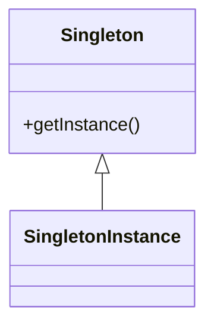

#### 2. Factory Method Pattern

Defines an interface for creating an object but allows subclasses to alter the type of objects that will be created.

**Code Example:**

```java
abstract class Animal {
    public abstract String speak();
}

class Dog extends Animal {
    public String speak() {
        return "Woof!";
    }
}

class Cat extends Animal {
    public String speak() {
        return "Meow!";
    }
}

class AnimalFactory {
    public static Animal createAnimal(String type) {
        switch (type.toLowerCase()) {
            case "dog":
                return new Dog();
            case "cat":
                return new Cat();
            default:
                throw new IllegalArgumentException("Unknown animal type");
        }
    }
}

// Usage
public class Main {
    public static void main(String[] args) {
        Animal animal = AnimalFactory.createAnimal("dog");
        System.out.println(animal.speak());  // Output: Woof!
    }
}
```

**Mermaid Diagram:**

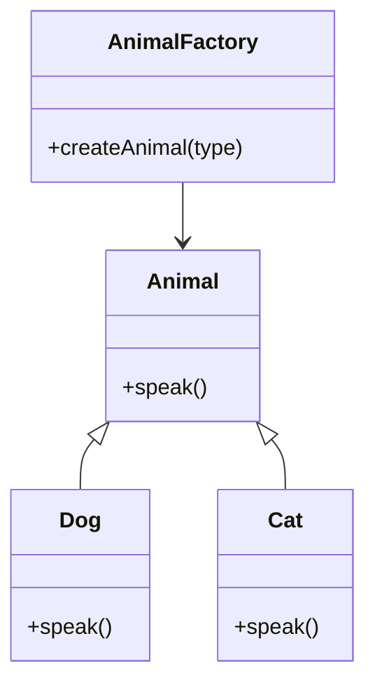

#### 3. Abstract Factory Pattern

Provides an interface for creating families of related or dependent objects without specifying their concrete classes.

**Code Example:**

```java
interface Animal {
    String speak();
}

class Dog implements Animal {
    public String speak() {
        return "Woof!";
    }
}

class Cat implements Animal {
    public String speak() {
        return "Meow!";
    }
}

interface AnimalFactory {
    Animal createDog();
    Animal createCat();
}

class ConcreteAnimalFactory implements AnimalFactory {
    public Animal createDog() {
        return new Dog();
    }
    
    public Animal createCat() {
        return new Cat();
    }
}

// Usage
public class Main {
    public static void main(String[] args) {
        AnimalFactory factory = new ConcreteAnimalFactory();
        Animal dog = factory.createDog();
        Animal cat = factory.createCat();
        System.out.println(dog.speak());  // Output: Woof!
        System.out.println(cat.speak());  // Output: Meow!
    }
}
```

**Mermaid Diagram:**

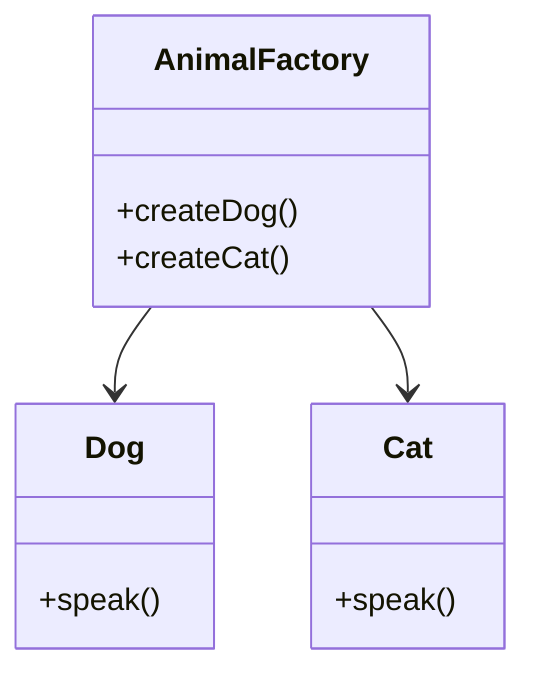

#### 4. Builder Pattern

Separates the construction of a complex object from its representation.

**Code Example:**

```java
class Car {
    private String make;
    private String model;
    private int year;

    public static class Builder {
        private String make;
        private String model;
        private int year;

        public Builder setMake(String make) {
            this.make = make;
            return this;
        }

        public Builder setModel(String model) {
            this.model = model;
            return this;
        }

        public Builder setYear(int year) {
            this.year = year;
            return this;
        }

        public Car build() {
            Car car = new Car();
            car.make = this.make;
            car.model = this.model;
            car.year = this.year;
            return car;
        }
    }

    @Override
    public String toString() {
        return year + " " + make + " " + model;
    }
}

// Usage
public class Main {
    public static void main(String[] args) {
        Car car = new Car.Builder()
                .setMake("Toyota")
                .setModel("Corolla")
                .setYear(2022)
                .build();

        System.out.println(car);  // Output: 2022 Toyota Corolla
    }
}
```

**Mermaid Diagram:**

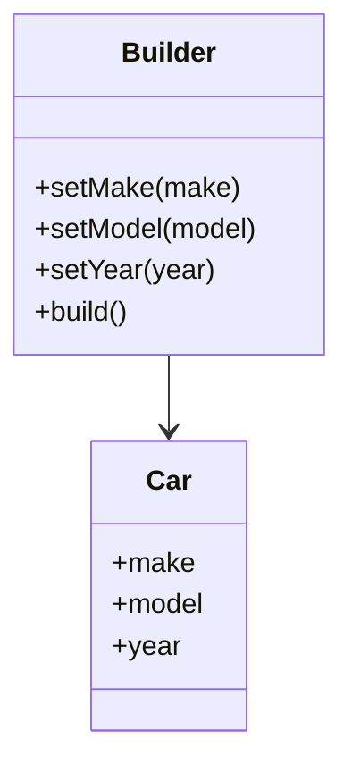

#### 5. Prototype Pattern

Creates new objects by copying an existing object.

**Code Example:**

```java
import java.util.HashMap;
import java.util.Map;

abstract class Prototype {
    public abstract Prototype clone();
}

class ConcretePrototype extends Prototype {
    private String name;

    public ConcretePrototype(String name) {
        this.name = name;
    }

    @Override
    public Prototype clone() {
        return new ConcretePrototype(name);
    }

    public String getName() {
        return name;
    }
}

// Usage
public class Main {
    public static void main(String[] args) {
        ConcretePrototype prototype = new ConcretePrototype("Original");
        ConcretePrototype clone = (ConcretePrototype) prototype.clone();
        System.out.println(clone.getName());  // Output: Original
    }
}
```

**Mermaid Diagram:**

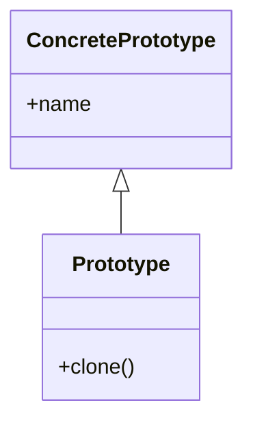

---

### Structural Design Patterns

Structural patterns focus on how classes and objects can be composed to form larger structures.

#### 1. Adapter Pattern

Allows incompatible interfaces to work together.

**Code Example:**

```java
class EuropeanSocket {
    public String connect() {
        return "Connected to European socket";
    }
}

class AmericanSocket {
    public String connect() {
        return "Connected to American socket";
    }
}

class SocketAdapter {
    private AmericanSocket americanSocket;

    public SocketAdapter(AmericanSocket americanSocket) {
        this.americanSocket = americanSocket;
    }

    public String connect() {
        return americanSocket.connect().replace("American", "European");
    }
}

// Usage
public class Main {
    public static void main(String[] args) {
        AmericanSocket americanSocket = new AmericanSocket();
        SocketAdapter adapter = new SocketAdapter(americanSocket);
        System.out.println(adapter.connect());  // Output: Connected to European socket
    }
}
```

**Mermaid Diagram:**

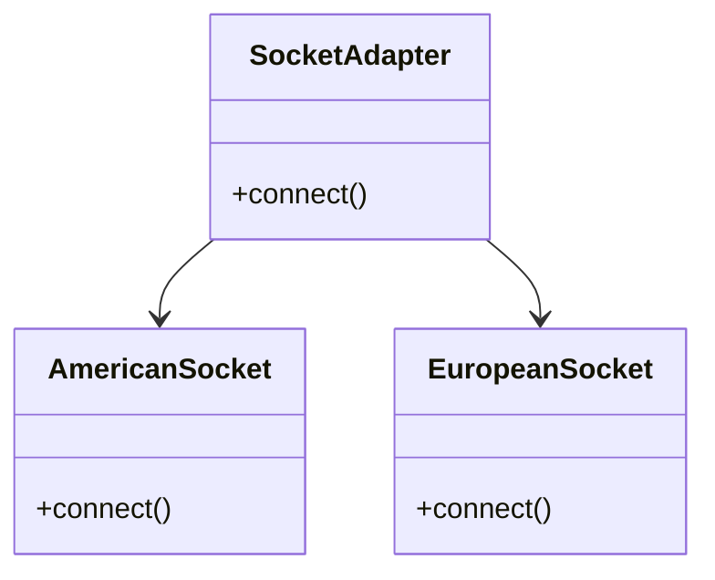

#### 2. Bridge Pattern

Decouples an abstraction from its implementation.

**Code Example:**

```java
abstract class RemoteControl {
    protected Device device;

    public RemoteControl(Device device) {
        this.device = device;
    }

    public abstract void togglePower();
}

class TV implements Device {
    public void power() {
        System.out.println("TV power toggled");
    }
}

class Radio implements Device {
    public void power() {
        System.out.println("Radio power toggled");
    }
}

class ConcreteRemoteControl extends RemoteControl {
    public ConcreteRemoteControl(Device device) {
        super(device);
    }

    public void togglePower() {
        device.power();
    }
}

// Usage
public class Main {
    public static void main(String[] args) {
        Device tv = new TV();
        RemoteControl remote = new ConcreteRemoteControl(tv);
        remote.togglePower();  // Output: TV power toggled
    }
}
```

**Mermaid Diagram:**

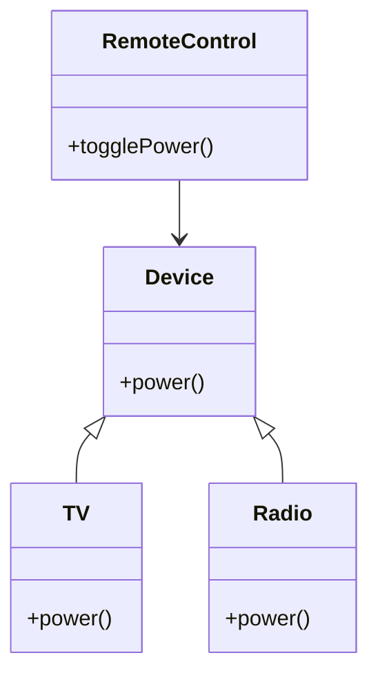

#### 3. Composite Pattern

Allows you to compose objects into tree structures.

**Code Example:**

```java
import java.util.ArrayList;
import java.util.List;

abstract class Component {
    public abstract String operation();
}

class Leaf extends Component {
    public String operation() {
        return "Leaf";
    }
}

class Composite extends Component {
    private List<Component> children = new ArrayList<>();

    public void add(Component component) {
        children.add(component);
    }

    public String operation() {
        StringBuilder result = new StringBuilder();
        for (Component child : children) {
            result.append(child.operation()).append(" ");
        }
        return result.toString().trim();
    }
}

// Usage
public class Main {
    public static void main(String[] args) {
        Composite composite = new Composite();
        composite.add(new Leaf());
        composite.add(new Leaf());


        System.out.println(composite.operation());  // Output: Leaf Leaf
    }
}
```

**Mermaid Diagram:**

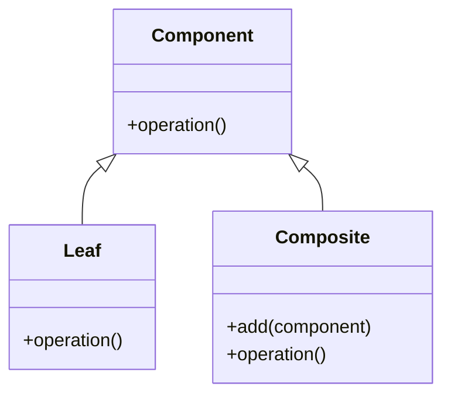

#### 4. Decorator Pattern

Adds behavior to individual objects without affecting the behavior of other objects.

**Code Example:**

```java
abstract class Coffee {
    public abstract double cost();
}

class BasicCoffee extends Coffee {
    public double cost() {
        return 5.0;
    }
}

abstract class CoffeeDecorator extends Coffee {
    protected Coffee coffee;

    public CoffeeDecorator(Coffee coffee) {
        this.coffee = coffee;
    }
}

class MilkDecorator extends CoffeeDecorator {
    public MilkDecorator(Coffee coffee) {
        super(coffee);
    }

    public double cost() {
        return coffee.cost() + 1.0;
    }
}

// Usage
public class Main {
    public static void main(String[] args) {
        Coffee coffee = new BasicCoffee();
        Coffee milkCoffee = new MilkDecorator(coffee);

        System.out.println(coffee.cost());      // Output: 5.0
        System.out.println(milkCoffee.cost());  // Output: 6.0
    }
}
```

**Mermaid Diagram:**

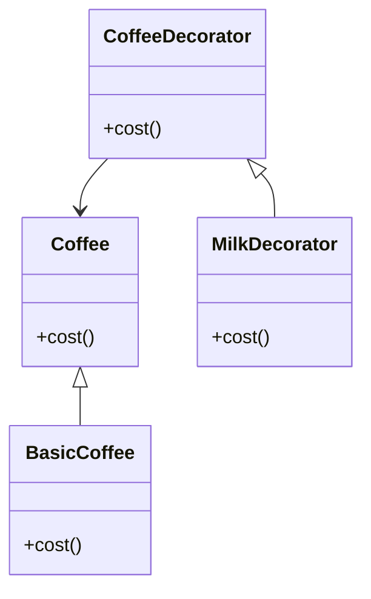

#### 5. Facade Pattern

Provides a simplified interface to a complex subsystem.

**Code Example:**

```java
class Subsystem1 {
    public String operation1() {
        return "Subsystem1: Ready!\n";
    }
}

class Subsystem2 {
    public String operation2() {
        return "Subsystem2: Get ready!\n";
    }
}

class Facade {
    private Subsystem1 subsystem1;
    private Subsystem2 subsystem2;

    public Facade() {
        subsystem1 = new Subsystem1();
        subsystem2 = new Subsystem2();
    }

    public String operation() {
        return subsystem1.operation1() + subsystem2.operation2();
    }
}

// Usage
public class Main {
    public static void main(String[] args) {
        Facade facade = new Facade();
        System.out.println(facade.operation());
    }
}
```

**Mermaid Diagram:**

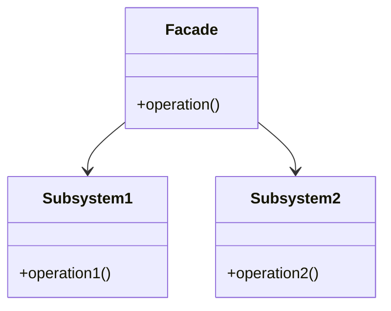

---

### Behavioral Design Patterns

Behavioral patterns focus on communication between objects and define how they interact and fulfill their responsibilities.

#### 1. Observer Pattern

Defines a one-to-many dependency between objects so that when one object changes state, all its dependents are notified.

**Code Example:**

```java
import java.util.ArrayList;
import java.util.List;

interface Observer {
    void update();
}

class Subject {
    private List<Observer> observers = new ArrayList<>();

    public void attach(Observer observer) {
        observers.add(observer);
    }

    public void notifyObservers() {
        for (Observer observer : observers) {
            observer.update();
        }
    }
}

class ConcreteObserver implements Observer {
    public void update() {
        System.out.println("Observer updated!");
    }
}

// Usage
public class Main {
    public static void main(String[] args) {
        Subject subject = new Subject();
        ConcreteObserver observer1 = new ConcreteObserver();
        ConcreteObserver observer2 = new ConcreteObserver();

        subject.attach(observer1);
        subject.attach(observer2);
        subject.notifyObservers();  // Output: Observer updated! (twice)
    }
}
```

**Mermaid Diagram:**

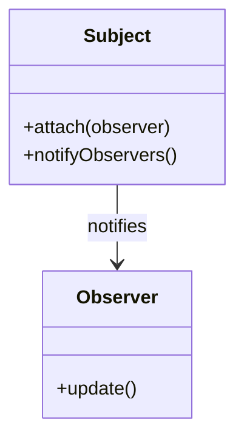

#### 2. Strategy Pattern

Defines a family of algorithms, encapsulates each one, and makes them interchangeable.

**Code Example:**

```java
interface Strategy {
    String execute();
}

class ConcreteStrategyA implements Strategy {
    public String execute() {
        return "Strategy A";
    }
}

class ConcreteStrategyB implements Strategy {
    public String execute() {
        return "Strategy B";
    }
}

class Context {
    private Strategy strategy;

    public Context(Strategy strategy) {
        this.strategy = strategy;
    }

    public String doSomeLogic() {
        return strategy.execute();
    }
}

// Usage
public class Main {
    public static void main(String[] args) {
        Context context = new Context(new ConcreteStrategyA());
        System.out.println(context.doSomeLogic());  // Output: Strategy A
    }
}
```

**Mermaid Diagram:**

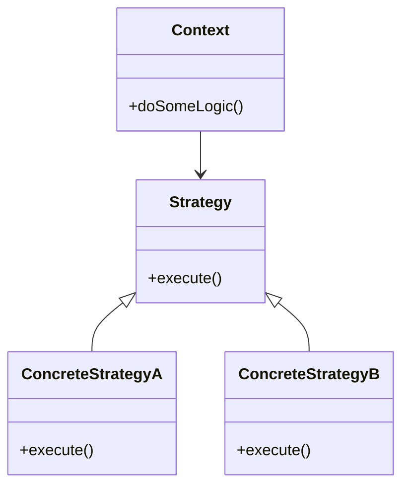

#### 3. Command Pattern

Encapsulates a request as an object, allowing for parameterization of clients with queues and requests.

**Code Example:**

```java
interface Command {
    void execute();
}

class Light {
    public void turnOn() {
        System.out.println("Light is ON");
    }
}

class LightOnCommand implements Command {
    private Light light;

    public LightOnCommand(Light light) {
        this.light = light;
    }

    public void execute() {
        light.turnOn();
    }
}

class RemoteControl {
    private Command command;

    public RemoteControl(Command command) {
        this.command = command;
    }

    public void pressButton() {
        command.execute();
    }
}

// Usage
public class Main {
    public static void main(String[] args) {
        Light light = new Light();
        Command lightOn = new LightOnCommand(light);
        RemoteControl remote = new RemoteControl(lightOn);

        remote.pressButton();  // Output: Light is ON
    }
}
```

**Mermaid Diagram:**

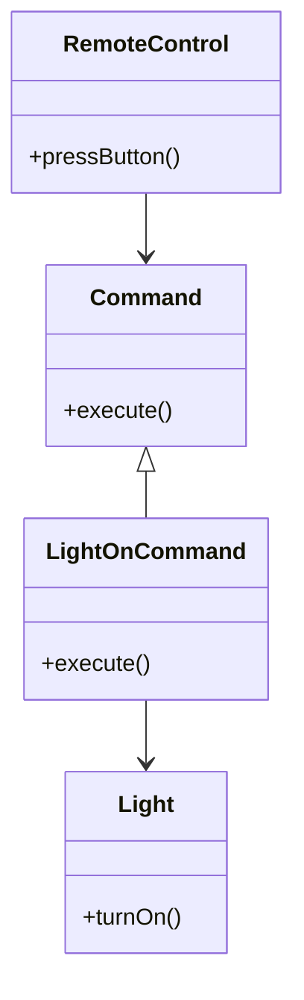

#### 4. Iterator Pattern

Provides a way to access the elements of an aggregate object sequentially without exposing its underlying representation.

**Code Example:**

```java
import java.util.ArrayList;
import java.util.Iterator;
import java.util.List;

class IterableCollection {
    private List<String> items = new ArrayList<>();

    public void add(String item) {
        items.add(item);
    }

    public Iterator<String> iterator() {
        return items.iterator();
    }
}

// Usage
public class Main {
    public static void main(String[] args) {
        IterableCollection collection = new IterableCollection();
        collection.add("Item 1");
        collection.add("Item 2");

        for (String item : collection) {
            System.out.println(item);  // Output: Item 1, Item 2
        }
    }
}
```

**Mermaid Diagram:**

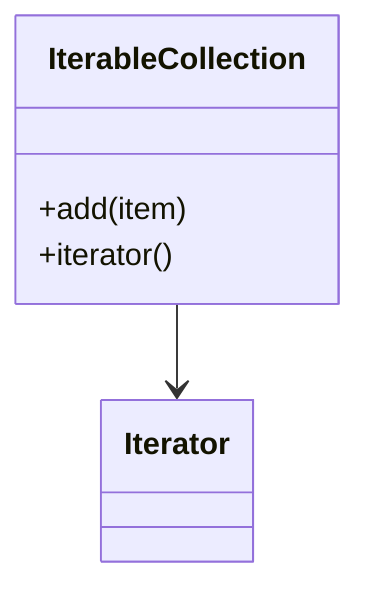

#### 5. Chain of Responsibility Pattern

Allows multiple objects to handle a request without the sender needing to know which object will handle it.

**Code Example:**

```java
abstract class Handler {
    private Handler nextHandler;

    public void setNext(Handler handler) {
        this.nextHandler = handler;
    }

    public void handle(String request) {
        if (canHandle(request)) {
            handleRequest(request);
        } else if (nextHandler != null) {
            nextHandler.handle(request);
        }
    }

    protected abstract boolean canHandle(String request);
    protected abstract void handleRequest(String request);
}

class ConcreteHandlerA extends Handler {
    protected boolean canHandle(String request) {
        return "A".equals(request);
    }

    protected void handleRequest(String request) {
        System.out.println("Handler A handled request A");
    }
}

class ConcreteHandlerB extends Handler {
    protected boolean canHandle(String request) {
        return "B".equals(request);
    }

    protected void handleRequest(String request) {
        System.out.println("Handler B handled request B");
    }
}

// Usage
public class Main {
    public static void main(String[] args) {
        Handler handlerA = new ConcreteHandlerA();
        Handler handlerB = new ConcreteHandlerB();

        handlerA.setNext(handlerB);

        handlerA.handle("A");  // Output: Handler A handled request A
        handlerA.handle("B");  // Output: Handler B handled request B
    }
}
```

**Mermaid Diagram:**

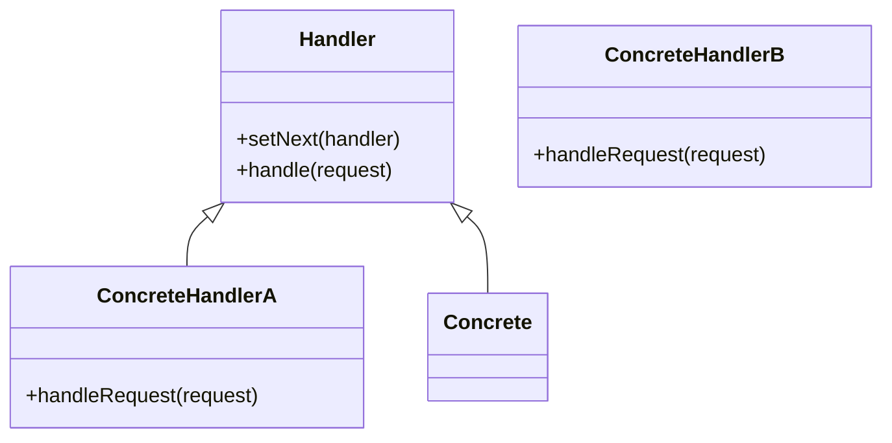

### Conclusion

These examples illustrate the various design patterns in Java, showcasing their structure and usage. Understanding these patterns can significantly enhance your software design and architectural skills. If you have any questions or need further examples, feel free to ask!
