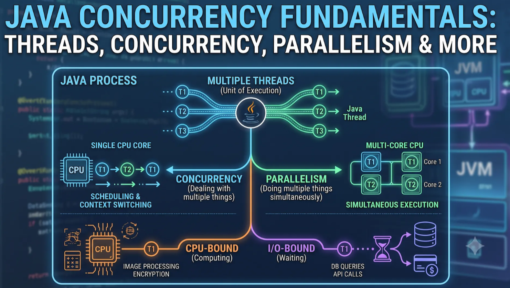
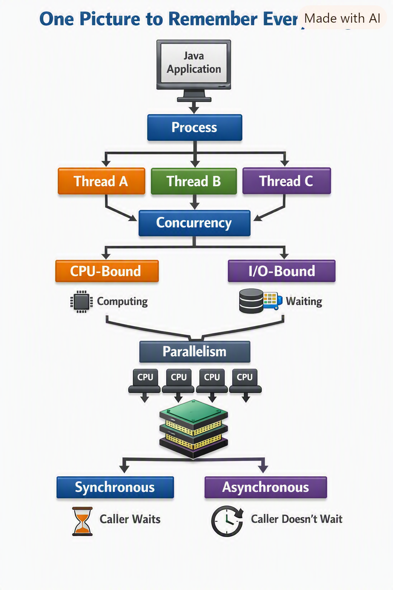
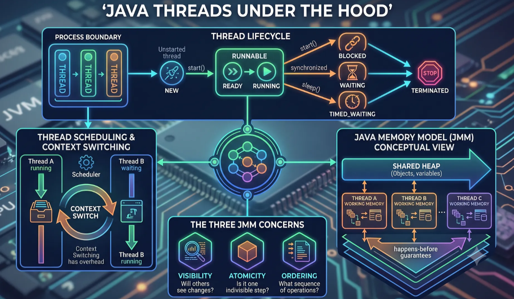
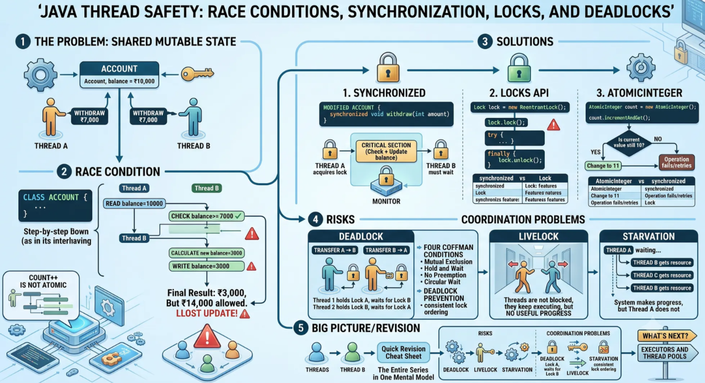
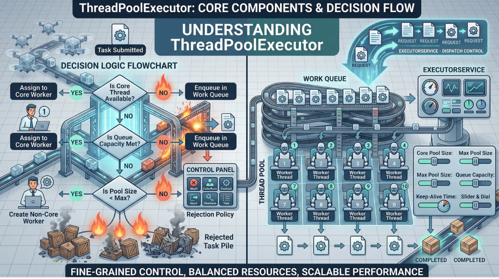
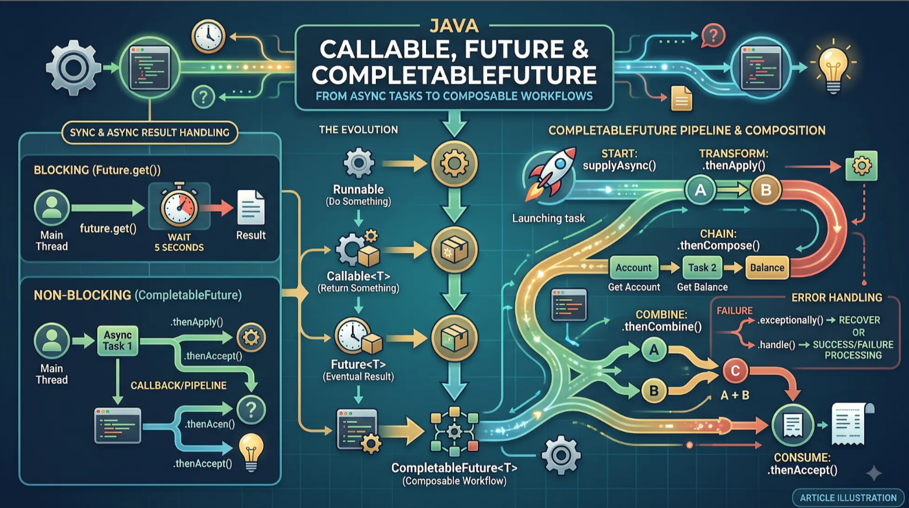
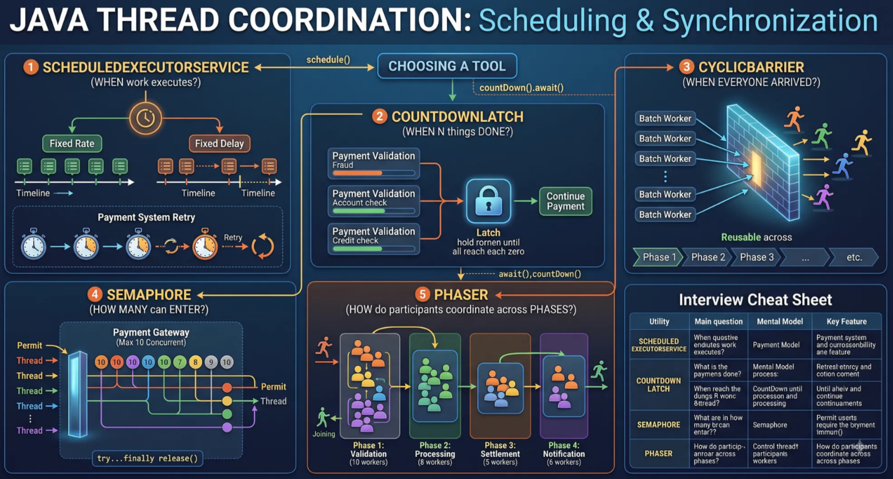
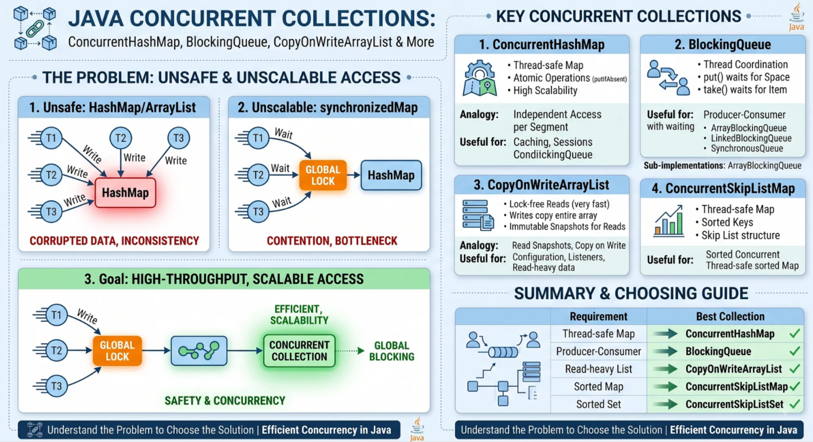

# Java Concurrency Fundamentals: Threads, Concurrency, Parallelism & More



Imagine a bank application handling thousands of transactions.

At the same moment:

- Customer A is checking their balance.
- Customer B is transferring ₹50,000.
- Customer C is withdrawing ₹10,000.

The application is waiting for a database response.

Another request is calling an external payment service.

Should the application handle all of these operations one after another?

Obviously not.

Modern applications need to handle multiple tasks efficiently. That’s where processes, threads, concurrency, parallelism, synchronous execution, asynchronous execution, CPU-bound work, and I/O-bound work come into the picture.

These terms are often used together, but they solve different problems.


## 1. First: What Problem Are We Trying to Solve?
Consider a simple payment operation:

```
Receive request
      ↓
Validate payment
      ↓
Call payment gateway
      ↓
Update database
      ↓
Send response
```
Suppose the payment gateway takes 500 ms to respond.

During those 500 ms, the application might mostly be waiting.

Now imagine another customer sends a request.

Should the application wait for the first payment to finish before even starting the second one?

That would be inefficient.

Instead, we want the system to be able to make progress on multiple tasks.

This brings us to our first important concept.

## 2. Process vs Thread
A process is a running instance of a program with its own memory and resources.

A thread is an execution path within a process.

A simplified view looks like this:

```
Process
│
├── Memory / Resources
│
├── Thread 1
├── Thread 2
└── Thread 3
```

For example, when we start a Java application, the JVM creates a process. Inside that process, there can be multiple threads executing different pieces of work.

The main() method itself executes on a thread commonly called the main thread.
```java
public static void main(String[] args) {
    System.out.println("Running on the main thread");
}
```
We can create another thread:
```java
Thread thread = new Thread(() -> {
    System.out.println("Running on another thread");
});

thread.start();
```
Now there are at least two threads that can execute:

```
Java Process
│
├── Main Thread
│
└── Worker Thread
```
Why not just create multiple processes?
Processes are more isolated from each other.

If two processes need to communicate, they generally need some form of inter-process communication.

Threads within the same process can share process memory, which makes communication easier — but that shared memory also creates problems.

We’ll spend a lot of time on those problems in the later articles.

### Interview answer
A process is an independent execution environment with its own address space, while a thread is an execution unit within a process. Threads of the same process share resources such as the heap, making communication easier but also introducing synchronization and thread-safety challenges.

### Remember
Process = container of resources. Thread = unit of execution inside it.

## 3. Concurrency vs Parallelism
This is probably the most commonly confused pair of terms.

They are related, but they are not the same.

### Concurrency
Concurrency means multiple tasks can make progress during overlapping periods of time.

Imagine one developer handling three tasks:

- Task A: Payment validation
- Task B: Database query
- Task C: API call
```
Time →
A A A
    B B
      C C C
        A A
```
The tasks don’t necessarily execute at exactly the same moment.

The system can switch between them and make progress on multiple tasks.

`That’s concurrency.`

## 4. Parallelism
Parallelism means multiple tasks are actually executing at the same time.

Suppose we have multiple CPU cores:

- CPU Core 1 → Task A
- CPU Core 2 → Task B
- CPU Core 3 → Task C

Now work is literally happening simultaneously.

`That’s parallelism.`

A simple way to remember it:

> Concurrency is about dealing with multiple things. Parallelism is about doing multiple things at the same time.

## 5. Can We Have Concurrency on One CPU Core?
Yes.

This is an important interview question.

Suppose we have only one CPU core and two threads:
```
CPU
│
├── Thread A
├── Thread B
```
Only one thread can execute instructions on that core at a particular instant.

But the scheduler can switch between them:
```
Time →
A A A → B B → A → B B B → A A
```
Both tasks can make progress.

`That’s concurrency.`

There is no true parallel execution because there is only one execution resource.

### Interview question
#### Q: Is concurrency possible on a single-core CPU?

Answer:

Yes. Concurrency doesn’t require tasks to execute simultaneously. A system can switch between multiple tasks and allow them to make progress over overlapping periods of time. True parallel execution requires multiple execution resources.

## 6. Synchronous vs Asynchronous Execution
Now we introduce another pair that is often confused with concurrency and parallelism.

Suppose our application calls a payment gateway.

#### Synchronous execution
The caller waits for the operation to complete.
```
Application
     │
     ▼
Payment Gateway
     │
     │ waiting
     │
     ▼
Response
     │
     ▼
Application continues
```
Conceptually:
```
PaymentResponse response = paymentGateway.process(payment);
```
The current flow doesn’t continue past this operation until the result is available.

## 7. Asynchronous Execution
With asynchronous execution, the caller can start an operation and continue without necessarily waiting for its completion.
```
Application
     │
     ├──────► Payment Gateway
     │
     ▼
Continue other work
                │
                ▼
           Payment completes
```
The important word here is “necessarily.”

Asynchronous programming doesn’t automatically mean another thread is involved.

Likewise, synchronous execution doesn’t necessarily mean only one thread exists.

That’s an important distinction.

## 8. Concurrency vs Asynchronous Execution
These concepts overlap, but they describe different things.

Think of them this way:

- Concurrency asks:

#### Can multiple tasks make progress during overlapping periods?

- Asynchronous execution asks:

#### Does the caller need to wait for the operation to finish before continuing?

So:

```
Concurrency
    ↓
Multiple tasks making progress
Asynchronous
    ↓
Caller doesn't necessarily wait
```

They are related, but they are not synonyms.

## 9. CPU-Bound vs I/O-Bound Tasks
Now let’s look at what the application is actually doing.

This distinction becomes extremely important when we later discuss threads.

## CPU-bound work
A CPU-bound task spends most of its time performing computation.

Examples:

- Image processing
- Compression
- Encryption
- Large mathematical calculations
- Complex data processing

Conceptually:
```
CPU
████████████████████████
```
The CPU is doing actual work most of the time.

## 10. I/O-Bound Work
An I/O-bound task spends significant time waiting for an external resource.

Examples:

- Database queries
- HTTP requests
- Reading files
- Writing files
- Calling another service
- Network communication

For example:
```
Application
    │
    ▼
Database
    │
    │
    │ waiting...
    │
    ▼
Response
```
During that waiting period, the CPU may not be doing useful work for that particular task.

Conceptually:
```
CPU
██....█......██.......
```
The dots represent periods where the task is waiting on I/O.

## 11. Why Does CPU-bound vs I/O-bound Matter?
Consider our bank application.

A payment request might involve:
```
Validate payment       → CPU
        ↓
Call payment gateway   → I/O
        ↓
Update database        → I/O
        ↓
Calculate transaction  → CPU
```
So a real application often contains both CPU-bound and I/O-bound work.

This distinction matters because adding more threads isn’t automatically beneficial.

For CPU-heavy work, we are ultimately constrained by available CPU resources.

For I/O-heavy work, tasks may spend substantial time waiting, so having other work make progress while one task is waiting can improve overall utilization.

We’ll return to this idea when we discuss thread pools and virtual threads in later articles.

## 12. Putting Everything Together
Let’s take our payment application again.

Suppose three customers send requests:

- Customer A → Transfer ₹50,000
- Customer B → Check balance
- Customer C → Withdraw ₹10,000

Our application might have:
```
Java Process
│
├── Thread A → Customer A
├── Thread B → Customer B
└── Thread C → Customer C
```
Those threads provide concurrency.

If multiple CPU cores execute different threads simultaneously, we can also have parallelism.

If a thread calls a database and waits for the result, that’s an I/O-bound operation.

If the application performs a large calculation, that’s CPU-bound work.

If the caller waits for a method to return, that’s synchronous execution.

If the caller can continue while the operation completes separately, that’s asynchronous execution.

Notice how these concepts describe different dimensions of the same system.

## 13. One Picture to Remember Everything
```
            Java Application
                    │
                    ▼
                 Process
                    │
        ┌───────────┼───────────┐
        ▼           ▼           ▼
    Thread A    Thread B    Thread C
        │           │           │
        └───────────┼───────────┘
                    │
                Concurrency
                    │
           ┌────────┴────────┐
           ▼                 ▼
        CPU-bound          I/O-bound
           │                 │
           │                 │
           ▼                 ▼
        Computing          Waiting
```

```
Multiple CPU cores
        │
        ▼
   Parallelism

    Caller waits
        │
        ▼
   Synchronous

Caller doesn't necessarily wait
        │
        ▼
   Asynchronous
```



## 14. The Most Common Confusions
Concurrency ≠ Parallelism
Concurrency is about managing multiple tasks that can make progress.

Parallelism is about executing multiple tasks simultaneously.

####  Asynchronous ≠ Multithreaded

An operation can be asynchronous without simply meaning “create another thread.”

####  Synchronous ≠ Single-threaded

A synchronous operation can still execute in a multithreaded application.

#### I/O-bound ≠ Slow CPU

An I/O-bound task is primarily waiting on an external resource.

A CPU-bound task is primarily consuming CPU for computation.

#### More threads ≠ More performance
Threads have overhead.

If we create too many threads, the system may spend more time managing threads and switching between them than doing useful work.

We’ll explore this in detail when we discuss context switching and thread scheduling.

## 15. Interview Quick-Fire
### Q1. What is a thread?
A thread is an execution unit within a process.

### Q2. Do threads have separate memory?
Threads have their own execution state, including their own stack, but threads within the same process share process-level memory such as the heap.

### Q3. What is concurrency?
Concurrency is the ability to make progress on multiple tasks during overlapping periods.

### Q4. What is parallelism?
Parallelism is the simultaneous execution of multiple tasks using multiple execution resources.

### Q5. Can concurrency exist on a single-core CPU?
Yes. Tasks can take turns executing.

### Q6. Is asynchronous execution the same as multithreading?
No. Asynchronous execution means the caller doesn’t necessarily wait for completion. It doesn’t inherently specify how the work is executed.

### Q7. What is a CPU-bound task?
A task whose performance is primarily limited by CPU computation.

### Q8. What is an I/O-bound task?
A task that spends significant time waiting for external resources such as databases, files, or networks.

### Q9. Why do we use multiple threads?
To allow multiple tasks to make progress and, where appropriate, improve CPU utilization or overlap waiting with useful work.

### Q10. Does creating more threads always improve performance?
No. Threads have overhead, and excessive concurrency can cause contention and context-switching overhead.

What’s Next?
We’ve established the basic mental model:
```
Process
   ↓
Threads
   ↓
Concurrency / Parallelism
   ↓
Synchronous / Asynchronous
   ↓
CPU-bound / I/O-bound
```

**Concurrency is about managing multiple tasks that overlap in time, while parallelism is about executing multiple tasks simultaneously. Concurrency can happen even on a single CPU core via context switching, whereas parallelism requires multiple cores or processors to run tasks truly at the same instant.**  

---

## ⚙️ Concurrency
- **Definition:** Ability of a system to make progress on multiple tasks during overlapping time periods.  
- **Execution style:** Tasks interleave; the CPU switches between them rapidly (context switching).  
- **Analogy:** A single cashier serving multiple customers by switching between them quickly.  
- **Example:**  
  ```java
  ExecutorService executor = Executors.newFixedThreadPool(2);
  executor.submit(() -> validatePayment());
  executor.submit(() -> queryDatabase());
  executor.submit(() -> callAPI());
  executor.shutdown();
  ```
  → Even on one CPU core, tasks overlap in time.  [FreeCodecamp](https://www.freecodecamp.org/news/concurrency-vs-parallelism-whats-the-difference-and-why-should-you-care/)  

---

## ⚡ Parallelism
- **Definition:** Actual simultaneous execution of tasks using multiple CPU cores.  
- **Execution style:** Tasks run at the same instant.  
- **Analogy:** Multiple cashiers serving multiple customers at the same time.  
- **Example:**  
  ```java
  List<Integer> numbers = List.of(1,2,3,4,5);
  numbers.parallelStream()
         .map(n -> n * n)
         .forEach(System.out::println);
  ```
  → Work is split across cores, truly simultaneous.  [GeeksForGeeks](https://www.geeksforgeeks.org/operating-systems/difference-between-concurrency-and-parallelism/)  

---

## 📊 Comparison Table

| Aspect | **Concurrency** | **Parallelism** |
|--------|-----------------|-----------------|
| **Focus** | Managing multiple tasks | Speeding up execution |
| **Execution** | Interleaved, overlapping | Truly simultaneous |
| **Hardware Need** | Works even on 1 core | Requires multiple cores |
| **Goal** | Responsiveness, throughput | Performance, reduced runtime |
| **Java Example** | `ExecutorService`, async I/O | `ForkJoinPool`, parallel streams |

---

## 🚦 Key Takeaway
- **Concurrency** = *dealing with lots of things at once* (overlapping progress).  
- **Parallelism** = *doing lots of things at the same time* (simultaneous execution).  
- In practice:  
  - Concurrency improves **responsiveness** (e.g., your payment system can validate request B while waiting for gateway response A).  
  - Parallelism improves **performance** (e.g., splitting a large dataset across cores to process faster).  [jeffbailey.us](https://jeffbailey.us/blog/2026/04/01/fundamentals-of-concurrency-and-parallelism/)  

---

But this leaves us with a much more interesting question:

#### What actually happens when multiple threads start running?

#### How does a thread move from creation to execution?

#### Who decides which thread gets CPU time?

#### What happens when a thread is blocked?

#### Why does switching between threads have a cost?

#### And perhaps most importantly:

#### If multiple threads share the same memory, how do we make sure they see the correct data?

---

## 🧩 What actually happens when multiple threads start running?
- Threads are created in the JVM but scheduled by the **OS scheduler**.  
- Each thread has its own **program counter, stack, and registers**, but shares the heap with other threads in the same process.  
- The OS decides which thread runs at any given moment, based on scheduling algorithms (round robin, priority, work stealing, etc.).  

---

## 🧩 How does a thread move from creation to execution?
- **New** → created with `new Thread(...)`.  
- **Runnable** → marked eligible to run after `start()`.  
- **Running** → OS assigns CPU time, executes instructions.  
- **Waiting/Blocked** → paused, waiting for I/O or synchronization.  
- **Terminated** → finished execution.  
This lifecycle is managed by both the JVM and OS.  

---

## 🧩 Who decides which thread gets CPU time?
- The **OS scheduler** decides, not the JVM directly.  
- JVM threads are mapped to native OS threads.  
- The scheduler balances fairness, priority, and efficiency across all processes and threads.  

---

## 🧩 What happens when a thread is blocked?
- If a thread waits on I/O or synchronization, it enters a **blocked state**.  
- The scheduler immediately switches to another runnable thread.  
- This prevents the CPU from sitting idle while one thread waits.  

---

## 🧩 Why does switching between threads have a cost?
- **Context switching** requires saving and restoring CPU state (registers, program counter, stack pointer).  
- This overhead consumes CPU cycles.  
- Excessive threads → CPU spends more time switching than doing useful work.  

---

## 🧩 If multiple threads share the same memory, how do we make sure they see the correct data?
- Threads share the **heap**, so race conditions can occur.  
- Solutions:  
  - **Locks** (`ReentrantLock`) → enforce mutual exclusion.  
  - **Synchronized blocks** → ensure only one thread enters critical section.  
  - **Volatile keyword** → guarantees visibility of changes across threads.  
  - **Atomic classes** → lock‑free thread‑safe operations.  
  - **ThreadLocal** → per‑thread data isolation.  

---

## 🚦 Mental Shortcut
Think of threads as **passengers in the same car (process)**:
- The **driver (scheduler)** decides who gets to steer (CPU time).  
- Switching drivers (context switching) takes effort.  
- If two passengers grab the wheel at once (shared memory), chaos ensues → need rules (synchronization).  

---

That’s where things get much more interesting.

---

# Java Threads Under the Hood: Lifecycle, Scheduling, Context Switching & the Java Memory Model




A process contains threads.

Threads are units of execution.

Concurrency is about making progress on multiple tasks.

Parallelism is about executing tasks simultaneously.

Tasks can be CPU-bound or I/O-bound.

Synchronous and asynchronous describe how execution interacts with the caller.

Now let’s go one level deeper.

Suppose our bank application has two threads:

- Thread A → Withdraw ₹5,000
- Thread B → Deposit ₹10,000

Both are running inside the same Java process.

But several questions immediately appear:

#### Who decides when each thread runs?

#### What happens when a thread is waiting?

#### Where are variables stored?

#### If two threads access the same object, how do they see each other’s changes?

---

## 🧩 Who decides when each thread runs?
- The **OS scheduler** decides, not the JVM directly.  
- JVM threads are mapped to native OS threads.  
- The scheduler uses algorithms like **round robin, priority scheduling, work stealing** to allocate CPU time.  
- On a single core, threads interleave (concurrency). On multiple cores, they can run truly in parallel.  

---

## 🧩 What happens when a thread is waiting?
- If a thread is waiting for I/O, a lock, or a `sleep()`, it enters a **waiting/blocked state**.  
- The scheduler immediately switches to another runnable thread.  
- This prevents the CPU from sitting idle while one thread waits.  
- Asynchronous I/O avoids wasting threads by not blocking them at all.  

---

## 🧩 Where are variables stored?
- **Thread stack** → Each thread has its own stack for local variables and method calls.  
- **Heap** → Shared across all threads; objects created with `new` live here.  
- **Registers** → Each thread’s execution context (program counter, stack pointer, CPU registers).  
- **Static variables** → Stored in the method area, shared by all threads.  

---

## 🧩 If two threads access the same object, how do they see each other’s changes?
- Without safeguards, threads may see **stale or inconsistent data** due to CPU caching and instruction reordering.  
- Solutions:  
  - **synchronized** → ensures mutual exclusion and establishes a *happens‑before* relationship.  
  - **volatile** → guarantees visibility of changes across threads (but not atomicity).  
  - **Locks** → fine‑grained control (`ReentrantLock`, `ReadWriteLock`).  
  - **Atomic classes** → lock‑free thread‑safe operations.  
  - **ThreadLocal** → isolates data per thread.  

---

## 🚦 Mental Shortcut
Think of threads as **students sharing a whiteboard**:
- The **teacher (scheduler)** decides who writes when.  
- If one student pauses, another can step in.  
- Each student has their own notebook (stack), but the whiteboard (heap) is shared.  
- To avoid chaos, they need rules: one at a time (locks), visibility rules (volatile), or private notes (ThreadLocal).  

---

## 🧩 Thread Lifecycle

```
[ New ] → (start()) → [ Runnable ] → (scheduler picks) → [ Running ]
   ↑                                ↓
   └─────────────── [ Waiting / Blocked ] ← (I/O, sleep, lock)
                                     ↓
                                [ Terminated ]
```

- **New** → created with `new Thread()`.  
- **Runnable** → eligible to run after `start()`.  
- **Running** → actively executing on CPU.  
- **Waiting/Blocked** → paused for I/O, lock, or `sleep()`.  
- **Terminated** → finished execution.

---

## 🧩 Memory Layout

```
Process Memory
 ├── Heap (shared by all threads)
 │     └── Objects, static data
 ├── Method Area (shared)
 │     └── Class metadata, static vars
 └── Thread Stacks (one per thread)
       └── Local variables, method calls
```

- **Heap** → shared across threads (risk of race conditions).  
- **Stack** → private per thread (safe).  
- **Static area** → shared, like heap.  

---

## 🧩 Synchronization Arrows

```
Thread A (Stack) → Heap Object ← Thread B (Stack)
       |                          |
       └── synchronized / locks / atomics / volatile
```

- **Locks / synchronized** → enforce mutual exclusion.  
- **Volatile** → ensures visibility of changes across threads.  
- **Atomic classes** → lock‑free thread‑safe updates.  
- **ThreadLocal** → isolates per‑thread data.  

---

## 🚀 Interview Cheat Sheet
- **Scheduler decides** which thread runs.  
- **Blocked threads** free CPU for others.  
- **Stacks are private, heap is shared.**  
- **Synchronization tools** ensure visibility, ordering, and atomicity.  

---

And why can something as simple as:

balance++;

### cause problems?

To answer these questions, we need to understand thread lifecycle, scheduling, context switching, interruption, and the Java Memory Model (JMM).

## 1. Creating a Thread: start() vs run()
The simplest way to create a Java thread is:
```java
Thread thread = new Thread(() -> {
    System.out.println("Processing payment");
});
thread.start();
```
But there is an important distinction between:
```java
thread.start();
```
and:
```java
thread.run();
start()
```
`start()` asks the JVM to start a new thread of execution.

```
start()
   ↓
New execution path
   ↓
run()
```

`run()`
Calling `run()` directly is simply a normal method invocation.

```
run()
   ↓
Normal method call
   ↓
Current thread executes it
```
So:
```java
thread.run();
```
does not create a new thread.

### Interview takeaway
`start()` initiates a new thread of execution, which eventually invokes `run()`. Calling `run()` directly executes it on the current thread.

This distinction is fundamental because concurrency begins only when execution actually happens on another thread.

## 2. Thread Lifecycle: From NEW to TERMINATED
A Java thread moves through several states during its lifetime.

The main states exposed through Thread.State are:
```
NEW
 │
 │ start()
 ▼
RUNNABLE
 │
 ├── BLOCKED
 ├── WAITING
 └── TIMED_WAITING
 │
 ▼
TERMINATED
```
Let’s understand what they mean.

####  NEW

The thread has been created but `start()` hasn't been called.
```java
Thread thread = new Thread(task);
```
At this point:

> Thread → NEW

####  RUNNABLE
After:
```java
thread.start();
```
the thread becomes RUNNABLE.

An important interview detail:

Java’s `RUNNABLE` state includes both a thread that is ready to run and one that is actually running.

There is no separate `RUNNING` state in Thread.State.

The operating system ultimately determines when a runnable thread gets CPU time.

####  BLOCKED
A thread becomes `BLOCKED` when it is waiting to acquire a monitor lock.

For example:
```java
synchronized (account) {
    // update balance
}
```
If Thread A already owns the monitor:

Thread A → owns account lock
and Thread B reaches the same synchronized section:

Thread B → waiting for account lock
Thread B is `BLOCKED`.

We’ll explore this much more in the next article.

#### WAITING
A thread enters `WAITING` when it waits indefinitely for another thread to perform some action.

For example:
```java
thread.join();
```
The calling thread waits for another thread to finish.

Certain forms of `wait()` can also result in `WAITING`.

#### TIMED_WAITING
Similar to `WAITING`, but the wait has a time limit.

For example:
```java
Thread.sleep(1000);
```
Other examples include timed versions of:

    - join()
    - wait()
    - park()

####  TERMINATED
When the thread’s `run()` method finishes, the thread is terminated.

A terminated thread cannot simply be started again.

## 3. Daemon Threads and Thread Priority
Not every thread exists to keep the application alive.

Java supports daemon threads for background work.
```java
Thread thread = new Thread(task);
thread.setDaemon(true);
thread.start();
```

A daemon thread does not prevent the JVM from shutting down once all non-daemon threads have finished.

For example:
```
JVM
│
├── Main Thread       ← non-daemon
├── Payment Thread    ← non-daemon
└── Background Thread ← daemon
```
If the non-daemon threads finish:

- Main Thread      → finished
- Payment Thread   → finished
- Daemon Thread    → still running
the JVM can terminate.

`setDaemon(true)` must be called before start().

Don’t use daemon threads for critical work
For example:

- Processing a payment
- Persisting important data
- Completing a transaction

If the JVM exits, daemon work may not finish.

Daemon threads are appropriate for background/support work, not work that must complete for correctness.

### What About Thread Priority?
Java also allows:
```java
thread.setPriority(Thread.MAX_PRIORITY);
```
with:

- MIN_PRIORITY
- NORM_PRIORITY
- MAX_PRIORITY

But don’t interpret this as:

“Priority 10 will always run before priority 5.”

It doesn’t guarantee execution order.

Thread priority is essentially a scheduling hint, and actual behavior depends on the JVM and operating system.

Never build correctness logic around thread priority.

## 4. Thread Scheduling and Context Switching
Suppose our application has:

- Thread A
- Thread B
- Thread C
- Thread D

but only two CPU cores.

We can’t execute all four threads simultaneously on those two cores.

Some mechanism must decide which runnable threads get CPU time.

`That’s thread scheduling.`

Conceptually:
```
Runnable Threads
       │
       ▼
   Scheduler
       │
   ┌───┴───┐
   ▼       ▼
 Core 1   Core 2
```
The exact scheduling behavior is `platform-dependent`.

So don’t assume:

- threadA.start();
- threadB.start();
means:

- A runs first
- A finishes
- B runs

There is no such guarantee merely because `start()` was called in that order.

### Context Switching
Now imagine:

- Thread A → currently executing
- Thread B → waiting to run

The scheduler decides Thread B should get CPU time.

Conceptually:
```
Thread A running
      ↓
Save execution state
      ↓
Load Thread B state
      ↓
Thread B running
```

`This is a context switch.`

Switching isn’t free.

There is overhead associated with:

- Saving/restoring execution state
- Scheduler activity
- CPU-cache effects
- Losing some useful CPU time

Therefore:

More threads do not automatically mean more performance.

For example:

4 CPU cores

1000 runnable threads

The system still can’t execute 1000 threads simultaneously on four cores.

A large number of runnable threads can result in significant `scheduling and context-switching` overhead.

This is one reason concurrency needs to be managed carefully.

## 5. Thread Interruption: Cooperative Cancellation
Suppose a payment-processing thread is doing some work:
```
Payment Processing
       ↓
Waiting for something
       ↓
Should we stop?
```

Java provides `interruption` as a way for one thread to request that another thread stop what it’s doing or respond to cancellation.

```java
thread.interrupt();
```
But this is critical:

`interrupt()` does not forcibly kill a thread.

It is a cooperative mechanism.

The interrupted thread must decide how to respond.

#### Interrupting a Sleeping Thread
Consider:
```java
try {
    Thread.sleep(5000);
} catch (InterruptedException e) {
    Thread.currentThread().interrupt();
}
```
If another thread calls:

```java
thread.interrupt();
```
while the thread is sleeping, `sleep()` can `throw InterruptedException`.

The thread then gets an opportunity to respond.

Restoring the interrupt status:
```java
Thread.currentThread().interrupt();
```
is a common pattern when the current method cannot fully handle the interruption itself.

The mental model is:
```
interrupt()
     ↓
Request interruption
     ↓
Thread responds appropriately
```

### isInterrupted() vs Thread.interrupted()
These are easy to confuse.
```java
thread.isInterrupted();
```
checks a thread’s interrupt status without clearing it.

Whereas:
```java
Thread.interrupted();
```
checks the current thread’s interrupt status and clears it.

### Interview takeaway
`interrupt()` requests interruption; it does not forcibly terminate the target thread.

This distinction becomes especially important later when we discuss executors, task cancellation, and thread pools.

## 6. Where Do Threads Store Data?
Now we reach an important question:

#### If multiple threads are running inside the same Java process, where does their data live?

---

## 🧩 Memory Layout in a Java Process

- **Thread Stack**  
  - Each thread has its own stack.  
  - Stores local variables, method call frames, and return addresses.  
  - Completely isolated — one thread cannot directly access another’s stack.

- **Heap**  
  - Shared by all threads in the process.  
  - Stores objects created with `new`.  
  - This is where race conditions can occur if multiple threads update the same object.

- **Method Area**  
  - Shared across threads.  
  - Holds class metadata, static variables, and constants.

- **Registers**  
  - Each thread has its own program counter and CPU registers.  
  - Used to track the current instruction and execution state.

---

## 🧩 Synchronization & Visibility

When threads share the heap, they need rules to avoid chaos:

- **synchronized** → ensures mutual exclusion and establishes a *happens‑before* relationship.  
- **volatile** → guarantees visibility of changes across threads.  
- **Locks** → fine‑grained control (`ReentrantLock`, `ReadWriteLock`).  
- **Atomic classes** → lock‑free thread‑safe updates.  
- **ThreadLocal** → isolates data per thread even though they share the heap.

---

## 🚦 Mental Shortcut
Think of a Java process as a **house**:
- Each **thread has its own room (stack)** with private belongings.  
- The **living room (heap)** is shared by everyone — so they need rules to avoid conflicts.  
- The **blueprints (method area)** are shared instructions for the whole house.  

---

A useful conceptual model is:
```
Java Process
       │
   ┌───┴────┐
   ▼        ▼
Thread A  Thread B
   │        │
 Stack A  Stack B
      \    /
       \  /
        ▼
    Shared Heap
```

#### Thread Stack

Each thread has its own stack.

Conceptually:

- Thread A → Stack A
- Thread B → Stack B
- Thread C → Stack C

Each stack contains execution frames for methods currently being executed by that thread.

Local variables and method execution state are associated with these frames.

####  Heap
Objects created by the application generally live in the heap.

For example:
```java
Account account = new Account();
```
The Account object is part of shared heap state.

Multiple threads within the same process can access that object if they have a reference to it.

So:
```
Thread A ─────┐
              ├──→ Account object
Thread B ─────┘
```
This is where concurrency becomes interesting.

If two threads access mutable state inside that object:

account.balance
they may interfere with one another.

### Important Clarification: JMM Working Memory ≠ ThreadLocal
The Java Memory Model uses a conceptual notion of a thread’s working memory to describe how threads interact with values.

That is different from the Java API:

#### ThreadLocal<T>
`ThreadLocal` provides each thread with its own independently stored value:
```java
ThreadLocal<Integer> transactionId =
    new ThreadLocal<>();
```
These are two different concepts.

`JMM working memory` is a conceptual model. `ThreadLocal` is an actual Java API.

## 7. The Java Memory Model
Now we reach one of the most important concepts in Java concurrency:

The `Java Memory Model (JMM)`.

The JMM defines rules for how threads interact through memory.

It helps us reason about:

- Visibility
- Ordering
- Atomicity
- Synchronization
- Happens-before relationships

A simplified conceptual model is:
```
             Shared Heap
             /         \
            /           \
       Thread A       Thread B
          │               │
       Stack A          Stack B
```
But be careful.

This is a conceptual model, not a literal description of how the JVM physically stores memory.

Real execution involves things such as:

- CPU caches
- Registers
- Compiler optimizations
- Memory barriers
- CPU/JVM implementation details

The JMM gives us the rules we use to reason about the observable behavior of concurrent programs.

That distinction is important.

You don’t need to memorize the physical implementation of every CPU.

You need to understand the guarantees Java provides.

## 8. The Three Core JMM Problems: Visibility, Ordering & Atomicity
The JMM becomes much easier to understand if we focus on three questions.

### Visibility
Suppose:
```java
boolean paymentCompleted = false;
```
Thread A changes it:
```java
paymentCompleted = true;
```
Thread B reads it:
```java
if (paymentCompleted) {
    // ...
}
```
#### Can we automatically assume Thread B immediately sees the updated value?

No.

Without the appropriate `memory-synchronization` guarantees, we cannot simply reason that way.

`That’s the visibility problem.`

#### Visibility asks: when one thread changes shared data, when and under what synchronization rules can another thread reliably observe that change?

### Ordering
Consider:
```java
balance = 0;
paymentCompleted = true;
```
A developer naturally thinks:

1. balance changes
2. paymentCompleted changes

But modern compilers and processors perform optimizations.

The JMM defines rules about what reorderings are allowed and what other threads are guaranteed to observe.

`That’s the ordering problem.`

We don’t need to memorize CPU-level implementation details.

We need to understand the guarantees provided by Java and its synchronization mechanisms.

### Atomicity
Now consider:

balance++;

It looks like one operation.

Conceptually, however:
```
READ balance
     ↓
    ADD 1
     ↓
WRITE balance
```
Another thread can potentially execute between these steps.

So:

One line of Java code does not necessarily represent one atomic operation.

This is why:

count++;

is not automatically safe when multiple threads modify the same variable.

And one of the most common interview traps is:

#### “If a variable is visible to all threads, is count++ safe?"

> No.

Visibility does not make a compound operation atomic.

---
Exactly — **Visibility** in the Java Memory Model (JMM) is about *when and how one thread’s changes to shared data become observable by other threads*. Let’s break it down:

---

## 🧩 Visibility Rules in JMM
- **CPU caches & registers** → Threads may keep local copies of variables. Without synchronization, another thread might not see updates immediately.  
- **Main memory (heap)** → The “truth” lives here, but threads don’t always read/write directly to it.  
- **Synchronization constructs** (like `synchronized`, `volatile`, `Lock`) force threads to flush changes to main memory and reload fresh values.  

---

## 🧩 How Visibility is Guaranteed
- **volatile**  
  - Writes to a volatile variable are immediately visible to other threads.  
  - Reads always fetch the latest value from main memory.  
  - Example: `volatile boolean flag;` ensures all threads see the updated flag.  

- **synchronized**  
  - Entering/exiting a synchronized block flushes changes to main memory.  
  - Guarantees that threads see consistent values when accessing shared data.  

- **Locks**  
  - Acquiring/releasing a lock establishes a *happens‑before* relationship.  
  - Ensures visibility of updates made inside the critical section.  

- **Atomic classes**  
  - Use low‑level CPU instructions (like compare‑and‑swap) to guarantee visibility and atomicity without explicit locks.  

---

## 🧩 Happens‑Before & Visibility
The JMM defines **happens‑before relationships** to reason about visibility:
- A write to a `volatile` variable happens‑before a subsequent read.  
- Unlocking a monitor happens‑before another thread locks it.  
- Starting a thread happens‑before its first action.  
- A thread’s completion happens‑before another thread’s `join()`.  

---

## 🚦 Mental Shortcut
Think of visibility as **whiteboard markers**:
- Each thread has its own marker (cache).  
- Without rules, one thread may write something that others don’t see immediately.  
- Synchronization is like saying: “Everyone must step back, erase stale notes, and redraw from the shared whiteboard (main memory).”

---

## 9. volatile and Happens-Before
These concepts naturally lead us to two important JMM topics: volatile and happens-before.

### volatile
Consider:
```java
volatile boolean running = true;
```
`volatile` provides important visibility and ordering guarantees.

It can be useful when threads communicate through a variable and the operation does not require a compound atomic update.

For example:
```java
volatile boolean paymentCompleted = false;
```
can be appropriate for simple state communication.

But:
```java
volatile int count = 0;
```
does not make this safe:

count++;

Why?

Because the operation is still:
```
READ
 ↓
MODIFY
 ↓
WRITE
```
Another thread can interfere between those steps.

So:

`volatile` provides `visibility and ordering guarantees`, not general-purpose `atomicity` for compound operations.

We’ll solve compound shared-state problems in the next article using mechanisms such as:

- synchronized
- Lock
- AtomicInteger
- Happens-Before

The JMM gives us another extremely important concept:

### happens-before

A `happens-before` relationship provides guarantees about the `visibility and ordering` of memory effects between actions.

Don’t think of it as:

“A physically happened earlier in time.”

Think of it as:

“If A happens-before B, the JMM gives us guarantees about what B can observe from A.”

For example, happens-before relationships are established through mechanisms such as:

- synchronized
- volatile

```java
Thread.start()
Thread.join()
```
and other concurrency mechanisms.

Conceptually:
```
Thread A
   │
   │ memory action
   ▼
Happens-before relationship
   │
   ▼
Thread B
   │
   │ guaranteed visibility/order
   ▼
Can reason about state
```
You don’t need to memorize every `happens-before` rule at this stage.

The important thing is understanding why these relationships matter.

They provide the foundation for reasoning about communication between threads.

---

The **Java Memory Model (JMM)** uses the concept of **happens‑before relationships** to define when one thread’s actions are guaranteed to be visible to another. This is the foundation for reasoning about visibility, ordering, and synchronization in concurrent Java programs.

---

## 🧩 What “Happens‑Before” Means
- If **Action A happens‑before Action B**, then:
  - All effects of A (writes to variables, memory changes) are visible to B.
  - A is ordered before B — B cannot be reordered to occur before A.
- If no happens‑before relationship exists, threads may see stale or reordered data.

---

## 🧩 Key Happens‑Before Rules
- **Thread start** → A call to `Thread.start()` happens‑before any action in the new thread.  
- **Thread join** → All actions in a thread happen‑before another thread successfully returns from `join()`.  
- **Monitor locks** → Unlocking a monitor (`synchronized` block exit) happens‑before another thread locks the same monitor.  
- **Volatile variables** → A write to a `volatile` variable happens‑before every subsequent read of that variable.  
- **Transitivity** → If A happens‑before B, and B happens‑before C, then A happens‑before C.  

---

## 🧩 Example
```java
class SharedData {
    volatile boolean ready = false;
    int value;
}

SharedData data = new SharedData();

// Thread A
data.value = 42;
data.ready = true; // happens-before

// Thread B
if (data.ready) {
    System.out.println(data.value); // guaranteed to see 42
}
```
- The write to `ready` (volatile) **happens‑before** the read.  
- Therefore, Thread B is guaranteed to see the updated `value`.

---

## 🚦 Mental Shortcut
Think of happens‑before as **traffic rules for memory**:
- If one car (thread) passes a checkpoint, another car arriving later is guaranteed to see the updated road signs.  
- Without happens‑before, cars may see outdated or inconsistent signs.

---

## 🧠 Interview Takeaways
- Happens‑before is the **formal way JMM defines visibility and ordering**.  
- It lets you reason about correctness in concurrent programs.  
- Tools like `volatile`, `synchronized`, and `Lock` exist to establish these relationships.  

---

## 10. Putting It All Together
Let’s return to our bank application.

Suppose we have:
```
   Java Process
       │
   ┌───┴────┐
   ▼        ▼
Thread A  Thread B
   │        │
Stack A  Stack B
      \    /
       \  /
        ▼
    Shared Heap
        │
        ▼
   Account.balance
```
Now ask three questions.

### Visibility
If Thread A changes:

balance

can Thread B reliably see that change?

### Atomicity
If Thread A and Thread B both modify:

balance

can their operations interfere?

#### Ordering
What ordering of memory operations can each thread rely on?

These are exactly the kinds of questions the Java Memory Model helps us reason about.

And this gives us a more precise definition of thread safety:

Code is thread-safe when its behavior remains correct when accessed concurrently by multiple threads under its intended usage conditions.

Thread safety often comes down to correctly managing:
```
Shared Mutable State
        │
        ├── Visibility
        ├── Atomicity
        └── Ordering
```
Java provides different tools to establish the required guarantees:

- synchronized
- Lock
- volatile
- Atomic classes
- Concurrent collections
...
### Interview Cheat Sheet
Before an interview, make sure you can answer these quickly.

#### What are the states of a Java thread?
NEW, RUNNABLE, BLOCKED, WAITING, TIMED_WAITING, and TERMINATED.

#### Is RUNNABLE the same as "currently running"?
No. Java’s RUNNABLE state includes a thread that is `ready to run` as well as one that is `actually running`.

#### What happens when start() is called?
It initiates a new thread of execution, which eventually invokes `run()`.

#### What happens if run() is called directly?
It executes as a normal method call on the current thread.

#### What is a daemon thread?
A background thread that does not prevent the JVM from shutting down once all non-daemon threads have completed.

#### Does thread priority guarantee execution order?
No. It is a scheduling hint.

#### What is context switching?
The process of switching CPU execution from one thread to another, including saving and restoring execution state.

#### Is context switching free?
No. It has `scheduling`, `state-management`, and `CPU-cache` overhead.

#### Does interrupt() kill a thread?
No. It requests interruption. The target thread must respond appropriately.

#### isInterrupted() vs Thread.interrupted()?
`isInterrupted()` checks the status without clearing it. `Thread.interrupted()` checks the current thread's status and clears it.

#### What is the Java Memory Model?
The JMM defines rules for how threads interact through memory, including `visibility`, `ordering`, `atomicity`, and `happens-before` relationships.

### Are heap objects shared between threads?
Objects in the heap can be accessed by multiple threads within the same process if those threads have references to them.

#### Does each thread have its own stack?
Yes. Each thread has its own stack and execution frames.

#### What are the three major JMM concerns?
Visibility, ordering, and atomicity.

#### Does volatile make count++ atomic?
No. count++ is a compound `read-modify-write` operation.

#### What does volatile provide?
Important `visibility` and `ordering` guarantees for access to the `volatile variable`; it does not make arbitrary compound operations atomic.

#### What is happens-before?
A relationship defined by the JMM that provides guarantees about the `visibility` and `ordering` of memory effects between `actions`.

The next article will focus on the first layer of practical thread safety:
```
Race Conditions
      ↓
synchronized
      ↓
ReentrantLock
      ↓
ReadWriteLock
      ↓
StampedLock
      ↓
AtomicInteger
      ↓
wait / notify / Condition
      ↓
Deadlock / Livelock / Starvation
```
---

## 🧩 Core Concepts of JMM

- **Visibility**  
  Ensures that when one thread updates a variable, other threads can see the latest value.  
  - Achieved via `volatile`, `synchronized`, or atomic classes.  
  - Without visibility guarantees, threads may read stale values from CPU caches.

- **Ordering**  
  Prevents dangerous instruction reordering by compiler/CPU.  
  - JMM defines *happens‑before* rules to enforce safe order.  
  - Example: `synchronized` blocks and `volatile` writes establish ordering.

- **Atomicity**  
  Ensures operations happen as indivisible units.  
  - Simple reads/writes to `int`, `boolean`, etc. are atomic.  
  - Compound operations (like `count++`) are **not atomic** unless guarded by locks or atomic classes.

- **Synchronization**  
  Mechanisms to coordinate thread access to shared data.  
  - Tools: `synchronized`, `Lock`, `Semaphore`, `CountDownLatch`, `CyclicBarrier`.  
  - Synchronization enforces both visibility and ordering.

- **Happens‑Before Relationships**  
  The cornerstone of JMM — defines when one action’s effects are guaranteed to be visible to another.  
  - Examples:  
    - A call to `Thread.start()` happens‑before the first action in that thread.  
    - A call to `Thread.join()` happens‑before the thread terminates.  
    - Writing to a `volatile` variable happens‑before reading it.  
    - Exiting a `synchronized` block happens‑before entering it by another thread.

---

## 🚦 Mental Shortcut
Think of JMM as the **traffic rules for threads**:
- **Visibility** → headlights: other drivers can see you.  
- **Ordering** → lane discipline: actions happen in safe sequence.  
- **Atomicity** → indivisible maneuvers: no one cuts in halfway.  
- **Synchronization** → traffic lights: control access to intersections.  
- **Happens‑Before** → right‑of‑way rules: guarantees who goes first.

---

## 🧠 Interview Takeaways
- JMM is what makes **multithreading predictable** in Java.  
- Without it, threads could see random, reordered, or stale data.  
- With it, you can reason about correctness using visibility, ordering, and atomicity guarantees.  

---
# Java Thread Safety: Race Conditions, Synchronization, Locks & Deadlocks



In the previous article, we went under the hood of Java threads and explored:

- Thread lifecycle
- Scheduling and context switching
- Interruption
- Heap and stack
- Java Memory Model
- Visibility, ordering, and atomicity
- Happens-before

---

## 🧩 Thread Lifecycle
- **New** → Thread object created.  
- **Runnable** → Eligible to run after `start()`.  
- **Running** → Actively executing on CPU.  
- **Waiting/Blocked** → Paused for I/O, lock, or `sleep()`.  
- **Terminated** → Finished execution.  

---

## ⚡ Scheduling & Context Switching
- **Scheduler (OS)** decides which thread gets CPU time.  
- **Context switching** saves/restores registers, program counter, stack pointer.  
- Costly → too many threads can reduce performance.  

---

## 🛑 Interruption
- **Thread interruption** is cooperative.  
- `interrupt()` signals a thread to stop waiting/sleeping.  
- Thread must check `isInterrupted()` or handle `InterruptedException`.  

---

## 🧩 Heap vs Stack
- **Heap (shared)** → Objects, static data.  
- **Stack (per thread)** → Local variables, method calls.  
- **Method area (shared)** → Class metadata, static vars.  
- **Registers (per thread)** → Program counter, CPU state.  

---

## 🧠 Java Memory Model (JMM)
Defines rules for how threads interact through memory.  

- **Visibility** → Ensures updates are seen by other threads.  
- **Ordering** → Prevents harmful instruction reordering.  
- **Atomicity** → Operations are indivisible.  
- **Synchronization** → Coordinates access to shared data.  
- **Happens‑Before** → Formal guarantee of visibility + ordering.  

---

## 🚦 Happens‑Before Rules
- `Thread.start()` → happens‑before first action in new thread.  
- `Thread.join()` → happens‑before thread termination.  
- Unlocking a monitor → happens‑before another thread locks it.  
- Writing to a `volatile` → happens‑before reading it.  
- Transitive: A → B, B → C ⇒ A → C.  

---

## 📊 Interview Takeaways
- **Lifecycle** → how threads exist.  
- **Scheduling** → who runs when.  
- **Context switching** → cost of juggling.  
- **Interruption** → graceful stop.  
- **Heap vs Stack** → shared vs private memory.  
- **JMM** → rules of visibility, ordering, atomicity.  
- **Happens‑Before** → guarantees correctness across threads.  

---

Now let’s put those concepts to work.

Imagine a bank account with:
```
Balance = ₹10,000
```
Two customers try to withdraw ₹7,000 at almost the same time:
```
- Thread A → Withdraw ₹7,000
- Thread B → Withdraw ₹7,000
```
Ideally:

- One withdrawal succeeds.
- One withdrawal fails.

But without proper coordination, both threads may believe the balance is sufficient.

This is where `race conditions`, `thread safety`, and `synchronization` become important.

## 1. The Real Problem: Shared Mutable State
Threads themselves aren’t necessarily dangerous.

The real problem appears when multiple threads access shared mutable state.
```java
class Account {
    int balance = 10000;
}
```
Now imagine:
```
Account
               balance = ₹10,000
                  /      \
                 /        \
                ▼          ▼
           Thread A     Thread B
```
Both threads can read and modify the same balance.

If the order in which their operations execute affects the result, we have a race condition.

### Race Condition
A race condition occurs when program correctness depends on the timing or interleaving of concurrent operations on shared state.

Consider:
```java
void withdraw(int amount) {
    if (balance >= amount) {
        balance -= amount;
    }
}
```
It looks like one operation, but conceptually it involves:
```
READ balance
      ↓
CHECK balance >= amount
      ↓
CALCULATE new balance
      ↓
WRITE balance
```
Two threads can interleave these steps:
```
Thread A                    Thread B
read 10000                  read 10000
check ✓                     check ✓
calculate 3000              calculate 3000
write 3000                  write 3000
Final balance:

₹3,000
```
But the application allowed ₹14,000 worth of withdrawals.

The individual calculations weren’t wrong.

The problem was that both threads observed and modified shared state without proper coordination.

That’s a race condition.

> Why `count++` Isn't Atomic

The classic example is:

`count++;`
It looks like one operation, but conceptually:
```
READ count
    ↓
ADD 1
    ↓
WRITE count
```
If:

`count = 0`
two threads can execute:
```
Thread A        Thread B
read 0          read 0
add 1           add 1
write 1         write 1
Expected:
2
Actual:
1
```
One line of Java code does not necessarily represent one atomic operation.


Let’s walk through the **bank account race condition example** step by step in Java, so you can see exactly why synchronization matters:

---

## 🧩 The Problem: Shared Mutable State

```java
class Account {
    int balance = 10000;

    void withdraw(int amount) {
        if (balance >= amount) {
            balance -= amount;
        }
    }
}
```

- Two threads (`Thread A` and `Thread B`) both call `withdraw(7000)` at nearly the same time.  
- Each thread executes:
  1. **Read balance** (10,000)  
  2. **Check condition** (true)  
  3. **Calculate new balance** (3,000)  
  4. **Write balance** (3,000)  

Because these steps are **not atomic**, both threads think the balance is sufficient. The final balance is ₹3,000, but ₹14,000 has been withdrawn — a **race condition**.

---

## 🧩 Fix with `synchronized`

```java
class Account {
    int balance = 10000;

    synchronized void withdraw(int amount) {
        if (balance >= amount) {
            balance -= amount;
        }
    }
}
```

- When `Thread A` enters `withdraw()`, it acquires the **monitor lock** on the `Account` object.  
- `Thread B` must wait until `Thread A` finishes and releases the lock.  
- Guarantees:
  - **Mutual exclusion** → only one thread executes the critical section at a time.  
  - **Visibility & ordering** → changes made by one thread are visible to others.  

Result:  
- If `Thread A` withdraws first, balance becomes ₹3,000.  
- When `Thread B` runs, the check fails (`balance >= 7000` is false).  
- Correct outcome: one success, one failure.

---

## 🧩 Alternative: `ReentrantLock`

```java
import java.util.concurrent.locks.ReentrantLock;

class Account {
    int balance = 10000;
    private final ReentrantLock lock = new ReentrantLock();

    void withdraw(int amount) {
        lock.lock();
        try {
            if (balance >= amount) {
                balance -= amount;
            }
        } finally {
            lock.unlock();
        }
    }
}
```

- Provides more control than `synchronized`:  
  - `tryLock()` → attempt without waiting.  
  - `lockInterruptibly()` → allow interruption while waiting.  
  - Fairness policy → queue threads predictably.  

---

## 🧩 Atomic Variables (for counters)

For simple counters, you don’t need locks:

```java
import java.util.concurrent.atomic.AtomicInteger;

class PaymentSystem {
    AtomicInteger successfulPayments = new AtomicInteger();

    void recordPayment() {
        successfulPayments.incrementAndGet();
    }
}
```

- Uses **CAS (Compare‑And‑Set)** to ensure atomic updates.  
- But note: atomic variables don’t make multi‑step transactions atomic (like debit + credit).

---

## 🚦 Interview Takeaway
- **Race condition** → multiple threads interleave unsafe operations on shared state.  
- **Thread safety** → correctness under concurrent access.  
- **Synchronization tools**:  
  - `synchronized` → simplest mutual exclusion.  
  - `ReentrantLock` → advanced features.  
  - `ReadWriteLock` / `StampedLock` → optimize read‑heavy workloads.  
  - `AtomicInteger` → lock‑free atomic updates.  

---

### Thread Safety
Thread-safe code behaves correctly when accessed concurrently by multiple threads under its intended usage conditions.

The dangerous combination is:
```
Multiple threads
       +
Shared mutable state
       +
Multiple operations
       ↓
Potential race condition
```
The goal of synchronization is therefore to establish the necessary guarantees around that shared state.

## 2. synchronized: The Simplest Solution
The simplest way to protect shared state is synchronized.
```java
class Account {
    int balance = 10000;
    synchronized void withdraw(int amount) {
        if (balance >= amount) {
            balance -= amount;
        }
    }
}
```
When a thread enters the synchronized method, it acquires the monitor associated with the object.

Another thread trying to enter synchronized code protected by the same monitor must wait.
```
Thread A → Acquire monitor → Check + update → Release
                                      ↓
Thread B ─────────────────────────────┘
```
synchronized provides two important guarantees:

`Mutual exclusion` — only one thread at a time executes the protected critical section.

`Memory visibility` — synchronization establishes the appropriate visibility and ordering guarantees between threads using the same monitor.

You can synchronize an entire method:
```java
synchronized void withdraw(int amount) {
    // ...
}
```
or only the critical section:
```java
void withdraw(int amount) {
    synchronized (this) {
        if (balance >= amount) {
            balance -= amount;
        }
    }
}
```
A synchronized block can avoid unnecessarily locking unrelated work, but the critical section should be kept small without compromising correctness.

What Does synchronized Lock?
For an instance synchronized method:
```java
synchronized void withdraw() {
    // ...
}
```
the lock is the current object’s monitor:

- Account A → Monitor A
- Account B → Monitor B

A static synchronized method instead uses the monitor associated with the class object:

Account.class → Class Monitor
This leads to an important rule:

Synchronization only works when threads coordinate using the same lock.

For example:
```java
synchronized (accountA) {
    // modify shared state
}

synchronized (accountB) {
    // modify the same shared state
}
```
If accountA and accountB are different objects, these are different monitors.

Both pieces of code can therefore execute concurrently.

So the important question isn’t:

“Are we using synchronized?”

It’s:

“Are all accesses to this shared state coordinated using the same lock?”

## 3. ReentrantLock: When You Need More Control
synchronized isn't the only way to perform mutual exclusion.

Java also provides:

- ReentrantLock
Basic usage:
```java
Lock lock = new ReentrantLock();
lock.lock();
try {
    // critical section
} finally {
    lock.unlock();
}
```
Unlike synchronized, where the JVM automatically releases the monitor, ReentrantLock requires explicit unlocking.

That’s why unlock() should normally be placed in finally.

Why “Reentrant”?
A reentrant lock allows the thread that already owns the lock to acquire it again without blocking itself.
```
Thread A
   │
   ├── acquire lock
   │
   ├── call method B
   │
   └── acquire same lock again
```
The lock tracks the number of acquisitions, so the thread must release it the corresponding number of times.

Both synchronized and ReentrantLock are reentrant.

### Why Use ReentrantLock?
Use it when you need features that synchronized doesn't provide directly:

- tryLock()
→ Try without waiting indefinitely

- tryLock(timeout)
→ Wait only for a limited time

- lockInterruptibly()
→ Allow interruption while waiting

### Fairness
→ Optionally prefer waiting threads
A fair lock can be created using:

- new ReentrantLock(true);
Fairness can provide more predictable access for waiting threads, but may reduce throughput.

Use synchronized when simple mutual exclusion is enough. Use ReentrantLock when you need explicit lock-management features.

## 4. Read-Heavy Workloads: ReadWriteLock and StampedLock
Not every shared-state problem requires exclusive access for every operation.

Imagine:

1,000 reads
10 writes
With an exclusive lock, readers would block one another even though they aren’t modifying the data.

### ReadWriteLock
A ReadWriteLock separates access into two locks:
```
ReadWriteLock
      │
      ├── Read Lock  → multiple readers
      │
      └── Write Lock → exclusive access
```
Java provides:
```java
ReadWriteLock lock =
    new ReentrantReadWriteLock();
```
Multiple readers can execute concurrently:
```
Reader A ─────┐
Reader B ─────┼── can coexist
Reader C ─────┘
```
A writer requires exclusive access:

Writer ─────────────
Readers → wait
Writers → wait
This can be useful for:

Caches
In-memory configuration
Reference data
Frequently read application state
But don’t assume a read-write lock is automatically faster.

If reads are extremely short, writes are frequent, or contention is low, the additional coordination may not provide a benefit.

Use ReadWriteLock when the workload is genuinely read-heavy and concurrent reads provide a measurable benefit.

### StampedLock
For certain highly read-heavy workloads, Java also provides:

StampedLock
It supports:

- Read locks
- Write locks
- Optimistic reads
With optimistic reading, the thread reads without immediately acquiring a read lock and then validates whether the data was modified during the read.
```java
long stamp = lock.tryOptimisticRead();
int balance = account.getBalance();
if (!lock.validate(stamp)) {
    stamp = lock.readLock();
    try {
        balance = account.getBalance();
    } finally {
        lock.unlockRead(stamp);
    }
}
```
Conceptually:
```
Start optimistic read
        ↓
     Read data
        ↓
      Validate
      /      \
   Valid    Invalid
     │         │
 Continue    Retry with
             read lock
```
StampedLock can be useful when:

Reads vastly outnumber writes.
Optimistic reads are appropriate.
Contention is significant.
Measurements show the optimization actually helps.
But it is more complex than synchronized or ReentrantLock.

And remember:

StampedLock is not reentrant.

## 5. Atomic Variables: AtomicInteger
Locks aren’t always necessary for simple shared-state operations.

For a counter, we could write:
```java
synchronized void increment() {
    count++;
}
```
But Java provides:
```java
AtomicInteger count = new AtomicInteger();
count.incrementAndGet();
```

`AtomicInteger` is not a `lock`.

It provides atomic operations on integer state using low-level mechanisms such as `Compare-And-Set (CAS)`.

Conceptually:

Current value = 10
Expected value = 10
New value      = 11
If current == expected
        ↓
    update to 11
If another thread has already changed the value:

Expected = 10
Current  = 12
the update doesn’t blindly overwrite the newer value.

Atomic classes are useful for:

- Counters
- Sequence numbers
- Statistics
- Flags
- Simple state transitions
- Atomic numeric updates

For example:
```java
AtomicInteger successfulPayments = new AtomicInteger();
successfulPayments.incrementAndGet();
```
But Atomic Doesn’t Mean Everything Is Thread-Safe
Consider a payment:

1. Check Account A balance
2. Deduct from A
3. Add to B
4. Mark transaction successful
An atomic variable can make an individual update atomic, but it does not make these four operations one atomic transaction.

This is the key distinction:

Atomic variables are excellent for individual atomic state updates, but they are not universal replacements for locks.

A useful mental model is:
```
synchronized
    ↓
"Protect this critical section."

ReentrantLock
    ↓
"Protect this critical section,
 but give me more control."

AtomicInteger
    ↓
"Make this operation on this
 variable atomic."
 ```
## 6. Thread Coordination: wait(), notify(), and Condition
Locks solve one problem:

“Only one thread should access this critical section at a time.”

But sometimes threads need to coordinate.

Imagine a payment-processing thread waiting for confirmation from another thread.

Instead of repeatedly checking:

Is it done?
Is it done?
Is it done?

the thread can wait until another thread signals that the state has changed.

Java’s traditional monitor mechanism provides:

- wait()
- notify()
- notifyAll()

These methods belong to Object.

A typical pattern is:
```java
synchronized (lock) {
    while (!condition) {
        lock.wait();
    }
    // proceed
}
```
Another thread can signal:
```java
synchronized (lock) {
    // change shared state
    lock.notify();
}
```
or:
```java
lock.notifyAll();
```
The important behavior is:
```
wait()
  ↓
Release monitor
  ↓
Wait

notify()/notifyAll()
  ↓
Waiting thread becomes eligible
  ↓
Thread must reacquire the monitor
```
### Important Rules
You must own the object’s monitor before calling wait(), notify(), or notifyAll().

Otherwise:

IllegalMonitorStateException
Also, always use wait() inside a while loop:
```java
synchronized (lock) {
    while (!condition) {
        lock.wait();
    }
}
```
Why?

Because waking up doesn’t guarantee that the condition is true when the thread gets the monitor again.

Always re-check the condition after waiting.

### Condition
When using ReentrantLock, Java provides:

Condition condition = lock.newCondition();
The relationship is:

wait()       → await()
notify()     → signal()
notifyAll()  → signalAll()
For example:
```java
lock.lock();
try {
    while (!conditionSatisfied) {
        condition.await();
    }
    // proceed
} finally {
    lock.unlock();
}
```
One advantage is that a single lock can have multiple independent conditions:
```
Lock
 │
 ├── notEmpty
 └── notFull
```
This is useful for coordination patterns such as producer-consumer systems.

One interview distinction worth remembering:

wait() releases the associated monitor while waiting; sleep() pauses the thread but does not release locks it already holds.

## 7. When Synchronization Goes Wrong: Deadlock, Livelock & Starvation
Synchronization solves race conditions, but incorrect synchronization can introduce new problems.

### Deadlock
A deadlock occurs when threads wait indefinitely for resources held by one another.

Classic example:
```
Thread 1              Thread 2

holds Lock A          holds Lock B
     │                     │
waits for B            waits for A
     │                     │
     └────────┐   ┌────────┘
              ▼   ▼
            WAIT FOREVER
```
A bank transfer can create this situation:
```
Transfer A → B
    locks A
    then B

Transfer B → A
    locks B
    then A

```

If both execute simultaneously:

Thread 1: holds A → waits for B
Thread 2: holds B → waits for A

Four Conditions for Deadlock
Deadlock requires all four:

Mutual exclusion — a resource can be held by only one thread.
Hold and wait — a thread holds one resource while waiting for another.
No preemption — a resource cannot simply be forcibly taken away.
Circular wait — threads form a waiting cycle.
A → waits for B
B → waits for C
C → waits for A

### Preventing Deadlock
The most practical strategy is consistent lock ordering.

For account transfers, assign every account an ID and always acquire locks in increasing order:

Account 1 → Account 2
Even for a transfer from Account 2 to Account 1, acquire the locks in the same order:

Account 1 → Account 2
This eliminates the circular dependency:

A → B
B → A
Other useful practices:

Keep critical sections small.
Avoid unnecessary nested locks.
Use a consistent lock ordering.
Use timed tryLock() where appropriate.
Avoid holding locks during slow I/O or external calls.

### Livelock
Livelock is different.

Threads are active and responding to each other, but still don’t make useful progress.

Think of two people trying to pass each other:

A moves left → B moves left
A moves right → B moves right
A moves left → B moves left
...
They’re not blocked.

They’re just continually reacting.

Livelock = active, but no useful progress.

### Starvation
Starvation occurs when a thread repeatedly fails to obtain the resource or scheduling opportunity it needs while other threads continue making progress.

Thread A → waiting
Thread B → gets resource
Thread C → gets resource
Thread D → gets resource
Thread B → gets resource
Thread C → gets resource
...
The system is progressing.

Thread A isn’t.

Starvation = one thread is continually denied the opportunity to make progress.

## 8. Choosing the Right Synchronization Mechanism
By now, we have several tools.

The goal isn’t to use the most advanced one.

The goal is to use the simplest mechanism that correctly solves the problem.
```
What do you need?
        │
        ├── Simple mutual exclusion
        │        ↓
        │   synchronized
        │
        ├── Advanced lock control
        │        ↓
        │   ReentrantLock
        │
        ├── Many readers + few writers
        │        ↓
        │   ReadWriteLock
        │
        ├── Highly read-heavy +
        │   optimistic reads
        │        ↓
        │   StampedLock
        │
        └── Simple atomic variable update
                 ↓
            AtomicInteger
```
And remember:

Don’t choose a synchronization mechanism because it looks more advanced. Choose it because its semantics match the problem.

---

**Race conditions occur when multiple threads interleave unsafe operations on shared state; Java provides synchronization tools like `synchronized`, `ReentrantLock`, `ReadWriteLock`, `StampedLock`, atomics, and coordination primitives (`wait`, `notify`, `Condition`) to ensure thread safety and avoid deadlock, livelock, or starvation.**  

---

## 🧩 Race Condition & Thread Safety
- **Race condition** → correctness depends on timing/interleaving of operations. Example: two withdrawals from the same account both succeed incorrectly.  
- **Thread safety** → code behaves correctly under concurrent access. Achieved by synchronization, atomic operations, or coordination mechanisms.  [officialcto.com](https://officialcto.com/interview-section/oop-java/multithreading-concurrency/java_synchronization_thread_safety)  

---

## 🧩 ReentrantLock & Fairness
- **ReentrantLock** → advanced lock with explicit `lock()`/`unlock()`.  
  - Features: `tryLock()`, `lockInterruptibly()`, `tryLock(timeout)`.  
  - Reentrant → same thread can acquire lock multiple times.  
- **Fairness** → `new ReentrantLock(true)` ensures threads acquire locks in request order. Predictable but lower throughput.  [officialcto.com](https://officialcto.com/interview-section/oop-java/multithreading-concurrency/java_synchronization_thread_safety)  

---

## 🧩 ReadWriteLock
- Separates **read lock** (multiple readers allowed) and **write lock** (exclusive).  
- Ideal for **read-heavy workloads** like caches or configuration data.  
- Writers block readers and other writers until finished.  [codeloomdevv.co.in](https://codeloomdevv.co.in/blog/java/java-multithreading-synchronization)  

---

## 🧩 StampedLock
- Provides **optimistic reads**: read without locking, then validate.  
- Useful when reads vastly outnumber writes.  
- More complex, not reentrant, but can reduce contention in high-read scenarios.  [tutorialq.com](https://tutorialq.com/dev/java/advanced-threading-techniques)  

---

## 🧩 Atomic Variables
- Classes like **AtomicInteger** use **CAS (Compare-And-Set)** for lock-free atomic updates.  
- Great for counters, flags, statistics.  
- Limitation: only makes single-variable updates atomic, not multi-step transactions.  [codeloomdevv.co.in](https://codeloomdevv.co.in/blog/java/java-multithreading-synchronization)  

---

## 🧩 wait(), notify(), and Condition
- **wait()** → releases monitor, suspends thread until notified.  
- **notify()/notifyAll()** → wakes waiting threads, which must reacquire the monitor.  
- Always use `wait()` inside a loop to re-check conditions.  
- **Condition** (with `ReentrantLock`) → more flexible coordination (`await()`, `signal()`, `signalAll()`), supports multiple conditions per lock.  [tutorialq.com](https://tutorialq.com/dev/java/advanced-threading-techniques)  

---

## 🧩 Deadlock, Livelock & Starvation
- **Deadlock** → threads wait forever due to circular dependency.  
  - Prevention: consistent lock ordering, small critical sections, timed locks.  
- **Livelock** → threads keep reacting but make no progress (like two people stepping aside repeatedly).  
- **Starvation** → one thread never gets resources while others progress.  
- These are **coordination risks** introduced by incorrect synchronization.  [officialcto.com](https://officialcto.com/interview-section/oop-java/multithreading-concurrency/java_synchronization_thread_safety)  

---

## 📊 Comparison Table

| **Concept** | **Key Idea** | **Best Use Case** |
|-------------|--------------|-------------------|
| **Race Condition** | Unsafe interleaving of operations | Shared mutable state |
| **Thread Safety** | Correctness under concurrency | Any multi-threaded code |
| **ReentrantLock** | Advanced lock with fairness & tryLock | Complex locking scenarios |
| **ReadWriteLock** | Multiple readers, one writer | Read-heavy workloads |
| **StampedLock** | Optimistic reads | Extremely read-heavy workloads |
| **Atomic Variables** | Lock-free atomic updates | Counters, flags |
| **wait/notify** | Monitor-based coordination | Producer-consumer |
| **Condition** | Multiple conditions per lock | Complex coordination |
| **Deadlock** | Threads wait forever | Nested locks |
| **Livelock** | Active but no progress | Reactive loops |
| **Starvation** | One thread denied resources | Priority mismanagement |

---

Here’s the **documentation summary** of the attached text — it’s a structured guide on how Java handles concurrency, synchronization, and thread safety, illustrated with the bank account example:

---

## 🧩 The Real Problem: Shared Mutable State
- Threads themselves aren’t dangerous.  
- The issue arises when **multiple threads access and modify shared state**.  
- Example: Two withdrawals of ₹7,000 from a balance of ₹10,000 can both succeed incorrectly.  
- This is a **race condition** — correctness depends on timing/interleaving.  
- Even simple operations like `count++` are not atomic.

---

## 🧩 Thread Safety
- Thread‑safe code behaves correctly under concurrent access.  
- Dangerous combination: multiple threads + shared mutable state + multiple operations.  
- Synchronization establishes guarantees around shared state.

---

## 🧩 synchronized: The Simplest Solution
- `synchronized` ensures **mutual exclusion** and **memory visibility**.  
- Locks are tied to object monitors.  
- Must coordinate using the **same lock** for correctness.  
- Can synchronize entire methods or just critical sections.

---

## 🧩 ReentrantLock
- Provides more control than `synchronized`.  
- Features: `tryLock()`, `tryLock(timeout)`, `lockInterruptibly()`.  
- Supports **fairness** (queueing threads predictably).  
- Explicit unlock required (usually in `finally`).  
- Both `synchronized` and `ReentrantLock` are reentrant.

---

## 🧩 ReadWriteLock & StampedLock
- **ReadWriteLock** → multiple readers, single writer.  
- Useful for read‑heavy workloads (e.g., caches).  
- **StampedLock** → adds **optimistic reads** for extremely read‑heavy scenarios.  
- Not reentrant, more complex, but can improve performance.

---

## 🧩 Atomic Variables
- **AtomicInteger** → lock‑free atomic updates using CAS (Compare‑And‑Set).  
- Great for counters, flags, statistics.  
- But atomic variables don’t make multi‑step transactions atomic.  
- Mental model:  
  - `synchronized` → protect critical section.  
  - `ReentrantLock` → protect with more control.  
  - `AtomicInteger` → atomic update of one variable.

---

## 🧩 Thread Coordination
- **wait() / notify() / notifyAll()** → traditional monitor methods.  
- Must own the monitor before calling them.  
- Always use `wait()` inside a loop to re‑check conditions.  
- **Condition** (with `ReentrantLock`) → more flexible coordination (`await()`, `signal()`, `signalAll()`).

---

## 🧩 When Synchronization Goes Wrong
- **Deadlock** → threads wait forever due to circular dependency.  
  - Prevent with consistent lock ordering, small critical sections, timed locks.  
- **Livelock** → threads keep reacting but make no progress.  
- **Starvation** → one thread never gets resources while others progress.

---

## 🧩 Choosing the Right Mechanism
- **Simple mutual exclusion** → `synchronized`.  
- **Advanced lock control** → `ReentrantLock`.  
- **Many readers, few writers** → `ReadWriteLock`.  
- **Highly read‑heavy, optimistic reads** → `StampedLock`.  
- **Simple atomic variable update** → `AtomicInteger`.

---

## 🚦 Interview Takeaway
This document shows how **race conditions** arise from shared mutable state, and how Java provides multiple synchronization tools — each with trade‑offs. The key is to **choose the simplest mechanism that solves the problem correctly**.

---

## 9. Interview Cheat Sheet
Before an interview, these are the questions I’d make sure I could answer quickly.

### What is a race condition?
A condition where program correctness depends on the timing or interleaving of concurrent operations on shared state.

### Why isn’t count++ atomic?
Because it is a read-modify-write operation rather than one indivisible operation.

### What does synchronized provide?
Mutual exclusion plus the visibility and ordering guarantees associated with monitor synchronization.

### What is a critical section?
A section of code that accesses shared state and must be protected from unsafe concurrent access.

### synchronized vs ReentrantLock?
Both provide mutual exclusion. ReentrantLock additionally provides features such as tryLock(), timed acquisition, interruptible acquisition, and configurable fairness.

### What does “reentrant” mean?
The thread currently holding a lock can acquire that same lock again without blocking itself.

### When would you use ReadWriteLock?
When shared data is read frequently but written relatively infrequently, allowing multiple readers to proceed concurrently.

### What is the advantage of StampedLock?
It supports optimistic reads, which can reduce contention in suitable read-heavy workloads.

### Is StampedLock reentrant?
No.

### Is AtomicInteger a lock?
No. It provides atomic operations on integer state and is an alternative to locking for specific use cases.

### Is AtomicInteger always better than synchronized?
No. Atomic classes work well for individual atomic state operations. Complex operations involving multiple variables or invariants may still require locking.

### What is deadlock?
A state where threads wait indefinitely for resources held by one another.

### What are the four conditions for deadlock?
Mutual exclusion, hold and wait, no preemption, and circular wait.

### How can you prevent deadlock?
Use consistent lock ordering, reduce unnecessary nested locks, keep critical sections small, and use timed or non-blocking acquisition where appropriate.

### What is livelock?
Threads continue executing and reacting to one another but fail to make useful progress.

### What is starvation?
A thread repeatedly fails to obtain the resources or scheduling opportunity it needs to make progress.

### wait() vs sleep()?
wait() is a monitor-based coordination mechanism and releases the associated monitor while waiting. sleep() pauses the thread but does not release locks it already holds.

### Why use while with wait()?
Because after waking up, the thread must re-check the condition before proceeding.

### wait/notify vs Condition?
wait/notify are monitor-based coordination mechanisms, while Condition provides similar coordination with an explicit Lock and supports multiple conditions per lock.

### Final Mental Model
At this point, the progression should be clear:
```
Shared Mutable State
        ↓
   Race Condition
        ↓
    Thread Safety
        ↓
  ┌─────┴──────────────┐
  ↓                    ↓
Locks              Atomic Operations
  ↓                    ↓
synchronized       AtomicInteger
  ↓
ReentrantLock
  ↓
ReadWriteLock
  ↓
StampedLock
  ↓
Coordination
  ↓
wait/notify / Condition
  ↓
Coordination Risks
  ↓
Deadlock / Livelock / Starvation
```
The most important principle is:

Concurrency isn’t about making everything run at the same time. It’s about making concurrent execution correct, predictable, and appropriately coordinated.

So far we’ve worked mostly at the low level:

Create threads
Manage locks
Coordinate execution

But real applications may have hundreds or thousands of concurrent tasks.

We don’t want to manually create and manage a thread for every task.

---

## 🧩 Core Questions & Answers

- **Race Condition** → Program correctness depends on timing/interleaving of concurrent operations on shared state.  
- **Why isn’t count++ atomic** → It’s a read‑modify‑write sequence, not one indivisible operation.  
- **What does synchronized provide** → Mutual exclusion + visibility + ordering guarantees.  
- **Critical Section** → Code accessing shared state that must be protected from unsafe concurrent access.  
- **synchronized vs ReentrantLock** → Both give mutual exclusion; ReentrantLock adds tryLock(), timed acquisition, interruptible acquisition, fairness.  
- **Reentrant meaning** → A thread holding a lock can reacquire it without blocking itself.  
- **ReadWriteLock usage** → For read‑heavy workloads with infrequent writes.  
- **StampedLock advantage** → Supports optimistic reads to reduce contention.  
- **Is StampedLock reentrant?** → No.  
- **Is AtomicInteger a lock?** → No, it’s a CAS‑based atomic variable.  
- **AtomicInteger vs synchronized** → Atomic classes are great for single‑variable atomic updates; complex invariants still need locks.  
- **Deadlock** → Threads wait forever for each other’s resources.  
- **Four conditions for deadlock** → Mutual exclusion, hold & wait, no preemption, circular wait.  
- **Preventing deadlock** → Consistent lock ordering, small critical sections, timed locks.  
- **Livelock** → Threads keep reacting but make no progress.  
- **Starvation** → A thread is continually denied resources while others progress.  
- **wait() vs sleep()** → `wait()` releases monitor, `sleep()` does not.  
- **Why use while with wait()?** → Must re‑check condition after waking.  
- **wait/notify vs Condition** → Monitor‑based vs explicit Lock with multiple conditions.

---

## 🧠 Final Mental Model

```
Shared Mutable State
        ↓
   Race Condition
        ↓
    Thread Safety
        ↓
  ┌─────┴──────────────┐
  ↓                    ↓
Locks              Atomic Operations
  ↓                    ↓
synchronized       AtomicInteger
  ↓
ReentrantLock
  ↓
ReadWriteLock
  ↓
StampedLock
  ↓
Coordination
  ↓
wait/notify / Condition
  ↓
Coordination Risks
  ↓
Deadlock / Livelock / Starvation
```

---

## 🚦 Key Principle
Concurrency isn’t about “running everything at the same time.”  
It’s about making concurrent execution **correct, predictable, and coordinated**.

---

That brings us to the next layer:

Executors → ExecutorService → Thread Pools → ThreadPoolExecutor

And eventually:

Callable → Future → CompletableFuture → Scheduling → Coordination Utilities → ForkJoinPool → Parallel Streams → Asynchronous I/O → Reactive Programming

---
# Java ExecutorService & Thread Pools: Stop Managing Threads Manually




In the previous articles, we learned how Java threads work, how they interact with shared memory, and how synchronization makes concurrent code thread-safe.

But there is still a practical problem.

Suppose our payment service receives thousands of requests:
```
Payment Request
      ↓
Process Payment
      ↓
Database
      ↓
Payment Gateway
      ↓
Response
```
A naive implementation might create a new thread for every request:

new Thread(() -> processPayment()).start();
That might work for a small application.

But what happens with:

10 requests
100 requests
10,000 requests
100,000 requests
Do we create 100,000 threads?

Obviously not.

This is where Executors and Thread Pools come in.

Don’t create and manage a thread for every task. Submit tasks to an executor and let it manage the worker threads.

## 1. From Threads to Executors
Creating threads manually has several problems.

Thread creation has a cost
A thread requires memory and operating-system resources.

Too many threads increase overhead
When many threads compete for CPU, the operating system has to perform more context switching.

Thread lifecycle becomes our responsibility
We need to manage:

Creation
Starting
Failures
Number of threads
Shutdown

Instead of coupling a task to a specific thread:

Thread thread = new Thread(() -> processPayment());
thread.start();
we separate the task from how it executes:
```
Task
               │
               ▼
            Executor
               │
               ▼
          Worker Thread
```
The application says:

“Here is some work.”

The executor decides how that work should be executed.

Java provides the Executor interface for this abstraction:

Executor executor = ...;
executor.execute(() -> processPayment());
The important distinction is:

A Thread represents an execution path. An Executor represents a mechanism for executing submitted tasks.

The executor may create a new thread, reuse an existing one, queue the task, execute it immediately, or reject it.

The caller doesn’t need to manage those details.

## 2. ExecutorService: Managing Tasks and Lifecycle
Executor is intentionally simple.

Real applications usually need more:

Submit tasks
Receive task results
Shut down the executor
Manage its lifecycle
That’s where ExecutorService comes in.
```java
ExecutorService executor =
        Executors.newFixedThreadPool(10);
executor.submit(() -> processPayment());
executor.shutdown();
```
The relationship is:
```
Executor
   ↑
ExecutorService
```
ExecutorService extends Executor and adds task-management and lifecycle capabilities.

- execute() vs submit()
This is a common interview question.
```java
executor.execute(() -> processPayment());
```

execute() accepts a Runnable and doesn't return a Future.

With submit():
```java
Future<?> future =
        executor.submit(() -> processPayment());
```
the executor can accept a Runnable or Callable and returns a Future.

Think of it as:
```
execute()
   ↓
Run this task

submit()
   ↓
Submit this task
and give me a Future
```
We’ll explore Callable, Future, and CompletableFuture separately.

## 3. Thread Pools and Common Pool Types
The main idea behind a thread pool is simple:

Create a set of reusable worker threads instead of creating a new thread for every task.

For example:
```
Thread Pool
             ┌──────┼──────┐
             ▼      ▼      ▼
          Thread  Thread  Thread
             │      │      │
             └──────┼──────┘
                    │
                  Tasks
```
Suppose the pool has three workers:

Thread 1 → Task A
Thread 2 → Task B
Thread 3 → Task C
If Task D arrives while all workers are busy, it waits.

When Thread 1 finishes:

Thread 1 → Task D
The thread is reused.

This provides:

Thread reuse
Controlled concurrency
Task queuing
Resource management
Lifecycle management
A useful mental model is:
```
ExecutorService
                    │
                    ▼
                Thread Pool
               /           \
              ▼             ▼
       Worker Threads    Work Queue
              │             │
              ▼             ▼
        Execute tasks    Waiting tasks
```
This gives us two important questions:

How many tasks can execute concurrently?

and

How many tasks can wait?

Java’s Executors class provides several common configurations.

Fixed Thread Pool
ExecutorService executor =
        Executors.newFixedThreadPool(10);
A fixed number of worker threads execute tasks.

If all workers are busy, additional tasks wait in the queue.

Fixed pool = predictable number of workers.

One important detail: the traditional newFixedThreadPool() configuration uses an unbounded queue. If tasks arrive faster than they are processed, the queue can continue growing.

Single Thread Executor
ExecutorService executor =
        Executors.newSingleThreadExecutor();
Only one task executes at a time.
```
Task A ─┐
Task B ─┤
Task C ─┤ → One worker
Task D ─┘
```
Useful when tasks must be processed sequentially.

A single-thread executor provides serialization, not parallelism.

Cached Thread Pool
ExecutorService executor =
        Executors.newCachedThreadPool();
It can create additional threads when needed and reuse idle threads.

Conceptually:

Low load   → fewer threads
High load  → more threads
Idle       → threads can be reclaimed
The important warning is that the traditional cached configuration does not impose a fixed upper bound on thread creation.

So aggressive task submission can lead to aggressive thread creation.

Scheduled Thread Pool
ScheduledExecutorService scheduler =
        Executors.newScheduledThreadPool(2);
Used for delayed and periodic execution:

Run cleanup after 5 minutes
Run health check every 30 seconds
Retry after 10 seconds
For now, remember:

Scheduled executors are designed for delayed and periodic task execution.

We’ll cover scheduling separately.

## 4. ThreadPoolExecutor: The Important Concepts
The convenience methods from Executors are useful, but production applications often need more control.

For example:

Core workers       = 10
Maximum workers    = 20
Queue capacity     = 1000
Idle timeout       = 30 seconds
Thread name        = payment-worker
Rejection policy   = CallerRunsPolicy

This is where ThreadPoolExecutor becomes important.

A simplified configuration looks like:
```java
ThreadPoolExecutor executor =
        new ThreadPoolExecutor(
                corePoolSize,
                maximumPoolSize,
                keepAliveTime,
                unit,
                workQueue,
                threadFactory,
                handler
        );
```
Don’t memorize the constructor.

Understand the responsibilities:
```
ThreadPoolExecutor
             /       |        \
            ▼        ▼         ▼
        Workers    Queue    Rejection
            │        │         │
            ▼        ▼         ▼
        core/max  waiting    policy
```
- corePoolSize

The normal number of worker threads the pool maintains.

Think:

How many workers should normally handle the workload?

- maximumPoolSize
The maximum number of workers the pool can create under its configured conditions.

For example:

core = 10
max  = 20
The pool can temporarily grow beyond its core size.

- workQueue
Stores tasks waiting for workers.

Common queue types include:

- LinkedBlockingQueue
- ArrayBlockingQueue
- SynchronousQueue
- PriorityBlockingQueue

The important concept is:

The queue determines how much work can wait before the pool needs to grow or reject tasks.

keepAliveTime
Controls how long certain idle non-core workers can remain before being removed.

For example:
```
Traffic spike
    ↓
20 workers
    ↓
Traffic drops
    ↓
Extra workers become idle
    ↓
Keep-alive expires
    ↓
Extra workers removed
```
- ThreadFactory
Controls how worker threads are created.

For example:

payment-worker-1
payment-worker-2
payment-worker-3
Good thread names are extremely useful when debugging:

Logs
Stack traces
Thread dumps
Monitoring tools
RejectedExecutionHandler

Defines what happens when the executor cannot accept another task.

This becomes important when the pool is saturated.

## 5. The ThreadPoolExecutor Decision Flow
This is probably the most important concept to understand in this article.

Suppose:

corePoolSize    = 2
maximumPoolSize = 4
queue capacity  = 2
Tasks arrive one by one.

Task 1 → Create Worker 1
Task 2 → Create Worker 2
The core workers are now busy.

Task 3 arrives.

Instead of immediately creating Worker 3:

Task 3 → Queue
Task 4 also goes into the queue.

Now:

Workers = 2
Queue   = full
Task 5 arrives.

The queue is full, but we haven’t reached maximumPoolSize.

So:

Create Worker 3
Task 6:

Create Worker 4
Now:

Workers = maximum
Queue   = full
Task 7 arrives.

Get Saurav Upadhyay’s stories in your inbox
Join Medium for free to get updates from this writer.

Enter your email
Subscribe

Remember me for faster sign in

There is nowhere to put it.

So the task is rejected.

The mental model is:

Task submitted
      │
      ▼
Core worker capacity available?
      │
   ┌──┴──┐
  Yes    No
   │      │
   ▼      ▼
Execute  Queue task
           │
           ▼
       Queue full?
         │     │
        No    Yes
         │     │
         ▼     ▼
       Wait   Can create
              worker up to max?
                 │
              ┌──┴──┐
             Yes    No
              │      │
              ▼      ▼
          New worker Reject
This is much more useful than memorizing the constructor.

Understand the execution flow, not just the parameter names.

## 6. Queue Capacity, Backpressure & Rejection Policies
The queue is one of the most important parts of a thread-pool design.

Imagine:

10 workers
queue capacity = 10,000
This may appear generous.

But suppose:

Incoming rate > Processing rate
Then:

Queue:
100
500
1,000
5,000
9,000
10,000
The system is accumulating work faster than it can process it.

A huge queue doesn’t solve the throughput problem.

It can simply delay the failure, increase memory usage, and increase latency.

Thread-pool and queue sizing are capacity-planning decisions, not arbitrary configuration values.

When the pool and queue are both saturated, the RejectedExecutionHandler determines what happens.

Java provides four standard policies.

AbortPolicy
The default.

Reject task
    ↓
RejectedExecutionException
Useful when rejection should be explicitly visible to the caller.

CallerRunsPolicy
The calling thread executes the task:

Pool full
   ↓
CallerRunsPolicy
   ↓
Calling thread executes task
This can naturally slow down producers because the caller is now busy doing the work instead of continuously submitting more tasks.

This provides a form of backpressure.

This is particularly useful as an interview discussion point.

DiscardPolicy
The new task is silently discarded.

Pool full
   ↓
Drop task
This is only appropriate when losing work is acceptable.

For a payment request, silently dropping work would generally be unacceptable.

DiscardOldestPolicy
The oldest task in the queue is discarded, and the executor attempts to submit the new task.

Queue:
A
B
C

New task D

Discard A
B
C
D
This can make sense when newer work is more valuable than older queued work.

Again, it would generally be inappropriate for critical payment processing.

Rejection Policies at a Glance
A simple way to remember them:

Abort
→ "Throw."

CallerRuns
→ "You execute it."

Discard
→ "Drop it."

DiscardOldest
→ "Drop the oldest."
The important engineering question isn’t:

“Which policy is best?”

It’s:

“What should happen to work when the system is overloaded?”

## 7. Thread Pool Sizing: CPU, I/O and Hidden Bottlenecks
One of the biggest mistakes is assuming:

More threads = more performance.

It doesn’t.

The right pool size depends on the workload.

CPU-bound tasks
Examples:

Image processing
Encryption
Compression
Complex calculations
Threads spend most of their time using the CPU.

Too many threads can increase context switching and contention.

So useful concurrency is often closer to available CPU parallelism.

I/O-bound tasks
Our payment service is a good example:

Database
HTTP request
Payment gateway
File I/O
A thread may spend significant time waiting:

Send request
    ↓
   WAIT
    ↓
Response arrives
    ↓
Continue
Because threads spend time waiting, having more concurrent workers than available CPUs can sometimes be useful.

But that does not mean:

“For I/O, create unlimited threads.”

Other resources still have limits.

Consider:

Thread Pool
    ↓
100 workers
    ↓
Database
    ↓
10 connections
Now:

100 threads
     ↓
10 DB connections
     ↓
90 threads waiting
Increasing the thread pool won’t necessarily improve throughput.

The database connection pool may be the real bottleneck.

Other bottlenecks include:

CPU
Memory
Database connections
HTTP connection pools
Downstream APIs
Locks
Queues
This leads to an important production principle:

The thread pool is only one part of the system’s capacity.

Also don’t confuse:

Thread Pool
→ Controls concurrent execution of tasks

Connection Pool
→ Controls reusable connections to a resource
For example:

50 worker threads
10 database connections
Only 10 database operations can use those connections concurrently.

## 8. Lifecycle, Shutdown & Common Mistakes
Creating an executor is only half the job.

Eventually, it must be shut down.

executor.shutdown();
This means:

Stop accepting new tasks, but allow already submitted tasks to complete.

There is also:

executor.shutdownNow();
which attempts to interrupt running tasks and returns tasks that were waiting in the queue.

But remember:

shutdownNow() is a request to interrupt tasks, not a magical thread-kill operation.

Whether a task actually stops depends on how it responds to interruption.

A typical lifecycle is:

Create Executor
      ↓
Submit Tasks
      ↓
Execute Tasks
      ↓
Stop accepting new work
      ↓
Finish existing work
      ↓
Terminate
You can also wait for termination:

executor.awaitTermination(...);
Common mistakes
1. Creating a pool per request

Request
 ↓
Create Executor
 ↓
Submit task
 ↓
Destroy Executor
This defeats thread reuse.

2. Creating unlimited threads

More threads don’t automatically mean more throughput.

3. Using an unbounded queue without understanding the consequences

The queue can grow faster than work is processed.

4. Ignoring rejection

Saturation is a normal possibility in a real system. Have a deliberate policy.

5. Blocking inside the wrong pool

For example, a small CPU-oriented pool can become exhausted if all workers are blocked on database calls.

6. Forgetting shutdown

Long-lived executors need clear ownership and lifecycle management.

9. The Big Picture & Interview Cheat Sheet
We’ve moved from manually managing threads:

new Thread(...)
to:

Executor
then:

ExecutorService
and finally:

ThreadPoolExecutor
Think of the hierarchy as:

Executor
   ↓
ExecutorService
   ↓
ThreadPoolExecutor
Where:

Executor
→ Basic task execution
ExecutorService
→ Task execution + lifecycle management
ThreadPoolExecutor
→ Configurable thread-pool implementation
Thread Pool Mental Model
Task
                     ↓
              ExecutorService
                     ↓
             ThreadPoolExecutor
                /           \
               ▼             ▼
        Worker Threads    Work Queue
               │             │
               ▼             ▼
          Execute tasks   Waiting tasks
                \           /
                 \         /
                  ▼       ▼
                   Saturated?
                      │
                      ▼
              Rejection Policy
ThreadPoolExecutor Cheat Sheet
corePoolSize
→ Normal worker capacity

maximumPoolSize
→ Maximum worker capacity

workQueue
→ Waiting tasks

keepAliveTime
→ Lifetime of idle extra workers

ThreadFactory
→ Controls worker-thread creation

RejectedExecutionHandler
→ Handles saturation
Common Interview Questions
Why use a thread pool?

To reuse worker threads, control concurrency, reduce thread-creation overhead, and manage submitted tasks more efficiently.

execute() vs submit()?

execute() accepts a Runnable and doesn't return a Future. submit() accepts Runnable or Callable and returns a Future.

What happens when the queue is full?

If the pool hasn’t reached maximumPoolSize, additional workers can be created. If maximum capacity is reached, the configured rejection policy handles the task.

What are the four rejection policies?

AbortPolicy, CallerRunsPolicy, DiscardPolicy, and DiscardOldestPolicy.

Why can CallerRunsPolicy provide backpressure?

Because the submitting thread executes the task when the pool is saturated, slowing down further task submission.

Why can an unbounded queue be dangerous?

If tasks arrive faster than they are processed, the queue can continue growing, increasing memory usage and latency.

Does increasing the thread-pool size always improve performance?

No. Excessive threads can increase context switching and resource contention, while the actual bottleneck may be CPU, memory, database connections, downstream services, or another resource.

Final Mental Model
If you remember only one thing from this article, remember:

A thread pool is a resource-management mechanism, not just a performance trick.

You’re controlling four things:

How much work?
      ↓
How many workers?
      ↓
How much work can wait?
      ↓
What happens under overload?
A production system isn’t designed only for the happy path.

You also need to ask:

What happens when traffic doubles?
What happens when the database slows down?
What happens when every worker is busy?
What happens when the queue is full?
What happens to the next request?
Can the system apply backpressure?
Can the system shut down gracefully?
These questions turn a simple thread-pool example into real concurrency design.

And we’ve now solved one major problem:

Before:

Task
 ↓
Create Thread
 ↓
Start Thread
 ↓
Manage Thread
Now:

Task
 ↓
ExecutorService
 ↓
ThreadPoolExecutor
 ↓
Worker Threads
 +
Work Queue
 +
Rejection Policy
But there is still another question.

What if the task needs to return a result?

For example:

Get account balance
        ↓
Validate payment
        ↓
Process payment
        ↓
Send notification
How do we represent the result of asynchronous work?

That’s where the next abstraction comes in:

Callable → Future → CompletableFuture

And that moves us from thread management toward asynchronous programming and composition.

---
# Java Callable, Future & CompletableFuture: From Async Tasks to Composable Workflows



In the previous article, we learned how ExecutorService and thread pools help us execute concurrent tasks without manually creating threads.

We reached this point:

Payment Request
      ↓
ExecutorService
      ↓
Thread Pool
      ↓
Worker Thread
      ↓
Process Payment
But what if processPayment() produces a result?

Process Payment
      ↓
PaymentResult
We may need to:

retrieve the result
know when the task completes
handle failures
cancel the task
trigger another task afterward
combine multiple asynchronous operations
This leads us through three important abstractions:

Runnable
   ↓
Callable
   ↓
Future
   ↓
CompletableFuture
The important thing is not just learning these APIs.

It’s understanding why each one exists.

## 1. Runnable vs Callable: Do Something vs Return Something
We already know Runnable:

Runnable task = () -> processPayment();
executor.execute(task);
A Runnable represents a task that performs some action but does not return a result.

For example:

void processPayment() {
    // process payment
}
But suppose we need:

Payment Request
      ↓
Process
      ↓
PaymentResult
That’s where Callable<T> comes in.

Callable<PaymentResult> task =
        () -> processPayment();
Unlike Runnable, Callable:

returns a value
can throw checked exceptions
The mental model is:

Runnable
Task
 ↓
Do something
 ↓
No result
versus:

Callable<T>
Task
 ↓
Do something
 ↓
Return T
So:

Runnable represents work without a result; Callable<T> represents work that produces a result.

But Callable itself doesn't tell us how to retrieve that result asynchronously.

That’s where Future comes in.

## 2. Future: The Result That Will Be Available Later
We can submit a Callable to an ExecutorService:

Future<PaymentResult> future =
        executor.submit(() -> processPayment());
The worker thread may still be processing the payment, but our current thread immediately receives a Future.

Current Thread
      │
      ├── submit()
      │
      ▼
    Future
      │
      ▼
 Worker Thread
      │
      ▼
Process Payment
A useful mental model is:

Callable represents the work; Future represents the eventual result of that work.

Later, we can retrieve the result:

PaymentResult result = future.get();
But there is an important catch.

Future.get() is blocking
If the task takes five seconds:

Current Thread
      ↓
   future.get()
      ↓
     WAIT
      ↓
   5 seconds
      ↓
PaymentResult
This isn’t necessarily bad. Sometimes we genuinely need to wait for a result.

But if we build a large asynchronous workflow like this:

submit()
   ↓
get()
   ↓
submit()
   ↓
get()
   ↓
submit()
   ↓
get()
we end up repeatedly blocking the calling thread.

A Future provides useful control:

Future
│
├── get()
├── get(timeout)
├── isDone()
├── isCancelled()
└── cancel()
For example:

future.get(2, TimeUnit.SECONDS);
future.isDone();
future.isCancelled();
future.cancel(true);
So Future is useful when we need to submit work and retrieve/control its eventual result.

But it has a major limitation:

It doesn’t provide a rich way to compose asynchronous operations into a workflow.

That’s the problem CompletableFuture addresses.

## 3. CompletableFuture: From Results to Workflows
Consider a payment workflow:

1. Get Customer
2. Get Account
3. Validate Payment
4. Process Payment
5. Send Notification
With Future, we might end up repeatedly submitting and blocking:

submit()
   ↓
get()
   ↓
submit()
   ↓
get()
   ↓
submit()
   ↓
get()
CompletableFuture allows us to express the relationship between these operations directly.

Instead of:

Start
 ↓
Wait
 ↓
Get result
 ↓
Start next task
we can describe:

Task A
  ↓
Task B
  ↓
Task C
  ↓
Task D
CompletableFuture combines the idea of a future result with the ability to define what happens when that result becomes available.

That’s why it is much more useful for asynchronous workflows.

## 4. Creating CompletableFuture Tasks
There are two common ways to start asynchronous work.

runAsync()
Use it when the task doesn’t produce a result:

CompletableFuture<Void> future =
    CompletableFuture.runAsync(
        () -> sendNotification()
    );
Mental model:

runAsync()
Task
 ↓
Do something
 ↓
No result
supplyAsync()
Use it when the task produces a result:

CompletableFuture<Balance> balance =
    CompletableFuture.supplyAsync(
        () -> getBalance()
    );
Mental model:

supplyAsync()
Task
 ↓
Do something
 ↓
Return result
So:

runAsync()
→ no result

supplyAsync()
→ produces a result
Which thread executes the task?
This is an important detail.

When no executor is explicitly supplied, the asynchronous methods use the ForkJoinPool.commonPool().

For example:

CompletableFuture.supplyAsync(
    () -> getBalance()
);
does not mean:

“Create a new thread.”

It means the task is submitted to an executor, with the default async facility being used.

We can provide our own executor:

CompletableFuture.supplyAsync(
    () -> getBalance(),
    paymentExecutor
);
This gives us explicit control over the execution environment.

## 5. Building Pipelines: thenApply, thenAccept, thenRun
One of the biggest advantages of CompletableFuture is that we can define what should happen after a stage completes.

Suppose:

Get Account
     ↓
Account
We want to transform the account into its balance.

CompletableFuture<Balance> balance =
    getAccountAsync()
        .thenApply(account -> getBalance(account));
thenApply()
Use thenApply() when you want to transform a result into another result.

A
↓
transform
↓
B
thenAccept()
What if we only want to consume the result?

future.thenAccept(
    result -> printReceipt(result)
);
Conceptually:

A
↓
Consume
↓
No new result
thenRun()
What if we don’t even need the previous result?

future.thenRun(
    () -> logPaymentCompleted()
);
Conceptually:

Completion
     ↓
Run another action
     ↓
No result required
The easiest way to remember them:

thenApply()
→ A → B

thenAccept()
→ A → void

thenRun()
→ completion → action
## 6. Chaining Async Operations: thenCompose
Now consider a more realistic scenario.

We have:

CompletableFuture<Customer> customerFuture =
    getCustomerAsync();
and:

CompletableFuture<Account> getAccountAsync(
    Customer customer
)
The next operation itself returns a CompletableFuture.

If we use thenApply():

customerFuture.thenApply(
    customer -> getAccountAsync(customer)
);
we conceptually get:

CompletableFuture<
    CompletableFuture<Account>
>
That’s not what we want.

We want:

CompletableFuture<Account>
This is where thenCompose() comes in:

CompletableFuture<Account> accountFuture =
    customerFuture.thenCompose(
        customer -> getAccountAsync(customer)
    );
Conceptually:

Future<Customer>
      ↓
async operation
      ↓
Future<Account>
thenCompose() flattens the nested future.

thenApply() vs thenCompose()
This is one of the most important interview questions.

Get Saurav Upadhyay’s stories in your inbox
Join Medium for free to get updates from this writer.

Enter your email
Subscribe

Remember me for faster sign in

Use:

thenApply(value -> transform(value))
when the next function returns a normal value.

Future`<A>`
   ↓
A → B
   ↓
Future`<B>`

Use:

thenCompose(value -> asyncOperation(value))
when the next function returns another CompletableFuture.

Future`<A>`
   ↓
A → Future`<B>`
   ↓
Future`<B>`
The easiest memory trick:

thenApply() transforms. thenCompose() chains asynchronous operations.

## 7. Combining Independent Operations: thenCombine, allOf, anyOf
Not every operation depends on the previous one.

Suppose payment validation needs:

Account Details
       +
Fraud Score
       ↓
Payment Validation
Getting the account and fraud score are independent operations.

We can execute them independently:

┌──→ Account
Start ───────┤
             └──→ Fraud Score
                    │
                    ▼
                  Combine
Using:

accountFuture.thenCombine(
    fraudFuture,
    (account, fraudScore) ->
        validate(account, fraudScore)
);
thenCompose() vs thenCombine()
This distinction is extremely important.

thenCompose() represents a dependency:

A
↓
B
B needs the result of A.

thenCombine() represents independent operations that eventually need to be combined:

A ──┐
    ├──→ C
B ──┘
So:

thenCompose() chains dependent operations; thenCombine() combines independent results.

allOf()
Suppose we have several independent operations:

┌── Customer
       │
       ├── Account
Start ─┼── Fraud Score
       │
       └── Offers
We can wait for all of them:

CompletableFuture.allOf(
    customerFuture,
    accountFuture,
    fraudFuture,
    offersFuture
);
allOf() completes when all supplied futures complete.

One important detail:

CompletableFuture.allOf(...)
returns:

CompletableFuture<Void>
It doesn’t automatically return a typed collection containing all the results. The individual futures still need to be used to retrieve their values.

So:

allOf() answers "Have all these operations completed?" rather than "Give me all their results."

anyOf()
Sometimes we only need the first completed result.

For example:

Payment Status Service A ──┐
                           ├──→ First response
Payment Status Service B ──┘
We can use:

CompletableFuture.anyOf(
    serviceA,
    serviceB
);
The mental model is simple:

allOf()
→ Wait for ALL

anyOf()
→ Wait for ANY
## 8. Handling Failures: exceptionally, handle, whenComplete
Asynchronous workflows need error handling just like synchronous code.

Suppose:

Payment Gateway
      ↓
    Timeout
A CompletableFuture can complete exceptionally.

Java provides several ways to handle this.

exceptionally()
Use it when you want to recover from a failure with an alternative result.

future.exceptionally(
    error -> createFailureResult(error)
);
Conceptually:

Payment
   │
   ├── Success → PaymentResult
   │
   └── Failure → FallbackResult
So:

exceptionally() is mainly for recovery from failure.

handle()
Sometimes we want to process both success and failure:

future.handle((result, error) -> {
    if (error != null) {
        return handleFailure(error);
    }
    return handleSuccess(result);
});
Conceptually:

Future
                │
          ┌─────┴─────┐
          ▼           ▼
       Success      Failure
          │           │
          └─────┬─────┘
                ▼
             handle()
So:

handle() receives both the result and the exception and produces a new result.

whenComplete()
What if we simply want to observe completion?

For example:

Payment
   ↓
Log metrics
   ↓
Continue with original result
That’s a common use case for:

future.whenComplete(
    (result, error) -> recordMetrics(result, error)
);
It is useful for:

logging
metrics
tracing
cleanup
The mental model:

exceptionally()
→ Recover

handle()
→ Handle success/failure and transform

whenComplete()
→ Observe completion
## 9. Execution Semantics: thenApply vs thenApplyAsync
Another subtle but important point is that not every CompletableFuture continuation means:

“Run this on a separate thread.”

Consider:

future.thenApply(
    result -> transform(result)
);
versus:

future.thenApplyAsync(
    result -> transform(result),
    executor
);
A useful interview-level mental model is:

thenApply()
→ continuation may execute in the thread
  that completes the previous stage

thenApplyAsync()
→ continuation is scheduled for asynchronous execution
The exact execution behavior depends on the stage and executor semantics, so avoid the oversimplification:

thenApply()      = synchronous
thenApplyAsync() = asynchronous
That’s misleading.

The whole workflow may already be asynchronous.

The important distinction is how the continuation is scheduled/executed.

For example:

future.thenApplyAsync(
    result -> transform(result),
    paymentExecutor
);
gives explicit control over where that continuation runs.

Why Explicit Executors Matter
Imagine one application handling:

Payment processing
Database operations
Email sending
CPU-heavy calculations
If unrelated workloads share the same execution resources, one workload can interfere with another.

For example:

CPU-heavy tasks
      ↓
Shared executor
      ↓
Workers occupied
      ↓
Other async work delayed
A dedicated executor can isolate workloads:

Payment tasks
     ↓
Payment Executor

CPU tasks
     ↓
CPU Executor
This is especially important when workloads have very different characteristics, particularly when some tasks are blocking or CPU-intensive.

## 10. Future vs CompletableFuture + Interview Cheat Sheet
Let’s put the entire progression together.

Future vs CompletableFuture
The simplest distinction is:

Future lets you wait for and control an asynchronous result. CompletableFuture lets you build a workflow around that result.

The Evolution
Runnable
   ↓
"Execute this task."

Callable<T>
   ↓
"Execute this task and return T."

Future<T>
   ↓
"I'll retrieve/control the result later."

CompletableFuture<T>
   ↓
"I'll define what happens when the result
 becomes available."
Core Methods
runAsync()
→ Async task without result

supplyAsync()
→ Async task with result

thenApply()
→ Transform result

thenAccept()
→ Consume result

thenRun()
→ Run action after completion

thenCompose()
→ Chain dependent async operation

thenCombine()
→ Combine independent async results

allOf()
→ Wait for all

anyOf()
→ Wait for any

exceptionally()
→ Recover from failure

handle()
→ Handle success/failure and produce result

whenComplete()
→ Observe completion
The Most Important Interview Distinctions
thenApply() vs thenCompose()
thenApply
→ A → B

thenCompose
→ A → Future`<B>`
Apply transforms; Compose chains asynchronous operations.

thenCompose() vs thenCombine()
thenCompose
A
↓
B

thenCombine
A ──┐
    ├──→ C
B ──┘
Compose models dependency; Combine joins independent operations.

allOf() vs anyOf()
allOf()
→ ALL must complete

anyOf()
→ ANY one completes
exceptionally() vs handle() vs whenComplete()
exceptionally()
→ Recover from failure

handle()
→ Process success or failure
  and produce a result

whenComplete()
→ Observe completion
  without being primarily a transformation step
thenApply() vs thenApplyAsync()
thenApply()
→ continuation may run in the thread
  completing the previous stage

thenApplyAsync()
→ continuation is scheduled asynchronously
And if you care where it runs:

thenApplyAsync(
    transformation,
    myExecutor
);
A Complete Payment Workflow
Now combine the concepts.

Suppose payment processing requires:

Payment Request
                        │
              ┌─────────┴─────────┐
              ▼                   ▼
        Get Account          Fraud Check
              │                   │
              └─────────┬─────────┘
                        ▼
                 Validate Payment
                        │
                        ▼
                 Process Payment
                        │
                        ▼
                Send Notification
The first two operations are independent:

Get Account ─────┐
                 ├──→ Validate
Fraud Check ─────┘
Then the remaining operations form a dependency chain:

Validate
   ↓
Process Payment
   ↓
Send Notification
This gives us a very useful mental model:

Independent work
      ↓
thenCombine()
      ↓
Dependent work
      ↓
thenCompose()
      ↓
Result
      ↓
thenAccept()
And if something fails:

Payment Workflow
                     │
              ┌──────┴──────┐
              ▼             ▼
           Success        Failure
              │             │
              │        exceptionally()
              │             │
              └──────┬──────┘
                     ▼
                  Outcome
That’s the real value of CompletableFuture.

It lets us describe the relationships between asynchronous operations, rather than manually managing every intermediate result and blocking wait.

Final Mental Model
Don’t try to memorize CompletableFuture as a collection of unrelated methods.

Think in terms of what you’re trying to express:

"I need to execute something."
        ↓
     Runnable

"I need a result."
        ↓
     Callable

"I'll get the result later."
        ↓
      Future

"I want to build a workflow around
the result."
        ↓
 CompletableFuture
Then ask what relationship exists between the stages:

Transform a result
        ↓
   thenApply()

Consume a result
        ↓
   thenAccept()

Run an action after completion
        ↓
   thenRun()

Next operation depends on previous result
        ↓
   thenCompose()

Independent operations need to be combined
        ↓
   thenCombine()

Wait for all operations
        ↓
     allOf()

Wait for any operation
        ↓
     anyOf()

Recover from failure
        ↓
   exceptionally()

Handle success or failure
        ↓
      handle()

Observe completion
        ↓
   whenComplete()
The biggest conceptual shift is:

Future represents an asynchronous result. CompletableFuture lets us compose behavior around that result.

Once that distinction is clear, the API becomes much easier to reason about.

And this gives us a natural progression in the concurrency series:

ExecutorService
      ↓
Thread Pools
      ↓
Callable
      ↓
Future
      ↓
CompletableFuture
      ↓
Scheduling
      ↓
Thread Coordination
      ↓
Concurrent Collections
      ↓
ForkJoinPool & Parallel Streams
      ↓
Asynchronous I/O & Reactive Programming
The next step is scheduling: how do we execute tasks after a delay, periodically, or at fixed intervals?

---
# Java Thread Coordination: Scheduling, Latches, Barriers, Semaphores & Phasers



In the previous articles, we learned how to:

manage threads using ExecutorService
use thread pools
execute tasks with Callable and Future
build asynchronous workflows with CompletableFuture
protect shared state using synchronization and locks
But concurrent applications have another important problem:

Threads often need to coordinate with each other.

Consider a payment system.

We may need to:

retry a failed payment after a delay
wait until multiple validations finish
make several workers reach the same stage before continuing
limit concurrent calls to a payment gateway
coordinate workers across multiple processing phases
Java provides different utilities for these problems:

Scheduling
    ↓
ScheduledExecutorService

Coordination
    ↓
CountDownLatch
CyclicBarrier
Semaphore
Phaser
The important thing is not memorizing their APIs.

It is knowing which problem each utility solves.

## 1. Scheduling with ScheduledExecutorService
ExecutorService answers:

“Execute this task.”

But sometimes we need:

“Execute this task later.”

That’s where ScheduledExecutorService comes in.

ScheduledExecutorService scheduler =
        Executors.newScheduledThreadPool(2);
Run once after a delay
scheduler.schedule(
    () -> retryPayment(),
    5,
    TimeUnit.SECONDS
);
Conceptually:

Submit task
    ↓
Wait 5 seconds
    ↓
Task becomes eligible
    ↓
Worker executes task
The delay is the minimum delay before execution. It doesn’t guarantee the task starts at exactly that moment because execution still depends on the executor and available threads.

Typical use cases:

Retry payment
Delayed notification
Timeout-related action
Deferred cleanup
## 2. Fixed Rate vs Fixed Delay
For recurring tasks, ScheduledExecutorService provides two important methods:

scheduleAtFixedRate()
scheduleWithFixedDelay()
scheduleAtFixedRate()
The scheduler attempts to maintain a regular schedule based on the scheduled start times.

0s       30s       60s       90s
│         │         │         │
▼         ▼         ▼         ▼
Task     Task      Task      Task
Think:

“Try to maintain a regular cadence.”

Useful for:

health checks
metrics collection
polling
periodic refreshes
scheduleWithFixedDelay()
The delay starts after the previous execution finishes.

Task starts
    ↓
Task runs for 10s
    ↓
Wait 30s
    ↓
Task starts again
Think:

“Wait this long after each execution.”

Interview shortcut
Fixed Rate
→ Based on scheduled start times

Fixed Delay
→ Delay after previous completion
Also remember: periodic scheduling does not mean unlimited overlapping executions of the same periodic task. A long-running task can affect when subsequent executions actually begin.

## 3. CountDownLatch: Wait Until N Things Finish
Now move from scheduling to coordination.

Suppose a payment can only be processed after three independent validations:

Payment
                 │
       ┌─────────┼─────────┐
       ▼         ▼         ▼
     Fraud     Account    Credit
     Check      Check      Check
       │         │         │
       └─────────┼─────────┘
                 ▼
          Process Payment
We need:

“Don’t continue until all three checks are complete.”

That’s a CountDownLatch problem.

CountDownLatch latch = new CountDownLatch(3);
Each task signals completion:

latch.countDown();
The waiting thread does:

latch.await();
Conceptually:

Count = 3
Task A → countDown() → 2
Task B → countDown() → 1
Task C → countDown() → 0
                     ↓
                 await()
                  returns
                     ↓
              Process Payment
The key idea:

CountDownLatch lets a thread wait until a fixed number of events have occurred.

Important: It is one-shot
Once:

count = 0
the latch is open permanently.

It cannot be reset.

So:

CountDownLatch
→ One-time coordination
A common safe pattern is:

try {
    performTask();
} finally {
    latch.countDown();
}
This prevents an exception from accidentally leaving the coordination mechanism waiting forever.

## 4. CyclicBarrier: Everyone Meet Here
CountDownLatch is about waiting for events.

But sometimes the threads themselves need to wait for one another.

Imagine four workers processing different parts of a batch:

Worker A ─────┐
Worker B ─────┤
Worker C ─────┼──→ Barrier → Phase 2
Worker D ─────┘
Every worker must finish Phase 1 before any worker starts Phase 2.

That’s what CyclicBarrier provides.

CyclicBarrier barrier = new CyclicBarrier(4);
Each worker calls:

barrier.await();
The first three wait.

When the fourth arrives:

A ──┐
B ──┤
C ──┼──→ Barrier → Continue
D ──┘
Why “Cyclic”?
Because the barrier can be reused:

Phase 1
   ↓
Barrier
   ↓
Phase 2
   ↓
Barrier
   ↓
Phase 3
So:

CountDownLatch
→ One-shot

CyclicBarrier
→ Reusable
The key distinction
CountDownLatch
→ "Wait until these events finish."

CyclicBarrier
→ "Everyone must reach this point."
This is one of the most important interview distinctions.

## 5. Semaphore: Limit Concurrent Access
Now consider a different problem.

Suppose our application has:

100 worker threads
but the payment gateway only allows:

10 concurrent requests
We don’t want to wait for all 100 threads to finish.

We simply want:

“At most 10 threads can access the gateway at once.”

That’s a Semaphore problem.

Semaphore semaphore = new Semaphore(10);
A thread acquires a permit:

semaphore.acquire();
uses the resource, and then releases it:

semaphore.release();
Conceptually:

100 application threads
          ↓
     Semaphore
      10 permits
          ↓
  Max 10 concurrent
     gateway calls
For example:

Thread 1  → permit → Gateway
Thread 2  → permit → Gateway
...
Thread 10 → permit → Gateway
Thread 11
    ↓
No permit
    ↓
Wait
When a request finishes:

release()
   ↓
Permit available
   ↓
Another thread proceeds
Semaphore vs Lock
A lock generally provides:

1 thread at a time
A semaphore can provide:

N threads at a time
For example:

Lock
→ 1 permit
Semaphore(10)
→ 10 permits
So:

Semaphore controls the number of concurrent users of a resource.

## 6. Always Release Semaphore Permits
A very important pattern is:

semaphore.acquire();
try {
    callPaymentGateway();
} finally {
    semaphore.release();
}
Why?

Get Saurav Upadhyay’s stories in your inbox
Join Medium for free to get updates from this writer.

Enter your email
Subscribe

Remember me for faster sign in

Suppose the gateway call throws an exception and we forget:

release();
A permit is effectively leaked.

Repeated leaks can eventually produce:

No permits available
        ↓
All callers waiting
So remember:

Every acquired permit must be released, usually in finally.

A semaphore can also be created with fairness enabled:

new Semaphore(10, true);
Fairness affects the ordering in which waiting threads acquire permits.

## 7. Phaser: Multiple Reusable Phases
Now imagine a more complex batch-processing workflow:

Phase 1
Validation
    ↓
Phase 2
Processing
    ↓
Phase 3
Settlement
    ↓
Phase 4
Notification
And the number of workers can change between phases.

For example:

Phase 1 → 10 workers
Phase 2 → 8 workers
Phase 3 → 5 workers
This is where Phaser becomes useful.

Think of it as:

A reusable, multi-phase coordination mechanism with dynamically changing participants.

Conceptually:

Phaser
                │
       ┌────────┼────────┐
       ▼        ▼        ▼
      W1       W2       W3
Phase 1
   ↓
All arrive
   ↓
Phase 2
   ↓
Participant leaves
   ↓
Phase 3
Participants can be registered:

phaser.register();
and deregistered:

phaser.arriveAndDeregister();
A participant can also wait for the current phase to advance:

phaser.arriveAndAwaitAdvance();
The important concept isn’t memorizing every method.

It’s:

Multiple phases
+
Reusable coordination
+
Dynamic participants
## 8. The Four Coordination Primitives Compared
This is the section worth memorizing before an interview.

CountDownLatch:"When are N things done?"
CyclicBarrier:"When has everyone arrived?"
Semaphore:"How many can enter?"
Phaser:"How do participants coordinate across multiple phases?"

Another way to visualize them:

CountDownLatch
→ Wait for events

CyclicBarrier
→ Wait for participants

Semaphore
→ Limit concurrency

Phaser
→ Coordinate reusable phases
Latch vs Barrier
Latch:

Task A ──┐
Task B ──┼──→ Latch → Waiting thread continues
Task C ──┘
Barrier:

Thread A ──┐
Thread B ──┤
Thread C ──┼──→ Barrier → All continue
Thread D ──┘
The simplest distinction:

Latch waits for completion; barrier waits for participants.

Latch vs Semaphore
Latch
→ "When can I continue?"

Semaphore
→ "How many can enter?"
## 9. Putting Everything Together: Payment System
Let’s combine the concepts.

Suppose we have a payment system.

Requirement 1: Retry after failure
Use:

ScheduledExecutorService
Payment fails
    ↓
Wait 5 seconds
    ↓
Retry
Requirement 2: Wait for multiple validations
Use:

CountDownLatch

Fraud ────────┐
Account ──────┼──→ Latch → Process
Credit ───────┘
Requirement 3: Synchronize batch workers
Use:

CyclicBarrier

Worker A ──┐
Worker B ──┤
Worker C ──┼──→ Barrier → Settlement
Worker D ──┘
Requirement 4: Limit gateway calls
Use:

Semaphore(20)

100 threads
    ↓
20 permits
    ↓
Max 20 gateway calls
Requirement 5: Coordinate multiple dynamic phases
Use:

Phaser

Validation
    ↓
Processing
    ↓
Settlement
    ↓
Notification
with participants potentially joining or leaving between phases.

The important lesson is:

Don’t choose a concurrency primitive because it is available. Choose it based on the coordination problem.

## 10. Interview Decision Tree & Final Cheat Sheet
When you encounter a concurrency problem, ask these questions.

“Do I need to execute something later or periodically?”
YES
 ↓
ScheduledExecutorService
“Do I need to wait until N tasks/events finish?”
YES
 ↓
CountDownLatch
“Do several threads need to reach the same point before continuing?”
YES
 ↓
CyclicBarrier
“Do I need to limit how many threads access a resource simultaneously?”
YES
 ↓
Semaphore
“Do I have reusable phases with dynamically changing participants?”
YES
 ↓
Phaser
Quick-fire interview answers
What is ScheduledExecutorService?

An ExecutorService that supports delayed and periodic task execution.

scheduleAtFixedRate() vs scheduleWithFixedDelay()?

Fixed rate is based on scheduled execution times; fixed delay waits for the previous execution to finish before starting the delay.

What is CountDownLatch?

A one-shot synchronization mechanism that allows threads to wait until a count reaches zero.

Can CountDownLatch be reused?

No.

What is CyclicBarrier?

A reusable synchronization point where participating threads wait until all required parties arrive.

CountDownLatch vs CyclicBarrier?

Latch waits for events/tasks to complete; barrier makes participating threads wait for one another at a common point.

What is Semaphore?

A mechanism that controls concurrent access to a resource using permits.

Can a semaphore allow multiple threads simultaneously?

Yes. A semaphore with 10 permits can allow up to 10 threads to hold permits concurrently.

What is Phaser?

A reusable, multi-phase synchronization mechanism that supports dynamic registration and deregistration of participants.

When would you use Semaphore instead of a Lock?

When multiple threads should be allowed to access a resource concurrently, but the number of concurrent users must be limited.

Final Mental Model
At this point, our Java concurrency toolkit looks like:

Java Concurrency
                          │
        ┌─────────────────┼─────────────────┐
        ▼                 ▼                 ▼
    Execution        Async Results     Coordination
        │                 │                 │
  ExecutorService     Future         ┌──────┼──────┐
  Thread Pools        Completable    │      │      │
                     Future         Latch Barrier Semaphore
                                               │
                                             Phaser
And the five utilities can be remembered with five questions:

ScheduledExecutorService
→ WHEN should work execute?

CountDownLatch
→ WHEN are N things DONE?

CyclicBarrier
→ WHEN has EVERYONE ARRIVED?

Semaphore
→ HOW MANY can ENTER?

Phaser
→ HOW do participants coordinate across PHASES?
The larger lesson is that concurrency is not simply:

“Use more threads.”

Good concurrency design is about controlling:

How work executes
How much work executes
When work executes
How results flow
How threads coordinate
How resources are protected
What happens under overload
We’ve now covered execution, asynchronous results, and thread coordination.

The next problem is shared data.

What happens when many threads need to access:

Map
Queue
List
Set
without corrupting shared state or forcing every operation through one global lock?

That’s where Java Concurrent Collections come in.

We’ll look at:

ConcurrentHashMap
BlockingQueue
CopyOnWriteArrayList
ConcurrentLinkedQueue
and, more importantly, understand why they exist, how they differ from synchronized collections, and when to choose each one.

---

# Java Concurrent Collections: ConcurrentHashMap, BlockingQueue, CopyOnWriteArrayList & More



In the previous article, we learned how threads coordinate using:

CountDownLatch
CyclicBarrier
Semaphore
Phaser
Now let’s move to another equally important problem.

Imagine our payment service has multiple worker threads processing payments simultaneously.

Payment Thread 1
       │
Payment Thread 2
       │
Payment Thread 3
       │
Payment Thread 4
       ▼
 Shared Data Structure
Every thread needs to read and update shared data safely.

That raises an important question:

How can multiple threads safely access and modify the same collection?

Using ordinary collections like HashMap or ArrayList is not enough because they were never designed for concurrent modifications.

In this article, you’ll learn:

Why normal collections fail under concurrency
Why synchronized collections are often not enough
How Java’s concurrent collections solve these problems
When to use each concurrent collection
Common interview questions and mistakes
## 1. Why Normal Collections Fail
Suppose our payment service stores active payments.

Map<String, Payment> payments = new HashMap<>();
Multiple worker threads execute:

payments.put(id, payment);
at the same time.

Thread A ───────┐
                │
Thread B ───────┼──► HashMap
                │
Thread C ───────┘
HashMap is not thread-safe.

Concurrent modifications may lead to:

Lost updates
Inconsistent reads
Corrupted internal state
Unpredictable behavior
The important takeaway is:

Most collections in java.util assume single-threaded access.

## 2. Synchronized Collections vs Concurrent Collections
One obvious solution is synchronization.

synchronized (payments) {
    payments.put(id, payment);
}
or

Collections.synchronizedMap(new HashMap<>());
This makes operations thread-safe, but every operation must acquire the same lock.

Thread A
    │
    ▼
 Global Lock
    │
    ▼
 HashMap
Thread B
    │
 Waiting...
Thread C
    │
 Waiting...
Even independent reads may end up waiting for one another.

This works correctly, but it doesn’t scale well as concurrency increases.

To solve this problem, Java introduced concurrent collections.

Instead of protecting the entire collection with one lock, they use techniques such as:

Fine-grained locking
Atomic operations
Compare-And-Swap (CAS)
Lock-free algorithms
Volatile reads/writes
The goal is simple:

Thread Safety
      +
High Throughput
      +
 Scalability
## 3. ConcurrentHashMap
Among all concurrent collections, ConcurrentHashMap is the one you’ll use most frequently.

Suppose our payment service keeps track of payment status.

Payment ID
     │
     ▼
Payment Status
A map is the natural choice.

ConcurrentHashMap<String, Payment> payments =
        new ConcurrentHashMap<>();
Unlike HashMap, multiple threads can safely perform operations concurrently.

Common operations look familiar:

payments.put(id, payment);
payments.get(id);
payments.remove(id);
The API is almost identical to HashMap.

The difference lies in the concurrency guarantees.

Instead of relying on one global lock, ConcurrentHashMap coordinates access internally so many operations can proceed concurrently.

Atomic Operations
A common mistake is writing:

if (!payments.containsKey(id)) {
    payments.put(id, payment);
}
Imagine this happens:

Thread A
containsKey() → false

Thread B
containsKey() → false
Both threads now insert the same key.

The check and update were not atomic.

Instead, use:

payments.putIfAbsent(id, payment);
The entire operation is performed atomically.

Another extremely useful API is:

cache.computeIfAbsent(
    customerId,
    id -> loadCustomer(id)
);
Other useful atomic methods include:

putIfAbsent()
replace()
remove(key, value)
compute()
computeIfPresent()
merge()
Interview Tip
Whenever you see code like:

Read
 ↓
Decision
 ↓
Update
ask yourself:

Does ConcurrentHashMap already provide an atomic method for this?

Common Use Cases
Caching
Session storage
Configuration lookup
User sessions
Payment status maps
Metrics
Counters (with atomic values)
## 4. Concurrent Queues
Sometimes we don’t need a map — we need a queue.

Imagine multiple threads generate payment requests while several workers process them.

Producer A ──┐
Producer B ──┤
Producer C ──┼──► Queue
             │
Worker A ◄───┤
Worker B ◄───┘
For this scenario, Java provides ConcurrentLinkedQueue.

ConcurrentLinkedQueue<Payment> queue =
        new ConcurrentLinkedQueue<>();
Common operations are:

offer();
poll();
peek();
This queue is designed for high-concurrency producer-consumer systems when threads should not block.

## 5. BlockingQueue
Now consider a worker thread waiting for new payments.

Worker
   │
Queue Empty
Should it:

Continuously poll?
Sleep?
Wake up every few milliseconds?
All of these waste CPU.

Get Saurav Upadhyay’s stories in your inbox
Join Medium for free to get updates from this writer.

Enter your email
Subscribe

Remember me for faster sign in

Instead, Java provides BlockingQueue.

If the queue is empty:

queue.take();
the thread simply waits until an element becomes available.

Worker
   │
 take()
   │
Queue Empty
   │
 WAIT
   │
Producer adds item
   │
Continue
Likewise,

queue.put(payment);
waits if the queue has reached its capacity.

This naturally implements the classic Producer-Consumer pattern.

Producers
    │
    ▼
BlockingQueue
    │
    ▼
Consumers
No busy waiting is required.

Common Implementations
ArrayBlockingQueue
Fixed-size queue.

Capacity = 100
Once full, producers wait.

Use it when memory usage should remain bounded.

LinkedBlockingQueue
Linked-node implementation.

It may be bounded or effectively unbounded if no capacity is specified.

A common choice for producer-consumer systems.

PriorityBlockingQueue
Processes higher-priority elements before lower-priority ones instead of FIFO ordering.

Useful for prioritizing important payment requests.

DelayQueue
Elements become available only after a configured delay.

Useful for retrying failed payments after a waiting period.

SynchronousQueue
A unique queue with no internal storage.

Producer
    │
Direct Handoff
    │
Consumer
A producer and consumer must meet at the same time.

This queue is used internally by some executor implementations.

## 6. Read-Heavy Collections
Some collections are read constantly but modified very rarely.

Examples include:

Application configuration
Event listeners
Feature flags
Plugin lists
For these cases, Java provides CopyOnWriteArrayList.

CopyOnWriteArrayList<String> listeners =
        new CopyOnWriteArrayList<>();
Whenever a modification occurs:

Old Array
    │
    ▼
 Copy
    │
    ▼
Modify Copy
    │
    ▼
Replace Reference
Readers continue accessing the previous snapshot while the update happens.

This makes reads extremely efficient.

Performance characteristics:

Reads  ★★★★★
Writes ★
Every write copies the underlying array, making frequent updates expensive.

CopyOnWriteArraySet
CopyOnWriteArraySet follows the same idea while enforcing uniqueness like a normal Set.

Choose it when you have:

Mostly reads
Few writes
No duplicate elements
## 7. Sorted Concurrent Collections
Sometimes thread safety alone isn’t enough.

You also need sorted data.

For maps:

ConcurrentSkipListMap
Provides:

Thread safety
Sorted keys
Navigable operations
For sets:

ConcurrentSkipListSet
Think of it as the concurrent counterpart of TreeSet.

## 8. Choosing the Right Collection

Mental Model

Need a shared Map?
        │
        ▼
ConcurrentHashMap

Need producers and consumers?
        │
        ▼
BlockingQueue

Need a simple concurrent queue?
        │
        ▼
ConcurrentLinkedQueue

Mostly reads, few writes?
        │
        ▼
CopyOnWriteArrayList

Need sorted concurrent keys?
        │
        ▼
ConcurrentSkipListMap
Don’t memorize the classes.

Remember which problem each collection solves.

## 9. Common Mistakes
Mistake 1
Using HashMap from multiple threads.

Mistake 2
Using Collections.synchronizedXXX() everywhere without considering scalability.

Mistake 3
Using CopyOnWriteArrayList when writes are frequent.

Every modification copies the entire backing array.

Mistake 4
Using ConcurrentHashMap but performing non-atomic read-modify-write operations.

Prefer methods such as:

putIfAbsent()
compute()
merge()
Mistake 5
Polling queues continuously.

while (true) {
    if (queue.isEmpty()) {
        ...
    }
}
Use BlockingQueue whenever waiting for work is appropriate.

## 10. Interview Quick Fire
Q1. Why isn’t HashMap thread-safe?
Because concurrent modifications are not coordinated and can lead to inconsistent behavior.

Q2. Why not synchronize every collection?
A single global lock can become a scalability bottleneck.

Q3. When should you use ConcurrentHashMap?
When multiple threads need to safely share and modify key-value data.

Q4. What is putIfAbsent()?
An atomic operation that inserts a value only if the key is absent.

Q5. What is a BlockingQueue?
A queue whose operations can block until elements or space become available.

Q6. Difference between ConcurrentLinkedQueue and BlockingQueue?
ConcurrentLinkedQueue is non-blocking, whereas BlockingQueue supports blocking operations such as put() and take().

Q7. Why is CopyOnWriteArrayList fast for reads?
Readers access immutable snapshots while writes create a new copy of the underlying array.

Q8. When should you avoid CopyOnWriteArrayList?
When writes are frequent because every modification copies the backing array.

Q9. Which concurrent collection maintains sorted keys?
ConcurrentSkipListMap.

Q10. Which queue has no internal capacity?
SynchronousQueue.

What’s Next?
So far, we’ve covered:

Threads
   │
Synchronization
   │
Executors
   │
Thread Pools
   │
Future & CompletableFuture
   │
Thread Coordination
   │
Concurrent Collections
Only one major topic remains in this series:

ForkJoinPool
      │
      ▼
Work Stealing
      │
      ▼
RecursiveTask
      │
      ▼
RecursiveAction
      │
      ▼
Parallel Streams
      │
      ▼
When Parallelism Helps (and When It Hurts)
In the final article, we’ll learn how Java efficiently utilizes all CPU cores for divide-and-conquer algorithms — and why parallel streams are not simply “faster streams.”

---

# Java Concurrency & Multithreading Series — ForkJoinPool Framework & Parallel Streams


Divide and Conquer for Maximum CPU Utilization
This is the final article in the Java Concurrency & Multithreading series.

From previous articles, we’ve learned how to:

Create threads
Make code thread-safe
Avoid deadlocks
Use thread pools
Write asynchronous programs
Coordinate multiple threads
Work with concurrent collections
Now it’s time to answer one final question:

What if the problem itself can be divided into many smaller independent pieces?

Traditional thread pools execute many independent tasks.

But sometimes we have one huge task that can be broken into thousands of smaller subtasks that can execute simultaneously.

This is exactly the problem that the Fork/Join Framework was designed to solve.

## 1. The Problem: One Huge Task
Imagine our payment company generates a yearly financial report every night.

It needs to process:

50 Million Transactions
For every transaction it calculates:

Fraud score
Risk score
Tax
Reward points
Merchant analytics
These are all CPU-intensive calculations.

If a single thread processes all 50 million transactions, most CPU cores remain idle.

Thread
------------------------------------
Transaction 1
Transaction 2
Transaction 3
...
Transaction 50,000,000
------------------------------------
Could we use an ExecutorService?

Yes.

But we’d have to manually:

Split the work
Submit every subtask
Balance the workload
Collect the results
Managing all of that quickly becomes complicated.

Java introduced ForkJoinPool to automate this process.

## 2. Divide and Conquer
ForkJoinPool is built around a simple idea:

Large problems are easier to solve by breaking them into many smaller independent problems.

Every Fork/Join algorithm follows the same pattern.

Large Problem
      │
      ▼
Split
      │
      ▼
Split Again
      │
      ▼
Process Small Pieces
      │
      ▼
Merge Results
For example:

             1 - 1000
            /        \
       1-500        501-1000
      /    \        /       \
   1-250 251-500 501-750 751-1000
Eventually every task becomes small enough to execute efficiently.

Why Not Split Forever?
Splitting work has a cost.

Creating thousands or millions of tiny tasks can become more expensive than the actual computation.

Therefore every Fork/Join algorithm defines a threshold.

If size <= THRESHOLD
    Compute directly
Else
    Split again
The goal is to find the point where each task performs enough useful work to justify the cost of creating it.

## 3. ForkJoinPool Architecture
Unlike ExecutorService, where worker threads usually pull work from a shared queue, every worker thread in a ForkJoinPool maintains its own double-ended queue (deque).

ForkJoinPool
        +----------------------+
Worker 1    [Task][Task][Task]
Worker 2    [Task]
Worker 3    [Task][Task]
Worker 4    []
This architecture enables one of ForkJoinPool’s biggest advantages:

Work Stealing
Suppose one worker finishes early.

Instead of remaining idle, it steals pending work from another busy worker.

Before

Worker 1 : A  B  C
Worker 2 : Empty

↓

After

Worker 1 : A

Worker 2 : B  C
Instead of some CPUs sitting idle while others remain overloaded, work is continuously redistributed.

This keeps CPU utilization high without requiring developers to balance the workload manually.

Mental Model
Imagine four accountants processing tax files.

Accountant A : 10 files
Accountant B : 0 files
Accountant C : 2 files
Accountant D : 1 file
Rather than waiting for Accountant A to finish everything, Accountant B takes some files and starts working immediately.

That is exactly how work stealing works.

## 4. Payment Service Example
Let’s revisit our payment system.

50 Million Transactions
          │
          ▼
Split by Region
          │
          ▼
Split by Merchant
          │
          ▼
Split into Transaction Chunks
          │
          ▼
Process in Parallel
          │
          ▼
Merge Results
          │
          ▼
Generate Final Report
Every transaction chunk is processed independently.

After all subtasks finish, their partial results are merged into the final report.

This is the classic divide-and-conquer workflow.

## 5. Writing ForkJoin Tasks
ForkJoin provides two abstract base classes.

ClassReturns a Value?RecursiveTask<T>✅ YesRecursiveAction❌ No

Use:

RecursiveTask when the computation produces a result.
RecursiveAction when it only performs work.
RecursiveTask Example
Suppose we want to sum an array.

class SumTask extends RecursiveTask<Long> {

private static final int THRESHOLD = 1000;
    @Override
    protected Long compute() {
        if (smallEnough()) {
            return computeDirectly();
        }
        SumTask left = ...
        SumTask right = ...
        left.fork();
        long rightResult = right.compute();
        long leftResult = left.join();
        return leftResult + rightResult;
    }
}
Notice something important.

Instead of immediately forking both subtasks, we:

Fork one task.
Compute the other task ourselves.
Join the first task later.
This keeps the current worker busy instead of making it wait unnecessarily.

fork() vs join()
This is one of the most common interview questions.

fork()
Schedules a task asynchronously.

Current Thread
      │
      ▼
    fork()
      │
      ▼
Task enters worker queue
      │
Current thread continues
join()
Waits for the task to finish and returns its result.

Task Running
      │
      ▼
    join()
      │
      ▼
     Wait
      │
      ▼
    Result
The typical execution pattern is:

fork()
  ↓
Do other useful work
  ↓
join()
RecursiveAction
If no value needs to be returned:

class UpdateTask extends RecursiveAction {
@Override
    protected void compute() {
        // update records
    }
}
## 6. Choosing the Right Threshold
There is no universal threshold.

The optimal value depends on:

CPU count
Dataset size
Task complexity
Splitting overhead
If the threshold is too small:

Millions of tiny tasks
        ↓
Huge scheduling overhead
If the threshold is too large:

Very few tasks 
      ↓
Poor CPU utilization
A good rule of thumb is:

Split until each task performs enough meaningful work to outweigh the cost of creating the task.

Always benchmark using realistic workloads.

## 7. When Should You Use ForkJoinPool?
ForkJoinPool is designed for CPU-bound divide-and-conquer algorithms.

Get Saurav Upadhyay’s stories in your inbox
Join Medium for free to get updates from this writer.

Enter your email
Subscribe

Remember me for faster sign in

Excellent choices include:

Sorting
Searching
Image processing
Matrix operations
Financial calculations
Analytics
Report generation
Avoid using it for:

Database calls
REST API calls
File downloads
Waiting on locks
These are I/O-bound operations.

Workers spend their time waiting instead of using the CPU.

CPU-Bound vs I/O-Bound
Rule of thumb

CPU-heavy work → ForkJoinPool
I/O-heavy work → CompletableFuture + ExecutorService
Classic Example: Merge Sort
Merge Sort is one of the best-known Fork/Join algorithms.

8 4 7 2 9 5 1 3
        ↓
      Split
        ↓
8 4 7 2      9 5 1 3
        ↓
    Split Again
        ↓
      Merge
        ↓
  Sorted Array
Each split can execute independently, making Merge Sort an ideal candidate for parallel execution.

## 8. Parallel Streams
Java Streams provide a much simpler way to use ForkJoinPool.

Sequential processing:

payments.stream()
        .map(this::calculateRisk)
        .toList();
Parallel processing:

payments.parallelStream()
        .map(this::calculateRisk)
        .toList();
Only one method changes.

Behind the scenes, Java automatically:

Parallel Stream
        │
        ▼
Common ForkJoinPool
        │
        ▼
Split Data
        │
        ▼
Multiple Worker Threads
        │
        ▼
Merge Results
Developers don’t manually create tasks or split the workload.

The framework handles everything.

Performance Considerations
Parallel streams are not automatically faster.

Parallel execution introduces overhead:

Task splitting
Scheduling
Synchronization
Combining results
For small collections, sequential streams are often faster.

Ordering
Sequential streams naturally preserve encounter order.

Parallel streams may execute work in any order.

stream.parallel().forEach(...);
If ordering matters:

forEachOrdered(...);
Keep in mind that preserving order may reduce parallel performance.

Stateful Operations
Operations such as:

sorted()
distinct()
limit()
require coordination across worker threads.

As a result, they often reduce the performance benefits of parallel execution.

Avoid Shared Mutable State
Never do this:

List<String> processed = new ArrayList<>();
payments.parallelStream()
        .forEach(p -> processed.add(p.getId()));
Multiple threads modify the same ArrayList, causing race conditions.

Prefer:

Stream collectors
Concurrent collections
Immutable data
## 9. Common Mistakes
Mistake 1
Using ForkJoinPool or parallel streams for blocking database or network calls.

Mistake 2
Using parallel streams for very small datasets where parallel overhead outweighs the benefits.

Mistake 3
Sharing mutable objects across worker threads.

Mistake 4
Choosing thresholds arbitrarily instead of benchmarking.

Mistake 5
Assuming parallel execution preserves processing order.

## 10. Interview Quick Fire
Q1. Why was ForkJoinPool introduced?
To efficiently solve recursive divide-and-conquer problems while maximizing CPU utilization through work stealing.

Q2. What is work stealing?
Idle worker threads steal pending tasks from busy workers to keep all CPUs utilized.

Q3. ExecutorService vs ForkJoinPool?
ExecutorService: Independent tasks, Shared task, No work stealing, General-purpose execution
ForkJoinPool: Recursive divide-and-conquer tasks, queuePer-worker deque, Work stealing, CPU-intensive recursive workloads

Q4. RecursiveTask vs RecursiveAction?
RecursiveTask returns a value, whereas RecursiveAction performs work without returning a result.

Q5. What does fork() do?
Schedules a subtask asynchronously.

Q6. What does join() do?
Waits for a subtask to finish and returns its result.

Q7. When should you avoid parallel streams?
I/O-heavy work
Small datasets
Shared mutable state
When preserving order is more important than performance
Q8. Do parallel streams always improve performance?
No. Performance depends on workload size, CPU availability, task splitting overhead, and the characteristics of the algorithm.

Final Interview Revision
If you remember only ten ideas from this series, remember these:

Threads are expensive — reuse them with thread pools.
Synchronization provides correctness, not speed.
Visibility (volatile) and atomicity are different concepts.
Prefer high-level concurrency utilities over manual thread management.
Avoid shared mutable state whenever possible.
Use concurrent collections instead of synchronizing ordinary collections.
CompletableFuture is for asynchronous workflows, not just background execution.
Coordination utilities solve different synchronization problems.
ForkJoinPool is designed for CPU-intensive divide-and-conquer algorithms using work stealing.
Parallel streams are a convenience layer over ForkJoinPool — not a magic performance switch.
Series Conclusion
Congratulations — you’ve completed the Java Concurrency & Multithreading series.

You now have a structured mental model that progresses from:

Threads
      ↓
Thread Safety
      ↓
Synchronization
      ↓
Executors
      ↓
Asynchronous Programming
      ↓
Coordination Utilities
      ↓
Concurrent Collections
      ↓
ForkJoinPool
      ↓
Parallel Streams
For interviews, don’t memorize APIs.

Instead, remember this progression:

Understand the problem
        ↓
Recognize the concurrency challenge
        ↓
Choose the right abstraction
        ↓
Explain why that abstraction exists
        ↓
Discuss the implementation details
That’s how experienced Java developers think — and how strong interview answers are built.


https://medium.com/@sauravupadhyay193/java-concurrency-fundamentals-threads-concurrency-parallelism-more-a5a476327f72
