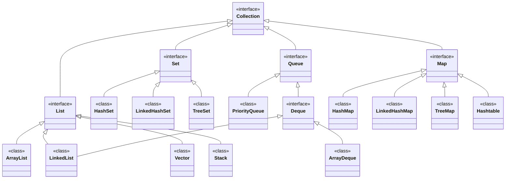

# Java Collections Tutorial

## Table of Contents

1. [Java Collections Overview](#java-collections-overview)
2. [Java Collection Core Classes and Interfaces](#java-collection-core-classes-and-interfaces)
   - 2.1 [Java Collection](#java-collection)
   - 2.2 [Java List](#java-list)
   - 2.3 [Java Set](#java-set)
   - 2.4 [Java SortedSet](#java-sortedset)
   - 2.5 [Java NavigableSet](#java-navigableset)
   - 2.6 [Java Map](#java-map)
   - 2.7 [Java SortedMap](#java-sortedmap)
   - 2.8 [Java NavigableMap](#java-navigablemap)
   - 2.9 [Java Stack](#java-stack)
   - 2.10 [Java Queue](#java-queue)
   - 2.11 [Java Deque](#java-deque)
   - 2.12 [Java Iterator](#java-iterator)
   - 2.13 [Java Iterable](#java-iterable)
3. [Java Collections Class](#java-collections-class)
4. [Java Properties](#java-properties)
5. [Java Collection Packages](#java-collection-packages)
6. [Java Collections and Generics](#java-collections-and-generics)
7. [Java Collections and the equals() and hashCode() Methods](#java-collections-and-the-equals-and-hashcode-methods)
8. [Further Learning](#further-learning)

---

## Java Collections Overview

The Java Collections API provides a framework for working with groups of objects. It includes data structures such as lists, sets, maps, and queues, making it easier for developers to manage collections of data without the need to implement their own data structures.

## Java Collection Core Classes and Interfaces

### Java Collection

The `Collection` interface is the root of the collection hierarchy. It defines the basic operations for all collections.

### Java List

The `List` interface represents an ordered collection that allows duplicate elements. It provides methods for positional access and search.

### Java Set

The `Set` interface represents an unordered collection that does not allow duplicate elements. It provides basic set operations.

### Java SortedSet

The `SortedSet` interface extends `Set` and maintains its elements in sorted order.

### Java NavigableSet

The `NavigableSet` interface extends `SortedSet` and provides methods for navigating the set.

### Java Map

The `Map` interface represents a collection of key-value pairs. Each key is unique, and values can be retrieved based on their associated keys.

### Java SortedMap

The `SortedMap` interface extends `Map` and maintains the order of keys.

### Java NavigableMap

The `NavigableMap` interface extends `SortedMap` and offers navigation methods for keys.

### Java Stack

The `Stack` class implements a last-in-first-out (LIFO) data structure.

### Java Queue

The `Queue` interface represents a first-in-first-out (FIFO) collection where elements are added to one end and removed from the other.

### Java Deque

The `Deque` interface represents a double-ended queue, allowing insertion and removal of elements from both ends.

### Java Iterator

The `Iterator` interface provides methods for iterating over collections.

### Java Iterable

The `Iterable` interface allows for iteration using the enhanced for-loop syntax.

## Java Collections Class

The `Collections` class provides utility methods for working with collections, such as sorting and searching.

## Java Properties

The `Properties` class is a specialized implementation of a key-value store, primarily for string-string pairs, often used for configuration.

## Java Collection Packages

Most collection classes are found in the `java.util` package. Concurrent collections reside in the `java.util.concurrent` package.

## Java Collections and Generics

Generics enhance the Java Collections API by enabling type-safe operations, reducing the risk of `ClassCastException`.

## Java Collections and the equals() and hashCode() Methods

Understanding the implementation of `equals()` and `hashCode()` is crucial for correct functionality within collections, particularly for hash-based collections like `HashSet` and `HashMap`.

## Further Learning

For more in-depth knowledge, you can explore additional tutorials or resources on the specific interfaces and classes mentioned above. Follow the tutorial playlists or visit the Java documentation for more comprehensive examples and usage patterns.

---




In Java, there are already plenty of data structures already available
there are grouped under the name the collection API.

Lists are not the only data structure in Java, you also have set, queue and map
- a set is set where you can not store the same object twice
  (object are the same is equals() return true)
- a queue add or remove object at the head or at the tail of the queue
  (so a stack is a queue, a FIFO is a queue, etc)
- a map is a dictionary that associate a key (which is unique) to a value

so to create an unmodifiable set, using the static method of()
```java
var authors = Set.of("J.R.R. Tolkien", "Philip K. Dick", "George R.R. Martin");
System.out.println(authors);
```

elements inside a set are organized in a way that make `contains` fast
```java
System.out.println(authors.contains("Philip K. Dick"));
```

there are 3 modifiable sets
- HashSet
- LinkedHashSet, as fast as set
- TreeSet, elements are sorted

a set has no order by default, apart if you create a LinkedHashSet


