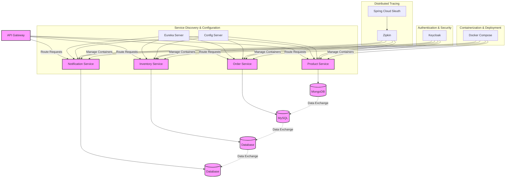
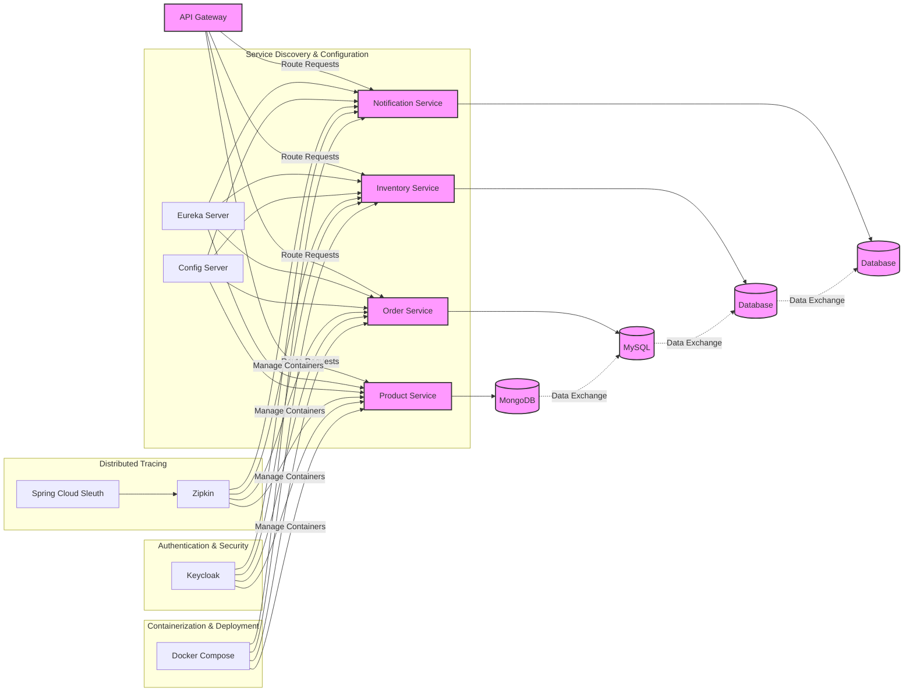
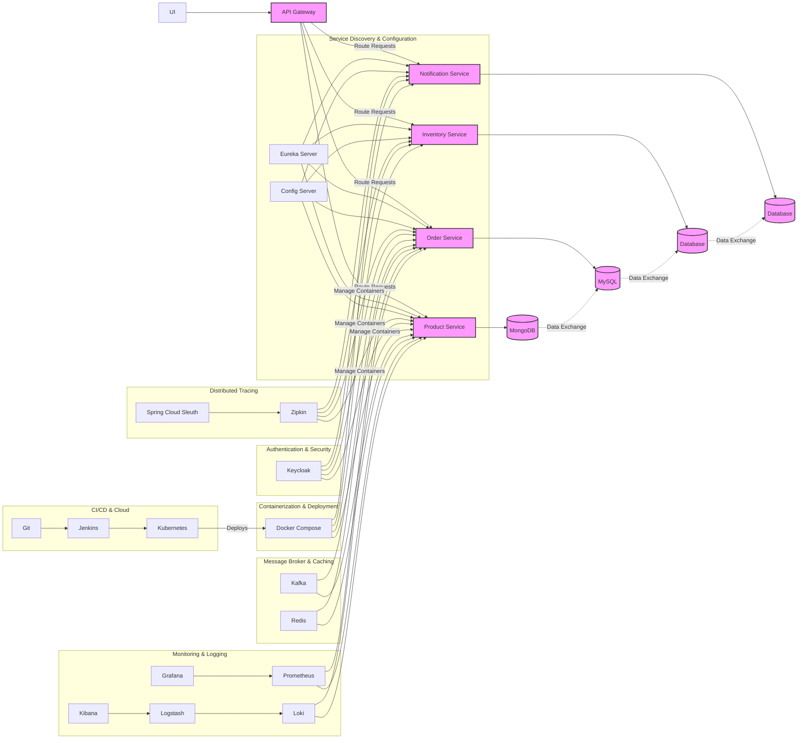
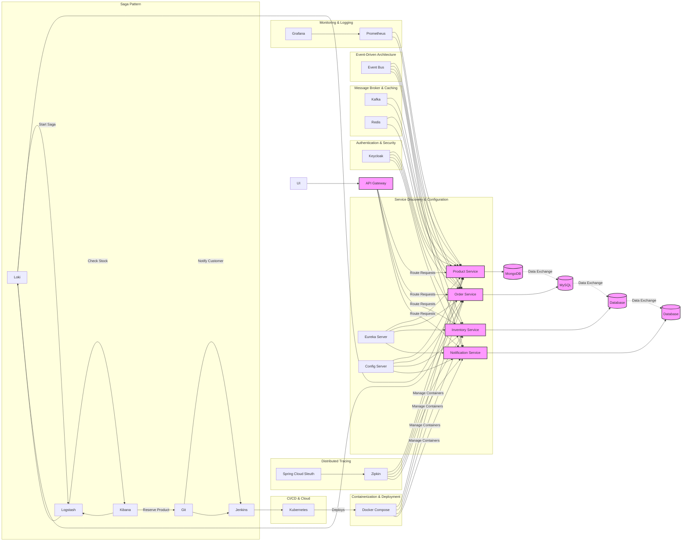
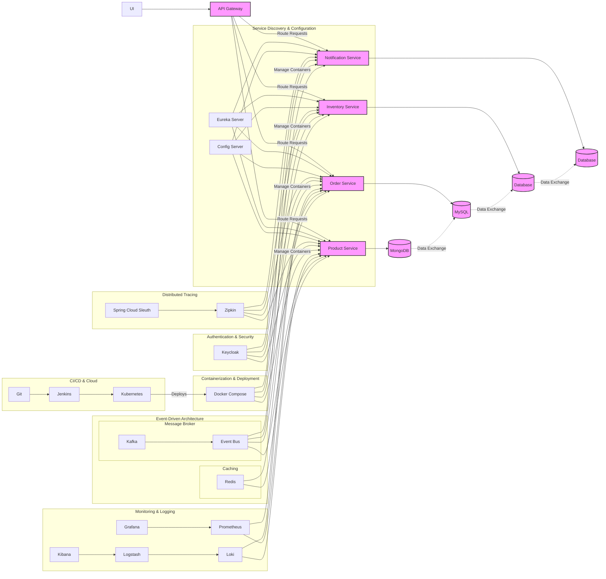
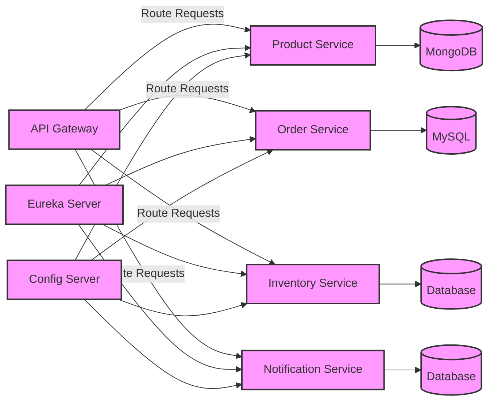
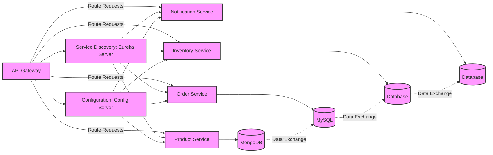
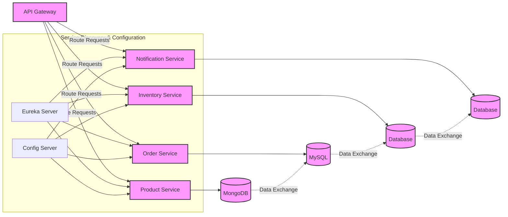

# 🎯 Key Takeaways for Quick Navigation

- 🚀 **Tutorial on Developing a Spring Boot Application**: Using microservices architecture, covering patterns like service discovery, configuration, and tracing.
- 📦 **Services**: Includes product, order, inventory, and notification, with communication being both synchronous and asynchronous.
- 🏗️ **Architecture**: Services include product service with MongoDB, order service with MySQL, managed through an API Gateway and services like Eureka, Config Server, Vault, Zipkin, etc.
- 📚 **Service Structure**: Each service follows a similar structure with controller, service, and repository layers for handling HTTP requests, business logic, and database interactions.
- 🧪 **Integration Testing**: Spring Boot facilitates integration tests with annotations like `@AutoConfigureMockMvc` and `MockMvc`.
- 🐳 **Testcontainers**: Supports writing JUnit tests by providing disposable instances of common software, enabling integration tests without relying on external infrastructure.
- 📦 **BOM for Testcontainers**: Allows managing versions in a centralized way.
- 🖥️ **Integration Tests**: Can be written using Testcontainers and JUnit.
- 📝 **Controller Testing**: Involves using `MockMvc` to simulate HTTP requests and verify responses.
- 🏗️ **IntelliJ Access**: Access both product and order services by opening the microservices parent folder.
- ⚙️ **OrderController Class**: Create with annotations for REST endpoints, request mapping, and post mapping for placing orders.
- 🧭 **Inventory Controller**: Create a method `isInStock` to check product availability.
- 🧩 **InventoryService Class**: Includes an `isInStock` method that queries the inventory repository.
- 📦 **Data Loading**: Load data into the database at application startup using a `CommandLineRunner` bean.
- 🚀 **Project Restructure**: Restructure into a single parent Maven project with modules for each service.
- 🛠️ **Production Setup**: Avoid using `ddl-auto` as `create-drop`; use `ddl-auto` as `none` and employ a database migration library like Liquibase or Flyway.
- 🔄 **Service Communication**: Should be synchronous or asynchronous.
- 🔄 **Synchronous Communication**: Use HTTP clients like RestTemplate or WebClient.
- 🔄 **Batch Data**: Collect relevant information and pass them as a list to the service instead of multiple HTTP calls.
- 🌐 **API Gateway**: Can route requests to the Discovery server using a specified path.
- 🔒 **Microservice Security**: Introduce an authentication mechanism like Keycloak.
- 🔑 **Keycloak Realms**: Use realms to group clients and interact with the authentication server.
- 🔍 **Distributed Tracing**: Helps track requests from start to finish, crucial for understanding performance issues.
- 🌐 **Spring Cloud Sleuth**: Generates trace IDs and Zipkin visualizes distributed tracing information.
- 🔎 **Tracing Integration**: Spring Cloud Sleuth with Zipkin enables tracing of request lifecycle across microservices.
- 🐋 **Docker Introduction**: For containerizing microservices, focusing on Dockerizing a Spring Boot project using a Dockerfile.
- 🏗️ **Dockerfile Optimization**: Improve with multi-stage builds to optimize image size and build times.
- 🐳 **Docker Image Optimization**: Reduces image size and improves efficiency using multi-stage builds.
- 🏗 **Jib**: A library from Google that builds containers from Java applications without using Dockerfiles or Docker itself.
- 🛠 **Maven Jib Plugin**: Configured in `pom.xml` to automate building and pushing Docker images to Docker Hub.
- 🔑 **Docker Hub Credentials**: Add authentication credentials to `settings.xml` in Maven to avoid unauthorized exceptions.
- 🚀 **Jib Command**: Use `mvn clean compile jib:build` to build and push Docker images for all projects in a Maven setup.
- 🐋 **Docker Compose**: Manage multi-container Docker applications, simplifying deployment and orchestration.
- 🗃 **External Services Setup**: Docker Compose allows setting up external services like databases (MySQL, PostgreSQL) and linking them to microservices.
- 📂 **Docker Volumes**: Persist data between container restarts, ensuring data integrity and availability.
- 🌐 **Service Startup Configuration**: Docker Compose can be configured to start services like Eureka server, API Gateway, and others, defining dependencies for proper startup sequence.
- 💻 **Service Management**: The Spring Boot microservices project uses Docker Compose to manage multiple services, each with its own Docker container.
- 🛠 **Configuration Flexibility**: Properties for each service can be overridden through the Docker Compose file.
- 🐳 **Container Communication**: Often requires specific port configurations, especially for services like Kafka.
- 📦 **Microservice Configuration**: Each microservice is configured with its dependencies (e.g., databases, Kafka, Zipkin, Discovery server) and exposed ports.
- 🚀 **Single Command Start**: Docker Compose can start all services with a single command, pulling required images and running containers in daemon mode.
- 🔒 **Keycloak Accessibility**: Accessing Keycloak services from Docker containers may require updating the host file for DNS resolution.
- 🚫 **JWT Claims Validation**: Errors can occur if the token's ISS (Issuer) claim does not match the expected value.
- 🖥 **Windows Host File**: May need editing for Docker containers to communicate with services like Keycloak using hostnames.
- 🔄 **Monitoring Setup**: Configure monitoring using Prometheus and Grafana; Spring Boot Actuator exposes metrics for Prometheus to visualize.
- 🔄 **Actuator Endpoints**: Enable Spring Boot Actuator endpoints and configure Prometheus to scrape metrics.
- 🐛 **Error Resolution**: Remove duplicate property key errors by eliminating unused wildcard actuator configuration.
- 🐳 **Monitoring with Docker Compose**: Use Docker Compose to set up Prometheus and Grafana for monitoring.
- 🛠 **Prometheus Configuration**: Configure Prometheus in Docker Compose to scrape metrics from Spring Boot applications.
- 📊 **Grafana Setup**: Set up Grafana in Docker Compose with user credentials for UI login.
- 📝 **Prometheus Configuration File**: Create to define scrape intervals and targets.

### Key Takeaways for Developing a Spring Boot Microservices Application

#### Architecture Overview
- **Microservices Structure**: Application includes product, order, inventory, and notification services.
- **Data Storage**: 
  - Product Service: MongoDB
  - Order Service: MySQL
- **Communication**: Utilizes both synchronous (HTTP) and asynchronous methods (e.g., message queues).

#### Essential Components
- **Service Discovery**: Eureka for locating services.
- **Configuration Management**: Spring Cloud Config Server for externalized configuration.
- **API Gateway**: Routes requests and manages communication.
- **Distributed Tracing**: Spring Cloud Sleuth and Zipkin for tracking requests across services.

#### Development Practices
- **Project Structure**: Organize as a parent Maven project with individual modules for each service.
- **Layered Architecture**:
  - **Controller Layer**: Handles HTTP requests.
  - **Service Layer**: Contains business logic.
  - **Repository Layer**: Manages database interactions.

#### Testing
- **Integration Testing**:
  - Use `@AutoConfigureMockMvc` and `MockMvc` for simulating HTTP requests.
  - Testcontainers for running tests with disposable instances of external services.

#### Docker and Containerization
- **Dockerization**: Create Dockerfiles for each service.
- **Multi-Stage Builds**: Optimize image size and build times.
- **Jib Plugin**: Build Docker images directly from Java projects without Dockerfile.

#### Deployment
- **Docker Compose**: Manage multi-container applications, defining services and dependencies.
- **Volume Management**: Use Docker volumes for data persistence.
- **Configuration Overrides**: Customize settings in Docker Compose.

#### Security and Monitoring
- **Authentication**: Use Keycloak for securing microservices.
- **Monitoring**:
  - Spring Boot Actuator to expose application metrics.
  - Prometheus and Grafana for monitoring and visualization.

#### Best Practices
- **Avoid `ddl-auto` in Production**: Use migration tools like Liquibase or Flyway instead.
- **Optimize Service Communication**: Collect and batch data to reduce HTTP calls.
- **Configuration Management**: Ensure properties can be overridden as needed in different environments.


Below diagram visually represents the architecture of the Spring Boot microservices application you described, including services like:-

- Product
- Order
- Inventory
- Notification

Along with key components like:-
- Eureka, 
- Config Server, 
- API Gateway and Docker.

## TOP to DOWN


## LEFT to RIGHT


### Diagram Explanation:

- **API Gateway**: Routes requests to different services (Product, Order, Inventory, Notification).
- **Product, Order, Inventory, and Notification Services**: Microservices handling their respective domain logic, connected to databases.
  - Product Service uses **MongoDB**.
  - Order Service uses **MySQL**.
  - Inventory and Notification services connect to their respective databases (could be SQL or NoSQL).
- **Eureka Server**: Provides service discovery, allowing services to register and discover each other.
- **Config Server**: Centralized configuration management, ensuring that all services use consistent configuration values.
- **Zipkin**: Distributed tracing visualization platform, with Spring Cloud Sleuth generating trace data for each service.
- **Keycloak**: Authentication and authorization service, ensuring secure access to the microservices.
- **Docker Compose**: Orchestrates container deployment, ensuring services are packaged, deployed, and managed in Docker containers.

### Interactions:
- Services communicate through HTTP (API Gateway to services), and databases exchange data (e.g., MongoDB to MySQL).
- Each service is registered with **Eureka Server** for discovery and queries configuration from **Config Server**.
- **Spring Cloud Sleuth** and **Zipkin** are used for monitoring and tracing the lifecycle of requests across services.
  
You can visualize this diagram using any Mermaid-compatible renderer to get a visual understanding of how these components interact in a microservices-based architecture.

Here's an updated version of the Mermaid diagram, incorporating the requested components like **UI**, **Kafka**, **Redis**, **Grafana**, **Prometheus**, **Loki**, **Logstash**, **Kibana**, **Cloud**, **Git**, **Jenkins**, and **Kubernetes**.



### New Components:
- **UI**: Represents the user interface which communicates with the **API Gateway** to route requests to the microservices.
- **Kafka**: Acts as a message broker to enable asynchronous communication between services (Product and Order).
- **Redis**: A caching layer for quick data retrieval in services like Product and Order.
- **Prometheus**: Collects and scrapes metrics from Spring Boot services for monitoring.
- **Grafana**: Visualizes metrics collected by Prometheus, providing dashboards for monitoring service health.
- **Loki**: For log aggregation, collecting logs from services like Product and Order.
- **Logstash**: Processes and forwards logs from Loki to Kibana for visualization.
- **Kibana**: Provides a web interface for searching, viewing, and analyzing log data stored in Loki.
- **CI/CD with Git, Jenkins, and Kubernetes**:
  - **Git**: Code repository.
  - **Jenkins**: Continuous integration tool.
  - **Kubernetes**: Orchestrates containers, ensuring the deployment and scaling of services.
- **Cloud**: Represents cloud-based infrastructure (e.g., AWS, GCP, Azure) where services are deployed.

### Interactions:
- **UI** sends requests to the **API Gateway**.
- **Kafka** handles asynchronous communication between **Product Service** and **Order Service**.
- **Redis** is used for caching, improving response times for the Product and Order services.
- **Prometheus** collects metrics from services like **Product Service** and **Order Service**, and **Grafana** visualizes them.
- Logs are aggregated by **Loki**, processed by **Logstash**, and visualized in **Kibana** for monitoring and troubleshooting.
- **Jenkins** integrates with **Git** for CI/CD, deploying microservices to **Kubernetes**, which manages the containers.

This comprehensive diagram covers the full stack, from service communication to monitoring, logging, and CI/CD, ensuring a robust, scalable, and observable microservices architecture.

Here's the updated **Mermaid diagram** with the added **Saga Pattern** and **Event-Driven Architecture**, along with the separation of components like **Message Broker & Caching**, **Distributed Tracing**, **Monitoring & Logging**, **CI/CD & Cloud**, and **Containerization & Deployment**.



### Key Additions:

1. **Event-Driven Architecture**:
   - **Event Bus**: A central hub through which services communicate asynchronously via events. The services (Product, Order, Inventory, Notification) all publish and consume events via this bus.
   
2. **Saga Pattern**:
   - A **Saga** is a sequence of local transactions where each service involved performs a part of the transaction and publishes events to trigger the next step. The example includes the following services:
     - **Order Service** starts the saga.
     - **Inventory Service** checks stock.
     - **Product Service** reserves the product.
     - **Notification Service** sends notifications.
     - **Order Service** finalizes the order.

3. **Message Broker & Caching**:
   - **Kafka**: Used for **asynchronous messaging** between services, enabling decoupled communication (Product, Order services).
   - **Redis**: Caching layer for improving performance and response times for frequently accessed data.

4. **Distributed Tracing**:
   - **Zipkin**: Collects and visualizes traces for tracking requests across multiple services.
   - **Spring Cloud Sleuth**: Generates trace and span IDs for requests.

5. **Monitoring & Logging**:
   - **Prometheus**: Scrapes metrics for monitoring the health and performance of microservices.
   - **Grafana**: Visualizes metrics collected by Prometheus.
   - **Loki**: Aggregates logs from microservices.
   - **Logstash**: Processes logs before they are sent to **Kibana** for visualization.

6. **CI/CD & Cloud**:
   - **Git**: Source code repository.
   - **Jenkins**: Continuous integration and deployment (CI/CD) pipeline.
   - **Kubernetes**: Orchestrates deployment and scaling of containers.
   - **Docker Compose**: Manages the containers for all microservices.

### Flow Explanation:

- **Event-Driven**: Services (Product, Order, Inventory, Notification) publish and subscribe to events on the **Event Bus**. This creates a decoupled, asynchronous communication flow.
- **Saga Pattern**: Manages distributed transactions by coordinating services (Order → Inventory → Product → Notification) through event-based interactions.
- **Kafka**: Enables services to communicate asynchronously and decouple them. It's used for event-driven architecture and messaging between **Order Service** and **Product Service**.
- **Redis**: Caches frequently requested data to speed up the **Product Service** and **Order Service**.
- **CI/CD**: Changes pushed to **Git** trigger the **Jenkins** pipeline, which deploys the application to **Kubernetes** using **Docker Compose**.
- **Monitoring & Logging**: **Prometheus** collects metrics, which are visualized using **Grafana**. Logs from **Product** and **Order Services** are collected by **Loki**, processed by **Logstash**, and visualized in **Kibana**.

This comprehensive diagram now includes all the requested components and shows how they interact in the system.

Here’s a revised version of your **Mermaid flow diagram**, ensuring the correct interactions and logical flow for the microservices architecture:

### Correct Flow Explanation

- **API Gateway**: The entry point for all client requests, routing them to the appropriate service.
- **Service Discovery & Configuration**: The **Eureka Server** helps services discover each other, and the **Config Server** manages external configurations.
- **Authentication & Security**: **Keycloak** ensures that each service is secured and that all communications are authenticated.
- **Distributed Tracing**: **Spring Cloud Sleuth** and **Zipkin** track and visualize the flow of requests across services.
- **Message Broker & Caching**: **Kafka** and **Redis** are used for asynchronous communication and caching, respectively, to improve performance and decouple services.
- **Event-Driven Architecture**: An **Event Bus** allows for communication via events, enabling loose coupling and asynchronous processing.
- **Saga Pattern**: **Saga** ensures that distributed transactions are properly coordinated across services, with failure management.
- **Monitoring & Logging**: **Prometheus** collects metrics, **Grafana** visualizes the metrics, and **Loki**, **Logstash**, and **Kibana** are used for logging.
- **CI/CD & Cloud**: **Git** (for version control), **Jenkins** (for continuous integration), and **Kubernetes** (for orchestration) handle the deployment and scaling of services.
- **Containerization & Deployment**: **Docker Compose** manages and orchestrates the microservices containers.

### Updated Mermaid Diagram:


### Key Corrections and Flow Improvements:

1. **Separation of Concerns**:
   - **Service Discovery & Configuration**: **Eureka Server** and **Config Server** are only responsible for service registration, discovery, and configuration.
   - **Distributed Tracing**: **Zipkin** and **Spring Cloud Sleuth** are dedicated to tracing service requests and visualizing the trace data.
   - **Message Broker & Caching**: **Kafka** and **Redis** handle messaging and caching asynchronously.
   - **Event-Driven Architecture**: An **Event Bus** drives communication between services, enabling them to react to events without tight coupling.

2. **Saga Pattern**:
   - Ensures that distributed transactions (e.g., order processing) are handled in a coordinated way. Services like **Order Service**, **Inventory Service**, **Product Service**, and **Notification Service** interact with each other to complete the saga.

3. **Containerization & Deployment**:
   - **Docker Compose** is used to manage the deployment of all services. The connection between **Kubernetes** and **Docker Compose** ensures that the services are orchestrated and deployed properly.

4. **CI/CD & Cloud**:
   - **Git**, **Jenkins**, and **Kubernetes** form the CI/CD pipeline and orchestrate the deployment of services.

5. **Monitoring & Logging**:
   - **Prometheus** collects and exposes metrics from microservices for monitoring.
   - **Grafana** visualizes the metrics, while **Loki**, **Logstash**, and **Kibana** are used for log aggregation and visualization.

6. **UI**: The **UI** communicates with the **API Gateway** to access the services, acting as the frontend for users.

---

### Final Notes:
- **Data exchange** links are represented by dashed lines, showing asynchronous data flow between services (e.g., MongoDB to MySQL, or Order to Inventory).
- **Interaction Flow**: The diagram illustrates how services communicate and are deployed, starting from the **UI** to the **API Gateway**, then to the services and their underlying infrastructure.

This flow provides a clearer picture of the microservices architecture and the relationships between components. Let me know if you'd like further refinements!

Thank you for your patience! I understand you're asking for clarifications on why certain components are placed in the same subgraphs or separated in your **Mermaid flow diagram**, as well as the issue with Docker and the CI/CD pipeline placement.

Let's break this down:

---

### **1. Message Broker & Caching Subgraph** (Kafka & Redis together):
```mermaid
subgraph "Message Broker & Caching"
  P[Kafka] --> B
  P[Kafka] --> C
  Q[Redis] --> B
  Q[Redis] --> C
end
```

**Reason for placement**:  
- **Kafka** and **Redis** are closely related in the sense that they both facilitate **asynchronous communication**, though they serve different purposes:
  - **Kafka**: Primarily a message broker for event-driven architecture, managing streams of data (often used for decoupling services).
  - **Redis**: Primarily used as an in-memory cache, often for storing temporary data to improve performance.
  
By grouping them together under **Message Broker & Caching**, you're showing that both are middleware solutions for handling communication between microservices but addressing different needs:
- Kafka for messaging (typically event-driven communication).
- Redis for caching and sometimes pub/sub messaging.

### **2. Event-Driven Architecture Subgraph (Event Bus Separate from Kafka)**:
```mermaid
subgraph "Event-Driven Architecture"
  R[Event Bus] --> B
  R[Event Bus] --> C
  R[Event Bus] --> D
  R[Event Bus] --> E
end
```

**Reason for separation from Kafka**:  
- The **Event Bus** in this subgraph is used to represent **Event-Driven Architecture**, where microservices publish and listen to events, and this could be implemented by various technologies, such as **Kafka**, **RabbitMQ**, or **ActiveMQ**.
- **Kafka** can be considered as a specific tool used to implement this pattern, but the **Event Bus** is a higher-level abstraction. So, if you're planning to support different types of event-driven messaging, it's better to keep the **Event Bus** abstraction separate from the specific implementation of Kafka.

If you’re using Kafka as your event bus, then Kafka could be part of this, but for clarity, it might be better to abstract the **Event Bus** separately to show that the system may evolve to use different messaging systems or protocols.

---

### **3. CI/CD & Cloud without Docker**:
```mermaid
subgraph "CI/CD & Cloud"
  X[Git] --> Y[Jenkins]
  Y[Jenkins] --> Z[Kubernetes]
  Z[Kubernetes] -->|Deploys| O
end
```

**Why it doesn’t include Docker**:  
- **CI/CD** (Continuous Integration and Continuous Deployment) is focused on the process of automating the build, test, and deployment pipelines.
- **Git** (Version Control), **Jenkins** (CI Server), and **Kubernetes** (Orchestration) are key components of the CI/CD pipeline, while **Docker** is related to containerization.
  
In this case, the **Docker Compose** subgraph, which is about **containerization and deployment**, is logically separate because Docker handles how services are packaged into containers, while **CI/CD** manages how those containers (and code) get built, tested, and deployed. Docker would be integrated into the **Kubernetes** (cloud) deployment stage indirectly, but it's not part of the direct flow of CI/CD.

---

### **4. Docker Subgraph (Containerization & Deployment)**:
```mermaid
subgraph "Containerization & Deployment"
  O[Docker Compose] -->|Manage Containers| B
  O[Docker Compose] -->|Manage Containers| C
  O[Docker Compose] -->|Manage Containers| D
  O[Docker Compose] -->|Manage Containers| E
end
```

**Docker Compose placement**:  
- **Docker Compose** is responsible for managing the containers that hold the microservices.
- The subgraph focuses on orchestrating how all the services (Product, Order, Inventory, Notification) run in containers during development or testing.

However, in a **production environment**, services might be orchestrated using **Kubernetes** rather than **Docker Compose**. But in a local development environment or testing environment, **Docker Compose** is often sufficient.

This is why Docker Compose is separate from the CI/CD pipeline. The **CI/CD pipeline** automates code delivery (build, test, deploy), while **Docker Compose** focuses more on local deployment and container orchestration.

---

### **Updated Explanation of the Complete Flow:**

- **Message Broker & Caching**: You group **Kafka** and **Redis** together because they both handle asynchronous communication, though with different functions. Kafka handles messaging (pub/sub, event-driven), while Redis acts as an in-memory cache for faster access to data.
  
- **Event-Driven Architecture**: The **Event Bus** is a logical abstraction for event-driven communication between services, potentially implemented using Kafka, RabbitMQ, or similar technologies. It’s not strictly tied to Kafka but represents the broader concept of decoupling services through events.

- **CI/CD & Cloud**: The **CI/CD pipeline** (Git, Jenkins, Kubernetes) handles the flow of code from development to production. **Docker** is part of the deployment process but not directly part of the CI/CD flow in this diagram.

- **Containerization & Deployment**: **Docker Compose** is specifically for orchestrating services locally (development/test environments), while **Kubernetes** would be used in production to scale and manage services. 

---

### **Refined Diagram**:

Here's the refined flow considering all points:


### Summary:

- **Message Broker & Caching**: Keeps Kafka (messaging) and Redis (caching) together for efficiency.
- **Event-Driven Architecture**: Keeps **Event Bus** abstraction separate from Kafka (allows flexibility in messaging technology choice).
- **CI/CD & Cloud**: Separates **Docker Compose** from CI/CD flow to focus on orchestration tools for deployment.
- **Containerization**: Uses **Docker Compose** for local container management but also shows **Kubernetes** for cloud-based orchestration.

Certainly! To clarify, **Event-Driven Architecture** is a pattern that decouples services by allowing them to communicate through events, where services publish and consume events asynchronously. In your case, components like Kafka, Redis, and possibly an **Event Bus** are used to facilitate this communication.

### Separate **Event-Driven Architecture**:

Here's how you can represent **Event-Driven Architecture** separately from the rest of the system in your **Mermaid diagram**.

### Updated Mermaid Diagram



### Breakdown:

#### **Event-Driven Architecture** (now placed separately):
- **Event Bus** is shown as the central component that allows services to communicate asynchronously.
- **Kafka** is used as the **Message Broker** within the Event Bus, connecting all services for messaging.
- **Redis** is shown as part of the **Caching** mechanism, handling temporary data storage and also serving as a pub/sub message broker for certain events.
  
This **separation** highlights that the **Event-Driven Architecture** is more than just Kafka or Redis; it's a pattern that involves using an event bus (like Kafka, RabbitMQ, etc.) to communicate between services in a decoupled way.

### **Key Points in This Setup:**
1. **API Gateway** routes all requests to the respective services.
2. **Service Discovery & Configuration** (Eureka & Config Server) helps the services to discover each other and maintain proper configurations.
3. **Distributed Tracing** with **Zipkin** and **Spring Cloud Sleuth** helps monitor request lifecycles across services.
4. **Security** is managed with **Keycloak**, providing authentication.
5. **Containerization** is handled by **Docker Compose**, with potential deployment to **Kubernetes**.
6. **Event-Driven Architecture** with **Kafka** (Message Broker) and **Redis** (Caching) facilitates communication between services via events asynchronously.

### **Why Separate Event-Driven Architecture?**
- **Kafka** and **Redis** have very different roles compared to the synchronous communication handled by the **API Gateway**. Grouping them under **Event-Driven Architecture** gives you a clear separation of concerns: 
  - Kafka is a message broker for decoupling microservices via event streams.
  - Redis is used for caching and event-driven messaging (e.g., pub/sub).
  
This way, **Event-Driven Architecture** is focused on handling asynchronous communication and decoupling the microservices, while the rest of the system handles synchronous, RESTful communication (via the API Gateway) and service management.

This structure helps clarify the relationship between synchronous (API Gateway) and asynchronous (Event Bus/Kafka/Redis) communication in a microservice ecosystem.

Here is a simple Mermaid diagram based on your request, depicting the microservices architecture with the components you specified, including the **API Gateway**, **Eureka Server**, **Config Server**, and the services for **Product**, **Order**, **Inventory**, and **Notification**, along with their respective databases.

### Mermaid Diagram:



### **Diagram Explanation**:

1. **API Gateway**:
   - The API Gateway is the entry point for external requests. It routes incoming requests to the appropriate service (Product, Order, Inventory, and Notification).
   
2. **Eureka Server**:
   - Eureka Server is a **Service Discovery** server. All microservices register themselves here, allowing them to discover and communicate with each other.

3. **Config Server**:
   - The Config Server is used to centralize external configuration properties for the microservices, enabling dynamic updates and scaling.
   
4. **Product Service**:
   - The **Product Service** handles product-related operations and communicates with **MongoDB** for data storage.

5. **Order Service**:
   - The **Order Service** is responsible for managing orders, and it connects to **MySQL** for data persistence.

6. **Inventory Service**:
   - The **Inventory Service** is responsible for managing inventory data, storing information in a database.

7. **Notification Service**:
   - The **Notification Service** handles communication and notifications, with its own database for storing notification-related data.

### **Additional Notes**:
- **Eureka Server** and **Config Server** are shared among all the microservices, ensuring they can dynamically adjust to configuration changes and find each other at runtime.
- Each service connects to its respective database (**MongoDB**, **MySQL**, etc.) for persistence.

This diagram provides a high-level overview of the communication between the microservices and their components in a typical Spring Boot microservices architecture.


You're right! The **API Gateway**, **Eureka Server**, and **Config Server** should indeed be connected to show how they interact with the rest of the services. Here's an updated **Mermaid diagram** that includes the correct communication flow between **API Gateway**, **Eureka Server**, and **Config Server**, alongside the rest of the services.

### Updated Mermaid Diagram:


### Explanation of Communication Flow:
1. **API Gateway**:
    - The **API Gateway** routes incoming requests to the appropriate services (Product, Order, Inventory, and Notification).
    - The **API Gateway** also communicates with the **Eureka Server** for service discovery and the **Config Server** for configuration management.

2. **Eureka Server**:
    - The **Eureka Server** acts as a **service discovery** server where all services (Product, Order, Inventory, Notification) register themselves. This enables dynamic communication between microservices by allowing them to discover and communicate with each other.

3. **Config Server**:
    - The **Config Server** provides **centralized configuration management** to the services, ensuring that all microservices are using the same configuration. It can dynamically update the configuration across all services as needed.

4. **Service Communication**:
    - The services (Product, Order, Inventory, Notification) communicate with their respective databases (MongoDB, MySQL, etc.) for persistent storage. Additionally, the communication flow between these services is depicted using dashed arrows (for data exchange).

### How to Visualize:
1. **Mermaid Live Editor**: Copy and paste the code into [Mermaid Live Editor](https://mermaid-js.github.io/mermaid-live-editor/) to view the diagram.
2. **Draw.io**: Alternatively, you can manually draw this out on [Draw.io](https://app.diagrams.net/) using the components described.

This diagram now correctly represents the interaction between the **API Gateway**, **Eureka Server**, and **Config Server**, along with the rest of the services!

### Communication Between Components in a Microservices Architecture

In a typical **Spring Boot** microservices setup, **API Gateway**, **Eureka Server**, and **Config Server** communicate in specific ways to ensure a smooth and efficient workflow. Below is a breakdown of how each of these components interacts:

---

### **1. API Gateway Communication**

**API Gateway** serves as the entry point for all incoming requests from clients (users or systems). It handles routing requests to appropriate microservices. In a Spring Cloud ecosystem, the **API Gateway** (often implemented with **Spring Cloud Gateway** or **Zuul**) typically interacts with the following components:

#### **Flow of Communication**:
- **Incoming Requests**: 
  - Clients (such as a web or mobile application) send HTTP requests to the **API Gateway**.
  - The **API Gateway** is the only public-facing entity, so all external traffic comes through it.
  
- **Routing Requests**: 
  - The **API Gateway** inspects the request (based on URL, HTTP method, headers, etc.) and routes it to the appropriate service. For example, a request to `/products` would be routed to the **Product Service**, and `/orders` would be sent to the **Order Service**.
  - **Routing Decision**: The **API Gateway** can use static rules or more advanced routing mechanisms (such as using service names from Eureka) to decide how to route the request.

- **Integration with Eureka**:
  - The **API Gateway** uses **Eureka** for dynamic service discovery. Instead of hardcoding the service endpoints (e.g., `localhost:8080/products`), the **API Gateway** queries **Eureka Server** to get the location (host and port) of the target microservice (e.g., **Product Service**).
  - Eureka provides **client-side load balancing**, meaning if multiple instances of the same service are running, the **API Gateway** can route the request to any available instance.

#### **Key Tasks**:
- **Routing**: Directs requests to the correct microservice.
- **Load Balancing**: Ensures load is distributed among available service instances.
- **Security**: Can enforce authentication/authorization policies for incoming requests.

---

### **2. Eureka Server Communication**

**Eureka Server** is a **Service Discovery** server, helping microservices register themselves and discover other services dynamically. **Eureka** uses a **client-server** model where each microservice registers itself as a client with the **Eureka Server**.

#### **Flow of Communication**:
- **Service Registration**: 
  - When a microservice (e.g., **Product Service**) starts, it registers itself with the **Eureka Server**, providing its service name (e.g., `product-service`) and the URI (host + port).
  - Eureka keeps track of the available service instances and their health status.
  
- **Service Discovery**:
  - When a service (e.g., **API Gateway**) wants to make a request to another service (e.g., **Product Service**), it queries the **Eureka Server** to get the list of instances of the **Product Service**.
  - The **API Gateway** can then use this information to route requests to a specific service instance.

- **Health Checks**:
  - Eureka periodically performs health checks to ensure the registered services are available. If a service becomes unhealthy or stops responding, Eureka removes it from the registry.
  
- **Client-Side Load Balancing**:
  - With **Eureka** in place, client applications (like the **API Gateway**) can choose any healthy instance of the service. In case of multiple instances, the **API Gateway** can distribute traffic across instances to balance the load.

#### **Key Tasks**:
- **Service Registration**: Services register themselves with Eureka.
- **Service Discovery**: Other services query Eureka to find available instances.
- **Health Monitoring**: Eureka performs health checks on registered services.

---

### **3. Config Server Communication**

**Config Server** is used to centralize configuration management for microservices. It provides externalized configuration properties, allowing microservices to fetch configuration values at runtime. This is essential for dynamic configuration updates across the microservices without requiring restarts.

#### **Flow of Communication**:
- **Service Configuration**:
  - Each microservice retrieves configuration properties from the **Config Server** during startup or when needed. For example, the **Product Service** can fetch database connection properties, API keys, or other environment-specific values from the **Config Server**.
  
- **Dynamic Configuration Updates**:
  - **Spring Cloud Config** supports **dynamic updates**. If the configuration is changed in the **Config Server** (e.g., in a `Git` repository or a local file), the **Config Server** notifies the microservices about the changes.
  - The microservices can listen for configuration changes and automatically reload the updated configuration.

- **Integration with Spring Cloud**:
  - Microservices are configured to automatically fetch configuration from the **Config Server** using a URL like `http://config-server:8888/{application-name}/{profile}`.
  - The **Config Server** can pull configurations from various sources like Git, local file system, or even a database.
  
- **Security & Access**:
  - Access to the **Config Server** can be secured, ensuring that sensitive properties (like database credentials, API keys) are properly protected.
  
- **Use with Profiles**:
  - Microservices can specify which configuration profile they need (e.g., `dev`, `prod`) and get environment-specific configurations.

#### **Key Tasks**:
- **Centralized Configuration**: Provides a centralized configuration management system.
- **Dynamic Configuration**: Allows microservices to dynamically reload configuration properties.
- **Externalized Properties**: Stores configuration properties outside of code, ensuring flexibility and scalability.

---

### **Summary of Interactions:**

1. **API Gateway**:
   - Routes requests to microservices based on the request URL or headers.
   - Queries **Eureka** to discover the service instance and routes traffic accordingly.
   - Can fetch configuration from the **Config Server** for routing or other purposes.

2. **Eureka Server**:
   - Maintains a registry of available microservices.
   - Provides service discovery for the **API Gateway** and other services.
   - Monitors health and availability of services to ensure routing to live instances.

3. **Config Server**:
   - Centralizes and externalizes configuration management.
   - Supplies configuration data to microservices at runtime, allowing dynamic changes.
   - Ensures that services can fetch and reload their configuration automatically.

---

### **Flow Example**: API Gateway to Product Service

1. **Client Request**:
   - A client (user) makes a request to `https://api.example.com/products`.

2. **API Gateway**:
   - The **API Gateway** intercepts the request.
   - It queries **Eureka Server** to find the available instance of **Product Service**.
   
3. **Eureka Server**:
   - The **API Gateway** gets the URL of a running instance of **Product Service**.
   
4. **Config Server** (if needed):
   - The **API Gateway** or the **Product Service** might query the **Config Server** for any relevant configurations (e.g., rate limits, API keys).

5. **Product Service**:
   - The **API Gateway** forwards the request to the **Product Service**, which processes the request and sends a response back.

6. **Response**:
   - The **API Gateway** returns the response to the client.

This communication flow ensures **centralized configuration management**, **service discovery**, and **request routing** in a scalable and dynamic microservices environment.

It seems like there was an issue generating the image directly. However, I can guide you on how to manually create this diagram using tools like **Mermaid** or **Draw.io** based on the description provided. Here's the **Mermaid diagram** structure for you to try:



### Steps to Render the Diagram:
1. **Use Mermaid Live Editor**: Paste this code into the [Mermaid Live Editor](https://mermaid-js.github.io/mermaid-live-editor/) to visualize and adjust the diagram.
2. **Draw.io**: Alternatively, you can use tools like [Draw.io](https://app.diagrams.net/) where you can manually drag and drop components like "API Gateway", "Eureka Server", "Config Server", and link them based on the communication flow.

This will give you a comprehensive and clear visual representation of the communication flow between your services!

### What is Flyway?

**Flyway** is an open-source database migration tool that allows developers to manage schema changes in relational databases. It is especially useful in microservices architectures where multiple services may require different database schemas. Flyway helps ensure that all database changes are versioned, repeatable, and easily manageable.

### Key Features of Flyway

1. **Version Control for Database Migrations**:
   - Flyway allows you to track changes to your database schema using versioned migration scripts. Each script is associated with a version number, enabling you to apply changes in a controlled manner.

2. **Support for Multiple Databases**:
   - Flyway supports a wide range of databases, including PostgreSQL, MySQL, Oracle, SQL Server, and more. This flexibility is vital in microservices architectures where different services might use different databases.

3. **Repeatable Migrations**:
   - In addition to versioned migrations, Flyway allows for repeatable migrations, which can be reapplied every time changes are detected. This is useful for data transformations or non-structural changes.

4. **Rollback Support**:
   - While Flyway primarily focuses on forward migrations, you can manually create rollback scripts to revert changes if needed.

5. **Integration with Build Tools**:
   - Flyway can easily integrate with build tools like Maven, Gradle, or as part of CI/CD pipelines, automating the deployment of database migrations.

6. **Java-based Migration**:
   - Migrations can be defined in SQL or Java. This allows for flexibility and the ability to handle complex migrations programmatically.

7. **Easy Monitoring and Control**:
   - Flyway maintains a metadata table in the database to track applied migrations, making it easy to monitor the state of your database schema.

### Why Use Flyway in Microservices?

1. **Decentralized Development**:
   - In microservices, different teams often work on different services. Flyway allows each team to manage their database migrations independently while still maintaining a consistent approach.

2. **Automated Deployments**:
   - When deploying microservices, it's crucial to ensure that the database schema is updated correctly. Flyway can automate these updates as part of the deployment process, reducing the risk of manual errors.

3. **Versioning and Rollback**:
   - With multiple services, keeping track of different versions of database schemas can be challenging. Flyway’s versioning system simplifies this, and having rollback capabilities helps handle issues that may arise after deployment.

4. **Ease of Use**:
   - Flyway's command-line interface and API make it easy for developers to apply migrations, check the status of migrations, and handle versioning without needing deep knowledge of SQL.

### How Flyway Works

1. **Migration Scripts**:
   - Migration scripts are typically stored in a directory within the application, named in a specific format (e.g., `V1__Initial_setup.sql`). The format includes a version number and a description.
   - Scripts can be written in SQL or Java, depending on the complexity of the migration.

2. **Database Metadata Table**:
   - Flyway creates a metadata table (`flyway_schema_history`) in the database. This table keeps track of applied migrations, their version numbers, descriptions, and checksums.

3. **Executing Migrations**:
   - When you run Flyway (either via command line, build tool, or programmatically), it checks the metadata table to see which migrations have already been applied.
   - It then executes any new migration scripts in the order of their version numbers.

4. **Error Handling**:
   - If a migration fails, Flyway stops the process and leaves the database in a consistent state, allowing developers to investigate and fix issues before retrying.

### Example Workflow in a Microservices Environment

1. **Define Migrations**:
   - A developer creates a migration script for a new feature in their microservice. The script is named `V1__Create_users_table.sql`.

2. **Version Control**:
   - The migration script is committed to version control alongside the service code.

3. **Run Migrations**:
   - During the CI/CD pipeline, Flyway is invoked to apply the migration to the database before deploying the microservice.

4. **Monitor and Rollback**:
   - After deployment, if issues are detected, the team can either fix the migration script and reapply it or create a rollback script to revert the changes.

### Conclusion

Flyway provides a robust and efficient way to manage database migrations in microservices architectures. By offering features such as version control, repeatable migrations, and easy integration into deployment processes, it helps teams maintain consistency across their database schemas while allowing for the flexibility required in a microservices environment. This leads to better collaboration, reduced deployment risks, and a smoother development workflow.
