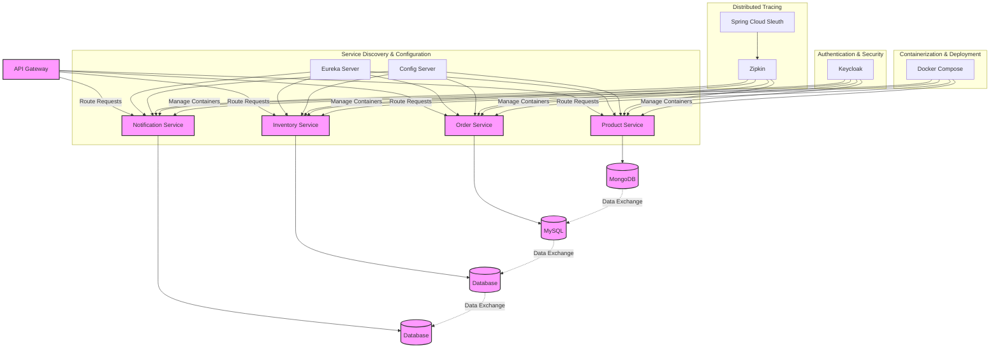
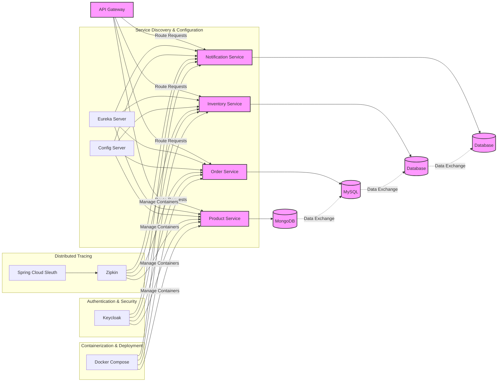

# 🎯 Key Takeaways for Quick Navigation

- 🚀 **Tutorial on Developing a Spring Boot Application**: Using microservices architecture, covering patterns like service discovery, configuration, and tracing.
- 📦 **Services**: Includes product, order, inventory, and notification, with communication being both synchronous and asynchronous.
- 🏗️ **Architecture**: Services include product service with MongoDB, order service with MySQL, managed through an API Gateway and services like Eureka, Config Server, Vault, Zipkin, etc.
- 📚 **Service Structure**: Each service follows a similar structure with controller, service, and repository layers for handling HTTP requests, business logic, and database interactions.
- 🧪 **Integration Testing**: Spring Boot facilitates integration tests with annotations like `@AutoConfigureMockMvc` and `MockMvc`.
- 🐳 **Testcontainers**: Supports writing JUnit tests by providing disposable instances of common software, enabling integration tests without relying on external infrastructure.
- 📦 **BOM for Testcontainers**: Allows managing versions in a centralized way.
- 🖥️ **Integration Tests**: Can be written using Testcontainers and JUnit.
- 📝 **Controller Testing**: Involves using `MockMvc` to simulate HTTP requests and verify responses.
- 🏗️ **IntelliJ Access**: Access both product and order services by opening the microservices parent folder.
- ⚙️ **OrderController Class**: Create with annotations for REST endpoints, request mapping, and post mapping for placing orders.
- 🧭 **Inventory Controller**: Create a method `isInStock` to check product availability.
- 🧩 **InventoryService Class**: Includes an `isInStock` method that queries the inventory repository.
- 📦 **Data Loading**: Load data into the database at application startup using a `CommandLineRunner` bean.
- 🚀 **Project Restructure**: Restructure into a single parent Maven project with modules for each service.
- 🛠️ **Production Setup**: Avoid using `ddl-auto` as `create-drop`; use `ddl-auto` as `none` and employ a database migration library like Liquibase or Flyway.
- 🔄 **Service Communication**: Should be synchronous or asynchronous.
- 🔄 **Synchronous Communication**: Use HTTP clients like RestTemplate or WebClient.
- 🔄 **Batch Data**: Collect relevant information and pass them as a list to the service instead of multiple HTTP calls.
- 🌐 **API Gateway**: Can route requests to the Discovery server using a specified path.
- 🔒 **Microservice Security**: Introduce an authentication mechanism like Keycloak.
- 🔑 **Keycloak Realms**: Use realms to group clients and interact with the authentication server.
- 🔍 **Distributed Tracing**: Helps track requests from start to finish, crucial for understanding performance issues.
- 🌐 **Spring Cloud Sleuth**: Generates trace IDs and Zipkin visualizes distributed tracing information.
- 🔎 **Tracing Integration**: Spring Cloud Sleuth with Zipkin enables tracing of request lifecycle across microservices.
- 🐋 **Docker Introduction**: For containerizing microservices, focusing on Dockerizing a Spring Boot project using a Dockerfile.
- 🏗️ **Dockerfile Optimization**: Improve with multi-stage builds to optimize image size and build times.
- 🐳 **Docker Image Optimization**: Reduces image size and improves efficiency using multi-stage builds.
- 🏗 **Jib**: A library from Google that builds containers from Java applications without using Dockerfiles or Docker itself.
- 🛠 **Maven Jib Plugin**: Configured in `pom.xml` to automate building and pushing Docker images to Docker Hub.
- 🔑 **Docker Hub Credentials**: Add authentication credentials to `settings.xml` in Maven to avoid unauthorized exceptions.
- 🚀 **Jib Command**: Use `mvn clean compile jib:build` to build and push Docker images for all projects in a Maven setup.
- 🐋 **Docker Compose**: Manage multi-container Docker applications, simplifying deployment and orchestration.
- 🗃 **External Services Setup**: Docker Compose allows setting up external services like databases (MySQL, PostgreSQL) and linking them to microservices.
- 📂 **Docker Volumes**: Persist data between container restarts, ensuring data integrity and availability.
- 🌐 **Service Startup Configuration**: Docker Compose can be configured to start services like Eureka server, API Gateway, and others, defining dependencies for proper startup sequence.
- 💻 **Service Management**: The Spring Boot microservices project uses Docker Compose to manage multiple services, each with its own Docker container.
- 🛠 **Configuration Flexibility**: Properties for each service can be overridden through the Docker Compose file.
- 🐳 **Container Communication**: Often requires specific port configurations, especially for services like Kafka.
- 📦 **Microservice Configuration**: Each microservice is configured with its dependencies (e.g., databases, Kafka, Zipkin, Discovery server) and exposed ports.
- 🚀 **Single Command Start**: Docker Compose can start all services with a single command, pulling required images and running containers in daemon mode.
- 🔒 **Keycloak Accessibility**: Accessing Keycloak services from Docker containers may require updating the host file for DNS resolution.
- 🚫 **JWT Claims Validation**: Errors can occur if the token's ISS (Issuer) claim does not match the expected value.
- 🖥 **Windows Host File**: May need editing for Docker containers to communicate with services like Keycloak using hostnames.
- 🔄 **Monitoring Setup**: Configure monitoring using Prometheus and Grafana; Spring Boot Actuator exposes metrics for Prometheus to visualize.
- 🔄 **Actuator Endpoints**: Enable Spring Boot Actuator endpoints and configure Prometheus to scrape metrics.
- 🐛 **Error Resolution**: Remove duplicate property key errors by eliminating unused wildcard actuator configuration.
- 🐳 **Monitoring with Docker Compose**: Use Docker Compose to set up Prometheus and Grafana for monitoring.
- 🛠 **Prometheus Configuration**: Configure Prometheus in Docker Compose to scrape metrics from Spring Boot applications.
- 📊 **Grafana Setup**: Set up Grafana in Docker Compose with user credentials for UI login.
- 📝 **Prometheus Configuration File**: Create to define scrape intervals and targets.

### Key Takeaways for Developing a Spring Boot Microservices Application

#### Architecture Overview
- **Microservices Structure**: Application includes product, order, inventory, and notification services.
- **Data Storage**: 
  - Product Service: MongoDB
  - Order Service: MySQL
- **Communication**: Utilizes both synchronous (HTTP) and asynchronous methods (e.g., message queues).

#### Essential Components
- **Service Discovery**: Eureka for locating services.
- **Configuration Management**: Spring Cloud Config Server for externalized configuration.
- **API Gateway**: Routes requests and manages communication.
- **Distributed Tracing**: Spring Cloud Sleuth and Zipkin for tracking requests across services.

#### Development Practices
- **Project Structure**: Organize as a parent Maven project with individual modules for each service.
- **Layered Architecture**:
  - **Controller Layer**: Handles HTTP requests.
  - **Service Layer**: Contains business logic.
  - **Repository Layer**: Manages database interactions.

#### Testing
- **Integration Testing**:
  - Use `@AutoConfigureMockMvc` and `MockMvc` for simulating HTTP requests.
  - Testcontainers for running tests with disposable instances of external services.

#### Docker and Containerization
- **Dockerization**: Create Dockerfiles for each service.
- **Multi-Stage Builds**: Optimize image size and build times.
- **Jib Plugin**: Build Docker images directly from Java projects without Dockerfile.

#### Deployment
- **Docker Compose**: Manage multi-container applications, defining services and dependencies.
- **Volume Management**: Use Docker volumes for data persistence.
- **Configuration Overrides**: Customize settings in Docker Compose.

#### Security and Monitoring
- **Authentication**: Use Keycloak for securing microservices.
- **Monitoring**:
  - Spring Boot Actuator to expose application metrics.
  - Prometheus and Grafana for monitoring and visualization.

#### Best Practices
- **Avoid `ddl-auto` in Production**: Use migration tools like Liquibase or Flyway instead.
- **Optimize Service Communication**: Collect and batch data to reduce HTTP calls.
- **Configuration Management**: Ensure properties can be overridden as needed in different environments.

Below diagram visually represents the architecture of the Spring Boot microservices application you described, including services like:-

- Product
- Order
- Inventory
- Notification

Along with key components like:-
- Eureka, 
- Config Server, 
- API Gateway and Docker.

## TOP to DOWN

## LEFT to RIGHT

### Diagram Explanation:

- **API Gateway**: Routes requests to different services (Product, Order, Inventory, Notification).
- **Product, Order, Inventory, and Notification Services**: Microservices handling their respective domain logic, connected to databases.
  - Product Service uses **MongoDB**.
  - Order Service uses **MySQL**.
  - Inventory and Notification services connect to their respective databases (could be SQL or NoSQL).
- **Eureka Server**: Provides service discovery, allowing services to register and discover each other.
- **Config Server**: Centralized configuration management, ensuring that all services use consistent configuration values.
- **Zipkin**: Distributed tracing visualization platform, with Spring Cloud Sleuth generating trace data for each service.
- **Keycloak**: Authentication and authorization service, ensuring secure access to the microservices.
- **Docker Compose**: Orchestrates container deployment, ensuring services are packaged, deployed, and managed in Docker containers.

### Interactions:
- Services communicate through HTTP (API Gateway to services), and databases exchange data (e.g., MongoDB to MySQL).
- Each service is registered with **Eureka Server** for discovery and queries configuration from **Config Server**.
- **Spring Cloud Sleuth** and **Zipkin** are used for monitoring and tracing the lifecycle of requests across services.
  
You can visualize this diagram using any Mermaid-compatible renderer to get a visual understanding of how these components interact in a microservices-based architecture.

### What is Flyway?

**Flyway** is an open-source database migration tool that allows developers to manage schema changes in relational databases. It is especially useful in microservices architectures where multiple services may require different database schemas. Flyway helps ensure that all database changes are versioned, repeatable, and easily manageable.

### Key Features of Flyway

1. **Version Control for Database Migrations**:
   - Flyway allows you to track changes to your database schema using versioned migration scripts. Each script is associated with a version number, enabling you to apply changes in a controlled manner.

2. **Support for Multiple Databases**:
   - Flyway supports a wide range of databases, including PostgreSQL, MySQL, Oracle, SQL Server, and more. This flexibility is vital in microservices architectures where different services might use different databases.

3. **Repeatable Migrations**:
   - In addition to versioned migrations, Flyway allows for repeatable migrations, which can be reapplied every time changes are detected. This is useful for data transformations or non-structural changes.

4. **Rollback Support**:
   - While Flyway primarily focuses on forward migrations, you can manually create rollback scripts to revert changes if needed.

5. **Integration with Build Tools**:
   - Flyway can easily integrate with build tools like Maven, Gradle, or as part of CI/CD pipelines, automating the deployment of database migrations.

6. **Java-based Migration**:
   - Migrations can be defined in SQL or Java. This allows for flexibility and the ability to handle complex migrations programmatically.

7. **Easy Monitoring and Control**:
   - Flyway maintains a metadata table in the database to track applied migrations, making it easy to monitor the state of your database schema.

### Why Use Flyway in Microservices?

1. **Decentralized Development**:
   - In microservices, different teams often work on different services. Flyway allows each team to manage their database migrations independently while still maintaining a consistent approach.

2. **Automated Deployments**:
   - When deploying microservices, it's crucial to ensure that the database schema is updated correctly. Flyway can automate these updates as part of the deployment process, reducing the risk of manual errors.

3. **Versioning and Rollback**:
   - With multiple services, keeping track of different versions of database schemas can be challenging. Flyway’s versioning system simplifies this, and having rollback capabilities helps handle issues that may arise after deployment.

4. **Ease of Use**:
   - Flyway's command-line interface and API make it easy for developers to apply migrations, check the status of migrations, and handle versioning without needing deep knowledge of SQL.

### How Flyway Works

1. **Migration Scripts**:
   - Migration scripts are typically stored in a directory within the application, named in a specific format (e.g., `V1__Initial_setup.sql`). The format includes a version number and a description.
   - Scripts can be written in SQL or Java, depending on the complexity of the migration.

2. **Database Metadata Table**:
   - Flyway creates a metadata table (`flyway_schema_history`) in the database. This table keeps track of applied migrations, their version numbers, descriptions, and checksums.

3. **Executing Migrations**:
   - When you run Flyway (either via command line, build tool, or programmatically), it checks the metadata table to see which migrations have already been applied.
   - It then executes any new migration scripts in the order of their version numbers.

4. **Error Handling**:
   - If a migration fails, Flyway stops the process and leaves the database in a consistent state, allowing developers to investigate and fix issues before retrying.

### Example Workflow in a Microservices Environment

1. **Define Migrations**:
   - A developer creates a migration script for a new feature in their microservice. The script is named `V1__Create_users_table.sql`.

2. **Version Control**:
   - The migration script is committed to version control alongside the service code.

3. **Run Migrations**:
   - During the CI/CD pipeline, Flyway is invoked to apply the migration to the database before deploying the microservice.

4. **Monitor and Rollback**:
   - After deployment, if issues are detected, the team can either fix the migration script and reapply it or create a rollback script to revert the changes.

### Conclusion

Flyway provides a robust and efficient way to manage database migrations in microservices architectures. By offering features such as version control, repeatable migrations, and easy integration into deployment processes, it helps teams maintain consistency across their database schemas while allowing for the flexibility required in a microservices environment. This leads to better collaboration, reduced deployment risks, and a smoother development workflow.
