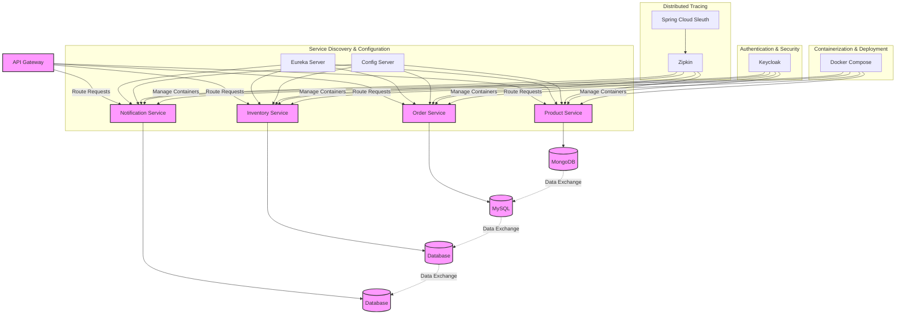
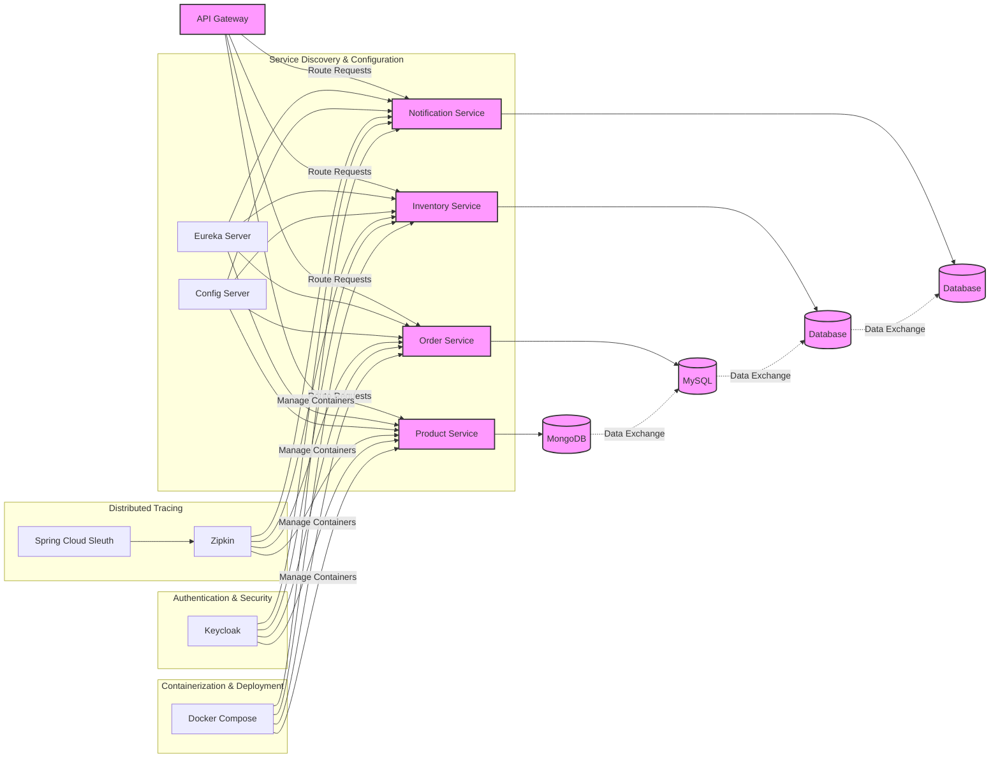
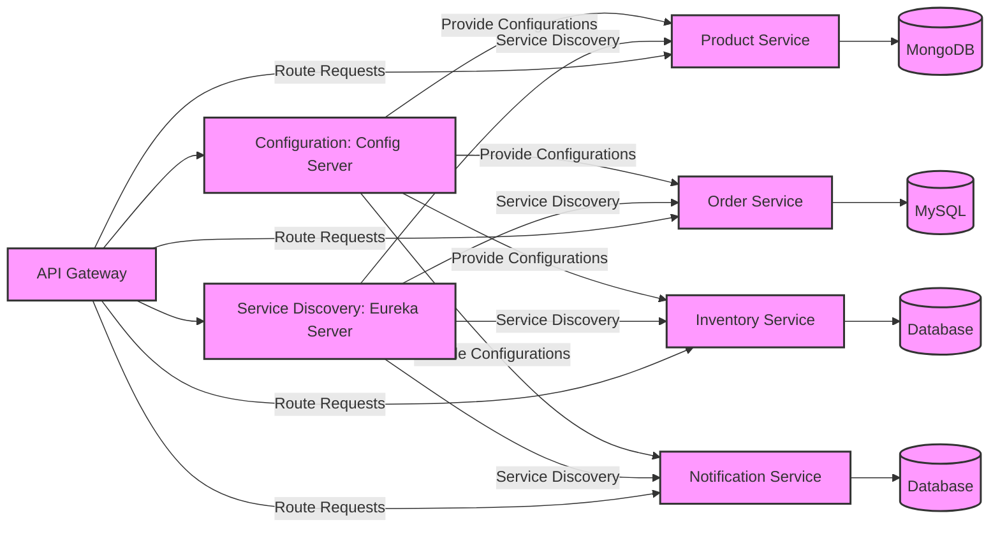
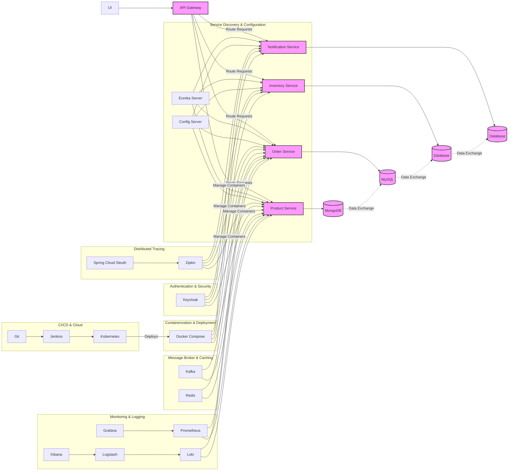
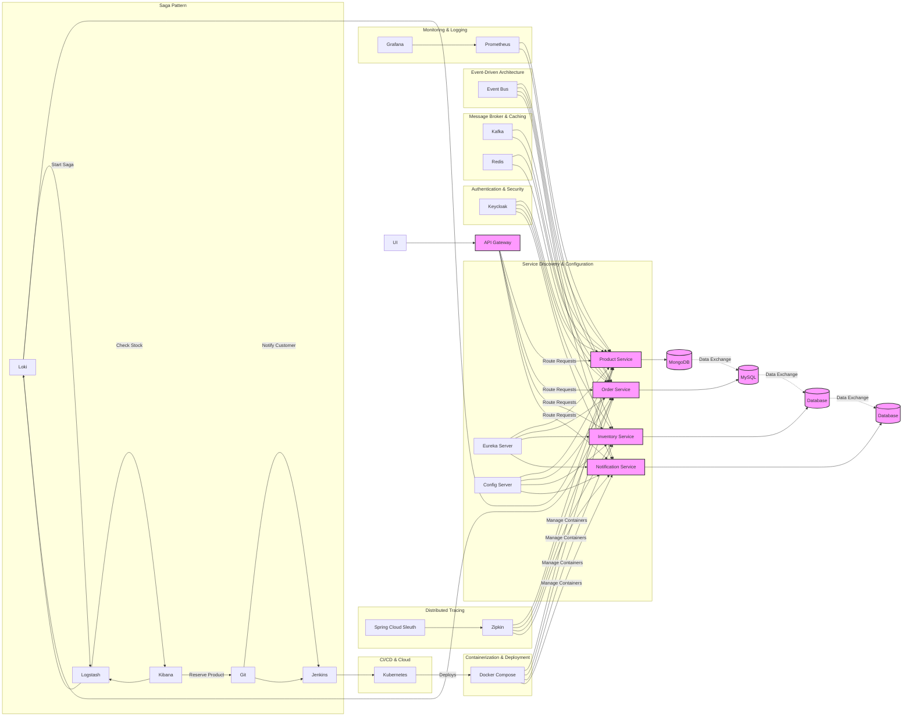
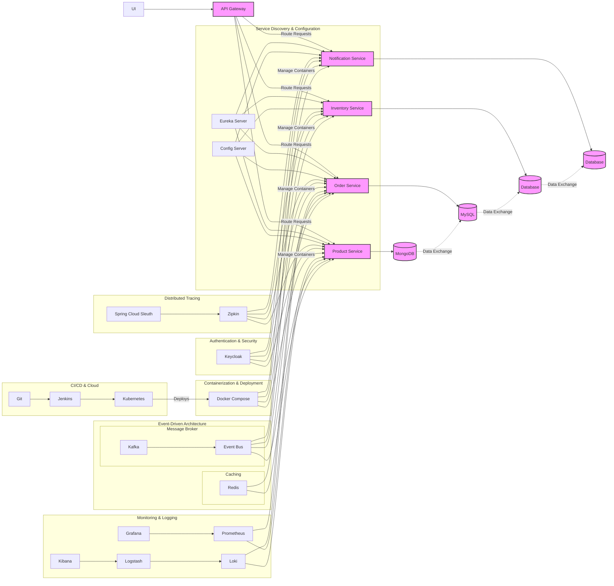
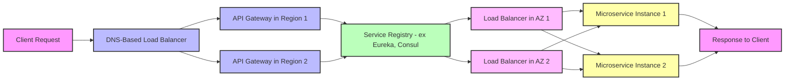
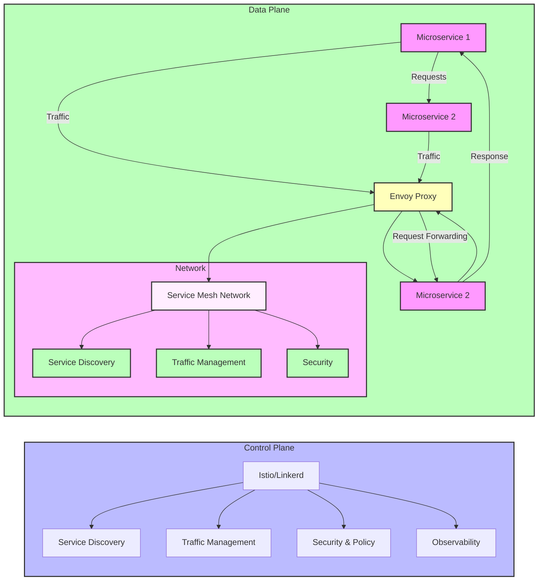
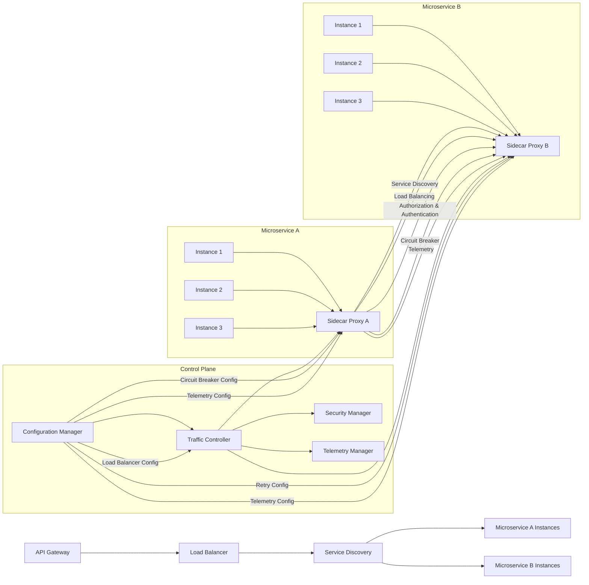

# 🎯 Key Takeaways for Quick Navigation

- 🚀 **Tutorial on Developing a Spring Boot Application**: Using microservices architecture, covering patterns like service discovery, configuration, and tracing.
- 📦 **Services**: Includes product, order, inventory, and notification, with communication being both synchronous and asynchronous.
- 🏗️ **Architecture**: Services include product service with MongoDB, order service with MySQL, managed through an API Gateway and services like Eureka, Config Server, Vault, Zipkin, etc.
- 📚 **Service Structure**: Each service follows a similar structure with controller, service, and repository layers for handling HTTP requests, business logic, and database interactions.
- 🧪 **Integration Testing**: Spring Boot facilitates integration tests with annotations like `@AutoConfigureMockMvc` and `MockMvc`.
- 🐳 **Testcontainers**: Supports writing JUnit tests by providing disposable instances of common software, enabling integration tests without relying on external infrastructure.
- 📦 **BOM for Testcontainers**: Allows managing versions in a centralized way.
- 🖥️ **Integration Tests**: Can be written using Testcontainers and JUnit.
- 📝 **Controller Testing**: Involves using `MockMvc` to simulate HTTP requests and verify responses.
- 🏗️ **IntelliJ Access**: Access both product and order services by opening the microservices parent folder.
- ⚙️ **OrderController Class**: Create with annotations for REST endpoints, request mapping, and post mapping for placing orders.
- 🧭 **Inventory Controller**: Create a method `isInStock` to check product availability.
- 🧩 **InventoryService Class**: Includes an `isInStock` method that queries the inventory repository.
- 📦 **Data Loading**: Load data into the database at application startup using a `CommandLineRunner` bean.
- 🚀 **Project Restructure**: Restructure into a single parent Maven project with modules for each service.
- 🛠️ **Production Setup**: Avoid using `ddl-auto` as `create-drop`; use `ddl-auto` as `none` and employ a database migration library like Liquibase or Flyway.
- 🔄 **Service Communication**: Should be synchronous or asynchronous.
- 🔄 **Synchronous Communication**: Use HTTP clients like RestTemplate or WebClient.
- 🔄 **Batch Data**: Collect relevant information and pass them as a list to the service instead of multiple HTTP calls.
- 🌐 **API Gateway**: Can route requests to the Discovery server using a specified path.
- 🔒 **Microservice Security**: Introduce an authentication mechanism like Keycloak.
- 🔑 **Keycloak Realms**: Use realms to group clients and interact with the authentication server.
- 🔍 **Distributed Tracing**: Helps track requests from start to finish, crucial for understanding performance issues.
- 🌐 **Spring Cloud Sleuth**: Generates trace IDs and Zipkin visualizes distributed tracing information.
- 🔎 **Tracing Integration**: Spring Cloud Sleuth with Zipkin enables tracing of request lifecycle across microservices.
- 🐋 **Docker Introduction**: For containerizing microservices, focusing on Dockerizing a Spring Boot project using a Dockerfile.
- 🏗️ **Dockerfile Optimization**: Improve with multi-stage builds to optimize image size and build times.
- 🐳 **Docker Image Optimization**: Reduces image size and improves efficiency using multi-stage builds.
- 🏗 **Jib**: A library from Google that builds containers from Java applications without using Dockerfiles or Docker itself.
- 🛠 **Maven Jib Plugin**: Configured in `pom.xml` to automate building and pushing Docker images to Docker Hub.
- 🔑 **Docker Hub Credentials**: Add authentication credentials to `settings.xml` in Maven to avoid unauthorized exceptions.
- 🚀 **Jib Command**: Use `mvn clean compile jib:build` to build and push Docker images for all projects in a Maven setup.
- 🐋 **Docker Compose**: Manage multi-container Docker applications, simplifying deployment and orchestration.
- 🗃 **External Services Setup**: Docker Compose allows setting up external services like databases (MySQL, PostgreSQL) and linking them to microservices.
- 📂 **Docker Volumes**: Persist data between container restarts, ensuring data integrity and availability.
- 🌐 **Service Startup Configuration**: Docker Compose can be configured to start services like Eureka server, API Gateway, and others, defining dependencies for proper startup sequence.
- 💻 **Service Management**: The Spring Boot microservices project uses Docker Compose to manage multiple services, each with its own Docker container.
- 🛠 **Configuration Flexibility**: Properties for each service can be overridden through the Docker Compose file.
- 🐳 **Container Communication**: Often requires specific port configurations, especially for services like Kafka.
- 📦 **Microservice Configuration**: Each microservice is configured with its dependencies (e.g., databases, Kafka, Zipkin, Discovery server) and exposed ports.
- 🚀 **Single Command Start**: Docker Compose can start all services with a single command, pulling required images and running containers in daemon mode.
- 🔒 **Keycloak Accessibility**: Accessing Keycloak services from Docker containers may require updating the host file for DNS resolution.
- 🚫 **JWT Claims Validation**: Errors can occur if the token's ISS (Issuer) claim does not match the expected value.
- 🖥 **Windows Host File**: May need editing for Docker containers to communicate with services like Keycloak using hostnames.
- 🔄 **Monitoring Setup**: Configure monitoring using Prometheus and Grafana; Spring Boot Actuator exposes metrics for Prometheus to visualize.
- 🔄 **Actuator Endpoints**: Enable Spring Boot Actuator endpoints and configure Prometheus to scrape metrics.
- 🐛 **Error Resolution**: Remove duplicate property key errors by eliminating unused wildcard actuator configuration.
- 🐳 **Monitoring with Docker Compose**: Use Docker Compose to set up Prometheus and Grafana for monitoring.
- 🛠 **Prometheus Configuration**: Configure Prometheus in Docker Compose to scrape metrics from Spring Boot applications.
- 📊 **Grafana Setup**: Set up Grafana in Docker Compose with user credentials for UI login.
- 📝 **Prometheus Configuration File**: Create to define scrape intervals and targets.

### Key Takeaways for Developing a Spring Boot Microservices Application

#### Architecture Overview
- **Microservices Structure**: Application includes product, order, inventory, and notification services.
- **Data Storage**: 
  - Product Service: MongoDB
  - Order Service: MySQL
- **Communication**: Utilizes both synchronous (HTTP) and asynchronous methods (e.g., message queues).

#### Essential Components
- **Service Discovery**: Eureka for locating services.
- **Configuration Management**: Spring Cloud Config Server for externalized configuration.
- **API Gateway**: Routes requests and manages communication.
- **Distributed Tracing**: Spring Cloud Sleuth and Zipkin for tracking requests across services.

#### Development Practices
- **Project Structure**: Organize as a parent Maven project with individual modules for each service.
- **Layered Architecture**:
  - **Controller Layer**: Handles HTTP requests.
  - **Service Layer**: Contains business logic.
  - **Repository Layer**: Manages database interactions.

#### Testing
- **Integration Testing**:
  - Use `@AutoConfigureMockMvc` and `MockMvc` for simulating HTTP requests.
  - Testcontainers for running tests with disposable instances of external services.

#### Docker and Containerization
- **Dockerization**: Create Dockerfiles for each service.
- **Multi-Stage Builds**: Optimize image size and build times.
- **Jib Plugin**: Build Docker images directly from Java projects without Dockerfile.

#### Deployment
- **Docker Compose**: Manage multi-container applications, defining services and dependencies.
- **Volume Management**: Use Docker volumes for data persistence.
- **Configuration Overrides**: Customize settings in Docker Compose.

#### Security and Monitoring
- **Authentication**: Use Keycloak for securing microservices.
- **Monitoring**:
  - Spring Boot Actuator to expose application metrics.
  - Prometheus and Grafana for monitoring and visualization.

#### Best Practices
- **Avoid `ddl-auto` in Production**: Use migration tools like Liquibase or Flyway instead.
- **Optimize Service Communication**: Collect and batch data to reduce HTTP calls.
- **Configuration Management**: Ensure properties can be overridden as needed in different environments.


Below diagram visually represents the architecture of the Spring Boot microservices application you described, including services like:-

- Product
- Order
- Inventory
- Notification

Along with key components like:-
- Eureka, 
- Config Server, 
- API Gateway and Docker.

## TOP to DOWN


## LEFT to RIGHT


### Diagram Explanation:

- **API Gateway**: Routes requests to different services (Product, Order, Inventory, Notification).
- **Product, Order, Inventory, and Notification Services**: Microservices handling their respective domain logic, connected to databases.
  - Product Service uses **MongoDB**.
  - Order Service uses **MySQL**.
  - Inventory and Notification services connect to their respective databases (could be SQL or NoSQL).
- **Eureka Server**: Provides service discovery, allowing services to register and discover each other.
- **Config Server**: Centralized configuration management, ensuring that all services use consistent configuration values.
- **Zipkin**: Distributed tracing visualization platform, with Spring Cloud Sleuth generating trace data for each service.
- **Keycloak**: Authentication and authorization service, ensuring secure access to the microservices.
- **Docker Compose**: Orchestrates container deployment, ensuring services are packaged, deployed, and managed in Docker containers.

### Interactions:
- Services communicate through HTTP (API Gateway to services), and databases exchange data (e.g., MongoDB to MySQL).
- Each service is registered with **Eureka Server** for discovery and queries configuration from **Config Server**.
- **Spring Cloud Sleuth** and **Zipkin** are used for monitoring and tracing the lifecycle of requests across services.
  
You can visualize this diagram using any Mermaid-compatible renderer to get a visual understanding of how these components interact in a microservices-based architecture.

Below is the **diagram** that reflects the order of execution and communication between the services, following the sequence we discussed:



In a **microservices architecture**, the order in which services are started can be crucial, especially when there are dependencies between services (such as service discovery, configuration management, and database connections). Based on the components and communication flow outlined in the diagram, here is the suggested startup sequence:

### 1. **Config Server** (Centralized Configuration Management)
   - **Reason**: The **Config Server** provides centralized configuration for all services. Other services (Product, Order, Inventory, and Notification) will depend on the configuration provided by the **Config Server**. It should be the first service to start up, so that it can provide configuration properties as soon as the other services need them.

- Provides configuration details to all the microservices (Product Service, Order Service, Inventory Service, Notification Service).

   - **Dependencies**: None (it's a foundational service).
   
   **Start first**: **Config Server**

---

### 2. **Eureka Server** (Service Discovery)
   - **Reason**: The **Eureka Server** enables **service discovery**, which allows the microservices (Product, Order, Inventory, Notification) to register themselves and discover each other. This ensures that each service can find and communicate with others in the system.
 - Allowing each microservice to register and discover each other. The services (Product, Order, Inventory, Notification) register themselves with **Eureka Server** for service discovery.
   - **Dependencies**: None (it functions independently, but other services will depend on it for discovery).
   
   **Start second**: **Eureka Server**

---

### 3. **API Gateway**
   - **Reason**: The **API Gateway** is the entry point for external requests. It routes incoming requests to the appropriate services (Product, Order, Inventory, Notification). For the API Gateway to function properly, it needs to be able to discover and route requests to the services. It depends on **Eureka Server** for service discovery and **Config Server** for configuration properties.
 - The entry point and routes incoming requests to the respective services (Product, Order, Inventory, Notification). It relies on **Eureka Server** for service discovery and **Config Server** for configuration properties.
   - **Dependencies**: **Eureka Server**, **Config Server**
   
   **Start third**: **API Gateway**

---

### 4. **Product Service**
   - **Reason**: The **Product Service** manages product-related data and depends on a **MongoDB** database. It also needs to register itself with **Eureka Server** for service discovery and get configuration from **Config Server**.
   - **Dependencies**: **Config Server**, **Eureka Server**, **MongoDB** (for database connectivity).
   
   **Start fourth**: **Product Service**

---

### 5. **Order Service**
   - **Reason**: The **Order Service** handles orders and communicates with **MySQL**. It also needs to register with **Eureka Server** and get configuration from **Config Server**. It may also depend on **Product Service** for product information.
   - **Dependencies**: **Config Server**, **Eureka Server**, **MySQL** (database), **Product Service** (for product data).
   
   **Start fifth**: **Order Service**

---

### 6. **Inventory Service**
   - **Reason**: The **Inventory Service** manages inventory levels and may depend on a **generic database** for data storage. It also needs to register with **Eureka Server** and fetch configuration from **Config Server**.
   - **Dependencies**: **Config Server**, **Eureka Server**, **Database** (for inventory data).
   
   **Start sixth**: **Inventory Service**

---

### 7. **Notification Service**
   - **Reason**: The **Notification Service** handles notifications (e.g., email or SMS) and communicates with a **generic database**. It also needs to register with **Eureka Server** and get configuration from **Config Server**.
   - **Dependencies**: **Config Server**, **Eureka Server**, **Database** (for notification data).
   
   **Start seventh**: **Notification Service**

---

### Summary of Startup Sequence:
1. **Config Server**
2. **Eureka Server**
3. **API Gateway**
4. **Product Service**
5. **Order Service**
6. **Inventory Service**
7. **Notification Service**

### Why This Sequence?
- The **Config Server** must be available first, as all services depend on it for configuration.
- **Eureka Server** should be started after the **Config Server** to allow services to register for discovery.
- The **API Gateway** must be started after **Eureka Server** to route requests to services discovered by Eureka.
- The other services (**Product**, **Order**, **Inventory**, **Notification**) should be started in sequence, as they depend on the **Config Server** and **Eureka Server** for configuration and service discovery.

**Product Service** communicates with **MongoDB**, **Order Service** communicates with **MySQL**, **Inventory Service** communicates with its respective database, and **Notification Service** communicates with its own database and follow, with each registering with **Eureka Server** and obtaining configurations from **Config Server**.

### Explanation of Communication Flow:
1. **API Gateway**:
    - The **API Gateway** routes incoming requests to the appropriate services (Product, Order, Inventory, and Notification).
    - The **API Gateway** also communicates with the **Eureka Server** for service discovery and the **Config Server** for configuration management.

2. **Eureka Server**:
    - The **Eureka Server** acts as a **service discovery** server where all services (Product, Order, Inventory, Notification) register themselves. This enables dynamic communication between microservices by allowing them to discover and communicate with each other.

3. **Config Server**:
    - The **Config Server** provides **centralized configuration management** to the services, ensuring that all microservices are using the same configuration. It can dynamically update the configuration across all services as needed.

4. **Service Communication**:
    - The services (Product, Order, Inventory, Notification) communicate with their respective databases (MongoDB, MySQL, etc.) for persistent storage. Additionally, the communication flow between these services is depicted using dashed arrows (for data exchange).

### Communication Between Components in a Microservices Architecture

In a typical **Spring Boot** microservices setup, **API Gateway**, **Eureka Server**, and **Config Server** communicate in specific ways to ensure a smooth and efficient workflow. Below is a breakdown of how each of these components interacts:

---

### **1. API Gateway Communication**

**API Gateway** serves as the entry point for all incoming requests from clients (users or systems). It handles routing requests to appropriate microservices. In a Spring Cloud ecosystem, the **API Gateway** (often implemented with **Spring Cloud Gateway** or **Zuul**) typically interacts with the following components:

#### **Flow of Communication**:
- **Incoming Requests**: 
  - Clients (such as a web or mobile application) send HTTP requests to the **API Gateway**.
  - The **API Gateway** is the only public-facing entity, so all external traffic comes through it.
  
- **Routing Requests**: 
  - The **API Gateway** inspects the request (based on URL, HTTP method, headers, etc.) and routes it to the appropriate service. For example, a request to `/products` would be routed to the **Product Service**, and `/orders` would be sent to the **Order Service**.
  - **Routing Decision**: The **API Gateway** can use static rules or more advanced routing mechanisms (such as using service names from Eureka) to decide how to route the request.

- **Integration with Eureka**:
  - The **API Gateway** uses **Eureka** for dynamic service discovery. Instead of hardcoding the service endpoints (e.g., `localhost:8080/products`), the **API Gateway** queries **Eureka Server** to get the location (host and port) of the target microservice (e.g., **Product Service**).
  - Eureka provides **client-side load balancing**, meaning if multiple instances of the same service are running, the **API Gateway** can route the request to any available instance.

#### **Key Tasks**:
- **Routing**: Directs requests to the correct microservice.
- **Load Balancing**: Ensures load is distributed among available service instances.
- **Security**: Can enforce authentication/authorization policies for incoming requests.

---

### **2. Eureka Server Communication**

**Eureka Server** is a **Service Discovery** server, helping microservices register themselves and discover other services dynamically. **Eureka** uses a **client-server** model where each microservice registers itself as a client with the **Eureka Server**.

#### **Flow of Communication**:
- **Service Registration**: 
  - When a microservice (e.g., **Product Service**) starts, it registers itself with the **Eureka Server**, providing its service name (e.g., `product-service`) and the URI (host + port).
  - Eureka keeps track of the available service instances and their health status.
  
- **Service Discovery**:
  - When a service (e.g., **API Gateway**) wants to make a request to another service (e.g., **Product Service**), it queries the **Eureka Server** to get the list of instances of the **Product Service**.
  - The **API Gateway** can then use this information to route requests to a specific service instance.

- **Health Checks**:
  - Eureka periodically performs health checks to ensure the registered services are available. If a service becomes unhealthy or stops responding, Eureka removes it from the registry.
  
- **Client-Side Load Balancing**:
  - With **Eureka** in place, client applications (like the **API Gateway**) can choose any healthy instance of the service. In case of multiple instances, the **API Gateway** can distribute traffic across instances to balance the load.

#### **Key Tasks**:
- **Service Registration**: Services register themselves with Eureka.
- **Service Discovery**: Other services query Eureka to find available instances.
- **Health Monitoring**: Eureka performs health checks on registered services.

---

### **3. Config Server Communication**

**Config Server** is used to centralize configuration management for microservices. It provides externalized configuration properties, allowing microservices to fetch configuration values at runtime. This is essential for dynamic configuration updates across the microservices without requiring restarts.

#### **Flow of Communication**:
- **Service Configuration**:
  - Each microservice retrieves configuration properties from the **Config Server** during startup or when needed. For example, the **Product Service** can fetch database connection properties, API keys, or other environment-specific values from the **Config Server**.
  
- **Dynamic Configuration Updates**:
  - **Spring Cloud Config** supports **dynamic updates**. If the configuration is changed in the **Config Server** (e.g., in a `Git` repository or a local file), the **Config Server** notifies the microservices about the changes.
  - The microservices can listen for configuration changes and automatically reload the updated configuration.

- **Integration with Spring Cloud**:
  - Microservices are configured to automatically fetch configuration from the **Config Server** using a URL like `http://config-server:8888/{application-name}/{profile}`.
  - The **Config Server** can pull configurations from various sources like Git, local file system, or even a database.
  
- **Security & Access**:
  - Access to the **Config Server** can be secured, ensuring that sensitive properties (like database credentials, API keys) are properly protected.
  
- **Use with Profiles**:
  - Microservices can specify which configuration profile they need (e.g., `dev`, `prod`) and get environment-specific configurations.

#### **Key Tasks**:
- **Centralized Configuration**: Provides a centralized configuration management system.
- **Dynamic Configuration**: Allows microservices to dynamically reload configuration properties.
- **Externalized Properties**: Stores configuration properties outside of code, ensuring flexibility and scalability.

---

### **Summary of Interactions:**

1. **API Gateway**:
   - Routes requests to microservices based on the request URL or headers.
   - Queries **Eureka** to discover the service instance and routes traffic accordingly.
   - Can fetch configuration from the **Config Server** for routing or other purposes.

2. **Eureka Server**:
   - Maintains a registry of available microservices.
   - Provides service discovery for the **API Gateway** and other services.
   - Monitors health and availability of services to ensure routing to live instances.

3. **Config Server**:
   - Centralizes and externalizes configuration management.
   - Supplies configuration data to microservices at runtime, allowing dynamic changes.
   - Ensures that services can fetch and reload their configuration automatically.

---

### **Flow Example**: API Gateway to Product Service

1. **Client Request**:
   - A client (user) makes a request to `https://api.example.com/products`.

2. **API Gateway**:
   - The **API Gateway** intercepts the request.
   - It queries **Eureka Server** to find the available instance of **Product Service**.
   
3. **Eureka Server**:
   - The **API Gateway** gets the URL of a running instance of **Product Service**.
   
4. **Config Server** (if needed):
   - The **API Gateway** or the **Product Service** might query the **Config Server** for any relevant configurations (e.g., rate limits, API keys).

5. **Product Service**:
   - The **API Gateway** forwards the request to the **Product Service**, which processes the request and sends a response back.

6. **Response**:
   - The **API Gateway** returns the response to the client.

This communication flow ensures **centralized configuration management**, **service discovery**, and **request routing** in a scalable and dynamic microservices environment.

### Additional Considerations:
1. **Databases** (MongoDB, MySQL, etc.) should be up and running before their respective services (Product, Order, etc.) start, but since databases are generally not part of the microservices themselves, they should be provisioned and available before starting the services.
   
2. **Docker Containers**: If using Docker Compose for containerization, the containers should be defined with dependency order in the **docker-compose.yml** file to ensure the services start in the right order.

3. **Fault Tolerance**: Consider adding retry mechanisms in case services take time to start, especially **Eureka Server** or **Config Server**.

This order ensures that all dependencies are correctly satisfied, allowing smooth communication between services.

### **Diagram Explanation**:

1. **API Gateway**:
   - The API Gateway is the entry point for external requests. It routes incoming requests to the appropriate service (Product, Order, Inventory, and Notification).
   
2. **Eureka Server**:
   - Eureka Server is a **Service Discovery** server. All microservices register themselves here, allowing them to discover and communicate with each other.

3. **Config Server**:
   - The Config Server is used to centralize external configuration properties for the microservices, enabling dynamic updates and scaling.
   
4. **Product Service**:
   - The **Product Service** handles product-related operations and communicates with **MongoDB** for data storage.

5. **Order Service**:
   - The **Order Service** is responsible for managing orders, and it connects to **MySQL** for data persistence.

6. **Inventory Service**:
   - The **Inventory Service** is responsible for managing inventory data, storing information in a database.

7. **Notification Service**:
   - The **Notification Service** handles communication and notifications, with its own database for storing notification-related data.

### **Additional Notes**:
- **Eureka Server** and **Config Server** are shared among all the microservices, ensuring they can dynamically adjust to configuration changes and find each other at runtime.
- Each service connects to its respective database (**MongoDB**, **MySQL**, etc.) for persistence.

This diagram provides a high-level overview of the communication between the microservices and their components in a typical Spring Boot microservices architecture.

---

Here's an updated version of the Mermaid diagram, incorporating the requested components like **UI**, **Kafka**, **Redis**, **Grafana**, **Prometheus**, **Loki**, **Logstash**, **Kibana**, **Cloud**, **Git**, **Jenkins**, and **Kubernetes**.



### New Components:
- **UI**: Represents the user interface which communicates with the **API Gateway** to route requests to the microservices.
- **Kafka**: Acts as a message broker to enable asynchronous communication between services (Product and Order).
- **Redis**: A caching layer for quick data retrieval in services like Product and Order.
- **Prometheus**: Collects and scrapes metrics from Spring Boot services for monitoring.
- **Grafana**: Visualizes metrics collected by Prometheus, providing dashboards for monitoring service health.
- **Loki**: For log aggregation, collecting logs from services like Product and Order.
- **Logstash**: Processes and forwards logs from Loki to Kibana for visualization.
- **Kibana**: Provides a web interface for searching, viewing, and analyzing log data stored in Loki.
- **CI/CD with Git, Jenkins, and Kubernetes**:
  - **Git**: Code repository.
  - **Jenkins**: Continuous integration tool.
  - **Kubernetes**: Orchestrates containers, ensuring the deployment and scaling of services.
- **Cloud**: Represents cloud-based infrastructure (e.g., AWS, GCP, Azure) where services are deployed.

### Interactions:
- **UI** sends requests to the **API Gateway**.
- **Kafka** handles asynchronous communication between **Product Service** and **Order Service**.
- **Redis** is used for caching, improving response times for the Product and Order services.
- **Prometheus** collects metrics from services like **Product Service** and **Order Service**, and **Grafana** visualizes them.
- Logs are aggregated by **Loki**, processed by **Logstash**, and visualized in **Kibana** for monitoring and troubleshooting.
- **Jenkins** integrates with **Git** for CI/CD, deploying microservices to **Kubernetes**, which manages the containers.

This comprehensive diagram covers the full stack, from service communication to monitoring, logging, and CI/CD, ensuring a robust, scalable, and observable microservices architecture.

Here's the updated **diagram** with the added **Saga Pattern** and **Event-Driven Architecture**, along with the separation of components like **Message Broker & Caching**, **Distributed Tracing**, **Monitoring & Logging**, **CI/CD & Cloud**, and **Containerization & Deployment**.



### Key Additions:

1. **Event-Driven Architecture**:
   - **Event Bus**: A central hub through which services communicate asynchronously via events. The services (Product, Order, Inventory, Notification) all publish and consume events via this bus.
   
2. **Saga Pattern**:
   - A **Saga** is a sequence of local transactions where each service involved performs a part of the transaction and publishes events to trigger the next step. The example includes the following services:
     - **Order Service** starts the saga.
     - **Inventory Service** checks stock.
     - **Product Service** reserves the product.
     - **Notification Service** sends notifications.
     - **Order Service** finalizes the order.

3. **Message Broker & Caching**:
   - **Kafka**: Used for **asynchronous messaging** between services, enabling decoupled communication (Product, Order services).
   - **Redis**: Caching layer for improving performance and response times for frequently accessed data.

4. **Distributed Tracing**:
   - **Zipkin**: Collects and visualizes traces for tracking requests across multiple services.
   - **Spring Cloud Sleuth**: Generates trace and span IDs for requests.

5. **Monitoring & Logging**:
   - **Prometheus**: Scrapes metrics for monitoring the health and performance of microservices.
   - **Grafana**: Visualizes metrics collected by Prometheus.
   - **Loki**: Aggregates logs from microservices.
   - **Logstash**: Processes logs before they are sent to **Kibana** for visualization.

6. **CI/CD & Cloud**:
   - **Git**: Source code repository.
   - **Jenkins**: Continuous integration and deployment (CI/CD) pipeline.
   - **Kubernetes**: Orchestrates deployment and scaling of containers.
   - **Docker Compose**: Manages the containers for all microservices.

### Flow Explanation:

- **Event-Driven**: Services (Product, Order, Inventory, Notification) publish and subscribe to events on the **Event Bus**. This creates a decoupled, asynchronous communication flow.
- **Saga Pattern**: Manages distributed transactions by coordinating services (Order → Inventory → Product → Notification) through event-based interactions.
- **Kafka**: Enables services to communicate asynchronously and decouple them. It's used for event-driven architecture and messaging between **Order Service** and **Product Service**.
- **Redis**: Caches frequently requested data to speed up the **Product Service** and **Order Service**.
- **CI/CD**: Changes pushed to **Git** trigger the **Jenkins** pipeline, which deploys the application to **Kubernetes** using **Docker Compose**.
- **Monitoring & Logging**: **Prometheus** collects metrics, which are visualized using **Grafana**. Logs from **Product** and **Order Services** are collected by **Loki**, processed by **Logstash**, and visualized in **Kibana**.

This comprehensive diagram now includes all the requested components and shows how they interact in the system.

Here’s a revised version of your **Mermaid flow diagram**, ensuring the correct interactions and logical flow for the microservices architecture:

### Correct Flow Explanation

- **API Gateway**: The entry point for all client requests, routing them to the appropriate service.
- **Service Discovery & Configuration**: The **Eureka Server** helps services discover each other, and the **Config Server** manages external configurations.
- **Authentication & Security**: **Keycloak** ensures that each service is secured and that all communications are authenticated.
- **Distributed Tracing**: **Spring Cloud Sleuth** and **Zipkin** track and visualize the flow of requests across services.
- **Message Broker & Caching**: **Kafka** and **Redis** are used for asynchronous communication and caching, respectively, to improve performance and decouple services.
- **Event-Driven Architecture**: An **Event Bus** allows for communication via events, enabling loose coupling and asynchronous processing.
- **Saga Pattern**: **Saga** ensures that distributed transactions are properly coordinated across services, with failure management.
- **Monitoring & Logging**: **Prometheus** collects metrics, **Grafana** visualizes the metrics, and **Loki**, **Logstash**, and **Kibana** are used for logging.
- **CI/CD & Cloud**: **Git** (for version control), **Jenkins** (for continuous integration), and **Kubernetes** (for orchestration) handle the deployment and scaling of services.
- **Containerization & Deployment**: **Docker Compose** manages and orchestrates the microservices containers.

### Updated Diagram:


### Key Corrections and Flow Improvements:

1. **Separation of Concerns**:
   - **Service Discovery & Configuration**: **Eureka Server** and **Config Server** are only responsible for service registration, discovery, and configuration.
   - **Distributed Tracing**: **Zipkin** and **Spring Cloud Sleuth** are dedicated to tracing service requests and visualizing the trace data.
   - **Message Broker & Caching**: **Kafka** and **Redis** handle messaging and caching asynchronously.
   - **Event-Driven Architecture**: An **Event Bus** drives communication between services, enabling them to react to events without tight coupling.

2. **Saga Pattern**:
   - Ensures that distributed transactions (e.g., order processing) are handled in a coordinated way. Services like **Order Service**, **Inventory Service**, **Product Service**, and **Notification Service** interact with each other to complete the saga.

3. **Containerization & Deployment**:
   - **Docker Compose** is used to manage the deployment of all services. The connection between **Kubernetes** and **Docker Compose** ensures that the services are orchestrated and deployed properly.

4. **CI/CD & Cloud**:
   - **Git**, **Jenkins**, and **Kubernetes** form the CI/CD pipeline and orchestrate the deployment of services.

5. **Monitoring & Logging**:
   - **Prometheus** collects and exposes metrics from microservices for monitoring.
   - **Grafana** visualizes the metrics, while **Loki**, **Logstash**, and **Kibana** are used for log aggregation and visualization.

6. **UI**: The **UI** communicates with the **API Gateway** to access the services, acting as the frontend for users.

---

### Final Notes:
- **Data exchange** links are represented by dashed lines, showing asynchronous data flow between services (e.g., MongoDB to MySQL, or Order to Inventory).
- **Interaction Flow**: The diagram illustrates how services communicate and are deployed, starting from the **UI** to the **API Gateway**, then to the services and their underlying infrastructure.

This flow provides a clearer picture of the microservices architecture and the relationships between components. Let me know if you'd like further refinements!

Thank you for your patience! I understand you're asking for clarifications on why certain components are placed in the same subgraphs or separated in your **Mermaid flow diagram**, as well as the issue with Docker and the CI/CD pipeline placement.

Let's break this down:

---

### **1. Message Broker & Caching Subgraph** (Kafka & Redis together):

**Reason for placement**:  
- **Kafka** and **Redis** are closely related in the sense that they both facilitate **asynchronous communication**, though they serve different purposes:
  - **Kafka**: Primarily a message broker for event-driven architecture, managing streams of data (often used for decoupling services).
  - **Redis**: Primarily used as an in-memory cache, often for storing temporary data to improve performance.
  
By grouping them together under **Message Broker & Caching**, you're showing that both are middleware solutions for handling communication between microservices but addressing different needs:
- Kafka for messaging (typically event-driven communication).
- Redis for caching and sometimes pub/sub messaging.

### **2. Event-Driven Architecture Subgraph (Event Bus Separate from Kafka)**:

**Reason for separation from Kafka**:  
- The **Event Bus** in this subgraph is used to represent **Event-Driven Architecture**, where microservices publish and listen to events, and this could be implemented by various technologies, such as **Kafka**, **RabbitMQ**, or **ActiveMQ**.
- **Kafka** can be considered as a specific tool used to implement this pattern, but the **Event Bus** is a higher-level abstraction. So, if you're planning to support different types of event-driven messaging, it's better to keep the **Event Bus** abstraction separate from the specific implementation of Kafka.

If you’re using Kafka as your event bus, then Kafka could be part of this, but for clarity, it might be better to abstract the **Event Bus** separately to show that the system may evolve to use different messaging systems or protocols.

---

### **3. CI/CD & Cloud without Docker**:
```mermaid
subgraph "CI/CD & Cloud"
  X[Git] --> Y[Jenkins]
  Y[Jenkins] --> Z[Kubernetes]
  Z[Kubernetes] -->|Deploys| O
end
```

**Why it doesn’t include Docker**:  
- **CI/CD** (Continuous Integration and Continuous Deployment) is focused on the process of automating the build, test, and deployment pipelines.
- **Git** (Version Control), **Jenkins** (CI Server), and **Kubernetes** (Orchestration) are key components of the CI/CD pipeline, while **Docker** is related to containerization.
  
In this case, the **Docker Compose** subgraph, which is about **containerization and deployment**, is logically separate because Docker handles how services are packaged into containers, while **CI/CD** manages how those containers (and code) get built, tested, and deployed. Docker would be integrated into the **Kubernetes** (cloud) deployment stage indirectly, but it's not part of the direct flow of CI/CD.

---

### **4. Docker Subgraph (Containerization & Deployment)**:

**Docker Compose placement**:  
- **Docker Compose** is responsible for managing the containers that hold the microservices.
- The subgraph focuses on orchestrating how all the services (Product, Order, Inventory, Notification) run in containers during development or testing.

However, in a **production environment**, services might be orchestrated using **Kubernetes** rather than **Docker Compose**. But in a local development environment or testing environment, **Docker Compose** is often sufficient.

This is why Docker Compose is separate from the CI/CD pipeline. The **CI/CD pipeline** automates code delivery (build, test, deploy), while **Docker Compose** focuses more on local deployment and container orchestration.

---

### **Updated Explanation of the Complete Flow:**

- **Message Broker & Caching**: You group **Kafka** and **Redis** together because they both handle asynchronous communication, though with different functions. Kafka handles messaging (pub/sub, event-driven), while Redis acts as an in-memory cache for faster access to data.
  
- **Event-Driven Architecture**: The **Event Bus** is a logical abstraction for event-driven communication between services, potentially implemented using Kafka, RabbitMQ, or similar technologies. It’s not strictly tied to Kafka but represents the broader concept of decoupling services through events.

- **CI/CD & Cloud**: The **CI/CD pipeline** (Git, Jenkins, Kubernetes) handles the flow of code from development to production. **Docker** is part of the deployment process but not directly part of the CI/CD flow in this diagram.

- **Containerization & Deployment**: **Docker Compose** is specifically for orchestrating services locally (development/test environments), while **Kubernetes** would be used in production to scale and manage services. 

---

### **Refined Diagram**:

Here's the refined flow considering all points:


### Summary:

- **Message Broker & Caching**: Keeps Kafka (messaging) and Redis (caching) together for efficiency.
- **Event-Driven Architecture**: Keeps **Event Bus** abstraction separate from Kafka (allows flexibility in messaging technology choice).
- **CI/CD & Cloud**: Separates **Docker Compose** from CI/CD flow to focus on orchestration tools for deployment.
- **Containerization**: Uses **Docker Compose** for local container management but also shows **Kubernetes** for cloud-based orchestration.

Certainly! To clarify, **Event-Driven Architecture** is a pattern that decouples services by allowing them to communicate through events, where services publish and consume events asynchronously. In your case, components like Kafka, Redis, and possibly an **Event Bus** are used to facilitate this communication.

### Separate **Event-Driven Architecture**:

Here's how you can represent **Event-Driven Architecture** separately from the rest of the system in your **diagram**.

### Updated Diagram



### Breakdown:

#### **Event-Driven Architecture** (now placed separately):
- **Event Bus** is shown as the central component that allows services to communicate asynchronously.
- **Kafka** is used as the **Message Broker** within the Event Bus, connecting all services for messaging.
- **Redis** is shown as part of the **Caching** mechanism, handling temporary data storage and also serving as a pub/sub message broker for certain events.
  
This **separation** highlights that the **Event-Driven Architecture** is more than just Kafka or Redis; it's a pattern that involves using an event bus (like Kafka, RabbitMQ, etc.) to communicate between services in a decoupled way.

### **Key Points in This Setup:**
1. **API Gateway** routes all requests to the respective services.
2. **Service Discovery & Configuration** (Eureka & Config Server) helps the services to discover each other and maintain proper configurations.
3. **Distributed Tracing** with **Zipkin** and **Spring Cloud Sleuth** helps monitor request lifecycles across services.
4. **Security** is managed with **Keycloak**, providing authentication.
5. **Containerization** is handled by **Docker Compose**, with potential deployment to **Kubernetes**.
6. **Event-Driven Architecture** with **Kafka** (Message Broker) and **Redis** (Caching) facilitates communication between services via events asynchronously.

### **Why Separate Event-Driven Architecture?**
- **Kafka** and **Redis** have very different roles compared to the synchronous communication handled by the **API Gateway**. Grouping them under **Event-Driven Architecture** gives you a clear separation of concerns: 
  - Kafka is a message broker for decoupling microservices via event streams.
  - Redis is used for caching and event-driven messaging (e.g., pub/sub).
  
This way, **Event-Driven Architecture** is focused on handling asynchronous communication and decoupling the microservices, while the rest of the system handles synchronous, RESTful communication (via the API Gateway) and service management.

This structure helps clarify the relationship between synchronous (API Gateway) and asynchronous (Event Bus/Kafka/Redis) communication in a microservice ecosystem.

---

A comprehensive overview of API Gateways, focusing on their function, capabilities, and how they compare to load balancers. Here's a breakdown of the key concepts covered:

### What is an API Gateway?
- **API Gateway** serves as a **single entry point** for client requests and routes them to the appropriate backend microservices based on the API endpoint.
- It decides which microservice (e.g., invoice, order, or sales) should handle the request, unlike a **load balancer**, which only distributes traffic across multiple instances of a service.

### Difference Between API Gateway and Load Balancer:
- **API Gateway**: Routes requests to the appropriate microservice based on the URL structure and handles much more logic.
- **Load Balancer**: Distributes requests evenly to multiple instances of a single microservice, but doesn't understand the specifics of the API call.

### Capabilities of an API Gateway:
1. **API Composition**:
   - Combines multiple API calls into a single response. For example, an e-commerce platform might show different details depending on the client (mobile or desktop).
   - The API Gateway can handle device-specific queries, reducing the client's complexity.
   
2. **Authentication**:
   - API Gateway can authenticate requests by verifying tokens (e.g., OAuth 2.0) before routing the request to the backend.

3. **Rate Limiting**:
   - **Burst Limiting**: Defines the maximum number of concurrent requests the API Gateway can handle during peak times.
   - **Throttling**: Limits the number of requests an individual user or application can make to a particular API within a set time frame.
   - **API Queuing**: Holds requests that cannot be immediately processed, helping to handle traffic surges.

4. **Service Discovery**:
   - API Gateway interacts with a **service discovery** mechanism to get the latest location (IP and port) of backend microservices.
   - It helps in managing dynamic scaling of microservices in distributed environments.

5. **Request/Response Transformation and Caching**:
   - API Gateway can modify the incoming request or outgoing response to match the required format.
   - It can also cache responses to improve performance by avoiding unnecessary calls to microservices.

### Handling Millions of Requests per Second:
- The video explains how API Gateways can handle millions of requests per second by leveraging **multiple regions and availability zones**.
- **Regions and Availability Zones**: In a cloud infrastructure, regions consist of multiple availability zones (data centers), and requests can be distributed across these zones for fault tolerance and high availability.
- **Load Balancing and Traffic Distribution**: Within each region, load balancers distribute traffic to multiple instances of a microservice. The API Gateway coordinates which region and availability zone should handle the request.
  
### Key Points on Handling High Traffic:
- **Regions** (e.g., Mumbai, Chennai) can have multiple **Availability Zones** (AZ), each with its own data center.
- **API Gateway** and **Load Balancers** are distributed across multiple regions to avoid a single point of failure. If a region or availability zone fails, traffic is rerouted to another healthy zone or region.

### Conclusion:
The **API Gateway** acts as a smart intermediary that handles complex routing, authentication, rate limiting, and service discovery. While it is often described as a "single entry point," in reality, it is distributed across regions and availability zones to ensure high availability and scalability. 

If you're designing an API Gateway system to handle millions of requests per second, this setup ensures there is no single point of failure and that the system can dynamically scale to meet traffic demands.

---

Handling millions of requests per second in a Spring Boot microservice architecture requires careful design, especially when dealing with high traffic, fault tolerance, and availability. Let's break it down and then provide an example code/configuration for implementing such a solution with Spring Boot, API Gateway, Load Balancers, and a distributed architecture across multiple regions and availability zones.

### 1. **Architecture Overview**
   - **API Gateway**: An entry point for all client requests. It is responsible for routing requests to the appropriate microservice instances and can be distributed across multiple regions.
   - **Microservices**: These are Spring Boot applications that are scaled horizontally. They are deployed across multiple Availability Zones (AZs) within a region.
   - **Load Balancers**: Within each region, load balancers distribute traffic across multiple instances of the microservices.
   - **Regions**: These are isolated locations within a cloud provider (e.g., AWS, Azure, GCP) with multiple availability zones (AZs).
   - **Fault Tolerance and High Availability**: Traffic is distributed across multiple regions and AZs. If one region or AZ fails, traffic is rerouted to healthy instances.

### 2. **Key Points for High Traffic Handling**
   - **Horizontal Scaling**: The Spring Boot microservices should be horizontally scalable so that as traffic increases, new instances can be spun up dynamically.
   - **API Gateway**: Use API Gateway to route requests intelligently. The gateway can direct traffic based on load, health checks, or specific logic (e.g., by region).
   - **Elastic Load Balancing**: The cloud provider’s load balancer can automatically distribute traffic to microservice instances.
   - **Caching**: Use caching (e.g., Redis) to store frequently accessed data and reduce load on backend systems.

---

### 3. **Spring Boot Configuration Example**
Below is an example configuration for a Spring Boot microservice, API Gateway, and Load Balancer setup in a multi-region, multi-AZ environment.

#### 3.1 Spring Boot Microservice (`application.properties`)
Each microservice instance needs to be aware of the environment (region, availability zone) it is running in.

```properties
# application.properties

# Server configuration (unique ports for each instance in different zones)
server.port=8080

# Environment-specific properties
cloud.region=us-east-1
cloud.availability-zone=us-east-1a

# Enable Eureka Client if using a service discovery platform
eureka.client.serviceUrl.defaultZone=http://eureka-server:8761/eureka/

# Configure caching (e.g., Redis)
spring.cache.type=redis
spring.redis.host=localhost
spring.redis.port=6379

# Set the Spring profiles for different environments
spring.profiles.active=prod
```

#### 3.2 API Gateway Configuration (Spring Cloud Gateway)
Spring Cloud Gateway can be used as the API Gateway. It can route requests to different microservices and distribute them across regions.

##### Maven Dependency (`pom.xml`)
```xml
<dependency>
    <groupId>org.springframework.cloud</groupId>
    <artifactId>spring-cloud-starter-gateway</artifactId>
</dependency>
<dependency>
    <groupId>org.springframework.cloud</groupId>
    <artifactId>spring-cloud-starter-eureka</artifactId>
</dependency>
```

##### API Gateway Routing Configuration (`application.yml`)
In the API Gateway, routes are configured to forward requests to different regions.

```yaml
spring:
  cloud:
    gateway:
      routes:
        - id: microservice-1
          uri: lb://microservice-name # Use load-balanced service name
          predicates:
            - Path=/service1/**
          filters:
            - AddRequestHeader=X-Region, ${cloud.region}
        - id: microservice-2
          uri: lb://microservice-name
          predicates:
            - Path=/service2/**
          filters:
            - AddRequestHeader=X-Region, ${cloud.region}
          
# Enable discovery (Eureka)
eureka:
  client:
    serviceUrl:
      defaultZone: http://eureka-server:8761/eureka/
```

Here, we use `lb://microservice-name`, which tells Spring Cloud Gateway to use the load balancer to route the request to available microservice instances. The `AddRequestHeader` filter adds metadata (like region) to the request.

#### 3.3 Load Balancer Configuration (AWS Elastic Load Balancer Example)
For cloud infrastructure, you can use the cloud provider’s load balancing service (e.g., AWS ELB, GCP Load Balancer).

In AWS, an Application Load Balancer (ALB) is typically used, and it can route traffic to different Availability Zones and EC2 instances running your microservices. Ensure that your EC2 instances are part of an Auto Scaling Group, so that they scale horizontally based on traffic load.

- **ALB**: Handles routing based on HTTP requests. It can be configured to balance traffic across EC2 instances deployed across multiple Availability Zones.

##### Example Setup:
1. Create a **VPC** with multiple Availability Zones.
2. Set up **EC2 instances** in multiple AZs.
3. Configure an **Auto Scaling Group** to automatically scale the number of EC2 instances based on load.
4. Set up an **Application Load Balancer** that distributes traffic across the EC2 instances.

#### 3.4 Service Discovery (Eureka)
If you use Spring Cloud for service discovery, Eureka can automatically register the microservice instances, and the API Gateway can dynamically discover the available instances in each region.

##### Maven Dependency for Eureka Client (`pom.xml`)
```xml
<dependency>
    <groupId>org.springframework.cloud</groupId>
    <artifactId>spring-cloud-starter-eureka</artifactId>
</dependency>
```

##### Eureka Client Configuration (`application.properties`)
```properties
# Eureka Client settings
eureka.client.serviceUrl.defaultZone=http://eureka-server:8761/eureka/

# Enable Eureka Client in production
spring.profiles.active=prod
```

#### 3.5 Horizontal Scaling of Microservices (Kubernetes Example)
For cloud-native setups, Kubernetes can be used to manage the microservices in different regions and Availability Zones. You can deploy each microservice in different regions, and Kubernetes will ensure that traffic is routed to healthy pods, and new pods are spawned when needed.

##### Kubernetes Deployment Example
```yaml
apiVersion: apps/v1
kind: Deployment
metadata:
  name: microservice-1
spec:
  replicas: 3  # Scale horizontally across AZs
  selector:
    matchLabels:
      app: microservice-1
  template:
    metadata:
      labels:
        app: microservice-1
    spec:
      containers:
        - name: microservice-1
          image: myrepo/microservice-1:latest
          ports:
            - containerPort: 8080
```

In this example, the `replicas: 3` setting ensures that three instances of the microservice are running in the cluster. Kubernetes will schedule them across different availability zones to provide high availability.

---

### 4. **Handling Millions of Requests**
To scale to handle millions of requests per second, consider the following:

- **Auto-scaling**: Use an auto-scaling group (AWS EC2, Kubernetes, or another platform) to automatically spin up new instances as load increases.
- **Rate Limiting**: Implement rate limiting in the API Gateway to prevent abuse and protect your microservices.
- **Caching**: Use caching systems (e.g., Redis, Memcached) for high-frequency data to reduce load on the microservices.
- **Content Delivery Networks (CDNs)**: Use CDNs to offload static content serving, reducing the load on the backend.

### 5. **Summary**
- Use **Spring Cloud Gateway** for API routing and load balancing across microservices.
- **Eureka** provides service discovery, allowing microservices to dynamically register and discover instances.
- **Elastic Load Balancers** in cloud environments help distribute traffic across multiple availability zones and regions.
- Ensure your system is horizontally scalable (e.g., using Kubernetes or EC2 Auto Scaling).
- Use caching and rate limiting for high-traffic scenarios.

This architecture ensures that your Spring Boot microservices are highly available, scalable, and able to handle millions of requests per second by distributing traffic across regions and availability zones.

---

### API Gateway vs Load Balancer in Microservice Architecture

To clarify the distinction between **API Gateways** and **Load Balancers** in the context of high-traffic microservices, let’s go through both concepts with an example, followed by their capabilities and how they help scale and handle millions of requests per second.

---

### 1. **API Gateway vs Load Balancer: Key Differences**
- **Load Balancer**: A load balancer is used to distribute traffic between multiple instances of the same service. It doesn’t inspect the actual content or the API endpoint but focuses on routing traffic based on things like health checks, session persistence, and load distribution.
    - **Example**: You have an **Invoice Service** with multiple instances (e.g., `Invoice Service 1`, `Invoice Service 2`). The load balancer will distribute incoming requests between these instances based on their health and load metrics.

- **API Gateway**: The API Gateway serves as a smart entry point into the microservice ecosystem. It inspects the request, routes it to the appropriate microservice (based on the API endpoint), and can perform additional tasks like authentication, rate-limiting, API composition, and more.
    - **Example**: If a user makes a request to `/api/invoice`, the API Gateway routes it to the **Invoice Service**. If the user requests `/api/order`, the API Gateway routes it to the **Order Service**. It can also manage more advanced features like handling different behaviors for mobile and desktop clients.

#### Example Scenario:
- **Load Balancer**: Responsible for distributing requests for a specific microservice across its various instances.
- **API Gateway**: Responsible for intelligently routing requests to the correct microservice based on the URL (like `/invoice` vs `/order`).

---

### 2. **Capabilities of an API Gateway**

API Gateways have several advanced capabilities beyond simple routing, making them crucial for handling millions of requests in large-scale systems:

- **API Composition**: The API Gateway can aggregate results from multiple microservices and return a single response. This is especially useful when dealing with complex requests from clients (e.g., mobile or web).
    - **Example**: If a client requests the order summary, the API Gateway might call the **Product Service** and **Invoice Service**, combine the responses, and return a single response to the client.

- **Authentication & Authorization**: The API Gateway can manage authentication using tokens (e.g., OAuth2). It validates the client’s request before forwarding it to the backend services.
    - **Example**: The API Gateway can check if a JWT token is valid before allowing the request to be routed to the appropriate microservice.

- **Rate Limiting & Throttling**: The API Gateway can manage the number of requests per user or client to prevent abuse and ensure fair usage.
    - **Example**: An API Gateway might limit an IP address to 1000 requests per minute to prevent overload.

- **Service Discovery**: Microservices often scale dynamically (instances scale up or down). The API Gateway integrates with service discovery tools (e.g., Consul, Eureka) to discover the right instance of a microservice.
    - **Example**: The API Gateway queries the service registry to know where to route the request for a specific microservice.

- **Request/Response Transformation**: The API Gateway can modify incoming requests and outgoing responses, ensuring the system remains flexible and adaptable to changes in client needs.
    - **Example**: The API Gateway can transform a request body from JSON to XML or vice versa based on the client’s requirements.

---

### 3. **Scaling to Handle Millions of Requests per Second**

To handle millions of requests per second, especially in cloud environments, we need to distribute traffic efficiently across multiple regions and availability zones. Here’s how we can achieve this:

#### **Regions and Availability Zones**
- **Regions**: A region is a geographical location containing multiple data centers (Availability Zones). For example, AWS has a region in Mumbai (`ap-south-1`), which contains multiple Availability Zones (e.g., `az-1`, `az-2`).
- **Availability Zones (AZ)**: These are isolated data centers within a region. The AZs are used to ensure high availability and fault tolerance by isolating resources.

#### **Multi-Region, Multi-AZ Architecture**

- **API Gateway**: In a high-traffic system, multiple instances of the API Gateway are deployed across different regions (e.g., Mumbai, Chennai). This ensures global availability and low-latency access to users from different parts of the world.
  
- **DNS-Based Load Balancing**: A DNS-based load balancer (e.g., AWS Route 53 or Azure Traffic Manager) is used to route traffic to the closest region (based on latency or geographic rules).
  
- **Traffic Routing**:
  - The DNS resolver directs traffic to a specific region’s API Gateway.
  - The API Gateway checks the service registry (e.g., Eureka, Consul) to route the request to the correct service in the right Availability Zone.
  - If a specific instance is not available, the service registry and load balancer ensure the request is routed to the next available instance.

#### **Fault Tolerance & High Availability**

- If one Availability Zone goes down, the API Gateway can route the traffic to another healthy AZ in the same region. If a region goes down, traffic is routed to another region, ensuring zero downtime.
- The system uses **horizontal scaling**, where more instances of microservices are deployed as traffic increases.

---
To illustrate how scaling handles millions of requests per second across multiple regions and availability zones with the help of an API Gateway and DNS-based load balancing, here’s a breakdown of the components and flow, followed by the **Mermaid diagram**:

### Key Components
1. **Regions**: Geographic locations containing multiple availability zones.
2. **Availability Zones (AZ)**: Isolated data centers within a region to ensure high availability.
3. **API Gateway**: A globally distributed service that routes API requests to the correct microservice in the correct availability zone or region.
4. **DNS-Based Load Balancer**: Directs requests to the closest region based on latency or geographic rules (e.g., AWS Route 53, Azure Traffic Manager).
5. **Service Registry**: Keeps track of the available microservices across regions and AZs (e.g., Eureka, Consul).
6. **Load Balancers**: Distribute requests to the available instances within an AZ, ensuring proper traffic distribution.

### Flow of Traffic

1. **Client Request**: A client (e.g., a user in a specific region) makes a request to the API.
   
2. **DNS-Based Load Balancer**: The DNS resolver checks the request and routes it to the nearest region (based on latency, geographic rules, or load balancing policies).
   
3. **API Gateway**: The API Gateway in the selected region receives the request.
   
4. **Service Discovery**: The API Gateway checks the service registry (e.g., Eureka, Consul) to find out which availability zone contains the required microservice.
   
5. **Load Balancer**: The load balancer within the availability zone (AZ) routes the request to the appropriate instance of the microservice.

6. **Fault Tolerance & Scaling**:
   - **If an AZ goes down**: The API Gateway can reroute traffic to another healthy AZ within the same region.
   - **If a region goes down**: The DNS-based load balancer will reroute traffic to another region with available resources.
   - **Horizontal Scaling**: As traffic increases, more instances of microservices are deployed in each region and AZ to handle the load.

### Mermaid Diagram



### Explanation of the Diagram:
1. **Client Request** (`A`): The client initiates a request.
2. **DNS-Based Load Balancer** (`B`): The DNS resolver routes the request to the closest region's API Gateway (Region 1 or Region 2).
3. **API Gateway** (`C` or `D`): The API Gateway in the region checks the service registry for microservice locations.
4. **Service Registry** (`E`): The registry contains information about all microservices and their available instances across availability zones.
5. **Load Balancers** (`F`, `G`): These route traffic within the selected AZ, distributing requests to the available instances.
6. **Microservices Instances** (`H`, `I`): Instances of the microservice handle the request.
7. **Response to Client** (`J`): The processed response is sent back to the client.

### Fault Tolerance and High Availability:
- **Cross-AZ Failover**: If an AZ fails, the API Gateway will route traffic to another AZ in the same region.
- **Cross-Region Failover**: If an entire region fails, the DNS-based load balancer will route traffic to another region (e.g., from Region 1 to Region 2).
- **Horizontal Scaling**: More instances of microservices are deployed as traffic increases, ensuring the system can handle millions of requests per second.

This architecture ensures high availability, fault tolerance, and scalability, making it suitable for handling millions of requests efficiently in a cloud environment.

---
### 4. **High-Performance Configuration Example in Spring Boot**

Below is an example configuration for handling millions of requests using Spring Boot and an API Gateway architecture.

#### **Step 1: Microservices (Spring Boot)**
Create your microservices (e.g., `InvoiceService`, `OrderService`) with Spring Boot.

```java
@SpringBootApplication
@RestController
public class InvoiceServiceApplication {

    public static void main(String[] args) {
        SpringApplication.run(InvoiceServiceApplication.class, args);
    }

    @RequestMapping("/invoice")
    public String getInvoice() {
        return "Invoice Data";
    }
}
```

#### **Step 2: API Gateway Configuration**
You can use **Spring Cloud Gateway** for the API Gateway. Configure it in `application.yml`:

```yaml
spring:
  cloud:
    gateway:
      routes:
        - id: invoice-service
          uri: lb://INVOICE-SERVICE
          predicates:
            - Path=/api/invoice
        - id: order-service
          uri: lb://ORDER-SERVICE
          predicates:
            - Path=/api/order
```

This configures an API Gateway to route requests to different microservices based on the path (`/api/invoice` for `InvoiceService` and `/api/order` for `OrderService`).

#### **Step 3: Service Discovery with Eureka**
Use **Eureka** for service discovery. The API Gateway uses Eureka to discover the available instances of services.

1. Add Eureka dependencies:

```xml
<dependency>
    <groupId>org.springframework.cloud</groupId>
    <artifactId>spring-cloud-starter-netflix-eureka-server</artifactId>
</dependency>
<dependency>
    <groupId>org.springframework.cloud</groupId>
    <artifactId>spring-cloud-starter-netflix-eureka-client</artifactId>
</dependency>
```

2. Enable Eureka server in one of your services:

```java
@SpringBootApplication
@EnableEurekaServer
public class EurekaServerApplication {
    public static void main(String[] args) {
        SpringApplication.run(EurekaServerApplication.class, args);
    }
}
```

3. Configure service registry in `application.yml`:

```yaml
eureka:
  client:
    service-url:
      defaultZone: http://localhost:8761/eureka/
  instance:
    hostname: localhost
    prefer-ip-address: true
```

---

### 5. **Handling High Traffic (Scaling and Load Balancing)**

#### **Horizontal Scaling of Microservices**:
- As traffic increases, you can add more instances of the microservices using tools like Kubernetes or Docker Swarm to manage the scaling.
- Load balancing (either within the cloud provider or via a custom solution) ensures traffic is evenly distributed to the available instances.

#### **API Gateway Scaling**:
- **Auto-scaling**: Spring Cloud Gateway and other API Gateways can scale horizontally based on the incoming request load.
- **Caching**: Implement caching mechanisms to store common requests/responses and reduce the load on backend microservices.

---

### Conclusion

In summary:
- **API Gateway** handles intelligent routing, API composition, authentication, rate limiting, and other advanced features for microservices, while **Load Balancer** simply distributes traffic across instances of the same service.
- For handling millions of requests per second, use multiple regions and availability zones, with DNS-based load balancing to route traffic to the nearest healthy API Gateway.
- Implementing features like service discovery, auto-scaling, and fault tolerance ensures your microservice architecture can scale efficiently to handle massive loads with high availability.

---
### Service Mesh and Its Architecture: How Microservices Communicate

A **Service Mesh** is a dedicated infrastructure layer that facilitates service-to-service communications within microservices architectures. It helps manage, secure, and observe the communication between microservices. It decouples the communication logic from the application code, providing benefits such as service discovery, traffic management, load balancing, security (e.g., mutual TLS), and observability.

In a service mesh architecture, there are two main components:
1. **Control Plane**: Manages the configuration, policy, and governance for the mesh.
2. **Data Plane**: Manages the actual network traffic and service communication, usually composed of proxies (e.g., Envoy proxies).

### Key Concepts of Service Mesh:

1. **Control Plane**: The brain of the service mesh. It configures and manages policies, traffic routing, and service discovery. Examples include Istio, Linkerd, Consul, etc.
2. **Data Plane**: Proxies deployed alongside microservices (sidecar proxies). These proxies handle service-to-service communication.
3. **Service Discovery**: Services can dynamically discover each other without needing hardcoded addresses.
4. **Traffic Management**: Includes load balancing, retries, circuit breaking, and fine-grained traffic routing.
5. **Security**: Enforces secure communication between services using encryption (mutual TLS).
6. **Observability**: Provides tracing, logging, and metrics to monitor service performance and troubleshoot issues.

### How Microservices Communicate in a Service Mesh:

1. **Microservice-to-Microservice Communication**: Each microservice has a sidecar proxy that intercepts network traffic and communicates with the other microservices via the service mesh.
   
2. **Control Plane Configuration**: The control plane configures the data plane and manages policies such as routing rules, load balancing strategies, and retries.

3. **Secure Communication**: The service mesh ensures that all traffic between services is secure by using mutual TLS, which authenticates and encrypts communication.

4. **Traffic Management**: The data plane uses various routing strategies like weighted routing, retries, circuit breaking, and fault injection to control how traffic flows between services.

5. **Service Discovery**: The control plane maintains a dynamic registry of available services, which is queried by the proxies to know the available destinations for traffic.

### Mermaid Diagram for Service Mesh Architecture:



### Explanation of the Diagram:

1. **Control Plane**:
   - **Istio/Linkerd**: These are examples of service mesh frameworks that act as the central control plane.
   - **Service Discovery**: Keeps track of all the available services and their instances.
   - **Traffic Management**: Defines routing rules, retries, load balancing, etc., for the services.
   - **Security & Policy**: Manages encryption and secure communication between services using mutual TLS, along with enforcing access control policies.
   - **Observability**: Collects metrics, traces, and logs to monitor service behavior.

2. **Data Plane**:
   - **Microservices**: Represent the individual microservices (e.g., `Microservice 1`, `Microservice 2`) that perform the core business logic.
   - **Envoy Proxy**: Acts as a sidecar proxy that intercepts all the network traffic going in and out of each microservice. It handles traffic forwarding, retries, and security, and communicates with the service mesh network for service discovery and traffic management.

3. **Network**:
   - The **Service Mesh Network** is responsible for routing the requests between services, applying the policies, and ensuring secure communication via mutual TLS.
   - The proxies communicate with the **Control Plane** to get updates on service discovery, traffic management rules, security policies, and observability.

### Core Benefits of a Service Mesh:

- **Automatic Load Balancing**: Distributed traffic management and load balancing across microservices.
- **Observability**: Enhanced visibility into microservice performance and communication patterns.
- **Security**: Encryption of all service-to-service communication using mutual TLS, and centralized management of security policies.
- **Reliability**: Features like retries, circuit breaking, and failover mechanisms improve the reliability of inter-service communications.

### Sample Code for Service Mesh Setup (Istio with Microservices):

#### 1. Install Istio (via Helm or Istioctl)
```bash
istioctl install --set profile=demo -y
```

#### 2. Deploy Microservices (with Istio Sidecar Injection Enabled)
```yaml
apiVersion: apps/v1
kind: Deployment
metadata:
  name: microservice-1
  labels:
    app: microservice-1
spec:
  replicas: 2
  selector:
    matchLabels:
      app: microservice-1
  template:
    metadata:
      labels:
        app: microservice-1
    spec:
      containers:
      - name: microservice-1
        image: myrepo/microservice-1:latest
        ports:
        - containerPort: 8080
      # Istio sidecar automatically injected
```

#### 3. Define a VirtualService to Control Traffic Routing
```yaml
apiVersion: networking.istio.io/v1alpha3
kind: VirtualService
metadata:
  name: microservice-1
spec:
  hosts:
    - microservice-1
  http:
    - route:
        - destination:
            host: microservice-1
            subset: v1
```

#### 4. Define a DestinationRule for Load Balancing
```yaml
apiVersion: networking.istio.io/v1alpha3
kind: DestinationRule
metadata:
  name: microservice-1
spec:
  host: microservice-1
  subsets:
    - name: v1
      labels:
        version: v1
```

#### 5. Enable Mutual TLS for Secure Communication
```yaml
apiVersion: authentication.istio.io/v1alpha1
kind: PeerAuthentication
metadata:
  name: default
spec:
  mtls:
    mode: STRICT
```

### Summary:
A **Service Mesh** simplifies managing microservice communication by centralizing features such as traffic management, service discovery, load balancing, security (via mutual TLS), and observability. The architecture relies on sidecar proxies, where each microservice interacts with the service mesh, ensuring a consistent and secure communication layer across the entire microservice ecosystem.

---
Based on your description of how microservices communicate with each other using Service Mesh, here's a detailed diagram illustrating the architecture of how microservices can interact in a typical service mesh setup, using Kubernetes and a sidecar proxy approach. The architecture involves key components like Service Discovery, Load Balancing, Authentication, Authorization, Circuit Breaker, Retry, Telemetry, and more.

### Mermaid Diagram Representation of Service Mesh Architecture:



### Breakdown of Components:
- **API Gateway**: Acts as the entry point for all incoming traffic.
- **Load Balancer**: Distributes incoming traffic to appropriate instances of the microservices.
- **Service Discovery**: Resolves the network locations (IP and port) of microservice instances (A and B) dynamically.
- **Microservice A** & **Microservice B**: Each has multiple instances (pods in Kubernetes) and sidecar proxies.
- **Sidecar Proxy**: Each microservice instance has its own sidecar proxy, which intercepts incoming and outgoing traffic, managing features like service discovery, load balancing, authorization, and telemetry.
- **Control Plane**: Manages configurations for proxies and services, such as load balancing, security (authentication/authorization), circuit breakers, retries, and telemetry.
    - **Configuration Manager**: Manages user-provided configurations (e.g., via YAML files or UI).
    - **Traffic Controller**: Routes traffic according to the configuration.
    - **Security Manager**: Handles security-related tasks like generating keys and managing encryption and authentication.
    - **Telemetry Manager**: Collects metrics and logs from sidecar proxies for observability and monitoring.
  
### Features Handled by Sidecar Proxy:
1. **Service Discovery**: The sidecar handles service discovery and routes requests to available instances.
2. **Load Balancing**: It distributes the requests evenly among instances (can be client-side or using the proxy).
3. **Authorization & Authentication**: Ensures that only authorized services can communicate.
4. **Circuit Breaker**: Prevents cascading failures by temporarily halting requests if a service fails repeatedly.
5. **Retry Logic**: Handles retries in case of transient failures, typically for 5xx errors.
6. **Telemetry**: Collects and forwards metrics for analysis, such as request counts, latencies, error rates, etc.

This architecture allows microservices to communicate securely and efficiently, with automatic failure handling and observability. The sidecar proxies and control plane components make managing complex microservices environments easier and more reliable.


---
### What is Flyway?

**Flyway** is an open-source database migration tool that allows developers to manage schema changes in relational databases. It is especially useful in microservices architectures where multiple services may require different database schemas. Flyway helps ensure that all database changes are versioned, repeatable, and easily manageable.

### Key Features of Flyway

1. **Version Control for Database Migrations**:
   - Flyway allows you to track changes to your database schema using versioned migration scripts. Each script is associated with a version number, enabling you to apply changes in a controlled manner.

2. **Support for Multiple Databases**:
   - Flyway supports a wide range of databases, including PostgreSQL, MySQL, Oracle, SQL Server, and more. This flexibility is vital in microservices architectures where different services might use different databases.

3. **Repeatable Migrations**:
   - In addition to versioned migrations, Flyway allows for repeatable migrations, which can be reapplied every time changes are detected. This is useful for data transformations or non-structural changes.

4. **Rollback Support**:
   - While Flyway primarily focuses on forward migrations, you can manually create rollback scripts to revert changes if needed.

5. **Integration with Build Tools**:
   - Flyway can easily integrate with build tools like Maven, Gradle, or as part of CI/CD pipelines, automating the deployment of database migrations.

6. **Java-based Migration**:
   - Migrations can be defined in SQL or Java. This allows for flexibility and the ability to handle complex migrations programmatically.

7. **Easy Monitoring and Control**:
   - Flyway maintains a metadata table in the database to track applied migrations, making it easy to monitor the state of your database schema.

### Why Use Flyway in Microservices?

1. **Decentralized Development**:
   - In microservices, different teams often work on different services. Flyway allows each team to manage their database migrations independently while still maintaining a consistent approach.

2. **Automated Deployments**:
   - When deploying microservices, it's crucial to ensure that the database schema is updated correctly. Flyway can automate these updates as part of the deployment process, reducing the risk of manual errors.

3. **Versioning and Rollback**:
   - With multiple services, keeping track of different versions of database schemas can be challenging. Flyway’s versioning system simplifies this, and having rollback capabilities helps handle issues that may arise after deployment.

4. **Ease of Use**:
   - Flyway's command-line interface and API make it easy for developers to apply migrations, check the status of migrations, and handle versioning without needing deep knowledge of SQL.

### How Flyway Works

1. **Migration Scripts**:
   - Migration scripts are typically stored in a directory within the application, named in a specific format (e.g., `V1__Initial_setup.sql`). The format includes a version number and a description.
   - Scripts can be written in SQL or Java, depending on the complexity of the migration.

2. **Database Metadata Table**:
   - Flyway creates a metadata table (`flyway_schema_history`) in the database. This table keeps track of applied migrations, their version numbers, descriptions, and checksums.

3. **Executing Migrations**:
   - When you run Flyway (either via command line, build tool, or programmatically), it checks the metadata table to see which migrations have already been applied.
   - It then executes any new migration scripts in the order of their version numbers.

4. **Error Handling**:
   - If a migration fails, Flyway stops the process and leaves the database in a consistent state, allowing developers to investigate and fix issues before retrying.

### Example Workflow in a Microservices Environment

1. **Define Migrations**:
   - A developer creates a migration script for a new feature in their microservice. The script is named `V1__Create_users_table.sql`.

2. **Version Control**:
   - The migration script is committed to version control alongside the service code.

3. **Run Migrations**:
   - During the CI/CD pipeline, Flyway is invoked to apply the migration to the database before deploying the microservice.

4. **Monitor and Rollback**:
   - After deployment, if issues are detected, the team can either fix the migration script and reapply it or create a rollback script to revert the changes.

### Conclusion

Flyway provides a robust and efficient way to manage database migrations in microservices architectures. By offering features such as version control, repeatable migrations, and easy integration into deployment processes, it helps teams maintain consistency across their database schemas while allowing for the flexibility required in a microservices environment. This leads to better collaboration, reduced deployment risks, and a smoother development workflow.

---
It looks like you're working on explaining the Domain Name System (DNS) and its inner workings, particularly focusing on the process of resolving a domain name to an IP address. Let me help you organize and structure the explanation to make it more concise and clearer for your audience. Here's a breakdown of your discussion, with added clarity and flow:

---
Here's a **combined and concise summary** of everything you've mentioned about DNS, including IP addresses, domain names, DNS resolution, and both **recursive** and **iterative** query processes.

---

### **Introduction to DNS**

**What is an IP Address?**  
An **IP address** (Internet Protocol address) is a unique numerical identifier assigned to devices on the internet. It allows devices to communicate with each other. There are two types:
- **IPv4** (e.g., `192.168.1.1`)
- **IPv6** (e.g., `2001:0db8:85a3:0000:0000:8a2e:0370:7334`)

**What is a Domain Name?**  
A **domain name** is a human-readable address used to access websites, such as `google.com` or `amazon.com`. It is easier to remember than an IP address, and it maps to a unique IP address.

**What is DNS?**  
The **Domain Name System (DNS)** is a service that translates human-readable domain names into IP addresses. It's like a phone book for the internet, enabling users to access websites by name rather than by IP.

---

### **DNS Domain Structure**

Domain names follow a hierarchical structure:

1. **Root** (`.`): The highest level in the hierarchy, managed by root servers.
2. **Top-Level Domain (TLD)**: Includes `.com`, `.org`, `.net`, `.edu`, etc.
3. **Second-Level Domain (SLD)**: The specific name under the TLD. For example, in `example.com`, "example" is the SLD.
4. **Subdomains**: Subdivisions of a domain. For example, `www.example.com` has `www` as a subdomain.

Example of a fully qualified domain name (FQDN):  
- **FQDN**: `www.example.com`  
  - **Root**: `.`
  - **TLD**: `.com`
  - **SLD**: `example`
  - **Subdomain**: `www`

---

### **DNS Resolution Process**

When you type `www.example.com` into your browser, the DNS resolution process begins to translate that domain into an IP address. This can occur in **recursive** or **iterative** modes.

#### 1. **Recursive DNS Resolution (Common for End-Users)**
- The **DNS client** (usually a stub resolver) checks its local cache. If the IP is found, it returns it.
- If not, the DNS resolver (often provided by your ISP) handles the request and performs a recursive query.
  
   **Steps:**
   1. **Root Domain Server**: The resolver first queries the root DNS servers. The root server doesn’t know the IP but knows where to find the TLD servers (e.g., `.com`).
   2. **TLD Server**: The resolver queries the `.com` TLD server, which also checks its cache. If not found, it gives the IP addresses of the authoritative servers for the domain (`example.com`).
   3. **Authoritative DNS Server**: The resolver then queries the authoritative servers for `example.com` (e.g., GoDaddy or the domain’s host). These servers know the actual IP address and return it to the DNS resolver.
   4. **Final Response**: The resolver returns the IP address to the client, allowing the browser to connect to the website.

In **recursive resolution**, the DNS resolver does all the work for the client, including querying the root, TLD, and authoritative servers.

#### 2. **Iterative DNS Resolution**
- In an **iterative** query, the DNS client is responsible for making the queries. The DNS resolver only acts as an intermediary.
  
   **Steps:**
   1. The client queries the DNS resolver.
   2. If the resolver doesn’t have the IP address in its cache, it directs the client to the root server.
   3. The client then queries the root server, which directs it to the TLD server.
   4. The client then queries the TLD server, which directs it to the authoritative DNS server.
   5. The client finally queries the authoritative server and receives the IP address.

In **iterative resolution**, the client does all the work, querying each server in sequence until it receives the IP address.

---

### **DNS Records**

DNS relies on various types of records to store essential information. Here are some key types:

1. **A Record (Address Record)**:  
   Maps a domain or subdomain to an **IP address**.
   - Example:  
     - **Record Name**: `example.com`  
     - **Type**: `A`  
     - **Value**: `192.168.1.1`

2. **CNAME Record (Canonical Name)**:  
   Allows a domain or subdomain to be an alias for another domain.
   - Example:  
     - **Record Name**: `www.example.com`  
     - **Type**: `CNAME`  
     - **Value**: `example.com`

3. **NS Record (Name Server Record)**:  
   Specifies which servers are authoritative for a domain. The DNS resolver uses the NS record to know where to send the query.
   - Example:  
     - **Record Name**: `example.com`  
     - **Type**: `NS`  
     - **Value**: `ns1.example.com`

---

### **DNS Caching**

To speed up DNS lookups, various components in the DNS system cache the information they retrieve. For example:
- **DNS resolvers** cache recently resolved domain names.
- **Root, TLD, and authoritative servers** cache query results to minimize the load and reduce resolution time for future requests.

---

### **DNS Zones and Subdomains**

- A **DNS zone** is a portion of the domain namespace that is managed by a specific DNS server. It contains all the DNS records for a domain and its subdomains.
- **Subdomains** are subdivisions of a domain. A domain like `example.com` can have multiple subdomains such as `mail.example.com`, `blog.example.com`, etc.

#### **Zone Delegation and Offloading Traffic:**
- If one subdomain (e.g., `mail.example.com`) receives high traffic, it might overwhelm the main DNS server. To prevent this, traffic for the subdomain can be offloaded to a separate authoritative server.
- For example, `example.com` may delegate the responsibility of resolving `mail.example.com` to a different server, ensuring that traffic is distributed and does not overload the main server.

---

### **Key Differences: Recursive vs. Iterative Queries**

| **Aspect**            | **Recursive Query**                         | **Iterative Query**                           |
|-----------------------|---------------------------------------------|----------------------------------------------|
| **Responsibility**     | DNS resolver does all the work.            | Client does the work by querying servers.    |
| **Process**            | Resolver queries root, TLD, and authoritative servers. | Client queries root, TLD, and authoritative servers directly. |
| **Caching**            | Resolver caches results and returns the IP to the client. | Client caches results after receiving them.   |
| **Use Case**           | Common for browsers and most end-users.    | Used when the client is configured to make direct queries. |

---

### **Conclusion**

- **DNS** is a system that translates human-readable domain names like `www.example.com` into machine-readable IP addresses like `192.168.1.1`.
- The DNS resolution process can be **recursive**, where the DNS resolver does all the work, or **iterative**, where the client queries each server in the DNS chain.
- **DNS Records** (like A, CNAME, and NS records) store the information that allows DNS to map domain names to IP addresses and delegate authority for subdomains.
- **DNS Zones** help manage traffic and organize subdomains, allowing for efficient and distributed query handling.

Understanding how DNS works is essential for anyone involved in networking, web hosting, or troubleshooting internet-related issues.

---

### Introduction to DNS -- Duplicate

**What is an IP Address?**  
An **IP address** (Internet Protocol address) is a unique numerical label assigned to each device connected to the internet. It allows devices to communicate with each other by identifying them uniquely over the network. There are two types of IP addresses:  
- **IPv4** (e.g., 192.168.1.1)  
- **IPv6** (e.g., 2001:0db8:85a3:0000:0000:8a2e:0370:7334)

**What is a Domain Name?**  
A **domain name** is a human-readable and user-friendly address used to identify a device on the internet, like `google.com` or `amazon.com`. These names are easier to remember than IP addresses. When you type `google.com`, for example, the system needs to translate this name into the corresponding IP address.

**What is DNS?**  
**DNS** (Domain Name System) is a service that translates domain names into IP addresses. It acts as a "phone book" of the internet, allowing humans to use easily readable addresses (like `www.example.com`) while the system works with IP addresses.

---

### Understanding Domain Structure

Domain names are hierarchical, structured like a tree:

1. **Root** (`.`): The highest level, managed by root servers.
2. **Top-Level Domain (TLD)**: This includes `.com`, `.org`, `.net`, `.edu`, etc.
3. **Second-Level Domain (SLD)**: For example, in `example.com`, "example" is the SLD.
4. **Subdomains**: Subdivisions of a domain. For example, `www.example.com` has `www` as a subdomain.

So, a domain like `www.example.com` can be broken down as follows:
- **Root** (`.`)
- **TLD** (`.com`)
- **SLD** (`example`)
- **Subdomain** (`www`)

The **Fully Qualified Domain Name (FQDN)** refers to the complete address from the subdomain to the root, like `www.example.com`.

---

### DNS Resolution Process: Recursive vs. Iterative

When you try to access a website (e.g., `www.example.com`), the process of resolving that domain name to an IP address can happen in two main ways: **recursive** or **iterative**.

#### 1. **Recursive Query** (Common for end-users):
- When you type a domain name in your browser, your **DNS client** (typically a stub resolver) first checks if it has the IP address of that domain in its local cache.  
  - If **found**, it uses that cached IP address to access the website.
  - If **not found**, it proceeds with a **recursive query** to a DNS resolver.

- The DNS resolver is usually provided by your **ISP** (Internet Service Provider), but you can configure your system to use others, like **Google DNS** (`8.8.8.8`).

#### 2. **Iterative Query**:
- If the DNS resolver doesn't have the domain's IP in its cache, it starts a query to other DNS servers.
- It begins by asking the **Root DNS servers** (there are 13 main root servers, labeled A to M). These root servers don't know the IP address of `www.example.com`, but they can direct the query to the appropriate **Top-Level Domain (TLD)** servers (like `.com`).
- The TLD servers, in turn, will direct the query to the **Second-Level Domain (SLD)** DNS servers, which hold the actual IP address of `www.example.com`.

---

### DNS Records

When a domain name is resolved, it relies on various DNS records. Here are the key ones:

1. **A Record (Address Record)**:  
   This is the most common type of DNS record. It maps a domain or subdomain to an **IP address**.  
   Example:  
   - **Record Name**: `example.com`  
   - **Type**: `A`  
   - **Value**: `192.168.1.1`

2. **CNAME Record (Canonical Name)**:  
   A CNAME record allows you to alias one domain to another. This is useful for subdomains like `www.example.com` that point to the main domain (`example.com`).  
   Example:  
   - **Record Name**: `www.example.com`  
   - **Type**: `CNAME`  
   - **Value**: `example.com`

3. **NS Record (Name Server Record)**:  
   Specifies which servers are authoritative for a domain. When a DNS query reaches the DNS resolver, the resolver uses the NS record to find where to send the request.  
   Example:  
   - **Record Name**: `example.com`  
   - **Type**: `NS`  
   - **Value**: `ns1.example.com`

---

### DNS Cache

Each system, including DNS resolvers and even root servers, maintains a **DNS cache**. This cache stores recent queries to speed up future lookups. When a domain is queried again, the system can return the IP address from its cache without needing to perform the entire resolution process again.

---

### Conclusion

To summarize:
- **DNS** is a system that helps resolve human-readable domain names (like `www.example.com`) into machine-readable IP addresses (like `192.168.1.1`).
- The process involves several steps: checking local cache, querying a DNS resolver, and possibly reaching out to root, TLD, and authoritative DNS servers.
- **DNS Records** (A, CNAME, NS, etc.) store essential data to facilitate this resolution.

Understanding DNS is crucial for networking, web hosting, and troubleshooting issues related to internet connectivity.

---

It looks like you're describing the process of DNS resolution in detail, explaining both recursive and iterative DNS queries and how subdomains and DNS zones work. I'll break it down and summarize the key concepts to help clarify your explanation:

### DNS Resolution Process (Recursive)

1. **Client Request:**  
   A user or application asks the DNS resolver for the IP address of a domain, e.g., `www.conceptandcoding.com`.

2. **Root Domain:**  
   The DNS resolver first checks its local cache for the IP address. If it's not found, it queries the **root domain**. The root server doesn't have the exact IP address but knows where the TLD (Top-Level Domain) servers are. For example, it may tell the DNS resolver to ask the `.com` TLD server.

3. **TLD Server:**  
   The resolver then queries the TLD (e.g., `.com`), which will also check its cache for the domain info. If the data is not there, the TLD server will pass the IP addresses of the **authoritative name servers** (like GoDaddy's servers) for `conceptandcoding.com`.

4. **Authoritative Servers:**  
   The resolver now queries the **authoritative DNS servers** for `conceptandcoding.com` (e.g., servers hosted by GoDaddy). These servers know the actual IP address of the domain.

5. **Final Response:**  
   The authoritative server responds with the IP address of `www.conceptandcoding.com`. This is sent back to the DNS resolver, which then returns it to the client (the user’s browser, for example).

In **recursive resolution**, the DNS resolver does all the work by querying multiple servers (root, TLD, and authoritative) until it gets the final answer. The client just sends one request and receives the answer, without worrying about the steps involved.

### DNS Zones and Subdomains

- **DNS Zone:**  
  A DNS zone refers to a portion of the DNS namespace managed by a specific authoritative server. It contains records for the domain and any subdomains, such as `mail.conceptandcoding.com`, `blog.conceptandcoding.com`, etc.

- **Subdomains:**  
  Domains can have many subdomains, each of which can be handled by its own set of authoritative servers. For example:
  - `mail.conceptandcoding.com` might be handled by one server.
  - `blog.conceptandcoding.com` might be handled by another server.

  This division helps distribute the load, so each subdomain has its own authoritative server, reducing the load on the main server for `conceptandcoding.com`.

- **Zone Delegation:**  
  If a subdomain, like `mail.conceptandcoding.com`, becomes very popular, traffic to that subdomain could overwhelm the main authoritative server. In that case, a **delegated zone** can be created, and traffic for that subdomain can be handled by a different authoritative server. This is called **offloading**.

### Iterative DNS Queries

In an **iterative DNS query**, the process is a bit different. Instead of the DNS resolver doing all the work:

1. The client queries the DNS resolver.
2. If the resolver doesn't know the answer, it provides the **IP addresses of TLD servers** (e.g., `.com` servers).
3. The client then queries one of the TLD servers directly.
4. If the TLD server doesn't have the data, it provides the **IP addresses of the authoritative servers**.
5. The client then queries the **authoritative servers** directly to get the IP address.

In **iterative resolution**, the client is responsible for making all the queries, with the resolver merely acting as an intermediary, guiding the client to the next step.

### Key Differences Between Recursive and Iterative Queries:

- **Recursive Query (DNS Resolver does all the work):**  
   - The client sends one request to the DNS resolver, and the resolver does all the work by querying the root, TLD, and authoritative servers.
   
- **Iterative Query (Client does the work):**  
   - The client sends a request to the DNS resolver. If the resolver doesn't have the answer, it points the client to the next server (root, TLD, or authoritative). The client continues querying servers until it gets the answer.

### Conclusion:

- **Recursive queries** are typically used by clients (like web browsers), as they only need to make one request to the DNS resolver.
- **Iterative queries** are more often used in specific configurations, like DNS clients querying directly when a resolver is not in place.

---
---
### How DNS Works: An In-depth Explanation of the Domain Name System

The **Domain Name System (DNS)** is a fundamental part of the internet infrastructure that translates human-readable domain names (like `www.example.com`) into machine-readable IP addresses (like `192.0.2.1`). This allows users to access websites by using names instead of remembering complex numerical IP addresses. DNS is often described as the "phonebook" of the internet because it translates domain names into IP addresses, much like a phonebook maps names to phone numbers.

### 1. **DNS Overview**

The Domain Name System is a distributed hierarchical system that consists of several components:

- **Domain Names**: Human-readable names (e.g., `example.com`).
- **DNS Records**: Information stored in DNS servers that map domain names to IP addresses and other data.
- **DNS Servers**: Systems responsible for storing and providing DNS records.
  
DNS enables users to access services via domain names by resolving those names to IP addresses. The system is highly scalable and decentralized, meaning no single entity controls the entire DNS system.

### 2. **DNS Hierarchy**

DNS uses a **hierarchical** model that organizes domain names into multiple levels. The domain name hierarchy is divided into:

- **Root Domain**: The very top of the DNS hierarchy. It is represented by a dot (`.`). The root is managed by root DNS servers.
  
- **Top-Level Domains (TLDs)**: Directly below the root, this includes common extensions like `.com`, `.org`, `.net`, as well as country-specific TLDs like `.uk`, `.de`.
  
- **Second-Level Domains (SLDs)**: The part directly beneath a TLD. For example, in `example.com`, `example` is the second-level domain.
  
- **Subdomains**: Below second-level domains, these are the parts you see in domains like `www.example.com`. These can be further sub-divided (e.g., `blog.example.com`).
  
### 3. **DNS Resolution Process**

The DNS resolution process involves a series of queries and lookups across multiple DNS servers to resolve a domain name into an IP address. The key steps in the resolution process are:

1. **DNS Query Initiation**:
   - When a user enters a domain name (e.g., `www.example.com`) in a browser, the browser first checks if the IP address is available in its local cache.
   - If it’s not cached, the DNS resolver (usually provided by the user's ISP) starts the resolution process.

2. **Query to Recursive Resolver**:
   - The DNS resolver, typically a recursive resolver (which is a DNS server configured to handle queries from end-users), takes the domain name and starts the lookup process.
   - If the resolver doesn't have the answer in its cache, it begins querying other DNS servers.

3. **Root DNS Servers**:
   - The recursive resolver sends a query to one of the **root DNS servers**. The root DNS servers don’t have the exact IP address for `www.example.com`, but they can direct the resolver to the correct **TLD name servers** (in this case, for `.com`).

4. **TLD Name Servers**:
   - The recursive resolver sends a query to one of the **TLD DNS servers** for `.com`. These servers contain information about where the authoritative DNS servers for the specific domain `example.com` are located.
   - The TLD servers respond with the IP address or hostname of the **authoritative name servers** for the domain `example.com`.

5. **Authoritative DNS Servers**:
   - The recursive resolver then queries the **authoritative DNS server** for `example.com`. These servers store the actual DNS records (such as A records, CNAME records, MX records, etc.) for the domain.
   - The authoritative server responds with the appropriate DNS record for `www.example.com`. This typically includes the **A record** (which maps the domain to an IPv4 address), but it can also include other types of records like MX (for mail servers), CNAME (for aliases), etc.

6. **Final Resolution**:
   - The recursive resolver caches the response and sends the resolved IP address (e.g., `192.0.2.1`) back to the client.
   - The browser can now use the IP address to establish a connection with the web server, usually over HTTP or HTTPS.

### 4. **Types of DNS Records**

DNS records store various types of information about a domain. The most common DNS records include:

- **A Record (Address Record)**: Maps a domain name to an IPv4 address (e.g., `www.example.com` → `192.0.2.1`).
- **AAAA Record**: Maps a domain name to an IPv6 address.
- **CNAME Record (Canonical Name)**: Maps a domain name to another domain name (i.e., aliasing). For example, `www.example.com` → `example.com`.
- **MX Record (Mail Exchange)**: Specifies the mail server responsible for receiving emails for a domain.
- **NS Record (Name Server)**: Indicates the DNS servers that are authoritative for a particular domain.
- **PTR Record (Pointer Record)**: Used for reverse DNS lookups (maps IP addresses back to domain names).
- **SOA Record (Start of Authority)**: Contains administrative information about the domain, such as the primary DNS server and the email of the domain administrator.

### 5. **DNS Caching**

To improve performance, DNS resolvers and browsers cache DNS records. When a record is cached, the resolver or browser does not need to repeat the full resolution process. Caching also reduces load on DNS servers and speeds up website access.

- **TTL (Time to Live)**: Each DNS record comes with a TTL, which specifies how long the record should be cached. After this time, the resolver will need to query the authoritative server again.
  
### 6. **Types of DNS Servers**

DNS resolution typically involves different types of servers:

- **Recursive Resolver**: Handles requests from client devices. If it doesn’t have the answer in its cache, it queries other DNS servers.
  
- **Root Name Servers**: The starting point of the DNS hierarchy. These servers don’t store domain records but direct the resolver to the appropriate TLD servers.

- **TLD Name Servers**: Store information for each top-level domain and direct the resolver to the authoritative name servers for the domain in question.

- **Authoritative Name Servers**: The final source of truth for domain name records. They provide the actual DNS records for the queried domain.

### 7. **DNS Security (DNSSEC)**

DNS is vulnerable to several attacks, such as **DNS spoofing** or **cache poisoning**, where attackers can inject malicious records into DNS resolvers. To mitigate such risks, **DNSSEC (DNS Security Extensions)** was introduced to add an additional layer of security.

DNSSEC uses digital signatures to ensure that the DNS responses received by a resolver are authentic and have not been tampered with. This is achieved by signing DNS records with cryptographic keys.

### 8. **DNS Load Balancing**

DNS can also be used to distribute traffic across multiple servers. This technique is called **DNS load balancing**. There are a few common methods:

- **Round-robin DNS**: Multiple A records are returned for the same domain name, each pointing to different IP addresses. This helps distribute traffic evenly.
- **GeoDNS**: Returns different IP addresses based on the user's geographic location, helping with regional load balancing.
- **Weighted DNS**: Assigns different weights to each IP address to control the proportion of traffic directed to different servers.

### 9. **DNS Performance Optimizations**

Several techniques are used to optimize DNS performance:

- **Anycast**: Multiple DNS servers are placed in various geographic locations. The closest server to the user handles the query, reducing latency and improving response time.
  
- **DNS Prefetching**: Browsers can pre-resolve domain names in the background before a user clicks on a link, reducing delay when accessing websites.

- **DNS Caching at multiple levels**: DNS resolvers, authoritative servers, and browsers cache responses to reduce the need for repeated queries.

### 10. **DNS in a Nutshell**

In essence, the DNS is a critical system for converting human-readable domain names into machine-readable IP addresses. It is a distributed, hierarchical system that uses a series of steps involving multiple types of servers (recursive resolvers, TLD servers, authoritative servers) to resolve domain names.

- **The client** sends a DNS query.
- **The recursive resolver** initiates the query process by asking root, TLD, and authoritative servers.
- **The authoritative server** responds with the requested DNS records.
- The DNS response is cached and used by the client, allowing access to the requested resource.

Understanding DNS is crucial for system architects, network administrators, and anyone involved in internet infrastructure. DNS enables users to interact with the internet seamlessly, without needing to deal with IP addresses directly.

---
**Latency** refers to the delay or time it takes for data to travel from one point to another in a network or system. In the context of computing and networking, latency typically measures the time between a **request** being sent (e.g., a user clicking on a link or sending a message) and the **response** being received (e.g., the web page loading or the message being delivered).

### Key Points About Latency:

1. **Measurement**:  
   Latency is usually measured in **milliseconds (ms)**, which represents one-thousandth of a second. Lower latency means faster response times.

2. **Types of Latency**:
   - **Network Latency**: The delay in data transmission over a network (like the time it takes for data to travel from your computer to a web server and back).
   - **Round-Trip Time (RTT)**: A specific type of network latency that measures the time it takes for a packet of data to travel from the sender to the receiver and back again.
   - **Disk Latency**: The delay in reading or writing data to storage devices (like hard drives or SSDs).
   - **Processing Latency**: The time it takes for a system to process a request or task (e.g., how long it takes a server to handle a database query).

3. **Causes of Latency**:
   - **Physical Distance**: Data travels through physical cables (fiber optics, copper, etc.) and has to cover distances, sometimes across countries or continents.
   - **Network Congestion**: Traffic on a network can cause delays if too many devices are competing for bandwidth.
   - **Routing**: Data might pass through multiple routers and servers, each adding a small delay.
   - **Hardware Limitations**: Slow devices (e.g., older routers, servers, or storage devices) can introduce delays.
   - **Protocol Overheads**: Some communication protocols (e.g., TCP) add extra steps that can slow down the transfer process.
   - **Queueing**: Data might need to wait in a queue before being processed, which can add delay.

4. **Impact of Latency**:
   - **Web Browsing**: High latency can make websites feel slow or unresponsive because it increases the time it takes for a page to load.
   - **Gaming**: In online multiplayer games, high latency (often called "ping") can cause lag, resulting in delayed actions or movements.
   - **VoIP and Video Calls**: High latency in voice or video calls can lead to noticeable delays in conversation, echoing, or freezing.

5. **Latency vs. Bandwidth**:
   - **Latency** is about how fast data is transmitted, while **bandwidth** is about how much data can be transmitted at once. Both are important for network performance, but low latency is often more critical for real-time applications like gaming, video conferencing, and VoIP calls.

### Example:
- If you send a request to load a website, **network latency** is the time it takes for your browser to contact the web server, request the page, and wait for the server to send the page back to your computer.
  
   If a website takes **200 ms** to load, it means there is a **200-millisecond delay** before the page starts appearing. For more interactive applications, such as online gaming, even a delay of 50 ms can significantly impact the user experience.

---

### In Summary:
**Latency** is the delay or time lag in data transfer or communication between two points. It's an important measure of how quickly or slowly systems respond to requests and is crucial for determining the performance of real-time applications, like web browsing, gaming, or video conferencing. Lower latency is always desirable for a more responsive experience.
