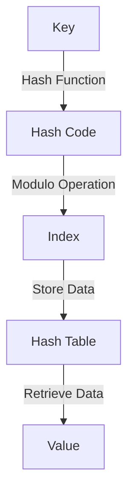
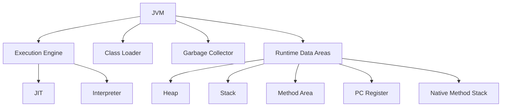
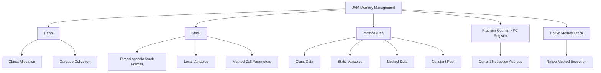
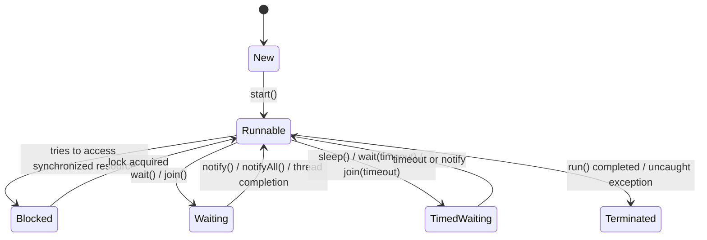
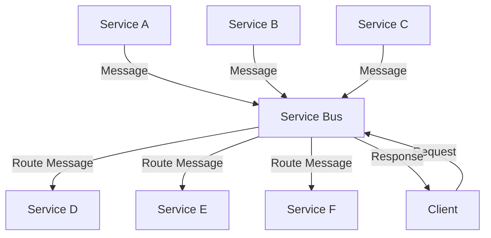
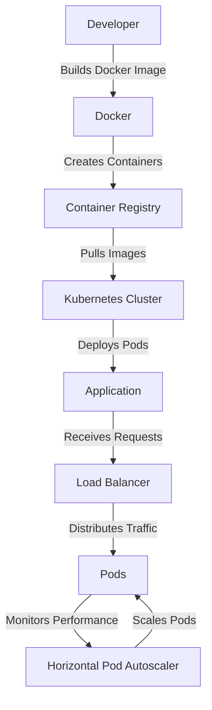

# Differences - Comparisions In Java 

> **Table Of Contents**

- [Wait() Vs Sleep()](#wait-vs-sleep)
- [Array Vs ArrayList](#array-vs-arraylist)
- [StackOverflowError Vs OutOfMemoryError](#stackOverflowerror-vs-OutOfmemoryerror)
- [Shallow Copy Vs Deep Copy](#shallow-copy-vs-deep-copy)
- ["==" Vs equals()](#equal-operator-vs-equals)
- [Error Vs Exception](#error-vs-exception)
- [Class Variables Vs Instance Variables](#class-variables-vs-instance-variables)
- [Fail Fast Vs Fail Safe Iterators](#fail-fast-vs-fail-safe-iterators)
- [final Vs finally Vs finalize()](#final-vs-finally-vs-finalize)
- [ClassNotFoundException Vs NoClassDefFoundError](#classnotfoundexception-vs-nocalldeffounderror)
- [start() Vs run() Methods](#start-vs-run-methods)
- [throw Vs throws Vs Throwable](#throw-vs-throws-throwable)
- [User Threads Vs Daemon Threads](#user-thread-vs-daemon-thread)
- [notify() Vs notifyAll()](#notify-vs-notifyall)
- [BLOCKED Vs WAITING States](#blocked-vs-waiting-states)
- [Extends Thread Vs Implements Runnable](#extends-thread-vs-implements-runnable)
- [Collection Vs Collections](#collection-vs-collections)
- [ArrayList Vs LinkedList](#arraylist-vs-linkedlist)
- [HashMap Vs HashSet](#hashmap-vs-hashset)
- [HashMap Vs HashTable](#hashmap-vs-hashtable)
- [Iterator Vs ListIterator](#iterator-vs-listiterator)
- [ArrayList Vs Vector](#arrayList-vs-vector)
- [HashSet Vs TreeSet Vs LinkedHashSet](#hashset-vs-treeset-vs-linkedhashset)
- [Collections Vs Streams](#collections-vs-streams)
- [Java 8 Map() Vs flatMap()](#java-8-map-vs-flatmap)
- [Java 8 Stream Intermediate Vs Terminal Operations](#java-8-stream-intermediate-vs-terminal-operations)
- [Iterator Vs Spliterator In Java 8](#iterator-vs-spliterator-in-java-8)
- [Static Binding Vs Dynamic Binding](#static-binding-vs-dynamic-binding)
- [Method Overloading Vs Method Overriding](#method-overloading-vs-method-overriding)
- [executeQuery() Vs executeUpdate() Vs execute() In JDBC](#executequery-vs-executeupdate-vs-execute-in-jdbc)
- [Statement Vs PreparedStatement Vs CallableStatement](#statement-vs-preparedstatement-vs-callablestatement)
- [Process Vs Thread](#process-vs-thread)
- [Checked And Unchecked Exceptions](#checked-and-unchecked-exceptions)
- [HashMap Vs ConcurrentHashMap](#hashmap-vs-concurrenthashmap)
- [Servlet Vs GenericServlet Vs HttpServlet](#servlet-vs-genericservlet-vs-httpservlet)


In Java, the `Thread` class provides several methods that are used for controlling the flow of execution in multi-threaded programs. Four of the key methods related to thread synchronization and thread state management are `sleep()`, `wait()`, `join()`, and `isAlive()`. Let's go through each of these methods in detail.

### 1. `sleep(long millis)`
- **Purpose**: Pauses the execution of the current thread for a specified amount of time.
- **Usage**: The `sleep()` method causes the currently executing thread to sleep (i.e., pause its execution) for a given period, specified in milliseconds (with an optional nanoseconds precision). The thread will then wake up and resume execution after the specified duration.
- **Important Notes**:
  - This method is a static method of the `Thread` class.
  - The thread does not lose its lock when it sleeps. Other threads can continue to execute, depending on their priority and other factors.
  - It can throw `InterruptedException` if another thread interrupts the sleeping thread.
  
  **Example**:
  ```java
  public class MyThread extends Thread {
      @Override
      public void run() {
          try {
              System.out.println("Thread is sleeping...");
              Thread.sleep(1000);  // Sleep for 1 second
              System.out.println("Thread has woken up.");
          } catch (InterruptedException e) {
              System.out.println("Thread was interrupted.");
          }
      }

      public static void main(String[] args) {
          MyThread thread = new MyThread();
          thread.start();
      }
  }
  ```

### 2. `wait()`
- **Purpose**: Causes the current thread to wait until another thread sends a signal (via `notify()` or `notifyAll()`).
- **Usage**: The `wait()` method is used to pause the execution of the current thread until it's notified by another thread. This is typically used in synchronization blocks (like `synchronized` methods or `synchronized` blocks).
- **Important Notes**:
  - `wait()` must be called from within a synchronized block or method. Otherwise, it will throw an `IllegalMonitorStateException`.
  - The thread goes into a "waiting" state, and it will not proceed until some other thread calls `notify()` or `notifyAll()` on the same object.
  - Can throw `InterruptedException`.
  
  **Example**:
  ```java
  class MyThread extends Thread {
      private final Object lock = new Object();
      
      public void run() {
          synchronized (lock) {
              try {
                  System.out.println("Thread is waiting...");
                  lock.wait();  // Wait until notified
                  System.out.println("Thread has been notified and is resuming.");
              } catch (InterruptedException e) {
                  e.printStackTrace();
              }
          }
      }

      public static void main(String[] args) throws InterruptedException {
          MyThread thread = new MyThread();
          thread.start();
          
          // Simulate some work in the main thread
          Thread.sleep(2000);
          
          synchronized (thread.lock) {
              thread.lock.notify();  // Notify the waiting thread
          }
      }
  }
  ```

### 3. `join()`
- **Purpose**: Causes the current thread to wait until the thread on which `join()` is called has finished its execution.
- **Usage**: The `join()` method is used to make one thread wait for the completion of another thread. If `join()` is called on thread `t`, the current thread will be paused until `t` completes execution.
- **Important Notes**:
  - It is often used to ensure that one thread completes its execution before the main thread or another thread proceeds.
  - You can specify a time limit (in milliseconds) for how long to wait for the thread to complete, or call it with no arguments to wait indefinitely.
  - Can throw `InterruptedException`.

  **Example**:
  ```java
  public class MyThread extends Thread {
      @Override
      public void run() {
          System.out.println("Thread is running...");
          try {
              Thread.sleep(2000);  // Simulate work
          } catch (InterruptedException e) {
              e.printStackTrace();
          }
          System.out.println("Thread has finished.");
      }

      public static void main(String[] args) throws InterruptedException {
          MyThread thread = new MyThread();
          thread.start();
          
          // Main thread waits for the child thread to finish
          thread.join();  // Waits until thread has completed
          
          System.out.println("Main thread has finished.");
      }
  }
  ```

### 4. `isAlive()`
- **Purpose**: Checks if a thread is alive (i.e., has been started and has not yet completed).
- **Usage**: The `isAlive()` method returns a boolean indicating whether the thread has started and has not yet completed its execution.
- **Important Notes**:
  - It returns `true` if the thread is still executing (in the `RUNNING` or `WAITING` state) or has been started but has not yet finished. It returns `false` if the thread has either not started or has finished.
  - It does not indicate whether the thread is blocked, sleeping, or waiting.

  **Example**:
  ```java
  public class MyThread extends Thread {
      @Override
      public void run() {
          try {
              Thread.sleep(1000);  // Simulate work
          } catch (InterruptedException e) {
              e.printStackTrace();
          }
      }

      public static void main(String[] args) throws InterruptedException {
          MyThread thread = new MyThread();
          thread.start();
          
          // Check if thread is alive
          System.out.println("Is thread alive? " + thread.isAlive());
          
          thread.join();  // Wait for the thread to finish
          
          System.out.println("Is thread alive? " + thread.isAlive());
      }
  }
  ```

### Summary of the Methods:
- **`sleep(long millis)`**: Makes the current thread sleep for a specified duration.
- **`wait()`**: Causes the current thread to wait until another thread notifies it.
- **`join()`**: Makes the current thread wait for the thread on which `join()` is called to finish.
- **`isAlive()`**: Checks if the thread is still alive (i.e., running or has been started but not completed).

These methods are fundamental for thread synchronization and coordination in Java.

## Wait() Vs Sleep()	
					
wait() Vs sleep() 


| wait()&nbsp; &nbsp; &nbsp; &nbsp; &nbsp; &nbsp; &nbsp; &nbsp; &nbsp; &nbsp; &nbsp; &nbsp; &nbsp; &nbsp; | sleep() |
| ----------------------- | ------------------ |
| The thread which calls wait() method releases the lock it holds.                                                            | The thread which calls sleep() method doesn’t release the lock it holds.                               |
| The thread regains the lock after other threads call either notify() or notifyAll() methods on the same lock.	| No question of regaining the lock as thread doesn’t release the lock.		| 
| wait() method must be called within the synchronized block.	| sleep() method can be called within or outside the synchronized block.		| 
| wait() method is a member of java.lang.Object class.	| sleep() method is a member of java.lang.Thread class.		| 
| wait() method is always called on objects.	| sleep() method is always called on threads.| 		
| wait() is a non-static method of Object class.	| sleep() is a static method of Thread class.| 		
| Waiting threads can be woken up by other threads by calling notify() or notifyAll() methods.	| Sleeping threads can not be woken up by other threads. If done | so, thread will throw InterruptedException.		| 
|  To call wait() method, thread must have object lock.	|  To call sleep() method, thread need not to have object lock.		| 
- See More : wait() Vs sleep()			

### 1. Wait() vs Sleep()
| Aspect         | Wait()                                         | Sleep()                                       |
|----------------|-----------------------------------------------|----------------------------------------------|
| Purpose        | Makes a thread wait until another thread invokes notify/notifyAll. | Pauses the execution of the current thread for a specified time. |
| Context        | Must be called within a synchronized block.   | Can be called from any context.             |
| Locking        | Releases the lock on the object.              | Does not release any locks.                  |
| Interruptible  | Can be interrupted by another thread.         | Can throw `InterruptedException` if interrupted. |
| Usage          | Used for inter-thread communication.          | Used for timing control.                     |


## Array Vs ArrayList

Array Vs ArrayList

| Array&nbsp; &nbsp; &nbsp; &nbsp; &nbsp; &nbsp; &nbsp; &nbsp; &nbsp; &nbsp; &nbsp; &nbsp; &nbsp; &nbsp; | ArrayList |
| ----------------------- | ------------------ |		
| "Arrays are static in nature. Arrays are fixed length data structures. You can’t change their size once they are created."	| ArrayList is dynamic in nature. Its size is automatically increased if you add elements beyond its capacity.| 		
| Arrays can hold both primitives as well as objects.	| ArrayList can hold only objects.| 		
| Arrays can be iterated only through for loop or for-each loop.| 	ArrayList provides iterators to iterate through their elements.	| 	
| The size of an array is checked using length attribute.| 	The size of an ArrayList can be checked using size() method.	| 	
| Array gives constant time performance for both add and get operations.| 	ArrayList also gives constant time performance for both add and get operations provided adding an element doesn’t trigger resize.		| 
| Arrays don’t support generics.	| ArrayList supports generics.		| 
| Arrays are not type safe.	| ArrayList are type safe.| 		
| Arrays can be multi-dimensional.	| ArrayList can’t be multi-dimensional.		| 
| Elements are added using assignment operator.| 	Elements are added using add() method.| 		
- See More : Array Vs ArrayList			

### 2. Array vs ArrayList
| Aspect         | Array                                            | ArrayList                                      |
|----------------|-------------------------------------------------|------------------------------------------------|
| Size           | Fixed size.                                     | Dynamic size; can grow as needed.             |
| Type           | Can hold both primitives and objects.           | Holds only objects (must use wrapper classes for primitives). |
| Performance    | Faster for accessing elements.                  | Slower for insertion/deletion due to shifting elements. |
| Methods        | No built-in methods (must use loops).           | Provides various utility methods (e.g., `add()`, `remove()`). |
  
## StackOverflowError Vs OutOfMemoryError			
			
StackOverflowError Vs OutOfMemoryError	
| StackOverflowError&nbsp; &nbsp; &nbsp; &nbsp; &nbsp; &nbsp; &nbsp; &nbsp; &nbsp; &nbsp; &nbsp; &nbsp; &nbsp; &nbsp; | OutOfMemoryError |
| ----------------------- | ------------------ |
|It is related to Stack memory.	|It is related to heap memory.	|	
|It occurs when Stack is full.	|It occurs when heap is full.	|	
|It is thrown when you call a method and there is no space left in the stack.	|It is thrown when you create a new object and there is no space left in the heap.|		
|It occurs when you are calling a method recursively without proper terminating condition.	|It occurs when you are creating lots of objects in the heap memory.|		
|How to avoid?	|How to avoid?	|	
|Make sure that methods are finishing their execution and leaving the stack memory.	|Try to remove references to objects which you don’t need anymore.|		
- See More : StackOverflowError Vs OutOfMemoryError			

### 3. StackOverflowError vs OutOfMemoryError
| Aspect                 | StackOverflowError                             | OutOfMemoryError                             |
|------------------------|-----------------------------------------------|---------------------------------------------|
| Cause                   | Exceeding the call stack limit (e.g., deep recursion). | JVM cannot allocate memory for an object. |
| Recovery                | Not recoverable; indicates a programming error. | May be recoverable by freeing up memory.  |		

## Shallow Copy Vs Deep Copy		
			
Shallow Copy Vs Deep Copy
| Shallow Copy&nbsp; &nbsp; &nbsp; &nbsp; &nbsp; &nbsp; &nbsp; &nbsp; &nbsp; &nbsp; &nbsp; &nbsp; &nbsp; &nbsp; | Deep Copy |
| ----------------------- | ------------------ |
|Cloned Object and original object are not 100% disjoint.|	Cloned Object and original object are 100% disjoint.|		
|Any changes made to cloned object will be reflected in original object or vice versa.|	Any changes made to cloned object will not be reflected in original object or vice versa.|		
|Default version of clone method creates the shallow copy of an object.	|To create the deep copy of an object, you have to override clone method.|		
|Shallow copy is preferred if an object has only primitive fields.	|Deep copy is preferred if an object has references to other objects as fields.|		
|Shallow copy is fast and also less expensive.	|Deep copy is slow and very expensive.		|
- See More : Shallow Copy Vs Deep Copy			

### 4. Shallow Copy vs Deep Copy
| Aspect         | Shallow Copy                                   | Deep Copy                                     |
|----------------|------------------------------------------------|------------------------------------------------|
| Definition      | Copies the references of the objects.          | Creates a new instance of the object and copies all fields. |
| Changes         | Modifying the copied object affects the original. | Modifying the copied object does not affect the original. |
| Implementation   | Can be done using the `clone()` method.      | Requires custom cloning logic or serialization. |

## Equal Operator Vs equals()			
			
“==” Operator Vs equals() Method	
| “==” Operator&nbsp; &nbsp; &nbsp; &nbsp; &nbsp; &nbsp; &nbsp; &nbsp; &nbsp; &nbsp; &nbsp; &nbsp; &nbsp; &nbsp; |equals() Method |
| ----------------------- | ------------------ |
|It is a binary operator in Java.	|It is a public method of java.lang.Object class.	|	
|It compares the two objects based on their location in the memory.	|"The default version of equals method also does the comparison of two objects based on their location in the memory. But, you can override the equals method so that it performs the comparison of two objects on some condition."	|	
|It can be used on both primitive types as well as on derived types.	|It can be used only on derived types.	|	
|It is best suitable for primitive types.	|It is best suitable for derived types.		|
|You can’t override the “==” operator. It behaves same for all objects.	|You can override the equals method according to your business requirements.|		
- See More : “==” Vs equals()			

   ### 5. "==" vs equals()
| Aspect         | "=="                                         | equals()                                      |
|----------------|----------------------------------------------|-----------------------------------------------|
| Comparison Type | Reference equality (memory address).         | Logical equality (content of objects).       |
| Usage           | Used for primitives and object references.   | Used for comparing object content; needs to be overridden in custom classes. 

In Java, the `hashCode()` and `equals()` methods are used to define the equality of objects and to support the use of objects in hash-based collections, such as `HashMap` and `HashSet`. Here’s a brief overview of each method and how they relate to each other:

### `equals()` Method

- **Purpose**: Determines if two objects are considered equal.
- **Override**: When overriding this method, you should follow these rules:
  - It must be reflexive: for any non-null reference value `x`, `x.equals(x)` should return `true`.
  - It must be symmetric: for any non-null reference values `x` and `y`, `x.equals(y)` should return `true` if and only if `y.equals(x)` returns `true`.
  - It must be transitive: for any non-null reference values `x`, `y`, and `z`, if `x.equals(y)` returns `true` and `y.equals(z)` returns `true`, then `x.equals(z)` should return `true`.
  - It must be consistent: multiple invocations of `x.equals(y)` should consistently return `true` or consistently return `false`.
  - For any non-null reference value `x`, `x.equals(null)` should return `false`.

### `hashCode()` Method

- **Purpose**: Returns an integer representation of an object's memory address or value that is used in hash tables.
- **Override**: When you override `hashCode()`, you should ensure:
  - If two objects are equal according to the `equals()` method, then calling `hashCode()` on each of the two objects must produce the same integer result.
  - It’s not required that if two objects are not equal, their hash codes must be different (but it’s good for performance if they are).

### Implementing Both Methods

Here’s an example of how you might implement both methods in a class:

```java
public class Person {
    private String name;
    private int age;

    public Person(String name, int age) {
        this.name = name;
        this.age = age;
    }

    @Override
    public boolean equals(Object obj) {
        if (this == obj) return true; // Check if both references are the same
        if (obj == null || getClass() != obj.getClass()) return false; // Null check and class check
        Person person = (Person) obj; // Cast to Person
        return age == person.age && name.equals(person.name); // Field comparisons
    }

    @Override
    public int hashCode() {
        int result = name.hashCode(); // Use String's hash code
        result = 31 * result + age; // Combine with age, using a prime number
        return result;
    }
}
```

### Key Points to Remember

1. Always override both methods together to maintain consistency.
2. Use `@Override` annotation to avoid errors.
3. Utilize the fields that determine equality in your `hashCode()` implementation.

By following these principles, you ensure that your objects behave correctly in collections that rely on hashing.
## Error Vs Exception			
			
Errors Vs Exceptions		
| Errors&nbsp; &nbsp; &nbsp; &nbsp; &nbsp; &nbsp; &nbsp; &nbsp; &nbsp; &nbsp; &nbsp; &nbsp; &nbsp; &nbsp; | Exceptions |
| ----------------------- | ------------------ |
|Errors in Java are of type java.lang.Error.	|Exceptions in Java are of type java.lang.Exception.	|	
|All errors in Java are unchecked type.	|Exceptions include both checked as well as unchecked type.|		
|Errors happen at run time. They will not be known to compiler.	|Checked exceptions are known to compiler where as unchecked exceptions are not known to compiler because they occur at run time.		|
|It is impossible to recover from errors.	|You can recover from exceptions by handling them through try-catch blocks.|		
|Errors are mostly caused by the environment in which application is running.|	Exceptions are mainly caused by the application itself.|		
|Examples : - java.lang.StackOverflowError, java.lang.OutOfMemoryError | Examples :  **Checked Exceptions** : SQLException, IOException	 **Unchecked Exceptions** : ArrayIndexOutOfBoundException, ClassCastException, NullPointerException			|

- See More : Error Vs Exception			

### 6. Error vs Exception
| Aspect         | Error                                         | Exception                                     |
|----------------|----------------------------------------------|-----------------------------------------------|
| Nature         | Indicates serious issues (e.g., `OutOfMemoryError`). | Conditions that applications can handle.     |
| Handling       | Generally not caught; indicates a JVM issue. | Can be caught and handled by applications.   |

## Class Variables Vs Instance Variables		
			
Class Variables Vs Instance Variables	
| Class Variables&nbsp; &nbsp; &nbsp; &nbsp; &nbsp; &nbsp; &nbsp; &nbsp; &nbsp; &nbsp; &nbsp; &nbsp; &nbsp; &nbsp; | Instance Variables |
| ----------------------- | ------------------ |
|Class variables are declared with keyword static.	|Instance variables are declared without static keyword.		
|"Class variables are common to all instances of a class. These variables are shared between the objects of a class."	|Instance variables are not shared between the objects of a class. Each instance will have their own copy of instance variables.		|
|"As class variables are common to all objects of a class, changes made to these variables through one object will reflect in another."	|As each object will have its own copy of instance variables, changes made to these variables through one object will not reflect in another object.|		
|Class variables can be accessed using either class name or object reference.	|Instance variables can be accessed only through object reference.	|	
- See More : Class Variables Vs Instance Variables			

### 7. Class Variables vs Instance Variables
| Aspect         | Class Variables                               | Instance Variables                            |
|----------------|----------------------------------------------|-----------------------------------------------|
| Declaration     | Declared with the `static` keyword.          | Declared without `static`.                    |
| Scope           | Shared across all instances.                 | Unique to each instance.                      |
| Memory          | Loaded once per class.                       | Loaded for each instance created.            |

## Fail Fast Vs Fail Safe Iterators			
			
Fail-Fast Iterators Vs Fail-Safe Iterators
| Fail-Fast Iterators&nbsp; &nbsp; &nbsp; &nbsp; &nbsp; &nbsp; &nbsp; &nbsp; &nbsp; &nbsp; &nbsp; &nbsp; &nbsp; &nbsp; | Fail-Safe Iterators |
| ----------------------- | ------------------ |
|Fail-Fast iterators doesn’t allow modifications of a collection while iterating over it.	|Fail-Safe iterators allow modifications of a collection while iterating over it.		|
|These iterators throw ConcurrentModificationException if a collection is modified while iterating over it.	|These iterators don’t throw any exceptions if a collection is modified while iterating over it.	|	
|They use original collection to traverse over the elements of the collection.	|They use copy of the original collection to traverse over the elements of the collection.		|
|These iterators don’t require extra memory.	|These iterators require extra memory to clone the collection.	|	
|Ex : Iterators returned by ArrayList, Vector, HashMap.	|Ex : Iterator returned by ConcurrentHashMap.		|
- See More : Fail-Fast Vs Fail-Safe			

 ### 8. Fail Fast vs Fail Safe Iterators
| Aspect         | Fail Fast                                    | Fail Safe                                    |
|----------------|----------------------------------------------|----------------------------------------------|
| Behavior       | Throws `ConcurrentModificationException` when modified during iteration. | Uses a clone of the collection, allowing safe iteration. |
| Example        | `ArrayList` and `HashMap` iterators.       | `CopyOnWriteArrayList` and `ConcurrentHashMap`. |

## final Vs finally Vs finalize()			
	
final Vs finally Vs finalize()	
| final&nbsp; &nbsp; &nbsp; &nbsp; &nbsp; &nbsp; &nbsp; &nbsp; &nbsp; &nbsp; &nbsp; &nbsp; &nbsp; &nbsp; | finally | finalize() |
| ----------------------- | ------------------ |------------------ |
|final is a keyword in Java which is used to make a variable or a method or a class as unchangeable.	|finally is a block in Java which is used for exception handling along with try and catch blocks.	|"finalize() method is a protected method of java.lang.Object class which is used to perform some clean up operations on an object before it is removed from the memory."	|
|The value of a variable which is declared as final can’t be changed once it is initialized.	|finally block is always executed whether an exception is occurred or not and occurred exception is handled or not.	|This method is called by garbage collector thread before an object is removed from the memory.	|
|A method declared as final can’t be overridden or modified in the sub class and a class declared as final can’t be extended.	|Most of time, this block is used to close the resources like database connection, I/O resources etc soon after their use.|	This method is inherited to every class you create in Java.|	
- See More : final Vs finally Vs finalize			

### 9. final vs finally vs finalize()
| Aspect         | final                                       | finally                                       | finalize()                                    |
|----------------|---------------------------------------------|----------------------------------------------|-----------------------------------------------|
| Usage          | Prevents method overriding, inheritance, or allows constant values. | Executes code after try-catch, regardless of exception. | Called by the garbage collector before an object is destroyed. |

Memory management in Java is a crucial aspect of the Java programming language that involves the allocation, usage, and deallocation of memory during the execution of Java applications. Java employs automatic memory management through a process called garbage collection. Here’s an overview of how memory management works in Java:

### 1. **Memory Areas**

Java memory is divided into several areas, primarily:

- **Heap**: This is the runtime data area where objects are allocated. It is shared among all threads and is where most of the memory allocation takes place.
  
- **Stack**: Each thread has its own stack, which stores local variables, method calls, and references to objects in the heap. The stack operates on a Last In, First Out (LIFO) basis.

- **Method Area**: This area stores class structures such as metadata, constant pools, and static variables. It is shared among all threads.

- **Native Method Stack**: Used for native method calls, it stores information related to native methods.

### 2. **Memory Allocation**

When you create an object in Java using the `new` keyword, memory is allocated for that object on the heap. For example:

```java
MyClass obj = new MyClass();
```

Here, memory for `obj` is allocated on the heap.

### 3. **Garbage Collection**

Java uses garbage collection (GC) to automatically manage memory and reclaim memory that is no longer in use. This process has several phases:

- **Marking**: The garbage collector identifies which objects are still reachable (i.e., can be accessed through references) and which are not.

- **Sweeping**: After marking, the garbage collector removes unreferenced objects, freeing up memory.

- **Compacting**: In some implementations, after sweeping, the heap may be compacted to reduce fragmentation, moving objects closer together.

### 4. **Garbage Collection Algorithms**

Java provides several garbage collection algorithms, including:

- **Serial Garbage Collector**: A simple garbage collector that uses a single thread for the entire process, suitable for single-threaded applications.

- **Parallel Garbage Collector**: Uses multiple threads to perform the marking and sweeping phases, improving performance in multi-threaded applications.

- **Concurrent Mark-Sweep (CMS)**: A collector that aims to minimize pause times by doing most of its work concurrently with the application threads.

- **G1 Garbage Collector**: A modern garbage collector that divides the heap into regions and collects them in a way that aims to meet pause time goals.

### 5. **Memory Leaks**

While Java's garbage collection helps prevent memory leaks, they can still occur if references to unused objects are inadvertently maintained. Common causes include:

- **Static references**: Holding on to objects via static fields that prevent them from being collected.
- **Collections**: Storing objects in collections without removing them when they are no longer needed.

### 6. **Memory Management Best Practices**

To ensure efficient memory management in Java:

- **Nullify references**: When you no longer need an object, set its reference to `null` if it’s no longer needed (especially for large objects).
  
- **Use weak references**: Consider using `WeakReference` or `SoftReference` for caching objects that can be collected when memory is low.

- **Optimize object creation**: Reuse objects where possible and avoid unnecessary object creation.

- **Monitor memory usage**: Use profiling tools to monitor memory usage and detect memory leaks.

In Java, `WeakReference` and `SoftReference` are part of the `java.lang.ref` package and are used to handle memory management in a more flexible way compared to strong references. Both types of references allow the garbage collector to reclaim memory more effectively under certain conditions. Here’s a detailed explanation of each:

### WeakReference

- **Definition**: A `WeakReference` allows you to hold a reference to an object without preventing it from being garbage collected. If there are no strong references to the object, it can be collected, even if a `WeakReference` to it exists.

- **Use Case**: Typically used for implementing caches where you want to allow the garbage collector to reclaim memory if needed. For example, if an object is only weakly reachable, it can be collected to free up resources.

- **Example**:

```java
import java.lang.ref.WeakReference;

public class WeakReferenceExample {
    public static void main(String[] args) {
        Object obj = new Object();
        WeakReference<Object> weakRef = new WeakReference<>(obj);

        System.out.println("Before nullifying strong reference: " + weakRef.get());

        obj = null; // Nullifying the strong reference

        System.gc(); // Requesting garbage collection

        // The weak reference may still hold a reference to the object,
        // but it can be collected since there are no strong references
        System.out.println("After nullifying strong reference: " + weakRef.get());
    }
}
```

### SoftReference

- **Definition**: A `SoftReference` is similar to a `WeakReference`, but it is less aggressive about garbage collection. The garbage collector will only reclaim soft-referenced objects if it absolutely needs memory. This means that soft references are often retained longer than weak references.

- **Use Case**: Commonly used for caching objects that are expensive to create but can be recreated if needed. For example, you might use `SoftReference` for image caching in applications.

- **Example**:

```java
import java.lang.ref.SoftReference;

public class SoftReferenceExample {
    public static void main(String[] args) {
        Object obj = new Object();
        SoftReference<Object> softRef = new SoftReference<>(obj);

        System.out.println("Before nullifying strong reference: " + softRef.get());

        obj = null; // Nullifying the strong reference

        System.gc(); // Requesting garbage collection

        // The soft reference may still hold a reference to the object
        // unless the JVM is under memory pressure
        System.out.println("After nullifying strong reference: " + softRef.get());
    }
}
```

### Key Differences

1. **Garbage Collection Behavior**:
   - **WeakReference**: The object can be collected as soon as there are no strong references to it.
   - **SoftReference**: The object is collected only when the JVM absolutely needs memory.

2. **Use Cases**:
   - **WeakReference**: Suitable for caches where you want to free memory quickly.
   - **SoftReference**: Best for caches of objects that can be recreated, where you want to retain them longer unless memory is constrained.

3. **Visibility**:
   - Both types of references allow you to access the referenced object using the `.get()` method, which returns `null` if the object has been collected.

### Conclusion

Both `WeakReference` and `SoftReference` provide powerful tools for managing memory in Java. Understanding when and how to use these references can help improve the efficiency and responsiveness of applications, especially those dealing with large data sets or requiring caching mechanisms.

### Conclusion

Java’s memory management, primarily through automatic garbage collection, simplifies the developer's responsibility for managing memory. However, understanding the underlying mechanisms and following best practices can lead to more efficient memory usage and improved application performance.

## ClassNotFoundException Vs NoClassDefFoundError			
		
ClassNotFoundException Vs NoClassDefFoundError	
| ClassNotFoundException&nbsp; &nbsp; &nbsp; &nbsp; &nbsp; &nbsp; &nbsp; &nbsp; &nbsp; &nbsp; &nbsp; &nbsp; &nbsp; &nbsp; |NoClassDefFoundError |
| ----------------------- | ------------------ |
|It is an exception. It is of type java.lang.Exception.|	It is an error. It is of type java.lang.Error.|		
|It occurs when an application tries to load a class at run time which is not updated in the classpath.	|It occurs when Java runtime system doesn’t find a class definition, which is present at compile time, but missing at run time.		
"It is thrown by the application itself. |
|It is thrown by the methods like Class.forName(), loadClass() and findSystemClass()."	|It is thrown by the Java Runtime System.|		
|It occurs when classpath is not updated with required JAR files.	|It occurs when required class definition is missing at run time.|		
- See More : ClassNotFoundException Vs NoClassDefFoundError			

### 10. ClassNotFoundException vs NoClassDefFoundError
| Aspect         | ClassNotFoundException                      | NoClassDefFoundError                          |
|----------------|---------------------------------------------|-----------------------------------------------|
| Cause          | Class not found during runtime.             | Class was present during compile but not found during runtime. |

## start() Vs run() Methods		
		
start() Vs run()		
| start()&nbsp; &nbsp; &nbsp; &nbsp; &nbsp; &nbsp; &nbsp; &nbsp; &nbsp; &nbsp; &nbsp; &nbsp; &nbsp; &nbsp; | run() |
| ----------------------- | ------------------ |
|New thread is created.	|No new thread is created.|		
|Newly created thread executes task kept in run() method.	|Calling thread itself executes task kept in run() method.|		
|It is a member of java.lang.Thread class.	|It is a member of java.lang.Runnable interface.|		
|You can’t call start() method more than once.|	You can call run() method multiple times.|		
|Use of multi-threaded programming concept.	|No use of multi-threaded programming concept.	|	
- See More : start() Vs run()			

### 11. start() vs run() Methods
| Aspect         | start()                                     | run()                                        |
|----------------|----------------------------------------------|----------------------------------------------|
| Functionality  | Creates a new thread and invokes `run()`.   | Contains the code that executes in the thread; called directly runs in the current thread. |

## throw Vs throws Vs Throwable		
			
throw Vs throws Vs Throwable	
| throw&nbsp; &nbsp; &nbsp; &nbsp; &nbsp; &nbsp; &nbsp; &nbsp; &nbsp; &nbsp; &nbsp; &nbsp; &nbsp; &nbsp; | throws |Throwable |
| ----------------------- | ------------------ |------------------ |
|throw is a keyword in Java which is used to throw an exception manually.	|throws is also a keyword in java which is used in the method signature to indicate that this method may throw mentioned exceptions.	|"Throwable is a super class for all types of errors and exceptions in Java. This class is a member of java.lang package."	|
|"Using throw keyword, you can throw an exception from any method or block. But, that exception must be of type java.lang.Throwable class or it’s sub classes."	|The caller to such methods must handle the mentioned exceptions either using try-catch blocks or using throws keyword.	|Only instances of this class or it’s sub classes are thrown by the java virtual machine or by the throw statement.	|
- See More : throw Vs throws Vs Throwable			

### 12. throw vs throws vs Throwable
| Aspect         | throw                                       | throws                                       | Throwable                                     |
|----------------|---------------------------------------------|----------------------------------------------|-----------------------------------------------|
| Usage          | Used to explicitly throw an exception.      | Declares that a method may throw exceptions. | Superclass of all errors and exceptions.     |

## User Threads Vs Daemon Threads			
			
User Threads Vs Daemon Threads	
| User Threads&nbsp; &nbsp; &nbsp; &nbsp; &nbsp; &nbsp; &nbsp; &nbsp; &nbsp; &nbsp; &nbsp; &nbsp; &nbsp; &nbsp; | Daemon Threads |
| ----------------------- | ------------------ |
|"JVM waits for user threads to finish their work. 
It will not exit until all user threads finish their work."	|JVM will not wait for daemon threads to finish their work. It will exit as soon as all user threads finish their work.		|
|User threads are foreground threads.	|Daemon threads are background threads.	|	
|User threads are high priority threads.	|Daemon threads are low priority threads.|		
|User threads are created by the application.	|Daemon threads, in most of time, are created by the JVM.|		
|User threads are mainly designed to do some specific task.	|Daemon threads are designed to support the user threads.|		
|"JVM will not force the user threads to terminate. It will wait for user threads to terminate themselves."	|JVM will force the daemon threads to terminate if all user threads have finished their work.|		
- See More : User Threads Vs Daemon Threads			

### 13. User Threads vs Daemon Threads vs Worker Threads
| Aspect         | User Threads                                | Daemon Threads                              | Worker Threads                               |
|----------------|---------------------------------------------|--------------------------------------------|----------------------------------------------|
| Purpose        | Perform application tasks; keep JVM alive. | Background tasks; terminated when user threads finish. | Threads performing specific tasks in a thread pool. |
| Example        | Main application thread.                    | Garbage collector thread.                   | Threads in `ExecutorService`.                |

## notify() Vs notifyAll()		
			
notify() Vs notifyAll()		
| notify()&nbsp; &nbsp; &nbsp; &nbsp; &nbsp; &nbsp; &nbsp; &nbsp; &nbsp; &nbsp; &nbsp; &nbsp; &nbsp; &nbsp; | notifyAll() |
| ----------------------- | ------------------ |
|"When a thread calls notify() method on a particular object, only one thread will be notified which is waiting for the lock or monitor of that object."	|When a thread calls notifyAll() method on a particular object, all threads which are waiting for the lock of that object are notified.	|	
|The thread chosen to notify is random i.e randomly one thread will be selected for notification.	|All notified threads will get the lock of the object on a priority basis.		|
|"Notified thread doesn’t get the lock of the object immediately. It gets once the calling thread releases the lock of that object. Until that it will be in BLOCKED state. It will move from BLOCKED state to RUNNING state once it gets the lock."	|"All notified threads will move from WAITING state to BLOCKED state. The thread which gets the lock of the object moves to RUNNING state. The remaining threads will remain in BLOCKED state until they get the object lock."		|
- See More : notify() Vs notifyAll()			

 ### 14. notify() vs notifyAll()
| Aspect         | notify()                                    | notifyAll()                                 |
|----------------|---------------------------------------------|--------------------------------------------|
| Functionality  | Wakes up a single waiting thread.           | Wakes up all waiting threads.               |

## BLOCKED Vs WAITING States		
			
WAITING Vs BLOCKED		
| WAITING&nbsp; &nbsp; &nbsp; &nbsp; &nbsp; &nbsp; &nbsp; &nbsp; &nbsp; &nbsp; &nbsp; &nbsp; &nbsp; &nbsp; | BLOCKED |
| ----------------------- | ------------------ |
|"The thread will be in this state when it calls wait() or join() method. The thread will remain in WAITING state until any other thread calls notify() or notifyAll()."	|The thread will be in this state when it is notified by other thread but has not got the object lock yet.|		
|The WAITING thread is waiting for notification from other threads.	|The BLOCKED thread is waiting for other thread to release the lock.|		
|The WAITING thread can be interrupted.	|The BLOCKED thread can’t be interrupted.|		
- See More : BLOCKED Vs WAITING			

### 15. BLOCKED vs WAITING States
| Aspect         | BLOCKED                                     | WAITING                                     |
|----------------|---------------------------------------------|---------------------------------------------|
| Definition     | Waiting to acquire a lock.                  | Waiting indefinitely for another thread to perform an action. |

## Extends Thread Vs Implements Runnable			
			
Implements Runnable Vs Extends Thread
| Implements Runnable&nbsp; &nbsp; &nbsp; &nbsp; &nbsp; &nbsp; &nbsp; &nbsp; &nbsp; &nbsp; &nbsp; &nbsp; &nbsp; &nbsp; | Extends Thread |
| ----------------------- | ------------------ |
|You can extend any other class.	|You can’t extend any other class.		|
|No overhead of additional methods .	|Overhead of additional methods from Thread class.	|	
|Separates the task from the runner.	|Doesn’t separate the task from the runner.		|
|Best object oriented programming practice.	|Not a good object oriented programming practice.|		
|Loosely coupled.	|Tightly coupled.		|
|Improves the reusability of the code.	|Doesn’t improve the reusability of the code.|		
|More generalized task.	|Thread specific task.		|
|Maintenance  of the code will be easy.	|Maintenance of the code will be time consuming.|		
- See More : Extends Thread Vs Implements Runnable			

### 16. Extends Thread vs Implements Runnable
| Aspect         | Extends Thread                              | Implements Runnable                         |
|----------------|---------------------------------------------|---------------------------------------------|
| Implementation  | Creates a new subclass of `Thread`.        | Requires an implementation of `run()` method; can be used with multiple threads. |
| Flexibility    | Less flexible; cannot extend another class. | More flexible; can implement other interfaces. |

## Collection Vs Collections			
			
Collection Vs Collections		
| Collection&nbsp; &nbsp; &nbsp; &nbsp; &nbsp; &nbsp; &nbsp; &nbsp; &nbsp; &nbsp; &nbsp; &nbsp; &nbsp; &nbsp; | Collections |
| ----------------------- | ------------------ |
| "Collection is a root level interface of the Java Collection Framework. Most of the classes in Java Collection Framework inherit from this interface."	| "Collections is an utility class in java.util package. | 
| It consists of only static methods which are used to operate on objects of type Collection."	List, Set and Queue are main sub interfaces of this interface.	| Collections.max(), Collections.min(), Collections.sort() are some methods of Collections class.		| 
- See More : Collection Vs Collections			

### 17. Collection vs Collections
| Aspect         | Collection                                  | Collections                                  |
|----------------|---------------------------------------------|---------------------------------------------|
| Type           | Root interface for the Java Collections Framework. | Utility class providing static methods for manipulating collections. |

## ArrayList Vs LinkedList			
			
ArrayList Vs LinkedList		
| ArrayList&nbsp; &nbsp; &nbsp; &nbsp; &nbsp; &nbsp; &nbsp; &nbsp; &nbsp; &nbsp; &nbsp; &nbsp; &nbsp; &nbsp; | LinkedList |
| ----------------------- | ------------------ |
|ArrayList is an index based data structure where each element is associated with an index.	|Elements in the LinkedList are called as nodes, where each node consists of three things – Reference to previous element, Actual value of the element and Reference to next element.	|	
|"Insertions and Removals in the middle of the ArrayList are very slow. Because after each insertion and removal, elements need to be shifted."|"Insertions and Removals from any position in the LinkedList are faster than the ArrayList. Because there is no need to shift the elements after every insertion and removal. Only references of previous and next elements are to be changed."|	
|Insertion and removal operations in ArrayList are of order O(n).	|Insertion and removal in LinkedList are of order O(1).		|
|"Retrieval of elements in the ArrayList is faster than the LinkedList . Because all elements in ArrayList are index based."	|"Retrieval of elements in LinkedList is very slow compared to ArrayList. Because to retrieve an element, you have to traverse from beginning or end (Whichever is closer to that element) to reach that element."|		
|Retrieval operation in ArrayList is of order of O(1).	|Retrieval operation in LinkedList is of order of O(n).	|	
|ArrayList is of type Random Access. i.e elements can be accessed randomly.	|"LinkedList is not of type Random Access. i.e elements can not be accessed randomly. you have to traverse from beginning or end to reach a particular element."|		
|ArrayList can not be used as a Stack or Queue.	|LinkedList, once defined, can be used as ArrayList, Stack, Queue, Singly Linked List and Doubly Linked List.|	
|"ArrayList requires less memory compared to LinkedList. Because ArrayList holds only actual data and it’s index."	|LinkedList requires more memory compared to ArrayList. Because, each node in LinkedList holds data and reference to next and previous elements.	|	
|If your application does more retrieval than the insertions and deletions, then use ArrayList.	|If your application does more insertions and deletions than the retrieval, then use LinkedList.		|
- See More : ArrayList Vs LinkedList			

### 18. ArrayList vs LinkedList
| Aspect         | ArrayList                                  | LinkedList                                   |
|----------------|--------------------------------------------|----------------------------------------------|
| Structure      | Resizable array.                          | Doubly linked list.                          |
| Access Time    | Fast random access; slower for insertions/deletions. | Slow random access; fast insertions/deletions. |

## HashMap vs HashSet			
			
HashSet Vs HashMap		
| HashSet&nbsp; &nbsp; &nbsp; &nbsp; &nbsp; &nbsp; &nbsp; &nbsp; &nbsp; &nbsp; &nbsp; &nbsp; &nbsp; &nbsp; | HashMap |
| ----------------------- | ------------------ |
|HashSet implements Set interface.	|HashMap implements Map interface.|		
|HashSet stores the data as objects.	|HashMap stores the data as key-value pairs.	|	
|HashSet internally uses HashMap.	|HashMap internally uses an array of Entry<K, V> objects.|		
|HashSet doesn’t allow duplicate elements.	|HashMap doesn’t allow duplicate keys, but allows duplicate values.|		
|HashSet allows only one null element.	|HashMap allows one null key and multiple null values.		|
|Insertion operation requires only one object.	|Insertion operation requires two objects, key and value.|		
|HashSet is slightly slower than HashMap.	|HashMap is slightly faster than HashSet.	|	
- See More : HashMap Vs HashSet			

 ### 19. HashMap vs HashSet
| Aspect         | HashMap                                    | HashSet                                     |
|----------------|--------------------------------------------|---------------------------------------------|
| Structure      | Key-value pairs.                           | Unique values without key-value pairs.     |
| Nulls          | Allows null values and keys.              | Allows null value but not multiple nulls.  |

## HashMap Vs HashTable		
			
HashMap Vs HashTable	
| HashMap&nbsp; &nbsp; &nbsp; &nbsp; &nbsp; &nbsp; &nbsp; &nbsp; &nbsp; &nbsp; &nbsp; &nbsp; &nbsp; &nbsp; | HashTable |
| ----------------------- | ------------------ |
|HashMap is not synchronized and therefore it is not thread safe.	|HashTable is internally synchronized and therefore it is thread safe.	v	
|HashMap allows maximum one null key and any number of null values.	|HashTable doesn’t allow null keys and null values.|		
|Iterators returned by the HashMap are fail-fast in nature.	|Enumeration returned by the HashTable are fail-safe in nature.|		
|HashMap extends AbstractMap class.	|HashTable extends Dictionary class.		|
|HashMap returns only iterators to traverse.	|HashTable returns both Iterator as well as Enumeration for traversal.	|	
|HashMap is fast.	|HashTable is slow.|		
|HashMap is not a legacy class.	|HashTable is a legacy class.	|	
|"HashMap is preferred in single threaded applications. If you want to use HashMap in multi threaded application, wrap it using Collections.synchronizedMap() method."	|Although HashTable is there to use in multi threaded applications, now a days it is not at all preferred. Because, ConcurrentHashMap is better option than HashTable.|		
- See More : HashMap Vs HashTable			

### 20. HashMap vs HashTable
| Aspect         | HashMap                                   | HashTable                                   |
|----------------|-------------------------------------------|---------------------------------------------|
| Synchronization | Non-synchronized; not thread-safe.      | Synchronized; thread-safe.                  |
| Nulls          | Allows null values and keys.             | Does not allow null values or keys.        |

Hashing in Java is a technique used to convert data (like objects or strings) into a fixed-size value, called a hash code. This process is fundamental to data structures like hash tables, which are used in collections such as `HashMap`, `HashSet`, and `Hashtable`. Here’s how it works:

### 1. **Hash Function**

A hash function takes an input (or "key") and produces a fixed-size string of bytes. The output is typically an integer that serves as an index in a hash table.

- **Properties of a Good Hash Function**:
  - **Deterministic**: The same input always produces the same output.
  - **Uniform Distribution**: It minimizes collisions (when two different inputs produce the same hash code).
  - **Efficient**: It computes the hash quickly.

### 2. **Hash Code Calculation**

In Java, every object has a `hashCode()` method that returns an integer representing the object's hash code. When you create a custom object and override `hashCode()`, you define how to calculate the hash code based on the object's attributes.

### 3. **Storing in Hash Tables**

When an object is added to a hash-based collection:
- The hash code is computed using the `hashCode()` method.
- The hash code is then converted to an index in the underlying array of the hash table (often using modulo operation).
- The object is stored in that index.

### 4. **Handling Collisions**

Collisions occur when multiple keys hash to the same index. Java uses a couple of strategies to handle this:

- **Chaining**: Each index of the hash table contains a linked list (or another collection) of entries that hash to the same index.
- **Open Addressing**: If a collision occurs, the algorithm finds another empty slot based on a probing sequence.

### 5. **Retrieving Values**

To retrieve an object:
- The hash code of the key is computed.
- The index in the hash table is determined using this hash code.
- If there are multiple entries at that index (due to collisions), the collection iterates through the entries to find the one that matches (using the `equals()` method).

### Example: Using `HashMap`

Here's a simple example of how a `HashMap` works in practice:

```java
import java.util.HashMap;

public class Main {
    public static void main(String[] args) {
        HashMap<String, Integer> map = new HashMap<>();
        
        map.put("Alice", 25);
        map.put("Bob", 30);
        
        System.out.println(map.get("Alice")); // Outputs: 25
        System.out.println(map.get("Bob"));   // Outputs: 30
    }
}
```

### 6. **Best Practices**

- **Consistent Implementation**: If you override `equals()`, always override `hashCode()` to maintain consistency.
- **Use Immutable Objects**: Hash-based collections work best with immutable keys, as changes to the key’s state can affect its hash code and lead to retrieval issues.

A `ConcurrentHashMap` in Java is a thread-safe variant of `HashMap` designed for concurrent access by multiple threads without requiring external synchronization. This allows for high concurrency and performance in multi-threaded environments. Here’s how it works:

### Key Features of `ConcurrentHashMap`

1. **Segmented Locking**: 
   - The map is divided into segments (or buckets). Each segment can be locked independently, allowing multiple threads to read and write to different segments concurrently.
   - In Java 8 and later, this is implemented as a combination of a linked list and a tree for better performance in high-collision scenarios.

2. **Lock-Free Reads**:
   - Reads are generally lock-free, meaning multiple threads can read from the map simultaneously without blocking each other, which significantly improves performance in read-heavy applications.

3. **Atomic Operations**:
   - Operations such as `putIfAbsent`, `remove`, and `replace` are atomic. This means they ensure that updates are visible to other threads in a consistent way.

4. **Concurrency Level**:
   - You can specify the concurrency level when creating a `ConcurrentHashMap`. This defines the number of segments it will use and can be tuned based on expected contention.

### How It Works Internally

1. **Data Structure**:
   - A `ConcurrentHashMap` is structured as an array of segments (or buckets). Each segment is a `HashMap` that holds entries.

2. **Hashing**:
   - Similar to a regular `HashMap`, it uses hashing to determine where to store each key-value pair. The hash code is computed, and the corresponding index in the array is determined.

3. **Segment Locking**:
   - When a thread wants to modify a segment, it locks that specific segment. Other segments remain accessible for other threads.
   - If a thread wants to read from a segment that is currently being modified, it can still read from other segments without blocking.

4. **Handling Collisions**:
   - In each segment, if a collision occurs (two keys hash to the same index), the `ConcurrentHashMap` uses a linked list or a balanced tree (in Java 8+) to handle multiple entries.

5. **Updates and Iteration**:
   - When adding or removing entries, the `ConcurrentHashMap` ensures that the operation is atomic within the affected segment.
   - Iterators provided by `ConcurrentHashMap` are weakly consistent, meaning they reflect the state of the map at some point during the iteration, but they may not reflect all changes made after the iterator was created.

### Example Usage

Here’s a simple example demonstrating how to use a `ConcurrentHashMap`:

```java
import java.util.concurrent.ConcurrentHashMap;

public class Main {
    public static void main(String[] args) {
        ConcurrentHashMap<String, Integer> map = new ConcurrentHashMap<>();

        // Adding entries
        map.put("Alice", 25);
        map.put("Bob", 30);

        // Updating an entry atomically
        map.putIfAbsent("Alice", 26); // Will not change, as "Alice" already exists

        // Retrieving values
        System.out.println(map.get("Alice")); // Outputs: 25

        // Removing an entry
        map.remove("Bob");

        // Iterating over the entries
        map.forEach((key, value) -> {
            System.out.println(key + ": " + value);
        });
    }
}
```

### Best Practices

- Use `ConcurrentHashMap` when you need to allow concurrent access to a map without external synchronization.
- Prefer atomic operations provided by `ConcurrentHashMap` for thread-safe updates.
- Avoid using `null` as a key or value in `ConcurrentHashMap`, as it does not allow nulls.

### Conclusion

`ConcurrentHashMap` provides an efficient way to handle concurrent access in multi-threaded applications, allowing for high throughput and low contention, making it a preferred choice for scenarios where thread safety is crucial.

### Conclusion

Hashing in Java enables efficient data retrieval, storage, and management through hash tables. Understanding how to implement and utilize hashing effectively is crucial for optimizing performance in your applications.

Hashtable stores information by using a mechanism called hashing. In hashing the informational content of a key is used to determine a unique value called its Hashcode. The Hashcode is then used as the index at which the data associated with the key is stored. the transformation of the key into its Hashcode is performed automatically you never see the Hashcode itself also your code cant directly index the Hashcode. The advantages of hashing is that it allows the execution time of add(), remove() contains() and size() to remain constant even for large sets.

Hashing is a process that transforms a key into a hash code, which is then used to determine the index for storing the associated value in a hash table. The key benefits of hash tables are that operations like `add()`, `remove()`, and `contains()` can average out to constant time complexity, O(1), even with large data sets.

### Java Code Example

```java
import java.util.ArrayList;
import java.util.LinkedList;

class HashTable {
    private int size;
    private ArrayList<LinkedList<Entry>> table;

    // Entry class to hold key-value pairs
    private class Entry {
        String key;
        int value;

        Entry(String key, int value) {
            this.key = key;
            this.value = value;
        }
    }

    public HashTable() {
        this.size = 10;  // Initial size of the hash table
        this.table = new ArrayList<>(size);
        for (int i = 0; i < size; i++) {
            table.add(new LinkedList<>());
        }
    }

    private int hash(String key) {
        return Math.abs(key.hashCode()) % size;
    }

    public void add(String key, int value) {
        int index = hash(key);
        for (Entry entry : table.get(index)) {
            if (entry.key.equals(key)) {
                entry.value = value;  // Update existing key
                return;
            }
        }
        table.get(index).add(new Entry(key, value));  // Add new key-value pair
    }

    public void remove(String key) {
        int index = hash(key);
        LinkedList<Entry> bucket = table.get(index);
        bucket.removeIf(entry -> entry.key.equals(key));  // Remove entry if it matches the key
    }

    public boolean contains(String key) {
        int index = hash(key);
        for (Entry entry : table.get(index)) {
            if (entry.key.equals(key)) {
                return true;
            }
        }
        return false;
    }

    public int size() {
        int count = 0;
        for (LinkedList<Entry> bucket : table) {
            count += bucket.size();
        }
        return count;
    }

    // Example usage
    public static void main(String[] args) {
        HashTable ht = new HashTable();
        ht.add("apple", 1);
        ht.add("banana", 2);
        System.out.println(ht.contains("apple"));  // Output: true
        ht.remove("apple");
        System.out.println(ht.contains("apple"));  // Output: false
        System.out.println("Size of hash table: " + ht.size());  // Output: Size of hash table: 1
    }
}
```

### Explanation

1. **HashTable Class**: Contains the core functionality of the hash table.
2. **Entry Class**: Represents a key-value pair, encapsulating both.
3. **Constructor**: Initializes the hash table with a specified size and sets up an array of linked lists.
4. **hash Method**: Computes the index using the key's hash code.
5. **add Method**: Adds a new key-value pair or updates an existing key.
6. **remove Method**: Removes the entry associated with the given key.
7. **contains Method**: Checks if a key exists in the hash table.
8. **size Method**: Returns the number of entries in the hash table.
9. **main Method**: Demonstrates usage of the hash table.

This implementation maintains the same logic as your Python version while adhering to Java's syntax and conventions.

### Mermaid Diagram

Here’s a simple Mermaid diagram that represents the internal generation of a hash code and how it relates to a hash table:



### Explanation

1. **Key**: The input to the hash table (e.g., "apple").
2. **Hash Function**: A function that converts the key into a hash code.
3. **Hash Code**: The numerical representation of the key after applying the hash function.
4. **Modulo Operation**: Used to map the hash code to a valid index within the bounds of the hash table's array size.
5. **Index**: The position in the hash table where the associated value will be stored.
6. **Hash Table**: The data structure that stores the key-value pairs.
7. **Value**: The data retrieved when querying the hash table with the key.

This setup provides a clear understanding of how hashing works internally in a hash table.

## Iterator Vs ListIterator		
			
Iterator Vs ListIterator
| Iterator&nbsp; &nbsp; &nbsp; &nbsp; &nbsp; &nbsp; &nbsp; &nbsp; &nbsp; &nbsp; &nbsp; &nbsp; &nbsp; &nbsp; | ListIterator |
| ----------------------- | ------------------ |
|Using Iterator, you can traverse List, Set and Queue type of objects.	|But using ListIterator, you can traverse only List objects.|		
|Using Iterator, we can traverse the elements only in forward direction.	|But, using ListIterator you can traverse the elements in both the directions – forward and backward.		|
|Using Iterator you can only remove the elements from the collection.	|But using ListIterator, you can perform modifications (insert, replace, remove) on the list.		|
|You can’t iterate a list from the specified index using Iterator.	|But using ListIterator, you can iterate a list from the specified index.|		
|Methods : hasNext(), next() and remove()	|Methods : hasNext(), hasPrevious(), next(), previous(), nextIndex(), previousIndex(), remove(), set(), add()	|	
- See More : Iterator Vs ListIterator			

### 21. Iterator vs ListIterator
| Aspect         | Iterator                                   | ListIterator                                 |
|----------------|-------------------------------------------|---------------------------------------------|
| Traversal      | Unidirectional.                           | Bidirectional; can traverse both ways.     |
| Modification    | Can remove elements.                      | Can add and set elements.                   |

## ArrayList Vs Vector		
			
ArrayList Vs Vector		
| ArrayList&nbsp; &nbsp; &nbsp; &nbsp; &nbsp; &nbsp; &nbsp; &nbsp; &nbsp; &nbsp; &nbsp; &nbsp; &nbsp; &nbsp; | Vector |
| ----------------------- | ------------------ |
|ArrayList is not thread safe.	|Vector is thread safe.	|	
|As ArrayList is not synchronized, it gives better performance than Vector.	|As Vector is synchronized, it is slightly slower than ArrayList.|		
|ArrayList is not a legacy code.	|Vector class is considered as legacy, due for deprecation.		|
- See More : ArrayList Vs Vector			

  ### 22. ArrayList vs Vector
| Aspect         | ArrayList                                 | Vector                                      |
|----------------|-------------------------------------------|---------------------------------------------|
| Synchronization | Non-synchronized.                        | Synchronized; thread-safe.                  |
| Growth Policy   | Grows by 50% when resized.              | Grows by doubling the size.                 |

## HashSet Vs TreeSet Vs LinkedHashSet		
			
HashSet Vs LinkedHashSet Vs TreeSet	
| HashSet&nbsp; &nbsp; &nbsp; &nbsp; &nbsp; &nbsp; &nbsp; &nbsp; &nbsp; &nbsp; &nbsp; &nbsp; &nbsp; &nbsp; | LinkedHashSet |TreeSet|
| ----------------------- | ------------------ | ------------------ |
|HashSet uses HashMap internally to store it’s elements.	|LinkedHashSet uses  LinkedHashMap internally to store it’s elements.	|TreeSet uses TreeMap internally to store it’s elements.	|
|HashSet doesn’t maintain any order of elements.	|LinkedHashSet maintains insertion order of elements. i.e elements are placed as they are inserted.	|"TreeSet orders the elements according to supplied Comparator. If no comparator is supplied, elements will be placed in their natural ascending order."|	
|HashSet gives better performance than the LinkedHashSet and TreeSet.	|"The performance of LinkedHashSet is between HashSet and TreeSet. It’s performance is almost similar to HashSet. But slightly in the slower side as it also maintains LinkedList internally to maintain the insertion order of elements."|	TreeSet gives less performance than the HashSet and LinkedHashSet as it has to sort the elements after each insertion and removal operations.	|
|HashSet gives performance of order O(1) for insertion, removal and retrieval operations.	|LinkedHashSet also gives performance of order O(1) for insertion, removal and retrieval operations.	|TreeSet gives performance of order O(log(n)) for insertion, removal and retrieval operations.|	
|"HashSet uses equals() and hashCode() methods to compare the elements and thus removing the possible duplicate elements."	|LinkedHashSet also uses equals() and hashCode() methods to compare the elements.|	"TreeSet uses compare() or compareTo() methods to compare the elements and thus removing the possible duplicate elements. It doesn’t use equals() and hashCode() methods for comparision of elements."	|
|HashSet allows maximum one null element.	|LinkedHashSet also allows maximum one null element.	|TreeSet doesn’t allow even a single null element. If you try to insert null element into TreeSet, it throws NullPointerException.	|
|"HashSet requires less memory than LinkedHashSet and TreeSet as it uses only HashMap internally to store its elements."	|LinkedHashSet requires more memory than HashSet as it also maintains LinkedList along with HashMap to store its elements.	|TreeSet also requires more memory than HashSet as it also maintains Comparator to sort the elements along with the TreeMap.	Use HashSet if you don’t want to maintain any order of elements.	|Use LinkedHashSet if you want to maintain insertion order of elements.	Use TreeSet if you want to sort the elements according to some Comparator.	|
- See More : HashSet Vs LinkedHashSet Vs TreeSet			

### 23. HashSet vs TreeSet vs LinkedHashSet
| Aspect         | HashSet                                   | TreeSet                                    | LinkedHashSet                              |
|----------------|-------------------------------------------|-------------------------------------------|-------------------------------------------|
| Order          | No order; unordered.                      | Sorted order based on natural ordering or comparator. | Maintains insertion order.               |
| Performance    | Fast access.                              | Slower due to sorting.                    | Slower than HashSet but faster than TreeSet. |

## Collections Vs Streams		
			
Collections Vs Streams		
| Collections&nbsp; &nbsp; &nbsp; &nbsp; &nbsp; &nbsp; &nbsp; &nbsp; &nbsp; &nbsp; &nbsp; &nbsp; &nbsp; &nbsp; |Streams |
| ----------------------- | ------------------ |
|Collections are mainly used to store and group the data.	|Streams are mainly used to perform operations on data.	|	
|You can add or remove elements from collections.	|You can’t add or remove elements from streams.	|	
|Collections have to be iterated externally.	|Streams are internally iterated.		|
|Collections can be traversed multiple times.	|Streams are traversable only once.	|	
|Collections are eagerly constructed.	|Streams are lazily constructed.	|	
|Ex : List, Set, Map…	|Ex : filtering, mapping, matching…		|
- See More : Collections Vs Streams			

### 24. Collections vs Streams
| Aspect         | Collections                               | Streams                                     |
|----------------|-------------------------------------------|--------------------------------------------|
| Structure      | Represents a group of objects.           | A sequence of elements; can be processed in a functional style. |
| Operations     | Provides methods for data structure manipulation. | Supports functional-style operations (e.g., `map`, `filter`). |

## Java 8 Map() Vs flatMap()			
			
Map() Vs flatMap()		
| Map()&nbsp; &nbsp; &nbsp; &nbsp; &nbsp; &nbsp; &nbsp; &nbsp; &nbsp; &nbsp; &nbsp; &nbsp; &nbsp; &nbsp; | flatMap() |
| ----------------------- | ------------------ |
|It processes stream of values.	|It processes stream of stream of values.|		
|It does only mapping.	|It performs mapping as well as flattening.	|	
|It’s mapper function produces single value for each input value.	|It’s mapper function produces multiple values for each input value.	|	
|It is a One-To-One mapping.	|It is a One-To-Many mapping.	|	
|Data Transformation : From Stream<T> to Stream<R>	|Data Transformation : From Stream<Stream<T> to Stream<R>	|	
|Use this method when the mapper function is producing a single value for each input value.	|Use this method when the mapper function is producing multiple values for each input value.		|
- See More : map() Vs flatMap()			

### 25. Java 8 Map() vs flatMap()
| Aspect         | map()                                     | flatMap()                                   |
|----------------|-------------------------------------------|---------------------------------------------|
| Functionality  | Transforms each element to another value. | Transforms each element to a stream and flattens it. |

## Java 8 Stream Intermediate Vs Terminal Operations			
			
Intermediate Operations Vs Terminal Operations
| Intermediate Operations&nbsp; &nbsp; &nbsp; &nbsp; &nbsp; &nbsp; &nbsp; &nbsp; &nbsp; &nbsp; &nbsp; &nbsp; &nbsp; &nbsp; | Terminal Operations |
| ----------------------- | ------------------ |
|They return stream.	|They return non-stream values.	|	
|They can be chained together to form a pipeline of operations.	|They can’t be chained together.|		
|Pipeline of operations may contain any number of intermediate operations.	|Pipeline of operations can have maximum one terminal operation, that too at the end.		|
|Intermediate operations are lazily loaded.	|Terminal operations are eagerly loaded.		
|They don’t produce end result.	|They produce end result.		
|Examples : filter(), map(), distinct(), sorted(), limit(), skip()	|Examples : forEach(), toArray(), reduce(), collect(), min(), max(), count(), anyMatch(), allMatch(), noneMatch(), findFirst(), findAny()		|
- See More : Intermediate Vs Terminal Operations			

### 26. Java 8 Stream Intermediate vs Terminal Operations
| Aspect         | Intermediate Operations                   | Terminal Operations                          |
|----------------|-------------------------------------------|---------------------------------------------|
| Behavior       | Returns a new stream; can be chained.    | Produces a result; terminates the stream.  |
| Examples       | `filter()`, `map()`, `sorted()`.         | `collect()`, `forEach()`, `reduce()`.      |

## Iterator Vs Spliterator In Java 8			
			
Iterator Vs Spliterator		
| Iterator&nbsp; &nbsp; &nbsp; &nbsp; &nbsp; &nbsp; &nbsp; &nbsp; &nbsp; &nbsp; &nbsp; &nbsp; &nbsp; &nbsp; | Spliterator |
| ----------------------- | ------------------ |
|It performs only iteration.	|It performs splitting as well as iteration.|		
|Iterates elements one by one.	|Iterates elements one by one or in bulk.	|	
|Most suitable for serial processing.	|Most suitable for parallel processing.	|	
|Iterates only collection types.	|Iterates collections, arrays and streams.	|	
|Size is unknown.	|You can get exact size or estimate of the size.	|	
|Introduced in JDK 1.2.	|Introduced in JDK 1.8.	|	
|You can’t extract properties of the iterating elements.|	You can extract some properties of the iterating elements.	|	
|External iteration.	|Internal iteration.|		
- See More : Iterator Vs Spliterator			

### 27. Iterator vs Spliterator in Java 8
| Aspect         | Iterator                                   | Spliterator                                  |
|----------------|-------------------------------------------|---------------------------------------------|
| Traversal      | Iterates elements one by one.            | Can traverse in parallel and split for concurrency. |
| Performance    | Slower for large collections.             | Designed for performance; supports parallelism. |


## Static Binding Vs Dynamic Binding			
			
Static Binding Vs Dynamic Binding		
| Static Binding&nbsp; &nbsp; &nbsp; &nbsp; &nbsp; &nbsp; &nbsp; &nbsp; &nbsp; &nbsp; &nbsp; &nbsp; &nbsp; &nbsp; | Dynamic Binding |
| ----------------------- | ------------------ |
|It is a binding that happens at compile time.	|It is a binding that happens at run time.|		
|Actual object is not used for binding.	|Actual object is used for binding.	|	
|It is also called early binding because binding happens during compilation.	|It is also called late binding because binding happens at run time.	|	
|Method overloading is the best example of static binding.	|Method overriding is the best example of dynamic binding.|		
|Private, static and final methods show static binding. Because, they can not be overridden.	|Other than private, static and final methods show dynamic binding. Because, they can be overridden.		|
- See More : Static Vs Dynamic Binding			

### 28. Static Binding vs Dynamic Binding
| Aspect         | Static Binding                             | Dynamic Binding                              |
|----------------|-------------------------------------------|---------------------------------------------|
| Time           | Resolved at compile time.                 | Resolved at runtime.                        |
| Example        | Method overloading.                       | Method overriding.                          |

## Method Overloading Vs Method Overriding			
			
Method Overloading Vs Method Overriding
| Method Overloading&nbsp; &nbsp; &nbsp; &nbsp; &nbsp; &nbsp; &nbsp; &nbsp; &nbsp; &nbsp; &nbsp; &nbsp; &nbsp; &nbsp; | Method Overriding |
| ----------------------- | ------------------ |
|"When a class has more than one method with same name but with different arguments, then we call it as method overloading."	|When a super class method is modified in the sub class, then we call this as method overriding.|		
|"Overloaded methods must have different method signatures.  That means they should differ at least in any one of these three things – Number of arguments, Types of arguments and order of arguments. But, they must have same name."	|Overridden methods must have same method signature. I.e. you must not change the method name, types of arguments, number of arguments and order of arguments while overriding a super class method.	|	
|Overloaded methods can have same or different return types.	|"The return type of the overridden method must be compatible with that of super class method. That means if super class method has primitive type as its return type, then it must be overridden with same return type.If super class method has derived type as its return type then it must be overridden with same type or its sub class type."	|	
|Overloaded methods can have same visibility or different visibility.	|While overriding a super class method either you can keep the same visibility or you can increase the visibility. But you can’t reduce it.|		
|Overloaded methods can be static or not static. It does not affect the method overloading.	|You can’t override a static method.	|	
|Binding between method call and method definition happens at compile time (Static Binding).	|Binding between method call and method definition happens at run time (Dynamic Binding).		|
|It shows static polymorphism.	|It shows dynamic polymorphism.	|	
|Private methods can be overloaded.	|Private methods can’t be overridden.	|	
|Final methods can be overloaded.	|Final methods can’t be overridden.	|	
|For method overloading, only one class is required. I.e. Method overloading happens within a class.	|For method overriding, two classes are required – super class and sub class. That means method overriding happens between two classes.	|	
- See More : Overloading Vs Overriding			

### 29. Method Overloading vs Method Overriding
| Aspect         | Method Overloading                         | Method Overriding                           |
|----------------|-------------------------------------------|---------------------------------------------|
| Definition      | Same method name, different parameters.  | Redefining a method in a subclass.         |
| Compile Time    | Resolved at compile time.                 | Resolved at runtime.                        |

Polymorphism is a core concept in object-oriented programming (OOP) that allows methods to do different things based on the object that it is acting upon. In Java, polymorphism enables objects to be treated as instances of their parent class, allowing for flexible and reusable code. It primarily comes in two forms: compile-time (method overloading) and runtime (method overriding).

### 1. **Types of Polymorphism**

#### a. Compile-Time Polymorphism (Method Overloading)

Compile-time polymorphism occurs when multiple methods have the same name but different parameter lists (different types or number of parameters). The method to be called is resolved at compile time.

**Example**:

```java
class MathUtils {
    public int add(int a, int b) {
        return a + b;
    }

    public double add(double a, double b) {
        return a + b;
    }
}
```

In this example, the `add` method is overloaded based on the parameter types.

#### b. Runtime Polymorphism (Method Overriding)

Runtime polymorphism occurs when a method is overridden in a derived class. The method that gets executed is determined at runtime based on the object being referred to, not the reference type.

**Example**:

```java
class Animal {
    void sound() {
        System.out.println("Animal makes a sound");
    }
}

class Dog extends Animal {
    void sound() {
        System.out.println("Dog barks");
    }
}

class Cat extends Animal {
    void sound() {
        System.out.println("Cat meows");
    }
}

public class TestPolymorphism {
    public static void main(String[] args) {
        Animal myDog = new Dog();
        Animal myCat = new Cat();
        
        myDog.sound(); // Outputs: Dog barks
        myCat.sound(); // Outputs: Cat meows
    }
}
```

### 2. **Benefits of Polymorphism**

- **Code Reusability**: Polymorphism allows methods to be reused across different classes without altering the code structure.
- **Flexibility and Maintainability**: It makes the code more flexible, as you can add new classes with new behavior without changing existing code.
- **Easier to Read and Understand**: By abstracting method calls, the code can be easier to read and manage.

### 3. **Design Patterns Based on Polymorphism**

Several design patterns utilize polymorphism to achieve their goals. Here are a few:

#### a. **Strategy Pattern**

The Strategy Pattern defines a family of algorithms, encapsulates each one, and makes them interchangeable. This allows the algorithm to vary independently from the clients that use it.

**Example**:

```java
interface Strategy {
    int execute(int a, int b);
}

class Add implements Strategy {
    public int execute(int a, int b) {
        return a + b;
    }
}

class Subtract implements Strategy {
    public int execute(int a, int b) {
        return a - b;
    }
}

class Context {
    private Strategy strategy;

    public void setStrategy(Strategy strategy) {
        this.strategy = strategy;
    }

    public int executeStrategy(int a, int b) {
        return strategy.execute(a, b);
    }
}

// Usage
public class StrategyPatternExample {
    public static void main(String[] args) {
        Context context = new Context();
        
        context.setStrategy(new Add());
        System.out.println("Add: " + context.executeStrategy(5, 3)); // Outputs: 8
        
        context.setStrategy(new Subtract());
        System.out.println("Subtract: " + context.executeStrategy(5, 3)); // Outputs: 2
    }
}
```

#### b. **Factory Method Pattern**

The Factory Method Pattern defines an interface for creating an object but allows subclasses to alter the type of objects that will be created. This pattern leverages polymorphism for creating instances of different classes through a common interface.

**Example**:

```java
interface Product {
    void use();
}

class ConcreteProductA implements Product {
    public void use() {
        System.out.println("Using Product A");
    }
}

class ConcreteProductB implements Product {
    public void use() {
        System.out.println("Using Product B");
    }
}

abstract class Creator {
    public abstract Product factoryMethod();
}

class ConcreteCreatorA extends Creator {
    public Product factoryMethod() {
        return new ConcreteProductA();
    }
}

class ConcreteCreatorB extends Creator {
    public Product factoryMethod() {
        return new ConcreteProductB();
    }
}

// Usage
public class FactoryMethodExample {
    public static void main(String[] args) {
        Creator creator = new ConcreteCreatorA();
        Product product = creator.factoryMethod();
        product.use(); // Outputs: Using Product A
        
        creator = new ConcreteCreatorB();
        product = creator.factoryMethod();
        product.use(); // Outputs: Using Product B
    }
}
```

#### c. **Command Pattern**

The Command Pattern encapsulates a request as an object, thereby allowing for parameterization of clients with queues, requests, and operations. This pattern relies heavily on polymorphism, as commands are executed based on the actual command object passed at runtime.

**Example**:

```java
interface Command {
    void execute();
}

class Light {
    public void turnOn() {
        System.out.println("Light is ON");
    }

    public void turnOff() {
        System.out.println("Light is OFF");
    }
}

class TurnOnCommand implements Command {
    private Light light;

    public TurnOnCommand(Light light) {
        this.light = light;
    }

    public void execute() {
        light.turnOn();
    }
}

class TurnOffCommand implements Command {
    private Light light;

    public TurnOffCommand(Light light) {
        this.light = light;
    }

    public void execute() {
        light.turnOff();
    }
}

class RemoteControl {
    private Command command;

    public void setCommand(Command command) {
        this.command = command;
    }

    public void pressButton() {
        command.execute();
    }
}

// Usage
public class CommandPatternExample {
    public static void main(String[] args) {
        Light light = new Light();
        Command turnOn = new TurnOnCommand(light);
        Command turnOff = new TurnOffCommand(light);

        RemoteControl remote = new RemoteControl();
        
        remote.setCommand(turnOn);
        remote.pressButton(); // Outputs: Light is ON

        remote.setCommand(turnOff);
        remote.pressButton(); // Outputs: Light is OFF
    }
}
```

### Conclusion

Polymorphism is a powerful feature of object-oriented programming that enhances code flexibility, reusability, and maintainability. It is foundational to various design patterns that further streamline software design and implementation. Understanding and applying polymorphism can significantly improve the architecture of your Java applications.

## executeQuery() Vs executeUpdate() Vs execute() In JDBC			
			
executeQuery() Vs executeUpdate() Vs execute()
| executeQuery()&nbsp; &nbsp; &nbsp; &nbsp; &nbsp; &nbsp; &nbsp; &nbsp; &nbsp; &nbsp; &nbsp; &nbsp; &nbsp; &nbsp; | executeUpdate() |execute()|
| ----------------------- | ------------------ | ------------------ |
|This method is used to execute the SQL statements which retrieve some data from the database.	|This method is used to execute the SQL statements which update or modify the database.	|This method can be used for any kind of SQL statements.	|
|This method returns a ResultSet object which contains the results returned by the query.	|"This method returns an int value which represents the number of rows affected by the query. This value will be the 0 for the statements which return nothing."	|"This method returns a boolean value. TRUE indicates that query returned a ResultSet object and FALSE indicates that query returned an int value or returned nothing."|	
|This method is used to execute only select queries.	|This method is used to execute only non-select queries.	|This method can be used for both select and non-select queries.	|
|Ex :  SELECT	|Ex : DML -> INSERT, UPDATE and DELETE  DDL -> CREATE, ALTER	|This method can be used for any type of SQL statements.	|
- See More : executeQuery() Vs executeUpdate() Vs execute()			

### 30. executeQuery() vs executeUpdate() vs execute() in JDBC
| Aspect         | executeQuery()                            | executeUpdate()                             | execute()                                  |
|----------------|-------------------------------------------|---------------------------------------------|--------------------------------------------|
| Purpose        | For SQL `SELECT`; returns `ResultSet`.   | For `INSERT`, `UPDATE`, `DELETE`; returns affected rows. | Executes any SQL statement.                |

## Statement Vs PreparedStatement Vs CallableStatement			
			
Statement Vs PreparedStatement Vs CallableStatement
| Statement&nbsp; &nbsp; &nbsp; &nbsp; &nbsp; &nbsp; &nbsp; &nbsp; &nbsp; &nbsp; &nbsp; &nbsp; &nbsp; &nbsp; |PreparedStatement |CallableStatement|
| ----------------------- | ------------------ |------------------ |
|It is used to execute normal SQL queries.	|It is used to execute parameterized or dynamic SQL queries.	|It is used to call the stored procedures.|	
|It is preferred when a particular SQL query is to be executed only once.	|It is preferred when a particular query is to be executed multiple times.	|It is preferred when the stored procedures are to be executed.	|
|You cannot pass the parameters to SQL query using this interface.	|You can pass the parameters to SQL query at run time using this interface.	|You can pass 3 types of parameters using this interface. They are – IN, OUT and IN OUT.	|
|This interface is mainly used for DDL statements like CREATE, ALTER, DROP etc.	|It is used for any kind of SQL queries which are to be executed multiple times.|	It is used to execute stored procedures and functions.	|
|The performance of this interface is very low.	|The performance of this interface is better than the Statement interface (when used for multiple execution of same query).	|The performance of this interface is high.|	
- See More : Statement Vs PreparedStatement Vs CallableStatement			

 ### 31. Statement vs PreparedStatement vs CallableStatement
| Aspect         | Statement                                  | PreparedStatement                          | CallableStatement                           |
|----------------|-------------------------------------------|-------------------------------------------|---------------------------------------------|
| Usage          | For simple SQL queries.                   | Precompiled SQL queries; safe from SQL injection. | For executing stored procedures.            |
| Performance    | Slower; compiled every time.              | Faster; compiled once.                    | Similar to `PreparedStatement`.             |

## Process Vs Thread			
			
Process Vs Thread		
| Process&nbsp; &nbsp; &nbsp; &nbsp; &nbsp; &nbsp; &nbsp; &nbsp; &nbsp; &nbsp; &nbsp; &nbsp; &nbsp; &nbsp; | Thread |
| ----------------------- | ------------------ |
|Processes are heavy weight operations.	|Threads are light weight operations.	|	
|Every process has its own memory space.	|Threads use the memory of the process they belong to.	|	
|Inter process communication is slow as processes have different memory address.	|Inter thread communication is fast as threads of the same process share the same memory address of the process they belong to.	|	
|Context switching between the process is more expensive.|	Context switching between threads of the same process is less expensive.|		
|Processes don’t share the memory with other processes.	|Threads share the memory with other threads of the same process.	|	
- See More : Program Vs Process Vs Threads			

### 32. Process vs Thread
| Aspect         | Process                                    | Thread                                      |
|----------------|-------------------------------------------|---------------------------------------------|
| Definition      | A program in execution with its own memory. | Lightweight subprocess; shares memory space with other threads. |
| Overhead        | Higher memory and resource overhead.      | Lower memory footprint; efficient for multitasking. |

## Checked And Unchecked Exceptions			
			
Checked Exceptions Vs Unchecked Exceptions
| Checked Exceptions&nbsp; &nbsp; &nbsp; &nbsp; &nbsp; &nbsp; &nbsp; &nbsp; &nbsp; &nbsp; &nbsp; &nbsp; &nbsp; &nbsp; | Unchecked Exceptions |
| ----------------------- | ------------------ |
|They are known at compile time.	|They are known at run time.	|	
|They are checked at compile time.	|They are not checked at compile time. Because they occur only at run time.|		
|These are compile time exceptions.	|These are run time exceptions.		|
|If  these exceptions are not handled properly in the application, they give compile time error.	|"If these exceptions are not handled properly, they don’t give compile time error. But application will be terminated prematurely at run time."	|	
|All sub classes of java.lang.Exception Class except sub classes of RunTimeException are checked exceptions.	|All sub classes of RunTimeException and sub classes of java.lang.Error are unchecked exceptions.		|
- See More : Checked Vs Unchecked Exceptions			

 ### 33. Checked and Unchecked Exceptions
| Aspect         | Checked Exceptions                         | Unchecked Exceptions                        |
|----------------|-------------------------------------------|--------------------------------------------|
| Declaration     | Must be caught or declared in method signature. | Do not need to be declared or caught.      |
| Examples       | `IOException`, `SQLException`.            | `NullPointerException`, `ArrayIndexOutOfBoundsException`. |

## HashMap Vs ConcurrentHashMap		
			
HashMap Vs ConcurrentHashMap		
| HashMap&nbsp; &nbsp; &nbsp; &nbsp; &nbsp; &nbsp; &nbsp; &nbsp; &nbsp; &nbsp; &nbsp; &nbsp; &nbsp; &nbsp; |ConcurrentHashMap |
| ----------------------- | ------------------ |
|HashMap is not synchronized internally and hence it is not thread safe.	|ConcurrentHashMap is internally synchronized and hence it is thread safe.	|
|HashMap is the part of Java collection framework since JDK 1.2.	|ConcurrentHashMap is introduced in JDK 1.5 as an alternative to HashTable.	|	
|HashMap allows maximum one null key and any number of null values.	|ConcurrentHashMap doesn’t allow even a single null key and null value.	|	
|Iterators returned by HashMap are fail-fast in nature.	|Iterators returned by ConcurrentHashMap are fail-safe in nature.	|	
|HashMap is faster.	|ConcurrentHashMap is slower.|		
|Most suitable for single threaded applications.|	Most suitable for multi threaded applications.	|	
- See More : HashMap Vs ConcurrentHashMap			

### 34. HashMap vs ConcurrentHashMap
| Aspect         | HashMap                                   | ConcurrentHashMap                          |
|----------------|-------------------------------------------|--------------------------------------------|
| Synchronization | Non-synchronized; not thread-safe.      | Synchronized at segment level; allows concurrent access. |
| Performance    | Better performance in single-threaded contexts. | Better performance in multi-threaded contexts. |

## Synchronized HashMap Vs HashTable Vs ConcurrentHashMap			
			
Synchronized HashMap Vs HashTable Vs ConcurrentHashMap
| | Synchronized HashMap&nbsp; &nbsp; &nbsp; &nbsp; &nbsp; &nbsp; &nbsp; &nbsp; &nbsp; &nbsp; &nbsp; &nbsp; &nbsp; &nbsp; | HashTable |ConcurrentHashMap|
| ------------------| ----------------------- | ------------------ | ------------------ |
|Locking Level|	Object Level|	Object Level|	Segment Level|
|Synchronized operations	|All operations are synchronized.	|All operations are synchronized.	|Only update operations are synchronized.|
|How many threads can enter into a map at a time?	|Only one thread	|Only one thread	|By default, 16 threads can perform update operations and any number of threads can perform read operations at a time.|
|Null Keys And Null Values	|Allows one null key and any number of null values.	|Doesn’t allow null keys and null values.	|Doesn’t allow null keys and null values.|
|Nature Of Iterators|	Fail-Fast|	Fail-Safe	|Fail-Safe|
|Introduced In?	|JDK 1.2|	JDK 1.1	|JDK 1.5|
|When To Use?	|Use only when high level of data consistency is required in multi threaded environment.|	Don’t Use. Not recommended as it is a legacy class.	|Use in all multi threaded environment except where high level of data consistency is required.|
- See More : Synchronized HashMap Vs HashTable Vs ConcurrentHashMap			
			
## Servlet Vs GenericServlet Vs HttpServlet			
			
Servlet Vs GenericServlet Vs HttpServlet
|  | Servlet&nbsp; &nbsp; &nbsp; &nbsp; &nbsp; &nbsp; &nbsp; &nbsp; &nbsp; &nbsp; &nbsp; &nbsp; &nbsp; &nbsp; | GenericServlet |HttpServlet|
| ------------------| ----------------------- | ------------------ | ------------------ |
|What it is?	|Interface	|Abstract Class|	Abstract Class|
|Package	|javax.servlet	|javax.servlet	|javax.servlet.http|
|Hierarchy	|Top level interface	|Implements Servlet interface	|Extends GenericServlet|
|Methods	|init(), service(), destroy(), getServletConfig(), getServletInfo()	|"init(), service(), destroy(), getServletConfig(), getServletInfo(), log(), getInitParameter(), getInitParameterNames(), getServletContext(), getServletName()"|	doGet(), doPost(), doPut(), doDelete(), doHead(), doOptions(), doTrace(), getLastModified(), service()|
|Abstract Methods|	All methods are abstract.	|Only service() method is abstract.	|No abstract methods.|
|When to use?	|Use it when you want to develop your own Servlet container.	|Use to write protocol independent servlets.	|Use to write HTTP-specific servlets.|
- See More : Servlet Vs GenericServlet Vs HttpServlet			

In the Java Servlet API, `HttpServlet` and `GenericServlet` are two types of servlets that serve different purposes and are designed for different protocols. Here’s a detailed comparison of the two:

### 1. **Protocol**

- **GenericServlet**:
  - It is a protocol-independent servlet. It can handle any type of request, whether it's HTTP, FTP, or any other protocol. However, it does not provide built-in support for HTTP-specific features.

- **HttpServlet**:
  - It is specifically designed to handle HTTP requests. It extends `GenericServlet` and provides additional methods that cater to HTTP functionality, such as handling GET and POST requests.

### 2. **Methods**

- **GenericServlet**:
  - The `GenericServlet` class provides the `service()` method, which must be overridden to process requests. It does not provide specific methods for handling different types of requests.
  - Example method signature: 
    ```java
    public void service(ServletRequest request, ServletResponse response)
    ```

- **HttpServlet**:
  - The `HttpServlet` class provides several methods that correspond to HTTP methods, such as:
    - `doGet(HttpServletRequest request, HttpServletResponse response)`
    - `doPost(HttpServletRequest request, HttpServletResponse response)`
    - `doPut()`, `doDelete()`, etc.
  - This allows for a more straightforward implementation of HTTP-specific behavior.

### 3. **Usage**

- **GenericServlet**:
  - Used for creating servlets that do not rely on HTTP. It’s more common in scenarios where a servlet might need to handle requests over other protocols.

- **HttpServlet**:
  - The preferred choice for web applications that handle HTTP requests. Most web applications utilize `HttpServlet` because it simplifies the development process by providing built-in support for handling different HTTP methods.

### 4. **Example Implementations**

**GenericServlet Example**:
```java
import javax.servlet.*;
import java.io.IOException;

public class MyGenericServlet extends GenericServlet {
    @Override
    public void service(ServletRequest request, ServletResponse response) throws ServletException, IOException {
        // Handle request and response
        response.getWriter().println("This is a GenericServlet response.");
    }
}
```

**HttpServlet Example**:
```java
import javax.servlet.http.*;
import java.io.IOException;

public class MyHttpServlet extends HttpServlet {
    @Override
    protected void doGet(HttpServletRequest request, HttpServletResponse response) throws ServletException, IOException {
        // Handle GET request
        response.getWriter().println("This is an HttpServlet response for GET.");
    }

    @Override
    protected void doPost(HttpServletRequest request, HttpServletResponse response) throws ServletException, IOException {
        // Handle POST request
        response.getWriter().println("This is an HttpServlet response for POST.");
    }
}
```

### Summary Table

| Feature               | GenericServlet                           | HttpServlet                                   |
|-----------------------|-----------------------------------------|----------------------------------------------|
| **Protocol**          | Protocol-independent                     | Specifically for HTTP                        |
| **Methods**           | Overrides `service()`                   | Overrides `doGet()`, `doPost()`, etc.       |
| **Usage**             | Suitable for non-HTTP requests          | Used for handling HTTP requests              |
| **Complexity**        | More manual handling of request types   | Simplified handling of HTTP methods          |

### Conclusion

In summary, while both `GenericServlet` and `HttpServlet` are used to create servlets, `HttpServlet` is specifically tailored for handling HTTP requests, providing a more convenient and efficient way to work with web applications. For most web applications, `HttpServlet` is the preferred choice.


Handling exceptions in Spring Boot microservices is crucial for maintaining the reliability and user-friendliness of your applications. Effective exception handling can improve error reporting, simplify debugging, and enhance the overall user experience. Here’s a comprehensive approach to managing exceptions in Spring Boot microservices:

### 1. **Using `@ControllerAdvice`**

`@ControllerAdvice` is a powerful annotation in Spring that allows you to handle exceptions globally across all controllers. It helps in defining a centralized error handling mechanism.

**Example**:

```java
import org.springframework.http.HttpStatus;
import org.springframework.http.ResponseEntity;
import org.springframework.web.bind.annotation.ControllerAdvice;
import org.springframework.web.bind.annotation.ExceptionHandler;

@ControllerAdvice
public class GlobalExceptionHandler {

    @ExceptionHandler(ResourceNotFoundException.class)
    public ResponseEntity<String> handleResourceNotFound(ResourceNotFoundException ex) {
        return new ResponseEntity<>(ex.getMessage(), HttpStatus.NOT_FOUND);
    }

    @ExceptionHandler(Exception.class)
    public ResponseEntity<String> handleGenericException(Exception ex) {
        return new ResponseEntity<>("An error occurred: " + ex.getMessage(), HttpStatus.INTERNAL_SERVER_ERROR);
    }
}
```

In this example, we handle specific exceptions (like `ResourceNotFoundException`) and a generic exception for all others. 

### 2. **Custom Exception Classes**

Creating custom exception classes helps in defining specific error scenarios. You can create subclasses of `RuntimeException` or `Exception` as needed.

**Example**:

```java
public class ResourceNotFoundException extends RuntimeException {
    public ResourceNotFoundException(String message) {
        super(message);
    }
}
```

### 3. **Using `ResponseEntityExceptionHandler`**

You can extend `ResponseEntityExceptionHandler` to provide more detailed response entities for standard Spring exceptions.

**Example**:

```java
import org.springframework.http.HttpHeaders;
import org.springframework.http.HttpStatus;
import org.springframework.http.ResponseEntity;
import org.springframework.web.bind.annotation.ControllerAdvice;
import org.springframework.web.bind.annotation.ExceptionHandler;
import org.springframework.web.context.request.WebRequest;
import org.springframework.web.servlet.mvc.method.annotation.ResponseEntityExceptionHandler;

@ControllerAdvice
public class CustomExceptionHandler extends ResponseEntityExceptionHandler {

    @ExceptionHandler(ResourceNotFoundException.class)
    protected ResponseEntity<Object> handleResourceNotFound(ResourceNotFoundException ex, WebRequest request) {
        String bodyOfResponse = ex.getMessage();
        return handleExceptionInternal(ex, bodyOfResponse, new HttpHeaders(), HttpStatus.NOT_FOUND, request);
    }
}
```

### 4. **Logging Exceptions**

Logging exceptions is essential for debugging. You can use a logging framework like SLF4J with Logback or Log4j to log the errors.

**Example**:

```java
import org.slf4j.Logger;
import org.slf4j.LoggerFactory;

@ControllerAdvice
public class GlobalExceptionHandler {
    private static final Logger logger = LoggerFactory.getLogger(GlobalExceptionHandler.class);

    @ExceptionHandler(Exception.class)
    public ResponseEntity<String> handleGenericException(Exception ex) {
        logger.error("An error occurred: ", ex);
        return new ResponseEntity<>("An error occurred: " + ex.getMessage(), HttpStatus.INTERNAL_SERVER_ERROR);
    }
}
```

### 5. **Consistent Error Response Structure**

It's beneficial to maintain a consistent error response structure for the client to handle errors uniformly. You can create a custom error response class.

**Example**:

```java
public class ErrorResponse {
    private String message;
    private int status;
    private long timestamp;

    public ErrorResponse(String message, int status) {
        this.message = message;
        this.status = status;
        this.timestamp = System.currentTimeMillis();
    }

    // Getters and setters
}
```

### 6. **Example of Full Error Handling**

Combining all the concepts, here’s how a complete error handling setup might look:

```java
import org.springframework.http.HttpStatus;
import org.springframework.http.ResponseEntity;
import org.springframework.web.bind.annotation.ControllerAdvice;
import org.springframework.web.bind.annotation.ExceptionHandler;

@ControllerAdvice
public class GlobalExceptionHandler {

    @ExceptionHandler(ResourceNotFoundException.class)
    public ResponseEntity<ErrorResponse> handleResourceNotFound(ResourceNotFoundException ex) {
        ErrorResponse errorResponse = new ErrorResponse(ex.getMessage(), HttpStatus.NOT_FOUND.value());
        return new ResponseEntity<>(errorResponse, HttpStatus.NOT_FOUND);
    }

    @ExceptionHandler(Exception.class)
    public ResponseEntity<ErrorResponse> handleGenericException(Exception ex) {
        ErrorResponse errorResponse = new ErrorResponse("An error occurred: " + ex.getMessage(), HttpStatus.INTERNAL_SERVER_ERROR.value());
        return new ResponseEntity<>(errorResponse, HttpStatus.INTERNAL_SERVER_ERROR);
    }
}
```

### 7. **Integration with Spring Boot Actuator**

If you're using Spring Boot Actuator, you can also leverage its endpoints for error tracking and metrics, which can help in monitoring the health of your application.

### Conclusion

By implementing a centralized exception handling mechanism using `@ControllerAdvice`, creating custom exceptions, and logging errors effectively, you can manage exceptions in your Spring Boot microservices efficiently. This approach not only improves maintainability but also enhances the user experience by providing clear and consistent error messages.


Servlet Filters and Listeners are both components in the Java Servlet API used to extend the functionality of web applications. However, they serve different purposes and operate at different stages of the request-response lifecycle. Here’s a breakdown of the differences:

### 1. **Purpose**

- **Servlet Filter**:
  - Filters are used to intercept requests and responses before they reach a servlet or after a servlet has processed them. They are often used for tasks such as:
    - Logging requests and responses.
    - Modifying request and response objects (e.g., adding headers).
    - Authentication and authorization.
    - Input validation.
  
- **Listener**:
  - Listeners are used to respond to specific events in the web application lifecycle. They are generally used to track application-wide events such as:
    - Session creation and destruction.
    - Servlet context initialization and destruction.
    - Request attribute changes.

### 2. **Lifecycle Integration**

- **Servlet Filter**:
  - Filters are part of the request-response lifecycle. They are invoked during the processing of a request and can modify both requests and responses.
  - A filter is defined using the `doFilter()` method, which takes `ServletRequest`, `ServletResponse`, and a `FilterChain` as parameters.

**Example**:
```java
import javax.servlet.*;
import java.io.IOException;

public class MyFilter implements Filter {
    @Override
    public void init(FilterConfig filterConfig) throws ServletException {}

    @Override
    public void doFilter(ServletRequest request, ServletResponse response, FilterChain chain)
            throws IOException, ServletException {
        // Pre-processing
        chain.doFilter(request, response); // Pass the request and response to the next entity
        // Post-processing
    }

    @Override
    public void destroy() {}
}
```

- **Listener**:
  - Listeners are not part of the request-response lifecycle; they respond to lifecycle events that occur in the servlet context, session, or request.
  - A listener implements specific interfaces like `ServletContextListener`, `HttpSessionListener`, or `ServletRequestListener`.

**Example**:
```java
import javax.servlet.ServletContextEvent;
import javax.servlet.ServletContextListener;

public class MyListener implements ServletContextListener {
    @Override
    public void contextInitialized(ServletContextEvent sce) {
        // Code to execute when the application context is initialized
    }

    @Override
    public void contextDestroyed(ServletContextEvent sce) {
        // Code to execute when the application context is destroyed
    }
}
```

### 3. **Execution Order**

- **Servlet Filter**:
  - Filters can be chained, meaning multiple filters can be applied to a single request. The order of execution is determined by their configuration in the `web.xml` file or through annotations.

- **Listener**:
  - Listeners are executed based on specific events and do not have a chain mechanism. They respond to lifecycle events as they occur.

### 4. **Scope of Operation**

- **Servlet Filter**:
  - Operates on a per-request basis. Each incoming request can be processed by one or more filters before reaching the servlet.

- **Listener**:
  - Operates on a broader scope. Listeners can handle events that affect the entire application or specific sessions.

### Summary Table

| Feature               | Servlet Filter                                       | Listener                                        |
|-----------------------|-----------------------------------------------------|-------------------------------------------------|
| **Purpose**           | Intercept and modify requests/responses             | Respond to application lifecycle events          |
| **Lifecycle**         | Part of the request-response lifecycle               | Responds to events (e.g., session, context)    |
| **Execution Order**   | Can be chained; order is configurable                | Executes on specific events, no chaining        |
| **Scope**             | Per-request basis                                   | Application-wide or session-wide                 |

### Conclusion

In summary, Servlet Filters are primarily used for processing and manipulating request and response data, while Listeners are used for handling events in the lifecycle of web applications. Understanding these differences helps you choose the right component for your specific use case in Java web applications.

In Java web applications, Servlets, Filters, and Listeners are all components of the Java Servlet API, but they serve different purposes and have distinct functionalities. Here's a detailed comparison of each:

### 1. **Servlet**

- **Purpose**: 
  - A Servlet is a Java class that handles HTTP requests and generates responses. It is a server-side component that processes requests, usually from web clients (like browsers).

- **Lifecycle**: 
  - The lifecycle of a servlet is managed by the servlet container (e.g., Tomcat). Key methods include:
    - `init()`: Initializes the servlet.
    - `service()`: Handles requests and generates responses.
    - `destroy()`: Cleans up resources before the servlet is destroyed.

- **Use Case**: 
  - Used to implement web applications that require dynamic content, like processing form data or interacting with databases.

**Example**:
```java
import javax.servlet.*;
import javax.servlet.http.*;
import java.io.IOException;

public class MyServlet extends HttpServlet {
    @Override
    protected void doGet(HttpServletRequest request, HttpServletResponse response)
            throws ServletException, IOException {
        response.getWriter().write("Hello, World!");
    }
}
```

### 2. **Filter**

- **Purpose**: 
  - A Filter is a component that performs filtering tasks on either the request to a resource (e.g., a servlet or HTML page) or the response from a resource. It can modify both requests and responses.

- **Lifecycle**: 
  - Filters are initialized and destroyed similarly to servlets but focus on the `doFilter()` method, which allows them to intercept requests and responses.

- **Use Case**: 
  - Commonly used for logging, authentication, input validation, and modifying request/response objects (e.g., adding headers).

**Example**:
```java
import javax.servlet.*;
import java.io.IOException;

public class MyFilter implements Filter {
    @Override
    public void doFilter(ServletRequest request, ServletResponse response, FilterChain chain)
            throws IOException, ServletException {
        // Pre-processing
        chain.doFilter(request, response); // Continue to the next component
        // Post-processing
    }
}
```

### 3. **Listener**

- **Purpose**: 
  - A Listener is a component that responds to events in the servlet lifecycle. Listeners are used to perform actions when specific events occur, such as session creation, context initialization, or request attribute changes.

- **Lifecycle**: 
  - Listeners are tied to specific events in the servlet lifecycle and do not handle requests or responses directly.

- **Use Case**: 
  - Often used for tracking application state, initializing resources, or managing session data.

**Example**:
```java
import javax.servlet.ServletContextEvent;
import javax.servlet.ServletContextListener;

public class MyListener implements ServletContextListener {
    @Override
    public void contextInitialized(ServletContextEvent sce) {
        // Code to execute on application startup
    }

    @Override
    public void contextDestroyed(ServletContextEvent sce) {
        // Code to execute on application shutdown
    }
}
```

### Summary Table

| Feature                | Servlet                                      | Filter                                         | Listener                                         |
|------------------------|----------------------------------------------|-----------------------------------------------|-------------------------------------------------|
| **Purpose**            | Handle HTTP requests and generate responses  | Intercept and modify requests/responses       | Respond to lifecycle events                      |
| **Lifecycle**          | Managed by the container; has init, service, and destroy methods | Managed by the container; uses doFilter method | Listens to events (e.g., context, session)     |
| **Use Case**           | Dynamic content generation, processing forms | Logging, authentication, modifying requests   | Application-wide state management                |
| **Execution Context**  | Processes specific requests                   | Can chain multiple filters                     | Runs on specific application events              |

### Conclusion

In summary, Servlets are the main components for handling client requests and generating responses, Filters are used for pre- and post-processing of requests/responses, and Listeners are designed to respond to lifecycle events in the servlet context. Understanding these differences helps you effectively design and implement Java web applications.

In a Java web application deployed on a servlet container (like Apache Tomcat), the order of loading various components such as Servlets, Filters, and Listeners is important for understanding how the application initializes and operates. Here’s the typical loading order when the server starts and when a request is processed:

### 1. **Loading Order on Server Startup**

1. **Servlet Context Initialization**:
   - The servlet container initializes the web application and the `ServletContext`. This is where application-wide resources are set up.

2. **Loading of Listeners**:
   - Any `ServletContextListener` implementations are executed. The `contextInitialized()` method is called for each listener to perform initialization tasks.

3. **Loading of Filters**:
   - Filters defined in the web application are initialized. The `init()` method of each filter is called.

4. **Loading of Servlets**:
   - Servlets are loaded and initialized. The `init()` method of each servlet is called, typically only when the servlet is first requested (unless specified otherwise with the `load-on-startup` parameter in `web.xml` or via annotations).

### 2. **Request Processing Order**

When a request is made to the server, the following order is generally followed:

1. **Filter Processing**:
   - The request passes through the filters in the order they are defined. Each filter's `doFilter()` method is executed, allowing pre-processing before the request reaches the servlet.
   - After processing the request, the filter can either continue to the next filter in the chain or directly return a response.

2. **Servlet Processing**:
   - After the request has been processed by the filters, it reaches the servlet. The `service()` method (or `doGet()`/`doPost()` methods for HTTP servlets) is called to handle the request.

3. **Response Processing**:
   - Once the servlet processes the request, the response is sent back through the filters in reverse order. This allows for post-processing of the response.

4. **Filter Cleanup**:
   - After the response is fully processed, the filters can perform any necessary cleanup in their `destroy()` method, though this is generally called only when the application is stopped or redeployed.

### Summary of Order

- **On Server Startup**:
  1. `ServletContextListener.contextInitialized()`
  2. `Filter.init()`
  3. `Servlet.init()`

- **On Request Handling**:
  1. `Filter.doFilter()` (in order)
  2. `Servlet.service()` (or `doGet()`/`doPost()`)
  3. `Filter.doFilter()` (in reverse order)

### Example Scenario

1. **Server Starts**:
   - `MyAppContextListener.contextInitialized()` is called.
   - `MyFilter.init()` is called.
   - `MyServlet.init()` is called (if `load-on-startup` is specified).

2. **Request is Made**:
   - `MyFilter1.doFilter()` is called.
   - `MyFilter2.doFilter()` is called.
   - `MyServlet.service()` is called to handle the request.
   - `MyFilter2.doFilter()` is called (response).
   - `MyFilter1.doFilter()` is called (response).

This order ensures that application resources are initialized correctly and that requests are processed efficiently. Understanding this lifecycle helps in designing robust Java web applications.

In the Struts framework, which is a popular Java-based web application framework, various types of classes work together to create a robust Model-View-Controller (MVC) architecture. Here are the main types of classes found in the Struts framework:

### 1. **Action Classes**
- **Purpose**: These classes handle user requests. They process input from forms, perform business logic, and return a response.
- **Example**: An `Action` class might retrieve data from a database and store it in a request or session attribute.

### 2. **ActionForm Classes**
- **Purpose**: These are JavaBeans that encapsulate the data submitted by the user in a form. They are used to validate user input and are populated with form data automatically by the Struts framework.
- **Example**: An `ActionForm` class could represent a user registration form with fields for username, password, etc.

### 3. **ActionMapping Classes**
- **Purpose**: These classes define the mapping between URLs and the corresponding `Action` classes. They configure how requests are processed and routed.
- **Example**: In a `struts-config.xml` file, you might define which `Action` class to invoke for a specific URL pattern.

### 4. **ActionForward Classes**
- **Purpose**: These classes represent the outcome of an `Action` processing. They specify where to forward the request after processing (e.g., which JSP page to display).
- **Example**: An `ActionForward` can redirect to a success page or an error page based on the outcome of an action.

### 5. **Form Beans**
- **Purpose**: Similar to `ActionForm`, these classes are used for encapsulating form data and handling validation. However, they are often more straightforward and not tied directly to `Action` classes.
- **Example**: A simple form bean for a contact form might include fields for name and email.

### 6. **Struts Configuration Classes**
- **Purpose**: These classes include the `struts-config.xml` file where you define the application's action mappings, form beans, and action forwards.
- **Example**: The `struts-config.xml` file configures which `ActionForm` to use for a given action and where to forward after processing.

### 7. **Interceptors (in Struts 2)**
- **Purpose**: In Struts 2, interceptors are used to handle cross-cutting concerns such as logging, security, and input validation before and after the execution of actions.
- **Example**: An interceptor could be used to check if a user is logged in before allowing access to certain actions.

### 8. **View Classes (JSP)**
- **Purpose**: These classes typically consist of JSP pages that present the data to the user. JSPs retrieve data from request or session attributes set by action classes.
- **Example**: A JSP page that displays user information after a successful login.

### 9. **Exception Handling Classes**
- **Purpose**: These classes manage error handling and define what happens in case of exceptions during action processing.
- **Example**: Custom error pages or global exception handlers can be defined to show user-friendly messages when errors occur.

### Summary

Here's a summary of the types of classes in the Struts framework:

| Class Type                | Purpose                                           |
|---------------------------|---------------------------------------------------|
| **Action Classes**        | Handle user requests and process business logic   |
| **ActionForm Classes**    | Encapsulate form data and handle validation       |
| **ActionMapping Classes** | Map URLs to Action classes                         |
| **ActionForward Classes** | Specify where to forward after action processing   |
| **Form Beans**            | Similar to ActionForm, used for form data         |
| **Struts Configuration**  | Define action mappings, form beans, and forwards  |
| **Interceptors**          | Handle cross-cutting concerns (in Struts 2)       |
| **View Classes (JSP)**    | Present data to users through JSP pages           |
| **Exception Handling**    | Manage error handling and custom error responses   |

These classes work together to facilitate the development of web applications using the Struts framework, following the MVC architecture pattern effectively.

### How the Java Virtual Machine (JVM) Works

The Java Virtual Machine (JVM) is a crucial component of the Java Runtime Environment (JRE) that allows Java applications to run on any device or operating system without modification. It abstracts the underlying hardware and operating system, providing a platform-independent environment for executing Java bytecode.

### Components of the JVM

1. **Class Loader**: Responsible for loading class files into memory. It verifies, links, and initializes classes.
2. **Execution Engine**: Executes the bytecode, which can be done either through:
   - **Interpreter**: Reads and executes bytecode line-by-line.
   - **Just-In-Time (JIT) Compiler**: Compiles bytecode into native machine code at runtime for better performance.
3. **Garbage Collector (GC)**: Automatically manages memory by reclaiming memory occupied by objects that are no longer in use.
4. **Java Native Interface (JNI)**: Allows Java code to call or be called by native applications and libraries written in other languages like C or C++.
5. **Runtime Data Areas**: Various memory areas that the JVM uses during execution, including the Method Area, Heap, Stack, PC Registers, and Native Method Stack.

### Memory Management in JVM

The JVM manages memory in several key areas:

1. **Heap**:
   - The heap is where all the objects and their instance variables are stored. This memory area is shared among all threads.
   - Objects are created in the heap using the `new` keyword. For example:
     ```java
     MyClass obj = new MyClass();
     ```
   - The garbage collector periodically checks the heap for objects that are no longer referenced and reclaims that memory.

2. **Stack**:
   - Each thread has its own stack, which stores frames for method calls. Each frame contains local variables, method parameters, and return values.
   - When a method is called, a new frame is pushed onto the stack, and when the method returns, the frame is popped off.

3. **Method Area**:
   - This area stores class-level data, including class structures, method data, and constant pool. It's shared among all threads.
   - When a class is loaded, its structure is stored in the method area.

4. **Program Counter (PC) Register**:
   - Each thread has its own PC register, which contains the address of the currently executing instruction in the bytecode.

5. **Native Method Stack**:
   - Used for native methods written in languages like C or C++. Each thread has its own native method stack.

### Object Creation Process

1. **Loading**:
   - The class loader loads the class definition into the method area.

2. **Linking**:
   - The linking process involves verification (ensuring the bytecode is valid), preparation (allocating memory for static variables), and resolution (resolving symbolic references).

3. **Initialization**:
   - Static initializers are executed, and memory is allocated for instance variables.

4. **Memory Allocation**:
   - When an object is created using the `new` keyword, the JVM allocates memory in the heap. The constructor of the class is called to initialize the object.

### Diagram of JVM

Here's a simplified diagram of the JVM architecture:

```
+--------------------------------+
|           JVM                  |
|                                |
|  +--------------------------+  |
|  |    Execution Engine      |  |
|  |  +-------------------+   |  |
|  |  |       JIT        |   |  |
|  |  +-------------------+   |  |
|  |  |   Interpreter     |   |  |
|  |  +-------------------+   |  |
|  +--------------------------+  |
|                                |
|  +--------------------------+  |
|  |      Class Loader       |  |
|  +--------------------------+  |
|                                |
|  +--------------------------+  |
|  |      Garbage Collector   |  |
|  +--------------------------+  |
|                                |
|  +--------------------------+  |
|  |   Runtime Data Areas    |  |
|  |  +-------------------+   |  |
|  |  |       Heap       |   |  |
|  |  +-------------------+   |  |
|  |  |       Stack      |   |  |
|  |  +-------------------+   |  |
|  |  | Method Area      |   |  |
|  |  +-------------------+   |  |
|  |  | PC Register       |   |  |
|  |  +-------------------+   |  |
|  |  | Native Method Stack|   |  |
|  |  +-------------------+   |  |
|  +--------------------------+  |
+--------------------------------+
```

### Summary

- The JVM provides a platform-independent environment for executing Java applications.
- Memory management is handled in different areas: Heap for objects, Stack for method calls, Method Area for class data, and others.
- Objects are created through a systematic process involving loading, linking, initialization, and memory allocation.
- The JVM employs both an interpreter and a JIT compiler to execute bytecode efficiently, while the garbage collector manages memory cleanup.

This architecture allows Java applications to run seamlessly across different environments, making Java a versatile and powerful programming language.

Here’s a Mermaid diagram representing the Java Virtual Machine (JVM) architecture, including its key components:



### Explanation of the Diagram

- **JVM**: The Java Virtual Machine, which executes Java bytecode.
- **Execution Engine**: Responsible for executing the bytecode. It includes:
  - **JIT (Just-In-Time Compiler)**: Compiles bytecode into native machine code at runtime for performance.
  - **Interpreter**: Executes bytecode line-by-line for quick execution but generally slower than JIT.
- **Class Loader**: Loads class files into memory for execution.
- **Garbage Collector**: Manages memory by automatically reclaiming memory that is no longer in use.
- **Runtime Data Areas**: Memory areas used during the execution of a Java program, including:
  - **Heap**: Where all objects are stored.
  - **Stack**: Contains frames for method calls, including local variables and partial results.
  - **Method Area**: Stores class structures such as metadata, constant pool, and static variables.
  - **PC Register**: Stores the address of the currently executing instruction.
  - **Native Method Stack**: Used for native methods written in languages like C or C++.

This diagram and explanation provide a high-level overview of the JVM's architecture and its components. If you have any further questions or need more details, feel free to ask!

## Abstract Class & Inheritance

In Java, both abstract classes and interfaces are used to define abstract types that can be implemented or extended by other classes. However, they have distinct differences in terms of design, usage, and features. Here’s a detailed comparison:

### 1. **Definition**

- **Abstract Class**:
  - An abstract class can have both abstract methods (without implementation) and concrete methods (with implementation). It serves as a base class that other classes can extend.

- **Interface**:
  - An interface is a contract that defines a set of abstract methods. Classes that implement an interface must provide implementations for all of its methods. Interfaces cannot have any concrete methods (though from Java 8 onward, they can have default and static methods).

### 2. **Inheritance**

- **Abstract Class**:
  - A class can inherit from only one abstract class (single inheritance). This is because Java does not support multiple inheritance for classes.

- **Interface**:
  - A class can implement multiple interfaces (multiple inheritance). This allows for greater flexibility in designing classes that can conform to multiple contracts.

### 3. **Constructors**

- **Abstract Class**:
  - Abstract classes can have constructors, which can be called by subclasses when they are instantiated.

- **Interface**:
  - Interfaces cannot have constructors because they cannot be instantiated on their own.

### 4. **Fields/Variables**

- **Abstract Class**:
  - An abstract class can have instance variables (fields), and these can have any visibility modifier (private, protected, public).

- **Interface**:
  - All fields in an interface are implicitly `public`, `static`, and `final`. They are effectively constants and cannot have instance variables.

### 5. **Access Modifiers**

- **Abstract Class**:
  - Methods in an abstract class can have any access modifier (public, protected, private).

- **Interface**:
  - All methods in an interface are implicitly `public` and abstract (except for default and static methods, which can have a body).

### 6. **Usage**

- **Abstract Class**:
  - Use an abstract class when you want to share code among closely related classes. It’s suitable for cases where you need to provide a common base with some shared behavior.

- **Interface**:
  - Use an interface when you want to define a contract for classes that may not be closely related. It’s ideal for cases where you want to enforce a certain capability without dictating how it should be implemented.

### 7. **Example**

**Abstract Class Example**:
```java
abstract class Animal {
    String name;

    Animal(String name) {
        this.name = name;
    }

    abstract void sound(); // Abstract method

    void eat() { // Concrete method
        System.out.println(name + " is eating.");
    }
}

class Dog extends Animal {
    Dog(String name) {
        super(name);
    }

    void sound() {
        System.out.println(name + " barks.");
    }
}
```

**Interface Example**:
```java
interface Vehicle {
    void start(); // Abstract method

    default void stop() { // Default method
        System.out.println("Vehicle stopped.");
    }
}

class Car implements Vehicle {
    public void start() {
        System.out.println("Car started.");
    }
}
```

### Summary Table

| Feature                   | Abstract Class                          | Interface                                  |
|---------------------------|-----------------------------------------|--------------------------------------------|
| **Definition**            | Can have abstract and concrete methods  | Can only have abstract methods (until Java 8) |
| **Inheritance**           | Single inheritance                      | Multiple inheritance                       |
| **Constructors**          | Can have constructors                   | Cannot have constructors                   |
| **Fields/Variables**      | Can have instance variables             | Only public static final constants         |
| **Access Modifiers**      | Can use any access modifier             | Implicitly public for methods              |
| **Usage**                 | For closely related classes             | For unrelated classes with a common contract|

### Conclusion

In summary, abstract classes and interfaces serve different purposes in Java. Abstract classes are best used for defining a common base with shared functionality, while interfaces are ideal for specifying behaviors that can be implemented by diverse classes. Understanding these differences helps in designing clean and maintainable code in Java applications.

### Difference Between Regular Interface and Functional Interface

**Regular Interface**:
- An interface in Java can have multiple abstract methods, which means it can define a contract for classes to implement several behaviors.
- It can also contain default and static methods starting from Java 8, which provide implementations.
- Regular interfaces do not have the constraints of having only one abstract method.

**Example of Regular Interface**:
```java
interface RegularInterface {
    void method1();
    void method2();
    default void defaultMethod() {
        System.out.println("Default method");
    }
}
```

**Functional Interface**:
- A functional interface is an interface that has exactly one abstract method. It can have multiple default and static methods but only one abstract method.
- Functional interfaces are designed to be implemented using lambda expressions, enabling a functional programming style.
- They are annotated with `@FunctionalInterface`, which is not mandatory but helps in enforcing the functional nature.

**Example of Functional Interface**:
```java
@FunctionalInterface
interface FunctionalInterface {
    void singleAbstractMethod();
    default void defaultMethod() {
        System.out.println("Default method in functional interface");
    }
}
```

### Diamond Problem

The **diamond problem** occurs in multiple inheritance scenarios, particularly with interfaces in Java. It arises when a class inherits from two interfaces that both contain a method with the same signature. This creates ambiguity about which interface's method implementation should be used.

**Diagram of the Diamond Problem**:
```
    Interface A
       /   \
      /     \
 Interface B  Interface C
      \     /
       \   /
       Class D
```

**Example of the Diamond Problem**:
```java
interface A {
    void show();
}

interface B extends A {
    default void show() {
        System.out.println("Show from B");
    }
}

interface C extends A {
    default void show() {
        System.out.println("Show from C");
    }
}

class D implements B, C {
    // Must override the show method to resolve ambiguity
    @Override
    public void show() {
        B.super.show(); // or C.super.show();
    }
}
```

### Resolution of the Diamond Problem

In Java, the diamond problem is resolved as follows:

1. **Override the Method**: The implementing class (e.g., `D` in the example) must provide its own implementation of the method. This resolves the ambiguity by explicitly specifying which default method to use.

2. **Use Interface Name**: If the class wants to call a specific interface's default method, it can use the syntax `InterfaceName.super.methodName()` to specify which interface's method to invoke.

### Summary

- **Regular Interface**: Can have multiple abstract methods; not designed for functional programming.
- **Functional Interface**: Has exactly one abstract method; can be implemented using lambda expressions.
- **Diamond Problem**: Arises from multiple inheritance of methods with the same signature from different interfaces. It is resolved by overriding the method in the implementing class and specifying which interface's method to use if necessary.

If you have further questions or need more details on any aspect, feel free to ask!

Here’s a representation of JVM memory management using a Mermaid diagram:



### Explanation of the Diagram

- **Heap**: The area where all objects and their instance variables are stored. It supports object allocation and garbage collection to reclaim unused memory.
- **Stack**: Each thread has its own stack for storing method call frames, which include local variables and parameters for method calls.
- **Method Area**: This memory area contains class-level data such as class definitions, static variables, and method information.
- **Program Counter (PC) Register**: A small memory area that holds the address of the currently executing instruction.
- **Native Method Stack**: This stack is used for native method execution, allowing the JVM to interface with native code.

A **marker interface** in Java is an interface that does not contain any methods or fields but is used to signify that a class possesses a certain property or behavior. It acts as a tag that provides metadata about the implementing class. 

### Key Characteristics of Marker Interfaces

1. **No Methods**: Marker interfaces do not define any methods. They are simply used to "mark" or "tag" classes.

2. **Type Checking**: The presence of a marker interface allows for type checking at runtime. Classes can be checked for specific properties using the `instanceof` operator.

3. **Example**: Common examples of marker interfaces in Java include:
   - `Serializable`: Indicates that a class can be serialized.
   - `Cloneable`: Indicates that a class allows its objects to be cloned.

### How Marker Interfaces Work

Here’s how marker interfaces work in practice:

1. **Defining a Marker Interface**:
   You create an interface without any methods.

   ```java
   public interface Serializable {
       // No methods
   }
   ```

2. **Implementing the Marker Interface**:
   Classes that need to be marked for a specific behavior implement the marker interface.

   ```java
   public class User implements Serializable {
       private String name;

       public User(String name) {
           this.name = name;
       }

       // Getters and setters...
   }
   ```

3. **Using the Marker Interface**:
   When you want to check if an object is of a certain type, you can use the `instanceof` operator.

   ```java
   public class Main {
       public static void main(String[] args) {
           User user = new User("Alice");

           if (user instanceof Serializable) {
               System.out.println("User is serializable.");
           } else {
               System.out.println("User is not serializable.");
           }
       }
   }
   ```

### Purpose and Use Cases

Marker interfaces are primarily used to convey metadata about a class without requiring the implementation of any methods. They help in:

- **Serialization**: The `Serializable` marker interface allows the Java Object Serialization mechanism to identify classes that can be serialized.
  
- **Cloning**: The `Cloneable` marker interface indicates that a class’s objects can be cloned using the `clone()` method.

- **Security**: Marker interfaces can be used for security checks. For example, a class might implement a marker interface to indicate that it requires special handling or permission.

### Advantages

- **Simplicity**: They provide a simple way to signal certain behaviors without adding complexity to the class design.
  
- **Flexibility**: Marker interfaces allow for easy extension. New marker interfaces can be created without altering existing code.

### Disadvantages

- **Overuse**: If not used judiciously, marker interfaces can lead to unnecessary complexity in code, especially if many interfaces are created.

- **Lack of Method**: Since they don't contain methods, they can provide limited functionality compared to other types of interfaces.

### Conclusion

Marker interfaces in Java are a powerful tool for indicating certain properties or behaviors of classes. They provide a way to leverage polymorphism and type checking without enforcing any specific method contracts. This mechanism is especially useful in scenarios like serialization and cloning, where specific behaviors need to be conveyed to the Java runtime.

**Serialization** and **deserialization** are processes used in programming to convert objects into a format that can be easily stored or transmitted, and then reconstruct them back into their original form. Here's a detailed explanation of both concepts, particularly in the context of Java:

### Serialization

**Definition**: Serialization is the process of converting an object into a byte stream. This byte stream can then be saved to a file, sent over a network, or stored in a database.

**Purpose**:
- To persist the state of an object so that it can be recreated later.
- To transmit an object over a network or between different components of a system.

**How it Works**:
- In Java, a class must implement the `java.io.Serializable` interface to indicate that its objects can be serialized.
- The `ObjectOutputStream` class is typically used to serialize an object. 

**Example**:
Here’s a simple example of serialization in Java:

```java
import java.io.FileOutputStream;
import java.io.ObjectOutputStream;
import java.io.Serializable;

class User implements Serializable {
    private String name;
    private int age;

    public User(String name, int age) {
        this.name = name;
        this.age = age;
    }

    @Override
    public String toString() {
        return "User{name='" + name + "', age=" + age + "}";
    }
}

public class SerializationExample {
    public static void main(String[] args) {
        User user = new User("Alice", 30);
        try (FileOutputStream fileOut = new FileOutputStream("user.ser");
             ObjectOutputStream out = new ObjectOutputStream(fileOut)) {
            out.writeObject(user);
            System.out.println("User serialized: " + user);
        } catch (Exception e) {
            e.printStackTrace();
        }
    }
}
```

### Deserialization

**Definition**: Deserialization is the reverse process of serialization, where a byte stream is converted back into an object.

**Purpose**:
- To reconstruct the original object from its serialized form, allowing you to retrieve its state and use it in the application.

**How it Works**:
- The `ObjectInputStream` class is used to deserialize an object from a byte stream.
- The class of the serialized object must be available in the classpath.

**Example**:
Continuing from the previous example, here’s how you can deserialize the `User` object:

```java
import java.io.FileInputStream;
import java.io.ObjectInputStream;

public class DeserializationExample {
    public static void main(String[] args) {
        User user = null;
        try (FileInputStream fileIn = new FileInputStream("user.ser");
             ObjectInputStream in = new ObjectInputStream(fileIn)) {
            user = (User) in.readObject();
            System.out.println("User deserialized: " + user);
        } catch (Exception e) {
            e.printStackTrace();
        }
    }
}
```

### Key Points

- **Serializable Interface**: A class must implement the `Serializable` interface to be eligible for serialization.
- **transient Keyword**: If a field in a class should not be serialized, it can be marked with the `transient` keyword. This prevents the field from being included in the serialization process.
- **Versioning**: If a class is modified after being serialized, you may need to handle versioning. The `serialVersionUID` field can be used to ensure compatibility between the serialized object and the class definition.

### Advantages

- **Persistence**: Serialization allows objects to be saved to a storage medium and retrieved later.
- **Data Transmission**: It enables objects to be sent over a network, making it essential for distributed applications.

### Disadvantages

- **Performance Overhead**: Serialization can introduce performance overhead, especially for large objects.
- **Security Risks**: Deserializing objects can pose security risks if untrusted data is processed, as it may lead to vulnerabilities like remote code execution.

### Conclusion

Serialization and deserialization are fundamental processes in Java for object persistence and data transmission. They enable developers to save the state of objects and reconstruct them when needed, making them essential for various applications, including file storage and network communication. Understanding how to use these processes effectively is crucial for building robust Java applications.

The **Cloneable** interface in Java is used to indicate that a class allows its objects to be cloned, which means creating a copy of an object. The cloning process can be shallow or deep, depending on how the class is designed. Here's a detailed explanation of how it works, including examples.

### Key Points About Cloneable

1. **Definition**: 
   - The `Cloneable` interface is a marker interface (i.e., it has no methods) that serves as a signal to the Java Object class that the class's instances can be cloned.

2. **Object's `clone()` Method**:
   - The `clone()` method is defined in the `Object` class. If a class implements `Cloneable`, calling the `clone()` method on an instance of that class creates a copy of that object.
   - If a class does not implement `Cloneable` and its `clone()` method is called, a `CloneNotSupportedException` will be thrown.

3. **Shallow vs. Deep Cloning**:
   - **Shallow Cloning**: This creates a new object but copies the references of the fields. If the original object contains references to other objects, both the original and the cloned object will point to the same references.
   - **Deep Cloning**: This creates a new object and also recursively clones the objects that are referenced by the original object, ensuring that the cloned object is completely independent.

### How to Use Cloneable

#### Step 1: Implement Cloneable

To allow a class to be cloned, it must implement the `Cloneable` interface and override the `clone()` method.

#### Step 2: Override the `clone()` Method

You should call `super.clone()` to perform the cloning operation, which ensures the object is cloned correctly.

### Example of Cloneable

Here's a simple example demonstrating how to use the `Cloneable` interface:

#### Shallow Cloning Example

```java
class Address {
    String city;

    Address(String city) {
        this.city = city;
    }
}

class Person implements Cloneable {
    String name;
    Address address; // Reference to Address

    Person(String name, Address address) {
        this.name = name;
        this.address = address;
    }

    @Override
    protected Object clone() throws CloneNotSupportedException {
        return super.clone(); // Shallow copy
    }
}

public class ShallowCloneExample {
    public static void main(String[] args) {
        try {
            Address address = new Address("New York");
            Person person1 = new Person("Alice", address);
            Person person2 = (Person) person1.clone(); // Cloning

            System.out.println("Before change:");
            System.out.println("person1: " + person1.address.city); // New York
            System.out.println("person2: " + person2.address.city); // New York

            // Change the address of person2
            person2.address.city = "Los Angeles";

            System.out.println("After change:");
            System.out.println("person1: " + person1.address.city); // Los Angeles (shallow copy)
            System.out.println("person2: " + person2.address.city); // Los Angeles
        } catch (CloneNotSupportedException e) {
            e.printStackTrace();
        }
    }
}
```

#### Deep Cloning Example

To implement deep cloning, you need to clone the objects referenced within the class as well.

```java
class Address implements Cloneable {
    String city;

    Address(String city) {
        this.city = city;
    }

    @Override
    protected Object clone() throws CloneNotSupportedException {
        return super.clone();
    }
}

class Person implements Cloneable {
    String name;
    Address address; // Reference to Address

    Person(String name, Address address) {
        this.name = name;
        this.address = address;
    }

    @Override
    protected Object clone() throws CloneNotSupportedException {
        Person cloned = (Person) super.clone(); // Shallow copy
        cloned.address = (Address) address.clone(); // Deep copy
        return cloned;
    }
}

public class DeepCloneExample {
    public static void main(String[] args) {
        try {
            Address address = new Address("New York");
            Person person1 = new Person("Alice", address);
            Person person2 = (Person) person1.clone(); // Cloning

            System.out.println("Before change:");
            System.out.println("person1: " + person1.address.city); // New York
            System.out.println("person2: " + person2.address.city); // New York

            // Change the address of person2
            person2.address.city = "Los Angeles";

            System.out.println("After change:");
            System.out.println("person1: " + person1.address.city); // New York (deep copy)
            System.out.println("person2: " + person2.address.city); // Los Angeles
        } catch (CloneNotSupportedException e) {
            e.printStackTrace();
        }
    }
}
```

### Summary

- **Marker Interface**: `Cloneable` is a marker interface indicating that a class allows cloning.
- **Method Overriding**: Classes that implement `Cloneable` must override the `clone()` method to provide the cloning functionality.
- **Shallow vs. Deep Cloning**: Be mindful of the difference between shallow and deep cloning. Shallow cloning copies object references, while deep cloning creates copies of the objects referenced.

### Use Cases

- Cloning can be useful in various scenarios, such as creating copies of objects for undo functionality, managing temporary object states, or implementing object pools.

Understanding how to implement and use the `Cloneable` interface effectively can enhance the flexibility and reusability of your Java classes.

In Java, both `Runnable` and `Callable` are interfaces that represent tasks that can be executed by a thread. However, they have some key differences in functionality, especially regarding return values and exception handling. Here’s a detailed explanation of both interfaces and how they work.

### Runnable

**Definition**: 
The `Runnable` interface is designed for tasks that do not return a result and cannot throw checked exceptions. It has a single method to implement:

```java
public interface Runnable {
    void run();
}
```

**Usage**:
1. **Creating a Task**: Implement the `Runnable` interface and override the `run()` method.
2. **Executing the Task**: Use a `Thread` to execute the task.

**Example**:

```java
class MyRunnable implements Runnable {
    @Override
    public void run() {
        System.out.println("Task is running in thread: " + Thread.currentThread().getName());
    }
}

public class RunnableExample {
    public static void main(String[] args) {
        MyRunnable myRunnable = new MyRunnable();
        Thread thread = new Thread(myRunnable);
        thread.start(); // Start the thread
    }
}
```

### Callable

**Definition**: 
The `Callable` interface is more flexible than `Runnable`. It allows tasks to return a result and can throw checked exceptions. It has a single method:

```java
import java.util.concurrent.Callable;

public interface Callable<V> {
    V call() throws Exception;
}
```

**Usage**:
1. **Creating a Task**: Implement the `Callable` interface and override the `call()` method.
2. **Executing the Task**: Use an `ExecutorService` to execute the task, which allows for better management of threads.

**Example**:

```java
import java.util.concurrent.Callable;
import java.util.concurrent.ExecutionException;
import java.util.concurrent.ExecutorService;
import java.util.concurrent.Executors;
import java.util.concurrent.Future;

class MyCallable implements Callable<String> {
    @Override
    public String call() throws Exception {
        return "Task completed in thread: " + Thread.currentThread().getName();
    }
}

public class CallableExample {
    public static void main(String[] args) {
        ExecutorService executor = Executors.newSingleThreadExecutor();
        MyCallable myCallable = new MyCallable();
        
        Future<String> future = executor.submit(myCallable); // Submit the callable task

        try {
            String result = future.get(); // Get the result of the callable
            System.out.println(result);
        } catch (InterruptedException | ExecutionException e) {
            e.printStackTrace();
        } finally {
            executor.shutdown(); // Shutdown the executor
        }
    }
}
```

### Key Differences Between Runnable and Callable

| Feature              | Runnable                               | Callable                               |
|----------------------|----------------------------------------|----------------------------------------|
| **Return Type**      | No return value (void)                 | Can return a result (V)                |
| **Exception Handling**| Cannot throw checked exceptions        | Can throw checked exceptions             |
| **Execution**        | Requires a Thread to run               | Can be executed using ExecutorService   |
| **Usability**        | Simpler for tasks without results      | More flexible for tasks with results    |

### When to Use Each

- **Use `Runnable`**: When you need to perform a task that does not return a value or throw exceptions. It's suitable for simple background tasks or thread management.
  
- **Use `Callable`**: When you need to perform a task that returns a result or may throw exceptions. It's ideal for tasks where you want to retrieve a value or handle errors more gracefully.

### Conclusion

Both `Runnable` and `Callable` are essential for multithreading in Java. While `Runnable` is suitable for simple tasks that do not require a result, `Callable` provides more flexibility for tasks that need to return values or handle exceptions. Understanding when to use each interface can help you write more efficient and maintainable concurrent Java applications.

Concurrency in Java refers to the ability to execute multiple tasks simultaneously, allowing a program to perform more than one operation at a time. This is particularly useful for improving the performance and responsiveness of applications, especially in environments where tasks can be executed in parallel, such as in server-side applications, GUIs, and more. Here's a detailed exploration of concurrency in Java, covering its concepts, mechanisms, and best practices.

### Key Concepts

1. **Thread**:
   - A thread is the smallest unit of processing that can be scheduled by the operating system. Java provides built-in support for multithreading, allowing multiple threads to run concurrently.

2. **Process vs. Thread**:
   - A process is an independent program in execution, while a thread is a smaller unit within a process that shares the process's resources. Threads within the same process can communicate more easily than separate processes.

3. **Concurrency vs. Parallelism**:
   - **Concurrency**: Refers to the ability of a system to manage multiple tasks at once, which may or may not be executing at the same time.
   - **Parallelism**: Refers to the simultaneous execution of multiple tasks. In Java, true parallelism can be achieved on multi-core processors.

### Thread Creation

Java provides multiple ways to create threads:

1. **Extending `Thread` Class**:
   ```java
   class MyThread extends Thread {
       public void run() {
           System.out.println("Thread is running.");
       }
   }

   public class ThreadExample {
       public static void main(String[] args) {
           MyThread thread = new MyThread();
           thread.start(); // Starts the thread
       }
   }
   ```

2. **Implementing `Runnable` Interface**:
   ```java
   class MyRunnable implements Runnable {
       public void run() {
           System.out.println("Runnable thread is running.");
       }
   }

   public class RunnableExample {
       public static void main(String[] args) {
           Thread thread = new Thread(new MyRunnable());
           thread.start(); // Starts the thread
       }
   }
   ```

3. **Using `Callable` with `ExecutorService`**:
   ```java
   import java.util.concurrent.*;

   class MyCallable implements Callable<String> {
       public String call() {
           return "Callable task executed.";
       }
   }

   public class CallableExample {
       public static void main(String[] args) throws Exception {
           ExecutorService executor = Executors.newSingleThreadExecutor();
           Future<String> future = executor.submit(new MyCallable());
           System.out.println(future.get()); // Retrieves the result
           executor.shutdown();
       }
   }
   ```

### Thread Lifecycle

Threads in Java go through several states:

1. **New**: The thread is created but not yet started.
2. **Runnable**: The thread is ready to run and waiting for CPU time.
3. **Blocked**: The thread is waiting for a monitor lock to enter a synchronized block/method.
4. **Waiting**: The thread is waiting indefinitely for another thread to perform a particular action (e.g., `Object.wait()`).
5. **Timed Waiting**: The thread is waiting for another thread to perform an action for a specified waiting time (e.g., `Thread.sleep(milliseconds)`).
6. **Terminated**: The thread has completed its execution.

### Synchronization

When multiple threads access shared resources, there is a risk of data inconsistency. Java provides synchronization mechanisms to ensure that only one thread can access a resource at a time:

1. **Synchronized Methods**:
   ```java
   public synchronized void synchronizedMethod() {
       // Code that needs synchronization
   }
   ```

2. **Synchronized Blocks**:
   ```java
   public void someMethod() {
       synchronized (this) {
           // Code that needs synchronization
       }
   }
   ```

3. **Reentrant Locks**: A more flexible alternative to synchronized blocks, provided in the `java.util.concurrent.locks` package.
   ```java
   Lock lock = new ReentrantLock();
   lock.lock();
   try {
       // Critical section
   } finally {
       lock.unlock();
   }
   ```

### Java Concurrency Utilities

Java provides a robust set of concurrency utilities in the `java.util.concurrent` package, which simplifies concurrent programming:

1. **Executor Framework**:
   - Provides a higher-level replacement for managing threads manually.
   - Includes classes like `ThreadPoolExecutor`, `ScheduledExecutorService`, etc.
   - Example:
     ```java
     ExecutorService executor = Executors.newFixedThreadPool(5);
     executor.submit(new MyRunnable());
     executor.shutdown();
     ```

2. **Concurrent Collections**:
   - Specialized classes like `ConcurrentHashMap`, `CopyOnWriteArrayList`, etc., that are designed for concurrent access.

3. **Locks and Synchronizers**:
   - Interfaces like `Lock`, `ReadWriteLock`, and classes like `CountDownLatch`, `Semaphore`, etc., help manage complex synchronization.

4. **Futures and Callables**:
   - Enable the execution of tasks asynchronously and retrieve their results.

### Best Practices for Concurrency

1. **Minimize Shared Mutable State**: Where possible, avoid sharing mutable data between threads. Use immutable objects or thread-local storage.

2. **Use Higher-Level Concurrency Utilities**: Prefer using the `java.util.concurrent` package over low-level thread management for better performance and easier maintenance.

3. **Avoid Deadlocks**: Be cautious about the order of acquiring locks and try to avoid nested locks.

4. **Use Volatile for Shared Variables**: If a variable is accessed by multiple threads, consider using the `volatile` keyword to ensure visibility of changes across threads.

5. **Profile and Test**: Concurrency bugs can be elusive. Use profiling tools and thorough testing to identify potential issues.

### Conclusion

Concurrency in Java is a powerful feature that enables efficient use of system resources and improves application responsiveness. Understanding the principles of threading, synchronization, and the available utilities in Java’s concurrency framework is essential for developing robust multithreaded applications. By applying best practices, developers can harness the full potential of concurrent programming while minimizing risks associated with thread management.

**Polling** in Java refers to the technique of repeatedly checking the status of a resource or an event to determine if it is ready for processing. This method is commonly used in scenarios where a program needs to wait for an external event or resource to become available, such as checking if a task is complete, waiting for user input, or monitoring the state of a connection.

### Key Characteristics of Polling

1. **Active Waiting**: Polling involves actively checking for a condition at regular intervals, which can lead to wasted CPU cycles if the condition is not met for a long time.

2. **Simplicity**: Polling is straightforward to implement. It typically involves a loop that checks a condition until it is satisfied.

3. **Blocking vs. Non-Blocking**: Polling can be blocking (the thread waits for a condition indefinitely) or non-blocking (the thread continues executing other tasks while checking the condition at intervals).

### How Polling Works

The basic structure of a polling loop involves:

1. **Condition Check**: Continuously checking whether a specific condition is met.
2. **Sleep/Delay**: Optionally introducing a sleep period between checks to reduce CPU usage.
3. **Action on Condition**: Once the condition is met, the program can take the necessary action.

### Example of Polling in Java

Here’s a simple example demonstrating a polling mechanism:

```java
public class PollingExample {
    private static boolean taskCompleted = false;

    public static void main(String[] args) {
        // Simulate a background task
        new Thread(() -> {
            try {
                // Simulate some work with sleep
                Thread.sleep(5000);
                taskCompleted = true; // Mark the task as completed
                System.out.println("Task completed!");
            } catch (InterruptedException e) {
                Thread.currentThread().interrupt();
            }
        }).start();

        // Polling for task completion
        while (!taskCompleted) {
            System.out.println("Polling... Task not completed yet.");
            try {
                Thread.sleep(1000); // Sleep for a second before checking again
            } catch (InterruptedException e) {
                Thread.currentThread().interrupt();
            }
        }

        // Proceed with the next steps once the task is completed
        System.out.println("Proceeding with the next steps.");
    }
}
```

### Considerations

1. **Efficiency**: Polling can be inefficient because it consumes CPU resources while waiting. It is often better to use event-driven programming or callbacks if possible.

2. **Latency**: The responsiveness of polling depends on the frequency of checks. If the interval is too long, it may introduce latency in responding to events.

3. **Alternatives**: In many cases, using mechanisms like:
   - **Listeners/Observers**: Instead of polling, you can register a listener that responds when a condition is met.
   - **Blocking Queues**: Java provides concurrent data structures (like `BlockingQueue`) that allow threads to wait for elements to become available.

### Conclusion

Polling is a useful technique in Java for scenarios where you need to check the status of a resource or event repeatedly. While it is simple to implement, it can lead to inefficiencies and should be used judiciously. In many cases, event-driven approaches or concurrency utilities in Java can provide more efficient and responsive alternatives to polling.

The lifecycle of a thread in Java encompasses several states that a thread can be in during its existence. Understanding these states helps manage thread behavior and resource allocation effectively. Here’s a detailed explanation of the thread lifecycle, including its states and transitions.

### Thread States

1. **New**: 
   - A thread is in the "New" state when it is created but not yet started. At this point, the thread object is instantiated but has not begun executing.
   - **Transition**: A thread enters this state when an instance of `Thread` is created (e.g., `Thread thread = new Thread();`).

2. **Runnable**:
   - A thread is in the "Runnable" state when it is ready to run and waiting for CPU time. It can be in this state when:
     - The thread is started by invoking the `start()` method.
     - It is currently executing or waiting to execute based on thread scheduling.
   - **Transition**: A thread enters this state from "New" when `start()` is called or from "Blocked" or "Waiting" when it is notified by the scheduler.

3. **Blocked**:
   - A thread enters the "Blocked" state when it is trying to access a synchronized block or method that is locked by another thread. The thread is waiting for the monitor lock to be released.
   - **Transition**: A thread transitions to this state when it tries to acquire a lock that is held by another thread.

4. **Waiting**:
   - A thread is in the "Waiting" state when it is waiting indefinitely for another thread to perform a particular action (like notify it).
   - This can occur when:
     - The thread calls `Object.wait()`.
     - The thread calls `Thread.join()`, waiting for another thread to complete.
   - **Transition**: It enters this state from "Runnable" when waiting for another thread's action.

5. **Timed Waiting**:
   - A thread is in the "Timed Waiting" state when it is waiting for another thread to perform an action for a specified waiting time. This includes situations such as:
     - Calling `Thread.sleep(milliseconds)`.
     - Calling `Object.wait(milliseconds)`.
     - Calling `Thread.join(milliseconds)`.
     - Using `LockSupport.parkNanos()` or `LockSupport.parkUntil()`.
   - **Transition**: A thread enters this state from "Runnable" for a specified duration.

6. **Terminated**:
   - A thread is in the "Terminated" state when it has completed execution or has been stopped. This can happen either normally (after `run()` completes) or abnormally (due to an unhandled exception).
   - **Transition**: A thread transitions to this state when it has finished executing.

### Thread Lifecycle Diagram

Here's a simplified diagram representing the lifecycle of a thread:



### Summary of State Transitions

1. **New** to **Runnable**: When `start()` is called.
2. **Runnable** to **Blocked**: When trying to access a synchronized resource that another thread holds.
3. **Blocked** to **Runnable**: When the lock is acquired.
4. **Runnable** to **Waiting**: When `wait()`, `join()`, or `LockSupport.park()` is called.
5. **Waiting** to **Runnable**: When `notify()`, `notifyAll()`, or the joined thread completes.
6. **Runnable** to **Timed Waiting**: When `sleep()`, `wait(timeout)`, or `join(timeout)` is called.
7. **Timed Waiting** to **Runnable**: When the timeout expires or a notification occurs.
8. **Runnable** to **Terminated**: When the `run()` method completes or an exception occurs.

### Conclusion

Understanding the lifecycle of a thread is crucial for effective multithreading in Java. By recognizing the different states and transitions, developers can manage threads more efficiently, optimize performance, and avoid common pitfalls such as deadlocks and resource contention. This knowledge is fundamental for building robust concurrent applications.

In Java, exceptions are used to handle errors and other exceptional events that occur during the execution of a program. Exceptions can be broadly classified into two categories: **checked exceptions** and **unchecked exceptions**. 

### Checked Exceptions

- **Definition**: Checked exceptions are exceptions that are checked at compile time. The Java compiler requires that a method either handle these exceptions using a `try-catch` block or declare them in its `throws` clause. 
- **Examples**: Common checked exceptions include `IOException`, `SQLException`, and `ClassNotFoundException`.

### Unchecked Exceptions

- **Definition**: Unchecked exceptions are not checked at compile time. These are subclasses of `RuntimeException` and `Error`. The programmer is not required to handle or declare them.
- **Examples**: Common unchecked exceptions include `NullPointerException`, `ArrayIndexOutOfBoundsException`, and `ArithmeticException`.

### Creating Custom Exceptions

You can create your own exceptions in Java by extending the `Exception` class for checked exceptions or the `RuntimeException` class for unchecked exceptions. Here’s how to create both types of custom exceptions:

#### Creating a Checked Exception

To create a checked exception, you need to extend the `Exception` class and provide a constructor that accepts a message.

```java
// Custom checked exception
public class MyCheckedException extends Exception {
    public MyCheckedException(String message) {
        super(message);
    }
}

// Example usage
public class CheckedExceptionExample {
    public static void main(String[] args) {
        try {
            throw new MyCheckedException("This is a checked exception.");
        } catch (MyCheckedException e) {
            System.out.println(e.getMessage());
        }
    }
}
```

#### Creating an Unchecked Exception

To create an unchecked exception, you extend the `RuntimeException` class in a similar manner.

```java
// Custom unchecked exception
public class MyUncheckedException extends RuntimeException {
    public MyUncheckedException(String message) {
        super(message);
    }
}

// Example usage
public class UncheckedExceptionExample {
    public static void main(String[] args) {
        throw new MyUncheckedException("This is an unchecked exception.");
    }
}
```

### Summary of Steps to Create Custom Exceptions

1. **Decide Exception Type**: Determine whether your custom exception should be checked or unchecked.
   - Extend `Exception` for checked exceptions.
   - Extend `RuntimeException` for unchecked exceptions.

2. **Create the Class**: Define your custom exception class, providing one or more constructors for message passing.

3. **Throw the Exception**: Use the `throw` statement in your code when you want to signal that an exceptional condition has occurred.

4. **Catch the Exception**: Use a `try-catch` block to handle the custom exception where it might be thrown (for checked exceptions).

### Conclusion

Creating custom exceptions in Java allows developers to represent application-specific error conditions in a clear and meaningful way. By extending either `Exception` or `RuntimeException`, you can create tailored exceptions that can improve error handling and debugging in your applications. Make sure to provide clear and informative messages in your exceptions to help users and developers understand the nature of the error.

### Literals in Java

**Literals** are fixed values that are represented directly in the code. In Java, literals can be of various types, including:

1. **Integer Literals**: e.g., `42`, `0x2A` (hexadecimal)
2. **Floating-Point Literals**: e.g., `3.14`, `2.0e5`
3. **Character Literals**: e.g., `'A'`, `'\n'`
4. **String Literals**: e.g., `"Hello, World!"`
5. **Boolean Literals**: `true`, `false`
6. **Null Literal**: `null`

Among these, **string literals** are a sequence of characters enclosed in double quotes, and they are a key concept in Java.

### Storing Strings in JVM

In Java, strings are represented by the `String` class, and string literals are stored in a special memory area called the **string pool** (or **string intern pool**). Here’s how it works:

1. **String Creation**:
   - When a string literal is created (e.g., `String str = "Hello";`), Java checks the string pool to see if the literal already exists.
   - If it exists, the reference to that string is returned.
   - If it does not exist, a new string object is created in the pool, and a reference to that object is returned.

2. **String Pool**:
   - The string pool is a part of the heap memory where Java stores string literals. This allows for efficient memory usage, as identical string literals can be shared.
   - For example, if you create two string literals with the same value, both will refer to the same memory location in the string pool:
     ```java
     String str1 = "Hello";
     String str2 = "Hello"; // str1 and str2 point to the same object
     ```

3. **String Objects**:
   - If you create a string using the `new` keyword (e.g., `String str3 = new String("Hello");`), a new string object is created in the heap memory, even if "Hello" already exists in the string pool. 
   - In this case, `str3` will reference a different object than `str1` and `str2`.

### Memory Management for Strings

1. **Heap Memory**: 
   - All string objects are stored in the heap memory. The string pool is also part of the heap, specifically designed for string literals.
   
2. **Garbage Collection**:
   - Java uses automatic garbage collection to manage memory. When there are no more references to a string object (whether in the string pool or the heap), it becomes eligible for garbage collection.
   - The garbage collector will reclaim the memory occupied by these objects, preventing memory leaks.

3. **Immutability**:
   - Strings in Java are immutable, meaning once a string object is created, its value cannot be changed. Any modification to a string results in the creation of a new string object.
   - For example:
     ```java
     String str = "Hello";
     str = str + " World"; // A new string "Hello World" is created, and str now points to this new object.
     ```

4. **Interning**:
   - Java provides a method called `intern()` that can be used to add a string to the string pool or retrieve a reference to an existing string in the pool. 
   - Using `intern()` can save memory when you have many identical string values.

### Conclusion

Literals in Java are fixed values that represent data directly in the code. Strings, one of the most commonly used literals, are stored in the JVM's string pool, which optimizes memory usage by allowing shared references to identical string values. Understanding how strings are managed in memory, including concepts like immutability and garbage collection, is crucial for effective Java programming and memory management.

Certainly! Let's break down your queries into manageable sections:

### Dense Rank

**Dense Rank** is a window function in SQL that assigns a rank to each row within a partition of a result set. Unlike the `RANK()` function, which can leave gaps in the ranking when there are ties, `DENSE_RANK()` assigns consecutive ranks.

**Example of Finding the 2nd Highest Salary**:

Suppose we have a `salary` table with the following data:

| Employee | Salary |
|----------|--------|
| Alice    | 1000   |
| Bob      | 1500   |
| Charlie  | 1500   |
| David    | 2000   |

To find the 2nd highest salary using `DENSE_RANK()`:

```sql
SELECT Salary
FROM (
    SELECT Salary, DENSE_RANK() OVER (ORDER BY Salary DESC) AS SalaryRank
    FROM salary
) AS RankedSalaries
WHERE SalaryRank = 2;
```

**Result**:
```
| Salary |
|--------|
| 1500   |
```

### Joins in Databases

**Join** is a SQL operation used to combine rows from two or more tables based on a related column between them.

#### Types of Joins

1. **Inner Join**: Returns only the rows that have matching values in both tables.
   ```sql
   SELECT *
   FROM table1
   INNER JOIN table2 ON table1.id = table2.id;
   ```

2. **Left Join (Left Outer Join)**: Returns all rows from the left table and the matched rows from the right table. If there is no match, NULLs are returned for columns from the right table.
   ```sql
   SELECT *
   FROM table1
   LEFT JOIN table2 ON table1.id = table2.id;
   ```

3. **Right Join (Right Outer Join)**: Returns all rows from the right table and the matched rows from the left table. If there is no match, NULLs are returned for columns from the left table.
   ```sql
   SELECT *
   FROM table1
   RIGHT JOIN table2 ON table1.id = table2.id;
   ```

4. **Full Join (Full Outer Join)**: Returns all rows when there is a match in either left or right table records. 
   ```sql
   SELECT *
   FROM table1
   FULL OUTER JOIN table2 ON table1.id = table2.id;
   ```

5. **Cross Join**: Returns the Cartesian product of the two tables, meaning every row in the first table is combined with every row in the second table.
   ```sql
   SELECT *
   FROM table1
   CROSS JOIN table2;
   ```

### Difference Between NoSQL and SQL

| Feature             | SQL                                | NoSQL                              |
|---------------------|------------------------------------|------------------------------------|
| **Data Structure**   | Relational (tables, rows, columns) | Non-relational (key-value, document, graph) |
| **Schema**           | Fixed schema                       | Dynamic schema                     |
| **ACID Compliance**  | Strong ACID compliance             | Generally eventual consistency      |
| **Scalability**      | Vertical scaling (scaling up)     | Horizontal scaling (scaling out)   |
| **Query Language**   | SQL (Structured Query Language)   | Various (depends on the database type) |

### Handling Deadlock Situations in Databases

**Deadlock** occurs when two or more transactions are waiting for each other to release locks, creating a cycle of dependencies.

#### Strategies to Handle Deadlocks

1. **Deadlock Prevention**: Design transactions to avoid circular wait conditions by imposing an order on resource acquisition.

2. **Deadlock Detection**: Periodically check for deadlocks using algorithms that analyze the lock graph and terminate one of the transactions.

3. **Timeouts**: Implement timeouts for transactions. If a transaction exceeds a certain time limit, it is rolled back, breaking the deadlock.

4. **Use Lower Isolation Levels**: This can reduce the chances of deadlocks but may lead to other issues like dirty reads.

### Creating Index and Sequence Generation

**Index**: An index is a database object that speeds up the retrieval of rows from a table.

#### Creating an Index

```sql
CREATE INDEX idx_salary ON salary(Salary);
```

**Sequence Generation**: A sequence is a database object that generates a sequential series of unique numbers. It is commonly used for primary key values.

#### Creating a Sequence

```sql
CREATE SEQUENCE employee_seq
START WITH 1
INCREMENT BY 1
NO CACHE;
```

### Composite Key in Database Using Entity Class

A **composite key** is a primary key composed of multiple columns. In Java, you can use the `@Embeddable` and `@EmbeddedId` annotations in JPA to define composite keys.

#### Example

1. **Define the Composite Key Class**:

```java
import javax.persistence.Embeddable;
import java.io.Serializable;
import java.util.Objects;

@Embeddable
public class EmployeeId implements Serializable {
    private Long departmentId;
    private Long employeeId;

    // Constructors, Getters, Setters, equals(), hashCode() methods
}
```

2. **Entity Class Using Composite Key**:

```java
import javax.persistence.EmbeddedId;
import javax.persistence.Entity;

@Entity
public class Employee {
    @EmbeddedId
    private EmployeeId id;

    private String name;

    // Constructors, Getters, Setters
}
```

### Summary

- **Dense Rank** helps in ranking without gaps.
- **Joins** allow combining data from multiple tables in various ways.
- **NoSQL vs SQL** highlights differences in structure, schema, and scalability.
- **Deadlocks** can be managed by prevention, detection, or timeouts.
- **Indexes** enhance performance, and **sequences** generate unique identifiers.
- **Composite keys** can be implemented using `@Embeddable` and `@EmbeddedId` in JPA.

This overview covers the essential concepts and examples you requested! If you need further details on any specific topic, feel free to ask!

Certainly! Let's delve into **ACID properties** in databases and the **SOLID principles** in software design, complete with explanations and code examples.

### ACID Properties

ACID is an acronym for four properties that guarantee that database transactions are processed reliably. These properties are:

1. **Atomicity**:
   - A transaction is treated as a single unit of work that either fully completes or fully fails. If any part of the transaction fails, the entire transaction is rolled back.
   - **Example**: Transferring money from one account to another involves debiting one account and crediting another. Both operations must succeed, or neither should.

   ```java
   public void transferMoney(Account fromAccount, Account toAccount, double amount) {
       try {
           fromAccount.debit(amount);
           toAccount.credit(amount);
       } catch (Exception e) {
           // Rollback if any operation fails
           throw new RuntimeException("Transaction failed", e);
       }
   }
   ```

2. **Consistency**:
   - A transaction must bring the database from one valid state to another valid state, maintaining all defined rules (constraints, cascades, etc.).
   - **Example**: If a database has a rule that an account balance cannot go below zero, the transaction must ensure this rule is not violated.

   ```java
   public void debit(Account account, double amount) {
       if (account.getBalance() < amount) {
           throw new IllegalArgumentException("Insufficient funds");
       }
       account.setBalance(account.getBalance() - amount);
   }
   ```

3. **Isolation**:
   - Transactions should operate independently. The results of a transaction should not be visible to other transactions until it is committed.
   - **Example**: If two transactions are trying to update the same account balance, one should wait until the other completes.

   ```java
   // Using a transaction isolation level (example in SQL)
   SET TRANSACTION ISOLATION LEVEL SERIALIZABLE;
   ```

4. **Durability**:
   - Once a transaction is committed, its changes must be permanent, even in the event of a system failure.
   - **Example**: After successfully transferring money, if the system crashes, the changes should still be present when the system is restored.

   ```java
   // In SQL, after a COMMIT operation
   COMMIT; // Changes are durable
   ```

### SOLID Principles

The SOLID principles are a set of design principles that help software developers create more maintainable, understandable, and flexible software. SOLID stands for:

1. **Single Responsibility Principle (SRP)**:
   - A class should have only one reason to change, meaning it should have only one job or responsibility.

   ```java
   class Report {
       void generateReport() {
           // Code to generate report
       }
   }

   class ReportPrinter {
       void print(Report report) {
           // Code to print report
       }
   }
   ```

2. **Open/Closed Principle (OCP)**:
   - Software entities should be open for extension but closed for modification. You should be able to add new functionality without changing existing code.

   ```java
   interface Shape {
       double area();
   }

   class Circle implements Shape {
       double radius;
       Circle(double radius) { this.radius = radius; }
       public double area() { return Math.PI * radius * radius; }
   }

   class Rectangle implements Shape {
       double width, height;
       Rectangle(double width, double height) { this.width = width; this.height = height; }
       public double area() { return width * height; }
   }
   ```

3. **Liskov Substitution Principle (LSP)**:
   - Subtypes must be substitutable for their base types without altering the correctness of the program.

   ```java
   class Bird {
       void fly() {
           // Flying behavior
       }
   }

   class Sparrow extends Bird { }

   class Ostrich extends Bird {
       @Override
       void fly() {
           throw new UnsupportedOperationException("Ostriches can't fly");
       }
   }
   ```

4. **Interface Segregation Principle (ISP)**:
   - Clients should not be forced to depend on interfaces they do not use. Split large interfaces into smaller, more specific ones.

   ```java
   interface Printer {
       void print();
   }

   interface Scanner {
       void scan();
   }

   class MultiFunctionPrinter implements Printer, Scanner {
       public void print() { /* printing logic */ }
       public void scan() { /* scanning logic */ }
   }
   ```

5. **Dependency Inversion Principle (DIP)**:
   - High-level modules should not depend on low-level modules; both should depend on abstractions. Abstractions should not depend on details; details should depend on abstractions.

   ```java
   interface MessageService {
       void sendMessage(String message);
   }

   class EmailService implements MessageService {
       public void sendMessage(String message) { /* send email logic */ }
   }

   class Notification {
       private MessageService messageService;
       
       Notification(MessageService messageService) {
           this.messageService = messageService;
       }

       void notify(String message) {
           messageService.sendMessage(message);
       }
   }
   ```

### Summary

- **ACID** properties ensure reliable transactions in databases, maintaining integrity and correctness.
- **SOLID** principles promote good software design, enhancing maintainability and flexibility.

Both ACID and SOLID are crucial for developing robust, reliable applications in their respective domains—databases and software architecture. If you have any more questions or need further clarification, feel free to ask!

Creating consistent microservices involves adhering to several principles and practices that ensure reliability, scalability, and maintainability. Additionally, the **12-Factor App** methodology provides a robust framework for building cloud-native applications, including microservices. Let's explore these concepts in detail.

### Making Consistent Microservices

1. **Data Consistency**:
   - Use eventual consistency for distributed systems. It allows services to remain decoupled while synchronizing data asynchronously.
   - Implement distributed transactions cautiously. Techniques like the Saga pattern can help manage transactions across multiple services.

2. **API Contracts**:
   - Use versioned APIs to maintain consistency as services evolve. Clear contracts can reduce breaking changes and improve communication between services.

3. **Error Handling and Resilience**:
   - Implement retry mechanisms and circuit breakers (e.g., using libraries like Hystrix or Resilience4j) to manage transient errors and improve service reliability.

4. **Monitoring and Logging**:
   - Centralize logging (e.g., using ELK stack) and monitoring (e.g., Prometheus, Grafana) to get real-time insights into service health and performance.

5. **Configuration Management**:
   - Use external configuration sources (e.g., Spring Cloud Config, Consul) to manage service configurations, enabling consistency across environments.

6. **Testing**:
   - Use automated testing (unit, integration, and contract tests) to ensure consistent behavior across different versions of services.

### The 12-Factor App

The **12-Factor App** is a methodology for building modern web applications. Here are the factors:

1. **Codebase**: A single codebase tracked in version control, which can be deployed to multiple environments.

2. **Dependencies**: Explicitly declare and isolate dependencies (e.g., using `requirements.txt` for Python or `pom.xml` for Maven).

3. **Config**: Store configuration in the environment (e.g., environment variables) to keep it separate from code.

4. **Backing Services**: Treat backing services (e.g., databases, caches) as attached resources, making them interchangeable.

5. **Build, Release, Run**: Strictly separate the build, release, and run stages. Automate the deployment pipeline.

6. **Processes**: Execute the application as one or more stateless processes, minimizing data stored in memory.

7. **Port Binding**: Export services via port binding, allowing them to be accessed over the network (e.g., HTTP).

8. **Concurrency**: Scale out via the process model, allowing multiple instances of the app to handle increased load.

9. **Disposability**: Maximize robustness by making processes fast to start and stop. This enables quick scaling and updates.

10. **Dev/Prod Parity**: Keep development, staging, and production environments as similar as possible to reduce deployment issues.

11. **Logs**: Treat logs as event streams, allowing centralized logging and analysis.

12. **Admin Processes**: Run administrative/management tasks as one-off processes in the same environment as the app.

### Types of Microservice Architecture

1. **Microservices Architecture**:
   - Services are small, independently deployable applications that communicate over a network. Each service focuses on a specific business capability.

2. **Service-Oriented Architecture (SOA)**:
   - Similar to microservices but typically involves larger, more complex services that may share data and business logic through an enterprise service bus (ESB).

3. **Serverless Architecture**:
   - Functions as a service (FaaS) model where applications are composed of small, stateless functions that are executed in response to events.

4. **Event-Driven Architecture**:
   - Services communicate asynchronously through events (using message brokers like Kafka or RabbitMQ), promoting loose coupling and scalability.

### Design Patterns in Microservices

1. **API Gateway**:
   - Acts as a single entry point for clients, routing requests to the appropriate microservices. It can handle cross-cutting concerns like authentication, logging, and load balancing.

2. **Service Registry and Discovery**:
   - A mechanism to register services and allow other services to discover them. Tools like Eureka or Consul can facilitate this.

3. **Circuit Breaker**:
   - Prevents a service from trying to execute an operation that is likely to fail. This helps maintain system stability during outages.

4. **Saga Pattern**:
   - Manages distributed transactions across multiple services by coordinating a series of local transactions. It can be implemented using choreography or orchestration.

5. **Strangler Pattern**:
   - Gradually replaces parts of a legacy system by creating new microservices that take over functionality piece by piece.

6. **CQRS (Command Query Responsibility Segregation)**:
   - Separates read and write operations, allowing optimized data models for each operation. This can enhance performance and scalability.

7. **Event Sourcing**:
   - Stores the state of a system as a sequence of events, which can be replayed to reconstruct the current state. This pattern is useful for auditing and versioning.

### Conclusion

Building consistent microservices requires careful attention to architecture, design patterns, and adherence to best practices like the 12-Factor App methodology. By leveraging various types of microservice architecture and design patterns, developers can create scalable, maintainable, and robust applications. If you have more questions or need deeper insights on any specific aspect, feel free to ask!

A **Service Bus** is a messaging infrastructure that facilitates communication between different services or applications in a distributed system, particularly in service-oriented architecture (SOA) or microservices architecture. It acts as an intermediary that enables services to communicate with each other without needing to know the specifics of each other's implementation.

### How a Service Bus Works

1. **Message Routing**: The service bus can route messages from one service to another based on rules or configurations. This helps decouple services and allows for flexible communication patterns.

2. **Protocol Translation**: It can support multiple communication protocols, allowing different services to communicate regardless of the protocol they use (e.g., HTTP, AMQP, MQTT).

3. **Message Transformation**: The service bus can transform messages from one format to another, ensuring compatibility between services that may not use the same data formats.

4. **Decoupling**: By acting as a mediator, the service bus decouples service producers from service consumers. This means that services do not need to know about each other's existence, promoting a more modular architecture.

5. **Asynchronous Communication**: It supports asynchronous messaging, allowing services to send and receive messages without blocking, enhancing performance and scalability.

6. **Reliable Messaging**: A service bus often includes features like message persistence, retries, and dead-letter queues to ensure that messages are reliably delivered even in the case of failures.

### Mermaid Diagram of a Service Bus Architecture

Here’s a simple representation of a service bus architecture using a Mermaid diagram:



### Explanation of the Diagram

- **Service A, B, C**: These are services that send messages to the service bus.
- **Service Bus**: Acts as the intermediary, receiving messages from various services.
- **Service D, E, F**: These are services that receive messages from the service bus based on routing rules.
- **Client**: A client can send requests to the service bus and receive responses, facilitating communication with multiple services.

### Conclusion

A service bus enhances communication in distributed systems by providing message routing, protocol translation, and other features that promote decoupling and reliability. It plays a crucial role in modern architectures, particularly in microservices and service-oriented designs. If you have further questions or need more detailed examples, feel free to ask!

Java 8 introduced a significant number of enhancements and new features that have had a lasting impact on how Java is used. Here are the key changes in Java 8:

### 1. **Lambda Expressions**
   - Allow you to express instances of single-method interfaces (functional interfaces) using an expression.
   - **Example**:
     ```java
     List<String> names = Arrays.asList("Alice", "Bob", "Charlie");
     names.forEach(name -> System.out.println(name));
     ```

### 2. **Functional Interfaces**
   - An interface that has exactly one abstract method. Commonly used with lambda expressions.
   - **Examples**: `Runnable`, `Callable`, `Comparator`, and custom interfaces using `@FunctionalInterface` annotation.

### 3. **Streams API**
   - Provides a new abstraction to process sequences of elements (e.g., collections) in a functional way. Enables operations like filter, map, and reduce.
   - **Example**:
     ```java
     List<String> names = Arrays.asList("Alice", "Bob", "Charlie");
     List<String> filtered = names.stream()
                                   .filter(name -> name.startsWith("A"))
                                   .collect(Collectors.toList());
     ```

### 4. **Default Methods**
   - Allows interfaces to have method implementations. This enables adding new methods to interfaces without breaking existing implementations.
   - **Example**:
     ```java
     interface MyInterface {
         default void print() {
             System.out.println("Default implementation");
         }
     }
     ```

### 5. **Optional Class**
   - A container object which may or may not contain a value. It helps avoid `NullPointerException` and represents optional values.
   - **Example**:
     ```java
     Optional<String> name = Optional.ofNullable(getName());
     name.ifPresent(System.out::println);
     ```

### 6. **New Date and Time API**
   - A comprehensive and improved date and time API (java.time package) that addresses the shortcomings of the old `java.util.Date` and `java.util.Calendar` classes.
   - **Example**:
     ```java
     LocalDate today = LocalDate.now();
     LocalDate birthday = LocalDate.of(1990, Month.JANUARY, 1);
     Period age = Period.between(birthday, today);
     ```

### 7. **Nashorn JavaScript Engine**
   - A new lightweight JavaScript engine that replaces the older Rhino engine. It allows Java applications to execute JavaScript code.

### 8. **New Functional and Collection Methods**
   - Additional methods in the `Collection` interface (like `forEach`, `spliterator`, `stream`, `removeIf`) and `Map` interface (like `forEach`, `replaceAll`, `putIfAbsent`, `compute`, `merge`).

### 9. **CompletableFuture**
   - A new class that provides a more powerful and flexible way to handle asynchronous programming and concurrency.
   - **Example**:
     ```java
     CompletableFuture.supplyAsync(() -> {
         // Perform some long-running task
         return "Result";
     }).thenAccept(result -> System.out.println(result));
     ```

### 10. **Type Annotations**
   - Enhancements to the type system allowing annotations to be applied to types in addition to declarations.
   - This includes support for annotations like `@NonNull` or `@ReadOnly` on type use.

### Summary

Java 8 brought a significant shift towards functional programming paradigms in Java, enhancing the language's expressiveness and reducing boilerplate code. These features not only improve code clarity and maintainability but also make Java more powerful for modern development practices. If you have specific features you'd like to explore further or need examples, feel free to ask!

Java 8 introduced several enhancements to the Collections Framework and the Map interface, significantly improving functionality and usability. Here’s a breakdown of the key changes:

### Enhancements in the Collections Framework

1. **New Default Methods**:
   - The `Collection` interface and its subinterfaces now have default methods. This allows you to add new functionality to interfaces without breaking existing implementations.
   - **Examples**:
     - `forEach`: Iterates over each element in the collection.
     - `stream`: Returns a sequential Stream with this collection as its source.
     - `removeIf`: Removes elements that satisfy a given predicate.
   - **Example**:
     ```java
     List<String> names = Arrays.asList("Alice", "Bob", "Charlie");
     names.forEach(name -> System.out.println(name));
     ```

2. **Streams API**:
   - Collections can now be processed using the Stream API, which provides a functional approach to processing sequences of elements. This includes operations such as filtering, mapping, and reducing.
   - **Example**:
     ```java
     List<String> names = Arrays.asList("Alice", "Bob", "Charlie");
     List<String> filteredNames = names.stream()
                                       .filter(name -> name.startsWith("A"))
                                       .collect(Collectors.toList());
     ```

3. **Spliterator**:
   - A new interface that provides a mechanism for traversing and partitioning elements of a source. It can be used to create parallel streams.
   - **Example**:
     ```java
     Spliterator<String> spliterator = names.spliterator();
     spliterator.forEachRemaining(System.out::println);
     ```

### Changes to the Map Interface

1. **New Default Methods**:
   - The `Map` interface received several new default methods that enhance its functionality.
   - **Examples**:
     - `forEach`: Iterates over each entry in the map.
     - `replaceAll`: Replaces each entry's value with the result of applying a given function.
     - `putIfAbsent`: Adds a key-value pair only if the key is not already present.
     - `compute`: Computes a new value for a key based on its current value.
     - `merge`: Merges the specified value with the existing value if present.
   - **Example**:
     ```java
     Map<String, Integer> map = new HashMap<>();
     map.put("Alice", 1);
     map.put("Bob", 2);

     map.forEach((key, value) -> System.out.println(key + ": " + value));

     map.replaceAll((key, value) -> value * 2);
     ```

2. **Stream Support**:
   - Maps can now be converted to streams, allowing you to process key-value pairs in a functional style.
   - **Example**:
     ```java
     Map<String, Integer> map = new HashMap<>();
     map.put("Alice", 1);
     map.put("Bob", 2);
     
     List<String> keys = map.keySet().stream()
                             .filter(key -> map.get(key) > 1)
                             .collect(Collectors.toList());
     ```

3. **New Collection Views**:
   - The `Map` interface provides views for its keys, values, and entries. You can obtain a stream from these views to process them more easily.
   - **Example**:
     ```java
     Set<String> keys = map.keySet(); // View of keys
     Collection<Integer> values = map.values(); // View of values
     Set<Map.Entry<String, Integer>> entries = map.entrySet(); // View of entries
     ```

### Summary

Java 8 introduced substantial improvements to the Collections Framework and the Map interface, making them more powerful and easier to use. The addition of default methods and the Stream API promotes a more functional programming style, enhancing the expressiveness of Java code. These changes help developers write cleaner, more efficient, and more maintainable code. If you have specific questions about any features or need further examples, feel free to ask!

In concurrent programming, especially in Java, issues like **deadlock**, **race condition**, and **starvation** can lead to unpredictable behavior and bugs. Here’s an in-depth explanation of each concept and strategies to prevent them.

### 1. Deadlock

#### Definition
Deadlock occurs when two or more threads are blocked forever, each waiting for a resource that the other holds. In other words, it's a situation where threads are stuck in a cycle of dependencies.

#### Example
Consider two threads trying to lock two resources (e.g., `Resource A` and `Resource B`):

```java
class Resource {
    public synchronized void lockA(Resource other) {
        System.out.println(Thread.currentThread().getName() + " locked " + this);
        try { Thread.sleep(100); } catch (InterruptedException e) {}
        other.lockB(this);
    }

    public synchronized void lockB(Resource other) {
        System.out.println(Thread.currentThread().getName() + " locked " + this);
    }
}

Resource resource1 = new Resource();
Resource resource2 = new Resource();

Thread t1 = new Thread(() -> resource1.lockA(resource2));
Thread t2 = new Thread(() -> resource2.lockA(resource1));

t1.start();
t2.start();
```
In this example, `t1` locks `resource1` and tries to lock `resource2`, while `t2` locks `resource2` and tries to lock `resource1`. This creates a deadlock.

#### Prevention Strategies
- **Lock Ordering**: Always acquire locks in a consistent order across threads.
- **Timeouts**: Use timeouts when trying to acquire a lock. If a thread can't acquire the lock within a specified time, it can back off and try later.
- **Deadlock Detection**: Implement a mechanism to detect deadlocks and recover from them (e.g., by aborting one of the threads).

### 2. Race Condition

#### Definition
A race condition occurs when two or more threads can access shared data and try to change it at the same time. The final outcome depends on the timing of thread execution, which can lead to inconsistent or unexpected results.

#### Example
```java
class Counter {
    private int count = 0;

    public void increment() {
        count++;
    }

    public int getCount() {
        return count;
    }
}

Counter counter = new Counter();

Thread t1 = new Thread(() -> {
    for (int i = 0; i < 1000; i++) {
        counter.increment();
    }
});

Thread t2 = new Thread(() -> {
    for (int i = 0; i < 1000; i++) {
        counter.increment();
    }
});

t1.start();
t2.start();
t1.join();
t2.join();

System.out.println("Final count: " + counter.getCount());
```
In this example, if both threads increment the counter simultaneously, the final count may not be 2000 due to the race condition.

#### Prevention Strategies
- **Synchronization**: Use synchronized blocks or methods to ensure that only one thread can access the critical section of code at a time.
    ```java
    public synchronized void increment() {
        count++;
    }
    ```
- **Locks**: Use explicit locks (e.g., `ReentrantLock`) for more fine-grained control over synchronization.
- **Atomic Variables**: Use classes from `java.util.concurrent.atomic`, such as `AtomicInteger`, to perform atomic operations without explicit locking.
    ```java
    AtomicInteger count = new AtomicInteger(0);
    count.incrementAndGet();
    ```

### 3. Starvation

#### Definition
Starvation occurs when a thread is perpetually denied access to resources it needs to proceed, usually due to resource allocation policies that favor other threads. This can happen if a thread is waiting for a lock that is held by other threads for an extended period.

#### Example
If a high-priority thread keeps acquiring the lock and low-priority threads are never able to acquire it, the low-priority threads may starve.

#### Prevention Strategies
- **Fair Locks**: Use fair locks (e.g., `ReentrantLock(true)`) to ensure that threads acquire locks in the order they requested them, thus preventing starvation.
    ```java
    ReentrantLock lock = new ReentrantLock(true);
    ```
- **Thread Priority**: Avoid relying solely on thread priorities for resource allocation as they are not guaranteed to be effective across different JVM implementations.

### Summary

- **Deadlock**: Threads are blocked forever waiting for each other. Prevent by lock ordering, timeouts, or deadlock detection.
- **Race Condition**: Incorrect behavior due to simultaneous access to shared data. Prevent by synchronization, locks, or atomic variables.
- **Starvation**: Threads are perpetually denied resources. Prevent by using fair locks or avoiding dependency on thread priorities.

Understanding these concepts and their prevention strategies is crucial for writing robust multithreaded applications in Java. If you have any more questions or need further clarification, feel free to ask!

In Java, **ThreadLocal** and **ThreadGroup** are two important concepts related to thread management and concurrency. Here's a detailed explanation of each:

### ThreadLocal

#### Definition
`ThreadLocal` is a Java class that provides thread-local variables. Each thread accessing a `ThreadLocal` variable has its own, independently initialized copy of the variable. This means that changes made to the variable by one thread do not affect the variable's value in other threads.

#### Use Cases
- **Maintaining User Sessions**: For example, in web applications, you can use `ThreadLocal` to store user session data that is only relevant to the current thread.
- **Database Connections**: You can maintain a database connection for each thread, avoiding the overhead of passing the connection around.

#### Example
```java
public class ThreadLocalExample {
    private static ThreadLocal<Integer> threadLocalValue = ThreadLocal.withInitial(() -> 0);

    public static void main(String[] args) {
        Runnable task = () -> {
            int value = threadLocalValue.get();
            System.out.println(Thread.currentThread().getName() + " initial value: " + value);
            threadLocalValue.set(value + 1);
            System.out.println(Thread.currentThread().getName() + " updated value: " + threadLocalValue.get());
        };

        Thread t1 = new Thread(task);
        Thread t2 = new Thread(task);

        t1.start();
        t2.start();
    }
}
```

#### Key Points
- Each thread has its own copy of the variable.
- The `withInitial` method can be used to define an initial value for the variable.
- It helps in avoiding shared state and provides a simple way to manage thread-local data.

### ThreadGroup

#### Definition
`ThreadGroup` is a class that allows you to group multiple threads into a single unit. It provides a way to manage multiple threads as a collective group, enabling you to control them together.

#### Use Cases
- **Managing Related Threads**: When you want to manage or control a set of threads collectively, such as starting, stopping, or interrupting all threads in a group.
- **Thread Management**: Useful in applications where threads perform similar tasks and can be grouped logically.

#### Example
```java
public class ThreadGroupExample {
    public static void main(String[] args) {
        ThreadGroup group = new ThreadGroup("My Thread Group");

        Runnable task = () -> {
            System.out.println(Thread.currentThread().getName() + " is running.");
        };

        Thread t1 = new Thread(group, task, "Thread-1");
        Thread t2 = new Thread(group, task, "Thread-2");

        t1.start();
        t2.start();

        System.out.println("Active Threads in Group: " + group.activeCount());
        group.list(); // Lists the threads in the group
    }
}
```

#### Key Points
- You can create a thread group using the `ThreadGroup` constructor and pass a name to it.
- The `activeCount` method returns the number of active threads in the group.
- The `list` method displays information about the threads in the group.

### Summary

- **ThreadLocal**:
  - Provides thread-local variables.
  - Each thread has its own copy of the variable, preventing interference from other threads.
  - Useful for storing data that is specific to a thread.

- **ThreadGroup**:
  - Allows grouping of threads for collective management.
  - Provides methods to control and manage multiple threads as a unit.
  - Useful for organizing related threads.

Both `ThreadLocal` and `ThreadGroup` can enhance the management of concurrency in Java applications, but they serve different purposes. If you have any further questions or need examples, feel free to ask!

The Executor Framework in Java, introduced in Java 5, provides a high-level mechanism for managing and controlling thread execution. It abstracts thread management and makes it easier to develop concurrent applications. Here’s an in-depth look at the Executor Framework, its components, and how to use it.

### Key Components of the Executor Framework

1. **Executor Interface**
   - The core interface that defines a simple way to execute tasks asynchronously. It has a single method:
     ```java
     void execute(Runnable command);
     ```
   - Implementations of the `Executor` interface handle the thread management and task execution.

2. **ExecutorService Interface**
   - Extends the `Executor` interface and adds methods to manage the lifecycle of the executor and retrieve results from asynchronous tasks.
   - Key methods include:
     - `submit(Callable<T> task)`: Submits a callable task for execution and returns a Future.
     - `shutdown()`: Initiates an orderly shutdown in which previously submitted tasks are executed, but no new tasks will be accepted.
     - `invokeAll(Collection<? extends Callable<T>> tasks)`: Executes a collection of tasks and returns a list of Future objects.

3. **ScheduledExecutorService Interface**
   - Extends `ExecutorService` and adds methods for scheduling tasks to run after a delay or to execute periodically.

4. **ThreadPoolExecutor Class**
   - A powerful implementation of the `ExecutorService` that can manage a pool of threads.
   - It allows fine-tuning of thread pool parameters like core pool size, maximum pool size, and keep-alive time.

5. **Executors Utility Class**
   - Provides factory methods for creating different types of executors, such as:
     - `newFixedThreadPool(int nThreads)`: Creates a thread pool with a fixed number of threads.
     - `newCachedThreadPool()`: Creates a thread pool that creates new threads as needed but will reuse previously constructed threads when they are available.
     - `newSingleThreadExecutor()`: Creates an executor that uses a single worker thread.

### Example Usage

Here’s an example demonstrating how to use the Executor Framework:

```java
import java.util.concurrent.ExecutorService;
import java.util.concurrent.Executors;
import java.util.concurrent.TimeUnit;

public class ExecutorExample {
    public static void main(String[] args) {
        // Create a fixed thread pool with 3 threads
        ExecutorService executor = Executors.newFixedThreadPool(3);

        // Submit tasks for execution
        for (int i = 0; i < 10; i++) {
            final int taskId = i;
            executor.submit(() -> {
                System.out.println("Task " + taskId + " is running on thread " + Thread.currentThread().getName());
                try {
                    Thread.sleep(1000); // Simulate work
                } catch (InterruptedException e) {
                    Thread.currentThread().interrupt();
                }
            });
        }

        // Initiate shutdown
        executor.shutdown();
        try {
            // Wait for all tasks to finish
            if (!executor.awaitTermination(60, TimeUnit.SECONDS)) {
                executor.shutdownNow(); // Force shutdown if tasks didn't finish
            }
        } catch (InterruptedException e) {
            executor.shutdownNow();
        }
    }
}
```

### Advantages of the Executor Framework

- **Simplified Thread Management**: It abstracts the complexities of thread creation, management, and scheduling.
- **Thread Pooling**: It allows reuse of threads, which can lead to performance improvements in applications that require frequent task execution.
- **Flexible Task Submission**: You can submit `Runnable` or `Callable` tasks, and it can handle both synchronous and asynchronous execution.
- **Task Scheduling**: With `ScheduledExecutorService`, you can schedule tasks for future execution or periodic execution.

### Summary

The Executor Framework is a powerful tool for managing concurrent tasks in Java. By providing a set of interfaces and classes for executing tasks asynchronously, it simplifies thread management and improves performance through the use of thread pools. This framework is essential for modern Java applications that require concurrency and parallelism.

If you have any further questions or want to explore specific aspects of the Executor Framework, feel free to ask!

The Executor Framework in Java consists of several key interfaces and classes designed to facilitate concurrent programming. Here’s a detailed breakdown of each component along with examples.

### 1. Executor Interface

#### Definition
The `Executor` interface is the simplest form of the executor framework. It provides a method to execute a `Runnable` task.

#### Key Method
- **execute(Runnable command)**: Executes the given task asynchronously.

#### Example
```java
import java.util.concurrent.Executor;

public class ExecutorExample implements Executor {
    @Override
    public void execute(Runnable command) {
        new Thread(command).start();
    }

    public static void main(String[] args) {
        Executor executor = new ExecutorExample();
        
        executor.execute(() -> {
            System.out.println("Task executed in thread: " + Thread.currentThread().getName());
        });
    }
}
```

### 2. ExecutorService Interface

#### Definition
The `ExecutorService` interface extends `Executor` and provides additional methods for managing the lifecycle of the executor and retrieving results from tasks.

#### Key Methods
- **submit(Callable<T> task)**: Submits a Callable task for execution and returns a Future.
- **shutdown()**: Initiates an orderly shutdown.
- **invokeAll(Collection<? extends Callable<T>> tasks)**: Executes a collection of tasks and returns a list of Future objects.

#### Example
```java
import java.util.concurrent.Callable;
import java.util.concurrent.ExecutorService;
import java.util.concurrent.Executors;
import java.util.concurrent.Future;

public class ExecutorServiceExample {
    public static void main(String[] args) throws Exception {
        ExecutorService executor = Executors.newFixedThreadPool(2);
        
        Future<Integer> future = executor.submit(new Callable<Integer>() {
            @Override
            public Integer call() {
                return 42; // Simulate a computation
            }
        });

        System.out.println("Result from callable: " + future.get()); // Blocks until result is available
        executor.shutdown();
    }
}
```

### 3. ScheduledExecutorService Interface

#### Definition
The `ScheduledExecutorService` interface extends `ExecutorService` and adds methods for scheduling tasks to run after a delay or periodically.

#### Key Methods
- **schedule(Runnable command, long delay, TimeUnit unit)**: Schedules a command to be executed after a given delay.
- **scheduleAtFixedRate(Runnable command, long initialDelay, long period, TimeUnit unit)**: Schedules a task for repeated fixed-rate execution.

#### Example
```java
import java.util.concurrent.Executors;
import java.util.concurrent.ScheduledExecutorService;
import java.util.concurrent.TimeUnit;

public class ScheduledExecutorServiceExample {
    public static void main(String[] args) {
        ScheduledExecutorService scheduler = Executors.newScheduledThreadPool(1);
        
        scheduler.scheduleAtFixedRate(() -> {
            System.out.println("Task executed at: " + System.currentTimeMillis());
        }, 0, 2, TimeUnit.SECONDS); // Initial delay: 0, period: 2 seconds
    }
}
```

### 4. ThreadPoolExecutor Class

#### Definition
`ThreadPoolExecutor` is a concrete implementation of the `ExecutorService` interface. It provides a robust way to manage a pool of threads.

#### Key Constructors
- **ThreadPoolExecutor(int corePoolSize, int maximumPoolSize, long keepAliveTime, TimeUnit unit, BlockingQueue<Runnable> workQueue)**: Constructs a thread pool with the specified parameters.

#### Example
```java
import java.util.concurrent.ArrayBlockingQueue;
import java.util.concurrent.ThreadPoolExecutor;
import java.util.concurrent.TimeUnit;

public class ThreadPoolExecutorExample {
    public static void main(String[] args) {
        ThreadPoolExecutor executor = new ThreadPoolExecutor(
                2,  // core pool size
                4,  // max pool size
                60, // keep alive time
                TimeUnit.SECONDS,
                new ArrayBlockingQueue<>(10) // work queue
        );

        for (int i = 0; i < 10; i++) {
            final int taskId = i;
            executor.execute(() -> {
                System.out.println("Executing task " + taskId + " in thread " + Thread.currentThread().getName());
                try {
                    Thread.sleep(1000); // Simulate work
                } catch (InterruptedException e) {
                    Thread.currentThread().interrupt();
                }
            });
        }

        executor.shutdown();
    }
}
```

### 5. Executors Utility Class

#### Definition
The `Executors` utility class provides factory methods to create different types of executors.

#### Key Methods
- **newFixedThreadPool(int nThreads)**: Creates a thread pool with a fixed number of threads.
- **newCachedThreadPool()**: Creates a thread pool that creates new threads as needed.
- **newSingleThreadExecutor()**: Creates an executor that uses a single worker thread.

#### Example
```java
import java.util.concurrent.ExecutorService;
import java.util.concurrent.Executors;

public class ExecutorsExample {
    public static void main(String[] args) {
        ExecutorService executor = Executors.newFixedThreadPool(3);
        
        for (int i = 0; i < 5; i++) {
            final int taskId = i;
            executor.submit(() -> {
                System.out.println("Task " + taskId + " is executed by " + Thread.currentThread().getName());
            });
        }

        executor.shutdown();
    }
}
```

### Summary

The Executor Framework provides a robust set of interfaces and classes for managing and executing tasks concurrently. Here’s a quick recap of the main components:

- **Executor**: Basic interface for executing tasks.
- **ExecutorService**: Extends Executor with lifecycle management and task submission capabilities.
- **ScheduledExecutorService**: Adds scheduling capabilities to the ExecutorService.
- **ThreadPoolExecutor**: A flexible implementation of the ExecutorService that manages a pool of threads.
- **Executors**: A utility class for creating various types of executors easily.

This framework is crucial for writing efficient and maintainable concurrent applications in Java. If you have more questions or need specific examples, feel free to ask!

The Java Concurrency Framework provides various classes and interfaces to handle multithreading and concurrency effectively. Here’s a detailed explanation of each component you've mentioned, along with examples:

### 1. Callable

**Definition**: `Callable` is a functional interface that represents a task that can be executed by a thread. Unlike `Runnable`, it can return a result and can throw checked exceptions.

**Key Method**:
- **call()**: Defines the task to be executed.

**Example**:
```java
import java.util.concurrent.Callable;

public class CallableExample implements Callable<String> {
    @Override
    public String call() {
        return "Hello from Callable!";
    }
}
```

### 2. Future

**Definition**: `Future` represents the result of an asynchronous computation. It provides methods to check if the computation is complete, wait for its completion, and retrieve the result.

**Key Methods**:
- **get()**: Retrieves the result of the computation, blocking if necessary.
- **isDone()**: Returns true if the task is completed.

**Example**:
```java
import java.util.concurrent.Callable;
import java.util.concurrent.ExecutionException;
import java.util.concurrent.ExecutorService;
import java.util.concurrent.Executors;
import java.util.concurrent.Future;

public class FutureExample {
    public static void main(String[] args) throws InterruptedException, ExecutionException {
        ExecutorService executor = Executors.newSingleThreadExecutor();
        Future<String> future = executor.submit(new Callable<String>() {
            @Override
            public String call() {
                return "Task completed!";
            }
        });

        System.out.println("Future result: " + future.get());
        executor.shutdown();
    }
}
```

### 3. Semaphore

**Definition**: `Semaphore` is a synchronization aid that controls access to a resource by maintaining a set number of permits. It can be used to limit the number of threads that can access a resource.

**Key Methods**:
- **acquire()**: Acquires a permit, blocking if necessary.
- **release()**: Releases a permit, increasing the available permits.

**Example**:
```java
import java.util.concurrent.Semaphore;

public class SemaphoreExample {
    private static final Semaphore semaphore = new Semaphore(2); // Allows 2 concurrent threads

    public static void main(String[] args) {
        for (int i = 0; i < 5; i++) {
            new Thread(() -> {
                try {
                    semaphore.acquire();
                    System.out.println(Thread.currentThread().getName() + " acquired the permit.");
                    Thread.sleep(2000); // Simulate work
                } catch (InterruptedException e) {
                    Thread.currentThread().interrupt();
                } finally {
                    semaphore.release();
                    System.out.println(Thread.currentThread().getName() + " released the permit.");
                }
            }).start();
        }
    }
}
```

### 4. Executor

**Definition**: The `Executor` interface provides a simple way to execute tasks asynchronously. It has a single method for executing a `Runnable`.

**Key Method**:
- **execute(Runnable command)**: Executes the given task asynchronously.

**Example**:
```java
import java.util.concurrent.Executor;
import java.util.concurrent.Executors;

public class ExecutorExample implements Executor {
    @Override
    public void execute(Runnable command) {
        new Thread(command).start();
    }

    public static void main(String[] args) {
        Executor executor = new ExecutorExample();
        executor.execute(() -> System.out.println("Executing task in thread: " + Thread.currentThread().getName()));
    }
}
```

### 5. ExecutorService

**Definition**: `ExecutorService` extends `Executor` and adds methods for managing the lifecycle of the executor and retrieving results from asynchronous tasks.

**Key Methods**:
- **submit(Callable<T> task)**: Submits a callable task for execution.
- **shutdown()**: Initiates an orderly shutdown.

**Example**:
```java
import java.util.concurrent.Callable;
import java.util.concurrent.ExecutorService;
import java.util.concurrent.Executors;
import java.util.concurrent.Future;

public class ExecutorServiceExample {
    public static void main(String[] args) throws Exception {
        ExecutorService executor = Executors.newFixedThreadPool(2);
        Future<String> future = executor.submit(() -> "Hello from ExecutorService!");

        System.out.println(future.get());
        executor.shutdown();
    }
}
```

### 6. ScheduledExecutorService

**Definition**: This interface extends `ExecutorService` and adds methods for scheduling tasks to run after a delay or periodically.

**Key Methods**:
- **schedule(Runnable command, long delay, TimeUnit unit)**: Schedules a command to be executed after a given delay.

**Example**:
```java
import java.util.concurrent.Executors;
import java.util.concurrent.ScheduledExecutorService;
import java.util.concurrent.TimeUnit;

public class ScheduledExecutorServiceExample {
    public static void main(String[] args) {
        ScheduledExecutorService scheduler = Executors.newScheduledThreadPool(1);
        
        scheduler.scheduleAtFixedRate(() -> {
            System.out.println("Task executed at: " + System.currentTimeMillis());
        }, 0, 2, TimeUnit.SECONDS); // Initial delay: 0 seconds, period: 2 seconds
    }
}
```

### 7. ThreadPoolExecutor

**Definition**: `ThreadPoolExecutor` is a powerful implementation of the `ExecutorService` that manages a pool of threads.

**Key Constructors**:
- **ThreadPoolExecutor(int corePoolSize, int maximumPoolSize, long keepAliveTime, TimeUnit unit, BlockingQueue<Runnable> workQueue)**: Creates a thread pool with specified parameters.

**Example**:
```java
import java.util.concurrent.ArrayBlockingQueue;
import java.util.concurrent.ThreadPoolExecutor;
import java.util.concurrent.TimeUnit;

public class ThreadPoolExecutorExample {
    public static void main(String[] args) {
        ThreadPoolExecutor executor = new ThreadPoolExecutor(
                2,  // core pool size
                4,  // maximum pool size
                60, // keep-alive time
                TimeUnit.SECONDS,
                new ArrayBlockingQueue<>(10) // work queue
        );

        for (int i = 0; i < 10; i++) {
            final int taskId = i;
            executor.execute(() -> {
                System.out.println("Executing task " + taskId + " in thread " + Thread.currentThread().getName());
                try {
                    Thread.sleep(1000); // Simulate work
                } catch (InterruptedException e) {
                    Thread.currentThread().interrupt();
                }
            });
        }

        executor.shutdown();
    }
}
```

### 8. Executors Utility Class

**Definition**: The `Executors` utility class provides factory methods for creating different types of executors.

**Key Methods**:
- **newFixedThreadPool(int nThreads)**: Creates a thread pool with a fixed number of threads.
- **newCachedThreadPool()**: Creates a thread pool that creates new threads as needed.

**Example**:
```java
import java.util.concurrent.ExecutorService;
import java.util.concurrent.Executors;

public class ExecutorsExample {
    public static void main(String[] args) {
        ExecutorService executor = Executors.newCachedThreadPool();
        
        for (int i = 0; i < 5; i++) {
            final int taskId = i;
            executor.submit(() -> {
                System.out.println("Task " + taskId + " is executed by " + Thread.currentThread().getName());
            });
        }

        executor.shutdown();
    }
}
```

### 9. Lock

**Definition**: The `Lock` interface provides more extensive locking operations than the implicit locking provided by synchronized blocks. It allows more flexibility in handling concurrency.

**Key Methods**:
- **lock()**: Acquires the lock.
- **unlock()**: Releases the lock.

**Example**:
```java
import java.util.concurrent.locks.Lock;
import java.util.concurrent.locks.ReentrantLock;

public class LockExample {
    private static final Lock lock = new ReentrantLock();

    public static void main(String[] args) {
        Runnable task = () -> {
            lock.lock();
            try {
                System.out.println(Thread.currentThread().getName() + " acquired the lock.");
                Thread.sleep(1000); // Simulate work
            } catch (InterruptedException e) {
                Thread.currentThread().interrupt();
            } finally {
                lock.unlock();
                System.out.println(Thread.currentThread().getName() + " released the lock.");
            }
        };

        new Thread(task).start();
        new Thread(task).start();
    }
}
```

### 10. ReentrantLock

**Definition**: `ReentrantLock` is a concrete implementation of the `Lock` interface that allows threads to re-acquire the lock that they already hold.

**Key Features**:
- Provides methods to check if the lock is held by the current thread.
- Allows for timed and interruptible lock acquisition.

**Example**:
```java
import java.util.concurrent.locks.ReentrantLock;

public class ReentrantLockExample {
    private static final ReentrantLock lock = new ReentrantLock();

    public static void main(String[] args) {
        Runnable task = () -> {
            lock.lock();
            try {
                System.out.println(Thread.currentThread().getName() + " acquired the lock.");
                Thread.sleep(1000); // Simulate work
            } catch (InterruptedException e) {
                Thread.currentThread().interrupt();
            } finally {
                lock.unlock();
                System.out.println(Thread.currentThread().getName() + " released the lock.");
            }
        };

        new Thread(task).start();
        new Thread(task).start();
    }
}
```

### 11. BlockingQueue

**Definition**: `BlockingQueue` is a type of queue that supports operations that wait

 for the queue to become non-empty when retrieving an element, and wait for space to become available when storing an element.

**Key Implementations**: `ArrayBlockingQueue`, `LinkedBlockingQueue`, `PriorityBlockingQueue`, etc.

**Example**:
```java
import java.util.concurrent.ArrayBlockingQueue;
import java.util.concurrent.BlockingQueue;

public class BlockingQueueExample {
    public static void main(String[] args) throws InterruptedException {
        BlockingQueue<String> queue = new ArrayBlockingQueue<>(10);
        
        // Producer
        new Thread(() -> {
            try {
                for (int i = 0; i < 5; i++) {
                    queue.put("Item " + i);
                    System.out.println("Produced: Item " + i);
                }
            } catch (InterruptedException e) {
                Thread.currentThread().interrupt();
            }
        }).start();

        // Consumer
        new Thread(() -> {
            try {
                for (int i = 0; i < 5; i++) {
                    String item = queue.take();
                    System.out.println("Consumed: " + item);
                }
            } catch (InterruptedException e) {
                Thread.currentThread().interrupt();
            }
        }).start();
    }
}
```

### Summary

The Java Concurrency Framework provides a robust set of tools for managing multithreading and concurrency. Here’s a quick recap of the key components:

- **Callable**: A task that can return a result and throw exceptions.
- **Future**: Represents the result of an asynchronous computation.
- **Semaphore**: Controls access to a resource with a set number of permits.
- **Executor**: A simple interface for executing tasks.
- **ExecutorService**: Manages the lifecycle of the executor and task submission.
- **ScheduledExecutorService**: Schedules tasks for execution.
- **ThreadPoolExecutor**: Manages a pool of threads for executing tasks.
- **Executors**: Utility class for creating executors.
- **Lock**: Provides more extensive locking operations than synchronized blocks.
- **ReentrantLock**: A lock that can be acquired multiple times by the same thread.
- **BlockingQueue**: A queue that supports operations that block when the queue is empty or full.

These components work together to simplify the development of concurrent applications in Java. If you have any more questions or need further examples, feel free to ask!

In Java, understanding synchronous vs. asynchronous processing and sequential vs. parallel processing is essential for developing efficient applications. Here’s an in-depth explanation of each concept:

### 1. Synchronous vs. Asynchronous

#### Synchronous Processing

**Definition**: In synchronous processing, tasks are executed in a sequential manner. Each task must complete before the next task begins. This means that the program waits for the completion of a task before moving on to the next one.

**Characteristics**:
- Blocking: The thread waits for the task to finish.
- Easier to understand and debug, as the flow of execution is straightforward.

**Example**:
```java
public class SynchronousExample {
    public static void main(String[] args) {
        System.out.println("Task 1 started.");
        task1();  // Blocking call
        System.out.println("Task 1 completed.");

        System.out.println("Task 2 started.");
        task2();  // Blocking call
        System.out.println("Task 2 completed.");
    }

    public static void task1() {
        // Simulate some work
        try {
            Thread.sleep(2000); // 2 seconds
        } catch (InterruptedException e) {
            Thread.currentThread().interrupt();
        }
    }

    public static void task2() {
        // Simulate some work
        try {
            Thread.sleep(1000); // 1 second
        } catch (InterruptedException e) {
            Thread.currentThread().interrupt();
        }
    }
}
```

#### Asynchronous Processing

**Definition**: In asynchronous processing, tasks can be executed independently of the main program flow. The program does not wait for the task to complete before moving on to the next task.

**Characteristics**:
- Non-blocking: The thread can continue executing other tasks while waiting for the asynchronous task to complete.
- More complex, as you need to manage callbacks or futures to get results.

**Example**:
```java
import java.util.concurrent.CompletableFuture;

public class AsynchronousExample {
    public static void main(String[] args) {
        System.out.println("Task 1 started.");
        CompletableFuture<Void> future = CompletableFuture.runAsync(() -> {
            task1();  // Asynchronous call
        });

        // Continue with other tasks while Task 1 is running
        System.out.println("Doing other work while Task 1 is running...");

        // Wait for Task 1 to complete
        future.join();
        System.out.println("Task 1 completed.");
    }

    public static void task1() {
        try {
            Thread.sleep(2000); // Simulate some work
        } catch (InterruptedException e) {
            Thread.currentThread().interrupt();
        }
    }
}
```

### 2. Sequential vs. Parallel Processing

#### Sequential Processing

**Definition**: In sequential processing, tasks are executed one after the other in a specific order. Each task must complete before the next one starts.

**Characteristics**:
- Simpler implementation, as tasks are handled in a linear fashion.
- Can be inefficient if tasks are independent and can be executed concurrently.

**Example**:
```java
public class SequentialExample {
    public static void main(String[] args) {
        System.out.println("Task 1 started.");
        task1();
        System.out.println("Task 1 completed.");

        System.out.println("Task 2 started.");
        task2();
        System.out.println("Task 2 completed.");
    }

    public static void task1() {
        try {
            Thread.sleep(2000); // Simulate work
        } catch (InterruptedException e) {
            Thread.currentThread().interrupt();
        }
    }

    public static void task2() {
        try {
            Thread.sleep(1000); // Simulate work
        } catch (InterruptedException e) {
            Thread.currentThread().interrupt();
        }
    }
}
```

#### Parallel Processing

**Definition**: In parallel processing, multiple tasks are executed simultaneously, often utilizing multiple threads or processors. This can significantly improve performance for CPU-bound tasks.

**Characteristics**:
- Non-blocking: Tasks can run independently and concurrently.
- More complex to implement, requiring synchronization mechanisms to manage shared resources.

**Example**:
```java
import java.util.concurrent.ExecutorService;
import java.util.concurrent.Executors;

public class ParallelExample {
    public static void main(String[] args) {
        ExecutorService executor = Executors.newFixedThreadPool(2);

        executor.submit(() -> {
            System.out.println("Task 1 started.");
            task1();
            System.out.println("Task 1 completed.");
        });

        executor.submit(() -> {
            System.out.println("Task 2 started.");
            task2();
            System.out.println("Task 2 completed.");
        });

        executor.shutdown();
    }

    public static void task1() {
        try {
            Thread.sleep(2000); // Simulate work
        } catch (InterruptedException e) {
            Thread.currentThread().interrupt();
        }
    }

    public static void task2() {
        try {
            Thread.sleep(1000); // Simulate work
        } catch (InterruptedException e) {
            Thread.currentThread().interrupt();
        }
    }
}
```

### Summary

- **Synchronous vs. Asynchronous**:
  - Synchronous: Tasks are executed one at a time, blocking the current thread until completion.
  - Asynchronous: Tasks can run independently, allowing the current thread to continue execution.

- **Sequential vs. Parallel**:
  - Sequential: Tasks are executed one after the other.
  - Parallel: Multiple tasks are executed simultaneously, utilizing multiple threads or processors.

These concepts are fundamental in designing efficient applications that can handle multiple tasks effectively, particularly in environments that require high performance and responsiveness. If you have further questions or need examples of specific scenarios, feel free to ask!

In Java Collections, both sequential and parallel processing can be employed to handle data efficiently. Here's a detailed explanation of how they work within the Java Collections Framework, including examples.

### 1. Sequential Processing in Collections

**Definition**: Sequential processing refers to processing elements in a collection one after another in a linear manner. This is the default behavior when using Java Collections.

**Example**: Using a traditional `for` loop to iterate over a collection.

**Example Code**:
```java
import java.util.Arrays;
import java.util.List;

public class SequentialProcessingExample {
    public static void main(String[] args) {
        List<String> names = Arrays.asList("Alice", "Bob", "Charlie", "Diana");

        // Sequential processing
        for (String name : names) {
            System.out.println("Processing: " + name);
            try {
                Thread.sleep(1000); // Simulate processing time
            } catch (InterruptedException e) {
                Thread.currentThread().interrupt();
            }
        }
    }
}
```
**Characteristics**:
- Simple and straightforward implementation.
- Suitable for small datasets or when processing order is important.
- Blocking, as each operation waits for the previous one to complete.

### 2. Parallel Processing in Collections

**Definition**: Parallel processing allows tasks to be executed concurrently, utilizing multiple threads. Java provides several ways to perform parallel operations on collections, particularly using the `Stream` API.

**Example**: Using `parallelStream()` to process a collection in parallel.

**Example Code**:
```java
import java.util.Arrays;
import java.util.List;

public class ParallelProcessingExample {
    public static void main(String[] args) {
        List<String> names = Arrays.asList("Alice", "Bob", "Charlie", "Diana");

        // Parallel processing
        names.parallelStream().forEach(name -> {
            System.out.println("Processing: " + name + " in thread " + Thread.currentThread().getName());
            try {
                Thread.sleep(1000); // Simulate processing time
            } catch (InterruptedException e) {
                Thread.currentThread().interrupt();
            }
        });
    }
}
```
**Characteristics**:
- Non-blocking: Multiple tasks can run at the same time, improving performance on larger datasets.
- Automatically divides the workload among available CPU cores.
- Can lead to faster execution times, especially for CPU-bound tasks.

### Comparison of Sequential and Parallel Processing in Collections

| Feature              | Sequential Processing                     | Parallel Processing                         |
|----------------------|------------------------------------------|--------------------------------------------|
| Execution Order      | One after another                        | Concurrently, potentially out of order    |
| Thread Utilization    | Single thread                           | Multiple threads                            |
| Performance          | Slower for large datasets                | Faster for CPU-intensive tasks              |
| Complexity           | Simple to implement                      | More complex; requires understanding of concurrency |
| Use Cases            | Small datasets or ordered processing     | Large datasets or independent tasks         |

### Summary

- **Sequential Processing**: Use a simple loop or `stream()` for tasks that must be executed in a specific order.
- **Parallel Processing**: Use `parallelStream()` to leverage multi-core processors for tasks that can be executed independently, providing better performance for large datasets.

By choosing the appropriate processing method based on the requirements of your application, you can optimize performance and responsiveness. If you have further questions or specific scenarios you'd like to discuss, feel free to ask!

Handling transactions in microservices can be complex due to the distributed nature of the architecture. Unlike monolithic applications, where transactions can be managed easily using a single database, microservices often communicate with multiple databases or services. Here are some common strategies for managing transactions in microservices:

### 1. **Database Per Microservice**

Each microservice manages its own database. This approach can complicate transactions that span multiple services. Here are some techniques to manage this:

#### a. **Eventual Consistency**

Instead of requiring all services to commit their changes simultaneously, services can operate under eventual consistency. After a service updates its state, it can publish an event to notify other services. These services can listen for events and update their state accordingly.

**Example**: 
- Service A updates its database and publishes an event.
- Service B listens for the event and updates its state.

#### b. **Saga Pattern**

The Saga pattern is a way to manage distributed transactions by breaking them into smaller, independent transactions. Each service performs its local transaction and publishes an event to trigger the next transaction.

**Types of Sagas**:
- **Choreography**: Services publish events to communicate their status and trigger other services without a central coordinator.
- **Orchestration**: A central service (orchestrator) directs the transaction flow and coordinates between services.

**Example of Choreography**:
```plaintext
Service A -> Event -> Service B -> Event -> Service C
```

### 2. **Two-Phase Commit (2PC)**

Two-Phase Commit is a distributed transaction protocol that ensures all participating services either commit or roll back changes. This approach is often seen as a last resort because it can create bottlenecks and is more complex to implement.

**Phases**:
1. **Prepare Phase**: Each service votes on whether it can commit.
2. **Commit Phase**: If all votes are positive, the commit is finalized; otherwise, a rollback occurs.

**Note**: Using 2PC can lead to increased latency and blocking, so it is generally not recommended for microservices.

### 3. **Outbox Pattern**

This pattern involves storing messages in an outbox table within the same transaction as the main business operation. After the business operation is completed, a separate process reads the outbox and sends the messages.

**Example**:
1. Perform the main database operation.
2. Insert a message into the outbox.
3. A background service reads the outbox and sends the message to other services.

### 4. **Compensating Transactions**

If a service fails after other services have successfully completed their transactions, a compensating transaction can be used to revert changes. Each service must implement logic to undo its changes if necessary.

**Example**:
- If Service A completes a transaction and Service B fails, Service A must trigger a compensating action to undo its changes.

### 5. **API Composition**

In scenarios where data from multiple services needs to be aggregated into a single response, you can use an API composition layer. This layer can manage the transaction logic and ensure that all necessary data is collected.

**Example**:
- A composite service calls multiple services to gather data and returns a combined result to the client. If one service fails, it can handle the failure gracefully without affecting the others.

### Summary

- **Eventual Consistency**: Ideal for scenarios where strong consistency is not required.
- **Saga Pattern**: Suitable for complex workflows that span multiple services.
- **Two-Phase Commit (2PC)**: A heavy approach that can lead to latency; use cautiously.
- **Outbox Pattern**: Helps ensure messages are reliably sent alongside business operations.
- **Compensating Transactions**: Useful for undoing changes when a distributed transaction fails.

### Conclusion

When designing microservices, it’s essential to choose a transaction management strategy that aligns with your system's needs for consistency, performance, and resilience. Each strategy has its trade-offs, and the choice often depends on the specific requirements of your application. If you have specific scenarios or further questions, feel free to ask!

Certainly! Here are examples illustrating various transaction handling strategies in microservices:

### 1. Eventual Consistency

**Example**: A user service and an email notification service.

**Scenario**:
- When a user registers, the user service saves the user and publishes a "UserRegistered" event.
- The email service listens for this event and sends a welcome email.

**Code Snippet** (User Service):
```java
public void registerUser(User user) {
    userRepository.save(user);
    eventPublisher.publishEvent(new UserRegisteredEvent(user));
}
```

**Code Snippet** (Email Service):
```java
@EventListener
public void handleUserRegistered(UserRegisteredEvent event) {
    sendWelcomeEmail(event.getUser());
}

private void sendWelcomeEmail(User user) {
    // Logic to send email
}
```

### 2. Saga Pattern

#### Choreography Example

**Scenario**: Order service, inventory service, and payment service.

**Flow**:
1. The order service creates an order and publishes an `OrderCreated` event.
2. The inventory service listens for this event, reserves the inventory, and publishes an `InventoryReserved` event.
3. The payment service listens for the `InventoryReserved` event to process payment.

**Code Snippet** (Order Service):
```java
public void createOrder(Order order) {
    orderRepository.save(order);
    eventPublisher.publishEvent(new OrderCreatedEvent(order));
}
```

**Code Snippet** (Inventory Service):
```java
@EventListener
public void handleOrderCreated(OrderCreatedEvent event) {
    reserveInventory(event.getOrder());
    eventPublisher.publishEvent(new InventoryReservedEvent(event.getOrder()));
}
```

#### Orchestration Example

**Scenario**: Using a central orchestrator to handle order processing.

**Flow**:
1. The orchestrator starts the process.
2. It calls the order service to create an order.
3. It waits for confirmation before calling the inventory and payment services.

**Code Snippet** (Orchestrator):
```java
public void processOrder(Order order) {
    orderService.createOrder(order);
    inventoryService.reserveInventory(order);
    paymentService.processPayment(order);
}
```

### 3. Two-Phase Commit (2PC)

**Note**: This approach is not commonly recommended for microservices due to complexity, but here's a simplified example.

**Scenario**: Coordinating updates between two services, `ServiceA` and `ServiceB`.

**Code Snippet** (Coordinator):
```java
public void updateServices() {
    // Prepare phase
    if (serviceA.prepare() && serviceB.prepare()) {
        // Commit phase
        serviceA.commit();
        serviceB.commit();
    } else {
        serviceA.rollback();
        serviceB.rollback();
    }
}
```

### 4. Outbox Pattern

**Scenario**: A user service that publishes events for other services while ensuring reliable delivery.

**Code Snippet** (User Service):
```java
public void registerUser(User user) {
    userRepository.save(user);
    outboxRepository.save(new OutboxEvent("UserRegistered", user));
}

// Background worker to send events
public void processOutbox() {
    List<OutboxEvent> events = outboxRepository.findPendingEvents();
    for (OutboxEvent event : events) {
        eventPublisher.publish(event);
        outboxRepository.markAsProcessed(event);
    }
}
```

### 5. Compensating Transactions

**Scenario**: A booking service that needs to revert changes if any service fails.

**Flow**:
1. Book a flight.
2. If booking fails, cancel the hotel reservation.

**Code Snippet** (Booking Service):
```java
public void bookTrip(Trip trip) {
    boolean flightBooked = flightService.bookFlight(trip.getFlight());
    if (!flightBooked) {
        throw new BookingException("Flight booking failed");
    }
    
    boolean hotelBooked = hotelService.bookHotel(trip.getHotel());
    if (!hotelBooked) {
        flightService.cancelFlight(trip.getFlight()); // Compensating action
        throw new BookingException("Hotel booking failed");
    }
}
```

### Summary

Each of these examples illustrates different strategies for handling transactions across microservices. Depending on the specific requirements and constraints of your application, you may choose one or a combination of these methods. If you have further questions or specific use cases you'd like to explore, feel free to ask!

Implementing ACID (Atomicity, Consistency, Isolation, Durability) properties in transaction management across microservices can be challenging due to their distributed nature. Here’s how to approach ACID compliance within microservices:

### 1. Understanding ACID Properties

- **Atomicity**: Ensures that a transaction is all-or-nothing. If any part of the transaction fails, the entire transaction is aborted.
- **Consistency**: Guarantees that a transaction brings the system from one valid state to another, maintaining data integrity.
- **Isolation**: Ensures that concurrent transactions do not affect each other’s execution.
- **Durability**: Guarantees that once a transaction has been committed, it will remain so, even in the event of a failure.

### 2. Approaches to Implement ACID in Microservices

Given that microservices typically use different databases, achieving full ACID compliance in a distributed system may require several strategies:

#### a. **Two-Phase Commit (2PC)**

Two-Phase Commit can be used to ensure atomicity and consistency across distributed transactions. However, it’s often discouraged in microservices due to blocking and complexity.

**How it Works**:
1. **Prepare Phase**: Each participating service prepares to commit.
2. **Commit Phase**: If all services agree, they commit; otherwise, they roll back.

**Implementation Example**:
Using a transaction manager that supports 2PC (like Atomikos or Narayana):
```java
public class TransactionCoordinator {
    public void executeDistributedTransaction() {
        try {
            // Prepare all services
            for (Service service : services) {
                service.prepare();
            }
            // Commit all services
            for (Service service : services) {
                service.commit();
            }
        } catch (Exception e) {
            // Rollback all services in case of failure
            for (Service service : services) {
                service.rollback();
            }
        }
    }
}
```

#### b. **Saga Pattern**

The Saga pattern is a more decentralized approach that fits better with microservices. It achieves eventual consistency and can be designed to maintain ACID properties in a less strict sense.

- **Choreography**: Each service publishes events and listens for others, handling its own transactions.
- **Orchestration**: A central orchestrator directs the transaction flow.

**Implementation Example (Orchestrated Saga)**:
```java
public class OrderOrchestrator {
    public void createOrder(Order order) {
        if (orderService.createOrder(order)) {
            inventoryService.reserveInventory(order);
            paymentService.processPayment(order);
        } else {
            // Handle failure
            inventoryService.cancelReservation(order);
            paymentService.refund(order);
        }
    }
}
```

#### c. **Compensating Transactions**

In a distributed environment, if a transaction fails after some parts have succeeded, compensating transactions can be used to maintain consistency.

**Implementation Example**:
```java
public void bookTrip(Trip trip) {
    boolean flightBooked = flightService.bookFlight(trip.getFlight());
    if (!flightBooked) {
        throw new BookingException("Flight booking failed");
    }

    boolean hotelBooked = hotelService.bookHotel(trip.getHotel());
    if (!hotelBooked) {
        flightService.cancelFlight(trip.getFlight()); // Compensating action
        throw new BookingException("Hotel booking failed");
    }
}
```

#### d. **Database Transactions with Local ACID**

When services manage their own databases, you can ensure local ACID compliance within each service.

**Implementation Example**:
In a Spring Boot application using JPA:
```java
@Service
@Transactional  // Ensures ACID properties within this method
public class BookingService {
    public void bookFlightAndHotel(Flight flight, Hotel hotel) {
        flightRepository.save(flight);  // Local transaction
        hotelRepository.save(hotel);     // Local transaction
    }
}
```

### 3. Challenges and Considerations

- **Complexity**: Managing distributed transactions can introduce complexity, especially when using 2PC.
- **Performance**: Some methods, like 2PC, can impact performance due to locking and waiting.
- **Eventual Consistency**: Sagas and compensating transactions favor eventual consistency over strict ACID compliance, which may not suit all applications.
- **Database Choice**: Consider using databases that support multi-document transactions or are designed for distributed systems (e.g., MongoDB, CockroachDB).

### Summary

While achieving full ACID compliance in microservices is challenging, utilizing techniques such as the Saga pattern, compensating transactions, and local ACID transactions can help maintain consistency and reliability. Carefully consider the trade-offs between strict ACID compliance and the inherent flexibility of microservices. If you have further questions or specific use cases in mind, feel free to ask!

Building scalable microservices involves careful consideration of architecture, design patterns, and operational practices. Here are key strategies to ensure your microservices can scale effectively:

### 1. **Design for Scalability**

#### a. **Single Responsibility Principle**
- Each microservice should have a well-defined responsibility and should not handle multiple tasks. This allows you to scale only the services that need it.

#### b. **Stateless Services**
- Design services to be stateless wherever possible. This means that any instance of a service can handle requests without relying on previous interactions, making it easier to scale horizontally.

#### c. **API Gateway**
- Use an API Gateway to manage requests and route them to appropriate microservices. This centralizes cross-cutting concerns such as authentication, logging, and rate limiting.

### 2. **Use of Load Balancers**

- Implement load balancers to distribute incoming traffic among multiple instances of your services. This ensures that no single instance is overwhelmed and enhances availability.

### 3. **Containerization**

#### a. **Docker**
- Containerize your microservices using Docker. This encapsulates dependencies and configurations, making it easier to deploy and scale services independently.

#### b. **Orchestration Tools**
- Use orchestration tools like Kubernetes to manage container deployment, scaling, and orchestration. Kubernetes can automatically scale your services based on demand.

### 4. **Data Management Strategies**

#### a. **Database per Service**
- Each microservice should have its own database to avoid coupling and allow for independent scaling.

#### b. **Caching**
- Use caching strategies (e.g., Redis, Memcached) to reduce load on databases and improve response times.

#### c. **Event-Driven Architecture**
- Implement event-driven patterns (e.g., publish/subscribe) to decouple services and allow them to react to events asynchronously. This can help manage workloads more efficiently.

### 5. **Monitoring and Logging**

- Implement robust monitoring and logging to understand performance and detect bottlenecks. Tools like Prometheus, Grafana, ELK stack, and distributed tracing (e.g., Zipkin, Jaeger) can help you monitor service health and performance.

### 6. **Horizontal vs. Vertical Scaling**

#### a. **Horizontal Scaling**
- Add more instances of your microservices to handle increased load. This is often the preferred method in cloud environments.

#### b. **Vertical Scaling**
- Increase the resources (CPU, memory) of existing instances. While this can help, it's limited by the capacity of individual machines.

### 7. **Circuit Breaker Pattern**

- Implement circuit breakers to prevent cascading failures when a service is down. This pattern allows services to fail gracefully and reduces the load on failing services.

### 8. **Rate Limiting and Throttling**

- Use rate limiting to control the number of requests a service can handle at any given time. This helps prevent overload during traffic spikes.

### 9. **Service Discovery**

- Implement service discovery mechanisms (e.g., Eureka, Consul) to allow services to find each other dynamically. This is particularly useful in dynamic environments where services may scale up or down frequently.

### 10. **Automated Deployment**

- Use CI/CD pipelines to automate deployment and scaling processes. This ensures that new features can be delivered quickly and reliably.

### Summary

Scalability in microservices is achieved through a combination of design principles, infrastructure choices, and operational practices. By designing services to be stateless, using containers, employing effective monitoring, and implementing patterns like circuit breakers and event-driven architectures, you can build microservices that scale efficiently to meet changing demands. If you have further questions or need more details on specific strategies, feel free to ask!

Improving the performance of microservices involves optimizing various aspects of their architecture, code, and operational practices. Here are key strategies to enhance the performance of your microservices:

### 1. **Optimize Code and Algorithms**

- **Profile and Benchmark**: Use profiling tools to identify bottlenecks in your code and optimize algorithms for better performance.
- **Efficient Data Structures**: Choose the right data structures for your operations to minimize time complexity.

### 2. **Use Caching**

- **In-Memory Caching**: Implement in-memory caching (e.g., Redis, Memcached) to store frequently accessed data and reduce database load.
- **HTTP Caching**: Leverage HTTP caching headers to cache responses at the client or intermediary layers.

### 3. **Asynchronous Communication**

- **Message Queues**: Use message brokers (e.g., RabbitMQ, Kafka) to decouple services and allow asynchronous communication, which can improve throughput.
- **Event-Driven Architecture**: Adopt an event-driven model to react to changes without blocking service calls.

### 4. **Optimize Database Access**

- **Database Indexing**: Ensure your databases are properly indexed to speed up query performance.
- **Connection Pooling**: Use connection pooling to minimize the overhead of establishing database connections.
- **Read Replicas**: Use read replicas to distribute read load, improving response times for read-heavy operations.

### 5. **Load Balancing**

- **Distribute Traffic**: Use load balancers to distribute incoming requests evenly across service instances, preventing any single instance from becoming a bottleneck.
- **Sticky Sessions**: In certain cases, consider sticky sessions (session affinity) to reduce the overhead of session management.

### 6. **Microservice Granularity**

- **Right Size Services**: Ensure your microservices are neither too large nor too small. Striking the right balance helps minimize inter-service communication overhead.

### 7. **Reduce Latency**

- **Geographical Distribution**: Deploy services closer to users or use CDNs (Content Delivery Networks) to reduce latency.
- **Optimize Network Calls**: Minimize the number of network calls between services. Consider batch processing or combining calls where feasible.

### 8. **Circuit Breaker Pattern**

- **Failure Management**: Implement circuit breakers to handle failures gracefully and prevent cascading failures that can degrade performance.

### 9. **Load Testing and Monitoring**

- **Conduct Load Testing**: Regularly perform load testing to identify performance limits and optimize accordingly.
- **Monitor Performance**: Use monitoring tools (e.g., Prometheus, Grafana) to track performance metrics in real-time and identify potential issues before they affect users.

### 10. **Optimize Containerization**

- **Lightweight Containers**: Use lightweight base images for containers to reduce startup times and improve resource efficiency.
- **Resource Limits**: Set appropriate resource limits (CPU, memory) for your containers to ensure fair resource allocation.

### 11. **Implementing API Gateway**

- **Centralized Management**: Use an API Gateway to handle cross-cutting concerns like authentication, routing, and rate limiting, allowing microservices to focus on business logic.

### 12. **Automate CI/CD Pipelines**

- **Efficient Deployments**: Automate testing and deployment pipelines to streamline releases and reduce time to market, allowing for faster performance improvements.

### Summary

Improving the performance of microservices requires a multifaceted approach that includes code optimization, efficient use of resources, proper architectural patterns, and regular monitoring. By implementing these strategies, you can create a responsive and efficient microservices architecture that meets user demands effectively. If you have any specific performance concerns or scenarios you'd like to explore further, feel free to ask!

Avoiding memory leaks in Java, particularly in microservices, requires careful coding practices, monitoring, and system design. Here are several strategies to help prevent memory leaks:

### 1. **Understand Common Causes of Memory Leaks**

- **Unclosed Resources**: Not closing database connections, file streams, or network connections.
- **Static References**: Holding onto references in static fields, which can prevent garbage collection.
- **Long-Lived Objects**: Keeping objects in collections or caches that grow indefinitely.
- **Listeners and Callbacks**: Not unregistering listeners or callbacks, causing objects to remain in memory.

### 2. **Use Weak References**

- **WeakReference**: For caches or listeners that should not prevent garbage collection, use `WeakReference`. This allows objects to be collected when memory is needed.
  
**Example**:
```java
WeakHashMap<KeyType, ValueType> cache = new WeakHashMap<>();
```

### 3. **Properly Manage Resources**

- **Try-With-Resources**: Use try-with-resources to automatically close resources like files or database connections.
  
**Example**:
```java
try (Connection conn = dataSource.getConnection()) {
    // Use connection
} // Automatically closes the connection
```

### 4. **Avoid Unbounded Collections**

- **Bounded Collections**: Use collections with size limits (e.g., `LinkedBlockingQueue`) or implement size checks in custom caches to prevent indefinite growth.

### 5. **Implement Cleanup Logic**

- **Lifecycle Management**: Implement cleanup logic in your services, such as clearing caches or releasing resources during shutdown.
  
**Example**:
```java
@Override
public void close() {
    // Cleanup resources
    cache.clear();
    connection.close();
}
```

### 6. **Use Profiling Tools**

- **Memory Profilers**: Utilize tools like VisualVM, YourKit, or Eclipse Memory Analyzer to analyze memory usage and identify potential leaks.
- **Garbage Collection Logs**: Analyze garbage collection logs to monitor memory allocation and collection behaviors.

### 7. **Monitor Application Performance**

- **Application Monitoring**: Use monitoring tools (e.g., Prometheus, Grafana) to track memory usage over time and set alerts for abnormal patterns.

### 8. **Garbage Collection Tuning**

- **JVM Options**: Adjust JVM garbage collection settings based on the application’s needs. Choose the right garbage collector (e.g., G1, ZGC) based on performance requirements.

### 9. **Avoid Using Global State**

- **Stateless Microservices**: Design microservices to be stateless whenever possible. This reduces the risk of holding onto references that could lead to leaks.

### 10. **Use Dependency Injection Wisely**

- **Scope Management**: If using frameworks like Spring, ensure that bean scopes (singleton, prototype) are used appropriately to avoid unintended references.

### 11. **Code Reviews and Static Analysis**

- **Peer Reviews**: Regular code reviews can help catch potential memory leaks early in the development process.
- **Static Analysis Tools**: Use tools like SonarQube or FindBugs to identify potential memory leak patterns in your code.

### Summary

Preventing memory leaks in Java and microservices requires a combination of good coding practices, proper resource management, and regular monitoring. By understanding common pitfalls, utilizing appropriate data structures, and leveraging tools for analysis, you can minimize the risk of memory leaks and ensure a more stable and efficient application. If you have specific scenarios or further questions, feel free to ask!

Certainly! Here's an overview of Fortify, SonarQube, Splunk, and some popular monitoring tools and health check metrics for microservices.

### 1. **Fortify**

**Overview**: Fortify is a security tool provided by Micro Focus that focuses on identifying vulnerabilities in your code. It performs static and dynamic application security testing (SAST and DAST) to help developers identify and fix security issues early in the development lifecycle.

**Key Features**:
- **Static Application Security Testing (SAST)**: Analyzes source code and binaries to find vulnerabilities before deployment.
- **Dynamic Application Security Testing (DAST)**: Tests running applications for vulnerabilities by simulating attacks.
- **Integration**: Integrates with CI/CD pipelines to ensure security checks are part of the development process.
- **Reporting**: Provides detailed reports on vulnerabilities, including risk ratings and remediation guidance.

### 2. **SonarQube**

**Overview**: SonarQube is a popular code quality and security analysis tool that provides continuous inspection of code quality. It supports multiple programming languages and integrates seamlessly into CI/CD pipelines.

**Key Features**:
- **Code Quality Metrics**: Analyzes code for bugs, code smells, and vulnerabilities, providing a quality gate for your projects.
- **Technical Debt**: Measures and visualizes technical debt, helping teams prioritize refactoring efforts.
- **Integration**: Integrates with popular CI/CD tools like Jenkins, GitHub Actions, and GitLab CI.
- **Custom Rules**: Allows you to define custom rules based on coding standards or project requirements.

### 3. **Splunk**

**Overview**: Splunk is a powerful tool for searching, monitoring, and analyzing machine-generated data in real-time. It is often used for log management, operational intelligence, and security information and event management (SIEM).

**Key Features**:
- **Log Aggregation**: Collects and indexes logs from various sources, including servers, applications, and network devices.
- **Real-Time Monitoring**: Provides dashboards and alerts for monitoring system performance and security events.
- **Data Analysis**: Supports advanced searching, reporting, and visualization capabilities to analyze log data.
- **Machine Learning**: Offers machine learning capabilities for anomaly detection and predictive analysis.

### 4. **Monitoring Tools for Microservices**

#### a. **Prometheus**

- **Overview**: An open-source monitoring system and time series database designed for reliability and scalability.
- **Metrics**: Collects metrics from instrumented applications and provides powerful querying capabilities using PromQL.
- **Alerts**: Supports alerting based on defined thresholds.

#### b. **Grafana**

- **Overview**: An open-source analytics and monitoring platform that integrates with various data sources, including Prometheus.
- **Dashboards**: Provides rich visualizations through customizable dashboards.
- **Alerts**: Allows setting alerts based on metrics collected from other systems.

#### c. **ELK Stack (Elasticsearch, Logstash, Kibana)**

- **Overview**: A powerful stack for centralized logging and real-time search and analysis.
  - **Elasticsearch**: Stores and indexes log data.
  - **Logstash**: Collects and processes log data from various sources.
  - **Kibana**: Provides visualization capabilities for analyzing log data.

### 5. **Health Check Metrics for Microservices**

**Common Metrics**:
- **Response Time**: Time taken to respond to requests.
- **Error Rate**: Percentage of failed requests compared to total requests.
- **CPU and Memory Usage**: Resource consumption by the microservice.
- **Request Rate**: Number of requests handled per second.
- **Latency**: Time taken for a request to travel from the client to the server and back.
- **Service Availability**: Uptime percentage of the microservice.

### 6. **Logging Tools**

- **Logback / Log4j**: Popular Java logging frameworks that can be configured to log at various levels (INFO, DEBUG, ERROR).
- **Fluentd**: An open-source data collector that allows you to unify logging across various sources.
- **Graylog**: An open-source log management platform for collecting, indexing, and analyzing log data.

### Summary

Fortify, SonarQube, and Splunk are essential tools for ensuring code security, quality, and monitoring. Additionally, using tools like Prometheus, Grafana, and the ELK stack helps in monitoring microservices effectively. Health check metrics and logging tools are crucial for maintaining service performance and diagnosing issues promptly. If you have specific use cases or further questions, feel free to ask!

Sure! Here’s a step-by-step guide for setting up CI/CD pipelines using Jenkins, Azure DevOps, and GitLab CI/CD for deployment.

### Jenkins CI/CD Pipeline Setup

**1. Install Jenkins**
   - Download and install Jenkins on your server or use a cloud-based Jenkins service.

**2. Configure Jenkins**
   - Open Jenkins in your browser (usually at `http://localhost:8080`).
   - Follow the setup instructions to unlock Jenkins, install suggested plugins, and set up an admin user.

**3. Create a New Job**
   - Click on "New Item".
   - Enter a name for your job and select "Pipeline" or "Freestyle Project", then click "OK".

**4. Configure Source Code Management**
   - In the job configuration, select your source code management system (e.g., Git).
   - Provide the repository URL and credentials if needed.

**5. Define Build Triggers**
   - Under the "Build Triggers" section, select options like "Poll SCM" or "GitHub hook trigger for GITScm polling" to automate builds.

**6. Define Build Steps**
   - If using a Freestyle Project, add build steps (e.g., Execute shell, Invoke Ant, etc.).
   - For a Pipeline job, define your build steps in the Jenkinsfile (using Groovy syntax).

**Example Jenkinsfile**:
```groovy
pipeline {
    agent any
    stages {
        stage('Build') {
            steps {
                sh 'mvn clean package'
            }
        }
        stage('Test') {
            steps {
                sh 'mvn test'
            }
        }
        stage('Deploy') {
            steps {
                sh 'deploy-script.sh'
            }
        }
    }
}
```

**7. Save and Run the Job**
   - Click "Save" and then "Build Now" to trigger the pipeline manually or wait for automatic triggers.

### Azure DevOps CI/CD Pipeline Setup

**1. Create an Azure DevOps Organization**
   - Sign up for Azure DevOps and create an organization if you haven’t already.

**2. Create a New Project**
   - Create a new project in Azure DevOps.

**3. Set Up Repositories**
   - Navigate to Repos and create a new repository or import an existing one.

**4. Create a Pipeline**
   - Go to Pipelines and click "Create Pipeline".
   - Select your repository source (e.g., Azure Repos Git, GitHub).

**5. Configure Pipeline**
   - Choose whether to use the classic editor or YAML.
   - For YAML, Azure DevOps will provide a default `azure-pipelines.yml` file, which you can customize.

**Example azure-pipelines.yml**:
```yaml
trigger:
- main

pool:
  vmImage: 'ubuntu-latest'

steps:
- task: MavenAuthenticate@0
  inputs:
    mavenAuthenticate: true

- script: mvn clean package
  displayName: 'Build Project'

- script: mvn test
  displayName: 'Run Tests'

- script: ./deploy-script.sh
  displayName: 'Deploy'
```

**6. Save and Run the Pipeline**
   - Save the pipeline configuration and run it. Azure DevOps will show you the status of each stage.

### GitLab CI/CD Pipeline Setup

**1. Create a GitLab Repository**
   - Sign up or log in to GitLab and create a new repository.

**2. Create a `.gitlab-ci.yml` File**
   - In the root of your repository, create a file named `.gitlab-ci.yml`.

**Example .gitlab-ci.yml**:
```yaml
stages:
  - build
  - test
  - deploy

build:
  stage: build
  script:
    - mvn clean package

test:
  stage: test
  script:
    - mvn test

deploy:
  stage: deploy
  script:
    - ./deploy-script.sh
```

**3. Commit Changes**
   - Commit the `.gitlab-ci.yml` file to your repository. GitLab will automatically detect it and run the pipeline on the specified branch.

**4. Monitor the Pipeline**
   - Go to the "CI/CD" section of your project to see the status of your pipeline and the results of each stage.

### Summary

Each of these CI/CD tools has its own setup process, but the general workflow involves:
1. Creating a project and repository.
2. Setting up a pipeline configuration file (Jenkinsfile, azure-pipelines.yml, .gitlab-ci.yml).
3. Defining stages for build, test, and deployment.
4. Committing changes to trigger the pipeline.

This setup enables automated building, testing, and deploying of applications. If you have specific configurations or scenarios in mind, feel free to ask for more details!

### Overview of Docker and Kubernetes

**Docker** is a platform that allows developers to automate the deployment of applications in lightweight, portable containers. Containers package an application and its dependencies together, ensuring that it runs consistently across different environments.

**Kubernetes** is an open-source orchestration platform for managing containerized applications. It automates deployment, scaling, and management of containerized applications, providing features like load balancing, scaling, and self-healing.

### Making Applications Scalable and Improving Performance

#### Using Docker

1. **Containerization**:
   - Package your application and its dependencies into Docker containers. This isolation helps ensure that your application runs consistently regardless of where it is deployed.

2. **Microservices Architecture**:
   - Break down your application into microservices. Each service can be developed, deployed, and scaled independently, allowing for efficient resource utilization.

3. **Optimizing Docker Images**:
   - Use lightweight base images (e.g., Alpine) to reduce the size of your Docker images.
   - Remove unnecessary files and dependencies to speed up build times and reduce the attack surface.

4. **Resource Limits**:
   - Define CPU and memory limits for your containers to prevent any single container from consuming excessive resources.

#### Using Kubernetes

1. **Horizontal Pod Autoscaling**:
   - Use Horizontal Pod Autoscalers (HPA) to automatically scale your application based on metrics like CPU usage or request rates.

2. **Load Balancing**:
   - Leverage Kubernetes services to distribute traffic evenly across multiple pod instances, ensuring that no single instance becomes a bottleneck.

3. **Cluster Autoscaler**:
   - Use the Cluster Autoscaler to automatically adjust the size of your Kubernetes cluster based on the demands of your applications.

4. **Rolling Updates**:
   - Perform rolling updates to deploy new versions of your applications without downtime, improving the availability and performance of your service.

5. **Caching**:
   - Implement caching strategies (e.g., Redis) in your microservices to reduce database load and improve response times.

### How It Works: Mermaid Diagram

Below is a simplified Mermaid diagram illustrating the interaction between Docker and Kubernetes, along with the flow of application deployment and scaling:



### Summary

- **Docker** enables consistent and isolated application environments through containerization.
- **Kubernetes** orchestrates these containers, providing features for scaling, load balancing, and managing application health.
- By utilizing these technologies, you can create scalable and high-performance applications that adapt to varying loads.

If you need further details on specific components or features, feel free to ask!

Handling a team as a lead comes with its own set of challenges, but effective leadership can turn these challenges into opportunities for growth. Here are some common challenges team leads face, along with resolutions and strategies for success.

### 1. **Communication Issues**

**Challenge**: Miscommunication can lead to misunderstandings, missed deadlines, and team frustration.

**Resolution**:
- **Establish Clear Channels**: Use tools like Slack, Microsoft Teams, or email for different types of communication. Ensure everyone knows which channel to use for what purpose.
- **Regular Check-Ins**: Hold weekly stand-ups or one-on-ones to discuss progress, blockers, and feedback.
- **Documentation**: Maintain clear documentation for processes, decisions, and project details. This serves as a reference and reduces ambiguity.

### 2. **Conflicting Priorities**

**Challenge**: Team members may have differing priorities, leading to conflicts over resource allocation or project focus.

**Resolution**:
- **Set Clear Goals**: Align the team on a common vision and objectives. Use frameworks like OKRs (Objectives and Key Results) to keep everyone focused.
- **Prioritize Tasks**: Use prioritization techniques (e.g., MoSCoW method) to determine what tasks are most critical. Share the rationale behind prioritization to gain buy-in.
- **Flexibility**: Be willing to adapt priorities as circumstances change, and communicate these changes transparently.

### 3. **Performance Issues**

**Challenge**: Some team members may not perform at the expected level, affecting overall team productivity.

**Resolution**:
- **Regular Feedback**: Provide constructive feedback in a timely manner. Use one-on-ones to discuss performance and set expectations.
- **Support Development**: Identify areas for improvement and offer resources for training or mentoring. Encourage continuous learning.
- **Set Clear Metrics**: Define performance metrics to measure success objectively. This helps both the team member and you understand performance expectations.

### 4. **Team Dynamics and Conflicts**

**Challenge**: Personality clashes or differing work styles can lead to tension within the team.

**Resolution**:
- **Foster a Positive Culture**: Encourage a culture of respect and collaboration. Team-building activities can help strengthen relationships.
- **Conflict Resolution**: Address conflicts directly and promptly. Facilitate discussions between team members to resolve misunderstandings.
- **Encourage Diversity**: Embrace diverse perspectives and work styles. Encourage open dialogue and respect for different viewpoints.

### 5. **Remote Work Challenges**

**Challenge**: Managing a remote or hybrid team can lead to feelings of isolation and disconnection.

**Resolution**:
- **Regular Virtual Meetings**: Use video conferencing tools to conduct regular team meetings. This helps maintain a sense of connection.
- **Social Interactions**: Organize virtual coffee breaks or informal hangouts to encourage team bonding.
- **Set Clear Expectations**: Clearly define work hours and availability to manage expectations around responsiveness and collaboration.

### 6. **Burnout and Work-Life Balance**

**Challenge**: Team members may experience burnout, especially during high-pressure projects.

**Resolution**:
- **Promote Work-Life Balance**: Encourage taking breaks, setting boundaries, and using vacation days. Lead by example.
- **Monitor Workloads**: Regularly check in with team members about their workloads. Adjust responsibilities as needed to prevent overload.
- **Wellness Initiatives**: Consider implementing wellness programs or activities to promote mental and physical health.

### Conclusion

Being a team lead involves navigating various challenges, but with effective communication, clear goals, and a supportive environment, you can foster a productive and positive team dynamic. Remember that challenges are opportunities for growth—both for you and your team. If you have specific scenarios or questions, feel free to ask!

Handling two different tasks with varying priorities requires effective time management, clear communication, and strategic planning. Here’s a step-by-step approach to manage this situation effectively:

### 1. **Assess Task Priorities**

- **Evaluate Urgency and Importance**: Determine which task is more urgent and important. You can use the Eisenhower Matrix to categorize tasks:
  - **Urgent and Important**: Do it now.
  - **Important but Not Urgent**: Schedule it.
  - **Urgent but Not Important**: Delegate it if possible.
  - **Neither Urgent nor Important**: Consider dropping it.

### 2. **Create a Detailed Plan**

- **Break Down Tasks**: Divide both tasks into smaller, manageable sub-tasks. This makes it easier to estimate the time and effort required for each.
- **Set Deadlines**: Establish clear deadlines for both tasks based on their priority levels. Make sure the deadlines are realistic.

### 3. **Time Management Techniques**

- **Time Blocking**: Allocate specific blocks of time in your calendar for each task. Focus on the high-priority task during its allocated time.
- **Pomodoro Technique**: Use the Pomodoro technique (25 minutes of focused work followed by a 5-minute break) to maintain productivity and avoid burnout.

### 4. **Communicate with Stakeholders**

- **Set Expectations**: Communicate with your team or stakeholders about your priorities and deadlines. Ensure everyone is aligned on what to expect.
- **Update on Progress**: Keep stakeholders informed about your progress on both tasks, especially if changes to timelines arise.

### 5. **Focus on the High-Priority Task**

- **Start with the High-Priority Task**: Begin your day by focusing on the high-priority task when your energy and focus are at their peak.
- **Limit Distractions**: Minimize interruptions while working on the high-priority task. Use techniques like turning off notifications or working in a quiet space.

### 6. **Allocate Time for the Less-Priority Task**

- **Schedule Time Later**: Once significant progress is made on the high-priority task, allocate time for the less-priority task. You can do this later in the day or week based on your plan.
- **Adjust as Needed**: If you complete the high-priority task ahead of schedule, shift your focus to the less-priority task to ensure it also gets completed.

### 7. **Review and Adjust**

- **Reflect on Progress**: At the end of the day or week, review what you accomplished. Assess whether you met your deadlines and how effectively you managed both tasks.
- **Adjust Future Plans**: Use insights from your review to adjust your approach for handling similar situations in the future.

### 8. **Seek Help if Needed**

- **Delegate**: If possible, delegate parts of the less-priority task to team members who can assist.
- **Ask for Extensions**: If the high-priority task takes longer than expected, communicate with stakeholders to request extensions or adjust priorities.

### Summary

Effectively managing two tasks with different priorities involves assessing urgency, creating a clear plan, focusing on the high-priority task, and communicating with stakeholders. By employing time management techniques and regularly reviewing progress, you can navigate competing demands successfully. If you have specific scenarios in mind, feel free to share for more tailored advice!

Deadlock detection is a critical aspect of concurrent programming and operating systems, where it refers to the ability to identify situations where two or more processes are unable to proceed because they are each waiting for the other to release resources. Here’s a detailed explanation of deadlock detection, its causes, and how it can be implemented.

### Understanding Deadlocks

A deadlock occurs when:

- **Mutual Exclusion**: At least one resource must be held in a non-sharable mode; only one process can use the resource at a time.
- **Hold and Wait**: A process holding at least one resource is waiting to acquire additional resources that are currently being held by other processes.
- **No Preemption**: Resources cannot be forcibly taken from a process; they must be voluntarily released.
- **Circular Wait**: A set of processes is waiting for each other in a circular chain.

### Deadlock Detection Techniques

1. **Resource Allocation Graph (RAG)**
   - **Graph Representation**: Represent processes and resources in a directed graph. 
     - Nodes represent processes and resources.
     - Directed edges indicate the allocation of resources to processes or the request for resources by processes.
   - **Cycle Detection**: A cycle in the graph indicates a deadlock. If there is a cycle, it means processes are waiting on each other indefinitely.

2. **Wait-for Graph**
   - **Simplified Representation**: A simplified version of the resource allocation graph, focusing only on processes.
   - **Node Representation**: Nodes represent processes, and edges represent the waiting relationship (i.e., process A is waiting for a resource held by process B).
   - **Cycle Detection**: If there is a cycle in the wait-for graph, a deadlock exists.

3. **Deadlock Detection Algorithms**
   - **Banker’s Algorithm**: Although primarily a resource allocation and deadlock avoidance algorithm, it can also be modified for detection by analyzing resource availability and requests.
   - **Detection Algorithm**: Periodically run an algorithm that checks the state of resource allocation to detect potential deadlocks.
     - It typically involves keeping track of resource states, process states, and resource requests.

### Steps in Deadlock Detection

1. **Resource State Monitoring**: Continuously monitor the state of resource allocation, including which processes are holding and waiting for resources.
2. **Graph Construction**: Construct a resource allocation graph or wait-for graph based on current resource allocations and requests.
3. **Cycle Detection**: Implement cycle detection algorithms (like depth-first search) to check for cycles in the graph.
4. **Reporting**: If a cycle is detected, report the deadlock situation to the system or the user.

### Resolving Deadlocks

Once a deadlock is detected, several strategies can be employed to resolve it:

1. **Process Termination**:
   - **Kill One Process**: Terminate one or more processes involved in the deadlock to break the cycle.
   - **Rollback**: Roll back processes to a safe state if the system supports it.

2. **Resource Preemption**:
   - Temporarily take resources from one or more processes and allocate them to others until the deadlock is resolved.

3. **Manual Intervention**:
   - Alert users or administrators about the deadlock situation and let them take corrective action.

### Summary

Deadlock detection is essential for maintaining system stability in concurrent environments. By monitoring resource states and employing graph-based techniques, systems can identify deadlocks and take necessary actions to resolve them. Implementing effective deadlock detection and resolution mechanisms helps improve overall system reliability and performance. If you have specific scenarios or tools in mind for deadlock detection, feel free to ask!

### Immutability in Java

Immutability is a property of an object that prevents its state from being modified after it has been created. Immutable objects are particularly useful in concurrent programming, as they are inherently thread-safe and can be shared freely without synchronization.

### Creating an Immutable Class

To create an immutable class in Java, follow these guidelines:

1. **Declare the class as `final`**: This prevents subclasses from altering its behavior.
2. **Make all fields `private`**: This restricts direct access to the fields from outside the class.
3. **Do not provide "setter" methods**: This prevents modification of the fields.
4. **Initialize all fields via a constructor**: Ensure all fields are assigned values when the object is created.
5. **Return a copy of mutable objects**: If the class has fields that refer to mutable objects (like arrays or collections), return a copy instead of the original.

#### Example of an Immutable Class

```java
public final class ImmutablePerson {
    private final String name;
    private final int age;

    public ImmutablePerson(String name, int age) {
        this.name = name;
        this.age = age;
    }

    public String getName() {
        return name;
    }

    public int getAge() {
        return age;
    }
}
```

### Breaking Immutability

There are several ways to break the immutability of a class, typically by exposing mutable objects or allowing changes to its fields. Here’s how you might inadvertently create a mutable class:

1. **Not Using `final` Fields**: If you do not declare fields as `final`, they can be modified after construction.

   ```java
   public class MutablePerson {
       private String name;
       private int age;

       public MutablePerson(String name, int age) {
           this.name = name;
           this.age = age;
       }

       public void setName(String name) {
           this.name = name; // This breaks immutability
       }

       public void setAge(int age) {
           this.age = age; // This breaks immutability
       }

       public String getName() {
           return name;
       }

       public int getAge() {
           return age;
       }
   }
   ```

2. **Exposing Mutable Objects**: If your class has a field that references a mutable object, and you expose it directly, the external code can modify it.

   ```java
   import java.util.ArrayList;
   import java.util.List;

   public final class ImmutableClass {
       private final List<String> items;

       public ImmutableClass(List<String> items) {
           this.items = new ArrayList<>(items); // Make a copy to maintain immutability
       }

       public List<String> getItems() {
           return items; // This exposes the internal list, breaking immutability
       }
   }
   ```

3. **Providing Methods That Modify State**: Any method that allows modification of internal fields will break immutability.

### Summary

- **Immutability**: Objects that cannot be modified after creation.
- **Creating an Immutable Class**: Use `final` fields, no setters, and return copies of mutable fields.
- **Breaking Immutability**: Avoid exposing mutable objects, allowing modifications through setters, or not using `final` fields.

By adhering to the principles of immutability, you can create robust, thread-safe classes that simplify the design of your Java applications.

Reflection in Java is a powerful feature that allows you to inspect classes, interfaces, fields, and methods at runtime, regardless of their access modifiers. However, this power can also be used to circumvent the intended restrictions of design patterns like Singleton and the properties of immutable classes.

### Singleton Pattern and Reflection

The Singleton pattern ensures that a class has only one instance and provides a global point of access to it. A common implementation uses a private constructor and a static method to return the instance.

#### Example Singleton Class

```java
public class Singleton {
    private static Singleton instance;

    private Singleton() {
        // Prevent instantiation
    }

    public static Singleton getInstance() {
        if (instance == null) {
            instance = new Singleton();
        }
        return instance;
    }
}
```

#### Breaking Singleton with Reflection

Using reflection, you can bypass the private constructor and create multiple instances of the Singleton class.

```java
import java.lang.reflect.Constructor;

public class ReflectionSingletonBreak {
    public static void main(String[] args) throws Exception {
        Singleton instance1 = Singleton.getInstance();
        Singleton instance2;

        Constructor<Singleton> constructor = Singleton.class.getDeclaredConstructor();
        constructor.setAccessible(true); // Bypass the private access

        instance2 = constructor.newInstance(); // Create a new instance

        System.out.println(instance1 == instance2); // This will print 'false'
    }
}
```

### Immutable Class and Reflection

An immutable class is designed to prevent its state from changing after construction. Immutable classes typically have all fields marked as `final` and do not provide setter methods.

#### Example Immutable Class

```java
public final class ImmutablePerson {
    private final String name;
    private final int age;

    public ImmutablePerson(String name, int age) {
        this.name = name;
        this.age = age;
    }

    public String getName() {
        return name;
    }

    public int getAge() {
        return age;
    }
}
```

#### Breaking Immutability with Reflection

You can modify the private fields of an immutable class using reflection, even though the class is designed to be immutable.

```java
import java.lang.reflect.Field;

public class ReflectionImmutableBreak {
    public static void main(String[] args) throws Exception {
        ImmutablePerson person = new ImmutablePerson("John", 30);
        
        // Access the private field 'name'
        Field nameField = ImmutablePerson.class.getDeclaredField("name");
        nameField.setAccessible(true); // Bypass the private access

        // Modify the value of the name field
        nameField.set(person, "Doe");
        
        System.out.println(person.getName()); // This will print 'Doe'
    }
}
```

### Summary

- **Reflection and Singleton**:
  - Reflection can break the Singleton pattern by allowing multiple instances to be created, bypassing the private constructor.

- **Reflection and Immutable Classes**:
  - Reflection can also compromise the immutability of a class by modifying private fields directly, even if they are declared as `final`.

### Recommendations

- **Defensive Programming**: To protect against reflection, you might throw an exception in the constructor of Singleton if it is called more than once. For immutable classes, you can make the class final and keep the fields private and final, but recognize that reflection can still bypass these protections.
- **Security Manager**: In environments where security is a concern, consider using a security manager to restrict reflective access.
- **Documentation**: Clearly document that a class is intended to be immutable or a singleton, even if it can be broken using reflection.

Securing a RESTful service is critical to protect sensitive data and ensure that only authorized users can access the API. Here are several methods to secure your REST services:

### 1. **Authentication and Authorization**

- **Basic Authentication**: Users provide a username and password encoded in Base64. This is simple but not very secure unless used over HTTPS.

- **Token-Based Authentication**: Use tokens (e.g., JWT - JSON Web Tokens) for stateless authentication. Clients authenticate once and receive a token for subsequent requests.

- **OAuth 2.0**: A widely used authorization framework that allows third-party services to exchange information without sharing passwords.

### 2. **HTTPS**

- Always use HTTPS to encrypt data in transit. This prevents eavesdropping and man-in-the-middle attacks.

### 3. **Input Validation and Sanitization**

- Validate and sanitize all incoming data to prevent injection attacks (e.g., SQL injection, XSS). Use libraries and frameworks that provide built-in protection against such vulnerabilities.

### 4. **Rate Limiting**

- Implement rate limiting to control the number of requests a user can make in a given time period. This can help prevent abuse and denial-of-service (DoS) attacks.

### 5. **CORS (Cross-Origin Resource Sharing)**

- Configure CORS properly to allow only trusted domains to access your REST API. This prevents unauthorized cross-origin requests.

### 6. **IP Whitelisting**

- Limit access to your API by allowing requests only from certain IP addresses. This is particularly useful for internal services.

### 7. **Logging and Monitoring**

- Implement logging and monitoring to track access and changes to your REST API. This can help in identifying and responding to suspicious activities.

### 8. **Security Headers**

- Use HTTP security headers like:
  - **Content Security Policy (CSP)**: Helps prevent XSS attacks.
  - **X-Content-Type-Options**: Prevents MIME type sniffing.
  - **X-Frame-Options**: Protects against clickjacking.
  - **Strict-Transport-Security**: Enforces secure (HTTPS) connections to the server.

### 9. **Input and Output Encoding**

- Encode user inputs and outputs to prevent XSS attacks. For example, use HTML encoding when rendering user-generated content.

### 10. **API Gateway**

- Use an API gateway to handle common security features like authentication, logging, and rate limiting in a centralized manner.

### 11. **Session Management**

- If your API uses sessions, ensure that sessions are managed securely, with proper expiration, renewal, and invalidation processes.

### 12. **Regular Security Audits and Penetration Testing**

- Conduct regular security assessments and penetration testing to identify vulnerabilities and improve your security posture.

### Summary

By employing a combination of these methods, you can significantly enhance the security of your RESTful services and protect your applications from various threats. It's essential to stay updated with the latest security practices and threats to continuously safeguard your services.

Securing a Spring microservice involves implementing various security measures to protect APIs, manage authentication and authorization, and ensure data integrity. Here are the key steps to secure a Spring microservice:

### 1. **Use Spring Security**

Spring Security is a powerful framework that provides authentication, authorization, and protection against common vulnerabilities.

#### Steps to Implement:

- **Add Spring Security Dependency**:

```xml
<dependency>
    <groupId>org.springframework.boot</groupId>
    <artifactId>spring-boot-starter-security</artifactId>
</dependency>
```

- **Basic Security Configuration**:

```java
import org.springframework.context.annotation.Bean;
import org.springframework.security.config.annotation.web.builders.HttpSecurity;
import org.springframework.security.config.annotation.web.configuration.EnableWebSecurity;
import org.springframework.security.config.annotation.web.configuration.WebSecurityConfigurerAdapter;

@EnableWebSecurity
public class SecurityConfig extends WebSecurityConfigurerAdapter {

    @Override
    protected void configure(HttpSecurity http) throws Exception {
        http
            .authorizeRequests()
                .antMatchers("/public/**").permitAll() // Public endpoints
                .anyRequest().authenticated() // Secure all other endpoints
                .and()
            .httpBasic(); // Use basic authentication
    }
}
```

### 2. **JWT (JSON Web Token) Authentication**

Use JWT for stateless authentication, which is particularly useful for microservices.

#### Steps to Implement:

- **Generate JWT**: Upon successful login, generate a JWT token.
- **Validate JWT**: Use a filter to validate the JWT token for protected endpoints.

```java
import io.jsonwebtoken.Claims;
import io.jsonwebtoken.Jwts;
import io.jsonwebtoken.SignatureAlgorithm;

// Generate token
String token = Jwts.builder()
    .setSubject(username)
    .setExpiration(new Date(System.currentTimeMillis() + EXPIRATION_TIME))
    .signWith(SignatureAlgorithm.HS512, SECRET_KEY)
    .compact();

// Validate token
Claims claims = Jwts.parser()
    .setSigningKey(SECRET_KEY)
    .parseClaimsJws(token)
    .getBody();
```

### 3. **Role-Based Access Control (RBAC)**

Implement role-based access control to restrict access to certain APIs based on user roles.

```java
@Override
protected void configure(HttpSecurity http) throws Exception {
    http
        .authorizeRequests()
            .antMatchers("/admin/**").hasRole("ADMIN") // Admin access
            .antMatchers("/user/**").hasAnyRole("USER", "ADMIN") // User and Admin access
            .anyRequest().authenticated()
            .and()
        .httpBasic();
}
```

### 4. **Use HTTPS**

Always use HTTPS to encrypt data in transit. This is critical for protecting sensitive information.

### 5. **CORS Configuration**

Configure Cross-Origin Resource Sharing (CORS) to allow only trusted domains to access your APIs.

```java
import org.springframework.context.annotation.Bean;
import org.springframework.web.servlet.config.annotation.CorsRegistry;
import org.springframework.web.servlet.config.annotation.WebMvcConfigurer;

@Bean
public WebMvcConfigurer corsConfigurer() {
    return new WebMvcConfigurer() {
        @Override
        public void addCorsMappings(CorsRegistry registry) {
            registry.addMapping("/**")
                    .allowedOrigins("http://trusted-domain.com")
                    .allowedMethods("GET", "POST", "PUT", "DELETE");
        }
    };
}
```

### 6. **Input Validation and Sanitization**

Validate and sanitize user inputs to prevent SQL injection, XSS, and other attacks.

### 7. **Rate Limiting**

Implement rate limiting to prevent abuse and denial-of-service attacks. You can use libraries like Bucket4j or Spring Cloud Gateway for this.

### 8. **API Gateway**

Use an API Gateway (like Spring Cloud Gateway) to centralize authentication, logging, and rate limiting.

### 9. **Security Headers**

Set security-related HTTP headers to protect against common vulnerabilities:

```java
@Override
protected void configure(HttpSecurity http) throws Exception {
    http
        .headers()
            .xssProtection().and()
            .contentSecurityPolicy("script-src 'self'");
}
```

### 10. **Logging and Monitoring**

Implement logging and monitoring to track access and detect unusual patterns. Use tools like ELK Stack or Prometheus for monitoring.

### 11. **Regular Security Audits**

Conduct regular security audits and penetration testing to identify and mitigate vulnerabilities.

### Summary

By following these practices, you can effectively secure your Spring microservices. Combining Spring Security with JWT for authentication, configuring CORS, and implementing rate limiting are essential steps in safeguarding your services. Always stay updated with the latest security practices to address new threats.

Securing a Spring Boot microservice involves using various security algorithms and techniques to protect data, authenticate users, and authorize access. Here are different types of security algorithms and how to implement them in Spring Boot microservices:

### 1. **Password Hashing Algorithms**

When storing passwords, it's crucial to hash them instead of storing them in plain text. Common hashing algorithms include:

- **BCrypt**: A strong password hashing algorithm.
- **PBKDF2**: A key derivation function that uses a password, a salt, and an iteration count.

#### Using BCrypt in Spring Boot

Add the Spring Security dependency if you haven't already:

```xml
<dependency>
    <groupId>org.springframework.boot</groupId>
    <artifactId>spring-boot-starter-security</artifactId>
</dependency>
```

Then use BCrypt to hash passwords:

```java
import org.springframework.security.crypto.bcrypt.BCryptPasswordEncoder;

public class PasswordUtil {
    private static final BCryptPasswordEncoder encoder = new BCryptPasswordEncoder();

    public static String hashPassword(String password) {
        return encoder.encode(password);
    }

    public static boolean checkPassword(String rawPassword, String hashedPassword) {
        return encoder.matches(rawPassword, hashedPassword);
    }
}
```

### 2. **Encryption Algorithms**

To protect sensitive data, you may need to encrypt it. Common encryption algorithms include:

- **AES (Advanced Encryption Standard)**: A symmetric encryption algorithm widely used for data encryption.
- **RSA (Rivest–Shamir–Adleman)**: An asymmetric encryption algorithm often used for securely exchanging keys.

#### Using AES in Spring Boot

You can create a utility class for AES encryption and decryption:

```java
import javax.crypto.Cipher;
import javax.crypto.KeyGenerator;
import javax.crypto.SecretKey;
import javax.crypto.spec.SecretKeySpec;
import java.util.Base64;

public class AESUtil {
    private static final String ALGORITHM = "AES";

    public static String encrypt(String data, SecretKey secretKey) throws Exception {
        Cipher cipher = Cipher.getInstance(ALGORITHM);
        cipher.init(Cipher.ENCRYPT_MODE, secretKey);
        byte[] encryptedData = cipher.doFinal(data.getBytes());
        return Base64.getEncoder().encodeToString(encryptedData);
    }

    public static String decrypt(String encryptedData, SecretKey secretKey) throws Exception {
        Cipher cipher = Cipher.getInstance(ALGORITHM);
        cipher.init(Cipher.DECRYPT_MODE, secretKey);
        byte[] decodedData = Base64.getDecoder().decode(encryptedData);
        byte[] originalData = cipher.doFinal(decodedData);
        return new String(originalData);
    }

    public static SecretKey generateKey() throws Exception {
        KeyGenerator keyGen = KeyGenerator.getInstance(ALGORITHM);
        keyGen.init(128); // For example, using 128 bits
        return keyGen.generateKey();
    }
}
```

### 3. **JWT (JSON Web Token)**

JWT is a compact, URL-safe means of representing claims to be transferred between two parties. It is widely used for stateless authentication.

#### Adding JWT to Spring Boot

1. **Add Dependencies**:

```xml
<dependency>
    <groupId>io.jsonwebtoken</groupId>
    <artifactId>jjwt</artifactId>
    <version>0.9.1</version>
</dependency>
```

2. **JWT Utility Class**:

```java
import io.jsonwebtoken.Claims;
import io.jsonwebtoken.Jwts;
import io.jsonwebtoken.SignatureAlgorithm;

import java.util.Date;

public class JwtUtil {
    private static final String SECRET_KEY = "your_secret_key";
    private static final long EXPIRATION_TIME = 86400000; // 1 day

    public static String generateToken(String username) {
        return Jwts.builder()
                .setSubject(username)
                .setExpiration(new Date(System.currentTimeMillis() + EXPIRATION_TIME))
                .signWith(SignatureAlgorithm.HS256, SECRET_KEY)
                .compact();
    }

    public static Claims validateToken(String token) {
        return Jwts.parser()
                .setSigningKey(SECRET_KEY)
                .parseClaimsJws(token)
                .getBody();
    }
}
```

3. **Using JWT in Security Configuration**:

You need to configure Spring Security to use JWT for authentication.

```java
import org.springframework.context.annotation.Bean;
import org.springframework.security.config.annotation.web.builders.HttpSecurity;
import org.springframework.security.config.annotation.web.configuration.EnableWebSecurity;
import org.springframework.security.config.annotation.web.configuration.WebSecurityConfigurerAdapter;

@EnableWebSecurity
public class SecurityConfig extends WebSecurityConfigurerAdapter {
    @Override
    protected void configure(HttpSecurity http) throws Exception {
        http.csrf().disable()
            .authorizeRequests()
            .antMatchers("/auth/**").permitAll() // Public endpoints
            .anyRequest().authenticated(); // Secure all other endpoints
    }
}
```

### 4. **OAuth 2.0**

OAuth 2.0 is an authorization framework that allows third-party applications to obtain limited access to user accounts on an HTTP service.

#### Implementing OAuth 2.0 in Spring Boot

1. **Add Dependencies**:

```xml
<dependency>
    <groupId>org.springframework.cloud</groupId>
    <artifactId>spring-cloud-starter-oauth2</artifactId>
</dependency>
```

2. **Configure OAuth 2.0** in your application properties:

```properties
spring.security.oauth2.client.registration.my-client.client-id=your-client-id
spring.security.oauth2.client.registration.my-client.client-secret=your-client-secret
spring.security.oauth2.client.registration.my-client.scope=read,write
spring.security.oauth2.client.registration.my-client.redirect-uri={baseUrl}/login/oauth2/code/{registrationId}
```

### Summary

By implementing these security algorithms and techniques in your Spring Boot microservices, you can ensure that your applications are secure against various threats. Depending on your requirements, you might use a combination of password hashing, encryption, JWT, and OAuth 2.0 to provide robust security. Always keep security best practices in mind and stay updated with the latest vulnerabilities and solutions.

Providing SSL (Secure Sockets Layer) in Spring Boot microservices ensures that communication between clients and your services is encrypted and secure. Here’s how you can set up SSL in a Spring Boot application:

### Step 1: Generate a Self-Signed SSL Certificate

For testing purposes, you can create a self-signed SSL certificate using Java’s `keytool`. Here’s how:

1. Open your terminal/command prompt.
2. Run the following command:

```bash
keytool -genkeypair -alias myssl -keyalg RSA -keystore myssl.jks -keysize 2048
```

3. You will be prompted to enter the keystore password and other details. Make sure to remember the password as you’ll need it later.

This command creates a keystore file named `myssl.jks` containing your SSL certificate.

### Step 2: Configure Spring Boot Application

Once you have your keystore, you need to configure your Spring Boot application to use it.

#### 1. **Add SSL Configuration in `application.properties` or `application.yml`**

**Using `application.properties`:**

```properties
server.port=8443
server.ssl.key-store=classpath:myssl.jks
server.ssl.key-store-password=your_keystore_password
server.ssl.keyStoreType=JKS
server.ssl.keyAlias=myssl
```

**Using `application.yml`:**

```yaml
server:
  port: 8443
  ssl:
    key-store: classpath:myssl.jks
    key-store-password: your_keystore_password
    keyStoreType: JKS
    keyAlias: myssl
```

Make sure the `myssl.jks` file is placed in the `src/main/resources` directory of your Spring Boot project so that it can be loaded from the classpath.

### Step 3: Update Your Controller (Optional)

If you want to ensure that users can only access your service over HTTPS, you can redirect HTTP traffic to HTTPS.

#### Example Controller:

```java
import org.springframework.web.bind.annotation.GetMapping;
import org.springframework.web.bind.annotation.RestController;

@RestController
public class HelloController {

    @GetMapping("/hello")
    public String hello() {
        return "Hello, SSL!";
    }
}
```

### Step 4: Test Your Application

1. Start your Spring Boot application.
2. Access your service via HTTPS using a browser or a tool like Postman:

```
https://localhost:8443/hello
```

3. You may see a warning about the self-signed certificate. This is expected for self-signed certificates. You can proceed to access the application.

### Step 5: Redirect HTTP to HTTPS (Optional)

If you want to redirect all HTTP traffic to HTTPS, you can configure an additional HTTP connector in your application:

```java
import org.springframework.boot.web.embedded.tomcat.TomcatServletWebServerFactory;
import org.springframework.boot.web.server.WebServerFactoryCustomizer;
import org.springframework.context.annotation.Bean;
import org.springframework.context.annotation.Configuration;

@Configuration
public class WebServerConfig {

    @Bean
    public WebServerFactoryCustomizer<TomcatServletWebServerFactory> servletContainer() {
        return factory -> factory.addAdditionalTomcatConnectors(httpConnector());
    }

    private Connector httpConnector() {
        Connector connector = new Connector(TomcatServletWebServerFactory.DEFAULT_PROTOCOL);
        connector.setScheme("http");
        connector.setPort(8080); // Set your desired HTTP port
        connector.setSecure(false);
        connector.setRedirectPort(8443); // The HTTPS port
        return connector;
    }
}
```

### Summary

By following these steps, you can set up SSL in your Spring Boot microservices to ensure secure communication. Using a self-signed certificate is suitable for development and testing, but for production, consider obtaining a certificate from a trusted Certificate Authority (CA).

Creating a certificate and PEM file is essential for securing communication in Spring Boot microservices, especially when using SSL/TLS. Here's how to create a certificate and PEM file, and how they are used to secure your applications.

### What is a PEM File?

A PEM (Privacy-Enhanced Mail) file is a container format that can include both the certificate and the private key. PEM files are typically used for SSL/TLS certificates.

### Steps to Create a Certificate and PEM File

1. **Install OpenSSL**

   If you don't have OpenSSL installed, download and install it from the [OpenSSL website](https://www.openssl.org/).

2. **Generate a Private Key**

   Run the following command in your terminal:

   ```bash
   openssl genrsa -out private.key 2048
   ```

   This command generates a 2048-bit RSA private key and saves it as `private.key`.

3. **Create a Certificate Signing Request (CSR)**

   Use the private key to create a CSR:

   ```bash
   openssl req -new -key private.key -out request.csr
   ```

   You will be prompted to enter information about your organization (Common Name, Organization, Country, etc.).

4. **Generate a Self-Signed Certificate**

   For testing purposes, you can create a self-signed certificate using the CSR:

   ```bash
   openssl x509 -req -days 365 -in request.csr -signkey private.key -out certificate.pem
   ```

   This command generates a self-signed certificate valid for 365 days and saves it as `certificate.pem`.

### Structure of the PEM Files

- **Private Key**: The `private.key` file contains your private key.
- **Certificate**: The `certificate.pem` file contains your public certificate.

### Configuring Spring Boot to Use PEM Files

To use these files in your Spring Boot application, you need to convert the PEM files to a format that Spring Boot can use, typically a PKCS12 format. Here’s how to do that:

1. **Convert PEM to PKCS12**

   Use OpenSSL to convert the PEM files into a PKCS12 file:

   ```bash
   openssl pkcs12 -export -in certificate.pem -inkey private.key -out keystore.p12 -name mykey
   ```

   You will be prompted to set an export password for the keystore.

2. **Configure Spring Boot Application**

Add the following configuration to your `application.properties` or `application.yml`:

**Using `application.properties`:**

```properties
server.port=8443
server.ssl.key-store=classpath:keystore.p12
server.ssl.key-store-password=your_export_password
server.ssl.keyStoreType=PKCS12
server.ssl.keyAlias=mykey
```

**Using `application.yml`:**

```yaml
server:
  port: 8443
  ssl:
    key-store: classpath:keystore.p12
    key-store-password: your_export_password
    keyStoreType: PKCS12
    keyAlias: mykey
```

### Securing Spring Boot Microservices with SSL/TLS

1. **Encryption**: SSL/TLS encrypts data in transit, ensuring that sensitive information (like user credentials and personal data) cannot be intercepted by attackers.

2. **Authentication**: Using certificates helps verify the identity of the server (and potentially the client), ensuring that clients are communicating with the intended server.

3. **Data Integrity**: SSL/TLS ensures that data cannot be tampered with during transmission. If data is altered, the connection will be terminated.

4. **Browser Trust**: Modern browsers and clients will trust your application if it presents a valid SSL certificate from a recognized Certificate Authority (CA).

### Testing Your Application

Once you have configured your Spring Boot application to use SSL, you can test it:

1. Start your Spring Boot application.
2. Access your service via HTTPS:

```
https://localhost:8443/your-endpoint
```

You may see a warning about the self-signed certificate if you used one. This is expected for development. For production, use a certificate from a trusted CA.

### Summary

Creating and configuring certificates and PEM files are crucial steps in securing Spring Boot microservices. SSL/TLS provides encryption, authentication, and data integrity, protecting sensitive information during transmission. Always use valid certificates from trusted authorities in production environments.

Implementing Single Sign-On (SSO) in a Spring Boot application involves allowing users to log in once and gain access to multiple services without re-authenticating. This can be achieved using various protocols, with OAuth 2.0 and OpenID Connect being the most common.

### Steps to Implement SSO in Spring Boot

Here's how to implement SSO in a Spring Boot application using OAuth 2.0 with Spring Security.

#### 1. **Add Dependencies**

First, ensure that you have the necessary dependencies in your `pom.xml` (for Maven) or `build.gradle` (for Gradle).

For Maven, include the following dependencies:

```xml
<dependency>
    <groupId>org.springframework.boot</groupId>
    <artifactId>spring-boot-starter-oauth2-client</artifactId>
</dependency>
<dependency>
    <groupId>org.springframework.boot</groupId>
    <artifactId>spring-boot-starter-security</artifactId>
</dependency>
```

For Gradle, add:

```groovy
implementation 'org.springframework.boot:spring-boot-starter-oauth2-client'
implementation 'org.springframework.boot:spring-boot-starter-security'
```

#### 2. **Configure OAuth 2.0 Client**

You will need to configure your application to use an OAuth 2.0 provider (e.g., Google, GitHub, or a custom OAuth server). In `application.yml`, add the following configuration:

```yaml
spring:
  security:
    oauth2:
      client:
        registration:
          google:
            client-id: your-client-id
            client-secret: your-client-secret
            scope: profile, email
            redirect-uri: "{baseUrl}/login/oauth2/code/{registrationId}"
        provider:
          google:
            authorization-uri: https://accounts.google.com/o/oauth2/auth
            token-uri: https://oauth2.googleapis.com/token
            user-info-uri: https://www.googleapis.com/oauth2/v3/userinfo
```

Replace `your-client-id` and `your-client-secret` with your OAuth provider credentials.

#### 3. **Create Security Configuration**

You need to create a security configuration class to set up your security policies:

```java
import org.springframework.context.annotation.Bean;
import org.springframework.security.config.annotation.web.builders.HttpSecurity;
import org.springframework.security.config.annotation.web.configuration.EnableWebSecurity;
import org.springframework.security.config.annotation.web.configuration.WebSecurityConfigurerAdapter;

@EnableWebSecurity
public class SecurityConfig extends WebSecurityConfigurerAdapter {

    @Override
    protected void configure(HttpSecurity http) throws Exception {
        http
            .authorizeRequests()
            .antMatchers("/login", "/oauth2/**").permitAll() // Allow public access to login and OAuth endpoints
            .anyRequest().authenticated()
            .and()
            .oauth2Login(); // Enable OAuth2 login
    }
}
```

#### 4. **Create a Controller**

Create a controller to handle requests:

```java
import org.springframework.security.core.annotation.AuthenticationPrincipal;
import org.springframework.security.oauth2.core.user.OAuth2User;
import org.springframework.stereotype.Controller;
import org.springframework.ui.Model;
import org.springframework.web.bind.annotation.GetMapping;

@Controller
public class UserController {

    @GetMapping("/user")
    public String user(@AuthenticationPrincipal OAuth2User principal, Model model) {
        model.addAttribute("name", principal.getAttribute("name"));
        return "user"; // Return the user view
    }
}
```

#### 5. **Create a View for the User**

You can create a simple HTML view for the user page (`src/main/resources/templates/user.html`):

```html
<!DOCTYPE html>
<html lang="en">
<head>
    <meta charset="UTF-8">
    <title>User Info</title>
</head>
<body>
    <h1>Welcome, <span th:text="${name}">User</span>!</h1>
    <a href="/logout">Logout</a>
</body>
</html>
```

#### 6. **Run the Application**

Start your Spring Boot application. Access the application, and you should see a login button that redirects you to the OAuth provider’s login page. After logging in, you will be redirected back to your application, and you can access the user info.

### Summary

By following these steps, you can set up Single Sign-On (SSO) in your Spring Boot application using OAuth 2.0. This allows users to authenticate once and access multiple applications without having to log in again. Depending on your requirements, you can extend this setup to handle more complex scenarios and additional OAuth providers.

The Saga design pattern is a way to manage distributed transactions in microservices architecture. Since microservices often involve multiple services that need to work together to complete a single business transaction, managing transactions can become complex. The Saga pattern provides a solution to this problem by breaking down a large transaction into smaller, independent transactions (sagas) that can be managed and coordinated.

### Key Concepts of the Saga Pattern

1. **Distributed Transaction**: A saga manages a distributed transaction across multiple services.
2. **Local Transactions**: Each service involved in the saga performs its own local transaction.
3. **Compensating Transactions**: If a local transaction fails, a compensating transaction is invoked to roll back the previous transactions to maintain data consistency.
4. **Choreography and Orchestration**: 
   - **Choreography**: Each service publishes events when it completes its transaction, and other services listen to these events and react accordingly.
   - **Orchestration**: A central coordinator (orchestrator) manages the execution of all transactions and compensating transactions.

### Implementing the Saga Pattern in Spring Boot

Here’s how you can implement the Saga pattern in Spring Boot microservices.

#### 1. **Define Your Microservices**

Assume you have two microservices: `Order Service` and `Payment Service`.

- **Order Service**: Responsible for creating orders.
- **Payment Service**: Responsible for processing payments.

#### 2. **Using Choreography**

In a choreographed saga, each service publishes events when it completes its task, and other services subscribe to these events.

##### Example Implementation

- **Order Service** publishes an `OrderCreated` event when an order is created.
- **Payment Service** subscribes to the `OrderCreated` event to process the payment.

**Order Service Example:**

```java
@RestController
@RequestMapping("/orders")
public class OrderController {

    @Autowired
    private ApplicationEventPublisher eventPublisher;

    @PostMapping
    public ResponseEntity<Order> createOrder(@RequestBody Order order) {
        // Save order to the database
        // ...
        
        // Publish event
        eventPublisher.publishEvent(new OrderCreatedEvent(order));
        return ResponseEntity.status(HttpStatus.CREATED).body(order);
    }
}
```

**Payment Service Example:**

```java
@Component
public class OrderEventListener {

    @EventListener
    public void handleOrderCreated(OrderCreatedEvent event) {
        // Process payment
        // If payment fails, publish a PaymentFailed event
        // ...
    }
}
```

#### 3. **Using Orchestration**

In an orchestrated saga, a central orchestrator manages the workflow of the saga.

##### Example Implementation

- Create a new service called `Saga Orchestrator` that coordinates the `Order Service` and `Payment Service`.

**Saga Orchestrator Example:**

```java
@Service
public class SagaOrchestrator {

    @Autowired
    private OrderService orderService;

    @Autowired
    private PaymentService paymentService;

    public void createOrderAndProcessPayment(Order order) {
        try {
            // Step 1: Create order
            Order createdOrder = orderService.createOrder(order);

            // Step 2: Process payment
            paymentService.processPayment(createdOrder);

        } catch (Exception e) {
            // Handle failure and invoke compensating actions
            // For example, cancel the order if payment fails
            orderService.cancelOrder(order.getId());
        }
    }
}
```

#### 4. **Compensating Transactions**

When a transaction fails, you should implement compensating transactions to revert the previous successful transactions. This ensures that your system maintains data integrity.

**Example Compensating Action:**

If the payment fails after the order has been created, you may want to cancel the order:

```java
public void cancelOrder(Long orderId) {
    // Logic to cancel the order and update the database
}
```

### Summary

The Saga design pattern is an effective way to manage distributed transactions in microservices. It provides mechanisms to handle failures and maintain data consistency through local transactions and compensating actions. You can implement it using either choreography (event-driven) or orchestration (centralized control) depending on your application needs. This pattern is especially useful in systems where data consistency is crucial but full ACID transactions are not feasible across multiple services.

Implementing the Saga pattern in a Spring Boot microservices architecture can be done using two main approaches: **Orchestration** and **Choreography**. Below, I’ll provide examples for both patterns.

### 1. Saga Orchestration Pattern

In the orchestration pattern, a central service (the orchestrator) controls the saga's workflow. This service makes calls to other services and handles the responses, orchestrating the overall process.

#### Example: Order Processing with Orchestration

**Step 1: Define Microservices**

Assume you have the following services:
- **Order Service**: Manages orders.
- **Payment Service**: Manages payments.

**Step 2: Implement the Orchestrator**

Create a service that acts as the orchestrator.

```java
import org.springframework.beans.factory.annotation.Autowired;
import org.springframework.stereotype.Service;

@Service
public class OrderSagaOrchestrator {

    @Autowired
    private OrderService orderService;

    @Autowired
    private PaymentService paymentService;

    public void createOrderAndProcessPayment(Order order) {
        try {
            // Step 1: Create order
            Order createdOrder = orderService.createOrder(order);
            // Step 2: Process payment
            paymentService.processPayment(createdOrder);
        } catch (Exception e) {
            // Handle failure
            // Compensating actions, e.g., cancel the order
            orderService.cancelOrder(order.getId());
            throw new RuntimeException("Saga failed: " + e.getMessage());
        }
    }
}
```

**Step 3: Implement the Order and Payment Services**

**Order Service:**

```java
import org.springframework.stereotype.Service;

@Service
public class OrderService {
    public Order createOrder(Order order) {
        // Logic to save order
        return order; // Return created order
    }

    public void cancelOrder(Long orderId) {
        // Logic to cancel the order
    }
}
```

**Payment Service:**

```java
import org.springframework.stereotype.Service;

@Service
public class PaymentService {
    public void processPayment(Order order) {
        // Logic to process payment
    }
}
```

### 2. Saga Choreography Pattern

In the choreography pattern, each service publishes events that other services listen to, allowing them to react independently.

#### Example: Order Processing with Choreography

**Step 1: Define Events**

Create event classes for your saga:

```java
public class OrderCreatedEvent {
    private Order order;

    // Constructor, getters, and setters
}

public class PaymentFailedEvent {
    private Long orderId;

    // Constructor, getters, and setters
}
```

**Step 2: Implement Order Service**

The Order Service publishes an event when an order is created.

```java
import org.springframework.context.ApplicationEventPublisher;
import org.springframework.stereotype.Service;

@Service
public class OrderService {

    private final ApplicationEventPublisher eventPublisher;

    public OrderService(ApplicationEventPublisher eventPublisher) {
        this.eventPublisher = eventPublisher;
    }

    public Order createOrder(Order order) {
        // Save order logic
        eventPublisher.publishEvent(new OrderCreatedEvent(order));
        return order; // Return created order
    }
}
```

**Step 3: Implement Payment Service**

The Payment Service listens for the `OrderCreatedEvent` and processes the payment.

```java
import org.springframework.context.event.EventListener;
import org.springframework.stereotype.Component;

@Component
public class PaymentService {

    @EventListener
    public void handleOrderCreated(OrderCreatedEvent event) {
        Order order = event.getOrder();
        // Process payment logic
        if (/* payment fails */) {
            // Publish a payment failed event if necessary
            // eventPublisher.publishEvent(new PaymentFailedEvent(order.getId()));
        }
    }
}
```

**Step 4: Implement Compensating Actions**

In a real-world scenario, you might need to implement compensating actions when a failure occurs. You can have a listener in your Order Service to handle events like `PaymentFailedEvent`.

```java
@Component
public class OrderEventListener {

    @EventListener
    public void handlePaymentFailed(PaymentFailedEvent event) {
        // Compensating action: Cancel the order
        orderService.cancelOrder(event.getOrderId());
    }
}
```

### Summary

- **Orchestration**: A central service controls the workflow, making it easier to manage the overall process but can become a bottleneck.
- **Choreography**: Services communicate through events, allowing them to be more decoupled and scalable, but can lead to increased complexity in event handling.

Both approaches have their advantages and can be selected based on the requirements of your application. You can implement them using Spring Boot’s features, such as event publishing and listening.

To perform transactions in the Saga pattern using both orchestration and choreography in Spring Boot microservices, you can follow the examples below.

### 1. Saga Orchestration Pattern

In the orchestration pattern, a central orchestrator manages the transaction workflow across multiple services.

#### Example: Order Processing with Orchestration

**Microservices Overview:**
- **Order Service**: Manages orders.
- **Payment Service**: Manages payments.

**Step 1: Create the Order Service**

```java
import org.springframework.stereotype.Service;

@Service
public class OrderService {
    public Order createOrder(Order order) {
        // Logic to save order to the database
        System.out.println("Order created: " + order);
        return order; // Return created order
    }

    public void cancelOrder(Long orderId) {
        // Logic to cancel the order
        System.out.println("Order canceled: " + orderId);
    }
}
```

**Step 2: Create the Payment Service**

```java
import org.springframework.stereotype.Service;

@Service
public class PaymentService {
    public void processPayment(Order order) throws Exception {
        // Logic to process payment
        // Simulating payment processing
        if (order.getAmount() <= 0) {
            throw new Exception("Payment failed");
        }
        System.out.println("Payment processed for order: " + order);
    }
}
```

**Step 3: Create the Saga Orchestrator**

```java
import org.springframework.beans.factory.annotation.Autowired;
import org.springframework.stereotype.Service;

@Service
public class OrderSagaOrchestrator {

    @Autowired
    private OrderService orderService;

    @Autowired
    private PaymentService paymentService;

    public void createOrderAndProcessPayment(Order order) {
        try {
            // Step 1: Create order
            Order createdOrder = orderService.createOrder(order);
            // Step 2: Process payment
            paymentService.processPayment(createdOrder);
        } catch (Exception e) {
            // Handle failure and invoke compensating actions
            orderService.cancelOrder(order.getId());
            throw new RuntimeException("Saga failed: " + e.getMessage());
        }
    }
}
```

**Step 4: Controller for Order Processing**

```java
import org.springframework.beans.factory.annotation.Autowired;
import org.springframework.web.bind.annotation.*;

@RestController
@RequestMapping("/orders")
public class OrderController {

    @Autowired
    private OrderSagaOrchestrator sagaOrchestrator;

    @PostMapping
    public String createOrder(@RequestBody Order order) {
        sagaOrchestrator.createOrderAndProcessPayment(order);
        return "Order processed successfully";
    }
}
```

**Order Class Example:**

```java
public class Order {
    private Long id;
    private double amount;

    // Getters and Setters
    public Long getId() { return id; }
    public void setId(Long id) { this.id = id; }
    public double getAmount() { return amount; }
    public void setAmount(double amount) { this.amount = amount; }
}
```

### 2. Saga Choreography Pattern

In the choreography pattern, each service listens for events and reacts accordingly.

#### Example: Order Processing with Choreography

**Step 1: Define Events**

```java
public class OrderCreatedEvent {
    private final Order order;

    public OrderCreatedEvent(Order order) {
        this.order = order;
    }

    public Order getOrder() {
        return order;
    }
}

public class PaymentFailedEvent {
    private final Long orderId;

    public PaymentFailedEvent(Long orderId) {
        this.orderId = orderId;
    }

    public Long getOrderId() {
        return orderId;
    }
}
```

**Step 2: Implement Order Service**

```java
import org.springframework.context.ApplicationEventPublisher;
import org.springframework.stereotype.Service;

@Service
public class OrderService {
    private final ApplicationEventPublisher eventPublisher;

    public OrderService(ApplicationEventPublisher eventPublisher) {
        this.eventPublisher = eventPublisher;
    }

    public Order createOrder(Order order) {
        // Logic to save order to the database
        System.out.println("Order created: " + order);
        eventPublisher.publishEvent(new OrderCreatedEvent(order));
        return order;
    }

    public void cancelOrder(Long orderId) {
        // Logic to cancel the order
        System.out.println("Order canceled: " + orderId);
    }
}
```

**Step 3: Implement Payment Service**

```java
import org.springframework.context.event.EventListener;
import org.springframework.stereotype.Component;

@Component
public class PaymentService {

    @EventListener
    public void handleOrderCreated(OrderCreatedEvent event) {
        Order order = event.getOrder();
        try {
            // Process payment logic
            if (order.getAmount() <= 0) {
                throw new Exception("Payment failed");
            }
            System.out.println("Payment processed for order: " + order);
        } catch (Exception e) {
            // Publish payment failed event
            // Assuming there's an ApplicationEventPublisher available
            // ApplicationEventPublisher eventPublisher = ...
            // eventPublisher.publishEvent(new PaymentFailedEvent(order.getId()));
            System.out.println("Payment failed for order: " + order.getId());
        }
    }
}
```

**Step 4: Implement Compensating Actions in Order Service**

```java
import org.springframework.context.event.EventListener;
import org.springframework.stereotype.Component;

@Component
public class OrderEventListener {

    private final OrderService orderService;

    public OrderEventListener(OrderService orderService) {
        this.orderService = orderService;
    }

    @EventListener
    public void handlePaymentFailed(PaymentFailedEvent event) {
        // Compensating action: Cancel the order
        orderService.cancelOrder(event.getOrderId());
    }
}
```

### Summary

- **Orchestration**: A central orchestrator manages the flow of transactions, handling all interactions and compensations.
- **Choreography**: Services communicate through events, allowing each service to react independently.

These examples demonstrate how to implement the Saga pattern in Spring Boot microservices, managing transactions effectively in both orchestration and choreography styles.

Preventing and handling unwanted user access to service URLs in a Spring Boot application involves several strategies. Here are some common approaches to secure your application:

### 1. **Authentication and Authorization**

#### a. Use Spring Security
Spring Security is a powerful and customizable authentication and access-control framework for Java applications. You can define security rules to restrict access to specific URLs based on user roles.

**Example Configuration:**

```java
import org.springframework.context.annotation.Bean;
import org.springframework.security.config.annotation.web.builders.HttpSecurity;
import org.springframework.security.config.annotation.web.configuration.EnableWebSecurity;
import org.springframework.security.config.annotation.web.configuration.WebSecurityConfigurerAdapter;

@EnableWebSecurity
public class SecurityConfig extends WebSecurityConfigurerAdapter {

    @Override
    protected void configure(HttpSecurity http) throws Exception {
        http
            .authorizeRequests()
                .antMatchers("/public/**").permitAll() // Public URLs
                .antMatchers("/admin/**").hasRole("ADMIN") // Admin-only URLs
                .anyRequest().authenticated() // All other requests need authentication
                .and()
            .formLogin() // Enable form-based authentication
                .permitAll()
                .and()
            .logout() // Enable logout functionality
                .permitAll();
    }
}
```

### 2. **Use HTTPS**

Using HTTPS ensures that the data transmitted between the client and server is encrypted. This prevents man-in-the-middle attacks and secures sensitive information.

**Example Configuration:**

In your `application.properties`, configure SSL:

```properties
server.port=8443
server.ssl.key-store=classpath:keystore.jks
server.ssl.key-store-password=yourpassword
server.ssl.keyStoreType=JKS
```

### 3. **Input Validation and Sanitization**

Always validate and sanitize user input to prevent unauthorized access through manipulation of input parameters.

**Example:**

```java
@RestController
@RequestMapping("/api")
public class UserController {

    @GetMapping("/user/{id}")
    public ResponseEntity<User> getUserById(@PathVariable("id") Long id) {
        // Validate ID to prevent unauthorized access
        if (id <= 0) {
            return ResponseEntity.badRequest().build();
        }
        User user = userService.findById(id);
        return ResponseEntity.ok(user);
    }
}
```

### 4. **Rate Limiting**

Implementing rate limiting can help prevent abuse of your APIs by limiting the number of requests a user can make in a given time frame.

**Example Using Bucket4j:**

Add the dependency:

```xml
<dependency>
    <groupId>net.jodah</groupId>
    <artifactId>bucket4j-core</artifactId>
    <version>7.4.0</version>
</dependency>
```

```java
import net.jodah.bucket4j.Bucket;
import net.jodah.bucket4j.Bucket4j;
import net.jodah.bucket4j.Refill;

import org.springframework.stereotype.Service;

import java.time.Duration;

@Service
public class RateLimitService {
    private final Bucket bucket;

    public RateLimitService() {
        this.bucket = Bucket4j.builder()
                .addLimit(Bucket4j.builder().limit(5, Refill.greedy(1, Duration.ofMinutes(1))))
                .build();
    }

    public boolean tryConsume() {
        return bucket.tryConsume(1);
    }
}
```

### 5. **Custom Exception Handling**

Handle unauthorized access attempts gracefully using custom exceptions.

**Example:**

```java
@ControllerAdvice
public class GlobalExceptionHandler {

    @ExceptionHandler(AccessDeniedException.class)
    public ResponseEntity<String> handleAccessDeniedException(AccessDeniedException ex) {
        return ResponseEntity.status(HttpStatus.FORBIDDEN).body("Access Denied: " + ex.getMessage());
    }
}
```

### 6. **Logging and Monitoring**

Implement logging to monitor access attempts and detect any unauthorized access patterns.

**Example:**

```java
import org.slf4j.Logger;
import org.slf4j.LoggerFactory;

@RestController
@RequestMapping("/api")
public class UserController {

    private static final Logger logger = LoggerFactory.getLogger(UserController.class);

    @GetMapping("/user/{id}")
    public ResponseEntity<User> getUserById(@PathVariable("id") Long id) {
        logger.info("Access attempt to user with ID: {}", id);
        // Implement validation and business logic
        // ...
    }
}
```

### 7. **Use API Gateway**

An API gateway can handle incoming requests, route them to the appropriate microservice, and enforce security policies. This adds an extra layer of security.

### Conclusion

By implementing these strategies—authentication and authorization, using HTTPS, input validation, rate limiting, custom exception handling, logging, and possibly an API gateway—you can significantly enhance the security of your Spring Boot microservices and prevent unauthorized access to service URLs.
Protecting your Spring Boot application from malicious modifications made by users through the browser's network tab involves several strategies. Here are some effective measures:

### 1. **Input Validation and Sanitization**

Always validate and sanitize input on the server side. Do not rely solely on client-side validation, as users can easily manipulate client-side code.

**Example:**

```java
@RestController
@RequestMapping("/api")
public class UserController {

    @PostMapping("/user")
    public ResponseEntity<String> createUser(@RequestBody User user) {
        if (user.getUsername() == null || user.getUsername().isEmpty()) {
            return ResponseEntity.badRequest().body("Invalid username");
        }
        // Further processing
        return ResponseEntity.ok("User created");
    }
}
```

### 2. **Use CSRF Tokens**

Cross-Site Request Forgery (CSRF) attacks exploit the trust of a user in a web application. Spring Security provides built-in CSRF protection.

**Example Configuration:**

```java
@Override
protected void configure(HttpSecurity http) throws Exception {
    http
        .csrf()
            .and()
        .authorizeRequests()
            .anyRequest().authenticated();
}
```

### 3. **Authentication and Authorization**

Ensure that only authorized users can access sensitive operations. Implement proper authentication mechanisms (e.g., JWT, OAuth) and enforce role-based access control.

**Example:**

```java
@Override
protected void configure(HttpSecurity http) throws Exception {
    http
        .authorizeRequests()
            .antMatchers("/api/admin/**").hasRole("ADMIN")
            .anyRequest().authenticated();
}
```

### 4. **Rate Limiting**

Rate limiting helps to mitigate abuse and excessive requests that might result from manipulating requests.

**Example Using Spring Cloud Gateway:**

Add a dependency for Spring Cloud Gateway:

```xml
<dependency>
    <groupId>org.springframework.cloud</groupId>
    <artifactId>spring-cloud-starter-gateway</artifactId>
</dependency>
```

Configure rate limiting in your application:

```yaml
spring:
  cloud:
    gateway:
      routes:
        - id: my_route
          uri: http://localhost:8081
          filters:
            - name: RequestRateLimiter
              args:
                rateLimiter.refillInterval: 1s
                rateLimiter.limitRefreshPeriod: 1
                rateLimiter.limit: 10
```

### 5. **Secure Sensitive Endpoints**

For sensitive operations, such as updating user roles or modifying critical data, ensure that proper checks are in place. 

**Example:**

```java
@PostMapping("/user/{id}/updateRole")
public ResponseEntity<String> updateUserRole(@PathVariable Long id, @RequestBody Role role) {
    // Check if the user has permission to change the role
    if (!isAdmin()) {
        return ResponseEntity.status(HttpStatus.FORBIDDEN).body("Permission denied");
    }
    // Further processing
    return ResponseEntity.ok("User role updated");
}
```

### 6. **Logging and Monitoring**

Implement logging to track access attempts, especially for sensitive operations. This can help you identify malicious activity.

**Example:**

```java
import org.slf4j.Logger;
import org.slf4j.LoggerFactory;

@RestController
@RequestMapping("/api")
public class UserController {

    private static final Logger logger = LoggerFactory.getLogger(UserController.class);

    @PostMapping("/user/{id}/update")
    public ResponseEntity<String> updateUser(@PathVariable Long id, @RequestBody User user) {
        logger.info("User with ID {} attempted to update user data", id);
        // Update logic
        return ResponseEntity.ok("User updated");
    }
}
```

### 7. **Implement HMAC (Hash-based Message Authentication Code)**

HMAC can be used to ensure that requests have not been tampered with. You can create a signature for each request that includes sensitive data and validate it on the server side.

**Example:**

```java
public String generateHmac(String data, String secret) throws NoSuchAlgorithmException, InvalidKeyException {
    Mac mac = Mac.getInstance("HmacSHA256");
    SecretKeySpec secretKeySpec = new SecretKeySpec(secret.getBytes(), "HmacSHA256");
    mac.init(secretKeySpec);
    byte[] hmacData = mac.doFinal(data.getBytes());
    return Base64.getEncoder().encodeToString(hmacData);
}
```

### Conclusion

While you cannot completely prevent a determined user from manipulating requests, implementing these security measures will significantly reduce the risk of unauthorized access and data manipulation in your Spring Boot application. Always treat input from users as untrusted and validate it rigorously on the server side.

Logging and monitoring are crucial aspects of managing microservices, as they help in diagnosing issues, understanding system behavior, and ensuring application reliability. Here are some effective strategies for logging and monitoring your microservices:

### 1. **Centralized Logging**

Use a centralized logging solution to aggregate logs from all microservices. This makes it easier to search, filter, and analyze logs.

**Popular Tools:**
- **ELK Stack** (Elasticsearch, Logstash, Kibana)
- **Fluentd**
- **Graylog**
- **Splunk**

**Example Configuration with Spring Boot and Logstash:**

```xml
<!-- Add dependencies in pom.xml -->
<dependency>
    <groupId>org.springframework.boot</groupId>
    <artifactId>spring-boot-starter-logging</artifactId>
</dependency>
<dependency>
    <groupId>net.logstash.logback</groupId>
    <artifactId>logstash-logback-encoder</artifactId>
    <version>6.6</version>
</dependency>
```

**application.yml Configuration:**

```yaml
logging:
  level:
    root: INFO
  logstash:
    enabled: true
    host: logstash-host
    port: 5044
```

### 2. **Structured Logging**

Use structured logging formats like JSON to make log entries more machine-readable, which aids in searching and analyzing logs.

**Example in Spring Boot:**

```java
import org.slf4j.Logger;
import org.slf4j.LoggerFactory;
import org.springframework.stereotype.Service;

@Service
public class UserService {
    private static final Logger logger = LoggerFactory.getLogger(UserService.class);

    public User createUser(User user) {
        logger.info("Creating user: {}", user);
        // User creation logic
        return user;
    }
}
```

### 3. **Distributed Tracing**

Distributed tracing helps you understand the flow of requests through your microservices. It allows you to see how long each service takes to process requests and how they interact with each other.

**Popular Tools:**
- **Zipkin**
- **Jaeger**

**Example with Spring Cloud Sleuth:**

Add the dependency:

```xml
<dependency>
    <groupId>org.springframework.cloud</groupId>
    <artifactId>spring-cloud-starter-sleuth</artifactId>
</dependency>
```

Spring Cloud Sleuth automatically instruments your Spring Boot application for tracing.

### 4. **Metrics and Health Checks**

Collect metrics to monitor the performance of your microservices. Spring Boot Actuator provides built-in endpoints for monitoring and managing your application.

**Add Actuator Dependency:**

```xml
<dependency>
    <groupId>org.springframework.boot</groupId>
    <artifactId>spring-boot-starter-actuator</artifactId>
</dependency>
```

**Enable Metrics in application.yml:**

```yaml
management:
  endpoints:
    web:
      exposure:
        include: "*"
```

### 5. **Monitoring Tools**

Integrate with monitoring solutions to visualize metrics and receive alerts.

**Popular Monitoring Tools:**
- **Prometheus** with **Grafana**
- **Datadog**
- **New Relic**

**Example Prometheus Configuration:**

Add the dependency:

```xml
<dependency>
    <groupId>io.micrometer</groupId>
    <artifactId>micrometer-registry-prometheus</artifactId>
</dependency>
```

### 6. **Alerting**

Set up alerts for critical metrics to proactively address issues.

**Example with Prometheus Alertmanager:**

Configure alert rules in Prometheus:

```yaml
groups:
  - name: example
    rules:
    - alert: HighErrorRate
      expr: rate(http_requests_total{status="500"}[5m]) > 0.05
      for: 5m
      labels:
        severity: page
      annotations:
        summary: "High error rate detected"
        description: "More than 5% of requests are failing."
```

### 7. **Log Rotation and Retention**

Implement log rotation and retention policies to manage disk space and ensure compliance.

**Example Using Logback:**

```xml
<configuration>
    <appender name="FILE" class="ch.qos.logback.core.rolling.RollingFileAppender">
        <file>logs/myapp.log</file>
        <rollingPolicy class="ch.qos.logback.core.rolling.TimeBasedRollingPolicy">
            <fileNamePattern>logs/myapp.%d{yyyy-MM-dd}.log</fileNamePattern>
            <maxHistory>30</maxHistory>
        </rollingPolicy>
        <encoder>
            <pattern>%d{yyyy-MM-dd HH:mm:ss} %-5level %logger{36} - %msg%n</pattern>
        </encoder>
    </appender>
    <root level="INFO">
        <appender-ref ref="FILE"/>
    </root>
</configuration>
```

### Conclusion

By implementing centralized logging, structured logging, distributed tracing, metrics collection, monitoring tools, alerting, and log management, you can effectively log and monitor your microservices. This approach will help you maintain visibility into your application’s performance and reliability, making it easier to troubleshoot issues and improve overall quality.

Maintaining code quality is essential for the long-term success and maintainability of software projects. Here are some effective strategies and best practices to ensure high code quality:

### 1. **Code Reviews**

- **Peer Reviews:** Encourage team members to review each other's code. This helps catch issues early and promotes knowledge sharing.
- **Review Checklists:** Use checklists to ensure consistency in reviews, covering aspects like code style, logic, performance, and security.

### 2. **Automated Testing**

- **Unit Tests:** Write unit tests to cover individual components. Aim for high coverage, but focus on meaningful tests.
- **Integration Tests:** Test how different modules work together. This helps identify issues in the interaction between components.
- **End-to-End Tests:** Simulate user scenarios to test the application as a whole.
- **Test-Driven Development (TDD):** Write tests before writing the actual code to clarify requirements and improve design.

### 3. **Static Code Analysis**

- **Tools:** Use static code analysis tools (e.g., SonarQube, Checkstyle, PMD) to identify code smells, security vulnerabilities, and adherence to coding standards.
- **Integration:** Integrate these tools into your CI/CD pipeline to ensure code quality checks run automatically on every commit.

### 4. **Code Style Guidelines**

- **Coding Standards:** Establish and enforce coding standards (e.g., naming conventions, formatting rules) for consistency across the codebase.
- **Linters:** Use linters to automatically check code style and formatting. For JavaScript, tools like ESLint are popular; for Java, you can use Checkstyle.

### 5. **Refactoring**

- **Regular Refactoring:** Encourage developers to refactor code regularly to improve readability, reduce complexity, and eliminate code smells.
- **Code Smell Identification:** Train the team to recognize common code smells (e.g., long methods, duplicated code) that indicate areas needing refactoring.

### 6. **Documentation**

- **Code Comments:** Write meaningful comments to explain complex logic, but avoid over-commenting. Aim for self-documenting code.
- **Technical Documentation:** Maintain up-to-date technical documentation (e.g., architecture, API specifications) for onboarding and future reference.

### 7. **Continuous Integration/Continuous Deployment (CI/CD)**

- **Automated Builds:** Set up CI/CD pipelines to automate the build, testing, and deployment processes. This helps catch integration issues early.
- **Deployment Automation:** Automate deployments to ensure consistent environments and reduce manual errors.

### 8. **Performance Monitoring**

- **Profiling Tools:** Use profiling tools to identify performance bottlenecks in the code.
- **Monitoring:** Implement monitoring solutions (e.g., Prometheus, Grafana) to track application performance and identify areas for improvement.

### 9. **Version Control Practices**

- **Branching Strategy:** Use a branching strategy (e.g., GitFlow) to manage feature development, bug fixes, and releases systematically.
- **Commit Messages:** Encourage clear and descriptive commit messages that explain the purpose of changes.

### 10. **Education and Training**

- **Continuous Learning:** Promote ongoing education through workshops, online courses, and coding challenges to improve team skills.
- **Knowledge Sharing:** Host regular sessions where team members can share insights, tools, and techniques they've found useful.

### Conclusion

By implementing these strategies—code reviews, automated testing, static code analysis, adherence to coding standards, regular refactoring, documentation, CI/CD practices, performance monitoring, version control best practices, and ongoing education—you can maintain high code quality in your projects. This will lead to better maintainability, fewer bugs, and overall higher satisfaction for both developers and users.

Profiling tools are essential for analyzing the performance of applications. They help identify bottlenecks, memory leaks, and inefficient code, enabling developers to optimize their applications for better performance. Here’s an overview of how profiling tools work and some popular tools used for profiling:

### How Profiling Tools Work

1. **Data Collection**: Profiling tools gather data about application behavior during execution. This can include metrics such as CPU usage, memory consumption, thread activity, method invocation counts, and execution times.

2. **Instrumentation**: Some profiling tools instrument the code, meaning they modify it to include additional instructions that collect performance data. This can be done at compile time or dynamically during runtime.

3. **Sampling**: Instead of instrumenting every method call, some profilers use sampling techniques. They periodically capture the state of the application (e.g., the call stack and CPU usage) to gather statistical data about performance.

4. **Analysis**: After data collection, profiling tools analyze the collected data to present insights into performance. This might include:
   - Call graphs to visualize method invocations
   - Time spent in various methods or classes
   - Memory allocation patterns

5. **Reporting**: Profilers typically generate reports or visualizations that make it easier for developers to understand performance issues and identify areas for improvement.

### Types of Profiling

1. **CPU Profiling**: Measures the amount of CPU time consumed by different parts of the application. Helps identify CPU-bound processes.

2. **Memory Profiling**: Monitors memory usage, including object allocations, deallocations, and memory leaks. Helps optimize memory consumption and find memory leaks.

3. **Thread Profiling**: Analyzes thread behavior, including their state and interactions. Useful for identifying threading issues such as contention and deadlocks.

### Popular Profiling Tools

1. **Java Profilers**
   - **VisualVM**: A free tool that provides detailed information about Java applications while they are running. It includes CPU and memory profiling, thread monitoring, and garbage collection analysis.
   - **JProfiler**: A commercial profiler for Java applications that provides CPU, memory, and thread profiling with easy integration into various IDEs.

2. **.NET Profilers**
   - **dotTrace**: A powerful performance profiler for .NET applications, offering CPU and memory profiling, along with analysis features.
   - **ANTS Performance Profiler**: A tool by Redgate that helps identify performance bottlenecks in .NET applications.

3. **JavaScript Profilers**
   - **Chrome DevTools**: Built-in tools in the Chrome browser that allow you to profile JavaScript execution, memory usage, and network performance.
   - **Firefox Developer Tools**: Similar to Chrome DevTools, these tools offer profiling capabilities for JavaScript applications.

4. **Python Profilers**
   - **cProfile**: A built-in Python profiler that provides a detailed report on function call times and frequency.
   - **Py-Spy**: A sampling profiler for Python that allows you to profile running Python programs without modifying the code.

5. **General Purpose Profilers**
   - **Perf**: A powerful Linux tool for performance analysis that can profile both user space and kernel space applications.
   - **gprof**: A performance analysis tool for profiling C and C++ programs that generates call graphs and flat profiles.

### Conclusion

Profiling tools are critical for optimizing application performance. By collecting and analyzing data on CPU usage, memory consumption, and threading behavior, these tools help developers identify bottlenecks and inefficiencies. Utilizing profiling tools effectively leads to better application performance, reduced resource consumption, and improved user experience.

HTTP (Hypertext Transfer Protocol) and HTTPS (HTTP Secure) are protocols used for transferring data over the web. Here’s a detailed comparison of the two:

### 1. **Definition**
- **HTTP**: A protocol used for transferring hypertext requests and information on the internet. It operates over port 80 by default.
- **HTTPS**: An extension of HTTP that uses encryption to secure the data exchanged between the client and the server. It operates over port 443.

### 2. **Security**
- **HTTP**: Data is sent in plain text, making it vulnerable to interception and attacks like man-in-the-middle (MITM).
- **HTTPS**: Data is encrypted using SSL (Secure Sockets Layer) or TLS (Transport Layer Security), ensuring confidentiality and integrity during transmission.

### 3. **Data Encryption**
- **HTTP**: No encryption; data can be easily read if intercepted.
- **HTTPS**: Uses asymmetric encryption to establish a secure connection, followed by symmetric encryption for data transfer.

### 4. **Data Integrity**
- **HTTP**: Does not ensure data integrity. Data can be altered in transit without detection.
- **HTTPS**: Ensures that data is not tampered with during transmission. If data is modified, the connection will be terminated.

### 5. **Authentication**
- **HTTP**: No authentication; clients have no way to verify the identity of the server.
- **HTTPS**: Requires a valid SSL/TLS certificate issued by a trusted Certificate Authority (CA). This helps ensure that the client is communicating with the intended server.

### 6. **Performance**
- **HTTP**: Generally faster due to the lack of encryption overhead.
- **HTTPS**: Slightly slower than HTTP because of the encryption and decryption processes. However, modern optimizations (like HTTP/2) have minimized this difference.

### 7. **SEO Implications**
- **HTTP**: Search engines may penalize sites that do not use HTTPS, potentially affecting their ranking.
- **HTTPS**: Considered a ranking factor by search engines like Google. Websites using HTTPS are often favored in search results.

### 8. **Usage Context**
- **HTTP**: Suitable for non-sensitive data or where security is not a concern (though not recommended).
- **HTTPS**: Essential for websites that handle sensitive information (e.g., e-commerce, banking, login pages).

### 9. **User Trust**
- **HTTP**: Browsers often display warnings for HTTP sites, indicating they are not secure.
- **HTTPS**: Browsers display a padlock icon in the address bar, signaling a secure connection and fostering user trust.

### Conclusion

In summary, while both HTTP and HTTPS serve the purpose of transferring data over the web, HTTPS offers critical security features such as encryption, data integrity, and authentication. For any website handling sensitive data, using HTTPS is not just recommended; it's essential. With growing concerns about privacy and security online, migrating to HTTPS has become a best practice for all web applications.

Here's a breakdown of various types of pools used in software development, particularly focusing on their purpose and characteristics:

### 1. **Object Pool**
- **Definition**: An object pool is a design pattern that manages a set of reusable objects. Instead of creating and destroying objects on demand, a pool maintains a collection of objects that can be reused.
- **Use Case**: Commonly used for expensive-to-create objects like database connections, threads, or network connections.
- **Example**: A connection pool where a set number of database connections are kept open and reused to handle multiple requests efficiently.

### 2. **Constant Pool**
- **Definition**: A constant pool is a storage area in memory where constants (such as string literals, numeric literals, and references to classes and methods) are stored. It allows for the reuse of common values to save memory.
- **Use Case**: Used primarily in the context of Java's class files, where constants are stored to optimize memory usage.
- **Example**: In Java, string literals in a class are stored in the constant pool, allowing for string interning (reusing the same string object).

### 3. **Instance Pool**
- **Definition**: An instance pool is a collection of instantiated objects that can be reused. Similar to an object pool but typically focuses on a specific type of object.
- **Use Case**: Useful for managing a limited number of instances of a class that are expensive to create.
- **Example**: A pool of complex UI components that are created once and reused in different parts of an application.

### 4. **Resource Pool**
- **Definition**: A resource pool is a generic term for any managed collection of resources that can be shared and reused. This can include objects, network connections, file handles, etc.
- **Use Case**: Helps manage resources efficiently to reduce overhead from creating and destroying resources frequently.
- **Example**: A pool of file handles that allows multiple threads to access open files without creating new handles each time.

### 5. **Connection Pool**
- **Definition**: A connection pool is a specific type of object pool that manages a set of database connections. It reduces the overhead of establishing new connections for each request.
- **Use Case**: Commonly used in web applications to handle multiple concurrent database requests efficiently.
- **Example**: Apache DBCP or HikariCP in Java applications, which maintain a pool of database connections for use by different threads.

### 6. **Thread Pool**
- **Definition**: A thread pool is a collection of pre-initialized threads that can be reused to perform tasks. This avoids the overhead of creating and destroying threads for every task.
- **Use Case**: Helps manage concurrent task execution, improving performance and resource utilization.
- **Example**: The `ExecutorService` in Java, which allows you to submit tasks for execution by a pool of worker threads.

### 7. **Bean Pool**
- **Definition**: A bean pool is a collection of managed objects (beans) in frameworks like Spring. It allows for the reuse of beans, particularly when the creation of these beans is expensive.
- **Use Case**: Useful in Dependency Injection (DI) scenarios where a limited number of bean instances are required to service requests.
- **Example**: A pool of service beans in a Spring application that can be reused across different parts of the application.

### Summary

These various pools—object pools, constant pools, instance pools, resource pools, connection pools, thread pools, and bean pools—are important design patterns that help manage resources efficiently. By reusing objects and connections, they can significantly improve application performance and resource management, especially in high-load environments.

### How Kafka Works

**Apache Kafka** is a distributed event streaming platform used for building real-time data pipelines and streaming applications. Here’s a breakdown of its core components and how it operates:

#### Core Components

1. **Producer**: An application that publishes (writes) messages to a Kafka topic.

2. **Consumer**: An application that subscribes to (reads) messages from a Kafka topic.

3. **Topic**: A category or feed name to which records are published. Topics are partitioned for scalability.

4. **Partition**: Each topic can be divided into partitions, which are ordered logs of messages. Partitions allow for parallel processing.

5. **Broker**: A Kafka server that stores data and serves clients. Multiple brokers form a Kafka cluster.

6. **Zookeeper**: A service that coordinates and manages the Kafka brokers, maintaining metadata and handling leader elections for partitions.

#### How It Works

1. **Message Production**: Producers send messages to Kafka topics. Each message consists of a key, a value, and metadata (like timestamps).

2. **Data Storage**: Messages are stored in partitions. Each partition is an ordered sequence, allowing for message ordering within that partition.

3. **Data Consumption**: Consumers read messages from topics. Consumers can be part of a consumer group, enabling parallel processing of messages.

4. **Offset Management**: Each message within a partition has a unique offset. Consumers keep track of offsets to know which messages they have processed.

5. **Replication**: Kafka replicates partitions across multiple brokers for fault tolerance. If one broker fails, another can take over.

6. **Scalability**: Kafka can handle large volumes of messages with low latency, making it suitable for high-throughput environments.

### How Event-Driven Design Pattern Works

**Event-Driven Architecture (EDA)** is a software architecture pattern that promotes the production, detection, consumption, and reaction to events. Here’s how it works:

#### Key Concepts

1. **Event**: A significant change in state or an action. Events can represent user actions, system changes, etc.

2. **Event Producers**: Components that generate events. They publish events to an event channel (e.g., Kafka).

3. **Event Consumers**: Components that listen for and respond to events. Consumers subscribe to the event channel to receive relevant events.

4. **Event Channels**: The medium through which events are transmitted. This could be a message broker (like Kafka) or a lightweight messaging system.

5. **Event Store**: A persistent storage mechanism that records events for future reference. This can be useful for rebuilding state or auditing.

#### How It Works

1. **Event Generation**: An event producer creates an event when a significant action occurs (e.g., a user signs up).

2. **Event Publication**: The producer sends the event to the event channel.

3. **Event Reception**: The event channel receives the event and makes it available to consumers.

4. **Event Processing**: Consumers that are interested in the event receive and process it. They can take actions based on the event (e.g., sending a welcome email).

5. **Asynchronous Processing**: Events can be processed asynchronously, allowing the system to handle spikes in load without blocking.

6. **Decoupling**: Producers and consumers are decoupled; they don't need to know about each other. This makes the system more flexible and easier to maintain.

### Summary

- **Kafka** acts as a robust message broker, facilitating the production and consumption of messages in a fault-tolerant, scalable manner.
- **Event-Driven Architecture** enables applications to react to events as they occur, promoting loose coupling and enhancing scalability.

Together, Kafka and EDA create powerful systems capable of handling real-time data and dynamic interactions, making them popular choices for modern application architectures.

Creating a scalable Spring Boot microservice application involves several strategies and best practices. Here's a comprehensive guide to help you build a scalable application:

### 1. **Design Principles**

- **Microservice Architecture**: Break down your application into small, independent services that can be developed, deployed, and scaled independently.

- **Single Responsibility Principle**: Each microservice should have a well-defined responsibility, making it easier to manage and scale.

### 2. **Service Communication**

- **Asynchronous Communication**: Use message brokers (e.g., Kafka, RabbitMQ) for asynchronous communication between services to reduce coupling and improve performance.

- **API Gateway**: Implement an API Gateway (like Spring Cloud Gateway) to route requests, manage traffic, and provide a single entry point for clients.

### 3. **Database Scalability**

- **Database Sharding**: Distribute data across multiple databases (sharding) to balance load and increase write capacity.

- **Read Replicas**: Use read replicas for scaling read operations while keeping write operations isolated.

- **Polyglot Persistence**: Use different databases for different microservices based on their data needs (e.g., SQL for relational data, NoSQL for unstructured data).

### 4. **Containerization and Orchestration**

- **Docker**: Containerize your Spring Boot microservices using Docker to ensure consistency across environments and facilitate deployment.

- **Kubernetes**: Use Kubernetes for orchestration to manage scaling, load balancing, and service discovery.

### 5. **Load Balancing**

- **Horizontal Scaling**: Scale out by adding more instances of your microservices behind a load balancer (e.g., NGINX, HAProxy) to distribute incoming traffic evenly.

- **Auto-Scaling**: Configure auto-scaling in Kubernetes to automatically adjust the number of running instances based on traffic load.

### 6. **Caching Strategies**

- **In-Memory Caching**: Use caching solutions like Redis or Ehcache to cache frequently accessed data, reducing load on databases and improving response times.

- **HTTP Caching**: Leverage HTTP caching headers to reduce redundant requests to your services.

### 7. **Monitoring and Logging**

- **Centralized Logging**: Use tools like ELK Stack (Elasticsearch, Logstash, Kibana) or Graylog for centralized logging to track application performance and troubleshoot issues.

- **Monitoring**: Implement monitoring tools like Prometheus and Grafana to collect metrics on application performance, resource usage, and latency.

- **Distributed Tracing**: Use tools like Spring Cloud Sleuth and Zipkin to trace requests across microservices for better visibility into performance bottlenecks.

### 8. **Resilience and Fault Tolerance**

- **Circuit Breaker Pattern**: Implement circuit breakers using Resilience4j or Hystrix to prevent cascading failures when a service is down.

- **Retries and Timeouts**: Configure retries and timeouts for service calls to handle transient failures gracefully.

- **Bulkheads**: Isolate critical services to prevent failure in one service from affecting others.

### 9. **Security**

- **API Security**: Secure your microservices using OAuth2 or JWT for authentication and authorization.

- **Service Mesh**: Implement a service mesh (like Istio) for fine-grained security and traffic management between microservices.

### 10. **Deployment Strategies**

- **Blue-Green Deployments**: Use blue-green deployments to minimize downtime during updates by running two identical environments.

- **Canary Releases**: Gradually roll out changes to a small subset of users before a full rollout to mitigate risks.

### Conclusion

By following these practices, you can build a scalable Spring Boot microservice application that is resilient, maintainable, and capable of handling increased loads efficiently. Scalability is not just about adding more resources; it involves designing your architecture to handle growth and changes gracefully.

In the context of Java applications, particularly when using frameworks like Hibernate for Object-Relational Mapping (ORM), caching is an essential mechanism to enhance performance by reducing database access. Caching is generally divided into two levels: first-level caching and second-level caching.

### 1. First-Level Caching

**Definition**: 
- The first-level cache is a session-specific cache that is associated with a single Hibernate `Session` object. It is enabled by default and is used to store the entities that are retrieved during a session.

**Characteristics**:
- **Scope**: Limited to the Hibernate session. Once the session is closed, the cache is cleared.
- **Lifecycle**: The first-level cache exists as long as the session is active. When you load an entity, it is stored in this cache for the duration of that session.
- **Entity Identity**: If the same entity is requested multiple times within the same session, Hibernate returns the cached object instead of hitting the database again. This is based on the entity's identifier (primary key).
- **Automatic**: No additional configuration is needed; it operates automatically with every session.

**Example**:
```java
Session session = sessionFactory.openSession();
Transaction transaction = session.beginTransaction();

User user1 = session.get(User.class, 1); // Hits the database
User user2 = session.get(User.class, 1); // Returns from the first-level cache

transaction.commit();
session.close();
```

### 2. Second-Level Caching

**Definition**: 
- The second-level cache is a session factory-wide cache that can be shared across multiple sessions. It is not enabled by default and requires configuration to use.

**Characteristics**:
- **Scope**: Shared among all sessions associated with a particular session factory. Data remains cached even after sessions are closed.
- **Lifecycle**: It exists as long as the session factory is active. Data can persist in the second-level cache even after sessions are finished.
- **Configurable**: You can choose which entities should be cached and configure cache settings (like cache providers).
- **Performance Improvement**: By caching frequently accessed entities, the second-level cache reduces database load and improves performance.

**Example**:
To enable second-level caching, you typically need to configure your Hibernate settings and choose a cache provider (like Ehcache, Infinispan, etc.):

```properties
# Hibernate properties
hibernate.cache.use_second_level_cache=true
hibernate.cache.region.factory_class=org.hibernate.cache.ehcache.EhCacheRegionFactory
```

Then you can annotate your entity to enable caching:

```java
@Entity
@Cacheable
@Cache(usage = CacheConcurrencyStrategy.READ_WRITE)
public class User {
    @Id
    private Long id;
    private String name;
}
```

### Summary

- **First-Level Cache**: 
  - Session-specific
  - Automatic and enabled by default
  - Cleared when the session is closed

- **Second-Level Cache**: 
  - Session factory-wide
  - Requires configuration
  - Can persist beyond individual sessions

Both levels of caching help improve performance, reduce database access, and enhance the overall efficiency of applications using ORM frameworks like Hibernate.

Implementing a multi-search functionality in a React frontend with a Spring Boot backend involves several steps. Here’s a detailed guide on how to achieve this.

### Step 1: Set Up the Spring Boot Backend

1. **Create a Spring Boot Project**:
   Use Spring Initializr to create a new Spring Boot project with dependencies such as Spring Web, Spring Data JPA, and your choice of database (e.g., H2, MySQL).

2. **Create Entity Classes**:
   Define the entities that you want to search. For example, let’s say we have `User` and `Product` entities.

   ```java
   @Entity
   public class User {
       @Id
       @GeneratedValue(strategy = GenerationType.IDENTITY)
       private Long id;
       private String name;
       private String email;
       // getters and setters
   }

   @Entity
   public class Product {
       @Id
       @GeneratedValue(strategy = GenerationType.IDENTITY)
       private Long id;
       private String name;
       private String description;
       // getters and setters
   }
   ```

3. **Create Repository Interfaces**:
   Create JPA repository interfaces for the entities.

   ```java
   public interface UserRepository extends JpaRepository<User, Long> {
       List<User> findByNameContainingIgnoreCase(String name);
   }

   public interface ProductRepository extends JpaRepository<Product, Long> {
       List<Product> findByNameContainingIgnoreCase(String name);
   }
   ```

4. **Create a Search Service**:
   Create a service that handles the multi-search logic.

   ```java
   @Service
   public class SearchService {
       @Autowired
       private UserRepository userRepository;

       @Autowired
       private ProductRepository productRepository;

       public Map<String, List<?>> search(String query) {
           Map<String, List<?>> results = new HashMap<>();
           results.put("users", userRepository.findByNameContainingIgnoreCase(query));
           results.put("products", productRepository.findByNameContainingIgnoreCase(query));
           return results;
       }
   }
   ```

5. **Create a Controller**:
   Create a REST controller to handle search requests.

   ```java
   @RestController
   @RequestMapping("/api/search")
   public class SearchController {
       @Autowired
       private SearchService searchService;

       @GetMapping
       public ResponseEntity<Map<String, List<?>>> search(@RequestParam String query) {
           Map<String, List<?>> results = searchService.search(query);
           return ResponseEntity.ok(results);
       }
   }
   ```

### Step 2: Set Up the React Frontend

1. **Create a React App**:
   Use Create React App to set up a new React project.

   ```bash
   npx create-react-app multi-search-app
   cd multi-search-app
   ```

2. **Install Axios**:
   Install Axios for making HTTP requests.

   ```bash
   npm install axios
   ```

3. **Create a Search Component**:
   Create a component to handle search input and display results.

   ```jsx
   import React, { useState } from 'react';
   import axios from 'axios';

   const MultiSearch = () => {
       const [query, setQuery] = useState('');
       const [results, setResults] = useState({ users: [], products: [] });

       const handleSearch = async () => {
           const response = await axios.get(`/api/search?query=${query}`);
           setResults(response.data);
       };

       return (
           <div>
               <input
                   type="text"
                   value={query}
                   onChange={(e) => setQuery(e.target.value)}
                   placeholder="Search..."
               />
               <button onClick={handleSearch}>Search</button>

               <h2>Users</h2>
               <ul>
                   {results.users.map(user => (
                       <li key={user.id}>{user.name} - {user.email}</li>
                   ))}
               </ul>

               <h2>Products</h2>
               <ul>
                   {results.products.map(product => (
                       <li key={product.id}>{product.name} - {product.description}</li>
                   ))}
               </ul>
           </div>
       );
   };

   export default MultiSearch;
   ```

4. **Integrate the Component**:
   Integrate the `MultiSearch` component into your main application.

   ```jsx
   import React from 'react';
   import MultiSearch from './MultiSearch';

   const App = () => {
       return (
           <div>
               <h1>Multi-Search Application</h1>
               <MultiSearch />
           </div>
       );
   };

   export default App;
   ```

### Step 3: Running the Application

1. **Run the Spring Boot Backend**:
   Make sure your Spring Boot application is running.

2. **Run the React Frontend**:
   Start your React application.

   ```bash
   npm start
   ```

3. **Test the Application**:
   Open your browser and go to `http://localhost:3000`. Enter a search term and see the results for users and products displayed.

### Conclusion

This guide provides a simple way to implement multi-search functionality in a React frontend backed by a Spring Boot application. You can expand this by adding features like pagination, sorting, or advanced filtering to enhance user experience.

Creating a composite key using JPA involves defining an embedded primary key class or using a `@IdClass`. Here’s how to do both methods:

### Method 1: Using `@Embeddable` and `@EmbeddedId`

#### Step 1: Create the Composite Key Class

Define an embeddable key class that implements `Serializable`.

```java
import java.io.Serializable;
import javax.persistence.Embeddable;

@Embeddable
public class OrderItemId implements Serializable {
    private Long orderId;
    private Long productId;

    // Constructors, getters, setters, hashCode, and equals
    public OrderItemId() {}

    public OrderItemId(Long orderId, Long productId) {
        this.orderId = orderId;
        this.productId = productId;
    }

    public Long getOrderId() {
        return orderId;
    }

    public void setOrderId(Long orderId) {
        this.orderId = orderId;
    }

    public Long getProductId() {
        return productId;
    }

    public void setProductId(Long productId) {
        this.productId = productId;
    }

    @Override
    public int hashCode() {
        return (int) (orderId + productId);
    }

    @Override
    public boolean equals(Object obj) {
        if (this == obj) return true;
        if (!(obj instanceof OrderItemId)) return false;
        OrderItemId other = (OrderItemId) obj;
        return orderId.equals(other.orderId) && productId.equals(other.productId);
    }
}
```

#### Step 2: Create the Entity Class

Use the `@EmbeddedId` annotation in the entity class.

```java
import javax.persistence.*;

@Entity
public class OrderItem {
    @EmbeddedId
    private OrderItemId id;

    private Integer quantity;

    // Constructors, getters, and setters
    public OrderItem() {}

    public OrderItem(OrderItemId id, Integer quantity) {
        this.id = id;
        this.quantity = quantity;
    }

    public OrderItemId getId() {
        return id;
    }

    public void setId(OrderItemId id) {
        this.id = id;
    }

    public Integer getQuantity() {
        return quantity;
    }

    public void setQuantity(Integer quantity) {
        this.quantity = quantity;
    }
}
```

### Method 2: Using `@IdClass`

#### Step 1: Create the Composite Key Class

Define the composite key class and ensure it implements `Serializable`.

```java
import java.io.Serializable;

public class OrderItemId implements Serializable {
    private Long orderId;
    private Long productId;

    // Constructors, getters, setters, hashCode, and equals
    public OrderItemId() {}

    public OrderItemId(Long orderId, Long productId) {
        this.orderId = orderId;
        this.productId = productId;
    }

    public Long getOrderId() {
        return orderId;
    }

    public void setOrderId(Long orderId) {
        this.orderId = orderId;
    }

    public Long getProductId() {
        return productId;
    }

    public void setProductId(Long productId) {
        this.productId = productId;
    }

    @Override
    public int hashCode() {
        return (int) (orderId + productId);
    }

    @Override
    public boolean equals(Object obj) {
        if (this == obj) return true;
        if (!(obj instanceof OrderItemId)) return false;
        OrderItemId other = (OrderItemId) obj;
        return orderId.equals(other.orderId) && productId.equals(other.productId);
    }
}
```

#### Step 2: Create the Entity Class

Use the `@IdClass` annotation in the entity class.

```java
import javax.persistence.*;

@Entity
@IdClass(OrderItemId.class)
public class OrderItem {
    @Id
    private Long orderId;

    @Id
    private Long productId;

    private Integer quantity;

    // Constructors, getters, and setters
    public OrderItem() {}

    public OrderItem(Long orderId, Long productId, Integer quantity) {
        this.orderId = orderId;
        this.productId = productId;
        this.quantity = quantity;
    }

    public Long getOrderId() {
        return orderId;
    }

    public void setOrderId(Long orderId) {
        this.orderId = orderId;
    }

    public Long getProductId() {
        return productId;
    }

    public void setProductId(Long productId) {
        this.productId = productId;
    }

    public Integer getQuantity() {
        return quantity;
    }

    public void setQuantity(Integer quantity) {
        this.quantity = quantity;
    }
}
```

### Summary

Both methods effectively create a composite key in JPA:

- **Using `@EmbeddedId`**: This method is useful when the composite key is a separate class and can be reused across multiple entities.
- **Using `@IdClass`**: This method is simpler but requires the composite key class to only be a POJO (Plain Old Java Object) without any additional behavior.

You can choose either method based on your design preference and requirements.

**Test-Driven Development (TDD)** and **Domain-Driven Design (DDD)** are two methodologies in software development that help ensure quality and maintainability. Here’s an overview of each and how they work:

### Test-Driven Development (TDD)

**Definition**:
TDD is a software development approach where tests are written before the actual code. It emphasizes short development cycles, where the process follows a simple loop: **Red-Green-Refactor**.

#### How TDD Works:

1. **Red**: Write a failing test that defines a function or improvement.
   - Example: If you want to create a function to add two numbers, you first write a test for that function, expecting a specific output for given inputs.

   ```java
   @Test
   public void testAdd() {
       Calculator calculator = new Calculator();
       assertEquals(5, calculator.add(2, 3)); // This will fail initially
   }
   ```

2. **Green**: Write the minimum code required to make the test pass.
   - You implement the `add` method in the `Calculator` class.

   ```java
   public class Calculator {
       public int add(int a, int b) {
           return a + b; // Implement the simplest solution
       }
   }
   ```

3. **Refactor**: Once the test passes, you refactor the code for clarity and performance while keeping the test green.
   - You might optimize or clean up the code without changing its behavior.

4. **Repeat**: This process is repeated for every new feature or functionality, ensuring comprehensive test coverage.

#### Benefits of TDD:
- Ensures that the codebase is testable and modular.
- Helps prevent regression by having a suite of tests.
- Encourages better design decisions through writing tests first.

### Domain-Driven Design (DDD)

**Definition**:
DDD is an approach to software development that emphasizes collaboration between technical and domain experts to create a shared model of the domain. It focuses on understanding the business domain and using that understanding to guide the design of the software.

#### Key Concepts of DDD:

1. **Ubiquitous Language**: 
   - A common language used by both developers and domain experts to avoid miscommunication. Terms and concepts from the domain are used consistently throughout the code and discussions.

2. **Bounded Context**:
   - A boundary within which a particular model is defined and applicable. Different parts of the system can have different models based on their context.

3. **Entities**:
   - Objects that have a distinct identity and lifecycle (e.g., a `User` or `Order`).

4. **Value Objects**:
   - Objects that do not have a distinct identity and are defined only by their attributes (e.g., an address).

5. **Aggregates**:
   - A cluster of associated entities and value objects that are treated as a single unit for data changes. Each aggregate has a root entity.

6. **Repositories**:
   - Interfaces that provide methods to access and manipulate aggregates.

7. **Services**:
   - Domain services that encapsulate business logic that doesn't fit naturally into entities or value objects.

#### How DDD Works:

1. **Collaborate with Domain Experts**: 
   - Engage with stakeholders to understand the domain and its complexities.

2. **Model the Domain**: 
   - Create a shared model using the ubiquitous language, reflecting the domain's rules and processes.

3. **Define Bounded Contexts**: 
   - Identify different areas of the application that may require different models and how they interact.

4. **Implement the Model**: 
   - Use entities, value objects, and aggregates to implement the model in code.

5. **Refine and Iterate**: 
   - Continuously refine the model as understanding of the domain improves.

#### Benefits of DDD:
- Promotes a deep understanding of the business domain.
- Helps to align technical decisions with business goals.
- Improves maintainability and flexibility of the codebase.

### Combining TDD and DDD

While TDD focuses on the testing aspect of development, DDD emphasizes understanding the business domain. These methodologies can complement each other well:

- **Use TDD to develop DDD components**: As you implement the domain model using DDD principles, you can use TDD to ensure that each part of the model behaves correctly.
- **Refactor with confidence**: TDD provides a safety net of tests that allows you to refactor and improve the domain model without fear of introducing bugs.

In summary, TDD is about ensuring quality through tests, while DDD is about designing a software model that reflects the complexities of the business domain. Both can lead to more maintainable and robust applications when applied thoughtfully.

Testing Spring Boot microservices involves several layers, including unit tests, integration tests, and end-to-end tests. Below is a comprehensive guide to performing these tests with example code.

### 1. Unit Testing

Unit tests focus on testing individual components or classes in isolation.

#### Example: Unit Testing a Service Class

Assuming we have a simple service that performs some business logic:

```java
import org.springframework.stereotype.Service;

@Service
public class UserService {
    public String getUserName(Long userId) {
        // Simulate fetching user name from a database
        if (userId == 1L) {
            return "John Doe";
        }
        throw new IllegalArgumentException("User not found");
    }
}
```

**Unit Test:**

Using JUnit and Mockito, we can write a unit test for the `UserService`.

```java
import org.junit.jupiter.api.Test;
import org.mockito.InjectMocks;
import org.mockito.Mock;
import org.mockito.MockitoAnnotations;

import static org.junit.jupiter.api.Assertions.*;

public class UserServiceTest {

    @InjectMocks
    private UserService userService;

    @BeforeEach
    public void init() {
        MockitoAnnotations.openMocks(this);
    }

    @Test
    public void testGetUserName() {
        String userName = userService.getUserName(1L);
        assertEquals("John Doe", userName);
    }

    @Test
    public void testGetUserNameNotFound() {
        assertThrows(IllegalArgumentException.class, () -> userService.getUserName(2L));
    }
}
```

### 2. Integration Testing

Integration tests check the interaction between components, including database operations and REST endpoints.

#### Example: Integration Testing a REST Controller

Assuming we have a simple REST controller for user operations:

```java
import org.springframework.web.bind.annotation.*;

@RestController
@RequestMapping("/api/users")
public class UserController {

    private final UserService userService;

    public UserController(UserService userService) {
        this.userService = userService;
    }

    @GetMapping("/{id}")
    public String getUserName(@PathVariable Long id) {
        return userService.getUserName(id);
    }
}
```

**Integration Test:**

Using Spring Boot's testing framework, we can test the controller.

```java
import org.junit.jupiter.api.Test;
import org.springframework.beans.factory.annotation.Autowired;
import org.springframework.boot.test.autoconfigure.web.servlet.AutoConfigureMockMvc;
import org.springframework.boot.test.context.SpringBootTest;
import org.springframework.http.MediaType;
import org.springframework.test.web.servlet.MockMvc;

import static org.springframework.test.web.servlet.request.MockMvcRequestBuilders.get;
import static org.springframework.test.web.servlet.result.MockMvcResultMatchers.status;
import static org.springframework.test.web.servlet.result.MockMvcResultMatchers.content;

@SpringBootTest
@AutoConfigureMockMvc
public class UserControllerIntegrationTest {

    @Autowired
    private MockMvc mockMvc;

    @Test
    public void testGetUserName() throws Exception {
        mockMvc.perform(get("/api/users/1")
                .accept(MediaType.APPLICATION_JSON))
                .andExpect(status().isOk())
                .andExpect(content().string("John Doe"));
    }

    @Test
    public void testGetUserNameNotFound() throws Exception {
        mockMvc.perform(get("/api/users/2")
                .accept(MediaType.APPLICATION_JSON))
                .andExpect(status().is4xxClientError());
    }
}
```

### 3. End-to-End Testing

End-to-end tests verify that the entire application, including all its components, works together.

#### Example: Using Testcontainers for End-to-End Testing

You can use Testcontainers to spin up a real database during integration tests.

```java
import org.junit.jupiter.api.Test;
import org.springframework.beans.factory.annotation.Autowired;
import org.springframework.boot.test.autoconfigure.web.servlet.AutoConfigureMockMvc;
import org.springframework.boot.test.context.SpringBootTest;
import org.springframework.test.context.DynamicPropertyRegistry;
import org.springframework.test.context.DynamicPropertySource;

@SpringBootTest
@AutoConfigureMockMvc
public class UserControllerE2ETest {

    @Autowired
    private MockMvc mockMvc;

    // Setup Testcontainers (e.g., PostgreSQL)
    @DynamicPropertySource
    static void properties(DynamicPropertyRegistry registry) {
        registry.add("spring.datasource.url", () -> "jdbc:tc:postgresql:12:///testdb");
        registry.add("spring.datasource.driver-class-name", () -> "org.testcontainers.jdbc.ContainerDatabaseDriver");
    }

    @Test
    public void testEndToEnd() throws Exception {
        // Populate database with test data and verify through the API
        mockMvc.perform(get("/api/users/1")
                .accept(MediaType.APPLICATION_JSON))
                .andExpect(status().isOk());
    }
}
```

### 4. Running Tests

You can run tests using your IDE or from the command line using Maven:

```bash
mvn test
```

### Conclusion

By following these steps, you can effectively test your Spring Boot microservices at various levels:

- **Unit Tests** ensure individual components function correctly.
- **Integration Tests** verify that components interact correctly.
- **End-to-End Tests** confirm that the entire system works together as expected.

This layered testing approach helps maintain a high level of quality and reliability in your microservices.

In Spring Boot, there are several ways to implement testing, each with its own dependencies and approaches. Here’s an overview of the main types of testing, along with relevant dependencies:

### 1. Unit Testing

**Purpose**: Tests individual components in isolation (e.g., services, controllers).

#### Dependencies:
- **JUnit 5**: The primary framework for writing tests.
- **Mockito**: For mocking dependencies and verifying interactions.

**Example Dependency in `pom.xml`:**
```xml
<dependency>
    <groupId>org.junit.jupiter</groupId>
    <artifactId>junit-jupiter-engine</artifactId>
    <version>5.7.0</version>
    <scope>test</scope>
</dependency>
<dependency>
    <groupId>org.mockito</groupId>
    <artifactId>mockito-core</artifactId>
    <version>3.6.0</version>
    <scope>test</scope>
</dependency>
```

### 2. Integration Testing

**Purpose**: Tests the integration of multiple components, such as controllers, services, and repositories.

#### Dependencies:
- **Spring Boot Starter Test**: Includes JUnit, Spring Test, and Mockito.
- **Testcontainers**: For testing with a real database or other dependencies in isolation.

**Example Dependency in `pom.xml`:**
```xml
<dependency>
    <groupId>org.springframework.boot</groupId>
    <artifactId>spring-boot-starter-test</artifactId>
    <version>2.5.0</version>
    <scope>test</scope>
</dependency>
<dependency>
    <groupId>org.testcontainers</groupId>
    <artifactId>testcontainers</artifactId>
    <version>1.15.3</version>
    <scope>test</scope>
</dependency>
```

### 3. End-to-End Testing

**Purpose**: Tests the application as a whole, including all components and their interactions.

#### Dependencies:
- **Spring Boot Starter Test**: For testing support.
- **RestAssured**: For testing RESTful APIs.
- **Cucumber**: For Behavior-Driven Development (BDD) style tests.

**Example Dependency in `pom.xml`:**
```xml
<dependency>
    <groupId>io.rest-assured</groupId>
    <artifactId>rest-assured</artifactId>
    <version>4.3.0</version>
    <scope>test</scope>
</dependency>
<dependency>
    <groupId>io.cucumber</groupId>
    <artifactId>cucumber-spring</artifactId>
    <version>6.10.4</version>
    <scope>test</scope>
</dependency>
```

### 4. Component Testing

**Purpose**: Tests individual components in the Spring context (similar to integration tests but more focused).

#### Dependencies:
- **Spring Boot Starter Test**: Provides the necessary libraries for component testing.

**Example Dependency in `pom.xml`:**
```xml
<dependency>
    <groupId>org.springframework.boot</groupId>
    <artifactId>spring-boot-starter-test</artifactId>
    <version>2.5.0</version>
    <scope>test</scope>
</dependency>
```

### 5. Mocking Frameworks

**Purpose**: For creating mocks and stubs to isolate components during testing.

#### Dependencies:
- **Mockito**: For mocking objects and verifying behavior.
- **AssertJ**: For fluent assertions in tests.

**Example Dependency in `pom.xml`:**
```xml
<dependency>
    <groupId>org.mockito</groupId>
    <artifactId>mockito-junit-jupiter</artifactId>
    <version>3.6.0</version>
    <scope>test</scope>
</dependency>
<dependency>
    <groupId>org.assertj</groupId>
    <artifactId>assertj-core</artifactId>
    <version>3.19.0</version>
    <scope>test</scope>
</dependency>
```

### 6. Performance Testing

**Purpose**: Tests the application's performance under load.

#### Dependencies:
- **JMeter**: For load testing and performance measurement.
- **Gatling**: Another tool for performance testing.

**Example Dependency (JMeter)**: JMeter is typically used as a standalone tool and not included as a dependency in the project.

### 7. Security Testing

**Purpose**: Tests the application for security vulnerabilities.

#### Dependencies:
- **Spring Security Test**: For testing Spring Security configurations and methods.

**Example Dependency in `pom.xml`:**
```xml
<dependency>
    <groupId>org.springframework.security</groupId>
    <artifactId>spring-security-test</artifactId>
    <version>5.4.0</version>
    <scope>test</scope>
</dependency>
```

### Summary

In summary, testing in Spring Boot can be implemented through various methodologies and frameworks, each with its own set of dependencies. The most common types include:

- **Unit Testing**: JUnit, Mockito.
- **Integration Testing**: Spring Boot Starter Test, Testcontainers.
- **End-to-End Testing**: RestAssured, Cucumber.
- **Component Testing**: Spring Boot Starter Test.
- **Performance Testing**: JMeter, Gatling.
- **Security Testing**: Spring Security Test.

By choosing the right tools and methodologies for your specific use case, you can ensure comprehensive testing and improve the quality and reliability of your Spring Boot applications.

Managing memory in a Spring Boot microservice is crucial for maintaining performance and reliability. Here are several strategies and best practices for effective memory management:

### 1. Optimize Dependency Management

**Use Dependency Injection Wisely**:
- Use Spring’s dependency injection to manage the lifecycle of beans.
- Avoid creating unnecessary beans that can consume memory.

**Scope Management**:
- Use appropriate bean scopes (e.g., singleton, prototype) based on the use case.
- Consider using `@Scope("request")` or `@Scope("session")` for beans that are not needed globally.

### 2. Tune JVM Parameters

**JVM Options**:
- Adjust JVM memory settings to optimize garbage collection and heap size.
- Example settings in `application.properties` or command line:

```bash
java -Xms512m -Xmx2048m -XX:+UseG1GC -jar your-app.jar
```

**Garbage Collection Tuning**:
- Use G1 Garbage Collector or other collectors depending on your use case.
- Monitor garbage collection logs to identify memory issues.

### 3. Use Caching Strategically

**Implement Caching**:
- Use caching to store frequently accessed data and reduce memory usage on repeated queries.
- Utilize Spring Cache with providers like Redis or Ehcache.

**Configure Cache Size**:
- Set maximum size for caches to prevent excessive memory usage.

### 4. Monitor and Profile Memory Usage

**Use Profiling Tools**:
- Utilize tools like VisualVM, JProfiler, or YourKit to monitor memory usage.
- Analyze memory leaks, high memory consumption, and object retention.

**Application Performance Monitoring (APM)**:
- Use APM tools (e.g., New Relic, Dynatrace) to monitor the performance and memory metrics of your microservice in production.

### 5. Optimize Data Structures

**Choose Appropriate Data Types**:
- Use memory-efficient data structures (e.g., `ArrayList` vs. `LinkedList`, `HashMap` vs. `TreeMap`) based on your use case.
- Prefer primitive types over boxed types when possible.

**Avoid Memory Leaks**:
- Be cautious with static references and long-lived objects that can lead to memory leaks.
- Clear references to large objects when they are no longer needed.

### 6. Manage Object Lifecycles

**Use `@Transactional` Wisely**:
- Keep transaction scopes short to avoid holding onto resources longer than necessary.

**Spring’s `@Scheduled` Tasks**:
- Be mindful of long-running scheduled tasks that can consume memory if not managed properly.

### 7. Handle Large Data Sets

**Pagination and Streaming**:
- Use pagination for large data sets to load only the required subset into memory.
- Use streaming for processing large files or data sets, which can help minimize memory footprint.

### 8. Analyze Memory Dumps

**Heap Dumps**:
- Capture and analyze heap dumps during memory-related issues to identify problematic areas.
- Use tools like Eclipse Memory Analyzer (MAT) to analyze heap dumps for memory leaks and high memory usage.

### Example of Setting Up Memory Monitoring

You can use Spring Boot Actuator to expose memory metrics:

1. **Add Actuator Dependency**:
   ```xml
   <dependency>
       <groupId>org.springframework.boot</groupId>
       <artifactId>spring-boot-starter-actuator</artifactId>
   </dependency>
   ```

2. **Expose Memory Metrics**:
   In `application.properties`, expose the necessary endpoints:
   ```properties
   management.endpoints.web.exposure.include=health,info,memory
   ```

3. **Monitor Memory**:
   Access memory metrics via the Actuator endpoint:
   ```
   GET /actuator/metrics/jvm.memory.used
   ```

### Conclusion

Managing memory in Spring Boot microservices involves a combination of proper configuration, monitoring, and optimizing code. By implementing the strategies outlined above, you can ensure your microservices are efficient, performant, and resilient, ultimately leading to better scalability and user experience. Regular monitoring and profiling are essential to proactively address memory-related issues.

Checking code quality in a Spring Boot application involves a combination of automated tools, coding standards, and best practices. Here’s a comprehensive guide on how to ensure high code quality along with some best practices.

### 1. Use Static Code Analysis Tools

Static code analysis tools help identify potential issues in your codebase without executing it.

#### Popular Tools:
- **SonarQube**: Provides in-depth code analysis, detects bugs, vulnerabilities, and code smells. Integrates well with CI/CD pipelines.
- **Checkstyle**: Helps ensure that your code adheres to a defined coding standard.
- **PMD**: Scans for potential bugs, dead code, suboptimal code, and duplicate code.
- **FindBugs/SpotBugs**: Detects potential bugs in Java code.

**Integration Example with Maven:**
```xml
<plugin>
    <groupId>org.codehaus.mojo</groupId>
    <artifactId>findbugs-maven-plugin</artifactId>
    <version>3.0.5</version>
    <executions>
        <execution>
            <goals>
                <goal>check</goal>
            </goals>
        </execution>
    </executions>
</plugin>
```

### 2. Implement Unit and Integration Testing

Testing is essential for maintaining code quality and ensuring that your application behaves as expected.

#### Best Practices:
- **Write Unit Tests**: Use JUnit and Mockito to test individual components.
- **Integration Tests**: Use Spring Boot’s testing capabilities to validate interactions between components.

**Example Unit Test:**
```java
import org.junit.jupiter.api.Test;
import static org.mockito.Mockito.*;

public class UserServiceTest {
    // Your test cases
}
```

### 3. Code Review Process

Establish a code review process within your team to encourage collaboration and catch potential issues early.

#### Best Practices:
- Use pull requests in your version control system (e.g., Git).
- Establish guidelines for code reviews, including focus areas (e.g., readability, performance, security).

### 4. Maintain Coding Standards

Following a consistent coding style across the team helps improve readability and maintainability.

#### Best Practices:
- Use **Google Java Style Guide** or **Sun/Oracle Code Conventions**.
- Use **Checkstyle** to enforce coding standards automatically.

### 5. Monitor Code Complexity

High complexity can lead to maintainability issues. Use tools to measure cyclomatic complexity and other metrics.

#### Tools:
- **SonarQube**: Provides complexity metrics.
- **Metrics**: A plugin for Maven that generates code metrics reports.

### 6. Perform Regular Refactoring

Refactor code regularly to improve its structure without changing its behavior.

#### Best Practices:
- Apply **SOLID principles** for object-oriented design.
- Keep methods and classes focused on a single responsibility.

### 7. Keep Dependencies Up to Date

Regularly update dependencies to benefit from bug fixes, security patches, and performance improvements.

#### Tools:
- Use **Maven Versions Plugin** to identify outdated dependencies.
```xml
<plugin>
    <groupId>org.codehaus.mojo</groupId>
    <artifactId>versions-maven-plugin</artifactId>
    <version>2.8.1</version>
</plugin>
```

### 8. Use Continuous Integration/Continuous Deployment (CI/CD)

Implement CI/CD pipelines to automate testing and code quality checks.

#### Best Practices:
- Integrate tools like **Jenkins**, **GitLab CI**, or **GitHub Actions**.
- Run static analysis, unit tests, and integration tests as part of the CI pipeline.

### 9. Monitor Application Performance

Use Application Performance Monitoring (APM) tools to track performance metrics.

#### Tools:
- **New Relic**, **Dynatrace**, or **Spring Boot Actuator** with Micrometer for monitoring application performance and health.

### 10. Document Your Code

Good documentation enhances code readability and helps new developers understand the project.

#### Best Practices:
- Write JavaDoc for public classes and methods.
- Maintain a README and other relevant documentation for your project.

### Conclusion

Maintaining code quality in a Spring Boot application is an ongoing process that involves using the right tools, following best practices, and fostering a culture of collaboration within the development team. By implementing the strategies outlined above, you can ensure that your codebase remains clean, maintainable, and robust, leading to a more successful and scalable application.

Web applications, including those built with Spring Boot, can be susceptible to various vulnerabilities. Understanding these vulnerabilities and implementing appropriate prevention measures is crucial for maintaining application security. Below are some common types of vulnerabilities and strategies to prevent them:

### 1. **Injection Attacks**
   - **Types**: SQL Injection, Command Injection, LDAP Injection, etc.
   - **Prevention**:
     - Use prepared statements or parameterized queries to interact with databases.
     - Validate and sanitize user inputs.
     - Employ ORM frameworks like JPA or Hibernate that handle query construction safely.

### 2. **Cross-Site Scripting (XSS)**
   - **Description**: An attacker injects malicious scripts into content that users view.
   - **Prevention**:
     - Encode output using libraries like **Thymeleaf** or **Spring’s built-in methods**.
     - Implement Content Security Policy (CSP) headers to restrict sources of content.
     - Validate and sanitize all user inputs.

### 3. **Cross-Site Request Forgery (CSRF)**
   - **Description**: An attacker tricks a user into performing actions on behalf of an authenticated user.
   - **Prevention**:
     - Use Spring Security's CSRF protection, which is enabled by default.
     - Include anti-CSRF tokens in forms and AJAX requests.
     - Validate the origin of requests.

### 4. **Insecure Direct Object References (IDOR)**
   - **Description**: An attacker gains unauthorized access to objects by manipulating input parameters.
   - **Prevention**:
     - Use access control checks for every request.
     - Avoid exposing sensitive object references directly in URLs.
     - Implement authorization checks on the server side.

### 5. **Security Misconfiguration**
   - **Description**: Insecure default configurations, incomplete setups, or unnecessary features enabled.
   - **Prevention**:
     - Regularly audit and review configuration settings.
     - Disable unnecessary services and features in production environments.
     - Keep libraries and frameworks up to date.

### 6. **Sensitive Data Exposure**
   - **Description**: Sensitive information is exposed due to improper storage or transmission.
   - **Prevention**:
     - Encrypt sensitive data at rest and in transit (e.g., use TLS for data transmission).
     - Implement strong password policies and hashing (e.g., BCrypt for passwords).
     - Avoid storing sensitive information unless absolutely necessary.

### 7. **Broken Authentication and Session Management**
   - **Description**: Poorly implemented authentication mechanisms allow attackers to compromise accounts.
   - **Prevention**:
     - Use established libraries and frameworks (like Spring Security) for authentication.
     - Implement multi-factor authentication (MFA).
     - Invalidate sessions on logout and use secure cookies with HttpOnly and SameSite attributes.

### 8. **Cross-Origin Resource Sharing (CORS) Misconfiguration**
   - **Description**: Misconfigured CORS can lead to unauthorized access to resources.
   - **Prevention**:
     - Configure CORS policies explicitly, allowing only trusted origins.
     - Use Spring’s CORS configuration options to specify allowed origins, methods, and headers.

### 9. **Denial of Service (DoS)**
   - **Description**: An attacker overwhelms the service, making it unavailable to legitimate users.
   - **Prevention**:
     - Implement rate limiting to control the number of requests from a single IP address.
     - Use a Web Application Firewall (WAF) to detect and block malicious traffic.
     - Monitor application performance and set up alerts for unusual activity.

### 10. **Improper Error Handling**
   - **Description**: Insufficient error handling can expose sensitive information through error messages.
   - **Prevention**:
     - Customize error pages to prevent revealing stack traces or sensitive information.
     - Log errors securely and limit the information exposed to users.

### Conclusion

Implementing security best practices is essential to protect your applications from vulnerabilities. Regular security audits, code reviews, and keeping up with the latest security trends and updates can significantly enhance the security posture of your Spring Boot microservices or any web application. By applying these prevention measures, you can help safeguard your applications from common threats.

### Log Forging

**Log Forging** is a type of security vulnerability where an attacker manipulates log entries in a way that may mislead administrators, obscure malicious activities, or facilitate further attacks. This is particularly concerning in applications that rely heavily on logging for auditing, monitoring, and security purposes.

#### How Log Forging Works

Log forging can occur when:

1. **User Input is Logged**: If user input is not properly sanitized before being written to log files, an attacker can inject malicious content.
2. **Control Characters are Used**: Attackers can use control characters (like newlines) to manipulate log formatting. This can create misleading entries or overwrite previous log messages.
3. **Insecure Logging Practices**: Some applications may log sensitive information or not adequately protect log files, making them easier targets for manipulation.

#### Example Scenario

Imagine an application that logs user actions, and it does so directly from user input without any validation:

```java
String userInput = request.getParameter("userInput");
logger.info("User action: " + userInput);
```

If an attacker submits input like:

```
maliciousInput\nINFO: Unauthorized access attempt
```

The resulting log might look like this:

```
INFO: User action: maliciousInput
INFO: Unauthorized access attempt
```

This could mislead administrators into thinking the access attempt was legitimate.

### Prevention Measures

1. **Sanitize User Input**:
   - Always validate and sanitize inputs before logging them.
   - Use libraries that can escape or filter out control characters.

2. **Use Structured Logging**:
   - Implement structured logging formats (like JSON) that separate data fields from log messages.
   - This helps ensure that log entries maintain their integrity.

3. **Limit Logging Sensitive Information**:
   - Avoid logging sensitive data (e.g., passwords, personally identifiable information) altogether.
   - Use obfuscation or encryption for sensitive information if it must be logged.

4. **Log Integrity Checks**:
   - Implement mechanisms to verify the integrity of log files (e.g., checksums or hashes).
   - Regularly audit logs to ensure they haven’t been tampered with.

5. **Access Controls**:
   - Restrict access to log files to only those who need it.
   - Use secure file permissions to prevent unauthorized modifications.

6. **Monitoring and Alerts**:
   - Set up monitoring on logs to detect anomalies or unexpected patterns.
   - Establish alerting mechanisms for unusual log entries that might indicate an attack.

### Conclusion

Log forging poses significant risks to application security and integrity. By implementing robust logging practices, sanitizing user input, and monitoring log files, you can mitigate the risks associated with log forging and ensure that your logging practices support rather than undermine your security posture.

In the context of Java Persistence API (JPA), the `EntityManager` is a crucial component that provides an interface for interacting with the persistence context, which is essentially a set of entity instances that JPA manages for you. Here’s a detailed look at the purpose and usage of `EntityManager`.

### Uses of EntityManager

1. **CRUD Operations**:
   - The `EntityManager` provides methods to create, read, update, and delete entities. 
   - For example:
     - **Persist**: To save a new entity.
     - **Find**: To retrieve an entity by its primary key.
     - **Merge**: To update an existing entity.
     - **Remove**: To delete an entity.

   ```java
   // Example: Persisting an entity
   EntityManager em = entityManagerFactory.createEntityManager();
   em.getTransaction().begin();
   em.persist(newEntity);
   em.getTransaction().commit();
   ```

2. **Querying**:
   - It allows you to create and execute queries to retrieve entities using JPQL (Java Persistence Query Language) or the Criteria API.
   - Example of a JPQL query:
   ```java
   TypedQuery<Employee> query = em.createQuery("SELECT e FROM Employee e WHERE e.department = :dept", Employee.class);
   query.setParameter("dept", "HR");
   List<Employee> results = query.getResultList();
   ```

3. **Transaction Management**:
   - The `EntityManager` is often used within the context of a transaction. You typically start a transaction, perform some operations, and then commit the transaction.
   - It integrates well with JTA (Java Transaction API) for managing transactions in Java EE environments.

4. **Managing Entity Lifecycle**:
   - The `EntityManager` helps in managing the lifecycle of entities. It transitions entities through various states (new, managed, detached, removed) based on operations performed.
   - This lifecycle management is essential for ensuring that the changes are synchronized with the database.

5. **Flushing and Clearing**:
   - You can control when changes made to entities are flushed to the database using `em.flush()`. This is useful for performance optimization.
   - The `em.clear()` method can be used to detach all entities from the current persistence context, effectively clearing the cache.

6. **Caching**:
   - The `EntityManager` uses a first-level cache (the persistence context) that holds entities retrieved during a session, improving performance by reducing database access.
   - You can also configure a second-level cache for more advanced caching strategies.

7. **Merge and Refresh**:
   - The `merge()` method can be used to copy the state of a detached entity into a managed entity.
   - The `refresh()` method allows you to reload the state of an entity from the database, overwriting any changes made to it.

### Example Usage

Here’s a brief example of how you might use the `EntityManager` in a typical Spring Boot application with JPA:

```java
import javax.persistence.EntityManager;
import javax.persistence.PersistenceContext;
import javax.transaction.Transactional;

@Service
public class EmployeeService {

    @PersistenceContext
    private EntityManager entityManager;

    @Transactional
    public void addEmployee(Employee employee) {
        entityManager.persist(employee);
    }

    public Employee getEmployee(Long id) {
        return entityManager.find(Employee.class, id);
    }

    @Transactional
    public void updateEmployee(Employee employee) {
        entityManager.merge(employee);
    }

    @Transactional
    public void deleteEmployee(Long id) {
        Employee employee = entityManager.find(Employee.class, id);
        if (employee != null) {
            entityManager.remove(employee);
        }
    }
}
```

### Conclusion

The `EntityManager` is a powerful component in JPA that abstracts the complexity of database interactions. It provides a unified way to perform CRUD operations, manage transactions, and handle the lifecycle of entities, making it an essential part of any application that uses JPA for data persistence.

In Hibernate, an object typically refers to a Java entity that is mapped to a database table. Hibernate is an Object-Relational Mapping (ORM) framework that simplifies the interaction between Java applications and relational databases by allowing developers to work with Java objects rather than SQL queries directly. Here’s a deeper look into how objects are utilized in Hibernate:

### 1. **Entity Classes**

An entity class in Hibernate represents a table in the database. Each instance of the entity class corresponds to a row in that table.

#### Example Entity Class:
```java
import javax.persistence.*;

@Entity
@Table(name = "employees")
public class Employee {
    
    @Id
    @GeneratedValue(strategy = GenerationType.IDENTITY)
    private Long id;
    
    @Column(name = "first_name")
    private String firstName;
    
    @Column(name = "last_name")
    private String lastName;

    // Getters and Setters
    public Long getId() { return id; }
    public void setId(Long id) { this.id = id; }
    
    public String getFirstName() { return firstName; }
    public void setFirstName(String firstName) { this.firstName = firstName; }
    
    public String getLastName() { return lastName; }
    public void setLastName(String lastName) { this.lastName = lastName; }
}
```

### 2. **Session and SessionFactory**

- **Session**: The `Session` is the main interface for interacting with the database. It is a single-threaded, short-lived object that represents a conversation between the application and the database. You use it to create, read, update, and delete objects.

- **SessionFactory**: This is a thread-safe object that creates `Session` instances. It is typically configured once and used throughout the application.

### Example of Using Session:
```java
import org.hibernate.Session;
import org.hibernate.SessionFactory;
import org.hibernate.Transaction;

public class EmployeeService {
    
    private SessionFactory sessionFactory;

    public EmployeeService(SessionFactory sessionFactory) {
        this.sessionFactory = sessionFactory;
    }

    public void saveEmployee(Employee employee) {
        Transaction transaction = null;
        try (Session session = sessionFactory.openSession()) {
            transaction = session.beginTransaction();
            session.save(employee);
            transaction.commit();
        } catch (Exception e) {
            if (transaction != null) {
                transaction.rollback();
            }
            e.printStackTrace();
        }
    }
}
```

### 3. **Object States in Hibernate**

Hibernate manages the state of objects through a persistence context. There are three main states:

- **Transient**: The object is created but not associated with any `Session`. It has no representation in the database.

- **Persistent**: The object is associated with a `Session` and represents a row in the database. Changes made to persistent objects are automatically synchronized with the database.

- **Detached**: The object was previously persistent but is no longer associated with a `Session`. Changes to detached objects are not automatically synchronized with the database.

### 4. **HQL (Hibernate Query Language)**

Hibernate provides HQL, a powerful query language that is similar to SQL but operates on entity objects rather than database tables.

#### Example HQL Query:
```java
public List<Employee> getEmployees() {
    try (Session session = sessionFactory.openSession()) {
        Query<Employee> query = session.createQuery("FROM Employee", Employee.class);
        return query.list();
    }
}
```

### 5. **Caching in Hibernate**

Hibernate supports both first-level and second-level caching:

- **First-Level Cache**: This is the default cache associated with a `Session`. It caches entities within the session.

- **Second-Level Cache**: This is a shared cache across sessions, allowing you to cache entity data beyond the lifetime of a single `Session`.

### 6. **Associations**

Hibernate supports various types of associations between entities, such as:

- **One-to-One**: Each entity instance is associated with one instance of another entity.
- **One-to-Many**: One entity instance can be associated with multiple instances of another entity.
- **Many-to-One**: Multiple instances of one entity can be associated with a single instance of another entity.
- **Many-to-Many**: Multiple instances of one entity can be associated with multiple instances of another entity.

### Conclusion

In Hibernate, objects play a vital role in mapping Java classes to database tables, enabling developers to perform CRUD operations using a more intuitive object-oriented approach. Understanding how to manage these objects, their states, and relationships effectively is key to leveraging Hibernate’s capabilities for persistence in Java applications.

In Java, you can establish a database connection using several methods, each suited for different use cases and technologies. Here are the most common ways to create a database connection:

### 1. **JDBC (Java Database Connectivity)**

JDBC is the standard API for connecting Java applications to a database. You can create a connection using `DriverManager`.

#### Example:
```java
import java.sql.Connection;
import java.sql.DriverManager;
import java.sql.SQLException;

public class JdbcConnection {
    public static void main(String[] args) {
        String url = "jdbc:mysql://localhost:3306/mydatabase";
        String user = "username";
        String password = "password";

        try (Connection connection = DriverManager.getConnection(url, user, password)) {
            System.out.println("Connection established successfully.");
        } catch (SQLException e) {
            e.printStackTrace();
        }
    }
}
```

### 2. **DataSource**

Using a `DataSource` is a preferred method in enterprise applications because it allows connection pooling, which improves performance.

#### Example:
```java
import javax.sql.DataSource;
import org.apache.commons.dbcp2.BasicDataSource;

public class DataSourceConnection {
    public static void main(String[] args) {
        BasicDataSource ds = new BasicDataSource();
        ds.setUrl("jdbc:mysql://localhost:3306/mydatabase");
        ds.setUsername("username");
        ds.setPassword("password");

        try (Connection connection = ds.getConnection()) {
            System.out.println("Connection established successfully.");
        } catch (SQLException e) {
            e.printStackTrace();
        }
    }
}
```

### 3. **JNDI (Java Naming and Directory Interface)**

In enterprise applications (like those running on a server), you can use JNDI to look up a `DataSource`.

#### Example:
```java
import javax.naming.InitialContext;
import javax.naming.NamingException;
import javax.sql.DataSource;
import java.sql.Connection;
import java.sql.SQLException;

public class JndiConnection {
    public static void main(String[] args) {
        try {
            InitialContext ctx = new InitialContext();
            DataSource ds = (DataSource) ctx.lookup("java:comp/env/jdbc/myDataSource");
            try (Connection connection = ds.getConnection()) {
                System.out.println("Connection established successfully.");
            }
        } catch (NamingException | SQLException e) {
            e.printStackTrace();
        }
    }
}
```

### 4. **Hibernate**

Hibernate abstracts database connections and provides a session management mechanism. You configure a `SessionFactory` to establish connections.

#### Example:
```java
import org.hibernate.Session;
import org.hibernate.SessionFactory;
import org.hibernate.cfg.Configuration;

public class HibernateConnection {
    public static void main(String[] args) {
        SessionFactory sessionFactory = new Configuration().configure().buildSessionFactory();
        try (Session session = sessionFactory.openSession()) {
            System.out.println("Connection established successfully.");
        }
    }
}
```

### 5. **Spring Data JPA**

In a Spring application, you can use Spring Data JPA to simplify database access.

#### Example:
```java
import org.springframework.boot.SpringApplication;
import org.springframework.boot.autoconfigure.SpringBootApplication;
import org.springframework.context.ApplicationContext;

@SpringBootApplication
public class SpringDataJpaApplication {
    public static void main(String[] args) {
        ApplicationContext context = SpringApplication.run(SpringDataJpaApplication.class, args);
        System.out.println("Spring Boot application started with JPA.");
    }
}
```

### 6. **Connection Pooling Libraries**

You can use libraries like HikariCP, Apache DBCP, or C3P0 to manage database connections efficiently.

#### Example with HikariCP:
```java
import com.zaxxer.hikari.HikariConfig;
import com.zaxxer.hikari.HikariDataSource;

public class HikariCPConnection {
    public static void main(String[] args) {
        HikariConfig config = new HikariConfig();
        config.setJdbcUrl("jdbc:mysql://localhost:3306/mydatabase");
        config.setUsername("username");
        config.setPassword("password");

        try (HikariDataSource ds = new HikariDataSource(config);
             Connection connection = ds.getConnection()) {
            System.out.println("Connection established successfully.");
        } catch (SQLException e) {
            e.printStackTrace();
        }
    }
}
```

### Conclusion

There are multiple ways to create a database connection in Java, ranging from simple JDBC connections to more complex solutions like JNDI and Spring Data JPA. The choice of method depends on the application's architecture, performance needs, and the complexity of the database interactions required. Using connection pooling and frameworks can significantly improve performance and maintainability.

In Java, there are several ways to create objects, each suited for different scenarios. Here are the most common methods:

### 1. **Using the `new` Keyword**

The most straightforward way to create an object is by using the `new` keyword.

#### Example:
```java
public class Dog {
    String name;

    public Dog(String name) {
        this.name = name;
    }
}

Dog myDog = new Dog("Buddy");
```

### 2. **Using Factory Methods**

You can create factory methods in your class to encapsulate the object creation logic.

#### Example:
```java
public class Dog {
    String name;

    private Dog(String name) {
        this.name = name;
    }

    public static Dog createDog(String name) {
        return new Dog(name);
    }
}

Dog myDog = Dog.createDog("Buddy");
```

### 3. **Using Constructor Overloading**

You can create multiple constructors to allow different ways of creating an object.

#### Example:
```java
public class Dog {
    String name;
    int age;

    public Dog(String name) {
        this.name = name;
    }

    public Dog(String name, int age) {
        this.name = name;
        this.age = age;
    }
}

Dog myDog1 = new Dog("Buddy");
Dog myDog2 = new Dog("Max", 5);
```

### 4. **Using Clone**

If the class implements the `Cloneable` interface, you can create a copy of an existing object using the `clone()` method.

#### Example:
```java
public class Dog implements Cloneable {
    String name;

    public Dog(String name) {
        this.name = name;
    }

    @Override
    protected Object clone() throws CloneNotSupportedException {
        return super.clone();
    }
}

Dog myDog = new Dog("Buddy");
Dog clonedDog = (Dog) myDog.clone();
```

### 5. **Using Deserialization**

You can create an object from a serialized state using deserialization.

#### Example:
```java
import java.io.*;

public class Dog implements Serializable {
    String name;

    public Dog(String name) {
        this.name = name;
    }

    public static void main(String[] args) {
        try {
            // Serialize
            Dog myDog = new Dog("Buddy");
            FileOutputStream fileOut = new FileOutputStream("dog.ser");
            ObjectOutputStream out = new ObjectOutputStream(fileOut);
            out.writeObject(myDog);
            out.close();
            fileOut.close();

            // Deserialize
            FileInputStream fileIn = new FileInputStream("dog.ser");
            ObjectInputStream in = new ObjectInputStream(fileIn);
            Dog deserializedDog = (Dog) in.readObject();
            in.close();
            fileIn.close();
            System.out.println("Deserialized Dog: " + deserializedDog.name);
        } catch (IOException | ClassNotFoundException e) {
            e.printStackTrace();
        }
    }
}
```

### 6. **Using Reflection**

You can create objects dynamically using reflection, which is useful for frameworks and libraries.

#### Example:
```java
import java.lang.reflect.Constructor;

public class Dog {
    String name;

    public Dog(String name) {
        this.name = name;
    }

    public static void main(String[] args) throws Exception {
        Class<?> clazz = Class.forName("Dog");
        Constructor<?> constructor = clazz.getConstructor(String.class);
        Dog myDog = (Dog) constructor.newInstance("Buddy");
    }
}
```

### 7. **Using Anonymous Inner Classes**

You can create an instance of an anonymous class that extends a superclass or implements an interface.

#### Example:
```java
abstract class Animal {
    abstract void sound();
}

Animal myDog = new Animal() {
    void sound() {
        System.out.println("Bark");
    }
};
myDog.sound();
```

### Conclusion

Java provides various ways to create objects, including using constructors, factory methods, cloning, deserialization, reflection, and anonymous classes. The choice of method depends on the specific requirements of your application and design considerations. Each method has its use cases and benefits, allowing for flexibility in object creation.

Let’s explore **lambda expressions**, **functional interfaces**, and the **Stream API** in Java, along with the concepts of **intermediate** and **terminal operations**.

### 1. Lambda Expressions

Lambda expressions are a way to provide clear and concise syntax for writing anonymous methods (implementing functional interfaces) in Java. They allow you to treat functionality as a method argument or to create a succinct way to express instances of single-method interfaces.

#### Syntax:
```java
(parameters) -> expression
```

#### Example:
```java
// A simple lambda expression to print a message
Runnable runnable = () -> System.out.println("Hello, Lambda!");
runnable.run();
```

### 2. Functional Interfaces

A functional interface is an interface that contains exactly one abstract method. They can have multiple default or static methods but must have only one abstract method. Functional interfaces are the foundation for lambda expressions.

#### Example:
```java
@FunctionalInterface
interface Calculator {
    int add(int a, int b);
}

// Using lambda with functional interface
Calculator add = (a, b) -> a + b;
System.out.println(add.add(5, 3)); // Output: 8
```

### 3. Stream API

The Stream API provides a functional approach to processing sequences of elements (like collections) in Java. Streams allow for operations on data in a declarative way, enabling operations to be chained together.

#### Creating a Stream:
You can create a stream from collections or arrays.

```java
import java.util.Arrays;
import java.util.List;
import java.util.stream.Stream;

List<String> names = Arrays.asList("Alice", "Bob", "Charlie");
Stream<String> nameStream = names.stream();
```

### 4. Intermediate Operations

Intermediate operations are those that transform a stream into another stream. They are lazy, meaning they are not executed until a terminal operation is invoked.

#### Common Intermediate Operations:
- `filter()`: Filters elements based on a predicate.
- `map()`: Transforms each element using a provided function.
- `sorted()`: Sorts the elements.

#### Example:
```java
List<String> filteredNames = names.stream()
                                   .filter(name -> name.startsWith("A"))
                                   .collect(Collectors.toList());
System.out.println(filteredNames); // Output: [Alice]
```

### 5. Terminal Operations

Terminal operations are operations that produce a non-stream result, such as a value or a side effect. When a terminal operation is executed, the entire stream pipeline is processed.

#### Common Terminal Operations:
- `forEach()`: Performs an action for each element.
- `collect()`: Collects the elements into a collection (like a List).
- `count()`: Counts the number of elements.
- `reduce()`: Reduces the elements to a single value.

#### Example:
```java
// Printing all names
names.stream().forEach(System.out::println);

// Counting names starting with 'B'
long count = names.stream()
                  .filter(name -> name.startsWith("B"))
                  .count();
System.out.println(count); // Output: 1
```

### Summary

- **Lambda Expressions** simplify the syntax for implementing functional interfaces.
- **Functional Interfaces** are interfaces with a single abstract method, enabling the use of lambdas.
- The **Stream API** provides a powerful way to process collections of data with operations that can be combined.
- **Intermediate Operations** are lazy and return a new stream, while **Terminal Operations** are eager and produce a result or a side effect.

Together, these concepts promote a more functional programming style in Java, making code more expressive and easier to read.
