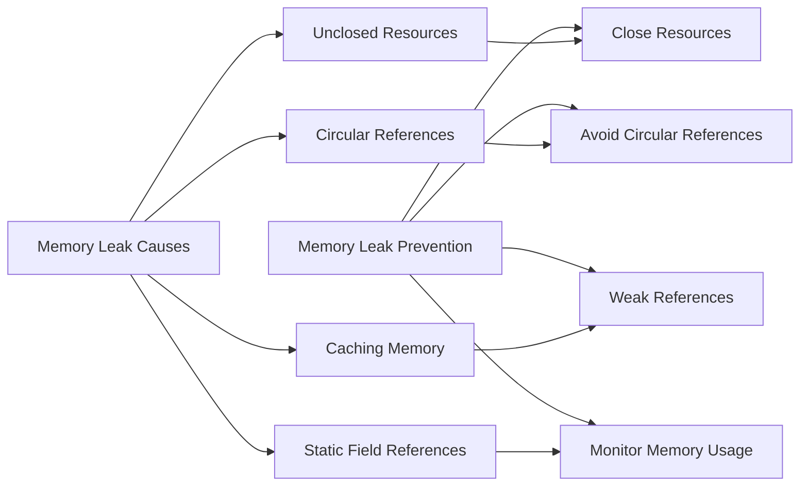

### **Object-Oriented Programming (OOP) Concepts in Depth**

Object-Oriented Programming (OOP) is a programming paradigm that is based on the concept of **objects**, which are instances of **classes**. The four main pillars of OOP — **Encapsulation**, **Abstraction**, **Inheritance**, and **Polymorphism** — are foundational principles that guide the design and development of object-oriented software systems. Below is a deep dive into each of these principles:

---

### **1. Encapsulation**

**Encapsulation** is the concept of **bundling the data (attributes)** and **methods (functions)** that operate on the data into a single unit, called a **class**. It also refers to restricting access to some of the object's components to protect the integrity of the object.

#### Key Aspects of Encapsulation:
- **Private Data**: The internal state of an object (its fields or attributes) is kept private and can only be accessed or modified through public methods (getters and setters).
- **Access Control**: Using access modifiers (`private`, `public`, `protected`), we can control access to the data and methods in a class.
- **Getter/Setter Methods**: Public methods are provided to retrieve (`get`) or modify (`set`) the values of private fields.

#### Example of Encapsulation in Java:
```java
public class Account {
    // Private fields (data)
    private double balance;

    // Constructor to initialize the Account object
    public Account(double balance) {
        this.balance = balance;
    }

    // Getter method to access the balance
    public double getBalance() {
        return balance;
    }

    // Setter method to modify the balance
    public void deposit(double amount) {
        if (amount > 0) {
            balance += amount;
        }
    }

    // Method to withdraw money
    public void withdraw(double amount) {
        if (amount > 0 && balance >= amount) {
            balance -= amount;
        }
    }
}
```

**Benefits of Encapsulation**:
- **Data Hiding**: It protects the object's internal state from unauthorized access.
- **Flexibility**: You can change the implementation of methods or attributes without affecting the external code that uses the class.
- **Code Maintainability**: Centralizes the logic for accessing or modifying an object’s data, making maintenance easier.

---

### **2. Abstraction**

**Abstraction** is the concept of **hiding the complexity** of the system and exposing only the necessary parts. It allows a programmer to focus on high-level functionality while hiding the implementation details.

#### Key Aspects of Abstraction:
- **Abstract Classes**: A class that cannot be instantiated on its own, but can be subclassed. It can contain abstract methods (without implementation) and concrete methods (with implementation).
- **Interfaces**: An interface is a contract that defines a set of abstract methods, which any implementing class must define. It allows for a form of abstraction by decoupling the interface (what an object can do) from its implementation (how it does it).

#### Example of Abstraction using an Abstract Class:
```java
abstract class Animal {
    // Abstract method (no implementation)
    public abstract void makeSound();

    // Concrete method
    public void sleep() {
        System.out.println("The animal is sleeping.");
    }
}

class Dog extends Animal {
    @Override
    public void makeSound() {
        System.out.println("Woof!");
    }
}
```

#### Example of Abstraction using an Interface:
```java
interface Shape {
    // Abstract method (no implementation)
    double area();
}

class Circle implements Shape {
    private double radius;

    public Circle(double radius) {
        this.radius = radius;
    }

    @Override
    public double area() {
        return Math.PI * radius * radius;
    }
}
```

**Benefits of Abstraction**:
- **Simplifies Complexity**: Allows the user to interact with high-level functionalities and ignore implementation details.
- **Separation of Concerns**: Separates the **what** from the **how**, ensuring that changes in implementation don’t affect the interface.
- **Improved Flexibility**: You can change the implementation of an abstract class or interface without affecting the system as long as the interface remains unchanged.

---

### **3. Inheritance**

**Inheritance** is the mechanism by which one class can **inherit properties and methods** from another class. This promotes **code reusability** and allows for hierarchical class relationships. A subclass (or child class) inherits from a superclass (or parent class), and can:
- Reuse code from the superclass.
- Override methods of the superclass to provide specialized behavior.
- Extend the functionality of the superclass by adding new methods or properties.

#### Key Aspects of Inheritance:
- **Single Inheritance**: A class can inherit from only one class (in Java).
- **Method Overriding**: A subclass can provide its own implementation of a method that is already defined in the superclass.
- **`super` keyword**: Used to call a superclass’s method or constructor from a subclass.

#### Example of Inheritance:
```java
class Animal {
    public void eat() {
        System.out.println("This animal is eating.");
    }
}

class Dog extends Animal {
    // Method overriding
    @Override
    public void eat() {
        System.out.println("This dog is eating.");
    }
}

public class Main {
    public static void main(String[] args) {
        Animal animal = new Animal();
        animal.eat();  // Output: This animal is eating.

        Dog dog = new Dog();
        dog.eat();  // Output: This dog is eating.
    }
}
```

**Benefits of Inheritance**:
- **Code Reusability**: Subclasses can reuse code from the superclass.
- **Extensibility**: You can easily extend existing code by creating new subclasses.
- **Hierarchy**: Inheritance establishes a natural hierarchy and relationship between classes (e.g., `Dog` is a type of `Animal`).

---

### **4. Polymorphism**

**Polymorphism** means **many forms**, and it allows objects of different classes to be treated as objects of a common superclass. It is the ability for a method to perform different operations based on the object it is acting upon. Polymorphism is typically achieved via:
- **Method Overloading**: Same method name but different parameter types (compile-time polymorphism).
- **Method Overriding**: Same method name and parameters, but different implementations in the subclass (runtime polymorphism).

#### Key Aspects of Polymorphism:
- **Dynamic Method Dispatch (Runtime Polymorphism)**: In Java, polymorphism is commonly used via method overriding. The method that gets called is determined at runtime based on the object's actual type, not the reference type.
- **Compile-Time Polymorphism (Method Overloading)**: The method to call is determined at compile time based on method signatures.

#### Example of Polymorphism (Method Overriding):
```java
class Animal {
    public void sound() {
        System.out.println("Some generic animal sound");
    }
}

class Dog extends Animal {
    @Override
    public void sound() {
        System.out.println("Woof!");
    }
}

class Cat extends Animal {
    @Override
    public void sound() {
        System.out.println("Meow!");
    }
}

public class Main {
    public static void main(String[] args) {
        Animal animal1 = new Dog();
        animal1.sound();  // Output: Woof!

        Animal animal2 = new Cat();
        animal2.sound();  // Output: Meow!
    }
}
```

**Benefits of Polymorphism**:
- **Flexibility and Extensibility**: You can extend or modify the behavior of a class without altering its interface.
- **Code Simplification**: Polymorphism simplifies code by allowing one interface to be used for different implementations. This reduces the need for complex conditional statements (e.g., `if`-`else` chains).
- **Maintainability**: As the number of classes and behavior grow, polymorphism allows the system to remain flexible and easily maintainable.

---

### **Other OOP Concepts**

In addition to the main four pillars (Encapsulation, Abstraction, Inheritance, Polymorphism), OOP also involves several additional concepts and techniques:

#### **5. Composition (Has-A Relationship)**

Composition is a design principle that allows for building complex objects by combining simpler ones. It is a **has-a** relationship where one object is a part of another.

```java
class Engine {
    public void start() {
        System.out.println("Engine starting");
    }
}

class Car {
    private Engine engine; // Car has an Engine

    public Car() {
        engine = new Engine();
    }

    public void start() {
        engine.start();  // Delegating the start operation to Engine
        System.out.println("Car started");
    }
}
```

**Benefits of Composition**:
- It offers more flexibility and a **loose coupling** between classes than inheritance.
- You can easily change the parts (components) of an object without modifying the entire object.

#### **6. Association**

Association represents the relationship between two or more objects. There are different types of associations:
- **One-to-One**: One object is associated with exactly one object.
- **One-to-Many**: One object is associated with multiple objects.
- **Many-to-Many**: Multiple objects are associated with multiple objects.

#### **7. Aggregation**

Aggregation is a special form of association that represents a "whole-part" relationship, where the "part" can exist independently of the "whole." It's a **Has-A** relationship with a more loosely-coupled structure than composition.

---

### **Conclusion**

Object-Oriented Programming (OOP) is a paradigm

 that helps in organizing software around the concept of **objects** and **classes**, making it more modular, maintainable, and reusable. Understanding the four pillars of OOP (Encapsulation, Abstraction, Inheritance, and Polymorphism) is essential for designing and building robust systems. By applying these principles, developers can create software that is easier to extend, debug, and maintain over time.

### **Composition, Aggregation, and Association in Java**

In object-oriented programming, relationships between objects are an important concept. Three fundamental types of relationships in OOP are **Composition**, **Aggregation**, and **Association**. These relationships represent how objects interact or are related to one another in a system. Below, I’ll explain each of these relationships in depth, with examples and when to use them.

---

### **1. Composition (Has-A Relationship)**

**Composition** is a type of association where one object **"owns"** or **"contains"** another object, and the contained object cannot exist independently without the parent object. It is also known as a **strong relationship** because if the parent object is destroyed, its contained objects are also destroyed.

In composition:
- The lifetime of the contained object is dependent on the parent object.
- It represents a **strong "Has-A"** relationship (i.e., "A House has Rooms").
- If the parent object is deleted, the contained object is deleted too.

#### **When to Use Composition**
- Use composition when you want to establish a **strong lifecycle dependency** between objects, where one object is a part of another.
- Common in real-world systems, like a **Car has an Engine** or a **Library has Books**.

#### **Example: Composition in Java**

```java
class Engine {
    private String engineType;

    public Engine(String engineType) {
        this.engineType = engineType;
    }

    public void start() {
        System.out.println("Engine starting...");
    }
}

class Car {
    private Engine engine;  // Car "has-a" Engine (Composition)

    public Car(String engineType) {
        engine = new Engine(engineType); // Car owns the Engine, hence it is created when Car is created
    }

    public void startCar() {
        engine.start();
        System.out.println("Car is ready to go.");
    }
}

public class Main {
    public static void main(String[] args) {
        Car myCar = new Car("V8");
        myCar.startCar();  // Engine is created with the Car object and will be destroyed when Car is destroyed.
    }
}
```

**Explanation**:
- The `Car` class contains an `Engine` object, meaning that an engine cannot exist independently without a car.
- The engine is created when the car object is created, and the engine is destroyed when the car is destroyed (i.e., the engine's lifecycle is tied to the car).
  
### **2. Aggregation**

**Aggregation** is a **special form of Association** where one object **contains** or **references** another object, but the contained object can exist independently of the parent object. This is a **looser** relationship compared to composition.

In aggregation:
- The lifetime of the contained object does **not depend** on the parent object. It can exist on its own and may be shared across other objects.
- It represents a **"Has-A"** relationship, but with **independence** for the contained objects (e.g., "A University has Professors" but professors can exist independently of the university).

#### **When to Use Aggregation**
- Use aggregation when the contained objects have an **independent existence** and are **shared** among multiple parent objects.
- Common in cases like **A Department has Employees**, **A University has Professors** (Professors can be in multiple Universities).

#### **Example: Aggregation in Java**

```java
class Professor {
    private String name;

    public Professor(String name) {
        this.name = name;
    }

    public void teach() {
        System.out.println(name + " is teaching.");
    }
}

class University {
    private String universityName;
    private List<Professor> professors;  // University "has-a" Professors (Aggregation)

    public University(String universityName) {
        this.universityName = universityName;
        this.professors = new ArrayList<>();
    }

    public void addProfessor(Professor professor) {
        professors.add(professor);
    }

    public void showProfessors() {
        for (Professor professor : professors) {
            professor.teach();
        }
    }
}

public class Main {
    public static void main(String[] args) {
        Professor prof1 = new Professor("Dr. Smith");
        Professor prof2 = new Professor("Dr. Brown");

        University university = new University("Tech University");
        university.addProfessor(prof1);
        university.addProfessor(prof2);

        university.showProfessors();
    }
}
```

**Explanation**:
- In the `University` class, the professors can exist independently and can be added to multiple universities.
- If a university is destroyed, the professors are not destroyed — they can still exist independently of any university.

### **3. Association**

**Association** is the **most general** relationship between objects. In association, two or more objects are connected, but neither object **owns** or **depends** on the other. This is the weakest form of relationship, meaning that both objects can exist independently of each other.

In association:
- Objects are related but have no strict lifecycle dependency.
- The relationship can be **bi-directional** (e.g., "A Teacher teaches a Student", where both Teacher and Student exist independently).

#### **When to Use Association**
- Use association when objects **interact** with each other, but there is **no ownership** or **dependency**.
- Common in scenarios like **A Teacher teaches a Student**, **A Car is driven by a Driver**.

#### **Example: Association in Java**

```java
class Student {
    private String name;

    public Student(String name) {
        this.name = name;
    }

    public void study() {
        System.out.println(name + " is studying.");
    }
}

class Teacher {
    private String name;

    public Teacher(String name) {
        this.name = name;
    }

    public void teach() {
        System.out.println(name + " is teaching.");
    }

    public void teachStudent(Student student) {
        System.out.println(name + " is teaching " + student.name);
        student.study();  // Interaction between Teacher and Student
    }
}

public class Main {
    public static void main(String[] args) {
        Teacher teacher = new Teacher("Mr. John");
        Student student = new Student("Alice");

        teacher.teachStudent(student);  // Teacher and Student interact, but neither owns the other
    }
}
```

**Explanation**:
- The `Teacher` and `Student` objects are **associated** because they interact with each other (the teacher teaches the student), but neither object **owns** the other.
- Both objects can exist independently, and the teacher could teach multiple students, or the student could study with other teachers.

---

### **Summary of When to Use Each Relationship**

| **Relationship Type** | **Description** | **When to Use** | **Example** |
|-----------------------|-----------------|-----------------|-------------|
| **Composition (Has-A)** | A strong **"Has-A"** relationship where the child object **cannot exist independently** of the parent object. | Use when the child object is **part of** the parent object and its lifecycle is tied to the parent object. | A **Car has an Engine**. If the car is destroyed, so is the engine. |
| **Aggregation**        | A **looser Has-A** relationship where the child object **can exist independently**. | Use when the child object can exist independently and might be **shared** across multiple objects. | A **University has Professors**, but professors can exist without the university. |
| **Association**        | A **general relationship** where objects are related but have no strict lifecycle dependency. | Use when objects **interact**, but neither is **dependent** on the other. | A **Teacher teaches a Student**, but neither owns the other. |

In practice, the choice between **composition**, **aggregation**, and **association** depends on the **lifetime** and **ownership** of the objects involved, and how closely related they are in your design.

In Java, **access specifiers** and **non-access modifiers** are keywords used to define the visibility, accessibility, and behavior of classes, methods, variables, and constructors. Understanding how these work is essential for designing robust and maintainable applications. Below, I’ll provide a detailed overview of both access specifiers and non-access modifiers, along with examples.

### **1. Access Specifiers in Java**
Access specifiers determine the visibility or accessibility of a class, method, or variable to other parts of the program. There are **four** main types of access specifiers:

1. **`public`**  
   - **Visibility**: The member is accessible from **any other class** in any package.
   - **Use case**: Used for classes, methods, and fields that need to be accessed universally.

2. **`private`**  
   - **Visibility**: The member is **accessible only within the same class**.
   - **Use case**: Used to restrict access to fields and methods to maintain **encapsulation** and hide internal details.

3. **`protected`**  
   - **Visibility**: The member is accessible within:
     - The **same package**.
     - **Subclasses** (even if they are in different packages).
   - **Use case**: Typically used for inheritance, allowing derived classes to access protected members of their base class.

4. **Default (Package-private)**  
   - **Visibility**: If no access specifier is provided, the member is accessible only within **the same package**.
   - **Use case**: Used for members that should be accessible within the package but not outside it.

#### **Example**:

```java
class AccessSpecifierExample {
    public String publicVar = "Public"; // Can be accessed from anywhere
    private String privateVar = "Private"; // Can only be accessed within the class
    protected String protectedVar = "Protected"; // Can be accessed in subclasses
    String defaultVar = "Default"; // Package-private: Can only be accessed within the package

    public void show() {
        System.out.println("Public variable: " + publicVar);
        System.out.println("Private variable: " + privateVar);
        System.out.println("Protected variable: " + protectedVar);
        System.out.println("Default variable: " + defaultVar);
    }
}

public class Main {
    public static void main(String[] args) {
        AccessSpecifierExample example = new AccessSpecifierExample();
        System.out.println(example.publicVar);  // Accessible
        // System.out.println(example.privateVar);  // Not accessible, compile-time error
        System.out.println(example.protectedVar);  // Accessible within the same package or subclasses
        System.out.println(example.defaultVar);  // Accessible within the same package
    }
}
```

### **2. Non-Access Modifiers in Java**
Non-access modifiers are used to define the **behavior** of classes, methods, and variables. These modifiers do not control access but alter how the Java compiler handles the elements.

#### **Common Non-Access Modifiers**:

1. **`static`**
   - **Use**: Denotes class-level variables or methods, meaning they belong to the class rather than an instance.
   - **Use Case**: Static variables or methods are shared among all instances of the class.
   - **Example**:

     ```java
     class Counter {
         static int count = 0;  // Static variable shared across all instances

         public Counter() {
             count++;
         }

         public static void displayCount() {
             System.out.println("Count: " + count);
         }
     }

     public class Main {
         public static void main(String[] args) {
             new Counter();
             new Counter();
             Counter.displayCount();  // Output: Count: 2
         }
     }
     ```

2. **`final`**
   - **Use**: 
     - Prevents modification (for variables, methods, and classes).
     - A `final` variable cannot be reassigned.
     - A `final` method cannot be overridden.
     - A `final` class cannot be subclassed.
   - **Use Case**: To create constants, to prevent inheritance or method overriding, and to ensure immutability.
   - **Example**:

     ```java
     class Calculator {
         final double PI = 3.14159;  // Constant value

         public final void showPI() {  // Method cannot be overridden
             System.out.println("Value of PI: " + PI);
         }
     }

     // Error: Cannot subclass final class
     // class ExtendedCalculator extends Calculator { }

     public class Main {
         public static void main(String[] args) {
             Calculator calc = new Calculator();
             calc.showPI();
         }
     }
     ```

3. **`abstract`**
   - **Use**: 
     - For abstract classes: cannot be instantiated directly and may have abstract methods that must be implemented by subclasses.
     - For abstract methods: a method that has no body and must be implemented by any concrete subclass.
   - **Use Case**: To create a common template for subclasses that can have their own specific implementations.
   - **Example**:

     ```java
     abstract class Animal {
         abstract void sound();  // Abstract method, no body

         public void eat() {
             System.out.println("Animal is eating.");
         }
     }

     class Dog extends Animal {
         public void sound() {
             System.out.println("Woof!");
         }
     }

     public class Main {
         public static void main(String[] args) {
             Animal dog = new Dog();
             dog.sound();  // Output: Woof!
             dog.eat();    // Output: Animal is eating.
         }
     }
     ```

4. **`synchronized`**
   - **Use**: Used to ensure that only one thread can access a method or block of code at a time.
   - **Use Case**: Used for thread safety, particularly when accessing shared resources in a multithreaded environment.
   - **Example**:

     ```java
     class Counter {
         private int count = 0;

         public synchronized void increment() {  // Synchronized to ensure thread safety
             count++;
         }

         public synchronized int getCount() {
             return count;
         }
     }

     public class Main {
         public static void main(String[] args) {
             Counter counter = new Counter();

             // Multiple threads incrementing the counter
             Runnable task = () -> {
                 for (int i = 0; i < 1000; i++) {
                     counter.increment();
                 }
             };

             Thread t1 = new Thread(task);
             Thread t2 = new Thread(task);

             t1.start();
             t2.start();

             try {
                 t1.join();
                 t2.join();
             } catch (InterruptedException e) {
                 e.printStackTrace();
             }

             System.out.println("Final count: " + counter.getCount());  // Ensures thread-safe increment
         }
     }
     ```

5. **`transient`**
   - **Use**: Marks a member variable not to be serialized. When an object is serialized, transient variables are excluded.
   - **Use Case**: To exclude sensitive data or data that should not be part of the serialization process.
   - **Example**:

     ```java
     import java.io.*;

     class Person implements Serializable {
         String name;
         transient String password;  // Will not be serialized

         public Person(String name, String password) {
             this.name = name;
             this.password = password;
         }
     }

     public class Main {
         public static void main(String[] args) throws IOException, ClassNotFoundException {
             Person person = new Person("Alice", "secret123");

             // Serialize the object
             FileOutputStream fileOut = new FileOutputStream("person.ser");
             ObjectOutputStream out = new ObjectOutputStream(fileOut);
             out.writeObject(person);
             out.close();
             fileOut.close();

             // Deserialize the object
             FileInputStream fileIn = new FileInputStream("person.ser");
             ObjectInputStream in = new ObjectInputStream(fileIn);
             Person deserializedPerson = (Person) in.readObject();
             in.close();
             fileIn.close();

             System.out.println("Name: " + deserializedPerson.name);
             System.out.println("Password: " + deserializedPerson.password);  // Output will be null because it was transient
         }
     }
     ```

6. **`volatile`**
   - **Use**: Used for variables to indicate that the value of the variable may be changed by multiple threads.
   - **Use Case**: Ensures that the most up-to-date value of the variable is always read by threads, especially when there are concurrent modifications.
   - **Example**:

     ```java
     class Flag {
         private volatile boolean flag = false;  // Ensures visibility across threads

         public void setFlag() {
             flag = true;
         }

         public boolean getFlag() {
             return flag;
         }
     }

     public class Main {
         public static void main(String[] args) {
             Flag flag = new Flag();

             Thread t1 = new Thread(() -> {
                 while (!flag.getFlag()) {
                     // Wait for flag to be true
                 }
                 System.out.println("Flag is set!");
             });

             Thread t2 = new Thread(() -> {
                 flag.setFlag();
                 System.out.println("Flag has been set.");
             });

             t1.start();
             t2.start();
         }
     }
     ```

---

### **Summary of Modifiers**

| **Modifier**        | **Type**            | **Purpose**                                                            | **Use Case**                                      |
|---------------------|---------------------|------------------------------------------------------------------------|--------------------------------------------------|
| **`public`**         | Access Specifier    | Makes the member accessible from anywhere.                             | For commonly accessible elements.               |
| **`private`**        | Access Specifier    | Restricts the member to be accessible within the same class.           | For encapsulation and hiding internal details.  |
| **`protected`**      | Access Specifier    | Allows access within the same package and by subclasses.               | For inheritance scenarios.                      |
| **`default`**        | Access Specifier    | Allows access within the same package.                                 | Package-private members.                        |
| **`static`**         | Non-Access Modifier | Indicates class-level members shared across instances.                | For shared state or utility methods.            |
| **`final`**          | Non-Access Modifier | Prevents modification (variables), overriding (methods), or subclassing (classes). | To create constants, immutability, and prevent modification. |
| **`abstract`**       | Non-Access Modifier | Defines abstract classes or methods that must be implemented by subclasses. | For defining templates or incomplete classes.   |
| **`synchronized`**   | Non-Access Modifier | Ensures mutual exclusion for methods or blocks in multi-threaded contexts. | For thread safety.                              |
| **`transient`**      | Non-Access Modifier | Excludes variables from being serialized.                              | For sensitive data or non-serializable fields.  |
| **`volatile`**       | Non-Access Modifier | Ensures visibility of updated variables across threads.                | For shared variables in multi-threaded programs. |

By using these modifiers appropriately, Java developers can create clean, efficient, and maintainable code, controlling how classes and members are accessed and behave in different contexts.

In Java, **threads** and **concurrency** are key concepts for building applications that can perform multiple tasks simultaneously. Java provides several keywords and classes to work with threads and manage concurrency, making it easier to write efficient, multi-threaded applications. Below is a detailed explanation of **Java thread-related keywords** and **concurrency** concepts, including their uses with examples.

---

### **1. Thread Keywords in Java**

#### **`synchronized`**
- **Purpose**: The `synchronized` keyword is used to ensure that a method or block of code can only be executed by one thread at a time, providing a mechanism for mutual exclusion and thread safety.
- **Use case**: When multiple threads need to access a shared resource (e.g., a variable or a method), and you want to ensure that no two threads modify it simultaneously (leading to race conditions).
- **Example**:

```java
class Counter {
    private int count = 0;

    public synchronized void increment() {  // Synchronized method
        count++;
    }

    public synchronized int getCount() {  // Synchronized method
        return count;
    }
}

public class Main {
    public static void main(String[] args) throws InterruptedException {
        Counter counter = new Counter();

        Runnable task = () -> {
            for (int i = 0; i < 1000; i++) {
                counter.increment();
            }
        };

        Thread t1 = new Thread(task);
        Thread t2 = new Thread(task);

        t1.start();
        t2.start();

        t1.join();
        t2.join();

        System.out.println("Final Count: " + counter.getCount());  // Ensured thread-safe increment
    }
}
```

- **Explanation**: 
  - `synchronized` ensures that only one thread can execute the `increment()` method at a time, avoiding race conditions and ensuring the integrity of the `count` variable.

#### **`volatile`**
- **Purpose**: The `volatile` keyword is used to indicate that a variable's value can be modified by multiple threads, and any update to it must be immediately visible to all threads.
- **Use case**: It is used for variables that are shared between threads and need to be updated consistently across all threads.
- **Example**:

```java
class Flag {
    private volatile boolean flag = false;  // Ensures the flag is updated across threads

    public void setFlag() {
        flag = true;
    }

    public boolean getFlag() {
        return flag;
    }
}

public class Main {
    public static void main(String[] args) {
        Flag flag = new Flag();

        // Thread to check the flag
        Thread t1 = new Thread(() -> {
            while (!flag.getFlag()) {
                // Wait until the flag is set
            }
            System.out.println("Flag is set!");
        });

        // Thread to set the flag
        Thread t2 = new Thread(() -> {
            flag.setFlag();
            System.out.println("Flag has been set.");
        });

        t1.start();
        t2.start();
    }
}
```

- **Explanation**:
  - The `volatile` keyword ensures that changes made to `flag` by one thread are immediately visible to other threads, preventing caching issues that might occur with normal variables.

#### **`final`**
- **Purpose**: In the context of multi-threading, the `final` keyword can be used to declare variables that cannot be modified after initialization, thus preventing certain types of concurrency errors.
- **Use case**: To ensure that a variable or reference is safely initialized and cannot be modified by any thread after construction.
- **Example**:

```java
class Example {
    private final String message;

    public Example(String message) {
        this.message = message;  // Can only be assigned once
    }

    public String getMessage() {
        return message;
    }
}

public class Main {
    public static void main(String[] args) {
        Example example = new Example("Hello, Thread!");
        System.out.println(example.getMessage());
    }
}
```

- **Explanation**:
  - The `final` keyword ensures that the `message` variable can only be assigned once, making it immutable after construction. This guarantees thread safety when accessing the `message` variable across multiple threads.

---

### **2. Concurrency Keywords and Concepts in Java**

#### **`extends Thread` vs `implements Runnable`**
Java provides two primary ways to create and start a new thread: by extending the `Thread` class or by implementing the `Runnable` interface.

1. **`extends Thread`**:
   - You can create a new thread by extending the `Thread` class and overriding its `run()` method.
   - This is the simpler approach but is less flexible because Java only allows single inheritance, so if your class extends `Thread`, it cannot extend any other class.

   **Example**:

   ```java
   class MyThread extends Thread {
       public void run() {
           System.out.println("Thread is running");
       }
   }

   public class Main {
       public static void main(String[] args) {
           MyThread t = new MyThread();
           t.start();  // Start the thread
       }
   }
   ```

2. **`implements Runnable`**:
   - Implementing the `Runnable` interface is more flexible because it allows your class to inherit from other classes (since Java supports multiple interfaces).
   - It also allows passing the `Runnable` instance to the `Thread` constructor, which can be helpful in certain situations like using thread pools.

   **Example**:

   ```java
   class MyRunnable implements Runnable {
       public void run() {
           System.out.println("Thread is running");
       }
   }

   public class Main {
       public static void main(String[] args) {
           MyRunnable myRunnable = new MyRunnable();
           Thread t = new Thread(myRunnable);
           t.start();  // Start the thread
       }
   }
   ```

---

### **3. Concurrency Concepts and Tools in Java**

#### **Thread Pools (`Executor Framework`)**
Instead of creating new threads for every task, which can be inefficient, Java provides the `Executor` framework to manage a pool of threads. This helps to reuse threads and limit the number of concurrently executing threads.

- **`Executor`**: A simple interface for executing tasks asynchronously.
- **`ExecutorService`**: A sub-interface of `Executor` that adds methods for managing and controlling the execution of tasks.
- **`ThreadPoolExecutor`**: A concrete implementation of `ExecutorService` that provides a thread pool.

**Example**:

```java
import java.util.concurrent.*;

public class Main {
    public static void main(String[] args) {
        ExecutorService executor = Executors.newFixedThreadPool(4);  // Thread pool with 4 threads

        Runnable task = () -> {
            System.out.println(Thread.currentThread().getName() + " is executing task.");
        };

        for (int i = 0; i < 10; i++) {
            executor.submit(task);  // Submit tasks to the thread pool
        }

        executor.shutdown();  // Shut down the executor service
    }
}
```

- **Explanation**:
  - Here, we use `Executors.newFixedThreadPool(4)` to create a thread pool with a fixed size of 4 threads. Tasks are submitted to the pool, and the threads in the pool handle them.

#### **`CountDownLatch`**
- **Purpose**: The `CountDownLatch` class is used to synchronize multiple threads. It allows one or more threads to wait until a set of operations in other threads completes.
- **Use case**: When you want a thread to wait for multiple threads to complete before continuing.

**Example**:

```java
import java.util.concurrent.*;

public class Main {
    public static void main(String[] args) throws InterruptedException {
        CountDownLatch latch = new CountDownLatch(3);  // Wait for 3 threads

        Runnable task = () -> {
            try {
                Thread.sleep(1000);  // Simulate some work
                System.out.println(Thread.currentThread().getName() + " completed task.");
                latch.countDown();  // Decrement latch count
            } catch (InterruptedException e) {
                e.printStackTrace();
            }
        };

        for (int i = 0; i < 3; i++) {
            new Thread(task).start();
        }

        latch.await();  // Wait for all threads to finish
        System.out.println("All tasks are complete.");
    }
}
```

- **Explanation**:
  - The `CountDownLatch` is initialized with a count of 3. Each of the 3 threads decrements the latch by calling `countDown()`, and the main thread waits for the latch to reach 0 using `await()`. Only when all 3 threads finish will the main thread continue.

#### **`CyclicBarrier`**
- **Purpose**: Similar to `CountDownLatch`, but more flexible. It allows a set of threads to wait for each other to reach a common barrier point.
- **Use case**: Used when multiple threads need to wait for each other to reach a certain point before proceeding.

**Example**:

```java
import java.util.concurrent.*;

public class Main {
    public static void main(String[] args) throws InterruptedException {
        CyclicBarrier barrier = new CyclicBarrier(3, () -> {
            System.out.println("All threads have reached the barrier.");
        });

        Runnable task = () -> {
            try {
                System.out.println(Thread.currentThread().getName() + " is working.");
                Thread.sleep(1000);  // Simulate work
                barrier.await();  // Wait at the barrier
            } catch (InterruptedException | BrokenBarrierException e)

 {
                e.printStackTrace();
            }
        };

        for (int i = 0; i < 3; i++) {
            new Thread(task).start();
        }
    }
}
```

- **Explanation**:
  - The `CyclicBarrier` is initialized with 3 parties. All threads must reach the barrier by calling `await()`. Once all 3 threads arrive, the barrier is triggered, and the `Runnable` passed to the barrier is executed.

---

### **Summary of Key Thread and Concurrency Keywords**

| **Keyword**         | **Purpose**                                             | **Use Case**                                              |
|---------------------|---------------------------------------------------------|-----------------------------------------------------------|
| **`synchronized`**   | Ensures mutual exclusion for methods or blocks of code | Used for thread safety when accessing shared resources.   |
| **`volatile`**       | Ensures visibility of variable across threads          | Used for variables that can be accessed and modified by multiple threads. |
| **`final`**          | Prevents modification (variables), overriding (methods), or subclassing (classes) | Ensures immutability and safe sharing of data across threads. |
| **`Thread`**         | A class to represent a thread of execution              | Used to create and manage threads.                        |
| **`Runnable`**       | An interface for executing code in a thread             | Used for defining tasks that can be executed by a thread. |
| **`Executor`**       | Interface for executing tasks asynchronously            | Used for thread pool management.                          |
| **`CountDownLatch`** | Used for thread synchronization (waiting for other threads to complete) | Used to wait for one or more threads to complete their execution. |
| **`CyclicBarrier`**  | Synchronizes a set of threads to wait for each other    | Used to ensure threads wait at a certain point before proceeding. |
| **`ExecutorService`**| Extends `Executor` to provide methods for controlling task execution | Manages and controls thread execution in thread pools.    |

---

By understanding and utilizing these keywords, you can effectively manage concurrency in your Java programs, making them more efficient, thread-safe, and responsive.

In Java, `final` and `static` are two important keywords that have distinct roles and uses in the language. They are often used to control the behavior and structure of variables, methods, and classes. Let's break them down in detail.

### **1. `final` Keyword in Java**

The `final` keyword in Java is used to indicate that something cannot be changed or modified once it is assigned or initialized. It can be applied to variables, methods, and classes.

#### **Usage of `final`**

1. **Final Variable**: A variable declared as `final` can only be assigned once, i.e., it can be initialized only once, either directly or in the constructor (in case of instance variables). Once initialized, it cannot be modified.

   - **Final Instance Variable**: The value of the instance variable cannot be changed after the object is created.
   - **Final Static Variable**: The value of the static variable cannot be changed after it is initialized.

   **Example**:
   ```java
   class Example {
       final int CONSTANT = 100;  // Constant, cannot be changed after initialization

       public Example() {
           // CONSTANT = 200; // Error: cannot assign a value to final variable
       }

       public void printConstant() {
           System.out.println(CONSTANT);
       }
   }
   ```

2. **Final Method**: A method declared as `final` cannot be overridden by subclasses. This is useful when you want to ensure that the implementation of a method remains the same across all subclasses.

   **Example**:
   ```java
   class Parent {
       final void display() {
           System.out.println("This method cannot be overridden.");
       }
   }

   class Child extends Parent {
       // Error: Cannot override final method from Parent
       // void display() {
       //     System.out.println("Trying to override");
       // }
   }
   ```

3. **Final Class**: A class declared as `final` cannot be subclassed. This is used when you want to prevent inheritance and ensure that no other class can extend your class.

   **Example**:
   ```java
   final class FinalClass {
       public void show() {
           System.out.println("This class cannot be subclassed.");
       }
   }

   // Error: Cannot subclass final class
   // class SubClass extends FinalClass { }
   ```

#### **Key Points About `final`**
- **Final Variables**: Once assigned, the value cannot be changed.
- **Final Methods**: Cannot be overridden by subclasses.
- **Final Classes**: Cannot be subclassed.
- **Use Cases**: Immutable objects, preventing modification, and defining constants.

---

### **2. `static` Keyword in Java**

The `static` keyword in Java is used to create class-level members (variables and methods), meaning they belong to the **class** rather than to any specific instance of the class. `static` is often used for class-level variables (also called class fields) and methods that should be shared among all instances of the class.

#### **Usage of `static`**

1. **Static Variable**: A static variable is shared by all instances of the class. It is also known as a **class variable** because it is associated with the class itself, not with individual objects. If you modify the static variable, the change will reflect across all instances of that class.

   **Example**:
   ```java
   class Counter {
       static int count = 0; // Static variable shared by all instances

       public Counter() {
           count++;
       }

       public void showCount() {
           System.out.println("Count: " + count);
       }
   }

   public class Test {
       public static void main(String[] args) {
           Counter c1 = new Counter();
           Counter c2 = new Counter();
           c1.showCount(); // Count: 2
           c2.showCount(); // Count: 2
       }
   }
   ```

   - In the above example, both `c1` and `c2` share the same static variable `count`. Each time a new `Counter` object is created, `count` is incremented. Both objects show the same value for `count`.

2. **Static Method**: A static method belongs to the class rather than to any specific instance. You can invoke a static method without creating an instance of the class. Static methods can access only static variables and call other static methods. They **cannot** access instance variables or instance methods directly.

   **Example**:
   ```java
   class Calculator {
       static int add(int a, int b) {
           return a + b;
       }
   }

   public class Test {
       public static void main(String[] args) {
           // Static method is called without creating an object
           System.out.println(Calculator.add(5, 10)); // Output: 15
       }
   }
   ```

   - Static methods are often used for utility or helper methods that do not require instance-specific data.

3. **Static Block**: A static block is used for static initialization of a class. It runs only once when the class is first loaded into memory, and it is typically used to initialize static variables or perform one-time setup operations.

   **Example**:
   ```java
   class Example {
       static int value;

       static {
           value = 10;  // Static block for initializing static variable
           System.out.println("Static block executed.");
       }

       public static void main(String[] args) {
           System.out.println("Value: " + value);
       }
   }
   ```

   - Static blocks are useful for one-time initialization when the class is loaded and when the static fields need complex setup.

4. **Static Class (Nested Class)**: In Java, you can have a static nested class. A static nested class is not associated with an instance of the outer class, and it can only access the **static members** of the outer class.

   **Example**:
   ```java
   class Outer {
       static int outerValue = 100;

       static class Inner {
           void display() {
               System.out.println("Outer value: " + outerValue); // Can access static member of outer class
           }
       }
   }

   public class Test {
       public static void main(String[] args) {
           Outer.Inner inner = new Outer.Inner();
           inner.display();  // Output: Outer value: 100
       }
   }
   ```

---

### **Key Differences Between `final` and `static`**

| **Feature**                  | **`final`**                                       | **`static`**                                             |
|------------------------------|--------------------------------------------------|---------------------------------------------------------|
| **Purpose**                   | Used to indicate immutability or unchangeable elements (variable, method, or class). | Used to indicate class-level members shared by all instances. |
| **Scope**                     | Can be used with variables, methods, and classes. | Can be used with variables, methods, blocks, and nested classes. |
| **Modification**              | Once assigned, a `final` variable cannot be modified. | Static members belong to the class and can be accessed without an instance. |
| **Inheritance**               | A `final` method cannot be overridden; a `final` class cannot be subclassed. | A static method can be overridden (though it's not commonly done) and can be accessed via the class name or instances. |
| **Memory**                    | A `final` variable's value is constant. | A `static` variable is shared across all instances of the class. |
| **Use Cases**                 | Constants, immutability, preventing method overriding or class inheritance. | Class-level methods/variables, utility methods, shared state between objects. |

---

### **Common Use Cases**

1. **`final`**:
   - **Constants**: Declaring constants using `final` ensures that values cannot be changed.
   - **Immutable objects**: Used in creating immutable classes where fields cannot be changed after initialization.
   - **Preventing inheritance or method overriding**: When you want to restrict inheritance or overriding for safety, for example, in the `String` class.

2. **`static`**:
   - **Utility Methods**: Methods that don’t require instance data (e.g., `Math.max()`, `Collections.sort()`).
   - **Shared Data**: Static variables allow sharing data among all instances of a class.
   - **Class Initialization**: Static blocks for one-time initialization of static members.
   - **Singleton Pattern**: The `static` variable can hold the single instance of the class in a Singleton design.

---

### **Conclusion**

- **`final`** ensures that once a variable, method, or class is defined, it cannot be changed or extended. It is used for constants, immutability, and preventing modification through inheritance.
- **`static`** is used for class-level variables and methods, allowing them to be accessed without an instance of the class. It helps to share common data or behavior among all instances of the class.

Both `final` and `static` are crucial for writing clean, efficient, and safe Java code, especially when it comes to constants, utility functions, and shared state.


In Java, **abstract classes**, **regular interfaces**, and **functional interfaces** are important concepts that help define how we model behavior in our programs. They each have specific use cases, and understanding their differences is key to writing effective Java code.

Let's break down these concepts:

---

### 1. **Abstract Class**

An **abstract class** in Java is a class that cannot be instantiated directly. It can have both **abstract methods** (methods without a body) and **concrete methods** (methods with an implementation).

#### Key Characteristics of an Abstract Class:
- **Abstract Methods**: These are methods without implementation. Any subclass must provide an implementation for these methods, unless the subclass is also abstract.
- **Concrete Methods**: An abstract class can have methods with a body (regular methods) that can be inherited by its subclasses.
- **Instance Variables**: An abstract class can have instance variables and constructors, which can be used by its subclasses.
- **Inheritance**: A class can inherit from only one abstract class (since Java supports single inheritance).

#### Example:
```java
abstract class Animal {
    // Abstract method (does not have a body)
    abstract void sound();

    // Regular method
    void sleep() {
        System.out.println("The animal is sleeping");
    }
}

class Dog extends Animal {
    // Providing implementation for the abstract method
    @Override
    void sound() {
        System.out.println("Woof");
    }
}

public class AbstractExample {
    public static void main(String[] args) {
        Animal animal = new Dog();
        animal.sound();  // Output: Woof
        animal.sleep();  // Output: The animal is sleeping
    }
}
```

#### Use Cases for Abstract Class:
- **When you want to provide a common base class with some default implementation** but still want to force subclasses to provide specific implementations of certain methods.
- **When you want to share code** across multiple classes that share common behavior.
  
---

### 2. **Regular Interface**

A **regular interface** in Java is a contract that defines methods that must be implemented by any class that implements the interface. All methods in an interface are abstract by default (unless they are `default` or `static` methods). Interfaces cannot have instance variables, but they can have constants (i.e., static final variables).

#### Key Characteristics of a Regular Interface:
- **Abstract Methods**: All methods are implicitly abstract unless marked as `default` or `static`.
- **No Constructors**: Interfaces cannot have constructors, as they cannot be instantiated directly.
- **Multiple Inheritance**: A class can implement multiple interfaces, which allows for multiple inheritance of behavior (unlike abstract classes, which allow only single inheritance).
- **Default and Static Methods**: From Java 8 onwards, interfaces can have `default` and `static` methods that can provide concrete implementations.

#### Example:
```java
interface Animal {
    // Abstract method (no body)
    void sound();

    // Default method (with body)
    default void sleep() {
        System.out.println("The animal is sleeping");
    }
}

class Dog implements Animal {
    @Override
    public void sound() {
        System.out.println("Woof");
    }
}

public class InterfaceExample {
    public static void main(String[] args) {
        Animal animal = new Dog();
        animal.sound();  // Output: Woof
        animal.sleep();  // Output: The animal is sleeping
    }
}
```

#### Use Cases for Regular Interface:
- **When you need to define a contract for unrelated classes** to implement common behavior.
- **When you need multiple inheritance** of behavior, since Java allows classes to implement multiple interfaces.
- **When you want to decouple classes from implementation details**, allowing flexibility and easier testing.

---

### 3. **Functional Interface**

A **functional interface** is a special type of interface introduced in Java 8. It has exactly **one abstract method**. A functional interface can have multiple `default` or `static` methods, but it must have exactly one abstract method. Functional interfaces are often used with **lambda expressions** and **method references** in Java.

#### Key Characteristics of a Functional Interface:
- **Exactly One Abstract Method**: A functional interface can only have one abstract method. This allows instances of the interface to be created using lambda expressions.
- **`@FunctionalInterface` Annotation**: While optional, it's good practice to use the `@FunctionalInterface` annotation to indicate that an interface is intended to be functional. The compiler will flag errors if the interface does not adhere to the rules of a functional interface.
- **Default and Static Methods**: A functional interface can have multiple default and static methods, but they cannot be abstract.
  
#### Example:
```java
@FunctionalInterface
interface Calculator {
    // Single abstract method
    int calculate(int a, int b);

    // Default method (optional)
    default void printMessage(String message) {
        System.out.println(message);
    }
}

public class FunctionalInterfaceExample {
    public static void main(String[] args) {
        // Lambda expression implementing the functional interface
        Calculator add = (a, b) -> a + b;

        System.out.println(add.calculate(5, 3));  // Output: 8
        add.printMessage("Calculation complete!");  // Output: Calculation complete!
    }
}
```

#### Use Cases for Functional Interface:
- **When you want to pass behavior as arguments to methods**, enabling functional-style programming.
- **When using Java Streams API** (many operations like `map()`, `filter()`, etc., take functional interfaces as arguments).
- **When you want to make use of lambda expressions**, as functional interfaces provide a natural fit for lambda expressions in Java.

---

### Key Differences

| Feature               | **Abstract Class**                                          | **Regular Interface**                                        | **Functional Interface**                                      |
|-----------------------|-------------------------------------------------------------|--------------------------------------------------------------|---------------------------------------------------------------|
| **Abstract Methods**   | Can have both abstract and concrete methods.                | All methods are abstract unless marked `default` or `static`. | Must have exactly one abstract method.                         |
| **Constructors**       | Can have constructors.                                      | Cannot have constructors.                                    | Cannot have constructors.                                      |
| **Multiple Inheritance**| Single inheritance (can extend only one class).            | Multiple inheritance (can implement multiple interfaces).    | Multiple inheritance (can extend other interfaces).           |
| **Instance Variables** | Can have instance variables.                               | Cannot have instance variables (only constants).             | Cannot have instance variables (only constants).               |
| **Default Methods**    | No default methods (unless explicitly implemented in subclass). | Can have `default` and `static` methods.                      | Can have `default` and `static` methods, but must have one abstract method. |
| **Inheritance**        | A class can extend only one abstract class.                 | A class can implement multiple interfaces.                   | A functional interface can extend other interfaces.            |
| **Use Cases**          | When you want to share code among related classes.          | When you want to define a contract without specifying how methods are implemented. | When you want to pass behavior as arguments (using lambdas) or for functional programming. |

---

### Summary

- **Abstract Class**: Used when you want to provide a common base class with shared code but still allow subclasses to provide specific implementations of abstract methods.
- **Regular Interface**: Used when you want to define a contract for classes to implement common behavior without specifying how that behavior is implemented.
- **Functional Interface**: A specialized type of interface with exactly one abstract method, used in conjunction with lambdas and method references, typically for functional programming.

In modern Java development, especially with Java 8 and later, **functional interfaces** are often used to enable more concise, expressive, and functional-style programming, particularly when working with the **Streams API** and **lambda expressions**.


Java 8, released in March 2014, introduced a host of new features that significantly changed the way Java applications are written, particularly in terms of **functional programming**, **streams**, and **new APIs**. These features aim to make Java programming more expressive, concise, and efficient. Let's take a detailed look at the key features introduced in Java 8:

### 1. **Lambda Expressions**

Lambda expressions enable you to write clear and concise code by treating functionality as a method argument or by passing code around as data. Lambda expressions are primarily used to define the behavior of methods passed as arguments to higher-order functions (like `map()`, `filter()`, etc.).

#### Syntax of Lambda Expression:
```java
(parameters) -> expression or block of statements
```

#### Example:
```java
// Traditional way using an anonymous class
Runnable r = new Runnable() {
    @Override
    public void run() {
        System.out.println("Running");
    }
};

// Using a lambda expression
Runnable r2 = () -> System.out.println("Running");
r2.run();  // Output: Running
```

#### Key Benefits:
- **Conciseness**: Reduces boilerplate code, making code easier to read and maintain.
- **Functional Programming**: Enables functional-style programming in Java.

---

### 2. **Functional Interfaces**

A **functional interface** is an interface that contains just one abstract method, and it may contain multiple default or static methods. Lambda expressions can be used to instantiate functional interfaces.

- Common functional interfaces in the `java.util.function` package include:
  - `Predicate<T>`: Represents a boolean-valued function.
  - `Function<T, R>`: Represents a function that takes an argument of type `T` and returns a result of type `R`.
  - `Consumer<T>`: Represents an operation that takes a single argument of type `T` and returns no result.
  - `Supplier<T>`: Represents a supplier of results.

#### Example:
```java
@FunctionalInterface
interface MyFunctionalInterface {
    void apply(int x);

    // You can still have default or static methods
    default void defaultMethod() {
        System.out.println("This is a default method");
    }
}

public class Example {
    public static void main(String[] args) {
        MyFunctionalInterface myFunc = (x) -> System.out.println(x * x);
        myFunc.apply(5);  // Output: 25
    }
}
```

---

### 3. **Streams API**

The Streams API allows you to work with sequences of elements in a functional style. It supports operations like filtering, mapping, and reducing data in a very readable and concise way. Streams can be processed in a sequential or parallel fashion.

#### Key Features:
- **Laziness**: Stream operations are lazy and are not executed until a terminal operation is invoked.
- **Parallelism**: Streams can be processed in parallel with minimal effort.

#### Example (Working with Collections):
```java
import java.util.*;
import java.util.stream.*;

public class StreamExample {
    public static void main(String[] args) {
        List<Integer> numbers = Arrays.asList(1, 2, 3, 4, 5);

        // Using Streams to filter and print the even numbers
        numbers.stream()
               .filter(n -> n % 2 == 0)  // Filter even numbers
               .forEach(System.out::println);  // Print each even number
    }
}
```

#### Stream Operations:
- **Intermediate Operations**: Operations like `map()`, `filter()`, `distinct()`, `sorted()`, etc., which return a new stream.
- **Terminal Operations**: Operations like `collect()`, `reduce()`, `forEach()`, `count()`, etc., which produce a result or a side-effect.

#### Example (Stream Pipeline with Reduce):
```java
int sum = numbers.stream()
                 .reduce(0, (a, b) -> a + b);
System.out.println(sum);  // Output: 15
```

---

### 4. **Default Methods in Interfaces**

Java 8 introduced **default methods** to interfaces. A default method has a body and can be called directly from the interface. This is useful for providing method implementations that can be shared across classes that implement the interface.

#### Example:
```java
interface MyInterface {
    // Abstract method
    void abstractMethod();

    // Default method
    default void defaultMethod() {
        System.out.println("This is a default method");
    }
}

class MyClass implements MyInterface {
    public void abstractMethod() {
        System.out.println("Implementing abstract method");
    }
}

public class Main {
    public static void main(String[] args) {
        MyClass myClass = new MyClass();
        myClass.abstractMethod();  // Output: Implementing abstract method
        myClass.defaultMethod();   // Output: This is a default method
    }
}
```

---

### 5. **Method References**

Method references provide a way to refer to methods without invoking them directly. Method references are a shorthand notation for lambda expressions that call a method.

#### Types of Method References:
1. **Static method reference**: `ClassName::staticMethod`
2. **Instance method reference**: `objectInstance::instanceMethod`
3. **Constructor reference**: `ClassName::new`

#### Example:
```java
// Using a method reference instead of a lambda expression
List<String> list = Arrays.asList("a", "b", "c", "d");

list.forEach(System.out::println);  // Prints each element of the list
```

---

### 6. **Optional Class**

`Optional` is a container object which may or may not contain a non-null value. It helps to avoid `NullPointerExceptions` by providing a better way to handle nulls and missing values.

#### Key Methods of `Optional`:
- `isPresent()`: Returns `true` if the value is present, `false` otherwise.
- `ifPresent()`: Executes a block of code if the value is present.
- `orElse()`: Provides a fallback value if the value is absent.
- `map()`: Applies a function if the value is present, and returns a new `Optional`.

#### Example:
```java
Optional<String> optional = Optional.ofNullable("Hello");
optional.ifPresent(System.out::println);  // Output: Hello

String value = optional.orElse("Default Value");
System.out.println(value);  // Output: Hello
```

---

### 7. **New Date/Time API (java.time)**

Java 8 introduced a new Date and Time API (`java.time`) to address many shortcomings of the old `java.util.Date` and `java.util.Calendar`. The new API is more comprehensive, immutable, and thread-safe.

#### Key Classes:
- **LocalDate**: Represents a date without time.
- **LocalTime**: Represents a time without date.
- **LocalDateTime**: Combines date and time.
- **ZonedDateTime**: Represents date and time with a timezone.
- **Duration**: Represents a time-based amount of time.
- **Period**: Represents a date-based amount of time.

#### Example:
```java
import java.time.*;

public class DateTimeExample {
    public static void main(String[] args) {
        LocalDate date = LocalDate.of(2023, Month.OCTOBER, 10);
        LocalTime time = LocalTime.of(10, 30);
        LocalDateTime dateTime = LocalDateTime.of(date, time);
        System.out.println(dateTime);  // Output: 2023-10-10T10:30
    }
}
```

---

### 8. **Nashorn JavaScript Engine**

Java 8 introduced the **Nashorn JavaScript engine**, which allows you to embed JavaScript code within Java applications and execute it. Nashorn is much faster than the previous JavaScript engine (Rhino).

#### Example:
```java
import javax.script.*;

public class NashornExample {
    public static void main(String[] args) throws ScriptException {
        ScriptEngine engine = new ScriptEngineManager().getEngineByName("nashorn");
        engine.eval("print('Hello from JavaScript')");
    }
}
```

---

### 9. **New Parallel Operations**

Java 8 makes it easier to write parallel programs using the `Stream` API. With the `parallel()` method, you can process collections in parallel, taking advantage of multi-core processors with minimal effort.

#### Example:
```java
List<Integer> numbers = Arrays.asList(1, 2, 3, 4, 5);

int sum = numbers.parallelStream()
                 .reduce(0, Integer::sum);
System.out.println(sum);  // Output: 15
```

Parallel streams can improve performance when applied to large datasets.

---

### 10. **New APIs**

Java 8 also introduced several other important enhancements:
- **java.util.function**: A set of standard functional interfaces, such as `Predicate`, `Function`, `Consumer`, and `Supplier`.
- **java.nio.file**: Improvements to the file I/O APIs, including `Files.walk()` and other utilities for working with files.
- **CompletableFuture**: A new API for asynchronous programming, allowing you to compose multiple asynchronous tasks in a non-blocking manner.

---

### Conclusion

Java 8 is a major update that brings a paradigm shift towards functional programming. The key features such as **lambda expressions**, **streams**, **default methods in interfaces**, and the **new Date/Time API** make Java code more concise, readable, and maintainable. These additions open up new possibilities for writing cleaner, more efficient code, particularly when working with collections, asynchronous tasks, and functional programming patterns.

Java 8 not only modernized Java, making it more competitive with languages like Scala and Kotlin but also allowed developers to write more expressive and maintainable code.

### Why Do We Need Functional Interfaces in Java 8?

Java 8 introduced several new features that enhance the language's ability to handle **functional programming** concepts, one of the most important being **functional interfaces**. Understanding why functional interfaces are needed requires understanding the context of Java 8 and the features it introduced, particularly **lambda expressions**, the **Stream API**, and **method references**. Functional interfaces play a central role in enabling these features.

Let's break down the reasons why **functional interfaces** are so important in Java 8:

---

### 1. **Lambda Expressions: Enabling Concise Functionality**

Before Java 8, if you wanted to pass behavior as an argument (i.e., a function), you had to create an anonymous class or a named class. This led to a lot of boilerplate code, especially when you needed to write small, one-off pieces of behavior like event handlers, comparators, or actions.

With **lambda expressions**, Java introduced the ability to pass code as data — this means you can define a block of code concisely and pass it as an argument to methods, without the need for creating an entire class or anonymous class.

- **Functional interfaces** are the **target types** for lambda expressions. They provide a mechanism to define a **single method** that can be implemented using a lambda expression.

#### Example: Using a Functional Interface with Lambda Expressions

Without functional interfaces (before Java 8):
```java
public class MyClass {
    public static void main(String[] args) {
        List<String> list = Arrays.asList("apple", "banana", "cherry");

        Collections.sort(list, new Comparator<String>() {
            @Override
            public int compare(String s1, String s2) {
                return s1.compareTo(s2);
            }
        });

        System.out.println(list);
    }
}
```

With Java 8 and functional interfaces:
```java
public class MyClass {
    public static void main(String[] args) {
        List<String> list = Arrays.asList("apple", "banana", "cherry");

        // Using lambda expression with Comparator functional interface
        Collections.sort(list, (s1, s2) -> s1.compareTo(s2));

        System.out.println(list);
    }
}
```
In this example, **`Comparator`** is a functional interface that has one abstract method `compare()`. The lambda expression `(s1, s2) -> s1.compareTo(s2)` is used as the implementation of the `compare()` method.

#### Why Functional Interfaces?
- **Simplification**: Functional interfaces allow lambda expressions to simplify code significantly by removing the need for boilerplate code (like anonymous classes).
- **Code readability**: Lambda expressions provide a clear, readable way to define behavior inline.

---

### 2. **Enabling Functional Programming Features in Java**

Java 8 aimed to bring **functional programming (FP)** features to a traditionally **object-oriented** language. Functional programming emphasizes passing functions as arguments, returning functions from other functions, and using higher-order functions.

Functional interfaces are central to enabling these **functional programming** features in Java:

- **Stream API**: The `Stream` API in Java 8 allows you to process collections of data in a functional style (e.g., map, reduce, filter). This API makes heavy use of functional interfaces like `Predicate`, `Function`, `Consumer`, `Supplier`, and `UnaryOperator`.

#### Example with Stream API and Functional Interfaces

```java
import java.util.Arrays;
import java.util.List;
import java.util.function.Predicate;

public class FunctionalExample {
    public static void main(String[] args) {
        List<String> list = Arrays.asList("apple", "banana", "cherry");

        // Using the Predicate functional interface
        Predicate<String> startsWithA = str -> str.startsWith("a");

        // Using Stream API with lambda and functional interfaces
        list.stream()
            .filter(startsWithA)
            .forEach(System.out::println);  // Prints "apple"
    }
}
```

In this example:
- **`Predicate`** is a functional interface with a method `test()` that takes an argument and returns a boolean.
- **`filter()`** method of the Stream API takes a **functional interface** (`Predicate`) to filter the stream.

---

### 3. **Encouraging Reusability and Modularity**

Functional interfaces allow us to **abstract behavior** in a way that can be reused and modularized. By defining a behavior in the form of a functional interface, we can pass it around and change its implementation without modifying the code that uses it. This leads to more flexible and reusable code.

#### Example: Reusable Functional Interface

```java
@FunctionalInterface
public interface Operation {
    int execute(int a, int b);
}

public class Calculator {
    public static int calculate(int a, int b, Operation operation) {
        return operation.execute(a, b);
    }
}

public class Main {
    public static void main(String[] args) {
        // Using lambda expressions to define different operations
        int result1 = Calculator.calculate(5, 3, (a, b) -> a + b);  // Addition
        int result2 = Calculator.calculate(5, 3, (a, b) -> a - b);  // Subtraction

        System.out.println("Addition: " + result1); // 8
        System.out.println("Subtraction: " + result2); // 2
    }
}
```

In this example, the **`Operation`** interface defines a generic contract for an operation, and different implementations (addition, subtraction, etc.) can be passed as lambda expressions to the `Calculator` class. This makes the `Calculator` class more reusable and modular.

---

### 4. **Interoperability with Existing Java Libraries**

Many existing Java libraries, especially those in the **Java standard library** (like `java.util.function`), use functional interfaces. This makes it easy to integrate new Java 8 features with the older Java libraries, without the need to refactor or rewrite code.

For example, the **`Predicate`, `Function`, and `Consumer`** interfaces are part of the `java.util.function` package, which is widely used throughout the Java 8 Stream API and other new APIs.

---

### 5. **Support for Method References**

Java 8 also introduced **method references**, which are shorthand for calling a method using a lambda expression. These method references require a functional interface because method references are essentially calling a method that matches the signature of a functional interface's abstract method.

#### Example: Using Method Reference with Functional Interface

```java
import java.util.Arrays;
import java.util.List;

public class MethodReferenceExample {
    public static void main(String[] args) {
        List<String> list = Arrays.asList("apple", "banana", "cherry");

        // Method reference to System.out.println
        list.forEach(System.out::println);  // Prints "apple", "banana", "cherry"
    }
}
```

Here, `System.out::println` is a method reference that is automatically converted into a **lambda expression** that matches the signature of the `Consumer` functional interface's `accept()` method. Functional interfaces provide the framework for enabling these concise, declarative expressions.

---

### 6. **Improved API Design**

Functional interfaces also help design **clean, flexible, and extensible APIs**. By using functional interfaces, developers can define custom operations and behaviors that can be easily passed around, making the API more customizable and reusable. This is one of the reasons why Java libraries like the **Java Collections Framework** and **Streams API** are designed around functional interfaces.

For instance, in the **Stream API**, the core methods like `map()`, `filter()`, and `reduce()` are designed to accept functional interfaces, allowing developers to pass **custom behavior** to modify or process the stream of data.

---

### 7. **Consistency with Other Languages**

Many modern programming languages (such as JavaScript, Python, and Scala) embrace functional programming paradigms, and in these languages, functions are first-class citizens. Java 8's introduction of functional interfaces makes Java more consistent with modern programming practices and allows it to integrate more easily with other languages and frameworks that adopt a functional approach.

---

## Conclusion: Why Do We Need Functional Interfaces in Java 8?

Java 8 introduced functional programming features, and **functional interfaces** are the cornerstone of this shift. We need functional interfaces because they:

1. **Enable Lambda Expressions**: They provide a target for lambda expressions, allowing us to pass behavior as arguments and write more concise code.
2. **Support Functional Programming**: They enable Java to adopt functional programming paradigms, allowing us to write cleaner, more expressive code (e.g., using the Stream API).
3. **Encourage Reusability and Modularity**: By abstracting behavior into reusable interfaces, functional interfaces make our code more modular and flexible.
4. **Ensure Interoperability**: Java 8’s functional interfaces allow modern functional programming features to integrate seamlessly with existing Java code and libraries.
5. **Enable Method References**: They provide a foundation for method references, allowing more concise syntax when calling methods.

In essence, **functional interfaces** are a fundamental building block that enables Java to adopt and leverage the power of functional programming, making the language more expressive and modern while maintaining its core object-oriented principles.

### Immutability in Java

**Immutability** in Java refers to an object's state that, once created, **cannot** be changed. Immutable objects are particularly useful in concurrent programming, as they ensure thread safety by preventing the modification of their state. 

Java provides several mechanisms and best practices for creating immutable objects, and it's a common design pattern used in many libraries and frameworks (e.g., `String`, `Integer`, `LocalDate`, etc.).

---

### **Why Immutability?**

Immutability offers several benefits:

1. **Thread Safety**: Immutable objects can be safely shared between threads because their state cannot change after they are constructed. This makes them inherently thread-safe, as there's no need for synchronization.
2. **Simplicity**: The design of immutable objects is often simpler and less error-prone because the object’s state cannot change.
3. **Cacheability**: Immutable objects are good candidates for caching because they can be shared without concern for data corruption.
4. **Predictability**: Since the state cannot be changed after creation, immutable objects make the code more predictable and easier to reason about.

---

### **Characteristics of Immutable Objects**

For an object to be immutable, it must meet the following criteria:

1. **Final Class**: The class should be `final` to prevent subclassing, which could potentially change the behavior of the object.
2. **Final Fields**: All fields of the class should be `final` to ensure they can be assigned only once.
3. **Private Fields**: Fields should be `private` to prevent direct access from outside the class.
4. **No Setter Methods**: The class should not provide setter methods (methods that modify fields) to prevent changing the state of the object.
5. **Proper Initialization**: All fields should be initialized in the constructor (either directly or through methods) to ensure that the object is fully constructed before being used.
6. **Defensive Copying**: If the object holds references to mutable objects, defensive copying should be used to prevent the caller from modifying those objects.

---

### **Creating Immutable Objects in Java**

Let's look at a step-by-step example of how to create an immutable class in Java:

#### Example: Immutable `Person` Class

```java
import java.util.Date;

public final class Person {
    private final String name;
    private final int age;
    private final Date birthDate;

    // Constructor that initializes all fields
    public Person(String name, int age, Date birthDate) {
        this.name = name;
        this.age = age;
        // Defensive copying to prevent external modification
        this.birthDate = new Date(birthDate.getTime());
    }

    // Getter methods for all fields
    public String getName() {
        return name;
    }

    public int getAge() {
        return age;
    }

    public Date getBirthDate() {
        // Returning a defensive copy to preserve immutability
        return new Date(birthDate.getTime());
    }
}
```

#### Key Points:
1. **Final Class**: The class is declared as `final` to prevent inheritance.
2. **Final Fields**: The fields are `final` to ensure they are set only once during object construction.
3. **No Setters**: No setter methods are provided, so fields cannot be modified after the object is created.
4. **Defensive Copying**: For the `birthDate` field (a mutable `Date` object), we make a defensive copy in both the constructor and the `getBirthDate()` method to ensure that the original `Date` object cannot be modified from outside.

---

### **Immutable Collections in Java**

While it's straightforward to create immutable objects of custom classes, Java provides built-in support for immutable collections as well, especially since Java 9 with the introduction of the `List.of()`, `Set.of()`, and `Map.of()` methods.

#### Example: Immutable List

```java
import java.util.List;

public class ImmutableListExample {
    public static void main(String[] args) {
        List<String> immutableList = List.of("apple", "banana", "cherry");

        // The following will throw UnsupportedOperationException because the list is immutable
        // immutableList.add("date");

        System.out.println(immutableList);
    }
}
```

In this case, `List.of()` creates an immutable list that doesn't allow modification (e.g., no `add()`, `remove()`, or `clear()` operations).

---

### **Immutable Object Best Practices**

1. **Ensure Proper Initialization**: 
   Always initialize fields in the constructor. Ensure the object is fully initialized before it is used.
   
2. **Defensive Copying**:
   - If the object contains mutable fields (like `Date`, arrays, or custom objects), always make a copy of those fields in the constructor and any getter methods. This ensures the caller cannot modify the internal state.
   
   - Example:
     ```java
     public class Address {
         private final String city;
         private final String state;

         public Address(String city, String state) {
             this.city = city;
             this.state = state;
         }

         public String getCity() {
             return city;
         }

         public String getState() {
             return state;
         }
     }
     ```

3. **Use `final` for Fields and Methods**:
   - Mark fields as `final` to ensure they are assigned only once.
   - Mark methods (including the constructor) as `final` where appropriate to prevent overriding.

4. **Serialization Considerations**:
   If the immutable object is being serialized, ensure that the deserialization process does not violate immutability. One way to handle this is to use a custom `readObject` method, which ensures the object’s state cannot be altered during deserialization.

---

### **Example: Immutable `Person` Class with Serialization**

```java
import java.io.Serializable;
import java.util.Date;
import java.io.ObjectStreamException;
import java.io.ObjectInputStream;

public final class Person implements Serializable {
    private static final long serialVersionUID = 1L;

    private final String name;
    private final int age;
    private final Date birthDate;

    public Person(String name, int age, Date birthDate) {
        this.name = name;
        this.age = age;
        this.birthDate = new Date(birthDate.getTime());  // Defensive copy
    }

    public String getName() {
        return name;
    }

    public int getAge() {
        return age;
    }

    public Date getBirthDate() {
        return new Date(birthDate.getTime());  // Defensive copy
    }

    // Ensure immutability during deserialization
    private Object readResolve() throws ObjectStreamException {
        return new Person(this.name, this.age, this.birthDate);
    }
}
```

### **Common Use Cases of Immutable Objects**

1. **String Class**: One of the most famous examples of immutability in Java is the `String` class. Once a `String` object is created, its value cannot be changed.
   ```java
   String s = "Hello";
   s = s + " World"; // A new String object is created, the original "Hello" remains unchanged.
   ```

2. **Wrapper Classes**: Classes like `Integer`, `Double`, `Long`, and `BigDecimal` are immutable. Once they are created, their value cannot be altered.

3. **Immutable Data Transfer Objects (DTOs)**: DTOs used to transfer data between different layers of an application (like between controllers and services in a microservice) are often immutable. This ensures that data passed around in the system remains unchanged.

4. **Java 8+ Immutable Collections**: As mentioned earlier, `List.of()`, `Set.of()`, and `Map.of()` provide easy ways to create immutable collections, which are highly useful in Java 9 and beyond.

---

### **Conclusion**

Immutability is a valuable design principle in Java that enhances **thread safety**, **predictability**, and **simplicity** in code. By ensuring that once an object is created, it cannot be altered, you eliminate a wide range of potential errors and concurrency issues. The use of immutable objects is a great way to make your Java programs more robust, and with Java 8+ features, working with immutability is more convenient and efficient than ever before.

Some key takeaways:
- Use `final` classes, fields, and methods to create immutable objects.
- Avoid setter methods to ensure that object state cannot change after creation.
- Use defensive copying when dealing with mutable fields to preserve immutability.
- Immutable objects are naturally thread-safe, making them great for concurrent programming.


### Singleton Class in Java

A **Singleton** class in Java ensures that only **one instance** of the class is created and provides a global point of access to that instance. This pattern is often used for managing shared resources such as database connections, configuration settings, or logging utilities.

#### Characteristics of Singleton:
1. **Private Constructor**: The constructor is made private so that objects cannot be directly instantiated using `new`.
2. **Static Instance**: A static field holds the single instance of the class.
3. **Global Access**: A public static method (often called `getInstance()`) provides the only way to access the instance.

### How to implement a Singleton Class

Here’s an example of a basic Singleton class:

```java
public class Singleton {
    // Step 1: Create a static variable to hold the single instance
    private static Singleton instance;

    // Step 2: Private constructor to prevent instantiation
    private Singleton() {
        // Private constructor prevents instantiation
    }

    // Step 3: Public method to get the instance
    public static Singleton getInstance() {
        // Lazy initialization (create the instance only when needed)
        if (instance == null) {
            instance = new Singleton();
        }
        return instance;
    }
}
```

### Types of Singleton Implementations

1. **Lazy Initialization Singleton** (as shown above):
   - The instance is created only when it is needed for the first time.
   - This can be problematic in multi-threaded environments if multiple threads try to create an instance simultaneously.
   
2. **Eager Initialization Singleton**:
   - The instance is created when the class is loaded, even if it’s not needed. This can cause unnecessary memory consumption but avoids the potential issues of lazy initialization.

   ```java
   public class Singleton {
       // Step 1: Create an eagerly initialized instance
       private static final Singleton instance = new Singleton();
       
       // Private constructor
       private Singleton() { }
       
       // Public method to access the instance
       public static Singleton getInstance() {
           return instance;
       }
   }
   ```

3. **Thread-Safe Singleton (Double-Checked Locking)**:
   - This implementation ensures thread safety and also uses lazy initialization.

   ```java
   public class Singleton {
       private static volatile Singleton instance;
       
       private Singleton() { }
       
       public static Singleton getInstance() {
           if (instance == null) {
               synchronized (Singleton.class) {
                   if (instance == null) {
                       instance = new Singleton();
                   }
               }
           }
           return instance;
       }
   }
   ```

4. **Bill Pugh Singleton (Using Inner Static Class)**:
   - This is considered the best practice, as it is thread-safe and efficient without using synchronization.
   
   ```java
   public class Singleton {
       // Step 1: The inner static class is not loaded until the getInstance() method is called
       private Singleton() { }
       
       private static class SingletonHelper {
           // This instance will be created when the class is loaded
           private static final Singleton INSTANCE = new Singleton();
       }
       
       public static Singleton getInstance() {
           return SingletonHelper.INSTANCE;
       }
   }
   ```

### How to "Break" a Singleton

A Singleton is intended to be used in such a way that only one instance exists. There are several ways in which you can "break" a Singleton (i.e., create multiple instances):

1. **Reflection**:
   Java’s reflection API allows you to access private constructors, which can be used to instantiate a new object even when the constructor is private.

   Example:

   ```java
   public class BreakSingleton {
       public static void main(String[] args) throws Exception {
           Singleton singleton1 = Singleton.getInstance();
           
           // Use reflection to create a second instance
           Constructor<Singleton> constructor = Singleton.class.getDeclaredConstructor();
           constructor.setAccessible(true);
           Singleton singleton2 = constructor.newInstance();
           
           System.out.println(singleton1 == singleton2);  // This will print 'false'
       }
   }
   ```

   **How to prevent it**:
   - You can throw an exception in the constructor if an instance already exists.
   - Or, in the constructor, check if the instance is `null`, and if it's not, throw an exception.

2. **Serialization**:
   When a Singleton class is serialized and then deserialized, a new instance of the class can be created, effectively breaking the Singleton.

   Example:

   ```java
   public class BreakSingleton {
       public static void main(String[] args) throws Exception {
           Singleton singleton1 = Singleton.getInstance();
           // Serialize the singleton
           ObjectOutputStream out = new ObjectOutputStream(new FileOutputStream("singleton.ser"));
           out.writeObject(singleton1);
           out.close();
           
           // Deserialize the singleton
           ObjectInputStream in = new ObjectInputStream(new FileInputStream("singleton.ser"));
           Singleton singleton2 = (Singleton) in.readObject();
           in.close();
           
           System.out.println(singleton1 == singleton2);  // This will print 'false'
       }
   }
   ```

   **How to prevent it**:
   - Override the `readResolve` method in the Singleton class to return the existing instance.

   ```java
   private Object readResolve() {
       return getInstance();
   }
   ```

3. **Cloning**:
   If the `clone()` method is implemented and not properly handled, it could lead to the creation of another instance.

   **How to prevent it**:
   - Override the `clone()` method and throw a `CloneNotSupportedException`.

   ```java
   @Override
   public Object clone() throws CloneNotSupportedException {
       throw new CloneNotSupportedException();
   }
   ```

### How to Prevent Breaking a Singleton

To prevent breaking a Singleton and ensure that only one instance exists:

1. **Private Constructor**: Make sure the constructor is private to prevent external instantiation.
2. **`readResolve()` Method**: Implement this method to return the existing instance when deserialization occurs.
3. **`clone()` Method**: Override `clone()` and throw `CloneNotSupportedException`.
4. **Reflection Prevention**: In the constructor, check if the instance already exists, and if it does, throw an exception.
   ```java
   private Singleton() {
       if (instance != null) {
           throw new IllegalStateException("Cannot create another instance of Singleton");
       }
   }
   ```
5. **Use Enum for Singleton**: The best way to ensure a Singleton is not broken is to use an `enum`. Enums in Java are inherently Singleton, and they are automatically serialized and thread-safe.

   ```java
   public enum Singleton {
       INSTANCE;

       public void doSomething() {
           // Some functionality
       }
   }
   ```

   The `enum` approach guarantees that only one instance exists and handles serialization issues automatically.

### Summary

- **Singleton Pattern**: Ensures only one instance of a class is created.
- **Ways to break**: Using reflection, serialization, cloning, or reflection can break Singleton behavior.
- **Prevention**: You can prevent breaking the Singleton by using techniques such as overriding `readResolve()`, making the constructor private, throwing exceptions on cloning, or using an `enum` for Singleton implementation.

Creating immutable classes for a **generic database connection** and an **in-memory cache** requires careful design to ensure that their state cannot be changed after they are created. The goal is to have objects that are **thread-safe** and can be used in environments where their state should not change once set.

Let's break down how to design each of these immutable classes step by step:

---

## 1. **Creating an Immutable Database Connection Class**

When designing an immutable database connection class, the main concern is ensuring that the configuration (e.g., database URL, username, password) and the connection itself are immutable once the object is created. We also need to make sure that no methods alter the state after creation.

### Key Points:
- **Final Class**: The class should be `final` to prevent subclassing.
- **Final Fields**: All fields should be `final` so they can be assigned only once.
- **Defensive Copying**: If you have any mutable objects (like connection parameters or configuration), you should copy them to prevent external modification.
- **No Setters**: No setter methods should be allowed.
- **Proper Initialization**: All fields should be initialized in the constructor.

### Example: Immutable Database Connection Class

```java
import java.sql.Connection;
import java.sql.DriverManager;
import java.sql.SQLException;

public final class ImmutableDbConnection {
    private final String url;
    private final String username;
    private final String password;
    private final Connection connection;

    // Constructor to initialize fields
    public ImmutableDbConnection(String url, String username, String password) throws SQLException {
        if (url == null || username == null || password == null) {
            throw new IllegalArgumentException("URL, username, and password cannot be null.");
        }
        
        this.url = url;
        this.username = username;
        this.password = password;
        
        // Establish the database connection
        this.connection = DriverManager.getConnection(url, username, password);
    }

    // Getter methods (no setters)
    public String getUrl() {
        return url;
    }

    public String getUsername() {
        return username;
    }

    public String getPassword() {
        return password;
    }

    public Connection getConnection() {
        return connection;
    }

    // Method to close the connection (optional, based on your use case)
    public void close() throws SQLException {
        if (connection != null) {
            connection.close();
        }
    }

    // No setter methods to ensure immutability
}
```

### Key Features of This Class:
- **Final Class**: The `ImmutableDbConnection` class is `final` to prevent subclassing and alteration of behavior.
- **Final Fields**: The fields `url`, `username`, `password`, and `connection` are `final`, meaning they cannot be changed once set in the constructor.
- **Connection Object**: The `Connection` object is created inside the constructor, ensuring the connection is made at object creation time.
- **No Setters**: There are no setter methods for the fields, ensuring that the state cannot be changed after the object is created.
- **Defensive Copying**: The constructor doesn't need defensive copying for immutable fields, but if there were any mutable objects (like configuration objects), you would copy them to protect against external modifications.

---

## 2. **Creating an Immutable In-Memory Cache Class**

An in-memory cache is another good use case for immutability. You would typically want the cache configuration (e.g., cache size, expiration time) and the cache content to be immutable after creation. However, to allow the cache to work properly, we’ll need to use **defensive copying** for mutable content (like the values in the cache) and prevent modification after construction.

### Key Points:
- **Final Class**: The cache class should be `final` to prevent subclassing.
- **Final Fields**: Fields such as cache size, cache expiration, and internal cache map should be `final`.
- **Immutable Data**: The data being cached should be immutable or copied defensively.
- **No Setters**: No setters should be provided to prevent changes to the cache after it's initialized.

### Example: Immutable In-Memory Cache Class

```java
import java.util.Collections;
import java.util.HashMap;
import java.util.Map;

public final class ImmutableCache<K, V> {
    private final Map<K, V> cache;
    private final int cacheSize;

    // Constructor to initialize cache and cache size
    public ImmutableCache(Map<K, V> initialData, int cacheSize) {
        if (initialData == null) {
            throw new IllegalArgumentException("Initial data cannot be null.");
        }

        if (cacheSize <= 0) {
            throw new IllegalArgumentException("Cache size must be positive.");
        }

        this.cacheSize = cacheSize;

        // Defensive copying to ensure that the cache content cannot be modified after creation
        this.cache = Collections.unmodifiableMap(new HashMap<>(initialData));
    }

    // Getter for cache size
    public int getCacheSize() {
        return cacheSize;
    }

    // Getter for the cache (returns an unmodifiable map to prevent external modification)
    public Map<K, V> getCache() {
        return cache;
    }

    // Example method to fetch an item from the cache
    public V get(K key) {
        return cache.get(key);
    }

    // Example method to check if an item exists in the cache
    public boolean containsKey(K key) {
        return cache.containsKey(key);
    }
}
```

### Key Features of This Class:
- **Final Class**: The `ImmutableCache` class is `final`, preventing subclassing.
- **Final Fields**: The fields `cache` and `cacheSize` are `final`, ensuring that they cannot be changed after object construction.
- **Defensive Copying**: The constructor copies the initial data into a new `HashMap` and then makes the cache unmodifiable using `Collections.unmodifiableMap`. This ensures that the caller cannot modify the cache directly.
- **Unmodifiable Map**: The cache is represented as an unmodifiable map (`Collections.unmodifiableMap`), preventing external modification of the cache after it's constructed.
- **No Setters**: There are no setter methods to ensure the cache cannot be modified after creation.

---

### Handling Mutable Cache Values (Optional)

If your cache stores mutable objects as values, it's important to **defensively copy** them as well to maintain immutability:

```java
public final class ImmutableCache<K, V> {
    private final Map<K, V> cache;
    private final int cacheSize;

    public ImmutableCache(Map<K, V> initialData, int cacheSize) {
        if (initialData == null) {
            throw new IllegalArgumentException("Initial data cannot be null.");
        }

        if (cacheSize <= 0) {
            throw new IllegalArgumentException("Cache size must be positive.");
        }

        this.cacheSize = cacheSize;

        // Defensive copying of each value to ensure they can't be modified outside
        Map<K, V> copiedCache = new HashMap<>();
        for (Map.Entry<K, V> entry : initialData.entrySet()) {
            copiedCache.put(entry.getKey(), copy(entry.getValue()));
        }

        this.cache = Collections.unmodifiableMap(copiedCache);
    }

    private V copy(V value) {
        // For example, if the value is a mutable object, you would create a defensive copy
        // For simplicity, let's assume we do this for objects that have a copy constructor.
        // This is a placeholder for the actual copying logic.
        if (value instanceof Cloneable) {
            // For Cloneable objects, you can use reflection or clone() method.
            return (V) value;  // Assume clone or copy here
        }
        return value;  // For immutable objects, return the same value
    }
}
```

In this case, we're copying each value in the cache to ensure that the caller cannot modify the cached values directly.

---

## Conclusion

### Immutable Database Connection Class
- The **immutable database connection class** ensures that once a connection object is created, its configuration (URL, username, password) and the actual connection cannot be changed.
- The connection is established during construction, and no setter methods are provided to alter the state.

### Immutable In-Memory Cache Class
- The **immutable cache class** uses an unmodifiable map to prevent modification of the cache content after creation.
- If mutable objects are stored in the cache, defensive copying ensures that the internal state remains unchanged.

By adhering to the principles of immutability, you ensure that both the database connection and the in-memory cache are safe from external modification, which is particularly useful in multi-threaded environments.

### Threading, Concurrency, and Executor Framework in Java

Concurrency in Java refers to the ability to run multiple tasks simultaneously, potentially improving performance and responsiveness. Java provides powerful tools for managing multiple threads and for building efficient, scalable, and maintainable concurrent applications. Among these tools is the **Executor Framework**, which abstracts the details of thread management and task scheduling.

Let’s break down **threading**, **concurrency**, and **the Executor Framework** in Java in detail.

---

### 1. **Threading in Java**

#### What is a Thread?
A thread is the smallest unit of execution within a process. In Java, the `Thread` class and `Runnable` interface are the fundamental building blocks for creating and managing threads.

#### Creating a Thread in Java

There are two common ways to create a thread in Java:

1. **Extending the `Thread` class**:
   - Create a subclass of `Thread` and override the `run()` method.
   
   ```java
   class MyThread extends Thread {
       @Override
       public void run() {
           System.out.println("Thread running: " + Thread.currentThread().getName());
       }
   }

   public class ThreadExample {
       public static void main(String[] args) {
           MyThread thread = new MyThread();
           thread.start(); // Starts the thread
       }
   }
   ```

2. **Implementing the `Runnable` interface**:
   - Create a class that implements the `Runnable` interface and override the `run()` method. This approach is preferred when your class needs to extend another class (since Java does not support multiple inheritance).
   
   ```java
   class MyRunnable implements Runnable {
       @Override
       public void run() {
           System.out.println("Runnable running: " + Thread.currentThread().getName());
       }
   }

   public class ThreadExample {
       public static void main(String[] args) {
           Thread thread = new Thread(new MyRunnable());
           thread.start(); // Starts the thread
       }
   }
   ```

#### Thread Lifecycle
A thread in Java follows a life cycle:
1. **New**: The thread is created but not started.
2. **Runnable**: The thread is ready to run, but the thread scheduler may not have selected it yet.
3. **Blocked**: The thread is blocked while waiting for a resource (e.g., I/O operation or lock).
4. **Waiting**: The thread is waiting for another thread to perform a specific action.
5. **Terminated**: The thread has finished executing.

#### Thread States
- **`start()`**: To start a thread.
- **`sleep(long millis)`**: To pause the thread for a specific amount of time.
- **`join()`**: To wait for the thread to finish execution.
- **`interrupt()`**: To interrupt a thread that is in a blocking or sleeping state.

#### Thread Synchronization
When multiple threads share data or resources, **race conditions** can occur, leading to inconsistent or incorrect results. To avoid this, Java provides several synchronization mechanisms:

- **Synchronized Methods/Blocks**:
  You can use the `synchronized` keyword to control access to critical sections of code, ensuring that only one thread at a time can access a particular block or method.
  
  ```java
  class Counter {
      private int count = 0;

      public synchronized void increment() {
          count++;
      }

      public synchronized int getCount() {
          return count;
      }
  }
  ```

- **Locks (java.util.concurrent.locks.Lock)**:
  `ReentrantLock` and other lock classes provide more flexibility than synchronized blocks, such as try-lock mechanisms, timed locking, and the ability to unlock from different code blocks.

  ```java
  Lock lock = new ReentrantLock();
  lock.lock();
  try {
      // critical section
  } finally {
      lock.unlock();
  }
  ```

---

### 2. **Concurrency in Java**

Concurrency refers to the execution of multiple threads in a way that allows them to make progress independently of each other. It doesn't necessarily mean parallel execution (which would require multi-core processors), but the threads are interleaved to maximize CPU utilization and responsiveness.

#### Key Concepts in Concurrency:
1. **Race Condition**: A situation where two threads access shared data at the same time and at least one thread modifies the data, causing inconsistent results.
2. **Deadlock**: A situation where two or more threads are blocked forever, waiting for each other to release resources.
3. **Starvation**: A situation where a thread is perpetually denied access to resources due to the actions of other threads.

#### Handling Concurrency Issues
- **Atomic Operations**: Java provides classes like `AtomicInteger`, `AtomicReference`, and other atomic classes that perform thread-safe operations without locking.
  
  ```java
  AtomicInteger counter = new AtomicInteger();
  counter.incrementAndGet(); // Thread-safe increment
  ```

- **Concurrent Collections**: The `java.util.concurrent` package provides thread-safe collection classes such as `ConcurrentHashMap`, `CopyOnWriteArrayList`, and `BlockingQueue`.

  ```java
  ConcurrentHashMap<String, String> map = new ConcurrentHashMap<>();
  map.put("key", "value");
  ```

- **Thread Pools**: Managing individual threads can be cumbersome and inefficient, especially when you have many threads. This is where the **Executor Framework** comes in.

---

### 3. **Executor Framework in Java**

The **Executor Framework** in Java provides a higher-level replacement for managing threads manually. It abstracts the complexity of thread management and provides better control over how tasks are executed.

#### Core Interfaces of the Executor Framework
1. **Executor**: A simple interface that defines the `execute()` method, which takes a `Runnable` and executes it asynchronously.
   
   ```java
   Executor executor = Executors.newFixedThreadPool(5);
   executor.execute(() -> {
       System.out.println("Task running");
   });
   ```

2. **ExecutorService**: Extends `Executor` and provides methods for managing and controlling the lifecycle of threads, such as `submit()`, `shutdown()`, and `shutdownNow()`.

   ```java
   ExecutorService executorService = Executors.newFixedThreadPool(10);
   executorService.submit(() -> {
       System.out.println("Task submitted");
   });
   executorService.shutdown(); // Initiates an orderly shutdown
   ```

3. **ScheduledExecutorService**: Extends `ExecutorService` and provides methods for scheduling tasks with fixed-rate or fixed-delay execution policies.

   ```java
   ScheduledExecutorService scheduler = Executors.newScheduledThreadPool(1);
   scheduler.scheduleAtFixedRate(() -> {
       System.out.println("Task scheduled");
   }, 0, 1, TimeUnit.SECONDS);
   ```

---

### **Common Executor Implementations**

Java provides several preconfigured executor services through the `Executors` class.

1. **newFixedThreadPool(int nThreads)**:
   Creates a thread pool with a fixed number of threads.
   
   ```java
   ExecutorService pool = Executors.newFixedThreadPool(4);
   ```

2. **newCachedThreadPool()**:
   Creates a thread pool that creates new threads as needed but reuses previously constructed threads when available.

   ```java
   ExecutorService pool = Executors.newCachedThreadPool();
   ```

3. **newSingleThreadExecutor()**:
   Creates a thread pool with a single worker thread.

   ```java
   ExecutorService pool = Executors.newSingleThreadExecutor();
   ```

4. **newScheduledThreadPool(int corePoolSize)**:
   Creates a thread pool that can schedule tasks for repeated execution.

   ```java
   ScheduledExecutorService scheduler = Executors.newScheduledThreadPool(2);
   ```

---

### 4. **Working with Future and Callable**

While `Runnable` doesn't return a result, `Callable` does. You can use the `Future` object to represent the result of an asynchronous computation.

1. **Callable**:
   A `Callable` task can return a result or throw an exception.

   ```java
   Callable<Integer> task = () -> {
       return 123;
   };
   ```

2. **Future**:
   You can submit a `Callable` task to an `ExecutorService`, which will return a `Future` object. This allows you to retrieve the result or handle exceptions after the task completes.

   ```java
   ExecutorService executorService = Executors.newFixedThreadPool(1);
   Future<Integer> future = executorService.submit(task);
   
   try {
       Integer result = future.get(); // Blocks until the result is available
       System.out.println("Result: " + result);
   } catch (InterruptedException | ExecutionException e) {
       e.printStackTrace();
   } finally {
       executorService.shutdown();
   }
   ```

---

### 5. **Best Practices for Concurrency**

1. **Use Thread Pools**: Avoid creating new threads manually; instead, use thread pools via the `ExecutorService` to manage and reuse threads efficiently.
2. **Handle Exceptions**: Always handle exceptions properly in concurrent tasks, as they can otherwise be lost or go unnoticed.
3. **Limit Thread Creation**: Too many threads can lead to memory and performance problems. Use thread pools to control the number of concurrent threads.
4. **Avoid Shared Mutable State**: Shared mutable state between threads can lead to race conditions. Minimize shared data or use thread-safe collections/atomic variables.
5. **Graceful Shutdown**: Always ensure that threads are gracefully shut down, especially when using `ExecutorService`.

---

### Summary

- **Threading**: Basic unit of execution in Java; created using `Thread` class or `Runnable` interface.
- **Concurrency**: The ability to execute multiple tasks simultaneously or concurrently. Managed via synchronization, atomic variables, locks, and thread-safe collections.
- **Executor Framework**: Provides a higher-level abstraction for managing thread execution, including thread pools, task scheduling, and handling results with `Future` and `Callable`.
- **Best Practices**: Use `ExecutorService` for thread management, limit thread creation, and handle concurrency issues such as deadlock and race conditions.

The **Executor Framework** is a powerful tool for managing concurrency in Java applications, enabling efficient thread management and easy integration of asynchronous tasks.

In Java's **concurrency framework**, specifically when dealing with the **ExecutorService**, both the `execute()` and `submit()` methods are used to submit tasks for execution by a thread pool. However, they differ in how they handle the task execution and what kind of result (if any) they provide.

### **1. `execute()` Method**
The `execute()` method is part of the `Executor` interface and is used for **fire-and-forget** style task submission. It submits a task for execution and **does not return any result** or provide any way to track the status of the task.

#### Key Characteristics:
- **No Return Value**: The `execute()` method has a `void` return type, meaning it does not return anything. It simply executes the task.
- **Exception Handling**: If the task throws an exception, it is handled by the underlying executor and will be silently logged (or handled by the `ThreadPoolExecutor`'s `UncaughtExceptionHandler`), but not propagated to the caller.
- **Use Case**: Best for tasks that do not need any result, and you do not care about the outcome or handling any exceptions thrown during execution.

#### Example of `execute()`:
```java
ExecutorService executorService = Executors.newFixedThreadPool(2);
Runnable task = () -> {
    System.out.println("Task is running...");
};

executorService.execute(task);  // Executes the task without waiting for a result
executorService.shutdown();
```

#### When to use `execute()`:
- When you want to run a task asynchronously, but you **do not need a result** or want to handle the result.
- You don't need any feedback from the task or exceptions thrown in the task.

---

### **2. `submit()` Method**
The `submit()` method is part of the `ExecutorService` interface and provides more functionality than `execute()`. It **returns a `Future` object** that can be used to track the status of the task, retrieve its result, or handle exceptions that might occur during its execution.

#### Key Characteristics:
- **Returns a `Future`**: The `submit()` method returns a `Future` object, which represents the result of the computation. This allows you to check the status of the task, cancel it, and retrieve the result (if the task is of type `Callable`).
- **Handles Exceptions**: If the task throws an exception, the exception is captured by the `Future` and can be retrieved using `Future.get()`. This makes it easier to handle exceptions in a controlled manner.
- **Use Case**: Best for tasks where you need to retrieve the result or manage errors (e.g., background computation or asynchronous operations that return a result).

#### Example of `submit()`:
```java
ExecutorService executorService = Executors.newFixedThreadPool(2);

// Task with a return value (Callable)
Callable<Integer> task = () -> {
    System.out.println("Task is running...");
    return 42;
};

Future<Integer> future = executorService.submit(task);  // Submit and get a Future

try {
    Integer result = future.get();  // Get the result from the Future
    System.out.println("Task result: " + result);
} catch (InterruptedException | ExecutionException e) {
    e.printStackTrace();
}

executorService.shutdown();
```

#### When to use `submit()`:
- When you need the result of the task or want to track whether the task completed successfully or failed.
- If your task might throw an exception, and you want to handle that exception after execution.

---

### **Comparison: `execute()` vs `submit()`**

| Feature                       | `execute()`                          | `submit()`                              |
|-------------------------------|--------------------------------------|----------------------------------------|
| **Return Type**                | `void`                               | `Future<T>`                            |
| **Result**                     | No result                            | Returns a `Future` (can hold a result) |
| **Exception Handling**         | Exceptions are not propagated        | Exceptions can be retrieved via `Future.get()` |
| **Task Type**                  | `Runnable` only                      | `Runnable` and `Callable` (with return value) |
| **Blocking Behavior**          | Does not block                       | Can block when calling `Future.get()` |
| **Cancellation**               | Cannot cancel (no `Future` object)   | Can cancel using `Future.cancel()`     |
| **Use Case**                   | Fire-and-forget tasks                | Tasks that need to return a result or handle exceptions |

---

### **Key Differences Between `execute()` and `submit()`**

1. **Return Type**:
   - **`execute()`** is for tasks that do not require a return value. It is used for `Runnable` tasks.
   - **`submit()`** is more versatile as it can accept both `Runnable` (which does not return a result) and `Callable` (which returns a result), and it **returns a `Future`** object.

2. **Handling Task Result**:
   - **`execute()`** does not allow you to get the result or track the task after it starts. Once you submit a task, you cannot check its status or obtain any result.
   - **`submit()`** returns a `Future` object, which can be used to check the status of the task, retrieve its result, or handle any exceptions.

3. **Exception Handling**:
   - **`execute()`** does not provide a way to handle exceptions. If the task throws an exception, it is logged by the executor, but it cannot be propagated to the calling thread.
   - **`submit()`** allows the exception to be propagated via the `Future` object. You can retrieve exceptions that occurred during the execution using `Future.get()`.

4. **Task Types**:
   - **`execute()`** can only submit `Runnable` tasks.
   - **`submit()`** can submit both `Runnable` and `Callable` tasks, allowing for tasks that return values.

5. **Blocking**:
   - **`execute()`** does not block the calling thread.
   - **`submit()`** blocks when you call `future.get()` to retrieve the result or if you need to wait for the task to finish.

---

### **When to Use `execute()` vs `submit()`**

- Use **`execute()`** when you have a task that doesn't need a result, and you don't care about exceptions. For example, background operations that are simple and have no expected output (logging, fire-and-forget tasks, etc.).
  
- Use **`submit()`** when you need to:
  - Track the result of the task.
  - Retrieve the output of a task that might return a value (using `Callable`).
  - Handle potential exceptions thrown by the task.

### **Example Use Case**

1. **`execute()`**:
   - Fire-and-forget logging task:
     ```java
     executorService.execute(() -> {
         // Log a message asynchronously
         logger.info("Logging task completed");
     });
     ```

2. **`submit()`**:
   - Task that returns a computed value:
     ```java
     Future<Integer> future = executorService.submit(() -> {
         // Some computation and return the result
         return 10 * 10;
     });
     try {
         Integer result = future.get();  // Retrieve the result of the computation
         System.out.println("Computation result: " + result);
     } catch (InterruptedException | ExecutionException e) {
         e.printStackTrace();
     }
     ```

---

### **Conclusion**

- Use **`execute()`** when you simply want to run a task asynchronously without worrying about the result or exceptions. It's typically used for **fire-and-forget** tasks.
- Use **`submit()`** when you need more control, such as retrieving the result of the task, checking its status, or handling exceptions. It's useful for **tasks that return results** or need to be **monitored** during execution.
  

In Java, both `HashMap` and `ConcurrentHashMap` are classes that implement the `Map` interface and are used to store key-value pairs. However, they differ significantly in terms of **thread safety**, **performance**, and **use cases**. Here's an in-depth comparison of `HashMap` and `ConcurrentHashMap`:

---

### **1. Thread Safety**

- **HashMap**:
  - **Not thread-safe**. This means that if multiple threads try to read and write to the `HashMap` concurrently, it could result in **data corruption** or **race conditions**.
  - You have to manually handle synchronization if you need to make it thread-safe (e.g., by using `synchronizedMap` or `Collections.synchronizedMap()`).
  
  ```java
  Map<String, Integer> map = Collections.synchronizedMap(new HashMap<>());
  ```

- **ConcurrentHashMap**:
  - **Thread-safe**. It is designed to allow **concurrent read and write operations** by multiple threads without causing data inconsistency.
  - `ConcurrentHashMap` uses a technique called **lock segmentation** (in earlier versions) and **bucket-level locking** (in modern implementations) to allow concurrent access. It locks only the segment or the part of the map being modified, not the entire map.
  - Reads are lock-free, and only writes or certain specific operations require locks.

  ```java
  ConcurrentMap<String, Integer> map = new ConcurrentHashMap<>();
  ```

---

### **2. Performance**

- **HashMap**:
  - **Faster** when used in a **single-threaded environment** or when you have external synchronization because it doesn't incur the overhead of thread safety mechanisms.
  - In a **multi-threaded environment**, performance can degrade if external synchronization is used.

- **ConcurrentHashMap**:
  - **Slower** than `HashMap` for **single-threaded operations** because of the additional overhead associated with ensuring thread safety.
  - **Better performance in multi-threaded environments** because it minimizes contention between threads by locking only the necessary segments, allowing other threads to access other segments concurrently.
  - **Scalable** because it allows high concurrency and does not block the entire map for every write operation.

---

### **3. Null Keys and Values**

- **HashMap**:
  - Allows **one `null` key** and **multiple `null` values**.
  - `null` keys and values are permitted, but care should be taken when working with them.

  ```java
  HashMap<String, String> map = new HashMap<>();
  map.put(null, "Value");  // Allowed
  map.put("Key", null);     // Allowed
  ```

- **ConcurrentHashMap**:
  - Does **not allow `null` keys or `null` values**. If you attempt to insert `null`, it will throw a `NullPointerException`.
  - This behavior is designed to ensure that the map behaves predictably in concurrent environments.

  ```java
  ConcurrentHashMap<String, String> map = new ConcurrentHashMap<>();
  map.put(null, "Value");  // Throws NullPointerException
  map.put("Key", null);     // Throws NullPointerException
  ```

---

### **4. Synchronization Model**

- **HashMap**:
  - If you want to make `HashMap` thread-safe, you need to manually synchronize it (either through external synchronization or by using `Collections.synchronizedMap()`).
  - **External synchronization** with `HashMap` often results in **performance bottlenecks** because it locks the entire map during read and write operations.
  
- **ConcurrentHashMap**:
  - Internally handles synchronization at a **granular level** (e.g., locking individual segments or buckets). This allows multiple threads to access different parts of the map simultaneously without blocking each other.
  - It uses **fine-grained locking** (in earlier versions) and **bucket-level locking** (in later versions) to reduce contention and increase throughput in multi-threaded scenarios.

  In modern implementations of `ConcurrentHashMap`, the internal structure is split into **segments**. When one thread locks a segment for a write operation, other threads can access other segments concurrently.

---

### **5. API Differences**

- **HashMap**:
  - Provides standard `put()`, `get()`, `remove()`, `containsKey()`, etc., methods.
  - No special concurrency-related methods.

- **ConcurrentHashMap**:
  - Includes some additional methods for concurrency, such as:
    - **`putIfAbsent(K key, V value)`**: If the key is absent, it puts the value. This is an atomic operation.
    - **`remove(Object key, Object value)`**: Removes the entry if the key is mapped to the given value, and it is thread-safe.
    - **`replace(K key, V oldValue, V newValue)`**: Atomically replaces the old value with the new value if the key maps to the old value.
    - **`computeIfAbsent(K key, Function<? super K, ? extends V> mappingFunction)`**: Computes the value for the key only if it’s absent.
    - **`merge(K key, V value, BiFunction<? super V, ? super V, ? extends V> remappingFunction)`**: Merges the value for the key using a provided remapping function.

  Example of `putIfAbsent`:
  ```java
  map.putIfAbsent("key", "value");  // If "key" is not already mapped, put the value
  ```

---

### **6. Locking Behavior**

- **HashMap**:
  - In a multi-threaded environment, operations on `HashMap` are not thread-safe unless external synchronization is used.
  - Using external synchronization (e.g., `synchronized` blocks) may cause the entire map to be locked for a particular operation, leading to contention.

- **ConcurrentHashMap**:
  - Instead of locking the entire map, `ConcurrentHashMap` **locks smaller portions** of the map (e.g., individual segments or buckets) to allow multiple threads to work concurrently on different parts of the map.
  - For example, when inserting or updating an entry in a segment, only the lock for that segment is acquired, not the whole map.

---

### **7. Use Cases**

- **HashMap**:
  - **Single-threaded applications** or situations where you have control over synchronization and know that the map will not be accessed concurrently by multiple threads.
  - Can be used in multi-threaded applications **if synchronized externally**.

- **ConcurrentHashMap**:
  - **Multi-threaded applications** where you expect high concurrency and need thread safety without blocking threads unnecessarily.
  - Ideal for situations where you have multiple threads reading and writing to the map concurrently, and you want to avoid global locks (as in `HashMap` with external synchronization).

---

### **8. Example Code**

#### Using `HashMap`:
```java
import java.util.*;

public class HashMapExample {
    public static void main(String[] args) {
        Map<String, String> map = new HashMap<>();

        // Adding entries
        map.put("apple", "fruit");
        map.put("carrot", "vegetable");

        // Accessing entries
        System.out.println(map.get("apple")); // Output: fruit

        // Modifying entries
        map.put("apple", "green fruit");

        // Iterating over entries
        for (Map.Entry<String, String> entry : map.entrySet()) {
            System.out.println(entry.getKey() + ": " + entry.getValue());
        }
    }
}
```

#### Using `ConcurrentHashMap`:
```java
import java.util.concurrent.*;

public class ConcurrentHashMapExample {
    public static void main(String[] args) {
        ConcurrentMap<String, String> map = new ConcurrentHashMap<>();

        // Adding entries
        map.put("apple", "fruit");
        map.put("carrot", "vegetable");

        // Accessing entries
        System.out.println(map.get("apple")); // Output: fruit

        // Modifying entries atomically
        map.putIfAbsent("apple", "green fruit");

        // Iterating over entries
        map.forEach((key, value) -> System.out.println(key + ": " + value));

        // Using computeIfAbsent
        map.computeIfAbsent("banana", key -> "fruit");
        System.out.println(map.get("banana"));  // Output: fruit
    }
}
```

---

### **Summary of Differences**

| Feature                    | **HashMap**                                           | **ConcurrentHashMap**                                    |
|----------------------------|------------------------------------------------------|----------------------------------------------------------|
| **Thread Safety**           | Not thread-safe (requires external synchronization). | Thread-safe with fine-grained locking.                   |
| **Null Keys/Values**        | Allows one `null` key and multiple `null` values.    | Does not allow `null` keys or `null` values.             |
| **Performance**             | Faster in single-threaded scenarios.                 | Slightly slower in single-threaded scenarios but better in multi-threaded environments. |
| **Synchronization**         | Requires external synchronization for thread safety. | Handles synchronization internally.                      |
| **Use Cases**               | Single-threaded or manually synchronized scenarios. | Multi-threaded applications with high concurrency.        |
| **API Features**            | Standard `Map` API.                                  | Additional methods like `putIfAbsent`, `computeIfAbsent`, etc. |
| **Locking**                 | No locking.                                           | Locking at segment or bucket level (fine-grained locking). |

---

### Conclusion

- **Use `HashMap`** in scenarios where thread safety is not a concern

 or when external synchronization is sufficient (e.g., single-threaded applications or when you can synchronize access manually).
- **Use `ConcurrentHashMap`** in highly concurrent, multi-threaded environments where you need thread safety without blocking other threads unnecessarily, especially when many threads may be reading and writing to the map simultaneously.

Creating a **thread-safe in-memory cache** in Java is a common requirement in many applications where caching data can improve performance, especially for frequently accessed data. Java provides several tools and techniques to implement such a cache. Below are various ways to implement a **thread-safe in-memory cache**, followed by a simple and efficient implementation.

### **Approaches to Implement a Thread-Safe In-Memory Cache**

1. **Using `ConcurrentHashMap`**
2. **Using `synchronized` Blocks**
3. **Using `Cache` Libraries (e.g., Caffeine)**

We'll explore these approaches in detail.

---

### **1. Using `ConcurrentHashMap`**

The simplest and most efficient approach for a thread-safe in-memory cache is to use Java's built-in `ConcurrentHashMap`, which handles concurrency efficiently. `ConcurrentHashMap` provides thread-safe operations with high performance in scenarios involving multiple threads reading and writing to the map concurrently.

#### Key Advantages:
- Automatically handles concurrency.
- Allows safe read and write operations concurrently.
- Efficient performance for high-concurrency scenarios.

#### Example: In-Memory Cache Using `ConcurrentHashMap`

```java
import java.util.concurrent.*;

public class InMemoryCache<K, V> {

    private final ConcurrentMap<K, V> cache;

    public InMemoryCache() {
        // Initialize cache with default concurrency level
        this.cache = new ConcurrentHashMap<>();
    }

    // Get a value from the cache
    public V get(K key) {
        return cache.get(key);
    }

    // Put a value into the cache
    public void put(K key, V value) {
        cache.put(key, value);
    }

    // Remove a value from the cache
    public void remove(K key) {
        cache.remove(key);
    }

    // Check if the cache contains a key
    public boolean containsKey(K key) {
        return cache.containsKey(key);
    }

    // Clear the cache
    public void clear() {
        cache.clear();
    }

    // Size of the cache
    public int size() {
        return cache.size();
    }

    public static void main(String[] args) {
        InMemoryCache<String, String> cache = new InMemoryCache<>();

        // Adding data to cache
        cache.put("user1", "John Doe");
        cache.put("user2", "Jane Smith");

        // Retrieving data from cache
        System.out.println("user1: " + cache.get("user1"));  // Output: John Doe
        System.out.println("user2: " + cache.get("user2"));  // Output: Jane Smith

        // Checking cache size
        System.out.println("Cache size: " + cache.size());  // Output: 2

        // Removing an entry
        cache.remove("user1");
        System.out.println("user1: " + cache.get("user1"));  // Output: null

        // Clear cache
        cache.clear();
        System.out.println("Cache size after clear: " + cache.size());  // Output: 0
    }
}
```

### **Key Points:**
- **Thread Safety**: `ConcurrentHashMap` provides thread-safe operations with minimal locking overhead, making it ideal for high-concurrency environments.
- **Methods**: `put()`, `get()`, `remove()`, `containsKey()`, and `clear()` are atomic, meaning they are thread-safe by default.
- **Scalability**: `ConcurrentHashMap` uses lock segments internally, which allows for high concurrency. Different threads can lock different segments for operations, which improves throughput.

---

### **2. Using `synchronized` Blocks**

If you need more control over the cache and want to manually synchronize certain operations, you can use `synchronized` blocks to ensure thread safety. However, this comes at the cost of additional locking overhead.

#### Example: In-Memory Cache with `synchronized` Blocks

```java
import java.util.*;

public class SynchronizedInMemoryCache<K, V> {

    private final Map<K, V> cache;

    public SynchronizedInMemoryCache() {
        this.cache = new HashMap<>();
    }

    // Synchronized get method
    public synchronized V get(K key) {
        return cache.get(key);
    }

    // Synchronized put method
    public synchronized void put(K key, V value) {
        cache.put(key, value);
    }

    // Synchronized remove method
    public synchronized void remove(K key) {
        cache.remove(key);
    }

    // Synchronized method to check if the cache contains a key
    public synchronized boolean containsKey(K key) {
        return cache.containsKey(key);
    }

    // Synchronized method to clear the cache
    public synchronized void clear() {
        cache.clear();
    }

    public static void main(String[] args) {
        SynchronizedInMemoryCache<String, String> cache = new SynchronizedInMemoryCache<>();

        // Adding data to cache
        cache.put("user1", "John Doe");
        cache.put("user2", "Jane Smith");

        // Retrieving data from cache
        System.out.println("user1: " + cache.get("user1"));  // Output: John Doe
        System.out.println("user2: " + cache.get("user2"));  // Output: Jane Smith

        // Removing an entry
        cache.remove("user1");
        System.out.println("user1: " + cache.get("user1"));  // Output: null

        // Clear cache
        cache.clear();
    }
}
```

### **Key Points:**
- **Thread Safety**: The `synchronized` keyword ensures that only one thread can access a cache operation at a time, which makes it thread-safe.
- **Performance Consideration**: The use of `synchronized` can cause contention in high-concurrency scenarios since only one thread can execute a synchronized block at a time. For high-throughput caches, this could lead to poor performance.
- **Fine-grained Locking**: Unlike `ConcurrentHashMap`, which uses internal segmentation, this approach locks the entire cache for every operation, making it less efficient in multi-threaded environments.

---

### **3. Using Cache Libraries (e.g., Caffeine)**

For more complex use cases, such as time-based eviction, automatic cache cleanup, and caching with expiration, you can use a dedicated caching library such as **Caffeine**.

Caffeine is a high-performance, thread-safe caching library that provides features like **automatic eviction**, **LRU eviction**, **time-to-live (TTL)**, and more.

#### Example: In-Memory Cache with Caffeine

First, add the Caffeine dependency to your project (if using Maven):

```xml
<dependency>
    <groupId>com.github.ben-manes</groupId>
    <artifactId>caffeine</artifactId>
    <version>3.0.5</version>
</dependency>
```

Then, implement the cache using Caffeine:

```java
import com.github.benmanes.caffeine.cache.*;

public class CaffeineCacheExample {

    public static void main(String[] args) {
        // Build the cache with expiry time and maximum size
        Cache<String, String> cache = Caffeine.newBuilder()
                .expireAfterWrite(10, TimeUnit.MINUTES)  // Cache expires after 10 minutes
                .maximumSize(100)                       // Maximum 100 entries in cache
                .build();

        // Put some values into the cache
        cache.put("user1", "John Doe");
        cache.put("user2", "Jane Smith");

        // Retrieve a value from the cache
        System.out.println("user1: " + cache.getIfPresent("user1"));  // Output: John Doe

        // Remove an entry from the cache
        cache.invalidate("user1");
        System.out.println("user1 after removal: " + cache.getIfPresent("user1"));  // Output: null

        // Clear all entries
        cache.invalidateAll();
    }
}
```

### **Key Points:**
- **Thread-Safety**: Caffeine provides thread-safe caching operations out of the box.
- **Eviction Policies**: It supports eviction strategies like **LRU (Least Recently Used)**, **expireAfterWrite**, and more.
- **Advanced Features**: Includes support for **asynchronous loading** and **custom eviction policies** for complex use cases.
- **Performance**: Caffeine is known for its **high-performance** design, making it a great choice for in-memory caching in multi-threaded environments.

---

### **Summary of Approaches**

| Approach                | Thread Safety   | Features                                        | Performance Consideration          | Use Case                     |
|-------------------------|-----------------|-------------------------------------------------|-----------------------------------|------------------------------|
| **`ConcurrentHashMap`**  | Built-in thread safety | High-concurrency, supports high throughput | Ideal for high-concurrency environments | General-purpose thread-safe cache |
| **`synchronized` blocks**| Manual thread safety | Simple but requires external synchronization  | Potential contention in multi-threaded scenarios | Low-concurrency or simple use cases |
| **`Caffeine` (or other libraries)** | Built-in thread safety | Advanced features like TTL, LRU, eviction policies, async loading | Very high performance with advanced features | Complex caching scenarios with eviction policies, TTL, etc. |

---

### Conclusion

- If you need a **simple thread-safe in-memory cache**, the `ConcurrentHashMap` approach is a solid choice. It is easy to use and efficient for high-concurrency environments.
- For more **advanced features**, like eviction policies, time-to-live (TTL) caching, or cache size limits, a dedicated caching library like **Caffeine** is an excellent choice.
- The `synchronized` approach should be used sparingly as it may not scale well under high concurrency due to global locking.

### Memory Leak and Garbage Collection in Java: Handling Memory Leaks and Memory Management

Java's **Garbage Collection (GC)** is designed to automatically manage memory allocation and deallocation, freeing developers from the need to manually handle memory management. However, despite the garbage collector, memory leaks can still occur in Java applications, and understanding how to handle them is crucial to building efficient and robust applications.

Here, we'll cover **memory leaks** in Java, how garbage collection works, and best practices for **memory management** to avoid memory leaks and optimize the performance of your Java application.

---

## 1. **Garbage Collection in Java**

### a. **How Garbage Collection Works**

The **Garbage Collector (GC)** is a part of the Java runtime environment that automatically manages memory by reclaiming memory from objects that are no longer in use. The JVM (Java Virtual Machine) periodically runs the garbage collector to find **unreachable objects** (objects that are no longer referenced by any part of the program) and frees their memory.

#### Key Components of Garbage Collection:
- **Heap Memory**: The memory area where objects are allocated at runtime. The heap is divided into:
  - **Young Generation**: Where new objects are allocated. It is further divided into:
    - **Eden Space**: New objects are first allocated here.
    - **Survivor Spaces (S0 and S1)**: After garbage collection, objects that survived in Eden are moved to one of the survivor spaces.
  - **Old Generation**: Objects that have lived longer are promoted to the old generation.
  - **Permanent Generation (or Metaspace)**: Stores class metadata (e.g., class definitions, methods, etc.).

- **Minor GC**: Garbage collection in the Young Generation. It's a quick process because it typically involves a small subset of objects.
- **Major GC** (or Full GC): Garbage collection in the Old Generation, which is slower because it involves larger objects and class metadata.

### b. **When Does Garbage Collection Happen?**
Garbage collection occurs automatically and is triggered by:
- **Memory Pressure**: When the JVM is running out of memory in the heap, especially in the Young Generation.
- **Manual Triggering**: You can invoke the garbage collector manually using `System.gc()`, though it's generally discouraged because it can affect performance.

---

## 2. **Memory Leaks in Java**

Despite Java's garbage collection system, **memory leaks** can still occur when objects are **unintentionally retained** in memory, preventing the garbage collector from reclaiming their memory. In these cases, the memory allocated to the objects is never freed, causing the application to consume more memory over time, which can lead to **OutOfMemoryErrors** or slow performance.

### a. **What Causes Memory Leaks in Java?**
Memory leaks in Java generally happen when:
1. **Unintentional Object Retention**: When an object is still referenced by an active object or a global variable, preventing it from being garbage collected.
2. **Static Collections**: Collections (e.g., `HashMap`, `ArrayList`) or caches that grow over time because objects are added but not removed, leading to increased memory usage.
3. **Listeners and Callbacks**: Registered listeners or callbacks that are never unregistered or removed, holding references to objects.
4. **Thread Local Variables**: Using thread-local variables without cleaning them up can cause memory leaks if the threads are not garbage collected.
5. **Poor Object Disposal**: Not cleaning up resources such as database connections, file streams, or sockets that were created by the application.

#### Example of a Memory Leak:
```java
public class MemoryLeakExample {
    private static List<SomeObject> objects = new ArrayList<>();

    public static void addObject(SomeObject obj) {
        objects.add(obj);  // This will continuously add objects and never remove them.
    }
}
```
In the example above, objects are added to the `objects` list, but there’s no logic to remove them, leading to a memory leak over time as more objects are added.

### b. **Detecting Memory Leaks**
To detect memory leaks, use **profiling tools** and **heap dumps**:
- **JVM Profilers**: Tools like **VisualVM**, **YourKit**, **JProfiler**, and **Eclipse MAT** can help detect memory leaks by showing object creation rates, memory consumption patterns, and unreachable objects.
- **Heap Dumps**: Analyze heap dumps to see which objects are occupying memory. You can generate heap dumps manually using the `jmap` command.
- **GC Logs**: Monitor garbage collection logs to observe if objects are being collected as expected.

---

## 3. **Best Practices to Prevent Memory Leaks**

To prevent memory leaks in Java applications, follow these best practices:

### a. **Avoid Retaining Unnecessary References**
Ensure that objects that are no longer needed are dereferenced so that they can be garbage collected. This includes:
- **Nullifying References**: After using objects, set them to `null` if they are no longer needed.
- **Avoiding Strong References in Long-Lived Objects**: Use weak references (explained below) for objects that don't need to be kept in memory forever.

Example:
```java
public void processData() {
    SomeObject obj = new SomeObject();
    // Do some processing with obj
    obj = null;  // Ensure obj is dereferenced when not needed anymore
}
```

### b. **Use Weak References**
A **WeakReference** is a reference type that allows an object to be garbage collected even if it is still referenced in memory. This is useful for caching or when you want to allow an object to be collected if memory pressure occurs.

Example:
```java
import java.lang.ref.WeakReference;

public class WeakReferenceExample {
    private WeakReference<SomeObject> weakRef;

    public void setObject(SomeObject obj) {
        weakRef = new WeakReference<>(obj);
    }

    public SomeObject getObject() {
        return weakRef.get();  // Returns null if the object has been garbage collected
    }
}
```

### c. **Proper Cleanup of Resources**
Make sure to clean up resources, like database connections, file handles, sockets, or threads, when they are no longer needed. This can be done in the **`finally` block** or by using **try-with-resources** for automatic resource management (e.g., for `AutoCloseable` objects).

Example using try-with-resources:
```java
try (Connection conn = DriverManager.getConnection(url, user, password)) {
    // Use the connection
} catch (SQLException e) {
    // Handle exception
}
// The connection is automatically closed here
```

### d. **Remove Listeners and Callbacks**
If your microservices or components register listeners or event handlers, ensure they are removed when no longer needed.

Example:
```java
public class EventListenerExample {
    private EventListener listener;

    public void registerListener(EventListener listener) {
        this.listener = listener;
    }

    public void unregisterListener() {
        this.listener = null;  // Remove the listener to allow garbage collection
    }
}
```

### e. **Avoid Static References**
Static variables are shared across all instances of a class. If a static variable retains references to objects, those objects will never be garbage collected, leading to a memory leak. Be cautious with **static collections**, caches, or singletons.

### f. **Use Collections Wisely**
Ensure that collections (e.g., `HashMap`, `ArrayList`, etc.) do not grow without bound. Implement appropriate object removal strategies, like setting up **timeouts** or **limit size** on caches to avoid growing indefinitely.

### g. **Monitor and Profile Regularly**
Use profiling tools to monitor heap usage, garbage collection statistics, and object creation rates to detect issues early. This is important in **production environments** to catch any leaks before they become critical.

- **VisualVM**: A monitoring tool for Java applications to visualize memory consumption and perform heap dumps.
- **JProfiler/YourKit**: Advanced profilers that provide memory leak detection features.
- **Heap Dumps**: You can analyze heap dumps to see which objects are not being garbage collected.

---

## 4. **Garbage Collection Optimization**

While Java's garbage collector works automatically, you can tune it for better performance, especially in high-load applications. Here are a few tips:

### a. **GC Tuning**
- Choose the right **Garbage Collector** based on your workload (e.g., **G1**, **Parallel GC**, or **ZGC**).
- Configure heap sizes, Young Generation size, and Old Generation size using JVM flags.
  
Example:
```bash
java -XX:+UseG1GC -Xms1g -Xmx4g -XX:MaxGCPauseMillis=200
```

### b. **Avoid Frequent Full GCs**
Minimize the occurrence of **Full GCs** (Major GC), which can pause the entire application. Configure your heap size to avoid frequent collections. You can monitor the frequency of Full GCs using GC logs.

### c. **Heap Size Management**
Ensure your heap size is properly managed. Too small a heap can cause frequent GCs, and too large a heap can lead to longer GC pauses. Tune the heap size based on your application's memory needs.

Example:
```bash
-Xms2g -Xmx4g
```

---

## Conclusion

While Java's garbage collection mechanism automates much of the memory management, **memory leaks** can still occur due to improper handling of object references, resources, and caches. By following best practices like **dereferencing unused objects**, using **weak references**, **cleaning up resources**, **monitoring memory usage**, and **optimizing garbage collection**, you can effectively prevent memory leaks and manage memory in  a way that ensures high performance and stability for your Java applications. Regular **profiling and monitoring** are essential to catching memory issues early and maintaining a healthy application.
 
### **Memory Management in Java: Stack, Heap, Pools, and Memory Leaks**

In Java, memory management is a crucial concept for ensuring performance and stability in applications. Understanding the **Stack**, **Heap**, and various **pools** (like **Object Pool**, **Instance Pool**, **Thread Pool**, **Constant Pool**, **String Pool**) is essential for managing memory usage effectively.

### **1. Stack Memory**

- **Stack memory** is used for storing local variables and method call information.
- Each time a method is called, a **stack frame** is created to store local variables, function parameters, and return addresses. Once the method finishes, the stack frame is removed.
- **Primitive types** (like `int`, `char`, etc.) and references to objects (like `Object obj`) are stored in the stack.
- Stack memory is **automatically managed** and is much faster than heap memory. However, it has limited size, and excessively deep recursion can lead to a **stack overflow**.

### **2. Heap Memory**

- **Heap memory** is used for storing **objects** and **arrays** at runtime.
- Objects are created using `new` keyword and stored in the heap.
- The **Garbage Collector (GC)** manages the heap memory by automatically freeing up memory occupied by objects that are no longer reachable from any active thread.
- The heap is divided into **Young Generation** (where new objects are created), **Old Generation** (for objects that have survived garbage collection), and **Permanent Generation** (for metadata related to class definitions) in older JVM versions (before Java 8).

### **3. Object Pool**

- An **Object Pool** is a collection of reusable objects that can be used to manage resource-heavy or frequently used objects efficiently.
- For example, instead of creating and destroying database connections repeatedly, an object pool allows for **reuse** of connections, reducing overhead.
- The **Object Pool Pattern** is commonly used for resource management (like **Database Connection Pools** or **Thread Pools**).

#### Example: A Simple Object Pool
```java
public class ObjectPool {
    private static final int MAX_POOL_SIZE = 10;
    private final List<MyObject> pool;

    public ObjectPool() {
        pool = new ArrayList<>();
        for (int i = 0; i < MAX_POOL_SIZE; i++) {
            pool.add(new MyObject());
        }
    }

    public MyObject borrowObject() {
        if (pool.isEmpty()) {
            return new MyObject();  // Create a new object if none are available
        }
        return pool.remove(pool.size() - 1);
    }

    public void returnObject(MyObject obj) {
        if (pool.size() < MAX_POOL_SIZE) {
            pool.add(obj);  // Return object to the pool
        }
    }
}
```

### **4. Instance Pool**

- The **Instance Pool** is similar to an object pool but typically refers to the **instances of a class** being reused for efficiency. 
- **Singleton pattern** is a type of instance pool where only one instance of a class is created and reused.
- It can also be used in scenarios where multiple instances of a class are kept and reused to reduce object creation costs.

### **5. Constant Pool**

- The **Constant Pool** is a special area of memory used to store **constant values** (such as `final` variables and literals).
- Each class has its own constant pool, which contains things like string literals, integer constants, and references to methods and fields.
- The **JVM** uses this pool to quickly access values that are used multiple times throughout the program.

### **6. String Pool**

- **String Pool** (or **String Literal Pool**) is a part of the **constant pool** in the JVM that stores all string literals. 
- If a string literal is already in the pool, no new `String` object is created; instead, a reference to the existing string is returned. This avoids duplication of strings in memory.
- Strings created using `new String("...")` are **not** automatically added to the string pool, and new objects are created even if the string already exists in the pool.

#### Example of String Pool
```java
String str1 = "hello";
String str2 = "hello";

System.out.println(str1 == str2);  // true, because both reference the same object in the String Pool

String str3 = new String("hello");
System.out.println(str1 == str3);  // false, because str3 is not in the pool
```

### **7. Thread Pool**

- A **Thread Pool** is a collection of worker threads that are used to execute tasks concurrently.
- Instead of creating a new thread for each task (which can be expensive), a thread pool reuses a set of pre-allocated threads, improving performance and resource utilization.
- Java provides the **Executor framework** to work with thread pools, which allows you to submit tasks for execution asynchronously.

#### Example: Thread Pool with Executor Framework

```java
import java.util.concurrent.ExecutorService;
import java.util.concurrent.Executors;

public class ThreadPoolExample {
    public static void main(String[] args) {
        ExecutorService executor = Executors.newFixedThreadPool(3); // Create a thread pool with 3 threads
        
        // Submit tasks to the thread pool
        executor.submit(() -> System.out.println("Task 1 executed by " + Thread.currentThread().getName()));
        executor.submit(() -> System.out.println("Task 2 executed by " + Thread.currentThread().getName()));
        executor.submit(() -> System.out.println("Task 3 executed by " + Thread.currentThread().getName()));
        
        // Shut down the pool
        executor.shutdown();
    }
}
```

---

### **Memory Leaks in Java: Causes, Types, and Prevention**

A **memory leak** occurs when the program allocates memory but fails to release it, causing the application to run out of memory over time. In Java, the garbage collector automatically cleans up unused objects, but memory leaks can still occur due to improper management of references.

#### **Types of Memory Leaks**

1. **Unclosed Resources**: Failing to close resources like **database connections**, **file streams**, or **network sockets** after use.
2. **Circular References**: Objects referencing each other in a cycle (e.g., two objects with mutual references), preventing the garbage collector from reclaiming memory.
3. **Caching Memory**: Not clearing cache objects when no longer needed.
4. **Static Field References**: Static fields that hold references to objects, preventing them from being garbage collected.

#### **Preventing Memory Leaks**
- **Close resources**: Always close resources like `Connection`, `File`, `Socket`, etc., using `finally` or `try-with-resources`.
- **Weak References**: Use `WeakReference` for caching objects that can be reclaimed by the garbage collector when memory is needed.
- **Avoid Circular References**: Carefully manage object relationships to prevent circular references.
- **Monitor Memory Usage**: Use profiling tools to detect memory leaks and high memory usage.

#### Example: Preventing a Memory Leak with `try-with-resources`

```java
import java.io.FileReader;
import java.io.BufferedReader;
import java.io.IOException;

public class FileReaderExample {
    public void readFile(String fileName) {
        // Using try-with-resources to automatically close resources
        try (BufferedReader reader = new BufferedReader(new FileReader(fileName))) {
            String line;
            while ((line = reader.readLine()) != null) {
                System.out.println(line);
            }
        } catch (IOException e) {
            e.printStackTrace();
        }
    }
}
```

---

### **Mermaid Diagram: Memory Leak and Prevention**

Here is a simple mermaid diagram illustrating memory leak and prevention types:



---

### **Tools for Tracking and Preventing Memory Leaks**

There are several tools and techniques available for detecting and preventing memory leaks in Java applications:

1. **Java Profilers**:
   - **JVisualVM**: A monitoring, troubleshooting, and profiling tool bundled with the JDK. It helps track memory usage, detect leaks, and profile CPU usage.
   - **YourKit Java Profiler**: A commercial tool for detecting memory leaks, profiling memory usage, and analyzing garbage collection behavior.
   - **JProfiler**: Another commercial tool for memory profiling and performance optimization.

2. **Heap Dumps**:
   - Use **heap dumps** to analyze the state of the memory. You can generate a heap dump using `jmap` or **JVM flags** (`-XX:+HeapDumpOnOutOfMemoryError`).
   - Tools like **Eclipse MAT (Memory Analyzer Tool)** can analyze heap dumps and help detect memory leaks.

3. **Garbage Collection Logs**:
   - Enable **GC logging** to monitor garbage collection behavior. You can use the `-Xlog:gc*` flag to log GC events.
   - Analyze GC logs to track long GC pauses, frequent full GC events, or objects that are not being cleaned up by the garbage collector.

4. **Static Code Analysis**:
   - Use static analysis tools like **FindB

ugs**, **PMD**, or **SonarQube** to detect potential memory leaks during development.

---

### **Conclusion**

- Understanding **memory management** concepts in Java (like **Stack**, **Heap**, **Pools**, and **Garbage Collection**) is essential for writing efficient and stable applications.
- **Memory leaks** occur when objects are not properly disposed of, and can lead to performance degradation or even application crashes. Prevention involves careful resource management, avoiding circular references, and using profiling tools to monitor memory usage.
- **Tools** such as **JVisualVM**, **YourKit**, and **GC logging** help track and resolve memory leaks effectively.

In Java, **PermGen** and **Metaspace** are memory areas used for storing **metadata** related to classes, methods, and other resources used by the JVM. Understanding how these memory areas work and how to configure them is critical for managing memory in large applications or in environments where memory utilization is a concern.

### **1. PermGen (Permanent Generation)**

**PermGen** was a part of the heap memory used to store the **metadata** related to **classes**, **methods**, **method constants**, and **interned strings** in Java versions prior to **Java 8**.

In the **PermGen** area:
- **Class Definitions**: The actual bytecode for classes loaded by the JVM is stored.
- **Static Fields**: Static fields for classes are stored in the PermGen space.
- **Method Metadata**: Information about methods, such as their bytecode, names, etc., are stored in PermGen.
- **Constant Pool**: The constant pool of each class is stored in PermGen (this includes things like string literals, integers, and other constants).

#### **Problems with PermGen**
- **Fixed Size**: In Java versions before 8, **PermGen** had a fixed size, and you couldn’t dynamically resize it. This caused problems in applications with a large number of classes, like **frameworks**, **application servers**, or applications that load many classes dynamically (e.g., with reflection or classloaders).
- **OutOfMemoryError**: If the PermGen space was exhausted, the JVM would throw a `java.lang.OutOfMemoryError: PermGen space`.

#### **How to Configure PermGen Memory (Pre-Java 8)**

To tune PermGen memory in earlier versions of Java, you could use the following flags:
```bash
-XX:PermSize=256m  # Initial size of PermGen
-XX:MaxPermSize=512m  # Maximum size of PermGen
```

- `PermSize` specifies the initial size of the PermGen space.
- `MaxPermSize` specifies the maximum size of the PermGen space. If this limit is reached, the JVM will attempt to increase the space size dynamically, but if it can't, it will throw an `OutOfMemoryError`.

### **2. Metaspace (Java 8 and Later)**

In **Java 8**, **PermGen** was replaced by **Metaspace**, which serves the same purpose of holding class metadata but with significant improvements.

- **Metaspace** is no longer a part of the heap memory. Instead, it is allocated directly from the **native memory** (outside the JVM heap), which means it is not constrained by the **heap size**.
- Metaspace grows automatically as needed (unlike PermGen, which had a fixed size), so it will only take as much memory as is required for class metadata.
  
#### **Benefits of Metaspace over PermGen:**
- **Dynamic Sizing**: The size of Metaspace is **dynamic**, and it can grow as needed. It is no longer limited by the fixed size of PermGen.
- **Native Memory**: Metaspace is stored outside of the JVM heap, meaning it uses native memory (not heap memory), avoiding some of the overhead and fragmentation that could happen in the PermGen space.
- **Better Garbage Collection**: Metaspace has better memory management, and it allows more efficient garbage collection of class metadata. Class unloading is more efficient and easier in Metaspace.

#### **How to Configure Metaspace Memory (Java 8 and Later)**

You can use the following JVM flags to manage Metaspace in Java 8 and later:

```bash
-XX:MetaspaceSize=128m  # Initial size of Metaspace
-XX:MaxMetaspaceSize=512m  # Maximum size of Metaspace
-XX:MinMetaspaceFreeRatio=50  # Minimum free ratio of Metaspace (as percentage of total Metaspace size)
-XX:MaxMetaspaceFreeRatio=70  # Maximum free ratio of Metaspace (as percentage of total Metaspace size)
```

- `MetaspaceSize`: Specifies the initial size of Metaspace.
- `MaxMetaspaceSize`: Specifies the maximum size that Metaspace can grow to. If not specified, Metaspace can grow without bound.
- `MinMetaspaceFreeRatio`: This flag sets the minimum percentage of free space in Metaspace before the JVM starts garbage collecting class metadata.
- `MaxMetaspaceFreeRatio`: This flag sets the maximum percentage of free space allowed in Metaspace before it shrinks.

If you don't set `MaxMetaspaceSize`, Metaspace can grow **dynamically** without an upper limit, constrained only by the **available system memory**.

#### **Metaspace Usage Example**

```bash
java -XX:MetaspaceSize=256m -XX:MaxMetaspaceSize=512m -jar myapp.jar
```

This command sets the initial Metaspace size to 256MB and the maximum to 512MB for the Java application `myapp.jar`.

---

### **Memory Management with PermGen vs. Metaspace**

| **Aspect**             | **PermGen (Java 7 and earlier)**                     | **Metaspace (Java 8 and later)**                     |
|------------------------|-------------------------------------------------------|------------------------------------------------------|
| **Memory Type**         | Part of the JVM heap                                  | Native memory (outside the heap)                     |
| **Size Limitation**     | Fixed size (`MaxPermSize`)                            | Dynamic sizing, limited only by available system memory |
| **Automatic Growth**    | No, required manual configuration (`MaxPermSize`)    | Yes, grows automatically as needed                   |
| **Garbage Collection**  | Less efficient, leading to potential `OutOfMemoryError` | More efficient, with better class unloading          |
| **Tuning Configuration**| `-XX:PermSize` and `-XX:MaxPermSize`                  | `-XX:MetaspaceSize` and `-XX:MaxMetaspaceSize`       |
| **Default Size**        | Fixed (may cause problems in large applications)      | Starts small but can grow as needed                  |

---

### **Metaspace and Memory Management**

Although **Metaspace** automatically grows and shrinks, it still requires some level of management, especially when you are dealing with **large-scale applications** or **frameworks** that load/unload classes dynamically. Below are some key strategies for managing Metaspace effectively:

#### **1. Monitoring Metaspace Usage**

To monitor Metaspace usage, you can enable **JVM monitoring** and **GC logging** to track the size and performance of Metaspace. Use tools like:

- **JVM Flags for GC Logging**:
  - `-Xlog:gc*`: Enables garbage collection logging, which can include information about Metaspace and class unloading.
  - `-XX:+PrintGCDetails -XX:+PrintGCDateStamps`: Provides detailed GC logs, including information about Metaspace usage.
  
- **JVisualVM** and **JConsole**: These monitoring tools allow you to see memory usage, including Metaspace.

#### **2. Preventing Metaspace Exhaustion**

Even though Metaspace dynamically grows, it can still run out of memory if the system lacks available native memory. Here are some tips to avoid Metaspace exhaustion:

- **Monitor Class Loading and Unloading**: Avoid loading an excessive number of classes or having long-lived references to classes that are no longer needed.
- **Set `MaxMetaspaceSize` Carefully**: If you want to limit the maximum Metaspace usage, set `MaxMetaspaceSize` to an appropriate value that balances memory usage and system constraints.
  
  Example:
  ```bash
  -XX:MaxMetaspaceSize=1g
  ```
  
- **Use `-XX:+ClassUnloading`**: Enable class unloading to release the memory occupied by classes no longer needed.

#### **3. Handling PermGen Migration (Java 7 → Java 8)**

- If you are migrating from **Java 7** to **Java 8**, the removal of **PermGen** and introduction of **Metaspace** should improve memory management. However, monitor the new **Metaspace** size, as you might need to adjust the default settings based on your application's class loading patterns.
  
  Example:
  ```bash
  -XX:MetaspaceSize=256m -XX:MaxMetaspaceSize=1g
  ```

---

### **Summary**

- **PermGen** was used in Java versions before **Java 8** to store class metadata and had a fixed size, which could cause memory issues (like `OutOfMemoryError`).
- **Metaspace** replaced **PermGen** in **Java 8**, allowing for dynamic sizing and improved memory management, as it uses native memory instead of being part of the heap.
- Java provides configuration flags to control the size of both **PermGen** (before Java 8) and **Metaspace** (Java 8 and later), but Metaspace is more flexible and dynamically resizes.
- To avoid memory exhaustion and leaks related to Metaspace, monitor memory usage, adjust the maximum size if needed, and ensure that classes are unloaded when no longer necessary.

By understanding and managing **Metaspace** (and previously **PermGen**) effectively, you can optimize memory usage in your Java applications, particularly those that involve heavy classloading, such as **web servers** or **enterprise applications**.

### **Memory Leak Example in Java**

A **memory leak** in Java occurs when objects are no longer needed but are still referenced, preventing them from being garbage collected. This results in an **increased memory usage** over time, which can eventually cause an application to run out of memory (`OutOfMemoryError`).

Let's start by providing a simple example of a memory leak and then show how to prevent it using proper memory management techniques.

### **1. Memory Leak Example**

In this example, we simulate a **memory leak** by creating an object and storing it in a **list**, but we never remove or dereference the object. The object stays in memory as long as the list holds a reference to it.

```java
import java.util.ArrayList;
import java.util.List;

public class MemoryLeakExample {
    private List<byte[]> memoryLeakList = new ArrayList<>();

    public void simulateMemoryLeak() {
        while (true) {
            // Simulating memory allocation without releasing memory
            byte[] data = new byte[10 * 1024 * 1024];  // 10 MB of data
            memoryLeakList.add(data);  // Adding data to the list, creating a memory leak
            try {
                Thread.sleep(100);  // Sleep to slow down the leak (for demonstration purposes)
            } catch (InterruptedException e) {
                e.printStackTrace();
            }
        }
    }

    public static void main(String[] args) {
        MemoryLeakExample example = new MemoryLeakExample();
        example.simulateMemoryLeak();
    }
}
```

### **What Happens Here?**
- We are continuously creating 10MB byte arrays and adding them to the `memoryLeakList`.
- Since we never **remove** these objects from the list or **nullify** the reference, the list keeps growing indefinitely, causing a **memory leak**.
- Eventually, the JVM will run out of heap space, and you'll encounter an `OutOfMemoryError`.

---

### **2. Prevention Types for Memory Leaks**

Here are some common techniques to **prevent memory leaks** in Java:

#### **1. Close Resources Properly (e.g., Database Connections, Streams)**

- Always close resources like database connections, files, and network connections using **try-with-resources** or explicitly closing them in a `finally` block.

**Example (Database Connection Leak Prevention):**
```java
import java.sql.Connection;
import java.sql.DriverManager;
import java.sql.SQLException;

public class DatabaseConnectionExample {
    public void connect() {
        try (Connection connection = DriverManager.getConnection("jdbc:mysql://localhost:3306/mydb", "user", "password")) {
            // Use connection here
        } catch (SQLException e) {
            e.printStackTrace();
        }
    }
}
```
Using **try-with-resources** ensures the connection is closed automatically.

#### **2. Avoid Circular References**

- Circular references occur when two or more objects hold references to each other, preventing the garbage collector from reclaiming memory. This often happens in complex object graphs.
- To prevent this, ensure that objects with circular references can be properly dereferenced when they are no longer needed.

**Example (Circular Reference Leak Prevention):**
```java
class A {
    B b;
}

class B {
    A a;
}

public class CircularReferenceExample {
    public void createCircularReference() {
        A a = new A();
        B b = new B();
        a.b = b;
        b.a = a;  // Circular reference, memory leak
    }
}
```
To avoid this, **break the reference chain** when objects are no longer needed.

#### **3. Use Weak References for Caching**

- If you are using a **cache** to store objects, use `WeakReference` to avoid preventing objects from being garbage collected. This is especially useful for **caching** scenarios where objects should be collected when memory is needed.
  
**Example (Using WeakReference for Cache):**
```java
import java.lang.ref.WeakReference;
import java.util.HashMap;

public class WeakReferenceCache {
    private HashMap<String, WeakReference<Object>> cache = new HashMap<>();

    public void put(String key, Object value) {
        cache.put(key, new WeakReference<>(value));
    }

    public Object get(String key) {
        WeakReference<Object> ref = cache.get(key);
        return ref != null ? ref.get() : null;  // Will return null if object was garbage collected
    }
}
```

#### **4. Use `SoftReference` or `WeakReference` for Large Objects**

- **`SoftReference`** can be used for objects that can be cached, but they should be collected when memory is tight. Similarly, **`WeakReference`** allows an object to be garbage collected when there are no strong references to it.

#### **5. Profile and Monitor Memory Usage**

To proactively manage and prevent memory leaks, you should use **profiling tools** that can help you detect memory issues and ensure that objects are being properly garbage collected.

---

### **3. Tools for Tracking and Preventing Memory Leaks**

Here are some useful tools for detecting and preventing memory leaks in Java applications:

#### **1. JVisualVM**

**JVisualVM** is a monitoring, troubleshooting, and profiling tool that comes bundled with the JDK. It allows you to monitor heap usage, memory leaks, and analyze memory dumps.

- **How to Use JVisualVM**:
    1. Open `jvisualvm` from the JDK's `bin` folder or by typing `jvisualvm` in the terminal (on Windows, Linux, or macOS).
    2. Attach it to a running Java process (JVM).
    3. Analyze memory usage, garbage collection, and look for memory leaks.

- **Heap Dump**: You can take a **heap dump** using JVisualVM to analyze objects and references that may be causing memory leaks.

#### **2. Eclipse Memory Analyzer Tool (MAT)**

**Eclipse MAT** is a powerful tool to analyze heap dumps and identify memory leaks. It can show you the objects consuming the most memory, unreachable objects, and potential memory leaks.

- **How to Use MAT**:
    1. Install MAT from [Eclipse MAT download page](https://www.eclipse.org/mat/).
    2. Take a **heap dump** from your application (you can use JVisualVM or `jmap` for this).
    3. Open the heap dump in MAT to analyze memory usage and leaks.

#### **3. JProfiler**

**JProfiler** is a commercial Java profiler that can be used for detecting memory leaks, analyzing CPU usage, and profiling the overall performance of a Java application.

- **How to Use JProfiler**:
    1. Install JProfiler from [JProfiler website](https://www.ej-technologies.com/products/jprofiler/overview.html).
    2. Attach it to your Java process.
    3. Use the memory profiler to find memory leaks and track object creation.

#### **4. YourKit Java Profiler**

**YourKit** is another powerful Java profiling tool that can help detect memory leaks by providing memory and CPU profiling. It’s highly recommended for production systems where performance is critical.

- **How to Use YourKit**:
    1. Download and install **YourKit** from [YourKit website](https://www.yourkit.com/).
    2. Attach it to your Java process.
    3. Profile memory usage and analyze memory leaks.

---

### **4. Docker Installation for Profiling Tools**

You can easily run many of these memory profiling tools inside **Docker containers**. Below are instructions for running **JVisualVM**, **MAT**, and **YourKit** via Docker.

#### **Docker Setup for JVisualVM**
- You can run JVisualVM in a Docker container as follows:

```bash
# Pull the Docker image for JVisualVM
docker pull openjdk:8-jdk-alpine

# Start JVisualVM container
docker run -it --rm openjdk:8-jdk-alpine bash
apk add --no-cache openjdk8
java -jar /path/to/jvisualvm.jar
```

#### **Docker Setup for Eclipse MAT**
Eclipse MAT can also be run in a Docker container, but you would need to package the tool in a Dockerfile or simply download and run it on your machine.

```dockerfile
# Example Dockerfile for Eclipse MAT
FROM eclipse:mat

# Create a directory for MAT
WORKDIR /opt/eclipse-mat

# Run MAT (Eclipse MAT is available as a bundle or from the Eclipse repo)
CMD ["java", "-jar", "mat-installer.jar"]
```

#### **Docker Setup for YourKit**
You can run YourKit in a Docker container by pulling a compatible Docker image or simply running the profiler on the host machine and connecting it to your application in Docker.

```bash
# Example YourKit Docker command
docker run -d --name my-java-app -e YOURKIT_AGENT=path_to_yourkit_agent -v /path/to/yourkit-agent:/yourkit-agent yourkit/java-agent:latest
```

Make sure to replace `path_to_yourkit_agent` with the actual path to your **YourKit agent** on the host system.

---

### **Conclusion**

Memory leaks in Java can be detrimental to application performance, but they can be managed and prevented with proper techniques and tools. Here’s a summary:

- **Memory Leak Example**: We showed an example where objects are continuously added to a list without removing them, causing a memory leak.
- **Memory Leak Prevention**:
    - Close resources properly using `try-with-resources`.
    - Avoid circular references.
    - Use `WeakReference` or `SoftReference` for caching.
    - Profile and monitor memory usage using tools.
-

 **Tools**:
    - **JVisualVM**, **Eclipse MAT**, and **YourKit** are great tools for detecting and analyzing memory leaks.
    - These tools can be run in **Docker** containers for ease of use and integration into CI/CD pipelines.

By using the proper memory management techniques and utilizing the right tools, you can effectively prevent memory leaks and improve the performance and stability of your Java applications.

---

### **Virtual Threads in Java**

Virtual threads are a new concurrency primitive introduced in **Java 19** as part of Project Loom. They aim to provide an efficient, lightweight mechanism for handling massive numbers of concurrent tasks without the overhead of traditional threads.

#### **What are Virtual Threads?**
- **Virtual threads** are lightweight threads that are managed by the **Java Virtual Machine (JVM)**, rather than by the operating system (OS). This makes them significantly more resource-efficient than traditional threads, as they consume much less memory and are more scalable.
- Unlike **platform threads** (traditional threads managed by the OS), virtual threads are multiplexed onto a smaller number of platform threads. This allows you to handle millions of tasks concurrently without consuming a huge amount of memory.
- Virtual threads allow developers to write code in a synchronous style (blocking code), but the JVM will efficiently manage the execution to prevent blocking the platform thread.

### **Key Features of Virtual Threads:**
1. **Lightweight**: Virtual threads are much lighter than platform threads because the JVM handles scheduling and management.
2. **Massive Scalability**: You can create millions of virtual threads without running into resource limits that traditional threads face.
3. **Non-blocking I/O**: Virtual threads are useful for I/O-bound tasks because while one virtual thread might be blocked waiting for I/O, the JVM can switch to another virtual thread, allowing better resource utilization.
4. **Same APIs as platform threads**: Virtual threads work with the same `Thread` API that developers are used to, making it easier to adopt.

#### **Creating Virtual Threads in Java**

Virtual threads can be created using the new `Thread.ofVirtual()` API.

**Example**:

```java
public class VirtualThreadExample {
    public static void main(String[] args) {
        // Creating a virtual thread
        Thread virtualThread = Thread.ofVirtual().start(() -> {
            System.out.println("This is a virtual thread");
        });

        // Wait for virtual thread to finish
        try {
            virtualThread.join();
        } catch (InterruptedException e) {
            e.printStackTrace();
        }
    }
}
```

- In this example, a virtual thread is created using `Thread.ofVirtual()`. The code inside the `start()` method runs in the context of the virtual thread.

### **Virtual Threads vs Traditional Threads**
| **Aspect**              | **Virtual Threads**                                 | **Traditional Threads**                              |
|-------------------------|-----------------------------------------------------|------------------------------------------------------|
| **Creation Overhead**    | Very low, lightweight.                             | High, as each thread is managed by the OS.           |
| **Memory Usage**         | Minimal (a few KB).                                | Relatively high (a few MB).                          |
| **Scaling**              | Can scale to millions of threads.                  | Typically limited to thousands of threads due to resource constraints. |
| **Scheduling**           | Managed by the JVM, multiplexed onto a few OS threads. | Managed by the OS, with each thread mapped to an OS thread. |
| **Blocking**             | Virtual threads can block but do not block platform threads. The JVM schedules other virtual threads. | Blocking threads can block OS threads, causing inefficiency. |
| **Use Case**             | Ideal for handling many concurrent I/O-bound tasks. | Ideal for CPU-bound tasks that need real parallelism. |

### **Virtual Thread Concept in Memory Management**

The main advantage of virtual threads comes from the **lightweight nature** of these threads, which allows a large number of threads to run concurrently without consuming excessive resources. The JVM takes on the responsibility of efficiently managing the execution of these threads. Below is a breakdown of how memory management works with virtual threads.

- **Memory Usage**: Virtual threads consume significantly less memory compared to traditional threads. Traditional threads each require their own stack space (typically around 1MB or more), whereas virtual threads share a much smaller amount of memory because their execution is handled by the JVM.
  
- **Scheduler**: Virtual threads are multiplexed onto a smaller number of platform threads by the JVM. This multiplexing means that the number of platform threads (OS-level threads) can be much smaller than the number of virtual threads, allowing Java applications to scale better with many concurrent tasks.

- **Context Switching**: Traditional threads rely on OS-level context switching, which is relatively expensive. Virtual threads, on the other hand, have lower context switching overhead since they are managed by the JVM.

- **Memory Allocation**: Virtual threads don’t allocate separate memory stacks for each thread. Instead, they share a smaller pool of resources, making them far more efficient in terms of memory allocation and management.

---

### **Mermaid Diagram: Memory Management and Virtual Thread Concept**

Below is a **Mermaid diagram** that visualizes the memory management concepts and the virtual thread model in Java.

```mermaid
graph LR
    A[Virtual Thread] --> B[Lightweight Stack]
    A[Virtual Thread] --> C[Managed by JVM]
    B --> D[Low Memory Usage]
    C --> E[Multiplexed onto Platform Threads]
    E --> F[Platform Thread (OS Level)]
    F --> G[Traditional Thread Scheduler]
    
    F[Platform Thread (OS Level)] --> H[Memory Stack Allocation]
    G[Traditional Thread Scheduler] --> I[OS-Level Context Switching]
    I --> J[High Overhead]
    
    subgraph JVM
        D[Lightweight Memory Model]
        E[Multiplexed Scheduler]
    end

    classDef green fill:#b3e0b3,stroke:#006400;
    class A,B,C green;
    class F,G,H,I blue;
```

### **Explanation of the Diagram**:
- **Virtual Thread**:
  - Virtual threads are lightweight with minimal stack allocation.
  - They are managed by the **JVM**, and their execution is multiplexed onto a few **platform threads**.
  - Virtual threads share resources more efficiently and are well-suited for handling many concurrent I/O-bound tasks.
  
- **Platform Thread**:
  - Traditional platform threads require a separate memory stack for each thread.
  - **Context switching** between threads is managed by the OS-level scheduler, which can be inefficient and lead to high overhead.
  
- **Memory Model**:
  - **Virtual threads** have a **lightweight memory model**, allowing for more threads to run simultaneously without consuming excessive memory.
  - **Platform threads** use a traditional model where each thread has its own memory stack, and switching between them can be resource-intensive.

### **Key Benefits of Virtual Threads**:
1. **Scalability**: Virtual threads allow you to create millions of concurrent tasks with a fraction of the memory overhead compared to traditional threads.
2. **Efficient I/O Handling**: Virtual threads are particularly beneficial for applications with many I/O-bound tasks, where the thread might be blocked waiting for data from a network, disk, or other I/O operations.
3. **Simplicity**: You can write code using blocking operations (like waiting for I/O), and the JVM will efficiently manage the threads behind the scenes.

---

### **Conclusion**

- **Virtual threads** offer a new way to manage concurrency in Java, particularly useful for applications that need to handle a large number of I/O-bound tasks concurrently without overburdening the system.
- They provide **massive scalability** by consuming less memory, reducing context-switching overhead, and allowing millions of tasks to be executed concurrently.
- The **JVM scheduler** multiplexes virtual threads onto a smaller number of **platform threads**, making them highly efficient.
  
This makes **virtual threads** a powerful tool for handling modern concurrency patterns in Java. Whether it's for web servers, microservices, or high-performance applications with many concurrent tasks, virtual threads are a promising advancement for Java developers.

---

## 1. **Functional Interface in Java**

### What is a Functional Interface?
A **functional interface** in Java is an interface that has just one **abstract method** (though it can have multiple default or static methods). It represents a **single function** and can be used as the **target type** for lambda expressions or method references.

- **Example**: `Runnable`, `Callable`, and `Comparator` are all functional interfaces.

#### Why are we using Functional Interfaces?
- **Lambda Expressions**: Functional interfaces are used as the **target types** for **lambda expressions**. This allows for more concise, readable, and maintainable code. 
- **Functional Programming**: They allow us to treat functions as first-class citizens and use functional programming concepts (e.g., passing behavior around as parameters).
- **API Design**: Many Java APIs are designed around functional interfaces to allow for customizable behavior without requiring the user to create a whole class. For example, `java.util.function.Predicate`, `Function`, `Consumer`, and `Supplier` are functional interfaces that are widely used in Java Stream API.

**Example:**
```java
@FunctionalInterface
public interface MyFunctionalInterface {
    void execute();
}

public class Main {
    public static void main(String[] args) {
        // Lambda Expression implementing MyFunctionalInterface
        MyFunctionalInterface myFunction = () -> System.out.println("Executing function");
        myFunction.execute();
    }
}
```

---

## 2. **Diamond Problem in Java**

### What is the Diamond Problem?
The **Diamond Problem** refers to a situation in object-oriented programming, specifically in languages that support multiple inheritance (like C++), where a class inherits from two classes that both inherit from a common base class. The issue arises when the derived class inherits methods or properties from both parent classes, which could result in ambiguity if the base class method is overridden in both parents.

In Java, **multiple inheritance** is not allowed with classes, but Java supports multiple inheritance through **interfaces**. Java resolves the Diamond Problem with **default methods** in interfaces.

### Example:
```java
interface A {
    default void print() {
        System.out.println("A");
    }
}

interface B extends A {
    default void print() {
        System.out.println("B");
    }
}

interface C extends A {
    default void print() {
        System.out.println("C");
    }
}

class D implements B, C {
    @Override
    public void print() {
        // Must resolve the ambiguity explicitly
        C.super.print(); // You can call C's print method
    }
}
```

### Why Java Solves It:
Java handles the **Diamond Problem** by allowing the use of **`super` keyword** to specify from which interface (or class) the default method should be invoked when there’s a conflict.

---

## 3. **Race Condition in Java**

### What is a Race Condition?
A **race condition** occurs when multiple threads attempt to access shared resources concurrently, and the outcome depends on the non-deterministic order of thread execution. It can lead to inconsistent or incorrect behavior because the result of the computation might change based on which thread executes first.

**Example:**
```java
public class RaceConditionExample {
    private int counter = 0;

    public void increment() {
        counter++;
    }

    public static void main(String[] args) {
        RaceConditionExample example = new RaceConditionExample();

        // Two threads incrementing the counter
        Thread t1 = new Thread(() -> {
            for (int i = 0; i < 1000; i++) {
                example.increment();
            }
        });

        Thread t2 = new Thread(() -> {
            for (int i = 0; i < 1000; i++) {
                example.increment();
            }
        });

        t1.start();
        t2.start();

        try {
            t1.join();
            t2.join();
        } catch (InterruptedException e) {
            e.printStackTrace();
        }

        System.out.println(example.counter); // The output is not guaranteed to be 2000
    }
}
```

### How to Prevent Race Conditions?
- **Synchronization**: Use `synchronized` blocks or methods to ensure that only one thread can access the critical section at a time.
- **Locks**: Use **`ReentrantLock`** or **`ReadWriteLock`** for more control over synchronization.
- **Atomic Operations**: For simple variables (like `int`), use atomic classes (`AtomicInteger`, `AtomicBoolean`) that provide thread-safe methods without using `synchronized`.

---

## 4. **Deadlock in Java**

### What is a Deadlock?
A **deadlock** occurs when two or more threads are blocked forever, each waiting for the other to release a resource. Essentially, the threads are stuck in a circular waiting pattern.

### Example:
```java
public class DeadlockExample {
    private static final Object lock1 = new Object();
    private static final Object lock2 = new Object();

    public static void main(String[] args) {
        Thread t1 = new Thread(() -> {
            synchronized (lock1) {
                System.out.println("Thread 1: Holding lock 1...");
                try { Thread.sleep(100); } catch (InterruptedException e) {}
                synchronized (lock2) {
                    System.out.println("Thread 1: Holding lock 2...");
                }
            }
        });

        Thread t2 = new Thread(() -> {
            synchronized (lock2) {
                System.out.println("Thread 2: Holding lock 2...");
                try { Thread.sleep(100); } catch (InterruptedException e) {}
                synchronized (lock1) {
                    System.out.println("Thread 2: Holding lock 1...");
                }
            }
        });

        t1.start();
        t2.start();
    }
}
```

### How to Prevent Deadlocks?
- **Lock Ordering**: Always acquire locks in a predefined order to prevent circular dependencies.
- **Timeouts**: Use lock acquisition with a timeout (e.g., `tryLock()` in `ReentrantLock`).
- **Deadlock Detection**: Monitor thread behavior using thread dumps to detect and resolve deadlocks.

---

## 5. **Starvation in Java**

### What is Starvation?
**Starvation** occurs when a thread is perpetually denied access to resources, such as CPU time, because other threads are continuously given preference. It often happens when a thread with lower priority is unable to execute because higher-priority threads are always running.

### Example:
- If a system uses a **priority-based scheduling algorithm** and high-priority threads keep executing, low-priority threads may never get a chance to run.

### How to Prevent Starvation?
- **Fair Scheduling**: Use **`ReentrantLock`** with the `fair` option, which ensures that threads acquire locks in the order they requested them.
- **Thread Priorities**: Avoid setting thread priorities too aggressively.
- **Timeouts or Quotas**: Introduce time limits or quotas for threads to prevent some threads from never being able to execute.

---

## 6. **Fairness and Prevention**

### What is Fairness?
**Fairness** in multithreading refers to ensuring that all threads have an equal opportunity to execute and are not blocked for long periods due to resource contention.

### Fairness in Java:
- Java provides the `fair` option for locks (e.g., `ReentrantLock`) to ensure **fair lock acquisition**. A fair lock ensures that threads are granted access to the lock in the order they requested it.

### How to Implement Fairness?
```java
Lock lock = new ReentrantLock(true); // true for fair lock
```
This will prevent starvation and ensure that all threads trying to acquire the lock are granted it in the order they requested.

---

## 7. **Fail-Fast vs Fail-Safe in Java**

### What is Fail-Fast?
A **fail-fast** system immediately detects and handles errors, rather than allowing the system to continue in an inconsistent state. In Java, fail-fast behavior can be seen in certain collection classes like `ConcurrentHashMap` and `ArrayList`, which throw exceptions if a modification is detected during iteration.

- **Example**: Iterating over an `ArrayList` while it's being modified will throw a `ConcurrentModificationException`.

### What is Fail-Safe?
A **fail-safe** system is designed to continue functioning (or recover) even if one or more components fail. In collections, fail-safe iterators (like those in `CopyOnWriteArrayList`) allow safe iteration even when the underlying data is modified.

- **Example**: `CopyOnWriteArrayList` is a fail-safe collection that allows modifications during iteration without throwing exceptions.

### Difference Between Fail-Fast and Fail-Safe
- **Fail-Fast**: The system immediately halts when an error is detected. This is useful for detecting potential issues early, e.g., `ConcurrentModificationException`.
- **Fail-Safe**: The system continues to function, even if errors occur, usually at the cost of higher complexity or resource usage.

### Conclusion
- **Fail-Fast**: `ArrayList`, `HashMap` (non-concurrent), `Iterator`.
- **Fail-Safe**: `CopyOnWriteArrayList`, `ConcurrentHashMap`, `Iterator` in concurrent collections.

---

## Summary

These concepts address various key aspects of concurrency and memory management in Java:

- **Functional interfaces** enable more concise code, particularly with lambda expressions.
- The **Diamond Problem** is resolved in Java through interface method conflict resolution.
- **Race conditions** occur when multiple threads manipulate shared resources without proper synchronization.
- **Deadlock** and **Starvation** are critical concurrency issues that require careful thread management, such as lock ordering and priority management.


- **Fairness** ensures all threads are treated equitably, and **Fail-Fast vs Fail-Safe** strategies help handle system failures in different ways.

By understanding and applying these concepts correctly, you can build more robust, scalable, and efficient Java applications.

**Fail-Safe** and **Fail-Fast** are two different approaches used to handle errors and failures in systems, particularly in the context of iterating over or modifying collections in Java. Both terms describe how systems (or iterators, collections, etc.) behave when an operation encounters a problem, but they have distinct behaviors and use cases.

Let's explore both concepts in detail:

### 1. **Fail-Fast**
- **Definition**: A **Fail-Fast** system or approach **detects errors early** and throws an exception as soon as it encounters an issue, usually as a result of concurrent modification or illegal access.
  
- **Behavior**: 
  - Fail-fast systems do not attempt to handle the error silently. Instead, they **fail immediately** when a problem is detected, throwing an exception (like `ConcurrentModificationException` in Java).
  - Fail-fast is typically used to catch problems early in the execution, providing developers with clear feedback so that the problem can be fixed before it propagates further.

- **Example in Java**:  
  Java's **`ArrayList`** and **`HashMap`** collections use the fail-fast behavior. If you try to modify a collection while iterating over it (from another thread or from the same thread), it will throw a `ConcurrentModificationException`.

  **Example**:
  ```java
  List<String> list = new ArrayList<>();
  list.add("a");
  list.add("b");
  
  // Fail-fast behavior in the iterator
  Iterator<String> iterator = list.iterator();
  while (iterator.hasNext()) {
      String item = iterator.next();
      // Modify collection while iterating
      list.remove(item);  // This will throw ConcurrentModificationException
  }
  ```

  **Explanation**:
  - The `ConcurrentModificationException` occurs because the `ArrayList`'s internal structure was modified while it was being iterated over. The iterator detects this modification and throws the exception, failing fast.

- **Advantages**: 
  - **Early detection of errors**.
  - Helps **catch programming mistakes** early in the development process.
  - Avoids **data corruption** or inconsistent states by stopping as soon as an issue is detected.

- **Disadvantages**:
  - The program might fail unexpectedly if the issue occurs during iteration or modification.
  - Not suitable for highly concurrent environments if the goal is to allow safe concurrent modifications.

---

### 2. **Fail-Safe**
- **Definition**: A **Fail-Safe** system or approach, on the other hand, **does not throw exceptions** when an error occurs. Instead, it attempts to continue operating, often by **returning a default value** or **allowing for safe iteration** even when the underlying collection is modified concurrently.

- **Behavior**:
  - In a fail-safe system, **modifications to the collection** during iteration do not throw exceptions, and the iteration will proceed safely, sometimes reflecting changes as part of the process.
  - **Concurrent modifications** might be ignored or handled in a way that allows the iteration to continue without immediate failure.
  - Fail-safe systems often use **copying the collection** or **locking mechanisms** to prevent concurrent modification issues from causing failures.

- **Example in Java**:  
  Java's **`CopyOnWriteArrayList`** and **`CopyOnWriteArraySet`** are **fail-safe** collections. They allow safe iteration even when the collection is modified during iteration. They achieve this by creating a copy of the collection during modification.

  **Example**:
  ```java
  List<String> list = new CopyOnWriteArrayList<>();
  list.add("a");
  list.add("b");

  Iterator<String> iterator = list.iterator();
  while (iterator.hasNext()) {
      String item = iterator.next();
      // Modify collection while iterating
      list.add("c");  // No exception, it is fail-safe
  }
  
  System.out.println(list);  // Output: [a, b, c]
  ```

  **Explanation**:
  - `CopyOnWriteArrayList` creates a **copy** of the list when it is modified. Iterators are not affected by the changes made to the list during iteration because the modifications are made to a copy, not the original list.

- **Advantages**:
  - **Allows modification during iteration** without throwing exceptions.
  - Can be useful in **highly concurrent environments** where you want to modify the collection while safely iterating over it.
  - Provides a more **graceful failure mechanism** where errors don't abruptly stop the program.
  
- **Disadvantages**:
  - Can lead to **higher memory usage** because collections may be copied during modifications (e.g., `CopyOnWriteArrayList`).
  - **Slower performance** due to copying the collection during modifications.
  - May **ignore concurrent changes** or present a **stale view** of the collection, as modifications during iteration may not always be reflected immediately.

---

### Key Differences Between Fail-Fast and Fail-Safe

| **Aspect**              | **Fail-Fast**                                       | **Fail-Safe**                                       |
|-------------------------|-----------------------------------------------------|-----------------------------------------------------|
| **Behavior**            | Detects errors early and throws an exception.       | Allows continued operation, usually by copying the collection or using locks. |
| **Concurrent Modifications** | Throws `ConcurrentModificationException` if the collection is modified during iteration. | Allows modifications during iteration, often ignoring changes or reflecting them later. |
| **Examples in Java**    | `ArrayList`, `HashMap`, `HashSet` (with iterators)   | `CopyOnWriteArrayList`, `CopyOnWriteArraySet`       |
| **Performance**         | Faster in single-threaded scenarios, but may fail abruptly when modified concurrently. | May have performance overhead due to copying data structures (e.g., `CopyOnWriteArrayList`). |
| **Use Cases**           | Best for **single-threaded** or **controlled concurrency** where early error detection is important. | Useful in **highly concurrent** systems where modification during iteration is common, but consistency is needed. |

### When to Use Fail-Fast vs. Fail-Safe

- **Use Fail-Fast** when:
  - You want to detect errors early in the development process, especially related to **concurrent modification**.
  - You are dealing with **single-threaded** collections or **controlled multi-threaded environments** where data consistency and immediate error detection are crucial.
  - You are iterating over collections and want the program to fail fast in case of **programming mistakes** (e.g., accidental modification of a collection during iteration).

- **Use Fail-Safe** when:
  - You are working in a **highly concurrent environment** where multiple threads may be modifying a collection while others are iterating over it.
  - You need to ensure that **modifications can happen concurrently** without throwing exceptions.
  - You can tolerate a **slightly stale view** of the collection during iteration or have mechanisms in place to manage concurrency effectively.

### Conclusion
- **Fail-Fast** ensures **early detection of errors** and is useful in environments where the integrity of data must be maintained and errors need to be detected as soon as they occur.
- **Fail-Safe** is more suitable for **concurrent systems** that require safe iteration and modification, often at the cost of performance or memory usage.

Each approach has its pros and cons, and the choice between them depends on the requirements of your application and how you handle concurrency and error management.

**Concurrency** and **threads** are fundamental concepts in modern programming, particularly when working with multi-threaded environments in languages like Java. Understanding how concurrency works and how threads are used can significantly improve your ability to write efficient, scalable, and thread-safe applications.

### 1. **What is Concurrency?**

**Concurrency** refers to the ability of a system to manage multiple tasks (or processes) at the same time. It doesn't necessarily mean that tasks are executed **simultaneously** (that would be **parallelism**), but rather that the system allows tasks to be in progress at the same time, by switching between them in a way that makes it seem like they are executing together.

In a **single-core processor** system, concurrency is achieved by **time-slicing**—the CPU switches between tasks rapidly, giving the illusion of simultaneous execution. In **multi-core processors**, concurrency can also involve actual simultaneous execution of tasks across multiple cores.

Concurrency is especially important in applications that need to handle multiple operations, such as:
- **Web servers** (handling multiple client requests at once)
- **Database servers** (executing multiple queries concurrently)
- **GUI applications** (maintaining responsiveness while performing background tasks)

### 2. **What are Threads?**

A **thread** is the smallest unit of execution within a program. A single program can have multiple threads running concurrently, each executing its own code independently. Threads are used to perform **concurrent tasks** within a program.

In Java, **threads** can be used to achieve concurrency by allowing different tasks to be executed in parallel or concurrently. Java provides a built-in mechanism for creating and managing threads, allowing developers to write multi-threaded programs.

There are two primary ways to create threads in Java:
1. **Extending the `Thread` class**.
2. **Implementing the `Runnable` interface**.

### 3. **Creating Threads in Java**

#### 1. **Using the `Thread` class**
```java
class MyThread extends Thread {
    @Override
    public void run() {
        System.out.println("Thread is running.");
    }

    public static void main(String[] args) {
        MyThread t1 = new MyThread();
        t1.start();  // Starts the thread
    }
}
```

#### 2. **Using the `Runnable` interface**
```java
class MyRunnable implements Runnable {
    @Override
    public void run() {
        System.out.println("Thread is running using Runnable.");
    }

    public static void main(String[] args) {
        MyRunnable myRunnable = new MyRunnable();
        Thread t1 = new Thread(myRunnable);
        t1.start();  // Starts the thread
    }
}
```

In both cases, the **`run()`** method defines the code that will be executed by the thread when it's started. The **`start()`** method is used to initiate the thread, and it calls the `run()` method in a new thread of execution.

### 4. **Concurrency vs Parallelism**

- **Concurrency**: Concurrency refers to the ability to run multiple tasks at the same time, but it doesn't necessarily mean that they are running at exactly the same time (as in a single-core system, where tasks are time-sliced). It's about dealing with lots of tasks at once and managing them efficiently.
  
- **Parallelism**: Parallelism involves actually executing multiple tasks **simultaneously**. This is typically possible when you have multiple processors or cores. With parallelism, different tasks are **literally executed at the same time** (on different processors).

In Java, concurrency can be achieved even on single-core processors by switching between tasks (time-slicing), while parallelism requires a multi-core processor to run tasks truly simultaneously.

### 5. **Java Concurrency Basics: Managing Threads**

Managing threads is crucial when writing concurrent applications. Java provides various tools and classes for handling concurrency and managing thread execution.

#### **Thread Lifecycle**

A thread in Java goes through several stages:
1. **New**: A thread is created but not yet started.
2. **Runnable**: A thread is ready to run, but the thread scheduler decides when to allocate CPU time to it.
3. **Blocked**: A thread is waiting for a resource (e.g., waiting to acquire a lock).
4. **Waiting**: A thread is waiting indefinitely for another thread to perform a particular action.
5. **Timed Waiting**: A thread is waiting for a specific period before it resumes execution.
6. **Terminated**: A thread has completed its execution.

#### **Thread Scheduling**
Java uses the **Thread Scheduler** to decide when each thread gets to run. The scheduler decides which thread to run based on factors like:
- Thread priority (`Thread.setPriority()`).
- Availability of CPU time.
- The state of other threads.

#### **Thread Synchronization**

In multi-threaded environments, multiple threads might try to access shared resources simultaneously, leading to **data inconsistency** or **race conditions**. Synchronization is a mechanism used to ensure that only one thread can access a resource at a time.

In Java, synchronization can be achieved in two main ways:

1. **Synchronized Methods**:
   ```java
   synchronized void myMethod() {
       // thread-safe code
   }
   ```

2. **Synchronized Blocks**:
   ```java
   void myMethod() {
       synchronized(this) {
           // thread-safe code
       }
   }
   ```

The **synchronized** keyword ensures that only one thread can execute the code within the synchronized block or method at a time. If multiple threads attempt to access synchronized code, they will be queued, ensuring that only one thread executes it at a time.

#### **Locks (ReentrantLock)**

In addition to the `synchronized` keyword, Java provides more sophisticated synchronization mechanisms such as **`ReentrantLock`** (from `java.util.concurrent.locks` package). This provides better control over synchronization, including features like try-lock, timed lock, and the ability to interrupt lock acquisition.

```java
import java.util.concurrent.locks.Lock;
import java.util.concurrent.locks.ReentrantLock;

public class MyThreadSafeClass {
    private Lock lock = new ReentrantLock();

    public void myMethod() {
        lock.lock();  // Acquires the lock
        try {
            // Critical section
        } finally {
            lock.unlock();  // Releases the lock
        }
    }
}
```

#### **Executors and Thread Pools**
Creating and managing individual threads manually can become complex. Instead, Java provides the **`Executor` framework**, which simplifies thread management by using **thread pools**.

- **Thread pools** allow a fixed number of threads to be reused for executing tasks, reducing the overhead of thread creation and destruction.

Example using `ExecutorService`:
```java
import java.util.concurrent.*;

public class ExecutorExample {
    public static void main(String[] args) {
        ExecutorService executor = Executors.newFixedThreadPool(2);  // Thread pool with 2 threads
        executor.submit(() -> System.out.println("Task 1"));
        executor.submit(() -> System.out.println("Task 2"));
        executor.shutdown();
    }
}
```

The **Executor framework** abstracts the details of thread management, allowing you to focus on the tasks themselves rather than managing the threads directly.

---

### 6. **Key Concepts in Java Concurrency**

Here are some other important concepts related to concurrency and threading in Java:

- **Thread Safety**: Refers to code that can be safely executed by multiple threads without causing data corruption or inconsistency. It involves using synchronization mechanisms or thread-safe classes like `ConcurrentHashMap`.
  
- **Race Conditions**: A situation where the outcome of a program depends on the order in which threads execute. Race conditions can lead to unpredictable and incorrect behavior.
  
- **Deadlock**: A situation where two or more threads are blocked forever because they are each waiting for each other to release resources (locks).
  
- **Atomicity**: A property where a sequence of operations is completed entirely or not at all. In Java, this can be achieved using atomic classes in the `java.util.concurrent.atomic` package, like `AtomicInteger`, `AtomicBoolean`, etc.

- **Thread Pools**: Thread pools are a collection of threads that can be reused for executing tasks, improving performance by reducing the overhead of thread creation and destruction.

### 7. **Java's `java.util.concurrent` Package**
Java’s `java.util.concurrent` package provides a rich set of tools for dealing with concurrency, including:

- **`Executor` framework** for managing thread pools.
- **`CountDownLatch`** and **`CyclicBarrier`** for thread synchronization.
- **`Semaphore`** for controlling access to a resource pool.
- **`BlockingQueue`** for safely exchanging data between threads.
- **`ReentrantLock`** and other lock mechanisms for more advanced synchronization.

### Conclusion

- **Concurrency** allows multiple tasks to make progress in a given period of time, whether simultaneously (parallelism) or by time-slicing on a single core.
- **Threads** are the fundamental units of execution in a concurrent system. Java allows for easy creation and management of threads using the `Thread` class, `Runnable` interface, and higher-level concurrency utilities in the `java.util.concurrent` package.
- Managing concurrency properly is crucial to avoid issues like race conditions, deadlocks, and performance bottlenecks, which is why synchronization mechanisms, thread pools, and atomic operations are key to writing safe and efficient multi-threaded applications in Java.
  
Java Collections are a set of classes and interfaces that provide a way to store, manipulate, and access data. The Java Collections Framework (JCF) is a unified architecture for representing and manipulating collections, providing a set of interfaces, classes, and algorithms to handle different types of data.

### **Key Components of the Java Collections Framework**

1. **Interfaces**: Define the core structure for collections and their operations.
2. **Classes**: Provide concrete implementations of the collection interfaces.
3. **Algorithms**: Static methods in `Collections` class to perform various operations on collections, like sorting, searching, etc.

---

### **1. Core Collection Interfaces**

The Java Collections Framework defines several key **interfaces** that represent different types of collections. The most important interfaces are:

#### **`Collection`**
- **Purpose**: The root interface of the collection hierarchy. It represents a group of objects.
- **Subinterfaces**: `Set`, `List`, `Queue`, etc.
- **Common Methods**: 
  - `add(E e)`: Adds an element to the collection.
  - `remove(Object o)`: Removes an element from the collection.
  - `clear()`: Removes all elements from the collection.
  - `size()`: Returns the size of the collection.
  - `isEmpty()`: Returns true if the collection is empty.

#### **`List`** (extends `Collection`)
- **Purpose**: Represents an ordered collection (sequence). Lists allow duplicates and can access elements via indices.
- **Common Methods**:
  - `get(int index)`: Retrieves an element at the specified index.
  - `set(int index, E element)`: Replaces an element at the specified index.
  - `add(int index, E element)`: Inserts an element at the specified index.
  - `remove(int index)`: Removes an element at the specified index.
- **Classes that implement `List`**: `ArrayList`, `LinkedList`, `Vector`, `Stack`

#### **`Set`** (extends `Collection`)
- **Purpose**: Represents an unordered collection that does not allow duplicates.
- **Common Methods**: Inherits methods from `Collection`.
- **Classes that implement `Set`**: `HashSet`, `LinkedHashSet`, `TreeSet`

#### **`Queue`** (extends `Collection`)
- **Purpose**: Represents a collection designed for holding elements prior to processing, typically in a FIFO (First-In-First-Out) manner.
- **Common Methods**: 
  - `offer(E e)`: Adds an element to the queue.
  - `poll()`: Retrieves and removes the head of the queue.
  - `peek()`: Retrieves, but does not remove, the head of the queue.
- **Classes that implement `Queue`**: `LinkedList`, `PriorityQueue`, `ArrayDeque`

#### **`Deque`** (extends `Queue`)
- **Purpose**: Represents a double-ended queue, allowing elements to be added or removed from both ends.
- **Common Methods**: 
  - `addFirst(E e)`, `addLast(E e)`: Add elements to the front or the end of the deque.
  - `removeFirst()`, `removeLast()`: Remove elements from the front or end of the deque.
- **Classes that implement `Deque`**: `LinkedList`, `ArrayDeque`

#### **`Map`** (Not a subtype of `Collection`)
- **Purpose**: Represents a collection of key-value pairs, where each key is mapped to a value. `Map` does not allow duplicate keys, but values can be duplicated.
- **Common Methods**: 
  - `put(K key, V value)`: Adds a key-value pair to the map.
  - `get(Object key)`: Retrieves the value for the specified key.
  - `remove(Object key)`: Removes the entry for the specified key.
  - `containsKey(Object key)`: Checks if the map contains a specific key.
- **Classes that implement `Map`**: `HashMap`, `LinkedHashMap`, `TreeMap`, `Hashtable`

---

### **2. Common Collection Classes and Their Implementations**

#### **`ArrayList`**
- **Purpose**: A dynamic array-based implementation of the `List` interface. It provides fast random access but can be slower for insertion/removal from the middle of the list due to array resizing.
- **Common Operations**:
  - `get(int index)`: Retrieve an element.
  - `add(E element)`: Add an element to the end.
  - `remove(int index)`: Remove an element at the specified index.

**Example**:

```java
import java.util.*;

public class ArrayListExample {
    public static void main(String[] args) {
        List<String> list = new ArrayList<>();
        list.add("Apple");
        list.add("Banana");
        list.add("Orange");
        
        System.out.println(list.get(0));  // Output: Apple
        System.out.println(list.size());  // Output: 3
    }
}
```

#### **`LinkedList`**
- **Purpose**: A doubly linked list implementation of the `List` and `Deque` interfaces. It allows faster insertion and removal of elements from both ends.
- **Common Operations**:
  - `addFirst(E e)`, `addLast(E e)`: Add elements at the beginning or end.
  - `removeFirst()`, `removeLast()`: Remove elements from the beginning or end.

**Example**:

```java
import java.util.*;

public class LinkedListExample {
    public static void main(String[] args) {
        List<String> list = new LinkedList<>();
        list.add("Apple");
        list.add("Banana");
        
        System.out.println(list.get(1));  // Output: Banana
    }
}
```

#### **`HashSet`**
- **Purpose**: A `Set` implementation based on a hash table. It does not allow duplicate elements and does not guarantee any specific order.
- **Common Operations**:
  - `add(E element)`: Adds an element to the set.
  - `remove(Object o)`: Removes an element from the set.
  - `contains(Object o)`: Checks if an element is present in the set.

**Example**:

```java
import java.util.*;

public class HashSetExample {
    public static void main(String[] args) {
        Set<String> set = new HashSet<>();
        set.add("Apple");
        set.add("Banana");
        set.add("Apple");  // Duplicate, will not be added
        
        System.out.println(set.size());  // Output: 2
    }
}
```

#### **`TreeSet`**
- **Purpose**: A `Set` implementation that uses a tree structure (Red-Black Tree). It stores elements in sorted order.
- **Common Operations**:
  - `add(E element)`: Adds an element while maintaining order.
  - `first()`, `last()`: Retrieve the first or last element.
  
**Example**:

```java
import java.util.*;

public class TreeSetExample {
    public static void main(String[] args) {
        Set<Integer> set = new TreeSet<>();
        set.add(10);
        set.add(5);
        set.add(20);
        
        System.out.println(set);  // Output: [5, 10, 20]
    }
}
```

#### **`HashMap`**
- **Purpose**: A `Map` implementation that stores key-value pairs using a hash table. It does not allow duplicate keys but allows duplicate values.
- **Common Operations**:
  - `put(K key, V value)`: Adds a key-value pair.
  - `get(Object key)`: Retrieves the value associated with a key.
  - `remove(Object key)`: Removes a key-value pair.

**Example**:

```java
import java.util.*;

public class HashMapExample {
    public static void main(String[] args) {
        Map<String, String> map = new HashMap<>();
        map.put("Name", "Alice");
        map.put("Country", "USA");
        
        System.out.println(map.get("Name"));  // Output: Alice
    }
}
```

#### **`PriorityQueue`**
- **Purpose**: A `Queue` implementation that orders elements based on their natural ordering or a custom comparator. It does not allow `null` elements.
- **Common Operations**:
  - `offer(E e)`: Adds an element to the queue.
  - `poll()`: Retrieves and removes the highest-priority element.
  
**Example**:

```java
import java.util.*;

public class PriorityQueueExample {
    public static void main(String[] args) {
        Queue<Integer> queue = new PriorityQueue<>();
        queue.add(10);
        queue.add(5);
        queue.add(20);
        
        System.out.println(queue.poll());  // Output: 5 (since it's the smallest)
    }
}
```

---

### **3. Java Collections Class (Utility Methods)**

- **`Collections`** is a utility class in Java that provides static methods to manipulate or perform operations on collections (e.g., sorting, shuffling, reversing, etc.).

#### **Common Methods in `Collections` class**:

- **`sort(List<T> list)`**: Sorts a list in ascending order.
- **`shuffle(List<?> list)`**: Shuffles the elements in the list randomly.
- **`reverse(List<?> list)`**: Reverses the order of elements in the list.
- **`min(Collection<? extends T> coll)`**: Returns the minimum element in the collection.
- **`max(Collection<? extends T> coll)`**: Returns the maximum element in the collection.

**Example**:

```java
import java.util.*;

public class CollectionsExample

 {
    public static void main(String[] args) {
        List<Integer> list = new ArrayList<>();
        list.add(10);
        list.add(5);
        list.add(20);
        
        Collections.sort(list);  // Sort in ascending order
        System.out.println(list);  // Output: [5, 10, 20]
        
        Collections.shuffle(list);  // Shuffle the list
        System.out.println(list);  // Output: shuffled order
    }
}
```

---

### **Summary of Key Collection Interfaces and Classes**

| **Interface**         | **Purpose**                                           | **Implementation Classes**                            |
|-----------------------|-------------------------------------------------------|-------------------------------------------------------|
| **`Collection`**       | The root interface for all collection types.          | `List`, `Set`, `Queue`, etc.                          |
| **`List`**             | Ordered collection with duplicates allowed.           | `ArrayList`, `LinkedList`, `Vector`, `Stack`          |
| **`Set`**              | Unordered collection without duplicates.              | `HashSet`, `TreeSet`, `LinkedHashSet`                 |
| **`Queue`**            | Collection designed for holding elements before processing, FIFO. | `LinkedList`, `PriorityQueue`, `ArrayDeque` |
| **`Map`**              | Collection of key-value pairs.                        | `HashMap`, `TreeMap`, `LinkedHashMap`, `Hashtable`     |
| **`Deque`**            | Double-ended queue, allows adding/removing from both ends. | `LinkedList`, `ArrayDeque`                           |

These interfaces and classes form the foundation of the **Java Collections Framework**, allowing developers to efficiently store, manipulate, and process data in various ways.

The difference between **`HashMap`** and **`ConcurrentHashMap`** in Java is related to how they handle concurrency and thread safety. Both are part of the **Java Collections Framework**, but they are designed for different use cases, especially when working with multi-threaded environments.

### 1. **Thread Safety**

- **`HashMap`**: 
  - **Not thread-safe**. If multiple threads access a `HashMap` concurrently and at least one of the threads modifies the map (e.g., adding or removing entries), it can lead to **data inconsistency** or **exceptions** (like `ConcurrentModificationException`).
  - Synchronization has to be manually managed by the developer if thread safety is required, such as wrapping the `HashMap` in `Collections.synchronizedMap()` or using explicit synchronization blocks.

- **`ConcurrentHashMap`**:
  - **Thread-safe**. It is designed for concurrent access by multiple threads without corrupting the internal structure of the map. It allows **multiple threads** to read and write to the map concurrently without blocking each other.
  - **Segmented Locking**: Internally, `ConcurrentHashMap` uses **fine-grained locking** (split into segments) to allow multiple threads to operate on different parts of the map concurrently. This reduces contention compared to using a single lock for the entire map.
  - This makes `ConcurrentHashMap` ideal for **multi-threaded environments**, especially when high concurrency is needed.

### 2. **Performance**

- **`HashMap`**:
  - In a single-threaded environment or when synchronization is not required, `HashMap` can be more **efficient** because there are no additional overheads for managing thread safety.
  - However, when synchronization is required, you need to implement your own synchronization mechanisms, which can be error-prone and less efficient.

- **`ConcurrentHashMap`**:
  - Provides **better performance** in concurrent scenarios due to its **segmented locking**. In situations where multiple threads are accessing different portions of the map, `ConcurrentHashMap` can achieve higher throughput than a synchronized `HashMap`.
  - Operations like `put`, `get`, and `remove` are **concurrent** and do not block other threads unnecessarily, thus improving performance when many threads are interacting with the map.

### 3. **Blocking Behavior**

- **`HashMap`**: 
  - Does not provide any built-in mechanisms for managing concurrent access. If you need thread safety, you would have to synchronize the code manually, which can result in **blocking** (when a thread holds the lock, others cannot access the map).
  - Operations on `HashMap` are **non-blocking** under normal conditions (but that's irrelevant when thread safety is needed).

- **`ConcurrentHashMap`**:
  - **No global locking**: It supports concurrent reads and writes without blocking other threads (depending on the operation). It achieves this by dividing the map into **segments**, where each segment has its own lock.
  - For operations like `put()`, `get()`, `replace()`, and `remove()`, `ConcurrentHashMap` allows **non-blocking reads** and **non-blocking writes** to different segments. Writes to the same segment are blocked, but operations on different segments can proceed in parallel.
  - **Key advantage**: Because it allows for **fine-grained locks**, multiple threads can operate on the map concurrently without waiting for each other, as long as they are working on different parts of the map.

### 4. **Null Keys/Values**

- **`HashMap`**:
  - **Allows null keys and values**. You can insert a `null` key or a `null` value into a `HashMap`.
  
- **`ConcurrentHashMap`**:
  - **Does not allow null keys or values**. This is to avoid ambiguity in concurrent operations (e.g., distinguishing between a missing key and a key with a `null` value). If you attempt to insert a `null` key or value into a `ConcurrentHashMap`, it will throw a `NullPointerException`.

### 5. **Iteration and Modifications**

- **`HashMap`**:
  - When iterating over a `HashMap`, if the map is modified structurally (i.e., elements are added or removed) during the iteration, it will throw a `ConcurrentModificationException`. 
  - You need to use external synchronization (e.g., using `synchronizedMap`) or employ **explicit locks** when iterating over it in a multithreaded environment to avoid this issue.

- **`ConcurrentHashMap`**:
  - Provides **safe iteration** even when the map is being modified concurrently by other threads. While iterating, changes to the map (like adding or removing entries) do not cause exceptions like `ConcurrentModificationException`.
  - The map may not reflect the exact state of the map at the time the iteration began (it will show a **snapshot** of the map, not a **consistent view**), but this is an acceptable trade-off for concurrency.

### 6. **Example Code Comparison**

#### Example with `HashMap` (Thread-Safe with Synchronization)
```java
Map<String, Integer> map = Collections.synchronizedMap(new HashMap<>());
map.put("a", 1);
synchronized (map) {
    // Safe iteration with explicit synchronization
    for (String key : map.keySet()) {
        System.out.println(key);
    }
}
```

#### Example with `ConcurrentHashMap` (Thread-Safe without Explicit Synchronization)
```java
Map<String, Integer> map = new ConcurrentHashMap<>();
map.put("a", 1);

// Safe iteration without explicit synchronization
for (String key : map.keySet()) {
    System.out.println(key);
}
```

### 7. **Usage Scenarios**

- **Use `HashMap`**:
  - In **single-threaded** applications or where only **one thread** needs to modify the map at any given time.
  - When thread safety is not a concern and you want the highest possible performance.
  
- **Use `ConcurrentHashMap`**:
  - In **multi-threaded** applications where **multiple threads** need to read and write to the map concurrently.
  - When thread safety is crucial and you need to ensure that multiple threads can access different portions of the map without blocking each other.

---

### Key Differences at a Glance:

| Feature                    | **`HashMap`**                            | **`ConcurrentHashMap`**                     |
|----------------------------|------------------------------------------|--------------------------------------------|
| **Thread Safety**           | Not thread-safe                          | Thread-safe, designed for concurrent access |
| **Concurrency Handling**    | Requires external synchronization       | Fine-grained locking (segments) for concurrent access |
| **Null Keys/Values**        | Allows null keys and values             | Does not allow null keys or values         |
| **Blocking**                | Can block threads if synchronized       | Allows non-blocking reads and writes (segmented locks) |
| **Performance in Concurrency**| Can degrade with thread contention      | High performance in concurrent scenarios   |
| **Iteration**               | Throws `ConcurrentModificationException` if modified during iteration | Safe to iterate during concurrent modifications |

### Conclusion:
- **`HashMap`** is a general-purpose map that is suitable for single-threaded or controlled multi-threaded environments where thread safety is either not required or is handled manually.
- **`ConcurrentHashMap`** is specifically designed for **multi-threaded** environments, where multiple threads will access the map concurrently. It provides better performance and thread-safety, with **fine-grained locking** and **non-blocking reads**.

In most modern Java applications, especially those involving multi-threaded access, **`ConcurrentHashMap`** is typically the preferred choice due to its performance and built-in concurrency features.


In the context of **Hibernate** or **JPA (Java Persistence API)**, **First-level cache** and **Second-level cache** are concepts related to **caching** mechanisms used to optimize database access and improve application performance. Caching is used to store entities in memory so that repeated database queries can be avoided, which improves the overall performance of the application.

### 1. **First-Level Cache** (L1 Cache)

- **Scope**: The first-level cache is associated with the **Session** in Hibernate (or `EntityManager` in JPA). It's a **session-bound cache**.
- **Default**: The first-level cache is **enabled by default** in Hibernate. It’s automatically managed by Hibernate and cannot be disabled.
- **Lifetime**: The cache is **only valid during the lifetime of a session**. When the session is closed, the first-level cache is **cleared**.
- **Behavior**: It stores objects (entities) in memory that have been retrieved or persisted during the session. If an entity is already loaded in the current session, it will be fetched from the cache rather than querying the database again.
- **Storage**: It's stored in memory within the current session, and objects are cached per session. The cache is not shared between sessions.
- **Eviction**: The first-level cache is **cleared** when the session is closed or when the session is flushed.
- **Concurrency**: Each session has its own isolated cache. Thus, the first-level cache is **not shared across different sessions**.

#### Example:
Consider the following example in Hibernate where an entity is retrieved twice in the same session:

```java
Session session = sessionFactory.openSession();
session.beginTransaction();

// First retrieval of entity
Customer customer1 = session.get(Customer.class, 1);

// Second retrieval of entity (same session)
Customer customer2 = session.get(Customer.class, 1);

// Since the entity is already in the session cache, the second get() does not hit the database.
System.out.println(customer1 == customer2);  // Output: true (same object from L1 cache)

session.getTransaction().commit();
session.close();
```

In this example, the second call to `session.get()` retrieves the `Customer` entity from the **first-level cache** instead of making another database query.

### **Advantages of First-Level Cache**:
- **Automatic**: It is enabled by default and requires no configuration.
- **Performance**: Reduces the number of database queries by reusing objects within the same session.
- **Isolation**: Since the cache is associated with the session, no other session can access the data stored in it.

### **Disadvantages of First-Level Cache**:
- **Limited Scope**: It only works within the scope of a single session. Once the session is closed, all cached data is lost.
- **Not Shared**: If you open a new session, the cache is empty, and it will not reuse data from the previous session.

---

### 2. **Second-Level Cache** (L2 Cache)

- **Scope**: The second-level cache is a **session factory-bound cache**. It is shared across multiple sessions and typically used to cache **entities** or **query results** that can be reused across sessions.
- **Not Default**: The second-level cache is **not enabled by default** in Hibernate. It requires explicit configuration.
- **Lifetime**: The second-level cache persists **beyond the life of a single session**. It is available as long as the session factory is alive (until the application is stopped or the session factory is destroyed).
- **Behavior**: It stores entities, collections, or query results that are used across different sessions. Once an entity is loaded and stored in the second-level cache, it can be retrieved by any session in the future without hitting the database.
- **Storage**: It can be backed by various caching providers (e.g., **Ehcache**, **Infinispan**, **Redis**, etc.). It is an external caching mechanism.
- **Eviction**: Entities in the second-level cache can be evicted based on various strategies like time-based expiration or size-based eviction policies.
- **Concurrency**: The second-level cache can be used across multiple sessions and thus provides **shared cache** for all sessions using the same session factory.

#### Example:
In Hibernate, you can enable and use the second-level cache with a configuration like this:

```xml
<hibernate-configuration>
    <session-factory>
        <!-- Enable Second Level Cache -->
        <property name="hibernate.cache.use_second_level_cache">true</property>
        <property name="hibernate.cache.region.factory_class">org.hibernate.cache.ehcache.EhCacheRegionFactory</property>

        <!-- Configure Cache Provider (Ehcache in this case) -->
        <property name="hibernate.cache.use_query_cache">true</property>
        <property name="hibernate.cache.provider_class">org.hibernate.cache.ehcache.EhCacheProvider</property>

        <!-- Cache all entities by default -->
        <property name="hibernate.cache.use_structured_entries">true</property>
    </session-factory>
</hibernate-configuration>
```

In this case, **Ehcache** is used as the second-level cache provider. After enabling the second-level cache, entities that are accessed multiple times across different sessions can be cached in the second-level cache.

### **Advantages of Second-Level Cache**:
- **Performance**: Significant performance improvement by reducing repeated queries to the database for frequently accessed data across multiple sessions.
- **Cross-session**: The cache is shared across multiple sessions, so data retrieved in one session can be used in another.
- **Configurable**: Offers greater flexibility, allowing the use of various cache providers (e.g., Ehcache, Infinispan, Redis).
- **Eviction Policies**: Second-level cache allows you to configure eviction policies (e.g., time-to-live, least-recently-used).

### **Disadvantages of Second-Level Cache**:
- **Configuration Overhead**: Unlike the first-level cache, which is automatic, the second-level cache requires configuration, both in the Hibernate configuration file and the cache provider setup.
- **Memory Consumption**: Depending on the cache configuration and the size of the data, the second-level cache can consume a significant amount of memory.
- **Cache Invalidation**: Managing cache consistency and invalidation can be tricky, especially when entities are updated outside the cache (e.g., by other applications or manual database operations).

---

### **3. First-Level Cache vs Second-Level Cache**

| Feature                  | **First-Level Cache**                                    | **Second-Level Cache**                                |
|--------------------------|----------------------------------------------------------|------------------------------------------------------|
| **Scope**                | Session-level (local to a session)                       | Session factory-level (shared across sessions)      |
| **Enabled by Default**   | Yes                                                      | No (must be explicitly configured)                   |
| **Lifetime**             | Lasts until the session is closed                        | Persists across sessions until the session factory is closed |
| **Cache Storage**        | In-memory within the session                             | External cache provider (Ehcache, Infinispan, Redis, etc.) |
| **Eviction**             | Automatically cleared at session close                   | Eviction policies can be configured (e.g., TTL, size limits) |
| **Concurrency**          | No (isolated to the session)                             | Yes (shared across sessions)                         |
| **Performance Benefit**  | Reduces database access within a session                 | Reduces database access across multiple sessions     |
| **Configuration**        | No configuration needed                                  | Requires explicit configuration and cache provider setup |
| **Consistency**          | Always consistent with the session's data                | Cache invalidation can be challenging (stale data if not managed properly) |

---

### **4. Combining Both Caches**

Hibernate and JPA allow you to use both the **first-level cache** and **second-level cache** together. Typically, you would use the **first-level cache** to store data that is frequently accessed within a single session and use the **second-level cache** to store data that is frequently accessed across multiple sessions. This combination allows for optimal performance by reducing database access in both short-term (session-specific) and long-term (across sessions) scenarios.

#### Example: Caching Workflow
1. **First-Level Cache**: The first time you retrieve an entity, Hibernate will fetch it from the database and store it in the first-level cache.
2. **Subsequent Sessions**: In a new session, if the same entity is queried, it will first be checked in the first-level cache of that session.
3. **Second-Level Cache**: If the entity is not found in the first-level cache, Hibernate will check the second-level cache (if enabled) for the entity. If found, it will be loaded from the cache instead of hitting the database.

---

### Conclusion

- **First-Level Cache**: Automatically enabled, scoped to the session, and provides **in-memory caching** for entities within the current session. It's perfect for reducing database queries within a session but doesn't persist beyond it.
- **Second-Level Cache**: Provides **cross-session caching** and can be configured to store entities and query results across sessions. It's useful for caching frequently accessed data and reducing database access across sessions, but it requires additional configuration and setup.
- Both caches work together in a typical Hibernate setup to maximize performance and reduce the need to repeatedly access the database.

In Java, **design patterns** are proven solutions to common problems that arise during software development. They represent best practices that developers can use to solve recurring problems in object-oriented design. Design patterns are broadly categorized into three types:

1. **Creational Patterns** – Deal with object creation mechanisms, trying to create objects in a manner suitable to the situation.
2. **Structural Patterns** – Deal with object composition, creating relationships between objects to form larger structures.
3. **Behavioral Patterns** – Focus on communication between objects, what goes on between objects and how they operate together.

Let's look at the most commonly used design patterns in Java, along with examples.

---

### **Creational Patterns**

Creational patterns deal with the process of object creation, abstracting the instantiation process.

#### 1. **Singleton Pattern**
   - Ensures that a class has only one instance and provides a global point of access to it.
   - **Use case**: Database connections, Logger classes, Configuration classes.

   ```java
   public class Singleton {
       private static Singleton instance;

       // Private constructor to prevent instantiation
       private Singleton() {}

       // Public method to get the instance
       public static Singleton getInstance() {
           if (instance == null) {
               synchronized (Singleton.class) {
                   if (instance == null) {
                       instance = new Singleton();
                   }
               }
           }
           return instance;
       }
   }
   ```

#### 2. **Factory Method Pattern**
   - Defines an interface for creating objects, but the instantiation of the objects is left to subclasses.
   - **Use case**: GUI libraries where different types of UI components (buttons, textboxes) are created.

   ```java
   interface Product {
       void performAction();
   }

   class ConcreteProductA implements Product {
       public void performAction() {
           System.out.println("Action A");
       }
   }

   class ConcreteProductB implements Product {
       public void performAction() {
           System.out.println("Action B");
       }
   }

   abstract class Creator {
       abstract Product factoryMethod();
   }

   class ConcreteCreatorA extends Creator {
       public Product factoryMethod() {
           return new ConcreteProductA();
       }
   }

   class ConcreteCreatorB extends Creator {
       public Product factoryMethod() {
           return new ConcreteProductB();
       }
   }
   ```

#### 3. **Abstract Factory Pattern**
   - Provides an interface for creating families of related or dependent objects without specifying their concrete classes.
   - **Use case**: GUI frameworks where you have different sets of components for different operating systems.

   ```java
   interface Button {
       void render();
   }

   interface Checkbox {
       void render();
   }

   class WindowsButton implements Button {
       public void render() {
           System.out.println("Rendering Windows Button");
       }
   }

   class MacButton implements Button {
       public void render() {
           System.out.println("Rendering Mac Button");
       }
   }

   class WindowsCheckbox implements Checkbox {
       public void render() {
           System.out.println("Rendering Windows Checkbox");
       }
   }

   class MacCheckbox implements Checkbox {
       public void render() {
           System.out.println("Rendering Mac Checkbox");
       }
   }

   interface GUIFactory {
       Button createButton();
       Checkbox createCheckbox();
   }

   class WindowsFactory implements GUIFactory {
       public Button createButton() {
           return new WindowsButton();
       }

       public Checkbox createCheckbox() {
           return new WindowsCheckbox();
       }
   }

   class MacFactory implements GUIFactory {
       public Button createButton() {
           return new MacButton();
       }

       public Checkbox createCheckbox() {
           return new MacCheckbox();
       }
   }
   ```

---

### **Structural Patterns**

Structural patterns deal with the composition of classes and objects.

#### 1. **Adapter Pattern**
   - Converts the interface of a class into another interface that a client expects. It allows classes with incompatible interfaces to work together.
   - **Use case**: Integrating third-party libraries with different interfaces.

   ```java
   interface Target {
       void request();
   }

   class Adaptee {
       public void specificRequest() {
           System.out.println("Specific Request");
       }
   }

   class Adapter implements Target {
       private Adaptee adaptee;

       public Adapter(Adaptee adaptee) {
           this.adaptee = adaptee;
       }

       public void request() {
           adaptee.specificRequest();
       }
   }
   ```

#### 2. **Decorator Pattern**
   - Adds responsibilities to objects dynamically. It is more flexible than subclassing.
   - **Use case**: Adding features to an object without altering its structure.

   ```java
   interface Coffee {
       double cost();
   }

   class SimpleCoffee implements Coffee {
       public double cost() {
           return 5;
       }
   }

   class MilkDecorator implements Coffee {
       private Coffee coffee;

       public MilkDecorator(Coffee coffee) {
           this.coffee = coffee;
       }

       public double cost() {
           return coffee.cost() + 2;
       }
   }

   class SugarDecorator implements Coffee {
       private Coffee coffee;

       public SugarDecorator(Coffee coffee) {
           this.coffee = coffee;
       }

       public double cost() {
           return coffee.cost() + 1;
       }
   }
   ```

#### 3. **Composite Pattern**
   - Lets you compose objects into tree-like structures to represent part-whole hierarchies. It allows clients to treat individual objects and composites uniformly.
   - **Use case**: File system structures where files and directories are treated uniformly.

   ```java
   interface Component {
       void showDetails();
   }

   class Leaf implements Component {
       private String name;

       public Leaf(String name) {
           this.name = name;
       }

       public void showDetails() {
           System.out.println(name);
       }
   }

   class Composite implements Component {
       private List<Component> children = new ArrayList<>();

       public void add(Component component) {
           children.add(component);
       }

       public void showDetails() {
           for (Component child : children) {
               child.showDetails();
           }
       }
   }
   ```

---

### **Behavioral Patterns**

Behavioral patterns are concerned with the communication between objects.

#### 1. **Observer Pattern**
   - Defines a dependency between objects so that when one object changes state, all its dependents are notified.
   - **Use case**: Implementing event handling systems, such as in UI frameworks.

   ```java
   interface Observer {
       void update(String message);
   }

   class ConcreteObserver implements Observer {
       private String name;

       public ConcreteObserver(String name) {
           this.name = name;
       }

       public void update(String message) {
           System.out.println(name + " received: " + message);
       }
   }

   class Subject {
       private List<Observer> observers = new ArrayList<>();

       public void addObserver(Observer observer) {
           observers.add(observer);
       }

       public void notifyObservers(String message) {
           for (Observer observer : observers) {
               observer.update(message);
           }
       }
   }
   ```

#### 2. **Strategy Pattern**
   - Defines a family of algorithms, encapsulates each one, and makes them interchangeable. The strategy pattern allows the algorithm to be selected at runtime.
   - **Use case**: Different sorting strategies or payment methods.

   ```java
   interface PaymentStrategy {
       void pay(int amount);
   }

   class CreditCardPayment implements PaymentStrategy {
       public void pay(int amount) {
           System.out.println("Paid " + amount + " using Credit Card.");
       }
   }

   class PayPalPayment implements PaymentStrategy {
       public void pay(int amount) {
           System.out.println("Paid " + amount + " using PayPal.");
       }
   }

   class PaymentContext {
       private PaymentStrategy strategy;

       public PaymentContext(PaymentStrategy strategy) {
           this.strategy = strategy;
       }

       public void executePayment(int amount) {
           strategy.pay(amount);
       }
   }
   ```

#### 3. **Command Pattern**
   - Encapsulates a request as an object, allowing for parameterization of clients with queues, requests, and operations.
   - **Use case**: Implementing undo functionality or task scheduling systems.

   ```java
   interface Command {
       void execute();
   }

   class LightOnCommand implements Command {
       private Light light;

       public LightOnCommand(Light light) {
           this.light = light;
       }

       public void execute() {
           light.turnOn();
       }
   }

   class Light {
       public void turnOn() {
           System.out.println("The light is ON");
       }

       public void turnOff() {
           System.out.println("The light is OFF");
       }
   }

   class RemoteControl {
       private Command command;

       public void setCommand(Command command) {
           this.command = command;
       }

       public void pressButton() {
           command.execute();
       }
   }
   ```

---

### **Conclusion**

Design patterns in Java are powerful tools for solving common software design problems. By using these patterns, you can:

- Improve **code reusability**, **maintainability**, and **scalability**.
- Make your system **flexible** and easier to modify as new requirements emerge.
- Provide **standardized** solutions for common problems, reducing the time needed to design from scratch.

While it's important to understand these patterns, it's equally important to use them judiciously. Overuse of patterns can lead to **over-engineering** and unnecessary complexity.

The **SOLID** principles are a set of five principles that help in creating a robust, maintainable, and scalable object-oriented design. While these principles are not "design patterns" themselves, they form the foundation for writing good, clean code and help in applying design patterns effectively.

The SOLID acronym stands for:

1. **S** - **Single Responsibility Principle (SRP)**
2. **O** - **Open/Closed Principle (OCP)**
3. **L** - **Liskov Substitution Principle (LSP)**
4. **I** - **Interface Segregation Principle (ISP)**
5. **D** - **Dependency Inversion Principle (DIP)**

Let's explore each of these principles in depth with examples and how they relate to design patterns.

---

### 1. **Single Responsibility Principle (SRP)**
   **Definition**: A class should have only one reason to change, meaning it should have only one job or responsibility.

   - **Why SRP Matters**: If a class has more than one responsibility, changes to one responsibility may affect the other, leading to unintended consequences. Keeping a class focused on a single responsibility makes it easier to understand, maintain, and test.

   - **Example**: Suppose we have a class that handles both user authentication and logging user activity. This violates SRP because the class is responsible for two different concerns (authentication and logging).

     ```java
     // Violating SRP
     class UserService {
         public void authenticate(User user) {
             // Authentication logic
         }

         public void logUserActivity(User user) {
             // Logging logic
         }
     }

     // Fixing SRP
     class AuthenticationService {
         public void authenticate(User user) {
             // Authentication logic
         }
     }

     class LoggingService {
         public void logUserActivity(User user) {
             // Logging logic
         }
     }
     ```

   - **Pattern(s) related to SRP**:
     - **Strategy Pattern**: Use separate strategies for different operations or tasks.
     - **Observer Pattern**: Handles different concerns (e.g., updating various parts of the system when an event occurs).

---

### 2. **Open/Closed Principle (OCP)**
   **Definition**: Software entities (classes, modules, functions, etc.) should be open for extension but closed for modification.

   - **Why OCP Matters**: OCP helps in creating code that is easy to extend with new functionality without modifying the existing code. This reduces the risk of introducing bugs when new features are added and makes the code more maintainable.

   - **Example**: Consider a payment processing system. If we want to add a new payment method, we should be able to extend the system without modifying the existing payment classes.

     ```java
     // Violating OCP
     class PaymentProcessor {
         public void processPayment(String paymentType) {
             if (paymentType.equals("CreditCard")) {
                 // Process credit card payment
             } else if (paymentType.equals("Paypal")) {
                 // Process PayPal payment
             }
         }
     }

     // Fixing OCP
     interface PaymentMethod {
         void processPayment();
     }

     class CreditCardPayment implements PaymentMethod {
         public void processPayment() {
             // Process credit card payment
         }
     }

     class PaypalPayment implements PaymentMethod {
         public void processPayment() {
             // Process PayPal payment
         }
     }

     class PaymentProcessor {
         private PaymentMethod paymentMethod;

         public PaymentProcessor(PaymentMethod paymentMethod) {
             this.paymentMethod = paymentMethod;
         }

         public void processPayment() {
             paymentMethod.processPayment();
         }
     }
     ```

   - **Pattern(s) related to OCP**:
     - **Strategy Pattern**: Allows different strategies (payment methods) to be used interchangeably.
     - **Template Method Pattern**: Defines a skeleton of an algorithm, allowing subclasses to provide specific steps without changing the overall structure.

---

### 3. **Liskov Substitution Principle (LSP)**
   **Definition**: Objects of a superclass should be replaceable with objects of its subclass without affecting the correctness of the program.

   - **Why LSP Matters**: LSP ensures that subclasses extend the behavior of a superclass without altering its functionality. If this principle is violated, substituting a subclass for a superclass can lead to unexpected behavior and bugs.

   - **Example**: Consider a `Bird` class and a `Penguin` subclass. If the `Bird` class has a method `fly()`, the `Penguin` subclass shouldn't override it in a way that breaks expected behavior.

     ```java
     // Violating LSP
     class Bird {
         public void fly() {
             // Flying logic
         }
     }

     class Penguin extends Bird {
         @Override
         public void fly() {
             throw new UnsupportedOperationException("Penguins cannot fly!");
         }
     }

     // Fixing LSP
     class Bird {
         public void move() {
             // Default move logic (could be walking or flying)
         }
     }

     class Penguin extends Bird {
         @Override
         public void move() {
             // Penguin-specific move logic (walking)
         }
     }

     class Sparrow extends Bird {
         @Override
         public void move() {
             // Sparrow-specific move logic (flying)
         }
     }
     ```

   - **Pattern(s) related to LSP**:
     - **Template Method Pattern**: Ensures subclasses implement required behaviors but don't override the structure of the algorithm.
     - **Abstract Factory Pattern**: Helps maintain consistent behavior across families of related objects.

---

### 4. **Interface Segregation Principle (ISP)**
   **Definition**: No client should be forced to depend on methods it does not use.

   - **Why ISP Matters**: ISP suggests that it's better to have multiple smaller, specialized interfaces rather than one large, general-purpose interface. This reduces the risk of implementing unnecessary methods and avoids tight coupling.

   - **Example**: Suppose we have an interface for `Worker` that includes methods for both office work and outdoor work. If some workers only perform office tasks, they shouldn't be forced to implement methods related to outdoor tasks.

     ```java
     // Violating ISP
     interface Worker {
         void workInOffice();
         void workOutdoors();
     }

     class OfficeWorker implements Worker {
         public void workInOffice() {
             // Office work logic
         }

         public void workOutdoors() {
             // No need for this method
         }
     }

     // Fixing ISP
     interface OfficeWorker {
         void workInOffice();
     }

     interface OutdoorWorker {
         void workOutdoors();
     }

     class OfficeWorkerImpl implements OfficeWorker {
         public void workInOffice() {
             // Office work logic
         }
     }

     class OutdoorWorkerImpl implements OutdoorWorker {
         public void workOutdoors() {
             // Outdoor work logic
         }
     }
     ```

   - **Pattern(s) related to ISP**:
     - **Strategy Pattern**: Splits behavior into smaller, focused strategies, avoiding unnecessary method implementation in the client.
     - **Facade Pattern**: Provides a simplified interface to a set of interfaces, preventing clients from needing to know about all of them.

---

### 5. **Dependency Inversion Principle (DIP)**
   **Definition**: High-level modules should not depend on low-level modules. Both should depend on abstractions. Abstractions should not depend on details. Details should depend on abstractions.

   - **Why DIP Matters**: DIP helps in reducing tight coupling between high-level and low-level modules, making it easier to change or extend functionality without affecting the system as a whole. It encourages the use of **dependency injection** to achieve flexibility and testability.

   - **Example**: Suppose a class directly instantiates its dependencies. This violates the DIP because the high-level module (`CustomerService`) depends on the low-level module (`EmailService`) directly.

     ```java
     // Violating DIP
     class EmailService {
         public void sendEmail(String message) {
             // Logic for sending email
         }
     }

     class CustomerService {
         private EmailService emailService = new EmailService();

         public void notifyCustomer(String message) {
             emailService.sendEmail(message);
         }
     }

     // Fixing DIP
     interface NotificationService {
         void send(String message);
     }

     class EmailService implements NotificationService {
         public void send(String message) {
             // Logic for sending email
         }
     }

     class CustomerService {
         private NotificationService notificationService;

         // Dependency injection through constructor
         public CustomerService(NotificationService notificationService) {
             this.notificationService = notificationService;
         }

         public void notifyCustomer(String message) {
             notificationService.send(message);
         }
     }
     ```

   - **Pattern(s) related to DIP**:
     - **Abstract Factory Pattern**: Provides a way to instantiate families of related objects, allowing high-level modules to depend on abstractions rather than concrete classes.
     - **Strategy Pattern**: Allows for interchangeable strategies without changing the high-level module's behavior.
     - **Dependency Injection**: The concept behind DIP is often realized using dependency injection (e.g., using a framework like Spring).

---

### Conclusion

The **SOLID** principles are key to writing maintainable, flexible, and scalable object-oriented code. By adhering to these principles, we can:

- Improve code **modularity** and **extensibility**.
- Reduce **coupling** between components.
- Make the system easier to **maintain** and **test**.

When applied with the right **design patterns**, SOLID principles allow for effective solutions to common design problems and can help in building robust software architectures.

**Spring** and **Spring Boot** are related but serve different purposes in the Java ecosystem. Let's break down the differences:

### 1. **Spring Framework**
The **Spring Framework** is a comprehensive framework for building Java applications. It provides a wide range of features, from dependency injection (DI) to aspect-oriented programming (AOP), transaction management, security, and more. It's flexible and can be used to build a variety of Java applications, from standalone apps to web applications.

**Key Features of Spring Framework:**
- **Inversion of Control (IoC)**: Spring manages the objects in your application through dependency injection.
- **Aspect-Oriented Programming (AOP)**: Allows for cross-cutting concerns like logging, security, or transaction management to be handled separately from business logic.
- **Transaction Management**: Integrates with different transaction management models.
- **Data Access**: Provides abstractions over JDBC, ORM frameworks like Hibernate, JPA, etc.
- **Spring MVC**: A robust model-view-controller framework for building web applications.
- **Security**: Provides modules for authentication, authorization, and more.

However, the **Spring Framework** does not provide an out-of-the-box solution for bootstrapping and running an application. You need to configure things manually, including setting up a server, specifying configurations for beans, etc. 

### 2. **Spring Boot**
**Spring Boot** is a framework built on top of Spring that simplifies the process of setting up and configuring Spring applications. The primary goal of Spring Boot is to make it easy to get a Spring application up and running with minimal configuration.

**Key Features of Spring Boot:**
- **Auto Configuration**: Spring Boot automatically configures the application based on the dependencies in the classpath. For example, if you add a database dependency, Spring Boot will configure data sources for you.
- **Embedded Web Servers**: Unlike traditional Spring applications, which require you to set up a web server (like Tomcat or Jetty), Spring Boot can embed a server (like Tomcat or Jetty) directly into the application. This makes it possible to run Spring applications as standalone Java applications.
- **Starter POMs**: Spring Boot comes with a set of "starter" dependencies (e.g., `spring-boot-starter-web`, `spring-boot-starter-data-jpa`, etc.) that make it easier to include common configurations and libraries.
- **Opinionated Defaults**: Spring Boot provides sensible defaults for various configurations, allowing you to focus on writing business logic without worrying about infrastructure concerns.
- **Production Ready**: It comes with features like health checks, metrics, and monitoring via Spring Boot Actuator.

### Comparison: Spring vs Spring Boot

| Feature                     | **Spring Framework**                  | **Spring Boot**                          |
|-----------------------------|----------------------------------------|------------------------------------------|
| **Configuration**            | Requires manual configuration of beans and setup. | Auto-configures most things out-of-the-box. |
| **Setup and Deployment**     | Requires an external server like Tomcat. | Embeds a web server (Tomcat, Jetty, etc.), allowing you to run the app as a standalone JAR. |
| **Development Speed**        | Can be slower due to extensive setup and configuration. | Faster development with defaults and auto-configuration. |
| **Learning Curve**           | Steeper, as you need to manually configure many things. | Easier, as it reduces the configuration overhead. |
| **Flexibility**              | More flexible, as you have full control over configuration. | Opinionated defaults, so less flexibility in certain cases. |
| **Use Case**                 | Suitable for large, complex applications that require full control. | Ideal for microservices, web apps, and quick prototyping. |
| **Community and Ecosystem**  | Established, with extensive documentation and support. | Grows quickly, backed by Spring community, with more modern tooling and features. |

### When to Use Spring vs. Spring Boot

- **Use Spring** if:
  - You need a highly customizable solution and have the time and resources to manage the setup.
  - You are building large-scale, enterprise-level applications where manual configuration might provide more control.
  - You need to integrate with legacy systems or have specific architectural needs.

- **Use Spring Boot** if:
  - You want rapid development and need to reduce configuration overhead.
  - You are building microservices or web applications and prefer embedded servers (e.g., Tomcat, Jetty).
  - You want a modern, easy-to-deploy solution with production-ready features like metrics and health checks.

### Conclusion
Spring Boot is essentially an extension of the Spring Framework that makes it easier to get started with Spring-based applications. While Spring provides all the flexibility and features you need for building robust Java applications, Spring Boot simplifies the development process and focuses on making it easy to create stand-alone, production-grade applications with minimal effort. If you're starting a new project and don't need deep customization, Spring Boot is usually the best choice.


### **Dependency Injection (DI) and Inversion of Control (IoC) in Spring**

**Dependency Injection (DI)** and **Inversion of Control (IoC)** are core concepts in the Spring Framework. These two concepts are fundamental to the **Spring IoC container**, which manages the lifecycle of application objects and their dependencies.

### **Inversion of Control (IoC)**
Inversion of Control refers to a design principle in which the control over object creation and lifecycle management is inverted from the application code to a framework or container. In traditional programming, the application code is responsible for creating and managing dependencies (i.e., objects). In an IoC container like Spring, the framework itself takes control of creating and managing the objects, thus "inverting" the control.

This leads to **decoupling** the components in the system. The classes no longer need to know about how their dependencies are created or managed — the IoC container injects the dependencies at runtime.

In Spring, the **IoC container** manages the beans (objects) and their dependencies. The container is responsible for creating, configuring, and managing the lifecycle of beans in a Spring application.

### **Dependency Injection (DI)**
Dependency Injection is a specific form of Inversion of Control, where the container injects dependencies into objects at runtime, rather than the object creating its dependencies. This promotes loose coupling between components and enhances testability, maintainability, and flexibility.

There are three main types of **Dependency Injection**:

1. **Constructor Injection**: Dependencies are provided through the constructor of the class.
2. **Setter Injection**: Dependencies are provided via setter methods.
3. **Field Injection**: Dependencies are injected directly into fields via reflection (although not recommended).

---

### **How IoC and DI Work in Spring**

1. **IoC Container**: Spring's IoC container is responsible for managing the lifecycle of beans. It is essentially a factory for creating and managing beans and their dependencies.

2. **Beans**: In Spring, beans are objects that are managed by the IoC container. The container is responsible for creating, configuring, and managing these beans.

3. **Dependency Injection**: The container injects the dependencies into the beans based on the configuration you provide (either in XML, annotations, or Java-based configuration).

---

### **Types of Dependency Injection in Spring**

#### 1. **Constructor Injection**

Constructor injection is the most common and preferred way of injecting dependencies. Dependencies are provided as arguments to the class constructor.

```java
@Component
public class Car {

    private Engine engine;

    // Constructor injection
    @Autowired
    public Car(Engine engine) {
        this.engine = engine;
    }

    public void drive() {
        engine.start();
        System.out.println("Car is moving");
    }
}

@Component
public class Engine {
    public void start() {
        System.out.println("Engine started");
    }
}
```

- **Explanation**: 
  - `@Autowired` annotation tells Spring to inject the `Engine` dependency into the `Car` class.
  - Spring automatically resolves and injects the dependency at the time of instantiation.
  
- **Advantages of Constructor Injection**:
  - Ensures that the object is always in a valid state (dependencies are provided during instantiation).
  - The dependencies are immutable (cannot be changed once the object is created).

#### 2. **Setter Injection**

With setter injection, dependencies are provided through setter methods after the object is instantiated.

```java
@Component
public class Car {

    private Engine engine;

    // Setter injection
    @Autowired
    public void setEngine(Engine engine) {
        this.engine = engine;
    }

    public void drive() {
        engine.start();
        System.out.println("Car is moving");
    }
}

@Component
public class Engine {
    public void start() {
        System.out.println("Engine started");
    }
}
```

- **Explanation**:
  - `@Autowired` is applied to the setter method of the `Car` class.
  - Spring will call the setter to inject the dependency after creating the `Car` bean.

- **Advantages of Setter Injection**:
  - Allows the object to be created without dependencies and provides flexibility to inject dependencies at a later stage.
  - Useful when the dependency is optional or when the object can function without all dependencies.

#### 3. **Field Injection**

Field injection directly injects dependencies into the fields of a class using reflection.

```java
@Component
public class Car {

    @Autowired
    private Engine engine;

    public void drive() {
        engine.start();
        System.out.println("Car is moving");
    }
}

@Component
public class Engine {
    public void start() {
        System.out.println("Engine started");
    }
}
```

- **Explanation**:
  - The `@Autowired` annotation is placed directly on the field, and Spring injects the dependency via reflection.
  
- **Disadvantages**:
  - **Harder to test**: Since dependencies are not explicitly provided (as in constructor injection), it’s more difficult to write unit tests.
  - **Not recommended for immutability**: It violates the principle of immutability because dependencies can be changed after object creation.
  
---

### **Spring IoC Container Configurations**

Spring provides several ways to configure the IoC container and the beans:

#### 1. **XML-based Configuration**
In XML-based configuration, you define beans and their dependencies inside a Spring configuration file (typically `applicationContext.xml`).

```xml
<beans xmlns="http://www.springframework.org/schema/beans"
       xmlns:xsi="http://www.w3.org/2001/XMLSchema-instance"
       xsi:schemaLocation="http://www.springframework.org/schema/beans
           http://www.springframework.org/schema/beans/spring-beans.xsd">

    <bean id="engine" class="com.example.Engine"/>
    <bean id="car" class="com.example.Car">
        <constructor-arg ref="engine"/>
    </bean>

</beans>
```

- **Explanation**: 
  - The `engine` bean is defined first, and then the `car` bean is defined with a constructor argument that refers to the `engine` bean.

#### 2. **Annotation-based Configuration**
In annotation-based configuration, Spring beans are defined using `@Component`, `@Service`, `@Repository`, and `@Controller` annotations. The `@Autowired` annotation is used to inject dependencies.

```java
@Component
public class Engine {
    public void start() {
        System.out.println("Engine started");
    }
}

@Component
public class Car {

    @Autowired
    private Engine engine;

    public void drive() {
        engine.start();
        System.out.println("Car is moving");
    }
}
```

#### 3. **Java-based Configuration (Java Config)**
With Java-based configuration, you can use `@Configuration` and `@Bean` annotations to define Spring beans.

```java
@Configuration
public class AppConfig {

    @Bean
    public Engine engine() {
        return new Engine();
    }

    @Bean
    public Car car() {
        return new Car(engine());
    }
}
```

- **Explanation**:
  - `@Configuration` defines a configuration class.
  - `@Bean` defines a bean within the configuration.

---

### **Spring IoC Container Types**

There are two main types of IoC containers in Spring:

1. **BeanFactory**: The simplest container, which provides the fundamental features of IoC. It is used in simple scenarios but is not commonly used in modern Spring applications.
   
2. **ApplicationContext**: A more advanced container that builds on `BeanFactory` and provides additional features, such as event propagation, declarative mechanisms, and internationalization support. `ApplicationContext` is the container most commonly used in Spring applications.

---

### **Advantages of DI and IoC in Spring**

- **Loose Coupling**: Objects are less dependent on each other, and components can be easily swapped without affecting the entire system.
- **Increased Testability**: With dependencies injected, it's easier to mock and test components independently of their dependencies.
- **Maintainability**: Since dependencies are injected from the outside, classes are simpler and focused on their core functionality. This makes them easier to maintain and evolve.
- **Flexibility and Extensibility**: You can add or change components easily without modifying the code that depends on them.
- **Separation of Concerns**: DI encourages the separation of concerns by keeping the responsibility of creating objects separate from their usage.

---

### **Conclusion**

- **Inversion of Control (IoC)** in Spring transfers the responsibility of object creation and dependency management to the Spring container.
- **Dependency Injection (DI)** is the technique Spring uses to achieve IoC, injecting required dependencies into objects at runtime.
- Spring’s **IoC container** provides a highly flexible and configurable environment for building loosely coupled, maintainable, and testable applications.

By using **DI and IoC** principles, Spring simplifies complex dependency management, reduces tight coupling, and allows for easier development, testing, and maintenance of applications.

### **AOP (Aspect-Oriented Programming) in Spring**

**Aspect-Oriented Programming (AOP)** is a programming paradigm that aims to separate **cross-cutting concerns** from the core business logic of an application. In traditional object-oriented programming (OOP), the focus is on objects, their properties, and methods. However, there are certain concerns (like logging, security, transaction management, etc.) that cross-cut multiple objects and cannot be neatly encapsulated in a single class.

AOP provides a mechanism to separate these concerns into distinct modules called **aspects**, which can then be applied to various parts of the application.

---

### **Key Concepts of AOP**

1. **Aspect**:
   - An aspect is a modularized concern that cuts across multiple classes (for example, logging, error handling, security checks).
   - In Spring, an aspect is usually implemented as a regular class with the `@Aspect` annotation.

2. **Join Point**:
   - A **join point** is a point in the execution of the program (like method execution, object construction, etc.) where you can apply an aspect.
   - In Spring AOP, the most common join point is a method execution.

3. **Advice**:
   - **Advice** is the action taken by an aspect at a particular join point. It is the code that gets executed when the join point is reached.
   - There are different types of advice in AOP:
     - **Before Advice**: Executes before the method execution.
     - **After Advice**: Executes after the method execution (whether it completes successfully or throws an exception).
     - **Around Advice**: Surrounds a method execution and allows modifying the method’s return value or exception.
     - **After Returning Advice**: Executes after the method successfully returns a result.
     - **After Throwing Advice**: Executes when the method throws an exception.

4. **Pointcut**:
   - A **pointcut** defines a set of join points where advice should be applied. Pointcuts typically use expressions to match method names, parameters, or other metadata.
   - A pointcut determines **where** in the application the advice should be applied.

5. **Weaving**:
   - **Weaving** is the process of applying aspects to the target classes. Weaving can occur at various times: at **compile-time**, **load-time**, or **runtime**.
   - In Spring, weaving is done at runtime, meaning that aspects are applied when the application is running.

---

### **Types of AOP in Spring**

1. **Proxy-based AOP**: 
   - In Spring, **AOP** is primarily implemented using **proxies**.
   - Spring creates a proxy object for the target class, and it intercepts method calls to that object to apply the advice.
   - **JDK dynamic proxies** are used if the target object implements interfaces.
   - **CGLIB proxies** are used if the target object does not implement interfaces (i.e., Spring creates a subclass).

2. **AspectJ-based AOP**:
   - **AspectJ** is a powerful and complete AOP framework that integrates with Spring.
   - In Spring, you can use AspectJ annotations and syntax to define aspects, pointcuts, and advice. This provides more flexibility and expressiveness.
   - AspectJ is usually used when more complex or fine-grained AOP capabilities are required.

---

### **How to Implement AOP in Spring (Using Annotations)**

Let’s look at how you can implement **AOP** using Spring annotations:

#### 1. **Step 1: Enable AOP in Spring**

You need to enable AOP in your Spring configuration by using the `@EnableAspectJAutoProxy` annotation.

```java
@Configuration
@EnableAspectJAutoProxy
public class AppConfig {
}
```

#### 2. **Step 2: Define an Aspect**

An aspect is created by annotating a class with `@Aspect`. Then, you can define advice methods in that aspect.

```java
@Aspect
@Component
public class LoggingAspect {

    // Before advice: This will run before the target method
    @Before("execution(* com.example.service.*.*(..))")
    public void logBefore(JoinPoint joinPoint) {
        System.out.println("Logging before method: " + joinPoint.getSignature().getName());
    }

    // After advice: This will run after the target method
    @After("execution(* com.example.service.*.*(..))")
    public void logAfter(JoinPoint joinPoint) {
        System.out.println("Logging after method: " + joinPoint.getSignature().getName());
    }

    // Around advice: This will run around the method (you can modify its return value or catch exceptions)
    @Around("execution(* com.example.service.*.*(..))")
    public Object logAround(ProceedingJoinPoint proceedingJoinPoint) throws Throwable {
        System.out.println("Logging around method: " + proceedingJoinPoint.getSignature().getName());
        Object result = proceedingJoinPoint.proceed();  // Proceed with the method execution
        System.out.println("Logging after method execution: " + proceedingJoinPoint.getSignature().getName());
        return result;
    }
}
```

#### 3. **Step 3: Define the Target Class**

```java
@Service
public class UserService {

    public void createUser(String name) {
        System.out.println("User " + name + " created.");
    }

    public void deleteUser(String name) {
        System.out.println("User " + name + " deleted.");
    }
}
```

#### 4. **Step 4: Run the Application**

When the `UserService` methods are invoked, the advice (logging) will be applied before, after, and around the method calls.

---

### **Benefits of AOP**

1. **Separation of Concerns (SoC)**:
   - AOP allows you to separate cross-cutting concerns (like logging, transaction management, security, etc.) from the business logic. This leads to cleaner, more maintainable code.
   - For example, you don’t need to repeat logging code in every method or class where you want logging.

2. **Code Reusability**:
   - Since cross-cutting concerns are defined in aspects and can be applied to multiple classes, the logic becomes reusable. You don’t need to repeat the same code across multiple classes.
  
3. **Easier Maintenance**:
   - When you need to update a cross-cutting concern (e.g., change the logging mechanism or transaction strategy), you can do so in one place (the aspect), and the change will automatically apply to all the affected classes.
  
4. **Improved Readability**:
   - By keeping the core business logic separate from the auxiliary concerns, the main code becomes more readable and focused on the primary functionality.
  
5. **Increased Flexibility**:
   - AOP allows you to apply or remove concerns dynamically at runtime. For example, you can easily toggle logging or security checks on or off based on certain conditions without modifying the business logic.

6. **Centralized Management**:
   - Centralized configuration of cross-cutting concerns, like transaction management or security, makes it easier to configure and control them from a single place.

---

### **Common Use Cases for AOP in Spring**

1. **Logging**:
   - Logging method entry, exit, parameters, and return values, without modifying each method.
  
2. **Transaction Management**:
   - Applying transaction handling logic automatically to methods (e.g., `@Transactional` annotation in Spring).

3. **Security**:
   - Implementing security-related concerns, like checking user roles or permissions, before or after a method executes.

4. **Caching**:
   - Automatically caching the results of methods to avoid expensive computation (e.g., using `@Cacheable` annotation).

5. **Performance Monitoring**:
   - Measuring and logging the performance of methods (e.g., execution time).

6. **Exception Handling**:
   - Handling exceptions in a centralized manner across methods or services.

---

### **Example of AOP in Spring**

Here’s an example of how AOP can be used for logging:

#### **Aspect:**

```java
@Aspect
@Component
public class LoggingAspect {

    // Advice for logging method execution
    @Before("execution(* com.example.service.*.*(..))")
    public void logBeforeMethod(JoinPoint joinPoint) {
        System.out.println("Executing method: " + joinPoint.getSignature().getName());
    }

    @AfterReturning(value = "execution(* com.example.service.*.*(..))", returning = "result")
    public void logAfterMethod(JoinPoint joinPoint, Object result) {
        System.out.println("Executed method: " + joinPoint.getSignature().getName() + " with result: " + result);
    }
}
```

#### **Target Service:**

```java
@Service
public class UserService {

    public String getUser(String username) {
        return "User " + username;
    }
}
```

#### **Output:**

When you call `userService.getUser("John")`, the output will be:

```
Executing method: getUser
Executed method: getUser with result: User John
```

---

### **Conclusion**

- **AOP** allows you to modularize cross-cutting concerns (like logging, security, transactions, etc.) and apply them declaratively to different parts of your application.
- By applying aspects, you can **decrease the amount of code duplication**, **improve code maintainability**, and **centralize common functionality** like logging and transaction management.
- Spring’s **AOP support** (using proxies and aspects) makes it easy to integrate these concepts into your application in a transparent and declarative manner.

### **Autowiring in Spring**

**Autowiring** is a feature provided by the Spring Framework that allows Spring to automatically inject dependencies into Spring beans (objects) at runtime. Autowiring simplifies the configuration of beans by removing the need to explicitly specify dependencies in the XML configuration or Java-based configuration.

When you use autowiring, Spring automatically resolves and injects the correct dependency into a bean based on the configuration.

### **Types of Autowiring in Spring**

Spring provides several ways to automatically wire beans. Autowiring can be done by **type**, **name**, or **qualifier**. 

#### 1. **Autowire by Type** (`@Autowired` on a Field, Constructor, or Setter)
Autowiring by type means Spring will automatically inject a bean into another bean based on matching the type of the property or constructor argument with the available bean in the Spring container.

- **Field Autowiring**: Spring injects the dependency directly into the field.
  
- **Constructor Autowiring**: Spring injects the dependency via the constructor.
  
- **Setter Autowiring**: Spring injects the dependency via a setter method.

#### **Field Autowiring** (`@Autowired` on Fields)

```java
@Component
public class Car {
  
    @Autowired
    private Engine engine; // Spring will inject the Engine bean automatically
  
    public void drive() {
        engine.start();
        System.out.println("Car is moving");
    }
}
```

- **Explanation**: 
  - The `@Autowired` annotation tells Spring to inject the `Engine` bean into the `Car` bean.
  - Spring uses the type of the field (`Engine` in this case) to look for a matching bean in the application context and injects it automatically.

#### **Constructor Autowiring** (`@Autowired` on Constructor)

```java
@Component
public class Car {

    private Engine engine;

    // Constructor autowiring
    @Autowired
    public Car(Engine engine) {
        this.engine = engine;
    }

    public void drive() {
        engine.start();
        System.out.println("Car is moving");
    }
}
```

- **Explanation**:
  - `@Autowired` is applied to the constructor.
  - Spring will automatically resolve and inject the `Engine` bean into the constructor when it creates the `Car` bean.

#### **Setter Autowiring** (`@Autowired` on Setter Methods)

```java
@Component
public class Car {

    private Engine engine;

    // Setter method autowiring
    @Autowired
    public void setEngine(Engine engine) {
        this.engine = engine;
    }

    public void drive() {
        engine.start();
        System.out.println("Car is moving");
    }
}
```

- **Explanation**:
  - `@Autowired` is applied to the setter method.
  - Spring will automatically inject the `Engine` bean when the setter is called.

#### **Autowiring by Type - Example**

```java
@Component
public class Engine {

    public void start() {
        System.out.println("Engine started");
    }
}

@Component
public class Car {

    @Autowired
    private Engine engine;

    public void drive() {
        engine.start();
        System.out.println("Car is moving");
    }
}
```

In this example, Spring will inject the `Engine` bean into the `Car` bean based on the type (`Engine`).

---

### **Autowiring by Name** (`@Autowired` with `@Qualifier`)

By default, Spring resolves autowiring by **type**. However, if you have multiple beans of the same type, Spring will not know which one to inject. To resolve this, you can use the `@Qualifier` annotation to specify which bean to inject by name.

#### **Autowire by Name using `@Qualifier`**

```java
@Component
public class Engine {

    public void start() {
        System.out.println("Generic Engine Started");
    }
}

@Component
@Qualifier("electric")
public class ElectricEngine extends Engine {

    @Override
    public void start() {
        System.out.println("Electric Engine Started");
    }
}

@Component
public class Car {

    private Engine engine;

    @Autowired
    @Qualifier("electric")
    public void setEngine(Engine engine) {
        this.engine = engine;
    }

    public void drive() {
        engine.start();
        System.out.println("Car is moving");
    }
}
```

- **Explanation**:
  - The `@Qualifier` annotation is used to specify which `Engine` bean (in this case, `electric`) should be injected when there are multiple beans of the same type (`Engine`).
  - The `Car` class will receive the `ElectricEngine` bean instead of the default `Engine` bean.

---

### **Autowiring with Multiple Candidates**

If there are multiple beans of the same type and no `@Qualifier` is provided, Spring will throw an exception because it cannot decide which bean to inject.

For example:

```java
@Component
public class Engine {
    public void start() {
        System.out.println("Generic Engine Started");
    }
}

@Component
public class ElectricEngine extends Engine {
    @Override
    public void start() {
        System.out.println("Electric Engine Started");
    }
}

@Component
public class Car {
  
    @Autowired
    private Engine engine; // Throws exception because there are multiple Engine beans
  
    public void drive() {
        engine.start();
        System.out.println("Car is moving");
    }
}
```

- **Solution**: Use `@Qualifier` to specify which `Engine` bean to inject.

---

### **Autowiring in Spring XML Configuration**

If you are using XML-based Spring configuration, you can enable autowiring using the `autowire` attribute in the `<bean>` element.

#### **XML Configuration Example: Autowiring by Type**

```xml
<bean id="car" class="com.example.Car" autowire="byType"/>
<bean id="engine" class="com.example.Engine"/>
```

- **Explanation**:
  - The `autowire="byType"` attribute in the `car` bean will make Spring automatically inject the `Engine` bean based on the type.

#### **XML Configuration Example: Autowiring by Name**

```xml
<bean id="car" class="com.example.Car" autowire="byName"/>
<bean id="engine" class="com.example.Engine"/>
```

- **Explanation**:
  - The `autowire="byName"` attribute in the `car` bean will tell Spring to inject a bean with the name `engine` into the `Car` class.

---

### **Autowiring in Java Config**

With **Java-based configuration**, you can use `@Bean` along with `@Autowired` for autowiring.

```java
@Configuration
public class AppConfig {

    @Bean
    public Engine engine() {
        return new Engine();
    }

    @Bean
    public Car car() {
        Car car = new Car();
        car.setEngine(engine());
        return car;
    }
}
```

- **Explanation**:
  - Spring will automatically inject the `engine` bean into the `car` bean, thanks to the `@Autowired` annotation.

---

### **Handling Autowiring Issues**

1. **No Bean of Required Type**:
   - If no bean of the required type is found in the application context, Spring will throw an exception (`NoSuchBeanDefinitionException`).
   
   **Solution**: Ensure that the required bean is properly defined and available in the context.

2. **Multiple Beans of the Same Type**:
   - If there are multiple beans of the same type and Spring cannot decide which one to inject, it will throw an exception (`NoUniqueBeanDefinitionException`).
   
   **Solution**: Use the `@Qualifier` annotation to specify the exact bean to be injected.

3. **Circular Dependencies**:
   - If two beans depend on each other, Spring will throw a `BeanCurrentlyInCreationException` because it cannot resolve circular dependencies.

   **Solution**: Refactor your design to remove circular dependencies or use setter-based injection to resolve circular dependencies.

---

### **Benefits of Autowiring**

1. **Reduces Configuration**:
   - Autowiring minimizes the amount of configuration needed by automatically resolving dependencies.
   
2. **Cleaner Code**:
   - By not requiring explicit dependency declarations, autowiring makes the code more concise and easier to maintain.

3. **Flexibility**:
   - Autowiring by type or name allows for flexibility in injecting dependencies.

4. **Decouples Beans**:
   - Autowiring reduces the need for tightly coupled configuration, promoting loose coupling between beans.

---

### **Conclusion**

Autowiring is a powerful feature in Spring that simplifies the injection of dependencies into beans. You can use autowiring by **type**, **name**, or **qualifier**, and it can be applied at the field, constructor, or setter level. Autowiring helps reduce the complexity of managing bean dependencies, promoting cleaner, more maintainable code in Spring-based applications.

### **Spring Boot Microservice Architecture**

**Spring Boot** is a framework that makes it easier to build Java-based, stand-alone, production-ready applications. It simplifies the setup, configuration, and deployment process compared to traditional Spring Framework applications. When combined with **Spring Cloud**, Spring Boot becomes an excellent tool for building **microservices**. 

A **microservice** is an architectural style where an application is composed of small, independent services, each responsible for a specific business functionality and capable of being developed, deployed, and scaled independently. These services communicate over lightweight protocols, usually HTTP/REST, gRPC, or messaging queues.

### **Key Concepts of Microservices with Spring Boot**

1. **Independent Services**: Each microservice is an independent module that can be developed, deployed, and scaled separately.
2. **Communication**: Microservices communicate with each other via APIs (e.g., REST, messaging queues).
3. **Autonomy**: Each microservice manages its own database or storage (this is sometimes called a **database-per-service** pattern).
4. **Resilience**: Microservices are built to be resilient, using patterns like circuit breakers, retries, and fallbacks.
5. **Scaling**: Microservices can be scaled independently based on demand.

---

### **How to Build a Microservice Using Spring Boot**

Let’s go step-by-step to build a basic microservice with Spring Boot, and also integrate Spring Cloud to handle service discovery, API gateway, and other microservice patterns.

#### **Step 1: Set Up Spring Boot Project**

Use Spring Initializr (https://start.spring.io/) or your IDE to create a Spring Boot project. Select the following dependencies:

- **Spring Web** (for creating RESTful APIs)
- **Spring Data JPA** (if you're using a relational database)
- **Spring Boot DevTools** (for development convenience)
- **Spring Cloud Dependencies** (for microservice architecture like service discovery)
- **Eureka Server** (for service discovery)
- **Spring Cloud Config** (for centralized configuration management)

If using Maven, the `pom.xml` might look like this:

```xml
<dependencies>
    <!-- Spring Boot Dependencies -->
    <dependency>
        <groupId>org.springframework.boot</groupId>
        <artifactId>spring-boot-starter-web</artifactId>
    </dependency>
    <dependency>
        <groupId>org.springframework.boot</groupId>
        <artifactId>spring-boot-starter-data-jpa</artifactId>
    </dependency>

    <!-- Spring Cloud Eureka Server for Service Discovery -->
    <dependency>
        <groupId>org.springframework.cloud</groupId>
        <artifactId>spring-cloud-starter-netflix-eureka-server</artifactId>
    </dependency>

    <!-- Spring Cloud Config for centralized configuration (Optional) -->
    <dependency>
        <groupId>org.springframework.cloud</groupId>
        <artifactId>spring-cloud-starter-config</artifactId>
    </dependency>

    <!-- Spring Boot DevTools (optional, for auto-reloading in dev) -->
    <dependency>
        <groupId>org.springframework.boot</groupId>
        <artifactId>spring-boot-devtools</artifactId>
        <scope>runtime</scope>
    </dependency>
</dependencies>

<dependencyManagement>
    <dependencies>
        <dependency>
            <groupId>org.springframework.cloud</groupId>
            <artifactId>spring-cloud-dependencies</artifactId>
            <version>2021.0.0</version>
            <type>pom</type>
            <scope>import</scope>
        </dependency>
    </dependencies>
</dependencyManagement>
```

#### **Step 2: Create a Simple Microservice**

Create a simple service, for example, a **Product Service** that provides product information.

##### 1. **Define a Product Entity**

```java
import javax.persistence.Entity;
import javax.persistence.Id;

@Entity
public class Product {

    @Id
    private Long id;
    private String name;
    private double price;

    // Getters and setters
}
```

##### 2. **Create a Product Repository**

```java
import org.springframework.data.jpa.repository.JpaRepository;

public interface ProductRepository extends JpaRepository<Product, Long> {
    // You can add custom queries if needed
}
```

##### 3. **Create a Product Service**

```java
import org.springframework.beans.factory.annotation.Autowired;
import org.springframework.stereotype.Service;
import java.util.List;

@Service
public class ProductService {

    @Autowired
    private ProductRepository productRepository;

    public List<Product> getAllProducts() {
        return productRepository.findAll();
    }

    public Product getProductById(Long id) {
        return productRepository.findById(id).orElse(null);
    }
}
```

##### 4. **Create a Product Controller (REST API)**

```java
import org.springframework.beans.factory.annotation.Autowired;
import org.springframework.web.bind.annotation.*;

import java.util.List;

@RestController
@RequestMapping("/products")
public class ProductController {

    @Autowired
    private ProductService productService;

    @GetMapping
    public List<Product> getAllProducts() {
        return productService.getAllProducts();
    }

    @GetMapping("/{id}")
    public Product getProductById(@PathVariable Long id) {
        return productService.getProductById(id);
    }
}
```

#### **Step 3: Add Spring Cloud Service Discovery with Eureka**

In a microservice architecture, **Service Discovery** helps microservices find each other dynamically, and **Eureka** (provided by Spring Cloud) is a popular solution for this.

##### 1. **Add Eureka Server (Service Registry)**

Create a separate Spring Boot application that acts as the **Eureka Server** (registry). Add the following dependency in its `pom.xml`:

```xml
<dependency>
    <groupId>org.springframework.cloud</groupId>
    <artifactId>spring-cloud-starter-netflix-eureka-server</artifactId>
</dependency>
```

In the `@SpringBootApplication` class, enable Eureka Server:

```java
import org.springframework.boot.SpringApplication;
import org.springframework.boot.autoconfigure.SpringBootApplication;
import org.springframework.cloud.netflix.eureka.server.EnableEurekaServer;

@SpringBootApplication
@EnableEurekaServer
public class EurekaServerApplication {

    public static void main(String[] args) {
        SpringApplication.run(EurekaServerApplication.class, args);
    }
}
```

##### 2. **Configure Eureka Client for Product Service**

In the `application.properties` of your **Product Service**, add:

```properties
spring.application.name=product-service
eureka.client.service-url.defaultZone=http://localhost:8761/eureka
```

##### 3. **Configure Eureka Server**

In the `application.properties` of your **Eureka Server**, add:

```properties
server.port=8761
spring.application.name=eureka-server
```

#### **Step 4: Enable Eureka Client in Product Service**

Enable Eureka Client in your **Product Service** to register it with Eureka Server. Add the following annotation to the `@SpringBootApplication` class:

```java
import org.springframework.cloud.netflix.eureka.EnableEurekaClient;

@SpringBootApplication
@EnableEurekaClient
public class ProductServiceApplication {

    public static void main(String[] args) {
        SpringApplication.run(ProductServiceApplication.class, args);
    }
}
```

#### **Step 5: Test the Microservices**

- Run the **Eureka Server** on port 8761. It will serve as a registry.
- Run the **Product Service**. It will register itself with Eureka Server.
- Visit `http://localhost:8761` to see the services registered in Eureka.

You can also test the REST API for Product Service at `http://localhost:8080/products`.

---

### **Step 6: Add API Gateway with Spring Cloud Gateway**

An **API Gateway** acts as a single entry point for all microservices, routing requests to the appropriate service.

##### 1. **Add Dependencies for Spring Cloud Gateway**:

```xml
<dependency>
    <groupId>org.springframework.cloud</groupId>
    <artifactId>spring-cloud-starter-gateway</artifactId>
</dependency>
```

##### 2. **Configure the API Gateway**

Create a configuration class that sets up routing:

```java
import org.springframework.cloud.gateway.route.RouteLocator;
import org.springframework.cloud.gateway.route.builder.RouteLocatorBuilder;
import org.springframework.context.annotation.Bean;
import org.springframework.context.annotation.Configuration;

@Configuration
public class GatewayConfig {

    @Bean
    public RouteLocator customRouteLocator(RouteLocatorBuilder builder) {
        return builder.routes()
                .route(r -> r.path("/products/**")
                        .uri("http://localhost:8080")) // Route to Product Service
                .build();
    }
}
```

This setup routes all requests to `/products/**` through the **API Gateway** to the **Product Service** running on `http://localhost:8080`.

#### **Step 7: Run and Test the System**

- Start the **API Gateway**.
- Start the **Product Service**.
- Visit the API Gateway URL (`http://localhost:8081/products`) to test if the gateway correctly routes requests to the Product Service.

---

### **Additional Spring Cloud Features for Microservices**

- **Spring Cloud Config**: Centralized configuration for all microservices.
- **Spring Cloud Circuit Breaker**: Provides fault tolerance using patterns like Circuit Breaker (e.g., with Hystrix or Resilience4j).
- **Spring Cloud Bus**: For event-driven communication between services.
- **Spring Cloud Sleuth**: Distributed tracing for microservices.
- **Spring Cloud Security**: Authentication and authorization across microservices.
- **Spring Cloud Stream**: Messaging-based communication between microservices using Kafka or RabbitMQ.

---

### **Conclusion**

Building microservices with **Spring Boot** and **Spring Cloud**

 provides a highly modular, flexible, and scalable architecture. Using **Eureka** for service discovery, **Spring Cloud Gateway** for API routing, and leveraging Spring's other tools for configuration management, fault tolerance, and messaging, you can create robust, resilient, and scalable microservices that are easy to maintain and deploy independently.

This architecture allows for rapid development and scaling, making it suitable for modern cloud-native applications.

Handling **huge amounts of data** efficiently in a **microservices architecture** is a critical challenge, as it requires careful consideration of data storage, transmission, processing, and scaling. There are several strategies to handle large datasets effectively while maintaining performance, scalability, and reliability. Here are the key approaches:

### 1. **Database Design and Data Partitioning**
When dealing with large amounts of data, choosing the right database and partitioning data appropriately is essential.

#### a. **Sharding**
Sharding involves splitting your database into smaller, more manageable parts (shards), each of which holds a subset of the data. Shards can be distributed across multiple servers, improving read and write performance.

- **Horizontal Sharding**: Distributes data across multiple databases. Each shard stores a part of the dataset, which can be based on some key (like user ID or geographical region).
  
- **Vertical Sharding**: Splits the data based on columns. For example, you may have one shard for user information and another for transaction data.

#### b. **Database Choice**
- **Relational Databases**: If you are using relational databases like MySQL, PostgreSQL, etc., consider using partitioning (splitting a table into smaller pieces) and indexing.
- **NoSQL Databases**: NoSQL databases like **Cassandra**, **MongoDB**, or **Elasticsearch** are more suited for large-scale, high-velocity, and high-volume data. They offer horizontal scaling and are typically optimized for handling huge datasets.

#### c. **Caching Layer**
Introduce a caching layer (using tools like **Redis**, **Memcached**) to store frequently accessed data and reduce load on the database. This is especially useful when dealing with data that doesn’t change frequently (e.g., user profiles, product catalog).

- **Write-through Cache**: Writes data to both the cache and the database simultaneously.
- **Read-through Cache**: Retrieves data from the cache if available, otherwise loads it from the database and caches it for subsequent requests.

---

### 2. **Data Streaming**
When dealing with massive real-time data processing, such as logs, analytics, or IoT data, **stream processing** becomes crucial.

#### a. **Event-Driven Architecture**
- **Apache Kafka**: Kafka is a distributed event streaming platform that allows you to process large streams of data in real-time. Microservices can produce and consume events from Kafka topics.
  
  - Kafka allows decoupling producers and consumers, enabling high throughput and fault tolerance.
  - **Kafka Streams** and **ksqlDB** can be used for stream processing, where each microservice consumes, processes, and emits events.

#### b. **Data Pipelines**
For batch processing large datasets, tools like **Apache Spark** or **Apache Flink** can be used. These tools can efficiently process large volumes of data in distributed computing environments.

- **Apache Spark**: Spark is a distributed data processing engine that can handle large datasets using in-memory processing. You can use Spark to process data in parallel across multiple nodes.
- **Apache Flink**: Flink is another distributed stream-processing tool that is designed for low-latency, high-throughput event processing.

---

### 3. **Data Pagination and Query Optimization**
For large datasets in relational databases or APIs, **pagination** and **query optimization** are important to ensure efficient data retrieval.

#### a. **Pagination**
- **Cursor-based Pagination**: Instead of fetching large chunks of data, break it into smaller chunks. Use cursors to track the current position in the dataset. This method is often more scalable and prevents the server from being overwhelmed.
  
  Example:
  ```java
  @GetMapping("/products")
  public List<Product> getProducts(@RequestParam("page") int page, @RequestParam("size") int size) {
      Pageable pageable = PageRequest.of(page, size);
      return productService.findAll(pageable);
  }
  ```

#### b. **Query Optimization**
- **Indexing**: Ensure that the database is indexed on the columns that are frequently queried. This will speed up read operations significantly.
- **Database Query Caching**: Implement caching for frequently queried data. This will reduce database load and speed up response times for commonly accessed data.

---

### 4. **Asynchronous Processing and Background Jobs**
Handling large datasets in real-time (synchronously) can cause bottlenecks. Offloading heavy processing to background tasks is a common practice.

#### a. **Async Processing**
- **Message Queues**: Use **RabbitMQ**, **Kafka**, or **ActiveMQ** to offload time-consuming tasks. Microservices can post heavy processing tasks into a message queue, and a worker service processes these tasks asynchronously.

- **Spring’s `@Async`**: In Spring Boot, you can use `@Async` to run methods asynchronously without blocking the main thread.

  ```java
  @Async
  public CompletableFuture<String> processLargeData() {
      // Heavy computation
      return CompletableFuture.completedFuture("Task Completed");
  }
  ```

#### b. **Background Jobs and Worker Queues**
- **Spring Batch**: Spring Batch is ideal for handling large volumes of data in batch processing jobs. This approach works well for ETL jobs, long-running data imports, and exports.
  
- **Task Scheduling**: For tasks that don't require immediate results, you can schedule background tasks using frameworks like **Quartz Scheduler** or **Spring’s `@Scheduled` annotation**.

  ```java
  @Scheduled(fixedDelay = 5000)
  public void processBigData() {
      // Run data processing every 5 seconds
  }
  ```

---

### 5. **Data Compression and Optimized Data Formats**
When transmitting large amounts of data, especially over HTTP, it is important to **compress** data to reduce bandwidth usage.

#### a. **Data Compression**
- **GZIP**: For REST APIs, compressing the response using GZIP can reduce the amount of data transmitted over the network.
  
  ```java
  @RequestMapping("/largeData")
  @ResponseBody
  public ResponseEntity<String> getLargeData() {
      HttpHeaders headers = new HttpHeaders();
      headers.set("Content-Encoding", "gzip");
      return new ResponseEntity<>(compressedData, headers, HttpStatus.OK);
  }
  ```

#### b. **Efficient Data Formats**
- **JSON** is a common format, but for large datasets, **Avro**, **Parquet**, or **Protobuf** can be more efficient in terms of storage and transmission size.
  - **Avro** and **Parquet** are commonly used in big data scenarios and are supported by tools like **Apache Kafka** and **Apache Spark**.
  - **Protocol Buffers (Protobuf)** is a compact binary format that reduces data size and can be faster to serialize/deserialize than JSON.

---

### 6. **Data Archiving and Offloading**
For systems dealing with **large amounts of historical data**, it's often impractical to store everything in the primary database.

#### a. **Data Archiving**
- Implement **data lifecycle management** strategies. For example, archive older records into cold storage (e.g., S3, Glacier, etc.) while keeping only recent or frequently accessed data in your main database.

#### b. **Offloading to Data Lakes**
- Use a **data lake** to store large datasets. Data lakes, often built on cloud storage (e.g., AWS S3, Azure Blob Storage), can store unstructured, semi-structured, and structured data at scale.
  
  - Data lakes are useful for storing large logs, raw event data, and historical data that may not need to be queried in real-time but are valuable for batch analytics or machine learning.

---

### 7. **Horizontal Scaling**
When your microservices need to handle large amounts of data, **horizontal scaling** (scaling out by adding more instances of a service) is necessary to distribute the load and increase throughput.

#### a. **Load Balancing**
Use a **load balancer** (e.g., **NGINX**, **HAProxy**, **AWS Elastic Load Balancer**) to distribute requests across multiple instances of the microservice.

- **Kubernetes**: If you're deploying on Kubernetes, Kubernetes can automatically scale your microservices up or down based on load.

#### b. **Service Mesh**
A **Service Mesh** (e.g., **Istio**, **Linkerd**) can handle complex traffic routing, resilience, and observability when scaling services to handle huge amounts of data.

---

### Conclusion

Handling large datasets in a microservices architecture requires thoughtful consideration of the following:

1. **Efficient Data Storage**: Use proper database partitioning, sharding, and caching to manage large datasets.
2. **Data Streaming**: Use tools like **Kafka**, **Spark**, or **Flink** for stream processing and real-time data handling.
3. **Pagination and Query Optimization**: Implement data pagination, caching, and indexing for efficient data retrieval.
4. **Asynchronous Processing**: Offload heavy tasks to background workers or message queues to avoid blocking operations.
5. **Data Compression**: Compress data for transmission and use efficient formats like **Avro**, **Protobuf**, or **Parquet**.
6. **Data Archiving**: Archive historical data and offload it to cold storage or data lakes when necessary.
7. **Horizontal Scaling**: Scale services horizontally to handle growing data loads and maintain performance.

By combining these strategies, you can build scalable and resilient microservices that efficiently handle huge amounts of data without impacting performance.

Error handling in a **microservices architecture** is crucial for maintaining resilience, consistency, and a good user experience. Since microservices are distributed and typically communicate over a network, errors can occur at multiple layers: network issues, service failures, data consistency problems, or even bugs within a service itself.

The approach to error handling in microservices should be **robust**, **resilient**, and **graceful**, ensuring that failures are contained, logged properly, and can be mitigated without impacting the entire system. Below are best practices for error handling in microservices.

### 1. **Categorizing Errors**

Errors in microservices can generally be classified into the following categories:

- **Client-side errors** (4xx HTTP status codes): These errors indicate an issue with the client’s request (e.g., invalid input, missing parameters, unauthorized access).
- **Server-side errors** (5xx HTTP status codes): These errors indicate an issue on the server side, like service unavailability, database failure, etc.
- **Timeouts**: If a service doesn’t respond in a timely manner (due to high load or resource exhaustion).
- **Network Failures**: When communication between microservices fails, either due to network issues, service being down, or DNS resolution failure.

Each type of error requires a different strategy for handling and recovery.

---

### 2. **Basic Strategies for Error Handling in Microservices**

#### a. **Graceful Error Handling in APIs**

For all microservices exposing APIs, ensure that the service provides meaningful error responses with appropriate HTTP status codes and messages. **Consistent error response formats** should be used across services.

- **Standardized Error Response Format**: For better readability and troubleshooting, standardize the structure of error responses across microservices.
  
  Example:
  ```json
  {
    "status": "error",
    "message": "Invalid input",
    "code": "BAD_REQUEST",
    "details": {
      "field": "username",
      "issue": "required"
    }
  }
  ```

- **HTTP Status Codes**: Return appropriate HTTP status codes:
  - **4xx**: Client-side issues (e.g., 400 Bad Request, 404 Not Found, 401 Unauthorized)
  - **5xx**: Server-side issues (e.g., 500 Internal Server Error, 502 Bad Gateway, 503 Service Unavailable)

```java
@GetMapping("/product/{id}")
public ResponseEntity<Object> getProductById(@PathVariable Long id) {
    try {
        Product product = productService.getProductById(id);
        if (product == null) {
            return new ResponseEntity<>(new ErrorResponse("Product not found", "NOT_FOUND"), HttpStatus.NOT_FOUND);
        }
        return new ResponseEntity<>(product, HttpStatus.OK);
    } catch (Exception e) {
        return new ResponseEntity<>(new ErrorResponse("Server error", "INTERNAL_ERROR"), HttpStatus.INTERNAL_SERVER_ERROR);
    }
}
```

---

### 3. **Resilience Patterns**

Microservices should be designed to be resilient and capable of handling failures gracefully. This can be achieved using several **resilience patterns**.

#### a. **Circuit Breaker**
The **Circuit Breaker** pattern prevents a service from repeatedly trying to access a failing service, thus preventing further strain on the failing service and potentially cascading failures. 

- **Hystrix** (from Netflix) was traditionally used for circuit breaking, but **Resilience4j** is now a popular alternative.
  
**Example using Resilience4j**:
```java
@Bean
public CircuitBreaker circuitBreaker() {
    return CircuitBreaker.ofDefaults("myService");
}

public String callService() {
    CircuitBreaker circuitBreaker = circuitBreaker();
    return circuitBreaker.executeSupplier(() -> externalService.call());
}
```

- **Fallbacks**: You can define fallback methods that provide default responses or an alternative way of handling failure, helping to keep the system functional even when some services fail.

```java
@CircuitBreaker(name = "productService", fallbackMethod = "fallbackGetProduct")
public Product getProductById(Long id) {
    // Normal logic to fetch product
    return productRepository.findById(id).orElseThrow(() -> new ProductNotFoundException("Product not found"));
}

public Product fallbackGetProduct(Long id, Throwable t) {
    return new Product(id, "Default Product", "Fallback description");
}
```

#### b. **Retry Pattern**
The **Retry Pattern** helps microservices automatically retry a failed request for a certain number of times or with an exponential backoff strategy before failing entirely.

- **Resilience4j** supports retries, where you can define the retry logic with configurable intervals and maximum attempts.

```java
@Bean
public Retry retry() {
    return Retry.ofDefaults("myServiceRetry");
}

public String fetchData() {
    Retry retry = retry();
    return Retry.decorateSupplier(retry, () -> externalService.getData()).get();
}
```

#### c. **Timeouts**
Timeouts are critical when dealing with services that might take too long to respond. Microservices should implement timeout handling for both external HTTP calls and inter-service communication.

- **Configure Timeouts**: Set timeouts for network calls to other microservices using HTTP clients (e.g., **RestTemplate**, **WebClient**, **Feign**).
  
```java
@Bean
public RestTemplate restTemplate() {
    return new RestTemplate(new TimeoutHttpRequestFactory(5000)); // Timeout set to 5000ms
}
```

- **Async Requests**: For long-running processes, consider making requests asynchronous and return a future response.

#### d. **Fallback Mechanisms**
Provide fallback mechanisms to provide a default response when a service fails, ensuring that your service remains available even when one component experiences issues.

```java
@FeignClient(name = "product-service", fallback = ProductServiceFallback.class)
public interface ProductServiceClient {
    @GetMapping("/product/{id}")
    Product getProduct(@PathVariable("id") Long id);
}

@Component
public class ProductServiceFallback implements ProductServiceClient {
    @Override
    public Product getProduct(Long id) {
        return new Product(id, "Default Product", "Fallback description");
    }
}
```

---

### 4. **Handling Distributed Transactions and Consistency**

Handling errors in distributed systems, especially around **distributed transactions** or **data consistency**, requires careful management of data integrity.

#### a. **SAGA Pattern**
The **SAGA Pattern** allows distributed transactions by breaking them into a series of smaller, local transactions that are handled by individual services. Each transaction is followed by a compensating transaction that can roll back changes in case of failure.

- **Choreography-based SAGA**: Each service involved in the transaction publishes events to signal its success or failure. The next service listens to these events and executes its part of the transaction.
- **Orchestration-based SAGA**: A central orchestrator controls the transaction flow and compensates if necessary.

#### b. **Eventual Consistency**
Instead of trying to maintain immediate consistency, consider an **eventual consistency** approach. For instance, use an **event-driven architecture** with **event sourcing** and **CQRS** patterns. When a change occurs, services publish an event, and other services that need the data can react to that event asynchronously.

- **Kafka** or **RabbitMQ** are commonly used for event-driven communication, ensuring eventual consistency between microservices.

---

### 5. **Logging, Monitoring, and Tracing**

A good error-handling system needs **effective logging** and **monitoring** to diagnose failures and bottlenecks.

#### a. **Centralized Logging**
Use **Centralized Logging** tools like **ELK stack** (Elasticsearch, Logstash, Kibana), **Splunk**, or **Fluentd** to aggregate logs from different microservices in one place. This helps track errors, warnings, and performance bottlenecks.

- Implement structured logging with proper **log levels** (INFO, DEBUG, ERROR).
- Use **correlation IDs** to trace requests across multiple microservices.
  
```java
log.info("Processing request with correlationId: {}", correlationId);
```

#### b. **Distributed Tracing**
**Distributed tracing** helps track the flow of a request as it moves through multiple microservices. Tools like **Zipkin** or **Jaeger** help visualize and debug requests, providing insights into latency and bottlenecks.

- Add tracing middleware to capture and visualize the journey of each request through the microservices ecosystem.

```properties
spring.sleuth.sampler.probability=1.0
```

---

### 6. **Service Availability and Monitoring**

Ensure that microservices are continuously monitored for their health and performance. This allows you to detect failures before they cause major issues.

- **Health Checks**: Use the **Spring Boot Actuator** to expose health endpoints, which allow monitoring of service status.
  
  Example:
  ```yaml
  management:
    endpoints:
      web:
        exposure:
          include: health, info
  ```

- **Circuit Breakers and Retries Monitoring**: Ensure that circuit breakers and retries are monitored for failures and excessive retries.

- **Alerting**: Use systems like **Prometheus** with **Grafana**, **Datadog**, or **NewRelic** to create custom alerts for specific error thresholds (e.g., HTTP 500 errors, timeouts, etc.).

---

### 7. **Error Handling for Asynchronous Communication**

Asynchronous communication, such as messaging queues (Kafka, RabbitMQ), can also encounter errors. In such cases:

- **Dead-letter Queues (DLQ)**: When a message cannot be processed (due to data issues, service unavailability, etc.), it can be sent to a Dead-letter Queue for later inspection and reprocessing.
  
  ```yaml
  spring.rabbitmq.listener.simple.dlq

QueueName=myDLQ
  ```

- **Retries for Messaging Systems**: You can set retries for message consumption to attempt processing the message again if an error occurs.

---

### Conclusion

Handling errors in microservices involves a mix of **resilience patterns**, **standardized error responses**, **distributed tracing**, **service monitoring**, and **fallback mechanisms**. By applying patterns like **Circuit Breaker**, **Retry**, **SAGA**, and **Eventual Consistency**, you can mitigate the impact of failures, keep your system resilient, and provide a better experience for users.

Key points to remember:
- Standardize error formats and HTTP status codes.
- Implement resilience patterns (e.g., Circuit Breaker, Retry).
- Monitor and trace services using centralized logging and distributed tracing.
- Use event-driven and asynchronous patterns for scalability and fault tolerance.
- Provide fallback responses and retries for failed requests.

With these strategies in place, you can ensure that your microservices architecture is both robust and capable of gracefully handling errors at scale.

Protecting microservices is critical to ensure they are secure, resilient, and resilient to potential attacks or unauthorized access. Since microservices often communicate over networks, expose APIs, and manage sensitive data, they can become attractive targets for attackers. To protect microservices, you need a comprehensive approach to security, including authentication, authorization, secure communication, monitoring, and other preventive measures.

Here’s a detailed guide on how to protect your microservices:

---

### 1. **Authentication and Authorization**

#### a. **OAuth 2.0 and OpenID Connect**
- **OAuth 2.0** is an authorization framework that allows third-party services to exchange tokens to access protected resources without exposing user credentials.
- **OpenID Connect (OIDC)** is an authentication layer built on top of OAuth 2.0. It allows services to authenticate users by verifying identity using ID tokens.

**Implementing OAuth 2.0 and OIDC**:
- Use an **Identity Provider (IdP)** such as **Auth0**, **Keycloak**, or **Okta** for authentication and authorization management.
- **JWT (JSON Web Tokens)** are often used in OAuth 2.0 to securely transmit user information between services. Microservices can validate JWT tokens to verify identity and permissions.

Example: Using Spring Security with OAuth2 and JWT:
```java
@EnableOAuth2Sso
public class SecurityConfig extends WebSecurityConfigurerAdapter {

    @Override
    protected void configure(HttpSecurity http) throws Exception {
        http
            .authorizeRequests()
            .antMatchers("/api/public").permitAll()
            .anyRequest().authenticated();
    }

    @Override
    public void configure(WebSecurity web) throws Exception {
        web.ignoring().antMatchers("/api/login", "/api/logout");
    }
}
```

#### b. **Role-Based Access Control (RBAC)**
- Implement **Role-Based Access Control (RBAC)** to define permissions based on user roles. Services can check the user's role to determine whether they have access to a specific resource.
- Use **claim-based authorization** in JWT tokens to include user roles or permissions.

#### c. **API Gateway for Centralized Authentication**
- Use an **API Gateway** (e.g., **Spring Cloud Gateway**, **Kong**, **Zuul**) to centralize authentication and route traffic to microservices.
- The API Gateway can validate JWT tokens, enforce rate limiting, and provide authentication across all microservices.

---

### 2. **Secure Communication**

#### a. **TLS/SSL Encryption**
- Encrypt all traffic between microservices using **TLS (Transport Layer Security)**. TLS ensures that all data transmitted between services is encrypted, preventing eavesdropping and tampering.
- Ensure that all internal and external communications are secured by enabling HTTPS endpoints on all services.

Example: Configuring SSL in Spring Boot:
```properties
server.ssl.key-store=classpath:keystore.p12
server.ssl.key-store-password=yourpassword
server.ssl.key-store-type=PKCS12
server.ssl.enabled=true
```

#### b. **Mutual TLS (mTLS)**
- For added security, use **Mutual TLS (mTLS)** where both the client and server authenticate each other.
- **Service Mesh** technologies like **Istio** or **Linkerd** can automatically manage mTLS between services in a microservices architecture.

#### c. **API Rate Limiting**
- Implement rate limiting to prevent abuse of your microservices by excessive requests, which could lead to Denial-of-Service (DoS) attacks.
- Use **API Gateway** or a service mesh to enforce rate limiting at the entry point to your system.

Example: Using Spring Cloud Gateway for rate limiting:
```yaml
spring:
  cloud:
    gateway:
      filters:
        - name: RequestRateLimiter
          args:
            redis-rate-limiter.replenishRate: 10
            redis-rate-limiter.burstCapacity: 20
```

---

### 3. **Input Validation and Data Sanitization**

#### a. **Sanitize Inputs**
- Always sanitize user input to avoid **SQL Injection**, **Cross-Site Scripting (XSS)**, and **Cross-Site Request Forgery (CSRF)** attacks.
- Use **validation annotations** (e.g., `@NotNull`, `@Size`, `@Pattern`) in Spring Boot or similar frameworks to validate incoming request data.
  
Example:
```java
@PostMapping("/user")
public ResponseEntity<User> createUser(@Valid @RequestBody User user) {
    return ResponseEntity.ok(userService.createUser(user));
}
```

#### b. **Limit Data Exposure**
- Follow the **Principle of Least Privilege** and expose only the data necessary for each service. Avoid exposing sensitive data like passwords, social security numbers, or payment details unnecessarily.
  
---

### 4. **Service-Level Security**

#### a. **Service-to-Service Authentication**
- Use **service identities** for mutual authentication between microservices. You can use tools like **HashiCorp Vault**, **Spring Security**, or **Istio** for this purpose.
- Implement **token-based authentication** (e.g., JWT tokens) for service-to-service communication. Tokens should be signed and verified on each request to ensure the integrity and authenticity of the request.

#### b. **Limit Permissions Using Policies**
- Use security policies to limit what each service can do (e.g., with **Role-Based Access Control (RBAC)**).
- Use **Service Mesh** like **Istio** to enforce fine-grained access policies between microservices.

---

### 5. **Audit and Monitoring**

#### a. **Centralized Logging**
- Use a centralized logging solution like **ELK Stack** (Elasticsearch, Logstash, Kibana), **Fluentd**, or **Splunk** to aggregate logs from all microservices.
- Ensure sensitive events, such as authentication attempts, failed logins, and suspicious activities, are logged and monitored.

#### b. **Distributed Tracing**
- Implement **Distributed Tracing** with tools like **Jaeger** or **Zipkin** to track requests as they flow through multiple microservices. This can help identify abnormal activity or vulnerabilities.
  
#### c. **Monitoring and Alerts**
- Use **Prometheus** and **Grafana** to monitor microservices' health and performance. Set up alerts for critical issues, such as high latency, service downtime, or repeated failed requests.
- Use **AWS CloudWatch**, **Datadog**, or similar services to track metrics and set up automatic alerts for abnormal behavior.

#### d. **Intrusion Detection**
- Use **Intrusion Detection Systems (IDS)** and **Intrusion Prevention Systems (IPS)** to detect and prevent attacks.
- Use anomaly detection tools to identify suspicious patterns and behaviors, which could indicate an attack.

---

### 6. **Data Protection and Security**

#### a. **Data Encryption at Rest**
- Encrypt sensitive data at rest using encryption tools or frameworks to protect it from unauthorized access if the storage medium is compromised.
- **AES (Advanced Encryption Standard)** is a widely used encryption algorithm for encrypting data.

#### b. **Environment Variables and Secrets Management**
- Store sensitive data (such as API keys, database credentials, certificates, etc.) securely in a **secrets manager** like **HashiCorp Vault**, **AWS Secrets Manager**, or **Azure Key Vault**.
- Ensure that secrets are not hardcoded in the codebase and are injected into the runtime environment securely.

#### c. **Data Anonymization and Tokenization**
- Anonymize or tokenize sensitive information whenever possible, especially for non-essential data. For example, tokenizing credit card numbers can help prevent exposing sensitive information in logs or databases.

---

### 7. **Infrastructure and Network Security**

#### a. **Firewall and Security Groups**
- Configure **firewalls** and **security groups** to limit access to microservices. Restrict access to only the necessary IPs or subnets.
  
#### b. **Zero Trust Networking**
- Implement a **Zero Trust** model where no service, user, or system is trusted by default, even if it’s within the network perimeter.
- In a **Zero Trust** architecture, **every request** is authenticated and authorized based on policy before being allowed access.

#### c. **API Gateway**
- Use an **API Gateway** to route traffic, enforce policies, authenticate, and authorize requests at the edge of your microservices. This serves as the first line of defense against attacks and unauthorized access.

---

### 8. **Disaster Recovery and Fault Tolerance**

#### a. **Backup and Recovery**
- Regularly back up critical data and ensure your services can quickly recover in the event of an attack (e.g., ransomware or database corruption).

#### b. **Fault Tolerance**
- Design services with **fault tolerance** in mind, using techniques like **circuit breakers**, **retry patterns**, and **timeouts** to minimize the impact of failures.

---

### 9. **Compliance and Security Standards**

#### a. **Security Audits and Penetration Testing**
- Regularly perform **security audits** and **penetration testing** to identify vulnerabilities in your microservices architecture.
- Use automated tools like **OWASP ZAP** or **Burp Suite** for vulnerability scanning.

#### b. **Compliance with Standards**
- Ensure your microservices adhere to relevant security standards and regulatory requirements, such as **GDPR**, **PCI-DSS**, **HIPAA**, etc.
  
#### c. **Security Best Practices**
- Follow industry-standard security best practices, such as the **OWASP Top 10**, to mitigate the most common security risks in web applications.

---

### Conclusion

Protecting microservices requires a multi-layered security approach, covering everything from authentication and encryption to monitoring and auditing. Some of the key strategies include:

1. **Authentication and Authorization**: Use OAuth 2.0, JWT, and Role-Based Access Control (RBAC).
2. **Secure Communication

**: Enforce TLS/SSL and mTLS for secure service-to-service communication.
3. **Input Validation and Data Sanitization**: Protect against injection attacks, XSS, and CSRF.
4. **Service-Level Security**: Ensure service-to-service authentication and enforce least privilege access.
5. **Audit and Monitoring**: Use logging, tracing, and monitoring for visibility and quick detection of security issues.
6. **Data Protection**: Encrypt sensitive data and use proper secrets management practices.
7. **Infrastructure Security**: Secure your network using firewalls, API gateways, and Zero Trust principles.

By implementing these security practices, you can ensure your microservices are well-protected against a wide range of security threats.

In a Spring Boot microservice, effective **failure handling** and **exception handling** are crucial to ensure the system is robust, resilient, and fault-tolerant. Failure handling encompasses strategies to recover gracefully from failures, such as circuit breakers, retries, timeouts, etc., while exception handling focuses on catching and managing exceptions in a way that doesn't disrupt service flow and provides meaningful responses to clients.

Here is a list of **failure and exception handler techniques** commonly used in Spring Boot microservices:

---

### **Failure Handling Techniques**

1. **Circuit Breaker (Resilience4j / Hystrix)**
   - **Description**: A **circuit breaker** monitors for failures in a system and can open (stop) the flow of requests to a failing service to prevent cascading failures and give it time to recover.
   - **Use Case**: Useful for preventing a system from being overwhelmed when a dependent service is down.
   - **Tools**: Resilience4j, Hystrix (deprecated in favor of Resilience4j).
   - **Implementation**:
     - **Resilience4j example**:
       ```java
       @CircuitBreaker(name = "backendA", fallbackMethod = "fallbackMethod")
       public String callBackendService() {
           return restTemplate.getForObject("http://backendA/service", String.class);
       }

       public String fallbackMethod(Exception ex) {
           return "Service is unavailable, fallback response.";
       }
       ```

2. **Retries (Resilience4j)**
   - **Description**: Automatically retries a failed operation a specified number of times before giving up, typically with a delay between each attempt.
   - **Use Case**: Suitable for handling transient errors like network issues or temporary service unavailability.
   - **Tools**: Resilience4j.
   - **Implementation**:
     ```java
     @Retry(name = "backendA", fallbackMethod = "retryFallback")
     public String callBackendService() {
         return restTemplate.getForObject("http://backendA/service", String.class);
     }

     public String retryFallback(Exception ex) {
         return "Service failed after multiple retries.";
     }
     ```

3. **Timeouts**
   - **Description**: Setting a time limit for an operation. If the operation exceeds the configured duration, it is aborted and treated as a failure.
   - **Use Case**: Used for avoiding long-running requests that can degrade service performance.
   - **Tools**: Spring `@Timeout`, `WebClient`, and `RestTemplate`.
   - **Implementation**:
     - **WebClient timeout**:
       ```java
       WebClient.builder()
           .clientConnector(new ReactorClientHttpConnector(
               HttpClient.create().responseTimeout(Duration.ofSeconds(5))))
           .build();
       ```

4. **Bulkhead Pattern (Resilience4j)**
   - **Description**: The bulkhead pattern restricts the number of concurrent requests to a particular resource to avoid overwhelming it (similar to thread pools in Java).
   - **Use Case**: Protects critical resources from excessive load by limiting concurrent access.
   - **Tools**: Resilience4j.
   - **Implementation**:
     ```java
     @Bulkhead(name = "backendA", type = Bulkhead.Type.THREADPOOL, fallbackMethod = "bulkheadFallback")
     public String callBackendService() {
         return restTemplate.getForObject("http://backendA/service", String.class);
     }

     public String bulkheadFallback(Exception ex) {
         return "Service is under heavy load, try again later.";
     }
     ```

5. **Rate Limiting (Resilience4j)**
   - **Description**: Limits the number of requests allowed within a given time period to avoid overwhelming the system.
   - **Use Case**: Preventing DoS (Denial of Service) attacks or controlling traffic for specific endpoints.
   - **Tools**: Resilience4j, Spring Cloud Gateway.
   - **Implementation**:
     ```yaml
     spring:
       cloud:
         gateway:
           routes:
             - id: service
               uri: http://localhost:8081
               predicates:
                 - Path=/api/**
               filters:
                 - name: RequestRateLimiter
                   args:
                     redis-rate-limiter.replenishRate: 10
                     redis-rate-limiter.burstCapacity: 20
     ```

6. **Fallback Mechanism**
   - **Description**: A fallback mechanism provides a predefined response when the main logic fails, ensuring that users don’t receive an error response or experience a crash.
   - **Use Case**: Useful when a microservice is temporarily unavailable, and a generic or cached response can be returned.
   - **Tools**: Resilience4j, Hystrix.
   - **Implementation**:
     - **Resilience4j**: 
       ```java
       @CircuitBreaker(name = "backendA", fallbackMethod = "fallbackMethod")
       public String callBackendService() {
           // Service call logic
       }

       public String fallbackMethod(Exception ex) {
           return "Fallback response due to failure";
       }
       ```

---

### **Exception Handling Techniques**

1. **Global Exception Handling with `@ControllerAdvice`**
   - **Description**: `@ControllerAdvice` is used to handle exceptions globally across all controllers. It allows you to define a central place to catch all exceptions and provide consistent error responses.
   - **Use Case**: Provides centralized exception handling logic, especially for application-wide error scenarios.
   - **Implementation**:
     ```java
     @ControllerAdvice
     public class GlobalExceptionHandler {

         @ExceptionHandler(ResourceNotFoundException.class)
         public ResponseEntity<String> handleNotFound(ResourceNotFoundException ex) {
             return new ResponseEntity<>(ex.getMessage(), HttpStatus.NOT_FOUND);
         }

         @ExceptionHandler(Exception.class)
         public ResponseEntity<String> handleGenericException(Exception ex) {
             return new ResponseEntity<>("Internal server error", HttpStatus.INTERNAL_SERVER_ERROR);
         }
     }
     ```

2. **Custom Exception Handling**
   - **Description**: You can define custom exceptions for specific error scenarios in your application and handle them using `@ExceptionHandler` within controllers or globally using `@ControllerAdvice`.
   - **Use Case**: When specific business logic fails and a custom exception is more appropriate than using a generic one like `RuntimeException`.
   - **Implementation**:
     ```java
     @RestController
     public class MyController {

         @GetMapping("/data/{id}")
         public ResponseEntity<String> getData(@PathVariable String id) {
             if (id == null || id.isEmpty()) {
                 throw new InvalidInputException("Invalid ID provided");
             }
             return ResponseEntity.ok("Data for " + id);
         }
     }

     @ControllerAdvice
     public class CustomExceptionHandler {

         @ExceptionHandler(InvalidInputException.class)
         public ResponseEntity<String> handleInvalidInput(InvalidInputException ex) {
             return new ResponseEntity<>(ex.getMessage(), HttpStatus.BAD_REQUEST);
         }
     }
     ```

3. **Handling Validation Exceptions**
   - **Description**: `@Valid` and `@NotNull` annotations are commonly used to perform input validation. Spring provides automatic handling of validation errors by binding them to an exception handler.
   - **Use Case**: To ensure that input data from requests is valid before processing.
   - **Implementation**:
     ```java
     @PostMapping("/addUser")
     public ResponseEntity<String> addUser(@RequestBody @Valid User user, BindingResult result) {
         if (result.hasErrors()) {
             return ResponseEntity.badRequest().body("Invalid data: " + result.getAllErrors());
         }
         // proceed with adding user
         return ResponseEntity.ok("User added successfully");
     }
     ```

4. **Handling `HttpStatus` Exceptions (e.g., `404`, `400`, `500`)**
   - **Description**: By throwing specific exceptions (like `ResourceNotFoundException` or `BadRequestException`), you can map them to HTTP status codes easily.
   - **Use Case**: Mapping specific business logic exceptions to corresponding HTTP status codes like `404 Not Found` or `400 Bad Request`.
   - **Implementation**:
     ```java
     @ExceptionHandler(ResourceNotFoundException.class)
     public ResponseEntity<Object> handleResourceNotFound(ResourceNotFoundException ex) {
         return new ResponseEntity<>(ex.getMessage(), HttpStatus.NOT_FOUND);
     }

     @ExceptionHandler(BadRequestException.class)
     public ResponseEntity<Object> handleBadRequest(BadRequestException ex) {
         return new ResponseEntity<>(ex.getMessage(), HttpStatus.BAD_REQUEST);
     }
     ```

5. **Exception Handler for `@RequestBody` Parsing Errors**
   - **Description**: If there's an error parsing the `@RequestBody` (e.g., JSON parsing issues), you can use `@ExceptionHandler` to catch those errors and send a meaningful response.
   - **Use Case**: When a user sends invalid JSON or incomplete data.
   - **Implementation**:
     ```java
     @ExceptionHandler(HttpMessageNotReadableException.class)
     public ResponseEntity<String> handleParsingError(HttpMessageNotReadableException ex) {
         return new ResponseEntity<>("Invalid input format", HttpStatus.BAD_REQUEST);
     }
     ```

6. **Custom Error Response Object**
   - **Description**: You can customize the structure of error responses by using a standardized error response object.
   - **Use Case**: For consistent and user-friendly error messages that are returned to the client.
   - **Implementation**:
     ```java
     public class ErrorResponse {
         private String message;
         private int statusCode;
         private String timestamp;
         
         // Constructor, Getters and Setters
     }

     @ExceptionHandler(Exception.class

)
     public ResponseEntity<ErrorResponse> handleException(Exception ex) {
         ErrorResponse errorResponse = new ErrorResponse(ex.getMessage(), 500, LocalDateTime.now().toString());
         return new ResponseEntity<>(errorResponse, HttpStatus.INTERNAL_SERVER_ERROR);
     }
     ```

---

### **Conclusion**

The techniques for failure handling and exception handling in a Spring Boot microservice aim to provide robustness, resilience, and clear communication with clients. The combination of **circuit breakers**, **retries**, **timeouts**, **bulkheads**, and **rate-limiting** ensures that services can manage load and failures without crashing, while **global exception handlers**, **custom exceptions**, and **validation** mechanisms help return meaningful error messages to users.

Choosing the right combination of these strategies based on the type of failure scenario is essential for building a reliable and fault-tolerant microservice.


Creating a comprehensive solution for managing a high data load with a Spring Boot monorepo, microservices, and handling aspects like security, caching, failure handling, and testing requires a modular approach. I'll break down the implementation into various sections and provide a structure to build out a Spring Boot microservices architecture with load testing, failure handling, security, and a frontend React application.

### **Solution Breakdown**

1. **Monorepo Setup:**
   - **Spring Boot Microservices**: We'll have multiple services (e.g., `service-api`, `service-user`, `service-order`, etc.) that interact with each other.
   - **Common Libraries**: A common library for DTOs, Feign clients, caching, WebClient, and security-related functionality.
   - **React Frontend**: A frontend application that interacts with the Spring Boot backend.
   - **Testing**: Load testing for the REST services.

### **Project Structure**

```
/spring-boot-monorepo
  ├── /common-library          # Common utility classes and DTOs
  ├── /service-api             # Main service to expose REST APIs
  ├── /service-user            # User service with endpoints
  ├── /service-order           # Order service with endpoints
  ├── /frontend-react          # React frontend
  ├── /load-testing            # Scripts for load testing
  └── pom.xml                  # Parent Maven file
```

### **1. Spring Boot Monorepo:**

#### 1.1 **Common Library** (`common-library`)

In the common library, we'll define DTOs, Feign clients, and utilities.

##### **`common-library/pom.xml`**
```xml
<dependency>
    <groupId>org.springframework.boot</groupId>
    <artifactId>spring-boot-starter-data-jpa</artifactId>
</dependency>
<dependency>
    <groupId>org.springframework.boot</groupId>
    <artifactId>spring-boot-starter-cache</artifactId>
</dependency>
<dependency>
    <groupId>org.springframework.cloud</groupId>
    <artifactId>spring-cloud-starter-feign</artifactId>
</dependency>
<dependency>
    <groupId>org.springframework.boot</groupId>
    <artifactId>spring-boot-starter-security</artifactId>
</dependency>
<dependency>
    <groupId>org.springframework.boot</groupId>
    <artifactId>spring-boot-starter-web</artifactId>
</dependency>
<dependency>
    <groupId>org.springframework.boot</groupId>
    <artifactId>spring-boot-starter-validation</artifactId>
</dependency>
```

##### **`common-library/src/main/java/com/example/common/dto/ResponseDTO.java`**
```java
package com.example.common.dto;

public class ResponseDTO<T> {
    private boolean success;
    private String message;
    private T data;
    
    // Getters and Setters
}
```

##### **`common-library/src/main/java/com/example/common/feign/ClientFeign.java`**
```java
package com.example.common.feign;

import org.springframework.cloud.openfeign.FeignClient;
import org.springframework.web.bind.annotation.GetMapping;
import com.example.common.dto.ResponseDTO;

@FeignClient("service-user")
public interface ClientFeign {
    @GetMapping("/user/details")
    ResponseDTO<?> getUserDetails();
}
```

##### **`common-library/src/main/java/com/example/common/security/SecurityConfig.java`**
```java
package com.example.common.security;

import org.springframework.context.annotation.Bean;
import org.springframework.context.annotation.Configuration;
import org.springframework.security.config.annotation.web.builders.HttpSecurity;
import org.springframework.security.config.annotation.web.configuration.EnableWebSecurity;
import org.springframework.security.config.annotation.web.configuration.WebSecurityConfigurerAdapter;

@Configuration
@EnableWebSecurity
public class SecurityConfig extends WebSecurityConfigurerAdapter {
    
    @Override
    protected void configure(HttpSecurity http) throws Exception {
        http
            .authorizeRequests()
            .antMatchers("/login", "/register").permitAll()
            .anyRequest().authenticated()
            .and()
            .formLogin();
    }
}
```

##### **`common-library/src/main/java/com/example/common/cache/CacheConfig.java`**
```java
package com.example.common.cache;

import org.springframework.cache.annotation.EnableCaching;
import org.springframework.context.annotation.Configuration;

@Configuration
@EnableCaching
public class CacheConfig {
    // Cache configuration
}
```

---

#### 1.2 **User Service (`service-user`)**

A microservice that interacts with the API service and uses Feign to consume other microservices.

##### **`service-user/src/main/java/com/example/user/controller/UserController.java`**
```java
package com.example.user.controller;

import com.example.common.dto.ResponseDTO;
import org.springframework.web.bind.annotation.GetMapping;
import org.springframework.web.bind.annotation.RestController;

@RestController
public class UserController {
    
    @GetMapping("/user/details")
    public ResponseDTO<String> getUserDetails() {
        ResponseDTO<String> response = new ResponseDTO<>();
        response.setSuccess(true);
        response.setMessage("User details fetched successfully.");
        response.setData("User Info");
        return response;
    }
}
```

##### **`service-user/src/main/java/com/example/user/ServiceUserApplication.java`**
```java
package com.example.user;

import org.springframework.boot.SpringApplication;
import org.springframework.boot.autoconfigure.SpringBootApplication;

@SpringBootApplication
public class ServiceUserApplication {
    public static void main(String[] args) {
        SpringApplication.run(ServiceUserApplication.class, args);
    }
}
```

---

#### 1.3 **API Service (`service-api`)**

The main service that interacts with other microservices and exposes the API endpoints.

##### **`service-api/src/main/java/com/example/api/controller/ApiController.java`**
```java
package com.example.api.controller;

import com.example.common.dto.ResponseDTO;
import com.example.common.feign.ClientFeign;
import org.springframework.beans.factory.annotation.Autowired;
import org.springframework.web.bind.annotation.GetMapping;
import org.springframework.web.bind.annotation.RestController;

@RestController
public class ApiController {
    
    @Autowired
    private ClientFeign clientFeign;
    
    @GetMapping("/api/user-details")
    public ResponseDTO<?> getUserDetails() {
        return clientFeign.getUserDetails();
    }
}
```

##### **`service-api/src/main/java/com/example/api/ServiceApiApplication.java`**
```java
package com.example.api;

import org.springframework.boot.SpringApplication;
import org.springframework.boot.autoconfigure.SpringBootApplication;

@SpringBootApplication
public class ServiceApiApplication {
    public static void main(String[] args) {
        SpringApplication.run(ServiceApiApplication.class, args);
    }
}
```

---

### **2. Security & Caching**

**Security** is configured globally using Spring Security, as shown earlier. For **caching**, we enable it with `@EnableCaching` in the `CacheConfig` class.

You can use **Redis** or **In-Memory** caching (e.g., `@Cacheable` annotations) to manage high loads in services. 

```java
@Cacheable("users")
public User getUserById(Long id) {
    return userRepository.findById(id).orElse(null);
}
```

### **3. Load Testing**

You can use **Apache JMeter**, **Gatling**, or **Locust** to load test your REST services. 

Example with **Apache JMeter**:
1. Create a **Test Plan** for your API service.
2. Add **HTTP Request** samplers to hit endpoints like `/api/user-details`.
3. Set a **Thread Group** to simulate multiple requests.

### **4. React Frontend (`frontend-react`)**

A basic React application that interacts with the API and displays user details.

##### **`frontend-react/src/App.js`**
```javascript
import React, { useState, useEffect } from 'react';

function App() {
  const [userDetails, setUserDetails] = useState(null);

  useEffect(() => {
    fetch('http://localhost:8080/api/user-details')
      .then(response => response.json())
      .then(data => setUserDetails(data))
      .catch(error => console.error('Error fetching user details:', error));
  }, []);

  return (
    <div>
      <h1>User Details</h1>
      {userDetails ? (
        <pre>{JSON.stringify(userDetails, null, 2)}</pre>
      ) : (
        <p>Loading...</p>
      )}
    </div>
  );
}

export default App;
```

---

### **5. Failure Handling Mechanism**

#### **Circuit Breaker**
You can use **Resilience4j** or **Hystrix** (although Hystrix is deprecated) to implement **circuit breakers**.

- **Resilience4j** is a popular choice for managing failures and retries in microservices.
  
Add **Resilience4j** dependency to `pom.xml`:
```xml
<dependency>
    <groupId>io.github.resilience4j</groupId>
    <artifactId>resilience4j-spring-boot2</artifactId>
    <version>1.7.0</version>
</dependency>
```

Define a **circuit breaker** configuration:
```java
@Bean
public CircuitBreakerFactory<?, ?> circuitBreakerFactory() {
    return new Resilience4JCircuitBreakerFactory();
}
```

Use it in a service:
```java
@CircuitBreaker(name = "userService", fallbackMethod = "fallback")
public ResponseDTO<?> getUserDetails() {
    // Normal API call
}

public ResponseDTO<?> fallback(Throwable t) {
    // Fallback behavior
    return new ResponseDTO<>(false, "Service unavailable", null);
}
```

### **Conclusion**

This architecture covers:
- **Microservices** using Spring Boot, with a common library for shared DTO

s, Feign clients, and security.
- **Caching** to handle large data loads.
- **Security** using Spring Security.
- **Failure handling** using Resilience4j or Hystrix with circuit breakers.
- **Load testing** using tools like Apache JMeter.
- A **React frontend** that connects to the backend services.

By adopting a modular approach with a Spring Boot monorepo, microservices can be scaled, managed, and tested effectively.

In a Spring Boot microservices architecture, handling failures and ensuring system resilience are crucial for maintaining service reliability, especially when multiple services interact with each other. Spring Boot, along with other tools like Spring Cloud, provides several mechanisms for managing failures effectively.

Below are the **primary types of failure handling mechanisms** commonly used in Spring Boot microservices:

---

### 1. **Circuit Breaker**
A **circuit breaker** helps prevent a service from making requests to a failing service, which could lead to cascading failures. It stops the system from repeatedly making calls to a service that is likely to fail, thus giving it time to recover.

- **How it works**: The circuit breaker detects failure patterns and opens the circuit to prevent further calls to the failing service. After a predefined "cool-down" period, it transitions to a half-open state and allows a limited number of calls to see if the service has recovered. If the service responds successfully, the circuit closes and normal operation resumes.

- **Spring Tools**:
  - **Resilience4j** (most commonly used today).
  - **Hystrix** (deprecated but still used in some legacy systems).

- **Example with Resilience4j**:
  ```java
  @CircuitBreaker(name = "userService", fallbackMethod = "fallbackMethod")
  public ResponseDTO<?> getUserDetails() {
      // Make API call to another service
  }

  public ResponseDTO<?> fallbackMethod(Throwable throwable) {
      // Fallback response when the service fails
      return new ResponseDTO<>(false, "Service unavailable", null);
  }
  ```

---

### 2. **Retry Mechanism**
A **retry mechanism** automatically retries a failed operation a certain number of times before giving up. This can be useful when failures are transient (e.g., network glitches, temporary overloads).

- **How it works**: When an operation fails (e.g., an API call or database query), the system automatically retries the operation a specified number of times with configurable delays between attempts.

- **Spring Tools**:
  - **Resilience4j**: Provides a `Retry` module to configure retries for failed operations.
  - **Spring Retry**: A Spring library specifically designed for handling retries.

- **Example with Resilience4j**:
  ```java
  @Retry(name = "userServiceRetry", fallbackMethod = "retryFallbackMethod")
  public ResponseDTO<?> getUserDetails() {
      // Make API call
  }

  public ResponseDTO<?> retryFallbackMethod(Throwable throwable) {
      // Fallback logic after retries are exhausted
      return new ResponseDTO<>(false, "Max retry attempts reached", null);
  }
  ```

- **Example with Spring Retry**:
  ```java
  @Retryable(maxAttempts = 3, value = { SomeException.class })
  public ResponseDTO<?> someServiceMethod() {
      // Code to call another service or perform an action
  }

  @Recover
  public ResponseDTO<?> recover(SomeException ex) {
      return new ResponseDTO<>(false, "Failed after retries", null);
  }
  ```

---

### 3. **Fallbacks**
A **fallback** method provides a predefined response or an alternative course of action when a service or operation fails. This ensures that the system can continue working even in the event of failure, albeit with reduced functionality.

- **How it works**: In the case of failure (such as a service timeout or a database failure), the system returns a default response or invokes another service to handle the request.

- **Spring Tools**:
  - **Resilience4j**: Fallbacks can be defined in conjunction with Circuit Breakers, Retries, and other resilience patterns.
  - **Hystrix**: Has built-in support for fallbacks.

- **Example with Resilience4j**:
  ```java
  @CircuitBreaker(name = "userService", fallbackMethod = "getDefaultUserDetails")
  public ResponseDTO<?> getUserDetails() {
      // Call to external service
  }

  public ResponseDTO<?> getDefaultUserDetails(Throwable t) {
      // Return a default response in case of failure
      return new ResponseDTO<>(false, "Default User", null);
  }
  ```

---

### 4. **Bulkhead Pattern**
A **bulkhead** pattern isolates failures in one part of the system to prevent them from affecting the entire system. This is particularly useful when handling high traffic or high volume of requests, ensuring that certain critical services remain available while others might be down.

- **How it works**: The system is divided into **"bulkheads"** (isolated parts), each of which handles a subset of traffic. If one part (bulkhead) fails, it doesn't affect the others.

- **Spring Tools**:
  - **Resilience4j**: Supports the bulkhead pattern.
  - **Hystrix**: Previously supported the bulkhead pattern, but it's now deprecated in favor of more modern tools like Resilience4j.

- **Example with Resilience4j**:
  ```java
  @Bulkhead(name = "userServiceBulkhead", type = Bulkhead.Type.THREADPOOL)
  public ResponseDTO<?> getUserDetails() {
      // Call to external service
  }
  ```

---

### 5. **Timeouts and Deadlines**
Setting **timeouts** and **deadlines** ensures that a service doesn't wait indefinitely for a response from a downstream service or a resource. This is a key part of failure handling, as long-running operations can lead to resource exhaustion and cascading failures.

- **How it works**: A request or operation is assigned a maximum time to complete. If it doesn't complete within that time, a timeout exception is thrown and can trigger fallback or retry logic.

- **Spring Tools**:
  - **Resilience4j**: Provides configurable timeout handling.
  - **Hystrix**: Provides a timeout configuration as part of its circuit breaker.
  - **Spring WebClient**: Supports timeouts on HTTP calls.

- **Example with Resilience4j Timeout**:
  ```java
  @Timeout(name = "userServiceTimeout", fallbackMethod = "timeoutFallback")
  public ResponseDTO<?> getUserDetails() {
      // Call external service with a timeout
  }

  public ResponseDTO<?> timeoutFallback(Throwable t) {
      // Fallback logic when timeout occurs
      return new ResponseDTO<>(false, "Request timed out", null);
  }
  ```

---

### 6. **Rate Limiting**
Rate limiting ensures that a service doesn't become overwhelmed by too many requests in a short period. It is particularly useful for protecting backend services or APIs from being overloaded by too many simultaneous requests.

- **How it works**: A service is restricted in the number of requests it can process in a given time period. If the request rate exceeds a predefined threshold, the system can either queue the request or reject it with an appropriate error.

- **Spring Tools**:
  - **Resilience4j**: Supports rate limiting to control the number of requests made within a certain period.
  - **Spring Cloud Gateway**: Can also be used for rate-limiting HTTP requests to microservices.

- **Example with Resilience4j Rate Limiting**:
  ```java
  @RateLimiter(name = "userServiceRateLimiter", fallbackMethod = "rateLimiterFallback")
  public ResponseDTO<?> getUserDetails() {
      // Call to external service with rate limiting
  }

  public ResponseDTO<?> rateLimiterFallback(Throwable t) {
      // Fallback response when rate limit is exceeded
      return new ResponseDTO<>(false, "Rate limit exceeded", null);
  }
  ```

---

### 7. **Logging and Monitoring for Failure Detection**
Failure detection can be handled by extensive logging and monitoring. If a service starts failing repeatedly, the system can automatically trigger alerts, allow for manual intervention, and even initiate automatic fallback or recovery mechanisms.

- **How it works**: Distributed tracing, monitoring, and logging mechanisms (e.g., Spring Boot Actuator, Prometheus, Micrometer) can help detect and alert on failures, retries, and circuit breaker status changes.

- **Spring Tools**:
  - **Spring Boot Actuator**: Provides health checks, metrics, and endpoint management.
  - **Micrometer**: For collecting metrics and sending them to monitoring systems.
  - **Prometheus & Grafana**: For alerting and monitoring in production environments.

---

### 8. **Event-Driven Failure Handling**
In some cases, failures can be handled through an **event-driven approach**, where failures trigger events (e.g., messages to queues) that can be picked up by other services for further processing.

- **How it works**: When a failure occurs, an event (like a message) is sent to a message broker (e.g., Kafka, RabbitMQ), which can then trigger automatic retry mechanisms or other services can handle the failure.

- **Spring Tools**:
  - **Spring Kafka**, **Spring Cloud Stream**, or **Spring AMQP** can be used for event-driven architectures and failure handling.

---

### Summary of Failure Handling Mechanisms in Spring Boot Microservices:

| **Failure Handling Mechanism**  | **Description**                               | **Spring Tool/Library**           |
|---------------------------------|-----------------------------------------------|----------------------------------|
| **Circuit Breaker**             | Prevents repeated failures, isolates failing service. | Resilience4j, Hystrix (deprecated) |
| **Retry**                       | Retries a failed operation a number of times.  | Resilience4j, Spring Retry        |
| **Fallback**                    | Provides an alternative response on failure.   | Resilience4j, Hystrix             |
| **Bulkhead**                    | Isolates failures to prevent them from affecting the whole system. | Resilience4j, Hystrix (legacy)   |
| **Timeouts/Deadlines**          |

 Sets time limits for operations to avoid indefinite waiting. | Resilience4j, Spring WebClient   |
| **Rate Limiting**               | Restricts the number of requests per unit of time. | Resilience4j, Spring Cloud Gateway |
| **Logging/Monitoring**          | Detects failures using logs and metrics for proactive management. | Spring Boot Actuator, Micrometer, Prometheus |
| **Event-Driven Failure Handling** | Uses events and messaging systems for decoupled failure handling. | Spring Cloud Stream, Spring Kafka |

Each of these mechanisms is essential to building robust, resilient microservices that can handle failures gracefully and ensure system uptime even in the face of partial failures or high traffic loads.

You're absolutely right! **Throttling** is another important mechanism in failure handling that should be considered in Spring Boot microservices, especially when dealing with high traffic or resource-intensive operations. 

### **Throttling in Microservices**

**Throttling** refers to the practice of controlling the amount of resource consumption (typically by limiting the number of requests a service can handle in a given period of time). It helps ensure that a service doesn't become overwhelmed by too many requests at once, thus preventing service degradation or failure.

Throttling can be an essential part of **rate limiting** (as discussed earlier), but there are subtle differences between the two:
- **Rate Limiting**: Typically restricts the frequency of requests, often on a per-user or per-IP basis.
- **Throttling**: More focused on overall resource utilization (e.g., CPU, memory, bandwidth) and controlling the load on the system.

### **Throttling Mechanisms**

Throttling can be implemented in a few different ways:

#### 1. **Request Throttling (API-level)**

This kind of throttling restricts the rate at which requests can be processed by a specific API endpoint, often for a given user, IP address, or application.

- **Use Case**: Preventing a single client from overwhelming the server by making too many requests in a short period.
  
- **Tools**:
  - **Spring Cloud Gateway** (with rate limiting)
  - **Resilience4j** (can be used for throttling in combination with rate limiting)

- **Example**: Throttling incoming requests per user or IP address using Spring Cloud Gateway.

  **In `application.yml` of Spring Cloud Gateway:**
  ```yaml
  spring:
    cloud:
      gateway:
        routes:
          - id: user-service
            uri: http://localhost:8081
            predicates:
              - Path=/api/**
            filters:
              - name: RequestRateLimiter
                args:
                  redis-rate-limiter.replenishRate: 10
                  redis-rate-limiter.burstCapacity: 20
  ```

This configuration would allow up to 10 requests per second and a burst capacity of 20 requests at once before throttling kicks in.

#### 2. **Resource-based Throttling (Load Shedding)**

This mechanism is more focused on managing system resources like CPU and memory. If the system is under high load, it may begin throttling operations or requests to prevent resource exhaustion.

- **Use Case**: Throttling based on server resource load or concurrency (e.g., limiting the number of threads processing requests).

- **Tools**:
  - **Thread Pool Management**: By limiting the number of threads or connections available for incoming requests.
  - **Spring WebFlux** or **Spring MVC**: Can manage concurrency to limit the number of active requests being processed.
  
- **Example**:
  In Spring Boot, you can limit the thread pool size for the embedded Tomcat server in `application.properties` to throttle the number of concurrent requests.

  ```properties
  server.tomcat.max-threads=100
  ```

  This ensures that the number of concurrent threads used by the server does not exceed 100, thus throttling the number of concurrent connections.

#### 3. **User-based Throttling** (Per-User Throttling)

User-specific throttling is often required when you want to apply rate limits based on the identity of the caller (such as per-user throttling). For instance, you may allow a certain number of requests per user in a given time window.

- **Tools**:
  - **Spring Security** with custom filters.
  - **Resilience4j** or **Bucket4j** (can be used to implement user-specific throttling).
  
- **Example with Resilience4j and User-based Throttling**:
  ```java
  @RateLimiter(name = "userRateLimiter", keyResolver = "userKeyResolver", fallbackMethod = "rateLimiterFallback")
  public ResponseDTO<?> getUserDetails(String userId) {
      // Service logic to get user details
  }

  public String userKeyResolver(String userId) {
      return userId; // Throttle based on user ID
  }

  public ResponseDTO<?> rateLimiterFallback(String userId, Throwable t) {
      // Fallback logic when rate limit is exceeded
      return new ResponseDTO<>(false, "Rate limit exceeded for user " + userId, null);
  }
  ```

In this case, the rate limit will apply per user, with each user having their own rate limit counter.

#### 4. **Global Throttling (Service-wide Throttling)**

This is used when you want to throttle the overall throughput of a microservice to avoid overwhelming it with traffic, regardless of which client is making the request.

- **Use Case**: Throttling is done on a global level, applying limits across the entire service or system.

- **Tools**:
  - **Spring Cloud Gateway** (as shown in the previous example)
  - **Resilience4j RateLimiter** (global configuration)
  - **API Gateway** (with throttling features)

---

### **Implementing Throttling with Spring Boot & Resilience4j**

You can use **Resilience4j** for implementing throttling, which is often combined with **rate-limiting** and **circuit-breakers** for comprehensive failure handling.

#### **Example with Resilience4j and Spring Boot**

1. **Add Resilience4j Dependencies**:
   ```xml
   <dependency>
       <groupId>io.github.resilience4j</groupId>
       <artifactId>resilience4j-spring-boot2</artifactId>
       <version>1.7.0</version>
   </dependency>
   ```

2. **Configure Throttling (Rate Limiting)** in `application.yml`:
   ```yaml
   resilience4j.ratelimiter:
     instances:
       userRateLimiter:
         limitForPeriod: 10  # Requests per time period
         limitRefreshPeriod: 500ms
         timeoutDuration: 500ms
   ```

3. **Apply Rate Limiting in Code**:
   ```java
   @RateLimiter(name = "userRateLimiter", fallbackMethod = "rateLimiterFallback")
   public ResponseDTO<?> getUserDetails() {
       // Your service logic here
   }

   public ResponseDTO<?> rateLimiterFallback(Throwable t) {
       // Fallback logic when rate limit is exceeded
       return new ResponseDTO<>(false, "Rate limit exceeded", null);
   }
   ```

In this example:
- The `userRateLimiter` allows 10 requests per 500ms.
- If the requests exceed this rate, the fallback method (`rateLimiterFallback`) is invoked.

---

### **Summary:**

Throttling is a vital aspect of ensuring that a microservices-based system remains healthy and responsive under heavy load. While **Rate Limiting** controls the request rate over time, **Throttling** controls the load in a more generalized way, ensuring that services don't get overloaded, whether due to high traffic or high resource usage.

Here’s a summary of throttling-related techniques:

| **Type of Throttling**          | **Description**                                           | **Tools/Approach**              |
|---------------------------------|-----------------------------------------------------------|---------------------------------|
| **Request Throttling**          | Limits the rate of requests per client or API endpoint.   | Spring Cloud Gateway, Resilience4j, Bucket4j |
| **Resource-based Throttling**   | Controls the load based on system resources (e.g., CPU, memory). | Thread pool management, Spring MVC, Spring WebFlux |
| **User-based Throttling**       | Limits requests per user (per-user rate limiting).        | Spring Security + Resilience4j, Bucket4j |
| **Global Throttling**           | Throttles traffic for the entire service.                | Resilience4j, Spring Cloud Gateway |
| **Load Shedding**               | Similar to throttling, but focuses on shedding load when system resources are strained. | Load shedding via queues, rate limits, Spring Cloud Stream |

Throttling in microservices, combined with other failure handling mechanisms like **circuit breakers**, **retries**, and **timeouts**, helps ensure a robust and scalable system that can handle traffic spikes and high concurrency gracefully.

In a Spring Boot microservice, effective **failure handling** and **exception handling** are crucial to ensure the system is robust, resilient, and fault-tolerant. Failure handling encompasses strategies to recover gracefully from failures, such as circuit breakers, retries, timeouts, etc., while exception handling focuses on catching and managing exceptions in a way that doesn't disrupt service flow and provides meaningful responses to clients.

Here is a list of **failure and exception handler techniques** commonly used in Spring Boot microservices:

---

### **Failure Handling Techniques**

1. **Circuit Breaker (Resilience4j / Hystrix)**
   - **Description**: A **circuit breaker** monitors for failures in a system and can open (stop) the flow of requests to a failing service to prevent cascading failures and give it time to recover.
   - **Use Case**: Useful for preventing a system from being overwhelmed when a dependent service is down.
   - **Tools**: Resilience4j, Hystrix (deprecated in favor of Resilience4j).
   - **Implementation**:
     - **Resilience4j example**:
       ```java
       @CircuitBreaker(name = "backendA", fallbackMethod = "fallbackMethod")
       public String callBackendService() {
           return restTemplate.getForObject("http://backendA/service", String.class);
       }

       public String fallbackMethod(Exception ex) {
           return "Service is unavailable, fallback response.";
       }
       ```

2. **Retries (Resilience4j)**
   - **Description**: Automatically retries a failed operation a specified number of times before giving up, typically with a delay between each attempt.
   - **Use Case**: Suitable for handling transient errors like network issues or temporary service unavailability.
   - **Tools**: Resilience4j.
   - **Implementation**:
     ```java
     @Retry(name = "backendA", fallbackMethod = "retryFallback")
     public String callBackendService() {
         return restTemplate.getForObject("http://backendA/service", String.class);
     }

     public String retryFallback(Exception ex) {
         return "Service failed after multiple retries.";
     }
     ```

3. **Timeouts**
   - **Description**: Setting a time limit for an operation. If the operation exceeds the configured duration, it is aborted and treated as a failure.
   - **Use Case**: Used for avoiding long-running requests that can degrade service performance.
   - **Tools**: Spring `@Timeout`, `WebClient`, and `RestTemplate`.
   - **Implementation**:
     - **WebClient timeout**:
       ```java
       WebClient.builder()
           .clientConnector(new ReactorClientHttpConnector(
               HttpClient.create().responseTimeout(Duration.ofSeconds(5))))
           .build();
       ```

4. **Bulkhead Pattern (Resilience4j)**
   - **Description**: The bulkhead pattern restricts the number of concurrent requests to a particular resource to avoid overwhelming it (similar to thread pools in Java).
   - **Use Case**: Protects critical resources from excessive load by limiting concurrent access.
   - **Tools**: Resilience4j.
   - **Implementation**:
     ```java
     @Bulkhead(name = "backendA", type = Bulkhead.Type.THREADPOOL, fallbackMethod = "bulkheadFallback")
     public String callBackendService() {
         return restTemplate.getForObject("http://backendA/service", String.class);
     }

     public String bulkheadFallback(Exception ex) {
         return "Service is under heavy load, try again later.";
     }
     ```

5. **Rate Limiting (Resilience4j)**
   - **Description**: Limits the number of requests allowed within a given time period to avoid overwhelming the system.
   - **Use Case**: Preventing DoS (Denial of Service) attacks or controlling traffic for specific endpoints.
   - **Tools**: Resilience4j, Spring Cloud Gateway.
   - **Implementation**:
     ```yaml
     spring:
       cloud:
         gateway:
           routes:
             - id: service
               uri: http://localhost:8081
               predicates:
                 - Path=/api/**
               filters:
                 - name: RequestRateLimiter
                   args:
                     redis-rate-limiter.replenishRate: 10
                     redis-rate-limiter.burstCapacity: 20
     ```

6. **Fallback Mechanism**
   - **Description**: A fallback mechanism provides a predefined response when the main logic fails, ensuring that users don’t receive an error response or experience a crash.
   - **Use Case**: Useful when a microservice is temporarily unavailable, and a generic or cached response can be returned.
   - **Tools**: Resilience4j, Hystrix.
   - **Implementation**:
     - **Resilience4j**: 
       ```java
       @CircuitBreaker(name = "backendA", fallbackMethod = "fallbackMethod")
       public String callBackendService() {
           // Service call logic
       }

       public String fallbackMethod(Exception ex) {
           return "Fallback response due to failure";
       }
       ```

---

### **Exception Handling Techniques**

1. **Global Exception Handling with `@ControllerAdvice`**
   - **Description**: `@ControllerAdvice` is used to handle exceptions globally across all controllers. It allows you to define a central place to catch all exceptions and provide consistent error responses.
   - **Use Case**: Provides centralized exception handling logic, especially for application-wide error scenarios.
   - **Implementation**:
     ```java
     @ControllerAdvice
     public class GlobalExceptionHandler {

         @ExceptionHandler(ResourceNotFoundException.class)
         public ResponseEntity<String> handleNotFound(ResourceNotFoundException ex) {
             return new ResponseEntity<>(ex.getMessage(), HttpStatus.NOT_FOUND);
         }

         @ExceptionHandler(Exception.class)
         public ResponseEntity<String> handleGenericException(Exception ex) {
             return new ResponseEntity<>("Internal server error", HttpStatus.INTERNAL_SERVER_ERROR);
         }
     }
     ```

2. **Custom Exception Handling**
   - **Description**: You can define custom exceptions for specific error scenarios in your application and handle them using `@ExceptionHandler` within controllers or globally using `@ControllerAdvice`.
   - **Use Case**: When specific business logic fails and a custom exception is more appropriate than using a generic one like `RuntimeException`.
   - **Implementation**:
     ```java
     @RestController
     public class MyController {

         @GetMapping("/data/{id}")
         public ResponseEntity<String> getData(@PathVariable String id) {
             if (id == null || id.isEmpty()) {
                 throw new InvalidInputException("Invalid ID provided");
             }
             return ResponseEntity.ok("Data for " + id);
         }
     }

     @ControllerAdvice
     public class CustomExceptionHandler {

         @ExceptionHandler(InvalidInputException.class)
         public ResponseEntity<String> handleInvalidInput(InvalidInputException ex) {
             return new ResponseEntity<>(ex.getMessage(), HttpStatus.BAD_REQUEST);
         }
     }
     ```

3. **Handling Validation Exceptions**
   - **Description**: `@Valid` and `@NotNull` annotations are commonly used to perform input validation. Spring provides automatic handling of validation errors by binding them to an exception handler.
   - **Use Case**: To ensure that input data from requests is valid before processing.
   - **Implementation**:
     ```java
     @PostMapping("/addUser")
     public ResponseEntity<String> addUser(@RequestBody @Valid User user, BindingResult result) {
         if (result.hasErrors()) {
             return ResponseEntity.badRequest().body("Invalid data: " + result.getAllErrors());
         }
         // proceed with adding user
         return ResponseEntity.ok("User added successfully");
     }
     ```

4. **Handling `HttpStatus` Exceptions (e.g., `404`, `400`, `500`)**
   - **Description**: By throwing specific exceptions (like `ResourceNotFoundException` or `BadRequestException`), you can map them to HTTP status codes easily.
   - **Use Case**: Mapping specific business logic exceptions to corresponding HTTP status codes like `404 Not Found` or `400 Bad Request`.
   - **Implementation**:
     ```java
     @ExceptionHandler(ResourceNotFoundException.class)
     public ResponseEntity<Object> handleResourceNotFound(ResourceNotFoundException ex) {
         return new ResponseEntity<>(ex.getMessage(), HttpStatus.NOT_FOUND);
     }

     @ExceptionHandler(BadRequestException.class)
     public ResponseEntity<Object> handleBadRequest(BadRequestException ex) {
         return new ResponseEntity<>(ex.getMessage(), HttpStatus.BAD_REQUEST);
     }
     ```

5. **Exception Handler for `@RequestBody` Parsing Errors**
   - **Description**: If there's an error parsing the `@RequestBody` (e.g., JSON parsing issues), you can use `@ExceptionHandler` to catch those errors and send a meaningful response.
   - **Use Case**: When a user sends invalid JSON or incomplete data.
   - **Implementation**:
     ```java
     @ExceptionHandler(HttpMessageNotReadableException.class)
     public ResponseEntity<String> handleParsingError(HttpMessageNotReadableException ex) {
         return new ResponseEntity<>("Invalid input format", HttpStatus.BAD_REQUEST);
     }
     ```

6. **Custom Error Response Object**
   - **Description**: You can customize the structure of error responses by using a standardized error response object.
   - **Use Case**: For consistent and user-friendly error messages that are returned to the client.
   - **Implementation**:
     ```java
     public class ErrorResponse {
         private String message;
         private int statusCode;
         private String timestamp;
         
         // Constructor, Getters and Setters
     }

     @ExceptionHandler(Exception.class

)
     public ResponseEntity<ErrorResponse> handleException(Exception ex) {
         ErrorResponse errorResponse = new ErrorResponse(ex.getMessage(), 500, LocalDateTime.now().toString());
         return new ResponseEntity<>(errorResponse, HttpStatus.INTERNAL_SERVER_ERROR);
     }
     ```

---

### **Conclusion**

The techniques for failure handling and exception handling in a Spring Boot microservice aim to provide robustness, resilience, and clear communication with clients. The combination of **circuit breakers**, **retries**, **timeouts**, **bulkheads**, and **rate-limiting** ensures that services can manage load and failures without crashing, while **global exception handlers**, **custom exceptions**, and **validation** mechanisms help return meaningful error messages to users.

Choosing the right combination of these strategies based on the type of failure scenario is essential for building a reliable and fault-tolerant microservice.

### **Sharding: Explanation and Overview**

**Sharding** is a method of distributing data across multiple machines or nodes, allowing you to scale horizontally and manage large volumes of data. It helps in **data partitioning** and **load balancing** by splitting large datasets into smaller, more manageable pieces (called **shards**), which are then distributed across multiple database instances or clusters. Each shard holds a portion of the data, allowing parallel processing of queries, improving performance, and enabling the system to handle more data than a single machine can.

Sharding is especially useful for applications that deal with high data volume, large-scale databases, or geographically distributed systems.

#### **Key Benefits of Sharding:**
1. **Scalability**: By distributing data across multiple nodes, you can scale out horizontally as the load increases, without the need to scale up (which would involve upgrading a single machine).
2. **Improved Performance**: Since each shard is independent, read and write operations can be handled in parallel, improving overall throughput and response times.
3. **Fault Tolerance**: Sharding can provide resilience, where if one shard fails, other shards can continue functioning independently (depending on the configuration and replication setup).

#### **Sharding Concepts**
- **Shard Key**: A field or set of fields in the data that is used to determine how to distribute data across shards. It's critical to choose an effective shard key to ensure balanced data distribution and avoid hotspots.
- **Shard**: A partition of the database that contains a subset of the data. Each shard is typically hosted on a separate machine or node.
- **Shard Map**: A mapping that defines which shard stores which range of data. The database uses this map to route queries to the correct shard.
- **Replication**: For fault tolerance and high availability, sharded data can be replicated across multiple nodes or regions.

---

### **Sharding in Different Databases**

Let’s discuss how to manage sharding in three popular databases: **PostgreSQL**, **Oracle**, and **MongoDB**.

---

### **1. Sharding in PostgreSQL**

**PostgreSQL** is traditionally a single-node database, but **sharding** can be implemented using various techniques and extensions.

#### **Sharding with Citus (PostgreSQL Extension)**
Citus is an extension that allows you to scale out PostgreSQL by distributing data across multiple nodes.

##### **Steps for Sharding using Citus:**

1. **Install Citus**: First, you need to install and configure the Citus extension on your PostgreSQL database.

   ```bash
   sudo apt-get install postgresql-13-citus
   ```

2. **Set up a Citus Cluster**: Create a master node and multiple worker nodes (shards).

3. **Distribute Tables**: Use Citus to distribute tables by specifying a shard key. Citus uses a hash-based or range-based sharding model to distribute data across worker nodes.

   ```sql
   SELECT create_distributed_table('orders', 'order_id');
   ```

   Here, the `order_id` column is used as the shard key to distribute the data across multiple shards.

4. **Querying Data**: Once data is distributed, queries are automatically routed to the appropriate shard based on the shard key.

5. **Managing and Scaling**: Citus allows you to add more nodes to the cluster to scale horizontally. It also handles rebalancing of data when new worker nodes are added.

#### **Manual Sharding (without Extensions)**:
If you are not using an extension like Citus, you can manually implement sharding by:
- Creating multiple schemas or databases to hold different shards.
- Implementing an application-level router to direct queries to the appropriate shard based on the shard key.
- Using partitioning techniques like **range** or **list partitioning** to split data.

---

### **2. Sharding in Oracle**

Oracle databases support sharding natively through **Oracle Sharding**. Oracle’s sharding technology allows you to scale a database across multiple nodes while keeping the data distribution transparent.

#### **Oracle Sharding**

Oracle provides a built-in mechanism for implementing sharding at the database level, which can be used to horizontally scale the database.

##### **Steps for Sharding using Oracle:**

1. **Create a Sharded Database**: You need to configure multiple physical databases (shards) and create a **shard catalog** to track all the shards in the system.

   ```sql
   -- Create a sharded database with a catalog
   CREATE DATABASE my_sharded_db USING 'shard_catalog';
   ```

2. **Choose a Shard Key**: Select a shard key based on your data model. Typically, Oracle sharding uses a hash, range, or list partitioning approach for the shard key.

   ```sql
   -- Example: Create a sharded table with a hash partitioning key
   CREATE TABLE orders (
       order_id NUMBER,
       customer_id NUMBER,
       order_date DATE,
       ...
   )
   SHARD BY HASH(order_id);
   ```

3. **Set Up Shard Mapping**: Define the shard map to indicate which data resides in which shard. The **shard catalog** helps manage this mapping.

4. **Load Balancing and High Availability**: Oracle sharding allows you to replicate each shard and set up **data guard** or **Oracle Real Application Clusters (RAC)** to ensure high availability.

5. **Querying**: Queries are routed to the appropriate shard using the shard key. Oracle transparently handles this, so the application can query the data without needing to know the specific shard.

6. **Scaling**: You can add new shards as your data grows. Oracle supports automatic redistribution of data when new shards are added to the cluster.

---

### **3. Sharding in MongoDB**

**MongoDB** has built-in support for sharding, which is natively integrated into the system and is one of its core features.

#### **Sharding in MongoDB**

MongoDB’s sharding is designed to handle large-scale deployments and provides automatic data distribution across multiple nodes.

##### **Steps for Sharding using MongoDB:**

1. **Set Up Sharded Cluster**: A MongoDB sharded cluster consists of:
   - **Shards**: The actual databases that hold the data.
   - **Config Servers**: Manage metadata about the sharded data.
   - **Mongos Routers**: Act as the interface for client applications and route requests to the correct shard.

2. **Choose a Shard Key**: The shard key determines how data is distributed across the shards. It is crucial to choose a good shard key to avoid performance bottlenecks (e.g., by ensuring an even distribution of data across shards).

   ```js
   // Example of creating a sharded collection in MongoDB
   db.orders.createIndex({ "order_id": 1 });
   sh.shardCollection("mydb.orders", { "order_id": 1 });
   ```

   In this case, `order_id` is used as the shard key. MongoDB automatically splits the data and distributes it across shards based on this key.

3. **Config Servers**: Config servers store the metadata for the sharded cluster and help manage the location of data.

   ```bash
   mongod --configsvr --dbpath /data/configdb --port 27019
   ```

4. **Mongos Router**: This component directs client requests to the appropriate shard based on the shard key.

   ```bash
   mongos --configdb config1:27019,config2:27019
   ```

5. **Balancing**: MongoDB automatically manages the distribution of data and rebalances shards as needed. When a shard reaches a certain threshold, MongoDB moves chunks of data between shards to ensure balanced data distribution.

6. **Scaling**: MongoDB makes it easy to add more shards to the cluster. It will automatically rebalance the data when new shards are added.

---

### **Comparing Sharding Management in PostgreSQL, Oracle, and MongoDB**

| **Feature**                    | **PostgreSQL**                                  | **Oracle**                                    | **MongoDB**                                   |
|---------------------------------|-------------------------------------------------|-----------------------------------------------|-----------------------------------------------|
| **Sharding Support**            | Manual or via Citus extension                   | Built-in support (Oracle Sharding)             | Native sharding support                       |
| **Shard Key**                   | Custom application logic (via extensions)       | Defined during table creation, hash/range/list | Automatically handled (hash, range)           |
| **Automatic Shard Management**  | No, manual setup or using Citus                 | Yes, automatic distribution and balancing      | Yes, automatic balancing and chunk management |
| **Replication**                 | Manual replication or via Citus                 | Yes, data guard, RAC for fault tolerance       | Replica sets for fault tolerance              |
| **Horizontal Scaling**          | Yes, with Citus or manual partitioning          | Yes, with sharded database clusters            | Yes, by adding more shards to the cluster     |
| **Query Routing**               | Manually handled via application logic         | Handled by Oracle sharding feature             | Handled automatically by Mongos routers       |

---

### **Best Practices for Sharding**
1. **Choosing a Shard Key**: This is the most important aspect of sharding. Ensure it has a high cardinality, is evenly distributed, and does not lead to hotspots.
2. **Monitoring**: Keep an eye on the performance of individual shards to detect any imbalances or bottlenecks.
3. **Backup Strategy**: Ensure that each shard has appropriate backup and recovery mechanisms in place.
4. **Scaling Strategy**: Plan ahead for adding new shards as your data grows. Be mindful of potential rebalancing costs.

---

### Conclusion
Sharding is an essential technique

 for managing large-scale data in databases. **PostgreSQL**, **Oracle**, and **MongoDB** all offer ways to shard data, but each database has its own tools and strategies. While PostgreSQL requires extensions like Citus, Oracle and MongoDB offer built-in, more automated solutions. The right approach depends on your system’s needs, including scalability, complexity, and your data model.
