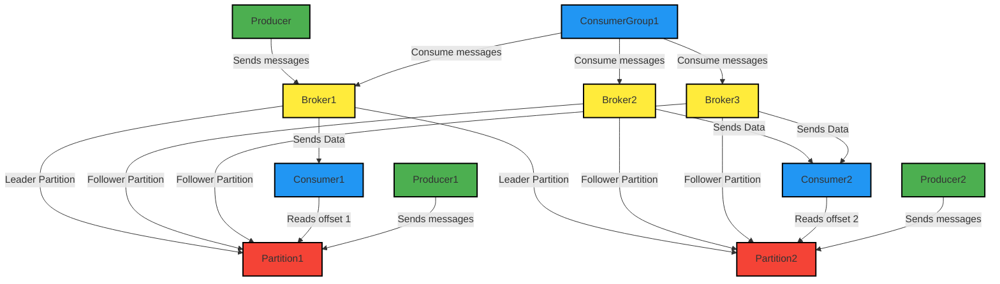
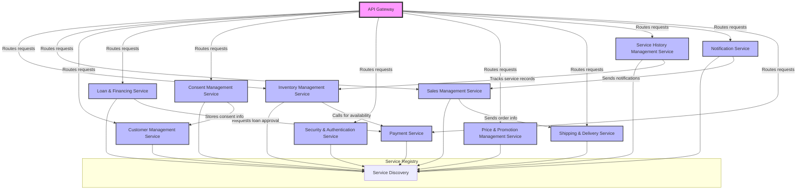
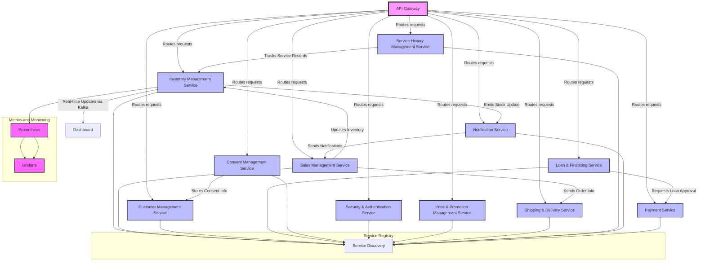

## **Table of Contents**

### **1. Leadership & Team FAQs**
   - [LEAD FAQ](#lead-faq)
   - [TEAm & Tools FAQ](#team-tools-faq)
   - [Leadership & Management](#leadership-management)
   - [Team Lead, My Role and Responsibilities](#team-lead-my-role-and-responsibilities)

### **2. React Development**
   - [React DevTools Overview](#react-devtools-overview)
   - [Best Practices for Managing a React Application](#best-practices-for-managing-a-react-application)
   - [Tools for Code Review](#tools-for-code-review)
   - [Securing a React Application](#securing-a-react-application)
   - [What is React Native?](#what-is-react-native)
   - [What is a Mixin in React?](#what-is-a-mixin-in-react)
   - [Managing Tokens Between React and a Backend REST Service](#managing-tokens-between-react-and-a-backend-rest-service)
   - [Session in React and Spring Boot](#session-in-react-and-spring-boot)
   - [How to Disable Copying Content in a React Application](#how-to-disable-copying-content-in-a-react-application)
   - [Design Tools and UI Frameworks for React](#design-tools-and-ui-frameworks-for-react)
   - [Creating a Real-Time Dashboard in React](#creating-a-real-time-dashboard-in-react)
   - [Polling in React](#polling-in-react)

### **3. Advanced React Concepts**
   - [Idempotent in React](#idempotent-in-react)
   - [Lightweight vs Heavyweight Components in React](#lightweight-vs-heavyweight-components-in-react)
   - [Managing Props, State, Refs, Keys, Async/Await, Axios Security, Linting, Mixins, and Types of Hooks](#managing-props-state-refs-keys-asyncawait-axios-security-linting-mixins-and-types-of-hooks)

### **4. Java & Kafka**
   - [SQL vs NoSQL](#sql-vs-nosql)
   - [Kafka: Partitions and Replication Factor](#kafka-partitions-and-replication-factor)
   - [Key Components of Apache Kafka](#key-components-of-apache-kafka)
   - [In Java, a BlockingQueue](#in-java-a-blockingqueue)

### **5. Microservices & Kafka**
   - [Microservices Design Patterns](#microservices-design-patterns)
   - [12 Rules of Microservices](#12-rules-of-microservices)
   - [Kafka in Depth](#kafka-in-depth)

### **6. Containerization & Orchestration**
   - [Containerization, Orchestration, Load Balancing, and Tracking Requests Across Regions](#containerization-orchestration-load-balancing-and-tracking-requests-across-regions)

---


## Idempotent

### What Does **Idempotent** Mean?

In computing, the term **idempotent** refers to an operation that, when performed multiple times, has the same effect as when it is performed just once. In other words, an idempotent operation can be repeated without changing the result beyond the initial application.

This concept is used in several areas of software engineering, including **HTTP methods**, **API design**, and **functional programming**.

### Key Characteristics of Idempotency:
- **Same result regardless of repetitions**: If you perform the same operation multiple times, the outcome will be the same after the first operation.
- **No side effects**: Performing an idempotent operation repeatedly doesn’t result in unintended consequences or side effects.
  
### Examples of Idempotent Operations

1. **HTTP Methods**:
   - **GET**: A `GET` request is idempotent because retrieving the same resource multiple times doesn't change its state.
     - Example: If you call `GET /user/1` several times, the result will always be the same (unless the resource is modified by another operation).
   - **PUT**: A `PUT` request is idempotent because updating a resource with the same data will not change the state of that resource after the first update.
     - Example: If you call `PUT /user/1` with the same user data multiple times, the resource state will remain the same.
   - **DELETE**: A `DELETE` request is typically idempotent because deleting a resource that doesn’t exist has no effect. 
     - Example: If you call `DELETE /user/1` multiple times, the first time it deletes the user, and subsequent calls don’t affect anything (the user is already deleted).

2. **Mathematics**:
   - **Addition** and **Multiplication** are not generally idempotent. However, **max()** and **min()** functions are idempotent because calling `max(x, y)` multiple times always results in the same value, even if `max(x, y)` is called multiple times with the same arguments.
   
3. **Database Transactions**:
   - **Updating a record** to a specific value is idempotent if repeated updates with the same value don’t alter the state after the first update.
     - Example: Setting a user’s email address to `user@example.com` will result in the same state regardless of how many times you update it to that value.

### Why is Idempotency Important?

1. **Safety in APIs**: When designing APIs, idempotency ensures that repeated calls (e.g., due to network retries or user errors) do not result in unexpected behaviors or duplicated actions. This is particularly important in **distributed systems** and **microservices**.
  
2. **Error Recovery**: In systems where operations might be retried (such as network requests), making operations idempotent ensures that retrying an operation does not have unintended consequences (such as making a purchase twice or creating duplicate records).
   
3. **Predictability**: Idempotency simplifies reasoning about the effects of operations in systems because you can rely on the fact that performing an operation multiple times will not produce a different outcome after the first application.

### Example in HTTP Methods:

#### Non-idempotent Example: `POST`
A `POST` request to create a new resource is **not idempotent**. If you send the same `POST` request multiple times, it may create multiple resources.

```http
POST /user
{
  "name": "John Doe"
}
```
- First request creates a user.
- Second request creates another user with the same data, which might result in duplicate entries.

#### Idempotent Example: `PUT` and `DELETE`

- **PUT**: If you are updating a resource with the same data, multiple calls will result in the same final state.

```http
PUT /user/1
{
  "name": "John Doe"
}
```
- First call: Updates the user to have the name "John Doe".
- Subsequent calls: No further changes occur, as the user already has that name.

- **DELETE**: Deleting a resource is idempotent because calling it multiple times has no further effect once the resource is deleted.

```http
DELETE /user/1
```
- First call: Deletes the user with ID 1.
- Subsequent calls: No further changes occur as the user is already deleted.

### Idempotency in Functional Programming

In functional programming, a function is **idempotent** if calling it multiple times with the same arguments will always return the same result, regardless of how many times it's called.

```js
// Example of an idempotent function in JavaScript
const addToFive = (x) => 5 + x;  // This function is idempotent

console.log(addToFive(3));  // 8
console.log(addToFive(3));  // 8 (same result, no matter how many times it's called)
```

### Summary

- **Idempotency** means that performing an operation multiple times results in the same state as performing it once.
- It’s useful in areas like **API design** (for safe retries), **database updates**, and **distributed systems** where repeated requests could otherwise cause inconsistencies or errors.
- Common examples of idempotent HTTP methods include `GET`, `PUT`, and `DELETE` (under typical use cases).

## React DevTools Overview

**React DevTools** is a set of tools built specifically for inspecting and debugging React applications. It provides an interface for inspecting the component tree, managing component state and props, tracking performance, and helping developers identify and fix potential issues in their React applications.

React DevTools consists of two main parts:
1. **React DevTools Extension**: A browser extension for Chrome, Firefox, and Edge that integrates directly with your browser.
2. **Standalone React DevTools**: A standalone app that can be used independently of the browser extension.

### Key Features of React DevTools

1. **Component Tree Inspection**:
   - Allows you to view the entire component tree of a React application.
   - You can see the hierarchy of components, including both class and functional components.
   - You can inspect the **props**, **state**, **context**, and **hooks** for each component.
   
2. **Props and State**:
   - React DevTools lets you inspect the props and state of each individual component in your app.
   - You can modify the state and props of a component directly in the DevTools to see how the UI responds.
   
3. **Component Re-rendering**:
   - DevTools highlights components that are re-rendering, making it easy to spot unnecessary re-renders and optimize performance.
   - You can use this feature to optimize the performance of your application by identifying unnecessary renders.
   
4. **Hooks Inspection**:
   - With the introduction of React hooks, DevTools provides a way to inspect **useState**, **useEffect**, and other hooks in functional components.
   - You can view the values of hook states and see how the hooks are interacting with the rest of your component.

5. **Profiler**:
   - The **Profiler** tab helps measure the performance of your React application.
   - You can track **render times** for each component and see which parts of the app are taking the most time to render.
   - The profiler also shows which components are being re-rendered, how long each render took, and whether there were any unnecessary renders.

6. **React Context**:
   - You can inspect and manage the context values used by your app’s React context providers.
   - This is useful for applications that rely on **context** for managing state at a global level.

7. **Error Boundaries**:
   - The **React DevTools** allows you to view which components are wrapped in **Error Boundaries**.
   - You can easily spot components that have thrown an error and are being handled by an error boundary.

8. **Component Search**:
   - You can search for specific components in the component tree, making it easier to navigate large applications.

9. **Component Highlighting**:
   - You can hover over a component in the DevTools to highlight it in the actual UI, which helps you understand how components are rendered on the page.
   
10. **Edit in Place**:
    - React DevTools allows you to make temporary changes to the component’s state or props directly from the DevTools to test out different scenarios.
    
---

### How to Install React DevTools

#### For Chrome (or Chromium-based browsers like Edge):

1. **Install the React DevTools Extension**:
   - Go to the Chrome Web Store and search for **React Developer Tools**.
   - Alternatively, you can follow this link to install: [React Developer Tools for Chrome](https://chrome.google.com/webstore/detail/react-developer-tools).
   - Click "Add to Chrome" and follow the instructions.

2. **Using React DevTools in Chrome**:
   - Once installed, open your React app in Chrome.
   - Open **DevTools** (Right-click > Inspect or `Ctrl+Shift+I` / `Cmd+Opt+I` on Mac).
   - You'll see a new "React" tab in the Developer Tools panel.
   - You can now inspect the component tree, state, props, hooks, etc.

#### For Firefox:

1. **Install React DevTools for Firefox**:
   - Visit the Firefox Add-ons page for React DevTools: [React Developer Tools for Firefox](https://addons.mozilla.org/en-US/firefox/addon/react-devtools/).
   - Click "Add to Firefox" to install.

2. **Using React DevTools in Firefox**:
   - Open your React application and then open the developer tools (`Ctrl+Shift+I` or `Cmd+Opt+I` on Mac).
   - You should now see a "React" tab that lets you inspect your React app.

---

### Key Features in Detail

#### 1. **Component Tree (Inspector)**

When you open the **React DevTools**, you'll see the **component tree** of your app, with each React component listed in a hierarchical view. This is where you can examine how the components are structured and navigate between them.

You can inspect the props, state, and context of each component by selecting it from the tree.

- **Props**: Displays the props passed to the selected component.
- **State**: Shows the internal state of the component (class components) or hooks state (for functional components).
- **Hooks**: Displays the values of hooks like `useState`, `useEffect`, etc.

#### 2. **Profiler Tab**

The **Profiler** tab is where you can track the performance of your app. You can start recording, interact with your app, and then stop the recording to analyze:

- **Render times**: See how long each render took.
- **Re-renders**: View components that were re-rendered and whether those renders were necessary.
- **Highlighting Slow Components**: Track the components that are taking a lot of time to render and optimize them.

#### 3. **Hooks**

React DevTools provides a powerful hook inspection feature. You can view the values and behavior of hooks, including:

- `useState`
- `useEffect`
- `useReducer`
- `useContext`
- Custom hooks (with their internal state and effects)

This is particularly helpful for debugging issues in functional components.

#### 4. **Search for Components**

You can search for components in the tree by using the **Search** bar at the top of the React DevTools panel. This makes it easy to find a specific component in large applications, especially if you don't want to scroll through the entire component tree.

#### 5. **Highlight Updates**

In the **Settings** of React DevTools, you can enable the "Highlight updates when components render" option. This will cause React to highlight the components that are re-rendering, so you can see what’s being updated visually on the page. This can help you identify unnecessary renders and optimize performance.

#### 6. **Component State and Props Editing**

You can directly modify the state and props of any component within React DevTools, which is useful for testing and debugging. For example, if you want to simulate a change in state without triggering an event in the UI, you can directly change the value in DevTools and observe the changes in real-time.

---

### Common Use Cases for React DevTools

1. **Debugging Component State**: If your app’s UI doesn’t update as expected, use React DevTools to inspect the component’s state and props to ensure they are being set correctly.

2. **Optimizing Performance**: Use the **Profiler** tab to analyze which components are re-rendering too often or taking too long to render. This can help you identify potential performance bottlenecks and refactor code to avoid unnecessary renders.

3. **Hook Debugging**: With React's growing reliance on hooks, React DevTools is invaluable for inspecting `useState`, `useEffect`, and other hooks to understand how they behave during rendering.

4. **Inspecting Component Trees in Large Applications**: In large React applications, the component tree can become complex. React DevTools helps you visualize the tree and navigate to specific components quickly.

5. **Error Handling**: Check if components are wrapped in **Error Boundaries** and catch any errors that might have occurred during rendering. This helps you debug crashes and ensure that error boundaries are catching the errors properly.

6. **Testing UI Changes**: Quickly test UI changes by modifying the props or state directly from React DevTools without modifying the code, which can speed up the debugging process.

---

### Conclusion

React DevTools is an indispensable tool for debugging, optimizing performance, and inspecting the inner workings of your React applications. With features like component tree inspection, props/state management, hook inspection, and performance profiling, it makes React development easier and more efficient.

It is highly recommended for every React developer to install and use React DevTools regularly for building scalable and performant React applications.

## Best Practices for Managing a React Application

To build scalable, maintainable, and efficient React applications, following **best practices** is essential. Here’s a guide to some key best practices and tools to help you manage your React project effectively:

---

### 1. **Component Organization**

- **Keep components small and focused**: Each React component should ideally do one thing. If a component is doing too much (e.g., handling multiple concerns like UI logic, data fetching, etc.), it's a good idea to break it down into smaller, reusable components.
  - **Container/Presentational components**: Separate components that handle data fetching and logic (container components) from those that are concerned only with rendering UI (presentational components).
  
- **Use Functional Components and Hooks**: Whenever possible, prefer **functional components** with **hooks** (`useState`, `useEffect`, etc.) over class components. They are more concise and easier to maintain.
  
  ```js
  const MyComponent = () => {
    const [count, setCount] = useState(0);
    return <button onClick={() => setCount(count + 1)}>{count}</button>;
  };
  ```

- **Organize by Feature/Domain**: Instead of organizing files by file type (e.g., "components", "utils"), it's often more maintainable to organize them by feature. For example, all files related to a feature (e.g., `UserProfile`, `LoginForm`, `UserList`) should reside in the same directory.

  ```
  src/
  ├── features/
  │   ├── user/
  │   │   ├── UserProfile.js
  │   │   ├── UserList.js
  │   │   └── userSlice.js
  │   ├── auth/
  │   │   ├── LoginForm.js
  │   │   └── authSlice.js
  └── common/
      ├── Header.js
      └── Footer.js
  ```

### 2. **State Management**

- **Use Local State for Simple Components**: If a component only needs to manage its own state, use the `useState` hook. It’s simple and efficient for local component state.

- **Lift State Up When Necessary**: When multiple components need to share state, lift the state to their nearest common ancestor, and pass it down as props.

- **Use Context for Global State**: For managing global state (like themes, authentication, etc.) across your app, React's **Context API** is a good choice.
  - However, for larger, more complex applications, using **Redux** or **Recoil** (or other advanced state management libraries) might be better suited.

- **Avoid Prop Drilling**: If you find yourself passing down props through many layers of components, consider using **React Context**, **Redux**, or a **state management library** to avoid prop drilling and improve maintainability.

### 3. **Code Splitting**

- **Lazy Loading Components**: Use **React.lazy** to split your code and load components only when they’re needed (on-demand loading), improving performance by reducing the initial bundle size.

  ```js
  const LazyComponent = React.lazy(() => import('./LazyComponent'));
  ```

- **React Suspense**: Use **Suspense** to display a fallback UI (like a spinner) while your component is loading lazily.

  ```js
  <React.Suspense fallback={<div>Loading...</div>}>
    <LazyComponent />
  </React.Suspense>
  ```

### 4. **Error Boundaries**

- **Use Error Boundaries**: Wrap your application or individual components with **Error Boundaries** to catch runtime JavaScript errors and prevent the app from crashing.
  
  ```js
  class ErrorBoundary extends React.Component {
    constructor(props) {
      super(props);
      this.state = { hasError: false };
    }

    static getDerivedStateFromError(error) {
      return { hasError: true };
    }

    componentDidCatch(error, info) {
      console.log(error, info);
    }

    render() {
      if (this.state.hasError) {
        return <h1>Something went wrong.</h1>;
      }

      return this.props.children;
    }
  }
  ```

### 5. **Use Prop Types or TypeScript**

- **Use PropTypes** (or **TypeScript**): Using **PropTypes** (for JavaScript) or **TypeScript** (for better type safety) ensures that the correct data types are passed to components. TypeScript is especially useful in larger applications because it provides static type checking and can help reduce runtime errors.

  ```js
  import PropTypes from 'prop-types';

  const MyComponent = ({ title, isActive }) => {
    return <h1>{title}</h1>;
  };

  MyComponent.propTypes = {
    title: PropTypes.string.isRequired,
    isActive: PropTypes.bool,
  };
  ```

- **Use TypeScript** for type safety across the entire application. TypeScript helps catch type errors at compile-time, making it easier to maintain large React applications.

### 6. **CSS in JS and Styling**

- **CSS Modules**: Use **CSS Modules** for locally scoped styles that don’t clash with other styles. This prevents the global styles from accidentally affecting your components.
  
  ```css
  /* styles.module.css */
  .container {
    background-color: lightblue;
  }
  ```

  ```js
  import styles from './styles.module.css';

  const Component = () => <div className={styles.container}>Hello</div>;
  ```

- **Styled Components or Emotion**: For more dynamic styling, **Styled Components** or **Emotion** allow you to style components using JavaScript, enabling more flexibility (e.g., theming).

  ```js
  import styled from 'styled-components';

  const Button = styled.button`
    background: ${props => props.primary ? 'blue' : 'gray'};
  `;
  ```

---

## Tools for Code Review

Code reviews are an essential part of maintaining high-quality code, ensuring consistency, and identifying potential issues early in the development process. Here are tools and techniques that can help facilitate efficient and effective code reviews:

#### 1. **GitHub/GitLab/Bitbucket Pull Requests (PRs)**

- **GitHub Pull Requests** (or **Merge Requests** in GitLab) are the most common tools for code review. They allow team members to comment on specific lines of code, suggest changes, and approve or reject changes.
  
  Key Features:
  - **Inline Comments**: Team members can comment on specific lines in the code.
  - **PR Templates**: Define a consistent template for the pull request description.
  - **Code Comparison**: GitHub/GitLab shows a side-by-side diff of the changes made.

#### 2. **Prettier and ESLint (Code Formatting and Linting)**

- **Prettier**: An opinionated code formatter that automatically formats your code according to a set of rules, ensuring consistency across the codebase.
  - Configure Prettier to format code on save, which reduces code review time spent on formatting discussions.
  
  ```bash
  npm install --save-dev prettier
  ```

- **ESLint**: A tool that analyzes your code to find potential issues, including stylistic errors, logic errors, and anti-patterns. Configure ESLint to enforce coding standards in your project.
  
  ```bash
  npm install --save-dev eslint
  ```

- Both of these tools can be integrated into the CI/CD pipeline to automatically lint and format the code before submitting a pull request.

#### 3. **SonarQube**

- **SonarQube** is a powerful static code analysis tool that integrates with GitHub, GitLab, or Bitbucket to provide continuous inspection of code quality, identifying bugs, vulnerabilities, and code smells.
  
  Key Features:
  - **Code Quality**: Provides detailed feedback on potential bugs, security vulnerabilities, and performance issues.
  - **Test Coverage**: Measures code coverage and test effectiveness.
  - **Technical Debt**: Helps teams track and manage technical debt.

#### 4. **Codacy or CodeClimate**

- **Codacy** and **CodeClimate** are static analysis tools that provide automated code reviews. They integrate with GitHub and other version control systems to analyze code quality, coverage, and consistency.
  - They offer detailed reports and suggestions for improvement.
  - Codacy, for example, provides a score for each pull request based on its analysis of code quality.

#### 5. **Reviewable**

- **Reviewable** is a code review tool designed to simplify and improve the code review process. It integrates with GitHub and allows teams to manage pull requests more effectively.
  - It includes features like automatic re-requesting of reviews and bulk approvals.

#### 6. **Slack for Code Review Notifications**

- **Slack** can be used to automate notifications for pull requests or merge requests, ensuring that team members are promptly notified when their code is up for review or when comments are added.
  - Slack integration with GitHub (via GitHub Actions or other bots) allows teams to streamline communication during code review.

#### 7. **CodeStream**

- **CodeStream** allows developers to conduct real-time code reviews directly within their IDE (e.g., VSCode, IntelliJ).
  - Developers can discuss and review code in the context of the IDE, speeding up the process by reducing the need to switch between applications.

---

### Conclusion

By following **React best practices** (component organization, state management, performance optimization, etc.) and leveraging powerful **code review tools** (like GitHub PRs

## Securing a React application

Securing a **React application** is critical to protecting both the frontend (client-side) and backend (server-side) aspects of the application. While React itself is a frontend library, ensuring the security of the application involves implementing various strategies that span both client-side and server-side concerns. Here's a list of ways to secure a React application:

---

### **1. Secure Client-Side Application**

#### a. **Use HTTPS**
   - Ensure the application is served over **HTTPS**. This encrypts the data transmitted between the client and server, preventing man-in-the-middle attacks.
   - You can achieve this by obtaining an SSL certificate for your domain and configuring your server to serve over HTTPS.

#### b. **Content Security Policy (CSP)**
   - Use a **Content Security Policy** to mitigate cross-site scripting (XSS) attacks. A CSP helps prevent the execution of malicious scripts injected into your pages.
   - Example CSP header:  
     ```
     Content-Security-Policy: default-src 'self'; script-src 'self' https://apis.google.com;
     ```
   - CSP restricts the sources from which your browser can load resources, minimizing the risk of malicious script injection.

#### c. **Sanitize User Input (Prevent XSS)**
   - **Cross-Site Scripting (XSS)** is one of the most common security issues for web apps. React helps mitigate XSS by escaping potentially dangerous content, but you should still sanitize inputs from users.
   - Use libraries like **DOMPurify** to sanitize any HTML content before rendering it:
     ```js
     import DOMPurify from 'dompurify';
     const safeHTML = DOMPurify.sanitize(userInput);
     ```

#### d. **Avoid Inline JavaScript**
   - Inline JavaScript is vulnerable to attacks such as XSS. Avoid using inline event handlers (e.g., `onClick="handleClick()"`), and use React’s event handlers (e.g., `onClick={handleClick}`) instead.

#### e. **Prevent Cross-Site Request Forgery (CSRF)**
   - While CSRF typically affects state-changing requests (POST, PUT, DELETE), React apps can still be vulnerable if you make requests without proper CSRF protection.
   - Use anti-CSRF tokens in forms and HTTP requests. Backend services should verify the CSRF token to prevent malicious attacks.
   - A **SameSite cookie** attribute can help mitigate CSRF by restricting how cookies are sent with cross-origin requests.

#### f. **Secure Authentication and Authorization**
   - **JWT Tokens**: Secure authentication can be implemented using **JSON Web Tokens (JWT)** for securely transmitting information between the client and server.
   - Always store tokens in **HTTP-only, Secure cookies** to prevent access from JavaScript (which would make them vulnerable to XSS attacks). Never store sensitive data (e.g., JWT tokens) in localStorage or sessionStorage.
   - **OAuth/OpenID**: For more secure authentication, consider using OAuth or OpenID for third-party authentication (e.g., Google, Facebook, GitHub).

#### g. **Limit Access to Sensitive Data**
   - Avoid exposing sensitive information (e.g., API keys, database credentials) in the client-side code. Use **environment variables** and **backend APIs** to keep sensitive data hidden.
   - Ensure that user-specific data is only visible to authorized users (e.g., using **role-based access control (RBAC)**).

#### h. **Use Strong Password Policies**
   - When implementing user authentication, enforce strong password policies, such as requiring a minimum length and a mix of characters (uppercase, lowercase, numbers, symbols).
   - Consider implementing multi-factor authentication (MFA) for additional security.

#### i. **Limit and Monitor User Input and Requests**
   - **Rate Limiting**: Prevent brute-force attacks by limiting the number of requests a user can make within a certain period.
   - **Input Validation**: Validate input data on both the client and server sides to ensure it conforms to the expected format. For example, limit the size of uploaded files or the length of strings.

---

### **2. Secure Backend Communication**

#### a. **Secure API Endpoints**
   - Protect your APIs with proper **authentication** (JWT, OAuth, API keys) and **authorization** (RBAC).
   - Make sure your API only accepts requests from trusted sources by implementing **CORS** (Cross-Origin Resource Sharing) policies.
   - Use API rate limiting and logging to monitor abuse.

#### b. **Input Validation on Server Side**
   - Never rely on frontend validation alone; always validate input on the server side to prevent attacks like SQL Injection and other forms of data manipulation.
   - Use libraries such as **express-validator** or **Joi** for structured validation.

#### c. **Encryption**
   - **Encrypt sensitive data** both in transit (using HTTPS) and at rest (using encryption algorithms like AES).
   - Always encrypt sensitive user data (e.g., passwords, credit card information) in your database. Use strong hashing algorithms such as **bcrypt** or **Argon2** for passwords.

#### d. **Session Management**
   - For web applications that rely on sessions, ensure that your session management is secure.
   - Use **session expiration** and **token invalidation** for long-lived sessions, and consider implementing **JWT token expiration** and renewal.

#### e. **Secure File Uploads**
   - If your app allows file uploads, validate the file types, check file size, and store files in a secure location.
   - Use libraries like **Multer** in Node.js to handle file uploads securely.

---

### **3. Secure Deployment and CI/CD Pipeline**

#### a. **Environment Variables**
   - Never hard-code sensitive keys (e.g., API keys, database credentials) into your codebase. Instead, use environment variables or a secure vault (like **Vault by HashiCorp**).
   
#### b. **CI/CD Security**
   - In your **CI/CD pipeline**, use secure practices for testing and deploying code. Ensure that any secret keys or tokens are encrypted and not exposed.
   - **Static Analysis Tools**: Integrate security-focused static analysis tools (like **SonarQube**, **Snyk**, or **Dependabot**) into your CI/CD pipeline to catch vulnerabilities in dependencies.

#### c. **Deploy on Secure Platforms**
   - Use secure cloud platforms (e.g., AWS, GCP, Azure) and follow best practices for security configurations (e.g., setting up firewalls, private networking).
   - Ensure that your server is up-to-date with the latest security patches and avoid using deprecated libraries or frameworks.

#### d. **Ensure Proper Permissions and Least Privilege**
   - Apply the principle of **least privilege** to your application. Only give users and services the minimal permissions they need to function.
   - For example, ensure that your production database only has read access from the application server and write access is restricted.

---

### **4. Secure Dependencies**

#### a. **Keep Dependencies Updated**
   - Regularly update your dependencies to ensure you're using the latest, most secure versions. Use tools like **npm audit**, **Snyk**, or **Dependabot** to automatically detect vulnerabilities in your dependencies.

#### b. **Use Trusted Libraries**
   - Always use well-maintained and trusted libraries for third-party integrations. Avoid using libraries with low activity or unknown origins, as they may contain security vulnerabilities.
   
#### c. **Static Analysis for Code Vulnerabilities**
   - Tools like **ESLint** and **Prettier** can help prevent basic code errors, but also consider using specialized security linters like **eslint-plugin-security** to flag potential security vulnerabilities.

---

### **5. Regular Security Audits and Monitoring**

#### a. **Penetration Testing**
   - Regularly perform penetration testing to identify vulnerabilities in your React app. You can either conduct tests internally or hire third-party security experts to audit your code.

#### b. **Monitoring and Logging**
   - Set up **logging** and **monitoring** on both the client and server sides. Use logging libraries (e.g., **Winston**, **Log4js**) for tracking error events and unusual activities.
   - Use tools like **Sentry** or **Datadog** to track and alert on runtime errors and potential security threats in real time.

#### c. **Bug Bounty Programs**
   - Consider running a **bug bounty program** for your application, offering rewards to external security researchers who discover vulnerabilities in your app.

---

### **Summary of Key Security Measures:**

- Use **HTTPS** and **Content Security Policy (CSP)** to protect against network attacks.
- Implement **input validation and sanitization** to prevent XSS and SQL injection.
- Use **authentication and authorization** mechanisms like **JWT** and **OAuth** for secure user access.
- Secure API communication with **CORS** and rate limiting.
- Store sensitive data like passwords in a **secure, hashed format** (e.g., bcrypt).
- Regularly **update dependencies** and run **static code analysis** tools to detect vulnerabilities in your code.
- Follow best practices for **environment configuration**, **session management**, and **file uploads**.
- Continuously **audit security** and integrate **monitoring** and **logging** to track potential issues.

By following these best practices and integrating the right tools, you can significantly reduce security risks and protect both your React application and your users’ data.


## **What is React Native?**

**React Native** is a **JavaScript framework** developed by **Facebook** that enables developers to build **mobile applications** using **React**. Unlike traditional mobile development frameworks (e.g., **Swift** for iOS or **Java** for Android), React Native allows developers to write apps in **JavaScript** (or **TypeScript**) and render them using **native UI components**. This makes it possible to develop cross-platform applications for both **iOS** and **Android** from a single codebase.

React Native leverages **native components** to provide performance close to native apps, while React’s declarative approach makes it easy to develop and maintain mobile applications.

---

### **How React Native Works**

React Native uses a **bridge** between the JavaScript code and the native code (written in **Java**, **Swift**, or **Objective-C**) to interact with the device’s **native APIs** (e.g., camera, GPS, sensors). Here’s a simplified view of how it works:

1. **JavaScript Thread**: React Native runs JavaScript code, which handles the business logic and component rendering. The JavaScript thread communicates with the native platform (iOS/Android) through the **bridge**.
   
2. **Native Thread**: Native UI components and APIs are executed on a separate thread, enabling seamless interaction with the underlying platform (e.g., rendering native UI elements like buttons, images, etc.).

3. **Bridge**: The **bridge** is the communication layer between the JavaScript code and the native code. It sends and receives messages between the two threads in real-time. When a user interacts with the app, JavaScript requests changes to native UI elements through this bridge.

4. **UI Rendering**: React Native uses a **virtual DOM** to describe the UI, just like React for the web. When the UI needs to update, React Native translates the virtual DOM into actual native views for iOS or Android.

In short, React Native combines the best of both worlds — the flexibility and reusability of **JavaScript** and the performance of **native code**.

---

### **Setting Up a React Native App**

To get started with React Native, you need to set up a development environment. Here are the basic steps:

1. **Install Node.js** (if not already installed):  
   You need **Node.js** for managing dependencies and running the React Native development server.

2. **Install React Native CLI** (optional but recommended for more control):  
   ```bash
   npm install -g react-native-cli
   ```

3. **Create a New React Native Project**:  
   Use the React Native CLI to create a new project.
   ```bash
   npx react-native init MyNewApp
   ```

4. **Navigate to Your Project Directory**:
   ```bash
   cd MyNewApp
   ```

5. **Run the App**:
   - For iOS (requires macOS):
     ```bash
     npx react-native run-ios
     ```
   - For Android (requires Android Studio):
     ```bash
     npx react-native run-android
     ```

After running the above commands, your React Native app should be up and running on the emulator or device.

---

### **Example Code for React Native**

Here’s a simple example of how you can use React Native to create a basic **counter app** that increases or decreases a number when buttons are pressed:

#### 1. **App.js (Main Application Component)**

```js
import React, { useState } from 'react';
import { StyleSheet, Text, View, Button } from 'react-native';

const App = () => {
  // State to hold the counter value
  const [count, setCount] = useState(0);

  // Increment function
  const increment = () => {
    setCount(count + 1);
  };

  // Decrement function
  const decrement = () => {
    setCount(count - 1);
  };

  return (
    <View style={styles.container}>
      <Text style={styles.title}>Counter App</Text>
      <Text style={styles.counter}>{count}</Text>

      <View style={styles.buttons}>
        <Button title="Increment" onPress={increment} />
        <Button title="Decrement" onPress={decrement} />
      </View>
    </View>
  );
};

// Styling for the app
const styles = StyleSheet.create({
  container: {
    flex: 1,
    justifyContent: 'center',
    alignItems: 'center',
    backgroundColor: '#f5f5f5',
  },
  title: {
    fontSize: 24,
    fontWeight: 'bold',
    marginBottom: 20,
  },
  counter: {
    fontSize: 48,
    fontWeight: 'bold',
    color: '#4CAF50',
    marginBottom: 30,
  },
  buttons: {
    width: '60%',
    flexDirection: 'row',
    justifyContent: 'space-between',
  },
});

export default App;
```

### **Explanation of Code**

1. **State Management**: 
   - We use the `useState` hook to keep track of the `count` state. The state will update each time the user presses one of the buttons (Increment or Decrement).

2. **UI Components**: 
   - `Text`: Displays the current value of the counter.
   - `Button`: Renders a button for each action (increment and decrement). Each button is associated with an `onPress` handler that triggers the corresponding function (`increment` or `decrement`).

3. **Styling**:
   - React Native uses `StyleSheet.create()` to define styles, similar to CSS but using JavaScript objects. We define styles for the container, title, counter text, and buttons to align everything in the center and make it visually appealing.

### **Running the App**

When you run the app on an iOS or Android emulator, you'll see a screen with:
- A large counter in the center.
- Two buttons: "Increment" and "Decrement".
- When you click the buttons, the counter increases or decreases accordingly.

---

### **React Native Components and APIs**

React Native provides several built-in components to build mobile UIs, some of the most common ones include:

- **View**: The basic container component for layout (similar to `div` in web).
- **Text**: Displays text.
- **Button**: A native button element.
- **Image**: Renders images.
- **TextInput**: An input field for text entry (similar to `<input>` in web).
- **ScrollView**: A scrollable container.
- **FlatList**: A performance-optimized component for rendering large lists.
  
React Native also provides APIs for interacting with **device features** such as camera, location services, and push notifications, among others.

#### Example of a **TextInput** and **Handling User Input**:

```js
import React, { useState } from 'react';
import { View, Text, TextInput, Button, StyleSheet } from 'react-native';

const App = () => {
  const [name, setName] = useState('');

  const handleSubmit = () => {
    alert(`Hello, ${name}!`);
  };

  return (
    <View style={styles.container}>
      <Text style={styles.title}>Enter Your Name</Text>
      <TextInput
        style={styles.input}
        placeholder="Enter name"
        value={name}
        onChangeText={setName}
      />
      <Button title="Submit" onPress={handleSubmit} />
    </View>
  );
};

const styles = StyleSheet.create({
  container: {
    flex: 1,
    justifyContent: 'center',
    alignItems: 'center',
  },
  title: {
    fontSize: 24,
    marginBottom: 20,
  },
  input: {
    height: 40,
    borderColor: '#ccc',
    borderWidth: 1,
    width: '80%',
    marginBottom: 20,
    paddingHorizontal: 10,
  },
});

export default App;
```

#### Explanation:
- **TextInput** is used to capture user input. The `value` prop binds it to the `name` state, and the `onChangeText` prop updates the state when the user types.
- **Button**: Once the user submits the form, an alert is shown with the entered name.

---

### **Conclusion**

**React Native** is a powerful framework for building cross-platform mobile apps using **JavaScript** and **React**. With React Native, you can build mobile apps that feel and perform like native applications while using a shared codebase for both iOS and Android. The main components and concepts in React Native are similar to React for the web, such as components, state management, and JSX syntax. However, React Native also includes its own set of native components and APIs to interact with mobile device features.

The example code provided shows how simple it can be to build basic UI elements and manage user interactions in React Native. For more advanced applications, you can integrate **navigation**, **state management** (e.g., **Redux**), and **native modules** to extend the functionality of your app.

## What is a Mixin in React?

In the context of React, a **mixin** is a pattern or technique used to add reusable functionality to components. **Mixins** allow you to inject methods or behaviors into React components without needing to subclass them. They were common in older versions of React but have since been **deprecated** in favor of other patterns like **Higher-Order Components (HOCs)** and **Hooks** in React.

A **mixin** typically allows sharing logic, like lifecycle methods or event handling, across multiple components. However, React now discourages their use because of issues like **name collisions** and **the complexity of inheritance**.

---

### **How Mixins Work in React (Deprecated)**

In the earlier versions of React (prior to React 16), mixins were used in class components to share reusable logic. You would create a mixin object with methods that you wanted to inject into a React component.

#### Example of a Mixin (Deprecated)

```js
// Defining a Mixin
const TimerMixin = {
  componentDidMount() {
    this.timer = setInterval(() => {
      console.log('Timer is running');
    }, 1000);
  },
  componentWillUnmount() {
    clearInterval(this.timer);
  },
};

// Using a Mixin in a React Component
class MyComponent extends React.Component {
  mixins = [TimerMixin]; // Using mixin
  render() {
    return <div>MyComponent</div>;
  }
}
```

In the example above, the **`TimerMixin`** adds `componentDidMount` and `componentWillUnmount` methods to the `MyComponent` class.

However, **mixins** have been **deprecated** in React 16 and removed entirely in React 17, so this pattern should be avoided in favor of **Hooks** and **Higher-Order Components** (HOCs).

---

### **Alternative to Mixins: Using Hooks**

React hooks are the modern way to share logic between components. A hook allows you to encapsulate logic and reuse it across different components without the problems mixins caused.

#### Example of Using a Hook Instead of a Mixin

```js
import React, { useEffect, useState } from 'react';

// Custom Hook
const useTimer = () => {
  const [time, setTime] = useState(0);

  useEffect(() => {
    const timer = setInterval(() => {
      setTime((prevTime) => prevTime + 1);
    }, 1000);
    return () => clearInterval(timer);
  }, []);

  return time;
};

// Using the custom hook in a component
const TimerComponent = () => {
  const time = useTimer();

  return (
    <div>
      Time: {time} seconds
    </div>
  );
};

export default TimerComponent;
```

In the above example:
- The **`useTimer`** custom hook encapsulates the timer logic.
- The `TimerComponent` uses this hook to manage its timer state.
- The hook is reusable and doesn’t need to be tied to a specific component.

This approach is preferred over mixins because **hooks** provide a clearer, more declarative way of handling reusable logic in React.

---

### **How to Create a Figma Design and Convert It into UI in React**

Figma is a powerful tool for creating designs and prototypes. Once you’ve created a design in **Figma**, you can **convert** it into a **React UI** by using Figma’s design files as a blueprint to guide your coding process.

#### **Steps to Convert Figma Design into UI in React**

1. **Design in Figma**
   - First, create your design in **Figma**. You can design screens, components, and layouts visually in Figma.
   - Use Figma’s **layout grids**, **color palette**, **typography**, and **spacing** guidelines to maintain consistency throughout your design.

2. **Export Assets from Figma**
   - Once you have your design, export images, icons, SVGs, or other assets from Figma to use in your React app. You can export them as PNG, JPG, SVG, or even **SVG code**.
   - **Steps**:
     - Select the element in Figma.
     - Click on the **Export** button at the bottom-right.
     - Choose the format (e.g., PNG, SVG, JPG) and export it.

3. **Create the React Project**
   - If you don't already have a React project, create one using **Create React App** or any other boilerplate.
   ```bash
   npx create-react-app my-ui-project
   cd my-ui-project
   npm start
   ```

4. **Setup Folder Structure in React**
   - Organize your React project to reflect the components in your Figma design. A good folder structure might look like this:
   ```
   src/
   ├── components/
   │   ├── Header/
   │   ├── Button/
   │   └── Card/
   ├── assets/
   │   ├── images/
   │   └── icons/
   ├── App.js
   └── index.js
   ```

5. **Start Building Components in React**
   - Break down your Figma design into reusable React components. These components will represent parts of your design (e.g., buttons, headers, cards, forms).
   - Each component should represent a visual element or group of elements from your Figma design.

#### Example: Convert a Button from Figma to React UI

1. In **Figma**, you might have designed a button with specific styles:
   - Background color: #4CAF50 (green)
   - Font: Arial, bold, 16px
   - Padding: 10px 20px
   - Border radius: 5px

2. Now, create a React component for the button:

```js
// src/components/Button/Button.js

import React from 'react';
import './Button.css';

const Button = ({ label, onClick }) => {
  return (
    <button className="custom-button" onClick={onClick}>
      {label}
    </button>
  );
};

export default Button;
```

```css
/* src/components/Button/Button.css */

.custom-button {
  background-color: #4CAF50; /* Green background */
  color: white; /* White text */
  font-family: Arial, sans-serif; /* Font from Figma */
  font-weight: bold; /* Font weight */
  font-size: 16px; /* Font size from Figma */
  padding: 10px 20px; /* Padding from Figma */
  border: none; /* No border */
  border-radius: 5px; /* Rounded corners */
  cursor: pointer;
}

.custom-button:hover {
  background-color: #45a049; /* Slightly darker green when hovered */
}
```

3. **Use the Button Component in Your App**:

```js
// src/App.js

import React from 'react';
import Button from './components/Button/Button';

function App() {
  const handleClick = () => {
    alert('Button clicked');
  };

  return (
    <div className="App">
      <Button label="Click Me" onClick={handleClick} />
    </div>
  );
}

export default App;
```

4. **Preview the UI**: Now, when you run your app (`npm start`), the `Button` component will be rendered with the styles and behaviors based on your Figma design.

---

### **Tools to Bridge Figma and React**

There are also **tools** and plugins that can help automate or simplify the process of converting Figma designs into React code:

1. **Figma to Code Plugins**:
   - Figma offers several **plugins** that can help you generate code from your design. Some popular ones include:
     - **Figma to React**: A plugin that generates React components from Figma designs (though it's mostly suited for simple designs and may require some adjustments).
     - **Figmify**: This tool can generate React code snippets directly from Figma frames.
  
2. **Figma API**:
   - You can use the **Figma API** to extract design data programmatically, allowing you to automate parts of the conversion process (e.g., extracting colors, typography, and components).

3. **Figma + Storybook**:
   - Storybook is a popular tool for developing and testing UI components in isolation. You can combine Figma designs with Storybook to visually develop React components. There are plugins that allow you to sync Figma designs with Storybook components.

---

### **Conclusion**

- **Mixins** in React were a way to share reusable logic across components but are now deprecated in favor of **Hooks** and **Higher-Order Components (HOCs)**.
- To convert **Figma designs to React UI**, you can export assets from Figma, break down the design into reusable components, and style them accordingly using CSS.
- There are also several tools and plugins (like Figma's "React to Code" plugin) that can help you streamline the process of converting designs into code.

The best approach is to use **Figma as a visual blueprint** and then manually create components in React, leveraging modern tools like **Hooks**, **CSS-in-JS**, or **Styled Components** for styling, to ensure that your UI is responsive, maintainable, and scalable.


Validating user input in React is an essential part of ensuring that your application behaves as expected and that data is in the correct format. React doesn’t have built-in form validation tools, but you can easily implement it yourself using state management, controlled components, and conditional rendering. You can also leverage external libraries for more complex validation requirements.

Here’s an overview of how to validate user input in React using both **manual** methods and **external libraries**.

---

### 1. **Manual Validation in React (Using State)**

The most common way to validate user input in React is by using **controlled components** and managing form data through **React state**. You can then implement your own validation logic using conditional checks.

#### Example: Simple Form Validation

Here’s a step-by-step guide on how to validate a simple login form with a username and password:

```js
import React, { useState } from 'react';

const LoginForm = () => {
  // State for form fields and errors
  const [username, setUsername] = useState('');
  const [password, setPassword] = useState('');
  const [errors, setErrors] = useState({
    username: '',
    password: ''
  });

  // Validate form fields
  const validateForm = () => {
    let valid = true;
    const errors = {};

    // Username validation (required and length check)
    if (!username) {
      errors.username = 'Username is required';
      valid = false;
    } else if (username.length < 3) {
      errors.username = 'Username must be at least 3 characters';
      valid = false;
    }

    // Password validation (required and length check)
    if (!password) {
      errors.password = 'Password is required';
      valid = false;
    } else if (password.length < 6) {
      errors.password = 'Password must be at least 6 characters';
      valid = false;
    }

    setErrors(errors);
    return valid;
  };

  // Handle form submission
  const handleSubmit = (e) => {
    e.preventDefault();

    if (validateForm()) {
      // Form is valid, proceed with login
      console.log('Form submitted');
    }
  };

  return (
    <form onSubmit={handleSubmit}>
      <div>
        <label htmlFor="username">Username:</label>
        <input
          type="text"
          id="username"
          value={username}
          onChange={(e) => setUsername(e.target.value)}
        />
        {errors.username && <span className="error">{errors.username}</span>}
      </div>

      <div>
        <label htmlFor="password">Password:</label>
        <input
          type="password"
          id="password"
          value={password}
          onChange={(e) => setPassword(e.target.value)}
        />
        {errors.password && <span className="error">{errors.password}</span>}
      </div>

      <button type="submit">Login</button>
    </form>
  );
};

export default LoginForm;
```

#### How it works:
1. **State Management**: We manage the values of `username` and `password` using `useState`.
2. **Validation Logic**: The `validateForm` function checks if the inputs are valid based on the conditions (e.g., required fields, minimum length). If any validation fails, we update the `errors` state.
3. **Conditional Rendering**: The error messages are conditionally rendered next to the input fields if the validation fails.
4. **Submit Handling**: On form submission, we first call the `validateForm` function. If the form is valid, the form is submitted.

---

### 2. **Using External Libraries for Validation**

For more complex or scalable validation, you can use libraries like **Formik**, **React Hook Form**, or **Yup**. These libraries simplify form management and validation, especially for large forms or when validation rules are complex.

#### a. **Formik + Yup Example**

**Formik** is a popular form management library in React that works seamlessly with **Yup**, a schema-based validation library.

##### 1. **Install Dependencies:**

```bash
npm install formik yup
```

##### 2. **Example: Login Form with Formik and Yup**

```js
import React from 'react';
import { useFormik } from 'formik';
import * as Yup from 'yup';

const LoginForm = () => {
  // Define the validation schema using Yup
  const validationSchema = Yup.object({
    username: Yup.string()
      .min(3, 'Username must be at least 3 characters')
      .required('Username is required'),
    password: Yup.string()
      .min(6, 'Password must be at least 6 characters')
      .required('Password is required'),
  });

  // Use Formik for form management and validation
  const formik = useFormik({
    initialValues: { username: '', password: '' },
    validationSchema,
    onSubmit: (values) => {
      console.log('Form submitted with:', values);
    },
  });

  return (
    <form onSubmit={formik.handleSubmit}>
      <div>
        <label htmlFor="username">Username:</label>
        <input
          type="text"
          id="username"
          name="username"
          value={formik.values.username}
          onChange={formik.handleChange}
          onBlur={formik.handleBlur}
        />
        {formik.touched.username && formik.errors.username ? (
          <span className="error">{formik.errors.username}</span>
        ) : null}
      </div>

      <div>
        <label htmlFor="password">Password:</label>
        <input
          type="password"
          id="password"
          name="password"
          value={formik.values.password}
          onChange={formik.handleChange}
          onBlur={formik.handleBlur}
        />
        {formik.touched.password && formik.errors.password ? (
          <span className="error">{formik.errors.password}</span>
        ) : null}
      </div>

      <button type="submit">Login</button>
    </form>
  );
};

export default LoginForm;
```

#### How it works:
1. **Formik**: Handles form state, form submission, and validation.
2. **Yup**: Defines a schema to validate inputs. The `Yup.object()` function specifies that the `username` must be a string of at least 3 characters and required, and the `password` must be at least 6 characters long and required.
3. **Error Handling**: Formik automatically handles validation and shows error messages if validation fails. The `touched` property ensures the error is only displayed once the user interacts with the field.

**Formik and Yup** are particularly useful for larger forms and complex validation rules, such as regex validation, field dependencies, and async validation.

---

### 3. **Common Validation Techniques**

#### a. **Required Field Validation**
You should always validate whether a field is **required** (i.e., not empty). This is one of the most basic and common validation checks.

#### b. **Length Validation**
For inputs like passwords, usernames, or messages, you often need to validate that the input length is within a certain range. For example, requiring a password to be at least 6 characters long or a username to be between 3 and 15 characters.

#### c. **Pattern Matching (Regex Validation)**
You might need to validate that the input matches a specific pattern. This is especially common for fields like email addresses, phone numbers, and credit card numbers.

Example:
```js
const emailRegex = /^[a-zA-Z0-9._-]+@[a-zA-Z0-9.-]+\.[a-zA-Z]{2,6}$/;
const isValidEmail = emailRegex.test(email);
```

#### d. **Async Validation (e.g., Email Uniqueness)**
Sometimes you need to validate inputs asynchronously, such as checking whether a username or email already exists in the database. You can achieve this using **async validation** with libraries like **Formik + Yup**.

Example:
```js
const emailValidationSchema = Yup.object().shape({
  email: Yup.string()
    .email('Invalid email address')
    .test('email-unique', 'Email already taken', async (value) => {
      const isEmailTaken = await checkIfEmailExists(value); // Async function to check email
      return !isEmailTaken;
    })
    .required('Email is required'),
});
```

---

### 4. **Best Practices for User Input Validation**

1. **Client-side vs Server-side Validation**:
   - **Client-side validation** helps provide instant feedback to users, but **never rely solely on it**. Always perform the same validation on the **server-side** to ensure security.
   
2. **User Feedback**:
   - Show **clear error messages** to users when their input is invalid.
   - Provide immediate feedback after each field is validated.

3. **Focus on UX**:
   - Implement **field-level validation** and show error messages next to the respective input field, not just at the bottom of the form.

4. **Avoid Overwhelming the User**:
   - Don’t overwhelm users with too many error messages. Validate inputs incrementally, e.g., when the user finishes entering the input or moves to the next field.

5. **Accessibility**:
   - Ensure error messages are accessible to screen readers by using proper ARIA attributes and error message formatting.

---

### Conclusion

Validating user input in React is vital for ensuring data integrity and security. You can manage form validation using basic **React state management** for simple cases, or you can use powerful libraries like **Formik** and **Yup** for more complex forms

## Managing tokens between React and a backend REST service

Managing tokens between React and a backend REST service, particularly for authentication and authorization, typically involves using **JWT (JSON Web Tokens)** or **OAuth tokens**. Here's a detailed guide on how to manage tokens between React and a Spring Boot backend.

### 1. **JWT Authentication Flow**

#### Step-by-Step Overview:

1. **User Login**:
   - The user submits their credentials (e.g., username and password) via a login form in the React app.
   - The credentials are sent to the backend (Spring Boot) in an API request.

2. **Backend Authentication**:
   - The backend verifies the credentials.
   - If the credentials are valid, the backend generates a **JWT token** and sends it back to the frontend (React).
   - The token is typically sent in the response body or as a cookie.

3. **Frontend (React) Stores the Token**:
   - The token is stored in the browser, either in **localStorage** or **sessionStorage**, or you can use **cookies**.
   - **localStorage** persists the token even after the browser is closed, while **sessionStorage** is cleared once the session ends.
   - **Cookies** can also be used to store the token, but you need to ensure proper **security flags** are set (e.g., `HttpOnly`, `Secure`, etc.).

4. **Subsequent Requests**:
   - For every protected API request, the frontend attaches the JWT token in the **Authorization header** (typically in the format `Bearer <token>`).
   - The backend validates the token before responding to the request.

5. **Token Expiry**:
   - The token may expire after a certain time (e.g., 1 hour).
   - When the token expires, the frontend can request a new token (via a **refresh token** or **re-login**).
   
---

### 2. **React (Frontend) Setup**

#### **Storing the Token (using localStorage or sessionStorage)**

You can store the JWT token in **localStorage** or **sessionStorage** depending on your needs.

```js
// Save token after login
localStorage.setItem('token', response.data.token);

// To retrieve the token for subsequent requests
const token = localStorage.getItem('token');
```

Alternatively, if you want to store the token in a cookie, use the `js-cookie` library for handling cookies:

```bash
npm install js-cookie
```

```js
import Cookies from 'js-cookie';

// Save token to cookie
Cookies.set('token', response.data.token, { expires: 1 }); // Expires in 1 day

// Retrieve token from cookie
const token = Cookies.get('token');
```

#### **Sending the Token in API Requests (Axios)**

For every protected API request, you'll attach the token in the `Authorization` header.

```js
import axios from 'axios';

// Axios default configuration
axios.defaults.baseURL = 'http://localhost:8080'; // Backend URL
axios.defaults.headers.common['Authorization'] = `Bearer ${localStorage.getItem('token')}`;

// API request example
axios.get('/api/protected-route')
  .then(response => {
    console.log(response.data);
  })
  .catch(error => {
    console.error('Error fetching protected resource:', error);
  });
```

Alternatively, for each request, you can manually set the token header:

```js
const token = localStorage.getItem('token');
axios.get('/api/protected-route', {
  headers: {
    'Authorization': `Bearer ${token}`
  }
})
.then(response => {
  console.log(response.data);
})
.catch(error => {
  console.error('Error:', error);
});
```

#### **Handling Token Expiry**:

When the token expires, you need to handle this either by redirecting the user to the login page or by using a **refresh token** mechanism.

For a simple solution, you can intercept the response error and check for expired tokens:

```js
axios.interceptors.response.use(
  response => response,
  error => {
    if (error.response && error.response.status === 401) {
      // Token expired or invalid, redirect to login
      window.location.href = '/login';
    }
    return Promise.reject(error);
  }
);
```

---

### 3. **Spring Boot (Backend) Setup**

#### **Add Dependencies for JWT Handling**:

In your Spring Boot project, add the necessary dependencies for JWT, typically `spring-boot-starter-security` and `jjwt` (or another JWT library).

```xml
<!-- pom.xml -->
<dependency>
    <groupId>io.jsonwebtoken</groupId>
    <artifactId>jjwt</artifactId>
    <version>0.11.5</version>
</dependency>

<dependency>
    <groupId>org.springframework.boot</groupId>
    <artifactId>spring-boot-starter-security</artifactId>
</dependency>
```

#### **Generate JWT Token on Login**:

In your Spring Boot backend, you’ll authenticate the user and generate a JWT token.

```java
import io.jsonwebtoken.Jwts;
import io.jsonwebtoken.SignatureAlgorithm;
import java.util.Date;
import java.util.HashMap;
import java.util.Map;

public class JwtUtils {

    private static final String SECRET_KEY = "yourSecretKey";  // Use a secure secret key

    public static String generateJwtToken(String username) {
        long expirationTime = 1000 * 60 * 60;  // 1 hour in milliseconds

        Map<String, Object> claims = new HashMap<>();
        claims.put("username", username);

        return Jwts.builder()
                .setClaims(claims)
                .setSubject(username)
                .setIssuedAt(new Date())
                .setExpiration(new Date(System.currentTimeMillis() + expirationTime))
                .signWith(SignatureAlgorithm.HS256, SECRET_KEY)
                .compact();
    }
}
```

#### **Authenticate User and Issue Token**:

In your Spring Boot controller, authenticate the user and send the JWT back to the client:

```java
@RestController
@RequestMapping("/auth")
public class AuthController {

    @Autowired
    private AuthenticationManager authenticationManager;

    @Autowired
    private JwtUtils jwtUtils;

    @PostMapping("/login")
    public ResponseEntity<?> authenticateUser(@RequestBody LoginRequest loginRequest) {
        Authentication authentication = authenticationManager.authenticate(
            new UsernamePasswordAuthenticationToken(
                loginRequest.getUsername(),
                loginRequest.getPassword()
            )
        );

        SecurityContextHolder.getContext().setAuthentication(authentication);
        
        String jwt = jwtUtils.generateJwtToken(loginRequest.getUsername());
        return ResponseEntity.ok(new JwtResponse(jwt));
    }
}
```

Here, after successful login, the backend will generate a JWT token and send it in the response.

#### **Protecting Routes with JWT**:

To protect routes, use a filter (JWT filter) to validate the token on every request:

```java
public class JwtAuthFilter extends OncePerRequestFilter {

    private static final String HEADER_AUTH = "Authorization";
    private static final String PREFIX = "Bearer ";

    @Override
    protected void doFilterInternal(HttpServletRequest request, HttpServletResponse response, FilterChain filterChain)
            throws ServletException, IOException {

        String jwt = extractJwtFromHeader(request);
        if (jwt != null && validateToken(jwt)) {
            String username = getUsernameFromToken(jwt);
            UsernamePasswordAuthenticationToken authentication = new UsernamePasswordAuthenticationToken(username, null, new ArrayList<>());
            SecurityContextHolder.getContext().setAuthentication(authentication);
        }

        filterChain.doFilter(request, response);
    }

    private String extractJwtFromHeader(HttpServletRequest request) {
        String header = request.getHeader(HEADER_AUTH);
        if (header != null && header.startsWith(PREFIX)) {
            return header.replace(PREFIX, "");
        }
        return null;
    }

    private boolean validateToken(String token) {
        // Validate the token (expiration, signature, etc.)
        try {
            Jwts.parser().setSigningKey(SECRET_KEY).parseClaimsJws(token);
            return true;
        } catch (Exception e) {
            return false;
        }
    }

    private String getUsernameFromToken(String token) {
        return Jwts.parser().setSigningKey(SECRET_KEY).parseClaimsJws(token).getBody().getSubject();
    }
}
```

This filter will check if the request has a valid JWT token in the **Authorization header**, and if so, it will set the `Authentication` object in the `SecurityContext`.

#### **Securing Endpoints with Spring Security**:

In `WebSecurityConfigurerAdapter`, configure which endpoints are protected and require a valid JWT token.

```java
@Configuration
@EnableWebSecurity
public class SecurityConfig extends WebSecurityConfigurerAdapter {

    @Autowired
    private JwtAuthFilter jwtAuthFilter;

    @Override
    protected void configure(HttpSecurity http) throws Exception {
        http.csrf().disable()
            .authorizeRequests()
                .antMatchers("/auth/login").permitAll()  // Public login endpoint
                .anyRequest().authenticated()  // All other endpoints are protected
            .and()
            .addFilterBefore(jwtAuthFilter, UsernamePasswordAuthenticationFilter.class);
    }
}
```

### 4. **Refresh Token Strategy (Optional)**

If you want to implement a **refresh token** mechanism (to refresh the JWT token when it expires), you can implement an additional endpoint that accepts a refresh token and returns a new access token.

### Summary

- **Frontend (React)**: Store the JWT token (in `localStorage`, `sessionStorage`, or `cookies`), and include the token in the `Authorization` header (`Bearer <token>`) for protected API calls.
- **Backend (Spring Boot)**: Validate the token on each protected route using a filter, and generate a JWT token upon

## Session in React and Spring Boot

In the context of web development, a **session** refers to a period of interaction between a user and a web application, typically initiated when the user logs in and ending when they log out, or the session times out due to inactivity. Sessions are used to store user-specific information (e.g., authentication data) across multiple requests, without the user needing to re-authenticate every time they interact with the system.

### 1. **Session in React and Spring Boot**

- **Spring Boot (Backend)**:
  Spring Boot uses **HTTP session management** to store user-specific data. By default, Spring Boot uses **cookies** to track sessions on the client-side (browser), storing a session ID.

  **Steps to manage session in Spring Boot**:

  - **Session Configuration**:
    Spring Boot uses an `HttpSession` object to store session data. You can configure session timeout and session handling in your Spring Boot application.

    ```java
    @SpringBootApplication
    public class Application {
        public static void main(String[] args) {
            SpringApplication.run(Application.class, args);
        }
    }
    ```

    **Session Timeout Configuration**:
    You can define the session timeout in `application.properties`:
    ```properties
    server.servlet.session.timeout=15m  # 15 minutes session timeout
    ```

  - **Storing Session Data**: For instance, after a user logs in, store their data in the session.

    ```java
    @RestController
    public class UserController {

        @PostMapping("/login")
        public ResponseEntity<String> login(@RequestBody User user, HttpSession session) {
            // Perform authentication here
            session.setAttribute("user", user);
            return ResponseEntity.ok("Login successful");
        }

        @GetMapping("/getUser")
        public ResponseEntity<User> getUser(HttpSession session) {
            User user = (User) session.getAttribute("user");
            return ResponseEntity.ok(user);
        }
    }
    ```

  - **Session Expiration**: The session will expire after the defined timeout or if the user logs out by clearing the session.

    ```java
    @GetMapping("/logout")
    public ResponseEntity<String> logout(HttpSession session) {
        session.invalidate();
        return ResponseEntity.ok("Logged out successfully");
    }
    ```

- **React (Frontend)**:
  React doesn’t manage sessions directly but interacts with the backend via HTTP requests (typically through `axios` or `fetch`). The session management, such as sending and receiving cookies, is handled by the browser.

  **Storing and Sending Cookies in React**:
  React doesn't directly store session data. Cookies are stored on the client-side (browser) and are automatically sent along with every HTTP request to the server, as long as they are set to be sent for the domain.

  - **Using Axios** (or `fetch`) to make API calls, with credentials (cookies) included:

    ```js
    import axios from 'axios';

    axios.defaults.withCredentials = true;  // Make sure credentials (cookies) are sent with every request
    axios.get('http://localhost:8080/getUser')
      .then(response => {
        console.log(response.data);
      })
      .catch(error => {
        console.error('Error fetching user:', error);
      });
    ```

### 2. **Maintaining Cookies**

Cookies are typically used to maintain session information, including session ID, which is sent along with each HTTP request to the server.

- **Backend (Spring Boot)**: You can use **Spring Security** to handle session management, which uses cookies to track the session.

  - **Setting Cookies**: Spring Boot automatically sets a session cookie (by default `JSESSIONID`) when you create a session.
  
  - **Custom Cookies**: You can also manually set custom cookies if needed using the `HttpServletResponse`:

    ```java
    @GetMapping("/setCookie")
    public ResponseEntity<String> setCookie(HttpServletResponse response) {
        Cookie cookie = new Cookie("myCookie", "cookieValue");
        cookie.setPath("/");
        cookie.setHttpOnly(true);
        cookie.setMaxAge(60 * 60);  // 1 hour
        response.addCookie(cookie);
        return ResponseEntity.ok("Cookie set");
    }
    ```

- **Frontend (React)**: Cookies are automatically handled by the browser, but you can access or manipulate cookies using JavaScript (via `document.cookie` or libraries like `js-cookie`).

    ```js
    import Cookies from 'js-cookie';

    // Setting a cookie
    Cookies.set('myCookie', 'cookieValue', { expires: 1 });  // expires in 1 day

    // Getting a cookie
    const cookieValue = Cookies.get('myCookie');
    console.log(cookieValue);
    ```

### 3. **Preventing URL Exposure (Securing URLs)**

You might want to prevent sensitive information from being exposed in URLs, especially for authenticated routes. To achieve this, you can take the following steps:

- **Avoid Sending Sensitive Information in URLs**: Always send sensitive data (such as authentication tokens) in the request body or headers, not in the URL. For example, instead of including a token in the URL like this:

    ```
    https://example.com/profile?token=your-token-here
    ```

    You should send the token in an `Authorization` header:
    
    ```js
    axios.get('https://example.com/profile', {
        headers: {
            'Authorization': `Bearer ${yourToken}`
        }
    });
    ```

- **Use HTTPS**: Always use HTTPS to encrypt requests and responses. This prevents URL data from being exposed in transit.

- **Spring Security**: You can use **Spring Security** to protect certain URLs and ensure that only authenticated users can access them.

    - **Configuring Spring Security**:
      In `WebSecurityConfigurerAdapter`, you can configure which URLs require authentication:

      ```java
      @Configuration
      @EnableWebSecurity
      public class SecurityConfig extends WebSecurityConfigurerAdapter {

          @Override
          protected void configure(HttpSecurity http) throws Exception {
              http
                  .authorizeRequests()
                      .antMatchers("/login", "/register").permitAll()  // Allow login and register without auth
                      .anyRequest().authenticated()  // All other requests require authentication
                  .and()
                  .formLogin()
                      .loginPage("/login")
                      .permitAll()
                  .and()
                  .logout()
                      .permitAll();
          }
      }
      ```

- **JWT (JSON Web Tokens)**: Instead of relying solely on session cookies, consider using **JWT** tokens for stateless authentication. JWTs can be sent in request headers and are more secure as they don't require storing session information on the server.

    - JWT token in HTTP headers:
      ```js
      axios.post('http://localhost:8080/api/login', {
          username: 'user',
          password: 'password'
      }).then(response => {
          const token = response.data.token;
          localStorage.setItem('token', token);
      });

      // Include token in subsequent requests
      axios.get('http://localhost:8080/api/protected', {
          headers: {
              'Authorization': `Bearer ${localStorage.getItem('token')}`
          }
      });
      ```

    - **Spring Boot Security with JWT**: In your Spring Boot application, you would typically intercept the token from the header and verify it.

### Summary

- **Sessions** are used to store data (like user authentication) across multiple requests. In Spring Boot, you manage sessions via `HttpSession` and cookies (e.g., `JSESSIONID`).
- **Cookies** are used to store session-related information on the client side, typically including session IDs or authentication tokens.
- To **prevent sensitive information in URLs**, avoid passing tokens in the URL. Use HTTP headers for authentication and always use HTTPS for secure communication.


## How to Disable Copying Content in a React Application

While it is not 100% possible to prevent users from copying content from your application (as they could still take screenshots, inspect elements, or use other tools), you can implement some strategies to **discourage copying** or make it harder to do so. Below are some common techniques to prevent users from copying content (like text or images) in a React application:

#### 1. **Disable Right-Click (Context Menu)**

You can disable the right-click context menu to prevent users from accessing options like "Copy," "Inspect Element," and "Save As."

```js
import React from 'react';

const App = () => {
  const handleRightClick = (e) => {
    e.preventDefault();
  };

  return (
    <div onContextMenu={handleRightClick}>
      <h1>This content cannot be copied using right-click</h1>
      <p>Try right-clicking or selecting this text, and it will not work.</p>
    </div>
  );
};

export default App;
```

#### 2. **Disable Text Selection**

You can prevent users from selecting text by using CSS to disable the selection behavior:

```js
import React from 'react';
import './App.css';

const App = () => {
  return (
    <div className="no-select">
      <h1>This content cannot be selected or copied</h1>
      <p>Try selecting this text, and it will not work.</p>
    </div>
  );
};

export default App;
```

```css
/* App.css */
.no-select {
  user-select: none; /* Disable text selection */
  -webkit-user-select: none; /* Safari */
  -moz-user-select: none; /* Firefox */
  -ms-user-select: none; /* IE */
}
```

#### 3. **Disable Copying with JavaScript**

You can also intercept the `copy` event and prevent copying content from your app:

```js
import React, { useEffect } from 'react';

const App = () => {
  const handleCopy = (e) => {
    e.preventDefault();
    alert('Copying is disabled on this page.');
  };

  useEffect(() => {
    document.addEventListener('copy', handleCopy);
    return () => {
      document.removeEventListener('copy', handleCopy);
    };
  }, []);

  return (
    <div>
      <h1>Test Copy Protection</h1>
      <p>Try to copy this text, and it will be disabled.</p>
    </div>
  );
};

export default App;
```

#### 4. **Disable Dragging of Images**

If you have images on your app and you want to prevent users from dragging and copying them, you can disable dragging with the `draggable` attribute.

```js
import React from 'react';

const App = () => {
  return (
    <div>
      <h1>Image Protection</h1>
      
    </div>
  );
};

export default App;
```

### **Limitations and Considerations**

- **User Experience**: These methods may frustrate legitimate users who expect to interact with your content in certain ways (e.g., copying text for reference).
- **Inspecting Elements**: Users can still inspect the page's HTML and CSS via browser developer tools, which can reveal the text and images you want to protect. These methods only provide basic deterrence.
- **Legal Protection**: If you're concerned about your content being copied, it's better to rely on **copyrighting** your material or using legal means of protection, like **terms of service** or a **license agreement**.

---

## Design Tools and UI Frameworks for React

In the same way that Angular uses frameworks like **Angular Material**, **Bootstrap**, or **Kendo UI** for UI design, there are many options available for React that provide **pre-designed components**, layouts, and themes. These tools allow for faster and more consistent UI development.

#### 1. **Material-UI (MUI)**

**Material-UI** (now known as **MUI**) is one of the most popular React component libraries that follows Google’s **Material Design** guidelines. It provides a wide range of customizable UI components like buttons, text fields, sliders, and dialog boxes.

- **Installation**:
  ```bash
  npm install @mui/material @emotion/react @emotion/styled
  ```

- **Example**:
  ```js
  import React from 'react';
  import { Button, Typography } from '@mui/material';

  const App = () => {
    return (
      <div style={{ padding: 20 }}>
        <Typography variant="h4">Welcome to MUI</Typography>
        <Button variant="contained" color="primary">
          Click Me
        </Button>
      </div>
    );
  };

  export default App;
  ```

#### 2. **Ant Design**

**Ant Design** is another widely used React UI framework that provides a set of high-quality, enterprise-level UI components for building rich, interactive user interfaces.

- **Installation**:
  ```bash
  npm install antd
  ```

- **Example**:
  ```js
  import React from 'react';
  import { Button, Input } from 'antd';

  const App = () => {
    return (
      <div style={{ padding: 20 }}>
        <Input placeholder="Enter something" />
        <Button type="primary" style={{ marginTop: 20 }}>
          Submit
        </Button>
      </div>
    );
  };

  export default App;
  ```

#### 3. **React Bootstrap**

**React Bootstrap** is a complete reimplementation of **Bootstrap** components using React. It includes many of the standard components such as modals, buttons, and alerts, but with a React-specific implementation.

- **Installation**:
  ```bash
  npm install react-bootstrap bootstrap
  ```

- **Example**:
  ```js
  import React from 'react';
  import { Button, Container } from 'react-bootstrap';
  import 'bootstrap/dist/css/bootstrap.min.css';

  const App = () => {
    return (
      <Container>
        <Button variant="primary">Click Me</Button>
      </Container>
    );
  };

  export default App;
  ```

#### 4. **Chakra UI**

**Chakra UI** is another modern component library for React that provides a set of flexible and accessible components for building applications. It follows a utility-first CSS approach and integrates well with **styled-system**.

- **Installation**:
  ```bash
  npm install @chakra-ui/react @emotion/react @emotion/styled framer-motion
  ```

- **Example**:
  ```js
  import React from 'react';
  import { Button, Box } from '@chakra-ui/react';

  const App = () => {
    return (
      <Box p={5} shadow="md" borderWidth="1px">
        <Button colorScheme="teal">Click Me</Button>
      </Box>
    );
  };

  export default App;
  ```

#### 5. **Tailwind CSS (with React)**

**Tailwind CSS** is a utility-first CSS framework that is highly customizable and enables rapid UI development. Although it's not a React-specific library, it can be easily used in React applications to style components.

- **Installation**:
  ```bash
  npm install tailwindcss postcss autoprefixer
  ```

  Then configure it by generating a `tailwind.config.js` file and using the **PostCSS** setup.

- **Example**:
  ```js
  import React from 'react';

  const App = () => {
    return (
      <div className="flex items-center justify-center h-screen bg-gray-100">
        <button className="px-4 py-2 bg-blue-500 text-white rounded">Click Me</button>
      </div>
    );
  };

  export default App;
  ```

---

### **Summary of Tools for Designing UI in React:**

- **Material-UI (MUI)**: Provides components based on Material Design.
- **Ant Design**: Enterprise-level UI components for React apps.
- **React Bootstrap**: React implementation of the Bootstrap framework.
- **Chakra UI**: Accessible, flexible UI components with utility-first styling.
- **Tailwind CSS**: Utility-first CSS framework that works well with React for custom designs.

Each of these tools and frameworks has its strengths, and the choice depends on your design needs, familiarity, and the complexity of your application.

## Creating a real-time dashboard

Creating a **real-time dashboard** in React, where data is updated frequently (like a stock exchange), requires using WebSockets or polling to fetch the data periodically. For this example, we'll use **WebSockets** to get real-time updates. Additionally, we'll simulate stock exchange data with an API that sends updates every few seconds.

### **Steps Overview**:

1. **React Setup**: Create a React app.
2. **WebSocket Integration**: Use WebSocket to fetch real-time stock data.
3. **Displaying Data**: Display stock data in a table, with real-time updates.
4. **Styling**: Basic styling to display the dashboard.

### **Step 1: Set up a React Application**

If you haven't already created a React app, create one using:

```bash
npx create-react-app stock-dashboard
cd stock-dashboard
```

### **Step 2: Install Dependencies**

We'll use the `react-spring` library for smooth transitions (optional) and `socket.io-client` for handling WebSocket communication:

```bash
npm install socket.io-client react-spring
```

### **Step 3: WebSocket Server for Simulated Data**

You can use a simple WebSocket server to simulate real-time stock data. For the sake of this example, let's assume you're using a mock WebSocket server that broadcasts stock data at regular intervals. 

If you don't have a WebSocket server already, you can create a simple mock server using `socket.io` (using Node.js) or use an existing API that supports WebSocket communication.

### **Step 4: Building the React Dashboard**

Let's now build the React dashboard that listens for updates via WebSocket.

#### **`src/App.js`**

```jsx
import React, { useEffect, useState } from 'react';
import { io } from 'socket.io-client';
import './App.css';

const SOCKET_URL = "ws://localhost:4000";  // WebSocket server URL

const App = () => {
  const [stocks, setStocks] = useState([]);
  const [loading, setLoading] = useState(true);

  useEffect(() => {
    // Initialize WebSocket connection
    const socket = io(SOCKET_URL);

    // Listen for stock updates from WebSocket
    socket.on('stockData', (newStockData) => {
      setStocks((prevStocks) => {
        // Update existing stock data or add new stock
        return prevStocks.map(stock => 
          stock.symbol === newStockData.symbol ? { ...stock, ...newStockData } : stock
        );
      });
    });

    // Simulate a disconnect scenario
    socket.on('disconnect', () => {
      console.log("Disconnected from WebSocket server.");
      setLoading(false);
    });

    // Cleanup WebSocket connection on component unmount
    return () => socket.disconnect();
  }, []);

  return (
    <div className="App">
      <h1>Real-Time Stock Dashboard</h1>
      {loading ? (
        <p>Loading real-time stock data...</p>
      ) : (
        <table className="stock-table">
          <thead>
            <tr>
              <th>Symbol</th>
              <th>Price</th>
              <th>Change</th>
              <th>Volume</th>
            </tr>
          </thead>
          <tbody>
            {stocks.map((stock, index) => (
              <tr key={index}>
                <td>{stock.symbol}</td>
                <td>{stock.price.toFixed(2)}</td>
                <td className={stock.change >= 0 ? 'positive' : 'negative'}>
                  {stock.change.toFixed(2)}%
                </td>
                <td>{stock.volume}</td>
              </tr>
            ))}
          </tbody>
        </table>
      )}
    </div>
  );
};

export default App;
```

#### **`src/App.css`**

```css
.App {
  text-align: center;
  font-family: Arial, sans-serif;
  margin-top: 20px;
}

h1 {
  font-size: 2rem;
  color: #333;
}

.stock-table {
  width: 80%;
  margin: 0 auto;
  border-collapse: collapse;
  margin-top: 20px;
}

.stock-table th,
.stock-table td {
  border: 1px solid #ddd;
  padding: 10px;
  text-align: center;
}

.stock-table th {
  background-color: #f4f4f4;
}

.positive {
  color: green;
}

.negative {
  color: red;
}
```

### **Step 5: WebSocket Server (Mock Data)**

If you don’t have an actual WebSocket API to connect to, you can create a mock WebSocket server that emits stock data updates at regular intervals using **Node.js** and **Socket.io**.

#### **`mockServer.js` (Node.js)**

1. Install dependencies:
   ```bash
   npm install express socket.io
   ```

2. Create the mock WebSocket server:

```js
const express = require('express');
const http = require('http');
const socketIo = require('socket.io');

const app = express();
const server = http.createServer(app);
const io = socketIo(server);

let stockData = [
  { symbol: "AAPL", price: 150, change: 0.5, volume: 100000 },
  { symbol: "GOOG", price: 2800, change: -0.2, volume: 150000 },
  { symbol: "AMZN", price: 3500, change: 1.0, volume: 120000 },
];

io.on('connection', (socket) => {
  console.log('New client connected');

  // Emit initial stock data
  socket.emit('stockData', stockData);

  // Simulate sending updated data every 3 seconds
  const interval = setInterval(() => {
    stockData = stockData.map(stock => ({
      ...stock,
      price: stock.price + (Math.random() * 10 - 5), // Random price change
      change: (Math.random() * 2 - 1),  // Random change percentage
    }));
    socket.emit('stockData', stockData);
  }, 3000);

  // Handle disconnect
  socket.on('disconnect', () => {
    console.log('Client disconnected');
    clearInterval(interval);
  });
});

server.listen(4000, () => {
  console.log('Server running on port 4000');
});
```

3. **Run the WebSocket Server**:

```bash
node mockServer.js
```

This mock server will send updates to connected clients every 3 seconds, simulating the real-time data changes.

---

### **Step 6: Running the React App**

To run your React app:

```bash
npm start
```

Your React app should now be receiving real-time stock data updates and displaying them in the table. Every 3 seconds, the stock data will update, showing simulated price changes.

---

### **Step 7: Deployment**

1. **Frontend**: You can deploy the React app on **Netlify**, **Vercel**, or any other hosting platform for static apps.
   
2. **Backend (WebSocket Server)**: The WebSocket server can be hosted on **Heroku**, **AWS EC2**, or **Google Cloud**.

3. **CI/CD for React**: For a production-ready app, you can set up CI/CD pipelines using **GitHub Actions**, **CircleCI**, or any other CI/CD tool to automate the build and deployment process.

---

### **Enhancements and Notes:**

- **Real Data**: Instead of using mock data, you can integrate real stock market APIs (e.g., **Alpha Vantage**, **IEX Cloud**, or **Yahoo Finance API**) that support WebSocket or REST APIs for real-time stock data.
- **Graphing**: You can use charting libraries such as **Chart.js** or **Recharts** to visualize the stock price movement over time.
- **Optimizations**: If the data grows rapidly, consider paginating or limiting the number of stocks shown at a time.
- **Error Handling**: Add proper error handling for WebSocket disconnections or API failures.

---

With this approach, you've created a **real-time stock dashboard** using React and WebSockets that simulates frequent updates, perfect for stock exchange-like applications.

## What is Polling?

**Polling** is a technique where a client repeatedly requests data from a server at regular intervals. This is commonly used when you need to fetch updates on a regular basis, like displaying real-time data such as stock prices, weather data, or live scores on a dashboard.

In contrast to **WebSockets**, where the server pushes updates to the client whenever new data is available, **polling** involves the client asking the server for updates at fixed intervals.

### **Polling Process**:
1. The client sends a request (usually a HTTP GET request) to the server at a predefined interval.
2. The server responds with the latest data.
3. The client processes the response and renders it to the user interface.
4. After a set time (e.g., 5 seconds), the client repeats the request for updated data.

Polling is simple and widely supported, but it can be inefficient, especially if updates are infrequent or if many clients are polling the server at once.

---

### **Polling Example in React**

Let's create a simple example of polling to fetch stock price data (or any other type of frequently updated data) and display it in a React component.

1. **Basic Polling Logic**: Using `setInterval` to call the API periodically.
2. **Clearing Interval**: Make sure to clean up intervals when the component unmounts to avoid memory leaks.

#### **Step-by-Step Code Example**:

```jsx
import React, { useState, useEffect } from 'react';

function StockPriceDashboard() {
  const [stockData, setStockData] = useState(null); // Store fetched stock data
  const [loading, setLoading] = useState(true); // To show loading state
  const [error, setError] = useState(null); // For error handling

  // Fetch the stock data from the server or API
  const fetchStockData = async () => {
    try {
      // Example URL - replace with actual API endpoint
      const response = await fetch('https://api.example.com/stockprice');
      if (!response.ok) {
        throw new Error('Failed to fetch data');
      }
      const data = await response.json();
      setStockData(data);
      setLoading(false); // Stop loading after data is fetched
    } catch (err) {
      setError(err.message);
      setLoading(false); // Stop loading in case of error
    }
  };

  useEffect(() => {
    // Fetch initial data
    fetchStockData();

    // Set up polling: Fetch data every 5 seconds (5000ms)
    const intervalId = setInterval(fetchStockData, 5000);

    // Clean up the interval when the component unmounts
    return () => {
      clearInterval(intervalId);
    };
  }, []); // Empty dependency array ensures this effect runs only once on mount

  if (loading) return <div>Loading...</div>;
  if (error) return <div>Error: {error}</div>;

  return (
    <div>
      <h1>Stock Price Dashboard</h1>
      <h2>Current Stock Price: ${stockData?.price}</h2>
      <p>Last Updated: {new Date(stockData?.timestamp).toLocaleTimeString()}</p>
    </div>
  );
}

export default StockPriceDashboard;
```

### **Explanation**:

1. **State Variables**:
   - `stockData`: Holds the fetched stock price data.
   - `loading`: Tracks if the data is still being fetched.
   - `error`: Captures any errors during the data fetching process.

2. **`fetchStockData` Function**:
   - Asynchronously fetches stock price data from a mock API (`https://api.example.com/stockprice`). Replace this URL with a real API that provides stock price data.
   - If the fetch request is successful, the data is stored in the state using `setStockData`.
   - If there's an error (e.g., network issues), it updates the `error` state.

3. **`useEffect` Hook**:
   - Runs once when the component mounts to fetch the initial data (`fetchStockData()`).
   - Sets up polling with `setInterval` to fetch the data every 5 seconds (5000 ms).
   - The interval ID (`intervalId`) is stored so we can clear it when the component unmounts to prevent memory leaks.

4. **UI Rendering**:
   - Displays a loading message if the data is still being fetched.
   - Displays an error message if there was an issue with the fetch request.
   - Displays the stock price and last update time once the data is successfully fetched.

5. **Cleanup**:
   - The `clearInterval` function inside the cleanup function of `useEffect` ensures that the polling stops when the component unmounts, preventing unnecessary requests and memory leaks.

---

### **When to Use Polling**:

Polling is suitable in scenarios where:
- **Server Push is Not Available**: If you can’t use WebSockets, Server-Sent Events (SSE), or another real-time data streaming solution.
- **Moderate Update Frequency**: If updates are required at a regular interval but not too frequently (e.g., every 5 seconds, 10 seconds, etc.).
- **Stateless APIs**: Polling works well when the API is stateless and can handle many requests without needing persistent connections.

However, polling can be inefficient because:
- **Redundant Requests**: If no data changes between polls, the server is still making requests unnecessarily, consuming resources.
- **Network Overhead**: Polling increases the number of HTTP requests, which can result in significant overhead on both the client and server, especially when scaling.

---

### **Alternatives to Polling**:

1. **WebSockets**:
   - WebSockets establish a continuous connection between the client and server. This allows the server to push updates to the client immediately as new data becomes available.
   - Ideal for real-time applications like stock prices, chat applications, or multiplayer games.

   **Example of WebSockets in React**:
   ```jsx
   import React, { useState, useEffect } from 'react';

   function StockPriceDashboard() {
     const [stockData, setStockData] = useState(null);

     useEffect(() => {
       const socket = new WebSocket('wss://example.com/stockprice');
       socket.onmessage = (event) => {
         const data = JSON.parse(event.data);
         setStockData(data);
       };

       // Cleanup WebSocket connection on component unmount
       return () => {
         socket.close();
       };
     }, []);

     if (!stockData) return <div>Loading...</div>;

     return (
       <div>
         <h1>Stock Price Dashboard</h1>
         <h2>Current Stock Price: ${stockData.price}</h2>
       </div>
     );
   }

   export default StockPriceDashboard;
   ```

2. **Server-Sent Events (SSE)**:
   - Similar to WebSockets, but it is a one-way communication from the server to the client. This is a good choice for applications where the server just needs to push data (e.g., stock price updates) to the client without the need for full-duplex communication.

   **Example of SSE in React**:
   ```jsx
   import React, { useState, useEffect } from 'react';

   function StockPriceDashboard() {
     const [stockData, setStockData] = useState(null);

     useEffect(() => {
       const eventSource = new EventSource('https://example.com/stockprice');
       eventSource.onmessage = (event) => {
         const data = JSON.parse(event.data);
         setStockData(data);
       };

       // Cleanup SSE connection on component unmount
       return () => {
         eventSource.close();
       };
     }, []);

     if (!stockData) return <div>Loading...</div>;

     return (
       <div>
         <h1>Stock Price Dashboard</h1>
         <h2>Current Stock Price: ${stockData.price}</h2>
       </div>
     );
   }

   export default StockPriceDashboard;
   ```

---

### **Conclusion**:

- **Polling** is simple and effective for scenarios where frequent updates are needed, but it's less efficient than WebSockets or SSE for real-time applications.
- **WebSockets** provide more efficient real-time communication by allowing the server to push data as soon as it's available, reducing unnecessary network traffic.
- **SSE** is a good alternative if you need one-way communication from the server to the client.

Choosing between polling, WebSockets, and SSE depends on the needs of your application, the server infrastructure, and the level of real-time interaction you require.

To achieve **containerization**, **orchestration**, **load balancing**, and **tracking requests across regions** in a **React** and **Spring Boot** application, we'll break it down into a series of steps and outline the technologies, tools, and commands required. Additionally, we'll integrate a **CI/CD pipeline** for automated deployment.

### **Steps Overview**:

1. **Containerization with Docker** for both React (frontend) and Spring Boot (backend).
2. **Orchestration with Kubernetes** to manage containers.
3. **Load Balancing** with Kubernetes services.
4. **Tracking requests across regions** (using tools like **Prometheus** and **Grafana** for monitoring, or **ELK Stack** for logging).
5. **CI/CD Pipeline** setup using **GitHub Actions** (or any CI tool).

### **Technology Stack**:

- **Frontend**: React
- **Backend**: Spring Boot
- **Containerization**: Docker
- **Orchestration**: Kubernetes
- **Load Balancing**: Kubernetes Services
- **Monitoring/Tracking**: Prometheus and Grafana (for metrics) or ELK (Elasticsearch, Logstash, Kibana) for logs.
- **CI/CD**: GitHub Actions (can also use Jenkins, GitLab CI, etc.)

---

### **1. Containerizing React and Spring Boot Applications**

#### **React App Dockerfile**:

For the React application, we will use a `Dockerfile` to create a Docker image.

```Dockerfile
# Step 1: Build React app
FROM node:16 as build

# Set working directory
WORKDIR /app

# Install dependencies
COPY package.json package-lock.json ./
RUN npm install

# Copy app source code
COPY . ./

# Build app for production
RUN npm run build

# Step 2: Serve React app
FROM nginx:alpine

# Copy the build output to nginx html folder
COPY --from=build /app/build /usr/share/nginx/html

# Expose the port Nginx is listening on
EXPOSE 80

# Start Nginx server
CMD ["nginx", "-g", "daemon off;"]
```

#### **Spring Boot Dockerfile**:

For the Spring Boot application, we will create a `Dockerfile` that uses an appropriate JDK image to run the Spring Boot application.

```Dockerfile
# Step 1: Use OpenJDK base image
FROM openjdk:17-jdk-slim as build

# Set working directory
WORKDIR /app

# Copy pom.xml and source code
COPY pom.xml .
COPY src ./src

# Build the application
RUN mvn clean package -DskipTests

# Step 2: Create a runtime container
FROM openjdk:17-jre-slim

# Set working directory
WORKDIR /app

# Copy the built jar file
COPY --from=build /app/target/myapp.jar /app/myapp.jar

# Expose the application port
EXPOSE 8080

# Run the Spring Boot application
ENTRYPOINT ["java", "-jar", "/app/myapp.jar"]
```

---

### **2. Orchestrating with Kubernetes**

We’ll need Kubernetes to manage both the **React** and **Spring Boot** services. Kubernetes will also provide **load balancing** through **Kubernetes Services** and **tracking** via monitoring.

#### **Kubernetes Setup**:

1. **Create a Kubernetes Deployment for React**:

Create a `react-deployment.yaml` for deploying the React app.

```yaml
apiVersion: apps/v1
kind: Deployment
metadata:
  name: react-app
spec:
  replicas: 2
  selector:
    matchLabels:
      app: react
  template:
    metadata:
      labels:
        app: react
    spec:
      containers:
      - name: react
        image: <your-react-docker-image>
        ports:
        - containerPort: 80
```

2. **Create a Kubernetes Deployment for Spring Boot**:

Create a `springboot-deployment.yaml` for deploying the Spring Boot app.

```yaml
apiVersion: apps/v1
kind: Deployment
metadata:
  name: springboot-app
spec:
  replicas: 2
  selector:
    matchLabels:
      app: springboot
  template:
    metadata:
      labels:
        app: springboot
    spec:
      containers:
      - name: springboot
        image: <your-springboot-docker-image>
        ports:
        - containerPort: 8080
```

3. **Expose Both Applications using Kubernetes Services**:

To expose the applications within the Kubernetes cluster, we’ll create services for each of them.

- **React Service (`react-service.yaml`)**:

```yaml
apiVersion: v1
kind: Service
metadata:
  name: react-service
spec:
  selector:
    app: react
  ports:
    - protocol: TCP
      port: 80
      targetPort: 80
  type: LoadBalancer
```

- **Spring Boot Service (`springboot-service.yaml`)**:

```yaml
apiVersion: v1
kind: Service
metadata:
  name: springboot-service
spec:
  selector:
    app: springboot
  ports:
    - protocol: TCP
      port: 8080
      targetPort: 8080
  type: LoadBalancer
```

4. **Apply the Kubernetes Configurations**:

Run the following commands to deploy both applications and services:

```bash
kubectl apply -f react-deployment.yaml
kubectl apply -f springboot-deployment.yaml
kubectl apply -f react-service.yaml
kubectl apply -f springboot-service.yaml
```

---

### **3. Load Balancing and Multi-Region Setup**

- Kubernetes provides **load balancing** out of the box using **Kubernetes Services** with `type: LoadBalancer`. This automatically configures cloud load balancers for the service.
- For **multi-region load balancing**, you will need to deploy your Kubernetes clusters in different regions and use **Global Load Balancer** (e.g., **Google Cloud's Global Load Balancer**, **AWS Global Accelerator**, or **Azure Front Door**) to manage traffic between regions.

---

### **4. Request Tracking with Prometheus and Grafana**

To monitor requests and track performance, we’ll use **Prometheus** (for metrics) and **Grafana** (for visualization).

1. **Install Prometheus and Grafana in Kubernetes** (can use Helm for easy installation):

```bash
# Add Prometheus Helm Chart
helm repo add prometheus-community https://prometheus-community.github.io/helm-charts
helm repo update

# Install Prometheus using Helm
helm install prometheus prometheus-community/kube-prometheus-stack

# Install Grafana using Helm
helm install grafana grafana/grafana
```

2. **Configure Prometheus to scrape metrics from your Spring Boot app** by adding the `prometheus` dependency in your `pom.xml`:

```xml
<dependency>
  <groupId>io.micrometer</groupId>
  <artifactId>micrometer-registry-prometheus</artifactId>
</dependency>
```

Also, add the following to `application.properties` in your Spring Boot app:

```properties
management.endpoints.web.exposure.include=health,info,prometheus
management.endpoint.prometheus.enabled=true
```

3. **Access Grafana** to view metrics:
   - Get the Grafana dashboard URL:
     ```bash
     kubectl get svc grafana -o jsonpath='{.status.loadBalancer.ingress[0].hostname}'
     ```
   - Log in to **Grafana** and configure dashboards to visualize metrics collected by Prometheus.

---

### **5. CI/CD Pipeline Setup**

We will use **GitHub Actions** to automate the build and deployment of both the React and Spring Boot applications.

#### **GitHub Actions Setup**:

1. **Create a `.github/workflows/ci-cd.yml` file** to define the pipeline:

```yaml
name: CI/CD Pipeline

on:
  push:
    branches:
      - main

jobs:
  build:
    runs-on: ubuntu-latest

    steps:
    - name: Checkout code
      uses: actions/checkout@v2

    - name: Set up Docker Buildx
      uses: docker/setup-buildx-action@v1

    - name: Login to DockerHub
      uses: docker/login-action@v2
      with:
        username: ${{ secrets.DOCKER_USERNAME }}
        password: ${{ secrets.DOCKER_PASSWORD }}

    - name: Build React Docker Image
      run: |
        docker build -t my-react-app ./react
        docker push my-react-app

    - name: Build Spring Boot Docker Image
      run: |
        docker build -t my-springboot-app ./springboot
        docker push my-springboot-app

  deploy:
    needs: build
    runs-on: ubuntu-latest

    steps:
    - name: Deploy to Kubernetes
      uses: azure/k8s-deploy@v1
      with:
        kubeconfig: ${{ secrets.KUBECONFIG }}
        manifests: |
          react-deployment.yaml
          springboot-deployment.yaml
          react-service.yaml
          springboot-service.yaml
```

2. **Secrets for GitHub Actions**:
   - **DOCKER_USERNAME** and **DOCKER_PASSWORD** for DockerHub authentication.
   - **KUBECONFIG** for accessing your Kubernetes cluster (you can get it using `kubectl config view --raw`).

---

### **6. Final Thoughts**

This guide walks you through:

1. **Containerizing** React and Spring Boot applications using Docker.
2. **Orchestrating

** and **Load Balancing** them using Kubernetes.
3. **Monitoring and Tracking Requests** using Prometheus and Grafana.
4. Setting up a **CI/CD pipeline** using GitHub Actions to automate builds and deployment.

Make sure to adjust the code and configurations based on your specific use case and cloud provider (AWS, GCP, Azure). Additionally, for multi-region deployments, you'll need to handle traffic routing using a **Global Load Balancer** or similar solution.

## lightweight and heavyweight components 
 
In React, the terms **lightweight** and **heavyweight** components generally refer to the **complexity**, **resource consumption**, and **rendering behavior** of the component. While these terms aren't official React terminology, they help describe the performance characteristics of a component.

### **Lightweight Components**:
A **lightweight** component is simple and optimized for performance. It is designed to do minimal work during rendering and doesn't hold significant amounts of data or state. These components are quick to render, have low memory usage, and do not cause performance bottlenecks. Lightweight components tend to be easier to reason about, easier to test, and faster to develop.

#### **Characteristics of Lightweight Components**:
1. **Small in size**: They usually don't have a large codebase and don't manage complex logic.
2. **Minimal state**: Lightweight components typically manage only the most essential state or even none at all.
3. **Pure Components**: These are usually "stateless" or "dumb" components that receive data as props and return UI. They do not contain side effects or complex state logic.
4. **Frequent reusability**: Since they don’t carry heavy logic, they are often reused throughout the application.
5. **Low rendering cost**: Their rendering does not involve complex calculations or large data manipulations.

#### **Example of a Lightweight Component**:

```js
function Button({ label, onClick }) {
  console.log('Rendering Button');
  return <button onClick={onClick}>{label}</button>;
}
```

In this example, the `Button` component is purely a **presentational component**, accepting props and rendering a UI element. It doesn't manage any internal state, and it's easy to reuse.

### **Heavyweight Components**:
A **heavyweight** component, on the other hand, is more complex and resource-intensive. These components usually have more intricate logic, manage a larger state, handle multiple side effects, or render complex views. Because of their complexity, they tend to consume more memory and processing power and may be slower to render.

#### **Characteristics of Heavyweight Components**:
1. **Complex state management**: These components may maintain large, complex, or deeply nested state.
2. **Side effects**: Heavyweight components typically perform side effects (e.g., API calls, subscriptions, or other asynchronous operations).
3. **Frequent re-renders**: They may trigger multiple re-renders due to changes in internal state or props, which could affect performance.
4. **Complex UI logic**: They may contain business logic that determines how the UI should change in response to different inputs.
5. **Less reusable**: Because they encapsulate more functionality, they might not be as reusable across the app as lightweight components.

#### **Example of a Heavyweight Component**:

```js
import { useState, useEffect } from 'react';

function UserProfile({ userId }) {
  const [userData, setUserData] = useState(null);
  const [isLoading, setIsLoading] = useState(true);

  useEffect(() => {
    async function fetchData() {
      try {
        const response = await fetch(`/api/users/${userId}`);
        const data = await response.json();
        setUserData(data);
      } catch (error) {
        console.error('Error fetching user data:', error);
      } finally {
        setIsLoading(false);
      }
    }
    
    fetchData();
  }, [userId]);

  if (isLoading) {
    return <div>Loading...</div>;
  }

  if (!userData) {
    return <div>User not found</div>;
  }

  return (
    <div>
      <h1>{userData.name}</h1>
      <p>{userData.email}</p>
    </div>
  );
}
```

In this example, the `UserProfile` component fetches data from an API, handles loading states, and performs side effects using `useEffect`. This makes it more "heavyweight" compared to a simple presentational component like `Button`, because it involves asynchronous operations, multiple states, and conditional rendering.

### **Lightweight vs Heavyweight Components: Performance Considerations**

#### 1. **Rendering Performance**:
   - **Lightweight components** are **faster to render** because they involve less logic and simpler UI structures.
   - **Heavyweight components** often take longer to render, especially if they are deeply nested or manage complex state. Optimizing the rendering of heavyweight components may involve techniques like **memoization**, **lazy loading**, and **virtualization**.

#### 2. **Memory Consumption**:
   - **Lightweight components** use minimal memory since they are simple, with little internal state or side effects.
   - **Heavyweight components** consume more memory due to the larger state, side effects, and possibly heavy data manipulation.

#### 3. **Re-renders**:
   - **Lightweight components** are less likely to cause performance issues because they are usually re-rendered less frequently and don't involve heavy computation.
   - **Heavyweight components** can trigger more frequent re-renders (especially if their state is updated or they depend on prop changes), which can degrade performance. React's `PureComponent` or `React.memo` can be used to prevent unnecessary re-renders for complex components.

### **Managing Heavyweight Components in React**:

To optimize the performance of heavyweight components, consider the following strategies:

#### a. **Memoization**:
   - Use `React.memo` (for functional components) to prevent re-renders if props have not changed.
   - Use `useMemo` and `useCallback` to memoize expensive calculations or functions passed as props.

```js
const MemoizedComponent = React.memo(function MyComponent({ data }) {
  // Component logic
});
```

#### b. **Code Splitting**:
   - Split large components or libraries into smaller, lazily-loaded chunks to improve the initial load time.

```js
const LazyComponent = React.lazy(() => import('./HeavyComponent'));

function App() {
  return (
    <Suspense fallback={<div>Loading...</div>}>
      <LazyComponent />
    </Suspense>
  );
}
```

#### c. **Virtualization**:
   - For components that render large lists (like a table or a gallery), use **virtualization** to only render items that are visible in the viewport (e.g., with `react-window` or `react-virtualized`).

```js
import { FixedSizeList as List } from 'react-window';

function MyList({ items }) {
  return (
    <List height={500} itemCount={items.length} itemSize={35} width={300}>
      {({ index, style }) => (
        <div style={style}>{items[index]}</div>
      )}
    </List>
  );
}
```

#### d. **Throttling/Debouncing**:
   - For components that trigger frequent updates (e.g., user input or scrolling), use **debouncing** or **throttling** to limit how often state updates and side effects occur.

#### e. **Lazy Loading**:
   - Use `React.lazy` to load components only when they are needed, which can improve the initial rendering performance of your app.

---

### **Conclusion**:

- **Lightweight Components** are simpler, faster, and consume fewer resources. They focus on rendering UI based on received props, without complex logic or state management.
  
- **Heavyweight Components** are more complex, managing large states, side effects, or dealing with asynchronous operations. They are more resource-intensive and may require optimizations like memoization, lazy loading, or virtualization to improve performance.

In React, it’s important to understand the trade-offs between lightweight and heavyweight components. Proper optimization techniques, such as memoization, code splitting, and virtualization, can ensure that even heavyweight components perform efficiently.

## lightweight and heavyweight components in java

In Java, the terms **lightweight** and **heavyweight** typically refer to **components** or **objects** in the context of **user interface (UI)** components and **object-oriented design**. The distinction often involves how much system resources (e.g., memory, CPU) are consumed and how complex the components or objects are.

Let’s break down the concepts of **lightweight** vs **heavyweight** in Java in two contexts:

### 1. **Lightweight vs Heavyweight Components in GUI (Swing and AWT)**

When discussing **GUI components** in Java, particularly in the context of **AWT (Abstract Window Toolkit)** and **Swing**, the terms "lightweight" and "heavyweight" are often used to differentiate between the kinds of UI components that these libraries use.

#### **Heavyweight Components (AWT)**:
- **AWT (Abstract Window Toolkit)** was one of the first Java UI libraries and it uses **heavyweight components**.
- A **heavyweight component** is a component that is directly mapped to the underlying native OS windowing system (e.g., Windows, macOS, Linux).
- **AWT components** are considered heavyweight because each AWT component (like `Button`, `TextField`, etc.) has a corresponding native OS window that consumes system resources, leading to more memory and CPU usage.
- Because they rely on native OS elements, these components might not look consistent across different platforms (i.e., they can appear platform-specific).
  
##### **Example of Heavyweight Component** (AWT):

```java
import java.awt.*;

public class HeavyweightExample {
    public static void main(String[] args) {
        Frame frame = new Frame("Heavyweight Example");
        Button button = new Button("Click Me");
        frame.add(button);
        frame.setSize(300, 200);
        frame.setVisible(true);
    }
}
```

In this example, the `Button` and `Frame` are heavyweight components because they are tied to the underlying operating system's native windowing system.

#### **Lightweight Components (Swing)**:
- **Swing** is a more modern GUI library in Java that uses **lightweight components**.
- A **lightweight component** is not directly tied to the native OS windowing system. Instead, Swing components are drawn by the Java runtime itself using its own drawing API (`Graphics`), which allows for more flexibility and portability.
- **Swing components** (like `JButton`, `JLabel`, `JTextField`, etc.) are lightweight because they don't have a corresponding native OS window but rather a "peer" object that helps manage their functionality. The rendering of the UI elements is done entirely within Java's own graphics system.
- This makes lightweight components more efficient, easier to customize, and ensures that they look consistent across platforms.
  
##### **Example of Lightweight Component** (Swing):

```java
import javax.swing.*;

public class LightweightExample {
    public static void main(String[] args) {
        JFrame frame = new JFrame("Lightweight Example");
        JButton button = new JButton("Click Me");
        frame.add(button);
        frame.setSize(300, 200);
        frame.setVisible(true);
    }
}
```

In this example, the `JButton` and `JFrame` are lightweight components because they do not rely on the underlying OS's native components for rendering. Instead, they are rendered by Java's own graphics engine.

#### **Key Differences Between Lightweight and Heavyweight Components in Java GUI**:
| **Aspect**              | **Heavyweight (AWT)**                         | **Lightweight (Swing)**                        |
|-------------------------|-----------------------------------------------|-----------------------------------------------|
| **Rendering**            | Uses the underlying OS's native window system | Drawn by Java's own graphics system           |
| **Platform Consistency** | May vary between platforms                   | Consistent look and feel across platforms    |
| **System Resources**     | Consumes more memory and CPU due to native integration | More efficient in terms of memory and CPU usage |
| **Customization**        | Limited customization                        | Highly customizable                           |
| **Performance**          | Can be slower due to native calls            | Faster and more efficient                     |

### 2. **Lightweight vs Heavyweight Objects in Java (General Object-Oriented Design)**

In general **object-oriented programming (OOP)** in Java, the terms "lightweight" and "heavyweight" can also refer to the complexity and resource consumption of **objects** or **data structures**:

#### **Lightweight Objects**:
- **Lightweight objects** are those that require minimal resources (memory and CPU) to create and maintain.
- They are typically **small**, **simple**, and **efficient** in terms of memory usage.
- These objects generally contain only a few fields and might be used for quick, ephemeral operations.

##### **Example of Lightweight Object**:
```java
public class Point {
    private int x;
    private int y;

    public Point(int x, int y) {
        this.x = x;
        this.y = y;
    }

    public int getX() {
        return x;
    }

    public int getY() {
        return y;
    }
}
```

In this example, the `Point` class is lightweight because it has minimal state and performs basic operations. It doesn't consume much memory or require significant processing.

#### **Heavyweight Objects**:
- **Heavyweight objects** are complex, large, and resource-intensive.
- These objects may involve complex data structures, large amounts of state, or costly computations.
- They often require more memory and processing power to create, manipulate, or store.

##### **Example of Heavyweight Object**:
```java
import java.util.ArrayList;
import java.util.List;

public class ComplexData {
    private List<Integer> data;

    public ComplexData() {
        data = new ArrayList<>();
        // Simulate filling the list with a large amount of data
        for (int i = 0; i < 1000000; i++) {
            data.add(i);
        }
    }

    public List<Integer> getData() {
        return data;
    }
}
```

Here, the `ComplexData` object is heavyweight because it holds a large amount of data in an `ArrayList`. This could consume a significant amount of memory, especially if the data size grows.

#### **Key Differences Between Lightweight and Heavyweight Objects**:
| **Aspect**              | **Lightweight Object**                         | **Heavyweight Object**                        |
|-------------------------|-----------------------------------------------|-----------------------------------------------|
| **Memory Usage**         | Minimal memory usage                          | Large memory footprint                        |
| **Complexity**           | Simple, small                                  | Complex, may have many fields or large data structures |
| **Performance**          | Fast to create, manipulate, and garbage collect | Slower to create and may require more CPU for manipulation |
| **Use Case**             | Temporary data, small models                  | Complex business logic, large datasets        |

### 3. **Comparing Lightweight and Heavyweight in Java**

#### **When to Use Lightweight Components/Objects**:
- **Efficiency**: Use lightweight components or objects when you need to minimize memory usage and maximize performance.
- **Portability**: Lightweight Swing components are ideal for cross-platform applications because they provide a consistent look and feel across different systems.
- **Simple Models**: Use lightweight objects for simple data models or when only a small amount of state needs to be maintained.

#### **When to Use Heavyweight Components/Objects**:
- **Native System Integration**: Use heavyweight AWT components if you need tight integration with the underlying operating system or if you're building a legacy application that relies on AWT.
- **Complex Data Models**: Use heavyweight objects for complex models that require rich data structures, advanced processing, or high-performance computations.
- **Rich GUI Features**: If you're building a complex desktop application and want high customizability with more powerful components, Swing (lightweight) would often be preferred, but heavyweight components might be needed in specific cases like file dialogs, native controls, or certain OS integrations.

---

### **Summary**

- **Heavyweight components** in Java are tied to the underlying native operating system’s windowing system (e.g., AWT components), leading to higher resource consumption and less flexibility.
- **Lightweight components** (e.g., Swing components) are rendered by Java’s own graphics system, allowing for better performance, greater customizability, and a more consistent user interface across platforms.
  
- **Lightweight objects** in Java are simple, efficient objects that consume less memory and are easy to manipulate.
- **Heavyweight objects** are more complex and resource-intensive, used for situations where more data or processing power is needed.

When choosing between lightweight and heavyweight components or objects in Java, always consider the **trade-offs** in terms of **performance**, **memory usage**, and **application requirements**.

Creating a **real-time dashboard** in React, where data is updated frequently (like a stock exchange), requires using WebSockets or polling to fetch the data periodically. For this example, we'll use **WebSockets** to get real-time updates. Additionally, we'll simulate stock exchange data with an API that sends updates every few seconds.

### **Steps Overview**:

1. **React Setup**: Create a React app.
2. **WebSocket Integration**: Use WebSocket to fetch real-time stock data.
3. **Displaying Data**: Display stock data in a table, with real-time updates.
4. **Styling**: Basic styling to display the dashboard.

### **Step 1: Set up a React Application**

If you haven't already created a React app, create one using:

```bash
npx create-react-app stock-dashboard
cd stock-dashboard
```

### **Step 2: Install Dependencies**

We'll use the `react-spring` library for smooth transitions (optional) and `socket.io-client` for handling WebSocket communication:

```bash
npm install socket.io-client react-spring
```

### **Step 3: WebSocket Server for Simulated Data**

You can use a simple WebSocket server to simulate real-time stock data. For the sake of this example, let's assume you're using a mock WebSocket server that broadcasts stock data at regular intervals. 

If you don't have a WebSocket server already, you can create a simple mock server using `socket.io` (using Node.js) or use an existing API that supports WebSocket communication.

### **Step 4: Building the React Dashboard**

Let's now build the React dashboard that listens for updates via WebSocket.

#### **`src/App.js`**

```jsx
import React, { useEffect, useState } from 'react';
import { io } from 'socket.io-client';
import './App.css';

const SOCKET_URL = "ws://localhost:4000";  // WebSocket server URL

const App = () => {
  const [stocks, setStocks] = useState([]);
  const [loading, setLoading] = useState(true);

  useEffect(() => {
    // Initialize WebSocket connection
    const socket = io(SOCKET_URL);

    // Listen for stock updates from WebSocket
    socket.on('stockData', (newStockData) => {
      setStocks((prevStocks) => {
        // Update existing stock data or add new stock
        return prevStocks.map(stock => 
          stock.symbol === newStockData.symbol ? { ...stock, ...newStockData } : stock
        );
      });
    });

    // Simulate a disconnect scenario
    socket.on('disconnect', () => {
      console.log("Disconnected from WebSocket server.");
      setLoading(false);
    });

    // Cleanup WebSocket connection on component unmount
    return () => socket.disconnect();
  }, []);

  return (
    <div className="App">
      <h1>Real-Time Stock Dashboard</h1>
      {loading ? (
        <p>Loading real-time stock data...</p>
      ) : (
        <table className="stock-table">
          <thead>
            <tr>
              <th>Symbol</th>
              <th>Price</th>
              <th>Change</th>
              <th>Volume</th>
            </tr>
          </thead>
          <tbody>
            {stocks.map((stock, index) => (
              <tr key={index}>
                <td>{stock.symbol}</td>
                <td>{stock.price.toFixed(2)}</td>
                <td className={stock.change >= 0 ? 'positive' : 'negative'}>
                  {stock.change.toFixed(2)}%
                </td>
                <td>{stock.volume}</td>
              </tr>
            ))}
          </tbody>
        </table>
      )}
    </div>
  );
};

export default App;
```

#### **`src/App.css`**

```css
.App {
  text-align: center;
  font-family: Arial, sans-serif;
  margin-top: 20px;
}

h1 {
  font-size: 2rem;
  color: #333;
}

.stock-table {
  width: 80%;
  margin: 0 auto;
  border-collapse: collapse;
  margin-top: 20px;
}

.stock-table th,
.stock-table td {
  border: 1px solid #ddd;
  padding: 10px;
  text-align: center;
}

.stock-table th {
  background-color: #f4f4f4;
}

.positive {
  color: green;
}

.negative {
  color: red;
}
```

### **Step 5: WebSocket Server (Mock Data)**

If you don’t have an actual WebSocket API to connect to, you can create a mock WebSocket server that emits stock data updates at regular intervals using **Node.js** and **Socket.io**.

#### **`mockServer.js` (Node.js)**

1. Install dependencies:
   ```bash
   npm install express socket.io
   ```

2. Create the mock WebSocket server:

```js
const express = require('express');
const http = require('http');
const socketIo = require('socket.io');

const app = express();
const server = http.createServer(app);
const io = socketIo(server);

let stockData = [
  { symbol: "AAPL", price: 150, change: 0.5, volume: 100000 },
  { symbol: "GOOG", price: 2800, change: -0.2, volume: 150000 },
  { symbol: "AMZN", price: 3500, change: 1.0, volume: 120000 },
];

io.on('connection', (socket) => {
  console.log('New client connected');

  // Emit initial stock data
  socket.emit('stockData', stockData);

  // Simulate sending updated data every 3 seconds
  const interval = setInterval(() => {
    stockData = stockData.map(stock => ({
      ...stock,
      price: stock.price + (Math.random() * 10 - 5), // Random price change
      change: (Math.random() * 2 - 1),  // Random change percentage
    }));
    socket.emit('stockData', stockData);
  }, 3000);

  // Handle disconnect
  socket.on('disconnect', () => {
    console.log('Client disconnected');
    clearInterval(interval);
  });
});

server.listen(4000, () => {
  console.log('Server running on port 4000');
});
```

3. **Run the WebSocket Server**:

```bash
node mockServer.js
```

This mock server will send updates to connected clients every 3 seconds, simulating the real-time data changes.

---

### **Step 6: Running the React App**

To run your React app:

```bash
npm start
```

Your React app should now be receiving real-time stock data updates and displaying them in the table. Every 3 seconds, the stock data will update, showing simulated price changes.

---

### **Step 7: Deployment**

1. **Frontend**: You can deploy the React app on **Netlify**, **Vercel**, or any other hosting platform for static apps.
   
2. **Backend (WebSocket Server)**: The WebSocket server can be hosted on **Heroku**, **AWS EC2**, or **Google Cloud**.

3. **CI/CD for React**: For a production-ready app, you can set up CI/CD pipelines using **GitHub Actions**, **CircleCI**, or any other CI/CD tool to automate the build and deployment process.

---

### **Enhancements and Notes:**

- **Real Data**: Instead of using mock data, you can integrate real stock market APIs (e.g., **Alpha Vantage**, **IEX Cloud**, or **Yahoo Finance API**) that support WebSocket or REST APIs for real-time stock data.
- **Graphing**: You can use charting libraries such as **Chart.js** or **Recharts** to visualize the stock price movement over time.
- **Optimizations**: If the data grows rapidly, consider paginating or limiting the number of stocks shown at a time.
- **Error Handling**: Add proper error handling for WebSocket disconnections or API failures.

---

With this approach, you've created a **real-time stock dashboard** using React and WebSockets that simulates frequent updates, perfect for stock exchange-like applications.

To achieve **containerization**, **orchestration**, **load balancing**, and **tracking requests across regions** in a **React** and **Spring Boot** application, we'll break it down into a series of steps and outline the technologies, tools, and commands required. Additionally, we'll integrate a **CI/CD pipeline** for automated deployment.

### **Steps Overview**:

1. **Containerization with Docker** for both React (frontend) and Spring Boot (backend).
2. **Orchestration with Kubernetes** to manage containers.
3. **Load Balancing** with Kubernetes services.
4. **Tracking requests across regions** (using tools like **Prometheus** and **Grafana** for monitoring, or **ELK Stack** for logging).
5. **CI/CD Pipeline** setup using **GitHub Actions** (or any CI tool).

### **Technology Stack**:

- **Frontend**: React
- **Backend**: Spring Boot
- **Containerization**: Docker
- **Orchestration**: Kubernetes
- **Load Balancing**: Kubernetes Services
- **Monitoring/Tracking**: Prometheus and Grafana (for metrics) or ELK (Elasticsearch, Logstash, Kibana) for logs.
- **CI/CD**: GitHub Actions (can also use Jenkins, GitLab CI, etc.)

---

### **1. Containerizing React and Spring Boot Applications**

#### **React App Dockerfile**:

For the React application, we will use a `Dockerfile` to create a Docker image.

```Dockerfile
# Step 1: Build React app
FROM node:16 as build

# Set working directory
WORKDIR /app

# Install dependencies
COPY package.json package-lock.json ./
RUN npm install

# Copy app source code
COPY . ./

# Build app for production
RUN npm run build

# Step 2: Serve React app
FROM nginx:alpine

# Copy the build output to nginx html folder
COPY --from=build /app/build /usr/share/nginx/html

# Expose the port Nginx is listening on
EXPOSE 80

# Start Nginx server
CMD ["nginx", "-g", "daemon off;"]
```

#### **Spring Boot Dockerfile**:

For the Spring Boot application, we will create a `Dockerfile` that uses an appropriate JDK image to run the Spring Boot application.

```Dockerfile
# Step 1: Use OpenJDK base image
FROM openjdk:17-jdk-slim as build

# Set working directory
WORKDIR /app

# Copy pom.xml and source code
COPY pom.xml .
COPY src ./src

# Build the application
RUN mvn clean package -DskipTests

# Step 2: Create a runtime container
FROM openjdk:17-jre-slim

# Set working directory
WORKDIR /app

# Copy the built jar file
COPY --from=build /app/target/myapp.jar /app/myapp.jar

# Expose the application port
EXPOSE 8080

# Run the Spring Boot application
ENTRYPOINT ["java", "-jar", "/app/myapp.jar"]
```

---

### **2. Orchestrating with Kubernetes**

We’ll need Kubernetes to manage both the **React** and **Spring Boot** services. Kubernetes will also provide **load balancing** through **Kubernetes Services** and **tracking** via monitoring.

#### **Kubernetes Setup**:

1. **Create a Kubernetes Deployment for React**:

Create a `react-deployment.yaml` for deploying the React app.

```yaml
apiVersion: apps/v1
kind: Deployment
metadata:
  name: react-app
spec:
  replicas: 2
  selector:
    matchLabels:
      app: react
  template:
    metadata:
      labels:
        app: react
    spec:
      containers:
      - name: react
        image: <your-react-docker-image>
        ports:
        - containerPort: 80
```

2. **Create a Kubernetes Deployment for Spring Boot**:

Create a `springboot-deployment.yaml` for deploying the Spring Boot app.

```yaml
apiVersion: apps/v1
kind: Deployment
metadata:
  name: springboot-app
spec:
  replicas: 2
  selector:
    matchLabels:
      app: springboot
  template:
    metadata:
      labels:
        app: springboot
    spec:
      containers:
      - name: springboot
        image: <your-springboot-docker-image>
        ports:
        - containerPort: 8080
```

3. **Expose Both Applications using Kubernetes Services**:

To expose the applications within the Kubernetes cluster, we’ll create services for each of them.

- **React Service (`react-service.yaml`)**:

```yaml
apiVersion: v1
kind: Service
metadata:
  name: react-service
spec:
  selector:
    app: react
  ports:
    - protocol: TCP
      port: 80
      targetPort: 80
  type: LoadBalancer
```

- **Spring Boot Service (`springboot-service.yaml`)**:

```yaml
apiVersion: v1
kind: Service
metadata:
  name: springboot-service
spec:
  selector:
    app: springboot
  ports:
    - protocol: TCP
      port: 8080
      targetPort: 8080
  type: LoadBalancer
```

4. **Apply the Kubernetes Configurations**:

Run the following commands to deploy both applications and services:

```bash
kubectl apply -f react-deployment.yaml
kubectl apply -f springboot-deployment.yaml
kubectl apply -f react-service.yaml
kubectl apply -f springboot-service.yaml
```

---

### **3. Load Balancing and Multi-Region Setup**

- Kubernetes provides **load balancing** out of the box using **Kubernetes Services** with `type: LoadBalancer`. This automatically configures cloud load balancers for the service.
- For **multi-region load balancing**, you will need to deploy your Kubernetes clusters in different regions and use **Global Load Balancer** (e.g., **Google Cloud's Global Load Balancer**, **AWS Global Accelerator**, or **Azure Front Door**) to manage traffic between regions.

---

### **4. Request Tracking with Prometheus and Grafana**

To monitor requests and track performance, we’ll use **Prometheus** (for metrics) and **Grafana** (for visualization).

1. **Install Prometheus and Grafana in Kubernetes** (can use Helm for easy installation):

```bash
# Add Prometheus Helm Chart
helm repo add prometheus-community https://prometheus-community.github.io/helm-charts
helm repo update

# Install Prometheus using Helm
helm install prometheus prometheus-community/kube-prometheus-stack

# Install Grafana using Helm
helm install grafana grafana/grafana
```

2. **Configure Prometheus to scrape metrics from your Spring Boot app** by adding the `prometheus` dependency in your `pom.xml`:

```xml
<dependency>
  <groupId>io.micrometer</groupId>
  <artifactId>micrometer-registry-prometheus</artifactId>
</dependency>
```

Also, add the following to `application.properties` in your Spring Boot app:

```properties
management.endpoints.web.exposure.include=health,info,prometheus
management.endpoint.prometheus.enabled=true
```

3. **Access Grafana** to view metrics:
   - Get the Grafana dashboard URL:
     ```bash
     kubectl get svc grafana -o jsonpath='{.status.loadBalancer.ingress[0].hostname}'
     ```
   - Log in to **Grafana** and configure dashboards to visualize metrics collected by Prometheus.

---

### **5. CI/CD Pipeline Setup**

We will use **GitHub Actions** to automate the build and deployment of both the React and Spring Boot applications.

#### **GitHub Actions Setup**:

1. **Create a `.github/workflows/ci-cd.yml` file** to define the pipeline:

```yaml
name: CI/CD Pipeline

on:
  push:
    branches:
      - main

jobs:
  build:
    runs-on: ubuntu-latest

    steps:
    - name: Checkout code
      uses: actions/checkout@v2

    - name: Set up Docker Buildx
      uses: docker/setup-buildx-action@v1

    - name: Login to DockerHub
      uses: docker/login-action@v2
      with:
        username: ${{ secrets.DOCKER_USERNAME }}
        password: ${{ secrets.DOCKER_PASSWORD }}

    - name: Build React Docker Image
      run: |
        docker build -t my-react-app ./react
        docker push my-react-app

    - name: Build Spring Boot Docker Image
      run: |
        docker build -t my-springboot-app ./springboot
        docker push my-springboot-app

  deploy:
    needs: build
    runs-on: ubuntu-latest

    steps:
    - name: Deploy to Kubernetes
      uses: azure/k8s-deploy@v1
      with:
        kubeconfig: ${{ secrets.KUBECONFIG }}
        manifests: |
          react-deployment.yaml
          springboot-deployment.yaml
          react-service.yaml
          springboot-service.yaml
```

2. **Secrets for GitHub Actions**:
   - **DOCKER_USERNAME** and **DOCKER_PASSWORD** for DockerHub authentication.
   - **KUBECONFIG** for accessing your Kubernetes cluster (you can get it using `kubectl config view --raw`).

---

### **6. Final Thoughts**

This guide walks you through:

1. **Containerizing** React and Spring Boot applications using Docker.
2. **Orchestrating

** and **Load Balancing** them using Kubernetes.
3. **Monitoring and Tracking Requests** using Prometheus and Grafana.
4. Setting up a **CI/CD pipeline** using GitHub Actions to automate builds and deployment.

Make sure to adjust the code and configurations based on your specific use case and cloud provider (AWS, GCP, Azure). Additionally, for multi-region deployments, you'll need to handle traffic routing using a **Global Load Balancer** or similar solution.

## Best Practices for Managing a React Application

To build scalable, maintainable, and efficient React applications, following **best practices** is essential. Here’s a guide to some key best practices and tools to help you manage your React project effectively:

---

### 1. **Component Organization**

- **Keep components small and focused**: Each React component should ideally do one thing. If a component is doing too much (e.g., handling multiple concerns like UI logic, data fetching, etc.), it's a good idea to break it down into smaller, reusable components.
  - **Container/Presentational components**: Separate components that handle data fetching and logic (container components) from those that are concerned only with rendering UI (presentational components).
  
- **Use Functional Components and Hooks**: Whenever possible, prefer **functional components** with **hooks** (`useState`, `useEffect`, etc.) over class components. They are more concise and easier to maintain.
  
  ```js
  const MyComponent = () => {
    const [count, setCount] = useState(0);
    return <button onClick={() => setCount(count + 1)}>{count}</button>;
  };
  ```

- **Organize by Feature/Domain**: Instead of organizing files by file type (e.g., "components", "utils"), it's often more maintainable to organize them by feature. For example, all files related to a feature (e.g., `UserProfile`, `LoginForm`, `UserList`) should reside in the same directory.

  ```
  src/
  ├── features/
  │   ├── user/
  │   │   ├── UserProfile.js
  │   │   ├── UserList.js
  │   │   └── userSlice.js
  │   ├── auth/
  │   │   ├── LoginForm.js
  │   │   └── authSlice.js
  └── common/
      ├── Header.js
      └── Footer.js
  ```

### 2. **State Management**

- **Use Local State for Simple Components**: If a component only needs to manage its own state, use the `useState` hook. It’s simple and efficient for local component state.

- **Lift State Up When Necessary**: When multiple components need to share state, lift the state to their nearest common ancestor, and pass it down as props.

- **Use Context for Global State**: For managing global state (like themes, authentication, etc.) across your app, React's **Context API** is a good choice.
  - However, for larger, more complex applications, using **Redux** or **Recoil** (or other advanced state management libraries) might be better suited.

- **Avoid Prop Drilling**: If you find yourself passing down props through many layers of components, consider using **React Context**, **Redux**, or a **state management library** to avoid prop drilling and improve maintainability.

### 3. **Code Splitting**

- **Lazy Loading Components**: Use **React.lazy** to split your code and load components only when they’re needed (on-demand loading), improving performance by reducing the initial bundle size.

  ```js
  const LazyComponent = React.lazy(() => import('./LazyComponent'));
  ```

- **React Suspense**: Use **Suspense** to display a fallback UI (like a spinner) while your component is loading lazily.

  ```js
  <React.Suspense fallback={<div>Loading...</div>}>
    <LazyComponent />
  </React.Suspense>
  ```

### 4. **Error Boundaries**

- **Use Error Boundaries**: Wrap your application or individual components with **Error Boundaries** to catch runtime JavaScript errors and prevent the app from crashing.
  
  ```js
  class ErrorBoundary extends React.Component {
    constructor(props) {
      super(props);
      this.state = { hasError: false };
    }

    static getDerivedStateFromError(error) {
      return { hasError: true };
    }

    componentDidCatch(error, info) {
      console.log(error, info);
    }

    render() {
      if (this.state.hasError) {
        return <h1>Something went wrong.</h1>;
      }

      return this.props.children;
    }
  }
  ```

### 5. **Use Prop Types or TypeScript**

- **Use PropTypes** (or **TypeScript**): Using **PropTypes** (for JavaScript) or **TypeScript** (for better type safety) ensures that the correct data types are passed to components. TypeScript is especially useful in larger applications because it provides static type checking and can help reduce runtime errors.

  ```js
  import PropTypes from 'prop-types';

  const MyComponent = ({ title, isActive }) => {
    return <h1>{title}</h1>;
  };

  MyComponent.propTypes = {
    title: PropTypes.string.isRequired,
    isActive: PropTypes.bool,
  };
  ```

- **Use TypeScript** for type safety across the entire application. TypeScript helps catch type errors at compile-time, making it easier to maintain large React applications.

### 6. **CSS in JS and Styling**

- **CSS Modules**: Use **CSS Modules** for locally scoped styles that don’t clash with other styles. This prevents the global styles from accidentally affecting your components.
  
  ```css
  /* styles.module.css */
  .container {
    background-color: lightblue;
  }
  ```

  ```js
  import styles from './styles.module.css';

  const Component = () => <div className={styles.container}>Hello</div>;
  ```

- **Styled Components or Emotion**: For more dynamic styling, **Styled Components** or **Emotion** allow you to style components using JavaScript, enabling more flexibility (e.g., theming).

  ```js
  import styled from 'styled-components';

  const Button = styled.button`
    background: ${props => props.primary ? 'blue' : 'gray'};
  `;
  ```

---

## Tools for Code Review

Code reviews are an essential part of maintaining high-quality code, ensuring consistency, and identifying potential issues early in the development process. Here are tools and techniques that can help facilitate efficient and effective code reviews:

#### 1. **GitHub/GitLab/Bitbucket Pull Requests (PRs)**

- **GitHub Pull Requests** (or **Merge Requests** in GitLab) are the most common tools for code review. They allow team members to comment on specific lines of code, suggest changes, and approve or reject changes.
  
  Key Features:
  - **Inline Comments**: Team members can comment on specific lines in the code.
  - **PR Templates**: Define a consistent template for the pull request description.
  - **Code Comparison**: GitHub/GitLab shows a side-by-side diff of the changes made.

#### 2. **Prettier and ESLint (Code Formatting and Linting)**

- **Prettier**: An opinionated code formatter that automatically formats your code according to a set of rules, ensuring consistency across the codebase.
  - Configure Prettier to format code on save, which reduces code review time spent on formatting discussions.
  
  ```bash
  npm install --save-dev prettier
  ```

- **ESLint**: A tool that analyzes your code to find potential issues, including stylistic errors, logic errors, and anti-patterns. Configure ESLint to enforce coding standards in your project.
  
  ```bash
  npm install --save-dev eslint
  ```

- Both of these tools can be integrated into the CI/CD pipeline to automatically lint and format the code before submitting a pull request.

#### 3. **SonarQube**

- **SonarQube** is a powerful static code analysis tool that integrates with GitHub, GitLab, or Bitbucket to provide continuous inspection of code quality, identifying bugs, vulnerabilities, and code smells.
  
  Key Features:
  - **Code Quality**: Provides detailed feedback on potential bugs, security vulnerabilities, and performance issues.
  - **Test Coverage**: Measures code coverage and test effectiveness.
  - **Technical Debt**: Helps teams track and manage technical debt.

#### 4. **Codacy or CodeClimate**

- **Codacy** and **CodeClimate** are static analysis tools that provide automated code reviews. They integrate with GitHub and other version control systems to analyze code quality, coverage, and consistency.
  - They offer detailed reports and suggestions for improvement.
  - Codacy, for example, provides a score for each pull request based on its analysis of code quality.

#### 5. **Reviewable**

- **Reviewable** is a code review tool designed to simplify and improve the code review process. It integrates with GitHub and allows teams to manage pull requests more effectively.
  - It includes features like automatic re-requesting of reviews and bulk approvals.

#### 6. **Slack for Code Review Notifications**

- **Slack** can be used to automate notifications for pull requests or merge requests, ensuring that team members are promptly notified when their code is up for review or when comments are added.
  - Slack integration with GitHub (via GitHub Actions or other bots) allows teams to streamline communication during code review.

#### 7. **CodeStream**

- **CodeStream** allows developers to conduct real-time code reviews directly within their IDE (e.g., VSCode, IntelliJ).
  - Developers can discuss and review code in the context of the IDE, speeding up the process by reducing the need to switch between applications.

---

### Conclusion

By following **React best practices** (component organization, state management, performance optimization, etc.) and leveraging powerful **code review tools** (like GitHub PRs

## React DevTools Overview

**React DevTools** is a set of tools built specifically for inspecting and debugging React applications. It provides an interface for inspecting the component tree, managing component state and props, tracking performance, and helping developers identify and fix potential issues in their React applications.

React DevTools consists of two main parts:
1. **React DevTools Extension**: A browser extension for Chrome, Firefox, and Edge that integrates directly with your browser.
2. **Standalone React DevTools**: A standalone app that can be used independently of the browser extension.

### Key Features of React DevTools

1. **Component Tree Inspection**:
   - Allows you to view the entire component tree of a React application.
   - You can see the hierarchy of components, including both class and functional components.
   - You can inspect the **props**, **state**, **context**, and **hooks** for each component.
   
2. **Props and State**:
   - React DevTools lets you inspect the props and state of each individual component in your app.
   - You can modify the state and props of a component directly in the DevTools to see how the UI responds.
   
3. **Component Re-rendering**:
   - DevTools highlights components that are re-rendering, making it easy to spot unnecessary re-renders and optimize performance.
   - You can use this feature to optimize the performance of your application by identifying unnecessary renders.
   
4. **Hooks Inspection**:
   - With the introduction of React hooks, DevTools provides a way to inspect **useState**, **useEffect**, and other hooks in functional components.
   - You can view the values of hook states and see how the hooks are interacting with the rest of your component.

5. **Profiler**:
   - The **Profiler** tab helps measure the performance of your React application.
   - You can track **render times** for each component and see which parts of the app are taking the most time to render.
   - The profiler also shows which components are being re-rendered, how long each render took, and whether there were any unnecessary renders.

6. **React Context**:
   - You can inspect and manage the context values used by your app’s React context providers.
   - This is useful for applications that rely on **context** for managing state at a global level.

7. **Error Boundaries**:
   - The **React DevTools** allows you to view which components are wrapped in **Error Boundaries**.
   - You can easily spot components that have thrown an error and are being handled by an error boundary.

8. **Component Search**:
   - You can search for specific components in the component tree, making it easier to navigate large applications.

9. **Component Highlighting**:
   - You can hover over a component in the DevTools to highlight it in the actual UI, which helps you understand how components are rendered on the page.
   
10. **Edit in Place**:
    - React DevTools allows you to make temporary changes to the component’s state or props directly from the DevTools to test out different scenarios.
    
---

## How to Install React DevTools

#### For Chrome (or Chromium-based browsers like Edge):

1. **Install the React DevTools Extension**:
   - Go to the Chrome Web Store and search for **React Developer Tools**.
   - Alternatively, you can follow this link to install: [React Developer Tools for Chrome](https://chrome.google.com/webstore/detail/react-developer-tools).
   - Click "Add to Chrome" and follow the instructions.

2. **Using React DevTools in Chrome**:
   - Once installed, open your React app in Chrome.
   - Open **DevTools** (Right-click > Inspect or `Ctrl+Shift+I` / `Cmd+Opt+I` on Mac).
   - You'll see a new "React" tab in the Developer Tools panel.
   - You can now inspect the component tree, state, props, hooks, etc.

#### For Firefox:

1. **Install React DevTools for Firefox**:
   - Visit the Firefox Add-ons page for React DevTools: [React Developer Tools for Firefox](https://addons.mozilla.org/en-US/firefox/addon/react-devtools/).
   - Click "Add to Firefox" to install.

2. **Using React DevTools in Firefox**:
   - Open your React application and then open the developer tools (`Ctrl+Shift+I` or `Cmd+Opt+I` on Mac).
   - You should now see a "React" tab that lets you inspect your React app.

---

### Key Features in Detail

#### 1. **Component Tree (Inspector)**

When you open the **React DevTools**, you'll see the **component tree** of your app, with each React component listed in a hierarchical view. This is where you can examine how the components are structured and navigate between them.

You can inspect the props, state, and context of each component by selecting it from the tree.

- **Props**: Displays the props passed to the selected component.
- **State**: Shows the internal state of the component (class components) or hooks state (for functional components).
- **Hooks**: Displays the values of hooks like `useState`, `useEffect`, etc.

#### 2. **Profiler Tab**

The **Profiler** tab is where you can track the performance of your app. You can start recording, interact with your app, and then stop the recording to analyze:

- **Render times**: See how long each render took.
- **Re-renders**: View components that were re-rendered and whether those renders were necessary.
- **Highlighting Slow Components**: Track the components that are taking a lot of time to render and optimize them.

#### 3. **Hooks**

React DevTools provides a powerful hook inspection feature. You can view the values and behavior of hooks, including:

- `useState`
- `useEffect`
- `useReducer`
- `useContext`
- Custom hooks (with their internal state and effects)

This is particularly helpful for debugging issues in functional components.

#### 4. **Search for Components**

You can search for components in the tree by using the **Search** bar at the top of the React DevTools panel. This makes it easy to find a specific component in large applications, especially if you don't want to scroll through the entire component tree.

#### 5. **Highlight Updates**

In the **Settings** of React DevTools, you can enable the "Highlight updates when components render" option. This will cause React to highlight the components that are re-rendering, so you can see what’s being updated visually on the page. This can help you identify unnecessary renders and optimize performance.

#### 6. **Component State and Props Editing**

You can directly modify the state and props of any component within React DevTools, which is useful for testing and debugging. For example, if you want to simulate a change in state without triggering an event in the UI, you can directly change the value in DevTools and observe the changes in real-time.

---

### Common Use Cases for React DevTools

1. **Debugging Component State**: If your app’s UI doesn’t update as expected, use React DevTools to inspect the component’s state and props to ensure they are being set correctly.

2. **Optimizing Performance**: Use the **Profiler** tab to analyze which components are re-rendering too often or taking too long to render. This can help you identify potential performance bottlenecks and refactor code to avoid unnecessary renders.

3. **Hook Debugging**: With React's growing reliance on hooks, React DevTools is invaluable for inspecting `useState`, `useEffect`, and other hooks to understand how they behave during rendering.

4. **Inspecting Component Trees in Large Applications**: In large React applications, the component tree can become complex. React DevTools helps you visualize the tree and navigate to specific components quickly.

5. **Error Handling**: Check if components are wrapped in **Error Boundaries** and catch any errors that might have occurred during rendering. This helps you debug crashes and ensure that error boundaries are catching the errors properly.

6. **Testing UI Changes**: Quickly test UI changes by modifying the props or state directly from React DevTools without modifying the code, which can speed up the debugging process.

---

### Conclusion

React DevTools is an indispensable tool for debugging, optimizing performance, and inspecting the inner workings of your React applications. With features like component tree inspection, props/state management, hook inspection, and performance profiling, it makes React development easier and more efficient.

It is highly recommended for every React developer to install and use React DevTools regularly for building scalable and performant React applications.

## What Does **Idempotent** Mean?

In computing, the term **idempotent** refers to an operation that, when performed multiple times, has the same effect as when it is performed just once. In other words, an idempotent operation can be repeated without changing the result beyond the initial application.

This concept is used in several areas of software engineering, including **HTTP methods**, **API design**, and **functional programming**.

### Key Characteristics of Idempotency:
- **Same result regardless of repetitions**: If you perform the same operation multiple times, the outcome will be the same after the first operation.
- **No side effects**: Performing an idempotent operation repeatedly doesn’t result in unintended consequences or side effects.
  
### Examples of Idempotent Operations

1. **HTTP Methods**:
   - **GET**: A `GET` request is idempotent because retrieving the same resource multiple times doesn't change its state.
     - Example: If you call `GET /user/1` several times, the result will always be the same (unless the resource is modified by another operation).
   - **PUT**: A `PUT` request is idempotent because updating a resource with the same data will not change the state of that resource after the first update.
     - Example: If you call `PUT /user/1` with the same user data multiple times, the resource state will remain the same.
   - **DELETE**: A `DELETE` request is typically idempotent because deleting a resource that doesn’t exist has no effect. 
     - Example: If you call `DELETE /user/1` multiple times, the first time it deletes the user, and subsequent calls don’t affect anything (the user is already deleted).

2. **Mathematics**:
   - **Addition** and **Multiplication** are not generally idempotent. However, **max()** and **min()** functions are idempotent because calling `max(x, y)` multiple times always results in the same value, even if `max(x, y)` is called multiple times with the same arguments.
   
3. **Database Transactions**:
   - **Updating a record** to a specific value is idempotent if repeated updates with the same value don’t alter the state after the first update.
     - Example: Setting a user’s email address to `user@example.com` will result in the same state regardless of how many times you update it to that value.

### Why is Idempotency Important?

1. **Safety in APIs**: When designing APIs, idempotency ensures that repeated calls (e.g., due to network retries or user errors) do not result in unexpected behaviors or duplicated actions. This is particularly important in **distributed systems** and **microservices**.
  
2. **Error Recovery**: In systems where operations might be retried (such as network requests), making operations idempotent ensures that retrying an operation does not have unintended consequences (such as making a purchase twice or creating duplicate records).
   
3. **Predictability**: Idempotency simplifies reasoning about the effects of operations in systems because you can rely on the fact that performing an operation multiple times will not produce a different outcome after the first application.

### Example in HTTP Methods:

#### Non-idempotent Example: `POST`
A `POST` request to create a new resource is **not idempotent**. If you send the same `POST` request multiple times, it may create multiple resources.

```http
POST /user
{
  "name": "John Doe"
}
```
- First request creates a user.
- Second request creates another user with the same data, which might result in duplicate entries.

#### Idempotent Example: `PUT` and `DELETE`

- **PUT**: If you are updating a resource with the same data, multiple calls will result in the same final state.

```http
PUT /user/1
{
  "name": "John Doe"
}
```
- First call: Updates the user to have the name "John Doe".
- Subsequent calls: No further changes occur, as the user already has that name.

- **DELETE**: Deleting a resource is idempotent because calling it multiple times has no further effect once the resource is deleted.

```http
DELETE /user/1
```
- First call: Deletes the user with ID 1.
- Subsequent calls: No further changes occur as the user is already deleted.

### Idempotency in Functional Programming

In functional programming, a function is **idempotent** if calling it multiple times with the same arguments will always return the same result, regardless of how many times it's called.

```js
// Example of an idempotent function in JavaScript
const addToFive = (x) => 5 + x;  // This function is idempotent

console.log(addToFive(3));  // 8
console.log(addToFive(3));  // 8 (same result, no matter how many times it's called)
```

### Summary

- **Idempotency** means that performing an operation multiple times results in the same state as performing it once.
- It’s useful in areas like **API design** (for safe retries), **database updates**, and **distributed systems** where repeated requests could otherwise cause inconsistencies or errors.
- Common examples of idempotent HTTP methods include `GET`, `PUT`, and `DELETE` (under typical use cases).

In React, components go through a series of stages in their lifecycle, from creation to destruction. These stages are categorized into three phases: **Mounting**, **Updating**, and **Unmounting**. Each phase has corresponding lifecycle methods (for class components) or hooks (for functional components).

### 1. **Mounting** (When a component is being created and inserted into the DOM)

In this phase, the following lifecycle methods are called (for class components):

- **constructor()**: Initializes state and binds methods before the component is mounted.
- **static getDerivedStateFromProps()**: Called right before rendering, both on initial mount and when new props are received. It's used to update state based on props changes.
- **render()**: Returns JSX that describes what should be rendered to the DOM.
- **componentDidMount()**: Called after the component has been rendered and mounted into the DOM. It's often used for side-effects like API calls.

For functional components, you can simulate these using the `useEffect` hook with an empty dependency array (`[]`), which runs after the first render.

```jsx
useEffect(() => {
  // Side-effect like fetching data
}, []);
```

### 2. **Updating** (When state or props change)

When a component’s state or props are updated, it triggers a re-render. The following methods are called during this phase:

- **static getDerivedStateFromProps()**: This method is also called during updates if props change.
- **shouldComponentUpdate()**: Decides whether the component should re-render when state or props change. It can optimize performance by preventing unnecessary renders.
- **render()**: Called again to update the DOM based on new state or props.
- **getSnapshotBeforeUpdate()**: Called right before changes from the virtual DOM are committed to the actual DOM. It allows you to capture information (e.g., scroll position) before the update.
- **componentDidUpdate()**: Called after the component has been updated and the changes are committed to the DOM. It's useful for handling side-effects based on prop or state changes.

For functional components, you can use the `useEffect` hook to handle updates. By passing specific dependencies to the `useEffect`, you can control when the effect should run:

```jsx
useEffect(() => {
  // Side-effect based on prop or state changes
}, [someProp, someState]);
```

### 3. **Unmounting** (When a component is removed from the DOM)

- **componentWillUnmount()**: Called right before the component is removed from the DOM. It's used for cleanup like cancelling network requests or clearing timers.

For functional components, you can use the cleanup function in `useEffect`:

```jsx
useEffect(() => {
  return () => {
    // Cleanup actions (e.g., canceling a network request)
  };
}, []);
```

### Example of Class Component Lifecycle Methods:

```jsx
class MyComponent extends React.Component {
  constructor(props) {
    super(props);
    this.state = { data: null };
  }

  static getDerivedStateFromProps(nextProps, nextState) {
    // Sync state with props
    return null;
  }

  componentDidMount() {
    // Fetch data or perform side effects after the component mounts
    fetchData().then(data => this.setState({ data }));
  }

  shouldComponentUpdate(nextProps, nextState) {
    // Prevent unnecessary renders
    return nextState.data !== this.state.data;
  }

  componentDidUpdate(prevProps, prevState) {
    // React to prop or state changes
  }

  componentWillUnmount() {
    // Clean up before component is removed
  }

  render() {
    return <div>{this.state.data}</div>;
  }
}
```

### Example of Functional Component with Hooks:

```jsx
import { useState, useEffect } from 'react';

function MyComponent() {
  const [data, setData] = useState(null);

  useEffect(() => {
    fetchData().then(data => setData(data));

    return () => {
      // Cleanup code, like aborting fetch or timers
    };
  }, []); // Empty array means effect runs once, similar to componentDidMount

  return <div>{data}</div>;
}
```

### Summary of Key Lifecycle Methods:

- **Mounting**:
  - `constructor()`
  - `getDerivedStateFromProps()`
  - `render()`
  - `componentDidMount()`
- **Updating**:
  - `getDerivedStateFromProps()`
  - `shouldComponentUpdate()`
  - `render()`
  - `getSnapshotBeforeUpdate()`
  - `componentDidUpdate()`
- **Unmounting**:
  - `componentWillUnmount()`

In functional components, hooks like `useState`, `useEffect`, and `useMemo` replace class component lifecycle methods. The `useEffect` hook can be customized with dependencies to achieve similar behavior as mounting, updating, and unmounting phases.

## In React the terms **lightweight** and **heavyweight**

In React, the terms **lightweight** and **heavyweight** components generally refer to the **complexity**, **resource consumption**, and **rendering behavior** of the component. While these terms aren't official React terminology, they help describe the performance characteristics of a component.

### **Lightweight Components**:
A **lightweight** component is simple and optimized for performance. It is designed to do minimal work during rendering and doesn't hold significant amounts of data or state. These components are quick to render, have low memory usage, and do not cause performance bottlenecks. Lightweight components tend to be easier to reason about, easier to test, and faster to develop.

#### **Characteristics of Lightweight Components**:
1. **Small in size**: They usually don't have a large codebase and don't manage complex logic.
2. **Minimal state**: Lightweight components typically manage only the most essential state or even none at all.
3. **Pure Components**: These are usually "stateless" or "dumb" components that receive data as props and return UI. They do not contain side effects or complex state logic.
4. **Frequent reusability**: Since they don’t carry heavy logic, they are often reused throughout the application.
5. **Low rendering cost**: Their rendering does not involve complex calculations or large data manipulations.

#### **Example of a Lightweight Component**:

```js
function Button({ label, onClick }) {
  console.log('Rendering Button');
  return <button onClick={onClick}>{label}</button>;
}
```

In this example, the `Button` component is purely a **presentational component**, accepting props and rendering a UI element. It doesn't manage any internal state, and it's easy to reuse.

### **Heavyweight Components**:
A **heavyweight** component, on the other hand, is more complex and resource-intensive. These components usually have more intricate logic, manage a larger state, handle multiple side effects, or render complex views. Because of their complexity, they tend to consume more memory and processing power and may be slower to render.

#### **Characteristics of Heavyweight Components**:
1. **Complex state management**: These components may maintain large, complex, or deeply nested state.
2. **Side effects**: Heavyweight components typically perform side effects (e.g., API calls, subscriptions, or other asynchronous operations).
3. **Frequent re-renders**: They may trigger multiple re-renders due to changes in internal state or props, which could affect performance.
4. **Complex UI logic**: They may contain business logic that determines how the UI should change in response to different inputs.
5. **Less reusable**: Because they encapsulate more functionality, they might not be as reusable across the app as lightweight components.

#### **Example of a Heavyweight Component**:

```js
import { useState, useEffect } from 'react';

function UserProfile({ userId }) {
  const [userData, setUserData] = useState(null);
  const [isLoading, setIsLoading] = useState(true);

  useEffect(() => {
    async function fetchData() {
      try {
        const response = await fetch(`/api/users/${userId}`);
        const data = await response.json();
        setUserData(data);
      } catch (error) {
        console.error('Error fetching user data:', error);
      } finally {
        setIsLoading(false);
      }
    }
    
    fetchData();
  }, [userId]);

  if (isLoading) {
    return <div>Loading...</div>;
  }

  if (!userData) {
    return <div>User not found</div>;
  }

  return (
    <div>
      <h1>{userData.name}</h1>
      <p>{userData.email}</p>
    </div>
  );
}
```

In this example, the `UserProfile` component fetches data from an API, handles loading states, and performs side effects using `useEffect`. This makes it more "heavyweight" compared to a simple presentational component like `Button`, because it involves asynchronous operations, multiple states, and conditional rendering.

### **Lightweight vs Heavyweight Components: Performance Considerations**

#### 1. **Rendering Performance**:
   - **Lightweight components** are **faster to render** because they involve less logic and simpler UI structures.
   - **Heavyweight components** often take longer to render, especially if they are deeply nested or manage complex state. Optimizing the rendering of heavyweight components may involve techniques like **memoization**, **lazy loading**, and **virtualization**.

#### 2. **Memory Consumption**:
   - **Lightweight components** use minimal memory since they are simple, with little internal state or side effects.
   - **Heavyweight components** consume more memory due to the larger state, side effects, and possibly heavy data manipulation.

#### 3. **Re-renders**:
   - **Lightweight components** are less likely to cause performance issues because they are usually re-rendered less frequently and don't involve heavy computation.
   - **Heavyweight components** can trigger more frequent re-renders (especially if their state is updated or they depend on prop changes), which can degrade performance. React's `PureComponent` or `React.memo` can be used to prevent unnecessary re-renders for complex components.

### **Managing Heavyweight Components in React**:

To optimize the performance of heavyweight components, consider the following strategies:

#### a. **Memoization**:
   - Use `React.memo` (for functional components) to prevent re-renders if props have not changed.
   - Use `useMemo` and `useCallback` to memoize expensive calculations or functions passed as props.

```js
const MemoizedComponent = React.memo(function MyComponent({ data }) {
  // Component logic
});
```

#### b. **Code Splitting**:
   - Split large components or libraries into smaller, lazily-loaded chunks to improve the initial load time.

```js
const LazyComponent = React.lazy(() => import('./HeavyComponent'));

function App() {
  return (
    <Suspense fallback={<div>Loading...</div>}>
      <LazyComponent />
    </Suspense>
  );
}
```

#### c. **Virtualization**:
   - For components that render large lists (like a table or a gallery), use **virtualization** to only render items that are visible in the viewport (e.g., with `react-window` or `react-virtualized`).

```js
import { FixedSizeList as List } from 'react-window';

function MyList({ items }) {
  return (
    <List height={500} itemCount={items.length} itemSize={35} width={300}>
      {({ index, style }) => (
        <div style={style}>{items[index]}</div>
      )}
    </List>
  );
}
```

#### d. **Throttling/Debouncing**:
   - For components that trigger frequent updates (e.g., user input or scrolling), use **debouncing** or **throttling** to limit how often state updates and side effects occur.

#### e. **Lazy Loading**:
   - Use `React.lazy` to load components only when they are needed, which can improve the initial rendering performance of your app.

---

### **Conclusion**:

- **Lightweight Components** are simpler, faster, and consume fewer resources. They focus on rendering UI based on received props, without complex logic or state management.
  
- **Heavyweight Components** are more complex, managing large states, side effects, or dealing with asynchronous operations. They are more resource-intensive and may require optimizations like memoization, lazy loading, or virtualization to improve performance.

In React, it’s important to understand the trade-offs between lightweight and heavyweight components. Proper optimization techniques, such as memoization, code splitting, and virtualization, can ensure that even heavyweight components perform efficiently.

## In Java the terms **lightweight** and **heavyweight**

In Java, the terms **lightweight** and **heavyweight** typically refer to **components** or **objects** in the context of **user interface (UI)** components and **object-oriented design**. The distinction often involves how much system resources (e.g., memory, CPU) are consumed and how complex the components or objects are.

Let’s break down the concepts of **lightweight** vs **heavyweight** in Java in two contexts:

### 1. **Lightweight vs Heavyweight Components in GUI (Swing and AWT)**

When discussing **GUI components** in Java, particularly in the context of **AWT (Abstract Window Toolkit)** and **Swing**, the terms "lightweight" and "heavyweight" are often used to differentiate between the kinds of UI components that these libraries use.

#### **Heavyweight Components (AWT)**:
- **AWT (Abstract Window Toolkit)** was one of the first Java UI libraries and it uses **heavyweight components**.
- A **heavyweight component** is a component that is directly mapped to the underlying native OS windowing system (e.g., Windows, macOS, Linux).
- **AWT components** are considered heavyweight because each AWT component (like `Button`, `TextField`, etc.) has a corresponding native OS window that consumes system resources, leading to more memory and CPU usage.
- Because they rely on native OS elements, these components might not look consistent across different platforms (i.e., they can appear platform-specific).
  
##### **Example of Heavyweight Component** (AWT):

```java
import java.awt.*;

public class HeavyweightExample {
    public static void main(String[] args) {
        Frame frame = new Frame("Heavyweight Example");
        Button button = new Button("Click Me");
        frame.add(button);
        frame.setSize(300, 200);
        frame.setVisible(true);
    }
}
```

In this example, the `Button` and `Frame` are heavyweight components because they are tied to the underlying operating system's native windowing system.

#### **Lightweight Components (Swing)**:
- **Swing** is a more modern GUI library in Java that uses **lightweight components**.
- A **lightweight component** is not directly tied to the native OS windowing system. Instead, Swing components are drawn by the Java runtime itself using its own drawing API (`Graphics`), which allows for more flexibility and portability.
- **Swing components** (like `JButton`, `JLabel`, `JTextField`, etc.) are lightweight because they don't have a corresponding native OS window but rather a "peer" object that helps manage their functionality. The rendering of the UI elements is done entirely within Java's own graphics system.
- This makes lightweight components more efficient, easier to customize, and ensures that they look consistent across platforms.
  
##### **Example of Lightweight Component** (Swing):

```java
import javax.swing.*;

public class LightweightExample {
    public static void main(String[] args) {
        JFrame frame = new JFrame("Lightweight Example");
        JButton button = new JButton("Click Me");
        frame.add(button);
        frame.setSize(300, 200);
        frame.setVisible(true);
    }
}
```

In this example, the `JButton` and `JFrame` are lightweight components because they do not rely on the underlying OS's native components for rendering. Instead, they are rendered by Java's own graphics engine.

#### **Key Differences Between Lightweight and Heavyweight Components in Java GUI**:
| **Aspect**              | **Heavyweight (AWT)**                         | **Lightweight (Swing)**                        |
|-------------------------|-----------------------------------------------|-----------------------------------------------|
| **Rendering**            | Uses the underlying OS's native window system | Drawn by Java's own graphics system           |
| **Platform Consistency** | May vary between platforms                   | Consistent look and feel across platforms    |
| **System Resources**     | Consumes more memory and CPU due to native integration | More efficient in terms of memory and CPU usage |
| **Customization**        | Limited customization                        | Highly customizable                           |
| **Performance**          | Can be slower due to native calls            | Faster and more efficient                     |

### 2. **Lightweight vs Heavyweight Objects in Java (General Object-Oriented Design)**

In general **object-oriented programming (OOP)** in Java, the terms "lightweight" and "heavyweight" can also refer to the complexity and resource consumption of **objects** or **data structures**:

#### **Lightweight Objects**:
- **Lightweight objects** are those that require minimal resources (memory and CPU) to create and maintain.
- They are typically **small**, **simple**, and **efficient** in terms of memory usage.
- These objects generally contain only a few fields and might be used for quick, ephemeral operations.

##### **Example of Lightweight Object**:
```java
public class Point {
    private int x;
    private int y;

    public Point(int x, int y) {
        this.x = x;
        this.y = y;
    }

    public int getX() {
        return x;
    }

    public int getY() {
        return y;
    }
}
```

In this example, the `Point` class is lightweight because it has minimal state and performs basic operations. It doesn't consume much memory or require significant processing.

#### **Heavyweight Objects**:
- **Heavyweight objects** are complex, large, and resource-intensive.
- These objects may involve complex data structures, large amounts of state, or costly computations.
- They often require more memory and processing power to create, manipulate, or store.

##### **Example of Heavyweight Object**:
```java
import java.util.ArrayList;
import java.util.List;

public class ComplexData {
    private List<Integer> data;

    public ComplexData() {
        data = new ArrayList<>();
        // Simulate filling the list with a large amount of data
        for (int i = 0; i < 1000000; i++) {
            data.add(i);
        }
    }

    public List<Integer> getData() {
        return data;
    }
}
```

Here, the `ComplexData` object is heavyweight because it holds a large amount of data in an `ArrayList`. This could consume a significant amount of memory, especially if the data size grows.

#### **Key Differences Between Lightweight and Heavyweight Objects**:
| **Aspect**              | **Lightweight Object**                         | **Heavyweight Object**                        |
|-------------------------|-----------------------------------------------|-----------------------------------------------|
| **Memory Usage**         | Minimal memory usage                          | Large memory footprint                        |
| **Complexity**           | Simple, small                                  | Complex, may have many fields or large data structures |
| **Performance**          | Fast to create, manipulate, and garbage collect | Slower to create and may require more CPU for manipulation |
| **Use Case**             | Temporary data, small models                  | Complex business logic, large datasets        |

### 3. **Comparing Lightweight and Heavyweight in Java**

#### **When to Use Lightweight Components/Objects**:
- **Efficiency**: Use lightweight components or objects when you need to minimize memory usage and maximize performance.
- **Portability**: Lightweight Swing components are ideal for cross-platform applications because they provide a consistent look and feel across different systems.
- **Simple Models**: Use lightweight objects for simple data models or when only a small amount of state needs to be maintained.

#### **When to Use Heavyweight Components/Objects**:
- **Native System Integration**: Use heavyweight AWT components if you need tight integration with the underlying operating system or if you're building a legacy application that relies on AWT.
- **Complex Data Models**: Use heavyweight objects for complex models that require rich data structures, advanced processing, or high-performance computations.
- **Rich GUI Features**: If you're building a complex desktop application and want high customizability with more powerful components, Swing (lightweight) would often be preferred, but heavyweight components might be needed in specific cases like file dialogs, native controls, or certain OS integrations.

---

### **Summary**

- **Heavyweight components** in Java are tied to the underlying native operating system’s windowing system (e.g., AWT components), leading to higher resource consumption and less flexibility.
- **Lightweight components** (e.g., Swing components) are rendered by Java’s own graphics system, allowing for better performance, greater customizability, and a more consistent user interface across platforms.
  
- **Lightweight objects** in Java are simple, efficient objects that consume less memory and are easy to manipulate.
- **Heavyweight objects** are more complex and resource-intensive, used for situations where more data or processing power is needed.

When choosing between lightweight and heavyweight components or objects in Java, always consider the **trade-offs** in terms of **performance**, **memory usage**, and **application requirements**.

## Creating a **real-time dashboard** in React

Creating a **real-time dashboard** in React, where data is updated frequently (like a stock exchange), requires using WebSockets or polling to fetch the data periodically. For this example, we'll use **WebSockets** to get real-time updates. Additionally, we'll simulate stock exchange data with an API that sends updates every few seconds.

### **Steps Overview**:

1. **React Setup**: Create a React app.
2. **WebSocket Integration**: Use WebSocket to fetch real-time stock data.
3. **Displaying Data**: Display stock data in a table, with real-time updates.
4. **Styling**: Basic styling to display the dashboard.

### **Step 1: Set up a React Application**

If you haven't already created a React app, create one using:

```bash
npx create-react-app stock-dashboard
cd stock-dashboard
```

### **Step 2: Install Dependencies**

We'll use the `react-spring` library for smooth transitions (optional) and `socket.io-client` for handling WebSocket communication:

```bash
npm install socket.io-client react-spring
```

### **Step 3: WebSocket Server for Simulated Data**

You can use a simple WebSocket server to simulate real-time stock data. For the sake of this example, let's assume you're using a mock WebSocket server that broadcasts stock data at regular intervals. 

If you don't have a WebSocket server already, you can create a simple mock server using `socket.io` (using Node.js) or use an existing API that supports WebSocket communication.

### **Step 4: Building the React Dashboard**

Let's now build the React dashboard that listens for updates via WebSocket.

#### **`src/App.js`**

```jsx
import React, { useEffect, useState } from 'react';
import { io } from 'socket.io-client';
import './App.css';

const SOCKET_URL = "ws://localhost:4000";  // WebSocket server URL

const App = () => {
  const [stocks, setStocks] = useState([]);
  const [loading, setLoading] = useState(true);

  useEffect(() => {
    // Initialize WebSocket connection
    const socket = io(SOCKET_URL);

    // Listen for stock updates from WebSocket
    socket.on('stockData', (newStockData) => {
      setStocks((prevStocks) => {
        // Update existing stock data or add new stock
        return prevStocks.map(stock => 
          stock.symbol === newStockData.symbol ? { ...stock, ...newStockData } : stock
        );
      });
    });

    // Simulate a disconnect scenario
    socket.on('disconnect', () => {
      console.log("Disconnected from WebSocket server.");
      setLoading(false);
    });

    // Cleanup WebSocket connection on component unmount
    return () => socket.disconnect();
  }, []);

  return (
    <div className="App">
      <h1>Real-Time Stock Dashboard</h1>
      {loading ? (
        <p>Loading real-time stock data...</p>
      ) : (
        <table className="stock-table">
          <thead>
            <tr>
              <th>Symbol</th>
              <th>Price</th>
              <th>Change</th>
              <th>Volume</th>
            </tr>
          </thead>
          <tbody>
            {stocks.map((stock, index) => (
              <tr key={index}>
                <td>{stock.symbol}</td>
                <td>{stock.price.toFixed(2)}</td>
                <td className={stock.change >= 0 ? 'positive' : 'negative'}>
                  {stock.change.toFixed(2)}%
                </td>
                <td>{stock.volume}</td>
              </tr>
            ))}
          </tbody>
        </table>
      )}
    </div>
  );
};

export default App;
```

#### **`src/App.css`**

```css
.App {
  text-align: center;
  font-family: Arial, sans-serif;
  margin-top: 20px;
}

h1 {
  font-size: 2rem;
  color: #333;
}

.stock-table {
  width: 80%;
  margin: 0 auto;
  border-collapse: collapse;
  margin-top: 20px;
}

.stock-table th,
.stock-table td {
  border: 1px solid #ddd;
  padding: 10px;
  text-align: center;
}

.stock-table th {
  background-color: #f4f4f4;
}

.positive {
  color: green;
}

.negative {
  color: red;
}
```

### **Step 5: WebSocket Server (Mock Data)**

If you don’t have an actual WebSocket API to connect to, you can create a mock WebSocket server that emits stock data updates at regular intervals using **Node.js** and **Socket.io**.

#### **`mockServer.js` (Node.js)**

1. Install dependencies:
   ```bash
   npm install express socket.io
   ```

2. Create the mock WebSocket server:

```js
const express = require('express');
const http = require('http');
const socketIo = require('socket.io');

const app = express();
const server = http.createServer(app);
const io = socketIo(server);

let stockData = [
  { symbol: "AAPL", price: 150, change: 0.5, volume: 100000 },
  { symbol: "GOOG", price: 2800, change: -0.2, volume: 150000 },
  { symbol: "AMZN", price: 3500, change: 1.0, volume: 120000 },
];

io.on('connection', (socket) => {
  console.log('New client connected');

  // Emit initial stock data
  socket.emit('stockData', stockData);

  // Simulate sending updated data every 3 seconds
  const interval = setInterval(() => {
    stockData = stockData.map(stock => ({
      ...stock,
      price: stock.price + (Math.random() * 10 - 5), // Random price change
      change: (Math.random() * 2 - 1),  // Random change percentage
    }));
    socket.emit('stockData', stockData);
  }, 3000);

  // Handle disconnect
  socket.on('disconnect', () => {
    console.log('Client disconnected');
    clearInterval(interval);
  });
});

server.listen(4000, () => {
  console.log('Server running on port 4000');
});
```

3. **Run the WebSocket Server**:

```bash
node mockServer.js
```

This mock server will send updates to connected clients every 3 seconds, simulating the real-time data changes.

---

### **Step 6: Running the React App**

To run your React app:

```bash
npm start
```

Your React app should now be receiving real-time stock data updates and displaying them in the table. Every 3 seconds, the stock data will update, showing simulated price changes.

---

### **Step 7: Deployment**

1. **Frontend**: You can deploy the React app on **Netlify**, **Vercel**, or any other hosting platform for static apps.
   
2. **Backend (WebSocket Server)**: The WebSocket server can be hosted on **Heroku**, **AWS EC2**, or **Google Cloud**.

3. **CI/CD for React**: For a production-ready app, you can set up CI/CD pipelines using **GitHub Actions**, **CircleCI**, or any other CI/CD tool to automate the build and deployment process.

---

### **Enhancements and Notes:**

- **Real Data**: Instead of using mock data, you can integrate real stock market APIs (e.g., **Alpha Vantage**, **IEX Cloud**, or **Yahoo Finance API**) that support WebSocket or REST APIs for real-time stock data.
- **Graphing**: You can use charting libraries such as **Chart.js** or **Recharts** to visualize the stock price movement over time.
- **Optimizations**: If the data grows rapidly, consider paginating or limiting the number of stocks shown at a time.
- **Error Handling**: Add proper error handling for WebSocket disconnections or API failures.

---

With this approach, you've created a **real-time stock dashboard** using React and WebSockets that simulates frequent updates, perfect for stock exchange-like applications.

## To achieve **containerization**, **orchestration**, **load balancing**, and **tracking requests across regions**

To achieve **containerization**, **orchestration**, **load balancing**, and **tracking requests across regions** in a **React** and **Spring Boot** application, we'll break it down into a series of steps and outline the technologies, tools, and commands required. Additionally, we'll integrate a **CI/CD pipeline** for automated deployment.

### **Steps Overview**:

1. **Containerization with Docker** for both React (frontend) and Spring Boot (backend).
2. **Orchestration with Kubernetes** to manage containers.
3. **Load Balancing** with Kubernetes services.
4. **Tracking requests across regions** (using tools like **Prometheus** and **Grafana** for monitoring, or **ELK Stack** for logging).
5. **CI/CD Pipeline** setup using **GitHub Actions** (or any CI tool).

### **Technology Stack**:

- **Frontend**: React
- **Backend**: Spring Boot
- **Containerization**: Docker
- **Orchestration**: Kubernetes
- **Load Balancing**: Kubernetes Services
- **Monitoring/Tracking**: Prometheus and Grafana (for metrics) or ELK (Elasticsearch, Logstash, Kibana) for logs.
- **CI/CD**: GitHub Actions (can also use Jenkins, GitLab CI, etc.)

---

### **1. Containerizing React and Spring Boot Applications**

#### **React App Dockerfile**:

For the React application, we will use a `Dockerfile` to create a Docker image.

```Dockerfile
# Step 1: Build React app
FROM node:16 as build

# Set working directory
WORKDIR /app

# Install dependencies
COPY package.json package-lock.json ./
RUN npm install

# Copy app source code
COPY . ./

# Build app for production
RUN npm run build

# Step 2: Serve React app
FROM nginx:alpine

# Copy the build output to nginx html folder
COPY --from=build /app/build /usr/share/nginx/html

# Expose the port Nginx is listening on
EXPOSE 80

# Start Nginx server
CMD ["nginx", "-g", "daemon off;"]
```

#### **Spring Boot Dockerfile**:

For the Spring Boot application, we will create a `Dockerfile` that uses an appropriate JDK image to run the Spring Boot application.

```Dockerfile
# Step 1: Use OpenJDK base image
FROM openjdk:17-jdk-slim as build

# Set working directory
WORKDIR /app

# Copy pom.xml and source code
COPY pom.xml .
COPY src ./src

# Build the application
RUN mvn clean package -DskipTests

# Step 2: Create a runtime container
FROM openjdk:17-jre-slim

# Set working directory
WORKDIR /app

# Copy the built jar file
COPY --from=build /app/target/myapp.jar /app/myapp.jar

# Expose the application port
EXPOSE 8080

# Run the Spring Boot application
ENTRYPOINT ["java", "-jar", "/app/myapp.jar"]
```

---

### **2. Orchestrating with Kubernetes**

We’ll need Kubernetes to manage both the **React** and **Spring Boot** services. Kubernetes will also provide **load balancing** through **Kubernetes Services** and **tracking** via monitoring.

#### **Kubernetes Setup**:

1. **Create a Kubernetes Deployment for React**:

Create a `react-deployment.yaml` for deploying the React app.

```yaml
apiVersion: apps/v1
kind: Deployment
metadata:
  name: react-app
spec:
  replicas: 2
  selector:
    matchLabels:
      app: react
  template:
    metadata:
      labels:
        app: react
    spec:
      containers:
      - name: react
        image: <your-react-docker-image>
        ports:
        - containerPort: 80
```

2. **Create a Kubernetes Deployment for Spring Boot**:

Create a `springboot-deployment.yaml` for deploying the Spring Boot app.

```yaml
apiVersion: apps/v1
kind: Deployment
metadata:
  name: springboot-app
spec:
  replicas: 2
  selector:
    matchLabels:
      app: springboot
  template:
    metadata:
      labels:
        app: springboot
    spec:
      containers:
      - name: springboot
        image: <your-springboot-docker-image>
        ports:
        - containerPort: 8080
```

3. **Expose Both Applications using Kubernetes Services**:

To expose the applications within the Kubernetes cluster, we’ll create services for each of them.

- **React Service (`react-service.yaml`)**:

```yaml
apiVersion: v1
kind: Service
metadata:
  name: react-service
spec:
  selector:
    app: react
  ports:
    - protocol: TCP
      port: 80
      targetPort: 80
  type: LoadBalancer
```

- **Spring Boot Service (`springboot-service.yaml`)**:

```yaml
apiVersion: v1
kind: Service
metadata:
  name: springboot-service
spec:
  selector:
    app: springboot
  ports:
    - protocol: TCP
      port: 8080
      targetPort: 8080
  type: LoadBalancer
```

4. **Apply the Kubernetes Configurations**:

Run the following commands to deploy both applications and services:

```bash
kubectl apply -f react-deployment.yaml
kubectl apply -f springboot-deployment.yaml
kubectl apply -f react-service.yaml
kubectl apply -f springboot-service.yaml
```

---

### **3. Load Balancing and Multi-Region Setup**

- Kubernetes provides **load balancing** out of the box using **Kubernetes Services** with `type: LoadBalancer`. This automatically configures cloud load balancers for the service.
- For **multi-region load balancing**, you will need to deploy your Kubernetes clusters in different regions and use **Global Load Balancer** (e.g., **Google Cloud's Global Load Balancer**, **AWS Global Accelerator**, or **Azure Front Door**) to manage traffic between regions.

---

### **4. Request Tracking with Prometheus and Grafana**

To monitor requests and track performance, we’ll use **Prometheus** (for metrics) and **Grafana** (for visualization).

1. **Install Prometheus and Grafana in Kubernetes** (can use Helm for easy installation):

```bash
# Add Prometheus Helm Chart
helm repo add prometheus-community https://prometheus-community.github.io/helm-charts
helm repo update

# Install Prometheus using Helm
helm install prometheus prometheus-community/kube-prometheus-stack

# Install Grafana using Helm
helm install grafana grafana/grafana
```

2. **Configure Prometheus to scrape metrics from your Spring Boot app** by adding the `prometheus` dependency in your `pom.xml`:

```xml
<dependency>
  <groupId>io.micrometer</groupId>
  <artifactId>micrometer-registry-prometheus</artifactId>
</dependency>
```

Also, add the following to `application.properties` in your Spring Boot app:

```properties
management.endpoints.web.exposure.include=health,info,prometheus
management.endpoint.prometheus.enabled=true
```

3. **Access Grafana** to view metrics:
   - Get the Grafana dashboard URL:
     ```bash
     kubectl get svc grafana -o jsonpath='{.status.loadBalancer.ingress[0].hostname}'
     ```
   - Log in to **Grafana** and configure dashboards to visualize metrics collected by Prometheus.

---

### **5. CI/CD Pipeline Setup**

We will use **GitHub Actions** to automate the build and deployment of both the React and Spring Boot applications.

#### **GitHub Actions Setup**:

1. **Create a `.github/workflows/ci-cd.yml` file** to define the pipeline:

```yaml
name: CI/CD Pipeline

on:
  push:
    branches:
      - main

jobs:
  build:
    runs-on: ubuntu-latest

    steps:
    - name: Checkout code
      uses: actions/checkout@v2

    - name: Set up Docker Buildx
      uses: docker/setup-buildx-action@v1

    - name: Login to DockerHub
      uses: docker/login-action@v2
      with:
        username: ${{ secrets.DOCKER_USERNAME }}
        password: ${{ secrets.DOCKER_PASSWORD }}

    - name: Build React Docker Image
      run: |
        docker build -t my-react-app ./react
        docker push my-react-app

    - name: Build Spring Boot Docker Image
      run: |
        docker build -t my-springboot-app ./springboot
        docker push my-springboot-app

  deploy:
    needs: build
    runs-on: ubuntu-latest

    steps:
    - name: Deploy to Kubernetes
      uses: azure/k8s-deploy@v1
      with:
        kubeconfig: ${{ secrets.KUBECONFIG }}
        manifests: |
          react-deployment.yaml
          springboot-deployment.yaml
          react-service.yaml
          springboot-service.yaml
```

2. **Secrets for GitHub Actions**:
   - **DOCKER_USERNAME** and **DOCKER_PASSWORD** for DockerHub authentication.
   - **KUBECONFIG** for accessing your Kubernetes cluster (you can get it using `kubectl config view --raw`).

---

### **6. Final Thoughts**

This guide walks you through:

1. **Containerizing** React and Spring Boot applications using Docker.
2. **Orchestrating

** and **Load Balancing** them using Kubernetes.
3. **Monitoring and Tracking Requests** using Prometheus and Grafana.
4. Setting up a **CI/CD pipeline** using GitHub Actions to automate builds and deployment.

Make sure to adjust the code and configurations based on your specific use case and cloud provider (AWS, GCP, Azure). Additionally, for multi-region deployments, you'll need to handle traffic routing using a **Global Load Balancer** or similar solution.

## Best Practices for Managing a React Application

To build scalable, maintainable, and efficient React applications, following **best practices** is essential. Here’s a guide to some key best practices and tools to help you manage your React project effectively:

---

### 1. **Component Organization**

- **Keep components small and focused**: Each React component should ideally do one thing. If a component is doing too much (e.g., handling multiple concerns like UI logic, data fetching, etc.), it's a good idea to break it down into smaller, reusable components.
  - **Container/Presentational components**: Separate components that handle data fetching and logic (container components) from those that are concerned only with rendering UI (presentational components).
  
- **Use Functional Components and Hooks**: Whenever possible, prefer **functional components** with **hooks** (`useState`, `useEffect`, etc.) over class components. They are more concise and easier to maintain.
  
  ```js
  const MyComponent = () => {
    const [count, setCount] = useState(0);
    return <button onClick={() => setCount(count + 1)}>{count}</button>;
  };
  ```

- **Organize by Feature/Domain**: Instead of organizing files by file type (e.g., "components", "utils"), it's often more maintainable to organize them by feature. For example, all files related to a feature (e.g., `UserProfile`, `LoginForm`, `UserList`) should reside in the same directory.

  ```
  src/
  ├── features/
  │   ├── user/
  │   │   ├── UserProfile.js
  │   │   ├── UserList.js
  │   │   └── userSlice.js
  │   ├── auth/
  │   │   ├── LoginForm.js
  │   │   └── authSlice.js
  └── common/
      ├── Header.js
      └── Footer.js
  ```

### 2. **State Management**

- **Use Local State for Simple Components**: If a component only needs to manage its own state, use the `useState` hook. It’s simple and efficient for local component state.

- **Lift State Up When Necessary**: When multiple components need to share state, lift the state to their nearest common ancestor, and pass it down as props.

- **Use Context for Global State**: For managing global state (like themes, authentication, etc.) across your app, React's **Context API** is a good choice.
  - However, for larger, more complex applications, using **Redux** or **Recoil** (or other advanced state management libraries) might be better suited.

- **Avoid Prop Drilling**: If you find yourself passing down props through many layers of components, consider using **React Context**, **Redux**, or a **state management library** to avoid prop drilling and improve maintainability.

### 3. **Code Splitting**

- **Lazy Loading Components**: Use **React.lazy** to split your code and load components only when they’re needed (on-demand loading), improving performance by reducing the initial bundle size.

  ```js
  const LazyComponent = React.lazy(() => import('./LazyComponent'));
  ```

- **React Suspense**: Use **Suspense** to display a fallback UI (like a spinner) while your component is loading lazily.

  ```js
  <React.Suspense fallback={<div>Loading...</div>}>
    <LazyComponent />
  </React.Suspense>
  ```

### 4. **Error Boundaries**

- **Use Error Boundaries**: Wrap your application or individual components with **Error Boundaries** to catch runtime JavaScript errors and prevent the app from crashing.
  
  ```js
  class ErrorBoundary extends React.Component {
    constructor(props) {
      super(props);
      this.state = { hasError: false };
    }

    static getDerivedStateFromError(error) {
      return { hasError: true };
    }

    componentDidCatch(error, info) {
      console.log(error, info);
    }

    render() {
      if (this.state.hasError) {
        return <h1>Something went wrong.</h1>;
      }

      return this.props.children;
    }
  }
  ```

### 5. **Use Prop Types or TypeScript**

- **Use PropTypes** (or **TypeScript**): Using **PropTypes** (for JavaScript) or **TypeScript** (for better type safety) ensures that the correct data types are passed to components. TypeScript is especially useful in larger applications because it provides static type checking and can help reduce runtime errors.

  ```js
  import PropTypes from 'prop-types';

  const MyComponent = ({ title, isActive }) => {
    return <h1>{title}</h1>;
  };

  MyComponent.propTypes = {
    title: PropTypes.string.isRequired,
    isActive: PropTypes.bool,
  };
  ```

- **Use TypeScript** for type safety across the entire application. TypeScript helps catch type errors at compile-time, making it easier to maintain large React applications.

### 6. **CSS in JS and Styling**

- **CSS Modules**: Use **CSS Modules** for locally scoped styles that don’t clash with other styles. This prevents the global styles from accidentally affecting your components.
  
  ```css
  /* styles.module.css */
  .container {
    background-color: lightblue;
  }
  ```

  ```js
  import styles from './styles.module.css';

  const Component = () => <div className={styles.container}>Hello</div>;
  ```

- **Styled Components or Emotion**: For more dynamic styling, **Styled Components** or **Emotion** allow you to style components using JavaScript, enabling more flexibility (e.g., theming).

  ```js
  import styled from 'styled-components';

  const Button = styled.button`
    background: ${props => props.primary ? 'blue' : 'gray'};
  `;
  ```

---

## Tools for Code Review

Code reviews are an essential part of maintaining high-quality code, ensuring consistency, and identifying potential issues early in the development process. Here are tools and techniques that can help facilitate efficient and effective code reviews:

#### 1. **GitHub/GitLab/Bitbucket Pull Requests (PRs)**

- **GitHub Pull Requests** (or **Merge Requests** in GitLab) are the most common tools for code review. They allow team members to comment on specific lines of code, suggest changes, and approve or reject changes.
  
  Key Features:
  - **Inline Comments**: Team members can comment on specific lines in the code.
  - **PR Templates**: Define a consistent template for the pull request description.
  - **Code Comparison**: GitHub/GitLab shows a side-by-side diff of the changes made.

#### 2. **Prettier and ESLint (Code Formatting and Linting)**

- **Prettier**: An opinionated code formatter that automatically formats your code according to a set of rules, ensuring consistency across the codebase.
  - Configure Prettier to format code on save, which reduces code review time spent on formatting discussions.
  
  ```bash
  npm install --save-dev prettier
  ```

- **ESLint**: A tool that analyzes your code to find potential issues, including stylistic errors, logic errors, and anti-patterns. Configure ESLint to enforce coding standards in your project.
  
  ```bash
  npm install --save-dev eslint
  ```

- Both of these tools can be integrated into the CI/CD pipeline to automatically lint and format the code before submitting a pull request.

#### 3. **SonarQube**

- **SonarQube** is a powerful static code analysis tool that integrates with GitHub, GitLab, or Bitbucket to provide continuous inspection of code quality, identifying bugs, vulnerabilities, and code smells.
  
  Key Features:
  - **Code Quality**: Provides detailed feedback on potential bugs, security vulnerabilities, and performance issues.
  - **Test Coverage**: Measures code coverage and test effectiveness.
  - **Technical Debt**: Helps teams track and manage technical debt.

#### 4. **Codacy or CodeClimate**

- **Codacy** and **CodeClimate** are static analysis tools that provide automated code reviews. They integrate with GitHub and other version control systems to analyze code quality, coverage, and consistency.
  - They offer detailed reports and suggestions for improvement.
  - Codacy, for example, provides a score for each pull request based on its analysis of code quality.

#### 5. **Reviewable**

- **Reviewable** is a code review tool designed to simplify and improve the code review process. It integrates with GitHub and allows teams to manage pull requests more effectively.
  - It includes features like automatic re-requesting of reviews and bulk approvals.

#### 6. **Slack for Code Review Notifications**

- **Slack** can be used to automate notifications for pull requests or merge requests, ensuring that team members are promptly notified when their code is up for review or when comments are added.
  - Slack integration with GitHub (via GitHub Actions or other bots) allows teams to streamline communication during code review.

#### 7. **CodeStream**

- **CodeStream** allows developers to conduct real-time code reviews directly within their IDE (e.g., VSCode, IntelliJ).
  - Developers can discuss and review code in the context of the IDE, speeding up the process by reducing the need to switch between applications.

---

### Conclusion

By following **React best practices** (component organization, state management, performance optimization, etc.) and leveraging powerful **code review tools** (like GitHub PRs

## React DevTools Overview

**React DevTools** is a set of tools built specifically for inspecting and debugging React applications. It provides an interface for inspecting the component tree, managing component state and props, tracking performance, and helping developers identify and fix potential issues in their React applications.

React DevTools consists of two main parts:
1. **React DevTools Extension**: A browser extension for Chrome, Firefox, and Edge that integrates directly with your browser.
2. **Standalone React DevTools**: A standalone app that can be used independently of the browser extension.

### Key Features of React DevTools

1. **Component Tree Inspection**:
   - Allows you to view the entire component tree of a React application.
   - You can see the hierarchy of components, including both class and functional components.
   - You can inspect the **props**, **state**, **context**, and **hooks** for each component.
   
2. **Props and State**:
   - React DevTools lets you inspect the props and state of each individual component in your app.
   - You can modify the state and props of a component directly in the DevTools to see how the UI responds.
   
3. **Component Re-rendering**:
   - DevTools highlights components that are re-rendering, making it easy to spot unnecessary re-renders and optimize performance.
   - You can use this feature to optimize the performance of your application by identifying unnecessary renders.
   
4. **Hooks Inspection**:
   - With the introduction of React hooks, DevTools provides a way to inspect **useState**, **useEffect**, and other hooks in functional components.
   - You can view the values of hook states and see how the hooks are interacting with the rest of your component.

5. **Profiler**:
   - The **Profiler** tab helps measure the performance of your React application.
   - You can track **render times** for each component and see which parts of the app are taking the most time to render.
   - The profiler also shows which components are being re-rendered, how long each render took, and whether there were any unnecessary renders.

6. **React Context**:
   - You can inspect and manage the context values used by your app’s React context providers.
   - This is useful for applications that rely on **context** for managing state at a global level.

7. **Error Boundaries**:
   - The **React DevTools** allows you to view which components are wrapped in **Error Boundaries**.
   - You can easily spot components that have thrown an error and are being handled by an error boundary.

8. **Component Search**:
   - You can search for specific components in the component tree, making it easier to navigate large applications.

9. **Component Highlighting**:
   - You can hover over a component in the DevTools to highlight it in the actual UI, which helps you understand how components are rendered on the page.
   
10. **Edit in Place**:
    - React DevTools allows you to make temporary changes to the component’s state or props directly from the DevTools to test out different scenarios.
    
---

### How to Install React DevTools

#### For Chrome (or Chromium-based browsers like Edge):

1. **Install the React DevTools Extension**:
   - Go to the Chrome Web Store and search for **React Developer Tools**.
   - Alternatively, you can follow this link to install: [React Developer Tools for Chrome](https://chrome.google.com/webstore/detail/react-developer-tools).
   - Click "Add to Chrome" and follow the instructions.

2. **Using React DevTools in Chrome**:
   - Once installed, open your React app in Chrome.
   - Open **DevTools** (Right-click > Inspect or `Ctrl+Shift+I` / `Cmd+Opt+I` on Mac).
   - You'll see a new "React" tab in the Developer Tools panel.
   - You can now inspect the component tree, state, props, hooks, etc.

#### For Firefox:

1. **Install React DevTools for Firefox**:
   - Visit the Firefox Add-ons page for React DevTools: [React Developer Tools for Firefox](https://addons.mozilla.org/en-US/firefox/addon/react-devtools/).
   - Click "Add to Firefox" to install.

2. **Using React DevTools in Firefox**:
   - Open your React application and then open the developer tools (`Ctrl+Shift+I` or `Cmd+Opt+I` on Mac).
   - You should now see a "React" tab that lets you inspect your React app.

---

### Key Features in Detail

#### 1. **Component Tree (Inspector)**

When you open the **React DevTools**, you'll see the **component tree** of your app, with each React component listed in a hierarchical view. This is where you can examine how the components are structured and navigate between them.

You can inspect the props, state, and context of each component by selecting it from the tree.

- **Props**: Displays the props passed to the selected component.
- **State**: Shows the internal state of the component (class components) or hooks state (for functional components).
- **Hooks**: Displays the values of hooks like `useState`, `useEffect`, etc.

#### 2. **Profiler Tab**

The **Profiler** tab is where you can track the performance of your app. You can start recording, interact with your app, and then stop the recording to analyze:

- **Render times**: See how long each render took.
- **Re-renders**: View components that were re-rendered and whether those renders were necessary.
- **Highlighting Slow Components**: Track the components that are taking a lot of time to render and optimize them.

#### 3. **Hooks**

React DevTools provides a powerful hook inspection feature. You can view the values and behavior of hooks, including:

- `useState`
- `useEffect`
- `useReducer`
- `useContext`
- Custom hooks (with their internal state and effects)

This is particularly helpful for debugging issues in functional components.

#### 4. **Search for Components**

You can search for components in the tree by using the **Search** bar at the top of the React DevTools panel. This makes it easy to find a specific component in large applications, especially if you don't want to scroll through the entire component tree.

#### 5. **Highlight Updates**

In the **Settings** of React DevTools, you can enable the "Highlight updates when components render" option. This will cause React to highlight the components that are re-rendering, so you can see what’s being updated visually on the page. This can help you identify unnecessary renders and optimize performance.

#### 6. **Component State and Props Editing**

You can directly modify the state and props of any component within React DevTools, which is useful for testing and debugging. For example, if you want to simulate a change in state without triggering an event in the UI, you can directly change the value in DevTools and observe the changes in real-time.

---

### Common Use Cases for React DevTools

1. **Debugging Component State**: If your app’s UI doesn’t update as expected, use React DevTools to inspect the component’s state and props to ensure they are being set correctly.

2. **Optimizing Performance**: Use the **Profiler** tab to analyze which components are re-rendering too often or taking too long to render. This can help you identify potential performance bottlenecks and refactor code to avoid unnecessary renders.

3. **Hook Debugging**: With React's growing reliance on hooks, React DevTools is invaluable for inspecting `useState`, `useEffect`, and other hooks to understand how they behave during rendering.

4. **Inspecting Component Trees in Large Applications**: In large React applications, the component tree can become complex. React DevTools helps you visualize the tree and navigate to specific components quickly.

5. **Error Handling**: Check if components are wrapped in **Error Boundaries** and catch any errors that might have occurred during rendering. This helps you debug crashes and ensure that error boundaries are catching the errors properly.

6. **Testing UI Changes**: Quickly test UI changes by modifying the props or state directly from React DevTools without modifying the code, which can speed up the debugging process.

---

### Conclusion

React DevTools is an indispensable tool for debugging, optimizing performance, and inspecting the inner workings of your React applications. With features like component tree inspection, props/state management, hook inspection, and performance profiling, it makes React development easier and more efficient.

It is highly recommended for every React developer to install and use React DevTools regularly for building scalable and performant React applications.

## What Does **Idempotent** Mean?

In computing, the term **idempotent** refers to an operation that, when performed multiple times, has the same effect as when it is performed just once. In other words, an idempotent operation can be repeated without changing the result beyond the initial application.

This concept is used in several areas of software engineering, including **HTTP methods**, **API design**, and **functional programming**.

### Key Characteristics of Idempotency:
- **Same result regardless of repetitions**: If you perform the same operation multiple times, the outcome will be the same after the first operation.
- **No side effects**: Performing an idempotent operation repeatedly doesn’t result in unintended consequences or side effects.
  
### Examples of Idempotent Operations

1. **HTTP Methods**:
   - **GET**: A `GET` request is idempotent because retrieving the same resource multiple times doesn't change its state.
     - Example: If you call `GET /user/1` several times, the result will always be the same (unless the resource is modified by another operation).
   - **PUT**: A `PUT` request is idempotent because updating a resource with the same data will not change the state of that resource after the first update.
     - Example: If you call `PUT /user/1` with the same user data multiple times, the resource state will remain the same.
   - **DELETE**: A `DELETE` request is typically idempotent because deleting a resource that doesn’t exist has no effect. 
     - Example: If you call `DELETE /user/1` multiple times, the first time it deletes the user, and subsequent calls don’t affect anything (the user is already deleted).

2. **Mathematics**:
   - **Addition** and **Multiplication** are not generally idempotent. However, **max()** and **min()** functions are idempotent because calling `max(x, y)` multiple times always results in the same value, even if `max(x, y)` is called multiple times with the same arguments.
   
3. **Database Transactions**:
   - **Updating a record** to a specific value is idempotent if repeated updates with the same value don’t alter the state after the first update.
     - Example: Setting a user’s email address to `user@example.com` will result in the same state regardless of how many times you update it to that value.

### Why is Idempotency Important?

1. **Safety in APIs**: When designing APIs, idempotency ensures that repeated calls (e.g., due to network retries or user errors) do not result in unexpected behaviors or duplicated actions. This is particularly important in **distributed systems** and **microservices**.
  
2. **Error Recovery**: In systems where operations might be retried (such as network requests), making operations idempotent ensures that retrying an operation does not have unintended consequences (such as making a purchase twice or creating duplicate records).
   
3. **Predictability**: Idempotency simplifies reasoning about the effects of operations in systems because you can rely on the fact that performing an operation multiple times will not produce a different outcome after the first application.

### Example in HTTP Methods:

#### Non-idempotent Example: `POST`
A `POST` request to create a new resource is **not idempotent**. If you send the same `POST` request multiple times, it may create multiple resources.

```http
POST /user
{
  "name": "John Doe"
}
```
- First request creates a user.
- Second request creates another user with the same data, which might result in duplicate entries.

#### Idempotent Example: `PUT` and `DELETE`

- **PUT**: If you are updating a resource with the same data, multiple calls will result in the same final state.

```http
PUT /user/1
{
  "name": "John Doe"
}
```
- First call: Updates the user to have the name "John Doe".
- Subsequent calls: No further changes occur, as the user already has that name.

- **DELETE**: Deleting a resource is idempotent because calling it multiple times has no further effect once the resource is deleted.

```http
DELETE /user/1
```
- First call: Deletes the user with ID 1.
- Subsequent calls: No further changes occur as the user is already deleted.

### Idempotency in Functional Programming

In functional programming, a function is **idempotent** if calling it multiple times with the same arguments will always return the same result, regardless of how many times it's called.

```js
// Example of an idempotent function in JavaScript
const addToFive = (x) => 5 + x;  // This function is idempotent

console.log(addToFive(3));  // 8
console.log(addToFive(3));  // 8 (same result, no matter how many times it's called)
```

### Summary

- **Idempotency** means that performing an operation multiple times results in the same state as performing it once.
- It’s useful in areas like **API design** (for safe retries), **database updates**, and **distributed systems** where repeated requests could otherwise cause inconsistencies or errors.
- Common examples of idempotent HTTP methods include `GET`, `PUT`, and `DELETE` (under typical use cases).


When working with **React**, there are situations where you need to manage state that is shared between multiple components. Two best practices to follow are:

1. **Lift State Up**: When two or more components need access to the same state, you should lift that state to their nearest common ancestor, and then pass it down as props.
2. **Avoid Prop Drilling**: If you find yourself passing props through many layers of components, it’s a good idea to use **React Context**, **Redux**, or another state management solution to avoid this "prop drilling" and improve the maintainability of your code.

Let's go through an example demonstrating both practices.

---

### **1. Lift State Up: A Simple Example**

In this example, two sibling components need to share state. We lift the state to their **common parent component**.

#### **Component Structure**:
- **ParentComponent**: Holds the shared state.
- **ChildComponentA**: Reads and updates the shared state.
- **ChildComponentB**: Also reads and updates the shared state.

#### **Code Example (Lift State Up)**:

```jsx
import React, { useState } from 'react';

// Child Component A
function ChildComponentA({ sharedState, updateSharedState }) {
  return (
    <div>
      <h2>Child A</h2>
      <p>Shared State: {sharedState}</p>
      <button onClick={() => updateSharedState(sharedState + 1)}>Increment Shared State</button>
    </div>
  );
}

// Child Component B
function ChildComponentB({ sharedState, updateSharedState }) {
  return (
    <div>
      <h2>Child B</h2>
      <p>Shared State: {sharedState}</p>
      <button onClick={() => updateSharedState(sharedState - 1)}>Decrement Shared State</button>
    </div>
  );
}

// Parent Component
function ParentComponent() {
  const [sharedState, setSharedState] = useState(0);

  const updateSharedState = (newState) => {
    setSharedState(newState);
  };

  return (
    <div>
      <h1>Parent Component</h1>
      <ChildComponentA sharedState={sharedState} updateSharedState={updateSharedState} />
      <ChildComponentB sharedState={sharedState} updateSharedState={updateSharedState} />
    </div>
  );
}

export default ParentComponent;
```

#### **Explanation**:
- The **shared state** (`sharedState`) is stored in the `ParentComponent`.
- The state is passed down to **ChildComponentA** and **ChildComponentB** as props.
- Both child components can read and modify the shared state by calling the `updateSharedState` function passed down from the parent.

This approach works well when the components are closely related and don't require deep nesting. But, if there are multiple levels of nested components, passing down props like this becomes cumbersome and hard to maintain. This is where **prop drilling** can become an issue.

---

### **2. Avoid Prop Drilling: Using React Context**

When you find yourself passing props down multiple layers, you can avoid **prop drilling** by using **React Context**. React Context allows you to create a **global state** that can be accessed by any component in the tree without having to pass props down manually at each level.

#### **Code Example (React Context)**:

```jsx
import React, { createContext, useContext, useState } from 'react';

// Create a context for the shared state
const SharedStateContext = createContext();

// Provider component to wrap the part of the app where shared state is needed
function SharedStateProvider({ children }) {
  const [sharedState, setSharedState] = useState(0);

  const updateSharedState = (newState) => {
    setSharedState(newState);
  };

  return (
    <SharedStateContext.Provider value={{ sharedState, updateSharedState }}>
      {children}
    </SharedStateContext.Provider>
  );
}

// Child Component A
function ChildComponentA() {
  const { sharedState, updateSharedState } = useContext(SharedStateContext);
  
  return (
    <div>
      <h2>Child A</h2>
      <p>Shared State: {sharedState}</p>
      <button onClick={() => updateSharedState(sharedState + 1)}>Increment Shared State</button>
    </div>
  );
}

// Child Component B
function ChildComponentB() {
  const { sharedState, updateSharedState } = useContext(SharedStateContext);
  
  return (
    <div>
      <h2>Child B</h2>
      <p>Shared State: {sharedState}</p>
      <button onClick={() => updateSharedState(sharedState - 1)}>Decrement Shared State</button>
    </div>
  );
}

// Parent Component
function ParentComponent() {
  return (
    <SharedStateProvider>
      <h1>Parent Component</h1>
      <ChildComponentA />
      <ChildComponentB />
    </SharedStateProvider>
  );
}

export default ParentComponent;
```

#### **Explanation**:
- We create a **React Context** (`SharedStateContext`) to hold the shared state.
- The **`SharedStateProvider`** component uses the `Provider` component from React Context to pass the `sharedState` and `updateSharedState` down to the rest of the app.
- Inside **ChildComponentA** and **ChildComponentB**, we use the `useContext` hook to access the context and update or read the shared state without needing to pass props manually through intermediate components.

Now, if the application grows and you have deeper levels of components, you no longer need to worry about passing down the shared state through many layers.

---

### **3. Redux (For Complex State Management)**

For more complex state management scenarios where React Context is not enough (e.g., when you need more sophisticated state manipulation, or if your app's state becomes large and complex), you can use **Redux** or another state management library. Redux offers a global store to hold the app's state and actions to modify it.

#### **Code Example with Redux**:

1. **Install Redux**:
   ```bash
   npm install redux react-redux
   ```

2. **Redux Setup**:
   ```jsx
   // redux/actions.js
   export const increment = () => ({
     type: 'INCREMENT',
   });

   export const decrement = () => ({
     type: 'DECREMENT',
   });
   ```

   ```jsx
   // redux/reducer.js
   const initialState = { sharedState: 0 };

   const reducer = (state = initialState, action) => {
     switch (action.type) {
       case 'INCREMENT':
         return { sharedState: state.sharedState + 1 };
       case 'DECREMENT':
         return { sharedState: state.sharedState - 1 };
       default:
         return state;
     }
   };

   export default reducer;
   ```

   ```jsx
   // redux/store.js
   import { createStore } from 'redux';
   import reducer from './reducer';

   const store = createStore(reducer);

   export default store;
   ```

3. **React Components**:
   ```jsx
   import React from 'react';
   import { useDispatch, useSelector } from 'react-redux';
   import { increment, decrement } from './redux/actions';

   function ChildComponentA() {
     const sharedState = useSelector((state) => state.sharedState);
     const dispatch = useDispatch();
     return (
       <div>
         <h2>Child A</h2>
         <p>Shared State: {sharedState}</p>
         <button onClick={() => dispatch(increment())}>Increment Shared State</button>
       </div>
     );
   }

   function ChildComponentB() {
     const sharedState = useSelector((state) => state.sharedState);
     const dispatch = useDispatch();
     return (
       <div>
         <h2>Child B</h2>
         <p>Shared State: {sharedState}</p>
         <button onClick={() => dispatch(decrement())}>Decrement Shared State</button>
       </div>
     );
   }

   // Parent Component
   import { Provider } from 'react-redux';
   import store from './redux/store';

   function ParentComponent() {
     return (
       <Provider store={store}>
         <h1>Parent Component</h1>
         <ChildComponentA />
         <ChildComponentB />
       </Provider>
     );
   }

   export default ParentComponent;
   ```

#### **Explanation**:
- **Redux** is used to manage the state globally.
- **useSelector** is used to access the state from the Redux store.
- **useDispatch** is used to dispatch actions to modify the state.
- The **Provider** component wraps the entire app to provide access to the Redux store.

This approach is useful for large-scale applications where state needs to be accessed or modified by many components across different levels.

---

### **Summary of Best Practices**:
- **Lift State Up**: Move shared state to the nearest common ancestor of components that need it. Pass the state and state-updating functions down as props.
- **Avoid Prop Drilling**: If you pass props through many layers, consider using **React Context** or a state management solution like **Redux**. React Context is best for moderate complexity, while Redux is suitable for complex or large applications with more involved state management.

## **What is Polling?**

**Polling** is a technique where a client repeatedly requests data from a server at regular intervals. This is commonly used when you need to fetch updates on a regular basis, like displaying real-time data such as stock prices, weather data, or live scores on a dashboard.

In contrast to **WebSockets**, where the server pushes updates to the client whenever new data is available, **polling** involves the client asking the server for updates at fixed intervals.

### **Polling Process**:
1. The client sends a request (usually a HTTP GET request) to the server at a predefined interval.
2. The server responds with the latest data.
3. The client processes the response and renders it to the user interface.
4. After a set time (e.g., 5 seconds), the client repeats the request for updated data.

Polling is simple and widely supported, but it can be inefficient, especially if updates are infrequent or if many clients are polling the server at once.

---

### **Polling Example in React**

Let's create a simple example of polling to fetch stock price data (or any other type of frequently updated data) and display it in a React component.

1. **Basic Polling Logic**: Using `setInterval` to call the API periodically.
2. **Clearing Interval**: Make sure to clean up intervals when the component unmounts to avoid memory leaks.

#### **Step-by-Step Code Example**:

```jsx
import React, { useState, useEffect } from 'react';

function StockPriceDashboard() {
  const [stockData, setStockData] = useState(null); // Store fetched stock data
  const [loading, setLoading] = useState(true); // To show loading state
  const [error, setError] = useState(null); // For error handling

  // Fetch the stock data from the server or API
  const fetchStockData = async () => {
    try {
      // Example URL - replace with actual API endpoint
      const response = await fetch('https://api.example.com/stockprice');
      if (!response.ok) {
        throw new Error('Failed to fetch data');
      }
      const data = await response.json();
      setStockData(data);
      setLoading(false); // Stop loading after data is fetched
    } catch (err) {
      setError(err.message);
      setLoading(false); // Stop loading in case of error
    }
  };

  useEffect(() => {
    // Fetch initial data
    fetchStockData();

    // Set up polling: Fetch data every 5 seconds (5000ms)
    const intervalId = setInterval(fetchStockData, 5000);

    // Clean up the interval when the component unmounts
    return () => {
      clearInterval(intervalId);
    };
  }, []); // Empty dependency array ensures this effect runs only once on mount

  if (loading) return <div>Loading...</div>;
  if (error) return <div>Error: {error}</div>;

  return (
    <div>
      <h1>Stock Price Dashboard</h1>
      <h2>Current Stock Price: ${stockData?.price}</h2>
      <p>Last Updated: {new Date(stockData?.timestamp).toLocaleTimeString()}</p>
    </div>
  );
}

export default StockPriceDashboard;
```

### **Explanation**:

1. **State Variables**:
   - `stockData`: Holds the fetched stock price data.
   - `loading`: Tracks if the data is still being fetched.
   - `error`: Captures any errors during the data fetching process.

2. **`fetchStockData` Function**:
   - Asynchronously fetches stock price data from a mock API (`https://api.example.com/stockprice`). Replace this URL with a real API that provides stock price data.
   - If the fetch request is successful, the data is stored in the state using `setStockData`.
   - If there's an error (e.g., network issues), it updates the `error` state.

3. **`useEffect` Hook**:
   - Runs once when the component mounts to fetch the initial data (`fetchStockData()`).
   - Sets up polling with `setInterval` to fetch the data every 5 seconds (5000 ms).
   - The interval ID (`intervalId`) is stored so we can clear it when the component unmounts to prevent memory leaks.

4. **UI Rendering**:
   - Displays a loading message if the data is still being fetched.
   - Displays an error message if there was an issue with the fetch request.
   - Displays the stock price and last update time once the data is successfully fetched.

5. **Cleanup**:
   - The `clearInterval` function inside the cleanup function of `useEffect` ensures that the polling stops when the component unmounts, preventing unnecessary requests and memory leaks.

---

### **When to Use Polling**:

Polling is suitable in scenarios where:
- **Server Push is Not Available**: If you can’t use WebSockets, Server-Sent Events (SSE), or another real-time data streaming solution.
- **Moderate Update Frequency**: If updates are required at a regular interval but not too frequently (e.g., every 5 seconds, 10 seconds, etc.).
- **Stateless APIs**: Polling works well when the API is stateless and can handle many requests without needing persistent connections.

However, polling can be inefficient because:
- **Redundant Requests**: If no data changes between polls, the server is still making requests unnecessarily, consuming resources.
- **Network Overhead**: Polling increases the number of HTTP requests, which can result in significant overhead on both the client and server, especially when scaling.

---

### **Alternatives to Polling**:

1. **WebSockets**:
   - WebSockets establish a continuous connection between the client and server. This allows the server to push updates to the client immediately as new data becomes available.
   - Ideal for real-time applications like stock prices, chat applications, or multiplayer games.

   **Example of WebSockets in React**:
   ```jsx
   import React, { useState, useEffect } from 'react';

   function StockPriceDashboard() {
     const [stockData, setStockData] = useState(null);

     useEffect(() => {
       const socket = new WebSocket('wss://example.com/stockprice');
       socket.onmessage = (event) => {
         const data = JSON.parse(event.data);
         setStockData(data);
       };

       // Cleanup WebSocket connection on component unmount
       return () => {
         socket.close();
       };
     }, []);

     if (!stockData) return <div>Loading...</div>;

     return (
       <div>
         <h1>Stock Price Dashboard</h1>
         <h2>Current Stock Price: ${stockData.price}</h2>
       </div>
     );
   }

   export default StockPriceDashboard;
   ```

2. **Server-Sent Events (SSE)**:
   - Similar to WebSockets, but it is a one-way communication from the server to the client. This is a good choice for applications where the server just needs to push data (e.g., stock price updates) to the client without the need for full-duplex communication.

   **Example of SSE in React**:
   ```jsx
   import React, { useState, useEffect } from 'react';

   function StockPriceDashboard() {
     const [stockData, setStockData] = useState(null);

     useEffect(() => {
       const eventSource = new EventSource('https://example.com/stockprice');
       eventSource.onmessage = (event) => {
         const data = JSON.parse(event.data);
         setStockData(data);
       };

       // Cleanup SSE connection on component unmount
       return () => {
         eventSource.close();
       };
     }, []);

     if (!stockData) return <div>Loading...</div>;

     return (
       <div>
         <h1>Stock Price Dashboard</h1>
         <h2>Current Stock Price: ${stockData.price}</h2>
       </div>
     );
   }

   export default StockPriceDashboard;
   ```

---

### **Conclusion**:

- **Polling** is simple and effective for scenarios where frequent updates are needed, but it's less efficient than WebSockets or SSE for real-time applications.
- **WebSockets** provide more efficient real-time communication by allowing the server to push data as soon as it's available, reducing unnecessary network traffic.
- **SSE** is a good alternative if you need one-way communication from the server to the client.

Choosing between polling, WebSockets, and SSE depends on the needs of your application, the server infrastructure, and the level of real-time interaction you require.

## In React, understanding the different types of components

In React, understanding the different types of components is essential for building scalable, maintainable, and effective applications. Here’s an overview of various component types and their definitions in React:

---

### **1. Functional Component**

A **Functional Component** is a JavaScript function that accepts props as an argument and returns JSX to render. It does not have internal state or lifecycle methods (until React introduced hooks).

**Example**:
```jsx
import React from 'react';

const FunctionalComponent = (props) => {
  return <div>Hello, {props.name}!</div>;
};

export default FunctionalComponent;
```

- **Features**:
  - Simpler and more concise than class components.
  - Do not have `this` keyword.
  - Can use **React Hooks** (like `useState`, `useEffect`) to manage state and side-effects, making them more powerful than before.

---

### **2. Class Component**

A **Class Component** is a more traditional way of defining a component in React using ES6 class syntax. It extends `React.Component` and has access to lifecycle methods, state, and other React features.

**Example**:
```jsx
import React, { Component } from 'react';

class ClassComponent extends Component {
  constructor(props) {
    super(props);
    this.state = {
      name: 'John Doe'
    };
  }

  render() {
    return <div>Hello, {this.state.name}!</div>;
  }
}

export default ClassComponent;
```

- **Features**:
  - More verbose and complex than functional components.
  - Can maintain **local state** and respond to lifecycle events (like `componentDidMount`, `componentDidUpdate`, `componentWillUnmount`).
  - The `this` keyword is used to access props, state, and methods.

---

### **3. Higher-Order Component (HOC)**

A **Higher-Order Component** (HOC) is a function that takes a component and returns a new component with enhanced functionality. HOCs are often used for code reuse and abstracting logic that can be shared across multiple components.

**Example**:
```jsx
import React from 'react';

// A simple HOC that adds a greeting to the wrapped component
function withGreeting(Component) {
  return function EnhancedComponent(props) {
    return (
      <div>
        <h1>Hello, World!</h1>
        <Component {...props} />
      </div>
    );
  };
}

// Basic component
function MyComponent() {
  return <p>This is the original component.</p>;
}

// Using the HOC to enhance the component
const EnhancedComponent = withGreeting(MyComponent);

export default EnhancedComponent;
```

- **Features**:
  - **Reusability**: HOCs allow logic to be shared across multiple components without repeating code.
  - **Composition**: They enhance components in a composable way.
  - **Do not mutate the original component**: Instead, they return a new, enhanced component.

---

### **4. Controlled Component**

A **Controlled Component** is a form component (like an `<input>`, `<textarea>`, or `<select>`) that is controlled by React state. This means that React is the "single source of truth" for the form data.

**Example**:
```jsx
import React, { useState } from 'react';

function ControlledComponent() {
  const [inputValue, setInputValue] = useState('');

  const handleChange = (event) => {
    setInputValue(event.target.value);
  };

  return (
    <div>
      <input
        type="text"
        value={inputValue}
        onChange={handleChange}
      />
      <p>You typed: {inputValue}</p>
    </div>
  );
}

export default ControlledComponent;
```

- **Features**:
  - The **value** of the input is bound to the state (`inputValue`).
  - **onChange** event handler updates the state whenever the user types in the input.
  - Allows React to manage and control the state of the form element, making it easier to handle validation, dynamic form fields, etc.

---

### **5. Stateless Component**

A **Stateless Component** is a component that does not manage its own state and does not have any lifecycle methods. It receives data through `props` and renders UI based on those props. In functional components, the term "stateless" is often used to describe components that don't use **state** or **lifecycle methods**.

**Example**:
```jsx
import React from 'react';

function StatelessComponent(props) {
  return <div>Welcome, {props.name}!</div>;
}

export default StatelessComponent;
```

- **Features**:
  - No internal state or side-effects.
  - The primary focus is on **rendering** based on the props passed to it.
  - Can be written as either **functional components** or **class components** (although class components are less commonly stateless now due to the introduction of hooks in functional components).

---

### **6. Stateful Component**

A **Stateful Component** is a component that has and manages its own state. This state can be updated and used to re-render the component when needed. Stateful components typically use lifecycle methods or hooks to manage their state and side effects.

**Example** (Functional Component with State):
```jsx
import React, { useState } from 'react';

function StatefulComponent() {
  const [count, setCount] = useState(0);

  const increment = () => setCount(count + 1);

  return (
    <div>
      <p>Count: {count}</p>
      <button onClick={increment}>Increment</button>
    </div>
  );
}

export default StatefulComponent;
```

**Example** (Class Component with State):
```jsx
import React, { Component } from 'react';

class StatefulComponent extends Component {
  constructor(props) {
    super(props);
    this.state = {
      count: 0
    };
  }

  increment = () => {
    this.setState({ count: this.state.count + 1 });
  };

  render() {
    return (
      <div>
        <p>Count: {this.state.count}</p>
        <button onClick={this.increment}>Increment</button>
      </div>
    );
  }
}

export default StatefulComponent;
```

- **Features**:
  - Can **store data locally** using `this.state` (for class components) or `useState` (for functional components).
  - Responsible for handling **stateful logic** and rendering UI based on state changes.
  - Triggers **re-renders** whenever the state is updated.

---

### **Summary of Key Terms**:

- **Functional Component**: A simple function that accepts props and returns JSX. Can now also use hooks to manage state and side effects.
- **Class Component**: A more traditional component using ES6 class syntax. Can manage state and lifecycle methods.
- **Higher-Order Component (HOC)**: A function that takes a component and returns a new component with added functionality (used for code reuse).
- **Controlled Component**: A form element whose value is controlled by React state (the input’s value is linked to the component's state).
- **Stateless Component**: A component that does not manage its own state and only renders UI based on props.
- **Stateful Component**: A component that has and manages its own internal state.

---

### **Modern Trends**:
- With **React Hooks**, functional components are now the preferred method for writing components, even those that require internal state or side effects. **Class components** are still supported, but many new React projects lean heavily on functional components.
- HOCs are still widely used, but the introduction of **custom hooks** provides a cleaner way to share logic across components.
  
You're absolutely right! I missed covering **Uncontrolled Components**, so let's dive into that concept now.

---

### **7. Uncontrolled Component**

An **Uncontrolled Component** is a component where **form data** (such as the value of an `<input>`, `<textarea>`, or `<select>`) is handled by the **DOM** itself, rather than by React state. In uncontrolled components, React doesn't directly manage the form data, but instead, you use a **ref** to access the form values.

Uncontrolled components are useful when you want to reduce React's involvement in managing form inputs and prefer to let the browser handle the input value, only using React to access the data when needed (such as on form submission).

#### **Features**:
- **DOM handles the state** of the form elements.
- React uses **refs** to access the current value of the form input when necessary.
- More performant than controlled components when you don't need to continuously update the state.
- **Less code** compared to controlled components when only occasional access to form data is needed.

#### **When to Use**:
- If you have forms where you don't need to track or validate every keystroke in real-time.
- When the form state doesn't need to trigger re-renders.
- For forms with simple input elements or when you only need to get the form data upon submission.

#### **Example**:

**Uncontrolled Component Using `ref`:**
```jsx
import React, { useRef } from 'react';

function UncontrolledComponent() {
  const inputRef = useRef(); // Create a reference to the input element

  const handleSubmit = (event) => {
    event.preventDefault();
    alert('Form submitted with input value: ' + inputRef.current.value); // Access the value using the ref
  };

  return (
    <form onSubmit={handleSubmit}>
      <input type="text" ref={inputRef} /> {/* The ref handles input state */}
      <button type="submit">Submit</button>
    </form>
  );
}

export default UncontrolledComponent;
```

In this example:
- **`useRef`** is used to create a reference to the `<input>` element.
- React doesn't need to track the state of the input value. Instead, the form's value is directly controlled by the DOM, and the reference is used to retrieve it when needed (e.g., when the form is submitted).

#### **Key Differences (Controlled vs. Uncontrolled Components)**:

| **Feature**                    | **Controlled Component**                           | **Uncontrolled Component**                          |
|---------------------------------|---------------------------------------------------|----------------------------------------------------|
| **State Management**            | React manages the state of form inputs (using `useState`, `this.state`). | The DOM manages the state of form inputs. React only accesses it through refs. |
| **Form Data Binding**           | Form data is bound to React state (e.g., `value` attribute). | Form data is not bound to React state, but is accessed through refs. |
| **Re-rendering**                | Re-renders the component when the form state changes. | No re-rendering occurs as the DOM manages the state directly. |
| **Event Handlers**              | Uses `onChange` or other handlers to update state on each input change. | No need for `onChange` handlers; relies on refs for access. |
| **When to Use**                 | When you need to validate or manipulate form data, trigger re-renders, or manage form state. | When you want to minimize React's involvement and just get the value of the input at a later time (e.g., on form submit). |

---

### **Summary of All Component Types**:

| **Component Type**             | **Description**                                    | **Key Features**                                    | **Example** |
|---------------------------------|----------------------------------------------------|-----------------------------------------------------|-------------|
| **Functional Component**        | A simpler, function-based component.               | No `this` keyword, uses hooks for state and side effects. | `const MyComponent = (props) => <div>{props.message}</div>` |
| **Class Component**             | A component using ES6 class syntax.                | Uses `this` for state, methods, and lifecycle methods. | `class MyComponent extends React.Component { render() { return <div>{this.props.message}</div>; } }` |
| **Higher-Order Component (HOC)**| A function that enhances components with added functionality. | Used for code reuse and abstraction.                 | `const EnhancedComponent = withHOC(Component);` |
| **Controlled Component**        | Form elements whose data is controlled by React state. | Value tied to state, updates handled by event handlers. | `<input value={inputValue} onChange={handleChange} />` |
| **Stateless Component**         | A component with no internal state or lifecycle methods. | Only renders UI based on `props`.                   | `const Stateless = (props) => <div>{props.message}</div>` |
| **Stateful Component**          | A component that manages its own state.            | Uses `useState` or `this.state` to manage data and trigger re-renders. | `const Stateful = () => { const [count, setCount] = useState(0); return <button onClick={() => setCount(count + 1)}>{count}</button>; }` |
| **Uncontrolled Component**      | Form components where data is handled by the DOM, and accessed via refs. | No React state for form inputs, uses `ref` to access values. | `<input ref={inputRef} />` |

---

### **Modern Trends**:

- **React Hooks**: Functional components with hooks (`useState`, `useEffect`, etc.) have become the standard in React development, and class components are now less commonly used, especially for new projects.
- **Custom Hooks**: You can create reusable logic across components with **custom hooks**, which offers more flexibility than Higher-Order Components (HOCs) in some cases.
- **Controlled vs. Uncontrolled**: **Controlled components** are generally preferred when you need to validate or manipulate input in real-time, while **uncontrolled components** are used when you want to simplify forms or when re-renders are unnecessary.

## **Props**, **State**, **Refs**, **Keys**, **Async/Await**, **Axios security**, **Linting**, **Mixins**, and **Types of Hooks**

Great! Let’s break down your request into different parts, including **Props**, **State**, **Refs**, **Keys**, **Async/Await**, **Axios security**, **Linting**, **Mixins**, and **Types of Hooks**. I’ll provide explanations, examples, and use cases for each.

---

### **1. Props in React**

**Props** (short for "properties") are a mechanism for passing data from a parent component to a child component in React. Props are read-only and cannot be changed by the child component. They allow you to make your components reusable by passing dynamic values.

**Example**:
```jsx
import React from 'react';

// Parent component passing props to Child component
function Parent() {
  return <Child message="Hello, World!" />;
}

// Child component receiving props
function Child(props) {
  return <div>{props.message}</div>;
}

export default Parent;
```

- **Props** allow you to pass data and event handlers down the component tree.
- Cannot be modified by the child component directly (they are read-only).
  
---

### **2. State in React**

**State** is used to store data that can change over time and can trigger a re-render of the component when it changes. Unlike props, which are passed from parent to child, state is **managed** within the component.

**Example**:
```jsx
import React, { useState } from 'react';

function Counter() {
  const [count, setCount] = useState(0);

  const increment = () => setCount(count + 1);
  const decrement = () => setCount(count - 1);

  return (
    <div>
      <p>Count: {count}</p>
      <button onClick={increment}>Increase</button>
      <button onClick={decrement}>Decrease</button>
    </div>
  );
}

export default Counter;
```

- **State** is managed locally within a component (using `useState` for functional components or `this.state` in class components).
- The state updates trigger a re-render of the component.
  
---

### **3. Refs in React**

**Refs** are used to get a reference to a DOM element or a class component instance directly, allowing you to interact with the DOM outside the typical React data flow. This is useful for tasks like focusing an input field or integrating third-party libraries.

**Example**:
```jsx
import React, { useRef } from 'react';

function FocusInput() {
  const inputRef = useRef(null);

  const focusInput = () => {
    inputRef.current.focus();
  };

  return (
    <div>
      <input ref={inputRef} type="text" placeholder="Focus me!" />
      <button onClick={focusInput}>Focus the input</button>
    </div>
  );
}

export default FocusInput;
```

- **Refs** are created using `useRef` (for functional components) or `React.createRef()` (for class components).
- Refs do not trigger re-renders and allow you to directly interact with DOM elements or class instances.

---

### **4. Key in React**

**Key** is a special attribute used in React lists to help React identify which items have changed, are added, or are removed. Keys should be unique and stable (i.e., should not change between renders).

**Example**:
```jsx
import React from 'react';

function List() {
  const items = ['Apple', 'Banana', 'Cherry'];

  return (
    <ul>
      {items.map((item, index) => (
        <li key={index}>{item}</li>  {/* key helps React identify each item */}
      ))}
    </ul>
  );
}

export default List;
```

- **Keys** are important for efficient re-rendering and reconciliation of lists.
- They must be **unique** for each element in a list to ensure React can track the individual elements effectively.

---

### **5. Async/Await with Axios for HTTP Requests**

**Async/Await** are used for handling asynchronous code in JavaScript. They make asynchronous code look and behave like synchronous code. `Axios` is a popular HTTP client for making API requests.

**Example**:
```jsx
import React, { useState, useEffect } from 'react';
import axios from 'axios';

function FetchData() {
  const [data, setData] = useState([]);
  const [error, setError] = useState(null);

  useEffect(() => {
    const fetchData = async () => {
      try {
        const response = await axios.get('https://api.example.com/data');
        setData(response.data);
      } catch (err) {
        setError(err.message);
      }
    };

    fetchData();
  }, []); // Empty array ensures this runs only once after the component mounts

  if (error) return <div>Error: {error}</div>;
  return (
    <div>
      <h2>Fetched Data:</h2>
      <pre>{JSON.stringify(data, null, 2)}</pre>
    </div>
  );
}

export default FetchData;
```

- **Async/Await** makes asynchronous code easier to read and write.
- **Axios** handles HTTP requests and returns a promise that resolves to the response.

---

### **6. Axios Security**

When using **Axios** for making HTTP requests, it's important to consider security best practices:

- **Use HTTPS** to ensure secure communication between the client and server.
- **Add Authentication** (e.g., JWT tokens, API keys) using request headers.
- **Sanitize and Validate Data**: Always validate and sanitize incoming data to avoid security vulnerabilities like injection attacks.
  
**Example of Authentication with Axios**:
```jsx
import axios from 'axios';

const fetchDataWithAuth = async () => {
  try {
    const response = await axios.get('https://api.example.com/data', {
      headers: {
        Authorization: `Bearer ${localStorage.getItem('token')}`,
      },
    });
    console.log(response.data);
  } catch (error) {
    console.error('Error fetching data:', error);
  }
};
```

- Always ensure that sensitive information (e.g., API tokens) is stored securely.
  
---

### **7. Linting in React**

**Linting** is a process of automatically checking the code for potential errors, stylistic issues, and adherence to coding standards. In React, **ESLint** is commonly used to enforce best practices and prevent common mistakes.

- You can set up ESLint with the Airbnb or Standard JavaScript style guide.

**Example (Setting up ESLint)**:
```bash
# Install ESLint
npm install eslint --save-dev

# Initialize ESLint configuration
npx eslint --init
```

- ESLint helps catch issues like missing `key` in list items, unused variables, or incorrect imports before they become bugs.
  
---

### **8. Mixins in React**

**Mixins** were an older way of sharing logic across React components (mainly used in class components). However, React now prefers **higher-order components (HOCs)** or **custom hooks** for code reuse, as mixins lead to issues with name clashes and behavior conflicts.

**Note**: Mixins are **not recommended** in modern React, and they have been deprecated.

---

### **9. Types of Hooks in React**

**React Hooks** are functions that let you use state and lifecycle features in functional components. Here are the common types:

#### **a) `useState` Hook**
Used for managing local state in functional components.

**Example**:
```jsx
import React, { useState } from 'react';

function Counter() {
  const [count, setCount] = useState(0);
  return (
    <div>
      <p>Count: {count}</p>
      <button onClick={() => setCount(count + 1)}>Increment</button>
    </div>
  );
}
```

#### **b) `useEffect` Hook**
Used for handling side effects (like fetching data or interacting with the DOM) in functional components.

**Example**:
```jsx
import React, { useEffect } from 'react';

function DataFetcher() {
  useEffect(() => {
    console.log('Data fetched!');
  }, []); // The empty array ensures this runs only once, similar to componentDidMount

  return <div>Data is fetched!</div>;
}
```

#### **c) `useContext` Hook**
Allows you to consume data from React's Context API in a functional component.

**Example**:
```jsx
import React, { useContext } from 'react';

const ThemeContext = React.createContext('light');

function ThemedComponent() {
  const theme = useContext(ThemeContext);
  return <div>Current theme: {theme}</div>;
}
```

#### **d) `useRef` Hook**
Used to persist values between renders without triggering a re-render. It’s useful for accessing DOM nodes or storing mutable values.

**Example**:
```jsx
import React, { useRef } from 'react';

function FocusInput() {
  const inputRef = useRef();

  const focusInput = () => {
    inputRef.current.focus();
  };

  return (
    <div>
      <input ref={inputRef} type="text" />
      <button onClick={focusInput}>Focus the input</button>
    </div>
  );
}
```

#### **e) `useReducer` Hook**
Used for managing more complex state logic, similar to `useState` but with a reducer function.

**Example**:
```jsx
import React, { useReducer } from 'react';

const initialState = { count: 0 };

function reducer(state, action) {
  switch (action.type) {
    case 'increment':
     

 return { count: state.count + 1 };
    case 'decrement':
      return { count: state.count - 1 };
    default:
      throw new Error();
  }
}

function Counter() {
  const [state, dispatch] = useReducer(reducer, initialState);
  return (
    <div>
      <p>Count: {state.count}</p>
      <button onClick={() => dispatch({ type: 'increment' })}>Increment</button>
      <button onClick={() => dispatch({ type: 'decrement' })}>Decrement</button>
    </div>
  );
}
```

---

### **Summary of Key Concepts**:

- **Props**: Data passed from parent to child components.
- **State**: Data managed within a component that can change over time.
- **Refs**: References to DOM elements or class component instances.
- **Keys**: Unique identifiers for elements in lists.
- **Async/Await with Axios**: Handling asynchronous code for HTTP requests.
- **Axios Security**: Protecting API requests (e.g., using HTTPS, authentication).
- **Linting**: Automated checks for code quality and best practices.
- **Mixins**: Deprecated, avoid in modern React in favor of HOCs and custom hooks.
- **Types of Hooks**: `useState`, `useEffect`, `useContext`, `useRef`, `useReducer`, etc., for managing state, side effects, and more in functional components.

## **SQL vs NoSQL:**

**SQL** and **NoSQL** are two broad categories of database management systems (DBMS) used to store, retrieve, and manage data. The main difference lies in how they structure and store the data.

---

### **SQL Databases:**

**SQL (Structured Query Language)** databases, also known as **relational databases**, are based on a structured, table-based model to store data. These databases rely on a predefined schema, where data is organized into tables with rows and columns.

#### **Key Characteristics of SQL Databases**:
- **Data Model**: Tables with rows and columns (relational model).
- **Schema**: Requires a rigid, predefined schema. You need to define the structure of the data before storing it (tables, columns, data types, etc.).
- **Query Language**: Uses **SQL** for querying and managing the data.
- **ACID Properties**: SQL databases guarantee **ACID** compliance (Atomicity, Consistency, Isolation, Durability) for transactions, which means that data transactions are reliable and follow strict integrity rules.
- **Scalability**: Vertical scaling (adding more power to a single machine) is common, though horizontal scaling (splitting data across multiple machines) is also possible but more complex.
- **Examples**: 
  - **MySQL**
  - **PostgreSQL**
  - **Oracle**
  - **SQL Server**

#### **Use Cases for SQL Databases**:
- Applications that require complex queries and transactions (e.g., banking systems, e-commerce systems).
- Systems with a well-defined schema that don’t change frequently.
- Data consistency and integrity are critical, such as in accounting or inventory systems.

---

### **NoSQL Databases**:

**NoSQL** databases are designed to handle a variety of data models, including key-value, document, column-family, and graph-based data. They are used for large-scale data storage and are flexible, scalable, and capable of handling unstructured or semi-structured data.

#### **Key Characteristics of NoSQL Databases**:
- **Data Model**: Flexible data models. Common models include:
  - **Key-Value**: Stores data as key-value pairs (e.g., **Redis**).
  - **Document**: Stores data as JSON-like documents (e.g., **MongoDB**).
  - **Column-Family**: Stores data in columns rather than rows (e.g., **Cassandra**, **HBase**).
  - **Graph**: Stores data as nodes, edges, and properties, used for handling complex relationships (e.g., **Neo4j**).
- **Schema-less**: No fixed schema. Data structure can change over time, and you can store different types of data together in the same collection.
- **Scalability**: Horizontal scaling is native, making NoSQL databases well-suited for distributed systems.
- **Consistency Model**: NoSQL databases often follow the **BASE** (Basically Available, Soft state, Eventually Consistent) model instead of the strict ACID model used in SQL.
- **Query Language**: While there is no standardized query language for NoSQL databases, many of them have their own APIs or query languages (e.g., MongoDB uses its own query language).
- **Examples**:
  - **MongoDB** (Document-based)
  - **Cassandra** (Column-family)
  - **CouchDB** (Document-based)
  - **Redis** (Key-value)
  - **Neo4j** (Graph-based)

#### **Use Cases for NoSQL Databases**:
- Applications with large volumes of data and high read/write throughput, such as big data analytics or real-time applications.
- Flexible applications that may require rapid iteration and evolution of data models (e.g., social media, IoT, content management systems).
- Systems that need to scale horizontally and handle distributed data across many servers or clusters.

---

### **Comparison: SQL vs NoSQL**

| Feature                     | **SQL**                              | **NoSQL**                            |
|-----------------------------|--------------------------------------|--------------------------------------|
| **Data Model**              | Relational (tables, rows, columns)   | Variety of models (document, key-value, column-family, graph) |
| **Schema**                  | Fixed schema, requires predefined structure | Schema-less, flexible schema |
| **Scalability**             | Vertical scaling (adding resources to a single machine) | Horizontal scaling (distributing data across multiple machines) |
| **ACID Compliance**         | Yes (Atomicity, Consistency, Isolation, Durability) | Varies (often BASE — Basically Available, Soft state, Eventually Consistent) |
| **Transaction Support**     | Strong transaction support          | Varies (typically weaker or less strict) |
| **Query Language**          | SQL                                  | Varies (no standard, proprietary query languages or APIs) |
| **Best For**                | Structured data, complex queries, and transactions | Unstructured/semi-structured data, large-scale applications, real-time applications |
| **Examples**                | MySQL, PostgreSQL, SQL Server       | MongoDB, Cassandra, Redis, CouchDB   |

---

### **MongoDB:**

**MongoDB** is one of the most popular **NoSQL document-based databases**. It stores data in a flexible, JSON-like format called BSON (Binary JSON), which allows the schema to evolve over time. MongoDB is designed for scalability, performance, and flexibility.

#### **Key Features of MongoDB**:

1. **Document-Oriented**:
   - MongoDB stores data as **documents** (in BSON format), which are JSON-like objects with key-value pairs. These documents can represent nested objects or arrays, allowing for flexible data modeling.
   - Example:
     ```json
     {
       "_id": 1,
       "name": "John Doe",
       "age": 30,
       "address": {
         "street": "123 Main St",
         "city": "Anytown"
       }
     }
     ```

2. **Schema Flexibility**:
   - MongoDB is **schema-less**, which means documents in the same collection can have different structures. This is advantageous in environments where data changes frequently or is unpredictable.
   - You don't have to define a schema before storing data (though you can use schema validation).

3. **Scalability**:
   - MongoDB supports **horizontal scaling** through **sharding**. It distributes data across multiple machines automatically, making it easy to scale as your data grows.
   - Sharding helps distribute large datasets over a cluster of machines, allowing for better performance and storage.

4. **Indexing**:
   - MongoDB supports indexing to improve query performance. You can create indexes on any field, and MongoDB also supports compound indexes, text indexes, and geospatial indexes.
   
5. **Aggregation Framework**:
   - MongoDB provides a powerful **aggregation framework** to process and transform data. This allows you to filter, group, and aggregate data in ways similar to SQL's `GROUP BY` clause but with more flexibility.
   - Example:
     ```javascript
     db.orders.aggregate([
       { $match: { status: "completed" } },
       { $group: { _id: "$customerId", totalAmount: { $sum: "$amount" } } }
     ]);
     ```

6. **Replication**:
   - MongoDB supports **replication** to ensure high availability. A replica set consists of a primary node (which handles writes) and multiple secondary nodes (which replicate the data from the primary).
   - If the primary node fails, one of the secondaries can be automatically promoted to primary, ensuring minimal downtime.

7. **Transactions**:
   - MongoDB now supports **multi-document transactions**, ensuring ACID compliance for more complex use cases that involve multiple documents or collections.
   
8. **Real-Time Analytics**:
   - MongoDB is widely used in real-time applications because of its ability to handle large volumes of data quickly. Its **flexible schema** and ability to store unstructured data make it ideal for logging systems, content management, and analytics applications.

9. **Integration**:
   - MongoDB can be easily integrated with various programming languages like JavaScript (via Node.js), Python, Java, C#, and more. It also supports **drivers** for working with specific frameworks.

#### **Common Use Cases for MongoDB**:
- **Content Management Systems (CMS)**: Where the structure of content may vary from page to page.
- **Real-Time Analytics**: Applications that need to process and analyze large amounts of data in real-time.
- **Social Networks**: Storing flexible user-generated data like posts, comments, and user profiles.
- **E-commerce**: Product catalogs, shopping carts, and order data with changing schemas.
- **Internet of Things (IoT)**: Collecting large volumes of sensor data with varying formats.

---

### **Conclusion**:

- **SQL databases** are ideal when data structure is well-defined, relationships are complex, and consistency is critical. They are widely used in traditional applications requiring complex transactions and joins.
- **NoSQL databases**, like **MongoDB**, are suited for applications that require flexibility, scalability, and performance. They are ideal for handling large, unstructured, or semi-structured data and are more capable of scaling horizontally across distributed systems.

## In Kafka, **partitions** and **replication factor**

In Kafka, **partitions** and **replication factor** are key concepts that help manage **scalability**, **fault tolerance**, and **data distribution** within the Kafka ecosystem. When you're working with **event-driven microservices** using Kafka, understanding how **partitions** and **replication** work can help ensure your system is both scalable and resilient.

### **1. Kafka Partitions**

A **partition** is a fundamental unit of storage and parallelism in Kafka. Kafka topics are divided into multiple partitions to allow for parallel processing of data and efficient distribution of the load across consumers.

#### **Key Features of Partitions**:

- **Parallelism and Load Distribution**: Each partition can be hosted on a different Kafka broker, allowing Kafka to scale horizontally. Each partition stores a subset of the data in the topic.
- **Order Within a Partition**: Kafka guarantees that messages within a partition are ordered. However, messages across partitions are not guaranteed to be ordered.
- **Parallel Consumption**: Multiple consumers can read data from different partitions simultaneously, which provides scalability for consuming events. A **consumer group** in Kafka ensures that each message from a partition is consumed by only one consumer within the group.

#### **Why Partitions are Important in Event-Driven Microservices**:
- **Scalability**: When you have more partitions, you can have more consumers in a consumer group, thus allowing the system to process messages in parallel, handling more throughput.
- **Load Balancing**: By distributing partitions across multiple brokers, Kafka ensures that no single broker is overloaded.
- **Fault Tolerance**: By replicating partitions, Kafka ensures that data is not lost if a broker fails.

#### **Example**:
If you have a topic "orders" in Kafka and you create it with 3 partitions, each partition will contain a subset of the messages published to that topic. For example, partition 1 could store orders with IDs from 1 to 100, partition 2 could store orders with IDs from 101 to 200, and so on.

```shell
# Create a Kafka topic with 3 partitions
kafka-topics.sh --create --topic orders --partitions 3 --replication-factor 2 --bootstrap-server localhost:9092
```

### **2. Kafka Replication Factor**

**Replication** in Kafka means duplicating data across multiple brokers to ensure fault tolerance and data availability. The **replication factor** defines how many copies of each partition are stored across the Kafka cluster.

#### **Key Features of Replication**:

- **Fault Tolerance**: Kafka can tolerate broker failures. If one broker goes down, the data from its partition can still be available from other brokers that store replicas.
- **Leader and Followers**: Each partition has a **leader** and multiple **followers**. The leader handles all reads and writes for that partition, while followers replicate the data from the leader. If the leader fails, one of the followers is promoted to be the new leader, ensuring continued availability.
- **Consistency**: When a producer writes data to a partition, the leader ensures that the data is replicated to the followers. Kafka allows configurable replication to ensure that data is available even when some brokers are down.

#### **Why Replication Factor is Important**:
- **Data Durability**: In case of failure of a broker, Kafka ensures data is not lost because the data is replicated across different brokers.
- **Availability**: Even if a broker is down, Kafka can still serve data from the replicas available on other brokers.
- **Fault Tolerance**: The replication factor helps you handle failures in a Kafka cluster. Kafka will continue to function as long as the replication factor allows a copy of the partition to exist.

#### **Example**:
A **replication factor** of 2 means that there will be 2 copies of each partition across different brokers. If one broker goes down, Kafka can still serve data from the second replica.

```shell
# Create a Kafka topic with 3 partitions and a replication factor of 2
kafka-topics.sh --create --topic orders --partitions 3 --replication-factor 2 --bootstrap-server localhost:9092
```

#### **Considerations for Event-Driven Microservices**:
- **Event Ordering**: If you're relying on a specific order of events (e.g., processing orders in the same sequence they were received), you might want to ensure that all events related to the same entity (e.g., customer, order) go into the same partition. This can be achieved by using an appropriate **partition key** when producing messages.
  
  - Example: If the partition key is `customer_id`, all events for a specific customer will go to the same partition, preserving the order of events for that customer.

- **Performance**: Choosing the right number of partitions for your topic is crucial for scaling. Too few partitions might cause bottlenecks as there will be fewer consumers able to process events in parallel. Too many partitions can increase overhead because managing and replicating partitions across brokers consumes more resources.

---

### **How Partitions and Replication Work Together in Kafka**:

#### **Partitioning**:
- Kafka divides data into partitions to allow for parallel reads and writes, which makes Kafka scalable and high-performance.
- Partitions help with **load balancing** by distributing messages across brokers in a Kafka cluster.

#### **Replication**:
- Kafka replicates each partition to multiple brokers. The **replication factor** determines how many copies of each partition exist.
- Kafka ensures **data availability** and **fault tolerance** by automatically managing leader election and follower replication when a broker goes down.
  
### **Event-Driven Microservices with Kafka**:

When implementing event-driven microservices with Kafka, partitioning and replication are used to:
1. **Scalability**: Partitions enable horizontal scaling. By adding more partitions, you can add more consumers to process the events in parallel.
2. **Fault Tolerance**: Replication ensures that data is available and fault-tolerant even in the case of broker failures.
3. **Decoupling**: Kafka acts as an intermediary between microservices, allowing asynchronous communication where services publish and consume events independently.

#### **Example Event-Driven Microservices Architecture with Kafka**:

1. **Producer Service** (e.g., Order Service) publishes events to a Kafka topic (`order-events`).
   - Partitioning: The order data is partitioned based on `order_id` so that related events go to the same partition.
   - Replication: The `order-events` topic has a replication factor of 3 to ensure data durability and availability.

2. **Consumer Service** (e.g., Inventory Service) consumes events from the `order-events` topic to update inventory.
   - The consumer group reads from multiple partitions in parallel, ensuring scalability.
   - If a consumer service goes down, another consumer can pick up the messages from the same partition.

#### **Configuring Kafka Partitions and Replication**:

```shell
# Create topic with partitions and replication factor
kafka-topics.sh --create --topic order-events \
  --partitions 5 \
  --replication-factor 3 \
  --bootstrap-server localhost:9092
```

This will create a topic `order-events` with **5 partitions** and a **replication factor of 3**.

---

### **Summary**:

- **Partitions** are key to **scaling** and **parallel processing** of data in Kafka. They allow multiple consumers to read from the topic in parallel and ensure high throughput.
- **Replication** ensures **fault tolerance** and **data availability**. By having multiple replicas of each partition, Kafka guarantees that data is not lost if a broker fails.
- In **event-driven microservices**, partitions and replication help ensure **scalability**, **reliability**, and **availability** of your event-driven system.
- Properly configuring **partitions** and **replication factors** is crucial for building a high-performance and fault-tolerant Kafka-based event-driven architecture.

## key components of **Apache Kafka**

Let's break down the key components of **Apache Kafka**: containers, brokers, leaders, followers, partitions, consumer groups, offsets, and producers. I'll explain each concept and then provide a **Mermaid diagram** to visualize how these components interact in a Kafka architecture.

### **1. Kafka Broker**
A **Kafka Broker** is a server or node that runs Kafka and is responsible for receiving messages from producers, storing them, and serving them to consumers. A Kafka **cluster** consists of multiple brokers, and each broker can handle multiple partitions of different topics.

- **Broker**: A Kafka broker stores and serves messages. Each broker has an ID, and messages are distributed across brokers.
- **Multiple Brokers**: A Kafka cluster typically consists of multiple brokers for scalability and fault tolerance.

### **2. Kafka Partition**
A **partition** is a logical division of data in a Kafka topic. It allows Kafka to scale by distributing the data across multiple brokers. Each partition is ordered, meaning that Kafka guarantees the order of messages within a partition.

- **Partitioning**: Kafka divides topics into multiple partitions, and each partition is replicated across different brokers for fault tolerance.

### **3. Kafka Leader and Follower**
Each partition in Kafka has one **leader** and potentially many **followers**.

- **Leader**: The leader partition handles all reads and writes for that partition. It coordinates with consumers and producers.
- **Follower**: A follower replica replicates the leader's data but does not handle requests directly. Followers keep a copy of the leader partition's data for fault tolerance.

If the leader partition fails, one of the followers is promoted to be the new leader.

### **4. Kafka Consumer Group**
A **consumer group** is a group of consumers working together to consume messages from a topic. Each consumer within the group is responsible for reading from one or more partitions, ensuring that each partition is consumed by only one consumer within the group.

- **Offset**: Each consumer keeps track of which messages it has consumed in a partition. Kafka maintains a **consumer offset** to ensure that consumers resume from the last read message.

### **5. Kafka Producer**
A **producer** sends messages to Kafka topics. Producers publish messages to Kafka brokers, which then store the messages in partitions. Producers decide which partition to write to based on a key or partitioning logic.

---

### **Kafka Architecture Diagram (Mermaid)**

Here’s a **Mermaid diagram** that visualizes how these components interact in a Kafka architecture:



### **Explanation of the Diagram**:

1. **Producers** send messages to Kafka brokers (Broker1, Broker2, Broker3) where they are stored in partitions.
   - **Producer1** sends messages to `Partition1`.
   - **Producer2** sends messages to `Partition2`.

2. Kafka **Brokers** manage the **Leader** and **Follower** relationships for each partition.
   - **Partition1** has a leader on `Broker1` and followers on `Broker2` and `Broker3`.
   - **Partition2** has a leader on `Broker1` and followers on `Broker2` and `Broker3`.

3. **Consumer Groups** consume data from the Kafka brokers.
   - **ConsumerGroup1** is consuming data from **Partition1** and **Partition2**.
   - **Consumer1** is reading from `Partition1` (its offset is `1`).
   - **Consumer2** is reading from `Partition2` (its offset is `2`).

4. **Offsets**: Kafka keeps track of the consumer's position (offset) in the partition. Consumers are responsible for tracking their offset to ensure they continue consuming from where they left off.

---

### **Key Concepts Recap**:

1. **Brokers**: Kafka clusters are made up of brokers. Each broker stores one or more partitions of a topic.
2. **Partitions**: Topics are split into partitions for scalability and fault tolerance. Partitions are distributed across brokers.
3. **Leader and Follower**: Each partition has one leader broker and multiple follower brokers. The leader handles all read and write operations, while followers replicate the data.
4. **Consumer Group**: Multiple consumers working together to consume data from different partitions. Each partition is consumed by only one consumer in the group at a time.
5. **Offsets**: Consumers keep track of their position in a partition using offsets, which are stored in Kafka and managed by the consumers.

### **Kafka Flow in Event-Driven Microservices**:
- **Producers** produce events (messages) to Kafka topics.
- Kafka brokers distribute these events across **partitions**, ensuring **fault tolerance** through **replication** (leader/follower).
- **Consumers** (within **consumer groups**) consume these events, and Kafka tracks their position via **offsets**.

This architecture allows for **high scalability**, **resiliency**, and **parallel processing** of events in an event-driven system.

### **1. Deadlock**

A **Deadlock** occurs in concurrent programming when two or more threads are blocked forever because they are waiting for each other to release resources that they need to continue. This situation results in a standstill, where no thread can proceed.

#### **Example of Deadlock:**
Imagine two threads:
- **Thread 1** acquires **Resource A** and waits for **Resource B**.
- **Thread 2** acquires **Resource B** and waits for **Resource A**.

Neither thread can release its resource because it's waiting for the other, causing a **deadlock**.

```java
public class DeadlockExample {
    private static final Object ResourceA = new Object();
    private static final Object ResourceB = new Object();

    public static void main(String[] args) {
        Thread t1 = new Thread(() -> {
            synchronized (ResourceA) {
                System.out.println("Thread 1: Holding Resource A...");
                try { Thread.sleep(100); } catch (InterruptedException e) {}
                synchronized (ResourceB) {
                    System.out.println("Thread 1: Holding Resource A and B...");
                }
            }
        });

        Thread t2 = new Thread(() -> {
            synchronized (ResourceB) {
                System.out.println("Thread 2: Holding Resource B...");
                try { Thread.sleep(100); } catch (InterruptedException e) {}
                synchronized (ResourceA) {
                    System.out.println("Thread 2: Holding Resource B and A...");
                }
            }
        });

        t1.start();
        t2.start();
    }
}
```

#### **Prevention of Deadlocks:**
- Locking resources in a consistent order (e.g., always acquire **Resource A** before **Resource B**).
- Using **timeout mechanisms** or **deadlock detection algorithms** to break out of potential deadlocks.

---

### **2. Race Condition**

A **Race Condition** occurs when two or more threads attempt to modify shared data concurrently, and the outcome depends on the order in which the threads execute. This can result in inconsistent or unexpected behavior.

#### **Example of a Race Condition:**

```java
public class RaceConditionExample {
    private static int counter = 0;

    public static void main(String[] args) {
        Runnable incrementTask = () -> {
            for (int i = 0; i < 1000; i++) {
                counter++;  // This is not thread-safe
            }
        };

        Thread t1 = new Thread(incrementTask);
        Thread t2 = new Thread(incrementTask);

        t1.start();
        t2.start();
    }
}
```

In this example, both threads are modifying the shared variable `counter` concurrently. Since the operation is not synchronized, the threads can interfere with each other, causing the final value of `counter` to be less than expected.

#### **Prevention of Race Conditions:**
- **Synchronization**: Use `synchronized` blocks or methods to ensure that only one thread can access a critical section at a time.
- **Atomic Variables**: Use atomic classes like `AtomicInteger` which provide thread-safe operations without requiring explicit synchronization.

---

### **3. Fail-Safe vs. Fail-Fast**

- **Fail-Safe**: A fail-safe mechanism is one that prevents a system from failing completely by ensuring it operates in a degraded or alternative mode when an error occurs. It continues to function even if some components fail.
    - **Example**: A database connection pool that automatically switches to a backup database if the primary one fails.

- **Fail-Fast**: A fail-fast system detects and handles errors as soon as they are encountered, stopping execution immediately. It doesn’t allow the system to continue in an invalid or inconsistent state.
    - **Example**: In programming, a **`NullPointerException`** is an example of fail-fast behavior, where a method throws an error immediately when it encounters an invalid state (e.g., accessing a null object).

#### **Differences**:
- **Fail-Safe**: More lenient, tries to continue operating despite the issue.
- **Fail-Fast**: Immediately halts to prevent further damage.

---

### **4. HashMap vs ConcurrentHashMap**

#### **HashMap**:
- A **`HashMap`** is not thread-safe. If multiple threads modify the map concurrently, it can lead to inconsistent results and even data corruption.
- Common use cases for `HashMap` are in single-threaded environments or when you manually control synchronization for concurrency.

#### **ConcurrentHashMap**:
- A **`ConcurrentHashMap`** is thread-safe and designed for concurrent use. It allows multiple threads to read and write without blocking each other (with the use of **fine-grained locking**).
- It does not lock the entire map, but instead locks smaller segments or individual buckets, allowing for better performance in multi-threaded environments.

#### **Key Differences**:
- **Thread-Safety**: `HashMap` is not thread-safe; `ConcurrentHashMap` is thread-safe.
- **Performance**: `ConcurrentHashMap` generally performs better in multi-threaded environments because it minimizes the need for locks.
- **Locking**: `HashMap` does not have any internal synchronization mechanisms, whereas `ConcurrentHashMap` uses locks or other techniques to ensure thread safety.

#### **Example** (Thread-safe operation):
```java
import java.util.concurrent.ConcurrentHashMap;

public class ConcurrentHashMapExample {
    public static void main(String[] args) {
        ConcurrentHashMap<String, Integer> map = new ConcurrentHashMap<>();
        map.put("A", 1);

        // Multiple threads accessing the ConcurrentHashMap
        Thread t1 = new Thread(() -> map.put("B", 2));
        Thread t2 = new Thread(() -> map.put("C", 3));

        t1.start();
        t2.start();
    }
}
```

In contrast, using `HashMap` with multiple threads without synchronization can lead to **data corruption** or **inconsistent results**.

---

### **5. Default and Static Methods in Functional Interface**

A **Functional Interface** is an interface with exactly one abstract method, typically used to represent a **single operation** or **action**. Examples include `Runnable`, `Callable`, `Comparator`, etc.

#### **Why Use `default` and `static` Methods in a Functional Interface?**

1. **`default` Method**:
   - Introduced in Java 8, the `default` method allows you to provide a default implementation for methods in an interface.
   - It provides **behavioral implementation** without affecting the abstract method requirement of a functional interface.
   - Useful for **backward compatibility**, allowing you to add new methods to an interface without breaking existing implementations.

   **Example**:
   ```java
   @FunctionalInterface
   interface MyInterface {
       void doSomething();

       // Default method
       default void defaultMethod() {
           System.out.println("Default Method");
       }
   }

   class MyClass implements MyInterface {
       @Override
       public void doSomething() {
           System.out.println("Doing something!");
       }
   }

   public class Main {
       public static void main(String[] args) {
           MyInterface obj = new MyClass();
           obj.doSomething();   // "Doing something!"
           obj.defaultMethod(); // "Default Method"
       }
   }
   ```

2. **`static` Method**:
   - Static methods in interfaces are **not inherited** by implementing classes.
   - They are used for providing **helper methods** or **utility methods** that are not bound to an instance but still belong to the interface.

   **Example**:
   ```java
   @FunctionalInterface
   interface MyInterface {
       void doSomething();

       // Static method
       static void staticMethod() {
           System.out.println("Static Method");
       }
   }

   public class Main {
       public static void main(String[] args) {
           // Calling static method on the interface itself
           MyInterface.staticMethod(); // "Static Method"
       }
   }
   ```

#### **Why Use `default` and `static` Methods?**
- **`default`**: Allows interfaces to have methods with implementation, which makes the interface more flexible. This is especially useful when you want to add new methods to an interface while maintaining backward compatibility with existing implementations.
- **`static`**: Useful for utility or helper methods that are related to the interface but don't require an instance of the interface to be called.

---

### **Summary**:

- **Deadlock**: Occurs when two or more threads are waiting on each other indefinitely.
- **Race Condition**: Happens when the outcome depends on the order of thread execution.
- **Fail-Safe vs. Fail-Fast**: Fail-safe systems continue operating despite failures, while fail-fast systems stop immediately when an error occurs.
- **HashMap vs ConcurrentHashMap**: `HashMap` is not thread-safe, while `ConcurrentHashMap` is optimized for multi-threaded access.
- **Functional Interface Methods**:
  - **`default`** methods allow providing default implementations in interfaces.
  - **`static`** methods are utility methods that belong to the interface itself and are not inherited by implementing classes.

## In Java, a **BlockingQueue**

In Java, a **BlockingQueue** is a type of **queue** that supports operations that wait for the queue to become non-empty when retrieving an element and wait for space to become available in the queue when storing an element. This is particularly useful in concurrent programming when you need to implement producer-consumer scenarios, thread pooling, or similar multi-threaded workflows.

The **BlockingQueue** interface is part of the **`java.util.concurrent`** package and extends the **Queue** interface. It includes methods that handle blocking operations such as waiting for the queue to be empty before performing a retrieval, or waiting for space to become available before inserting an element.

### Key Features of **BlockingQueue**:
1. **Thread-Safety**: BlockingQueue implementations are designed to be thread-safe, ensuring safe communication between producer and consumer threads.
2. **Blocking Operations**: The key feature of a `BlockingQueue` is that certain operations block the calling thread if certain conditions are met (e.g., if the queue is empty or full).
3. **Synchronous Queue**: The `BlockingQueue` can be used for **producer-consumer** patterns, where one thread produces data and another consumes it, and they do so in a synchronized way using the queue.

### Common Implementations of **BlockingQueue**:
- **ArrayBlockingQueue**: A bounded blocking queue backed by an array.
- **LinkedBlockingQueue**: A optionally-bounded blocking queue backed by a linked node.
- **PriorityBlockingQueue**: A blocking queue that orders its elements according to their natural ordering or by a `Comparator` provided at queue construction time.
- **DelayQueue**: A specialized queue used for scheduling items to be processed after a delay.
- **SynchronousQueue**: A special type of blocking queue where each insert operation must wait for a corresponding remove operation by another thread.

### Key Methods in **BlockingQueue**:
Here are some of the methods provided by the **BlockingQueue** interface:

1. **Adding elements**:
   - `put(E e)`: Inserts the specified element into the queue, waiting if necessary for space to become available.
   - `offer(E e, long timeout, TimeUnit unit)`: Inserts the specified element into the queue if space is available, waiting for up to the specified time if necessary.

2. **Retrieving elements**:
   - `take()`: Retrieves and removes the head of the queue, waiting if necessary until an element becomes available.
   - `poll(long timeout, TimeUnit unit)`: Retrieves and removes the head of the queue if one is available, waiting up to the specified time if necessary.

3. **Peeking**:
   - `peek()`: Retrieves, but does not remove, the head of the queue, or returns `null` if the queue is empty.

4. **Queue Size**:
   - `remainingCapacity()`: Returns the number of additional elements that the queue can hold without blocking.

5. **Queue Clearing**:
   - `clear()`: Removes all elements from the queue.

### Example: Producer-Consumer using **BlockingQueue**

Here’s an example of using `BlockingQueue` to implement a simple **producer-consumer** scenario:

#### **Producer**: Adds elements to the queue.
#### **Consumer**: Removes elements from the queue.

```java
import java.util.concurrent.*;

class Producer implements Runnable {
    private final BlockingQueue<Integer> queue;

    public Producer(BlockingQueue<Integer> queue) {
        this.queue = queue;
    }

    @Override
    public void run() {
        try {
            for (int i = 1; i <= 5; i++) {
                System.out.println("Producer producing: " + i);
                queue.put(i);  // Blocks if the queue is full
                Thread.sleep(500);  // Simulating time taken to produce an item
            }
        } catch (InterruptedException e) {
            Thread.currentThread().interrupt();
        }
    }
}

class Consumer implements Runnable {
    private final BlockingQueue<Integer> queue;

    public Consumer(BlockingQueue<Integer> queue) {
        this.queue = queue;
    }

    @Override
    public void run() {
        try {
            while (true) {
                Integer item = queue.take();  // Blocks if the queue is empty
                System.out.println("Consumer consumed: " + item);
                Thread.sleep(1000);  // Simulating time taken to consume an item
            }
        } catch (InterruptedException e) {
            Thread.currentThread().interrupt();
        }
    }
}

public class BlockingQueueExample {
    public static void main(String[] args) throws InterruptedException {
        BlockingQueue<Integer> queue = new ArrayBlockingQueue<>(10);

        // Create and start producer and consumer threads
        Thread producerThread = new Thread(new Producer(queue));
        Thread consumerThread = new Thread(new Consumer(queue));

        producerThread.start();
        consumerThread.start();

        producerThread.join();
        consumerThread.join();
    }
}
```

### **Explanation**:
- **Producer** thread generates items and adds them to the queue using the `put()` method. If the queue is full, the `put()` method will block until space becomes available.
- **Consumer** thread retrieves items from the queue using the `take()` method. If the queue is empty, the `take()` method will block until an item is available.
- **BlockingQueue** ensures that the producer and consumer operate in a synchronized and thread-safe manner, without explicitly managing synchronization.

### **Common BlockingQueue Implementations**:

1. **ArrayBlockingQueue**: 
   - A bounded blocking queue, meaning it has a fixed size. If the queue is full, the producer will block until space becomes available. 
   - Best suited when you want a fixed-size queue.
   - **Example**:
     ```java
     BlockingQueue<Integer> queue = new ArrayBlockingQueue<>(10); // Fixed-size queue of 10
     ```

2. **LinkedBlockingQueue**:
   - An optionally-bounded blocking queue, which grows as needed, meaning it can have a size limit or be unbounded. This is the most commonly used implementation.
   - **Example**:
     ```java
     BlockingQueue<Integer> queue = new LinkedBlockingQueue<>(10); // Queue with max size of 10
     ```

3. **PriorityBlockingQueue**:
   - A blocking queue that orders elements based on priority (usually determined by a comparator or natural ordering).
   - Elements with higher priority are dequeued before lower-priority ones.
   - **Example**:
     ```java
     BlockingQueue<Integer> queue = new PriorityBlockingQueue<>();
     ```

4. **SynchronousQueue**:
   - A special kind of blocking queue where each `put()` operation must wait for a corresponding `take()` operation by another thread. There is no capacity to store elements, and it is used for thread handoff.
   - **Example**:
     ```java
     BlockingQueue<Integer> queue = new SynchronousQueue<>();
     ```

### **Use Cases for BlockingQueue**:
- **Producer-Consumer Problems**: One thread produces data and another thread consumes it, with the queue handling synchronization.
- **Task Queues**: Used in thread pools to manage and execute tasks asynchronously.
- **Rate Limiting**: Used to limit the rate of processing in a system by controlling the number of tasks being processed concurrently.
- **Scheduling**: Using a **DelayQueue** to schedule tasks that need to be executed after a specific delay.

---

### **Summary**:
- **BlockingQueue** in Java is part of the `java.util.concurrent` package and supports operations that allow threads to block until elements are available to be consumed or space is available to insert elements.
- Common implementations include `ArrayBlockingQueue`, `LinkedBlockingQueue`, `PriorityBlockingQueue`, `SynchronousQueue`, and `DelayQueue`.
- The key methods for thread-safe communication are `put()`, `take()`, and `offer()`.
- **BlockingQueue** is widely used in multi-threaded applications for producer-consumer patterns and managing concurrency safely.

In Java, **Executor** and **Concurrency Framework** are powerful tools for managing thread execution and simplifying concurrency, making it easier to write scalable and efficient multi-threaded applications. They are part of the **`java.util.concurrent`** package, which provides a high-level API for working with threads and concurrency.

### **1. Executor Framework**

The **Executor Framework** provides a higher-level replacement for managing threads directly. Instead of manually creating and managing threads, you can submit tasks (typically `Runnable` or `Callable` tasks) to an executor that handles the scheduling and execution of these tasks.

#### **Key Components of the Executor Framework:**

- **Executor Interface**: The simplest interface with a single method:
  ```java
  void execute(Runnable command);
  ```
  This method is used to submit a `Runnable` task for execution. The `Executor` interface doesn't return any result or handle exceptions.

- **ExecutorService Interface**: Extends `Executor` and adds more methods to manage lifecycle and retrieve results from tasks.
  ```java
  Future<T> submit(Callable<T> task);
  Future<?> submit(Runnable task);
  void shutdown();
  boolean awaitTermination(long timeout, TimeUnit unit) throws InterruptedException;
  ```
  The `ExecutorService` interface allows submitting both `Runnable` and `Callable` tasks, and it returns a `Future` object, which can be used to monitor the status of the task and retrieve the result once it’s completed.

- **ScheduledExecutorService Interface**: Extends `ExecutorService` to support scheduled and periodic task execution.
  ```java
  ScheduledFuture<?> schedule(Runnable command, long delay, TimeUnit unit);
  ScheduledFuture<?> scheduleAtFixedRate(Runnable command, long initialDelay, long period, TimeUnit unit);
  ScheduledFuture<?> scheduleWithFixedDelay(Runnable command, long initialDelay, long delay, TimeUnit unit);
  ```

#### **Common Implementations of Executor Framework:**

- **ThreadPoolExecutor**: A highly configurable implementation of `ExecutorService`. It allows setting core pool size, maximum pool size, and various queue types for task handling. It can automatically grow or shrink the number of threads based on the task demand.

  **Example**:
  ```java
  ExecutorService executor = new ThreadPoolExecutor(
      2,  // core pool size
      4,  // maximum pool size
      60L, TimeUnit.SECONDS, // idle thread timeout
      new LinkedBlockingQueue<Runnable>()
  );

  executor.execute(() -> {
      System.out.println("Task 1 running");
  });

  executor.submit(() -> {
      System.out.println("Task 2 running");
  });

  executor.shutdown();
  ```

- **CachedThreadPool**: A thread pool that creates new threads as needed but reuses previously constructed threads when they are available. Useful for executing many short-lived asynchronous tasks.
  ```java
  ExecutorService executor = Executors.newCachedThreadPool();
  ```

- **FixedThreadPool**: A thread pool with a fixed number of threads. The size of the pool is fixed, and extra tasks are queued until a thread becomes available.
  ```java
  ExecutorService executor = Executors.newFixedThreadPool(4); // 4 threads
  ```

- **SingleThreadExecutor**: A thread pool with a single worker thread. All tasks are executed sequentially.
  ```java
  ExecutorService executor = Executors.newSingleThreadExecutor();
  ```

- **ScheduledThreadPoolExecutor**: An executor that can schedule commands to run after a given delay or periodically.
  ```java
  ScheduledExecutorService executor = Executors.newScheduledThreadPool(2);
  executor.schedule(() -> System.out.println("Scheduled task"), 5, TimeUnit.SECONDS);
  ```

---

### **2. Concurrency Framework**

The **Concurrency Framework** in Java, provided by the `java.util.concurrent` package, includes classes and interfaces designed to simplify concurrency, reduce the complexity of working with threads, and improve performance in multi-threaded environments.

#### **Key Features of the Concurrency Framework:**

- **Locks and Synchronization**: The framework provides `Lock` and `ReadWriteLock` interfaces, which allow finer-grained control over thread synchronization than traditional `synchronized` blocks.

- **Atomic Variables**: The framework provides classes like `AtomicInteger`, `AtomicLong`, and `AtomicReference` for atomic (thread-safe) operations on primitive values or objects without needing explicit synchronization.

- **Concurrent Collections**: The framework provides thread-safe collection classes such as:
  - `ConcurrentHashMap`: A thread-safe version of `HashMap` that allows multiple threads to concurrently read and write without locking the entire map.
  - `CopyOnWriteArrayList`: A thread-safe variant of `ArrayList` where all mutative operations (like `add()`) are implemented by making a fresh copy of the underlying array.
  - `BlockingQueue`: A thread-safe queue that supports blocking operations for putting and taking elements, useful in producer-consumer problems.

- **ForkJoinPool**: A framework designed to support **divide-and-conquer** parallelism. It can break a task into smaller sub-tasks and process them concurrently.
  ```java
  ForkJoinPool forkJoinPool = new ForkJoinPool();
  forkJoinPool.submit(() -> {
      // Parallel tasks here
  });
  ```

- **Future and Callable**: The `Future` interface represents the result of an asynchronous computation, and `Callable` is similar to `Runnable`, but it can return a result or throw an exception.
  ```java
  ExecutorService executor = Executors.newCachedThreadPool();
  Callable<Integer> task = () -> {
      // Simulating some task
      return 123;
  };

  Future<Integer> future = executor.submit(task);
  Integer result = future.get(); // Blocks until the result is available
  ```

- **CountDownLatch**: A synchronization aid that allows one or more threads to wait until a set of operations being performed by other threads completes. It can be used to coordinate the start or end of a set of tasks.

  ```java
  CountDownLatch latch = new CountDownLatch(3); // 3 threads need to complete
  for (int i = 0; i < 3; i++) {
      new Thread(() -> {
          // Some task
          latch.countDown(); // Decrements the latch count
      }).start();
  }
  latch.await(); // Main thread waits until count reaches 0
  ```

- **Semaphore**: A counting semaphore is used for limiting access to a particular resource. A semaphore has a set number of permits, and each `acquire()` reduces the number of available permits. When the permits reach zero, other threads calling `acquire()` will block until a permit is released.

  ```java
  Semaphore semaphore = new Semaphore(2); // Only 2 threads can access a resource at a time
  semaphore.acquire(); // Acquiring a permit
  semaphore.release(); // Releasing a permit
  ```

- **CyclicBarrier**: A synchronization aid that allows a set of threads to wait until all threads reach a common barrier point. Once all threads have reached the barrier, they are released simultaneously.

  ```java
  CyclicBarrier barrier = new CyclicBarrier(3, () -> {
      System.out.println("All threads reached the barrier");
  });

  for (int i = 0; i < 3; i++) {
      new Thread(() -> {
          // Simulate some task
          barrier.await(); // Wait at the barrier
      }).start();
  }
  ```

---

### **Executor and Concurrency Framework: A Real-World Example**

Here’s an example of using an **ExecutorService** with **BlockingQueue** to simulate a **producer-consumer** problem using the **Concurrency Framework**.

```java
import java.util.concurrent.*;

class Producer implements Runnable {
    private final BlockingQueue<Integer> queue;

    public Producer(BlockingQueue<Integer> queue) {
        this.queue = queue;
    }

    @Override
    public void run() {
        try {
            for (int i = 1; i <= 5; i++) {
                System.out.println("Produced: " + i);
                queue.put(i); // Blocking if the queue is full
                Thread.sleep(1000); // Simulating time to produce
            }
        } catch (InterruptedException e) {
            Thread.currentThread().interrupt();
        }
    }
}

class Consumer implements Runnable {
    private final BlockingQueue<Integer> queue;

    public Consumer(BlockingQueue<Integer> queue) {
        this.queue = queue;
    }

    @Override
    public void run() {
        try {
            while (true) {
                Integer item = queue.take(); // Blocking if the queue is empty
                System.out.println("Consumed: " + item);
                Thread.sleep(500); // Simulating time to consume
            }
        } catch (InterruptedException e) {
            Thread.currentThread().interrupt();
        }
    }
}

public class ExecutorConcurrencyExample {
    public static void main(String[] args) {
        BlockingQueue<Integer> queue = new ArrayBlockingQueue<>(10);
        ExecutorService executorService = Executors.newFixedThreadPool(2);

        executorService.submit(new Producer(queue));
        executorService.submit(new Consumer(queue));

        executorService.shutdown();
    }
}
```

### **Summary**

- **Executor Framework** provides a high-level abstraction for managing threads in Java.
  - `Executor`: Basic interface for running tasks.
  - `ExecutorService`: Extends `Executor` and provides additional methods to manage task execution and handle results.
  - `ScheduledExecutorService`: Provides methods for scheduling tasks with delays or periodic execution.
  
- **Concurrency Framework**: A collection of classes that make concurrency management easier.
  - Includes utilities like `Locks`, `Atomic Variables`,

 `BlockingQueues`, `CountDownLatch`, `Semaphore`, and `CyclicBarrier`.
  - **ForkJoinPool**: Designed for parallel tasks.
  - **Concurrent Collections**: Thread-safe collections like `ConcurrentHashMap`.

The **Executor** and **Concurrency Framework** are powerful tools for writing scalable, maintainable, and efficient multi-threaded Java applications. They simplify task management, synchronization, and error handling in concurrent environments.

## **Microservices Design Patterns**

Microservices architecture is a design pattern that advocates building applications as a set of small, independent services, each of which is responsible for a specific business capability. These services communicate over lightweight protocols (such as HTTP or messaging queues) and can be independently developed, deployed, and scaled. Microservices design patterns help to manage the complexities of this architecture, particularly around service communication, reliability, scalability, and maintainability.

### **Common Microservice Design Patterns:**

1. **Decomposition Patterns**:
   - **Decompose by Business Capability**: Break down your microservices according to business functions or domains. For example, in an e-commerce application, you might have services for "product management", "order processing", and "customer management".
   - **Decompose by Subdomains** (Domain-Driven Design): Decompose the system based on business subdomains. Each subdomain gets its own microservice.

2. **API Gateway**:
   - An API Gateway acts as a single entry point for all client requests to the backend services. It handles routing, load balancing, security, authentication, and sometimes caching.
   - **Pattern**: Instead of exposing each microservice to clients, all requests go through the API Gateway, which then routes them to the appropriate service.
   - **Benefits**: Simplifies client interaction, centralizes cross-cutting concerns (e.g., logging, authentication), and reduces the complexity for clients.

3. **Service Discovery**:
   - Service discovery enables automatic detection of services within the network. This is particularly important in a microservice architecture where services are constantly being added or removed.
   - **Pattern**: A service registry is used to track all services, and each microservice registers itself when it starts. The client or another service can look up the registry to discover available services.
   - **Tools**: Netflix Eureka, Consul, and Zookeeper are popular service discovery tools.

4. **Circuit Breaker**:
   - The Circuit Breaker pattern prevents an application from repeatedly trying to execute a failing operation, which would otherwise result in more failures and poor performance.
   - **Pattern**: If a service repeatedly fails, the circuit breaker trips, and subsequent calls to the service return a predefined fallback response or error without trying the service again.
   - **Tools**: Netflix Hystrix, Resilience4J, and Spring Cloud Circuit Breaker.

5. **Event Sourcing**:
   - Event sourcing involves storing the state of a service as a sequence of events instead of just storing the current state.
   - **Pattern**: Events are the source of truth, and the current state of an entity is derived by replaying events.
   - **Benefits**: Provides an audit trail of changes, simplifies dealing with complex workflows, and enables rebuilding the state from events in the case of failure.

6. **CQRS (Command Query Responsibility Segregation)**:
   - CQRS separates the operations that mutate data (commands) from the operations that retrieve data (queries).
   - **Pattern**: Commands update the state of a system, while queries read the state. This allows for optimized querying and writing.
   - **Benefits**: Helps to scale and optimize reads and writes separately, which is especially useful when dealing with large-scale systems.

7. **Strangler Fig**:
   - The Strangler Fig pattern is a technique used when migrating from a monolithic system to a microservices-based architecture.
   - **Pattern**: You incrementally replace parts of the monolith with microservices, with each new microservice "strangling" a part of the old system until the entire monolith is replaced.
   - **Benefits**: Minimizes the risk of full system replacement, enables a gradual transition, and reduces downtime.

8. **Database per Service**:
   - This pattern advocates that each microservice should manage its own database schema, enabling data independence.
   - **Pattern**: Each service has its own database (could be SQL or NoSQL), and communication between services happens through APIs rather than direct database access.
   - **Benefits**: Decouples the services, enables independent scaling, and allows the use of the best database technology per service.

9. **Saga Pattern**:
   - The Saga Pattern is used to manage long-running distributed transactions and ensures that microservices can handle failures in a distributed environment.
   - **Pattern**: Instead of a single large transaction, you break the transaction into a series of smaller steps (each step is a local transaction in one service). If one step fails, compensating transactions are executed to undo previous actions.
   - **Types**:
     - **Choreography**: Each service involved in the saga knows which other services it should communicate with.
     - **Orchestration**: A central coordinator (often a service) manages the saga steps and compensating transactions.

10. **Retry Pattern**:
    - The Retry pattern is used to handle temporary failures by automatically retrying failed operations, often with an exponential backoff strategy.
    - **Pattern**: After a service call fails, the operation is retried a predefined number of times before giving up or triggering an alert.
    - **Benefits**: Helps recover from temporary network or service issues without human intervention.

11. **Sidecar Pattern**:
    - The Sidecar pattern involves deploying auxiliary or supporting components alongside the main application service, often in a separate container.
    - **Pattern**: A sidecar runs in parallel with the main application, performing tasks such as logging, monitoring, security, or proxying.
    - **Benefits**: Promotes separation of concerns, reduces the complexity of the main service, and can be managed independently.

12. **Shared Library Pattern**:
    - The Shared Library pattern involves creating common libraries that can be shared across multiple microservices.
    - **Pattern**: A set of reusable, cross-cutting concerns (like logging, authentication, error handling) is abstracted into a shared library, which can be used by different services.
    - **Benefits**: Reduces duplication and ensures consistency across microservices.

---

To design a system for a Toyota car dealership management using microservices, we can break down the functionality into several key areas, each of which can be encapsulated in its own microservice. These microservices will communicate with each other using an API Gateway, Service Registry, and other tools.

Here's a breakdown of the possible microservices for the **Toyota Car Dealership Management System**:

### **1. Microservices Breakdown**
1. **Inventory Management Service**: Manages vehicle stock, details, and availability.
2. **Sales Management Service**: Manages customer orders, sales transactions, and order history.
3. **Customer Management Service**: Manages customer data, including personal details and communication.
4. **Loan & Financing Service**: Handles loan approval, interest calculation, and payment processing.
5. **Concent (Consent) Management Service**: Handles customer consents (for privacy, data, marketing, etc.).
6. **Security & Authentication Service**: Manages user authentication and authorization (using OAuth2/JWT, etc.).
7. **Price and Promotion Management Service**: Handles pricing, discounts, and promotional campaigns.
8. **Shipping & Delivery Service**: Handles the logistics of delivering the vehicle to the customer.
9. **Service History Management Service**: Tracks service records and maintenance for each car.
10. **Notification Service**: Sends notifications (SMS, email) to customers for order updates, promotions, etc.
11. **Payment Service**: Processes payments for car purchases, down payments, and financing.

### **Mermaid Diagram of the System**

Below is the **Mermaid diagram** to represent the architecture with these microservices, their interactions, and how they fit into the overall system:



### **Description of the Diagram**

- **API Gateway (A)**: The entry point for all incoming client requests, directing traffic to the appropriate microservice based on the request type (e.g., vehicle availability, order creation, customer details).
- **Service Registry (M)**: All services register themselves here, so they can dynamically discover one another. This is typically used in conjunction with tools like **Eureka** or **Consul**.
- **Microservices (B-L)**: Each service performs a specific business function. The arrows between services indicate interactions (e.g., the Sales Service might call the Inventory Service to check vehicle availability or trigger the Payment Service for transaction processing).

### **How Many Microservices Can We Create?**
In this architecture, you can create at least **11 core microservices** for the Toyota car dealership management system:

1. **Inventory Management Service**
2. **Sales Management Service**
3. **Customer Management Service**
4. **Loan & Financing Service**
5. **Consent Management Service**
6. **Security & Authentication Service**
7. **Price & Promotion Management Service**
8. **Shipping & Delivery Service**
9. **Service History Management Service**
10. **Notification Service**
11. **Payment Service**

These 11 microservices encapsulate the core operations of the dealership system. Depending on future needs, you could add more microservices, for example, for more advanced analytics, AI-driven recommendation engines, or support for additional channels like mobile apps or third-party integrations.

### **Key Patterns Used:**
- **API Gateway**: Central entry point for managing client requests and routing them to appropriate services.
- **Service Registry**: Helps with the dynamic discovery of microservices in the architecture.
- **Asynchronous Communication**: For processes like order placement, payment processing, or inventory updates, services can communicate asynchronously (via Kafka or RabbitMQ).
- **Saga Pattern**: To manage distributed transactions, like placing an order which spans across the Sales, Inventory, Payment, and Loan services.
- **Security**: Authentication and authorization are handled by a centralized **Security & Authentication Service** that uses OAuth2 and JWT for securing APIs.
  
This design is modular, scalable, and follows industry best practices for microservice-based architectures.


---

To create a **Toyota Car Dealership Management System** that includes frequent updates of stocks and displays this information in a dashboard, we would need to implement the following components and features using the previously mentioned architecture.

### **Key Features:**
1. **Real-Time Inventory Updates**: Continuously monitor inventory levels, stock availability, and stock movements.
2. **Dashboard for Stock Monitoring**: A user interface that displays real-time updates of vehicle stock, including available, sold, and incoming vehicles.
3. **Microservice for Inventory Tracking**: A dedicated **Inventory Management Service** that handles stock changes, including real-time stock updates, and communicates with the dashboard to reflect these changes instantly.

### **Microservices Breakdown (with Dashboard Focus):**
The main services involved for real-time inventory updates and dashboard integration would be:

1. **Inventory Management Service**: 
   - Tracks the status of each vehicle in the inventory, including availability, sales transactions, and stock updates.
   - Exposes REST endpoints to query the current inventory and update stock when cars are sold or added.
   - **Kafka/Message Queue**: Use Kafka or another message broker to emit events for stock updates, so the dashboard and other services can react in real-time.

2. **Sales Management Service**:
   - When a car is sold, it updates the inventory.
   - Emits an event (e.g., `CarSold`) that triggers updates in the inventory system and pushes updates to the dashboard.

3. **Dashboard UI**:
   - Consumes data from the **Inventory Management Service** to display current inventory levels, with updates pushed in real-time using WebSockets or similar technology.
   - Uses Prometheus/Grafana for visualizations of inventory trends.

4. **Prometheus + Grafana**:
   - **Prometheus** collects metrics from the **Inventory Management Service** and other microservices.
   - **Grafana** visualizes these metrics, like the number of available cars, sales rates, and stock levels over time.

### **Real-Time Updates for the Dashboard:**
To keep the dashboard updated frequently with real-time data, we need to implement event-driven architecture using message queues (e.g., Kafka), WebSockets for the front end, and monitoring systems like **Prometheus** for tracking.

### **Mermaid Diagram for Microservices with Real-Time Stock Updates:**



### **How the System Works:**
1. **Inventory Management Service** updates the stock level in the database and publishes an event via **Kafka** whenever a car is sold or added to the inventory.
2. **Sales Management Service** updates the **Inventory Management Service** when a transaction occurs, which triggers an inventory stock change.
3. The **Dashboard** subscribes to the **Kafka** stream (or directly calls the Inventory API), ensuring that the stock data is kept up-to-date in real-time.
4. **Prometheus** collects inventory metrics, such as the number of cars available, sold, or in transit. This data is displayed via **Grafana** on the dashboard for insights.
5. **Notification Service** informs the relevant parties (sales team, customer, or management) about stock status or important events, like low inventory.

### **Technologies for Real-Time Dashboard and Stock Updates:**
- **WebSocket** for real-time updates to the dashboard, where the frontend can subscribe to stock updates and receive push notifications.
- **Kafka** (or another message queue) to push updates from **Inventory Management** to the **Dashboard**.
- **Prometheus** and **Grafana** to monitor and visualize stock metrics and trends.
  
By integrating these components, the Toyota Car Dealership Management System can handle real-time inventory updates efficiently, providing accurate, up-to-date information to the sales team, customers, and other stakeholders through a live dashboard.

---

## **12 Rules of Microservices**

The **12-Factor App** methodology is a set of best practices for building modern, scalable applications. While not specifically tailored for microservices, these rules are widely applicable and help guide developers toward building microservices that are maintainable, scalable, and resilient.

1. **Codebase**: A microservice should have a single codebase tracked in version control (e.g., Git), with one or more deploys per environment.
2. **Dependencies**: Declare and isolate dependencies. Explicitly declare all external libraries or services, and avoid relying on implicit system-level dependencies.
3. **Config**: Store configuration in the environment (e.g., environment variables). This ensures that configuration is environment-specific and not tied to the codebase.
4. **Backing Services**: Treat backing services (databases, caches, third-party APIs) as attached resources, and manage them as independent services.
5. **Build, Release, Run**: Strictly separate the build, release, and run stages. This ensures that the build phase is separate from deployment and runtime.
6. **Processes**: Execute the application as one or more stateless processes. This simplifies scaling, fault tolerance, and decoupling of services.
7. **Port Binding**: A microservice should expose its functionality via a web service (e.g., HTTP) and bind to a specific port to handle requests.
8. **Concurrency**: Scale out via the process model, using multiple instances of services to handle different loads concurrently.
9. **Disposability**: Maximize robustness with fast startup and graceful shutdown. This allows for better resilience and less downtime.
10. **Dev/Prod Parity**: Keep development, staging, and production environments as similar as possible to minimize issues when moving code between environments.
11. **Logs**: Treat logs as event streams. Aggregate logs in a centralized service for easier monitoring and debugging.
12. **Admin Processes**: Run administrative or maintenance tasks as one-off processes (e.g., database migrations).

---

## **Kafka in Depth**

**Apache Kafka** is a distributed event streaming platform that is widely used for building real-time data pipelines and streaming applications. Kafka is designed for high-throughput, fault tolerance, and scalability, and it is commonly used in microservices architectures for decoupling services, event-driven architecture, and messaging.

#### **Key Concepts in Kafka:**

1. **Producer**:
   - The producer is the entity that sends (or publishes) messages to Kafka topics. It is responsible for serializing data and managing message routing to topics.

2. **Consumer**:
   - Consumers are applications or services that read messages from Kafka topics. They can subscribe to one or more topics and process the messages asynchronously.

3. **Topics**:
   - A **topic** is a logical channel to which messages are published. Kafka topics are partitioned, meaning data within a topic is divided across multiple Kafka brokers for parallelism and scalability.
   
4. **Partitions**:
   - A partition is a division of a Kafka topic, and each partition is an ordered, immutable sequence of messages. Kafka distributes partitions across multiple brokers to improve performance and fault tolerance.
   
5. **Brokers**:
   - Kafka brokers are responsible for storing data, managing partitions, and serving data to producers and consumers. A Kafka cluster is made up of multiple brokers working together.
   
6. **Consumers Groups**:
   - Kafka consumers can belong to a **consumer group**. When multiple consumers are part of the same group, each consumer is responsible for consuming a portion of the topic's partitions. This allows for parallel processing.

7. **ZooKeeper**:
   - Apache ZooKeeper is used to coordinate Kafka brokers, manage configuration, and handle leader election. However, newer versions of Kafka are moving away from Zookeeper in favor of Kafka's own internal consensus mechanism (`

KRaft` mode).

8. **Retention and Compaction**:
   - Kafka allows messages to be retained for a configurable amount of time or based on disk usage. Kafka can also perform log compaction, which keeps only the latest message for each key in a topic.

#### **Kafka Use Cases**:

1. **Event-driven Architectures**:
   - Kafka is ideal for systems that need to react to events in real-time. It provides a fault-tolerant, high-throughput mechanism to propagate changes across distributed systems.

2. **Log Aggregation**:
   - Kafka can aggregate logs from different microservices or systems and make them available for analysis and monitoring.

3. **Real-time Data Pipelines**:
   - Kafka is used to collect, stream, and process real-time data from various sources (e.g., sensors, user activity) and then forward it to downstream processing systems.

4. **Decoupling Microservices**:
   - Kafka helps in decoupling microservices by acting as an intermediary messaging layer, allowing services to communicate asynchronously through event messages.

#### **Kafka Advantages**:
- **Scalable**: Kafka handles high-throughput and high-volume data streams, allowing services to scale independently.
- **Fault-tolerant**: Kafka replicates data across multiple brokers, ensuring durability and fault tolerance.
- **Low Latency**: Kafka provides low-latency event processing, making it ideal for real-time use cases.
  
