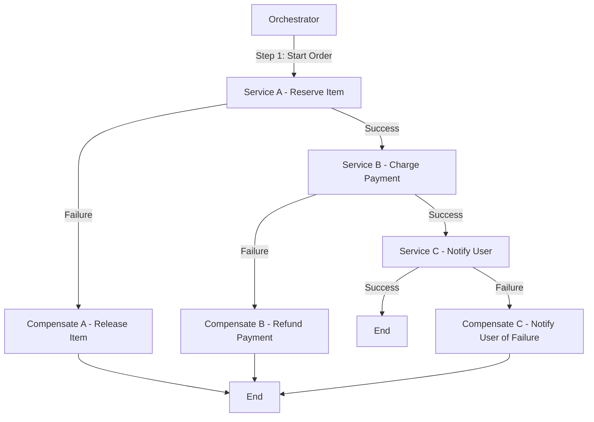
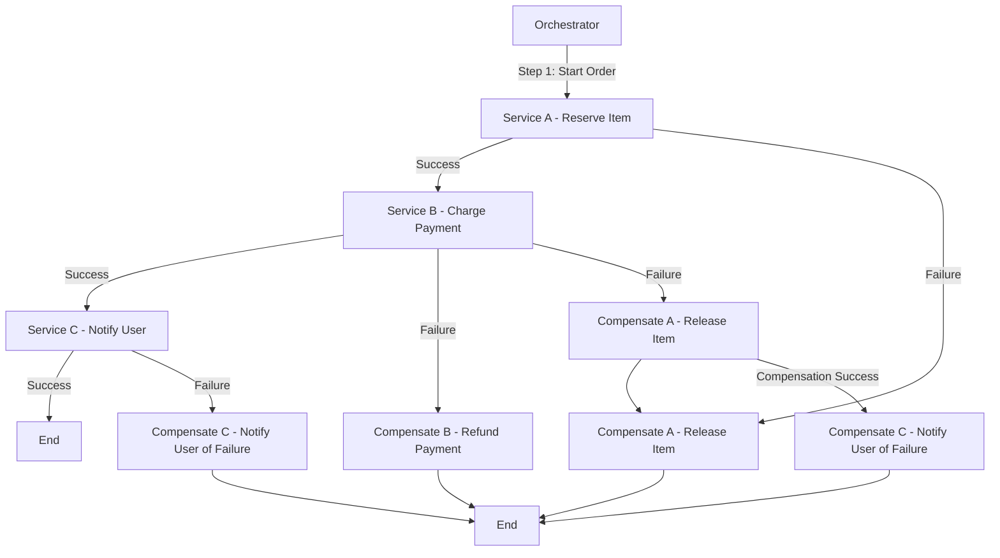
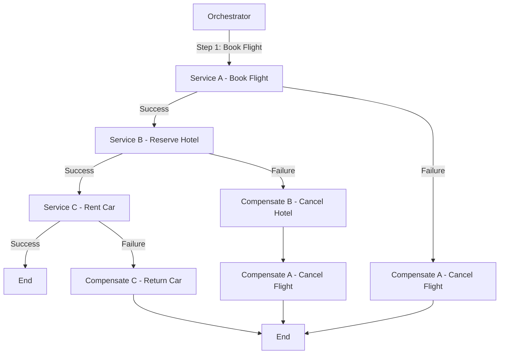
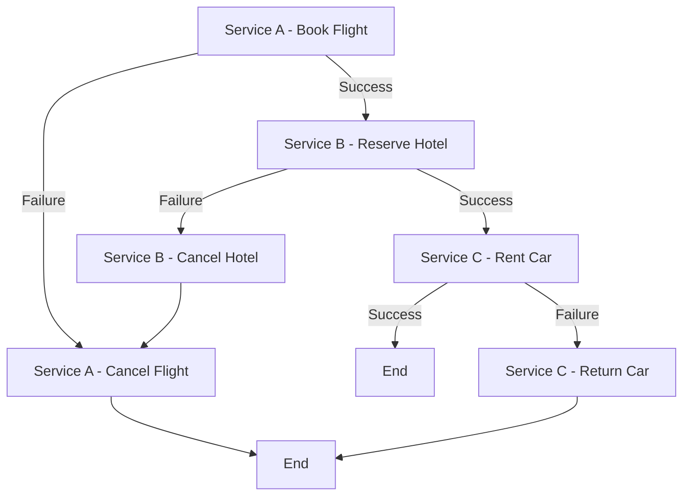

### Orchestrator-Based Saga Pattern

The Orchestrator-based Saga pattern is a way to manage distributed transactions across multiple microservices. In this pattern, a central orchestrator service coordinates the transactions and ensures that all steps are executed in a reliable manner. If a step fails, the orchestrator handles the rollback through compensating transactions.

### Key Components

1. **Orchestrator**: The central service that manages the workflow.
2. **Participants**: Microservices that perform specific tasks.
3. **Compensating Transactions**: Actions taken to undo the effects of a previously completed step if something goes wrong.

### Diagram

Here's a simplified representation of an orchestrator-based saga:

```
+------------------+
|   Orchestrator   |
+------------------+
        |
        | Step 1: Start Order
        v
+------------------+
|   Service A      |  (e.g., Reserve Item)
+------------------+
        |
        | Success
        |      Failure
        v           v
+------------------+   +------------------+
|   Service B      |   | Compensate A     |
| (e.g., Charge Payment) | (e.g., Release Item)
+------------------+   +------------------+
        |
        | Success
        |      Failure
        v           v
+------------------+   +------------------+
|   Service C      |   | Compensate B     |
|   (e.g., Notify User)  | (e.g., Refund Payment)
+------------------+   +------------------+
        |
        | Success
        |      Failure
        v           v
| Compensate C     |
| (e.g., Notify User of Failure) |
+------------------+
```

### Implementation Steps

1. **Define the Saga**: Create a workflow that defines the order of operations and compensating actions.
2. **Implement Services**: Create the individual services to handle each task and the corresponding compensating transaction.
3. **Build the Orchestrator**: Implement the orchestrator that coordinates the saga.

### Example Implementation

Let's illustrate a simple example using Node.js with Express and a hypothetical saga involving three services: Order Service, Payment Service, and Notification Service.

#### Service A: Order Service

```javascript
// orderService.js
const express = require('express');
const app = express();
app.use(express.json());

app.post('/reserve', (req, res) => {
    // Logic to reserve an item
    console.log("Item reserved.");
    res.status(200).send("Item reserved.");
});

app.post('/compensate', (req, res) => {
    // Logic to release the item
    console.log("Item reservation released.");
    res.status(200).send("Item reservation released.");
});

app.listen(3001, () => console.log('Order Service running on port 3001'));
```

#### Service B: Payment Service

```javascript
// paymentService.js
const express = require('express');
const app = express();
app.use(express.json());

app.post('/charge', (req, res) => {
    // Logic to charge payment
    console.log("Payment charged.");
    res.status(200).send("Payment charged.");
});

app.post('/refund', (req, res) => {
    // Logic to refund payment
    console.log("Payment refunded.");
    res.status(200).send("Payment refunded.");
});

app.listen(3002, () => console.log('Payment Service running on port 3002'));
```

#### Service C: Notification Service

```javascript
// notificationService.js
const express = require('express');
const app = express();
app.use(express.json());

app.post('/notify', (req, res) => {
    // Logic to notify user
    console.log("User notified.");
    res.status(200).send("User notified.");
});

app.post('/notify-failure', (req, res) => {
    // Logic to notify user of failure
    console.log("User notified of failure.");
    res.status(200).send("User notified of failure.");
});

app.listen(3003, () => console.log('Notification Service running on port 3003'));
```

#### Orchestrator Service

```javascript
// orchestrator.js
const express = require('express');
const axios = require('axios');
const app = express();
app.use(express.json());

app.post('/start-saga', async (req, res) => {
    try {
        await axios.post('http://localhost:3001/reserve'); // Service A
        await axios.post('http://localhost:3002/charge');  // Service B
        await axios.post('http://localhost:3003/notify');  // Service C
        res.status(200).send("Saga completed successfully.");
    } catch (error) {
        console.error("Error occurred:", error.message);
        // Start compensation
        await axios.post('http://localhost:3001/compensate'); // Compensate A
        await axios.post('http://localhost:3002/refund');      // Compensate B
        await axios.post('http://localhost:3003/notify-failure'); // Compensate C
        res.status(500).send("Saga failed, compensating.");
    }
});

app.listen(3000, () => console.log('Orchestrator running on port 3000'));
```

### Running the Example

1. Start each service in separate terminal windows:
   - `node orderService.js`
   - `node paymentService.js`
   - `node notificationService.js`
   - `node orchestrator.js`

2. To initiate the saga, send a POST request to the orchestrator:
   ```bash
   curl -X POST http://localhost:3000/start-saga
   ```

### Conclusion

The orchestrator-based saga pattern allows for managing complex transactions across multiple microservices while ensuring reliability through compensating actions. This example provides a basic overview, and you can expand it with more advanced features like event sourcing, retries, and logging for production use.

Sure! Let’s create a **Mermaid diagram** for the orchestrator-based Saga pattern, followed by a **Spring Boot** implementation for the same scenario.

### Mermaid Diagram

Here’s a Mermaid diagram to represent the orchestrator-based Saga pattern:



### Spring Boot Implementation

#### Step 1: Create Services

You will create three services (Order Service, Payment Service, Notification Service) and one Orchestrator service. 

##### 1. Order Service

```java
// OrderServiceApplication.java
package com.example.orderservice;

import org.springframework.boot.SpringApplication;
import org.springframework.boot.autoconfigure.SpringBootApplication;
import org.springframework.web.bind.annotation.*;

@SpringBootApplication
@RestController
@RequestMapping("/order")
public class OrderServiceApplication {

    public static void main(String[] args) {
        SpringApplication.run(OrderServiceApplication.class, args);
    }

    @PostMapping("/reserve")
    public String reserve() {
        // Logic to reserve an item
        System.out.println("Item reserved.");
        return "Item reserved.";
    }

    @PostMapping("/compensate")
    public String compensate() {
        // Logic to release the item
        System.out.println("Item reservation released.");
        return "Item reservation released.";
    }
}
```

##### 2. Payment Service

```java
// PaymentServiceApplication.java
package com.example.paymentservice;

import org.springframework.boot.SpringApplication;
import org.springframework.boot.autoconfigure.SpringBootApplication;
import org.springframework.web.bind.annotation.*;

@SpringBootApplication
@RestController
@RequestMapping("/payment")
public class PaymentServiceApplication {

    public static void main(String[] args) {
        SpringApplication.run(PaymentServiceApplication.class, args);
    }

    @PostMapping("/charge")
    public String charge() {
        // Logic to charge payment
        System.out.println("Payment charged.");
        return "Payment charged.";
    }

    @PostMapping("/refund")
    public String refund() {
        // Logic to refund payment
        System.out.println("Payment refunded.");
        return "Payment refunded.";
    }
}
```

##### 3. Notification Service

```java
// NotificationServiceApplication.java
package com.example.notificationservice;

import org.springframework.boot.SpringApplication;
import org.springframework.boot.autoconfigure.SpringBootApplication;
import org.springframework.web.bind.annotation.*;

@SpringBootApplication
@RestController
@RequestMapping("/notification")
public class NotificationServiceApplication {

    public static void main(String[] args) {
        SpringApplication.run(NotificationServiceApplication.class, args);
    }

    @PostMapping("/notify")
    public String notifyUser() {
        // Logic to notify user
        System.out.println("User notified.");
        return "User notified.";
    }

    @PostMapping("/notify-failure")
    public String notifyFailure() {
        // Logic to notify user of failure
        System.out.println("User notified of failure.");
        return "User notified of failure.";
    }
}
```

##### 4. Orchestrator Service

```java
// OrchestratorApplication.java
package com.example.orchestrator;

import org.springframework.boot.SpringApplication;
import org.springframework.boot.autoconfigure.SpringBootApplication;
import org.springframework.web.bind.annotation.*;
import org.springframework.web.client.RestTemplate;

@SpringBootApplication
@RestController
@RequestMapping("/saga")
public class OrchestratorApplication {

    private final RestTemplate restTemplate = new RestTemplate();

    public static void main(String[] args) {
        SpringApplication.run(OrchestratorApplication.class, args);
    }

    @PostMapping("/start")
    public String startSaga() {
        try {
            String orderResponse = restTemplate.postForObject("http://localhost:8081/order/reserve", null, String.class);
            String paymentResponse = restTemplate.postForObject("http://localhost:8082/payment/charge", null, String.class);
            String notifyResponse = restTemplate.postForObject("http://localhost:8083/notification/notify", null, String.class);
            return "Saga completed successfully.";
        } catch (Exception e) {
            // Compensation logic
            restTemplate.postForObject("http://localhost:8081/order/compensate", null, String.class);
            restTemplate.postForObject("http://localhost:8082/payment/refund", null, String.class);
            restTemplate.postForObject("http://localhost:8083/notification/notify-failure", null, String.class);
            return "Saga failed, compensating.";
        }
    }
}
```

### Running the Services

1. **Create a Maven project for each service** using Spring Initializr with dependencies for Spring Web.
2. **Run each service** on different ports:
   - Order Service: Port `8081`
   - Payment Service: Port `8082`
   - Notification Service: Port `8083`
   - Orchestrator Service: Port `8080`

3. **To initiate the saga**, send a POST request to the orchestrator:
   ```bash
   curl -X POST http://localhost:8080/saga/start
   ```

### Conclusion

This Spring Boot implementation follows the orchestrator-based Saga pattern, allowing you to manage distributed transactions reliably. You can expand this by adding more features like logging, error handling, and retries for robustness in production systems.

To prevent transactions in Service A and Service C if Service B fails, you can implement a compensation pattern along with a robust orchestration mechanism. Here’s how you can structure it:

1. **Transactional State Management**: Each service should maintain a transaction state. For instance, Service A should only finalize the reservation if it knows Service B has succeeded.

2. **Sagas Pattern**: Utilize the Sagas pattern, which manages distributed transactions. In this case, you would initiate a saga that includes compensation actions for each service in case of failure.

Here’s how you can modify your flow:



### Steps Explained:

1. **Service A - Reserve Item**: Once it reserves the item, it waits for Service B's response before finalizing.
  
2. **Service B - Charge Payment**: If Service B fails, trigger compensation for Service A to release the reserved item.

3. **Service C - Notify User**: This should only execute if Service B is successful. If Service B fails, Service C should not be notified.

4. **Compensation Actions**: If Service B fails, you compensate Service A first. If compensation is successful, then you can handle notifying the user about the failure of the transaction.

By following this structure, you ensure that all services remain consistent and that no operations are left in an inconsistent state.

Here’s a Mermaid diagram that outlines the Saga Orchestrator pattern for booking a vacation, including the booking of a flight, reserving a hotel, and renting a car, with appropriate rollback actions in case of failures.



### Steps Explained:

1. **Orchestrator**: The central service coordinating the entire process.
2. **Service A - Book Flight**: The orchestrator first attempts to book the flight.
   - If successful, it proceeds to the next step.
   - If it fails, it triggers compensation to cancel the flight (though there might not be a need to compensate if it never succeeded).
3. **Service B - Reserve Hotel**: After a successful flight booking, the orchestrator books the hotel.
   - If this step fails, it triggers compensation to cancel the flight booking.
4. **Service C - Rent Car**: If both the flight and hotel bookings are successful, the car is rented.
   - If this fails, it compensates by returning the car.
5. **Compensation Actions**: Ensure that any failures lead to appropriate rollbacks:
   - Cancel the flight if the hotel booking fails.
   - Return the car if renting fails.

This structured approach ensures that all steps are properly sequenced, and any failures are handled gracefully to maintain consistency across services.

Imagine you’re booking a vacation, which involves multiple steps: booking a flight, reserving a hotel, and renting a car. If the flight booking fails, the entire process should be aborted and rolled back.

In an Orchestrator-based Saga:

The orchestrator (a central coordinator) manages the flow.
The orchestrator first tries to book the flight.
If successful, it proceeds to book the hotel.
If the hotel booking fails, it triggers compensating transactions (e.g., cancel the flight booking).
It acts as a “traffic controller,” ensuring that the entire transaction either completes or rolls back as needed.
This way, even though each step is handled by a different service, the orchestrator ensures the steps follow a proper sequence, and failures trigger appropriate actions.


Implementation
In Spring Boot, you typically implement the Saga Orchestrator pattern using a combination of:

Orchestrator service: The central service that coordinates all the steps.
Individual services: Each microservice handles its own task (flight booking, hotel…


Sure! Here's a representation of the Choreography pattern for the same vacation booking scenario, along with a brief Spring Boot code example.

### Choreography Pattern Diagram

In the Choreography pattern, each service communicates directly with others and handles its own compensation logic.



### Explanation

1. **Service A - Book Flight**: Initiates the booking.
   - If successful, it triggers Service B to reserve the hotel.
   - If it fails, it handles its own compensation by canceling the flight.
   
2. **Service B - Reserve Hotel**: Handles hotel reservations.
   - On success, it calls Service C to rent a car.
   - On failure, it triggers its own compensation to cancel the hotel.

3. **Service C - Rent Car**: Rents the car if previous steps are successful.
   - If this fails, it handles its own compensation by returning the car.

### Spring Boot Implementation

Here's a simplified version of the implementation in Spring Boot for each service:

#### 1. **Service A - Book Flight**

```java
@RestController
@RequestMapping("/flight")
public class FlightService {

    @PostMapping("/book")
    public ResponseEntity<String> bookFlight() {
        // Logic to book flight
        boolean success = // ... booking logic;

        if (!success) {
            // Trigger cancellation
            cancelFlight();
            return ResponseEntity.status(HttpStatus.INTERNAL_SERVER_ERROR).body("Flight booking failed");
        }

        // Notify next service (via REST call or message broker)
        restTemplate.postForEntity("http://hotel-service/reserve", flightDetails, String.class);
        return ResponseEntity.ok("Flight booked successfully");
    }

    public void cancelFlight() {
        // Logic to cancel the flight
    }
}
```

#### 2. **Service B - Reserve Hotel**

```java
@RestController
@RequestMapping("/hotel")
public class HotelService {

    @PostMapping("/reserve")
    public ResponseEntity<String> reserveHotel(@RequestBody FlightDetails flightDetails) {
        // Logic to reserve hotel
        boolean success = // ... reservation logic;

        if (!success) {
            // Trigger compensation
            cancelHotel();
            return ResponseEntity.status(HttpStatus.INTERNAL_SERVER_ERROR).body("Hotel reservation failed");
        }

        // Notify next service
        restTemplate.postForEntity("http://car-service/rent", hotelDetails, String.class);
        return ResponseEntity.ok("Hotel reserved successfully");
    }

    public void cancelHotel() {
        // Logic to cancel the hotel reservation
    }
}
```

#### 3. **Service C - Rent Car**

```java
@RestController
@RequestMapping("/car")
public class CarService {

    @PostMapping("/rent")
    public ResponseEntity<String> rentCar(@RequestBody HotelDetails hotelDetails) {
        // Logic to rent a car
        boolean success = // ... rental logic;

        if (!success) {
            // Handle failure
            returnCar();
            return ResponseEntity.status(HttpStatus.INTERNAL_SERVER_ERROR).body("Car rental failed");
        }

        return ResponseEntity.ok("Car rented successfully");
    }

    public void returnCar() {
        // Logic to return the car
    }
}
```

### Key Points

- Each service is responsible for its own transactions and compensation.
- Services communicate directly with each other, either through REST APIs or a messaging system.
- Failure handling and compensating actions are implemented within each service.

This pattern allows for greater flexibility and autonomy of each service, but it requires careful management of state and communication to ensure consistency across the system.
