### Orchestrator-Based Saga Pattern

The Orchestrator-based Saga pattern is a way to manage distributed transactions across multiple microservices. In this pattern, a central orchestrator service coordinates the transactions and ensures that all steps are executed in a reliable manner. If a step fails, the orchestrator handles the rollback through compensating transactions.

### Key Components

1. **Orchestrator**: The central service that manages the workflow.
2. **Participants**: Microservices that perform specific tasks.
3. **Compensating Transactions**: Actions taken to undo the effects of a previously completed step if something goes wrong.

### Diagram

Here's a simplified representation of an orchestrator-based saga:

```
+------------------+
|   Orchestrator   |
+------------------+
        |
        | Step 1: Start Order
        v
+------------------+
|   Service A      |  (e.g., Reserve Item)
+------------------+
        |
        | Success
        |      Failure
        v           v
+------------------+   +------------------+
|   Service B      |   | Compensate A     |
| (e.g., Charge Payment) | (e.g., Release Item)
+------------------+   +------------------+
        |
        | Success
        |      Failure
        v           v
+------------------+   +------------------+
|   Service C      |   | Compensate B     |
|   (e.g., Notify User)  | (e.g., Refund Payment)
+------------------+   +------------------+
        |
        | Success
        |      Failure
        v           v
| Compensate C     |
| (e.g., Notify User of Failure) |
+------------------+
```

### Implementation Steps

1. **Define the Saga**: Create a workflow that defines the order of operations and compensating actions.
2. **Implement Services**: Create the individual services to handle each task and the corresponding compensating transaction.
3. **Build the Orchestrator**: Implement the orchestrator that coordinates the saga.

### Example Implementation

Let's illustrate a simple example using Node.js with Express and a hypothetical saga involving three services: Order Service, Payment Service, and Notification Service.

#### Service A: Order Service

```javascript
// orderService.js
const express = require('express');
const app = express();
app.use(express.json());

app.post('/reserve', (req, res) => {
    // Logic to reserve an item
    console.log("Item reserved.");
    res.status(200).send("Item reserved.");
});

app.post('/compensate', (req, res) => {
    // Logic to release the item
    console.log("Item reservation released.");
    res.status(200).send("Item reservation released.");
});

app.listen(3001, () => console.log('Order Service running on port 3001'));
```

#### Service B: Payment Service

```javascript
// paymentService.js
const express = require('express');
const app = express();
app.use(express.json());

app.post('/charge', (req, res) => {
    // Logic to charge payment
    console.log("Payment charged.");
    res.status(200).send("Payment charged.");
});

app.post('/refund', (req, res) => {
    // Logic to refund payment
    console.log("Payment refunded.");
    res.status(200).send("Payment refunded.");
});

app.listen(3002, () => console.log('Payment Service running on port 3002'));
```

#### Service C: Notification Service

```javascript
// notificationService.js
const express = require('express');
const app = express();
app.use(express.json());

app.post('/notify', (req, res) => {
    // Logic to notify user
    console.log("User notified.");
    res.status(200).send("User notified.");
});

app.post('/notify-failure', (req, res) => {
    // Logic to notify user of failure
    console.log("User notified of failure.");
    res.status(200).send("User notified of failure.");
});

app.listen(3003, () => console.log('Notification Service running on port 3003'));
```

#### Orchestrator Service

```javascript
// orchestrator.js
const express = require('express');
const axios = require('axios');
const app = express();
app.use(express.json());

app.post('/start-saga', async (req, res) => {
    try {
        await axios.post('http://localhost:3001/reserve'); // Service A
        await axios.post('http://localhost:3002/charge');  // Service B
        await axios.post('http://localhost:3003/notify');  // Service C
        res.status(200).send("Saga completed successfully.");
    } catch (error) {
        console.error("Error occurred:", error.message);
        // Start compensation
        await axios.post('http://localhost:3001/compensate'); // Compensate A
        await axios.post('http://localhost:3002/refund');      // Compensate B
        await axios.post('http://localhost:3003/notify-failure'); // Compensate C
        res.status(500).send("Saga failed, compensating.");
    }
});

app.listen(3000, () => console.log('Orchestrator running on port 3000'));
```

### Running the Example

1. Start each service in separate terminal windows:
   - `node orderService.js`
   - `node paymentService.js`
   - `node notificationService.js`
   - `node orchestrator.js`

2. To initiate the saga, send a POST request to the orchestrator:
   ```bash
   curl -X POST http://localhost:3000/start-saga
   ```

### Conclusion

The orchestrator-based saga pattern allows for managing complex transactions across multiple microservices while ensuring reliability through compensating actions. This example provides a basic overview, and you can expand it with more advanced features like event sourcing, retries, and logging for production use.

Sure! Let’s create a **Mermaid diagram** for the orchestrator-based Saga pattern, followed by a **Spring Boot** implementation for the same scenario.

### Mermaid Diagram

Here’s a Mermaid diagram to represent the orchestrator-based Saga pattern:

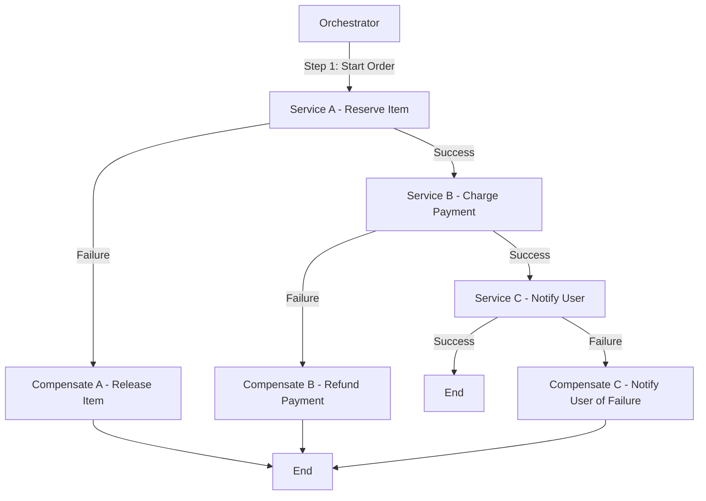

### Spring Boot Implementation

#### Step 1: Create Services

You will create three services (Order Service, Payment Service, Notification Service) and one Orchestrator service. 

##### 1. Order Service

```java
// OrderServiceApplication.java
package com.example.orderservice;

import org.springframework.boot.SpringApplication;
import org.springframework.boot.autoconfigure.SpringBootApplication;
import org.springframework.web.bind.annotation.*;

@SpringBootApplication
@RestController
@RequestMapping("/order")
public class OrderServiceApplication {

    public static void main(String[] args) {
        SpringApplication.run(OrderServiceApplication.class, args);
    }

    @PostMapping("/reserve")
    public String reserve() {
        // Logic to reserve an item
        System.out.println("Item reserved.");
        return "Item reserved.";
    }

    @PostMapping("/compensate")
    public String compensate() {
        // Logic to release the item
        System.out.println("Item reservation released.");
        return "Item reservation released.";
    }
}
```

##### 2. Payment Service

```java
// PaymentServiceApplication.java
package com.example.paymentservice;

import org.springframework.boot.SpringApplication;
import org.springframework.boot.autoconfigure.SpringBootApplication;
import org.springframework.web.bind.annotation.*;

@SpringBootApplication
@RestController
@RequestMapping("/payment")
public class PaymentServiceApplication {

    public static void main(String[] args) {
        SpringApplication.run(PaymentServiceApplication.class, args);
    }

    @PostMapping("/charge")
    public String charge() {
        // Logic to charge payment
        System.out.println("Payment charged.");
        return "Payment charged.";
    }

    @PostMapping("/refund")
    public String refund() {
        // Logic to refund payment
        System.out.println("Payment refunded.");
        return "Payment refunded.";
    }
}
```

##### 3. Notification Service

```java
// NotificationServiceApplication.java
package com.example.notificationservice;

import org.springframework.boot.SpringApplication;
import org.springframework.boot.autoconfigure.SpringBootApplication;
import org.springframework.web.bind.annotation.*;

@SpringBootApplication
@RestController
@RequestMapping("/notification")
public class NotificationServiceApplication {

    public static void main(String[] args) {
        SpringApplication.run(NotificationServiceApplication.class, args);
    }

    @PostMapping("/notify")
    public String notifyUser() {
        // Logic to notify user
        System.out.println("User notified.");
        return "User notified.";
    }

    @PostMapping("/notify-failure")
    public String notifyFailure() {
        // Logic to notify user of failure
        System.out.println("User notified of failure.");
        return "User notified of failure.";
    }
}
```

##### 4. Orchestrator Service

```java
// OrchestratorApplication.java
package com.example.orchestrator;

import org.springframework.boot.SpringApplication;
import org.springframework.boot.autoconfigure.SpringBootApplication;
import org.springframework.web.bind.annotation.*;
import org.springframework.web.client.RestTemplate;

@SpringBootApplication
@RestController
@RequestMapping("/saga")
public class OrchestratorApplication {

    private final RestTemplate restTemplate = new RestTemplate();

    public static void main(String[] args) {
        SpringApplication.run(OrchestratorApplication.class, args);
    }

    @PostMapping("/start")
    public String startSaga() {
        try {
            String orderResponse = restTemplate.postForObject("http://localhost:8081/order/reserve", null, String.class);
            String paymentResponse = restTemplate.postForObject("http://localhost:8082/payment/charge", null, String.class);
            String notifyResponse = restTemplate.postForObject("http://localhost:8083/notification/notify", null, String.class);
            return "Saga completed successfully.";
        } catch (Exception e) {
            // Compensation logic
            restTemplate.postForObject("http://localhost:8081/order/compensate", null, String.class);
            restTemplate.postForObject("http://localhost:8082/payment/refund", null, String.class);
            restTemplate.postForObject("http://localhost:8083/notification/notify-failure", null, String.class);
            return "Saga failed, compensating.";
        }
    }
}
```

### Running the Services

1. **Create a Maven project for each service** using Spring Initializr with dependencies for Spring Web.
2. **Run each service** on different ports:
   - Order Service: Port `8081`
   - Payment Service: Port `8082`
   - Notification Service: Port `8083`
   - Orchestrator Service: Port `8080`

3. **To initiate the saga**, send a POST request to the orchestrator:
   ```bash
   curl -X POST http://localhost:8080/saga/start
   ```

### Conclusion

This Spring Boot implementation follows the orchestrator-based Saga pattern, allowing you to manage distributed transactions reliably. You can expand this by adding more features like logging, error handling, and retries for robustness in production systems.

To prevent transactions in Service A and Service C if Service B fails, you can implement a compensation pattern along with a robust orchestration mechanism. Here’s how you can structure it:

1. **Transactional State Management**: Each service should maintain a transaction state. For instance, Service A should only finalize the reservation if it knows Service B has succeeded.

2. **Sagas Pattern**: Utilize the Sagas pattern, which manages distributed transactions. In this case, you would initiate a saga that includes compensation actions for each service in case of failure.

Here’s how you can modify your flow:

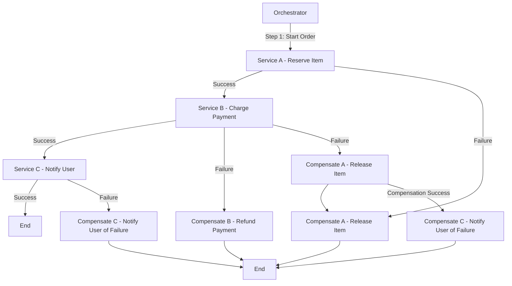

### Steps Explained:

1. **Service A - Reserve Item**: Once it reserves the item, it waits for Service B's response before finalizing.
  
2. **Service B - Charge Payment**: If Service B fails, trigger compensation for Service A to release the reserved item.

3. **Service C - Notify User**: This should only execute if Service B is successful. If Service B fails, Service C should not be notified.

4. **Compensation Actions**: If Service B fails, you compensate Service A first. If compensation is successful, then you can handle notifying the user about the failure of the transaction.

By following this structure, you ensure that all services remain consistent and that no operations are left in an inconsistent state.

Here’s a Mermaid diagram that outlines the Saga Orchestrator pattern for booking a vacation, including the booking of a flight, reserving a hotel, and renting a car, with appropriate rollback actions in case of failures.

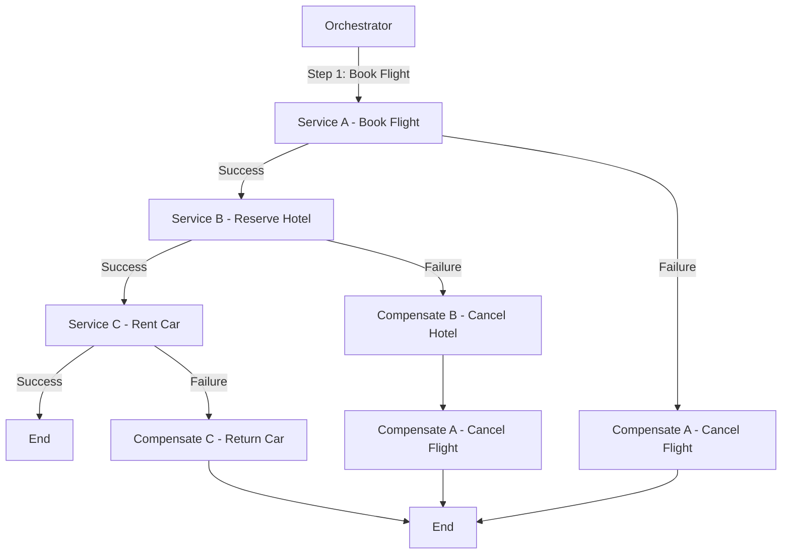

### Steps Explained:

1. **Orchestrator**: The central service coordinating the entire process.
2. **Service A - Book Flight**: The orchestrator first attempts to book the flight.
   - If successful, it proceeds to the next step.
   - If it fails, it triggers compensation to cancel the flight (though there might not be a need to compensate if it never succeeded).
3. **Service B - Reserve Hotel**: After a successful flight booking, the orchestrator books the hotel.
   - If this step fails, it triggers compensation to cancel the flight booking.
4. **Service C - Rent Car**: If both the flight and hotel bookings are successful, the car is rented.
   - If this fails, it compensates by returning the car.
5. **Compensation Actions**: Ensure that any failures lead to appropriate rollbacks:
   - Cancel the flight if the hotel booking fails.
   - Return the car if renting fails.

This structured approach ensures that all steps are properly sequenced, and any failures are handled gracefully to maintain consistency across services.

Imagine you’re booking a vacation, which involves multiple steps: booking a flight, reserving a hotel, and renting a car. If the flight booking fails, the entire process should be aborted and rolled back.

In an Orchestrator-based Saga:

The orchestrator (a central coordinator) manages the flow.
The orchestrator first tries to book the flight.
If successful, it proceeds to book the hotel.
If the hotel booking fails, it triggers compensating transactions (e.g., cancel the flight booking).
It acts as a “traffic controller,” ensuring that the entire transaction either completes or rolls back as needed.
This way, even though each step is handled by a different service, the orchestrator ensures the steps follow a proper sequence, and failures trigger appropriate actions.


Implementation
In Spring Boot, you typically implement the Saga Orchestrator pattern using a combination of:

Orchestrator service: The central service that coordinates all the steps.
Individual services: Each microservice handles its own task (flight booking, hotel…


Sure! Here's a representation of the Choreography pattern for the same vacation booking scenario, along with a brief Spring Boot code example.

### Choreography Pattern Diagram

In the Choreography pattern, each service communicates directly with others and handles its own compensation logic.

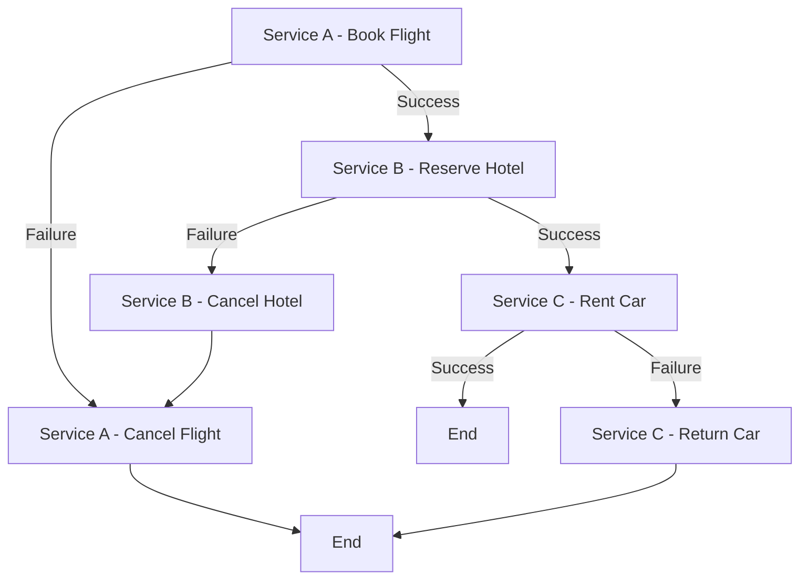

### Explanation

1. **Service A - Book Flight**: Initiates the booking.
   - If successful, it triggers Service B to reserve the hotel.
   - If it fails, it handles its own compensation by canceling the flight.
   
2. **Service B - Reserve Hotel**: Handles hotel reservations.
   - On success, it calls Service C to rent a car.
   - On failure, it triggers its own compensation to cancel the hotel.

3. **Service C - Rent Car**: Rents the car if previous steps are successful.
   - If this fails, it handles its own compensation by returning the car.

### Spring Boot Implementation

Here's a simplified version of the implementation in Spring Boot for each service:

#### 1. **Service A - Book Flight**

```java
@RestController
@RequestMapping("/flight")
public class FlightService {

    @PostMapping("/book")
    public ResponseEntity<String> bookFlight() {
        // Logic to book flight
        boolean success = // ... booking logic;

        if (!success) {
            // Trigger cancellation
            cancelFlight();
            return ResponseEntity.status(HttpStatus.INTERNAL_SERVER_ERROR).body("Flight booking failed");
        }

        // Notify next service (via REST call or message broker)
        restTemplate.postForEntity("http://hotel-service/reserve", flightDetails, String.class);
        return ResponseEntity.ok("Flight booked successfully");
    }

    public void cancelFlight() {
        // Logic to cancel the flight
    }
}
```

#### 2. **Service B - Reserve Hotel**

```java
@RestController
@RequestMapping("/hotel")
public class HotelService {

    @PostMapping("/reserve")
    public ResponseEntity<String> reserveHotel(@RequestBody FlightDetails flightDetails) {
        // Logic to reserve hotel
        boolean success = // ... reservation logic;

        if (!success) {
            // Trigger compensation
            cancelHotel();
            return ResponseEntity.status(HttpStatus.INTERNAL_SERVER_ERROR).body("Hotel reservation failed");
        }

        // Notify next service
        restTemplate.postForEntity("http://car-service/rent", hotelDetails, String.class);
        return ResponseEntity.ok("Hotel reserved successfully");
    }

    public void cancelHotel() {
        // Logic to cancel the hotel reservation
    }
}
```

#### 3. **Service C - Rent Car**

```java
@RestController
@RequestMapping("/car")
public class CarService {

    @PostMapping("/rent")
    public ResponseEntity<String> rentCar(@RequestBody HotelDetails hotelDetails) {
        // Logic to rent a car
        boolean success = // ... rental logic;

        if (!success) {
            // Handle failure
            returnCar();
            return ResponseEntity.status(HttpStatus.INTERNAL_SERVER_ERROR).body("Car rental failed");
        }

        return ResponseEntity.ok("Car rented successfully");
    }

    public void returnCar() {
        // Logic to return the car
    }
}
```

### Key Points

- Each service is responsible for its own transactions and compensation.
- Services communicate directly with each other, either through REST APIs or a messaging system.
- Failure handling and compensating actions are implemented within each service.

This pattern allows for greater flexibility and autonomy of each service, but it requires careful management of state and communication to ensure consistency across the system.

Sure! Let's explore the **Circuit Breaker**, **Retry**, **Asynchronous Event-Driven**, and **CQRS** patterns, along with diagrams and example Spring Boot code for each.

### 1. Circuit Breaker Pattern

The Circuit Breaker pattern helps prevent an application from repeatedly trying to execute an operation that's likely to fail, thus avoiding cascading failures.

#### Diagram

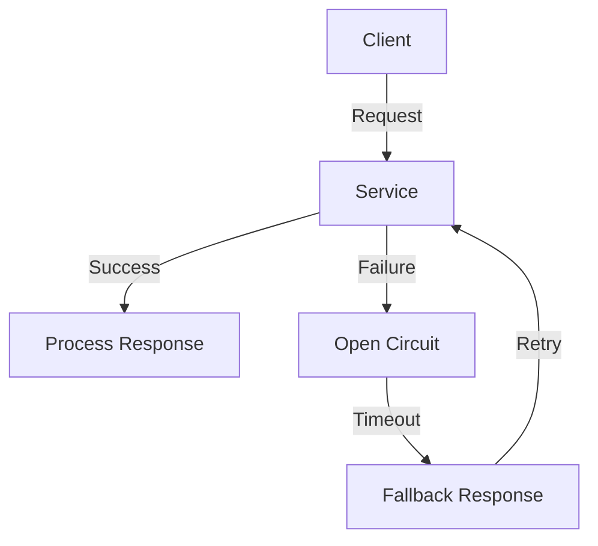

#### Code Example

Using **Resilience4j** in Spring Boot:

```java
import io.github.resilience4j.circuitbreaker.annotation.CircuitBreaker;
import org.springframework.web.bind.annotation.GetMapping;
import org.springframework.web.bind.annotation.RestController;

@RestController
public class MyService {

    @GetMapping("/performAction")
    @CircuitBreaker
    public String performAction() {
        // Simulate a service call
        if (Math.random() > 0.7) {
            throw new RuntimeException("Service failure");
        }
        return "Success";
    }
}
```

### 2. Retry Pattern

The Retry pattern automatically retries failed operations to increase the likelihood of success, especially useful for transient failures.

#### Diagram

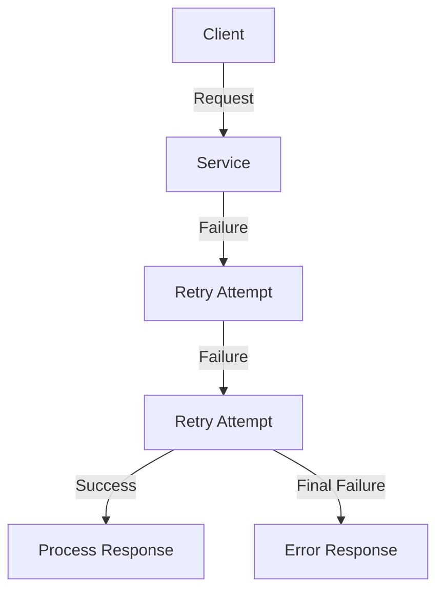

#### Code Example

Using **Resilience4j** for retry:

```java
import io.github.resilience4j.retry.annotation.Retry;
import org.springframework.web.bind.annotation.GetMapping;
import org.springframework.web.bind.annotation.RestController;

@RestController
public class MyService {

    @GetMapping("/performAction")
    @Retry(name = "retryService")
    public String performAction() {
        // Simulate a service call
        if (Math.random() > 0.7) {
            throw new RuntimeException("Service failure");
        }
        return "Success";
    }
}
```

### 3. Asynchronous Event-Driven Pattern

In this pattern, components communicate through events, promoting loose coupling and asynchronous processing.

#### Diagram

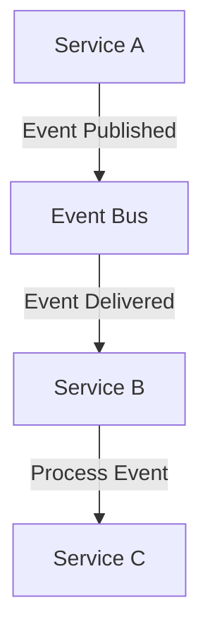

#### Code Example

Using **Spring Events**:

```java
import org.springframework.context.ApplicationEventPublisher;
import org.springframework.stereotype.Service;

@Service
public class EventPublisherService {

    private final ApplicationEventPublisher publisher;

    public EventPublisherService(ApplicationEventPublisher publisher) {
        this.publisher = publisher;
    }

    public void publishEvent(String message) {
        publisher.publishEvent(new MyEvent(this, message));
    }
}

// Event Listener
@Component
public class MyEventListener {

    @EventListener
    public void handleEvent(MyEvent event) {
        // Process the event
        System.out.println("Received event: " + event.getMessage());
    }
}

// Custom Event
public class MyEvent extends ApplicationEvent {
    private final String message;

    public MyEvent(Object source, String message) {
        super(source);
        this.message = message;
    }

    public String getMessage() {
        return message;
    }
}
```

### 4. CQRS (Command Query Responsibility Segregation) Pattern

CQRS separates the read and write operations into different models, allowing for more scalable and flexible applications.

#### Diagram

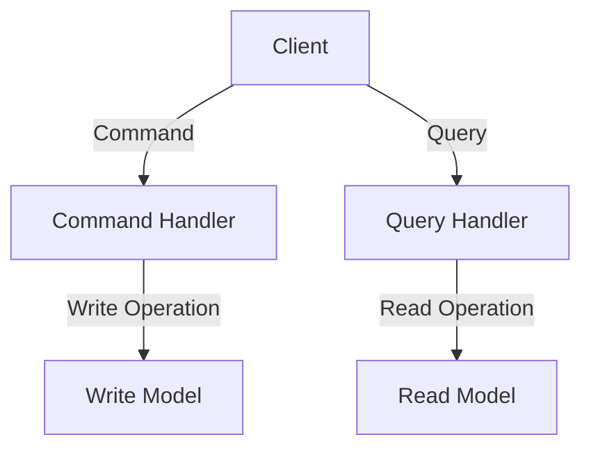

#### Code Example

```java
@RestController
public class MyController {

    private final CommandService commandService;
    private final QueryService queryService;

    public MyController(CommandService commandService, QueryService queryService) {
        this.commandService = commandService;
        this.queryService = queryService;
    }

    @PostMapping("/create")
    public ResponseEntity<String> createItem(@RequestBody CreateItemCommand command) {
        commandService.handle(command);
        return ResponseEntity.ok("Item created");
    }

    @GetMapping("/items/{id}")
    public ResponseEntity<Item> getItem(@PathVariable String id) {
        Item item = queryService.findById(id);
        return ResponseEntity.ok(item);
    }
}

// Command Handler
@Service
public class CommandService {
    public void handle(CreateItemCommand command) {
        // Logic to create an item
    }
}

// Query Handler
@Service
public class QueryService {
    public Item findById(String id) {
        // Logic to retrieve an item
        return new Item(); // example
    }
}

// Command Object
public class CreateItemCommand {
    private String name;
    // other fields, getters, setters
}

// Item Object
public class Item {
    private String id;
    private String name;
    // other fields, getters, setters
}
```

### Summary

1. **Circuit Breaker**: Prevents repeated attempts to call a failing service, providing fallback responses.
2. **Retry**: Automatically retries operations that fail due to transient issues.
3. **Asynchronous Event-Driven**: Promotes loose coupling through event-based communication between services.
4. **CQRS**: Separates command and query responsibilities for better scalability and flexibility.

These patterns can significantly enhance the resilience, scalability, and maintainability of microservices in a Spring Boot application.

Creating a comprehensive architecture that includes an event-driven system with Saga orchestration, Circuit Breaker, API Gateway, Service Discovery, Kubernetes, Docker, Jenkins CI/CD, Grafana, Spring Boot Actuator, Zipkin for distributed tracing, and proper database communication and transaction handling is quite extensive. Below, I will outline the key components, provide sequence and flow diagrams, and give code examples for each aspect.

### High-Level Architecture

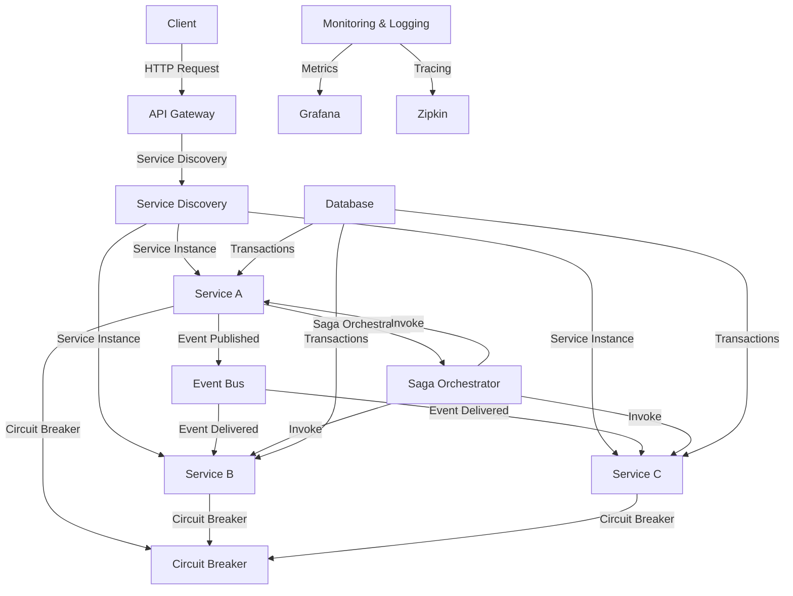

### Sequence Diagram

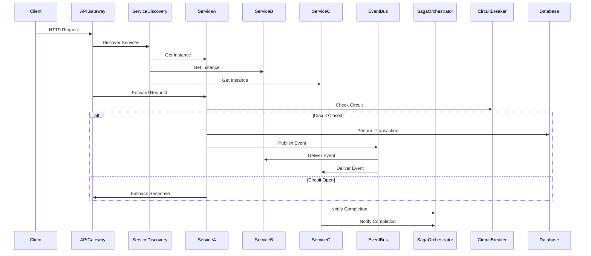

### Implementation Steps

1. **Microservices Setup**:
   - Create microservices (Service A, B, C) using Spring Boot.
   - Use Spring Cloud for Service Discovery (Eureka) and Circuit Breaker (Resilience4j).

2. **API Gateway**:
   - Implement an API Gateway using Spring Cloud Gateway to route requests to microservices.

3. **Event Bus**:
   - Use an event bus (e.g., RabbitMQ, Kafka) to publish and consume events among microservices.

4. **Saga Orchestrator**:
   - Implement the Saga pattern using a central orchestrator service that coordinates transactions across services.

5. **Circuit Breaker**:
   - Use Resilience4j to implement circuit breakers in each service.

6. **Database Communication**:
   - Use JPA or Spring Data for database interactions within each service, ensuring proper transaction management.

7. **Containerization with Docker**:
   - Create Dockerfiles for each service and use Docker Compose to run them together.

8. **Kubernetes Deployment**:
   - Deploy the services on a Kubernetes cluster, using Helm for managing releases.

9. **CI/CD Pipeline with Jenkins**:
   - Set up Jenkins to automate the build and deployment process, integrating with GitHub for version control.

10. **Monitoring with Grafana**:
    - Use Spring Boot Actuator to expose metrics and configure Grafana to visualize them.

11. **Tracing with Zipkin**:
    - Integrate Zipkin with your microservices for distributed tracing.

### Example Code Snippets

#### 1. **Service Discovery (Eureka Server)**

```java
@SpringBootApplication
@EnableEurekaServer
public class EurekaServerApplication {
    public static void main(String[] args) {
        SpringApplication.run(EurekaServerApplication.class, args);
    }
}
```

#### 2. **API Gateway Configuration**

```java
@SpringBootApplication
@EnableDiscoveryClient
@EnableZuulProxy
public class ApiGatewayApplication {
    public static void main(String[] args) {
        SpringApplication.run(ApiGatewayApplication.class, args);
    }
}
```

#### 3. **Service with Circuit Breaker**

```java
@RestController
public class ServiceA {

    @Autowired
    private RestTemplate restTemplate;

    @GetMapping("/performAction")
    @CircuitBreaker
    public String performAction() {
        // Simulate a service call
        if (Math.random() > 0.7) {
            throw new RuntimeException("Service failure");
        }
        return "Success";
    }

    @PostMapping("/publishEvent")
    public void publishEvent() {
        // Logic to publish an event
    }
}
```

#### 4. **Saga Orchestrator Example**

```java
@RestController
public class SagaOrchestrator {

    @Autowired
    private EventPublisherService eventPublisherService;

    @PostMapping("/startSaga")
    public void startSaga() {
        // Logic to start the saga
        eventPublisherService.publishEvent("Start Saga");
    }
}
```

### Memory Management and Performance Improvements

1. **Connection Pooling**: Use connection pooling with your database to manage connections efficiently.

2. **Caching**: Implement caching mechanisms (e.g., Redis) to reduce database load and improve response times.

3. **Load Balancing**: Use Kubernetes services to load balance traffic across multiple instances of your microservices.

4. **Profiling and Monitoring**: Utilize Spring Boot Actuator and Grafana to monitor application performance and identify bottlenecks.

5. **Resource Limits**: Define resource limits in your Kubernetes deployment configurations to prevent resource exhaustion.

### Instance Management for Multiple Service Requests

1. **Horizontal Scaling**: Scale your services horizontally by increasing the number of pods in Kubernetes based on load.

2. **Health Checks**: Implement health checks to ensure only healthy instances receive traffic.

3. **Rate Limiting**: Use API Gateway features to implement rate limiting, preventing overload during high traffic.

### Conclusion

This architecture provides a robust foundation for building scalable, resilient microservices. By integrating these patterns and tools, you ensure that your application can handle multiple service requests effectively while managing transactions and preventing failures. Each component plays a crucial role in maintaining the overall health and performance of the system.

Sure! Let’s explore each aspect of memory management and performance improvements in a microservices architecture using diagrams and code examples.

### 1. Memory Management and Performance Improvements

#### A. Connection Pooling

**Diagram:**

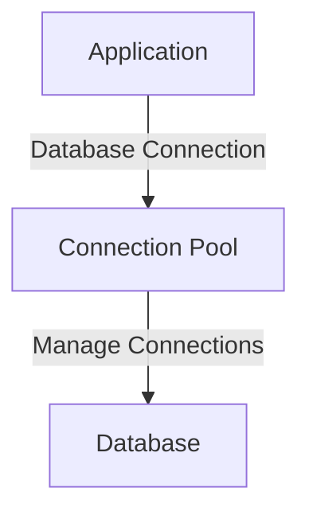

**Code Example:**

Using HikariCP (default in Spring Boot):

```yaml
# application.properties
spring.datasource.url=jdbc:mysql://localhost:3306/mydb
spring.datasource.username=root
spring.datasource.password=password
spring.datasource.hikari.maximum-pool-size=10
```

```java
@Configuration
public class DataSourceConfig {
    @Bean
    public DataSource dataSource() {
        HikariDataSource dataSource = new HikariDataSource();
        dataSource.setJdbcUrl("jdbc:mysql://localhost:3306/mydb");
        dataSource.setUsername("root");
        dataSource.setPassword("password");
        dataSource.setMaximumPoolSize(10);
        return dataSource;
    }
}
```

#### B. Caching

**Diagram:**

```mermaid
graph TD
    A[Application] -->|Cache Request| B[Cache (Redis)]
    B -->|Cache Hit| C[Return Cached Data]
    B -->|Cache Miss| D[Database]
    D -->|Fetch Data| C
```

**Code Example:**

Using Spring Cache with Redis:

```yaml
# application.properties
spring.cache.type=redis
spring.redis.host=localhost
spring.redis.port=6379
```

```java
@Service
public class UserService {
    
    @Cacheable("users")
    public User getUserById(Long id) {
        return userRepository.findById(id).orElseThrow(() -> new RuntimeException("User not found"));
    }
}
```

#### C. Load Balancing

**Diagram:**

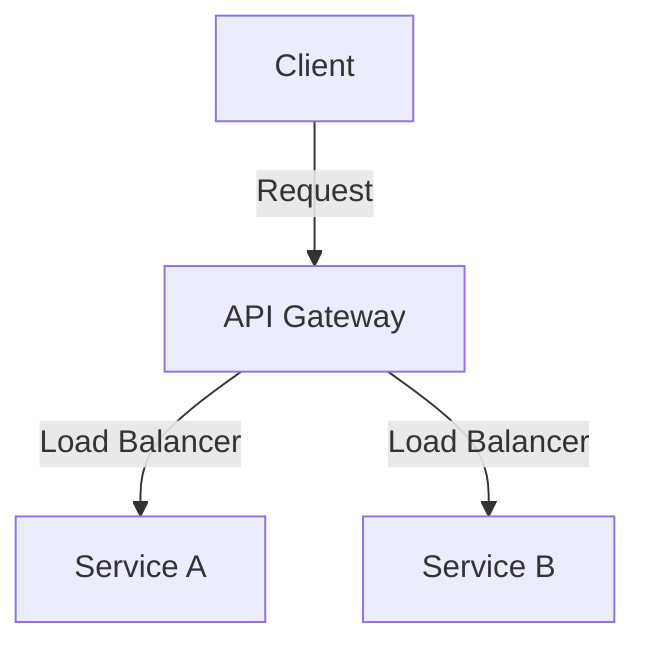

**Kubernetes Example:**

```yaml
apiVersion: v1
kind: Service
metadata:
  name: my-service
spec:
  type: LoadBalancer
  selector:
    app: my-app
  ports:
    - port: 80
      targetPort: 8080
```

#### D. Profiling and Monitoring

**Diagram:**

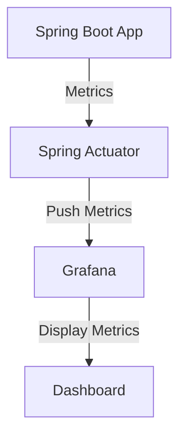

**Code Example:**

Enable Spring Actuator in `pom.xml`:

```xml
<dependency>
    <groupId>org.springframework.boot</groupId>
    <artifactId>spring-boot-starter-actuator</artifactId>
</dependency>
```

```yaml
# application.properties
management.endpoints.web.exposure.include=*
```

#### E. Resource Limits

**Diagram:**

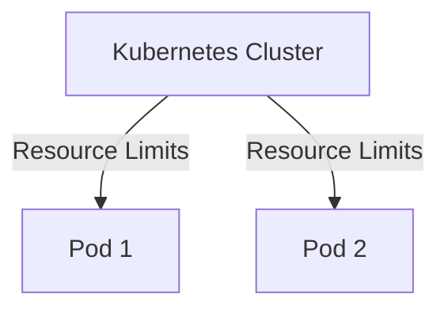

**Kubernetes Example:**

```yaml
apiVersion: apps/v1
kind: Deployment
metadata:
  name: my-deployment
spec:
  replicas: 2
  template:
    spec:
      containers:
        - name: my-container
          image: my-image
          resources:
            requests:
              memory: "256Mi"
              cpu: "500m"
            limits:
              memory: "512Mi"
              cpu: "1"
```

### 2. Instance Management for Multiple Service Requests

#### A. Horizontal Scaling

**Diagram:**

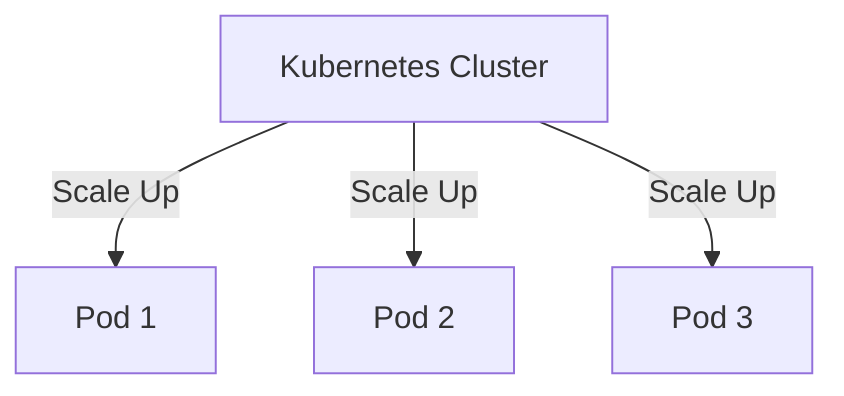

**Kubernetes Example:**

```yaml
apiVersion: autoscaling/v1
kind: HorizontalPodAutoscaler
metadata:
  name: my-hpa
spec:
  scaleTargetRef:
    apiVersion: apps/v1
    kind: Deployment
    name: my-deployment
  minReplicas: 1
  maxReplicas: 10
  targetCPUUtilizationPercentage: 80
```

#### B. Health Checks

**Diagram:**

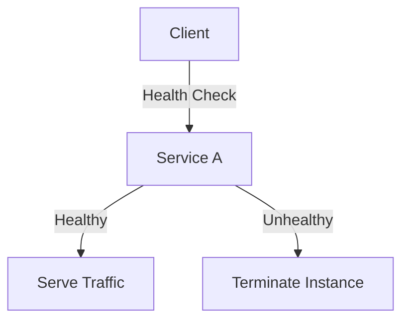

**Kubernetes Example:**

```yaml
livenessProbe:
  httpGet:
    path: /actuator/health
    port: 8080
  initialDelaySeconds: 30
  periodSeconds: 10
```

#### C. Rate Limiting

**Diagram:**

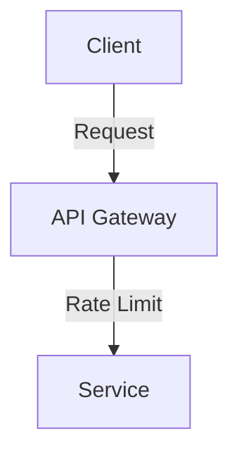

**Code Example:**

Using Spring Cloud Gateway:

```yaml
spring:
  cloud:
    gateway:
      routes:
        - id: service_route
          uri: lb://my-service
          predicates:
            - Path=/service/**
          filters:
            - RequestRateLimiter=2,4 # 2 requests per second with a burst of 4
```

### Conclusion

By implementing these strategies, you can effectively manage memory and enhance the performance of your microservices. Each aspect contributes to a more resilient and efficient architecture, capable of handling high loads and ensuring system stability.

Here are some common interview questions and answers related to Kubernetes and Docker that can help you prepare for your interview.

### Docker Interview Questions

#### 1. What is Docker?

**Answer:**
Docker is an open-source platform that automates the deployment, scaling, and management of applications using containerization. It allows developers to package applications and their dependencies into a standardized unit called a container, ensuring consistency across various environments.

#### 2. What are the benefits of using Docker?

**Answer:**
- **Isolation**: Containers encapsulate applications and their dependencies, providing isolation from other containers.
- **Portability**: Containers can run on any system that has Docker installed, making it easy to move applications between environments.
- **Efficiency**: Docker containers share the host OS kernel, making them lightweight compared to virtual machines.
- **Scalability**: Docker simplifies the process of scaling applications up or down.

#### 3. What is the difference between a Docker image and a container?

**Answer:**
- **Docker Image**: A read-only template used to create containers. It contains the application code, libraries, and dependencies.
- **Container**: A running instance of a Docker image. Containers are isolated from each other and can communicate through defined channels.

#### 4. How do you create a Docker container?

**Answer:**
You can create a Docker container using the following command:
```bash
docker run -d --name my-container my-image
```
This command runs a container named `my-container` from the `my-image` image in detached mode.

### Kubernetes Interview Questions

#### 5. What is Kubernetes?

**Answer:**
Kubernetes (K8s) is an open-source container orchestration platform designed to automate the deployment, scaling, and management of containerized applications. It helps manage the lifecycle of containers across a cluster of machines.

#### 6. What are Pods in Kubernetes?

**Answer:**
A Pod is the smallest deployable unit in Kubernetes, which can contain one or more containers. Containers within a Pod share the same network namespace and can communicate with each other using `localhost`. They also share storage volumes.

#### 7. What is a Deployment in Kubernetes?

**Answer:**
A Deployment is a Kubernetes resource that provides declarative updates to Pods and ReplicaSets. It allows you to describe an application’s desired state, such as which images to use and the number of replicas, and Kubernetes ensures that the actual state matches the desired state.

#### 8. What is a Service in Kubernetes?

**Answer:**
A Service is an abstraction that defines a logical set of Pods and a policy for accessing them. It provides a stable endpoint (IP address or DNS name) to access the Pods, enabling load balancing and service discovery.

### Advanced Questions

#### 9. What is the purpose of a Dockerfile?

**Answer:**
A Dockerfile is a text file that contains a set of instructions to build a Docker image. It specifies the base image, the application code, dependencies, environment variables, and the commands to run when the container starts.

#### 10. Explain Kubernetes ConfigMaps and Secrets.

**Answer:**
- **ConfigMap**: A Kubernetes resource used to store non-sensitive configuration data in key-value pairs, allowing you to separate configuration from application code.
- **Secret**: A Kubernetes resource used to store sensitive information (like passwords or API keys) securely. Secrets are encoded in base64 and can be mounted as environment variables or volumes in Pods.

#### 11. How do you scale applications in Kubernetes?

**Answer:**
You can scale applications in Kubernetes using the `kubectl scale` command or by modifying the Deployment resource:
```bash
kubectl scale deployment my-deployment --replicas=5
```
This command scales the `my-deployment` to 5 replicas.

#### 12. What is Helm?

**Answer:**
Helm is a package manager for Kubernetes that allows you to define, install, and manage Kubernetes applications using Helm charts. Helm charts are pre-configured application resources that simplify the deployment of complex applications.

### Behavioral Questions

#### 13. Describe a challenging situation you faced while using Docker/Kubernetes and how you resolved it.

**Answer:**
[Provide a specific example from your experience. Discuss the challenge, the steps you took to troubleshoot, the resolution, and what you learned from the experience.]

### Conclusion

These questions cover a range of topics from basic to advanced concepts in Docker and Kubernetes. Familiarize yourself with these answers and tailor them with your own experiences to prepare for your interview.
