### Orchestrator-Based Saga Pattern

The Orchestrator-based Saga pattern is a way to manage distributed transactions across multiple microservices. In this pattern, a central orchestrator service coordinates the transactions and ensures that all steps are executed in a reliable manner. If a step fails, the orchestrator handles the rollback through compensating transactions.

### Key Components

1. **Orchestrator**: The central service that manages the workflow.
2. **Participants**: Microservices that perform specific tasks.
3. **Compensating Transactions**: Actions taken to undo the effects of a previously completed step if something goes wrong.

### Diagram

Here's a simplified representation of an orchestrator-based saga:

```
+------------------+
|   Orchestrator   |
+------------------+
        |
        | Step 1: Start Order
        v
+------------------+
|   Service A      |  (e.g., Reserve Item)
+------------------+
        |
        | Success
        |      Failure
        v           v
+------------------+   +------------------+
|   Service B      |   | Compensate A     |
| (e.g., Charge Payment) | (e.g., Release Item)
+------------------+   +------------------+
        |
        | Success
        |      Failure
        v           v
+------------------+   +------------------+
|   Service C      |   | Compensate B     |
|   (e.g., Notify User)  | (e.g., Refund Payment)
+------------------+   +------------------+
        |
        | Success
        |      Failure
        v           v
| Compensate C     |
| (e.g., Notify User of Failure) |
+------------------+
```

### Implementation Steps

1. **Define the Saga**: Create a workflow that defines the order of operations and compensating actions.
2. **Implement Services**: Create the individual services to handle each task and the corresponding compensating transaction.
3. **Build the Orchestrator**: Implement the orchestrator that coordinates the saga.

### Example Implementation

Let's illustrate a simple example using Node.js with Express and a hypothetical saga involving three services: Order Service, Payment Service, and Notification Service.

#### Service A: Order Service

```javascript
// orderService.js
const express = require('express');
const app = express();
app.use(express.json());

app.post('/reserve', (req, res) => {
    // Logic to reserve an item
    console.log("Item reserved.");
    res.status(200).send("Item reserved.");
});

app.post('/compensate', (req, res) => {
    // Logic to release the item
    console.log("Item reservation released.");
    res.status(200).send("Item reservation released.");
});

app.listen(3001, () => console.log('Order Service running on port 3001'));
```

#### Service B: Payment Service

```javascript
// paymentService.js
const express = require('express');
const app = express();
app.use(express.json());

app.post('/charge', (req, res) => {
    // Logic to charge payment
    console.log("Payment charged.");
    res.status(200).send("Payment charged.");
});

app.post('/refund', (req, res) => {
    // Logic to refund payment
    console.log("Payment refunded.");
    res.status(200).send("Payment refunded.");
});

app.listen(3002, () => console.log('Payment Service running on port 3002'));
```

#### Service C: Notification Service

```javascript
// notificationService.js
const express = require('express');
const app = express();
app.use(express.json());

app.post('/notify', (req, res) => {
    // Logic to notify user
    console.log("User notified.");
    res.status(200).send("User notified.");
});

app.post('/notify-failure', (req, res) => {
    // Logic to notify user of failure
    console.log("User notified of failure.");
    res.status(200).send("User notified of failure.");
});

app.listen(3003, () => console.log('Notification Service running on port 3003'));
```

#### Orchestrator Service

```javascript
// orchestrator.js
const express = require('express');
const axios = require('axios');
const app = express();
app.use(express.json());

app.post('/start-saga', async (req, res) => {
    try {
        await axios.post('http://localhost:3001/reserve'); // Service A
        await axios.post('http://localhost:3002/charge');  // Service B
        await axios.post('http://localhost:3003/notify');  // Service C
        res.status(200).send("Saga completed successfully.");
    } catch (error) {
        console.error("Error occurred:", error.message);
        // Start compensation
        await axios.post('http://localhost:3001/compensate'); // Compensate A
        await axios.post('http://localhost:3002/refund');      // Compensate B
        await axios.post('http://localhost:3003/notify-failure'); // Compensate C
        res.status(500).send("Saga failed, compensating.");
    }
});

app.listen(3000, () => console.log('Orchestrator running on port 3000'));
```

### Running the Example

1. Start each service in separate terminal windows:
   - `node orderService.js`
   - `node paymentService.js`
   - `node notificationService.js`
   - `node orchestrator.js`

2. To initiate the saga, send a POST request to the orchestrator:
   ```bash
   curl -X POST http://localhost:3000/start-saga
   ```

### Conclusion

The orchestrator-based saga pattern allows for managing complex transactions across multiple microservices while ensuring reliability through compensating actions. This example provides a basic overview, and you can expand it with more advanced features like event sourcing, retries, and logging for production use.

Sure! Let’s create a **Mermaid diagram** for the orchestrator-based Saga pattern, followed by a **Spring Boot** implementation for the same scenario.

### Mermaid Diagram

Here’s a Mermaid diagram to represent the orchestrator-based Saga pattern:

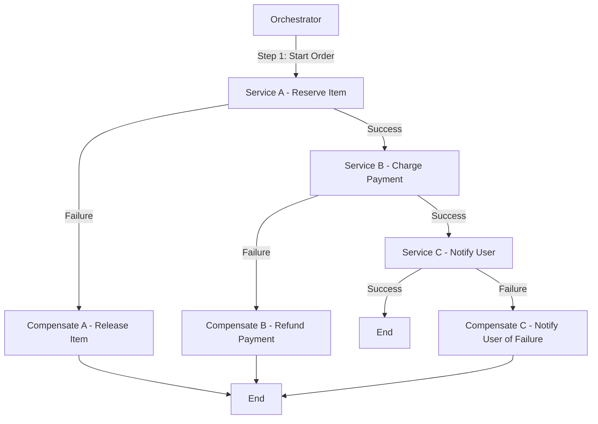

### Spring Boot Implementation

#### Step 1: Create Services

You will create three services (Order Service, Payment Service, Notification Service) and one Orchestrator service. 

##### 1. Order Service

```java
// OrderServiceApplication.java
package com.example.orderservice;

import org.springframework.boot.SpringApplication;
import org.springframework.boot.autoconfigure.SpringBootApplication;
import org.springframework.web.bind.annotation.*;

@SpringBootApplication
@RestController
@RequestMapping("/order")
public class OrderServiceApplication {

    public static void main(String[] args) {
        SpringApplication.run(OrderServiceApplication.class, args);
    }

    @PostMapping("/reserve")
    public String reserve() {
        // Logic to reserve an item
        System.out.println("Item reserved.");
        return "Item reserved.";
    }

    @PostMapping("/compensate")
    public String compensate() {
        // Logic to release the item
        System.out.println("Item reservation released.");
        return "Item reservation released.";
    }
}
```

##### 2. Payment Service

```java
// PaymentServiceApplication.java
package com.example.paymentservice;

import org.springframework.boot.SpringApplication;
import org.springframework.boot.autoconfigure.SpringBootApplication;
import org.springframework.web.bind.annotation.*;

@SpringBootApplication
@RestController
@RequestMapping("/payment")
public class PaymentServiceApplication {

    public static void main(String[] args) {
        SpringApplication.run(PaymentServiceApplication.class, args);
    }

    @PostMapping("/charge")
    public String charge() {
        // Logic to charge payment
        System.out.println("Payment charged.");
        return "Payment charged.";
    }

    @PostMapping("/refund")
    public String refund() {
        // Logic to refund payment
        System.out.println("Payment refunded.");
        return "Payment refunded.";
    }
}
```

##### 3. Notification Service

```java
// NotificationServiceApplication.java
package com.example.notificationservice;

import org.springframework.boot.SpringApplication;
import org.springframework.boot.autoconfigure.SpringBootApplication;
import org.springframework.web.bind.annotation.*;

@SpringBootApplication
@RestController
@RequestMapping("/notification")
public class NotificationServiceApplication {

    public static void main(String[] args) {
        SpringApplication.run(NotificationServiceApplication.class, args);
    }

    @PostMapping("/notify")
    public String notifyUser() {
        // Logic to notify user
        System.out.println("User notified.");
        return "User notified.";
    }

    @PostMapping("/notify-failure")
    public String notifyFailure() {
        // Logic to notify user of failure
        System.out.println("User notified of failure.");
        return "User notified of failure.";
    }
}
```

##### 4. Orchestrator Service

```java
// OrchestratorApplication.java
package com.example.orchestrator;

import org.springframework.boot.SpringApplication;
import org.springframework.boot.autoconfigure.SpringBootApplication;
import org.springframework.web.bind.annotation.*;
import org.springframework.web.client.RestTemplate;

@SpringBootApplication
@RestController
@RequestMapping("/saga")
public class OrchestratorApplication {

    private final RestTemplate restTemplate = new RestTemplate();

    public static void main(String[] args) {
        SpringApplication.run(OrchestratorApplication.class, args);
    }

    @PostMapping("/start")
    public String startSaga() {
        try {
            String orderResponse = restTemplate.postForObject("http://localhost:8081/order/reserve", null, String.class);
            String paymentResponse = restTemplate.postForObject("http://localhost:8082/payment/charge", null, String.class);
            String notifyResponse = restTemplate.postForObject("http://localhost:8083/notification/notify", null, String.class);
            return "Saga completed successfully.";
        } catch (Exception e) {
            // Compensation logic
            restTemplate.postForObject("http://localhost:8081/order/compensate", null, String.class);
            restTemplate.postForObject("http://localhost:8082/payment/refund", null, String.class);
            restTemplate.postForObject("http://localhost:8083/notification/notify-failure", null, String.class);
            return "Saga failed, compensating.";
        }
    }
}
```

### Running the Services

1. **Create a Maven project for each service** using Spring Initializr with dependencies for Spring Web.
2. **Run each service** on different ports:
   - Order Service: Port `8081`
   - Payment Service: Port `8082`
   - Notification Service: Port `8083`
   - Orchestrator Service: Port `8080`

3. **To initiate the saga**, send a POST request to the orchestrator:
   ```bash
   curl -X POST http://localhost:8080/saga/start
   ```

### Conclusion

This Spring Boot implementation follows the orchestrator-based Saga pattern, allowing you to manage distributed transactions reliably. You can expand this by adding more features like logging, error handling, and retries for robustness in production systems.

To prevent transactions in Service A and Service C if Service B fails, you can implement a compensation pattern along with a robust orchestration mechanism. Here’s how you can structure it:

1. **Transactional State Management**: Each service should maintain a transaction state. For instance, Service A should only finalize the reservation if it knows Service B has succeeded.

2. **Sagas Pattern**: Utilize the Sagas pattern, which manages distributed transactions. In this case, you would initiate a saga that includes compensation actions for each service in case of failure.

Here’s how you can modify your flow:

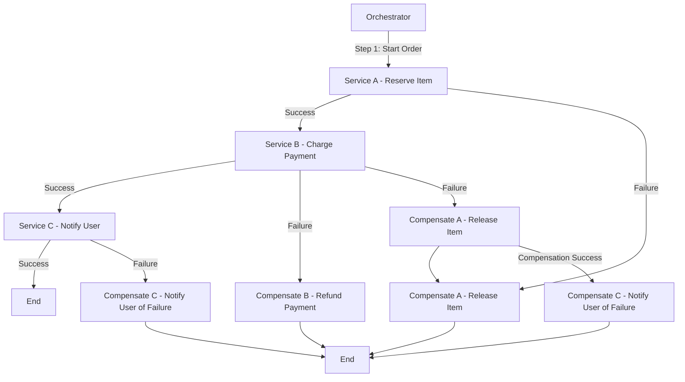

### Steps Explained:

1. **Service A - Reserve Item**: Once it reserves the item, it waits for Service B's response before finalizing.
  
2. **Service B - Charge Payment**: If Service B fails, trigger compensation for Service A to release the reserved item.

3. **Service C - Notify User**: This should only execute if Service B is successful. If Service B fails, Service C should not be notified.

4. **Compensation Actions**: If Service B fails, you compensate Service A first. If compensation is successful, then you can handle notifying the user about the failure of the transaction.

By following this structure, you ensure that all services remain consistent and that no operations are left in an inconsistent state.

Here’s a Mermaid diagram that outlines the Saga Orchestrator pattern for booking a vacation, including the booking of a flight, reserving a hotel, and renting a car, with appropriate rollback actions in case of failures.

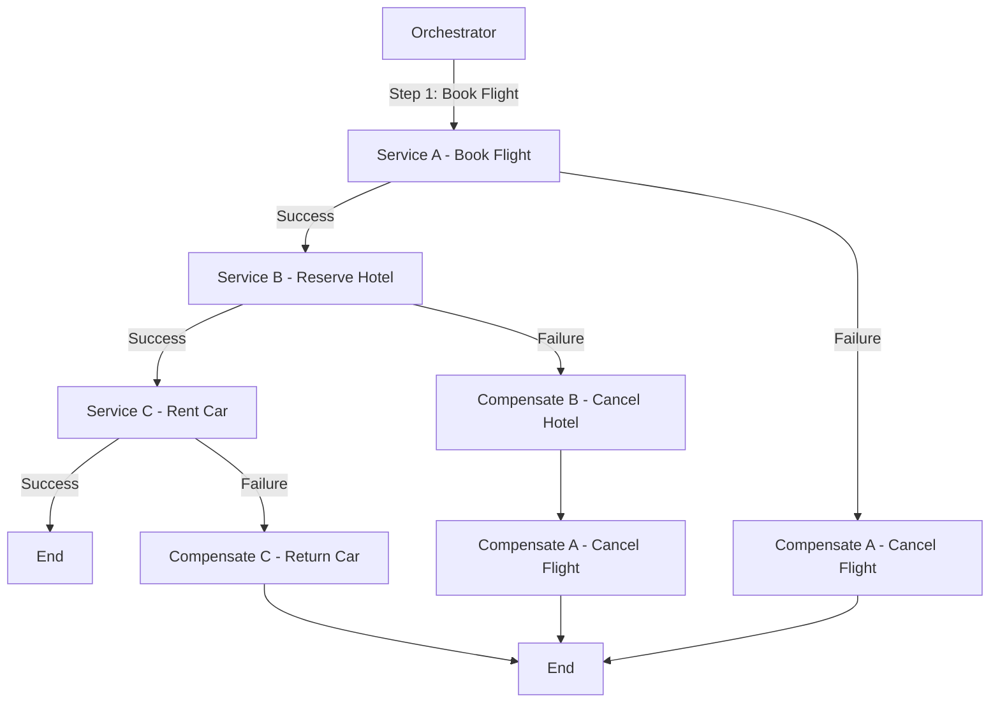

### Steps Explained:

1. **Orchestrator**: The central service coordinating the entire process.
2. **Service A - Book Flight**: The orchestrator first attempts to book the flight.
   - If successful, it proceeds to the next step.
   - If it fails, it triggers compensation to cancel the flight (though there might not be a need to compensate if it never succeeded).
3. **Service B - Reserve Hotel**: After a successful flight booking, the orchestrator books the hotel.
   - If this step fails, it triggers compensation to cancel the flight booking.
4. **Service C - Rent Car**: If both the flight and hotel bookings are successful, the car is rented.
   - If this fails, it compensates by returning the car.
5. **Compensation Actions**: Ensure that any failures lead to appropriate rollbacks:
   - Cancel the flight if the hotel booking fails.
   - Return the car if renting fails.

This structured approach ensures that all steps are properly sequenced, and any failures are handled gracefully to maintain consistency across services.

Imagine you’re booking a vacation, which involves multiple steps: booking a flight, reserving a hotel, and renting a car. If the flight booking fails, the entire process should be aborted and rolled back.

In an Orchestrator-based Saga:

The orchestrator (a central coordinator) manages the flow.
The orchestrator first tries to book the flight.
If successful, it proceeds to book the hotel.
If the hotel booking fails, it triggers compensating transactions (e.g., cancel the flight booking).
It acts as a “traffic controller,” ensuring that the entire transaction either completes or rolls back as needed.
This way, even though each step is handled by a different service, the orchestrator ensures the steps follow a proper sequence, and failures trigger appropriate actions.


Implementation
In Spring Boot, you typically implement the Saga Orchestrator pattern using a combination of:

Orchestrator service: The central service that coordinates all the steps.
Individual services: Each microservice handles its own task (flight booking, hotel…


Sure! Here's a representation of the Choreography pattern for the same vacation booking scenario, along with a brief Spring Boot code example.

### Choreography Pattern Diagram

In the Choreography pattern, each service communicates directly with others and handles its own compensation logic.

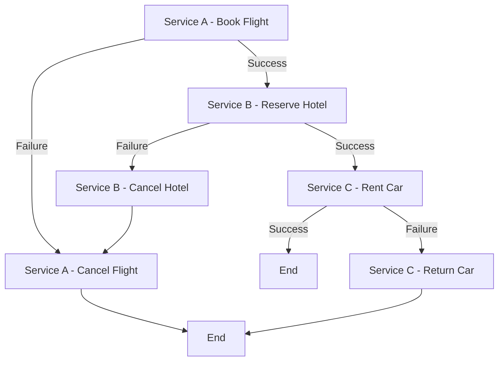

### Explanation

1. **Service A - Book Flight**: Initiates the booking.
   - If successful, it triggers Service B to reserve the hotel.
   - If it fails, it handles its own compensation by canceling the flight.
   
2. **Service B - Reserve Hotel**: Handles hotel reservations.
   - On success, it calls Service C to rent a car.
   - On failure, it triggers its own compensation to cancel the hotel.

3. **Service C - Rent Car**: Rents the car if previous steps are successful.
   - If this fails, it handles its own compensation by returning the car.

### Spring Boot Implementation

Here's a simplified version of the implementation in Spring Boot for each service:

#### 1. **Service A - Book Flight**

```java
@RestController
@RequestMapping("/flight")
public class FlightService {

    @PostMapping("/book")
    public ResponseEntity<String> bookFlight() {
        // Logic to book flight
        boolean success = // ... booking logic;

        if (!success) {
            // Trigger cancellation
            cancelFlight();
            return ResponseEntity.status(HttpStatus.INTERNAL_SERVER_ERROR).body("Flight booking failed");
        }

        // Notify next service (via REST call or message broker)
        restTemplate.postForEntity("http://hotel-service/reserve", flightDetails, String.class);
        return ResponseEntity.ok("Flight booked successfully");
    }

    public void cancelFlight() {
        // Logic to cancel the flight
    }
}
```

#### 2. **Service B - Reserve Hotel**

```java
@RestController
@RequestMapping("/hotel")
public class HotelService {

    @PostMapping("/reserve")
    public ResponseEntity<String> reserveHotel(@RequestBody FlightDetails flightDetails) {
        // Logic to reserve hotel
        boolean success = // ... reservation logic;

        if (!success) {
            // Trigger compensation
            cancelHotel();
            return ResponseEntity.status(HttpStatus.INTERNAL_SERVER_ERROR).body("Hotel reservation failed");
        }

        // Notify next service
        restTemplate.postForEntity("http://car-service/rent", hotelDetails, String.class);
        return ResponseEntity.ok("Hotel reserved successfully");
    }

    public void cancelHotel() {
        // Logic to cancel the hotel reservation
    }
}
```

#### 3. **Service C - Rent Car**

```java
@RestController
@RequestMapping("/car")
public class CarService {

    @PostMapping("/rent")
    public ResponseEntity<String> rentCar(@RequestBody HotelDetails hotelDetails) {
        // Logic to rent a car
        boolean success = // ... rental logic;

        if (!success) {
            // Handle failure
            returnCar();
            return ResponseEntity.status(HttpStatus.INTERNAL_SERVER_ERROR).body("Car rental failed");
        }

        return ResponseEntity.ok("Car rented successfully");
    }

    public void returnCar() {
        // Logic to return the car
    }
}
```

### Key Points

- Each service is responsible for its own transactions and compensation.
- Services communicate directly with each other, either through REST APIs or a messaging system.
- Failure handling and compensating actions are implemented within each service.

This pattern allows for greater flexibility and autonomy of each service, but it requires careful management of state and communication to ensure consistency across the system.

Sure! Let's explore the **Circuit Breaker**, **Retry**, **Asynchronous Event-Driven**, and **CQRS** patterns, along with diagrams and example Spring Boot code for each.

### 1. Circuit Breaker Pattern

The Circuit Breaker pattern helps prevent an application from repeatedly trying to execute an operation that's likely to fail, thus avoiding cascading failures.

#### Diagram

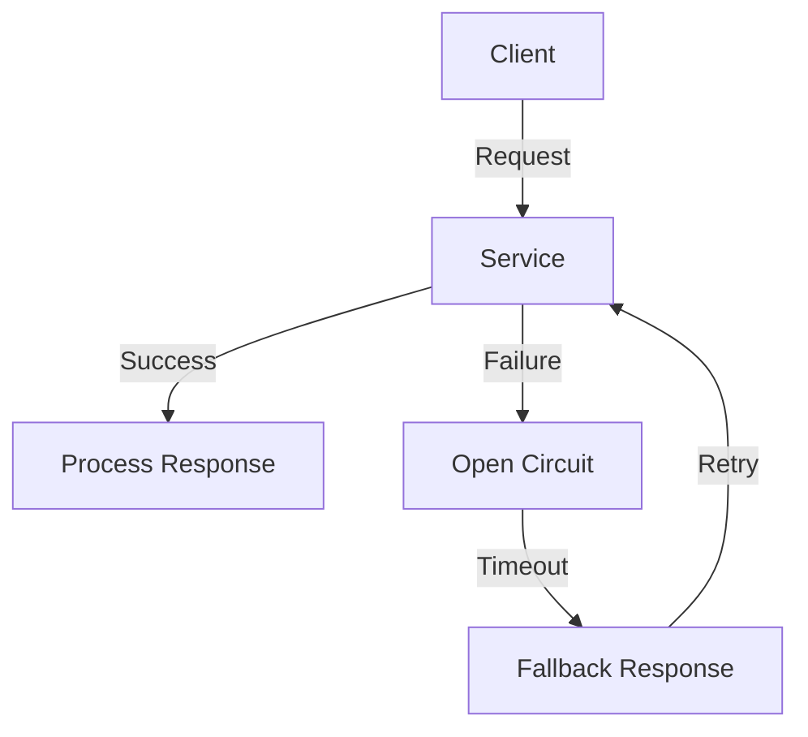

#### Code Example

Using **Resilience4j** in Spring Boot:

```java
import io.github.resilience4j.circuitbreaker.annotation.CircuitBreaker;
import org.springframework.web.bind.annotation.GetMapping;
import org.springframework.web.bind.annotation.RestController;

@RestController
public class MyService {

    @GetMapping("/performAction")
    @CircuitBreaker
    public String performAction() {
        // Simulate a service call
        if (Math.random() > 0.7) {
            throw new RuntimeException("Service failure");
        }
        return "Success";
    }
}
```

### 2. Retry Pattern

The Retry pattern automatically retries failed operations to increase the likelihood of success, especially useful for transient failures.

#### Diagram

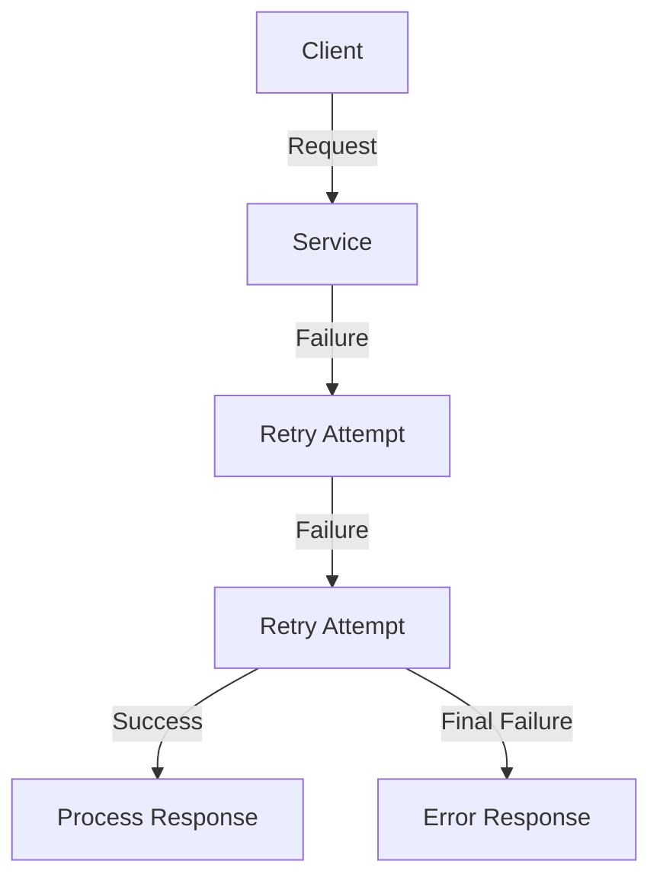

#### Code Example

Using **Resilience4j** for retry:

```java
import io.github.resilience4j.retry.annotation.Retry;
import org.springframework.web.bind.annotation.GetMapping;
import org.springframework.web.bind.annotation.RestController;

@RestController
public class MyService {

    @GetMapping("/performAction")
    @Retry(name = "retryService")
    public String performAction() {
        // Simulate a service call
        if (Math.random() > 0.7) {
            throw new RuntimeException("Service failure");
        }
        return "Success";
    }
}
```

### 3. Asynchronous Event-Driven Pattern

In this pattern, components communicate through events, promoting loose coupling and asynchronous processing.

#### Diagram

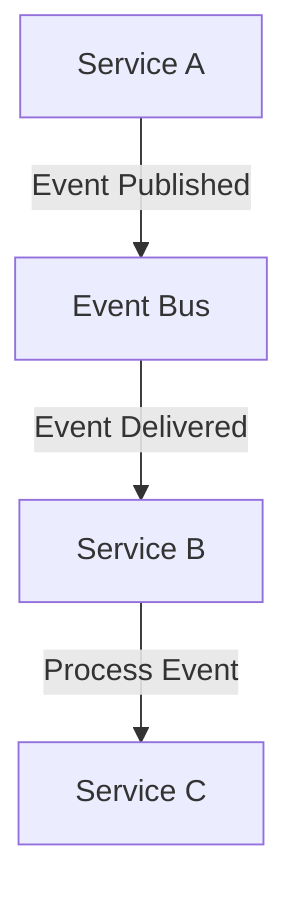

#### Code Example

Using **Spring Events**:

```java
import org.springframework.context.ApplicationEventPublisher;
import org.springframework.stereotype.Service;

@Service
public class EventPublisherService {

    private final ApplicationEventPublisher publisher;

    public EventPublisherService(ApplicationEventPublisher publisher) {
        this.publisher = publisher;
    }

    public void publishEvent(String message) {
        publisher.publishEvent(new MyEvent(this, message));
    }
}

// Event Listener
@Component
public class MyEventListener {

    @EventListener
    public void handleEvent(MyEvent event) {
        // Process the event
        System.out.println("Received event: " + event.getMessage());
    }
}

// Custom Event
public class MyEvent extends ApplicationEvent {
    private final String message;

    public MyEvent(Object source, String message) {
        super(source);
        this.message = message;
    }

    public String getMessage() {
        return message;
    }
}
```

### 4. CQRS (Command Query Responsibility Segregation) Pattern

CQRS separates the read and write operations into different models, allowing for more scalable and flexible applications.

#### Diagram

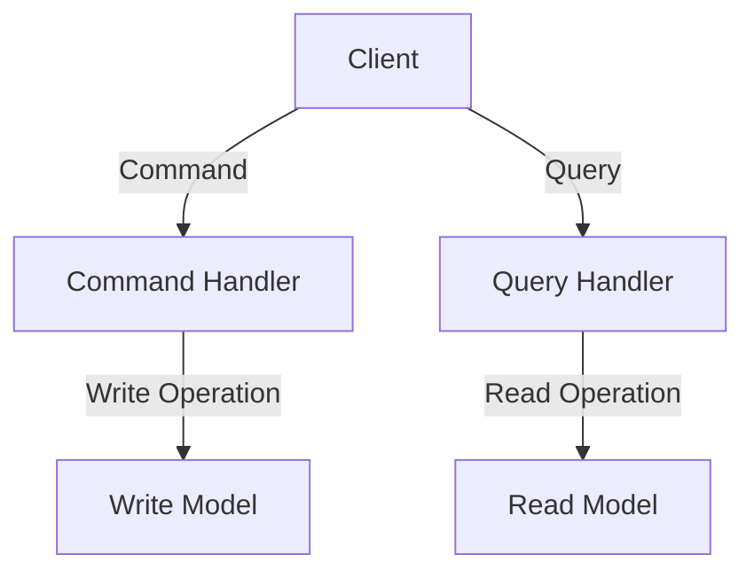

#### Code Example

```java
@RestController
public class MyController {

    private final CommandService commandService;
    private final QueryService queryService;

    public MyController(CommandService commandService, QueryService queryService) {
        this.commandService = commandService;
        this.queryService = queryService;
    }

    @PostMapping("/create")
    public ResponseEntity<String> createItem(@RequestBody CreateItemCommand command) {
        commandService.handle(command);
        return ResponseEntity.ok("Item created");
    }

    @GetMapping("/items/{id}")
    public ResponseEntity<Item> getItem(@PathVariable String id) {
        Item item = queryService.findById(id);
        return ResponseEntity.ok(item);
    }
}

// Command Handler
@Service
public class CommandService {
    public void handle(CreateItemCommand command) {
        // Logic to create an item
    }
}

// Query Handler
@Service
public class QueryService {
    public Item findById(String id) {
        // Logic to retrieve an item
        return new Item(); // example
    }
}

// Command Object
public class CreateItemCommand {
    private String name;
    // other fields, getters, setters
}

// Item Object
public class Item {
    private String id;
    private String name;
    // other fields, getters, setters
}
```

### Summary

1. **Circuit Breaker**: Prevents repeated attempts to call a failing service, providing fallback responses.
2. **Retry**: Automatically retries operations that fail due to transient issues.
3. **Asynchronous Event-Driven**: Promotes loose coupling through event-based communication between services.
4. **CQRS**: Separates command and query responsibilities for better scalability and flexibility.

These patterns can significantly enhance the resilience, scalability, and maintainability of microservices in a Spring Boot application.

Creating a comprehensive architecture that includes an event-driven system with Saga orchestration, Circuit Breaker, API Gateway, Service Discovery, Kubernetes, Docker, Jenkins CI/CD, Grafana, Spring Boot Actuator, Zipkin for distributed tracing, and proper database communication and transaction handling is quite extensive. Below, I will outline the key components, provide sequence and flow diagrams, and give code examples for each aspect.

### High-Level Architecture

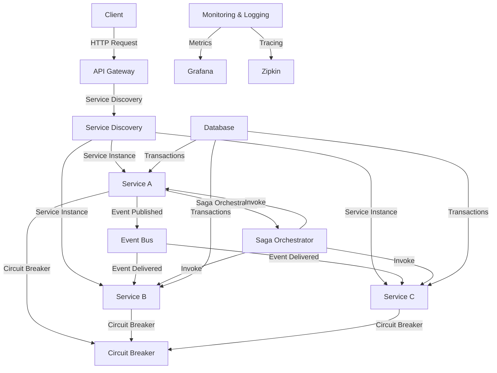

### Sequence Diagram

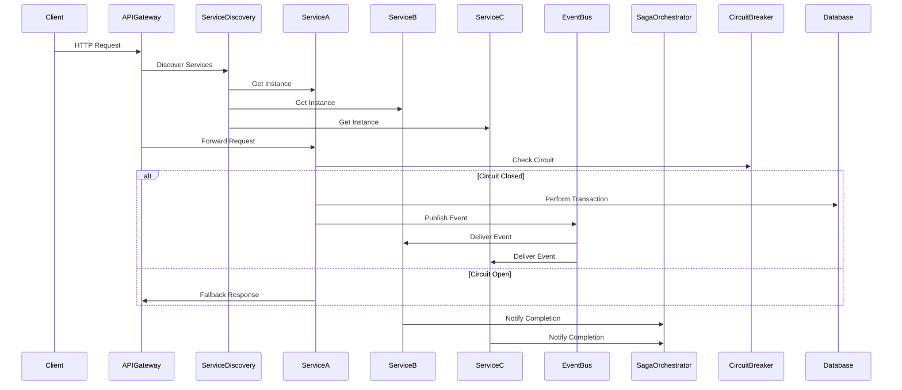

### Implementation Steps

1. **Microservices Setup**:
   - Create microservices (Service A, B, C) using Spring Boot.
   - Use Spring Cloud for Service Discovery (Eureka) and Circuit Breaker (Resilience4j).

2. **API Gateway**:
   - Implement an API Gateway using Spring Cloud Gateway to route requests to microservices.

3. **Event Bus**:
   - Use an event bus (e.g., RabbitMQ, Kafka) to publish and consume events among microservices.

4. **Saga Orchestrator**:
   - Implement the Saga pattern using a central orchestrator service that coordinates transactions across services.

5. **Circuit Breaker**:
   - Use Resilience4j to implement circuit breakers in each service.

6. **Database Communication**:
   - Use JPA or Spring Data for database interactions within each service, ensuring proper transaction management.

7. **Containerization with Docker**:
   - Create Dockerfiles for each service and use Docker Compose to run them together.

8. **Kubernetes Deployment**:
   - Deploy the services on a Kubernetes cluster, using Helm for managing releases.

9. **CI/CD Pipeline with Jenkins**:
   - Set up Jenkins to automate the build and deployment process, integrating with GitHub for version control.

10. **Monitoring with Grafana**:
    - Use Spring Boot Actuator to expose metrics and configure Grafana to visualize them.

11. **Tracing with Zipkin**:
    - Integrate Zipkin with your microservices for distributed tracing.

### Example Code Snippets

#### 1. **Service Discovery (Eureka Server)**

```java
@SpringBootApplication
@EnableEurekaServer
public class EurekaServerApplication {
    public static void main(String[] args) {
        SpringApplication.run(EurekaServerApplication.class, args);
    }
}
```

#### 2. **API Gateway Configuration**

```java
@SpringBootApplication
@EnableDiscoveryClient
@EnableZuulProxy
public class ApiGatewayApplication {
    public static void main(String[] args) {
        SpringApplication.run(ApiGatewayApplication.class, args);
    }
}
```

#### 3. **Service with Circuit Breaker**

```java
@RestController
public class ServiceA {

    @Autowired
    private RestTemplate restTemplate;

    @GetMapping("/performAction")
    @CircuitBreaker
    public String performAction() {
        // Simulate a service call
        if (Math.random() > 0.7) {
            throw new RuntimeException("Service failure");
        }
        return "Success";
    }

    @PostMapping("/publishEvent")
    public void publishEvent() {
        // Logic to publish an event
    }
}
```

#### 4. **Saga Orchestrator Example**

```java
@RestController
public class SagaOrchestrator {

    @Autowired
    private EventPublisherService eventPublisherService;

    @PostMapping("/startSaga")
    public void startSaga() {
        // Logic to start the saga
        eventPublisherService.publishEvent("Start Saga");
    }
}
```

### Memory Management and Performance Improvements

1. **Connection Pooling**: Use connection pooling with your database to manage connections efficiently.

2. **Caching**: Implement caching mechanisms (e.g., Redis) to reduce database load and improve response times.

3. **Load Balancing**: Use Kubernetes services to load balance traffic across multiple instances of your microservices.

4. **Profiling and Monitoring**: Utilize Spring Boot Actuator and Grafana to monitor application performance and identify bottlenecks.

5. **Resource Limits**: Define resource limits in your Kubernetes deployment configurations to prevent resource exhaustion.

### Instance Management for Multiple Service Requests

1. **Horizontal Scaling**: Scale your services horizontally by increasing the number of pods in Kubernetes based on load.

2. **Health Checks**: Implement health checks to ensure only healthy instances receive traffic.

3. **Rate Limiting**: Use API Gateway features to implement rate limiting, preventing overload during high traffic.

### Conclusion

This architecture provides a robust foundation for building scalable, resilient microservices. By integrating these patterns and tools, you ensure that your application can handle multiple service requests effectively while managing transactions and preventing failures. Each component plays a crucial role in maintaining the overall health and performance of the system.

Sure! Let’s explore each aspect of memory management and performance improvements in a microservices architecture using diagrams and code examples.

### 1. Memory Management and Performance Improvements

#### A. Connection Pooling

**Diagram:**

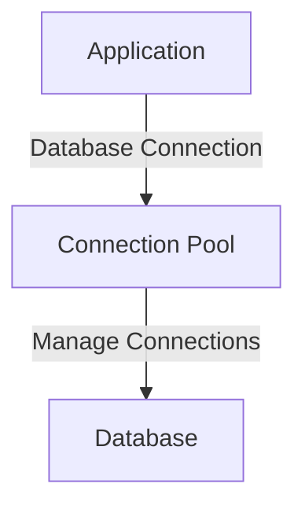

**Code Example:**

Using HikariCP (default in Spring Boot):

```yaml
# application.properties
spring.datasource.url=jdbc:mysql://localhost:3306/mydb
spring.datasource.username=root
spring.datasource.password=password
spring.datasource.hikari.maximum-pool-size=10
```

```java
@Configuration
public class DataSourceConfig {
    @Bean
    public DataSource dataSource() {
        HikariDataSource dataSource = new HikariDataSource();
        dataSource.setJdbcUrl("jdbc:mysql://localhost:3306/mydb");
        dataSource.setUsername("root");
        dataSource.setPassword("password");
        dataSource.setMaximumPoolSize(10);
        return dataSource;
    }
}
```

#### B. Caching

**Diagram:**

```mermaid
graph TD
    A[Application] -->|Cache Request| B[Cache (Redis)]
    B -->|Cache Hit| C[Return Cached Data]
    B -->|Cache Miss| D[Database]
    D -->|Fetch Data| C
```

**Code Example:**

Using Spring Cache with Redis:

```yaml
# application.properties
spring.cache.type=redis
spring.redis.host=localhost
spring.redis.port=6379
```

```java
@Service
public class UserService {
    
    @Cacheable("users")
    public User getUserById(Long id) {
        return userRepository.findById(id).orElseThrow(() -> new RuntimeException("User not found"));
    }
}
```

#### C. Load Balancing

**Diagram:**

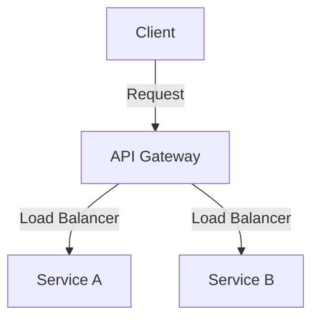

**Kubernetes Example:**

```yaml
apiVersion: v1
kind: Service
metadata:
  name: my-service
spec:
  type: LoadBalancer
  selector:
    app: my-app
  ports:
    - port: 80
      targetPort: 8080
```

#### D. Profiling and Monitoring

**Diagram:**

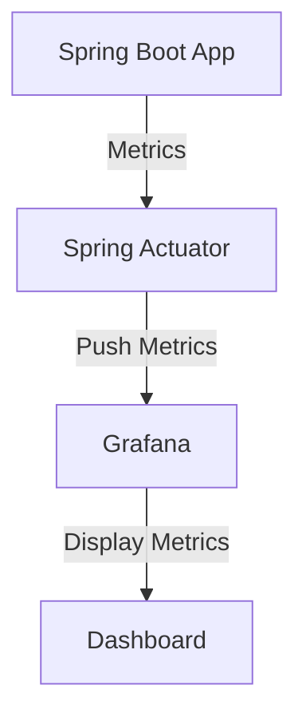

**Code Example:**

Enable Spring Actuator in `pom.xml`:

```xml
<dependency>
    <groupId>org.springframework.boot</groupId>
    <artifactId>spring-boot-starter-actuator</artifactId>
</dependency>
```

```yaml
# application.properties
management.endpoints.web.exposure.include=*
```

#### E. Resource Limits

**Diagram:**

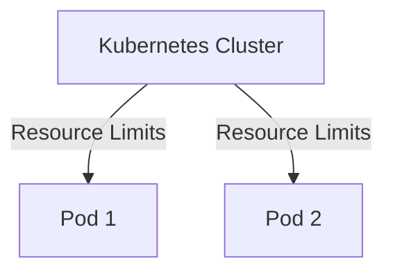

**Kubernetes Example:**

```yaml
apiVersion: apps/v1
kind: Deployment
metadata:
  name: my-deployment
spec:
  replicas: 2
  template:
    spec:
      containers:
        - name: my-container
          image: my-image
          resources:
            requests:
              memory: "256Mi"
              cpu: "500m"
            limits:
              memory: "512Mi"
              cpu: "1"
```

### 2. Instance Management for Multiple Service Requests

#### A. Horizontal Scaling

**Diagram:**

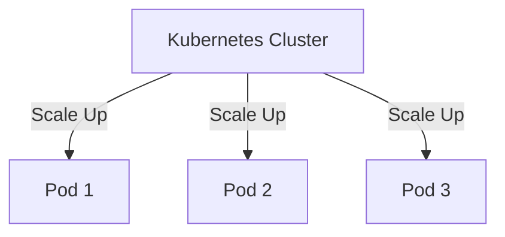

**Kubernetes Example:**

```yaml
apiVersion: autoscaling/v1
kind: HorizontalPodAutoscaler
metadata:
  name: my-hpa
spec:
  scaleTargetRef:
    apiVersion: apps/v1
    kind: Deployment
    name: my-deployment
  minReplicas: 1
  maxReplicas: 10
  targetCPUUtilizationPercentage: 80
```

#### B. Health Checks

**Diagram:**

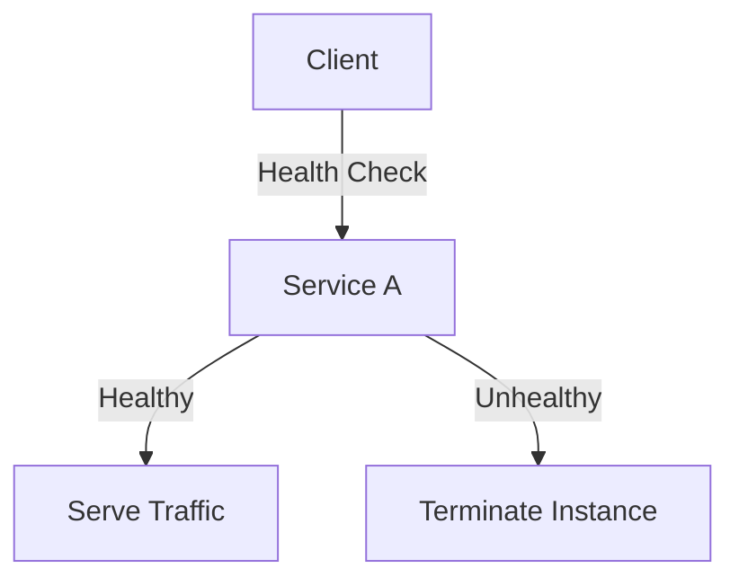

**Kubernetes Example:**

```yaml
livenessProbe:
  httpGet:
    path: /actuator/health
    port: 8080
  initialDelaySeconds: 30
  periodSeconds: 10
```

#### C. Rate Limiting

**Diagram:**

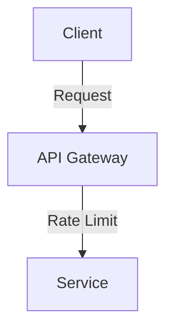

**Code Example:**

Using Spring Cloud Gateway:

```yaml
spring:
  cloud:
    gateway:
      routes:
        - id: service_route
          uri: lb://my-service
          predicates:
            - Path=/service/**
          filters:
            - RequestRateLimiter=2,4 # 2 requests per second with a burst of 4
```
In the context of rate limiting, the **burst** refers to the ability to handle a temporary spike in requests that exceeds the regular limit. 

### Explanation

- **Rate Limit**: The limit set on the number of requests that can be processed in a specified time period. In your example, the limit is **2 requests per second**.
- **Burst Capacity**: The additional requests that can be allowed in a short period beyond the specified rate limit, in this case, **4 requests**. This means that if the service is under load, it can handle a sudden influx of up to 4 additional requests quickly before enforcing the rate limit.

### Example

Given the rate limit of **2 requests per second** with a burst of **4**:
- **Normal Operation**: The service will handle **2 requests per second** continuously.
- **Burst Handling**: If there’s a sudden surge (like a spike in traffic), the service can allow up to **4 extra requests** in addition to the normal rate. 

So, if the normal limit is exceeded:
- **At second 1**: 2 requests are allowed.
- **At second 2**: 2 more requests are allowed.
- **At second 3**: If a sudden surge comes in and 4 additional requests arrive, the service can handle these extra requests up to the burst limit.

After the burst limit is reached, any further requests would be rejected or queued until the rate limit resets. This mechanism helps to smooth out traffic spikes while still protecting the service from being overwhelmed.
### Conclusion

By implementing these strategies, you can effectively manage memory and enhance the performance of your microservices. Each aspect contributes to a more resilient and efficient architecture, capable of handling high loads and ensuring system stability.

Here are some common interview questions and answers related to Kubernetes and Docker that can help you prepare for your interview.

### Docker Interview Questions

#### 1. What is Docker?

**Answer:**
Docker is an open-source platform that automates the deployment, scaling, and management of applications using containerization. It allows developers to package applications and their dependencies into a standardized unit called a container, ensuring consistency across various environments.

#### 2. What are the benefits of using Docker?

**Answer:**
- **Isolation**: Containers encapsulate applications and their dependencies, providing isolation from other containers.
- **Portability**: Containers can run on any system that has Docker installed, making it easy to move applications between environments.
- **Efficiency**: Docker containers share the host OS kernel, making them lightweight compared to virtual machines.
- **Scalability**: Docker simplifies the process of scaling applications up or down.

#### 3. What is the difference between a Docker image and a container?

**Answer:**
- **Docker Image**: A read-only template used to create containers. It contains the application code, libraries, and dependencies.
- **Container**: A running instance of a Docker image. Containers are isolated from each other and can communicate through defined channels.

#### 4. How do you create a Docker container?

**Answer:**
You can create a Docker container using the following command:
```bash
docker run -d --name my-container my-image
```
This command runs a container named `my-container` from the `my-image` image in detached mode.

### Kubernetes Interview Questions

#### 5. What is Kubernetes?

**Answer:**
Kubernetes (K8s) is an open-source container orchestration platform designed to automate the deployment, scaling, and management of containerized applications. It helps manage the lifecycle of containers across a cluster of machines.

#### 6. What are Pods in Kubernetes?

**Answer:**
A Pod is the smallest deployable unit in Kubernetes, which can contain one or more containers. Containers within a Pod share the same network namespace and can communicate with each other using `localhost`. They also share storage volumes.

#### 7. What is a Deployment in Kubernetes?

**Answer:**
A Deployment is a Kubernetes resource that provides declarative updates to Pods and ReplicaSets. It allows you to describe an application’s desired state, such as which images to use and the number of replicas, and Kubernetes ensures that the actual state matches the desired state.

#### 8. What is a Service in Kubernetes?

**Answer:**
A Service is an abstraction that defines a logical set of Pods and a policy for accessing them. It provides a stable endpoint (IP address or DNS name) to access the Pods, enabling load balancing and service discovery.

### Advanced Questions

#### 9. What is the purpose of a Dockerfile?

**Answer:**
A Dockerfile is a text file that contains a set of instructions to build a Docker image. It specifies the base image, the application code, dependencies, environment variables, and the commands to run when the container starts.

#### 10. Explain Kubernetes ConfigMaps and Secrets.

**Answer:**
- **ConfigMap**: A Kubernetes resource used to store non-sensitive configuration data in key-value pairs, allowing you to separate configuration from application code.
- **Secret**: A Kubernetes resource used to store sensitive information (like passwords or API keys) securely. Secrets are encoded in base64 and can be mounted as environment variables or volumes in Pods.

#### 11. How do you scale applications in Kubernetes?

**Answer:**
You can scale applications in Kubernetes using the `kubectl scale` command or by modifying the Deployment resource:
```bash
kubectl scale deployment my-deployment --replicas=5
```
This command scales the `my-deployment` to 5 replicas.

#### 12. What is Helm?

**Answer:**
Helm is a package manager for Kubernetes that allows you to define, install, and manage Kubernetes applications using Helm charts. Helm charts are pre-configured application resources that simplify the deployment of complex applications.

### Behavioral Questions

#### 13. Describe a challenging situation you faced while using Docker/Kubernetes and how you resolved it.

**Answer:**
[Provide a specific example from your experience. Discuss the challenge, the steps you took to troubleshoot, the resolution, and what you learned from the experience.]

### Conclusion

These questions cover a range of topics from basic to advanced concepts in Docker and Kubernetes. Familiarize yourself with these answers and tailor them with your own experiences to prepare for your interview.

Here are some common interview questions and answers related to CI/CD (Continuous Integration/Continuous Deployment) and Azure:

### CI/CD Interview Questions

#### 1. What is CI/CD?

**Answer:**
CI/CD stands for Continuous Integration and Continuous Deployment. It is a software development practice that enables teams to deliver code changes more frequently and reliably. Continuous Integration involves automatically testing and integrating code changes into a shared repository. Continuous Deployment automates the release of those changes to production, ensuring that new features and fixes can be deployed rapidly and safely.

#### 2. What are the benefits of CI/CD?

**Answer:**
- **Faster Release Cycles**: Automates the build, test, and deployment processes, allowing for quicker releases.
- **Improved Code Quality**: Automated testing helps catch bugs early in the development cycle.
- **Reduced Risk**: Smaller, incremental changes are easier to manage and troubleshoot.
- **Enhanced Collaboration**: Teams can work more effectively together with a shared understanding of the codebase.

#### 3. What tools are commonly used for CI/CD?

**Answer:**
Common CI/CD tools include:
- Jenkins
- GitHub Actions
- GitLab CI/CD
- CircleCI
- Travis CI
- Azure DevOps

### Azure Interview Questions

#### 4. What is Azure DevOps?

**Answer:**
Azure DevOps is a set of development tools and services provided by Microsoft to support the entire software development lifecycle, including planning, development, testing, delivery, and monitoring. It includes services like Azure Boards, Azure Repos, Azure Pipelines, Azure Test Plans, and Azure Artifacts.

#### 5. How do you create a CI/CD pipeline in Azure DevOps?

**Answer:**
To create a CI/CD pipeline in Azure DevOps:
1. Go to Azure DevOps and create a new project.
2. Navigate to "Pipelines" and select "Create Pipeline."
3. Choose your repository (e.g., Azure Repos, GitHub).
4. Define your pipeline using YAML or the classic editor, specifying build and deployment stages.
5. Configure triggers for CI (e.g., on push) and CD (e.g., on successful build).
6. Save and run the pipeline.

#### 6. What is the difference between Azure Pipelines and GitHub Actions?

**Answer:**
- **Azure Pipelines**: A service in Azure DevOps that supports multi-platform builds and deployments, can integrate with other Azure DevOps services, and is suitable for complex enterprise environments.
- **GitHub Actions**: An automation tool integrated directly into GitHub, allowing users to create workflows based on GitHub events, and is more suited for projects hosted on GitHub.

### Advanced Questions

#### 7. What are environment variables in CI/CD, and why are they important?

**Answer:**
Environment variables are key-value pairs used to store configuration data, such as API keys or database connection strings. They are important because they help separate code from configuration, allowing for different settings in development, testing, and production environments without changing the codebase.

#### 8. Explain the concept of Infrastructure as Code (IaC).

**Answer:**
Infrastructure as Code (IaC) is the practice of managing and provisioning computing infrastructure through machine-readable definition files rather than physical hardware configuration. This allows teams to automate the setup of infrastructure, maintain version control of configurations, and ensure consistent environments.

### Behavioral Questions

#### 9. Describe a challenging CI/CD implementation you faced and how you overcame it.

**Answer:**
[Provide a specific example from your experience. Discuss the challenge, the steps taken to resolve it, the outcome, and what you learned from the experience.]

### Conclusion

These questions cover fundamental and advanced topics related to CI/CD and Azure. Familiarizing yourself with these concepts and tailoring the answers with your own experiences will help you prepare effectively for your interview.

Sure! Here’s a detailed explanation of the complete process of deploying microservices using Docker, Kubernetes, Jenkins, CI/CD, and AWS, along with a diagram in Mermaid syntax.

### Overview of the Deployment Process

1. **Development**: Code is developed and tested locally.
2. **Dockerization**: Create Docker images for the microservices.
3. **Push to Registry**: Push Docker images to a container registry (e.g., Docker Hub or AWS ECR).
4. **Continuous Integration**: Use Jenkins to automate the build and testing process.
5. **Kubernetes Deployment**: Deploy the Docker images to a Kubernetes cluster in AWS (EKS).
6. **Continuous Deployment**: Use Jenkins to automate the deployment of the application.
7. **Monitoring**: Monitor the deployed application.

### Diagram

```mermaid
graph TD
    A[Developer] -->|Push Code| B[Version Control (Git)]
    B -->|Webhooks| C[Jenkins]
    C -->|Build and Test| D[Docker Image]
    D -->|Push| E[Docker Registry (ECR)]
    E -->|Trigger Deployment| F[Kubernetes (EKS)]
    F -->|Run Pods| G[Microservices]
    G -->|Monitor| H[Monitoring Tools (CloudWatch)]
```

### Step-by-Step Process

#### 1. Development

- Developers write code in their local environments.
- Code is versioned using a version control system (like Git).

#### 2. Dockerization

**Dockerfile Example**:
```dockerfile
# Use the official Node.js image
FROM node:14

# Set the working directory
WORKDIR /app

# Copy package.json and install dependencies
COPY package*.json ./
RUN npm install

# Copy the application code
COPY . .

# Expose the application port
EXPOSE 3000

# Start the application
CMD ["npm", "start"]
```

**Build Docker Image**:
```bash
docker build -t my-microservice:latest .
```

#### 3. Push to Registry

**Push to AWS ECR**:
1. Authenticate Docker to ECR:
   ```bash
   aws ecr get-login-password --region us-east-1 | docker login --username AWS --password-stdin <aws_account_id>.dkr.ecr.us-east-1.amazonaws.com
   ```

2. Tag the image:
   ```bash
   docker tag my-microservice:latest <aws_account_id>.dkr.ecr.us-east-1.amazonaws.com/my-microservice:latest
   ```

3. Push the image:
   ```bash
   docker push <aws_account_id>.dkr.ecr.us-east-1.amazonaws.com/my-microservice:latest
   ```

#### 4. Continuous Integration (Jenkins)

**Jenkins Pipeline Example (Jenkinsfile)**:
```groovy
pipeline {
    agent any
    stages {
        stage('Build') {
            steps {
                script {
                    docker.build('my-microservice:latest')
                }
            }
        }
        stage('Test') {
            steps {
                script {
                    // Run tests (if applicable)
                }
            }
        }
        stage('Push') {
            steps {
                script {
                    docker.withRegistry('https://<aws_account_id>.dkr.ecr.us-east-1.amazonaws.com', 'ecr:aws_access_key_id') {
                        docker.image('my-microservice:latest').push()
                    }
                }
            }
        }
    }
}
```

#### 5. Kubernetes Deployment

**Kubernetes Deployment YAML**:
```yaml
apiVersion: apps/v1
kind: Deployment
metadata:
  name: my-microservice
spec:
  replicas: 3
  selector:
    matchLabels:
      app: my-microservice
  template:
    metadata:
      labels:
        app: my-microservice
    spec:
      containers:
      - name: my-microservice
        image: <aws_account_id>.dkr.ecr.us-east-1.amazonaws.com/my-microservice:latest
        ports:
        - containerPort: 3000
```

**Deploy to EKS**:
```bash
kubectl apply -f deployment.yaml
```

#### 6. Continuous Deployment

Jenkins can trigger deployments to Kubernetes using the Kubernetes CLI or Helm charts once the Docker image is built and pushed.

**Jenkins Deployment Stage Example**:
```groovy
stage('Deploy to Kubernetes') {
    steps {
        script {
            sh 'kubectl apply -f deployment.yaml'
        }
    }
}
```

#### 7. Monitoring

Use AWS CloudWatch or other monitoring tools to track the health and performance of the microservices running in EKS.

### Summary

1. **Develop** the microservices and version control using Git.
2. **Dockerize** the application and build the Docker image.
3. **Push** the image to AWS ECR.
4. Set up a **Jenkins pipeline** to automate the CI/CD process.
5. Deploy the application to **Kubernetes** on AWS EKS.
6. **Monitor** the application using tools like AWS CloudWatch.

This comprehensive process outlines how to efficiently deploy microservices using Docker, Kubernetes, Jenkins, and AWS.

Sure! Here’s an overview of Angular, React, microservices, and threading, along with their interactions and use cases.

### Angular

**Overview**:
Angular is a TypeScript-based open-source web application framework led by the Angular Team at Google. It is primarily used for building single-page applications (SPAs).

**Key Features**:
- **Component-Based Architecture**: Encourages reusability and organization of code.
- **Dependency Injection**: Facilitates better code organization and testing.
- **Two-Way Data Binding**: Synchronizes data between the model and the view.
- **RxJS**: Supports reactive programming for handling asynchronous data.

**Use Case**: Angular is suitable for enterprise-level applications with complex UIs, such as dashboards or form-heavy applications.

### React

**Overview**:
React is a JavaScript library for building user interfaces, maintained by Facebook. It allows developers to create large web applications that can change data, without reloading the page.

**Key Features**:
- **Component-Based Architecture**: Promotes the creation of reusable UI components.
- **Virtual DOM**: Improves performance by minimizing direct manipulation of the DOM.
- **One-Way Data Binding**: Ensures a unidirectional data flow, which simplifies debugging.
- **Hooks**: Allows state and lifecycle management in functional components.

**Use Case**: React is often used for dynamic and interactive UIs, such as social media platforms and real-time applications.

### Microservices

**Overview**:
Microservices architecture is a design approach where an application is built as a collection of small, loosely coupled services, each responsible for a specific business capability.

**Key Features**:
- **Independently Deployable**: Each service can be developed, deployed, and scaled independently.
- **Technology Agnostic**: Services can be written in different programming languages and technologies.
- **Resilience**: Failure in one service does not affect the entire system.

**Use Case**: Ideal for large, complex applications that require flexibility, such as e-commerce platforms and content management systems.

### Threading

**Overview**:
Threading refers to the concurrent execution of multiple threads (smaller units of a process) within a single application. It is a way to achieve parallelism, which can enhance the performance of applications, particularly in server-side programming.

**Key Features**:
- **Concurrency**: Multiple threads can execute independently, improving responsiveness.
- **Resource Sharing**: Threads within the same process share memory and resources, allowing for efficient data exchange.
- **Synchronization**: Requires careful management to avoid conflicts and ensure data integrity.

**Use Case**: Commonly used in server applications (like web servers) to handle multiple requests simultaneously.

### Interactions and Use Cases

1. **Frontend (Angular/React) + Microservices**:
   - **Angular** and **React** can act as front-end applications that communicate with microservices via RESTful APIs or GraphQL. 
   - This architecture allows for a separation of concerns, where the frontend is responsible for the UI and the microservices handle business logic and data storage.

2. **Microservices + Threading**:
   - Microservices can leverage threading to handle multiple requests concurrently, improving performance and responsiveness.
   - Each microservice can spawn threads to handle incoming requests without blocking the main thread, ensuring that the service remains responsive.

3. **Frontend (Angular/React) + Threading**:
   - Although Angular and React are primarily single-threaded (due to JavaScript's event loop), they can offload intensive tasks to Web Workers, allowing for concurrent execution of scripts without blocking the UI.

### Example Scenario

**E-Commerce Application**:
- **Frontend**: Built with Angular for a structured UI, allowing users to browse products and manage their carts.
- **Microservices**: Separate services for product catalog, user management, and payment processing. Each service can be developed in different languages based on team expertise.
- **Threading**: Each microservice handles multiple user requests concurrently, ensuring that the application can scale during peak times (e.g., holiday sales).

### Conclusion

Understanding the interplay between Angular, React, microservices, and threading is essential for building modern web applications. Each technology serves a unique purpose, and their combination can lead to efficient, scalable, and maintainable applications.

Sharding in MongoDB is a method used to distribute data across multiple servers, allowing for horizontal scaling. It helps manage large datasets and high-throughput applications by breaking up the data into smaller, more manageable pieces called "shards."

### Key Concepts of Sharding

1. **Shard**: A single instance (or replica set) that holds a subset of the data.
2. **Shard Key**: A specific field or fields that determine how data is distributed across shards. The choice of shard key is critical for ensuring balanced distribution and performance.
3. **Config Server**: Stores metadata and configuration settings for the sharded cluster, including the shard key ranges.
4. **Mongos**: A routing service that directs client requests to the appropriate shard.

### Example Scenario

Let’s say we have a MongoDB collection called `users` that contains user profiles, and we want to shard this collection to handle a large volume of user data.

#### Step 1: Choosing a Shard Key

For this example, we might choose the `user_id` field as the shard key because it provides a good distribution of data and helps evenly distribute user records across shards.

#### Step 2: Setting Up the Sharded Cluster

1. **Start Config Servers**:
   ```bash
   mongod --configsvr --replSet configReplSet --port 27019 --dbpath /data/configdb --bind_ip localhost
   ```

2. **Start Shard Servers**:
   ```bash
   mongod --shardsvr --replSet shard1ReplSet --port 27018 --dbpath /data/shard1
   mongod --shardsvr --replSet shard2ReplSet --port 27020 --dbpath /data/shard2
   ```

3. **Start the Mongos Router**:
   ```bash
   mongos --configdb configReplSet/localhost:27019 --port 27017
   ```

4. **Connect to the Mongos**:
   ```bash
   mongo --host localhost --port 27017
   ```

5. **Enable Sharding for the Database**:
   ```javascript
   sh.enableSharding("myDatabase")
   ```

6. **Shard the Collection**:
   ```javascript
   sh.shardCollection("myDatabase.users", { "user_id": 1 })
   ```

#### Step 3: Inserting Data

Now, as you insert user records into the `users` collection, MongoDB automatically distributes them across the shards based on the `user_id` value.

```javascript
db.users.insertMany([
    { "user_id": 1, "name": "Alice" },
    { "user_id": 2, "name": "Bob" },
    { "user_id": 3, "name": "Charlie" },
    // More users...
]);
```

#### Step 4: Querying Data

When you query the `users` collection, the `mongos` router directs the request to the appropriate shard(s) based on the `user_id` provided:

```javascript
db.users.find({ "user_id": 2 });
```

### Benefits of Sharding

- **Scalability**: Easily add more shards as the dataset grows.
- **Performance**: Distributes load across multiple servers, improving read and write performance.
- **High Availability**: By using replica sets for shards, MongoDB provides redundancy and failover capabilities.

### Conclusion

Sharding in MongoDB is a powerful technique for managing large datasets and ensuring efficient data access. By properly selecting a shard key and configuring the sharded cluster, you can effectively scale your applications to handle increased load and data volume.

### Horizontal and Vertical Scaling

**Horizontal Scaling**:
- Involves adding more machines or nodes to a system (scaling out).
- Example: Adding more servers to handle increased web traffic.
- Advantages:
  - Improved fault tolerance.
  - Better resource utilization.
  - Easier to scale out by adding more nodes.

**Vertical Scaling**:
- Involves adding more resources (CPU, RAM) to an existing machine (scaling up).
- Example: Upgrading a server to a more powerful configuration.
- Advantages:
  - Simpler implementation (no need to change the application architecture).
  - Immediate performance improvements.

### Semaphore and Executor in Java

**Semaphore**:
- A synchronization aid that allows controlling access to a shared resource by maintaining a set number of permits.
- Useful in limiting the number of concurrent threads accessing a particular resource.

**Example**:
```java
import java.util.concurrent.Semaphore;

public class SemaphoreExample {
    private static final Semaphore semaphore = new Semaphore(3); // Allow 3 concurrent access

    public static void main(String[] args) {
        for (int i = 0; i < 10; i++) {
            new Thread(new Task(i)).start();
        }
    }

    static class Task implements Runnable {
        private final int id;

        Task(int id) {
            this.id = id;
        }

        public void run() {
            try {
                semaphore.acquire();
                System.out.println("Task " + id + " is executing");
                Thread.sleep(2000); // Simulate work
            } catch (InterruptedException e) {
                e.printStackTrace();
            } finally {
                System.out.println("Task " + id + " is releasing");
                semaphore.release();
            }
        }
    }
}
```

**Executor Framework**:
- Provides a high-level API for concurrent task execution.
- The `ExecutorService` interface allows you to manage a pool of threads.

**Example**:
```java
import java.util.concurrent.ExecutorService;
import java.util.concurrent.Executors;

public class ExecutorExample {
    public static void main(String[] args) {
        ExecutorService executor = Executors.newFixedThreadPool(3);
        
        for (int i = 0; i < 10; i++) {
            final int taskId = i;
            executor.submit(() -> {
                System.out.println("Task " + taskId + " is executing");
                try {
                    Thread.sleep(2000); // Simulate work
                } catch (InterruptedException e) {
                    e.printStackTrace();
                }
                System.out.println("Task " + taskId + " is completed");
            });
        }
        
        executor.shutdown();
    }
}
```

### ConcurrentHashMap vs. HashMap

**HashMap**:
- Not synchronized; not thread-safe.
- Can lead to data inconsistency when accessed by multiple threads concurrently.

**ConcurrentHashMap**:
- Designed for concurrent access; thread-safe.
- Uses segmentation to allow multiple threads to read and write concurrently without locking the entire map.
- Improved performance in multi-threaded scenarios.

### Internal Representation of Map in Java

**Java 8 Changes**:
- In Java 8, the internal structure of `HashMap` was optimized.
- When the number of elements in a bucket exceeds a certain threshold (default 8), the bucket is converted from a linked list to a balanced tree (specifically, a red-black tree) to improve lookup performance from O(n) to O(log n).

**Key Changes**:
- **Threshold for Treeification**: The default threshold for treeification is 8. If the bucket exceeds this size, it is converted to a tree.
- **Minimum Capacity for Treeification**: If the map size is less than 64, it will not convert the bucket to a tree even if it exceeds the threshold.

### Example of HashMap and ConcurrentHashMap

**HashMap Example**:
```java
import java.util.HashMap;

public class HashMapExample {
    public static void main(String[] args) {
        HashMap<String, String> map = new HashMap<>();
        map.put("1", "One");
        map.put("2", "Two");
        System.out.println(map.get("1")); // Outputs: One
    }
}
```

**ConcurrentHashMap Example**:
```java
import java.util.concurrent.ConcurrentHashMap;

public class ConcurrentHashMapExample {
    public static void main(String[] args) {
        ConcurrentHashMap<String, String> map = new ConcurrentHashMap<>();
        map.put("1", "One");
        map.put("2", "Two");

        // Safe concurrent access
        System.out.println(map.get("1")); // Outputs: One
    }
}
```

### Summary

- **Scaling**: Horizontal scaling involves adding more machines, while vertical scaling involves upgrading existing hardware.
- **Concurrency**: Semaphores control access to resources, while the Executor framework simplifies concurrent execution.
- **HashMap vs. ConcurrentHashMap**: HashMap is not thread-safe, while ConcurrentHashMap is designed for concurrent access with better performance.
- **Java 8 Changes**: HashMap can switch to a tree-based structure for better performance with large bucket sizes.

Here's a detailed explanation of interfaces, functional interfaces, abstract classes, the diamond problem, race conditions, deadlocks, and memory leaks in Java, especially in the context of microservices.

### Interfaces in Java

**Interface**:
- A reference type in Java, similar to a class, that can contain only constants, method signatures, default methods, static methods, and nested types.
- Interfaces cannot have instance fields or constructors.

```java
public interface Animal {
    void makeSound();
}
```

### Functional Interfaces

**Functional Interface**:
- An interface with exactly one abstract method, which can be used as the assignment target for a lambda expression or method reference.
- It can have multiple default or static methods.

```java
@FunctionalInterface
public interface Greeting {
    void sayHello();

    default void sayGoodbye() {
        System.out.println("Goodbye!");
    }
}
```

### Abstract Classes

**Abstract Class**:
- A class that cannot be instantiated on its own and can have both abstract methods (without a body) and concrete methods (with a body).
- It can have instance fields and constructors.

```java
public abstract class Animal {
    abstract void makeSound();

    public void sleep() {
        System.out.println("Sleeping...");
    }
}
```

### Diamond Problem

**Diamond Problem**:
- Occurs when a class inherits from two classes (both of which implement the same interface), leading to ambiguity.
- Java resolves this through single inheritance for classes, meaning a class can only extend one other class. However, it can implement multiple interfaces.

**Resolution**:
- If both parent classes provide an implementation of a method, the child class must override the method to resolve the ambiguity.

### Example

```java
interface A {
    void display();
}

interface B {
    void display();
}

class C implements A, B {
    @Override
    public void display() {
        System.out.println("Display from class C");
    }
}
```

### Race Condition

**Race Condition**:
- Occurs when two or more threads access shared data and try to change it simultaneously, leading to unpredictable results.

**Example**:
```java
class Counter {
    private int count = 0;

    public void increment() {
        count++;
    }

    public int getCount() {
        return count;
    }
}
```

**Resolution**:
- Use synchronization mechanisms to control access to shared resources.

```java
class SynchronizedCounter {
    private int count = 0;

    public synchronized void increment() {
        count++;
    }

    public synchronized int getCount() {
        return count;
    }
}
```

### Deadlock

**Deadlock**:
- A situation where two or more threads are blocked forever, waiting for each other to release resources.

**Example**:
```java
class A {
    synchronized void methodA(B b) {
        b.last();
    }

    synchronized void last() {}
}

class B {
    synchronized void methodB(A a) {
        a.last();
    }

    synchronized void last() {}
}
```

**Resolution**:
- Avoid circular dependencies by locking resources in a consistent order or using a timeout mechanism.

### Memory Leaks in Java

**Memory Leak**:
- Occurs when objects are no longer used but still referenced, preventing garbage collection.

**Common Causes**:
- Unintentional references in collections.
- Static fields holding references to objects.
- Listeners and callbacks not being removed.

**Resolution**:
- Use weak references (`WeakReference`), remove unused references, and regularly profile the application for memory usage.

### Memory Leaks in Microservices

**Causes**:
- Resource mismanagement (like database connections, file handles).
- Improperly managed caches that hold onto data longer than necessary.

**Resolution**:
- Implement proper resource management, use connection pooling, and regularly monitor and clean caches.

### Summary

1. **Interfaces vs. Abstract Classes**: Interfaces allow multiple inheritance for behavior, while abstract classes provide a common base with shared code.
2. **Diamond Problem**: Resolved by overriding methods in the implementing class.
3. **Race Conditions**: Managed using synchronization.
4. **Deadlock**: Prevented by avoiding circular wait conditions.
5. **Memory Leaks**: Handled by eliminating unnecessary references and using weak references. In microservices, careful resource management is crucial to avoid leaks.

This combination of concepts is essential for writing robust, maintainable, and efficient Java applications and microservices.

### Functional Interfaces in Java

A **functional interface** is an interface that contains exactly one abstract method, which can be implemented using a lambda expression or method reference. Java 8 introduced the ability to include **default** and **static** methods in interfaces.

### Default and Static Methods

1. **Default Methods**: 
   - These methods can provide a default implementation in the interface itself. They allow you to add new methods to interfaces without breaking existing implementations.

   ```java
   @FunctionalInterface
   public interface MyFunctionalInterface {
       void performAction();

       default void defaultMethod() {
           System.out.println("Default method in MyFunctionalInterface");
       }
   }
   ```

2. **Static Methods**: 
   - These methods belong to the interface itself rather than any instance. They can be called without creating an instance of the interface.

   ```java
   public interface MyStaticInterface {
       static void staticMethod() {
           System.out.println("Static method in MyStaticInterface");
       }
   }
   ```

### Ambiguity Example with Default Methods

Ambiguity arises when a class implements two interfaces that have the same default method. Here’s how this can occur:

#### Example

```java
interface InterfaceA {
    default void show() {
        System.out.println("Show from InterfaceA");
    }
}

interface InterfaceB {
    default void show() {
        System.out.println("Show from InterfaceB");
    }
}

class MyClass implements InterfaceA, InterfaceB {
    // Ambiguity: show() is inherited from both interfaces
}
```

In the above example, `MyClass` inherits the `show()` method from both `InterfaceA` and `InterfaceB`, causing ambiguity.

### Resolution of Ambiguity

To resolve the ambiguity, you must override the conflicting default method in the implementing class:

```java
class MyClass implements InterfaceA, InterfaceB {
    @Override
    public void show() {
        // You can choose which implementation to call or provide your own
        InterfaceA.super.show(); // Calls the method from InterfaceA
        // or
        InterfaceB.super.show(); // Calls the method from InterfaceB
        // or provide a completely new implementation
        System.out.println("Custom show from MyClass");
    }
}

public class Main {
    public static void main(String[] args) {
        MyClass obj = new MyClass();
        obj.show(); // Will call the overridden show method
    }
}
```

### Summary

- **Functional Interface**: Contains exactly one abstract method and can have default and static methods.
- **Default Method Ambiguity**: Occurs when two interfaces with the same default method are implemented.
- **Resolution**: Override the conflicting method in the implementing class, specifying which default method to call if needed.

This pattern ensures that the implementing class clearly defines its behavior, avoiding ambiguity and potential runtime errors.


Debugging React and Angular code involves various tools and techniques. Here’s a concise guide for each:

### Debugging React

1. **Browser Developer Tools**:
   - Use Chrome DevTools or Firefox Developer Edition to inspect elements, view console logs, and monitor network requests.
   - Check the “Components” tab in React Developer Tools to inspect component state and props.

2. **Console Logs**:
   - Insert `console.log()` statements to track the flow of data and state changes.

3. **Error Boundaries**:
   - Implement error boundaries to catch JavaScript errors in components and display a fallback UI.

4. **React Developer Tools**:
   - Install the React DevTools extension to visualize the component hierarchy, state, and props.

5. **Debugging Hooks**:
   - For hooks, ensure you're using them correctly. React's strict mode can help identify issues with hooks.

6. **Testing**:
   - Write tests using Jest or React Testing Library to catch errors before runtime.

### Debugging Angular

1. **Browser Developer Tools**:
   - Use the console for error messages and inspect the DOM using the Elements tab.

2. **Angular DevTools**:
   - Install Angular DevTools to analyze component trees, detect change detection issues, and profile performance.

3. **Console Logs**:
   - Use `console.log()` for debugging service responses, component lifecycles, and data flow.

4. **Error Handling**:
   - Implement global error handling in Angular with `ErrorHandler` for catching unexpected errors.

5. **Debugging Tools**:
   - Use the `ng.probe()` function in the console to inspect Angular components directly.

6. **Unit Testing**:
   - Utilize Jasmine and Karma for testing components and services to catch issues early.

### General Tips

- **Source Maps**: Ensure source maps are enabled for better stack traces.
- **Linting**: Use ESLint (for React) or TSLint (for Angular) to catch code quality issues.
- **Version Control**: Use git to track changes and identify when bugs were introduced.
- **Network Monitoring**: Use the Network tab to check API calls and responses.

By using these strategies and tools, you can efficiently debug both React and Angular applications.
