Here's a detailed explanation of interfaces, functional interfaces, abstract classes, the diamond problem, race conditions, deadlocks, and memory leaks in Java, especially in the context of microservices.

Here are some common interview questions and answers related to Kubernetes and Docker that can help you prepare for your interview.

### Docker Interview Questions

#### 1. What is Docker?

**Answer:**
Docker is an open-source platform that automates the deployment, scaling, and management of applications using containerization. It allows developers to package applications and their dependencies into a standardized unit called a container, ensuring consistency across various environments.

#### 2. What are the benefits of using Docker?

**Answer:**
- **Isolation**: Containers encapsulate applications and their dependencies, providing isolation from other containers.
- **Portability**: Containers can run on any system that has Docker installed, making it easy to move applications between environments.
- **Efficiency**: Docker containers share the host OS kernel, making them lightweight compared to virtual machines.
- **Scalability**: Docker simplifies the process of scaling applications up or down.

#### 3. What is the difference between a Docker image and a container?

**Answer:**
- **Docker Image**: A read-only template used to create containers. It contains the application code, libraries, and dependencies.
- **Container**: A running instance of a Docker image. Containers are isolated from each other and can communicate through defined channels.

#### 4. How do you create a Docker container?

**Answer:**
You can create a Docker container using the following command:
```bash
docker run -d --name my-container my-image
```
This command runs a container named `my-container` from the `my-image` image in detached mode.

### Kubernetes Interview Questions

#### 5. What is Kubernetes?

**Answer:**
Kubernetes (K8s) is an open-source container orchestration platform designed to automate the deployment, scaling, and management of containerized applications. It helps manage the lifecycle of containers across a cluster of machines.

#### 6. What are Pods in Kubernetes?

**Answer:**
A Pod is the smallest deployable unit in Kubernetes, which can contain one or more containers. Containers within a Pod share the same network namespace and can communicate with each other using `localhost`. They also share storage volumes.

#### 7. What is a Deployment in Kubernetes?

**Answer:**
A Deployment is a Kubernetes resource that provides declarative updates to Pods and ReplicaSets. It allows you to describe an application’s desired state, such as which images to use and the number of replicas, and Kubernetes ensures that the actual state matches the desired state.

#### 8. What is a Service in Kubernetes?

**Answer:**
A Service is an abstraction that defines a logical set of Pods and a policy for accessing them. It provides a stable endpoint (IP address or DNS name) to access the Pods, enabling load balancing and service discovery.

### Advanced Questions

#### 9. What is the purpose of a Dockerfile?

**Answer:**
A Dockerfile is a text file that contains a set of instructions to build a Docker image. It specifies the base image, the application code, dependencies, environment variables, and the commands to run when the container starts.

#### 10. Explain Kubernetes ConfigMaps and Secrets.

**Answer:**
- **ConfigMap**: A Kubernetes resource used to store non-sensitive configuration data in key-value pairs, allowing you to separate configuration from application code.
- **Secret**: A Kubernetes resource used to store sensitive information (like passwords or API keys) securely. Secrets are encoded in base64 and can be mounted as environment variables or volumes in Pods.

#### 11. How do you scale applications in Kubernetes?

**Answer:**
You can scale applications in Kubernetes using the `kubectl scale` command or by modifying the Deployment resource:
```bash
kubectl scale deployment my-deployment --replicas=5
```
This command scales the `my-deployment` to 5 replicas.

#### 12. What is Helm?

**Answer:**
Helm is a package manager for Kubernetes that allows you to define, install, and manage Kubernetes applications using Helm charts. Helm charts are pre-configured application resources that simplify the deployment of complex applications.

### Behavioral Questions

#### 13. Describe a challenging situation you faced while using Docker/Kubernetes and how you resolved it.

**Answer:**
[Provide a specific example from your experience. Discuss the challenge, the steps you took to troubleshoot, the resolution, and what you learned from the experience.]

I don’t have personal experiences, but I can describe a common challenging situation that developers face with Docker and Kubernetes, along with a resolution approach.

### Situation:
A developer was deploying a microservices application using Kubernetes. After deploying, they encountered issues with inter-service communication, leading to timeouts and failed requests. The application relied on multiple services that needed to communicate with each other via HTTP, but some services were not reachable.

### Challenges:
1. **Networking Misconfiguration**: The services were not properly configured to communicate within the Kubernetes cluster.
2. **Service Discovery**: The developer faced difficulties in ensuring that services could discover each other correctly.
3. **Ingress Configuration**: Issues with the Ingress resource, which was supposed to route external traffic to the correct services.

### Resolution Steps:
1. **Check Service Configuration**: The developer reviewed the service definitions to ensure that the correct ports were exposed and that the selectors were properly configured to match the pods.

2. **Network Policies**: They checked if there were any network policies in place that might be restricting traffic between services and adjusted them accordingly.

3. **DNS Resolution**: They used `kubectl exec` to get into one of the pods and tested DNS resolution to ensure that services could resolve each other by their service names. This confirmed that Kubernetes' internal DNS was functioning correctly.

4. **Logs and Events**: They inspected the logs of the pods involved in communication and looked for any relevant events that could provide insight into failures.

5. **Ingress Resource Review**: The developer carefully reviewed the Ingress resource configuration, ensuring that the rules were correctly set up and that the ingress controller was functioning properly.

6. **Testing with `curl`**: They used `curl` within the pods to simulate requests to other services, which helped pinpoint where the failures were occurring.

### Outcome:
After following these steps, the developer identified and resolved a misconfigured service endpoint and a typo in the Ingress rules. Once these were fixed, the inter-service communication functioned as expected, and the application deployed successfully, with all services able to communicate reliably.

This approach emphasizes systematic troubleshooting, making use of Kubernetes’ tools and features to isolate and resolve the issue.

### Conclusion

These questions cover a range of topics from basic to advanced concepts in Docker and Kubernetes. Familiarize yourself with these answers and tailor them with your own experiences to prepare for your interview.

Recently, Docker and Kubernetes have introduced several new features and improvements. Here are a couple of notable ones:

### Docker
1. **Docker BuildKit**:
   - **Description**: Docker BuildKit enhances the build process by introducing features like caching, parallel builds, and better build secrets management.
   - **Benefits**: It significantly speeds up builds and allows for more efficient layer management, reducing the final image size. The support for multi-platform builds also simplifies the process of creating images for different architectures.

2. **Docker Compose V2**:
   - **Description**: Docker Compose has been revamped as a plugin for the Docker CLI, offering better integration and performance.
   - **Benefits**: Users can leverage the power of the Docker CLI while maintaining the simplicity of Compose files. It also includes new features like improved handling of secrets and support for Compose Specification.

### Kubernetes
1. **Ephemeral Containers**:
   - **Description**: This feature allows you to add temporary containers to running Pods for debugging purposes.
   - **Benefits**: It enables developers to troubleshoot live applications without modifying the existing Pods or disrupting their functionality, making debugging more efficient.

2. **Server-side Apply**:
   - **Description**: Server-side apply improves the way Kubernetes handles configuration changes, allowing for more granular updates and conflict resolution.
   - **Benefits**: It allows users to declaratively manage resources with better collaboration and reduces the chances of configuration drift.

3. **Kubernetes 1.24 - PodSecurity Admission**:
   - **Description**: The PodSecurity admission controller is a built-in feature that enforces security standards at the Pod level.
   - **Benefits**: It simplifies security enforcement by allowing cluster administrators to define security policies for Pods, improving overall security posture.

These features reflect ongoing improvements in usability, efficiency, and security in container orchestration and management. Keeping up with these changes can help teams leverage the full potential of Docker and Kubernetes in their workflows.

Sure! Let’s dive deeper into the features with examples for both Docker and Kubernetes.

### Docker: BuildKit

**Example**:
Suppose you have a Node.js application, and your `Dockerfile` looks like this:

```Dockerfile
FROM node:14 AS build
WORKDIR /app
COPY package*.json ./
RUN npm install
COPY . .
RUN npm run build

FROM node:14
WORKDIR /app
COPY --from=build /app/dist ./dist
CMD ["node", "dist/index.js"]
```

**Using BuildKit**:
To enable BuildKit, set the environment variable before building:

```bash
DOCKER_BUILDKIT=1 docker build -t my-node-app .
```

**Benefits**:
- **Layer Caching**: If you change a single file in your application, BuildKit will only rebuild the affected layers, making builds faster.
- **Secrets Management**: You can pass secrets securely during the build process without exposing them in the image:

```Dockerfile
# Use BuildKit's secrets feature
RUN --mount=type=secret,id=mysecret npm run build
```

This example shows how BuildKit enhances the Docker build process by improving efficiency and security.

### Kubernetes: Ephemeral Containers

**Example**:
Imagine you have a running Pod that needs troubleshooting because it’s not behaving as expected. You can add an ephemeral container to debug it.

1. **Adding an Ephemeral Container**:
   First, identify the Pod you want to debug:

```bash
kubectl get pods
```

Assume the Pod name is `my-app-pod`. You can then add an ephemeral container with a debug image:

```bash
kubectl debug pod/my-app-pod -it --image=busybox --target=my-app-container
```

2. **Troubleshooting**:
Inside the ephemeral container, you can run commands to inspect the filesystem, check logs, or test connectivity:

```bash
# Example commands
cat /app/logs/app.log
ping other-service
```

**Benefits**:
- **Non-disruptive Debugging**: You can inspect the running application without modifying the Pod or stopping it.
- **Immediate Feedback**: Quickly diagnose issues in a production environment.

### Kubernetes: Server-side Apply

**Example**:
Let’s say you have a Deployment defined in a YAML file:

```yaml
apiVersion: apps/v1
kind: Deployment
metadata:
  name: my-app
spec:
  replicas: 3
  selector:
    matchLabels:
      app: my-app
  template:
    metadata:
      labels:
        app: my-app
    spec:
      containers:
      - name: my-app-container
        image: my-app:latest
```

When you apply this configuration with server-side apply:

```bash
kubectl apply --server-side -f deployment.yaml
```

**Benefits**:
- **Declarative Management**: You can define the desired state without worrying about the current state of the resources.
- **Conflict Resolution**: If multiple users are applying changes, server-side apply helps to manage conflicts more gracefully by keeping track of field ownership.

### Summary
These examples illustrate how Docker BuildKit improves build efficiency and security, how ephemeral containers facilitate debugging in Kubernetes, and how server-side apply enhances resource management in a collaborative environment. Each feature brings practical benefits that streamline workflows and enhance productivity.

Here are some common interview questions and answers related to CI/CD (Continuous Integration/Continuous Deployment) and Azure:

### CI/CD Interview Questions

#### 1. What is CI/CD?

**Answer:**
CI/CD stands for Continuous Integration and Continuous Deployment. It is a software development practice that enables teams to deliver code changes more frequently and reliably. Continuous Integration involves automatically testing and integrating code changes into a shared repository. Continuous Deployment automates the release of those changes to production, ensuring that new features and fixes can be deployed rapidly and safely.

#### 2. What are the benefits of CI/CD?

**Answer:**
- **Faster Release Cycles**: Automates the build, test, and deployment processes, allowing for quicker releases.
- **Improved Code Quality**: Automated testing helps catch bugs early in the development cycle.
- **Reduced Risk**: Smaller, incremental changes are easier to manage and troubleshoot.
- **Enhanced Collaboration**: Teams can work more effectively together with a shared understanding of the codebase.

#### 3. What tools are commonly used for CI/CD?

**Answer:**
Common CI/CD tools include:
- Jenkins
- GitHub Actions
- GitLab CI/CD
- CircleCI
- Travis CI
- Azure DevOps

### Azure Interview Questions

#### 4. What is Azure DevOps?

**Answer:**
Azure DevOps is a set of development tools and services provided by Microsoft to support the entire software development lifecycle, including planning, development, testing, delivery, and monitoring. It includes services like Azure Boards, Azure Repos, Azure Pipelines, Azure Test Plans, and Azure Artifacts.

#### 5. How do you create a CI/CD pipeline in Azure DevOps?

**Answer:**
To create a CI/CD pipeline in Azure DevOps:
1. Go to Azure DevOps and create a new project.
2. Navigate to "Pipelines" and select "Create Pipeline."
3. Choose your repository (e.g., Azure Repos, GitHub).
4. Define your pipeline using YAML or the classic editor, specifying build and deployment stages.
5. Configure triggers for CI (e.g., on push) and CD (e.g., on successful build).
6. Save and run the pipeline.

#### 6. What is the difference between Azure Pipelines and GitHub Actions?

**Answer:**
- **Azure Pipelines**: A service in Azure DevOps that supports multi-platform builds and deployments, can integrate with other Azure DevOps services, and is suitable for complex enterprise environments.
- **GitHub Actions**: An automation tool integrated directly into GitHub, allowing users to create workflows based on GitHub events, and is more suited for projects hosted on GitHub.

### Advanced Questions

#### 7. What are environment variables in CI/CD, and why are they important?

**Answer:**
Environment variables are key-value pairs used to store configuration data, such as API keys or database connection strings. They are important because they help separate code from configuration, allowing for different settings in development, testing, and production environments without changing the codebase.

#### 8. Explain the concept of Infrastructure as Code (IaC).

**Answer:**
Infrastructure as Code (IaC) is the practice of managing and provisioning computing infrastructure through machine-readable definition files rather than physical hardware configuration. This allows teams to automate the setup of infrastructure, maintain version control of configurations, and ensure consistent environments.

### Behavioral Questions

#### 9. Describe a challenging CI/CD implementation you faced and how you overcame it.

**Answer:**
[Provide a specific example from your experience. Discuss the challenge, the steps taken to resolve it, the outcome, and what you learned from the experience.]

A common challenging scenario in CI/CD implementation involves integrating multiple services and ensuring smooth deployments across different environments. Here’s a detailed breakdown of such a situation and how it was resolved.

### Situation:
A team was tasked with setting up a CI/CD pipeline for a microservices-based application using Jenkins and Docker. They faced challenges with managing dependencies between services and ensuring consistent deployments across development, staging, and production environments.

### Challenges:
1. **Service Dependency Management**: Some services relied on others being deployed first, which led to failed builds and deployments.
2. **Environment Configuration**: Differences in configuration between environments caused issues during deployment, leading to bugs that were not caught in earlier stages.
3. **Long Build Times**: The pipeline was slow due to large Docker images and the need to rebuild them for each change.

### Resolution Steps:
1. **Modularization of Pipelines**: The team refactored their CI/CD pipeline to create separate jobs for each service. This allowed for parallel execution, speeding up the overall process. Each service had its own pipeline, which included build, test, and deployment stages.

2. **Dependency Tracking**: They implemented a mechanism to track service dependencies. Before deploying a service, the pipeline would check if its dependencies were already deployed and healthy. This was done using Jenkins’ “Pipeline” plugin, which provided conditional execution based on the status of other jobs.

3. **Environment-Specific Configurations**: To address configuration issues, they utilized a tool like Helm for managing Kubernetes deployments. This allowed them to define environment-specific values in separate files, ensuring that each environment had the correct settings while keeping the deployment scripts consistent.

4. **Optimizing Docker Images**: The team optimized their Docker images by using multi-stage builds and reducing the size of dependencies. They also implemented caching strategies for Docker layers to avoid rebuilding unchanged layers, significantly decreasing build times.

5. **Automated Testing**: They integrated automated tests into the pipeline, ensuring that changes were validated before being deployed. This included unit tests, integration tests, and end-to-end tests to catch issues early in the process.

### Outcome:
By restructuring the CI/CD pipeline, the team was able to achieve faster build times, consistent deployments across environments, and improved reliability. The modular approach also made it easier to onboard new team members and maintain the pipeline as the application grew.

Ultimately, this experience highlighted the importance of automation, dependency management, and environment consistency in a CI/CD implementation.

### Conclusion

These questions cover fundamental and advanced topics related to CI/CD and Azure. Familiarizing yourself with these concepts and tailoring the answers with your own experiences will help you prepare effectively for your interview.

Sure! Here’s a detailed explanation of the complete process of deploying microservices using Docker, Kubernetes, Jenkins, CI/CD, and AWS, along with a diagram in Mermaid syntax.

### Overview of the Deployment Process

1. **Development**: Code is developed and tested locally.
2. **Dockerization**: Create Docker images for the microservices.
3. **Push to Registry**: Push Docker images to a container registry (e.g., Docker Hub or AWS ECR).
4. **Continuous Integration**: Use Jenkins to automate the build and testing process.
5. **Kubernetes Deployment**: Deploy the Docker images to a Kubernetes cluster in AWS (EKS).
6. **Continuous Deployment**: Use Jenkins to automate the deployment of the application.
7. **Monitoring**: Monitor the deployed application.

### Diagram

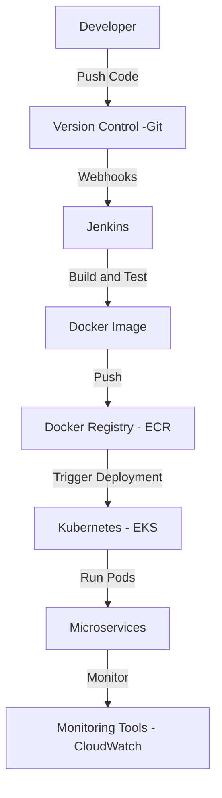

### Step-by-Step Process

#### 1. Development

- Developers write code in their local environments.
- Code is versioned using a version control system (like Git).

#### 2. Dockerization

**Dockerfile Example**:
```dockerfile
# Use the official Node.js image
FROM node:14

# Set the working directory
WORKDIR /app

# Copy package.json and install dependencies
COPY package*.json ./
RUN npm install

# Copy the application code
COPY . .

# Expose the application port
EXPOSE 3000

# Start the application
CMD ["npm", "start"]
```

**Build Docker Image**:
```bash
docker build -t my-microservice:latest .
```

#### 3. Push to Registry

**Push to AWS ECR**:
1. Authenticate Docker to ECR:
   ```bash
   aws ecr get-login-password --region us-east-1 | docker login --username AWS --password-stdin <aws_account_id>.dkr.ecr.us-east-1.amazonaws.com
   ```

2. Tag the image:
   ```bash
   docker tag my-microservice:latest <aws_account_id>.dkr.ecr.us-east-1.amazonaws.com/my-microservice:latest
   ```

3. Push the image:
   ```bash
   docker push <aws_account_id>.dkr.ecr.us-east-1.amazonaws.com/my-microservice:latest
   ```

#### 4. Continuous Integration (Jenkins)

**Jenkins Pipeline Example (Jenkinsfile)**:
```groovy
pipeline {
    agent any
    stages {
        stage('Build') {
            steps {
                script {
                    docker.build('my-microservice:latest')
                }
            }
        }
        stage('Test') {
            steps {
                script {
                    // Run tests (if applicable)
                }
            }
        }
        stage('Push') {
            steps {
                script {
                    docker.withRegistry('https://<aws_account_id>.dkr.ecr.us-east-1.amazonaws.com', 'ecr:aws_access_key_id') {
                        docker.image('my-microservice:latest').push()
                    }
                }
            }
        }
    }
}
```

#### 5. Kubernetes Deployment

**Kubernetes Deployment YAML**:
```yaml
apiVersion: apps/v1
kind: Deployment
metadata:
  name: my-microservice
spec:
  replicas: 3
  selector:
    matchLabels:
      app: my-microservice
  template:
    metadata:
      labels:
        app: my-microservice
    spec:
      containers:
      - name: my-microservice
        image: <aws_account_id>.dkr.ecr.us-east-1.amazonaws.com/my-microservice:latest
        ports:
        - containerPort: 3000
```

**Deploy to EKS**:
```bash
kubectl apply -f deployment.yaml
```

#### 6. Continuous Deployment

Jenkins can trigger deployments to Kubernetes using the Kubernetes CLI or Helm charts once the Docker image is built and pushed.

**Jenkins Deployment Stage Example**:
```groovy
stage('Deploy to Kubernetes') {
    steps {
        script {
            sh 'kubectl apply -f deployment.yaml'
        }
    }
}
```

#### 7. Monitoring

Use AWS CloudWatch or other monitoring tools to track the health and performance of the microservices running in EKS.

### Summary

1. **Develop** the microservices and version control using Git.
2. **Dockerize** the application and build the Docker image.
3. **Push** the image to AWS ECR.
4. Set up a **Jenkins pipeline** to automate the CI/CD process.
5. Deploy the application to **Kubernetes** on AWS EKS.
6. **Monitor** the application using tools like AWS CloudWatch.

This comprehensive process outlines how to efficiently deploy microservices using Docker, Kubernetes, Jenkins, and AWS.


### Orchestrator-Based Saga Pattern

The Orchestrator-based Saga pattern is a way to manage distributed transactions across multiple microservices. In this pattern, a central orchestrator service coordinates the transactions and ensures that all steps are executed in a reliable manner. If a step fails, the orchestrator handles the rollback through compensating transactions.

### Key Components

1. **Orchestrator**: The central service that manages the workflow.
2. **Participants**: Microservices that perform specific tasks.
3. **Compensating Transactions**: Actions taken to undo the effects of a previously completed step if something goes wrong.

### Diagram

Here's a simplified representation of an orchestrator-based saga:

```
+------------------+
|   Orchestrator   |
+------------------+
        |
        | Step 1: Start Order
        v
+------------------+
|   Service A      |  (e.g., Reserve Item)
+------------------+
        |
        | Success
        |      Failure
        v           v
+------------------+   +------------------+
|   Service B      |   | Compensate A     |
| (e.g., Charge Payment) | (e.g., Release Item)
+------------------+   +------------------+
        |
        | Success
        |      Failure
        v           v
+------------------+   +------------------+
|   Service C      |   | Compensate B     |
|   (e.g., Notify User)  | (e.g., Refund Payment)
+------------------+   +------------------+
        |
        | Success
        |      Failure
        v           v
| Compensate C     |
| (e.g., Notify User of Failure) |
+------------------+
```

### Implementation Steps

1. **Define the Saga**: Create a workflow that defines the order of operations and compensating actions.
2. **Implement Services**: Create the individual services to handle each task and the corresponding compensating transaction.
3. **Build the Orchestrator**: Implement the orchestrator that coordinates the saga.

### Example Implementation

Let's illustrate a simple example using Node.js with Express and a hypothetical saga involving three services: Order Service, Payment Service, and Notification Service.

#### Service A: Order Service

```javascript
// orderService.js
const express = require('express');
const app = express();
app.use(express.json());

app.post('/reserve', (req, res) => {
    // Logic to reserve an item
    console.log("Item reserved.");
    res.status(200).send("Item reserved.");
});

app.post('/compensate', (req, res) => {
    // Logic to release the item
    console.log("Item reservation released.");
    res.status(200).send("Item reservation released.");
});

app.listen(3001, () => console.log('Order Service running on port 3001'));
```

#### Service B: Payment Service

```javascript
// paymentService.js
const express = require('express');
const app = express();
app.use(express.json());

app.post('/charge', (req, res) => {
    // Logic to charge payment
    console.log("Payment charged.");
    res.status(200).send("Payment charged.");
});

app.post('/refund', (req, res) => {
    // Logic to refund payment
    console.log("Payment refunded.");
    res.status(200).send("Payment refunded.");
});

app.listen(3002, () => console.log('Payment Service running on port 3002'));
```

#### Service C: Notification Service

```javascript
// notificationService.js
const express = require('express');
const app = express();
app.use(express.json());

app.post('/notify', (req, res) => {
    // Logic to notify user
    console.log("User notified.");
    res.status(200).send("User notified.");
});

app.post('/notify-failure', (req, res) => {
    // Logic to notify user of failure
    console.log("User notified of failure.");
    res.status(200).send("User notified of failure.");
});

app.listen(3003, () => console.log('Notification Service running on port 3003'));
```

#### Orchestrator Service

```javascript
// orchestrator.js
const express = require('express');
const axios = require('axios');
const app = express();
app.use(express.json());

app.post('/start-saga', async (req, res) => {
    try {
        await axios.post('http://localhost:3001/reserve'); // Service A
        await axios.post('http://localhost:3002/charge');  // Service B
        await axios.post('http://localhost:3003/notify');  // Service C
        res.status(200).send("Saga completed successfully.");
    } catch (error) {
        console.error("Error occurred:", error.message);
        // Start compensation
        await axios.post('http://localhost:3001/compensate'); // Compensate A
        await axios.post('http://localhost:3002/refund');      // Compensate B
        await axios.post('http://localhost:3003/notify-failure'); // Compensate C
        res.status(500).send("Saga failed, compensating.");
    }
});

app.listen(3000, () => console.log('Orchestrator running on port 3000'));
```

### Running the Example

1. Start each service in separate terminal windows:
   - `node orderService.js`
   - `node paymentService.js`
   - `node notificationService.js`
   - `node orchestrator.js`

2. To initiate the saga, send a POST request to the orchestrator:
   ```bash
   curl -X POST http://localhost:3000/start-saga
   ```

### Conclusion

The orchestrator-based saga pattern allows for managing complex transactions across multiple microservices while ensuring reliability through compensating actions. This example provides a basic overview, and you can expand it with more advanced features like event sourcing, retries, and logging for production use.

A **Mermaid diagram** for the orchestrator-based Saga pattern, followed by a **Spring Boot** implementation for the same scenario.

### Mermaid Diagram

Here’s a Mermaid diagram to represent the orchestrator-based Saga pattern:

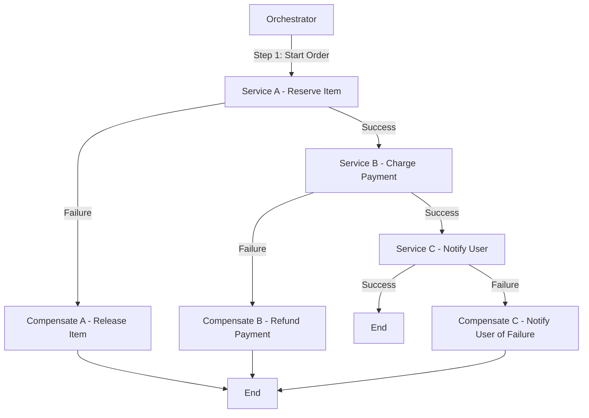

### Spring Boot Implementation

#### Step 1: Create Services

You will create three services (Order Service, Payment Service, Notification Service) and one Orchestrator service. 

##### 1. Order Service

```java
// OrderServiceApplication.java
package com.example.orderservice;

import org.springframework.boot.SpringApplication;
import org.springframework.boot.autoconfigure.SpringBootApplication;
import org.springframework.web.bind.annotation.*;

@SpringBootApplication
@RestController
@RequestMapping("/order")
public class OrderServiceApplication {

    public static void main(String[] args) {
        SpringApplication.run(OrderServiceApplication.class, args);
    }

    @PostMapping("/reserve")
    public String reserve() {
        // Logic to reserve an item
        System.out.println("Item reserved.");
        return "Item reserved.";
    }

    @PostMapping("/compensate")
    public String compensate() {
        // Logic to release the item
        System.out.println("Item reservation released.");
        return "Item reservation released.";
    }
}
```

##### 2. Payment Service

```java
// PaymentServiceApplication.java
package com.example.paymentservice;

import org.springframework.boot.SpringApplication;
import org.springframework.boot.autoconfigure.SpringBootApplication;
import org.springframework.web.bind.annotation.*;

@SpringBootApplication
@RestController
@RequestMapping("/payment")
public class PaymentServiceApplication {

    public static void main(String[] args) {
        SpringApplication.run(PaymentServiceApplication.class, args);
    }

    @PostMapping("/charge")
    public String charge() {
        // Logic to charge payment
        System.out.println("Payment charged.");
        return "Payment charged.";
    }

    @PostMapping("/refund")
    public String refund() {
        // Logic to refund payment
        System.out.println("Payment refunded.");
        return "Payment refunded.";
    }
}
```

##### 3. Notification Service

```java
// NotificationServiceApplication.java
package com.example.notificationservice;

import org.springframework.boot.SpringApplication;
import org.springframework.boot.autoconfigure.SpringBootApplication;
import org.springframework.web.bind.annotation.*;

@SpringBootApplication
@RestController
@RequestMapping("/notification")
public class NotificationServiceApplication {

    public static void main(String[] args) {
        SpringApplication.run(NotificationServiceApplication.class, args);
    }

    @PostMapping("/notify")
    public String notifyUser() {
        // Logic to notify user
        System.out.println("User notified.");
        return "User notified.";
    }

    @PostMapping("/notify-failure")
    public String notifyFailure() {
        // Logic to notify user of failure
        System.out.println("User notified of failure.");
        return "User notified of failure.";
    }
}
```

##### 4. Orchestrator Service

```java
// OrchestratorApplication.java
package com.example.orchestrator;

import org.springframework.boot.SpringApplication;
import org.springframework.boot.autoconfigure.SpringBootApplication;
import org.springframework.web.bind.annotation.*;
import org.springframework.web.client.RestTemplate;

@SpringBootApplication
@RestController
@RequestMapping("/saga")
public class OrchestratorApplication {

    private final RestTemplate restTemplate = new RestTemplate();

    public static void main(String[] args) {
        SpringApplication.run(OrchestratorApplication.class, args);
    }

    @PostMapping("/start")
    public String startSaga() {
        try {
            String orderResponse = restTemplate.postForObject("http://localhost:8081/order/reserve", null, String.class);
            String paymentResponse = restTemplate.postForObject("http://localhost:8082/payment/charge", null, String.class);
            String notifyResponse = restTemplate.postForObject("http://localhost:8083/notification/notify", null, String.class);
            return "Saga completed successfully.";
        } catch (Exception e) {
            // Compensation logic
            restTemplate.postForObject("http://localhost:8081/order/compensate", null, String.class);
            restTemplate.postForObject("http://localhost:8082/payment/refund", null, String.class);
            restTemplate.postForObject("http://localhost:8083/notification/notify-failure", null, String.class);
            return "Saga failed, compensating.";
        }
    }
}
```

### Running the Services

1. **Create a Maven project for each service** using Spring Initializr with dependencies for Spring Web.
2. **Run each service** on different ports:
   - Order Service: Port `8081`
   - Payment Service: Port `8082`
   - Notification Service: Port `8083`
   - Orchestrator Service: Port `8080`

3. **To initiate the saga**, send a POST request to the orchestrator:
   ```bash
   curl -X POST http://localhost:8080/saga/start
   ```

### Conclusion

This Spring Boot implementation follows the orchestrator-based Saga pattern, allowing you to manage distributed transactions reliably. You can expand this by adding more features like logging, error handling, and retries for robustness in production systems.

To prevent transactions in Service A and Service C if Service B fails, you can implement a compensation pattern along with a robust orchestration mechanism. Here’s how you can structure it:

1. **Transactional State Management**: Each service should maintain a transaction state. For instance, Service A should only finalize the reservation if it knows Service B has succeeded.

2. **Sagas Pattern**: Utilize the Sagas pattern, which manages distributed transactions. In this case, you would initiate a saga that includes compensation actions for each service in case of failure.

Here’s how you can modify your flow:

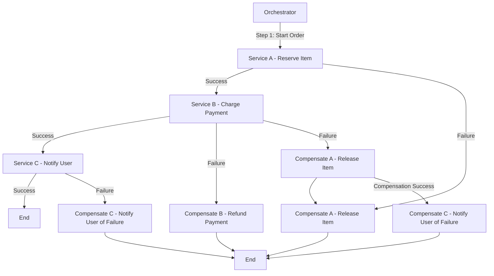

### Steps Explained:

1. **Service A - Reserve Item**: Once it reserves the item, it waits for Service B's response before finalizing.
  
2. **Service B - Charge Payment**: If Service B fails, trigger compensation for Service A to release the reserved item.

3. **Service C - Notify User**: This should only execute if Service B is successful. If Service B fails, Service C should not be notified.

4. **Compensation Actions**: If Service B fails, you compensate Service A first. If compensation is successful, then you can handle notifying the user about the failure of the transaction.

By following this structure, you ensure that all services remain consistent and that no operations are left in an inconsistent state.

Here’s a Mermaid diagram that outlines the Saga Orchestrator pattern for booking a vacation, including the booking of a flight, reserving a hotel, and renting a car, with appropriate rollback actions in case of failures.

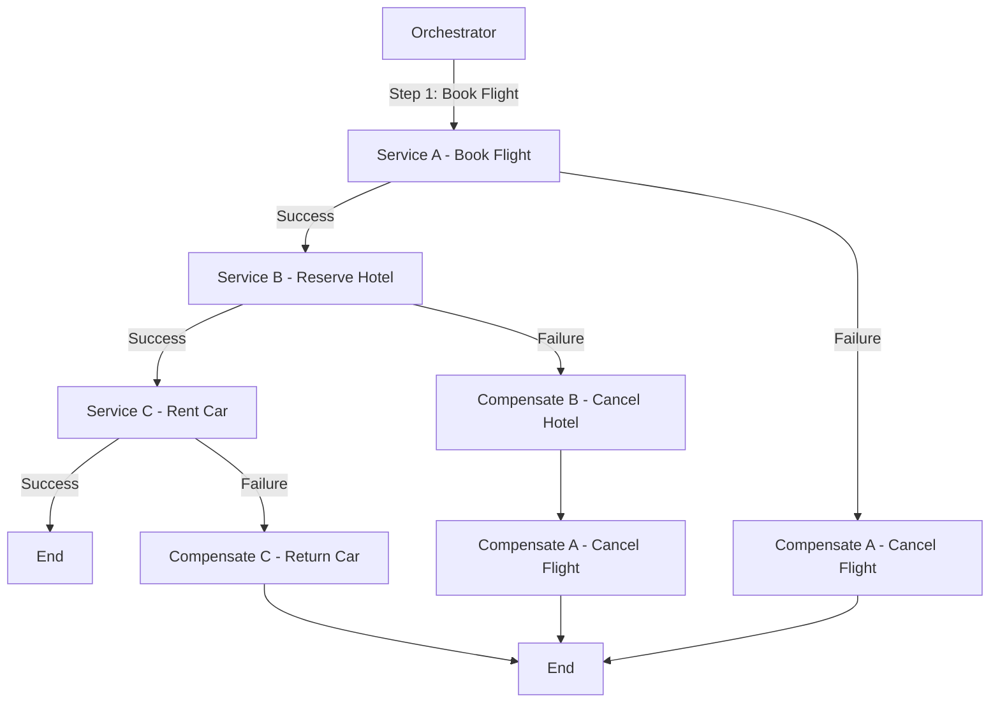

### Steps Explained:

1. **Orchestrator**: The central service coordinating the entire process.
2. **Service A - Book Flight**: The orchestrator first attempts to book the flight.
   - If successful, it proceeds to the next step.
   - If it fails, it triggers compensation to cancel the flight (though there might not be a need to compensate if it never succeeded).
3. **Service B - Reserve Hotel**: After a successful flight booking, the orchestrator books the hotel.
   - If this step fails, it triggers compensation to cancel the flight booking.
4. **Service C - Rent Car**: If both the flight and hotel bookings are successful, the car is rented.
   - If this fails, it compensates by returning the car.
5. **Compensation Actions**: Ensure that any failures lead to appropriate rollbacks:
   - Cancel the flight if the hotel booking fails.
   - Return the car if renting fails.

This structured approach ensures that all steps are properly sequenced, and any failures are handled gracefully to maintain consistency across services.

Imagine you’re booking a vacation, which involves multiple steps: booking a flight, reserving a hotel, and renting a car. If the flight booking fails, the entire process should be aborted and rolled back.

In an Orchestrator-based Saga:

The orchestrator (a central coordinator) manages the flow.
The orchestrator first tries to book the flight.
If successful, it proceeds to book the hotel.
If the hotel booking fails, it triggers compensating transactions (e.g., cancel the flight booking).
It acts as a “traffic controller,” ensuring that the entire transaction either completes or rolls back as needed.
This way, even though each step is handled by a different service, the orchestrator ensures the steps follow a proper sequence, and failures trigger appropriate actions.


Implementation
In Spring Boot, you typically implement the Saga Orchestrator pattern using a combination of:

Orchestrator service: The central service that coordinates all the steps.
Individual services: Each microservice handles its own task (flight booking, hotel…


Sure! Here's a representation of the Choreography pattern for the same vacation booking scenario, along with a brief Spring Boot code example.

### Choreography Pattern Diagram

In the Choreography pattern, each service communicates directly with others and handles its own compensation logic.

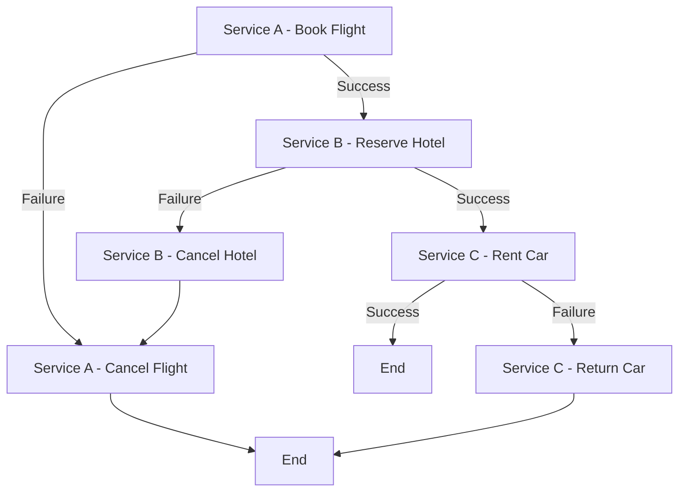

### Explanation

1. **Service A - Book Flight**: Initiates the booking.
   - If successful, it triggers Service B to reserve the hotel.
   - If it fails, it handles its own compensation by canceling the flight.
   
2. **Service B - Reserve Hotel**: Handles hotel reservations.
   - On success, it calls Service C to rent a car.
   - On failure, it triggers its own compensation to cancel the hotel.

3. **Service C - Rent Car**: Rents the car if previous steps are successful.
   - If this fails, it handles its own compensation by returning the car.

### Spring Boot Implementation

Here's a simplified version of the implementation in Spring Boot for each service:

#### 1. **Service A - Book Flight**

```java
@RestController
@RequestMapping("/flight")
public class FlightService {

    @PostMapping("/book")
    public ResponseEntity<String> bookFlight() {
        // Logic to book flight
        boolean success = // ... booking logic;

        if (!success) {
            // Trigger cancellation
            cancelFlight();
            return ResponseEntity.status(HttpStatus.INTERNAL_SERVER_ERROR).body("Flight booking failed");
        }

        // Notify next service (via REST call or message broker)
        restTemplate.postForEntity("http://hotel-service/reserve", flightDetails, String.class);
        return ResponseEntity.ok("Flight booked successfully");
    }

    public void cancelFlight() {
        // Logic to cancel the flight
    }
}
```

#### 2. **Service B - Reserve Hotel**

```java
@RestController
@RequestMapping("/hotel")
public class HotelService {

    @PostMapping("/reserve")
    public ResponseEntity<String> reserveHotel(@RequestBody FlightDetails flightDetails) {
        // Logic to reserve hotel
        boolean success = // ... reservation logic;

        if (!success) {
            // Trigger compensation
            cancelHotel();
            return ResponseEntity.status(HttpStatus.INTERNAL_SERVER_ERROR).body("Hotel reservation failed");
        }

        // Notify next service
        restTemplate.postForEntity("http://car-service/rent", hotelDetails, String.class);
        return ResponseEntity.ok("Hotel reserved successfully");
    }

    public void cancelHotel() {
        // Logic to cancel the hotel reservation
    }
}
```

#### 3. **Service C - Rent Car**

```java
@RestController
@RequestMapping("/car")
public class CarService {

    @PostMapping("/rent")
    public ResponseEntity<String> rentCar(@RequestBody HotelDetails hotelDetails) {
        // Logic to rent a car
        boolean success = // ... rental logic;

        if (!success) {
            // Handle failure
            returnCar();
            return ResponseEntity.status(HttpStatus.INTERNAL_SERVER_ERROR).body("Car rental failed");
        }

        return ResponseEntity.ok("Car rented successfully");
    }

    public void returnCar() {
        // Logic to return the car
    }
}
```

### Key Points

- Each service is responsible for its own transactions and compensation.
- Services communicate directly with each other, either through REST APIs or a messaging system.
- Failure handling and compensating actions are implemented within each service.

This pattern allows for greater flexibility and autonomy of each service, but it requires careful management of state and communication to ensure consistency across the system.

Sure! Let's explore the **Circuit Breaker**, **Retry**, **Asynchronous Event-Driven**, and **CQRS** patterns, along with diagrams and example Spring Boot code for each.

### 1. Circuit Breaker Pattern

The Circuit Breaker pattern helps prevent an application from repeatedly trying to execute an operation that's likely to fail, thus avoiding cascading failures.

#### Diagram

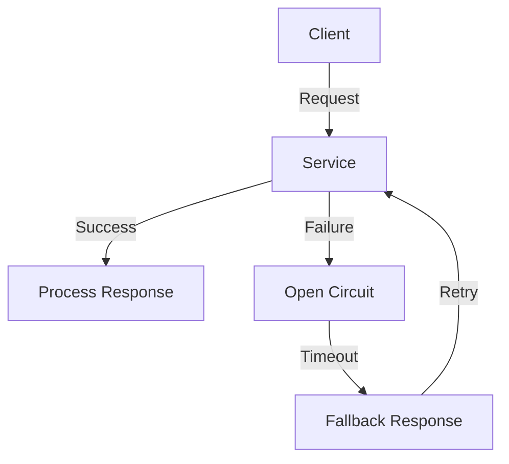

#### Code Example

Using **Resilience4j** in Spring Boot:

```java
import io.github.resilience4j.circuitbreaker.annotation.CircuitBreaker;
import org.springframework.web.bind.annotation.GetMapping;
import org.springframework.web.bind.annotation.RestController;

@RestController
public class MyService {

    @GetMapping("/performAction")
    @CircuitBreaker
    public String performAction() {
        // Simulate a service call
        if (Math.random() > 0.7) {
            throw new RuntimeException("Service failure");
        }
        return "Success";
    }
}
```

### 2. Retry Pattern

The Retry pattern automatically retries failed operations to increase the likelihood of success, especially useful for transient failures.

#### Diagram

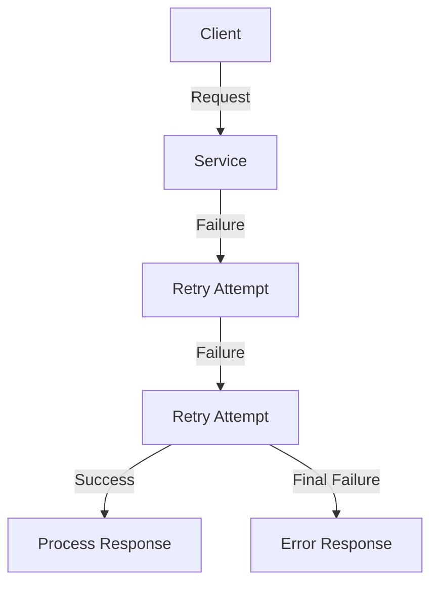

#### Code Example

Using **Resilience4j** for retry:

```java
import io.github.resilience4j.retry.annotation.Retry;
import org.springframework.web.bind.annotation.GetMapping;
import org.springframework.web.bind.annotation.RestController;

@RestController
public class MyService {

    @GetMapping("/performAction")
    @Retry(name = "retryService")
    public String performAction() {
        // Simulate a service call
        if (Math.random() > 0.7) {
            throw new RuntimeException("Service failure");
        }
        return "Success";
    }
}
```

### 3. Asynchronous Event-Driven Pattern

In this pattern, components communicate through events, promoting loose coupling and asynchronous processing.

#### Diagram

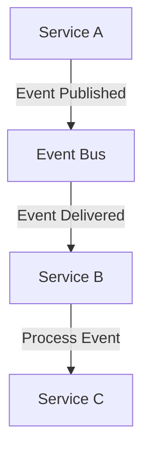

#### Code Example

Using **Spring Events**:

```java
import org.springframework.context.ApplicationEventPublisher;
import org.springframework.stereotype.Service;

@Service
public class EventPublisherService {

    private final ApplicationEventPublisher publisher;

    public EventPublisherService(ApplicationEventPublisher publisher) {
        this.publisher = publisher;
    }

    public void publishEvent(String message) {
        publisher.publishEvent(new MyEvent(this, message));
    }
}

// Event Listener
@Component
public class MyEventListener {

    @EventListener
    public void handleEvent(MyEvent event) {
        // Process the event
        System.out.println("Received event: " + event.getMessage());
    }
}

// Custom Event
public class MyEvent extends ApplicationEvent {
    private final String message;

    public MyEvent(Object source, String message) {
        super(source);
        this.message = message;
    }

    public String getMessage() {
        return message;
    }
}
```

### 4. CQRS (Command Query Responsibility Segregation) Pattern

CQRS separates the read and write operations into different models, allowing for more scalable and flexible applications.

#### Diagram

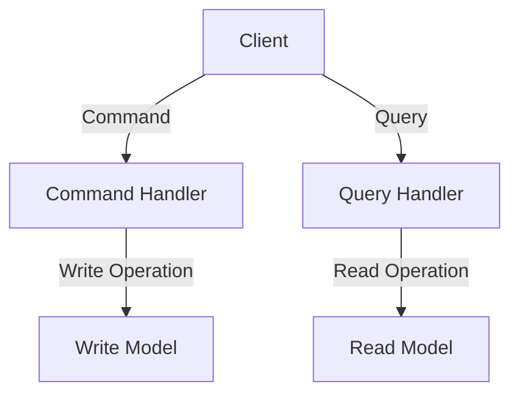

#### Code Example

```java
@RestController
public class MyController {

    private final CommandService commandService;
    private final QueryService queryService;

    public MyController(CommandService commandService, QueryService queryService) {
        this.commandService = commandService;
        this.queryService = queryService;
    }

    @PostMapping("/create")
    public ResponseEntity<String> createItem(@RequestBody CreateItemCommand command) {
        commandService.handle(command);
        return ResponseEntity.ok("Item created");
    }

    @GetMapping("/items/{id}")
    public ResponseEntity<Item> getItem(@PathVariable String id) {
        Item item = queryService.findById(id);
        return ResponseEntity.ok(item);
    }
}

// Command Handler
@Service
public class CommandService {
    public void handle(CreateItemCommand command) {
        // Logic to create an item
    }
}

// Query Handler
@Service
public class QueryService {
    public Item findById(String id) {
        // Logic to retrieve an item
        return new Item(); // example
    }
}

// Command Object
public class CreateItemCommand {
    private String name;
    // other fields, getters, setters
}

// Item Object
public class Item {
    private String id;
    private String name;
    // other fields, getters, setters
}
```

### Summary

1. **Circuit Breaker**: Prevents repeated attempts to call a failing service, providing fallback responses.
2. **Retry**: Automatically retries operations that fail due to transient issues.
3. **Asynchronous Event-Driven**: Promotes loose coupling through event-based communication between services.
4. **CQRS**: Separates command and query responsibilities for better scalability and flexibility.

These patterns can significantly enhance the resilience, scalability, and maintainability of microservices in a Spring Boot application.

Creating a comprehensive architecture that includes an event-driven system with Saga orchestration, Circuit Breaker, API Gateway, Service Discovery, Kubernetes, Docker, Jenkins CI/CD, Grafana, Spring Boot Actuator, Zipkin for distributed tracing, and proper database communication and transaction handling is quite extensive. Below, I will outline the key components, provide sequence and flow diagrams, and give code examples for each aspect.

### High-Level Architecture

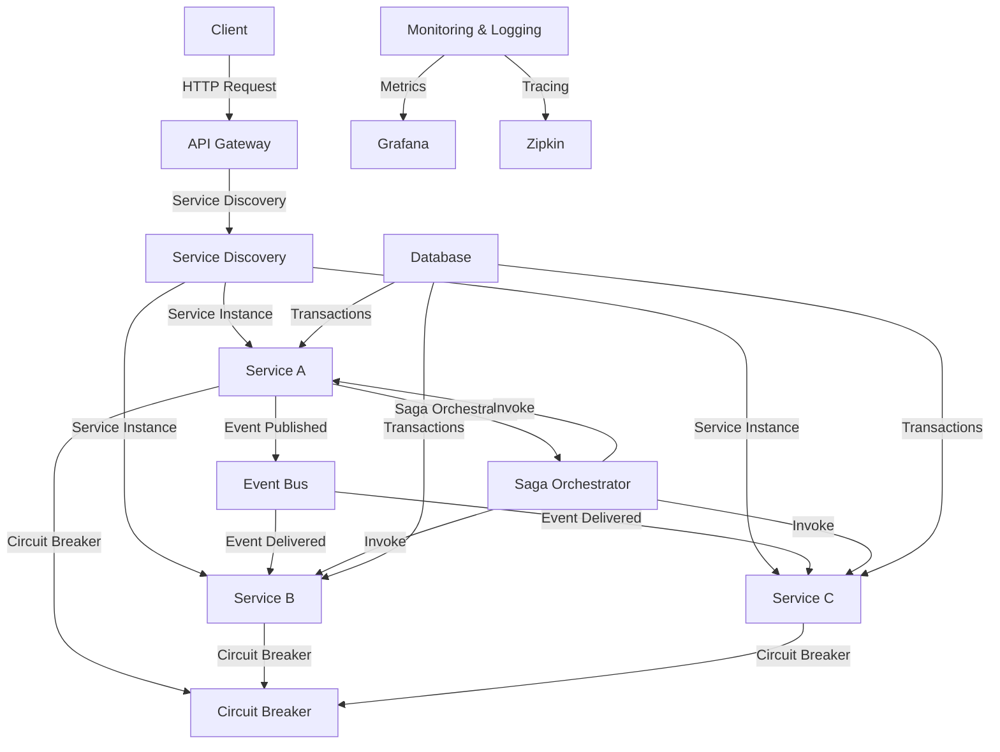

### Sequence Diagram

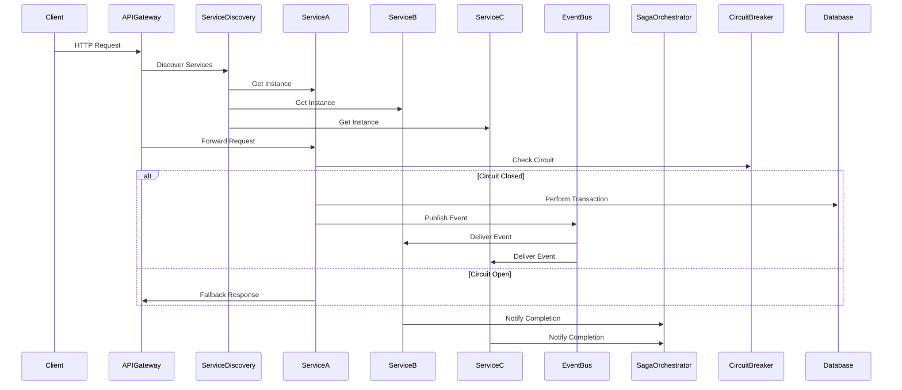

### Implementation Steps

1. **Microservices Setup**:
   - Create microservices (Service A, B, C) using Spring Boot.
   - Use Spring Cloud for Service Discovery (Eureka) and Circuit Breaker (Resilience4j).

2. **API Gateway**:
   - Implement an API Gateway using Spring Cloud Gateway to route requests to microservices.

3. **Event Bus**:
   - Use an event bus (e.g., RabbitMQ, Kafka) to publish and consume events among microservices.

4. **Saga Orchestrator**:
   - Implement the Saga pattern using a central orchestrator service that coordinates transactions across services.

5. **Circuit Breaker**:
   - Use Resilience4j to implement circuit breakers in each service.

6. **Database Communication**:
   - Use JPA or Spring Data for database interactions within each service, ensuring proper transaction management.

7. **Containerization with Docker**:
   - Create Dockerfiles for each service and use Docker Compose to run them together.

8. **Kubernetes Deployment**:
   - Deploy the services on a Kubernetes cluster, using Helm for managing releases.

9. **CI/CD Pipeline with Jenkins**:
   - Set up Jenkins to automate the build and deployment process, integrating with GitHub for version control.

10. **Monitoring with Grafana**:
    - Use Spring Boot Actuator to expose metrics and configure Grafana to visualize them.

11. **Tracing with Zipkin**:
    - Integrate Zipkin with your microservices for distributed tracing.

### Example Code Snippets

#### 1. **Service Discovery (Eureka Server)**

```java
@SpringBootApplication
@EnableEurekaServer
public class EurekaServerApplication {
    public static void main(String[] args) {
        SpringApplication.run(EurekaServerApplication.class, args);
    }
}
```

#### 2. **API Gateway Configuration**

```java
@SpringBootApplication
@EnableDiscoveryClient
@EnableZuulProxy
public class ApiGatewayApplication {
    public static void main(String[] args) {
        SpringApplication.run(ApiGatewayApplication.class, args);
    }
}
```

#### 3. **Service with Circuit Breaker**

```java
@RestController
public class ServiceA {

    @Autowired
    private RestTemplate restTemplate;

    @GetMapping("/performAction")
    @CircuitBreaker
    public String performAction() {
        // Simulate a service call
        if (Math.random() > 0.7) {
            throw new RuntimeException("Service failure");
        }
        return "Success";
    }

    @PostMapping("/publishEvent")
    public void publishEvent() {
        // Logic to publish an event
    }
}
```

#### 4. **Saga Orchestrator Example**

```java
@RestController
public class SagaOrchestrator {

    @Autowired
    private EventPublisherService eventPublisherService;

    @PostMapping("/startSaga")
    public void startSaga() {
        // Logic to start the saga
        eventPublisherService.publishEvent("Start Saga");
    }
}
```

### Memory Management and Performance Improvements

1. **Connection Pooling**: Use connection pooling with your database to manage connections efficiently.

2. **Caching**: Implement caching mechanisms (e.g., Redis) to reduce database load and improve response times.

3. **Load Balancing**: Use Kubernetes services to load balance traffic across multiple instances of your microservices.

4. **Profiling and Monitoring**: Utilize Spring Boot Actuator and Grafana to monitor application performance and identify bottlenecks.

5. **Resource Limits**: Define resource limits in your Kubernetes deployment configurations to prevent resource exhaustion.

### Instance Management for Multiple Service Requests

1. **Horizontal Scaling**: Scale your services horizontally by increasing the number of pods in Kubernetes based on load.

2. **Health Checks**: Implement health checks to ensure only healthy instances receive traffic.

3. **Rate Limiting**: Use API Gateway features to implement rate limiting, preventing overload during high traffic.

### Conclusion

This architecture provides a robust foundation for building scalable, resilient microservices. By integrating these patterns and tools, you ensure that your application can handle multiple service requests effectively while managing transactions and preventing failures. Each component plays a crucial role in maintaining the overall health and performance of the system.

Sure! Let’s explore each aspect of memory management and performance improvements in a microservices architecture using diagrams and code examples.

### 1. Memory Management and Performance Improvements

#### A. Connection Pooling

**Diagram:**

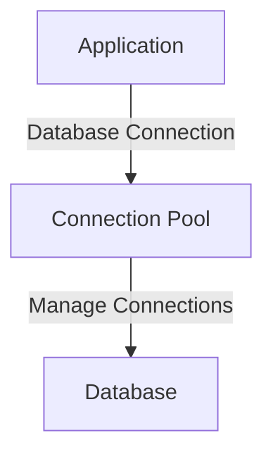

**Code Example:**

Using HikariCP (default in Spring Boot):

```yaml
# application.properties
spring.datasource.url=jdbc:mysql://localhost:3306/mydb
spring.datasource.username=root
spring.datasource.password=password
spring.datasource.hikari.maximum-pool-size=10
```

```java
@Configuration
public class DataSourceConfig {
    @Bean
    public DataSource dataSource() {
        HikariDataSource dataSource = new HikariDataSource();
        dataSource.setJdbcUrl("jdbc:mysql://localhost:3306/mydb");
        dataSource.setUsername("root");
        dataSource.setPassword("password");
        dataSource.setMaximumPoolSize(10);
        return dataSource;
    }
}
```

#### B. Caching

**Diagram:**

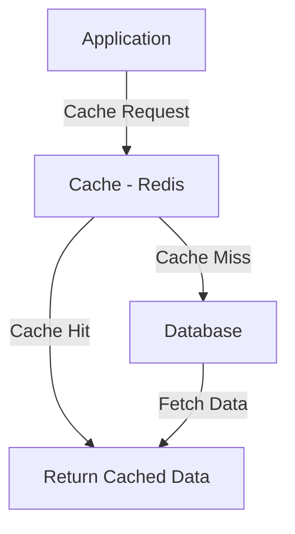

**Code Example:**

Using Spring Cache with Redis:

```yaml
# application.properties
spring.cache.type=redis
spring.redis.host=localhost
spring.redis.port=6379
```

```java
@Service
public class UserService {
    
    @Cacheable("users")
    public User getUserById(Long id) {
        return userRepository.findById(id).orElseThrow(() -> new RuntimeException("User not found"));
    }
}
```

#### C. Load Balancing

**Diagram:**

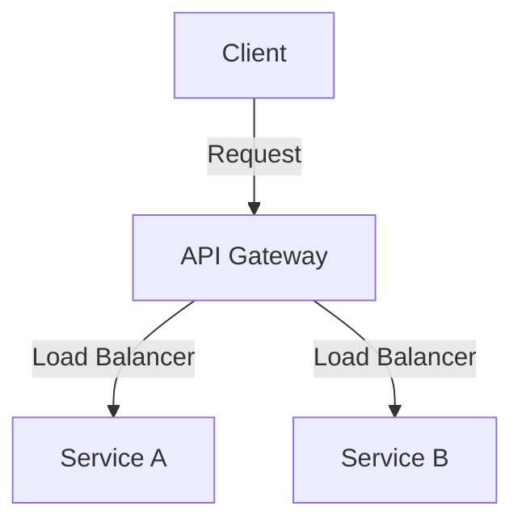

**Kubernetes Example:**

```yaml
apiVersion: v1
kind: Service
metadata:
  name: my-service
spec:
  type: LoadBalancer
  selector:
    app: my-app
  ports:
    - port: 80
      targetPort: 8080
```

#### D. Profiling and Monitoring

**Diagram:**

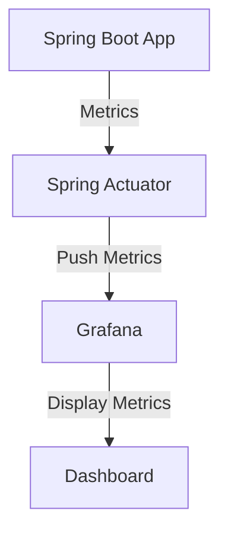

**Code Example:**

Enable Spring Actuator in `pom.xml`:

```xml
<dependency>
    <groupId>org.springframework.boot</groupId>
    <artifactId>spring-boot-starter-actuator</artifactId>
</dependency>
```

```yaml
# application.properties
management.endpoints.web.exposure.include=*
```

#### E. Resource Limits

**Diagram:**

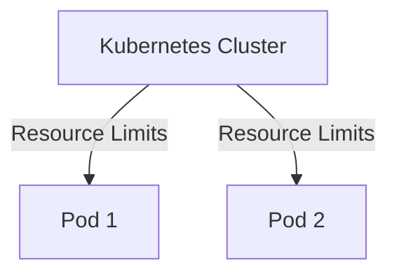

**Kubernetes Example:**

```yaml
apiVersion: apps/v1
kind: Deployment
metadata:
  name: my-deployment
spec:
  replicas: 2
  template:
    spec:
      containers:
        - name: my-container
          image: my-image
          resources:
            requests:
              memory: "256Mi"
              cpu: "500m"
            limits:
              memory: "512Mi"
              cpu: "1"
```

### 2. Instance Management for Multiple Service Requests

#### A. Horizontal Scaling

**Diagram:**

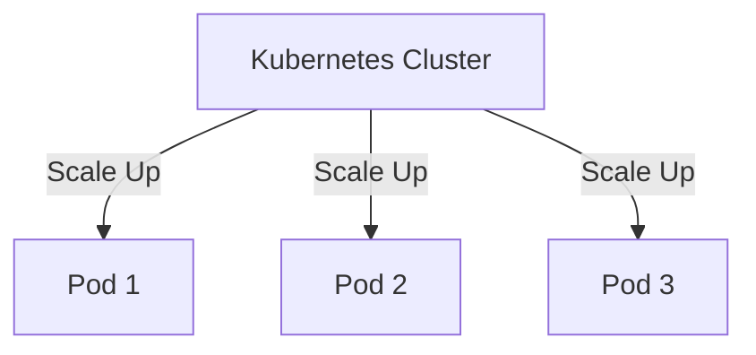

**Kubernetes Example:**

```yaml
apiVersion: autoscaling/v1
kind: HorizontalPodAutoscaler
metadata:
  name: my-hpa
spec:
  scaleTargetRef:
    apiVersion: apps/v1
    kind: Deployment
    name: my-deployment
  minReplicas: 1
  maxReplicas: 10
  targetCPUUtilizationPercentage: 80
```

#### B. Health Checks

**Diagram:**

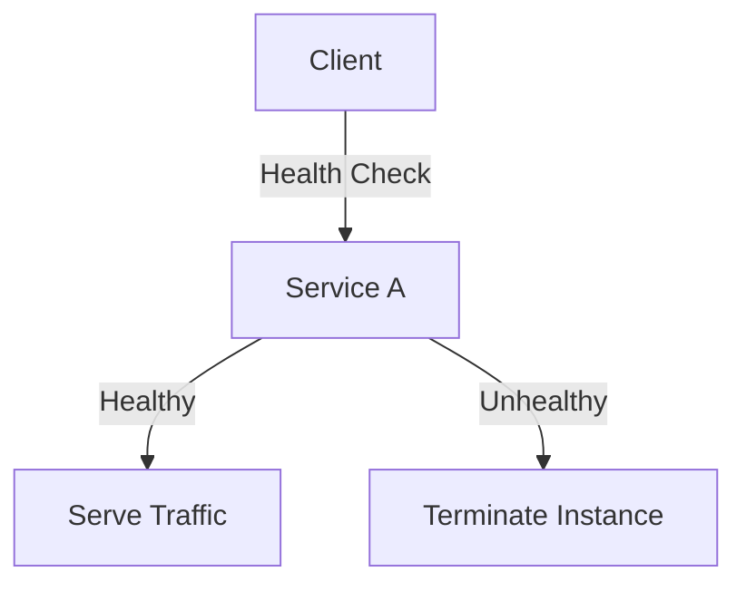

**Kubernetes Example:**

```yaml
livenessProbe:
  httpGet:
    path: /actuator/health
    port: 8080
  initialDelaySeconds: 30
  periodSeconds: 10
```

#### C. Rate Limiting

**Diagram:**

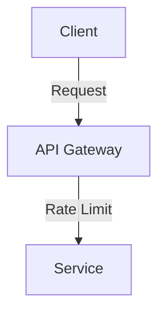

**Code Example:**

Using Spring Cloud Gateway:

```yaml
spring:
  cloud:
    gateway:
      routes:
        - id: service_route
          uri: lb://my-service
          predicates:
            - Path=/service/**
          filters:
            - RequestRateLimiter=2,4 # 2 requests per second with a burst of 4
```
In the context of rate limiting, the **burst** refers to the ability to handle a temporary spike in requests that exceeds the regular limit. 

### Explanation

- **Rate Limit**: The limit set on the number of requests that can be processed in a specified time period. In your example, the limit is **2 requests per second**.
- **Burst Capacity**: The additional requests that can be allowed in a short period beyond the specified rate limit, in this case, **4 requests**. This means that if the service is under load, it can handle a sudden influx of up to 4 additional requests quickly before enforcing the rate limit.

### Example

Given the rate limit of **2 requests per second** with a burst of **4**:
- **Normal Operation**: The service will handle **2 requests per second** continuously.
- **Burst Handling**: If there’s a sudden surge (like a spike in traffic), the service can allow up to **4 extra requests** in addition to the normal rate. 

So, if the normal limit is exceeded:
- **At second 1**: 2 requests are allowed.
- **At second 2**: 2 more requests are allowed.
- **At second 3**: If a sudden surge comes in and 4 additional requests arrive, the service can handle these extra requests up to the burst limit.

After the burst limit is reached, any further requests would be rejected or queued until the rate limit resets. This mechanism helps to smooth out traffic spikes while still protecting the service from being overwhelmed.
### Conclusion

By implementing these strategies, you can effectively manage memory and enhance the performance of your microservices. Each aspect contributes to a more resilient and efficient architecture, capable of handling high loads and ensuring system stability.


## Microservices

**Overview**:
Microservices architecture is a design approach where an application is built as a collection of small, loosely coupled services, each responsible for a specific business capability.

**Key Features**:
- **Independently Deployable**: Each service can be developed, deployed, and scaled independently.
- **Technology Agnostic**: Services can be written in different programming languages and technologies.
- **Resilience**: Failure in one service does not affect the entire system.

**Use Case**: Ideal for large, complex applications that require flexibility, such as e-commerce platforms and content management systems.

### Threading

**Overview**:
Threading refers to the concurrent execution of multiple threads (smaller units of a process) within a single application. It is a way to achieve parallelism, which can enhance the performance of applications, particularly in server-side programming.

**Key Features**:
- **Concurrency**: Multiple threads can execute independently, improving responsiveness.
- **Resource Sharing**: Threads within the same process share memory and resources, allowing for efficient data exchange.
- **Synchronization**: Requires careful management to avoid conflicts and ensure data integrity.

**Use Case**: Commonly used in server applications (like web servers) to handle multiple requests simultaneously.

### Interactions and Use Cases

1. **Frontend (Angular/React) + Microservices**:
   - **Angular** and **React** can act as front-end applications that communicate with microservices via RESTful APIs or GraphQL. 
   - This architecture allows for a separation of concerns, where the frontend is responsible for the UI and the microservices handle business logic and data storage.

2. **Microservices + Threading**:
   - Microservices can leverage threading to handle multiple requests concurrently, improving performance and responsiveness.
   - Each microservice can spawn threads to handle incoming requests without blocking the main thread, ensuring that the service remains responsive.

3. **Frontend (Angular/React) + Threading**:
   - Although Angular and React are primarily single-threaded (due to JavaScript's event loop), they can offload intensive tasks to Web Workers, allowing for concurrent execution of scripts without blocking the UI.

### Example Scenario

**E-Commerce Application**:
- **Frontend**: Built with Angular for a structured UI, allowing users to browse products and manage their carts.
- **Microservices**: Separate services for product catalog, user management, and payment processing. Each service can be developed in different languages based on team expertise.
- **Threading**: Each microservice handles multiple user requests concurrently, ensuring that the application can scale during peak times (e.g., holiday sales).

### Conclusion

Understanding the interplay between Angular, React, microservices, and threading is essential for building modern web applications. Each technology serves a unique purpose, and their combination can lead to efficient, scalable, and maintainable applications.

The Twelve-Factor App methodology is a set of best practices for building modern web applications, particularly suitable for cloud-native microservices like those developed with Spring Boot. Here’s a brief overview of how each factor applies to Spring Boot microservices:

### 1. **Codebase**
- **Definition**: One codebase tracked in version control, many deploys.
- **Application**: Maintain a single repository for each microservice with clear versioning and branching strategies. Use Git for version control.

### 2. **Dependencies**
- **Definition**: Explicitly declare and isolate dependencies.
- **Application**: Use Maven or Gradle to manage dependencies in your Spring Boot application. Avoid relying on the system’s package manager to ensure consistency across environments.

### 3. **Config**
- **Definition**: Store configuration in the environment.
- **Application**: Externalize configuration using Spring’s `application.properties` or `application.yml`. Leverage Spring Cloud Config or environment variables to manage settings across different environments.

### 4. **Backing Services**
- **Definition**: Treat backing services as attached resources.
- **Application**: Use services like databases, message queues, and caches as resources that can be swapped without code changes. For example, configure different databases for development and production via properties.

### 5. **Build, Release, Run**
- **Definition**: Strictly separate the build and run stages.
- **Application**: Use CI/CD pipelines (e.g., Jenkins, GitLab CI) to automate the build and release processes, ensuring that the build artifact is immutable and can be deployed consistently.

### 6. **Processes**
- **Definition**: Execute the app as one or more stateless processes.
- **Application**: Design Spring Boot applications to be stateless, maintaining any state in external systems (like databases or caches) to enable easy scaling.

### 7. **Port Binding**
- **Definition**: Export services via port binding.
- **Application**: Each Spring Boot microservice runs as a standalone web server, listening on a defined port (e.g., `server.port` in `application.properties`). This enables microservices to be self-contained and easy to run.

### 8. **Concurrency**
- **Definition**: Scale out via the process model.
- **Application**: Use tools like Kubernetes to manage scaling of Spring Boot services. Each instance of the microservice can be scaled horizontally based on load.

### 9. **Disposability**
- **Definition**: Maximize robustness with fast startup and graceful shutdown.
- **Application**: Design Spring Boot applications to start quickly and handle termination signals (like SIGTERM) gracefully to allow for smooth restarts and updates.

### 10. **Dev/Prod Parity**
- **Definition**: Keep development, staging, and production as similar as possible.
- **Application**: Use Docker containers or Kubernetes to ensure that the environments are consistent. Use the same database types and configurations across all environments.

### 11. **Logs**
- **Definition**: Treat logs as event streams.
- **Application**: Use a centralized logging solution like ELK (Elasticsearch, Logstash, Kibana) or Splunk. Spring Boot supports logging frameworks like SLF4J and Logback for structured logging.

### 12. **Admin Processes**
- **Definition**: Run administrative/management tasks as one-off processes.
- **Application**: Use Spring Boot’s `@Scheduled` tasks or command-line runners for running migrations, backups, and other maintenance tasks. Ensure these processes are easily deployable.

### Summary
Applying the Twelve-Factor App principles in Spring Boot microservices helps in building scalable, maintainable, and robust applications that can be easily deployed in cloud environments. Each factor emphasizes best practices that support continuous integration, deployment, and management of microservices in modern software architecture.


In summary, while the Reflection API provides powerful capabilities to interact with private methods, it should be used judiciously to avoid compromising code integrity and performance.

#### **Spring Boot**

1. **Profiling and Monitoring**
   - **Using JProfiler or VisualVM for profiling:**
     - **JProfiler:** Attach JProfiler to your Java process to monitor CPU, memory, and thread usage.
     - **VisualVM:** Use VisualVM for profiling and monitoring JVM performance.

2. **Caching**
   - **Using `@Cacheable` with Redis:**

   ```java
   import org.springframework.cache.annotation.Cacheable;
   import org.springframework.stereotype.Service;

   @Service
   public class EmployeeService {
       @Cacheable("employees")
       public Employee getEmployeeById(Long id) {
           // Simulate a slow database call
           return database.findEmployeeById(id);
       }
   }
   ```

   - **Configure Redis Cache:**

   ```yaml
   spring:
     cache:
       type: redis
     redis:
       host: localhost
       port: 6379
   ```

3. **Async Processing**
   - **Using `@Async` to handle tasks asynchronously:**

   ```java
   import org.springframework.scheduling.annotation.Async;
   import org.springframework.stereotype.Service;

   @Service
   public class AsyncService {
       @Async
       public CompletableFuture<String> process() {
           // Simulate long-running task
           return CompletableFuture.completedFuture("Processed");
       }
   }
   ```

4. **Database Optimization**
   - **Using HikariCP for connection pooling (default in Spring Boot):**

   ```yaml
   spring:
     datasource:
       hikari:
         maximum-pool-size: 10
   ```

5. **Microservice Design**
   - **Ensure clear boundaries and minimize inter-service communication.**

#### **Kafka**

1. **Batch Processing**
   - **Configure Kafka Producer for batching:**

   ```properties
   # Kafka Producer Configuration
   batch.size=16384
   linger.ms=5
   ```

2. **Compression**
   - **Use Snappy compression:**

   ```properties
   # Kafka Producer Configuration
   compression.type=snappy
   ```

3. **Partitioning**
   - **Partition topics to balance load:**

   ```properties
   # Kafka Topic Configuration
   num.partitions=6
   ```

### 2. **Managing Instances and Preventing Multiple Requests**

#### **Instance Management**

1. **Container Orchestration**
   - **Using Kubernetes to manage microservices:**

   ```yaml
   apiVersion: apps/v1
   kind: Deployment
   metadata:
     name: my-service
   spec:
     replicas: 3
     selector:
       matchLabels:
         app: my-service
     template:
       metadata:
         labels:
           app: my-service
       spec:
         containers:
         - name: my-service
           image: my-service-image:latest
           ports:
           - containerPort: 8080
   ```

2. **Load Balancing**
   - **Use an Ingress controller or a service mesh like Istio for load balancing.**

3. **Auto-scaling**
   - **Configure Kubernetes Horizontal Pod Autoscaler:**

   ```yaml
   apiVersion: autoscaling/v1
   kind: HorizontalPodAutoscaler
   metadata:
     name: my-service-hpa
   spec:
     scaleTargetRef:
       apiVersion: apps/v1
       kind: Deployment
       name: my-service
     minReplicas: 1
     maxReplicas: 10
     targetCPUUtilizationPercentage: 50
   ```

#### **Preventing Multiple Requests**

1. **Idempotency**
   - **Ensure API is idempotent:**

   ```java
   @PostMapping("/order")
   public ResponseEntity<Order> placeOrder(@RequestBody Order order) {
       // Handle order placement
       return ResponseEntity.ok(order);
   }
   ```

2. **Distributed Locks**
   - **Using Redis for distributed locks:**

   ```java
   @Autowired
   private RedisTemplate<String, Object> redisTemplate;

   public void processOrder(String orderId) {
       String lockKey = "order-lock:" + orderId;
       Boolean locked = redisTemplate.getConnectionFactory().getConnection().setNX(lockKey.getBytes(), "lock".getBytes());
       if (locked) {
           try {
               // Process the order
           } finally {
               redisTemplate.delete(lockKey);
           }
       }
   }
   ```

3. **Request Deduplication**
   - **Using a request ID to deduplicate requests:**

   ```java
   @PostMapping("/order")
   public ResponseEntity<Order> placeOrder(@RequestBody Order order, @RequestHeader("X-Request-ID") String requestId) {
       if (requestAlreadyProcessed(requestId)) {
           return ResponseEntity.status(HttpStatus.CONFLICT).build();
       }
       // Handle order placement
       return ResponseEntity.ok(order);
   }
   ```

### 3. **Managing Memory and Handling Errors**

#### **Memory Management**

1. **Heap Management**
   - **Tune JVM heap settings:**

   ```bash
   java -Xms512m -Xmx2048m -jar myapp.jar
   ```

2. **Memory Leaks**
   - **Use JProfiler or VisualVM to detect memory leaks.**

3. **Garbage Collection**
   - **Configure garbage collection:**

   ```bash
   java -XX:+UseG1GC -XX:MaxGCPauseMillis=200 -jar myapp.jar
   ```

#### **Error Handling**

1. **Centralized Exception Handling**
   - **Using `@ControllerAdvice`:**

   ```java
   @ControllerAdvice
   public class GlobalExceptionHandler {

       @ExceptionHandler(Exception.class)
       public ResponseEntity<String> handleException(Exception e) {
           return ResponseEntity.status(HttpStatus.INTERNAL_SERVER_ERROR).body(e.getMessage());
       }
   }
   ```

2. **Retry Mechanism**
   - **Using Resilience4j for retry logic:**

   ```java
   @Retry(name = "myService", fallbackMethod = "fallbackMethod")
   public String callService() {
       // Call external service
       return "Service response";
   }

   public String fallbackMethod(Throwable t) {
       return "Fallback response";
   }
   ```

3. **Error Reporting**
   - **Integrate with Sentry:**

   ```yaml
   sentry:
     dsn: your-sentry-dsn
   ```

### 4. **Monitoring and Tracing**

#### **Zipkin**

1. **Distributed Tracing with Zipkin**
   - **Integrate Zipkin with Spring Boot:**

   ```yaml
   spring:
     sleuth:
       sampler:
         probability: 1.0
       zipkin:
         base-url: http://localhost:9411
   ```

#### **Prometheus**

1. **Metrics Collection with Prometheus**
   - **Add Micrometer Prometheus Registry:**

   ```xml
   <dependency>
       <groupId>io.micrometer

</groupId>
       <artifactId>micrometer-registry-prometheus</artifactId>
   </dependency>
   ```

   ```yaml
   management:
     endpoints:
       web:
         exposure:
           include: "prometheus"
   ```

#### **JProfiler & VisualVM**

1. **Profiling Java Applications**
   - **Attach JProfiler or VisualVM to analyze performance metrics.**

### 5. **Resilience and Fault Tolerance**

#### **Resilience4j**

1. **Circuit Breaker**
   - **Implement circuit breaker:**

   ```java
   @CircuitBreaker(name = "myService", fallbackMethod = "fallbackMethod")
   public String callService() {
       // Call external service
       return "Service response";
   }

   public String fallbackMethod(Throwable t) {
       return "Fallback response";
   }
   ```

2. **Retry**
   - **Configure retry policy:**

   ```yaml
   resilience4j.retry:
     instances:
       myService:
         maxAttempts: 5
         waitDuration: 5000
   ```

#### **Bucket4j**

1. **Rate Limiting with Bucket4j**
   - **Use Bucket4j for rate limiting:**

   ```java
   import com.github.benmanes.caffeine.cache.Cache;
   import com.github.benmanes.caffeine.cache.Caffeine;
   import org.springframework.stereotype.Service;

   @Service
   public class RateLimiterService {
       private final Cache<String, Bucket> buckets;

       public RateLimiterService() {
           this.buckets = Caffeine.newBuilder().build();
       }

       public boolean tryConsume(String key) {
           Bucket bucket = buckets.get(key, this::createBucket);
           return bucket.tryConsume(1);
       }

       private Bucket createBucket() {
           return Bucket4j.builder()
               .addLimit(Bandwidth.simple(10, Duration.ofMinutes(1)))
               .build();
       }
   }
   ```

### 6. **Spring Boot Specifics**

#### **Actuator**

1. **Monitoring with Actuator**
   - **Include Actuator in `pom.xml` or `build.gradle`:**

   ```xml
   <dependency>
       <groupId>org.springframework.boot</groupId>
       <artifactId>spring-boot-starter-actuator</artifactId>
   </dependency>
   ```

   ```yaml
   management:
     endpoints:
       web:
         exposure:
           include: "health,info,metrics"
   ```

#### **@SpringBootApplication**

1. **Purpose of `@SpringBootApplication`**
   - **Combines configuration annotations:**

   ```java
   @SpringBootApplication
   public class MyApplication {
       public static void main(String[] args) {
           SpringApplication.run(MyApplication.class, args);
       }
   }
   ```

#### **Transactions**

1. **Transactional Management**
   - **Use `@Transactional` for managing transactions:**

   ```java
   @Service
   public class MyService {

       @Transactional
       public void performTransactionalOperation() {
           // Business logic
       }
   }
   ```

### 7. **Security in Microservices**

1. **OAuth2 / JWT**
   - **Configure OAuth2 with JWT in Spring Boot:**

   ```yaml
   spring:
     security:
       oauth2:
         resourceserver:
           jwt:
             issuer-uri: https://example.com/oauth2/default
   ```

2. **Service-to-Service Authentication**
   - **Use mutual TLS or OAuth2 tokens for secure communication.**

3. **API Gateway**
   - **Using Spring Cloud Gateway:**

   ```yaml
   spring:
     cloud:
       gateway:
         routes:
           - id: my-service
             uri: lb://my-service
             predicates:
               - Path=/api/** 
             filters:
               - StripPrefix=1
   ```

By applying these techniques, you will be able to optimize your applications, enhance their performance, and manage them effectively in a microservices architecture. Each example provides a practical approach to implementing these strategies in real-world applications.

Improving performance and managing a microservices architecture with React, Spring Boot, Kafka, and various monitoring tools involves several strategies. Here's a comprehensive guide on these topics:

### 1. **Improving Performance**

#### **React:**
- **Optimize Rendering**: Use `React.memo`, `useMemo`, and `useCallback` to avoid unnecessary re-renders.
- **Code Splitting**: Utilize `React.lazy` and `Suspense` to load components lazily.
- **Avoid Inline Functions**: Define functions outside of render methods to avoid re-creation on each render.
- **Virtualization**: For long lists, use libraries like `react-window` or `react-virtualized` to render only visible items.
- **Optimize Assets**: Minimize and compress images, use SVGs where possible.

#### **Spring Boot:**
- **Profiling and Monitoring**: Use tools like JProfiler, VisualVM to identify bottlenecks.
- **Caching**: Implement caching using Spring's `@Cacheable` annotation with caches like Redis or Ehcache.
- **Async Processing**: Use `@Async` to handle long-running tasks asynchronously.
- **Database Optimization**: Use indexes, optimize queries, and use connection pooling (HikariCP is default in Spring Boot).
- **Microservice Design**: Ensure that microservices are designed to handle requests efficiently, with clear boundaries and minimal inter-service communication.

#### **Kafka:**
- **Batch Processing**: Configure Kafka producers and consumers to handle messages in batches.
- **Compression**: Use compression (e.g., Snappy, Gzip) to reduce message size.
- **Partitioning**: Properly partition topics to balance load and improve parallelism.

### 2. **Managing Instances and Preventing Multiple Requests**

#### **Instance Management:**
- **Container Orchestration**: Use tools like Kubernetes or Docker Swarm to manage microservice instances.
- **Load Balancing**: Implement load balancers to distribute traffic across multiple instances.
- **Auto-scaling**: Configure auto-scaling policies based on load to ensure the system scales according to demand.

#### **Preventing Multiple Requests:**
- **Idempotency**: Design APIs to be idempotent, meaning multiple requests have the same effect as a single request.
- **Distributed Locks**: Use distributed locking mechanisms (e.g., Redis locks) to prevent concurrent processing of the same request.
- **Request Deduplication**: Implement request deduplication at the service layer to ignore duplicate requests.

### 3. **Managing Memory and Handling Errors**

#### **Memory Management:**
- **Heap Management**: Monitor and tune JVM heap settings based on application needs.
- **Memory Leaks**: Use profiling tools (e.g., JProfiler, VisualVM) to detect and fix memory leaks.
- **Garbage Collection**: Configure garbage collection parameters appropriately based on application load.

#### **Error Handling:**
- **Centralized Exception Handling**: Use Spring Boot’s `@ControllerAdvice` for global exception handling.
- **Retry Mechanism**: Implement retry logic using libraries like Resilience4j or Spring Retry.
- **Error Reporting**: Integrate error tracking tools like Sentry or New Relic.

### 4. **Monitoring and Tracing**

#### **Zipkin:**
- **Distributed Tracing**: Use Zipkin to trace requests across microservices and visualize latency bottlenecks.
- **Integration**: Integrate Zipkin with Spring Boot applications using Spring Cloud Sleuth.

#### **Prometheus:**
- **Metrics Collection**: Use Prometheus to collect and store metrics data.
- **Exporters**: Add Prometheus exporters (e.g., `micrometer-registry-prometheus`) to your Spring Boot application for metrics exposure.

#### **JProfiler & VisualVM:**
- **Profiling**: Use these tools to profile Java applications, understand CPU usage, memory consumption, and identify bottlenecks.

### 5. **Resilience and Fault Tolerance**

#### **Resilience4j:**
- **Circuit Breaker**: Use Resilience4j to implement circuit breakers to handle failures gracefully.
- **Retry**: Configure retry policies for transient failures.

#### **Bucket4j:**
- **Rate Limiting**: Use Bucket4j for rate limiting to control the number of requests a user can make.

### 6. **Spring Boot Specifics**

#### **Actuator:**
- **Monitoring**: Spring Boot Actuator provides endpoints for monitoring and managing your application (e.g., `/actuator/health`, `/actuator/metrics`).
- **Dependencies**: Ensure you include the `spring-boot-starter-actuator` dependency in your `pom.xml` or `build.gradle`.

#### **@SpringBootApplication:**
- **Purpose**: Combines `@Configuration`, `@EnableAutoConfiguration`, and `@ComponentScan` into one. It simplifies configuration and startup of Spring Boot applications.

#### **Transactions:**
- **Transactional Management**: Use `@Transactional` to manage transactions declaratively. Ensure that transactions are properly scoped and handle rollback scenarios.

### 7. **Security in Microservices**

- **OAuth2 / JWT**: Implement OAuth2 and JWT for secure authentication and authorization.
- **Service-to-Service Authentication**: Use mutual TLS or OAuth2 for securing communication between microservices.
- **API Gateway**: Utilize an API Gateway (e.g., Spring Cloud Gateway) for centralized authentication and routing.

By applying these strategies, you can enhance the performance, reliability, and security of your applications. Each of these tools and techniques provides specific functionalities that help in managing complex systems and ensuring smooth operation in a microservices architecture.


Managing memory and improving performance in a Java Spring Boot microservices architecture involves a combination of effective memory management, performance optimization strategies, and scaling practices. Here's a comprehensive guide to these aspects:

### **1. Managing Memory in Java Spring Boot Microservices**

**Memory management** in Java applications, including those built with Spring Boot, involves optimizing the JVM (Java Virtual Machine) and application code to ensure efficient use of memory resources.

#### **1.1 JVM Configuration**

1. **Heap Size**: Configure the initial and maximum heap size for the JVM using `-Xms` and `-Xmx` parameters.

   ```sh
   java -Xms512m -Xmx2g -jar yourapp.jar
   ```

2. **Garbage Collection**: Choose the appropriate garbage collector based on your application's needs. Common options include:

   - **G1 Garbage Collector**: Suitable for applications with large heaps.
     ```sh
     java -XX:+UseG1GC -jar yourapp.jar
     ```
   - **Parallel GC**: Good for multi-threaded applications.
     ```sh
     java -XX:+UseParallelGC -jar yourapp.jar
     ```

3. **GC Logging**: Enable GC logging to analyze garbage collection performance.
   ```sh
   java -Xloggc:gc.log -XX:+PrintGCDetails -XX:+PrintGCDateStamps -jar yourapp.jar
   ```

4. **JVM Memory Flags**: Configure other memory-related flags as needed:
   - `-XX:MaxMetaspaceSize`: Limit metaspace size.
   - `-XX:NewSize` and `-XX:MaxNewSize`: Configure the size of the young generation.

#### **1.2 Code-Level Optimizations**

1. **Avoid Memory Leaks**: Regularly review your code to ensure that resources are properly released. Common causes include:
   - **Static Collections**: Unbounded static collections that grow indefinitely.
   - **Listeners and Callbacks**: Ensure they are removed when not needed.

2. **Use Efficient Data Structures**: Choose appropriate data structures and algorithms to reduce memory usage.

3. **Object Pooling**: Use object pooling for expensive-to-create objects.

4. **Optimize Caching**: Implement caching strategies with libraries like Ehcache or Redis to avoid redundant computations.

5. **Profile Memory Usage**: Use profiling tools (e.g., VisualVM, JProfiler) to identify and fix memory issues.

### **2. Improving Performance**

**Performance optimization** for a Spring Boot microservices architecture involves optimizing various aspects of the application, including code efficiency, database access, and inter-service communication.

#### **2.1 Code Optimization**

1. **Efficient Code**: Write efficient algorithms and reduce complexity.
2. **Avoid Synchronous Calls**: Use asynchronous processing (`@Async`) for long-running tasks.
3. **Optimize Dependencies**: Minimize and optimize third-party library usage.

#### **2.2 Database Optimization**

1. **Indexes**: Ensure that appropriate indexes are created on frequently queried fields.
2. **Query Optimization**: Write efficient queries and avoid N+1 query problems.
3. **Connection Pooling**: Use connection pooling (HikariCP is the default in Spring Boot).

#### **2.3 Caching**

1. **In-Memory Caching**: Use caching mechanisms (e.g., Ehcache, Redis) to store frequently accessed data.
2. **Cache Annotations**: Utilize Spring’s `@Cacheable`, `@CachePut`, and `@CacheEvict` annotations.

   ```java
   @Cacheable("books")
   public Book findBookById(String id) {
       return bookRepository.findById(id).orElse(null);
   }
   ```

#### **2.4 Optimize Inter-Service Communication**

1. **Use Asynchronous Communication**: Prefer asynchronous messaging (e.g., Kafka, RabbitMQ) for inter-service communication.
2. **Minimize Data Transfer**: Send only necessary data between services.

#### **2.5 Application Performance Monitoring**

1. **Metrics Collection**: Use tools like Micrometer with Prometheus to collect and analyze performance metrics.
2. **Application Performance Management (APM)**: Integrate APM tools (e.g., New Relic, Datadog) for in-depth performance monitoring.

### **3. Scaling Microservices**

**Scaling** your microservices involves both horizontal and vertical scaling strategies to handle increased load and improve system resilience.

#### **3.1 Horizontal Scaling**

1. **Deploy Multiple Instances**: Run multiple instances of each microservice to distribute the load.
2. **Load Balancing**: Use a load balancer (e.g., Nginx, HAProxy, AWS Elastic Load Balancing) to distribute traffic among instances.
3. **Container Orchestration**: Use Kubernetes or Docker Swarm to manage scaling, deployment, and monitoring of containerized microservices.

   **Example Kubernetes Deployment Configuration:**

   ```yaml
   apiVersion: apps/v1
   kind: Deployment
   metadata:
     name: myservice
   spec:
     replicas: 3
     selector:
       matchLabels:
         app: myservice
     template:
       metadata:
         labels:
           app: myservice
       spec:
         containers:
         - name: myservice
           image: myservice:latest
           ports:
           - containerPort: 8080
   ```

#### **3.2 Vertical Scaling**

1. **Upgrade Resources**: Increase the CPU, memory, or storage of existing instances or containers.
2. **Monitor Utilization**: Regularly monitor resource utilization to determine when upgrades are necessary.

#### **3.3 Auto-Scaling**

1. **Auto-Scaling Groups**: Configure auto-scaling policies in cloud environments to automatically add or remove instances based on load.
   - **AWS Auto Scaling**: Automatically adjusts the number of EC2 instances based on predefined policies.
   - **Kubernetes Horizontal Pod Autoscaler**: Automatically scales the number of pods based on CPU usage or other metrics.

   **Example Kubernetes Horizontal Pod Autoscaler:**

   ```yaml
   apiVersion: autoscaling/v1
   kind: HorizontalPodAutoscaler
   metadata:
     name: myservice-hpa
   spec:
     scaleTargetRef:
       apiVersion: apps/v1
       kind: Deployment
       name: myservice
     minReplicas: 1
     maxReplicas: 10
     targetCPUUtilizationPercentage: 50
   ```

### **4. Handling Failures and Resilience**

**Resilience** is crucial in a microservices architecture to handle failures gracefully.

1. **Circuit Breaker**: Implement circuit breakers using Resilience4j to handle service failures and prevent cascading failures.

   ```java
   @CircuitBreaker(name = "myService", fallbackMethod = "fallbackMethod")
   public String myServiceMethod() {
       // Service logic
   }

   public String fallbackMethod(Exception e) {
       return "Fallback response";
   }
   ```

2. **Retry Logic**: Implement retry mechanisms to handle transient failures.

   ```java
   @Retry(name = "myService", fallbackMethod = "fallbackMethod")
   public String myServiceMethod() {
       // Service logic
   }

   public String fallbackMethod(Exception e) {
       return "Fallback response";
   }
   ```

3. **Timeouts**: Configure appropriate timeouts for service calls to prevent long waits.

   ```properties
   spring.rest.template.connection-timeout=5000
   spring.rest.template.read-timeout=10000
   ```

By implementing these strategies, you can manage memory effectively, improve performance, and scale your microservices to handle increasing load and ensure system reliability.

In Spring Framework, Dependency Injection (DI), Aspect-Oriented Programming (AOP), and Transaction Management are core concepts that help in building flexible, modular, and maintainable applications. Here’s a detailed explanation of each:

## **1. Dependency Injection (DI)**

**Dependency Injection** is a design pattern used to achieve Inversion of Control (IoC) between classes and their dependencies. It allows the Spring container to manage the dependencies and inject them into the beans, which promotes loose coupling and easier testability.

### **1.1. Key Concepts**

- **Beans**: Objects managed by the Spring container.
- **Container**: Manages the lifecycle and configuration of beans.
- **Injection**: The process of providing an external dependency to a bean.

### **1.2. Types of Dependency Injection**

1. **Constructor Injection**:
   Dependencies are provided through the constructor of a class.
   
   ```java
   @Component
   public class MyService {
       private final MyRepository myRepository;
       
       @Autowired
       public MyService(MyRepository myRepository) {
           this.myRepository = myRepository;
       }
   }
   ```

2. **Setter Injection**:
   Dependencies are provided through setter methods.

   ```java
   @Component
   public class MyService {
       private MyRepository myRepository;
       
       @Autowired
       public void setMyRepository(MyRepository myRepository) {
           this.myRepository = myRepository;
       }
   }
   ```

3. **Field Injection**:
   Dependencies are injected directly into fields. It’s generally less preferred because it’s harder to manage and test.

   ```java
   @Component
   public class MyService {
       @Autowired
       private MyRepository myRepository;
   }
   ```

### **1.3. Configuration**

**Java Configuration**:
```java
@Configuration
public class AppConfig {
    @Bean
    public MyService myService(MyRepository myRepository) {
        return new MyService(myRepository);
    }
}
```

**XML Configuration**:
```xml
<bean id="myService" class="com.example.MyService">
    <constructor-arg ref="myRepository"/>
</bean>
```

### **1.4. Benefits**

- **Decoupling**: Reduces tight coupling between classes.
- **Flexibility**: Allows for easier testing and swapping of implementations.
- **Maintainability**: Promotes better organization of code.

## **2. Aspect-Oriented Programming (AOP)**

**Aspect-Oriented Programming** is a programming paradigm that allows the separation of cross-cutting concerns (e.g., logging, transaction management) from business logic. It enables you to define aspects that can be applied to multiple parts of your application.

### **2.1. Key Concepts**

- **Aspect**: A module that defines cross-cutting concerns (e.g., logging, security).
- **Join Point**: A point in the execution of the program where an aspect can be applied (e.g., method execution).
- **Advice**: Code that is executed at a join point. Types of advice include `@Before`, `@After`, `@Around`, etc.
- **Pointcut**: An expression that specifies where advice should be applied.

### **2.2. Example**

**Aspect Definition**:
```java
@Aspect
@Component
public class LoggingAspect {
    @Before("execution(* com.example.service.*.*(..))")
    public void logBefore(JoinPoint joinPoint) {
        System.out.println("Method " + joinPoint.getSignature().getName() + " is called");
    }
    
    @AfterReturning(pointcut = "execution(* com.example.service.*.*(..))", returning = "result")
    public void logAfterReturning(JoinPoint joinPoint, Object result) {
        System.out.println("Method " + joinPoint.getSignature().getName() + " returned " + result);
    }
}
```

**Configuration**:
- **Enable AspectJ Support**:
  ```java
  @Configuration
  @EnableAspectJAutoProxy
  public class AppConfig {
  }
  ```

### **2.3. Benefits**

- **Separation of Concerns**: Helps in separating cross-cutting concerns from business logic.
- **Reusability**: Allows for reusable aspects across different parts of the application.
- **Maintainability**: Improves maintainability by modularizing cross-cutting concerns.

## **3. Transaction Management**

**Transaction Management** in Spring ensures that a series of operations either complete successfully or fail together. It helps in maintaining data consistency and integrity.

### **3.1. Key Concepts**

- **Transaction**: A unit of work that must be completed in entirety or not at all.
- **Transactional Annotation**: Used to define the scope of a transaction.

### **3.2. Configuration**

**Declarative Transaction Management** using `@Transactional`:

**Service Layer**:
```java
@Service
public class MyService {
    
    @Transactional
    public void performTransactionalOperation() {
        // Business logic that should be executed in a transaction
    }
}
```

**Configuration**:
```java
@Configuration
@EnableTransactionManagement
public class AppConfig {
    @Bean
    public PlatformTransactionManager transactionManager(DataSource dataSource) {
        return new DataSourceTransactionManager(dataSource);
    }
}
```

### **3.3. Transaction Propagation and Isolation**

- **Propagation**: Defines how transactions are handled if a transaction already exists. Options include `REQUIRED`, `REQUIRES_NEW`, `NESTED`, etc.
- **Isolation**: Defines how transactions interact with each other. Options include `READ_COMMITTED`, `REPEATABLE_READ`, `SERIALIZABLE`, etc.

**Example**:
```java
@Transactional(propagation = Propagation.REQUIRES_NEW, isolation = Isolation.READ_COMMITTED)
public void performTransactionalOperation() {
    // Business logic
}
```

### **3.4. Benefits**

- **Data Integrity**: Ensures that data remains consistent and reliable.
- **Rollback**: Automatically rolls back changes in case of exceptions.
- **Declarative**: Simplifies transaction management by using annotations.

### **Summary**

- **Dependency Injection**: Manages object creation and dependencies, promoting loose coupling and easier testing.
- **Aspect-Oriented Programming**: Provides a way to modularize cross-cutting concerns, separating them from business logic.
- **Transaction Management**: Ensures data consistency and integrity by managing transactions declaratively or programmatically.

Each of these concepts plays a crucial role in building robust, maintainable, and scalable applications with Spring Framework. By leveraging DI, AOP, and Transaction Management effectively, you can develop applications that are easier to maintain and adapt to changing requirements.

In Spring Framework, `@Service` and `@Component` are both stereotypes used to define beans that Spring manages. They are part of the broader category of annotations that Spring uses for component scanning and bean definition. Despite their similar purposes, there are nuances to their use that are worth understanding.

### **1. `@Component`**

**`@Component`** is a generic stereotype annotation used to mark a class as a Spring-managed component. It indicates that the class is a candidate for auto-detection when using annotation-based configuration and classpath scanning.

#### **Key Points**:
- **Generic Use**: `@Component` is a general-purpose annotation and can be used to define any Spring bean.
- **Default Behavior**: It does not imply any specific role or purpose of the bean.
- **Flexibility**: Can be used for any component that does not fall into the specialized roles of other stereotypes like `@Service`, `@Repository`, or `@Controller`.

#### **Example**:
```java
@Component
public class MyComponent {
    // Business logic here
}
```

### **2. `@Service`**

**`@Service`** is a specialized form of `@Component` and is used specifically to define service layer beans. It indicates that the class performs a service role, such as business logic or service layer operations.

#### **Key Points**:
- **Specialized Use**: `@Service` is specifically intended for service layer components that hold business logic.
- **Semantic Meaning**: It provides additional semantic meaning that the class is intended for service-related operations.
- **Enhanced Readability**: It improves code readability and helps convey the purpose of the class more clearly.

#### **Example**:
```java
@Service
public class MyService {
    // Business logic here
}
```

### **Differences Between `@Service` and `@Component`**

1. **Purpose and Semantics**:
   - `@Component`: Used for general-purpose beans.
   - `@Service`: Used specifically for service layer beans. It helps in clarifying the role of the bean in the application context.

2. **Component Scanning**:
   - Both `@Component` and `@Service` are detected by component scanning and are registered as beans in the Spring application context.
   
3. **Usage Context**:
   - `@Component` can be used for any bean, including utility classes or helpers.
   - `@Service` is intended to represent services that contain business logic or service layer functionality.

4. **Specialization**:
   - `@Service` is a more specialized annotation compared to `@Component`. The use of `@Service` helps in organizing and understanding the codebase, as it designates the class's role more clearly.
   
5. **Additional Features**:
   - In most cases, `@Service` and `@Component` are functionally equivalent; they both register the class as a Spring bean. However, using the correct annotation helps with code readability and better design practices.

### **Summary**

- **`@Component`**: A generic annotation that marks a class as a Spring-managed bean.
- **`@Service`**: A specialization of `@Component` meant for service layer components, providing a clearer intent and better organization of the code.

Both annotations contribute to the flexibility and clarity of the Spring application context, making it easier to manage and maintain your application's components. By using `@Service` where appropriate, you can better communicate the purpose of your beans and adhere to good design practices.

Designing and deploying an e-commerce application with microservices involves a range of considerations to ensure scalability, performance, reliability, and maintainability. This guide covers key components like API Gateway, Eureka Registry, Zipkin, caching, circuit breakers, Kafka, security, performance optimization, scaling, and deployment using Docker and Kubernetes. We’ll also touch on setting up a CI/CD pipeline.

### **1. Microservices Architecture Overview**

An e-commerce application typically involves several microservices, such as:

- **User Service**: Manages user accounts and authentication.
- **Product Service**: Handles product catalog and inventory.
- **Order Service**: Processes orders and transactions.
- **Payment Service**: Manages payment processing.
- **Notification Service**: Sends notifications to users.
- **Recommendation Service**: Provides product recommendations.

### **2. Key Components**

#### **2.1. API Gateway**

An API Gateway routes client requests to the appropriate microservices, handles cross-cutting concerns like authentication, and provides load balancing.

**Example**: Using Spring Cloud Gateway

**Dependencies (Maven)**:
```xml
<dependency>
    <groupId>org.springframework.cloud</groupId>
    <artifactId>spring-cloud-starter-gateway</artifactId>
</dependency>
```

**Configuration**:
```yaml
spring:
  cloud:
    gateway:
      routes:
        - id: user-service
          uri: lb://user-service
          predicates:
            - Path=/users/**
        - id: product-service
          uri: lb://product-service
          predicates:
            - Path=/products/**
```

#### **2.2. Eureka Registry**

Eureka is a service discovery tool that allows microservices to register themselves and discover other services.

**Dependencies (Maven)**:
```xml
<dependency>
    <groupId>org.springframework.cloud</groupId>
    <artifactId>spring-cloud-starter-netflix-eureka-server</artifactId>
</dependency>
```

**Configuration (application.yml)**:
```yaml
server:
  port: 8761

eureka:
  client:
    register-with-eureka: false
    fetch-registry: false
  server:
    enable-self-preservation: false
```

**Application Main Class**:
```java
@EnableEurekaServer
@SpringBootApplication
public class EurekaServerApplication {
    public static void main(String[] args) {
        SpringApplication.run(EurekaServerApplication.class, args);
    }
}
```

#### **2.3. Zipkin**

Zipkin provides distributed tracing to monitor requests across microservices.

**Dependencies (Maven)**:
```xml
<dependency>
    <groupId>org.springframework.cloud</groupId>
    <artifactId>spring-cloud-starter-sleuth</artifactId>
</dependency>
```

**Configuration (application.yml)**:
```yaml
spring:
  sleuth:
    sampler:
      probability: 1.0
  zipkin:
    base-url: http://localhost:9411
```

#### **2.4. Caching**

Caching improves performance by storing frequently accessed data in memory.

**Example (using Redis)**:

**Dependencies (Maven)**:
```xml
<dependency>
    <groupId>org.springframework.boot</groupId>
    <artifactId>spring-boot-starter-data-redis</artifactId>
</dependency>
```

**Configuration (application.yml)**:
```yaml
spring:
  cache:
    type: redis
  redis:
    host: localhost
    port: 6379
```

**Service Implementation**:
```java
@Cacheable("products")
public Product getProductById(Long id) {
    // Method implementation
}
```

#### **2.5. Circuit Breaker**

Circuit breakers prevent a service from repeatedly failing by allowing it to fail gracefully.

**Example (using Resilience4j)**:

**Dependencies (Maven)**:
```xml
<dependency>
    <groupId>io.github.resilience4j</groupId>
    <artifactId>resilience4j-spring-boot2</artifactId>
</dependency>
```

**Configuration (application.yml)**:
```yaml
resilience4j.circuitbreaker:
  instances:
    productService:
      registerHealthIndicator: true
      slidingWindowSize: 10
      failureRateThreshold: 50
      waitDurationInOpenState: 10000
      permittedNumberOfCallsInHalfOpenState: 5
      minimumNumberOfCalls: 10
```

**Usage**:
```java
@CircuitBreaker(name = "productService", fallbackMethod = "fallback")
public Product getProduct(Long id) {
    // Method implementation
}

public Product fallback(Long id, Throwable t) {
    return new Product(); // Fallback logic
}
```

#### **2.6. Kafka**

Kafka is used for handling real-time data streams.

**Dependencies (Maven)**:
```xml
<dependency>
    <groupId>org.springframework.kafka</groupId>
    <artifactId>spring-kafka</artifactId>
</dependency>
```

**Producer Configuration**:
```java
@Configuration
public class KafkaProducerConfig {

    @Bean
    public KafkaTemplate<String, String> kafkaTemplate() {
        return new KafkaTemplate<>(producerFactory());
    }

    @Bean
    public ProducerFactory<String, String> producerFactory() {
        Map<String, Object> configProps = new HashMap<>();
        configProps.put(ProducerConfig.BOOTSTRAP_SERVERS_CONFIG, "localhost:9092");
        configProps.put(ProducerConfig.KEY_SERIALIZER_CLASS_CONFIG, StringSerializer.class);
        configProps.put(ProducerConfig.VALUE_SERIALIZER_CLASS_CONFIG, StringSerializer.class);
        return new DefaultKafkaProducerFactory<>(configProps);
    }
}
```

**Consumer Configuration**:
```java
@Configuration
public class KafkaConsumerConfig {

    @Bean
    public ConsumerFactory<String, String> consumerFactory() {
        Map<String, Object> configProps = new HashMap<>();
        configProps.put(ConsumerConfig.BOOTSTRAP_SERVERS_CONFIG, "localhost:9092");
        configProps.put(ConsumerConfig.GROUP_ID_CONFIG, "my-group");
        configProps.put(ConsumerConfig.KEY_DESERIALIZER_CLASS_CONFIG, StringDeserializer.class);
        configProps.put(ConsumerConfig.VALUE_DESERIALIZER_CLASS_CONFIG, StringDeserializer.class);
        return new DefaultKafkaConsumerFactory<>(configProps);
    }

    @Bean
    public ConcurrentKafkaListenerContainerFactory<String, String> kafkaListenerContainerFactory() {
        ConcurrentKafkaListenerContainerFactory<String, String> factory = new ConcurrentKafkaListenerContainerFactory<>();
        factory.setConsumerFactory(consumerFactory());
        return factory;
    }
}
```

**Consumer Example**:
```java
@KafkaListener(topics = "my-topic", groupId = "my-group")
public void listen(String message) {
    System.out.println("Received message: " + message);
}
```

### **3. Managing Data and Performance**

**Scaling and Performance**:

- **Scaling**: Use Kubernetes for horizontal scaling. Deploy multiple instances of services and use Kubernetes to manage scaling based on load.
- **Memory Management**: Monitor JVM heap usage. Use tools like VisualVM, JProfiler, and configure JVM options for memory management.
- **Instance Management**: Use Kubernetes deployments to manage and scale service instances.
- **Port Binding**: Ensure each microservice has its own port and use a service registry to manage communication.

**Kubernetes Commands**:

- **Deploy a Service**:
```bash
kubectl apply -f deployment.yaml
```

- **Scale a Deployment**:
```bash
kubectl scale deployment my-deployment --replicas=3
```

- **Get Pods**:
```bash
kubectl get pods
```

- **Get Services**:
```bash
kubectl get services
```

- **View Logs**:
```bash
kubectl logs my-pod
```

**Docker Commands**:

- **Build an Image**:
```bash
docker build -t my-image:latest .
```

- **Run a Container**:
```bash
docker run -p 8080:8080 my-image:latest
```

- **List Containers**:
```bash
docker ps
```

### **4. CI/CD Pipeline**

A CI/CD pipeline automates the build, test, and deployment processes. Common tools include Jenkins, GitLab CI, and GitHub Actions.

**Example with GitHub Actions**:

**`.github/workflows/deploy.yml`**:
```yaml
name: Deploy

on:
  push:
    branches:
      - main

jobs:
  build:
    runs-on: ubuntu-latest

    steps:
      - name: Checkout code
        uses: actions/checkout@v2

      - name: Set up JDK
        uses: actions/setup-java@v2
        with:
          java-version: '11'

      - name: Build with Maven
        run: mvn clean package

      - name: Build Docker image
        run: docker build -t my-image:latest .

      - name: Push Docker image
        run: docker push my-image:latest

      - name: Deploy to Kubernetes
        uses: azure/k8s-deploy@v1
        with:
          namespace: default
          manifests: |
            k8s/deployment.yaml
            k8s/service.yaml
```

### **5. Security**

- **Authentication and Authorization**: Use OAuth2 and JWT for securing APIs.
- **API Gateway**: Handle security concerns like authentication, authorization, and rate limiting at the gateway level.
- **Service-to-Service Communication**: Secure communication between services using mutual TLS or similar mechanisms.

**OAuth2 Example (Spring Security)**:

**OAuth2 Configuration**:
```java
@Configuration
@EnableAuthorizationServer
public class AuthorizationServerConfig extends AuthorizationServerConfigurerAdapter {

    @Autowired
    private AuthenticationManager authenticationManager;

    @Override
    public void configure(ClientDetailsServiceConfigurer clients) throws Exception {
        clients.inMemory()
            .withClient("client-id")
            .secret("{noop}client-secret")
            .authorizedGrantTypes("password", "refresh_token")
            .scopes("read", "write");
    }

    @Override
    public void configure(AuthorizationServerEndpointsConfigurer endpoints) throws Exception {
        endpoints.authenticationManager(authenticationManager);
    }
}
```

**Resource Server Configuration**:
```java
@Configuration
@EnableResourceServer
public class ResourceServerConfig extends ResourceServerConfigurerAdapter {

    @Override
    public void configure(HttpSecurity http) throws Exception {
        http.authorizeRequests()
            .antMatchers("/public/**").permitAll()
            .anyRequest().authenticated();
    }
}
```

### **6. Summary**

**1. API Gateway**:
- Manages routing, load balancing, and cross-cutting concerns.
- Example: Spring Cloud Gateway.

**2. Eureka Registry**:
- Service discovery tool for managing service instances.
- Example: Spring Cloud Netflix Eureka.

**3. Zipkin**:
- Provides distributed tracing for monitoring service interactions.
- Example: Spring Cloud Sleuth and Zipkin integration.

**4. Caching**:
- Improves performance by storing frequently accessed data in memory.
- Example: Redis with Spring Cache abstraction.

**5. Circuit Breaker**:
- Prevents cascading failures and allows graceful degradation.
- Example: Resilience4j.

**6. Kafka**:
- Handles real-time data streams and messaging.
- Example: Kafka producer and consumer configurations in Spring Boot.

**7. Scaling and Performance**:
- Horizontal Scaling: Add more instances of services.
- Vertical Scaling: Increase resources (CPU, memory) for existing instances.
- Performance: Optimize memory, use proper caching, and monitor using profiling tools.

**8. Deployment and CI/CD**:
- Use Docker for containerization.
- Kubernetes for orchestration and scaling.
- CI/CD pipelines for automated build, test, and deployment.

**9. Security**:
- Use OAuth2 and JWT for authentication and authorization.
- Secure microservices communication with mutual TLS or similar methods.

**10. Docker and Kubernetes Commands**:

**Docker Commands**:
- Build Image:
  ```bash
  docker build -t my-image:latest .
  ```
- Run Container:
  ```bash
  docker run -p 8080:8080 my-image:latest
  ```
- List Containers:
  ```bash
  docker ps
  ```

**Kubernetes Commands**:
- Deploy Service:
  ```bash
  kubectl apply -f deployment.yaml
  ```
- Scale Deployment:
  ```bash
  kubectl scale deployment my-deployment --replicas=3
  ```
- Get Pods:
  ```bash
  kubectl get pods
  ```
- Get Services:
  ```bash
  kubectl get services
  ```
- View Logs:
  ```bash
  kubectl logs my-pod
  ```

**CI/CD Pipeline Example** (GitHub Actions):
```yaml
name: Deploy

on:
  push:
    branches:
      - main

jobs:
  build:
    runs-on: ubuntu-latest

    steps:
      - name: Checkout code
        uses: actions/checkout@v2

      - name: Set up JDK
        uses: actions/setup-java@v2
        with:
          java-version: '11'

      - name: Build with Maven
        run: mvn clean package

      - name: Build Docker image
        run: docker build -t my-image:latest .

      - name: Push Docker image
        run: docker push my-image:latest

      - name: Deploy to Kubernetes
        uses: azure/k8s-deploy@v1
        with:
          namespace: default
          manifests: |
            k8s/deployment.yaml
            k8s/service.yaml
```

This comprehensive guide should provide a robust framework for building, deploying, and managing an e-commerce application using a modern microservices architecture. Each component plays a critical role in ensuring that the system is scalable, performant, and secure.

Deploying a microservices architecture on AWS involves several components and services. Here’s a detailed guide on how to deploy an e-commerce application with microservices using AWS services such as ECS (Elastic Container Service) or EKS (Elastic Kubernetes Service), S3 for static content, RDS for relational databases, and DynamoDB for NoSQL databases. Additionally, we'll cover CI/CD pipeline setup using AWS CodePipeline and AWS CodeBuild.

### **1. Infrastructure Setup**

#### **1.1. AWS Elastic Container Service (ECS) with Fargate**

ECS allows you to run Docker containers on AWS. Fargate is a serverless compute engine for containers that removes the need to manage servers.

**Steps**:
1. **Containerize Your Application**:
   - Build Docker images for each microservice and push them to Amazon ECR (Elastic Container Registry).

   **Docker Commands**:
   ```bash
   # Build Docker image
   docker build -t my-image:latest .
   
   # Authenticate Docker to your Amazon ECR registry
   $(aws ecr get-login --no-include-email --region us-east-1)
   
   # Tag Docker image
   docker tag my-image:latest <aws_account_id>.dkr.ecr.<region>.amazonaws.com/my-repo:latest
   
   # Push Docker image to ECR
   docker push <aws_account_id>.dkr.ecr.<region>.amazonaws.com/my-repo:latest
   ```

2. **Create ECS Cluster**:
   - Go to the ECS console and create a new cluster.

3. **Define Task Definitions**:
   - Create task definitions for each microservice, specifying the Docker image and resource requirements.

4. **Create ECS Service**:
   - Deploy each microservice as an ECS service within the cluster using Fargate.

5. **Set Up Load Balancer**:
   - Use an Application Load Balancer (ALB) to distribute traffic among microservice instances.

6. **Configure Networking**:
   - Set up VPC, subnets, and security groups to manage network access.

#### **1.2. AWS Elastic Kubernetes Service (EKS)**

EKS provides a managed Kubernetes service to run containerized applications.

**Steps**:
1. **Create an EKS Cluster**:
   - Go to the EKS console and create a new cluster.

2. **Configure `kubectl`**:
   - Update your `kubectl` configuration to connect to your EKS cluster.
   ```bash
   aws eks --region <region> update-kubeconfig --name <cluster_name>
   ```

3. **Deploy Applications**:
   - Define Kubernetes manifests (deployment, service, etc.) for each microservice.
   - Apply these manifests using `kubectl`.

   **Example Kubernetes Manifest (deployment.yaml)**:
   ```yaml
   apiVersion: apps/v1
   kind: Deployment
   metadata:
     name: my-service
   spec:
     replicas: 3
     selector:
       matchLabels:
         app: my-service
     template:
       metadata:
         labels:
           app: my-service
       spec:
         containers:
           - name: my-container
             image: <aws_account_id>.dkr.ecr.<region>.amazonaws.com/my-repo:latest
             ports:
               - containerPort: 80
   ```

   ```bash
   kubectl apply -f deployment.yaml
   ```

4. **Set Up Load Balancer**:
   - Create a Kubernetes Service of type `LoadBalancer` to expose your application.

5. **Configure Networking**:
   - Ensure your EKS cluster is in a properly configured VPC.

### **2. Databases**

#### **2.1. Amazon RDS**

RDS is a managed relational database service.

**Steps**:
1. **Create RDS Instance**:
   - Go to the RDS console and create a new database instance (e.g., MySQL, PostgreSQL).

2. **Configure Security Groups**:
   - Ensure that your microservices can connect to the RDS instance.

3. **Update Application Configuration**:
   - Configure your microservices to use the RDS endpoint, username, and password.

#### **2.2. Amazon DynamoDB**

DynamoDB is a fully managed NoSQL database service.

**Steps**:
1. **Create DynamoDB Tables**:
   - Go to the DynamoDB console and create tables as needed for your application.

2. **Update Application Configuration**:
   - Configure your microservices to access DynamoDB tables using AWS SDKs.

### **3. Static Content and Caching**

#### **3.1. Amazon S3**

S3 can be used to host static content such as images, CSS, and JavaScript files.

**Steps**:
1. **Create S3 Bucket**:
   - Go to the S3 console and create a bucket for static content.

2. **Upload Content**:
   - Upload static files to the S3 bucket.

3. **Configure Bucket Policy**:
   - Set appropriate permissions for public access if needed.

#### **3.2. Amazon CloudFront**

CloudFront is a CDN service that caches content at edge locations.

**Steps**:
1. **Create CloudFront Distribution**:
   - Go to the CloudFront console and create a distribution with your S3 bucket as the origin.

2. **Configure Cache Behaviors**:
   - Set caching rules and behaviors according to your needs.

### **4. CI/CD Pipeline**

#### **4.1. AWS CodePipeline and AWS CodeBuild**

**Steps**:

1. **Create CodeBuild Projects**:
   - Define build specifications for your projects in `buildspec.yml`.

   **Example `buildspec.yml`**:
   ```yaml
   version: 0.2
   phases:
     install:
       runtime-versions:
         java: corretto11
       commands:
         - mvn install
     build:
       commands:
         - mvn package
         - docker build -t my-image:latest .
     post_build:
       commands:
         - docker tag my-image:latest <aws_account_id>.dkr.ecr.<region>.amazonaws.com/my-repo:latest
         - $(aws ecr get-login --no-include-email --region <region>)
         - docker push <aws_account_id>.dkr.ecr.<region>.amazonaws.com/my-repo:latest
   ```

2. **Create CodePipeline**:
   - Set up a pipeline to automate the build and deployment process.

   **Pipeline Example**:
   - **Source**: Pull code from GitHub or CodeCommit.
   - **Build**: Use CodeBuild to build and package the application.
   - **Deploy**: Deploy to ECS or EKS using CodeDeploy or direct deployment commands.

   **Example CodePipeline Definition (JSON)**:
   ```json
   {
     "pipeline": {
       "name": "my-pipeline",
       "roleArn": "arn:aws:iam::account-id:role/service-role/codepipeline-role",
       "artifactStore": {
         "type": "S3",
         "location": "my-pipeline-artifacts"
       },
       "stages": [
         {
           "name": "Source",
           "actions": [
             {
               "name": "SourceAction",
               "actionTypeId": {
                 "category": "Source",
                 "owner": "AWS",
                 "provider": "GitHub",
                 "version": "1"
               },
               "outputArtifacts": [
                 {
                   "name": "SourceArtifact"
                 }
               ],
               "configuration": {
                 "Owner": "owner",
                 "Repo": "repo",
                 "Branch": "main",
                 "OAuthToken": "token"
               }
             }
           ]
         },
         {
           "name": "Build",
           "actions": [
             {
               "name": "BuildAction",
               "actionTypeId": {
                 "category": "Build",
                 "owner": "AWS",
                 "provider": "CodeBuild",
                 "version": "1"
               },
               "inputArtifacts": [
                 {
                   "name": "SourceArtifact"
                 }
               ],
               "outputArtifacts": [
                 {
                   "name": "BuildArtifact"
                 }
               ],
               "configuration": {
                 "ProjectName": "my-codebuild-project"
               }
             }
           ]
         },
         {
           "name": "Deploy",
           "actions": [
             {
               "name": "DeployAction",
               "actionTypeId": {
                 "category": "Deploy",
                 "owner": "AWS",
                 "provider": "ECS",
                 "version": "1"
               },
               "inputArtifacts": [
                 {
                   "name": "BuildArtifact"
                 }
               ],
               "configuration": {
                 "ClusterName": "my-cluster",
                 "ServiceName": "my-service",
                 "FileName": "imagedefinitions.json"
               }
             }
           ]
         }
       ]
     }
   }
   ```

### **5. Security and Performance**

- **Security**:
  - **IAM Roles**: Use IAM roles for granting necessary permissions.
  - **Security Groups**: Control inbound and outbound traffic.
  - **Secrets Manager**: Store and manage sensitive information like database credentials.

- **Performance**:
  - **Auto Scaling**: Set up auto-scaling policies for ECS or EKS to handle traffic spikes.
  - **Monitoring**: Use CloudWatch for logging and monitoring metrics.

### **6. Additional Tools and Commands**

**Monitoring and Tracing**:
- **CloudWatch**: For monitoring and logging.
- **X-Ray**: For tracing requests through your application.

**Docker Commands**:
```bash
# Build Docker image
docker build -t my-image:

latest .
# Push Docker image to ECR
docker push <aws_account_id>.dkr.ecr.<region>.amazonaws.com/my-repo:latest
```

**Kubernetes Commands**:
```bash
# Apply Kubernetes manifests
kubectl apply -f deployment.yaml
# Scale deployment
kubectl scale deployment my-deployment --replicas=3
# Get pod logs
kubectl logs my-pod
```

**CI/CD Pipeline Setup**:
- Create pipelines in AWS CodePipeline to automate deployments based on source code changes.

This comprehensive approach should help you deploy and manage an e-commerce application with microservices architecture on AWS. It includes containerization, orchestration, CI/CD, security, and performance monitoring.

In addition to its diffing algorithm, React employs several other algorithms and techniques to manage the rendering and updating of components efficiently. Here are some key ones:

1. **Reconciliation Algorithm:** This is part of the diffing process. React's reconciliation algorithm helps determine what has changed in the component tree and how to update the UI accordingly. It uses a heuristic approach to minimize the number of updates and optimize performance.

2. **Fiber Architecture:** React introduced the Fiber architecture to improve the reconciliation process. Fiber enables incremental rendering by breaking down rendering work into units of work that can be spread out over multiple frames. This allows React to prioritize more important updates and keep the UI responsive.

3. **Virtual DOM:** While the diffing algorithm is a key part of how React uses the virtual DOM, the virtual DOM itself is a crucial concept. It represents a lightweight copy of the actual DOM, allowing React to perform efficient updates by comparing changes between the virtual DOM and the real DOM.

4. **Batching:** React batches multiple state updates into a single render to optimize performance. This means that when several state updates happen in quick succession, React groups them together and processes them in a single re-render cycle.

5. **Hooks:** React's hooks, like `useState` and `useEffect`, are more than just a way to manage state and side effects—they also influence how React schedules updates and manages component behavior.

6. **Concurrent Mode:** This experimental feature allows React to interrupt and prioritize rendering tasks. It helps in making the UI more responsive by rendering updates in the background and only displaying them when they are ready.

These techniques and algorithms work together to ensure React applications are efficient, performant, and responsive to user interactions.


Creating a complete process for GitHub Actions and using `git cherry-pick` involves setting up a GitHub Action workflow for automating tasks like CI/CD and using `git cherry-pick` to apply specific commits from one branch to another. Below is a step-by-step guide for both.

### Part 1: Setting Up GitHub Actions

1. **Create a GitHub Repository**:
   - If you haven't already, create a new repository on GitHub.

2. **Set Up Your Project**:
   - Clone your repository locally and set up your project.

3. **Create a Workflow Directory**:
   - In your repository, create a directory for GitHub Actions workflows:
     ```
     .github/workflows/
     ```

4. **Create a Workflow File**:
   - Inside the `.github/workflows` directory, create a YAML file (e.g., `ci.yml`):
   
```yaml
name: CI/CD Workflow

on:
  push:
    branches:
      - main
      - feature/**  # Listen for push events on the main and feature branches
  pull_request:
    branches:
      - main

jobs:
  build:
    runs-on: ubuntu-latest
    
    steps:
    - name: Checkout Code
      uses: actions/checkout@v2
    
    - name: Set up JDK 11
      uses: actions/setup-java@v2
      with:
        java-version: '11'
        
    - name: Build with Maven
      run: mvn clean install

    - name: Run Tests
      run: mvn test
```

### Explanation of the Workflow

- **name**: The name of your workflow.
- **on**: Specifies the events that trigger the workflow (e.g., `push` and `pull_request`).
- **jobs**: Defines a job called `build`.
- **steps**: A list of steps in the job:
  - **Checkout Code**: Checks out your repository code.
  - **Set up JDK**: Sets up the Java Development Kit.
  - **Build with Maven**: Runs Maven commands to build the project.
  - **Run Tests**: Executes tests.

### Part 2: Using `git cherry-pick`

`git cherry-pick` is used to apply the changes introduced by specific commits from one branch to another.

#### Basic Steps to Cherry-Pick Commits

1. **Identify the Commit**:
   - Use the command below to list commits and find the commit hash you want to cherry-pick:
     ```bash
     git log
     ```

2. **Checkout the Target Branch**:
   - Switch to the branch where you want to apply the commit:
     ```bash
     git checkout target-branch
     ```

3. **Cherry-Pick the Commit**:
   - Use the following command to cherry-pick the desired commit:
     ```bash
     git cherry-pick <commit-hash>
     ```

4. **Handle Conflicts (if any)**:
   - If there are conflicts, resolve them:
     - Edit the files to resolve conflicts.
     - After resolving, add the files:
       ```bash
       git add <file>
       ```
     - Complete the cherry-pick:
       ```bash
       git cherry-pick --continue
       ```

5. **Push Changes**:
   - After successfully cherry-picking the commit, push the changes to the remote repository:
     ```bash
     git push origin target-branch
     ```

### Part 3: Automating Cherry-Pick with GitHub Actions (Optional)

You can create a custom GitHub Action to automate cherry-picking. Below is an example of how you might set it up.

#### Create a Custom GitHub Action for Cherry-Picking

1. **Create a new Action**:
   - In your `.github/actions/cherry-pick` directory, create an `action.yml` file.

```yaml
name: Cherry-Pick Action

description: Cherry-pick a commit

inputs:
  commit_hash:
    description: 'Commit hash to cherry-pick'
    required: true

runs:
  using: 'composite'
  steps:
    - name: Checkout Code
      uses: actions/checkout@v2

    - name: Cherry-Pick Commit
      run: |
        git cherry-pick ${{ inputs.commit_hash }}
```

2. **Call Your Custom Action in the Workflow**:

Add the custom action to your workflow file:

```yaml
jobs:
  cherry-pick:
    runs-on: ubuntu-latest
    steps:
    - name: Checkout Code
      uses: actions/checkout@v2

    - name: Cherry-Pick Commit
      uses: ./.github/actions/cherry-pick
      with:
        commit_hash: <your-commit-hash>
```

### Summary

You now have a complete process for setting up GitHub Actions to automate your CI/CD pipeline and using `git cherry-pick` to apply specific commits between branches. Adjust the steps as needed for your specific use case. If you have further questions or need additional details, feel free to ask!


Caching is a crucial optimization technique in software development, especially in microservices and database interactions. In the context of Spring Boot and Hibernate, caching can significantly enhance performance by reducing database access.

### Caching Mechanism

1. **What is Caching?**
   - Caching stores copies of frequently accessed data in memory to avoid repeated database queries, improving response times and reducing load on the database.

2. **Types of Caching:**
   - **First-Level Cache**: This is the default cache provided by Hibernate, associated with the session. It caches objects for the duration of the session.
   - **Second-Level Cache**: This is an optional cache that can be shared across sessions. It is configured at the session factory level and can persist data across multiple sessions.

### First-Level Cache

- **Characteristics**:
  - Automatically enabled in Hibernate.
  - Scoped to the current session.
  - Data is not shared between sessions; when the session is closed, the cache is cleared.
  
- **Example**:
```java
Session session = sessionFactory.openSession();
Transaction transaction = session.beginTransaction();

MyEntity entity = session.get(MyEntity.class, 1); // Hits the database
entity = session.get(MyEntity.class, 1); // Uses first-level cache
transaction.commit();
session.close();
```

### Second-Level Cache

- **Characteristics**:
  - Configurable and can be shared among multiple sessions.
  - Requires a caching provider (e.g., Ehcache, Hazelcast, Infinispan).
  
- **Implementation Steps**:

1. **Add Dependencies**:
   Add a caching provider to your `pom.xml` (for example, Ehcache):
   ```xml
   <dependency>
       <groupId>org.hibernate</groupId>
       <artifactId>hibernate-ehcache</artifactId>
       <version>${hibernate.version}</version>
   </dependency>
   ```

2. **Configure Hibernate**:
   In `application.properties`, enable second-level caching:
   ```properties
   spring.jpa.properties.hibernate.cache.use_second_level_cache=true
   spring.jpa.properties.hibernate.cache.region.factory_class=org.hibernate.cache.jcache.JCacheRegionFactory
   spring.jpa.properties.hibernate.cache.use_query_cache=true
   ```

3. **Configure Ehcache**:
   Create an `ehcache.xml` file in `src/main/resources`:
   ```xml
   <ehcache xmlns:xsi="http://www.w3.org/2001/XMLSchema-instance"
            xsi:noNamespaceSchemaLocation="http://www.ehcache.org/ehcache.xsd"
            xmlns="http://www.ehcache.org/schema/ehcache.xsd">
       <defaultCache
           maxEntriesLocalHeap="1000"
           eternal="false"
           timeToIdleSeconds="120"
           timeToLiveSeconds="120"
           overflowToDisk="false"/>
       <cache name="MyEntity"
              maxEntriesLocalHeap="1000"
              eternal="false"
              timeToIdleSeconds="120"
              timeToLiveSeconds="120"/>
   </ehcache>
   ```

4. **Annotate Entities**:
   Use the `@Cacheable` annotation on your entity classes:
   ```java
   import org.hibernate.annotations.Cache;
   import org.hibernate.annotations.CacheConcurrencyStrategy;

   @Entity
   @Cacheable
   @Cache(usage = CacheConcurrencyStrategy.READ_WRITE)
   public class MyEntity {
       @Id
       private Long id;

       // Other fields and methods
   }
   ```

### Lazy Loading

- **What is Lazy Loading?**
  - Lazy loading is a design pattern that postpones the initialization of an object until the point at which it is needed. This is particularly useful in ORM (Object-Relational Mapping) frameworks like Hibernate to optimize performance.

- **Implementation**:
  By default, Hibernate uses lazy loading for associations. You can explicitly define it using the `@OneToMany`, `@ManyToOne`, etc., annotations.

```java
@Entity
public class Parent {
    @Id
    private Long id;

    @OneToMany(mappedBy = "parent", fetch = FetchType.LAZY)
    private Set<Child> children = new HashSet<>();
}

@Entity
public class Child {
    @Id
    private Long id;

    @ManyToOne
    @JoinColumn(name = "parent_id")
    private Parent parent;
}
```

### Summary

- **Caching** is essential for optimizing data access in Spring Boot microservices and Hibernate.
- **First-Level Cache** is automatically managed by Hibernate per session, while the **Second-Level Cache** can be shared across sessions using providers like Ehcache.
- **Lazy Loading** helps optimize performance by deferring the loading of associated entities until they are needed.

By implementing these caching mechanisms and understanding lazy loading, you can significantly improve the performance of your Spring Boot applications. If you have further questions or need more details, feel free to ask!

Sure! Here are some in-depth Hibernate interview questions and answers to help you prepare:

### 1. What is Hibernate?

**Answer**: Hibernate is an Object-Relational Mapping (ORM) framework for Java that simplifies database interactions. It maps Java objects to database tables, allowing developers to work with objects rather than SQL queries. Hibernate handles the conversion between Java data types and SQL data types and provides features like caching, lazy loading, and transaction management.

### 2. What are the advantages of using Hibernate?

**Answer**:
- **Object-Relational Mapping (ORM)**: Eliminates the need for manual SQL queries.
- **Database Independence**: Allows switching databases with minimal changes to the code.
- **Caching Mechanism**: First-level and second-level caches improve performance.
- **Lazy Loading**: Loads data on-demand, reducing memory usage.
- **Transaction Management**: Simplifies the management of database transactions.
- **HQL (Hibernate Query Language)**: Provides an object-oriented way to query data.

### 3. What are the different states of an entity in Hibernate?

**Answer**: An entity can be in one of the following states:
- **Transient**: The entity is created but not associated with any session. It is not stored in the database.
- **Persistent**: The entity is associated with a Hibernate session and is tracked. Changes to it are automatically synchronized with the database.
- **Detached**: The entity was persistent but is no longer associated with a session (e.g., after the session is closed).
- **Removed**: The entity is marked for deletion from the database.

### 4. Explain the difference between first-level cache and second-level cache.

**Answer**:
- **First-Level Cache**:
  - Scoped to the Hibernate session.
  - Automatically enabled; every session has its own first-level cache.
  - Data is not shared between sessions.
  - Cleared when the session is closed.

- **Second-Level Cache**:
  - Shared across multiple sessions.
  - Requires configuration and a caching provider (e.g., Ehcache, Infinispan).
  - Improves performance for frequently accessed data by reducing database calls.
  - Needs to be explicitly configured in the Hibernate settings.

### 5. What is HQL and how does it differ from SQL?

**Answer**: 
- **HQL (Hibernate Query Language)** is an object-oriented query language similar to SQL but operates on Hibernate entities rather than database tables. 
- **Differences**:
  - HQL uses entity names instead of table names.
  - HQL supports polymorphic queries (queries involving inheritance).
  - HQL is case-sensitive for entity names, while SQL is generally case-insensitive.

### 6. What is lazy loading, and how can it be implemented in Hibernate?

**Answer**: 
- **Lazy Loading** is a design pattern where the loading of related entities is delayed until they are explicitly accessed.
- In Hibernate, it can be implemented by setting the `fetch` attribute in the association mappings:
  ```java
  @OneToMany(fetch = FetchType.LAZY)
  private Set<Child> children;
  ```
- By default, collections are lazily loaded, while single associations are eagerly loaded unless specified otherwise.

### 7. What is the purpose of the `@Entity` annotation?

**Answer**: 
- The `@Entity` annotation is used to declare a class as a Hibernate entity, which means it represents a table in the database.
- Each instance of the class corresponds to a row in the table. The class must have a primary key defined using the `@Id` annotation.

### 8. Explain the `@Table` annotation and its properties.

**Answer**: 
- The `@Table` annotation specifies the details of the table to be mapped in the database. Its properties include:
  - `name`: The name of the table in the database.
  - `catalog`: The catalog of the table.
  - `schema`: The schema of the table.
  - `uniqueConstraints`: Constraints on the table for unique combinations of columns.

**Example**:
```java
@Entity
@Table(name = "my_table", uniqueConstraints = @UniqueConstraint(columnNames = {"column1", "column2"}))
public class MyEntity {
    @Id
    private Long id;
    // Other fields
}
```

### 9. What are the differences between `save()`, `persist()`, `saveOrUpdate()`, and `merge()`?

**Answer**:
- **save()**: 
  - Returns the generated identifier.
  - Immediately stores the object in the database.
  
- **persist()**: 
  - Does not return the identifier (void).
  - Makes the object persistent; it will be saved at the transaction commit.
  
- **saveOrUpdate()**: 
  - Either saves a new entity or updates an existing one based on its identifier.
  
- **merge()**: 
  - Merges the state of a detached entity into the current session. 
  - Returns a persistent instance.

### 10. What is the role of the `SessionFactory` in Hibernate?

**Answer**: 
- The `SessionFactory` is a thread-safe object responsible for creating `Session` instances. 
- It is configured once and used to create sessions throughout the application lifecycle. 
- The `SessionFactory` is also responsible for managing caching, transaction management, and connections to the database.

### 11. How do you handle transactions in Hibernate?

**Answer**: 
- Transactions in Hibernate can be managed using the `Transaction` interface:
```java
Session session = sessionFactory.openSession();
Transaction transaction = session.beginTransaction();
try {
    // Perform operations
    transaction.commit();
} catch (Exception e) {
    transaction.rollback();
} finally {
    session.close();
}
```
- Alternatively, with Spring, you can use declarative transaction management with `@Transactional`.

### 12. Explain the concept of "dirty checking" in Hibernate.

**Answer**: 
- Dirty checking is a mechanism that Hibernate uses to detect changes made to persistent objects.
- When a transaction is committed, Hibernate compares the state of the persistent objects with their original state. If any changes are detected, Hibernate generates the necessary SQL to update the database.
- This allows for efficient updates without requiring explicit update calls.

### 13. What is the difference between `FetchType.LAZY` and `FetchType.EAGER`?

**Answer**:
- **FetchType.LAZY**: Related entities are loaded only when accessed. This helps in reducing memory usage and improving performance by loading data on-demand.
  
- **FetchType.EAGER**: Related entities are loaded immediately with the parent entity. This can lead to performance issues, especially with large datasets, as it loads all related data upfront.

### 14. What are the common annotations used in Hibernate?

**Answer**:
- `@Entity`: Marks a class as an entity.
- `@Table`: Specifies the table for the entity.
- `@Id`: Defines the primary key.
- `@GeneratedValue`: Specifies the primary key generation strategy.
- `@Column`: Maps a field to a database column.
- `@OneToMany`, `@ManyToOne`, `@ManyToMany`: Defines relationships between entities.
- `@Cache`: Configures caching behavior.

### 15. How does Hibernate handle concurrency?

**Answer**: 
- Hibernate supports two strategies for handling concurrency:
  - **Pessimistic Locking**: Locks the entity for updates, preventing other transactions from modifying it until the lock is released.
  - **Optimistic Locking**: Assumes that multiple transactions can complete without affecting each other. Uses a versioning strategy (e.g., `@Version` annotation) to detect conflicts at the time of commit.

### Conclusion

These questions cover a wide range of topics related to Hibernate, providing insights into its functionality and usage. Preparing answers to these questions will help you demonstrate your understanding of Hibernate in interviews. If you have more specific topics or questions, feel free to ask!

Sure! Here are some in-depth Hibernate interview questions and answers to help you prepare:

### 1. What is Hibernate?

**Answer**: Hibernate is an Object-Relational Mapping (ORM) framework for Java that simplifies database interactions. It maps Java objects to database tables, allowing developers to work with objects rather than SQL queries. Hibernate handles the conversion between Java data types and SQL data types and provides features like caching, lazy loading, and transaction management.

### 2. What are the advantages of using Hibernate?

**Answer**:
- **Object-Relational Mapping (ORM)**: Eliminates the need for manual SQL queries.
- **Database Independence**: Allows switching databases with minimal changes to the code.
- **Caching Mechanism**: First-level and second-level caches improve performance.
- **Lazy Loading**: Loads data on-demand, reducing memory usage.
- **Transaction Management**: Simplifies the management of database transactions.
- **HQL (Hibernate Query Language)**: Provides an object-oriented way to query data.

### 3. What are the different states of an entity in Hibernate?

**Answer**: An entity can be in one of the following states:
- **Transient**: The entity is created but not associated with any session. It is not stored in the database.
- **Persistent**: The entity is associated with a Hibernate session and is tracked. Changes to it are automatically synchronized with the database.
- **Detached**: The entity was persistent but is no longer associated with a session (e.g., after the session is closed).
- **Removed**: The entity is marked for deletion from the database.

### 4. Explain the difference between first-level cache and second-level cache.

**Answer**:
- **First-Level Cache**:
  - Scoped to the Hibernate session.
  - Automatically enabled; every session has its own first-level cache.
  - Data is not shared between sessions.
  - Cleared when the session is closed.

- **Second-Level Cache**:
  - Shared across multiple sessions.
  - Requires configuration and a caching provider (e.g., Ehcache, Infinispan).
  - Improves performance for frequently accessed data by reducing database calls.
  - Needs to be explicitly configured in the Hibernate settings.

### 5. What is HQL and how does it differ from SQL?

**Answer**: 
- **HQL (Hibernate Query Language)** is an object-oriented query language similar to SQL but operates on Hibernate entities rather than database tables. 
- **Differences**:
  - HQL uses entity names instead of table names.
  - HQL supports polymorphic queries (queries involving inheritance).
  - HQL is case-sensitive for entity names, while SQL is generally case-insensitive.

### 6. What is lazy loading, and how can it be implemented in Hibernate?

**Answer**: 
- **Lazy Loading** is a design pattern where the loading of related entities is delayed until they are explicitly accessed.
- In Hibernate, it can be implemented by setting the `fetch` attribute in the association mappings:
  ```java
  @OneToMany(fetch = FetchType.LAZY)
  private Set<Child> children;
  ```
- By default, collections are lazily loaded, while single associations are eagerly loaded unless specified otherwise.

### 7. What is the purpose of the `@Entity` annotation?

**Answer**: 
- The `@Entity` annotation is used to declare a class as a Hibernate entity, which means it represents a table in the database.
- Each instance of the class corresponds to a row in the table. The class must have a primary key defined using the `@Id` annotation.

### 8. Explain the `@Table` annotation and its properties.

**Answer**: 
- The `@Table` annotation specifies the details of the table to be mapped in the database. Its properties include:
  - `name`: The name of the table in the database.
  - `catalog`: The catalog of the table.
  - `schema`: The schema of the table.
  - `uniqueConstraints`: Constraints on the table for unique combinations of columns.

**Example**:
```java
@Entity
@Table(name = "my_table", uniqueConstraints = @UniqueConstraint(columnNames = {"column1", "column2"}))
public class MyEntity {
    @Id
    private Long id;
    // Other fields
}
```

### 9. What are the differences between `save()`, `persist()`, `saveOrUpdate()`, and `merge()`?

**Answer**:
- **save()**: 
  - Returns the generated identifier.
  - Immediately stores the object in the database.
  
- **persist()**: 
  - Does not return the identifier (void).
  - Makes the object persistent; it will be saved at the transaction commit.
  
- **saveOrUpdate()**: 
  - Either saves a new entity or updates an existing one based on its identifier.
  
- **merge()**: 
  - Merges the state of a detached entity into the current session. 
  - Returns a persistent instance.

### 10. What is the role of the `SessionFactory` in Hibernate?

**Answer**: 
- The `SessionFactory` is a thread-safe object responsible for creating `Session` instances. 
- It is configured once and used to create sessions throughout the application lifecycle. 
- The `SessionFactory` is also responsible for managing caching, transaction management, and connections to the database.

### 11. How do you handle transactions in Hibernate?

**Answer**: 
- Transactions in Hibernate can be managed using the `Transaction` interface:
```java
Session session = sessionFactory.openSession();
Transaction transaction = session.beginTransaction();
try {
    // Perform operations
    transaction.commit();
} catch (Exception e) {
    transaction.rollback();
} finally {
    session.close();
}
```
- Alternatively, with Spring, you can use declarative transaction management with `@Transactional`.

### 12. Explain the concept of "dirty checking" in Hibernate.

**Answer**: 
- Dirty checking is a mechanism that Hibernate uses to detect changes made to persistent objects.
- When a transaction is committed, Hibernate compares the state of the persistent objects with their original state. If any changes are detected, Hibernate generates the necessary SQL to update the database.
- This allows for efficient updates without requiring explicit update calls.

### 13. What is the difference between `FetchType.LAZY` and `FetchType.EAGER`?

**Answer**:
- **FetchType.LAZY**: Related entities are loaded only when accessed. This helps in reducing memory usage and improving performance by loading data on-demand.
  
- **FetchType.EAGER**: Related entities are loaded immediately with the parent entity. This can lead to performance issues, especially with large datasets, as it loads all related data upfront.

### 14. What are the common annotations used in Hibernate?

**Answer**:
- `@Entity`: Marks a class as an entity.
- `@Table`: Specifies the table for the entity.
- `@Id`: Defines the primary key.
- `@GeneratedValue`: Specifies the primary key generation strategy.
- `@Column`: Maps a field to a database column.
- `@OneToMany`, `@ManyToOne`, `@ManyToMany`: Defines relationships between entities.
- `@Cache`: Configures caching behavior.

### 15. How does Hibernate handle concurrency?

**Answer**: 
- Hibernate supports two strategies for handling concurrency:
  - **Pessimistic Locking**: Locks the entity for updates, preventing other transactions from modifying it until the lock is released.
  - **Optimistic Locking**: Assumes that multiple transactions can complete without affecting each other. Uses a versioning strategy (e.g., `@Version` annotation) to detect conflicts at the time of commit.

### Conclusion

These questions cover a wide range of topics related to Hibernate, providing insights into its functionality and usage. Preparing answers to these questions will help you demonstrate your understanding of Hibernate in interviews. If you have more specific topics or questions, feel free to ask!

The `EntityManager` plays a central role in both Hibernate (as an ORM framework) and Java Persistence API (JPA). Here’s a detailed explanation of its purpose and functionality:

### What is `EntityManager`?

- The `EntityManager` is an interface in JPA that is responsible for managing the lifecycle of entities. It provides methods for interacting with the persistence context, which is a set of entity instances that are managed by the `EntityManager`.

### Key Roles of `EntityManager`

1. **CRUD Operations**:
   - The `EntityManager` facilitates the basic Create, Read, Update, and Delete (CRUD) operations for entity instances.
   - Methods like `persist()`, `find()`, `merge()`, and `remove()` allow developers to manage entities easily.

   **Example**:
   ```java
   EntityManager em = entityManagerFactory.createEntityManager();
   em.getTransaction().begin();
   MyEntity entity = new MyEntity();
   em.persist(entity); // Create
   MyEntity foundEntity = em.find(MyEntity.class, entityId); // Read
   foundEntity.setName("Updated Name");
   em.merge(foundEntity); // Update
   em.remove(foundEntity); // Delete
   em.getTransaction().commit();
   em.close();
   ```

2. **Managing Persistence Context**:
   - The `EntityManager` maintains a persistence context, which is a first-level cache. This context tracks the state of entities and their changes.
   - When you perform operations, the `EntityManager` ensures that changes to entities are synchronized with the underlying database.

3. **Query Execution**:
   - The `EntityManager` provides the capability to create and execute queries using both JPQL (Java Persistence Query Language) and the Criteria API.
   - Methods like `createQuery()`, `createNamedQuery()`, and `createCriteria()` allow for complex queries to be executed.

   **Example of JPQL**:
   ```java
   List<MyEntity> results = em.createQuery("SELECT e FROM MyEntity e", MyEntity.class).getResultList();
   ```

4. **Transaction Management**:
   - While the `EntityManager` itself does not manage transactions, it works closely with transaction management APIs (like JTA or Spring's transaction management) to ensure data integrity.
   - You generally begin and commit transactions in conjunction with the `EntityManager`.

5. **Flushing and Clearing**:
   - The `EntityManager` can flush changes to the database and clear the persistence context.
   - The `flush()` method synchronizes the state of the persistence context with the database.
   - The `clear()` method detaches all entities from the persistence context, effectively clearing the first-level cache.

6. **Event Listeners**:
   - The `EntityManager` can be used to listen for specific entity lifecycle events (like pre-persist, post-load, etc.) through the use of JPA lifecycle callbacks or entity listeners.

### Differences in Usage Between Hibernate and JPA

While Hibernate is a specific implementation of the JPA specification, the `EntityManager` interface is part of JPA and can be used with different JPA providers (including Hibernate). Here are some distinctions:

- **JPA**:
  - The `EntityManager` is defined by the JPA specification.
  - It promotes portability across different JPA implementations.

- **Hibernate**:
  - Hibernate provides its own version of `EntityManager`, often with additional functionality and optimizations.
  - While you can use Hibernate-specific features (like `Session`), it's best practice to stick to the JPA `EntityManager` for portability.

### Conclusion

The `EntityManager` is a fundamental component in managing entities in JPA and Hibernate, providing an abstraction layer for performing database operations, managing the persistence context, executing queries, and handling transactions. Understanding its role and functionality is essential for effective data management in Java applications. If you have any more questions or need examples, feel free to ask!

Docker and Kubernetes are essential tools for containerization and orchestration, respectively. Here’s a breakdown of their purposes along with a complete example of a Spring Boot microservice using MongoDB, deployed with Docker and Kubernetes.

### Purpose of Docker and Kubernetes

- **Docker**: 
  - Purpose: To create, deploy, and run applications inside containers. Containers are lightweight and portable, encapsulating an application and its dependencies.
  - Benefit: Ensures consistent environments across development, testing, and production.

- **Kubernetes**:
  - Purpose: To orchestrate and manage containerized applications across a cluster of machines. It provides features like scaling, load balancing, and automated deployment.
  - Benefit: Simplifies deployment and management of applications, ensuring high availability and resource efficiency.

### Example: Spring Boot Microservice with MongoDB

#### Step 1: Create a Spring Boot Application

1. **Set up your Spring Boot project** using Spring Initializr or your IDE. Include dependencies for Spring Web and Spring Data MongoDB.

2. **Create a simple RESTful API**.

**`pom.xml`** (Dependencies)
```xml
<dependencies>
    <dependency>
        <groupId>org.springframework.boot</groupId>
        <artifactId>spring-boot-starter-web</artifactId>
    </dependency>
    <dependency>
        <groupId>org.springframework.boot</groupId>
        <artifactId>spring-boot-starter-data-mongodb</artifactId>
    </dependency>
    <dependency>
        <groupId>org.springframework.boot</groupId>
        <artifactId>spring-boot-starter</artifactId>
    </dependency>
</dependencies>
```

**`application.properties`** (MongoDB connection)
```properties
spring.data.mongodb.uri=mongodb://mongodb:27017/mydatabase
```

**`User.java`** (Model)
```java
import org.springframework.data.annotation.Id;
import org.springframework.data.mongodb.core.mapping.Document;

@Document(collection = "users")
public class User {
    @Id
    private String id;
    private String name;

    // Getters and Setters
}
```

**`UserRepository.java`** (Repository)
```java
import org.springframework.data.mongodb.repository.MongoRepository;

public interface UserRepository extends MongoRepository<User, String> {
}
```

**`UserController.java`** (Controller)
```java
import org.springframework.beans.factory.annotation.Autowired;
import org.springframework.web.bind.annotation.*;

import java.util.List;

@RestController
@RequestMapping("/users")
public class UserController {

    @Autowired
    private UserRepository userRepository;

    @GetMapping
    public List<User> getAllUsers() {
        return userRepository.findAll();
    }

    @PostMapping
    public User createUser(@RequestBody User user) {
        return userRepository.save(user);
    }
}
```

#### Step 2: Create a Dockerfile

Create a `Dockerfile` in your project root.

```dockerfile
# Use the official Maven image to build the application
FROM maven:3.8.1-openjdk-11 AS build
WORKDIR /app
COPY . .
RUN mvn clean package -DskipTests

# Use a smaller image for the runtime environment
FROM openjdk:11-jre-slim
COPY --from=build /app/target/*.jar app.jar
ENTRYPOINT ["java", "-jar", "/app.jar"]
```

#### Step 3: Create a Docker Compose File

Create a `docker-compose.yml` to define your services.

```yaml
version: '3.8'
services:
  mongodb:
    image: mongo:4.4
    ports:
      - "27017:27017"
    networks:
      - app-network

  springboot-app:
    build: .
    ports:
      - "8080:8080"
    depends_on:
      - mongodb
    networks:
      - app-network

networks:
  app-network:
    driver: bridge
```

#### Step 4: Build and Run Docker Containers

Run the following commands in the terminal:

```bash
# Build and run the containers
docker-compose up --build
```

#### Step 5: Create Kubernetes Deployment and Service

Create a directory called `k8s` and add the following YAML files.

**`deployment.yaml`** (Kubernetes Deployment)
```yaml
apiVersion: apps/v1
kind: Deployment
metadata:
  name: springboot-app
spec:
  replicas: 1
  selector:
    matchLabels:
      app: springboot-app
  template:
    metadata:
      labels:
        app: springboot-app
    spec:
      containers:
      - name: springboot-app
        image: your-dockerhub-username/springboot-app:latest
        ports:
        - containerPort: 8080
        env:
        - name: SPRING_DATA_MONGODB_URI
          value: mongodb://mongodb:27017/mydatabase
---
apiVersion: v1
kind: Service
metadata:
  name: springboot-app
spec:
  type: NodePort
  ports:
  - port: 8080
    targetPort: 8080
    nodePort: 30001
  selector:
    app: springboot-app
```

**`mongodb-deployment.yaml`** (Kubernetes Deployment for MongoDB)
```yaml
apiVersion: apps/v1
kind: Deployment
metadata:
  name: mongodb
spec:
  replicas: 1
  selector:
    matchLabels:
      app: mongodb
  template:
    metadata:
      labels:
        app: mongodb
    spec:
      containers:
      - name: mongodb
        image: mongo:4.4
        ports:
        - containerPort: 27017
---
apiVersion: v1
kind: Service
metadata:
  name: mongodb
spec:
  ports:
  - port: 27017
    targetPort: 27017
  selector:
    app: mongodb
```

#### Step 6: Deploy to Kubernetes

1. **Build and push your Docker image**:
   ```bash
   docker build -t your-dockerhub-username/springboot-app:latest .
   docker push your-dockerhub-username/springboot-app:latest
   ```

2. **Apply Kubernetes configurations**:
   ```bash
   kubectl apply -f k8s/mongodb-deployment.yaml
   kubectl apply -f k8s/deployment.yaml
   ```

3. **Access your application**:
   - Find the Minikube IP (if using Minikube):
     ```bash
     minikube ip
     ```
   - Access your application at `http://<minikube-ip>:30001/users`.

### Conclusion

This setup illustrates how to containerize a Spring Boot microservice with MongoDB, deploy it using Docker, and manage it with Kubernetes. You can further enhance the app by implementing CI/CD pipelines and exploring advanced Kubernetes features like Helm charts, persistent storage, and service mesh. If you have any questions or need further clarification, feel free to ask!
